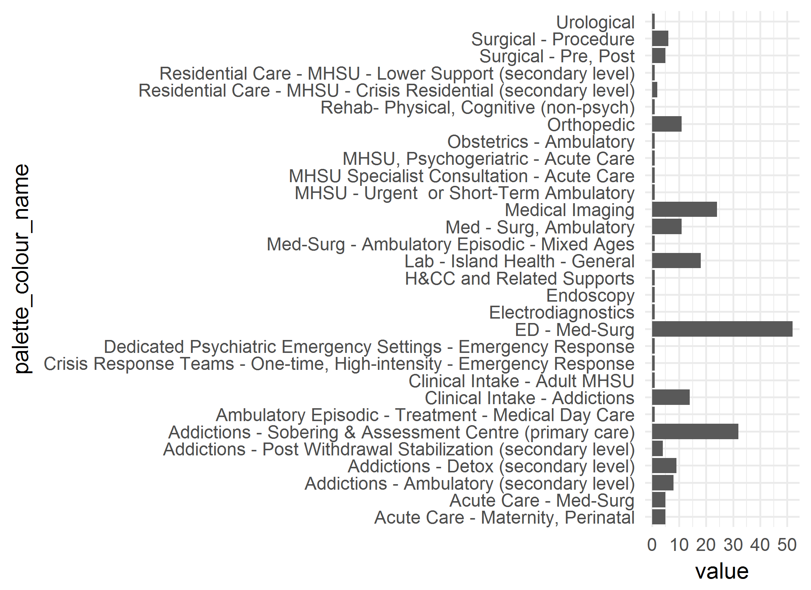

# Lab 2
A.Uthor  
`r Sys.Date()`  

<!-- These two chunks should be added in the beginning of every .Rmd that you want to source an .R script -->
<!--  The 1st mandatory chunck  -->
<!--  Set the working directory to the repository's base directory -->


<!--  The 2nd mandatory chunck  -->
<!-- Set the report-wide options, and point to the external code file. -->


<!-- Load 'sourced' R files.  Suppress the output when loading packages. --> 


<!-- Load the sources.  Suppress the output when loading sources. --> 

# I. Exposition

## Glossary
Review some of the object definition to help you interpret the report. 
<!-- Load any Global functions and variables declared in the R file.  Suppress the output. --> 

```r
# path_input <- "./data-unshared/derived/dto_addictions_4264.rds"
path_input <- "https://raw.githubusercontent.com/IHACRU/ihacru-2017-psy513/master/data-public/derived/dto_addictions_4264.csv"
# define output format for the report
options(
  knitr.table.format = "html"
  ,tibble.width = 110
  #   ,bootstrap_options = c("striped", "hover", "condensed","responsive")
)
```


<!-- Declare any global functions specific to a Rmd output.  Suppress the output. --> 


## Load Data
<!-- Load the datasets.   -->

```r
# ds <- readRDS(path_input)
ds <- readr::read_csv(path_input)
```

<!-- Inspect the datasets.   -->


## Data Tweaks
<!-- Tweak the datasets.   -->

```r
ds %>% 
  dplyr::group_by(id) %>% 
  dplyr::mutate(
    n = length(unique(encounter_id))
  ) %>% 
  dplyr::arrange(desc(n)) %>% 
  dplyr::select(id, n)
```


## Graphs

```r
select_ids <- unique(ds$id)
d <- ds %>% flatten_many(select_ids)

g1 <- d %>% 
  dplyr::filter(metric == "encounters") %>% 
  # ggplot(aes(x=palette_code, y = value)) + 
  ggplot(aes(x=palette_colour_name, y = value)) + 
  geom_bar(stat = "identity")+
  coord_flip()+
  theme_minimal() 
g1
```



```r
# g1 %>% quick_save("plot_1")
```

## Models

```r
dm <- d %>% 
  dplyr::filter(metric == "encounters") %>% 
  dplyr::mutate()

dm %>% glimpse(50)

m1 <- glm(formula = value ~ 1 + gender + age_group + palette_code, data = dm)
library(broom)
broom::glance(m1)
t1 <-broom::tidy(m1)
t1 <- t1 %>% 
  dplyr::mutate(
    term = sub("^palette_code", "", term)
  )
m1 %>% broom::tidy() %>% prettify_table() %>% print()
```


```
Report rendered by koval_000 at 2017-06-15, 15:46 -0400
```

```
R version 3.3.2 (2016-10-31)
Platform: x86_64-w64-mingw32/x64 (64-bit)
Running under: Windows >= 8 x64 (build 9200)

locale:
[1] LC_COLLATE=English_United States.1252  LC_CTYPE=English_United States.1252    LC_MONETARY=English_United States.1252
[4] LC_NUMERIC=C                           LC_TIME=English_United States.1252    

attached base packages:
[1] grid      stats     graphics  grDevices utils     datasets  methods   base     

other attached packages:
 [1] broom_0.4.1        RColorBrewer_1.1-2 dichromat_2.0-0    extrafont_0.17     kableExtra_0.1.0   rmarkdown_1.3     
 [7] knitr_1.15.1       dplyr_0.5.0        magrittr_1.5       ggplot2_2.2.1     

loaded via a namespace (and not attached):
 [1] Rcpp_0.12.9      plyr_1.8.4       tools_3.3.2      digest_0.6.12    evaluate_0.10    tibble_1.2      
 [7] gtable_0.2.0     nlme_3.1-128     lattice_0.20-34  psych_1.6.12     DBI_0.5-1        yaml_2.1.14     
[13] parallel_3.3.2   curl_2.3         Rttf2pt1_1.3.4   stringr_1.1.0    httr_1.2.1       xml2_1.1.1      
[19] htmlwidgets_0.8  rprojroot_1.2    DT_0.2           R6_2.2.0         foreign_0.8-67   reshape2_1.4.2  
[25] readr_1.0.0      tidyr_0.6.1      extrafontdb_1.0  backports_1.0.5  scales_0.4.1     htmltools_0.3.5 
[31] mnormt_1.5-5     assertthat_0.1   testit_0.6       rvest_0.3.2      colorspace_1.3-2 labeling_0.3    
[37] stringi_1.1.2    lazyeval_0.2.0   munsell_0.4.3   
```


