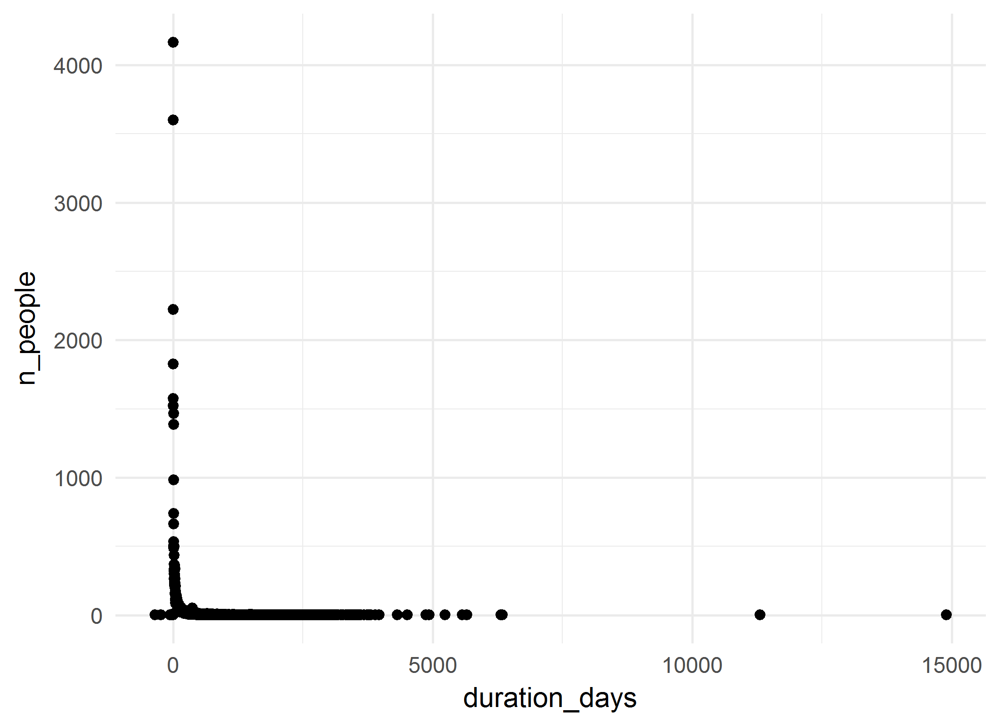
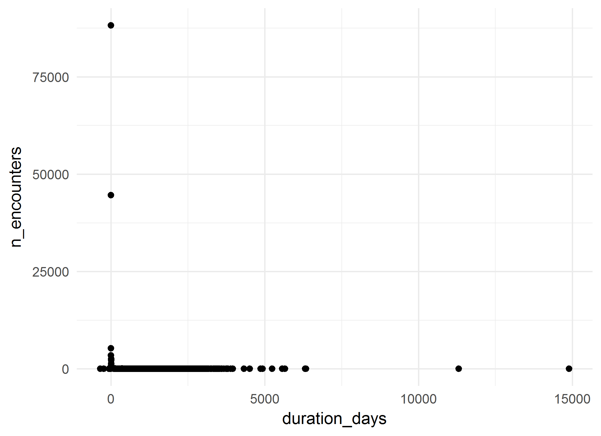
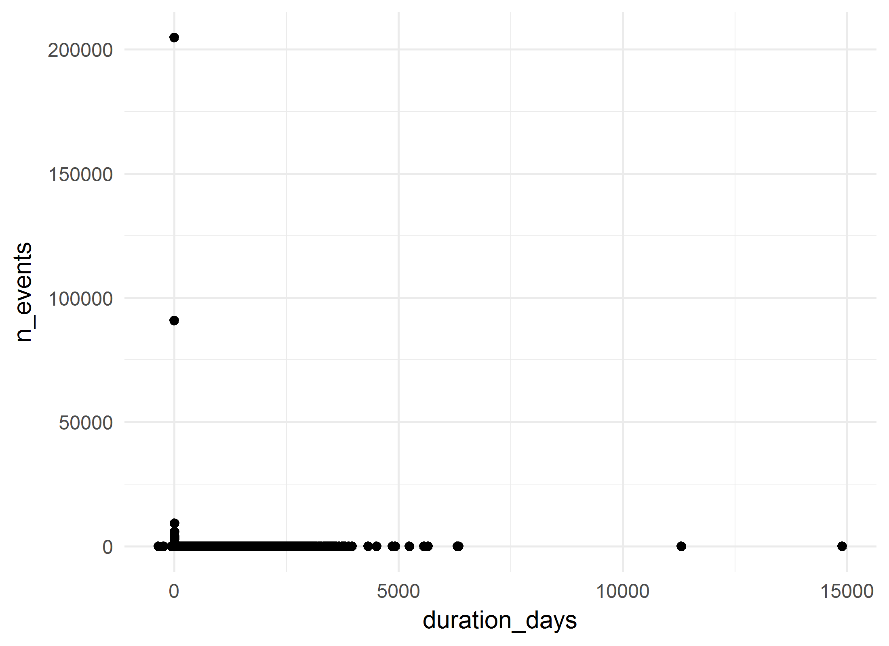

# Addictions-4264 Cohort: Summative analysis
A.Koval & K.Moselle  
`r Sys.Date()`  

<!-- These two chunks should be added in the beginning of every .Rmd that you want to source an .R script -->
<!--  The 1st mandatory chunck  -->
<!--  Set the working directory to the repository's base directory -->


<!--  The 2nd mandatory chunck  -->
<!-- Set the report-wide options, and point to the external code file. -->


<!-- Load 'sourced' R files.  Suppress the output when loading packages. --> 


<!-- Load the sources.  Suppress the output when loading sources. --> 

# I. Exposition

## Glossary
Review some of the object definition to help you interpret the report. 
<!-- Load any Global functions and variables declared in the R file.  Suppress the output. --> 

```r
# dto_location_map.rds is products of `./manipulation/0-ellis-location-map.R` 
path_input_location_map   <- "./data-unshared/derived/dto_location_map.rds" 
path_input_patient_events <-  "./data-unshared/derived/dto_patient_events_addictions_4264.rds" # research cohort
# Make sure the files are located where they supposed to be, in `./data-unshared/` folder
testit::assert("File does not exist", base::file.exists(path_input_location_map))
testit::assert("File does not exist", base::file.exists(path_input_patient_events))
# list variables that constitute patient event table
components_patient_events <- c(
  "id"                           # patient unique key
  ,"gender"                      # biological sex
  ,"age_group"                   # in groups of 5 years
  ,"encounter_id"                # unique identifier for the encounter 
  ,"encounter_class"             # value from the D_Location dimension table in the data warehous
  ,"encounter_type"              # value from the D_Location dimension table in the data warehous
  ,"event_type"                  # high-level classification of the event (encounter itself, diagnosis, procedure, clinical order, laboratory, pharmacy event, etc.).           
  ,"event_title"                 # a shorter, more rolled up category describing the event
  ,"event_detail"                # description of the event, can be long and specific
  ,"event_count"                 # count of the events in the row- each row has a value of 1, and can be summed
  ,"event_year"                  # year in which event occurred 
  ,"event_month"                 # month in which event occured
  ,"event_start_date"            # might be the date of the event itself (e.g. date of diagnosis) or the start date of the encounter that the event is associated with     
  ,"event_end_date"              # might be the end date of the event itself (e.g. end date of prescriptions) or the end date of the encounter that the event is associated with
  ,"start_day"                   # number of days between the first day the patient accessed Island Health services and the start date of this event. This is useful to mask dates, but still provides the relative time between events.
  ,"end_day"                     # number of days between the first day the patient accessed Island Health services and the end date of this event. This is useful to mask dates, but still provides the relative time between events.            
  ,"duration_days"               # number of days between the Start_Day and End_Day (End_Day - Start_Day)
  ,"addiction_location_count"    # patient has accessed services at a location that was used for the selection of the cohort
  ,"location_map_id"             # unique id for VIHA program, connects to location map
  ,"palette_code"                # unique id for colours of this palette
  ,"palette_colour_name"         # labels for clusters of service programs (aka 3T palette colours)
)
# list variables that consitute location map table
components_location_map <- c(
  "location_map_id"              # unique id for VIHA program, connects to patient events
  , "site_name"                  # CERNER address          # EHR address   
  , "facility_name"              # CERNER address          # EHR address   
  , "building_name"              # CERNER address          # EHR address   
  , "unit_name"                  # CERNER address          # EHR address   
  , "location_category"          # Data Warehouse address  # EHR address           
  , "location_type"              # Data Warehouse address  # EHR address           
  , "location_grouping"          # Data Warehouse address  # EHR address            
  , "site_key"                   # Factual counterparts to CERNER address
  , "facility_key"               # Factual counterparts to CERNER address
  , "building_key"               # Factual counterparts to CERNER address
  , "unit_key"                   # Factual counterparts to CERNER address
  , "intensity_type"             # Classifier, Compressor, Lense
  , "intensity_severity_risk"    # Classifier, Compressor, Lense
  , "clinical_focus"             # Classifier, Compressor, Lense
  , "service_type"               # Classifier, Compressor, Lense
  , "service_location"           # Classifier, Compressor, Lense
  , "population_age"             # Classifier, Compressor, Lense
  , "provider_mix"               # Classifier, Compressor, Lense
  , "location_class_code"        # Program Class, identifier
  , "location_class_description" # Porgram Class, Descriptive label
  , "palette_code"               # Palette,  identifier       # cluster specific     
  , "palette_colour_name"        # Palette, descriptive label # cluster specific            
)

# define output format for the report
options(
  knitr.table.format = "html"
  ,tibble.width = 110
  #   ,bootstrap_options = c("striped", "hover", "condensed","responsive")
)
```


<!-- Declare any global functions specific to a Rmd output.  Suppress the output. --> 


## Load Data
<!-- Load the datasets.   -->

```r
ds_patient_events <- readRDS(path_input_patient_events) # %>% as.data.frame()
ds_location_map   <- readRDS(path_input_location_map)

ds_patient_events  %>% glimpse()
ds_location_map %>% glimpse()
```

<!-- Inspect the datasets.   -->


## Data Tweaks
<!-- Tweak the datasets.   -->

```r
# augment the event table with additional columns from location map
ds <- dplyr::left_join(
  ds_patient_events,             # patient event table
  ds_location_map %>%         # location map 
    dplyr::select_(.dots = components_location_map)
  ,by = c("location_map_id","palette_code","palette_colour_name") 
) %>% 
  dplyr::mutate(
    location_class_description_display    = substr(location_class_description,1,42)
    ,palette_colour_name_display = substr(palette_colour_name,1,42)
  )
ds_location_map %>% glimpse()
# from this point on, ds_location_map is needed only for selective reference
ds %>% glimpse()
# ds now contains full coordinates to events of the cohort down to unit level
# ehr_address + location_classifiers + palette_colours
```

# II. Patient Events
The main data set `ds` contains both patient events table and their location map coordinates.

```r
# the data object containing events and location map 
ds %>% glimpse()
```

```
Observations: 354,891
Variables: 43
$ id                                 <chr> "1000082", "1000082", "1000082", "1000082", "1000082", "100008...
$ gender                             <chr> "Male", "Male", "Male", "Male", "Male", "Male", "Male", "Male"...
$ age_group                          <chr> "25 - 29", "25 - 29", "25 - 29", "25 - 29", "25 - 29", "25 - 2...
$ encounter_id                       <int> 21016781, 21053006, 22191344, 22204568, 23849827, 32829187, 32...
$ encounter_class                    <chr> "Emergency", "Inpatient", "Emergency", "Inpatient", "Outpatien...
$ encounter_type                     <chr> "Emergency", "Inpatient Acute", "Emergency", "Inpatient Acute"...
$ event_type                         <chr> "Encounter Only", "Encounter Only", "Encounter Only", "Encount...
$ event_title                        <chr> NA, "Medicine", NA, "Surgery", "Outpatient", NA, "Mental Healt...
$ event_detail                       <chr> NA, "Respiratory", NA, "Thoracic", "Medical Imaging", NA, "Adu...
$ event_count                        <int> 1, 1, 1, 1, 1, 1, 1, 1, 1, 1, 1, 1, 1, 1, 1, 1, 1, 1, 1, 1, 1,...
$ event_year                         <int> 2015, 2015, 2015, 2015, 2015, 2012, 2012, 2013, 2013, 2013, 20...
$ event_month                        <int> 4, 4, 5, 5, 6, 1, 1, 4, 3, 3, 4, 12, 11, 11, 3, 11, 4, 4, 6, 1...
$ event_start_date                   <date> 2015-04-07, 2015-04-07, 2015-05-11, 2015-05-11, 2015-06-18, 2...
$ event_end_date                     <date> 2015-04-07, 2015-04-10, 2015-05-11, 2015-05-16, 2015-06-18, 2...
$ start_day                          <int> 1230, 1230, 1264, 1264, 1302, 50, 52, 498, 469, 470, 505, 19, ...
$ end_day                            <int> 1230, 1233, 1264, 1269, 1302, 51, 55, 505, 476, 470, 508, 25, ...
$ duration_days                      <int> 0, 3, 0, 5, 0, 1, 3, 7, 7, 0, 3, 6, 1, 1, 7, 18, 62, 34, 0, 15...
$ addiction_location_count           <int> 0, 0, 0, 0, 0, 0, 1, 0, 0, 0, 1, 1, 0, 0, 1, 0, 0, 1, 1, 0, 0,...
$ location_map_id                    <int> 934, 984, 1429, 1074, 671, 1429, 2116, 167, 167, 671, 2116, 21...
$ palette_code                       <int> 28, 5, 28, 92, 38, 28, 13, 65, 65, 38, 13, 13, 28, 5, 13, 65, ...
$ palette_colour_name                <chr> "ED - Med-Surg", "Acute Care - Med-Surg", "ED - Med-Surg", "Su...
$ site_name                          <chr> "Victoria General Hospital", "Royal Jubilee Hospital", "Royal ...
$ facility_name                      <chr> "Victoria General - Acute Care", "Royal Jubilee - Acute Care",...
$ building_name                      <chr> "Victoria General - Acute Care", "Royal Jubilee Patient Care C...
$ unit_name                          <chr> "VGH - Emergency", "RJH - 8 North West - General Medicine and ...
$ location_category                  <chr> "Emergency Room", "Inpatient-Acute", "Emergency Room", "Inpati...
$ location_type                      <chr> "ER-General", "InPt-Acute-General", "ER-General", "InPt-Acute-...
$ location_grouping                  <chr> "Emergency-General", "Inpatient-Acute-General", "Emergency-Gen...
$ site_key                           <chr> NA, NA, NA, NA, NA, NA, NA, NA, NA, NA, NA, NA, NA, NA, NA, NA...
$ facility_key                       <chr> "VGHAC", "RJHAC", "RJHAC", "RJHAC", "RJHAC", "RJHAC", "MHSCC",...
$ building_key                       <chr> "VGH-AC", "PCC", "MAIN", "PCC", "MAIN", "MAIN", "EMPM", "DWITH...
$ unit_key                           <chr> "ER-V", "8NWR", "ER-R", "7NER", "Med Img-R", "ER-R", "EM5A", "...
$ intensity_type                     <chr> "ED, Urgent Care, Acute", "ED, Urgent Care, Acute", "ED, Urgen...
$ intensity_severity_risk            <chr> "Emergent-Hospital", "Acute Care", "Emergent-Hospital", "Surgi...
$ clinical_focus                     <chr> "Emergency Response", "Med-Surg", "Emergency Response", "Surgi...
$ service_type                       <chr> "ED-Medical", "Acute Care", "ED-Medical", "Surgical-Post-Acute...
$ service_location                   <chr> "Hospital", "Hospital", "Hospital", "Hospital", "Medical Imagi...
$ population_age                     <chr> "Mixed Ages", "Mixed Ages", "Mixed Ages", "Mixed Ages", "Mixed...
$ provider_mix                       <chr> "Physician, nurse delivered", "Physician directed, nursing del...
$ location_class_code                <int> 78, 66, 78, 142, 148, 78, 24, 35, 35, 148, 24, 24, 78, 66, 24,...
$ location_class_description         <chr> "ED - Med-Surg", "Acute Care - Med-Surg - Mixed Ages", "ED - M...
$ location_class_description_display <chr> "ED - Med-Surg", "Acute Care - Med-Surg - Mixed Ages", "ED - M...
$ palette_colour_name_display        <chr> "ED - Med-Surg", "Acute Care - Med-Surg", "ED - Med-Surg", "Su...
```

```r
# What variables relate to patient event table?
# What variables relate to locations at which events took place?
# How many unique values does each variable/column contain? 
ds %>% select_(.dots=components_patient_events) %>% summarise_all(dplyr::n_distinct) %>% t() 
```

```
                           [,1]
id                         4264
gender                        2
age_group                    18
encounter_id             166076
encounter_class               8
encounter_type               19
event_type                    9
event_title                 317
event_detail               4513
event_count                   1
event_year                   24
event_month                  13
event_start_date           2736
event_end_date             2235
start_day                  5121
end_day                    5185
duration_days              1532
addiction_location_count      2
location_map_id            1282
palette_code                 91
palette_colour_name          91
```

```r
ds %>% select_(.dots=components_location_map) %>% summarise_all(dplyr::n_distinct) %>% t() 
```

```
                           [,1]
location_map_id            1282
site_name                    75
facility_name               131
building_name               272
unit_name                   859
location_category            10
location_type                44
location_grouping            22
site_key                      1
facility_key                111
building_key                236
unit_key                    735
intensity_type               15
intensity_severity_risk      37
clinical_focus               44
service_type                 54
service_location             15
population_age                9
provider_mix                 18
location_class_code         127
location_class_description  127
palette_code                 91
palette_colour_name          91
```

```r
# they share / connected by the fields:
intersect(components_patient_events, components_location_map)
```

```
[1] "location_map_id"     "palette_code"        "palette_colour_name"
```

## Overview

```r
# PET - Patient Event Table
# How many patients are in this cohort?
ds %>% distinct(id) %>% count() %>% neat()
```

<?xml version="1.0" encoding="UTF-8"?>
<table class="table table-striped table-hover table-condensed table-responsive" style="width: auto !important; text-align: right;">
 <thead>
  <tr>
   <th style="text-align:right;"> n </th>
  </tr>
 </thead>
<tbody>
  <tr>
   <td style="text-align:right;"> 4264 </td>
  </tr>
</tbody>
</table>

```r
# What are basic demographics?
ds %>% unique_sums(c("gender")) %>% arrange(desc(n_people)) %>% neat()
```

<?xml version="1.0" encoding="UTF-8"?>
<table class="table table-striped table-hover table-condensed table-responsive" style="width: auto !important; text-align: right;">
 <thead>
  <tr>
   <th style="text-align:left;"> gender </th>
   <th style="text-align:right;"> n_people </th>
   <th style="text-align:right;"> n_encounters </th>
   <th style="text-align:right;"> n_events </th>
  </tr>
 </thead>
<tbody>
  <tr>
   <td style="text-align:left;"> Male </td>
   <td style="text-align:right;"> 2817 </td>
   <td style="text-align:right;"> 113548 </td>
   <td style="text-align:right;"> 230606 </td>
  </tr>
  <tr>
   <td style="text-align:left;"> Female </td>
   <td style="text-align:right;"> 1447 </td>
   <td style="text-align:right;"> 52528 </td>
   <td style="text-align:right;"> 124285 </td>
  </tr>
</tbody>
</table>

```r
ds %>% unique_sums(c("age_group"))  %>%  neat()
```

<?xml version="1.0" encoding="UTF-8"?>
<table class="table table-striped table-hover table-condensed table-responsive" style="width: auto !important; text-align: right;">
 <thead>
  <tr>
   <th style="text-align:left;"> age_group </th>
   <th style="text-align:right;"> n_people </th>
   <th style="text-align:right;"> n_encounters </th>
   <th style="text-align:right;"> n_events </th>
  </tr>
 </thead>
<tbody>
  <tr>
   <td style="text-align:left;"> 05 - 09 </td>
   <td style="text-align:right;"> 3 </td>
   <td style="text-align:right;"> 7 </td>
   <td style="text-align:right;"> 7 </td>
  </tr>
  <tr>
   <td style="text-align:left;"> 10 - 14 </td>
   <td style="text-align:right;"> 20 </td>
   <td style="text-align:right;"> 242 </td>
   <td style="text-align:right;"> 266 </td>
  </tr>
  <tr>
   <td style="text-align:left;"> 15 - 19 </td>
   <td style="text-align:right;"> 246 </td>
   <td style="text-align:right;"> 3151 </td>
   <td style="text-align:right;"> 4784 </td>
  </tr>
  <tr>
   <td style="text-align:left;"> 20 - 24 </td>
   <td style="text-align:right;"> 696 </td>
   <td style="text-align:right;"> 11858 </td>
   <td style="text-align:right;"> 20861 </td>
  </tr>
  <tr>
   <td style="text-align:left;"> 25 - 29 </td>
   <td style="text-align:right;"> 953 </td>
   <td style="text-align:right;"> 16830 </td>
   <td style="text-align:right;"> 31005 </td>
  </tr>
  <tr>
   <td style="text-align:left;"> 30 - 34 </td>
   <td style="text-align:right;"> 1031 </td>
   <td style="text-align:right;"> 20721 </td>
   <td style="text-align:right;"> 41361 </td>
  </tr>
  <tr>
   <td style="text-align:left;"> 35 - 39 </td>
   <td style="text-align:right;"> 944 </td>
   <td style="text-align:right;"> 18975 </td>
   <td style="text-align:right;"> 39459 </td>
  </tr>
  <tr>
   <td style="text-align:left;"> 40 - 44 </td>
   <td style="text-align:right;"> 893 </td>
   <td style="text-align:right;"> 18467 </td>
   <td style="text-align:right;"> 36795 </td>
  </tr>
  <tr>
   <td style="text-align:left;"> 45 - 49 </td>
   <td style="text-align:right;"> 919 </td>
   <td style="text-align:right;"> 21802 </td>
   <td style="text-align:right;"> 44754 </td>
  </tr>
  <tr>
   <td style="text-align:left;"> 50 - 54 </td>
   <td style="text-align:right;"> 843 </td>
   <td style="text-align:right;"> 24865 </td>
   <td style="text-align:right;"> 49807 </td>
  </tr>
  <tr>
   <td style="text-align:left;"> 55 - 59 </td>
   <td style="text-align:right;"> 608 </td>
   <td style="text-align:right;"> 14709 </td>
   <td style="text-align:right;"> 40987 </td>
  </tr>
  <tr>
   <td style="text-align:left;"> 60 - 64 </td>
   <td style="text-align:right;"> 371 </td>
   <td style="text-align:right;"> 8477 </td>
   <td style="text-align:right;"> 24570 </td>
  </tr>
  <tr>
   <td style="text-align:left;"> 65 - 69 </td>
   <td style="text-align:right;"> 163 </td>
   <td style="text-align:right;"> 3592 </td>
   <td style="text-align:right;"> 13010 </td>
  </tr>
  <tr>
   <td style="text-align:left;"> 70 - 74 </td>
   <td style="text-align:right;"> 60 </td>
   <td style="text-align:right;"> 1516 </td>
   <td style="text-align:right;"> 4417 </td>
  </tr>
  <tr>
   <td style="text-align:left;"> 75 - 79 </td>
   <td style="text-align:right;"> 24 </td>
   <td style="text-align:right;"> 601 </td>
   <td style="text-align:right;"> 2236 </td>
  </tr>
  <tr>
   <td style="text-align:left;"> 80 - 84 </td>
   <td style="text-align:right;"> 10 </td>
   <td style="text-align:right;"> 241 </td>
   <td style="text-align:right;"> 522 </td>
  </tr>
  <tr>
   <td style="text-align:left;"> 85 - 89 </td>
   <td style="text-align:right;"> 1 </td>
   <td style="text-align:right;"> 5 </td>
   <td style="text-align:right;"> 33 </td>
  </tr>
  <tr>
   <td style="text-align:left;"> No value </td>
   <td style="text-align:right;"> 16 </td>
   <td style="text-align:right;"> 17 </td>
   <td style="text-align:right;"> 17 </td>
  </tr>
</tbody>
</table>

```r
ds %>% unique_sums(c("gender","age_group")) %>%  neat()
```

<?xml version="1.0" encoding="UTF-8"?>
<table class="table table-striped table-hover table-condensed table-responsive" style="width: auto !important; text-align: right;">
 <thead>
  <tr>
   <th style="text-align:left;"> gender </th>
   <th style="text-align:left;"> age_group </th>
   <th style="text-align:right;"> n_people </th>
   <th style="text-align:right;"> n_encounters </th>
   <th style="text-align:right;"> n_events </th>
  </tr>
 </thead>
<tbody>
  <tr>
   <td style="text-align:left;"> Female </td>
   <td style="text-align:left;"> 05 - 09 </td>
   <td style="text-align:right;"> 1 </td>
   <td style="text-align:right;"> 1 </td>
   <td style="text-align:right;"> 1 </td>
  </tr>
  <tr>
   <td style="text-align:left;"> Female </td>
   <td style="text-align:left;"> 10 - 14 </td>
   <td style="text-align:right;"> 9 </td>
   <td style="text-align:right;"> 213 </td>
   <td style="text-align:right;"> 213 </td>
  </tr>
  <tr>
   <td style="text-align:left;"> Female </td>
   <td style="text-align:left;"> 15 - 19 </td>
   <td style="text-align:right;"> 108 </td>
   <td style="text-align:right;"> 1663 </td>
   <td style="text-align:right;"> 2824 </td>
  </tr>
  <tr>
   <td style="text-align:left;"> Female </td>
   <td style="text-align:left;"> 20 - 24 </td>
   <td style="text-align:right;"> 314 </td>
   <td style="text-align:right;"> 5892 </td>
   <td style="text-align:right;"> 10379 </td>
  </tr>
  <tr>
   <td style="text-align:left;"> Female </td>
   <td style="text-align:left;"> 25 - 29 </td>
   <td style="text-align:right;"> 404 </td>
   <td style="text-align:right;"> 6747 </td>
   <td style="text-align:right;"> 14667 </td>
  </tr>
  <tr>
   <td style="text-align:left;"> Female </td>
   <td style="text-align:left;"> 30 - 34 </td>
   <td style="text-align:right;"> 393 </td>
   <td style="text-align:right;"> 7694 </td>
   <td style="text-align:right;"> 16294 </td>
  </tr>
  <tr>
   <td style="text-align:left;"> Female </td>
   <td style="text-align:left;"> 35 - 39 </td>
   <td style="text-align:right;"> 336 </td>
   <td style="text-align:right;"> 6040 </td>
   <td style="text-align:right;"> 14351 </td>
  </tr>
  <tr>
   <td style="text-align:left;"> Female </td>
   <td style="text-align:left;"> 40 - 44 </td>
   <td style="text-align:right;"> 278 </td>
   <td style="text-align:right;"> 5905 </td>
   <td style="text-align:right;"> 12068 </td>
  </tr>
  <tr>
   <td style="text-align:left;"> Female </td>
   <td style="text-align:left;"> 45 - 49 </td>
   <td style="text-align:right;"> 277 </td>
   <td style="text-align:right;"> 5497 </td>
   <td style="text-align:right;"> 14126 </td>
  </tr>
  <tr>
   <td style="text-align:left;"> Female </td>
   <td style="text-align:left;"> 50 - 54 </td>
   <td style="text-align:right;"> 250 </td>
   <td style="text-align:right;"> 6020 </td>
   <td style="text-align:right;"> 14672 </td>
  </tr>
  <tr>
   <td style="text-align:left;"> Female </td>
   <td style="text-align:left;"> 55 - 59 </td>
   <td style="text-align:right;"> 190 </td>
   <td style="text-align:right;"> 3568 </td>
   <td style="text-align:right;"> 12544 </td>
  </tr>
  <tr>
   <td style="text-align:left;"> Female </td>
   <td style="text-align:left;"> 60 - 64 </td>
   <td style="text-align:right;"> 102 </td>
   <td style="text-align:right;"> 1910 </td>
   <td style="text-align:right;"> 7181 </td>
  </tr>
  <tr>
   <td style="text-align:left;"> Female </td>
   <td style="text-align:left;"> 65 - 69 </td>
   <td style="text-align:right;"> 43 </td>
   <td style="text-align:right;"> 829 </td>
   <td style="text-align:right;"> 2639 </td>
  </tr>
  <tr>
   <td style="text-align:left;"> Female </td>
   <td style="text-align:left;"> 70 - 74 </td>
   <td style="text-align:right;"> 14 </td>
   <td style="text-align:right;"> 280 </td>
   <td style="text-align:right;"> 979 </td>
  </tr>
  <tr>
   <td style="text-align:left;"> Female </td>
   <td style="text-align:left;"> 75 - 79 </td>
   <td style="text-align:right;"> 8 </td>
   <td style="text-align:right;"> 151 </td>
   <td style="text-align:right;"> 1084 </td>
  </tr>
  <tr>
   <td style="text-align:left;"> Female </td>
   <td style="text-align:left;"> 80 - 84 </td>
   <td style="text-align:right;"> 3 </td>
   <td style="text-align:right;"> 101 </td>
   <td style="text-align:right;"> 218 </td>
  </tr>
  <tr>
   <td style="text-align:left;"> Female </td>
   <td style="text-align:left;"> 85 - 89 </td>
   <td style="text-align:right;"> 1 </td>
   <td style="text-align:right;"> 5 </td>
   <td style="text-align:right;"> 33 </td>
  </tr>
  <tr>
   <td style="text-align:left;"> Female </td>
   <td style="text-align:left;"> No value </td>
   <td style="text-align:right;"> 11 </td>
   <td style="text-align:right;"> 12 </td>
   <td style="text-align:right;"> 12 </td>
  </tr>
  <tr>
   <td style="text-align:left;"> Male </td>
   <td style="text-align:left;"> 05 - 09 </td>
   <td style="text-align:right;"> 2 </td>
   <td style="text-align:right;"> 6 </td>
   <td style="text-align:right;"> 6 </td>
  </tr>
  <tr>
   <td style="text-align:left;"> Male </td>
   <td style="text-align:left;"> 10 - 14 </td>
   <td style="text-align:right;"> 11 </td>
   <td style="text-align:right;"> 29 </td>
   <td style="text-align:right;"> 53 </td>
  </tr>
  <tr>
   <td style="text-align:left;"> Male </td>
   <td style="text-align:left;"> 15 - 19 </td>
   <td style="text-align:right;"> 138 </td>
   <td style="text-align:right;"> 1488 </td>
   <td style="text-align:right;"> 1960 </td>
  </tr>
  <tr>
   <td style="text-align:left;"> Male </td>
   <td style="text-align:left;"> 20 - 24 </td>
   <td style="text-align:right;"> 382 </td>
   <td style="text-align:right;"> 5966 </td>
   <td style="text-align:right;"> 10482 </td>
  </tr>
  <tr>
   <td style="text-align:left;"> Male </td>
   <td style="text-align:left;"> 25 - 29 </td>
   <td style="text-align:right;"> 549 </td>
   <td style="text-align:right;"> 10083 </td>
   <td style="text-align:right;"> 16338 </td>
  </tr>
  <tr>
   <td style="text-align:left;"> Male </td>
   <td style="text-align:left;"> 30 - 34 </td>
   <td style="text-align:right;"> 638 </td>
   <td style="text-align:right;"> 13027 </td>
   <td style="text-align:right;"> 25067 </td>
  </tr>
  <tr>
   <td style="text-align:left;"> Male </td>
   <td style="text-align:left;"> 35 - 39 </td>
   <td style="text-align:right;"> 608 </td>
   <td style="text-align:right;"> 12935 </td>
   <td style="text-align:right;"> 25108 </td>
  </tr>
  <tr>
   <td style="text-align:left;"> Male </td>
   <td style="text-align:left;"> 40 - 44 </td>
   <td style="text-align:right;"> 615 </td>
   <td style="text-align:right;"> 12562 </td>
   <td style="text-align:right;"> 24727 </td>
  </tr>
  <tr>
   <td style="text-align:left;"> Male </td>
   <td style="text-align:left;"> 45 - 49 </td>
   <td style="text-align:right;"> 642 </td>
   <td style="text-align:right;"> 16305 </td>
   <td style="text-align:right;"> 30628 </td>
  </tr>
  <tr>
   <td style="text-align:left;"> Male </td>
   <td style="text-align:left;"> 50 - 54 </td>
   <td style="text-align:right;"> 593 </td>
   <td style="text-align:right;"> 18845 </td>
   <td style="text-align:right;"> 35135 </td>
  </tr>
  <tr>
   <td style="text-align:left;"> Male </td>
   <td style="text-align:left;"> 55 - 59 </td>
   <td style="text-align:right;"> 418 </td>
   <td style="text-align:right;"> 11141 </td>
   <td style="text-align:right;"> 28443 </td>
  </tr>
  <tr>
   <td style="text-align:left;"> Male </td>
   <td style="text-align:left;"> 60 - 64 </td>
   <td style="text-align:right;"> 269 </td>
   <td style="text-align:right;"> 6567 </td>
   <td style="text-align:right;"> 17389 </td>
  </tr>
  <tr>
   <td style="text-align:left;"> Male </td>
   <td style="text-align:left;"> 65 - 69 </td>
   <td style="text-align:right;"> 120 </td>
   <td style="text-align:right;"> 2763 </td>
   <td style="text-align:right;"> 10371 </td>
  </tr>
  <tr>
   <td style="text-align:left;"> Male </td>
   <td style="text-align:left;"> 70 - 74 </td>
   <td style="text-align:right;"> 46 </td>
   <td style="text-align:right;"> 1236 </td>
   <td style="text-align:right;"> 3438 </td>
  </tr>
  <tr>
   <td style="text-align:left;"> Male </td>
   <td style="text-align:left;"> 75 - 79 </td>
   <td style="text-align:right;"> 16 </td>
   <td style="text-align:right;"> 450 </td>
   <td style="text-align:right;"> 1152 </td>
  </tr>
  <tr>
   <td style="text-align:left;"> Male </td>
   <td style="text-align:left;"> 80 - 84 </td>
   <td style="text-align:right;"> 7 </td>
   <td style="text-align:right;"> 140 </td>
   <td style="text-align:right;"> 304 </td>
  </tr>
  <tr>
   <td style="text-align:left;"> Male </td>
   <td style="text-align:left;"> No value </td>
   <td style="text-align:right;"> 5 </td>
   <td style="text-align:right;"> 5 </td>
   <td style="text-align:right;"> 5 </td>
  </tr>
</tbody>
</table>

## DW tags

```r
# how may unique encounters are there in this set?
ds %>% distinct(encounter_id) %>% count() %>% neat()
```

<?xml version="1.0" encoding="UTF-8"?>
<table class="table table-striped table-hover table-condensed table-responsive" style="width: auto !important; text-align: right;">
 <thead>
  <tr>
   <th style="text-align:right;"> n </th>
  </tr>
 </thead>
<tbody>
  <tr>
   <td style="text-align:right;"> 166076 </td>
  </tr>
</tbody>
</table>

```r
# tally engagement across encounter classes (as defined by data warehouse)
ds %>% unique_sums("encounter_class")%>% arrange(desc(n_people)) %>% neat()
```

<?xml version="1.0" encoding="UTF-8"?>
<table class="table table-striped table-hover table-condensed table-responsive" style="width: auto !important; text-align: right;">
 <thead>
  <tr>
   <th style="text-align:left;"> encounter_class </th>
   <th style="text-align:right;"> n_people </th>
   <th style="text-align:right;"> n_encounters </th>
   <th style="text-align:right;"> n_events </th>
  </tr>
 </thead>
<tbody>
  <tr>
   <td style="text-align:left;"> Inpatient </td>
   <td style="text-align:right;"> 4240 </td>
   <td style="text-align:right;"> 60056 </td>
   <td style="text-align:right;"> 169727 </td>
  </tr>
  <tr>
   <td style="text-align:left;"> Emergency </td>
   <td style="text-align:right;"> 3826 </td>
   <td style="text-align:right;"> 47369 </td>
   <td style="text-align:right;"> 98776 </td>
  </tr>
  <tr>
   <td style="text-align:left;"> Recurring </td>
   <td style="text-align:right;"> 3708 </td>
   <td style="text-align:right;"> 23340 </td>
   <td style="text-align:right;"> 27987 </td>
  </tr>
  <tr>
   <td style="text-align:left;"> Outpatient </td>
   <td style="text-align:right;"> 3518 </td>
   <td style="text-align:right;"> 26222 </td>
   <td style="text-align:right;"> 38051 </td>
  </tr>
  <tr>
   <td style="text-align:left;"> Other </td>
   <td style="text-align:right;"> 1906 </td>
   <td style="text-align:right;"> 8131 </td>
   <td style="text-align:right;"> 19184 </td>
  </tr>
  <tr>
   <td style="text-align:left;"> Home Care </td>
   <td style="text-align:right;"> 555 </td>
   <td style="text-align:right;"> 921 </td>
   <td style="text-align:right;"> 1129 </td>
  </tr>
  <tr>
   <td style="text-align:left;"> Cancelled Admission </td>
   <td style="text-align:right;"> 33 </td>
   <td style="text-align:right;"> 35 </td>
   <td style="text-align:right;"> 35 </td>
  </tr>
  <tr>
   <td style="text-align:left;"> Not defined </td>
   <td style="text-align:right;"> 2 </td>
   <td style="text-align:right;"> 2 </td>
   <td style="text-align:right;"> 2 </td>
  </tr>
</tbody>
</table>

```r
ds %>% unique_sums("encounter_type") %>% arrange(desc(n_people)) %>% neat()
```

<?xml version="1.0" encoding="UTF-8"?>
<table class="table table-striped table-hover table-condensed table-responsive" style="width: auto !important; text-align: right;">
 <thead>
  <tr>
   <th style="text-align:left;"> encounter_type </th>
   <th style="text-align:right;"> n_people </th>
   <th style="text-align:right;"> n_encounters </th>
   <th style="text-align:right;"> n_events </th>
  </tr>
 </thead>
<tbody>
  <tr>
   <td style="text-align:left;"> Emergency </td>
   <td style="text-align:right;"> 3826 </td>
   <td style="text-align:right;"> 47369 </td>
   <td style="text-align:right;"> 98776 </td>
  </tr>
  <tr>
   <td style="text-align:left;"> Open Encounter </td>
   <td style="text-align:right;"> 3689 </td>
   <td style="text-align:right;"> 22930 </td>
   <td style="text-align:right;"> 27182 </td>
  </tr>
  <tr>
   <td style="text-align:left;"> Ambulatory </td>
   <td style="text-align:right;"> 3486 </td>
   <td style="text-align:right;"> 24611 </td>
   <td style="text-align:right;"> 35969 </td>
  </tr>
  <tr>
   <td style="text-align:left;"> MHAS - Acute Care </td>
   <td style="text-align:right;"> 3203 </td>
   <td style="text-align:right;"> 36263 </td>
   <td style="text-align:right;"> 39367 </td>
  </tr>
  <tr>
   <td style="text-align:left;"> Inpatient Acute </td>
   <td style="text-align:right;"> 2394 </td>
   <td style="text-align:right;"> 8083 </td>
   <td style="text-align:right;"> 106170 </td>
  </tr>
  <tr>
   <td style="text-align:left;"> MHAS - Residential </td>
   <td style="text-align:right;"> 2230 </td>
   <td style="text-align:right;"> 15619 </td>
   <td style="text-align:right;"> 23882 </td>
  </tr>
  <tr>
   <td style="text-align:left;"> Specimen </td>
   <td style="text-align:right;"> 1816 </td>
   <td style="text-align:right;"> 7837 </td>
   <td style="text-align:right;"> 18888 </td>
  </tr>
  <tr>
   <td style="text-align:left;"> Day Care </td>
   <td style="text-align:right;"> 1006 </td>
   <td style="text-align:right;"> 1603 </td>
   <td style="text-align:right;"> 2074 </td>
  </tr>
  <tr>
   <td style="text-align:left;"> Home Care </td>
   <td style="text-align:right;"> 555 </td>
   <td style="text-align:right;"> 921 </td>
   <td style="text-align:right;"> 1129 </td>
  </tr>
  <tr>
   <td style="text-align:left;"> Recurring/Series </td>
   <td style="text-align:right;"> 327 </td>
   <td style="text-align:right;"> 410 </td>
   <td style="text-align:right;"> 805 </td>
  </tr>
  <tr>
   <td style="text-align:left;"> Morgue </td>
   <td style="text-align:right;"> 241 </td>
   <td style="text-align:right;"> 258 </td>
   <td style="text-align:right;"> 260 </td>
  </tr>
  <tr>
   <td style="text-align:left;"> Residential Care </td>
   <td style="text-align:right;"> 55 </td>
   <td style="text-align:right;"> 85 </td>
   <td style="text-align:right;"> 302 </td>
  </tr>
  <tr>
   <td style="text-align:left;"> Cancelled Admission </td>
   <td style="text-align:right;"> 33 </td>
   <td style="text-align:right;"> 35 </td>
   <td style="text-align:right;"> 35 </td>
  </tr>
  <tr>
   <td style="text-align:left;"> Research </td>
   <td style="text-align:right;"> 14 </td>
   <td style="text-align:right;"> 21 </td>
   <td style="text-align:right;"> 21 </td>
  </tr>
  <tr>
   <td style="text-align:left;"> Waitlist </td>
   <td style="text-align:right;"> 14 </td>
   <td style="text-align:right;"> 15 </td>
   <td style="text-align:right;"> 15 </td>
  </tr>
  <tr>
   <td style="text-align:left;"> Not defined </td>
   <td style="text-align:right;"> 2 </td>
   <td style="text-align:right;"> 2 </td>
   <td style="text-align:right;"> 2 </td>
  </tr>
  <tr>
   <td style="text-align:left;"> Phone Consult </td>
   <td style="text-align:right;"> 2 </td>
   <td style="text-align:right;"> 8 </td>
   <td style="text-align:right;"> 8 </td>
  </tr>
  <tr>
   <td style="text-align:left;"> Lifetime </td>
   <td style="text-align:right;"> 1 </td>
   <td style="text-align:right;"> 1 </td>
   <td style="text-align:right;"> 1 </td>
  </tr>
  <tr>
   <td style="text-align:left;"> Newborn </td>
   <td style="text-align:right;"> 1 </td>
   <td style="text-align:right;"> 5 </td>
   <td style="text-align:right;"> 5 </td>
  </tr>
</tbody>
</table>

```r
ds %>% unique_sums(c("encounter_class","encounter_type"))%>% arrange(desc(encounter_class,n_people)) %>% neat()
```

<?xml version="1.0" encoding="UTF-8"?>
<table class="table table-striped table-hover table-condensed table-responsive" style="width: auto !important; text-align: right;">
 <thead>
  <tr>
   <th style="text-align:left;"> encounter_class </th>
   <th style="text-align:left;"> encounter_type </th>
   <th style="text-align:right;"> n_people </th>
   <th style="text-align:right;"> n_encounters </th>
   <th style="text-align:right;"> n_events </th>
  </tr>
 </thead>
<tbody>
  <tr>
   <td style="text-align:left;"> Recurring </td>
   <td style="text-align:left;"> Open Encounter </td>
   <td style="text-align:right;"> 3689 </td>
   <td style="text-align:right;"> 22930 </td>
   <td style="text-align:right;"> 27182 </td>
  </tr>
  <tr>
   <td style="text-align:left;"> Recurring </td>
   <td style="text-align:left;"> Recurring/Series </td>
   <td style="text-align:right;"> 327 </td>
   <td style="text-align:right;"> 410 </td>
   <td style="text-align:right;"> 805 </td>
  </tr>
  <tr>
   <td style="text-align:left;"> Outpatient </td>
   <td style="text-align:left;"> Ambulatory </td>
   <td style="text-align:right;"> 3486 </td>
   <td style="text-align:right;"> 24611 </td>
   <td style="text-align:right;"> 35969 </td>
  </tr>
  <tr>
   <td style="text-align:left;"> Outpatient </td>
   <td style="text-align:left;"> Day Care </td>
   <td style="text-align:right;"> 1006 </td>
   <td style="text-align:right;"> 1603 </td>
   <td style="text-align:right;"> 2074 </td>
  </tr>
  <tr>
   <td style="text-align:left;"> Outpatient </td>
   <td style="text-align:left;"> Phone Consult </td>
   <td style="text-align:right;"> 2 </td>
   <td style="text-align:right;"> 8 </td>
   <td style="text-align:right;"> 8 </td>
  </tr>
  <tr>
   <td style="text-align:left;"> Other </td>
   <td style="text-align:left;"> Morgue </td>
   <td style="text-align:right;"> 241 </td>
   <td style="text-align:right;"> 258 </td>
   <td style="text-align:right;"> 260 </td>
  </tr>
  <tr>
   <td style="text-align:left;"> Other </td>
   <td style="text-align:left;"> Research </td>
   <td style="text-align:right;"> 14 </td>
   <td style="text-align:right;"> 21 </td>
   <td style="text-align:right;"> 21 </td>
  </tr>
  <tr>
   <td style="text-align:left;"> Other </td>
   <td style="text-align:left;"> Specimen </td>
   <td style="text-align:right;"> 1816 </td>
   <td style="text-align:right;"> 7837 </td>
   <td style="text-align:right;"> 18888 </td>
  </tr>
  <tr>
   <td style="text-align:left;"> Other </td>
   <td style="text-align:left;"> Waitlist </td>
   <td style="text-align:right;"> 14 </td>
   <td style="text-align:right;"> 15 </td>
   <td style="text-align:right;"> 15 </td>
  </tr>
  <tr>
   <td style="text-align:left;"> Not defined </td>
   <td style="text-align:left;"> Not defined </td>
   <td style="text-align:right;"> 2 </td>
   <td style="text-align:right;"> 2 </td>
   <td style="text-align:right;"> 2 </td>
  </tr>
  <tr>
   <td style="text-align:left;"> Inpatient </td>
   <td style="text-align:left;"> Inpatient Acute </td>
   <td style="text-align:right;"> 2394 </td>
   <td style="text-align:right;"> 8083 </td>
   <td style="text-align:right;"> 106170 </td>
  </tr>
  <tr>
   <td style="text-align:left;"> Inpatient </td>
   <td style="text-align:left;"> Lifetime </td>
   <td style="text-align:right;"> 1 </td>
   <td style="text-align:right;"> 1 </td>
   <td style="text-align:right;"> 1 </td>
  </tr>
  <tr>
   <td style="text-align:left;"> Inpatient </td>
   <td style="text-align:left;"> MHAS - Acute Care </td>
   <td style="text-align:right;"> 3203 </td>
   <td style="text-align:right;"> 36263 </td>
   <td style="text-align:right;"> 39367 </td>
  </tr>
  <tr>
   <td style="text-align:left;"> Inpatient </td>
   <td style="text-align:left;"> MHAS - Residential </td>
   <td style="text-align:right;"> 2230 </td>
   <td style="text-align:right;"> 15619 </td>
   <td style="text-align:right;"> 23882 </td>
  </tr>
  <tr>
   <td style="text-align:left;"> Inpatient </td>
   <td style="text-align:left;"> Newborn </td>
   <td style="text-align:right;"> 1 </td>
   <td style="text-align:right;"> 5 </td>
   <td style="text-align:right;"> 5 </td>
  </tr>
  <tr>
   <td style="text-align:left;"> Inpatient </td>
   <td style="text-align:left;"> Residential Care </td>
   <td style="text-align:right;"> 55 </td>
   <td style="text-align:right;"> 85 </td>
   <td style="text-align:right;"> 302 </td>
  </tr>
  <tr>
   <td style="text-align:left;"> Home Care </td>
   <td style="text-align:left;"> Home Care </td>
   <td style="text-align:right;"> 555 </td>
   <td style="text-align:right;"> 921 </td>
   <td style="text-align:right;"> 1129 </td>
  </tr>
  <tr>
   <td style="text-align:left;"> Emergency </td>
   <td style="text-align:left;"> Emergency </td>
   <td style="text-align:right;"> 3826 </td>
   <td style="text-align:right;"> 47369 </td>
   <td style="text-align:right;"> 98776 </td>
  </tr>
  <tr>
   <td style="text-align:left;"> Cancelled Admission </td>
   <td style="text-align:left;"> Cancelled Admission </td>
   <td style="text-align:right;"> 33 </td>
   <td style="text-align:right;"> 35 </td>
   <td style="text-align:right;"> 35 </td>
  </tr>
</tbody>
</table>

## ACRU tags

```r
# how many event types  were there?
ds %>% unique_sums("event_type") %>% arrange(desc(n_people)) %>% neat()
```

<?xml version="1.0" encoding="UTF-8"?>
<table class="table table-striped table-hover table-condensed table-responsive" style="width: auto !important; text-align: right;">
 <thead>
  <tr>
   <th style="text-align:left;"> event_type </th>
   <th style="text-align:right;"> n_people </th>
   <th style="text-align:right;"> n_encounters </th>
   <th style="text-align:right;"> n_events </th>
  </tr>
 </thead>
<tbody>
  <tr>
   <td style="text-align:left;"> Encounter Only </td>
   <td style="text-align:right;"> 4264 </td>
   <td style="text-align:right;"> 152947 </td>
   <td style="text-align:right;"> 152947 </td>
  </tr>
  <tr>
   <td style="text-align:left;"> General Lab </td>
   <td style="text-align:right;"> 2179 </td>
   <td style="text-align:right;"> 8284 </td>
   <td style="text-align:right;"> 164179 </td>
  </tr>
  <tr>
   <td style="text-align:left;"> Radiology </td>
   <td style="text-align:right;"> 2163 </td>
   <td style="text-align:right;"> 6567 </td>
   <td style="text-align:right;"> 11422 </td>
  </tr>
  <tr>
   <td style="text-align:left;"> Micro </td>
   <td style="text-align:right;"> 899 </td>
   <td style="text-align:right;"> 1653 </td>
   <td style="text-align:right;"> 3077 </td>
  </tr>
  <tr>
   <td style="text-align:left;"> Diagnosis </td>
   <td style="text-align:right;"> 472 </td>
   <td style="text-align:right;"> 636 </td>
   <td style="text-align:right;"> 1740 </td>
  </tr>
  <tr>
   <td style="text-align:left;"> Pharmacy </td>
   <td style="text-align:right;"> 463 </td>
   <td style="text-align:right;"> 615 </td>
   <td style="text-align:right;"> 18993 </td>
  </tr>
  <tr>
   <td style="text-align:left;"> Evaluation and Management </td>
   <td style="text-align:right;"> 375 </td>
   <td style="text-align:right;"> 504 </td>
   <td style="text-align:right;"> 2092 </td>
  </tr>
  <tr>
   <td style="text-align:left;"> Surgery </td>
   <td style="text-align:right;"> 143 </td>
   <td style="text-align:right;"> 178 </td>
   <td style="text-align:right;"> 228 </td>
  </tr>
  <tr>
   <td style="text-align:left;"> Procedure </td>
   <td style="text-align:right;"> 106 </td>
   <td style="text-align:right;"> 116 </td>
   <td style="text-align:right;"> 213 </td>
  </tr>
</tbody>
</table>

```r
# view event_title and event_details with a dynmaic table 
ds %>% unique_sums(c("event_type","event_title","event_detail"))%>% arrange(desc(n_people)) %>% neat_DT()
```

<!--html_preserve--><div id="htmlwidget-e048400095ac7e51b2da" style="width:100%;height:auto;" class="datatables html-widget"></div>
<script type="application/json" data-for="htmlwidget-e048400095ac7e51b2da">{"x":{"filter":"top","filterHTML":"<tr>\n  <td><\/td>\n  <td data-type=\"character\" style=\"vertical-align: top;\">\n    <div class=\"form-group has-feedback\" style=\"margin-bottom: auto;\">\n      <input type=\"search\" placeholder=\"All\" class=\"form-control\" style=\"width: 100%;\"/>\n      <span class=\"glyphicon glyphicon-remove-circle form-control-feedback\"><\/span>\n    <\/div>\n  <\/td>\n  <td data-type=\"character\" style=\"vertical-align: top;\">\n    <div class=\"form-group has-feedback\" style=\"margin-bottom: auto;\">\n      <input type=\"search\" placeholder=\"All\" class=\"form-control\" style=\"width: 100%;\"/>\n      <span class=\"glyphicon glyphicon-remove-circle form-control-feedback\"><\/span>\n    <\/div>\n  <\/td>\n  <td data-type=\"character\" style=\"vertical-align: top;\">\n    <div class=\"form-group has-feedback\" style=\"margin-bottom: auto;\">\n      <input type=\"search\" placeholder=\"All\" class=\"form-control\" style=\"width: 100%;\"/>\n      <span class=\"glyphicon glyphicon-remove-circle form-control-feedback\"><\/span>\n    <\/div>\n  <\/td>\n  <td data-type=\"integer\" style=\"vertical-align: top;\">\n    <div class=\"form-group has-feedback\" style=\"margin-bottom: auto;\">\n      <input type=\"search\" placeholder=\"All\" class=\"form-control\" style=\"width: 100%;\"/>\n      <span class=\"glyphicon glyphicon-remove-circle form-control-feedback\"><\/span>\n    <\/div>\n    <div style=\"display: none; position: absolute; width: 200px;\">\n      <div data-min=\"1\" data-max=\"4259\"><\/div>\n      <span style=\"float: left;\"><\/span>\n      <span style=\"float: right;\"><\/span>\n    <\/div>\n  <\/td>\n  <td data-type=\"integer\" style=\"vertical-align: top;\">\n    <div class=\"form-group has-feedback\" style=\"margin-bottom: auto;\">\n      <input type=\"search\" placeholder=\"All\" class=\"form-control\" style=\"width: 100%;\"/>\n      <span class=\"glyphicon glyphicon-remove-circle form-control-feedback\"><\/span>\n    <\/div>\n    <div style=\"display: none; position: absolute; width: 200px;\">\n      <div data-min=\"1\" data-max=\"77368\"><\/div>\n      <span style=\"float: left;\"><\/span>\n      <span style=\"float: right;\"><\/span>\n    <\/div>\n  <\/td>\n  <td data-type=\"integer\" style=\"vertical-align: top;\">\n    <div class=\"form-group has-feedback\" style=\"margin-bottom: auto;\">\n      <input type=\"search\" placeholder=\"All\" class=\"form-control\" style=\"width: 100%;\"/>\n      <span class=\"glyphicon glyphicon-remove-circle form-control-feedback\"><\/span>\n    <\/div>\n    <div style=\"display: none; position: absolute; width: 200px;\">\n      <div data-min=\"1\" data-max=\"77368\"><\/div>\n      <span style=\"float: left;\"><\/span>\n      <span style=\"float: right;\"><\/span>\n    <\/div>\n  <\/td>\n<\/tr>","data":[["1","2","3","4","5","6","7","8","9","10","11","12","13","14","15","16","17","18","19","20","21","22","23","24","25","26","27","28","29","30","31","32","33","34","35","36","37","38","39","40","41","42","43","44","45","46","47","48","49","50","51","52","53","54","55","56","57","58","59","60","61","62","63","64","65","66","67","68","69","70","71","72","73","74","75","76","77","78","79","80","81","82","83","84","85","86","87","88","89","90","91","92","93","94","95","96","97","98","99","100","101","102","103","104","105","106","107","108","109","110","111","112","113","114","115","116","117","118","119","120","121","122","123","124","125","126","127","128","129","130","131","132","133","134","135","136","137","138","139","140","141","142","143","144","145","146","147","148","149","150","151","152","153","154","155","156","157","158","159","160","161","162","163","164","165","166","167","168","169","170","171","172","173","174","175","176","177","178","179","180","181","182","183","184","185","186","187","188","189","190","191","192","193","194","195","196","197","198","199","200","201","202","203","204","205","206","207","208","209","210","211","212","213","214","215","216","217","218","219","220","221","222","223","224","225","226","227","228","229","230","231","232","233","234","235","236","237","238","239","240","241","242","243","244","245","246","247","248","249","250","251","252","253","254","255","256","257","258","259","260","261","262","263","264","265","266","267","268","269","270","271","272","273","274","275","276","277","278","279","280","281","282","283","284","285","286","287","288","289","290","291","292","293","294","295","296","297","298","299","300","301","302","303","304","305","306","307","308","309","310","311","312","313","314","315","316","317","318","319","320","321","322","323","324","325","326","327","328","329","330","331","332","333","334","335","336","337","338","339","340","341","342","343","344","345","346","347","348","349","350","351","352","353","354","355","356","357","358","359","360","361","362","363","364","365","366","367","368","369","370","371","372","373","374","375","376","377","378","379","380","381","382","383","384","385","386","387","388","389","390","391","392","393","394","395","396","397","398","399","400","401","402","403","404","405","406","407","408","409","410","411","412","413","414","415","416","417","418","419","420","421","422","423","424","425","426","427","428","429","430","431","432","433","434","435","436","437","438","439","440","441","442","443","444","445","446","447","448","449","450","451","452","453","454","455","456","457","458","459","460","461","462","463","464","465","466","467","468","469","470","471","472","473","474","475","476","477","478","479","480","481","482","483","484","485","486","487","488","489","490","491","492","493","494","495","496","497","498","499","500","501","502","503","504","505","506","507","508","509","510","511","512","513","514","515","516","517","518","519","520","521","522","523","524","525","526","527","528","529","530","531","532","533","534","535","536","537","538","539","540","541","542","543","544","545","546","547","548","549","550","551","552","553","554","555","556","557","558","559","560","561","562","563","564","565","566","567","568","569","570","571","572","573","574","575","576","577","578","579","580","581","582","583","584","585","586","587","588","589","590","591","592","593","594","595","596","597","598","599","600","601","602","603","604","605","606","607","608","609","610","611","612","613","614","615","616","617","618","619","620","621","622","623","624","625","626","627","628","629","630","631","632","633","634","635","636","637","638","639","640","641","642","643","644","645","646","647","648","649","650","651","652","653","654","655","656","657","658","659","660","661","662","663","664","665","666","667","668","669","670","671","672","673","674","675","676","677","678","679","680","681","682","683","684","685","686","687","688","689","690","691","692","693","694","695","696","697","698","699","700","701","702","703","704","705","706","707","708","709","710","711","712","713","714","715","716","717","718","719","720","721","722","723","724","725","726","727","728","729","730","731","732","733","734","735","736","737","738","739","740","741","742","743","744","745","746","747","748","749","750","751","752","753","754","755","756","757","758","759","760","761","762","763","764","765","766","767","768","769","770","771","772","773","774","775","776","777","778","779","780","781","782","783","784","785","786","787","788","789","790","791","792","793","794","795","796","797","798","799","800","801","802","803","804","805","806","807","808","809","810","811","812","813","814","815","816","817","818","819","820","821","822","823","824","825","826","827","828","829","830","831","832","833","834","835","836","837","838","839","840","841","842","843","844","845","846","847","848","849","850","851","852","853","854","855","856","857","858","859","860","861","862","863","864","865","866","867","868","869","870","871","872","873","874","875","876","877","878","879","880","881","882","883","884","885","886","887","888","889","890","891","892","893","894","895","896","897","898","899","900","901","902","903","904","905","906","907","908","909","910","911","912","913","914","915","916","917","918","919","920","921","922","923","924","925","926","927","928","929","930","931","932","933","934","935","936","937","938","939","940","941","942","943","944","945","946","947","948","949","950","951","952","953","954","955","956","957","958","959","960","961","962","963","964","965","966","967","968","969","970","971","972","973","974","975","976","977","978","979","980","981","982","983","984","985","986","987","988","989","990","991","992","993","994","995","996","997","998","999","1000","1001","1002","1003","1004","1005","1006","1007","1008","1009","1010","1011","1012","1013","1014","1015","1016","1017","1018","1019","1020","1021","1022","1023","1024","1025","1026","1027","1028","1029","1030","1031","1032","1033","1034","1035","1036","1037","1038","1039","1040","1041","1042","1043","1044","1045","1046","1047","1048","1049","1050","1051","1052","1053","1054","1055","1056","1057","1058","1059","1060","1061","1062","1063","1064","1065","1066","1067","1068","1069","1070","1071","1072","1073","1074","1075","1076","1077","1078","1079","1080","1081","1082","1083","1084","1085","1086","1087","1088","1089","1090","1091","1092","1093","1094","1095","1096","1097","1098","1099","1100","1101","1102","1103","1104","1105","1106","1107","1108","1109","1110","1111","1112","1113","1114","1115","1116","1117","1118","1119","1120","1121","1122","1123","1124","1125","1126","1127","1128","1129","1130","1131","1132","1133","1134","1135","1136","1137","1138","1139","1140","1141","1142","1143","1144","1145","1146","1147","1148","1149","1150","1151","1152","1153","1154","1155","1156","1157","1158","1159","1160","1161","1162","1163","1164","1165","1166","1167","1168","1169","1170","1171","1172","1173","1174","1175","1176","1177","1178","1179","1180","1181","1182","1183","1184","1185","1186","1187","1188","1189","1190","1191","1192","1193","1194","1195","1196","1197","1198","1199","1200","1201","1202","1203","1204","1205","1206","1207","1208","1209","1210","1211","1212","1213","1214","1215","1216","1217","1218","1219","1220","1221","1222","1223","1224","1225","1226","1227","1228","1229","1230","1231","1232","1233","1234","1235","1236","1237","1238","1239","1240","1241","1242","1243","1244","1245","1246","1247","1248","1249","1250","1251","1252","1253","1254","1255","1256","1257","1258","1259","1260","1261","1262","1263","1264","1265","1266","1267","1268","1269","1270","1271","1272","1273","1274","1275","1276","1277","1278","1279","1280","1281","1282","1283","1284","1285","1286","1287","1288","1289","1290","1291","1292","1293","1294","1295","1296","1297","1298","1299","1300","1301","1302","1303","1304","1305","1306","1307","1308","1309","1310","1311","1312","1313","1314","1315","1316","1317","1318","1319","1320","1321","1322","1323","1324","1325","1326","1327","1328","1329","1330","1331","1332","1333","1334","1335","1336","1337","1338","1339","1340","1341","1342","1343","1344","1345","1346","1347","1348","1349","1350","1351","1352","1353","1354","1355","1356","1357","1358","1359","1360","1361","1362","1363","1364","1365","1366","1367","1368","1369","1370","1371","1372","1373","1374","1375","1376","1377","1378","1379","1380","1381","1382","1383","1384","1385","1386","1387","1388","1389","1390","1391","1392","1393","1394","1395","1396","1397","1398","1399","1400","1401","1402","1403","1404","1405","1406","1407","1408","1409","1410","1411","1412","1413","1414","1415","1416","1417","1418","1419","1420","1421","1422","1423","1424","1425","1426","1427","1428","1429","1430","1431","1432","1433","1434","1435","1436","1437","1438","1439","1440","1441","1442","1443","1444","1445","1446","1447","1448","1449","1450","1451","1452","1453","1454","1455","1456","1457","1458","1459","1460","1461","1462","1463","1464","1465","1466","1467","1468","1469","1470","1471","1472","1473","1474","1475","1476","1477","1478","1479","1480","1481","1482","1483","1484","1485","1486","1487","1488","1489","1490","1491","1492","1493","1494","1495","1496","1497","1498","1499","1500","1501","1502","1503","1504","1505","1506","1507","1508","1509","1510","1511","1512","1513","1514","1515","1516","1517","1518","1519","1520","1521","1522","1523","1524","1525","1526","1527","1528","1529","1530","1531","1532","1533","1534","1535","1536","1537","1538","1539","1540","1541","1542","1543","1544","1545","1546","1547","1548","1549","1550","1551","1552","1553","1554","1555","1556","1557","1558","1559","1560","1561","1562","1563","1564","1565","1566","1567","1568","1569","1570","1571","1572","1573","1574","1575","1576","1577","1578","1579","1580","1581","1582","1583","1584","1585","1586","1587","1588","1589","1590","1591","1592","1593","1594","1595","1596","1597","1598","1599","1600","1601","1602","1603","1604","1605","1606","1607","1608","1609","1610","1611","1612","1613","1614","1615","1616","1617","1618","1619","1620","1621","1622","1623","1624","1625","1626","1627","1628","1629","1630","1631","1632","1633","1634","1635","1636","1637","1638","1639","1640","1641","1642","1643","1644","1645","1646","1647","1648","1649","1650","1651","1652","1653","1654","1655","1656","1657","1658","1659","1660","1661","1662","1663","1664","1665","1666","1667","1668","1669","1670","1671","1672","1673","1674","1675","1676","1677","1678","1679","1680","1681","1682","1683","1684","1685","1686","1687","1688","1689","1690","1691","1692","1693","1694","1695","1696","1697","1698","1699","1700","1701","1702","1703","1704","1705","1706","1707","1708","1709","1710","1711","1712","1713","1714","1715","1716","1717","1718","1719","1720","1721","1722","1723","1724","1725","1726","1727","1728","1729","1730","1731","1732","1733","1734","1735","1736","1737","1738","1739","1740","1741","1742","1743","1744","1745","1746","1747","1748","1749","1750","1751","1752","1753","1754","1755","1756","1757","1758","1759","1760","1761","1762","1763","1764","1765","1766","1767","1768","1769","1770","1771","1772","1773","1774","1775","1776","1777","1778","1779","1780","1781","1782","1783","1784","1785","1786","1787","1788","1789","1790","1791","1792","1793","1794","1795","1796","1797","1798","1799","1800","1801","1802","1803","1804","1805","1806","1807","1808","1809","1810","1811","1812","1813","1814","1815","1816","1817","1818","1819","1820","1821","1822","1823","1824","1825","1826","1827","1828","1829","1830","1831","1832","1833","1834","1835","1836","1837","1838","1839","1840","1841","1842","1843","1844","1845","1846","1847","1848","1849","1850","1851","1852","1853","1854","1855","1856","1857","1858","1859","1860","1861","1862","1863","1864","1865","1866","1867","1868","1869","1870","1871","1872","1873","1874","1875","1876","1877","1878","1879","1880","1881","1882","1883","1884","1885","1886","1887","1888","1889","1890","1891","1892","1893","1894","1895","1896","1897","1898","1899","1900","1901","1902","1903","1904","1905","1906","1907","1908","1909","1910","1911","1912","1913","1914","1915","1916","1917","1918","1919","1920","1921","1922","1923","1924","1925","1926","1927","1928","1929","1930","1931","1932","1933","1934","1935","1936","1937","1938","1939","1940","1941","1942","1943","1944","1945","1946","1947","1948","1949","1950","1951","1952","1953","1954","1955","1956","1957","1958","1959","1960","1961","1962","1963","1964","1965","1966","1967","1968","1969","1970","1971","1972","1973","1974","1975","1976","1977","1978","1979","1980","1981","1982","1983","1984","1985","1986","1987","1988","1989","1990","1991","1992","1993","1994","1995","1996","1997","1998","1999","2000","2001","2002","2003","2004","2005","2006","2007","2008","2009","2010","2011","2012","2013","2014","2015","2016","2017","2018","2019","2020","2021","2022","2023","2024","2025","2026","2027","2028","2029","2030","2031","2032","2033","2034","2035","2036","2037","2038","2039","2040","2041","2042","2043","2044","2045","2046","2047","2048","2049","2050","2051","2052","2053","2054","2055","2056","2057","2058","2059","2060","2061","2062","2063","2064","2065","2066","2067","2068","2069","2070","2071","2072","2073","2074","2075","2076","2077","2078","2079","2080","2081","2082","2083","2084","2085","2086","2087","2088","2089","2090","2091","2092","2093","2094","2095","2096","2097","2098","2099","2100","2101","2102","2103","2104","2105","2106","2107","2108","2109","2110","2111","2112","2113","2114","2115","2116","2117","2118","2119","2120","2121","2122","2123","2124","2125","2126","2127","2128","2129","2130","2131","2132","2133","2134","2135","2136","2137","2138","2139","2140","2141","2142","2143","2144","2145","2146","2147","2148","2149","2150","2151","2152","2153","2154","2155","2156","2157","2158","2159","2160","2161","2162","2163","2164","2165","2166","2167","2168","2169","2170","2171","2172","2173","2174","2175","2176","2177","2178","2179","2180","2181","2182","2183","2184","2185","2186","2187","2188","2189","2190","2191","2192","2193","2194","2195","2196","2197","2198","2199","2200","2201","2202","2203","2204","2205","2206","2207","2208","2209","2210","2211","2212","2213","2214","2215","2216","2217","2218","2219","2220","2221","2222","2223","2224","2225","2226","2227","2228","2229","2230","2231","2232","2233","2234","2235","2236","2237","2238","2239","2240","2241","2242","2243","2244","2245","2246","2247","2248","2249","2250","2251","2252","2253","2254","2255","2256","2257","2258","2259","2260","2261","2262","2263","2264","2265","2266","2267","2268","2269","2270","2271","2272","2273","2274","2275","2276","2277","2278","2279","2280","2281","2282","2283","2284","2285","2286","2287","2288","2289","2290","2291","2292","2293","2294","2295","2296","2297","2298","2299","2300","2301","2302","2303","2304","2305","2306","2307","2308","2309","2310","2311","2312","2313","2314","2315","2316","2317","2318","2319","2320","2321","2322","2323","2324","2325","2326","2327","2328","2329","2330","2331","2332","2333","2334","2335","2336","2337","2338","2339","2340","2341","2342","2343","2344","2345","2346","2347","2348","2349","2350","2351","2352","2353","2354","2355","2356","2357","2358","2359","2360","2361","2362","2363","2364","2365","2366","2367","2368","2369","2370","2371","2372","2373","2374","2375","2376","2377","2378","2379","2380","2381","2382","2383","2384","2385","2386","2387","2388","2389","2390","2391","2392","2393","2394","2395","2396","2397","2398","2399","2400","2401","2402","2403","2404","2405","2406","2407","2408","2409","2410","2411","2412","2413","2414","2415","2416","2417","2418","2419","2420","2421","2422","2423","2424","2425","2426","2427","2428","2429","2430","2431","2432","2433","2434","2435","2436","2437","2438","2439","2440","2441","2442","2443","2444","2445","2446","2447","2448","2449","2450","2451","2452","2453","2454","2455","2456","2457","2458","2459","2460","2461","2462","2463","2464","2465","2466","2467","2468","2469","2470","2471","2472","2473","2474","2475","2476","2477","2478","2479","2480","2481","2482","2483","2484","2485","2486","2487","2488","2489","2490","2491","2492","2493","2494","2495","2496","2497","2498","2499","2500","2501","2502","2503","2504","2505","2506","2507","2508","2509","2510","2511","2512","2513","2514","2515","2516","2517","2518","2519","2520","2521","2522","2523","2524","2525","2526","2527","2528","2529","2530","2531","2532","2533","2534","2535","2536","2537","2538","2539","2540","2541","2542","2543","2544","2545","2546","2547","2548","2549","2550","2551","2552","2553","2554","2555","2556","2557","2558","2559","2560","2561","2562","2563","2564","2565","2566","2567","2568","2569","2570","2571","2572","2573","2574","2575","2576","2577","2578","2579","2580","2581","2582","2583","2584","2585","2586","2587","2588","2589","2590","2591","2592","2593","2594","2595","2596","2597","2598","2599","2600","2601","2602","2603","2604","2605","2606","2607","2608","2609","2610","2611","2612","2613","2614","2615","2616","2617","2618","2619","2620","2621","2622","2623","2624","2625","2626","2627","2628","2629","2630","2631","2632","2633","2634","2635","2636","2637","2638","2639","2640","2641","2642","2643","2644","2645","2646","2647","2648","2649","2650","2651","2652","2653","2654","2655","2656","2657","2658","2659","2660","2661","2662","2663","2664","2665","2666","2667","2668","2669","2670","2671","2672","2673","2674","2675","2676","2677","2678","2679","2680","2681","2682","2683","2684","2685","2686","2687","2688","2689","2690","2691","2692","2693","2694","2695","2696","2697","2698","2699","2700","2701","2702","2703","2704","2705","2706","2707","2708","2709","2710","2711","2712","2713","2714","2715","2716","2717","2718","2719","2720","2721","2722","2723","2724","2725","2726","2727","2728","2729","2730","2731","2732","2733","2734","2735","2736","2737","2738","2739","2740","2741","2742","2743","2744","2745","2746","2747","2748","2749","2750","2751","2752","2753","2754","2755","2756","2757","2758","2759","2760","2761","2762","2763","2764","2765","2766","2767","2768","2769","2770","2771","2772","2773","2774","2775","2776","2777","2778","2779","2780","2781","2782","2783","2784","2785","2786","2787","2788","2789","2790","2791","2792","2793","2794","2795","2796","2797","2798","2799","2800","2801","2802","2803","2804","2805","2806","2807","2808","2809","2810","2811","2812","2813","2814","2815","2816","2817","2818","2819","2820","2821","2822","2823","2824","2825","2826","2827","2828","2829","2830","2831","2832","2833","2834","2835","2836","2837","2838","2839","2840","2841","2842","2843","2844","2845","2846","2847","2848","2849","2850","2851","2852","2853","2854","2855","2856","2857","2858","2859","2860","2861","2862","2863","2864","2865","2866","2867","2868","2869","2870","2871","2872","2873","2874","2875","2876","2877","2878","2879","2880","2881","2882","2883","2884","2885","2886","2887","2888","2889","2890","2891","2892","2893","2894","2895","2896","2897","2898","2899","2900","2901","2902","2903","2904","2905","2906","2907","2908","2909","2910","2911","2912","2913","2914","2915","2916","2917","2918","2919","2920","2921","2922","2923","2924","2925","2926","2927","2928","2929","2930","2931","2932","2933","2934","2935","2936","2937","2938","2939","2940","2941","2942","2943","2944","2945","2946","2947","2948","2949","2950","2951","2952","2953","2954","2955","2956","2957","2958","2959","2960","2961","2962","2963","2964","2965","2966","2967","2968","2969","2970","2971","2972","2973","2974","2975","2976","2977","2978","2979","2980","2981","2982","2983","2984","2985","2986","2987","2988","2989","2990","2991","2992","2993","2994","2995","2996","2997","2998","2999","3000","3001","3002","3003","3004","3005","3006","3007","3008","3009","3010","3011","3012","3013","3014","3015","3016","3017","3018","3019","3020","3021","3022","3023","3024","3025","3026","3027","3028","3029","3030","3031","3032","3033","3034","3035","3036","3037","3038","3039","3040","3041","3042","3043","3044","3045","3046","3047","3048","3049","3050","3051","3052","3053","3054","3055","3056","3057","3058","3059","3060","3061","3062","3063","3064","3065","3066","3067","3068","3069","3070","3071","3072","3073","3074","3075","3076","3077","3078","3079","3080","3081","3082","3083","3084","3085","3086","3087","3088","3089","3090","3091","3092","3093","3094","3095","3096","3097","3098","3099","3100","3101","3102","3103","3104","3105","3106","3107","3108","3109","3110","3111","3112","3113","3114","3115","3116","3117","3118","3119","3120","3121","3122","3123","3124","3125","3126","3127","3128","3129","3130","3131","3132","3133","3134","3135","3136","3137","3138","3139","3140","3141","3142","3143","3144","3145","3146","3147","3148","3149","3150","3151","3152","3153","3154","3155","3156","3157","3158","3159","3160","3161","3162","3163","3164","3165","3166","3167","3168","3169","3170","3171","3172","3173","3174","3175","3176","3177","3178","3179","3180","3181","3182","3183","3184","3185","3186","3187","3188","3189","3190","3191","3192","3193","3194","3195","3196","3197","3198","3199","3200","3201","3202","3203","3204","3205","3206","3207","3208","3209","3210","3211","3212","3213","3214","3215","3216","3217","3218","3219","3220","3221","3222","3223","3224","3225","3226","3227","3228","3229","3230","3231","3232","3233","3234","3235","3236","3237","3238","3239","3240","3241","3242","3243","3244","3245","3246","3247","3248","3249","3250","3251","3252","3253","3254","3255","3256","3257","3258","3259","3260","3261","3262","3263","3264","3265","3266","3267","3268","3269","3270","3271","3272","3273","3274","3275","3276","3277","3278","3279","3280","3281","3282","3283","3284","3285","3286","3287","3288","3289","3290","3291","3292","3293","3294","3295","3296","3297","3298","3299","3300","3301","3302","3303","3304","3305","3306","3307","3308","3309","3310","3311","3312","3313","3314","3315","3316","3317","3318","3319","3320","3321","3322","3323","3324","3325","3326","3327","3328","3329","3330","3331","3332","3333","3334","3335","3336","3337","3338","3339","3340","3341","3342","3343","3344","3345","3346","3347","3348","3349","3350","3351","3352","3353","3354","3355","3356","3357","3358","3359","3360","3361","3362","3363","3364","3365","3366","3367","3368","3369","3370","3371","3372","3373","3374","3375","3376","3377","3378","3379","3380","3381","3382","3383","3384","3385","3386","3387","3388","3389","3390","3391","3392","3393","3394","3395","3396","3397","3398","3399","3400","3401","3402","3403","3404","3405","3406","3407","3408","3409","3410","3411","3412","3413","3414","3415","3416","3417","3418","3419","3420","3421","3422","3423","3424","3425","3426","3427","3428","3429","3430","3431","3432","3433","3434","3435","3436","3437","3438","3439","3440","3441","3442","3443","3444","3445","3446","3447","3448","3449","3450","3451","3452","3453","3454","3455","3456","3457","3458","3459","3460","3461","3462","3463","3464","3465","3466","3467","3468","3469","3470","3471","3472","3473","3474","3475","3476","3477","3478","3479","3480","3481","3482","3483","3484","3485","3486","3487","3488","3489","3490","3491","3492","3493","3494","3495","3496","3497","3498","3499","3500","3501","3502","3503","3504","3505","3506","3507","3508","3509","3510","3511","3512","3513","3514","3515","3516","3517","3518","3519","3520","3521","3522","3523","3524","3525","3526","3527","3528","3529","3530","3531","3532","3533","3534","3535","3536","3537","3538","3539","3540","3541","3542","3543","3544","3545","3546","3547","3548","3549","3550","3551","3552","3553","3554","3555","3556","3557","3558","3559","3560","3561","3562","3563","3564","3565","3566","3567","3568","3569","3570","3571","3572","3573","3574","3575","3576","3577","3578","3579","3580","3581","3582","3583","3584","3585","3586","3587","3588","3589","3590","3591","3592","3593","3594","3595","3596","3597","3598","3599","3600","3601","3602","3603","3604","3605","3606","3607","3608","3609","3610","3611","3612","3613","3614","3615","3616","3617","3618","3619","3620","3621","3622","3623","3624","3625","3626","3627","3628","3629","3630","3631","3632","3633","3634","3635","3636","3637","3638","3639","3640","3641","3642","3643","3644","3645","3646","3647","3648","3649","3650","3651","3652","3653","3654","3655","3656","3657","3658","3659","3660","3661","3662","3663","3664","3665","3666","3667","3668","3669","3670","3671","3672","3673","3674","3675","3676","3677","3678","3679","3680","3681","3682","3683","3684","3685","3686","3687","3688","3689","3690","3691","3692","3693","3694","3695","3696","3697","3698","3699","3700","3701","3702","3703","3704","3705","3706","3707","3708","3709","3710","3711","3712","3713","3714","3715","3716","3717","3718","3719","3720","3721","3722","3723","3724","3725","3726","3727","3728","3729","3730","3731","3732","3733","3734","3735","3736","3737","3738","3739","3740","3741","3742","3743","3744","3745","3746","3747","3748","3749","3750","3751","3752","3753","3754","3755","3756","3757","3758","3759","3760","3761","3762","3763","3764","3765","3766","3767","3768","3769","3770","3771","3772","3773","3774","3775","3776","3777","3778","3779","3780","3781","3782","3783","3784","3785","3786","3787","3788","3789","3790","3791","3792","3793","3794","3795","3796","3797","3798","3799","3800","3801","3802","3803","3804","3805","3806","3807","3808","3809","3810","3811","3812","3813","3814","3815","3816","3817","3818","3819","3820","3821","3822","3823","3824","3825","3826","3827","3828","3829","3830","3831","3832","3833","3834","3835","3836","3837","3838","3839","3840","3841","3842","3843","3844","3845","3846","3847","3848","3849","3850","3851","3852","3853","3854","3855","3856","3857","3858","3859","3860","3861","3862","3863","3864","3865","3866","3867","3868","3869","3870","3871","3872","3873","3874","3875","3876","3877","3878","3879","3880","3881","3882","3883","3884","3885","3886","3887","3888","3889","3890","3891","3892","3893","3894","3895","3896","3897","3898","3899","3900","3901","3902","3903","3904","3905","3906","3907","3908","3909","3910","3911","3912","3913","3914","3915","3916","3917","3918","3919","3920","3921","3922","3923","3924","3925","3926","3927","3928","3929","3930","3931","3932","3933","3934","3935","3936","3937","3938","3939","3940","3941","3942","3943","3944","3945","3946","3947","3948","3949","3950","3951","3952","3953","3954","3955","3956","3957","3958","3959","3960","3961","3962","3963","3964","3965","3966","3967","3968","3969","3970","3971","3972","3973","3974","3975","3976","3977","3978","3979","3980","3981","3982","3983","3984","3985","3986","3987","3988","3989","3990","3991","3992","3993","3994","3995","3996","3997","3998","3999","4000","4001","4002","4003","4004","4005","4006","4007","4008","4009","4010","4011","4012","4013","4014","4015","4016","4017","4018","4019","4020","4021","4022","4023","4024","4025","4026","4027","4028","4029","4030","4031","4032","4033","4034","4035","4036","4037","4038","4039","4040","4041","4042","4043","4044","4045","4046","4047","4048","4049","4050","4051","4052","4053","4054","4055","4056","4057","4058","4059","4060","4061","4062","4063","4064","4065","4066","4067","4068","4069","4070","4071","4072","4073","4074","4075","4076","4077","4078","4079","4080","4081","4082","4083","4084","4085","4086","4087","4088","4089","4090","4091","4092","4093","4094","4095","4096","4097","4098","4099","4100","4101","4102","4103","4104","4105","4106","4107","4108","4109","4110","4111","4112","4113","4114","4115","4116","4117","4118","4119","4120","4121","4122","4123","4124","4125","4126","4127","4128","4129","4130","4131","4132","4133","4134","4135","4136","4137","4138","4139","4140","4141","4142","4143","4144","4145","4146","4147","4148","4149","4150","4151","4152","4153","4154","4155","4156","4157","4158","4159","4160","4161","4162","4163","4164","4165","4166","4167","4168","4169","4170","4171","4172","4173","4174","4175","4176","4177","4178","4179","4180","4181","4182","4183","4184","4185","4186","4187","4188","4189","4190","4191","4192","4193","4194","4195","4196","4197","4198","4199","4200","4201","4202","4203","4204","4205","4206","4207","4208","4209","4210","4211","4212","4213","4214","4215","4216","4217","4218","4219","4220","4221","4222","4223","4224","4225","4226","4227","4228","4229","4230","4231","4232","4233","4234","4235","4236","4237","4238","4239","4240","4241","4242","4243","4244","4245","4246","4247","4248","4249","4250","4251","4252","4253","4254","4255","4256","4257","4258","4259","4260","4261","4262","4263","4264","4265","4266","4267","4268","4269","4270","4271","4272","4273","4274","4275","4276","4277","4278","4279","4280","4281","4282","4283","4284","4285","4286","4287","4288","4289","4290","4291","4292","4293","4294","4295","4296","4297","4298","4299","4300","4301","4302","4303","4304","4305","4306","4307","4308","4309","4310","4311","4312","4313","4314","4315","4316","4317","4318","4319","4320","4321","4322","4323","4324","4325","4326","4327","4328","4329","4330","4331","4332","4333","4334","4335","4336","4337","4338","4339","4340","4341","4342","4343","4344","4345","4346","4347","4348","4349","4350","4351","4352","4353","4354","4355","4356","4357","4358","4359","4360","4361","4362","4363","4364","4365","4366","4367","4368","4369","4370","4371","4372","4373","4374","4375","4376","4377","4378","4379","4380","4381","4382","4383","4384","4385","4386","4387","4388","4389","4390","4391","4392","4393","4394","4395","4396","4397","4398","4399","4400","4401","4402","4403","4404","4405","4406","4407","4408","4409","4410","4411","4412","4413","4414","4415","4416","4417","4418","4419","4420","4421","4422","4423","4424","4425","4426","4427","4428","4429","4430","4431","4432","4433","4434","4435","4436","4437","4438","4439","4440","4441","4442","4443","4444","4445","4446","4447","4448","4449","4450","4451","4452","4453","4454","4455","4456","4457","4458","4459","4460","4461","4462","4463","4464","4465","4466","4467","4468","4469","4470","4471","4472","4473","4474","4475","4476","4477","4478","4479","4480","4481","4482","4483","4484","4485","4486","4487","4488","4489","4490","4491","4492","4493","4494","4495","4496","4497","4498","4499","4500","4501","4502","4503","4504","4505","4506","4507","4508","4509","4510","4511","4512","4513","4514","4515","4516","4517","4518","4519","4520","4521","4522","4523","4524","4525","4526","4527","4528","4529","4530","4531","4532","4533","4534","4535","4536","4537","4538","4539","4540","4541","4542","4543","4544","4545","4546","4547","4548","4549","4550","4551","4552","4553","4554","4555","4556","4557","4558","4559","4560","4561","4562","4563","4564","4565","4566","4567","4568","4569","4570","4571","4572","4573","4574","4575","4576","4577","4578","4579","4580","4581","4582","4583","4584","4585","4586","4587","4588","4589","4590","4591","4592","4593","4594","4595","4596","4597","4598","4599","4600","4601","4602","4603","4604","4605","4606","4607","4608","4609","4610","4611","4612","4613","4614","4615","4616","4617","4618","4619","4620","4621","4622","4623","4624","4625","4626","4627","4628","4629","4630","4631","4632","4633","4634","4635","4636","4637","4638","4639","4640","4641","4642","4643","4644","4645","4646","4647","4648","4649","4650","4651","4652","4653","4654","4655","4656","4657","4658","4659","4660","4661","4662","4663","4664","4665","4666","4667","4668","4669","4670","4671","4672","4673","4674","4675","4676","4677","4678","4679","4680","4681","4682","4683","4684","4685","4686","4687","4688","4689","4690","4691","4692","4693","4694","4695","4696","4697","4698","4699","4700","4701"],["Encounter Only","Encounter Only","Encounter Only","Encounter Only","General Lab","General Lab","General Lab","General Lab","General Lab","General Lab","General Lab","General Lab","General Lab","General Lab","General Lab","Radiology","General Lab","General Lab","General Lab","General Lab","General Lab","Encounter Only","General Lab","General Lab","General Lab","General Lab","Radiology","General Lab","General Lab","Radiology","Encounter Only","General Lab","General Lab","General Lab","General Lab","General Lab","General Lab","General Lab","General Lab","General Lab","General Lab","General Lab","General Lab","General Lab","General Lab","General Lab","General Lab","General Lab","Micro","General Lab","General Lab","General Lab","General Lab","Encounter Only","General Lab","General Lab","Micro","General Lab","Radiology","General Lab","General Lab","General Lab","General Lab","General Lab","Encounter Only","General Lab","Encounter Only","Evaluation and Management","Encounter Only","Encounter Only","General Lab","General Lab","General Lab","General Lab","General Lab","General Lab","General Lab","General Lab","Encounter Only","General Lab","General Lab","General Lab","General Lab","General Lab","General Lab","General Lab","Pharmacy","General Lab","Encounter Only","Micro","Radiology","Encounter Only","General Lab","General Lab","Encounter Only","Radiology","Radiology","General Lab","General Lab","General Lab","General Lab","Pharmacy","General Lab","Encounter Only","General Lab","Pharmacy","General Lab","Pharmacy","General Lab","General Lab","General Lab","Encounter Only","General Lab","General Lab","General Lab","Encounter Only","Evaluation and Management","General Lab","Pharmacy","General Lab","Encounter Only","General Lab","General Lab","General Lab","General Lab","Pharmacy","General Lab","Encounter Only","General Lab","Evaluation and Management","Micro","Micro","General Lab","General Lab","General Lab","General Lab","General Lab","General Lab","Encounter Only","General Lab","Pharmacy","General Lab","Micro","Encounter Only","Encounter Only","Pharmacy","Encounter Only","General Lab","General Lab","General Lab","Encounter Only","General Lab","General Lab","General Lab","General Lab","General Lab","General Lab","Pharmacy","Radiology","General Lab","Pharmacy","General Lab","General Lab","General Lab","Radiology","Encounter Only","General Lab","General Lab","Pharmacy","General Lab","General Lab","Micro","General Lab","General Lab","Pharmacy","Pharmacy","Encounter Only","General Lab","General Lab","General Lab","Micro","General Lab","General Lab","Radiology","General Lab","Micro","Pharmacy","General Lab","Pharmacy","Radiology","General Lab","General Lab","Radiology","Encounter Only","General Lab","Radiology","General Lab","General Lab","Surgery","General Lab","General Lab","Pharmacy","Evaluation and Management","General Lab","General Lab","General Lab","Pharmacy","Pharmacy","Micro","Pharmacy","General Lab","General Lab","Pharmacy","General Lab","Radiology","General Lab","Radiology","General Lab","General Lab","General Lab","General Lab","Radiology","General Lab","Radiology","Encounter Only","Encounter Only","General Lab","General Lab","General Lab","Micro","General Lab","Pharmacy","Radiology","Encounter Only","General Lab","Pharmacy","General Lab","Pharmacy","Pharmacy","Radiology","General Lab","General Lab","General Lab","Pharmacy","General Lab","Radiology","Radiology","Radiology","General Lab","General Lab","General Lab","Pharmacy","Pharmacy","Radiology","Radiology","General Lab","General Lab","Pharmacy","Radiology","General Lab","General Lab","Pharmacy","Radiology","Micro","Pharmacy","Pharmacy","Pharmacy","Diagnosis","General Lab","General Lab","General Lab","Pharmacy","Radiology","Radiology","General Lab","Pharmacy","Pharmacy","Pharmacy","Pharmacy","Radiology","Radiology","General Lab","General Lab","Radiology","General Lab","Pharmacy","Diagnosis","Encounter Only","Encounter Only","General Lab","General Lab","General Lab","Micro","Pharmacy","Pharmacy","Radiology","Radiology","General Lab","Pharmacy","Pharmacy","Radiology","Radiology","General Lab","General Lab","General Lab","General Lab","Radiology","Radiology","Evaluation and Management","General Lab","General Lab","General Lab","Pharmacy","Pharmacy","Pharmacy","Radiology","Radiology","General Lab","General Lab","Pharmacy","Pharmacy","Radiology","Radiology","Radiology","Radiology","Diagnosis","Encounter Only","Encounter Only","General Lab","Pharmacy","Pharmacy","Radiology","Radiology","Radiology","General Lab","Pharmacy","Pharmacy","Pharmacy","Radiology","Radiology","General Lab","General Lab","Pharmacy","Pharmacy","Surgery","Pharmacy","Radiology","Radiology","Radiology","General Lab","Pharmacy","Pharmacy","Radiology","Radiology","Encounter Only","General Lab","General Lab","General Lab","General Lab","Pharmacy","Pharmacy","Pharmacy","Radiology","Radiology","Radiology","Radiology","Radiology","Encounter Only","General Lab","Pharmacy","Pharmacy","Pharmacy","Pharmacy","Pharmacy","Pharmacy","Radiology","Radiology","Surgery","Diagnosis","Diagnosis","General Lab","General Lab","General Lab","General Lab","Micro","Micro","Pharmacy","Radiology","Radiology","Radiology","Diagnosis","Encounter Only","General Lab","Pharmacy","Pharmacy","Pharmacy","Pharmacy","Radiology","Diagnosis","Diagnosis","Encounter Only","Evaluation and Management","General Lab","General Lab","Pharmacy","Pharmacy","Pharmacy","Pharmacy","Pharmacy","Pharmacy","Radiology","Radiology","Radiology","Radiology","Diagnosis","General Lab","General Lab","General Lab","General Lab","Micro","Pharmacy","Pharmacy","Pharmacy","Pharmacy","Pharmacy","Pharmacy","Pharmacy","Pharmacy","Pharmacy","Pharmacy","Pharmacy","Pharmacy","Pharmacy","Pharmacy","Pharmacy","Pharmacy","Pharmacy","Pharmacy","Radiology","Radiology","Radiology","Radiology","Radiology","Radiology","Radiology","Encounter Only","General Lab","General Lab","General Lab","General Lab","General Lab","General Lab","General Lab","General Lab","General Lab","Pharmacy","Pharmacy","Pharmacy","Pharmacy","Pharmacy","Pharmacy","Pharmacy","Pharmacy","Pharmacy","Pharmacy","Pharmacy","Pharmacy","Radiology","Radiology","Radiology","Radiology","Radiology","Radiology","Radiology","Diagnosis","Encounter Only","Encounter Only","Encounter Only","General Lab","General Lab","General Lab","General Lab","General Lab","Pharmacy","Pharmacy","Pharmacy","Pharmacy","Pharmacy","Pharmacy","Pharmacy","Pharmacy","Pharmacy","Pharmacy","Radiology","Radiology","Radiology","Radiology","Diagnosis","Diagnosis","General Lab","General Lab","General Lab","General Lab","General Lab","Micro","Pharmacy","Pharmacy","Pharmacy","Pharmacy","Pharmacy","Pharmacy","Pharmacy","Pharmacy","Radiology","Radiology","Radiology","Radiology","Radiology","Diagnosis","Diagnosis","Encounter Only","General Lab","General Lab","General Lab","General Lab","General Lab","General Lab","General Lab","General Lab","General Lab","General Lab","General Lab","General Lab","Pharmacy","Pharmacy","Pharmacy","Pharmacy","Pharmacy","Pharmacy","Pharmacy","Pharmacy","Pharmacy","Procedure","Radiology","Radiology","Radiology","Radiology","Radiology","Radiology","Encounter Only","General Lab","General Lab","General Lab","General Lab","General Lab","General Lab","General Lab","General Lab","Pharmacy","Pharmacy","Pharmacy","Pharmacy","Pharmacy","Pharmacy","Pharmacy","Pharmacy","Pharmacy","Pharmacy","Pharmacy","Pharmacy","Radiology","Radiology","Radiology","Radiology","Radiology","Radiology","Radiology","Surgery","Diagnosis","Diagnosis","Encounter Only","Encounter Only","Encounter Only","General Lab","General Lab","General Lab","General Lab","General Lab","General Lab","General Lab","Pharmacy","Pharmacy","Pharmacy","Pharmacy","Pharmacy","Pharmacy","Pharmacy","Pharmacy","Pharmacy","Pharmacy","Pharmacy","Pharmacy","Pharmacy","Pharmacy","Pharmacy","Pharmacy","Pharmacy","Pharmacy","Pharmacy","Radiology","Radiology","Radiology","Radiology","Radiology","Diagnosis","Diagnosis","Diagnosis","Diagnosis","Diagnosis","Encounter Only","Encounter Only","Encounter Only","Evaluation and Management","General Lab","General Lab","General Lab","General Lab","General Lab","General Lab","General Lab","General Lab","Pharmacy","Pharmacy","Pharmacy","Pharmacy","Pharmacy","Pharmacy","Pharmacy","Pharmacy","Pharmacy","Pharmacy","Pharmacy","Pharmacy","Pharmacy","Pharmacy","Pharmacy","Pharmacy","Pharmacy","Pharmacy","Pharmacy","Pharmacy","Pharmacy","Procedure","Radiology","Radiology","Radiology","Radiology","Diagnosis","Diagnosis","Diagnosis","Diagnosis","General Lab","General Lab","General Lab","General Lab","General Lab","Pharmacy","Pharmacy","Pharmacy","Pharmacy","Pharmacy","Pharmacy","Pharmacy","Pharmacy","Pharmacy","Pharmacy","Pharmacy","Pharmacy","Pharmacy","Pharmacy","Pharmacy","Pharmacy","Pharmacy","Pharmacy","Pharmacy","Pharmacy","Pharmacy","Pharmacy","Pharmacy","Radiology","Radiology","Radiology","Radiology","Radiology","Radiology","Radiology","Radiology","Radiology","Radiology","Diagnosis","Diagnosis","Diagnosis","Diagnosis","Diagnosis","Diagnosis","Encounter Only","Encounter Only","Encounter Only","General Lab","General Lab","General Lab","General Lab","General Lab","General Lab","General Lab","General Lab","General Lab","General Lab","General Lab","General Lab","Pharmacy","Pharmacy","Pharmacy","Pharmacy","Pharmacy","Pharmacy","Pharmacy","Pharmacy","Pharmacy","Pharmacy","Pharmacy","Pharmacy","Pharmacy","Pharmacy","Pharmacy","Pharmacy","Pharmacy","Pharmacy","Pharmacy","Pharmacy","Pharmacy","Pharmacy","Pharmacy","Pharmacy","Pharmacy","Procedure","Radiology","Radiology","Radiology","Radiology","Radiology","Radiology","Radiology","Radiology","Radiology","Radiology","Diagnosis","Diagnosis","Diagnosis","Diagnosis","Diagnosis","Diagnosis","Diagnosis","Diagnosis","Encounter Only","General Lab","General Lab","General Lab","General Lab","General Lab","General Lab","General Lab","General Lab","General Lab","General Lab","Pharmacy","Pharmacy","Pharmacy","Pharmacy","Pharmacy","Pharmacy","Pharmacy","Pharmacy","Pharmacy","Pharmacy","Pharmacy","Pharmacy","Pharmacy","Pharmacy","Pharmacy","Pharmacy","Pharmacy","Pharmacy","Pharmacy","Pharmacy","Pharmacy","Pharmacy","Pharmacy","Pharmacy","Pharmacy","Pharmacy","Pharmacy","Pharmacy","Pharmacy","Pharmacy","Pharmacy","Pharmacy","Pharmacy","Radiology","Radiology","Radiology","Radiology","Radiology","Radiology","Radiology","Radiology","Radiology","Diagnosis","Diagnosis","Diagnosis","Diagnosis","Diagnosis","Diagnosis","Diagnosis","Diagnosis","Diagnosis","Diagnosis","Encounter Only","Evaluation and Management","General Lab","General Lab","General Lab","General Lab","General Lab","General Lab","General Lab","General Lab","General Lab","General Lab","General Lab","Pharmacy","Pharmacy","Pharmacy","Pharmacy","Pharmacy","Pharmacy","Pharmacy","Pharmacy","Pharmacy","Pharmacy","Pharmacy","Pharmacy","Pharmacy","Pharmacy","Pharmacy","Pharmacy","Pharmacy","Pharmacy","Pharmacy","Pharmacy","Pharmacy","Pharmacy","Pharmacy","Pharmacy","Pharmacy","Pharmacy","Pharmacy","Pharmacy","Pharmacy","Pharmacy","Pharmacy","Pharmacy","Pharmacy","Pharmacy","Pharmacy","Pharmacy","Pharmacy","Pharmacy","Pharmacy","Pharmacy","Pharmacy","Pharmacy","Pharmacy","Pharmacy","Pharmacy","Pharmacy","Pharmacy","Pharmacy","Pharmacy","Pharmacy","Pharmacy","Pharmacy","Pharmacy","Pharmacy","Pharmacy","Pharmacy","Pharmacy","Pharmacy","Pharmacy","Procedure","Radiology","Radiology","Radiology","Radiology","Radiology","Radiology","Radiology","Radiology","Radiology","Radiology","Radiology","Radiology","Radiology","Radiology","Radiology","Radiology","Radiology","Radiology","Radiology","Radiology","Surgery","Diagnosis","Diagnosis","Diagnosis","Diagnosis","Diagnosis","Diagnosis","Diagnosis","Diagnosis","Diagnosis","Diagnosis","Diagnosis","Diagnosis","Diagnosis","Diagnosis","Diagnosis","Diagnosis","Diagnosis","Diagnosis","Diagnosis","Encounter Only","Evaluation and Management","General Lab","General Lab","General Lab","General Lab","General Lab","General Lab","General Lab","General Lab","General Lab","General Lab","General Lab","General Lab","General Lab","General Lab","General Lab","General Lab","General Lab","General Lab","General Lab","General Lab","Micro","Micro","Pharmacy","Pharmacy","Pharmacy","Pharmacy","Pharmacy","Pharmacy","Pharmacy","Pharmacy","Pharmacy","Pharmacy","Pharmacy","Pharmacy","Pharmacy","Pharmacy","Pharmacy","Pharmacy","Pharmacy","Pharmacy","Pharmacy","Pharmacy","Pharmacy","Pharmacy","Pharmacy","Pharmacy","Pharmacy","Pharmacy","Pharmacy","Pharmacy","Pharmacy","Pharmacy","Pharmacy","Pharmacy","Pharmacy","Pharmacy","Pharmacy","Pharmacy","Pharmacy","Pharmacy","Pharmacy","Pharmacy","Pharmacy","Pharmacy","Pharmacy","Pharmacy","Pharmacy","Pharmacy","Pharmacy","Pharmacy","Pharmacy","Pharmacy","Pharmacy","Pharmacy","Pharmacy","Pharmacy","Pharmacy","Procedure","Radiology","Radiology","Radiology","Radiology","Radiology","Radiology","Radiology","Radiology","Radiology","Radiology","Radiology","Radiology","Diagnosis","Diagnosis","Diagnosis","Diagnosis","Diagnosis","Diagnosis","Diagnosis","Diagnosis","Diagnosis","Diagnosis","Diagnosis","Diagnosis","Diagnosis","Encounter Only","Evaluation and Management","General Lab","General Lab","General Lab","General Lab","General Lab","General Lab","General Lab","General Lab","General Lab","General Lab","General Lab","General Lab","General Lab","General Lab","General Lab","General Lab","General Lab","General Lab","General Lab","General Lab","General Lab","Micro","Pharmacy","Pharmacy","Pharmacy","Pharmacy","Pharmacy","Pharmacy","Pharmacy","Pharmacy","Pharmacy","Pharmacy","Pharmacy","Pharmacy","Pharmacy","Pharmacy","Pharmacy","Pharmacy","Pharmacy","Pharmacy","Pharmacy","Pharmacy","Pharmacy","Pharmacy","Pharmacy","Pharmacy","Pharmacy","Pharmacy","Pharmacy","Pharmacy","Pharmacy","Pharmacy","Pharmacy","Pharmacy","Pharmacy","Pharmacy","Pharmacy","Pharmacy","Pharmacy","Pharmacy","Pharmacy","Pharmacy","Pharmacy","Pharmacy","Pharmacy","Pharmacy","Pharmacy","Pharmacy","Pharmacy","Pharmacy","Pharmacy","Pharmacy","Pharmacy","Pharmacy","Pharmacy","Pharmacy","Pharmacy","Pharmacy","Pharmacy","Pharmacy","Pharmacy","Pharmacy","Pharmacy","Pharmacy","Pharmacy","Pharmacy","Pharmacy","Pharmacy","Pharmacy","Pharmacy","Pharmacy","Pharmacy","Pharmacy","Pharmacy","Pharmacy","Pharmacy","Pharmacy","Pharmacy","Pharmacy","Pharmacy","Pharmacy","Pharmacy","Pharmacy","Pharmacy","Pharmacy","Pharmacy","Pharmacy","Pharmacy","Pharmacy","Pharmacy","Pharmacy","Pharmacy","Pharmacy","Pharmacy","Pharmacy","Pharmacy","Pharmacy","Pharmacy","Pharmacy","Pharmacy","Pharmacy","Pharmacy","Pharmacy","Procedure","Procedure","Procedure","Radiology","Radiology","Radiology","Radiology","Radiology","Radiology","Radiology","Radiology","Radiology","Radiology","Radiology","Radiology","Radiology","Radiology","Radiology","Radiology","Radiology","Radiology","Radiology","Radiology","Radiology","Radiology","Diagnosis","Diagnosis","Diagnosis","Diagnosis","Diagnosis","Diagnosis","Diagnosis","Diagnosis","Diagnosis","Diagnosis","Diagnosis","Diagnosis","Diagnosis","Diagnosis","Diagnosis","Diagnosis","Diagnosis","Diagnosis","Diagnosis","Diagnosis","Diagnosis","Diagnosis","Diagnosis","Diagnosis","Diagnosis","Diagnosis","Diagnosis","Encounter Only","Encounter Only","Encounter Only","Encounter Only","Encounter Only","Evaluation and Management","Evaluation and Management","General Lab","General Lab","General Lab","General Lab","General Lab","General Lab","General Lab","General Lab","General Lab","General Lab","General Lab","General Lab","General Lab","General Lab","General Lab","General Lab","General Lab","General Lab","General Lab","General Lab","General Lab","General Lab","General Lab","General Lab","General Lab","General Lab","General Lab","Micro","Pharmacy","Pharmacy","Pharmacy","Pharmacy","Pharmacy","Pharmacy","Pharmacy","Pharmacy","Pharmacy","Pharmacy","Pharmacy","Pharmacy","Pharmacy","Pharmacy","Pharmacy","Pharmacy","Pharmacy","Pharmacy","Pharmacy","Pharmacy","Pharmacy","Pharmacy","Pharmacy","Pharmacy","Pharmacy","Pharmacy","Pharmacy","Pharmacy","Pharmacy","Pharmacy","Pharmacy","Pharmacy","Pharmacy","Pharmacy","Pharmacy","Pharmacy","Pharmacy","Pharmacy","Pharmacy","Pharmacy","Pharmacy","Pharmacy","Pharmacy","Pharmacy","Pharmacy","Pharmacy","Pharmacy","Pharmacy","Pharmacy","Pharmacy","Pharmacy","Pharmacy","Pharmacy","Pharmacy","Pharmacy","Pharmacy","Pharmacy","Pharmacy","Pharmacy","Pharmacy","Pharmacy","Pharmacy","Pharmacy","Pharmacy","Pharmacy","Pharmacy","Pharmacy","Pharmacy","Pharmacy","Pharmacy","Pharmacy","Pharmacy","Pharmacy","Pharmacy","Pharmacy","Pharmacy","Pharmacy","Pharmacy","Pharmacy","Pharmacy","Pharmacy","Pharmacy","Pharmacy","Pharmacy","Pharmacy","Pharmacy","Pharmacy","Pharmacy","Pharmacy","Pharmacy","Pharmacy","Pharmacy","Pharmacy","Pharmacy","Pharmacy","Pharmacy","Pharmacy","Pharmacy","Pharmacy","Pharmacy","Pharmacy","Pharmacy","Pharmacy","Pharmacy","Procedure","Procedure","Procedure","Procedure","Procedure","Radiology","Radiology","Radiology","Radiology","Radiology","Radiology","Radiology","Radiology","Radiology","Radiology","Radiology","Radiology","Radiology","Radiology","Radiology","Radiology","Radiology","Radiology","Radiology","Radiology","Radiology","Radiology","Radiology","Radiology","Radiology","Radiology","Radiology","Radiology","Radiology","Radiology","Surgery","Diagnosis","Diagnosis","Diagnosis","Diagnosis","Diagnosis","Diagnosis","Diagnosis","Diagnosis","Diagnosis","Diagnosis","Diagnosis","Diagnosis","Diagnosis","Diagnosis","Diagnosis","Diagnosis","Diagnosis","Diagnosis","Diagnosis","Diagnosis","Diagnosis","Diagnosis","Diagnosis","Diagnosis","Diagnosis","Diagnosis","Diagnosis","Diagnosis","Diagnosis","Diagnosis","Diagnosis","Diagnosis","Diagnosis","Diagnosis","Diagnosis","Diagnosis","Diagnosis","Diagnosis","Diagnosis","Diagnosis","Diagnosis","Diagnosis","Diagnosis","Diagnosis","Diagnosis","Diagnosis","Diagnosis","Diagnosis","Diagnosis","Diagnosis","Diagnosis","Diagnosis","Diagnosis","Encounter Only","Encounter Only","Encounter Only","Encounter Only","Encounter Only","General Lab","General Lab","General Lab","General Lab","General Lab","General Lab","General Lab","General Lab","General Lab","General Lab","General Lab","General Lab","General Lab","General Lab","General Lab","General Lab","General Lab","General Lab","General Lab","General Lab","General Lab","General Lab","General Lab","General Lab","General Lab","General Lab","General Lab","General Lab","General Lab","General Lab","General Lab","General Lab","General Lab","General Lab","General Lab","General Lab","General Lab","General Lab","General Lab","General Lab","General Lab","General Lab","Micro","Micro","Pharmacy","Pharmacy","Pharmacy","Pharmacy","Pharmacy","Pharmacy","Pharmacy","Pharmacy","Pharmacy","Pharmacy","Pharmacy","Pharmacy","Pharmacy","Pharmacy","Pharmacy","Pharmacy","Pharmacy","Pharmacy","Pharmacy","Pharmacy","Pharmacy","Pharmacy","Pharmacy","Pharmacy","Pharmacy","Pharmacy","Pharmacy","Pharmacy","Pharmacy","Pharmacy","Pharmacy","Pharmacy","Pharmacy","Pharmacy","Pharmacy","Pharmacy","Pharmacy","Pharmacy","Pharmacy","Pharmacy","Pharmacy","Pharmacy","Pharmacy","Pharmacy","Pharmacy","Pharmacy","Pharmacy","Pharmacy","Pharmacy","Pharmacy","Pharmacy","Pharmacy","Pharmacy","Pharmacy","Pharmacy","Pharmacy","Pharmacy","Pharmacy","Pharmacy","Pharmacy","Pharmacy","Pharmacy","Pharmacy","Pharmacy","Pharmacy","Pharmacy","Pharmacy","Pharmacy","Pharmacy","Pharmacy","Pharmacy","Pharmacy","Pharmacy","Pharmacy","Pharmacy","Pharmacy","Pharmacy","Pharmacy","Pharmacy","Pharmacy","Pharmacy","Pharmacy","Pharmacy","Pharmacy","Pharmacy","Pharmacy","Pharmacy","Pharmacy","Pharmacy","Pharmacy","Pharmacy","Pharmacy","Pharmacy","Pharmacy","Pharmacy","Pharmacy","Pharmacy","Pharmacy","Pharmacy","Pharmacy","Pharmacy","Pharmacy","Pharmacy","Pharmacy","Pharmacy","Pharmacy","Pharmacy","Pharmacy","Pharmacy","Pharmacy","Pharmacy","Pharmacy","Pharmacy","Pharmacy","Pharmacy","Pharmacy","Pharmacy","Pharmacy","Pharmacy","Pharmacy","Pharmacy","Pharmacy","Pharmacy","Pharmacy","Pharmacy","Pharmacy","Pharmacy","Pharmacy","Pharmacy","Pharmacy","Pharmacy","Pharmacy","Pharmacy","Pharmacy","Pharmacy","Pharmacy","Pharmacy","Pharmacy","Pharmacy","Pharmacy","Pharmacy","Pharmacy","Pharmacy","Pharmacy","Pharmacy","Pharmacy","Pharmacy","Pharmacy","Pharmacy","Pharmacy","Pharmacy","Pharmacy","Pharmacy","Pharmacy","Pharmacy","Pharmacy","Pharmacy","Pharmacy","Pharmacy","Pharmacy","Pharmacy","Pharmacy","Pharmacy","Pharmacy","Pharmacy","Pharmacy","Pharmacy","Pharmacy","Pharmacy","Pharmacy","Pharmacy","Pharmacy","Pharmacy","Pharmacy","Pharmacy","Pharmacy","Procedure","Radiology","Radiology","Radiology","Radiology","Radiology","Radiology","Radiology","Radiology","Radiology","Radiology","Radiology","Radiology","Radiology","Radiology","Radiology","Radiology","Radiology","Radiology","Radiology","Radiology","Radiology","Radiology","Radiology","Radiology","Radiology","Radiology","Radiology","Radiology","Radiology","Radiology","Radiology","Radiology","Radiology","Radiology","Radiology","Radiology","Radiology","Radiology","Radiology","Radiology","Radiology","Radiology","Surgery","Surgery","Surgery","Diagnosis","Diagnosis","Diagnosis","Diagnosis","Diagnosis","Diagnosis","Diagnosis","Diagnosis","Diagnosis","Diagnosis","Diagnosis","Diagnosis","Diagnosis","Diagnosis","Diagnosis","Diagnosis","Diagnosis","Diagnosis","Diagnosis","Diagnosis","Diagnosis","Diagnosis","Diagnosis","Diagnosis","Diagnosis","Diagnosis","Diagnosis","Diagnosis","Diagnosis","Diagnosis","Diagnosis","Diagnosis","Diagnosis","Diagnosis","Diagnosis","Diagnosis","Diagnosis","Diagnosis","Diagnosis","Diagnosis","Diagnosis","Diagnosis","Diagnosis","Diagnosis","Diagnosis","Diagnosis","Diagnosis","Diagnosis","Diagnosis","Diagnosis","Diagnosis","Diagnosis","Diagnosis","Diagnosis","Diagnosis","Diagnosis","Diagnosis","Diagnosis","Diagnosis","Diagnosis","Diagnosis","Diagnosis","Diagnosis","Diagnosis","Diagnosis","Diagnosis","Diagnosis","Diagnosis","Diagnosis","Diagnosis","Diagnosis","Diagnosis","Diagnosis","Diagnosis","Diagnosis","Diagnosis","Diagnosis","Diagnosis","Diagnosis","Diagnosis","Diagnosis","Diagnosis","Diagnosis","Diagnosis","Diagnosis","Diagnosis","Diagnosis","Diagnosis","Diagnosis","Diagnosis","Diagnosis","Diagnosis","Diagnosis","Diagnosis","Diagnosis","Diagnosis","Diagnosis","Diagnosis","Diagnosis","Diagnosis","Diagnosis","Diagnosis","Diagnosis","Diagnosis","Diagnosis","Diagnosis","Diagnosis","Diagnosis","Diagnosis","Diagnosis","Diagnosis","Diagnosis","Diagnosis","Diagnosis","Diagnosis","Diagnosis","Encounter Only","Encounter Only","Encounter Only","Encounter Only","Evaluation and Management","General Lab","General Lab","General Lab","General Lab","General Lab","General Lab","General Lab","General Lab","General Lab","General Lab","General Lab","General Lab","General Lab","General Lab","General Lab","General Lab","General Lab","General Lab","General Lab","General Lab","General Lab","General Lab","General Lab","General Lab","General Lab","General Lab","General Lab","General Lab","General Lab","General Lab","General Lab","General Lab","General Lab","General Lab","General Lab","General Lab","General Lab","General Lab","General Lab","General Lab","General Lab","General Lab","General Lab","General Lab","General Lab","General Lab","General Lab","General Lab","General Lab","General Lab","General Lab","General Lab","General Lab","General Lab","General Lab","General Lab","General Lab","General Lab","General Lab","General Lab","General Lab","General Lab","General Lab","Micro","Pharmacy","Pharmacy","Pharmacy","Pharmacy","Pharmacy","Pharmacy","Pharmacy","Pharmacy","Pharmacy","Pharmacy","Pharmacy","Pharmacy","Pharmacy","Pharmacy","Pharmacy","Pharmacy","Pharmacy","Pharmacy","Pharmacy","Pharmacy","Pharmacy","Pharmacy","Pharmacy","Pharmacy","Pharmacy","Pharmacy","Pharmacy","Pharmacy","Pharmacy","Pharmacy","Pharmacy","Pharmacy","Pharmacy","Pharmacy","Pharmacy","Pharmacy","Pharmacy","Pharmacy","Pharmacy","Pharmacy","Pharmacy","Pharmacy","Pharmacy","Pharmacy","Pharmacy","Pharmacy","Pharmacy","Pharmacy","Pharmacy","Pharmacy","Pharmacy","Pharmacy","Pharmacy","Pharmacy","Pharmacy","Pharmacy","Pharmacy","Pharmacy","Pharmacy","Pharmacy","Pharmacy","Pharmacy","Pharmacy","Pharmacy","Pharmacy","Pharmacy","Pharmacy","Pharmacy","Pharmacy","Pharmacy","Pharmacy","Pharmacy","Pharmacy","Pharmacy","Pharmacy","Pharmacy","Pharmacy","Pharmacy","Pharmacy","Pharmacy","Pharmacy","Pharmacy","Pharmacy","Pharmacy","Pharmacy","Pharmacy","Pharmacy","Pharmacy","Pharmacy","Pharmacy","Pharmacy","Pharmacy","Pharmacy","Pharmacy","Pharmacy","Pharmacy","Pharmacy","Pharmacy","Pharmacy","Pharmacy","Pharmacy","Pharmacy","Pharmacy","Pharmacy","Pharmacy","Pharmacy","Pharmacy","Pharmacy","Pharmacy","Pharmacy","Pharmacy","Pharmacy","Pharmacy","Pharmacy","Pharmacy","Pharmacy","Pharmacy","Pharmacy","Pharmacy","Pharmacy","Pharmacy","Pharmacy","Pharmacy","Pharmacy","Pharmacy","Pharmacy","Pharmacy","Pharmacy","Pharmacy","Pharmacy","Pharmacy","Pharmacy","Pharmacy","Pharmacy","Pharmacy","Pharmacy","Pharmacy","Pharmacy","Pharmacy","Pharmacy","Pharmacy","Pharmacy","Pharmacy","Pharmacy","Pharmacy","Pharmacy","Pharmacy","Pharmacy","Pharmacy","Pharmacy","Pharmacy","Pharmacy","Pharmacy","Pharmacy","Pharmacy","Pharmacy","Pharmacy","Pharmacy","Pharmacy","Pharmacy","Pharmacy","Pharmacy","Pharmacy","Pharmacy","Pharmacy","Pharmacy","Pharmacy","Pharmacy","Pharmacy","Pharmacy","Pharmacy","Pharmacy","Pharmacy","Pharmacy","Pharmacy","Pharmacy","Pharmacy","Pharmacy","Pharmacy","Pharmacy","Pharmacy","Pharmacy","Pharmacy","Pharmacy","Pharmacy","Pharmacy","Pharmacy","Pharmacy","Pharmacy","Pharmacy","Pharmacy","Pharmacy","Pharmacy","Pharmacy","Pharmacy","Pharmacy","Pharmacy","Pharmacy","Pharmacy","Pharmacy","Pharmacy","Pharmacy","Pharmacy","Pharmacy","Pharmacy","Pharmacy","Pharmacy","Pharmacy","Pharmacy","Pharmacy","Pharmacy","Pharmacy","Pharmacy","Pharmacy","Pharmacy","Pharmacy","Pharmacy","Pharmacy","Pharmacy","Pharmacy","Pharmacy","Pharmacy","Pharmacy","Pharmacy","Pharmacy","Pharmacy","Pharmacy","Pharmacy","Pharmacy","Pharmacy","Pharmacy","Pharmacy","Pharmacy","Pharmacy","Pharmacy","Pharmacy","Pharmacy","Pharmacy","Pharmacy","Pharmacy","Pharmacy","Pharmacy","Pharmacy","Pharmacy","Pharmacy","Pharmacy","Pharmacy","Pharmacy","Pharmacy","Pharmacy","Pharmacy","Pharmacy","Pharmacy","Pharmacy","Pharmacy","Pharmacy","Pharmacy","Pharmacy","Pharmacy","Pharmacy","Pharmacy","Pharmacy","Pharmacy","Pharmacy","Pharmacy","Pharmacy","Pharmacy","Pharmacy","Pharmacy","Pharmacy","Pharmacy","Pharmacy","Pharmacy","Pharmacy","Pharmacy","Pharmacy","Pharmacy","Pharmacy","Pharmacy","Pharmacy","Pharmacy","Pharmacy","Pharmacy","Pharmacy","Pharmacy","Pharmacy","Pharmacy","Pharmacy","Pharmacy","Pharmacy","Pharmacy","Pharmacy","Pharmacy","Pharmacy","Pharmacy","Pharmacy","Pharmacy","Pharmacy","Pharmacy","Pharmacy","Pharmacy","Pharmacy","Pharmacy","Pharmacy","Pharmacy","Pharmacy","Pharmacy","Pharmacy","Pharmacy","Pharmacy","Pharmacy","Pharmacy","Pharmacy","Pharmacy","Pharmacy","Pharmacy","Pharmacy","Pharmacy","Pharmacy","Pharmacy","Pharmacy","Pharmacy","Pharmacy","Pharmacy","Pharmacy","Pharmacy","Pharmacy","Pharmacy","Pharmacy","Pharmacy","Pharmacy","Pharmacy","Pharmacy","Pharmacy","Pharmacy","Pharmacy","Pharmacy","Pharmacy","Pharmacy","Pharmacy","Pharmacy","Pharmacy","Pharmacy","Pharmacy","Pharmacy","Pharmacy","Pharmacy","Pharmacy","Pharmacy","Pharmacy","Pharmacy","Pharmacy","Pharmacy","Pharmacy","Pharmacy","Pharmacy","Pharmacy","Pharmacy","Pharmacy","Pharmacy","Pharmacy","Pharmacy","Pharmacy","Pharmacy","Pharmacy","Pharmacy","Pharmacy","Pharmacy","Pharmacy","Pharmacy","Pharmacy","Pharmacy","Pharmacy","Pharmacy","Pharmacy","Pharmacy","Pharmacy","Pharmacy","Pharmacy","Pharmacy","Pharmacy","Pharmacy","Pharmacy","Procedure","Procedure","Procedure","Procedure","Procedure","Procedure","Procedure","Procedure","Procedure","Procedure","Procedure","Procedure","Procedure","Procedure","Procedure","Radiology","Radiology","Radiology","Radiology","Radiology","Radiology","Radiology","Radiology","Radiology","Radiology","Radiology","Radiology","Radiology","Radiology","Radiology","Radiology","Radiology","Radiology","Radiology","Radiology","Radiology","Radiology","Radiology","Radiology","Radiology","Radiology","Radiology","Radiology","Radiology","Radiology","Radiology","Radiology","Radiology","Radiology","Radiology","Radiology","Radiology","Radiology","Radiology","Radiology","Radiology","Radiology","Radiology","Radiology","Radiology","Radiology","Radiology","Radiology","Radiology","Radiology","Radiology","Radiology","Radiology","Radiology","Radiology","Radiology","Radiology","Radiology","Radiology","Radiology","Radiology","Surgery","Surgery","Surgery","Surgery","Surgery","Surgery","Diagnosis","Diagnosis","Diagnosis","Diagnosis","Diagnosis","Diagnosis","Diagnosis","Diagnosis","Diagnosis","Diagnosis","Diagnosis","Diagnosis","Diagnosis","Diagnosis","Diagnosis","Diagnosis","Diagnosis","Diagnosis","Diagnosis","Diagnosis","Diagnosis","Diagnosis","Diagnosis","Diagnosis","Diagnosis","Diagnosis","Diagnosis","Diagnosis","Diagnosis","Diagnosis","Diagnosis","Diagnosis","Diagnosis","Diagnosis","Diagnosis","Diagnosis","Diagnosis","Diagnosis","Diagnosis","Diagnosis","Diagnosis","Diagnosis","Diagnosis","Diagnosis","Diagnosis","Diagnosis","Diagnosis","Diagnosis","Diagnosis","Diagnosis","Diagnosis","Diagnosis","Diagnosis","Diagnosis","Diagnosis","Diagnosis","Diagnosis","Diagnosis","Diagnosis","Diagnosis","Diagnosis","Diagnosis","Diagnosis","Diagnosis","Diagnosis","Diagnosis","Diagnosis","Diagnosis","Diagnosis","Diagnosis","Diagnosis","Diagnosis","Diagnosis","Diagnosis","Diagnosis","Diagnosis","Diagnosis","Diagnosis","Diagnosis","Diagnosis","Diagnosis","Diagnosis","Diagnosis","Diagnosis","Diagnosis","Diagnosis","Diagnosis","Diagnosis","Diagnosis","Diagnosis","Diagnosis","Diagnosis","Diagnosis","Diagnosis","Diagnosis","Diagnosis","Diagnosis","Diagnosis","Diagnosis","Diagnosis","Diagnosis","Diagnosis","Diagnosis","Diagnosis","Diagnosis","Diagnosis","Diagnosis","Diagnosis","Diagnosis","Diagnosis","Diagnosis","Diagnosis","Diagnosis","Diagnosis","Diagnosis","Diagnosis","Diagnosis","Diagnosis","Diagnosis","Diagnosis","Diagnosis","Diagnosis","Diagnosis","Diagnosis","Diagnosis","Diagnosis","Diagnosis","Diagnosis","Diagnosis","Diagnosis","Diagnosis","Diagnosis","Diagnosis","Diagnosis","Diagnosis","Diagnosis","Diagnosis","Diagnosis","Diagnosis","Diagnosis","Diagnosis","Diagnosis","Diagnosis","Diagnosis","Diagnosis","Diagnosis","Diagnosis","Diagnosis","Diagnosis","Diagnosis","Diagnosis","Diagnosis","Diagnosis","Diagnosis","Diagnosis","Diagnosis","Diagnosis","Diagnosis","Diagnosis","Diagnosis","Diagnosis","Diagnosis","Diagnosis","Diagnosis","Diagnosis","Diagnosis","Diagnosis","Diagnosis","Diagnosis","Diagnosis","Diagnosis","Diagnosis","Diagnosis","Diagnosis","Diagnosis","Diagnosis","Diagnosis","Diagnosis","Diagnosis","Diagnosis","Diagnosis","Diagnosis","Diagnosis","Diagnosis","Diagnosis","Diagnosis","Diagnosis","Diagnosis","Diagnosis","Diagnosis","Diagnosis","Diagnosis","Diagnosis","Diagnosis","Diagnosis","Diagnosis","Diagnosis","Diagnosis","Diagnosis","Diagnosis","Diagnosis","Diagnosis","Diagnosis","Diagnosis","Diagnosis","Diagnosis","Diagnosis","Diagnosis","Diagnosis","Diagnosis","Diagnosis","Diagnosis","Diagnosis","Diagnosis","Diagnosis","Diagnosis","Diagnosis","Diagnosis","Diagnosis","Diagnosis","Diagnosis","Diagnosis","Diagnosis","Diagnosis","Diagnosis","Diagnosis","Diagnosis","Diagnosis","Diagnosis","Diagnosis","Diagnosis","Diagnosis","Diagnosis","Diagnosis","Diagnosis","Diagnosis","Diagnosis","Diagnosis","Diagnosis","Diagnosis","Diagnosis","Diagnosis","Diagnosis","Diagnosis","Diagnosis","Diagnosis","Diagnosis","Diagnosis","Diagnosis","Diagnosis","Diagnosis","Diagnosis","Diagnosis","Diagnosis","Diagnosis","Diagnosis","Diagnosis","Diagnosis","Diagnosis","Diagnosis","Diagnosis","Diagnosis","Diagnosis","Diagnosis","Diagnosis","Diagnosis","Diagnosis","Diagnosis","Diagnosis","Diagnosis","Diagnosis","Diagnosis","Diagnosis","Diagnosis","Diagnosis","Diagnosis","Diagnosis","Diagnosis","Diagnosis","Diagnosis","Diagnosis","Diagnosis","Diagnosis","Diagnosis","Diagnosis","Diagnosis","Diagnosis","Diagnosis","Diagnosis","Diagnosis","Diagnosis","Diagnosis","Diagnosis","Diagnosis","Diagnosis","Diagnosis","Diagnosis","Diagnosis","Diagnosis","Diagnosis","Diagnosis","Diagnosis","Diagnosis","Diagnosis","Diagnosis","Diagnosis","Diagnosis","Diagnosis","Diagnosis","Diagnosis","Diagnosis","Diagnosis","Diagnosis","Diagnosis","Diagnosis","Diagnosis","Diagnosis","Diagnosis","Diagnosis","Diagnosis","Diagnosis","Diagnosis","Diagnosis","Diagnosis","Diagnosis","Diagnosis","Diagnosis","Diagnosis","Diagnosis","Diagnosis","Diagnosis","Diagnosis","Diagnosis","Diagnosis","Diagnosis","Diagnosis","Diagnosis","Diagnosis","Diagnosis","Diagnosis","Diagnosis","Diagnosis","Diagnosis","Diagnosis","Diagnosis","Diagnosis","Diagnosis","Diagnosis","Diagnosis","Diagnosis","Diagnosis","Diagnosis","Diagnosis","Diagnosis","Diagnosis","Diagnosis","Diagnosis","Diagnosis","Diagnosis","Diagnosis","Diagnosis","Diagnosis","Diagnosis","Diagnosis","Diagnosis","Diagnosis","Diagnosis","Diagnosis","Diagnosis","Diagnosis","Diagnosis","Diagnosis","Diagnosis","Diagnosis","Diagnosis","Diagnosis","Diagnosis","Diagnosis","Diagnosis","Diagnosis","Diagnosis","Diagnosis","Diagnosis","Diagnosis","Diagnosis","Diagnosis","Diagnosis","Diagnosis","Diagnosis","Diagnosis","Diagnosis","Diagnosis","Diagnosis","Diagnosis","Diagnosis","Diagnosis","Diagnosis","Diagnosis","Diagnosis","Diagnosis","Diagnosis","Diagnosis","Diagnosis","Diagnosis","Diagnosis","Diagnosis","Diagnosis","Diagnosis","Diagnosis","Diagnosis","Diagnosis","Diagnosis","Diagnosis","Diagnosis","Diagnosis","Diagnosis","Diagnosis","Diagnosis","Diagnosis","Diagnosis","Diagnosis","Diagnosis","Diagnosis","Diagnosis","Diagnosis","Diagnosis","Diagnosis","Diagnosis","Diagnosis","Diagnosis","Diagnosis","Diagnosis","Diagnosis","Diagnosis","Diagnosis","Diagnosis","Diagnosis","Diagnosis","Diagnosis","Diagnosis","Diagnosis","Diagnosis","Diagnosis","Diagnosis","Diagnosis","Diagnosis","Diagnosis","Diagnosis","Diagnosis","Diagnosis","Diagnosis","Diagnosis","Diagnosis","Diagnosis","Diagnosis","Diagnosis","Diagnosis","Encounter Only","Encounter Only","Encounter Only","Encounter Only","Encounter Only","Encounter Only","Encounter Only","Encounter Only","Encounter Only","Evaluation and Management","Evaluation and Management","Evaluation and Management","Evaluation and Management","Evaluation and Management","Evaluation and Management","Evaluation and Management","Evaluation and Management","Evaluation and Management","Evaluation and Management","Evaluation and Management","General Lab","General Lab","General Lab","General Lab","General Lab","General Lab","General Lab","General Lab","General Lab","General Lab","General Lab","General Lab","General Lab","General Lab","General Lab","General Lab","General Lab","General Lab","General Lab","General Lab","General Lab","General Lab","General Lab","General Lab","General Lab","General Lab","General Lab","General Lab","General Lab","General Lab","General Lab","General Lab","General Lab","General Lab","General Lab","General Lab","General Lab","General Lab","General Lab","General Lab","General Lab","General Lab","General Lab","General Lab","General Lab","General Lab","General Lab","General Lab","General Lab","General Lab","General Lab","General Lab","General Lab","General Lab","General Lab","General Lab","General Lab","General Lab","General Lab","General Lab","General Lab","General Lab","General Lab","General Lab","General Lab","General Lab","General Lab","General Lab","General Lab","General Lab","General Lab","General Lab","General Lab","General Lab","General Lab","General Lab","General Lab","General Lab","General Lab","General Lab","General Lab","General Lab","General Lab","General Lab","General Lab","General Lab","General Lab","General Lab","General Lab","General Lab","General Lab","General Lab","General Lab","General Lab","General Lab","General Lab","General Lab","General Lab","General Lab","General Lab","General Lab","General Lab","General Lab","General Lab","General Lab","General Lab","General Lab","General Lab","General Lab","General Lab","General Lab","General Lab","General Lab","General Lab","General Lab","General Lab","General Lab","General Lab","General Lab","General Lab","General Lab","General Lab","General Lab","General Lab","General Lab","General Lab","General Lab","General Lab","General Lab","General Lab","General Lab","General Lab","General Lab","General Lab","General Lab","General Lab","General Lab","General Lab","General Lab","General Lab","General Lab","General Lab","General Lab","General Lab","General Lab","General Lab","General Lab","General Lab","General Lab","General Lab","General Lab","General Lab","General Lab","General Lab","Micro","Micro","Micro","Micro","Micro","Pharmacy","Pharmacy","Pharmacy","Pharmacy","Pharmacy","Pharmacy","Pharmacy","Pharmacy","Pharmacy","Pharmacy","Pharmacy","Pharmacy","Pharmacy","Pharmacy","Pharmacy","Pharmacy","Pharmacy","Pharmacy","Pharmacy","Pharmacy","Pharmacy","Pharmacy","Pharmacy","Pharmacy","Pharmacy","Pharmacy","Pharmacy","Pharmacy","Pharmacy","Pharmacy","Pharmacy","Pharmacy","Pharmacy","Pharmacy","Pharmacy","Pharmacy","Pharmacy","Pharmacy","Pharmacy","Pharmacy","Pharmacy","Pharmacy","Pharmacy","Pharmacy","Pharmacy","Pharmacy","Pharmacy","Pharmacy","Pharmacy","Pharmacy","Pharmacy","Pharmacy","Pharmacy","Pharmacy","Pharmacy","Pharmacy","Pharmacy","Pharmacy","Pharmacy","Pharmacy","Pharmacy","Pharmacy","Pharmacy","Pharmacy","Pharmacy","Pharmacy","Pharmacy","Pharmacy","Pharmacy","Pharmacy","Pharmacy","Pharmacy","Pharmacy","Pharmacy","Pharmacy","Pharmacy","Pharmacy","Pharmacy","Pharmacy","Pharmacy","Pharmacy","Pharmacy","Pharmacy","Pharmacy","Pharmacy","Pharmacy","Pharmacy","Pharmacy","Pharmacy","Pharmacy","Pharmacy","Pharmacy","Pharmacy","Pharmacy","Pharmacy","Pharmacy","Pharmacy","Pharmacy","Pharmacy","Pharmacy","Pharmacy","Pharmacy","Pharmacy","Pharmacy","Pharmacy","Pharmacy","Pharmacy","Pharmacy","Pharmacy","Pharmacy","Pharmacy","Pharmacy","Pharmacy","Pharmacy","Pharmacy","Pharmacy","Pharmacy","Pharmacy","Pharmacy","Pharmacy","Pharmacy","Pharmacy","Pharmacy","Pharmacy","Pharmacy","Pharmacy","Pharmacy","Pharmacy","Pharmacy","Pharmacy","Pharmacy","Pharmacy","Pharmacy","Pharmacy","Pharmacy","Pharmacy","Pharmacy","Pharmacy","Pharmacy","Pharmacy","Pharmacy","Pharmacy","Pharmacy","Pharmacy","Pharmacy","Pharmacy","Pharmacy","Pharmacy","Pharmacy","Pharmacy","Pharmacy","Pharmacy","Pharmacy","Pharmacy","Pharmacy","Pharmacy","Pharmacy","Pharmacy","Pharmacy","Pharmacy","Pharmacy","Pharmacy","Pharmacy","Pharmacy","Pharmacy","Pharmacy","Pharmacy","Pharmacy","Pharmacy","Pharmacy","Pharmacy","Pharmacy","Pharmacy","Pharmacy","Pharmacy","Pharmacy","Pharmacy","Pharmacy","Pharmacy","Pharmacy","Pharmacy","Pharmacy","Pharmacy","Pharmacy","Pharmacy","Pharmacy","Pharmacy","Pharmacy","Pharmacy","Pharmacy","Pharmacy","Pharmacy","Pharmacy","Pharmacy","Pharmacy","Pharmacy","Pharmacy","Pharmacy","Pharmacy","Pharmacy","Pharmacy","Pharmacy","Pharmacy","Pharmacy","Pharmacy","Pharmacy","Pharmacy","Pharmacy","Pharmacy","Pharmacy","Pharmacy","Pharmacy","Pharmacy","Pharmacy","Pharmacy","Pharmacy","Pharmacy","Pharmacy","Pharmacy","Pharmacy","Pharmacy","Pharmacy","Pharmacy","Pharmacy","Pharmacy","Pharmacy","Pharmacy","Pharmacy","Pharmacy","Pharmacy","Pharmacy","Pharmacy","Pharmacy","Pharmacy","Pharmacy","Pharmacy","Pharmacy","Pharmacy","Pharmacy","Pharmacy","Pharmacy","Pharmacy","Pharmacy","Pharmacy","Pharmacy","Pharmacy","Pharmacy","Pharmacy","Pharmacy","Pharmacy","Pharmacy","Pharmacy","Pharmacy","Pharmacy","Pharmacy","Pharmacy","Pharmacy","Pharmacy","Pharmacy","Pharmacy","Pharmacy","Pharmacy","Pharmacy","Pharmacy","Pharmacy","Pharmacy","Pharmacy","Pharmacy","Pharmacy","Pharmacy","Pharmacy","Pharmacy","Pharmacy","Pharmacy","Pharmacy","Pharmacy","Pharmacy","Pharmacy","Pharmacy","Pharmacy","Pharmacy","Pharmacy","Pharmacy","Pharmacy","Pharmacy","Pharmacy","Pharmacy","Pharmacy","Pharmacy","Pharmacy","Pharmacy","Pharmacy","Pharmacy","Pharmacy","Pharmacy","Pharmacy","Pharmacy","Pharmacy","Pharmacy","Pharmacy","Pharmacy","Pharmacy","Pharmacy","Pharmacy","Pharmacy","Pharmacy","Pharmacy","Pharmacy","Pharmacy","Pharmacy","Pharmacy","Pharmacy","Pharmacy","Pharmacy","Pharmacy","Pharmacy","Pharmacy","Pharmacy","Pharmacy","Pharmacy","Pharmacy","Pharmacy","Pharmacy","Pharmacy","Pharmacy","Pharmacy","Pharmacy","Pharmacy","Pharmacy","Pharmacy","Pharmacy","Pharmacy","Pharmacy","Pharmacy","Pharmacy","Pharmacy","Pharmacy","Pharmacy","Pharmacy","Pharmacy","Pharmacy","Pharmacy","Pharmacy","Pharmacy","Pharmacy","Pharmacy","Pharmacy","Pharmacy","Pharmacy","Pharmacy","Pharmacy","Pharmacy","Pharmacy","Pharmacy","Pharmacy","Pharmacy","Pharmacy","Pharmacy","Pharmacy","Pharmacy","Pharmacy","Pharmacy","Pharmacy","Pharmacy","Pharmacy","Pharmacy","Pharmacy","Pharmacy","Pharmacy","Pharmacy","Pharmacy","Pharmacy","Pharmacy","Pharmacy","Pharmacy","Pharmacy","Pharmacy","Pharmacy","Pharmacy","Pharmacy","Pharmacy","Pharmacy","Pharmacy","Pharmacy","Pharmacy","Pharmacy","Pharmacy","Pharmacy","Pharmacy","Pharmacy","Pharmacy","Pharmacy","Pharmacy","Pharmacy","Pharmacy","Pharmacy","Pharmacy","Pharmacy","Pharmacy","Pharmacy","Pharmacy","Pharmacy","Pharmacy","Pharmacy","Pharmacy","Pharmacy","Pharmacy","Pharmacy","Pharmacy","Pharmacy","Pharmacy","Pharmacy","Pharmacy","Pharmacy","Pharmacy","Pharmacy","Pharmacy","Pharmacy","Pharmacy","Pharmacy","Pharmacy","Pharmacy","Pharmacy","Pharmacy","Pharmacy","Pharmacy","Pharmacy","Pharmacy","Pharmacy","Pharmacy","Pharmacy","Pharmacy","Pharmacy","Pharmacy","Pharmacy","Pharmacy","Pharmacy","Pharmacy","Pharmacy","Pharmacy","Pharmacy","Pharmacy","Pharmacy","Pharmacy","Pharmacy","Pharmacy","Pharmacy","Pharmacy","Pharmacy","Pharmacy","Pharmacy","Pharmacy","Pharmacy","Pharmacy","Pharmacy","Pharmacy","Pharmacy","Pharmacy","Pharmacy","Pharmacy","Pharmacy","Pharmacy","Pharmacy","Pharmacy","Pharmacy","Pharmacy","Pharmacy","Pharmacy","Pharmacy","Pharmacy","Pharmacy","Pharmacy","Pharmacy","Pharmacy","Pharmacy","Pharmacy","Pharmacy","Pharmacy","Pharmacy","Pharmacy","Pharmacy","Pharmacy","Pharmacy","Pharmacy","Pharmacy","Pharmacy","Pharmacy","Pharmacy","Pharmacy","Pharmacy","Pharmacy","Pharmacy","Pharmacy","Pharmacy","Pharmacy","Pharmacy","Pharmacy","Pharmacy","Pharmacy","Pharmacy","Pharmacy","Pharmacy","Pharmacy","Pharmacy","Pharmacy","Pharmacy","Pharmacy","Pharmacy","Pharmacy","Pharmacy","Pharmacy","Pharmacy","Pharmacy","Pharmacy","Pharmacy","Pharmacy","Pharmacy","Pharmacy","Pharmacy","Pharmacy","Pharmacy","Pharmacy","Pharmacy","Pharmacy","Pharmacy","Pharmacy","Pharmacy","Pharmacy","Pharmacy","Pharmacy","Pharmacy","Pharmacy","Pharmacy","Pharmacy","Pharmacy","Pharmacy","Pharmacy","Pharmacy","Pharmacy","Pharmacy","Pharmacy","Pharmacy","Pharmacy","Pharmacy","Pharmacy","Pharmacy","Pharmacy","Pharmacy","Pharmacy","Pharmacy","Pharmacy","Pharmacy","Pharmacy","Pharmacy","Pharmacy","Pharmacy","Pharmacy","Pharmacy","Pharmacy","Pharmacy","Pharmacy","Pharmacy","Pharmacy","Pharmacy","Pharmacy","Pharmacy","Pharmacy","Pharmacy","Pharmacy","Pharmacy","Pharmacy","Pharmacy","Pharmacy","Pharmacy","Pharmacy","Pharmacy","Pharmacy","Pharmacy","Pharmacy","Pharmacy","Pharmacy","Pharmacy","Pharmacy","Pharmacy","Pharmacy","Pharmacy","Pharmacy","Pharmacy","Pharmacy","Pharmacy","Pharmacy","Pharmacy","Pharmacy","Pharmacy","Pharmacy","Pharmacy","Pharmacy","Pharmacy","Pharmacy","Pharmacy","Pharmacy","Pharmacy","Pharmacy","Pharmacy","Pharmacy","Pharmacy","Pharmacy","Pharmacy","Pharmacy","Pharmacy","Pharmacy","Pharmacy","Pharmacy","Pharmacy","Pharmacy","Pharmacy","Pharmacy","Pharmacy","Pharmacy","Pharmacy","Pharmacy","Pharmacy","Pharmacy","Pharmacy","Pharmacy","Pharmacy","Pharmacy","Pharmacy","Pharmacy","Pharmacy","Pharmacy","Pharmacy","Pharmacy","Pharmacy","Pharmacy","Pharmacy","Pharmacy","Pharmacy","Pharmacy","Pharmacy","Pharmacy","Pharmacy","Pharmacy","Pharmacy","Pharmacy","Pharmacy","Pharmacy","Pharmacy","Pharmacy","Pharmacy","Pharmacy","Pharmacy","Pharmacy","Pharmacy","Pharmacy","Pharmacy","Pharmacy","Pharmacy","Pharmacy","Pharmacy","Pharmacy","Pharmacy","Pharmacy","Pharmacy","Pharmacy","Pharmacy","Pharmacy","Pharmacy","Pharmacy","Pharmacy","Pharmacy","Pharmacy","Pharmacy","Pharmacy","Pharmacy","Pharmacy","Pharmacy","Pharmacy","Pharmacy","Pharmacy","Pharmacy","Pharmacy","Pharmacy","Pharmacy","Pharmacy","Pharmacy","Pharmacy","Pharmacy","Pharmacy","Pharmacy","Pharmacy","Pharmacy","Pharmacy","Pharmacy","Pharmacy","Pharmacy","Pharmacy","Pharmacy","Pharmacy","Pharmacy","Pharmacy","Pharmacy","Pharmacy","Pharmacy","Pharmacy","Pharmacy","Pharmacy","Pharmacy","Pharmacy","Pharmacy","Pharmacy","Pharmacy","Pharmacy","Pharmacy","Pharmacy","Pharmacy","Pharmacy","Pharmacy","Pharmacy","Pharmacy","Pharmacy","Pharmacy","Pharmacy","Pharmacy","Pharmacy","Pharmacy","Pharmacy","Pharmacy","Pharmacy","Pharmacy","Pharmacy","Pharmacy","Pharmacy","Pharmacy","Pharmacy","Pharmacy","Pharmacy","Pharmacy","Pharmacy","Pharmacy","Pharmacy","Pharmacy","Pharmacy","Pharmacy","Pharmacy","Pharmacy","Pharmacy","Pharmacy","Pharmacy","Pharmacy","Pharmacy","Pharmacy","Pharmacy","Pharmacy","Pharmacy","Pharmacy","Pharmacy","Pharmacy","Pharmacy","Pharmacy","Pharmacy","Pharmacy","Pharmacy","Pharmacy","Pharmacy","Pharmacy","Pharmacy","Pharmacy","Pharmacy","Pharmacy","Pharmacy","Pharmacy","Pharmacy","Pharmacy","Pharmacy","Pharmacy","Pharmacy","Pharmacy","Pharmacy","Pharmacy","Pharmacy","Pharmacy","Pharmacy","Pharmacy","Pharmacy","Pharmacy","Pharmacy","Pharmacy","Pharmacy","Pharmacy","Pharmacy","Pharmacy","Pharmacy","Pharmacy","Pharmacy","Pharmacy","Pharmacy","Pharmacy","Pharmacy","Pharmacy","Pharmacy","Pharmacy","Pharmacy","Pharmacy","Pharmacy","Pharmacy","Pharmacy","Pharmacy","Pharmacy","Pharmacy","Pharmacy","Pharmacy","Pharmacy","Pharmacy","Pharmacy","Pharmacy","Pharmacy","Pharmacy","Pharmacy","Pharmacy","Pharmacy","Pharmacy","Pharmacy","Pharmacy","Pharmacy","Pharmacy","Pharmacy","Pharmacy","Pharmacy","Pharmacy","Pharmacy","Pharmacy","Pharmacy","Pharmacy","Pharmacy","Pharmacy","Pharmacy","Pharmacy","Pharmacy","Pharmacy","Pharmacy","Pharmacy","Pharmacy","Pharmacy","Pharmacy","Pharmacy","Pharmacy","Pharmacy","Pharmacy","Pharmacy","Pharmacy","Pharmacy","Pharmacy","Pharmacy","Pharmacy","Pharmacy","Pharmacy","Pharmacy","Pharmacy","Pharmacy","Pharmacy","Pharmacy","Pharmacy","Pharmacy","Pharmacy","Pharmacy","Pharmacy","Pharmacy","Pharmacy","Pharmacy","Pharmacy","Pharmacy","Pharmacy","Pharmacy","Pharmacy","Pharmacy","Pharmacy","Pharmacy","Pharmacy","Pharmacy","Pharmacy","Pharmacy","Pharmacy","Pharmacy","Pharmacy","Pharmacy","Pharmacy","Pharmacy","Pharmacy","Pharmacy","Pharmacy","Pharmacy","Pharmacy","Pharmacy","Pharmacy","Pharmacy","Pharmacy","Pharmacy","Pharmacy","Pharmacy","Pharmacy","Pharmacy","Pharmacy","Pharmacy","Pharmacy","Pharmacy","Pharmacy","Pharmacy","Pharmacy","Pharmacy","Pharmacy","Pharmacy","Pharmacy","Pharmacy","Pharmacy","Pharmacy","Pharmacy","Pharmacy","Pharmacy","Pharmacy","Pharmacy","Pharmacy","Pharmacy","Pharmacy","Pharmacy","Pharmacy","Pharmacy","Pharmacy","Pharmacy","Pharmacy","Pharmacy","Pharmacy","Pharmacy","Pharmacy","Pharmacy","Pharmacy","Pharmacy","Pharmacy","Pharmacy","Pharmacy","Pharmacy","Pharmacy","Pharmacy","Pharmacy","Pharmacy","Pharmacy","Pharmacy","Pharmacy","Pharmacy","Pharmacy","Pharmacy","Pharmacy","Pharmacy","Pharmacy","Pharmacy","Pharmacy","Pharmacy","Pharmacy","Pharmacy","Pharmacy","Pharmacy","Pharmacy","Pharmacy","Pharmacy","Pharmacy","Pharmacy","Pharmacy","Pharmacy","Pharmacy","Pharmacy","Pharmacy","Pharmacy","Pharmacy","Pharmacy","Pharmacy","Pharmacy","Pharmacy","Pharmacy","Pharmacy","Pharmacy","Pharmacy","Pharmacy","Pharmacy","Pharmacy","Pharmacy","Pharmacy","Pharmacy","Pharmacy","Pharmacy","Pharmacy","Pharmacy","Pharmacy","Pharmacy","Pharmacy","Pharmacy","Pharmacy","Pharmacy","Pharmacy","Pharmacy","Pharmacy","Pharmacy","Pharmacy","Pharmacy","Pharmacy","Pharmacy","Pharmacy","Pharmacy","Pharmacy","Pharmacy","Pharmacy","Pharmacy","Pharmacy","Pharmacy","Pharmacy","Pharmacy","Pharmacy","Pharmacy","Pharmacy","Pharmacy","Pharmacy","Pharmacy","Pharmacy","Pharmacy","Pharmacy","Pharmacy","Pharmacy","Pharmacy","Pharmacy","Pharmacy","Pharmacy","Pharmacy","Pharmacy","Pharmacy","Pharmacy","Pharmacy","Pharmacy","Pharmacy","Pharmacy","Pharmacy","Pharmacy","Pharmacy","Pharmacy","Pharmacy","Pharmacy","Pharmacy","Pharmacy","Pharmacy","Pharmacy","Pharmacy","Pharmacy","Pharmacy","Pharmacy","Pharmacy","Pharmacy","Pharmacy","Pharmacy","Pharmacy","Pharmacy","Pharmacy","Pharmacy","Pharmacy","Pharmacy","Pharmacy","Pharmacy","Pharmacy","Pharmacy","Pharmacy","Pharmacy","Pharmacy","Pharmacy","Pharmacy","Pharmacy","Pharmacy","Pharmacy","Pharmacy","Pharmacy","Pharmacy","Pharmacy","Pharmacy","Pharmacy","Pharmacy","Pharmacy","Pharmacy","Pharmacy","Pharmacy","Pharmacy","Pharmacy","Pharmacy","Pharmacy","Pharmacy","Pharmacy","Pharmacy","Pharmacy","Pharmacy","Pharmacy","Pharmacy","Pharmacy","Pharmacy","Pharmacy","Pharmacy","Pharmacy","Pharmacy","Pharmacy","Pharmacy","Pharmacy","Pharmacy","Pharmacy","Pharmacy","Pharmacy","Pharmacy","Pharmacy","Pharmacy","Pharmacy","Pharmacy","Pharmacy","Pharmacy","Pharmacy","Pharmacy","Pharmacy","Pharmacy","Pharmacy","Pharmacy","Pharmacy","Pharmacy","Pharmacy","Pharmacy","Pharmacy","Pharmacy","Pharmacy","Pharmacy","Pharmacy","Pharmacy","Pharmacy","Pharmacy","Pharmacy","Pharmacy","Pharmacy","Pharmacy","Pharmacy","Pharmacy","Pharmacy","Pharmacy","Pharmacy","Pharmacy","Pharmacy","Pharmacy","Pharmacy","Pharmacy","Pharmacy","Pharmacy","Pharmacy","Pharmacy","Pharmacy","Pharmacy","Pharmacy","Pharmacy","Pharmacy","Pharmacy","Pharmacy","Pharmacy","Pharmacy","Pharmacy","Pharmacy","Pharmacy","Pharmacy","Pharmacy","Pharmacy","Pharmacy","Pharmacy","Pharmacy","Pharmacy","Pharmacy","Pharmacy","Pharmacy","Pharmacy","Pharmacy","Pharmacy","Pharmacy","Pharmacy","Pharmacy","Pharmacy","Pharmacy","Pharmacy","Pharmacy","Pharmacy","Pharmacy","Pharmacy","Pharmacy","Pharmacy","Pharmacy","Pharmacy","Pharmacy","Pharmacy","Pharmacy","Pharmacy","Pharmacy","Pharmacy","Pharmacy","Pharmacy","Pharmacy","Pharmacy","Pharmacy","Pharmacy","Pharmacy","Pharmacy","Pharmacy","Pharmacy","Pharmacy","Pharmacy","Pharmacy","Pharmacy","Pharmacy","Pharmacy","Pharmacy","Pharmacy","Pharmacy","Pharmacy","Pharmacy","Pharmacy","Pharmacy","Pharmacy","Pharmacy","Pharmacy","Pharmacy","Pharmacy","Pharmacy","Pharmacy","Pharmacy","Pharmacy","Pharmacy","Pharmacy","Pharmacy","Pharmacy","Pharmacy","Pharmacy","Pharmacy","Pharmacy","Pharmacy","Pharmacy","Pharmacy","Pharmacy","Pharmacy","Pharmacy","Pharmacy","Pharmacy","Pharmacy","Pharmacy","Pharmacy","Pharmacy","Pharmacy","Pharmacy","Pharmacy","Pharmacy","Pharmacy","Pharmacy","Pharmacy","Pharmacy","Pharmacy","Pharmacy","Pharmacy","Pharmacy","Pharmacy","Pharmacy","Pharmacy","Pharmacy","Pharmacy","Pharmacy","Pharmacy","Pharmacy","Pharmacy","Pharmacy","Pharmacy","Pharmacy","Pharmacy","Pharmacy","Pharmacy","Pharmacy","Pharmacy","Pharmacy","Pharmacy","Pharmacy","Pharmacy","Pharmacy","Pharmacy","Pharmacy","Pharmacy","Pharmacy","Pharmacy","Pharmacy","Pharmacy","Pharmacy","Pharmacy","Pharmacy","Pharmacy","Pharmacy","Pharmacy","Pharmacy","Pharmacy","Pharmacy","Pharmacy","Pharmacy","Pharmacy","Pharmacy","Pharmacy","Pharmacy","Pharmacy","Pharmacy","Pharmacy","Pharmacy","Pharmacy","Pharmacy","Pharmacy","Pharmacy","Pharmacy","Pharmacy","Pharmacy","Pharmacy","Pharmacy","Pharmacy","Pharmacy","Pharmacy","Pharmacy","Pharmacy","Pharmacy","Pharmacy","Pharmacy","Pharmacy","Pharmacy","Pharmacy","Pharmacy","Pharmacy","Pharmacy","Pharmacy","Pharmacy","Pharmacy","Pharmacy","Pharmacy","Pharmacy","Pharmacy","Pharmacy","Pharmacy","Pharmacy","Pharmacy","Pharmacy","Pharmacy","Pharmacy","Pharmacy","Pharmacy","Pharmacy","Pharmacy","Pharmacy","Pharmacy","Pharmacy","Pharmacy","Pharmacy","Pharmacy","Pharmacy","Pharmacy","Pharmacy","Pharmacy","Pharmacy","Pharmacy","Pharmacy","Pharmacy","Pharmacy","Pharmacy","Pharmacy","Pharmacy","Pharmacy","Pharmacy","Pharmacy","Pharmacy","Pharmacy","Pharmacy","Pharmacy","Pharmacy","Pharmacy","Pharmacy","Pharmacy","Pharmacy","Pharmacy","Pharmacy","Pharmacy","Pharmacy","Pharmacy","Pharmacy","Pharmacy","Pharmacy","Pharmacy","Pharmacy","Pharmacy","Pharmacy","Pharmacy","Pharmacy","Pharmacy","Pharmacy","Pharmacy","Pharmacy","Pharmacy","Pharmacy","Pharmacy","Pharmacy","Pharmacy","Pharmacy","Pharmacy","Pharmacy","Pharmacy","Pharmacy","Pharmacy","Pharmacy","Pharmacy","Pharmacy","Pharmacy","Pharmacy","Pharmacy","Pharmacy","Pharmacy","Pharmacy","Pharmacy","Pharmacy","Pharmacy","Pharmacy","Pharmacy","Pharmacy","Pharmacy","Pharmacy","Pharmacy","Pharmacy","Pharmacy","Pharmacy","Pharmacy","Pharmacy","Pharmacy","Pharmacy","Pharmacy","Procedure","Procedure","Procedure","Procedure","Procedure","Procedure","Procedure","Procedure","Procedure","Procedure","Procedure","Procedure","Procedure","Procedure","Procedure","Procedure","Procedure","Procedure","Procedure","Procedure","Procedure","Procedure","Procedure","Procedure","Procedure","Procedure","Procedure","Procedure","Procedure","Procedure","Procedure","Procedure","Procedure","Procedure","Procedure","Procedure","Procedure","Procedure","Procedure","Procedure","Procedure","Procedure","Procedure","Procedure","Procedure","Procedure","Procedure","Procedure","Procedure","Procedure","Procedure","Procedure","Procedure","Procedure","Procedure","Procedure","Procedure","Procedure","Procedure","Procedure","Procedure","Procedure","Procedure","Procedure","Procedure","Procedure","Procedure","Procedure","Procedure","Procedure","Procedure","Procedure","Procedure","Procedure","Procedure","Procedure","Procedure","Procedure","Procedure","Procedure","Procedure","Procedure","Procedure","Procedure","Procedure","Procedure","Procedure","Procedure","Procedure","Procedure","Procedure","Procedure","Procedure","Procedure","Procedure","Procedure","Procedure","Procedure","Radiology","Radiology","Radiology","Radiology","Radiology","Radiology","Radiology","Radiology","Radiology","Radiology","Radiology","Radiology","Radiology","Radiology","Radiology","Radiology","Radiology","Radiology","Radiology","Radiology","Radiology","Radiology","Radiology","Radiology","Radiology","Radiology","Radiology","Radiology","Radiology","Radiology","Radiology","Radiology","Radiology","Radiology","Radiology","Radiology","Radiology","Radiology","Radiology","Radiology","Radiology","Radiology","Radiology","Radiology","Radiology","Radiology","Radiology","Radiology","Radiology","Radiology","Radiology","Radiology","Radiology","Radiology","Radiology","Radiology","Radiology","Radiology","Radiology","Radiology","Radiology","Radiology","Radiology","Radiology","Radiology","Radiology","Radiology","Radiology","Radiology","Radiology","Radiology","Radiology","Radiology","Radiology","Radiology","Radiology","Radiology","Radiology","Radiology","Radiology","Radiology","Radiology","Radiology","Radiology","Radiology","Radiology","Radiology","Radiology","Radiology","Radiology","Radiology","Radiology","Radiology","Radiology","Radiology","Radiology","Radiology","Radiology","Radiology","Radiology","Radiology","Radiology","Radiology","Radiology","Radiology","Radiology","Radiology","Radiology","Radiology","Radiology","Radiology","Radiology","Radiology","Radiology","Radiology","Radiology","Radiology","Radiology","Radiology","Radiology","Radiology","Radiology","Radiology","Radiology","Radiology","Radiology","Surgery","Surgery","Surgery","Surgery","Surgery","Surgery","Surgery","Surgery","Surgery","Surgery","Surgery","Surgery","Surgery","Surgery","Surgery","Surgery","Surgery","Surgery","Surgery","Surgery","Surgery","Surgery","Surgery","Surgery","Surgery","Surgery","Surgery","Surgery","Surgery","Surgery","Surgery","Surgery","Surgery","Surgery","Surgery"],["Mental Health",null,"Outpatient","Outpatient","Laboratory","Laboratory","Laboratory","Laboratory","Laboratory","Laboratory","Laboratory","Laboratory","Laboratory","Laboratory","Laboratory","Diagnostic Imaging","Laboratory","Laboratory",null,"Laboratory","Laboratory","Medicine","Laboratory","Laboratory","Laboratory","Laboratory","Diagnostic Imaging","Laboratory","Laboratory","Diagnostic Imaging","Medicine","Laboratory","Laboratory","Laboratory","Laboratory","Laboratory","Laboratory","Laboratory","Laboratory","Laboratory","Laboratory","Laboratory","Laboratory","Laboratory","Laboratory","Laboratory","Laboratory","Laboratory","Laboratory","Laboratory","Laboratory","Laboratory","Laboratory","Medicine","Laboratory","Medicine","Laboratory","Laboratory","Diagnostic Imaging","Medicine","Laboratory","Medicine","Laboratory","Laboratory","Medicine","Laboratory","Medicine","Special","Surgery","Surgery","Laboratory","Laboratory","Laboratory","Medicine","Laboratory","Laboratory","Laboratory",null,"Rehab","Laboratory","Laboratory","Laboratory","Laboratory","Laboratory",null,"Laboratory","Aminoalkyl ethers","Laboratory","Outpatient","Laboratory","Diagnostic Imaging","Surgery","Laboratory","Laboratory","Medicine","Diagnostic Imaging","Diagnostic Imaging","Laboratory","Laboratory","Laboratory","Laboratory","Other drugs for constipation","Laboratory","Surgery","Laboratory","Proton pump inhibitors","Medicine","Enemas","Laboratory","Outpatient","Mental Health","Outpatient","Laboratory","Laboratory","Laboratory","Child, Youth &amp; Family","Special","Laboratory","Anilides","Laboratory","Other","Laboratory","Medicine","Laboratory","Laboratory","Aminoalkyl ethers","Mental Health","Medicine","Laboratory","Special","Laboratory","Laboratory","Outpatient","Outpatient",null,null,"Laboratory","Medicine","Medicine","Laboratory","Contact laxatives","Laboratory","Laboratory","Surgery","Medicine","Aminoalkyl ethers","Child, Youth &amp; Family","Laboratory","Laboratory","Laboratory","Surgery","Laboratory","Laboratory","Laboratory","Mental Health","Laboratory",null,"Benzodiazepine related drugs","Diagnostic Imaging",null,"Serotonin (5HT3) antagonists","Laboratory","Laboratory","Laboratory","Diagnostic Imaging","Surgery","Laboratory","Laboratory","Anilides","Medicine","Medicine","Laboratory","Laboratory","Laboratory","Anilides","Benzodiazepine related drugs","Surgery","Laboratory","Laboratory","Mental Health","Laboratory","Laboratory","Mental Health","Diagnostic Imaging","Laboratory","Laboratory","Contact laxatives","Laboratory","Osmotically acting laxatives","Diagnostic Imaging","Laboratory","Surgery","Diagnostic Imaging","Seniors Mental Health","Laboratory","Diagnostic Imaging","Laboratory","Mental Health","Medicine","Laboratory","Laboratory","Selective beta-2-adrenoreceptor agonists","Special","Laboratory","Laboratory","Mental Health","Propulsives","Serotonin (5HT3) antagonists","Laboratory","Natural opium alkaloids","Outpatient","Surgery","Natural opium alkaloids","Laboratory","Diagnostic Imaging","Laboratory","Diagnostic Imaging","Laboratory","Laboratory","Laboratory","Laboratory","Diagnostic Imaging","Laboratory","Diagnostic Imaging","ALC","Heart Health","Laboratory","Laboratory","Outpatient","Laboratory",null,"Heparin group","Diagnostic Imaging","Outpatient","Surgery","Serotonin (5HT3) antagonists","Laboratory","Heparin group","Natural opium alkaloids","Diagnostic Imaging","Laboratory","Laboratory","Laboratory","Salicylic acid and derivatives","Outpatient","Diagnostic Imaging","Diagnostic Imaging","Diagnostic Imaging","Laboratory","Outpatient","Surgery","no ATC information","no ATC information","Diagnostic Imaging","Diagnostic Imaging","Laboratory","Laboratory","Sulfonamides, plain","Diagnostic Imaging","Laboratory","Laboratory","Salicylic acid and derivatives","Diagnostic Imaging","Laboratory","Benzodiazepine derivatives","Serotonin (5HT3) antagonists","Vitamin D and analogues","Diseases of the circulatory system","Laboratory","Laboratory","Surgery","Serotonin (5HT3) antagonists","Diagnostic Imaging","Diagnostic Imaging","Laboratory","Anilides","Anilides","Insulins and analogues for injection, fast-acting","Osmotically acting laxatives","Diagnostic Imaging","Diagnostic Imaging","Laboratory","Laboratory","Diagnostic Imaging","Laboratory","no ATC information","Endocrine, nutritional and metabolic diseases","ALC","Neuro-sciences","Laboratory","Laboratory","Laboratory","Laboratory","no ATC information","Osmotically acting laxatives","Diagnostic Imaging","Diagnostic Imaging","Mental Health","Benzodiazepine derivatives","Propulsives","Diagnostic Imaging","Diagnostic Imaging","Laboratory","Laboratory",null,null,"Diagnostic Imaging","Diagnostic Imaging","Special","Laboratory","Laboratory","Laboratory","Anilides","Serotonin (5HT3) antagonists","Vitamin D and analogues","Diagnostic Imaging","Diagnostic Imaging","Laboratory","Laboratory","Natural opium alkaloids","Sulfonamides, plain","Diagnostic Imaging","Diagnostic Imaging","Diagnostic Imaging","Diagnostic Imaging","Diseases of the genitourinary system","Neuro-sciences","Seniors","Medicine","Benzodiazepine derivatives","Other opioids","Diagnostic Imaging","Diagnostic Imaging","Diagnostic Imaging","ALC","First-generation cephalosporins","Heparin group","Sulfonamides, plain","Diagnostic Imaging","Diagnostic Imaging","Laboratory","Medicine","Benzodiazepine related drugs","Softeners, emollients","Medicine","Natural opium alkaloids","Diagnostic Imaging","Diagnostic Imaging","Diagnostic Imaging","Laboratory","Benzodiazepine derivatives","Other dermatologicals","Diagnostic Imaging","Diagnostic Imaging","Residential","Laboratory","Laboratory","Other","Outpatient","Electrolyte solutions","Natural opium alkaloids","Sulfonamides, plain","Diagnostic Imaging","Diagnostic Imaging","Diagnostic Imaging","Diagnostic Imaging","Diagnostic Imaging","ICU","Laboratory","Electrolyte solutions","Natural opium alkaloids","no ATC information","Osmotically acting laxatives","Serotonin (5HT3) antagonists","Vitamin B12 (cyanocobalamin and analogues)","Diagnostic Imaging","Diagnostic Imaging","Medicine","Factors influencing health status and contact with health services","Factors influencing health status and contact with health services","ALC","Laboratory","Laboratory","Other","Laboratory","Laboratory","Osmotically acting laxatives","Diagnostic Imaging","Diagnostic Imaging","Diagnostic Imaging","Diseases of the respiratory system","Medicine","ALC","Anilides","Diazepines, oxazepines, thiazepines and oxepines","Platelet aggregation inhibitors excl. heparin","Selective beta-2-adrenoreceptor agonists","Diagnostic Imaging","Diseases of the circulatory system","Endocrine, nutritional and metabolic diseases","Residential","Special","Laboratory","Laboratory","Anilides","Butyrophenone derivatives","Heparin group","Insulins and analogues for injection, fast-acting","Third-generation cephalosporins","Vitamin B12 (cyanocobalamin and analogues)","Diagnostic Imaging","Diagnostic Imaging","Diagnostic Imaging","Diagnostic Imaging","Diseases of the genitourinary system","Laboratory","Laboratory","Laboratory","Outpatient","Laboratory","ACE inhibitors, plain","Adrenergics in combination with anticholinergics","Anilides","Anilides","Anilides","Anticholinergics","Dihydropyridine derivatives","Electrolyte solutions","Fluoroquinolones","H2-receptor antagonists","Heparin group","HMG CoA reductase inhibitors","Iron bivalent, oral preparations","Natural opium alkaloids","no ATC information","Osmotically acting laxatives","Other antidepressants","Softeners, emollients","Diagnostic Imaging","Diagnostic Imaging","Diagnostic Imaging","Diagnostic Imaging","Diagnostic Imaging","Diagnostic Imaging","Diagnostic Imaging","Outpatient","Laboratory","Laboratory","Laboratory","Laboratory","Laboratory","Laboratory","Laboratory","Laboratory","Other","Antidotes","Benzodiazepine derivatives","Benzodiazepine derivatives","Benzodiazepine derivatives","Diazepines, oxazepines, thiazepines and oxepines","HMG CoA reductase inhibitors","Multivitamins with minerals","Organic nitrates","Osmotically acting laxatives","Other antiepileptics","Third-generation cephalosporins","Third-generation cephalosporins","Diagnostic Imaging","Diagnostic Imaging","Diagnostic Imaging","Diagnostic Imaging","Diagnostic Imaging","Diagnostic Imaging","Diagnostic Imaging","Mental and behavioural disorders","Child, Youth &amp; Family","Outpatient","Surgery","Laboratory","Laboratory","Laboratory","Laboratory","Other","Adrenergics in combination with anticholinergics","Benzodiazepine related drugs","Beta blocking agents, selective","Beta blocking agents, selective","Diazepines, oxazepines, thiazepines and oxepines","Insulins and analogues for injection, long-acting","Natural opium alkaloids","Natural opium alkaloids","no ATC information","Proton pump inhibitors","Diagnostic Imaging","Diagnostic Imaging","Diagnostic Imaging","Diagnostic Imaging","Diseases of the circulatory system","Diseases of the eye and adnexa","Laboratory","Laboratory","Laboratory","Laboratory","Medicine","Laboratory","Anilides","Calcium compounds","Dihydropyridine derivatives","Fluoroquinolones","HMG CoA reductase inhibitors","no ATC information","Organic nitrates","Phenylpiperidine derivatives","Diagnostic Imaging","Diagnostic Imaging","Diagnostic Imaging","Diagnostic Imaging","Diagnostic Imaging","Diseases of the eye and adnexa","Diseases of the respiratory system","Surgery","ALC","Laboratory","Laboratory","Laboratory","Laboratory","Laboratory","Laboratory","Laboratory","Laboratory","Laboratory","Laboratory","Other","Alpha-adrenoreceptor antagonists","Anilides","Anilides","no ATC information","Organic nitrates","Propulsives","Serotonin (5HT3) antagonists","Third-generation cephalosporins","Vitamin B1, plain","Therapeutic Interventions on the Eye and Ocular Adnexa","Diagnostic Imaging","Diagnostic Imaging","Diagnostic Imaging","Diagnostic Imaging","Diagnostic Imaging","Diagnostic Imaging","End of Life","ALC","Laboratory","Laboratory","Laboratory","Laboratory","Laboratory","Laboratory","Laboratory","ACE inhibitors, plain","ACE inhibitors, plain","ACE inhibitors, plain","Beta blocking agents, selective","Biguanides","Calcium compounds","H2-receptor antagonists","no ATC information","Osmotically acting laxatives","Selective beta-2-adrenoreceptor agonists","Thyroid hormones","Vitamin B1, plain","Diagnostic Imaging","Diagnostic Imaging","Diagnostic Imaging","Diagnostic Imaging","Diagnostic Imaging","Diagnostic Imaging","Diagnostic Imaging","Medicine","External causes of morbidity and mortality","Factors influencing health status and contact with health services","Surgery","Surgery","Surgery","Laboratory","Laboratory","Laboratory","Laboratory","Laboratory","Laboratory",null,"Aldosterone antagonists","Anticholinergics","Anticholinergics","Anticholinergics","Benzodiazepine derivatives","Beta blocking agents, selective","Calcium compounds","Diazepines, oxazepines, thiazepines and oxepines","Dihydropyridine derivatives","Direct factor Xa inhibitors","Electrolyte solutions","HMG CoA reductase inhibitors","Imidazole and triazole derivatives","Insulins and analogues for injection, intermediate-acting","Natural opium alkaloids","Organic nitrates","Other antipsychotics","Other dermatologicals","Platelet aggregation inhibitors excl. heparin","Diagnostic Imaging","Diagnostic Imaging","Diagnostic Imaging","Diagnostic Imaging","Diagnostic Imaging","Diseases of the blood and blood-forming organs and certain disorders involving the immune mechanism","Endocrine, nutritional and metabolic diseases","External causes of morbidity and mortality","Factors influencing health status and contact with health services","Mental and behavioural disorders","ALC","Residential","Surgery","Special","Laboratory","Laboratory","Laboratory","Medicine","Mental Health","Other","Rehab",null,"Anilides","Antidotes","Benzodiazepine derivatives","Benzodiazepine derivatives","Benzodiazepine derivatives","Benzodiazepine related drugs","Calcium compounds","Contact laxatives","Electrolyte solutions","Fluoroquinolones","Fluoroquinolones","HMG CoA reductase inhibitors","Imidazole derivatives","Iron bivalent, oral preparations","Multivitamins with minerals","Natural opium alkaloids","Other antidepressants","Other antiemetics","Phenylpiperidine derivatives","Serotonin (5HT3) antagonists","Sulfonamides, plain","Diagnostic Interventions on the Digestive and Hepatobiliary Tracts and Other Sites within the Abdominal Cavity NEC","Diagnostic Imaging","Diagnostic Imaging","Diagnostic Imaging","Diagnostic Imaging","Diseases of the digestive system","Diseases of the musculoskeletal system and connective tissue","Diseases of the respiratory system","Endocrine, nutritional and metabolic diseases","Laboratory","Laboratory","Laboratory","Medicine","Outpatient","Aldosterone antagonists","Aminoalkyl ethers","Aminoalkyl ethers","Anesthetics for topical use","Anilides","Anticholinergics","Antidotes","Benzodiazepine derivatives","Beta blocking agents, selective","Combinations of penicillins, incl. beta-lactamase inhibitors","Combinations of penicillins, incl. beta-lactamase inhibitors","Diazepines, oxazepines, thiazepines and oxepines","Digitalis glycosides","First-generation cephalosporins","Glucocorticoids","Iron bivalent, oral preparations","Iron, parenteral preparations","Multivitamins with minerals","Natural opium alkaloids","Organic nitrates","Other antiepileptics","Other antipsychotics","Thyroid hormones","Diagnostic Imaging","Diagnostic Imaging","Diagnostic Imaging","Diagnostic Imaging","Diagnostic Imaging","Diagnostic Imaging","Diagnostic Imaging","Diagnostic Imaging","Diagnostic Imaging","Diagnostic Imaging","Diseases of the circulatory system","Diseases of the digestive system","Diseases of the eye and adnexa","Factors influencing health status and contact with health services","Mental and behavioural disorders","Mental and behavioural disorders","Heart Health","Neuro-sciences","Surgery","Heart Health","Laboratory","Laboratory","Laboratory","Laboratory","Laboratory","Laboratory","Laboratory","Laboratory","Laboratory","Laboratory","Rehab","ACE inhibitors, plain","Aminoalkyl ethers","Anilides","Anilides","Anilides","Benzodiazepine related drugs","Benzodiazepine related drugs","Beta blocking agents, selective","Biguanides","Biguanides","Diazepines, oxazepines, thiazepines and oxepines","Ethers of tropine or tropine derivatives","Folic acid and derivatives","Glucocorticoids","Glucocorticoids","Magnesium","Natural opium alkaloids","Natural opium alkaloids","Nitrofuran derivatives","no ATC information","Proton pump inhibitors","Thiazides, plain","Vitamin B1, plain","Vitamin B1, plain","Vitamin K antagonists","Therapeutic Interventions on the Digestive and Hepatobiliary Tracts and Other Sites within the Abdominal Cavity NEC","Diagnostic Imaging","Diagnostic Imaging","Diagnostic Imaging","Diagnostic Imaging","Diagnostic Imaging","Diagnostic Imaging","Diagnostic Imaging","Diagnostic Imaging","Diagnostic Imaging","Diagnostic Imaging","Diseases of the circulatory system","Endocrine, nutritional and metabolic diseases","Endocrine, nutritional and metabolic diseases","External causes of morbidity and mortality","Factors influencing health status and contact with health services","Neoplasms","Symptoms, signs and abnormal clinical and laboratory findings, not elsewhere classified","Symptoms, signs and abnormal clinical and laboratory findings, not elsewhere classified","Seniors","Heart Health","Laboratory","Laboratory","Laboratory","Laboratory","Medicine","Rehab","Surgery","Surgery",null,"ACE inhibitors, plain","ACE inhibitors, plain","Adrenergic and dopaminergic agents","Adrenergics in combination with corticosteroids or other drugs, excl. anticholinergics","Aldosterone antagonists","Alpha-adrenoreceptor antagonists","Antidotes","Butyrophenone derivatives","Coxibs","Diazepines, oxazepines, thiazepines and oxepines","Diazepines, oxazepines, thiazepines and oxepines","Drugs used in nicotine dependence","Drugs used in nicotine dependence","Electrolyte solutions","Electrolyte solutions","Electrolyte solutions","Electrolyte solutions","Ethers of tropine or tropine derivatives","First-generation cephalosporins","Fluoroquinolones","Folic acid and derivatives","Natural opium alkaloids","no ATC information","no ATC information","Other antiepileptics","Other antiepileptics","Preparations inhibiting uric acid production","Propionic acid derivatives","Salicylic acid and derivatives","Selective serotonin reuptake inhibitors","Selective serotonin reuptake inhibitors","Softeners, emollients","Sulfonamides, plain","Diagnostic Imaging","Diagnostic Imaging","Diagnostic Imaging","Diagnostic Imaging","Diagnostic Imaging","Diagnostic Imaging","Diagnostic Imaging","Diagnostic Imaging","Diagnostic Imaging","Certain infectious and parasitic diseases","Diseases of the genitourinary system","Endocrine, nutritional and metabolic diseases","External causes of morbidity and mortality","Injury, poisoning and certain other consequences of external causes","Mental and behavioural disorders","Mental and behavioural disorders","Neoplasms","Symptoms, signs and abnormal clinical and laboratory findings, not elsewhere classified","Symptoms, signs and abnormal clinical and laboratory findings, not elsewhere classified","Surgery","Special","ALC","Laboratory","Laboratory","Laboratory","Laboratory","Medicine","Mental Health","Neuro-sciences","Neuro-sciences","Outpatient","Rehab","Adrenergics in combination with corticosteroids or other drugs, excl. anticholinergics","Anesthetics for topical use","Anilides","Antidotes","Benzodiazepine derivatives","Benzodiazepine derivatives","Benzodiazepine derivatives","Benzodiazepine derivatives","Benzodiazepine derivatives","Benzodiazepine derivatives","Benzodiazepine derivatives","Benzodiazepine derivatives","Benzodiazepine derivatives","Benzodiazepine derivatives","Benzodiazepine related drugs","Benzothiazepine derivatives","Beta blocking agents, selective","Beta blocking agents, selective","Biguanides","Bulk-forming laxatives","Butyrophenone derivatives","Carbapenems","Combinations of sulfonamides and trimethoprim, incl. derivatives","Diazepines, oxazepines, thiazepines and oxepines","Diazepines, oxazepines, thiazepines and oxepines","Diazepines, oxazepines, thiazepines and oxepines","Drugs used in nicotine dependence","Drugs used in nicotine dependence","Drugs used in nicotine dependence","Electrolyte solutions","Electrolyte solutions","Enemas","First-generation cephalosporins","Glucocorticoids","Iron bivalent, oral preparations","Macrolides","Melatonin receptor agonists","Morphinan derivatives","Natural opium alkaloids","Neuraminidase inhibitors","Nitrofuran derivatives","no ATC information","no ATC information","Other antidepressants","Other antimigraine preparations","Preparations inhibiting uric acid production","Prostaglandin analogues1)","Proton pump inhibitors","Proton pump inhibitors","Selective serotonin reuptake inhibitors","Sulfonamides, plain","Third-generation cephalosporins","Third-generation cephalosporins","Thyroid hormones","Thyroid hormones","Thyroid hormones","Vitamin D and analogues","Vitamin K antagonists","Vitamin K antagonists","Diagnostic Interventions on the Digestive and Hepatobiliary Tracts and Other Sites within the Abdominal Cavity NEC","Diagnostic Imaging","Diagnostic Imaging","Diagnostic Imaging","Diagnostic Imaging","Diagnostic Imaging","Diagnostic Imaging","Diagnostic Imaging","Diagnostic Imaging","Diagnostic Imaging","Diagnostic Imaging","Diagnostic Imaging","Diagnostic Imaging","Diagnostic Imaging","Diagnostic Imaging","Diagnostic Imaging","Diagnostic Imaging","Diagnostic Imaging","Diagnostic Imaging","Diagnostic Imaging","Diagnostic Imaging","Medicine","Diseases of the circulatory system","Diseases of the digestive system","Diseases of the digestive system","Diseases of the genitourinary system","Diseases of the musculoskeletal system and connective tissue","Diseases of the respiratory system","Endocrine, nutritional and metabolic diseases","External causes of morbidity and mortality","External causes of morbidity and mortality","Factors influencing health status and contact with health services","Factors influencing health status and contact with health services","Mental and behavioural disorders","Neoplasms","Neoplasms","Neoplasms","Symptoms, signs and abnormal clinical and laboratory findings, not elsewhere classified","Symptoms, signs and abnormal clinical and laboratory findings, not elsewhere classified","Symptoms, signs and abnormal clinical and laboratory findings, not elsewhere classified","Symptoms, signs and abnormal clinical and laboratory findings, not elsewhere classified","Medicine","Special","Child, Youth &amp; Family","End of Life","Heart Health","Laboratory","Laboratory","Laboratory","Laboratory","Laboratory","Laboratory","Laboratory","Laboratory","Laboratory","Laboratory","Laboratory","Medicine","Neuro-sciences","Other","Outpatient","Rehab",null,"Laboratory","Laboratory","Adrenergics in combination with corticosteroids or other drugs, excl. anticholinergics","Anilides","Anilides","Antibiotics","Anticholinergics","Anticholinergics","Anticholinergics","Benzodiazepine derivatives","Benzodiazepine derivatives","Biguanides","Calcium compounds","Combinations of penicillins, incl. beta-lactamase inhibitors","Corticosteroids, weak (group I)","Coxibs","Diazepines, oxazepines, thiazepines and oxepines","Diazepines, oxazepines, thiazepines and oxepines","Diazepines, oxazepines, thiazepines and oxepines","Digitalis glycosides","Direct factor Xa inhibitors","Drugs used in nicotine dependence","Drugs used in nicotine dependence","Electrolyte solutions","Glucocorticoids","HMG CoA reductase inhibitors","Local anesthetics","Low-ceiling diuretics and potassium-sparing agents","Macrolides","Magnesium","Morphinan derivatives","Multivitamins with minerals","Multivitamins, plain","Natural opium alkaloids","Natural opium alkaloids","no ATC information","no ATC information","no ATC information","no ATC information","Organic nitrates","Other antidepressants","Other antidepressants","Other antidepressants","Other antipsychotics","Other antipsychotics","Penicillins with extended spectrum","Phenylpiperidine derivatives","Preparations inhibiting uric acid production","Proton pump inhibitors","Selective beta-2-adrenoreceptor agonists","Serotonin (5HT3) antagonists","Sulfonamides, plain","Sulfonamides, plain","Sulfonamides, plain","Thyroid hormones","Thyroid hormones","Thyroid hormones","Diagnostic Interventions on the Digestive and Hepatobiliary Tracts and Other Sites within the Abdominal Cavity NEC","Diagnostic Imaging","Diagnostic Imaging","Diagnostic Imaging","Diagnostic Imaging","Diagnostic Imaging","Diagnostic Imaging","Diagnostic Imaging","Diagnostic Imaging","Diagnostic Imaging","Diagnostic Imaging","Diagnostic Imaging","Diagnostic Imaging","Certain infectious and parasitic diseases","Diseases of the circulatory system","Diseases of the digestive system","Diseases of the digestive system","Diseases of the respiratory system","Diseases of the skin and subcutaneous tissue","Endocrine, nutritional and metabolic diseases","Injury, poisoning and certain other consequences of external causes","Mental and behavioural disorders","Mental and behavioural disorders","Mental and behavioural disorders","Neoplasms","Symptoms, signs and abnormal clinical and laboratory findings, not elsewhere classified","Surgery","Special","Child, Youth &amp; Family","Heart Health","Heart Health","Laboratory","Laboratory","Laboratory","Laboratory","Laboratory","Laboratory","Laboratory","Laboratory","Laboratory","Laboratory","Laboratory","Laboratory","Medicine","Medicine","Mental Health","Mental Health","Neuro-sciences","Other","Laboratory","Acetic acid derivatives and related substances","Adrenergics in combination with corticosteroids or other drugs, excl. anticholinergics","Adrenergics in combination with corticosteroids or other drugs, excl. anticholinergics","Adrenergics in combination with corticosteroids or other drugs, excl. anticholinergics","Angiotensin II antagonists, plain","Anticholinergics","Antidiarrheal microorganisms","Benzodiazepine derivatives","Benzodiazepine derivatives","Benzodiazepine derivatives","Benzothiazepine derivatives","Beta blocking agents, selective","Beta blocking agents, selective","Beta blocking agents, selective","Beta blocking agents, selective","Beta blocking agents, selective","Biguanides and amidines","Bulk-forming laxatives","Butyrophenone derivatives","Butyrophenone derivatives","Combinations and complexes of aluminium, calcium and magnesium compounds","Combinations and complexes of aluminium, calcium and magnesium compounds","Combinations of penicillins, incl. beta-lactamase inhibitors","Combinations of sulfonamides and trimethoprim, incl. derivatives","Corticosteroids","Diazepines, oxazepines, thiazepines and oxepines","Diazepines, oxazepines, thiazepines and oxepines","Digitalis glycosides","Dihydropyridine derivatives","Dihydropyridine derivatives","Dihydropyridine derivatives","Dopa and dopa derivatives","Drugs used in nicotine dependence","Electrolyte solutions","Electrolyte solutions","Electrolyte solutions","First-generation cephalosporins","Fluoroquinolones","Glucocorticoids","Glycopeptide antibacterials","HMG CoA reductase inhibitors","HMG CoA reductase inhibitors","Hydrazinophthalazine derivatives","Imidazole derivatives","Imidazole derivatives","Iron, parenteral preparations","Iron, parenteral preparations","Macrolides","Melatonin receptor agonists","Multivitamins, plain","Multivitamins, plain","Natural opium alkaloids","Natural opium alkaloids","Natural opium alkaloids","Natural opium alkaloids","Natural opium alkaloids","Natural opium alkaloids","Natural opium alkaloids","Natural opium alkaloids","no ATC information","no ATC information","Other antibiotics for topical use","Other antidepressants","Other antidepressants","Other antidepressants","Other antidepressants","Other antiemetics","Other antiepileptics","Other antiepileptics","Other antipsychotics","Other antipsychotics","Other antipsychotics","Other antithrombotic agents","Other antithrombotic agents","Other dermatologicals","Other general anesthetics","Other ophthalmologicals","Phenothiazines with aliphatic side-chain","Phenothiazines with aliphatic side-chain","Propionic acid derivatives","Propionic acid derivatives","Propulsives","Propulsives","Prostaglandin analogues1)","Proton pump inhibitors","Second-generation cephalosporins","Selective beta-2-adrenoreceptor agonists","Selective serotonin reuptake inhibitors","Selective serotonin reuptake inhibitors","Softeners, emollients","Sulfonamides, plain","Sulfonamides, plain","Sulfonamides, plain","Thyroid hormones","Thyroid hormones","Vitamin B12 (cyanocobalamin and analogues)","Vitamin B12 (cyanocobalamin and analogues)","Vitamin D and analogues","Vitamin K antagonists","Vitamin K antagonists","Vitamin K antagonists","Diagnostic Interventions on the Digestive and Hepatobiliary Tracts and Other Sites within the Abdominal Cavity NEC","Diagnostic Interventions on the Digestive and Hepatobiliary Tracts and Other Sites within the Abdominal Cavity NEC","Diagnostic Interventions on the Genitourinary System","Diagnostic Imaging","Diagnostic Imaging","Diagnostic Imaging","Diagnostic Imaging","Diagnostic Imaging","Diagnostic Imaging","Diagnostic Imaging","Diagnostic Imaging","Diagnostic Imaging","Diagnostic Imaging","Diagnostic Imaging","Diagnostic Imaging","Diagnostic Imaging","Diagnostic Imaging","Diagnostic Imaging","Diagnostic Imaging","Diagnostic Imaging","Diagnostic Imaging","Diagnostic Imaging","Diagnostic Imaging","Diagnostic Imaging","Diagnostic Imaging","Diseases of the blood and blood-forming organs and certain disorders involving the immune mechanism","Diseases of the circulatory system","Diseases of the circulatory system","Diseases of the digestive system","Diseases of the digestive system","Diseases of the digestive system","Diseases of the digestive system","Diseases of the genitourinary system","Diseases of the respiratory system","Endocrine, nutritional and metabolic diseases","Endocrine, nutritional and metabolic diseases","External causes of morbidity and mortality","External causes of morbidity and mortality","External causes of morbidity and mortality","External causes of morbidity and mortality","External causes of morbidity and mortality","Factors influencing health status and contact with health services","Factors influencing health status and contact with health services","Factors influencing health status and contact with health services","Injury, poisoning and certain other consequences of external causes","Mental and behavioural disorders","Mental and behavioural disorders","Mental and behavioural disorders","Symptoms, signs and abnormal clinical and laboratory findings, not elsewhere classified","Symptoms, signs and abnormal clinical and laboratory findings, not elsewhere classified","Symptoms, signs and abnormal clinical and laboratory findings, not elsewhere classified","Symptoms, signs and abnormal clinical and laboratory findings, not elsewhere classified","ALC","ALC","Residential","Surgery","Surgery","Special","Special","ALC","ALC","Child, Youth &amp; Family","Child, Youth &amp; Family","End of Life","End of Life","End of Life","End of Life","Laboratory","Laboratory","Laboratory","Laboratory","Laboratory","Laboratory","Laboratory","Laboratory","Laboratory","Laboratory","Laboratory","Laboratory","Laboratory","Laboratory","Laboratory","Medicine","Mental Health","Outpatient","Outpatient","Laboratory","ACE inhibitors, plain","Adrenergic and dopaminergic agents","Adrenergics in combination with corticosteroids or other drugs, excl. anticholinergics","Aldosterone antagonists","Angiotensin II antagonists, plain","Anilides","Anilides","Benzodiazepine derivatives","Benzodiazepine derivatives","Benzodiazepine derivatives","Benzodiazepine derivatives","Benzodiazepine derivatives","Benzodiazepine derivatives","Benzodiazepine related drugs","Bulk-forming laxatives","Butyrophenone derivatives","Butyrophenone derivatives","Butyrophenone derivatives","Calcium","Carbonic anhydrase inhibitors","Combinations and complexes of aluminium, calcium and magnesium compounds","Combinations of penicillins, incl. beta-lactamase inhibitors","Corticosteroids","Corticosteroids","Diazepines, oxazepines, thiazepines and oxepines","Diazepines, oxazepines, thiazepines and oxepines","Diazepines, oxazepines, thiazepines and oxepines","Dihydropyridine derivatives","Dihydropyridine derivatives","Direct factor Xa inhibitors","Direct factor Xa inhibitors","Drugs for urinary frequency and incontinence","Drugs used in nicotine dependence","Drugs used in nicotine dependence","Electrolyte solutions","Electrolyte solutions","Electrolyte solutions","Electrolyte solutions","Electrolyte solutions","Electrolyte solutions","Electrolyte solutions","Electrolyte solutions","Ethers of tropine or tropine derivatives","First-generation cephalosporins","First-generation cephalosporins","Fluoroquinolones","Fluoroquinolones","Folic acid and derivatives","Glucocorticoids","Glucocorticoids","H2-receptor antagonists","HMG CoA reductase inhibitors","HMG CoA reductase inhibitors","INSULINS AND ANALOGUES","Macrolides","Magnesium compounds","Multivitamins with minerals","Natural opium alkaloids","Natural opium alkaloids","Natural opium alkaloids","Natural opium alkaloids","Natural opium alkaloids","Natural opium alkaloids","no ATC information","no ATC information","no ATC information","no ATC information","Other antidepressants","Other antidepressants","Other antidepressants","Other antidepressants","Other antiemetics","Other antiepileptics","Other antihistamines for systemic use","Other antipsychotics","Other antipsychotics","Other antipsychotics","Other antipsychotics","Other centrally acting agents","Other hypnotics and sedatives","Phenylpiperidine derivatives","Preparations with no effect on uric acid metabolism","Propionic acid derivatives","Propionic acid derivatives","Salicylic acid and derivatives","Second-generation cephalosporins","Selective beta-2-adrenoreceptor agonists","Selective beta-2-adrenoreceptor agonists","Selective beta-2-adrenoreceptor agonists","Selective serotonin reuptake inhibitors","Selective serotonin reuptake inhibitors","Selective serotonin reuptake inhibitors","Selective serotonin reuptake inhibitors","Selective serotonin reuptake inhibitors","Selective serotonin reuptake inhibitors","Sulfonylureas","Tetracyclines","Tetracyclines","Thiazides, plain","Thiazides, plain","Thyroid hormones","Thyroid hormones","Thyroid hormones","Vitamin K antagonists","Diagnostic Imaging Interventions on the Cardiovascular System","Diagnostic Imaging Interventions on the Nervous System","Diagnostic Interventions on the Digestive and Hepatobiliary Tracts and Other Sites within the Abdominal Cavity NEC","Therapeutic Interventions on the Nervous System","Therapeutic Interventions on the Nervous System","Diagnostic Imaging","Diagnostic Imaging","Diagnostic Imaging","Diagnostic Imaging","Diagnostic Imaging","Diagnostic Imaging","Diagnostic Imaging","Diagnostic Imaging","Diagnostic Imaging","Diagnostic Imaging","Diagnostic Imaging","Diagnostic Imaging","Diagnostic Imaging","Diagnostic Imaging","Diagnostic Imaging","Diagnostic Imaging","Diagnostic Imaging","Diagnostic Imaging","Diagnostic Imaging","Diagnostic Imaging","Diagnostic Imaging","Diagnostic Imaging","Diagnostic Imaging","Diagnostic Imaging","Diagnostic Imaging","Diagnostic Imaging","Diagnostic Imaging","Diagnostic Imaging","Diagnostic Imaging","Diagnostic Imaging","Medicine","Diseases of the circulatory system","Diseases of the circulatory system","Diseases of the circulatory system","Diseases of the circulatory system","Diseases of the digestive system","Diseases of the digestive system","Diseases of the digestive system","Diseases of the digestive system","Diseases of the digestive system","Diseases of the digestive system","Diseases of the digestive system","Diseases of the digestive system","Diseases of the eye and adnexa","Diseases of the genitourinary system","Diseases of the genitourinary system","Diseases of the genitourinary system","Diseases of the genitourinary system","Diseases of the musculoskeletal system and connective tissue","Diseases of the musculoskeletal system and connective tissue","Diseases of the nervous system","Diseases of the nervous system","Diseases of the respiratory system","Diseases of the respiratory system","Diseases of the respiratory system","Endocrine, nutritional and metabolic diseases","Endocrine, nutritional and metabolic diseases","External causes of morbidity and mortality","External causes of morbidity and mortality","Factors influencing health status and contact with health services","Factors influencing health status and contact with health services","Factors influencing health status and contact with health services","Factors influencing health status and contact with health services","Factors influencing health status and contact with health services","Injury, poisoning and certain other consequences of external causes","Injury, poisoning and certain other consequences of external causes","Injury, poisoning and certain other consequences of external causes","Injury, poisoning and certain other consequences of external causes","Injury, poisoning and certain other consequences of external causes","Mental and behavioural disorders","Mental and behavioural disorders","Mental and behavioural disorders","Mental and behavioural disorders","Mental and behavioural disorders","Mental and behavioural disorders","Mental and behavioural disorders","Mental and behavioural disorders","Neoplasms","Neoplasms","Pregnancy, childbirth and the puerperium","Symptoms, signs and abnormal clinical and laboratory findings, not elsewhere classified","Symptoms, signs and abnormal clinical and laboratory findings, not elsewhere classified","Symptoms, signs and abnormal clinical and laboratory findings, not elsewhere classified","Symptoms, signs and abnormal clinical and laboratory findings, not elsewhere classified","Heart Health","Medicine","Outpatient","Residential","Surgery","Child, Youth &amp; Family","ICU","ICU","ICU","Laboratory","Laboratory","Laboratory","Laboratory","Laboratory","Laboratory","Laboratory","Laboratory","Laboratory","Laboratory","Laboratory","Laboratory","Laboratory","Laboratory","Laboratory","Laboratory","Laboratory","Laboratory","Laboratory","Laboratory","Laboratory","Laboratory","Laboratory","Laboratory","Laboratory","Laboratory","Laboratory","Medicine","Mental Health","Mental Health","Other","Other","Outpatient","Outpatient","Residential","Residential","Surgery",null,"Laboratory","Laboratory","ACE inhibitors, plain","ACE inhibitors, plain","ACE inhibitors, plain","Acetic acid derivatives and related substances","Aldosterone antagonists","Alpha and beta blocking agents","Aminoalkyl ethers","Aminoalkyl ethers","Aminoalkyl ethers","Angiotensin II antagonists, plain","Angiotensin II antagonists, plain","Angiotensin II antagonists, plain","Anilides","Antiarrhythmics, class III","Anticholinergics","Anticholinergics","Anticholinesterases","Antipropulsives","Antipropulsives","Ascorbic acid (vitamin C), plain","Belladonna alkaloids, tertiary amines","Belladonna and derivatives in combination with analgesics","Benzodiazepine derivatives","Benzodiazepine derivatives","Benzodiazepine derivatives","Benzodiazepine derivatives","Benzodiazepine derivatives","Benzodiazepine derivatives","Benzodiazepine derivatives","Benzodiazepine derivatives","Benzodiazepine related drugs","Benzodiazepine related drugs","Benzodiazepine related drugs","Benzothiazepine derivatives","Benzothiazepine derivatives","Benzothiazepine derivatives","Beta blocking agents, non-selective","Beta blocking agents, selective","Beta blocking agents, selective","Beta blocking agents, selective","Beta blocking agents, selective","Bisphosphonates","Butyrophenone derivatives","Calcium compounds","Carbapenems","Combinations of penicillins, incl. beta-lactamase inhibitors","Combinations of sulfonamides and trimethoprim, incl. derivatives","Corticosteroids, potent (group III)","Corticosteroids, weak (group I)","Diazepines, oxazepines, thiazepines and oxepines","Diazepines, oxazepines, thiazepines and oxepines","Diazepines, oxazepines, thiazepines and oxepines","Diazepines, oxazepines, thiazepines and oxepines","Diazepines, oxazepines, thiazepines and oxepines","Diazepines, oxazepines, thiazepines and oxepines","Diazepines, oxazepines, thiazepines and oxepines","Diazepines, oxazepines, thiazepines and oxepines","Diazepines, oxazepines, thiazepines and oxepines","Dihydropyridine derivatives","Direct factor Xa inhibitors","Direct thrombin inhibitors","Dopa and dopa derivatives","Drugs for treatment of hyperkalemia and hyperphosphatemia","Drugs for urinary frequency and incontinence","Drugs used in nicotine dependence","Drugs used in nicotine dependence","Drugs used in nicotine dependence","Drugs used in nicotine dependence","Electrolyte solutions","Electrolyte solutions","Electrolyte solutions","Electrolyte solutions","Electrolyte solutions","Enemas","Enemas","Ethers of tropine or tropine derivatives","Fatty acid derivatives","Fatty acid derivatives","Fluoroquinolones","Fluoroquinolones","Folic acid analogues","Glucocorticoids","Glucocorticoids","Glucocorticoids","Glycopeptide antibacterials","HMG CoA reductase inhibitors","Imidazole and triazole derivatives","Iron, parenteral preparations","Lithium","Magnesium","Magnesium compounds","Melatonin receptor agonists","Multivitamins with minerals","Multivitamins with minerals","Multivitamins, plain","Natural opium alkaloids","Natural opium alkaloids","Natural opium alkaloids","Natural opium alkaloids","Natural opium alkaloids","Natural opium alkaloids","Natural opium alkaloids","Natural opium alkaloids","Natural opium alkaloids","Natural opium alkaloids","Neuraminidase inhibitors","Nitroferricyanide derivatives","no ATC information","no ATC information","no ATC information","Nucleosides and nucleotides excl. reverse transcriptase inhibitors","Opioid anesthetics","Organic nitrates","Organic nitrates","Organic nitrates","Osmotically acting laxatives","Other antidepressants","Other antidepressants","Other antidepressants","Other antidepressants","Other antidepressants","Other antidepressants","Other antiemetics","Other antiepileptics","Other antiepileptics","Other antiepileptics","Other antiepileptics","Other antipsychotics","Other antipsychotics","Other centrally acting agents","Other centrally acting agents","Other dermatologicals","Other dermatologicals","Other drugs for peptic ulcer and gastro-oesophageal reflux disease (GORD)","Other ophthalmologicals","Penicillins with extended spectrum","Phenothiazines with aliphatic side-chain","Phenylalkylamine derivatives","Phenylpiperidine derivatives","Phenylpiperidine derivatives","Propionic acid derivatives","Propionic acid derivatives","Propionic acid derivatives","Propulsives","Proton pump inhibitors","Salicylic acid and derivatives","Selective beta-2-adrenoreceptor agonists","Selective beta-2-adrenoreceptor agonists","Selective beta-2-adrenoreceptor agonists","Selective serotonin reuptake inhibitors","Selective serotonin reuptake inhibitors","Selective serotonin reuptake inhibitors","Serotonin (5HT3) antagonists","Serotonin (5HT3) antagonists","Soft paraffin and fat products","Somatostatin and analogues","Sulfonamides, plain","Sulfonamides, plain","Sulfonamides, plain","Sulfonamides, plain","Sulfonylureas","Testosterone-5-alpha reductase inhibitors","Tetracyclines","Third-generation cephalosporins","Third-generation cephalosporins","Thyroid hormones","Thyroid hormones","Thyroid hormones","Thyroid hormones","Vitamin B1, plain","Vitamin K antagonists","Vitamin K antagonists","Vitamin K antagonists","Vitamin K antagonists","Vitamin K antagonists","Zinc","Diagnostic Interventions on the Digestive and Hepatobiliary Tracts and Other Sites within the Abdominal Cavity NEC","Diagnostic Imaging","Diagnostic Imaging","Diagnostic Imaging","Diagnostic Imaging","Diagnostic Imaging","Diagnostic Imaging","Diagnostic Imaging","Diagnostic Imaging","Diagnostic Imaging","Diagnostic Imaging","Diagnostic Imaging","Diagnostic Imaging","Diagnostic Imaging","Diagnostic Imaging","Diagnostic Imaging","Diagnostic Imaging","Diagnostic Imaging","Diagnostic Imaging","Diagnostic Imaging","Diagnostic Imaging","Diagnostic Imaging","Diagnostic Imaging","Diagnostic Imaging","Diagnostic Imaging","Diagnostic Imaging","Diagnostic Imaging","Diagnostic Imaging","Diagnostic Imaging","Diagnostic Imaging","Diagnostic Imaging","Diagnostic Imaging","Diagnostic Imaging","Diagnostic Imaging","Diagnostic Imaging","Diagnostic Imaging","Diagnostic Imaging","Diagnostic Imaging","Diagnostic Imaging","Diagnostic Imaging","Diagnostic Imaging","Diagnostic Imaging","Diagnostic Imaging","ALC","Medicine","Medicine","Certain infectious and parasitic diseases","Diseases of the blood and blood-forming organs and certain disorders involving the immune mechanism","Diseases of the circulatory system","Diseases of the circulatory system","Diseases of the circulatory system","Diseases of the circulatory system","Diseases of the circulatory system","Diseases of the circulatory system","Diseases of the circulatory system","Diseases of the digestive system","Diseases of the digestive system","Diseases of the digestive system","Diseases of the digestive system","Diseases of the digestive system","Diseases of the digestive system","Diseases of the digestive system","Diseases of the digestive system","Diseases of the digestive system","Diseases of the digestive system","Diseases of the digestive system","Diseases of the digestive system","Diseases of the digestive system","Diseases of the digestive system","Diseases of the digestive system","Diseases of the digestive system","Diseases of the digestive system","Diseases of the digestive system","Diseases of the digestive system","Diseases of the eye and adnexa","Diseases of the eye and adnexa","Diseases of the genitourinary system","Diseases of the genitourinary system","Diseases of the genitourinary system","Diseases of the genitourinary system","Diseases of the genitourinary system","Diseases of the genitourinary system","Diseases of the musculoskeletal system and connective tissue","Diseases of the musculoskeletal system and connective tissue","Diseases of the musculoskeletal system and connective tissue","Diseases of the musculoskeletal system and connective tissue","Diseases of the musculoskeletal system and connective tissue","Diseases of the nervous system","Diseases of the nervous system","Diseases of the nervous system","Diseases of the respiratory system","Diseases of the respiratory system","Diseases of the skin and subcutaneous tissue","Endocrine, nutritional and metabolic diseases","Endocrine, nutritional and metabolic diseases","Endocrine, nutritional and metabolic diseases","Endocrine, nutritional and metabolic diseases","External causes of morbidity and mortality","External causes of morbidity and mortality","External causes of morbidity and mortality","External causes of morbidity and mortality","External causes of morbidity and mortality","External causes of morbidity and mortality","External causes of morbidity and mortality","External causes of morbidity and mortality","External causes of morbidity and mortality","External causes of morbidity and mortality","External causes of morbidity and mortality","Factors influencing health status and contact with health services","Factors influencing health status and contact with health services","Factors influencing health status and contact with health services","Factors influencing health status and contact with health services","Factors influencing health status and contact with health services","Factors influencing health status and contact with health services","Factors influencing health status and contact with health services","Factors influencing health status and contact with health services","Factors influencing health status and contact with health services","Factors influencing health status and contact with health services","Factors influencing health status and contact with health services","Factors influencing health status and contact with health services","Factors influencing health status and contact with health services","Factors influencing health status and contact with health services","Injury, poisoning and certain other consequences of external causes","Injury, poisoning and certain other consequences of external causes","Injury, poisoning and certain other consequences of external causes","Injury, poisoning and certain other consequences of external causes","Injury, poisoning and certain other consequences of external causes","Injury, poisoning and certain other consequences of external causes","Injury, poisoning and certain other consequences of external causes","Injury, poisoning and certain other consequences of external causes","Injury, poisoning and certain other consequences of external causes","Injury, poisoning and certain other consequences of external causes","Mental and behavioural disorders","Mental and behavioural disorders","Mental and behavioural disorders","Mental and behavioural disorders","Mental and behavioural disorders","Mental and behavioural disorders","Mental and behavioural disorders","Mental and behavioural disorders","Mental and behavioural disorders","Neoplasms","Neoplasms","Neoplasms","Neoplasms","Neoplasms","Neoplasms","Neoplasms","Neoplasms","Neoplasms","Neoplasms","Pregnancy, childbirth and the puerperium","Symptoms, signs and abnormal clinical and laboratory findings, not elsewhere classified","Symptoms, signs and abnormal clinical and laboratory findings, not elsewhere classified","Symptoms, signs and abnormal clinical and laboratory findings, not elsewhere classified","Symptoms, signs and abnormal clinical and laboratory findings, not elsewhere classified","Symptoms, signs and abnormal clinical and laboratory findings, not elsewhere classified","Symptoms, signs and abnormal clinical and laboratory findings, not elsewhere classified","Symptoms, signs and abnormal clinical and laboratory findings, not elsewhere classified","Symptoms, signs and abnormal clinical and laboratory findings, not elsewhere classified","Symptoms, signs and abnormal clinical and laboratory findings, not elsewhere classified","Symptoms, signs and abnormal clinical and laboratory findings, not elsewhere classified","Child, Youth &amp; Family","Neuro-sciences","Residential","Residential","Special","ALC","ALC","Child, Youth &amp; Family","End of Life","End of Life","Heart Health","ICU","Laboratory","Laboratory","Laboratory","Laboratory","Laboratory","Laboratory","Laboratory","Laboratory","Laboratory","Laboratory","Laboratory","Laboratory","Laboratory","Laboratory","Laboratory","Laboratory","Laboratory","Laboratory","Laboratory","Laboratory","Laboratory","Laboratory","Laboratory","Laboratory","Laboratory","Laboratory","Laboratory","Laboratory","Laboratory","Laboratory","Laboratory","Laboratory","Laboratory","Medicine","Medicine","Medicine","Medicine","Mental Health","Mental Health","Mental Health","Outpatient","Outpatient","Outpatient","Outpatient","Rehab","Rehab","Rehab","Rehab","Residential","Surgery","Surgery","Surgery",null,null,null,null,"Medicine","ACE inhibitors, plain","ACE inhibitors, plain","ACE inhibitors, plain","ACE inhibitors, plain","ACE inhibitors, plain","ACE inhibitors, plain","ACE inhibitors, plain","Acetic acid derivatives and related substances","Adrenergics in combination with corticosteroids or other drugs, excl. anticholinergics","Alpha-adrenoreceptor antagonists","Alpha and beta blocking agents","Alpha and beta blocking agents","Alpha and beta blocking agents","Alpha and beta blocking agents","Alpha and beta blocking agents","Alpha and beta blocking agents","Amides","Amino acids","Aminoalkyl ethers","Aminoalkyl ethers","Aminoalkyl ethers","Aminoalkyl ethers","Anesthetics for topical use","Angiotensin II antagonists, plain","Angiotensin II antagonists, plain","Angiotensin II antagonists, plain","Angiotensin II antagonists, plain","Angiotensin II antagonists, plain","Anilides","Anilides","Anilides","Anilides","Anilides","Antiarrhythmics, class III","Antiarrhythmics, class III","Antiarrhythmics, class III","Antiarrhythmics, class III","Antibiotics","Antipropulsives","Antiseptics","Ascorbic acid (vitamin C), plain","Ascorbic acid (vitamin C), plain","Ascorbic acid (vitamin C), plain","Azaspirodecanedione derivatives","Belladonna alkaloids, tertiary amines","Benzodiazepine derivatives","Benzodiazepine derivatives","Benzodiazepine derivatives","Benzodiazepine derivatives","Benzodiazepine derivatives","Benzodiazepine derivatives","Benzodiazepine derivatives","Benzodiazepine derivatives","Benzodiazepine derivatives","Benzodiazepine derivatives","Benzodiazepine derivatives","Benzodiazepine derivatives","Benzodiazepine derivatives","Benzodiazepine derivatives","Benzodiazepine related drugs","Benzothiazepine derivatives","Benzothiazepine derivatives","Benzothiazepine derivatives","Benzothiazepine derivatives","Benzothiazepine derivatives","Beta blocking agents, non-selective","Beta blocking agents, non-selective","Beta blocking agents, non-selective","Beta blocking agents, selective","Beta blocking agents, selective","Beta blocking agents, selective","Beta blocking agents, selective","Beta blocking agents, selective","Beta blocking agents, selective","Beta blocking agents, selective","Beta blocking agents, selective","Beta blocking agents1)","Biguanides and amidines","Bisphosphonates","Bisphosphonates","Butyrophenone derivatives","Butyrophenone derivatives","Butyrophenone derivatives","Butyrophenone derivatives","Butyrophenone derivatives","Butyrophenone derivatives","Carbamide products","Carbapenems","Carbapenems","Carbonic anhydrase inhibitors","Combinations of penicillins, incl. beta-lactamase inhibitors","Combinations of penicillins, incl. beta-lactamase inhibitors","Contact laxatives","Corticosteroids, potent (group III)","Corticosteroids, potent (group III)","Corticosteroids, potent (group III)","Corticosteroids, weak (group I)","Corticosteroids, weak (group I)","Coxibs","Coxibs","Diazepines, oxazepines, thiazepines and oxepines","Diazepines, oxazepines, thiazepines and oxepines","Diazepines, oxazepines, thiazepines and oxepines","Diazepines, oxazepines, thiazepines and oxepines","Diazepines, oxazepines, thiazepines and oxepines","Diazepines, oxazepines, thiazepines and oxepines","Diazepines, oxazepines, thiazepines and oxepines","Diazepines, oxazepines, thiazepines and oxepines","Diazepines, oxazepines, thiazepines and oxepines","Diazepines, oxazepines, thiazepines and oxepines","Diazepines, oxazepines, thiazepines and oxepines","Diazepines, oxazepines, thiazepines and oxepines","Diazepines, oxazepines, thiazepines and oxepines","Diazepines, oxazepines, thiazepines and oxepines","Diazepines, oxazepines, thiazepines and oxepines","Diazepines, oxazepines, thiazepines and oxepines","Diazepines, oxazepines, thiazepines and oxepines","Diazepines, oxazepines, thiazepines and oxepines","Digitalis glycosides","Digitalis glycosides","Digitalis glycosides","Dihydropyridine derivatives","Diphenylmethane derivatives","Diphenylmethane derivatives","Direct factor Xa inhibitors","Direct factor Xa inhibitors","Direct factor Xa inhibitors","Dopa and dopa derivatives","Dopamine agonists","DRUGS FOR CONSTIPATION","Drugs for treatment of hyperkalemia and hyperphosphatemia","Drugs for treatment of hyperkalemia and hyperphosphatemia","Drugs for treatment of hyperkalemia and hyperphosphatemia","Drugs for urinary frequency and incontinence","Drugs used in opioid dependence","Electrolyte solutions","Electrolyte solutions","Electrolyte solutions","Electrolyte solutions","Electrolyte solutions","Enemas","Enzyme preparations","Enzymes","Ethers of tropine or tropine derivatives","Ethers of tropine or tropine derivatives","Ethers of tropine or tropine derivatives","Fatty acid derivatives","Fatty acid derivatives","Fibrates","First-generation cephalosporins","First-generation cephalosporins","First-generation cephalosporins","Folic acid and derivatives","Glucocorticoids","Glucocorticoids","Glucocorticoids","Glucocorticoids","Glucocorticoids","Glucocorticoids","Glucocorticoids","Glucocorticoids","Glucocorticoids","Glucocorticoids","Glucocorticoids","Glucocorticoids","Glucocorticoids","Glucocorticoids","Glucocorticoids","Glucocorticoids","Glucocorticoids","Glycopeptide antibacterials","Glycopeptide antibacterials","Glycopeptide antibacterials","Glycopeptide antibacterials","H2-receptor antagonists","Heparin group","Heparin group","Heparin group","Heparin group","HMG CoA reductase inhibitors","HMG CoA reductase inhibitors","Hydrazinophthalazine derivatives","Hydrazinophthalazine derivatives","Hydrazinophthalazine derivatives","Hydrazinophthalazine derivatives","Imidazole and triazole derivatives","Imidazole and triazole derivatives","Imidazole and triazole derivatives","Imidazole derivatives","Imidazole derivatives","Influenza vaccines","Insulins and analogues for injection, intermediate-acting","Iron bivalent, oral preparations","Iron bivalent, oral preparations","Iron bivalent, oral preparations","Iron bivalent, oral preparations","Iron bivalent, oral preparations","Magnesium","Magnesium compounds","Melatonin receptor agonists","Melatonin receptor agonists","Melatonin receptor agonists","Mucolytics","Multivitamins with minerals","Multivitamins, plain","Natural and semisynthetic estrogens, plain","Natural opium alkaloids","Natural opium alkaloids","Natural opium alkaloids","Natural opium alkaloids","Natural opium alkaloids","Natural opium alkaloids","Natural opium alkaloids","Natural opium alkaloids","Natural opium alkaloids","Natural opium alkaloids","Natural opium alkaloids","Natural opium alkaloids","Natural opium alkaloids","Natural opium alkaloids","Natural opium alkaloids","Natural opium alkaloids","Natural opium alkaloids","Natural opium alkaloids","Natural opium alkaloids","Natural opium alkaloids","Natural opium alkaloids","Natural opium alkaloids","Natural opium alkaloids","Nitrogen mustard analogues","Nitrogen mustard analogues","no ATC information","no ATC information","no ATC information","no ATC information","no ATC information","no ATC information","no ATC information","no ATC information","no ATC information","no ATC information","no ATC information","no ATC information","no ATC information","no ATC information","no ATC information","Opium alkaloids and derivatives","Opium alkaloids and derivatives","Organic nitrates","Organic nitrates","Osmotically acting laxatives","Other agents for local oral treatment","Other agents for local oral treatment","Other anti-dementia drugs","Other anti-dementia drugs","Other antibiotics for topical use","Other antibiotics for topical use","Other antidepressants","Other antidepressants","Other antidepressants","Other antidepressants","Other antidepressants","Other antidepressants","Other antidepressants","Other antiepileptics","Other antiepileptics","Other antiepileptics","Other antiepileptics","Other antiepileptics","Other antiepileptics","Other antiepileptics","Other antiepileptics","Other antiepileptics","Other antiepileptics","Other antifungals for topical use","Other antihistamines for systemic use","Other antimigraine preparations","Other antimigraine preparations","Other antineoplastic agents","Other antipsychotics","Other antipsychotics","Other antipsychotics","Other antipsychotics","Other antipsychotics","Other antipsychotics","Other centrally acting agents","Other centrally acting agents","Other centrally acting agents","Other dermatologicals","Other dermatologicals","Other drugs for peptic ulcer and gastro-oesophageal reflux disease (GORD)","Other drugs for peptic ulcer and gastro-oesophageal reflux disease (GORD)","Other lipid modifying agents","Other ophthalmologicals","Oxytocin and analogues","Phenothiazines with aliphatic side-chain","Phenothiazines with aliphatic side-chain","Phenothiazines with aliphatic side-chain","Phenothiazines with aliphatic side-chain","Phenothiazines with aliphatic side-chain","Phenylpiperidine derivatives","Phenylpiperidine derivatives","Platelet aggregation inhibitors excl. heparin","Preparations increasing uric acid excretion","Preparations inhibiting uric acid production","Preparations inhibiting uric acid production","Preparations with no effect on uric acid metabolism","Preparations with no effect on uric acid metabolism","Propulsives","Propulsives","Propulsives","Propulsives","Propulsives","Propulsives","Protectives against UV-radiation for topical use","Proton pump inhibitors","Proton pump inhibitors","Proton pump inhibitors","Proton pump inhibitors","Pyrimidine analogues","Salicylic acid and derivatives","Salicylic acid and derivatives","Salicylic acid and derivatives","Salicylic acid and derivatives","Salicylic acid and derivatives","Second-generation cephalosporins","Second-generation cephalosporins","Selective beta-2-adrenoreceptor agonists","Selective beta-2-adrenoreceptor agonists","Selective serotonin reuptake inhibitors","Selective serotonin reuptake inhibitors","Selective serotonin reuptake inhibitors","Selective serotonin reuptake inhibitors","Selective serotonin reuptake inhibitors","Selective serotonin reuptake inhibitors","Selective serotonin reuptake inhibitors","Selective serotonin reuptake inhibitors","Selective serotonin reuptake inhibitors","Serotonin (5HT3) antagonists","Serotonin (5HT3) antagonists","Softeners, emollients","Softeners, emollients","Sulfonamides","Sulfonamides, plain","Sulfonamides, plain","Sulfonylureas","Sympathomimetics, plain","Synthetic anticholinergics, quaternary ammonium compounds","Synthetic anticholinergics, quaternary ammonium compounds","Synthetic anticholinergics, quaternary ammonium compounds","Testosterone-5-alpha reductase inhibitors","Tetanus vaccines","Thiazides, plain","Third-generation cephalosporins","Third-generation cephalosporins","Third-generation cephalosporins","Thyroid hormones","Thyroid hormones","Thyroid hormones","Triazole derivatives","Triazole derivatives","Vasopressin and analogues","Vitamin B1, plain","Vitamin B1, plain","Vitamin B12 (cyanocobalamin and analogues)","Vitamin B12 (cyanocobalamin and analogues)","Vitamin D and analogues","Vitamin D and analogues","Vitamin D and analogues","Vitamin D and analogues","Vitamin D and analogues","Vitamin K","Vitamin K antagonists","Vitamin K antagonists","Vitamin K antagonists","Vitamin K antagonists","Vitamin K antagonists","Vitamin K antagonists","Vitamin K antagonists","Vitamin K antagonists","Vitamin K antagonists","Zinc","Zinc products","Antepartum Interventions","Diagnostic Imaging Interventions on the Genitourinary System","Diagnostic Interventions on the Genitourinary System","Interventions During Labour and Delivery","Interventions During Labour and Delivery","Interventions During Labour and Delivery","Therapeutic Interventions on the Genitourinary System","Therapeutic Interventions on the Musculoskeletal System","Therapeutic Interventions on the Musculoskeletal System","Therapeutic Interventions on the Musculoskeletal System","Therapeutic Interventions on the Musculoskeletal System","Therapeutic Interventions on the Musculoskeletal System","Therapeutic Interventions on the Musculoskeletal System","Therapeutic Interventions on the Respiratory System","Therapeutic Interventions on the Respiratory System","Diagnostic Imaging","Diagnostic Imaging","Diagnostic Imaging","Diagnostic Imaging","Diagnostic Imaging","Diagnostic Imaging","Diagnostic Imaging","Diagnostic Imaging","Diagnostic Imaging","Diagnostic Imaging","Diagnostic Imaging","Diagnostic Imaging","Diagnostic Imaging","Diagnostic Imaging","Diagnostic Imaging","Diagnostic Imaging","Diagnostic Imaging","Diagnostic Imaging","Diagnostic Imaging","Diagnostic Imaging","Diagnostic Imaging","Diagnostic Imaging","Diagnostic Imaging","Diagnostic Imaging","Diagnostic Imaging","Diagnostic Imaging","Diagnostic Imaging","Diagnostic Imaging","Diagnostic Imaging","Diagnostic Imaging","Diagnostic Imaging","Diagnostic Imaging","Diagnostic Imaging","Diagnostic Imaging","Diagnostic Imaging","Diagnostic Imaging","Diagnostic Imaging","Diagnostic Imaging","Diagnostic Imaging","Diagnostic Imaging","Diagnostic Imaging","Diagnostic Imaging","Diagnostic Imaging","Diagnostic Imaging","Diagnostic Imaging","Diagnostic Imaging","Diagnostic Imaging","Diagnostic Imaging","Diagnostic Imaging","Diagnostic Imaging","Diagnostic Imaging","Diagnostic Imaging","Diagnostic Imaging","Diagnostic Imaging","Diagnostic Imaging","Diagnostic Imaging","Diagnostic Imaging","Diagnostic Imaging","Diagnostic Imaging","Diagnostic Imaging","Diagnostic Imaging","Medicine","Medicine","Medicine","Medicine","Special","Surgery","Certain infectious and parasitic diseases","Certain infectious and parasitic diseases","Certain infectious and parasitic diseases","Certain infectious and parasitic diseases","Certain infectious and parasitic diseases","Certain infectious and parasitic diseases","Certain infectious and parasitic diseases","Certain infectious and parasitic diseases","Certain infectious and parasitic diseases","Certain infectious and parasitic diseases","Certain infectious and parasitic diseases","Certain infectious and parasitic diseases","Congenital malformations, deformations and chromosomal abnormalities","Congenital malformations, deformations and chromosomal abnormalities","Congenital malformations, deformations and chromosomal abnormalities","Congenital malformations, deformations and chromosomal abnormalities","Diseases of the blood and blood-forming organs and certain disorders involving the immune mechanism","Diseases of the blood and blood-forming organs and certain disorders involving the immune mechanism","Diseases of the blood and blood-forming organs and certain disorders involving the immune mechanism","Diseases of the blood and blood-forming organs and certain disorders involving the immune mechanism","Diseases of the blood and blood-forming organs and certain disorders involving the immune mechanism","Diseases of the blood and blood-forming organs and certain disorders involving the immune mechanism","Diseases of the blood and blood-forming organs and certain disorders involving the immune mechanism","Diseases of the blood and blood-forming organs and certain disorders involving the immune mechanism","Diseases of the circulatory system","Diseases of the circulatory system","Diseases of the circulatory system","Diseases of the circulatory system","Diseases of the circulatory system","Diseases of the circulatory system","Diseases of the circulatory system","Diseases of the circulatory system","Diseases of the circulatory system","Diseases of the circulatory system","Diseases of the circulatory system","Diseases of the circulatory system","Diseases of the circulatory system","Diseases of the circulatory system","Diseases of the circulatory system","Diseases of the circulatory system","Diseases of the circulatory system","Diseases of the circulatory system","Diseases of the circulatory system","Diseases of the circulatory system","Diseases of the circulatory system","Diseases of the digestive system","Diseases of the digestive system","Diseases of the digestive system","Diseases of the digestive system","Diseases of the digestive system","Diseases of the digestive system","Diseases of the digestive system","Diseases of the digestive system","Diseases of the digestive system","Diseases of the digestive system","Diseases of the digestive system","Diseases of the digestive system","Diseases of the digestive system","Diseases of the digestive system","Diseases of the digestive system","Diseases of the digestive system","Diseases of the digestive system","Diseases of the digestive system","Diseases of the digestive system","Diseases of the digestive system","Diseases of the digestive system","Diseases of the digestive system","Diseases of the digestive system","Diseases of the digestive system","Diseases of the digestive system","Diseases of the digestive system","Diseases of the digestive system","Diseases of the digestive system","Diseases of the digestive system","Diseases of the digestive system","Diseases of the digestive system","Diseases of the digestive system","Diseases of the digestive system","Diseases of the digestive system","Diseases of the digestive system","Diseases of the digestive system","Diseases of the digestive system","Diseases of the digestive system","Diseases of the digestive system","Diseases of the digestive system","Diseases of the digestive system","Diseases of the digestive system","Diseases of the digestive system","Diseases of the digestive system","Diseases of the digestive system","Diseases of the digestive system","Diseases of the digestive system","Diseases of the ear and mastoid process","Diseases of the eye and adnexa","Diseases of the eye and adnexa","Diseases of the eye and adnexa","Diseases of the eye and adnexa","Diseases of the eye and adnexa","Diseases of the genitourinary system","Diseases of the genitourinary system","Diseases of the genitourinary system","Diseases of the genitourinary system","Diseases of the genitourinary system","Diseases of the genitourinary system","Diseases of the genitourinary system","Diseases of the genitourinary system","Diseases of the genitourinary system","Diseases of the genitourinary system","Diseases of the genitourinary system","Diseases of the genitourinary system","Diseases of the genitourinary system","Diseases of the genitourinary system","Diseases of the genitourinary system","Diseases of the genitourinary system","Diseases of the genitourinary system","Diseases of the genitourinary system","Diseases of the genitourinary system","Diseases of the musculoskeletal system and connective tissue","Diseases of the musculoskeletal system and connective tissue","Diseases of the musculoskeletal system and connective tissue","Diseases of the musculoskeletal system and connective tissue","Diseases of the musculoskeletal system and connective tissue","Diseases of the musculoskeletal system and connective tissue","Diseases of the musculoskeletal system and connective tissue","Diseases of the musculoskeletal system and connective tissue","Diseases of the musculoskeletal system and connective tissue","Diseases of the musculoskeletal system and connective tissue","Diseases of the musculoskeletal system and connective tissue","Diseases of the musculoskeletal system and connective tissue","Diseases of the musculoskeletal system and connective tissue","Diseases of the musculoskeletal system and connective tissue","Diseases of the musculoskeletal system and connective tissue","Diseases of the musculoskeletal system and connective tissue","Diseases of the musculoskeletal system and connective tissue","Diseases of the musculoskeletal system and connective tissue","Diseases of the musculoskeletal system and connective tissue","Diseases of the musculoskeletal system and connective tissue","Diseases of the musculoskeletal system and connective tissue","Diseases of the musculoskeletal system and connective tissue","Diseases of the musculoskeletal system and connective tissue","Diseases of the musculoskeletal system and connective tissue","Diseases of the musculoskeletal system and connective tissue","Diseases of the musculoskeletal system and connective tissue","Diseases of the musculoskeletal system and connective tissue","Diseases of the musculoskeletal system and connective tissue","Diseases of the musculoskeletal system and connective tissue","Diseases of the musculoskeletal system and connective tissue","Diseases of the musculoskeletal system and connective tissue","Diseases of the nervous system","Diseases of the nervous system","Diseases of the nervous system","Diseases of the nervous system","Diseases of the nervous system","Diseases of the nervous system","Diseases of the nervous system","Diseases of the nervous system","Diseases of the nervous system","Diseases of the nervous system","Diseases of the nervous system","Diseases of the nervous system","Diseases of the nervous system","Diseases of the nervous system","Diseases of the respiratory system","Diseases of the respiratory system","Diseases of the respiratory system","Diseases of the respiratory system","Diseases of the respiratory system","Diseases of the respiratory system","Diseases of the respiratory system","Diseases of the respiratory system","Diseases of the respiratory system","Diseases of the respiratory system","Diseases of the respiratory system","Diseases of the respiratory system","Diseases of the respiratory system","Diseases of the respiratory system","Diseases of the respiratory system","Diseases of the respiratory system","Diseases of the respiratory system","Diseases of the respiratory system","Diseases of the respiratory system","Diseases of the respiratory system","Diseases of the respiratory system","Diseases of the skin and subcutaneous tissue","Diseases of the skin and subcutaneous tissue","Diseases of the skin and subcutaneous tissue","Diseases of the skin and subcutaneous tissue","Diseases of the skin and subcutaneous tissue","Diseases of the skin and subcutaneous tissue","Diseases of the skin and subcutaneous tissue","Diseases of the skin and subcutaneous tissue","Diseases of the skin and subcutaneous tissue","Diseases of the skin and subcutaneous tissue","Diseases of the skin and subcutaneous tissue","Endocrine, nutritional and metabolic diseases","Endocrine, nutritional and metabolic diseases","Endocrine, nutritional and metabolic diseases","Endocrine, nutritional and metabolic diseases","Endocrine, nutritional and metabolic diseases","Endocrine, nutritional and metabolic diseases","Endocrine, nutritional and metabolic diseases","Endocrine, nutritional and metabolic diseases","Endocrine, nutritional and metabolic diseases","Endocrine, nutritional and metabolic diseases","Endocrine, nutritional and metabolic diseases","Endocrine, nutritional and metabolic diseases","Endocrine, nutritional and metabolic diseases","Endocrine, nutritional and metabolic diseases","Endocrine, nutritional and metabolic diseases","Endocrine, nutritional and metabolic diseases","Endocrine, nutritional and metabolic diseases","Endocrine, nutritional and metabolic diseases","Endocrine, nutritional and metabolic diseases","Endocrine, nutritional and metabolic diseases","Endocrine, nutritional and metabolic diseases","Endocrine, nutritional and metabolic diseases","Endocrine, nutritional and metabolic diseases","Endocrine, nutritional and metabolic diseases","Endocrine, nutritional and metabolic diseases","Endocrine, nutritional and metabolic diseases","Endocrine, nutritional and metabolic diseases","External causes of morbidity and mortality","External causes of morbidity and mortality","External causes of morbidity and mortality","External causes of morbidity and mortality","External causes of morbidity and mortality","External causes of morbidity and mortality","External causes of morbidity and mortality","External causes of morbidity and mortality","External causes of morbidity and mortality","External causes of morbidity and mortality","External causes of morbidity and mortality","External causes of morbidity and mortality","External causes of morbidity and mortality","External causes of morbidity and mortality","External causes of morbidity and mortality","External causes of morbidity and mortality","External causes of morbidity and mortality","External causes of morbidity and mortality","External causes of morbidity and mortality","External causes of morbidity and mortality","External causes of morbidity and mortality","External causes of morbidity and mortality","External causes of morbidity and mortality","External causes of morbidity and mortality","External causes of morbidity and mortality","External causes of morbidity and mortality","External causes of morbidity and mortality","External causes of morbidity and mortality","External causes of morbidity and mortality","External causes of morbidity and mortality","External causes of morbidity and mortality","External causes of morbidity and mortality","External causes of morbidity and mortality","External causes of morbidity and mortality","Factors influencing health status and contact with health services","Factors influencing health status and contact with health services","Factors influencing health status and contact with health services","Factors influencing health status and contact with health services","Factors influencing health status and contact with health services","Factors influencing health status and contact with health services","Factors influencing health status and contact with health services","Factors influencing health status and contact with health services","Factors influencing health status and contact with health services","Factors influencing health status and contact with health services","Factors influencing health status and contact with health services","Factors influencing health status and contact with health services","Factors influencing health status and contact with health services","Factors influencing health status and contact with health services","Factors influencing health status and contact with health services","Factors influencing health status and contact with health services","Factors influencing health status and contact with health services","Factors influencing health status and contact with health services","Factors influencing health status and contact with health services","Factors influencing health status and contact with health services","Injury, poisoning and certain other consequences of external causes","Injury, poisoning and certain other consequences of external causes","Injury, poisoning and certain other consequences of external causes","Injury, poisoning and certain other consequences of external causes","Injury, poisoning and certain other consequences of external causes","Injury, poisoning and certain other consequences of external causes","Injury, poisoning and certain other consequences of external causes","Injury, poisoning and certain other consequences of external causes","Injury, poisoning and certain other consequences of external causes","Injury, poisoning and certain other consequences of external causes","Injury, poisoning and certain other consequences of external causes","Injury, poisoning and certain other consequences of external causes","Injury, poisoning and certain other consequences of external causes","Injury, poisoning and certain other consequences of external causes","Injury, poisoning and certain other consequences of external causes","Injury, poisoning and certain other consequences of external causes","Injury, poisoning and certain other consequences of external causes","Injury, poisoning and certain other consequences of external causes","Injury, poisoning and certain other consequences of external causes","Injury, poisoning and certain other consequences of external causes","Injury, poisoning and certain other consequences of external causes","Injury, poisoning and certain other consequences of external causes","Injury, poisoning and certain other consequences of external causes","Injury, poisoning and certain other consequences of external causes","Injury, poisoning and certain other consequences of external causes","Injury, poisoning and certain other consequences of external causes","Injury, poisoning and certain other consequences of external causes","Injury, poisoning and certain other consequences of external causes","Injury, poisoning and certain other consequences of external causes","Injury, poisoning and certain other consequences of external causes","Injury, poisoning and certain other consequences of external causes","Injury, poisoning and certain other consequences of external causes","Injury, poisoning and certain other consequences of external causes","Injury, poisoning and certain other consequences of external causes","Injury, poisoning and certain other consequences of external causes","Injury, poisoning and certain other consequences of external causes","Injury, poisoning and certain other consequences of external causes","Injury, poisoning and certain other consequences of external causes","Injury, poisoning and certain other consequences of external causes","Injury, poisoning and certain other consequences of external causes","Injury, poisoning and certain other consequences of external causes","Injury, poisoning and certain other consequences of external causes","Injury, poisoning and certain other consequences of external causes","Injury, poisoning and certain other consequences of external causes","Injury, poisoning and certain other consequences of external causes","Injury, poisoning and certain other consequences of external causes","Injury, poisoning and certain other consequences of external causes","Injury, poisoning and certain other consequences of external causes","Injury, poisoning and certain other consequences of external causes","Injury, poisoning and certain other consequences of external causes","Injury, poisoning and certain other consequences of external causes","Injury, poisoning and certain other consequences of external causes","Injury, poisoning and certain other consequences of external causes","Injury, poisoning and certain other consequences of external causes","Injury, poisoning and certain other consequences of external causes","Injury, poisoning and certain other consequences of external causes","Injury, poisoning and certain other consequences of external causes","Injury, poisoning and certain other consequences of external causes","Injury, poisoning and certain other consequences of external causes","Injury, poisoning and certain other consequences of external causes","Injury, poisoning and certain other consequences of external causes","Injury, poisoning and certain other consequences of external causes","Mental and behavioural disorders","Mental and behavioural disorders","Mental and behavioural disorders","Mental and behavioural disorders","Mental and behavioural disorders","Mental and behavioural disorders","Mental and behavioural disorders","Mental and behavioural disorders","Mental and behavioural disorders","Mental and behavioural disorders","Mental and behavioural disorders","Mental and behavioural disorders","Mental and behavioural disorders","Mental and behavioural disorders","Mental and behavioural disorders","Mental and behavioural disorders","Mental and behavioural disorders","Mental and behavioural disorders","Mental and behavioural disorders","Mental and behavioural disorders","Mental and behavioural disorders","Mental and behavioural disorders","Mental and behavioural disorders","Mental and behavioural disorders","Mental and behavioural disorders","Mental and behavioural disorders","Mental and behavioural disorders","Mental and behavioural disorders","Mental and behavioural disorders","Mental and behavioural disorders","Mental and behavioural disorders","Mental and behavioural disorders","Mental and behavioural disorders","Mental and behavioural disorders","Neoplasms","Neoplasms","Neoplasms","Neoplasms","Neoplasms","Neoplasms","Neoplasms","Neoplasms","Neoplasms","Neoplasms","Neoplasms","Neoplasms","Neoplasms","Neoplasms","Neoplasms","Neoplasms","Neoplasms","Neoplasms","Neoplasms","Neoplasms","Neoplasms","Neoplasms","Neoplasms","Neoplasms","Neoplasms","Neoplasms","Neoplasms","Neoplasms","Neoplasms","Neoplasms","Neoplasms","Neoplasms","Neoplasms","Neoplasms","Neoplasms","Neoplasms","Neoplasms","Neoplasms","Neoplasms","Pregnancy, childbirth and the puerperium","Pregnancy, childbirth and the puerperium","Pregnancy, childbirth and the puerperium","Pregnancy, childbirth and the puerperium","Pregnancy, childbirth and the puerperium","Pregnancy, childbirth and the puerperium","Pregnancy, childbirth and the puerperium","Pregnancy, childbirth and the puerperium","Pregnancy, childbirth and the puerperium","Pregnancy, childbirth and the puerperium","Pregnancy, childbirth and the puerperium","Pregnancy, childbirth and the puerperium","Pregnancy, childbirth and the puerperium","Pregnancy, childbirth and the puerperium","Pregnancy, childbirth and the puerperium","Pregnancy, childbirth and the puerperium","Pregnancy, childbirth and the puerperium","Pregnancy, childbirth and the puerperium","Pregnancy, childbirth and the puerperium","Pregnancy, childbirth and the puerperium","Pregnancy, childbirth and the puerperium","Pregnancy, childbirth and the puerperium","Symptoms, signs and abnormal clinical and laboratory findings, not elsewhere classified","Symptoms, signs and abnormal clinical and laboratory findings, not elsewhere classified","Symptoms, signs and abnormal clinical and laboratory findings, not elsewhere classified","Symptoms, signs and abnormal clinical and laboratory findings, not elsewhere classified","Symptoms, signs and abnormal clinical and laboratory findings, not elsewhere classified","Symptoms, signs and abnormal clinical and laboratory findings, not elsewhere classified","Symptoms, signs and abnormal clinical and laboratory findings, not elsewhere classified","Symptoms, signs and abnormal clinical and laboratory findings, not elsewhere classified","Symptoms, signs and abnormal clinical and laboratory findings, not elsewhere classified","Symptoms, signs and abnormal clinical and laboratory findings, not elsewhere classified","Symptoms, signs and abnormal clinical and laboratory findings, not elsewhere classified","Symptoms, signs and abnormal clinical and laboratory findings, not elsewhere classified","Symptoms, signs and abnormal clinical and laboratory findings, not elsewhere classified","Symptoms, signs and abnormal clinical and laboratory findings, not elsewhere classified","Symptoms, signs and abnormal clinical and laboratory findings, not elsewhere classified","Symptoms, signs and abnormal clinical and laboratory findings, not elsewhere classified","Symptoms, signs and abnormal clinical and laboratory findings, not elsewhere classified","Symptoms, signs and abnormal clinical and laboratory findings, not elsewhere classified","Symptoms, signs and abnormal clinical and laboratory findings, not elsewhere classified","Symptoms, signs and abnormal clinical and laboratory findings, not elsewhere classified","Symptoms, signs and abnormal clinical and laboratory findings, not elsewhere classified","Symptoms, signs and abnormal clinical and laboratory findings, not elsewhere classified","Symptoms, signs and abnormal clinical and laboratory findings, not elsewhere classified","Symptoms, signs and abnormal clinical and laboratory findings, not elsewhere classified","Symptoms, signs and abnormal clinical and laboratory findings, not elsewhere classified","Emergency","Mental Health","Neuro-sciences","Outpatient","Outpatient","Residential","Surgery","Surgery","Surgery","Special","Special","Special","Special","Special","Special","Special","Special","Special","Special","Special","ALC","ALC","ALC","ALC","ALC","Child, Youth &amp; Family","Child, Youth &amp; Family","Child, Youth &amp; Family","Child, Youth &amp; Family","Child, Youth &amp; Family","Emergency","Emergency","Emergency","End of Life","End of Life","End of Life","Heart Health","Heart Health","ICU","ICU","ICU","Laboratory","Laboratory","Laboratory","Laboratory","Laboratory","Laboratory","Laboratory","Laboratory","Laboratory","Laboratory","Laboratory","Laboratory","Laboratory","Laboratory","Laboratory","Laboratory","Laboratory","Laboratory","Laboratory","Laboratory","Laboratory","Laboratory","Laboratory","Laboratory","Laboratory","Laboratory","Laboratory","Laboratory","Laboratory","Laboratory","Laboratory","Laboratory","Laboratory","Laboratory","Laboratory","Laboratory","Laboratory","Laboratory","Laboratory","Laboratory","Laboratory","Laboratory","Laboratory","Laboratory","Laboratory","Laboratory","Laboratory","Laboratory","Laboratory","Laboratory","Laboratory","Laboratory","Laboratory","Laboratory","Laboratory","Laboratory","Laboratory","Laboratory","Laboratory","Laboratory","Laboratory","Laboratory","Laboratory","Laboratory","Laboratory","Laboratory","Laboratory","Laboratory","Laboratory","Laboratory","Laboratory","Laboratory","Laboratory","Laboratory","Laboratory","Laboratory","Laboratory","Laboratory","Laboratory","Laboratory","Laboratory","Laboratory","Laboratory","Laboratory","Laboratory","Laboratory","Medicine","Medicine","Medicine","Medicine","Medicine","Medicine","Medicine","Medicine","Mental Health","Mental Health","Mental Health","Mental Health","Neuro-sciences","Neuro-sciences","Neuro-sciences","Other","Other","Other","Other","Other","Other","Other","Outpatient","Outpatient","Outpatient","Outpatient","Outpatient","Outpatient","Outpatient","Rehab","Rehab","Rehab","Rehab","Residential","Residential","Residential","Residential","Seniors Mental Health","Seniors Mental Health","Surgery","Surgery","Surgery","Surgery",null,null,null,null,"ALC","Laboratory","Laboratory","Laboratory","Laboratory","3-oxoandrosten (4) derivatives","3-oxoandrosten (4) derivatives","3-oxoandrosten (4) derivatives","ACE inhibitors, plain","ACE inhibitors, plain","ACE inhibitors, plain","ACE inhibitors, plain","ACE inhibitors, plain","ACE inhibitors, plain","ACE inhibitors, plain","ACE inhibitors, plain","ACE inhibitors, plain","ACE inhibitors, plain","ACE inhibitors, plain","ACE inhibitors, plain","ACE inhibitors, plain","ACE inhibitors, plain","ACE inhibitors, plain","ACE inhibitors, plain","ACE inhibitors, plain","ACE inhibitors, plain","ACE inhibitors, plain","ACE inhibitors, plain","Acetic acid derivatives and related substances","Acetic acid derivatives and related substances","Acetic acid derivatives and related substances","Acetic acid derivatives and related substances","Acetic acid derivatives and related substances","Acetic acid derivatives and related substances","Acetic acid derivatives and related substances","Adrenergic and dopaminergic agents","Adrenergic and dopaminergic agents","Adrenergic and dopaminergic agents","Adrenergic and dopaminergic agents","Adrenergic and dopaminergic agents","Adrenergic and dopaminergic agents","Adrenergics in combination with corticosteroids or other drugs, excl. anticholinergics","Adrenergics in combination with corticosteroids or other drugs, excl. anticholinergics","Adrenergics in combination with corticosteroids or other drugs, excl. anticholinergics","Adrenergics in combination with corticosteroids or other drugs, excl. anticholinergics","Adrenergics in combination with corticosteroids or other drugs, excl. anticholinergics","Adrenergics in combination with corticosteroids or other drugs, excl. anticholinergics","Adrenergics in combination with corticosteroids or other drugs, excl. anticholinergics","Adrenergics in combination with corticosteroids or other drugs, excl. anticholinergics","Adrenergics in combination with corticosteroids or other drugs, excl. anticholinergics","Adrenergics in combination with corticosteroids or other drugs, excl. anticholinergics","Aldosterone antagonists","Aldosterone antagonists","Aldosterone antagonists","Alpha-adrenoreceptor antagonists","Alpha-adrenoreceptor antagonists","Alpha-adrenoreceptor antagonists","Alpha-adrenoreceptor antagonists","Alpha-adrenoreceptor antagonists","Alpha-adrenoreceptor antagonists","Alpha-adrenoreceptor antagonists","Alpha-adrenoreceptor antagonists","Alpha-adrenoreceptor antagonists","Alpha-adrenoreceptor antagonists","Alpha-adrenoreceptor antagonists","Alpha-adrenoreceptor antagonists","Alpha-adrenoreceptor antagonists","Alpha-adrenoreceptor antagonists","Alpha and beta blocking agents","Alpha and beta blocking agents","Alpha and beta blocking agents","Alpha and beta blocking agents","Alpha and beta blocking agents","Alpha and beta blocking agents","Alpha and beta blocking agents","Alpha and beta blocking agents","Alpha and beta blocking agents","Alpha and beta blocking agents","Alpha and beta blocking agents","Alpha and beta blocking agents","Amides","Aminoalkyl ethers","Aminoalkyl ethers","Aminoalkyl ethers","Aminoalkyl ethers","Aminoalkyl ethers","Aminoalkyl ethers","Aminoquinolines","Aminoquinolines","Aminoquinolines","Aminosalicylic acid and similar agents","Aminosalicylic acid and similar agents","Aminosalicylic acid and similar agents","Aminosalicylic acid and similar agents","Aminosalicylic acid and similar agents","Aminosalicylic acid and similar agents","Aminosalicylic acid and similar agents","Aminosalicylic acid and similar agents","Anesthetics for topical use","Anesthetics for topical use","Anesthetics for topical use","Anesthetics for topical use","Anesthetics for topical use","Angiotensin II antagonists, plain","Angiotensin II antagonists, plain","Angiotensin II antagonists, plain","Angiotensin II antagonists, plain","Angiotensin II antagonists, plain","Angiotensin II antagonists, plain","Angiotensin II antagonists, plain","Angiotensin II antagonists, plain","Angiotensin II antagonists, plain","Angiotensin II antagonists, plain","Angiotensin II antagonists, plain","Angiotensin II antagonists, plain","Angiotensin II antagonists, plain","Angiotensin II antagonists, plain","Angiotensin II antagonists, plain","Angiotensin II antagonists, plain","Angiotensin II antagonists, plain","Angiotensin II antagonists, plain","Angiotensin II antagonists, plain","Angiotensin II antagonists, plain","Angiotensin II antagonists, plain","Angiotensin II antagonists, plain","Angiotensin II antagonists, plain","Angiotensin II antagonists, plain","Anilides","Anilides","Anilides","Anilides","Anilides","Anilides","Anilides","Anilides","Anilides","Anilides","Anilides","Anilides","Anilides","Anilides","Anilides","Anilides","Anilides","Anilides","Anilides","Anilides","Anilides","Anthracyclines and related substances","Anthracyclines and related substances","Anti-estrogens","Antiarrhythmics, class Ic","Antiarrhythmics, class III","Antiarrhythmics, class III","Antibiotics","Antibiotics","Antibiotics","Antibiotics","Antibiotics","Antibiotics","Antibiotics","Antibiotics","Antibiotics","Antibiotics","Antibiotics","Antibiotics","Antibiotics","Antibiotics","Anticholinergics","Anticholinergics","Anticholinergics","Anticholinergics","Anticholinergics","Anticholinergics","Anticholinergics","Anticholinergics","Anticholinesterases","Anticholinesterases","Anticholinesterases","Anticholinesterases","Anticholinesterases","Anticholinesterases","Antidiarrheal microorganisms","Antidotes","Antidotes","Antiinflammatory agents, non-steroids","Antipropulsives","Antipropulsives","Antipropulsives","Antivertigo preparations","Antivirals","Aromatase inhibitors","Aromatase inhibitors","Aromatase inhibitors","Ascorbic acid (vitamin C), plain","Ascorbic acid (vitamin C), plain","Ascorbic acid (vitamin C), plain","Azaspirodecanedione derivatives","Barbiturates and derivatives","Belladonna alkaloids, tertiary amines","Belladonna alkaloids, tertiary amines","Benzodiazepine derivatives","Benzodiazepine derivatives","Benzodiazepine derivatives","Benzodiazepine derivatives","Benzodiazepine derivatives","Benzodiazepine derivatives","Benzodiazepine derivatives","Benzodiazepine derivatives","Benzodiazepine derivatives","Benzodiazepine derivatives","Benzodiazepine derivatives","Benzodiazepine derivatives","Benzodiazepine derivatives","Benzodiazepine derivatives","Benzodiazepine derivatives","Benzodiazepine derivatives","Benzodiazepine derivatives","Benzodiazepine derivatives","Benzodiazepine derivatives","Benzodiazepine derivatives","Benzodiazepine derivatives","Benzodiazepine derivatives","Benzodiazepine derivatives","Benzodiazepine derivatives","Benzodiazepine derivatives","Benzodiazepine derivatives","Benzodiazepine derivatives","Benzodiazepine derivatives","Benzodiazepine derivatives","Benzodiazepine derivatives","Benzodiazepine derivatives","Benzodiazepine derivatives","Benzodiazepine derivatives","Benzodiazepine derivatives","Benzodiazepine derivatives","Benzodiazepine derivatives","Benzodiazepine derivatives","Benzodiazepine derivatives","Benzodiazepine derivatives","Benzodiazepine derivatives","Benzodiazepine derivatives","Benzodiazepine derivatives","Benzodiazepine derivatives","Benzodiazepine derivatives","Benzodiazepine derivatives","Benzodiazepine derivatives","Benzodiazepine derivatives","Benzodiazepine derivatives","Benzodiazepine derivatives","Benzodiazepine derivatives","Benzodiazepine derivatives","Benzodiazepine derivatives","Benzodiazepine derivatives","Benzodiazepine related drugs","Benzodiazepine related drugs","Benzodiazepine related drugs","Benzodiazepine related drugs","Benzodiazepine related drugs","Benzodiazepine related drugs","Benzodiazepine related drugs","Benzodiazepine related drugs","Benzothiazepine derivatives","Benzothiazepine derivatives","Benzothiazepine derivatives","Benzothiazepine derivatives","Benzothiazepine derivatives","Benzothiazepine derivatives","Benzothiazepine derivatives","Benzothiazepine derivatives","Benzothiazepine derivatives","Beta-lactamase resistant penicillins","Beta-lactamase sensitive penicillins","Beta-lactamase sensitive penicillins","Beta-lactamase sensitive penicillins","Beta blocking agents, non-selective","Beta blocking agents, non-selective","Beta blocking agents, non-selective","Beta blocking agents, non-selective","Beta blocking agents, non-selective","Beta blocking agents, non-selective","Beta blocking agents, non-selective","Beta blocking agents, non-selective","Beta blocking agents, non-selective","Beta blocking agents, non-selective","Beta blocking agents, non-selective","Beta blocking agents, selective","Beta blocking agents, selective","Beta blocking agents, selective","Beta blocking agents, selective","Beta blocking agents, selective","Beta blocking agents, selective","Beta blocking agents, selective","Beta blocking agents, selective","Beta blocking agents, selective","Beta blocking agents, selective","Beta blocking agents, selective","Beta blocking agents, selective","Beta blocking agents, selective","Beta blocking agents, selective","Beta blocking agents, selective","Beta blocking agents, selective","Beta blocking agents, selective","Beta blocking agents, selective","Beta blocking agents, selective","Beta blocking agents, selective","Beta blocking agents, selective","Beta blocking agents, selective","Beta blocking agents1)","Beta blocking agents1)","Biguanides","Biguanides","Biguanides","Biguanides","Biguanides","Biguanides","Biguanides","Biguanides","Biguanides","Biguanides and amidines","Bile acid preparations","Bile acid preparations","Bisphosphonates","Bisphosphonates","Bisphosphonates","Bisphosphonates","Bisphosphonates","Bisphosphonates, combinations","Butyrophenone derivatives","Butyrophenone derivatives","Butyrophenone derivatives","Butyrophenone derivatives","Butyrophenone derivatives","Butyrophenone derivatives","Butyrophenone derivatives","Butyrophenone derivatives","Butyrophenone derivatives","Butyrophenone derivatives","Calcineurin inhibitors","Calcineurin inhibitors","Calcitonin preparations","Calcium","Calcium","Calcium","Calcium","Calcium","Calcium compounds","Calcium compounds","Calcium compounds","Capsaicin and similar agents","Carbamic acid esters","Carbapenems","Carbapenems","Carbapenems","Carbohydrates","Carbohydrates","Carbonic anhydrase inhibitors","Carbonic anhydrase inhibitors","Carbonic anhydrase inhibitors","Carbonic anhydrase inhibitors","Carbonic anhydrase inhibitors","Carboxamide derivatives","Carboxamide derivatives","Carboxamide derivatives","Carboxamide derivatives","Carboxamide derivatives","Carboxamide derivatives","Carboxamide derivatives","Caries prophylactic agents","Centrally acting sympathomimetics","Centrally acting sympathomimetics","Centrally acting sympathomimetics","Centrally acting sympathomimetics","Centrally acting sympathomimetics","Charcoal preparations","Choline esters","Combinations of penicillins, incl. beta-lactamase inhibitors","Combinations of penicillins, incl. beta-lactamase inhibitors","Combinations of penicillins, incl. beta-lactamase inhibitors","Combinations of sulfonamides and trimethoprim, incl. derivatives","Combinations of sulfonamides and trimethoprim, incl. derivatives","Contact laxatives","Contact laxatives","Contact laxatives","Contact laxatives","Contact laxatives","Contact laxatives","Corticosteroids","Corticosteroids","Corticosteroids and antiinfectives in combination","Corticosteroids, moderately potent (group II)","Corticosteroids, plain","Corticosteroids, potent (group III)","Corticosteroids, potent (group III)","Corticosteroids, potent (group III)","Corticosteroids, potent (group III)","Corticosteroids, weak (group I)","Corticosteroids, weak (group I)","Corticosteroids, weak (group I)","Corticosteroids, weak (group I)","Corticosteroids, weak, other combinations","Coxibs","Coxibs","Coxibs","Coxibs","DERMATOLOGICALS","Diazepines, oxazepines, thiazepines and oxepines","Diazepines, oxazepines, thiazepines and oxepines","Diazepines, oxazepines, thiazepines and oxepines","Diazepines, oxazepines, thiazepines and oxepines","Diazepines, oxazepines, thiazepines and oxepines","Diazepines, oxazepines, thiazepines and oxepines","Diazepines, oxazepines, thiazepines and oxepines","Diazepines, oxazepines, thiazepines and oxepines","Diazepines, oxazepines, thiazepines and oxepines","Diazepines, oxazepines, thiazepines and oxepines","Diazepines, oxazepines, thiazepines and oxepines","Diazepines, oxazepines, thiazepines and oxepines","Diazepines, oxazepines, thiazepines and oxepines","Diazepines, oxazepines, thiazepines and oxepines","Diazepines, oxazepines, thiazepines and oxepines","Diazepines, oxazepines, thiazepines and oxepines","Diazepines, oxazepines, thiazepines and oxepines","Diazepines, oxazepines, thiazepines and oxepines","Diazepines, oxazepines, thiazepines and oxepines","Diazepines, oxazepines, thiazepines and oxepines","Diazepines, oxazepines, thiazepines and oxepines","Diazepines, oxazepines, thiazepines and oxepines","Diazepines, oxazepines, thiazepines and oxepines","Diazepines, oxazepines, thiazepines and oxepines","Diazepines, oxazepines, thiazepines and oxepines","Diazepines, oxazepines, thiazepines and oxepines","Diazepines, oxazepines, thiazepines and oxepines","Diazepines, oxazepines, thiazepines and oxepines","Diazepines, oxazepines, thiazepines and oxepines","Diazepines, oxazepines, thiazepines and oxepines","Diazepines, oxazepines, thiazepines and oxepines","Diazepines, oxazepines, thiazepines and oxepines","Diazepines, oxazepines, thiazepines and oxepines","Diazepines, oxazepines, thiazepines and oxepines","Diazepines, oxazepines, thiazepines and oxepines","Diazepines, oxazepines, thiazepines and oxepines","Diazepines, oxazepines, thiazepines and oxepines","Diazepines, oxazepines, thiazepines and oxepines","Diazepines, oxazepines, thiazepines and oxepines","Diazepines, oxazepines, thiazepines and oxepines","Diazepines, oxazepines, thiazepines and oxepines","Diazepines, oxazepines, thiazepines and oxepines","Diazepines, oxazepines, thiazepines and oxepines","Diazepines, oxazepines, thiazepines and oxepines","Diazepines, oxazepines, thiazepines and oxepines","Diazepines, oxazepines, thiazepines and oxepines","Diazepines, oxazepines, thiazepines and oxepines","Diazepines, oxazepines, thiazepines and oxepines","Diazepines, oxazepines, thiazepines and oxepines","Diazepines, oxazepines, thiazepines and oxepines","Diazepines, oxazepines, thiazepines and oxepines","Diazepines, oxazepines, thiazepines and oxepines","Diazepines, oxazepines, thiazepines and oxepines","Diazepines, oxazepines, thiazepines and oxepines","Diazepines, oxazepines, thiazepines and oxepines","Diazepines, oxazepines, thiazepines and oxepines","Diazepines, oxazepines, thiazepines and oxepines","Diazepines, oxazepines, thiazepines and oxepines","Diazepines, oxazepines, thiazepines and oxepines","Diazepines, oxazepines, thiazepines and oxepines","Diazepines, oxazepines, thiazepines and oxepines","Diazepines, oxazepines, thiazepines and oxepines","Diazepines, oxazepines, thiazepines and oxepines","Diazepines, oxazepines, thiazepines and oxepines","Diazepines, oxazepines, thiazepines and oxepines","Diazepines, oxazepines, thiazepines and oxepines","Diazepines, oxazepines, thiazepines and oxepines","Diazepines, oxazepines, thiazepines and oxepines","Diazepines, oxazepines, thiazepines and oxepines","Diazepines, oxazepines, thiazepines and oxepines","Diazepines, oxazepines, thiazepines and oxepines","Diazepines, oxazepines, thiazepines and oxepines","Diazepines, oxazepines, thiazepines and oxepines","Digitalis glycosides","Digitalis glycosides","Digitalis glycosides","Digitalis glycosides","Digitalis glycosides","Digitalis glycosides","Digitalis glycosides","Digitalis glycosides","Digitalis glycosides","Digitalis glycosides","Dihydropyridine derivatives","Dihydropyridine derivatives","Dihydropyridine derivatives","Dihydropyridine derivatives","Dihydropyridine derivatives","Dihydropyridine derivatives","Dihydropyridine derivatives","Dihydropyridine derivatives","Dihydropyridine derivatives","Dihydropyridine derivatives","Dihydropyridine derivatives","Dipeptidyl peptidase 4 (DPP-4) inhibitors","Diphenylmethane derivatives","Diphenylmethane derivatives","Diphenylmethane derivatives","Diphenylmethane derivatives","Direct factor Xa inhibitors","Direct factor Xa inhibitors","Direct factor Xa inhibitors","Direct factor Xa inhibitors","Direct factor Xa inhibitors","Direct factor Xa inhibitors","Direct factor Xa inhibitors","Direct factor Xa inhibitors","Direct thrombin inhibitors","Dopa and dopa derivatives","Dopa and dopa derivatives","Dopa and dopa derivatives","Dopa and dopa derivatives","Dopamine agonists","Dopamine agonists","Dopamine agonists","Dopamine agonists","Drugs for treatment of hyperkalemia and hyperphosphatemia","Drugs for treatment of hyperkalemia and hyperphosphatemia","Drugs for treatment of hyperkalemia and hyperphosphatemia","Drugs for treatment of hyperkalemia and hyperphosphatemia","Drugs for treatment of hyperkalemia and hyperphosphatemia","Drugs for treatment of hyperkalemia and hyperphosphatemia","Drugs for treatment of hyperkalemia and hyperphosphatemia","Drugs for treatment of hyperkalemia and hyperphosphatemia","Drugs for treatment of hyperkalemia and hyperphosphatemia","Drugs for treatment of hyperkalemia and hyperphosphatemia","Drugs for treatment of hyperkalemia and hyperphosphatemia","Drugs for urinary frequency and incontinence","Drugs for urinary frequency and incontinence","Drugs for urinary frequency and incontinence","Drugs for urinary frequency and incontinence","Drugs used in alcohol dependence","Drugs used in erectile dysfunction","Drugs used in erectile dysfunction","Drugs used in nicotine dependence","Drugs used in nicotine dependence","Drugs used in nicotine dependence","Drugs used in nicotine dependence","Drugs used in nicotine dependence","Drugs used in nicotine dependence","Drugs used in opioid dependence","Drugs used in opioid dependence","Drugs used in opioid dependence","Drugs used in opioid dependence","Drugs used in opioid dependence","Drugs used in opioid dependence","Drugs used in opioid dependence","Drugs used in opioid dependence","Drugs used in opioid dependence","Drugs used in opioid dependence","Drugs used in opioid dependence","Drugs used in opioid dependence","Electrolyte solutions","Electrolyte solutions","Electrolyte solutions","Electrolyte solutions","Electrolyte solutions","Electrolyte solutions","Electrolyte solutions","Electrolyte solutions","Electrolyte solutions","Electrolyte solutions","Electrolyte solutions","Electrolyte solutions","Electrolyte solutions","EMOLLIENTS AND PROTECTIVES","EMOLLIENTS AND PROTECTIVES","Enemas","Enzyme preparations","Enzyme preparations","Enzyme preparations","Enzymes","Enzymes","Ethers of tropine or tropine derivatives","Ethers of tropine or tropine derivatives","Ethers of tropine or tropine derivatives","Ethers of tropine or tropine derivatives","Ethers of tropine or tropine derivatives","Ethers of tropine or tropine derivatives","Ethers of tropine or tropine derivatives","Ethers of tropine or tropine derivatives","Ethers of tropine or tropine derivatives","Fatty acid derivatives","Fatty acid derivatives","Fatty acid derivatives","Fatty acid derivatives","Fatty acid derivatives","Fatty acid derivatives","Fatty acid derivatives","Fatty acid derivatives","Fatty acid derivatives","Fatty acid derivatives","Fatty acid derivatives","Fatty acid derivatives","Fatty acid derivatives","Fatty acid derivatives","Fibrates","Fibrates","Fibrates","First-generation cephalosporins","First-generation cephalosporins","First-generation cephalosporins","First-generation cephalosporins","First-generation cephalosporins","First-generation cephalosporins","First-generation cephalosporins","Fluoroquinolones","Fluoroquinolones","Fluoroquinolones","Fluoroquinolones","Fluoroquinolones","Folic acid analogues","Folic acid analogues","Folic acid and derivatives","Folic acid and derivatives","Folic acid and derivatives","Folic acid and derivatives","Folic acid and derivatives","Folic acid and derivatives","Folic acid and derivatives","Glucocorticoids","Glucocorticoids","Glucocorticoids","Glucocorticoids","Glucocorticoids","Glucocorticoids","Glucocorticoids","Glucocorticoids","Glucocorticoids","Glucocorticoids","Glucocorticoids","Glucocorticoids","Glucocorticoids","Glucocorticoids","Glucocorticoids","Glucocorticoids","Glucocorticoids","Glucocorticoids","Glucocorticoids","Glucocorticoids","Glucocorticoids","Glucocorticoids","Glucocorticoids","Glucocorticoids","Glucocorticoids","Glucocorticoids","Glycogenolytic hormones","Glycopeptide antibacterials","Glycopeptide antibacterials","Glycopeptide antibacterials","Glycopeptide antibacterials","Glycopeptide antibacterials","Glycopeptide antibacterials","Glycopeptide antibacterials","Glycopeptide antibacterials","Gonadotropin releasing hormone analogues","Gonadotropin releasing hormone analogues","Gonadotropin releasing hormone analogues","H2-receptor antagonists","H2-receptor antagonists","H2-receptor antagonists","H2-receptor antagonists","H2-receptor antagonists","Heparin group","Heparin group","Heparin group","Heparin group","Heparin group","Heparin group","Heparin group","Heparin group","Heparin group","Heparin group","Heparin group","Heparin group","Heparin group","HMG CoA reductase inhibitors","HMG CoA reductase inhibitors","HMG CoA reductase inhibitors","HMG CoA reductase inhibitors","HMG CoA reductase inhibitors","HMG CoA reductase inhibitors","HMG CoA reductase inhibitors","HMG CoA reductase inhibitors","HMG CoA reductase inhibitors","HMG CoA reductase inhibitors","HMG CoA reductase inhibitors","HMG CoA reductase inhibitors","Hydantoin derivatives","Hydantoin derivatives","Hydantoin derivatives","Hydantoin derivatives","Hydantoin derivatives","Hydantoin derivatives","Hydantoin derivatives","Hydantoin derivatives","Hydantoin derivatives","Hydantoin derivatives","Hydrazinophthalazine derivatives","Hydrazinophthalazine derivatives","Hydrazinophthalazine derivatives","Hydrazinophthalazine derivatives","Hydrazinophthalazine derivatives","Hydrazinophthalazine derivatives","Hydrazinophthalazine derivatives","Hydrazinophthalazine derivatives","Imidazole and triazole derivatives","Imidazole and triazole derivatives","Imidazole and triazole derivatives","Imidazole and triazole derivatives","Imidazole and triazole derivatives","Imidazole derivatives","Influenza vaccines","INSULINS AND ANALOGUES","INSULINS AND ANALOGUES","Insulins and analogues for injection, fast-acting","Insulins and analogues for injection, fast-acting","Insulins and analogues for injection, fast-acting","Insulins and analogues for injection, fast-acting","Insulins and analogues for injection, fast-acting","Insulins and analogues for injection, intermediate-acting","Insulins and analogues for injection, intermediate-acting","Insulins and analogues for injection, intermediate-acting","Insulins and analogues for injection, intermediate-acting","Insulins and analogues for injection, intermediate-acting","Insulins and analogues for injection, intermediate-acting","Insulins and analogues for injection, long-acting","Insulins and analogues for injection, long-acting","Insulins and analogues for injection, long-acting","Insulins and analogues for injection, long-acting","Insulins and analogues for injection, long-acting","Iron bivalent, oral preparations","Iron bivalent, oral preparations","Iron bivalent, oral preparations","Iron bivalent, oral preparations","Iron bivalent, oral preparations","Iron bivalent, oral preparations","Iron bivalent, oral preparations","Iron bivalent, oral preparations","Iron bivalent, oral preparations","Iron bivalent, oral preparations","Iron in other combinations","Iron trivalent, oral preparations","Iron, parenteral preparations","Iron, parenteral preparations","Iron, parenteral preparations","Iron, parenteral preparations","Iron, parenteral preparations","Iron, parenteral preparations","Leukotriene receptor antagonists","Lincosamides","Lincosamides","Lincosamides","Lincosamides","Lincosamides","Lithium","Lithium","Lithium","Lithium","Lithium","Macrolides","Macrolides","Macrolides","Macrolides","Macrolides","Macrolides","Macrolides","Magnesium","Magnesium","Magnesium compounds","Melatonin receptor agonists","Melatonin receptor agonists","Methanolquinolines","Methanolquinolines","Methanolquinolines","Methanolquinolines","Mineralocorticoids","Morphinan derivatives","Morphinan derivatives","Mucolytics","Multivitamins with minerals","Multivitamins with minerals","Multivitamins with minerals","Multivitamins with minerals","Multivitamins with minerals","Multivitamins, plain","Multivitamins, plain","Multivitamins, plain","Multivitamins, plain","Multivitamins, plain","Natural and semisynthetic estrogens, plain","Natural and semisynthetic estrogens, plain","Natural and semisynthetic estrogens, plain","Natural and semisynthetic estrogens, plain","Natural and semisynthetic estrogens, plain","Natural and semisynthetic estrogens, plain","Natural opium alkaloids","Natural opium alkaloids","Natural opium alkaloids","Natural opium alkaloids","Natural opium alkaloids","Natural opium alkaloids","Natural opium alkaloids","Natural opium alkaloids","Natural opium alkaloids","Natural opium alkaloids","Natural opium alkaloids","Natural opium alkaloids","Natural opium alkaloids","Natural opium alkaloids","Natural opium alkaloids","Natural opium alkaloids","Natural opium alkaloids","Natural opium alkaloids","Natural opium alkaloids","Natural opium alkaloids","Natural opium alkaloids","Natural opium alkaloids","Natural opium alkaloids","Natural opium alkaloids","Natural opium alkaloids","Natural opium alkaloids","Natural opium alkaloids","Natural opium alkaloids","Natural opium alkaloids","Natural opium alkaloids","Natural opium alkaloids","Natural opium alkaloids","Natural opium alkaloids","Natural opium alkaloids","Natural opium alkaloids","Natural opium alkaloids","Natural opium alkaloids","Natural opium alkaloids","Natural opium alkaloids","Natural opium alkaloids","Natural opium alkaloids","Natural opium alkaloids","Natural opium alkaloids","Natural opium alkaloids","Natural opium alkaloids","Natural opium alkaloids","Natural opium alkaloids","Natural opium alkaloids","Natural opium alkaloids","Natural opium alkaloids","Natural opium alkaloids","Natural opium alkaloids","Natural opium alkaloids","Natural opium alkaloids","Natural opium alkaloids","Natural opium alkaloids","Natural opium alkaloids","Natural opium alkaloids","Natural opium alkaloids","Natural opium alkaloids","Natural opium alkaloids","Natural opium alkaloids","Natural opium alkaloids","Natural opium alkaloids","Natural opium alkaloids","Natural opium alkaloids","Natural opium alkaloids","Natural opium alkaloids","Natural opium alkaloids","Natural opium alkaloids","Natural opium alkaloids","Natural opium alkaloids","Natural opium alkaloids","Natural opium alkaloids","Natural opium alkaloids","Natural opium alkaloids","Natural opium alkaloids","Natural opium alkaloids","Natural opium alkaloids","Natural opium alkaloids","Natural opium alkaloids","Natural opium alkaloids","Natural opium alkaloids","Natural opium alkaloids","Natural opium alkaloids","Natural opium alkaloids","Natural opium alkaloids","Natural opium alkaloids","Natural opium alkaloids","Natural opium alkaloids","Natural opium alkaloids","Natural opium alkaloids","Neuraminidase inhibitors","Neuraminidase inhibitors","Neuraminidase inhibitors","Neuraminidase inhibitors","Neuraminidase inhibitors","Nitrogen mustard analogues","no ATC information","no ATC information","no ATC information","no ATC information","no ATC information","no ATC information","no ATC information","no ATC information","no ATC information","no ATC information","no ATC information","no ATC information","no ATC information","no ATC information","no ATC information","no ATC information","no ATC information","no ATC information","no ATC information","no ATC information","no ATC information","no ATC information","no ATC information","no ATC information","no ATC information","no ATC information","no ATC information","Non-selective monoamine reuptake inhibitors","Non-selective monoamine reuptake inhibitors","Non-selective monoamine reuptake inhibitors","Non-selective monoamine reuptake inhibitors","Non-selective monoamine reuptake inhibitors","Non-selective monoamine reuptake inhibitors","Non-selective monoamine reuptake inhibitors","Non-selective monoamine reuptake inhibitors","Nucleosides and nucleotides excl. reverse transcriptase inhibitors","Nucleosides and nucleotides excl. reverse transcriptase inhibitors","Nucleosides and nucleotides excl. reverse transcriptase inhibitors","Nucleosides and nucleotides excl. reverse transcriptase inhibitors","Nucleosides and nucleotides excl. reverse transcriptase inhibitors","Opioid anesthetics","Opioid anesthetics","Opium alkaloids and derivatives","Opium alkaloids and derivatives","Opium alkaloids and derivatives","Opium alkaloids and derivatives","Organic nitrates","Organic nitrates","Organic nitrates","Organic nitrates","Oripavine derivatives","Osmotically acting laxatives","Osmotically acting laxatives","Osmotically acting laxatives","Osmotically acting laxatives","Osmotically acting laxatives","Osmotically acting laxatives","Osmotically acting laxatives","Osmotically acting laxatives","Osmotically acting laxatives","Other agents for local oral treatment","Other agents for treatment of hemorrhoids and anal fissures for topical use","Other aminoglycosides","Other aminoglycosides","Other antianemic preparations","Other antianemic preparations","Other antianemic preparations","Other antianemic preparations","Other antianemic preparations","Other antianemic preparations","Other antianemic preparations","Other antianemic preparations","Other antianemic preparations","Other antianemic preparations","Other antianemic preparations","Other antianemic preparations","Other antianemic preparations","Other antibiotics for topical use","Other antibiotics for topical use","Other antibiotics for topical use","Other antibiotics for topical use","Other antibiotics for topical use","Other antibiotics for topical use","Other antibiotics for topical use","Other antibiotics for topical use","Other antidepressants","Other antidepressants","Other antidepressants","Other antidepressants","Other antidepressants","Other antidepressants","Other antidepressants","Other antidepressants","Other antidepressants","Other antidepressants","Other antidepressants","Other antidepressants","Other antidepressants","Other antidepressants","Other antidepressants","Other antidepressants","Other antidepressants","Other antidepressants","Other antidepressants","Other antidepressants","Other antidepressants","Other antidepressants","Other antidepressants","Other antidepressants","Other antidepressants","Other antidepressants","Other antidepressants","Other antidepressants","Other antidepressants","Other antidepressants","Other antidepressants","Other antidepressants","Other antiemetics","Other antiemetics","Other antiemetics","Other antiemetics","Other antiepileptics","Other antiepileptics","Other antiepileptics","Other antiepileptics","Other antiepileptics","Other antiepileptics","Other antiepileptics","Other antiepileptics","Other antiepileptics","Other antiepileptics","Other antiepileptics","Other antiepileptics","Other antiepileptics","Other antiepileptics","Other antiepileptics","Other antiepileptics","Other antiepileptics","Other antiepileptics","Other antiepileptics","Other antiepileptics","Other antiepileptics","Other antiepileptics","Other antiepileptics","Other antiepileptics","Other antiepileptics","Other antiepileptics","Other antiepileptics","Other antiepileptics","Other antiepileptics","Other antifungals for topical use","Other antihistamines for systemic use","Other antihistamines for systemic use","Other antimigraine preparations","Other antimigraine preparations","Other antimigraine preparations","Other antimigraine preparations","Other antimigraine preparations","Other antimigraine preparations","Other antimigraine preparations","Other antimycotics for systemic use","Other antineoplastic agents","Other antineoplastic agents","Other antipsychotics","Other antipsychotics","Other antipsychotics","Other antipsychotics","Other antipsychotics","Other antipsychotics","Other antipsychotics","Other antipsychotics","Other antipsychotics","Other antipsychotics","Other antipsychotics","Other antipsychotics","Other antipsychotics","Other antipsychotics","Other antipsychotics","Other antipsychotics","Other antipsychotics","Other antipsychotics","Other antipsychotics","Other antipsychotics","Other antipsychotics","Other antipsychotics","Other antipsychotics","Other antipsychotics","Other antithrombotic agents","Other blood glucose lowering drugs, excl. insulins","Other blood glucose lowering drugs, excl. insulins","Other centrally acting agents","Other centrally acting agents","Other chemotherapeutics","Other chemotherapeutics","Other dermatologicals","Other dermatologicals","Other dermatologicals","Other dermatologicals","Other dermatologicals","Other dermatologicals","Other dermatologicals","Other dermatologicals","Other dopaminergic agents","Other dopaminergic agents","Other drugs for constipation","Other drugs for peptic ulcer and gastro-oesophageal reflux disease (GORD)","Other drugs for peptic ulcer and gastro-oesophageal reflux disease (GORD)","Other general anesthetics","Other general anesthetics","Other general anesthetics","Other immunosuppressants","Other lipid modifying agents","Other muscle relaxants, peripherally acting agents","Other nasal preparations","Other ophthalmologicals","Other ophthalmologicals","Other ophthalmologicals","Other plain vitamin preparations","Other plain vitamin preparations","Other potassium-sparing agents","Other potassium-sparing agents","Other quaternary ammonium compounds","Oxytocin and analogues","Oxytocin and analogues","Parasympathomimetics","Penicillins with extended spectrum","Penicillins with extended spectrum","Penicillins with extended spectrum","Penicillins with extended spectrum","Penicillins with extended spectrum","Phenothiazines with aliphatic side-chain","Phenothiazines with aliphatic side-chain","Phenothiazines with aliphatic side-chain","Phenothiazines with aliphatic side-chain","Phenothiazines with aliphatic side-chain","Phenothiazines with aliphatic side-chain","Phenothiazines with aliphatic side-chain","Phenothiazines with aliphatic side-chain","Phenothiazines with piperazine structure","Phenothiazines with piperazine structure","Phenothiazines with piperazine structure","Phenothiazines with piperazine structure","Phenylalkylamine derivatives","Phenylalkylamine derivatives","Phenylalkylamine derivatives","Phenylalkylamine derivatives","Phenylpiperidine derivatives","Phenylpiperidine derivatives","Phenylpiperidine derivatives","Phenylpiperidine derivatives","Phenylpiperidine derivatives","Phenylpiperidine derivatives","Phenylpiperidine derivatives","Phenylpiperidine derivatives","Phenylpiperidine derivatives","Phenylpiperidine derivatives","Phenylpiperidine derivatives","Phenylpiperidine derivatives","Phenylpiperidine derivatives","Phenylpiperidine derivatives","Phenylpiperidine derivatives","Phenylpiperidine derivatives","Platelet aggregation inhibitors excl. heparin","Potassium","Pregnen (4) derivatives","Pregnen (4) derivatives","Preparations increasing uric acid excretion","Preparations inhibiting uric acid production","Preparations inhibiting uric acid production","Preparations with no effect on uric acid metabolism","Preparations with no effect on uric acid metabolism","Progestogens","Progestogens and estrogens, fixed combinations","Propionic acid derivatives","Propionic acid derivatives","Propionic acid derivatives","Propionic acid derivatives","Propionic acid derivatives","Propionic acid derivatives","Propionic acid derivatives","Propulsives","Propulsives","Propulsives","Propulsives","Propulsives","Propulsives","Propulsives","Propulsives","Propulsives","Propulsives","Propulsives","Propulsives","Propulsives","Propulsives","Prostaglandin analogues1)","Prostaglandin analogues1)","Protectives against UV-radiation for topical use","Protein kinase inhibitors","Proton pump inhibitors","Proton pump inhibitors","Proton pump inhibitors","Proton pump inhibitors","Proton pump inhibitors","Proton pump inhibitors","Proton pump inhibitors","Proton pump inhibitors","Pyrethrines, incl. synthetic compounds","Pyrethrines, incl. synthetic compounds","Pyrimidine analogues","Pyrimidine analogues","Pyrimidine analogues","Salicylic acid and derivatives","Salicylic acid and derivatives","Salicylic acid and derivatives","Salicylic acid and derivatives","Salicylic acid and derivatives","Salicylic acid and derivatives","Second-generation cephalosporins","Second-generation cephalosporins","Second-generation cephalosporins","Second-generation cephalosporins","Second-generation cephalosporins","Second-generation cephalosporins","Selective beta-2-adrenoreceptor agonists","Selective beta-2-adrenoreceptor agonists","Selective beta-2-adrenoreceptor agonists","Selective beta-2-adrenoreceptor agonists","Selective beta-2-adrenoreceptor agonists","Selective beta-2-adrenoreceptor agonists","Selective beta-2-adrenoreceptor agonists","Selective immunosuppressants","Selective immunosuppressants","Selective immunosuppressants","Selective immunosuppressants","Selective serotonin (5HT1) agonists","Selective serotonin (5HT1) agonists","Selective serotonin (5HT1) agonists","Selective serotonin reuptake inhibitors","Selective serotonin reuptake inhibitors","Selective serotonin reuptake inhibitors","Selective serotonin reuptake inhibitors","Selective serotonin reuptake inhibitors","Selective serotonin reuptake inhibitors","Selective serotonin reuptake inhibitors","Selective serotonin reuptake inhibitors","Selective serotonin reuptake inhibitors","Selective serotonin reuptake inhibitors","Selective serotonin reuptake inhibitors","Selective serotonin reuptake inhibitors","Selective serotonin reuptake inhibitors","Selective serotonin reuptake inhibitors","Selective serotonin reuptake inhibitors","Selective serotonin reuptake inhibitors","Selective serotonin reuptake inhibitors","Selective serotonin reuptake inhibitors","Selective serotonin reuptake inhibitors","Selective serotonin reuptake inhibitors","Selective serotonin reuptake inhibitors","Selective serotonin reuptake inhibitors","Selective serotonin reuptake inhibitors","Selective serotonin reuptake inhibitors","Selective serotonin reuptake inhibitors","Selective serotonin reuptake inhibitors","Selective serotonin reuptake inhibitors","Selective serotonin reuptake inhibitors","Selective serotonin reuptake inhibitors","Selective serotonin reuptake inhibitors","Selective serotonin reuptake inhibitors","Serotonin (5HT3) antagonists","Serotonin (5HT3) antagonists","Serotonin (5HT3) antagonists","Serotonin (5HT3) antagonists","Serotonin (5HT3) antagonists","Serotonin (5HT3) antagonists","Serotonin (5HT3) antagonists","Serotonin (5HT3) antagonists","Serotonin (5HT3) antagonists","Softeners, emollients","Softeners, emollients","Softeners, emollients","Solutions for parenteral nutrition","Solutions for parenteral nutrition","Solutions for parenteral nutrition","Solutions for parenteral nutrition","Somatostatin and analogues","Somatostatin and analogues","Somatostatin and analogues","Somatostatin and analogues","Somatostatin and analogues","Somatostatin and analogues","Specific immunoglobulins","Sulfonamides","Sulfonamides, plain","Sulfonamides, plain","Sulfonamides, plain","Sulfonamides, plain","Sulfonamides, plain","Sulfonamides, plain","Sulfonamides, plain","Sulfonamides, plain","Sulfonamides, plain","Sulfonamides, plain","Sulfonamides, plain","Sulfonamides, plain","Sulfonamides, plain","Sulfonamides, plain","Sulfonamides, plain","Sulfonamides, plain","Sulfonamides, plain","Sulfonamides, plain","Sulfonamides, plain","Sulfonamides, plain","Sulfonamides, plain","Sulfonamides, plain","Sulfonamides, plain","Sulfonylureas","Sulfonylureas","Sulfonylureas","Sulfonylureas","Sulfonylureas","Sulfonylureas","Sulfonylureas","Sulfonylureas","Sulfonylureas","Sulfonylureas","Sulfur-containing imidazole derivatives","Sulfur-containing imidazole derivatives","Sympathomimetics excl. antiglaucoma preparations","Sympathomimetics in glaucoma therapy1)","Sympathomimetics, plain","Sympathomimetics, plain","Synthetic anticholinergics, quaternary ammonium compounds","Taxanes","Taxanes","Taxanes","Testosterone-5-alpha reductase inhibitors","Testosterone-5-alpha reductase inhibitors","Tetracyclines","Tetracyclines","Tetracyclines","Tetracyclines","Thiazides, plain","Thioxanthene derivatives","Thioxanthene derivatives","Thioxanthene derivatives","Third-generation cephalosporins","Third-generation cephalosporins","Third-generation cephalosporins","Third-generation cephalosporins","Third-generation cephalosporins","Thyroid hormones","Thyroid hormones","Thyroid hormones","Thyroid hormones","Thyroid hormones","Thyroid hormones","Thyroid hormones","Thyroid hormones","Thyroid hormones","Thyroid hormones","Thyroid hormones","Thyroid hormones","Thyroid hormones","Thyroid hormones","Thyroid hormones","Triazole derivatives","Triazole derivatives","Triazole derivatives","Triazole derivatives","Triazole derivatives","Vasopressin and analogues","Vasopressin and analogues","Vasopressin and analogues","Vasopressin and analogues","Vasopressin and analogues","Vasopressin and analogues","Vasopressin and analogues","Vitamin B1, plain","Vitamin B1, plain","Vitamin B1, plain","Vitamin B1, plain","Vitamin B12 (cyanocobalamin and analogues)","Vitamin B12 (cyanocobalamin and analogues)","Vitamin B12 (cyanocobalamin and analogues)","Vitamin B12 (cyanocobalamin and analogues)","Vitamin B12 (cyanocobalamin and analogues)","Vitamin B12 (cyanocobalamin and analogues)","Vitamin B12 (cyanocobalamin and analogues)","Vitamin B12 (cyanocobalamin and analogues)","Vitamin D and analogues","Vitamin D and analogues","Vitamin D and analogues","Vitamin D and analogues","Vitamin D and analogues","Vitamin D and analogues","Vitamin D and analogues","Vitamin D and analogues","Vitamin D and analogues","Vitamin D and analogues","Vitamin K","Vitamin K antagonists","Vitamin K antagonists","Vitamin K antagonists","Vitamin K antagonists","Vitamin K antagonists","Vitamin K antagonists","Vitamin K antagonists","Vitamin K antagonists","Vitamin K antagonists","Vitamin K antagonists","Vitamin K antagonists","Vitamin K antagonists","Vitamin K antagonists","Vitamin K antagonists","Vitamin K antagonists","Vitamin K antagonists","Vitamin K antagonists","Vitamin K antagonists","Vitamin K antagonists","Vitamin K antagonists","Vitamin K antagonists","Vitamin K antagonists","Vitamin K antagonists","Vitamin K antagonists","Vitamin K antagonists","Vitamin K antagonists","Vitamin K antagonists","Vitamin K antagonists","Vitamin K antagonists","Vitamin K antagonists","Vitamin K antagonists","Vitamin K antagonists","Vitamin K antagonists","Vitamin K antagonists","Vitamin K antagonists","Vitamin K antagonists","Vitamin K antagonists","Vitamin K antagonists","Vitamin K antagonists","Zinc","Diagnostic Imaging Interventions on the Cardiovascular System","Diagnostic Imaging Interventions on the Cardiovascular System","Diagnostic Imaging Interventions on the Cardiovascular System","Diagnostic Imaging Interventions on the Genitourinary System","Diagnostic Imaging Interventions on the Respiratory System","Diagnostic Imaging Interventions on the Skin, Subcutaneous Tissue and Breast","Diagnostic Imaging Interventions on the Skin, Subcutaneous Tissue and Breast","Diagnostic Interventions on the Body System NEC","Diagnostic Interventions on the Cardiovascular System","Diagnostic Interventions on the Digestive and Hepatobiliary Tracts and Other Sites within the Abdominal Cavity NEC","Diagnostic Interventions on the Digestive and Hepatobiliary Tracts and Other Sites within the Abdominal Cavity NEC","Diagnostic Interventions on the Digestive and Hepatobiliary Tracts and Other Sites within the Abdominal Cavity NEC","Diagnostic Interventions on the Digestive and Hepatobiliary Tracts and Other Sites within the Abdominal Cavity NEC","Diagnostic Interventions on the Lymphatic System","Diagnostic Interventions on the Orocraniofacial Region","Diagnostic Interventions on the Orocraniofacial Region","Diagnostic Interventions on the Respiratory System","Diagnostic Interventions on the Respiratory System","Interventions During Labour and Delivery","Interventions During Labour and Delivery","Interventions During Labour and Delivery","Postpartum Interventions","Postpartum Interventions","Postpartum Interventions","Therapeutic Interventions on the Cardiovascular System","Therapeutic Interventions on the Cardiovascular System","Therapeutic Interventions on the Cardiovascular System","Therapeutic Interventions on the Cardiovascular System","Therapeutic Interventions on the Cardiovascular System","Therapeutic Interventions on the Cardiovascular System","Therapeutic Interventions on the Cardiovascular System","Therapeutic Interventions on the Cardiovascular System","Therapeutic Interventions on the Cardiovascular System","Therapeutic Interventions on the Cardiovascular System","Therapeutic Interventions on the Digestive and Hepatobiliary Tracts and Other Sites within the Abdominal Cavity NEC","Therapeutic Interventions on the Digestive and Hepatobiliary Tracts and Other Sites within the Abdominal Cavity NEC","Therapeutic Interventions on the Digestive and Hepatobiliary Tracts and Other Sites within the Abdominal Cavity NEC","Therapeutic Interventions on the Digestive and Hepatobiliary Tracts and Other Sites within the Abdominal Cavity NEC","Therapeutic Interventions on the Digestive and Hepatobiliary Tracts and Other Sites within the Abdominal Cavity NEC","Therapeutic Interventions on the Digestive and Hepatobiliary Tracts and Other Sites within the Abdominal Cavity NEC","Therapeutic Interventions on the Digestive and Hepatobiliary Tracts and Other Sites within the Abdominal Cavity NEC","Therapeutic Interventions on the Digestive and Hepatobiliary Tracts and Other Sites within the Abdominal Cavity NEC","Therapeutic Interventions on the Digestive and Hepatobiliary Tracts and Other Sites within the Abdominal Cavity NEC","Therapeutic Interventions on the Digestive and Hepatobiliary Tracts and Other Sites within the Abdominal Cavity NEC","Therapeutic Interventions on the Digestive and Hepatobiliary Tracts and Other Sites within the Abdominal Cavity NEC","Therapeutic Interventions on the Digestive and Hepatobiliary Tracts and Other Sites within the Abdominal Cavity NEC","Therapeutic Interventions on the Digestive and Hepatobiliary Tracts and Other Sites within the Abdominal Cavity NEC","Therapeutic Interventions on the Ear and Mastoid (process)","Therapeutic Interventions on the Eye and Ocular Adnexa","Therapeutic Interventions on the Eye and Ocular Adnexa","Therapeutic Interventions on the Eye and Ocular Adnexa","Therapeutic Interventions on the Eye and Ocular Adnexa","Therapeutic Interventions on the Eye and Ocular Adnexa","Therapeutic Interventions on the Eye and Ocular Adnexa","Therapeutic Interventions on the Genitourinary System","Therapeutic Interventions on the Genitourinary System","Therapeutic Interventions on the Genitourinary System","Therapeutic Interventions on the Genitourinary System","Therapeutic Interventions on the Genitourinary System","Therapeutic Interventions on the Genitourinary System","Therapeutic Interventions on the Genitourinary System","Therapeutic Interventions on the Genitourinary System","Therapeutic Interventions on the Genitourinary System","Therapeutic Interventions on the Genitourinary System","Therapeutic Interventions on the Genitourinary System","Therapeutic Interventions on the Genitourinary System","Therapeutic Interventions on the Genitourinary System","Therapeutic Interventions on the Genitourinary System","Therapeutic Interventions on the Lymphatic System","Therapeutic Interventions on the Musculoskeletal System","Therapeutic Interventions on the Musculoskeletal System","Therapeutic Interventions on the Musculoskeletal System","Therapeutic Interventions on the Musculoskeletal System","Therapeutic Interventions on the Musculoskeletal System","Therapeutic Interventions on the Musculoskeletal System","Therapeutic Interventions on the Musculoskeletal System","Therapeutic Interventions on the Musculoskeletal System","Therapeutic Interventions on the Musculoskeletal System","Therapeutic Interventions on the Musculoskeletal System","Therapeutic Interventions on the Musculoskeletal System","Therapeutic Interventions on the Musculoskeletal System","Therapeutic Interventions on the Musculoskeletal System","Therapeutic Interventions on the Musculoskeletal System","Therapeutic Interventions on the Musculoskeletal System","Therapeutic Interventions on the Musculoskeletal System","Therapeutic Interventions on the Nervous System","Therapeutic Interventions on the Nervous System","Therapeutic Interventions on the Orocraniofacial Region","Therapeutic Interventions on the Orocraniofacial Region","Therapeutic Interventions on the Orocraniofacial Region","Therapeutic Interventions on the Orocraniofacial Region","Therapeutic Interventions on the Respiratory System","Therapeutic Interventions on the Skin, Subcutaneous Tissue and Breast","Therapeutic Interventions on the Skin, Subcutaneous Tissue and Breast","Therapeutic Interventions on the Skin, Subcutaneous Tissue and Breast","Therapeutic Interventions on the Skin, Subcutaneous Tissue and Breast","Therapeutic Interventions on the Skin, Subcutaneous Tissue and Breast","Therapeutic Interventions on the Skin, Subcutaneous Tissue and Breast","Diagnostic Imaging","Diagnostic Imaging","Diagnostic Imaging","Diagnostic Imaging","Diagnostic Imaging","Diagnostic Imaging","Diagnostic Imaging","Diagnostic Imaging","Diagnostic Imaging","Diagnostic Imaging","Diagnostic Imaging","Diagnostic Imaging","Diagnostic Imaging","Diagnostic Imaging","Diagnostic Imaging","Diagnostic Imaging","Diagnostic Imaging","Diagnostic Imaging","Diagnostic Imaging","Diagnostic Imaging","Diagnostic Imaging","Diagnostic Imaging","Diagnostic Imaging","Diagnostic Imaging","Diagnostic Imaging","Diagnostic Imaging","Diagnostic Imaging","Diagnostic Imaging","Diagnostic Imaging","Diagnostic Imaging","Diagnostic Imaging","Diagnostic Imaging","Diagnostic Imaging","Diagnostic Imaging","Diagnostic Imaging","Diagnostic Imaging","Diagnostic Imaging","Diagnostic Imaging","Diagnostic Imaging","Diagnostic Imaging","Diagnostic Imaging","Diagnostic Imaging","Diagnostic Imaging","Diagnostic Imaging","Diagnostic Imaging","Diagnostic Imaging","Diagnostic Imaging","Diagnostic Imaging","Diagnostic Imaging","Diagnostic Imaging","Diagnostic Imaging","Diagnostic Imaging","Diagnostic Imaging","Diagnostic Imaging","Diagnostic Imaging","Diagnostic Imaging","Diagnostic Imaging","Diagnostic Imaging","Diagnostic Imaging","Diagnostic Imaging","Diagnostic Imaging","Diagnostic Imaging","Diagnostic Imaging","Diagnostic Imaging","Diagnostic Imaging","Diagnostic Imaging","Diagnostic Imaging","Diagnostic Imaging","Diagnostic Imaging","Diagnostic Imaging","Diagnostic Imaging","Diagnostic Imaging","Diagnostic Imaging","Diagnostic Imaging","Diagnostic Imaging","Diagnostic Imaging","Diagnostic Imaging","Diagnostic Imaging","Diagnostic Imaging","Diagnostic Imaging","Diagnostic Imaging","Diagnostic Imaging","Diagnostic Imaging","Diagnostic Imaging","Diagnostic Imaging","Diagnostic Imaging","Diagnostic Imaging","Diagnostic Imaging","Diagnostic Imaging","Diagnostic Imaging","Diagnostic Imaging","Diagnostic Imaging","Diagnostic Imaging","Diagnostic Imaging","Diagnostic Imaging","Diagnostic Imaging","Diagnostic Imaging","Diagnostic Imaging","Diagnostic Imaging","Diagnostic Imaging","Diagnostic Imaging","Diagnostic Imaging","Diagnostic Imaging","Diagnostic Imaging","Diagnostic Imaging","Diagnostic Imaging","Diagnostic Imaging","Diagnostic Imaging","Diagnostic Imaging","Diagnostic Imaging","Diagnostic Imaging","Diagnostic Imaging","Diagnostic Imaging","Diagnostic Imaging","Diagnostic Imaging","Diagnostic Imaging","Diagnostic Imaging","Diagnostic Imaging","Diagnostic Imaging","Diagnostic Imaging","Diagnostic Imaging","Diagnostic Imaging","Diagnostic Imaging","Diagnostic Imaging","Diagnostic Imaging","Diagnostic Imaging","ALC","ALC","Child, Youth &amp; Family","End of Life","End of Life","Medicine","Medicine","Mental Health","Neuro-sciences","Outpatient","Rehab","Rehab","Surgery","Surgery","Surgery","Surgery","Surgery","Surgery","Surgery","Surgery","Surgery","Surgery","Surgery","Surgery","Surgery","Surgery","Surgery","Surgery","Surgery","Surgery","Surgery","Surgery","Surgery","Surgery",null],["Adult Psychiatry",null,"Medical Imaging","Laboratory","Complete Blood Count and Differential","xxAutomated Diff","ALT","Creatinine","Sodium Level","Potassium Level","Carbon Dioxide Total","Chloride Level","Anion Gap","Glucose Random","GGT","HH ECG Electrocardiogram","xxCoagulation Hold Tube","Bilirubin Total","SI ED Basic Careset","Albumin Level","Urea Level","Medicine (Unspecified)","AST","Magnesium Level","Calcium Level","Alkaline Phosphatase","XR Chest 2 Views","INR","Ethanol Level","XR Chest AP/PA 1 View","Medicine Hospitalist","Drug Screen Urine Qualitative","HIV Ag/Ab Combination Assay","Thyroid Stimulating Hormone","Lipase Level","Hepatitis C Antibody","Macroscopic Urinalysis","Phosphorus Level","Hepatitis B Surface Antibody","Hepatitis B Surface Antigen","Acetaminophen Level","Hepatitis B Core Antibody Total","xxMicroscopic Urinalysis","Protein Total","Slide Scan","Electrolytes and Creatinine Panel","Salicylate Level","Vitamin B12 Level","Urine Culture","Ferritin","PTT","C Reactive Protein High Sensitivity","Hemoglobin A1c","Medical Assessment","hCG Qualitative","Chem 6 Careset","Blood Culture","Lactate Level","CT Head w/o Contrast","SI ED Basic Careset","CK Total","Chem 7 Hem Careset","Troponin T High Sensitivity","Chlamydia and GC","Medicine Family Practice","AP Surgical","Gastro-enterology","IMC: 00108 Hospital Visit","Surgery","Orthopedic","Hepatitis A Antibody IgM","Syphilis Serology","Hepatic Panel Advance","Elect Careset","Reticulocyte Count","Hepatitis C RNA","xxRBC Morphology","Drug Screen Careset","Acute Rehabilitation","xxPathology Review Hematology","Hepatitis A Antibody IgG","Iron IBC Panel","Calcium Ionized Level","Procalcitonin Level","Chem 7 Hem Careset","Macroscopic Urinalysis IP (U Cul)","dime50in1","Acute Hepatitis Careset","Pre-Admission Clinic","Wound Culture","US Abdomen Complete","Plastic","Cholesterol LDL Calculated","Lipid Panel","Clinical Teaching Unit","CT Abdomen Pelvis w/ Contrast","Echocardiogram","Glucose Fasting","Rejected Specimen","xxOpiate and Opioids Class Urine Drug Screen","Osmolality Measured","glycar","Drug Screen Urine Investigation Request","Gynecology","xxBlood Gases Arterial Resp","pant40ect; Avg DDD: 1.00000","Coag Panel Careset","CITREN","Bilirubin Conjugated","Electrolytes Out Patient Careset","Chem 7 Hem Careset","Outpatient","xxBenzodiazepines Class Urine Drug Screen","xxCocaine Urine Drug Screen","xxAmphetamines Class Urine Drug Screen","Maternity","IMC: xx210 Consultation - Out of office","xxCannabinoids Urine Drug Screen","acet500t; Avg DDD: 0.33333","Lactate Dehydrogenase","Anaesthesia","xxKetamine Class Urine Drug Screen","Drug Screen Careset","xxMiscellaneous Drug Urine","xxTricyclic Antidepressant Class Urine Drug Screen","DIME50T","Chem 6 Careset","Clinical Decision Unit","xxFull Urine Drug Screen","IMC: 00116 Consult - Special","Genital Culture","Sputum Culture","Chem 6 Careset","Chem 4 OP Careset","SI ED Cardiac Careset","Elect Careset","Amylase Level","SI ED Sepsis Careset","Internal","Troponin I","senn12t","Confirmatory Hepatitis C Antibody","Deep Swab Culture","Urology","Respiratory","dime50t","Obstetrics","Albumin Urine","hCG Qualitative Urine","Hepatitis C Genotyping","Enterology","Alpha 1 Fetoprotein","Uric Acid","Macroscopic Urinalysis (UCul)","SI ED Basic Careset","Thyroxine Free","Chem 6 Careset","ZOPI7.5T","XR Spine Lumbar","Coag Panel Careset","ONDAIN2; Avg DDD: 0.25000","Potassium Blood","xxCD4","Sodium Blood","US Abdomen Specific Area(s)","Opthamology","Antinuclear Antibody Screen","Chloride Blood","ACET500T","Hepatitis B Careset","Macroscopic and Microscopic Urinalysis Special Case Carese","Body Fluid Culture","HIV Quantitative","NT proBNP","ACET500T; Avg DDD: 0.33333","zopi7.5t; Avg DDD: 1.00000","Oral/Dental","Glucose Blood","Indices","Elect Careset","ARO Culture","Fibrinogen Level","Hepatitis B Careset","XR Abdomen 3 Views Include Chest PA","Creatinine Urine","Throat Culture","SENN12T","Vancomycin Level Trough","lacts15UD","XR Hand 3 or More Views Right","Clostridium Difficile Ag and Toxin","Chem 6 Careset","CT Head and Spine Cervical","Geriatric Psychiatry","xxManual Diff","MRI Brain w/o Contrast","D Dimer","Chronic Hepatitis Careset","Esophagogastroduodenoscopy","Blood Gases Venous","Lactate Blood","salb200inh","IMC: 00109 First Hospital Visit (admission/no consult)","Carbon Dioxide Blood","Creatinine Blood","Drug Screen Careset","METO5IN2; Avg DDD: 0.33333","ondain2; Avg DDD: 0.25000","Stool Culture","MORP10IN","Hepatitis B Careset","Chem 7 Hem Careset","hydr2in1","Autopsy Toxicology Send Out","CT Spine Lumbar w/o Contrast","Calcium Ionized Blood","CT Chest for PE w/ Contrast","AP Cytology","Protein Electrophoresis Careset","xxOsmolality Calculated","xxProtein Electrophoresis","NT EEG Awake","Valproic Acid Level","CT Chest w/ Contrast","ALC: H/E/S","Cardiology","Fluid Type","Occult Blood Stool","Chronic Hepatitis Careset","Mycobacteria Culture","Macroscopic and Microscopic Urinalysis Special Case Carese","DALT5000S; Avg DDD: 2.00000","XR Knee 2 Views Left","Electrodiagnostic Services","Coag Panel Careset","ONDAIN2","Sodium Urine","dalt5000s; Avg DDD: 2.00000","hydr1t","CT Chest Abdomen Pelvis w/ Contrast","Prostate Specific Antigen","Troponin I Blood","Urea Blood","asa81ect; Avg DDD: 0.02700","CD4 Careset","CT Head and Facial Bones","HH Holter Monitor","XR Ankle 3 or More Views Left","Occult Blood Immunoassay Kit Dispensed","Coag Panel Careset","Elect Careset","acbowel","Please","CT Spine Cervical w/o Contrast","HH Holter Monitor Scanning","Cell Count and Diff Fluid","Rheumatoid Factor Qualitative","furo40t; Avg DDD: 1.00000","XR Hand 3 or More Views Left","Osmolality Urine","xxDifferential Fluid","ASA81ECT; Avg DDD: 0.02700","XR Shoulder 3 or More Views Left","Ova and Parasites","lora1slt; Avg DDD: 0.40000","ondain2; Avg DDD: 0.50000","VITAD1000T","I50.0,  Congestive heart failure","Occult Blood Immunoassay","Testosterone Total","SI ED Basic Careset","ONDA4T","XR Ankle 3 or More Views Right","XR Knee 2 Views Right","hCG Quantitative for Pregnancy","ACET325T","acet325t; Avg DDD: 0.21667","insulisphumain3","LACTULQ","CT Kidneys Ureters Bladder w/o Contrast","XR Wrist 3 or More Views Left","Virus Investigation","xxMD Order Pathology Review Hematology","XR Foot 3 or More Views Left","Phenytoin Level","acbowelanonICU","E11.9,  Type 2 DM no  comp","ALC: Community","Neurosurgery","Hepatitis Comment","Immunoglobulin A","Tissue Transglutaminase Antibody","Fungus Culture","abowelinterv","lactulq","US Obstetrical Scan Less than 14 Weeks","XR Spine Thoracic","Coag Panel Careset","lora0.5slt; Avg DDD: 0.20000","meto5in2; Avg DDD: 0.33333","NM Bone Scan Wholebody","RT Spirometry Pre/Post Bronchodilator","Ammonia Level","Triiodothyronine Free","Bl Chem 7 Careset","SI ED Sepsis Careset","XR Spine Cervical up to 4 Views","XR Tibia/Fibula Left","IMC: xx220 Counselling - Out of office","AP 2 Containers","Hemoglobin Blood","Microbiology Rejected Specimen","TYLE3T","onda4t; Avg DDD: 0.50000","vitaD1000t","XR Chest Line Position Placement","XR Ribs Left w/ Chest 1 View","Chloride Urine","Potassium Urine","hydr1t; Avg DDD: 0.05000","furo20t; Avg DDD: 0.50000","US Leg Veins Doppler Right","US Obstetrical Scan Over 14 Weeks","US Pelvis","XR Shoulder 3 or More Views Right","N39.0,  Urinary tract infection site not spec","Neurology","Geriatric","SI ED Cardiac Careset","LORAIN","TRAMACET","CT Soft Tissue Neck w/ Contrast","CTA Carotid/COW+Head w/o Contrast","XR Wrist 3 or More Views Right","Chem 6 Careset","cefa2s; Avg DDD: 0.66667","DALT2500S; Avg DDD: 1.00000","FURO40T; Avg DDD: 1.00000","XR Abdomen Multiple Views","XR Elbow 3 or More Views Right","xxOsmolar Gap","Pathology Review Hematology Careset","ZOPI7.5T; Avg DDD: 1.00000","DOCU100C; Avg DDD: 0.66667","Colonoscopy (Symptoms and Findings) SN","hydr2in1; Avg DDD: 0.50000","CT Chest w/o Contrast","XR Foot 3 or More Views Right","XR Foot/Ankle 3 or More Views Left","Prealbumin","lora1slt","magn2b54","US Leg Veins Doppler Left","XR Pelvis and Hip Left","Assisted Living","Ceruloplasmin","Helicobacter Pylori Serology","Coag Panel Careset","Elect Careset","KCL20NSB1000","hydr2t; Avg DDD: 0.10000","FURO20T; Avg DDD: 0.50000","BI Mammogram Screening Program","CT Head w/ Contrast","XR Bone Mineral Density Scan","XR Pelvis","XR Tibia/Fibula Right","Intensive Care Unit","H pylori Stool Antigen","KCL600T","hydr2t","remove","peg3350pkt17; Avg DDD: 1.70000","ONDA4T; Avg DDD: 0.25000","vitaB121000t; Avg DDD: 1.00000","XR Foot/Ankle 3 or More Views Right","XR Knee 3 or More Views Left","Endoscopy Consultation (SN)","Z51.2,  Other chemotherapy","Z51.5,  Palliative care","Chem 7 Hem Careset","Cortisol AM","Protein Fluid","Chem 7 Hem Careset","Gonorrhoeae Culture","Tissue Culture","lacts15","CT Abdomen Upper Bi/Triphasic","RT Detailed Pulmonary Function Study","XR Ribs Right w/ Chest 1 View","J18.9,  Pneumonia unspecified","Nephrology","Elect Careset","acet325t; Avg DDD: 0.32500","LOXAIN","clop75t; Avg DDD: 1.00000","SALB1INS; Avg DDD: 0.20833","CT Facial Bones w/o Contrast","I48.90,  Atrial fib unspec","E11.52,  Type 2 DM w certain circ comp","Complex Care","IMC: xx200 Visit - Out of Office","Immunoglobulin G","Macroscopic Urinalysis Only","ACET650R","halo5in","dalt2500s; Avg DDD: 1.00000","insureghumuin3","ceft1mbp50; Avg DDD: 0.50000","VITAB121000T; Avg DDD: 1.00000","US Arterial Doppler Resting","US Leg Veins Doppler Bilateral","XR Hip Right","XR Wrist Limited 2 Views Left","N17.9,  Acute renal failure unspecified","Lithium Level","Mononucleosis Screen","Protein Urine","Chem 7 Hem Careset","Cerebrospinal Fluid Culture","RAMI2.5C; Avg DDD: 1.00000","combins","ACET325T; Avg DDD: 0.21667","ACET500T; Avg DDD: 0.16667","tyle3t","iprainh200","AMLO5T; Avg DDD: 1.00000","kcl600t","cipr500t; Avg DDD: 0.50000","RANI150T; Avg DDD: 0.50000","hepa5000in0.5; Avg DDD: 0.50000","ATOR20T; Avg DDD: 1.00000","ferrf300t; Avg DDD: 1.50000","hydr2in1; Avg DDD: 0.25000","Remove","lactlq30","traz50t; Avg DDD: 0.16667","docu100c; Avg DDD: 0.66667","BI Mammogram Bilateral","MRI Knee w/o Contrast Right","NT Nerve Conduction Study","XR Abdomen 1 View","XR Finger 3 or More Views Right","XR Hip Left","XR Knee 3 or More Views Right","Diabetes Care","Cell Count and Diff CSF","Complement C3","Complement C4","Fentanyl Urine Qualitative","Hepatitis and HIV Screen Source Person","Methadone Clinic Drug Screen Careset","Osmolality Calculated Careset","Protein CSF","Chem 6 Careset","naloxone for OPIOID REVERSAL","diaz5in2","lora0.5slt","OXAZ10T","quet25t; Avg DDD: 0.06250","ATOR10T; Avg DDD: 0.50000","SUPE","nitr0.4sp75","peg3350pkt","gaba300c; Avg DDD: 0.16667","ceft1in; Avg DDD: 0.50000","ceft2in; Avg DDD: 1.00000","CT Abdomen Pelvis w/o Contrast","MRI Brain w/ Contrast","US Carotid Doppler Bilateral","US Drainage Paracentesis","US Renal and Bladder","XR Elbow 3 or More Views Left","XR Wrist and Scaphoid Left","F03,  Unspecified dementia","Pediatrics","PHARM","Surgery Family Practice","Glucose CSF","Haptoglobin","Neutrophil Cytoplasmic Antibody","Pathology Review CSF","Drug Screen Careset","COMBINS","ZOPI7.5T; Avg DDD: 0.50000","meto25t; Avg DDD: 0.08333","meto25T; Avg DDD: 0.16667","quet25t; Avg DDD: 0.03125","insuglarin10","hydr1t; Avg DDD: 0.02500","hydr2in1; Avg DDD: 0.12500","TNFMED","pantin; Avg DDD: 1.00000","HH Treadmill Cardiac","MRI Knee w/o Contrast Left","US Extremity Right","XR Pelvis and Hip Right","I10.0,  Benign hypertension","H25.8,  Other senile cataract","Apolipoprotein B","FSH","RNP Antibody","xxParathyroid Hormone","Chronic Hepatitis Careset","Respiratory Culture","acet650r; Avg DDD: 0.32500","TUMS","amlo5t; Avg DDD: 1.00000","CIPR500T; Avg DDD: 0.50000","ator40t; Avg DDD: 2.00000","TRAMACET","nitr0.4pTrini","fent50in2","MRI Spine Cervical w/o Contrast","US Renal","XR Finger 3 or More Views Left","XR Forearm 2 Views Right","XR Mandible","H25.1,  Senile nuclear cataract","J44.0,  COPD with acute lower resp infection","Thoracic","SI ED Basic Careset","Crystals Fluid","Hepatitis Screen Exposed Person","Jo 1 Antibody","Mitochondrial Antibody","Prolactin Level","Scl 70 Antibody","Smith Antibody","Smooth Muscle Antibody","SSA Antibody","SSB Antibody","Elect Careset","tams0.4crt; Avg DDD: 1.00000","acet500t; Avg DDD: 0.16667","acetaminophen","PROBLEM","NITRSP75","METO10T; Avg DDD: 0.33333","onda4t; Avg DDD: 0.25000","ceft1in","VITAB1100T; Avg DDD: 2.00000","1.CL.89.VR-LM: Excision total, lens with posterior chamber folded lens prosthesis inserted phacoemulsification","FL Upper Extremity not by a Rad Left","FL Upper Extremity not by a Rad Right","NM Bone Scan - Site Specific","US Abdomen Doppler","US Scrotum","XR Femur Left","Palliative","Coag Panel Careset","Cryptococcus Antigen","Cyclic Citrullinated Peptide Antibody","Glucose Fluid","Immunoglobulin M","Legionella Urine Antigen","Pathology Review Fluid","Xanthochromia CSF Quant","RAMI10C; Avg DDD: 4.00000","rami2.5c; Avg DDD: 1.00000","RAMI5C; Avg DDD: 2.00000","meto25t; Avg DDD: 0.16667","METF500T; Avg DDD: 0.25000","tums","rani150t; Avg DDD: 0.50000","CAAP","TNFMED","salb1ins2.5; Avg DDD: 0.20833","levo50t; Avg DDD: 0.33333","thia100t; Avg DDD: 2.00000","BI Breast US Left","CT Wrist w/o Contrast Left","FL Lower Extremity not by a Rad Left","FL Lower Extremity not by a Rad Right","MRI Spine Lumbar w/o Contrast","XR Hand/Wrist 3 or More Views Left","XR Pelvis and Hips Bilateral","Colonoscopy (FIT Positive Yes CSP) SN","W19,  Unspecified fall","Z03.1,  Obs suspected malignant neoplasm","Orthopedic Family Practice","Orthopedic Hospitalist","Vascular","Albumin Fluid","Hematocrit Blood","LH","Miscellaneous Send Out","Triglycerides","Vancomycin Level Random","Bl Chem 8 Hem iSTAT Careset","spir25t; Avg DDD: 0.33333","IPRAINH200","TIOHANDIHALER","TIOT18C; Avg DDD: 3.60000","clon0.5t; Avg DDD: 0.06250","meto25T; Avg DDD: 0.08333","CALCE500T","quet25tPMS","AMLO5T; Avg DDD: 0.50000","apix2.5t; Avg DDD: 0.50000","kcllq15","ator10t; Avg DDD: 0.50000","CLOTCR","insuNPHhumuin3","hydr4t; Avg DDD: 0.20000","NITR0.2PDUR","RISP0.5M-T; Avg DDD: 0.10000","magn5b110","CLOP75T; Avg DDD: 1.00000","MRI Abdomen w/ Contrast","NT Electromyogram","RT Overnight Oximetry","US Arm Veins Doppler Right","XR Forearm 2 Views Left","D64.9,  Anaemia unspecified","E86.0,  Dehydration","W01,  Fall same lvl from slip trip &amp; stumble","Z75.1,  Pers waiting admssn facility elsewhere","F05.9,  Delirium unspecified","ALC: Awaiting Placement","Activation","Oral/Dental Family Practice","IMC: xx201 Complete Exam - Out of office","CEA","Miscellaneous Chemistry Test","Vitamin D 25 Hydroxy Level","CSF Careset","Macroscopic and Microscopic Urinalysis Special Case Carese","SI ED Basic Careset","Chem 6 Careset","Osmolar Gap Careset","ACET650R; Avg DDD: 0.21667","NALO0.4IN1","DIAZ5T","lorain; Avg DDD: 19.20000","midazolam inj for PROCEDURAL SEDATION","zopi7.5t; Avg DDD: 0.50000","calcE500t","BISA10R; Avg DDD: 1.00000","kcl1500srt","moxi400t; Avg DDD: 1.00000","MOXI400T; Avg DDD: 1.00000","ator20t; Avg DDD: 1.00000","METRIN; Avg DDD: 0.33333","FERRF300T; Avg DDD: 1.50000","supe","morp2in1","traz50t; Avg DDD: 0.08333","Buscopan inj","fentaNYL inj for PROCEDURAL SEDATION","Zofran inj","furo10in4; Avg DDD: 1.00000","2.NM.70.BA-BJ: Inspection, large intestine using endoscopic per orifice approach (or via stoma) and colonoscope","MRI Spine Lumbar w/ Contrast","NM Myocardial Perfusion Scan Pharmacolog","XR Clavicle Left","XR Knee 2 Views Bilateral","K63.5,  Polyp of colon","M54.5,  Low back pain","J44.1,  COPD with acute exacerbation unspecified","E11.78,  Type 2 DM with other mult comp","Carbamazepine Level","Cardiolipin Antibody","xxTestosterone Bioavailable Calculated","ENA Careset","Macroscopic and Microscopic Urinalysis Special Case Carese","spir25t; Avg DDD: 0.16667","diph50in1","diphin","lidocaine 10 mg/dose endotracheal spray","acet650r; Avg DDD: 0.43333","IPRAINS1; Avg DDD: 1.66667","zzflumazenil inj for PROCEDURAL SEDATION","lora1slt; Avg DDD: 19.20000","meto50T; Avg DDD: 0.33333","PIPE3INTAZO; Avg DDD: 0.24107","pipe3tazo0.375in","QUET100T; Avg DDD: 0.25000","digo0.125t; Avg DDD: 0.50000","cefa1s; Avg DDD: 0.33333","flut250inh60","ferrg300t; Avg DDD: 1.50000","ironsuin; Avg DDD: 2.00000","cent","hydr1t; Avg DDD: 0.20000","nitr0.2pTrini","GABA300C; Avg DDD: 0.16667","RISP0.25T","LEVO100T; Avg DDD: 0.66667","CT Chest Abdomen Upper w/ Contrast","CT Foot w/o Contrast Left","CT Foot w/o Contrast Right","CT Knee w/o Contrast Left","CT Spine Lumbar w/ Contrast","FL Esophagus Stomach Duodenum","HC Coronary Angiogram - Diagnostic","US Abdomen and Pelvis","XR Femur Right","XR Hand/Wrist 3 or More Views Right","I21.4,  Ac subendocardial myocardial infarction","K02.9,  Dental caries unspecified","H26.9,  Cataract unspecified","Z37.000,  Single live birth spont ovul&amp;conc","F10.2,  Ment/beh disrd dt alcohol use dep syndr","F10.3,  Ment/beh disrd dt alco use withdrawal st","Cardiac Surgery","Neurology Hospitalist","Gynecology Family Practice","Chem 6 Careset","Blood Gases Arterial","CMV Serology","Cortisol Random","Creatinine Urine 24 h","DNA Double Stranded Antibody","Free Light Chains","Immunoglobulins Panel","Nucleated Red Blood Cells Manual","Sedimentation Rate","xxUrine Volume 24 Hour","Chem 7 Hem Careset","rami5c; Avg DDD: 2.00000","Gravol inj - RANGE DOSE","acet650r; Avg DDD: 0.21667","ACET650R; Avg DDD: 0.43333","Tylenol","zopi5t; Avg DDD: 0.66667","ZOPI5T; Avg DDD: 0.66667","metoprolol","metf500t; Avg DDD: 0.25000","METF500T; Avg DDD: 0.50000","quet25tAPO","BENZIN","FOLI5T; Avg DDD: 12.50000","pred50t; Avg DDD: 5.00000","PRED50T; Avg DDD: 5.00000","magn250t","hydr3crc; Avg DDD: 0.15000","morphine inj - RANGE DOSE","nitr100MacroBID; Avg DDD: 0.50000","CTU","pant40in","HCTZ12.5T; Avg DDD: 0.50000","thia100in1; Avg DDD: 2.00000","VITAB1IN; Avg DDD: 2.00000","WARFDaily","1.NM.87.BA: Excision partial, large intestine endoscopic per orifice approach Simple excisional technique","BI Breast US Right","CT Pelvis w/o Contrast","CT Sinus w/o Contrast","CTA Abd Aorta and Femoral Runoff","US Drainage Chest","US Extremity Left","US Obstetrical Scan Over 14 wks Limited","XR Calcaneus 2 Views Left","XR Foot 3 or More Views Bilateral","XR Nasopharynx","I25.10,  Ath hrt dis native coron art","E11.23,  Type 2 DM w establish adv renal disease","E87.1,  Hypo osmolality and hyponatraemia","W18.09,  Other and unspecified fall on same level","Z51.88,  Other specified medical care NEC","D12.2,  Benign neoplasm of ascending colon","R53,  Malaise and fatigue","R94.31,  Abn cv funct study suggests NSTEMI","Seniors at Risk","SI ED Cardiac Careset","CBS Prenatal Screen","Clozapine Level","xxBlood Gases Mixed Venous Resp","xxLupus Inhibitor","Osmolar Gap Careset","Elect Careset","Drug Screen Careset","Macroscopic and Microscopic Urinalysis Special Case Carese","SI ED Reproductive Careset","rami10c; Avg DDD: 4.00000","ramipril","NORE1IN4","adva250inh120","SPIR25T; Avg DDD: 0.33333","tams0.4tcr; Avg DDD: 1.00000","nalo0.4in1","halo5in1; Avg DDD: 0.12500","CELE200C; Avg DDD: 1.00000","loxain; Avg DDD: 0.05000","olan10t; Avg DDD: 1.00000","nico1LThrive","nico2GNicorette","KCl1500SRT","KCL40NSB1000","KCLLQ","sodiphos15b125D5W","BENZ1T","cefa1in; Avg DDD: 0.66667","CIPR400IN; Avg DDD: 0.80000","foli5t; Avg DDD: 12.50000","MORP5T","ccerepl","resbowel","gaba100c; Avg DDD: 0.05556","GABA100C; Avg DDD: 0.05556","ALLO100T; Avg DDD: 0.25000","ibup300t; Avg DDD: 0.50000","ASA EC","CITA10T; Avg DDD: 0.50000","CITA20T; Avg DDD: 1.00000","DOCU100C; Avg DDD: 1.33333","FURO40T; Avg DDD: 0.50000","CT Abdomen/Pelvis Bi/Triphasic","CT Knee w/o Contrast Right","CT Pelvis w/ Contrast","CTA Carotid and Circle of Willis","RT Spirometry no drug","US Shoulder Left","XR Ankle Limited 2 Views Left","XR Facial Bones","XR Shoulder Limited 2 Views Right","A41.9,  Sepsis unspec","N08.39,  Unspec glomer disor in DM","E11.28,  Type 2 DM w oth spec kidney compl","Y83.1,  Imp artf int dev w abn reactn w/o misadv","T81.4,  Infection following a procedure NEC","F29,  Unspecified nonorganic psychosis","F41.9,  Anxiety disorder unspecified","C61,  Malignant neoplasm of prostate","R41.88,  Oth/NOS symptom inv cogn fn &amp; awareness","R45.8,  Oth symptoms signs inv emotional state","Plastic/Burn Family Practice","IMC: xxxxx Other Service","Drug Screen Careset","Electrolytes Panel","HFE Hemochromatosis Careset","HIV Confirmatory","Prenatal Send Out","Bl Chem 7 Careset","CD4 Careset","Chem 7 Hem Careset","Coag Panel Careset","Prenatal Screen Careset","SI ED Basic Careset","symb200inh60","Xylocaine 2% topical gel (syringe)","ACET325T; Avg DDD: 0.32500","flumazenil inj for BENZODIAZEPINE REVERSAL","Ativan - RANGE DOSE","clon0.25t; Avg DDD: 0.03125","diaz10t; Avg DDD: 2.00000","diaz5t","lorain; Avg DDD: 0.20000","lorain; Avg DDD: 0.40000","LORAIN; Avg DDD: 0.40000","lorain; Avg DDD: 0.80000","oxaz15t; Avg DDD: 0.30000","Versed - RANGE DOSE","zopiclone","DILT120ERC; Avg DDD: 0.50000","biso5t; Avg DDD: 0.25000","BISO5T; Avg DDD: 0.25000","metf500t; Avg DDD: 0.50000","PSYLPD","halo5in; Avg DDD: 0.06250","IMIP500IN; Avg DDD: 0.25000","cotrtds","olan2.5t; Avg DDD: 0.25000","quet25t; Avg DDD: 0.01563","quet25tPMS; Avg DDD: 0.03125","NICO21PHabitrol","nico21PNicoderm","nico2GThrive","KCL20D5NSB1000","KCL20MB50","naphen130","cefa2nacl.9mb50(NRGH); Avg DDD: 0.66667","PRED5T; Avg DDD: 0.50000","FERRG300T; Avg DDD: 1.50000","AZIT500IN; Avg DDD: 1.00000","mela5t; Avg DDD: 5.00000","NALB10IN; Avg DDD: 0.03125","hydr2in1; Avg DDD: 1.00000","osel75c; Avg DDD: 0.50000","macrc; Avg DDD: 0.50000","Non Formulary","povidone iodine 5% ophthalmic","venl150xrc; Avg DDD: 1.50000","clon0.1t; Avg DDD: 1.00000","ALLO100T; Avg DDD: 0.50000","LATADR","esom40ect; Avg DDD: 1.33333","pantin","cita20t; Avg DDD: 1.00000","FUROIN2; Avg DDD: 0.50000","ceft2mbp100; Avg DDD: 1.00000","ceftri2in","LEVO50T; Avg DDD: 0.33333","levothyroxine","Synthroid","cholecalciferol","WARF2T; Avg DDD: 0.26667","WARF3T; Avg DDD: 0.40000","2.NA.71.BA: Biopsy, esophagus using endoscopic per orifice approach","CT Abdomen Upper w/ Contrast","CT Chest/High Resolution","CT Extremity Other w/ Contrast","CT Facial Bones w/ Contrast","CT Hip w/o Contrast Left","CT Lower Extremity Dual Energy","CT Neck and Chest w/ Contrast","CT Spine Thoracic and Lumbar","CTA Cardiac Imaging","MRI MRCP and Abdomen w/o Contrast","US Arm Veins Doppler Left","US Chest","XR Clavicle Right","XR Elbow Limited 2 Views Left","XR Elbow Limited 2 Views Right","XR Feed Tube Placement","XR Shoulder Limited 2 Views Left","XR Toes 3 or More Views Left","XR Wrist and Scaphoid Right","XR Wrist Limited 2 Views Right","Sigmoidoscopy, Flexible","I48.91,  Atrial flutter unspec","K29.7,  Gastritis unspecified","K62.1,  Rectal polyp","N40,  Hyperplasia of prostate","M17.9,  Gonarthrosis unspecified","J44.9,  COPD unspecified","E46,  Unspecified protein energy malnutrition","Y83.2,  Anast/byp/grft w abn reactn w/o misadv","Y83.6,  Rem other organ w abn reactn w/o misadv","Z09.0,  Follow up exam after surg for oth cond","Z50.9,  Care inv use of rehab procedure NOS","F32.9,  Depressive episode unspecified","D12.3,  Benign neoplasm of transverse colon","D12.5,  Benign neoplasm of sigmoid colon","D12.8,  Benign neoplasm of rectum","R10.4,  Other and unspecified abdominal pain","R11.3,  Nausea with vomiting","R41.0,  Disorientation unspecified","R52.9,  Pain unspecified","Oncology/ Hematology","IMC: 01207 Emergency Calls - Continuing care non-operative (weekends/stats)","Chem 7 Hem Careset","Chem 6 Careset","Chem 7 Hem Careset","AP 3 Containers","Cholesterol","Cryoglobulin","Digoxin Level","Drug Study","Estradiol Level","Hepatitis B DNA","HLA B 5701 Screening","Mycoplasma Serology","xxMajor Hemorrhage Protocol","xxProtein Electrophoresis Urine","Chem 4 OP Careset","SI ED Basic Careset","SI ED Cardiac Careset","Testosterone Bioavailable Careset","Coag Panel Careset","Hepatitis B Careset","Ectoparasite","Eye Culture","ADVA250INH120","acet325r; Avg DDD: 0.32500","Tylenol No 3","nystlq48; Avg DDD: 0.33333","Cyclogyl 1% ophthalmic solution","iprains1; Avg DDD: 0.83333","tiot18c; Avg DDD: 3.60000","lora1slt; Avg DDD: 0.80000","oxaz10t; Avg DDD: 0.30000","metFORMIN","tumsu","clav875t","hydr1cr15","cele200c; Avg DDD: 1.00000","olan5t; Avg DDD: 0.50000","quet25t; Avg DDD: 0.12500","quet25tAPO; Avg DDD: 0.03125","digo0.0625t; Avg DDD: 0.25000","apix5t; Avg DDD: 1.00000","NICO14PNicoderm","nicoinh","KCL20D51/2NSB1000","PRED5T; Avg DDD: 1.50000","ATOR40T; Avg DDD: 2.00000","Pontocaine 0.5% ophthalmic solution","DYAZT","AZIT250T; Avg DDD: 1.66667","MAGN50T","nalb10in; Avg DDD: 0.03125","multwn","MVI12IN","morp10in1; Avg DDD: 0.33333","morp5t; Avg DDD: 0.05000","mydriatic-anesthetic eye gel","PALL","tnfmedrjh","WARFDaily","NITR0.4PDUR","mirt15t; Avg DDD: 0.50000","traz50t; Avg DDD: 0.50000","venl75xrc; Avg DDD: 0.75000","pali150S; Avg DDD: 60.00000","risp0.25t; Avg DDD: 0.10000","amox500c; Avg DDD: 0.50000","Sublimaze inj - RANGE DOSE","ALLO300T; Avg DDD: 0.75000","pantoprazole","salbutamol 100 mcg/puff MDI","onda8t; Avg DDD: 0.50000","furo40t; Avg DDD: 2.00000","FUROIN4; Avg DDD: 1.00000","furosemide","LEVO112T; Avg DDD: 0.74667","LEVO125T; Avg DDD: 0.83333","levo75t; Avg DDD: 0.50000","2.NF.71.BA: Biopsy, stomach using endoscopic per orifice approach (or via stoma)","CT Wrist w/o Contrast Right","FL Injection not by a Radiologist","HH ECG Electrocardiogram Pre Persantine","MRI Heart w/ Contrast","NT EEG Sleep","US Exam Set Up","US Thyroid","XR Chest Lateral View","XR Hand 3 or More Views Bilateral","XR Humerus Left","XR Humerus Right","XR Orbits Pre MRI Views","A09.9,  Gastroe &amp; colitis of unspec origin","I35.0,  Aortic (valve) stenosis","K56.6,  Oth &amp; unspec intestinal obstruction","K59.0,  Constipation","J90,  Pleural effusion NEC","L03.11,  Cellulitis of lower limb","E11.38,  Type 2 DM w oth spec ophthalmic comp","S72.100,  Intertrochanteric fracture closed","F05.8,  Other delirium","F10.0,  Ment/beh disrd dt alcohol use ac intox","F31.4,  Bipol aff disrd sev depres wo psych sym","D12.0,  Benign neoplasm of caecum","R54,  Senility","Enterology Family Practice","IMC: 00128 Supportive Care","Chem 6 Careset","Coag Panel Careset","Elect Careset","Alpha 1 Antitrypsin","Copper Level","Herpes Simplex Virus Serology","HIV Genotype","Miscellaneous Microbiology Send Out","Rubella Serology","Serum Integrated Prenatal Screen Part 1","Thyroid Specific Peroxidase Antibody","xxGTT Gest Fasting (75g)","xxSex Hormone Binding Globulin","xxSpecial Hematology Slide","xxSpecial Hematology Slide Track","CD4 Careset","Electrolytes Out Patient Careset","Electrolytes Out Patient Careset","Pathology Review Hematology Careset","Chem 6 Careset","Macroscopic and Microscopic Urinalysis Special Case Carese","Ear Culture","KETO30IN1; Avg DDD: 1.00000","adva250pd28","ADVA500PD28","SYMB200INH60","CAND16T; Avg DDD: 2.00000","IPRAINS1; Avg DDD: 0.83333","lactapc","clon0.5t; Avg DDD: 0.12500","clonazePAM","LORazepam","dilt120erc; Avg DDD: 0.50000","biso5t; Avg DDD: 0.50000","BISO5T; Avg DDD: 0.50000","meto25t; Avg DDD: 0.04167","meto25t; Avg DDD: 0.25000","meto50t; Avg DDD: 0.33333","CHLOEL","PSYLPD5.8","halo1t; Avg DDD: 0.12500","halo5in1; Avg DDD: 0.25000","maallq30","maallq30UD","CLAV875T","COTRTDS","ANUSHCOI","quet25tAPO; Avg DDD: 0.06250","quet25tPMS; Avg DDD: 0.06250","digoxin","amlo10t; Avg DDD: 2.00000","AMLO10T; Avg DDD: 2.00000","amlo2.5t; Avg DDD: 0.50000","sine100/25t","NICO14PHabitrol","kcl1.33lq500","kcl600c","kphos15d5w255","cefa1in; Avg DDD: 0.33333","Ocuflox 0.3% ophthalmic solution","PRED5T; Avg DDD: 2.00000","VANC1IN; Avg DDD: 0.50000","ator40t; Avg DDD: 4.00000","atorvastatin","hydra10t","metr250t; Avg DDD: 0.33333","metr5in100; Avg DDD: 0.33333","ferrin","IRONSUIN; Avg DDD: 2.00000","AZIT250T; Avg DDD: 0.83333","mela3slt; Avg DDD: 1.50000","MVI1IN","replt","hydr2in1; Avg DDD: 36.00000","hydr6crc; Avg DDD: 0.30000","morp10in1; Avg DDD: 0.16667","morp10t; Avg DDD: 0.10000","morp2in1; Avg DDD: 0.08333","MORP5T; Avg DDD: 0.05000","oxyc10crtOxyNEO; Avg DDD: 0.13333","OXYC5T; Avg DDD: 0.06667","inhaler device","tiohandihaler","POLYOI15","traz100t; Avg DDD: 0.33333","traZODone","VENL150XRC; Avg DDD: 1.50000","venl37.5xrc; Avg DDD: 0.37500","scop0.4in1","gaba100c; Avg DDD: 0.11111","GABA100C; Avg DDD: 0.11111","risp0.5m-t; Avg DDD: 0.10000","RISP0.5T; Avg DDD: 0.10000","RISP1T; Avg DDD: 0.20000","FOND2.5S; Avg DDD: 1.00000","fond2.5s0.5; Avg DDD: 1.00000","dicl2.32g100","PROPO100IN","hypr0.5dr15","METH25IN","meth5","IBUP300T; Avg DDD: 0.50000","IBUP400T; Avg DDD: 0.33333","domp10t; Avg DDD: 0.33333","meto10t; Avg DDD: 0.33333","latadr","ESOM40ECT; Avg DDD: 1.33333","CEFU500T; Avg DDD: 1.00000","salbutamol CFC free 100 mcg/inh inhalation aerosol","ESCI10T; Avg DDD: 1.00000","PARO20T; Avg DDD: 1.00000","docu100c; Avg DDD: 1.33333","furo10in2; Avg DDD: 0.50000","FURO20T; Avg DDD: 0.25000","FUROIN2; Avg DDD: 1.00000","LEVO25T; Avg DDD: 0.16667","LEVO75T; Avg DDD: 0.50000","cyanocobalamin","vitab121000in; Avg DDD: 50.00000","vitaD10000t","WARF2.5T; Avg DDD: 0.33333","WARF4T; Avg DDD: 0.53333","WARF5T; Avg DDD: 0.66667","2.NK.70.BA-BL: Inspection, small intestine using endoscopic per orifice approach (or via stoma) and gastroscope","2.NK.71.BA-BL: Biopsy, small intestine using endoscopic per orifice approach (or via stoma) and gastroscope","2.PM.70.BA: Inspection, bladder using endoscopic per orifice approach","CT Ankle w/o Contrast Left","CT Ankle w/o Contrast Right","CT Hand w/o Contrast Right","CT Head w/ + w/o Contrast","CT Hip w/o Contrast Right","CT Shoulder w/o Contrast Left","Echocardiogram Trans Esophageal","FL ERCP","FL Esophagus Stomach Duod Water Sol Cont","FL Intramedullary Nail in OR Left","FL Spine","MRI Brain and Spine Cervical w/o Cont","MRI Breast w/ Contrast Bilateral","US Head/Neck Soft Tissue","US OB for Nuchal Translucency","US Shoulder Right","XR Ankle Limited 2 Views Right","XR Foot Limited 2 Views Left","XR NG Tube Insertion Confirmation","XR Paranasal Sinus","XR Ribs Bilateral w/ Chest 1 View","XR Shoulder and Clavicle Right","D50.9,  Iron deficiency anaemia unspecified","I48.00,  Paroxysmal atrial fibrillation","I63.9,  Cerebral infarction unspecified","K21.9,  Gastrooesoph reflux dis w/o oesophagitis","K50.0,  Crohn's disease of small intestine","K57.3,  Diverticlr dis lrg intest wo perf &amp; abs","K85.9,  Acute pancreatitis unspecified","N18.5,  Chronic kidney disease stage 5","J69.0,  Pneumonitis due to food and vomit","E14.52,  Unspec DM w circultory compl","E14.9,  Unspec DM no comp","W10,  Fall on and from stairs and steps","W80,  Inhale/ingest oth obj causing obstr resp","X60,  Intent self poisn anlgsc antipyr antirhm","Y83.8,  Oth surg proc w abn reactn w/o misadv","Y83.9,  Surg proc unspec w abn reactn w/o misadv","Z08.0,  F/U exam after surg for malgt neoplasm","Z09.2,  F/U exam after chemotherapy for oth cond","Z45.00,  Adjustment and management of cardiac pac","T81.2,  Accid puncture lacr during proc NEC","F19.1,  Ment/beh dis harmf use mult dr &amp; psyact","F32.2,  Sev depressive episode wo psych symptoms","F43.0,  Acute stress reaction","R07.3,  Other chest pain","R29.6,  Tendency to fall NEC","R33,  Retention of urine","R55,  Syncope and collapse","ALC: Activation","ALC: Home &amp; Community Care","Respite","Opthamology Family Practice","Surgery Hospitalist","IMC: 00082 Critical Care - Patient monitoring/30 min","IMC: 00127 Hospital Visit - Terminal Care","Macroscopic and Microscopic Urinalysis Special Case Carese","SI ED Sepsis Careset","Coag Panel Careset","Elect Careset","Chem 7 Hem Careset","Coag Panel Careset","Elect Careset","SI ED Basic Careset","Angiotensin Converting Enzyme Level","AP 4 Containers","AP 6 Containers","Atypical Pneumonia PCR Panel","Bordetella Pertussis","Carbohydrate Antigen 19-9","Gestational Diabetes Screen","Miscellaneous Fluid Test","Pathology Review Immunophenotyping","Platelet Neutralization","Urea Urine","xxGTT Gest 1 h (75g)","xxGTT Gest 2 h (75g)","xxHFE Related Hemochromatosis","xxThyroxine Free","PTH Careset","Chem 4 OP Careset","GTT Gest 2 Hour (75 g) Careset","PTH Careset","Nasal Culture","TRAN2C; Avg DDD: 2.00000","dobuin","adva500pd28","SPIR25T; Avg DDD: 0.16667","CAND8T; Avg DDD: 1.00000","acet325r; Avg DDD: 0.21667","ACET650R; Avg DDD: 0.32500","diaz5in2; Avg DDD: 2.00000","DIAZ5T; Avg DDD: 0.50000","lora0.5slt; Avg DDD: 0.40000","lora1slt; Avg DDD: 9.60000","lora2slt; Avg DDD: 0.80000","LORAIN; Avg DDD: 0.80000","zopi7.5t; Avg DDD: 2.00000","psylpd5.8","halo0.5t","halo1t","halo5in1; Avg DDD: 0.06250","calcg1mbp50; Avg DDD: 0.33333","BRIN1DR5","MAALLQ","PIPE4INTAZO; Avg DDD: 0.32143","BECLSP","zinc0.5hc0.5oi15","olanz5t","quet25tAPO; Avg DDD: 0.12500","quet50xrt; Avg DDD: 0.12500","amlo5t; Avg DDD: 0.50000","amLODIPine","riva10T; Avg DDD: 1.00000","riva20t; Avg DDD: 2.00000","OXYB5T; Avg DDD: 0.33333","NICO21PNicoderm","NICO7PHabitrol","KCL40D5NSB1000","KCL40MB100","kcllq15UD","kcllq30UD","KPHOS15D5W125","NABI8.4IN","NACL0.9B1000","Normal Saline Bolus","benzin; Avg DDD: 24.00000","ceph500t; Avg DDD: 0.25000","CEPH500T; Avg DDD: 0.25000","CIPR250T; Avg DDD: 0.25000","cipr400in; Avg DDD: 0.80000","foli1t; Avg DDD: 2.50000","bude200inh200","PRED50T; Avg DDD: 2.50000","RANIIN50; Avg DDD: 0.16667","ATOR40T; Avg DDD: 4.00000","ator80t; Avg DDD: 4.00000","insu3070in10","azit500in","magnhlq30UD","MULTWN","hydr2in1; Avg DDD: 0.75000","hydr2in1; Avg DDD: 18.00000","hydr2in1; Avg DDD: 6.00000","hydr2t; Avg DDD: 0.20000","HYDR3CRC; Avg DDD: 0.15000","oxyc10t; Avg DDD: 0.13333","DISCRETIONARY","FRUIT","SJGH Palliative/Opioid Bowel Protocol","warfrx","bupr150xlt; Avg DDD: 0.50000","traz50t; Avg DDD: 0.04167","venl75xrc; Avg DDD: 2.25000","venlafaxine","NABI1C","gabapentin","LORA10T; Avg DDD: 1.00000","arip5t; Avg DDD: 0.33333","risp0.25t; Avg DDD: 0.05000","risp0.5t; Avg DDD: 0.10000","risp2t; Avg DDD: 0.40000","CYCL10T","dexm100in2","FENT10MBPCA","colc0.6t; Avg DDD: 0.60000","ibuprofen","NAPR250T; Avg DDD: 1.00000","asa80t; Avg DDD: 0.02667","cefu500t; Avg DDD: 1.00000","SALB1INS; Avg DDD: 0.41667","salb2ins2.5; Avg DDD: 0.41667","salbutamol nebules","cita10t; Avg DDD: 0.50000","esci10t; Avg DDD: 1.00000","fluo20c; Avg DDD: 1.00000","SERT100C; Avg DDD: 2.00000","sert50c; Avg DDD: 1.00000","sertraline","GLIC80T; Avg DDD: 1.33333","doxy100t; Avg DDD: 1.00000","DOXY100T; Avg DDD: 1.00000","hctz12.5t; Avg DDD: 0.50000","hydrochlorothiazide","levo100t; Avg DDD: 0.66667","LEVO125T; Avg DDD: 0.41667","levo25t; Avg DDD: 0.16667","WARF1T; Avg DDD: 0.13333","3.IP.10.VX: Xray, heart with coronary arteries of left heart structures using percutaneous transluminal arterial (retrograde) approach","3.AW.12.VA: Fluoroscopy, spinal cord without contrast","2.NM.71.BA-BJ: Biopsy, large intestine using endoscopic per orifice approach (or via stoma) and colonoscope","1.AX.35.HA-J2: Pharmacotherapy (local), spinal canal and meninges percutaneous (needle) approach using corticosteroid agent","1.AX.35.HA-P1: Pharmacotherapy (local), spinal canal and meninges  percutaneous [needle] approach using anesthetic agent","BI Mammogram Left","CT Chest Abdomen Pelvis w/o Contrast","CT Head and Sinuses","CT Spine Thoracic w/ Contrast","CTA Aortic Dissection","CTA Circle of Willis","CTA Circle of Willis+Head w/o Contr","Echocardiogram Exercise Stress","FL Hip Aspiration Left","FL Hysterosalpingogram","HC Coronary Angiogram and Angioplasty","MRA Brain w/o Contrast","MRI MRCP w/o Contrast","MRI Pelvis w/ Contrast","MRI Spine Cervical w/ Contrast","MRI Spine Thor and Lumbar w/ Contrast","MRI Unsuccessful Attempt","MRI Wrist w/o Contrast Left","US Abdominal Aortic Aneurysm","US Drainage Abscess or Cyst","XR Calcaneus 2 Views Right","XR Foot Limited 2 Views Bilateral","XR Foot Limited 2 Views Right","XR Hand/Wrist 3 or More Views Bilateral","XR Kidneys Ureters Bladder","XR Knee 3 or More Views Bilateral","XR Sacroiliac Joints","XR Scaphoid Left","XR Scaphoid Right","XR Toes 3 or More Views Right","Colonoscopy (Surveillance No CSP) SN","I24.9,  Acute ischaemic heart disease NOS","I49.5,  Sick sinus syndrome","I95.9,  Hypotension unspecified","I98.2,  Oesophageal varices w/o bled dis cl/e","K22.2,  Oesophageal obstruction","K26.4,  Chronic or unspec duodenal ulcer w haem","K29.5,  Chronic gastritis unspecified","K44.9,  Diaph hernia without obs or gangrene","K58.9,  Irritable bowel syndrome wo diarrhoea","K62.3,  Rectal prolapse","K80.10,  Calc gallblad w oth chlcyst wo obstrct","K92.2,  Gastrointestinal haemorrhage NOS","H36.0,  Diabetic retinopathy","N18.9,  Chronic kidney disease unspecified","N20.0,  Calculus of kidney","N20.1,  Calculus of ureter","N35.9,  Urethral stricture unspecified","M54.16,  Radiculopathy lumbar region","M81.9,  Osteoporosis unspecified","G20,  Parkinson's disease","G30.9,  Alzheimer's disease unspecified","J18.0,  Bronchopneumonia unspecified","J18.1,  Lobar pneumonia unspecified","J22,  Unspec acute lower respiratory infection","E11.64,  Type 2 DM w poor control","E14.23,  Unspec DM w adv kidny disease","Y60.0,  Unintent cut perf haem during surg op","Y84.2,  Radiol proc R/T w abn reactn wo misadv","Z12.1,  Specl screen exam neoplasm intest tract","Z47.0,  F/U care r/o fx plate oth int fix dev","Z50.1,  Other physical therapy","Z54.0,  Convalescence following surgery","Z85.0,  Persl h/o malgt neoplm digestive org","S02.300,  Fracture of orbital floor closed","S06.5,  Traumatic subdural haemorrhage","S72.080,  Other fracture of femoral neck closed","T39.1,  Poisoning by 4-Aminophenol derivatives","T79.6,  Traumatic ischaemia of muscle","F00.9,  Alzheimers dementia NOS","F10.1,  Ment/beh disrd dt harmful alcohol use","F11.1,  Ment/beh disrd dt harmful opioid use","F15.5,  Ment/beh disrd dt stimulants psych disrd","F19.2,  Ment/beh dis mult dr &amp; psyact dep syndr","F20.9,  Schizophrenia unspecified","F31.9,  Bipolar affective disorder unspecified","F43.2,  Adjustment disorders","C77.5,  Sec/unspec neoplm intrapelvic lymph n","D12.4,  Benign neoplasm of descending colon","O70.101,  2nd dgr perineal laceration del/deliv","R10.2,  Pelvic and perineal pain","R52.2,  Other chronic pain","R57.2,  Septic shock","R64,  Cachexia","Cardiac","Sub-Acute","Primary Care","Group Home","Urology Family Practice","Macroscopic and Microscopic Urinalysis Special Case Carese","ABG Acute Careset","Chem 6 Careset","Chem 7 Hem Careset","Aldosterone Level","AP 7 Containers","Cholesterol HDL","CMV NAT Send Out","Epstein-Barr Virus Serology","Factor VIII Activity","Glomerular Basement Membrane Antibody","hCG Oncology Quantitative","Hepatitis and HIV Screen Labour and Delivery","HIV RNA NAT","HLA B27 Antigen","Lipase Fluid","Lipoprotein a","Lyme Disease Serology","Miscellaneous Urine","Mumps Serology","Parvovirus Serology","Pathology Special Coagulation Review","QFT Gold in Tube-TB IGRA","Renin","Varicella Zoster Serology","xxBlood Gases Venous Resp","xxCort 30 Min ACTH 60","xxCort 60 Min ACTH 60","xxCort Baseline ACTH 60","xxDifferential Cerebral Spinal Fluid","xxShiga Toxin Assay","VBG Acute Careset","SI ED Cardiac Careset","Testosterone Bioavailable Careset","SI ED Sepsis Careset","VGH Major Hemorrhage Careset","ENA Careset","Protein Electrophoresis Urine Careset","Chem 6 Careset","Electrolytes Out Patient Careset","Hepatitis B Careset","Mono Careset","Bone Culture","Legionella Culture","RAMI1.25C; Avg DDD: 0.50000","ramipril 10 mg oral capsule; Avg DDD: 4.00000","TRAN2C; Avg DDD: 1.00000","keto30in1; Avg DDD: 1.00000","spir25t; Avg DDD: 0.66667","CARV6.25T; Avg DDD: 0.16667","dime25HT","diph25","DIPH25","cand8t; Avg DDD: 1.00000","IRBE150T; Avg DDD: 1.00000","losa25t; Avg DDD: 0.50000","acetaminophen/caffeine/codeine 300 mg-15 mg-30 mg oral tablet","AMIOIN3","IPRAINH200; Avg DDD: 0.40000","iprains1; Avg DDD: 1.66667","DONE10T; Avg DDD: 1.33333","lope2t; Avg DDD: 0.20000","LOPE2T; Avg DDD: 0.20000","VITAC500T; Avg DDD: 2.50000","ATRO0.6IN","B&amp;OSupp","diaz10t; Avg DDD: 1.00000","diaz10t; Avg DDD: 48.00000","diaz5in2; Avg DDD: 48.00000","LORA2SLT; Avg DDD: 0.80000","lorain; Avg DDD: 38.40000","mida5in10","oxaz15t","oxaz15t; Avg DDD: 0.60000","Mar-Zopiclone 7.5 mg oral tablet; Avg DDD: 1.00000","ZOPI5T","ZOPI7.5T; Avg DDD: 2.00000","dilt180erc; Avg DDD: 0.75000","DILT180ERC; Avg DDD: 0.75000","DILT240ERC; Avg DDD: 1.00000","prop10t; Avg DDD: 0.12500","BISO5T; Avg DDD: 0.75000","biso5t; Avg DDD: 1.00000","BISO5T; Avg DDD: 1.00000","meto25T; Avg DDD: 0.25000","alen70t; Avg DDD: 7.00000","halo0.5t; Avg DDD: 0.06250","TUMSU","erta1in","PIPE2INTAZO; Avg DDD: 0.16071","cotrss","BETAVEL75","HC1CR500B","olan5odt; Avg DDD: 0.50000","olanz10t; Avg DDD: 1.00000","olanz5t; Avg DDD: 0.50000","quet100t; Avg DDD: 0.25000","QUET100T; Avg DDD: 0.37500","QUET200T; Avg DDD: 0.50000","quet200xrt; Avg DDD: 0.50000","quet25tPMS; Avg DDD: 0.01563","quet25tPMS; Avg DDD: 0.12500","amlo5t; Avg DDD: 2.00000","riva15t; Avg DDD: 1.50000","dabi110c; Avg DDD: 0.50000","SINE100/25T","sodipoly50lq500; Avg DDD: 0.33333","oxyb5t; Avg DDD: 0.33333","nico14pNicoderm","nico7PNicoderm","nicoMouthpiece","NICOMouthpiece","CALCIN","KCL202/31/3B1000","nabi325t","NABI325T","nacl0.9b500","NAPHEN","NAPHLQ","benz1t; Avg DDD: 24.00000","DIVA250ECT; Avg DDD: 0.16667","DIVA500ECT; Avg DDD: 0.33333","cipr250t; Avg DDD: 0.25000","MOXI400IN; Avg DDD: 1.00000","metho2.5T","flut125inh60","hydr100in; Avg DDD: 3.33333","pred5t; Avg DDD: 2.50000","VANC1.5B500; Avg DDD: 0.75000","rosuvastatin","M=HC1CLOTCR","FERRIN","LITH300C","magn50t","magnhlq500","mela5t; Avg DDD: 2.50000","CENTT","VITALUX","REPL","HYDR0.4MBPCA","hydr1t; Avg DDD: 0.10000","hydr2in1; Avg DDD: 12.00000","hydr2in1; Avg DDD: 3.00000","morp10erc; Avg DDD: 0.40000","MORP1LQ250","morp2in1; Avg DDD: 0.16667","morp5t; Avg DDD: 0.10000","morphine","OXYC5T","osel30c; Avg DDD: 0.20000","NITR25IN2",".MR","bowelmaicu","PNET","vala500t; Avg DDD: 0.16667","SUFE50IN1","NITR0.2PTRINI","nitr0.6pTrini","NITR0.8PDUR","lactulose","bupr300xlt; Avg DDD: 1.00000","mirt15t; Avg DDD: 0.25000","MIRT15T; Avg DDD: 0.25000","MIRT30T; Avg DDD: 1.00000","VENL37.5XRC; Avg DDD: 0.37500","VENL75XRC; Avg DDD: 0.75000","HYOSIN","gaba300c; Avg DDD: 0.33333","GABA400C; Avg DDD: 0.22222","preg50c; Avg DDD: 0.16667","preg75c; Avg DDD: 0.25000","risp0.25tPMS","risp1t; Avg DDD: 0.20000","BACL10T; Avg DDD: 0.20000","cyclobenzaprine","dicl1.16g100","DICL1.16G100","GAVI","POLY1.4DR","AMOX500C; Avg DDD: 0.50000","meth25t; Avg DDD: 0.04167","vera120srt; Avg DDD: 0.50000","fent100p; Avg DDD: 1.00000","mepe50in1; Avg DDD: 0.06250","IBUP200T","ibup400t; Avg DDD: 0.33333","napr250t; Avg DDD: 1.00000","DOMP10T; Avg DDD: 0.33333","RABEprazole","ASA325r","salb1ins2.5; Avg DDD: 0.41667","salb200inh; Avg DDD: 0.05000","SALB2INS; Avg DDD: 0.41667","esci10t; Avg DDD: 0.50000","esci20t; Avg DDD: 2.00000","SERT50C; Avg DDD: 1.00000","ONDA8T","onda8t; Avg DDD: 0.25000","vaseoi454","OCTR500IN","furo10in2; Avg DDD: 1.00000","furo20t; Avg DDD: 1.50000","FURO40T; Avg DDD: 1.50000","meto2.5t; Avg DDD: 0.50000","GLIC30MRT; Avg DDD: 0.50000","FINA5T; Avg DDD: 1.00000","doxy100c; Avg DDD: 1.00000","cefi400t; Avg DDD: 1.00000","ceft1mbp100; Avg DDD: 0.50000","levo125t; Avg DDD: 0.83333","LEVO150T; Avg DDD: 1.00000","LEVO175T; Avg DDD: 1.16667","levo88t; Avg DDD: 0.58667","thia50t; Avg DDD: 1.00000","warf1t; Avg DDD: 0.06667","warf1t; Avg DDD: 0.13333","warf3t; Avg DDD: 0.40000","warf4t; Avg DDD: 0.53333","WARFRx","zinc50t","2.NK.70.BA-BJ: Inspection, small intestine using endoscopic per orifice approach (or via stoma) and colonoscope","Cardiac Stress with Echo Protocol","CT Colonography Diagnostic","CT Femur w/o Contrast Left","CT Hip w/ Contrast Left","CT Orbit Sella etc. w/ Contrast","CT Shoulder w/o Contrast Right","CT Tibia/Fibula w/o Contrast Left","CT Tibia/Fibula w/o Contrast Right","CTA Abdominal Aorta","CTA Limited Carotid Arteries","EDS Cystometry","EDS Voiding Flow","FL Shoulder Injection Left","FL Spine Lumbar/Inj Single","FL Videofluoroscopic Swallowing Study","HH ICD Check Dual Chamber","HH MIBI Cardiolite Treadmill","IR Radiologist Consult","MRI MRCP and Abdomen w/ Contrast","MRI Pelvis w/o Contrast","MRI Pituitary w/ Contrast","MRI Soft Tissue Neck w/ Contrast","MRI Spine Cerv and Lumbar w/o Contrast","MRI Spine Thoracic w/ Contrast","NM Lung Aerosol and Perfusion","NT EEG Ambulatory 24 HR","RT Respiratory Assessment","US Arterial Doppler Resting/Tiptoe Test","US Biopsy Other","US Leg Arteries Doppler Left","US Non Extremity Soft Tissue","US Obstetrical by Perinatologist","XR Exam Set Up","XR Foot/Ankle Limited 2 Views Left","XR Foot/Ankle Limited 2 Views Right","XR Hand Limited 2 Views Left","XR Hand Limited 2 Views Right","XR Orbits","XR Shoulder and Clavicle Left","XR Spine Cervical Flexion + Extension","XR Sternum","XR Unsuccessful Attempt","Esophagogastroduodenoscopy","Bronchoscopy Flexible (SN)","MEDICAL ENDO COLONOSCOPY (SURVEILLANCE NO CSP)","A04.7,  Enterocolitis dt Clostridium difficile","D62,  Acute posthaemorrhagic anaemia","I12,  Hypertensive renal disease","I25.5,  Ischaemic cardiomyopathy","I42.9,  Cardiomyopathy unspecified","I47.1,  Supraventricular tachycardia","I61.1,  Intracereb haem in hemisphere cortical","I70.20,  Atheroscler of art of extrem w/o gangr","I86.4,  Gastric varices","K04.7,  Periapical abscess without sinus","K21.0,  Gastrooesoph reflux dis w oesophagitis","K22.19,  Ulcer oesoph unspec w/o haem/perf","K42.9,  Umbilical hernia without obs or gangrene","K52.1,  Toxic gastroenteritis and colitis","K56.4,  Other impaction of intestine","K57.2,  Diverticlr dis large intest w perf &amp; abs","K62.5,  Haemorrhage of anus and rectum","K62.8,  Other specified diseases anus &amp; rectum","K63.3,  Ulcer of intestine","K64.8,  Other specified haemorrhoids","K70.3,  Alcoholic cirrhosis of liver","K80.00,  Calc gallblad w ac cholecyst wo obstrct","K80.50,  Calc bil dct wo cholang/cholecy wo obst","K85.8,  Other acute pancreatitis","K90.0,  Coeliac disease","K91.3,  Postoperative intestinal obstruction","K91.45,  Enterostomy malfunction NEC","K92.0,  Haematemesis","H33.0,  Retinal detachment with retinal break","H35.3,  Degeneration macula &amp; posterior pole","N08.33,  Glomer dis in diabetes chron kid stage 3","N08.35,  Glomer dis in diabetes chron kid stage 5","N12,  Tubulointerstitial nephritis NOS","N13.3,  Other and unspecified hydronephrosis","N32.8,  Other specified disorders of bladder","N92.0,  Excess freq menstruation w regular cycle","M16.0,  Primary coxarthrosis bilateral","M17.0,  Primary gonarthrosis bilateral","M51.2,  Oth spec intervertebral disc displacemnt","M54.2,  Cervicalgia","M62.80,  Oth spec disorder muscle multiple sites","G30.88,  Oth Alzheimer's disease","G45.9,  Transient cerebral ischaemic attack NOS","G47.30,  Sleep apnoea obstructed","J09,  Influenza dt cert ident influenza virus","J84.9,  Interstitial pulmonary disease NOS","L89.9,  Decub ulcer &amp; press area unspec","E14.38,  Unspec DM w oth spec ophthalmic comp","E83.4,  Disorders of magnesium metabolism","E83.5,  Disorders of calcium metabolism","E87.6,  Hypokalaemia","V18.4,  Cycl noncol trnspt drvr traffic accdnt","W17,  Other fall from one level to another","W18.00,  Fall on same level in or from bathtub","W22.08,  Struck by/against oth obj non sports","X50,  Overexertion strenuous rept move","X59.9,  Exposure unspec factor cause injury NEC","Y44.2,  Anticoagulants adv eff Rx use","Y45.0,  Opioids &amp; rel anlgsc adv effect Rx use","Y83.0,  trnspl org w abn reactn/comp w/o misadv","Y83.3,  Form ext stoma w abn reactn w/o misadv","Y84.8,  Med proc w abn reactn wo misadv, oth","Z03.8,  Obs oth suspected disease &amp; condition","Z22.38,  Carrier of other spec bacterial diseases","Z43.0,  Attention to tracheostomy","Z45.8,  Adjust/manage oth implanted dev","Z53.8,  Proc not carried out for oth reasons","Z54.7,  Convalescence foll combined treatment","Z59.0,  Homelessness","Z59.8,  Oth probs housing &amp; economic circumst","Z73.1,  Accentuation of personality traits","Z74.1,  Need for assistance with personal care","Z74.8,  Oth probs care provider dependency","Z75.0,  Medical services not available in home","Z75.8,  Oth probs med faclty &amp; oth health care","Z85.31,  Personal history of malignant neoplasm o","S02.480,  Oth fx of malar &amp; maxillary bones closed","S06.4,  Epidural haemorrhage","S22.300,  Fracture of rib closed","S32.500,  Fracture of pubis closed","S42.200,  Fx of surgical neck of humerus closed","S62.310,  Fx of shaft of oth metacarpal bone close","S82.800,  Bimalleolar fracture of ankle closed","T39.3,  Poisn oth nonsteroid antiinf dg [NSAID]","T42.4,  Poisoning by benzodiazepines","T81.83,  Postoperative leak","F00.2,  Alzheimers dementia atypic/ mixed","F01.9,  Vascular dementia unspecified","F02.3,  Dementia in Parkinson's disease","F06.7,  Mild cognitive disorder","F10.4,  Ment/beh disrd dt alco use withdr w del","F20.0,  Paranoid schizophrenia","F25.9,  Schizoaffective disorder unspecified","F31.1,  Bipol aff disrd curr manic wo psych sym","F31.2,  Bipol aff disrd curr manic w psych sym","C15.5,  Malgt neoplasm lower third oesophagus","C16.0,  Malignant neoplasm of cardia","C18.0,  Malignant neoplasm of caecum","C34.31,  Malgt neoplm lower lobe left bronc/lung","C56.9,  Malgt neoplm ovary u/bilateral not spec","C67.9,  Malignant neoplasm of  bladder unspec","C77.0,  Sec/unspec neoplm lymph n head fce neck","C77.2,  Sec/unspec neoplm intrabdo lymph n","C78.09,  Secondary malignant neoplasm of lung, un","C79.5,  Sec malgt neoplasm bone &amp; bone marrow","O24.801,  Gest DM deliv","R02,  Gangrene not elsewhere classified","R13.8,  Other and unspecified dysphagia","R18,  Ascites","R31.0,  Gross hematuria","R31.8,  Other and unspecified hematuria","R44.1,  Visual hallucinations","R45.1,  Restlessness and agitation","R51,  Headache","R56.88,  Other &amp; unspec convulsions","R60.0,  Localized oedema","Newborn","Sub-acute","Family Care Home","Functional Enhancement Program","IMC: Worksafe BC (WCB)","Hepatitis B Careset","PTH Careset","Hepatitis B Careset","Hepatitis B Careset","Macroscopic and Microscopic Urinalysis Special Case Carese","Hepatitis B Careset","Coag Panel Careset","14-3-3 Protein CSF","ACTH","Albumin Urine 24 h","AP Bone Marrow","AP Review","B2 Glycoprotein Ab","Bone Marrow Procedure","Catecholamines Urine 24 h","Creatinine Clearance","DHEAS","Eosinophils Urine","Hemoglobin F Kleihauer","Hepatitis C Send Out","HIT Antibody","Immunoglobulin E","LDH CSF","Lead Level","LKM Antibody","Miscellaneous Urine Send Out","Paraneoplastic Antibody","Parasite Serology","PORTS","Protein Urine 24 h","Sodium Urine 24 h","Toxoplasmosis Serology","Vitamin E Level","xxAcetone Level","xxC Peptide","xxFactor V Leiden","xxInsulin Level","xxIsopropanol Level","xxMethanol Level","xxProthrombin Gene Defect","ABG Acute Careset","Lupus Inhibitor Careset","Mono Careset","Protein Electrophoresis Urine Careset","Bl Chem 7 Careset","PTH Careset","SI ED Sepsis Careset","Erythropoietin Careset","Insulin Fasting Careset","Lupus Inhibitor Careset","Mono Careset","Drug Screen Careset","Hepatitis B Careset","Macroscopic and Microscopic Urinalysis Special Case Carese","Pathology Review Hematology Careset","Elect Careset","Bl Chem 7 Careset","PTH Careset","SI ED Sepsis Careset","Chem 8 Hem Careset","Electrolytes Out Patient Careset","VBG Acute Careset","Volatile Panel Careset","Medical Device Culture","capt12.5t; Avg DDD: 0.25000","peri2t; Avg DDD: 0.50000","rami2.5c; Avg DDD: 3.00000","RAMI2.5C; Avg DDD: 3.00000","RAMI5C; Avg DDD: 6.00000","tran1c; Avg DDD: 0.50000","TRAN1C; Avg DDD: 0.50000","KETO30IN1; Avg DDD: 0.33333","adva125inh120","tera2t; Avg DDD: 0.40000","carv12.5t; Avg DDD: 0.33333","CARV12.5T; Avg DDD: 0.33333","carv6.25t; Avg DDD: 0.16667","carvedilol","LABE200T; Avg DDD: 0.33333","labe5in20; Avg DDD: 0.00833","lido1in5","tran100in10; Avg DDD: 0.50000","dime3lq75","dime50r","diph50c","Gravol inj","Maxilene 4% topical cream","irbe150t; Avg DDD: 1.00000","LOSA25T; Avg DDD: 0.50000","LOSA50T; Avg DDD: 1.00000","LOSA50T; Avg DDD: 2.00000","VALS160T; Avg DDD: 2.00000","ACET325R","acet325r; Avg DDD: 0.10833","ACET325T; Avg DDD: 0.10833","acetaminophen 500 mg oral tablet; Avg DDD: 0.33333","perct","AMIO200T; Avg DDD: 0.50000","amio200t; Avg DDD: 1.00000","AMIO200T; Avg DDD: 1.00000","amio200t; Avg DDD: 1.50000","fusi1dr5","lope2t; Avg DDD: 0.40000","cepacol","ascorbic acid","vitac500t; Avg DDD: 1.25000","Vitamin C","busp10t; Avg DDD: 0.33333","atro0.6in1; Avg DDD: 0.40000","clon0.25t; Avg DDD: 0.06250","clon0.25t; Avg DDD: 0.09375","clon0.5t; Avg DDD: 0.03125","diaz5in2; Avg DDD: 0.50000","lora1slt; Avg DDD: 1.60000","lora1t","lorain","LORAIN; Avg DDD: 0.20000","lorain; Avg DDD: 1.60000","lorain; Avg DDD: 9.60000","OXAZ10T; Avg DDD: 0.20000","oxaz30t; Avg DDD: 0.60000","oxazepam 30 mg oral tablet; Avg DDD: 0.60000","tema15c; Avg DDD: 0.75000","zopi5t; Avg DDD: 0.33333","DILT180ERC; Avg DDD: 1.50000","dilt240erc; Avg DDD: 1.00000","DILT30T; Avg DDD: 0.12500","DILT60T; Avg DDD: 0.25000","diltiazem ER","prop10t; Avg DDD: 0.06250","sota80t; Avg DDD: 0.25000","SOTA80T; Avg DDD: 0.50000","ATEN25T; Avg DDD: 0.33333","aten50t; Avg DDD: 0.66667","BISO5T; Avg DDD: 0.12500","bisoprolol","meto25T; Avg DDD: 0.04167","meto25t; Avg DDD: 0.50000","meto50t; Avg DDD: 0.50000","metoprolol tartrate 25 mg oral tablet; Avg DDD: 0.16667","timo0.5dr5","chlo0.12L15UD","alendronate","rise35t; Avg DDD: 7.00000","halo2t; Avg DDD: 0.25000","halo5in; Avg DDD: 0.62500","halo5in1; Avg DDD: 0.31250","halo5in1; Avg DDD: 15.00000","halo5in1; Avg DDD: 30.00000","halo5t","UREACR","ERTA1IN; Avg DDD: 1.00000","mero1in","acet250t; Avg DDD: 0.33333","clav500t","pipe4tazo0.5in","BISA5ECT; Avg DDD: 0.50000","beta0.1cr454b","BETA0.1CR454B","BETA0.1OI454B","HC1CR15","hydr1cr500","CELE100C; Avg DDD: 0.50000","CELE100C; Avg DDD: 1.00000","CLOZ100G; Avg DDD: 0.33333","CLOZ25G; Avg DDD: 0.08333","cloz25G; Avg DDD: 0.16667","CLOZ25G; Avg DDD: 0.16667","LOXA5T","loxa5t; Avg DDD: 0.05000","loxain; Avg DDD: 0.02500","LOXAIN; Avg DDD: 0.02500","loxain; Avg DDD: 0.10000","LOXAIN; Avg DDD: 0.25000","loxain; Avg DDD: 12.00000","olan10t; Avg DDD: 2.00000","olan5odt; Avg DDD: 24.00000","olan7.5t; Avg DDD: 0.75000","olanz5t; Avg DDD: 0.25000","quet300xrt; Avg DDD: 0.75000","quet400xrt; Avg DDD: 1.00000","QUEtiapine","DIGO0.0625T; Avg DDD: 0.25000","DIGO0.125T; Avg DDD: 0.50000","digo0.25in; Avg DDD: 0.50000","AMLO5T; Avg DDD: 1.50000","hydr25c; Avg DDD: 0.33333","hydr50c; Avg DDD: 0.66667","apix5t; Avg DDD: 0.50000","riva10t; Avg DDD: 1.00000","rivaroxaban","sine100/25crt","pramipexole","LSE-CI","NAPOLQ500; Avg DDD: 0.16667","NAPOLQ500; Avg DDD: 0.33333","NAPOLQ60; Avg DDD: 0.33333","OXYB5T; Avg DDD: 0.16667","metha10lq1000; Avg DDD: 1.00000","KCl20LRB1000","nabi8.4in50","NACL0.9MB250","NACL0.9PB250","NACL600C","naphlq45","lact3000t","cath2in","benz1t; Avg DDD: 0.50000","BENZ1T; Avg DDD: 0.50000","benz2t; Avg DDD: 1.00000","diva500ect; Avg DDD: 0.33333","DIVA500ECT; Avg DDD: 0.66667","FENO200C; Avg DDD: 1.00000","cefa10in; Avg DDD: 0.33333","cefa1in","cefa1nacl.9mb50(NRGH); Avg DDD: 0.33333","folic acid 1 mg oral tablet; Avg DDD: 2.50000","BUDE0.25INS; Avg DDD: 0.33333","BUDE0.5INS; Avg DDD: 0.66667","dexa2t; Avg DDD: 1.33333","DEXA4IN; Avg DDD: 5.33333","dexa4t; Avg DDD: 2.66667","DEXA4T; Avg DDD: 2.66667","hydr100in","hydr100in; Avg DDD: 1.66667","meth40in","METH40IN; Avg DDD: 2.00000","PRED1T; Avg DDD: 0.10000","pred50t; Avg DDD: 2.50000","pred5t; Avg DDD: 0.50000","pred5t; Avg DDD: 1.00000","PRED5T; Avg DDD: 1.00000","pred5t; Avg DDD: 2.00000","PRED5T; Avg DDD: 3.00000","VANC1B250; Avg DDD: 0.50000","vanc1in","VANC1IN; Avg DDD: 0.62500","VANC1IN; Avg DDD: 0.75000","ranitidine 150 mg oral tablet; Avg DDD: 0.50000","DALT10000S; Avg DDD: 4.00000","DALT18000S; Avg DDD: 7.20000","hepa5000in0.5","hepa50B500","atorvastatin 10 mg oral tablet; Avg DDD: 0.50000","atorvastatin 20 mg oral tablet; Avg DDD: 1.00000","hydra10","hydra25t; Avg DDD: 0.25000","HYDRA25T; Avg DDD: 0.25000","HYDRA50T; Avg DDD: 0.50000","CLOT200V","keto2cr30","m=hc1clot1cr","METR250T; Avg DDD: 0.33333","metr500C; Avg DDD: 0.33333","vaccineINFLSV","insulin isophane (NPH)","ferrf300t; Avg DDD: 3.00000","ferrous fumarate","ferrous fumarate 300 mg oral tablet; Avg DDD: 1.50000","ferrous gluconate","Palafer","magn100t","MAGNHLQ500","MELA3SL","MELA3SL; Avg DDD: 1.50000","mela3slt; Avg DDD: 3.00000","ACET200IN30","ZBEC","infalq10","prem0.3t; Avg DDD: 0.48000","hydr0.4mb100","hydr10in1","hydr10in1; Avg DDD: 1.50000","hydr12crc; Avg DDD: 0.60000","hydr1t; Avg DDD: 0.01250","hydr1t; Avg DDD: 0.30000","hydr1t; Avg DDD: 0.60000","hydr2in1; Avg DDD: 0.06250","hydr2in1; Avg DDD: 24.00000","hydr4t","HYDR6CRC; Avg DDD: 0.30000","morp10erc; Avg DDD: 0.50000","MORP10IN; Avg DDD: 0.08333","MORP10IN; Avg DDD: 0.10000","MORP10IN; Avg DDD: 0.16667","morp10in1; Avg DDD: 19.20000","morp10in1; Avg DDD: 4.00000","morp15in1","morp1lq250; Avg DDD: 0.05000","morp2in1; Avg DDD: 19.20000","MORP2MBPCA","morp60erc; Avg DDD: 0.60000","oxyc5t; Avg DDD: 0.20000","cycl2000mb100","cycl50t","fruit laxative","insuhumapeng","kcl20-2/3-1/3b1000","KCL20D51/2NSB1000","M=SEATTLE","maggluc100lq","perct","polyoi15","RMR","SJGH - Complex Care Bowel","SJGH - Nicotine Replacement of Choice","Tramacet","traMADol-acetaminophen 37.5 mg-325 mg oral tablet","vaccinepneu23in","vaccineTETADIN","CODE30T; Avg DDD: 0.30000","CODELQ","nitr0.4pDUR","NITR50IN250","GOLYLQ","salilq120","SALILQ42","mema10t; Avg DDD: 0.25000","mema10t; Avg DDD: 0.50000","fusi2cr30","MUPICR","bupr100t; Avg DDD: 0.33333","bupr150t; Avg DDD: 0.50000","dulo60c; Avg DDD: 1.00000","MIRT15T; Avg DDD: 0.50000","traz50t","traz50t; Avg DDD: 0.25000","traZODone 50 mg oral tablet; Avg DDD: 0.16667","GABA300C; Avg DDD: 0.33333","gaba300c; Avg DDD: 0.50000","GABA400C; Avg DDD: 0.44444","GABA600T; Avg DDD: 0.33333","lamo150T; Avg DDD: 0.50000","LamoTRIgine-100 oral tablet; Avg DDD: 0.33333","leve500t; Avg DDD: 0.33333","preg25c; Avg DDD: 0.08333","PREG75C; Avg DDD: 0.25000","topi100t; Avg DDD: 0.50000","TERBCR","lora10t; Avg DDD: 1.00000","clon0.1t; Avg DDD: 2.00000","cloNIDine","bort3.5in","arip2t; Avg DDD: 0.26667","pali100S; Avg DDD: 40.00000","risp0.25t; Avg DDD: 0.02500","RISP0.25T; Avg DDD: 0.05000","RISP2T; Avg DDD: 0.40000","risperiDONE","BACL10T; Avg DDD: 0.10000","BACL10T; Avg DDD: 0.40000","baclofen","m=dicl10organogel","Voltaren Emulgel","GAVILQ","SUCRLQ; Avg DDD: 0.25000","ezet10t; Avg DDD: 1.00000","HYPR.5DR","oxyt10in1; Avg DDD: 0.66667","meth25in; Avg DDD: 0.02500","meth25in; Avg DDD: 0.05000","meth25in; Avg DDD: 0.10000","METH25T","meth25t; Avg DDD: 0.16667","fent12p; Avg DDD: 0.24000","fent25p; Avg DDD: 0.50000","clopidogrel","prob500c; Avg DDD: 1.00000","ALLO100T; Avg DDD: 0.37500","ALLO200T; Avg DDD: 0.50000","COLC0.6T; Avg DDD: 0.60000","colchicine","domp10t; Avg DDD: 0.16667","DOMP10T; Avg DDD: 0.16667","METO5IN2","METO5IN2; Avg DDD: 0.16667","METO5IN2; Avg DDD: 0.23809","meto5t; Avg DDD: 0.16667","sunsel59","PANT20T; Avg DDD: 0.50000","Pantoloc","Tecta","Tecta 40 mg oral delayed release tablet","CAPE500T","ASA EC 81 mg oral delayed release tablet; Avg DDD: 0.02700","asa325ect; Avg DDD: 0.10833","asa325r","asa325t; Avg DDD: 0.10833","asa81ect; Avg DDD: 0.05400","cefu1.5in; Avg DDD: 0.50000","CEFU250T; Avg DDD: 0.50000","FORM12INH60","Ventolin 100 mcg/puff MDI","Cipralex","Cipralex 20 mg oral tablet","CITA10T; Avg DDD: 0.25000","cita10t; Avg DDD: 1.50000","citalopram","FLUO20C; Avg DDD: 1.00000","FLUO20C; Avg DDD: 2.00000","paro20t; Avg DDD: 1.00000","sert100c; Avg DDD: 2.00000","ONDA8T; Avg DDD: 0.25000","ONDAIN4; Avg DDD: 0.50000","docusate sodium","petrlq500","flam1cr20","furo10in4; Avg DDD: 2.00000","FUROIN4; Avg DDD: 0.50000","glic30mrt; Avg DDD: 0.50000","xylo0.1sp20","glycin1; Avg DDD: 0.06667","GLYCIN1; Avg DDD: 0.06667","glycin1; Avg DDD: 0.13333","fina5t; Avg DDD: 1.00000","vaccineTETADIN","HCTZ25T; Avg DDD: 1.00000","CEFI400T; Avg DDD: 1.00000","cefta1in","CEFTA1IN; Avg DDD: 0.25000","levo112t; Avg DDD: 0.74667","levo150t; Avg DDD: 1.00000","LEVO88T; Avg DDD: 0.58667","FLUC100T; Avg DDD: 0.50000","fluc2in100; Avg DDD: 2.00000","vaso20in5","thia100t; Avg DDD: 4.00000","VITAB1IN; Avg DDD: 10.00000","VITAB121000IN; Avg DDD: 50.00000","Vitamin B12","ALFA0.25C; Avg DDD: 0.25000","ALFA0.25C; Avg DDD: 0.75000","ALFA1C; Avg DDD: 1.00000","calc0,25c; Avg DDD: 0.25000","vitaD400T","VITAK110IN; Avg DDD: 0.50000","CRHWARFPROTOCOL","warf1t; Avg DDD: 0.33333","warf2.5t; Avg DDD: 0.33333","warf2t; Avg DDD: 0.26667","warf3t; Avg DDD: 0.80000","WARF3T; Avg DDD: 0.80000","warf5t; Avg DDD: 0.66667","WARF5T; Avg DDD: 1.33333","warfarin","ZINC50T","zinc15cr50","5.AC.30.CK-I2: Induction of labour using per orifice (intra cervical/vaginal) administration of oxytocic agent","3.PH.10.XJ: Xray, kidney with ureter following retrograde injection of contrast (with or without fluoroscopy)","2.QT.71.HA: Biopsy, prostate using percutaneous (needle) approach","5.LD.31.HA-I2: Augmentation of labour, using injection of oxytocic agent","5.MD.50.AA: Manually assisted vaginal delivery (vertex), without episiotomy","5.MD.60.AA: Cesarean section, without instrumentation lower segment transverse incision","1.PE.50.BA-BJ: Dilation, renal pelvis endoscopic per orifice approach [retrograde] (dilation alone or ureteral meatotomy) using flexible dilator (e.g. catheter, stent)","1.SY.80.LA-XX-N: Repair, muscles of the chest and abdomen open approach using synthetic tissue [e.g. mesh, sponge]","1.VA.53.LA-PN: Implantation of internal device, hip joint open approach (direct lateral, posterolateral, posterior, transgluteal) uncemented dual component prosthetic device [femoral with acetabular]","1.VG.53.LA-PP-N: Implantation of internal device, knee joint with synthetic material","1.VG.80.FY: Repair, knee joint endoscopic [arthroscopic] approach no tissue used (for repair) with meniscectomy [or meniscoplasty]","1.VK.87.DA: Excision partial, meniscus of  knee using endoscopic [arthroscopic] approach","1.VP.80.DA: Repair, patella using endoscopic [arthroscopic] approach","1.GV.52.HA-HE: Drainage, pleura using percutaneous catheter (intracostal) with underwater seal drainage system","1.GZ.31.CA-ND: Ventilation, respiratory system NEC invasive per orifice approach by (endotracheal) intubation and positive pressure (e.g. CPAP, BIPAP, IPPV)","BI Breast US Bilateral","BI Mammogram Right","CT Chest for PE and Abdomen Pelvis","CT Drainage Abdomen Pelvis","CT Elbow w/o Contrast Left","CT Exam Set Up","CT Femur w/o Contrast Right","CT Hand w/o Contrast Left","CT Head and Orbits w/ Contrast","CT IAC w/o Contrast","CT Nasopharynx w/o Contrast","CT Orbit Sella etc. w/o Contrast","CT Small Bowel Enterography","CT Soft Tissue Neck w/o Contrast","CT Spine Cervical w/ Contrast","CT Spine Lumbar and SI Joints","CT Spine Thoracic w/o Contrast","CT Unsuccessful Attempt","CTA Renal Arteries","Echocardiogram Pharmacological Stress","EP AV Nodal Modification","EP Electrophysiology Study","FL Ankle Aspiration Left","FL Cholangiogram Laproscopic in OR","FL Exam Set Up","FL Hip Pinning in OR Left","FL Joint Aspiration Other","FL Retrograde Pyelogram Left","HH Pacemaker Check Dual Chamber","HH Treadmill Cardiac Rehab","IR Venous Access Tunnelled Dialysis Cath","MI Radiologist Telephone Consult","MRI Abdomen w/o Contrast","MRI Ankle w/ Contrast Right","MRI Ankle w/o Contrast Right","MRI IAC/CP Angle w/o Contrast","MRI Shoulder w/o Contrast Right","MRI Spine Cerv and Brach Plexus w/o Cont","MRI Spine Cerv and Thoracic w/ Contrast","MRI Spine Cerv/Thor/Lumbar w/ Contrast","MRI Spine Thor and Lumbar w/o Contrast","MRI Spine Thoracic w/o Contrast","NM Gallium Scan - Site Specific","NM Lymph Node Scan Breast Right","NM Myocardial Perfusion Scan Treadmill","RT Arterial Blood Gases","RT Polysomnography, standard","US Biopsy Liver Fine Needle","US Biopsy Paracentesis","US Cyst Aspiration","US Pelvis Specific Endovaginal","US Renal w/ Post Void Views","US Varicose Veins Bilateral","XR Chest Inspiration/Expiration Views","XR Finger Limited 2 Views Left","XR Full Leg Standing Views","XR Pelvis Judet View","XR Sacrum","XR Scapula Left","XR Scapula Right","XR Shoulder and Scapula Left","Colonoscopy (FIT Positive No CSP) SN","Colonoscopy (Screening) SN","Endoscopic Retrograde Cholangiopancreatogram  (Endo)","MEDICAL ENDO COLONOSCOPY (SYMPTOMS AND FINDINGS)","Colonoscopy (Family History No CSP) SN","DILATION AND CURETTAGE SUCTION","A40.9,  Streptococcal sepsis unspecified","A41.1,  Sepsis due to othr spec staphylococcus","A41.4,  Sepsis due to anaerobes","A41.50,  Sepsis due to E. coli","A41.58,  Sepsis dt other Gram neg organisms","A41.88,  Other specified sepsis","B00.4,  Herpesviral encephalitis","B37.0,  Candidal stomatitis","B37.1,  Pulmonary candidiasis","B38.8,  Other forms of coccidioidomycosis","B96.2,  E coli causing disease in other chptr","B96.81,  Enterococcus cause dis class oth chap","Q03.9,  Congenital hydrocephalus unspecified","Q21.1,  Atrial septal defect","Q42.3,  Congen absence atrs stenos anus wo fist","Q53.1,  Undescended testicle unilateral","D50.8,  Other iron deficiency anaemias","D61.9,  Aplastic anaemia unspecified","D63.0,  Anaemia in neoplastic disease","D63.8,  Anaemia in oth chr dis class elsewhere","D64.8,  Other specified anaemias","D69.5,  Secondary thrombocytopenia","D69.6,  Thrombocytopenia unspecified","D75.88,  Oth spec dis blood &amp; blood forming organ","I07.1,  Tricuspid insufficiency","I10.1,  Malignant hypertension","I13,  Hypertensive heart and renal disease","I26.9,  Pulm embolism wo acute cor pulmonale","I31.1,  Chronic constrictive pericarditis","I33.0,  Acute &amp; subacute infective endocarditis","I42.0,  Dilated cardiomyopathy","I45.9,  Conduction disorder unspecified","I46.9,  Cardiac arrest unspecified","I47.2,  Ventricular tachycardia","I62.9,  Intracranial haem (nontraumatic) NOS","I63.4,  Cereb infarct dt embolism cerebral art","I63.5,  Cereb infarct dt occlusion cereb art NOS","I63.8,  Other cerebral infarction","I67.8,  Other specified cerebrovascular diseases","I70.1,  Atherosclerosis of renal artery","I83.0,  Varicose veins legs w ulcer","I83.1,  Varicose veins legs w inflammation","I83.9,  Varicse veins lgs w/o ulcer/inflam/compl","I89.0,  Lymphoedema not elsewhere classified","I95.1,  Orthostatic hypotension","K01.1,  Impacted teeth","K05.3,  Chronic periodontitis","K05.6,  Periodontal disease unspecified","K07.4,  Malocclusion unspecified","K22.6,  Gastrooesophageal laceration haem syndr","K22.7,  Barrett's esophagus","K25.4,  Chronic or unspec gastric ulcer w haem","K25.9,  Gastric ulcer NOS without haem or perf","K26.2,  Acute duodenal ulcer w haem &amp; perf","K29.6,  Other gastritis","K29.8,  Duodenitis","K31.1,  Adult hypertrophic pyloric stenosis","K31.7,  Polyp of stomach and duodenum","K35.3,  Acute appendcts w local peritonitis","K41.3,  Unil/unspec femor hernia w obs wo gangr","K42.0,  Umbilical hernia with obs wo gangrene","K43.0,  Incisional hernia with obs w/o gangrene","K51.0,  Ulcerative (chronic) pancolitis","K51.9,  Ulcerative colitis unspecified","K52.0,  Gastroenteritis &amp; colitis dt radiation","K52.9,  Noninfect gastroenteritis &amp; colitis NOS","K55.0,  Acute vascular disorders of intestine","K55.9,  Vascular disorder of intestine NOS","K56.7,  Ileus unspecified","K58.0,  Irritable bowel syndrome with diarrhoea","K59.1,  Functional diarrhoea","K59.8,  Other spec functional intestinal disrd","K60.2,  Anal fissure unspecified","K61.0,  Anal abscess","K62.6,  Ulcer of anus and rectum","K63.1,  Perforation of intestine (nontraumatic)","K63.2,  Fistula of intestine","K63.88,  Other spec diseases of intestine","K65.0,  Acute peritonitis","K65.9,  Peritonitis unspecified","K66.0,  Peritoneal adhesions","K66.1,  Haemoperitoneum","K70.9,  Alcoholic liver disease unspecified","K72.9,  Hepatic failure unspecified","K74.3,  Primary biliary cirrhosis","K74.5,  Biliary cirrhosis unspecified","K76.6,  Portal hypertension","K80.20,  Calc gallblad wo cholecyst wo obstruct","K81.1,  Chronic cholecystitis","K83.1,  Obstruction of bile duct","K85.2,  Alcohol induced acute pancreatitis","K86.1,  Other chronic pancreatitis","H66.9,  Otitis media unspecified","H02.1,  Ectropion of eyelid","H04.2,  Epiphora","H10.9,  Conjunctivitis unspecified","H26.8,  Other specified cataract","H43.1,  Vitreous haemorrhage","N13.1,  Hydronephrosis w ureteral stricture NEC","N13.2,  Hydronephrosis w renal ureteral calc obs","N13.5,  Kinking stricture ureter wo hydroneph","N13.8,  Other obstructive and reflux uropathy","N17.8,  Other acute renal failure","N18.4,  Chronic kidney disease stage 4","N21.0,  Calculus in bladder","N23,  Unspecified renal colic","N25.9,  Disorders dt impair renal tubular fn NOS","N32.0,  Bladder neck obstruction","N35.8,  Other urethral stricture","N43.3,  Hydrocele unspecified","N43.4,  Spermatocele","N49.1,  Inf disrd sperm cd tunica vaginalis vas","N82.3,  Fistula of vagina to large intestine","N83.2,  Other and unspecified ovarian cysts","N93.9,  Abnormal uterine &amp; vaginal bleeding NOS","N94.6,  Dysmenorrhoea unspecified","N95.2,  Postmenopausal atrophic vaginitis","M06.4,  Inflammatory polyarthropathy","M10.96,  Gout unspecified lower leg","M10.99,  Gout unspecified site unspecified","M16.9,  Coxarthrosis unspecified","M20.1,  Hallux valgus (acquired)","M20.2,  Hallux rigidus","M22.4,  Chondromalacia patellae","M23.22,  Derang post horn mdl meniscus old tear","M23.23,  Derang oth/unspec mdl meniscus old tear","M23.26,  Derang oth/unspec lat meniscus old tear","M23.61,  Oth spont disrupt ant cruciate ligament","M25.50,  Pain in a joint multiple sites","M25.55,  Pain in a joint pelvic region and thigh","M25.56,  Pain in a joint lower leg","M43.17,  Spondylolisthesis lumbosacral region","M47.86,  Other spondylosis lumbar region","M48.09,  Spinal stenosis unspecified site","M51.1,  Lumbar &amp; oth I/V disc disrd w radiclpth","M54.13,  Radiculopathy cervicothoracic region","M54.17,  Radiculopathy lumbosacral region","M54.8,  Other dorsalgia","M54.9,  Dorsalgia unspecified site","M62.89,  Oth spec disorders muscle site NOS site","M65.96,  Synovitis &amp; tenosynovitis NOS lower leg","M75.4,  Impingement syndrome of shoulder","M79.61,  Pain in lower limb","M82.1,  Osteoporosis in endocrine disorders","M84.02,  Malunion of fracture upper arm","M84.15,  Nonunion fx [pseudarthrosis] pelvis thgh","M86.17,  Other acute osteomyelitis ankle &amp; foot","M87.95,  Unspecified osteonecrosis pelvis thigh","G05.1,  Encephalit &amp;/or myelitis viral dis cl/e","G21.4,  Vascular parkinsonism","G24.0,  Drug induced dystonia","G31.02,  Frontal lobe dementia","G31.2,  Degeneration nervous system dt alcohol","G31.8,  Oth spec degenerative dis nervous system","G35,  Multiple sclerosis","G40.60,  Grand mal seiz unspec not statd intract","G40.90,  Epilepsy unspecified n intr","G43.8,  Other migraine","G55.1,  Nrv root plexus comprs I/V disc disrd","G63.2,  Diabetic polyneuropathy","G81.99,  Hemiplegia unspec type unspec [unilat)]","G96.02,  Cerebrospinal fluid leak within cranium","J01.9,  Acute sinusitis unspecified","J06.9,  Acute URTI unspecified","J10.0,  Influenza w pneumonia identified virus","J10.1,  Influenza w oth resp manif id virus","J15.1,  Pneumonia due to Pseudomonas","J35.1,  Hypertrophy of tonsils","J38.01,  Paralysis of vocal cords &amp; larynx unil","J39.0,  Retropharyngeal &amp; parapharyngeal abscess","J45.00,  Predom allgry asthma wo stat asthma","J47,  Bronchiectasis","J80,  Adult respiratory distress syndrome","J93.1,  Other spontaneous pneumothorax","J93.8,  Other pneumothorax","J96.00,  Acute resp failure type 1 [hypoxic]","J96.01,  Acute resp failure type 2 [hypercapnic]","J96.09,  Acute resp failure type unspecified","J96.11,  Chronic resp failure typ 2 [hypercapnic]","J96.90,  Resp failure unspec type 1 [hypoxic]","J96.99,  Resp failure unspec type unspecified","J98.10,  Atelectasis","J98.8,  Other specified respiratory disorders","L02.2,  Cutan abscess furuncle &amp; carbuncle trunk","L02.4,  Cutan abscess furuncle &amp; carbuncle limb","L03.10,  Cellulitis of upper limb","L05.9,  Pilonidal cyst without abscess","L28.0,  Lichen simplex chronicus","L40.8,  Other psoriasis","L72.0,  Epidermal cyst","L73.9,  Follicular disorder unspecified","L89.1,  Stage 2 decub ulc","L90.5,  Scar conditions and fibrosis of skin","L97,  Ulcer low limb not elsewhere classified","E03.9,  Hypothyroidism unspecified","E05.9,  Thyrotoxicosis unspecified","E10.10,  Type 1 DM with ketoacidosis","E10.28,  Type 1 DM with oth spec kidney comp","E10.33,  Type 1 DM with other retinopathy","E10.52,  Type 1 DM w certain circ comp","E10.63,  Type 1 DM w hypoglycaemia","E10.64,  Type 1 DM w poor control","E10.78,  Type 1 DM w mult other comp","E10.9,  Type 1 DM no (mention of) comp","E11.10,  Type 2 DM with ketoacidosis","E11.30,  Type 2 DM w background retinopathy","E11.41,  Type 2 DM with polyneuropathy","E11.60,  Type 2 DM w msk/connective tis comp","E11.63,  Type 2 DM with hypoglycaemia","E11.70,  Type 2 DM with foot ulcer","E11.71,  Type 2 DM w foot ulcer w gangrene","E14.10,  Unspec DM w ketoacidosis","E14.32,  Unspec DM w prolif retinopathy","E14.78,  Unspec DM w oth spec mult comp","E53.8,  Deficiency other spec B group vitamins","E65,  Localized adiposity","E66.9,  Obesity unspecified","E86.8,  Other volume depletion","E87.0,  Hyperosmolality and hypernatraemia","E87.5,  Hyperkalaemia","E88.0,  Disorders plasma protein metabolism NEC","V13.4,  Cycl vs car truck drvr traffic accident","V44.5,  Car occ vs trnspt bus drvr traf accdnt","W00,  Fall on same level inv ice and snow","W05.01,  Fall involving adult walker","W07,  Fall involving chair","W11,  Fall on and from ladder","W14,  Fall from tree","W18,  Other fall on same level","W18.01,  Fall on same level in or from shower sta","W18.02,  Fall on same level from or off toilet","W22.05,  Striking agnst/struck by oth obj basebal","W44,  FB into/through eye or natural orifice","X12,  Contact with other hot fluids","X41,  Accid poisn antiep sed hyp psytrp NEC","X42,  Accid poisn narc psychodysleptic NEC","X58,  Exposure to other specified factors","X61,  Intent selfpoison antiep sed hyp psytrp","X62,  Intent selfpoison narc psychdyslpt NEC","X65,  Intentional selfpoisoning alcohol","X99,  Assault by sharp object","Y04,  Assault by bodily force","Y12,  Poisoning narc NEC undetermined intent","Y40.0,  Penicillins adverse effect Rx use","Y40.8,  Oth systc antibiotic adv effect Rx use","Y45.3,  Other NSAID adv eff Rx use","Y46.6,  Oth/unspec antiepileptics adv eff Rx use","Y49.2,  Oth/unspec antidprst adv eff Rx use","Y52.0,  Card stimt glycoside/simlr dr adv eff Rx","Y54.5,  Oth diuretics adverse effect Rx use","Y54.8,  Agt aff uric acid metab adv eff Rx use","Y73.2,  Gastro urol dev adv prosth oth impl","Y83.5,  Amptn of limb(s) w abn reactn w/o misadv","Y84.6,  Urinary cath w abn reactn/comp wo misadv","Y84.9,  Medical proc NOS w abn reactn wo misadv","Z01.8,  Other specified special examinations","Z09.8,  F/U exam after oth Rx for oth cond","Z30.1,  Insertion of IUCD","Z40.01,  Prophylactic removal of ovary","Z42.1,  F/U care inv plastic surg of breast","Z45.0,  Adjust/manage cardiac pacemaker","Z49.0,  Preparatory care for dialysis","Z54.8,  Convalescence following other treatment","Z54.9,  Convalescence following unspec treatment","Z59.1,  Inadequate housing","Z63.0,  Probs relationship w spouse or partner","Z65.8,  Oth spec probs rel psychosocial circumst","Z74.0,  Need for assist due to reduced mobility","Z74.2,  Need asst hme no house member to care","Z74.3,  Need for continuous supervision","Z85.30,  Personal history of malignant neoplasm o","Z85.5,  Persl h/o malgt neoplm urinary tract","Z85.7,  Persl h/o oth malgt neoplm lymph haemat","Z94.80,  Bone marrow transplant status","Z94.83,  Stem cell transplant status","S00.2,  Oth superfic inj eyelid periocular area","S01.00,  Open wound of scalp uncomplicated","S01.10,  Open wound eyelid &amp; periocular area unco","S02.000,  Fracture of vault of skull closed","S02.001,  Fracture of vault of skull open","S02.100,  Fracture of base of skull closed","S02.101,  Fracture of base of skull open","S02.200,  Fracture of nasal bones closed","S06.0,  Concussion","S06.35,  Focal brain injury w/o open intracran wd","S06.36,  Focal brain inj with opn intracran wd","S09.9,  Unspecified injury of head","S12.100,  Fx of second cervical vertebra closed","S14.38,  Other &amp; unspec injury of brachial plexus","S22.200,  Fracture of sternum closed","S22.400,  Multiple fractures of 2  4 ribs closed","S29.8,  Other specified injuries of thorax","S30.9,  Superfic inj abdo low back pelv part NOS","S32.000,  Fx of lumbar vertebra L1 level closed","S32.010,  Fx of lumbar vertebra L2  level closed","S32.400,  Fracture of acetabulum closed","S36.601,  Haematoma of rectum w open wnd of cav","S36.611,  Laceration of rectum w open wnd into cav","S36.900,  Hemat unsp intraabd org w/o opn wnd cav","S37.000,  Haematoma of kidney wo open wnd into cav","S40.0,  Contusion of shoulder and upper arm","S46.08,  Oth/unspec inj mus/tend rotator cuff","S51.00,  Open wound of elbow uncomplicated","S52.500,  Colles' fracture closed","S52.580,  Other fx of lower end of radius closed","S52.590,  Unspec fx of lower end of radius closed","S52.600,  Fx low end of both ulna &amp; radius closed","S62.300,  Fx of base of oth metacarpal bone closed","S72.090,  Unspec fracture of neck of femur closed","S72.190,  Unspecified trochanteric fracture closed","S72.300,  Fracture of shaft of femur closed","S80.0,  Contusion of knee","S80.9,  Superficial injury of lower leg NOS","S82.000,  Fracture of patella closed","S82.200,  Fx shaft tibia w or w/o fibula clsd","S82.801,  Bimalleolar fracture of ankle open","S82.810,  Trimalleolar fracture of ankle closed","S83.20,  Tear med meniscus knee current","S83.500,  Spr/strain ant cruc ligament knee rupt","S92.000,  Fracture of calcaneus closed","T18.1,  Foreign body in oesophagus","T21.2,  Burn of second degree of trunk","T25.2,  Burn of second degree of ankle and foot","T31.00,  Burn inv&lt;10%bdy surf 0%or unspec 3rd deg","T40.2,  Poisoning by other opioids","T40.7,  Poisoning by cannabis (derivatives)","T51.0,  Toxic effect of ethanol","T78.2,  Anaphylactic shock unspecified","T81.0,  Haem &amp; haematoma comp a procedure NEC","T81.3,  Disruption of operation wound NEC","T82.1,  Mech comp cardiac electronic device","T83.0,  Mech comp urinary (indwelling) catheter","T83.1,  Mechanical comp oth urinary dev impl","T84.031,  Mechanical complication of hip prosthesi","T84.28,  Mech comp of int fix device of oth bones","T84.8,  Oth comp int ortho prosth dev impl gft","T86.001,  Graft versus host reaction or disease","F02.0,  Dementia in Pick's disease","F02.8,  Dementia in oth spec dis class elsewhere","F05.0,  Delirium not superimposed on dementia","F05.1,  Delirium superimposed on dementia","F06.8,  Oth ment disrd dt brain dam dysf &amp; dis","F07.2,  Postconcussional syndrome","F10.5,  Ment/beh disrd dt alco use psych disrd","F11.2,  Ment/beh disrd dt opioid use dep syndr","F12.1,  Ment/beh disrd dt cannab use harmf use","F12.2,  Ment/beh disrd dt cannab use dep syndr","F13.0,  Ment/beh disrd dt use sed hypn ac intox","F14.1,  Ment/beh disrd dt harmful use cocaine","F15.1,  Ment/beh disrd dt harmf use stimulants","F15.2,  Ment/beh disrd dt stimulants dep syndr","F15.3,  Ment/beh disrd dt stimulants withdr st","F19.0,  Ment/beh disrd mult dr &amp; psyact ac intox","F19.4,  Ment/beh dis mult dr psyact withdr w del","F19.5,  Ment/beh dis mult dr &amp; psyact psych dis","F23.9,  Acute &amp; transient psychotic disrd NOS","F25.0,  Schizoaffective disorder manic type","F31.5,  Bipol aff disrd sev depres w psych sym","F33.9,  Recurrent depressive disorder NOS","F34.1,  Dysthymia","F39,  Unspecified mood [affective] disorder","F41.0,  Panic disrd [ep paroxysmal anxiety]","F41.2,  Mixed anxiety and depressive disorder","F42.8,  Other obsessive compulsive disorders","F43.1,  Post traumatic stress disorder","F60.0,  Paranoid personality disorder","F60.2,  Dissocial personality disorder","F60.3,  Emotionally unstable personality disrd","F84.0,  Childhood autism","F90.0,  Disturbance of activity and attention","F91.3,  Oppositional defiant disorder","C16.5,  Malgt neoplasm lesser curve stomach NOS","C18.3,  Malignant neoplasm of hepatic flexure","C18.4,  Malignant neoplasm of transverse colon","C18.9,  Malgt neoplasm colon unspecified part","C20,  Malignant neoplasm of rectum","C22.0,  Liver cell carcinoma","C22.9,  Malignant neoplasm of liver unspecified","C34.10,  Malgt neoplm upper lobe right bronc/lung","C34.11,  Malgt neoplm upper lobe left bronc/lung","C34.2,  Malgt neoplasm mid lobe bronchus or lung","C34.30,  Malgt neoplm lower lobe right bronc/lung","C34.91,  Malgt neoplasm left bronc/lung unspec","C34.99,  Malgt neoplm br/lung unspec, uns side","C45.0,  Mesothelioma of pleura","C50.01,  Malgt neoplasm left nipple and areola","C50.90,  Malgt neoplm right breast part unspec","C53.9,  Malignant neoplasm cervix uteri NOS","C56.1,  Malignant neoplasm of ovary bilateral","C62.11,  Malignant neoplasm descended left testis","C66,  Malignant neoplasm of ureter","C67.0,  Malignant neoplasm of trigone of bladder","C67.1,  Malignant neoplasm of dome of bladder","C73,  Malignant neoplasm of thyroid gland","C77.3,  Sec/unspec neoplm axil upp lmb lymph n","C77.4,  Sec/unspec neoplm ing &amp; low limb lymph n","C78.2,  Secondary malignant neoplasm of pleura","C78.6,  Sec malgt neoplm retperitonm peritoneum","C78.7,  Sec malgt neoplm livr &amp;intrahep bile dct","C79.88,  Secondary malgt neoplm other spec sites","C80.0,  Malgt neoplm unknown primary site","C80.9,  Malgt neoplm primary site unspec","C85.9,  NHL unspecified","C88.4,  Extranodal marg zone Bcell lymphoma MALT","C90.0,  Multiple myeloma","D12.6,  Benign neoplasm of colon unspecified","D12.7,  Benign neoplasm of rectosigmoid junction","D18.1,  Lymphangioma any site","D37.5,  Neoplasm uncertain or unknown beh rectum","D47.4,  Osteomyelofibrosis","O02.1,  Missed abortion","O03.9,  Spont abortion compl or unspec wo comp","O04.9,  Medical abortion complete unspec wo comp","O30.003,  Twin pregnancy/antepartum","O34.201,  Mat care uterine scar dt Csec/delivered","O41.033,  Oligohydramnios 3rd trim/antepart","O42.021,  PROM lab 24 hrs/deliv full term","O42.123,  PROM lab 24 hrs/anterpartum full term","O48.001,  Prolonged pregnancy/delivered","O60.101,  Preterm spont lab and delivery","O62.101,  Secondary uterine inertia/deliv","O63.101,  Prolonged 2nd stage (of lab)/deliv","O64.001,  Obs lab incomp rotatn fet head/deliv","O65.501,  Obs lab dt abn mat pelv organ/deliv","O66.901,  Obstructed labour unspecified/delivered","O68.001,  Lab del complicated FHR anomaly/del","O68.101,  Lab del complic meconium in amnio/deliv","O72.102,  Oth immediate postpartum haem/deliv","O75.601,  Delay del after spont ROM/delivered","O99.003,  Anaem comp preg birth puerp/antepart","O99.301,  Ment disrd nerv sys preg birth/deliver","O99.803,  Oth spec dis comp preg birth/antepartum","R00.2,  Palpitations","R03.0,  Elevated BP reading wo diagnosis H/T","R04.2,  Haemoptysis","R06.0,  Dyspnoea","R07.1,  Chest pain on breathing","R07.4,  Chest pain unspecified","R10.10,  Right upper quadrant pain","R10.19,  Upper abdominal pain unspecified","R10.30,  Right lower quadrant pain","R10.31,  Left lower quadrant pain","R10.39,  Lower abdominal pain unspecified","R30.0,  Dysuria","R42,  Dizziness and giddiness","R44.3,  Hallucinations unspecified","R46.80,  Obsessive compulsive behaviour","R52.0,  Acute pain","R56.80,  Seizure disorder so described","R57.9,  Shock unspecified","R63.0,  Anorexia","R63.4,  Abnormal weight loss","R82.9,  Other unspec abnormal findings urine","R91,  Abn findings on diagnostic imaging lung","R93.2,  Abn finding dx imaging liver biliary tr","R94.30,  ECG suggests STEMI","R94.38,  Oth abnormal result cv funct study","Emergency","Psychiatric Intensive Care","Neurosurgery Hospitalist","Cast","Palliative Outpatient","Complex Neuro Care","Oral/Dental Hospitalist","Plastic/Burn Hospitalist","Thoracic Hospitalist","03333: No Charge Referrral","33307: Subsequent Office Visit","33310: Consultation","IMC: 00083 Critical Care - Crisis intervention (individual or family/30 min)","IMC: 51016 Casts - Short arm (elbow to hand)","IMC: 52721 Reductions (closed) - Shoulder (without GA)","IMC: NP - 36280 Telephone contact with provider","IMC: NP - 36288 Completion of Forms","IMC: NP - 3642(3)x Visit in Primary Location, Level 2","IMC: NP - 3642(4)x Visit in Primary Location, Level 1","IMC: NP - 3643(4)x Visit in Primary Location, Level 3","Electrolytes Out Patient Careset","Lupus Inhibitor Careset","Pathology Review Hematology Careset","SI ED Cardiac Careset","Testosterone Bioavailable Careset","Bl Chem 7 Careset","CD4 Careset","GTT Gest 2 Hour (75 g) Careset","Preterm Labour Careset","SI ED Basic Careset","Chem 7 Hem Careset","Drug Screen Careset","SI ED Basic Careset","Pathology Review Hematology Careset","PTH Careset","SI ED Sepsis Careset","SI ED Basic Careset","SI ED Sepsis Careset","ACTH Stimulation 60 Minute Careset","Elect Careset","VBG Acute Careset","Alpha 1 Fetoprotein Amniotic Fluid","Amitriptyline plus Nortriptyline Levels","Androstenedione Level","Antithrombin Assay","AP 5 Containers","Apolipoprotein A","Apolipoprotein E Genotype","Aspergillus Precipitins","Bacterial Serology","Bartonella Serology","C1 Esterase Inhibitor Functional","Calcium Urine","Calcium Urine 24 h","Calculus Analysis","Cancer Antigen 125","Cancer Antigen 15-3","Carboxyhemoglobin","Centromere Antibody","Chloride Urine 24 h","Chromium Level","Clomipramine Level","Complement Total","Cortisol PM","Creatinine Fluid","Cyclosporine Level C 0","Cytogenetics Karyotyping.","Cytogenetics Oncology.","Elastase Stool","Entamoeba histolytica Ag EIA","Ethylene Glycol","Fat Stool Qualitative","Gastrin Level","Hb Electrophoresis Path Comment","Hemoglobin Fluid","Hepatitis B Core Antibody IgM SO","Hepatitis B Surface Antigen Confirmatory","Hepatitis d Delta","Hepatitis E","Homocysteine Total","Immunoglobulin G Subclasses","Immunophenotyping Workload","Lamotrigine Level","Lyme Disease PCR","Magnesium Urine 24 h","Measles PCR","Metanephrines Urine","Molecular Diagnostics Send Out","Mumps PCR","Neisseria meningiditis PCR","Non viral Serology Other","Olanzapine Level","Olig Alb","Pathology Core Coagulation Review","Patient Glucose Meter Check","pH Fluid","Phenobarbital Level","Phosphorus Urine","pIGFBP1","Pneumocystis jiroveci","Polyomavirus NAT CSF","Potassium Urine 24 h","Progesterone Level","Protein C Activity","Protein Fraction Oligoclonal Bands CSF","Protein S Activity","RAST","Reticulocyte Count Manual","Serum Integrated Prenatal Screen Part 2","Streptolysin O Antibody","Syphilis CSF","Tetanus","Theophylline Level","TSH Receptor Antibody","Vanillylmandelic Acid Urine","xxCRRT Post Filter Calcium Ionized Resp","xxErythropoietin Level","xxEstimated Gestational Age","xxGTT 2 h","xxGTT Fasting","xxMalaria Kit Screen","xxMalarial Parasites","xxParasites Blood","xxPlatelet Count Citrate","Zinc Level","zzLDH Fluid","zzMicroscopic Urinalysis Only","ACTH Stimulation 60 Minute Careset","Hb Elect Ref In Careset","Immunoprofile Bone Marrow","OLIG Careset","RJH Major Hemorrhage Careset","Sp Hem Slide Careset","Venous Thrombophilia Panel Careset","Volatile Panel Careset","C Peptide Fasting Careset","CSF Careset","Lupus Inhibitor Careset","Osmolar Gap Careset","Drug Screen Careset","Elect Careset","Testosterone Bioavailable Careset","CD4 Careset","Chem 8 Careset","CSF Careset","Hepatitis B Careset","Osmolar Gap Careset","Pathology Review Hematology Careset","Volatile Panel Careset","ACTH Stimulation 60 Minute Careset","Bone Marrow Careset","C Peptide Fasting Careset","GTT 2 Hour Careset","Immunoprofile Careset","NR Major Hemorrhage Careset","Osmolar Gap Careset","CSF Careset","ENA Careset","Lupus Inhibitor Careset","SI ED Sepsis Careset","Chem 4 OP Careset","Chem 7 Hem Careset","Coag Panel Careset","Macroscopic and Microscopic Urinalysis Special Case Carese","Elect Careset","Macroscopic and Microscopic Urinalysis Special Case Carese","CD4 Careset","Chronic Hepatitis Careset","SI ED Reproductive Careset","VGH Major Hemorrhage Careset","ABG Acute Careset","Chem 4 OP Careset","Chronic Hepatitis Careset","Parasites Blood Careset","Medical Device Culture","Autopsy Culture","Nocardia Culture","Pinworm","Transfusion Reaction Blood Culture","Delatestryl 200 mg/mL intramuscular solution","Depo-Testosterone","test100inDepo; Avg DDD: 1.14943","capt0.75lq; Avg DDD: 0.25000","CAPT12.5T","capt25t; Avg DDD: 0.25000","captopril 12.5 mg oral tablet; Avg DDD: 6.00000","Coversyl 4 mg oral tablet; Avg DDD: 1.00000","ENALIN","lisinopril","PERI2T; Avg DDD: 0.50000","PERI4T; Avg DDD: 1.00000","perindopril 2 mg oral tablet; Avg DDD: 0.50000","QUIN20T; Avg DDD: 1.33333","rami1.25c; Avg DDD: 0.50000","rami2.5c; Avg DDD: 1.13889","ramipril 10 mg oral tablet","ramipril 10 mg oral tablet; Avg DDD: 4.00000","ramipril 2.5 mg oral capsule; Avg DDD: 2.00000","ramipril 2.5 mg oral tablet","TRAN0.5C; Avg DDD: 0.25000","tran2c; Avg DDD: 1.00000","tran4c; Avg DDD: 2.00000","arth50t","Arthrotec 50","DICL100SRT; Avg DDD: 1.00000","dicl50r; Avg DDD: 0.50000","Gd-Diclofenac/Misoprostol 50 mg-200 mcg oral tablet","INDO100R; Avg DDD: 1.00000","KETO30IN1; Avg DDD: 0.50000","dobu12.5in20","epin1000in1; Avg DDD: 0.60000","mido2.5t; Avg DDD: 0.08333","mido5t; Avg DDD: 0.16667","mido5t; Avg DDD: 0.33333","nore1in4","ADVA125INH120","Advair 250 Diskus","Advair 500 Diskus","Advair 500 Diskus inhalation powder","budesonide-formoterol 200-6 mcg/puff Turbuhaler","budesonide-formoterol 200 mcg-6 mcg/inh inhalation aerosol with adapter","symb100inh120","Symbicort 200 mcg-6 mcg/puff Turbuhaler","Symbicort Turbuhaler 200-6 mcg/puff Turbuhaler","Symbicort Turbuhaler 200 mcg-6 mcg/inh inhalation aerosol with adapter","spir100t; Avg DDD: 1.20635","SPIR100T; Avg DDD: 1.33333","SPIR25T; Avg DDD: 0.08333","ALFU10ERT; Avg DDD: 1.33333","Flomax CR","Flomax CR 0.4 mg oral tablet, extended release; Avg DDD: 1.00000","PRAZ1T; Avg DDD: 0.20000","PRAZ2T; Avg DDD: 0.40000","PRAZ2T; Avg DDD: 0.60000","PRAZ2T; Avg DDD: 0.80000","tamsulosin 0.4 mg oral tablet, extended release","TERA1T; Avg DDD: 0.20000","TERA2T; Avg DDD: 0.40000","TERA2T; Avg DDD: 1.00000","TERA5T; Avg DDD: 0.50000","TERA5T; Avg DDD: 1.00000","TERA5T; Avg DDD: 2.00000","carv12.5t; Avg DDD: 1.00000","CARV25T; Avg DDD: 0.66667","carv3.125t; Avg DDD: 0.08333","CARV3.125T; Avg DDD: 0.08333","carv6.25t; Avg DDD: 0.50000","carvedilol 3.125 mg oral tablet; Avg DDD: 0.08333","labe100t; Avg DDD: 0.16667","LABE100TT; Avg DDD: 0.16667","labe200t; Avg DDD: 0.33333","labe5in20; Avg DDD: 0.01667","labetalol","Trandate 200 mg oral tablet; Avg DDD: 0.66667","bupivacaine 0.75%","Benadryl","dimenhyDRINATE","diph2.5lq100","diph2.5lq5UD","DIPH50C","Gravol inj for PACU USE ONLY","hydr200t; Avg DDD: 0.38760","HYDR200T; Avg DDD: 0.38760","hydr200t; Avg DDD: 0.77519","5AMI500R; Avg DDD: 0.66667","AMIN400ECT; Avg DDD: 0.53333","amin400ect; Avg DDD: 1.06667","AMIN500ERT; Avg DDD: 0.33333","AMINO1.2T; Avg DDD: 0.80000","AMINO1.2T; Avg DDD: 3.20000","AMINO500TMesasal; Avg DDD: 1.00000","Mesasal Enteric Coated","lido2lq100","lidocaine 10 mg/dose endotracheal spray (non-aerosol)","lidocaine viscous 2% oral/topical solution","LIDOJEL","LIDOLQ","Atacand","Atacand 4 mg oral tablet","cand16t; Avg DDD: 2.00000","cand16t; Avg DDD: 4.00000","CAND16T; Avg DDD: 4.00000","cand4t; Avg DDD: 0.25000","cand4t; Avg DDD: 0.50000","cand8t; Avg DDD: 0.50000","CAND8T; Avg DDD: 0.50000","candesartan 16 mg oral tablet; Avg DDD: 2.00000","IRBE150T; Avg DDD: 0.50000","IRBE300T; Avg DDD: 2.00000","losa100t; Avg DDD: 2.00000","LOSA100T; Avg DDD: 2.00000","losa50t; Avg DDD: 1.00000","losartan","olme20T","Sandoz Telmisartan 80 mg oral tablet","telm40t; Avg DDD: 1.00000","TELM40T; Avg DDD: 1.00000","telm80t; Avg DDD: 2.00000","TELM80T; Avg DDD: 2.00000","vals160t; Avg DDD: 2.00000","VALS80T; Avg DDD: 2.00000","ACET325R; Avg DDD: 0.32500","ACET325T; Avg DDD: 0.05417","acet325t; Avg DDD: 0.10833","ACET325T; Avg DDD: 0.16250","acet32liq15.6","ACET32LQ500","ACET32LQ500; Avg DDD: 0.33333","acet650ert; Avg DDD: 0.43333","acet80lq; Avg DDD: 0.08000","acet80lq; Avg DDD: 0.16667","acet80lq; Avg DDD: 0.33333","acetaminophen-codeine 300 mg-30 mg oral tablet","acetaminophen 325 mg oral tablet; Avg DDD: 0.21667","acetlq31; Avg DDD: 0.21667","acetlq31; Avg DDD: 0.33333","Ratio-Emtec-30 oral tablet","tyle1t","Tylenol Extended Release 650 mg oral tablet, extended release; Avg DDD: 0.21667","Tylenol No 1","Tylenol oral drops (Ped) for PACU USE ONLY","Tylenol rectal","doxo2in25","DOXO2IN25","TAMO20T; Avg DDD: 1.00000","prop150t; Avg DDD: 0.50000","amio200t; Avg DDD: 2.00000","AMIO200T; Avg DDD: 2.00000","erythromycin 0.5% ophthalmic ointment","M=gent14dr","nystatin 100,000 units/mL oral suspension; Avg DDD: 0.33333","nystatin oral suspension","nystlq100; Avg DDD: 0.33333","NYSTLQ24; Avg DDD: 0.20000","nystlq48","NYSTLQ48; Avg DDD: 0.06667","NYSTLQ48; Avg DDD: 0.13333","nystlq48; Avg DDD: 0.26667","NYSTLQ48; Avg DDD: 0.26667","NYSTLQ48; Avg DDD: 0.33333","nystlq5UD; Avg DDD: 0.33333","Polytrim 10,000 units-1 mg/mL ophthalmic solution","atrodr5","Atrovent 20 mcg/puff MDI","cyclopentolate 1% ophthalmic solution","IPRAINS2; Avg DDD: 0.83333","iprains2; Avg DDD: 1.66667","ipratropium 20 mcg/puff MDI","tiotropium 18 mcg inhalation capsule; Avg DDD: 3.60000","zztiohandihaler","done10t; Avg DDD: 1.33333","done5t; Avg DDD: 0.66667","DONE5T; Avg DDD: 0.66667","donepezil 5 mg oral tablet; Avg DDD: 0.66667","pyri60t; Avg DDD: 0.33333","PYRI60T; Avg DDD: 0.33333","lactBifidus","flum0.1in5","FLUMIN","Voltaren 0.1% ophthalmic solution","Imodium","lomotil","LOPE2T","BETA16T; Avg DDD: 0.66667","ACYCOI4","exem25t; Avg DDD: 1.00000","LETR2.5T; Avg DDD: 1.00000","letrozole 2.5 mg oral tablet","vitac500t; Avg DDD: 2.50000","vitac500t; Avg DDD: 5.00000","VITAC500T; Avg DDD: 5.00000","busp10t; Avg DDD: 0.16667","primidone 250 mg oral tablet; Avg DDD: 0.20000","ATRO0.6IN; Avg DDD: 0.40000","atro0.6in1; Avg DDD: 25.60000","Apo-Lorazepam 1 mg oral tablet; Avg DDD: 0.40000","Apo Diazepam 10 mg oral tablet","Ativan","Ativan 0.5 mg sublingual tablet","Ativan 1 mg oral tablet; Avg DDD: 0.40000","CHLORD5C; Avg DDD: 0.16667","clob10t; Avg DDD: 0.50000","CLOB10T; Avg DDD: 1.00000","clon0.25t; Avg DDD: 0.01563","clon0.5t","clon0.5t; Avg DDD: 0.01563","clon0.5t; Avg DDD: 0.09375","clon0.5t; Avg DDD: 0.15625","clon0.5t; Avg DDD: 0.18750","clonazePAM 0.5 mg oral tablet; Avg DDD: 0.03125","diaz2t; Avg DDD: 0.10000","diaz2t; Avg DDD: 0.20000","DIAZ2T; Avg DDD: 0.20000","diaz2t; Avg DDD: 0.25000","diaz2t; Avg DDD: 0.40000","DIAZ2T; Avg DDD: 0.40000","DIAZ2T; Avg DDD: 0.60000","diaz5in2; Avg DDD: 0.02500","diaz5in2; Avg DDD: 0.05000","diaz5in2; Avg DDD: 0.10000","diaz5in2; Avg DDD: 0.20000","diaz5in2; Avg DDD: 0.25000","diaz5t; Avg DDD: 0.25000","diaz5t; Avg DDD: 0.50000","diaz5t; Avg DDD: 0.57353","diazlq; Avg DDD: 0.25000","lora0.5slt; Avg DDD: 0.10000","lora0.5slt; Avg DDD: 0.16471","lora0.5slt; Avg DDD: 76.80000","lora0.5t; Avg DDD: 0.20000","lora1slt; Avg DDD: 1.20000","lora2slt; Avg DDD: 1.60000","lora2slt; Avg DDD: 19.20000","lorain; Avg DDD: 76.80000","LORazepam 0.5 mg sublingual tablet; Avg DDD: 0.20000","MIDA1IN5","MIDA5IN1; Avg DDD: 0.26667","mida5in10; Avg DDD: 0.46667","midazolam (additive)","oxaz10t; Avg DDD: 0.20000","oxaz10t; Avg DDD: 0.40000","oxazepam","tema15c; Avg DDD: 0.50000","TEMA15C; Avg DDD: 0.75000","TEMA15C; Avg DDD: 1.50000","temazepam 30 mg oral capsule","triazolam 0.25 mg oral tablet; Avg DDD: 1.00000","Versed FOR ORAL USE","Mint-Zopiclone 7.5 mg oral tablet; Avg DDD: 1.00000","zopi5t; Avg DDD: 0.50000","ZOPI7.5T; Avg DDD: 0.77778","zopi7.5t; Avg DDD: 0.88889","ZOPI7.5T; Avg DDD: 3.50000","zopiclone 5 mg oral tablet; Avg DDD: 0.66667","zopiclone 7.5 mg oral tablet","zopiclone; Avg DDD: 1.00000","DILT120ERC; Avg DDD: 1.50000","DILT180CDC; Avg DDD: 1.50000","dilt180erc; Avg DDD: 1.50000","dilt300erc; Avg DDD: 1.25000","DILT30T; Avg DDD: 0.06250","dilt30t; Avg DDD: 0.12500","dilt5in10; Avg DDD: 0.06250","dilt5in10; Avg DDD: 1.50000","dilt60t; Avg DDD: 0.25000","CLOX2IN; Avg DDD: 1.00000","Pen-VK 300 mg oral tablet; Avg DDD: 0.15000","PENI10IN; Avg DDD: 4.00000","peni300t; Avg DDD: 0.15000","Inderal","nado40T; Avg DDD: 0.12500","nado40T; Avg DDD: 0.25000","PROP10T; Avg DDD: 0.06250","PROP10T; Avg DDD: 0.12500","PROP40T; Avg DDD: 0.25000","propranolol","propranolol 10 mg oral tablet; Avg DDD: 0.06250","SOTA80T; Avg DDD: 0.25000","SOTA80T; Avg DDD: 0.75000","sotalol","aten100t; Avg DDD: 1.33333","ATEN25T; Avg DDD: 0.16667","aten25t; Avg DDD: 0.33333","ATEN50T; Avg DDD: 0.16667","aten50t; Avg DDD: 0.33333","ATEN50T; Avg DDD: 0.66667","biso10t; Avg DDD: 1.00000","biso5t; Avg DDD: 0.12500","biso5t; Avg DDD: 0.75000","BISO5T; Avg DDD: 1.25000","bisoprolol 5 mg oral tablet","bisoprolol; Avg DDD: 0.12500","meto1.25s; Avg DDD: 0.04167","METO100SRT; Avg DDD: 0.66667","meto1in5; Avg DDD: 3.20000","meto25T","meto25t; Avg DDD: 0.16436","meto50T; Avg DDD: 0.41667","meto50t; Avg DDD: 0.66667","metoprolol tartrate 25 mg oral tablet; Avg DDD: 0.75000","metoprolol; Avg DDD: 0.16667","metoprolol; Avg DDD: 0.33333","timo0.5dr10","TIMO0.5DR5","metf250HT; Avg DDD: 0.12500","metf500t; Avg DDD: 0.12500","metf500t; Avg DDD: 0.37500","metFORMIN 500 mg oral tablet; Avg DDD: 0.25000","metFORMIN 500 mg oral tablet; Avg DDD: 0.50000","metFORMIN ER","MetFORMIN FC 850 mg oral tablet","metFORMIN; Avg DDD: 0.25000","PMS-MetFORMIN 500 mg oral tablet; Avg DDD: 0.50000","chloel","urso250t; Avg DDD: 0.66667","URSO250T; Avg DDD: 0.66667","Accel-Alendronate 70 mg oral tablet","alen70t; Avg DDD: 0.93333","ALEN70T; Avg DDD: 7.00000","etid200t; Avg DDD: 1.00000","pami3in10; Avg DDD: 0.50000","DIDRKIT","halo0.5t; Avg DDD: 0.12500","halo1t; Avg DDD: 0.18750","halo1t; Avg DDD: 0.25000","halo1t; Avg DDD: 15.00000","halo5in; Avg DDD: 0.12500","halo5in; Avg DDD: 0.31250","halo5in1","halo5in1; Avg DDD: 0.50000","halo5in1; Avg DDD: 1.50000","halo5in1; Avg DDD: 6.00000","tacr0.5c; Avg DDD: 0.10000","tacr1c; Avg DDD: 0.20000","calc200in2; Avg DDD: 2.00000","calc300t","calcA667t; Avg DDD: 0.33350","calcA667t; Avg DDD: 0.66700","calcg0.232in10","calcium acetate","calcium carbonate","calcium carbonate 500 mg oral tablet","Tums Extra Strength","CAPS0.025CR","METHO500T","erta0.102in1; Avg DDD: 1.00000","MERO1IN; Avg DDD: 0.50000","mero500in","dextlq","Insta-Glucose 40% oral gel","acet250t; Avg DDD: 0.16667","acet250t; Avg DDD: 0.22222","ACET250T; Avg DDD: 0.33333","Azopt 1% ophthalmic suspension","Diamox","CARB200CRT; Avg DDD: 0.10000","CARB200CRT; Avg DDD: 0.20000","CARB200CRT; Avg DDD: 0.40000","CARB200CRT; Avg DDD: 0.80000","CARB200CRT; Avg DDD: 1.00000","CARBLQ; Avg DDD: 0.10000","oxca300t; Avg DDD: 0.30000","ORABOI7.5","adde30xrc; Avg DDD: 2.00000","ATOM18C; Avg DDD: 0.22500","Dexedrine","dext5t; Avg DDD: 0.33333","METHY10T; Avg DDD: 0.33333","char100lq250; Avg DDD: 10.00000","Duvoid 10 mg oral tablet; Avg DDD: 0.44444","amoxicillin-clavulanate 500 mg-125 mg oral tablet","pipe2tazo0.25in","pipe36tazo4.5in","Apo Sulfatrim DS 800 mg-160 mg oral tablet","sulfamethoxazole-trimethoprim 800 mg-160 mg oral tablet","pico","SENN8.6T","senna","senna 12 mg oral tablet","SENNLQ250","Sennosides A &amp; B 12 mg","Avamys 27.5 mcg/inh nasal spray","Mylan-Budesonide AQ 64 mcg/inh nasal spray","Ciprodex 0.3%-0.1% otic suspension","Oracort Dental Paste","PRED1DR5","BETA0.05CR454B","BETA0.1CR15","beta0.1cr30","Betaderm 0.1% topical cream","HC1OI454B","HCEN","hydr1oi454","hydrocortisone 1% topical cream","UREMCRB","Accel-Celecoxib 200 mg oral capsule; Avg DDD: 1.00000","CELE100C; Avg DDD: 0.33333","cele100c; Avg DDD: 0.50000","cele100c; Avg DDD: 1.00000","calael100","Apo-OLANZapine 10 mg oral tablet; Avg DDD: 1.00000","cloz100A; Avg DDD: 0.33333","CLOZ100G; Avg DDD: 0.50000","CLOZ100G; Avg DDD: 0.66667","CLOZ100G; Avg DDD: 0.83333","cloz20lqG; Avg DDD: 0.33333","cloz20lqG; Avg DDD: 0.50000","cloz25A; Avg DDD: 0.08333","cloz25A; Avg DDD: 0.16667","cloz25A; Avg DDD: 0.25000","cloz25G; Avg DDD: 0.04167","cloz25G; Avg DDD: 0.08333","cloz25G; Avg DDD: 0.25000","CLOZ25G; Avg DDD: 0.33333","LOXA10T","loxa10t; Avg DDD: 0.10000","loxa10t; Avg DDD: 0.25000","loxa10t; Avg DDD: 4.80000","loxa2.5t; Avg DDD: 0.02500","LOXA2.5T; Avg DDD: 0.02500","loxa2.5t; Avg DDD: 0.05000","loxa2.5t; Avg DDD: 1.20000","LOXA25T","LOXA25T; Avg DDD: 0.50000","loxa25t; Avg DDD: 6.00000","LOXAIN; Avg DDD: 0.05000","loxain; Avg DDD: 0.07500","loxain; Avg DDD: 0.25000","LOXAIN; Avg DDD: 0.50000","loxain; Avg DDD: 0.60000","loxain; Avg DDD: 1.20000","M=QUET1.25LQ","M=QUET1.25LQ; Avg DDD: 0.01563","M=QUET1.25LQ; Avg DDD: 0.03125","olan10in","olan10in; Avg DDD: 0.50000","olan10in; Avg DDD: 1.00000","olan10odt; Avg DDD: 1.00000","olan10odt; Avg DDD: 2.00000","olan10t","olan10t; Avg DDD: 3.00000","olan15odt; Avg DDD: 3.00000","olan2.5t; Avg DDD: 0.12500","olan2.5t; Avg DDD: 6.00000","olan5odt; Avg DDD: 0.25000","olan5odt; Avg DDD: 1.00000","olan5odt; Avg DDD: 12.00000","olan5t; Avg DDD: 1.00000","olan7.5t; Avg DDD: 1.50000","OLANZapine 15 mg oral tablet; Avg DDD: 1.50000","QUET100T","quet100t; Avg DDD: 0.37500","QUET100T; Avg DDD: 0.62500","quet150xrt; Avg DDD: 0.37500","quet200t; Avg DDD: 0.50000","quet25t; Avg DDD: 0.02539","quet25t; Avg DDD: 0.04688","quet25t; Avg DDD: 0.08594","quet25t; Avg DDD: 0.15909","quet25t; Avg DDD: 0.18750","quet25t; Avg DDD: 3.00000","quet25tAPO; Avg DDD: 0.01563","quet25tAPO; Avg DDD: 0.18750","QUET300XRT; Avg DDD: 0.75000","QUET400XRT; Avg DDD: 1.00000","quet50xrt; Avg DDD: 0.25000","QUEtiapine 25 mg oral tablet; Avg DDD: 0.06250","QUEtiapine 25 mg oral tablet; Avg DDD: 0.12500","QUEtiapine 50 mg oral tablet","SEROquel 25 mg oral tablet; Avg DDD: 0.03125","SEROquel 25 mg oral tablet; Avg DDD: 0.06250","SEROquel XR","SEROquel; Avg DDD: 0.12500","DIGO0.0625T","DIGO0.0625T; Avg DDD: 0.12500","DIGO0.0625T; Avg DDD: 0.15000","DIGO0.125T; Avg DDD: 0.28571","DIGO0.125T; Avg DDD: 1.00000","digo0.25in; Avg DDD: 1.00000","digo0.25t; Avg DDD: 1.00000","DIGO0.25T; Avg DDD: 1.00000","digo0.25t; Avg DDD: 2.00000","Toloxin 125 mcg (0.125 mg) oral tablet","Adalat XL; Avg DDD: 1.00000","amlo2.5t; Avg DDD: 1.50000","amlo5t; Avg DDD: 0.25000","AMLO5T; Avg DDD: 2.00000","amLODIPine 10 mg oral tablet","amLODIPine 5 mg oral tablet","Apo-AmLODIPine 10 mg oral tablet; Avg DDD: 2.00000","FELO10ERT; Avg DDD: 2.00000","FELO2.5PERT; Avg DDD: 0.50000","NIFE30XLT; Avg DDD: 1.00000","PMS-AmLODIPine 2.5 mg oral tablet; Avg DDD: 1.00000","lina5t; Avg DDD: 1.00000","HYDR10C; Avg DDD: 0.13333","HYDR25C; Avg DDD: 0.33333","hydr25c; Avg DDD: 0.66667","hydrOXYzine","apixaban","apixaban 2.5 mg oral tablet; Avg DDD: 0.50000","Eliquis 5 mg oral tablet; Avg DDD: 1.00000","riva10t; Avg DDD: 1.50000","riva10t; Avg DDD: 2.00000","rivaroxaban 10 mg oral tablet; Avg DDD: 2.00000","rivaroxaban 15 mg oral tablet","Xarelto 20 mg oral tablet","dabigatran 150 mg oral capsule","sine100/10t","SINE100/25CRT","sine200/50crt","SINE200/50CRT","BROM2.5T; Avg DDD: 0.06250","PRAM0.25T; Avg DDD: 0.05000","pram0.25t; Avg DDD: 0.20000","pram0.25t; Avg DDD: 0.30000","NAPOLQ500; Avg DDD: 0.10417","NAPOLQ500; Avg DDD: 0.66667","napolq60UD","napolq60UD; Avg DDD: 0.16667","napolq60UD; Avg DDD: 0.33333","napolq60UD; Avg DDD: 0.66667","SEVE800T; Avg DDD: 0.25000","sevelamer","sodipoly50lq500; Avg DDD: 0.11111","sodipoly50lq500; Avg DDD: 0.66667","sodium polystyrene sulfonate","oxybutynin","soli5t; Avg DDD: 1.00000","SOLI5T; Avg DDD: 1.00000","TOLT2T; Avg DDD: 0.25000","naltrexone","Cialis 20 mg oral tablet","Cialis 20 mg oral tablet; Avg DDD: 2.00000","nico14pHabitrol","nico21pHabitrol","nico2LThrive","nico4GNicorette","Nicoderm 14 mg/24 hr transdermal film, extended release","Nicorette Inhaler 10 mg inhalation device","meth10lq1UD; Avg DDD: 4.60000","meth10lq5UD; Avg DDD: 1.16000","meth10lq5UD; Avg DDD: 10.80000","metha10lq1000; Avg DDD: 0.12000","metha10lq1000; Avg DDD: 0.20000","metha10lq1000; Avg DDD: 0.30000","metha10lq1000; Avg DDD: 0.80000","metha10lq1000; Avg DDD: 2.00000","metha10lq1000; Avg DDD: 2.40000","metha10lq1000; Avg DDD: 3.40000","metha10lq1000; Avg DDD: 6.40000","methadone","cacl1b100","CACL1B100","Jamp-K 8 mEq oral tablet, extended release","KCL10MB100","KCL40D5WB1000","KCL600C","kcllq30","kphos15d5w125","KPHOS15D5W255","Micro-K","NABI8.4S","NACL0.9DR5","NACL0.9MB100","GLAXCR50","slil20cr100","Microlax Micro-Enema","cota8ec","LACT3000T","lactase 3000 units oral tablet","CATH2IN","CATH2IN; Avg DDD: 0.02000","benz1t; Avg DDD: 0.25000","benz1t; Avg DDD: 1.00000","BENZ1T; Avg DDD: 1.00000","BENZ2T","benz2t; Avg DDD: 24.00000","benzin; Avg DDD: 0.50000","BENZIN; Avg DDD: 0.50000","benzin; Avg DDD: 1.00000","benztropine","diva250ect; Avg DDD: 0.16667","diva250ect; Avg DDD: 0.50000","DIVA250ECT; Avg DDD: 0.50000","diva500ect; Avg DDD: 0.66667","diva500ect; Avg DDD: 1.00000","diva500ect; Avg DDD: 1.33333","diva500ect; Avg DDD: 1.66667","divalproex sodium","valp250c; Avg DDD: 0.16667","valp250c; Avg DDD: 0.50000","valp500c; Avg DDD: 0.33333","valp500c; Avg DDD: 0.66667","valp50lq450; Avg DDD: 0.50000","valproic acid 250 mg oral capsule; Avg DDD: 0.33333","fenofibrate 145 mg oral tablet; Avg DDD: 0.72500","Lipidil EZ 145 mg oral tablet; Avg DDD: 0.72500","Lipidil Supra 160 mg oral tablet; Avg DDD: 0.80000","cefa100PEDs; Avg DDD: 0.33333","cefa10in","cefa2s; Avg DDD: 1.00000","cefa50dr10","ceph250t; Avg DDD: 0.12500","ceph500t; Avg DDD: 0.12500","Keflex; Avg DDD: 0.25000","ciprofloxacin 500 mg oral tablet; Avg DDD: 0.50000","moxi400in; Avg DDD: 1.00000","moxifloxacin","oflo0.3dr5","ofloxacin 0.3% ophthalmic solution","METHO25IN2PRESERVATIVE","methotrexate 2.5 mg oral tablet","foli1t; Avg DDD: 1.25000","FOLI1T; Avg DDD: 2.50000","foli5t","foli5t; Avg DDD: 11.25000","FOLIIN; Avg DDD: 0.04000","FOLIIN; Avg DDD: 0.08000","Jamp-Folic Acid 5 mg oral tablet","DEXA2T; Avg DDD: 2.00000","dexa2t; Avg DDD: 4.00000","DEXA4IN; Avg DDD: 2.66667","dexa4in5; Avg DDD: 5.33333","dexa4t; Avg DDD: 1.33333","dexa4t; Avg DDD: 13.33333","dexa4t; Avg DDD: 2.29885","DEXA4T; Avg DDD: 2.42424","DEXA4T; Avg DDD: 2.50000","dexa4t; Avg DDD: 26.66667","dexa4t; Avg DDD: 8.00000","Flovent HFA 125 mcg/inh inhalation aerosol with adapter","Flovent HFA 250 mcg/puff MDI","HC10T; Avg DDD: 0.50000","HC10T; Avg DDD: 0.66667","M=PRED5LQ; Avg DDD: 1.80000","METH125IN; Avg DDD: 2.62500","METH125IN; Avg DDD: 6.25000","METH40IN; Avg DDD: 3.00000","pred1t; Avg DDD: 0.40000","pred50t; Avg DDD: 7.50000","pred5t; Avg DDD: 0.75000","pred5t; Avg DDD: 3.00000","pred5t; Avg DDD: 4.00000","predniSONE","predniSONE 5 mg oral tablet; Avg DDD: 0.50000","GLUCIN","M=vanc25lq; Avg DDD: 0.06250","VANC1.25B250; Avg DDD: 0.62500","vanc1.5b500; Avg DDD: 0.75000","vanc125c; Avg DDD: 0.06250","vanc1b250; Avg DDD: 0.50000","VANC1IN; Avg DDD: 0.87500","vanc250c; Avg DDD: 0.12500","VANC750B250; Avg DDD: 0.37500","buserelin 9.45 mg subcutaneous implant","LEUP22.5IN; Avg DDD: 375.00000","Zoladex 3.6 mg subcutaneous implant","RANI150T; Avg DDD: 1.00000","rani15lq300; Avg DDD: 0.41667","rani25in2; Avg DDD: 0.08333","rani50b50; Avg DDD: 0.16667","ranitidine","dalt10000s; Avg DDD: 4.00000","DALT12500S; Avg DDD: 5.00000","DALT15000S; Avg DDD: 6.00000","DALT7500S; Avg DDD: 3.00000","dalteparin","ENOX100S; Avg DDD: 0.50000","enox40s; Avg DDD: 0.20000","ENOX40S; Avg DDD: 0.20000","ENOX60S; Avg DDD: 0.30000","enox80s; Avg DDD: 0.40000","ENOX80S; Avg DDD: 0.40000","HEPA10S3","hepa50b500; Avg DDD: 2.50000","ATOR10T; Avg DDD: 0.25000","atorvastatin 20 mg oral tablet","Crestor","FLUV40C; Avg DDD: 0.66667","Lipitor; Avg DDD: 1.00000","prav20t; Avg DDD: 0.33333","prav40t; Avg DDD: 1.33333","rosu10t; Avg DDD: 0.25000","rosu10t; Avg DDD: 1.00000","ROSU10T; Avg DDD: 1.00000","rosuvastatin 10 mg oral tablet; Avg DDD: 1.00000","rosuvastatin 20 mg oral tablet","PHEN100C; Avg DDD: 0.66667","phen100c; Avg DDD: 1.00000","PHEN100C; Avg DDD: 1.33333","PHEN25LQ; Avg DDD: 1.00000","PHEN25LQ; Avg DDD: 1.16667","PHENIN2; Avg DDD: 1.00000","PHENIN5; Avg DDD: 0.33333","PHENIN5; Avg DDD: 1.00000","PHENIN5; Avg DDD: 1.16667","PHENIN5; Avg DDD: 1.33333","hydr20in1; Avg DDD: 0.10000","hydr20in1; Avg DDD: 2.40000","HYDRA20IN","HYDRA20IN; Avg DDD: 0.05000","HYDRA20IN; Avg DDD: 4.80000","hydra25t; Avg DDD: 0.12500","hydrALAZINE","hydrALAZINE 25 mg oral tablet; Avg DDD: 0.50000","hydrocortisone-clotrimazole topical","KETOEL","lotrcr15","M=beta0.1clotcraa","M=HC1CLOTCRAA","metr250t; Avg DDD: 0.16667","vaccineagriflu","HumuLIN 30/70 subcutaneous suspension","insuhumamix50in3TP","insulin aspart","insulin lispro","insulispin3TP","insureghumuin10","insuRhumuin3","HumuLIN N Cartridge 100 units/mL subcutaneous suspension","HumuLIN N KwikPen","insuNhumuin3TP","insuNPHhumuin3; Avg DDD: 0.25000","insuNPHhumuin3; Avg DDD: 0.35000","insuNPHnovoin3TP","insudetein3tp","insuglarin10; Avg DDD: 0.12500","insuglarin10; Avg DDD: 0.20000","insuglarin10; Avg DDD: 0.65000","Lantus","FERRF300C; Avg DDD: 1.50000","ferrf300t; Avg DDD: 0.75000","ferrf300t; Avg DDD: 0.75728","FERRF300T; Avg DDD: 0.76056","FERRF300T; Avg DDD: 3.00000","ferrous gluconate 300 mg oral tablet","ferrous gluconate 300 mg oral tablet; Avg DDD: 1.50000","FERRS300T; Avg DDD: 1.50000","ferrs300t; Avg DDD: 3.00000","FERRS75LQ; Avg DDD: 1.50000","PRENMTV","iron polysaccharide","IRONSUIN; Avg DDD: 0.18605","ironsuin; Avg DDD: 0.33333","IRONSUIN; Avg DDD: 0.85714","IRONSUIN; Avg DDD: 1.50000","ironsuin; Avg DDD: 3.00000","IRONSUIN; Avg DDD: 3.00000","MONT10T; Avg DDD: 1.00000","clin150in4; Avg DDD: 0.16667","clin150in4pf; Avg DDD: 0.33333","CLIN600B; Avg DDD: 0.33333","clin600b50; Avg DDD: 0.16667","zzclin300b; Avg DDD: 0.16667","lith150c","lith300c","lithium","lithium 150 mg oral capsule","lithium carbonate","azit250t; Avg DDD: 0.83333","azit250t; Avg DDD: 1.66667","clar250t; Avg DDD: 1.00000","CLAR250T; Avg DDD: 1.00000","clar25lq55; Avg DDD: 0.27000","clar500t; Avg DDD: 1.00000","clarithromycin","MAGN100T","magnesium elemental","magnhlq30","mela3slt; Avg DDD: 4.50000","melatonin SL","quin300c; Avg DDD: 0.20000","quin300c; Avg DDD: 0.40000","QUINI200C; Avg DDD: 0.13333","QUINI300C; Avg DDD: 0.20000","FLUD0.1T; Avg DDD: 1.00000","nalb10in; Avg DDD: 0.06250","NALB10IN; Avg DDD: 0.06250","acet200in30","Calcium and Magnesium oral capsule","Centrum","FLIN","Multi Caps oral capsule","Vitamin D with Minerals oral tablet","B Complex 100 Vitamin B Complex oral capsule","INFALQ","Multiple Vitamins oral tablet","multivitamin","wampkidlq","Estrace 2 mg oral tablet; Avg DDD: 1.00000","prem0.3t; Avg DDD: 0.25600","PREM0.625T; Avg DDD: 1.00000","Premarin","premvcr","PREMVCR","Dilaudid 1 mg oral tablet","hydr0.02in; Avg DDD: 0.25000","hydr10in1; Avg DDD: 1.00000","hydr10in1; Avg DDD: 1.25000","hydr10in1; Avg DDD: 2.00000","hydr10in1; Avg DDD: 2.50000","hydr10in1; Avg DDD: 36.00000","hydr10in1; Avg DDD: 5.00000","HYDR18CRC; Avg DDD: 0.90000","hydr1lq","hydr1lq500; Avg DDD: 0.01250","hydr1lq500; Avg DDD: 0.05000","hydr1lq500; Avg DDD: 0.20000","hydr1lq500; Avg DDD: 1.00000","hydr1t; Avg DDD: 0.03125","hydr1t; Avg DDD: 0.07500","hydr1t; Avg DDD: 0.25000","hydr1t; Avg DDD: 1.20000","hydr1t; Avg DDD: 2.40000","hydr20in50","hydr2in1; Avg DDD: 0.05000","hydr2in1; Avg DDD: 1.25000","hydr2in1; Avg DDD: 1.50000","hydr2in1; Avg DDD: 10.80000","hydr2in1; Avg DDD: 14.40000","hydr2in1; Avg DDD: 21.60000","hydr2t; Avg DDD: 0.05000","hydr2t; Avg DDD: 0.15000","hydr2t; Avg DDD: 0.25000","hydr2t; Avg DDD: 0.30000","hydr2t; Avg DDD: 0.40000","hydr2t; Avg DDD: 2.40000","hydr3crc; Avg DDD: 0.30000","HYDR3CRC; Avg DDD: 0.45000","HYDR50IN1","hydr6crc; Avg DDD: 0.68571","hydr6crc; Avg DDD: 0.90000","HYDR6CRC; Avg DDD: 0.90000","hydr8t","hydr8t; Avg DDD: 0.40000","Hydromorph Contin 4.5 mg oral capsule, extended release","HYDROmorphone 4 mg oral tablet; Avg DDD: 0.20000","HYDROmorphone 6 mg oral capsule, extended release","morp0.5in10epid; Avg DDD: 28.80000","MORP100ERC","morp10erc; Avg DDD: 0.10000","morp10erc; Avg DDD: 0.20000","MORP10IN; Avg DDD: 0.03333","MORP10IN; Avg DDD: 0.33333","morp10in1; Avg DDD: 0.06667","morp10in1; Avg DDD: 0.10000","morp10in1; Avg DDD: 0.13333","morp10in1; Avg DDD: 0.41667","morp10in1; Avg DDD: 16.00000","morp10in1; Avg DDD: 2.40000","morp10in1; Avg DDD: 24.00000","morp10in1; Avg DDD: 3.20000","morp10in1; Avg DDD: 6.40000","morp10t","morp10t; Avg DDD: 0.20000","morp10t; Avg DDD: 0.30000","morp15erc; Avg DDD: 0.15000","morp15erc; Avg DDD: 0.45000","morp15in1; Avg DDD: 0.50000","MORP1LQ250; Avg DDD: 0.02000","MORP1LQ250; Avg DDD: 0.05000","MORP1LQ250; Avg DDD: 0.10000","morp1lq5UD; Avg DDD: 0.03000","morp1lq5UD; Avg DDD: 0.05000","morp2in1; Avg DDD: 0.03333","morp2in1; Avg DDD: 0.06667","morp2in1; Avg DDD: 0.10000","morp2in1; Avg DDD: 0.80000","morp2in1; Avg DDD: 1.60000","morp2in1; Avg DDD: 24.00000","morp2in1; Avg DDD: 48.00000","morp2mbpca50","morp30erc; Avg DDD: 0.30000","morp5t; Avg DDD: 0.06250","MORP5T; Avg DDD: 0.10000","morp5t; Avg DDD: 0.12500","MORP5T; Avg DDD: 0.15000","morp60erc; Avg DDD: 1.80000","morphine inj","morphine inj - RANGE DOSE for PACU USE ONLY weight-based","oxyc10t; Avg DDD: 0.06667","oxyc15crtOxyNEO; Avg DDD: 0.20000","oxyc5t; Avg DDD: 0.03333","oxyc5t; Avg DDD: 0.13333","oxyCODONE","OxyIR 5 mg oral tablet; Avg DDD: 0.06667","OxyNEO","osel30C; Avg DDD: 0.20000","osel30cbccdc; Avg DDD: 0.20000","OSEL75CBCCDC; Avg DDD: 0.25532","osel75cbccdc; Avg DDD: 0.50000","OSEL75CBCCDC; Avg DDD: 0.50000","CYCLO50T","aclidinium bromide 400 mcg/inh inhalation powder","ANAPHYLAXIS","Breo Ellipta 200 mcg-25 mcg/inh inhalation powder","CAPIV","cchypok","chromium","Co Irbesartan/HCT 300 mg-12.5 mg mg oral tablet","Glucosamine Sulfate","influenzaProphylaxis","KCL201/2NSB1000","m=magicmouthbcca","MAGICMOUTHBCCA","magngluc100lq15UD","mlcbowelcare","novopen4blue","novopen4silver","PMS-Irbesartan-HCTZ 300 mg-12.5 mg oral tablet","Sterile Water CADD (mg) Premix","tetrahydrozoline ophthalmic","tnfmeddia","tobraoo","Tramacet 37.5 mg-325 mg oral tablet","triad71","Tylenol Cold Daytime","Tylenol Cold Nighttime","vitab121000sl","Vitamin B12 Methylcobalamin 1000 mcg sublingual tablet","amit10t; Avg DDD: 0.06667","amit10t; Avg DDD: 0.13333","amit25t; Avg DDD: 0.50000","AMIT50T; Avg DDD: 1.33333","amitriptyline 25 mg oral tablet; Avg DDD: 0.66667","Aventyl HCl 10 mg oral capsule; Avg DDD: 0.13333","CLOM25T; Avg DDD: 0.12500","nort10c; Avg DDD: 0.13333","ACYC200T; Avg DDD: 0.10000","ACYC500IN; Avg DDD: 0.25000","VALA500T; Avg DDD: 0.16667","VALA500T; Avg DDD: 0.66667","Valtrex; Avg DDD: 0.16667","sufe50in1","SUFEIN5","CODE30T; Avg DDD: 0.15000","code30t; Avg DDD: 0.60000","CODE30T; Avg DDD: 0.60000","CODELQ; Avg DDD: 0.05000","ISDN 10 mg oral tablet; Avg DDD: 0.16667","Mylan-Nitro Patch 0.4 mg/hr transdermal film, extended release","nitr0.8mylan","nitr0.8pDUR","Butrans 20 transdermal film, extended release","lactulose 10 g/15 mL oral syrup; Avg DDD: 2.98507","Lax-A-Day","MAGNCLQ","peg3350pkt17","TNFMED; Avg DDD: 0.00001","TNFMED; Avg DDD: 0.00250","TNFMED; Avg DDD: 0.00500","TNFMED; Avg DDD: 0.01000","TNFMED; Avg DDD: 0.05000","salilq60","zinc0.5oi30","GENT100IN; Avg DDD: 0.41667","GENT80IN; Avg DDD: 0.33333","Aranesp 100 mcg/0.5 mL injectable solution","darb20s; Avg DDD: 4.44444","darb30s; Avg DDD: 6.66667","DARB60S","DARB60S; Avg DDD: 1.56863","DARB60S; Avg DDD: 1.90476","DARB60S; Avg DDD: 13.33333","EPOE4S; Avg DDD: 4.00000","epoe6s; Avg DDD: 6.00000","EPOE6S; Avg DDD: 6.00000","EPOE8S; Avg DDD: 3.20000","epoe8s; Avg DDD: 8.00000","EPOE8S; Avg DDD: 8.00000","Bactroban 2% topical cream","fusi2cr15","fusi2oi30","FUSIOI15","mupi2cr15","mupi2oi15","MUPIOI30","POLYOI30","bupr100t; Avg DDD: 0.66667","bupr150t; Avg DDD: 0.25000","bupr150t; Avg DDD: 1.00000","bupr150xlt; Avg DDD: 1.00000","bupr150xlt; Avg DDD: 1.50000","buPROPion SR","buPROPion XL","Cymbalta","DULO60C","DULO60C; Avg DDD: 1.00000","DULoxetine 60 mg oral delayed release capsule; Avg DDD: 2.00000","Effexor XR","m=traz2.5lq; Avg DDD: 0.04167","mirt15t; Avg DDD: 0.75000","MIRT30T; Avg DDD: 1.50000","mirt30t; Avg DDD: 2.00000","mirt7.5HT; Avg DDD: 0.25000","Mylan-BuPROPion XL 300 mg/24 hours oral tablet, extended release; Avg DDD: 1.00000","Pristiq 50 mg oral tablet, extended release","traz100t; Avg DDD: 0.66667","traz100t; Avg DDD: 1.50000","traz50t; Avg DDD: 0.33333","traz50t; Avg DDD: 0.66667","traz50t; Avg DDD: 1.00000","Trazorel 100 mg oral tablet","Trazorel 50 mg oral tablet","venl150xrc; Avg DDD: 3.00000","VENL150XRC; Avg DDD: 3.00000","venl37.5xrc; Avg DDD: 1.12500","venlafaxine 150 mg oral capsule, extended release","Wellbutrin SR","Wellbutrin XL 300 mg/24 hours oral tablet, extended release","Buscopan","HYOS10T","nabi0.5c","scopolamine inj","gaba300c","GABA300C; Avg DDD: 0.50000","gaba400c; Avg DDD: 0.22222","gaba600t; Avg DDD: 0.33333","GABA600T; Avg DDD: 1.00000","gabapentin 300 mg oral capsule; Avg DDD: 0.16667","gabapentin 600 mg oral tablet; Avg DDD: 0.33333","laco100t; Avg DDD: 0.50000","lamo100t; Avg DDD: 0.33333","lamo100t; Avg DDD: 0.66667","LAMO100T; Avg DDD: 0.66667","lamo100t; Avg DDD: 1.00000","lamo150t; Avg DDD: 0.50000","lamo25t; Avg DDD: 0.08333","LAMO25T; Avg DDD: 0.08333","leve250t; Avg DDD: 0.08333","LEVE250T; Avg DDD: 0.16667","leve250t; Avg DDD: 0.50000","LEVE500T; Avg DDD: 0.33333","LEVE500T; Avg DDD: 0.66667","LEVE500T; Avg DDD: 1.00000","Lyrica","preg150c; Avg DDD: 0.50000","PREG50C; Avg DDD: 0.16667","preg50c; Avg DDD: 0.33333","PREG50C; Avg DDD: 0.33333","topi25t; Avg DDD: 0.16667","TOPI25T; Avg DDD: 0.25000","topiramate 200 mg oral tablet; Avg DDD: 0.66667","terb1cr30","lora10t; Avg DDD: 2.00000","LORA10T; Avg DDD: 2.00000","clon0.025t; Avg DDD: 0.12500","clon0.025t; Avg DDD: 0.50000","clon0.1t; Avg DDD: 0.25000","clon0.1t; Avg DDD: 0.50000","cloNIDine 0.025 mg oral tablet","Teva-Clonidine 0.2 mg oral tablet; Avg DDD: 2.00000","Teva-Clonidine 0.2 mg oral tablet; Avg DDD: 3.00000","mica100in; Avg DDD: 1.00000","BORT3.5IN","hydr500C","arip10t; Avg DDD: 0.66667","arip10t; Avg DDD: 1.00000","arip20t; Avg DDD: 1.33333","arip2t; Avg DDD: 0.13333","ARIPiprazole","Invega Sustenna; Avg DDD: 60.00000","pali100s; Avg DDD: 40.00000","pali150S","pali3ert; Avg DDD: 1.00000","risp0.25t; Avg DDD: 0.15000","risp0.25tPMS; Avg DDD: 0.05000","risp0.5m-t","RISP0.5M-T","risp0.5m-t; Avg DDD: 0.07500","risp0.5t; Avg DDD: 0.02500","risp1lq30; Avg DDD: 0.05000","risp1lq30; Avg DDD: 0.10000","risp1m-t; Avg DDD: 0.20000","RISP1T; Avg DDD: 0.60000","risp1t; Avg DDD: 9.60000","risp2m-t; Avg DDD: 0.40000","risp2t; Avg DDD: 0.26667","RISP3T; Avg DDD: 0.60000","risperiDONE 1 mg oral tablet; Avg DDD: 0.20000","FOND2.5S; Avg DDD: 2.00000","Invokana","repa1t; Avg DDD: 0.12500","BACL10T; Avg DDD: 0.80000","tiza4t; Avg DDD: 0.33333","metr0.75gel60","metr1cr45","diclofenac 1% topical gel","diclofenac 2.32% topical gel","Diclofenac 5% in organogel base","m=dicl5organogel","M=dicl5organogel","magnpd2000","magns2in10","Voltaren Emulgel Joint Pain","enta200t; Avg DDD: 0.20000","ENTA200T; Avg DDD: 0.20000","glycerin adult rectal suppository","Gaviscon","SUCR1T; Avg DDD: 0.25000","KETA50IN10","prop10in20","PROP10IN20","AZAT50T; Avg DDD: 0.50000","EZET10T","botu100in","NACL0.9SP","ocular lubricant ophthalmic solution","poly1.4dr15","tearndr","pyri50tvitaB6; Avg DDD: 0.31250","vitamin E","AMIL5T; Avg DDD: 0.50000","triamterene","ROCUIN","oxyt10in1; Avg DDD: 0.33333","OXYTIN","PILO2DR","amox250c; Avg DDD: 0.25000","AMOX250C; Avg DDD: 0.25000","AMOX500C; Avg DDD: 1.00000","AMPI1IN; Avg DDD: 1.00000","AMPI2IN; Avg DDD: 1.00000","CPZ25T; Avg DDD: 0.08333","meth25in","meth25in; Avg DDD: 0.12500","meth25in; Avg DDD: 0.15000","meth25in; Avg DDD: 0.25000","meth25in; Avg DDD: 6.00000","meth25t; Avg DDD: 0.08333","meth50t; Avg DDD: 0.16667","PERP4T; Avg DDD: 0.33333","PERP8T; Avg DDD: 0.26667","PROC10T; Avg DDD: 0.10000","PROC5T; Avg DDD: 0.10000","VERA120SRT; Avg DDD: 0.50000","VERA120T; Avg DDD: 0.50000","vera180srt; Avg DDD: 0.75000","verapamil","fent100p","fent100p; Avg DDD: 0.80000","fent100p; Avg DDD: 10.00000","fent100p; Avg DDD: 2.00000","fent100p; Avg DDD: 3.33333","fent100p; Avg DDD: 4.00000","fent100p; Avg DDD: 8.00000","fent12p","fent25p","fent25p; Avg DDD: 0.25000","fent25p; Avg DDD: 1.25000","fent50p; Avg DDD: 1.00000","fent75p; Avg DDD: 0.60000","fent75p; Avg DDD: 0.75000","fent75p; Avg DDD: 3.00000","MEPE50IN","clop75t; Avg DDD: 0.50000","KCL201/2NSB1000","MEDR5T; Avg DDD: 2.00000","Provera","zzprob500c; Avg DDD: 1.00000","allopurinol 100 mg oral tablet","allopurinol 100 mg oral tablet; Avg DDD: 0.12569","COLC0.6T; Avg DDD: 0.30000","colchicine 0.6 mg oral tablet","mege40t; Avg DDD: 1.25000","Mirvala 28","Advil; Avg DDD: 0.33333","ibup200t; Avg DDD: 0.33333","IBUP200T; Avg DDD: 0.33333","Motrin Super Strength Liquid Gels 400 mg oral capsule","NAPR125T; Avg DDD: 0.75000","napr250t; Avg DDD: 0.50000","NAPR250T; Avg DDD: 0.50000","DOMP10T; Avg DDD: 0.66667","Maxeran","Maxeran inj","METO10T","meto10t; Avg DDD: 0.16667","METO10T; Avg DDD: 0.25926","meto1lq500; Avg DDD: 0.33333","meto5in2; Avg DDD: 0.08333","METO5IN2; Avg DDD: 0.13333","meto5in2; Avg DDD: 0.16667","METO5IN2; Avg DDD: 0.25926","meto5in2; Avg DDD: 0.66667","meto5t; Avg DDD: 0.33333","METOLQ; Avg DDD: 0.33333","Act Latanoprost 0.005% ophthalmic solution","Xalatan","OMBR45L120","imat400t","pant20ect; Avg DDD: 0.50000","pant40ect; Avg DDD: 0.50000","pant40ect; Avg DDD: 0.60000","pant40ect; Avg DDD: 0.66667","pant40ect; Avg DDD: 2.00000","Ran-RABEprazole 20 mg oral delayed release tablet; Avg DDD: 1.00000","Tecta; Avg DDD: 1.00000","Teva-RABEprazole EC 20 mg oral delayed release tablet; Avg DDD: 1.00000","perm1el","perm5cr30","cape150t","CAPE150T","cape500t","ASA Daily Low Dose","ASA80T; Avg DDD: 0.05333","ASA81ECT; Avg DDD: 0.01080","asa81ect; Avg DDD: 0.01409","Aspirin EC","Praxis ASA EC Low Dose 81 mg oral delayed release tablet; Avg DDD: 0.02700","cefox1in","cefu100in; Avg DDD: 0.25000","cefu250t; Avg DDD: 1.00000","cefu25lq100; Avg DDD: 0.50000","CEFU750IN; Avg DDD: 0.25000","cefuroxime","SALB1INS; Avg DDD: 20.00000","salb1ins2.5; Avg DDD: 10.00000","salb1ins2.5; Avg DDD: 20.00000","salb1ins2.5; Avg DDD: 5.00000","salb200inh; Avg DDD: 0.01667","salb200pd60","Ventolin Nebules","myco250c; Avg DDD: 0.25000","MYCO500T; Avg DDD: 0.25000","myco500t; Avg DDD: 0.50000","SIRO1T; Avg DDD: 0.33333","suma100DF; Avg DDD: 2.00000","SUMA50DF; Avg DDD: 1.00000","Sumatriptan DF","CeleXA 20 mg oral tablet; Avg DDD: 1.00000","cita10t","cita10t; Avg DDD: 0.25000","CITA10T; Avg DDD: 1.25000","CITA20T; Avg DDD: 2.00000","CITA40T; Avg DDD: 2.00000","citalopram 10 mg oral tablet","citalopram 10 mg oral tablet; Avg DDD: 0.50000","citalopram 20 mg oral tablet; Avg DDD: 1.50000","esci10t; Avg DDD: 0.25000","ESCI10T; Avg DDD: 0.50000","esci10t; Avg DDD: 1.50000","esci10t; Avg DDD: 2.00000","esci10t; Avg DDD: 3.00000","ESCI20T; Avg DDD: 2.00000","escitalopram","escitalopram 20 mg oral tablet","FLUO10C; Avg DDD: 0.50000","fluo20c; Avg DDD: 3.00000","FLUO20C; Avg DDD: 3.00000","fluo20c; Avg DDD: 4.00000","fluo20c; Avg DDD: 5.00000","FLUoxetine","PARO10T; Avg DDD: 0.50000","PARO20T; Avg DDD: 0.50000","PARoxetine 30 mg oral tablet","Ran-Escitalopram 10 mg oral tablet","Ran-Escitalopram 20 mg oral tablet","sert25c; Avg DDD: 1.50000","sertraline 100 mg oral capsule; Avg DDD: 2.00000","Zoloft","ondain2; Avg DDD: 0.06250","ONDAIN2; Avg DDD: 0.10000","ONDAIN2; Avg DDD: 0.12500","ONDAIN2; Avg DDD: 0.17857","ONDAIN2; Avg DDD: 0.19444","ONDAIN2; Avg DDD: 0.21429","ondain2; Avg DDD: 0.37500","ondalq; Avg DDD: 0.50000","Zofran inj - RANGE DOSE for PACU USE ONLY weight-based","DOCU100C; Avg DDD: 2.66667","doculq225; Avg DDD: 0.66667","DOCULQ225; Avg DDD: 0.66667","D5WB1000","d5wb500","D5WMB250","lrb1000","octr100in","octr100in; Avg DDD: 0.14286","OCTR100IN; Avg DDD: 0.14286","OCTR500IN; Avg DDD: 1.71429","octr500in1; Avg DDD: 0.21429","OCTR50IN; Avg DDD: 0.07143","TETAIGIN","flam1cr50","Apo Furosemide 80 mg oral tablet; Avg DDD: 2.00000","furo10in2; Avg DDD: 1.50000","furo10in4; Avg DDD: 1.50000","furo20t","furo20t; Avg DDD: 0.25000","furo20t; Avg DDD: 0.30000","furo20t; Avg DDD: 0.32143","furo20t; Avg DDD: 0.37500","furo40t; Avg DDD: 0.50000","furo40t; Avg DDD: 0.66667","furo40t; Avg DDD: 0.92857","furo40t; Avg DDD: 1.50000","FURO40T; Avg DDD: 2.50000","FURO40T; Avg DDD: 3.00000","FUROIN25","FUROIN4; Avg DDD: 2.00000","furosemide 40 mg oral tablet; Avg DDD: 1.00000","Lasix","meto2.5T; Avg DDD: 0.50000","meto2.5T; Avg DDD: 1.00000","metolazone","Teva-Furosemide 20 mg oral tablet; Avg DDD: 0.50000","Zaroxolyn 2.5 mg oral tablet; Avg DDD: 1.00000","glic30mrt; Avg DDD: 1.00000","GLIC30MRT; Avg DDD: 1.00000","GLIC80T; Avg DDD: 0.66667","glic80t; Avg DDD: 1.33333","GLIC80T; Avg DDD: 2.66667","gliclazide","glyb5t","GLYB5T","tolb500t; Avg DDD: 0.33333","TOLBUTamide 500 mg oral tablet","METHI5T; Avg DDD: 1.00000","METHI5T; Avg DDD: 2.00000","phenylephrine 2.5% ophthalmic solution","BRIM0.15DR5","Otrivin 0.1% nasal solution","xylo0.1sp30","glycin2","pacl6in16.7","PACL6IN16.7","pacl6in50","DUTA0.5C","duta0.5c; Avg DDD: 1.00000","doxy100BCCDCx2; Avg DDD: 1.00000","DOXY100C; Avg DDD: 1.00000","doxycycline","TETR250C; Avg DDD: 0.50000","hctz25t; Avg DDD: 1.00000","flup20in1; Avg DDD: 10.00000","ZUCL25T; Avg DDD: 1.66667","ZUCL50IN; Avg DDD: 1.66667","cefixime 400 mg oral tablet; Avg DDD: 1.00000","CEFO1IN; Avg DDD: 0.25000","ceft1in; Avg DDD: 1.00000","CEFTA1IN; Avg DDD: 0.12500","CEFTA2IN; Avg DDD: 0.50000","levo100t; Avg DDD: 1.33333","levo112t; Avg DDD: 0.37333","levo125t; Avg DDD: 0.41667","levo125t; Avg DDD: 104.47917","LEVO150T; Avg DDD: 2.00000","levo200t; Avg DDD: 1.33333","LEVO200T; Avg DDD: 1.33333","levo25t; Avg DDD: 0.25000","LEVO25T; Avg DDD: 0.25000","LEVO25T; Avg DDD: 0.41667","levo75t; Avg DDD: 0.25000","levothyroxine 25 mcg (0.025 mg) oral tablet; Avg DDD: 0.16667","LIOT5T; Avg DDD: 0.16667","Synthroid 50 mcg (0.05 mg) oral tablet; Avg DDD: 0.33333","Synthroid; Avg DDD: 0.58667","fluc100t; Avg DDD: 0.75000","FLUC100T; Avg DDD: 1.00000","FLUC100T; Avg DDD: 2.00000","fluc2b200; Avg DDD: 2.00000","itra100c; Avg DDD: 1.00000","DESM0.1T; Avg DDD: 0.12500","DESM0.1T; Avg DDD: 0.25000","desm0.1t; Avg DDD: 0.50000","desm0.1t; Avg DDD: 0.75000","desm0.2t; Avg DDD: 1.00000","vaso20in2","VASO20IN2","thiamine","thiamine 100 mg oral tablet; Avg DDD: 2.00000","VITAB150T; Avg DDD: 1.00000","VITAB1IN; Avg DDD: 5.00000","cyanocobalamin 1000 mcg oral tablet; Avg DDD: 1.00000","vitab121000in","VITAB121000T; Avg DDD: 0.18182","VITAB121000T; Avg DDD: 0.25000","VITAB121000T; Avg DDD: 0.33333","vitab12500t; Avg DDD: 0.50000","VITAB12500T; Avg DDD: 0.50000","Vitamin B12 1000 mcg/mL injectable solution","ALFA1C; Avg DDD: 3.00000","ALFA1C; Avg DDD: 6.00000","CALCI0.25C; Avg DDD: 0.50000","calcitriol","vitad10000c","vitad10000t","vitad3lq2.5UD","Vitamin D 400 intl units oral tablet","Vitamin D3","Vitamin D3 1000 intl units oral tablet","VITAK110IN; Avg DDD: 0.25000","warf1t; Avg DDD: 0.04445","WARF1T; Avg DDD: 0.06667","WARF1T; Avg DDD: 0.07179","warf1t; Avg DDD: 0.08889","WARF1T; Avg DDD: 0.08889","warf1t; Avg DDD: 0.20000","WARF1T; Avg DDD: 0.20000","warf1t; Avg DDD: 0.26667","WARF1T; Avg DDD: 0.26667","warf1t; Avg DDD: 0.40000","WARF1T; Avg DDD: 0.40000","warf1t; Avg DDD: 0.46667","WARF1T; Avg DDD: 0.46667","warf1t; Avg DDD: 0.53333","WARF1T; Avg DDD: 0.60000","WARF1T; Avg DDD: 0.80000","WARF2.5T; Avg DDD: 0.13333","WARF2.5T; Avg DDD: 0.17949","WARF2.5T; Avg DDD: 0.18518","warf2.5t; Avg DDD: 0.66667","WARF2.5T; Avg DDD: 1.00000","WARF2T; Avg DDD: 0.15238","WARF3T; Avg DDD: 0.11111","WARF3T; Avg DDD: 0.16000","WARF3T; Avg DDD: 0.20000","WARF3T; Avg DDD: 0.22222","WARF3T; Avg DDD: 0.43636","warf3t; Avg DDD: 1.20000","WARF4T; Avg DDD: 0.28718","warf4t; Avg DDD: 1.06667","warf4t; Avg DDD: 1.60000","WARF5T; Avg DDD: 0.26667","WARF5T; Avg DDD: 0.28572","WARF5T; Avg DDD: 0.37037","warf5t; Avg DDD: 1.33333","warfarin 1 mg oral tablet; Avg DDD: 0.33333","warfarin 2 mg oral tablet; Avg DDD: 0.26667","warfarin 4 mg oral tablet","WARFNODOSE","zinc 50 mg elemental","3.HZ.12.VA: Fluoroscopy, heart NEC without contrast","3.IP.30.HD: Ultrasound, heart with coronary arteries endoscopic [EUS] (transesophageal) with color flow and Doppler","3.KR.30.DA: Ultrasound, veins of leg NEC alone","3.QT.30.DG: Ultrasound, prostate using trans rectal approach","3.GT.20.SZ: Computerized tomography [CT], lung NEC for placement of needle localization wire","3.YM.10.SZ: Xray, breast for placement of needle localization wire or clip (with or without fluoroscopy)","3.YN.10.VA: Xray, surgically removed breast without contrast","2.ZZ.13.RB: Specimen collection (for diagnostic testing), total body blood by catheterization of femoral vein","2.HZ.24.GP-KM: Electrophysiological measurement, heart NEC percutaneous transluminal (cardiac catheterization) insertion using cardiac mapping (of tachycardia sites)","2.NA.70.BA: Inspection, esophagus using endoscopic per orifice approach","2.NK.71.BA-BJ: Biopsy, small intestine using endoscopic per orifice approach (or via stoma) and colonoscope","2.NQ.70.BA: Inspection, rectum using endoscopic per orifice approach","2.NQ.71.BA: Biopsy, rectum using endoscopic per orifice approach","2.MD.71.LA: Biopsy, lymph node(s), axillary using open approach","2.FA.70.BA: Inspection, nasopharynx using endoscopic per orifice approach","2.FR.71.LA: Biopsy, tonsils and adenoids using incisional approach","2.GM.70.BA: Inspection, bronchus using endoscopic per orifice approach","2.GT.71.HA: Biopsy, lung NEC using percutaneous (needle) approach","5.LD.31.AP: Augmentation of labour, using artificial rupture of membranes","5.MD.50.GH: Manually assisted vaginal delivery (vertex), with episiotomy","5.MD.54.NE: Vacuum traction, without episiotomy NOS","5.PC.80.JP: Surgical repair, postpartum, of current obstetric laceration of pelvic floor, perineum, lower vagina or vulva","5.PC.80.JQ: Surgical repair, postpartum, of current obstetric laceration of rectum and sphincter ani","5.PC.91.GC: Interventions to uterus (following delivery or abortion), aspiration and curettage","1.HH.59.GR-AW: Destruction, cardiac conduction system percutaneous transluminal transseptal approach using radiofrequency (catheter ablation of bundle of His or accessory pathways)","1.HH.59.LA-AW: Destruction, cardiac conduction system open approach using radiofrequency (catheter ablation of bundle of His or accessory pathways)","1.HV.90.LA-XX-L: Excision total with reconstruction, aortic valve, replacement of valve alone with xenograft tissue valve [e.g. bovine or porcine tissue] using open approach","1.HZ.53.GR-NK: Implantation of internal device, heart NEC percutaneous transluminal [transvenous] approach or approach NOS dual chamber rate responsive pacemaker [DVI, DDD, DDDR modes]","1.IS.53.GR-LF: Implantation of internal device, vena cava (superior and inferior) non-tunnelled central venous catheter using percutaneous transluminal venous approach","1.KE.50.GQ-OA: Dilation, abdominal arteries NEC using percutaneous transluminal approach balloon dilator with (endovascular) stent (insertion)","1.KR.59.HA-X7: Destruction, veins of leg NEC using percutaneous injection of chemical agent NEC","1.KR.87.WM: Excision partial, veins of leg NEC without use of tissue open approach with stripping technique","1.LZ.35.HH-C6: Pharmacotherapy (local), circulatory system NEC percutaneous infusion approach of parenteral nutrition","1.LZ.37.LA-GB: Installation of external appliance, circulatory system NEC open (chest) approach cardiopulmonary bypass (intraoperative)","1.NA.50.CA-BJ: Dilation, esophagus per orifice approach using flexible dilator","1.NA.56.BA: Removal of foreign body, esophagus using apposition technique [e.g. suturing] for closure or no closure required [for tissue regeneration] using endoscopic per orifice approach","1.NF.13.BA-W4: Control of bleeding, stomach using endoscopic per orifice approach and glue [e.g. superglue, Histocryl]","1.NK.80.LA: Repair, small intestine open approach using apposition technique [e.g. suturing, stapling]","1.NM.87.RE: Excision partial, large intestine open approach Enterocolostomy anastomosis technique","1.NP.13.BA-KK: Control of bleeding, small and large intestine using endoscopic per orifice approach and special electrical heat device [e.g. argon beam coagulator, gold probe]","1.NP.35.BA-X4: Pharmacotherapy (local), small and large intestine using endoscopic per orifice approach and tattooing dye (for tumor mapping)","1.NQ.87.BA: Excision partial, rectum endoscopic per orifice approach closure by apposition technique [e.g. suturing, stapling] or no closure required (for tissue regeneration)","1.OD.89.DA: Excision total, gallbladder endoscopic [laparoscopic] approach without extraction (of calculi) cholecystectomy alone","1.OT.52.HA-TS: Drainage, abdominal cavity using percutaneous (needle) approach and leaving drainage tube in situ","1.OT.72.DA: Release, abdominal cavity endoscopic [laparoscopic] approach using device NEC","1.OT.87.DA: Excision partial, abdominal cavity using endoscopic [laparoscopic] approach","1.OT.87.LA: Excision partial, abdominal cavity using open approach","1.DF.53.JA-TS: Implantation of internal device, tympanic membrane of ventilation [grommet] tube using external approach","1.CM.89.PF-V0: Excision total, vitreous using posterior approach with gas replacement (e.g. nitrogen, perfluorocarbon, perfluorohexyloctane, perfluoropropane, sulfur hexafluoride)","1.CM.89.PF: Excision total, vitreous using posterior approach with balanced salt solution [BSS]","1.CN.59.LA-GY: Destruction, retina using multiple devices","1.CN.72.LA: Release, retina using open (incisional) approach [e.g. with bent needle, blade]","1.CX.84.LA-XX-E: Construction or reconstruction, eyelid NEC using open approach and local flap [e.g. transposition, advancement, semicircular, rotating, Z-plasty] [e.g. Cutler Beard procedure]","1.CX.87.LA: Excision partial, eyelid NEC no tissue used (for repair) using simple excision","1.PG.72.LA: Release, ureter using open approach and device NEC","1.PL.55.CA-XX-N: Removal of device, bladder neck of synthetic urethral sling [tension free vaginal tape] using vaginal approach","1.PL.74.CR-XX-N: Fixation, bladder neck per orifice (vaginal) approach with incision using synthetic tissue (e.g. tension free vaginal tape [TVT], Monarc, SPARC)","1.PM.87.BA: Excision partial, bladder using endoscopic per orifice approach","1.PQ.50.BA-BJ: Dilation, urethra endoscopic per orifice approach using flexible dilator [e.g. bougie, stent, catheter]","1.PQ.50.BA-BP: Dilation, urethra endoscopic per orifice approach using rigid dilator [e.g. stent] without incision","1.RB.89.LA: Excision total, ovary using open approach","1.RD.89.DA: Excision total,  ovary with fallopian tube using endoscopic [laparoscopic] approach","1.RD.89.LA: Excision total,  ovary with fallopian tube using open approach","1.RF.51.LA-LV: Occlusion, fallopian tube open approach using ligature (and transection or resection)","1.RF.89.LA: Excision total, fallopian tube using open approach","1.RM.53.CA-BH: Implantation of internal device, uterus and surrounding structures of intrauterine contraceptive device [IUD] using per orifice (vaginal)approach","1.RM.89.AA: Excision total, uterus and surrounding structures using combined laparoscopic and vaginal approach","1.RM.89.LA: Excision total, uterus and surrounding structures using open approach","1.MD.87.LA: Excision partial, lymph node(s), axillary using open approach","1.SE.87.PF: Excision partial, intervertebral disc open posterior [posterolateral] approach without tissue","1.SQ.58.LA-XX-A: Procurement, pelvis of [bone] autograft [e.g. iliac crest bone graft] using open approach","1.SY.80.DA-XX-N: Repair, muscles of the chest and abdomen endoscopic [laparoscopic] approach using synthetic tissue [e.g. mesh, sponge]","1.TA.53.LA-PN-N: Implantation of internal device, shoulder joint with synthetic material (e.g. bone paste, cement, Dynagraft, Osteoset) dual component prosthetic device [humeral head and glenoid cup]","1.TA.87.DA: Excision partial, shoulder joint endoscopic [arthroscopic] approach with other joint excision [e.g. arthrectomy, chondrectomy, debridement] with or without synovectomy","1.TX.52.HA-TS: Drainage, soft tissue of arm NEC using percutaneous approach with drainage tube left in situ","1.TX.59.LA: Destruction, soft tissue of arm NEC using open approach","1.UB.74.LA-NW: Fixation, wrist joint open approach fixation device alone using plate, screw","1.UU.80.LA-XX-E: Repair, tendons of thumb [Pollicis tendons] using apposition technique [e.g. tendon sutured to tendon] with tendon transfer for realignment [e.g. advancement, transposition]","1.VA.53.LA-PN-N: Implantation of internal device, hip joint open approach (direct lateral, posterolateral, posterior, transgluteal) using synthetic material (e.g. bone paste, cement, Dynagraft, Osteoset) dual component prosthetic device [femoral with acetabular]","1.VG.87.DA: Excision partial, knee joint endoscopic [arthroscopic] approach, other joint excision [e.g. arthrectomy, chondrectomy, debridement] with or without synovectomy","1.VQ.80.LA-NW-A: Repair, tibia and fibula with autograft [e.g. bone, tendon] using plate, screw","1.VR.72.WK: Release, muscles of lower leg [around knee] using incisional technique [e.g. fasciotomy, myotomy]","1.WA.73.JA: Reduction, ankle joint using closed (external) approach","1.WA.74.LA-NW: Fixation, ankle joint open approach fixation device alone using screw, plate and screw","1.WI.87.LA: Excision partial, first metatarsal bone and first metatarsophalangeal joint using open approach","1.AN.09.JA-DV: Stimulation, brain using external electrical stimulation (for shock or convulsion)","1.BN.72.LA: Release, nerve(s) of forearm and wrist using open approach","1.FE.29.JA-RD: Restoration,  tooth crown using non- etched colored/plastic (with or without silver filing or veneer)","1.FE.29.JA-RI: Restoration,  tooth filling using acid etched/ resin bond colored/ plastic (includes: composite, veneer)","1.FE.35.JA-SB: Pharmacotherapy (local), tooth using sealant","1.FE.57.JA: Extraction, tooth using external approach [e.g forceps]","1.GV.52.HA-TK: Drainage, pleura using percutaneous catheter with suction pump, (under water seal or negative pressure)","1.YM.87.UT: Excision partial, breast using open guide wire (or needle hook) excision technique with simple apposition (e.g. suturing)","1.YM.89.LA-XX-E: Excision total, breast using open approach and local flap","1.YS.14.JA-T6: Dressing, skin of abdomen and trunk using dry dressing","1.YS.87.LA: Excision partial, skin of abdomen and trunk open [excisional] approach with apposition technique (suture, glue) for closure","1.YT.87.LA: Excision partial, skin of arm open [excisional] approach with apposition technique (suture, glue) for closure","1.YZ.12.JA-DQ: Therapy, skin NEC using ultraviolet light","BI Biopsy Breast Fine Needle US Left","BI Biopsy Breast US Left","BI Biopsy Breast US Right","BI Localization Mammo Left","BI Specimen Breast XR Left","CT Abdomen Pelvis w/ + w/o Contrast","CT Biopsy Other","CT Brain Venogram","CT Chest Abdomen Upper Bi/Triphasic","CT Chest Abdomen Upper w/o Contrast","CT Drainage Chest","CT Elbow w/ Contrast Right","CT Elbow w/o Contrast Right","CT Forearm w/o Contrast Left","CT Nasopharynx w/ Contrast","CT Radiologist Consult","CT Shoulder w/ Contrast Right","CT Spine Cervical and Thoracic","CT Sternoclavicular Joints","CT TM Joints","ECHO Guidance for Pericardiocentesis","Echocardiogram Pediatric","EP Atrial Ventricular Node Ablation","EP Cardioversion","EP Pacemaker Implant Bi-Ventricular","EP Pacemaker Lead Reposition","EP Pulmonary Vein Ablation","EP Pulmonary Vein Angioplasty","EP SVT Ablation","FL Abdomen","FL Bursa Injection","FL Chest","FL Esophagus Water Sol Contrast","FL Gadolinium Injection Pre MRI","FL Hip Aspiration Right","FL Hip Injection Left","FL Hip Injection Right","FL Intramedullary Nail in OR Right","FL Morphological Cystogram","FL Retrograde Pyelogram Bilateral","FL Shoulder Aspiration Right","FL Small Bowel Follow Through","FL Spine Lumbar/Inj Multiple","FL Spine Thoracic/Injection Single","FL Unsuccessful Attempt","Flexible Sigmoidoscopy Med Img","Gastroscopy Med Img","HH Cardiac Consult Outpatient","HH Cardiac Event Monitor","HH Cardiac Event Monitor Additional Strips","HH ICD Check Single Chamber","HH ICD Remote Monitor Bi/Dual Chamber","HH ICD Remote Monitor Single Chamber","HH Pacemaker Check Bi-ventricular","HH Pacemaker Remote Monitor Bi/Dual Chamber","HH Pacemaker Remote Monitor Single Chamber","IR Arterial Angioplasty Femoral","IR Arterial Embolization Other","IR Arterial Embolization Splenic","IR Biliary Drain Exchange","IR Cholangiogram Via Existing Catheter","IR Exam Set Up","IR Nephrostomy Tube Change Bilateral","IR Permanent Peritoneal Drain","IR Radiofrequency Ablation","IR Transhepatic Biliary Drain","IR Venous Access PICC","MRA Abdomen w/ Contrast","MRA Brain w/ Contrast","MRA Carotid/Vert Art w/ Contrast","MRI Ankle w/o Contrast Left","MRI Chest w/o Contrast","MRI Elbow w/o Contrast Right","MRI Exam Set Up","MRI Foot w/ Contrast Left","MRI Hip w/ Contrast Bilateral","MRI Hip w/o Contrast Left","MRI Orbits w/ Contrast","MRI Sacrum and/or SI Joints w/o Contrast","MRI Shoulder Arthrogram w/ Contrast Left","MRI Shoulder w/o Contrast Left","MRI Small Bowel w/ Contrast","MRI Soft Tissue Neck w/o Contrast","MRI Spine Cerv/Thor/Lumbar w/o Contrast","NM Brain Cerebral Perfusion Scan","NM Gastric Emptying Solid","NM Hepatobiliary w/ Ejection Fraction","NM Lung Quantitative Aerosol","NM Lung Quantitative Perfusion","NM Lymph Node Scan Breast Left","NM Myocardial Perfusion Scan Pharm Only","NM Myocardial Perfusion Scan Resting","NM Renal Scan w/o Diuretic","NM Thyroid Therapy Hyperthyroidism","NM Thyroid Uptake and Scan","NT Brain Stem Auditory Evoked Response","NT SSEP All Limbs","NT Visual Evoked Response","RT Cardiopulmonary Exercise Test","RT Methacholine Challenge Test","US Biopsy Renal","US Biopsy Thyroid","US Finger/Toe PPG","US Guided Amniocentesis","US Leg Arteries Doppler Right","US Needle Aspiration Chest","US Prostate w/ Post Void Bladder","US Shoulder Bilateral","US Therapeutic Abortion","US Unsuccessful Attempt","XR Clavicle and AC Joint Left","XR Clavicle and AC Joint Right","XR Colon Transit Study","XR Finger Limited 2 Views Right","XR Hand Limited 2 Views Bilateral","XR Hand/Wrist Limited 2 Views Right","XR Nasal Bones","XR Pelvis and Judet Views","XR Scoliosis Series","XR Shoulder and AC Joint Left","XR Shoulder and AC Joint Right","XR Shoulder and Clavicle/AC Joint Right","XR Skull","XR Temporomandibular Joints","XR Toes Limited 2 Views Left","XR Toes Limited 2 Views Right","Bronchoscopy Flexible (SN)","Colonoscopy (Symptoms and Findings) SN","CAESAREAN SECTION PRIMARY","Esophagogastroduodenoscopy","Sigmoidoscopy, Flexible","Colonoscopy (Surveillance Yes CSP) SN","MEDICAL ENDO GASTROSCOPY","Colonoscopy (Symptoms and Findings) SN","Esophagogastroduodenoscopy","PAC Visit","Colonoscopy (Symptoms and Findings) SN","Esophagogastroduodenoscopy","ANKLE ARTHROSCOPY BILAT","ARM REATTACHMENT MICROVASCULAR","BOWEL MIS RESECTION W/EEA LITH","BOWEL RESECTION SUPINE","CHOLECYSTECTOMY MIS W/CHOLANGIOGRAM","CYSTO LOCAL","EYE ADJUST SUTURE RECTUS MUSCLE","EYE EXTRACT CATARACT IOL W/PHACO","EYE RECESSION/RESECT RECTUS MUSCLE SIMPLE","FINGER AMPUTATION","HAND REDUCTION CLOSED","HIP BIOPSY/IRRIGATE/DEBRIDE","KNEE ARTHROSCOPY","LAPAROSCOPY ENDOMETRIAL BIOPSY","LAPAROTOMY DIAGNOSTIC","LIMB I&amp;D","MEDICAL ENDO SIGMOIDOSCOPY FLEXIBLE","MOUTH INCISION DRAINAGE ABSCESS","RECTUM FISTULOTOMY/FISSURECTOMY/SETON","TEETH EXTRACT","TOE IP FUSION","WRIST/DISTAL RADIUS/ULNA ORIF","Sigmoidoscopy, Flexible"],[4259,3819,2624,2148,1945,1943,1785,1768,1743,1738,1607,1607,1603,1593,1565,1223,1186,1076,976,955,953,929,925,874,873,864,837,792,790,732,731,693,688,674,671,655,626,600,591,576,570,570,552,543,529,516,515,509,475,436,426,414,403,384,369,357,357,342,332,320,319,318,307,294,292,290,287,279,269,267,264,262,259,258,254,244,241,241,236,225,223,218,215,215,215,211,211,210,209,204,195,193,183,183,171,167,159,156,150,150,149,147,144,143,141,140,139,137,134,133,131,129,125,125,124,123,123,123,120,118,117,117,116,115,115,115,114,112,112,111,110,110,108,107,106,100,99,98,95,91,90,88,87,85,84,83,82,82,82,82,81,81,81,80,80,79,79,79,79,78,78,77,77,76,76,75,75,75,75,73,73,73,72,72,71,71,70,70,70,70,70,68,68,68,67,67,67,66,66,66,65,65,65,64,64,64,63,63,63,60,60,59,57,57,57,55,55,55,54,54,53,53,53,52,52,51,51,50,50,50,50,50,49,49,48,48,48,48,48,48,47,47,47,46,46,46,45,45,45,45,44,44,44,44,43,42,42,42,41,41,41,41,41,41,41,40,40,40,40,39,39,39,39,38,38,38,38,37,37,37,37,37,37,37,36,36,36,36,36,36,36,35,35,35,34,34,33,33,33,33,33,33,33,33,33,33,33,32,32,32,32,32,31,31,31,31,31,31,30,30,30,30,30,30,30,30,30,29,29,29,29,29,29,29,29,28,28,28,28,28,28,28,28,28,27,27,27,27,27,27,26,26,26,26,26,25,25,25,25,24,24,24,24,24,23,23,23,23,23,23,23,23,23,23,23,23,23,22,22,22,22,22,22,22,22,22,22,22,21,21,21,21,21,21,21,21,21,21,21,21,20,20,20,20,20,20,20,20,19,19,19,19,19,19,19,19,19,19,19,19,19,19,19,19,18,18,18,18,18,18,18,18,18,18,18,18,18,18,18,18,18,18,18,18,18,18,18,18,18,18,18,18,18,18,18,17,17,17,17,17,17,17,17,17,17,17,17,17,17,17,17,17,17,17,17,17,17,17,17,17,17,17,17,17,16,16,16,16,16,16,16,16,16,16,16,16,16,16,16,16,16,16,16,16,16,16,16,15,15,15,15,15,15,15,15,15,15,15,15,15,15,15,15,15,15,15,15,15,14,14,14,14,14,14,14,14,14,14,14,14,14,14,14,14,14,14,14,14,14,14,14,14,14,14,14,14,14,14,14,13,13,13,13,13,13,13,13,13,13,13,13,13,13,13,13,13,13,13,13,13,13,13,13,13,13,13,13,13,12,12,12,12,12,12,12,12,12,12,12,12,12,12,12,12,12,12,12,12,12,12,12,12,12,12,12,12,12,12,12,12,12,12,12,12,11,11,11,11,11,11,11,11,11,11,11,11,11,11,11,11,11,11,11,11,11,11,11,11,11,11,11,11,11,11,11,11,11,11,11,11,11,11,11,11,11,11,11,10,10,10,10,10,10,10,10,10,10,10,10,10,10,10,10,10,10,10,10,10,10,10,10,10,10,10,10,10,10,10,10,10,10,10,10,10,10,10,10,10,10,9,9,9,9,9,9,9,9,9,9,9,9,9,9,9,9,9,9,9,9,9,9,9,9,9,9,9,9,9,9,9,9,9,9,9,9,9,9,9,9,9,9,9,9,9,9,9,9,9,9,9,9,9,9,9,9,9,8,8,8,8,8,8,8,8,8,8,8,8,8,8,8,8,8,8,8,8,8,8,8,8,8,8,8,8,8,8,8,8,8,8,8,8,8,8,8,8,8,8,8,8,8,8,8,8,8,8,8,8,8,8,8,8,8,8,8,8,8,7,7,7,7,7,7,7,7,7,7,7,7,7,7,7,7,7,7,7,7,7,7,7,7,7,7,7,7,7,7,7,7,7,7,7,7,7,7,7,7,7,7,7,7,7,7,7,7,7,7,7,7,7,7,7,7,7,7,7,7,7,7,7,7,7,7,7,7,7,7,7,7,7,7,7,7,7,7,7,7,7,7,7,7,7,7,7,7,7,7,7,7,7,7,7,7,7,7,7,7,7,7,7,7,6,6,6,6,6,6,6,6,6,6,6,6,6,6,6,6,6,6,6,6,6,6,6,6,6,6,6,6,6,6,6,6,6,6,6,6,6,6,6,6,6,6,6,6,6,6,6,6,6,6,6,6,6,6,6,6,6,6,6,6,6,6,6,6,6,6,6,6,6,6,6,6,6,6,6,6,6,6,6,6,6,6,6,6,6,6,6,6,6,6,6,6,6,6,6,6,6,6,6,6,6,6,6,6,6,6,6,6,6,6,6,5,5,5,5,5,5,5,5,5,5,5,5,5,5,5,5,5,5,5,5,5,5,5,5,5,5,5,5,5,5,5,5,5,5,5,5,5,5,5,5,5,5,5,5,5,5,5,5,5,5,5,5,5,5,5,5,5,5,5,5,5,5,5,5,5,5,5,5,5,5,5,5,5,5,5,5,5,5,5,5,5,5,5,5,5,5,5,5,5,5,5,5,5,5,5,5,5,5,5,5,5,5,5,5,5,5,5,5,5,5,5,5,5,5,5,5,5,5,5,5,5,5,5,5,5,5,5,5,5,5,5,5,5,5,5,5,5,5,5,5,5,5,5,5,5,5,5,5,5,5,5,5,5,5,5,5,5,5,5,5,5,5,5,4,4,4,4,4,4,4,4,4,4,4,4,4,4,4,4,4,4,4,4,4,4,4,4,4,4,4,4,4,4,4,4,4,4,4,4,4,4,4,4,4,4,4,4,4,4,4,4,4,4,4,4,4,4,4,4,4,4,4,4,4,4,4,4,4,4,4,4,4,4,4,4,4,4,4,4,4,4,4,4,4,4,4,4,4,4,4,4,4,4,4,4,4,4,4,4,4,4,4,4,4,4,4,4,4,4,4,4,4,4,4,4,4,4,4,4,4,4,4,4,4,4,4,4,4,4,4,4,4,4,4,4,4,4,4,4,4,4,4,4,4,4,4,4,4,4,4,4,4,4,4,4,4,4,4,4,4,4,4,4,4,4,4,4,4,4,4,4,4,4,4,4,4,4,4,4,4,4,4,4,4,4,4,4,4,4,4,4,4,4,4,4,4,4,4,4,4,4,4,4,4,4,3,3,3,3,3,3,3,3,3,3,3,3,3,3,3,3,3,3,3,3,3,3,3,3,3,3,3,3,3,3,3,3,3,3,3,3,3,3,3,3,3,3,3,3,3,3,3,3,3,3,3,3,3,3,3,3,3,3,3,3,3,3,3,3,3,3,3,3,3,3,3,3,3,3,3,3,3,3,3,3,3,3,3,3,3,3,3,3,3,3,3,3,3,3,3,3,3,3,3,3,3,3,3,3,3,3,3,3,3,3,3,3,3,3,3,3,3,3,3,3,3,3,3,3,3,3,3,3,3,3,3,3,3,3,3,3,3,3,3,3,3,3,3,3,3,3,3,3,3,3,3,3,3,3,3,3,3,3,3,3,3,3,3,3,3,3,3,3,3,3,3,3,3,3,3,3,3,3,3,3,3,3,3,3,3,3,3,3,3,3,3,3,3,3,3,3,3,3,3,3,3,3,3,3,3,3,3,3,3,3,3,3,3,3,3,3,3,3,3,3,3,3,3,3,3,3,3,3,3,3,3,3,3,3,3,3,3,3,3,3,3,3,3,3,3,3,3,3,3,3,3,3,3,3,3,3,3,3,3,3,3,3,3,3,3,3,3,3,3,3,3,3,3,3,3,3,3,3,3,3,3,3,3,3,3,3,3,3,3,3,3,3,3,3,3,3,3,3,3,3,3,3,3,3,3,3,3,3,3,3,3,3,3,3,3,3,3,3,3,3,3,3,3,3,2,2,2,2,2,2,2,2,2,2,2,2,2,2,2,2,2,2,2,2,2,2,2,2,2,2,2,2,2,2,2,2,2,2,2,2,2,2,2,2,2,2,2,2,2,2,2,2,2,2,2,2,2,2,2,2,2,2,2,2,2,2,2,2,2,2,2,2,2,2,2,2,2,2,2,2,2,2,2,2,2,2,2,2,2,2,2,2,2,2,2,2,2,2,2,2,2,2,2,2,2,2,2,2,2,2,2,2,2,2,2,2,2,2,2,2,2,2,2,2,2,2,2,2,2,2,2,2,2,2,2,2,2,2,2,2,2,2,2,2,2,2,2,2,2,2,2,2,2,2,2,2,2,2,2,2,2,2,2,2,2,2,2,2,2,2,2,2,2,2,2,2,2,2,2,2,2,2,2,2,2,2,2,2,2,2,2,2,2,2,2,2,2,2,2,2,2,2,2,2,2,2,2,2,2,2,2,2,2,2,2,2,2,2,2,2,2,2,2,2,2,2,2,2,2,2,2,2,2,2,2,2,2,2,2,2,2,2,2,2,2,2,2,2,2,2,2,2,2,2,2,2,2,2,2,2,2,2,2,2,2,2,2,2,2,2,2,2,2,2,2,2,2,2,2,2,2,2,2,2,2,2,2,2,2,2,2,2,2,2,2,2,2,2,2,2,2,2,2,2,2,2,2,2,2,2,2,2,2,2,2,2,2,2,2,2,2,2,2,2,2,2,2,2,2,2,2,2,2,2,2,2,2,2,2,2,2,2,2,2,2,2,2,2,2,2,2,2,2,2,2,2,2,2,2,2,2,2,2,2,2,2,2,2,2,2,2,2,2,2,2,2,2,2,2,2,2,2,2,2,2,2,2,2,2,2,2,2,2,2,2,2,2,2,2,2,2,2,2,2,2,2,2,2,2,2,2,2,2,2,2,2,2,2,2,2,2,2,2,2,2,2,2,2,2,2,2,2,2,2,2,2,2,2,2,2,2,2,2,2,2,2,2,2,2,2,2,2,2,2,2,2,2,2,2,2,2,2,2,2,2,2,2,2,2,2,2,2,2,2,2,2,2,2,2,2,2,2,2,2,2,2,2,2,2,2,2,2,2,2,2,2,2,2,2,2,2,2,2,2,2,2,2,2,2,2,2,2,2,2,2,2,2,2,2,2,2,2,2,2,2,2,2,2,2,2,2,2,2,2,2,2,2,2,2,2,2,2,2,2,2,2,2,2,2,2,2,2,2,2,2,2,2,2,2,2,2,2,2,2,2,2,2,2,2,2,2,2,2,2,2,2,2,2,2,2,2,2,2,2,2,2,2,2,2,2,2,2,2,2,2,2,2,2,2,2,2,2,2,2,2,2,2,2,2,2,2,2,2,2,2,2,2,2,2,2,2,2,2,2,2,2,2,2,2,2,2,2,2,2,2,2,2,2,2,2,2,2,2,2,2,2,2,2,2,2,2,2,2,2,1,1,1,1,1,1,1,1,1,1,1,1,1,1,1,1,1,1,1,1,1,1,1,1,1,1,1,1,1,1,1,1,1,1,1,1,1,1,1,1,1,1,1,1,1,1,1,1,1,1,1,1,1,1,1,1,1,1,1,1,1,1,1,1,1,1,1,1,1,1,1,1,1,1,1,1,1,1,1,1,1,1,1,1,1,1,1,1,1,1,1,1,1,1,1,1,1,1,1,1,1,1,1,1,1,1,1,1,1,1,1,1,1,1,1,1,1,1,1,1,1,1,1,1,1,1,1,1,1,1,1,1,1,1,1,1,1,1,1,1,1,1,1,1,1,1,1,1,1,1,1,1,1,1,1,1,1,1,1,1,1,1,1,1,1,1,1,1,1,1,1,1,1,1,1,1,1,1,1,1,1,1,1,1,1,1,1,1,1,1,1,1,1,1,1,1,1,1,1,1,1,1,1,1,1,1,1,1,1,1,1,1,1,1,1,1,1,1,1,1,1,1,1,1,1,1,1,1,1,1,1,1,1,1,1,1,1,1,1,1,1,1,1,1,1,1,1,1,1,1,1,1,1,1,1,1,1,1,1,1,1,1,1,1,1,1,1,1,1,1,1,1,1,1,1,1,1,1,1,1,1,1,1,1,1,1,1,1,1,1,1,1,1,1,1,1,1,1,1,1,1,1,1,1,1,1,1,1,1,1,1,1,1,1,1,1,1,1,1,1,1,1,1,1,1,1,1,1,1,1,1,1,1,1,1,1,1,1,1,1,1,1,1,1,1,1,1,1,1,1,1,1,1,1,1,1,1,1,1,1,1,1,1,1,1,1,1,1,1,1,1,1,1,1,1,1,1,1,1,1,1,1,1,1,1,1,1,1,1,1,1,1,1,1,1,1,1,1,1,1,1,1,1,1,1,1,1,1,1,1,1,1,1,1,1,1,1,1,1,1,1,1,1,1,1,1,1,1,1,1,1,1,1,1,1,1,1,1,1,1,1,1,1,1,1,1,1,1,1,1,1,1,1,1,1,1,1,1,1,1,1,1,1,1,1,1,1,1,1,1,1,1,1,1,1,1,1,1,1,1,1,1,1,1,1,1,1,1,1,1,1,1,1,1,1,1,1,1,1,1,1,1,1,1,1,1,1,1,1,1,1,1,1,1,1,1,1,1,1,1,1,1,1,1,1,1,1,1,1,1,1,1,1,1,1,1,1,1,1,1,1,1,1,1,1,1,1,1,1,1,1,1,1,1,1,1,1,1,1,1,1,1,1,1,1,1,1,1,1,1,1,1,1,1,1,1,1,1,1,1,1,1,1,1,1,1,1,1,1,1,1,1,1,1,1,1,1,1,1,1,1,1,1,1,1,1,1,1,1,1,1,1,1,1,1,1,1,1,1,1,1,1,1,1,1,1,1,1,1,1,1,1,1,1,1,1,1,1,1,1,1,1,1,1,1,1,1,1,1,1,1,1,1,1,1,1,1,1,1,1,1,1,1,1,1,1,1,1,1,1,1,1,1,1,1,1,1,1,1,1,1,1,1,1,1,1,1,1,1,1,1,1,1,1,1,1,1,1,1,1,1,1,1,1,1,1,1,1,1,1,1,1,1,1,1,1,1,1,1,1,1,1,1,1,1,1,1,1,1,1,1,1,1,1,1,1,1,1,1,1,1,1,1,1,1,1,1,1,1,1,1,1,1,1,1,1,1,1,1,1,1,1,1,1,1,1,1,1,1,1,1,1,1,1,1,1,1,1,1,1,1,1,1,1,1,1,1,1,1,1,1,1,1,1,1,1,1,1,1,1,1,1,1,1,1,1,1,1,1,1,1,1,1,1,1,1,1,1,1,1,1,1,1,1,1,1,1,1,1,1,1,1,1,1,1,1,1,1,1,1,1,1,1,1,1,1,1,1,1,1,1,1,1,1,1,1,1,1,1,1,1,1,1,1,1,1,1,1,1,1,1,1,1,1,1,1,1,1,1,1,1,1,1,1,1,1,1,1,1,1,1,1,1,1,1,1,1,1,1,1,1,1,1,1,1,1,1,1,1,1,1,1,1,1,1,1,1,1,1,1,1,1,1,1,1,1,1,1,1,1,1,1,1,1,1,1,1,1,1,1,1,1,1,1,1,1,1,1,1,1,1,1,1,1,1,1,1,1,1,1,1,1,1,1,1,1,1,1,1,1,1,1,1,1,1,1,1,1,1,1,1,1,1,1,1,1,1,1,1,1,1,1,1,1,1,1,1,1,1,1,1,1,1,1,1,1,1,1,1,1,1,1,1,1,1,1,1,1,1,1,1,1,1,1,1,1,1,1,1,1,1,1,1,1,1,1,1,1,1,1,1,1,1,1,1,1,1,1,1,1,1,1,1,1,1,1,1,1,1,1,1,1,1,1,1,1,1,1,1,1,1,1,1,1,1,1,1,1,1,1,1,1,1,1,1,1,1,1,1,1,1,1,1,1,1,1,1,1,1,1,1,1,1,1,1,1,1,1,1,1,1,1,1,1,1,1,1,1,1,1,1,1,1,1,1,1,1,1,1,1,1,1,1,1,1,1,1,1,1,1,1,1,1,1,1,1,1,1,1,1,1,1,1,1,1,1,1,1,1,1,1,1,1,1,1,1,1,1,1,1,1,1,1,1,1,1,1,1,1,1,1,1,1,1,1,1,1,1,1,1,1,1,1,1,1,1,1,1,1,1,1,1,1,1,1,1,1,1,1,1,1,1,1,1,1,1,1,1,1,1,1,1,1,1,1,1,1,1,1,1,1,1,1,1,1,1,1,1,1,1,1,1,1,1,1,1,1,1,1,1,1,1,1,1,1,1,1,1,1,1,1,1,1,1,1,1,1,1,1,1,1,1,1,1,1,1,1,1,1,1,1,1,1,1,1,1,1,1,1,1,1,1,1,1,1,1,1,1,1,1,1,1,1,1,1,1,1,1,1,1,1,1,1,1,1,1,1,1,1,1,1,1,1,1,1,1,1,1,1,1,1,1,1,1,1,1,1,1,1,1,1,1,1,1,1,1,1,1,1,1,1,1,1,1,1,1,1,1,1,1,1,1,1,1,1,1,1,1,1,1,1,1,1,1,1,1,1,1,1,1,1,1,1,1,1,1,1,1,1,1,1,1,1,1,1,1,1,1,1,1,1,1,1,1,1,1,1,1,1,1,1,1,1,1,1,1,1,1,1,1,1,1,1,1,1,1,1,1,1,1,1,1,1,1,1,1,1,1,1,1,1,1,1,1,1,1,1,1,1,1,1,1,1,1,1,1,1,1,1,1,1,1,1,1,1,1,1,1,1,1,1,1,1,1,1,1,1,1,1,1,1,1,1,1,1,1,1,1,1,1,1,1,1,1,1,1,1,1,1,1,1,1,1,1,1,1,1,1,1,1,1,1,1,1,1,1,1,1,1,1,1,1,1,1,1,1,1,1,1,1,1,1,1,1,1,1,1,1,1,1,1,1,1,1,1,1,1,1,1,1,1,1,1,1,1,1,1,1,1,1,1,1,1,1,1,1,1,1,1,1,1,1,1,1,1,1,1,1,1,1,1,1,1,1,1,1,1,1,1,1,1,1,1,1,1,1,1,1,1,1,1,1,1,1,1,1,1,1,1,1,1,1,1,1,1,1,1,1,1,1,1,1,1,1,1,1,1,1,1,1,1,1,1,1,1,1,1,1,1,1,1,1,1,1,1,1,1,1,1,1,1,1,1,1,1,1,1,1,1,1,1,1,1,1,1,1,1,1,1,1,1,1,1,1,1,1,1,1,1,1,1,1,1,1,1,1,1,1,1,1,1,1,1,1,1,1,1,1,1,1,1,1,1,1,1,1,1,1,1,1,1,1,1,1,1,1,1,1,1,1,1,1,1,1,1,1,1,1,1,1,1,1,1,1,1,1,1,1,1,1,1,1,1,1,1,1,1,1,1,1,1,1,1,1,1,1,1,1,1,1,1,1,1,1,1,1,1,1,1,1,1,1,1,1,1,1,1,1,1,1,1,1,1,1,1,1,1,1,1,1,1,1,1,1,1,1,1,1,1,1,1,1,1,1,1,1,1,1,1,1,1,1,1,1,1,1,1,1,1,1,1,1,1,1,1,1,1,1,1,1,1,1,1,1,1,1,1,1,1,1,1,1,1,1,1,1,1,1,1,1,1,1,1,1,1,1,1,1,1,1,1,1,1,1,1,1,1,1,1,1,1,1,1,1,1,1,1,1,1,1,1,1,1,1,1,1,1,1,1,1,1,1,1,1,1,1,1,1,1,1,1,1,1,1,1,1,1,1,1,1,1,1,1,1,1,1,1,1,1,1,1,1,1,1,1,1,1,1,1,1,1,1,1,1,1,1,1,1,1,1,1,1,1,1,1,1,1,1,1,1,1,1,1,1,1,1,1,1,1,1,1,1,1,1,1,1,1,1,1,1,1,1,1,1,1,1,1,1,1,1,1,1,1,1,1,1,1,1,1,1,1,1,1,1,1,1,1,1,1,1,1,1,1,1,1,1,1,1,1,1,1,1,1,1,1,1,1,1,1,1,1,1,1,1,1,1,1,1,1,1,1,1,1,1,1,1,1,1,1,1,1,1,1,1,1,1,1,1,1,1,1,1,1,1,1,1,1,1,1,1,1,1,1,1,1,1,1,1,1,1,1,1,1,1,1,1,1,1,1,1,1,1,1,1,1,1,1,1,1,1,1,1,1,1,1,1,1,1,1,1,1,1,1,1,1,1,1,1,1,1,1,1,1,1,1,1,1,1,1,1,1,1,1,1,1,1,1,1,1,1,1,1,1,1,1,1,1,1,1,1,1,1,1,1,1,1,1,1,1,1,1,1,1,1,1,1,1,1,1,1,1,1,1,1,1,1,1,1,1,1,1,1,1,1,1,1,1,1,1,1,1,1,1,1,1,1,1,1,1,1,1,1,1,1,1,1,1,1,1,1,1,1,1,1,1,1,1,1,1,1,1,1,1,1,1,1,1,1,1,1,1,1,1,1,1,1,1,1,1,1,1,1,1,1,1,1,1,1,1,1,1,1,1,1,1,1,1,1,1,1,1,1,1,1,1,1,1,1,1,1,1,1,1,1,1,1,1,1,1,1,1,1,1,1,1,1,1,1,1,1,1,1,1,1,1,1,1,1,1,1,1,1,1,1,1,1,1,1,1,1,1,1,1,1,1,1,1,1,1,1,1,1,1,1,1,1,1,1,1,1,1,1,1,1,1,1,1,1,1,1],[77368,46902,7549,10616,6079,6057,4995,5228,5151,5149,4514,4537,4507,4400,3705,2635,2882,2191,2112,1761,1796,2056,1630,1708,1582,1671,1303,1428,1561,859,1496,1232,878,893,1286,790,951,1006,684,665,877,652,837,852,913,800,768,647,701,633,595,613,550,606,761,542,557,477,441,478,449,435,445,390,614,346,436,360,341,404,283,322,338,363,324,444,286,299,611,271,238,266,278,286,293,311,246,223,246,285,217,269,206,216,242,211,190,180,175,351,181,163,332,180,166,147,172,153,195,160,150,487,309,314,311,284,135,306,129,132,276,281,130,282,278,124,123,207,267,118,132,146,143,133,136,114,113,118,121,132,97,88,96,130,105,90,99,104,101,89,102,95,100,87,91,90,92,85,83,91,82,95,263,94,81,127,75,93,76,74,81,94,189,100,71,77,81,87,91,74,83,71,69,89,74,77,74,81,68,74,83,75,70,178,75,64,68,63,85,76,80,61,63,67,67,60,57,60,67,56,53,59,56,52,52,65,55,56,51,54,51,53,80,53,58,68,61,50,50,58,48,48,55,71,48,47,51,46,45,45,49,73,49,46,68,48,45,68,43,44,43,43,43,41,44,53,42,40,42,44,51,41,54,42,42,39,40,38,39,44,38,38,50,46,45,38,38,37,38,40,63,37,36,43,131,34,34,34,44,33,33,34,36,33,33,35,34,36,32,34,34,37,38,39,34,34,31,38,30,33,38,30,30,31,30,33,31,32,32,29,29,34,42,33,39,29,31,53,32,28,28,29,29,32,28,28,27,27,29,33,30,27,27,27,27,26,27,27,28,26,24,24,28,33,24,25,24,23,26,23,23,23,23,24,23,24,30,23,23,22,22,22,22,22,22,25,25,24,21,21,22,23,22,21,26,23,22,22,22,22,20,35,21,20,21,21,20,22,19,19,24,24,19,27,20,20,19,20,20,19,20,19,21,32,18,30,18,19,18,19,19,18,18,18,18,18,18,18,18,18,18,18,18,18,18,20,19,18,18,18,18,19,18,20,19,23,17,19,19,19,17,25,17,17,17,18,17,17,17,17,17,17,17,18,17,17,17,17,21,17,22,17,17,19,16,31,17,16,16,17,17,16,16,16,16,16,16,16,16,16,16,16,16,16,16,16,20,15,15,22,15,15,23,15,16,15,15,15,15,15,15,15,16,15,15,18,17,15,14,14,19,14,16,14,14,15,15,14,14,16,14,14,14,14,14,14,14,16,14,14,14,14,14,16,16,14,14,15,16,13,13,13,13,13,13,15,14,13,13,13,13,13,13,13,13,13,13,13,13,13,14,14,14,14,13,13,13,13,12,13,12,12,16,16,14,12,15,12,12,14,12,12,12,12,12,12,13,12,12,12,12,12,12,12,13,12,12,12,12,13,12,12,13,13,11,11,11,11,11,12,12,11,11,11,11,11,11,11,11,11,12,11,11,11,11,11,11,11,11,11,11,11,12,11,11,11,11,11,11,11,11,11,11,13,11,15,11,10,10,10,10,21,12,12,10,10,10,10,10,10,11,10,10,10,10,10,10,10,10,10,10,10,10,11,11,10,10,10,10,10,10,10,10,11,10,10,10,12,10,9,9,9,9,9,9,9,9,11,11,11,9,9,9,9,9,9,9,9,9,9,9,9,9,9,9,9,9,9,9,10,9,9,9,9,9,9,9,9,9,9,9,9,9,9,9,9,11,9,9,11,9,9,9,14,13,9,9,8,8,8,8,8,8,8,8,8,8,73,9,10,9,8,8,8,8,8,8,8,8,9,8,8,8,8,8,8,8,8,8,8,8,8,8,8,8,8,8,8,8,8,8,8,8,8,8,8,8,8,8,8,8,8,9,8,9,8,11,7,7,7,7,7,7,7,7,7,7,7,7,7,8,8,8,7,7,10,7,7,7,7,7,7,7,7,7,7,7,7,7,7,7,7,7,7,7,7,7,7,7,7,7,7,7,7,7,7,7,7,7,7,7,7,7,7,7,7,7,7,7,7,7,7,7,7,7,7,7,7,7,7,7,7,7,7,7,7,7,7,7,7,9,7,8,7,8,7,8,7,7,7,8,7,13,7,9,7,9,8,11,16,7,6,7,6,6,6,6,6,6,6,6,6,6,6,6,6,6,6,6,6,29,6,7,6,6,6,6,6,7,6,6,7,6,6,6,6,6,8,6,6,6,6,8,6,6,6,6,6,6,6,6,6,6,6,6,6,6,6,6,6,6,6,6,6,6,6,6,6,6,6,6,6,6,6,6,6,6,6,6,6,6,6,6,6,6,6,6,6,6,6,6,6,6,6,6,6,6,6,6,6,7,11,7,6,6,6,6,6,6,9,6,6,5,5,5,5,5,5,5,5,5,5,5,5,5,7,5,6,5,5,6,5,5,5,5,6,5,5,5,5,5,5,5,5,5,5,5,5,6,5,5,5,5,6,5,5,5,5,5,5,5,5,5,5,5,6,5,5,5,5,5,5,5,5,5,5,5,5,5,5,5,5,5,5,5,5,5,5,5,5,5,5,5,5,5,5,5,5,5,5,5,5,5,5,5,5,5,5,5,5,5,5,5,5,5,5,5,5,5,5,5,5,5,5,6,5,5,5,5,5,5,5,5,5,5,5,5,5,5,5,5,5,5,5,5,5,5,5,5,5,5,5,5,5,6,6,5,5,5,5,11,5,5,5,5,5,5,5,5,6,5,5,5,5,5,4,4,4,4,4,4,4,4,4,4,4,4,4,4,4,4,4,4,4,4,4,4,4,4,4,4,4,4,4,15,5,4,4,4,4,4,4,5,4,4,4,4,4,4,4,5,5,4,4,4,4,6,4,4,4,4,4,4,4,4,12,4,4,4,4,4,4,4,4,4,4,4,4,4,4,4,4,4,4,4,4,4,4,4,4,4,4,4,4,4,4,4,4,4,4,4,4,4,4,4,4,4,4,4,4,4,4,4,4,4,4,4,4,4,4,4,4,4,4,4,4,4,4,4,4,4,4,4,4,4,4,4,4,4,4,4,4,4,5,4,4,4,4,4,4,4,4,4,4,4,4,4,4,4,4,4,4,4,4,4,4,4,4,4,4,4,4,4,4,4,4,4,4,4,4,4,4,4,4,4,4,5,4,5,4,4,4,5,4,4,4,7,8,4,4,4,4,4,5,4,5,4,3,3,3,3,3,3,3,3,3,3,3,3,3,3,3,3,3,3,3,3,3,3,3,3,3,3,3,3,3,3,3,3,3,3,3,3,3,3,3,3,3,3,3,3,3,3,3,3,3,3,3,3,3,3,3,3,3,9,3,3,4,4,3,3,3,3,4,3,3,3,3,3,3,3,4,3,3,3,3,3,3,3,3,3,3,3,3,3,4,5,3,3,3,3,3,3,3,3,3,3,3,3,3,3,3,3,3,3,3,3,3,3,3,3,3,3,3,3,3,3,3,3,3,3,3,3,3,3,3,3,3,3,3,3,3,3,3,3,3,3,3,3,3,3,3,3,3,3,3,3,3,3,3,3,3,3,3,3,3,3,3,3,3,3,3,3,3,3,3,3,3,3,3,3,3,3,3,3,3,3,3,3,3,3,3,3,3,3,3,3,3,3,3,3,3,3,3,3,3,3,3,3,3,3,3,3,3,3,3,3,3,3,3,3,3,3,3,3,3,3,3,3,3,3,3,3,3,3,3,3,3,3,3,3,3,3,3,3,3,3,3,3,3,3,3,3,3,3,3,3,3,3,4,3,3,3,3,3,3,3,3,3,3,3,3,3,3,3,3,3,3,3,3,3,3,3,3,3,3,3,3,3,3,3,3,3,3,3,3,3,3,3,3,4,8,3,3,3,3,3,3,3,3,3,3,6,3,4,6,3,3,3,3,3,4,4,3,3,3,3,3,3,3,3,2,2,2,2,2,2,2,2,2,2,2,2,2,2,2,2,2,2,2,2,2,2,2,2,2,2,2,2,2,2,2,2,2,2,2,2,3,2,2,2,2,2,2,2,2,2,2,2,2,2,2,2,2,2,2,2,2,2,2,2,2,2,2,2,2,2,2,2,2,2,2,2,2,2,2,2,2,2,2,2,2,2,2,2,2,2,2,2,2,2,2,2,2,2,2,2,2,2,2,2,2,2,2,2,2,2,2,2,2,3,2,2,2,2,2,2,6,2,2,3,2,2,2,2,2,2,2,2,4,2,2,2,2,3,2,2,2,2,2,3,2,2,2,2,2,2,3,2,3,2,2,2,2,2,5,2,2,3,5,5,2,2,2,2,2,2,2,2,2,3,4,2,2,2,2,2,2,2,2,2,2,2,2,2,2,2,2,2,2,2,2,2,2,2,2,2,2,2,2,2,2,2,2,2,2,2,2,2,2,2,2,2,2,2,2,2,2,2,2,2,2,2,2,2,2,2,2,2,2,2,2,2,2,2,2,2,2,2,2,2,2,2,2,2,2,2,2,2,2,2,2,2,2,2,2,2,2,2,2,2,2,2,2,2,2,2,2,2,2,2,2,2,2,2,2,2,2,2,2,2,2,2,2,2,2,2,2,2,2,2,2,2,2,2,2,2,2,2,2,2,2,2,2,2,2,2,2,2,2,2,2,2,2,2,2,2,2,2,2,2,2,2,2,2,2,2,2,2,2,2,2,2,2,2,2,2,2,2,2,2,2,2,2,2,2,2,2,2,2,2,2,2,2,2,2,2,2,2,2,2,2,2,2,2,2,2,2,2,2,2,2,2,2,2,2,2,2,2,2,2,2,2,2,2,2,2,2,2,2,2,2,2,2,2,2,2,2,2,2,2,2,2,2,2,2,2,2,2,2,2,2,2,2,2,2,2,2,2,2,2,2,2,2,2,2,2,2,2,2,2,2,2,2,2,2,2,2,2,2,2,2,2,2,2,2,2,2,2,2,2,2,2,2,2,2,2,2,2,2,2,2,2,2,2,2,2,2,2,2,2,2,2,2,2,2,2,2,2,2,2,2,2,2,2,2,2,2,2,2,2,2,2,2,2,2,2,2,2,2,2,2,2,2,2,2,2,2,2,2,2,2,2,2,2,2,2,2,2,2,2,2,2,2,2,2,2,2,2,2,2,2,2,2,2,2,2,2,2,2,2,2,2,2,2,2,2,2,2,2,2,2,2,2,2,2,2,2,2,2,2,2,2,2,2,2,2,2,2,2,2,2,2,2,2,2,2,2,2,2,2,2,2,2,2,2,2,3,2,2,2,2,2,2,2,2,2,2,2,2,2,2,2,2,2,2,2,2,2,2,2,2,7,2,2,2,2,2,2,2,2,2,2,3,2,2,2,2,2,2,2,2,2,2,2,2,2,2,2,2,3,2,2,2,2,2,2,6,2,2,2,1,1,1,1,1,1,1,1,1,1,1,1,1,1,1,1,1,1,1,1,1,1,1,1,1,1,1,1,1,1,1,1,1,1,1,1,1,1,1,1,1,1,1,1,1,1,1,1,1,1,1,1,1,1,1,1,1,1,1,1,1,1,1,1,1,1,1,1,1,1,1,1,1,1,1,1,1,1,1,1,1,1,1,1,1,1,1,1,1,1,1,1,1,1,1,1,1,1,1,1,1,1,1,1,1,1,1,1,1,1,1,1,1,1,1,1,1,1,1,1,1,1,1,1,1,1,1,1,1,1,1,1,1,1,1,1,1,1,1,1,1,1,1,1,1,1,1,1,1,1,1,1,1,1,1,1,1,1,1,1,1,1,1,1,1,1,1,1,1,1,1,1,1,1,1,1,1,1,1,1,1,1,1,1,1,1,1,1,1,1,1,1,1,1,1,1,1,1,1,1,1,1,1,1,1,1,1,1,1,1,1,1,1,1,1,1,1,1,1,1,1,1,1,1,1,1,1,1,1,1,1,1,1,1,1,1,1,1,1,1,1,1,1,1,1,1,1,1,1,1,1,1,1,1,1,1,1,1,1,1,1,1,1,1,1,1,1,1,1,1,1,1,1,1,1,1,1,1,1,1,1,1,1,1,1,1,1,1,1,1,1,1,1,1,1,1,1,1,1,1,1,1,1,1,1,1,1,1,1,1,1,1,1,1,1,1,1,1,1,1,1,1,1,1,1,1,1,1,1,1,1,1,1,1,1,1,1,1,1,1,1,1,1,1,1,1,1,1,1,1,1,1,1,1,1,1,1,1,1,1,1,1,1,1,1,1,1,1,1,1,1,1,1,1,1,1,1,1,1,1,1,1,1,1,1,1,1,1,1,1,1,1,1,1,1,1,1,1,1,1,1,1,1,1,1,1,1,1,1,1,1,1,1,1,1,1,1,1,1,1,1,1,1,1,1,1,1,1,1,1,1,1,1,1,1,1,1,1,1,1,1,1,1,1,1,1,1,1,1,1,1,1,1,1,1,1,1,1,1,1,1,1,1,1,1,1,1,2,1,1,1,1,2,1,2,4,1,1,1,1,1,1,1,1,1,1,1,1,1,1,1,1,1,1,1,1,1,1,1,1,1,1,1,3,1,1,1,1,1,1,1,1,1,1,1,1,1,1,1,1,1,1,1,1,1,1,2,2,1,1,1,1,2,1,2,2,1,1,1,1,2,1,2,1,1,2,2,1,1,1,1,1,1,1,1,1,1,2,1,1,1,1,1,1,1,1,1,1,1,1,1,1,1,1,1,1,1,2,2,2,1,1,1,1,1,1,1,1,1,1,1,1,1,1,1,1,1,1,1,1,1,1,1,1,1,1,1,1,1,1,1,1,1,1,1,1,1,1,1,1,1,1,1,1,1,1,1,1,2,1,2,1,1,1,1,2,1,1,1,1,1,1,1,1,1,1,1,1,1,1,1,1,1,1,1,1,1,1,1,1,1,1,1,1,1,1,1,1,1,1,1,1,1,1,1,1,1,1,1,1,1,1,1,1,1,1,1,1,1,1,1,1,1,1,1,1,1,1,1,1,1,1,1,1,1,1,1,1,1,1,1,1,1,1,1,1,1,1,1,1,1,1,1,1,1,1,1,1,1,1,1,1,1,1,1,1,1,1,1,1,1,1,1,1,1,1,1,1,1,1,1,1,1,1,1,1,1,1,1,1,1,1,1,1,1,1,1,1,1,1,1,1,1,1,1,1,1,1,1,1,1,1,1,1,1,1,1,1,1,1,1,1,1,1,1,1,1,1,1,1,1,1,1,1,1,1,1,1,1,1,1,1,1,1,1,1,1,1,1,1,1,1,1,1,1,1,1,1,1,1,1,1,1,1,1,1,1,1,1,1,1,1,1,1,1,1,1,1,1,1,1,1,1,1,1,1,1,1,1,1,1,1,1,1,1,1,1,1,1,1,1,1,1,1,1,1,1,1,1,1,1,1,1,1,1,1,1,1,1,1,1,1,1,1,1,1,1,1,1,1,1,1,1,1,1,1,1,1,1,1,1,1,1,1,1,1,1,1,1,1,1,1,1,1,1,1,1,1,1,1,1,1,1,1,1,1,1,1,1,1,1,1,1,1,1,1,1,1,1,1,1,1,1,1,1,1,1,1,1,1,1,1,1,1,1,1,1,1,1,1,1,1,1,1,1,1,1,1,1,1,1,1,1,1,1,1,1,1,1,1,1,1,1,1,1,1,1,1,1,1,1,1,1,1,1,1,1,1,1,1,1,1,1,1,1,1,1,1,1,1,1,1,1,1,1,1,1,1,1,1,1,1,1,1,1,1,1,1,1,1,1,1,1,1,1,1,1,1,1,1,1,1,1,1,1,1,1,1,1,1,1,1,1,1,1,1,1,1,1,1,1,1,1,1,1,1,1,1,1,1,1,1,1,1,1,1,1,1,1,1,1,1,1,1,1,1,1,1,1,1,1,1,1,1,1,1,1,1,1,1,1,1,1,1,1,1,1,1,1,1,1,1,1,1,1,1,1,1,1,1,1,1,1,1,1,1,1,1,1,1,1,1,1,1,1,1,1,1,1,1,1,1,1,1,1,1,1,1,1,1,1,1,1,1,1,1,1,1,1,1,1,1,1,1,1,1,1,1,1,1,1,1,1,1,1,1,1,1,1,1,1,1,1,1,1,1,1,1,1,1,1,1,1,1,1,1,1,1,1,1,1,1,1,1,1,1,1,1,1,1,1,1,1,1,1,1,1,1,1,1,1,1,1,1,1,1,1,1,1,1,1,1,1,1,1,1,1,1,1,1,1,1,1,1,1,1,1,1,1,1,1,1,1,1,1,1,1,1,1,1,1,1,1,1,1,1,1,1,1,1,1,1,1,1,1,1,1,1,1,1,1,1,1,1,1,1,1,1,1,1,1,1,1,1,1,1,1,1,1,1,1,1,1,1,1,1,1,1,1,1,1,1,1,1,1,1,1,1,1,1,1,1,1,1,1,1,1,1,1,1,1,1,1,1,1,1,1,1,1,1,1,1,1,1,1,1,1,1,1,1,1,1,1,1,1,1,1,1,1,1,1,1,1,1,1,1,1,1,1,1,1,1,1,1,1,1,1,1,1,1,1,1,1,1,1,1,1,1,1,1,1,1,1,1,1,1,1,1,1,1,1,1,1,1,1,1,1,1,1,1,1,1,1,1,1,1,1,1,1,1,1,1,1,1,1,1,1,1,1,1,1,1,1,1,1,1,1,1,1,1,1,1,1,1,1,1,1,1,1,1,1,1,1,1,1,1,1,1,1,1,1,1,1,1,1,1,1,1,1,1,1,1,1,1,1,1,1,1,1,1,1,1,1,1,1,1,1,1,1,1,1,1,1,1,1,1,1,1,1,1,1,1,1,1,1,1,1,1,1,1,1,1,1,1,1,1,1,1,1,1,1,1,1,1,1,1,1,1,1,1,1,1,1,1,1,1,1,1,1,1,1,1,1,1,1,1,1,1,1,1,1,1,1,1,1,1,1,1,1,1,1,1,1,1,1,1,1,1,1,1,1,1,1,1,1,1,1,1,1,1,1,1,1,1,1,1,1,1,1,1,1,1,1,1,1,1,1,1,1,1,1,1,1,1,1,1,1,1,1,1,1,1,1,1,1,1,1,1,1,1,1,1,1,1,1,1,1,1,1,1,1,1,1,1,1,1,1,1,1,1,1,1,1,1,1,1,1,1,1,1,1,1,1,1,1,1,1,1,1,1,1,1,1,1,1,1,1,1,1,1,1,1,1,1,1,1,1,1,1,1,1,1,1,1,1,1,1,1,1,1,1,1,1,1,1,1,1,1,1,1,1,1,1,1,1,1,1,1,1,1,1,1,1,1,1,1,1,1,1,1,1,1,1,1,1,1,1,1,1,1,1,1,1,1,1,1,1,1,1,1,1,1,1,1,1,1,1,1,1,1,1,1,1,1,1,1,1,1,1,1,1,1,1,1,1,1,1,1,1,1,1,1,1,1,1,1,1,1,1,1,1,1,1,1,1,1,1,1,1,1,1,1,1,1,1,1,1,1,1,1,1,1,1,1,1,1,1,1,1,1,1,1,1,1,1,1,1,1,1,1,1,1,1,1,1,1,1,1,1,1,1,1,1,1,1,1,1,1,1,1,1,1,1,1,1,1,1,1,1,1,1,1,1,1,1,1,1,1,1,1,1,1,1,1,1,1,1,1,1,1,1,1,1,1,1,1,1,1,1,1,1,1,1,1,1,1,1,1,1,1,1,1,1,1,1,1,1,1,1,1,1,1,1,1,1,1,1,1,1,1,1,1,1,1,1,1,1,1,1,1,1,1,1,1,1,1,1,1,1,1,1,1,1,1,1,1,1,1,1,1,1,1,1,1,1,1,1,1,1,1,1,1,1,1,1,1,1,1,1,1,1,1,1,1,1,1,1,1,1,1,1,1,1,1,1,1,1,1,1,1,1,1,1,1,1,1,1,1,1,1,1,1,1,1,1,1,1,1,1,1,1,1,1,1,1,1,1,1,1,1,1,1,1,1,1,1,1,1,1,1,1,1,1,1,1,1,1,1,1,1,1,1,1,1,1,1,1,1,1,1,1,1,1,1,1,1,1,1,1,1,1,1,1,1,1,1,1,1,1,1,1,1,1,1,1,1,1,1,1,1,1,1,1,1,1,1,1,1,1,1,1,1,1,1,1,1,1,1,1,1,1,1,1,1,1,1,1,1,1,1,1,1,1,1,1,1,1,1,1,1,1,1,1,1,1,1,1,1,1,1,1,1,1,1,1,1,1,1,1,1,1,1,1,1,1,1,1,1,1,1,1,1,1,1,1,1,1,1,1,1,1,1,1,1,1,1,1,1,1,1,1,1,1,1,1,2,1,1,1,1,1,1,1,1,1,1,1,1,1,1,1,1,2,1,1,1,1,1,1,1,1,1,1,1,1,1,1,1,1,1,1,1,1,1,1,1,1,1,1,5,4,5,1,4,5,1,1,1,5,1,1,1,1,1,1,2,1,1,1,1,1,1,1,1,1,1,1,1,1,1,1,1,1,2,1,1,1,1,1,1,1,1,1,1,1,2,1,1,1,1,1,1,1,2,1,1,1,1,1,1,1,1,1,1,1,1,2,1,1,1,1,1,1,1,1,1,1,1,1,1,1,1,1,1,2,1,1,1,1,1,1,1,1,1,1,1,1,1,1,1,1,1,1,1,1,1,1,1,1,1],[77368,46902,7549,10616,10467,10247,6107,8507,8677,8693,7889,7909,7904,5597,4473,3275,2887,2934,2112,2249,3921,2056,2181,3405,2101,2332,1444,2305,1606,1114,1496,1392,880,948,1557,791,1108,2233,686,667,912,654,946,978,1420,1405,777,687,878,670,949,1260,586,606,764,1333,784,579,460,479,626,718,585,404,614,349,436,1653,341,404,283,325,388,637,369,450,307,300,611,286,238,299,474,483,294,315,512,223,246,316,217,269,215,230,242,222,202,203,184,355,222,348,335,180,340,310,323,333,223,160,155,487,310,315,312,284,137,307,294,184,276,281,132,282,278,237,144,207,267,119,134,184,155,134,136,114,126,118,121,148,217,88,105,130,105,187,99,116,102,91,102,96,123,87,91,95,92,155,83,91,144,101,271,100,83,127,76,99,155,74,88,117,198,129,136,152,81,92,102,105,100,103,69,94,97,79,167,189,159,76,92,197,70,178,125,64,68,63,90,86,89,145,66,68,67,60,103,134,69,99,53,130,116,52,52,89,57,64,55,58,51,55,145,59,58,68,79,75,50,93,48,95,55,71,80,93,72,89,104,45,50,80,49,77,75,48,45,68,43,44,64,54,55,41,44,65,42,76,42,55,63,91,55,43,70,87,89,38,39,45,38,77,52,48,45,71,73,95,76,40,64,38,36,44,208,48,34,34,44,33,34,34,43,39,69,35,34,42,81,61,34,37,46,40,34,34,31,46,30,34,42,30,63,65,64,36,31,47,45,73,68,40,45,33,41,29,31,53,32,58,55,32,29,33,163,38,65,53,29,33,32,28,46,44,27,48,28,27,29,53,47,32,31,48,24,25,24,84,26,30,31,52,23,26,23,25,34,23,23,32,45,38,46,30,45,25,25,24,21,21,62,25,23,87,28,30,43,22,22,22,20,35,85,37,47,38,39,23,19,19,24,24,19,28,37,42,38,50,35,41,21,20,21,33,18,49,18,21,18,19,49,47,38,34,42,38,35,40,22,36,30,34,33,32,44,46,31,30,18,18,18,20,18,20,19,23,18,19,19,19,17,26,18,17,42,19,26,34,34,31,30,29,31,30,35,27,28,17,21,17,31,17,17,19,16,31,17,16,16,19,17,16,16,36,31,32,35,38,37,43,29,27,31,16,16,17,22,15,15,27,15,16,23,15,16,22,26,31,23,19,34,24,31,15,16,18,17,16,14,14,19,14,16,14,15,15,15,15,15,16,15,15,32,29,35,34,16,31,29,34,24,22,14,16,16,14,14,15,19,13,53,15,26,13,13,16,14,13,27,16,27,23,25,23,21,37,21,28,23,29,14,14,14,14,13,13,13,13,12,13,12,12,16,18,14,12,16,15,13,14,18,22,12,23,27,19,21,26,38,29,20,20,17,19,22,31,21,17,23,14,12,12,14,14,11,11,11,11,11,12,12,11,11,12,11,11,11,11,12,66,12,17,18,13,23,12,24,19,16,31,15,20,18,15,22,20,14,23,12,12,12,18,11,17,11,15,11,10,10,10,10,25,13,12,11,10,22,21,18,11,17,16,11,23,25,20,21,20,22,19,17,26,13,18,22,16,17,17,22,10,10,10,10,11,10,11,10,14,10,9,9,9,9,9,9,9,9,11,42,12,9,10,10,10,9,9,12,12,10,21,19,9,19,10,10,13,13,14,16,18,21,17,19,21,11,19,17,9,13,9,15,21,14,15,14,9,11,9,9,12,12,9,9,14,15,9,9,8,8,8,8,8,8,8,8,8,8,109,19,10,9,34,8,8,8,15,21,13,12,15,12,16,15,12,18,23,12,16,16,12,11,14,16,15,15,17,10,14,12,17,16,18,10,14,12,12,20,17,8,8,9,8,9,8,9,8,11,7,7,7,7,7,7,7,7,7,7,7,7,11,8,8,8,7,7,10,10,10,7,8,11,7,16,7,7,8,11,15,9,13,10,13,15,7,8,16,14,10,10,11,14,11,11,28,14,10,11,14,13,8,11,8,9,13,16,11,15,14,14,15,12,18,7,14,22,19,8,13,9,12,11,13,7,23,10,7,15,9,8,7,10,7,8,7,9,7,8,7,7,8,8,7,13,7,9,8,9,8,11,16,7,6,7,6,6,6,6,6,6,6,6,6,6,6,6,6,6,6,6,6,29,6,10,34,7,6,6,6,9,6,6,7,6,6,10,6,7,8,6,6,11,6,8,7,11,16,8,6,6,17,11,10,12,12,13,9,10,7,18,12,17,13,7,8,9,6,9,10,6,8,9,12,13,12,9,7,11,6,7,7,8,15,12,9,11,7,15,6,6,8,9,10,22,7,11,15,13,11,13,6,7,11,7,6,8,6,6,6,6,11,8,6,5,5,5,5,5,5,5,5,5,5,5,5,5,7,6,7,6,12,6,5,5,5,5,6,5,5,5,5,5,5,7,5,6,5,19,5,6,7,12,7,10,14,8,9,10,10,11,7,7,12,8,10,7,10,6,8,10,5,7,5,5,7,10,9,12,7,13,10,26,12,9,10,9,7,5,7,7,7,10,8,6,9,9,6,8,9,11,9,9,10,7,6,6,6,6,9,8,6,6,11,9,10,7,7,6,12,13,8,8,8,9,8,7,8,9,12,7,8,13,9,8,7,9,5,10,8,7,8,13,8,12,13,10,7,12,7,6,13,5,5,5,5,6,6,5,6,5,6,11,5,5,5,5,5,5,5,6,6,5,7,5,5,5,4,4,4,4,4,4,4,4,4,4,4,4,4,4,4,4,4,4,4,4,4,4,4,4,4,4,4,4,4,15,5,4,4,10,5,4,4,8,18,12,16,4,4,4,4,5,5,4,4,6,4,6,4,4,4,4,4,4,4,4,12,4,6,5,7,8,6,7,4,4,9,8,6,8,6,6,5,4,10,8,9,11,7,7,5,5,9,4,6,7,11,6,13,4,6,9,6,7,13,5,6,4,4,4,12,7,4,8,4,5,10,7,6,7,8,14,7,6,4,7,5,5,6,10,5,8,9,7,11,10,11,5,7,5,7,7,5,11,7,8,7,7,8,8,5,5,7,5,5,10,7,8,5,7,6,9,4,6,7,4,5,7,9,8,7,4,4,4,4,4,4,4,4,4,4,4,4,4,4,4,4,5,4,5,5,4,5,5,4,4,4,7,8,4,4,5,4,4,5,4,5,4,3,3,3,3,3,3,3,3,3,3,3,3,3,3,3,3,3,3,3,3,3,3,3,3,3,3,3,3,3,3,3,3,3,3,3,3,3,3,3,3,3,3,3,3,3,3,3,3,3,3,3,3,3,3,3,3,3,9,3,3,6,15,3,3,3,3,4,3,3,3,3,3,3,5,4,3,3,3,3,4,4,3,3,3,3,3,3,3,4,7,3,3,3,7,3,3,3,5,3,3,3,3,6,3,7,5,4,5,5,7,5,4,10,4,3,4,5,5,7,3,13,4,3,3,8,8,8,6,5,3,3,4,4,4,4,5,5,4,8,6,5,4,4,3,9,8,3,4,4,4,4,6,4,7,3,7,6,6,10,3,5,4,4,7,6,8,4,5,4,4,5,3,9,9,4,3,3,9,4,6,5,5,4,5,4,5,5,4,3,3,6,5,5,5,3,5,6,3,6,6,6,4,7,5,6,6,4,6,5,4,5,3,3,5,6,4,5,5,11,5,6,9,4,11,7,7,6,5,7,7,4,8,4,3,9,9,9,4,8,5,4,3,3,3,4,5,3,3,6,5,3,5,9,4,4,4,11,4,4,4,4,6,5,11,4,4,4,5,6,7,6,8,8,3,6,4,6,6,3,3,3,3,3,3,3,3,3,3,3,3,3,3,3,4,8,3,3,3,3,3,3,3,3,3,3,6,3,4,6,3,3,3,3,3,4,4,3,3,3,3,3,3,3,3,2,2,2,2,2,2,2,2,2,2,2,2,2,2,2,2,2,2,2,2,2,2,2,2,2,2,2,2,2,2,2,2,2,2,2,2,3,2,2,2,2,2,2,2,2,2,2,2,2,2,2,2,2,2,2,2,2,2,2,2,2,2,2,2,2,2,2,2,2,2,2,2,2,2,2,2,2,2,2,2,2,2,2,2,2,2,2,2,2,2,2,2,2,2,2,2,2,2,2,2,2,2,2,2,2,2,2,2,2,3,2,2,2,2,2,2,6,2,2,3,2,3,2,2,2,2,2,7,4,2,2,2,2,3,2,2,2,2,2,3,2,2,2,2,2,2,3,2,6,2,2,2,2,2,5,2,2,3,5,5,2,2,2,2,2,2,2,2,2,3,4,2,2,2,2,2,2,2,2,2,2,2,2,2,2,3,4,2,4,3,3,3,4,3,4,6,3,4,3,4,3,2,2,2,3,4,3,2,3,3,6,3,3,5,6,4,2,7,10,7,4,4,6,2,4,7,6,7,6,3,5,2,3,2,4,6,5,6,3,2,3,5,2,4,4,3,6,2,4,2,4,2,2,6,8,4,7,4,3,2,2,5,3,2,2,5,3,4,2,3,5,2,2,4,2,2,3,2,2,6,2,2,3,3,3,3,3,2,2,2,5,10,3,4,4,8,2,8,6,3,3,2,3,3,2,3,2,6,4,3,4,10,4,4,7,3,3,2,5,4,2,3,3,3,7,4,4,4,2,3,4,5,5,3,2,4,3,2,2,3,3,5,2,4,4,2,2,3,3,2,2,4,2,4,2,2,2,3,5,2,4,3,3,5,2,2,3,5,3,3,4,5,2,4,3,2,3,3,4,2,7,2,3,3,4,3,2,2,5,4,3,3,3,5,2,7,3,2,2,3,3,7,2,3,2,3,4,2,2,3,4,2,7,2,3,3,8,2,4,3,3,3,5,2,3,2,5,4,2,2,2,2,4,3,3,2,5,2,11,5,4,3,3,4,5,4,3,7,3,9,5,3,2,4,3,2,6,5,3,2,4,3,2,3,2,2,3,3,5,3,7,6,7,9,9,4,6,3,2,2,3,2,2,4,3,2,2,3,3,2,4,4,3,4,5,4,2,2,3,3,5,4,2,2,3,3,3,4,2,2,2,3,4,2,2,2,4,5,7,4,6,6,6,4,3,3,4,3,4,4,2,4,2,7,2,3,2,3,3,2,2,2,5,6,5,3,3,5,5,2,3,3,4,2,2,2,3,3,2,4,3,2,3,4,2,3,4,3,2,2,2,2,2,2,2,2,2,2,2,2,2,2,2,2,2,2,3,2,2,2,2,2,2,2,3,2,2,2,2,2,2,2,2,2,2,2,2,2,2,2,2,8,2,2,3,2,2,2,2,2,2,2,3,2,2,2,2,2,2,2,2,2,2,2,2,2,2,2,2,3,2,2,2,2,2,2,6,2,2,2,1,1,1,1,1,1,1,1,1,1,1,1,1,1,1,1,1,1,1,1,1,1,1,1,1,1,1,1,1,1,1,1,1,1,1,1,1,1,1,1,1,1,1,1,1,1,1,1,1,1,1,1,1,1,1,1,1,1,1,1,1,1,1,1,1,1,1,1,1,1,1,1,1,1,1,1,1,1,1,1,1,1,1,1,1,1,1,1,1,1,1,1,1,1,1,1,1,1,1,1,1,1,1,1,1,1,1,1,1,1,1,1,1,1,1,1,1,1,1,1,1,1,1,1,1,1,1,1,1,1,1,1,1,1,1,1,1,1,1,1,1,1,1,1,1,1,1,1,1,1,1,1,1,1,1,1,1,1,1,1,1,1,1,1,1,1,1,1,1,1,1,1,1,1,1,1,1,1,1,1,1,1,1,1,1,1,1,1,1,1,1,1,1,1,1,1,1,1,1,1,1,1,1,1,1,1,1,1,1,1,1,1,1,1,1,1,1,1,1,1,1,1,1,1,1,1,1,1,1,1,1,1,1,1,1,1,1,1,1,1,1,1,1,1,1,1,1,1,1,1,1,1,1,1,1,1,1,1,1,1,1,1,1,1,1,1,1,1,1,1,1,1,1,1,1,1,1,1,1,1,1,1,1,1,1,1,1,1,1,1,1,1,1,1,1,1,1,1,1,1,1,1,1,1,1,1,1,1,1,1,1,1,1,1,1,1,1,1,1,1,1,1,1,1,1,1,1,1,1,1,1,1,1,1,1,1,1,1,1,1,1,1,1,1,1,1,1,1,1,1,1,1,1,1,1,1,1,1,1,1,1,1,1,1,1,1,1,1,1,1,1,1,1,1,1,1,1,1,1,1,1,1,1,1,1,1,1,1,1,1,1,1,1,1,1,1,1,1,1,1,1,1,1,1,1,1,1,1,1,1,1,1,1,1,1,1,1,1,1,1,1,1,1,1,1,1,1,1,1,1,1,1,1,1,1,1,1,1,1,1,1,1,1,1,1,1,1,1,1,1,1,1,1,1,1,1,1,1,1,1,1,1,1,1,1,1,1,2,1,1,1,1,2,1,2,4,1,1,1,1,1,1,1,1,1,1,1,1,1,1,1,1,1,1,1,1,1,1,1,1,1,1,1,3,1,1,1,1,1,1,1,1,1,1,1,1,1,1,1,1,1,1,1,1,1,1,2,2,1,1,1,1,2,1,3,3,1,1,1,1,2,1,2,1,1,2,2,1,1,1,1,1,1,1,1,1,1,2,1,1,1,1,1,1,1,1,1,1,1,1,1,1,1,1,1,1,1,3,3,3,1,2,1,1,1,1,1,1,1,1,1,1,1,1,1,1,1,4,1,1,1,1,1,1,1,1,1,1,1,1,1,1,3,1,1,1,1,1,1,1,1,1,1,1,1,1,1,1,2,1,3,1,1,1,1,2,1,1,1,1,1,2,1,1,1,1,3,1,1,2,2,1,1,1,1,1,3,1,3,1,1,1,1,1,1,1,2,1,1,1,1,3,1,3,1,1,1,1,6,1,1,1,1,1,5,1,1,1,1,1,1,1,3,2,4,1,1,1,1,2,1,1,6,2,1,2,5,4,2,2,1,1,3,3,1,1,1,1,2,1,1,2,1,1,4,1,1,5,4,3,1,1,1,1,2,4,1,2,1,1,2,3,2,1,1,2,2,3,1,1,2,1,1,2,1,2,5,2,2,1,2,1,1,3,1,1,1,1,1,2,1,1,1,1,2,1,1,1,1,2,1,1,1,1,2,1,1,2,1,1,1,1,1,1,1,1,2,2,1,1,1,1,1,2,2,2,4,4,2,2,1,1,4,1,1,1,1,1,1,3,2,1,1,3,1,2,2,3,2,1,3,1,2,1,1,2,1,2,1,1,3,2,1,1,2,1,1,2,2,1,2,3,1,1,2,2,1,1,1,1,5,1,1,1,1,1,3,1,2,1,1,1,2,1,1,1,2,2,3,1,2,3,1,1,1,4,1,1,1,1,1,1,1,1,1,1,1,1,1,1,1,4,1,1,1,2,1,1,2,1,1,1,1,1,1,4,1,1,2,1,5,2,2,2,1,1,1,1,1,1,2,1,1,1,1,2,1,1,1,1,3,1,2,2,1,1,1,1,1,1,1,2,1,1,1,1,2,1,1,2,1,2,1,1,4,1,2,2,5,1,1,1,1,1,2,1,3,3,1,1,2,1,1,1,2,2,2,1,1,2,1,1,4,3,1,4,3,1,4,1,2,2,1,1,1,1,1,1,1,1,1,1,2,1,1,1,2,1,1,1,1,2,1,2,1,1,1,1,1,2,1,1,1,1,1,2,2,4,4,1,1,1,2,1,1,1,4,2,1,1,1,2,2,1,1,3,5,1,3,2,1,3,1,1,1,3,2,3,2,1,3,1,3,2,1,2,1,1,2,2,1,3,1,1,1,1,2,3,1,1,2,1,1,1,1,1,1,1,3,2,1,3,2,1,2,2,1,1,1,1,4,2,1,1,2,1,2,1,1,1,1,2,1,2,1,1,1,2,3,3,1,1,2,1,1,1,1,1,1,2,1,1,2,1,1,1,1,3,3,4,1,2,1,1,2,1,1,1,1,2,2,1,1,3,2,2,1,2,4,1,1,2,1,1,1,1,1,1,1,4,1,1,5,1,2,1,4,2,1,2,2,2,1,1,1,1,1,2,1,1,2,1,2,2,1,1,1,3,1,1,2,1,2,1,3,1,2,1,2,3,1,1,1,1,1,1,1,3,2,3,2,2,1,1,1,1,1,2,1,1,1,2,1,1,2,1,1,1,3,1,3,5,1,1,1,1,1,1,2,2,1,1,1,1,3,1,1,1,1,1,3,2,1,1,1,2,1,1,3,2,2,1,1,1,4,1,1,2,3,2,3,1,1,1,1,1,1,2,1,1,5,1,1,1,1,1,1,3,2,4,1,1,2,1,1,1,1,1,3,1,2,4,2,1,1,3,2,1,2,3,1,1,1,3,1,2,4,1,1,2,2,4,1,2,4,1,1,1,1,1,1,1,1,3,1,1,1,1,1,1,2,3,1,4,1,1,1,4,2,1,1,1,2,1,1,2,1,1,1,2,1,1,1,1,1,2,2,1,1,1,1,2,3,1,1,2,1,1,2,4,1,1,1,2,1,1,1,1,3,1,2,3,2,2,1,1,1,1,1,2,1,2,1,1,1,1,1,1,1,1,1,2,1,1,1,1,1,1,1,1,2,3,1,1,1,1,1,1,1,1,2,2,1,2,1,2,1,1,1,1,2,1,2,1,2,2,1,1,1,2,1,1,3,1,1,1,1,3,2,1,1,1,1,1,2,1,2,3,1,2,1,1,1,2,1,4,1,2,1,2,1,1,3,2,1,2,1,2,1,1,1,1,1,1,1,2,2,1,1,1,1,1,2,1,1,2,1,1,1,1,4,1,1,1,1,1,1,1,1,1,1,1,1,3,1,2,1,1,1,1,1,1,1,1,2,2,1,2,1,1,3,2,2,1,2,1,3,3,2,2,1,1,1,1,2,1,1,1,1,1,1,2,2,2,1,1,1,1,2,1,1,1,2,1,1,1,1,1,1,1,1,2,1,1,1,1,1,1,1,1,2,1,1,1,2,2,2,1,1,1,1,1,4,1,1,1,1,1,4,1,3,1,2,1,1,1,1,1,1,1,1,1,1,2,2,2,1,1,1,1,5,1,1,1,2,3,1,1,1,2,1,1,1,3,1,1,1,1,4,1,3,4,2,4,1,1,1,2,3,4,1,1,2,1,2,1,1,1,1,1,1,5,4,4,2,1,1,2,1,1,1,1,4,2,4,1,1,1,2,3,3,3,1,3,3,1,1,1,2,1,2,3,2,1,1,3,1,1,1,2,4,1,1,3,3,1,7,3,1,1,1,1,2,1,1,7,6,1,1,6,2,1,1,1,1,1,1,1,1,1,1,2,1,2,1,2,3,1,1,1,2,5,2,2,1,2,4,1,1,1,1,1,1,1,1,1,1,1,3,1,1,1,1,1,1,3,1,1,2,1,2,1,1,1,1,1,1,1,1,1,1,2,1,1,2,1,1,1,1,1,1,1,1,2,1,1,1,1,1,1,1,1,1,1,2,1,1,1,1,4,2,4,1,1,1,1,1,1,1,1,1,1,2,1,2,1,1,4,2,2,2,2,3,1,3,1,1,2,1,1,1,3,1,3,1,1,1,1,1,1,1,2,1,1,1,1,1,1,1,1,1,3,1,1,1,1,1,1,2,1,1,1,1,1,1,1,1,1,4,2,2,1,1,1,1,1,1,2,1,1,2,1,1,1,1,1,1,1,1,1,1,1,1,1,2,2,1,1,1,2,2,2,1,2,1,1,1,1,1,4,2,1,1,1,3,2,1,2,1,1,2,1,1,2,1,1,2,2,1,1,1,1,1,1,1,1,1,2,1,2,2,1,3,2,1,3,1,4,3,3,2,1,1,3,1,1,2,1,1,1,1,1,1,1,1,1,3,1,4,1,2,1,1,2,1,1,1,5,2,1,2,1,2,2,1,1,1,1,1,1,2,1,2,1,1,1,4,1,1,1,1,1,1,3,2,2,1,1,1,1,3,1,1,1,1,1,1,1,2,1,1,1,1,1,2,1,1,1,1,2,1,1,1,1,1,1,1,1,1,1,1,1,1,1,1,1,1,1,1,1,1,1,1,1,1,1,1,1,1,1,1,1,1,1,1,1,1,1,1,1,1,1,1,1,1,1,1,1,1,1,1,1,1,1,1,1,1,1,1,1,1,1,1,1,1,1,1,1,1,1,1,1,1,1,1,1,1,1,1,1,1,1,1,1,1,1,1,1,1,1,1,1,1,1,1,1,1,1,1,1,1,1,1,1,1,2,1,1,1,1,1,1,1,1,1,2,1,1,1,1,1,1,2,1,1,1,1,2,1,1,1,1,1,1,1,1,1,1,1,1,1,1,1,1,1,1,1,1,1,5,4,5,1,4,5,1,1,1,5,1,1,1,1,1,1,2,1,1,1,1,1,1,1,1,1,1,1,1,1,1,1,1,1,2,1,1,1,1,1,1,1,1,1,1,1,2,1,1,1,1,1,1,1,2,1,1,1,1,1,1,1,1,1,1,1,1,2,1,1,1,1,1,1,1,1,1,1,1,2,1,1,1,1,1,3,1,1,1,1,1,1,1,1,1,1,1,1,1,1,1,1,1,1,1,1,1,1,1,1,1]],"container":"<table class=\"cell-border stripe\">\n  <thead>\n    <tr>\n      <th> <\/th>\n      <th>event_type<\/th>\n      <th>event_title<\/th>\n      <th>event_detail<\/th>\n      <th>n_people<\/th>\n      <th>n_encounters<\/th>\n      <th>n_events<\/th>\n    <\/tr>\n  <\/thead>\n<\/table>","options":{"pageLength":6,"autoWidth":false,"columnDefs":[{"className":"dt-right","targets":[4,5,6]},{"orderable":false,"targets":0}],"order":[],"orderClasses":false,"orderCellsTop":true,"lengthMenu":[6,10,25,50,100]}},"evals":[],"jsHooks":[]}</script><!--/html_preserve-->

```r
# what is the total number of events recorded for this cohort?
ds %>% summarize(n_event = sum(event_count)) %>% neat()
```

<?xml version="1.0" encoding="UTF-8"?>
<table class="table table-striped table-hover table-condensed table-responsive" style="width: auto !important; text-align: right;">
 <thead>
  <tr>
   <th style="text-align:right;"> n_event </th>
  </tr>
 </thead>
<tbody>
  <tr>
   <td style="text-align:right;"> 354891 </td>
  </tr>
</tbody>
</table>

## Over Time

```r
# what was the pattern of engagement over time?
ds %>% unique_sums(c("event_year")) %>% neat()
```

<?xml version="1.0" encoding="UTF-8"?>
<table class="table table-striped table-hover table-condensed table-responsive" style="width: auto !important; text-align: right;">
 <thead>
  <tr>
   <th style="text-align:right;"> event_year </th>
   <th style="text-align:right;"> n_people </th>
   <th style="text-align:right;"> n_encounters </th>
   <th style="text-align:right;"> n_events </th>
  </tr>
 </thead>
<tbody>
  <tr>
   <td style="text-align:right;"> 0 </td>
   <td style="text-align:right;"> 16 </td>
   <td style="text-align:right;"> 17 </td>
   <td style="text-align:right;"> 17 </td>
  </tr>
  <tr>
   <td style="text-align:right;"> 1971 </td>
   <td style="text-align:right;"> 1 </td>
   <td style="text-align:right;"> 1 </td>
   <td style="text-align:right;"> 1 </td>
  </tr>
  <tr>
   <td style="text-align:right;"> 1982 </td>
   <td style="text-align:right;"> 1 </td>
   <td style="text-align:right;"> 1 </td>
   <td style="text-align:right;"> 1 </td>
  </tr>
  <tr>
   <td style="text-align:right;"> 1996 </td>
   <td style="text-align:right;"> 1 </td>
   <td style="text-align:right;"> 1 </td>
   <td style="text-align:right;"> 1 </td>
  </tr>
  <tr>
   <td style="text-align:right;"> 1998 </td>
   <td style="text-align:right;"> 1 </td>
   <td style="text-align:right;"> 1 </td>
   <td style="text-align:right;"> 1 </td>
  </tr>
  <tr>
   <td style="text-align:right;"> 1999 </td>
   <td style="text-align:right;"> 4 </td>
   <td style="text-align:right;"> 4 </td>
   <td style="text-align:right;"> 4 </td>
  </tr>
  <tr>
   <td style="text-align:right;"> 2000 </td>
   <td style="text-align:right;"> 3 </td>
   <td style="text-align:right;"> 3 </td>
   <td style="text-align:right;"> 3 </td>
  </tr>
  <tr>
   <td style="text-align:right;"> 2001 </td>
   <td style="text-align:right;"> 1 </td>
   <td style="text-align:right;"> 1 </td>
   <td style="text-align:right;"> 1 </td>
  </tr>
  <tr>
   <td style="text-align:right;"> 2002 </td>
   <td style="text-align:right;"> 4 </td>
   <td style="text-align:right;"> 4 </td>
   <td style="text-align:right;"> 4 </td>
  </tr>
  <tr>
   <td style="text-align:right;"> 2003 </td>
   <td style="text-align:right;"> 2 </td>
   <td style="text-align:right;"> 3 </td>
   <td style="text-align:right;"> 3 </td>
  </tr>
  <tr>
   <td style="text-align:right;"> 2004 </td>
   <td style="text-align:right;"> 8 </td>
   <td style="text-align:right;"> 8 </td>
   <td style="text-align:right;"> 8 </td>
  </tr>
  <tr>
   <td style="text-align:right;"> 2005 </td>
   <td style="text-align:right;"> 4 </td>
   <td style="text-align:right;"> 4 </td>
   <td style="text-align:right;"> 4 </td>
  </tr>
  <tr>
   <td style="text-align:right;"> 2006 </td>
   <td style="text-align:right;"> 7 </td>
   <td style="text-align:right;"> 7 </td>
   <td style="text-align:right;"> 7 </td>
  </tr>
  <tr>
   <td style="text-align:right;"> 2007 </td>
   <td style="text-align:right;"> 23 </td>
   <td style="text-align:right;"> 25 </td>
   <td style="text-align:right;"> 25 </td>
  </tr>
  <tr>
   <td style="text-align:right;"> 2008 </td>
   <td style="text-align:right;"> 69 </td>
   <td style="text-align:right;"> 71 </td>
   <td style="text-align:right;"> 71 </td>
  </tr>
  <tr>
   <td style="text-align:right;"> 2009 </td>
   <td style="text-align:right;"> 131 </td>
   <td style="text-align:right;"> 138 </td>
   <td style="text-align:right;"> 138 </td>
  </tr>
  <tr>
   <td style="text-align:right;"> 2010 </td>
   <td style="text-align:right;"> 324 </td>
   <td style="text-align:right;"> 407 </td>
   <td style="text-align:right;"> 408 </td>
  </tr>
  <tr>
   <td style="text-align:right;"> 2011 </td>
   <td style="text-align:right;"> 2546 </td>
   <td style="text-align:right;"> 19529 </td>
   <td style="text-align:right;"> 19529 </td>
  </tr>
  <tr>
   <td style="text-align:right;"> 2012 </td>
   <td style="text-align:right;"> 2815 </td>
   <td style="text-align:right;"> 25532 </td>
   <td style="text-align:right;"> 25532 </td>
  </tr>
  <tr>
   <td style="text-align:right;"> 2013 </td>
   <td style="text-align:right;"> 2890 </td>
   <td style="text-align:right;"> 27190 </td>
   <td style="text-align:right;"> 27190 </td>
  </tr>
  <tr>
   <td style="text-align:right;"> 2014 </td>
   <td style="text-align:right;"> 2922 </td>
   <td style="text-align:right;"> 28321 </td>
   <td style="text-align:right;"> 29038 </td>
  </tr>
  <tr>
   <td style="text-align:right;"> 2015 </td>
   <td style="text-align:right;"> 2859 </td>
   <td style="text-align:right;"> 28058 </td>
   <td style="text-align:right;"> 35738 </td>
  </tr>
  <tr>
   <td style="text-align:right;"> 2016 </td>
   <td style="text-align:right;"> 2944 </td>
   <td style="text-align:right;"> 27102 </td>
   <td style="text-align:right;"> 155730 </td>
  </tr>
  <tr>
   <td style="text-align:right;"> 2017 </td>
   <td style="text-align:right;"> 1940 </td>
   <td style="text-align:right;"> 9727 </td>
   <td style="text-align:right;"> 61437 </td>
  </tr>
</tbody>
</table>

```r
ds %>% unique_sums(c("event_month")) %>% neat()
```

<?xml version="1.0" encoding="UTF-8"?>
<table class="table table-striped table-hover table-condensed table-responsive" style="width: auto !important; text-align: right;">
 <thead>
  <tr>
   <th style="text-align:right;"> event_month </th>
   <th style="text-align:right;"> n_people </th>
   <th style="text-align:right;"> n_encounters </th>
   <th style="text-align:right;"> n_events </th>
  </tr>
 </thead>
<tbody>
  <tr>
   <td style="text-align:right;"> 0 </td>
   <td style="text-align:right;"> 16 </td>
   <td style="text-align:right;"> 17 </td>
   <td style="text-align:right;"> 17 </td>
  </tr>
  <tr>
   <td style="text-align:right;"> 1 </td>
   <td style="text-align:right;"> 2842 </td>
   <td style="text-align:right;"> 14078 </td>
   <td style="text-align:right;"> 28020 </td>
  </tr>
  <tr>
   <td style="text-align:right;"> 2 </td>
   <td style="text-align:right;"> 2808 </td>
   <td style="text-align:right;"> 13030 </td>
   <td style="text-align:right;"> 29992 </td>
  </tr>
  <tr>
   <td style="text-align:right;"> 3 </td>
   <td style="text-align:right;"> 2892 </td>
   <td style="text-align:right;"> 14432 </td>
   <td style="text-align:right;"> 40202 </td>
  </tr>
  <tr>
   <td style="text-align:right;"> 4 </td>
   <td style="text-align:right;"> 2993 </td>
   <td style="text-align:right;"> 15633 </td>
   <td style="text-align:right;"> 39728 </td>
  </tr>
  <tr>
   <td style="text-align:right;"> 5 </td>
   <td style="text-align:right;"> 2890 </td>
   <td style="text-align:right;"> 14438 </td>
   <td style="text-align:right;"> 30065 </td>
  </tr>
  <tr>
   <td style="text-align:right;"> 6 </td>
   <td style="text-align:right;"> 2745 </td>
   <td style="text-align:right;"> 13436 </td>
   <td style="text-align:right;"> 26112 </td>
  </tr>
  <tr>
   <td style="text-align:right;"> 7 </td>
   <td style="text-align:right;"> 2804 </td>
   <td style="text-align:right;"> 13803 </td>
   <td style="text-align:right;"> 26100 </td>
  </tr>
  <tr>
   <td style="text-align:right;"> 8 </td>
   <td style="text-align:right;"> 2819 </td>
   <td style="text-align:right;"> 13919 </td>
   <td style="text-align:right;"> 26049 </td>
  </tr>
  <tr>
   <td style="text-align:right;"> 9 </td>
   <td style="text-align:right;"> 2821 </td>
   <td style="text-align:right;"> 13917 </td>
   <td style="text-align:right;"> 27155 </td>
  </tr>
  <tr>
   <td style="text-align:right;"> 10 </td>
   <td style="text-align:right;"> 2891 </td>
   <td style="text-align:right;"> 13908 </td>
   <td style="text-align:right;"> 26657 </td>
  </tr>
  <tr>
   <td style="text-align:right;"> 11 </td>
   <td style="text-align:right;"> 2868 </td>
   <td style="text-align:right;"> 13632 </td>
   <td style="text-align:right;"> 28266 </td>
  </tr>
  <tr>
   <td style="text-align:right;"> 12 </td>
   <td style="text-align:right;"> 2729 </td>
   <td style="text-align:right;"> 12710 </td>
   <td style="text-align:right;"> 26528 </td>
  </tr>
</tbody>
</table>

## Event Duration

```r
# durations of events vary, what is this distribution?
d <- ds %>% unique_sums("duration_days")
d %>% slice(1:6) %>% neat() # there are 318 possible values, the first 10 shown here
```

<?xml version="1.0" encoding="UTF-8"?>
<table class="table table-striped table-hover table-condensed table-responsive" style="width: auto !important; text-align: right;">
 <thead>
  <tr>
   <th style="text-align:right;"> duration_days </th>
   <th style="text-align:right;"> n_people </th>
   <th style="text-align:right;"> n_encounters </th>
   <th style="text-align:right;"> n_events </th>
  </tr>
 </thead>
<tbody>
  <tr>
   <td style="text-align:right;"> -351 </td>
   <td style="text-align:right;"> 1 </td>
   <td style="text-align:right;"> 1 </td>
   <td style="text-align:right;"> 1 </td>
  </tr>
  <tr>
   <td style="text-align:right;"> -233 </td>
   <td style="text-align:right;"> 1 </td>
   <td style="text-align:right;"> 1 </td>
   <td style="text-align:right;"> 1 </td>
  </tr>
  <tr>
   <td style="text-align:right;"> -62 </td>
   <td style="text-align:right;"> 1 </td>
   <td style="text-align:right;"> 1 </td>
   <td style="text-align:right;"> 1 </td>
  </tr>
  <tr>
   <td style="text-align:right;"> -27 </td>
   <td style="text-align:right;"> 1 </td>
   <td style="text-align:right;"> 1 </td>
   <td style="text-align:right;"> 1 </td>
  </tr>
  <tr>
   <td style="text-align:right;"> -25 </td>
   <td style="text-align:right;"> 1 </td>
   <td style="text-align:right;"> 1 </td>
   <td style="text-align:right;"> 1 </td>
  </tr>
  <tr>
   <td style="text-align:right;"> -10 </td>
   <td style="text-align:right;"> 1 </td>
   <td style="text-align:right;"> 1 </td>
   <td style="text-align:right;"> 1 </td>
  </tr>
</tbody>
</table>

```r
d %>% tail(5) %>% neat() # the last value exposes a clear data error
```

<?xml version="1.0" encoding="UTF-8"?>
<table class="table table-striped table-hover table-condensed table-responsive" style="width: auto !important; text-align: right;">
 <thead>
  <tr>
   <th style="text-align:right;"> duration_days </th>
   <th style="text-align:right;"> n_people </th>
   <th style="text-align:right;"> n_encounters </th>
   <th style="text-align:right;"> n_events </th>
  </tr>
 </thead>
<tbody>
  <tr>
   <td style="text-align:right;"> 5659 </td>
   <td style="text-align:right;"> 1 </td>
   <td style="text-align:right;"> 1 </td>
   <td style="text-align:right;"> 1 </td>
  </tr>
  <tr>
   <td style="text-align:right;"> 6313 </td>
   <td style="text-align:right;"> 1 </td>
   <td style="text-align:right;"> 1 </td>
   <td style="text-align:right;"> 1 </td>
  </tr>
  <tr>
   <td style="text-align:right;"> 6340 </td>
   <td style="text-align:right;"> 1 </td>
   <td style="text-align:right;"> 1 </td>
   <td style="text-align:right;"> 1 </td>
  </tr>
  <tr>
   <td style="text-align:right;"> 11307 </td>
   <td style="text-align:right;"> 1 </td>
   <td style="text-align:right;"> 1 </td>
   <td style="text-align:right;"> 1 </td>
  </tr>
  <tr>
   <td style="text-align:right;"> 14896 </td>
   <td style="text-align:right;"> 1 </td>
   <td style="text-align:right;"> 1 </td>
   <td style="text-align:right;"> 1 </td>
  </tr>
</tbody>
</table>

```r
d <- d %>% 
  filter(!duration_days==4910527) # remove the impossible value
# durations of events vary, what is this distribution?
d %>% 
  ggplot( aes(x = duration_days, y = n_people) )+
  geom_point()+
  theme_minimal()
```



```r
# durations of events vary, what is this distribution?
d %>% 
  ggplot( aes(x = duration_days, y = n_encounters) )+
  geom_point()+
  theme_minimal()  
```



```r
# durations of events vary, what is this distribution?
d %>% 
  ggplot( aes(x = duration_days, y = n_events) )+
  geom_point()+
  theme_minimal()  
```




# III. Location Map

```r
# count unique values in each column
ds %>% select_(.dots=c("id",components_location_map)) %>% summarise_all(dplyr::n_distinct) %>% t() 
```

```
                           [,1]
id                         4264
location_map_id            1282
site_name                    75
facility_name               131
building_name               272
unit_name                   859
location_category            10
location_type                44
location_grouping            22
site_key                      1
facility_key                111
building_key                236
unit_key                    735
intensity_type               15
intensity_severity_risk      37
clinical_focus               44
service_type                 54
service_location             15
population_age                9
provider_mix                 18
location_class_code         127
location_class_description  127
palette_code                 91
palette_colour_name          91
```

```r
# how many unique programs were engaged by the cohort?
ds %>% distinct(location_map_id) %>% count() %>% neat()
```

<?xml version="1.0" encoding="UTF-8"?>
<table class="table table-striped table-hover table-condensed table-responsive" style="width: auto !important; text-align: right;">
 <thead>
  <tr>
   <th style="text-align:right;"> n </th>
  </tr>
 </thead>
<tbody>
  <tr>
   <td style="text-align:right;"> 1282 </td>
  </tr>
</tbody>
</table>

```r
# what is the span of this cohort in the ehr_address space?
ds %>% count_unique_addresses() %>% neat()
```

<?xml version="1.0" encoding="UTF-8"?>
<table class="table table-striped table-hover table-condensed table-responsive" style="width: auto !important; text-align: right;">
 <thead>
  <tr>
   <th style="text-align:left;"> system </th>
   <th style="text-align:left;"> source </th>
   <th style="text-align:right;"> source_unique </th>
   <th style="text-align:right;"> system_unique </th>
   <th style="text-align:right;"> unique </th>
  </tr>
 </thead>
<tbody>
  <tr>
   <td style="text-align:left;"> CERNER </td>
   <td style="text-align:left;"> site_name </td>
   <td style="text-align:right;"> 75 </td>
   <td style="text-align:right;"> 1185 </td>
   <td style="text-align:right;"> 1232 </td>
  </tr>
  <tr>
   <td style="text-align:left;"> CERNER </td>
   <td style="text-align:left;"> facility_name </td>
   <td style="text-align:right;"> 131 </td>
   <td style="text-align:right;"> 1185 </td>
   <td style="text-align:right;"> 1232 </td>
  </tr>
  <tr>
   <td style="text-align:left;"> CERNER </td>
   <td style="text-align:left;"> building_name </td>
   <td style="text-align:right;"> 272 </td>
   <td style="text-align:right;"> 1185 </td>
   <td style="text-align:right;"> 1232 </td>
  </tr>
  <tr>
   <td style="text-align:left;"> CERNER </td>
   <td style="text-align:left;"> unit_name </td>
   <td style="text-align:right;"> 859 </td>
   <td style="text-align:right;"> 1185 </td>
   <td style="text-align:right;"> 1232 </td>
  </tr>
  <tr>
   <td style="text-align:left;"> DW </td>
   <td style="text-align:left;"> location_category </td>
   <td style="text-align:right;"> 10 </td>
   <td style="text-align:right;"> 51 </td>
   <td style="text-align:right;"> 1232 </td>
  </tr>
  <tr>
   <td style="text-align:left;"> DW </td>
   <td style="text-align:left;"> location_grouping </td>
   <td style="text-align:right;"> 22 </td>
   <td style="text-align:right;"> 51 </td>
   <td style="text-align:right;"> 1232 </td>
  </tr>
  <tr>
   <td style="text-align:left;"> DW </td>
   <td style="text-align:left;"> location_type </td>
   <td style="text-align:right;"> 44 </td>
   <td style="text-align:right;"> 51 </td>
   <td style="text-align:right;"> 1232 </td>
  </tr>
</tbody>
</table>

```r
ds %>% count_unique_addresses(keys = T) %>% neat()
```

<?xml version="1.0" encoding="UTF-8"?>
<table class="table table-striped table-hover table-condensed table-responsive" style="width: auto !important; text-align: right;">
 <thead>
  <tr>
   <th style="text-align:left;"> system </th>
   <th style="text-align:left;"> source </th>
   <th style="text-align:right;"> source_unique </th>
   <th style="text-align:right;"> system_unique </th>
   <th style="text-align:right;"> unique </th>
  </tr>
 </thead>
<tbody>
  <tr>
   <td style="text-align:left;"> CERNER </td>
   <td style="text-align:left;"> site_key </td>
   <td style="text-align:right;"> 1 </td>
   <td style="text-align:right;"> 977 </td>
   <td style="text-align:right;"> 1063 </td>
  </tr>
  <tr>
   <td style="text-align:left;"> CERNER </td>
   <td style="text-align:left;"> facility_key </td>
   <td style="text-align:right;"> 111 </td>
   <td style="text-align:right;"> 977 </td>
   <td style="text-align:right;"> 1063 </td>
  </tr>
  <tr>
   <td style="text-align:left;"> CERNER </td>
   <td style="text-align:left;"> building_key </td>
   <td style="text-align:right;"> 236 </td>
   <td style="text-align:right;"> 977 </td>
   <td style="text-align:right;"> 1063 </td>
  </tr>
  <tr>
   <td style="text-align:left;"> CERNER </td>
   <td style="text-align:left;"> unit_key </td>
   <td style="text-align:right;"> 735 </td>
   <td style="text-align:right;"> 977 </td>
   <td style="text-align:right;"> 1063 </td>
  </tr>
  <tr>
   <td style="text-align:left;"> DW </td>
   <td style="text-align:left;"> location_category </td>
   <td style="text-align:right;"> 10 </td>
   <td style="text-align:right;"> 51 </td>
   <td style="text-align:right;"> 1063 </td>
  </tr>
  <tr>
   <td style="text-align:left;"> DW </td>
   <td style="text-align:left;"> location_grouping </td>
   <td style="text-align:right;"> 22 </td>
   <td style="text-align:right;"> 51 </td>
   <td style="text-align:right;"> 1063 </td>
  </tr>
  <tr>
   <td style="text-align:left;"> DW </td>
   <td style="text-align:left;"> location_type </td>
   <td style="text-align:right;"> 44 </td>
   <td style="text-align:right;"> 51 </td>
   <td style="text-align:right;"> 1063 </td>
  </tr>
</tbody>
</table>

```r
# what is the span of this cohort int the classification scheme?
# how many unique combination of values on (6) classifiers
ds %>% count_unique_classes() %>% neat()
```

<?xml version="1.0" encoding="UTF-8"?>
<table class="table table-striped table-hover table-condensed table-responsive" style="width: auto !important; text-align: right;">
 <thead>
  <tr>
   <th style="text-align:left;"> compressor </th>
   <th style="text-align:right;"> compressor_unique </th>
   <th style="text-align:right;"> unique </th>
  </tr>
 </thead>
<tbody>
  <tr>
   <td style="text-align:left;"> intensity_type </td>
   <td style="text-align:right;"> 15 </td>
   <td style="text-align:right;"> 125 </td>
  </tr>
  <tr>
   <td style="text-align:left;"> intensity_severity_risk </td>
   <td style="text-align:right;"> 37 </td>
   <td style="text-align:right;"> 125 </td>
  </tr>
  <tr>
   <td style="text-align:left;"> clinical_focus </td>
   <td style="text-align:right;"> 44 </td>
   <td style="text-align:right;"> 125 </td>
  </tr>
  <tr>
   <td style="text-align:left;"> service_type </td>
   <td style="text-align:right;"> 54 </td>
   <td style="text-align:right;"> 125 </td>
  </tr>
  <tr>
   <td style="text-align:left;"> service_location </td>
   <td style="text-align:right;"> 15 </td>
   <td style="text-align:right;"> 125 </td>
  </tr>
  <tr>
   <td style="text-align:left;"> population_age </td>
   <td style="text-align:right;"> 9 </td>
   <td style="text-align:right;"> 125 </td>
  </tr>
</tbody>
</table>

## Classes
<!--html_preserve--><div id="htmlwidget-7c5694dfdeffc697cbc9" style="width:100%;height:auto;" class="datatables html-widget"></div>
<script type="application/json" data-for="htmlwidget-7c5694dfdeffc697cbc9">{"x":{"filter":"top","filterHTML":"<tr>\n  <td><\/td>\n  <td data-type=\"integer\" style=\"vertical-align: top;\">\n    <div class=\"form-group has-feedback\" style=\"margin-bottom: auto;\">\n      <input type=\"search\" placeholder=\"All\" class=\"form-control\" style=\"width: 100%;\"/>\n      <span class=\"glyphicon glyphicon-remove-circle form-control-feedback\"><\/span>\n    <\/div>\n    <div style=\"display: none; position: absolute; width: 200px;\">\n      <div data-min=\"1\" data-max=\"3833\"><\/div>\n      <span style=\"float: left;\"><\/span>\n      <span style=\"float: right;\"><\/span>\n    <\/div>\n  <\/td>\n  <td data-type=\"integer\" style=\"vertical-align: top;\">\n    <div class=\"form-group has-feedback\" style=\"margin-bottom: auto;\">\n      <input type=\"search\" placeholder=\"All\" class=\"form-control\" style=\"width: 100%;\"/>\n      <span class=\"glyphicon glyphicon-remove-circle form-control-feedback\"><\/span>\n    <\/div>\n    <div style=\"display: none; position: absolute; width: 200px;\">\n      <div data-min=\"1\" data-max=\"48975\"><\/div>\n      <span style=\"float: left;\"><\/span>\n      <span style=\"float: right;\"><\/span>\n    <\/div>\n  <\/td>\n  <td data-type=\"integer\" style=\"vertical-align: top;\">\n    <div class=\"form-group has-feedback\" style=\"margin-bottom: auto;\">\n      <input type=\"search\" placeholder=\"All\" class=\"form-control\" style=\"width: 100%;\"/>\n      <span class=\"glyphicon glyphicon-remove-circle form-control-feedback\"><\/span>\n    <\/div>\n    <div style=\"display: none; position: absolute; width: 200px;\">\n      <div data-min=\"1\" data-max=\"111435\"><\/div>\n      <span style=\"float: left;\"><\/span>\n      <span style=\"float: right;\"><\/span>\n    <\/div>\n  <\/td>\n  <td data-type=\"integer\" style=\"vertical-align: top;\">\n    <div class=\"form-group has-feedback\" style=\"margin-bottom: auto;\">\n      <input type=\"search\" placeholder=\"All\" class=\"form-control\" style=\"width: 100%;\"/>\n      <span class=\"glyphicon glyphicon-remove-circle form-control-feedback\"><\/span>\n    <\/div>\n    <div style=\"display: none; position: absolute; width: 200px;\">\n      <div data-min=\"2\" data-max=\"154\"><\/div>\n      <span style=\"float: left;\"><\/span>\n      <span style=\"float: right;\"><\/span>\n    <\/div>\n  <\/td>\n  <td data-type=\"character\" style=\"vertical-align: top;\">\n    <div class=\"form-group has-feedback\" style=\"margin-bottom: auto;\">\n      <input type=\"search\" placeholder=\"All\" class=\"form-control\" style=\"width: 100%;\"/>\n      <span class=\"glyphicon glyphicon-remove-circle form-control-feedback\"><\/span>\n    <\/div>\n  <\/td>\n  <td data-type=\"character\" style=\"vertical-align: top;\">\n    <div class=\"form-group has-feedback\" style=\"margin-bottom: auto;\">\n      <input type=\"search\" placeholder=\"All\" class=\"form-control\" style=\"width: 100%;\"/>\n      <span class=\"glyphicon glyphicon-remove-circle form-control-feedback\"><\/span>\n    <\/div>\n  <\/td>\n  <td data-type=\"character\" style=\"vertical-align: top;\">\n    <div class=\"form-group has-feedback\" style=\"margin-bottom: auto;\">\n      <input type=\"search\" placeholder=\"All\" class=\"form-control\" style=\"width: 100%;\"/>\n      <span class=\"glyphicon glyphicon-remove-circle form-control-feedback\"><\/span>\n    <\/div>\n  <\/td>\n  <td data-type=\"character\" style=\"vertical-align: top;\">\n    <div class=\"form-group has-feedback\" style=\"margin-bottom: auto;\">\n      <input type=\"search\" placeholder=\"All\" class=\"form-control\" style=\"width: 100%;\"/>\n      <span class=\"glyphicon glyphicon-remove-circle form-control-feedback\"><\/span>\n    <\/div>\n  <\/td>\n  <td data-type=\"character\" style=\"vertical-align: top;\">\n    <div class=\"form-group has-feedback\" style=\"margin-bottom: auto;\">\n      <input type=\"search\" placeholder=\"All\" class=\"form-control\" style=\"width: 100%;\"/>\n      <span class=\"glyphicon glyphicon-remove-circle form-control-feedback\"><\/span>\n    <\/div>\n  <\/td>\n  <td data-type=\"character\" style=\"vertical-align: top;\">\n    <div class=\"form-group has-feedback\" style=\"margin-bottom: auto;\">\n      <input type=\"search\" placeholder=\"All\" class=\"form-control\" style=\"width: 100%;\"/>\n      <span class=\"glyphicon glyphicon-remove-circle form-control-feedback\"><\/span>\n    <\/div>\n  <\/td>\n  <td data-type=\"character\" style=\"vertical-align: top;\">\n    <div class=\"form-group has-feedback\" style=\"margin-bottom: auto;\">\n      <input type=\"search\" placeholder=\"All\" class=\"form-control\" style=\"width: 100%;\"/>\n      <span class=\"glyphicon glyphicon-remove-circle form-control-feedback\"><\/span>\n    <\/div>\n  <\/td>\n  <td data-type=\"character\" style=\"vertical-align: top;\">\n    <div class=\"form-group has-feedback\" style=\"margin-bottom: auto;\">\n      <input type=\"search\" placeholder=\"All\" class=\"form-control\" style=\"width: 100%;\"/>\n      <span class=\"glyphicon glyphicon-remove-circle form-control-feedback\"><\/span>\n    <\/div>\n  <\/td>\n<\/tr>","data":[["1","2","3","4","5","6","7","8","9","10","11","12","13","14","15","16","17","18","19","20","21","22","23","24","25","26","27","28","29","30","31","32","33","34","35","36","37","38","39","40","41","42","43","44","45","46","47","48","49","50","51","52","53","54","55","56","57","58","59","60","61","62","63","64","65","66","67","68","69","70","71","72","73","74","75","76","77","78","79","80","81","82","83","84","85","86","87","88","89","90","91","92","93","94","95","96","97","98","99","100","101","102","103","104","105","106","107","108","109","110","111","112","113","114","115","116","117","118","119","120","121","122","123","124","125","126","127"],[3833,3037,2889,2629,2500,2377,2178,1332,1211,1088,896,710,616,596,568,557,519,517,497,414,378,351,343,286,264,260,242,226,217,210,174,172,170,158,151,143,138,137,136,127,105,105,100,96,91,86,84,81,78,75,73,72,71,71,70,70,62,61,59,50,45,43,40,38,35,34,33,32,32,30,26,26,26,25,23,23,21,20,20,19,19,17,17,17,16,15,15,14,13,13,12,12,12,11,10,9,9,8,8,8,7,7,6,6,6,6,5,5,5,5,5,4,3,3,2,2,2,2,2,2,1,1,1,1,1,1,1],[48975,9563,9167,6535,14004,5214,42614,3498,2321,2043,2280,934,849,1006,777,929,763,1374,839,743,510,444,483,343,356,350,278,371,625,264,229,217,1117,233,332,322,191,161,196,168,118,181,138,142,118,178,593,131,213,135,163,80,72,113,113,91,99,98,135,65,51,65,51,42,51,97,41,37,42,92,28,34,47,46,24,29,28,22,26,26,32,21,77,21,16,15,41,16,22,23,14,15,14,11,10,9,15,15,32,8,7,10,8,8,9,6,5,5,5,46,5,5,3,24,2,2,2,2,13,2,1,1,1,1,1,1,1],[111435,10155,10268,12156,34637,5695,47234,60272,2480,2555,2664,1416,12534,2371,985,1137,794,1622,5335,835,553,670,710,583,667,1026,294,436,1308,319,279,350,1188,239,332,1349,191,172,659,184,4382,181,164,197,145,197,593,951,345,173,353,2822,90,113,129,92,370,107,182,67,51,66,68,42,214,97,405,37,181,93,28,34,47,120,24,29,28,22,26,26,1390,21,77,21,16,307,41,16,22,23,14,1022,14,11,10,9,15,16,32,8,7,16,8,8,9,6,5,5,5,46,5,5,3,65,2,2,2,2,13,2,204,1,1,1,1,1,1],[78,35,148,24,146,23,22,66,34,25,3,140,142,2,16,57,46,108,6,145,15,43,91,27,134,138,150,12,135,143,82,14,4,20,79,68,29,104,null,130,75,81,123,139,107,127,121,9,88,80,37,73,40,113,5,115,67,31,95,103,26,106,48,114,53,49,30,45,84,11,65,71,109,70,55,72,122,36,93,21,61,18,86,136,149,74,100,147,47,116,19,60,102,137,41,7,131,97,110,151,38,85,39,87,98,105,52,128,129,132,152,154,64,144,10,13,32,50,112,124,8,17,28,44,56,69,119],["ED - Med-Surg","Clinical Intake - Addictions","Medical Imaging","Addictions - Detox (secondary level)","Lab - Island Health - General","Addictions - Ambulatory (secondary level)","Addictions - Sobering &amp; Assessment Centre (primary care)","Acute Care - Med-Surg - Mixed Ages","Clinical Intake - Adult MHSU","Addictions - Post Withdrawal Stabilization (secondary level)","Crisis Response Teams - One-time, High-intensity - Emergency Response","Surgery - Same Day - Mixed Ages","Surgery - Post - Acute Care","Dedicated Psychiatric Emergency Settings - Emergency Response","Time-limited Ambulatory Treatment Services - Mental Health - Adults (secondary level)","H&amp;CC Services","MHSU Specialist Consultation - Acute Care","Orthopedic - Ambulatory Lower Intensity","Acute Care - Psychiatric - Regular - Adult (secondary level)","Electrodiagnostics","Other high-intensity community treatment teams (tertiary level)","Psychiatric [only] Clinic Services - Adults","Endoscopy","Residential Care - MHSU - Lower Support (secondary level)","Med-Surg - Ambulatory Episodic - Mixed Ages","Surgery - Prep - Recovery - Mixed Ages","Morgue","Long-term Community/Clinic-based  Treatment &amp; Support - Adult (secondary level)","Med-Surg - Ambulatory Mixed Episodic - Chronic - Mixed Ages","Surgery - Misc Ambulatory Services","Ambulatory Episodic - Cardiovascular Assessment - Mixed Ages","Assertive Community Treatment - High Conformance to ACT Model (tertiary level)","MHSU Adult Outreach (for people who are chronically moderately  high risk in the community) (secondary level)","MHSU Rehab Services - High Intensity (tertiary level???)","Crisis Response - Walk-in","Acute Care - Maternity, Perinatal","Residential Care - MHSU -  Daily support - Unlicensed Moderate Support (secondary level)","Neurology - Diagnostic",null,"Rehab - Phys - Cog (Therapies)","Acute Care - Intensive - Mixed Ages","Ambulatory Episodic - Urgent Assessment","Obstetrics - Ambulatory","Surgery - Procedure - Mixed Ages","Neurology - Ambulatory Episodic","Ambulatory - Child &amp; Youth Physical Disabilities","Pain","Acute Care - Psychiatric Intensive care - Adult","Diabetes Education - Mixed Ages","Ambulatory Episodic - Treatment - Medical Day Care","Clerical Intake - Older Adults","Acute Care - Rehab-Phys/Cog (Therapies)","Psychology - Adults","Opthamology","Seniors outreach (secondary level)","Respiratory - Mixed Ages - Moderate Intensity","Acute Care - Med-Surg ED - Mixed Ages","Residential Care - MHSU - Crisis Residential (secondary level)","Colposcopy","Urological - Cystoscopy","Residential Care - MHSU - Rental Supplements","Neurology - Urgent Follow-Up","Addictions - C&amp;Y Ambulatory","Wound Care","Residential Care - CHS - Licensed","Multi-Service - MHSU","Residential Care - MHSU - Daily Support - Licensed (secondary level)","Early Psychosis Intervention (EPI)","Ambulatory Episodic - Cardiovascular Treatment","Acute Care - Community-based - Adult (tertiary level)","Perinatal Mental Health","Acute Care - Adjunctive Therapies - Nutrition","Orthopedic - Ambulatory High Intensity","Acute Care - Children, Adolescents","Residential Care - CHS - Assisted Living","Acute Care - Adjunctive Therapies - Respiratory","Sleep","Clinical Intake - Older Adults","ENT","MHSU Rehab services - Moderate Intensity (secondary level)","Older Adults - Palliative","Ambulatory Treatment Services - Geriatric (secondary level)","Ambulatory Chronic - Cardiovascular Rehab","Med-Surg - Ambulatory Mixed Episodic - Chronic - Child &amp; Youth","Pharmacy","Acute Care - Palliative","Liver - Behavioural","Lab - Island Health - Genetics","Acute Home Treatment Program","Respiratory Ambulatory - Adults - Moderate Intensity","Ambulatory Treatment Services - Psychogeriatric (secondary level)","Older Adults - Rehab - Acute Care","Urological - Treatment","Surgery - Anaestesia Consult - Clinic","Personality Disorder (DBT)","Acute Care - Psychiatric - Regular - Child &amp; Youth (secondary level)","Rehab - Physical - Intensive Ambulatory","Kidney Care","Oncology - Ambulatory - Adults","Administrative","Psychology -Neuropsychology - C&amp;Y","Ambulatory Chronic - Cardiovascular Treatment","Psychology - Developmental Disabilities","Ambulatory - Breast Health","Dialysis","Neurology - Chronic Care","MHSU Adults - Mixed Ambulatory-Group","Chronic - Child &amp; Youth Developmental - Community","Chronic - Child &amp; Youth Physical - Developmental-Clinic","Spasticity (Adults)","Telehealth - Misc","Med-Surg - Ambulatory Episodic - Palliative","Older Adults at Risk - Home Support","Primary Care - Island Health","Acute Care - Community-based - Psychogeriatric (tertiary level)","Long-term Community/Clinic-based  Treatment &amp; Support - Child &amp; Youth (secondary level)","Residential Care - Brain Injury - Intellectual Disability","Misc - MHSU","Oncology - Telehealth","Ambulatory - Infants, Toddlers","Acute Care - Psychogeriatric - Regular (secondary level)","Time-limited Ambulatory Treatment Services - Mental Health - Child &amp; Youth (secondary level)","Residential Care - MHSU - Family Care Homes (secondary level)","Psychiatric [only] Clinic Services - Child &amp; Youth","Older Adults - Transition","Acute Care - Infants","Respiratory Ambulatory - Chronic - Adults - High Intensity"],["ED, Urgent Care, Acute","Intake, Assessment","Medical Imaging","ED, Urgent Care, Acute","Laboratory","Ambulatory-Chronic","Residential Care","ED, Urgent Care, Acute","Intake, Assessment","Residential Care","ED, Urgent Care, Acute","Surgery","Surgery","ED, Urgent Care, Acute","Ambulatory-Episodic","Community Support","ED, Urgent Care, Acute","Ambulatory-Episodic","ED, Urgent Care, Acute","Ambulatory-Episodic","Community Support","Ambulatory-Mixed","Surgery","Residential Care","Ambulatory-Episodic","Surgery","Morgue","Community Support","Ambulatory-Mixed","Surgery","Ambulatory-Episodic","Community Support","Community Support","Ambulatory-Chronic","ED, Urgent Care, Acute","ED, Urgent Care, Acute","Residential Care","Ambulatory-Episodic",null,"Ambulatory-Episodic","ED, Urgent Care, Acute","Ambulatory-Episodic","Ambulatory-Episodic","Surgery","Ambulatory-Episodic","Ambulatory-Episodic","Ambulatory-Mixed","ED, Urgent Care, Acute","Ambulatory-Episodic","Ambulatory-Episodic","Intake, Assessment","ED, Urgent Care, Acute","Ambulatory-Episodic","Ambulatory-Episodic","Ambulatory-Episodic","Ambulatory-Chronic","ED, Urgent Care, Acute","Residential Care","Ambulatory-Episodic","Ambulatory-Episodic","Residential Care","Ambulatory-Episodic","Ambulatory-Mixed","Ambulatory-Episodic","Residential Care","Community Support","Residential Care","Community Support","Ambulatory-Episodic","ED, Urgent Care, Acute","Ambulatory-Episodic","ED, Urgent Care, Acute","Ambulatory-Episodic","ED, Urgent Care, Acute","Residential Care","ED, Urgent Care, Acute","Ambulatory-Episodic","Intake, Assessment","Ambulatory-Episodic","Community Support","ED, Urgent Care, Acute","Ambulatory-Mixed","Ambulatory-Chronic","Ambulatory-Mixed","Pharmacy","ED, Urgent Care, Acute","Ambulatory-Chronic","Laboratory","ED, Urgent Care, Acute","Ambulatory-Chronic","Ambulatory-Mixed","ED, Urgent Care, Acute","Ambulatory-Episodic","Surgery","Ambulatory-Chronic","ED, Urgent Care, Acute","Ambulatory-Episodic","Ambulatory-Chronic","Ambulatory-Chronic","Administrative","Ambulatory-Episodic","Ambulatory-Chronic","Ambulatory-Chronic","Ambulatory-Episodic","Ambulatory-Chronic","Ambulatory-Chronic","Ambulatory-Mixed","Ambulatory-Chronic","Ambulatory-Chronic","Ambulatory-Episodic","Ambulatory-Mixed","Ambulatory-Episodic","Community Support","Primary Care","ED, Urgent Care, Acute",null,"Residential Care","Ambulatory-Episodic","Ambulatory-Chronic","Ambulatory-Episodic","ED, Urgent Care, Acute","Ambulatory-Mixed","Residential Care","Ambulatory-Mixed","Ambulatory-Episodic","ED, Urgent Care, Acute","Ambulatory-Chronic"],["Emergent-Hospital","Lower-Intensity Assessment, Intake, Referral","Medical Imaging","Acute Care","Lab-General","Ambulatory Chronic Care-Moderate Intensity","High Intensity Res Care","Acute Care","Lower-Intensity Assessment, Intake, Referral","Medium Intensity Res Care","Emergent-Community","Surgery-Procecure-Same Day","Surgical-Post-Acute Care","Emergent-Hospital","Ambulatory Episodic-Moderate Intensity","Medium-Intensity Community Tx &amp; Support","Acute Care","Ambulatory Episodic-Low Intensity","Acute Care","Ambulatory Episodic-Moderate Intensity","High Intensity Community Tx &amp; Support","Ambulatory Mixed-Moderate Intensity","Surgery-Day Procedure","Lower Intensity Res Care","Ambulatory Episodic-Moderate Intensity","Surgical-Care, Support","Morgue","Medium-Intensity Community Tx &amp; Support","Ambulatory Mixed-Moderate Intensity","Surgical-Care, Support","Ambulatory Episodic-Moderate Intensity","High Intensity Community Tx &amp; Support","Medium-Intensity Community Tx &amp; Support","Ambulatory Chronic Care-High Intensity","Emergent-Community","Acute Care","Medium Intensity Res Care","Ambulatory Episodic-Moderate Intensity",null,"Ambulatory Episodic-Moderate Intensity","Intensive Care","Ambulatory Episodic-High Intensity","Ambulatory Episodic-Moderate Intensity","Surgery-Procedure-Acute Admission","Ambulatory Episodic-Moderate Intensity","Ambulatory Episodic-Moderate Intensity","Ambulatory Mixed-Moderate Intensity","Intensive Care","Ambulatory Episodic-Low Intensity","Ambulatory Episodic-High Intensity","Clerical Intake","Acute Care","Ambulatory Episodic-High Intensity","Ambulatory Episodic-Moderate Intensity","High-Intensity Assessment, Intake, Referral","Ambulatory Chronic Care-Moderate Intensity","Acute Care","Medium Intensity Res Care - Bridging, Crisis","Ambulatory Episodic-Moderate Intensity","Ambulatory Episodic-Moderate Intensity","Rental Supplement","Ambulatory Episodic-High Intensity","Ambulatory Mixed-Moderate Intensity","Ambulatory Episodic-Low Intensity","Licensed Residential Care","Medium-Intensity Community Tx &amp; Support","Licensed Residential Care","Medium-Intensity Community Tx &amp; Support","Ambulatory Episodic-Moderate Intensity","Tertiary Acute","Ambulatory Episodic-Moderate Intensity","Lower-Intensity, Time-Delimited","Ambulatory Episodic-Moderate Intensity","Acute Care","Medium Intensity Res Care","Acute Care","Ambulatory Episodic-Moderate Intensity","Lower-Intensity Assessment, Intake, Referral","Ambulatory Episodic-Moderate Intensity","Medium-Intensity Community Tx &amp; Support","Acute Care","Ambulatory Mixed-Moderate Intensity","Ambulatory Chronic Care-Moderate Intensity","Ambulatory Mixed-Moderate Intensity","Pharmacy","Acute Care","Ambulatory Chronic Care-Moderate Intensity","Lab-Genetics","Acute Care","Ambulatory Chronic Care-Moderate Intensity","Ambulatory Mixed-Moderate Intensity","Acute Care","Ambulatory Episodic-Moderate Intensity","Surgery-Anaesthesia","Ambulatory Episodic-High Intensity","Acute Care","Ambulatory Episodic-High Intensity","Ambulatory Chronic Care-Moderate Intensity","Ambulatory Chronic Care-Moderate Intensity","Administrative","Ambulatory Episodic-High Intensity","Ambulatory Chronic Care-Moderate Intensity","Ambulatory Chronic Care-High Intensity","Ambulatory Episodic-Moderate Intensity","Ambulatory Chronic Care-High Intensity","Ambulatory Chronic Care-Moderate Intensity","Ambulatory Mixed-Moderate Intensity","Ambulatory Chronic Care-Moderate Intensity","Ambulatory Chronic Care-Moderate Intensity","Ambulatory Episodic-Moderate Intensity","Ambulatory Mixed-Moderate Intensity","Ambulatory Episodic-Moderate Intensity","Medium-Intensity Community Tx &amp; Support","Primary Care-IH Clinic","Tertiary Acute",null,"High Intensity Res Care","Ambulatory Episodic-Low Intensity","Ambulatory Chronic Care-Moderate Intensity","Ambulatory Chronic Care-Moderate Intensity","Acute Care","Ambulatory Mixed-Moderate Intensity","Medium Intensity Res Care","Ambulatory Mixed-Moderate Intensity","Ambulatory Episodic-Moderate Intensity","Acute Care","Ambulatory Chronic Care-High Intensity"],["Emergency Response","MHSU-Addictions","Medical Imaging","MHSU-Addictions","Lab","MHSU-Addictions","MHSU-Addictions","Med-Surg","MHSU","MHSU-Addictions","MHSU","Surgical","Surgical","MHSU","MHSU","Frailty-Mainly ADL","MHSU","Orthopedic","MHSU","Electrodiagnostics","MHSU","MHSU","Digestive System","MHSU","Med-Surg","Surgical","Morgue","MHSU","Med-Surg","Surgical","Cardiovascular","MHSU","MHSU","MHSU","MHSU","Maternity, Perinatal","MHSU","Neurological",null,"Physical/Functional Issues","Medical-Intensive","Med-Surg","Maternity, Perinatal","Surgical","Neurological","Developmental - Phys,Cog","Pain","MHSU","Diabetes","Med-Surg","Frailty, Non-Specific or Mixed","Physical/Functional Issues","MHSU","Ophthamology","Frailty, Non-Specific or Mixed","Respiratory","Med-Surg","MHSU","Female Reproductive","Urological","MHSU","Neurological","MHSU-Addictions","Wound Care","Frailty, Non-Specific or Mixed","MHSU","MHSU","MHSU","Cardiovascular","MHSU","MHSU","Nutrition","Orthopedic","Med-Surg","Frailty-Mainly ADL","Respiratory","Sleep","Frailty, Non-Specific or Mixed","ENT","MHSU","End of Life","Frailty, Non-Specific or Mixed","Cardiovascular","Med-Surg","Pharmacy","End of Life","Liver","Lab","MHSU","Respiratory","Frailty-Neurocog, Psychiatric","Frailty, Non-Specific or Mixed","Urological","Surgical","MHSU","MHSU","Physical/Functional Issues","Kidneys","Oncology","Administrative","Developmental - Phys,Cog,Psych","Cardiovascular","Developmental - Phys,Cog,Psych","Breast Health","Kidneys","Neurological","MHSU","Developmental - Phys,Cog","Developmental - Phys,Cog","Physical/Functional Issues","Misc","End of Life","Frailty, Non-Specific or Mixed","Primary Care","Psychogeriatrics",null,"Brain Injury or Intellectual Disability","MHSU","Oncology","Early Childhood Care and Development","Psychogeriatrics","MHSU","MHSU","MHSU","Frailty, Non-Specific or Mixed","Med-Surg","Respiratory"],["ED-Medical","Intake-Clinical","Medical Imaging","Detox-MHSU","Laboratory","Ambulatory-Chronic","Res Care-MHSU-Crisis","Acute Care","Intake-Clinical","Res Care-MHSU-Post Detox","Crisis Response-Community","Surgery-Day Procedure","Surgical-Post-Acute Care","ED-PES or Psychiatric Bed","Ambulatory-Episodic","H&amp;CC Nursing, Support","Specialist Consultation","Ambulatory-Episodic","Acute Care","Diagnostics","Intensive Case Management (MHSU)","Ambulatory-Mixed","Diagnostics","Res Care-MHSU -- Supported Independent Living","Ambulatory-Episodic","Surgery-Prep, Recovery","Morgue","Case Management-MHSU","Ambulatory-Mixed","Surgery-Ambulatory Prep, Procedure","Diagnostics","Assertive Community Treatment (ACT)-MHSU","Outreach-MHSU","Rehab-MHSU","Crisis Response-Community","Maternity","Res Care-MHSU-Group Home, Apartment Cluster","Diagnostics",null,"Rehab-Phys/Cog(Therapies)","Intensive Care","Assessment-Intensive","Ambulatory-Episodic","Surgery-Procedure","Ambulatory-Episodic","Rehab-Phys/Cog(Therapies)","Ambulatory-Mixed","Acute Care","Ambulatory-Episodic","Ambulatory-Episodic","Intake-Clerical","Rehab-Phys/Cog(Therapies)","Ambulatory-Clinical Psychology","Ambulatory-Episodic","Assessment-Intensive","Ambulatory-Chronic","Acute Care","Res Care-MHSU-Crisis","Diagnostics","Diagnostics","Rental Supplement-MHSU","Ambulatory-Intensive","Ambulatory-Mixed","Ambulatory-Episodic","Residential Care-CHS-Licensed","Multi-Service","Res Care-MHSU-Licensed","EPI Protocol","Ambulatory-Episodic","Acute Care-Tertiary","Ambulatory-Episodic","Acute Care-Adjunct Therapies","Ambulatory-Episodic","Acute Care","Residential Care-CHS-Assisted Living","Acute Care-Adjunct Therapies","Diagnostics","Intake-Clinical","Ambulatory-Episodic","Rehab-MHSU","Palliative, End of Life","Ambulatory-Mixed","Rehab-Phys/Cog(Therapies)","Ambulatory-Mixed","Pharmacy","Palliative, End of Life","Ambulatory-Chronic","Laboratory","Ambulatory-Intensive","Ambulatory-Chronic","Ambulatory-Mixed","Rehab-Phys/Cog(Therapies)","Ambulatory-Episodic","Surgery-Prep, Recovery","Ambulatory-Chronic","Acute Care","Rehab-Phys/Cog(Therapies)","Ambulatory-Chronic","Ambulatory-Chronic","Administrative","Assessment-Intensive","Ambulatory-Chronic","Assessment-Intensive","Ambulatory-Chronic","Dialysis","Ambulatory-Chronic","Ambulatory-Mixed-Group","Rehab-Phys/Cog(Therapies)","Rehab-Phys/Cog(Therapies)","Rehab-Phys/Cog(Therapies)","Ambulatory-Mixed","Palliative, End of Life","Case Management-SARIN","Primary Care","Acute Care-Tertiary",null,"Residential Care-CHS-Brain Injury, Int-Dis","Ambulatory-Episodic","Ambulatory-Chronic","Ambulatory-Episodic","Acute Care","Ambulatory-Mixed","Res Care-MHSU-Family Care Home","Ambulatory-Mixed","Ambulatory-Episodic","Acute Care","Ambulatory-Chronic"],["Hospital","Ambulatory Clinic","Medical Imaging","Detox Facility","IH Lab","Ambulatory Clinic","Community Facility","Hospital","Ambulatory Clinic","Community Facility","Community","Hospital","Hospital","Hospital-ED","Ambulatory Clinic","Home","Hospital","Ambulatory Clinic","Hospital","Ambulatory Clinic","Community","Ambulatory Clinic","Hospital","Community Facility","Ambulatory Clinic","Hospital","Morgue","Community","Ambulatory Clinic","Ambulatory Clinic","Ambulatory Clinic","Community","Community","Ambulatory Clinic","Ambulatory Clinic","Hospital","Community Facility","Ambulatory Clinic",null,"Ambulatory Clinic","Hospital","Ambulatory Clinic","Ambulatory Clinic","Hospital","Ambulatory Clinic","Ambulatory Clinic","Ambulatory Clinic","Hospital","Ambulatory Clinic","Ambulatory Clinic","Ambulatory Clinic","Hospital","Ambulatory Clinic","Ambulatory Clinic","Home","Ambulatory Clinic","Hospital-ED","Community Facility","Ambulatory Clinic","Ambulatory Clinic","Community","Ambulatory Clinic","Ambulatory Clinic","Ambulatory Clinic","Community Facility","Community","Community Facility","Community","Ambulatory Clinic","Community Facility","Ambulatory Clinic","Hospital","Ambulatory Clinic","Hospital","Community Facility","Hospital","Ambulatory Clinic","Ambulatory Clinic","Ambulatory Clinic","Community","Hospital","Ambulatory Clinic","Ambulatory Clinic","Ambulatory Clinic","Pharmacy","Hospital","Community","IH Lab","Home","Ambulatory Clinic","Ambulatory Clinic","Hospital","Ambulatory Clinic","Ambulatory Clinic","Ambulatory Clinic","Hospital","Ambulatory Clinic","Ambulatory Clinic","Ambulatory Clinic","Administrative","Ambulatory Clinic","Ambulatory Clinic","Community","Ambulatory Clinic","Ambulatory Clinic","Ambulatory Clinic","Ambulatory Clinic","Community","Ambulatory Clinic","Ambulatory Clinic","Telehealth","Hospital","Home","Ambulatory Clinic","Community Facility",null,"Community Facility","Ambulatory Clinic","Telehealth","Ambulatory Clinic","Hospital","Ambulatory Clinic","Family Care Home","Ambulatory Clinic","Ambulatory Clinic","Hospital","Ambulatory Clinic"],["Mixed Ages","Adults, some adols, older adults","Mixed Ages","Adults, some adols, older adults","Mixed Ages","Adults, some adols, older adults","Adults, some adols, older adults","Mixed Ages","Adults, some adols, older adults","Adults, some adols, older adults","Mixed Ages","Mixed Ages","Mixed Ages","Mixed Ages","Adults, some adols, older adults","Mixed Ages","Mixed Ages","Mixed Ages","Adults, some adols, older adults","Mixed Ages","Adults, some adols, older adults","Adults, some adols, older adults","Mixed Ages","Adults, some adols, older adults","Mixed Ages","Mixed Ages","Mixed Ages","Adults, some adols, older adults","Mixed Ages","Mixed Ages","Mixed Ages","Adults, some adols, older adults","Adults, some adols, older adults","Adults, some adols, older adults","Mixed Ages","Mother-Baby","Adults, some adols, older adults","Mixed Ages",null,"Mixed Ages","Mixed Ages","Mixed Ages","Mother-Baby","Mixed Ages","Mixed Ages","Children, Adolescents","Mixed Ages","Adults, some adols, older adults","Mixed Ages","Mixed Ages","Older Adults Exclusively","Mixed Ages","Adults, some adols, older adults","Mixed Ages","Older Adults Exclusively","Mixed Ages","Mixed Ages","Adults, some adols, older adults","Mixed Ages","Mixed Ages","Adults, some adols, older adults","Mixed Ages","Children, Adolescents","Mixed Ages","Older Adults Exclusively","Adults, some adols, older adults","Adults, some adols, older adults","Adults, some adols, older adults","Mixed Ages","Adults, some adols, older adults","Mother-Baby","Mixed Ages","Mixed Ages","Children, Adolescents","Older Adults Exclusively","Mixed Ages","Mixed Ages","Older Adults Exclusively","Mixed Ages","Adults, some adols, older adults","Older Adults Exclusively","Older Adults Exclusively","Mixed Ages","Children, Adolescents","Mixed Ages","Mixed Ages","Adults, some adols, older adults","Mixed Ages","Mixed Ages","Adults, some adols, older adults","Older Adults Exclusively","Older Adults Exclusively","Mixed Ages","Mixed Ages","Adults, some adols, older adults","Children, Adolescents","Mixed Ages","Mixed Ages","Mixed Ages","Administrative","Children, Adolescents","Mixed Ages","Mixed Ages","Adults, some adols, older adults","Mixed Ages","Mixed Ages","Adults, some adols, older adults","Children, Adolescents","Children, Adolescents","Adults, some adols, older adults","Mixed Ages","Mixed Ages","Older Adults Exclusively","Mixed Ages","Older Adults Exclusively",null,"Adults, some adols, older adults","Children, Adolescents","Mixed Ages","Young Children","Older Adults Exclusively","Children, Adolescents","Adults, some adols, older adults","Children, Adolescents","Older Adults Exclusively","Infants","Adults, some adols, older adults"],["Physician, nurse delivered","Nursing and allied health professional ","Medical specialist with tech supports","Physician directed, nursing delivered ","Miscellaneous","Nursing and allied health professional, physician oversight","Nursing and allied health professional, physician oversight","Physician directed, nursing delivered","Nursing and allied health professional ","Nursing and allied health professional, physician oversight","Nursing and allied health professional ","Physician, nurse delivered","Physician, nurse delivered","Physician, nurse delivered","Physician, nurse, allied health professional - team","Nursing and allied health professional, physician oversight","Medical specialist","Medical specialist","Physician, nurse delivered","Medical specialist with tech supports","Nursing and allied health professional ","Medical specialist","Physician, nurse delivered","Nursing and allied health professional, physician oversight","Medical specialist service","Physician, nurse delivered","Morgue","Physician, nurse, allied health professional - team","Medical specialist service","Physician, nurse delivered","Medical specialist service","Nursing and allied health professional, physician oversight","Nursing and allied health professional ","Nursing and allied health professional ","Nursing and allied health professional ","Physician directed, nursing delivered","Nursing and allied health professional, physician oversight","Medical specialist",null,"Allied health","Physician directed, nursing delivered","Physician directed, nursing delivered","Physician, nurse delivered","Physician, nurse delivered","Medical specialist",null,"Medical specialist","Physician directed, nursing delivered","Nursing delivered","Physician directed, nursing delivered","Nursing and allied health professional ","Allied health","Psychologist","Medical specialist","Physician, nurse, allied health professional - team","Allied health","Physician, nurse delivered","Nursing and allied health professional ","Physician, nurse delivered","Medical specialist","Nursing and allied health professional, physician oversight","Medical specialist","Medical specialist service","Medical specialist","Nursing and allied health professional, physician oversight","Nursing and allied health professional, physician oversight","Nursing and allied health professional, physician oversight","Physician, nurse, allied health professional - team","Medical specialist service","Physician directed, nursing delivered","Physician, nurse delivered","Allied health","Medical specialist","Physician directed, nursing delivered",null,"Allied health",null,"Nursing and allied health professional ","Medical specialist service","Nursing and allied health professional ","Physician, nurse delivered","Medical specialist service","Medical specialist service","Medical specialist service","Pharmacist","Physician directed, nursing delivered","Nursing and allied health professional ","Medical specialist","Nursing managed with physician oversight","Allied health","Medical specialist service","Allied health","Medical specialist","Physician, nurse delivered","Physician, nurse, allied health professional - team","Physician, nurse delivered","Allied health","Physician, nurse delivered","Medical specialist",null,"Psychologist","Medical specialist service","Psychologist","Medical specialist service","Physician, nurse delivered","Medical specialist","Physician, nurse, allied health professional - team",null,null,"Allied health","Medical specialist","Medical specialist service","Nursing and allied health professional, physician oversight","Physician","Physician directed, nursing delivered","Physician, nurse, allied health professional - team","Nursing and allied health professional, physician oversight","Miscellaneous","Medical specialist",null,"Physician, nurse delivered","Physician, nurse, allied health professional - team",null,"Medical specialist","Nursing and allied health professional, physician oversight","Physician directed, nursing delivered","Allied health"]],"container":"<table class=\"display\">\n  <thead>\n    <tr>\n      <th> <\/th>\n      <th>n_people<\/th>\n      <th>n_encounters<\/th>\n      <th>n_events<\/th>\n      <th>location_class_code<\/th>\n      <th>location_class_description<\/th>\n      <th>intensity_type<\/th>\n      <th>intensity_severity_risk<\/th>\n      <th>clinical_focus<\/th>\n      <th>service_type<\/th>\n      <th>service_location<\/th>\n      <th>population_age<\/th>\n      <th>provider_mix<\/th>\n    <\/tr>\n  <\/thead>\n<\/table>","options":{"pageLength":6,"columnDefs":[{"className":"dt-right","targets":[1,2,3,4]},{"orderable":false,"targets":0}],"order":[],"autoWidth":false,"orderClasses":false,"orderCellsTop":true,"lengthMenu":[6,10,25,50,100]}},"evals":[],"jsHooks":[]}</script><!--/html_preserve-->

## Classes + Palette
<!--html_preserve--><div id="htmlwidget-0e228996a8d3611cee02" style="width:100%;height:auto;" class="datatables html-widget"></div>
<script type="application/json" data-for="htmlwidget-0e228996a8d3611cee02">{"x":{"filter":"top","filterHTML":"<tr>\n  <td><\/td>\n  <td data-type=\"integer\" style=\"vertical-align: top;\">\n    <div class=\"form-group has-feedback\" style=\"margin-bottom: auto;\">\n      <input type=\"search\" placeholder=\"All\" class=\"form-control\" style=\"width: 100%;\"/>\n      <span class=\"glyphicon glyphicon-remove-circle form-control-feedback\"><\/span>\n    <\/div>\n    <div style=\"display: none; position: absolute; width: 200px;\">\n      <div data-min=\"1\" data-max=\"3833\"><\/div>\n      <span style=\"float: left;\"><\/span>\n      <span style=\"float: right;\"><\/span>\n    <\/div>\n  <\/td>\n  <td data-type=\"integer\" style=\"vertical-align: top;\">\n    <div class=\"form-group has-feedback\" style=\"margin-bottom: auto;\">\n      <input type=\"search\" placeholder=\"All\" class=\"form-control\" style=\"width: 100%;\"/>\n      <span class=\"glyphicon glyphicon-remove-circle form-control-feedback\"><\/span>\n    <\/div>\n    <div style=\"display: none; position: absolute; width: 200px;\">\n      <div data-min=\"1\" data-max=\"48975\"><\/div>\n      <span style=\"float: left;\"><\/span>\n      <span style=\"float: right;\"><\/span>\n    <\/div>\n  <\/td>\n  <td data-type=\"integer\" style=\"vertical-align: top;\">\n    <div class=\"form-group has-feedback\" style=\"margin-bottom: auto;\">\n      <input type=\"search\" placeholder=\"All\" class=\"form-control\" style=\"width: 100%;\"/>\n      <span class=\"glyphicon glyphicon-remove-circle form-control-feedback\"><\/span>\n    <\/div>\n    <div style=\"display: none; position: absolute; width: 200px;\">\n      <div data-min=\"1\" data-max=\"111435\"><\/div>\n      <span style=\"float: left;\"><\/span>\n      <span style=\"float: right;\"><\/span>\n    <\/div>\n  <\/td>\n  <td data-type=\"character\" style=\"vertical-align: top;\">\n    <div class=\"form-group has-feedback\" style=\"margin-bottom: auto;\">\n      <input type=\"search\" placeholder=\"All\" class=\"form-control\" style=\"width: 100%;\"/>\n      <span class=\"glyphicon glyphicon-remove-circle form-control-feedback\"><\/span>\n    <\/div>\n  <\/td>\n  <td data-type=\"character\" style=\"vertical-align: top;\">\n    <div class=\"form-group has-feedback\" style=\"margin-bottom: auto;\">\n      <input type=\"search\" placeholder=\"All\" class=\"form-control\" style=\"width: 100%;\"/>\n      <span class=\"glyphicon glyphicon-remove-circle form-control-feedback\"><\/span>\n    <\/div>\n  <\/td>\n  <td data-type=\"integer\" style=\"vertical-align: top;\">\n    <div class=\"form-group has-feedback\" style=\"margin-bottom: auto;\">\n      <input type=\"search\" placeholder=\"All\" class=\"form-control\" style=\"width: 100%;\"/>\n      <span class=\"glyphicon glyphicon-remove-circle form-control-feedback\"><\/span>\n    <\/div>\n    <div style=\"display: none; position: absolute; width: 200px;\">\n      <div data-min=\"2\" data-max=\"999\"><\/div>\n      <span style=\"float: left;\"><\/span>\n      <span style=\"float: right;\"><\/span>\n    <\/div>\n  <\/td>\n  <td data-type=\"integer\" style=\"vertical-align: top;\">\n    <div class=\"form-group has-feedback\" style=\"margin-bottom: auto;\">\n      <input type=\"search\" placeholder=\"All\" class=\"form-control\" style=\"width: 100%;\"/>\n      <span class=\"glyphicon glyphicon-remove-circle form-control-feedback\"><\/span>\n    <\/div>\n    <div style=\"display: none; position: absolute; width: 200px;\">\n      <div data-min=\"2\" data-max=\"154\"><\/div>\n      <span style=\"float: left;\"><\/span>\n      <span style=\"float: right;\"><\/span>\n    <\/div>\n  <\/td>\n  <td data-type=\"character\" style=\"vertical-align: top;\">\n    <div class=\"form-group has-feedback\" style=\"margin-bottom: auto;\">\n      <input type=\"search\" placeholder=\"All\" class=\"form-control\" style=\"width: 100%;\"/>\n      <span class=\"glyphicon glyphicon-remove-circle form-control-feedback\"><\/span>\n    <\/div>\n  <\/td>\n  <td data-type=\"character\" style=\"vertical-align: top;\">\n    <div class=\"form-group has-feedback\" style=\"margin-bottom: auto;\">\n      <input type=\"search\" placeholder=\"All\" class=\"form-control\" style=\"width: 100%;\"/>\n      <span class=\"glyphicon glyphicon-remove-circle form-control-feedback\"><\/span>\n    <\/div>\n  <\/td>\n  <td data-type=\"character\" style=\"vertical-align: top;\">\n    <div class=\"form-group has-feedback\" style=\"margin-bottom: auto;\">\n      <input type=\"search\" placeholder=\"All\" class=\"form-control\" style=\"width: 100%;\"/>\n      <span class=\"glyphicon glyphicon-remove-circle form-control-feedback\"><\/span>\n    <\/div>\n  <\/td>\n  <td data-type=\"character\" style=\"vertical-align: top;\">\n    <div class=\"form-group has-feedback\" style=\"margin-bottom: auto;\">\n      <input type=\"search\" placeholder=\"All\" class=\"form-control\" style=\"width: 100%;\"/>\n      <span class=\"glyphicon glyphicon-remove-circle form-control-feedback\"><\/span>\n    <\/div>\n  <\/td>\n  <td data-type=\"character\" style=\"vertical-align: top;\">\n    <div class=\"form-group has-feedback\" style=\"margin-bottom: auto;\">\n      <input type=\"search\" placeholder=\"All\" class=\"form-control\" style=\"width: 100%;\"/>\n      <span class=\"glyphicon glyphicon-remove-circle form-control-feedback\"><\/span>\n    <\/div>\n  <\/td>\n  <td data-type=\"character\" style=\"vertical-align: top;\">\n    <div class=\"form-group has-feedback\" style=\"margin-bottom: auto;\">\n      <input type=\"search\" placeholder=\"All\" class=\"form-control\" style=\"width: 100%;\"/>\n      <span class=\"glyphicon glyphicon-remove-circle form-control-feedback\"><\/span>\n    <\/div>\n  <\/td>\n  <td data-type=\"character\" style=\"vertical-align: top;\">\n    <div class=\"form-group has-feedback\" style=\"margin-bottom: auto;\">\n      <input type=\"search\" placeholder=\"All\" class=\"form-control\" style=\"width: 100%;\"/>\n      <span class=\"glyphicon glyphicon-remove-circle form-control-feedback\"><\/span>\n    <\/div>\n  <\/td>\n<\/tr>","data":[["1","2","3","4","5","6","7","8","9","10","11","12","13","14","15","16","17","18","19","20","21","22","23","24","25","26","27","28","29","30","31","32","33","34","35","36","37","38","39","40","41","42","43","44","45","46","47","48","49","50","51","52","53","54","55","56","57","58","59","60","61","62","63","64","65","66","67","68","69","70","71","72","73","74","75","76","77","78","79","80","81","82","83","84","85","86","87","88","89","90","91","92","93","94","95","96","97","98","99","100","101","102","103","104","105","106","107","108","109","110","111","112","113","114","115","116","117","118","119","120","121","122","123","124","125","126","127"],[3833,3037,2889,2629,2500,2377,2178,1332,1211,1088,896,710,616,596,568,557,519,517,497,414,378,351,343,286,264,260,242,226,217,210,174,172,170,158,151,143,138,137,136,127,105,105,100,96,91,86,84,81,78,75,73,72,71,71,70,70,62,61,59,50,45,43,40,38,35,34,33,32,32,30,26,26,26,25,23,23,21,20,20,19,19,17,17,17,16,15,15,14,13,13,12,12,12,11,10,9,9,8,8,8,7,7,6,6,6,6,5,5,5,5,5,4,3,3,2,2,2,2,2,2,1,1,1,1,1,1,1],[48975,9563,9167,6535,14004,5214,42614,3498,2321,2043,2280,934,849,1006,777,929,763,1374,839,743,510,444,483,343,356,350,278,371,625,264,229,217,1117,233,332,322,191,161,196,168,118,181,138,142,118,178,593,131,213,135,163,80,113,72,91,113,99,98,135,65,51,65,51,42,51,97,41,42,37,92,34,47,28,46,29,24,28,26,22,26,32,21,77,21,16,15,41,16,22,23,14,15,14,11,10,9,15,8,15,32,10,7,8,9,6,8,5,5,5,46,5,5,3,24,2,2,2,2,2,13,1,1,1,1,1,1,1],[111435,10155,10268,12156,34637,5695,47234,60272,2480,2555,2664,1416,12534,2371,985,1137,794,1622,5335,835,553,670,710,583,667,1026,294,436,1308,319,279,350,1188,239,332,1349,191,172,659,184,4382,181,164,197,145,197,593,951,345,173,353,2822,113,90,92,129,370,107,182,67,51,66,68,42,214,97,405,181,37,93,34,47,28,120,29,24,28,26,22,26,1390,21,77,21,16,307,41,16,22,23,14,1022,14,11,10,9,15,8,16,32,16,7,8,9,6,8,5,5,5,46,5,5,3,65,2,2,2,2,2,13,1,1,1,204,1,1,1],["ED - Med-Surg","Clinical Intake - Addictions","Medical Imaging","Addictions - Detox (secondary level)","Lab - Island Health - General","Addictions - Ambulatory (secondary level)","Addictions - Sobering &amp; Assessment Centre (primary care)","Acute Care - Med-Surg","Clinical Intake - Adult MHSU","Addictions - Post Withdrawal Stabilization (secondary level)","Crisis Response Teams - One-time, High-intensity - Emergency Response","Surgical - Procedure","Surgical - Pre, Post","Dedicated Psychiatric Emergency Settings - Emergency Response","MHSU - Urgent  or Short-Term Ambulatory","H&amp;CC and Related Supports","MHSU Specialist Consultation - Acute Care","Orthopedic","MHSU, Psychogeriatric - Acute Care","Electrodiagnostics","Other high-intensity community treatment teams (tertiary level)","Psychiatric Consultation Services - Ambulatory","Endoscopy","Residential Care - MHSU - Lower Support (secondary level)","Med-Surg - Ambulatory Episodic - Mixed Ages","Surgical - Pre, Post","Morgue","MHSU - Case Management","Med - Surg, Ambulatory","Surgical - Procedure","Cardiovascular","Assertive Community Treatment - High Conformance to ACT Model (tertiary level)","MHSU Adult Outreach (for people who are chronically moderately  high risk in the community) (secondary level)","MHSU - Rehab","Crisis Response - Walk-in","Acute Care - Maternity, Perinatal","MHSU - Residential Care, High Support","Neurological",null,"Rehab- Physical, Cognitive (non-psych)","Acute Care - Intensive - Mixed Ages","Ambulatory Episodic - Urgent Assessment","Obstetrics - Ambulatory","Surgical - Procedure","Neurological","Ambulatory - Child &amp; Youth - Physical","Pain","Acute Care - Psychiatric Intensive care - Adult","Diabetes Education","Ambulatory Episodic - Treatment - Medical Day Care","Older Adults - Intake","Acute Care - Adjunctive Therapies","Opthamology","Psychology - Adults","Respiratory","Seniors outreach (secondary level)","Acute Care - Med-Surg ED - Mixed Ages","Residential Care - MHSU - Crisis Residential (secondary level)","Colposcopy","Urological","Residential Care - MHSU - Rental Supplements","Neurology - Urgent Follow-Up","Addictions - Ambulatory - C&amp;Y","Wound Care","Residential Care - CHS - Licensed","Multi-Service - MHSU","Residential Care - MHSU - Daily Support - Licensed (secondary level)","Cardiovascular","Early Psychosis Intervention (EPI)","Acute Care - Community-based - Adult (tertiary level)","Acute Care - Adjunctive Therapies","Orthopedic","Perinatal Mental Health","Acute Care - Med-Surg","Acute Care - Adjunctive Therapies","Residential Care - CHS - Family Care Homes, Assisted Living","Sleep","ENT","Older Adults - Intake","MHSU - Rehab","Older Adults - Palliative","Ambulatory - Geriatric","Cardiovascular","Med - Surg, Ambulatory","Pharmacy","Acute Care - Palliative","Liver - Behavioural","Lab-Genetics","Acute Care - Home Treatment Program","Respiratory","Ambulatory - Psychogeriatric","Older Adults - Rehab - Acute Care","Urological","Surgical - Pre, Post","MHSU - Urgent  or Short-Term Ambulatory","MHSU, Psychogeriatric - Acute Care","Rehab- Physical, Cognitive (non-psych)","Administrative","Kidney Care, Dialysis","Oncology","Cardiovascular","Psychology -Neuropsychology - C&amp;Y","Ambulatory - Breast Health","Kidney Care, Dialysis","Neurological","Psychology - Developmental Disabilities","Ambulatory - Child &amp; Youth - Developmental","Ambulatory - Child &amp; Youth - Physical","MHSU - Urgent  or Short-Term Ambulatory","Rehab- Physical, Cognitive (non-psych)","Telehealth - Misc","Med-Surg - Ambulatory Episodic - Mixed Ages","H&amp;CC and Related Supports","Primary Care - Island Health","Acute Care - Community-based - Psychogeriatric (tertiary level)","Ambulatory - Infants, Toddlers","MHSU - Case Management","MHSU - Residential Care, High Support","Misc - MHSU","Oncology","Acute Care - Med-Surg","H&amp;CC and Related Supports","MHSU - Urgent  or Short-Term Ambulatory","MHSU, Psychogeriatric - Acute Care","Psychiatric Consultation Services - Ambulatory","Residential Care - MHSU - Family Care Homes (secondary level)","Respiratory"],["ED - Med-Surg","Clinical Intake - Addictions","Medical Imaging","Addictions - Detox (secondary level)","Lab - Island Health - General","Addictions - Ambulatory (secondary level)","Addictions - Sobering &amp; Assessment Centre (primary care)","Acute Care - Med-Surg - Mixed Ages","Clinical Intake - Adult MHSU","Addictions - Post Withdrawal Stabilization (secondary level)","Crisis Response Teams - One-time, High-intensity - Emergency Response","Surgery - Same Day - Mixed Ages","Surgery - Post - Acute Care","Dedicated Psychiatric Emergency Settings - Emergency Response","Time-limited Ambulatory Treatment Services - Mental Health - Adults (secondary level)","H&amp;CC Services","MHSU Specialist Consultation - Acute Care","Orthopedic - Ambulatory Lower Intensity","Acute Care - Psychiatric - Regular - Adult (secondary level)","Electrodiagnostics","Other high-intensity community treatment teams (tertiary level)","Psychiatric [only] Clinic Services - Adults","Endoscopy","Residential Care - MHSU - Lower Support (secondary level)","Med-Surg - Ambulatory Episodic - Mixed Ages","Surgery - Prep - Recovery - Mixed Ages","Morgue","Long-term Community/Clinic-based  Treatment &amp; Support - Adult (secondary level)","Med-Surg - Ambulatory Mixed Episodic - Chronic - Mixed Ages","Surgery - Misc Ambulatory Services","Ambulatory Episodic - Cardiovascular Assessment - Mixed Ages","Assertive Community Treatment - High Conformance to ACT Model (tertiary level)","MHSU Adult Outreach (for people who are chronically moderately  high risk in the community) (secondary level)","MHSU Rehab Services - High Intensity (tertiary level???)","Crisis Response - Walk-in","Acute Care - Maternity, Perinatal","Residential Care - MHSU -  Daily support - Unlicensed Moderate Support (secondary level)","Neurology - Diagnostic",null,"Rehab - Phys - Cog (Therapies)","Acute Care - Intensive - Mixed Ages","Ambulatory Episodic - Urgent Assessment","Obstetrics - Ambulatory","Surgery - Procedure - Mixed Ages","Neurology - Ambulatory Episodic","Ambulatory - Child &amp; Youth Physical Disabilities","Pain","Acute Care - Psychiatric Intensive care - Adult","Diabetes Education - Mixed Ages","Ambulatory Episodic - Treatment - Medical Day Care","Clerical Intake - Older Adults","Acute Care - Rehab-Phys/Cog (Therapies)","Opthamology","Psychology - Adults","Respiratory - Mixed Ages - Moderate Intensity","Seniors outreach (secondary level)","Acute Care - Med-Surg ED - Mixed Ages","Residential Care - MHSU - Crisis Residential (secondary level)","Colposcopy","Urological - Cystoscopy","Residential Care - MHSU - Rental Supplements","Neurology - Urgent Follow-Up","Addictions - C&amp;Y Ambulatory","Wound Care","Residential Care - CHS - Licensed","Multi-Service - MHSU","Residential Care - MHSU - Daily Support - Licensed (secondary level)","Ambulatory Episodic - Cardiovascular Treatment","Early Psychosis Intervention (EPI)","Acute Care - Community-based - Adult (tertiary level)","Acute Care - Adjunctive Therapies - Nutrition","Orthopedic - Ambulatory High Intensity","Perinatal Mental Health","Acute Care - Children, Adolescents","Acute Care - Adjunctive Therapies - Respiratory","Residential Care - CHS - Assisted Living","Sleep","ENT","Clinical Intake - Older Adults","MHSU Rehab services - Moderate Intensity (secondary level)","Older Adults - Palliative","Ambulatory Treatment Services - Geriatric (secondary level)","Ambulatory Chronic - Cardiovascular Rehab","Med-Surg - Ambulatory Mixed Episodic - Chronic - Child &amp; Youth","Pharmacy","Acute Care - Palliative","Liver - Behavioural","Lab - Island Health - Genetics","Acute Home Treatment Program","Respiratory Ambulatory - Adults - Moderate Intensity","Ambulatory Treatment Services - Psychogeriatric (secondary level)","Older Adults - Rehab - Acute Care","Urological - Treatment","Surgery - Anaestesia Consult - Clinic","Personality Disorder (DBT)","Acute Care - Psychiatric - Regular - Child &amp; Youth (secondary level)","Rehab - Physical - Intensive Ambulatory","Administrative","Kidney Care","Oncology - Ambulatory - Adults","Ambulatory Chronic - Cardiovascular Treatment","Psychology -Neuropsychology - C&amp;Y","Ambulatory - Breast Health","Dialysis","Neurology - Chronic Care","Psychology - Developmental Disabilities","Chronic - Child &amp; Youth Developmental - Community","Chronic - Child &amp; Youth Physical - Developmental-Clinic","MHSU Adults - Mixed Ambulatory-Group","Spasticity (Adults)","Telehealth - Misc","Med-Surg - Ambulatory Episodic - Palliative","Older Adults at Risk - Home Support","Primary Care - Island Health","Acute Care - Community-based - Psychogeriatric (tertiary level)","Ambulatory - Infants, Toddlers","Long-term Community/Clinic-based  Treatment &amp; Support - Child &amp; Youth (secondary level)","Residential Care - Brain Injury - Intellectual Disability","Misc - MHSU","Oncology - Telehealth","Acute Care - Infants","Older Adults - Transition","Time-limited Ambulatory Treatment Services - Mental Health - Child &amp; Youth (secondary level)","Acute Care - Psychogeriatric - Regular (secondary level)","Psychiatric [only] Clinic Services - Child &amp; Youth","Residential Care - MHSU - Family Care Homes (secondary level)","Respiratory Ambulatory - Chronic - Adults - High Intensity"],[28,65,38,13,36,12,11,5,64,10,46,93,92,47,62,34,83,78,41,29,52,84,31,58,99,92,66,45,40,93,22,51,54,56,63,6,59,68,null,88,2,16,71,93,68,19,79,42,26,17,73,7,77,87,89,90,3,61,23,96,57,69,8,97,74,53,60,22,48,24,7,78,67,5,7,72,91,32,73,56,80,14,22,40,81,4,37,33,43,89,15,75,96,92,62,41,88,999,35,76,22,85,21,35,68,86,18,19,62,88,94,99,34,82,25,20,45,59,997,76,5,34,62,41,84,49,89],[78,35,148,24,146,23,22,66,34,25,3,140,142,2,16,57,46,108,6,145,15,43,91,27,134,138,150,12,135,143,82,14,4,20,79,68,29,104,null,130,75,81,123,139,107,127,121,9,88,80,37,73,113,40,115,5,67,31,95,103,26,106,48,114,53,49,30,84,45,11,71,109,65,70,72,55,122,93,36,21,61,18,86,136,149,74,100,147,47,116,19,60,102,137,41,7,131,151,97,110,85,38,87,98,105,39,128,129,52,132,152,154,64,144,10,124,13,32,50,112,69,56,17,8,44,28,119],["ED, Urgent Care, Acute","Intake, Assessment","Medical Imaging","ED, Urgent Care, Acute","Laboratory","Ambulatory-Chronic","Residential Care","ED, Urgent Care, Acute","Intake, Assessment","Residential Care","ED, Urgent Care, Acute","Surgery","Surgery","ED, Urgent Care, Acute","Ambulatory-Episodic","Community Support","ED, Urgent Care, Acute","Ambulatory-Episodic","ED, Urgent Care, Acute","Ambulatory-Episodic","Community Support","Ambulatory-Mixed","Surgery","Residential Care","Ambulatory-Episodic","Surgery","Morgue","Community Support","Ambulatory-Mixed","Surgery","Ambulatory-Episodic","Community Support","Community Support","Ambulatory-Chronic","ED, Urgent Care, Acute","ED, Urgent Care, Acute","Residential Care","Ambulatory-Episodic",null,"Ambulatory-Episodic","ED, Urgent Care, Acute","Ambulatory-Episodic","Ambulatory-Episodic","Surgery","Ambulatory-Episodic","Ambulatory-Episodic","Ambulatory-Mixed","ED, Urgent Care, Acute","Ambulatory-Episodic","Ambulatory-Episodic","Intake, Assessment","ED, Urgent Care, Acute","Ambulatory-Episodic","Ambulatory-Episodic","Ambulatory-Chronic","Ambulatory-Episodic","ED, Urgent Care, Acute","Residential Care","Ambulatory-Episodic","Ambulatory-Episodic","Residential Care","Ambulatory-Episodic","Ambulatory-Mixed","Ambulatory-Episodic","Residential Care","Community Support","Residential Care","Ambulatory-Episodic","Community Support","ED, Urgent Care, Acute","ED, Urgent Care, Acute","Ambulatory-Episodic","Ambulatory-Episodic","ED, Urgent Care, Acute","ED, Urgent Care, Acute","Residential Care","Ambulatory-Episodic","Ambulatory-Episodic","Intake, Assessment","Community Support","ED, Urgent Care, Acute","Ambulatory-Mixed","Ambulatory-Chronic","Ambulatory-Mixed","Pharmacy","ED, Urgent Care, Acute","Ambulatory-Chronic","Laboratory","ED, Urgent Care, Acute","Ambulatory-Chronic","Ambulatory-Mixed","ED, Urgent Care, Acute","Ambulatory-Episodic","Surgery","Ambulatory-Chronic","ED, Urgent Care, Acute","Ambulatory-Episodic","Administrative","Ambulatory-Chronic","Ambulatory-Chronic","Ambulatory-Chronic","Ambulatory-Episodic","Ambulatory-Episodic","Ambulatory-Chronic","Ambulatory-Chronic","Ambulatory-Chronic","Ambulatory-Chronic","Ambulatory-Chronic","Ambulatory-Mixed","Ambulatory-Episodic","Ambulatory-Mixed","Ambulatory-Episodic","Community Support","Primary Care","ED, Urgent Care, Acute","Ambulatory-Episodic",null,"Residential Care","Ambulatory-Episodic","Ambulatory-Chronic","ED, Urgent Care, Acute","Ambulatory-Episodic","Ambulatory-Mixed","ED, Urgent Care, Acute","Ambulatory-Mixed","Residential Care","Ambulatory-Chronic"],["Emergent-Hospital","Lower-Intensity Assessment, Intake, Referral","Medical Imaging","Acute Care","Lab-General","Ambulatory Chronic Care-Moderate Intensity","High Intensity Res Care","Acute Care","Lower-Intensity Assessment, Intake, Referral","Medium Intensity Res Care","Emergent-Community","Surgery-Procecure-Same Day","Surgical-Post-Acute Care","Emergent-Hospital","Ambulatory Episodic-Moderate Intensity","Medium-Intensity Community Tx &amp; Support","Acute Care","Ambulatory Episodic-Low Intensity","Acute Care","Ambulatory Episodic-Moderate Intensity","High Intensity Community Tx &amp; Support","Ambulatory Mixed-Moderate Intensity","Surgery-Day Procedure","Lower Intensity Res Care","Ambulatory Episodic-Moderate Intensity","Surgical-Care, Support","Morgue","Medium-Intensity Community Tx &amp; Support","Ambulatory Mixed-Moderate Intensity","Surgical-Care, Support","Ambulatory Episodic-Moderate Intensity","High Intensity Community Tx &amp; Support","Medium-Intensity Community Tx &amp; Support","Ambulatory Chronic Care-High Intensity","Emergent-Community","Acute Care","Medium Intensity Res Care","Ambulatory Episodic-Moderate Intensity",null,"Ambulatory Episodic-Moderate Intensity","Intensive Care","Ambulatory Episodic-High Intensity","Ambulatory Episodic-Moderate Intensity","Surgery-Procedure-Acute Admission","Ambulatory Episodic-Moderate Intensity","Ambulatory Episodic-Moderate Intensity","Ambulatory Mixed-Moderate Intensity","Intensive Care","Ambulatory Episodic-Low Intensity","Ambulatory Episodic-High Intensity","Clerical Intake","Acute Care","Ambulatory Episodic-Moderate Intensity","Ambulatory Episodic-High Intensity","Ambulatory Chronic Care-Moderate Intensity","High-Intensity Assessment, Intake, Referral","Acute Care","Medium Intensity Res Care - Bridging, Crisis","Ambulatory Episodic-Moderate Intensity","Ambulatory Episodic-Moderate Intensity","Rental Supplement","Ambulatory Episodic-High Intensity","Ambulatory Mixed-Moderate Intensity","Ambulatory Episodic-Low Intensity","Licensed Residential Care","Medium-Intensity Community Tx &amp; Support","Licensed Residential Care","Ambulatory Episodic-Moderate Intensity","Medium-Intensity Community Tx &amp; Support","Tertiary Acute","Lower-Intensity, Time-Delimited","Ambulatory Episodic-Moderate Intensity","Ambulatory Episodic-Moderate Intensity","Acute Care","Acute Care","Medium Intensity Res Care","Ambulatory Episodic-Moderate Intensity","Ambulatory Episodic-Moderate Intensity","Lower-Intensity Assessment, Intake, Referral","Medium-Intensity Community Tx &amp; Support","Acute Care","Ambulatory Mixed-Moderate Intensity","Ambulatory Chronic Care-Moderate Intensity","Ambulatory Mixed-Moderate Intensity","Pharmacy","Acute Care","Ambulatory Chronic Care-Moderate Intensity","Lab-Genetics","Acute Care","Ambulatory Chronic Care-Moderate Intensity","Ambulatory Mixed-Moderate Intensity","Acute Care","Ambulatory Episodic-Moderate Intensity","Surgery-Anaesthesia","Ambulatory Episodic-High Intensity","Acute Care","Ambulatory Episodic-High Intensity","Administrative","Ambulatory Chronic Care-Moderate Intensity","Ambulatory Chronic Care-Moderate Intensity","Ambulatory Chronic Care-Moderate Intensity","Ambulatory Episodic-High Intensity","Ambulatory Episodic-Moderate Intensity","Ambulatory Chronic Care-High Intensity","Ambulatory Chronic Care-Moderate Intensity","Ambulatory Chronic Care-High Intensity","Ambulatory Chronic Care-Moderate Intensity","Ambulatory Chronic Care-Moderate Intensity","Ambulatory Mixed-Moderate Intensity","Ambulatory Episodic-Moderate Intensity","Ambulatory Mixed-Moderate Intensity","Ambulatory Episodic-Moderate Intensity","Medium-Intensity Community Tx &amp; Support","Primary Care-IH Clinic","Tertiary Acute","Ambulatory Chronic Care-Moderate Intensity",null,"High Intensity Res Care","Ambulatory Episodic-Low Intensity","Ambulatory Chronic Care-Moderate Intensity","Acute Care","Ambulatory Episodic-Moderate Intensity","Ambulatory Mixed-Moderate Intensity","Acute Care","Ambulatory Mixed-Moderate Intensity","Medium Intensity Res Care","Ambulatory Chronic Care-High Intensity"],["Emergency Response","MHSU-Addictions","Medical Imaging","MHSU-Addictions","Lab","MHSU-Addictions","MHSU-Addictions","Med-Surg","MHSU","MHSU-Addictions","MHSU","Surgical","Surgical","MHSU","MHSU","Frailty-Mainly ADL","MHSU","Orthopedic","MHSU","Electrodiagnostics","MHSU","MHSU","Digestive System","MHSU","Med-Surg","Surgical","Morgue","MHSU","Med-Surg","Surgical","Cardiovascular","MHSU","MHSU","MHSU","MHSU","Maternity, Perinatal","MHSU","Neurological",null,"Physical/Functional Issues","Medical-Intensive","Med-Surg","Maternity, Perinatal","Surgical","Neurological","Developmental - Phys,Cog","Pain","MHSU","Diabetes","Med-Surg","Frailty, Non-Specific or Mixed","Physical/Functional Issues","Ophthamology","MHSU","Respiratory","Frailty, Non-Specific or Mixed","Med-Surg","MHSU","Female Reproductive","Urological","MHSU","Neurological","MHSU-Addictions","Wound Care","Frailty, Non-Specific or Mixed","MHSU","MHSU","Cardiovascular","MHSU","MHSU","Nutrition","Orthopedic","MHSU","Med-Surg","Respiratory","Frailty-Mainly ADL","Sleep","ENT","Frailty, Non-Specific or Mixed","MHSU","End of Life","Frailty, Non-Specific or Mixed","Cardiovascular","Med-Surg","Pharmacy","End of Life","Liver","Lab","MHSU","Respiratory","Frailty-Neurocog, Psychiatric","Frailty, Non-Specific or Mixed","Urological","Surgical","MHSU","MHSU","Physical/Functional Issues","Administrative","Kidneys","Oncology","Cardiovascular","Developmental - Phys,Cog,Psych","Breast Health","Kidneys","Neurological","Developmental - Phys,Cog,Psych","Developmental - Phys,Cog","Developmental - Phys,Cog","MHSU","Physical/Functional Issues","Misc","End of Life","Frailty, Non-Specific or Mixed","Primary Care","Psychogeriatrics","Early Childhood Care and Development",null,"Brain Injury or Intellectual Disability","MHSU","Oncology","Med-Surg","Frailty, Non-Specific or Mixed","MHSU","Psychogeriatrics","MHSU","MHSU","Respiratory"],["ED-Medical","Intake-Clinical","Medical Imaging","Detox-MHSU","Laboratory","Ambulatory-Chronic","Res Care-MHSU-Crisis","Acute Care","Intake-Clinical","Res Care-MHSU-Post Detox","Crisis Response-Community","Surgery-Day Procedure","Surgical-Post-Acute Care","ED-PES or Psychiatric Bed","Ambulatory-Episodic","H&amp;CC Nursing, Support","Specialist Consultation","Ambulatory-Episodic","Acute Care","Diagnostics","Intensive Case Management (MHSU)","Ambulatory-Mixed","Diagnostics","Res Care-MHSU -- Supported Independent Living","Ambulatory-Episodic","Surgery-Prep, Recovery","Morgue","Case Management-MHSU","Ambulatory-Mixed","Surgery-Ambulatory Prep, Procedure","Diagnostics","Assertive Community Treatment (ACT)-MHSU","Outreach-MHSU","Rehab-MHSU","Crisis Response-Community","Maternity","Res Care-MHSU-Group Home, Apartment Cluster","Diagnostics",null,"Rehab-Phys/Cog(Therapies)","Intensive Care","Assessment-Intensive","Ambulatory-Episodic","Surgery-Procedure","Ambulatory-Episodic","Rehab-Phys/Cog(Therapies)","Ambulatory-Mixed","Acute Care","Ambulatory-Episodic","Ambulatory-Episodic","Intake-Clerical","Rehab-Phys/Cog(Therapies)","Ambulatory-Episodic","Ambulatory-Clinical Psychology","Ambulatory-Chronic","Assessment-Intensive","Acute Care","Res Care-MHSU-Crisis","Diagnostics","Diagnostics","Rental Supplement-MHSU","Ambulatory-Intensive","Ambulatory-Mixed","Ambulatory-Episodic","Residential Care-CHS-Licensed","Multi-Service","Res Care-MHSU-Licensed","Ambulatory-Episodic","EPI Protocol","Acute Care-Tertiary","Acute Care-Adjunct Therapies","Ambulatory-Episodic","Ambulatory-Episodic","Acute Care","Acute Care-Adjunct Therapies","Residential Care-CHS-Assisted Living","Diagnostics","Ambulatory-Episodic","Intake-Clinical","Rehab-MHSU","Palliative, End of Life","Ambulatory-Mixed","Rehab-Phys/Cog(Therapies)","Ambulatory-Mixed","Pharmacy","Palliative, End of Life","Ambulatory-Chronic","Laboratory","Ambulatory-Intensive","Ambulatory-Chronic","Ambulatory-Mixed","Rehab-Phys/Cog(Therapies)","Ambulatory-Episodic","Surgery-Prep, Recovery","Ambulatory-Chronic","Acute Care","Rehab-Phys/Cog(Therapies)","Administrative","Ambulatory-Chronic","Ambulatory-Chronic","Ambulatory-Chronic","Assessment-Intensive","Ambulatory-Chronic","Dialysis","Ambulatory-Chronic","Assessment-Intensive","Rehab-Phys/Cog(Therapies)","Rehab-Phys/Cog(Therapies)","Ambulatory-Mixed-Group","Rehab-Phys/Cog(Therapies)","Ambulatory-Mixed","Palliative, End of Life","Case Management-SARIN","Primary Care","Acute Care-Tertiary","Ambulatory-Episodic",null,"Residential Care-CHS-Brain Injury, Int-Dis","Ambulatory-Episodic","Ambulatory-Chronic","Acute Care","Ambulatory-Episodic","Ambulatory-Mixed","Acute Care","Ambulatory-Mixed","Res Care-MHSU-Family Care Home","Ambulatory-Chronic"],["Hospital","Ambulatory Clinic","Medical Imaging","Detox Facility","IH Lab","Ambulatory Clinic","Community Facility","Hospital","Ambulatory Clinic","Community Facility","Community","Hospital","Hospital","Hospital-ED","Ambulatory Clinic","Home","Hospital","Ambulatory Clinic","Hospital","Ambulatory Clinic","Community","Ambulatory Clinic","Hospital","Community Facility","Ambulatory Clinic","Hospital","Morgue","Community","Ambulatory Clinic","Ambulatory Clinic","Ambulatory Clinic","Community","Community","Ambulatory Clinic","Ambulatory Clinic","Hospital","Community Facility","Ambulatory Clinic",null,"Ambulatory Clinic","Hospital","Ambulatory Clinic","Ambulatory Clinic","Hospital","Ambulatory Clinic","Ambulatory Clinic","Ambulatory Clinic","Hospital","Ambulatory Clinic","Ambulatory Clinic","Ambulatory Clinic","Hospital","Ambulatory Clinic","Ambulatory Clinic","Ambulatory Clinic","Home","Hospital-ED","Community Facility","Ambulatory Clinic","Ambulatory Clinic","Community","Ambulatory Clinic","Ambulatory Clinic","Ambulatory Clinic","Community Facility","Community","Community Facility","Ambulatory Clinic","Community","Community Facility","Hospital","Ambulatory Clinic","Ambulatory Clinic","Hospital","Hospital","Community Facility","Ambulatory Clinic","Ambulatory Clinic","Ambulatory Clinic","Community","Hospital","Ambulatory Clinic","Ambulatory Clinic","Ambulatory Clinic","Pharmacy","Hospital","Community","IH Lab","Home","Ambulatory Clinic","Ambulatory Clinic","Hospital","Ambulatory Clinic","Ambulatory Clinic","Ambulatory Clinic","Hospital","Ambulatory Clinic","Administrative","Ambulatory Clinic","Ambulatory Clinic","Ambulatory Clinic","Ambulatory Clinic","Ambulatory Clinic","Ambulatory Clinic","Ambulatory Clinic","Community","Community","Ambulatory Clinic","Ambulatory Clinic","Ambulatory Clinic","Telehealth","Hospital","Home","Ambulatory Clinic","Community Facility","Ambulatory Clinic",null,"Community Facility","Ambulatory Clinic","Telehealth","Hospital","Ambulatory Clinic","Ambulatory Clinic","Hospital","Ambulatory Clinic","Family Care Home","Ambulatory Clinic"],["Mixed Ages","Adults, some adols, older adults","Mixed Ages","Adults, some adols, older adults","Mixed Ages","Adults, some adols, older adults","Adults, some adols, older adults","Mixed Ages","Adults, some adols, older adults","Adults, some adols, older adults","Mixed Ages","Mixed Ages","Mixed Ages","Mixed Ages","Adults, some adols, older adults","Mixed Ages","Mixed Ages","Mixed Ages","Adults, some adols, older adults","Mixed Ages","Adults, some adols, older adults","Adults, some adols, older adults","Mixed Ages","Adults, some adols, older adults","Mixed Ages","Mixed Ages","Mixed Ages","Adults, some adols, older adults","Mixed Ages","Mixed Ages","Mixed Ages","Adults, some adols, older adults","Adults, some adols, older adults","Adults, some adols, older adults","Mixed Ages","Mother-Baby","Adults, some adols, older adults","Mixed Ages",null,"Mixed Ages","Mixed Ages","Mixed Ages","Mother-Baby","Mixed Ages","Mixed Ages","Children, Adolescents","Mixed Ages","Adults, some adols, older adults","Mixed Ages","Mixed Ages","Older Adults Exclusively","Mixed Ages","Mixed Ages","Adults, some adols, older adults","Mixed Ages","Older Adults Exclusively","Mixed Ages","Adults, some adols, older adults","Mixed Ages","Mixed Ages","Adults, some adols, older adults","Mixed Ages","Children, Adolescents","Mixed Ages","Older Adults Exclusively","Adults, some adols, older adults","Adults, some adols, older adults","Mixed Ages","Adults, some adols, older adults","Adults, some adols, older adults","Mixed Ages","Mixed Ages","Mother-Baby","Children, Adolescents","Mixed Ages","Older Adults Exclusively","Mixed Ages","Mixed Ages","Older Adults Exclusively","Adults, some adols, older adults","Older Adults Exclusively","Older Adults Exclusively","Mixed Ages","Children, Adolescents","Mixed Ages","Mixed Ages","Adults, some adols, older adults","Mixed Ages","Mixed Ages","Adults, some adols, older adults","Older Adults Exclusively","Older Adults Exclusively","Mixed Ages","Mixed Ages","Adults, some adols, older adults","Children, Adolescents","Mixed Ages","Administrative","Mixed Ages","Mixed Ages","Mixed Ages","Children, Adolescents","Adults, some adols, older adults","Mixed Ages","Mixed Ages","Mixed Ages","Children, Adolescents","Children, Adolescents","Adults, some adols, older adults","Adults, some adols, older adults","Mixed Ages","Mixed Ages","Older Adults Exclusively","Mixed Ages","Older Adults Exclusively","Young Children",null,"Adults, some adols, older adults","Children, Adolescents","Mixed Ages","Infants","Older Adults Exclusively","Children, Adolescents","Older Adults Exclusively","Children, Adolescents","Adults, some adols, older adults","Adults, some adols, older adults"],["Physician, nurse delivered","Nursing and allied health professional ","Medical specialist with tech supports","Physician directed, nursing delivered ","Miscellaneous","Nursing and allied health professional, physician oversight","Nursing and allied health professional, physician oversight","Physician directed, nursing delivered","Nursing and allied health professional ","Nursing and allied health professional, physician oversight","Nursing and allied health professional ","Physician, nurse delivered","Physician, nurse delivered","Physician, nurse delivered","Physician, nurse, allied health professional - team","Nursing and allied health professional, physician oversight","Medical specialist","Medical specialist","Physician, nurse delivered","Medical specialist with tech supports","Nursing and allied health professional ","Medical specialist","Physician, nurse delivered","Nursing and allied health professional, physician oversight","Medical specialist service","Physician, nurse delivered","Morgue","Physician, nurse, allied health professional - team","Medical specialist service","Physician, nurse delivered","Medical specialist service","Nursing and allied health professional, physician oversight","Nursing and allied health professional ","Nursing and allied health professional ","Nursing and allied health professional ","Physician directed, nursing delivered","Nursing and allied health professional, physician oversight","Medical specialist",null,"Allied health","Physician directed, nursing delivered","Physician directed, nursing delivered","Physician, nurse delivered","Physician, nurse delivered","Medical specialist",null,"Medical specialist","Physician directed, nursing delivered","Nursing delivered","Physician directed, nursing delivered","Nursing and allied health professional ","Allied health","Medical specialist","Psychologist","Allied health","Physician, nurse, allied health professional - team","Physician, nurse delivered","Nursing and allied health professional ","Physician, nurse delivered","Medical specialist","Nursing and allied health professional, physician oversight","Medical specialist","Medical specialist service","Medical specialist","Nursing and allied health professional, physician oversight","Nursing and allied health professional, physician oversight","Nursing and allied health professional, physician oversight","Medical specialist service","Physician, nurse, allied health professional - team","Physician directed, nursing delivered","Allied health","Medical specialist","Physician, nurse delivered","Physician directed, nursing delivered","Allied health",null,null,"Medical specialist service","Nursing and allied health professional ","Nursing and allied health professional ","Physician, nurse delivered","Medical specialist service","Medical specialist service","Medical specialist service","Pharmacist","Physician directed, nursing delivered","Nursing and allied health professional ","Medical specialist","Nursing managed with physician oversight","Allied health","Medical specialist service","Allied health","Medical specialist","Physician, nurse delivered","Physician, nurse, allied health professional - team","Physician, nurse delivered","Allied health",null,"Physician, nurse delivered","Medical specialist","Medical specialist service","Psychologist","Medical specialist service","Physician, nurse delivered","Medical specialist","Psychologist",null,null,"Physician, nurse, allied health professional - team","Allied health","Medical specialist","Medical specialist service","Nursing and allied health professional, physician oversight","Physician","Physician directed, nursing delivered",null,"Physician, nurse, allied health professional - team","Nursing and allied health professional, physician oversight","Miscellaneous","Medical specialist","Physician directed, nursing delivered","Nursing and allied health professional, physician oversight","Physician, nurse, allied health professional - team","Physician, nurse delivered","Medical specialist",null,"Allied health"]],"container":"<table class=\"display\">\n  <thead>\n    <tr>\n      <th> <\/th>\n      <th>n_people<\/th>\n      <th>n_encounters<\/th>\n      <th>n_events<\/th>\n      <th>palette_colour_name<\/th>\n      <th>location_class_description<\/th>\n      <th>palette_code<\/th>\n      <th>location_class_code<\/th>\n      <th>intensity_type<\/th>\n      <th>intensity_severity_risk<\/th>\n      <th>clinical_focus<\/th>\n      <th>service_type<\/th>\n      <th>service_location<\/th>\n      <th>population_age<\/th>\n      <th>provider_mix<\/th>\n    <\/tr>\n  <\/thead>\n<\/table>","options":{"pageLength":6,"columnDefs":[{"className":"dt-right","targets":[1,2,3,6,7]},{"orderable":false,"targets":0}],"order":[],"autoWidth":false,"orderClasses":false,"orderCellsTop":true,"lengthMenu":[6,10,25,50,100]}},"evals":[],"jsHooks":[]}</script><!--/html_preserve-->

## Full Map
<!--html_preserve--><div id="htmlwidget-26bcef8d76731c653a48" style="width:100%;height:auto;" class="datatables html-widget"></div>
<script type="application/json" data-for="htmlwidget-26bcef8d76731c653a48">{"x":{"filter":"top","filterHTML":"<tr>\n  <td><\/td>\n  <td data-type=\"integer\" style=\"vertical-align: top;\">\n    <div class=\"form-group has-feedback\" style=\"margin-bottom: auto;\">\n      <input type=\"search\" placeholder=\"All\" class=\"form-control\" style=\"width: 100%;\"/>\n      <span class=\"glyphicon glyphicon-remove-circle form-control-feedback\"><\/span>\n    <\/div>\n    <div style=\"display: none; position: absolute; width: 200px;\">\n      <div data-min=\"1\" data-max=\"2863\"><\/div>\n      <span style=\"float: left;\"><\/span>\n      <span style=\"float: right;\"><\/span>\n    <\/div>\n  <\/td>\n  <td data-type=\"integer\" style=\"vertical-align: top;\">\n    <div class=\"form-group has-feedback\" style=\"margin-bottom: auto;\">\n      <input type=\"search\" placeholder=\"All\" class=\"form-control\" style=\"width: 100%;\"/>\n      <span class=\"glyphicon glyphicon-remove-circle form-control-feedback\"><\/span>\n    <\/div>\n    <div style=\"display: none; position: absolute; width: 200px;\">\n      <div data-min=\"1\" data-max=\"21992\"><\/div>\n      <span style=\"float: left;\"><\/span>\n      <span style=\"float: right;\"><\/span>\n    <\/div>\n  <\/td>\n  <td data-type=\"integer\" style=\"vertical-align: top;\">\n    <div class=\"form-group has-feedback\" style=\"margin-bottom: auto;\">\n      <input type=\"search\" placeholder=\"All\" class=\"form-control\" style=\"width: 100%;\"/>\n      <span class=\"glyphicon glyphicon-remove-circle form-control-feedback\"><\/span>\n    <\/div>\n    <div style=\"display: none; position: absolute; width: 200px;\">\n      <div data-min=\"1\" data-max=\"33592\"><\/div>\n      <span style=\"float: left;\"><\/span>\n      <span style=\"float: right;\"><\/span>\n    <\/div>\n  <\/td>\n  <td data-type=\"character\" style=\"vertical-align: top;\">\n    <div class=\"form-group has-feedback\" style=\"margin-bottom: auto;\">\n      <input type=\"search\" placeholder=\"All\" class=\"form-control\" style=\"width: 100%;\"/>\n      <span class=\"glyphicon glyphicon-remove-circle form-control-feedback\"><\/span>\n    <\/div>\n  <\/td>\n  <td data-type=\"character\" style=\"vertical-align: top;\">\n    <div class=\"form-group has-feedback\" style=\"margin-bottom: auto;\">\n      <input type=\"search\" placeholder=\"All\" class=\"form-control\" style=\"width: 100%;\"/>\n      <span class=\"glyphicon glyphicon-remove-circle form-control-feedback\"><\/span>\n    <\/div>\n  <\/td>\n  <td data-type=\"integer\" style=\"vertical-align: top;\">\n    <div class=\"form-group has-feedback\" style=\"margin-bottom: auto;\">\n      <input type=\"search\" placeholder=\"All\" class=\"form-control\" style=\"width: 100%;\"/>\n      <span class=\"glyphicon glyphicon-remove-circle form-control-feedback\"><\/span>\n    <\/div>\n    <div style=\"display: none; position: absolute; width: 200px;\">\n      <div data-min=\"2\" data-max=\"999\"><\/div>\n      <span style=\"float: left;\"><\/span>\n      <span style=\"float: right;\"><\/span>\n    <\/div>\n  <\/td>\n  <td data-type=\"integer\" style=\"vertical-align: top;\">\n    <div class=\"form-group has-feedback\" style=\"margin-bottom: auto;\">\n      <input type=\"search\" placeholder=\"All\" class=\"form-control\" style=\"width: 100%;\"/>\n      <span class=\"glyphicon glyphicon-remove-circle form-control-feedback\"><\/span>\n    <\/div>\n    <div style=\"display: none; position: absolute; width: 200px;\">\n      <div data-min=\"2\" data-max=\"154\"><\/div>\n      <span style=\"float: left;\"><\/span>\n      <span style=\"float: right;\"><\/span>\n    <\/div>\n  <\/td>\n  <td data-type=\"character\" style=\"vertical-align: top;\">\n    <div class=\"form-group has-feedback\" style=\"margin-bottom: auto;\">\n      <input type=\"search\" placeholder=\"All\" class=\"form-control\" style=\"width: 100%;\"/>\n      <span class=\"glyphicon glyphicon-remove-circle form-control-feedback\"><\/span>\n    <\/div>\n  <\/td>\n  <td data-type=\"character\" style=\"vertical-align: top;\">\n    <div class=\"form-group has-feedback\" style=\"margin-bottom: auto;\">\n      <input type=\"search\" placeholder=\"All\" class=\"form-control\" style=\"width: 100%;\"/>\n      <span class=\"glyphicon glyphicon-remove-circle form-control-feedback\"><\/span>\n    <\/div>\n  <\/td>\n  <td data-type=\"character\" style=\"vertical-align: top;\">\n    <div class=\"form-group has-feedback\" style=\"margin-bottom: auto;\">\n      <input type=\"search\" placeholder=\"All\" class=\"form-control\" style=\"width: 100%;\"/>\n      <span class=\"glyphicon glyphicon-remove-circle form-control-feedback\"><\/span>\n    <\/div>\n  <\/td>\n  <td data-type=\"character\" style=\"vertical-align: top;\">\n    <div class=\"form-group has-feedback\" style=\"margin-bottom: auto;\">\n      <input type=\"search\" placeholder=\"All\" class=\"form-control\" style=\"width: 100%;\"/>\n      <span class=\"glyphicon glyphicon-remove-circle form-control-feedback\"><\/span>\n    <\/div>\n  <\/td>\n  <td data-type=\"character\" style=\"vertical-align: top;\">\n    <div class=\"form-group has-feedback\" style=\"margin-bottom: auto;\">\n      <input type=\"search\" placeholder=\"All\" class=\"form-control\" style=\"width: 100%;\"/>\n      <span class=\"glyphicon glyphicon-remove-circle form-control-feedback\"><\/span>\n    <\/div>\n  <\/td>\n  <td data-type=\"character\" style=\"vertical-align: top;\">\n    <div class=\"form-group has-feedback\" style=\"margin-bottom: auto;\">\n      <input type=\"search\" placeholder=\"All\" class=\"form-control\" style=\"width: 100%;\"/>\n      <span class=\"glyphicon glyphicon-remove-circle form-control-feedback\"><\/span>\n    <\/div>\n  <\/td>\n  <td data-type=\"character\" style=\"vertical-align: top;\">\n    <div class=\"form-group has-feedback\" style=\"margin-bottom: auto;\">\n      <input type=\"search\" placeholder=\"All\" class=\"form-control\" style=\"width: 100%;\"/>\n      <span class=\"glyphicon glyphicon-remove-circle form-control-feedback\"><\/span>\n    <\/div>\n  <\/td>\n  <td data-type=\"character\" style=\"vertical-align: top;\">\n    <div class=\"form-group has-feedback\" style=\"margin-bottom: auto;\">\n      <input type=\"search\" placeholder=\"All\" class=\"form-control\" style=\"width: 100%;\"/>\n      <span class=\"glyphicon glyphicon-remove-circle form-control-feedback\"><\/span>\n    <\/div>\n  <\/td>\n  <td data-type=\"character\" style=\"vertical-align: top;\">\n    <div class=\"form-group has-feedback\" style=\"margin-bottom: auto;\">\n      <input type=\"search\" placeholder=\"All\" class=\"form-control\" style=\"width: 100%;\"/>\n      <span class=\"glyphicon glyphicon-remove-circle form-control-feedback\"><\/span>\n    <\/div>\n  <\/td>\n  <td data-type=\"character\" style=\"vertical-align: top;\">\n    <div class=\"form-group has-feedback\" style=\"margin-bottom: auto;\">\n      <input type=\"search\" placeholder=\"All\" class=\"form-control\" style=\"width: 100%;\"/>\n      <span class=\"glyphicon glyphicon-remove-circle form-control-feedback\"><\/span>\n    <\/div>\n  <\/td>\n  <td data-type=\"character\" style=\"vertical-align: top;\">\n    <div class=\"form-group has-feedback\" style=\"margin-bottom: auto;\">\n      <input type=\"search\" placeholder=\"All\" class=\"form-control\" style=\"width: 100%;\"/>\n      <span class=\"glyphicon glyphicon-remove-circle form-control-feedback\"><\/span>\n    <\/div>\n  <\/td>\n  <td data-type=\"character\" style=\"vertical-align: top;\">\n    <div class=\"form-group has-feedback\" style=\"margin-bottom: auto;\">\n      <input type=\"search\" placeholder=\"All\" class=\"form-control\" style=\"width: 100%;\"/>\n      <span class=\"glyphicon glyphicon-remove-circle form-control-feedback\"><\/span>\n    <\/div>\n  <\/td>\n  <td data-type=\"character\" style=\"vertical-align: top;\">\n    <div class=\"form-group has-feedback\" style=\"margin-bottom: auto;\">\n      <input type=\"search\" placeholder=\"All\" class=\"form-control\" style=\"width: 100%;\"/>\n      <span class=\"glyphicon glyphicon-remove-circle form-control-feedback\"><\/span>\n    <\/div>\n  <\/td>\n  <td data-type=\"disabled\" style=\"vertical-align: top;\">\n    <div class=\"form-group has-feedback\" style=\"margin-bottom: auto;\">\n      <input type=\"search\" placeholder=\"All\" class=\"form-control\" style=\"width: 100%;\"/>\n      <span class=\"glyphicon glyphicon-remove-circle form-control-feedback\"><\/span>\n    <\/div>\n  <\/td>\n  <td data-type=\"character\" style=\"vertical-align: top;\">\n    <div class=\"form-group has-feedback\" style=\"margin-bottom: auto;\">\n      <input type=\"search\" placeholder=\"All\" class=\"form-control\" style=\"width: 100%;\"/>\n      <span class=\"glyphicon glyphicon-remove-circle form-control-feedback\"><\/span>\n    <\/div>\n  <\/td>\n  <td data-type=\"character\" style=\"vertical-align: top;\">\n    <div class=\"form-group has-feedback\" style=\"margin-bottom: auto;\">\n      <input type=\"search\" placeholder=\"All\" class=\"form-control\" style=\"width: 100%;\"/>\n      <span class=\"glyphicon glyphicon-remove-circle form-control-feedback\"><\/span>\n    <\/div>\n  <\/td>\n  <td data-type=\"character\" style=\"vertical-align: top;\">\n    <div class=\"form-group has-feedback\" style=\"margin-bottom: auto;\">\n      <input type=\"search\" placeholder=\"All\" class=\"form-control\" style=\"width: 100%;\"/>\n      <span class=\"glyphicon glyphicon-remove-circle form-control-feedback\"><\/span>\n    <\/div>\n  <\/td>\n<\/tr>","data":[["1","2","3","4","5","6","7","8","9","10","11","12","13","14","15","16","17","18","19","20","21","22","23","24","25","26","27","28","29","30","31","32","33","34","35","36","37","38","39","40","41","42","43","44","45","46","47","48","49","50","51","52","53","54","55","56","57","58","59","60","61","62","63","64","65","66","67","68","69","70","71","72","73","74","75","76","77","78","79","80","81","82","83","84","85","86","87","88","89","90","91","92","93","94","95","96","97","98","99","100","101","102","103","104","105","106","107","108","109","110","111","112","113","114","115","116","117","118","119","120","121","122","123","124","125","126","127","128","129","130","131","132","133","134","135","136","137","138","139","140","141","142","143","144","145","146","147","148","149","150","151","152","153","154","155","156","157","158","159","160","161","162","163","164","165","166","167","168","169","170","171","172","173","174","175","176","177","178","179","180","181","182","183","184","185","186","187","188","189","190","191","192","193","194","195","196","197","198","199","200","201","202","203","204","205","206","207","208","209","210","211","212","213","214","215","216","217","218","219","220","221","222","223","224","225","226","227","228","229","230","231","232","233","234","235","236","237","238","239","240","241","242","243","244","245","246","247","248","249","250","251","252","253","254","255","256","257","258","259","260","261","262","263","264","265","266","267","268","269","270","271","272","273","274","275","276","277","278","279","280","281","282","283","284","285","286","287","288","289","290","291","292","293","294","295","296","297","298","299","300","301","302","303","304","305","306","307","308","309","310","311","312","313","314","315","316","317","318","319","320","321","322","323","324","325","326","327","328","329","330","331","332","333","334","335","336","337","338","339","340","341","342","343","344","345","346","347","348","349","350","351","352","353","354","355","356","357","358","359","360","361","362","363","364","365","366","367","368","369","370","371","372","373","374","375","376","377","378","379","380","381","382","383","384","385","386","387","388","389","390","391","392","393","394","395","396","397","398","399","400","401","402","403","404","405","406","407","408","409","410","411","412","413","414","415","416","417","418","419","420","421","422","423","424","425","426","427","428","429","430","431","432","433","434","435","436","437","438","439","440","441","442","443","444","445","446","447","448","449","450","451","452","453","454","455","456","457","458","459","460","461","462","463","464","465","466","467","468","469","470","471","472","473","474","475","476","477","478","479","480","481","482","483","484","485","486","487","488","489","490","491","492","493","494","495","496","497","498","499","500","501","502","503","504","505","506","507","508","509","510","511","512","513","514","515","516","517","518","519","520","521","522","523","524","525","526","527","528","529","530","531","532","533","534","535","536","537","538","539","540","541","542","543","544","545","546","547","548","549","550","551","552","553","554","555","556","557","558","559","560","561","562","563","564","565","566","567","568","569","570","571","572","573","574","575","576","577","578","579","580","581","582","583","584","585","586","587","588","589","590","591","592","593","594","595","596","597","598","599","600","601","602","603","604","605","606","607","608","609","610","611","612","613","614","615","616","617","618","619","620","621","622","623","624","625","626","627","628","629","630","631","632","633","634","635","636","637","638","639","640","641","642","643","644","645","646","647","648","649","650","651","652","653","654","655","656","657","658","659","660","661","662","663","664","665","666","667","668","669","670","671","672","673","674","675","676","677","678","679","680","681","682","683","684","685","686","687","688","689","690","691","692","693","694","695","696","697","698","699","700","701","702","703","704","705","706","707","708","709","710","711","712","713","714","715","716","717","718","719","720","721","722","723","724","725","726","727","728","729","730","731","732","733","734","735","736","737","738","739","740","741","742","743","744","745","746","747","748","749","750","751","752","753","754","755","756","757","758","759","760","761","762","763","764","765","766","767","768","769","770","771","772","773","774","775","776","777","778","779","780","781","782","783","784","785","786","787","788","789","790","791","792","793","794","795","796","797","798","799","800","801","802","803","804","805","806","807","808","809","810","811","812","813","814","815","816","817","818","819","820","821","822","823","824","825","826","827","828","829","830","831","832","833","834","835","836","837","838","839","840","841","842","843","844","845","846","847","848","849","850","851","852","853","854","855","856","857","858","859","860","861","862","863","864","865","866","867","868","869","870","871","872","873","874","875","876","877","878","879","880","881","882","883","884","885","886","887","888","889","890","891","892","893","894","895","896","897","898","899","900","901","902","903","904","905","906","907","908","909","910","911","912","913","914","915","916","917","918","919","920","921","922","923","924","925","926","927","928","929","930","931","932","933","934","935","936","937","938","939","940","941","942","943","944","945","946","947","948","949","950","951","952","953","954","955","956","957","958","959","960","961","962","963","964","965","966","967","968","969","970","971","972","973","974","975","976","977","978","979","980","981","982","983","984","985","986","987","988","989","990","991","992","993","994","995","996","997","998","999","1000","1001","1002","1003","1004","1005","1006","1007","1008","1009","1010","1011","1012","1013","1014","1015","1016","1017","1018","1019","1020","1021","1022","1023","1024","1025","1026","1027","1028","1029","1030","1031","1032","1033","1034","1035","1036","1037","1038","1039","1040","1041","1042","1043","1044","1045","1046","1047","1048","1049","1050","1051","1052","1053","1054","1055","1056","1057","1058","1059","1060","1061","1062","1063","1064","1065","1066","1067","1068","1069","1070","1071","1072","1073","1074","1075","1076","1077","1078","1079","1080","1081","1082","1083","1084","1085","1086","1087","1088","1089","1090","1091","1092","1093","1094","1095","1096","1097","1098","1099","1100","1101","1102","1103","1104","1105","1106","1107","1108","1109","1110","1111","1112","1113","1114","1115","1116","1117","1118","1119","1120","1121","1122","1123","1124","1125","1126","1127","1128","1129","1130","1131","1132","1133","1134","1135","1136","1137","1138","1139","1140","1141","1142","1143","1144","1145","1146","1147","1148","1149","1150","1151","1152","1153","1154","1155","1156","1157","1158","1159","1160","1161","1162","1163","1164","1165","1166","1167","1168","1169","1170","1171","1172","1173","1174","1175","1176","1177","1178","1179","1180","1181","1182","1183","1184","1185","1186","1187","1188","1189","1190","1191","1192","1193","1194","1195","1196","1197","1198","1199","1200","1201","1202","1203","1204","1205","1206","1207","1208","1209","1210","1211","1212","1213","1214","1215","1216","1217","1218","1219","1220","1221","1222","1223","1224","1225","1226","1227","1228","1229","1230","1231","1232","1233","1234","1235","1236","1237","1238","1239","1240","1241","1242","1243","1244","1245","1246","1247","1248","1249","1250","1251","1252","1253","1254","1255","1256","1257","1258"],[2863,2548,2008,1871,1658,1591,1477,1165,1020,899,884,874,874,859,850,778,767,718,718,632,550,541,529,461,441,395,385,379,369,349,333,330,329,328,322,321,313,310,284,284,275,269,265,232,232,229,226,202,201,198,195,193,176,174,168,161,157,155,153,153,153,152,152,151,149,143,142,141,137,136,133,131,129,129,124,123,123,122,120,118,117,116,116,116,116,116,115,115,115,114,110,110,109,109,105,105,104,104,104,103,102,102,100,99,99,98,96,96,95,94,93,92,92,90,88,88,86,85,83,82,82,82,79,78,77,76,76,76,75,75,75,74,74,73,73,70,70,69,68,67,67,67,67,67,66,66,65,65,64,64,64,64,64,64,62,62,62,61,61,61,60,59,59,59,58,57,57,56,56,56,55,55,55,54,54,54,53,52,52,52,51,51,51,51,51,50,50,49,49,48,47,46,46,46,46,45,45,43,43,42,42,41,41,41,41,41,40,40,40,39,39,39,39,38,38,38,38,38,37,37,37,37,36,36,36,36,35,35,35,35,35,35,35,34,34,34,33,33,33,33,33,33,33,33,33,32,32,32,32,32,32,32,31,31,31,30,30,30,30,30,30,30,30,29,29,28,28,28,28,28,28,28,28,28,28,28,28,28,27,27,27,27,27,27,27,26,26,26,26,26,26,25,25,25,25,24,24,24,24,24,24,24,24,24,24,23,23,23,23,23,23,23,23,23,22,22,22,22,22,22,22,22,22,22,22,21,21,21,21,21,21,21,21,21,21,21,21,20,20,20,20,20,20,20,20,20,20,20,20,20,20,19,19,19,19,19,19,19,19,19,19,18,18,18,18,18,18,18,18,18,18,18,18,18,18,17,17,17,17,17,17,16,16,16,16,16,16,16,16,16,16,16,16,16,16,16,16,16,16,16,16,15,15,15,15,15,15,15,15,15,15,15,14,14,14,14,14,14,14,14,14,14,14,14,14,14,14,14,14,14,14,14,14,14,14,13,13,13,13,13,13,13,13,13,13,13,13,13,13,13,13,13,13,12,12,12,12,12,12,12,12,12,12,12,12,12,12,12,11,11,11,11,11,11,11,11,11,11,11,11,11,11,11,11,11,11,10,10,10,10,10,10,10,10,10,10,10,10,10,10,10,10,10,10,10,10,10,10,10,10,10,10,9,9,9,9,9,9,9,9,9,9,9,9,9,9,9,9,9,9,9,9,9,9,9,9,9,9,9,9,9,9,8,8,8,8,8,8,8,8,8,8,8,8,8,8,8,8,8,8,8,8,8,8,8,8,8,8,8,8,8,8,8,8,8,8,8,8,8,7,7,7,7,7,7,7,7,7,7,7,7,7,7,7,7,7,7,7,7,7,7,7,7,7,7,7,7,7,7,7,7,7,6,6,6,6,6,6,6,6,6,6,6,6,6,6,6,6,6,6,6,6,6,6,6,6,6,6,6,6,6,6,6,6,6,6,6,6,6,6,6,6,6,6,6,6,6,6,5,5,5,5,5,5,5,5,5,5,5,5,5,5,5,5,5,5,5,5,5,5,5,5,5,5,5,5,5,5,5,5,5,5,5,5,5,5,5,5,5,5,5,5,5,5,5,5,5,4,4,4,4,4,4,4,4,4,4,4,4,4,4,4,4,4,4,4,4,4,4,4,4,4,4,4,4,4,4,4,4,4,4,4,4,4,4,4,4,4,4,4,4,4,4,4,4,4,4,4,4,4,4,4,4,4,4,4,4,4,4,4,3,3,3,3,3,3,3,3,3,3,3,3,3,3,3,3,3,3,3,3,3,3,3,3,3,3,3,3,3,3,3,3,3,3,3,3,3,3,3,3,3,3,3,3,3,3,3,3,3,3,3,3,3,3,3,3,3,3,3,3,3,3,3,3,3,3,3,3,3,3,3,3,3,3,3,3,3,3,3,3,3,3,3,3,3,3,3,3,3,3,3,3,3,3,3,3,3,3,3,3,3,3,3,3,3,3,2,2,2,2,2,2,2,2,2,2,2,2,2,2,2,2,2,2,2,2,2,2,2,2,2,2,2,2,2,2,2,2,2,2,2,2,2,2,2,2,2,2,2,2,2,2,2,2,2,2,2,2,2,2,2,2,2,2,2,2,2,2,2,2,2,2,2,2,2,2,2,2,2,2,2,2,2,2,2,2,2,2,2,2,2,2,2,2,2,2,2,2,2,2,2,2,2,2,2,2,2,2,2,2,2,2,2,2,2,2,2,2,2,2,2,2,2,2,2,2,2,2,2,2,1,1,1,1,1,1,1,1,1,1,1,1,1,1,1,1,1,1,1,1,1,1,1,1,1,1,1,1,1,1,1,1,1,1,1,1,1,1,1,1,1,1,1,1,1,1,1,1,1,1,1,1,1,1,1,1,1,1,1,1,1,1,1,1,1,1,1,1,1,1,1,1,1,1,1,1,1,1,1,1,1,1,1,1,1,1,1,1,1,1,1,1,1,1,1,1,1,1,1,1,1,1,1,1,1,1,1,1,1,1,1,1,1,1,1,1,1,1,1,1,1,1,1,1,1,1,1,1,1,1,1,1,1,1,1,1,1,1,1,1,1,1,1,1,1,1,1,1,1,1,1,1,1,1,1,1,1,1,1,1,1,1,1,1,1,1,1,1,1,1,1,1,1,1,1,1,1,1,1,1,1,1,1,1,1,1,1,1,1,1,1,1,1,1,1,1,1,1,1,1,1,1,1,1,1,1,1,1,1,1,1,1,1,1,1,1,1,1,1,1,1,1,1,1,1,1,1,1,1,1,1,1,1,1,1,1,1,1,1,1,1,1,1,1,1,1,1,1,1,1,1,1,1,1,1,1,1,1],[21992,7612,4467,7116,3383,6396,1967,1951,21136,2083,1528,1016,5364,3190,1916,1226,1155,987,8152,921,681,1019,1018,728,4094,1514,556,565,608,487,500,2914,642,409,687,357,1214,1469,356,731,862,398,300,290,529,366,286,248,269,250,225,442,273,207,364,207,211,603,180,503,453,294,183,189,433,316,175,187,152,196,304,474,149,134,155,172,172,268,145,294,132,144,249,666,125,134,124,137,135,132,157,420,126,125,129,123,139,207,131,114,161,102,132,670,185,375,174,129,104,136,147,102,98,105,108,98,100,87,108,139,109,139,285,920,83,83,98,96,514,87,89,83,85,144,81,113,83,103,101,77,74,70,121,393,74,69,84,68,70,75,129,80,69,85,109,118,66,63,202,95,85,68,221,80,74,59,185,129,58,58,92,93,62,107,181,85,57,97,113,58,57,79,318,101,51,83,77,82,245,49,47,47,68,143,51,101,65,46,59,70,50,116,50,43,42,63,64,55,44,40,84,56,41,47,38,179,122,44,78,38,43,42,51,171,50,39,35,85,67,108,131,43,37,45,201,81,39,43,39,40,200,65,38,81,40,34,35,35,32,72,33,38,33,37,36,34,34,30,71,157,46,33,43,47,31,34,29,32,93,39,122,62,35,45,77,32,41,31,31,29,42,93,32,29,27,66,34,33,35,57,46,25,26,166,25,40,34,40,31,27,35,27,26,26,28,23,23,38,31,24,23,33,23,23,25,44,88,23,24,24,22,39,23,23,22,21,29,22,29,22,63,24,31,23,23,22,22,20,25,46,26,43,22,21,23,27,134,22,20,50,21,25,19,20,55,31,20,21,21,20,20,22,29,18,19,25,25,33,20,19,26,18,20,18,18,47,17,20,18,23,18,17,18,21,16,29,29,18,28,27,19,19,34,58,16,17,22,45,18,17,17,16,21,23,17,24,59,31,15,24,15,16,18,14,16,16,40,16,66,63,17,20,31,17,16,14,16,18,17,16,28,14,14,17,16,18,19,15,16,14,16,13,19,36,17,24,14,13,14,13,20,15,15,13,15,12,25,20,13,12,52,22,21,20,14,13,13,12,18,14,11,20,11,21,13,17,50,33,12,14,13,22,15,16,11,12,11,10,13,17,11,14,11,17,15,30,11,12,11,14,29,11,27,15,10,10,11,12,10,12,10,10,9,10,9,12,11,9,9,18,11,10,12,9,9,13,15,37,16,19,26,13,10,10,10,10,10,9,15,9,9,9,10,9,16,9,12,8,9,9,28,18,10,8,13,9,18,8,12,24,29,8,12,11,17,9,8,8,10,13,8,14,8,8,8,8,8,12,8,8,11,7,7,7,7,7,7,8,7,7,7,11,8,8,27,20,20,11,9,8,7,8,12,8,7,9,9,7,7,7,7,8,6,6,7,7,10,13,11,11,6,7,10,6,6,7,6,8,18,8,8,9,7,6,7,14,6,9,6,9,9,7,6,8,8,6,13,10,7,6,8,7,13,6,9,8,7,7,5,5,10,5,6,5,5,8,6,6,5,6,5,8,7,5,7,6,19,7,6,6,6,7,11,13,5,6,6,6,7,6,5,5,5,17,16,5,5,8,39,5,6,8,8,5,6,8,8,4,4,6,6,5,10,5,4,5,4,4,4,4,8,5,4,4,5,6,4,4,4,4,4,5,74,5,11,4,4,6,5,8,4,4,6,4,4,4,5,4,4,6,4,4,12,5,4,5,4,6,4,7,4,4,4,6,5,4,4,5,5,5,3,5,3,4,4,4,4,3,4,3,3,3,3,3,3,3,3,3,4,3,4,4,4,3,3,4,3,3,3,3,3,4,3,3,3,3,3,3,3,3,8,6,8,8,4,3,6,11,3,3,3,3,8,3,3,3,3,3,3,4,3,3,3,3,3,3,3,6,3,3,3,3,3,3,3,3,14,3,3,3,3,30,3,4,6,4,3,4,3,3,3,3,4,3,3,3,3,33,3,4,3,4,3,4,5,3,3,3,2,3,2,3,3,2,2,2,2,2,2,4,2,6,2,2,2,3,2,2,2,2,3,2,2,2,2,2,2,2,4,3,2,2,3,3,2,2,3,2,3,2,2,2,11,2,27,3,2,2,2,2,2,17,2,8,2,3,2,2,2,2,2,2,2,3,2,2,2,3,2,2,2,2,2,2,2,2,3,2,2,4,5,2,4,2,2,4,2,2,2,14,2,2,2,2,7,2,2,2,2,2,3,3,2,3,2,2,2,2,2,2,2,2,2,2,2,6,9,2,2,3,2,1,1,1,1,1,1,1,1,1,1,1,1,1,1,1,1,1,1,1,2,1,1,1,1,1,1,1,1,1,1,1,1,1,1,1,1,2,1,1,1,6,1,1,1,3,2,2,1,1,1,1,1,2,1,1,1,5,1,1,1,1,1,1,1,1,1,1,1,1,1,1,1,1,1,1,1,2,1,1,3,5,1,2,1,3,1,1,2,1,1,1,2,1,1,2,2,1,1,1,4,1,1,1,2,1,1,2,2,1,1,1,1,1,1,1,1,1,1,1,1,1,1,1,1,1,1,1,1,1,1,1,2,2,3,1,2,21,1,2,10,1,1,1,1,1,1,9,1,1,1,1,1,1,1,1,1,1,1,1,1,1,1,1,1,1,3,1,1,1,1,1,1,1,1,1,1,1,1,1,1,1,1,6,2,1,1,1,1,1,1,1,1,1,1,1,1,1,1,1,1,1,2,1,1,1,1,1,1,1,1,1,1,1,1,1,1,1,1,1,1,1,1,1,1,1,1,1,1,1,1,1,1,1,1,1,1,2,1,1,1,1,1,1,2,2,1,1,1,1,1,3,1,1,1,1,1,1],[25410,8100,4672,7761,3807,33592,2101,2055,23150,13020,1635,1102,5528,3975,2277,6433,1259,1116,8417,946,684,3541,1179,1011,6116,1723,559,577,1450,534,773,2987,2120,555,738,418,1628,1504,694,7701,1043,486,407,291,546,366,288,249,465,250,232,2116,301,235,566,2996,259,636,191,2606,1574,344,183,268,433,379,228,187,173,659,434,617,149,134,262,172,186,268,185,309,192,159,344,967,125,136,124,142,135,132,157,452,126,128,129,4019,139,310,168,281,184,102,132,920,186,503,1073,129,104,142,215,102,167,106,227,176,124,87,135,139,132,139,345,920,86,83,98,98,514,87,89,373,85,154,130,152,290,107,101,77,78,136,140,393,74,69,155,108,7424,85,143,105,69,87,124,308,220,97,1077,718,85,69,221,107,75,59,891,261,70,58,92,121,2716,107,202,85,57,210,113,60,4684,81,532,693,69,83,141,83,245,4476,52,2927,68,143,51,134,65,3824,59,76,50,117,50,607,42,105,64,55,283,40,100,56,1573,2223,72,830,122,1554,101,38,43,42,2319,176,53,253,2992,252,464,108,159,43,37,45,352,81,2891,43,40,40,210,272,38,81,40,34,35,841,32,72,33,38,33,37,37,2853,3973,30,71,188,96,33,43,64,31,475,48,32,135,703,298,76,77,45,77,94,41,43,31,1751,42,141,32,83,1345,66,34,549,35,82,46,2531,26,166,25,40,34,217,31,27,188,1196,50,27,28,23,23,38,31,24,158,33,23,35,64,294,405,23,24,24,976,39,23,1594,657,1444,29,22,97,22,63,28,34,23,39,22,1422,1851,25,46,26,43,22,97,23,28,335,22,20,50,1476,25,19,20,55,31,233,25,848,20,20,31,64,18,475,25,306,38,20,19,26,18,23,18,18,47,26,75,18,23,18,17,1545,22,33,29,29,18,28,27,19,19,197,58,167,17,22,45,382,17,1126,1325,21,23,17,49,200,31,15,24,15,18,18,14,16,16,40,20,66,63,17,20,153,17,16,15,16,18,17,16,28,14,14,17,36,18,243,15,16,14,16,13,22,180,17,24,14,13,14,13,20,66,15,1925,759,12,25,20,13,12,627,57,26,20,14,13,13,730,18,285,13,34,11,21,13,151,137,34,12,14,13,1380,15,16,11,24,11,10,40,17,11,14,11,165,109,199,11,12,82,184,29,17,27,15,10,10,11,21,10,13,10,10,9,10,9,12,43,427,46,18,11,10,12,15,9,13,103,37,16,19,32,13,11,10,10,10,10,9,15,9,9,9,10,398,17,9,12,8,376,9,317,18,10,8,13,93,148,8,13,24,333,8,64,11,17,9,8,8,10,13,8,14,8,8,8,8,8,363,8,8,11,7,7,457,776,7,1274,8,7,7,7,16,8,8,227,20,20,11,9,8,7,8,12,8,7,9,9,7,7,52,7,8,6,6,143,194,10,13,11,11,6,7,10,160,6,7,8,8,116,9,8,14,7,6,7,14,6,9,6,9,144,47,6,8,9,6,13,10,7,6,8,7,13,6,9,8,7,7,5,5,10,59,6,152,165,8,6,6,5,6,5,8,7,5,7,6,57,7,12,6,6,7,97,123,5,6,6,6,7,6,5,5,5,17,16,5,5,8,39,5,6,8,151,5,304,8,8,917,4,6,90,5,13,5,350,5,128,184,4,4,8,5,4,4,5,6,4,4,79,4,4,49,245,5,11,4,4,8,5,8,4,4,6,4,4,4,5,4,229,6,4,4,12,5,4,5,4,6,4,7,4,4,4,6,5,4,4,5,14,5,3,22,3,4,4,4,256,7,260,495,3,197,123,116,59,3,1179,3,72,3,4,4,4,3,3,4,3,3,3,3,3,4,3,48,3,3,3,3,3,3,31,30,42,19,20,3,6,11,3,3,3,3,8,3,3,3,3,3,3,4,3,3,3,3,3,3,3,6,3,3,3,3,3,3,3,3,14,3,3,1010,3,30,3,4,6,18,3,6,22,3,3,3,4,3,260,3,210,33,4,4,3,5,3,4,5,3,3,3,2,283,2,21,3,2,4,78,355,52,2,4,15,6,2,2,2,3,2,2,2,2,3,2,2,2,2,2,2,2,4,3,2,2,3,3,50,2,3,2,3,2,2,2,40,8,193,3,2,2,2,2,2,17,2,8,2,3,2,2,2,2,2,2,2,3,2,2,2,3,2,2,2,2,2,2,2,2,3,2,2,4,7,2,4,2,2,4,2,2,2,17,2,2,2,2,7,2,2,2,2,2,3,3,2,3,2,2,2,2,2,2,2,2,2,2,2,6,9,76,2,3,2,1,1,1,1,1,1,1,1,1,56,1,257,65,1,87,5,1,1,1,74,1,1,1,49,1,21,1,1,1,96,1,1,1,1,1,1,2,1,1,1,9,1,1,1,9,2,2,1,1,1,1,1,2,1,1,1,5,1,86,2,1,32,1,1,1,15,1,1,1,1,18,2,1,1,1,1,10,1,1,3,33,12,4,10,17,4,10,2,1,1,1,2,1,1,2,2,1,1,1,4,1,1,1,2,1,1,2,2,1,1,1,1,1,1,1,1,1,1,1,1,204,1,1,1,1,15,1,1,1,1,1,2,2,3,1,2,21,1,2,10,1,1,1,1,1,1,47,1,1,1,1,1,1,1,1,1,1,1,1,1,1,1,1,1,1,3,1,1,1,1,1,1,1,1,1,1,1,1,1,1,1,1,6,2,1,1,24,1,1,49,28,5,1,1,1,1,41,1,1,1,1,2,1,1,1,1,1,1,1,1,1,1,1,1,1,1,1,1,1,1,1,1,1,1,1,1,1,1,1,1,1,1,1,45,1,1,18,1,1,1,1,1,1,2,2,1,2,1,1,1,3,1,1,1,1,1,1],["ED - Med-Surg","Clinical Intake - Addictions","Addictions - Detox (secondary level)","ED - Med-Surg","Medical Imaging","ED - Med-Surg","Addictions - Ambulatory (secondary level)","Clinical Intake - Addictions","Addictions - Sobering &amp; Assessment Centre (primary care)","ED - Med-Surg","Medical Imaging","Addictions - Ambulatory (secondary level)","Addictions - Sobering &amp; Assessment Centre (primary care)","Lab - Island Health - General","Lab - Island Health - General","Addictions - Detox (secondary level)","Medical Imaging","Addictions - Post Withdrawal Stabilization (secondary level)","Addictions - Sobering &amp; Assessment Centre (primary care)","Clinical Intake - Adult MHSU","Addictions - Ambulatory (secondary level)","Lab - Island Health - General","Crisis Response Teams - One-time, High-intensity - Emergency Response","Dedicated Psychiatric Emergency Settings - Emergency Response","Addictions - Sobering &amp; Assessment Centre (primary care)","ED - Med-Surg","MHSU Specialist Consultation - Acute Care","H&amp;CC and Related Supports","Lab - Island Health - General","Medical Imaging","Acute Care - Med-Surg","Addictions - Sobering &amp; Assessment Centre (primary care)","Lab - Island Health - General","Addictions - Detox (secondary level)","Medical Imaging","Addictions - Ambulatory (secondary level)","ED - Med-Surg","ED - Med-Surg","Addictions - Post Withdrawal Stabilization (secondary level)","Lab - Island Health - General","Lab - Island Health - General","Lab - Island Health - General","Surgical - Procedure","Clinical Intake - Adult MHSU","Orthopedic","Crisis Response Teams - One-time, High-intensity - Emergency Response","Lab - Island Health - General","Surgical - Procedure","H&amp;CC and Related Supports","MHSU, Psychogeriatric - Acute Care","MHSU - Urgent  or Short-Term Ambulatory","ED - Med-Surg","Electrodiagnostics","MHSU Specialist Consultation - Acute Care","Orthopedic","ED - Med-Surg","Electrodiagnostics","Addictions - Sobering &amp; Assessment Centre (primary care)","Addictions - Post Withdrawal Stabilization (secondary level)","ED - Med-Surg","ED - Med-Surg","Addictions - Ambulatory (secondary level)","Lab - Island Health - General","Endoscopy","ED - Med-Surg","Addictions - Detox (secondary level)","ED - Med-Surg","Acute Care - Med-Surg","Med-Surg - Ambulatory Episodic - Mixed Ages",null,"Medical Imaging","Lab - Island Health - General","Clinical Intake - Adult MHSU","Other high-intensity community treatment teams (tertiary level)","Acute Care - Med-Surg","Acute Care - Med-Surg","Medical Imaging","Crisis Response - Walk-in","Cardiovascular","Lab - Island Health - General","Residential Care - MHSU - Lower Support (secondary level)","Acute Care - Med-Surg","Crisis Response Teams - One-time, High-intensity - Emergency Response","ED - Med-Surg","Other high-intensity community treatment teams (tertiary level)","Surgical - Procedure","Addictions - Post Withdrawal Stabilization (secondary level)","ED - Med-Surg","MHSU - Urgent  or Short-Term Ambulatory","Surgical - Pre, Post","Addictions - Ambulatory (secondary level)","ED - Med-Surg","Clinical Intake - Adult MHSU","Other high-intensity community treatment teams (tertiary level)","Acute Care - Med-Surg","ED - Med-Surg","Acute Care - Med-Surg","Clinical Intake - Adult MHSU","MHSU, Psychogeriatric - Acute Care","Acute Care - Med-Surg","Addictions - Ambulatory (secondary level)","Morgue","Acute Care - Med-Surg","ED - Med-Surg","Lab - Island Health - General","Crisis Response Teams - One-time, High-intensity - Emergency Response","Lab - Island Health - General","MHSU Adult Outreach (for people who are chronically moderately  high risk in the community) (secondary level)","MHSU - Urgent  or Short-Term Ambulatory","MHSU - Rehab","Medical Imaging","Acute Care - Med-Surg","Psychiatric Consultation Services - Ambulatory","Neurological","Acute Care - Maternity, Perinatal","Acute Care - Med-Surg","Medical Imaging","Addictions - Post Withdrawal Stabilization (secondary level)","Endoscopy","Ambulatory Episodic - Urgent Assessment","Medical Imaging","Medical Imaging","Med - Surg, Ambulatory","MHSU Adult Outreach (for people who are chronically moderately  high risk in the community) (secondary level)","Surgical - Pre, Post","Acute Care - Med-Surg","MHSU, Psychogeriatric - Acute Care","Morgue","ED - Med-Surg","MHSU - Urgent  or Short-Term Ambulatory","Surgical - Pre, Post","Med-Surg - Ambulatory Episodic - Mixed Ages","Surgical - Pre, Post","Orthopedic","Surgical - Procedure","Addictions - Sobering &amp; Assessment Centre (primary care)","Surgical - Procedure","Electrodiagnostics","ED - Med-Surg","Acute Care - Med-Surg","Electrodiagnostics","MHSU - Urgent  or Short-Term Ambulatory","Orthopedic","Pain","Acute Care - Med-Surg","Obstetrics - Ambulatory","Endoscopy","Other high-intensity community treatment teams (tertiary level)","Acute Care - Med-Surg","Cardiovascular","Medical Imaging","MHSU, Psychogeriatric - Acute Care","Surgical - Pre, Post","Surgical - Procedure","Acute Care - Med-Surg","Older Adults - Intake","Psychiatric Consultation Services - Ambulatory","Addictions - Post Withdrawal Stabilization (secondary level)","ED - Med-Surg","Lab - Island Health - General","Clinical Intake - Adult MHSU","Dedicated Psychiatric Emergency Settings - Emergency Response","Lab - Island Health - General","Neurological","Respiratory","Addictions - Post Withdrawal Stabilization (secondary level)","ED - Med-Surg","Diabetes Education","Surgical - Pre, Post","Surgical - Pre, Post","Clinical Intake - Adult MHSU","Clinical Intake - Adult MHSU","ED - Med-Surg","Crisis Response Teams - One-time, High-intensity - Emergency Response","Medical Imaging","Opthamology","Surgical - Pre, Post","Addictions - Ambulatory (secondary level)","Lab - Island Health - General","Medical Imaging","Acute Care - Med-Surg","Clinical Intake - Adult MHSU","Lab - Island Health - General","Lab - Island Health - General","Psychology - Adults","Addictions - Detox (secondary level)","Med - Surg, Ambulatory","Acute Care - Psychiatric Intensive care - Adult","ED - Med-Surg","Acute Care - Med-Surg","Acute Care - Med-Surg","Acute Care - Med-Surg","Clinical Intake - Adult MHSU","Crisis Response Teams - One-time, High-intensity - Emergency Response","Lab - Island Health - General","Colposcopy","Seniors outreach (secondary level)","Acute Care - Med-Surg","ED - Med-Surg","Medical Imaging","MHSU - Rehab","Addictions - Ambulatory (secondary level)","Dedicated Psychiatric Emergency Settings - Emergency Response","Dedicated Psychiatric Emergency Settings - Emergency Response","Residential Care - MHSU - Lower Support (secondary level)","Surgical - Procedure","Addictions - Ambulatory (secondary level)","Psychiatric Consultation Services - Ambulatory","Surgical - Pre, Post","ED - Med-Surg","Medical Imaging","Orthopedic","Surgical - Pre, Post","Acute Care - Med-Surg","Assertive Community Treatment - High Conformance to ACT Model (tertiary level)","ED - Med-Surg","Lab - Island Health - General","MHSU, Psychogeriatric - Acute Care","Acute Care - Maternity, Perinatal","Addictions - Post Withdrawal Stabilization (secondary level)","MHSU - Case Management","Surgical - Procedure","Acute Care - Med-Surg","Lab - Island Health - General","Medical Imaging","Surgical - Pre, Post","Acute Care - Med-Surg","Lab - Island Health - General","Lab - Island Health - General","Lab - Island Health - General","Lab - Island Health - General","MHSU, Psychogeriatric - Acute Care","Surgical - Pre, Post","Addictions - Ambulatory (secondary level)","ED - Med-Surg","Lab - Island Health - General","Acute Care - Med-Surg","Addictions - Ambulatory (secondary level)","Addictions - Ambulatory (secondary level)","Addictions - Post Withdrawal Stabilization (secondary level)","Addictions - Sobering &amp; Assessment Centre (primary care)","Lab - Island Health - General","Lab - Island Health - General","Lab - Island Health - General","Urological","Acute Care - Med-Surg","Acute Care - Med-Surg","Acute Care - Psychiatric Intensive care - Adult","Clinical Intake - Adult MHSU","Diabetes Education","MHSU - Case Management","Surgical - Pre, Post","Acute Care - Intensive - Mixed Ages","Psychiatric Consultation Services - Ambulatory","Rehab- Physical, Cognitive (non-psych)","Acute Care - Med-Surg","Acute Care - Med-Surg","Clinical Intake - Adult MHSU","ED - Med-Surg","ED - Med-Surg","Lab - Island Health - General","MHSU - Urgent  or Short-Term Ambulatory","Residential Care - MHSU - Crisis Residential (secondary level)","Ambulatory - Child &amp; Youth - Physical","MHSU - Residential Care, High Support","Acute Care - Maternity, Perinatal","Assertive Community Treatment - High Conformance to ACT Model (tertiary level)","Clinical Intake - Adult MHSU","ED - Med-Surg","ED - Med-Surg","ED - Med-Surg","ED - Med-Surg","Endoscopy","Lab - Island Health - General","Medical Imaging","MHSU - Case Management","Neurology - Urgent Follow-Up","Surgical - Pre, Post","Acute Care - Med-Surg","Acute Care - Med-Surg","Ambulatory Episodic - Urgent Assessment","ED - Med-Surg","H&amp;CC and Related Supports","Lab - Island Health - General","Surgical - Pre, Post","Acute Care - Med-Surg","Addictions - Detox (secondary level)","Dedicated Psychiatric Emergency Settings - Emergency Response","Dedicated Psychiatric Emergency Settings - Emergency Response","Medical Imaging","MHSU - Case Management","Acute Care - Med-Surg","Neurological","Pain","Residential Care - MHSU - Lower Support (secondary level)","Ambulatory - Child &amp; Youth - Physical","Assertive Community Treatment - High Conformance to ACT Model (tertiary level)","Lab - Island Health - General","Med-Surg - Ambulatory Episodic - Mixed Ages","MHSU Adult Outreach (for people who are chronically moderately  high risk in the community) (secondary level)","MHSU, Psychogeriatric - Acute Care","MHSU, Psychogeriatric - Acute Care","Obstetrics - Ambulatory","Rehab- Physical, Cognitive (non-psych)","Surgical - Procedure","Acute Care - Med-Surg","Addictions - Post Withdrawal Stabilization (secondary level)","Addictions - Sobering &amp; Assessment Centre (primary care)","Crisis Response - Walk-in","Morgue","Residential Care - MHSU - Lower Support (secondary level)","Surgical - Procedure","Surgical - Procedure","Surgical - Procedure","Acute Care - Med-Surg","Lab - Island Health - General","Lab - Island Health - General","MHSU - Case Management","MHSU - Residential Care, High Support","MHSU - Urgent  or Short-Term Ambulatory","MHSU, Psychogeriatric - Acute Care","Older Adults - Intake","Perinatal Mental Health","Surgical - Pre, Post","Surgical - Pre, Post","Acute Care - Adjunctive Therapies","Acute Care - Med-Surg ED - Mixed Ages","ED - Med-Surg","ED - Med-Surg","H&amp;CC and Related Supports","Lab - Island Health - General","Medical Imaging","MHSU - Case Management","MHSU - Case Management","Seniors outreach (secondary level)","Surgical - Pre, Post","Surgical - Pre, Post","Acute Care - Med-Surg","Acute Care - Med-Surg ED - Mixed Ages","Addictions - Post Withdrawal Stabilization (secondary level)","Ambulatory - Child &amp; Youth - Physical","Ambulatory Episodic - Treatment - Medical Day Care","Assertive Community Treatment - High Conformance to ACT Model (tertiary level)","Assertive Community Treatment - High Conformance to ACT Model (tertiary level)","Clinical Intake - Adult MHSU","Dedicated Psychiatric Emergency Settings - Emergency Response","ED - Med-Surg","MHSU - Case Management","Morgue","Orthopedic","Surgical - Pre, Post","Acute Care - Maternity, Perinatal","Addictions - Ambulatory - C&amp;Y","Early Psychosis Intervention (EPI)","ED - Med-Surg","Med-Surg - Ambulatory Episodic - Mixed Ages","MHSU, Psychogeriatric - Acute Care","Neurological","Surgical - Pre, Post","Wound Care","Wound Care","Acute Care - Med-Surg","Ambulatory Episodic - Treatment - Medical Day Care","Assertive Community Treatment - High Conformance to ACT Model (tertiary level)","ED - Med-Surg","Electrodiagnostics","Lab - Island Health - General","Medical Imaging","Neurological","Older Adults - Intake","Opthamology","Psychiatric Consultation Services - Ambulatory","Psychiatric Consultation Services - Ambulatory","Psychology - Adults","Residential Care - MHSU - Lower Support (secondary level)","Acute Care - Community-based - Adult (tertiary level)","Addictions - Ambulatory (secondary level)","Cardiovascular","Seniors outreach (secondary level)","Sleep","Surgical - Pre, Post","Acute Care - Adjunctive Therapies","Acute Care - Intensive - Mixed Ages","Acute Care - Med-Surg","Addictions - Ambulatory - C&amp;Y","Addictions - Ambulatory (secondary level)","Addictions - Ambulatory (secondary level)","Addictions - Ambulatory (secondary level)","Ambulatory - Child &amp; Youth - Physical","Clinical Intake - Adult MHSU","ED - Med-Surg","Lab - Island Health - General","Lab - Island Health - General","Lab - Island Health - General","Med - Surg, Ambulatory","MHSU - Case Management","MHSU - Urgent  or Short-Term Ambulatory","Multi-Service - MHSU","Residential Care - MHSU - Daily Support - Licensed (secondary level)","Residential Care - MHSU - Rental Supplements","Surgical - Pre, Post","Acute Care - Med-Surg","Acute Care - Med-Surg ED - Mixed Ages","Crisis Response - Walk-in","Crisis Response Teams - One-time, High-intensity - Emergency Response","Lab - Island Health - General","Lab - Island Health - General","Medical Imaging","MHSU - Residential Care, High Support","Orthopedic","Residential Care - MHSU - Lower Support (secondary level)","Urological","Acute Care - Adjunctive Therapies","Acute Care - Adjunctive Therapies","Acute Care - Med-Surg","Acute Care - Med-Surg","Addictions - Ambulatory (secondary level)","Assertive Community Treatment - High Conformance to ACT Model (tertiary level)","Cardiovascular","ED - Med-Surg","ENT","H&amp;CC and Related Supports","Lab - Island Health - General","Lab - Island Health - General","Med-Surg - Ambulatory Episodic - Mixed Ages","Med - Surg, Ambulatory","MHSU - Case Management","MHSU - Rehab","MHSU - Rehab","MHSU, Psychogeriatric - Acute Care","Orthopedic","Psychiatric Consultation Services - Ambulatory","Rehab- Physical, Cognitive (non-psych)","Respiratory","Surgical - Procedure","Acute Care - Med-Surg","Acute Care - Med-Surg","Addictions - Ambulatory (secondary level)","Addictions - Ambulatory (secondary level)","Ambulatory Episodic - Treatment - Medical Day Care","Assertive Community Treatment - High Conformance to ACT Model (tertiary level)","ED - Med-Surg","Electrodiagnostics","Med - Surg, Ambulatory","Medical Imaging","Medical Imaging","MHSU - Residential Care, High Support","MHSU - Residential Care, High Support","Other high-intensity community treatment teams (tertiary level)","Psychiatric Consultation Services - Ambulatory","Surgical - Pre, Post","Surgical - Procedure","Surgical - Procedure","Acute Care - Intensive - Mixed Ages","Acute Care - Med-Surg","Acute Care - Med-Surg","Clinical Intake - Adult MHSU","Clinical Intake - Adult MHSU","ED - Med-Surg","ED - Med-Surg","Lab - Island Health - General","Med - Surg, Ambulatory","Medical Imaging","MHSU, Psychogeriatric - Acute Care","Psychiatric Consultation Services - Ambulatory","Rehab- Physical, Cognitive (non-psych)","Residential Care - MHSU - Lower Support (secondary level)","Surgical - Pre, Post","Acute Care - Home Treatment Program","Acute Care - Med-Surg ED - Mixed Ages","Ambulatory - Child &amp; Youth - Physical","Colposcopy","ED - Med-Surg","Electrodiagnostics","Lab-Genetics","Lab - Island Health - General","Lab - Island Health - General","Med - Surg, Ambulatory","MHSU - Urgent  or Short-Term Ambulatory","MHSU - Urgent  or Short-Term Ambulatory","MHSU, Psychogeriatric - Acute Care","Older Adults - Palliative","Psychiatric Consultation Services - Ambulatory","Rehab- Physical, Cognitive (non-psych)","Residential Care - CHS - Family Care Homes, Assisted Living","Surgical - Procedure","Acute Care - Adjunctive Therapies","Acute Care - Intensive - Mixed Ages","Acute Care - Maternity, Perinatal","Acute Care - Med-Surg","Clinical Intake - Adult MHSU","Dedicated Psychiatric Emergency Settings - Emergency Response","Early Psychosis Intervention (EPI)","Lab - Island Health - General","Lab - Island Health - General","Med - Surg, Ambulatory","MHSU - Case Management","MHSU Adult Outreach (for people who are chronically moderately  high risk in the community) (secondary level)","MHSU Adult Outreach (for people who are chronically moderately  high risk in the community) (secondary level)","MHSU, Psychogeriatric - Acute Care","Multi-Service - MHSU","Neurological","Orthopedic","Orthopedic","Psychiatric Consultation Services - Ambulatory","Psychiatric Consultation Services - Ambulatory","Psychiatric Consultation Services - Ambulatory","Residential Care - MHSU - Crisis Residential (secondary level)","Residential Care - MHSU - Rental Supplements","Surgical - Procedure","Surgical - Procedure","Surgical - Procedure","Acute Care - Adjunctive Therapies","Acute Care - Intensive - Mixed Ages","Acute Care - Med-Surg","Acute Care - Med-Surg","Acute Care - Med-Surg","Acute Care - Med-Surg","Acute Care - Palliative","Addictions - Post Withdrawal Stabilization (secondary level)","Ambulatory - Geriatric","Ambulatory - Psychogeriatric","ED - Med-Surg","ED - Med-Surg","Endoscopy","H&amp;CC and Related Supports","Lab - Island Health - General","Lab - Island Health - General","Lab - Island Health - General","Liver - Behavioural","Med - Surg, Ambulatory","Med - Surg, Ambulatory","Medical Imaging","MHSU - Residential Care, High Support","Neurological","Older Adults - Palliative","Psychiatric Consultation Services - Ambulatory","Residential Care - MHSU - Lower Support (secondary level)","Respiratory","Surgical - Pre, Post","Surgical - Procedure","Surgical - Procedure","Acute Care - Adjunctive Therapies","Acute Care - Adjunctive Therapies","Acute Care - Community-based - Adult (tertiary level)","Acute Care - Maternity, Perinatal","Acute Care - Med-Surg","Acute Care - Med-Surg","Acute Care - Med-Surg","Acute Care - Med-Surg","Acute Care - Med-Surg","Acute Care - Med-Surg","Acute Care - Med-Surg ED - Mixed Ages","Administrative","Ambulatory Episodic - Treatment - Medical Day Care","Cardiovascular","ED - Med-Surg","Endoscopy","Kidney Care, Dialysis","Lab - Island Health - General","Lab - Island Health - General","Med - Surg, Ambulatory","Med - Surg, Ambulatory","Med - Surg, Ambulatory","Medical Imaging","MHSU - Urgent  or Short-Term Ambulatory","MHSU, Psychogeriatric - Acute Care","Morgue","Neurology - Urgent Follow-Up","Obstetrics - Ambulatory","Orthopedic","Orthopedic","Psychiatric Consultation Services - Ambulatory","Psychiatric Consultation Services - Ambulatory","Residential Care - MHSU - Lower Support (secondary level)","Residential Care - MHSU - Lower Support (secondary level)","Residential Care - MHSU - Lower Support (secondary level)","Surgical - Pre, Post","Surgical - Procedure","Acute Care - Adjunctive Therapies","Acute Care - Med-Surg","Acute Care - Med-Surg","Acute Care - Med-Surg","Acute Care - Med-Surg","Acute Care - Med-Surg","Acute Care - Med-Surg","Acute Care - Med-Surg","Acute Care - Med-Surg","Ambulatory - Geriatric","ED - Med-Surg","ED - Med-Surg","Electrodiagnostics","Endoscopy","Endoscopy","Lab - Island Health - General","Lab - Island Health - General","Med-Surg - Ambulatory Episodic - Mixed Ages","Med - Surg, Ambulatory","Medical Imaging","MHSU - Case Management","MHSU - Case Management","MHSU - Rehab","MHSU - Rehab","MHSU - Residential Care, High Support","MHSU - Residential Care, High Support","Multi-Service - MHSU","Older Adults - Rehab - Acute Care","Psychiatric Consultation Services - Ambulatory","Rehab- Physical, Cognitive (non-psych)","Residential Care - MHSU - Lower Support (secondary level)","Residential Care - MHSU - Lower Support (secondary level)","Surgical - Procedure","Acute Care - Intensive - Mixed Ages","Acute Care - Intensive - Mixed Ages","Acute Care - Maternity, Perinatal","Acute Care - Med-Surg","Acute Care - Med-Surg","Acute Care - Med-Surg","Addictions - Post Withdrawal Stabilization (secondary level)","Cardiovascular","Cardiovascular","Clinical Intake - Adult MHSU","Crisis Response - Walk-in","ED - Med-Surg","ED - Med-Surg","ED - Med-Surg","Endoscopy","ENT","Lab - Island Health - General","Lab - Island Health - General","Med - Surg, Ambulatory","Medical Imaging","MHSU - Case Management","MHSU - Case Management","MHSU - Case Management","MHSU - Residential Care, High Support","MHSU - Residential Care, High Support","MHSU - Residential Care, High Support","MHSU - Urgent  or Short-Term Ambulatory","MHSU - Urgent  or Short-Term Ambulatory","MHSU - Urgent  or Short-Term Ambulatory","MHSU, Psychogeriatric - Acute Care","Morgue","Multi-Service - MHSU","Neurology - Urgent Follow-Up","Orthopedic","Other high-intensity community treatment teams (tertiary level)","Other high-intensity community treatment teams (tertiary level)","Psychiatric Consultation Services - Ambulatory","Psychiatric Consultation Services - Ambulatory","Psychology - Developmental Disabilities","Rehab- Physical, Cognitive (non-psych)","Rehab- Physical, Cognitive (non-psych)","Residential Care - CHS - Family Care Homes, Assisted Living","Residential Care - MHSU - Crisis Residential (secondary level)","Residential Care - MHSU - Crisis Residential (secondary level)","Surgical - Pre, Post","Surgical - Procedure","Acute Care - Community-based - Adult (tertiary level)","Acute Care - Intensive - Mixed Ages","Acute Care - Maternity, Perinatal","Acute Care - Med-Surg","Acute Care - Med-Surg","Acute Care - Med-Surg","Acute Care - Palliative","Addictions - Post Withdrawal Stabilization (secondary level)","Ambulatory - Child &amp; Youth - Physical","Ambulatory - Child &amp; Youth - Physical","Ambulatory - Child &amp; Youth - Physical","Ambulatory - Child &amp; Youth - Physical","Ambulatory Episodic - Treatment - Medical Day Care","Ambulatory Episodic - Treatment - Medical Day Care","Ambulatory Episodic - Treatment - Medical Day Care","Ambulatory Episodic - Treatment - Medical Day Care","Assertive Community Treatment - High Conformance to ACT Model (tertiary level)","Dedicated Psychiatric Emergency Settings - Emergency Response","ED - Med-Surg","ED - Med-Surg","Endoscopy","Endoscopy","H&amp;CC and Related Supports","Kidney Care, Dialysis","Lab - Island Health - General","Lab - Island Health - General","Liver - Behavioural","Medical Imaging","MHSU - Case Management","MHSU - Case Management","MHSU - Rehab","MHSU - Urgent  or Short-Term Ambulatory","MHSU, Psychogeriatric - Acute Care","MHSU, Psychogeriatric - Acute Care","Morgue","Orthopedic","Other high-intensity community treatment teams (tertiary level)","Psychiatric Consultation Services - Ambulatory","Psychology -Neuropsychology - C&amp;Y","Rehab- Physical, Cognitive (non-psych)","Rehab- Physical, Cognitive (non-psych)","Residential Care - MHSU - Daily Support - Licensed (secondary level)","Residential Care - MHSU - Daily Support - Licensed (secondary level)","Respiratory","Surgical - Pre, Post","Surgical - Pre, Post","Surgical - Pre, Post","Surgical - Procedure","Surgical - Procedure","Acute Care - Adjunctive Therapies","Acute Care - Community-based - Adult (tertiary level)","Acute Care - Community-based - Adult (tertiary level)","Acute Care - Intensive - Mixed Ages","Acute Care - Maternity, Perinatal","Acute Care - Maternity, Perinatal","Acute Care - Maternity, Perinatal","Acute Care - Med-Surg","Acute Care - Med-Surg","Acute Care - Med-Surg","Acute Care - Med-Surg","Acute Care - Med-Surg","Acute Care - Psychiatric Intensive care - Adult","Addictions - Ambulatory (secondary level)","Ambulatory - Breast Health","Ambulatory - Child &amp; Youth - Physical","Assertive Community Treatment - High Conformance to ACT Model (tertiary level)","Cardiovascular","Diabetes Education","ED - Med-Surg","ED - Med-Surg","ED - Med-Surg","Endoscopy","Endoscopy","Lab - Island Health - General","Lab - Island Health - General","Lab - Island Health - General","Med-Surg - Ambulatory Episodic - Mixed Ages","Med-Surg - Ambulatory Episodic - Mixed Ages","Med - Surg, Ambulatory","Medical Imaging","Medical Imaging","Medical Imaging","MHSU - Rehab","MHSU - Rehab","MHSU - Residential Care, High Support","MHSU - Residential Care, High Support","MHSU - Residential Care, High Support","MHSU - Urgent  or Short-Term Ambulatory","MHSU - Urgent  or Short-Term Ambulatory","MHSU Adult Outreach (for people who are chronically moderately  high risk in the community) (secondary level)","MHSU, Psychogeriatric - Acute Care","Older Adults - Intake","Oncology","Orthopedic","Orthopedic","Perinatal Mental Health","Pharmacy","Rehab- Physical, Cognitive (non-psych)","Rehab- Physical, Cognitive (non-psych)","Rehab- Physical, Cognitive (non-psych)","Residential Care - MHSU - Crisis Residential (secondary level)","Residential Care - MHSU - Crisis Residential (secondary level)","Residential Care - MHSU - Lower Support (secondary level)","Residential Care - MHSU - Lower Support (secondary level)","Residential Care - MHSU - Rental Supplements","Residential Care - MHSU - Rental Supplements","Sleep","Surgical - Pre, Post","Surgical - Pre, Post","Surgical - Pre, Post","Surgical - Procedure","Urological","Acute Care - Adjunctive Therapies","Acute Care - Adjunctive Therapies","Acute Care - Community-based - Adult (tertiary level)","Acute Care - Community-based - Adult (tertiary level)","Acute Care - Community-based - Adult (tertiary level)","Acute Care - Home Treatment Program","Acute Care - Maternity, Perinatal","Acute Care - Maternity, Perinatal","Acute Care - Med-Surg","Acute Care - Med-Surg","Acute Care - Med-Surg","Acute Care - Med-Surg","Acute Care - Med-Surg","Acute Care - Med-Surg","Acute Care - Med-Surg","Acute Care - Med-Surg","Acute Care - Med-Surg","Acute Care - Med-Surg","Acute Care - Med-Surg","Acute Care - Psychiatric Intensive care - Adult","Acute Care - Psychiatric Intensive care - Adult","Addictions - Ambulatory - C&amp;Y","Addictions - Ambulatory (secondary level)","Ambulatory - Child &amp; Youth - Developmental","Ambulatory - Geriatric","Assertive Community Treatment - High Conformance to ACT Model (tertiary level)","Assertive Community Treatment - High Conformance to ACT Model (tertiary level)","Cardiovascular","Cardiovascular","Crisis Response Teams - One-time, High-intensity - Emergency Response","ED - Med-Surg","ED - Med-Surg","ED - Med-Surg","ED - Med-Surg","ED - Med-Surg","Electrodiagnostics","Endoscopy","H&amp;CC and Related Supports","Kidney Care, Dialysis","Lab-Genetics","Lab - Island Health - General","Lab - Island Health - General","Lab - Island Health - General","Lab - Island Health - General","Lab - Island Health - General","Lab - Island Health - General","Lab - Island Health - General","Liver - Behavioural","Liver - Behavioural","Med - Surg, Ambulatory","Med - Surg, Ambulatory","Med - Surg, Ambulatory","Medical Imaging","Medical Imaging","Medical Imaging","Medical Imaging","Medical Imaging","MHSU - Case Management","MHSU - Case Management","MHSU - Case Management","MHSU - Residential Care, High Support","MHSU - Residential Care, High Support","MHSU - Residential Care, High Support","MHSU - Residential Care, High Support","MHSU - Residential Care, High Support","MHSU - Urgent  or Short-Term Ambulatory","MHSU Adult Outreach (for people who are chronically moderately  high risk in the community) (secondary level)","MHSU Adult Outreach (for people who are chronically moderately  high risk in the community) (secondary level)","MHSU Adult Outreach (for people who are chronically moderately  high risk in the community) (secondary level)","MHSU, Psychogeriatric - Acute Care","Morgue","Morgue","Multi-Service - MHSU","Neurological","Neurological","Neurological","Obstetrics - Ambulatory","Older Adults - Intake","Older Adults - Rehab - Acute Care","Older Adults - Rehab - Acute Care","Other high-intensity community treatment teams (tertiary level)","Pain","Pharmacy","Psychiatric Consultation Services - Ambulatory","Psychiatric Consultation Services - Ambulatory","Rehab- Physical, Cognitive (non-psych)","Residential Care - CHS - Family Care Homes, Assisted Living","Residential Care - CHS - Licensed","Residential Care - CHS - Licensed","Residential Care - CHS - Licensed","Residential Care - MHSU - Crisis Residential (secondary level)","Residential Care - MHSU - Daily Support - Licensed (secondary level)","Residential Care - MHSU - Lower Support (secondary level)","Surgical - Pre, Post","Surgical - Pre, Post","Surgical - Pre, Post","Surgical - Pre, Post","Surgical - Pre, Post","Surgical - Procedure","Surgical - Procedure","Surgical - Procedure","Surgical - Procedure","Surgical - Procedure","Surgical - Procedure","Urological","Urological","Acute Care - Adjunctive Therapies","Acute Care - Adjunctive Therapies","Acute Care - Community-based - Adult (tertiary level)","Acute Care - Intensive - Mixed Ages","Acute Care - Intensive - Mixed Ages","Acute Care - Maternity, Perinatal","Acute Care - Maternity, Perinatal","Acute Care - Maternity, Perinatal","Acute Care - Med-Surg","Acute Care - Med-Surg","Acute Care - Med-Surg","Acute Care - Med-Surg","Acute Care - Med-Surg","Acute Care - Med-Surg","Acute Care - Psychiatric Intensive care - Adult","Addictions - Ambulatory - C&amp;Y","Addictions - Ambulatory - C&amp;Y","Addictions - Ambulatory - C&amp;Y","Addictions - Post Withdrawal Stabilization (secondary level)","Ambulatory - Breast Health","Ambulatory - Child &amp; Youth - Developmental","Ambulatory - Psychogeriatric","Ambulatory - Psychogeriatric","Ambulatory Episodic - Treatment - Medical Day Care","Ambulatory Episodic - Treatment - Medical Day Care","Assertive Community Treatment - High Conformance to ACT Model (tertiary level)","Cardiovascular","Cardiovascular","Clinical Intake - Adult MHSU","Clinical Intake - Adult MHSU","Colposcopy","Colposcopy","Colposcopy","Colposcopy","Dedicated Psychiatric Emergency Settings - Emergency Response","Early Psychosis Intervention (EPI)","Early Psychosis Intervention (EPI)","ED - Med-Surg","ED - Med-Surg","ED - Med-Surg","Electrodiagnostics","Endoscopy","Endoscopy","H&amp;CC and Related Supports","Lab - Island Health - General","Lab - Island Health - General","Lab - Island Health - General","Lab - Island Health - General","Lab - Island Health - General","Lab - Island Health - General","Lab - Island Health - General","Lab - Island Health - General","Liver - Behavioural","Med-Surg - Ambulatory Episodic - Mixed Ages","Med-Surg - Ambulatory Episodic - Mixed Ages","Med - Surg, Ambulatory","Med - Surg, Ambulatory","Med - Surg, Ambulatory","Med - Surg, Ambulatory","Medical Imaging","Medical Imaging","MHSU - Case Management","MHSU - Case Management","MHSU - Case Management","MHSU - Case Management","MHSU - Rehab","MHSU - Residential Care, High Support","MHSU - Residential Care, High Support","MHSU - Residential Care, High Support","MHSU - Residential Care, High Support","MHSU - Residential Care, High Support","MHSU - Urgent  or Short-Term Ambulatory","MHSU - Urgent  or Short-Term Ambulatory","MHSU - Urgent  or Short-Term Ambulatory","MHSU - Urgent  or Short-Term Ambulatory","MHSU Adult Outreach (for people who are chronically moderately  high risk in the community) (secondary level)","MHSU, Psychogeriatric - Acute Care","Morgue","Morgue","Morgue","Multi-Service - MHSU","Neurological","Neurology - Urgent Follow-Up","Obstetrics - Ambulatory","Obstetrics - Ambulatory","Obstetrics - Ambulatory","Oncology","Opthamology","Orthopedic","Pain","Pharmacy","Pharmacy","Pharmacy","Primary Care - Island Health","Rehab- Physical, Cognitive (non-psych)","Rehab- Physical, Cognitive (non-psych)","Rehab- Physical, Cognitive (non-psych)","Rehab- Physical, Cognitive (non-psych)","Rehab- Physical, Cognitive (non-psych)","Residential Care - CHS - Licensed","Residential Care - CHS - Licensed","Residential Care - CHS - Licensed","Residential Care - CHS - Licensed","Residential Care - CHS - Licensed","Residential Care - MHSU - Crisis Residential (secondary level)","Residential Care - MHSU - Daily Support - Licensed (secondary level)","Residential Care - MHSU - Daily Support - Licensed (secondary level)","Residential Care - MHSU - Lower Support (secondary level)","Residential Care - MHSU - Lower Support (secondary level)","Residential Care - MHSU - Lower Support (secondary level)","Residential Care - MHSU - Lower Support (secondary level)","Residential Care - MHSU - Rental Supplements","Residential Care - MHSU - Rental Supplements","Residential Care - MHSU - Rental Supplements","Residential Care - MHSU - Rental Supplements","Seniors outreach (secondary level)","Seniors outreach (secondary level)","Surgical - Pre, Post","Surgical - Pre, Post","Surgical - Procedure","Surgical - Procedure","Surgical - Procedure","Telehealth - Misc","Urological","Acute Care - Adjunctive Therapies","Acute Care - Adjunctive Therapies","Acute Care - Adjunctive Therapies","Acute Care - Adjunctive Therapies","Acute Care - Adjunctive Therapies","Acute Care - Adjunctive Therapies","Acute Care - Adjunctive Therapies","Acute Care - Community-based - Adult (tertiary level)","Acute Care - Community-based - Psychogeriatric (tertiary level)","Acute Care - Community-based - Psychogeriatric (tertiary level)","Acute Care - Intensive - Mixed Ages","Acute Care - Intensive - Mixed Ages","Acute Care - Intensive - Mixed Ages","Acute Care - Intensive - Mixed Ages","Acute Care - Intensive - Mixed Ages","Acute Care - Intensive - Mixed Ages","Acute Care - Maternity, Perinatal","Acute Care - Maternity, Perinatal","Acute Care - Maternity, Perinatal","Acute Care - Med-Surg","Acute Care - Med-Surg","Acute Care - Med-Surg","Acute Care - Med-Surg","Acute Care - Med-Surg","Acute Care - Med-Surg","Acute Care - Med-Surg","Acute Care - Med-Surg","Acute Care - Med-Surg","Acute Care - Med-Surg","Acute Care - Med-Surg","Acute Care - Palliative","Acute Care - Psychiatric Intensive care - Adult","Addictions - Ambulatory - C&amp;Y","Addictions - Ambulatory - C&amp;Y","Addictions - Ambulatory (secondary level)","Addictions - Post Withdrawal Stabilization (secondary level)","Ambulatory - Child &amp; Youth - Physical","Ambulatory - Child &amp; Youth - Physical","Ambulatory - Child &amp; Youth - Physical","Ambulatory - Infants, Toddlers","Ambulatory - Infants, Toddlers","Ambulatory Episodic - Treatment - Medical Day Care","Assertive Community Treatment - High Conformance to ACT Model (tertiary level)","Assertive Community Treatment - High Conformance to ACT Model (tertiary level)","Assertive Community Treatment - High Conformance to ACT Model (tertiary level)","Cardiovascular","Cardiovascular","Cardiovascular","Cardiovascular","Cardiovascular","Cardiovascular","Cardiovascular","Colposcopy","Colposcopy","Crisis Response Teams - One-time, High-intensity - Emergency Response","Crisis Response Teams - One-time, High-intensity - Emergency Response","Diabetes Education","Diabetes Education","Early Psychosis Intervention (EPI)","ED - Med-Surg","ED - Med-Surg","ED - Med-Surg","ED - Med-Surg","ED - Med-Surg","ED - Med-Surg","ED - Med-Surg","ED - Med-Surg","ED - Med-Surg","ED - Med-Surg","ED - Med-Surg","ED - Med-Surg","ED - Med-Surg","ED - Med-Surg","ENT","H&amp;CC and Related Supports","Kidney Care, Dialysis","Kidney Care, Dialysis","Lab - Island Health - General","Lab - Island Health - General","Lab - Island Health - General","Lab - Island Health - General","Lab - Island Health - General","Lab - Island Health - General","Lab - Island Health - General","Lab - Island Health - General","Lab - Island Health - General","Lab - Island Health - General","Lab - Island Health - General","Lab - Island Health - General","Lab - Island Health - General","Lab - Island Health - General","Liver - Behavioural","Med-Surg - Ambulatory Episodic - Mixed Ages","Med-Surg - Ambulatory Episodic - Mixed Ages","Med-Surg - Ambulatory Episodic - Mixed Ages","Med-Surg - Ambulatory Episodic - Mixed Ages","Med-Surg - Ambulatory Episodic - Mixed Ages","Med-Surg - Ambulatory Episodic - Mixed Ages","Med - Surg, Ambulatory","Med - Surg, Ambulatory","Medical Imaging","Medical Imaging","MHSU - Case Management","MHSU - Case Management","MHSU - Case Management","MHSU - Case Management","MHSU - Case Management","MHSU - Case Management","MHSU - Case Management","MHSU - Case Management","MHSU - Rehab","MHSU - Residential Care, High Support","MHSU - Residential Care, High Support","MHSU - Urgent  or Short-Term Ambulatory","MHSU - Urgent  or Short-Term Ambulatory","MHSU - Urgent  or Short-Term Ambulatory","MHSU - Urgent  or Short-Term Ambulatory","MHSU - Urgent  or Short-Term Ambulatory","MHSU - Urgent  or Short-Term Ambulatory","MHSU - Urgent  or Short-Term Ambulatory","MHSU, Psychogeriatric - Acute Care","MHSU, Psychogeriatric - Acute Care","Misc - MHSU","Misc - MHSU","Morgue","Morgue","Morgue","Morgue","Morgue","Neurological","Neurology - Urgent Follow-Up","Neurology - Urgent Follow-Up","Neurology - Urgent Follow-Up","Obstetrics - Ambulatory","Obstetrics - Ambulatory","Oncology","Oncology","Oncology","Oncology","Oncology","Oncology","Other high-intensity community treatment teams (tertiary level)","Other high-intensity community treatment teams (tertiary level)","Pharmacy","Pharmacy","Pharmacy","Primary Care - Island Health","Primary Care - Island Health","Psychiatric Consultation Services - Ambulatory","Psychiatric Consultation Services - Ambulatory","Psychiatric Consultation Services - Ambulatory","Psychology - Adults","Psychology - Adults","Psychology - Adults","Psychology -Neuropsychology - C&amp;Y","Psychology -Neuropsychology - C&amp;Y","Rehab- Physical, Cognitive (non-psych)","Rehab- Physical, Cognitive (non-psych)","Rehab- Physical, Cognitive (non-psych)","Rehab- Physical, Cognitive (non-psych)","Rehab- Physical, Cognitive (non-psych)","Rehab- Physical, Cognitive (non-psych)","Rehab- Physical, Cognitive (non-psych)","Rehab- Physical, Cognitive (non-psych)","Rehab- Physical, Cognitive (non-psych)","Rehab- Physical, Cognitive (non-psych)","Rehab- Physical, Cognitive (non-psych)","Rehab- Physical, Cognitive (non-psych)","Rehab- Physical, Cognitive (non-psych)","Rehab- Physical, Cognitive (non-psych)","Residential Care - CHS - Family Care Homes, Assisted Living","Residential Care - CHS - Family Care Homes, Assisted Living","Residential Care - CHS - Family Care Homes, Assisted Living","Residential Care - CHS - Family Care Homes, Assisted Living","Residential Care - CHS - Licensed","Residential Care - CHS - Licensed","Residential Care - CHS - Licensed","Residential Care - CHS - Licensed","Residential Care - CHS - Licensed","Residential Care - CHS - Licensed","Residential Care - CHS - Licensed","Residential Care - CHS - Licensed","Residential Care - CHS - Licensed","Residential Care - CHS - Licensed","Residential Care - CHS - Licensed","Residential Care - CHS - Licensed","Residential Care - CHS - Licensed","Residential Care - CHS - Licensed","Residential Care - CHS - Licensed","Residential Care - CHS - Licensed","Residential Care - CHS - Licensed","Residential Care - CHS - Licensed","Residential Care - CHS - Licensed","Residential Care - CHS - Licensed","Residential Care - CHS - Licensed","Residential Care - CHS - Licensed","Residential Care - CHS - Licensed","Residential Care - CHS - Licensed","Residential Care - CHS - Licensed","Residential Care - MHSU - Crisis Residential (secondary level)","Residential Care - MHSU - Crisis Residential (secondary level)","Residential Care - MHSU - Crisis Residential (secondary level)","Residential Care - MHSU - Crisis Residential (secondary level)","Residential Care - MHSU - Crisis Residential (secondary level)","Residential Care - MHSU - Crisis Residential (secondary level)","Residential Care - MHSU - Crisis Residential (secondary level)","Residential Care - MHSU - Crisis Residential (secondary level)","Residential Care - MHSU - Daily Support - Licensed (secondary level)","Residential Care - MHSU - Daily Support - Licensed (secondary level)","Residential Care - MHSU - Daily Support - Licensed (secondary level)","Residential Care - MHSU - Daily Support - Licensed (secondary level)","Residential Care - MHSU - Family Care Homes (secondary level)","Residential Care - MHSU - Lower Support (secondary level)","Residential Care - MHSU - Lower Support (secondary level)","Residential Care - MHSU - Lower Support (secondary level)","Residential Care - MHSU - Lower Support (secondary level)","Residential Care - MHSU - Lower Support (secondary level)","Residential Care - MHSU - Lower Support (secondary level)","Residential Care - MHSU - Lower Support (secondary level)","Residential Care - MHSU - Rental Supplements","Residential Care - MHSU - Rental Supplements","Residential Care - MHSU - Rental Supplements","Residential Care - MHSU - Rental Supplements","Residential Care - MHSU - Rental Supplements","Residential Care - MHSU - Rental Supplements","Respiratory","Seniors outreach (secondary level)","Seniors outreach (secondary level)","Seniors outreach (secondary level)","Surgical - Pre, Post","Surgical - Pre, Post","Surgical - Pre, Post","Surgical - Pre, Post","Surgical - Pre, Post","Surgical - Pre, Post","Surgical - Pre, Post","Surgical - Pre, Post","Surgical - Pre, Post","Surgical - Pre, Post","Surgical - Pre, Post","Surgical - Pre, Post","Surgical - Pre, Post","Surgical - Pre, Post","Surgical - Procedure","Surgical - Procedure","Surgical - Procedure","Surgical - Procedure","Surgical - Procedure","Telehealth - Misc","Telehealth - Misc","Telehealth - Misc","Urological","Urological","Urological","Urological","Urological","Wound Care","Wound Care"],["ED - Med-Surg","Clinical Intake - Addictions","Addictions - Detox (secondary level)","ED - Med-Surg","Medical Imaging","ED - Med-Surg","Addictions - Ambulatory (secondary level)","Clinical Intake - Addictions","Addictions - Sobering &amp; Assessment Centre (primary care)","ED - Med-Surg","Medical Imaging","Addictions - Ambulatory (secondary level)","Addictions - Sobering &amp; Assessment Centre (primary care)","Lab - Island Health - General","Lab - Island Health - General","Addictions - Detox (secondary level)","Medical Imaging","Addictions - Post Withdrawal Stabilization (secondary level)","Addictions - Sobering &amp; Assessment Centre (primary care)","Clinical Intake - Adult MHSU","Addictions - Ambulatory (secondary level)","Lab - Island Health - General","Crisis Response Teams - One-time, High-intensity - Emergency Response","Dedicated Psychiatric Emergency Settings - Emergency Response","Addictions - Sobering &amp; Assessment Centre (primary care)","ED - Med-Surg","MHSU Specialist Consultation - Acute Care","H&amp;CC Services","Lab - Island Health - General","Medical Imaging","Acute Care - Med-Surg - Mixed Ages","Addictions - Sobering &amp; Assessment Centre (primary care)","Lab - Island Health - General","Addictions - Detox (secondary level)","Medical Imaging","Addictions - Ambulatory (secondary level)","ED - Med-Surg","ED - Med-Surg","Addictions - Post Withdrawal Stabilization (secondary level)","Lab - Island Health - General","Lab - Island Health - General","Lab - Island Health - General","Surgery - Same Day - Mixed Ages","Clinical Intake - Adult MHSU","Orthopedic - Ambulatory Lower Intensity","Crisis Response Teams - One-time, High-intensity - Emergency Response","Lab - Island Health - General","Surgery - Same Day - Mixed Ages","H&amp;CC Services","Acute Care - Psychiatric - Regular - Adult (secondary level)","Time-limited Ambulatory Treatment Services - Mental Health - Adults (secondary level)","ED - Med-Surg","Electrodiagnostics","MHSU Specialist Consultation - Acute Care","Orthopedic - Ambulatory Lower Intensity","ED - Med-Surg","Electrodiagnostics","Addictions - Sobering &amp; Assessment Centre (primary care)","Addictions - Post Withdrawal Stabilization (secondary level)","ED - Med-Surg","ED - Med-Surg","Addictions - Ambulatory (secondary level)","Lab - Island Health - General","Endoscopy","ED - Med-Surg","Addictions - Detox (secondary level)","ED - Med-Surg","Acute Care - Med-Surg - Mixed Ages","Med-Surg - Ambulatory Episodic - Mixed Ages",null,"Medical Imaging","Lab - Island Health - General","Clinical Intake - Adult MHSU","Other high-intensity community treatment teams (tertiary level)","Acute Care - Med-Surg - Mixed Ages","Acute Care - Med-Surg - Mixed Ages","Medical Imaging","Crisis Response - Walk-in","Ambulatory Episodic - Cardiovascular Assessment - Mixed Ages","Lab - Island Health - General","Residential Care - MHSU - Lower Support (secondary level)","Acute Care - Med-Surg - Mixed Ages","Crisis Response Teams - One-time, High-intensity - Emergency Response","ED - Med-Surg","Other high-intensity community treatment teams (tertiary level)","Surgery - Misc Ambulatory Services","Addictions - Post Withdrawal Stabilization (secondary level)","ED - Med-Surg","Time-limited Ambulatory Treatment Services - Mental Health - Adults (secondary level)","Surgery - Prep - Recovery - Mixed Ages","Addictions - Ambulatory (secondary level)","ED - Med-Surg","Clinical Intake - Adult MHSU","Other high-intensity community treatment teams (tertiary level)","Acute Care - Med-Surg - Mixed Ages","ED - Med-Surg","Acute Care - Med-Surg - Mixed Ages","Clinical Intake - Adult MHSU","Acute Care - Psychiatric - Regular - Adult (secondary level)","Acute Care - Med-Surg - Mixed Ages","Addictions - Ambulatory (secondary level)","Morgue","Acute Care - Med-Surg - Mixed Ages","ED - Med-Surg","Lab - Island Health - General","Crisis Response Teams - One-time, High-intensity - Emergency Response","Lab - Island Health - General","MHSU Adult Outreach (for people who are chronically moderately  high risk in the community) (secondary level)","Time-limited Ambulatory Treatment Services - Mental Health - Adults (secondary level)","MHSU Rehab Services - High Intensity (tertiary level???)","Medical Imaging","Acute Care - Med-Surg - Mixed Ages","Psychiatric [only] Clinic Services - Adults","Neurology - Diagnostic","Acute Care - Maternity, Perinatal","Acute Care - Med-Surg - Mixed Ages","Medical Imaging","Addictions - Post Withdrawal Stabilization (secondary level)","Endoscopy","Ambulatory Episodic - Urgent Assessment","Medical Imaging","Medical Imaging","Med-Surg - Ambulatory Mixed Episodic - Chronic - Mixed Ages","MHSU Adult Outreach (for people who are chronically moderately  high risk in the community) (secondary level)","Surgery - Post - Acute Care","Acute Care - Med-Surg - Mixed Ages","Acute Care - Psychiatric - Regular - Adult (secondary level)","Morgue","ED - Med-Surg","Time-limited Ambulatory Treatment Services - Mental Health - Adults (secondary level)","Surgery - Post - Acute Care","Med-Surg - Ambulatory Episodic - Mixed Ages","Surgery - Post - Acute Care","Orthopedic - Ambulatory Lower Intensity","Surgery - Same Day - Mixed Ages","Addictions - Sobering &amp; Assessment Centre (primary care)","Surgery - Same Day - Mixed Ages","Electrodiagnostics","ED - Med-Surg","Acute Care - Med-Surg - Mixed Ages","Electrodiagnostics","Time-limited Ambulatory Treatment Services - Mental Health - Adults (secondary level)","Orthopedic - Ambulatory Lower Intensity","Pain","Acute Care - Med-Surg - Mixed Ages","Obstetrics - Ambulatory","Endoscopy","Other high-intensity community treatment teams (tertiary level)","Acute Care - Med-Surg - Mixed Ages","Ambulatory Episodic - Cardiovascular Assessment - Mixed Ages","Medical Imaging","Acute Care - Psychiatric - Regular - Adult (secondary level)","Surgery - Prep - Recovery - Mixed Ages","Surgery - Same Day - Mixed Ages","Acute Care - Med-Surg - Mixed Ages","Clerical Intake - Older Adults","Psychiatric [only] Clinic Services - Adults","Addictions - Post Withdrawal Stabilization (secondary level)","ED - Med-Surg","Lab - Island Health - General","Clinical Intake - Adult MHSU","Dedicated Psychiatric Emergency Settings - Emergency Response","Lab - Island Health - General","Neurology - Ambulatory Episodic","Respiratory - Mixed Ages - Moderate Intensity","Addictions - Post Withdrawal Stabilization (secondary level)","ED - Med-Surg","Diabetes Education - Mixed Ages","Surgery - Post - Acute Care","Surgery - Post - Acute Care","Clinical Intake - Adult MHSU","Clinical Intake - Adult MHSU","ED - Med-Surg","Crisis Response Teams - One-time, High-intensity - Emergency Response","Medical Imaging","Opthamology","Surgery - Post - Acute Care","Addictions - Ambulatory (secondary level)","Lab - Island Health - General","Medical Imaging","Acute Care - Med-Surg - Mixed Ages","Clinical Intake - Adult MHSU","Lab - Island Health - General","Lab - Island Health - General","Psychology - Adults","Addictions - Detox (secondary level)","Med-Surg - Ambulatory Mixed Episodic - Chronic - Mixed Ages","Acute Care - Psychiatric Intensive care - Adult","ED - Med-Surg","Acute Care - Med-Surg - Mixed Ages","Acute Care - Med-Surg - Mixed Ages","Acute Care - Med-Surg - Mixed Ages","Clinical Intake - Adult MHSU","Crisis Response Teams - One-time, High-intensity - Emergency Response","Lab - Island Health - General","Colposcopy","Seniors outreach (secondary level)","Acute Care - Med-Surg - Mixed Ages","ED - Med-Surg","Medical Imaging","MHSU Rehab Services - High Intensity (tertiary level???)","Addictions - Ambulatory (secondary level)","Dedicated Psychiatric Emergency Settings - Emergency Response","Dedicated Psychiatric Emergency Settings - Emergency Response","Residential Care - MHSU - Lower Support (secondary level)","Surgery - Procedure - Mixed Ages","Addictions - Ambulatory (secondary level)","Psychiatric [only] Clinic Services - Adults","Surgery - Prep - Recovery - Mixed Ages","ED - Med-Surg","Medical Imaging","Orthopedic - Ambulatory Lower Intensity","Surgery - Post - Acute Care","Acute Care - Med-Surg - Mixed Ages","Assertive Community Treatment - High Conformance to ACT Model (tertiary level)","ED - Med-Surg","Lab - Island Health - General","Acute Care - Psychiatric - Regular - Adult (secondary level)","Acute Care - Maternity, Perinatal","Addictions - Post Withdrawal Stabilization (secondary level)","Long-term Community/Clinic-based  Treatment &amp; Support - Adult (secondary level)","Surgery - Misc Ambulatory Services","Acute Care - Med-Surg - Mixed Ages","Lab - Island Health - General","Medical Imaging","Surgery - Prep - Recovery - Mixed Ages","Acute Care - Med-Surg - Mixed Ages","Lab - Island Health - General","Lab - Island Health - General","Lab - Island Health - General","Lab - Island Health - General","Acute Care - Psychiatric - Regular - Adult (secondary level)","Surgery - Post - Acute Care","Addictions - Ambulatory (secondary level)","ED - Med-Surg","Lab - Island Health - General","Acute Care - Med-Surg - Mixed Ages","Addictions - Ambulatory (secondary level)","Addictions - Ambulatory (secondary level)","Addictions - Post Withdrawal Stabilization (secondary level)","Addictions - Sobering &amp; Assessment Centre (primary care)","Lab - Island Health - General","Lab - Island Health - General","Lab - Island Health - General","Urological - Cystoscopy","Acute Care - Med-Surg - Mixed Ages","Acute Care - Med-Surg - Mixed Ages","Acute Care - Psychiatric Intensive care - Adult","Clinical Intake - Adult MHSU","Diabetes Education - Mixed Ages","Long-term Community/Clinic-based  Treatment &amp; Support - Adult (secondary level)","Surgery - Post - Acute Care","Acute Care - Intensive - Mixed Ages","Psychiatric [only] Clinic Services - Adults","Rehab - Phys - Cog (Therapies)","Acute Care - Med-Surg - Mixed Ages","Acute Care - Med-Surg - Mixed Ages","Clinical Intake - Adult MHSU","ED - Med-Surg","ED - Med-Surg","Lab - Island Health - General","Time-limited Ambulatory Treatment Services - Mental Health - Adults (secondary level)","Residential Care - MHSU - Crisis Residential (secondary level)","Ambulatory - Child &amp; Youth Physical Disabilities","Residential Care - MHSU -  Daily support - Unlicensed Moderate Support (secondary level)","Acute Care - Maternity, Perinatal","Assertive Community Treatment - High Conformance to ACT Model (tertiary level)","Clinical Intake - Adult MHSU","ED - Med-Surg","ED - Med-Surg","ED - Med-Surg","ED - Med-Surg","Endoscopy","Lab - Island Health - General","Medical Imaging","Long-term Community/Clinic-based  Treatment &amp; Support - Adult (secondary level)","Neurology - Urgent Follow-Up","Surgery - Post - Acute Care","Acute Care - Med-Surg - Mixed Ages","Acute Care - Med-Surg - Mixed Ages","Ambulatory Episodic - Urgent Assessment","ED - Med-Surg","H&amp;CC Services","Lab - Island Health - General","Surgery - Post - Acute Care","Acute Care - Med-Surg - Mixed Ages","Addictions - Detox (secondary level)","Dedicated Psychiatric Emergency Settings - Emergency Response","Dedicated Psychiatric Emergency Settings - Emergency Response","Medical Imaging","Long-term Community/Clinic-based  Treatment &amp; Support - Adult (secondary level)","Acute Care - Med-Surg - Mixed Ages","Neurology - Ambulatory Episodic","Pain","Residential Care - MHSU - Lower Support (secondary level)","Ambulatory - Child &amp; Youth Physical Disabilities","Assertive Community Treatment - High Conformance to ACT Model (tertiary level)","Lab - Island Health - General","Med-Surg - Ambulatory Episodic - Mixed Ages","MHSU Adult Outreach (for people who are chronically moderately  high risk in the community) (secondary level)","Acute Care - Psychiatric - Regular - Adult (secondary level)","Acute Care - Psychiatric - Regular - Adult (secondary level)","Obstetrics - Ambulatory","Rehab - Phys - Cog (Therapies)","Surgery - Same Day - Mixed Ages","Acute Care - Med-Surg - Mixed Ages","Addictions - Post Withdrawal Stabilization (secondary level)","Addictions - Sobering &amp; Assessment Centre (primary care)","Crisis Response - Walk-in","Morgue","Residential Care - MHSU - Lower Support (secondary level)","Surgery - Procedure - Mixed Ages","Surgery - Same Day - Mixed Ages","Surgery - Same Day - Mixed Ages","Acute Care - Med-Surg - Mixed Ages","Lab - Island Health - General","Lab - Island Health - General","Long-term Community/Clinic-based  Treatment &amp; Support - Adult (secondary level)","Residential Care - MHSU -  Daily support - Unlicensed Moderate Support (secondary level)","Time-limited Ambulatory Treatment Services - Mental Health - Adults (secondary level)","Acute Care - Psychiatric - Regular - Adult (secondary level)","Clerical Intake - Older Adults","Perinatal Mental Health","Surgery - Post - Acute Care","Surgery - Post - Acute Care","Acute Care - Rehab-Phys/Cog (Therapies)","Acute Care - Med-Surg ED - Mixed Ages","ED - Med-Surg","ED - Med-Surg","H&amp;CC Services","Lab - Island Health - General","Medical Imaging","Long-term Community/Clinic-based  Treatment &amp; Support - Adult (secondary level)","Long-term Community/Clinic-based  Treatment &amp; Support - Adult (secondary level)","Seniors outreach (secondary level)","Surgery - Post - Acute Care","Surgery - Post - Acute Care","Acute Care - Med-Surg - Mixed Ages","Acute Care - Med-Surg ED - Mixed Ages","Addictions - Post Withdrawal Stabilization (secondary level)","Ambulatory - Child &amp; Youth Physical Disabilities","Ambulatory Episodic - Treatment - Medical Day Care","Assertive Community Treatment - High Conformance to ACT Model (tertiary level)","Assertive Community Treatment - High Conformance to ACT Model (tertiary level)","Clinical Intake - Adult MHSU","Dedicated Psychiatric Emergency Settings - Emergency Response","ED - Med-Surg","Long-term Community/Clinic-based  Treatment &amp; Support - Adult (secondary level)","Morgue","Orthopedic - Ambulatory Lower Intensity","Surgery - Post - Acute Care","Acute Care - Maternity, Perinatal","Addictions - C&amp;Y Ambulatory","Early Psychosis Intervention (EPI)","ED - Med-Surg","Med-Surg - Ambulatory Episodic - Mixed Ages","Acute Care - Psychiatric - Regular - Adult (secondary level)","Neurology - Diagnostic","Surgery - Post - Acute Care","Wound Care","Wound Care","Acute Care - Med-Surg - Mixed Ages","Ambulatory Episodic - Treatment - Medical Day Care","Assertive Community Treatment - High Conformance to ACT Model (tertiary level)","ED - Med-Surg","Electrodiagnostics","Lab - Island Health - General","Medical Imaging","Neurology - Diagnostic","Clinical Intake - Older Adults","Opthamology","Psychiatric [only] Clinic Services - Adults","Psychiatric [only] Clinic Services - Adults","Psychology - Adults","Residential Care - MHSU - Lower Support (secondary level)","Acute Care - Community-based - Adult (tertiary level)","Addictions - Ambulatory (secondary level)","Ambulatory Episodic - Cardiovascular Treatment","Seniors outreach (secondary level)","Sleep","Surgery - Post - Acute Care","Acute Care - Rehab-Phys/Cog (Therapies)","Acute Care - Intensive - Mixed Ages","Acute Care - Med-Surg - Mixed Ages","Addictions - C&amp;Y Ambulatory","Addictions - Ambulatory (secondary level)","Addictions - Ambulatory (secondary level)","Addictions - Ambulatory (secondary level)","Ambulatory - Child &amp; Youth Physical Disabilities","Clinical Intake - Adult MHSU","ED - Med-Surg","Lab - Island Health - General","Lab - Island Health - General","Lab - Island Health - General","Med-Surg - Ambulatory Mixed Episodic - Chronic - Mixed Ages","Long-term Community/Clinic-based  Treatment &amp; Support - Adult (secondary level)","Time-limited Ambulatory Treatment Services - Mental Health - Adults (secondary level)","Multi-Service - MHSU","Residential Care - MHSU - Daily Support - Licensed (secondary level)","Residential Care - MHSU - Rental Supplements","Surgery - Post - Acute Care","Acute Care - Med-Surg - Mixed Ages","Acute Care - Med-Surg ED - Mixed Ages","Crisis Response - Walk-in","Crisis Response Teams - One-time, High-intensity - Emergency Response","Lab - Island Health - General","Lab - Island Health - General","Medical Imaging","Residential Care - MHSU -  Daily support - Unlicensed Moderate Support (secondary level)","Orthopedic - Ambulatory Lower Intensity","Residential Care - MHSU - Lower Support (secondary level)","Urological - Cystoscopy","Acute Care - Adjunctive Therapies - Nutrition","Acute Care - Rehab-Phys/Cog (Therapies)","Acute Care - Med-Surg - Mixed Ages","Acute Care - Med-Surg - Mixed Ages","Addictions - Ambulatory (secondary level)","Assertive Community Treatment - High Conformance to ACT Model (tertiary level)","Ambulatory Chronic - Cardiovascular Rehab","ED - Med-Surg","ENT","H&amp;CC Services","Lab - Island Health - General","Lab - Island Health - General","Med-Surg - Ambulatory Episodic - Mixed Ages","Med-Surg - Ambulatory Mixed Episodic - Chronic - Mixed Ages","Long-term Community/Clinic-based  Treatment &amp; Support - Adult (secondary level)","MHSU Rehab Services - High Intensity (tertiary level???)","MHSU Rehab Services - High Intensity (tertiary level???)","Acute Care - Psychiatric - Regular - Adult (secondary level)","Orthopedic - Ambulatory Lower Intensity","Psychiatric [only] Clinic Services - Adults","Rehab - Phys - Cog (Therapies)","Respiratory - Mixed Ages - Moderate Intensity","Surgery - Same Day - Mixed Ages","Acute Care - Children, Adolescents","Acute Care - Med-Surg - Mixed Ages","Addictions - Ambulatory (secondary level)","Addictions - Ambulatory (secondary level)","Ambulatory Episodic - Treatment - Medical Day Care","Assertive Community Treatment - High Conformance to ACT Model (tertiary level)","ED - Med-Surg","Electrodiagnostics","Med-Surg - Ambulatory Mixed Episodic - Chronic - Mixed Ages","Medical Imaging","Medical Imaging","Residential Care - MHSU -  Daily support - Unlicensed Moderate Support (secondary level)","Residential Care - MHSU -  Daily support - Unlicensed Moderate Support (secondary level)","Other high-intensity community treatment teams (tertiary level)","Psychiatric [only] Clinic Services - Adults","Surgery - Post - Acute Care","Surgery - Misc Ambulatory Services","Surgery - Same Day - Mixed Ages","Acute Care - Intensive - Mixed Ages","Acute Care - Med-Surg - Mixed Ages","Acute Care - Med-Surg - Mixed Ages","Clinical Intake - Adult MHSU","Clinical Intake - Adult MHSU","ED - Med-Surg","ED - Med-Surg","Lab - Island Health - General","Med-Surg - Ambulatory Mixed Episodic - Chronic - Mixed Ages","Medical Imaging","Acute Care - Psychiatric - Regular - Adult (secondary level)","Psychiatric [only] Clinic Services - Adults","Rehab - Phys - Cog (Therapies)","Residential Care - MHSU - Lower Support (secondary level)","Surgery - Post - Acute Care","Acute Home Treatment Program","Acute Care - Med-Surg ED - Mixed Ages","Ambulatory - Child &amp; Youth Physical Disabilities","Colposcopy","ED - Med-Surg","Electrodiagnostics","Lab - Island Health - Genetics","Lab - Island Health - General","Lab - Island Health - General","Med-Surg - Ambulatory Mixed Episodic - Chronic - Mixed Ages","Time-limited Ambulatory Treatment Services - Mental Health - Adults (secondary level)","Time-limited Ambulatory Treatment Services - Mental Health - Adults (secondary level)","Acute Care - Psychiatric - Regular - Adult (secondary level)","Older Adults - Palliative","Psychiatric [only] Clinic Services - Adults","Rehab - Phys - Cog (Therapies)","Residential Care - CHS - Assisted Living","Surgery - Procedure - Mixed Ages","Acute Care - Adjunctive Therapies - Respiratory","Acute Care - Intensive - Mixed Ages","Acute Care - Maternity, Perinatal","Acute Care - Med-Surg - Mixed Ages","Clinical Intake - Adult MHSU","Dedicated Psychiatric Emergency Settings - Emergency Response","Early Psychosis Intervention (EPI)","Lab - Island Health - General","Lab - Island Health - General","Med-Surg - Ambulatory Mixed Episodic - Chronic - Mixed Ages","Long-term Community/Clinic-based  Treatment &amp; Support - Adult (secondary level)","MHSU Adult Outreach (for people who are chronically moderately  high risk in the community) (secondary level)","MHSU Adult Outreach (for people who are chronically moderately  high risk in the community) (secondary level)","Acute Care - Psychiatric - Regular - Adult (secondary level)","Multi-Service - MHSU","Neurology - Diagnostic","Orthopedic - Ambulatory Lower Intensity","Orthopedic - Ambulatory Lower Intensity","Psychiatric [only] Clinic Services - Adults","Psychiatric [only] Clinic Services - Adults","Psychiatric [only] Clinic Services - Adults","Residential Care - MHSU - Crisis Residential (secondary level)","Residential Care - MHSU - Rental Supplements","Surgery - Misc Ambulatory Services","Surgery - Misc Ambulatory Services","Surgery - Misc Ambulatory Services","Acute Care - Rehab-Phys/Cog (Therapies)","Acute Care - Intensive - Mixed Ages","Acute Care - Med-Surg - Mixed Ages","Acute Care - Med-Surg - Mixed Ages","Acute Care - Med-Surg - Mixed Ages","Acute Care - Med-Surg - Mixed Ages","Acute Care - Palliative","Addictions - Post Withdrawal Stabilization (secondary level)","Ambulatory Treatment Services - Geriatric (secondary level)","Ambulatory Treatment Services - Psychogeriatric (secondary level)","ED - Med-Surg","ED - Med-Surg","Endoscopy","H&amp;CC Services","Lab - Island Health - General","Lab - Island Health - General","Lab - Island Health - General","Liver - Behavioural","Med-Surg - Ambulatory Mixed Episodic - Chronic - Mixed Ages","Med-Surg - Ambulatory Mixed Episodic - Chronic - Mixed Ages","Medical Imaging","Residential Care - MHSU -  Daily support - Unlicensed Moderate Support (secondary level)","Neurology - Ambulatory Episodic","Older Adults - Palliative","Psychiatric [only] Clinic Services - Adults","Residential Care - MHSU - Lower Support (secondary level)","Respiratory Ambulatory - Adults - Moderate Intensity","Surgery - Prep - Recovery - Mixed Ages","Surgery - Procedure - Mixed Ages","Surgery - Same Day - Mixed Ages","Acute Care - Adjunctive Therapies - Respiratory","Acute Care - Rehab-Phys/Cog (Therapies)","Acute Care - Community-based - Adult (tertiary level)","Acute Care - Maternity, Perinatal","Acute Care - Children, Adolescents","Acute Care - Med-Surg - Mixed Ages","Acute Care - Med-Surg - Mixed Ages","Acute Care - Med-Surg - Mixed Ages","Acute Care - Med-Surg - Mixed Ages","Acute Care - Med-Surg - Mixed Ages","Acute Care - Med-Surg ED - Mixed Ages","Administrative","Ambulatory Episodic - Treatment - Medical Day Care","Ambulatory Episodic - Cardiovascular Treatment","ED - Med-Surg","Endoscopy","Kidney Care","Lab - Island Health - General","Lab - Island Health - General","Med-Surg - Ambulatory Mixed Episodic - Chronic - Child &amp; Youth","Med-Surg - Ambulatory Mixed Episodic - Chronic - Mixed Ages","Med-Surg - Ambulatory Mixed Episodic - Chronic - Mixed Ages","Medical Imaging","Time-limited Ambulatory Treatment Services - Mental Health - Adults (secondary level)","Acute Care - Psychiatric - Regular - Adult (secondary level)","Morgue","Neurology - Urgent Follow-Up","Obstetrics - Ambulatory","Orthopedic - Ambulatory High Intensity","Orthopedic - Ambulatory Lower Intensity","Psychiatric [only] Clinic Services - Adults","Psychiatric [only] Clinic Services - Adults","Residential Care - MHSU - Lower Support (secondary level)","Residential Care - MHSU - Lower Support (secondary level)","Residential Care - MHSU - Lower Support (secondary level)","Surgery - Post - Acute Care","Surgery - Misc Ambulatory Services","Acute Care - Adjunctive Therapies - Nutrition","Acute Care - Children, Adolescents","Acute Care - Med-Surg - Mixed Ages","Acute Care - Med-Surg - Mixed Ages","Acute Care - Med-Surg - Mixed Ages","Acute Care - Med-Surg - Mixed Ages","Acute Care - Med-Surg - Mixed Ages","Acute Care - Med-Surg - Mixed Ages","Acute Care - Med-Surg - Mixed Ages","Ambulatory Treatment Services - Geriatric (secondary level)","ED - Med-Surg","ED - Med-Surg","Electrodiagnostics","Endoscopy","Endoscopy","Lab - Island Health - General","Lab - Island Health - General","Med-Surg - Ambulatory Episodic - Mixed Ages","Med-Surg - Ambulatory Mixed Episodic - Chronic - Child &amp; Youth","Medical Imaging","Long-term Community/Clinic-based  Treatment &amp; Support - Adult (secondary level)","Long-term Community/Clinic-based  Treatment &amp; Support - Adult (secondary level)","MHSU Rehab Services - High Intensity (tertiary level???)","MHSU Rehab services - Moderate Intensity (secondary level)","Residential Care - MHSU -  Daily support - Unlicensed Moderate Support (secondary level)","Residential Care - MHSU -  Daily support - Unlicensed Moderate Support (secondary level)","Multi-Service - MHSU","Older Adults - Rehab - Acute Care","Psychiatric [only] Clinic Services - Adults","Rehab - Phys - Cog (Therapies)","Residential Care - MHSU - Lower Support (secondary level)","Residential Care - MHSU - Lower Support (secondary level)","Surgery - Procedure - Mixed Ages","Acute Care - Intensive - Mixed Ages","Acute Care - Intensive - Mixed Ages","Acute Care - Maternity, Perinatal","Acute Care - Med-Surg - Mixed Ages","Acute Care - Med-Surg - Mixed Ages","Acute Care - Med-Surg - Mixed Ages","Addictions - Post Withdrawal Stabilization (secondary level)","Ambulatory Chronic - Cardiovascular Rehab","Ambulatory Episodic - Cardiovascular Treatment","Clinical Intake - Adult MHSU","Crisis Response - Walk-in","ED - Med-Surg","ED - Med-Surg","ED - Med-Surg","Endoscopy","ENT","Lab - Island Health - General","Lab - Island Health - General","Med-Surg - Ambulatory Mixed Episodic - Chronic - Mixed Ages","Medical Imaging","Long-term Community/Clinic-based  Treatment &amp; Support - Adult (secondary level)","Long-term Community/Clinic-based  Treatment &amp; Support - Adult (secondary level)","Long-term Community/Clinic-based  Treatment &amp; Support - Adult (secondary level)","Residential Care - MHSU -  Daily support - Unlicensed Moderate Support (secondary level)","Residential Care - MHSU -  Daily support - Unlicensed Moderate Support (secondary level)","Residential Care - MHSU -  Daily support - Unlicensed Moderate Support (secondary level)","Personality Disorder (DBT)","Time-limited Ambulatory Treatment Services - Mental Health - Adults (secondary level)","Time-limited Ambulatory Treatment Services - Mental Health - Adults (secondary level)","Acute Care - Psychiatric - Regular - Adult (secondary level)","Morgue","Multi-Service - MHSU","Neurology - Urgent Follow-Up","Orthopedic - Ambulatory High Intensity","Other high-intensity community treatment teams (tertiary level)","Other high-intensity community treatment teams (tertiary level)","Psychiatric [only] Clinic Services - Adults","Psychiatric [only] Clinic Services - Adults","Psychology - Developmental Disabilities","Rehab - Phys - Cog (Therapies)","Rehab - Phys - Cog (Therapies)","Residential Care - CHS - Assisted Living","Residential Care - MHSU - Crisis Residential (secondary level)","Residential Care - MHSU - Crisis Residential (secondary level)","Surgery - Post - Acute Care","Surgery - Procedure - Mixed Ages","Acute Care - Community-based - Adult (tertiary level)","Acute Care - Intensive - Mixed Ages","Acute Care - Maternity, Perinatal","Acute Care - Med-Surg - Mixed Ages","Acute Care - Med-Surg - Mixed Ages","Acute Care - Med-Surg - Mixed Ages","Acute Care - Palliative","Addictions - Post Withdrawal Stabilization (secondary level)","Ambulatory - Child &amp; Youth Physical Disabilities","Ambulatory - Child &amp; Youth Physical Disabilities","Ambulatory - Child &amp; Youth Physical Disabilities","Ambulatory - Child &amp; Youth Physical Disabilities","Ambulatory Episodic - Treatment - Medical Day Care","Ambulatory Episodic - Treatment - Medical Day Care","Ambulatory Episodic - Treatment - Medical Day Care","Ambulatory Episodic - Treatment - Medical Day Care","Assertive Community Treatment - High Conformance to ACT Model (tertiary level)","Dedicated Psychiatric Emergency Settings - Emergency Response","ED - Med-Surg","ED - Med-Surg","Endoscopy","Endoscopy","H&amp;CC Services","Dialysis","Lab - Island Health - General","Lab - Island Health - General","Liver - Behavioural","Medical Imaging","Long-term Community/Clinic-based  Treatment &amp; Support - Adult (secondary level)","Long-term Community/Clinic-based  Treatment &amp; Support - Adult (secondary level)","MHSU Rehab services - Moderate Intensity (secondary level)","Time-limited Ambulatory Treatment Services - Mental Health - Adults (secondary level)","Acute Care - Psychiatric - Regular - Adult (secondary level)","Acute Care - Psychiatric - Regular - Child &amp; Youth (secondary level)","Morgue","Orthopedic - Ambulatory High Intensity","Other high-intensity community treatment teams (tertiary level)","Psychiatric [only] Clinic Services - Adults","Psychology -Neuropsychology - C&amp;Y","Rehab - Physical - Intensive Ambulatory","Spasticity (Adults)","Residential Care - MHSU - Daily Support - Licensed (secondary level)","Residential Care - MHSU - Daily Support - Licensed (secondary level)","Respiratory Ambulatory - Adults - Moderate Intensity","Surgery - Post - Acute Care","Surgery - Post - Acute Care","Surgery - Post - Acute Care","Surgery - Misc Ambulatory Services","Surgery - Same Day - Mixed Ages","Acute Care - Rehab-Phys/Cog (Therapies)","Acute Care - Community-based - Adult (tertiary level)","Acute Care - Community-based - Adult (tertiary level)","Acute Care - Intensive - Mixed Ages","Acute Care - Maternity, Perinatal","Acute Care - Maternity, Perinatal","Acute Care - Maternity, Perinatal","Acute Care - Med-Surg - Mixed Ages","Acute Care - Med-Surg - Mixed Ages","Acute Care - Med-Surg - Mixed Ages","Acute Care - Med-Surg - Mixed Ages","Acute Care - Med-Surg - Mixed Ages","Acute Care - Psychiatric Intensive care - Adult","Addictions - Ambulatory (secondary level)","Ambulatory - Breast Health","Chronic - Child &amp; Youth Physical - Developmental-Clinic","Assertive Community Treatment - High Conformance to ACT Model (tertiary level)","Ambulatory Episodic - Cardiovascular Treatment","Diabetes Education - Mixed Ages","ED - Med-Surg","ED - Med-Surg","ED - Med-Surg","Endoscopy","Endoscopy","Lab - Island Health - General","Lab - Island Health - General","Lab - Island Health - General","Med-Surg - Ambulatory Episodic - Mixed Ages","Med-Surg - Ambulatory Episodic - Mixed Ages","Med-Surg - Ambulatory Mixed Episodic - Chronic - Mixed Ages","Medical Imaging","Medical Imaging","Medical Imaging","MHSU Rehab Services - High Intensity (tertiary level???)","MHSU Rehab services - Moderate Intensity (secondary level)","Residential Care - MHSU -  Daily support - Unlicensed Moderate Support (secondary level)","Residential Care - MHSU -  Daily support - Unlicensed Moderate Support (secondary level)","Residential Care - MHSU -  Daily support - Unlicensed Moderate Support (secondary level)","Personality Disorder (DBT)","Time-limited Ambulatory Treatment Services - Mental Health - Adults (secondary level)","MHSU Adult Outreach (for people who are chronically moderately  high risk in the community) (secondary level)","Acute Care - Psychiatric - Regular - Adult (secondary level)","Clerical Intake - Older Adults","Oncology - Ambulatory - Adults","Orthopedic - Ambulatory High Intensity","Orthopedic - Ambulatory High Intensity","Perinatal Mental Health","Pharmacy","Rehab - Phys - Cog (Therapies)","Rehab - Phys - Cog (Therapies)","Rehab - Physical - Intensive Ambulatory","Residential Care - MHSU - Crisis Residential (secondary level)","Residential Care - MHSU - Crisis Residential (secondary level)","Residential Care - MHSU - Lower Support (secondary level)","Residential Care - MHSU - Lower Support (secondary level)","Residential Care - MHSU - Rental Supplements","Residential Care - MHSU - Rental Supplements","Sleep","Surgery - Anaestesia Consult - Clinic","Surgery - Prep - Recovery - Mixed Ages","Surgery - Prep - Recovery - Mixed Ages","Surgery - Same Day - Mixed Ages","Urological - Treatment","Acute Care - Adjunctive Therapies - Respiratory","Acute Care - Rehab-Phys/Cog (Therapies)","Acute Care - Community-based - Adult (tertiary level)","Acute Care - Community-based - Adult (tertiary level)","Acute Care - Community-based - Adult (tertiary level)","Acute Home Treatment Program","Acute Care - Maternity, Perinatal","Acute Care - Maternity, Perinatal","Acute Care - Med-Surg - Mixed Ages","Acute Care - Med-Surg - Mixed Ages","Acute Care - Med-Surg - Mixed Ages","Acute Care - Med-Surg - Mixed Ages","Acute Care - Med-Surg - Mixed Ages","Acute Care - Med-Surg - Mixed Ages","Acute Care - Med-Surg - Mixed Ages","Acute Care - Med-Surg - Mixed Ages","Acute Care - Med-Surg - Mixed Ages","Acute Care - Med-Surg - Mixed Ages","Acute Care - Med-Surg - Mixed Ages","Acute Care - Psychiatric Intensive care - Adult","Acute Care - Psychiatric Intensive care - Adult","Addictions - C&amp;Y Ambulatory","Addictions - Ambulatory (secondary level)","Chronic - Child &amp; Youth Developmental - Community","Ambulatory Treatment Services - Geriatric (secondary level)","Assertive Community Treatment - High Conformance to ACT Model (tertiary level)","Assertive Community Treatment - High Conformance to ACT Model (tertiary level)","Ambulatory Chronic - Cardiovascular Treatment","Ambulatory Episodic - Cardiovascular Assessment - Mixed Ages","Crisis Response Teams - One-time, High-intensity - Emergency Response","ED - Med-Surg","ED - Med-Surg","ED - Med-Surg","ED - Med-Surg","ED - Med-Surg","Electrodiagnostics","Endoscopy","Older Adults at Risk - Home Support","Kidney Care","Lab - Island Health - Genetics","Lab - Island Health - General","Lab - Island Health - General","Lab - Island Health - General","Lab - Island Health - General","Lab - Island Health - General","Lab - Island Health - General","Lab - Island Health - General","Liver - Behavioural","Liver - Behavioural","Med-Surg - Ambulatory Mixed Episodic - Chronic - Mixed Ages","Med-Surg - Ambulatory Mixed Episodic - Chronic - Mixed Ages","Med-Surg - Ambulatory Mixed Episodic - Chronic - Mixed Ages","Medical Imaging","Medical Imaging","Medical Imaging","Medical Imaging","Medical Imaging","Long-term Community/Clinic-based  Treatment &amp; Support - Adult (secondary level)","Long-term Community/Clinic-based  Treatment &amp; Support - Adult (secondary level)","Long-term Community/Clinic-based  Treatment &amp; Support - Adult (secondary level)","Residential Care - MHSU -  Daily support - Unlicensed Moderate Support (secondary level)","Residential Care - MHSU -  Daily support - Unlicensed Moderate Support (secondary level)","Residential Care - MHSU -  Daily support - Unlicensed Moderate Support (secondary level)","Residential Care - MHSU -  Daily support - Unlicensed Moderate Support (secondary level)","Residential Care - MHSU -  Daily support - Unlicensed Moderate Support (secondary level)","MHSU Adults - Mixed Ambulatory-Group","MHSU Adult Outreach (for people who are chronically moderately  high risk in the community) (secondary level)","MHSU Adult Outreach (for people who are chronically moderately  high risk in the community) (secondary level)","MHSU Adult Outreach (for people who are chronically moderately  high risk in the community) (secondary level)","Acute Care - Psychiatric - Regular - Child &amp; Youth (secondary level)","Morgue","Morgue","Multi-Service - MHSU","Neurology - Chronic Care","Neurology - Chronic Care","Neurology - Diagnostic","Obstetrics - Ambulatory","Clinical Intake - Older Adults","Older Adults - Rehab - Acute Care","Older Adults - Rehab - Acute Care","Other high-intensity community treatment teams (tertiary level)","Pain","Pharmacy","Psychiatric [only] Clinic Services - Adults","Psychiatric [only] Clinic Services - Adults","Rehab - Phys - Cog (Therapies)","Residential Care - CHS - Assisted Living","Residential Care - CHS - Licensed","Residential Care - CHS - Licensed","Residential Care - CHS - Licensed","Residential Care - MHSU - Crisis Residential (secondary level)","Residential Care - MHSU - Daily Support - Licensed (secondary level)","Residential Care - MHSU - Lower Support (secondary level)","Surgery - Anaestesia Consult - Clinic","Surgery - Post - Acute Care","Surgery - Prep - Recovery - Mixed Ages","Surgery - Prep - Recovery - Mixed Ages","Surgery - Prep - Recovery - Mixed Ages","Surgery - Misc Ambulatory Services","Surgery - Misc Ambulatory Services","Surgery - Misc Ambulatory Services","Surgery - Procedure - Mixed Ages","Surgery - Same Day - Mixed Ages","Surgery - Same Day - Mixed Ages","Urological - Cystoscopy","Urological - Treatment","Acute Care - Adjunctive Therapies - Nutrition","Acute Care - Adjunctive Therapies - Respiratory","Acute Care - Community-based - Adult (tertiary level)","Acute Care - Intensive - Mixed Ages","Acute Care - Intensive - Mixed Ages","Acute Care - Maternity, Perinatal","Acute Care - Maternity, Perinatal","Acute Care - Maternity, Perinatal","Acute Care - Children, Adolescents","Acute Care - Med-Surg - Mixed Ages","Acute Care - Med-Surg - Mixed Ages","Acute Care - Med-Surg - Mixed Ages","Acute Care - Med-Surg - Mixed Ages","Acute Care - Med-Surg - Mixed Ages","Acute Care - Psychiatric Intensive care - Adult","Addictions - C&amp;Y Ambulatory","Addictions - C&amp;Y Ambulatory","Addictions - C&amp;Y Ambulatory","Addictions - Post Withdrawal Stabilization (secondary level)","Ambulatory - Breast Health","Chronic - Child &amp; Youth Developmental - Community","Ambulatory Treatment Services - Psychogeriatric (secondary level)","Ambulatory Treatment Services - Psychogeriatric (secondary level)","Ambulatory Episodic - Treatment - Medical Day Care","Ambulatory Episodic - Treatment - Medical Day Care","Assertive Community Treatment - High Conformance to ACT Model (tertiary level)","Ambulatory Chronic - Cardiovascular Treatment","Ambulatory Episodic - Cardiovascular Assessment - Mixed Ages","Clinical Intake - Adult MHSU","Clinical Intake - Adult MHSU","Colposcopy","Colposcopy","Colposcopy","Colposcopy","Dedicated Psychiatric Emergency Settings - Emergency Response","Early Psychosis Intervention (EPI)","Early Psychosis Intervention (EPI)","ED - Med-Surg","ED - Med-Surg","ED - Med-Surg","Electrodiagnostics","Endoscopy","Endoscopy","H&amp;CC Services","Lab - Island Health - General","Lab - Island Health - General","Lab - Island Health - General","Lab - Island Health - General","Lab - Island Health - General","Lab - Island Health - General","Lab - Island Health - General","Lab - Island Health - General","Liver - Behavioural","Med-Surg - Ambulatory Episodic - Mixed Ages","Med-Surg - Ambulatory Episodic - Palliative","Med-Surg - Ambulatory Mixed Episodic - Chronic - Mixed Ages","Med-Surg - Ambulatory Mixed Episodic - Chronic - Mixed Ages","Med-Surg - Ambulatory Mixed Episodic - Chronic - Mixed Ages","Med-Surg - Ambulatory Mixed Episodic - Chronic - Mixed Ages","Medical Imaging","Medical Imaging","Long-term Community/Clinic-based  Treatment &amp; Support - Adult (secondary level)","Long-term Community/Clinic-based  Treatment &amp; Support - Adult (secondary level)","Long-term Community/Clinic-based  Treatment &amp; Support - Adult (secondary level)","Long-term Community/Clinic-based  Treatment &amp; Support - Child &amp; Youth (secondary level)","MHSU Rehab services - Moderate Intensity (secondary level)","Residential Care - Brain Injury - Intellectual Disability","Residential Care - MHSU -  Daily support - Unlicensed Moderate Support (secondary level)","Residential Care - MHSU -  Daily support - Unlicensed Moderate Support (secondary level)","Residential Care - MHSU -  Daily support - Unlicensed Moderate Support (secondary level)","Residential Care - MHSU -  Daily support - Unlicensed Moderate Support (secondary level)","Time-limited Ambulatory Treatment Services - Mental Health - Adults (secondary level)","Time-limited Ambulatory Treatment Services - Mental Health - Adults (secondary level)","Time-limited Ambulatory Treatment Services - Mental Health - Adults (secondary level)","Time-limited Ambulatory Treatment Services - Mental Health - Adults (secondary level)","MHSU Adult Outreach (for people who are chronically moderately  high risk in the community) (secondary level)","Acute Care - Psychiatric - Regular - Adult (secondary level)","Morgue","Morgue","Morgue","Multi-Service - MHSU","Neurology - Ambulatory Episodic","Neurology - Urgent Follow-Up","Obstetrics - Ambulatory","Obstetrics - Ambulatory","Obstetrics - Ambulatory","Oncology - Ambulatory - Adults","Opthamology","Orthopedic - Ambulatory Lower Intensity","Pain","Pharmacy","Pharmacy","Pharmacy","Primary Care - Island Health","Rehab - Phys - Cog (Therapies)","Rehab - Phys - Cog (Therapies)","Rehab - Phys - Cog (Therapies)","Rehab - Phys - Cog (Therapies)","Spasticity (Adults)","Residential Care - CHS - Licensed","Residential Care - CHS - Licensed","Residential Care - CHS - Licensed","Residential Care - CHS - Licensed","Residential Care - CHS - Licensed","Residential Care - MHSU - Crisis Residential (secondary level)","Residential Care - MHSU - Daily Support - Licensed (secondary level)","Residential Care - MHSU - Daily Support - Licensed (secondary level)","Residential Care - MHSU - Lower Support (secondary level)","Residential Care - MHSU - Lower Support (secondary level)","Residential Care - MHSU - Lower Support (secondary level)","Residential Care - MHSU - Lower Support (secondary level)","Residential Care - MHSU - Rental Supplements","Residential Care - MHSU - Rental Supplements","Residential Care - MHSU - Rental Supplements","Residential Care - MHSU - Rental Supplements","Seniors outreach (secondary level)","Seniors outreach (secondary level)","Surgery - Anaestesia Consult - Clinic","Surgery - Post - Acute Care","Surgery - Misc Ambulatory Services","Surgery - Misc Ambulatory Services","Surgery - Same Day - Mixed Ages","Telehealth - Misc","Urological - Treatment","Acute Care - Adjunctive Therapies - Nutrition","Acute Care - Adjunctive Therapies - Nutrition","Acute Care - Adjunctive Therapies - Nutrition","Acute Care - Adjunctive Therapies - Nutrition","Acute Care - Adjunctive Therapies - Respiratory","Acute Care - Adjunctive Therapies - Respiratory","Acute Care - Rehab-Phys/Cog (Therapies)","Acute Care - Community-based - Adult (tertiary level)","Acute Care - Community-based - Psychogeriatric (tertiary level)","Acute Care - Community-based - Psychogeriatric (tertiary level)","Acute Care - Intensive - Mixed Ages","Acute Care - Intensive - Mixed Ages","Acute Care - Intensive - Mixed Ages","Acute Care - Intensive - Mixed Ages","Acute Care - Intensive - Mixed Ages","Acute Care - Intensive - Mixed Ages","Acute Care - Maternity, Perinatal","Acute Care - Maternity, Perinatal","Acute Care - Maternity, Perinatal","Acute Care - Children, Adolescents","Acute Care - Children, Adolescents","Acute Care - Infants","Acute Care - Med-Surg - Mixed Ages","Acute Care - Med-Surg - Mixed Ages","Acute Care - Med-Surg - Mixed Ages","Acute Care - Med-Surg - Mixed Ages","Acute Care - Med-Surg - Mixed Ages","Acute Care - Med-Surg - Mixed Ages","Acute Care - Med-Surg - Mixed Ages","Acute Care - Med-Surg - Mixed Ages","Acute Care - Palliative","Acute Care - Psychiatric Intensive care - Adult","Addictions - C&amp;Y Ambulatory","Addictions - C&amp;Y Ambulatory","Addictions - Ambulatory (secondary level)","Addictions - Post Withdrawal Stabilization (secondary level)","Ambulatory - Child &amp; Youth Physical Disabilities","Ambulatory - Child &amp; Youth Physical Disabilities","Chronic - Child &amp; Youth Physical - Developmental-Clinic","Ambulatory - Infants, Toddlers","Ambulatory - Infants, Toddlers","Ambulatory Episodic - Treatment - Medical Day Care","Assertive Community Treatment - High Conformance to ACT Model (tertiary level)","Assertive Community Treatment - High Conformance to ACT Model (tertiary level)","Assertive Community Treatment - High Conformance to ACT Model (tertiary level)","Ambulatory Chronic - Cardiovascular Treatment","Ambulatory Chronic - Cardiovascular Treatment","Ambulatory Episodic - Cardiovascular Assessment - Mixed Ages","Ambulatory Episodic - Cardiovascular Assessment - Mixed Ages","Ambulatory Episodic - Cardiovascular Assessment - Mixed Ages","Ambulatory Episodic - Cardiovascular Treatment","Ambulatory Episodic - Cardiovascular Treatment","Colposcopy","Colposcopy","Crisis Response Teams - One-time, High-intensity - Emergency Response","Crisis Response Teams - One-time, High-intensity - Emergency Response","Diabetes Education - Mixed Ages","Diabetes Education - Mixed Ages","Early Psychosis Intervention (EPI)","ED - Med-Surg","ED - Med-Surg","ED - Med-Surg","ED - Med-Surg","ED - Med-Surg","ED - Med-Surg","ED - Med-Surg","ED - Med-Surg","ED - Med-Surg","ED - Med-Surg","ED - Med-Surg","ED - Med-Surg","ED - Med-Surg","ED - Med-Surg","ENT","Older Adults - Transition","Dialysis","Dialysis","Lab - Island Health - General","Lab - Island Health - General","Lab - Island Health - General","Lab - Island Health - General","Lab - Island Health - General","Lab - Island Health - General","Lab - Island Health - General","Lab - Island Health - General","Lab - Island Health - General","Lab - Island Health - General","Lab - Island Health - General","Lab - Island Health - General","Lab - Island Health - General","Lab - Island Health - General","Liver - Behavioural","Med-Surg - Ambulatory Episodic - Mixed Ages","Med-Surg - Ambulatory Episodic - Mixed Ages","Med-Surg - Ambulatory Episodic - Mixed Ages","Med-Surg - Ambulatory Episodic - Mixed Ages","Med-Surg - Ambulatory Episodic - Palliative","Med-Surg - Ambulatory Episodic - Palliative","Med-Surg - Ambulatory Mixed Episodic - Chronic - Child &amp; Youth","Med-Surg - Ambulatory Mixed Episodic - Chronic - Child &amp; Youth","Medical Imaging","Medical Imaging","Long-term Community/Clinic-based  Treatment &amp; Support - Adult (secondary level)","Long-term Community/Clinic-based  Treatment &amp; Support - Adult (secondary level)","Long-term Community/Clinic-based  Treatment &amp; Support - Adult (secondary level)","Long-term Community/Clinic-based  Treatment &amp; Support - Adult (secondary level)","Long-term Community/Clinic-based  Treatment &amp; Support - Adult (secondary level)","Long-term Community/Clinic-based  Treatment &amp; Support - Adult (secondary level)","Long-term Community/Clinic-based  Treatment &amp; Support - Adult (secondary level)","Long-term Community/Clinic-based  Treatment &amp; Support - Adult (secondary level)","MHSU Rehab services - Moderate Intensity (secondary level)","Residential Care - MHSU -  Daily support - Unlicensed Moderate Support (secondary level)","Residential Care - MHSU -  Daily support - Unlicensed Moderate Support (secondary level)","MHSU Adults - Mixed Ambulatory-Group","MHSU Adults - Mixed Ambulatory-Group","Time-limited Ambulatory Treatment Services - Mental Health - Adults (secondary level)","Time-limited Ambulatory Treatment Services - Mental Health - Adults (secondary level)","Time-limited Ambulatory Treatment Services - Mental Health - Adults (secondary level)","Time-limited Ambulatory Treatment Services - Mental Health - Adults (secondary level)","Time-limited Ambulatory Treatment Services - Mental Health - Child &amp; Youth (secondary level)","Acute Care - Psychiatric - Regular - Child &amp; Youth (secondary level)","Acute Care - Psychogeriatric - Regular (secondary level)","Misc - MHSU","Misc - MHSU","Morgue","Morgue","Morgue","Morgue","Morgue","Neurology - Diagnostic","Neurology - Urgent Follow-Up","Neurology - Urgent Follow-Up","Neurology - Urgent Follow-Up","Obstetrics - Ambulatory","Obstetrics - Ambulatory","Oncology - Ambulatory - Adults","Oncology - Ambulatory - Adults","Oncology - Ambulatory - Adults","Oncology - Telehealth","Oncology - Telehealth","Oncology - Telehealth","Other high-intensity community treatment teams (tertiary level)","Other high-intensity community treatment teams (tertiary level)","Pharmacy","Pharmacy","Pharmacy","Primary Care - Island Health","Primary Care - Island Health","Psychiatric [only] Clinic Services - Adults","Psychiatric [only] Clinic Services - Adults","Psychiatric [only] Clinic Services - Child &amp; Youth","Psychology - Adults","Psychology - Adults","Psychology - Adults","Psychology -Neuropsychology - C&amp;Y","Psychology -Neuropsychology - C&amp;Y","Rehab - Phys - Cog (Therapies)","Rehab - Phys - Cog (Therapies)","Rehab - Phys - Cog (Therapies)","Rehab - Phys - Cog (Therapies)","Rehab - Phys - Cog (Therapies)","Rehab - Phys - Cog (Therapies)","Rehab - Phys - Cog (Therapies)","Rehab - Phys - Cog (Therapies)","Rehab - Phys - Cog (Therapies)","Rehab - Phys - Cog (Therapies)","Rehab - Phys - Cog (Therapies)","Rehab - Phys - Cog (Therapies)","Rehab - Phys - Cog (Therapies)","Rehab - Physical - Intensive Ambulatory","Residential Care - CHS - Assisted Living","Residential Care - CHS - Assisted Living","Residential Care - CHS - Assisted Living","Residential Care - CHS - Assisted Living","Residential Care - CHS - Licensed","Residential Care - CHS - Licensed","Residential Care - CHS - Licensed","Residential Care - CHS - Licensed","Residential Care - CHS - Licensed","Residential Care - CHS - Licensed","Residential Care - CHS - Licensed","Residential Care - CHS - Licensed","Residential Care - CHS - Licensed","Residential Care - CHS - Licensed","Residential Care - CHS - Licensed","Residential Care - CHS - Licensed","Residential Care - CHS - Licensed","Residential Care - CHS - Licensed","Residential Care - CHS - Licensed","Residential Care - CHS - Licensed","Residential Care - CHS - Licensed","Residential Care - CHS - Licensed","Residential Care - CHS - Licensed","Residential Care - CHS - Licensed","Residential Care - CHS - Licensed","Residential Care - CHS - Licensed","Residential Care - CHS - Licensed","Residential Care - CHS - Licensed","Residential Care - CHS - Licensed","Residential Care - MHSU - Crisis Residential (secondary level)","Residential Care - MHSU - Crisis Residential (secondary level)","Residential Care - MHSU - Crisis Residential (secondary level)","Residential Care - MHSU - Crisis Residential (secondary level)","Residential Care - MHSU - Crisis Residential (secondary level)","Residential Care - MHSU - Crisis Residential (secondary level)","Residential Care - MHSU - Crisis Residential (secondary level)","Residential Care - MHSU - Crisis Residential (secondary level)","Residential Care - MHSU - Daily Support - Licensed (secondary level)","Residential Care - MHSU - Daily Support - Licensed (secondary level)","Residential Care - MHSU - Daily Support - Licensed (secondary level)","Residential Care - MHSU - Daily Support - Licensed (secondary level)","Residential Care - MHSU - Family Care Homes (secondary level)","Residential Care - MHSU - Lower Support (secondary level)","Residential Care - MHSU - Lower Support (secondary level)","Residential Care - MHSU - Lower Support (secondary level)","Residential Care - MHSU - Lower Support (secondary level)","Residential Care - MHSU - Lower Support (secondary level)","Residential Care - MHSU - Lower Support (secondary level)","Residential Care - MHSU - Lower Support (secondary level)","Residential Care - MHSU - Rental Supplements","Residential Care - MHSU - Rental Supplements","Residential Care - MHSU - Rental Supplements","Residential Care - MHSU - Rental Supplements","Residential Care - MHSU - Rental Supplements","Residential Care - MHSU - Rental Supplements","Respiratory Ambulatory - Chronic - Adults - High Intensity","Seniors outreach (secondary level)","Seniors outreach (secondary level)","Seniors outreach (secondary level)","Surgery - Anaestesia Consult - Clinic","Surgery - Anaestesia Consult - Clinic","Surgery - Post - Acute Care","Surgery - Post - Acute Care","Surgery - Post - Acute Care","Surgery - Post - Acute Care","Surgery - Prep - Recovery - Mixed Ages","Surgery - Prep - Recovery - Mixed Ages","Surgery - Prep - Recovery - Mixed Ages","Surgery - Prep - Recovery - Mixed Ages","Surgery - Prep - Recovery - Mixed Ages","Surgery - Prep - Recovery - Mixed Ages","Surgery - Prep - Recovery - Mixed Ages","Surgery - Prep - Recovery - Mixed Ages","Surgery - Procedure - Mixed Ages","Surgery - Procedure - Mixed Ages","Surgery - Procedure - Mixed Ages","Surgery - Procedure - Mixed Ages","Surgery - Same Day - Mixed Ages","Telehealth - Misc","Telehealth - Misc","Telehealth - Misc","Urological - Cystoscopy","Urological - Cystoscopy","Urological - Treatment","Urological - Treatment","Urological - Treatment","Wound Care","Wound Care"],[28,65,13,28,38,28,12,65,11,28,38,12,11,36,36,13,38,10,11,64,12,36,46,47,11,28,83,34,36,38,5,11,36,13,38,12,28,28,10,36,36,36,93,64,78,46,36,93,34,41,62,28,29,83,78,28,29,11,10,28,28,12,36,31,28,13,28,5,99,null,38,36,64,52,5,5,38,63,22,36,58,5,46,28,52,93,10,28,62,92,12,28,64,52,5,28,5,64,41,5,12,66,5,28,36,46,36,54,62,56,38,5,84,68,6,5,38,10,31,16,38,38,40,54,92,5,41,66,28,62,92,99,92,78,93,11,93,29,28,5,29,62,78,79,5,71,31,52,5,22,38,41,92,93,5,73,84,10,28,36,64,47,36,68,89,10,28,26,92,92,64,64,28,46,38,77,92,12,36,38,5,64,36,36,87,13,40,42,28,5,5,5,64,46,36,23,90,5,28,38,56,12,47,47,58,93,12,84,92,28,38,78,92,5,51,28,36,41,6,10,45,93,5,36,38,92,5,36,36,36,36,41,92,12,28,36,5,12,12,10,11,36,36,36,96,5,5,42,64,26,45,92,2,84,88,5,5,64,28,28,36,62,61,19,59,6,51,64,28,28,28,28,31,36,38,45,69,92,5,5,16,28,34,36,92,5,13,47,47,38,45,5,68,79,58,19,51,36,99,54,41,41,71,88,93,5,10,11,63,66,58,93,93,93,5,36,36,45,59,62,41,73,67,92,92,7,3,28,28,34,36,38,45,45,90,92,92,5,3,10,19,17,51,51,64,47,28,45,66,78,92,6,8,48,28,99,41,68,92,97,97,5,17,51,28,29,36,38,68,73,77,84,84,87,58,24,12,22,90,91,92,7,2,5,8,12,12,12,19,64,28,36,36,36,40,45,62,53,60,57,92,5,3,63,46,36,36,38,59,78,58,96,7,7,5,5,12,51,22,28,32,34,36,36,99,40,45,56,56,41,78,84,88,89,93,5,5,12,12,17,51,28,29,40,38,38,59,59,52,84,92,93,93,2,5,5,64,64,28,28,36,40,38,41,84,88,58,92,43,3,19,23,28,29,33,36,36,40,62,62,41,80,84,88,72,93,7,2,6,5,64,47,48,36,36,40,45,54,54,41,53,68,78,78,84,84,84,61,57,93,93,93,7,2,5,5,5,5,4,10,14,15,28,28,31,34,36,36,36,37,40,40,38,59,68,80,84,58,89,92,93,93,7,7,24,6,5,5,5,5,5,5,3,999,17,22,28,31,35,36,36,40,40,40,38,62,41,66,69,71,78,78,84,84,58,58,58,92,93,7,5,5,5,5,5,5,5,5,14,28,28,29,31,31,36,36,99,40,38,45,45,56,56,59,59,53,75,84,88,58,58,93,2,2,6,5,5,5,10,22,22,64,63,28,28,28,31,32,36,36,40,38,45,45,45,59,59,59,62,62,62,41,66,53,69,78,52,52,84,84,86,88,88,72,61,61,92,93,24,2,6,5,5,5,4,10,19,19,19,19,17,17,17,17,51,47,28,28,31,31,34,35,36,36,37,38,45,45,56,62,41,41,66,78,52,84,85,88,88,60,60,89,92,92,92,93,93,7,24,24,2,6,6,6,5,5,5,5,5,42,12,21,19,51,22,26,28,28,28,31,31,36,36,36,99,99,40,38,38,38,56,56,59,59,59,62,62,54,41,73,76,78,78,67,81,88,88,88,61,61,58,58,57,57,91,92,92,92,93,96,7,7,24,24,24,43,6,6,5,5,5,5,5,5,5,5,5,5,5,42,42,8,12,18,14,51,51,22,22,46,28,28,28,28,28,29,31,34,35,33,36,36,36,36,36,36,36,37,37,40,40,40,38,38,38,38,38,45,45,45,59,59,59,59,59,62,54,54,54,41,66,66,53,68,68,68,71,73,75,75,52,79,81,84,84,88,72,74,74,74,61,60,58,92,92,92,92,92,93,93,93,93,93,93,96,96,7,7,24,2,2,6,6,6,5,5,5,5,5,5,42,8,8,8,10,21,18,15,15,17,17,51,22,22,64,64,23,23,23,23,47,48,48,28,28,28,29,31,31,34,36,36,36,36,36,36,36,36,37,99,99,40,40,40,40,38,38,45,45,45,45,56,59,59,59,59,59,62,62,62,62,54,41,66,66,66,53,68,69,71,71,71,76,77,78,79,81,81,81,82,88,88,88,88,88,74,74,74,74,74,61,60,60,58,58,58,58,57,57,57,57,90,90,92,92,93,93,93,94,96,7,7,7,7,7,7,7,24,25,25,2,2,2,2,2,2,6,6,6,5,5,5,5,5,5,5,5,5,5,5,4,42,8,8,12,10,19,19,19,20,20,17,51,51,51,22,22,22,22,22,22,22,23,23,46,46,26,26,48,28,28,28,28,28,28,28,28,28,28,28,28,28,28,32,34,35,35,36,36,36,36,36,36,36,36,36,36,36,36,36,36,37,99,99,99,99,99,99,40,40,38,38,45,45,45,45,45,45,45,45,56,59,59,62,62,62,62,62,62,62,41,41,997,997,66,66,66,66,66,68,69,69,69,71,71,76,76,76,76,76,76,52,52,81,81,81,82,82,84,84,84,87,87,87,85,85,88,88,88,88,88,88,88,88,88,88,88,88,88,88,72,72,72,72,74,74,74,74,74,74,74,74,74,74,74,74,74,74,74,74,74,74,74,74,74,74,74,74,74,61,61,61,61,61,61,61,61,60,60,60,60,49,58,58,58,58,58,58,58,57,57,57,57,57,57,89,90,90,90,92,92,92,92,92,92,92,92,92,92,92,92,92,92,93,93,93,93,93,94,94,94,96,96,96,96,96,97,97],[78,35,24,78,148,78,23,35,22,78,148,23,22,146,146,24,148,25,22,34,23,146,3,2,22,78,46,57,146,148,66,22,146,24,148,23,78,78,25,146,146,146,140,34,108,3,146,140,57,6,16,78,145,46,108,78,145,22,25,78,78,23,146,91,78,24,78,66,134,null,148,146,34,15,66,66,148,79,82,146,27,66,3,78,15,143,25,78,16,138,23,78,34,15,66,78,66,34,6,66,23,150,66,78,146,3,146,4,16,20,148,66,43,104,68,66,148,25,91,81,148,148,135,4,142,66,6,150,78,16,142,134,142,108,140,22,140,145,78,66,145,16,108,121,66,123,91,15,66,82,148,6,138,140,66,37,43,25,78,146,34,2,146,107,115,25,78,88,142,142,34,34,78,3,148,113,142,23,146,148,66,34,146,146,40,24,135,9,78,66,66,66,34,3,146,95,5,66,78,148,20,23,2,2,27,139,23,43,138,78,148,108,142,66,14,78,146,6,68,25,12,143,66,146,148,138,66,146,146,146,146,6,142,23,78,146,66,23,23,25,22,146,146,146,103,66,66,9,34,88,12,142,75,43,130,66,66,34,78,78,146,16,31,127,29,68,14,34,78,78,78,78,91,146,148,12,106,142,66,66,81,78,57,146,142,66,24,2,2,148,12,66,107,121,27,127,14,146,134,4,6,6,123,130,140,66,25,22,79,150,27,139,140,140,66,146,146,12,29,16,6,37,65,142,142,73,67,78,78,57,146,148,12,12,5,142,142,66,67,25,127,80,14,14,34,2,78,12,150,108,142,68,48,45,78,134,6,104,142,114,114,66,80,14,78,145,146,148,104,36,113,43,43,40,27,11,23,84,5,122,142,73,75,66,48,23,23,23,127,34,78,146,146,146,135,12,16,49,30,26,142,66,67,79,3,146,146,148,29,108,27,103,71,73,66,66,23,14,86,78,93,57,146,146,134,135,12,20,20,6,108,43,130,115,140,70,66,23,23,80,14,78,145,135,148,148,29,29,15,43,142,143,140,75,66,66,34,34,78,78,146,135,148,6,43,130,27,142,47,67,127,95,78,145,147,146,146,135,16,16,6,61,43,130,55,139,72,75,68,66,34,2,45,146,146,135,12,4,4,6,49,104,108,108,43,43,43,31,26,143,143,143,73,75,66,66,66,66,74,25,18,19,78,78,91,57,146,146,146,100,135,135,148,29,107,61,43,27,116,138,139,140,72,73,11,68,70,66,66,66,66,66,67,151,80,84,78,91,97,146,146,136,135,135,148,16,6,150,106,123,109,108,43,43,27,27,27,142,143,71,70,66,66,66,66,66,66,66,18,78,78,145,91,91,146,146,134,136,148,12,12,20,21,29,29,49,60,43,130,27,27,139,75,75,68,66,66,66,25,86,84,34,79,78,78,78,91,93,146,146,135,148,12,12,12,29,29,29,41,16,16,6,150,49,106,109,15,15,43,43,39,130,130,55,31,31,142,139,11,75,68,66,66,66,74,25,127,127,127,127,80,80,80,80,14,2,78,78,91,91,57,98,146,146,100,148,12,12,21,16,6,7,150,109,15,43,38,131,132,30,30,116,142,142,142,143,140,73,11,11,75,68,68,68,66,66,66,66,66,9,23,87,129,14,84,88,78,78,78,91,91,146,146,146,134,134,135,148,148,148,20,21,29,29,29,41,16,4,6,37,110,109,109,65,149,130,130,131,31,31,27,27,26,26,122,137,138,138,140,102,72,73,11,11,11,47,68,68,66,66,66,66,66,66,66,66,66,66,66,9,9,48,23,128,18,14,14,85,82,3,78,78,78,78,78,145,91,64,97,147,146,146,146,146,146,146,146,100,100,135,135,135,148,148,148,148,148,12,12,12,29,29,29,29,29,52,4,4,4,7,150,150,49,105,105,104,123,36,60,60,15,121,149,43,43,130,55,53,53,53,31,30,27,137,142,138,138,138,143,143,143,139,140,140,103,102,71,72,11,75,75,68,68,68,70,66,66,66,66,66,9,48,48,48,25,87,128,19,19,80,80,14,85,82,34,34,95,95,95,95,2,45,45,78,78,78,145,91,91,57,146,146,146,146,146,146,146,146,100,134,154,135,135,135,135,148,148,12,12,12,13,21,32,29,29,29,29,16,16,16,16,4,6,150,150,150,49,107,106,123,123,123,110,113,108,121,149,149,149,144,130,130,130,130,132,53,53,53,53,53,31,30,30,27,27,27,27,26,26,26,26,5,5,137,142,143,143,140,152,102,71,71,71,71,72,72,73,11,10,10,75,75,75,75,75,75,68,68,68,70,70,69,66,66,66,66,66,66,66,66,74,9,48,48,23,25,127,127,129,124,124,80,14,14,14,85,85,82,82,82,84,84,95,95,3,3,88,88,45,78,78,78,78,78,78,78,78,78,78,78,78,78,78,93,56,98,98,146,146,146,146,146,146,146,146,146,146,146,146,146,146,100,134,134,134,134,154,154,136,136,148,148,12,12,12,12,12,12,12,12,21,29,29,52,52,16,16,16,16,17,7,8,50,50,150,150,150,150,150,104,106,106,106,123,123,110,110,110,112,112,112,15,15,149,149,149,144,144,43,43,44,40,40,40,38,38,130,130,130,130,130,130,130,130,130,130,130,130,130,131,55,55,55,55,53,53,53,53,53,53,53,53,53,53,53,53,53,53,53,53,53,53,53,53,53,53,53,53,53,31,31,31,31,31,31,31,31,30,30,30,30,28,27,27,27,27,27,27,27,26,26,26,26,26,26,119,5,5,5,137,137,142,142,142,142,138,138,138,138,138,138,138,138,139,139,139,139,140,152,152,152,103,103,102,102,102,114,114],["ED, Urgent Care, Acute","Intake, Assessment","ED, Urgent Care, Acute","ED, Urgent Care, Acute","Medical Imaging","ED, Urgent Care, Acute","Ambulatory-Chronic","Intake, Assessment","Residential Care","ED, Urgent Care, Acute","Medical Imaging","Ambulatory-Chronic","Residential Care","Laboratory","Laboratory","ED, Urgent Care, Acute","Medical Imaging","Residential Care","Residential Care","Intake, Assessment","Ambulatory-Chronic","Laboratory","ED, Urgent Care, Acute","ED, Urgent Care, Acute","Residential Care","ED, Urgent Care, Acute","ED, Urgent Care, Acute","Community Support","Laboratory","Medical Imaging","ED, Urgent Care, Acute","Residential Care","Laboratory","ED, Urgent Care, Acute","Medical Imaging","Ambulatory-Chronic","ED, Urgent Care, Acute","ED, Urgent Care, Acute","Residential Care","Laboratory","Laboratory","Laboratory","Surgery","Intake, Assessment","Ambulatory-Episodic","ED, Urgent Care, Acute","Laboratory","Surgery","Community Support","ED, Urgent Care, Acute","Ambulatory-Episodic","ED, Urgent Care, Acute","Ambulatory-Episodic","ED, Urgent Care, Acute","Ambulatory-Episodic","ED, Urgent Care, Acute","Ambulatory-Episodic","Residential Care","Residential Care","ED, Urgent Care, Acute","ED, Urgent Care, Acute","Ambulatory-Chronic","Laboratory","Surgery","ED, Urgent Care, Acute","ED, Urgent Care, Acute","ED, Urgent Care, Acute","ED, Urgent Care, Acute","Ambulatory-Episodic",null,"Medical Imaging","Laboratory","Intake, Assessment","Community Support","ED, Urgent Care, Acute","ED, Urgent Care, Acute","Medical Imaging","ED, Urgent Care, Acute","Ambulatory-Episodic","Laboratory","Residential Care","ED, Urgent Care, Acute","ED, Urgent Care, Acute","ED, Urgent Care, Acute","Community Support","Surgery","Residential Care","ED, Urgent Care, Acute","Ambulatory-Episodic","Surgery","Ambulatory-Chronic","ED, Urgent Care, Acute","Intake, Assessment","Community Support","ED, Urgent Care, Acute","ED, Urgent Care, Acute","ED, Urgent Care, Acute","Intake, Assessment","ED, Urgent Care, Acute","ED, Urgent Care, Acute","Ambulatory-Chronic","Morgue","ED, Urgent Care, Acute","ED, Urgent Care, Acute","Laboratory","ED, Urgent Care, Acute","Laboratory","Community Support","Ambulatory-Episodic","Ambulatory-Chronic","Medical Imaging","ED, Urgent Care, Acute","Ambulatory-Mixed","Ambulatory-Episodic","ED, Urgent Care, Acute","ED, Urgent Care, Acute","Medical Imaging","Residential Care","Surgery","Ambulatory-Episodic","Medical Imaging","Medical Imaging","Ambulatory-Mixed","Community Support","Surgery","ED, Urgent Care, Acute","ED, Urgent Care, Acute","Morgue","ED, Urgent Care, Acute","Ambulatory-Episodic","Surgery","Ambulatory-Episodic","Surgery","Ambulatory-Episodic","Surgery","Residential Care","Surgery","Ambulatory-Episodic","ED, Urgent Care, Acute","ED, Urgent Care, Acute","Ambulatory-Episodic","Ambulatory-Episodic","Ambulatory-Episodic","Ambulatory-Mixed","ED, Urgent Care, Acute","Ambulatory-Episodic","Surgery","Community Support","ED, Urgent Care, Acute","Ambulatory-Episodic","Medical Imaging","ED, Urgent Care, Acute","Surgery","Surgery","ED, Urgent Care, Acute","Intake, Assessment","Ambulatory-Mixed","Residential Care","ED, Urgent Care, Acute","Laboratory","Intake, Assessment","ED, Urgent Care, Acute","Laboratory","Ambulatory-Episodic","Ambulatory-Chronic","Residential Care","ED, Urgent Care, Acute","Ambulatory-Episodic","Surgery","Surgery","Intake, Assessment","Intake, Assessment","ED, Urgent Care, Acute","ED, Urgent Care, Acute","Medical Imaging","Ambulatory-Episodic","Surgery","Ambulatory-Chronic","Laboratory","Medical Imaging","ED, Urgent Care, Acute","Intake, Assessment","Laboratory","Laboratory","Ambulatory-Episodic","ED, Urgent Care, Acute","Ambulatory-Mixed","ED, Urgent Care, Acute","ED, Urgent Care, Acute","ED, Urgent Care, Acute","ED, Urgent Care, Acute","ED, Urgent Care, Acute","Intake, Assessment","ED, Urgent Care, Acute","Laboratory","Ambulatory-Episodic","Ambulatory-Episodic","ED, Urgent Care, Acute","ED, Urgent Care, Acute","Medical Imaging","Ambulatory-Chronic","Ambulatory-Chronic","ED, Urgent Care, Acute","ED, Urgent Care, Acute","Residential Care","Surgery","Ambulatory-Chronic","Ambulatory-Mixed","Surgery","ED, Urgent Care, Acute","Medical Imaging","Ambulatory-Episodic","Surgery","ED, Urgent Care, Acute","Community Support","ED, Urgent Care, Acute","Laboratory","ED, Urgent Care, Acute","ED, Urgent Care, Acute","Residential Care","Community Support","Surgery","ED, Urgent Care, Acute","Laboratory","Medical Imaging","Surgery","ED, Urgent Care, Acute","Laboratory","Laboratory","Laboratory","Laboratory","ED, Urgent Care, Acute","Surgery","Ambulatory-Chronic","ED, Urgent Care, Acute","Laboratory","ED, Urgent Care, Acute","Ambulatory-Chronic","Ambulatory-Chronic","Residential Care","Residential Care","Laboratory","Laboratory","Laboratory","Ambulatory-Episodic","ED, Urgent Care, Acute","ED, Urgent Care, Acute","ED, Urgent Care, Acute","Intake, Assessment","Ambulatory-Episodic","Community Support","Surgery","ED, Urgent Care, Acute","Ambulatory-Mixed","Ambulatory-Episodic","ED, Urgent Care, Acute","ED, Urgent Care, Acute","Intake, Assessment","ED, Urgent Care, Acute","ED, Urgent Care, Acute","Laboratory","Ambulatory-Episodic","Residential Care","Ambulatory-Episodic","Residential Care","ED, Urgent Care, Acute","Community Support","Intake, Assessment","ED, Urgent Care, Acute","ED, Urgent Care, Acute","ED, Urgent Care, Acute","ED, Urgent Care, Acute","Surgery","Laboratory","Medical Imaging","Community Support","Ambulatory-Episodic","Surgery","ED, Urgent Care, Acute","ED, Urgent Care, Acute","Ambulatory-Episodic","ED, Urgent Care, Acute","Community Support","Laboratory","Surgery","ED, Urgent Care, Acute","ED, Urgent Care, Acute","ED, Urgent Care, Acute","ED, Urgent Care, Acute","Medical Imaging","Community Support","ED, Urgent Care, Acute","Ambulatory-Episodic","Ambulatory-Mixed","Residential Care","Ambulatory-Episodic","Community Support","Laboratory","Ambulatory-Episodic","Community Support","ED, Urgent Care, Acute","ED, Urgent Care, Acute","Ambulatory-Episodic","Ambulatory-Episodic","Surgery","ED, Urgent Care, Acute","Residential Care","Residential Care","ED, Urgent Care, Acute","Morgue","Residential Care","Surgery","Surgery","Surgery","ED, Urgent Care, Acute","Laboratory","Laboratory","Community Support","Residential Care","Ambulatory-Episodic","ED, Urgent Care, Acute","Intake, Assessment","Ambulatory-Episodic","Surgery","Surgery","ED, Urgent Care, Acute","ED, Urgent Care, Acute","ED, Urgent Care, Acute","ED, Urgent Care, Acute","Community Support","Laboratory","Medical Imaging","Community Support","Community Support","Ambulatory-Episodic","Surgery","Surgery","ED, Urgent Care, Acute","ED, Urgent Care, Acute","Residential Care","Ambulatory-Episodic","Ambulatory-Episodic","Community Support","Community Support","Intake, Assessment","ED, Urgent Care, Acute","ED, Urgent Care, Acute","Community Support","Morgue","Ambulatory-Episodic","Surgery","ED, Urgent Care, Acute","Ambulatory-Mixed","Community Support","ED, Urgent Care, Acute","Ambulatory-Episodic","ED, Urgent Care, Acute","Ambulatory-Episodic","Surgery","Ambulatory-Episodic","Ambulatory-Episodic","ED, Urgent Care, Acute","Ambulatory-Episodic","Community Support","ED, Urgent Care, Acute","Ambulatory-Episodic","Laboratory","Medical Imaging","Ambulatory-Episodic","Intake, Assessment","Ambulatory-Episodic","Ambulatory-Mixed","Ambulatory-Mixed","Ambulatory-Episodic","Residential Care","ED, Urgent Care, Acute","Ambulatory-Chronic","Ambulatory-Episodic","Ambulatory-Episodic","Ambulatory-Episodic","Surgery","ED, Urgent Care, Acute","ED, Urgent Care, Acute","ED, Urgent Care, Acute","Ambulatory-Mixed","Ambulatory-Chronic","Ambulatory-Chronic","Ambulatory-Chronic","Ambulatory-Episodic","Intake, Assessment","ED, Urgent Care, Acute","Laboratory","Laboratory","Laboratory","Ambulatory-Mixed","Community Support","Ambulatory-Episodic","Community Support","Residential Care","Residential Care","Surgery","ED, Urgent Care, Acute","ED, Urgent Care, Acute","ED, Urgent Care, Acute","ED, Urgent Care, Acute","Laboratory","Laboratory","Medical Imaging","Residential Care","Ambulatory-Episodic","Residential Care","Ambulatory-Episodic","ED, Urgent Care, Acute","ED, Urgent Care, Acute","ED, Urgent Care, Acute","ED, Urgent Care, Acute","Ambulatory-Chronic","Community Support","Ambulatory-Chronic","ED, Urgent Care, Acute","Ambulatory-Episodic","Community Support","Laboratory","Laboratory","Ambulatory-Episodic","Ambulatory-Mixed","Community Support","Ambulatory-Chronic","Ambulatory-Chronic","ED, Urgent Care, Acute","Ambulatory-Episodic","Ambulatory-Mixed","Ambulatory-Episodic","Ambulatory-Chronic","Surgery","ED, Urgent Care, Acute","ED, Urgent Care, Acute","Ambulatory-Chronic","Ambulatory-Chronic","Ambulatory-Episodic","Community Support","ED, Urgent Care, Acute","Ambulatory-Episodic","Ambulatory-Mixed","Medical Imaging","Medical Imaging","Residential Care","Residential Care","Community Support","Ambulatory-Mixed","Surgery","Surgery","Surgery","ED, Urgent Care, Acute","ED, Urgent Care, Acute","ED, Urgent Care, Acute","Intake, Assessment","Intake, Assessment","ED, Urgent Care, Acute","ED, Urgent Care, Acute","Laboratory","Ambulatory-Mixed","Medical Imaging","ED, Urgent Care, Acute","Ambulatory-Mixed","Ambulatory-Episodic","Residential Care","Surgery","ED, Urgent Care, Acute","ED, Urgent Care, Acute","Ambulatory-Episodic","Ambulatory-Episodic","ED, Urgent Care, Acute","Ambulatory-Episodic","Laboratory","Laboratory","Laboratory","Ambulatory-Mixed","Ambulatory-Episodic","Ambulatory-Episodic","ED, Urgent Care, Acute","ED, Urgent Care, Acute","Ambulatory-Mixed","Ambulatory-Episodic","Residential Care","Surgery","ED, Urgent Care, Acute","ED, Urgent Care, Acute","ED, Urgent Care, Acute","ED, Urgent Care, Acute","Intake, Assessment","ED, Urgent Care, Acute","Community Support","Laboratory","Laboratory","Ambulatory-Mixed","Community Support","Community Support","Community Support","ED, Urgent Care, Acute","Community Support","Ambulatory-Episodic","Ambulatory-Episodic","Ambulatory-Episodic","Ambulatory-Mixed","Ambulatory-Mixed","Ambulatory-Mixed","Residential Care","Residential Care","Surgery","Surgery","Surgery","ED, Urgent Care, Acute","ED, Urgent Care, Acute","ED, Urgent Care, Acute","ED, Urgent Care, Acute","ED, Urgent Care, Acute","ED, Urgent Care, Acute","ED, Urgent Care, Acute","Residential Care","Ambulatory-Mixed","Ambulatory-Mixed","ED, Urgent Care, Acute","ED, Urgent Care, Acute","Surgery","Community Support","Laboratory","Laboratory","Laboratory","Ambulatory-Chronic","Ambulatory-Mixed","Ambulatory-Mixed","Medical Imaging","Residential Care","Ambulatory-Episodic","ED, Urgent Care, Acute","Ambulatory-Mixed","Residential Care","Ambulatory-Chronic","Surgery","Surgery","Surgery","ED, Urgent Care, Acute","ED, Urgent Care, Acute","ED, Urgent Care, Acute","ED, Urgent Care, Acute","ED, Urgent Care, Acute","ED, Urgent Care, Acute","ED, Urgent Care, Acute","ED, Urgent Care, Acute","ED, Urgent Care, Acute","ED, Urgent Care, Acute","ED, Urgent Care, Acute","Administrative","Ambulatory-Episodic","Ambulatory-Episodic","ED, Urgent Care, Acute","Surgery","Ambulatory-Chronic","Laboratory","Laboratory","Ambulatory-Mixed","Ambulatory-Mixed","Ambulatory-Mixed","Medical Imaging","Ambulatory-Episodic","ED, Urgent Care, Acute","Morgue","Ambulatory-Episodic","Ambulatory-Episodic","Ambulatory-Episodic","Ambulatory-Episodic","Ambulatory-Mixed","Ambulatory-Mixed","Residential Care","Residential Care","Residential Care","Surgery","Surgery","ED, Urgent Care, Acute","ED, Urgent Care, Acute","ED, Urgent Care, Acute","ED, Urgent Care, Acute","ED, Urgent Care, Acute","ED, Urgent Care, Acute","ED, Urgent Care, Acute","ED, Urgent Care, Acute","ED, Urgent Care, Acute","Ambulatory-Mixed","ED, Urgent Care, Acute","ED, Urgent Care, Acute","Ambulatory-Episodic","Surgery","Surgery","Laboratory","Laboratory","Ambulatory-Episodic","Ambulatory-Mixed","Medical Imaging","Community Support","Community Support","Ambulatory-Chronic","Community Support","Residential Care","Residential Care","Community Support","ED, Urgent Care, Acute","Ambulatory-Mixed","Ambulatory-Episodic","Residential Care","Residential Care","Surgery","ED, Urgent Care, Acute","ED, Urgent Care, Acute","ED, Urgent Care, Acute","ED, Urgent Care, Acute","ED, Urgent Care, Acute","ED, Urgent Care, Acute","Residential Care","Ambulatory-Chronic","Ambulatory-Episodic","Intake, Assessment","ED, Urgent Care, Acute","ED, Urgent Care, Acute","ED, Urgent Care, Acute","ED, Urgent Care, Acute","Surgery","Ambulatory-Episodic","Laboratory","Laboratory","Ambulatory-Mixed","Medical Imaging","Community Support","Community Support","Community Support","Residential Care","Residential Care","Residential Care","Ambulatory-Chronic","Ambulatory-Episodic","Ambulatory-Episodic","ED, Urgent Care, Acute","Morgue","Community Support","Ambulatory-Episodic","Ambulatory-Episodic","Community Support","Community Support","Ambulatory-Mixed","Ambulatory-Mixed","Ambulatory-Chronic","Ambulatory-Episodic","Ambulatory-Episodic","Residential Care","Residential Care","Residential Care","Surgery","Surgery","ED, Urgent Care, Acute","ED, Urgent Care, Acute","ED, Urgent Care, Acute","ED, Urgent Care, Acute","ED, Urgent Care, Acute","ED, Urgent Care, Acute","ED, Urgent Care, Acute","Residential Care","Ambulatory-Episodic","Ambulatory-Episodic","Ambulatory-Episodic","Ambulatory-Episodic","Ambulatory-Episodic","Ambulatory-Episodic","Ambulatory-Episodic","Ambulatory-Episodic","Community Support","ED, Urgent Care, Acute","ED, Urgent Care, Acute","ED, Urgent Care, Acute","Surgery","Surgery","Community Support","Ambulatory-Chronic","Laboratory","Laboratory","Ambulatory-Chronic","Medical Imaging","Community Support","Community Support","Community Support","Ambulatory-Episodic","ED, Urgent Care, Acute","ED, Urgent Care, Acute","Morgue","Ambulatory-Episodic","Community Support","Ambulatory-Mixed","Ambulatory-Episodic","Ambulatory-Episodic","Ambulatory-Episodic","Residential Care","Residential Care","Ambulatory-Chronic","Surgery","Surgery","Surgery","Surgery","Surgery","ED, Urgent Care, Acute","ED, Urgent Care, Acute","ED, Urgent Care, Acute","ED, Urgent Care, Acute","ED, Urgent Care, Acute","ED, Urgent Care, Acute","ED, Urgent Care, Acute","ED, Urgent Care, Acute","ED, Urgent Care, Acute","ED, Urgent Care, Acute","ED, Urgent Care, Acute","ED, Urgent Care, Acute","ED, Urgent Care, Acute","Ambulatory-Chronic","Ambulatory-Episodic","Ambulatory-Chronic","Community Support","Ambulatory-Episodic","Ambulatory-Episodic","ED, Urgent Care, Acute","ED, Urgent Care, Acute","ED, Urgent Care, Acute","Surgery","Surgery","Laboratory","Laboratory","Laboratory","Ambulatory-Episodic","Ambulatory-Episodic","Ambulatory-Mixed","Medical Imaging","Medical Imaging","Medical Imaging","Ambulatory-Chronic","Community Support","Residential Care","Residential Care","Residential Care","Ambulatory-Chronic","Ambulatory-Episodic","Community Support","ED, Urgent Care, Acute","Intake, Assessment","Ambulatory-Chronic","Ambulatory-Episodic","Ambulatory-Episodic","Ambulatory-Episodic","Pharmacy","Ambulatory-Episodic","Ambulatory-Episodic","Ambulatory-Episodic","Residential Care","Residential Care","Residential Care","Residential Care","Residential Care","Residential Care","Ambulatory-Episodic","Surgery","Surgery","Surgery","Surgery","Ambulatory-Episodic","ED, Urgent Care, Acute","ED, Urgent Care, Acute","ED, Urgent Care, Acute","ED, Urgent Care, Acute","ED, Urgent Care, Acute","ED, Urgent Care, Acute","ED, Urgent Care, Acute","ED, Urgent Care, Acute","ED, Urgent Care, Acute","ED, Urgent Care, Acute","ED, Urgent Care, Acute","ED, Urgent Care, Acute","ED, Urgent Care, Acute","ED, Urgent Care, Acute","ED, Urgent Care, Acute","ED, Urgent Care, Acute","ED, Urgent Care, Acute","ED, Urgent Care, Acute","ED, Urgent Care, Acute","ED, Urgent Care, Acute","ED, Urgent Care, Acute","Ambulatory-Mixed","Ambulatory-Chronic","Ambulatory-Chronic","Ambulatory-Mixed","Community Support","Community Support","Ambulatory-Chronic","Ambulatory-Episodic","ED, Urgent Care, Acute","ED, Urgent Care, Acute","ED, Urgent Care, Acute","ED, Urgent Care, Acute","ED, Urgent Care, Acute","ED, Urgent Care, Acute","Ambulatory-Episodic","Surgery","Community Support","Ambulatory-Chronic","Laboratory","Laboratory","Laboratory","Laboratory","Laboratory","Laboratory","Laboratory","Laboratory","Ambulatory-Chronic","Ambulatory-Chronic","Ambulatory-Mixed","Ambulatory-Mixed","Ambulatory-Mixed","Medical Imaging","Medical Imaging","Medical Imaging","Medical Imaging","Medical Imaging","Community Support","Community Support","Community Support","Residential Care","Residential Care","Residential Care","Residential Care","Residential Care","Ambulatory-Mixed","Community Support","Community Support","Community Support","ED, Urgent Care, Acute","Morgue","Morgue","Community Support","Ambulatory-Chronic","Ambulatory-Chronic","Ambulatory-Episodic","Ambulatory-Episodic","Intake, Assessment","ED, Urgent Care, Acute","ED, Urgent Care, Acute","Community Support","Ambulatory-Mixed","Pharmacy","Ambulatory-Mixed","Ambulatory-Mixed","Ambulatory-Episodic","Residential Care","Residential Care","Residential Care","Residential Care","Residential Care","Residential Care","Residential Care","Surgery","Surgery","Surgery","Surgery","Surgery","Surgery","Surgery","Surgery","Surgery","Surgery","Surgery","Ambulatory-Episodic","Ambulatory-Episodic","ED, Urgent Care, Acute","ED, Urgent Care, Acute","ED, Urgent Care, Acute","ED, Urgent Care, Acute","ED, Urgent Care, Acute","ED, Urgent Care, Acute","ED, Urgent Care, Acute","ED, Urgent Care, Acute","ED, Urgent Care, Acute","ED, Urgent Care, Acute","ED, Urgent Care, Acute","ED, Urgent Care, Acute","ED, Urgent Care, Acute","ED, Urgent Care, Acute","ED, Urgent Care, Acute","Ambulatory-Mixed","Ambulatory-Mixed","Ambulatory-Mixed","Residential Care","Ambulatory-Episodic","Ambulatory-Chronic","Ambulatory-Mixed","Ambulatory-Mixed","Ambulatory-Episodic","Ambulatory-Episodic","Community Support","Ambulatory-Chronic","Ambulatory-Episodic","Intake, Assessment","Intake, Assessment","Ambulatory-Episodic","Ambulatory-Episodic","Ambulatory-Episodic","Ambulatory-Episodic","ED, Urgent Care, Acute","Community Support","Community Support","ED, Urgent Care, Acute","ED, Urgent Care, Acute","ED, Urgent Care, Acute","Ambulatory-Episodic","Surgery","Surgery","Community Support","Laboratory","Laboratory","Laboratory","Laboratory","Laboratory","Laboratory","Laboratory","Laboratory","Ambulatory-Chronic","Ambulatory-Episodic","Ambulatory-Episodic","Ambulatory-Mixed","Ambulatory-Mixed","Ambulatory-Mixed","Ambulatory-Mixed","Medical Imaging","Medical Imaging","Community Support","Community Support","Community Support",null,"Community Support","Residential Care","Residential Care","Residential Care","Residential Care","Residential Care","Ambulatory-Episodic","Ambulatory-Episodic","Ambulatory-Episodic","Ambulatory-Episodic","Community Support","ED, Urgent Care, Acute","Morgue","Morgue","Morgue","Community Support","Ambulatory-Episodic","Ambulatory-Episodic","Ambulatory-Episodic","Ambulatory-Episodic","Ambulatory-Episodic","Ambulatory-Chronic","Ambulatory-Episodic","Ambulatory-Episodic","Ambulatory-Mixed","Pharmacy","Pharmacy","Pharmacy","Primary Care","Ambulatory-Episodic","Ambulatory-Episodic","Ambulatory-Episodic","Ambulatory-Episodic","Ambulatory-Episodic","Residential Care","Residential Care","Residential Care","Residential Care","Residential Care","Residential Care","Residential Care","Residential Care","Residential Care","Residential Care","Residential Care","Residential Care","Residential Care","Residential Care","Residential Care","Residential Care","Ambulatory-Episodic","Ambulatory-Episodic","Surgery","Surgery","Surgery","Surgery","Surgery","Ambulatory-Mixed","Ambulatory-Episodic","ED, Urgent Care, Acute","ED, Urgent Care, Acute","ED, Urgent Care, Acute","ED, Urgent Care, Acute","ED, Urgent Care, Acute","ED, Urgent Care, Acute","ED, Urgent Care, Acute","ED, Urgent Care, Acute","ED, Urgent Care, Acute","ED, Urgent Care, Acute","ED, Urgent Care, Acute","ED, Urgent Care, Acute","ED, Urgent Care, Acute","ED, Urgent Care, Acute","ED, Urgent Care, Acute","ED, Urgent Care, Acute","ED, Urgent Care, Acute","ED, Urgent Care, Acute","ED, Urgent Care, Acute","ED, Urgent Care, Acute","ED, Urgent Care, Acute","ED, Urgent Care, Acute","ED, Urgent Care, Acute","ED, Urgent Care, Acute","ED, Urgent Care, Acute","ED, Urgent Care, Acute","ED, Urgent Care, Acute","ED, Urgent Care, Acute","ED, Urgent Care, Acute","ED, Urgent Care, Acute","ED, Urgent Care, Acute","ED, Urgent Care, Acute","Ambulatory-Mixed","Ambulatory-Mixed","Ambulatory-Chronic","Residential Care","Ambulatory-Episodic","Ambulatory-Episodic","Ambulatory-Chronic","Ambulatory-Episodic","Ambulatory-Episodic","Ambulatory-Episodic","Community Support","Community Support","Community Support","Ambulatory-Chronic","Ambulatory-Chronic","Ambulatory-Episodic","Ambulatory-Episodic","Ambulatory-Episodic","Ambulatory-Episodic","Ambulatory-Episodic","Ambulatory-Episodic","Ambulatory-Episodic","ED, Urgent Care, Acute","ED, Urgent Care, Acute","Ambulatory-Episodic","Ambulatory-Episodic","Community Support","ED, Urgent Care, Acute","ED, Urgent Care, Acute","ED, Urgent Care, Acute","ED, Urgent Care, Acute","ED, Urgent Care, Acute","ED, Urgent Care, Acute","ED, Urgent Care, Acute","ED, Urgent Care, Acute","ED, Urgent Care, Acute","ED, Urgent Care, Acute","ED, Urgent Care, Acute","ED, Urgent Care, Acute","ED, Urgent Care, Acute","ED, Urgent Care, Acute","Ambulatory-Episodic","Ambulatory-Episodic","Ambulatory-Chronic","Ambulatory-Chronic","Laboratory","Laboratory","Laboratory","Laboratory","Laboratory","Laboratory","Laboratory","Laboratory","Laboratory","Laboratory","Laboratory","Laboratory","Laboratory","Laboratory","Ambulatory-Chronic","Ambulatory-Episodic","Ambulatory-Episodic","Ambulatory-Episodic","Ambulatory-Episodic","Ambulatory-Episodic","Ambulatory-Episodic","Ambulatory-Mixed","Ambulatory-Mixed","Medical Imaging","Medical Imaging","Community Support","Community Support","Community Support","Community Support","Community Support","Community Support","Community Support","Community Support","Community Support","Residential Care","Residential Care","Ambulatory-Mixed","Ambulatory-Mixed","Ambulatory-Episodic","Ambulatory-Episodic","Ambulatory-Episodic","Ambulatory-Episodic","Ambulatory-Mixed","ED, Urgent Care, Acute","ED, Urgent Care, Acute","Ambulatory-Episodic","Ambulatory-Episodic","Morgue","Morgue","Morgue","Morgue","Morgue","Ambulatory-Episodic","Ambulatory-Episodic","Ambulatory-Episodic","Ambulatory-Episodic","Ambulatory-Episodic","Ambulatory-Episodic","Ambulatory-Chronic","Ambulatory-Chronic","Ambulatory-Chronic","Ambulatory-Chronic","Ambulatory-Chronic","Ambulatory-Chronic","Community Support","Community Support","Pharmacy","Pharmacy","Pharmacy","Primary Care","Primary Care","Ambulatory-Mixed","Ambulatory-Mixed","Ambulatory-Mixed","Ambulatory-Episodic","Ambulatory-Episodic","Ambulatory-Episodic","Ambulatory-Episodic","Ambulatory-Episodic","Ambulatory-Episodic","Ambulatory-Episodic","Ambulatory-Episodic","Ambulatory-Episodic","Ambulatory-Episodic","Ambulatory-Episodic","Ambulatory-Episodic","Ambulatory-Episodic","Ambulatory-Episodic","Ambulatory-Episodic","Ambulatory-Episodic","Ambulatory-Episodic","Ambulatory-Episodic","Ambulatory-Episodic","Residential Care","Residential Care","Residential Care","Residential Care","Residential Care","Residential Care","Residential Care","Residential Care","Residential Care","Residential Care","Residential Care","Residential Care","Residential Care","Residential Care","Residential Care","Residential Care","Residential Care","Residential Care","Residential Care","Residential Care","Residential Care","Residential Care","Residential Care","Residential Care","Residential Care","Residential Care","Residential Care","Residential Care","Residential Care","Residential Care","Residential Care","Residential Care","Residential Care","Residential Care","Residential Care","Residential Care","Residential Care","Residential Care","Residential Care","Residential Care","Residential Care","Residential Care","Residential Care","Residential Care","Residential Care","Residential Care","Residential Care","Residential Care","Residential Care","Residential Care","Residential Care","Residential Care","Residential Care","Residential Care","Residential Care","Ambulatory-Chronic","Ambulatory-Episodic","Ambulatory-Episodic","Ambulatory-Episodic","Surgery","Surgery","Surgery","Surgery","Surgery","Surgery","Surgery","Surgery","Surgery","Surgery","Surgery","Surgery","Surgery","Surgery","Surgery","Surgery","Surgery","Surgery","Surgery","Ambulatory-Mixed","Ambulatory-Mixed","Ambulatory-Mixed","Ambulatory-Episodic","Ambulatory-Episodic","Ambulatory-Episodic","Ambulatory-Episodic","Ambulatory-Episodic","Ambulatory-Episodic","Ambulatory-Episodic"],["Emergent-Hospital","Lower-Intensity Assessment, Intake, Referral","Acute Care","Emergent-Hospital","Medical Imaging","Emergent-Hospital","Ambulatory Chronic Care-Moderate Intensity","Lower-Intensity Assessment, Intake, Referral","High Intensity Res Care","Emergent-Hospital","Medical Imaging","Ambulatory Chronic Care-Moderate Intensity","High Intensity Res Care","Lab-General","Lab-General","Acute Care","Medical Imaging","Medium Intensity Res Care","High Intensity Res Care","Lower-Intensity Assessment, Intake, Referral","Ambulatory Chronic Care-Moderate Intensity","Lab-General","Emergent-Community","Emergent-Hospital","High Intensity Res Care","Emergent-Hospital","Acute Care","Medium-Intensity Community Tx &amp; Support","Lab-General","Medical Imaging","Acute Care","High Intensity Res Care","Lab-General","Acute Care","Medical Imaging","Ambulatory Chronic Care-Moderate Intensity","Emergent-Hospital","Emergent-Hospital","Medium Intensity Res Care","Lab-General","Lab-General","Lab-General","Surgery-Procecure-Same Day","Lower-Intensity Assessment, Intake, Referral","Ambulatory Episodic-Low Intensity","Emergent-Community","Lab-General","Surgery-Procecure-Same Day","Medium-Intensity Community Tx &amp; Support","Acute Care","Ambulatory Episodic-Moderate Intensity","Emergent-Hospital","Ambulatory Episodic-Moderate Intensity","Acute Care","Ambulatory Episodic-Low Intensity","Emergent-Hospital","Ambulatory Episodic-Moderate Intensity","High Intensity Res Care","Medium Intensity Res Care","Emergent-Hospital","Emergent-Hospital","Ambulatory Chronic Care-Moderate Intensity","Lab-General","Surgery-Day Procedure","Emergent-Hospital","Acute Care","Emergent-Hospital","Acute Care","Ambulatory Episodic-Moderate Intensity",null,"Medical Imaging","Lab-General","Lower-Intensity Assessment, Intake, Referral","High Intensity Community Tx &amp; Support","Acute Care","Acute Care","Medical Imaging","Emergent-Community","Ambulatory Episodic-Moderate Intensity","Lab-General","Lower Intensity Res Care","Acute Care","Emergent-Community","Emergent-Hospital","High Intensity Community Tx &amp; Support","Surgical-Care, Support","Medium Intensity Res Care","Emergent-Hospital","Ambulatory Episodic-Moderate Intensity","Surgical-Care, Support","Ambulatory Chronic Care-Moderate Intensity","Emergent-Hospital","Lower-Intensity Assessment, Intake, Referral","High Intensity Community Tx &amp; Support","Acute Care","Emergent-Hospital","Acute Care","Lower-Intensity Assessment, Intake, Referral","Acute Care","Acute Care","Ambulatory Chronic Care-Moderate Intensity","Morgue","Acute Care","Emergent-Hospital","Lab-General","Emergent-Community","Lab-General","Medium-Intensity Community Tx &amp; Support","Ambulatory Episodic-Moderate Intensity","Ambulatory Chronic Care-High Intensity","Medical Imaging","Acute Care","Ambulatory Mixed-Moderate Intensity","Ambulatory Episodic-Moderate Intensity","Acute Care","Acute Care","Medical Imaging","Medium Intensity Res Care","Surgery-Day Procedure","Ambulatory Episodic-High Intensity","Medical Imaging","Medical Imaging","Ambulatory Mixed-Moderate Intensity","Medium-Intensity Community Tx &amp; Support","Surgical-Post-Acute Care","Acute Care","Acute Care","Morgue","Emergent-Hospital","Ambulatory Episodic-Moderate Intensity","Surgical-Post-Acute Care","Ambulatory Episodic-Moderate Intensity","Surgical-Post-Acute Care","Ambulatory Episodic-Low Intensity","Surgery-Procecure-Same Day","High Intensity Res Care","Surgery-Procecure-Same Day","Ambulatory Episodic-Moderate Intensity","Emergent-Hospital","Acute Care","Ambulatory Episodic-Moderate Intensity","Ambulatory Episodic-Moderate Intensity","Ambulatory Episodic-Low Intensity","Ambulatory Mixed-Moderate Intensity","Acute Care","Ambulatory Episodic-Moderate Intensity","Surgery-Day Procedure","High Intensity Community Tx &amp; Support","Acute Care","Ambulatory Episodic-Moderate Intensity","Medical Imaging","Acute Care","Surgical-Care, Support","Surgery-Procecure-Same Day","Acute Care","Clerical Intake","Ambulatory Mixed-Moderate Intensity","Medium Intensity Res Care","Emergent-Hospital","Lab-General","Lower-Intensity Assessment, Intake, Referral","Emergent-Hospital","Lab-General","Ambulatory Episodic-Moderate Intensity","Ambulatory Chronic Care-Moderate Intensity","Medium Intensity Res Care","Emergent-Hospital","Ambulatory Episodic-Low Intensity","Surgical-Post-Acute Care","Surgical-Post-Acute Care","Lower-Intensity Assessment, Intake, Referral","Lower-Intensity Assessment, Intake, Referral","Emergent-Hospital","Emergent-Community","Medical Imaging","Ambulatory Episodic-Moderate Intensity","Surgical-Post-Acute Care","Ambulatory Chronic Care-Moderate Intensity","Lab-General","Medical Imaging","Acute Care","Lower-Intensity Assessment, Intake, Referral","Lab-General","Lab-General","Ambulatory Episodic-High Intensity","Acute Care","Ambulatory Mixed-Moderate Intensity","Intensive Care","Emergent-Hospital","Acute Care","Acute Care","Acute Care","Lower-Intensity Assessment, Intake, Referral","Emergent-Community","Lab-General","Ambulatory Episodic-Moderate Intensity","High-Intensity Assessment, Intake, Referral","Acute Care","Emergent-Hospital","Medical Imaging","Ambulatory Chronic Care-High Intensity","Ambulatory Chronic Care-Moderate Intensity","Emergent-Hospital","Emergent-Hospital","Lower Intensity Res Care","Surgery-Procedure-Acute Admission","Ambulatory Chronic Care-Moderate Intensity","Ambulatory Mixed-Moderate Intensity","Surgical-Care, Support","Emergent-Hospital","Medical Imaging","Ambulatory Episodic-Low Intensity","Surgical-Post-Acute Care","Acute Care","High Intensity Community Tx &amp; Support","Emergent-Hospital","Lab-General","Acute Care","Acute Care","Medium Intensity Res Care","Medium-Intensity Community Tx &amp; Support","Surgical-Care, Support","Acute Care","Lab-General","Medical Imaging","Surgical-Care, Support","Acute Care","Lab-General","Lab-General","Lab-General","Lab-General","Acute Care","Surgical-Post-Acute Care","Ambulatory Chronic Care-Moderate Intensity","Emergent-Hospital","Lab-General","Acute Care","Ambulatory Chronic Care-Moderate Intensity","Ambulatory Chronic Care-Moderate Intensity","Medium Intensity Res Care","High Intensity Res Care","Lab-General","Lab-General","Lab-General","Ambulatory Episodic-Moderate Intensity","Acute Care","Acute Care","Intensive Care","Lower-Intensity Assessment, Intake, Referral","Ambulatory Episodic-Low Intensity","Medium-Intensity Community Tx &amp; Support","Surgical-Post-Acute Care","Intensive Care","Ambulatory Mixed-Moderate Intensity","Ambulatory Episodic-Moderate Intensity","Acute Care","Acute Care","Lower-Intensity Assessment, Intake, Referral","Emergent-Hospital","Emergent-Hospital","Lab-General","Ambulatory Episodic-Moderate Intensity","Medium Intensity Res Care - Bridging, Crisis","Ambulatory Episodic-Moderate Intensity","Medium Intensity Res Care","Acute Care","High Intensity Community Tx &amp; Support","Lower-Intensity Assessment, Intake, Referral","Emergent-Hospital","Emergent-Hospital","Emergent-Hospital","Emergent-Hospital","Surgery-Day Procedure","Lab-General","Medical Imaging","Medium-Intensity Community Tx &amp; Support","Ambulatory Episodic-High Intensity","Surgical-Post-Acute Care","Acute Care","Acute Care","Ambulatory Episodic-High Intensity","Emergent-Hospital","Medium-Intensity Community Tx &amp; Support","Lab-General","Surgical-Post-Acute Care","Acute Care","Acute Care","Emergent-Hospital","Emergent-Hospital","Medical Imaging","Medium-Intensity Community Tx &amp; Support","Acute Care","Ambulatory Episodic-Moderate Intensity","Ambulatory Mixed-Moderate Intensity","Lower Intensity Res Care","Ambulatory Episodic-Moderate Intensity","High Intensity Community Tx &amp; Support","Lab-General","Ambulatory Episodic-Moderate Intensity","Medium-Intensity Community Tx &amp; Support","Acute Care","Acute Care","Ambulatory Episodic-Moderate Intensity","Ambulatory Episodic-Moderate Intensity","Surgery-Procecure-Same Day","Acute Care","Medium Intensity Res Care","High Intensity Res Care","Emergent-Community","Morgue","Lower Intensity Res Care","Surgery-Procedure-Acute Admission","Surgery-Procecure-Same Day","Surgery-Procecure-Same Day","Acute Care","Lab-General","Lab-General","Medium-Intensity Community Tx &amp; Support","Medium Intensity Res Care","Ambulatory Episodic-Moderate Intensity","Acute Care","Clerical Intake","Ambulatory Episodic-Moderate Intensity","Surgical-Post-Acute Care","Surgical-Post-Acute Care","Acute Care","Acute Care","Emergent-Hospital","Emergent-Hospital","Medium-Intensity Community Tx &amp; Support","Lab-General","Medical Imaging","Medium-Intensity Community Tx &amp; Support","Medium-Intensity Community Tx &amp; Support","High-Intensity Assessment, Intake, Referral","Surgical-Post-Acute Care","Surgical-Post-Acute Care","Acute Care","Acute Care","Medium Intensity Res Care","Ambulatory Episodic-Moderate Intensity","Ambulatory Episodic-High Intensity","High Intensity Community Tx &amp; Support","High Intensity Community Tx &amp; Support","Lower-Intensity Assessment, Intake, Referral","Emergent-Hospital","Emergent-Hospital","Medium-Intensity Community Tx &amp; Support","Morgue","Ambulatory Episodic-Low Intensity","Surgical-Post-Acute Care","Acute Care","Ambulatory Mixed-Moderate Intensity","Medium-Intensity Community Tx &amp; Support","Emergent-Hospital","Ambulatory Episodic-Moderate Intensity","Acute Care","Ambulatory Episodic-Moderate Intensity","Surgical-Post-Acute Care","Ambulatory Episodic-Low Intensity","Ambulatory Episodic-Low Intensity","Acute Care","Ambulatory Episodic-High Intensity","High Intensity Community Tx &amp; Support","Emergent-Hospital","Ambulatory Episodic-Moderate Intensity","Lab-General","Medical Imaging","Ambulatory Episodic-Moderate Intensity","Lower-Intensity Assessment, Intake, Referral","Ambulatory Episodic-Moderate Intensity","Ambulatory Mixed-Moderate Intensity","Ambulatory Mixed-Moderate Intensity","Ambulatory Episodic-High Intensity","Lower Intensity Res Care","Tertiary Acute","Ambulatory Chronic Care-Moderate Intensity","Ambulatory Episodic-Moderate Intensity","High-Intensity Assessment, Intake, Referral","Ambulatory Episodic-Moderate Intensity","Surgical-Post-Acute Care","Acute Care","Intensive Care","Acute Care","Ambulatory Mixed-Moderate Intensity","Ambulatory Chronic Care-Moderate Intensity","Ambulatory Chronic Care-Moderate Intensity","Ambulatory Chronic Care-Moderate Intensity","Ambulatory Episodic-Moderate Intensity","Lower-Intensity Assessment, Intake, Referral","Emergent-Hospital","Lab-General","Lab-General","Lab-General","Ambulatory Mixed-Moderate Intensity","Medium-Intensity Community Tx &amp; Support","Ambulatory Episodic-Moderate Intensity","Medium-Intensity Community Tx &amp; Support","Licensed Residential Care","Rental Supplement","Surgical-Post-Acute Care","Acute Care","Acute Care","Emergent-Community","Emergent-Community","Lab-General","Lab-General","Medical Imaging","Medium Intensity Res Care","Ambulatory Episodic-Low Intensity","Lower Intensity Res Care","Ambulatory Episodic-Moderate Intensity","Lower-Intensity, Time-Delimited","Acute Care","Acute Care","Acute Care","Ambulatory Chronic Care-Moderate Intensity","High Intensity Community Tx &amp; Support","Ambulatory Chronic Care-Moderate Intensity","Emergent-Hospital","Ambulatory Episodic-Moderate Intensity","Medium-Intensity Community Tx &amp; Support","Lab-General","Lab-General","Ambulatory Episodic-Moderate Intensity","Ambulatory Mixed-Moderate Intensity","Medium-Intensity Community Tx &amp; Support","Ambulatory Chronic Care-High Intensity","Ambulatory Chronic Care-High Intensity","Acute Care","Ambulatory Episodic-Low Intensity","Ambulatory Mixed-Moderate Intensity","Ambulatory Episodic-Moderate Intensity","Ambulatory Chronic Care-Moderate Intensity","Surgery-Procecure-Same Day","Acute Care","Acute Care","Ambulatory Chronic Care-Moderate Intensity","Ambulatory Chronic Care-Moderate Intensity","Ambulatory Episodic-High Intensity","High Intensity Community Tx &amp; Support","Emergent-Hospital","Ambulatory Episodic-Moderate Intensity","Ambulatory Mixed-Moderate Intensity","Medical Imaging","Medical Imaging","Medium Intensity Res Care","Medium Intensity Res Care","High Intensity Community Tx &amp; Support","Ambulatory Mixed-Moderate Intensity","Surgical-Post-Acute Care","Surgical-Care, Support","Surgery-Procecure-Same Day","Intensive Care","Acute Care","Acute Care","Lower-Intensity Assessment, Intake, Referral","Lower-Intensity Assessment, Intake, Referral","Emergent-Hospital","Emergent-Hospital","Lab-General","Ambulatory Mixed-Moderate Intensity","Medical Imaging","Acute Care","Ambulatory Mixed-Moderate Intensity","Ambulatory Episodic-Moderate Intensity","Lower Intensity Res Care","Surgical-Post-Acute Care","Acute Care","Acute Care","Ambulatory Episodic-Moderate Intensity","Ambulatory Episodic-Moderate Intensity","Emergent-Hospital","Ambulatory Episodic-Moderate Intensity","Lab-Genetics","Lab-General","Lab-General","Ambulatory Mixed-Moderate Intensity","Ambulatory Episodic-Moderate Intensity","Ambulatory Episodic-Moderate Intensity","Acute Care","Acute Care","Ambulatory Mixed-Moderate Intensity","Ambulatory Episodic-Moderate Intensity","Medium Intensity Res Care","Surgery-Procedure-Acute Admission","Acute Care","Intensive Care","Acute Care","Acute Care","Lower-Intensity Assessment, Intake, Referral","Emergent-Hospital","Medium-Intensity Community Tx &amp; Support","Lab-General","Lab-General","Ambulatory Mixed-Moderate Intensity","Medium-Intensity Community Tx &amp; Support","Medium-Intensity Community Tx &amp; Support","Medium-Intensity Community Tx &amp; Support","Acute Care","Medium-Intensity Community Tx &amp; Support","Ambulatory Episodic-Moderate Intensity","Ambulatory Episodic-Low Intensity","Ambulatory Episodic-Low Intensity","Ambulatory Mixed-Moderate Intensity","Ambulatory Mixed-Moderate Intensity","Ambulatory Mixed-Moderate Intensity","Medium Intensity Res Care - Bridging, Crisis","Rental Supplement","Surgical-Care, Support","Surgical-Care, Support","Surgical-Care, Support","Acute Care","Intensive Care","Acute Care","Acute Care","Acute Care","Acute Care","Acute Care","Medium Intensity Res Care","Ambulatory Mixed-Moderate Intensity","Ambulatory Mixed-Moderate Intensity","Emergent-Hospital","Emergent-Hospital","Surgery-Day Procedure","Medium-Intensity Community Tx &amp; Support","Lab-General","Lab-General","Lab-General","Ambulatory Chronic Care-Moderate Intensity","Ambulatory Mixed-Moderate Intensity","Ambulatory Mixed-Moderate Intensity","Medical Imaging","Medium Intensity Res Care","Ambulatory Episodic-Moderate Intensity","Acute Care","Ambulatory Mixed-Moderate Intensity","Lower Intensity Res Care","Ambulatory Chronic Care-Moderate Intensity","Surgical-Care, Support","Surgery-Procedure-Acute Admission","Surgery-Procecure-Same Day","Acute Care","Acute Care","Tertiary Acute","Acute Care","Acute Care","Acute Care","Acute Care","Acute Care","Acute Care","Acute Care","Acute Care","Administrative","Ambulatory Episodic-High Intensity","Ambulatory Episodic-Moderate Intensity","Emergent-Hospital","Surgery-Day Procedure","Ambulatory Chronic Care-Moderate Intensity","Lab-General","Lab-General","Ambulatory Mixed-Moderate Intensity","Ambulatory Mixed-Moderate Intensity","Ambulatory Mixed-Moderate Intensity","Medical Imaging","Ambulatory Episodic-Moderate Intensity","Acute Care","Morgue","Ambulatory Episodic-High Intensity","Ambulatory Episodic-Moderate Intensity","Ambulatory Episodic-Moderate Intensity","Ambulatory Episodic-Low Intensity","Ambulatory Mixed-Moderate Intensity","Ambulatory Mixed-Moderate Intensity","Lower Intensity Res Care","Lower Intensity Res Care","Lower Intensity Res Care","Surgical-Post-Acute Care","Surgical-Care, Support","Lower-Intensity, Time-Delimited","Acute Care","Acute Care","Acute Care","Acute Care","Acute Care","Acute Care","Acute Care","Acute Care","Ambulatory Mixed-Moderate Intensity","Emergent-Hospital","Emergent-Hospital","Ambulatory Episodic-Moderate Intensity","Surgery-Day Procedure","Surgery-Day Procedure","Lab-General","Lab-General","Ambulatory Episodic-Moderate Intensity","Ambulatory Mixed-Moderate Intensity","Medical Imaging","Medium-Intensity Community Tx &amp; Support","Medium-Intensity Community Tx &amp; Support","Ambulatory Chronic Care-High Intensity","Medium-Intensity Community Tx &amp; Support","Medium Intensity Res Care","Medium Intensity Res Care","Medium-Intensity Community Tx &amp; Support","Acute Care","Ambulatory Mixed-Moderate Intensity","Ambulatory Episodic-Moderate Intensity","Lower Intensity Res Care","Lower Intensity Res Care","Surgery-Procedure-Acute Admission","Intensive Care","Intensive Care","Acute Care","Acute Care","Acute Care","Acute Care","Medium Intensity Res Care","Ambulatory Chronic Care-Moderate Intensity","Ambulatory Episodic-Moderate Intensity","Lower-Intensity Assessment, Intake, Referral","Emergent-Community","Emergent-Hospital","Emergent-Hospital","Emergent-Hospital","Surgery-Day Procedure","Ambulatory Episodic-Moderate Intensity","Lab-General","Lab-General","Ambulatory Mixed-Moderate Intensity","Medical Imaging","Medium-Intensity Community Tx &amp; Support","Medium-Intensity Community Tx &amp; Support","Medium-Intensity Community Tx &amp; Support","Medium Intensity Res Care","Medium Intensity Res Care","Medium Intensity Res Care","Ambulatory Episodic-High Intensity","Ambulatory Episodic-Moderate Intensity","Ambulatory Episodic-Moderate Intensity","Acute Care","Morgue","Medium-Intensity Community Tx &amp; Support","Ambulatory Episodic-High Intensity","Ambulatory Episodic-Moderate Intensity","High Intensity Community Tx &amp; Support","High Intensity Community Tx &amp; Support","Ambulatory Mixed-Moderate Intensity","Ambulatory Mixed-Moderate Intensity","Ambulatory Chronic Care-High Intensity","Ambulatory Episodic-Moderate Intensity","Ambulatory Episodic-Moderate Intensity","Medium Intensity Res Care","Medium Intensity Res Care - Bridging, Crisis","Medium Intensity Res Care - Bridging, Crisis","Surgical-Post-Acute Care","Surgery-Procedure-Acute Admission","Tertiary Acute","Intensive Care","Acute Care","Acute Care","Acute Care","Acute Care","Acute Care","Medium Intensity Res Care","Ambulatory Episodic-Moderate Intensity","Ambulatory Episodic-Moderate Intensity","Ambulatory Episodic-Moderate Intensity","Ambulatory Episodic-Moderate Intensity","Ambulatory Episodic-High Intensity","Ambulatory Episodic-High Intensity","Ambulatory Episodic-High Intensity","Ambulatory Episodic-High Intensity","High Intensity Community Tx &amp; Support","Emergent-Hospital","Emergent-Hospital","Emergent-Hospital","Surgery-Day Procedure","Surgery-Day Procedure","Medium-Intensity Community Tx &amp; Support","Ambulatory Chronic Care-High Intensity","Lab-General","Lab-General","Ambulatory Chronic Care-Moderate Intensity","Medical Imaging","Medium-Intensity Community Tx &amp; Support","Medium-Intensity Community Tx &amp; Support","Medium-Intensity Community Tx &amp; Support","Ambulatory Episodic-Moderate Intensity","Acute Care","Acute Care","Morgue","Ambulatory Episodic-Moderate Intensity","High Intensity Community Tx &amp; Support","Ambulatory Mixed-Moderate Intensity","Ambulatory Episodic-High Intensity","Ambulatory Episodic-High Intensity","Ambulatory Episodic-Moderate Intensity","Licensed Residential Care","Licensed Residential Care","Ambulatory Chronic Care-Moderate Intensity","Surgical-Post-Acute Care","Surgical-Post-Acute Care","Surgical-Post-Acute Care","Surgical-Care, Support","Surgery-Procecure-Same Day","Acute Care","Tertiary Acute","Tertiary Acute","Intensive Care","Acute Care","Acute Care","Acute Care","Acute Care","Acute Care","Acute Care","Acute Care","Acute Care","Intensive Care","Ambulatory Chronic Care-Moderate Intensity","Ambulatory Episodic-Moderate Intensity","Ambulatory Chronic Care-Moderate Intensity","High Intensity Community Tx &amp; Support","Ambulatory Episodic-Moderate Intensity","Ambulatory Episodic-Low Intensity","Emergent-Hospital","Emergent-Hospital","Emergent-Hospital","Surgery-Day Procedure","Surgery-Day Procedure","Lab-General","Lab-General","Lab-General","Ambulatory Episodic-Moderate Intensity","Ambulatory Episodic-Moderate Intensity","Ambulatory Mixed-Moderate Intensity","Medical Imaging","Medical Imaging","Medical Imaging","Ambulatory Chronic Care-High Intensity","Medium-Intensity Community Tx &amp; Support","Medium Intensity Res Care","Medium Intensity Res Care","Medium Intensity Res Care","Ambulatory Episodic-High Intensity","Ambulatory Episodic-Moderate Intensity","Medium-Intensity Community Tx &amp; Support","Acute Care","Clerical Intake","Ambulatory Chronic Care-Moderate Intensity","Ambulatory Episodic-Moderate Intensity","Ambulatory Episodic-Moderate Intensity","Ambulatory Episodic-Moderate Intensity","Pharmacy","Ambulatory Episodic-Moderate Intensity","Ambulatory Episodic-Moderate Intensity","Ambulatory Episodic-High Intensity","Medium Intensity Res Care - Bridging, Crisis","Medium Intensity Res Care - Bridging, Crisis","Lower Intensity Res Care","Lower Intensity Res Care","Rental Supplement","Rental Supplement","Ambulatory Episodic-Moderate Intensity","Surgery-Anaesthesia","Surgical-Care, Support","Surgical-Care, Support","Surgery-Procecure-Same Day","Ambulatory Episodic-Moderate Intensity","Acute Care","Acute Care","Tertiary Acute","Tertiary Acute","Tertiary Acute","Acute Care","Acute Care","Acute Care","Acute Care","Acute Care","Acute Care","Acute Care","Acute Care","Acute Care","Acute Care","Acute Care","Acute Care","Acute Care","Acute Care","Intensive Care","Intensive Care","Ambulatory Mixed-Moderate Intensity","Ambulatory Chronic Care-Moderate Intensity","Ambulatory Chronic Care-Moderate Intensity","Ambulatory Mixed-Moderate Intensity","High Intensity Community Tx &amp; Support","High Intensity Community Tx &amp; Support","Ambulatory Chronic Care-Moderate Intensity","Ambulatory Episodic-Moderate Intensity","Emergent-Community","Emergent-Hospital","Emergent-Hospital","Emergent-Hospital","Emergent-Hospital","Emergent-Hospital","Ambulatory Episodic-Moderate Intensity","Surgery-Day Procedure","Medium-Intensity Community Tx &amp; Support","Ambulatory Chronic Care-Moderate Intensity","Lab-Genetics","Lab-General","Lab-General","Lab-General","Lab-General","Lab-General","Lab-General","Lab-General","Ambulatory Chronic Care-Moderate Intensity","Ambulatory Chronic Care-Moderate Intensity","Ambulatory Mixed-Moderate Intensity","Ambulatory Mixed-Moderate Intensity","Ambulatory Mixed-Moderate Intensity","Medical Imaging","Medical Imaging","Medical Imaging","Medical Imaging","Medical Imaging","Medium-Intensity Community Tx &amp; Support","Medium-Intensity Community Tx &amp; Support","Medium-Intensity Community Tx &amp; Support","Medium Intensity Res Care","Medium Intensity Res Care","Medium Intensity Res Care","Medium Intensity Res Care","Medium Intensity Res Care","Ambulatory Mixed-Moderate Intensity","Medium-Intensity Community Tx &amp; Support","Medium-Intensity Community Tx &amp; Support","Medium-Intensity Community Tx &amp; Support","Acute Care","Morgue","Morgue","Medium-Intensity Community Tx &amp; Support","Ambulatory Chronic Care-Moderate Intensity","Ambulatory Chronic Care-Moderate Intensity","Ambulatory Episodic-Moderate Intensity","Ambulatory Episodic-Moderate Intensity","Lower-Intensity Assessment, Intake, Referral","Acute Care","Acute Care","High Intensity Community Tx &amp; Support","Ambulatory Mixed-Moderate Intensity","Pharmacy","Ambulatory Mixed-Moderate Intensity","Ambulatory Mixed-Moderate Intensity","Ambulatory Episodic-Moderate Intensity","Medium Intensity Res Care","Licensed Residential Care","Licensed Residential Care","Licensed Residential Care","Medium Intensity Res Care - Bridging, Crisis","Licensed Residential Care","Lower Intensity Res Care","Surgery-Anaesthesia","Surgical-Post-Acute Care","Surgical-Care, Support","Surgical-Care, Support","Surgical-Care, Support","Surgical-Care, Support","Surgical-Care, Support","Surgical-Care, Support","Surgery-Procedure-Acute Admission","Surgery-Procecure-Same Day","Surgery-Procecure-Same Day","Ambulatory Episodic-Moderate Intensity","Ambulatory Episodic-Moderate Intensity","Lower-Intensity, Time-Delimited","Acute Care","Tertiary Acute","Intensive Care","Intensive Care","Acute Care","Acute Care","Acute Care","Acute Care","Acute Care","Acute Care","Acute Care","Acute Care","Acute Care","Intensive Care","Ambulatory Mixed-Moderate Intensity","Ambulatory Mixed-Moderate Intensity","Ambulatory Mixed-Moderate Intensity","Medium Intensity Res Care","Ambulatory Episodic-Moderate Intensity","Ambulatory Chronic Care-Moderate Intensity","Ambulatory Mixed-Moderate Intensity","Ambulatory Mixed-Moderate Intensity","Ambulatory Episodic-High Intensity","Ambulatory Episodic-High Intensity","High Intensity Community Tx &amp; Support","Ambulatory Chronic Care-Moderate Intensity","Ambulatory Episodic-Moderate Intensity","Lower-Intensity Assessment, Intake, Referral","Lower-Intensity Assessment, Intake, Referral","Ambulatory Episodic-Moderate Intensity","Ambulatory Episodic-Moderate Intensity","Ambulatory Episodic-Moderate Intensity","Ambulatory Episodic-Moderate Intensity","Emergent-Hospital","Medium-Intensity Community Tx &amp; Support","Medium-Intensity Community Tx &amp; Support","Emergent-Hospital","Emergent-Hospital","Emergent-Hospital","Ambulatory Episodic-Moderate Intensity","Surgery-Day Procedure","Surgery-Day Procedure","Medium-Intensity Community Tx &amp; Support","Lab-General","Lab-General","Lab-General","Lab-General","Lab-General","Lab-General","Lab-General","Lab-General","Ambulatory Chronic Care-Moderate Intensity","Ambulatory Episodic-Moderate Intensity","Ambulatory Episodic-Moderate Intensity","Ambulatory Mixed-Moderate Intensity","Ambulatory Mixed-Moderate Intensity","Ambulatory Mixed-Moderate Intensity","Ambulatory Mixed-Moderate Intensity","Medical Imaging","Medical Imaging","Medium-Intensity Community Tx &amp; Support","Medium-Intensity Community Tx &amp; Support","Medium-Intensity Community Tx &amp; Support",null,"Medium-Intensity Community Tx &amp; Support","High Intensity Res Care","Medium Intensity Res Care","Medium Intensity Res Care","Medium Intensity Res Care","Medium Intensity Res Care","Ambulatory Episodic-Moderate Intensity","Ambulatory Episodic-Moderate Intensity","Ambulatory Episodic-Moderate Intensity","Ambulatory Episodic-Moderate Intensity","Medium-Intensity Community Tx &amp; Support","Acute Care","Morgue","Morgue","Morgue","Medium-Intensity Community Tx &amp; Support","Ambulatory Episodic-Moderate Intensity","Ambulatory Episodic-High Intensity","Ambulatory Episodic-Moderate Intensity","Ambulatory Episodic-Moderate Intensity","Ambulatory Episodic-Moderate Intensity","Ambulatory Chronic Care-Moderate Intensity","Ambulatory Episodic-Moderate Intensity","Ambulatory Episodic-Low Intensity","Ambulatory Mixed-Moderate Intensity","Pharmacy","Pharmacy","Pharmacy","Primary Care-IH Clinic","Ambulatory Episodic-Moderate Intensity","Ambulatory Episodic-Moderate Intensity","Ambulatory Episodic-Moderate Intensity","Ambulatory Episodic-Moderate Intensity","Ambulatory Episodic-Moderate Intensity","Licensed Residential Care","Licensed Residential Care","Licensed Residential Care","Licensed Residential Care","Licensed Residential Care","Medium Intensity Res Care - Bridging, Crisis","Licensed Residential Care","Licensed Residential Care","Lower Intensity Res Care","Lower Intensity Res Care","Lower Intensity Res Care","Lower Intensity Res Care","Rental Supplement","Rental Supplement","Rental Supplement","Rental Supplement","High-Intensity Assessment, Intake, Referral","High-Intensity Assessment, Intake, Referral","Surgery-Anaesthesia","Surgical-Post-Acute Care","Surgical-Care, Support","Surgical-Care, Support","Surgery-Procecure-Same Day","Ambulatory Mixed-Moderate Intensity","Ambulatory Episodic-Moderate Intensity","Lower-Intensity, Time-Delimited","Lower-Intensity, Time-Delimited","Lower-Intensity, Time-Delimited","Lower-Intensity, Time-Delimited","Acute Care","Acute Care","Acute Care","Tertiary Acute","Tertiary Acute","Tertiary Acute","Intensive Care","Intensive Care","Intensive Care","Intensive Care","Intensive Care","Intensive Care","Acute Care","Acute Care","Acute Care","Acute Care","Acute Care","Acute Care","Acute Care","Acute Care","Acute Care","Acute Care","Acute Care","Acute Care","Acute Care","Acute Care","Acute Care","Intensive Care","Ambulatory Mixed-Moderate Intensity","Ambulatory Mixed-Moderate Intensity","Ambulatory Chronic Care-Moderate Intensity","Medium Intensity Res Care","Ambulatory Episodic-Moderate Intensity","Ambulatory Episodic-Moderate Intensity","Ambulatory Chronic Care-Moderate Intensity","Ambulatory Chronic Care-Moderate Intensity","Ambulatory Chronic Care-Moderate Intensity","Ambulatory Episodic-High Intensity","High Intensity Community Tx &amp; Support","High Intensity Community Tx &amp; Support","High Intensity Community Tx &amp; Support","Ambulatory Chronic Care-Moderate Intensity","Ambulatory Chronic Care-Moderate Intensity","Ambulatory Episodic-Moderate Intensity","Ambulatory Episodic-Moderate Intensity","Ambulatory Episodic-Moderate Intensity","Ambulatory Episodic-Moderate Intensity","Ambulatory Episodic-Moderate Intensity","Ambulatory Episodic-Moderate Intensity","Ambulatory Episodic-Moderate Intensity","Emergent-Community","Emergent-Community","Ambulatory Episodic-Low Intensity","Ambulatory Episodic-Low Intensity","Medium-Intensity Community Tx &amp; Support","Emergent-Hospital","Emergent-Hospital","Emergent-Hospital","Emergent-Hospital","Emergent-Hospital","Emergent-Hospital","Emergent-Hospital","Emergent-Hospital","Emergent-Hospital","Emergent-Hospital","Emergent-Hospital","Emergent-Hospital","Emergent-Hospital","Emergent-Hospital","Ambulatory Episodic-Moderate Intensity","Ambulatory Episodic-Moderate Intensity","Ambulatory Chronic Care-High Intensity","Ambulatory Chronic Care-High Intensity","Lab-General","Lab-General","Lab-General","Lab-General","Lab-General","Lab-General","Lab-General","Lab-General","Lab-General","Lab-General","Lab-General","Lab-General","Lab-General","Lab-General","Ambulatory Chronic Care-Moderate Intensity","Ambulatory Episodic-Moderate Intensity","Ambulatory Episodic-Moderate Intensity","Ambulatory Episodic-Moderate Intensity","Ambulatory Episodic-Moderate Intensity","Ambulatory Episodic-Moderate Intensity","Ambulatory Episodic-Moderate Intensity","Ambulatory Mixed-Moderate Intensity","Ambulatory Mixed-Moderate Intensity","Medical Imaging","Medical Imaging","Medium-Intensity Community Tx &amp; Support","Medium-Intensity Community Tx &amp; Support","Medium-Intensity Community Tx &amp; Support","Medium-Intensity Community Tx &amp; Support","Medium-Intensity Community Tx &amp; Support","Medium-Intensity Community Tx &amp; Support","Medium-Intensity Community Tx &amp; Support","Medium-Intensity Community Tx &amp; Support","Medium-Intensity Community Tx &amp; Support","Medium Intensity Res Care","Medium Intensity Res Care","Ambulatory Mixed-Moderate Intensity","Ambulatory Mixed-Moderate Intensity","Ambulatory Episodic-Moderate Intensity","Ambulatory Episodic-Moderate Intensity","Ambulatory Episodic-Moderate Intensity","Ambulatory Episodic-Moderate Intensity","Ambulatory Mixed-Moderate Intensity","Acute Care","Acute Care","Ambulatory Episodic-Low Intensity","Ambulatory Episodic-Low Intensity","Morgue","Morgue","Morgue","Morgue","Morgue","Ambulatory Episodic-Moderate Intensity","Ambulatory Episodic-High Intensity","Ambulatory Episodic-High Intensity","Ambulatory Episodic-High Intensity","Ambulatory Episodic-Moderate Intensity","Ambulatory Episodic-Moderate Intensity","Ambulatory Chronic Care-Moderate Intensity","Ambulatory Chronic Care-Moderate Intensity","Ambulatory Chronic Care-Moderate Intensity","Ambulatory Chronic Care-Moderate Intensity","Ambulatory Chronic Care-Moderate Intensity","Ambulatory Chronic Care-Moderate Intensity","High Intensity Community Tx &amp; Support","High Intensity Community Tx &amp; Support","Pharmacy","Pharmacy","Pharmacy","Primary Care-IH Clinic","Primary Care-IH Clinic","Ambulatory Mixed-Moderate Intensity","Ambulatory Mixed-Moderate Intensity","Ambulatory Mixed-Moderate Intensity","Ambulatory Episodic-High Intensity","Ambulatory Episodic-High Intensity","Ambulatory Episodic-High Intensity","Ambulatory Episodic-High Intensity","Ambulatory Episodic-High Intensity","Ambulatory Episodic-Moderate Intensity","Ambulatory Episodic-Moderate Intensity","Ambulatory Episodic-Moderate Intensity","Ambulatory Episodic-Moderate Intensity","Ambulatory Episodic-Moderate Intensity","Ambulatory Episodic-Moderate Intensity","Ambulatory Episodic-Moderate Intensity","Ambulatory Episodic-Moderate Intensity","Ambulatory Episodic-Moderate Intensity","Ambulatory Episodic-Moderate Intensity","Ambulatory Episodic-Moderate Intensity","Ambulatory Episodic-Moderate Intensity","Ambulatory Episodic-Moderate Intensity","Ambulatory Episodic-High Intensity","Medium Intensity Res Care","Medium Intensity Res Care","Medium Intensity Res Care","Medium Intensity Res Care","Licensed Residential Care","Licensed Residential Care","Licensed Residential Care","Licensed Residential Care","Licensed Residential Care","Licensed Residential Care","Licensed Residential Care","Licensed Residential Care","Licensed Residential Care","Licensed Residential Care","Licensed Residential Care","Licensed Residential Care","Licensed Residential Care","Licensed Residential Care","Licensed Residential Care","Licensed Residential Care","Licensed Residential Care","Licensed Residential Care","Licensed Residential Care","Licensed Residential Care","Licensed Residential Care","Licensed Residential Care","Licensed Residential Care","Licensed Residential Care","Licensed Residential Care","Medium Intensity Res Care - Bridging, Crisis","Medium Intensity Res Care - Bridging, Crisis","Medium Intensity Res Care - Bridging, Crisis","Medium Intensity Res Care - Bridging, Crisis","Medium Intensity Res Care - Bridging, Crisis","Medium Intensity Res Care - Bridging, Crisis","Medium Intensity Res Care - Bridging, Crisis","Medium Intensity Res Care - Bridging, Crisis","Licensed Residential Care","Licensed Residential Care","Licensed Residential Care","Licensed Residential Care","Medium Intensity Res Care","Lower Intensity Res Care","Lower Intensity Res Care","Lower Intensity Res Care","Lower Intensity Res Care","Lower Intensity Res Care","Lower Intensity Res Care","Lower Intensity Res Care","Rental Supplement","Rental Supplement","Rental Supplement","Rental Supplement","Rental Supplement","Rental Supplement","Ambulatory Chronic Care-High Intensity","High-Intensity Assessment, Intake, Referral","High-Intensity Assessment, Intake, Referral","High-Intensity Assessment, Intake, Referral","Surgery-Anaesthesia","Surgery-Anaesthesia","Surgical-Post-Acute Care","Surgical-Post-Acute Care","Surgical-Post-Acute Care","Surgical-Post-Acute Care","Surgical-Care, Support","Surgical-Care, Support","Surgical-Care, Support","Surgical-Care, Support","Surgical-Care, Support","Surgical-Care, Support","Surgical-Care, Support","Surgical-Care, Support","Surgery-Procedure-Acute Admission","Surgery-Procedure-Acute Admission","Surgery-Procedure-Acute Admission","Surgery-Procedure-Acute Admission","Surgery-Procecure-Same Day","Ambulatory Mixed-Moderate Intensity","Ambulatory Mixed-Moderate Intensity","Ambulatory Mixed-Moderate Intensity","Ambulatory Episodic-Moderate Intensity","Ambulatory Episodic-Moderate Intensity","Ambulatory Episodic-Moderate Intensity","Ambulatory Episodic-Moderate Intensity","Ambulatory Episodic-Moderate Intensity","Ambulatory Episodic-Low Intensity","Ambulatory Episodic-Low Intensity"],["Emergency Response","MHSU-Addictions","MHSU-Addictions","Emergency Response","Medical Imaging","Emergency Response","MHSU-Addictions","MHSU-Addictions","MHSU-Addictions","Emergency Response","Medical Imaging","MHSU-Addictions","MHSU-Addictions","Lab","Lab","MHSU-Addictions","Medical Imaging","MHSU-Addictions","MHSU-Addictions","MHSU","MHSU-Addictions","Lab","MHSU","MHSU","MHSU-Addictions","Emergency Response","MHSU","Frailty-Mainly ADL","Lab","Medical Imaging","Med-Surg","MHSU-Addictions","Lab","MHSU-Addictions","Medical Imaging","MHSU-Addictions","Emergency Response","Emergency Response","MHSU-Addictions","Lab","Lab","Lab","Surgical","MHSU","Orthopedic","MHSU","Lab","Surgical","Frailty-Mainly ADL","MHSU","MHSU","Emergency Response","Electrodiagnostics","MHSU","Orthopedic","Emergency Response","Electrodiagnostics","MHSU-Addictions","MHSU-Addictions","Emergency Response","Emergency Response","MHSU-Addictions","Lab","Digestive System","Emergency Response","MHSU-Addictions","Emergency Response","Med-Surg","Med-Surg",null,"Medical Imaging","Lab","MHSU","MHSU","Med-Surg","Med-Surg","Medical Imaging","MHSU","Cardiovascular","Lab","MHSU","Med-Surg","MHSU","Emergency Response","MHSU","Surgical","MHSU-Addictions","Emergency Response","MHSU","Surgical","MHSU-Addictions","Emergency Response","MHSU","MHSU","Med-Surg","Emergency Response","Med-Surg","MHSU","MHSU","Med-Surg","MHSU-Addictions","Morgue","Med-Surg","Emergency Response","Lab","MHSU","Lab","MHSU","MHSU","MHSU","Medical Imaging","Med-Surg","MHSU","Neurological","Maternity, Perinatal","Med-Surg","Medical Imaging","MHSU-Addictions","Digestive System","Med-Surg","Medical Imaging","Medical Imaging","Med-Surg","MHSU","Surgical","Med-Surg","MHSU","Morgue","Emergency Response","MHSU","Surgical","Med-Surg","Surgical","Orthopedic","Surgical","MHSU-Addictions","Surgical","Electrodiagnostics","Emergency Response","Med-Surg","Electrodiagnostics","MHSU","Orthopedic","Pain","Med-Surg","Maternity, Perinatal","Digestive System","MHSU","Med-Surg","Cardiovascular","Medical Imaging","MHSU","Surgical","Surgical","Med-Surg","Frailty, Non-Specific or Mixed","MHSU","MHSU-Addictions","Emergency Response","Lab","MHSU","MHSU","Lab","Neurological","Respiratory","MHSU-Addictions","Emergency Response","Diabetes","Surgical","Surgical","MHSU","MHSU","Emergency Response","MHSU","Medical Imaging","Ophthamology","Surgical","MHSU-Addictions","Lab","Medical Imaging","Med-Surg","MHSU","Lab","Lab","MHSU","MHSU-Addictions","Med-Surg","MHSU","Emergency Response","Med-Surg","Med-Surg","Med-Surg","MHSU","MHSU","Lab","Female Reproductive","Frailty, Non-Specific or Mixed","Med-Surg","Emergency Response","Medical Imaging","MHSU","MHSU-Addictions","MHSU","MHSU","MHSU","Surgical","MHSU-Addictions","MHSU","Surgical","Emergency Response","Medical Imaging","Orthopedic","Surgical","Med-Surg","MHSU","Emergency Response","Lab","MHSU","Maternity, Perinatal","MHSU-Addictions","MHSU","Surgical","Med-Surg","Lab","Medical Imaging","Surgical","Med-Surg","Lab","Lab","Lab","Lab","MHSU","Surgical","MHSU-Addictions","Emergency Response","Lab","Med-Surg","MHSU-Addictions","MHSU-Addictions","MHSU-Addictions","MHSU-Addictions","Lab","Lab","Lab","Urological","Med-Surg","Med-Surg","MHSU","MHSU","Diabetes","MHSU","Surgical","Medical-Intensive","MHSU","Physical/Functional Issues","Med-Surg","Med-Surg","MHSU","Emergency Response","Emergency Response","Lab","MHSU","MHSU","Developmental - Phys,Cog","MHSU","Maternity, Perinatal","MHSU","MHSU","Emergency Response","Emergency Response","Emergency Response","Emergency Response","Digestive System","Lab","Medical Imaging","MHSU","Neurological","Surgical","Med-Surg","Med-Surg","Med-Surg","Emergency Response","Frailty-Mainly ADL","Lab","Surgical","Med-Surg","MHSU-Addictions","MHSU","MHSU","Medical Imaging","MHSU","Med-Surg","Neurological","Pain","MHSU","Developmental - Phys,Cog","MHSU","Lab","Med-Surg","MHSU","MHSU","MHSU","Maternity, Perinatal","Physical/Functional Issues","Surgical","Med-Surg","MHSU-Addictions","MHSU-Addictions","MHSU","Morgue","MHSU","Surgical","Surgical","Surgical","Med-Surg","Lab","Lab","MHSU","MHSU","MHSU","MHSU","Frailty, Non-Specific or Mixed","MHSU","Surgical","Surgical","Physical/Functional Issues","Med-Surg","Emergency Response","Emergency Response","Frailty-Mainly ADL","Lab","Medical Imaging","MHSU","MHSU","Frailty, Non-Specific or Mixed","Surgical","Surgical","Med-Surg","Med-Surg","MHSU-Addictions","Developmental - Phys,Cog","Med-Surg","MHSU","MHSU","MHSU","MHSU","Emergency Response","MHSU","Morgue","Orthopedic","Surgical","Maternity, Perinatal","MHSU-Addictions","MHSU","Emergency Response","Med-Surg","MHSU","Neurological","Surgical","Wound Care","Wound Care","Med-Surg","Med-Surg","MHSU","Emergency Response","Electrodiagnostics","Lab","Medical Imaging","Neurological","Frailty, Non-Specific or Mixed","Ophthamology","MHSU","MHSU","MHSU","MHSU","MHSU","MHSU-Addictions","Cardiovascular","Frailty, Non-Specific or Mixed","Sleep","Surgical","Physical/Functional Issues","Medical-Intensive","Med-Surg","MHSU-Addictions","MHSU-Addictions","MHSU-Addictions","MHSU-Addictions","Developmental - Phys,Cog","MHSU","Emergency Response","Lab","Lab","Lab","Med-Surg","MHSU","MHSU","MHSU","MHSU","MHSU","Surgical","Med-Surg","Med-Surg","MHSU","MHSU","Lab","Lab","Medical Imaging","MHSU","Orthopedic","MHSU","Urological","Nutrition","Physical/Functional Issues","Med-Surg","Med-Surg","MHSU-Addictions","MHSU","Cardiovascular","Emergency Response","ENT","Frailty-Mainly ADL","Lab","Lab","Med-Surg","Med-Surg","MHSU","MHSU","MHSU","MHSU","Orthopedic","MHSU","Physical/Functional Issues","Respiratory","Surgical","Med-Surg","Med-Surg","MHSU-Addictions","MHSU-Addictions","Med-Surg","MHSU","Emergency Response","Electrodiagnostics","Med-Surg","Medical Imaging","Medical Imaging","MHSU","MHSU","MHSU","MHSU","Surgical","Surgical","Surgical","Medical-Intensive","Med-Surg","Med-Surg","MHSU","MHSU","Emergency Response","Emergency Response","Lab","Med-Surg","Medical Imaging","MHSU","MHSU","Physical/Functional Issues","MHSU","Surgical","MHSU","Med-Surg","Developmental - Phys,Cog","Female Reproductive","Emergency Response","Electrodiagnostics","Lab","Lab","Lab","Med-Surg","MHSU","MHSU","MHSU","End of Life","MHSU","Physical/Functional Issues","Frailty-Mainly ADL","Surgical","Respiratory","Medical-Intensive","Maternity, Perinatal","Med-Surg","MHSU","MHSU","MHSU","Lab","Lab","Med-Surg","MHSU","MHSU","MHSU","MHSU","MHSU","Neurological","Orthopedic","Orthopedic","MHSU","MHSU","MHSU","MHSU","MHSU","Surgical","Surgical","Surgical","Physical/Functional Issues","Medical-Intensive","Med-Surg","Med-Surg","Med-Surg","Med-Surg","End of Life","MHSU-Addictions","Frailty, Non-Specific or Mixed","Frailty-Neurocog, Psychiatric","Emergency Response","Emergency Response","Digestive System","Frailty-Mainly ADL","Lab","Lab","Lab","Liver","Med-Surg","Med-Surg","Medical Imaging","MHSU","Neurological","End of Life","MHSU","MHSU","Respiratory","Surgical","Surgical","Surgical","Respiratory","Physical/Functional Issues","MHSU","Maternity, Perinatal","Med-Surg","Med-Surg","Med-Surg","Med-Surg","Med-Surg","Med-Surg","Med-Surg","Administrative","Med-Surg","Cardiovascular","Emergency Response","Digestive System","Kidneys","Lab","Lab","Med-Surg","Med-Surg","Med-Surg","Medical Imaging","MHSU","MHSU","Morgue","Neurological","Maternity, Perinatal","Orthopedic","Orthopedic","MHSU","MHSU","MHSU","MHSU","MHSU","Surgical","Surgical","Nutrition","Med-Surg","Med-Surg","Med-Surg","Med-Surg","Med-Surg","Med-Surg","Med-Surg","Med-Surg","Frailty, Non-Specific or Mixed","Emergency Response","Emergency Response","Electrodiagnostics","Digestive System","Digestive System","Lab","Lab","Med-Surg","Med-Surg","Medical Imaging","MHSU","MHSU","MHSU","MHSU","MHSU","MHSU","MHSU","Frailty, Non-Specific or Mixed","MHSU","Physical/Functional Issues","MHSU","MHSU","Surgical","Medical-Intensive","Medical-Intensive","Maternity, Perinatal","Med-Surg","Med-Surg","Med-Surg","MHSU-Addictions","Cardiovascular","Cardiovascular","MHSU","MHSU","Emergency Response","Emergency Response","Emergency Response","Digestive System","ENT","Lab","Lab","Med-Surg","Medical Imaging","MHSU","MHSU","MHSU","MHSU","MHSU","MHSU","MHSU","MHSU","MHSU","MHSU","Morgue","MHSU","Neurological","Orthopedic","MHSU","MHSU","MHSU","MHSU","Developmental - Phys,Cog,Psych","Physical/Functional Issues","Physical/Functional Issues","Frailty-Mainly ADL","MHSU","MHSU","Surgical","Surgical","MHSU","Medical-Intensive","Maternity, Perinatal","Med-Surg","Med-Surg","Med-Surg","End of Life","MHSU-Addictions","Developmental - Phys,Cog","Developmental - Phys,Cog","Developmental - Phys,Cog","Developmental - Phys,Cog","Med-Surg","Med-Surg","Med-Surg","Med-Surg","MHSU","MHSU","Emergency Response","Emergency Response","Digestive System","Digestive System","Frailty-Mainly ADL","Kidneys","Lab","Lab","Liver","Medical Imaging","MHSU","MHSU","MHSU","MHSU","MHSU","MHSU","Morgue","Orthopedic","MHSU","MHSU","Developmental - Phys,Cog,Psych","Physical/Functional Issues","Physical/Functional Issues","MHSU","MHSU","Respiratory","Surgical","Surgical","Surgical","Surgical","Surgical","Physical/Functional Issues","MHSU","MHSU","Medical-Intensive","Maternity, Perinatal","Maternity, Perinatal","Maternity, Perinatal","Med-Surg","Med-Surg","Med-Surg","Med-Surg","Med-Surg","MHSU","MHSU-Addictions","Breast Health","Developmental - Phys,Cog","MHSU","Cardiovascular","Diabetes","Emergency Response","Emergency Response","Emergency Response","Digestive System","Digestive System","Lab","Lab","Lab","Med-Surg","Med-Surg","Med-Surg","Medical Imaging","Medical Imaging","Medical Imaging","MHSU","MHSU","MHSU","MHSU","MHSU","MHSU","MHSU","MHSU","MHSU","Frailty, Non-Specific or Mixed","Oncology","Orthopedic","Orthopedic","MHSU","Pharmacy","Physical/Functional Issues","Physical/Functional Issues","Physical/Functional Issues","MHSU","MHSU","MHSU","MHSU","MHSU","MHSU","Sleep","Surgical","Surgical","Surgical","Surgical","Urological","Respiratory","Physical/Functional Issues","MHSU","MHSU","MHSU","MHSU","Maternity, Perinatal","Maternity, Perinatal","Med-Surg","Med-Surg","Med-Surg","Med-Surg","Med-Surg","Med-Surg","Med-Surg","Med-Surg","Med-Surg","Med-Surg","Med-Surg","MHSU","MHSU","MHSU-Addictions","MHSU-Addictions","Developmental - Phys,Cog","Frailty, Non-Specific or Mixed","MHSU","MHSU","Cardiovascular","Cardiovascular","MHSU","Emergency Response","Emergency Response","Emergency Response","Emergency Response","Emergency Response","Electrodiagnostics","Digestive System","Frailty, Non-Specific or Mixed","Kidneys","Lab","Lab","Lab","Lab","Lab","Lab","Lab","Lab","Liver","Liver","Med-Surg","Med-Surg","Med-Surg","Medical Imaging","Medical Imaging","Medical Imaging","Medical Imaging","Medical Imaging","MHSU","MHSU","MHSU","MHSU","MHSU","MHSU","MHSU","MHSU","MHSU","MHSU","MHSU","MHSU","MHSU","Morgue","Morgue","MHSU","Neurological","Neurological","Neurological","Maternity, Perinatal","Frailty, Non-Specific or Mixed","Frailty, Non-Specific or Mixed","Frailty, Non-Specific or Mixed","MHSU","Pain","Pharmacy","MHSU","MHSU","Physical/Functional Issues","Frailty-Mainly ADL","Frailty, Non-Specific or Mixed","Frailty, Non-Specific or Mixed","Frailty, Non-Specific or Mixed","MHSU","MHSU","MHSU","Surgical","Surgical","Surgical","Surgical","Surgical","Surgical","Surgical","Surgical","Surgical","Surgical","Surgical","Urological","Urological","Nutrition","Respiratory","MHSU","Medical-Intensive","Medical-Intensive","Maternity, Perinatal","Maternity, Perinatal","Maternity, Perinatal","Med-Surg","Med-Surg","Med-Surg","Med-Surg","Med-Surg","Med-Surg","MHSU","MHSU-Addictions","MHSU-Addictions","MHSU-Addictions","MHSU-Addictions","Breast Health","Developmental - Phys,Cog","Frailty-Neurocog, Psychiatric","Frailty-Neurocog, Psychiatric","Med-Surg","Med-Surg","MHSU","Cardiovascular","Cardiovascular","MHSU","MHSU","Female Reproductive","Female Reproductive","Female Reproductive","Female Reproductive","MHSU","MHSU","MHSU","Emergency Response","Emergency Response","Emergency Response","Electrodiagnostics","Digestive System","Digestive System","Frailty-Mainly ADL","Lab","Lab","Lab","Lab","Lab","Lab","Lab","Lab","Liver","Med-Surg","End of Life","Med-Surg","Med-Surg","Med-Surg","Med-Surg","Medical Imaging","Medical Imaging","MHSU","MHSU","MHSU",null,"MHSU","Brain Injury or Intellectual Disability","MHSU","MHSU","MHSU","MHSU","MHSU","MHSU","MHSU","MHSU","MHSU","MHSU","Morgue","Morgue","Morgue","MHSU","Neurological","Neurological","Maternity, Perinatal","Maternity, Perinatal","Maternity, Perinatal","Oncology","Ophthamology","Orthopedic","Pain","Pharmacy","Pharmacy","Pharmacy","Primary Care","Physical/Functional Issues","Physical/Functional Issues","Physical/Functional Issues","Physical/Functional Issues","Physical/Functional Issues","Frailty, Non-Specific or Mixed","Frailty, Non-Specific or Mixed","Frailty, Non-Specific or Mixed","Frailty, Non-Specific or Mixed","Frailty, Non-Specific or Mixed","MHSU","MHSU","MHSU","MHSU","MHSU","MHSU","MHSU","MHSU","MHSU","MHSU","MHSU","Frailty, Non-Specific or Mixed","Frailty, Non-Specific or Mixed","Surgical","Surgical","Surgical","Surgical","Surgical","Misc","Urological","Nutrition","Nutrition","Nutrition","Nutrition","Respiratory","Respiratory","Physical/Functional Issues","MHSU","Psychogeriatrics","Psychogeriatrics","Medical-Intensive","Medical-Intensive","Medical-Intensive","Medical-Intensive","Medical-Intensive","Medical-Intensive","Maternity, Perinatal","Maternity, Perinatal","Maternity, Perinatal","Med-Surg","Med-Surg","Med-Surg","Med-Surg","Med-Surg","Med-Surg","Med-Surg","Med-Surg","Med-Surg","Med-Surg","Med-Surg","End of Life","MHSU","MHSU-Addictions","MHSU-Addictions","MHSU-Addictions","MHSU-Addictions","Developmental - Phys,Cog","Developmental - Phys,Cog","Developmental - Phys,Cog","Early Childhood Care and Development","Early Childhood Care and Development","Med-Surg","MHSU","MHSU","MHSU","Cardiovascular","Cardiovascular","Cardiovascular","Cardiovascular","Cardiovascular","Cardiovascular","Cardiovascular","Female Reproductive","Female Reproductive","MHSU","MHSU","Diabetes","Diabetes","MHSU","Emergency Response","Emergency Response","Emergency Response","Emergency Response","Emergency Response","Emergency Response","Emergency Response","Emergency Response","Emergency Response","Emergency Response","Emergency Response","Emergency Response","Emergency Response","Emergency Response","ENT","Frailty, Non-Specific or Mixed","Kidneys","Kidneys","Lab","Lab","Lab","Lab","Lab","Lab","Lab","Lab","Lab","Lab","Lab","Lab","Lab","Lab","Liver","Med-Surg","Med-Surg","Med-Surg","Med-Surg","End of Life","End of Life","Med-Surg","Med-Surg","Medical Imaging","Medical Imaging","MHSU","MHSU","MHSU","MHSU","MHSU","MHSU","MHSU","MHSU","MHSU","MHSU","MHSU","MHSU","MHSU","MHSU","MHSU","MHSU","MHSU","MHSU","MHSU","Psychogeriatrics","MHSU","MHSU","Morgue","Morgue","Morgue","Morgue","Morgue","Neurological","Neurological","Neurological","Neurological","Maternity, Perinatal","Maternity, Perinatal","Oncology","Oncology","Oncology","Oncology","Oncology","Oncology","MHSU","MHSU","Pharmacy","Pharmacy","Pharmacy","Primary Care","Primary Care","MHSU","MHSU","MHSU","MHSU","MHSU","MHSU","Developmental - Phys,Cog,Psych","Developmental - Phys,Cog,Psych","Physical/Functional Issues","Physical/Functional Issues","Physical/Functional Issues","Physical/Functional Issues","Physical/Functional Issues","Physical/Functional Issues","Physical/Functional Issues","Physical/Functional Issues","Physical/Functional Issues","Physical/Functional Issues","Physical/Functional Issues","Physical/Functional Issues","Physical/Functional Issues","Physical/Functional Issues","Frailty-Mainly ADL","Frailty-Mainly ADL","Frailty-Mainly ADL","Frailty-Mainly ADL","Frailty, Non-Specific or Mixed","Frailty, Non-Specific or Mixed","Frailty, Non-Specific or Mixed","Frailty, Non-Specific or Mixed","Frailty, Non-Specific or Mixed","Frailty, Non-Specific or Mixed","Frailty, Non-Specific or Mixed","Frailty, Non-Specific or Mixed","Frailty, Non-Specific or Mixed","Frailty, Non-Specific or Mixed","Frailty, Non-Specific or Mixed","Frailty, Non-Specific or Mixed","Frailty, Non-Specific or Mixed","Frailty, Non-Specific or Mixed","Frailty, Non-Specific or Mixed","Frailty, Non-Specific or Mixed","Frailty, Non-Specific or Mixed","Frailty, Non-Specific or Mixed","Frailty, Non-Specific or Mixed","Frailty, Non-Specific or Mixed","Frailty, Non-Specific or Mixed","Frailty, Non-Specific or Mixed","Frailty, Non-Specific or Mixed","Frailty, Non-Specific or Mixed","Frailty, Non-Specific or Mixed","MHSU","MHSU","MHSU","MHSU","MHSU","MHSU","MHSU","MHSU","MHSU","MHSU","MHSU","MHSU","MHSU","MHSU","MHSU","MHSU","MHSU","MHSU","MHSU","MHSU","MHSU","MHSU","MHSU","MHSU","MHSU","MHSU","Respiratory","Frailty, Non-Specific or Mixed","Frailty, Non-Specific or Mixed","Frailty, Non-Specific or Mixed","Surgical","Surgical","Surgical","Surgical","Surgical","Surgical","Surgical","Surgical","Surgical","Surgical","Surgical","Surgical","Surgical","Surgical","Surgical","Surgical","Surgical","Surgical","Surgical","Misc","Misc","Misc","Urological","Urological","Urological","Urological","Urological","Wound Care","Wound Care"],["ED-Medical","Intake-Clinical","Detox-MHSU","ED-Medical","Medical Imaging","ED-Medical","Ambulatory-Chronic","Intake-Clinical","Res Care-MHSU-Crisis","ED-Medical","Medical Imaging","Ambulatory-Chronic","Res Care-MHSU-Crisis","Laboratory","Laboratory","Detox-MHSU","Medical Imaging","Res Care-MHSU-Post Detox","Res Care-MHSU-Crisis","Intake-Clinical","Ambulatory-Chronic","Laboratory","Crisis Response-Community","ED-PES or Psychiatric Bed","Res Care-MHSU-Crisis","ED-Medical","Specialist Consultation","H&amp;CC Nursing, Support","Laboratory","Medical Imaging","Acute Care","Res Care-MHSU-Crisis","Laboratory","Detox-MHSU","Medical Imaging","Ambulatory-Chronic","ED-Medical","ED-Medical","Res Care-MHSU-Post Detox","Laboratory","Laboratory","Laboratory","Surgery-Day Procedure","Intake-Clinical","Ambulatory-Episodic","Crisis Response-Community","Laboratory","Surgery-Day Procedure","H&amp;CC Nursing, Support","Acute Care","Ambulatory-Episodic","ED-Medical","Diagnostics","Specialist Consultation","Ambulatory-Episodic","ED-Medical","Diagnostics","Res Care-MHSU-Crisis","Res Care-MHSU-Post Detox","ED-Medical","ED-Medical","Ambulatory-Chronic","Laboratory","Diagnostics","ED-Medical","Detox-MHSU","ED-Medical","Acute Care","Ambulatory-Episodic",null,"Medical Imaging","Laboratory","Intake-Clinical","Intensive Case Management (MHSU)","Acute Care","Acute Care","Medical Imaging","Crisis Response-Community","Diagnostics","Laboratory","Res Care-MHSU -- Supported Independent Living","Acute Care","Crisis Response-Community","ED-Medical","Intensive Case Management (MHSU)","Surgery-Ambulatory Prep, Procedure","Res Care-MHSU-Post Detox","ED-Medical","Ambulatory-Episodic","Surgery-Prep, Recovery","Ambulatory-Chronic","ED-Medical","Intake-Clinical","Intensive Case Management (MHSU)","Acute Care","ED-Medical","Acute Care","Intake-Clinical","Acute Care","Acute Care","Ambulatory-Chronic","Morgue","Acute Care","ED-Medical","Laboratory","Crisis Response-Community","Laboratory","Outreach-MHSU","Ambulatory-Episodic","Rehab-MHSU","Medical Imaging","Acute Care","Ambulatory-Mixed","Diagnostics","Maternity","Acute Care","Medical Imaging","Res Care-MHSU-Post Detox","Diagnostics","Assessment-Intensive","Medical Imaging","Medical Imaging","Ambulatory-Mixed","Outreach-MHSU","Surgical-Post-Acute Care","Acute Care","Acute Care","Morgue","ED-Medical","Ambulatory-Episodic","Surgical-Post-Acute Care","Ambulatory-Episodic","Surgical-Post-Acute Care","Ambulatory-Episodic","Surgery-Day Procedure","Res Care-MHSU-Crisis","Surgery-Day Procedure","Diagnostics","ED-Medical","Acute Care","Diagnostics","Ambulatory-Episodic","Ambulatory-Episodic","Ambulatory-Mixed","Acute Care","Ambulatory-Episodic","Diagnostics","Intensive Case Management (MHSU)","Acute Care","Diagnostics","Medical Imaging","Acute Care","Surgery-Prep, Recovery","Surgery-Day Procedure","Acute Care","Intake-Clerical","Ambulatory-Mixed","Res Care-MHSU-Post Detox","ED-Medical","Laboratory","Intake-Clinical","ED-PES or Psychiatric Bed","Laboratory","Ambulatory-Episodic","Ambulatory-Chronic","Res Care-MHSU-Post Detox","ED-Medical","Ambulatory-Episodic","Surgical-Post-Acute Care","Surgical-Post-Acute Care","Intake-Clinical","Intake-Clinical","ED-Medical","Crisis Response-Community","Medical Imaging","Ambulatory-Episodic","Surgical-Post-Acute Care","Ambulatory-Chronic","Laboratory","Medical Imaging","Acute Care","Intake-Clinical","Laboratory","Laboratory","Ambulatory-Clinical Psychology","Detox-MHSU","Ambulatory-Mixed","Acute Care","ED-Medical","Acute Care","Acute Care","Acute Care","Intake-Clinical","Crisis Response-Community","Laboratory","Diagnostics","Assessment-Intensive","Acute Care","ED-Medical","Medical Imaging","Rehab-MHSU","Ambulatory-Chronic","ED-PES or Psychiatric Bed","ED-PES or Psychiatric Bed","Res Care-MHSU -- Supported Independent Living","Surgery-Procedure","Ambulatory-Chronic","Ambulatory-Mixed","Surgery-Prep, Recovery","ED-Medical","Medical Imaging","Ambulatory-Episodic","Surgical-Post-Acute Care","Acute Care","Assertive Community Treatment (ACT)-MHSU","ED-Medical","Laboratory","Acute Care","Maternity","Res Care-MHSU-Post Detox","Case Management-MHSU","Surgery-Ambulatory Prep, Procedure","Acute Care","Laboratory","Medical Imaging","Surgery-Prep, Recovery","Acute Care","Laboratory","Laboratory","Laboratory","Laboratory","Acute Care","Surgical-Post-Acute Care","Ambulatory-Chronic","ED-Medical","Laboratory","Acute Care","Ambulatory-Chronic","Ambulatory-Chronic","Res Care-MHSU-Post Detox","Res Care-MHSU-Crisis","Laboratory","Laboratory","Laboratory","Diagnostics","Acute Care","Acute Care","Acute Care","Intake-Clinical","Ambulatory-Episodic","Case Management-MHSU","Surgical-Post-Acute Care","Intensive Care","Ambulatory-Mixed","Rehab-Phys/Cog(Therapies)","Acute Care","Acute Care","Intake-Clinical","ED-Medical","ED-Medical","Laboratory","Ambulatory-Episodic","Res Care-MHSU-Crisis","Rehab-Phys/Cog(Therapies)","Res Care-MHSU-Group Home, Apartment Cluster","Maternity","Assertive Community Treatment (ACT)-MHSU","Intake-Clinical","ED-Medical","ED-Medical","ED-Medical","ED-Medical","Diagnostics","Laboratory","Medical Imaging","Case Management-MHSU","Ambulatory-Intensive","Surgical-Post-Acute Care","Acute Care","Acute Care","Assessment-Intensive","ED-Medical","H&amp;CC Nursing, Support","Laboratory","Surgical-Post-Acute Care","Acute Care","Detox-MHSU","ED-PES or Psychiatric Bed","ED-PES or Psychiatric Bed","Medical Imaging","Case Management-MHSU","Acute Care","Ambulatory-Episodic","Ambulatory-Mixed","Res Care-MHSU -- Supported Independent Living","Rehab-Phys/Cog(Therapies)","Assertive Community Treatment (ACT)-MHSU","Laboratory","Ambulatory-Episodic","Outreach-MHSU","Acute Care","Acute Care","Ambulatory-Episodic","Rehab-Phys/Cog(Therapies)","Surgery-Day Procedure","Acute Care","Res Care-MHSU-Post Detox","Res Care-MHSU-Crisis","Crisis Response-Community","Morgue","Res Care-MHSU -- Supported Independent Living","Surgery-Procedure","Surgery-Day Procedure","Surgery-Day Procedure","Acute Care","Laboratory","Laboratory","Case Management-MHSU","Res Care-MHSU-Group Home, Apartment Cluster","Ambulatory-Episodic","Acute Care","Intake-Clerical","Ambulatory-Episodic","Surgical-Post-Acute Care","Surgical-Post-Acute Care","Rehab-Phys/Cog(Therapies)","Acute Care","ED-Medical","ED-Medical","H&amp;CC Nursing, Support","Laboratory","Medical Imaging","Case Management-MHSU","Case Management-MHSU","Assessment-Intensive","Surgical-Post-Acute Care","Surgical-Post-Acute Care","Acute Care","Acute Care","Res Care-MHSU-Post Detox","Rehab-Phys/Cog(Therapies)","Ambulatory-Episodic","Assertive Community Treatment (ACT)-MHSU","Assertive Community Treatment (ACT)-MHSU","Intake-Clinical","ED-PES or Psychiatric Bed","ED-Medical","Case Management-MHSU","Morgue","Ambulatory-Episodic","Surgical-Post-Acute Care","Maternity","Ambulatory-Mixed","EPI Protocol","ED-Medical","Ambulatory-Episodic","Acute Care","Diagnostics","Surgical-Post-Acute Care","Ambulatory-Episodic","Ambulatory-Episodic","Acute Care","Ambulatory-Episodic","Assertive Community Treatment (ACT)-MHSU","ED-Medical","Diagnostics","Laboratory","Medical Imaging","Diagnostics","Intake-Clinical","Ambulatory-Episodic","Ambulatory-Mixed","Ambulatory-Mixed","Ambulatory-Clinical Psychology","Res Care-MHSU -- Supported Independent Living","Acute Care-Tertiary","Ambulatory-Chronic","Ambulatory-Episodic","Assessment-Intensive","Diagnostics","Surgical-Post-Acute Care","Rehab-Phys/Cog(Therapies)","Intensive Care","Acute Care","Ambulatory-Mixed","Ambulatory-Chronic","Ambulatory-Chronic","Ambulatory-Chronic","Rehab-Phys/Cog(Therapies)","Intake-Clinical","ED-Medical","Laboratory","Laboratory","Laboratory","Ambulatory-Mixed","Case Management-MHSU","Ambulatory-Episodic","Multi-Service","Res Care-MHSU-Licensed","Rental Supplement-MHSU","Surgical-Post-Acute Care","Acute Care","Acute Care","Crisis Response-Community","Crisis Response-Community","Laboratory","Laboratory","Medical Imaging","Res Care-MHSU-Group Home, Apartment Cluster","Ambulatory-Episodic","Res Care-MHSU -- Supported Independent Living","Diagnostics","Acute Care-Adjunct Therapies","Rehab-Phys/Cog(Therapies)","Acute Care","Acute Care","Ambulatory-Chronic","Assertive Community Treatment (ACT)-MHSU","Rehab-Phys/Cog(Therapies)","ED-Medical","Ambulatory-Episodic","H&amp;CC Nursing, Support","Laboratory","Laboratory","Ambulatory-Episodic","Ambulatory-Mixed","Case Management-MHSU","Rehab-MHSU","Rehab-MHSU","Acute Care","Ambulatory-Episodic","Ambulatory-Mixed","Rehab-Phys/Cog(Therapies)","Ambulatory-Chronic","Surgery-Day Procedure","Acute Care","Acute Care","Ambulatory-Chronic","Ambulatory-Chronic","Ambulatory-Episodic","Assertive Community Treatment (ACT)-MHSU","ED-Medical","Diagnostics","Ambulatory-Mixed","Medical Imaging","Medical Imaging","Res Care-MHSU-Group Home, Apartment Cluster","Res Care-MHSU-Group Home, Apartment Cluster","Intensive Case Management (MHSU)","Ambulatory-Mixed","Surgical-Post-Acute Care","Surgery-Ambulatory Prep, Procedure","Surgery-Day Procedure","Intensive Care","Acute Care","Acute Care","Intake-Clinical","Intake-Clinical","ED-Medical","ED-Medical","Laboratory","Ambulatory-Mixed","Medical Imaging","Acute Care","Ambulatory-Mixed","Rehab-Phys/Cog(Therapies)","Res Care-MHSU -- Supported Independent Living","Surgical-Post-Acute Care","Ambulatory-Intensive","Acute Care","Rehab-Phys/Cog(Therapies)","Diagnostics","ED-Medical","Diagnostics","Laboratory","Laboratory","Laboratory","Ambulatory-Mixed","Ambulatory-Episodic","Ambulatory-Episodic","Acute Care","Palliative, End of Life","Ambulatory-Mixed","Rehab-Phys/Cog(Therapies)","Residential Care-CHS-Assisted Living","Surgery-Procedure","Acute Care-Adjunct Therapies","Intensive Care","Maternity","Acute Care","Intake-Clinical","ED-PES or Psychiatric Bed","EPI Protocol","Laboratory","Laboratory","Ambulatory-Mixed","Case Management-MHSU","Outreach-MHSU","Outreach-MHSU","Acute Care","Multi-Service","Diagnostics","Ambulatory-Episodic","Ambulatory-Episodic","Ambulatory-Mixed","Ambulatory-Mixed","Ambulatory-Mixed","Res Care-MHSU-Crisis","Rental Supplement-MHSU","Surgery-Ambulatory Prep, Procedure","Surgery-Ambulatory Prep, Procedure","Surgery-Ambulatory Prep, Procedure","Rehab-Phys/Cog(Therapies)","Intensive Care","Acute Care","Acute Care","Acute Care","Acute Care","Palliative, End of Life","Res Care-MHSU-Post Detox","Ambulatory-Mixed","Ambulatory-Mixed","ED-Medical","ED-Medical","Diagnostics","H&amp;CC Nursing, Support","Laboratory","Laboratory","Laboratory","Ambulatory-Chronic","Ambulatory-Mixed","Ambulatory-Mixed","Medical Imaging","Res Care-MHSU-Group Home, Apartment Cluster","Ambulatory-Episodic","Palliative, End of Life","Ambulatory-Mixed","Res Care-MHSU -- Supported Independent Living","Ambulatory-Chronic","Surgery-Prep, Recovery","Surgery-Procedure","Surgery-Day Procedure","Acute Care-Adjunct Therapies","Rehab-Phys/Cog(Therapies)","Acute Care-Tertiary","Maternity","Acute Care","Acute Care","Acute Care","Acute Care","Acute Care","Acute Care","Acute Care","Administrative","Ambulatory-Episodic","Ambulatory-Episodic","ED-Medical","Diagnostics","Ambulatory-Chronic","Laboratory","Laboratory","Ambulatory-Mixed","Ambulatory-Mixed","Ambulatory-Mixed","Medical Imaging","Ambulatory-Episodic","Acute Care","Morgue","Ambulatory-Intensive","Ambulatory-Episodic","Ambulatory-Episodic","Ambulatory-Episodic","Ambulatory-Mixed","Ambulatory-Mixed","Res Care-MHSU -- Supported Independent Living","Res Care-MHSU -- Supported Independent Living","Res Care-MHSU -- Supported Independent Living","Surgical-Post-Acute Care","Surgery-Ambulatory Prep, Procedure","Acute Care-Adjunct Therapies","Acute Care","Acute Care","Acute Care","Acute Care","Acute Care","Acute Care","Acute Care","Acute Care","Ambulatory-Mixed","ED-Medical","ED-Medical","Diagnostics","Diagnostics","Diagnostics","Laboratory","Laboratory","Ambulatory-Episodic","Ambulatory-Mixed","Medical Imaging","Case Management-MHSU","Case Management-MHSU","Rehab-MHSU","Rehab-MHSU","Res Care-MHSU-Group Home, Apartment Cluster","Res Care-MHSU-Group Home, Apartment Cluster","Multi-Service","Rehab-Phys/Cog(Therapies)","Ambulatory-Mixed","Rehab-Phys/Cog(Therapies)","Res Care-MHSU -- Supported Independent Living","Res Care-MHSU -- Supported Independent Living","Surgery-Procedure","Intensive Care","Intensive Care","Maternity","Acute Care","Acute Care","Acute Care","Res Care-MHSU-Post Detox","Rehab-Phys/Cog(Therapies)","Ambulatory-Episodic","Intake-Clinical","Crisis Response-Community","ED-Medical","ED-Medical","ED-Medical","Diagnostics","Ambulatory-Episodic","Laboratory","Laboratory","Ambulatory-Mixed","Medical Imaging","Case Management-MHSU","Case Management-MHSU","Case Management-MHSU","Res Care-MHSU-Group Home, Apartment Cluster","Res Care-MHSU-Group Home, Apartment Cluster","Res Care-MHSU-Group Home, Apartment Cluster","Ambulatory-Chronic","Ambulatory-Episodic","Ambulatory-Episodic","Acute Care","Morgue","Multi-Service","Ambulatory-Intensive","Ambulatory-Episodic","Intensive Case Management (MHSU)","Intensive Case Management (MHSU)","Ambulatory-Mixed","Ambulatory-Mixed","Assessment-Intensive","Rehab-Phys/Cog(Therapies)","Rehab-Phys/Cog(Therapies)","Residential Care-CHS-Assisted Living","Res Care-MHSU-Crisis","Res Care-MHSU-Crisis","Surgical-Post-Acute Care","Surgery-Procedure","Acute Care-Tertiary","Intensive Care","Maternity","Acute Care","Acute Care","Acute Care","Palliative, End of Life","Res Care-MHSU-Post Detox","Rehab-Phys/Cog(Therapies)","Rehab-Phys/Cog(Therapies)","Rehab-Phys/Cog(Therapies)","Rehab-Phys/Cog(Therapies)","Ambulatory-Episodic","Ambulatory-Episodic","Ambulatory-Episodic","Ambulatory-Episodic","Assertive Community Treatment (ACT)-MHSU","ED-PES or Psychiatric Bed","ED-Medical","ED-Medical","Diagnostics","Diagnostics","H&amp;CC Nursing, Support","Dialysis","Laboratory","Laboratory","Ambulatory-Chronic","Medical Imaging","Case Management-MHSU","Case Management-MHSU","Rehab-MHSU","Ambulatory-Episodic","Acute Care","Acute Care","Morgue","Ambulatory-Episodic","Intensive Case Management (MHSU)","Ambulatory-Mixed","Assessment-Intensive","Rehab-Phys/Cog(Therapies)","Rehab-Phys/Cog(Therapies)","Res Care-MHSU-Licensed","Res Care-MHSU-Licensed","Ambulatory-Chronic","Surgical-Post-Acute Care","Surgical-Post-Acute Care","Surgical-Post-Acute Care","Surgery-Ambulatory Prep, Procedure","Surgery-Day Procedure","Rehab-Phys/Cog(Therapies)","Acute Care-Tertiary","Acute Care-Tertiary","Intensive Care","Maternity","Maternity","Maternity","Acute Care","Acute Care","Acute Care","Acute Care","Acute Care","Acute Care","Ambulatory-Chronic","Ambulatory-Chronic","Rehab-Phys/Cog(Therapies)","Assertive Community Treatment (ACT)-MHSU","Ambulatory-Episodic","Ambulatory-Episodic","ED-Medical","ED-Medical","ED-Medical","Diagnostics","Diagnostics","Laboratory","Laboratory","Laboratory","Ambulatory-Episodic","Ambulatory-Episodic","Ambulatory-Mixed","Medical Imaging","Medical Imaging","Medical Imaging","Rehab-MHSU","Rehab-MHSU","Res Care-MHSU-Group Home, Apartment Cluster","Res Care-MHSU-Group Home, Apartment Cluster","Res Care-MHSU-Group Home, Apartment Cluster","Ambulatory-Chronic","Ambulatory-Episodic","Outreach-MHSU","Acute Care","Intake-Clerical","Ambulatory-Chronic","Ambulatory-Episodic","Ambulatory-Episodic","Ambulatory-Episodic","Pharmacy","Rehab-Phys/Cog(Therapies)","Rehab-Phys/Cog(Therapies)","Rehab-Phys/Cog(Therapies)","Res Care-MHSU-Crisis","Res Care-MHSU-Crisis","Res Care-MHSU -- Supported Independent Living","Res Care-MHSU -- Supported Independent Living","Rental Supplement-MHSU","Rental Supplement-MHSU","Diagnostics","Surgery-Prep, Recovery","Surgery-Prep, Recovery","Surgery-Prep, Recovery","Surgery-Day Procedure","Ambulatory-Episodic","Acute Care-Adjunct Therapies","Rehab-Phys/Cog(Therapies)","Acute Care-Tertiary","Acute Care-Tertiary","Acute Care-Tertiary","Ambulatory-Intensive","Maternity","Maternity","Acute Care","Acute Care","Acute Care","Acute Care","Acute Care","Acute Care","Acute Care","Acute Care","Acute Care","Acute Care","Acute Care","Acute Care","Acute Care","Ambulatory-Mixed","Ambulatory-Chronic","Rehab-Phys/Cog(Therapies)","Ambulatory-Mixed","Assertive Community Treatment (ACT)-MHSU","Assertive Community Treatment (ACT)-MHSU","Ambulatory-Chronic","Diagnostics","Crisis Response-Community","ED-Medical","ED-Medical","ED-Medical","ED-Medical","ED-Medical","Diagnostics","Diagnostics","Case Management-SARIN","Ambulatory-Chronic","Laboratory","Laboratory","Laboratory","Laboratory","Laboratory","Laboratory","Laboratory","Laboratory","Ambulatory-Chronic","Ambulatory-Chronic","Ambulatory-Mixed","Ambulatory-Mixed","Ambulatory-Mixed","Medical Imaging","Medical Imaging","Medical Imaging","Medical Imaging","Medical Imaging","Case Management-MHSU","Case Management-MHSU","Case Management-MHSU","Res Care-MHSU-Group Home, Apartment Cluster","Res Care-MHSU-Group Home, Apartment Cluster","Res Care-MHSU-Group Home, Apartment Cluster","Res Care-MHSU-Group Home, Apartment Cluster","Res Care-MHSU-Group Home, Apartment Cluster","Ambulatory-Mixed-Group","Outreach-MHSU","Outreach-MHSU","Outreach-MHSU","Acute Care","Morgue","Morgue","Multi-Service","Ambulatory-Chronic","Ambulatory-Chronic","Diagnostics","Ambulatory-Episodic","Intake-Clinical","Rehab-Phys/Cog(Therapies)","Rehab-Phys/Cog(Therapies)","Intensive Case Management (MHSU)","Ambulatory-Mixed","Pharmacy","Ambulatory-Mixed","Ambulatory-Mixed","Rehab-Phys/Cog(Therapies)","Residential Care-CHS-Assisted Living","Residential Care-CHS-Licensed","Residential Care-CHS-Licensed","Residential Care-CHS-Licensed","Res Care-MHSU-Crisis","Res Care-MHSU-Licensed","Res Care-MHSU -- Supported Independent Living","Surgery-Prep, Recovery","Surgical-Post-Acute Care","Surgery-Prep, Recovery","Surgery-Prep, Recovery","Surgery-Prep, Recovery","Surgery-Ambulatory Prep, Procedure","Surgery-Ambulatory Prep, Procedure","Surgery-Ambulatory Prep, Procedure","Surgery-Procedure","Surgery-Day Procedure","Surgery-Day Procedure","Diagnostics","Ambulatory-Episodic","Acute Care-Adjunct Therapies","Acute Care-Adjunct Therapies","Acute Care-Tertiary","Intensive Care","Intensive Care","Maternity","Maternity","Maternity","Acute Care","Acute Care","Acute Care","Acute Care","Acute Care","Acute Care","Acute Care","Ambulatory-Mixed","Ambulatory-Mixed","Ambulatory-Mixed","Res Care-MHSU-Post Detox","Ambulatory-Chronic","Rehab-Phys/Cog(Therapies)","Ambulatory-Mixed","Ambulatory-Mixed","Ambulatory-Episodic","Ambulatory-Episodic","Assertive Community Treatment (ACT)-MHSU","Ambulatory-Chronic","Diagnostics","Intake-Clinical","Intake-Clinical","Diagnostics","Diagnostics","Diagnostics","Diagnostics","ED-PES or Psychiatric Bed","EPI Protocol","EPI Protocol","ED-Medical","ED-Medical","ED-Medical","Diagnostics","Diagnostics","Diagnostics","H&amp;CC Nursing, Support","Laboratory","Laboratory","Laboratory","Laboratory","Laboratory","Laboratory","Laboratory","Laboratory","Ambulatory-Chronic","Ambulatory-Episodic","Palliative, End of Life","Ambulatory-Mixed","Ambulatory-Mixed","Ambulatory-Mixed","Ambulatory-Mixed","Medical Imaging","Medical Imaging","Case Management-MHSU","Case Management-MHSU","Case Management-MHSU",null,"Rehab-MHSU","Residential Care-CHS-Brain Injury, Int-Dis","Res Care-MHSU-Group Home, Apartment Cluster","Res Care-MHSU-Group Home, Apartment Cluster","Res Care-MHSU-Group Home, Apartment Cluster","Res Care-MHSU-Group Home, Apartment Cluster","Ambulatory-Episodic","Ambulatory-Episodic","Ambulatory-Episodic","Ambulatory-Episodic","Outreach-MHSU","Acute Care","Morgue","Morgue","Morgue","Multi-Service","Ambulatory-Episodic","Ambulatory-Intensive","Ambulatory-Episodic","Ambulatory-Episodic","Ambulatory-Episodic","Ambulatory-Chronic","Ambulatory-Episodic","Ambulatory-Episodic","Ambulatory-Mixed","Pharmacy","Pharmacy","Pharmacy","Primary Care","Rehab-Phys/Cog(Therapies)","Rehab-Phys/Cog(Therapies)","Rehab-Phys/Cog(Therapies)","Rehab-Phys/Cog(Therapies)","Rehab-Phys/Cog(Therapies)","Residential Care-CHS-Licensed","Residential Care-CHS-Licensed","Residential Care-CHS-Licensed","Residential Care-CHS-Licensed","Residential Care-CHS-Licensed","Res Care-MHSU-Crisis","Res Care-MHSU-Licensed","Res Care-MHSU-Licensed","Res Care-MHSU -- Supported Independent Living","Res Care-MHSU -- Supported Independent Living","Res Care-MHSU -- Supported Independent Living","Res Care-MHSU -- Supported Independent Living","Rental Supplement-MHSU","Rental Supplement-MHSU","Rental Supplement-MHSU","Rental Supplement-MHSU","Assessment-Intensive","Assessment-Intensive","Surgery-Prep, Recovery","Surgical-Post-Acute Care","Surgery-Ambulatory Prep, Procedure","Surgery-Ambulatory Prep, Procedure","Surgery-Day Procedure","Ambulatory-Mixed","Ambulatory-Episodic","Acute Care-Adjunct Therapies","Acute Care-Adjunct Therapies","Acute Care-Adjunct Therapies","Acute Care-Adjunct Therapies","Acute Care-Adjunct Therapies","Acute Care-Adjunct Therapies","Rehab-Phys/Cog(Therapies)","Acute Care-Tertiary","Acute Care-Tertiary","Acute Care-Tertiary","Intensive Care","Intensive Care","Intensive Care","Intensive Care","Intensive Care","Intensive Care","Maternity","Maternity","Maternity","Acute Care","Acute Care","Acute Care","Acute Care","Acute Care","Acute Care","Acute Care","Acute Care","Acute Care","Acute Care","Acute Care","Palliative, End of Life","Acute Care","Ambulatory-Mixed","Ambulatory-Mixed","Ambulatory-Chronic","Res Care-MHSU-Post Detox","Rehab-Phys/Cog(Therapies)","Rehab-Phys/Cog(Therapies)","Rehab-Phys/Cog(Therapies)","Ambulatory-Episodic","Ambulatory-Episodic","Ambulatory-Episodic","Assertive Community Treatment (ACT)-MHSU","Assertive Community Treatment (ACT)-MHSU","Assertive Community Treatment (ACT)-MHSU","Ambulatory-Chronic","Ambulatory-Chronic","Diagnostics","Diagnostics","Diagnostics","Ambulatory-Episodic","Ambulatory-Episodic","Diagnostics","Diagnostics","Crisis Response-Community","Crisis Response-Community","Ambulatory-Episodic","Ambulatory-Episodic","EPI Protocol","ED-Medical","ED-Medical","ED-Medical","ED-Medical","ED-Medical","ED-Medical","ED-Medical","ED-Medical","ED-Medical","ED-Medical","ED-Medical","ED-Medical","ED-Medical","ED-Medical","Ambulatory-Episodic","Ambulatory-Episodic","Dialysis","Dialysis","Laboratory","Laboratory","Laboratory","Laboratory","Laboratory","Laboratory","Laboratory","Laboratory","Laboratory","Laboratory","Laboratory","Laboratory","Laboratory","Laboratory","Ambulatory-Chronic","Ambulatory-Episodic","Ambulatory-Episodic","Ambulatory-Episodic","Ambulatory-Episodic","Palliative, End of Life","Palliative, End of Life","Ambulatory-Mixed","Ambulatory-Mixed","Medical Imaging","Medical Imaging","Case Management-MHSU","Case Management-MHSU","Case Management-MHSU","Case Management-MHSU","Case Management-MHSU","Case Management-MHSU","Case Management-MHSU","Case Management-MHSU","Rehab-MHSU","Res Care-MHSU-Group Home, Apartment Cluster","Res Care-MHSU-Group Home, Apartment Cluster","Ambulatory-Mixed-Group","Ambulatory-Mixed-Group","Ambulatory-Episodic","Ambulatory-Episodic","Ambulatory-Episodic","Ambulatory-Episodic","Ambulatory-Mixed","Acute Care","Acute Care","Ambulatory-Episodic","Ambulatory-Episodic","Morgue","Morgue","Morgue","Morgue","Morgue","Diagnostics","Ambulatory-Intensive","Ambulatory-Intensive","Ambulatory-Intensive","Ambulatory-Episodic","Ambulatory-Episodic","Ambulatory-Chronic","Ambulatory-Chronic","Ambulatory-Chronic","Ambulatory-Chronic","Ambulatory-Chronic","Ambulatory-Chronic","Intensive Case Management (MHSU)","Intensive Case Management (MHSU)","Pharmacy","Pharmacy","Pharmacy","Primary Care","Primary Care","Ambulatory-Mixed","Ambulatory-Mixed","Ambulatory-Mixed","Ambulatory-Clinical Psychology","Ambulatory-Clinical Psychology","Ambulatory-Clinical Psychology","Assessment-Intensive","Assessment-Intensive","Rehab-Phys/Cog(Therapies)","Rehab-Phys/Cog(Therapies)","Rehab-Phys/Cog(Therapies)","Rehab-Phys/Cog(Therapies)","Rehab-Phys/Cog(Therapies)","Rehab-Phys/Cog(Therapies)","Rehab-Phys/Cog(Therapies)","Rehab-Phys/Cog(Therapies)","Rehab-Phys/Cog(Therapies)","Rehab-Phys/Cog(Therapies)","Rehab-Phys/Cog(Therapies)","Rehab-Phys/Cog(Therapies)","Rehab-Phys/Cog(Therapies)","Rehab-Phys/Cog(Therapies)","Residential Care-CHS-Assisted Living","Residential Care-CHS-Assisted Living","Residential Care-CHS-Assisted Living","Residential Care-CHS-Assisted Living","Residential Care-CHS-Licensed","Residential Care-CHS-Licensed","Residential Care-CHS-Licensed","Residential Care-CHS-Licensed","Residential Care-CHS-Licensed","Residential Care-CHS-Licensed","Residential Care-CHS-Licensed","Residential Care-CHS-Licensed","Residential Care-CHS-Licensed","Residential Care-CHS-Licensed","Residential Care-CHS-Licensed","Residential Care-CHS-Licensed","Residential Care-CHS-Licensed","Residential Care-CHS-Licensed","Residential Care-CHS-Licensed","Residential Care-CHS-Licensed","Residential Care-CHS-Licensed","Residential Care-CHS-Licensed","Residential Care-CHS-Licensed","Residential Care-CHS-Licensed","Residential Care-CHS-Licensed","Residential Care-CHS-Licensed","Residential Care-CHS-Licensed","Residential Care-CHS-Licensed","Residential Care-CHS-Licensed","Res Care-MHSU-Crisis","Res Care-MHSU-Crisis","Res Care-MHSU-Crisis","Res Care-MHSU-Crisis","Res Care-MHSU-Crisis","Res Care-MHSU-Crisis","Res Care-MHSU-Crisis","Res Care-MHSU-Crisis","Res Care-MHSU-Licensed","Res Care-MHSU-Licensed","Res Care-MHSU-Licensed","Res Care-MHSU-Licensed","Res Care-MHSU-Family Care Home","Res Care-MHSU -- Supported Independent Living","Res Care-MHSU -- Supported Independent Living","Res Care-MHSU -- Supported Independent Living","Res Care-MHSU -- Supported Independent Living","Res Care-MHSU -- Supported Independent Living","Res Care-MHSU -- Supported Independent Living","Res Care-MHSU -- Supported Independent Living","Rental Supplement-MHSU","Rental Supplement-MHSU","Rental Supplement-MHSU","Rental Supplement-MHSU","Rental Supplement-MHSU","Rental Supplement-MHSU","Ambulatory-Chronic","Assessment-Intensive","Assessment-Intensive","Assessment-Intensive","Surgery-Prep, Recovery","Surgery-Prep, Recovery","Surgical-Post-Acute Care","Surgical-Post-Acute Care","Surgical-Post-Acute Care","Surgical-Post-Acute Care","Surgery-Prep, Recovery","Surgery-Prep, Recovery","Surgery-Prep, Recovery","Surgery-Prep, Recovery","Surgery-Prep, Recovery","Surgery-Prep, Recovery","Surgery-Prep, Recovery","Surgery-Prep, Recovery","Surgery-Procedure","Surgery-Procedure","Surgery-Procedure","Surgery-Procedure","Surgery-Day Procedure","Ambulatory-Mixed","Ambulatory-Mixed","Ambulatory-Mixed","Diagnostics","Diagnostics","Ambulatory-Episodic","Ambulatory-Episodic","Ambulatory-Episodic","Ambulatory-Episodic","Ambulatory-Episodic"],["Hospital","Ambulatory Clinic","Detox Facility","Hospital","Medical Imaging","Hospital","Ambulatory Clinic","Ambulatory Clinic","Community Facility","Hospital","Medical Imaging","Ambulatory Clinic","Community Facility","IH Lab","IH Lab","Detox Facility","Medical Imaging","Community Facility","Community Facility","Ambulatory Clinic","Ambulatory Clinic","IH Lab","Community","Hospital-ED","Community Facility","Hospital","Hospital","Home","IH Lab","Medical Imaging","Hospital","Community Facility","IH Lab","Detox Facility","Medical Imaging","Ambulatory Clinic","Hospital","Hospital","Community Facility","IH Lab","IH Lab","IH Lab","Hospital","Ambulatory Clinic","Ambulatory Clinic","Community","IH Lab","Hospital","Home","Hospital","Ambulatory Clinic","Hospital","Ambulatory Clinic","Hospital","Ambulatory Clinic","Hospital","Ambulatory Clinic","Community Facility","Community Facility","Hospital","Hospital","Ambulatory Clinic","IH Lab","Hospital","Hospital","Detox Facility","Hospital","Hospital","Ambulatory Clinic",null,"Medical Imaging","IH Lab","Ambulatory Clinic","Community","Hospital","Hospital","Medical Imaging","Ambulatory Clinic","Ambulatory Clinic","IH Lab","Community Facility","Hospital","Community","Hospital","Community","Ambulatory Clinic","Community Facility","Hospital","Ambulatory Clinic","Hospital","Ambulatory Clinic","Hospital","Ambulatory Clinic","Community","Hospital","Hospital","Hospital","Ambulatory Clinic","Hospital","Hospital","Ambulatory Clinic","Morgue","Hospital","Hospital","IH Lab","Community","IH Lab","Community","Ambulatory Clinic","Ambulatory Clinic","Medical Imaging","Hospital","Ambulatory Clinic","Ambulatory Clinic","Hospital","Hospital","Medical Imaging","Community Facility","Hospital","Ambulatory Clinic","Medical Imaging","Medical Imaging","Ambulatory Clinic","Community","Hospital","Hospital","Hospital","Morgue","Hospital","Ambulatory Clinic","Hospital","Ambulatory Clinic","Hospital","Ambulatory Clinic","Hospital","Community Facility","Hospital","Ambulatory Clinic","Hospital","Hospital","Ambulatory Clinic","Ambulatory Clinic","Ambulatory Clinic","Ambulatory Clinic","Hospital","Ambulatory Clinic","Hospital","Community","Hospital","Ambulatory Clinic","Medical Imaging","Hospital","Hospital","Hospital","Hospital","Ambulatory Clinic","Ambulatory Clinic","Community Facility","Hospital","IH Lab","Ambulatory Clinic","Hospital-ED","IH Lab","Ambulatory Clinic","Ambulatory Clinic","Community Facility","Hospital","Ambulatory Clinic","Hospital","Hospital","Ambulatory Clinic","Ambulatory Clinic","Hospital","Community","Medical Imaging","Ambulatory Clinic","Hospital","Ambulatory Clinic","IH Lab","Medical Imaging","Hospital","Ambulatory Clinic","IH Lab","IH Lab","Ambulatory Clinic","Detox Facility","Ambulatory Clinic","Hospital","Hospital","Hospital","Hospital","Hospital","Ambulatory Clinic","Community","IH Lab","Ambulatory Clinic","Home","Hospital","Hospital","Medical Imaging","Ambulatory Clinic","Ambulatory Clinic","Hospital-ED","Hospital-ED","Community Facility","Hospital","Ambulatory Clinic","Ambulatory Clinic","Hospital","Hospital","Medical Imaging","Ambulatory Clinic","Hospital","Hospital","Community","Hospital","IH Lab","Hospital","Hospital","Community Facility","Community","Ambulatory Clinic","Hospital","IH Lab","Medical Imaging","Hospital","Hospital","IH Lab","IH Lab","IH Lab","IH Lab","Hospital","Hospital","Ambulatory Clinic","Hospital","IH Lab","Hospital","Ambulatory Clinic","Ambulatory Clinic","Community Facility","Community Facility","IH Lab","IH Lab","IH Lab","Ambulatory Clinic","Hospital","Hospital","Hospital","Ambulatory Clinic","Ambulatory Clinic","Community","Hospital","Hospital","Ambulatory Clinic","Ambulatory Clinic","Hospital","Hospital","Ambulatory Clinic","Hospital","Hospital","IH Lab","Ambulatory Clinic","Community Facility","Ambulatory Clinic","Community Facility","Hospital","Community","Ambulatory Clinic","Hospital","Hospital","Hospital","Hospital","Hospital","IH Lab","Medical Imaging","Community","Ambulatory Clinic","Hospital","Hospital","Hospital","Ambulatory Clinic","Hospital","Home","IH Lab","Hospital","Hospital","Detox Facility","Hospital-ED","Hospital-ED","Medical Imaging","Community","Hospital","Ambulatory Clinic","Ambulatory Clinic","Community Facility","Ambulatory Clinic","Community","IH Lab","Ambulatory Clinic","Community","Hospital","Hospital","Ambulatory Clinic","Ambulatory Clinic","Hospital","Hospital","Community Facility","Community Facility","Ambulatory Clinic","Morgue","Community Facility","Hospital","Hospital","Hospital","Hospital","IH Lab","IH Lab","Community","Community Facility","Ambulatory Clinic","Hospital","Ambulatory Clinic","Ambulatory Clinic","Hospital","Hospital","Hospital","Hospital-ED","Hospital","Hospital","Home","IH Lab","Medical Imaging","Community","Community","Home","Hospital","Hospital","Hospital","Hospital-ED","Community Facility","Ambulatory Clinic","Ambulatory Clinic","Community","Community","Ambulatory Clinic","Hospital-ED","Hospital","Community","Morgue","Ambulatory Clinic","Hospital","Hospital","Ambulatory Clinic","Community","Hospital","Ambulatory Clinic","Hospital","Ambulatory Clinic","Hospital","Ambulatory Clinic","Ambulatory Clinic","Hospital","Ambulatory Clinic","Community","Hospital","Ambulatory Clinic","IH Lab","Medical Imaging","Ambulatory Clinic","Ambulatory Clinic","Ambulatory Clinic","Ambulatory Clinic","Ambulatory Clinic","Ambulatory Clinic","Community Facility","Community Facility","Ambulatory Clinic","Ambulatory Clinic","Home","Ambulatory Clinic","Hospital","Hospital","Hospital","Hospital","Ambulatory Clinic","Ambulatory Clinic","Ambulatory Clinic","Ambulatory Clinic","Ambulatory Clinic","Ambulatory Clinic","Hospital","IH Lab","IH Lab","IH Lab","Ambulatory Clinic","Community","Ambulatory Clinic","Community","Community Facility","Community","Hospital","Hospital","Hospital-ED","Ambulatory Clinic","Community","IH Lab","IH Lab","Medical Imaging","Community Facility","Ambulatory Clinic","Community Facility","Ambulatory Clinic","Hospital","Hospital","Hospital","Hospital","Ambulatory Clinic","Community","Ambulatory Clinic","Hospital","Ambulatory Clinic","Home","IH Lab","IH Lab","Ambulatory Clinic","Ambulatory Clinic","Community","Ambulatory Clinic","Ambulatory Clinic","Hospital","Ambulatory Clinic","Ambulatory Clinic","Ambulatory Clinic","Ambulatory Clinic","Hospital","Hospital","Hospital","Ambulatory Clinic","Ambulatory Clinic","Ambulatory Clinic","Community","Hospital","Ambulatory Clinic","Ambulatory Clinic","Medical Imaging","Medical Imaging","Community Facility","Community Facility","Community","Ambulatory Clinic","Hospital","Ambulatory Clinic","Hospital","Hospital","Hospital","Hospital","Ambulatory Clinic","Ambulatory Clinic","Hospital","Hospital","IH Lab","Ambulatory Clinic","Medical Imaging","Hospital","Ambulatory Clinic","Ambulatory Clinic","Community Facility","Hospital","Home","Hospital-ED","Ambulatory Clinic","Ambulatory Clinic","Hospital","Ambulatory Clinic","IH Lab","IH Lab","IH Lab","Ambulatory Clinic","Ambulatory Clinic","Ambulatory Clinic","Hospital","Hospital","Ambulatory Clinic","Ambulatory Clinic","Community Facility","Hospital","Hospital","Hospital","Hospital","Hospital","Ambulatory Clinic","Hospital-ED","Community","IH Lab","IH Lab","Ambulatory Clinic","Community","Community","Community","Hospital","Community","Ambulatory Clinic","Ambulatory Clinic","Ambulatory Clinic","Ambulatory Clinic","Ambulatory Clinic","Ambulatory Clinic","Community Facility","Community","Ambulatory Clinic","Ambulatory Clinic","Ambulatory Clinic","Hospital","Hospital","Hospital","Hospital","Hospital","Hospital","Hospital","Community Facility","Ambulatory Clinic","Ambulatory Clinic","Hospital","Hospital","Hospital","Home","IH Lab","IH Lab","IH Lab","Community","Ambulatory Clinic","Ambulatory Clinic","Medical Imaging","Community Facility","Ambulatory Clinic","Hospital","Ambulatory Clinic","Community Facility","Ambulatory Clinic","Hospital","Hospital","Hospital","Hospital","Hospital","Community Facility","Hospital","Hospital","Hospital","Hospital","Hospital","Hospital","Hospital","Hospital-ED","Administrative","Ambulatory Clinic","Ambulatory Clinic","Hospital","Hospital","Ambulatory Clinic","IH Lab","IH Lab","Ambulatory Clinic","Ambulatory Clinic","Ambulatory Clinic","Medical Imaging","Ambulatory Clinic","Hospital","Morgue","Ambulatory Clinic","Ambulatory Clinic","Ambulatory Clinic","Ambulatory Clinic","Ambulatory Clinic","Ambulatory Clinic","Community Facility","Community Facility","Community Facility","Hospital","Ambulatory Clinic","Hospital","Hospital","Hospital","Hospital","Hospital","Hospital","Hospital","Hospital","Hospital","Ambulatory Clinic","Hospital","Hospital","Ambulatory Clinic","Hospital","Hospital","IH Lab","IH Lab","Ambulatory Clinic","Ambulatory Clinic","Medical Imaging","Community","Community","Ambulatory Clinic","Community","Community Facility","Community Facility","Community","Hospital","Ambulatory Clinic","Ambulatory Clinic","Community Facility","Community Facility","Hospital","Hospital","Hospital","Hospital","Hospital","Hospital","Hospital","Community Facility","Ambulatory Clinic","Ambulatory Clinic","Ambulatory Clinic","Ambulatory Clinic","Hospital","Hospital","Hospital","Hospital","Ambulatory Clinic","IH Lab","IH Lab","Ambulatory Clinic","Medical Imaging","Community","Community","Community","Community Facility","Community Facility","Community Facility","Ambulatory Clinic","Ambulatory Clinic","Ambulatory Clinic","Hospital","Morgue","Community","Ambulatory Clinic","Ambulatory Clinic","Community","Community","Ambulatory Clinic","Ambulatory Clinic","Community","Ambulatory Clinic","Ambulatory Clinic","Community Facility","Community Facility","Community Facility","Hospital","Hospital","Community Facility","Hospital","Hospital","Hospital","Hospital","Hospital","Hospital","Community Facility","Ambulatory Clinic","Ambulatory Clinic","Ambulatory Clinic","Ambulatory Clinic","Ambulatory Clinic","Ambulatory Clinic","Ambulatory Clinic","Ambulatory Clinic","Community","Hospital-ED","Hospital","Hospital","Hospital","Hospital","Home","Ambulatory Clinic","IH Lab","IH Lab","Community","Medical Imaging","Community","Community","Community","Ambulatory Clinic","Hospital","Hospital","Morgue","Ambulatory Clinic","Community","Ambulatory Clinic","Ambulatory Clinic","Ambulatory Clinic","Ambulatory Clinic","Community Facility","Community Facility","Ambulatory Clinic","Hospital","Hospital","Hospital","Ambulatory Clinic","Hospital","Hospital","Community Facility","Community Facility","Hospital","Hospital","Hospital","Hospital","Hospital","Hospital","Hospital","Hospital","Hospital","Hospital","Ambulatory Clinic","Ambulatory Clinic","Ambulatory Clinic","Community","Ambulatory Clinic","Ambulatory Clinic","Hospital","Hospital","Hospital","Hospital","Hospital","IH Lab","IH Lab","IH Lab","Ambulatory Clinic","Ambulatory Clinic","Ambulatory Clinic","Medical Imaging","Medical Imaging","Medical Imaging","Ambulatory Clinic","Community","Community Facility","Community Facility","Community Facility","Ambulatory Clinic","Ambulatory Clinic","Community","Hospital","Ambulatory Clinic","Ambulatory Clinic","Ambulatory Clinic","Ambulatory Clinic","Ambulatory Clinic","Pharmacy","Ambulatory Clinic","Ambulatory Clinic","Ambulatory Clinic","Community Facility","Community Facility","Community Facility","Community Facility","Community","Community","Ambulatory Clinic","Ambulatory Clinic","Hospital","Hospital","Hospital","Ambulatory Clinic","Hospital","Hospital","Community Facility","Community Facility","Community Facility","Home","Hospital","Hospital","Hospital","Hospital","Hospital","Hospital","Hospital","Hospital","Hospital","Hospital","Hospital","Hospital","Hospital","Hospital","Hospital","Ambulatory Clinic","Ambulatory Clinic","Community","Ambulatory Clinic","Community","Community","Ambulatory Clinic","Ambulatory Clinic","Community","Hospital","Hospital","Hospital","Hospital","Hospital","Ambulatory Clinic","Hospital","Home","Ambulatory Clinic","IH Lab","IH Lab","IH Lab","IH Lab","IH Lab","IH Lab","IH Lab","IH Lab","Community","Community","Ambulatory Clinic","Ambulatory Clinic","Ambulatory Clinic","Medical Imaging","Medical Imaging","Medical Imaging","Medical Imaging","Medical Imaging","Community","Community","Community","Community Facility","Community Facility","Community Facility","Community Facility","Community Facility","Ambulatory Clinic","Community","Community","Community","Hospital","Morgue","Morgue","Community","Ambulatory Clinic","Ambulatory Clinic","Ambulatory Clinic","Ambulatory Clinic","Ambulatory Clinic","Hospital","Hospital","Community","Ambulatory Clinic","Pharmacy","Ambulatory Clinic","Ambulatory Clinic","Ambulatory Clinic","Community Facility","Community Facility","Community Facility","Community Facility","Community Facility","Community Facility","Community Facility","Ambulatory Clinic","Hospital","Hospital","Hospital","Hospital","Ambulatory Clinic","Ambulatory Clinic","Ambulatory Clinic","Hospital","Hospital","Hospital","Ambulatory Clinic","Ambulatory Clinic","Hospital","Hospital","Community Facility","Hospital","Hospital","Hospital","Hospital","Hospital","Hospital","Hospital","Hospital","Hospital","Hospital","Hospital","Hospital","Ambulatory Clinic","Ambulatory Clinic","Ambulatory Clinic","Community Facility","Ambulatory Clinic","Community","Ambulatory Clinic","Ambulatory Clinic","Ambulatory Clinic","Ambulatory Clinic","Community","Ambulatory Clinic","Ambulatory Clinic","Ambulatory Clinic","Ambulatory Clinic","Ambulatory Clinic","Ambulatory Clinic","Ambulatory Clinic","Ambulatory Clinic","Hospital-ED","Community","Community","Hospital","Hospital","Hospital","Ambulatory Clinic","Hospital","Hospital","Home","IH Lab","IH Lab","IH Lab","IH Lab","IH Lab","IH Lab","IH Lab","IH Lab","Community","Ambulatory Clinic","Hospital","Ambulatory Clinic","Ambulatory Clinic","Ambulatory Clinic","Ambulatory Clinic","Medical Imaging","Medical Imaging","Community","Community","Community",null,"Community","Community Facility","Community Facility","Community Facility","Community Facility","Community Facility","Ambulatory Clinic","Ambulatory Clinic","Ambulatory Clinic","Ambulatory Clinic","Community","Hospital","Morgue","Morgue","Morgue","Community","Ambulatory Clinic","Ambulatory Clinic","Ambulatory Clinic","Ambulatory Clinic","Ambulatory Clinic","Ambulatory Clinic","Ambulatory Clinic","Ambulatory Clinic","Ambulatory Clinic","Pharmacy","Pharmacy","Pharmacy","Ambulatory Clinic","Ambulatory Clinic","Ambulatory Clinic","Ambulatory Clinic","Ambulatory Clinic","Ambulatory Clinic","Community Facility","Community Facility","Community Facility","Community Facility","Community Facility","Community Facility","Community Facility","Community Facility","Community Facility","Community Facility","Community Facility","Community Facility","Community","Community","Community","Community","Home","Home","Ambulatory Clinic","Hospital","Ambulatory Clinic","Ambulatory Clinic","Hospital","Telehealth","Ambulatory Clinic","Hospital","Hospital","Hospital","Hospital","Hospital","Hospital","Hospital","Community Facility","Community Facility","Community Facility","Hospital","Hospital","Hospital","Hospital","Hospital","Hospital","Hospital","Hospital","Hospital","Hospital","Hospital","Hospital","Hospital","Hospital","Hospital","Hospital","Hospital","Hospital","Hospital","Hospital","Hospital","Hospital","Ambulatory Clinic","Ambulatory Clinic","Ambulatory Clinic","Community Facility","Ambulatory Clinic","Ambulatory Clinic","Ambulatory Clinic","Ambulatory Clinic","Ambulatory Clinic","Ambulatory Clinic","Community","Community","Community","Ambulatory Clinic","Ambulatory Clinic","Ambulatory Clinic","Ambulatory Clinic","Ambulatory Clinic","Ambulatory Clinic","Ambulatory Clinic","Ambulatory Clinic","Ambulatory Clinic","Community","Community","Ambulatory Clinic","Ambulatory Clinic","Community","Hospital","Hospital","Hospital","Hospital","Hospital","Hospital","Hospital","Hospital","Hospital","Hospital","Hospital","Hospital","Hospital","Hospital","Ambulatory Clinic","Ambulatory Clinic","Ambulatory Clinic","Ambulatory Clinic","IH Lab","IH Lab","IH Lab","IH Lab","IH Lab","IH Lab","IH Lab","IH Lab","IH Lab","IH Lab","IH Lab","IH Lab","IH Lab","IH Lab","Community","Ambulatory Clinic","Ambulatory Clinic","Ambulatory Clinic","Ambulatory Clinic","Hospital","Hospital","Ambulatory Clinic","Ambulatory Clinic","Medical Imaging","Medical Imaging","Community","Community","Community","Community","Community","Community","Community","Community","Community","Community Facility","Community Facility","Ambulatory Clinic","Ambulatory Clinic","Ambulatory Clinic","Ambulatory Clinic","Ambulatory Clinic","Ambulatory Clinic","Ambulatory Clinic","Hospital","Hospital","Ambulatory Clinic","Ambulatory Clinic","Morgue","Morgue","Morgue","Morgue","Morgue","Ambulatory Clinic","Ambulatory Clinic","Ambulatory Clinic","Ambulatory Clinic","Ambulatory Clinic","Ambulatory Clinic","Ambulatory Clinic","Ambulatory Clinic","Ambulatory Clinic","Telehealth","Telehealth","Telehealth","Community","Community","Pharmacy","Pharmacy","Pharmacy","Ambulatory Clinic","Ambulatory Clinic","Ambulatory Clinic","Ambulatory Clinic","Ambulatory Clinic","Ambulatory Clinic","Ambulatory Clinic","Ambulatory Clinic","Ambulatory Clinic","Ambulatory Clinic","Ambulatory Clinic","Ambulatory Clinic","Ambulatory Clinic","Ambulatory Clinic","Ambulatory Clinic","Ambulatory Clinic","Ambulatory Clinic","Ambulatory Clinic","Ambulatory Clinic","Ambulatory Clinic","Ambulatory Clinic","Ambulatory Clinic","Ambulatory Clinic","Ambulatory Clinic","Community Facility","Community Facility","Community Facility","Community Facility","Community Facility","Community Facility","Community Facility","Community Facility","Community Facility","Community Facility","Community Facility","Community Facility","Community Facility","Community Facility","Community Facility","Community Facility","Community Facility","Community Facility","Community Facility","Community Facility","Community Facility","Community Facility","Community Facility","Community Facility","Community Facility","Community Facility","Community Facility","Community Facility","Community Facility","Community Facility","Community Facility","Community Facility","Community Facility","Community Facility","Community Facility","Community Facility","Community Facility","Community Facility","Community Facility","Community Facility","Community Facility","Family Care Home","Community Facility","Community Facility","Community Facility","Community Facility","Community Facility","Community Facility","Community Facility","Community","Community","Community","Community","Community","Community","Ambulatory Clinic","Home","Home","Home","Ambulatory Clinic","Ambulatory Clinic","Hospital","Hospital","Hospital","Hospital","Hospital","Hospital","Hospital","Hospital","Hospital","Hospital","Hospital","Hospital","Hospital","Hospital","Hospital","Hospital","Hospital","Telehealth","Telehealth","Telehealth","Ambulatory Clinic","Ambulatory Clinic","Ambulatory Clinic","Ambulatory Clinic","Ambulatory Clinic","Ambulatory Clinic","Ambulatory Clinic"],["Mixed Ages","Adults, some adols, older adults","Adults, some adols, older adults","Mixed Ages","Mixed Ages","Mixed Ages","Adults, some adols, older adults","Adults, some adols, older adults","Adults, some adols, older adults","Mixed Ages","Mixed Ages","Adults, some adols, older adults","Adults, some adols, older adults","Mixed Ages","Mixed Ages","Adults, some adols, older adults","Mixed Ages","Adults, some adols, older adults","Adults, some adols, older adults","Adults, some adols, older adults","Adults, some adols, older adults","Mixed Ages","Mixed Ages","Mixed Ages","Adults, some adols, older adults","Mixed Ages","Mixed Ages","Mixed Ages","Mixed Ages","Mixed Ages","Mixed Ages","Adults, some adols, older adults","Mixed Ages","Adults, some adols, older adults","Mixed Ages","Adults, some adols, older adults","Mixed Ages","Mixed Ages","Adults, some adols, older adults","Mixed Ages","Mixed Ages","Mixed Ages","Mixed Ages","Adults, some adols, older adults","Mixed Ages","Mixed Ages","Mixed Ages","Mixed Ages","Mixed Ages","Adults, some adols, older adults","Adults, some adols, older adults","Mixed Ages","Mixed Ages","Mixed Ages","Mixed Ages","Mixed Ages","Mixed Ages","Adults, some adols, older adults","Adults, some adols, older adults","Mixed Ages","Mixed Ages","Adults, some adols, older adults","Mixed Ages","Mixed Ages","Mixed Ages","Adults, some adols, older adults","Mixed Ages","Mixed Ages","Mixed Ages",null,"Mixed Ages","Mixed Ages","Adults, some adols, older adults","Adults, some adols, older adults","Mixed Ages","Mixed Ages","Mixed Ages","Mixed Ages","Mixed Ages","Mixed Ages","Adults, some adols, older adults","Mixed Ages","Mixed Ages","Mixed Ages","Adults, some adols, older adults","Mixed Ages","Adults, some adols, older adults","Mixed Ages","Adults, some adols, older adults","Mixed Ages","Adults, some adols, older adults","Mixed Ages","Adults, some adols, older adults","Adults, some adols, older adults","Mixed Ages","Mixed Ages","Mixed Ages","Adults, some adols, older adults","Adults, some adols, older adults","Mixed Ages","Adults, some adols, older adults","Mixed Ages","Mixed Ages","Mixed Ages","Mixed Ages","Mixed Ages","Mixed Ages","Adults, some adols, older adults","Adults, some adols, older adults","Adults, some adols, older adults","Mixed Ages","Mixed Ages","Adults, some adols, older adults","Mixed Ages","Mother-Baby","Mixed Ages","Mixed Ages","Adults, some adols, older adults","Mixed Ages","Mixed Ages","Mixed Ages","Mixed Ages","Mixed Ages","Adults, some adols, older adults","Mixed Ages","Mixed Ages","Adults, some adols, older adults","Mixed Ages","Mixed Ages","Adults, some adols, older adults","Mixed Ages","Mixed Ages","Mixed Ages","Mixed Ages","Mixed Ages","Adults, some adols, older adults","Mixed Ages","Mixed Ages","Mixed Ages","Mixed Ages","Mixed Ages","Adults, some adols, older adults","Mixed Ages","Mixed Ages","Mixed Ages","Mother-Baby","Mixed Ages","Adults, some adols, older adults","Mixed Ages","Mixed Ages","Mixed Ages","Adults, some adols, older adults","Mixed Ages","Mixed Ages","Mixed Ages","Older Adults Exclusively","Adults, some adols, older adults","Adults, some adols, older adults","Mixed Ages","Mixed Ages","Adults, some adols, older adults","Mixed Ages","Mixed Ages","Mixed Ages","Mixed Ages","Adults, some adols, older adults","Mixed Ages","Mixed Ages","Mixed Ages","Mixed Ages","Adults, some adols, older adults","Adults, some adols, older adults","Mixed Ages","Mixed Ages","Mixed Ages","Mixed Ages","Mixed Ages","Adults, some adols, older adults","Mixed Ages","Mixed Ages","Mixed Ages","Adults, some adols, older adults","Mixed Ages","Mixed Ages","Adults, some adols, older adults","Adults, some adols, older adults","Mixed Ages","Adults, some adols, older adults","Mixed Ages","Mixed Ages","Mixed Ages","Mixed Ages","Adults, some adols, older adults","Mixed Ages","Mixed Ages","Mixed Ages","Older Adults Exclusively","Mixed Ages","Mixed Ages","Mixed Ages","Adults, some adols, older adults","Adults, some adols, older adults","Mixed Ages","Mixed Ages","Adults, some adols, older adults","Mixed Ages","Adults, some adols, older adults","Adults, some adols, older adults","Mixed Ages","Mixed Ages","Mixed Ages","Mixed Ages","Mixed Ages","Mixed Ages","Adults, some adols, older adults","Mixed Ages","Mixed Ages","Adults, some adols, older adults","Mother-Baby","Adults, some adols, older adults","Adults, some adols, older adults","Mixed Ages","Mixed Ages","Mixed Ages","Mixed Ages","Mixed Ages","Mixed Ages","Mixed Ages","Mixed Ages","Mixed Ages","Mixed Ages","Adults, some adols, older adults","Mixed Ages","Adults, some adols, older adults","Mixed Ages","Mixed Ages","Mixed Ages","Adults, some adols, older adults","Adults, some adols, older adults","Adults, some adols, older adults","Adults, some adols, older adults","Mixed Ages","Mixed Ages","Mixed Ages","Mixed Ages","Mixed Ages","Mixed Ages","Adults, some adols, older adults","Adults, some adols, older adults","Mixed Ages","Adults, some adols, older adults","Mixed Ages","Mixed Ages","Adults, some adols, older adults","Mixed Ages","Mixed Ages","Mixed Ages","Adults, some adols, older adults","Mixed Ages","Mixed Ages","Mixed Ages","Adults, some adols, older adults","Adults, some adols, older adults","Children, Adolescents","Adults, some adols, older adults","Mother-Baby","Adults, some adols, older adults","Adults, some adols, older adults","Mixed Ages","Mixed Ages","Mixed Ages","Mixed Ages","Mixed Ages","Mixed Ages","Mixed Ages","Adults, some adols, older adults","Mixed Ages","Mixed Ages","Mixed Ages","Mixed Ages","Mixed Ages","Mixed Ages","Mixed Ages","Mixed Ages","Mixed Ages","Mixed Ages","Adults, some adols, older adults","Mixed Ages","Mixed Ages","Mixed Ages","Adults, some adols, older adults","Mixed Ages","Mixed Ages","Mixed Ages","Adults, some adols, older adults","Children, Adolescents","Adults, some adols, older adults","Mixed Ages","Mixed Ages","Adults, some adols, older adults","Adults, some adols, older adults","Adults, some adols, older adults","Mother-Baby","Mixed Ages","Mixed Ages","Mixed Ages","Adults, some adols, older adults","Adults, some adols, older adults","Mixed Ages","Mixed Ages","Adults, some adols, older adults","Mixed Ages","Mixed Ages","Mixed Ages","Mixed Ages","Mixed Ages","Mixed Ages","Adults, some adols, older adults","Adults, some adols, older adults","Adults, some adols, older adults","Adults, some adols, older adults","Older Adults Exclusively","Mother-Baby","Mixed Ages","Mixed Ages","Mixed Ages","Mixed Ages","Mixed Ages","Mixed Ages","Mixed Ages","Mixed Ages","Mixed Ages","Adults, some adols, older adults","Adults, some adols, older adults","Older Adults Exclusively","Mixed Ages","Mixed Ages","Mixed Ages","Mixed Ages","Adults, some adols, older adults","Children, Adolescents","Mixed Ages","Adults, some adols, older adults","Adults, some adols, older adults","Adults, some adols, older adults","Mixed Ages","Mixed Ages","Adults, some adols, older adults","Mixed Ages","Mixed Ages","Mixed Ages","Mother-Baby","Children, Adolescents","Adults, some adols, older adults","Mixed Ages","Mixed Ages","Adults, some adols, older adults","Mixed Ages","Mixed Ages","Mixed Ages","Mixed Ages","Mixed Ages","Mixed Ages","Adults, some adols, older adults","Mixed Ages","Mixed Ages","Mixed Ages","Mixed Ages","Mixed Ages","Older Adults Exclusively","Mixed Ages","Adults, some adols, older adults","Adults, some adols, older adults","Adults, some adols, older adults","Adults, some adols, older adults","Adults, some adols, older adults","Adults, some adols, older adults","Mixed Ages","Older Adults Exclusively","Mixed Ages","Mixed Ages","Mixed Ages","Mixed Ages","Mixed Ages","Children, Adolescents","Adults, some adols, older adults","Adults, some adols, older adults","Adults, some adols, older adults","Children, Adolescents","Adults, some adols, older adults","Mixed Ages","Mixed Ages","Mixed Ages","Mixed Ages","Mixed Ages","Adults, some adols, older adults","Adults, some adols, older adults","Adults, some adols, older adults","Adults, some adols, older adults","Adults, some adols, older adults","Mixed Ages","Mixed Ages","Mixed Ages","Mixed Ages","Mixed Ages","Mixed Ages","Mixed Ages","Mixed Ages","Adults, some adols, older adults","Mixed Ages","Adults, some adols, older adults","Mixed Ages","Mixed Ages","Mixed Ages","Mixed Ages","Mixed Ages","Adults, some adols, older adults","Adults, some adols, older adults","Mixed Ages","Mixed Ages","Mixed Ages","Mixed Ages","Mixed Ages","Mixed Ages","Mixed Ages","Mixed Ages","Adults, some adols, older adults","Adults, some adols, older adults","Adults, some adols, older adults","Adults, some adols, older adults","Mixed Ages","Adults, some adols, older adults","Mixed Ages","Mixed Ages","Mixed Ages","Children, Adolescents","Mixed Ages","Adults, some adols, older adults","Adults, some adols, older adults","Mixed Ages","Adults, some adols, older adults","Mixed Ages","Mixed Ages","Mixed Ages","Mixed Ages","Mixed Ages","Adults, some adols, older adults","Adults, some adols, older adults","Adults, some adols, older adults","Adults, some adols, older adults","Mixed Ages","Mixed Ages","Mixed Ages","Mixed Ages","Mixed Ages","Mixed Ages","Adults, some adols, older adults","Adults, some adols, older adults","Mixed Ages","Mixed Ages","Mixed Ages","Mixed Ages","Mixed Ages","Adults, some adols, older adults","Adults, some adols, older adults","Mixed Ages","Adults, some adols, older adults","Mixed Ages","Mixed Ages","Mixed Ages","Children, Adolescents","Mixed Ages","Mixed Ages","Mixed Ages","Mixed Ages","Mixed Ages","Mixed Ages","Mixed Ages","Adults, some adols, older adults","Adults, some adols, older adults","Adults, some adols, older adults","Older Adults Exclusively","Adults, some adols, older adults","Mixed Ages","Older Adults Exclusively","Mixed Ages","Mixed Ages","Mixed Ages","Mother-Baby","Mixed Ages","Adults, some adols, older adults","Mixed Ages","Adults, some adols, older adults","Mixed Ages","Mixed Ages","Mixed Ages","Adults, some adols, older adults","Adults, some adols, older adults","Adults, some adols, older adults","Adults, some adols, older adults","Adults, some adols, older adults","Mixed Ages","Mixed Ages","Mixed Ages","Adults, some adols, older adults","Adults, some adols, older adults","Adults, some adols, older adults","Adults, some adols, older adults","Adults, some adols, older adults","Mixed Ages","Mixed Ages","Mixed Ages","Mixed Ages","Mixed Ages","Mixed Ages","Mixed Ages","Mixed Ages","Mixed Ages","Mixed Ages","Adults, some adols, older adults","Older Adults Exclusively","Older Adults Exclusively","Mixed Ages","Mixed Ages","Mixed Ages","Mixed Ages","Mixed Ages","Mixed Ages","Mixed Ages","Adults, some adols, older adults","Mixed Ages","Mixed Ages","Mixed Ages","Adults, some adols, older adults","Mixed Ages","Older Adults Exclusively","Adults, some adols, older adults","Adults, some adols, older adults","Adults, some adols, older adults","Mixed Ages","Mixed Ages","Mixed Ages","Mixed Ages","Mixed Ages","Adults, some adols, older adults","Mother-Baby","Children, Adolescents","Mixed Ages","Mixed Ages","Mixed Ages","Mixed Ages","Mixed Ages","Mixed Ages","Administrative","Mixed Ages","Mixed Ages","Mixed Ages","Mixed Ages","Mixed Ages","Mixed Ages","Mixed Ages","Children, Adolescents","Mixed Ages","Mixed Ages","Mixed Ages","Adults, some adols, older adults","Adults, some adols, older adults","Mixed Ages","Mixed Ages","Mother-Baby","Mixed Ages","Mixed Ages","Adults, some adols, older adults","Adults, some adols, older adults","Adults, some adols, older adults","Adults, some adols, older adults","Adults, some adols, older adults","Mixed Ages","Mixed Ages","Mixed Ages","Children, Adolescents","Mixed Ages","Mixed Ages","Mixed Ages","Mixed Ages","Mixed Ages","Mixed Ages","Mixed Ages","Older Adults Exclusively","Mixed Ages","Mixed Ages","Mixed Ages","Mixed Ages","Mixed Ages","Mixed Ages","Mixed Ages","Mixed Ages","Children, Adolescents","Mixed Ages","Adults, some adols, older adults","Adults, some adols, older adults","Adults, some adols, older adults","Adults, some adols, older adults","Adults, some adols, older adults","Adults, some adols, older adults","Adults, some adols, older adults","Older Adults Exclusively","Adults, some adols, older adults","Mixed Ages","Adults, some adols, older adults","Adults, some adols, older adults","Mixed Ages","Mixed Ages","Mixed Ages","Mother-Baby","Mixed Ages","Mixed Ages","Mixed Ages","Adults, some adols, older adults","Mixed Ages","Mixed Ages","Adults, some adols, older adults","Mixed Ages","Mixed Ages","Mixed Ages","Mixed Ages","Mixed Ages","Mixed Ages","Mixed Ages","Mixed Ages","Mixed Ages","Mixed Ages","Adults, some adols, older adults","Adults, some adols, older adults","Adults, some adols, older adults","Adults, some adols, older adults","Adults, some adols, older adults","Adults, some adols, older adults","Adults, some adols, older adults","Adults, some adols, older adults","Adults, some adols, older adults","Adults, some adols, older adults","Mixed Ages","Adults, some adols, older adults","Mixed Ages","Mixed Ages","Adults, some adols, older adults","Adults, some adols, older adults","Adults, some adols, older adults","Adults, some adols, older adults","Mixed Ages","Mixed Ages","Mixed Ages","Older Adults Exclusively","Adults, some adols, older adults","Adults, some adols, older adults","Mixed Ages","Mixed Ages","Adults, some adols, older adults","Mixed Ages","Mother-Baby","Mixed Ages","Mixed Ages","Mixed Ages","Mixed Ages","Adults, some adols, older adults","Children, Adolescents","Children, Adolescents","Children, Adolescents","Children, Adolescents","Mixed Ages","Mixed Ages","Mixed Ages","Mixed Ages","Adults, some adols, older adults","Mixed Ages","Mixed Ages","Mixed Ages","Mixed Ages","Mixed Ages","Mixed Ages","Mixed Ages","Mixed Ages","Mixed Ages","Adults, some adols, older adults","Mixed Ages","Adults, some adols, older adults","Adults, some adols, older adults","Adults, some adols, older adults","Adults, some adols, older adults","Adults, some adols, older adults","Children, Adolescents","Mixed Ages","Mixed Ages","Adults, some adols, older adults","Adults, some adols, older adults","Children, Adolescents","Mixed Ages","Adults, some adols, older adults","Adults, some adols, older adults","Adults, some adols, older adults","Adults, some adols, older adults","Mixed Ages","Mixed Ages","Mixed Ages","Mixed Ages","Mixed Ages","Mixed Ages","Adults, some adols, older adults","Adults, some adols, older adults","Mixed Ages","Mother-Baby","Mother-Baby","Mother-Baby","Mixed Ages","Mixed Ages","Mixed Ages","Mixed Ages","Mixed Ages","Adults, some adols, older adults","Adults, some adols, older adults","Adults, some adols, older adults","Children, Adolescents","Adults, some adols, older adults","Mixed Ages","Mixed Ages","Mixed Ages","Mixed Ages","Mixed Ages","Mixed Ages","Mixed Ages","Mixed Ages","Mixed Ages","Mixed Ages","Mixed Ages","Mixed Ages","Mixed Ages","Mixed Ages","Mixed Ages","Mixed Ages","Adults, some adols, older adults","Adults, some adols, older adults","Adults, some adols, older adults","Adults, some adols, older adults","Adults, some adols, older adults","Adults, some adols, older adults","Adults, some adols, older adults","Adults, some adols, older adults","Adults, some adols, older adults","Older Adults Exclusively","Mixed Ages","Mixed Ages","Mixed Ages","Mother-Baby","Mixed Ages","Mixed Ages","Mixed Ages","Mixed Ages","Adults, some adols, older adults","Adults, some adols, older adults","Adults, some adols, older adults","Adults, some adols, older adults","Adults, some adols, older adults","Adults, some adols, older adults","Mixed Ages","Mixed Ages","Mixed Ages","Mixed Ages","Mixed Ages","Mixed Ages","Mixed Ages","Mixed Ages","Adults, some adols, older adults","Adults, some adols, older adults","Adults, some adols, older adults","Mixed Ages","Mother-Baby","Mother-Baby","Mixed Ages","Mixed Ages","Mixed Ages","Mixed Ages","Mixed Ages","Mixed Ages","Mixed Ages","Mixed Ages","Mixed Ages","Mixed Ages","Mixed Ages","Adults, some adols, older adults","Adults, some adols, older adults","Children, Adolescents","Adults, some adols, older adults","Children, Adolescents","Older Adults Exclusively","Adults, some adols, older adults","Adults, some adols, older adults","Mixed Ages","Mixed Ages","Mixed Ages","Mixed Ages","Mixed Ages","Mixed Ages","Mixed Ages","Mixed Ages","Mixed Ages","Mixed Ages","Older Adults Exclusively","Mixed Ages","Mixed Ages","Mixed Ages","Mixed Ages","Mixed Ages","Mixed Ages","Mixed Ages","Mixed Ages","Mixed Ages","Adults, some adols, older adults","Adults, some adols, older adults","Mixed Ages","Mixed Ages","Mixed Ages","Mixed Ages","Mixed Ages","Mixed Ages","Mixed Ages","Mixed Ages","Adults, some adols, older adults","Adults, some adols, older adults","Adults, some adols, older adults","Adults, some adols, older adults","Adults, some adols, older adults","Adults, some adols, older adults","Adults, some adols, older adults","Adults, some adols, older adults","Adults, some adols, older adults","Adults, some adols, older adults","Adults, some adols, older adults","Adults, some adols, older adults","Children, Adolescents","Mixed Ages","Mixed Ages","Adults, some adols, older adults","Mixed Ages","Mixed Ages","Mixed Ages","Mother-Baby","Older Adults Exclusively","Older Adults Exclusively","Older Adults Exclusively","Adults, some adols, older adults","Mixed Ages","Mixed Ages","Adults, some adols, older adults","Adults, some adols, older adults","Mixed Ages","Older Adults Exclusively","Older Adults Exclusively","Older Adults Exclusively","Older Adults Exclusively","Adults, some adols, older adults","Adults, some adols, older adults","Adults, some adols, older adults","Mixed Ages","Mixed Ages","Mixed Ages","Mixed Ages","Mixed Ages","Mixed Ages","Mixed Ages","Mixed Ages","Mixed Ages","Mixed Ages","Mixed Ages","Mixed Ages","Mixed Ages","Mixed Ages","Mixed Ages","Adults, some adols, older adults","Mixed Ages","Mixed Ages","Mother-Baby","Mother-Baby","Mother-Baby","Children, Adolescents","Mixed Ages","Mixed Ages","Mixed Ages","Mixed Ages","Mixed Ages","Adults, some adols, older adults","Children, Adolescents","Children, Adolescents","Children, Adolescents","Adults, some adols, older adults","Adults, some adols, older adults","Children, Adolescents","Older Adults Exclusively","Older Adults Exclusively","Mixed Ages","Mixed Ages","Adults, some adols, older adults","Mixed Ages","Mixed Ages","Adults, some adols, older adults","Adults, some adols, older adults","Mixed Ages","Mixed Ages","Mixed Ages","Mixed Ages","Mixed Ages","Adults, some adols, older adults","Adults, some adols, older adults","Mixed Ages","Mixed Ages","Mixed Ages","Mixed Ages","Mixed Ages","Mixed Ages","Mixed Ages","Mixed Ages","Mixed Ages","Mixed Ages","Mixed Ages","Mixed Ages","Mixed Ages","Mixed Ages","Mixed Ages","Adults, some adols, older adults","Mixed Ages","Mixed Ages","Mixed Ages","Mixed Ages","Mixed Ages","Mixed Ages","Mixed Ages","Mixed Ages","Adults, some adols, older adults","Adults, some adols, older adults","Adults, some adols, older adults",null,"Adults, some adols, older adults","Adults, some adols, older adults","Adults, some adols, older adults","Adults, some adols, older adults","Adults, some adols, older adults","Adults, some adols, older adults","Adults, some adols, older adults","Adults, some adols, older adults","Adults, some adols, older adults","Adults, some adols, older adults","Adults, some adols, older adults","Adults, some adols, older adults","Mixed Ages","Mixed Ages","Mixed Ages","Adults, some adols, older adults","Mixed Ages","Mixed Ages","Mother-Baby","Mother-Baby","Mother-Baby","Mixed Ages","Mixed Ages","Mixed Ages","Mixed Ages","Mixed Ages","Mixed Ages","Mixed Ages","Mixed Ages","Mixed Ages","Mixed Ages","Mixed Ages","Mixed Ages","Adults, some adols, older adults","Older Adults Exclusively","Older Adults Exclusively","Older Adults Exclusively","Older Adults Exclusively","Older Adults Exclusively","Adults, some adols, older adults","Adults, some adols, older adults","Adults, some adols, older adults","Adults, some adols, older adults","Adults, some adols, older adults","Adults, some adols, older adults","Adults, some adols, older adults","Adults, some adols, older adults","Adults, some adols, older adults","Adults, some adols, older adults","Adults, some adols, older adults","Older Adults Exclusively","Older Adults Exclusively","Mixed Ages","Mixed Ages","Mixed Ages","Mixed Ages","Mixed Ages","Mixed Ages","Mixed Ages","Mixed Ages","Mixed Ages","Mixed Ages","Mixed Ages","Mixed Ages","Mixed Ages","Mixed Ages","Adults, some adols, older adults","Older Adults Exclusively","Older Adults Exclusively","Mixed Ages","Mixed Ages","Mixed Ages","Mixed Ages","Mixed Ages","Mixed Ages","Mother-Baby","Mother-Baby","Mother-Baby","Children, Adolescents","Children, Adolescents","Infants","Mixed Ages","Mixed Ages","Mixed Ages","Mixed Ages","Mixed Ages","Mixed Ages","Mixed Ages","Mixed Ages","Mixed Ages","Adults, some adols, older adults","Children, Adolescents","Children, Adolescents","Adults, some adols, older adults","Adults, some adols, older adults","Children, Adolescents","Children, Adolescents","Children, Adolescents","Young Children","Young Children","Mixed Ages","Adults, some adols, older adults","Adults, some adols, older adults","Adults, some adols, older adults","Mixed Ages","Mixed Ages","Mixed Ages","Mixed Ages","Mixed Ages","Mixed Ages","Mixed Ages","Mixed Ages","Mixed Ages","Mixed Ages","Mixed Ages","Mixed Ages","Mixed Ages","Adults, some adols, older adults","Mixed Ages","Mixed Ages","Mixed Ages","Mixed Ages","Mixed Ages","Mixed Ages","Mixed Ages","Mixed Ages","Mixed Ages","Mixed Ages","Mixed Ages","Mixed Ages","Mixed Ages","Mixed Ages","Mixed Ages","Older Adults Exclusively","Mixed Ages","Mixed Ages","Mixed Ages","Mixed Ages","Mixed Ages","Mixed Ages","Mixed Ages","Mixed Ages","Mixed Ages","Mixed Ages","Mixed Ages","Mixed Ages","Mixed Ages","Mixed Ages","Mixed Ages","Mixed Ages","Adults, some adols, older adults","Mixed Ages","Mixed Ages","Mixed Ages","Mixed Ages","Mixed Ages","Mixed Ages","Children, Adolescents","Children, Adolescents","Mixed Ages","Mixed Ages","Adults, some adols, older adults","Adults, some adols, older adults","Adults, some adols, older adults","Adults, some adols, older adults","Adults, some adols, older adults","Adults, some adols, older adults","Adults, some adols, older adults","Adults, some adols, older adults","Adults, some adols, older adults","Adults, some adols, older adults","Adults, some adols, older adults","Adults, some adols, older adults","Adults, some adols, older adults","Adults, some adols, older adults","Adults, some adols, older adults","Adults, some adols, older adults","Adults, some adols, older adults","Children, Adolescents","Children, Adolescents","Older Adults Exclusively","Children, Adolescents","Children, Adolescents","Mixed Ages","Mixed Ages","Mixed Ages","Mixed Ages","Mixed Ages","Mixed Ages","Mixed Ages","Mixed Ages","Mixed Ages","Mother-Baby","Mother-Baby","Mixed Ages","Mixed Ages","Mixed Ages","Mixed Ages","Mixed Ages","Mixed Ages","Adults, some adols, older adults","Adults, some adols, older adults","Mixed Ages","Mixed Ages","Mixed Ages","Mixed Ages","Mixed Ages","Adults, some adols, older adults","Adults, some adols, older adults","Children, Adolescents","Adults, some adols, older adults","Adults, some adols, older adults","Adults, some adols, older adults","Children, Adolescents","Children, Adolescents","Mixed Ages","Mixed Ages","Mixed Ages","Mixed Ages","Mixed Ages","Mixed Ages","Mixed Ages","Mixed Ages","Mixed Ages","Mixed Ages","Mixed Ages","Mixed Ages","Mixed Ages","Mixed Ages","Older Adults Exclusively","Older Adults Exclusively","Older Adults Exclusively","Older Adults Exclusively","Older Adults Exclusively","Older Adults Exclusively","Older Adults Exclusively","Older Adults Exclusively","Older Adults Exclusively","Older Adults Exclusively","Older Adults Exclusively","Older Adults Exclusively","Older Adults Exclusively","Older Adults Exclusively","Older Adults Exclusively","Older Adults Exclusively","Older Adults Exclusively","Older Adults Exclusively","Older Adults Exclusively","Older Adults Exclusively","Older Adults Exclusively","Older Adults Exclusively","Older Adults Exclusively","Older Adults Exclusively","Older Adults Exclusively","Older Adults Exclusively","Older Adults Exclusively","Older Adults Exclusively","Older Adults Exclusively","Adults, some adols, older adults","Adults, some adols, older adults","Adults, some adols, older adults","Adults, some adols, older adults","Adults, some adols, older adults","Adults, some adols, older adults","Adults, some adols, older adults","Adults, some adols, older adults","Adults, some adols, older adults","Adults, some adols, older adults","Adults, some adols, older adults","Adults, some adols, older adults","Adults, some adols, older adults","Adults, some adols, older adults","Adults, some adols, older adults","Adults, some adols, older adults","Adults, some adols, older adults","Adults, some adols, older adults","Adults, some adols, older adults","Adults, some adols, older adults","Adults, some adols, older adults","Adults, some adols, older adults","Adults, some adols, older adults","Adults, some adols, older adults","Adults, some adols, older adults","Adults, some adols, older adults","Adults, some adols, older adults","Older Adults Exclusively","Older Adults Exclusively","Older Adults Exclusively","Mixed Ages","Mixed Ages","Mixed Ages","Mixed Ages","Mixed Ages","Mixed Ages","Mixed Ages","Mixed Ages","Mixed Ages","Mixed Ages","Mixed Ages","Mixed Ages","Mixed Ages","Mixed Ages","Mixed Ages","Mixed Ages","Mixed Ages","Mixed Ages","Mixed Ages","Mixed Ages","Mixed Ages","Mixed Ages","Mixed Ages","Mixed Ages","Mixed Ages","Mixed Ages","Mixed Ages","Mixed Ages","Mixed Ages"],["Physician, nurse delivered","Nursing and allied health professional ","Physician directed, nursing delivered ","Physician, nurse delivered","Medical specialist with tech supports","Physician, nurse delivered","Nursing and allied health professional, physician oversight","Nursing and allied health professional ","Nursing and allied health professional, physician oversight","Physician, nurse delivered","Medical specialist with tech supports","Nursing and allied health professional, physician oversight","Nursing and allied health professional, physician oversight","Miscellaneous","Miscellaneous","Physician directed, nursing delivered ","Medical specialist with tech supports","Nursing and allied health professional, physician oversight","Nursing and allied health professional, physician oversight","Nursing and allied health professional ","Nursing and allied health professional, physician oversight","Miscellaneous","Nursing and allied health professional ","Physician, nurse delivered","Nursing and allied health professional, physician oversight","Physician, nurse delivered","Medical specialist","Nursing and allied health professional, physician oversight","Miscellaneous","Medical specialist with tech supports","Physician directed, nursing delivered","Nursing and allied health professional, physician oversight","Miscellaneous","Physician directed, nursing delivered ","Medical specialist with tech supports","Nursing and allied health professional, physician oversight","Physician, nurse delivered","Physician, nurse delivered","Nursing and allied health professional, physician oversight","Miscellaneous","Miscellaneous","Miscellaneous","Physician, nurse delivered","Nursing and allied health professional ","Medical specialist","Nursing and allied health professional ","Miscellaneous","Physician, nurse delivered","Nursing and allied health professional, physician oversight","Physician, nurse delivered","Physician, nurse, allied health professional - team","Physician, nurse delivered","Medical specialist with tech supports","Medical specialist","Medical specialist","Physician, nurse delivered","Medical specialist with tech supports","Nursing and allied health professional, physician oversight","Nursing and allied health professional, physician oversight","Physician, nurse delivered","Physician, nurse delivered","Nursing and allied health professional, physician oversight","Miscellaneous","Physician, nurse delivered","Physician, nurse delivered","Physician directed, nursing delivered ","Physician, nurse delivered","Physician directed, nursing delivered","Medical specialist service",null,"Medical specialist with tech supports","Miscellaneous","Nursing and allied health professional ","Nursing and allied health professional ","Physician directed, nursing delivered","Physician directed, nursing delivered","Medical specialist with tech supports","Nursing and allied health professional ","Medical specialist service","Miscellaneous","Nursing and allied health professional, physician oversight","Physician directed, nursing delivered","Nursing and allied health professional ","Physician, nurse delivered","Nursing and allied health professional ","Physician, nurse delivered","Nursing and allied health professional, physician oversight","Physician, nurse delivered","Physician, nurse, allied health professional - team","Physician, nurse delivered","Nursing and allied health professional, physician oversight","Physician, nurse delivered","Nursing and allied health professional ","Nursing and allied health professional ","Physician directed, nursing delivered","Physician, nurse delivered","Physician directed, nursing delivered","Nursing and allied health professional ","Physician, nurse delivered","Physician directed, nursing delivered","Nursing and allied health professional, physician oversight","Morgue","Physician directed, nursing delivered","Physician, nurse delivered","Miscellaneous","Nursing and allied health professional ","Miscellaneous","Nursing and allied health professional ","Physician, nurse, allied health professional - team","Nursing and allied health professional ","Medical specialist with tech supports","Physician directed, nursing delivered","Medical specialist","Medical specialist","Physician directed, nursing delivered","Physician directed, nursing delivered","Medical specialist with tech supports","Nursing and allied health professional, physician oversight","Physician, nurse delivered","Physician directed, nursing delivered","Medical specialist with tech supports","Medical specialist with tech supports","Medical specialist service","Nursing and allied health professional ","Physician, nurse delivered","Physician directed, nursing delivered","Physician, nurse delivered","Morgue","Physician, nurse delivered","Physician, nurse, allied health professional - team","Physician, nurse delivered","Medical specialist service","Physician, nurse delivered","Medical specialist","Physician, nurse delivered","Nursing and allied health professional, physician oversight","Physician, nurse delivered","Medical specialist with tech supports","Physician, nurse delivered","Physician directed, nursing delivered","Medical specialist with tech supports","Physician, nurse, allied health professional - team","Medical specialist","Medical specialist","Physician directed, nursing delivered","Physician, nurse delivered","Physician, nurse delivered","Nursing and allied health professional ","Physician directed, nursing delivered","Medical specialist service","Medical specialist with tech supports","Physician, nurse delivered","Physician, nurse delivered","Physician, nurse delivered","Physician directed, nursing delivered","Nursing and allied health professional ","Medical specialist","Nursing and allied health professional, physician oversight","Physician, nurse delivered","Miscellaneous","Nursing and allied health professional ","Physician, nurse delivered","Miscellaneous","Medical specialist","Allied health","Nursing and allied health professional, physician oversight","Physician, nurse delivered","Nursing delivered","Physician, nurse delivered","Physician, nurse delivered","Nursing and allied health professional ","Nursing and allied health professional ","Physician, nurse delivered","Nursing and allied health professional ","Medical specialist with tech supports","Medical specialist","Physician, nurse delivered","Nursing and allied health professional, physician oversight","Miscellaneous","Medical specialist with tech supports","Physician directed, nursing delivered","Nursing and allied health professional ","Miscellaneous","Miscellaneous","Psychologist","Physician directed, nursing delivered ","Medical specialist service","Physician directed, nursing delivered","Physician, nurse delivered","Physician directed, nursing delivered","Physician directed, nursing delivered","Physician directed, nursing delivered","Nursing and allied health professional ","Nursing and allied health professional ","Miscellaneous","Physician, nurse delivered","Physician, nurse, allied health professional - team","Physician directed, nursing delivered","Physician, nurse delivered","Medical specialist with tech supports","Nursing and allied health professional ","Nursing and allied health professional, physician oversight","Physician, nurse delivered","Physician, nurse delivered","Nursing and allied health professional, physician oversight","Physician, nurse delivered","Nursing and allied health professional, physician oversight","Medical specialist","Physician, nurse delivered","Physician, nurse delivered","Medical specialist with tech supports","Medical specialist","Physician, nurse delivered","Physician directed, nursing delivered","Nursing and allied health professional, physician oversight","Physician, nurse delivered","Miscellaneous","Physician, nurse delivered","Physician directed, nursing delivered","Nursing and allied health professional, physician oversight","Physician, nurse, allied health professional - team","Physician, nurse delivered","Physician directed, nursing delivered","Miscellaneous","Medical specialist with tech supports","Physician, nurse delivered","Physician directed, nursing delivered","Miscellaneous","Miscellaneous","Miscellaneous","Miscellaneous","Physician, nurse delivered","Physician, nurse delivered","Nursing and allied health professional, physician oversight","Physician, nurse delivered","Miscellaneous","Physician directed, nursing delivered","Nursing and allied health professional, physician oversight","Nursing and allied health professional, physician oversight","Nursing and allied health professional, physician oversight","Nursing and allied health professional, physician oversight","Miscellaneous","Miscellaneous","Miscellaneous","Medical specialist","Physician directed, nursing delivered","Physician directed, nursing delivered","Physician directed, nursing delivered","Nursing and allied health professional ","Nursing delivered","Physician, nurse, allied health professional - team","Physician, nurse delivered","Physician directed, nursing delivered","Medical specialist","Allied health","Physician directed, nursing delivered","Physician directed, nursing delivered","Nursing and allied health professional ","Physician, nurse delivered","Physician, nurse delivered","Miscellaneous","Physician, nurse, allied health professional - team","Nursing and allied health professional ",null,"Nursing and allied health professional, physician oversight","Physician directed, nursing delivered","Nursing and allied health professional, physician oversight","Nursing and allied health professional ","Physician, nurse delivered","Physician, nurse delivered","Physician, nurse delivered","Physician, nurse delivered","Physician, nurse delivered","Miscellaneous","Medical specialist with tech supports","Physician, nurse, allied health professional - team","Medical specialist","Physician, nurse delivered","Physician directed, nursing delivered","Physician directed, nursing delivered","Physician directed, nursing delivered","Physician, nurse delivered","Nursing and allied health professional, physician oversight","Miscellaneous","Physician, nurse delivered","Physician directed, nursing delivered","Physician directed, nursing delivered ","Physician, nurse delivered","Physician, nurse delivered","Medical specialist with tech supports","Physician, nurse, allied health professional - team","Physician directed, nursing delivered","Medical specialist","Medical specialist","Nursing and allied health professional, physician oversight",null,"Nursing and allied health professional, physician oversight","Miscellaneous","Medical specialist service","Nursing and allied health professional ","Physician, nurse delivered","Physician, nurse delivered","Physician, nurse delivered","Allied health","Physician, nurse delivered","Physician directed, nursing delivered","Nursing and allied health professional, physician oversight","Nursing and allied health professional, physician oversight","Nursing and allied health professional ","Morgue","Nursing and allied health professional, physician oversight","Physician, nurse delivered","Physician, nurse delivered","Physician, nurse delivered","Physician directed, nursing delivered","Miscellaneous","Miscellaneous","Physician, nurse, allied health professional - team","Nursing and allied health professional, physician oversight","Physician, nurse, allied health professional - team","Physician, nurse delivered","Nursing and allied health professional ","Physician, nurse delivered","Physician, nurse delivered","Physician, nurse delivered","Allied health","Physician, nurse delivered","Physician, nurse delivered","Physician, nurse delivered","Nursing and allied health professional, physician oversight","Miscellaneous","Medical specialist with tech supports","Physician, nurse, allied health professional - team","Physician, nurse, allied health professional - team","Physician, nurse, allied health professional - team","Physician, nurse delivered","Physician, nurse delivered","Physician directed, nursing delivered","Physician, nurse delivered","Nursing and allied health professional, physician oversight",null,"Physician directed, nursing delivered","Nursing and allied health professional, physician oversight","Nursing and allied health professional, physician oversight","Nursing and allied health professional ","Physician, nurse delivered","Physician, nurse delivered","Physician, nurse, allied health professional - team","Morgue","Medical specialist","Physician, nurse delivered","Physician directed, nursing delivered","Medical specialist service","Physician, nurse, allied health professional - team","Physician, nurse delivered","Medical specialist service","Physician, nurse delivered","Medical specialist","Physician, nurse delivered","Medical specialist","Medical specialist","Physician directed, nursing delivered","Physician directed, nursing delivered","Nursing and allied health professional, physician oversight","Physician, nurse delivered","Medical specialist with tech supports","Miscellaneous","Medical specialist with tech supports","Medical specialist","Nursing and allied health professional ","Medical specialist","Medical specialist","Medical specialist","Psychologist","Nursing and allied health professional, physician oversight","Physician directed, nursing delivered","Nursing and allied health professional, physician oversight","Medical specialist service","Physician, nurse, allied health professional - team",null,"Physician, nurse delivered","Allied health","Physician directed, nursing delivered","Physician directed, nursing delivered","Medical specialist service","Nursing and allied health professional, physician oversight","Nursing and allied health professional, physician oversight","Nursing and allied health professional, physician oversight",null,"Nursing and allied health professional ","Physician, nurse delivered","Miscellaneous","Miscellaneous","Miscellaneous","Medical specialist service","Physician, nurse, allied health professional - team","Physician, nurse, allied health professional - team","Nursing and allied health professional, physician oversight","Nursing and allied health professional, physician oversight","Nursing and allied health professional, physician oversight","Physician, nurse delivered","Physician directed, nursing delivered","Physician, nurse delivered","Nursing and allied health professional ","Nursing and allied health professional ","Miscellaneous","Miscellaneous","Medical specialist with tech supports","Nursing and allied health professional, physician oversight","Medical specialist","Nursing and allied health professional, physician oversight","Medical specialist","Allied health","Allied health","Physician directed, nursing delivered","Physician directed, nursing delivered","Nursing and allied health professional, physician oversight","Nursing and allied health professional, physician oversight","Medical specialist service","Physician, nurse delivered","Medical specialist service","Nursing and allied health professional, physician oversight","Miscellaneous","Miscellaneous","Medical specialist service","Medical specialist service","Physician, nurse, allied health professional - team","Nursing and allied health professional ","Nursing and allied health professional ","Physician, nurse delivered","Medical specialist","Medical specialist","Allied health","Allied health","Physician, nurse delivered","Physician directed, nursing delivered","Physician directed, nursing delivered","Nursing and allied health professional, physician oversight","Nursing and allied health professional, physician oversight","Physician directed, nursing delivered","Nursing and allied health professional, physician oversight","Physician, nurse delivered","Medical specialist with tech supports","Medical specialist service","Medical specialist with tech supports","Medical specialist with tech supports","Nursing and allied health professional, physician oversight","Nursing and allied health professional, physician oversight","Nursing and allied health professional ","Medical specialist","Physician, nurse delivered","Physician, nurse delivered","Physician, nurse delivered","Physician directed, nursing delivered","Physician directed, nursing delivered","Physician directed, nursing delivered","Nursing and allied health professional ","Nursing and allied health professional ","Physician, nurse delivered","Physician, nurse delivered","Miscellaneous","Medical specialist service","Medical specialist with tech supports","Physician, nurse delivered","Medical specialist","Allied health","Nursing and allied health professional, physician oversight","Physician, nurse delivered","Nursing managed with physician oversight","Physician, nurse delivered",null,"Physician, nurse delivered","Physician, nurse delivered","Medical specialist with tech supports","Medical specialist","Miscellaneous","Miscellaneous","Medical specialist service","Physician, nurse, allied health professional - team","Physician, nurse, allied health professional - team","Physician, nurse delivered","Physician, nurse delivered","Medical specialist","Allied health",null,"Physician, nurse delivered","Allied health","Physician directed, nursing delivered","Physician directed, nursing delivered","Physician directed, nursing delivered","Nursing and allied health professional ","Physician, nurse delivered","Physician, nurse, allied health professional - team","Miscellaneous","Miscellaneous","Medical specialist service","Physician, nurse, allied health professional - team","Nursing and allied health professional ","Nursing and allied health professional ","Physician, nurse delivered","Nursing and allied health professional, physician oversight","Medical specialist","Medical specialist","Medical specialist","Medical specialist","Medical specialist","Medical specialist","Nursing and allied health professional ","Nursing and allied health professional, physician oversight","Physician, nurse delivered","Physician, nurse delivered","Physician, nurse delivered","Allied health","Physician directed, nursing delivered","Physician directed, nursing delivered","Physician directed, nursing delivered","Physician directed, nursing delivered","Physician directed, nursing delivered","Physician directed, nursing delivered","Nursing and allied health professional, physician oversight","Medical specialist service","Medical specialist service","Physician, nurse delivered","Physician, nurse delivered","Physician, nurse delivered","Nursing and allied health professional, physician oversight","Miscellaneous","Miscellaneous","Miscellaneous","Nursing and allied health professional ","Medical specialist service","Medical specialist service","Medical specialist with tech supports","Nursing and allied health professional, physician oversight","Medical specialist","Physician, nurse delivered","Medical specialist","Nursing and allied health professional, physician oversight","Allied health","Physician, nurse delivered","Physician, nurse delivered","Physician, nurse delivered","Allied health","Allied health","Physician directed, nursing delivered","Physician directed, nursing delivered","Physician directed, nursing delivered","Physician directed, nursing delivered","Physician directed, nursing delivered","Physician directed, nursing delivered","Physician directed, nursing delivered","Physician directed, nursing delivered","Physician, nurse delivered",null,"Physician directed, nursing delivered","Medical specialist service","Physician, nurse delivered","Physician, nurse delivered","Physician, nurse delivered","Miscellaneous","Miscellaneous","Medical specialist service","Medical specialist service","Medical specialist service","Medical specialist with tech supports","Physician, nurse, allied health professional - team","Physician, nurse delivered","Morgue","Medical specialist","Physician, nurse delivered","Medical specialist","Medical specialist","Medical specialist","Medical specialist","Nursing and allied health professional, physician oversight","Nursing and allied health professional, physician oversight","Nursing and allied health professional, physician oversight","Physician, nurse delivered","Physician, nurse delivered","Allied health","Physician directed, nursing delivered","Physician directed, nursing delivered","Physician directed, nursing delivered","Physician directed, nursing delivered","Physician directed, nursing delivered","Physician directed, nursing delivered","Physician directed, nursing delivered","Physician directed, nursing delivered","Medical specialist service","Physician, nurse delivered","Physician, nurse delivered","Medical specialist with tech supports","Physician, nurse delivered","Physician, nurse delivered","Miscellaneous","Miscellaneous","Medical specialist service","Medical specialist service","Medical specialist with tech supports","Physician, nurse, allied health professional - team","Physician, nurse, allied health professional - team","Nursing and allied health professional ","Nursing and allied health professional ","Nursing and allied health professional, physician oversight","Nursing and allied health professional, physician oversight","Nursing and allied health professional, physician oversight","Allied health","Medical specialist","Allied health","Nursing and allied health professional, physician oversight","Nursing and allied health professional, physician oversight","Physician, nurse delivered","Physician directed, nursing delivered","Physician directed, nursing delivered","Physician directed, nursing delivered","Physician directed, nursing delivered","Physician directed, nursing delivered","Physician directed, nursing delivered","Nursing and allied health professional, physician oversight","Medical specialist service","Medical specialist service","Nursing and allied health professional ","Nursing and allied health professional ","Physician, nurse delivered","Physician, nurse delivered","Physician, nurse delivered","Physician, nurse delivered","Medical specialist service","Miscellaneous","Miscellaneous","Medical specialist service","Medical specialist with tech supports","Physician, nurse, allied health professional - team","Physician, nurse, allied health professional - team","Physician, nurse, allied health professional - team","Nursing and allied health professional, physician oversight","Nursing and allied health professional, physician oversight","Nursing and allied health professional, physician oversight","Physician, nurse, allied health professional - team","Physician, nurse, allied health professional - team","Physician, nurse, allied health professional - team","Physician, nurse delivered","Morgue","Nursing and allied health professional, physician oversight","Medical specialist","Medical specialist","Nursing and allied health professional ","Nursing and allied health professional ","Medical specialist","Medical specialist","Psychologist","Allied health","Allied health",null,"Nursing and allied health professional ","Nursing and allied health professional ","Physician, nurse delivered","Physician, nurse delivered","Physician directed, nursing delivered","Physician directed, nursing delivered","Physician directed, nursing delivered","Physician directed, nursing delivered","Physician directed, nursing delivered","Physician directed, nursing delivered","Physician directed, nursing delivered","Nursing and allied health professional, physician oversight",null,null,null,null,"Physician directed, nursing delivered","Physician directed, nursing delivered","Physician directed, nursing delivered","Physician directed, nursing delivered","Nursing and allied health professional, physician oversight","Physician, nurse delivered","Physician, nurse delivered","Physician, nurse delivered","Physician, nurse delivered","Physician, nurse delivered","Nursing and allied health professional, physician oversight","Physician, nurse delivered","Miscellaneous","Miscellaneous","Nursing and allied health professional ","Medical specialist with tech supports","Physician, nurse, allied health professional - team","Physician, nurse, allied health professional - team","Nursing and allied health professional ","Physician, nurse, allied health professional - team","Physician, nurse delivered","Physician, nurse delivered","Morgue","Medical specialist","Nursing and allied health professional ","Medical specialist","Psychologist","Allied health","Allied health","Nursing and allied health professional, physician oversight","Nursing and allied health professional, physician oversight","Allied health","Physician, nurse delivered","Physician, nurse delivered","Physician, nurse delivered","Physician, nurse delivered","Physician, nurse delivered","Allied health","Physician directed, nursing delivered","Physician directed, nursing delivered","Physician directed, nursing delivered","Physician directed, nursing delivered","Physician directed, nursing delivered","Physician directed, nursing delivered","Physician directed, nursing delivered","Physician directed, nursing delivered","Physician directed, nursing delivered","Physician directed, nursing delivered","Physician directed, nursing delivered","Physician directed, nursing delivered","Nursing and allied health professional, physician oversight","Medical specialist service",null,"Nursing and allied health professional, physician oversight","Medical specialist service","Nursing delivered","Physician, nurse delivered","Physician, nurse delivered","Physician, nurse delivered","Physician, nurse delivered","Physician, nurse delivered","Miscellaneous","Miscellaneous","Miscellaneous","Medical specialist service","Medical specialist service","Medical specialist service","Medical specialist with tech supports","Medical specialist with tech supports","Medical specialist with tech supports","Nursing and allied health professional ","Nursing and allied health professional ","Nursing and allied health professional, physician oversight","Nursing and allied health professional, physician oversight","Nursing and allied health professional, physician oversight","Physician, nurse, allied health professional - team","Physician, nurse, allied health professional - team","Nursing and allied health professional ","Physician, nurse delivered","Nursing and allied health professional ","Medical specialist","Medical specialist","Medical specialist","Physician, nurse delivered","Pharmacist","Allied health","Allied health","Allied health","Nursing and allied health professional ","Nursing and allied health professional ","Nursing and allied health professional, physician oversight","Nursing and allied health professional, physician oversight","Nursing and allied health professional, physician oversight","Nursing and allied health professional, physician oversight",null,"Physician, nurse delivered","Physician, nurse delivered","Physician, nurse delivered","Physician, nurse delivered","Medical specialist","Allied health","Allied health","Physician directed, nursing delivered","Physician directed, nursing delivered","Physician directed, nursing delivered","Nursing managed with physician oversight","Physician directed, nursing delivered","Physician directed, nursing delivered","Physician directed, nursing delivered","Physician directed, nursing delivered","Physician directed, nursing delivered","Physician directed, nursing delivered","Physician directed, nursing delivered","Physician directed, nursing delivered","Physician directed, nursing delivered","Physician directed, nursing delivered","Physician directed, nursing delivered","Physician directed, nursing delivered","Physician directed, nursing delivered","Physician directed, nursing delivered","Physician directed, nursing delivered","Medical specialist service","Nursing and allied health professional, physician oversight",null,"Medical specialist service","Nursing and allied health professional, physician oversight","Nursing and allied health professional, physician oversight","Medical specialist service","Medical specialist service","Nursing and allied health professional ","Physician, nurse delivered","Physician, nurse delivered","Physician, nurse delivered","Physician, nurse delivered","Physician, nurse delivered","Medical specialist with tech supports","Physician, nurse delivered","Nursing and allied health professional, physician oversight","Physician, nurse delivered","Medical specialist","Miscellaneous","Miscellaneous","Miscellaneous","Miscellaneous","Miscellaneous","Miscellaneous","Miscellaneous","Nursing and allied health professional ","Nursing and allied health professional ","Medical specialist service","Medical specialist service","Medical specialist service","Medical specialist with tech supports","Medical specialist with tech supports","Medical specialist with tech supports","Medical specialist with tech supports","Medical specialist with tech supports","Physician, nurse, allied health professional - team","Physician, nurse, allied health professional - team","Physician, nurse, allied health professional - team","Nursing and allied health professional, physician oversight","Nursing and allied health professional, physician oversight","Nursing and allied health professional, physician oversight","Nursing and allied health professional, physician oversight","Nursing and allied health professional, physician oversight","Physician, nurse, allied health professional - team","Nursing and allied health professional ","Nursing and allied health professional ","Nursing and allied health professional ","Physician, nurse delivered","Morgue","Morgue","Nursing and allied health professional, physician oversight","Medical specialist","Medical specialist","Medical specialist","Physician, nurse delivered","Nursing and allied health professional ","Allied health","Allied health","Nursing and allied health professional ","Medical specialist","Pharmacist","Medical specialist","Medical specialist","Allied health",null,"Nursing and allied health professional, physician oversight","Nursing and allied health professional, physician oversight","Nursing and allied health professional, physician oversight","Nursing and allied health professional ","Nursing and allied health professional, physician oversight","Nursing and allied health professional, physician oversight","Physician, nurse delivered","Physician, nurse delivered","Physician, nurse delivered","Physician, nurse delivered","Physician, nurse delivered","Physician, nurse delivered","Physician, nurse delivered","Physician, nurse delivered","Physician, nurse delivered","Physician, nurse delivered","Physician, nurse delivered","Medical specialist","Medical specialist","Allied health","Allied health","Physician directed, nursing delivered","Physician directed, nursing delivered","Physician directed, nursing delivered","Physician directed, nursing delivered","Physician directed, nursing delivered","Physician directed, nursing delivered","Physician directed, nursing delivered","Physician directed, nursing delivered","Physician directed, nursing delivered","Physician directed, nursing delivered","Physician directed, nursing delivered","Physician directed, nursing delivered","Physician directed, nursing delivered","Medical specialist service","Medical specialist service","Medical specialist service","Nursing and allied health professional, physician oversight","Medical specialist service",null,"Medical specialist service","Medical specialist service","Physician directed, nursing delivered","Physician directed, nursing delivered","Nursing and allied health professional, physician oversight","Medical specialist service","Medical specialist service","Nursing and allied health professional ","Nursing and allied health professional ","Physician, nurse delivered","Physician, nurse delivered","Physician, nurse delivered","Physician, nurse delivered","Physician, nurse delivered","Physician, nurse, allied health professional - team","Physician, nurse, allied health professional - team","Physician, nurse delivered","Physician, nurse delivered","Physician, nurse delivered","Medical specialist with tech supports","Physician, nurse delivered","Physician, nurse delivered","Nursing and allied health professional, physician oversight","Miscellaneous","Miscellaneous","Miscellaneous","Miscellaneous","Miscellaneous","Miscellaneous","Miscellaneous","Miscellaneous","Nursing and allied health professional ","Medical specialist service","Medical specialist service","Medical specialist service","Medical specialist service","Medical specialist service","Medical specialist service","Medical specialist with tech supports","Medical specialist with tech supports","Physician, nurse, allied health professional - team","Physician, nurse, allied health professional - team","Physician, nurse, allied health professional - team","Physician, nurse, allied health professional - team","Nursing and allied health professional ","Nursing and allied health professional, physician oversight","Nursing and allied health professional, physician oversight","Nursing and allied health professional, physician oversight","Nursing and allied health professional, physician oversight","Nursing and allied health professional, physician oversight","Physician, nurse, allied health professional - team","Physician, nurse, allied health professional - team","Physician, nurse, allied health professional - team","Physician, nurse, allied health professional - team","Nursing and allied health professional ","Physician, nurse delivered","Morgue","Morgue","Morgue","Nursing and allied health professional, physician oversight","Medical specialist","Medical specialist","Physician, nurse delivered","Physician, nurse delivered","Physician, nurse delivered","Medical specialist","Medical specialist","Medical specialist","Medical specialist","Pharmacist","Pharmacist","Pharmacist","Physician","Allied health","Allied health","Allied health","Allied health","Allied health","Nursing and allied health professional, physician oversight","Nursing and allied health professional, physician oversight","Nursing and allied health professional, physician oversight","Nursing and allied health professional, physician oversight","Nursing and allied health professional, physician oversight","Nursing and allied health professional ","Nursing and allied health professional, physician oversight","Nursing and allied health professional, physician oversight","Nursing and allied health professional, physician oversight","Nursing and allied health professional, physician oversight","Nursing and allied health professional, physician oversight","Nursing and allied health professional, physician oversight","Nursing and allied health professional, physician oversight","Nursing and allied health professional, physician oversight","Nursing and allied health professional, physician oversight","Nursing and allied health professional, physician oversight","Physician, nurse, allied health professional - team","Physician, nurse, allied health professional - team","Physician, nurse delivered","Physician, nurse delivered","Physician, nurse delivered","Physician, nurse delivered","Physician, nurse delivered","Medical specialist","Medical specialist","Allied health","Allied health","Allied health","Allied health","Allied health","Allied health","Allied health","Physician directed, nursing delivered","Physician directed, nursing delivered","Physician directed, nursing delivered","Physician directed, nursing delivered","Physician directed, nursing delivered","Physician directed, nursing delivered","Physician directed, nursing delivered","Physician directed, nursing delivered","Physician directed, nursing delivered","Physician directed, nursing delivered","Physician directed, nursing delivered","Physician directed, nursing delivered","Physician directed, nursing delivered","Physician directed, nursing delivered","Physician directed, nursing delivered","Physician directed, nursing delivered","Physician directed, nursing delivered","Physician directed, nursing delivered","Physician directed, nursing delivered","Physician directed, nursing delivered","Physician directed, nursing delivered","Physician directed, nursing delivered","Physician directed, nursing delivered","Physician directed, nursing delivered","Physician directed, nursing delivered","Medical specialist service","Medical specialist service","Nursing and allied health professional, physician oversight","Nursing and allied health professional, physician oversight",null,null,null,null,null,"Physician directed, nursing delivered","Nursing and allied health professional, physician oversight","Nursing and allied health professional, physician oversight","Nursing and allied health professional, physician oversight","Medical specialist service","Medical specialist service","Medical specialist service","Medical specialist service","Medical specialist service","Medical specialist service","Medical specialist service","Physician, nurse delivered","Physician, nurse delivered","Nursing and allied health professional ","Nursing and allied health professional ","Nursing delivered","Nursing delivered","Physician, nurse, allied health professional - team","Physician, nurse delivered","Physician, nurse delivered","Physician, nurse delivered","Physician, nurse delivered","Physician, nurse delivered","Physician, nurse delivered","Physician, nurse delivered","Physician, nurse delivered","Physician, nurse delivered","Physician, nurse delivered","Physician, nurse delivered","Physician, nurse delivered","Physician, nurse delivered","Physician, nurse delivered","Medical specialist service","Nursing and allied health professional, physician oversight","Physician, nurse delivered","Physician, nurse delivered","Miscellaneous","Miscellaneous","Miscellaneous","Miscellaneous","Miscellaneous","Miscellaneous","Miscellaneous","Miscellaneous","Miscellaneous","Miscellaneous","Miscellaneous","Miscellaneous","Miscellaneous","Miscellaneous","Nursing and allied health professional ","Medical specialist service","Medical specialist service","Medical specialist service","Medical specialist service","Medical specialist service","Medical specialist service","Medical specialist service","Medical specialist service","Medical specialist with tech supports","Medical specialist with tech supports","Physician, nurse, allied health professional - team","Physician, nurse, allied health professional - team","Physician, nurse, allied health professional - team","Physician, nurse, allied health professional - team","Physician, nurse, allied health professional - team","Physician, nurse, allied health professional - team","Physician, nurse, allied health professional - team","Physician, nurse, allied health professional - team","Nursing and allied health professional ","Nursing and allied health professional, physician oversight","Nursing and allied health professional, physician oversight","Physician, nurse, allied health professional - team","Physician, nurse, allied health professional - team","Physician, nurse, allied health professional - team","Physician, nurse, allied health professional - team","Physician, nurse, allied health professional - team","Physician, nurse, allied health professional - team","Physician, nurse, allied health professional - team","Physician, nurse delivered","Physician, nurse delivered","Miscellaneous","Miscellaneous","Morgue","Morgue","Morgue","Morgue","Morgue","Medical specialist","Medical specialist","Medical specialist","Medical specialist","Physician, nurse delivered","Physician, nurse delivered","Medical specialist","Medical specialist","Medical specialist","Medical specialist","Medical specialist","Medical specialist","Nursing and allied health professional ","Nursing and allied health professional ","Pharmacist","Pharmacist","Pharmacist","Physician","Physician","Medical specialist","Medical specialist","Medical specialist","Psychologist","Psychologist","Psychologist","Psychologist","Psychologist","Allied health","Allied health","Allied health","Allied health","Allied health","Allied health","Allied health","Allied health","Allied health","Allied health","Allied health","Allied health","Allied health","Allied health",null,null,null,null,"Nursing and allied health professional, physician oversight","Nursing and allied health professional, physician oversight","Nursing and allied health professional, physician oversight","Nursing and allied health professional, physician oversight","Nursing and allied health professional, physician oversight","Nursing and allied health professional, physician oversight","Nursing and allied health professional, physician oversight","Nursing and allied health professional, physician oversight","Nursing and allied health professional, physician oversight","Nursing and allied health professional, physician oversight","Nursing and allied health professional, physician oversight","Nursing and allied health professional, physician oversight","Nursing and allied health professional, physician oversight","Nursing and allied health professional, physician oversight","Nursing and allied health professional, physician oversight","Nursing and allied health professional, physician oversight","Nursing and allied health professional, physician oversight","Nursing and allied health professional, physician oversight","Nursing and allied health professional, physician oversight","Nursing and allied health professional, physician oversight","Nursing and allied health professional, physician oversight","Nursing and allied health professional, physician oversight","Nursing and allied health professional, physician oversight","Nursing and allied health professional, physician oversight","Nursing and allied health professional, physician oversight","Nursing and allied health professional ","Nursing and allied health professional ","Nursing and allied health professional ","Nursing and allied health professional ","Nursing and allied health professional ","Nursing and allied health professional ","Nursing and allied health professional ","Nursing and allied health professional ","Nursing and allied health professional, physician oversight","Nursing and allied health professional, physician oversight","Nursing and allied health professional, physician oversight","Nursing and allied health professional, physician oversight",null,"Nursing and allied health professional, physician oversight","Nursing and allied health professional, physician oversight","Nursing and allied health professional, physician oversight","Nursing and allied health professional, physician oversight","Nursing and allied health professional, physician oversight","Nursing and allied health professional, physician oversight","Nursing and allied health professional, physician oversight","Nursing and allied health professional, physician oversight","Nursing and allied health professional, physician oversight","Nursing and allied health professional, physician oversight","Nursing and allied health professional, physician oversight","Nursing and allied health professional, physician oversight","Nursing and allied health professional, physician oversight","Allied health","Physician, nurse, allied health professional - team","Physician, nurse, allied health professional - team","Physician, nurse, allied health professional - team","Physician, nurse delivered","Physician, nurse delivered","Physician, nurse delivered","Physician, nurse delivered","Physician, nurse delivered","Physician, nurse delivered","Physician, nurse delivered","Physician, nurse delivered","Physician, nurse delivered","Physician, nurse delivered","Physician, nurse delivered","Physician, nurse delivered","Physician, nurse delivered","Physician, nurse delivered","Physician, nurse delivered","Physician, nurse delivered","Physician, nurse delivered","Physician, nurse delivered","Physician, nurse delivered","Medical specialist","Medical specialist","Medical specialist","Medical specialist","Medical specialist","Medical specialist","Medical specialist","Medical specialist","Medical specialist","Medical specialist"],["Royal Jubilee - Acute Care","Mental Health &amp; Addictions Services Community Care","Mental Health &amp; Addictions Services Community Care","Victoria General - Acute Care","Royal Jubilee - Acute Care","Royal Jubilee Hospital","Mental Health &amp; Addictions Services Community Care","MHSU - Community - Intake","Mental Health &amp; Addictions Services Community Care","Victoria General Hospital","Victoria General - Acute Care","MHSU - Community - Substance Use","Mental Health &amp; Addictions Services Community Care","Island Clinical Support Services - SI","Royal Jubilee - Acute Care","MHSU - Residential - Stabilization / Supportive Recovery","Royal Jubilee Hospital","Mental Health &amp; Addictions Services Community Care","MHSU - Residential - Stabilization / Supportive Recovery","Mental Health &amp; Addictions Services Community Care","Mental Health &amp; Addictions Services Community Care","Island Clinical Support Services","Mental Health &amp; Addictions Services Community Care","Royal Jubilee - Acute Care","Mental Health &amp; Addictions Services - Residential Care","Saanich Peninsula - Acute Care","Mental Health &amp; Addictions Services - Acute Care","Community Program SI","Island Clinical Support Services","Victoria General Hospital","Royal Jubilee - Acute Care","Mental Health &amp; Addictions Services Community Care","Island Clinical Support Services","Mental Health &amp; Addictions Services - Residential Care","Saanich Peninsula - Acute Care","MHSU - Community - Substance Use","Nanaimo Regional General Hospital - Acute Care","Cowichan District Hospital - Acute Care","MHSU - Residential - Stabilization / Supportive Recovery","Island Clinical Support Services","Island Clinical Support Services - SI","Victoria General - Acute Care","Victoria General - Acute Care","MHSU - Community - Intake","Royal Jubilee - Acute Care","MHSU - Community - Urgent Episodic","Island Clinical Support Services - SI","Royal Jubilee - Acute Care","Community Program-HomeCare-SI","Royal Jubilee - Acute Care","Mental Health &amp; Addictions Services Community Care","Saanich Peninsula Hospital","Royal Jubilee - Acute Care","Royal Jubilee Hospital-Mental Health","Victoria General - Acute Care","Royal Jubilee Hospital","Victoria General - Acute Care","MHSU - Community - Sobering Assessment","Mental Health &amp; Addictions Services - Residential Care","Cowichan District Hospital","Nanaimo Regional General Hospital","Mental Health &amp; Addictions Service CI - Community Care","Royal Jubilee - Acute Care","Royal Jubilee - Acute Care","Nanaimo Regional General Hospital - Acute Care","Mental Health &amp; Addictions Service CI - Residential Care","Royal Jubilee - Acute Care","Victoria General - Acute Care","Royal Jubilee - Acute Care",null,"Cowichan District Hospital - Acute Care","Island Clinical Support Services - SI","Mental Health &amp; Addictions Services Community Care","MHSU - Community - Case Mgmt Cross Jurisdictional","Royal Jubilee - Acute Care","Victoria General - Acute Care","Saanich Peninsula Hospital","Mental Health &amp; Addictions Service CI - Community Care","Royal Jubilee - Acute Care","Saanich Peninsula - Acute Care","Mental Health &amp; Addictions Services - Residential Care","Royal Jubilee - Acute Care","Mental Health &amp; Addictions Service CI - Community Care","Campbell River &amp; District Hospital - Acute Care","Mental Health &amp; Addictions Services Community Care","Royal Jubilee - Acute Care","Mental Health &amp; Addictions Services - Residential Care","Royal Jubilee - Acute Care","Mental Health &amp; Addictions Services Community Care","Victoria General - Acute Care","Mental Health &amp; Addictions Service CI - Community Care","St. Joseph's General Hospital - Acute Care","Mental Health &amp; Addictions Services Community Care","MHSU - Community - ICMT","Royal Jubilee - Acute Care","Royal Jubilee Hospital","Victoria General - Acute Care","Mental Health &amp; Addictions Service CI - Community Care","Royal Jubilee - Mental Health","Royal Jubilee - Acute Care","MHSU - Community - Substance Use","Royal Jubilee - Acute Care","Victoria General - Acute Care","West Coast General Hospital - Acute Care","Island Clinical Support Services - SI","Mental Health &amp; Addictions Service CI - Community Care","Island Clinical Support Services","Mental Health &amp; Addictions Service CI - Community Care","MHSU - Community - Urgent Episodic","Mental Health &amp; Addictions Services Community Care","Nanaimo Regional General Hospital - Acute Care","Victoria General - Acute Care","Mental Health &amp; Addictions Services Community Care","Royal Jubilee - Acute Care","Victoria General - Acute Care","Royal Jubilee - Acute Care","Island Clinical Support Services - SI","Mental Health &amp; Addictions Services - Residential Care","Victoria General - Acute Care","Victoria General - Acute Care","Island Clinical Support Services - CI","Madrona Imaging Inc.","Campbell River &amp; District Hospital - Acute Care","Mental Health &amp; Addictions Service CI - Community Care","Royal Jubilee - Acute Care","Royal Jubilee - Acute Care","Royal Jubilee - Mental Health","Royal Jubilee Hospital","Lady Minto Gulf Islands Hospital","Mental Health &amp; Addictions Services Community Care","Victoria General - Acute Care","Royal Jubilee Hospital","Victoria General - Acute Care","Royal Jubilee Hospital","Victoria General Hospital","MHSU - Community - Sobering Assessment","Royal Jubilee Hospital","Royal Jubilee Hospital","Cowichan District Hospital - Acute Care","Royal Jubilee - Acute Care","Victoria General Hospital","MHSU - Community - Urgent Episodic","Victoria General Hospital","Royal Jubilee - Acute Care","Royal Jubilee - Acute Care","Victoria General - Acute Care","Royal Jubilee Hospital","Mental Health &amp; Addictions Services Community Care","Royal Jubilee Hospital","Royal Jubilee Hospital","Cowichan District Hospital","Royal Jubilee - Mental Health","Royal Jubilee - Acute Care","Saanich Peninsula - Acute Care","Saanich Peninsula - Acute Care","Seniors Health SI","MHSU - Community - Case Management","Mental Health &amp; Addictions Services - Residential Care","Campbell River &amp; District Hospital","Island Clinical Support Services","Mental Health &amp; Addictions Service CI - Community Care","Royal Jubilee - Acute Care","St. Joseph's General Hospital - Acute Care","Victoria General - Acute Care","Royal Jubilee - Acute Care","MHSU - Residential - Stabilization / Supportive Recovery","St. Joseph's General Hospital","Royal Jubilee - Acute Care","Royal Jubilee - Acute Care","Royal Jubilee - Acute Care","Mental Health &amp; Addictions Service NI - Community Care","MHSU - Community - Intake","Royal Jubilee Hospital","MHSU - Community - Urgent Episodic","St. Joseph's General Hospital - Acute Care","Royal Jubilee - Acute Care","Royal Jubilee - Acute Care","Mental Health &amp; Addictions Service NI - Community Care","Island Clinical Support Services - SI","Island Clinical Support Services","Victoria General Hospital","Mental Health &amp; Addictions Service CI - Community Care","Cowichan District Hospital - Acute Care","Island Clinical Support Services","Mental Health &amp; Addictions Services Community Care","MHSU - Residential - Detox","Royal Jubilee - Acute Care","Royal Jubilee - Mental Health","Ladysmith Hospital","Royal Jubilee Hospital","Royal Jubilee - Acute Care","Victoria General Hospital","Mental Health &amp; Addictions Service NI - Community Care","MHSU - Community - Urgent Episodic","Royal Jubilee Hospital","Royal Jubilee - Acute Care","Seniors Health SI","Royal Jubilee Hospital","Saanich Peninsula - Acute Care","Nanaimo Regional General Hospital","MHSU - Community - Day Program","St. Joseph's General Hospital - Mental Health","Nanaimo Regional General Hospital - Acute Care","Royal Jubilee Hospital","MHSU - Residential - Supported Appts","Royal Jubilee - Acute Care","Mental Health &amp; Addictions Service NI - Community Care","Mental Health &amp; Addictions Service CI - Community Care","Victoria General Hospital","Victoria General - Acute Care","West Coast General Hospital - Acute Care","Saanich Peninsula - Acute Care","Royal Jubilee Hospital","Victoria General Hospital","MHSU - Community - ACT Cross Jurisdictional","West Coast General Hospital","Island Clinical Support Services - SI","Royal Jubilee Hospital-Mental Health","Victoria General - Acute Care","MHSU - Residential - Stabilization / Supportive Recovery","Mental Health &amp; Addictions Services Community Care","Royal Jubilee Hospital","Saanich Peninsula Hospital","Island Clinical Support Services - NI","Madrona Imaging Inc.","Royal Jubilee Hospital","Royal Jubilee Hospital","Island Clinical Support Services","Island Clinical Support Services","Island Clinical Support Services - SI","Lady Minto Gulf Islands Hospital","Cowichan District Hospital - Mental Health","Royal Jubilee - Acute Care","Mental Health &amp; Addictions Service CI - Community Care","Port Hardy Hospital","Island Clinical Support Services - SI","Victoria General Hospital","Mental Health &amp; Addictions Service NI - Community Care","MHSU - Community - Substance Use","MHSU - Residential - Stabilization / Supportive Recovery","MHSU - Community - Sobering Assessment","Island Clinical Support Services-SJH","Nanaimo Regional General Hospital - Acute Care","West Coast General Hospital - Acute Care","Royal Jubilee - Acute Care","Royal Jubilee - Acute Care","Royal Jubilee - Acute Care","Royal Jubilee Hospital-Mental Health","MHSU - Community - Urgent Episodic","Royal Jubilee Hospital","MHSU - Community - Case Management","Victoria General - Acute Care","Royal Jubilee - Acute Care","Mental Health &amp; Addictions Services Community Care","Royal Jubilee - Acute Care","Royal Jubilee Hospital","Royal Jubilee Hospital","MHSU - Community - Intake","Oceanside Health Centre","Tofino General Hospital - Acute Care","Island Clinical Support Services - CI","MHSU - Community - Urgent Episodic","Mental Health &amp; Addictions Service CI - Residential Care","Child, Youth Family Health - Rehab","MHSU - Residential - Psycho Social Rehab","Victoria General Hospital","Mental Health &amp; Addictions Services Community Care","MHSU - Community - Intake","Chemainus Health Centre","Cowichan District Hospital","Lady Minto Gulf Islands Hospital","Oceanside Health Centre","Victoria General Hospital","Island Clinical Support Services","St. Joseph's General Hospital","Mental Health &amp; Addictions Services Community Care","Victoria General - Acute Care","Victoria General - Acute Care","Royal Jubilee - Acute Care","Victoria General Hospital","Victoria General Hospital","Ladysmith Community Health Centre","Community Program CI","Island Clinical Support Services","Victoria General Hospital","Lady Minto Gulf Islands Hospital","Mental Health &amp; Addictions Service NI - Community Care","Royal Jubilee Hospital","Royal Jubilee Hospital","Lady Minto Gulf Islands Hospital","Mental Health &amp; Addictions Service CI - Community Care","Royal Jubilee Hospital","Royal Jubilee - Acute Care","Royal Jubilee Hospital","MHSU - Residential - Supported Appts","Child, Youth Family Health - Rehab","Mental Health &amp; Addictions Services Community Care","Island Clinical Support Services","Victoria General - Acute Care","MHSU - Community - Chronic Support","Nanaimo Regional General Hospital","Royal Jubilee Hospital-Mental Health","Victoria General Hospital","Victoria General Hospital","Nanaimo Regional General Hospital - Acute Care","Royal Jubilee - Acute Care","MHSU - Residential - Stabilization / Supportive Recovery","Mental Health &amp; Addictions Services Community Care","MHSU - Community - Urgent Episodic","Victoria General - Acute Care","Mental Health &amp; Addictions Services - Residential Care","Royal Jubilee Hospital","Cowichan District Hospital - Acute Care","Saanich Peninsula Hospital","Royal Jubilee - Acute Care","Island Clinical Support Services","Island Clinical Support Services-SJH","Mental Health &amp; Addictions Services Community Care","Mental Health &amp; Addictions Services - Residential Care","MHSU - Community - Urgent Episodic","Royal Jubilee Hospital-Mental Health","Seniors Health - Intake and Screening","Mental Health &amp; Addictions Services Community Care","Royal Jubilee Hospital","Victoria General Hospital","Royal Jubilee Hospital","Nanaimo Regional General Hospital - Acute Care","Nanaimo Regional General Hospital - Acute Care","Tofino General Hospital","Community Program-HomeCare-CI","Island Clinical Support Services - SI","Island Clinical Support Services","Mental Health &amp; Addictions Service CI - Community Care","MHSU - Community - Chronic Support","Seniors Health - Community - Mental Health Outreach","Royal Jubilee - Acute Care","Royal Jubilee Hospital","Royal Jubilee Hospital","Nanaimo Regional General Hospital - Acute Care","Mental Health &amp; Addictions Service NI - Residential Care","Child, Youth Family Health-Rehab","Royal Jubilee Hospital","Mental Health &amp; Addictions Services Community Care","MHSU - Community - ACT","MHSU - Community - Intake","Nanaimo Regional General Hospital - Acute Care","Chemainus Health Centre","Mental Health &amp; Addictions Services Community Care","Victoria General Hospital","Cowichan District Hospital - Acute Care","Royal Jubilee Hospital","Victoria General - Acute Care","MHSU - Child Youth and Family SU","Mental Health &amp; Addictions Services Community Care","Port McNeill District Hospital - Acute Care","Royal Jubilee - Acute Care","Royal Jubilee Hospital","Royal Jubilee Hospital","Royal Jubilee Hospital","Royal Jubilee - Acute Care","Royal Jubilee Hospital","Cowichan District Hospital - Acute Care","Royal Jubilee Hospital","MHSU - Community - ACT","Victoria General Hospital","Nanaimo Regional General Hospital - Acute Care","Island Clinical Support Services","Campbell River &amp; District Hospital","Saanich Peninsula - Acute Care","Mental Health &amp; Addictions Services Community Care","Royal Jubilee Hospital","Mental Health &amp; Addictions Services Community Care","MHSU - Community - Case Management","MHSU - Community - Clinical Psychology","Mental Health &amp; Addictions Services - Residential Care","Mental Health &amp; Addictions Services - Residential Care","MHSU - Community - Substance Use","Royal Jubilee - Acute Care","Mental Health &amp; Addictions Services Community Care","Royal Jubilee - Acute Care","Nanaimo Regional General Hospital - Acute Care","Royal Jubilee - Acute Care","Royal Jubilee Hospital","Royal Jubilee - Acute Care","Mental Health &amp; Addictions Services Community Care","Mental Health &amp; Addictions Service CI - Community Care","MHSU - Community - Substance Use","MHSU - Community - Substance Use","Child, Youth Family Health - Rehab","Mental Health &amp; Addictions Service CI - Community Care","Cowichan District Hospital - Acute Care","Campbell River &amp; District Hospital - Acute Care","Island Clinical Support Services","Tofino General Hospital - Acute Care","Victoria General - Acute Care","Mental Health &amp; Addictions Services Community Care","Mental Health &amp; Addictions Service CI - Community Care","Mental Health &amp; Addictions Service NI - Community Care","MHSU - Residential - Stabilization / Supportive Recovery","MHSU - Residential - Rent Supplements","Victoria General Hospital","Royal Jubilee Hospital","Nanaimo Regional General Hospital - Acute Care","Mental Health &amp; Addictions Service CI - Community Care","MHSU - Community - Urgent Episodic","Island Clinical Support Services","Island Clinical Support Services","Lady Minto Gulf Islands Hospital","MHSU - Residential - Psycho Social Rehab","Nanaimo Regional General Hospital - Acute Care","MHSU - Residential - Supported Appts","Royal Jubilee Hospital","Royal Jubilee - Acute Care","Royal Jubilee - Acute Care","Cowichan District Hospital - Acute Care","Nanaimo Regional General Hospital - Acute Care","St. Joseph's General Hospital-Mental Health","MHSU - Community - ACT","Royal Jubilee - Acute Care","Cormorant Island Health Centre","Royal Jubilee - Acute Care","Community Program NI","Island Clinical Support Services","Island Clinical Support Services - SI","Royal Jubilee - Acute Care","Royal Jubilee - Acute Care","MHSU - Community - Chronic Support","Mental Health &amp; Addictions Service CI - Community Care","MHSU - Community - Day Program","St. Joseph's General Hospital - Mental Health","Cowichan District Hospital","Mental Health &amp; Addictions Service CI - Community Care","Royal Jubilee Hospital-Physio","Royal Jubilee Hospital","Cowichan District Hospital","Cowichan District Hospital - Acute Care","Lady Minto Gulf Islands Hospital","Mental Health &amp; Addictions Service CI - Community Care","MHSU - Community - Substance Use","Nanaimo Regional General Hospital - Acute Care","Mental Health &amp; Addictions Services Community Care","Royal Jubilee - Acute Care","Saanich Peninsula - Acute Care","Cormorant Island Health Centre","Ladysmith Hospital","Tofino General Hospital - Acute Care","Mental Health &amp; Addictions Service NI - Community Care","Mental Health &amp; Addictions Services - Residential Care","MHSU - Community - ICMT","MHSU - Community - Case Management","Cowichan District Hospital - Acute Care","Royal Jubilee - Acute Care","St. Joseph's General Hospital - Acute Care","Victoria General Hospital","Cowichan District Hospital","Royal Jubilee - Acute Care","Mental Health &amp; Addictions Service CI - Community Care","MHSU - Community - Intake","St. Joseph's General Hospital - Acute Care","Victoria General - Acute Care","Island Clinical Support Services","Port Hardy Hospital","West Coast General Hospital","West Coast General Hospital - Acute Care","MHSU - Community - Case Management","Victoria General - Acute Care","Mental Health &amp; Addictions Service CI - Residential Care","Victoria General Hospital","Mental Health &amp; Addictions Services - Acute Care","Nanaimo Regional General Hospital","Child, Youth Family Health-Rehab","Royal Jubilee Hospital","Royal Jubilee - Acute Care","Cowichan District Hospital - Acute Care","Victoria General - Acute Care","Island Clinical Support Services","Island Clinical Support Services - SI","Nanaimo Regional General Hospital - Acute Care","Mental Health &amp; Addictions Service CI - Community Care","Mental Health &amp; Addictions Service NI - Community Care","Nanaimo Regional General Hospital - Mental Health","Royal Jubilee Hospital","Mental Health &amp; Addictions Service CI - Community Care","Campbell River &amp; District Hospital - Acute Care","Continuing Health Services - SI","Nanaimo Regional General Hospital","Nanaimo Regional General Hospital - Acute Care","Victoria General - Acute Care","Victoria General Hospital","West Coast General Hospital - Acute Care","MHSU - Community - Intake","Nanaimo Regional General Hospital - Acute Care","MHSU - Community - EPI","Island Clinical Support Services","Island Clinical Support Services","Campbell River &amp; District Hospital - Acute Care","MHSU - Community - Case Management","Child Youth and Family Health - Mental Health-CI","MHSU - Child Youth and Family Acute","Cowichan District Hospital-Mental Health","MHSU - Community - Mt Waddington","Saanich Peninsula Hospital","Campbell River &amp; District Hospital - Acute Care","Nanaimo Regional General Hospital","Mental Health &amp; Addictions Services Community Care","MHSU - Community - Case Management","MHSU - Community - Chronic Support","Mental Health &amp; Addictions Service CI - Residential Care","Mental Health &amp; Addictions Services Community Care","Cowichan District Hospital - Acute Care","Royal Jubilee - Acute Care","Royal Jubilee Hospital","Victoria General - Acute Care","Cowichan District Hospital - Acute Care","Cowichan District Hospital - Acute Care","Nanaimo Regional General Hospital - Acute Care","Royal Jubilee Hospital","Royal Jubilee Hospital","Saanich Peninsula - Residential Care","MHSU - Residential - Stabilization / Supportive Recovery","Seniors Health SI","Seniors Health SI","Nanaimo Regional General Hospital - Acute Care","Royal Jubilee Hospital","Cowichan District Hospital - Acute Care","Community Program-HomeCare-NI","Island Clinical Support Services","Island Clinical Support Services - CI","Ladysmith Hospital","Campbell River &amp; District Hospital - Acute Care","Port McNeill District Hospital - Acute Care","Saanich Peninsula - Acute Care","Chemainus Health Centre","Mental Health &amp; Addictions Services - Residential Care","Victoria General Hospital","Royal Jubilee - Acute Care","MHSU - Community - Case Management","MHSU - Residential - Supported Appts","Royal Jubilee - Acute Care","Royal Jubilee - Acute Care","Victoria General - Acute Care","Campbell River &amp; District Hospital - Acute Care","Cowichan District Hospital - Acute Care","Royal Jubilee Hospital","MHSU - Residential - Tertiary","Nanaimo Regional General Hospital - Acute Care","Victoria General - Acute Care","Campbell River &amp; District Hospital - Acute Care","Cowichan District Hospital","Nanaimo Regional General Hospital - Acute Care","Port Hardy Hospital","West Coast General Hospital - Acute Care","Royal Jubilee - Acute Care","Saanich Peninsula - Acute Care","St. Joseph's General Hospital - Acute Care","Royal Jubilee Hospital","Port McNeill Hospital","Campbell River &amp; District Hospital - Acute Care","Royal Jubilee Hospital","Chemainus Health Centre","Island Clinical Support Services","Victoria General - Acute Care","Royal Jubilee Hospital","St. Joseph's General Hospital - Acute Care","Oceanside Health Centre","MHSU - Community - Urgent Episodic","Royal Jubilee Hospital","Nanaimo Regional General Hospital - Acute Care","Royal Jubilee Hospital","Nanaimo Regional General Hospital - Acute Care","Royal Jubilee - Acute Care","Saanich Peninsula Hospital","Mental Health &amp; Addictions Service CI - Community Care","MHSU - Community - Chronic Support","Mental Health &amp; Addictions Services - Residential Care","Mental Health &amp; Addictions Services - Residential Care","Mental Health &amp; Addictions Services - Residential Care","Nanaimo Regional General Hospital","Royal Jubilee Hospital","Victoria General - Acute Care","Victoria General - Acute Care","Cowichan District Hospital - Acute Care","Nanaimo Regional General Hospital - Acute Care","Royal Jubilee Hospital","Royal Jubilee Hospital","Victoria General - Acute Care","Victoria General Hospital","West Coast General Hospital - Acute Care","Seniors Health - Clinic - Seniors Outpatient Clinic","Royal Jubilee - Acute Care","Victoria General - Acute Care","Nanaimo Regional General Hospital","Nanaimo Regional General Hospital","St. Joseph's General Hospital - Acute Care","Island Clinical Support Services","Island Clinical Support Services - SI","Royal Jubilee - Acute Care","Victoria General - Acute Care","Island Clinical Support Services - NI","Mental Health &amp; Addictions Service CI - Community Care","MHSU - Community - Case Management","St. Joseph's General Hospital-Mental Health","Mental Health &amp; Addictions Service NI - Community Care","Mental Health &amp; Addictions Services - Residential Care","Mental Health &amp; Addictions Services - Residential Care","Mental Health &amp; Addictions Service CI - Community Care","Victoria General - Acute Care","MHSU - Community - Urgent Episodic","Nanaimo Regional General Hospital - Acute Care","Mental Health &amp; Addictions Services - Residential Care","MHSU - Residential - Supported Appts","Royal Jubilee Hospital-Private Surgery","Nanaimo Regional General Hospital - Acute Care","West Coast General Hospital - Acute Care","Victoria General Hospital","St. Joseph's General Hospital","St. Joseph's General Hospital - Acute Care","Tofino General Hospital - Acute Care","Mental Health &amp; Addictions Service NI - Residential Care","Royal Jubilee Hospital","Royal Jubilee - Acute Care","MHSU - Community - Intake","MHSU - Community - Urgent Episodic","St. Joseph's General Hospital","Victoria General - Acute Care","Victoria General - Acute Care","Nanaimo Regional General Hospital","Royal Jubilee Hospital","Island Clinical Support Services","Island Clinical Support Services - NI","Royal Jubilee Hospital","Oceanside Health Centre","Mental Health &amp; Addictions Service CI - Community Care","MHSU - Community - Case Management","MHSU - Community - Urgent Episodic","Mental Health &amp; Addictions Service NI - Residential Care","Mental Health &amp; Addictions Services - Residential Care","MHSU - Residential - Mt Waddington","Mental Health &amp; Addictions Services Community Care","Mental Health &amp; Addictions Service CI - Community Care","Mental Health &amp; Addictions Services Community Care","St. Joseph's General Hospital-Mental Health","Nanaimo Regional General Hospital","Mental Health &amp; Addictions Service NI - Community Care","Victoria General Hospital","Royal Jubilee - Acute Care","MHSU - Community - ICMT","MHSU - Community - ICMT","Mental Health &amp; Addictions Service CI - Community Care","Mental Health &amp; Addictions Services Community Care","Mental Health &amp; Addictions Services Community Care","Campbell River &amp; District Hospital-Rehab Services","Nanaimo Regional General Hospital - Acute Care","Continuing Health Services - SI","Mental Health &amp; Addictions Service NI - Residential Care","MHSU - Residential - Crisis","St. Joseph's General Hospital - Acute Care","Royal Jubilee - Acute Care","Mental Health &amp; Addictions Services - Residential Care","Royal Jubilee - Acute Care","Campbell River &amp; District Hospital - Acute Care","Cowichan District Hospital","Port McNeill District Hospital - Acute Care","West Coast General Hospital","Saanich Peninsula Hospital","MHSU - Residential - Stabilization / Supportive Recovery","Child, Youth Family Health-Rehab","Child, Youth Family Health-Rehab","Child, Youth Family Health-Rehab","Child, Youth Family Health - Rehab","Campbell River &amp; District Hospital - Acute Care","Nanaimo Regional General Hospital","Royal Jubilee - Acute Care","St. Joseph's General Hospital","Mental Health &amp; Addictions Service CI - Community Care","Royal Jubilee Hospital","Cormorant Island Health Centre","Gold River Health Centre","Cowichan District Hospital","St. Joseph's General Hospital","Oceanside Health Centre","Royal Jubilee - Acute Care","Island Clinical Support Services","Island Clinical Support Services","Mental Health &amp; Addictions Service NI - Community Care","Port Hardy Hospital","Mental Health &amp; Addictions Service CI - Community Care","Mental Health &amp; Addictions Service NI - Community Care","Mental Health &amp; Addictions Service NI - Community Care","Mental Health &amp; Addictions Service CI - Community Care","Mental Health &amp; Addictions Services - Acute Care","Child, Youth Family Health - Mental Health","Cowichan District Hospital - Acute Care","St. Joseph's General Hospital - Acute Care","Mental Health &amp; Addictions Service NI - Community Care","Mental Health &amp; Addictions Service CI - Community Care","Child, Youth Family Health - Rehab","Royal Jubilee Hospital","Child, Youth Family Health - Rehab","Mental Health &amp; Addictions Services - Residential Care","Mental Health &amp; Addictions Services - Residential Care","Royal Jubilee Hospital","Nanaimo Regional General Hospital","Nanaimo Regional General Hospital - Acute Care","St. Joseph's General Hospital","Nanaimo Regional General Hospital - Acute Care","Lady Minto Gulf Islands Hospital","Victoria General Hospital","MHSU - Residential - Tertiary","MHSU - Residential - Tertiary","Royal Jubilee Hospital","Cowichan District Hospital - Acute Care","Nanaimo Regional General Hospital","St. Joseph's General Hospital - Acute Care","Campbell River &amp; District Hospital","Campbell River &amp; District Hospital - Acute Care","Nanaimo Regional General Hospital","Nanaimo Regional General Hospital","Nanaimo Regional General Hospital - Acute Care","Nanaimo Regional General Hospital - Mental Health","MHSU - Community - Substance Use","Victoria General Hospital","Child, Youth Family Health - Rehab","Mental Health &amp; Addictions Service NI - Community Care","Royal Jubilee Hospital","Campbell River &amp; District Hospital - Acute Care","Nanaimo Regional General Hospital - Acute Care","Saanich Peninsula - Acute Care","Saanich Peninsula Hospital","Campbell River &amp; District Hospital","Saanich Peninsula - Acute Care","Island Clinical Support Services","Island Clinical Support Services","Island Clinical Support Services - NI","Royal Jubilee Hospital","Victoria General Hospital","St. Joseph's General Hospital","Ladysmith Community Health Centre","Nanaimo MRI Clinic","Port McNeill District Hospital - Acute Care","St. Joseph's General Hospital - Mental Health","Mental Health &amp; Addictions Service CI - Community Care","Mental Health &amp; Addictions Service CI - Residential Care","MHSU - Residential - Psycho Social Rehab","MHSU - Residential - Psycho Social Rehab","MHSU - Community - Urgent Episodic","Mental Health &amp; Addictions Service NI - Community Care","Mental Health &amp; Addictions Service CI - Community Care","West Coast General Hospital","Seniors Health CI","Cowichan District Hospital","Royal Jubilee - Acute Care","St. Joseph's General Hospital","MHSU - Community - Urgent Episodic","Nanaimo Regional General Hospital - Acute Care","Nanaimo Regional General Hospital-Occupational Therapy","Saanich Peninsula - Acute Care","Royal Jubilee - Acute Care","Mental Health &amp; Addictions Service NI - Community Care","MHSU - Residential - Crisis","Mental Health &amp; Addictions Services - Residential Care","MHSU - Residential - Supported Appts","Mental Health &amp; Addictions Service CI - Community Care","Mental Health &amp; Addictions Service CI - Community Care","Royal Jubilee Hospital","Cowichan District Hospital - Acute Care","Royal Jubilee - Acute Care","St. Joseph's General Hospital - Acute Care","St. Joseph's General Hospital","St. Joseph's General Hospital - Acute Care","Cowichan District Hospital-Respiratory Therapy","Nanaimo Regional General Hospital","Mental Health &amp; Addictions Service CI - Residential Care","Mental Health &amp; Addictions Services - Residential Care","Mental Health &amp; Addictions Services - Residential Care","Royal Jubilee Hospital-Mental Health","Campbell River &amp; District Hospital","St. Joseph's General Hospital","Campbell River &amp; District Hospital","Campbell River &amp; District Hospital","Campbell River &amp; District Hospital - Acute Care","Cowichan District Hospital","Nanaimo Regional General Hospital","Nanaimo Regional General Hospital","Port McNeill Hospital","Royal Jubilee Hospital","Royal Jubilee Hospital","Saanich Peninsula - Acute Care","Tofino General Hospital","Mental Health &amp; Addictions Services - Acute Care","St. Joseph's General Hospital - Mental Health","MHSU - Child Youth and Family SU","MHSU - Community - Chronic Support","Child, Youth Family Health - Rehab","Royal Jubilee - Acute Care","Mental Health &amp; Addictions Service CI - Community Care","MHSU - Community - ACT","Royal Jubilee Hospital","Nanaimo Regional General Hospital","St. Joseph's General Hospital - Mental Health","Campbell River &amp; District Hospital - Acute Care","Cowichan District Hospital - Acute Care","Cowichan District Hospital - Acute Care","Nanaimo Regional General Hospital","St. Joseph's General Hospital - Acute Care","Cowichan District Hospital","Nanaimo Regional General Hospital - Acute Care","Royal Jubilee - Acute Care","Royal Jubilee - Acute Care","Victoria General Hospital-Lab Genetics","Island Clinical Support Services","Island Clinical Support Services","Island Clinical Support Services","Island Clinical Support Services","Island Clinical Support Services","Island Clinical Support Services - SI","Port McNeill District Hospital - Acute Care","Campbell River &amp; District Hospital","MHSU - Community - Case Management","Cowichan District Hospital","Cowichan District Hospital - Acute Care","Saanich Peninsula Hospital","Chemainus Health Centre","Comox Valley MRI","Cormorant Island Health Centre","Port McNeill Hospital","Tofino General Hospital","MHSU - Community - ACT","MHSU - Community - Case Management","MHSU - Community - Urgent Episodic","Mental Health &amp; Addictions Service CI - Residential Care","Mental Health &amp; Addictions Services - Residential Care","Mental Health &amp; Addictions Services - Residential Care","MHSU - Residential - ALC","MHSU - Residential - Psycho Social Rehab","MHSU - Community - Case Management","Mental Health &amp; Addictions Service CI - Community Care","Mental Health &amp; Addictions Service NI - Community Care","MHSU - Community - Chronic Support","Child, Youth Family Health - Mental Health","Saanich Peninsula Hospital","St. Joseph's General Hospital","MHSU - Community - Mt Waddington","Royal Jubilee - Acute Care","Royal Jubilee Hospital","Nanaimo Regional General Hospital","Cowichan District Hospital - Acute Care","Mental Health &amp; Addictions Services Community Care","Victoria General - Acute Care","Victoria General Hospital","Mental Health &amp; Addictions Service CI - Community Care","Nanaimo Regional General Hospital - Acute Care","Campbell River &amp; District Hospital - Acute Care","MHSU - Community - Case Management","St. Joseph's General Hospital - Mental Health","Cowichan District Hospital - Acute Care","Continuing Health Services - SI","Aberdeen","Glengarry","Juan de Fuca","Mental Health &amp; Addictions Service CI - Residential Care","Mental Health &amp; Addictions Services - Residential Care","Mental Health &amp; Addictions Service CI - Community Care","Cowichan District Hospital","Cowichan District Hospital","Cowichan District Hospital - Acute Care","Royal Jubilee Hospital","Royal Jubilee Hospital","Cowichan District Hospital","Nanaimo Regional General Hospital","Nanaimo Regional General Hospital - Acute Care","Victoria General Hospital","Nanaimo Regional General Hospital","West Coast General Hospital - Acute Care","Nanaimo Regional General Hospital - Acute Care","Royal Jubilee - Acute Care","Royal Jubilee Hospital","Royal Jubilee - Acute Care","Mental Health &amp; Addictions Services - Residential Care","Cowichan District Hospital","St. Joseph's General Hospital - Acute Care","Cowichan District Hospital","Cowichan District Hospital","Cowichan District Hospital - Acute Care","Cowichan District Hospital","Campbell River &amp; District Hospital","Saanich Peninsula Hospital","St. Joseph's General Hospital","St. Joseph's General Hospital - Acute Care","West Coast General Hospital","St. Joseph's General Hospital-Mental Health","Child Youth and Family Health - Mental Health-CI","Mental Health &amp; Addictions Service CI - Community Care","MHSU - Child Youth and Family SU","MHSU - Residential - Stabilization / Supportive Recovery","Victoria General - Acute Care","Child, Youth Family Health - Rehab","Mental Health &amp; Addictions Services Community Care","Seniors Health NI","Campbell River &amp; District Hospital","Royal Jubilee - Acute Care","MHSU - Community - ACT","Royal Jubilee - Acute Care","Nanaimo Regional General Hospital","Mental Health &amp; Addictions Service CI - Community Care","MHSU - Community - Intake","Cowichan District Hospital - Acute Care","Nanaimo Regional General Hospital","Nanaimo Regional General Hospital - Acute Care","St. Joseph's General Hospital - Acute Care","Nanaimo Regional General Hospital - Acute Care","Mental Health &amp; Addictions Service CI - Community Care","MHSU - Community - EPI","Port Alice Hospital","Royal Jubilee Hospital","Saanich Peninsula - Acute Care","Saanich Peninsula Hospital","West Coast General Hospital","West Coast General Hospital - Acute Care","Oceanside Health Centre","Campbell River &amp; District Hospital","Cormorant Island Health Centre","Island Clinical Support Services","Island Clinical Support Services","Island Clinical Support Services","Island Clinical Support Services - CI","Island Clinical Support Services - SI","Island Clinical Support Services - SI","MHSU - Community - Case Management","Royal Jubilee - Acute Care","Royal Jubilee - Acute Care","Campbell River &amp; District Hospital","Cormorant Island Health Centre","Gold River Health Centre","Victoria General Hospital","Cormorant Island Health Centre","Port Hardy Hospital","Mental Health &amp; Addictions Services Community Care","Mental Health &amp; Addictions Services Community Care","MHSU - Community - Case Management","Child, Youth Family Health - Mental Health","MHSU - Community - Substance Use","Continuing Health Services - SI","Mental Health &amp; Addictions Service NI - Residential Care","Mental Health &amp; Addictions Services - Residential Care","Mental Health &amp; Addictions Services - Residential Care","MHSU - Residential - Psycho Social Rehab","Mental Health &amp; Addictions Service CI - Community Care","MHSU - Community - Urgent Episodic","MHSU - Community - Urgent Episodic","MHSU - Community - Urgent Episodic","MHSU - Community - Chronic Support","Mental Health &amp; Addictions Services - Acute Care","Campbell River &amp; District Hospital","Cowichan District Hospital","St. Joseph's General Hospital - Acute Care","MHSU - Community - Case Management","Royal Jubilee Hospital","Nanaimo Regional General Hospital - Acute Care","Campbell River &amp; District Hospital - Acute Care","Cowichan District Hospital","St. Joseph's General Hospital - Acute Care","Cowichan District Hospital - Acute Care","Cowichan District Hospital - Acute Care","Campbell River &amp; District Hospital","Nanaimo Regional General Hospital","Cowichan District Hospital","Cowichan District Hospital - Acute Care","Nanaimo Regional General Hospital","Oceanside Health Centre","Nanaimo Regional General Hospital","Nanaimo Regional General Hospital-Speech Therapy","Tofino General Hospital - Acute Care","Victoria General Hospital-Speech Therapy","Child, Youth Family Health-Rehab","Continuing Health Services - SI","Continuing Health Services - SI","Juan de Fuca","MHSU - Residential - Stabilization / Supportive Recovery","Oak Bay Lodge","Mental Health &amp; Addictions Service NI - Residential Care","Mental Health &amp; Addictions Service CI - Residential Care","MHSU - Residential - Group Homes Licensed","Mental Health &amp; Addictions Service CI - Residential Care","MHSU - Residential - Supported Appts","MHSU - Residential - Supported Appts","MHSU - Residential - Supported Appts","Mental Health &amp; Addictions Service NI - Community Care","MHSU - Residential - Rent Supplements","MHSU - Residential - Rent Supplements","MHSU - Residential - Rent Supplements","Seniors Health - Community - Mental Health Outreach","Seniors Health - Community - Mental Health Outreach","Campbell River &amp; District Hospital - Acute Care","West Coast General Hospital - Acute Care","Royal Jubilee - Acute Care","Royal Jubilee Hospital","Campbell River &amp; District Hospital","Tofino General Hospital - Acute Care","Cowichan District Hospital","Lady Minto Gulf Islands Hospital","St. Joseph's General Hospital","St. Joseph's General Hospital - Acute Care","Victoria General Hospital","Nanaimo Regional General Hospital-Respiratory Therapy","Royal Jubilee Hospital","Nanaimo Regional General Hospital - Acute Care","MHSU - Residential - Tertiary","Seniors Health - Tertiary Mental Health Rehabilitation","Seniors Health SI-Residential","Campbell River &amp; District Hospital","Campbell River &amp; District Hospital - Acute Care","Nanaimo Regional General Hospital","St. Joseph's General Hospital","St. Joseph's General Hospital - Acute Care","West Coast General Hospital","Campbell River &amp; District Hospital","Campbell River &amp; District Hospital - Acute Care","West Coast General Hospital - Acute Care","Cowichan District Hospital - Acute Care","Victoria General Hospital","Lady Minto Gulf Islands Hospital","Campbell River &amp; District Hospital - Acute Care","Cormorant Island Health Centre","Cormorant Island Health Centre","Cowichan District Hospital - Acute Care","Nanaimo Regional General Hospital","Nanaimo Regional General Hospital - Acute Care","Nanaimo Regional General Hospital - Acute Care","Royal Jubilee - Acute Care","Nanaimo Regional General Hospital","Mental Health &amp; Addictions Services - Acute Care","Mental Health &amp; Addictions Service CI - Community Care","Mental Health &amp; Addictions Service CI - Community Care","MHSU - Community - Substance Use","Mental Health &amp; Addictions Service NI - Residential Care","Child, Youth Family Health-Rehab","Child, Youth Family Health - Rehab","Child, Youth Family Health - Rehab","Campbell River &amp; District Hospital","Campbell River &amp; District Hospital - Acute Care","Oceanside Health Centre","Mental Health &amp; Addictions Service NI - Community Care","MHSU - Community - ACT","MHSU - Community - ACT","Campbell River &amp; District Hospital","Campbell River &amp; District Hospital - Acute Care","Cowichan District Hospital","Royal Jubilee - Acute Care","Royal Jubilee Hospital","Royal Jubilee - Acute Care","Royal Jubilee Hospital","Cowichan District Hospital","St. Joseph's General Hospital","Mental Health &amp; Addictions Services Community Care","St. Joseph's General Hospital-Mental Health","Nanaimo Regional General Hospital","Nanaimo Regional General Hospital - Acute Care","Child, Youth Family Health - Mental Health","Campbell River &amp; District Hospital","Campbell River &amp; District Hospital","Gold River Health Centre","Lady Minto Gulf Islands Hospital","Nanaimo Regional General Hospital","Nanaimo Regional General Hospital - Acute Care","Port Alice Health Centre","Royal Jubilee Hospital","Royal Jubilee Hospital","Royal Jubilee Hospital","St. Joseph's General Hospital","Tofino General Hospital","Victoria General Hospital","West Coast General Hospital","Nanaimo Regional General Hospital","Mental Health &amp; Addictions Services Community Care","Nanaimo Regional General Hospital","Royal Jubilee Hospital","Island Clinical Support Services","Island Clinical Support Services","Island Clinical Support Services","Island Clinical Support Services","Island Clinical Support Services","Island Clinical Support Services","Island Clinical Support Services","Island Clinical Support Services","Island Clinical Support Services","Island Clinical Support Services","Island Clinical Support Services","Island Clinical Support Services - NI","Island Clinical Support Services - SI","West Coast General Hospital","Mental Health &amp; Addictions Service NI - Community Care","Nanaimo Regional General Hospital","Royal Jubilee Hospital","Saanich Peninsula - Acute Care","Saanich Peninsula Hospital","Cowichan District Hospital","Royal Jubilee Hospital","Victoria General Hospital","Victoria General Hospital","Nanaimo Regional General Hospital","Nanaimo Regional General Hospital - Acute Care","Mental Health &amp; Addictions Service CI - Community Care","Mental Health &amp; Addictions Service NI - Community Care","Mental Health &amp; Addictions Services Community Care","Mental Health &amp; Addictions Services Community Care","MHSU - Community - Case Management","MHSU - Community - Case Management","MHSU - Community - Case Management","MHSU - Community - Chronic Support","MHSU - Community - Chronic Support","Mental Health &amp; Addictions Services - Residential Care","Mental Health &amp; Addictions Services - Residential Care","Mental Health &amp; Addictions Service NI - Community Care","MHSU - Community - Urgent Episodic","Mental Health &amp; Addictions Services Community Care","MHSU - Community - Case Management","MHSU - Community - Urgent Episodic","MHSU - Community - Urgent Episodic","Child, Youth Family Health - Mental Health","MHSU - Child Youth and Family Acute","Royal Jubilee Hospital-Geriatric Psychiatry","Child, Youth Family Health - Consultation","MHSU - Child Youth and Family Outpatient","Campbell River &amp; District Hospital - Acute Care","Cormorant Island Health Centre","Royal Jubilee Hospital","Saanich Peninsula - Acute Care","Tofino General Hospital - Acute Care","Nanaimo Regional General Hospital - Acute Care","Nanaimo Regional General Hospital","Nanaimo Regional General Hospital","Nanaimo Regional General Hospital - Acute Care","St. Joseph's General Hospital","West Coast General Hospital - Acute Care","Campbell River &amp; District Hospital","Nanaimo Regional General Hospital","St. Joseph's General Hospital - Acute Care","Campbell River &amp; District Hospital-TeleOncology","St. Joseph's General Hospital-TeleOncology","St. Joseph's General Hospital - Acute Care","Mental Health &amp; Addictions Service CI - Community Care","MHSU - Community - ICMT","Victoria General Hospital","West Coast General Hospital","West Coast General Hospital - Acute Care","MHSU - Community - Urgent Episodic","Oceanside Health Centre","Mental Health &amp; Addictions Service CI - Community Care","Mental Health &amp; Addictions Service CI - Community Care","Child, Youth Family Health - Mental Health","Mental Health &amp; Addictions Service CI - Community Care","Mental Health &amp; Addictions Service CI - Community Care","Mental Health &amp; Addictions Service CI - Community Care","Child, Youth Family Health - Rehab","MHSU - Child Youth and Family Outpatient","Cowichan District Hospital","Nanaimo Regional General Hospital","Nanaimo Regional General Hospital-Physio","Nanaimo Regional General Hospital-Rehab Outpatient Clinic","Nanaimo Regional General Hospital - Acute Care","Nanaimo Regional General Hospital - Acute Care","Nanaimo Regional General Hospital - Acute Care","Port Hardy Hospital","Port Hardy Hospital-Physio","Saanich Peninsula Hospital-Physio","St. Joseph's General Hospital - Acute Care","Tofino General Hospital-Physio","Victoria General - Acute Care","Nanaimo Regional General Hospital","Continuing Health Services - SI","Continuing Health Services - SI","Continuing Health Services - SI","Continuing Health Services - SI","Aberdeen","Cairnsmore Place","Continuing Health Services - SI","Continuing Health Services - SI","Continuing Health Services - SI","Continuing Health Services - SI","Continuing Health Services - SI","Continuing Health Services - SI","Continuing Health Services - SI","Continuing Health Services - SI","Continuing Health Services - SI","Continuing Health Services - SI","Continuing Health Services - SI","Dufferin Place","Dufferin Place","Eagle Park Health","Glengarry","Gorge Road - Residential Care","Gorge Road - Residential Care","Gorge Road - Residential Care","Juan de Fuca","Juan de Fuca","Juan de Fuca","Mt. Tolmie","Oak Bay Lodge","Mental Health &amp; Addictions Service CI - Residential Care","Mental Health &amp; Addictions Service CI - Residential Care","MHSU - Community - Urgent Episodic","MHSU - Residential - Crisis","MHSU - Residential - Crisis","MHSU - Residential - Crisis","MHSU - Residential - Crisis","MHSU - Residential - Crisis","Mental Health &amp; Addictions Services - Residential Care","Mental Health &amp; Addictions Services - Residential Care","MHSU - Residential - Group Homes Licensed","MHSU - Residential - Group Homes Licensed","Mental Health &amp; Addictions Services - Residential Care","Mental Health &amp; Addictions Service CI - Residential Care","Mental Health &amp; Addictions Services - Residential Care","Mental Health &amp; Addictions Services - Residential Care","Mental Health &amp; Addictions Services - Residential Care","Mental Health &amp; Addictions Services Community Care","MHSU - Residential - Supported Appts","MHSU - Residential - Supported Appts","Mental Health &amp; Addictions Service CI - Community Care","Mental Health &amp; Addictions Service NI - Community Care","Mental Health &amp; Addictions Service NI - Community Care","MHSU - Residential - Rent Supplements","MHSU - Residential - Rent Supplements","MHSU - Residential - Rent Supplements","Royal Jubilee Hospital","Seniors Health - Community - Mental Health Outreach","Seniors Health - Community - Mental Health Outreach","Seniors Health CI","Nanaimo Regional General Hospital - Acute Care","West Coast General Hospital - Acute Care","Nanaimo Regional General Hospital","Nanaimo Regional General Hospital","Nanaimo Regional General Hospital - Acute Care","West Coast General Hospital","Campbell River &amp; District Hospital","Cowichan District Hospital","Nanaimo Regional General Hospital","Nanaimo Regional General Hospital - Acute Care","Royal Jubilee - Acute Care","Royal Jubilee - Acute Care","Saanich Peninsula - Acute Care","West Coast General Hospital - Acute Care","Campbell River &amp; District Hospital","Campbell River &amp; District Hospital-Private Surgery","Cowichan District Hospital-Private Surgery","Nanaimo Regional General Hospital-Private Surgery","Lady Minto Gulf Islands Hospital","Campbell River &amp; District Hospital-TeleOther","Nanaimo Regional General Hospital - Acute Care","St. Joseph's General Hospital - Acute Care","Nanaimo Regional General Hospital","Nanaimo Regional General Hospital","Cowichan District Hospital - Acute Care","Nanaimo Regional General Hospital - Acute Care","West Coast General Hospital - Acute Care","Nanaimo Regional General Hospital","Nanaimo Regional General Hospital"],["Royal Jubilee Main","Withdrawal Management","Eric Martin Pavilion","Victoria General - Acute Care","Royal Jubilee Main","Royal Jubilee Main","Quadra Street","Withdrawal Management","Sobering &amp; Assessment Centre","Victoria General Hospital","Victoria General - Acute Care","Quadra Street","Sobering &amp; Assessment Centre","Referred In Specimens","Royal Jubilee Main","Royal Jubilee Eric Martin Pavilion","Royal Jubilee Main","Withdrawal Management","Pembroke","Church Street","Withdrawal Management","Royal Jubilee Main Lab","Church Street","Royal Jubilee Main","Pembroke","Saanich Peninsula Acute Care","Royal Jubilee Eric Martin Pavilion","HCC - SI","Victoria General Hospital Lab","Victoria General Hospital","Royal Jubilee Patient Care Centre","Sobering &amp; Assessment Centre","Referred In Specimens","Eric Martin Pavilion","Saanich Peninsula Acute Care","Withdrawal Management","Nanaimo Regional General - Acute Care","Cowichan District Hospital - Acute Care","Royal Jubilee Eric Martin Pavilion","Cool Aid Lab Collections","Domiciliary Collections","Victoria General - Acute Care","Victoria General - Acute Care","Church Street","Royal Jubilee Main","Church Street","Island Diagnostic Centre","Royal Jubilee Main","HCC - SI","Royal Jubilee Main","Pembroke","Saanich Peninsula Hospital","Royal Jubilee Main","Royal Jubilee Eric Martin Pavilion","Victoria General - Acute Care","Royal Jubilee Main","Victoria General - Acute Care","Sobering &amp; Assessment Centre","Grove","Cowichan District Hospital","Nanaimo Regional General Hospital","Gibbins Road, Duncan - MHAS","Royal Jubilee Main","Royal Jubilee Main","Nanaimo Regional General - Acute Care","Clearview Detox, Nanaimo - MHAS","Royal Jubilee Main","Victoria General - Acute Care","Royal Jubilee Main",null,"Cowichan District Hospital - Acute Care","Sidney Collection Station","Pandora","Johnson Street","Royal Jubilee Patient Care Centre","Victoria General - Acute Care","Saanich Peninsula Hospital","Brooks Landing, Nanaimo - MHAS","Royal Jubilee Main","Saanich Peninsula Acute Care","Our Place","Royal Jubilee Patient Care Centre","Gibbins Road, Duncan - MHAS","Campbell River Hospital","Johnson Street","Royal Jubilee Main","Lilac","Royal Jubilee Main","Church Street","Victoria General - Acute Care","Barons Road, Nanaimo","St. Joseph's Hospital - Acute Care","Church Street","Royal Jubilee Main","Royal Jubilee Main","Royal Jubilee Main","Victoria General - Acute Care","Brooks Landing, Nanaimo - MHAS","Royal Jubilee - Patient Care Centre","Royal Jubilee Patient Care Centre","Gibbins Road, Duncan - MHSU","Royal Jubilee Main","Victoria General - Acute Care","West Coast Hospital - Acute Care","Saanich Rd Collection Station","Brooks Landing, Nanaimo - MHAS","VI Correctional Centre Lab Collections","Balmoral Nanaimo - MHAS","Church Street","Eric Martin Pavilion","Nanaimo Regional General - Acute Care","Victoria General - Acute Care","Eric Martin Pavilion","Royal Jubilee Richmond Pavilion","Victoria General - Acute Care","Royal Jubilee Main","Island Diagnostic Centre","Holly Place","Victoria General - Acute Care","Victoria General - Acute Care","Mill Bay Xray Clinic","Madrona Imaging","Campbell River Hospital","Balmoral Nanaimo - MHAS","Royal Jubilee Patient Care Centre","Royal Jubilee Patient Care Centre","Royal Jubilee - Patient Care Centre","Royal Jubilee Main","Lady Minto Hospital","Eric Martin Pavilion","Victoria General - Acute Care","Royal Jubilee Main","Victoria General - Acute Care","Royal Jubilee Main","Victoria General Hospital","Sobering &amp; Assessment Centre","Royal Jubilee Main","Royal Jubilee Main","Cowichan District Hospital - Acute Care","Royal Jubilee Patient Care Centre","Victoria General Hospital","Pembroke","Victoria General Hospital","Royal Jubilee Memorial Pavilion","Royal Jubilee Patient Care Centre","Victoria General - Acute Care","Royal Jubilee Main","RJH Main","Royal Jubilee Patient Care Centre","Royal Jubilee Main","Cowichan District Hospital","Royal Jubilee - Patient Care Centre","Royal Jubilee Main","Saanich Peninsula Acute Care","Saanich Peninsula Acute Care","Memorial Pavillion, SH-Victoria","Royal Jubilee Eric Martin Pavilion","Eric Martin Pavilion","Campbell River Hospital","Saanich Peninsula Hospital Lab","Gibbins Road, Duncan - MHAS","Royal Jubilee Main","St. Joseph's Hospital - Acute Care","Victoria General - Acute Care","Royal Jubilee Main","Grove","St. Joseph's Hospital","Royal Jubilee Main","Royal Jubilee Patient Care Centre","Royal Jubilee Patient Care Centre","England Comox Valley - MHAS","Brooks Landing, Nanaimo - MHSU","Royal Jubilee Main","Gibbins Road, Duncan - MHSU","St. Joseph's Hospital - Acute Care","Royal Jubilee Main","Royal Jubilee Patient Care Centre","England Comox Valley - MHAS","Admirals Walk Collection Station","Island Diagnostic Centre","Victoria General Hospital","Roger Street, Port Alberni","Cowichan District Hospital - Acute Care","Sidney Collection Station","Eric Martin Pavilion","Clearview Detox, Nanaimo - MHSU","Royal Jubilee Main","Royal Jubilee - Patient Care Centre","Ladysmith Hospital","Royal Jubilee Patient Care Centre","Royal Jubilee Patient Care Centre","Victoria General Hospital","Campbell River MHAS","Brooks Landing, Nanaimo - MHSU","Royal Jubilee Main","Royal Jubilee Main","Nanaimo Street, SH-Vic","Royal Jubilee Patient Care Centre","Saanich Peninsula Acute Care","Nanaimo Regional General Hospital","Royal Jubilee Eric Martin Pavilion","St. Joseph's Hospital - Mental Health","Nanaimo Regional General - Acute Care","Royal Jubilee Main","Our Place","Royal Jubilee Main","England Comox Valley - MHAS","Gibbins Road, Duncan - MHAS","Victoria General Hospital","Victoria General - Acute Care","West Coast Hospital - Acute Care","Saanich Peninsula Acute Care","Royal Jubilee Patient Care Centre","Victoria General Hospital","Pandora","West Coast Hospital","Brentwood Collection Station","Royal Jubilee Patient Care Centre","Victoria General - Acute Care","Lilac","Eric Martin Pavilion","Royal Jubilee Main","Saanich Peninsula Hospital","Courtenay","Madrona Imaging","Royal Jubilee Main","Royal Jubilee Patient Care Centre","Cowichan District Hospital Lab","Saanich Rd Collection Station","Keating Collection Station","Lady Minto Hospital","Cowichan District Hospital - Mental Health","Royal Jubilee Patient Care Centre","Roger Street, Port Alberni","Port Hardy Hospital","Domiciliary Collections","Victoria General Hospital","Campbell River MHAS","Barons Road, Nanaimo","Withdrawal Management","Sobering &amp; Assessment Centre","St. Joseph's Hospital","Nanaimo Regional General - Acute Care","West Coast Hospital - Acute Care","Royal Jubilee Main","Royal Jubilee Patient Care Centre","Royal Jubilee Patient Care Centre","Royal Jubilee Patient Care Centre","Church Street","Royal Jubilee Main","Royal Jubilee Eric Martin Pavilion","Victoria General - Acute Care","Royal Jubilee Main","Eric Martin Pavilion","Royal Jubilee Memorial Pavilion","Royal Jubilee Patient Care Centre","Royal Jubilee Patient Care Centre","Pandora","Oceanside Health Centre","Tofino Hospital","Nanaimo Sat Lab","Royal Jubilee Eric Martin Pavilion","Safe Harbour, Nanaimo - MHAS","Orthotics Prosthetics &amp; Seating","Comeford Apts, SI-MHSU","Victoria General Hospital","Pandora","Gibbins Road, Duncan - MHSU","Chemainus Health Centre","Cowichan District Hospital","Lady Minto Hospital","Oceanside Health Centre","Victoria General Hospital","Domiciliary Collections","St. Joseph's Hospital","Eric Martin Pavilion","Victoria General - Acute Care","Victoria General - Acute Care","Royal Jubilee Patient Care Centre","Victoria General Hospital","Victoria General Hospital","Ladysmith Community Health Centre","HCC - CI","Nanaimo Regional General Hospital Lab","Victoria General Hospital","Lady Minto Hospital","Lilli House","Royal Jubilee Main","Royal Jubilee Main","Lady Minto Hospital","Roger Street, Port Alberni","Royal Jubilee Patient Care Centre","Royal Jubilee Main","Royal Jubilee Memorial Pavilion","Mike Gidora Place","Orthotics Prosthetics &amp; Seating","Pandora","Youth Clinic Lab Collections","Victoria General - Acute Care","Balmoral Nanaimo - MHSU","Nanaimo Regional General Hospital","Royal Jubilee Patient Care Centre","Victoria General Hospital","Victoria General Hospital","Nanaimo Regional General - Acute Care","Royal Jubilee Patient Care Centre","Holly Place","Sobering &amp; Assessment Centre","Brooks Landing, Nanaimo - MHSU","Victoria General - Acute Care","Cedar Grove","Royal Jubilee Main","Cowichan District Hospital - Acute Care","Saanich Peninsula Hospital","Royal Jubilee Patient Care Centre","Campbell River Hospital Lab","Courtenay","Eric Martin Pavilion","Tillicum Apts","Salt Spring Island Community Services","Royal Jubilee Patient Care Centre","Royal Jubilee Memorial Pavilion","Victoria General Hospital","Royal Jubilee Patient Care Centre","Victoria General Hospital","Royal Jubilee Patient Care Centre","Nanaimo Regional General - Acute Care","Nanaimo Regional General - Acute Care","Tofino General Hospital","HCC - CI","Vancouver Island Cancer Clinic","Mill Bay Xray Clinic","Brooks Landing, Nanaimo - MHAS","Royal Jubilee Eric Martin Pavilion","Nanaimo Street, SH-Vic","Royal Jubilee Main","Royal Jubilee Patient Care Centre","Royal Jubilee Patient Care Centre","Nanaimo Regional General - Acute Care","Second Chance","Orthotics Prosthetics &amp; Seating","Royal Jubilee Main","Pandora","Pandora","England Comox Valley - MHSU","Nanaimo Regional General - Acute Care","Chemainus Health Centre","Eric Martin Pavilion","Victoria General Hospital","Cowichan District Hospital - Acute Care","Royal Jubilee Patient Care Centre","Victoria General - Acute Care","Esquimalt Health Unit, Victoria - MHSU","Eric Martin Pavilion","Port McNeill Hospital","Royal Jubilee Main","Royal Jubilee Main","Royal Jubilee Richmond Pavilion","Royal Jubilee Patient Care Centre","Royal Jubilee Main","Royal Jubilee Main","Cowichan District Hospital - Acute Care","Royal Jubilee Main","Pandora","Victoria General Hospital","Nanaimo Regional General - Acute Care","Brentwood Collection Station","Campbell River Hospital","Saanich Peninsula Acute Care","Memorial Pavilion","Royal Jubilee Main","Eric Martin Pavilion","Gibbins Road, Duncan - MHSU","Royal Jubilee Eric Martin Pavilion","Mike Gidora Place","Seven Oaks","Campbell River MHSU","Royal Jubilee Main","Elderly Outreach Service","Royal Jubilee Main","Nanaimo Regional General - Acute Care","Royal Jubilee Patient Care Centre","Royal Jubilee Main","Royal Jubilee Main","Esquimalt Health Unit, Victoria - MHAS","Hirst Street, Parksville - MHAS","England Comox Valley - MHSU","Roger Street, Port Alberni","Orthotics Prosthetics &amp; Seating","Hirst Street, Parksville - MHAS","Cowichan District Hospital - Acute Care","Campbell River Hospital","Vancouver Island Cancer Clinic","Tofino Hospital","Victoria General - Acute Care","Eric Martin Pavilion","Barons Road, Nanaimo","Port Hardy MHAS","Glengarry","Royal Jubilee Eric Martin Pavilion","Victoria General Hospital","Royal Jubilee Patient Care Centre","Nanaimo Regional General - Acute Care","Hirst Street, Parksville - MHAS","Salt Spring Island Community Services","Domiciliary Collections","Lady Minto Hospital Lab","Lady Minto Hospital","Tillicum Apts","Nanaimo Regional General - Acute Care","Cedar Grove","Royal Jubilee Main","Royal Jubilee Main","Royal Jubilee Patient Care Centre","Cowichan District Hospital - Acute Care","Nanaimo Regional General - Acute Care","St. Joseph's Hospital - Mental Health","Seven Oaks","Royal Jubilee Main","Cormorant Island Health Center","Royal Jubilee Main","HCC - NI","West Coast Hospital Lab","SJH Referred In","Royal Jubilee Memorial Pavilion","Royal Jubilee Memorial Pavilion","Royal Jubilee Eric Martin Pavilion","Gibbins Road, Duncan - MHAS","Gibbins Road, Duncan - MHSU","St. Joseph's Hospital - Mental Health","Cowichan District Hospital","Brooks Landing, Nanaimo - MHAS","Royal Jubilee Memorial Pavilion","Royal Jubilee Main","Cowichan District Hospital","Cowichan District Hospital - Acute Care","Lady Minto Hospital","Princess Royal Family Centre, Nanaimo - MHAS","England Comox Valley - MHSU","Nanaimo Regional General - Acute Care","Seven Oaks","Royal Jubilee Main","Saanich Peninsula Acute Care","Cormorant Island Health Center","Ladysmith Hospital","Tofino Hospital","Lilli House","Assessment/Transition","Brooks Landing, Nanaimo - MHSU","Wentworth, Nanaimo - MHSU","Cowichan District Hospital - Acute Care","Royal Jubilee Main","St. Joseph's Hospital - Acute Care","Victoria General Hospital","Cowichan District Hospital","Royal Jubilee Main","Main Street, Ucluelet - MHAS","Roger Street, Port Alberni","St. Joseph's Hospital - Acute Care","Victoria General - Acute Care","Seven Oaks Lab Collections","Port Hardy Hospital","West Coast Hospital","West Coast Hospital - Acute Care","Brooks Landing, Nanaimo - MHSU","Victoria General - Acute Care","Caulfield Place-Duncan-MHAS","Victoria General Hospital","Royal Jubilee Eric Martin Pavilion","Nanaimo Regional General Hospital","Orthotics Prosthetics &amp; Seating","Royal Jubilee Main","Royal Jubilee Main","Cowichan District Hospital - Acute Care","Victoria General - Acute Care","Nanaimo Sat Lab","Galiano Collection Station","Nanaimo Regional General - Acute Care","Gibbins Road, Duncan - MHAS","England Comox Valley - MHAS","Nanaimo Regional General Hospital - Mental Health","Royal Jubilee Richmond Pavilion","Roger Street, Port Alberni","Campbell River Hospital","Heritage Abbeyfield-Victoria","Nanaimo Regional General Hospital","Nanaimo Regional General - Acute Care","Victoria General - Acute Care","Victoria General Hospital","West Coast Hospital - Acute Care","Campbell River MHSU","Nanaimo Regional General - Acute Care","Royal Jubilee Eric Martin Pavilion","Admirals Walk Collection Station","Alder Collection Station","Campbell River Hospital","Royal Jubilee Eric Martin Pavilion","Port Alberni Health Unit - CI","Port Alberni Health Unit - CI","Cowichan District Hospital-Mental Health","Port Hardy MHSU","Saanich Peninsula Hospital","Campbell River Hospital","Nanaimo Regional General Hospital","Pembroke","Roger Street, Port Alberni","Royal Jubilee Eric Martin Pavilion","Crescent House, Nanaimo - MHAS","Eric Martin Pavilion","Cowichan District Hospital - Acute Care","Royal Jubilee Main","Royal Jubilee Main","Victoria General - Acute Care","Cowichan District Hospital - Acute Care","Cowichan District Hospital - Acute Care","Nanaimo Regional General - Acute Care","Royal Jubilee Main","Royal Jubilee Patient Care Centre","Saanich Peninsula - Residential Care","Second Chance","Memorial Pavillion, SH-Victoria","Memorial Pavillion, SH-Victoria","Nanaimo Regional General - Acute Care","Royal Jubilee Main","Cowichan District Hospital - Acute Care","HCC - NI","Keating Collection Station","Domiciliary Collections","Ladysmith Hospital","Campbell River Hospital","Port McNeill Hospital","Saanich Peninsula Acute Care","Chemainus Health Centre","ALC Transition","Victoria General Hospital","Royal Jubilee Richmond Pavilion","Salt Spring island Community Services","Caulfield Place-Duncan-MHSU","Royal Jubilee Main","Royal Jubilee Main","Victoria General - Acute Care","Campbell River Hospital","Cowichan District Hospital - Acute Care","Royal Jubilee Patient Care Centre","Seven Oaks","Nanaimo Regional General - Acute Care","Victoria General - Acute Care","Campbell River Hospital","Cowichan District Hospital","Nanaimo Regional General - Acute Care","Port Hardy Hospital","West Coast Hospital - Acute Care","Royal Jubilee Main","Saanich Peninsula Acute Care","St. Joseph's Hospital - Acute Care","Royal Jubilee Main","Port McNeill Hospital","Campbell River Hospital","Royal Jubilee Main","Chemainus Health Centre","Galiano Collection Station","Victoria General - Acute Care","Royal Jubilee Main","St. Joseph's Hospital - Acute Care","Oceanside Health Centre","Barons Road, Nanaimo","Royal Jubilee Main","Nanaimo Regional General - Acute Care","Royal Jubilee Main","Nanaimo Regional General - Acute Care","Victoria Professional Building","Saanich Peninsula Hospital","Wentworth, Nanaimo - MHAS","Royal Jubilee Eric Martin Pavilion","Fairway Woods","Pandora","Swift","Nanaimo Regional General Hospital","Royal Jubilee Main","Victoria General - Acute Care","Victoria General - Acute Care","Cowichan District Hospital - Acute Care","Nanaimo Regional General - Acute Care","Royal Jubilee Patient Care Centre","Royal Jubilee Patient Care Centre","Victoria General - Acute Care","Victoria General Hospital","West Coast Hospital - Acute Care","Royal Jubilee Memorial Pavilion","Royal Jubilee Main","Victoria General - Acute Care","Nanaimo Regional General Hospital","Nanaimo Regional General Hospital","St. Joseph's Hospital - Acute Care","Chemainus Health Centre Lab","Pender Collection Station","Royal Jubilee Main","Victoria General - Acute Care","Courtenay","Hirst Street, Parksville - MHAS","Royal Jubilee Eric Martin Pavilion","St. Joseph's Hospital - Mental Health","Fitzgerald Comox Valley - MHAS","Blackwood Apts","Cook","Main Street, Ucluelet - MHAS","Victoria General - Acute Care","Pembroke","Nanaimo Regional General - Acute Care","Medewiwin","Medewiwin","Royal Jubilee Main","Nanaimo Regional General - Acute Care","West Coast Hospital - Acute Care","Victoria General Hospital","St. Joseph's Hospital","St. Joseph's Hospital - Acute Care","Tofino Hospital","Ann Elmore","Royal Jubilee Main","Royal Jubilee Main","Main Street, Ucluelet - MHSU","Hirst Street, Parksville - MHSU","St. Joseph's Hospital","Victoria General - Acute Care","Victoria General - Acute Care","Nanaimo Regional General Hospital","Royal Jubilee Main","Port Hardy Hospital Lab","Alder Collection Station","Royal Jubilee Memorial Pavilion","Oceanside Health Centre","Gibbins Road, Duncan - MHAS","Salt Spring island Community Services","Roger Street, Port Alberni","New Beginnings","1471 Rockland Apts","New Beginnings","Pembroke","4th Street, Ladysmith - MHAS","Salt Spring Island Community Services","St. Joseph's Hospital - Mental Health","Nanaimo Regional General Hospital","Port McNeill MHAS","Victoria General Hospital","Victoria Professional Building","ICMT, Comox Valley - MHSU","ICMT, Mt. Waddington - MHSU","Hirst Street, Parksville - MHAS","Salt Spring Island Community Services","Island Mental Health","Campbell River Hospital","Nanaimo Regional General - Acute Care","Hillside Terrace-Victoria","Lilli House -CV","Safe Harbour, Nanaimo - MHSU","St. Joseph's Hospital - Acute Care","Royal Jubilee Main","Seven Oaks","Royal Jubilee Main","Campbell River Hospital","Cowichan District Hospital","Port McNeill Hospital","West Coast Hospital","Saanich Peninsula Hospital","Amethyst House","Orthotics Prosthetics &amp; Seating","Orthotics Prosthetics &amp; Seating","Orthotics Prosthetics &amp; Seating","Orthotics Prosthetics &amp; Seating","Campbell River Hospital","Nanaimo Regional General Hospital","Royal Jubilee Main","St. Joseph's Hospital","Redford Street - Port Alberni - MHAS","Royal Jubilee Main","Cormorant Island Health Centre","Gold River","Cowichan District Hospital","St. Joseph's Hospital","Oceanside Health Centre","Royal Jubilee Main","Ladysmith Community Health Centre Lab","Tofino General Hospital Lab","England Comox Valley - MHAS","Port Hardy Hospital","Roger Street, Port Alberni","Fitzgerald Comox Valley - MHAS","Campbell River MHAS","Hirst Street, Parksville - MHAS","Royal Jubilee Eric Martin Pavilion","Ledger","Cowichan District Hospital - Acute Care","St. Joseph's Hospital - Acute Care","ICMT, Comox Valley - MHAS","NRGH, Nanaimo - MHAS","Cross Program Services","Royal Jubilee Memorial Pavilion","Orthotics Prosthetics &amp; Seating","Adanac House","Glengarry","Royal Jubilee Main","Nanaimo Regional General Hospital","Nanaimo Regional General - Acute Care","St. Joseph's Hospital","Nanaimo Regional General - Acute Care","Lady Minto Hospital","Victoria General Hospital","Cowichan Lodge - Duncan","Seven Oaks","Royal Jubilee Main","Cowichan District Hospital - Acute Care","Nanaimo Regional General Hospital","St. Joseph's Hospital - Acute Care","Campbell River Hospital","Campbell River Hospital","Nanaimo Regional General Hospital","Nanaimo Regional General Hospital","Nanaimo Regional General - Acute Care","Nanaimo Regional General Hospital - Mental Health","Hirst Street, Parksville - MHSU","Victoria General Hospital","Cross Program Services","12th Avenue, Campbell River- MHAS","Royal Jubilee Main","Campbell River Hospital","Nanaimo Regional General - Acute Care","Saanich Peninsula Acute Care","Saanich Peninsula Hospital","Campbell River Hospital","Saanich Peninsula Acute Care","Cormorant Island Health Centre Lab","Cowichan Lab Collections","Domicilary Collections","Royal Jubilee Main","Victoria General Hospital","St. Joseph's Hospital","Ladysmith Community Health Centre","Nanaimo MRI","Port McNeill Hospital","St. Joseph's Hospital - Mental Health","Open Door - Duncan - MHAS","Sophia House, Nanaimo-MHAS","1471 Rockland Apts","Assessment/Transition","Pembroke","Campbell River MHAS","Brooks Landing, Nanaimo - MHAS","West Coast Hospital","Grant Avenue, SH-Nanaimo","Cowichan District Hospital","Victoria Professional Building","St. Joseph's Hospital","Victoria General Hospital","Nanaimo Regional General - Acute Care","Nanaimo Regional General Hospital","Saanich Peninsula Acute Care","Royal Jubilee Memorial Pavilion","Comox Valley Recovery Center","Crescent House, Nanaimo - MHSU","Desmond","Pandora","Gibbins Road, Duncan - MHAS","Roger Street, Port Alberni","Royal Jubilee Main","Cowichan District Hospital - Acute Care","Royal Jubilee Main","St. Joseph's Hospital - Acute Care","St. Joseph's Hospital","St. Joseph's Hospital - Acute Care","Cowichan District Hospital","Nanaimo Regional General Hospital","Cowichan Lodge- Duncan","Seven Oaks","Seven Oaks","Royal Jubilee Eric Martin Pavilion","Campbell River Hospital","St. Joseph's Hospital","Campbell River Hospital","Campbell River Hospital","Campbell River Hospital","Cowichan District Hospital","Nanaimo Regional General Hospital","Nanaimo Regional General Hospital","Port McNeill Hospital","Royal Jubilee Main","Royal Jubilee Patient Care Centre","Saanich Peninsula Acute Care","Tofino General Hospital","Royal Jubilee Eric Martin Pavilion","St. Joseph's Hospital - Mental Health","Cavan Street, Nanaimo - MHSU","Princess Royal Family Centre, Nanaimo - MHSU","School Aged Therapy Program","Royal Jubilee Memorial Pavilion","Wentworth, Nanaimo - MHAS","Redford Street - Port Alberni - MHSU","Royal Jubilee Main","Nanaimo Regional General Hospital","St. Joseph's Hospital - Mental Health","Campbell River Hospital","Cowichan District Hospital - Acute Care","Cowichan District Hospital - Acute Care","Nanaimo Regional General Hospital","St. Joseph's Hospital - Acute Care","Cowichan District Hospital","Nanaimo Regional General - Acute Care","Royal Jubilee Memorial Pavilion","Royal Jubilee Main","Victoria General Hospital","Coleman Lab Collections","Oak Bay Lodge Lab Colllections","Pender Collection Station","Port McNeill Hospital Lab","William Head Lab Collections","Domiciliary Collections","Port McNeill Hospital","Campbell River Hospital","England Comox Valley - MHSU","Cowichan District Hospital","Cowichan District Hospital - Acute Care","Saanich Peninsula Hospital","Chemainus Health Centre","Comox Valley MRI","Cormorant Island Health Centre","Port McNeill Hospital","Tofino General Hospital","Pandora","Gibbins Road, Duncan - MHSU","Hirst Street, Parksville - MHSU","Government Street, Duncan-MHAS","Caribbean Apts","Comerford Apts, SI-MHAS","ALC Transition","Caribbean Apts","England Comox Valley - MHSU","Roger Street, Port Alberni","England Comox Valley - MHAS","Brooks Landing, Nanaimo - MHSU","Ledger","Saanich Peninsula Hospital","St. Joseph's Hospital","Port McNeill MHSU","Royal Jubilee Main","Royal Jubilee Main","Nanaimo Regional General Hospital","Cowichan District Hospital - Acute Care","Elderly Outreach Service","Victoria General - Acute Care","Victoria General Hospital","Brooks Landing, Nanaimo - MHAS","Nanaimo Regional General - Acute Care","Campbell River Hospital","Hirst Street, Parksville - MHSU","St. Joseph's Hospital - Mental Health","Cowichan District Hospital - Acute Care","Hillside Terrace-Victoria","Aberdeen","Glengarry","Aberdeen","Crescent House, Nanaimo - MHAS","Styles Apts","McCarter Street, Parksville - MHAS","Cowichan District Hospital","Cowichan District Hospital","Cowichan District Hospital - Acute Care","Royal Jubilee Main","Royal Jubilee Main","Cowichan District Hospital","Nanaimo Regional General Hospital","Nanaimo Regional General - Acute Care","Victoria General Hospital","Nanaimo Regional General Hospital","West Coast Hospital - Acute Care","Nanaimo Regional General - Acute Care","Royal Jubilee Main","Royal Jubilee Main","Royal Jubilee Main","Seven Oaks","Cowichan District Hospital","St. Joseph's Hospital - Acute Care","Cowichan District Hospital","Cowichan District Hospital","Cowichan District Hospital - Acute Care","Cowichan District Hospital","Campbell River Hospital","Saanich Peninsula Hospital","St. Joseph's Hospital","St. Joseph's Hospital - Acute Care","West Coast Hospital","St. Joseph's Hospital - Mental Health","CYFH-Mental Health OutPatient-CI","Cavan Street, Nanaimo - MHAS","Duncan Street, Duncan - MHSU","Ann Elmore","Victoria General - Acute Care","School Aged Therapy Program","Memorial Pavilion","St. Joseph's Hospital, SH-Comox","Campbell River Hospital","Royal Jubilee Main","Wentworth, Nanaimo - MHSU","Royal Jubilee Main","Nanaimo Regional General Hospital","Wentworth, Nanaimo - MHAS","Hirst Street, Parksville - MHSU","Cowichan District Hospital - Acute Care","Nanaimo Regional General Hospital","Nanaimo Regional General - Acute Care","St. Joseph's Hospital - Acute Care","Nanaimo Regional General - Acute Care","Gibbins Road, Duncan - MHAS","Gibbins Road, Duncan - MHSU","Port Alice","Royal Jubilee Main","Saanich Peninsula Acute Care","Saanich Peninsula Hospital","West Coast Hospital","West Coast Hospital - Acute Care","Oceanside Health Centre","Campbell River Hospital","Cormorant Island Health Center","Broadmead Lodge Lab Collections","Mayne Collection Station","Sandringham Lab Collections","Ucluelet Collection Station","Domiciliary Collections","Saturna Collection Station","Campbell River MHSU","Royal Jubilee Main","Royal Jubilee Richmond Pavilion","Campbell River Hospital","Cormorant Island Health Centre","Gold River","Victoria General Hospital","Cormorant Island Health Center","Port Hardy Hospital","Eric Martin Pavilion","Pandora","Brooks Landing, Nanaimo - MHSU","Mental Health Outpatient","Open Door - Duncan - MHSU","MacDonald House-Group Home","New Beginnings","Empress Apts","Empress Apts","Hampton House","Roger Street, Port Alberni","Campbell River MHSU","Gibbins Road, Duncan - MHSU","Roger Street, Port Alberni","Balmoral Nanaimo - MHSU","Royal Jubilee Eric Martin Pavilion","Campbell River Hospital","Cowichan District Hospital","St. Joseph's Hospital - Acute Care","Main Street, Ucluelet - MHSU","Royal Jubilee Main","Nanaimo Regional General - Acute Care","Campbell River Hospital","Cowichan District Hospital","St. Joseph's Hospital - Acute Care","Cowichan District Hospital - Acute Care","Cowichan District Hospital - Acute Care","Campbell River Hospital","Nanaimo Regional General Hospital","Cowichan District Hospital","Cowichan District Hospital - Acute Care","Nanaimo Regional General Hospital","Oceanside Health Centre","Nanaimo Regional General Hospital","Nanaimo Regional General Hospital","Tofino Hospital","Victoria General Hospital","Orthotics Prosthetics &amp; Seating","James Bay Care Centre-Victoria","Sunset Lodge-Victoria","Aberdeen","Bute Street","Oak Bay Lodge","Evergreen","Wisteria House, Duncan - MHAS","Wisteria House, Duncan - MHSU","Garnet House, Port Alberni - MHAS","Burdett","Desmond","Fairway Woods","Fitzgerald Comox Valley - MHAS","Campbell River MHSU","Gibbins Road, Duncan - MHSU","Roger Street, Port Alberni","Grant Avenue, Nanaimo","McCarter Street, Parksville","Campbell River Hospital","West Coast Hospital - Acute Care","Royal Jubilee Memorial Pavilion","Royal Jubilee Memorial Pavilion","Campbell River Hospital","Tofino Hospital","Cowichan District Hospital","Lady Minto Hospital","St. Joseph's Hospital","St. Joseph's Hospital - Acute Care","Victoria General Hospital","Nanaimo Regional General Hospital","Royal Jubilee Main","Nanaimo Regional General - Acute Care","Seven Oaks","Sandringham, SH-Victoria","Sandringham, SH-Victoria","Campbell River Hospital","Campbell River Hospital","Nanaimo Regional General Hospital","St. Joseph's Hospital","St. Joseph's Hospital - Acute Care","West Coast Hospital","Campbell River Hospital","Campbell River Hospital","West Coast Hospital - Acute Care","Cowichan District Hospital - Acute Care","Victoria General Hospital","Lady Minto Hospital","Campbell River Hospital","Cormorant Island Health Center","Cormorant Island Health Centre","Cowichan District Hospital - Acute Care","Nanaimo Regional General Hospital","Nanaimo Regional General - Acute Care","Nanaimo Regional General - Acute Care","Royal Jubilee Main","Nanaimo Regional General Hospital","Royal Jubilee Eric Martin Pavilion","Duncan Street, Duncan - MHAS","Ladysmith Community Health Centre, Nanaimo - MHAS","Campbell River MHSU","Amethyst House - CV","Orthotics Prosthetics &amp; Seating","Orthotics Prosthetics &amp; Seating","Clinics","Campbell River Hospital","Campbell River Hospital","Oceanside Health Centre","Port Hardy MHAS","12th Avenue, Campbell River- MHSU","ACT, Duncan - MHSU","Campbell River Hospital","Campbell River Hospital","Cowichan District Hospital","Royal Jubilee Patient Care Centre","Royal Jubilee Patient Care Centre","Royal Jubilee Main","Royal Jubilee Main","Cowichan District Hospital","St. Joseph's Hospital","Salt Spring Island Community Services","St. Joseph's Hospital - Mental Health","Nanaimo Regional General Hospital","Nanaimo Regional General - Acute Care","Mental Health Outpatient","Campbell River Hospital","Campbell River Hospital","Gold River Health Centre","Lady Minto Hospital","Nanaimo Regional General Hospital","Nanaimo Regional General - Acute Care","Port Alice Health Centre","Royal Jubilee Main","Royal Jubilee Main","Royal Jubilee Main","St. Joseph's Hospital","Tofino General Hospital","Victoria General Hospital","West Coast Hospital","Nanaimo Regional General Hospital","Memorial Pavilion","Nanaimo Regional General Hospital","Royal Jubilee Main","Beckley Farm Collections","Cairnsmore Lab Collections","Chinatown Care Lab Collections","Domiciliary Collections","James Bay Centre Lab Collections","Luther Court Lab Collections","Mount St. Mary's Lab Collections","Resthaven Lab Collections","Sunset Lodge Home Lab Collections","Victoria Detox Lab Collections","Yucalta Lab Collections","Cumberland Collection Station","Mayne Collection Station","West Coast Hospital","Campbell River MHAS","Nanaimo Regional General Hospital","Royal Jubilee Main","Saanich Peninsula Acute Care","Saanich Peninsula Hospital","Cowichan District Hospital","Royal Jubilee Richmond Pavilion","Victoria General Hospital","Victoria General Hospital","Nanaimo Regional General Hospital","Nanaimo Regional General - Acute Care","Redford Street - Port Alberni - MHAS","Campbell River MHAS","Eric Martin Pavilion","Johnson Street","Campbell River MHSU","Royal Jubilee Eric Martin Pavilion","Salt Spring island Community Services","Johnson Street","Fitzgerald Comox Valley - MHSU","Johnson Manor","Litehouse","England Comox Valley - MHAS","Campbell River MHSU","Eric Martin Pavilion","Royal Jubilee Eric Martin Pavilion","Campbell River MHSU","Roger Street, Port Alberni","Mental Health Outpatient","Ledger","Royal Jubilee Patient Care Centre","Adoption","Mental Health Outpatient","Campbell River Hospital","Cormorant Island Health Center","Royal Jubilee Main","Saanich Peninsula Acute Care","Tofino Hospital","Nanaimo Regional General - Acute Care","Nanaimo Regional General Hospital","Nanaimo Regional General Hospital","Nanaimo Regional General - Acute Care","St. Joseph's Hospital","West Coast Hospital - Acute Care","Campbell River Hospital","Nanaimo Regional General Hospital","St. Joseph's Hospital - Acute Care","Campbell River Hospital","St. Joseph's Hospital","St. Joseph's Hospital - Acute Care","Redford Street - Port Alberni - MHAS","Redford Street - Port Alberni - MHSU","Victoria General Hospital","West Coast Hospital","West Coast Hospital - Acute Care","Brooks Landing, Nanaimo - MHSU","Oceanside Health Centre","4th Street, Ladysmith - MHAS","Main Street, Ucluelet - MHAS","Mental Health Outpatient","Gibbins Road, Duncan - MHAS","Roger Street, Port Alberni","Wentworth, Nanaimo - MHAS","Cross Program Services","Cross Program Services","Cowichan District Hospital","Nanaimo Regional General Hospital","Nanaimo Regional General Hospital","Nanaimo Regional General Hospital","Nanaimo Regional General - Acute Care","Nanaimo Regional General - Acute Care","Nanaimo Regional General - Acute Care","Port Hardy Hospital","Port Hardy Hospital","Saanich Peninsula Hospital","St. Joseph's Hospital - Acute Care","Tofino General Hospital","Victoria General - Acute Care","Nanaimo Regional General Hospital","Ayre Manor-Sooke","Grafton Lodge-Esquimalt","Luther Court-Saanich","Ross Place-Victoria","Aberdeen","Cairnsmore Place","Beacon Hill Villa-Victoria","Beckley Farm Lodge-Victoria","Glenwarren Private Hospital-Victoria","Lodge at Broadmead-Victoria","Lodge at Broadmead-Victoria","Luther Court-Saanich","Mount St. Mary-Victoria","Piercy Respite Hotel-Victoria","Piercy Respite Hotel-Victoria","Selkirk Place-Victoria","The Heights at Mount View-Saanich","Dufferin Place","Dufferin Place","Eagle Park Health","Glengarry","Gorge Road - Residential Care","Gorge Road - Residential Care","Gorge Road - Residential Care","Glengarry","Glengarry","The Priory","Mt. Tolmie","Oak Bay Lodge","Hirst House - Parksville - MHAS","Port House, Port Alberni - MHAS","Comox Valley Recovery Centre","Crescent House, Nanaimo - MHSU","Hirst House - Parksville - MHSU","Lilli House -CV","Port House, Port Alberni - MHSU","Safe Harbour, Nanaimo - MHSU","Greenridge","Wascana House","Eaglerock Heights","Greenridge","Galiano Island","Dogwood Apartments, Duncan - MHAS","Burdett","Meerstille","Newbridge","McCauley Lodge","Garnet House, Port Alberni - MHSU","McCarter Street, Parksville","Hirst Street, Parksville - MHAS","Campbell River MHAS","Port Hardy MHAS","Fitzgerald Comox Valley - MHSU","Main Street, Ucluelet - MHSU","Port Hardy MHSU","Royal Jubilee Main","Fitzgerald Ave, SH-Courtenay","Roger Street, Port Alberni","Gibbons Road, SH-Duncan","Nanaimo Regional General - Acute Care","West Coast Hospital - Acute Care","Nanaimo Regional General Hospital","Nanaimo Regional General Hospital","Nanaimo Regional General - Acute Care","West Coast Hospital","Campbell River Hospital","Cowichan District Hospital","Nanaimo Regional General Hospital","Nanaimo Regional General - Acute Care","Royal Jubilee Main","Royal Jubilee Main","Saanich Peninsula Acute Care","West Coast Hospital - Acute Care","Campbell River Hospital","Campbell River Hospital","Cowichan District Hospital","Nanaimo Regional General Hospital","Lady Minto Hospital","Campbell River Hospital","Nanaimo Regional General - Acute Care","St. Joseph's Hospital - Acute Care","Nanaimo Regional General Hospital","Nanaimo Regional General Hospital","Cowichan District Hospital - Acute Care","Nanaimo Regional General - Acute Care","West Coast Hospital - Acute Care","Nanaimo Regional General Hospital","Nanaimo Regional General Hospital"],["RJH - Emergency","Withdrawal Management Intake SI","EMP 5A - Medical Detox","VGH - Emergency","Medical Imaging Reception","RJH - Emergency","Addiction Outpatient Services","Withdrawal Management Intake SI","Male Beds","VGH - Emergency","Medical Imaging Reception","Addiction Outpatient Services","Single Rooms","Lab-Ref In","RJH-Lab Outpatient","EMP 5A - Detox Unit-RJH","Medical Imaging Reception-RJH","Stabilization Unit","Sobering and Assessment Centre","Mental Health Intake - SI","Recovery Addictions Support","Lab Outpatient-RJH","Integrated Mobile Crisis Response Team","RJH - Emergency Psych Beds","Sobering and Assessment Centre","SPH - Emergency","Consultation Liaison","HomeCare SI","Lab Outpatient-VGH","Medical Imaging Reception-VGH","RJH - 4 South East - General Medicine and Medical Assessment Unit","Female Beds","Lab-Ref In","EMP 5A - Detox Unit","Medical Imaging Reception","Recovery Addictions Support","NRG - Emergency","CDH - Emergency","EMP 5B - Stabilization Unit-RJH","Lab-Cool Aid","LAB-VGH Domiciliary","VGH-Lab Outpatient","VGH - Surgical Day Care","Mental Health Intake - SI","Cast Clinic","Integrated Mobile Crisis Response Team","IDC Outpatient","RJH - Surgical Day Care","HomeCare-SI","RJH - Emergency Psych Short Stay","Urgent Short Term Assessment &amp; Tx and Group Therapy","SPH - Emergency","Electrodiagnostic Services","Consultation Liaison-RJH","Cast Clinic","RJH - Emergency","Electrodiagnostic Services","Male Beds","Grove","CDH - Emergency","NRG - Emergency","Adult Community Addiction Services - Duncan","PFT Lab","RJH - Endoscopy","NRG - Emergency","Clearview Detox","RJH - Emergency","VGH - South 4A - Acute Medicine: GI &amp; Medical Short Stay","Outpatient Parenteral Antibiotic Therapy Clinic",null,"Medical Imaging Reception","Lab-Sidney","ACT Intake - SI","ICMT-Intensive Case Management Team","RJH - 3 North East - Clinical Teaching Unit","VGH - South 4B - Acute Medicine: Hospitalist Unit","Medical Imaging Reception-SPH","Walkin Clinic - Nanaimo","South 2 - Echo","SPH-Lab Outpatient","OUR PLACE","RJH - 4 North West","Crisis Response Team - Duncan","CRH - Emergency Unit","Intensive Case Management Team","Plastic Surgery Urgent Access Teaching Clinic","LILAC","RJH - Emergency","Enhanced Collaborative Care-SI","Pre Admission Clinic","Adult Community Addiction Services - Nanaimo","SJH - Emergency","Intake-Psychiatrist only","Intensive Case Management Team - PES","RJH - AREA C","RJH - Emergency","VGH - North 6C - Acute Medical/Respiratory","Intake - Nanaimo","RJH - 2 North West - General Psychiatry/Schizophrenia","RJH - 4 South West - Kidney Care Unit","Adult Community Addiction Services - Duncan","Morgue","VGH - North 6D - Acute Medicine","WCG - Emergency","LAB-Saanich","Crisis Services - Nanaimo","Lab-VI Correctional Centre","Outreach Team","Enhanced Collaborative Care-SI","Day Hospital","Medical Imaging Reception","VGH - South 5A - Orthopedics","General Psychiatry Psychitrist only Service","Neurology Lab-RJH","VGH - South 3AB - Perinatal Services","RJH - AREA B","IDC Medical Imaging","Holly Place","VGH - Endoscopy","Urgent Medical Assessment Clinic","Medical Imaging Mill Bay","Madrona Imaging Clinic","Outpatient-CRH","Inreach Support","RJH - 7 South East - General Surgery and Complex Wound Care","RJH - 8 North West - General Medicine and Lung Health","RJH - 1 South West - General Psychiatry/Mood Disorder","Morgue-RJH","LMH - Emergency","Anxiety Clinic","VGH - South 7B - Surgery/General Thoracic","Outpatient Parenteral Antibiotic Therapy Clinic-RJH","VGH - South 7A - Women's General Surgery","Ortho Clinic-RJH","VGH - Surgical Day Care","Single Rooms","RJH - Surgical Day Care","Electrodiagnostic Services-RJH","CDH - Emergency","RJH - 8 North East - General Medicine and Lung Health","Electrodiagnostic Services-VGH","Urgent Short Term Assessment &amp; Tx and Group Therapy","Ortho Clinic-VGH","RJH - PAIN","RJH - 8 South West - General Medicine and Oncology Care","Ante Natal Assessment Unit","RJH - Endoscopy","Intensive Case Management Team - PES","RJH - 3 North East - Clinical Teaching Unit","Echocardiography-RJH","Medical Imaging Reception-CDH","RJH - 2 North East - General Psychiatry/Schizophrenia","Pre Admission Clinic","SPH - Surgical Day Care","SPH - Acute Care Centre","Seniors intake-Victoria","General Psychiatry Psychiatrist only Service","EMP 5B- Stabilization Unit","CRH - Emergency Unit","Lab Outpatient-SPH","Intake - Duncan","RJH - Emergency Psych Beds","SJH-Lab Outpatient","Neurosciences Clinic","Home Oxygen Clinic","Grove","SJH - Emergency","Diabetic Education Centre","RJH - 6 South East - General Surgery and Bone Health","RJH - 7 South West - General Surgery and Complex Wound Care","Intake - Comox Valley","Intake - Nanaimo","RJH - Emergency","Crisis Response Team - Duncan","Medical Imaging Reception","Ophthalmology Medical Suite","RJH - 6 South West - General Surgery and Bone Health","Addiction Services - Comox Valley","LAB-Admirals","IDC Medical Imaging","VGH - South 4B - Acute Medicine: Hospitalist Unit","Intake - Port Alberni","CDH-Lab Outpatient","Lab-Sidney","Clinical Psychology-SI","Clearview Detox","RJH - Medical Ambulatory Program","RJH - 1 North West - Psychiatric Intensive Care Unit","Emergency-LHC","RJH - 4 South East - General Medicine and Medical Assessment Unit","RJH - 8 South East - General Medicine and Oncology Care","VGH - North 6C - Acute Medical/Respiratory","Intake","Crisis Services - Nanaimo","PFT Lab-RJH","RJH - Colposcopy Clinic","Seniors Outreach Team - Victoria","RJH - 4 North West","SPH - Emergency","Medical Imaging Reception-NRG","Day Hospital","Substance Abuse","NRG - Emergency Psych Short Stay","RJH - Emergency","OUR PLACE","RJH - Ophthalmology Surgical Suite","Addiction Services Group-CV","Psychiatrist Only","Pre-Admission Clinic-VGH","VGH - Emergency","Medical Imaging Reception","Cast Clinic - SPH","RJH - 7 South East - General Surgery and Complex Wound Care","VGH - South 4A - Acute Medicine: GI &amp; Medical Short Stay","Victoria Integrated Community Outreach Team","WCG - Emergency","LAB-Brentwood","RJH - 2 North West - General Psychiatry/Schizophrenia","VGH - Labour Delivery Room","LILAC","Partnership Medication Clinic","Plastic Surgery Urgent Access Teaching Clinic-RJH","SPH - Acute Care Centre","Lab-Courtenay","Madrona Imaging Clinic","Pre Admission Clinic-RJH","RJH - 8 North East - General Medicine and Lung Health","Lab Outpatient-CDH","Lab-Saanich","LAB-Keating","LMH-Lab Outpatient","CDH - 4 South","RJH - 7 North East - General Surgery and Surgical Telemetry","Adult Community Addiction Services - Port Alberni","PHH - Emergency","LAB-RJH Domiciliary","VGH - North 6D - Acute Medicine","Addiction Services","Adult Community Addiction Services - Nanaimo","Stabilization Unit","Female Beds","Lab Outpatient-SJH","NRG-Lab Outpatient","WCG-Lab Outpatient","RJH - Cystoscopy","RJH - 3 South West - Heart Health","RJH - 4 North East - General Medicine and Digestive Health","RJH - 1 North West - Psychiatric Intensive Care Unit","Intake-Psychiatrist only","Diabetic Education Centre-RJH","General Psychiatry Service","VGH - South 6A - Neurosurgery/High Acuity Neuro","RJH - Intensive Care Unit","Mood Disorders Psychiatrist only Service","Physiotherapy Services","RJH - 4 South West - Kidney Care Unit","RJH - 8 South West - General Medicine and Oncology Care","ACT Intake - SI","Urgent Care - Oceanside","TGH - Emergency","Lab-Sat Lab","Anxiety Clinic","Safe Harbour","Splinting","Comerford Apartments","VGH - South 3AB - Perinatal Services","Pandora Assertive Community Treatment-Victoria","Intake - Duncan","Emergency-CHH","CDH - Emergency","LMH - Emergency","Urgent Care-OHC","VGH - Endoscopy","Lab-RJH Domiciliary","Medical Imaging Reception-SJH","Transition Team","Stroke Rapid Assessment Unit","VGH - South 6B - Neurosurgery/High Acuity Neuro","RJH - 7 North West","VGH - South 5A - Orthopedics","Urgent Medical Assessment Clinic-VGH","Urgent Care-LHC","HomeCare CI","Lab Outpatient-NRG","VGH - South 7B - Surgery/General Thoracic","LMH - Acute Care Unit","Lilli House Detox - Comox Valley","RJH - Emergency","RJH - Emergency","Medical Imaging","Community Response Team-Port Alberni","RJH - 8 North West - General Medicine and Lung Health","South 1 - Neurology","RJH - Pain Clinic","MIKE","Orthotics","Downtown Assertive Community Treatment","Lab-Youth Clinic","VGH - North 3C - Lumps &amp; Bumps","Outreach Team","NRG - Rapid Admission Discharge Unit","RJH - 1 South West - General Psychiatry/Mood Disorder","Ante Natal Assessment Unit-VGH","Rehab Outpatient Unit-VGH","NRG - Surgical Day Care","RJH - 3 North West - Heart Health","Holly Place","Swing Beds","Walkin Clinic - Nanaimo","Morgue","CEDA","RJH - Ophthalmology Surgical Suite","CDH - Surgical Day Care","SPH - Surgical Day Care","RJH - 3 South East - Heart Health","Lab Outpatient-CRH","Lab-Courtenay","Schizophrenia Service","TILL","Adult Short Term Assessment and Treatment-SSI","RJH - 2 North East - General Psychiatry/Schizophrenia","Seniors Intake-Victoria","Perinatal Mental Health Service","RJH - 6 South West - General Surgery and Bone Health","VGH - South 7A - Women's General Surgery","RJH - 6 North West - Rehabilitation and Activation Care","NRG - Emergency Psych Beds","NRG - Emergency","TGH - Emergency","HomeCare-CI","Lab-VICC","Medical Imaging Mill Bay","Adult Community Support Services - Nanaimo","Partnership Medication Clinic","Seniors Outreach Team - Victoria","RJH - Short Stay Surgery","RJH - 7 South West - General Surgery and Complex Wound Care","RJH - 8 South East - General Medicine and Oncology Care","NRG - Emergency","Second Chance-CR","Pedorthics","Urgent Medical Access Clinic-RJH","Victoria Integrated Community Outreach Team","Pandora Assertive Community Treatment-Victoria","Intake - Comox Valley","NRG - Emergency Psych Beds","Urgent Care-CHC","General Psychiatry Service","Morgue-VGH","Cast Clinic","RJH - 7 North East - General Surgery and Surgical Telemetry","VGH - Antepartum","Discovery Youth and Family Substance Use Services-VIC","Early Psychosis Intervention - Victoria","PMH - Emergency","Rapid Access Internal Medicine Clinic","RJH - Emergency","Neurology Lab-RJH","RJH - 6 South East - General Surgery and Bone Health","Outpatient Burn &amp; Wound Care Clinic","Outpatient Burn &amp; Wound Care Clinic-RJH","CDH - 2 West - Medical","Medical Day Care-RJH","Downtown Assertive Community Treatment","VGH - Emergency","Electrodiagnostic Services","Lab-Brentwood","Medical Imaging Reception-CRH","Neurology Lab Saanich Peninsula Hospital","OAMHAS Intake - SI","Ophthalmology Medical Suite-RJH","Schizophrenia Psychiatrist only Service","Psychiatrist Only-DUN","Clinical Psychology-SI","MIKE","House 4","Addiction Services -CR","Deep Vein Thrombosis Clinic-RJH","Elderly Outreach","Sleep Lab","NRG - Floor 3 - Surgical","RJH - 6 North West - Rehabilitation and Activation Care","RJH - Intensive Care Unit","RJH - Cardiac Short Stay","Discovery Youth and Family Substance Use Services","Adult Community Addiction Services - Parksville","Addiction Services - Comox Valley","Adult Community Addiction Services - Port Alberni","Orthotic Clinic","Intake - Parksville","CDH - Emergency","CRH-Lab Outpatient","Lab-VI-Cancer Centre","TGH-Lab Outpatient","VGH - South 4A - Ambulatory Services","Mood Disorders Service","Adult Short Term Assessment and Treatment - Nanaimo","Port Hardy MHAS","Glengarry-TCU","Rent Supplement - SI","VGH - South 6B - Neurosurgery/High Acuity Neuro","RJH - 3 South West - Heart Health","NRG - Emergency","WalkIn - Parksville","Access and Crisis Response-SSI","Lab-VGH Domiciliary","Lab Outpatient-LMH","Medical Imaging Reception-LMH","TILL","Cast Clinic","CEDA","RJH - Cystoscopy","Nutrition Services","RJH - 6 North East - Rehabilitation and Activation Care","CDH - 3 East","NRG - Floor 4 - Medical","Substance Abuse-SJH","Seven Oaks ACT","Cardiac Rehab Program","CIH - Emergency","ENT - Treatment Room","HomeCare NI","Lab Outpatient-WCG","Lab-SJH Ref In","Foot &amp; Leg Ulcer Clinic","Psoriasis Clinic","Transition Team","Day Program - Duncan","Day Program - Duncan","SJH - Psychiatric Unit","Ortho Clinic-CDH","Psychiatrist Only - Brooks Landing","Physiotherapy Services-RJH","Home Oxygen Clinic-RJH","CDH - Surgical Day Care","CDH - Pediatric Unit","LMH - Acute Care Unit","Partners in Parenting - Nanaimo","Addiction Services Group-CV","NRG - Medical Day Care","Seven Oaks ACT","RJH - Emergency","Electrodiagnostic Services","Outpatient-CIH","Medical Imaging Reception","Medical Imaging Reception","Lilli House - Comox Valley","1475 Suites","Intensive Case Management Services","Psychiatrist Only - Wentworth","CDH - 3 West - Surgical","Surgical Suture Clinic","SJH - Surgical Day Care","VGH - Intensive Care Unit ","CDH - 3 North Short Stay Unit","ENT - Treatment Room","Intake - West Coast","Intake - Port Alberni","SJH - Emergency","VGH - Emergency","Lab-Seven Oaks","Outpatient-PHH","Medical Imaging Reception-WCG","WCG - MedSurg Psyc","Psychiatrist Only - Brooks Landing","Rehab Outpatient Unit","Caulfield Place Dun","VGH - South 6A - Neurosurgery/High Acuity Neuro","Acute Home Treatment Program","NRG - Rapid Admission Discharge Unit","Orthotics","Colposcopy Clinic-RJH","RJH - Emergency","Electrodiagnostic Services","Lab-Genetics-VGH","Lab-Sat Lab","LAB-Galiano","Medical Clinics","Adult Short Term Assessment and Treatment - Duncan","Adult Short Term Assessment &amp; Treatment - CV","NRG - Psychiatry","RJH - Richmond Pavilion 3 - Seniors/EOL","Psychiatrist Only","Rehabilitation Services","Heritage Abbeyfield-Asst Living","NRG - Main OR","Respiratory Therapy Clinic","VGH - Intensive Care Unit ","VGH - Labour Delivery Room","WCG - MedSurg Psyc","Intake Campbell River","NRG - Emergency Psych Beds","Early Psychosis Intervention - Victoria","Lab-Admirals","Lab-Alder","Nurse Practitioner Clinic","Schizophrenia Service","Port Alberni Health Outreach","Port Alberni Health Outreach","CDH - 4 South","Port Hardy MHSU","Neurology Lab-SPH","Cast Clinic-CRH","Ortho Clinic-NRG","Psychiatrist Only","Psychiatrist Only-PA","Mood Disorders Psychiatrist only Service","Crescent House - ICMS","Rental Supplements - SI","CDH - Ambulatory Minor Surgery","General Surgery Teaching Clinic","General Surgery Teaching Clinic-RJH","VGH - North 5 - Neuro &amp; Rehab","CDH - Intensive Care Unit","CDH - 2 East - Medical","NRG - Floor 5 - Medical","RJH - Cardiac Short Stay","RJH - 7 North West","SPH - Palliative Care Unit","Second Chance-CR","Seniors Outpatient Clinic-Med-Victoria","Seniors Outpatient Clinic-Psyc-Victoria","NRG - Emergency","RJH - Emergency","CDH - Endoscopy","HomeCare-NI","Lab-Keating","Lab-CDH Domiciliary","LHC-Lab Outpatient","NI Liver Services","Outpatient-PMH","Ambulatory Care Services","Medical Imaging Reception-CHC","ALC","Neurosciences Clinic-VGH","RJH - Richmond Pavilion 3 - Seniors/EOL","Psych Only - Salt Spring Island","Caulfield Place Dun","Adult Asthma Clinic","RJH - Post Anesthetic Recovery","VGH - Main OR","CRH - Surgical Day Care","Respiratory Therapy","RJH - 6 North East - Rehabilitation and Activation Care","House 4","NRG - Perinatal Unit","VGH - North 4C - Pediatrics","CRH - 3 South","CDH - 2 East - Medical","NRG - Floor 1 - Medical","PHH - Acute Care Unit","WCG - Medical-Surgical Unit B","RJH - AREA C","Record Conversion (ICS)","SJH - Medical Day Care","Anticoagulation Therapy Clinic-RJH","PMH - Emergency","CRH - Endoscopy Unit","Kidney Care Clinic-RJH","CHH-Lab Outpatient","Lab-Galiano","Children and Family Ambulatory Unit","RJH - Medical Ambulatory Program","Outpatient-SJH","Medical Imaging Reception - Oceanside","Adult Short Term Assessment and Treatment - Nanaimo","RJH - Emergency","Morgue","Urgent Neurology Clinic-RJH","Obstetrics Outpatient","Joint Replacement Clinic-SI","Ortho Clinic-SPH","Psychiatrist Only - Wentworth","Schizophrenia Psychiatrist only Service","FWAY","PAND","SWIF","NRG - Floor 3 - Surgical","Surgical Suture Clinic-RJH","Nutrition Services","VGH - North 4D - Pediatrics","CDH - 3 North Short Stay Unit","NRG - Floor 6W - Medical","RJH - 3 North West - Heart Health","RJH - 3 South East - Heart Health","VGH - South 5B - Neurosubacute/Medsubacute","VGH - South 5B - Neurosubacute/Medsubacute","WCG - Ambulatory Overflow","Seniors Outpatient Clinic-Med-Victoria","RJH - Emergency","VGH - Emergency","Electrodiagnostic Services-NRG","Colon Screening Program-NRG","SJH - Endoscopy","Lab Outpatient-CHC","LAB-Pender","Enterostomal Therapy Centre","VGH - Pediatric Ambulatory Services","Courtenay Diagnostic Clinic","Community Response - Parksville","Mood Disorders Service","Adult Day Therapy-SJH","Rehabilitation Services - Comox Valley","Blackwood Street","COOK","Mental Health and Addiction Service - West Coast","VGH - North 7C - Geriatric Rehab","Psychiatrist Only-SI","Occupational Therapy Services","MEDE","MEDE","RJH - Private Clinic Surgery","NRG - Intensive Care Unit","WCG - Intensive Care Unit","VGH - Antepartum","SJH - Medical","SJH - Medical","TGH - Acute Care Unit","Ann Elmore House - CR","Cardiac Rehab/Heart Function Clinic-RJH","Anticoagulation Therapy Clinic","Intake - West Coast","WalkIn - Parksville","SJH - Emergency","VGH - Emergency","VGH - Emergency","NRG - Endoscopy","ENT-Treatment Room-RJH","Lab Outpatient-PHH","Lab-Alder","Psoriasis Clinic-RJH","Medical Imaging Reception-OHC","Adult Community Support Services - Duncan","Adult Community Support Service-SSI","Community Response Team-Port Alberni","New Beginnings - PH","1471 Suites","New Beginnings - PH","Dialectical Behavioral Therapy","Adult Short Term Assessment &amp; Treatment","Adult Short Term Assessment and Treatment","SJH - Psychiatric Unit","Morgue-NRG","Port McNeill MHAS","Stroke Rapid Assessment Unit-VGH","Joint Replacement Clinic VGH","Intensive Case Management Team-Courtney","Intensive Case Management Team-Mt. Waddington","Psychiatrist Only - Hirst","Psych Only - Salt Spring Island","Developmental Disability Mental Health  Team","Rehabilitation Services-CRH","Hand Clinic","Hillside Terrace-Asst Living","Crisis Stabilization and Supportive Recovery - CV","Safe Harbour","SJH - Surgery","RJH - Private Clinic Surgery","House 1","RJH - Cardiac Intensive Care Unit","CRH - 2 South","CDH - 3 East","PMH - Acute Care Unit","WCG - Medical-Surgical Unit B","SPH - Palliative Care Unit","Amethyst House-CV","Orthotic Clinic","Prosthetics","Seating","Prosthetics","Medical Day Care","NRG - Medical Day Care","Urgent Medical Access Clinic","SJH - Medical Ambulatory Program","Assertive Community Treatment-PA","RJH - Emergency","CIH - Emergency","Emergency-GRC","CDH - Endoscopy","SJH - Endoscopy","Community Primary Care-OHC","Ambulatory Dialysis Services","Lab Outpatient-LHC","Lab Outpatient-TGH","Liver Service - Comox Valley","Medical Imaging Reception","Adult Community Support / Rehab Services - Port Alberni","Adult Community Support Services - Comox Valley","Rehabilitation Services - Campbell River","Adult Short Term Assessment and Treatment - Parksville","RJH - Eric Martin 3B - Psychiatry","QAC - Psychiatric Special Care","Morgue","Ortho Clinic","Intensive Case Management Team-Courtenay","Psychiatrist Only - NRGH","Neuropsychology","Intensive Outpatient Amp-RJH","Spasticity Clinic","Adanac Street","Glengarry-TCU","Adult Asthma Clinic-RJH","NRG - Floor 6E - Surgical","NRG - Floor 6E - Surgical","SJH - Surgery","NRG - Surgical Day Care Ambulatory","LMH - Surgical Day Care","VGH - North 5 - Neuro &amp; Rehab","A Wing-Cowichan","House 1","RJH - Cardiac Intensive Care Unit","CDH - Maternity","NRG - Perinatal Unit","SJH - Maternal/Child","CRH - 3 South","CRH - 3 North","NRG - Floor 1 - Medical","NRG - Floor 4 - Medical","NRG - Access Response Unit","NRG - Psychiatric Intensive Care","Adult Community Addiction Services - Parksville","Breast Health Centre-VGH","Complex Developmental Behaviour Conditions","Assertive Community Treatment - CR","Vascular Access Clinic-RJH","Diabetes Education Centre","NRG - Emergency","SPH - Emergency","SPH - Emergency","CRH - Endoscopy Unit","SPH - Endoscopy","Lab Outpatient-CIH","Lab-Cowichan","Lab-CRH Domicilary","Enterostomal Therapy Centre-RJH","VGH - North 3C - Lumps &amp; Bumps","Outpatient-SJH","Medical Imaging Reception-LHC","MRI Clinic-NMC","Medical Imaging Reception","Adult Day Therapy","Open Door Rehab and Recover - Duncan","Sophia House-Nanaimo","1471 Suites","1475 Suites","Dialectical Behavioral Therapy","Adult Short Term Assessment &amp; Treatment","Gabriola Island Outreach","WCG - MedSurg Psyc","Seniors intake - Nanaimo","Medical Ambulatory Program-CDH","Joint Replacement clinic RJH","Ortho Clinic-SJH","Perinatal Mental Health Service","NRG Outpatient Pharmacy","Occupational Therapy Services-NRG","Physiotherapy Services","Intensive Outpatient Amp-R","Crisis Stabilization - Comox Valley","Crescent House - ICMS","DESMOND","PAND","Rent Supplement - Duncan","Rent Supplement - Port Alberni","Sleep Lab-RJH","Anaethetic Clinic","RJH - Post Anaesthetic Care Unit","Pre-Admission Clinic","SJH - Surgical Day Care","SJH - Urology","Respiratory Therapy-CDH","NRG - Rehabilitation Unit","A Wing-Cowichan","House 3","Mt. Doug Apts","Acute Home Treatment Program-RJH","CRH - 2 South","SJH - Maternal/Child","CRH - 3 North","CRH - Telemetry Unit","CRH - Telemetry Unit","CDH - 2 West - Medical","NRG - Floor 5 - Medical","NRG - Floor 6W - Medical","PMH - Acute Care Unit","RJH - Emergency","RJH - 4 North East - General Medicine and Digestive Health","SPH - Acute Care South","TGH - Acute Care Unit","RJH - Eric Martin 3A - Psychiatry","SJH - Psychiatric Intensive Care","Discovery Youth and Family Substance Use Services-NAN","Partners in Parenting - Nanaimo","SP District 62","Geriatric Ambulatory Services","Assertive Community Treatment-Nan","Assertive Community Treatment-Port Alberni","Atrial Fibrillation Clinic-RJH","Echocardiography-NRG","Crisis Intervention Outpatient","CRH - Emergency Unit","CDH - Emergency","CDH - Emergency","NRG - Emergency","SJH - Emergency","Electrodiagnostic Services-CDH","NRG - Endoscopy","Seniors at Risk D","Kidney Care Clinic","Genetics-VGH","Lab-Coleman","Lab-Oak Bay Lodge","Lab-Pender","Lab Outpatient-PMH","Lab-William Head","LAB-LMH Domiciliary","PMH-Lab Outpatient","Positive Health Wellness-CRH","Liver Service - Comox Valley","CDH - Ambulatory Care Unit","Ambulatory Care","Medical Ambulatory Program-SPH","Medical Imagaing Reception","Comox Valley MRI Clinic","Medical Imaging Reception-CIH","Medical Imaging Reception-PMH","Medical Imaging Reception-TGH","STEP Team","Adult Community Support Services - Duncan","Community Response - Parksville","Centennial Place-Dun","CARB","Comerford Apartments","ALC","CARB","Mental Health Services Group-CV","Outreach Team - MHAS Port Alberni","Remote Outreach - Comox Valley","Gabriola Island Outreach-Brooks Landing","QAC - Youth Unit","Morgue-SPH","Morgue-SJH","Port McNeill MHSU","Multiple Sclerosis Clinic","Multiple Sclerosis Clinic-RJH","Neurology Lab-NRG","Obstetrics Outpatient","OAMHAS Intake - SI","VGH - North 7C - Geriatric Rehab","VGH - North 7D - Geriatric Rehab","Intensive Case Management Services","NRG - Pain Clinic","CRH OutPt Pharmacy","Psychiatrist Only - Hirst","Psychiatrist Only-SJH","Rehabiliitation Outpatient Unit","Hillside Terrace-Asst Living","Hillside Unit-AB","Chandler Unit-GLE","Lansdowne Unit","Crescent House - Crisis","Styles","Supported Independent Living/Outreach - Parksville","Anaesthetic Clinic-CDH","CDH - 3 West - Surgical","Pre-Admission Clinic","RJH - Post Anaesthetic Care Unit","RJH - Post Anaesthetic Care Unit","CDH - Ambulatory Minor Surgery","Plastics Clinic-NRG","Plastics Clinic","VGH - Main OR","NRG - Surgical Day Care","WCG - Surgical Day Care","NRG - Cystoscopy","RJH - Urology","Nutrition Services-RJH","Respiratory Services","House 2","CDH - Intensive Care Unit","SJH - Intensive Care Unit","CDH - Labour Delivery","CDH - Maternity","CDH - Labour Delivery","CDH - Pediatric Unit","CRH - 2 North","SPH - Acute Care South","SJH - Inpatient Overflow Unit","SJH - First Floor Inpatient Unit","WCG - Ambulatory Overflow","SJH - Psychiatric Intensive Care","Substance Use Consults-CI","Discovery Youth and Family Substance Use Services","Discovery Youth and Family Substance Use Services-DUN","Ann Elmore House - CR","Breast Health Centre","SP District 61","OAMHAS Outpatient Services SI","Seniors Health Team-PSYC - North Island","Medical Ambulatory Program-CRH","Medical Day Care","Assertive Community Treatment-Nanaimo","Atrial Fibrillation Clinic","Antenatal Assessment Unit-NRG","Ter-Cent-Access-Nanaimo","Intake - Parksville","CDH - Colposcopy Clinic","NRG - Colposcopy Clinic","NRG - Colposcopy Clinic","SJH - Colposcopy Clinic","NRG - Emergency","Early Psychos Intervention (EPI)","Early Psychosis Intervention (EPI)","Emergency-PAH","RJH - Emergency","SPH - Emergency","Electrodiagnostic Services-SPH","WCG - Endoscopy","WCG - Endoscopy","Community Primary Care - Oceanside","Pulmonary Function Lab-CRH","CIH-Lab Outpatient","Lab-Broadmead Lodge","Lab-Mayne","Lab-Sandringham","Lab-Ucluelet","LAB-SPH Domiciliary","LAB-Saturna","North Island Liver Services","Burn - OT/PT","Palliative Symptom Control Clinic-RJH","Nurse Practitioner Clinic-CRH","Outpatient-CIH","Outpatient-GRC","VGH - South 4A - Ambulatory Services","Medical Imaging Reception","Medical Imaging Reception-PHH","Medication Mornitoring","STEP Team","Adult Community Support Services - Nanaimo","Mood,Anxiety &amp; Psychosis","Open Door Rehab and Recover - Duncan","MacDonald-Group Home","New Beginnings - PM","Bay Street","Empress Street","HAMP","Adult Short Term Assessment and Treatment - Port Alberni","Adult Short Term Assessment &amp; Treatment","Adult Short Term Assessment and Treatment - Duncan","Adult Short Term Assessment and Treatment Group-Port Alberni","Inreach Support","RJH - Eric Martin 4B - Psychiatry","Morgue-CRH","Morgue-CDH","Morgue","Mental Health and Substance Use - West Coast","South 1 Neurology-RJH","Intensive Outpatient Neuro","Obstetrical Outpatient","Obstetrics Outpatient-CDH","Obstetrics Outpatient Clinic","Chemo Clinic","Ophthalmology Med","Ortho Clinic-CRH","NRG - Pain Clinic","Pharmacy OP-CDH","Pharmacy OP CDH","Outpatient Pharmacy-NRG","Primary Care-OHC","Hand Clinic-NRG","Speech Therapy Services-NRG","Physio Therapy - TG","Speech Therapy Services-VGH","Spasticity Clinic","James Bay Care Centre-Res Care","Sunset Lodge-Res Care","Hillside Unit","New Leaf Supportive Recovery - Port Alberni","3rd Floor Dogwood Wing - Special Care Unit","Evergreen House CR","Wisteria House Group Home","Wisteria House Group Home","Garnet House","Burdett","DESMOND","FWAY","Rental Supplements - Comox Valley","Rental Supplements - Campbell River","Rent Supplement - Duncan","Rent Supplement - Port Alberni","Seniors Outreach Team - Nanaimo","Seniors Outreach Team - Oceanside","Anaethestic Consult Clinic","WCG - Medical-Surgical Unit A","Bariatric Unit - RJH","Bariatric Unit-RJH","CRH - Surgical Day Care","TeleOther","Urology Clinic-CDH","Nutrition Services","Nutrition Services-SJH","Nurtrition Services","Nutrition Services-VGH","Respiratory Therapy Clinic-NRG","Respiratory Services-RJH","NRG - Rehabilitation Unit","House 3","Sandringham Seniors Mental Health Tertiary Rehab","Sandringham Rehabilitation","CRH - Intensive Care Unit","CRH - Intensive Care Unit","NRG - Intensive Care Unit","SJH - Intensive Care Unit","SJH - Telemetry Unit","WCG - Intensive Care Unit","CRH - Labour Delivery","CRH - Labour Delivery","WCG - Labour Delivery","CDH - Pediatric Overflow Unit","VGH - North 4D - Paediatric Unit","LMH - Nursery","CRH - 2 North","CIH - Acute Care Unit","CIH - Acute Care Unit","CDH - 2 Central","NRG - Access Response Unit","NRG - Floor 5 - ALC","NRG - Transitions","RJH - Royal 1 - ALC Unit","NRG - Palliative Care Unit","RJH - Psychiatric Intensive Care","Discovery Youth and Family Substance Use Services","Discovery Youth and Family Substance Use Services","Addiction Services Group-CR","Amethyst House  -CV","Amputee Clinic","Amputee Clinic","Spinal Deformity","Healthy Beginnings-CRH","Healthy Beginnings","Medical Ambulatory Program-OHC","Assertive Community Treatment-PH","Assertive Community Treatment - CR","Assertive Community Treatment-Duncan","Pace Maker Clinic-CRH","Pace Maker Clinic","Echocardiography-CDH","Cardiac Assessment, Review and Evaluation Clinic","Cardiac Assessment, Review and Evaluation Clinic-RJH","Vascular Access Clinic","Deep Vein Thrombosis Clinic-RJH","CDH - Colposcopy Clinic","SJH - Colposcopy Clinic","Access and Crisis Response","Crisis Intervention Outpatient-SJH","Diabetes Education Clinic-NRG","Diabetes Education Clinic","Early Psychosis Intervention","CRH - Emergency Unit","CRH - Emergency Unit","Emergency-GRC","LMH - Emergency","NRG - Emergency Psych Beds","NRG - Emergency","Emergency-PAH","RJH - Emergency","RJH - Emergency","RJH - Emergency","SJH - Emergency","TGH - Emergency","VGH - Emergency","WCG - Emergency","ENT Clinic-NRG","OAMHAS Transition Team SI","Ambulatory Dialysis Services-NRG","Ambulatory Dialysis Services-RJH","Lab-Beckley Farm","Lab-Cairnsmore","Lab-Chinatown Care","Lab-CDH Domiciliary","Lab-James Bay Centre","Lab-Luther Court","Lab-Mount St. Mary's","Lab-Resthaven","Lab-Sunset Lodge","Lab-Victoria Detox","Lab-Yucalta","Lab-Cumberland","LAB-Mayne","Cardiopulmonary Lab-WCG","North Island Liver Services","Internal Medicine Clinic-NRG","Rapid Access Internal Medicine Clinic-RJH","Internal Medicine Clinic-SPH","Internal Medicine Clinic-SPH","Palliative Symptom Control Clinic-CDH","Palliative Symptom Control Clinic-RJH","Children and Family Ambulatory Unit-VGH","VGH - Pediatric Ambulatory Services","Fluorescein Clinic-NRG","Fluorescein Clinic","Integrated Care Team-PA","Adult Community Support Services","Integrated Care Team - SI","Community Support Service","Adult Community Support Services","Integrated Care Team - SI","Nurse Practitioner-SSI","Community Support Service","Rehabilitation Services - Comox Valley","JOHN","LH","Mental Health Services Group-CV","Mental Health Services Group-CR","Eating Disorders, Outpatients-SI","Eating Disorders, Outpatients-SI","Enhanced Collaborative Care-CR","Adult Short Term Assessment and Treatment - Port Alberni","Central Island Adolescent Psychiatry Program","QAC - Child Unit","RJH - 2 South East - Geriatric Psychiatry","Support","Mental Health Navigators","Morgue","Morgue","RJH - Emergency","Morgue","Morgue","Neurology Lab","Intensive Outpatient Neuro-NRG","Urgent Neurology Clinic-NRG","Stroke Rapid Assessment Unit","Obstetrics Outpatient Clinic-SJH","Obstetrics Outpatient","Cancer Care Clinic-CRH","Chemo Clinic-NRG","Cancer Care Clinic","TeleOncology-CRH","TeleOncology-SJH","TeleOncology","Intensive Case Management Service","Intensive Case Management Service","Outpatient Pharmacy-VGH","Outpatient Pharmacy-WCG","WCG Outpatient Pharmacy","GP4ME-Brooks Landing","Primary Care - Oceanside","Psychiatrist Only-Ladysmith","Psychiatrist Only - Westcoast","Urgent Psychiatric Consultation","Clinical Psychology-DUN","Clinical Psychology","Psychology - Nanaimo","Autism Diagnosis","Neuropsychology","Rehabilitation Outpatient Unit-CDH","Amputation Clinic-NRG","Physiotherapy Services-NRG","Rehabilitation Outpatient Unit-NRG","Physiotherapy Services","Speech Therapy Services","Sports Medicine","Physio Therapy-PHH","Physiotherapy-PHH","Physiotherapy Services -SPH","Physiotherapy","Physiotherapy-TGH","Speech Therapy Services","Intensive Outpatient Amp-NRG","Ayre Manor-Asst Living","Graft Lodge-Asst Living","Luther Court-Asst Living","Ross Place-Asst Living","Lansdowne Unit-AB","South-CP","Beacon Hill Villa-Res Care","Beckley Farm Lodge-Res Care","Glenwarren-Res Care","Lodge at Broadmead-Res Care","Lodge at Broadmead-Res Care","Luther Court-Res Care","Mt St Mary-Res Care","Piercy Respite Hotel-Res Care","Piercy Respite Hotel-Res Care","Selkirk Place-Res Care","The Heights at Mt View","Activation-DP","Arbutus-DP","Blue Unit","Richmond Unit-GLE","Arbutus View Unit - 2nd Floor-GRH","Bridgeview Unit - 3rd Floor-GRH","GRH - Arbutus View Unit","Chandler Unit","Fairfield Unit","Heritage Woods Unit","Mt. Tolmie Unit-MT","1st Floor Dogwood Wing","Hirst House - Crisis","Port House - Crisis Stabilization","Crisis Stabilization - Comox Valley","Crescent House - Crisis","Hirst House - Crisis","Crisis Stabilization and Supportive Recovery - CV","Port House - Crisis Stabilization","Safe Harbour Bridge","GREE","WH","Eaglerock","GREE","Woodstone Residence","Dogwood Apartments","Burdett","MEER","NEWB","McCauley Bridging","Garnet House","Supported Independent Living/Outreach - Parksville","Rent Supplement - Parksville","Rental Supplements - Campbell River","Rental Supplements - Port Hardy","Rental Supplements - Comox Valley","Rent Supplement - West Coast","Rental Supplements - Port Hardy","Adult Cystic Fibrosis-RJH","Seniors Outreach Team-Comox Valley","Seniors Outreach Team - Port Alberni","Seniors Outreach Team - Duncan","Anaesthetic Clinic","Anaesthetic Clinic","NRG - Surgical Short Stay Unit","NRG - Surgical Step Down Unit","NRG - Surgical Short Stay Unit","WCG - Medical-Surgical Unit A","Pre-Admission Clinic-CRH","Pre-Admission Clinic-CDH","Pre Admission Clinic-NRG","NRG - Post Anesthetic Recovery Room","RJH - Post Anaesthetic Care Unit","RJH - Post Anesthetic Recovery Holding","Pre Admission Clinic","Pre-Admission Clinic","CRH - Main OR","CRH - Private Surgery","CDH - Private Surgery","NRG - Private Surgery","LMH - Surgical Day Care","TeleOther-CRH","TeleOther","TeleOther","NRG - Cystoscopy","Urodynamic Clinic-NRG","Urology Clinic","Urology Clinic","Urology Clinic","Enterostomal Therapy Clinic-NRG","Wound Care Clinic-NRG"],["Emergency Room","Community-MHAS","Inpatient-Residential","Emergency Room","Medical Imaging","Emergency Room","Community-MHAS","Community-MHAS","Community-MHAS","Emergency Room","Medical Imaging","Community-MHAS","Community-MHAS","Ambulatory","Ambulatory","Inpatient-Residential","Medical Imaging","Community-MHAS","Inpatient-Residential","Community-MHAS","Community-MHAS",null,"Community-MHAS","Emergency Room","Inpatient-Residential","Emergency Room","Community-MHAS","Community-Home",null,"Medical Imaging","Inpatient-Acute","Community-MHAS","Ambulatory","Inpatient-Residential","Medical Imaging","Community-MHAS","Emergency Room","Emergency Room","Inpatient-Residential",null,"Ambulatory","Ambulatory","Inpatient-Acute","Community-MHAS","Ambulatory","Community-MHAS","Ambulatory","Inpatient-Acute","Community-Home","Inpatient-Acute","Community-MHAS","Emergency Room","Ambulatory","Community-MHAS","Ambulatory","Emergency Room","Ambulatory","Community-MHAS","Inpatient-Residential","Emergency Room","Emergency Room","Community-MHAS","Ambulatory","Ambulatory","Emergency Room","Inpatient-Residential","Emergency Room","Inpatient-Acute","Ambulatory",null,"Medical Imaging","Ambulatory","Community-MHAS","Community-MHAS","Inpatient-Acute","Inpatient-Acute","Medical Imaging","Community-MHAS","Ambulatory","Ambulatory","Inpatient-Residential","Inpatient-Acute","Community-MHAS","Emergency Room","Community-MHAS","Ambulatory","Inpatient-Residential","Emergency Room","Community-MHAS","Ambulatory","Community-MHAS","Emergency Room","Community-MHAS",null,"Inpatient-Acute","Emergency Room","Inpatient-Acute","Community-MHAS","Inpatient-Acute","Inpatient-Acute","Community-MHAS","Other","Inpatient-Acute","Emergency Room","Ambulatory","Community-MHAS",null,"Community-MHAS","Community-MHAS","Community-MHAS","Medical Imaging","Inpatient-Acute","Community-MHAS","Ambulatory","Inpatient-Acute","Inpatient-Acute","Medical Imaging","Inpatient-Residential","Ambulatory","Ambulatory","Medical Imaging","Medical Imaging","Ambulatory","Community-MHAS","Inpatient-Acute","Inpatient-Acute","Inpatient-Acute",null,"Emergency Room","Community-MHAS","Inpatient-Acute","Ambulatory","Inpatient-Acute","Ambulatory","Inpatient-Acute","Community-MHAS","Inpatient-Acute","Ambulatory","Emergency Room","Inpatient-Acute","Ambulatory","Community-MHAS","Ambulatory","Ambulatory","Inpatient-Acute","Ambulatory","Ambulatory","Other","Inpatient-Acute","Ambulatory","Medical Imaging","Inpatient-Acute","Ambulatory","Ambulatory","Inpatient-Acute","Other","Community-MHAS","Inpatient-Residential","Emergency Room",null,"Community-MHAS","Emergency Room","Ambulatory","Ambulatory","Ambulatory","Inpatient-Residential","Emergency Room","Ambulatory","Inpatient-Acute","Inpatient-Acute","Community-MHAS","Community-MHAS","Inpatient-Acute","Community-MHAS","Medical Imaging","Ambulatory","Inpatient-Acute","Community-MHAS","Ambulatory","Medical Imaging","Inpatient-Acute","Community-MHAS","Ambulatory","Ambulatory","Community-MHAS","Inpatient-Residential","Ambulatory","Inpatient-Acute","Emergency Room","Inpatient-Acute","Inpatient-Acute","Inpatient-Acute","Community-MHAS","Community-MHAS","Ambulatory","Ambulatory","Community-MHAS","Inpatient-Acute","Emergency Room","Medical Imaging","Community-MHAS","Community-MHAS","Inpatient-Acute","Emergency Room","Inpatient-Residential","Procedure","Community-MHAS","Community-MHAS","Ambulatory","Emergency Room","Medical Imaging","Ambulatory","Inpatient-Acute","Inpatient-Acute","Community-MHAS","Emergency Room","Ambulatory","Inpatient-Acute","Inpatient-Acute","Inpatient-Residential","Community-MHAS","Ambulatory","Inpatient-Acute","Ambulatory","Medical Imaging","Ambulatory","Inpatient-Acute",null,"Ambulatory","Ambulatory","Ambulatory","Inpatient-Acute","Inpatient-Acute","Community-MHAS","Emergency Room","Ambulatory","Inpatient-Acute","Community-MHAS","Community-MHAS",null,"Community-MHAS","Ambulatory","Ambulatory","Ambulatory","Ambulatory","Inpatient-Acute","Inpatient-Acute","Inpatient-Acute","Community-MHAS","Ambulatory","Community-MHAS","Inpatient-Acute","Inpatient-Acute","Community-MHAS","Ambulatory","Inpatient-Acute","Inpatient-Acute","Community-MHAS","Emergency Room","Emergency Room","Ambulatory","Community-MHAS","Inpatient-Residential","Ambulatory","Inpatient-Residential","Inpatient-Acute","Community-MHAS","Community-MHAS","Emergency Room","Emergency Room","Emergency Room","Emergency Room","Ambulatory","Ambulatory","Medical Imaging","Community-MHAS","Ambulatory","Inpatient-Acute","Inpatient-Acute","Inpatient-Acute","Ambulatory","Emergency Room","Community-Home",null,"Inpatient-Acute","Inpatient-Acute","Inpatient-Residential","Emergency Room","Emergency Room","Medical Imaging","Community-MHAS","Inpatient-Acute","Ambulatory","Ambulatory","Inpatient-Residential","Ambulatory","Community-MHAS",null,"Ambulatory","Community-MHAS","Inpatient-Acute","Inpatient-Acute","Ambulatory","Ambulatory","Inpatient-Acute","Inpatient-Acute","Inpatient-Residential","Community-MHAS","Community-MHAS","Other","Inpatient-Residential","Procedure","Inpatient-Acute","Ambulatory","Inpatient-Acute",null,"Ambulatory","Community-MHAS","Inpatient-Residential","Community-MHAS","Inpatient-Acute",null,"Community-MHAS","Inpatient-Acute","Inpatient-Acute","Inpatient-Acute","Inpatient-Acute","Emergency Room","Emergency Room","Community-Home","Ambulatory","Medical Imaging","Community-MHAS","Community-MHAS","Community-MHAS","Inpatient-Acute","Inpatient-Acute","Inpatient-Acute","Inpatient-Acute","Inpatient-Residential","Ambulatory","Ambulatory","Community-MHAS","Community-MHAS","Community-MHAS","Emergency Room","Emergency Room","Community-MHAS",null,"Ambulatory","Inpatient-Acute","Inpatient-Acute","Community-MHAS","Community-MHAS","Emergency Room","Ambulatory","Inpatient-Acute","Ambulatory","Inpatient-Acute","Ambulatory","Ambulatory","Inpatient-Acute","Ambulatory","Community-MHAS","Emergency Room","Ambulatory","Ambulatory","Medical Imaging","Ambulatory","Community-MHAS","Ambulatory","Community-MHAS","Community-MHAS","Community-MHAS","Inpatient-Residential","Inpatient-Residential","Community-MHAS","Ambulatory","Community-MHAS","Ambulatory","Inpatient-Acute","Inpatient-Acute","Inpatient-Acute","Inpatient-Acute","Community-MHAS","Community-MHAS","Community-MHAS","Community-MHAS","Ambulatory","Community-MHAS","Emergency Room","Ambulatory","Ambulatory","Ambulatory","Ambulatory","Community-MHAS","Community-MHAS","Community-MHAS","Inpatient-Residential","Community-MHAS","Inpatient-Acute","Inpatient-Acute","Inpatient-Acute","Community-MHAS","Community-MHAS","Ambulatory",null,"Medical Imaging","Inpatient-Residential","Ambulatory","Inpatient-Residential","Ambulatory","Ambulatory","Inpatient-Acute","Inpatient-Acute","Inpatient-Acute","Community-MHAS","Community-MHAS","Ambulatory","Emergency Room","Ambulatory","Community-Home",null,"Ambulatory","Ambulatory","Ambulatory","Community-MHAS","Community-MHAS","Community-MHAS","Inpatient-Acute","Ambulatory","Community-MHAS","Ambulatory","Ambulatory","Inpatient-Acute","Inpatient-Acute","Inpatient-Acute","Community-MHAS","Community-MHAS","Ambulatory","Community-MHAS","Emergency Room","Ambulatory","Ambulatory","Medical Imaging","Medical Imaging","Inpatient-Residential","Inpatient-Residential","Community-MHAS","Community-MHAS","Inpatient-Acute","Ambulatory","Inpatient-Acute","Inpatient-Acute","Inpatient-Acute","Inpatient-Acute","Community-MHAS","Community-MHAS","Emergency Room","Emergency Room",null,"Ambulatory","Medical Imaging","Inpatient-Acute","Community-MHAS","Ambulatory","Inpatient-Residential","Inpatient-Acute","Community-MHAS","Inpatient-Acute","Ambulatory","Ambulatory","Emergency Room","Ambulatory","Ambulatory","Ambulatory","Ambulatory","Ambulatory","Community-MHAS","Community-MHAS","Inpatient-Acute","Inpatient-Acute","Community-MHAS","Ambulatory","Inpatient-Residential","Procedure","Ambulatory","Inpatient-Acute","Inpatient-Acute","Inpatient-Acute","Community-MHAS","Emergency Room","Community-MHAS","Ambulatory",null,"Other","Community-MHAS","Community-MHAS",null,"Inpatient-Acute","Community-MHAS","Ambulatory","Ambulatory","Ambulatory","Community-MHAS","Community-MHAS","Community-MHAS","Inpatient-Residential","Community-MHAS","Ambulatory","Ambulatory","Ambulatory","Inpatient-Acute","Inpatient-Acute","Inpatient-Acute","Inpatient-Acute","Inpatient-Acute","Inpatient-Acute","Inpatient-Acute","Inpatient-Residential","Ambulatory","Community-MHAS","Emergency Room","Emergency Room","Ambulatory","Community-Home","Ambulatory","Ambulatory","Ambulatory","Ambulatory","Ambulatory","Ambulatory","Medical Imaging","Inpatient-Residential","Ambulatory","Inpatient-Acute","Community-MHAS","Inpatient-Residential","Ambulatory","Procedure","Procedure","Inpatient-Acute","Ambulatory","Inpatient-Acute","Inpatient-Residential","Inpatient-Acute","Inpatient-Acute","Inpatient-Acute","Inpatient-Acute","Inpatient-Acute","Inpatient-Acute","Inpatient-Acute","Inpatient-Acute","Other","Ambulatory","Ambulatory","Emergency Room","Ambulatory","Ambulatory","Ambulatory","Ambulatory","Ambulatory","Ambulatory","Ambulatory","Medical Imaging","Community-MHAS","Inpatient-Acute","Other","Ambulatory","Inpatient-Acute","Ambulatory","Ambulatory","Community-MHAS","Community-MHAS","Inpatient-Residential","Inpatient-Residential","Inpatient-Residential","Inpatient-Acute","Ambulatory","Other","Inpatient-Acute","Inpatient-Acute","Inpatient-Acute","Inpatient-Acute","Inpatient-Acute","Inpatient-Acute","Inpatient-Acute","Inpatient-Acute",null,"Emergency Room","Emergency Room","Ambulatory",null,"Ambulatory",null,"Ambulatory","Ambulatory","Ambulatory","Medical Imaging","Community-MHAS","Community-MHAS","Community-MHAS","Community-MHAS","Inpatient-Residential","Inpatient-Residential","Community-MHAS","Inpatient-Acute","Community-MHAS","Ambulatory","Inpatient-Residential","Inpatient-Residential","Procedure","Inpatient-Acute","Inpatient-Acute","Inpatient-Acute","Inpatient-Acute","Inpatient-Acute","Inpatient-Acute","Inpatient-Residential","Ambulatory","Other","Community-MHAS","Community-MHAS","Emergency Room","Emergency Room","Emergency Room","Ambulatory","Ambulatory",null,"Other","Ambulatory","Medical Imaging","Community-MHAS","Community-MHAS","Community-MHAS","Inpatient-Residential","Inpatient-Residential","Inpatient-Residential","Community-MHAS","Community-MHAS","Community-MHAS","Inpatient-Acute",null,"Community-MHAS","Ambulatory","Ambulatory","Community-MHAS","Community-MHAS","Community-MHAS","Community-MHAS","Community-MHAS","Ambulatory","Ambulatory","Inpatient-Residential","Inpatient-Residential","Inpatient-Residential","Inpatient-Acute","Procedure","Inpatient-Residential","Inpatient-Acute","Inpatient-Acute","Inpatient-Acute","Inpatient-Acute","Inpatient-Acute","Inpatient-Acute","Inpatient-Residential","Ambulatory","Ambulatory","Ambulatory","Ambulatory","Ambulatory","Ambulatory","Ambulatory","Ambulatory","Community-MHAS","Emergency Room","Emergency Room","Emergency Room","Ambulatory","Ambulatory","Community-Home","Ambulatory",null,null,"Community-MHAS","Medical Imaging","Community-MHAS","Community-MHAS","Community-MHAS","Community-MHAS","Inpatient-Acute","Inpatient-Acute","Other","Ambulatory","Community-MHAS","Community-MHAS","Other","Inpatient-Acute","Ambulatory","Inpatient-Residential","Inpatient-Residential","Ambulatory","Inpatient-Acute","Inpatient-Acute","Inpatient-Acute","Ambulatory","Ambulatory","Inpatient-Acute","Inpatient-Residential","Inpatient-Residential","Inpatient-Acute","Inpatient-Acute","Inpatient-Acute","Inpatient-Acute","Inpatient-Acute","Inpatient-Acute","Inpatient-Acute","Inpatient-Acute","Inpatient-Acute","Inpatient-Acute","Community-MHAS","Ambulatory","Ambulatory","Community-MHAS","Ambulatory","Ambulatory","Emergency Room","Emergency Room","Emergency Room","Ambulatory","Procedure",null,null,"Ambulatory","Ambulatory","Ambulatory","Ambulatory","Medical Imaging",null,"Medical Imaging","Community-MHAS","Community-MHAS","Inpatient-Residential","Inpatient-Residential","Inpatient-Residential","Community-MHAS","Community-MHAS","Other","Inpatient-Acute","Other","Ambulatory","Ambulatory","Ambulatory",null,null,"Ambulatory","Ambulatory","Inpatient-Acute","Inpatient-Residential","Inpatient-Residential","Inpatient-Residential","Inpatient-Residential","Community-MHAS","Community-MHAS","Ambulatory","Ambulatory","Procedure","Ambulatory","Inpatient-Acute","Ambulatory","Ambulatory","Inpatient-Acute","Inpatient-Residential","Inpatient-Residential","Inpatient-Residential","Community-MHAS","Inpatient-Acute","Inpatient-Acute","Inpatient-Acute","Inpatient-Acute","Inpatient-Acute","Inpatient-Acute","Inpatient-Acute","Inpatient-Acute","Inpatient-Acute","Inpatient-Acute","Inpatient-Acute","Inpatient-Acute","Inpatient-Acute","Inpatient-Acute","Inpatient-Acute","Community-MHAS","Community-MHAS","Other","Ambulatory","Community-MHAS","Community-MHAS","Ambulatory","Medical Imaging","Community-MHAS","Emergency Room","Emergency Room","Emergency Room","Emergency Room","Emergency Room","Ambulatory","Ambulatory","Ambulatory","Ambulatory","Ambulatory",null,null,"Ambulatory",null,null,"Ambulatory","Ambulatory","Ambulatory","Community-MHAS","Ambulatory","Ambulatory","Ambulatory","Medical Imaging","Medical Imaging","Medical Imaging","Medical Imaging","Medical Imaging","Community-MHAS","Community-MHAS","Community-MHAS","Inpatient-Residential","Inpatient-Residential","Inpatient-Residential","Inpatient-Residential","Inpatient-Residential","Community-MHAS","Community-MHAS","Community-MHAS","Community-MHAS","Inpatient-Acute",null,null,"Community-MHAS","Ambulatory","Ambulatory","Ambulatory","Inpatient-Acute","Community-MHAS","Inpatient-Acute","Inpatient-Acute","Community-MHAS","Ambulatory","Other","Community-MHAS","Community-MHAS","Ambulatory","Inpatient-Residential","Inpatient-Residential","Inpatient-Residential","Inpatient-Residential","Inpatient-Residential","Inpatient-Residential","Community-MHAS","Ambulatory","Inpatient-Acute","Ambulatory","Procedure","Procedure","Ambulatory","Ambulatory","Ambulatory","Procedure","Inpatient-Acute","Inpatient-Acute","Ambulatory","Ambulatory","Ambulatory","Ambulatory","Inpatient-Residential","Inpatient-Acute","Inpatient-Acute","Inpatient-Acute","Inpatient-Acute","Inpatient-Acute","Inpatient-Acute","Inpatient-Acute","Inpatient-Acute","Inpatient-Acute","Inpatient-Acute","Inpatient-Acute","Inpatient-Acute","Community-MHAS","Community-MHAS","Community-MHAS","Inpatient-Residential","Ambulatory","Other","Community-MHAS","Other","Ambulatory","Ambulatory","Community-MHAS","Ambulatory","Ambulatory","Community-MHAS","Community-MHAS","Ambulatory","Ambulatory","Ambulatory","Ambulatory","Emergency Room","Community-MHAS","Community-MHAS","Emergency Room","Emergency Room","Emergency Room","Ambulatory","Procedure","Procedure","Community-Home","Ambulatory","Ambulatory",null,"Ambulatory",null,"Ambulatory","Ambulatory","Ambulatory","Community-MHAS","Ambulatory","Other",null,"Ambulatory","Ambulatory","Ambulatory","Medical Imaging","Medical Imaging","Community-MHAS","Community-MHAS","Community-MHAS","Community-MHAS","Community-MHAS","Inpatient-Residential","Inpatient-Residential","Inpatient-Residential","Inpatient-Residential","Inpatient-Residential","Community-MHAS","Community-MHAS","Community-MHAS","Community-MHAS","Community-MHAS","Inpatient-Acute",null,null,"Other","Community-MHAS","Ambulatory","Other","Ambulatory","Inpatient-Acute","Ambulatory","Ambulatory","Ambulatory","Ambulatory","Ambulatory",null,"Other",null,"Ambulatory","Ambulatory","Ambulatory","Ambulatory","Ambulatory","Ambulatory","Inpatient-Residential","Inpatient-Residential","Inpatient-Residential","Inpatient-Residential","Inpatient-Residential","Inpatient-Residential","Inpatient-Residential","Inpatient-Residential","Inpatient-Residential","Inpatient-Residential","Inpatient-Residential","Inpatient-Residential","Community-MHAS","Community-MHAS","Community-MHAS","Community-MHAS","Community-MHAS","Community-MHAS","Other","Inpatient-Acute","Ambulatory","Ambulatory","Inpatient-Acute","Ambulatory","Ambulatory","Other","Ambulatory","Ambulatory",null,"Ambulatory","Ambulatory","Inpatient-Acute","Inpatient-Residential","Inpatient-Residential","Inpatient-Residential","Inpatient-Acute","Inpatient-Acute","Inpatient-Acute","Inpatient-Acute","Inpatient-Acute","Inpatient-Acute","Inpatient-Acute","Inpatient-Acute","Inpatient-Acute","Inpatient-Acute","Inpatient-Acute","Inpatient-Acute","Inpatient-Acute","Inpatient-Acute","Inpatient-Acute","Inpatient-Acute","Inpatient-Acute","Inpatient-Acute","Inpatient-Acute","Inpatient-Acute","Inpatient-Acute","Inpatient-Acute","Community-MHAS","Other","Community-MHAS","Inpatient-Residential","Ambulatory","Ambulatory","Ambulatory","Ambulatory","Ambulatory","Ambulatory","Community-MHAS","Community-MHAS","Community-MHAS","Ambulatory","Ambulatory",null,"Ambulatory","Ambulatory","Ambulatory","Ambulatory","Ambulatory","Ambulatory","Other","Community-MHAS","Ambulatory","Ambulatory","Community-MHAS","Emergency Room","Emergency Room","Emergency Room","Emergency Room","Emergency Room","Emergency Room","Emergency Room","Emergency Room","Emergency Room","Emergency Room","Emergency Room","Emergency Room","Emergency Room","Emergency Room","Ambulatory","Community-MHAS","Ambulatory","Ambulatory",null,null,null,"Ambulatory",null,null,null,null,null,null,null,"Ambulatory","Ambulatory",null,"Community-MHAS",null,"Ambulatory","Other",null,null,null,"Ambulatory","Ambulatory","Ambulatory","Ambulatory","Community-MHAS","Community-MHAS","Community-MHAS","Community-MHAS","Community-MHAS","Community-MHAS","Community-MHAS","Community-MHAS","Community-MHAS","Inpatient-Residential","Inpatient-Residential","Community-MHAS","Community-MHAS","Community-MHAS","Community-MHAS","Community-MHAS","Community-MHAS","Community-MHAS","Inpatient-Acute","Inpatient-Acute","Ambulatory",null,"Other","Other",null,"Other","Other","Ambulatory",null,"Ambulatory","Ambulatory","Ambulatory","Inpatient-Acute","Ambulatory","Ambulatory","Ambulatory","Ambulatory","Ambulatory","Ambulatory","Community-MHAS","Community-MHAS",null,null,"Other","Community-MHAS","Ambulatory","Community-MHAS","Community-MHAS","Community-MHAS","Other","Community-MHAS","Community-MHAS","Ambulatory",null,"Ambulatory","Ambulatory","Ambulatory","Ambulatory","Ambulatory","Ambulatory","Ambulatory","Ambulatory","Ambulatory","Ambulatory","Ambulatory","Ambulatory","Ambulatory",null,"Inpatient-Residential","Inpatient-Residential","Inpatient-Residential","Inpatient-Residential","Inpatient-Residential","Inpatient-Residential","Inpatient-Residential","Inpatient-Residential","Inpatient-Residential","Inpatient-Residential","Inpatient-Residential","Inpatient-Residential","Inpatient-Residential","Inpatient-Residential","Inpatient-Residential","Inpatient-Residential","Inpatient-Residential","Inpatient-Residential","Inpatient-Residential","Inpatient-Residential","Inpatient-Residential","Inpatient-Residential","Inpatient-Residential","Inpatient-Residential","Inpatient-Residential","Inpatient-Residential","Inpatient-Residential","Inpatient-Residential","Inpatient-Residential","Inpatient-Residential","Inpatient-Residential","Inpatient-Residential","Inpatient-Residential","Inpatient-Residential","Inpatient-Residential","Inpatient-Residential","Inpatient-Residential","Inpatient-Residential","Inpatient-Residential","Inpatient-Residential","Inpatient-Residential","Inpatient-Residential","Inpatient-Residential","Inpatient-Residential","Inpatient-Residential","Inpatient-Residential","Community-MHAS","Inpatient-Residential","Community-MHAS","Community-MHAS","Community-MHAS","Community-MHAS","Community-MHAS","Community-MHAS","Community-MHAS","Ambulatory",null,"Community-MHAS","Other","Ambulatory","Ambulatory","Inpatient-Acute","Inpatient-Acute","Inpatient-Acute","Inpatient-Acute","Ambulatory","Ambulatory","Ambulatory","Procedure","Procedure","Procedure","Ambulatory","Ambulatory","Procedure","Procedure","Procedure","Procedure","Ambulatory","Ambulatory","Ambulatory","Ambulatory","Ambulatory","Ambulatory","Ambulatory","Ambulatory","Ambulatory","Ambulatory","Ambulatory"],["Emergency-General","Mental Health Community Care Services","Inpatient-Residential","Emergency-General","Medical Imaging","Emergency-General","Mental Health Community Care Services","Mental Health Community Care Services","Mental Health Community Care Services","Emergency-General","Medical Imaging","Mental Health Community Care Services","Mental Health Community Care Services","Ambulatory","Ambulatory",null,null,"Mental Health Community Care Services",null,"Mental Health Community Care Services","Mental Health Community Care Services",null,"Mental Health Community Care Services","Emergency-Treatment","Inpatient-Residential","Emergency-General","Mental Health Community Care Services","Community-Home",null,null,"Inpatient-Acute-General","Mental Health Community Care Services",null,"Inpatient-Residential","Medical Imaging","Mental Health Community Care Services","Emergency-General","Emergency-General",null,null,"Ambulatory","Ambulatory","Inpatient-Acute-General","Mental Health Community Care Services","Ambulatory Clinic","Mental Health Community Care Services","Ambulatory","Inpatient-Acute-General","Community-Home","Inpatient-ER","Mental Health Community Care Services","Emergency-General","Ambulatory Clinic","Mental Health Community Care Services","Ambulatory Clinic","Emergency-Treatment","Ambulatory Clinic","Mental Health Community Care Services","Inpatient-Residential","Emergency-General","Emergency-General","Mental Health Community Care Services","Ambulatory","Ambulatory Clinic","Emergency-General","Inpatient-Residential","Emergency-Treatment","Inpatient-Acute-General","Ambulatory Clinic",null,"Medical Imaging","Ambulatory","Mental Health Community Care Services","Mental Health Community Care Services","Inpatient-Acute-General","Inpatient-Acute-General",null,"Mental Health Community Care Services","Ambulatory Clinic","Ambulatory","Inpatient-Residential","Inpatient-Acute-General","Mental Health Community Care Services","Emergency-General","Mental Health Community Care Services","Ambulatory Clinic","Inpatient-Residential","Emergency-Treatment","Mental Health Community Care Services","Ambulatory Clinic","Mental Health Community Care Services","Emergency-General","Mental Health Community Care Services",null,"Inpatient-Acute-General","Emergency-General","Inpatient-Acute-General","Mental Health Community Care Services","Inpatient-Acute-Mental Health","Inpatient-Acute-General","Mental Health Community Care Services","Other","Inpatient-Acute-General","Emergency-General","Ambulatory","Mental Health Community Care Services",null,"Mental Health Community Care Services","Mental Health Community Care Services","Mental Health Community Care Services","Medical Imaging","Inpatient-Acute-General","Mental Health Community Care Services","Ambulatory Clinic","Inpatient-Acute-Maternity","Inpatient-Acute-General","Medical Imaging","Inpatient-Residential","Ambulatory Clinic","Ambulatory Clinic","Medical Imaging","Medical Imaging","Ambulatory Clinic","Mental Health Community Care Services","Inpatient-Acute-General","Inpatient-Acute-General","Inpatient-Acute-Mental Health",null,"Emergency-General","Mental Health Community Care Services","Inpatient-Acute-General","Ambulatory Clinic","Inpatient-Acute-General","Ambulatory Clinic","Inpatient-Acute-General","Mental Health Community Care Services","Inpatient-Acute-General","Ambulatory Clinic","Emergency-Treatment","Inpatient-Acute-General","Ambulatory Clinic","Mental Health Community Care Services","Ambulatory Clinic","Ambulatory Clinic","Inpatient-Acute-General","Ambulatory Clinic","Ambulatory Clinic","Other","Inpatient-Acute-General","Ambulatory Clinic",null,"Inpatient-Acute-Mental Health","Ambulatory Clinic","Ambulatory-Day Surgery","Inpatient-Acute-General","Other","Mental Health Community Care Services","Inpatient-Residential","Emergency-General",null,"Mental Health Community Care Services","Emergency-Treatment","Ambulatory","Ambulatory Clinic","Ambulatory Clinic",null,"Emergency-General","Ambulatory Clinic","Inpatient-Acute-General","Inpatient-Acute-General","Mental Health Community Care Services","Mental Health Community Care Services","Inpatient-Acute-General","Mental Health Community Care Services","Medical Imaging","Ambulatory Clinic","Inpatient-Acute-General","Mental Health Community Care Services","Ambulatory",null,"Inpatient-Acute-General","Mental Health Community Care Services","Ambulatory",null,"Mental Health Community Care Services",null,"Ambulatory Clinic","Inpatient-Acute-Mental Health","Emergency-General","Inpatient-Acute-General","Inpatient-Acute-General","Inpatient-Acute-General","Mental Health Community Care Services","Mental Health Community Care Services",null,"Ambulatory Clinic","Mental Health Community Care Services","Inpatient-Acute-General","Emergency-Treatment",null,"Mental Health Community Care Services","Mental Health Community Care Services","Inpatient-ER","Emergency-Waiting Room",null,"Operating Room","Mental Health Community Care Services","Mental Health Community Care Services","Ambulatory Clinic","Emergency-Treatment","Medical Imaging","Ambulatory Clinic","Inpatient-Acute-General","Inpatient-Acute-General","Mental Health Community Care Services","Emergency-General","Ambulatory","Inpatient-Acute-Mental Health","Inpatient-Acute-Maternity",null,"Mental Health Community Care Services","Ambulatory Clinic","Inpatient-Acute-General","Ambulatory",null,"Ambulatory Clinic","Inpatient-Acute-General",null,null,"Ambulatory","Ambulatory","Inpatient-Acute-Mental Health","Inpatient-Acute-General","Mental Health Community Care Services","Emergency-General","Ambulatory","Inpatient-Acute-General","Mental Health Community Care Services","Mental Health Community Care Services",null,"Mental Health Community Care Services",null,"Ambulatory","Ambulatory","Ambulatory Clinic","Inpatient-Acute-General","Inpatient-Acute-General","Inpatient-Acute-Mental Health","Mental Health Community Care Services","Ambulatory Clinic","Mental Health Community Care Services","Inpatient-Acute-General","Inpatient Intensive Care Bed","Mental Health Community Care Services","Therapy","Inpatient-Acute-General","Inpatient-Acute-General","Mental Health Community Care Services","Emergency-General","Emergency-General","Ambulatory","Mental Health Community Care Services","Inpatient-Residential","Ambulatory Clinic",null,"Inpatient-Acute-Maternity","Mental Health Community Care Services","Mental Health Community Care Services","Emergency-Treatment","Emergency-General","Emergency-General","Emergency-General","Ambulatory Clinic",null,null,"Mental Health Community Care Services","Ambulatory Clinic","Inpatient-Acute-General","Inpatient-Acute-General","Inpatient-Acute-General","Ambulatory Clinic","Emergency-Treatment","Community-Home",null,"Inpatient-Acute-General","Inpatient-Acute-General","Inpatient-Residential","Emergency-Treatment","Emergency-Treatment","Medical Imaging","Mental Health Community Care Services","Inpatient-Acute-General","Ambulatory Clinic","Ambulatory Clinic",null,"Ambulatory Clinic","Mental Health Community Care Services",null,"Ambulatory Clinic","Mental Health Community Care Services","Inpatient-ER","Inpatient-Acute-Mental Health","Ambulatory Clinic","Ambulatory Clinic","Inpatient-Acute-General","Inpatient-Acute-General",null,"Mental Health Community Care Services","Mental Health Community Care Services","Other","Inpatient-Residential","Operating Room","Inpatient-Acute-General","Ambulatory-Day Surgery","Inpatient-Acute-General",null,null,"Mental Health Community Care Services","Inpatient-Residential","Mental Health Community Care Services","Inpatient-Acute-Mental Health",null,"Mental Health Community Care Services","Inpatient-Acute-General","Inpatient-Acute-General","Inpatient-Acute","Inpatient-ER","Emergency-Treatment","Emergency-General","Community-Home","Ambulatory",null,"Mental Health Community Care Services","Mental Health Community Care Services","Mental Health Community Care Services","Inpatient-Acute-General","Inpatient-Acute-General","Inpatient-Acute-General","Inpatient-ER","Inpatient-Residential","Ambulatory Clinic","Ambulatory Clinic","Mental Health Community Care Services","Mental Health Community Care Services","Mental Health Community Care Services","Emergency-Treatment","Emergency-Treatment","Mental Health Community Care Services",null,"Ambulatory Clinic","Inpatient-Acute-General","Inpatient-Acute-Maternity","Mental Health Community Care Services","Mental Health Community Care Services","Emergency-General","Ambulatory Clinic","Inpatient-ER","Ambulatory Clinic","Inpatient-Acute-General","Ambulatory Clinic","Ambulatory Clinic","Inpatient-Acute-General","Ambulatory Clinic","Mental Health Community Care Services","Emergency-General","Ambulatory Clinic",null,null,"Ambulatory Clinic","Mental Health Community Care Services","Ambulatory Clinic","Mental Health Community Care Services","Mental Health Community Care Services","Mental Health Community Care Services","Inpatient-Residential","Inpatient-Residential","Mental Health Community Care Services","Ambulatory Clinic","Mental Health Community Care Services","Ambulatory Clinic","Inpatient-Acute-General","Inpatient-Acute","Inpatient Intensive Care Bed","Inpatient-Acute-General","Mental Health Community Care Services","Mental Health Community Care Services","Mental Health Community Care Services","Mental Health Community Care Services","Ambulatory Clinic","Mental Health Community Care Services","Emergency-Treatment","Ambulatory",null,"Ambulatory","Ambulatory Clinic","Mental Health Community Care Services","Mental Health Community Care Services","Mental Health Community Care Services",null,"Mental Health Community Care Services","Inpatient-Acute-General","Inpatient-Acute-General","Inpatient-ER","Mental Health Community Care Services","Mental Health Community Care Services",null,null,null,null,"Ambulatory Clinic",null,"Ambulatory Clinic","Ambulatory Clinic","Inpatient-Acute","Inpatient-Acute-General","Inpatient-Acute-General","Mental Health Community Care Services","Mental Health Community Care Services","Ambulatory Clinic","Emergency-General","Ambulatory Clinic","Community-Home",null,"Ambulatory","Ambulatory Clinic","Ambulatory Clinic","Mental Health Community Care Services","Mental Health Community Care Services","Mental Health Community Care Services","Inpatient-Acute-Mental Health","Ambulatory Clinic","Mental Health Community Care Services","Therapy","Ambulatory Clinic","Inpatient-Acute-General","Inpatient-Acute-Pediatric","Inpatient-Acute-General","Mental Health Community Care Services","Mental Health Community Care Services","Ambulatory Clinic","Mental Health Community Care Services","Emergency-Treatment","Ambulatory Clinic","Ambulatory Clinic","Medical Imaging","Medical Imaging","Inpatient-Residential","Inpatient-Residential","Mental Health Community Care Services","Mental Health Community Care Services","Inpatient-Acute-General","Ambulatory Clinic","Inpatient-Acute-General","Inpatient Intensive Care Bed","Inpatient-Acute-General","Inpatient-Acute-General","Mental Health Community Care Services","Mental Health Community Care Services","Emergency-Treatment","Emergency-Treatment",null,"Ambulatory Clinic",null,"Inpatient-Acute-Mental Health","Mental Health Community Care Services","Ambulatory Clinic","Inpatient-Residential","Inpatient-Acute-General","Mental Health Community Care Services","Inpatient-ER","Ambulatory Clinic","Ambulatory Clinic","Emergency-Treatment","Ambulatory Clinic","Ambulatory",null,"Ambulatory","Ambulatory Clinic","Mental Health Community Care Services","Mental Health Community Care Services","Inpatient-Acute-Mental Health","Inpatient-Acute","Mental Health Community Care Services","Ambulatory Clinic","Inpatient-Residential","Operating Room","Ambulatory Clinic","Inpatient Intensive Care Bed","Inpatient-Acute-Maternity","Inpatient-Acute-General","Mental Health Community Care Services","Emergency-Treatment","Mental Health Community Care Services",null,null,"Other","Mental Health Community Care Services","Mental Health Community Care Services",null,"Inpatient-Acute-Mental Health","Mental Health Community Care Services","Ambulatory Clinic","Ambulatory Clinic","Ambulatory Clinic","Mental Health Community Care Services","Mental Health Community Care Services","Mental Health Community Care Services","Inpatient-Residential","Mental Health Community Care Services","Ambulatory Clinic","Ambulatory Clinic","Ambulatory Clinic","Inpatient-Acute","Inpatient Intensive Care Bed","Inpatient-Acute-General","Inpatient-Acute-General","Inpatient-Acute-General","Inpatient-Acute-General","Inpatient-Acute",null,"Ambulatory Clinic","Mental Health Community Care Services","Emergency-Treatment","Emergency-Waiting Room","Ambulatory Clinic","Community-Home",null,"Ambulatory","Ambulatory","Ambulatory Clinic","Ambulatory Clinic","Ambulatory Clinic",null,"Inpatient-Residential","Ambulatory Clinic","Inpatient-Acute","Mental Health Community Care Services",null,"Ambulatory Clinic","Operating Room","Operating Room","Inpatient-Acute-General","Ambulatory Clinic","Inpatient-Acute",null,"Inpatient-Acute-Maternity","Inpatient-Acute-Pediatric","Inpatient-Acute-General","Inpatient-Acute-General","Inpatient-Acute-General","Inpatient-Acute-General","Inpatient-Acute-General","Inpatient-ER","Other","Ambulatory Clinic","Ambulatory Clinic","Emergency-General","Ambulatory Clinic","Ambulatory Clinic","Ambulatory",null,"Ambulatory Clinic","Ambulatory Clinic","Ambulatory Clinic","Medical Imaging","Mental Health Community Care Services","Inpatient-ER","Other","Ambulatory Clinic","Inpatient-Acute-Maternity","Ambulatory Clinic","Ambulatory Clinic","Mental Health Community Care Services","Mental Health Community Care Services","Inpatient-Residential","Inpatient-Residential","Inpatient-Residential","Inpatient-Acute-General","Ambulatory Clinic","Other","Inpatient-Acute-Pediatric","Inpatient-Acute-General","Inpatient-Acute-General","Inpatient-Acute-General","Inpatient-Acute-General","Inpatient-Acute-General","Inpatient-Acute-General","Inpatient-Acute-General",null,"Emergency-Treatment","Emergency-Treatment","Ambulatory Clinic",null,"Ambulatory",null,"Ambulatory","Ambulatory Clinic","Ambulatory Clinic","Medical Imaging","Mental Health Community Care Services","Mental Health Community Care Services","Mental Health Community Care Services","Mental Health Community Care Services","Inpatient-Residential","Inpatient-Residential","Mental Health Community Care Services","Inpatient-Acute-General","Mental Health Community Care Services","Therapy","Inpatient-Residential",null,"OR-Contracted Out","Inpatient Intensive Care Bed","Inpatient Intensive Care Bed","Inpatient-Acute-Maternity","Inpatient-Acute-General","Inpatient-Acute-General","Inpatient-Acute-General","Inpatient-Residential","Ambulatory Clinic","Other","Mental Health Community Care Services","Mental Health Community Care Services","Emergency-General","Emergency-Treatment","Emergency-Treatment","Ambulatory Clinic","Ambulatory Clinic",null,"Other","Ambulatory Clinic",null,"Mental Health Community Care Services","Mental Health Community Care Services","Mental Health Community Care Services","Inpatient-Residential","Inpatient-Residential",null,"Mental Health Community Care Services","Mental Health Community Care Services","Mental Health Community Care Services","Inpatient-Acute-Mental Health",null,"Mental Health Community Care Services","Ambulatory Clinic","Ambulatory Clinic","Mental Health Community Care Services","Mental Health Community Care Services","Mental Health Community Care Services","Mental Health Community Care Services","Mental Health Community Care Services","Ambulatory Clinic","Ambulatory Clinic","Inpatient-Residential","Inpatient-Residential",null,"Inpatient-Acute-General","OR-Contracted Out","Inpatient-Residential","Inpatient Intensive Care Bed","Inpatient-Acute-Maternity","Inpatient-Acute-General","Inpatient-Acute-General","Inpatient-Acute-General","Inpatient-Acute",null,"Ambulatory Clinic","Ambulatory Clinic","Ambulatory Clinic","Ambulatory Clinic","Ambulatory Clinic","Ambulatory Clinic","Ambulatory Clinic","Ambulatory Clinic","Mental Health Community Care Services","Emergency-Treatment","Emergency-General","Emergency-General","Ambulatory Clinic","Ambulatory","Community-Home","Ambulatory Clinic",null,null,"Mental Health Community Care Services","Medical Imaging","Mental Health Community Care Services","Mental Health Community Care Services","Mental Health Community Care Services","Mental Health Community Care Services","Inpatient-Acute-Mental Health","Inpatient-Acute-Mental Health","Other","Ambulatory Clinic","Mental Health Community Care Services","Mental Health Community Care Services","Other","Inpatient-Acute-General","Ambulatory Clinic","Inpatient-Residential","Inpatient-Residential","Ambulatory Clinic","Inpatient-Acute-General","Inpatient-Acute-General","Inpatient-Acute-General","Ambulatory Clinic","Ambulatory","Inpatient-Acute",null,null,"Inpatient Intensive Care Bed","Inpatient-Acute-Maternity","Inpatient-Acute-Maternity","Inpatient-Acute-Maternity","Inpatient-Acute-General","Inpatient-Acute-General","Inpatient-Acute-General","Inpatient-Acute-General","Inpatient-Acute-General","Inpatient-Acute-Mental Health","Mental Health Community Care Services","Ambulatory Clinic","Ambulatory Clinic","Mental Health Community Care Services","Ambulatory Clinic","Ambulatory Clinic","Emergency-Treatment","Emergency-Treatment","Emergency-General","Ambulatory Clinic","Operating Room",null,null,"Ambulatory","Ambulatory Clinic","Ambulatory Clinic","Ambulatory Clinic",null,null,"Medical Imaging","Mental Health Community Care Services","Mental Health Community Care Services","Inpatient-Residential",null,null,"Mental Health Community Care Services","Mental Health Community Care Services","Other","Inpatient-Acute-Mental Health","Other","Ambulatory Clinic","Ambulatory Clinic","Ambulatory Clinic",null,null,"Therapy","Therapy","Inpatient-Acute-General","Inpatient-Residential",null,"Inpatient-Residential",null,"Mental Health Community Care Services","Mental Health Community Care Services","Ambulatory Clinic","Ambulatory Clinic","Operating Room","Ambulatory Clinic","Inpatient-Acute-General","Ambulatory Clinic","Ambulatory Clinic","Inpatient-Acute","Inpatient-Residential","Inpatient-Residential","Inpatient-Residential","Mental Health Community Care Services","Inpatient-Acute-Maternity","Inpatient-Acute-Maternity","Inpatient-Acute-General","Inpatient-Acute-General","Inpatient-Acute-General","Inpatient-Acute-General","Inpatient-Acute-General","Inpatient-Acute-General","Inpatient-Acute-General","Inpatient-Acute-General","Inpatient-Acute-General","Inpatient-Acute-General","Inpatient-Acute-General","Inpatient-Acute-Mental Health","Inpatient-Acute-Mental Health","Mental Health Community Care Services","Mental Health Community Care Services","Other","Ambulatory Clinic","Mental Health Community Care Services","Mental Health Community Care Services","Ambulatory Clinic",null,"Mental Health Community Care Services","Emergency-Treatment","Emergency-Treatment","Emergency-Treatment","Emergency-General","Emergency-Treatment","Ambulatory Clinic","Ambulatory Clinic","Ambulatory Clinic","Ambulatory Clinic",null,null,null,null,null,null,"Ambulatory","Ambulatory","Ambulatory Clinic","Mental Health Community Care Services","Ambulatory Clinic","Ambulatory Clinic","Ambulatory Clinic","Medical Imaging","Medical Imaging",null,null,null,"Mental Health Community Care Services","Mental Health Community Care Services","Mental Health Community Care Services","Inpatient-Residential","Inpatient-Residential","Inpatient-Residential",null,null,"Mental Health Community Care Services","Mental Health Community Care Services","Mental Health Community Care Services","Mental Health Community Care Services","Inpatient-Acute-Mental Health",null,null,"Mental Health Community Care Services","Ambulatory Clinic","Ambulatory Clinic","Ambulatory Clinic","Inpatient-Acute-Maternity","Mental Health Community Care Services","Inpatient-Acute-General","Inpatient-Acute-General","Mental Health Community Care Services","Ambulatory Clinic","Other","Mental Health Community Care Services","Mental Health Community Care Services","Ambulatory Clinic",null,null,null,"Inpatient-Residential","Inpatient-Residential","Inpatient-Residential","Mental Health Community Care Services","Ambulatory Clinic","Inpatient-Acute-General","Ambulatory Clinic","Operating Room","Operating Room","Ambulatory Clinic","Ambulatory Clinic","Ambulatory Clinic","Operating Room","Inpatient-Acute-General","Inpatient-Acute-General","Ambulatory Clinic","Ambulatory Clinic","Ambulatory Clinic","Ambulatory Clinic","Inpatient-Residential","Inpatient Intensive Care Bed","Inpatient Intensive Care Bed","Inpatient-Acute-Maternity","Inpatient-Acute-Maternity","Inpatient-Acute-Maternity","Inpatient-Acute-Pediatric","Inpatient-Acute-General","Inpatient-Acute-General","Inpatient-Acute-General","Inpatient-Acute-General","Inpatient-Acute-General","Inpatient-Acute-Mental Health","Mental Health Community Care Services","Mental Health Community Care Services","Mental Health Community Care Services",null,"Ambulatory Clinic","Other","Mental Health Community Care Services","Other","Ambulatory Clinic","Ambulatory Clinic","Mental Health Community Care Services","Ambulatory Clinic","Ambulatory Clinic","Mental Health Community Care Services","Mental Health Community Care Services","Ambulatory Clinic","Ambulatory Clinic","Ambulatory Clinic","Ambulatory Clinic","Emergency-Treatment","Mental Health Community Care Services","Mental Health Community Care Services","Emergency-General","Emergency-Waiting Room","Emergency-Treatment","Ambulatory Clinic","Operating Room","Operating Room","Community-Home","Ambulatory","Ambulatory",null,null,null,"Ambulatory","Ambulatory","Ambulatory","Mental Health Community Care Services","Ambulatory Clinic","Other",null,"Ambulatory Clinic","Ambulatory Clinic","Ambulatory Clinic","Medical Imaging",null,"Mental Health Community Care Services","Mental Health Community Care Services","Mental Health Community Care Services","Mental Health Community Care Services","Mental Health Community Care Services","Inpatient-Residential","Inpatient-Residential","Inpatient-Residential","Inpatient-Residential",null,"Mental Health Community Care Services","Mental Health Community Care Services","Mental Health Community Care Services","Mental Health Community Care Services","Mental Health Community Care Services","Inpatient-Acute-Mental Health",null,null,"Other","Mental Health Community Care Services","Ambulatory Clinic","Other","Ambulatory Clinic","Inpatient-Acute-Maternity","Ambulatory Clinic","Ambulatory Clinic","Ambulatory Clinic","Ambulatory Clinic","Ambulatory Clinic",null,"Other",null,"Ambulatory","Ambulatory Clinic","Therapy","Therapy","Therapy","Ambulatory Clinic","Inpatient-Residential","Inpatient-Residential","Inpatient-Residential",null,null,"Inpatient-Residential","Inpatient-Residential",null,"Inpatient-Residential",null,null,null,"Mental Health Community Care Services","Mental Health Community Care Services","Mental Health Community Care Services","Mental Health Community Care Services","Mental Health Community Care Services","Mental Health Community Care Services","Other","Inpatient-Acute-General","Ambulatory Clinic","Ambulatory Clinic","Inpatient-Acute-General","Ambulatory","Ambulatory Clinic","Other","Ambulatory Clinic","Ambulatory Clinic",null,"Ambulatory Clinic","Ambulatory Clinic","Inpatient-Acute",null,null,"Inpatient-Residential","Inpatient Intensive Care Bed","Inpatient Intensive Care Bed","Inpatient Intensive Care Bed","Inpatient Intensive Care Bed","Inpatient Intensive Care Bed","Inpatient Intensive Care Bed","Inpatient-Acute-Maternity","Inpatient-Acute-Maternity","Inpatient-Acute-Maternity","Inpatient-Acute-Pediatric","Inpatient-Acute-Pediatric","Inpatient-Acute-General","Inpatient-Acute-General","Inpatient-Acute-General","Inpatient-Acute-General","Inpatient-Acute-General","Inpatient-Acute-General","Inpatient-Acute-General","Inpatient-Acute-General","Inpatient-Acute-General","Inpatient-Acute","Inpatient-Acute-Mental Health","Mental Health Community Care Services","Other","Mental Health Community Care Services","Inpatient-Residential","Ambulatory Clinic","Ambulatory Clinic","Ambulatory Clinic","Ambulatory Clinic","Ambulatory Clinic","Ambulatory Clinic","Mental Health Community Care Services","Mental Health Community Care Services","Mental Health Community Care Services","Ambulatory Clinic","Ambulatory Clinic",null,"Ambulatory","Ambulatory","Ambulatory Clinic","Ambulatory Clinic","Ambulatory Clinic","Ambulatory Clinic","Other","Mental Health Community Care Services","Ambulatory Clinic","Ambulatory Clinic","Mental Health Community Care Services","Emergency-General","Emergency-Waiting Room","Emergency-General","Emergency-General","Emergency-Treatment","Emergency-Treatment","Emergency-General","Emergency-Treatment","Emergency-Waiting Room","Emergency-Waiting Room","Emergency-Waiting Room","Emergency-General","Emergency-Waiting Room","Emergency-General","Ambulatory Clinic","Mental Health Community Care Services","Ambulatory Clinic","Ambulatory Clinic",null,null,null,null,null,null,null,null,null,null,null,"Ambulatory","Ambulatory",null,"Mental Health Community Care Services",null,"Ambulatory Clinic","Other",null,null,null,"Ambulatory Clinic","Ambulatory Clinic","Ambulatory Clinic","Ambulatory Clinic","Mental Health Community Care Services","Mental Health Community Care Services","Mental Health Community Care Services","Mental Health Community Care Services","Mental Health Community Care Services","Mental Health Community Care Services","Mental Health Community Care Services","Mental Health Community Care Services","Mental Health Community Care Services","Inpatient-Residential","Inpatient-Residential","Mental Health Community Care Services","Mental Health Community Care Services","Mental Health Community Care Services","Mental Health Community Care Services","Mental Health Community Care Services","Mental Health Community Care Services","Mental Health Community Care Services","Inpatient-Acute-Mental Health","Inpatient-Acute-Mental Health","Ambulatory Clinic",null,"Other","Other",null,"Other","Other","Ambulatory Clinic",null,"Ambulatory Clinic","Ambulatory Clinic","Ambulatory Clinic","Inpatient-Acute-Maternity","Ambulatory Clinic","Ambulatory Clinic","Ambulatory Clinic","Ambulatory","Ambulatory","Ambulatory","Mental Health Community Care Services","Mental Health Community Care Services",null,null,"Other","Mental Health Community Care Services","Ambulatory","Mental Health Community Care Services","Mental Health Community Care Services","Mental Health Community Care Services","Other","Mental Health Community Care Services","Mental Health Community Care Services","Ambulatory Clinic",null,"Ambulatory Clinic","Ambulatory Clinic","Therapy","Ambulatory Clinic","Therapy","Therapy","Ambulatory Clinic","Therapy","Therapy","Therapy","Therapy","Therapy","Therapy",null,"Inpatient-Residential",null,null,null,null,null,null,null,"Inpatient-Residential","Inpatient-Residential",null,"Inpatient-Residential",null,"Inpatient-Residential",null,"Inpatient-Residential","Inpatient-Residential",null,null,"Inpatient-Residential",null,null,null,"Inpatient-Residential","Inpatient-Residential","Inpatient-Residential","Inpatient-Residential",null,"Inpatient-Residential","Inpatient-Residential","Inpatient-Residential",null,null,null,null,null,null,"Inpatient-Residential","Inpatient-Residential",null,null,"Inpatient-Residential","Inpatient-Residential","Inpatient-Residential","Inpatient-Residential","Inpatient-Residential","Mental Health Community Care Services",null,"Mental Health Community Care Services","Mental Health Community Care Services","Mental Health Community Care Services","Mental Health Community Care Services","Mental Health Community Care Services","Mental Health Community Care Services","Mental Health Community Care Services","Ambulatory Clinic",null,"Mental Health Community Care Services","Other","Ambulatory Clinic","Ambulatory Clinic","Inpatient-Acute-General","Inpatient-Acute-General","Inpatient-Acute-General","Inpatient-Acute-General","Ambulatory Clinic","Ambulatory Clinic","Ambulatory Clinic","Operating Room","Operating Room","Operating Room","Ambulatory Clinic","Ambulatory Clinic","Operating Room","OR-Contracted Out","OR-Contracted Out","OR-Contracted Out","Ambulatory","Ambulatory","Ambulatory","Ambulatory","Ambulatory Clinic","Ambulatory Clinic","Ambulatory Clinic","Ambulatory Clinic","Ambulatory Clinic","Ambulatory Clinic","Ambulatory Clinic"],["ER-General","Community-MHAS","Inpt-ResCare-MHAS","ER-General","Medical Imaging","ER-General","Community-MHAS","Community-MHAS","Community-MHAS","ER-General","Medical Imaging","Community-MHAS","Community-MHAS","Laboratory","Laboratory","Inpt-ResCare-MHAS","Medical Imaging","Community-MHAS","Inpt-ResCare-MHAS","Community-MHAS","Community-MHAS","Unclassified","Community-MHAS","ER-PES Treatment Room","Inpt-ResCare-MHAS","ER-General","Community-MHAS","Community-Home Care","Unclassified","Medical Imaging","InPt-Acute-General","Community-MHAS","Laboratory","Inpt-ResCare-MHAS","Medical Imaging","Community-MHAS","ER-General","ER-General","Inpt-ResCare-MHAS","Unclassified","Laboratory","Laboratory","InPt-Acute-General","Community-MHAS","Ambulatory Clinic","Community-MHAS","Laboratory","InPt-Acute-General","Community-Home Care","Inpt-Acute-ER-PES","Community-MHAS","ER-General","Ambulatory Clinic","Community-MHAS","Ambulatory Clinic","ER-PES Treatment Room","Ambulatory Clinic","Community-MHAS","Inpt-ResCare-MHAS","ER-General","ER-General","Community-MHAS","Laboratory","Ambulatory Clinic","ER-General","Inpt-ResCare-MHAS","ER-Treatment Bed","InPt-Acute-General","Ambulatory Clinic",null,"Medical Imaging","Laboratory","Community-MHAS","Community-MHAS","InPt-Acute-General","InPt-Acute-General","Medical Imaging","Community-MHAS","Ambulatory Clinic","Laboratory","Inpt-ResCare-MHAS","InPt-Acute-General","Community-MHAS","ER-General","Community-MHAS","Ambulatory Clinic","Inpt-ResCare-MHAS","ER-Treatment Bed-Overflow","Community-MHAS","Ambulatory Clinic","Community-MHAS","ER-General","Community-MHAS","Unclassified","InPt-Acute-General","ER-General","InPt-Acute-General","Community-MHAS","Inpt-Acute-MHAS","InPt-Acute-General","Community-MHAS","Morgue","InPt-Acute-General","ER-General","Laboratory","Community-MHAS","Unclassified","Community-MHAS","Community-MHAS","Community-MHAS","Medical Imaging","InPt-Acute-General","Community-MHAS","Ambulatory Clinic","InPt-Acute-Mat","InPt-Acute-General","Medical Imaging","Inpt-ResCare-MHAS","Ambulatory Clinic","Ambulatory Clinic","Medical Imaging","Medical Imaging","Ambulatory Clinic","Community-MHAS","InPt-Acute-General","InPt-Acute-General","Inpt-Acute-MHAS","Morgue","ER-General","Community-MHAS","InPt-Acute-General","Ambulatory Clinic","InPt-Acute-General","Ambulatory Clinic","InPt-Acute-General","Community-MHAS","InPt-Acute-General","Ambulatory Clinic","ER-Treatment Bed","InPt-Acute-General","Ambulatory Clinic","Community-MHAS","Ambulatory Clinic","Ambulatory Clinic","InPt-Acute-General","Ambulatory Clinic","Ambulatory Clinic","Unclassified","InPt-Acute-General","Ambulatory Clinic","Medical Imaging","Inpt-Acute-MHAS","Ambulatory Clinic","Ambulatory-Day Surgery","InPt-Acute-General","Unclassified","Community-MHAS","Inpt-ResCare-MHAS","ER-General","Unclassified","Community-MHAS","ER-PES Bed-Seclusion","Laboratory","Ambulatory Clinic","Ambulatory Clinic","Inpt-ResCare-MHAS","ER-General","Ambulatory Clinic","InPt-Acute-General","InPt-Acute-General","Community-MHAS","Community-MHAS","InPt-Acute-General","Community-MHAS","Medical Imaging","Ambulatory Clinic","InPt-Acute-General","Community-MHAS","Laboratory","Medical Imaging","InPt-Acute-General","Community-MHAS","Laboratory","Laboratory","Community-MHAS","Inpt-ResCare-MHAS","Ambulatory Clinic","Inpt-Acute-MHAS","ER-General","InPt-Acute-General","InPt-Acute-General","InPt-Acute-General","Community-MHAS","Community-MHAS","Laboratory","Ambulatory Clinic","Community-MHAS","InPt-Acute-General","ER-Treatment Bed","Medical Imaging","Community-MHAS","Community-MHAS","Inpt-Acute-ER-PES","ER-Waiting Room (PES)","Inpt-ResCare-MHAS","OR/PARR","Community-MHAS","Community-MHAS","Ambulatory Clinic","ER-Treatment Bed","Medical Imaging","Ambulatory Clinic","InPt-Acute-General","InPt-Acute-General","Community-MHAS","ER-General","Laboratory","Inpt-Acute-MHAS","InPt-Acute-Mat","Inpt-Rescare-MHAS","Community-MHAS","Ambulatory Clinic","InPt-Acute-General","Laboratory","Medical Imaging","Ambulatory Clinic","InPt-Acute-General","Unclassified","Laboratory","Laboratory","Laboratory","Inpt-Acute-MHAS","InPt-Acute-General","Community-MHAS","ER-General","Laboratory","InPt-Acute-General","Community-MHAS","Community-MHAS","Unclassified","Community-MHAS","Laboratory","Laboratory","Laboratory","Ambulatory Clinic","InPt-Acute-General","InPt-Acute-General","Inpt-Acute-MHAS","Community-MHAS","Ambulatory Clinic","Community-MHAS","InPt-Acute-General","InPt-ICU","Community-MHAS","Therapy","InPt-Acute-General","InPt-Acute-General","Community-MHAS","ER-General","ER-General","Laboratory","Community-MHAS","Inpt-ResCare-MHAS","Ambulatory Clinic","Inpt-ResCare-MHAS","InPt-Acute-Mat","Community-MHAS","Community-MHAS","ER-Treatment Bed","ER-General","ER-General","ER-General","Ambulatory Clinic","Laboratory","Medical Imaging","Community-MHAS","Ambulatory Clinic","InPt-Acute-General","InPt-Acute-General","InPt-Acute-General","Ambulatory Clinic","ER-Treatment Bed","Community-Home Care","Unclassified","InPt-Acute-General","InPt-Acute-General","Inpt-ResCare-MHAS","ER-PES Bed-Seclusion","ER-PES Treatment Room","Medical Imaging","Community-MHAS","InPt-Acute-General","Ambulatory Clinic","Ambulatory Clinic","Inpt-ResCare-MHAS","Ambulatory Clinic","Community-MHAS","Unclassified","Ambulatory Clinic","Community-MHAS","InPt-Acute-ER-PES","Inpt-Acute-MHAS","Ambulatory Clinic","Ambulatory Clinic","InPt-Acute-General","InPt-Acute-General","Inpt-ResCare-MHAS","Community-MHAS","Community-MHAS","Morgue","Inpt-ResCare-MHAS","OR/PARR","InPt-Acute-General","Ambulatory-Day Surgery","InPt-Acute-General","Unclassified","Laboratory","Community-MHAS","Inpt-ResCare-MHAS","Community-MHAS","Inpt-Acute-MHAS","Unclassified","Community-MHAS","InPt-Acute-General","InPt-Acute-General","InPt-Acute-Rehab","InPt-Acute-ER","ER-Treatment Bed","ER-General","Community-Home Care","Laboratory","Medical Imaging","Community-MHAS","Community-MHAS","Community-MHAS","InPt-Acute-General","InPt-Acute-General","InPt-Acute-General","InPt-Acute-ER","Inpt-ResCare-MHAS","Ambulatory Clinic","Ambulatory Clinic","Community-MHAS","Community-MHAS","Community-MHAS","ER-PES Treatment Room","ER-Treatment Bed","Community-MHAS","Morgue","Ambulatory Clinic","InPt-Acute-General","InPt-Acute-Mat","Community-MHAS","Community-MHAS","ER-General","Ambulatory Clinic","Inpt-Acute-ER-PES","Ambulatory Clinic","InPt-Acute-General","Ambulatory Clinic","Ambulatory Clinic","InPt-Acute-General","Ambulatory Clinic","Community-MHAS","ER-General","Ambulatory Clinic","Laboratory","Medical Imaging","Ambulatory Clinic","Community-MHAS","Ambulatory Clinic","Community-MHAS","Community-MHAS","Community-MHAS","Inpt-ResCare-MHAS","Inpt-ResCare-MHAS","Community-MHAS","Ambulatory Clinic","Community-MHAS","Ambulatory Clinic","InPt-Acute-General","InPt-Acute-Rehab","InPt-ICU","InPt-Acute-General","Community-MHAS","Community-MHAS","Community-MHAS","Community-MHAS","Ambulatory Clinic","Community-MHAS","ER-Treatment Bed-Overflow","Laboratory","Laboratory","Laboratory","Ambulatory Clinic","Community-MHAS","Community-MHAS","Community-MHAS","Inpt-ResCare-MHAS","Community-MHAS","InPt-Acute-General","InPt-Acute-General","InPt-Acute-ER","Community-MHAS","Community-MHAS","Laboratory","Unclassified","Medical Imaging","Inpt-ResCare-MHAS","Ambulatory Clinic","Inpt-ResCare-MHAS","Ambulatory Clinic","Ambulatory Clinic","InPt-Acute-Rehab","InPt-Acute-General","InPt-Acute-General","Community-MHAS","Community-MHAS","Ambulatory Clinic","ER-General","Ambulatory Clinic","Community-Home Care","Unclassified","Laboratory","Ambulatory Clinic","Ambulatory Clinic","Community-MHAS","Community-MHAS","Community-MHAS","Inpt-Acute-MHAS","Ambulatory Clinic","Community-MHAS","Therapy","Ambulatory Clinic","InPt-Acute-General","Inpt-Acute-Pediatric","InPt-Acute-General","Community-MHAS","Community-MHAS","Ambulatory Clinic","Community-MHAS","ER-Ambulatory Treatment Area","Ambulatory Clinic","Ambulatory Clinic","Medical Imaging","Medical Imaging","Inpt-ResCare-MHAS","Inpt-ResCare-MHAS","Community-MHAS","Community-MHAS","InPt-Acute-General","Ambulatory Clinic","InPt-Acute-General","InPt-ICU","InPt-Acute-General","InPt-Acute-General","Community-MHAS","Community-MHAS","ER-Treatment Bed","ER-Treatment Bed-Pediatric","Unclassified","Ambulatory Clinic","Medical Imaging","Inpt-Acute-MHAS","Community-MHAS","Ambulatory Clinic","Inpt-ResCare-MHAS","InPt-Acute-General","Community-MHAS","InPt-Acute-ER","Ambulatory Clinic","Ambulatory Clinic","ER-Treatment Bed-Isolation","Ambulatory Clinic","Laboratory","Laboratory","Laboratory","Ambulatory Clinic","Community-MHAS","Community-MHAS","Inpt-Acute-MHAS","InPt-Acute-Pallative","Community-MHAS","Ambulatory Clinic","Inpt-ResCare","OR/PARR","Ambulatory Clinic","InPt-ICU","InPt-Acute-Mat","InPt-Acute-General","Community-MHAS","ER-PES Bed-Seclusion","Community-MHAS","Laboratory","Unclassified","Unclassified","Community-MHAS","Community-MHAS","Unclassified","Inpt-Acute-MHAS","Community-MHAS","Ambulatory Clinic","Ambulatory Clinic","Ambulatory Clinic","Community-MHAS","Community-MHAS","Community-MHAS","Inpt-ResCare-MHAS","Community-MHAS","Ambulatory Clinic","Ambulatory Clinic","Ambulatory Clinic","InPt-Acute-Rehab","InPt-ICU","InPt-Acute-General","InPt-Acute-General","InPt-Acute-General","InPt-Acute-General","InPt-Acute-Pallative","Inpt-ResCare-MHAS","Ambulatory Clinic","Community-MHAS","ER-Treatment Bed","ER-Waiting Room (main)","Ambulatory Clinic","Community-Home Care","Laboratory","Laboratory","Laboratory","Ambulatory Clinic","Ambulatory Clinic","Ambulatory Clinic","Medical Imaging","Inpt-ResCare-MHAS","Ambulatory Clinic","InPt-Acute-Pallative","Community-MHAS","Inpt-ResCare-MHAS","Ambulatory Clinic","OR/PARR","OR/PARR","InPt-Acute-General","Ambulatory Clinic","InPt-Acute-Rehab","Inpt-ResCare-MHAS","InPt-Acute-Mat","Inpt-Acute-Pediatric","InPt-Acute-General","InPt-Acute-General","InPt-Acute-General","InPt-Acute-General","InPt-Acute-General","InPt-Acute-ER","Unclassified","Ambulatory Clinic","Ambulatory Clinic","ER-General","Ambulatory Clinic","Ambulatory Clinic","Laboratory","Laboratory","Ambulatory Clinic","Ambulatory Clinic","Ambulatory Clinic","Medical Imaging","Community-MHAS","Inpt-Acute-ER-PES","Morgue","Ambulatory Clinic","InPt-Acute-Mat","Ambulatory Clinic","Ambulatory Clinic","Community-MHAS","Community-MHAS","Inpt-ResCare-MHAS","Inpt-ResCare-MHAS","Inpt-ResCare-MHAS","InPt-Acute-General","Ambulatory Clinic","Unclassified","Inpt-Acute-Pediatric","InPt-Acute-General","InPt-Acute-General","InPt-Acute-General","InPt-Acute-General","InPt-Acute-General","InPt-Acute-General","InPt-Acute-General","Unclassified","ER-Trauma Bay","ER-Treatment Bed-Overflow","Ambulatory Clinic","Unclassified","Ambulatory-Endoscopy","Unclassified","Laboratory","Ambulatory Clinic","Ambulatory Clinic","Medical Imaging","Community-MHAS","Community-MHAS","Community-MHAS","Community-MHAS","Inpt-ResCare-MHAS","Inpt-ResCare-MHAS","Community-MHAS","InPt-Acute-General","Community-MHAS","Therapy","Inpt-ResCare-MHAS","Inpt-ResCare-MHAS","OR-Contracted","InPt-ICU","InPt-ICU","InPt-Acute-Mat","InPt-Acute-General","InPt-Acute-General","InPt-Acute-General","Inpt-ResCare-MHAS","Ambulatory Clinic","Unclassified","Community-MHAS","Community-MHAS","ER-General","ER-Ambulatory Treatment Area","ER-Treatment Bed-Isolation","Ambulatory Clinic","Ambulatory Clinic","Unclassified","Unclassified","Ambulatory Clinic","Medical Imaging","Community-MHAS","Community-MHAS","Community-MHAS","Inpt-ResCare-MHAS","Inpt-ResCare-MHAS","Inpt-ResCare-MHAS","Community-MHAS","Community-MHAS","Community-MHAS","Inpt-Acute-MHAS","Morgue","Community-MHAS","Ambulatory Clinic","Ambulatory Clinic","Community-MHAS","Community-MHAS","Community-MHAS","Community-MHAS","Community-MHAS","Ambulatory Clinic","Ambulatory Clinic","Inpt-ResCare","Inpt-ResCare-MHAS","Inpt-ResCare-MHAS","InPt-Acute-General","OR-Contracted","Inpt-ResCare-MHAS","InPt-ICU","InPt-Acute-Mat","InPt-Acute-General","InPt-Acute-General","InPt-Acute-General","InPt-Acute-Pallative","Inpt-ResCare-MHAS","Ambulatory Clinic","Ambulatory Clinic","Ambulatory Clinic","Ambulatory Clinic","Ambulatory Clinic","Ambulatory Clinic","Ambulatory Clinic","Ambulatory Clinic","Community-MHAS","ER-PES Bed-Seclusion","ER-General","ER-General","Ambulatory Clinic","Ambulatory-Endoscopy","Community-Home Care","Ambulatory Clinic","Unclassified","Unclassified","Community-MHAS","Medical Imaging","Community-MHAS","Community-MHAS","Community-MHAS","Community-MHAS","Inpt-Acute-MHAS","Inpt-Acute-MHAS","Morgue","Ambulatory Clinic","Community-MHAS","Community-MHAS","Unclassified","InPt-Acute-General","Ambulatory Clinic","Inpt-ResCare-MHAS","Inpt-ResCare-MHAS","Ambulatory Clinic","InPt-Acute-General","InPt-Acute-General","InPt-Acute-General","Ambulatory Clinic","Ambulatory-Endoscopy","InPt-Acute-Rehab","Inpt-ResCare-MHAS","Inpt-ResCare-MHAS","InPt-ICU","InPt-Acute-Mat","InPt-Acute-Mat","InPt-Acute-Mat","InPt-Acute-General","InPt-Acute-General","InPt-Acute-General","InPt-Acute-General","InPt-Acute-General","Inpt-Acute-MHAS","Community-MHAS","Ambulatory Clinic","Ambulatory Clinic","Community-MHAS","Ambulatory Clinic","Ambulatory Clinic","ER-Ambulatory Treatment Area","ER-Treatment Bed-Overflow","ER-General","Ambulatory Clinic","OR/PARR","Unclassified","Unclassified","Laboratory","Ambulatory Clinic","Ambulatory Clinic","Ambulatory Clinic","Medical Imaging","Unclassified","Medical Imaging","Community-MHAS","Community-MHAS","Inpt-ResCare-MHAS","Inpt-ResCare-MHAS","Inpt-ResCare-MHAS","Community-MHAS","Community-MHAS","Unclassified","Inpt-Acute-MHAS","Unclassified","Ambulatory Clinic","Ambulatory Clinic","Ambulatory Clinic","Unclassified",null,"Therapy","Therapy","InPt-Acute-General","Inpt-ResCare-MHAS","Inpt-ResCare-MHAS","Inpt-ResCare-MHAS","Inpt-ResCare-MHAS","Community-MHAS","Community-MHAS","Ambulatory Clinic","Ambulatory Clinic","OR/PARR","Ambulatory Clinic","InPt-Acute-General","Ambulatory Clinic","Ambulatory Clinic","InPt-Acute-Rehab","Inpt-ResCare-MHAS","Inpt-ResCare-MHAS","Inpt-ResCare-MHAS","Community-MHAS","InPt-Acute-Mat","InPt-Acute-Mat","InPt-Acute-General","InPt-Acute-General","InPt-Acute-General","InPt-Acute-General","InPt-Acute-General","InPt-Acute-General","InPt-Acute-General","InPt-Acute-General","InPt-Acute-General","InPt-Acute-General","InPt-Acute-General","Inpt-Acute-MHAS","Inpt-Acute-MHAS","Community-MHAS","Community-MHAS","Unclassified","Ambulatory Clinic","Community-MHAS","Community-MHAS","Ambulatory Clinic","Medical Imaging","Community-MHAS","ER-Treatment Bed","ER-Ambulatory Treatment Area","ER-Trauma Bay","ER-General","ER-Treatment Bed-Overflow","Ambulatory Clinic","Ambulatory Clinic","Ambulatory Clinic","Ambulatory Clinic","Laboratory","Unclassified","Unclassified","Laboratory","Unclassified","Unclassified","Laboratory","Laboratory","Ambulatory Clinic","Community-MHAS","Ambulatory Clinic","Ambulatory Clinic","Ambulatory Clinic","Medical Imaging","Medical Imaging","Medical Imaging","Medical Imaging","Medical Imaging","Community-MHAS","Community-MHAS","Community-MHAS","Inpt-ResCare-MHAS","Inpt-ResCare-MHAS","Inpt-ResCare-MHAS","Inpt-ResCare-MHAS","Inpt-ResCare-MHAS","Community-MHAS","Community-MHAS","Community-MHAS","Community-MHAS","Inpt-Acute-MHAS","Morgue","Morgue","Community-MHAS","Ambulatory Clinic","Ambulatory Clinic","Ambulatory Clinic","InPt-Acute-Mat","Community-MHAS","InPt-Acute-General","InPt-Acute-General","Community-MHAS","Ambulatory Clinic","Pharmacy","Community-MHAS","Community-MHAS","Ambulatory Clinic","Inpt-ResCare","Inpt-ResCare","Inpt-ResCare","Inpt-ResCare","Inpt-ResCare-MHAS","Inpt-ResCare-MHAS","Community-MHAS","Ambulatory Clinic","InPt-Acute-General","Ambulatory Clinic","OR/PARR","OR/PARR","Ambulatory Clinic","Ambulatory Clinic","Ambulatory Clinic","OR/PARR","InPt-Acute-General","InPt-Acute-General","Ambulatory Clinic","Ambulatory Clinic","Ambulatory Clinic","Ambulatory Clinic","Inpt-ResCare-MHAS","InPt-ICU","InPt-ICU","InPt-Acute-Mat","InPt-Acute-Mat","InPt-Acute-Mat","Inpt-Acute-Pediatric","InPt-Acute-General","InPt-Acute-General","InPt-Acute-General","InPt-Acute-General","InPt-Acute-General","Inpt-Acute-MHAS","Community-MHAS","Community-MHAS","Community-MHAS","Inpt-ResCare-MHAS","Ambulatory Clinic","Unclassified","Community-MHAS","Unclassified","Ambulatory Clinic","Ambulatory Clinic","Community-MHAS","Ambulatory Clinic","Ambulatory Clinic","Community-MHAS","Community-MHAS","Ambulatory Clinic","Ambulatory Clinic","Ambulatory Clinic","Ambulatory Clinic","ER-Treatment Bed-Psychiatry","Community-MHAS","Community-MHAS","ER-General","ER-Waiting Room (main)","ER-Trauma Bay","Ambulatory Clinic","OR/PARR","OR/PARR","Community-Home Care","Ambulatory-Lung Health","Laboratory","Unclassified","Laboratory","Unclassified","Laboratory","Laboratory","Laboratory","Community-MHAS","Ambulatory Clinic","Unclassified","Unclassified","Ambulatory Clinic","Ambulatory Clinic","Ambulatory Clinic","Medical Imaging","Medical Imaging","Community-MHAS","Community-MHAS","Community-MHAS","MHAS-Other","Community-MHAS","Inpt-ResCare","Inpt-ResCare-MHAS","Inpt-ResCare-MHAS","Inpt-ResCare-MHAS","Inpt-ResCare-MHAS","Community-MHAS","Community-MHAS","Community-MHAS","Community-MHAS","Community-MHAS","Inpt-Acute-MHAS","Morgue","Morgue","Morgue","Community-MHAS","Ambulatory Clinic","Unclassified","Ambulatory Clinic","InPt-Acute-Mat","Ambulatory Clinic","Ambulatory Clinic","Ambulatory Clinic","Ambulatory Clinic","Ambulatory Clinic","Pharmacy","Pharmacy","Unclassified","Ambulatory-Primary Care","Ambulatory Clinic","Therapy","Therapy","Therapy","Ambulatory Clinic","Inpt-ResCare","Inpt-ResCare","Inpt-ResCare","Inpt-ResCare-MHAS","Inpt-ResCare","Inpt-ResCare-MHAS","Inpt-ResCare-MHAS","Inpt-ResCare-MHAS","Inpt-ResCare-MHAS","Inpt-ResCare-MHAS","Inpt-ResCare-MHAS","Inpt-ResCare-MHAS","Community-MHAS","Community-MHAS","Community-MHAS","Community-MHAS","Community-MHAS","Community-MHAS","Unclassified","InPt-Acute-General","Ambulatory Clinic","Ambulatory Clinic","InPt-Acute-General","Ambulatory-Primary Care","Ambulatory Clinic","Unclassified","Ambulatory Clinic","Ambulatory Clinic","Unclassified","Ambulatory Clinic","Ambulatory Clinic","InPt-Acute-Rehab","Inpt-ResCare-MHAS","Inpt-ResCare-MHAS","Inpt-ResCare-MHAS","InPt-ICU","InPt-ICU","InPt-ICU","InPt-ICU","InPt-ICU","InPt-ICU","InPt-Acute-Mat","InPt-Acute-Mat","InPt-Acute-Mat","Inpt-Acute-Pediatric","Inpt-Acute-Pediatric","InPt-Acute-General","InPt-Acute-General","InPt-Acute-General","InPt-Acute-General","InPt-Acute-General","InPt-Acute-General","InPt-Acute-General","InPt-Acute-General","InPt-Acute-General","InPt-Acute-Pallative","Inpt-Acute-MHAS","Community-MHAS","Unclassified","Community-MHAS","Inpt-ResCare-MHAS","Ambulatory Clinic","Ambulatory Clinic","Ambulatory Clinic","Ambulatory Clinic","Ambulatory Clinic","Ambulatory Clinic","Community-MHAS","Community-MHAS","Community-MHAS","Ambulatory Clinic","Ambulatory Clinic","Unclassified","Ambulatory-Heart Health","Ambulatory-Heart Health","Ambulatory Clinic","Ambulatory Clinic","Ambulatory Clinic","Ambulatory Clinic","Unclassified","Community-MHAS","Ambulatory Clinic","Ambulatory Clinic","MHAS-Other","ER-General","ER-Waiting Room (main)","ER-General","ER-General","ER-PES Treatment Room","ER-Ambulatory Treatment Area","ER-General","ER-Treatment Bed","ER-Waiting Room (isolation)","ER-Waiting Room (isolation)","ER-Waiting Room (main)","ER-General","ER-Waiting Room (main)","ER-General","Ambulatory Clinic","Community-MHAS","Ambulatory Clinic","Ambulatory Clinic","Unclassified","Unclassified","Unclassified","Laboratory","Unclassified","Unclassified","Unclassified","Unclassified","Unclassified","Unclassified","Unclassified","Laboratory","Laboratory","Unclassified","Community-MHAS","Unclassified","Ambulatory Clinic","Unclassified","Unclassified","Unclassified","Unclassified","Ambulatory Clinic","Ambulatory Clinic","Ambulatory Clinic","Ambulatory Clinic","Community-MHAS","Community-MHAS","Community-MHAS","Community-MHAS","Community-MHAS","Community-MHAS","Community-MHAS","Community-MHAS","Community-MHAS","Inpt-ResCare-MHAS","Inpt-ResCare-MHAS","Community-MHAS","Community-MHAS","Community-MHAS","Community-MHAS","Community-MHAS","Community-MHAS","MHAS-Other","Inpt-Acute-MHAS","Inpt-Acute-MHAS","Ambulatory Clinic","Unclassified","Morgue","Morgue","Morgue","Morgue","Morgue","Ambulatory Clinic","Unclassified","Ambulatory Clinic","Ambulatory Clinic","Ambulatory Clinic","InPt-Acute-Mat","Ambulatory Clinic","Ambulatory Clinic","Ambulatory Clinic","Ambulatory-Primary Care","Ambulatory-Primary Care","Ambulatory-Primary Care","Community-MHAS","Community-MHAS","Pharmacy","Pharmacy","Pharmacy","Community-MHAS","Ambulatory-Primary Care","Community-MHAS","Community-MHAS","MHAS-Other","Unclassified","Community-MHAS","Community-MHAS","Ambulatory Clinic","Unclassified","Ambulatory Clinic","Ambulatory Clinic","Therapy","Ambulatory Clinic","Therapy","Therapy","Ambulatory Clinic","Therapy","Therapy","Therapy","Therapy","Therapy","Therapy","Unclassified","Inpt-ResCare","Inpt-ResCare","Inpt-ResCare","Inpt-ResCare","Inpt-ResCare","Inpt-ResCare","Inpt-ResCare","Inpt-ResCare","Inpt-ResCare","Inpt-ResCare","Inpt-ResCare","Inpt-ResCare","Inpt-ResCare","Inpt-ResCare","Inpt-ResCare","Inpt-ResCare","Inpt-ResCare","Inpt-ResCare","Inpt-ResCare","Inpt-ResCare","Inpt-ResCare","Inpt-ResCare","Inpt-ResCare","Inpt-ResCare","Inpt-ResCare","Inpt-ResCare","Inpt-ResCare","Inpt-ResCare","Inpt-ResCare","Inpt-ResCare-MHAS","Inpt-ResCare-MHAS","Inpt-ResCare-MHAS","Inpt-ResCare-MHAS","Inpt-ResCare-MHAS","Inpt-ResCare-MHAS","Inpt-ResCare-MHAS","Inpt-ResCare-MHAS","Inpt-ResCare-MHAS","Inpt-ResCare-MHAS","Inpt-ResCare-MHAS","Inpt-ResCare-MHAS","Inpt-ResCare-MHAS","Inpt-ResCare-MHAS","Inpt-ResCare-MHAS","Inpt-ResCare-MHAS","Inpt-ResCare-MHAS","Community-MHAS","Inpt-ResCare-MHAS","Community-MHAS","Community-MHAS","Community-MHAS","Community-MHAS","Community-MHAS","Community-MHAS","Community-MHAS","Ambulatory Clinic","Unclassified","Community-MHAS","Unclassified","Ambulatory Clinic","Ambulatory Clinic","InPt-Acute-General","InPt-Acute-General","InPt-Acute-General","InPt-Acute-General","Ambulatory Clinic","Ambulatory Clinic","Ambulatory Clinic","OR/PARR","OR/PARR","OR/PARR","Ambulatory Clinic","Ambulatory Clinic","OR/PARR","OR-Contracted","OR-Contracted","OR-Contracted","Ambulatory-Endoscopy","Ambulatory-Primary Care","Ambulatory-Primary Care","Ambulatory-Primary Care","Ambulatory Clinic","Ambulatory Clinic","Ambulatory Clinic","Ambulatory Clinic","Ambulatory Clinic","Ambulatory Clinic","Ambulatory Clinic"],[null,null,null,null,null,null,null,null,null,null,null,null,null,null,null,null,null,null,null,null,null,null,null,null,null,null,null,null,null,null,null,null,null,null,null,null,null,null,null,null,null,null,null,null,null,null,null,null,null,null,null,null,null,null,null,null,null,null,null,null,null,null,null,null,null,null,null,null,null,null,null,null,null,null,null,null,null,null,null,null,null,null,null,null,null,null,null,null,null,null,null,null,null,null,null,null,null,null,null,null,null,null,null,null,null,null,null,null,null,null,null,null,null,null,null,null,null,null,null,null,null,null,null,null,null,null,null,null,null,null,null,null,null,null,null,null,null,null,null,null,null,null,null,null,null,null,null,null,null,null,null,null,null,null,null,null,null,null,null,null,null,null,null,null,null,null,null,null,null,null,null,null,null,null,null,null,null,null,null,null,null,null,null,null,null,null,null,null,null,null,null,null,null,null,null,null,null,null,null,null,null,null,null,null,null,null,null,null,null,null,null,null,null,null,null,null,null,null,null,null,null,null,null,null,null,null,null,null,null,null,null,null,null,null,null,null,null,null,null,null,null,null,null,null,null,null,null,null,null,null,null,null,null,null,null,null,null,null,null,null,null,null,null,null,null,null,null,null,null,null,null,null,null,null,null,null,null,null,null,null,null,null,null,null,null,null,null,null,null,null,null,null,null,null,null,null,null,null,null,null,null,null,null,null,null,null,null,null,null,null,null,null,null,null,null,null,null,null,null,null,null,null,null,null,null,null,null,null,null,null,null,null,null,null,null,null,null,null,null,null,null,null,null,null,null,null,null,null,null,null,null,null,null,null,null,null,null,null,null,null,null,null,null,null,null,null,null,null,null,null,null,null,null,null,null,null,null,null,null,null,null,null,null,null,null,null,null,null,null,null,null,null,null,null,null,null,null,null,null,null,null,null,null,null,null,null,null,null,null,null,null,null,null,null,null,null,null,null,null,null,null,null,null,null,null,null,null,null,null,null,null,null,null,null,null,null,null,null,null,null,null,null,null,null,null,null,null,null,null,null,null,null,null,null,null,null,null,null,null,null,null,null,null,null,null,null,null,null,null,null,null,null,null,null,null,null,null,null,null,null,null,null,null,null,null,null,null,null,null,null,null,null,null,null,null,null,null,null,null,null,null,null,null,null,null,null,null,null,null,null,null,null,null,null,null,null,null,null,null,null,null,null,null,null,null,null,null,null,null,null,null,null,null,null,null,null,null,null,null,null,null,null,null,null,null,null,null,null,null,null,null,null,null,null,null,null,null,null,null,null,null,null,null,null,null,null,null,null,null,null,null,null,null,null,null,null,null,null,null,null,null,null,null,null,null,null,null,null,null,null,null,null,null,null,null,null,null,null,null,null,null,null,null,null,null,null,null,null,null,null,null,null,null,null,null,null,null,null,null,null,null,null,null,null,null,null,null,null,null,null,null,null,null,null,null,null,null,null,null,null,null,null,null,null,null,null,null,null,null,null,null,null,null,null,null,null,null,null,null,null,null,null,null,null,null,null,null,null,null,null,null,null,null,null,null,null,null,null,null,null,null,null,null,null,null,null,null,null,null,null,null,null,null,null,null,null,null,null,null,null,null,null,null,null,null,null,null,null,null,null,null,null,null,null,null,null,null,null,null,null,null,null,null,null,null,null,null,null,null,null,null,null,null,null,null,null,null,null,null,null,null,null,null,null,null,null,null,null,null,null,null,null,null,null,null,null,null,null,null,null,null,null,null,null,null,null,null,null,null,null,null,null,null,null,null,null,null,null,null,null,null,null,null,null,null,null,null,null,null,null,null,null,null,null,null,null,null,null,null,null,null,null,null,null,null,null,null,null,null,null,null,null,null,null,null,null,null,null,null,null,null,null,null,null,null,null,null,null,null,null,null,null,null,null,null,null,null,null,null,null,null,null,null,null,null,null,null,null,null,null,null,null,null,null,null,null,null,null,null,null,null,null,null,null,null,null,null,null,null,null,null,null,null,null,null,null,null,null,null,null,null,null,null,null,null,null,null,null,null,null,null,null,null,null,null,null,null,null,null,null,null,null,null,null,null,null,null,null,null,null,null,null,null,null,null,null,null,null,null,null,null,null,null,null,null,null,null,null,null,null,null,null,null,null,null,null,null,null,null,null,null,null,null,null,null,null,null,null,null,null,null,null,null,null,null,null,null,null,null,null,null,null,null,null,null,null,null,null,null,null,null,null,null,null,null,null,null,null,null,null,null,null,null,null,null,null,null,null,null,null,null,null,null,null,null,null,null,null,null,null,null,null,null,null,null,null,null,null,null,null,null,null,null,null,null,null,null,null,null,null,null,null,null,null,null,null,null,null,null,null,null,null,null,null,null,null,null,null,null,null,null,null,null,null,null,null,null,null,null,null,null,null,null,null,null,null,null,null,null,null,null,null,null,null,null,null,null,null,null,null,null,null,null,null,null,null,null,null,null,null,null,null,null,null,null,null,null,null,null,null,null,null,null,null,null,null,null,null,null,null,null,null,null,null,null,null,null,null,null,null,null,null,null,null,null,null,null,null,null,null,null,null,null,null,null,null,null,null,null,null,null,null,null,null,null,null,null,null,null,null,null,null,null,null,null,null,null,null,null,null,null,null,null,null,null,null,null,null,null,null,null,null,null,null,null,null,null,null,null,null,null,null,null,null,null,null,null,null,null,null,null,null,null,null,null,null,null,null,null,null,null,null,null,null,null,null,null,null,null,null,null,null,null,null,null,null,null,null,null,null,null,null,null,null,null,null,null,null,null,null,null,null,null,null,null,null,null,null,null,null,null,null,null,null,null,null,null,null,null,null,null,null,null,null,null,null,null,null,null,null,null,null,null,null,null,null,null,null],["RJHAC","MHSCC","MHSCC","VGHAC","RJHAC","RJHAC","MHSCC","MHCIN","MHSCC","VGHAC","VGHAC","MHCSU","MHSCC","IDC","RJHAC","MHRSR","RJHAC","MHSCC","MHRSR","MHSCC","MHSCC","ICS","MHSCC","RJHAC","MHS-RC","SPHAC","MHSAC","CC","ICS","VGHAC","RJHAC","MHSCC","ICS","MHS-RC","SPHAC","MHCSU","NRG","CDH","MHRSR","ICS","IDC","VGHAC","VGHAC","MHCIN","RJHAC","MHCUE","IDC","RJHAC","CC","RJHAC","MHSCC","SPHAC","RJHAC","RJHMH","VGHAC","RJHAC","VGHAC","MHCSA","MHS-RC","CDH","NRG","MHASCC-CI","RJHAC","RJHAC","NRG","MHASRC-CI","RJHAC","VGHAC","RJHAC",null,"CDH","IDC","MHSCC","MHCCMC","RJHAC","VGHAC","SPHAC","MHASCC-CI","RJHAC","SPHAC","MHS-RC","RJHAC","MHASCC-CI","CRH","MHSCC","RJHAC","MHS-RC","RJHAC","MHSCC","VGHAC","MHASCC-CI","SJHAC","MHSCC","MHCICM","RJHAC","RJHAC","VGHAC","MHASCC-CI","RJHMH","RJHAC","MHCSU","RJHAC","VGHAC","WCG","IDC","MHASCC-CI","ICS","MHASCC-CI","MHCUE","MHSCC","NRG","VGHAC","MHSCC","RJHAC","VGHAC","RJHAC","IDC","MHS-RC","VGHAC","VGHAC","ICSC","MADRCL","CRH","MHASCC-CI","RJHAC","RJHAC","RJHMH","RJHAC","LMH","MHSCC","VGHAC","RJHAC","VGHAC","RJHAC","VGHAC","MHCSA","RJHAC","RJHAC","CDH","RJHAC","VGHAC","MHCUE","VGHAC","RJHAC","RJHAC","VGHAC","RJHAC","MHSCC","RJHAC","RJHAC","CDH","RJHMH","RJHAC","SPHAC","SPHAC","SHSI","MHCCM","MHS-RC","CRH","ICS","MHASCC-CI","RJHAC","SJHAC","VGHAC","RJHAC","MHRSR","SJHAC","RJHAC","RJHAC","RJHAC","MCNI","MHCIN","RJHAC","MHCUE","SJHAC","RJHAC","RJHAC","MCNI","IDC","ICS","VGHAC","MHASCC-CI","CDH","ICS","MHSCC","MHRD","RJHAC","RJHMH","LHC","RJHAC","RJHAC","VGHAC","MCNI","MHCUE","RJHAC","RJHAC","SHSI","RJHAC","SPHAC","NRG","MHCDP","SJHMH","NRG","RJHAC","MHRSA","RJHAC","MCNI","MHASCC-CI","VGHAC","VGHAC","WCG","SPHAC","RJHAC","VGHAC","MHCACJ","WCG","IDC","RJHMH","VGHAC","MHRSR","MHSCC","RJHAC","SPHAC","ICSN","MADRCL","RJHAC","RJHAC","ICS","ICS","IDC","LMH","CDM","RJHAC","MHASCC-CI","PHH","IDC","VGHAC","MCNI","MHCSU","MHRSR","MHCSA","ICSSJ","NRG","WCG","RJHAC","RJHAC","RJHAC","RJHMH","MHCUE","RJHAC","MHCCM","VGHAC","RJHAC","MHSCC","RJHAC","RJHAC","RJHAC","MHCIN","OCEAN","TGH","ICSC","MHCUE","MHASRC-CI","CYFHR","MHRPSR","VGHAC","MHSCC","MHCIN","CHH","CDH","LMH","OCEAN","VGHAC","ICS","SJHAC","MHSCC","VGHAC","VGHAC","RJHAC","VGHAC","VGHAC","LHC","CPCI","ICS","VGHAC","LMH","MCNI","RJHAC","RJHAC","LMH","MHASCC-CI","RJHAC","RJHAC","RJHAC","MHRSA","CYFHR","MHSCC","ICS","VGHAC","MHCCS","NRG","RJHMH","VGHAC","VGHAC","NRG","RJHAC","MHRSR","MHSCC","MHCUE","VGHAC","MHS-RC","RJHAC","CDH","SPHAC","RJHAC","ICS","ICSSJ","MHSCC","MHS-RC","MHCUE","RJHMH","SHICSR","MHSCC","RJHAC","VGHAC","RJHAC","NRG","NRG","TGH","CPCI","IDC","ICS","MHASCC-CI","MHCCS","SHOAL","RJHAC","RJHAC","RJHAC","NRG","MRNI","CYFHR","RJHAC","MHSCC","MHCACT","MHCIN","NRG","CHH","MHSCC","VGHAC","CDH","RJHAC","VGHAC","MHCYSU","MHSCC","PMH","RJHAC","RJHAC","RJHAC","RJHAC","RJHAC","RJHAC","CDH","RJHAC","MHCACT","VGHAC","NRG","ICS","CRH","SPHAC","MHSCC","RJHAC","MHSCC","MHCCM","MHCCP","MHS-RC","MHS-RC","MHCSU","RJHAC","MHSCC","RJHAC","NRG","RJHAC","RJHAC","RJHAC","MHSCC","MHASCC-CI","MHCSU","MHCSU","CYFHR","MHASCC-CI","CDH","CRH","ICS","TGH","VGHAC","MHSCC","MHASCC-CI","MCNI","MHRSR","MHRRS","VGHAC","RJHAC","NRG","MHASCC-CI","MHCUE","ICS","ICS","LMH","MHRPSR","NRG","MHRSA","RJHAC","RJHAC","RJHAC","CDH","NRG","SJHMH","MHCACT","RJHAC","CIH","RJHAC","CPNI","ICS","IDC","RJHAC","RJHAC","MHCCS","MHASCC-CI","MHCDP","SJHMH","CDH","MHASCC-CI","RJPH","RJHAC","CDH","CDH","LMH","MHASCC-CI","MHCSU","NRG","MHSCC","RJHAC","SPHAC","CIH","LHC","TGH","MCNI","MHS-RC","MHCICM","MHCCM","CDH","RJHAC","SJHAC","VGHAC","CDH","RJHAC","MHASCC-CI","MHCIN","SJHAC","VGHAC","ICS","PHH","WCG","WCG","MHCCM","VGHAC","MHASRC-CI","VGHAC","MHSAC","NRG","CYFHR","RJHAC","RJHAC","CDH","VGHAC","ICS","IDC","NRG","MHASCC-CI","MCNI","NRM","RJHAC","MHASCC-CI","CRH","CHSSI","NRG","NRG","VGHAC","VGHAC","WCG","MHCIN","NRG","MHCEPI","ICS","ICS","CRH","MHCCM","CYFHMCI","CYFHM","CDM","MHCMW","SPHAC","CRH","NRG","MHSCC","MHCCM","MHCCS","MHASRC-CI","MHSCC","CDH","RJHAC","RJHAC","VGHAC","CDH","CDH","NRG","RJHAC","RJHAC","SPHRC","MHRSR","SHSI","SHSI","NRG","RJHAC","CDH","CPNI","ICS","ICSC","LHC","CRH","PMH","SPHAC","CHH","MHS-RC","VGHAC","RJHAC","MHCCM","MHRSA","RJHAC","RJHAC","VGHAC","CRH","CDH","RJHAC","MHRTER","NRG","VGHAC","CRH","CDH","NRG","PHH","WCG","RJHAC","SPHAC","SJHAC","RJHAC","PMH","CRH","RJHAC","CHH","ICS","VGHAC","RJHAC","SJHAC","OCEAN","MHCUE","RJHAC","NRG","RJHAC","NRG","RJHAC","SPHAC","MHASCC-CI","MHCCS","MHS-RC","MHS-RC","MHS-RC","NRG","RJHAC","VGHAC","VGHAC","CDH","NRG","RJHAC","RJHAC","VGHAC","VGHAC","WCG","SHARR","RJHAC","VGHAC","NRG","NRG","SJHAC","ICS","IDC","RJHAC","VGHAC","ICSN","MHASCC-CI","MHCCM","SJHMH","MCNI","MHS-RC","MHS-RC","MHASCC-CI","VGHAC","MHCUE","NRG","MHS-RC","MHRSA","RJPS","NRG","WCG","VGHAC","SJHAC","SJHAC","TGH","MRNI","RJHAC","RJHAC","MHCIN","MHCUE","SJHAC","VGHAC","VGHAC","NRG","RJHAC","ICS","ICSN","RJHAC","OCEAN","MHASCC-CI","MHCCM","MHCUE","MRNI","MHS-RC","MHRMW","MHSCC","MHASCC-CI","MHSCC","SJHMH","NRG","MCNI","VGHAC","RJHAC","MHCICM","MHCICM","MHASCC-CI","MHSCC","MHSCC","CRRH","NRG","CHSSI","MRNI","MHRCR","SJHAC","RJHAC","MHS-RC","RJHAC","CRH","CDH","PMH","WCG","SPHAC","MHRSR","CYFHR","CYFHR","CYFHR","CYFHR","CRH","NRG","RJHAC","SJHAC","MHASCC-CI","RJHAC","CIH","GRC","CDH","SJHAC","OCEAN","RJHAC","ICS","ICS","MCNI","PHH","MHASCC-CI","MCNI","MCNI","MHASCC-CI","MHSAC","CYFHM","CDH","SJHAC","MCNI","MHASCC-CI","CYFHR","RJHAC","CYFHR","MHS-RC","MHS-RC","RJHAC","NRG","NRG","SJHAC","NRG","LMH","VGHAC","MHRTER","MHRTER","RJHAC","CDH","NRG","SJHAC","CRH","CRH","NRG","NRG","NRG","NRM","MHCSU","VGHAC","CYFHR","MCNI","RJHAC","CRH","NRG","SPHAC","SPHAC","CRH","SPHAC","ICS","ICS","ICSN","RJHAC","VGHAC","SJHAC","LHC","NANMRI","PMH","SJHMH","MHASCC-CI","MHASRC-CI","MHRPSR","MHRPSR","MHCUE","MCNI","MHASCC-CI","WCG","SHCI","CDH","RJHAC","SJHAC","MHCUE","NRG","NROT","SPHAC","RJHAC","MCNI","MHRCR","MHS-RC","MHRSA","MHASCC-CI","MHASCC-CI","RJHAC","CDH","RJHAC","SJHAC","SJHAC","SJHAC","CDRT","NRG","MHASRC-CI","MHS-RC","MHS-RC","RJHMH","CRH","SJHAC","CRH","CRH","CRH","CDH","NRG","NRG","PMH","RJHAC","RJHAC","SPHAC","TGH","MHSAC","SJHMH","MHCYSU","MHCCS","CYFHR","RJHAC","MHASCC-CI","MHCACT","RJHAC","NRG","SJHMH","CRH","CDH","CDH","NRG","SJHAC","CDH","NRG","RJHAC","RJHAC","VGHLG","ICS","ICS","ICS","ICS","ICS","IDC","PMH","CRH","MHCCM","CDH","CDH","SPHAC","CHH","CVMRI","CIH","PMH","TGH","MHCACT","MHCCM","MHCUE","MHASRC-CI","MHS-RC","MHS-RC","MHRALC","MHRPSR","MHCCM","MHASCC-CI","MCNI","MHCCS","CYFHM","SPHAC","SJHAC","MHCMW","RJHAC","RJHAC","NRG","CDH","MHSCC","VGHAC","VGHAC","MHASCC-CI","NRG","CRH","MHCCM","SJHMH","CDH","CHSSI","ABER","GLEN","JDF","MHASRC-CI","MHS-RC","MHASCC-CI","CDH","CDH","CDH","RJHAC","RJHAC","CDH","NRG","NRG","VGHAC","NRG","WCG","NRG","RJHAC","RJHAC","RJHAC","MHS-RC","CDH","SJHAC","CDH","CDH","CDH","CDH","CRH","SPHAC","SJHAC","SJHAC","WCG","SJHMH","CYFHMCI","MHASCC-CI","MHCYSU","MHRSR","VGHAC","CYFHR","MHSCC","SHNI","CRH","RJHAC","MHCACT","RJHAC","NRG","MHASCC-CI","MHCIN","CDH","NRG","NRG","SJHAC","NRG","MHASCC-CI","MHCEPI","PAH","RJHAC","SPHAC","SPHAC","WCG","WCG","OCEAN","CRH","CIH","ICS","ICS","ICS","ICSC","IDC","IDC","MHCCM","RJHAC","RJHAC","CRH","CIH","GRC","VGHAC","CIH","PHH","MHSCC","MHSCC","MHCCM","CYFHM","MHCSU","CHSSI","MRNI","MHS-RC","MHS-RC","MHRPSR","MHASCC-CI","MHCUE","MHCUE","MHCUE","MHCCS","MHSAC","CRH","CDH","SJHAC","MHCCM","RJHAC","NRG","CRH","CDH","SJHAC","CDH","CDH","CRH","NRG","CDH","CDH","NRG","OCEAN","NRG","NRSPT","TGH","VGHST","CYFHR","CHSSI","CHSSI","JDF","MHRSR","OBLRC","MRNI","MHASRC-CI","MHRGHL","MHASRC-CI","MHRSA","MHRSA","MHRSA","MCNI","MHRRS","MHRRS","MHRRS","SHOAL","SHOAL","CRH","WCG","RJHAC","RJHAC","CRH","TGH","CDH","LMH","SJHAC","SJHAC","VGHAC","NRRT","RJHAC","NRG","MHRTER","SHTMRH","SHRSI","CRH","CRH","NRG","SJHAC","SJHAC","WCG","CRH","CRH","WCG","CDH","VGHAC","LMH","CRH","CIH","CIH","CDH","NRG","NRG","NRG","RJHAC","NRG","MHSAC","MHASCC-CI","MHASCC-CI","MHCSU","MRNI","CYFHR","CYFHR","CYFHR","CRH","CRH","OCEAN","MCNI","MHCACT","MHCACT","CRH","CRH","CDH","RJHAC","RJHAC","RJHAC","RJHAC","CDH","SJHAC","MHSCC","SJHMH","NRG","NRG","CYFHM","CRH","CRH","GRC","LMH","NRG","NRG","PAH","RJHAC","RJHAC","RJHAC","SJHAC","TGH","VGHAC","WCG","NRG","MHSCC","NRG","RJHAC","ICS","ICS","ICS","ICS","ICS","ICS","ICS","ICS","ICS","ICS","ICS","ICSN","IDC","WCG","MCNI","NRG","RJHAC","SPHAC","SPHAC","CDH","RJHAC","VGHAC","VGHAC","NRG","NRG","MHASCC-CI","MCNI","MHSCC","MHSCC","MHCCM","MHCCM","MHCCM","MHCCS","MHCCS","MHS-RC","MHS-RC","MCNI","MHCUE","MHSCC","MHCCM","MHCUE","MHCUE","CYFHM","CYFHM","RJHGP","CYFHC","MHCYO","CRH","CIH","RJHAC","SPHAC","TGH","NRG","NRG","NRG","NRG","SJHAC","WCG","CRH","NRG","SJHAC","CRTO","SJTO","SJHAC","MHASCC-CI","MHCICM","VGHAC","WCG","WCG","MHCUE","OCEAN","MHASCC-CI","MHASCC-CI","CYFHM","MHASCC-CI","MHASCC-CI","MHASCC-CI","CYFHR","MHCYO","CDH","NRG","NRPH","NRRO","NRG","NRG","NRG","PHH","PHPH","SPTH","SJHAC","TPHY","VGHAC","NRG","CHSSI","CHSSI","CHSSI","CHSSI","ABER","CAR","CHSSI","CHSSI","CHSSI","CHSSI","CHSSI","CHSSI","CHSSI","CHSSI","CHSSI","CHSSI","CHSSI","DUF","DUF","EAP","GLEN","GRHRC","GRHRC","GRHRC","JDF","JDF","JDF","TOLMI","OBLRC","MHASRC-CI","MHASRC-CI","MHCUE","MHRCR","MHRCR","MHRCR","MHRCR","MHRCR","MHS-RC","MHS-RC","MHRGHL","MHRGHL","MHS-RC","MHASRC-CI","MHS-RC","MHS-RC","MHS-RC","MHSCC","MHRSA","MHRSA","MHASCC-CI","MCNI","MCNI","MHRRS","MHRRS","MHRRS","RJHAC","SHOAL","SHOAL","SHCI","NRG","WCG","NRG","NRG","NRG","WCG","CRH","CDH","NRG","NRG","RJHAC","RJHAC","SPHAC","WCG","CRH","CRPS","CDPS","NRPS","LMH","CRTH","NRG","SJHAC","NRG","NRG","CDH","NRG","WCG","NRG","NRG"],["MAIN","DWITH","EMPM","VGH-AC","MAIN","MAIN","QUAD","DWITH","SOB","VGHA","VGH-AC","QUADST","SOB","RefIn","MAIN","EMP","MAIN","DWITH","PEMB","CHUR","DWITH","RJHL","CHUR","MAIN","PEMB","SPH-AC","EMP","HCSI","VGH-L","VGHA","PCC","SOB","RefIn","EMP","SPH-AC","DWITH","NRGA","CDHA","EMP","LCAID","Domiciliary","VGH-AC","VGH-AC","CHUR","MAIN","CHUR","IDC","MAIN","HCSI","MAIN","PEMB","SPH-AC","MAIN","EMP","VGH-AC","MAIN","VGH-AC","SOB","GROVE","CDHA","NRGA","GIBB","MAIN","MAIN","NRGA","CLDE","MAIN","VGH-AC","MAIN",null,"CDHA","Sidney","PARA","CUBB","PCC","VGH-AC","SPH-AC","BROO","MAIN","SPH-AC","OURP","PCC","GIBB","CRHA","CUBB","MAIN","LILA","MAIN","CHUR","VGH-AC","BARO","SJHA","CHUR","MAIN","MAIN","MAIN","VGH-AC","BROO","PCC","PCC","GIBBD","MAIN","VGH-AC","WCGA","Saanich","BROO","VICCL","BALN","CHUR","EMPM","NRGA","VGH-AC","EMPM","RICH PAV","VGH-AC","MAIN","IDC","HOLLY","VGH-AC","VGH-AC","MBAY","MADR","CRHA","BALN","PCC","PCC","PCC","MAIN","LMH","EMPM","VGH-AC","MAIN","VGH-AC","MAIN","VGHA","SOB","MAIN","MAIN","CDHA","PCC","VGHA","PEMB","VGHA","MEM PAV","PCC","VGH-AC","MAIN","RJHM","PCC","MAIN","CDHA","PCC","MAIN","SPH-AC","SPH-AC","MP","EMP","EMP","CRHA","SPH-L","GIBB","MAIN","SJHA","VGH-AC","MAIN","GROVE","SJHA","MAIN","PCC","PCC","ENCV","BROO","MAIN","GIBBD","SJHA","MAIN","PCC","ENCV","Admirals","IDC","VGHA","ROPA","CDHA","Sidney","EMPM","CLDE","MAIN","PCC","LCHC","PCC","PCC","VGHA","SHOP","BROO","MAIN","MAIN","NANA","PCC","SPH-AC","NRGA","EMP","SJHM","NRGA","MAIN","OURP","MAIN","ENCV","GIBB","VGHA","VGH-AC","WCGA","SPH-AC","PCC","VGHA","PARA","WCGA","Brentwood","PCC","VGH-AC","LILA","EMPM","MAIN","SPH-AC","COUR","MADR","MAIN","PCC","CDHL","Saanich","Keating","LMH","CDHM","PCC","ROPA","PHHA","Domiciliary","VGHA","SHOP","BARO","DWITH","SOB","SJHL","NRGA","WCGA","MAIN","PCC","PCC","PCC","CHUR","MAIN","EMP","VGH-AC","MAIN","EMPM","MEM PAV","PCC","PCC","PARA","OCEANPK","TGHA","SLAB","EMP","SAFN","OPS","COMER","VGHA","PARA","GIBBD","CHHM","CDHA","LDYM","OCEANPK","VGHA","DOCI","SJHA","EMPM","VGH-AC","VGH-AC","PCC","VGHA","VGHA","LCHC","HCCI","NRGL","VGHA","LMH","LICV","MAIN","MAIN","LMH","ROPA","PCC","MAIN","MEM PAV","MIKEGP","OPS","PARA","YCLLC","VGH-AC","BALN","NRGA","PCC","VGHA","VGHA","NRGA","PCC","HOLLY","SOB","BROO","VGH-AC","CEDA","MAIN","CDHA","SPH-AC","PCC","CRHL","COUR","EMPM","TILL","SSICS","PCC","MP","VGHA","PCC","VGHA","PCC","NRGA","NRGA","TGHA","HCCI","VICC","MBAY","BROO","EMP","NANA","MAIN","PCC","PCC","NRGA","SECH","OPS","MAIN","PARA","PARA","ENCV","NRGA","CHHM","EMPM","VGHA","CDHA","PCC","VGH-AC","EHUV","EMPM","PMHA","MAIN","MAIN","RICH PAV","PCC","MAIN","MAIN","CDHA","MAIN","PARA","VGHA","NRGA","Brentwood","CRHA","SPH-AC","MP","MAIN","EMPM","GIBBD","EMP","MIKE","SOAKS","SHOP","MAIN","EO","MAIN","NRGA","PCC","MAIN","MAIN","EHUV","HIPK","ENCV","ROPA","OPS","HIPK","CDHA","CRHA","VICLAB","TGHA","VGH-AC","EMPM","BARO","SHOR","Glengarry","EMP","VGHA","PCC","NRGA","HIPK","SSICS","DOCI","LDYL","LDYM","TILLAP","NRGA","CEDA","MAIN","MAIN","PCC","CDHA","NRGA","SJHM","SOAKS","MAIN","CIHA","MAIN","HCNI","WCGL","SJRIn","MEM PAV","MEM PAV","EMP","GIBB","GIBBD","SJHM","CDHA","BROO","MEM PAV","MAIN","CDHA","CDHA","LDYM","PRIR","ENCV","NRGA","SOAKS","MAIN","SPH-AC","CIHA","LCHC","TGHA","LICV","1475","BROO","WENT","CDHA","MAIN","SJHA","VGHA","CDHA","MAIN","MAUC","ROPA","SJHA","VGH-AC","SOLC","PHHA","WCGA","WCGA","BROO","VGH-AC","CAUL","VGHA","EMP","NRGA","OPS","MAIN","MAIN","CDHA","VGH-AC","SLAB","Galiano","NRGA","GIBB","ENCV","NRGM","RICH PAV","ROPA","CRHA","Heritagea","NRGA","NRGA","VGH-AC","VGHA","WCGA","SHOP","NRGA","EMP","ADMIRALS","ALDER","CRHA","EMP","HOPPA","HOPPA","CDHM","SHOR","SPH-AC","CRHA","NRGA","PEMB","ROPA","EMP","CRES","EMPM","CDHA","MAIN","MAIN","VGH-AC","CDHA","CDHA","NRGA","MAIN","PCC","SPH-RC","SECH","MP","MP","NRGA","MAIN","CDHA","HCNI","Keating","DOCI","LCHC","CRHA","PMHA","SPH-AC","CHHM","GARD","VGHA","RICH PAV","SSICS","CAUL","MAIN","MAIN","VGH-AC","CRHA","CDHA","PCC","SOAKS","NRGA","VGH-AC","CRHA","CDHA","NRGA","PHHA","WCGA","MAIN","SPH-AC","SJHA","MAIN","PMHA","CRHA","MAIN","CHHM","Galiano","VGH-AC","MAIN","SJHA","OCEANPK","BARO","MAIN","NRGA","MAIN","NRGA","VPB","SPH-AC","WENT","EMP","FAIR","PAND","SWIF","NRGA","MAIN","VGH-AC","VGH-AC","CDHA","NRGA","PCC","PCC","VGH-AC","VGHA","WCGA","MP","MAIN","VGH-AC","NRGA","NRGA","SJHA","CHHL","Pender","MAIN","VGH-AC","COUR","HIPK","EMP","SJHM","FICV","BLACK","COOK","MAUC","VGH-AC","PEMB","NRGA","MEDE","MEDEW","MAIN","NRGA","WCGA","VGHA","SJHA","SJHA","TGHA","ANEL","MAIN","MAIN","MAUC","HIRST","SJHA","VGH-AC","VGH-AC","NRGA","MAIN","PHHL","ALDER","MEM PAV","OCEANPK","GIBB","SSICS","ROPA","NEWB","1471","NEWB","PEMB","4STL","SSICS","SJHM","NRGA","KING","VGHA","VPB","ICMTCV","ICMTMW","HIPK","SSICS","IMH","CRHA","NRGA","Hillside","LICV","SAFN","SJHA","MAIN","SOAKS","MAIN","CRHA","CDHA","PMHA","WCGA","SPH-AC","AHCV","OPS","OPS","OPS","OPS","CRHA","NRGA","MAIN","SJHA","REDPA","MAIN","CIHA","GOLD","CDHA","SJHA","OCEANPK","MAIN","LCHL","TGHL","ENCV","PHHA","ROPA","FICV","SHOP","HIPK","EMP","LEDG","CDHA","SJHA","ICMTCV","NRGN","CPS","MEM PAV","OPS","ADAN","GLENGARRY","MAIN","NRGA","NRGA","SJHA","NRGA","LMH","VGHA","COW","SOAKS","MAIN","CDHA","NRGA","SJHA","CRHA","CRHA","NRGA","NRGA","NRGA","NRGM","HIRST","VGHA","CPS","ACTMCR","MAIN","CRHA","NRGA","SPH-AC","SPH-AC","CRHA","SPH-AC","CIHL","COLC","DOMN","MAIN","VGHA","SJHA","LCHC","MRINA","PMHA","SJHM","ODDU","SophiaHouse","1471","1475","PEMB","SHOP","BROO","WCGA","GRAN","CDHA","VPB","SJHA","VGH-AC","NRGA","NRGA","SPH-AC","MEM PAV","CVRC","CRES","DESD","PARA","GIBB","ROPA","MAIN","CDHA","MAIN","SJHA","SJHA","SJHA","CDHA","NRGA","COW","SOAKS","SOAKS","EMP","CRHA","SJHA","CRHA","CRHA","CRHA","CDHA","NRGA","NRGA","PMHA","MAIN","PCC","SPH-AC","TGHA","EMP","SJHM","CAVD","PRIR","SCHB","MEM PAV","WENT","REDPA","MAIN","NRGA","SJHM","CRHA","CDHA","CDHA","NRGA","SJHA","CDHA","NRGA","MEM PAV","MAIN","VGHA","COLLC","OBLL","Pender","PMHL","WHLC","Domiciliary","PMHA","CRHA","ENCV","CDHA","CDHA","SPH-AC","CHHM","MRIC","CIHA","PMHA","TGHA","PARA","GIBBD","HIRST","GODU","CARB","COMER","GARD","CARBA","ENCV","ROPA","ENCV","BROO","LEDG","SPH-AC","SJHA","KING","MAIN","MAIN","NRGA","CDHA","EO","VGH-AC","VGHA","BROO","NRGA","CRHA","HIRST","SJHM","CDHA","Hillside","Aberdeen","Glengarry","Aberdeen","CRES","STYLE","MCPK","CDHA","CDHA","CDHA","MAIN","MAIN","CDHA","NRGA","NRGA","VGHA","NRGA","WCGA","NRGA","MAIN","MAIN","MAIN","SOAKS","CDHA","SJHA","CDHA","CDHA","CDHA","CDHA","CRHA","SPH-AC","SJHA","SJHA","WCGA","SJHM","CYMHCI","CAVD","COWW","ANEL","VGH-AC","SCHB","MP","SJHA","CRHA","MAIN","WENT","MAIN","NRGA","WENT","HIRST","CDHA","NRGA","NRGA","SJHA","NRGA","GIBB","GIBBD","PTAL","MAIN","SPH-AC","SPH-AC","WCGA","WCGA","OCEANPK","CRHA","CIHA","BLLC","Mayne","SALC","UCL","Domiciliary","Saturna","SHOP","MAIN","RICH PAV","CRHA","CIHA","GOLD","VGHA","CIHA","PHHA","EMPM","PARA","BROO","MHOP","ODDU","MacDonald","NEWB","EMPRE","EMPRE","HAMPH","ROPA","SHOP","GIBBD","ROPA","BALN","EMP","CRHA","CDHA","SJHA","MAUC","MAIN","NRGA","CRHA","CDHA","SJHA","CDHA","CDHA","CRHA","NRGA","CDHA","CDHA","NRGA","OCEANPK","NRGA","NRGA","TGHA","VGHA","OPS","JamesBay","Sunset","Aberdeen","BUTE","OBLRES","EVER","WISD","WISD","GAPA","BUSI","DESD","FAIRWY","FICV","SHOP","GIBBD","ROPA","GRAN","MCPK","CRHA","WCGA","MEM PAV","MEM PAV","CRHA","TGHA","CDHA","LMH","SJHA","SJHA","VGHA","NRGA","MAIN","NRGA","SOAKS","SHAM","SHAM","CRHA","CRHA","NRGA","SJHA","SJHA","WCGA","CRHA","CRHA","WCGA","CDHA","VGHA","LDYM","CRHA","CIHA","CIHA","CDHA","NRGA","NRGA","NRGA","MAIN","NRGA","EMP","COWW","LCHD","SHOP","AHCV","OPS","OPS","CLIN","CRHA","CRHA","OCEANPK","SHOR","ACTMCR","ACTD","CRHA","CRHA","CDHA","PCC","PCC","MAIN","MAIN","CDHA","SJHA","SSICS","SJHM","NRGA","NRGA","MHOP","CRHA","CRHA","GOLD","LDYM","NRGA","NRGA","PTAL","MAIN","MAIN","MAIN","SJHA","TGHA","VGHA","WCGA","NRGA","MP","NRGA","MAIN","BECK","CALC","CCLC","DOCI","JBCL","LUCRT","MSML","RHLC","SLHL","VDLC","YCLC","CUMB","Mayne","WCGA","SHOP","NRGA","MAIN","SPH-AC","SPH-AC","CDHA","RICH PAV","VGHA","VGHA","NRGA","NRGA","REDPA","SHOP","EMPM","CUBB","SHOP","EMP","SSICS","CUBB","FICV","JOHN","LITE","ENCV","SHOP","EMPM","EMP","SHOP","ROPA","MHOP","LEDG","PCC","AS","MHOP","CRHA","CIHA","MAIN","SPH-AC","TGHA","NRGA","NRGA","NRGA","NRGA","SJHA","WCGA","CRHA","NRGA","SJHA","CRHA","SJHA","SJHA","REDPA","REDPA","VGHA","WCGA","WCGA","BROO","OCEANPK","4STL","MAUC","MHOP","GIBB","ROPA","WENT","CPS","CPS","CDHA","NRGA","NRGA","NRGA","NRGA","NRGA","NRGA","PHHA","PHHA","SPH-AC","SJHA","TGHA","VGH-AC","NRGA","Ayre","Grafton","Luther","Rossp","Aberdeen","CARP","Beacon","Beckley","Glenwarren","Broadmead","Broadmead","Luther","Mtstmary","Piercy","Piercy","Selkirk","HEIGHTS","DUFF","DUFF","EAPH","Glengarry","GRH-RC","GRH-RC","GRH-RC","Glengarry","Glengarry","The Priory","Mt. Tolmie","OBLRES","HIPK","PORP","CVRC","CRES","HIPK","LICV","PORP","SAFN","GREE","WASCAN","EAG","GREEN","GALI","DOGA","BUSI","MEER","NEWB","MCCL","GAPA","MCPK","HIPK","SHOP","SHOR","FICV","MAUC","SHOR","MAIN","FICO","ROPA","GIBB","NRGA","WCGA","NRGA","NRGA","NRGA","WCGA","CRHA","CDHA","NRGA","NRGA","MAIN","MAIN","SPH-AC","WCGA","CRHA","CRHA","CDHA","NRGA","LDYM","CRHA","NRGA","SJHA","NRGA","NRGA","CDHA","NRGA","WCGA","NRGA","NRGA"],["ER-R","ADIK","EM5A","ER-V","Med Img-R","ER-R","ADOU","ADIK","MBED","ER-V","Med Img-V","ADOU","SROOM","REIN","LAB-R","EMP5A","Med Img-R","STAB","SOB","INTA","DEOU","LAB-R","EMHS","ER-R","SOB","ER-S","CLMH","INSI","LAB-V","Med Img-V","4SER","FBED","REIN","EM5A","Med Img-S","DEOU","EDNRGH","ERCD","EM5B","LCOOL","VDOM","LAB-V","SDC-V","INTA","CAST-R","EMHS","IDC Outpatient","SDC-R","INSI","ER-R","USTP","ER-S","EDS-R","CLMH","CAST-V","EHR","EDS-V","MBED","GR","ERCD","EDNRGH","ACAD","PFT Lab-R","ENDO-R","ERNR","CLNA","ER-R","S4A","OPAT",null,"MICD","SID","ACTI","INMT","3NER","S4B","Med Img-S","WCNA","ECHO","LAB-S","OUPL","4NWR","CRTD","ERCR","INMT","PUAC","LILI","ER-R","ECCS","PAC-V","ACSN","ERSJ","PINS","ICMTP","ER-R","EHR","N6C","INNA","2NWR","4SWR","ACAD","MORGUE-R","N6D","ERWC","SRD","CSNA","LWKRD","OTBA","ECCS","DAY","MINR","S5A","PGES","NERJ","S3AB","ER-R","IDCMI","HOL","ENDO-V","UMAC","MIMB","MIMA","OPCR","ISBA","7SER","8NWR","1SWR","MORGUE-R","ER-L","ANXC","S7B","OPAT","S7A","CAST-R","SDC-V","SROOM","SDC-R","EDS-R","ERCD","8NER","EDS-V","USTP","CAST-V","PAIN","8SWR","AAU","ENDO-R","ICMTP","3NER","ECHO","MICD","2NER","PAC-R","SDC-S","CENT","ITVI","PGES","EM5B","ERCR","LAB-S","INDU","ER-R","LASH","NEUR","HOC-R","GR","ERSJ","DEC-R","6SER","7SWR","INCV","INNA","EHR","CRTD","MISH","OPHT-Med","6SWR","ADCV","ADM","IDCMI","S4B","ACPA","LACD","SID","CPSI","CLNA","AMB DT","1NWR","ERLH","4SER","8SER","N6C","INC","CSNA","PFT Lab-R","COLP","SOVI","4NWR","ER-S","MINR","DAY","SASJ","EDNRGH","EHR","OUPL","OPHT-Surg","AGCV","POGI","PAC-V","ER-V","MIWC","CAST","7SER","S4A","VICO","ERWC","BRW","2NWR","LDR","LILI","PMC","PUAC","CENT","LACO","MIMA","PAC-R","8NER","LACD","SRD","KXR","LAB-L","STHC","7NER","ACSP","ERPH","RDOM","N6D","ADC","ACSN","STAB","FBED","LASH","LANR","LAWC","CYSTORJH","3SWR","4NER","1NWR","PINS","DEC-R","GENP","S6A","ICU-R","PMDS","PHYSIO-R","4SWR","8SWR","ACTI","UCOH","ERTG","LASL","ANXC","SHNA","SPL","COME","S3AB","PASI","INDU","ERCH","EHCD","ER-L","UCOH","ENDO-V","RDOM","MISH","TRSI","SRAV","S6B","7NWR","S5A","UMAC","UCLH","INCI","LANR","S7B","ACU-L","LDCV","EHR","ER-R","Med Img-L","CRTP","8NWR","S1-NEURO","PAIN","MIKE","ORTH","DOSM","LTC","N3C","OTBA","RADU","1SWR","AAU","REHAB-V","SDCN","3NWR","HOL","SBED","WCNA","MORGUE-V","CEDA","OPHT-Surg","SDCD","SDC-S","3SER","LACR","LACO","SCZS","TILL","SSIASTAT","2NER","ITVI","PERM","6SWR","S7A","6NWR","EDNRGH","EDNRGH","ERTG","INCI","LVIC","MIMB","ACS","PMC","SOVI","SDCSS-R","7SWR","8SER","ERNR","SEC","SPL","UMACR","VICO","PASI","INCV","EDNRGH","UCCH","GENP","MORGUE-V","CACD","7NER","AP","DISC-V","EPIV","ERPM","RAIM","EHR","NERJ","6SER","OBWC","OBWC","2WCD","MDR","DOSM","EHV","EDNR","BRW","MICR","NESP","IOMS","OPHT-Med","PSCS","POGI","CPSI","MIKE","H4","ADC","DVTR","EOS","SLEP","FL3","6NWR","ICU-R","CSS-R","DISC-V","ACAP","ADCV","ACSP","ADOR","INPK","ERCD","LACR","LVIC","LATG","4AAS","MDOS","ASA","MHPH","TCUGL","RSSI","S6B","3SWR","EDNRGH","WALK","SSIAC","VDOM","LAB-L","Med Img-L","TILL","CASN","CEDA","CYSTORJH","NUTR-R","6NER","ESCD","FL4","SASJ","SEVA","CRPR","ERCI","ENTR","INNI","LAWC","SJIN","FOOT","PSOR","TRSI","DAYD","DAYD","PIPJ","CACD","POBL","PHYSIO-R","HOC-R","SDCD","PECD","ACU-L","PPNA","AGCV","MDCN","SEVA","ER-R","EDS-S","OPCI","MILH","MITG","LSCV","SUTE","ICMB","PODU","WSCD","SSC","SDCJ","ICU-V","3NSS","ENTR","INWC","ACPA","ERSJ","ER-V","LSVO","OPPH","MIWC","MSYW","POBL","REHAB-V","CADU","S6A","AHTP","RADU","ORTH","COLP","ER-R","EDCD","GEVG","LASL","GAL","MCLN","ASTD","ASCV","PSYC","RP3","PSPA","RECR","HERITGEAAL","NROR","RESN","ICU-V","LDR","MSYW","INC","EDNRGH","EPIV","ADM","ALDLAB","NPCC","SCZS","HOP","HOP","STHC","MHPH","NESP","CSCR","CASN","PUGS","PSPA","PMDS","CHN","RSSI","MRCD","GSTC","GSTC","N5","ICCD","2ECD","FL5","CSS-R","7NWR","PCU","SEC","OMVI","OPVI","ERNR","ER-R","ENCD","INNI","KXR","DDOM","LALH","LSCR","OPPM","AMB CARE-S","MICH","ALC","NEURV","RP3","POSSI","CADU","AAC-R","PARR-R","OR-V Patient","SDCR","RESD","6NER","H4","PNUN","P4CN","3SCR","2ECD","FL1","ACPH","MBWC","ER-R","CONV","MDCJ","ATCR","ERPM","ENCR","KCC","LACH","GAL","CFAU","AMB DT","OPSJ","MEDIOHC","ASA","ER-R","MORN","UNEUR","OBNN","JRCS","CAST","PODU","PSCS","FWAY","PAND","SWIF","FL3","SSC","NUTR-V","P4DN","3NSS","6WN","3NWR","3SER","S5B","S5B","AMWC","OMVI","ER-R","ER-V","EDNR","CSPNR","ENDJ","LACH","PND","ETC","PAED-AS","CUSC","COMRESP","MDOS","ADSJ","RECV","BWOOD","COOK","MHUC","N7D","PUGS","OTNA","MEDE","MEDE","PSUR","ICUN","ICWC","AP","MEDSJ","MEDSJ","ACTG","AEC","CRPR","ATCR","INWC","WALK","EHSJ","ER-V","ER-V","ENDN","ENTR","LAPH","ALDLAB","PSOR","MEDIOHC","ACSD","SSIADC","CRTP","SAPH","SUIT","SAPH","DBT","MHLA","SSIASTAT","PIPJ","MORN","MHPM","SRAV","JRCV","ICMTC","ICMTM","PSHI","POSSI","IMST","RECR","HANN","HILLSIDEAL","CSSRCV","SHNA","SURGSJ","PSUR","H1","CCU-R","2SCR","ESCD","ACPM","MBWC","PCU","ACV","ADOR","PROS","SEAT","PROS","MDCR","MDCN","UMACR","MDCJ","ACTPA","ER-R","ERCI","ERGR","ENCD","ENDJ","CPOH","DIALYSIS-R","LALH","LATG","NICV","MIPH","ACRP","ACCV","REHC","ASPK","EM3B","PSC","MOCD","ORCJ","ICMTC","PONR","NEPS","IOAR","SPCY","ADA","TCUGL","AAC-R","6EN","6EN","SURGSJ","SCCN","SDC-L","N5","AWICO","H1","CCU-R","MTCD","PNUN","MCSJ","3SCR","3NCR","FL1","FL4","ACUNR","PICNR","ACAP","BHC","CDBC","ACTCR","VACR","DECR","ERNR","ER-S","EHSP","ENCR","ENDS","LACI","LCOWL","CHDO","ETC","N3C","OPSJ","MILH","NMRI","MIPM","ADSJ","ODRD","SOPH","SUIT","SUTE","DBT","ASC","GION","MSYW","ITNA","CHCD","JRCR","ORCJ","PERM","PHON","OTNA","PHYSIO-S","IOAR","CRCV","CHN","DESM","PAND","RSDU","RSPA","SLEP","ANCD","PACU-R","PACJ","SDCJ","URSJ","RESD","REHN","AWICO","H3","H5","AHTP","2SCR","MCSJ","3NCR","TECR","TECR","2WCD","FL5","6WN","ACPM","ER-R","4NER","SOUT","ACTG","EM3A","PICJ","DISC-N","PPNA","DT62","GERI","ACNA","ACTPA","AFIB","ECHON","CISJ","ERCR","ERCD","ERCD","EHN","ERSJ","EDCD","ENDN","SARD","KCC","GEVG","LCOLM","LOBL","PND","LAPM","LWHI","LDOM","LAPM","LSCR","NICV","AMCD","AMCD","AMB CARE-S","MICH","MICV","MICI","MIPM","MITG","STSI","ACSD","COMRESP","CEND","CARB","COME","ALC","CARB","MHCV","OTPA","ROCV","GION","YU","MORGUE-S","MOSJ","MHPM","MS","MS","NENR","OBCD","INIK","N7C","N7D","ICMB","PANN","CRPH","PSHI","POSJ","RECD","HILLSIDEAL","HILL","CHAN","LANS","CRNA","ST","SIPK","ANCD","WSCD","PACD","PACH-R","PACU-R","MRCD","PLAN","PLAN","OR-V Patient","SDCN","SDWC","CYSTO","URRJ","NUTR-R","RESP-R","H2","ICCD","ICUJ","LRCD","MTCD","LRCD","PECD","2NCR","SOUT","INPOF","FFIJ","AMWC","PICJ","SUB","DISC-N","DISC-D","AEC","BHC","DT61","OOMS","SHPN","MDCR","MDR","ACNA","AFIB","NSTCNR","TCAN","INPK","COCD","COLN","COLN","COSJ","ERNR","EPID","EPID","ERPA","EHR","ER-S","EDS-S","ENWC","ENWC","CPOH","PFCR","LACI","LBML","MYN","LSAND","LAUC","SDOM","SAT","MNIL","BOTP","PSCCR","NPCC","OPCI","OPGR","4AAS","MICI","MIPH","MEDMON","STSI","ACS","MOAX","ODRD","MACDONALDGH","SAPM","BAY","ESTR","HAMP","ASTP","ASC","ASTD","ASTATG","ISBA","EM4B","MOCR","MOCD","MOSJ","MHUC","S1-NEURO","IONN","OBCR","OBCD","OBSS","CHCD","OPCD","CSCR","PANN","PHOD","PHOD","PHON","PCOH","HANN","SPNA","PTTG","SPEE","SPCY","JAMESBAYRC","SUNSETRC","HILL","NLEAF","DW3FSC","SAEV","WSDU","WSDU","GHPA","BURD","DESM","FWAY","RSCV","RSC","RSDU","RSPA","SONA","SOPK","ANCR","MAWC","BARR","BARR","SDCR","THTG","URCD","NUTL","NUSJ","NUSJ","NUTR-V","RESN","RESP-R","REHN","H3","SANR","SANR","ICCR","ICCR","ICUN","ICUJ","TELJ","ICWC","LDCR","LDCR","LDWC","PEDOF","P4DN","NURS-L","2NCR","ACCI","ACCI","2CENCD","acunr","FL5A","TRANN","R1","PALN","PIC","DISC-D","DISC-L","AGCR","ACV","AMP","AMP","SPIN","HGCR","HGCR","MAPOH","ACTPH","ACTCR","ACTDUN","PMCR","PMCR","ECCD","CARE","CARE","VACR","DVTR","COCD","COSJ","SSIAC","CISJ","DECN","DECN","EPI","EHCR","ERCR","ERGR","EHLM","EHN","EDNRGH","ERPA","EHR","EHR","ER-R","ERSJ","EHTG","ER-V","EHWC","ENTN","TOMS","DIAN","DIALYSIS-R","LBFL","LCMPL","LVCTC","DDOM","LJBC","LLTHC","LMSM","LRHL","LSSL","LVDTX","LYUCL","LACU","MYN","CPWC","MNIL","IMCN","RAIM","INTMS","INTMS","PSCCCD","PSCCR","CFAU","PAED-AS","FLUN","FLUN","ICTPA","ACC","ICAS","CSMS","ACC","ICAS","SSINP","CSMS","RECV","JOHN","LH","MHCV","MHCR","EDOS","EDOS","ECCC","ASTP","CIAP","CU","2SER","ASUP","NAVMH","MOCR","MOCI","EHR","MORGUE-S","MORT","NENR","IONN","UNEU-N","SRAN","OBSS","OBWW","CCCR","CHEN","CCSJ","TOCR","TTSJ","TTSJ","ICMR","ICMR","PHARM OP V","WCPO","WCPO","GP4ME","PCOH","POLD","PMUC","UPC","CPDUN","CPPA","PWNA","AD","NEPS","RECD","AMPN","PTNA","REBN","PTNA","SPNA","SPRN","PTPH","PTPH","PHYSIO-S","PHSJ","PTTG","SPEE","IOAN","AYREAL","GRAFTONAL","LUTHERAL","ROSSAL","LANS","SOCP","BEACONRC","BECKLEYRC","GLENWARRENRC","BROADMEADRC","BROADMEADRC","LUTHERRC","MTSTMARYRC","PIERCYRC","PIERCYRC","SELKIRKRC","HEIGHTSMV","TRDU","ARDU","BLUE","RICH","ADUG","BVIEW","ADUG","CHAN","FAIR","HERI","TOLM","DW1F","KCPK","PHCS","CRCV","CRNA","KCPK","CSSRCV","PHCS","SHBN","GREE","WH","EAGL","GREE","WOOD","DADU","BURD","MEER","NEWB","MCBR","GHPA","SIPK","RSPK","RSC","RSPH","RSCV","RSWC","RSPH","ACF","SOCV","SOPA","SODU","ANAN","ANWC","SSSN","FL3A","SSSN","MAWC","PCCR","PACD","PACN","PARN","PACH-R","PARH","PAC-S","PAWC","CROR","PSUC","PSUD","PSUN","SDC-L","THCR","THN","THSJ","CYSTO","URDN","URCD","URON","URWC","DSGN","WOUDN"]],"container":"<table class=\"display\">\n  <thead>\n    <tr>\n      <th> <\/th>\n      <th>n_people<\/th>\n      <th>n_encounters<\/th>\n      <th>n_events<\/th>\n      <th>palette_colour_name<\/th>\n      <th>location_class_description<\/th>\n      <th>palette_code<\/th>\n      <th>location_class_code<\/th>\n      <th>intensity_type<\/th>\n      <th>intensity_severity_risk<\/th>\n      <th>clinical_focus<\/th>\n      <th>service_type<\/th>\n      <th>service_location<\/th>\n      <th>population_age<\/th>\n      <th>provider_mix<\/th>\n      <th>facility_name<\/th>\n      <th>building_name<\/th>\n      <th>unit_name<\/th>\n      <th>location_category<\/th>\n      <th>location_grouping<\/th>\n      <th>location_type<\/th>\n      <th>site_key<\/th>\n      <th>facility_key<\/th>\n      <th>building_key<\/th>\n      <th>unit_key<\/th>\n    <\/tr>\n  <\/thead>\n<\/table>","options":{"pageLength":6,"columnDefs":[{"className":"dt-right","targets":[1,2,3,6,7]},{"orderable":false,"targets":0}],"order":[],"autoWidth":false,"orderClasses":false,"orderCellsTop":true,"lengthMenu":[6,10,25,50,100]}},"evals":[],"jsHooks":[]}</script><!--/html_preserve-->

## Tally: Class

```r
ds %>% unique_sums("provider_mix") %>% arrange(desc(n_people)) %>% neat()
```

<?xml version="1.0" encoding="UTF-8"?>
<table class="table table-striped table-hover table-condensed table-responsive" style="width: auto !important; text-align: right;">
 <thead>
  <tr>
   <th style="text-align:left;"> provider_mix </th>
   <th style="text-align:right;"> n_people </th>
   <th style="text-align:right;"> n_encounters </th>
   <th style="text-align:right;"> n_events </th>
  </tr>
 </thead>
<tbody>
  <tr>
   <td style="text-align:left;"> Physician, nurse delivered </td>
   <td style="text-align:right;"> 3883 </td>
   <td style="text-align:right;"> 54319 </td>
   <td style="text-align:right;"> 137726 </td>
  </tr>
  <tr>
   <td style="text-align:left;"> Nursing and allied health professional, physician oversight </td>
   <td style="text-align:right;"> 3804 </td>
   <td style="text-align:right;"> 51797 </td>
   <td style="text-align:right;"> 58518 </td>
  </tr>
  <tr>
   <td style="text-align:left;"> Nursing and allied health professional </td>
   <td style="text-align:right;"> 3537 </td>
   <td style="text-align:right;"> 16706 </td>
   <td style="text-align:right;"> 18160 </td>
  </tr>
  <tr>
   <td style="text-align:left;"> Medical specialist with tech supports </td>
   <td style="text-align:right;"> 2925 </td>
   <td style="text-align:right;"> 9910 </td>
   <td style="text-align:right;"> 11103 </td>
  </tr>
  <tr>
   <td style="text-align:left;"> Physician directed, nursing delivered </td>
   <td style="text-align:right;"> 2629 </td>
   <td style="text-align:right;"> 6535 </td>
   <td style="text-align:right;"> 12156 </td>
  </tr>
  <tr>
   <td style="text-align:left;"> Miscellaneous </td>
   <td style="text-align:right;"> 2501 </td>
   <td style="text-align:right;"> 14006 </td>
   <td style="text-align:right;"> 34639 </td>
  </tr>
  <tr>
   <td style="text-align:left;"> Physician directed, nursing delivered </td>
   <td style="text-align:right;"> 1599 </td>
   <td style="text-align:right;"> 4541 </td>
   <td style="text-align:right;"> 67831 </td>
  </tr>
  <tr>
   <td style="text-align:left;"> Medical specialist </td>
   <td style="text-align:right;"> 1460 </td>
   <td style="text-align:right;"> 3872 </td>
   <td style="text-align:right;"> 4418 </td>
  </tr>
  <tr>
   <td style="text-align:left;"> Physician, nurse, allied health professional - team </td>
   <td style="text-align:right;"> 819 </td>
   <td style="text-align:right;"> 1316 </td>
   <td style="text-align:right;"> 1605 </td>
  </tr>
  <tr>
   <td style="text-align:left;"> Medical specialist service </td>
   <td style="text-align:right;"> 683 </td>
   <td style="text-align:right;"> 1485 </td>
   <td style="text-align:right;"> 2691 </td>
  </tr>
  <tr>
   <td style="text-align:left;"> Allied health </td>
   <td style="text-align:right;"> 306 </td>
   <td style="text-align:right;"> 502 </td>
   <td style="text-align:right;"> 4268 </td>
  </tr>
  <tr>
   <td style="text-align:left;"> NA </td>
   <td style="text-align:right;"> 257 </td>
   <td style="text-align:right;"> 447 </td>
   <td style="text-align:right;"> 929 </td>
  </tr>
  <tr>
   <td style="text-align:left;"> Morgue </td>
   <td style="text-align:right;"> 242 </td>
   <td style="text-align:right;"> 278 </td>
   <td style="text-align:right;"> 294 </td>
  </tr>
  <tr>
   <td style="text-align:left;"> Psychologist </td>
   <td style="text-align:right;"> 83 </td>
   <td style="text-align:right;"> 87 </td>
   <td style="text-align:right;"> 105 </td>
  </tr>
  <tr>
   <td style="text-align:left;"> Nursing delivered </td>
   <td style="text-align:right;"> 78 </td>
   <td style="text-align:right;"> 213 </td>
   <td style="text-align:right;"> 345 </td>
  </tr>
  <tr>
   <td style="text-align:left;"> Pharmacist </td>
   <td style="text-align:right;"> 16 </td>
   <td style="text-align:right;"> 16 </td>
   <td style="text-align:right;"> 16 </td>
  </tr>
  <tr>
   <td style="text-align:left;"> Nursing managed with physician oversight </td>
   <td style="text-align:right;"> 13 </td>
   <td style="text-align:right;"> 22 </td>
   <td style="text-align:right;"> 22 </td>
  </tr>
  <tr>
   <td style="text-align:left;"> Physician </td>
   <td style="text-align:right;"> 3 </td>
   <td style="text-align:right;"> 24 </td>
   <td style="text-align:right;"> 65 </td>
  </tr>
</tbody>
</table>

```r
ds %>% unique_sums("intensity_type") %>% arrange(desc(n_people)) %>%  neat()    
```

<?xml version="1.0" encoding="UTF-8"?>
<table class="table table-striped table-hover table-condensed table-responsive" style="width: auto !important; text-align: right;">
 <thead>
  <tr>
   <th style="text-align:left;"> intensity_type </th>
   <th style="text-align:right;"> n_people </th>
   <th style="text-align:right;"> n_encounters </th>
   <th style="text-align:right;"> n_events </th>
  </tr>
 </thead>
<tbody>
  <tr>
   <td style="text-align:left;"> ED, Urgent Care, Acute </td>
   <td style="text-align:right;"> 4001 </td>
   <td style="text-align:right;"> 65276 </td>
   <td style="text-align:right;"> 208466 </td>
  </tr>
  <tr>
   <td style="text-align:left;"> Intake, Assessment </td>
   <td style="text-align:right;"> 3334 </td>
   <td style="text-align:right;"> 12069 </td>
   <td style="text-align:right;"> 13010 </td>
  </tr>
  <tr>
   <td style="text-align:left;"> Residential Care </td>
   <td style="text-align:right;"> 2937 </td>
   <td style="text-align:right;"> 45459 </td>
   <td style="text-align:right;"> 51367 </td>
  </tr>
  <tr>
   <td style="text-align:left;"> Medical Imaging </td>
   <td style="text-align:right;"> 2889 </td>
   <td style="text-align:right;"> 9167 </td>
   <td style="text-align:right;"> 10268 </td>
  </tr>
  <tr>
   <td style="text-align:left;"> Laboratory </td>
   <td style="text-align:right;"> 2502 </td>
   <td style="text-align:right;"> 14020 </td>
   <td style="text-align:right;"> 34653 </td>
  </tr>
  <tr>
   <td style="text-align:left;"> Ambulatory-Chronic </td>
   <td style="text-align:right;"> 2480 </td>
   <td style="text-align:right;"> 5793 </td>
   <td style="text-align:right;"> 6288 </td>
  </tr>
  <tr>
   <td style="text-align:left;"> Ambulatory-Episodic </td>
   <td style="text-align:right;"> 1949 </td>
   <td style="text-align:right;"> 5647 </td>
   <td style="text-align:right;"> 7048 </td>
  </tr>
  <tr>
   <td style="text-align:left;"> Surgery </td>
   <td style="text-align:right;"> 1470 </td>
   <td style="text-align:right;"> 3033 </td>
   <td style="text-align:right;"> 16213 </td>
  </tr>
  <tr>
   <td style="text-align:left;"> Community Support </td>
   <td style="text-align:right;"> 1183 </td>
   <td style="text-align:right;"> 3307 </td>
   <td style="text-align:right;"> 3827 </td>
  </tr>
  <tr>
   <td style="text-align:left;"> Ambulatory-Mixed </td>
   <td style="text-align:right;"> 683 </td>
   <td style="text-align:right;"> 1781 </td>
   <td style="text-align:right;"> 2707 </td>
  </tr>
  <tr>
   <td style="text-align:left;"> Morgue </td>
   <td style="text-align:right;"> 242 </td>
   <td style="text-align:right;"> 278 </td>
   <td style="text-align:right;"> 294 </td>
  </tr>
  <tr>
   <td style="text-align:left;"> NA </td>
   <td style="text-align:right;"> 138 </td>
   <td style="text-align:right;"> 198 </td>
   <td style="text-align:right;"> 661 </td>
  </tr>
  <tr>
   <td style="text-align:left;"> Pharmacy </td>
   <td style="text-align:right;"> 16 </td>
   <td style="text-align:right;"> 16 </td>
   <td style="text-align:right;"> 16 </td>
  </tr>
  <tr>
   <td style="text-align:left;"> Administrative </td>
   <td style="text-align:right;"> 8 </td>
   <td style="text-align:right;"> 8 </td>
   <td style="text-align:right;"> 8 </td>
  </tr>
  <tr>
   <td style="text-align:left;"> Primary Care </td>
   <td style="text-align:right;"> 3 </td>
   <td style="text-align:right;"> 24 </td>
   <td style="text-align:right;"> 65 </td>
  </tr>
</tbody>
</table>

```r
ds %>% unique_sums("intensity_severity_risk") %>% arrange(desc(n_people))  %>% neat()
```

<?xml version="1.0" encoding="UTF-8"?>
<table class="table table-striped table-hover table-condensed table-responsive" style="width: auto !important; text-align: right;">
 <thead>
  <tr>
   <th style="text-align:left;"> intensity_severity_risk </th>
   <th style="text-align:right;"> n_people </th>
   <th style="text-align:right;"> n_encounters </th>
   <th style="text-align:right;"> n_events </th>
  </tr>
 </thead>
<tbody>
  <tr>
   <td style="text-align:left;"> Emergent-Hospital </td>
   <td style="text-align:right;"> 3833 </td>
   <td style="text-align:right;"> 49981 </td>
   <td style="text-align:right;"> 113806 </td>
  </tr>
  <tr>
   <td style="text-align:left;"> Lower-Intensity Assessment, Intake, Referral </td>
   <td style="text-align:right;"> 3323 </td>
   <td style="text-align:right;"> 11906 </td>
   <td style="text-align:right;"> 12657 </td>
  </tr>
  <tr>
   <td style="text-align:left;"> Acute Care </td>
   <td style="text-align:right;"> 3194 </td>
   <td style="text-align:right;"> 12306 </td>
   <td style="text-align:right;"> 86202 </td>
  </tr>
  <tr>
   <td style="text-align:left;"> Medical Imaging </td>
   <td style="text-align:right;"> 2889 </td>
   <td style="text-align:right;"> 9167 </td>
   <td style="text-align:right;"> 10268 </td>
  </tr>
  <tr>
   <td style="text-align:left;"> Lab-General </td>
   <td style="text-align:right;"> 2500 </td>
   <td style="text-align:right;"> 14004 </td>
   <td style="text-align:right;"> 34637 </td>
  </tr>
  <tr>
   <td style="text-align:left;"> Ambulatory Chronic Care-Moderate Intensity </td>
   <td style="text-align:right;"> 2434 </td>
   <td style="text-align:right;"> 5534 </td>
   <td style="text-align:right;"> 6023 </td>
  </tr>
  <tr>
   <td style="text-align:left;"> High Intensity Res Care </td>
   <td style="text-align:right;"> 2178 </td>
   <td style="text-align:right;"> 42616 </td>
   <td style="text-align:right;"> 47236 </td>
  </tr>
  <tr>
   <td style="text-align:left;"> Ambulatory Episodic-Moderate Intensity </td>
   <td style="text-align:right;"> 1542 </td>
   <td style="text-align:right;"> 3426 </td>
   <td style="text-align:right;"> 4374 </td>
  </tr>
  <tr>
   <td style="text-align:left;"> Medium Intensity Res Care </td>
   <td style="text-align:right;"> 1187 </td>
   <td style="text-align:right;"> 2259 </td>
   <td style="text-align:right;"> 2771 </td>
  </tr>
  <tr>
   <td style="text-align:left;"> Emergent-Community </td>
   <td style="text-align:right;"> 970 </td>
   <td style="text-align:right;"> 2612 </td>
   <td style="text-align:right;"> 2996 </td>
  </tr>
  <tr>
   <td style="text-align:left;"> Medium-Intensity Community Tx &amp; Support </td>
   <td style="text-align:right;"> 900 </td>
   <td style="text-align:right;"> 2580 </td>
   <td style="text-align:right;"> 2924 </td>
  </tr>
  <tr>
   <td style="text-align:left;"> Surgery-Procecure-Same Day </td>
   <td style="text-align:right;"> 710 </td>
   <td style="text-align:right;"> 934 </td>
   <td style="text-align:right;"> 1416 </td>
  </tr>
  <tr>
   <td style="text-align:left;"> Ambulatory Mixed-Moderate Intensity </td>
   <td style="text-align:right;"> 683 </td>
   <td style="text-align:right;"> 1781 </td>
   <td style="text-align:right;"> 2707 </td>
  </tr>
  <tr>
   <td style="text-align:left;"> Surgical-Post-Acute Care </td>
   <td style="text-align:right;"> 616 </td>
   <td style="text-align:right;"> 849 </td>
   <td style="text-align:right;"> 12534 </td>
  </tr>
  <tr>
   <td style="text-align:left;"> Ambulatory Episodic-Low Intensity </td>
   <td style="text-align:right;"> 609 </td>
   <td style="text-align:right;"> 1631 </td>
   <td style="text-align:right;"> 2011 </td>
  </tr>
  <tr>
   <td style="text-align:left;"> High Intensity Community Tx &amp; Support </td>
   <td style="text-align:right;"> 516 </td>
   <td style="text-align:right;"> 727 </td>
   <td style="text-align:right;"> 903 </td>
  </tr>
  <tr>
   <td style="text-align:left;"> Surgical-Care, Support </td>
   <td style="text-align:right;"> 444 </td>
   <td style="text-align:right;"> 614 </td>
   <td style="text-align:right;"> 1345 </td>
  </tr>
  <tr>
   <td style="text-align:left;"> Surgery-Day Procedure </td>
   <td style="text-align:right;"> 343 </td>
   <td style="text-align:right;"> 483 </td>
   <td style="text-align:right;"> 710 </td>
  </tr>
  <tr>
   <td style="text-align:left;"> Ambulatory Episodic-High Intensity </td>
   <td style="text-align:right;"> 302 </td>
   <td style="text-align:right;"> 485 </td>
   <td style="text-align:right;"> 542 </td>
  </tr>
  <tr>
   <td style="text-align:left;"> Lower Intensity Res Care </td>
   <td style="text-align:right;"> 286 </td>
   <td style="text-align:right;"> 343 </td>
   <td style="text-align:right;"> 583 </td>
  </tr>
  <tr>
   <td style="text-align:left;"> Morgue </td>
   <td style="text-align:right;"> 242 </td>
   <td style="text-align:right;"> 278 </td>
   <td style="text-align:right;"> 294 </td>
  </tr>
  <tr>
   <td style="text-align:left;"> Intensive Care </td>
   <td style="text-align:right;"> 184 </td>
   <td style="text-align:right;"> 249 </td>
   <td style="text-align:right;"> 5333 </td>
  </tr>
  <tr>
   <td style="text-align:left;"> Ambulatory Chronic Care-High Intensity </td>
   <td style="text-align:right;"> 169 </td>
   <td style="text-align:right;"> 251 </td>
   <td style="text-align:right;"> 257 </td>
  </tr>
  <tr>
   <td style="text-align:left;"> NA </td>
   <td style="text-align:right;"> 138 </td>
   <td style="text-align:right;"> 198 </td>
   <td style="text-align:right;"> 661 </td>
  </tr>
  <tr>
   <td style="text-align:left;"> Surgery-Procedure-Acute Admission </td>
   <td style="text-align:right;"> 96 </td>
   <td style="text-align:right;"> 142 </td>
   <td style="text-align:right;"> 197 </td>
  </tr>
  <tr>
   <td style="text-align:left;"> Clerical Intake </td>
   <td style="text-align:right;"> 73 </td>
   <td style="text-align:right;"> 163 </td>
   <td style="text-align:right;"> 353 </td>
  </tr>
  <tr>
   <td style="text-align:left;"> High-Intensity Assessment, Intake, Referral </td>
   <td style="text-align:right;"> 70 </td>
   <td style="text-align:right;"> 113 </td>
   <td style="text-align:right;"> 129 </td>
  </tr>
  <tr>
   <td style="text-align:left;"> Licensed Residential Care </td>
   <td style="text-align:right;"> 63 </td>
   <td style="text-align:right;"> 92 </td>
   <td style="text-align:right;"> 619 </td>
  </tr>
  <tr>
   <td style="text-align:left;"> Medium Intensity Res Care - Bridging, Crisis </td>
   <td style="text-align:right;"> 61 </td>
   <td style="text-align:right;"> 98 </td>
   <td style="text-align:right;"> 107 </td>
  </tr>
  <tr>
   <td style="text-align:left;"> Rental Supplement </td>
   <td style="text-align:right;"> 45 </td>
   <td style="text-align:right;"> 51 </td>
   <td style="text-align:right;"> 51 </td>
  </tr>
  <tr>
   <td style="text-align:left;"> Tertiary Acute </td>
   <td style="text-align:right;"> 32 </td>
   <td style="text-align:right;"> 94 </td>
   <td style="text-align:right;"> 95 </td>
  </tr>
  <tr>
   <td style="text-align:left;"> Lower-Intensity, Time-Delimited </td>
   <td style="text-align:right;"> 26 </td>
   <td style="text-align:right;"> 34 </td>
   <td style="text-align:right;"> 34 </td>
  </tr>
  <tr>
   <td style="text-align:left;"> Pharmacy </td>
   <td style="text-align:right;"> 16 </td>
   <td style="text-align:right;"> 16 </td>
   <td style="text-align:right;"> 16 </td>
  </tr>
  <tr>
   <td style="text-align:left;"> Lab-Genetics </td>
   <td style="text-align:right;"> 14 </td>
   <td style="text-align:right;"> 16 </td>
   <td style="text-align:right;"> 16 </td>
  </tr>
  <tr>
   <td style="text-align:left;"> Surgery-Anaesthesia </td>
   <td style="text-align:right;"> 11 </td>
   <td style="text-align:right;"> 11 </td>
   <td style="text-align:right;"> 11 </td>
  </tr>
  <tr>
   <td style="text-align:left;"> Administrative </td>
   <td style="text-align:right;"> 8 </td>
   <td style="text-align:right;"> 8 </td>
   <td style="text-align:right;"> 8 </td>
  </tr>
  <tr>
   <td style="text-align:left;"> Primary Care-IH Clinic </td>
   <td style="text-align:right;"> 3 </td>
   <td style="text-align:right;"> 24 </td>
   <td style="text-align:right;"> 65 </td>
  </tr>
</tbody>
</table>

```r
ds %>% unique_sums("clinical_focus") %>% arrange(desc(n_people))  %>% neat()
```

<?xml version="1.0" encoding="UTF-8"?>
<table class="table table-striped table-hover table-condensed table-responsive" style="width: auto !important; text-align: right;">
 <thead>
  <tr>
   <th style="text-align:left;"> clinical_focus </th>
   <th style="text-align:right;"> n_people </th>
   <th style="text-align:right;"> n_encounters </th>
   <th style="text-align:right;"> n_events </th>
  </tr>
 </thead>
<tbody>
  <tr>
   <td style="text-align:left;"> MHSU-Addictions </td>
   <td style="text-align:right;"> 4207 </td>
   <td style="text-align:right;"> 66020 </td>
   <td style="text-align:right;"> 77863 </td>
  </tr>
  <tr>
   <td style="text-align:left;"> Emergency Response </td>
   <td style="text-align:right;"> 3833 </td>
   <td style="text-align:right;"> 48975 </td>
   <td style="text-align:right;"> 111435 </td>
  </tr>
  <tr>
   <td style="text-align:left;"> Medical Imaging </td>
   <td style="text-align:right;"> 2889 </td>
   <td style="text-align:right;"> 9167 </td>
   <td style="text-align:right;"> 10268 </td>
  </tr>
  <tr>
   <td style="text-align:left;"> Lab </td>
   <td style="text-align:right;"> 2502 </td>
   <td style="text-align:right;"> 14020 </td>
   <td style="text-align:right;"> 34653 </td>
  </tr>
  <tr>
   <td style="text-align:left;"> MHSU </td>
   <td style="text-align:right;"> 2498 </td>
   <td style="text-align:right;"> 12468 </td>
   <td style="text-align:right;"> 21107 </td>
  </tr>
  <tr>
   <td style="text-align:left;"> Med-Surg </td>
   <td style="text-align:right;"> 1637 </td>
   <td style="text-align:right;"> 4962 </td>
   <td style="text-align:right;"> 63113 </td>
  </tr>
  <tr>
   <td style="text-align:left;"> Surgical </td>
   <td style="text-align:right;"> 1301 </td>
   <td style="text-align:right;"> 2550 </td>
   <td style="text-align:right;"> 15503 </td>
  </tr>
  <tr>
   <td style="text-align:left;"> Frailty-Mainly ADL </td>
   <td style="text-align:right;"> 557 </td>
   <td style="text-align:right;"> 953 </td>
   <td style="text-align:right;"> 1161 </td>
  </tr>
  <tr>
   <td style="text-align:left;"> Orthopedic </td>
   <td style="text-align:right;"> 533 </td>
   <td style="text-align:right;"> 1421 </td>
   <td style="text-align:right;"> 1669 </td>
  </tr>
  <tr>
   <td style="text-align:left;"> Electrodiagnostics </td>
   <td style="text-align:right;"> 414 </td>
   <td style="text-align:right;"> 743 </td>
   <td style="text-align:right;"> 835 </td>
  </tr>
  <tr>
   <td style="text-align:left;"> Digestive System </td>
   <td style="text-align:right;"> 343 </td>
   <td style="text-align:right;"> 483 </td>
   <td style="text-align:right;"> 710 </td>
  </tr>
  <tr>
   <td style="text-align:left;"> Neurological </td>
   <td style="text-align:right;"> 250 </td>
   <td style="text-align:right;"> 350 </td>
   <td style="text-align:right;"> 389 </td>
  </tr>
  <tr>
   <td style="text-align:left;"> Morgue </td>
   <td style="text-align:right;"> 242 </td>
   <td style="text-align:right;"> 278 </td>
   <td style="text-align:right;"> 294 </td>
  </tr>
  <tr>
   <td style="text-align:left;"> Cardiovascular </td>
   <td style="text-align:right;"> 206 </td>
   <td style="text-align:right;"> 358 </td>
   <td style="text-align:right;"> 553 </td>
  </tr>
  <tr>
   <td style="text-align:left;"> Physical/Functional Issues </td>
   <td style="text-align:right;"> 187 </td>
   <td style="text-align:right;"> 309 </td>
   <td style="text-align:right;"> 3067 </td>
  </tr>
  <tr>
   <td style="text-align:left;"> Maternity, Perinatal </td>
   <td style="text-align:right;"> 148 </td>
   <td style="text-align:right;"> 460 </td>
   <td style="text-align:right;"> 1513 </td>
  </tr>
  <tr>
   <td style="text-align:left;"> NA </td>
   <td style="text-align:right;"> 138 </td>
   <td style="text-align:right;"> 198 </td>
   <td style="text-align:right;"> 661 </td>
  </tr>
  <tr>
   <td style="text-align:left;"> Frailty, Non-Specific or Mixed </td>
   <td style="text-align:right;"> 121 </td>
   <td style="text-align:right;"> 389 </td>
   <td style="text-align:right;"> 1765 </td>
  </tr>
  <tr>
   <td style="text-align:left;"> Medical-Intensive </td>
   <td style="text-align:right;"> 105 </td>
   <td style="text-align:right;"> 118 </td>
   <td style="text-align:right;"> 4382 </td>
  </tr>
  <tr>
   <td style="text-align:left;"> Respiratory </td>
   <td style="text-align:right;"> 102 </td>
   <td style="text-align:right;"> 144 </td>
   <td style="text-align:right;"> 145 </td>
  </tr>
  <tr>
   <td style="text-align:left;"> Developmental - Phys,Cog </td>
   <td style="text-align:right;"> 95 </td>
   <td style="text-align:right;"> 188 </td>
   <td style="text-align:right;"> 207 </td>
  </tr>
  <tr>
   <td style="text-align:left;"> Pain </td>
   <td style="text-align:right;"> 84 </td>
   <td style="text-align:right;"> 593 </td>
   <td style="text-align:right;"> 593 </td>
  </tr>
  <tr>
   <td style="text-align:left;"> Diabetes </td>
   <td style="text-align:right;"> 78 </td>
   <td style="text-align:right;"> 213 </td>
   <td style="text-align:right;"> 345 </td>
  </tr>
  <tr>
   <td style="text-align:left;"> Ophthamology </td>
   <td style="text-align:right;"> 71 </td>
   <td style="text-align:right;"> 113 </td>
   <td style="text-align:right;"> 113 </td>
  </tr>
  <tr>
   <td style="text-align:left;"> Urological </td>
   <td style="text-align:right;"> 60 </td>
   <td style="text-align:right;"> 79 </td>
   <td style="text-align:right;"> 81 </td>
  </tr>
  <tr>
   <td style="text-align:left;"> Female Reproductive </td>
   <td style="text-align:right;"> 59 </td>
   <td style="text-align:right;"> 135 </td>
   <td style="text-align:right;"> 182 </td>
  </tr>
  <tr>
   <td style="text-align:left;"> Wound Care </td>
   <td style="text-align:right;"> 38 </td>
   <td style="text-align:right;"> 42 </td>
   <td style="text-align:right;"> 42 </td>
  </tr>
  <tr>
   <td style="text-align:left;"> End of Life </td>
   <td style="text-align:right;"> 36 </td>
   <td style="text-align:right;"> 52 </td>
   <td style="text-align:right;"> 1702 </td>
  </tr>
  <tr>
   <td style="text-align:left;"> Nutrition </td>
   <td style="text-align:right;"> 26 </td>
   <td style="text-align:right;"> 34 </td>
   <td style="text-align:right;"> 34 </td>
  </tr>
  <tr>
   <td style="text-align:left;"> Sleep </td>
   <td style="text-align:right;"> 21 </td>
   <td style="text-align:right;"> 28 </td>
   <td style="text-align:right;"> 28 </td>
  </tr>
  <tr>
   <td style="text-align:left;"> ENT </td>
   <td style="text-align:right;"> 20 </td>
   <td style="text-align:right;"> 26 </td>
   <td style="text-align:right;"> 26 </td>
  </tr>
  <tr>
   <td style="text-align:left;"> Pharmacy </td>
   <td style="text-align:right;"> 16 </td>
   <td style="text-align:right;"> 16 </td>
   <td style="text-align:right;"> 16 </td>
  </tr>
  <tr>
   <td style="text-align:left;"> Liver </td>
   <td style="text-align:right;"> 15 </td>
   <td style="text-align:right;"> 41 </td>
   <td style="text-align:right;"> 41 </td>
  </tr>
  <tr>
   <td style="text-align:left;"> Developmental - Phys,Cog,Psych </td>
   <td style="text-align:right;"> 13 </td>
   <td style="text-align:right;"> 15 </td>
   <td style="text-align:right;"> 15 </td>
  </tr>
  <tr>
   <td style="text-align:left;"> Kidneys </td>
   <td style="text-align:right;"> 13 </td>
   <td style="text-align:right;"> 24 </td>
   <td style="text-align:right;"> 25 </td>
  </tr>
  <tr>
   <td style="text-align:left;"> Frailty-Neurocog, Psychiatric </td>
   <td style="text-align:right;"> 12 </td>
   <td style="text-align:right;"> 14 </td>
   <td style="text-align:right;"> 14 </td>
  </tr>
  <tr>
   <td style="text-align:left;"> Administrative </td>
   <td style="text-align:right;"> 8 </td>
   <td style="text-align:right;"> 8 </td>
   <td style="text-align:right;"> 8 </td>
  </tr>
  <tr>
   <td style="text-align:left;"> Oncology </td>
   <td style="text-align:right;"> 8 </td>
   <td style="text-align:right;"> 45 </td>
   <td style="text-align:right;"> 45 </td>
  </tr>
  <tr>
   <td style="text-align:left;"> Breast Health </td>
   <td style="text-align:right;"> 6 </td>
   <td style="text-align:right;"> 8 </td>
   <td style="text-align:right;"> 8 </td>
  </tr>
  <tr>
   <td style="text-align:left;"> Misc </td>
   <td style="text-align:right;"> 5 </td>
   <td style="text-align:right;"> 5 </td>
   <td style="text-align:right;"> 5 </td>
  </tr>
  <tr>
   <td style="text-align:left;"> Primary Care </td>
   <td style="text-align:right;"> 3 </td>
   <td style="text-align:right;"> 24 </td>
   <td style="text-align:right;"> 65 </td>
  </tr>
  <tr>
   <td style="text-align:left;"> Brain Injury or Intellectual Disability </td>
   <td style="text-align:right;"> 2 </td>
   <td style="text-align:right;"> 2 </td>
   <td style="text-align:right;"> 2 </td>
  </tr>
  <tr>
   <td style="text-align:left;"> Early Childhood Care and Development </td>
   <td style="text-align:right;"> 2 </td>
   <td style="text-align:right;"> 2 </td>
   <td style="text-align:right;"> 2 </td>
  </tr>
  <tr>
   <td style="text-align:left;"> Psychogeriatrics </td>
   <td style="text-align:right;"> 2 </td>
   <td style="text-align:right;"> 3 </td>
   <td style="text-align:right;"> 206 </td>
  </tr>
</tbody>
</table>

```r
ds %>% unique_sums("service_type") %>% arrange(desc(n_people))  %>% neat()         
```

<?xml version="1.0" encoding="UTF-8"?>
<table class="table table-striped table-hover table-condensed table-responsive" style="width: auto !important; text-align: right;">
 <thead>
  <tr>
   <th style="text-align:left;"> service_type </th>
   <th style="text-align:right;"> n_people </th>
   <th style="text-align:right;"> n_encounters </th>
   <th style="text-align:right;"> n_events </th>
  </tr>
 </thead>
<tbody>
  <tr>
   <td style="text-align:left;"> ED-Medical </td>
   <td style="text-align:right;"> 3833 </td>
   <td style="text-align:right;"> 48975 </td>
   <td style="text-align:right;"> 111435 </td>
  </tr>
  <tr>
   <td style="text-align:left;"> Intake-Clinical </td>
   <td style="text-align:right;"> 3323 </td>
   <td style="text-align:right;"> 11906 </td>
   <td style="text-align:right;"> 12657 </td>
  </tr>
  <tr>
   <td style="text-align:left;"> Medical Imaging </td>
   <td style="text-align:right;"> 2889 </td>
   <td style="text-align:right;"> 9167 </td>
   <td style="text-align:right;"> 10268 </td>
  </tr>
  <tr>
   <td style="text-align:left;"> Detox-MHSU </td>
   <td style="text-align:right;"> 2629 </td>
   <td style="text-align:right;"> 6535 </td>
   <td style="text-align:right;"> 12156 </td>
  </tr>
  <tr>
   <td style="text-align:left;"> Laboratory </td>
   <td style="text-align:right;"> 2502 </td>
   <td style="text-align:right;"> 14020 </td>
   <td style="text-align:right;"> 34653 </td>
  </tr>
  <tr>
   <td style="text-align:left;"> Ambulatory-Chronic </td>
   <td style="text-align:right;"> 2424 </td>
   <td style="text-align:right;"> 5464 </td>
   <td style="text-align:right;"> 5953 </td>
  </tr>
  <tr>
   <td style="text-align:left;"> Res Care-MHSU-Crisis </td>
   <td style="text-align:right;"> 2202 </td>
   <td style="text-align:right;"> 42712 </td>
   <td style="text-align:right;"> 47341 </td>
  </tr>
  <tr>
   <td style="text-align:left;"> Acute Care </td>
   <td style="text-align:right;"> 1679 </td>
   <td style="text-align:right;"> 4624 </td>
   <td style="text-align:right;"> 67262 </td>
  </tr>
  <tr>
   <td style="text-align:left;"> Ambulatory-Episodic </td>
   <td style="text-align:right;"> 1499 </td>
   <td style="text-align:right;"> 3428 </td>
   <td style="text-align:right;"> 4557 </td>
  </tr>
  <tr>
   <td style="text-align:left;"> Res Care-MHSU-Post Detox </td>
   <td style="text-align:right;"> 1088 </td>
   <td style="text-align:right;"> 2043 </td>
   <td style="text-align:right;"> 2555 </td>
  </tr>
  <tr>
   <td style="text-align:left;"> Crisis Response-Community </td>
   <td style="text-align:right;"> 970 </td>
   <td style="text-align:right;"> 2612 </td>
   <td style="text-align:right;"> 2996 </td>
  </tr>
  <tr>
   <td style="text-align:left;"> Diagnostics </td>
   <td style="text-align:right;"> 898 </td>
   <td style="text-align:right;"> 1844 </td>
   <td style="text-align:right;"> 2273 </td>
  </tr>
  <tr>
   <td style="text-align:left;"> Surgery-Day Procedure </td>
   <td style="text-align:right;"> 710 </td>
   <td style="text-align:right;"> 934 </td>
   <td style="text-align:right;"> 1416 </td>
  </tr>
  <tr>
   <td style="text-align:left;"> Ambulatory-Mixed </td>
   <td style="text-align:right;"> 679 </td>
   <td style="text-align:right;"> 1776 </td>
   <td style="text-align:right;"> 2702 </td>
  </tr>
  <tr>
   <td style="text-align:left;"> Surgical-Post-Acute Care </td>
   <td style="text-align:right;"> 616 </td>
   <td style="text-align:right;"> 849 </td>
   <td style="text-align:right;"> 12534 </td>
  </tr>
  <tr>
   <td style="text-align:left;"> ED-PES or Psychiatric Bed </td>
   <td style="text-align:right;"> 596 </td>
   <td style="text-align:right;"> 1006 </td>
   <td style="text-align:right;"> 2371 </td>
  </tr>
  <tr>
   <td style="text-align:left;"> H&amp;CC Nursing, Support </td>
   <td style="text-align:right;"> 557 </td>
   <td style="text-align:right;"> 929 </td>
   <td style="text-align:right;"> 1137 </td>
  </tr>
  <tr>
   <td style="text-align:left;"> Specialist Consultation </td>
   <td style="text-align:right;"> 519 </td>
   <td style="text-align:right;"> 763 </td>
   <td style="text-align:right;"> 794 </td>
  </tr>
  <tr>
   <td style="text-align:left;"> Intensive Case Management (MHSU) </td>
   <td style="text-align:right;"> 378 </td>
   <td style="text-align:right;"> 510 </td>
   <td style="text-align:right;"> 553 </td>
  </tr>
  <tr>
   <td style="text-align:left;"> Res Care-MHSU -- Supported Independent Living </td>
   <td style="text-align:right;"> 286 </td>
   <td style="text-align:right;"> 343 </td>
   <td style="text-align:right;"> 583 </td>
  </tr>
  <tr>
   <td style="text-align:left;"> Rehab-Phys/Cog(Therapies) </td>
   <td style="text-align:right;"> 280 </td>
   <td style="text-align:right;"> 589 </td>
   <td style="text-align:right;"> 4373 </td>
  </tr>
  <tr>
   <td style="text-align:left;"> Surgery-Prep, Recovery </td>
   <td style="text-align:right;"> 266 </td>
   <td style="text-align:right;"> 361 </td>
   <td style="text-align:right;"> 1037 </td>
  </tr>
  <tr>
   <td style="text-align:left;"> Morgue </td>
   <td style="text-align:right;"> 242 </td>
   <td style="text-align:right;"> 278 </td>
   <td style="text-align:right;"> 294 </td>
  </tr>
  <tr>
   <td style="text-align:left;"> Case Management-MHSU </td>
   <td style="text-align:right;"> 226 </td>
   <td style="text-align:right;"> 371 </td>
   <td style="text-align:right;"> 436 </td>
  </tr>
  <tr>
   <td style="text-align:left;"> Surgery-Ambulatory Prep, Procedure </td>
   <td style="text-align:right;"> 210 </td>
   <td style="text-align:right;"> 264 </td>
   <td style="text-align:right;"> 319 </td>
  </tr>
  <tr>
   <td style="text-align:left;"> Assessment-Intensive </td>
   <td style="text-align:right;"> 184 </td>
   <td style="text-align:right;"> 309 </td>
   <td style="text-align:right;"> 325 </td>
  </tr>
  <tr>
   <td style="text-align:left;"> Rehab-MHSU </td>
   <td style="text-align:right;"> 175 </td>
   <td style="text-align:right;"> 259 </td>
   <td style="text-align:right;"> 265 </td>
  </tr>
  <tr>
   <td style="text-align:left;"> Assertive Community Treatment (ACT)-MHSU </td>
   <td style="text-align:right;"> 172 </td>
   <td style="text-align:right;"> 217 </td>
   <td style="text-align:right;"> 350 </td>
  </tr>
  <tr>
   <td style="text-align:left;"> Outreach-MHSU </td>
   <td style="text-align:right;"> 170 </td>
   <td style="text-align:right;"> 1117 </td>
   <td style="text-align:right;"> 1188 </td>
  </tr>
  <tr>
   <td style="text-align:left;"> Maternity </td>
   <td style="text-align:right;"> 143 </td>
   <td style="text-align:right;"> 322 </td>
   <td style="text-align:right;"> 1349 </td>
  </tr>
  <tr>
   <td style="text-align:left;"> Res Care-MHSU-Group Home, Apartment Cluster </td>
   <td style="text-align:right;"> 138 </td>
   <td style="text-align:right;"> 191 </td>
   <td style="text-align:right;"> 191 </td>
  </tr>
  <tr>
   <td style="text-align:left;"> NA </td>
   <td style="text-align:right;"> 138 </td>
   <td style="text-align:right;"> 198 </td>
   <td style="text-align:right;"> 661 </td>
  </tr>
  <tr>
   <td style="text-align:left;"> Intensive Care </td>
   <td style="text-align:right;"> 105 </td>
   <td style="text-align:right;"> 118 </td>
   <td style="text-align:right;"> 4382 </td>
  </tr>
  <tr>
   <td style="text-align:left;"> Surgery-Procedure </td>
   <td style="text-align:right;"> 96 </td>
   <td style="text-align:right;"> 142 </td>
   <td style="text-align:right;"> 197 </td>
  </tr>
  <tr>
   <td style="text-align:left;"> Intake-Clerical </td>
   <td style="text-align:right;"> 73 </td>
   <td style="text-align:right;"> 163 </td>
   <td style="text-align:right;"> 353 </td>
  </tr>
  <tr>
   <td style="text-align:left;"> Ambulatory-Clinical Psychology </td>
   <td style="text-align:right;"> 71 </td>
   <td style="text-align:right;"> 72 </td>
   <td style="text-align:right;"> 90 </td>
  </tr>
  <tr>
   <td style="text-align:left;"> Ambulatory-Intensive </td>
   <td style="text-align:right;"> 56 </td>
   <td style="text-align:right;"> 87 </td>
   <td style="text-align:right;"> 88 </td>
  </tr>
  <tr>
   <td style="text-align:left;"> Acute Care-Adjunct Therapies </td>
   <td style="text-align:right;"> 48 </td>
   <td style="text-align:right;"> 63 </td>
   <td style="text-align:right;"> 63 </td>
  </tr>
  <tr>
   <td style="text-align:left;"> Rental Supplement-MHSU </td>
   <td style="text-align:right;"> 45 </td>
   <td style="text-align:right;"> 51 </td>
   <td style="text-align:right;"> 51 </td>
  </tr>
  <tr>
   <td style="text-align:left;"> Palliative, End of Life </td>
   <td style="text-align:right;"> 36 </td>
   <td style="text-align:right;"> 52 </td>
   <td style="text-align:right;"> 1702 </td>
  </tr>
  <tr>
   <td style="text-align:left;"> Residential Care-CHS-Licensed </td>
   <td style="text-align:right;"> 35 </td>
   <td style="text-align:right;"> 51 </td>
   <td style="text-align:right;"> 214 </td>
  </tr>
  <tr>
   <td style="text-align:left;"> Multi-Service </td>
   <td style="text-align:right;"> 34 </td>
   <td style="text-align:right;"> 97 </td>
   <td style="text-align:right;"> 97 </td>
  </tr>
  <tr>
   <td style="text-align:left;"> Res Care-MHSU-Licensed </td>
   <td style="text-align:right;"> 33 </td>
   <td style="text-align:right;"> 41 </td>
   <td style="text-align:right;"> 405 </td>
  </tr>
  <tr>
   <td style="text-align:left;"> Acute Care-Tertiary </td>
   <td style="text-align:right;"> 32 </td>
   <td style="text-align:right;"> 94 </td>
   <td style="text-align:right;"> 95 </td>
  </tr>
  <tr>
   <td style="text-align:left;"> EPI Protocol </td>
   <td style="text-align:right;"> 32 </td>
   <td style="text-align:right;"> 37 </td>
   <td style="text-align:right;"> 37 </td>
  </tr>
  <tr>
   <td style="text-align:left;"> Residential Care-CHS-Assisted Living </td>
   <td style="text-align:right;"> 23 </td>
   <td style="text-align:right;"> 24 </td>
   <td style="text-align:right;"> 24 </td>
  </tr>
  <tr>
   <td style="text-align:left;"> Pharmacy </td>
   <td style="text-align:right;"> 16 </td>
   <td style="text-align:right;"> 16 </td>
   <td style="text-align:right;"> 16 </td>
  </tr>
  <tr>
   <td style="text-align:left;"> Administrative </td>
   <td style="text-align:right;"> 8 </td>
   <td style="text-align:right;"> 8 </td>
   <td style="text-align:right;"> 8 </td>
  </tr>
  <tr>
   <td style="text-align:left;"> Dialysis </td>
   <td style="text-align:right;"> 6 </td>
   <td style="text-align:right;"> 9 </td>
   <td style="text-align:right;"> 9 </td>
  </tr>
  <tr>
   <td style="text-align:left;"> Ambulatory-Mixed-Group </td>
   <td style="text-align:right;"> 5 </td>
   <td style="text-align:right;"> 5 </td>
   <td style="text-align:right;"> 5 </td>
  </tr>
  <tr>
   <td style="text-align:left;"> Case Management-SARIN </td>
   <td style="text-align:right;"> 3 </td>
   <td style="text-align:right;"> 3 </td>
   <td style="text-align:right;"> 3 </td>
  </tr>
  <tr>
   <td style="text-align:left;"> Primary Care </td>
   <td style="text-align:right;"> 3 </td>
   <td style="text-align:right;"> 24 </td>
   <td style="text-align:right;"> 65 </td>
  </tr>
  <tr>
   <td style="text-align:left;"> Residential Care-CHS-Brain Injury, Int-Dis </td>
   <td style="text-align:right;"> 2 </td>
   <td style="text-align:right;"> 2 </td>
   <td style="text-align:right;"> 2 </td>
  </tr>
  <tr>
   <td style="text-align:left;"> Res Care-MHSU-Family Care Home </td>
   <td style="text-align:right;"> 1 </td>
   <td style="text-align:right;"> 1 </td>
   <td style="text-align:right;"> 1 </td>
  </tr>
</tbody>
</table>

```r
ds %>% unique_sums("service_location") %>% arrange(desc(n_people)) %>% neat()       
```

<?xml version="1.0" encoding="UTF-8"?>
<table class="table table-striped table-hover table-condensed table-responsive" style="width: auto !important; text-align: right;">
 <thead>
  <tr>
   <th style="text-align:left;"> service_location </th>
   <th style="text-align:right;"> n_people </th>
   <th style="text-align:right;"> n_encounters </th>
   <th style="text-align:right;"> n_events </th>
  </tr>
 </thead>
<tbody>
  <tr>
   <td style="text-align:left;"> Hospital </td>
   <td style="text-align:right;"> 3891 </td>
   <td style="text-align:right;"> 57671 </td>
   <td style="text-align:right;"> 206344 </td>
  </tr>
  <tr>
   <td style="text-align:left;"> Ambulatory Clinic </td>
   <td style="text-align:right;"> 3722 </td>
   <td style="text-align:right;"> 25731 </td>
   <td style="text-align:right;"> 29574 </td>
  </tr>
  <tr>
   <td style="text-align:left;"> Community Facility </td>
   <td style="text-align:right;"> 2933 </td>
   <td style="text-align:right;"> 45501 </td>
   <td style="text-align:right;"> 51410 </td>
  </tr>
  <tr>
   <td style="text-align:left;"> Medical Imaging </td>
   <td style="text-align:right;"> 2889 </td>
   <td style="text-align:right;"> 9167 </td>
   <td style="text-align:right;"> 10268 </td>
  </tr>
  <tr>
   <td style="text-align:left;"> Detox Facility </td>
   <td style="text-align:right;"> 2629 </td>
   <td style="text-align:right;"> 6535 </td>
   <td style="text-align:right;"> 12156 </td>
  </tr>
  <tr>
   <td style="text-align:left;"> IH Lab </td>
   <td style="text-align:right;"> 2502 </td>
   <td style="text-align:right;"> 14020 </td>
   <td style="text-align:right;"> 34653 </td>
  </tr>
  <tr>
   <td style="text-align:left;"> Community </td>
   <td style="text-align:right;"> 1371 </td>
   <td style="text-align:right;"> 4760 </td>
   <td style="text-align:right;"> 5456 </td>
  </tr>
  <tr>
   <td style="text-align:left;"> Hospital-ED </td>
   <td style="text-align:right;"> 641 </td>
   <td style="text-align:right;"> 1105 </td>
   <td style="text-align:right;"> 2741 </td>
  </tr>
  <tr>
   <td style="text-align:left;"> Home </td>
   <td style="text-align:right;"> 573 </td>
   <td style="text-align:right;"> 1067 </td>
   <td style="text-align:right;"> 1291 </td>
  </tr>
  <tr>
   <td style="text-align:left;"> Morgue </td>
   <td style="text-align:right;"> 242 </td>
   <td style="text-align:right;"> 278 </td>
   <td style="text-align:right;"> 294 </td>
  </tr>
  <tr>
   <td style="text-align:left;"> NA </td>
   <td style="text-align:right;"> 138 </td>
   <td style="text-align:right;"> 198 </td>
   <td style="text-align:right;"> 661 </td>
  </tr>
  <tr>
   <td style="text-align:left;"> Pharmacy </td>
   <td style="text-align:right;"> 16 </td>
   <td style="text-align:right;"> 16 </td>
   <td style="text-align:right;"> 16 </td>
  </tr>
  <tr>
   <td style="text-align:left;"> Administrative </td>
   <td style="text-align:right;"> 8 </td>
   <td style="text-align:right;"> 8 </td>
   <td style="text-align:right;"> 8 </td>
  </tr>
  <tr>
   <td style="text-align:left;"> Telehealth </td>
   <td style="text-align:right;"> 6 </td>
   <td style="text-align:right;"> 18 </td>
   <td style="text-align:right;"> 18 </td>
  </tr>
  <tr>
   <td style="text-align:left;"> Family Care Home </td>
   <td style="text-align:right;"> 1 </td>
   <td style="text-align:right;"> 1 </td>
   <td style="text-align:right;"> 1 </td>
  </tr>
</tbody>
</table>

```r
ds %>% unique_sums("population_age") %>% arrange(desc(n_people)) %>% neat()
```

<?xml version="1.0" encoding="UTF-8"?>
<table class="table table-striped table-hover table-condensed table-responsive" style="width: auto !important; text-align: right;">
 <thead>
  <tr>
   <th style="text-align:left;"> population_age </th>
   <th style="text-align:right;"> n_people </th>
   <th style="text-align:right;"> n_encounters </th>
   <th style="text-align:right;"> n_events </th>
  </tr>
 </thead>
<tbody>
  <tr>
   <td style="text-align:left;"> Adults, some adols, older adults </td>
   <td style="text-align:right;"> 4264 </td>
   <td style="text-align:right;"> 74114 </td>
   <td style="text-align:right;"> 92799 </td>
  </tr>
  <tr>
   <td style="text-align:left;"> Mixed Ages </td>
   <td style="text-align:right;"> 4059 </td>
   <td style="text-align:right;"> 90477 </td>
   <td style="text-align:right;"> 256044 </td>
  </tr>
  <tr>
   <td style="text-align:left;"> Children, Adolescents </td>
   <td style="text-align:right;"> 175 </td>
   <td style="text-align:right;"> 326 </td>
   <td style="text-align:right;"> 436 </td>
  </tr>
  <tr>
   <td style="text-align:left;"> Mother-Baby </td>
   <td style="text-align:right;"> 158 </td>
   <td style="text-align:right;"> 488 </td>
   <td style="text-align:right;"> 1541 </td>
  </tr>
  <tr>
   <td style="text-align:left;"> Older Adults Exclusively </td>
   <td style="text-align:right;"> 148 </td>
   <td style="text-align:right;"> 462 </td>
   <td style="text-align:right;"> 3399 </td>
  </tr>
  <tr>
   <td style="text-align:left;"> NA </td>
   <td style="text-align:right;"> 138 </td>
   <td style="text-align:right;"> 198 </td>
   <td style="text-align:right;"> 661 </td>
  </tr>
  <tr>
   <td style="text-align:left;"> Administrative </td>
   <td style="text-align:right;"> 8 </td>
   <td style="text-align:right;"> 8 </td>
   <td style="text-align:right;"> 8 </td>
  </tr>
  <tr>
   <td style="text-align:left;"> Young Children </td>
   <td style="text-align:right;"> 2 </td>
   <td style="text-align:right;"> 2 </td>
   <td style="text-align:right;"> 2 </td>
  </tr>
  <tr>
   <td style="text-align:left;"> Infants </td>
   <td style="text-align:right;"> 1 </td>
   <td style="text-align:right;"> 1 </td>
   <td style="text-align:right;"> 1 </td>
  </tr>
</tbody>
</table>

## Tally: EHR Address

```r
ds %>% unique_sums("facility_name") %>% arrange(desc(n_people)) %>% dt("none") 
```

<!--html_preserve--><div id="htmlwidget-6eed0388eb69c5c78dda" style="width:100%;height:auto;" class="datatables html-widget"></div>
<script type="application/json" data-for="htmlwidget-6eed0388eb69c5c78dda">{"x":{"filter":"none","data":[["1","2","3","4","5","6","7","8","9","10","11","12","13","14","15","16","17","18","19","20","21","22","23","24","25","26","27","28","29","30","31","32","33","34","35","36","37","38","39","40","41","42","43","44","45","46","47","48","49","50","51","52","53","54","55","56","57","58","59","60","61","62","63","64","65","66","67","68","69","70","71","72","73","74","75","76","77","78","79","80","81","82","83","84","85","86","87","88","89","90","91","92","93","94","95","96","97","98","99","100","101","102","103","104","105","106","107","108","109","110","111","112","113","114","115","116","117","118","119","120","121","122","123","124","125","126","127","128","129","130","131"],["Mental Health &amp; Addictions Services Community Care","Royal Jubilee - Acute Care","Victoria General - Acute Care","Royal Jubilee Hospital","Island Clinical Support Services - SI","Island Clinical Support Services","MHSU - Residential - Stabilization / Supportive Recovery","MHSU - Community - Intake","Victoria General Hospital","Mental Health &amp; Addictions Services - Residential Care","MHSU - Community - Substance Use","Saanich Peninsula - Acute Care","Mental Health &amp; Addictions Service CI - Community Care","MHSU - Community - Urgent Episodic","Nanaimo Regional General Hospital - Acute Care","Mental Health &amp; Addictions Services - Acute Care","Community Program SI","Cowichan District Hospital - Acute Care","Saanich Peninsula Hospital","Royal Jubilee Hospital-Mental Health","Royal Jubilee - Mental Health","MHSU - Community - Sobering Assessment","Nanaimo Regional General Hospital","Community Program-HomeCare-SI","Cowichan District Hospital","Mental Health &amp; Addictions Service CI - Residential Care","MHSU - Community - Case Management","Campbell River &amp; District Hospital - Acute Care","Mental Health &amp; Addictions Service NI - Community Care","St. Joseph's General Hospital - Acute Care",null,"MHSU - Community - ICMT","MHSU - Community - Case Mgmt Cross Jurisdictional","Island Clinical Support Services - CI","West Coast General Hospital - Acute Care","Madrona Imaging Inc.","MHSU - Residential - Supported Appts","Lady Minto Gulf Islands Hospital","MHSU - Community - Chronic Support","St. Joseph's General Hospital","Child, Youth Family Health - Rehab","Seniors Health SI","Campbell River &amp; District Hospital","MHSU - Community - ACT","MHSU - Community - Day Program","St. Joseph's General Hospital - Mental Health","MHSU - Residential - Psycho Social Rehab","Ladysmith Hospital","Oceanside Health Centre","MHSU - Residential - Detox","Island Clinical Support Services - NI","West Coast General Hospital","Island Clinical Support Services-SJH","Child, Youth Family Health-Rehab","Mental Health &amp; Addictions Service NI - Residential Care","Port Hardy Hospital","Chemainus Health Centre","MHSU - Community - ACT Cross Jurisdictional","Tofino General Hospital - Acute Care","Cowichan District Hospital - Mental Health","Continuing Health Services - SI","Ladysmith Community Health Centre","Community Program CI","Seniors Health - Community - Mental Health Outreach","St. Joseph's General Hospital-Mental Health","MHSU - Residential - Rent Supplements","Cormorant Island Health Centre","MHSU - Child Youth and Family SU","Tofino General Hospital","Port McNeill District Hospital - Acute Care","Seniors Health - Intake and Screening","Community Program-HomeCare-CI","MHSU - Community - Clinical Psychology","MHSU - Residential - Tertiary","Nanaimo Regional General Hospital - Mental Health","Community Program NI","Royal Jubilee Hospital-Physio","MHSU - Residential - Crisis","Child Youth and Family Health - Mental Health-CI","MHSU - Community - EPI","MHSU - Community - Mt Waddington","MHSU - Child Youth and Family Acute","Child, Youth Family Health - Mental Health","Cowichan District Hospital-Mental Health","Port McNeill Hospital","Community Program-HomeCare-NI","Saanich Peninsula - Residential Care","Juan de Fuca","Royal Jubilee Hospital-Private Surgery","Seniors Health - Clinic - Seniors Outpatient Clinic","Campbell River &amp; District Hospital-Rehab Services","MHSU - Residential - Mt Waddington","Gold River Health Centre","Seniors Health CI","Aberdeen","Glengarry","MHSU - Residential - Group Homes Licensed","Nanaimo MRI Clinic","Nanaimo Regional General Hospital-Occupational Therapy","Comox Valley MRI","Cowichan District Hospital-Respiratory Therapy","Gorge Road - Residential Care","MHSU - Residential - ALC","Oak Bay Lodge","Victoria General Hospital-Lab Genetics","Dufferin Place","MHSU - Child Youth and Family Outpatient","Nanaimo Regional General Hospital-Speech Therapy","Port Alice Hospital","Seniors Health NI","Victoria General Hospital-Speech Therapy","Cairnsmore Place","Campbell River &amp; District Hospital-Private Surgery","Campbell River &amp; District Hospital-TeleOncology","Campbell River &amp; District Hospital-TeleOther","Child, Youth Family Health - Consultation","Cowichan District Hospital-Private Surgery","Eagle Park Health","Mt. Tolmie","Nanaimo Regional General Hospital-Physio","Nanaimo Regional General Hospital-Private Surgery","Nanaimo Regional General Hospital-Rehab Outpatient Clinic","Nanaimo Regional General Hospital-Respiratory Therapy","Port Alice Health Centre","Port Hardy Hospital-Physio","Royal Jubilee Hospital-Geriatric Psychiatry","Saanich Peninsula Hospital-Physio","Seniors Health - Tertiary Mental Health Rehabilitation","Seniors Health SI-Residential","St. Joseph's General Hospital-TeleOncology","Tofino General Hospital-Physio"],[3634,3265,2354,2139,1462,1398,1398,1392,1300,1125,1105,618,544,531,449,397,379,358,296,258,237,224,203,201,182,180,175,153,151,140,136,132,129,122,107,106,102,93,81,76,75,73,70,62,56,56,55,53,51,50,47,44,42,41,40,40,39,38,38,35,34,28,27,27,27,25,24,24,24,23,22,21,18,16,15,14,14,13,12,12,12,11,10,10,10,9,9,7,7,7,6,6,5,5,4,4,4,4,4,3,3,3,3,3,3,2,2,2,2,2,2,1,1,1,1,1,1,1,1,1,1,1,1,1,1,1,1,1,1,1,1],[48759,34226,11942,10127,5679,4323,9942,2459,3476,5327,1664,2884,3263,984,2380,585,565,2498,735,339,391,916,744,269,802,408,216,1135,552,982,196,163,134,195,921,189,110,953,96,328,178,204,305,65,67,149,59,278,196,83,195,220,153,62,87,260,269,38,257,43,47,99,32,29,58,26,131,25,37,101,39,22,18,27,17,20,14,21,18,14,32,12,13,14,24,13,9,8,8,7,7,9,16,7,5,4,4,5,5,3,3,3,3,3,3,2,2,2,3,2,2,1,2,1,1,1,2,1,1,1,1,1,1,1,1,1,1,1,1,2,1],[52528,40040,13498,94679,6902,22477,16116,2592,39125,7780,1844,3179,3644,1050,2864,588,577,2901,5297,4806,454,998,3797,465,5528,480,373,1665,665,1035,659,166,134,268,1187,192,110,1438,96,1800,195,394,2832,145,67,150,59,278,259,83,201,1379,677,64,87,735,513,72,288,43,47,149,32,45,111,26,361,25,173,107,39,22,18,28,17,20,14,21,18,14,32,83,13,184,210,13,46,8,8,7,7,9,16,7,7,71,4,5,5,3,3,34,3,3,3,25,2,2,3,2,2,1,2,1,1,1,2,1,41,1,1,1,1,1,1,204,1,1,1,2,1]],"container":"<table class=\"cell-border stripe\">\n  <thead>\n    <tr>\n      <th> <\/th>\n      <th>facility_name<\/th>\n      <th>n_people<\/th>\n      <th>n_encounters<\/th>\n      <th>n_events<\/th>\n    <\/tr>\n  <\/thead>\n<\/table>","options":{"pageLength":6,"autoWidth":false,"columnDefs":[{"className":"dt-right","targets":[2,3,4]},{"orderable":false,"targets":0}],"order":[],"orderClasses":false,"lengthMenu":[6,10,25,50,100]}},"evals":[],"jsHooks":[]}</script><!--/html_preserve-->

```r
ds %>% unique_sums("building_name") %>% arrange(desc(n_people)) %>% dt("none") 
```

<!--html_preserve--><div id="htmlwidget-a28615d87bfd29f9c02b" style="width:100%;height:auto;" class="datatables html-widget"></div>
<script type="application/json" data-for="htmlwidget-a28615d87bfd29f9c02b">{"x":{"filter":"none","data":[["1","2","3","4","5","6","7","8","9","10","11","12","13","14","15","16","17","18","19","20","21","22","23","24","25","26","27","28","29","30","31","32","33","34","35","36","37","38","39","40","41","42","43","44","45","46","47","48","49","50","51","52","53","54","55","56","57","58","59","60","61","62","63","64","65","66","67","68","69","70","71","72","73","74","75","76","77","78","79","80","81","82","83","84","85","86","87","88","89","90","91","92","93","94","95","96","97","98","99","100","101","102","103","104","105","106","107","108","109","110","111","112","113","114","115","116","117","118","119","120","121","122","123","124","125","126","127","128","129","130","131","132","133","134","135","136","137","138","139","140","141","142","143","144","145","146","147","148","149","150","151","152","153","154","155","156","157","158","159","160","161","162","163","164","165","166","167","168","169","170","171","172","173","174","175","176","177","178","179","180","181","182","183","184","185","186","187","188","189","190","191","192","193","194","195","196","197","198","199","200","201","202","203","204","205","206","207","208","209","210","211","212","213","214","215","216","217","218","219","220","221","222","223","224","225","226","227","228","229","230","231","232","233","234","235","236","237","238","239","240","241","242","243","244","245","246","247","248","249","250","251","252","253","254","255","256","257","258","259","260","261","262","263","264","265","266","267","268","269","270","271","272"],["Royal Jubilee Main","Withdrawal Management","Victoria General - Acute Care","Eric Martin Pavilion","Quadra Street","Sobering &amp; Assessment Centre","Royal Jubilee Eric Martin Pavilion","Victoria General Hospital","Church Street","Pembroke","Royal Jubilee Patient Care Centre","Referred In Specimens","Saanich Peninsula Acute Care","Royal Jubilee Main Lab","HCC - SI","Nanaimo Regional General - Acute Care","Victoria General Hospital Lab","Cowichan District Hospital - Acute Care","Domiciliary Collections","Island Diagnostic Centre","Saanich Peninsula Hospital","Cool Aid Lab Collections","Pandora","Royal Jubilee - Patient Care Centre","Johnson Street","Gibbins Road, Duncan - MHAS","Brooks Landing, Nanaimo - MHAS","Nanaimo Regional General Hospital","Grove","Campbell River Hospital","Cowichan District Hospital","Royal Jubilee Memorial Pavilion","Our Place","Lilac","Sidney Collection Station","Clearview Detox, Nanaimo - MHAS","Barons Road, Nanaimo","St. Joseph's Hospital - Acute Care",null,"Gibbins Road, Duncan - MHSU","Balmoral Nanaimo - MHAS","Royal Jubilee Richmond Pavilion","Saanich Rd Collection Station","West Coast Hospital - Acute Care","Holly Place","Madrona Imaging","Brooks Landing, Nanaimo - MHSU","VI Correctional Centre Lab Collections","Mill Bay Xray Clinic","Lady Minto Hospital","Orthotics Prosthetics &amp; Seating","St. Joseph's Hospital","England Comox Valley - MHAS","Roger Street, Port Alberni","St. Joseph's Hospital - Mental Health","RJH Main","Memorial Pavillion, SH-Victoria","Campbell River MHAS","Saanich Peninsula Hospital Lab","Nanaimo Street, SH-Vic","Admirals Walk Collection Station","Ladysmith Hospital","Oceanside Health Centre","Brentwood Collection Station","Clearview Detox, Nanaimo - MHSU","Courtenay","West Coast Hospital","HCC - CI","Mike Gidora Place","Port Hardy Hospital","Chemainus Health Centre","Nanaimo Sat Lab","Cedar Grove","Keating Collection Station","Seven Oaks","Tofino Hospital","Tillicum Apts","Cowichan District Hospital - Mental Health","Cowichan District Hospital Lab","Salt Spring Island Community Services","England Comox Valley - MHSU","Hirst Street, Parksville - MHAS","Safe Harbour, Nanaimo - MHAS","Vancouver Island Cancer Clinic","Comeford Apts, SI-MHSU","Ladysmith Community Health Centre","Port McNeill Hospital","Campbell River MHSU","Nanaimo Regional General Hospital Lab","Balmoral Nanaimo - MHSU","Lilli House","Second Chance","Tofino General Hospital","Youth Clinic Lab Collections","Glengarry","Campbell River Hospital Lab","HCC - NI","Cormorant Island Health Center","Elderly Outreach Service","Esquimalt Health Unit, Victoria - MHSU","Memorial Pavilion","Port Alberni Health Unit - CI","Victoria Professional Building","Assessment/Transition","Alder Collection Station","Esquimalt Health Unit, Victoria - MHAS","Port Hardy MHAS","Lady Minto Hospital Lab","Nanaimo Regional General Hospital - Mental Health","Wentworth, Nanaimo - MHSU","Medewiwin","SJH Referred In","West Coast Hospital Lab","Main Street, Ucluelet - MHAS","Princess Royal Family Centre, Nanaimo - MHAS","Salt Spring island Community Services","Wentworth, Nanaimo - MHAS","ALC Transition","Caulfield Place-Duncan-MHAS","Crescent House, Nanaimo - MHAS","Galiano Collection Station","Hirst Street, Parksville - MHSU","Seven Oaks Lab Collections","Cross Program Services","Heritage Abbeyfield-Victoria","New Beginnings","1471 Rockland Apts","Cowichan District Hospital-Mental Health","Fairway Woods","Fitzgerald Comox Valley - MHAS","Port Hardy MHSU","Caulfield Place-Duncan-MHSU","Hillside Terrace-Victoria","Ledger","Saanich Peninsula - Residential Care","Ann Elmore","Swift","Aberdeen","Blackwood Apts","Chemainus Health Centre Lab","Cook","Cormorant Island Health Centre","Lilli House -CV","Pender Collection Station","Redford Street - Port Alberni - MHAS","Safe Harbour, Nanaimo - MHSU","4th Street, Ladysmith - MHAS","Caribbean Apts","Desmond","ICMT, Comox Valley - MHSU","ICMT, Mt. Waddington - MHSU","Island Mental Health","Main Street, Ucluelet - MHSU","Port Hardy Hospital Lab","Port McNeill MHAS","Adanac House","Amethyst House","Gold River","ICMT, Comox Valley - MHAS","Ladysmith Community Health Centre Lab","Mental Health Outpatient","NRGH, Nanaimo - MHAS","School Aged Therapy Program","Tofino General Hospital Lab","12th Avenue, Campbell River- MHAS","Comox Valley Recovery Center","Cormorant Island Health Centre Lab","Cowichan Lab Collections","Cowichan Lodge - Duncan","Crescent House, Nanaimo - MHSU","Domicilary Collections","Empress Apts","Grant Avenue, SH-Nanaimo","Nanaimo MRI","Open Door - Duncan - MHAS","Redford Street - Port Alberni - MHSU","Sophia House, Nanaimo-MHAS","Burdett","Cavan Street, Nanaimo - MHSU","Coleman Lab Collections","Comerford Apts, SI-MHAS","Comox Valley MRI","Cowichan Lodge- Duncan","Gorge Road - Residential Care","Government Street, Duncan-MHAS","Mayne Collection Station","McCarter Street, Parksville - MHAS","Oak Bay Lodge","Oak Bay Lodge Lab Colllections","Port McNeill Hospital Lab","Port McNeill MHSU","Princess Royal Family Centre, Nanaimo - MHSU","Styles Apts","William Head Lab Collections","Broadmead Lodge Lab Collections","Bute Street","Cavan Street, Nanaimo - MHAS","CYFH-Mental Health OutPatient-CI","Dufferin Place","Duncan Street, Duncan - MHSU","Evergreen","Garnet House, Port Alberni - MHAS","Grant Avenue, Nanaimo","Greenridge","Hampton House","James Bay Care Centre-Victoria","Lodge at Broadmead-Victoria","Luther Court-Saanich","MacDonald House-Group Home","McCarter Street, Parksville","Open Door - Duncan - MHSU","Piercy Respite Hotel-Victoria","Port Alice","Sandringham Lab Collections","Sandringham, SH-Victoria","Saturna Collection Station","St. Joseph's Hospital, SH-Comox","Sunset Lodge-Victoria","Ucluelet Collection Station","Wisteria House, Duncan - MHAS","Wisteria House, Duncan - MHSU","12th Avenue, Campbell River- MHSU","ACT, Duncan - MHSU","Adoption","Amethyst House - CV","Ayre Manor-Sooke","Beacon Hill Villa-Victoria","Beckley Farm Collections","Beckley Farm Lodge-Victoria","Cairnsmore Lab Collections","Cairnsmore Place","Chinatown Care Lab Collections","Clinics","Comox Valley Recovery Centre","Cumberland Collection Station","Dogwood Apartments, Duncan - MHAS","Duncan Street, Duncan - MHAS","Eagle Park Health","Eaglerock Heights","Fitzgerald Ave, SH-Courtenay","Fitzgerald Comox Valley - MHSU","Galiano Island","Garnet House, Port Alberni - MHSU","Gibbons Road, SH-Duncan","Glenwarren Private Hospital-Victoria","Gold River Health Centre","Grafton Lodge-Esquimalt","Hirst House - Parksville - MHAS","Hirst House - Parksville - MHSU","James Bay Centre Lab Collections","Johnson Manor","Ladysmith Community Health Centre, Nanaimo - MHAS","Litehouse","Luther Court Lab Collections","McCauley Lodge","Meerstille","Mount St. Mary's Lab Collections","Mount St. Mary-Victoria","Mt. Tolmie","Newbridge","Port Alice Health Centre","Port House, Port Alberni - MHAS","Port House, Port Alberni - MHSU","Resthaven Lab Collections","Ross Place-Victoria","Selkirk Place-Victoria","Sunset Lodge Home Lab Collections","The Heights at Mount View-Saanich","The Priory","Victoria Detox Lab Collections","Wascana House","Yucalta Lab Collections"],[3680,3100,2354,2309,2013,1679,1313,1313,1266,1186,1085,1023,618,541,511,449,369,358,323,316,296,284,279,237,232,223,217,204,202,184,182,182,156,150,146,143,140,140,136,134,133,128,122,107,106,106,102,96,95,93,87,85,77,73,72,65,63,61,61,60,57,53,51,50,50,48,44,42,42,41,39,39,38,38,38,38,37,35,35,35,34,30,30,30,29,28,28,27,27,26,26,26,24,24,23,22,21,20,19,19,19,18,18,17,16,16,16,15,15,15,14,14,14,13,13,13,13,12,12,12,12,12,12,11,11,11,10,10,10,10,10,9,9,9,9,8,8,7,7,7,7,7,7,7,7,7,6,6,6,6,6,6,6,6,6,5,5,5,5,5,5,5,5,5,4,4,4,4,4,4,4,4,4,4,4,4,4,3,3,3,3,3,3,3,3,3,3,3,3,3,3,3,3,3,2,2,2,2,2,2,2,2,2,2,2,2,2,2,2,2,2,2,2,2,2,2,2,2,2,2,2,1,1,1,1,1,1,1,1,1,1,1,1,1,1,1,1,1,1,1,1,1,1,1,1,1,1,1,1,1,1,1,1,1,1,1,1,1,1,1,1,1,1,1,1,1,1,1,1,1,1,1],[41458,11628,11942,5538,2983,30368,2685,3509,2992,12568,2310,3832,2884,1019,834,2380,608,2498,1057,444,736,731,358,391,261,727,902,755,239,1451,807,728,174,162,575,316,227,982,196,347,1049,161,252,921,110,189,301,174,133,953,224,395,279,265,207,68,139,126,95,88,130,278,196,147,83,268,220,54,43,261,269,63,38,123,117,257,39,43,85,57,74,101,43,97,31,99,125,38,29,29,48,64,38,40,30,44,33,106,21,19,22,23,18,17,23,16,47,59,17,15,14,17,31,35,15,18,15,13,13,15,79,28,52,11,11,26,10,14,10,20,30,9,9,9,9,13,8,10,8,27,7,25,10,28,9,9,10,6,6,13,10,8,11,18,8,5,8,15,16,11,6,5,5,13,4,4,5,74,4,9,5,4,6,5,4,4,6,3,4,8,3,3,3,3,3,3,4,3,6,8,3,4,3,4,11,2,2,6,2,2,3,3,2,2,2,2,2,2,2,3,2,8,3,27,2,2,2,2,3,3,2,1,1,1,1,1,1,2,1,1,1,1,1,1,2,1,1,1,1,1,2,1,1,1,1,1,1,1,1,5,1,1,1,1,1,1,2,1,1,1,1,1,1,1,1,1,3,1,1,1,1,1],[87511,12413,13498,6078,3203,32701,8415,39158,3179,14928,49903,6095,3179,3541,1042,2864,1450,2901,1263,472,5298,7701,487,454,261,872,1136,3808,250,4508,5533,730,234,162,1310,379,228,1035,659,373,1049,1524,650,1187,110,192,329,1073,160,1438,243,2074,392,267,261,108,329,126,718,104,278,278,259,428,83,590,1379,54,43,736,513,247,173,211,122,288,39,43,252,192,74,101,43,260,31,149,317,47,83,29,48,64,174,217,461,294,33,250,21,19,22,94,18,17,118,33,47,200,17,15,59,17,153,35,15,18,15,13,13,24,470,28,627,11,11,26,10,184,10,20,30,9,9,9,46,13,8,12,8,227,7,111,10,62,9,9,10,6,6,13,10,8,11,116,8,5,8,15,16,97,6,5,5,123,4,4,49,245,4,9,5,4,6,5,4,4,6,3,4,31,3,3,3,34,3,9,4,3,30,19,3,4,3,20,40,2,2,6,25,2,3,3,2,2,2,2,2,2,2,3,2,8,3,193,2,2,2,2,3,3,2,1,1,1,1,1,1,10,1,1,1,1,1,1,2,1,1,1,1,1,2,1,1,1,1,1,1,1,1,33,1,1,1,12,1,1,4,1,41,1,1,1,1,10,1,1,17,1,1,4,1,10]],"container":"<table class=\"cell-border stripe\">\n  <thead>\n    <tr>\n      <th> <\/th>\n      <th>building_name<\/th>\n      <th>n_people<\/th>\n      <th>n_encounters<\/th>\n      <th>n_events<\/th>\n    <\/tr>\n  <\/thead>\n<\/table>","options":{"pageLength":6,"autoWidth":false,"columnDefs":[{"className":"dt-right","targets":[2,3,4]},{"orderable":false,"targets":0}],"order":[],"orderClasses":false,"lengthMenu":[6,10,25,50,100]}},"evals":[],"jsHooks":[]}</script><!--/html_preserve-->

```r
ds %>% unique_sums("unit_name") %>% arrange(desc(n_people)) %>% dt("none") 
```

<!--html_preserve--><div id="htmlwidget-938af7f1e21a00334beb" style="width:100%;height:auto;" class="datatables html-widget"></div>
<script type="application/json" data-for="htmlwidget-938af7f1e21a00334beb">{"x":{"filter":"none","data":[["1","2","3","4","5","6","7","8","9","10","11","12","13","14","15","16","17","18","19","20","21","22","23","24","25","26","27","28","29","30","31","32","33","34","35","36","37","38","39","40","41","42","43","44","45","46","47","48","49","50","51","52","53","54","55","56","57","58","59","60","61","62","63","64","65","66","67","68","69","70","71","72","73","74","75","76","77","78","79","80","81","82","83","84","85","86","87","88","89","90","91","92","93","94","95","96","97","98","99","100","101","102","103","104","105","106","107","108","109","110","111","112","113","114","115","116","117","118","119","120","121","122","123","124","125","126","127","128","129","130","131","132","133","134","135","136","137","138","139","140","141","142","143","144","145","146","147","148","149","150","151","152","153","154","155","156","157","158","159","160","161","162","163","164","165","166","167","168","169","170","171","172","173","174","175","176","177","178","179","180","181","182","183","184","185","186","187","188","189","190","191","192","193","194","195","196","197","198","199","200","201","202","203","204","205","206","207","208","209","210","211","212","213","214","215","216","217","218","219","220","221","222","223","224","225","226","227","228","229","230","231","232","233","234","235","236","237","238","239","240","241","242","243","244","245","246","247","248","249","250","251","252","253","254","255","256","257","258","259","260","261","262","263","264","265","266","267","268","269","270","271","272","273","274","275","276","277","278","279","280","281","282","283","284","285","286","287","288","289","290","291","292","293","294","295","296","297","298","299","300","301","302","303","304","305","306","307","308","309","310","311","312","313","314","315","316","317","318","319","320","321","322","323","324","325","326","327","328","329","330","331","332","333","334","335","336","337","338","339","340","341","342","343","344","345","346","347","348","349","350","351","352","353","354","355","356","357","358","359","360","361","362","363","364","365","366","367","368","369","370","371","372","373","374","375","376","377","378","379","380","381","382","383","384","385","386","387","388","389","390","391","392","393","394","395","396","397","398","399","400","401","402","403","404","405","406","407","408","409","410","411","412","413","414","415","416","417","418","419","420","421","422","423","424","425","426","427","428","429","430","431","432","433","434","435","436","437","438","439","440","441","442","443","444","445","446","447","448","449","450","451","452","453","454","455","456","457","458","459","460","461","462","463","464","465","466","467","468","469","470","471","472","473","474","475","476","477","478","479","480","481","482","483","484","485","486","487","488","489","490","491","492","493","494","495","496","497","498","499","500","501","502","503","504","505","506","507","508","509","510","511","512","513","514","515","516","517","518","519","520","521","522","523","524","525","526","527","528","529","530","531","532","533","534","535","536","537","538","539","540","541","542","543","544","545","546","547","548","549","550","551","552","553","554","555","556","557","558","559","560","561","562","563","564","565","566","567","568","569","570","571","572","573","574","575","576","577","578","579","580","581","582","583","584","585","586","587","588","589","590","591","592","593","594","595","596","597","598","599","600","601","602","603","604","605","606","607","608","609","610","611","612","613","614","615","616","617","618","619","620","621","622","623","624","625","626","627","628","629","630","631","632","633","634","635","636","637","638","639","640","641","642","643","644","645","646","647","648","649","650","651","652","653","654","655","656","657","658","659","660","661","662","663","664","665","666","667","668","669","670","671","672","673","674","675","676","677","678","679","680","681","682","683","684","685","686","687","688","689","690","691","692","693","694","695","696","697","698","699","700","701","702","703","704","705","706","707","708","709","710","711","712","713","714","715","716","717","718","719","720","721","722","723","724","725","726","727","728","729","730","731","732","733","734","735","736","737","738","739","740","741","742","743","744","745","746","747","748","749","750","751","752","753","754","755","756","757","758","759","760","761","762","763","764","765","766","767","768","769","770","771","772","773","774","775","776","777","778","779","780","781","782","783","784","785","786","787","788","789","790","791","792","793","794","795","796","797","798","799","800","801","802","803","804","805","806","807","808","809","810","811","812","813","814","815","816","817","818","819","820","821","822","823","824","825","826","827","828","829","830","831","832","833","834","835","836","837","838","839","840","841","842","843","844","845","846","847","848","849","850","851","852","853","854","855","856","857","858","859"],["RJH - Emergency","Withdrawal Management Intake SI","Medical Imaging Reception","VGH - Emergency","Addiction Outpatient Services","EMP 5A - Medical Detox","Male Beds","Lab-Ref In","Sobering and Assessment Centre","Single Rooms","RJH-Lab Outpatient","Recovery Addictions Support","Mental Health Intake - SI","EMP 5A - Detox Unit-RJH","Medical Imaging Reception-RJH","Stabilization Unit","Integrated Mobile Crisis Response Team","Lab Outpatient-RJH","SPH - Emergency","RJH - Emergency Psych Beds","NRG - Emergency","CDH - Emergency","Consultation Liaison","Cast Clinic","HomeCare SI","RJH - 4 South East - General Medicine and Medical Assessment Unit","Lab Outpatient-VGH","Medical Imaging Reception-VGH","Female Beds","EMP 5A - Detox Unit","VGH - Surgical Day Care","Electrodiagnostic Services","EMP 5B - Stabilization Unit-RJH","Lab-Cool Aid","LAB-VGH Domiciliary","RJH - Surgical Day Care","VGH-Lab Outpatient","Urgent Short Term Assessment &amp; Tx and Group Therapy","IDC Outpatient","Adult Community Addiction Services - Duncan","RJH - Endoscopy","Grove","HomeCare-SI","Enhanced Collaborative Care-SI","RJH - Emergency Psych Short Stay","RJH - 3 North East - Clinical Teaching Unit","Consultation Liaison-RJH","Pre Admission Clinic","VGH - South 4A - Acute Medicine: GI &amp; Medical Short Stay","Clearview Detox","VGH - South 4B - Acute Medicine: Hospitalist Unit","Intensive Case Management Team - PES","OUR PLACE","RJH - 4 North West","ACT Intake - SI","PFT Lab","CRH - Emergency Unit","LILAC","Lab-Sidney","Crisis Response Team - Duncan","VGH - North 6C - Acute Medical/Respiratory","Morgue","SJH - Emergency","Outpatient Parenteral Antibiotic Therapy Clinic","Intake-Psychiatrist only",null,"Intake - Nanaimo","RJH - 2 North West - General Psychiatry/Schizophrenia","Walkin Clinic - Nanaimo","Adult Community Addiction Services - Nanaimo","IDC Medical Imaging","RJH - 4 South West - Kidney Care Unit","Crisis Services - Nanaimo","ICMT-Intensive Case Management Team","VGH - North 6D - Acute Medicine","Day Hospital","Medical Imaging Reception-SPH","South 2 - Echo","SPH-Lab Outpatient","VGH - South 5A - Orthopedics","Intensive Case Management Team","Plastic Surgery Urgent Access Teaching Clinic","RJH - 7 South East - General Surgery and Complex Wound Care","WCG - Emergency","RJH - AREA C","Outreach Team","Neurology Lab-RJH","VGH - South 3AB - Perinatal Services","Holly Place","Madrona Imaging Clinic","VGH - Endoscopy","RJH - 8 North West - General Medicine and Lung Health","VGH - South 7B - Surgery/General Thoracic","Anxiety Clinic","LAB-Saanich","RJH - 8 North East - General Medicine and Lung Health","Lab-VI Correctional Centre","Medical Imaging Mill Bay","RJH - 1 South West - General Psychiatry/Mood Disorder","VGH - South 7A - Women's General Surgery","General Psychiatry Psychitrist only Service","RJH - 8 South West - General Medicine and Oncology Care","RJH - AREA B","LMH - Emergency","SPH - Acute Care Centre","SPH - Surgical Day Care","RJH - 2 North East - General Psychiatry/Schizophrenia","Urgent Medical Assessment Clinic","Intake - Duncan","Inreach Support","Outpatient-CRH","RJH - 7 South West - General Surgery and Complex Wound Care","Morgue-RJH","Outpatient Parenteral Antibiotic Therapy Clinic-RJH","RJH - 6 South East - General Surgery and Bone Health","Ortho Clinic-RJH","RJH - 6 South West - General Surgery and Bone Health","RJH - 1 North West - Psychiatric Intensive Care Unit","Clinical Psychology-SI","Electrodiagnostic Services-RJH","Electrodiagnostic Services-VGH","Ortho Clinic-VGH","RJH - PAIN","Ante Natal Assessment Unit","RJH - 8 South East - General Medicine and Oncology Care","Echocardiography-RJH","Intake - Comox Valley","Medical Imaging Reception-CDH","General Psychiatry Psychiatrist only Service","Seniors intake-Victoria","EMP 5B- Stabilization Unit","Lab Outpatient-SPH","Psychiatrist Only","RJH - Ophthalmology Surgical Suite","Seniors Outreach Team - Victoria","Addiction Services - Comox Valley","Neurosciences Clinic","SJH-Lab Outpatient","Home Oxygen Clinic","RJH - Medical Ambulatory Program","Diabetic Education Centre","Intake - Port Alberni","Partnership Medication Clinic","Ophthalmology Medical Suite","RJH - 7 North East - General Surgery and Surgical Telemetry","Addiction Services Group-CV","Victoria Integrated Community Outreach Team","General Psychiatry Service","LAB-Admirals","CDH-Lab Outpatient","Emergency-LHC","RJH - 3 South West - Heart Health","RJH - Intensive Care Unit","Intake","Lab-Courtenay","Pandora Assertive Community Treatment-Victoria","PFT Lab-RJH","RJH - Cystoscopy","CDH - 4 South","RJH - Colposcopy Clinic","VGH - Labour Delivery Room","VGH - South 6B - Neurosurgery/High Acuity Neuro","VGH - South 6A - Neurosurgery/High Acuity Neuro","Medical Imaging Reception-NRG","MIKE","TGH - Emergency","Adult Community Addiction Services - Port Alberni","Downtown Assertive Community Treatment","NRG - Emergency Psych Beds","NRG - Emergency Psych Short Stay","Substance Abuse","Mood Disorders Psychiatrist only Service","Pre-Admission Clinic-VGH","Cast Clinic - SPH","Lab-Sat Lab","Transition Team","CEDA","LAB-Brentwood","Plastic Surgery Urgent Access Teaching Clinic-RJH","RJH - 6 North West - Rehabilitation and Activation Care","TILL","Physiotherapy Services","Pre Admission Clinic-RJH","RJH - 7 North West","CDH - Surgical Day Care","LAB-Keating","Lab-Saanich","Lab Outpatient-CDH","LMH-Lab Outpatient","LMH - Acute Care Unit","RJH - 4 North East - General Medicine and Digestive Health","LAB-RJH Domiciliary","Orthotics","PHH - Emergency","Safe Harbour","Addiction Services","Lab Outpatient-SJH","NRG-Lab Outpatient","WCG-Lab Outpatient","Comerford Apartments","Diabetic Education Centre-RJH","NRG - Rapid Admission Discharge Unit","Community Response Team-Port Alberni","RJH - 3 North West - Heart Health","Schizophrenia Service","Urgent Care - Oceanside","Splinting","Stroke Rapid Assessment Unit","Early Psychosis Intervention - Victoria","Emergency-CHH","Lab-RJH Domiciliary","Medical Imaging Reception-SJH","RJH - 3 South East - Heart Health","Urgent Care-OHC","HomeCare CI","Lab Outpatient-NRG","NRG - Surgical Day Care","Urgent Care-LHC","Urgent Medical Assessment Clinic-VGH","VGH - North 3C - Lumps &amp; Bumps","Lilli House Detox - Comox Valley","Medical Imaging","Perinatal Mental Health Service","Psychiatrist Only - Brooks Landing","Second Chance-CR","Day Program - Duncan","ENT - Treatment Room","RJH - Cardiac Short Stay","RJH - Pain Clinic","Schizophrenia Psychiatrist only Service","South 1 - Neurology","VGH - Antepartum","Adult Short Term Assessment and Treatment - Nanaimo","Ante Natal Assessment Unit-VGH","Lab-Youth Clinic","Rehab Outpatient Unit-VGH","Seven Oaks ACT","Adult Community Support Services - Nanaimo","Mood Disorders Service","NRG - Floor 3 - Surgical","PMH - Emergency","Swing Beds","Adult Short Term Assessment and Treatment-SSI","Lab Outpatient-CRH","Nutrition Services","RJH - 6 North East - Rehabilitation and Activation Care","Seniors Intake-Victoria","VGH - Intensive Care Unit ","CDH - 2 West - Medical","HomeCare-CI","House 4","Lab-VICC","RJH - Short Stay Surgery","Caulfield Place Dun","Discovery Youth and Family Substance Use Services","Morgue-VGH","OAMHAS Intake - SI","Orthotic Clinic","Pedorthics","Psychiatrist Only - Wentworth","Urgent Care-CHC","Urgent Medical Access Clinic-RJH","WalkIn - Parksville","CDH - 3 North Short Stay Unit","Discovery Youth and Family Substance Use Services-VIC","Glengarry-TCU","Outpatient Burn &amp; Wound Care Clinic","Outpatient Burn &amp; Wound Care Clinic-RJH","Rapid Access Internal Medicine Clinic","RJH - Richmond Pavilion 3 - Seniors/EOL","Deep Vein Thrombosis Clinic-RJH","Intake - Parksville","Lab-Brentwood","Medical Day Care-RJH","Medical Imaging Reception-CRH","Neurology Lab Saanich Peninsula Hospital","NRG - Medical Day Care","Ophthalmology Medical Suite-RJH","Port Alberni Health Outreach","Psychiatrist Only-DUN","SJH - Psychiatric Unit","VGH - South 4A - Ambulatory Services","WCG - MedSurg Psyc","1475 Suites","Addiction Services -CR","Adult Community Addiction Services - Parksville","CDH - 3 East","Elderly Outreach","NRG - Floor 4 - Medical","Sleep Lab","CDH - 2 East - Medical","CDH - 3 West - Surgical","CIH - Emergency","CRH-Lab Outpatient","Intake - West Coast","Lab-Alder","Lab-VI-Cancer Centre","Partners in Parenting - Nanaimo","Port Hardy MHAS","Rent Supplement - SI","SJH - Surgical Day Care","TGH-Lab Outpatient","Access and Crisis Response-SSI","Intensive Case Management Services","Lab-VGH Domiciliary","Lab Outpatient-LMH","Medical Imaging Reception-LMH","Psych Only - Salt Spring Island","Seniors Outpatient Clinic-Med-Victoria","Cardiac Rehab Program","CDH - Pediatric Unit","Crescent House - ICMS","Foot &amp; Leg Ulcer Clinic","Home Oxygen Clinic-RJH","HomeCare NI","Lab-SJH Ref In","Lab Outpatient-WCG","MEDE","Ortho Clinic-CDH","Outpatient-CIH","Physiotherapy Services-RJH","Psoriasis Clinic","SPH - Palliative Care Unit","Substance Abuse-SJH","VGH - South 5B - Neurosubacute/Medsubacute","CDH - Endoscopy","Lilli House - Comox Valley","RJH - Private Clinic Surgery","Surgical Suture Clinic","VGH - North 5 - Neuro &amp; Rehab","Adult Short Term Assessment &amp; Treatment","Adult Short Term Assessment and Treatment - Duncan","ALC","CRH - 3 South","Lab-Seven Oaks","Medical Imaging Reception-WCG","Obstetrics Outpatient","Outpatient-PHH","PAND","Rehab Outpatient Unit","SJH - Endoscopy","SJH - Medical","VGH - Main OR","WCG - Medical-Surgical Unit B","Acute Home Treatment Program","Adult Short Term Assessment &amp; Treatment - CV","CDH - Ambulatory Minor Surgery","CDH - Intensive Care Unit","Colposcopy Clinic-RJH","CRH - Endoscopy Unit","CRH - Surgical Day Care","Heritage Abbeyfield-Asst Living","LAB-Galiano","Lab-Genetics-VGH","Medical Clinics","NRG - Floor 1 - Medical","NRG - Floor 5 - Medical","NRG - Main OR","NRG - Perinatal Unit","NRG - Psychiatry","Outpatient-SJH","Rehabilitation Services","1471 Suites","Cast Clinic-CRH","Community Response - Parksville","Dialectical Behavioral Therapy","FWAY","General Surgery Teaching Clinic","General Surgery Teaching Clinic-RJH","Intake Campbell River","Lab-Admirals","Lab-CDH Domiciliary","Neurology Lab-SPH","New Beginnings - PH","NRG - Floor 6E - Surgical","NRG - Floor 6W - Medical","Nurse Practitioner Clinic","Ortho Clinic-NRG","Port Hardy MHSU","Prosthetics","Psychiatrist Only-PA","Rental Supplements - SI","Respiratory Therapy Clinic","RJH - Post Anaesthetic Care Unit","SJH - Surgery","Adult Asthma Clinic","Adult Community Support Services - Duncan","Ambulatory Care Services","Hillside Terrace-Asst Living","HomeCare-NI","Lab-Keating","LHC-Lab Outpatient","Medical Imaging Reception-CHC","Neurosciences Clinic-VGH","NI Liver Services","NRG - Endoscopy","Outpatient-PMH","RJH - Cardiac Intensive Care Unit","RJH - Post Anesthetic Recovery","Seniors Outpatient Clinic-Psyc-Victoria","VGH - North 7C - Geriatric Rehab","WCG - Ambulatory Overflow","Ann Elmore House - CR","Anticoagulation Therapy Clinic-RJH","CHH-Lab Outpatient","Children and Family Ambulatory Unit","Joint Replacement Clinic-SI","Kidney Care Clinic-RJH","Lab-Galiano","Medical Imaging Reception - Oceanside","Ortho Clinic-SPH","PHH - Acute Care Unit","PMH - Acute Care Unit","Pre-Admission Clinic","Psychiatrist Only - Hirst","Record Conversion (ICS)","Rehabilitation Services - Comox Valley","Respiratory Therapy","SJH - Medical Day Care","Surgical Suture Clinic-RJH","SWIF","TGH - Acute Care Unit","Urgent Neurology Clinic-RJH","VGH - North 4C - Pediatrics","VGH - Pediatric Ambulatory Services","A Wing-Cowichan","Adult Day Therapy-SJH","Blackwood Street","Colon Screening Program-NRG","COOK","Courtenay Diagnostic Clinic","CRH - 2 South","Crisis Stabilization and Supportive Recovery - CV","Electrodiagnostic Services-NRG","Enterostomal Therapy Centre","House 1","LAB-Pender","Lab Outpatient-CHC","Liver Service - Comox Valley","Medical Day Care","Mental Health and Addiction Service - West Coast","NRG - Intensive Care Unit","Occupational Therapy Services","Psychiatrist Only-SI","SJH - Maternal/Child","VGH - North 4D - Pediatrics","WCG - Intensive Care Unit","Adult Community Support Service-SSI","Adult Short Term Assessment and Treatment","Anticoagulation Therapy Clinic","CARB","Cardiac Rehab/Heart Function Clinic-RJH","CDH - Maternity","CRH - 3 North","CRH - Telemetry Unit","DESMOND","Developmental Disability Mental Health  Team","ENT-Treatment Room-RJH","Hand Clinic","Intensive Case Management Team-Courtney","Intensive Case Management Team-Mt. Waddington","Joint Replacement Clinic VGH","Lab Outpatient-PHH","Medical Imaging Reception-OHC","Morgue-NRG","Neuropsychology","Open Door Rehab and Recover - Duncan","Port McNeill MHAS","Psoriasis Clinic-RJH","Rehabilitation Services-CRH","Stroke Rapid Assessment Unit-VGH","Adanac Street","Adult Asthma Clinic-RJH","Adult Community Support / Rehab Services - Port Alberni","Adult Community Support Services - Comox Valley","Adult Short Term Assessment and Treatment - Parksville","Ambulatory Dialysis Services","Amethyst House-CV","Assertive Community Treatment-PA","Assertive Community Treatment - CR","Community Primary Care-OHC","Emergency-GRC","Intensive Case Management Team-Courtenay","Intensive Outpatient Amp-RJH","Lab Outpatient-LHC","Lab Outpatient-TGH","LMH - Surgical Day Care","NRG - Access Response Unit","NRG - Pain Clinic","NRG - Surgical Day Care Ambulatory","Ortho Clinic","Psychiatrist Only - NRGH","QAC - Psychiatric Special Care","Rehabilitation Services - Campbell River","Rent Supplement - Duncan","Rent Supplement - Port Alberni","RJH - Eric Martin 3B - Psychiatry","Seating","SJH - Medical Ambulatory Program","SJH - Psychiatric Intensive Care","Spasticity Clinic","SPH - Acute Care South","Urgent Medical Access Clinic","Adult Day Therapy","Anaethetic Clinic","Breast Health Centre-VGH","CDH - Labour Delivery","Complex Developmental Behaviour Conditions","Crescent House - Crisis","Crisis Stabilization - Comox Valley","Diabetes Education Centre","Enterostomal Therapy Centre-RJH","Gabriola Island Outreach","House 3","Intensive Outpatient Amp-R","Joint Replacement clinic RJH","Lab-Cowichan","Lab-CRH Domicilary","Lab Outpatient-CIH","Medical Ambulatory Program-CDH","Medical Imaging Reception-LHC","Mental Health Services Group-CV","MRI Clinic-NMC","NRG - Colposcopy Clinic","NRG - Cystoscopy","NRG - Psychiatric Intensive Care","NRG - Rehabilitation Unit","NRG Outpatient Pharmacy","Occupational Therapy Services-NRG","Ortho Clinic-SJH","Seniors intake - Nanaimo","SJH - Urology","Sleep Lab-RJH","Sophia House-Nanaimo","SPH - Endoscopy","STEP Team","Supported Independent Living/Outreach - Parksville","TeleOther","Vascular Access Clinic-RJH","WCG - Endoscopy","Wisteria House Group Home","Acute Home Treatment Program-RJH","Adult Short Term Assessment and Treatment - Port Alberni","Ambulatory Care","Anaesthetic Clinic-CDH","Assertive Community Treatment-Nan","Assertive Community Treatment-Port Alberni","Atrial Fibrillation Clinic-RJH","Burdett","CDH - Ambulatory Care Unit","Centennial Place-Dun","Chandler Unit-GLE","Comox Valley MRI Clinic","CRH - 2 North","CRH OutPt Pharmacy","Crisis Intervention Outpatient","Discovery Youth and Family Substance Use Services-NAN","Echocardiography-NRG","Electrodiagnostic Services-CDH","Emergency-PAH","Gabriola Island Outreach-Brooks Landing","Garnet House","Genetics-VGH","Geriatric Ambulatory Services","Hillside Unit-AB","Kidney Care Clinic","Lab-Coleman","LAB-LMH Domiciliary","Lab-Oak Bay Lodge","Lab-Pender","Lab-William Head","Lab Outpatient-PMH","Lansdowne Unit","Medical Ambulatory Program-SPH","Medical Imagaing Reception","Medical Imaging Reception-CIH","Medical Imaging Reception-PMH","Medical Imaging Reception-TGH","Morgue-SJH","Morgue-SPH","Mt. Doug Apts","Multiple Sclerosis Clinic","Multiple Sclerosis Clinic-RJH","Neurology Lab-NRG","North Island Liver Services","Outreach Team - MHAS Port Alberni","Palliative Symptom Control Clinic-RJH","Plastics Clinic","Plastics Clinic-NRG","PMH-Lab Outpatient","Port McNeill MHSU","Positive Health Wellness-CRH","Psychiatrist Only-SJH","QAC - Youth Unit","Rehabiliitation Outpatient Unit","Remote Outreach - Comox Valley","Rental Supplements - Campbell River","Rental Supplements - Comox Valley","Respiratory Therapy-CDH","RJH - Eric Martin 3A - Psychiatry","RJH - Urology","Seniors at Risk D","SJH - Colposcopy Clinic","SJH - Intensive Care Unit","SP District 62","Styles","Urology Clinic","VGH - North 7D - Geriatric Rehab","WCG - Medical-Surgical Unit A","WCG - Surgical Day Care","3rd Floor Dogwood Wing - Special Care Unit","Adult Community Support Services","Adult Short Term Assessment and Treatment Group-Port Alberni","Amputee Clinic","Anaesthetic Clinic","Anaethestic Consult Clinic","Antenatal Assessment Unit-NRG","Assertive Community Treatment-Nanaimo","Atrial Fibrillation Clinic","Bariatric Unit-RJH","Bariatric Unit - RJH","Bay Street","Breast Health Centre","Burn - OT/PT","CDH - Colposcopy Clinic","Chemo Clinic","CIH-Lab Outpatient","Community Primary Care - Oceanside","Community Support Service","CRH - Intensive Care Unit","CRH - Labour Delivery","Discovery Youth and Family Substance Use Services-DUN","Early Psychos Intervention (EPI)","Early Psychosis Intervention (EPI)","Eating Disorders, Outpatients-SI","Electrodiagnostic Services-SPH","Empress Street","Evergreen House CR","GREE","HAMP","Hand Clinic-NRG","Hillside Unit","Hirst House - Crisis","House 2","Intensive Case Management Service","Intensive Outpatient Neuro","Internal Medicine Clinic-SPH","James Bay Care Centre-Res Care","Lab-Broadmead Lodge","Lab-Mayne","Lab-Sandringham","LAB-Saturna","LAB-SPH Domiciliary","Lab-Ucluelet","Lodge at Broadmead-Res Care","MacDonald-Group Home","Medical Ambulatory Program-CRH","Medical Imaging Reception-PHH","Medication Mornitoring","Mental Health and Substance Use - West Coast","Mood,Anxiety &amp; Psychosis","Morgue-CDH","Morgue-CRH","New Beginnings - PM","New Leaf Supportive Recovery - Port Alberni","NRG - Surgical Short Stay Unit","Nurse Practitioner Clinic-CRH","Nutrition Services-RJH","OAMHAS Outpatient Services SI","Obstetrical Outpatient","Obstetrics Outpatient-CDH","Obstetrics Outpatient Clinic","Ophthalmology Med","Ortho Clinic-CRH","Outpatient-GRC","Outpatient Pharmacy-NRG","Pharmacy OP-CDH","Pharmacy OP CDH","Physio Therapy - TG","Piercy Respite Hotel-Res Care","Port House - Crisis Stabilization","Primary Care-OHC","Pulmonary Function Lab-CRH","Rental Supplements - Port Hardy","Respiratory Services","RJH - Eric Martin 4B - Psychiatry","Seniors Health Team-PSYC - North Island","Seniors Outreach Team - Nanaimo","Seniors Outreach Team - Oceanside","SJH - First Floor Inpatient Unit","SJH - Inpatient Overflow Unit","South 1 Neurology-RJH","SP District 61","Speech Therapy Services","Speech Therapy Services-NRG","Speech Therapy Services-VGH","Substance Use Consults-CI","Sunset Lodge-Res Care","Ter-Cent-Access-Nanaimo","Urology Clinic-CDH","1st Floor Dogwood Wing","Access and Crisis Response","Activation-DP","Addiction Services Group-CR","Adult Cystic Fibrosis-RJH","Ambulatory Dialysis Services-NRG","Ambulatory Dialysis Services-RJH","Amethyst House  -CV","Amputation Clinic-NRG","Arbutus-DP","Arbutus View Unit - 2nd Floor-GRH","Assertive Community Treatment-Duncan","Assertive Community Treatment-PH","Autism Diagnosis","Ayre Manor-Asst Living","Beacon Hill Villa-Res Care","Beckley Farm Lodge-Res Care","Blue Unit","Bridgeview Unit - 3rd Floor-GRH","Cancer Care Clinic","Cancer Care Clinic-CRH","Cardiac Assessment, Review and Evaluation Clinic","Cardiac Assessment, Review and Evaluation Clinic-RJH","Cardiopulmonary Lab-WCG","CDH - 2 Central","CDH - Pediatric Overflow Unit","CDH - Private Surgery","Central Island Adolescent Psychiatry Program","Chandler Unit","Chemo Clinic-NRG","Children and Family Ambulatory Unit-VGH","CIH - Acute Care Unit","Clinical Psychology","Clinical Psychology-DUN","CRH - Main OR","CRH - Private Surgery","Crisis Intervention Outpatient-SJH","Diabetes Education Clinic","Diabetes Education Clinic-NRG","Dogwood Apartments","Eaglerock","Early Psychosis Intervention","Echocardiography-CDH","Enhanced Collaborative Care-CR","ENT Clinic-NRG","Enterostomal Therapy Clinic-NRG","Fairfield Unit","Fluorescein Clinic","Fluorescein Clinic-NRG","Glenwarren-Res Care","GP4ME-Brooks Landing","Graft Lodge-Asst Living","GRH - Arbutus View Unit","Healthy Beginnings","Healthy Beginnings-CRH","Heritage Woods Unit","Integrated Care Team-PA","Integrated Care Team - SI","Intensive Outpatient Amp-NRG","Intensive Outpatient Neuro-NRG","Internal Medicine Clinic-NRG","JOHN","Lab-Beckley Farm","Lab-Cairnsmore","Lab-Chinatown Care","Lab-Cumberland","Lab-James Bay Centre","Lab-Luther Court","LAB-Mayne","Lab-Mount St. Mary's","Lab-Resthaven","Lab-Sunset Lodge","Lab-Victoria Detox","Lab-Yucalta","Lansdowne Unit-AB","LH","LMH - Nursery","Luther Court-Asst Living","Luther Court-Res Care","McCauley Bridging","Medical Ambulatory Program-OHC","MEER","Mental Health Navigators","Mental Health Services Group-CR","Mt St Mary-Res Care","Mt. Tolmie Unit-MT","Neurology Lab","NEWB","NRG - Floor 5 - ALC","NRG - Palliative Care Unit","NRG - Post Anesthetic Recovery Room","NRG - Private Surgery","NRG - Surgical Step Down Unit","NRG - Transitions","Nurse Practitioner-SSI","Nurtrition Services","Nutrition Services-SJH","Nutrition Services-VGH","OAMHAS Transition Team SI","Obstetrics Outpatient Clinic-SJH","Outpatient Pharmacy-VGH","Outpatient Pharmacy-WCG","Pace Maker Clinic","Pace Maker Clinic-CRH","Palliative Symptom Control Clinic-CDH","Physio Therapy-PHH","Physiotherapy","Physiotherapy-PHH","Physiotherapy-TGH","Physiotherapy Services-NRG","Physiotherapy Services -SPH","Pre-Admission Clinic-CDH","Pre-Admission Clinic-CRH","Pre Admission Clinic-NRG","Primary Care - Oceanside","Psychiatrist Only-Ladysmith","Psychiatrist Only - Westcoast","Psychology - Nanaimo","QAC - Child Unit","Rapid Access Internal Medicine Clinic-RJH","Rehabilitation Outpatient Unit-CDH","Rehabilitation Outpatient Unit-NRG","Rent Supplement - Parksville","Rent Supplement - West Coast","Respiratory Services-RJH","Respiratory Therapy Clinic-NRG","Richmond Unit-GLE","RJH - 2 South East - Geriatric Psychiatry","RJH - Post Anesthetic Recovery Holding","RJH - Psychiatric Intensive Care","RJH - Royal 1 - ALC Unit","Ross Place-Asst Living","Safe Harbour Bridge","Sandringham Rehabilitation","Sandringham Seniors Mental Health Tertiary Rehab","Selkirk Place-Res Care","Seniors Outreach Team-Comox Valley","Seniors Outreach Team - Duncan","Seniors Outreach Team - Port Alberni","SJH - Telemetry Unit","South-CP","Spinal Deformity","Sports Medicine","Support","TeleOncology","TeleOncology-CRH","TeleOncology-SJH","TeleOther-CRH","The Heights at Mt View","Urgent Neurology Clinic-NRG","Urgent Psychiatric Consultation","Urodynamic Clinic-NRG","Vascular Access Clinic","VGH - North 4D - Paediatric Unit","WCG - Labour Delivery","WCG Outpatient Pharmacy","WH","Woodstone Residence","Wound Care Clinic-NRG"],[3299,3037,2389,2197,2013,2008,1085,1023,967,916,850,793,784,778,767,750,689,541,494,490,449,387,385,379,379,370,369,349,348,328,326,323,284,284,275,269,269,244,226,207,205,202,201,199,198,179,174,174,174,167,167,159,156,156,154,152,151,150,146,144,143,140,139,137,136,136,135,134,134,132,131,131,129,129,129,123,123,120,118,117,116,116,114,114,112,109,108,107,106,106,105,101,101,100,99,97,96,95,95,94,92,92,88,85,85,85,84,82,81,80,79,77,76,74,74,73,73,72,69,69,67,67,67,66,65,64,64,64,62,62,61,61,61,61,60,59,59,59,58,57,56,56,56,54,54,53,53,52,52,51,49,47,47,46,46,46,46,46,45,45,45,44,43,42,42,42,41,41,41,41,41,40,40,39,39,39,38,38,37,37,37,36,36,36,35,35,35,35,35,35,35,34,34,34,34,33,33,33,33,32,32,32,30,30,30,30,29,29,28,28,28,28,28,28,27,27,27,27,27,27,26,26,26,26,26,25,25,25,25,25,25,25,24,24,24,24,24,23,23,23,23,23,22,22,22,22,22,22,21,21,21,21,21,20,20,20,20,20,20,20,20,20,20,19,19,19,19,19,19,19,18,18,18,18,18,18,18,18,18,18,18,18,18,17,17,17,17,17,17,17,16,16,16,16,16,16,16,16,16,16,16,16,15,15,15,15,15,15,15,14,14,14,14,14,14,14,14,14,14,14,14,14,14,14,14,13,13,13,13,13,12,12,12,12,12,12,12,12,12,12,12,12,12,12,11,11,11,11,11,11,11,11,11,11,11,11,11,11,11,11,11,11,10,10,10,10,10,10,10,10,10,10,10,10,10,10,10,10,10,10,10,10,10,10,10,9,9,9,9,9,9,9,9,9,9,9,9,9,9,9,9,9,8,8,8,8,8,8,8,8,8,8,8,8,8,8,8,8,8,8,8,8,8,8,8,7,7,7,7,7,7,7,7,7,7,7,7,7,7,7,7,7,7,7,7,7,7,6,6,6,6,6,6,6,6,6,6,6,6,6,6,6,6,6,6,6,6,6,6,6,6,5,5,5,5,5,5,5,5,5,5,5,5,5,5,5,5,5,5,5,5,5,5,5,5,5,5,5,5,5,5,5,5,4,4,4,4,4,4,4,4,4,4,4,4,4,4,4,4,4,4,4,4,4,4,4,4,4,4,4,4,4,4,4,4,4,4,4,4,4,4,3,3,3,3,3,3,3,3,3,3,3,3,3,3,3,3,3,3,3,3,3,3,3,3,3,3,3,3,3,3,3,3,3,3,3,3,3,3,3,3,3,3,3,3,3,3,3,3,3,3,3,3,3,3,3,3,3,3,3,3,3,3,3,3,3,3,3,3,3,2,2,2,2,2,2,2,2,2,2,2,2,2,2,2,2,2,2,2,2,2,2,2,2,2,2,2,2,2,2,2,2,2,2,2,2,2,2,2,2,2,2,2,2,2,2,2,2,2,2,2,2,2,2,2,2,2,2,2,2,2,2,2,2,2,2,2,2,2,2,2,2,2,2,2,2,2,2,2,2,2,2,2,2,2,2,2,2,2,2,1,1,1,1,1,1,1,1,1,1,1,1,1,1,1,1,1,1,1,1,1,1,1,1,1,1,1,1,1,1,1,1,1,1,1,1,1,1,1,1,1,1,1,1,1,1,1,1,1,1,1,1,1,1,1,1,1,1,1,1,1,1,1,1,1,1,1,1,1,1,1,1,1,1,1,1,1,1,1,1,1,1,1,1,1,1,1,1,1,1,1,1,1,1,1,1,1,1,1,1,1,1,1,1,1,1,1,1,1,1,1,1,1,1,1,1,1,1,1,1,1,1,1,1,1,1,1,1,1,1,1,1,1,1,1,1,1,1,1,1,1,1,1,1,1,1,1,1,1,1,1,1,1,1,1,1,1,1,1],[29286,9563,6372,9291,2983,4467,21739,3832,12246,5477,1916,1038,1211,1226,1155,1027,1384,1019,2025,796,2190,2138,556,967,565,549,608,487,3114,409,381,549,356,731,862,331,398,295,286,455,273,239,269,239,250,225,207,202,234,399,229,193,174,190,179,183,873,162,575,356,186,145,628,152,158,196,300,175,299,196,158,148,518,134,171,186,172,145,294,131,125,134,124,850,139,156,126,142,110,189,143,108,116,120,185,112,174,133,125,107,98,108,98,637,160,108,102,139,117,922,285,80,96,83,79,144,80,117,69,103,74,121,393,69,67,75,115,129,66,118,63,95,80,96,88,126,80,221,74,89,129,99,66,85,58,80,60,55,113,318,245,50,51,68,259,50,51,56,57,101,91,48,50,70,43,187,63,52,71,50,116,48,44,56,63,48,38,122,42,38,39,41,39,40,39,108,67,85,131,85,38,81,51,201,51,43,65,38,81,34,72,49,53,30,34,71,47,43,31,93,45,77,32,62,32,29,31,93,42,35,34,57,28,28,64,35,29,32,166,26,26,32,31,26,40,26,32,33,24,30,73,38,24,44,28,23,39,23,25,22,63,63,22,22,20,20,22,34,26,21,134,43,33,22,19,24,20,20,31,32,21,29,25,29,33,20,22,26,23,20,23,18,41,17,17,37,21,18,20,23,18,23,82,19,32,23,34,19,45,17,20,58,17,17,24,59,31,16,18,66,20,19,16,17,20,17,31,14,28,38,14,14,14,40,14,15,14,15,15,13,16,14,13,12,52,21,30,22,12,13,14,17,13,23,18,14,15,13,20,12,11,11,50,13,33,13,15,12,19,13,15,16,10,27,12,10,10,10,10,11,17,40,11,23,13,10,30,15,29,12,10,10,11,41,13,15,10,13,9,13,15,16,10,10,19,9,26,11,9,10,12,12,13,9,24,8,8,12,29,17,14,28,9,9,11,8,13,10,13,8,8,17,10,12,12,7,8,8,8,7,9,14,10,11,20,11,20,27,8,8,9,7,7,7,8,11,7,6,9,6,6,11,8,9,6,6,8,8,13,13,10,6,18,9,6,6,6,8,8,7,8,5,8,6,6,6,7,8,7,5,6,8,16,8,11,13,9,5,34,8,17,5,5,7,6,8,5,5,5,6,46,5,7,4,4,5,5,4,5,5,6,11,4,5,6,4,74,5,5,4,6,4,5,6,8,4,6,4,5,12,6,5,5,6,4,5,5,4,5,5,5,4,4,3,3,4,3,3,3,3,3,3,3,3,3,3,4,3,3,4,3,4,3,3,4,3,8,3,6,8,4,8,3,3,8,3,3,3,3,3,4,3,3,3,3,3,3,3,4,6,3,11,6,3,4,6,3,3,3,3,3,3,5,3,3,3,3,3,3,4,2,2,2,3,2,2,2,2,2,9,6,2,3,2,3,4,2,2,2,2,2,2,2,3,2,3,2,3,2,2,2,2,2,2,2,2,3,2,11,2,27,2,2,3,2,2,2,2,2,3,2,2,2,3,2,2,17,3,2,4,5,2,2,2,8,2,2,2,2,8,2,14,2,2,3,2,2,2,2,2,2,2,2,2,2,2,6,2,2,3,1,1,1,1,1,1,1,1,1,1,1,1,1,1,1,1,1,1,1,21,1,1,1,1,1,1,2,1,1,2,1,2,1,1,1,2,1,5,1,1,1,1,2,1,1,1,1,1,4,1,1,1,1,1,1,1,1,4,1,1,2,1,2,1,1,2,5,1,1,2,1,3,1,1,1,1,1,1,1,1,6,1,1,1,1,1,1,1,1,1,1,1,1,1,2,1,1,1,1,2,1,1,2,3,2,1,3,1,1,1,1,1,1,2,9,1,1,1,1,1,1,1,1,1,1,1,1,1,1,1,1,1,1,1,1,1,1,1,1,1,1,1,1,1,10,1,2,1,1,1,1,1,1,2,1,1,1,1,1],[70672,10155,7189,21346,3203,4672,23786,6095,14533,5680,2277,1102,1237,6433,1259,1156,1545,3541,3983,1080,3770,4940,559,1186,577,5249,1450,534,3197,555,537,628,694,7701,1043,539,486,368,288,528,423,250,465,239,250,7686,235,202,2410,462,4856,236,234,3983,179,183,2135,162,1310,451,3066,145,1520,173,158,659,431,1722,299,197,184,3134,646,134,3023,192,186,185,309,1853,125,136,1659,1752,139,156,131,702,110,192,212,2614,1434,120,186,3069,1073,160,1294,742,167,4047,176,844,2443,122,1081,139,117,922,345,1480,98,373,918,154,1651,924,87,107,78,140,393,69,1903,85,115,143,220,308,97,718,80,138,104,239,107,221,75,205,261,101,66,85,1513,80,94,55,113,532,245,1359,1578,68,581,145,51,58,227,134,141,1169,768,76,43,286,63,52,72,50,117,48,283,56,247,110,173,122,42,1461,39,42,253,458,59,108,464,252,159,309,1214,81,53,352,51,43,272,38,81,34,72,473,53,480,34,71,64,43,31,135,45,77,840,76,32,83,31,141,42,35,34,82,28,28,64,35,29,65,166,26,26,168,31,50,217,27,36,36,24,381,203,38,24,294,28,412,39,1935,228,22,64,63,22,22,37,20,22,34,26,21,335,43,33,766,19,388,20,20,31,1390,76,29,306,64,38,20,22,26,94,23,63,169,266,17,26,37,75,18,200,23,385,280,120,19,32,118,197,19,45,17,29,58,17,17,49,200,31,16,18,66,22,28,16,17,20,17,153,59,28,182,14,15,211,40,1281,21,14,15,66,926,16,14,13,358,627,26,30,57,12,13,14,204,14,170,18,14,17,293,34,12,85,11,137,13,34,137,135,24,22,13,15,16,10,27,12,10,10,10,10,11,165,40,17,23,156,123,199,15,29,12,10,10,11,248,311,15,10,13,9,13,103,16,11,10,19,11,32,95,9,10,12,12,13,93,24,8,8,13,333,17,14,317,65,9,11,8,13,10,13,8,8,85,10,12,12,7,8,8,8,7,9,266,10,16,20,11,20,227,8,8,9,263,7,7,12,11,93,6,144,6,6,11,8,265,498,6,8,8,13,13,10,6,116,14,6,6,6,8,8,7,9,5,8,6,6,6,7,8,7,5,6,8,16,8,97,123,10,25,34,8,17,5,5,7,6,8,5,5,5,19,46,358,7,4,4,5,23,4,5,5,6,11,4,5,6,4,245,5,49,4,8,4,5,6,8,4,23,4,5,12,6,5,5,6,4,5,5,4,5,5,5,4,4,3,3,4,3,3,3,3,3,22,3,79,3,3,4,3,3,4,3,4,3,3,6,3,31,3,30,42,20,19,3,3,8,3,3,3,3,3,4,3,3,3,3,3,3,3,4,6,3,11,6,3,18,6,3,3,3,3,3,3,5,67,3,3,3,1010,47,4,2,2,2,3,2,2,2,2,2,9,6,2,3,2,3,4,2,2,2,57,6,2,2,3,2,3,2,3,2,2,2,2,2,2,2,2,3,2,40,8,193,2,2,3,2,2,2,2,2,3,2,2,2,3,2,2,17,3,2,4,7,2,2,2,8,2,2,2,2,8,2,17,2,2,3,2,2,2,2,2,52,2,2,2,2,2,6,2,2,3,1,1,24,1,1,1,1,1,1,1,28,1,1,1,1,1,1,1,5,21,1,1,1,1,1,1,2,1,1,2,1,50,1,1,1,2,1,5,1,1,1,1,2,1,1,1,1,1,4,1,1,1,1,1,1,1,1,4,1,1,2,1,10,1,1,2,33,12,1,4,10,17,4,10,1,1,1,1,1,1,9,1,1,1,1,41,1,1,1,96,1,1,1,1,2,1,1,1,1,2,1,1,2,9,2,1,3,1,1,1,1,1,1,18,47,1,1,1,1,1,1,1,1,1,1,1,49,204,1,1,1,1,1,1,1,1,1,1,1,1,1,1,1,1,10,1,2,1,1,1,1,1,1,74,1,1,1,1,1]],"container":"<table class=\"cell-border stripe\">\n  <thead>\n    <tr>\n      <th> <\/th>\n      <th>unit_name<\/th>\n      <th>n_people<\/th>\n      <th>n_encounters<\/th>\n      <th>n_events<\/th>\n    <\/tr>\n  <\/thead>\n<\/table>","options":{"pageLength":6,"autoWidth":false,"columnDefs":[{"className":"dt-right","targets":[2,3,4]},{"orderable":false,"targets":0}],"order":[],"orderClasses":false,"lengthMenu":[6,10,25,50,100]}},"evals":[],"jsHooks":[]}</script><!--/html_preserve-->

```r
ds %>% unique_sums("location_category") %>% arrange(desc(n_people)) %>% dt("none") 
```

<!--html_preserve--><div id="htmlwidget-8ee0e70a267a770e985e" style="width:100%;height:auto;" class="datatables html-widget"></div>
<script type="application/json" data-for="htmlwidget-8ee0e70a267a770e985e">{"x":{"filter":"none","data":[["1","2","3","4","5","6","7","8","9","10"],["Community-MHAS","Emergency Room","Inpatient-Residential","Ambulatory","Medical Imaging","Inpatient-Acute",null,"Community-Home","Other","Procedure"],[4065,3833,3452,2902,2889,2300,1377,557,316,123],[55856,49869,20636,18134,9160,7033,3824,929,432,203],[60654,111040,29704,26754,10261,95169,18875,1137,832,465]],"container":"<table class=\"cell-border stripe\">\n  <thead>\n    <tr>\n      <th> <\/th>\n      <th>location_category<\/th>\n      <th>n_people<\/th>\n      <th>n_encounters<\/th>\n      <th>n_events<\/th>\n    <\/tr>\n  <\/thead>\n<\/table>","options":{"pageLength":6,"autoWidth":false,"columnDefs":[{"className":"dt-right","targets":[2,3,4]},{"orderable":false,"targets":0}],"order":[],"orderClasses":false,"lengthMenu":[6,10,25,50,100]}},"evals":[],"jsHooks":[]}</script><!--/html_preserve-->

```r
ds %>% unique_sums("location_grouping") %>% arrange(desc(n_people)) %>% dt("none") 
```

<!--html_preserve--><div id="htmlwidget-cee8f552c831357497ca" style="width:100%;height:auto;" class="datatables html-widget"></div>
<script type="application/json" data-for="htmlwidget-cee8f552c831357497ca">{"x":{"filter":"none","data":[["1","2","3","4","5","6","7","8","9","10","11","12","13","14","15","16","17","18","19","20","21","22"],["Mental Health Community Care Services","Emergency-General","Inpatient-Residential",null,"Medical Imaging","Ambulatory","Ambulatory Clinic","Inpatient-Acute-General","Emergency-Treatment","Community-Home","Inpatient-Acute-Mental Health","Inpatient-ER","Other","Inpatient-Acute-Maternity","Operating Room","Inpatient-Acute","Inpatient Intensive Care Bed","Ambulatory-Day Surgery","Therapy","Emergency-Waiting Room","Inpatient-Acute-Pediatric","OR-Contracted Out"],[4065,3831,2685,2640,2471,2060,1939,1929,1031,557,383,322,316,144,111,105,105,85,70,57,25,13],[55856,47703,10388,17654,6814,9629,7078,5256,2107,929,667,462,432,357,183,127,118,108,83,59,46,20],[60654,104285,13118,43429,7703,11631,9507,77843,6060,1137,5820,1099,832,1386,445,4519,4382,122,84,695,120,20]],"container":"<table class=\"cell-border stripe\">\n  <thead>\n    <tr>\n      <th> <\/th>\n      <th>location_grouping<\/th>\n      <th>n_people<\/th>\n      <th>n_encounters<\/th>\n      <th>n_events<\/th>\n    <\/tr>\n  <\/thead>\n<\/table>","options":{"pageLength":6,"autoWidth":false,"columnDefs":[{"className":"dt-right","targets":[2,3,4]},{"orderable":false,"targets":0}],"order":[],"orderClasses":false,"lengthMenu":[6,10,25,50,100]}},"evals":[],"jsHooks":[]}</script><!--/html_preserve-->

```r
ds %>% unique_sums("location_type")%>% arrange(desc(n_people)) %>% dt("none") 
```

<!--html_preserve--><div id="htmlwidget-83d00dce1ea3d7115833" style="width:100%;height:auto;" class="datatables html-widget"></div>
<script type="application/json" data-for="htmlwidget-83d00dce1ea3d7115833">{"x":{"filter":"none","data":[["1","2","3","4","5","6","7","8","9","10","11","12","13","14","15","16","17","18","19","20","21","22","23","24","25","26","27","28","29","30","31","32","33","34","35","36","37","38","39","40","41","42","43","44"],["Community-MHAS","ER-General","Inpt-ResCare-MHAS","Medical Imaging","Laboratory","Ambulatory Clinic","InPt-Acute-General","Unclassified","ER-PES Treatment Room","Community-Home Care","Inpt-Acute-MHAS","ER-Treatment Bed","Inpt-Acute-ER-PES","Morgue","InPt-Acute-Mat","ER-Treatment Bed-Overflow",null,"OR/PARR","InPt-ICU","ER-PES Bed-Seclusion","Ambulatory-Day Surgery","InPt-Acute-Rehab","Therapy","InPt-Acute-ER","Inpt-ResCare","ER-Waiting Room (PES)","Inpt-Rescare-MHAS","InPt-Acute-Pallative","ER-Ambulatory Treatment Area","Inpt-Acute-Pediatric","InPt-Acute-ER-PES","Ambulatory-Endoscopy","ER-Treatment Bed-Isolation","ER-Waiting Room (main)","OR-Contracted","ER-Trauma Bay","ER-Treatment Bed-Pediatric","Pharmacy","Ambulatory-Primary Care","MHAS-Other","Ambulatory-Heart Health","Ambulatory-Lung Health","ER-Treatment Bed-Psychiatry","ER-Waiting Room (isolation)"],[4065,3831,3442,2889,2224,1939,1929,1367,607,557,383,356,257,242,144,143,139,111,105,94,85,72,70,62,52,41,37,34,27,25,24,17,16,14,13,12,12,10,7,4,2,2,2,2],[55851,47703,20523,9160,10797,7078,5256,3768,998,929,667,746,328,278,357,170,200,183,118,121,108,80,83,99,75,43,38,47,28,46,35,23,18,14,20,12,12,10,41,5,2,2,2,2],[60649,104285,29428,10261,16931,9507,77843,18740,4071,1137,5820,1104,541,294,1386,175,663,445,4382,638,122,2822,84,370,238,607,38,1697,28,120,188,24,18,86,20,12,12,10,82,5,2,2,2,2]],"container":"<table class=\"cell-border stripe\">\n  <thead>\n    <tr>\n      <th> <\/th>\n      <th>location_type<\/th>\n      <th>n_people<\/th>\n      <th>n_encounters<\/th>\n      <th>n_events<\/th>\n    <\/tr>\n  <\/thead>\n<\/table>","options":{"pageLength":6,"autoWidth":false,"columnDefs":[{"className":"dt-right","targets":[2,3,4]},{"orderable":false,"targets":0}],"order":[],"orderClasses":false,"lengthMenu":[6,10,25,50,100]}},"evals":[],"jsHooks":[]}</script><!--/html_preserve-->

```r
ds %>% unique_sums("facility_key") %>% arrange(desc(n_people)) %>% dt("none") 
```

<!--html_preserve--><div id="htmlwidget-d1b6735e3c5473657edf" style="width:100%;height:auto;" class="datatables html-widget"></div>
<script type="application/json" data-for="htmlwidget-d1b6735e3c5473657edf">{"x":{"filter":"none","data":[["1","2","3","4","5","6","7","8","9","10","11","12","13","14","15","16","17","18","19","20","21","22","23","24","25","26","27","28","29","30","31","32","33","34","35","36","37","38","39","40","41","42","43","44","45","46","47","48","49","50","51","52","53","54","55","56","57","58","59","60","61","62","63","64","65","66","67","68","69","70","71","72","73","74","75","76","77","78","79","80","81","82","83","84","85","86","87","88","89","90","91","92","93","94","95","96","97","98","99","100","101","102","103","104","105","106","107","108","109","110","111"],["RJHAC","MHSCC","VGHAC","IDC","ICS","MHRSR","MHCIN","MHS-RC","MHCSU","SPHAC","MHASCC-CI","NRG","MHCUE","CC","RJHMH","CDH","MHSAC","MHCSA","CRH","MHASRC-CI","MHCCM","SJHAC","MCNI",null,"MHCICM","MHCCMC","ICSC","WCG","MADRCL","CYFHR","MHRSA","LMH","MHCCS","SHSI","SJHMH","MHCACT","LHC","MHCDP","MHRPSR","OCEAN","TGH","MHRD","ICSN","CDM","CPCI","ICSSJ","MRNI","PHH","CHH","MHCACJ","CHSSI","PMH","SHOAL","MHRRS","CIH","MHCYSU","SHICSR","CPNI","CYFHM","MHCCP","MHRTER","NRM","RJPH","MHRCR","CYFHMCI","MHCEPI","MHCMW","SPHRC","JDF","RJPS","SHARR","CRRH","MHRMW","GRC","SHCI","ABER","GLEN","MHRGHL","NANMRI","NROT","CDRT","CVMRI","GRHRC","MHRALC","OBLRC","PAH","VGHLG","DUF","MHCYO","NRSPT","SHNI","VGHST","CAR","CDPS","CRPS","CRTH","CRTO","CYFHC","EAP","NRPH","NRPS","NRRO","NRRT","PHPH","RJHGP","SHRSI","SHTMRH","SJTO","SPTH","TOLMI","TPHY"],[3692,3634,2716,1462,1398,1398,1392,1125,1105,759,544,533,531,511,445,438,397,224,184,180,175,171,151,136,132,129,122,122,106,102,102,93,81,73,72,62,61,56,55,51,51,50,47,45,42,42,40,40,39,38,34,28,27,25,24,24,22,21,21,18,16,15,14,13,12,12,12,9,7,7,7,6,6,5,5,4,4,4,4,4,3,3,3,3,3,3,3,2,2,2,2,2,1,1,1,1,1,1,1,1,1,1,1,1,1,1,1,1,1,1,1],[44353,48759,15418,5679,4323,9942,2459,5327,1664,3619,3263,3124,984,834,730,3300,585,916,1440,408,216,1310,552,196,163,134,195,1141,189,240,110,953,96,204,207,65,377,67,59,196,294,83,195,57,54,153,87,260,269,38,47,125,29,26,131,25,39,33,25,18,27,17,14,21,18,14,32,9,8,8,7,7,9,16,7,5,4,4,5,5,3,3,3,3,3,4,3,2,2,2,2,2,1,2,2,1,1,1,1,1,1,1,1,1,1,1,1,2,1,1,1],[134719,52528,52623,6902,22477,16116,2592,7780,1844,8476,3644,6661,1050,1042,5260,8429,588,998,4497,480,373,2835,665,659,166,134,268,2566,192,259,110,1438,96,394,261,145,427,67,59,259,461,83,201,227,54,677,87,735,513,72,47,317,45,26,361,25,39,33,96,18,28,17,14,21,18,14,32,46,8,8,7,7,9,16,7,7,71,4,5,5,3,3,34,3,3,4,3,25,2,2,2,2,1,2,2,1,1,1,1,1,1,1,1,1,204,1,1,2,1,41,1]],"container":"<table class=\"cell-border stripe\">\n  <thead>\n    <tr>\n      <th> <\/th>\n      <th>facility_key<\/th>\n      <th>n_people<\/th>\n      <th>n_encounters<\/th>\n      <th>n_events<\/th>\n    <\/tr>\n  <\/thead>\n<\/table>","options":{"pageLength":6,"autoWidth":false,"columnDefs":[{"className":"dt-right","targets":[2,3,4]},{"orderable":false,"targets":0}],"order":[],"orderClasses":false,"lengthMenu":[6,10,25,50,100]}},"evals":[],"jsHooks":[]}</script><!--/html_preserve-->

```r
ds %>% unique_sums("building_key")%>% arrange(desc(n_people)) %>% dt("none") 
```

<!--html_preserve--><div id="htmlwidget-34164d33d27d6f350260" style="width:100%;height:auto;" class="datatables html-widget"></div>
<script type="application/json" data-for="htmlwidget-34164d33d27d6f350260">{"x":{"filter":"none","data":[["1","2","3","4","5","6","7","8","9","10","11","12","13","14","15","16","17","18","19","20","21","22","23","24","25","26","27","28","29","30","31","32","33","34","35","36","37","38","39","40","41","42","43","44","45","46","47","48","49","50","51","52","53","54","55","56","57","58","59","60","61","62","63","64","65","66","67","68","69","70","71","72","73","74","75","76","77","78","79","80","81","82","83","84","85","86","87","88","89","90","91","92","93","94","95","96","97","98","99","100","101","102","103","104","105","106","107","108","109","110","111","112","113","114","115","116","117","118","119","120","121","122","123","124","125","126","127","128","129","130","131","132","133","134","135","136","137","138","139","140","141","142","143","144","145","146","147","148","149","150","151","152","153","154","155","156","157","158","159","160","161","162","163","164","165","166","167","168","169","170","171","172","173","174","175","176","177","178","179","180","181","182","183","184","185","186","187","188","189","190","191","192","193","194","195","196","197","198","199","200","201","202","203","204","205","206","207","208","209","210","211","212","213","214","215","216","217","218","219","220","221","222","223","224","225","226","227","228","229","230","231","232","233","234","235","236"],["MAIN","DWITH","VGH-AC","EMPM","SOB","QUAD","EMP","VGHA","CHUR","PCC","PEMB","RefIn","QUADST","SPH-AC","RJHL","NRGA","HCSI","CDHA","VGH-L","IDC","Domiciliary","LCAID","PARA","BROO","CUBB","GIBB","GROVE","CRHA","SJHA","CLDE","MEM PAV","OURP","LILA","BALN","Sidney","BARO",null,"GIBBD","RICH PAV","Saanich","WCGA","HOLLY","MADR","VICCL","MBAY","ENCV","OPS","MP","LMH","ROPA","SJHM","SHOP","RJHM","LCHC","SPH-L","NANA","Admirals","DOCI","OCEANPK","TGHA","Brentwood","COUR","CDHM","HCCI","PHHA","CHHM","SLAB","CEDA","Keating","SOAKS","LDYM","SSICS","CDHL","EHUV","SAFN","SJHL","COMER","HIPK","PMHA","NRGL","LICV","SECH","WENT","MIKEGP","CIHA","YCLLC","CRHL","TILL","HCNI","VICC","CAUL","Glengarry","SHOR","EO","HOPPA","MIKE","VPB","1475","MAUC","ALDER","CRES","PRIR","VICLAB","LDYL","NRGM","TILLAP","SJRIn","WCGL","Galiano","GARD","HIRST","NEWB","SOLC","CPS","FICV","Heritagea","1471","ADMIRALS","REDPA","Hillside","ICMTCV","LEDG","SPH-RC","ANEL","FAIR","KING","PAND","SWIF","Aberdeen","BLACK","CHHL","COOK","COW","MEDE","MEDEW","Pender","4STL","DESD","ICMTMW","IMH","ODDU","PHHL","ACTMCR","ADAN","AHCV","GLENGARRY","GOLD","GRAN","LCHL","MCPK","MHOP","NRGN","SCHB","TGHL","CIHL","COLC","CVRC","DOMN","EMPRE","MRINA","SophiaHouse","WISD","BUSI","CARB","CARBA","CAVD","COLLC","GAPA","GODU","GRH-RC","Mayne","MRIC","OBLL","OBLRES","PMHL","PTAL","STYLE","WHLC","BLLC","Broadmead","BUTE","COWW","CYMHCI","DUFF","EVER","FAIRWY","HAMPH","JamesBay","Luther","MacDonald","Piercy","PORP","SALC","Saturna","SHAM","Sunset","UCL","ACTD","AS","Ayre","Beacon","BECK","Beckley","CALC","CARP","CCLC","CLIN","CUMB","DOGA","EAG","EAPH","FICO","GALI","Glenwarren","Grafton","GREE","GREEN","HEIGHTS","JBCL","JOHN","LCHD","LITE","LUCRT","MCCL","MEER","MSML","Mt. Tolmie","Mtstmary","RHLC","Rossp","Selkirk","SLHL","The Priory","VDLC","WASCAN","YCLC"],[3680,3100,2356,2160,1679,1477,1473,1313,1266,1225,1186,1023,874,759,541,533,511,438,369,316,296,284,274,268,232,224,202,184,171,167,167,156,150,147,146,140,136,134,128,122,122,106,106,96,95,93,87,84,81,73,72,71,65,61,61,60,52,51,51,51,50,48,45,42,41,39,39,38,38,38,37,37,35,34,34,33,32,30,28,27,26,26,26,25,24,24,22,22,21,21,20,20,20,19,18,18,18,17,17,16,16,16,16,15,15,15,14,14,12,12,12,12,12,11,11,11,10,10,10,9,9,9,9,8,8,8,8,8,7,7,7,7,7,7,7,7,6,6,6,6,6,6,5,5,5,5,5,5,5,5,5,5,5,5,4,4,4,4,4,4,4,4,3,3,3,3,3,3,3,3,3,3,3,3,3,3,3,3,2,2,2,2,2,2,2,2,2,2,2,2,2,2,2,2,2,2,2,1,1,1,1,1,1,1,1,1,1,1,1,1,1,1,1,1,1,1,1,1,1,1,1,1,1,1,1,1,1,1,1,1,1,1,1,1,1,1],[41458,11628,11947,5066,30368,1967,3157,3504,2992,2701,12568,3832,1016,3620,1019,3135,834,3305,608,444,948,731,350,1203,261,728,239,1451,1314,399,682,174,162,1078,575,227,196,347,161,252,1141,110,189,174,133,353,224,207,778,265,207,164,68,377,95,88,113,109,196,295,147,268,57,54,261,269,63,38,123,117,175,75,85,35,52,65,34,103,125,29,58,64,30,25,131,40,44,24,33,63,22,24,77,21,23,18,18,17,46,23,24,19,34,59,17,15,17,31,79,13,28,27,52,11,22,11,10,17,13,9,29,9,9,13,8,11,8,8,10,8,27,7,7,7,7,28,10,6,10,8,6,18,5,5,9,6,16,8,11,7,6,5,5,13,5,74,5,5,4,5,6,5,3,3,3,6,8,4,3,3,3,3,6,3,8,4,3,4,11,2,2,3,6,2,3,2,2,2,2,2,8,2,27,2,2,2,3,1,1,1,1,2,1,1,1,1,1,2,1,1,1,1,1,1,1,1,1,1,5,1,1,1,1,1,1,2,1,1,1,1,1,3,1,1,1,1],[87511,12413,13503,5426,32701,2101,9067,39153,3179,50357,14928,6095,1102,8477,3541,6672,1042,8434,1450,472,1129,7701,479,1465,261,873,250,4508,2839,462,684,234,162,1078,1310,228,659,373,1524,650,2566,110,192,1073,160,466,243,397,831,267,261,173,108,427,718,104,113,134,259,462,428,590,227,54,736,513,247,173,211,122,607,210,252,52,52,272,34,103,317,83,58,64,30,25,361,217,294,24,33,63,22,455,77,21,94,18,18,17,46,118,33,19,197,200,17,15,17,153,470,13,28,27,627,11,22,11,10,165,13,9,29,9,46,13,8,11,8,8,12,8,227,7,7,52,7,62,10,6,10,8,6,116,5,5,9,6,16,8,97,7,6,5,5,123,49,245,5,5,4,5,6,5,3,3,3,6,31,4,3,34,9,3,30,3,19,4,3,20,40,2,2,3,6,25,3,2,2,2,2,2,8,2,193,2,2,2,3,1,1,1,1,10,1,1,1,1,1,2,1,1,1,1,1,1,1,1,1,1,33,1,1,1,12,1,1,4,41,1,10,1,1,17,1,4,1,10]],"container":"<table class=\"cell-border stripe\">\n  <thead>\n    <tr>\n      <th> <\/th>\n      <th>building_key<\/th>\n      <th>n_people<\/th>\n      <th>n_encounters<\/th>\n      <th>n_events<\/th>\n    <\/tr>\n  <\/thead>\n<\/table>","options":{"pageLength":6,"autoWidth":false,"columnDefs":[{"className":"dt-right","targets":[2,3,4]},{"orderable":false,"targets":0}],"order":[],"orderClasses":false,"lengthMenu":[6,10,25,50,100]}},"evals":[],"jsHooks":[]}</script><!--/html_preserve-->

```r
ds %>% unique_sums("unit_key") %>% arrange(desc(n_people)) %>% dt("none")
```

<!--html_preserve--><div id="htmlwidget-3338393b1c6edd475bbb" style="width:100%;height:auto;" class="datatables html-widget"></div>
<script type="application/json" data-for="htmlwidget-3338393b1c6edd475bbb">{"x":{"filter":"none","data":[["1","2","3","4","5","6","7","8","9","10","11","12","13","14","15","16","17","18","19","20","21","22","23","24","25","26","27","28","29","30","31","32","33","34","35","36","37","38","39","40","41","42","43","44","45","46","47","48","49","50","51","52","53","54","55","56","57","58","59","60","61","62","63","64","65","66","67","68","69","70","71","72","73","74","75","76","77","78","79","80","81","82","83","84","85","86","87","88","89","90","91","92","93","94","95","96","97","98","99","100","101","102","103","104","105","106","107","108","109","110","111","112","113","114","115","116","117","118","119","120","121","122","123","124","125","126","127","128","129","130","131","132","133","134","135","136","137","138","139","140","141","142","143","144","145","146","147","148","149","150","151","152","153","154","155","156","157","158","159","160","161","162","163","164","165","166","167","168","169","170","171","172","173","174","175","176","177","178","179","180","181","182","183","184","185","186","187","188","189","190","191","192","193","194","195","196","197","198","199","200","201","202","203","204","205","206","207","208","209","210","211","212","213","214","215","216","217","218","219","220","221","222","223","224","225","226","227","228","229","230","231","232","233","234","235","236","237","238","239","240","241","242","243","244","245","246","247","248","249","250","251","252","253","254","255","256","257","258","259","260","261","262","263","264","265","266","267","268","269","270","271","272","273","274","275","276","277","278","279","280","281","282","283","284","285","286","287","288","289","290","291","292","293","294","295","296","297","298","299","300","301","302","303","304","305","306","307","308","309","310","311","312","313","314","315","316","317","318","319","320","321","322","323","324","325","326","327","328","329","330","331","332","333","334","335","336","337","338","339","340","341","342","343","344","345","346","347","348","349","350","351","352","353","354","355","356","357","358","359","360","361","362","363","364","365","366","367","368","369","370","371","372","373","374","375","376","377","378","379","380","381","382","383","384","385","386","387","388","389","390","391","392","393","394","395","396","397","398","399","400","401","402","403","404","405","406","407","408","409","410","411","412","413","414","415","416","417","418","419","420","421","422","423","424","425","426","427","428","429","430","431","432","433","434","435","436","437","438","439","440","441","442","443","444","445","446","447","448","449","450","451","452","453","454","455","456","457","458","459","460","461","462","463","464","465","466","467","468","469","470","471","472","473","474","475","476","477","478","479","480","481","482","483","484","485","486","487","488","489","490","491","492","493","494","495","496","497","498","499","500","501","502","503","504","505","506","507","508","509","510","511","512","513","514","515","516","517","518","519","520","521","522","523","524","525","526","527","528","529","530","531","532","533","534","535","536","537","538","539","540","541","542","543","544","545","546","547","548","549","550","551","552","553","554","555","556","557","558","559","560","561","562","563","564","565","566","567","568","569","570","571","572","573","574","575","576","577","578","579","580","581","582","583","584","585","586","587","588","589","590","591","592","593","594","595","596","597","598","599","600","601","602","603","604","605","606","607","608","609","610","611","612","613","614","615","616","617","618","619","620","621","622","623","624","625","626","627","628","629","630","631","632","633","634","635","636","637","638","639","640","641","642","643","644","645","646","647","648","649","650","651","652","653","654","655","656","657","658","659","660","661","662","663","664","665","666","667","668","669","670","671","672","673","674","675","676","677","678","679","680","681","682","683","684","685","686","687","688","689","690","691","692","693","694","695","696","697","698","699","700","701","702","703","704","705","706","707","708","709","710","711","712","713","714","715","716","717","718","719","720","721","722","723","724","725","726","727","728","729","730","731","732","733","734","735"],["ER-R","ADIK","ER-V","EM5A","Med Img-R","ADOU","LAB-R","Med Img-V","MBED","REIN","SOB","SROOM","DEOU","INTA","EMP5A","STAB","EMHS","LAB-V","CLMH","INSI","ER-S","ERCD","EDNRGH","Med Img-S","4SER","FBED","EHR","EM5B","SDC-V","VDOM","CAST-R","LCOOL","SDC-R","USTP","INMT","EDS-R","IDC Outpatient","CAST-V","EDS-V","ACAD","ENDO-R","GR","ECCS","OPAT","PFT Lab-R","3NER","MORGUE-R","S4A","ECHO","CLNA","S4B","MICD","ICMTP","4NWR","OUPL","ACTI","ERCR","LILI","PGES","ERNR","PAC-V","PUAC","LAB-S","SID","CRTD","N6C","ERSJ","PINS",null,"INNA","2NWR","WCNA","ACSN","4SWR","IDCMI","CSNA","N6D","MINR","DAY","SRD","S5A","7SER","ERWC","OTBA","NERJ","S3AB","HOL","MIMA","ENDO-V","UMAC","8NWR","S7B","ANXC","8NER","LWKRD","PAC-R","1SWR","MIMB","S7A","8SWR","AAU","CENT","ER-L","SDC-S","2NER","INDU","ISBA","OPCR","PAIN","7SWR","LACD","LASH","6SER","6SWR","DEC-R","1NWR","HOC-R","OPHT-Med","CPSI","ITVI","MISH","8SER","INCV","OPHT-Surg","SOVI","ADCV","NEUR","LANR","ADM","AMB DT","ACPA","PMC","7NER","POGI","AGCV","COLP","INC","VICO","GENP","SASJ","BRW","UCOH","ERLH","3SWR","CAST","ICU-R","MIWC","RDOM","CYSTORJH","LACO","PASI","LDR","STHC","S6B","MORGUE-V","S6A","ADC","INCI","LAB-L","MIKE","SPL","ACSP","DOSM","ERTG","PHYSIO-R","LAWC","PMDS","LASL","TRSI","CEDA","KXR","6NWR","OBWC","TILL","7NWR","LACR","4NER","ACU-L","REHAB-V","SDCD","DISC-V","ERPH","Med Img-L","ORTH","SHNA","CACD","COME","RADU","SRAV","3NWR","CRTP","ENTR","LVIC","SCZS","3SER","EHCD","EPIV","ERCH","N3C","NESP","S1-NEURO","SDCN","UCLH","LDCV","PERM","POBL","RSSI","SEC","SSIASTAT","AP","CSS-R","DAYD","EDNR","PSCS","ASA","CASN","LTC","SEVA","UMACR","ACS","ERPM","FL3","MDOS","SBED","6NER","ICU-V","2WCD","H4","INNI","SDCSS-R","SLEP","SSC","ADOR","CADU","GSTC","MHPH","PODU","PSPA","RAIM","UCCH","WALK","3NSS","LATG","PSOR","RP3","TCUGL","4AAS","DVTR","EHV","HOP","INPK","IOMS","MDCN","MDR","MICR","MSYW","PIPJ","ACAP","CRPR","EOS","ESCD","FL4","SUTE","2ECD","ALDLAB","ERCI","INWC","MILH","PPNA","PUGS","RECR","SDCJ","SSIAC","WSCD","ICMB","MITG","NUTR-R","OMVI","POSSI","ATCR","CHN","EDS-S","FOOT","GEVG","MEDE","MORN","OPCI","PCU","PECD","S5B","SJIN","AAC-R","AHTP","EDCD","ENCD","LALH","LSCV","MDCJ","N5","PSUR","3SCR","ALC","AMB CARE-S","ASTD","ENDJ","GAL","LACH","LSVO","MBWC","MEDSJ","NPCC","OPPH","OR-V Patient","PAND","ASCV","ENCR","FL1","FL5","HERITGEAAL","ICCD","LSCR","MCLN","MICH","MRCD","NROR","OPSJ","OTNA","PNUN","PSYC","RESD","SDCR","6EN","6WN","ADSJ","COMRESP","CSCR","DBT","DDOM","ETC","FWAY","MEDIOHC","N7D","PROS","RESN","SAPH","SUIT","SURGSJ","ACSD","AMWC","CCU-R","CFAU","ENDN","HILLSIDEAL","ICMTC","NEURV","OPPM","OPVI","PARR-R","ACPH","ACPM","ACTG","AEC","CONV","IOAR","JRCS","KCC","MHPM","MHUC","NUTR-V","OBNN","ORCJ","P4CN","PAED-AS","PSHI","RECV","SWIF","UNEUR","2SCR","ACTPA","ANCD","AWICO","BWOOD","COOK","CPOH","CSPNR","CSSRCV","CUSC","H1","HANN","ICUN","ICWC","MCSJ","MDCR","MOCD","NICV","P4DN","PACU-R","PND","3NCR","AMCD","ASC","BHC","CARB","CHCD","DESM","DIALYSIS-R","EHSJ","GION","ICMTM","IMST","JRCV","LACI","LAPH","MHLA","MIPH","MIPM","MS","MTCD","NEPS","ODRD","PHON","PLAN","SSIADC","TECR","ACCV","ACNA","ACRP","ACTCR","ACV","ADA","AFIB","ASPK","EM3B","ERGR","LAPM","MICI","MOSJ","OBCD","PANN","PHYSIO-S","PICJ","PONR","PSC","REHC","RSDU","RSPA","SCCN","SDC-L","SEAT","SOUT","SPCY","ACUNR","CDBC","CHAN","CHDO","CISJ","COLN","CRCV","CRNA","CYSTO","DECR","EHN","EHSP","ENDS","ENWC","H3","HILL","ITNA","JRCR","LANS","LCOWL","LRCD","MHCV","MORGUE-S","NENR","NMRI","PACD","PACH-R","PACJ","PHOD","PICNR","RECD","REHN","SIPK","SOPH","STSI","URSJ","VACR","WSDU","2NCR","ASTP","BURD","CEND","COSJ","CRPH","DISC-N","DT62","ECHON","EM3A","EPID","ERPA","GERI","GHPA","H5","ICUJ","INIK","IONN","LCOLM","LDOM","LOBL","LWHI","MAWC","MICV","MNIL","MOCR","MYN","N7C","OBSS","OTPA","POSJ","PSCCR","PTTG","RESP-R","ROCV","RSC","RSCV","SARD","SDWC","SPEE","SPNA","ST","URCD","URRJ","YU","ACC","ADUG","AMP","ANCR","ASTATG","BARR","BAY","BOTP","BROADMEADRC","CARE","COCD","CSMS","DECN","DISC-D","DT61","DW3FSC","EDOS","EM4B","ESTR","FFIJ","FLUN","GREE","H2","HAMP","HGCR","ICCR","ICMR","INPOF","INTMS","JAMESBAYRC","KCPK","LAUC","LBML","LDCR","LSAND","MACDONALDGH","MEDMON","MOAX","NLEAF","NSTCNR","NUSJ","OBCR","OOMS","OPCD","OPGR","PCOH","PFCR","PHCS","PIERCYRC","PMCR","PTNA","PTPH","RSPH","SAEV","SANR","SAPM","SAT","SDOM","SHPN","SONA","SOPK","SSSN","SUB","SUNSETRC","TCAN","THTG","WCPO","2CENCD","2SER","ACCI","ACF","ACTDUN","ACTPH","acunr","AD","AGCR","AMPN","ANAN","ANWC","ARDU","ASUP","AYREAL","BEACONRC","BECKLEYRC","BLUE","BVIEW","CCCR","CCSJ","CHEN","CIAP","CPDUN","CPPA","CPWC","CROR","CU","DADU","DIAN","DISC-L","DSGN","DW1F","EAGL","ECCC","ECCD","EHCR","EHLM","EHTG","EHWC","ENTN","EPI","FAIR","FL3A","FL5A","GLENWARRENRC","GP4ME","GRAFTONAL","HEIGHTSMV","HERI","ICAS","ICTPA","IMCN","IOAN","JOHN","LACU","LBFL","LCMPL","LDWC","LH","LJBC","LLTHC","LMSM","LRHL","LSSL","LUTHERAL","LUTHERRC","LVCTC","LVDTX","LYUCL","MAPOH","MCBR","MEER","MHCR","MOCI","MORT","MTSTMARYRC","NAVMH","NEWB","NURS-L","NUTL","OBWW","PAC-S","PACN","PALN","PARH","PARN","PAWC","PCCR","PEDOF","PHARM OP V","PHSJ","PIC","PMUC","POLD","PSCCCD","PSUC","PSUD","PSUN","PWNA","R1","REBN","RICH","ROSSAL","RSPK","RSWC","SELKIRKRC","SHBN","SOCP","SOCV","SODU","SOPA","SPIN","SPRN","SRAN","SSINP","TELJ","THCR","THN","THSJ","TOCR","TOLM","TOMS","TRANN","TRDU","TTSJ","UNEU-N","UPC","URDN","URON","URWC","WH","WOOD","WOUDN"],[3277,3037,2197,2156,2041,2013,1142,1088,1085,1023,967,916,793,784,778,750,689,588,519,511,492,384,380,380,370,348,344,334,326,286,284,284,269,244,230,228,226,218,208,207,205,202,199,197,190,179,178,174,169,167,167,163,159,156,156,154,151,150,150,149,149,149,147,146,144,143,137,136,136,135,134,134,132,131,131,129,129,126,123,122,117,114,113,109,108,107,106,106,105,105,101,101,100,97,96,96,95,95,94,92,85,85,85,85,84,81,80,79,79,77,76,75,74,73,73,72,70,70,69,69,68,65,64,61,60,59,59,58,57,57,56,56,54,54,53,53,53,53,52,51,50,50,49,47,47,47,47,47,46,46,46,45,45,44,43,43,42,42,42,42,42,41,41,41,41,40,40,39,39,38,38,37,37,37,36,36,35,35,35,35,34,34,34,34,34,32,32,32,32,30,30,30,30,30,28,28,28,28,27,27,27,27,27,26,26,26,26,26,26,25,25,25,25,25,24,24,24,24,24,23,23,23,23,23,22,22,21,21,21,21,21,21,20,20,20,20,20,20,20,20,20,19,19,19,19,19,18,18,18,18,18,18,18,18,18,18,18,17,17,17,17,17,17,16,16,16,16,16,16,16,16,16,16,16,15,15,15,15,15,14,14,14,14,14,14,14,14,14,14,14,14,13,13,13,13,13,13,13,13,13,12,12,12,12,12,12,12,12,12,12,12,12,12,12,11,11,11,11,11,11,11,11,11,11,11,11,11,11,11,11,11,10,10,10,10,10,10,10,10,10,10,10,10,10,10,10,10,9,9,9,9,9,9,9,9,9,9,9,8,8,8,8,8,8,8,8,8,8,8,8,8,8,8,8,8,8,8,7,7,7,7,7,7,7,7,7,7,7,7,7,7,7,7,7,7,7,7,7,6,6,6,6,6,6,6,6,6,6,6,6,6,6,6,6,6,6,6,6,6,6,6,6,6,6,5,5,5,5,5,5,5,5,5,5,5,5,5,5,5,5,5,5,5,5,5,5,5,5,5,5,5,4,4,4,4,4,4,4,4,4,4,4,4,4,4,4,4,4,4,4,4,4,4,4,4,4,4,4,4,4,4,4,4,4,4,4,4,4,4,3,3,3,3,3,3,3,3,3,3,3,3,3,3,3,3,3,3,3,3,3,3,3,3,3,3,3,3,3,3,3,3,3,3,3,3,3,3,3,3,3,3,3,3,3,2,2,2,2,2,2,2,2,2,2,2,2,2,2,2,2,2,2,2,2,2,2,2,2,2,2,2,2,2,2,2,2,2,2,2,2,2,2,2,2,2,2,2,2,2,2,2,2,2,2,2,2,2,2,2,2,2,2,2,2,2,2,2,2,2,2,2,1,1,1,1,1,1,1,1,1,1,1,1,1,1,1,1,1,1,1,1,1,1,1,1,1,1,1,1,1,1,1,1,1,1,1,1,1,1,1,1,1,1,1,1,1,1,1,1,1,1,1,1,1,1,1,1,1,1,1,1,1,1,1,1,1,1,1,1,1,1,1,1,1,1,1,1,1,1,1,1,1,1,1,1,1,1,1,1,1,1,1,1,1,1,1,1,1,1,1,1,1,1,1,1,1,1,1,1,1,1,1,1,1,1,1,1,1,1,1,1,1,1,1,1,1,1,1,1,1,1,1,1,1,1],[30076,9563,9272,4876,4538,2983,2935,2015,21739,3832,12246,5477,1038,1211,1226,1027,1384,1006,763,834,2021,2099,1831,859,549,3114,493,419,381,886,673,731,331,295,259,376,286,485,285,455,273,239,239,235,234,225,198,234,220,399,229,433,193,190,174,179,872,162,164,476,176,176,389,575,356,186,622,158,196,300,175,299,196,148,158,518,171,217,186,252,131,124,849,156,126,142,110,189,143,181,108,116,120,112,174,108,125,133,107,108,95,160,636,108,102,117,922,285,559,80,403,286,79,80,201,117,91,111,69,157,258,67,115,96,88,126,80,67,130,89,99,66,58,75,80,121,79,60,55,156,147,133,245,50,70,51,105,126,56,259,50,91,57,48,44,50,60,54,190,43,73,63,52,186,50,112,48,63,48,38,123,38,40,39,40,63,38,85,39,39,35,201,88,51,51,78,34,49,49,30,53,37,97,34,32,39,31,93,35,31,28,31,93,34,28,28,27,64,33,32,32,35,36,26,31,39,40,32,50,33,73,30,24,38,23,23,25,63,33,22,28,23,34,22,20,74,21,25,32,134,33,22,71,22,32,24,18,21,19,23,29,19,22,32,33,41,23,37,77,18,21,20,17,18,23,82,32,23,19,17,23,20,18,23,17,27,21,18,16,15,19,22,16,16,14,14,38,14,20,14,17,23,22,24,15,27,14,18,13,15,12,13,16,14,14,79,51,52,23,17,47,22,13,12,14,12,13,15,11,13,30,33,18,15,12,15,12,19,13,13,11,13,10,12,12,29,10,40,31,10,26,12,12,12,23,10,13,10,12,11,9,9,9,29,10,26,10,9,28,9,17,13,8,14,8,15,11,12,9,13,29,12,12,11,13,8,10,14,10,7,7,8,7,8,8,10,9,11,15,7,7,8,7,7,8,13,37,28,9,6,7,8,6,8,6,8,6,7,10,8,6,7,18,9,8,11,6,8,6,6,6,7,6,6,6,6,6,5,9,5,5,6,5,8,14,6,5,19,34,5,6,5,5,7,6,8,8,9,5,5,46,4,4,4,5,4,6,5,5,8,6,4,4,4,5,5,6,6,4,4,74,5,4,4,4,5,4,4,5,4,4,5,6,5,6,5,5,6,5,3,4,3,3,5,3,6,3,3,3,5,4,3,4,4,3,3,3,8,3,6,4,3,3,3,3,3,3,4,3,6,3,3,4,6,3,3,3,4,3,3,3,4,3,3,2,2,3,2,2,15,2,2,2,2,3,2,6,3,2,2,2,2,2,2,5,2,2,2,2,2,2,2,3,2,2,3,11,2,27,2,2,2,2,2,2,4,2,2,8,23,2,2,8,5,2,2,2,3,2,3,2,2,2,2,2,2,6,2,2,2,2,1,1,2,1,1,1,1,1,1,1,1,1,1,1,1,1,1,1,1,1,21,2,1,1,1,1,1,1,1,1,1,1,1,1,1,2,1,1,1,1,1,1,1,1,1,1,1,1,1,1,4,1,2,1,1,2,2,1,1,1,5,1,2,1,3,1,1,1,1,1,6,1,1,1,1,1,1,1,1,1,2,3,1,2,1,1,1,1,1,1,1,3,1,1,1,2,2,2,1,1,1,1,1,1,1,1,1,1,1,1,1,1,1,1,2,2,1,1,1,1,1,1,1,1,1,12,1,1,1,1,1,1,1,1],[61116,10155,20871,5227,5066,3203,5818,2169,23786,6095,14533,5680,1102,1237,6433,1156,1545,1936,794,1042,3904,4237,3367,924,5249,3197,11201,791,537,1092,700,7701,539,368,259,408,288,706,337,528,423,250,239,546,234,7686,200,2410,270,462,4856,577,236,3983,234,179,2049,162,387,476,415,178,1027,1310,451,3066,1360,158,659,431,1722,299,197,3134,184,646,3023,291,192,650,1853,1659,1750,156,131,702,110,192,212,181,2614,1434,120,3069,1073,322,1294,160,742,4047,119,2443,812,122,1081,117,922,345,559,1480,784,493,918,1651,333,924,92,111,87,347,279,1903,115,138,104,239,107,121,278,205,101,66,1513,78,80,168,79,94,55,157,428,147,245,1359,70,1578,126,126,58,581,145,141,227,1169,44,768,69,54,359,43,90,63,52,285,51,234,48,247,110,173,211,1461,40,39,458,313,1214,309,40,59,52,352,113,53,51,78,34,473,50,480,53,37,260,34,840,703,31,135,35,37,28,31,141,34,28,28,27,64,168,168,65,35,41,26,31,39,217,36,50,36,203,381,24,38,412,1935,228,64,33,22,28,74,34,22,20,74,21,25,32,335,33,766,181,23,1390,388,169,76,475,94,29,19,22,67,38,266,63,37,77,18,75,200,17,385,118,120,32,25,19,17,23,29,18,280,17,27,21,18,16,99,28,25,16,16,59,14,182,211,22,1281,17,23,22,24,21,113,14,18,926,15,358,13,16,14,14,470,251,627,170,204,216,57,14,12,14,12,137,135,11,293,30,34,19,17,24,15,12,22,13,13,85,156,123,12,12,29,10,40,31,10,31,1019,12,12,23,10,311,10,12,95,9,11,9,29,10,32,10,9,317,65,85,13,8,14,8,16,11,12,9,13,29,12,12,11,13,8,10,266,10,7,7,8,7,8,8,10,9,11,15,263,93,12,7,7,8,85,37,62,265,6,7,8,6,8,6,8,160,7,10,8,6,51,116,9,8,11,6,8,6,6,6,7,6,498,6,6,6,5,9,5,5,6,5,8,25,6,5,21,34,5,19,5,5,7,6,8,8,10,5,358,46,4,4,23,5,4,6,5,5,8,6,49,79,4,5,5,8,6,4,4,245,23,4,4,4,5,4,211,5,4,4,19,23,5,6,5,5,6,5,79,4,3,3,5,3,6,3,3,3,5,4,3,4,4,67,3,3,31,3,30,20,47,3,3,3,9,3,4,3,6,3,3,4,6,3,3,3,4,3,3,3,4,3,3,2,29,3,2,2,15,2,2,2,2,3,2,6,3,2,2,2,2,2,2,5,2,2,2,2,57,2,52,3,2,2,3,40,6,193,2,2,2,2,2,2,4,2,2,8,64,2,2,8,11,2,2,2,3,2,3,2,2,2,2,2,2,6,2,2,2,2,1,204,50,1,1,1,21,1,1,1,1,1,1,1,1,1,1,1,5,1,21,2,1,1,1,1,1,1,1,1,1,1,1,1,1,2,86,32,1,2,1,1,1,1,1,1,1,1,1,1,4,1,2,1,1,2,10,1,1,1,33,12,4,10,17,1,1,1,4,10,9,1,1,1,1,1,1,1,1,1,2,3,1,18,96,1,1,1,1,1,1,3,1,1,1,2,2,2,1,1,1,1,49,1,1,1,1,1,1,1,1,1,1,1,2,2,1,1,1,1,1,41,1,1,24,12,1,1,1,1,1,1,1,1]],"container":"<table class=\"cell-border stripe\">\n  <thead>\n    <tr>\n      <th> <\/th>\n      <th>unit_key<\/th>\n      <th>n_people<\/th>\n      <th>n_encounters<\/th>\n      <th>n_events<\/th>\n    <\/tr>\n  <\/thead>\n<\/table>","options":{"pageLength":6,"autoWidth":false,"columnDefs":[{"className":"dt-right","targets":[2,3,4]},{"orderable":false,"targets":0}],"order":[],"orderClasses":false,"lengthMenu":[6,10,25,50,100]}},"evals":[],"jsHooks":[]}</script><!--/html_preserve-->


```
Report rendered by AKoval_a at 2017-06-05, 05:18 -0700
```

```
R version 3.3.3 (2017-03-06)
Platform: x86_64-w64-mingw32/x64 (64-bit)
Running under: Windows Server >= 2012 x64 (build 9200)

locale:
[1] LC_COLLATE=English_United States.1252  LC_CTYPE=English_United States.1252    LC_MONETARY=English_United States.1252
[4] LC_NUMERIC=C                           LC_TIME=English_United States.1252    

attached base packages:
[1] grid      stats     graphics  grDevices utils     datasets  methods   base     

other attached packages:
 [1] kableExtra_0.1.0     rmarkdown_1.4.0.9000 knitr_1.15.1         dplyr_0.5.0          magrittr_1.5        
 [6] RColorBrewer_1.1-2   dichromat_2.0-0      ggplot2_2.2.1        extrafont_0.17       RevoUtilsMath_10.0.0

loaded via a namespace (and not attached):
 [1] Rcpp_0.12.9      plyr_1.8.4       highr_0.6        tools_3.3.3      digest_0.6.12    jsonlite_1.3    
 [7] evaluate_0.10    tibble_1.2       gtable_0.2.0     DBI_0.6          yaml_2.1.14      Rttf2pt1_1.3.4  
[13] stringr_1.2.0    httr_1.2.1       xml2_1.1.1       htmlwidgets_0.8  RevoUtils_10.0.3 DT_0.2          
[19] rprojroot_1.2    R6_2.2.0         readxl_0.1.1     readr_1.0.0      extrafontdb_1.0  selectr_0.3-1   
[25] scales_0.4.1     backports_1.0.5  htmltools_0.3.5  assertthat_0.1   testit_0.6       rvest_0.3.2     
[31] colorspace_1.3-2 labeling_0.3     stringi_1.1.2    lazyeval_0.2.0   munsell_0.4.3   
```


