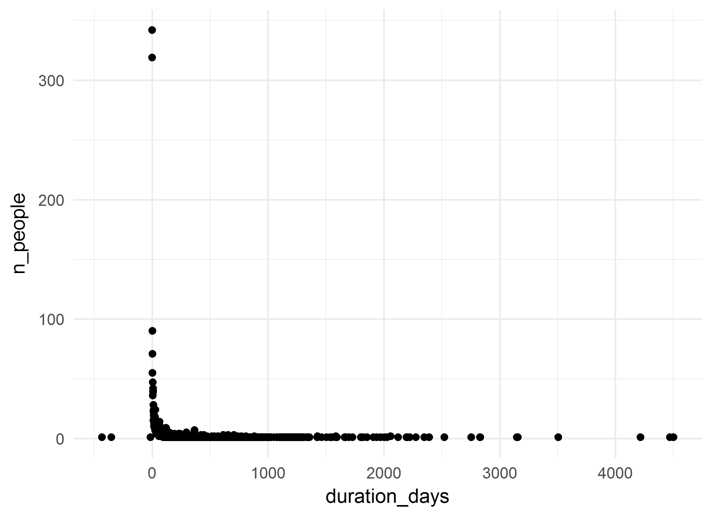
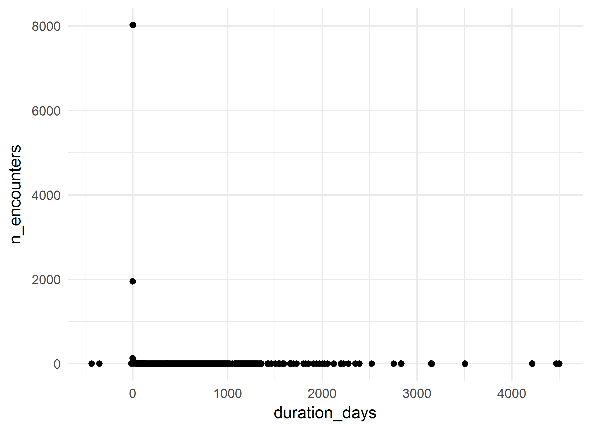
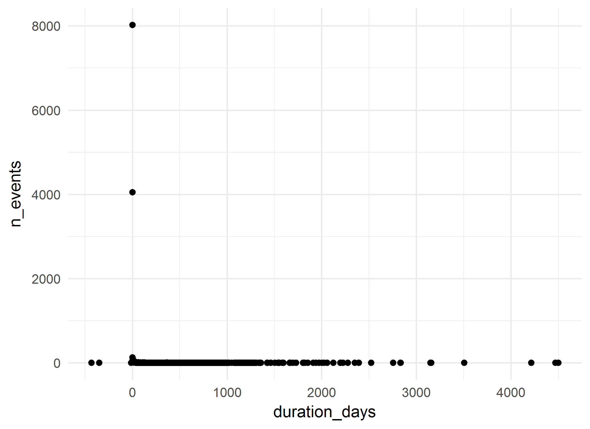

# Dementia Diagnosis Cohort: Summative analysis
A.Koval, K.Moselle, S.Robertson  
`r Sys.Date()`  

<!-- These two chunks should be added in the beginning of every .Rmd that you want to source an .R script -->
<!--  The 1st mandatory chunck  -->
<!--  Set the working directory to the repository's base directory -->


<!--  The 2nd mandatory chunck  -->
<!-- Set the report-wide options, and point to the external code file. -->


<!-- Load 'sourced' R files.  Suppress the output when loading packages. --> 


<!-- Load the sources.  Suppress the output when loading sources. --> 

# I. Exposition

## Glossary
Review some of the object definition to help you interpret the report. 
<!-- Load any Global functions and variables declared in the R file.  Suppress the output. --> 

```r
# dto_location_map.rds is products of `./manipulation/0-ellis-location-map.R` 
path_input_location_map   <- "./data-unshared/derived/dto_location_map.rds" 
path_input_patient_events <-  "./data-unshared/derived/dto_patient_events_eating_disorder_342.rds" # research cohort
# Make sure the files are located where they supposed to be, in `./data-unshared/` folder
testit::assert("File does not exist", base::file.exists(path_input_location_map))
testit::assert("File does not exist", base::file.exists(path_input_patient_events))
# list variables that constitute patient event table
components_patient_events <- c(
  "id"                           # patient unique key
  ,"gender"                      # biological sex
  ,"age_group"                   # in groups of 5 years
  ,"encounter_id"                # unique identifier for the encounter 
  ,"encounter_class"             # value from the D_Location dimension table in the data warehous
  ,"encounter_type"              # value from the D_Location dimension table in the data warehous
  ,"event_type"                  # high-level classification of the event (encounter itself, diagnosis, procedure, clinical order, laboratory, pharmacy event, etc.).           
  ,"event_title"                 # a shorter, more rolled up category describing the event
  ,"event_detail"                # description of the event, can be long and specific
  ,"event_count"                 # count of the events in the row- each row has a value of 1, and can be summed
  ,"event_year"                  # year in which event occurred 
  ,"event_month"                 # month in which event occured
  ,"event_start_date"            # might be the date of the event itself (e.g. date of diagnosis) or the start date of the encounter that the event is associated with     
  ,"event_end_date"              # might be the end date of the event itself (e.g. end date of prescriptions) or the end date of the encounter that the event is associated with
  ,"start_day"                   # number of days between the first day the patient accessed Island Health services and the start date of this event. This is useful to mask dates, but still provides the relative time between events.
  ,"end_day"                     # number of days between the first day the patient accessed Island Health services and the end date of this event. This is useful to mask dates, but still provides the relative time between events.            
  ,"duration_days"               # number of days between the Start_Day and End_Day (End_Day - Start_Day)
  ,"addiction_location_count"    # patient has accessed services at a location that was used for the selection of the cohort
  ,"location_map_id"             # unique id for VIHA program, connects to location map
  ,"palette_code"                # unique id for colours of this palette
  ,"palette_colour_name"         # labels for clusters of service programs (aka 3T palette colours)
)
# list variables that consitute location map table
components_location_map <- c(
  "location_map_id"              # unique id for VIHA program, connects to patient events
  , "site_name"                  # CERNER address          # EHR address   
  , "facility_name"              # CERNER address          # EHR address   
  , "building_name"              # CERNER address          # EHR address   
  , "unit_name"                  # CERNER address          # EHR address   
  , "location_category"          # Data Warehouse address  # EHR address           
  , "location_type"              # Data Warehouse address  # EHR address           
  , "location_grouping"          # Data Warehouse address  # EHR address            
  , "site_key"                   # Factual counterparts to CERNER address
  , "facility_key"               # Factual counterparts to CERNER address
  , "building_key"               # Factual counterparts to CERNER address
  , "unit_key"                   # Factual counterparts to CERNER address
  , "intensity_type"             # Classifier, Compressor, Lense
  , "intensity_severity_risk"    # Classifier, Compressor, Lense
  , "clinical_focus"             # Classifier, Compressor, Lense
  , "service_type"               # Classifier, Compressor, Lense
  , "service_location"           # Classifier, Compressor, Lense
  , "population_age"             # Classifier, Compressor, Lense
  , "provider_mix"               # Classifier, Compressor, Lense
  , "location_class_code"        # Program Class, identifier
  , "location_class_description" # Porgram Class, Descriptive label
  , "palette_code"               # Palette,  identifier       # cluster specific     
  , "palette_colour_name"        # Palette, descriptive label # cluster specific            
)

# define output format for the report
options(
  knitr.table.format = "html"
  ,tibble.width = 110
  #   ,bootstrap_options = c("striped", "hover", "condensed","responsive")
)
```


<!-- Declare any global functions specific to a Rmd output.  Suppress the output. --> 


## Load Data
<!-- Load the datasets.   -->

```r
ds_patient_events <- readRDS(path_input_patient_events) # %>% as.data.frame()
ds_location_map   <- readRDS(path_input_location_map)

ds_patient_events  %>% glimpse()
ds_location_map %>% glimpse()
```

<!-- Inspect the datasets.   -->


## Data Tweaks
<!-- Tweak the datasets.   -->

```r
# augment the event table with additional columns from location map
ds <- dplyr::left_join(
  ds_patient_events,             # patient event table
  ds_location_map %>%         # location map 
    dplyr::select_(.dots = components_location_map)
  ,by = c("location_map_id","palette_code","palette_colour_name") 
) %>% 
  dplyr::mutate(
    location_class_description_display    = substr(location_class_description,1,42)
    ,palette_colour_name_display = substr(palette_colour_name,1,42)
  )
ds_location_map %>% glimpse()
# from this point on, ds_location_map is needed only for selective reference
ds %>% glimpse()
# ds now contains full coordinates to events of the cohort down to unit level
# ehr_address + location_classifiers + palette_colours
```

# II. Patient Events
The main data set `ds` contains both patient events table and their location map coordinates.

```r
# the data object containing events and location map 
ds %>% glimpse()
```

```
Observations: 14,103
Variables: 43
$ id                                 <int> 26112, 26112, 26112, 26112, 26112, 26112, 26112, 26112, 26112,...
$ gender                             <chr> "Female", "Female", "Female", "Female", "Female", "Female", "F...
$ age_group                          <chr> "60 - 64", "60 - 64", "55 - 59", "60 - 64", "60 - 64", "60 - 6...
$ encounter_id                       <chr> "16144E74", "17991724", "1AE017C4", "21528D54", "22A1B274", "2...
$ encounter_class                    <chr> "Inpatient", "Inpatient", "Outpatient", "Outpatient", "Recurri...
$ encounter_type                     <chr> "MHAS - Acute Care", "MHAS - Acute Care", "Ambulatory", "Ambul...
$ event_type                         <chr> "Encounter Only", "Encounter Only", "Encounter Only", "Encount...
$ event_title                        <chr> "Mental Health", "Mental Health", "Outpatient", "Outpatient", ...
$ event_detail                       <chr> "Adult Psychiatry", "Adult Psychiatry", "Medical Imaging", "Me...
$ event_count                        <int> 1, 1, 1, 1, 1, 1, 1, 1, 1, 1, 1, 1, 1, 1, 1, 1, 1, 1, 1, 1, 1,...
$ event_year                         <int> 2015, 2014, 2012, 2015, 2015, 2014, 2012, 2013, 2012, 2012, 20...
$ event_month                        <int> 9, 5, 2, 5, 4, 8, 6, 9, 2, 2, 5, 7, 3, 10, 5, 9, 8, 9, 7, 9, 7...
$ event_start_date                   <date> 2015-09-05, 2014-05-02, 2012-02-23, 2015-05-27, 2015-04-08, 2...
$ event_end_date                     <date> 2015-09-12, 2014-05-06, 2012-02-23, 2015-05-27, 2015-05-11, 2...
$ start_day                          <int> 1571, 1080, 281, 1470, 1421, 1186, 399, 848, 264, 281, 1471, 1...
$ end_day                            <int> 1578, 1084, 281, 1470, 1454, 1187, 441, 854, 264, 281, 1471, 1...
$ duration_days                      <int> 7, 4, 0, 0, 33, 1, 42, 6, 0, 0, 0, 312, 0, 12, 0, 433, 1, 3, 1...
$ addiction_location_count           <int> 1, 1, 0, 0, 0, 0, 0, 0, 0, 0, 0, 0, 0, 0, 0, 0, 0, 0, 0, 0, 0,...
$ location_map_id                    <int> 2116, 2116, 483, 2230, 167, 1429, 167, 1601, 483, 2109, 2109, ...
$ palette_code                       <int> 13, 13, 38, 38, 65, 28, 65, 64, 38, 36, 36, 62, 36, 41, 38, 12...
$ palette_colour_name                <chr> "Addictions - Detox (secondary level)", "Addictions - Detox (s...
$ site_name                          <chr> "Royal Jubilee Hospital", "Royal Jubilee Hospital", "Victoria ...
$ facility_name                      <chr> "Mental Health & Addictions Services Community Care", "Mental ...
$ building_name                      <chr> "Eric Martin Pavilion", "Eric Martin Pavilion", "Victoria Gene...
$ unit_name                          <chr> "EMP 5A - Medical Detox", "EMP 5A - Medical Detox", "Medical I...
$ location_category                  <chr> "Inpatient-Residential", "Inpatient-Residential", "Medical Ima...
$ location_type                      <chr> "Inpt-ResCare-MHAS", "Inpt-ResCare-MHAS", "Medical Imaging", "...
$ location_grouping                  <chr> "Inpatient-Residential", "Inpatient-Residential", "Medical Ima...
$ site_key                           <chr> NA, NA, NA, NA, NA, NA, NA, NA, NA, NA, NA, NA, NA, NA, NA, NA...
$ facility_key                       <chr> "MHSCC", "MHSCC", "VGHAC", "SPHAC", "MHSCC", "RJHAC", "MHSCC",...
$ building_key                       <chr> "EMPM", "EMPM", "VGH-AC", "SPH-AC", "DWITH", "MAIN", "DWITH", ...
$ unit_key                           <chr> "EM5A", "EM5A", "Med Img-V", "Med Img-S", "ADIK", "ER-R", "ADI...
$ intensity_type                     <chr> "ED, Urgent Care, Acute", "ED, Urgent Care, Acute", "Medical I...
$ intensity_severity_risk            <chr> "Acute Care", "Acute Care", "Medical Imaging", "Medical Imagin...
$ clinical_focus                     <chr> "MHSU-Addictions", "MHSU-Addictions", "Medical Imaging", "Medi...
$ service_type                       <chr> "Detox-MHSU", "Detox-MHSU", "Medical Imaging", "Medical Imagin...
$ service_location                   <chr> "Detox Facility", "Detox Facility", "Medical Imaging", "Medica...
$ population_age                     <chr> "Adults, some adols, older adults", "Adults, some adols, older...
$ provider_mix                       <chr> "Physician directed, nursing delivered ", "Physician directed,...
$ location_class_code                <int> 24, 24, 148, 148, 35, 78, 35, 34, 148, 146, 146, 16, 146, 6, 1...
$ location_class_description         <chr> "Addictions - Detox (secondary level)", "Addictions - Detox (s...
$ location_class_description_display <chr> "Addictions - Detox (secondary level)", "Addictions - Detox (s...
$ palette_colour_name_display        <chr> "Addictions - Detox (secondary level)", "Addictions - Detox (s...
```

```r
# What variables relate to patient event table?
# What variables relate to locations at which events took place?
# How many unique values does each variable/column contain? 
ds %>% select_(.dots=components_patient_events) %>% summarise_all(dplyr::n_distinct) %>% t() 
```

```
                          [,1]
id                         342
gender                       2
age_group                   21
encounter_id             12000
encounter_class              7
encounter_type              15
event_type                   3
event_title                 61
event_detail               860
event_count                  1
event_year                  16
event_month                 13
event_start_date          2280
event_end_date            2198
start_day                 2781
end_day                   2815
duration_days              573
addiction_location_count     2
location_map_id            834
palette_code                91
palette_colour_name         91
```

```r
ds %>% select_(.dots=components_location_map) %>% summarise_all(dplyr::n_distinct) %>% t() 
```

```
                           [,1]
location_map_id             834
site_name                    60
facility_name               102
building_name               182
unit_name                   604
location_category            10
location_type                42
location_grouping            22
site_key                      1
facility_key                 82
building_key                159
unit_key                    539
intensity_type               15
intensity_severity_risk      35
clinical_focus               43
service_type                 52
service_location             15
population_age                9
provider_mix                 18
location_class_code         124
location_class_description  124
palette_code                 91
palette_colour_name          91
```

```r
# they share / connected by the fields:
intersect(components_patient_events, components_location_map)
```

```
[1] "location_map_id"     "palette_code"        "palette_colour_name"
```

## Overview

```r
# PET - Patient Event Table
# How many patients are in this cohort?
ds %>% distinct(id) %>% count() %>% neat()
```

<?xml version="1.0" encoding="UTF-8"?>
<table class="table table-striped table-hover table-condensed table-responsive" style="width: auto !important; text-align: right;">
 <thead>
  <tr>
   <th style="text-align:right;"> n </th>
  </tr>
 </thead>
<tbody>
  <tr>
   <td style="text-align:right;"> 342 </td>
  </tr>
</tbody>
</table>

```r
# What are basic demographics?
ds %>% unique_sums(c("gender")) %>% arrange(desc(n_people)) %>% neat()
```

<?xml version="1.0" encoding="UTF-8"?>
<table class="table table-striped table-hover table-condensed table-responsive" style="width: auto !important; text-align: right;">
 <thead>
  <tr>
   <th style="text-align:left;"> gender </th>
   <th style="text-align:right;"> n_people </th>
   <th style="text-align:right;"> n_encounters </th>
   <th style="text-align:right;"> n_events </th>
  </tr>
 </thead>
<tbody>
  <tr>
   <td style="text-align:left;"> Female </td>
   <td style="text-align:right;"> 309 </td>
   <td style="text-align:right;"> 11207 </td>
   <td style="text-align:right;"> 13125 </td>
  </tr>
  <tr>
   <td style="text-align:left;"> Male </td>
   <td style="text-align:right;"> 33 </td>
   <td style="text-align:right;"> 793 </td>
   <td style="text-align:right;"> 978 </td>
  </tr>
</tbody>
</table>

```r
ds %>% unique_sums(c("age_group"))  %>%  neat()
```

<?xml version="1.0" encoding="UTF-8"?>
<table class="table table-striped table-hover table-condensed table-responsive" style="width: auto !important; text-align: right;">
 <thead>
  <tr>
   <th style="text-align:left;"> age_group </th>
   <th style="text-align:right;"> n_people </th>
   <th style="text-align:right;"> n_encounters </th>
   <th style="text-align:right;"> n_events </th>
  </tr>
 </thead>
<tbody>
  <tr>
   <td style="text-align:left;"> &lt;1 </td>
   <td style="text-align:right;"> 1 </td>
   <td style="text-align:right;"> 2 </td>
   <td style="text-align:right;"> 2 </td>
  </tr>
  <tr>
   <td style="text-align:left;"> 01 - 04 </td>
   <td style="text-align:right;"> 1 </td>
   <td style="text-align:right;"> 39 </td>
   <td style="text-align:right;"> 45 </td>
  </tr>
  <tr>
   <td style="text-align:left;"> 05 - 09 </td>
   <td style="text-align:right;"> 12 </td>
   <td style="text-align:right;"> 74 </td>
   <td style="text-align:right;"> 80 </td>
  </tr>
  <tr>
   <td style="text-align:left;"> 10 - 14 </td>
   <td style="text-align:right;"> 97 </td>
   <td style="text-align:right;"> 858 </td>
   <td style="text-align:right;"> 1005 </td>
  </tr>
  <tr>
   <td style="text-align:left;"> 15 - 19 </td>
   <td style="text-align:right;"> 150 </td>
   <td style="text-align:right;"> 2596 </td>
   <td style="text-align:right;"> 2966 </td>
  </tr>
  <tr>
   <td style="text-align:left;"> 20 - 24 </td>
   <td style="text-align:right;"> 97 </td>
   <td style="text-align:right;"> 2157 </td>
   <td style="text-align:right;"> 2333 </td>
  </tr>
  <tr>
   <td style="text-align:left;"> 25 - 29 </td>
   <td style="text-align:right;"> 58 </td>
   <td style="text-align:right;"> 1137 </td>
   <td style="text-align:right;"> 1302 </td>
  </tr>
  <tr>
   <td style="text-align:left;"> 30 - 34 </td>
   <td style="text-align:right;"> 37 </td>
   <td style="text-align:right;"> 801 </td>
   <td style="text-align:right;"> 912 </td>
  </tr>
  <tr>
   <td style="text-align:left;"> 35 - 39 </td>
   <td style="text-align:right;"> 27 </td>
   <td style="text-align:right;"> 613 </td>
   <td style="text-align:right;"> 685 </td>
  </tr>
  <tr>
   <td style="text-align:left;"> 40 - 44 </td>
   <td style="text-align:right;"> 25 </td>
   <td style="text-align:right;"> 625 </td>
   <td style="text-align:right;"> 718 </td>
  </tr>
  <tr>
   <td style="text-align:left;"> 45 - 49 </td>
   <td style="text-align:right;"> 28 </td>
   <td style="text-align:right;"> 501 </td>
   <td style="text-align:right;"> 731 </td>
  </tr>
  <tr>
   <td style="text-align:left;"> 50 - 54 </td>
   <td style="text-align:right;"> 26 </td>
   <td style="text-align:right;"> 904 </td>
   <td style="text-align:right;"> 1148 </td>
  </tr>
  <tr>
   <td style="text-align:left;"> 55 - 59 </td>
   <td style="text-align:right;"> 21 </td>
   <td style="text-align:right;"> 375 </td>
   <td style="text-align:right;"> 466 </td>
  </tr>
  <tr>
   <td style="text-align:left;"> 60 - 64 </td>
   <td style="text-align:right;"> 15 </td>
   <td style="text-align:right;"> 363 </td>
   <td style="text-align:right;"> 431 </td>
  </tr>
  <tr>
   <td style="text-align:left;"> 65 - 69 </td>
   <td style="text-align:right;"> 14 </td>
   <td style="text-align:right;"> 302 </td>
   <td style="text-align:right;"> 391 </td>
  </tr>
  <tr>
   <td style="text-align:left;"> 70 - 74 </td>
   <td style="text-align:right;"> 10 </td>
   <td style="text-align:right;"> 225 </td>
   <td style="text-align:right;"> 302 </td>
  </tr>
  <tr>
   <td style="text-align:left;"> 75 - 79 </td>
   <td style="text-align:right;"> 7 </td>
   <td style="text-align:right;"> 116 </td>
   <td style="text-align:right;"> 142 </td>
  </tr>
  <tr>
   <td style="text-align:left;"> 80 - 84 </td>
   <td style="text-align:right;"> 7 </td>
   <td style="text-align:right;"> 69 </td>
   <td style="text-align:right;"> 145 </td>
  </tr>
  <tr>
   <td style="text-align:left;"> 85 - 89 </td>
   <td style="text-align:right;"> 6 </td>
   <td style="text-align:right;"> 110 </td>
   <td style="text-align:right;"> 143 </td>
  </tr>
  <tr>
   <td style="text-align:left;"> 90+ </td>
   <td style="text-align:right;"> 4 </td>
   <td style="text-align:right;"> 105 </td>
   <td style="text-align:right;"> 128 </td>
  </tr>
  <tr>
   <td style="text-align:left;"> No value </td>
   <td style="text-align:right;"> 27 </td>
   <td style="text-align:right;"> 28 </td>
   <td style="text-align:right;"> 28 </td>
  </tr>
</tbody>
</table>

```r
ds %>% unique_sums(c("gender","age_group")) %>%  neat()
```

<?xml version="1.0" encoding="UTF-8"?>
<table class="table table-striped table-hover table-condensed table-responsive" style="width: auto !important; text-align: right;">
 <thead>
  <tr>
   <th style="text-align:left;"> gender </th>
   <th style="text-align:left;"> age_group </th>
   <th style="text-align:right;"> n_people </th>
   <th style="text-align:right;"> n_encounters </th>
   <th style="text-align:right;"> n_events </th>
  </tr>
 </thead>
<tbody>
  <tr>
   <td style="text-align:left;"> Female </td>
   <td style="text-align:left;"> 05 - 09 </td>
   <td style="text-align:right;"> 9 </td>
   <td style="text-align:right;"> 53 </td>
   <td style="text-align:right;"> 57 </td>
  </tr>
  <tr>
   <td style="text-align:left;"> Female </td>
   <td style="text-align:left;"> 10 - 14 </td>
   <td style="text-align:right;"> 87 </td>
   <td style="text-align:right;"> 766 </td>
   <td style="text-align:right;"> 902 </td>
  </tr>
  <tr>
   <td style="text-align:left;"> Female </td>
   <td style="text-align:left;"> 15 - 19 </td>
   <td style="text-align:right;"> 145 </td>
   <td style="text-align:right;"> 2573 </td>
   <td style="text-align:right;"> 2935 </td>
  </tr>
  <tr>
   <td style="text-align:left;"> Female </td>
   <td style="text-align:left;"> 20 - 24 </td>
   <td style="text-align:right;"> 91 </td>
   <td style="text-align:right;"> 2124 </td>
   <td style="text-align:right;"> 2293 </td>
  </tr>
  <tr>
   <td style="text-align:left;"> Female </td>
   <td style="text-align:left;"> 25 - 29 </td>
   <td style="text-align:right;"> 51 </td>
   <td style="text-align:right;"> 970 </td>
   <td style="text-align:right;"> 1087 </td>
  </tr>
  <tr>
   <td style="text-align:left;"> Female </td>
   <td style="text-align:left;"> 30 - 34 </td>
   <td style="text-align:right;"> 35 </td>
   <td style="text-align:right;"> 751 </td>
   <td style="text-align:right;"> 862 </td>
  </tr>
  <tr>
   <td style="text-align:left;"> Female </td>
   <td style="text-align:left;"> 35 - 39 </td>
   <td style="text-align:right;"> 27 </td>
   <td style="text-align:right;"> 613 </td>
   <td style="text-align:right;"> 685 </td>
  </tr>
  <tr>
   <td style="text-align:left;"> Female </td>
   <td style="text-align:left;"> 40 - 44 </td>
   <td style="text-align:right;"> 25 </td>
   <td style="text-align:right;"> 625 </td>
   <td style="text-align:right;"> 718 </td>
  </tr>
  <tr>
   <td style="text-align:left;"> Female </td>
   <td style="text-align:left;"> 45 - 49 </td>
   <td style="text-align:right;"> 26 </td>
   <td style="text-align:right;"> 443 </td>
   <td style="text-align:right;"> 664 </td>
  </tr>
  <tr>
   <td style="text-align:left;"> Female </td>
   <td style="text-align:left;"> 50 - 54 </td>
   <td style="text-align:right;"> 24 </td>
   <td style="text-align:right;"> 874 </td>
   <td style="text-align:right;"> 1118 </td>
  </tr>
  <tr>
   <td style="text-align:left;"> Female </td>
   <td style="text-align:left;"> 55 - 59 </td>
   <td style="text-align:right;"> 20 </td>
   <td style="text-align:right;"> 373 </td>
   <td style="text-align:right;"> 464 </td>
  </tr>
  <tr>
   <td style="text-align:left;"> Female </td>
   <td style="text-align:left;"> 60 - 64 </td>
   <td style="text-align:right;"> 12 </td>
   <td style="text-align:right;"> 309 </td>
   <td style="text-align:right;"> 358 </td>
  </tr>
  <tr>
   <td style="text-align:left;"> Female </td>
   <td style="text-align:left;"> 65 - 69 </td>
   <td style="text-align:right;"> 8 </td>
   <td style="text-align:right;"> 193 </td>
   <td style="text-align:right;"> 269 </td>
  </tr>
  <tr>
   <td style="text-align:left;"> Female </td>
   <td style="text-align:left;"> 70 - 74 </td>
   <td style="text-align:right;"> 6 </td>
   <td style="text-align:right;"> 190 </td>
   <td style="text-align:right;"> 239 </td>
  </tr>
  <tr>
   <td style="text-align:left;"> Female </td>
   <td style="text-align:left;"> 75 - 79 </td>
   <td style="text-align:right;"> 6 </td>
   <td style="text-align:right;"> 100 </td>
   <td style="text-align:right;"> 119 </td>
  </tr>
  <tr>
   <td style="text-align:left;"> Female </td>
   <td style="text-align:left;"> 80 - 84 </td>
   <td style="text-align:right;"> 5 </td>
   <td style="text-align:right;"> 52 </td>
   <td style="text-align:right;"> 107 </td>
  </tr>
  <tr>
   <td style="text-align:left;"> Female </td>
   <td style="text-align:left;"> 85 - 89 </td>
   <td style="text-align:right;"> 5 </td>
   <td style="text-align:right;"> 86 </td>
   <td style="text-align:right;"> 113 </td>
  </tr>
  <tr>
   <td style="text-align:left;"> Female </td>
   <td style="text-align:left;"> 90+ </td>
   <td style="text-align:right;"> 3 </td>
   <td style="text-align:right;"> 86 </td>
   <td style="text-align:right;"> 109 </td>
  </tr>
  <tr>
   <td style="text-align:left;"> Female </td>
   <td style="text-align:left;"> No value </td>
   <td style="text-align:right;"> 25 </td>
   <td style="text-align:right;"> 26 </td>
   <td style="text-align:right;"> 26 </td>
  </tr>
  <tr>
   <td style="text-align:left;"> Male </td>
   <td style="text-align:left;"> &lt;1 </td>
   <td style="text-align:right;"> 1 </td>
   <td style="text-align:right;"> 2 </td>
   <td style="text-align:right;"> 2 </td>
  </tr>
  <tr>
   <td style="text-align:left;"> Male </td>
   <td style="text-align:left;"> 01 - 04 </td>
   <td style="text-align:right;"> 1 </td>
   <td style="text-align:right;"> 39 </td>
   <td style="text-align:right;"> 45 </td>
  </tr>
  <tr>
   <td style="text-align:left;"> Male </td>
   <td style="text-align:left;"> 05 - 09 </td>
   <td style="text-align:right;"> 3 </td>
   <td style="text-align:right;"> 21 </td>
   <td style="text-align:right;"> 23 </td>
  </tr>
  <tr>
   <td style="text-align:left;"> Male </td>
   <td style="text-align:left;"> 10 - 14 </td>
   <td style="text-align:right;"> 10 </td>
   <td style="text-align:right;"> 92 </td>
   <td style="text-align:right;"> 103 </td>
  </tr>
  <tr>
   <td style="text-align:left;"> Male </td>
   <td style="text-align:left;"> 15 - 19 </td>
   <td style="text-align:right;"> 5 </td>
   <td style="text-align:right;"> 23 </td>
   <td style="text-align:right;"> 31 </td>
  </tr>
  <tr>
   <td style="text-align:left;"> Male </td>
   <td style="text-align:left;"> 20 - 24 </td>
   <td style="text-align:right;"> 6 </td>
   <td style="text-align:right;"> 33 </td>
   <td style="text-align:right;"> 40 </td>
  </tr>
  <tr>
   <td style="text-align:left;"> Male </td>
   <td style="text-align:left;"> 25 - 29 </td>
   <td style="text-align:right;"> 7 </td>
   <td style="text-align:right;"> 167 </td>
   <td style="text-align:right;"> 215 </td>
  </tr>
  <tr>
   <td style="text-align:left;"> Male </td>
   <td style="text-align:left;"> 30 - 34 </td>
   <td style="text-align:right;"> 2 </td>
   <td style="text-align:right;"> 50 </td>
   <td style="text-align:right;"> 50 </td>
  </tr>
  <tr>
   <td style="text-align:left;"> Male </td>
   <td style="text-align:left;"> 45 - 49 </td>
   <td style="text-align:right;"> 2 </td>
   <td style="text-align:right;"> 58 </td>
   <td style="text-align:right;"> 67 </td>
  </tr>
  <tr>
   <td style="text-align:left;"> Male </td>
   <td style="text-align:left;"> 50 - 54 </td>
   <td style="text-align:right;"> 2 </td>
   <td style="text-align:right;"> 30 </td>
   <td style="text-align:right;"> 30 </td>
  </tr>
  <tr>
   <td style="text-align:left;"> Male </td>
   <td style="text-align:left;"> 55 - 59 </td>
   <td style="text-align:right;"> 1 </td>
   <td style="text-align:right;"> 2 </td>
   <td style="text-align:right;"> 2 </td>
  </tr>
  <tr>
   <td style="text-align:left;"> Male </td>
   <td style="text-align:left;"> 60 - 64 </td>
   <td style="text-align:right;"> 3 </td>
   <td style="text-align:right;"> 54 </td>
   <td style="text-align:right;"> 73 </td>
  </tr>
  <tr>
   <td style="text-align:left;"> Male </td>
   <td style="text-align:left;"> 65 - 69 </td>
   <td style="text-align:right;"> 6 </td>
   <td style="text-align:right;"> 109 </td>
   <td style="text-align:right;"> 122 </td>
  </tr>
  <tr>
   <td style="text-align:left;"> Male </td>
   <td style="text-align:left;"> 70 - 74 </td>
   <td style="text-align:right;"> 4 </td>
   <td style="text-align:right;"> 35 </td>
   <td style="text-align:right;"> 63 </td>
  </tr>
  <tr>
   <td style="text-align:left;"> Male </td>
   <td style="text-align:left;"> 75 - 79 </td>
   <td style="text-align:right;"> 1 </td>
   <td style="text-align:right;"> 16 </td>
   <td style="text-align:right;"> 23 </td>
  </tr>
  <tr>
   <td style="text-align:left;"> Male </td>
   <td style="text-align:left;"> 80 - 84 </td>
   <td style="text-align:right;"> 2 </td>
   <td style="text-align:right;"> 17 </td>
   <td style="text-align:right;"> 38 </td>
  </tr>
  <tr>
   <td style="text-align:left;"> Male </td>
   <td style="text-align:left;"> 85 - 89 </td>
   <td style="text-align:right;"> 1 </td>
   <td style="text-align:right;"> 24 </td>
   <td style="text-align:right;"> 30 </td>
  </tr>
  <tr>
   <td style="text-align:left;"> Male </td>
   <td style="text-align:left;"> 90+ </td>
   <td style="text-align:right;"> 1 </td>
   <td style="text-align:right;"> 19 </td>
   <td style="text-align:right;"> 19 </td>
  </tr>
  <tr>
   <td style="text-align:left;"> Male </td>
   <td style="text-align:left;"> No value </td>
   <td style="text-align:right;"> 2 </td>
   <td style="text-align:right;"> 2 </td>
   <td style="text-align:right;"> 2 </td>
  </tr>
</tbody>
</table>

## DW tags

```r
# how may unique encounters are there in this set?
ds %>% distinct(encounter_id) %>% count() %>% neat()
```

<?xml version="1.0" encoding="UTF-8"?>
<table class="table table-striped table-hover table-condensed table-responsive" style="width: auto !important; text-align: right;">
 <thead>
  <tr>
   <th style="text-align:right;"> n </th>
  </tr>
 </thead>
<tbody>
  <tr>
   <td style="text-align:right;"> 12000 </td>
  </tr>
</tbody>
</table>

```r
# tally engagement across encounter classes (as defined by data warehouse)
ds %>% unique_sums("encounter_class")%>% arrange(desc(n_people)) %>% neat()
```

<?xml version="1.0" encoding="UTF-8"?>
<table class="table table-striped table-hover table-condensed table-responsive" style="width: auto !important; text-align: right;">
 <thead>
  <tr>
   <th style="text-align:left;"> encounter_class </th>
   <th style="text-align:right;"> n_people </th>
   <th style="text-align:right;"> n_encounters </th>
   <th style="text-align:right;"> n_events </th>
  </tr>
 </thead>
<tbody>
  <tr>
   <td style="text-align:left;"> Inpatient </td>
   <td style="text-align:right;"> 341 </td>
   <td style="text-align:right;"> 1429 </td>
   <td style="text-align:right;"> 3391 </td>
  </tr>
  <tr>
   <td style="text-align:left;"> Emergency </td>
   <td style="text-align:right;"> 331 </td>
   <td style="text-align:right;"> 3790 </td>
   <td style="text-align:right;"> 3799 </td>
  </tr>
  <tr>
   <td style="text-align:left;"> Outpatient </td>
   <td style="text-align:right;"> 316 </td>
   <td style="text-align:right;"> 4431 </td>
   <td style="text-align:right;"> 4555 </td>
  </tr>
  <tr>
   <td style="text-align:left;"> Recurring </td>
   <td style="text-align:right;"> 285 </td>
   <td style="text-align:right;"> 1688 </td>
   <td style="text-align:right;"> 1694 </td>
  </tr>
  <tr>
   <td style="text-align:left;"> Other </td>
   <td style="text-align:right;"> 170 </td>
   <td style="text-align:right;"> 562 </td>
   <td style="text-align:right;"> 564 </td>
  </tr>
  <tr>
   <td style="text-align:left;"> Home Care </td>
   <td style="text-align:right;"> 56 </td>
   <td style="text-align:right;"> 91 </td>
   <td style="text-align:right;"> 91 </td>
  </tr>
  <tr>
   <td style="text-align:left;"> Cancelled Admission </td>
   <td style="text-align:right;"> 9 </td>
   <td style="text-align:right;"> 9 </td>
   <td style="text-align:right;"> 9 </td>
  </tr>
</tbody>
</table>

```r
ds %>% unique_sums("encounter_type") %>% arrange(desc(n_people)) %>% neat()
```

<?xml version="1.0" encoding="UTF-8"?>
<table class="table table-striped table-hover table-condensed table-responsive" style="width: auto !important; text-align: right;">
 <thead>
  <tr>
   <th style="text-align:left;"> encounter_type </th>
   <th style="text-align:right;"> n_people </th>
   <th style="text-align:right;"> n_encounters </th>
   <th style="text-align:right;"> n_events </th>
  </tr>
 </thead>
<tbody>
  <tr>
   <td style="text-align:left;"> Inpatient Acute </td>
   <td style="text-align:right;"> 341 </td>
   <td style="text-align:right;"> 1294 </td>
   <td style="text-align:right;"> 3253 </td>
  </tr>
  <tr>
   <td style="text-align:left;"> Emergency </td>
   <td style="text-align:right;"> 331 </td>
   <td style="text-align:right;"> 3790 </td>
   <td style="text-align:right;"> 3799 </td>
  </tr>
  <tr>
   <td style="text-align:left;"> Ambulatory </td>
   <td style="text-align:right;"> 315 </td>
   <td style="text-align:right;"> 4199 </td>
   <td style="text-align:right;"> 4204 </td>
  </tr>
  <tr>
   <td style="text-align:left;"> Open Encounter </td>
   <td style="text-align:right;"> 282 </td>
   <td style="text-align:right;"> 1637 </td>
   <td style="text-align:right;"> 1642 </td>
  </tr>
  <tr>
   <td style="text-align:left;"> Specimen </td>
   <td style="text-align:right;"> 150 </td>
   <td style="text-align:right;"> 517 </td>
   <td style="text-align:right;"> 519 </td>
  </tr>
  <tr>
   <td style="text-align:left;"> Day Care </td>
   <td style="text-align:right;"> 94 </td>
   <td style="text-align:right;"> 232 </td>
   <td style="text-align:right;"> 351 </td>
  </tr>
  <tr>
   <td style="text-align:left;"> Home Care </td>
   <td style="text-align:right;"> 56 </td>
   <td style="text-align:right;"> 91 </td>
   <td style="text-align:right;"> 91 </td>
  </tr>
  <tr>
   <td style="text-align:left;"> MHAS - Residential </td>
   <td style="text-align:right;"> 31 </td>
   <td style="text-align:right;"> 78 </td>
   <td style="text-align:right;"> 78 </td>
  </tr>
  <tr>
   <td style="text-align:left;"> MHAS - Acute Care </td>
   <td style="text-align:right;"> 27 </td>
   <td style="text-align:right;"> 37 </td>
   <td style="text-align:right;"> 37 </td>
  </tr>
  <tr>
   <td style="text-align:left;"> Waitlist </td>
   <td style="text-align:right;"> 26 </td>
   <td style="text-align:right;"> 28 </td>
   <td style="text-align:right;"> 28 </td>
  </tr>
  <tr>
   <td style="text-align:left;"> Recurring/Series </td>
   <td style="text-align:right;"> 24 </td>
   <td style="text-align:right;"> 51 </td>
   <td style="text-align:right;"> 52 </td>
  </tr>
  <tr>
   <td style="text-align:left;"> Morgue </td>
   <td style="text-align:right;"> 16 </td>
   <td style="text-align:right;"> 16 </td>
   <td style="text-align:right;"> 16 </td>
  </tr>
  <tr>
   <td style="text-align:left;"> Residential Care </td>
   <td style="text-align:right;"> 12 </td>
   <td style="text-align:right;"> 20 </td>
   <td style="text-align:right;"> 23 </td>
  </tr>
  <tr>
   <td style="text-align:left;"> Cancelled Admission </td>
   <td style="text-align:right;"> 9 </td>
   <td style="text-align:right;"> 9 </td>
   <td style="text-align:right;"> 9 </td>
  </tr>
  <tr>
   <td style="text-align:left;"> Research </td>
   <td style="text-align:right;"> 1 </td>
   <td style="text-align:right;"> 1 </td>
   <td style="text-align:right;"> 1 </td>
  </tr>
</tbody>
</table>

```r
ds %>% unique_sums(c("encounter_class","encounter_type"))%>% arrange(desc(encounter_class,n_people)) %>% neat()
```

<?xml version="1.0" encoding="UTF-8"?>
<table class="table table-striped table-hover table-condensed table-responsive" style="width: auto !important; text-align: right;">
 <thead>
  <tr>
   <th style="text-align:left;"> encounter_class </th>
   <th style="text-align:left;"> encounter_type </th>
   <th style="text-align:right;"> n_people </th>
   <th style="text-align:right;"> n_encounters </th>
   <th style="text-align:right;"> n_events </th>
  </tr>
 </thead>
<tbody>
  <tr>
   <td style="text-align:left;"> Recurring </td>
   <td style="text-align:left;"> Open Encounter </td>
   <td style="text-align:right;"> 282 </td>
   <td style="text-align:right;"> 1637 </td>
   <td style="text-align:right;"> 1642 </td>
  </tr>
  <tr>
   <td style="text-align:left;"> Recurring </td>
   <td style="text-align:left;"> Recurring/Series </td>
   <td style="text-align:right;"> 24 </td>
   <td style="text-align:right;"> 51 </td>
   <td style="text-align:right;"> 52 </td>
  </tr>
  <tr>
   <td style="text-align:left;"> Outpatient </td>
   <td style="text-align:left;"> Ambulatory </td>
   <td style="text-align:right;"> 315 </td>
   <td style="text-align:right;"> 4199 </td>
   <td style="text-align:right;"> 4204 </td>
  </tr>
  <tr>
   <td style="text-align:left;"> Outpatient </td>
   <td style="text-align:left;"> Day Care </td>
   <td style="text-align:right;"> 94 </td>
   <td style="text-align:right;"> 232 </td>
   <td style="text-align:right;"> 351 </td>
  </tr>
  <tr>
   <td style="text-align:left;"> Other </td>
   <td style="text-align:left;"> Morgue </td>
   <td style="text-align:right;"> 16 </td>
   <td style="text-align:right;"> 16 </td>
   <td style="text-align:right;"> 16 </td>
  </tr>
  <tr>
   <td style="text-align:left;"> Other </td>
   <td style="text-align:left;"> Research </td>
   <td style="text-align:right;"> 1 </td>
   <td style="text-align:right;"> 1 </td>
   <td style="text-align:right;"> 1 </td>
  </tr>
  <tr>
   <td style="text-align:left;"> Other </td>
   <td style="text-align:left;"> Specimen </td>
   <td style="text-align:right;"> 150 </td>
   <td style="text-align:right;"> 517 </td>
   <td style="text-align:right;"> 519 </td>
  </tr>
  <tr>
   <td style="text-align:left;"> Other </td>
   <td style="text-align:left;"> Waitlist </td>
   <td style="text-align:right;"> 26 </td>
   <td style="text-align:right;"> 28 </td>
   <td style="text-align:right;"> 28 </td>
  </tr>
  <tr>
   <td style="text-align:left;"> Inpatient </td>
   <td style="text-align:left;"> Inpatient Acute </td>
   <td style="text-align:right;"> 341 </td>
   <td style="text-align:right;"> 1294 </td>
   <td style="text-align:right;"> 3253 </td>
  </tr>
  <tr>
   <td style="text-align:left;"> Inpatient </td>
   <td style="text-align:left;"> MHAS - Acute Care </td>
   <td style="text-align:right;"> 27 </td>
   <td style="text-align:right;"> 37 </td>
   <td style="text-align:right;"> 37 </td>
  </tr>
  <tr>
   <td style="text-align:left;"> Inpatient </td>
   <td style="text-align:left;"> MHAS - Residential </td>
   <td style="text-align:right;"> 31 </td>
   <td style="text-align:right;"> 78 </td>
   <td style="text-align:right;"> 78 </td>
  </tr>
  <tr>
   <td style="text-align:left;"> Inpatient </td>
   <td style="text-align:left;"> Residential Care </td>
   <td style="text-align:right;"> 12 </td>
   <td style="text-align:right;"> 20 </td>
   <td style="text-align:right;"> 23 </td>
  </tr>
  <tr>
   <td style="text-align:left;"> Home Care </td>
   <td style="text-align:left;"> Home Care </td>
   <td style="text-align:right;"> 56 </td>
   <td style="text-align:right;"> 91 </td>
   <td style="text-align:right;"> 91 </td>
  </tr>
  <tr>
   <td style="text-align:left;"> Emergency </td>
   <td style="text-align:left;"> Emergency </td>
   <td style="text-align:right;"> 331 </td>
   <td style="text-align:right;"> 3790 </td>
   <td style="text-align:right;"> 3799 </td>
  </tr>
  <tr>
   <td style="text-align:left;"> Cancelled Admission </td>
   <td style="text-align:left;"> Cancelled Admission </td>
   <td style="text-align:right;"> 9 </td>
   <td style="text-align:right;"> 9 </td>
   <td style="text-align:right;"> 9 </td>
  </tr>
</tbody>
</table>

## ACRU tags

```r
# how many event types  were there?
ds %>% unique_sums("event_type") %>% arrange(desc(n_people)) %>% neat()
```

<?xml version="1.0" encoding="UTF-8"?>
<table class="table table-striped table-hover table-condensed table-responsive" style="width: auto !important; text-align: right;">
 <thead>
  <tr>
   <th style="text-align:left;"> event_type </th>
   <th style="text-align:right;"> n_people </th>
   <th style="text-align:right;"> n_encounters </th>
   <th style="text-align:right;"> n_events </th>
  </tr>
 </thead>
<tbody>
  <tr>
   <td style="text-align:left;"> Encounter Only </td>
   <td style="text-align:right;"> 342 </td>
   <td style="text-align:right;"> 10835 </td>
   <td style="text-align:right;"> 10835 </td>
  </tr>
  <tr>
   <td style="text-align:left;"> Diagnosis </td>
   <td style="text-align:right;"> 289 </td>
   <td style="text-align:right;"> 1014 </td>
   <td style="text-align:right;"> 2930 </td>
  </tr>
  <tr>
   <td style="text-align:left;"> Organism Identified </td>
   <td style="text-align:right;"> 85 </td>
   <td style="text-align:right;"> 221 </td>
   <td style="text-align:right;"> 338 </td>
  </tr>
</tbody>
</table>

```r
# view event_title and event_details with a dynmaic table 
ds %>% unique_sums(c("event_type","event_title","event_detail"))%>% arrange(desc(n_people)) %>% neat_DT()
```

<!--html_preserve--><div id="htmlwidget-819558171e50d81f0238" style="width:100%;height:auto;" class="datatables html-widget"></div>
<script type="application/json" data-for="htmlwidget-819558171e50d81f0238">{"x":{"filter":"top","filterHTML":"<tr>\n  <td><\/td>\n  <td data-type=\"character\" style=\"vertical-align: top;\">\n    <div class=\"form-group has-feedback\" style=\"margin-bottom: auto;\">\n      <input type=\"search\" placeholder=\"All\" class=\"form-control\" style=\"width: 100%;\"/>\n      <span class=\"glyphicon glyphicon-remove-circle form-control-feedback\"><\/span>\n    <\/div>\n  <\/td>\n  <td data-type=\"character\" style=\"vertical-align: top;\">\n    <div class=\"form-group has-feedback\" style=\"margin-bottom: auto;\">\n      <input type=\"search\" placeholder=\"All\" class=\"form-control\" style=\"width: 100%;\"/>\n      <span class=\"glyphicon glyphicon-remove-circle form-control-feedback\"><\/span>\n    <\/div>\n  <\/td>\n  <td data-type=\"character\" style=\"vertical-align: top;\">\n    <div class=\"form-group has-feedback\" style=\"margin-bottom: auto;\">\n      <input type=\"search\" placeholder=\"All\" class=\"form-control\" style=\"width: 100%;\"/>\n      <span class=\"glyphicon glyphicon-remove-circle form-control-feedback\"><\/span>\n    <\/div>\n  <\/td>\n  <td data-type=\"integer\" style=\"vertical-align: top;\">\n    <div class=\"form-group has-feedback\" style=\"margin-bottom: auto;\">\n      <input type=\"search\" placeholder=\"All\" class=\"form-control\" style=\"width: 100%;\"/>\n      <span class=\"glyphicon glyphicon-remove-circle form-control-feedback\"><\/span>\n    <\/div>\n    <div style=\"display: none; position: absolute; width: 200px;\">\n      <div data-min=\"1\" data-max=\"337\"><\/div>\n      <span style=\"float: left;\"><\/span>\n      <span style=\"float: right;\"><\/span>\n    <\/div>\n  <\/td>\n  <td data-type=\"integer\" style=\"vertical-align: top;\">\n    <div class=\"form-group has-feedback\" style=\"margin-bottom: auto;\">\n      <input type=\"search\" placeholder=\"All\" class=\"form-control\" style=\"width: 100%;\"/>\n      <span class=\"glyphicon glyphicon-remove-circle form-control-feedback\"><\/span>\n    <\/div>\n    <div style=\"display: none; position: absolute; width: 200px;\">\n      <div data-min=\"1\" data-max=\"4453\"><\/div>\n      <span style=\"float: left;\"><\/span>\n      <span style=\"float: right;\"><\/span>\n    <\/div>\n  <\/td>\n  <td data-type=\"integer\" style=\"vertical-align: top;\">\n    <div class=\"form-group has-feedback\" style=\"margin-bottom: auto;\">\n      <input type=\"search\" placeholder=\"All\" class=\"form-control\" style=\"width: 100%;\"/>\n      <span class=\"glyphicon glyphicon-remove-circle form-control-feedback\"><\/span>\n    <\/div>\n    <div style=\"display: none; position: absolute; width: 200px;\">\n      <div data-min=\"1\" data-max=\"4453\"><\/div>\n      <span style=\"float: left;\"><\/span>\n      <span style=\"float: right;\"><\/span>\n    <\/div>\n  <\/td>\n<\/tr>","data":[["1","2","3","4","5","6","7","8","9","10","11","12","13","14","15","16","17","18","19","20","21","22","23","24","25","26","27","28","29","30","31","32","33","34","35","36","37","38","39","40","41","42","43","44","45","46","47","48","49","50","51","52","53","54","55","56","57","58","59","60","61","62","63","64","65","66","67","68","69","70","71","72","73","74","75","76","77","78","79","80","81","82","83","84","85","86","87","88","89","90","91","92","93","94","95","96","97","98","99","100","101","102","103","104","105","106","107","108","109","110","111","112","113","114","115","116","117","118","119","120","121","122","123","124","125","126","127","128","129","130","131","132","133","134","135","136","137","138","139","140","141","142","143","144","145","146","147","148","149","150","151","152","153","154","155","156","157","158","159","160","161","162","163","164","165","166","167","168","169","170","171","172","173","174","175","176","177","178","179","180","181","182","183","184","185","186","187","188","189","190","191","192","193","194","195","196","197","198","199","200","201","202","203","204","205","206","207","208","209","210","211","212","213","214","215","216","217","218","219","220","221","222","223","224","225","226","227","228","229","230","231","232","233","234","235","236","237","238","239","240","241","242","243","244","245","246","247","248","249","250","251","252","253","254","255","256","257","258","259","260","261","262","263","264","265","266","267","268","269","270","271","272","273","274","275","276","277","278","279","280","281","282","283","284","285","286","287","288","289","290","291","292","293","294","295","296","297","298","299","300","301","302","303","304","305","306","307","308","309","310","311","312","313","314","315","316","317","318","319","320","321","322","323","324","325","326","327","328","329","330","331","332","333","334","335","336","337","338","339","340","341","342","343","344","345","346","347","348","349","350","351","352","353","354","355","356","357","358","359","360","361","362","363","364","365","366","367","368","369","370","371","372","373","374","375","376","377","378","379","380","381","382","383","384","385","386","387","388","389","390","391","392","393","394","395","396","397","398","399","400","401","402","403","404","405","406","407","408","409","410","411","412","413","414","415","416","417","418","419","420","421","422","423","424","425","426","427","428","429","430","431","432","433","434","435","436","437","438","439","440","441","442","443","444","445","446","447","448","449","450","451","452","453","454","455","456","457","458","459","460","461","462","463","464","465","466","467","468","469","470","471","472","473","474","475","476","477","478","479","480","481","482","483","484","485","486","487","488","489","490","491","492","493","494","495","496","497","498","499","500","501","502","503","504","505","506","507","508","509","510","511","512","513","514","515","516","517","518","519","520","521","522","523","524","525","526","527","528","529","530","531","532","533","534","535","536","537","538","539","540","541","542","543","544","545","546","547","548","549","550","551","552","553","554","555","556","557","558","559","560","561","562","563","564","565","566","567","568","569","570","571","572","573","574","575","576","577","578","579","580","581","582","583","584","585","586","587","588","589","590","591","592","593","594","595","596","597","598","599","600","601","602","603","604","605","606","607","608","609","610","611","612","613","614","615","616","617","618","619","620","621","622","623","624","625","626","627","628","629","630","631","632","633","634","635","636","637","638","639","640","641","642","643","644","645","646","647","648","649","650","651","652","653","654","655","656","657","658","659","660","661","662","663","664","665","666","667","668","669","670","671","672","673","674","675","676","677","678","679","680","681","682","683","684","685","686","687","688","689","690","691","692","693","694","695","696","697","698","699","700","701","702","703","704","705","706","707","708","709","710","711","712","713","714","715","716","717","718","719","720","721","722","723","724","725","726","727","728","729","730","731","732","733","734","735","736","737","738","739","740","741","742","743","744","745","746","747","748","749","750","751","752","753","754","755","756","757","758","759","760","761","762","763","764","765","766","767","768","769","770","771","772","773","774","775","776","777","778","779","780","781","782","783","784","785","786","787","788","789","790","791","792","793","794","795","796","797","798","799","800","801","802","803","804","805","806","807","808","809","810","811","812","813","814","815","816","817","818","819","820","821","822","823","824","825","826","827","828","829","830","831","832","833","834","835","836","837","838","839","840","841","842","843","844","845","846","847","848","849","850","851","852","853","854","855","856","857","858","859","860","861","862","863","864","865","866","867","868","869","870","871","872","873","874","875","876","877","878","879","880","881","882","883","884","885","886","887","888","889","890","891","892","893","894","895","896","897","898","899","900","901","902"],["Encounter Only","Encounter Only","Encounter Only","Encounter Only","Encounter Only","Diagnosis","Diagnosis","Diagnosis","Organism Identified","Diagnosis","Diagnosis","Diagnosis","Encounter Only","Encounter Only","Diagnosis","Diagnosis","Diagnosis","Diagnosis","Diagnosis","Diagnosis","Diagnosis","Encounter Only","Diagnosis","Diagnosis","Diagnosis","Diagnosis","Encounter Only","Organism Identified","Diagnosis","Diagnosis","Diagnosis","Diagnosis","Encounter Only","Diagnosis","Encounter Only","Organism Identified","Diagnosis","Diagnosis","Encounter Only","Encounter Only","Diagnosis","Diagnosis","Diagnosis","Diagnosis","Diagnosis","Encounter Only","Diagnosis","Diagnosis","Diagnosis","Diagnosis","Encounter Only","Encounter Only","Diagnosis","Diagnosis","Diagnosis","Diagnosis","Diagnosis","Encounter Only","Encounter Only","Encounter Only","Diagnosis","Diagnosis","Diagnosis","Diagnosis","Diagnosis","Diagnosis","Diagnosis","Diagnosis","Diagnosis","Diagnosis","Diagnosis","Diagnosis","Encounter Only","Encounter Only","Diagnosis","Diagnosis","Diagnosis","Diagnosis","Diagnosis","Diagnosis","Diagnosis","Diagnosis","Diagnosis","Diagnosis","Encounter Only","Encounter Only","Encounter Only","Organism Identified","Diagnosis","Diagnosis","Diagnosis","Diagnosis","Diagnosis","Diagnosis","Diagnosis","Diagnosis","Diagnosis","Diagnosis","Diagnosis","Diagnosis","Diagnosis","Diagnosis","Diagnosis","Diagnosis","Diagnosis","Encounter Only","Encounter Only","Encounter Only","Organism Identified","Organism Identified","Diagnosis","Diagnosis","Diagnosis","Diagnosis","Diagnosis","Diagnosis","Diagnosis","Diagnosis","Diagnosis","Diagnosis","Diagnosis","Diagnosis","Diagnosis","Diagnosis","Diagnosis","Diagnosis","Diagnosis","Diagnosis","Diagnosis","Diagnosis","Diagnosis","Encounter Only","Encounter Only","Encounter Only","Organism Identified","Diagnosis","Diagnosis","Diagnosis","Diagnosis","Diagnosis","Diagnosis","Diagnosis","Diagnosis","Diagnosis","Diagnosis","Diagnosis","Diagnosis","Diagnosis","Diagnosis","Diagnosis","Diagnosis","Diagnosis","Diagnosis","Diagnosis","Diagnosis","Diagnosis","Encounter Only","Encounter Only","Encounter Only","Encounter Only","Organism Identified","Diagnosis","Diagnosis","Diagnosis","Diagnosis","Diagnosis","Diagnosis","Diagnosis","Diagnosis","Diagnosis","Diagnosis","Diagnosis","Diagnosis","Diagnosis","Diagnosis","Diagnosis","Diagnosis","Diagnosis","Diagnosis","Diagnosis","Diagnosis","Diagnosis","Diagnosis","Diagnosis","Diagnosis","Diagnosis","Diagnosis","Diagnosis","Diagnosis","Diagnosis","Diagnosis","Diagnosis","Diagnosis","Diagnosis","Diagnosis","Diagnosis","Diagnosis","Diagnosis","Diagnosis","Diagnosis","Diagnosis","Diagnosis","Diagnosis","Diagnosis","Diagnosis","Diagnosis","Diagnosis","Diagnosis","Diagnosis","Diagnosis","Diagnosis","Diagnosis","Diagnosis","Diagnosis","Encounter Only","Encounter Only","Organism Identified","Organism Identified","Organism Identified","Diagnosis","Diagnosis","Diagnosis","Diagnosis","Diagnosis","Diagnosis","Diagnosis","Diagnosis","Diagnosis","Diagnosis","Diagnosis","Diagnosis","Diagnosis","Diagnosis","Diagnosis","Diagnosis","Diagnosis","Diagnosis","Diagnosis","Diagnosis","Diagnosis","Diagnosis","Diagnosis","Diagnosis","Diagnosis","Diagnosis","Diagnosis","Diagnosis","Diagnosis","Diagnosis","Diagnosis","Diagnosis","Diagnosis","Diagnosis","Diagnosis","Diagnosis","Diagnosis","Diagnosis","Diagnosis","Diagnosis","Diagnosis","Diagnosis","Diagnosis","Diagnosis","Diagnosis","Diagnosis","Diagnosis","Diagnosis","Diagnosis","Diagnosis","Diagnosis","Diagnosis","Diagnosis","Diagnosis","Diagnosis","Diagnosis","Diagnosis","Diagnosis","Diagnosis","Diagnosis","Diagnosis","Diagnosis","Diagnosis","Diagnosis","Diagnosis","Diagnosis","Diagnosis","Diagnosis","Diagnosis","Diagnosis","Diagnosis","Diagnosis","Diagnosis","Diagnosis","Diagnosis","Diagnosis","Diagnosis","Diagnosis","Diagnosis","Diagnosis","Diagnosis","Diagnosis","Diagnosis","Diagnosis","Diagnosis","Diagnosis","Diagnosis","Diagnosis","Diagnosis","Diagnosis","Diagnosis","Diagnosis","Diagnosis","Diagnosis","Diagnosis","Diagnosis","Diagnosis","Diagnosis","Diagnosis","Diagnosis","Diagnosis","Diagnosis","Diagnosis","Diagnosis","Diagnosis","Diagnosis","Diagnosis","Diagnosis","Diagnosis","Diagnosis","Diagnosis","Diagnosis","Diagnosis","Diagnosis","Diagnosis","Diagnosis","Diagnosis","Diagnosis","Diagnosis","Diagnosis","Diagnosis","Diagnosis","Diagnosis","Diagnosis","Diagnosis","Diagnosis","Diagnosis","Diagnosis","Diagnosis","Encounter Only","Encounter Only","Encounter Only","Organism Identified","Organism Identified","Organism Identified","Organism Identified","Organism Identified","Organism Identified","Organism Identified","Organism Identified","Organism Identified","Organism Identified","Organism Identified","Organism Identified","Organism Identified","Organism Identified","Organism Identified","Organism Identified","Diagnosis","Diagnosis","Diagnosis","Diagnosis","Diagnosis","Diagnosis","Diagnosis","Diagnosis","Diagnosis","Diagnosis","Diagnosis","Diagnosis","Diagnosis","Diagnosis","Diagnosis","Diagnosis","Diagnosis","Diagnosis","Diagnosis","Diagnosis","Diagnosis","Diagnosis","Diagnosis","Diagnosis","Diagnosis","Diagnosis","Diagnosis","Diagnosis","Diagnosis","Diagnosis","Diagnosis","Diagnosis","Diagnosis","Diagnosis","Diagnosis","Diagnosis","Diagnosis","Diagnosis","Diagnosis","Diagnosis","Diagnosis","Diagnosis","Diagnosis","Diagnosis","Diagnosis","Diagnosis","Diagnosis","Diagnosis","Diagnosis","Diagnosis","Diagnosis","Diagnosis","Diagnosis","Diagnosis","Diagnosis","Diagnosis","Diagnosis","Diagnosis","Diagnosis","Diagnosis","Diagnosis","Diagnosis","Diagnosis","Diagnosis","Diagnosis","Diagnosis","Diagnosis","Diagnosis","Diagnosis","Diagnosis","Diagnosis","Diagnosis","Diagnosis","Diagnosis","Diagnosis","Diagnosis","Diagnosis","Diagnosis","Diagnosis","Diagnosis","Diagnosis","Diagnosis","Diagnosis","Diagnosis","Diagnosis","Diagnosis","Diagnosis","Diagnosis","Diagnosis","Diagnosis","Diagnosis","Diagnosis","Diagnosis","Diagnosis","Diagnosis","Diagnosis","Diagnosis","Diagnosis","Diagnosis","Diagnosis","Diagnosis","Diagnosis","Diagnosis","Diagnosis","Diagnosis","Diagnosis","Diagnosis","Diagnosis","Diagnosis","Diagnosis","Diagnosis","Diagnosis","Diagnosis","Diagnosis","Diagnosis","Diagnosis","Diagnosis","Diagnosis","Diagnosis","Diagnosis","Diagnosis","Diagnosis","Diagnosis","Diagnosis","Diagnosis","Diagnosis","Diagnosis","Diagnosis","Diagnosis","Diagnosis","Diagnosis","Diagnosis","Diagnosis","Diagnosis","Diagnosis","Diagnosis","Diagnosis","Diagnosis","Diagnosis","Diagnosis","Diagnosis","Diagnosis","Diagnosis","Diagnosis","Diagnosis","Diagnosis","Diagnosis","Diagnosis","Diagnosis","Diagnosis","Diagnosis","Diagnosis","Diagnosis","Diagnosis","Diagnosis","Diagnosis","Diagnosis","Diagnosis","Diagnosis","Diagnosis","Diagnosis","Diagnosis","Diagnosis","Diagnosis","Diagnosis","Diagnosis","Diagnosis","Diagnosis","Diagnosis","Diagnosis","Diagnosis","Diagnosis","Diagnosis","Diagnosis","Diagnosis","Diagnosis","Diagnosis","Diagnosis","Diagnosis","Diagnosis","Diagnosis","Diagnosis","Diagnosis","Diagnosis","Diagnosis","Diagnosis","Diagnosis","Diagnosis","Diagnosis","Diagnosis","Diagnosis","Diagnosis","Diagnosis","Diagnosis","Diagnosis","Diagnosis","Diagnosis","Diagnosis","Diagnosis","Diagnosis","Diagnosis","Diagnosis","Diagnosis","Diagnosis","Diagnosis","Diagnosis","Diagnosis","Diagnosis","Diagnosis","Diagnosis","Diagnosis","Diagnosis","Diagnosis","Diagnosis","Diagnosis","Diagnosis","Diagnosis","Diagnosis","Diagnosis","Diagnosis","Diagnosis","Diagnosis","Diagnosis","Diagnosis","Diagnosis","Diagnosis","Diagnosis","Diagnosis","Diagnosis","Diagnosis","Diagnosis","Diagnosis","Diagnosis","Diagnosis","Diagnosis","Diagnosis","Diagnosis","Diagnosis","Diagnosis","Diagnosis","Diagnosis","Diagnosis","Diagnosis","Diagnosis","Diagnosis","Diagnosis","Diagnosis","Diagnosis","Diagnosis","Diagnosis","Diagnosis","Diagnosis","Diagnosis","Diagnosis","Diagnosis","Diagnosis","Diagnosis","Diagnosis","Diagnosis","Diagnosis","Diagnosis","Diagnosis","Diagnosis","Diagnosis","Diagnosis","Diagnosis","Diagnosis","Diagnosis","Diagnosis","Diagnosis","Diagnosis","Diagnosis","Diagnosis","Diagnosis","Diagnosis","Diagnosis","Diagnosis","Diagnosis","Diagnosis","Diagnosis","Diagnosis","Diagnosis","Diagnosis","Diagnosis","Diagnosis","Diagnosis","Diagnosis","Diagnosis","Diagnosis","Diagnosis","Diagnosis","Diagnosis","Diagnosis","Diagnosis","Diagnosis","Diagnosis","Diagnosis","Diagnosis","Diagnosis","Diagnosis","Diagnosis","Diagnosis","Diagnosis","Diagnosis","Diagnosis","Diagnosis","Diagnosis","Diagnosis","Diagnosis","Diagnosis","Diagnosis","Diagnosis","Diagnosis","Diagnosis","Diagnosis","Diagnosis","Diagnosis","Diagnosis","Diagnosis","Diagnosis","Diagnosis","Diagnosis","Diagnosis","Diagnosis","Diagnosis","Diagnosis","Diagnosis","Diagnosis","Diagnosis","Diagnosis","Diagnosis","Diagnosis","Diagnosis","Diagnosis","Diagnosis","Diagnosis","Diagnosis","Diagnosis","Diagnosis","Diagnosis","Diagnosis","Diagnosis","Diagnosis","Diagnosis","Diagnosis","Diagnosis","Diagnosis","Diagnosis","Diagnosis","Diagnosis","Diagnosis","Diagnosis","Diagnosis","Diagnosis","Diagnosis","Diagnosis","Diagnosis","Diagnosis","Diagnosis","Diagnosis","Diagnosis","Diagnosis","Diagnosis","Diagnosis","Diagnosis","Diagnosis","Diagnosis","Diagnosis","Diagnosis","Diagnosis","Diagnosis","Diagnosis","Diagnosis","Diagnosis","Diagnosis","Diagnosis","Diagnosis","Diagnosis","Diagnosis","Diagnosis","Diagnosis","Diagnosis","Diagnosis","Diagnosis","Diagnosis","Diagnosis","Diagnosis","Diagnosis","Diagnosis","Diagnosis","Diagnosis","Diagnosis","Diagnosis","Diagnosis","Diagnosis","Diagnosis","Diagnosis","Diagnosis","Diagnosis","Diagnosis","Diagnosis","Diagnosis","Diagnosis","Diagnosis","Diagnosis","Diagnosis","Diagnosis","Diagnosis","Diagnosis","Diagnosis","Diagnosis","Diagnosis","Diagnosis","Diagnosis","Diagnosis","Diagnosis","Diagnosis","Diagnosis","Diagnosis","Diagnosis","Diagnosis","Diagnosis","Diagnosis","Diagnosis","Diagnosis","Diagnosis","Diagnosis","Diagnosis","Diagnosis","Diagnosis","Diagnosis","Diagnosis","Diagnosis","Diagnosis","Diagnosis","Diagnosis","Diagnosis","Diagnosis","Diagnosis","Diagnosis","Diagnosis","Diagnosis","Diagnosis","Diagnosis","Diagnosis","Diagnosis","Diagnosis","Diagnosis","Diagnosis","Diagnosis","Diagnosis","Diagnosis","Diagnosis","Diagnosis","Diagnosis","Diagnosis","Diagnosis","Diagnosis","Diagnosis","Diagnosis","Diagnosis","Diagnosis","Diagnosis","Diagnosis","Diagnosis","Encounter Only","Encounter Only","Encounter Only","Encounter Only","Encounter Only","Encounter Only","Encounter Only","Encounter Only","Encounter Only","Encounter Only","Encounter Only","Encounter Only","Organism Identified","Organism Identified","Organism Identified","Organism Identified","Organism Identified","Organism Identified","Organism Identified","Organism Identified","Organism Identified","Organism Identified","Organism Identified","Organism Identified","Organism Identified","Organism Identified","Organism Identified","Organism Identified","Organism Identified","Organism Identified","Organism Identified","Organism Identified","Organism Identified","Organism Identified","Organism Identified","Organism Identified","Organism Identified","Organism Identified","Organism Identified","Organism Identified","Organism Identified","Organism Identified","Organism Identified","Organism Identified","Organism Identified","Organism Identified","Organism Identified","Organism Identified","Organism Identified","Organism Identified","Organism Identified","Organism Identified","Organism Identified","Organism Identified","Organism Identified","Organism Identified","Organism Identified","Organism Identified","Organism Identified","Organism Identified","Organism Identified","Organism Identified","Organism Identified","Organism Identified","Organism Identified","Organism Identified","Organism Identified","Organism Identified","Organism Identified","Organism Identified"],[null,"Mental Health","Outpatient","Outpatient","Medicine","Mental and behavioural disorders","Mental and behavioural disorders","Mental and behavioural disorders","Culture Urine","Mental and behavioural disorders","Mental and behavioural disorders","Mental and behavioural disorders","Child, Youth &amp; Family","Outpatient","Mental and behavioural disorders","External causes of morbidity and mortality","Injury, poisoning and certain other consequences of external causes","Endocrine, nutritional and metabolic diseases","Symptoms, signs and abnormal clinical and laboratory findings, not elsewhere classified","Endocrine, nutritional and metabolic diseases","External causes of morbidity and mortality","Outpatient","Mental and behavioural disorders","Mental and behavioural disorders","Mental and behavioural disorders","Diseases of the genitourinary system","Medicine","Urine Culture","Injury, poisoning and certain other consequences of external causes","Diseases of the genitourinary system","Mental and behavioural disorders","Symptoms, signs and abnormal clinical and laboratory findings, not elsewhere classified","Rehab","Endocrine, nutritional and metabolic diseases","Outpatient","Culture Urine","Diseases of the digestive system","Endocrine, nutritional and metabolic diseases","Child, Youth &amp; Family","Surgery","Certain infectious and parasitic diseases","Mental and behavioural disorders","Symptoms, signs and abnormal clinical and laboratory findings, not elsewhere classified","External causes of morbidity and mortality","Mental and behavioural disorders","Seniors Mental Health","Diseases of the digestive system","Injury, poisoning and certain other consequences of external causes","Mental and behavioural disorders","Mental and behavioural disorders","Medicine","Surgery","Diseases of the respiratory system","Endocrine, nutritional and metabolic diseases","Factors influencing health status and contact with health services","Injury, poisoning and certain other consequences of external causes","Mental and behavioural disorders","Child, Youth &amp; Family","Other","Seniors","Diseases of the digestive system","Diseases of the respiratory system","Endocrine, nutritional and metabolic diseases","External causes of morbidity and mortality","Injury, poisoning and certain other consequences of external causes","Injury, poisoning and certain other consequences of external causes","Mental and behavioural disorders","Mental and behavioural disorders","Mental and behavioural disorders","Mental and behavioural disorders","Mental and behavioural disorders","Symptoms, signs and abnormal clinical and laboratory findings, not elsewhere classified","Surgery","Surgery","Diseases of the blood and blood-forming organs and certain disorders involving the immune mechanism","Diseases of the musculoskeletal system and connective tissue","Factors influencing health status and contact with health services","Factors influencing health status and contact with health services","Mental and behavioural disorders","Mental and behavioural disorders","Mental and behavioural disorders","Mental and behavioural disorders","Symptoms, signs and abnormal clinical and laboratory findings, not elsewhere classified","Symptoms, signs and abnormal clinical and laboratory findings, not elsewhere classified","Medicine","Medicine","Surgery","Culture Urine","Certain infectious and parasitic diseases","Diseases of the blood and blood-forming organs and certain disorders involving the immune mechanism","Diseases of the circulatory system","Diseases of the digestive system","Diseases of the digestive system","Diseases of the genitourinary system","Diseases of the respiratory system","External causes of morbidity and mortality","Factors influencing health status and contact with health services","Injury, poisoning and certain other consequences of external causes","Injury, poisoning and certain other consequences of external causes","Mental and behavioural disorders","Mental and behavioural disorders","Mental and behavioural disorders","Mental and behavioural disorders","Symptoms, signs and abnormal clinical and laboratory findings, not elsewhere classified","Symptoms, signs and abnormal clinical and laboratory findings, not elsewhere classified","Medicine","Neuro-sciences","Residential","Culture Urine","Culture Wound","Diseases of the circulatory system","Diseases of the circulatory system","Diseases of the digestive system","Diseases of the digestive system","Diseases of the digestive system","Diseases of the digestive system","Diseases of the nervous system","Diseases of the respiratory system","Diseases of the skin and subcutaneous tissue","Endocrine, nutritional and metabolic diseases","Endocrine, nutritional and metabolic diseases","External causes of morbidity and mortality","External causes of morbidity and mortality","Injury, poisoning and certain other consequences of external causes","Mental and behavioural disorders","Mental and behavioural disorders","Mental and behavioural disorders","Mental and behavioural disorders","Pregnancy, childbirth and the puerperium","Symptoms, signs and abnormal clinical and laboratory findings, not elsewhere classified","Symptoms, signs and abnormal clinical and laboratory findings, not elsewhere classified","ICU","Medicine","Surgery","Culture Sputum","Certain infectious and parasitic diseases","Diseases of the blood and blood-forming organs and certain disorders involving the immune mechanism","Diseases of the digestive system","Diseases of the digestive system","Endocrine, nutritional and metabolic diseases","External causes of morbidity and mortality","External causes of morbidity and mortality","External causes of morbidity and mortality","External causes of morbidity and mortality","External causes of morbidity and mortality","Factors influencing health status and contact with health services","Injury, poisoning and certain other consequences of external causes","Mental and behavioural disorders","Mental and behavioural disorders","Mental and behavioural disorders","Mental and behavioural disorders","Mental and behavioural disorders","Mental and behavioural disorders","Neoplasms","Symptoms, signs and abnormal clinical and laboratory findings, not elsewhere classified","Symptoms, signs and abnormal clinical and laboratory findings, not elsewhere classified","Medicine","Medicine","Outpatient","Residential","Wound Culture","Diseases of the blood and blood-forming organs and certain disorders involving the immune mechanism","Diseases of the blood and blood-forming organs and certain disorders involving the immune mechanism","Diseases of the blood and blood-forming organs and certain disorders involving the immune mechanism","Diseases of the circulatory system","Diseases of the digestive system","Diseases of the digestive system","Diseases of the digestive system","Diseases of the digestive system","Diseases of the digestive system","Diseases of the digestive system","Diseases of the digestive system","Diseases of the digestive system","Diseases of the digestive system","Diseases of the genitourinary system","Diseases of the genitourinary system","Diseases of the genitourinary system","Diseases of the genitourinary system","Diseases of the musculoskeletal system and connective tissue","Endocrine, nutritional and metabolic diseases","Endocrine, nutritional and metabolic diseases","Endocrine, nutritional and metabolic diseases","Endocrine, nutritional and metabolic diseases","Endocrine, nutritional and metabolic diseases","Endocrine, nutritional and metabolic diseases","External causes of morbidity and mortality","External causes of morbidity and mortality","External causes of morbidity and mortality","External causes of morbidity and mortality","External causes of morbidity and mortality","Factors influencing health status and contact with health services","Factors influencing health status and contact with health services","Factors influencing health status and contact with health services","Factors influencing health status and contact with health services","Factors influencing health status and contact with health services","Factors influencing health status and contact with health services","Factors influencing health status and contact with health services","Factors influencing health status and contact with health services","Injury, poisoning and certain other consequences of external causes","Injury, poisoning and certain other consequences of external causes","Injury, poisoning and certain other consequences of external causes","Mental and behavioural disorders","Mental and behavioural disorders","Mental and behavioural disorders","Mental and behavioural disorders","Mental and behavioural disorders","Mental and behavioural disorders","Pregnancy, childbirth and the puerperium","Symptoms, signs and abnormal clinical and laboratory findings, not elsewhere classified","Symptoms, signs and abnormal clinical and laboratory findings, not elsewhere classified","Symptoms, signs and abnormal clinical and laboratory findings, not elsewhere classified","Symptoms, signs and abnormal clinical and laboratory findings, not elsewhere classified","Symptoms, signs and abnormal clinical and laboratory findings, not elsewhere classified","Symptoms, signs and abnormal clinical and laboratory findings, not elsewhere classified","ALC","Medicine","Culture Urine","Culture Urine","Culture Urine","Certain infectious and parasitic diseases","Certain infectious and parasitic diseases","Diseases of the blood and blood-forming organs and certain disorders involving the immune mechanism","Diseases of the blood and blood-forming organs and certain disorders involving the immune mechanism","Diseases of the blood and blood-forming organs and certain disorders involving the immune mechanism","Diseases of the circulatory system","Diseases of the circulatory system","Diseases of the circulatory system","Diseases of the digestive system","Diseases of the digestive system","Diseases of the digestive system","Diseases of the digestive system","Diseases of the digestive system","Diseases of the digestive system","Diseases of the digestive system","Diseases of the digestive system","Diseases of the digestive system","Diseases of the digestive system","Diseases of the digestive system","Diseases of the digestive system","Diseases of the digestive system","Diseases of the digestive system","Diseases of the digestive system","Diseases of the digestive system","Diseases of the digestive system","Diseases of the eye and adnexa","Diseases of the eye and adnexa","Diseases of the genitourinary system","Diseases of the genitourinary system","Diseases of the genitourinary system","Diseases of the genitourinary system","Diseases of the genitourinary system","Diseases of the musculoskeletal system and connective tissue","Diseases of the musculoskeletal system and connective tissue","Diseases of the musculoskeletal system and connective tissue","Diseases of the musculoskeletal system and connective tissue","Diseases of the musculoskeletal system and connective tissue","Diseases of the nervous system","Diseases of the nervous system","Diseases of the respiratory system","Diseases of the respiratory system","Diseases of the respiratory system","Diseases of the respiratory system","Diseases of the respiratory system","Diseases of the skin and subcutaneous tissue","Diseases of the skin and subcutaneous tissue","Diseases of the skin and subcutaneous tissue","Endocrine, nutritional and metabolic diseases","Endocrine, nutritional and metabolic diseases","Endocrine, nutritional and metabolic diseases","Endocrine, nutritional and metabolic diseases","Endocrine, nutritional and metabolic diseases","Endocrine, nutritional and metabolic diseases","Endocrine, nutritional and metabolic diseases","Endocrine, nutritional and metabolic diseases","Endocrine, nutritional and metabolic diseases","Endocrine, nutritional and metabolic diseases","Endocrine, nutritional and metabolic diseases","Endocrine, nutritional and metabolic diseases","External causes of morbidity and mortality","External causes of morbidity and mortality","External causes of morbidity and mortality","External causes of morbidity and mortality","External causes of morbidity and mortality","External causes of morbidity and mortality","External causes of morbidity and mortality","External causes of morbidity and mortality","External causes of morbidity and mortality","External causes of morbidity and mortality","External causes of morbidity and mortality","Factors influencing health status and contact with health services","Factors influencing health status and contact with health services","Factors influencing health status and contact with health services","Factors influencing health status and contact with health services","Factors influencing health status and contact with health services","Factors influencing health status and contact with health services","Factors influencing health status and contact with health services","Factors influencing health status and contact with health services","Factors influencing health status and contact with health services","Injury, poisoning and certain other consequences of external causes","Injury, poisoning and certain other consequences of external causes","Injury, poisoning and certain other consequences of external causes","Injury, poisoning and certain other consequences of external causes","Injury, poisoning and certain other consequences of external causes","Injury, poisoning and certain other consequences of external causes","Injury, poisoning and certain other consequences of external causes","Injury, poisoning and certain other consequences of external causes","Mental and behavioural disorders","Mental and behavioural disorders","Mental and behavioural disorders","Mental and behavioural disorders","Mental and behavioural disorders","Mental and behavioural disorders","Mental and behavioural disorders","Mental and behavioural disorders","Mental and behavioural disorders","Mental and behavioural disorders","Mental and behavioural disorders","Mental and behavioural disorders","Mental and behavioural disorders","Mental and behavioural disorders","Mental and behavioural disorders","Mental and behavioural disorders","Mental and behavioural disorders","Neoplasms","Neoplasms","Neoplasms","Pregnancy, childbirth and the puerperium","Pregnancy, childbirth and the puerperium","Pregnancy, childbirth and the puerperium","Symptoms, signs and abnormal clinical and laboratory findings, not elsewhere classified","Symptoms, signs and abnormal clinical and laboratory findings, not elsewhere classified","Symptoms, signs and abnormal clinical and laboratory findings, not elsewhere classified","Symptoms, signs and abnormal clinical and laboratory findings, not elsewhere classified","Symptoms, signs and abnormal clinical and laboratory findings, not elsewhere classified","Symptoms, signs and abnormal clinical and laboratory findings, not elsewhere classified","Symptoms, signs and abnormal clinical and laboratory findings, not elsewhere classified","Symptoms, signs and abnormal clinical and laboratory findings, not elsewhere classified","Symptoms, signs and abnormal clinical and laboratory findings, not elsewhere classified","Symptoms, signs and abnormal clinical and laboratory findings, not elsewhere classified","Symptoms, signs and abnormal clinical and laboratory findings, not elsewhere classified","Symptoms, signs and abnormal clinical and laboratory findings, not elsewhere classified","Symptoms, signs and abnormal clinical and laboratory findings, not elsewhere classified","Symptoms, signs and abnormal clinical and laboratory findings, not elsewhere classified","Symptoms, signs and abnormal clinical and laboratory findings, not elsewhere classified","Symptoms, signs and abnormal clinical and laboratory findings, not elsewhere classified","Symptoms, signs and abnormal clinical and laboratory findings, not elsewhere classified","Symptoms, signs and abnormal clinical and laboratory findings, not elsewhere classified","Symptoms, signs and abnormal clinical and laboratory findings, not elsewhere classified","Medicine","Residential","Surgery","Culture ARO MRSA Only","Culture Blood","Culture Blood","Culture Deep","Culture Genital","Culture Sputum","Culture Urine","Culture Urine","Culture Urine","Culture Urine","Culture Urine","Culture Wound","Urine Culture","Urine Culture","Wound Culture","zzCulture ARO ESBL","Certain infectious and parasitic diseases","Certain infectious and parasitic diseases","Certain infectious and parasitic diseases","Certain infectious and parasitic diseases","Certain infectious and parasitic diseases","Certain infectious and parasitic diseases","Certain infectious and parasitic diseases","Certain infectious and parasitic diseases","Certain infectious and parasitic diseases","Certain infectious and parasitic diseases","Certain infectious and parasitic diseases","Certain infectious and parasitic diseases","Certain infectious and parasitic diseases","Certain infectious and parasitic diseases","Certain infectious and parasitic diseases","Congenital malformations, deformations and chromosomal abnormalities","Congenital malformations, deformations and chromosomal abnormalities","Congenital malformations, deformations and chromosomal abnormalities","Diseases of the blood and blood-forming organs and certain disorders involving the immune mechanism","Diseases of the blood and blood-forming organs and certain disorders involving the immune mechanism","Diseases of the blood and blood-forming organs and certain disorders involving the immune mechanism","Diseases of the blood and blood-forming organs and certain disorders involving the immune mechanism","Diseases of the blood and blood-forming organs and certain disorders involving the immune mechanism","Diseases of the circulatory system","Diseases of the circulatory system","Diseases of the circulatory system","Diseases of the circulatory system","Diseases of the circulatory system","Diseases of the circulatory system","Diseases of the circulatory system","Diseases of the circulatory system","Diseases of the circulatory system","Diseases of the circulatory system","Diseases of the circulatory system","Diseases of the circulatory system","Diseases of the circulatory system","Diseases of the circulatory system","Diseases of the circulatory system","Diseases of the circulatory system","Diseases of the digestive system","Diseases of the digestive system","Diseases of the digestive system","Diseases of the digestive system","Diseases of the digestive system","Diseases of the digestive system","Diseases of the digestive system","Diseases of the digestive system","Diseases of the digestive system","Diseases of the digestive system","Diseases of the digestive system","Diseases of the digestive system","Diseases of the digestive system","Diseases of the digestive system","Diseases of the digestive system","Diseases of the digestive system","Diseases of the digestive system","Diseases of the digestive system","Diseases of the digestive system","Diseases of the digestive system","Diseases of the digestive system","Diseases of the digestive system","Diseases of the digestive system","Diseases of the digestive system","Diseases of the digestive system","Diseases of the digestive system","Diseases of the digestive system","Diseases of the digestive system","Diseases of the digestive system","Diseases of the digestive system","Diseases of the digestive system","Diseases of the digestive system","Diseases of the digestive system","Diseases of the digestive system","Diseases of the digestive system","Diseases of the digestive system","Diseases of the digestive system","Diseases of the digestive system","Diseases of the digestive system","Diseases of the digestive system","Diseases of the digestive system","Diseases of the digestive system","Diseases of the digestive system","Diseases of the digestive system","Diseases of the digestive system","Diseases of the digestive system","Diseases of the digestive system","Diseases of the digestive system","Diseases of the ear and mastoid process","Diseases of the ear and mastoid process","Diseases of the ear and mastoid process","Diseases of the ear and mastoid process","Diseases of the ear and mastoid process","Diseases of the eye and adnexa","Diseases of the eye and adnexa","Diseases of the eye and adnexa","Diseases of the eye and adnexa","Diseases of the eye and adnexa","Diseases of the genitourinary system","Diseases of the genitourinary system","Diseases of the genitourinary system","Diseases of the genitourinary system","Diseases of the genitourinary system","Diseases of the genitourinary system","Diseases of the genitourinary system","Diseases of the genitourinary system","Diseases of the genitourinary system","Diseases of the genitourinary system","Diseases of the genitourinary system","Diseases of the genitourinary system","Diseases of the genitourinary system","Diseases of the genitourinary system","Diseases of the genitourinary system","Diseases of the genitourinary system","Diseases of the genitourinary system","Diseases of the genitourinary system","Diseases of the genitourinary system","Diseases of the genitourinary system","Diseases of the genitourinary system","Diseases of the genitourinary system","Diseases of the genitourinary system","Diseases of the genitourinary system","Diseases of the musculoskeletal system and connective tissue","Diseases of the musculoskeletal system and connective tissue","Diseases of the musculoskeletal system and connective tissue","Diseases of the musculoskeletal system and connective tissue","Diseases of the musculoskeletal system and connective tissue","Diseases of the musculoskeletal system and connective tissue","Diseases of the musculoskeletal system and connective tissue","Diseases of the musculoskeletal system and connective tissue","Diseases of the musculoskeletal system and connective tissue","Diseases of the musculoskeletal system and connective tissue","Diseases of the musculoskeletal system and connective tissue","Diseases of the musculoskeletal system and connective tissue","Diseases of the musculoskeletal system and connective tissue","Diseases of the musculoskeletal system and connective tissue","Diseases of the musculoskeletal system and connective tissue","Diseases of the musculoskeletal system and connective tissue","Diseases of the musculoskeletal system and connective tissue","Diseases of the musculoskeletal system and connective tissue","Diseases of the musculoskeletal system and connective tissue","Diseases of the musculoskeletal system and connective tissue","Diseases of the musculoskeletal system and connective tissue","Diseases of the musculoskeletal system and connective tissue","Diseases of the musculoskeletal system and connective tissue","Diseases of the musculoskeletal system and connective tissue","Diseases of the musculoskeletal system and connective tissue","Diseases of the musculoskeletal system and connective tissue","Diseases of the musculoskeletal system and connective tissue","Diseases of the musculoskeletal system and connective tissue","Diseases of the musculoskeletal system and connective tissue","Diseases of the musculoskeletal system and connective tissue","Diseases of the musculoskeletal system and connective tissue","Diseases of the nervous system","Diseases of the nervous system","Diseases of the nervous system","Diseases of the nervous system","Diseases of the nervous system","Diseases of the nervous system","Diseases of the nervous system","Diseases of the nervous system","Diseases of the nervous system","Diseases of the nervous system","Diseases of the nervous system","Diseases of the nervous system","Diseases of the nervous system","Diseases of the nervous system","Diseases of the nervous system","Diseases of the nervous system","Diseases of the nervous system","Diseases of the nervous system","Diseases of the respiratory system","Diseases of the respiratory system","Diseases of the respiratory system","Diseases of the respiratory system","Diseases of the respiratory system","Diseases of the respiratory system","Diseases of the respiratory system","Diseases of the respiratory system","Diseases of the respiratory system","Diseases of the respiratory system","Diseases of the respiratory system","Diseases of the respiratory system","Diseases of the respiratory system","Diseases of the respiratory system","Diseases of the respiratory system","Diseases of the respiratory system","Diseases of the skin and subcutaneous tissue","Diseases of the skin and subcutaneous tissue","Diseases of the skin and subcutaneous tissue","Diseases of the skin and subcutaneous tissue","Diseases of the skin and subcutaneous tissue","Endocrine, nutritional and metabolic diseases","Endocrine, nutritional and metabolic diseases","Endocrine, nutritional and metabolic diseases","Endocrine, nutritional and metabolic diseases","Endocrine, nutritional and metabolic diseases","Endocrine, nutritional and metabolic diseases","Endocrine, nutritional and metabolic diseases","Endocrine, nutritional and metabolic diseases","Endocrine, nutritional and metabolic diseases","Endocrine, nutritional and metabolic diseases","Endocrine, nutritional and metabolic diseases","Endocrine, nutritional and metabolic diseases","Endocrine, nutritional and metabolic diseases","Endocrine, nutritional and metabolic diseases","Endocrine, nutritional and metabolic diseases","Endocrine, nutritional and metabolic diseases","Endocrine, nutritional and metabolic diseases","Endocrine, nutritional and metabolic diseases","Endocrine, nutritional and metabolic diseases","Endocrine, nutritional and metabolic diseases","External causes of morbidity and mortality","External causes of morbidity and mortality","External causes of morbidity and mortality","External causes of morbidity and mortality","External causes of morbidity and mortality","External causes of morbidity and mortality","External causes of morbidity and mortality","External causes of morbidity and mortality","External causes of morbidity and mortality","External causes of morbidity and mortality","External causes of morbidity and mortality","External causes of morbidity and mortality","External causes of morbidity and mortality","External causes of morbidity and mortality","External causes of morbidity and mortality","External causes of morbidity and mortality","External causes of morbidity and mortality","External causes of morbidity and mortality","External causes of morbidity and mortality","External causes of morbidity and mortality","External causes of morbidity and mortality","External causes of morbidity and mortality","External causes of morbidity and mortality","External causes of morbidity and mortality","External causes of morbidity and mortality","External causes of morbidity and mortality","External causes of morbidity and mortality","External causes of morbidity and mortality","External causes of morbidity and mortality","External causes of morbidity and mortality","External causes of morbidity and mortality","External causes of morbidity and mortality","Factors influencing health status and contact with health services","Factors influencing health status and contact with health services","Factors influencing health status and contact with health services","Factors influencing health status and contact with health services","Factors influencing health status and contact with health services","Factors influencing health status and contact with health services","Factors influencing health status and contact with health services","Factors influencing health status and contact with health services","Factors influencing health status and contact with health services","Factors influencing health status and contact with health services","Factors influencing health status and contact with health services","Factors influencing health status and contact with health services","Factors influencing health status and contact with health services","Factors influencing health status and contact with health services","Factors influencing health status and contact with health services","Factors influencing health status and contact with health services","Factors influencing health status and contact with health services","Factors influencing health status and contact with health services","Factors influencing health status and contact with health services","Factors influencing health status and contact with health services","Factors influencing health status and contact with health services","Factors influencing health status and contact with health services","Factors influencing health status and contact with health services","Factors influencing health status and contact with health services","Factors influencing health status and contact with health services","Factors influencing health status and contact with health services","Factors influencing health status and contact with health services","Factors influencing health status and contact with health services","Factors influencing health status and contact with health services","Factors influencing health status and contact with health services","Injury, poisoning and certain other consequences of external causes","Injury, poisoning and certain other consequences of external causes","Injury, poisoning and certain other consequences of external causes","Injury, poisoning and certain other consequences of external causes","Injury, poisoning and certain other consequences of external causes","Injury, poisoning and certain other consequences of external causes","Injury, poisoning and certain other consequences of external causes","Injury, poisoning and certain other consequences of external causes","Injury, poisoning and certain other consequences of external causes","Injury, poisoning and certain other consequences of external causes","Injury, poisoning and certain other consequences of external causes","Injury, poisoning and certain other consequences of external causes","Injury, poisoning and certain other consequences of external causes","Injury, poisoning and certain other consequences of external causes","Injury, poisoning and certain other consequences of external causes","Injury, poisoning and certain other consequences of external causes","Injury, poisoning and certain other consequences of external causes","Injury, poisoning and certain other consequences of external causes","Injury, poisoning and certain other consequences of external causes","Injury, poisoning and certain other consequences of external causes","Injury, poisoning and certain other consequences of external causes","Injury, poisoning and certain other consequences of external causes","Injury, poisoning and certain other consequences of external causes","Injury, poisoning and certain other consequences of external causes","Injury, poisoning and certain other consequences of external causes","Injury, poisoning and certain other consequences of external causes","Injury, poisoning and certain other consequences of external causes","Injury, poisoning and certain other consequences of external causes","Injury, poisoning and certain other consequences of external causes","Injury, poisoning and certain other consequences of external causes","Injury, poisoning and certain other consequences of external causes","Injury, poisoning and certain other consequences of external causes","Injury, poisoning and certain other consequences of external causes","Injury, poisoning and certain other consequences of external causes","Injury, poisoning and certain other consequences of external causes","Injury, poisoning and certain other consequences of external causes","Injury, poisoning and certain other consequences of external causes","Injury, poisoning and certain other consequences of external causes","Injury, poisoning and certain other consequences of external causes","Injury, poisoning and certain other consequences of external causes","Injury, poisoning and certain other consequences of external causes","Injury, poisoning and certain other consequences of external causes","Injury, poisoning and certain other consequences of external causes","Injury, poisoning and certain other consequences of external causes","Injury, poisoning and certain other consequences of external causes","Injury, poisoning and certain other consequences of external causes","Injury, poisoning and certain other consequences of external causes","Injury, poisoning and certain other consequences of external causes","Injury, poisoning and certain other consequences of external causes","Injury, poisoning and certain other consequences of external causes","Injury, poisoning and certain other consequences of external causes","Injury, poisoning and certain other consequences of external causes","Injury, poisoning and certain other consequences of external causes","Injury, poisoning and certain other consequences of external causes","Injury, poisoning and certain other consequences of external causes","Injury, poisoning and certain other consequences of external causes","Injury, poisoning and certain other consequences of external causes","Injury, poisoning and certain other consequences of external causes","Injury, poisoning and certain other consequences of external causes","Injury, poisoning and certain other consequences of external causes","Injury, poisoning and certain other consequences of external causes","Injury, poisoning and certain other consequences of external causes","Injury, poisoning and certain other consequences of external causes","Injury, poisoning and certain other consequences of external causes","Injury, poisoning and certain other consequences of external causes","Injury, poisoning and certain other consequences of external causes","Injury, poisoning and certain other consequences of external causes","Injury, poisoning and certain other consequences of external causes","Injury, poisoning and certain other consequences of external causes","Mental and behavioural disorders","Mental and behavioural disorders","Mental and behavioural disorders","Mental and behavioural disorders","Mental and behavioural disorders","Mental and behavioural disorders","Mental and behavioural disorders","Mental and behavioural disorders","Mental and behavioural disorders","Mental and behavioural disorders","Mental and behavioural disorders","Mental and behavioural disorders","Mental and behavioural disorders","Mental and behavioural disorders","Mental and behavioural disorders","Mental and behavioural disorders","Mental and behavioural disorders","Mental and behavioural disorders","Mental and behavioural disorders","Mental and behavioural disorders","Mental and behavioural disorders","Mental and behavioural disorders","Mental and behavioural disorders","Mental and behavioural disorders","Mental and behavioural disorders","Mental and behavioural disorders","Mental and behavioural disorders","Mental and behavioural disorders","Mental and behavioural disorders","Mental and behavioural disorders","Mental and behavioural disorders","Mental and behavioural disorders","Mental and behavioural disorders","Mental and behavioural disorders","Mental and behavioural disorders","Mental and behavioural disorders","Mental and behavioural disorders","Mental and behavioural disorders","Mental and behavioural disorders","Mental and behavioural disorders","Mental and behavioural disorders","Mental and behavioural disorders","Mental and behavioural disorders","Neoplasms","Neoplasms","Neoplasms","Neoplasms","Neoplasms","Neoplasms","Neoplasms","Neoplasms","Neoplasms","Neoplasms","Neoplasms","Neoplasms","Neoplasms","Neoplasms","Neoplasms","Neoplasms","Neoplasms","Neoplasms","Neoplasms","Neoplasms","Pregnancy, childbirth and the puerperium","Pregnancy, childbirth and the puerperium","Pregnancy, childbirth and the puerperium","Pregnancy, childbirth and the puerperium","Pregnancy, childbirth and the puerperium","Pregnancy, childbirth and the puerperium","Pregnancy, childbirth and the puerperium","Pregnancy, childbirth and the puerperium","Pregnancy, childbirth and the puerperium","Pregnancy, childbirth and the puerperium","Pregnancy, childbirth and the puerperium","Pregnancy, childbirth and the puerperium","Pregnancy, childbirth and the puerperium","Pregnancy, childbirth and the puerperium","Pregnancy, childbirth and the puerperium","Pregnancy, childbirth and the puerperium","Pregnancy, childbirth and the puerperium","Pregnancy, childbirth and the puerperium","Pregnancy, childbirth and the puerperium","Pregnancy, childbirth and the puerperium","Pregnancy, childbirth and the puerperium","Pregnancy, childbirth and the puerperium","Pregnancy, childbirth and the puerperium","Pregnancy, childbirth and the puerperium","Pregnancy, childbirth and the puerperium","Pregnancy, childbirth and the puerperium","Symptoms, signs and abnormal clinical and laboratory findings, not elsewhere classified","Symptoms, signs and abnormal clinical and laboratory findings, not elsewhere classified","Symptoms, signs and abnormal clinical and laboratory findings, not elsewhere classified","Symptoms, signs and abnormal clinical and laboratory findings, not elsewhere classified","Symptoms, signs and abnormal clinical and laboratory findings, not elsewhere classified","Symptoms, signs and abnormal clinical and laboratory findings, not elsewhere classified","Symptoms, signs and abnormal clinical and laboratory findings, not elsewhere classified","Symptoms, signs and abnormal clinical and laboratory findings, not elsewhere classified","Symptoms, signs and abnormal clinical and laboratory findings, not elsewhere classified","Symptoms, signs and abnormal clinical and laboratory findings, not elsewhere classified","Symptoms, signs and abnormal clinical and laboratory findings, not elsewhere classified","Symptoms, signs and abnormal clinical and laboratory findings, not elsewhere classified","Symptoms, signs and abnormal clinical and laboratory findings, not elsewhere classified","Symptoms, signs and abnormal clinical and laboratory findings, not elsewhere classified","Symptoms, signs and abnormal clinical and laboratory findings, not elsewhere classified","Symptoms, signs and abnormal clinical and laboratory findings, not elsewhere classified","Symptoms, signs and abnormal clinical and laboratory findings, not elsewhere classified","Symptoms, signs and abnormal clinical and laboratory findings, not elsewhere classified","Symptoms, signs and abnormal clinical and laboratory findings, not elsewhere classified","Symptoms, signs and abnormal clinical and laboratory findings, not elsewhere classified","Symptoms, signs and abnormal clinical and laboratory findings, not elsewhere classified","Symptoms, signs and abnormal clinical and laboratory findings, not elsewhere classified","Symptoms, signs and abnormal clinical and laboratory findings, not elsewhere classified","Symptoms, signs and abnormal clinical and laboratory findings, not elsewhere classified","Symptoms, signs and abnormal clinical and laboratory findings, not elsewhere classified","Symptoms, signs and abnormal clinical and laboratory findings, not elsewhere classified","Symptoms, signs and abnormal clinical and laboratory findings, not elsewhere classified","Symptoms, signs and abnormal clinical and laboratory findings, not elsewhere classified","Symptoms, signs and abnormal clinical and laboratory findings, not elsewhere classified","Symptoms, signs and abnormal clinical and laboratory findings, not elsewhere classified","Symptoms, signs and abnormal clinical and laboratory findings, not elsewhere classified","Symptoms, signs and abnormal clinical and laboratory findings, not elsewhere classified","Symptoms, signs and abnormal clinical and laboratory findings, not elsewhere classified","Symptoms, signs and abnormal clinical and laboratory findings, not elsewhere classified","ALC","Emergency","End of Life","Heart Health","Heart Health","Neuro-sciences","Nutrition","Outpatient","Residential","Seniors","Surgery","Surgery","ARO Culture","Culture ARO MRSA Only","Culture ARO VRE Only","Culture Blood","Culture Blood","Culture Blood","Culture Blood","Culture Bronchial","Culture CSF","Culture CSF","Culture Cystic Fibrosis","Culture Cystic Fibrosis","Culture Cystic Fibrosis","Culture Cystic Fibrosis","Culture Cystic Fibrosis","Culture Cystic Fibrosis","Culture Cystic Fibrosis","Culture Deep","Culture Deep","Culture Deep","Culture Deep","Culture Fluid","Culture Fluid","Culture Fluid","Culture Fluid Respiratory","Culture Fluid Respiratory","Culture Genital","Culture Nasal","Culture Sputum","Culture Sputum","Culture Sputum","Culture Sputum","Culture Sputum","Culture Sputum","Culture Sputum","Culture Tip","Culture Tip","Culture Urine","Culture Urine","Culture Urine","Culture Urine","Culture Wound","Culture Wound","Culture Wound","Culture Wound","Cystic Fibrosis Culture","Cystic Fibrosis Culture","Cystic Fibrosis Culture","Cystic Fibrosis Culture","Cystic Fibrosis Culture","Respiratory Culture","Sputum Culture","Sputum Culture","Urine Culture","Urine Culture","Wound Culture","zzCulture Tissue Respiratory","zzCulture Tissue Respiratory"],[null,"Adult Psychiatry","Medical Imaging","Laboratory","Medicine (Unspecified)","F50.9,  Eating disorder unspecified","F50.0,  Anorexia nervosa","F41.9,  Anxiety disorder unspecified","Escherichia coli","F50.2,  Bulimia nervosa","F32.9,  Depressive episode unspecified","F32.2,  Sev depressive episode wo psych symptoms","Pediatrics","Electrodiagnostic Services","F60.3,  Emotionally unstable personality disrd","X60,  Intent self poisn anlgsc antipyr antirhm","T39.1,  Poisoning by 4-Aminophenol derivatives","E87.6,  Hypokalaemia","R45.8,  Oth symptoms signs inv emotional state","E86.0,  Dehydration","X61,  Intent selfpoison antiep sed hyp psytrp","Pre-Admission Clinic","F41.1,  Generalized anxiety disorder","F43.1,  Post traumatic stress disorder","F50.8,  Other eating disorders","N39.0,  Urinary tract infection site not spec","Medicine Family Practice","Escherichia coli","T43.2,  Poisn by oth and unspecified antidprsnts","N17.9,  Acute renal failure unspecified","F33.2,  Rec depres disrd curr sev wo psych","R11.3,  Nausea with vomiting","Acute Rehabilitation","E46,  Unspecified protein energy malnutrition","Outpatient","Enterococcus species NOT VRE","K59.0,  Constipation","E87.1,  Hypo osmolality and hyponatraemia","Maternity","Surgery","A09.9,  Gastroe &amp; colitis of unspec origin","F43.2,  Adjustment disorders","R10.4,  Other and unspecified abdominal pain","X64,  Intent selfpois oth unsp dr med biol sub","F34.1,  Dysthymia","Geriatric Psychiatry","K21.9,  Gastrooesoph reflux dis w/o oesophagitis","T42.4,  Poisoning by benzodiazepines","F10.1,  Ment/beh disrd dt harmful alcohol use","F50.5,  Vomiting assoc w oth psychol disturbance","Medicine Hospitalist","Orthopedic","J18.9,  Pneumonia unspecified","E11.9,  Type 2 DM no  comp","Z37.000,  Single live birth spont ovul&amp;conc","T43.5,  Psn oth &amp; NOS antipsychotics &amp; neurolept","F39,  Unspecified mood [affective] disorder","Obstetrics","Anaesthesia","Geriatric","K90.0,  Coeliac disease","J69.0,  Pneumonitis due to food and vomit","E83.4,  Disorders of magnesium metabolism","Y83.1,  Imp artf int dev w abn reactn w/o misadv","T45.0,  Poisn antiallergic and antiemetic drugs","T51.0,  Toxic effect of ethanol","F12.1,  Ment/beh disrd dt cannab use harmf use","F19.1,  Ment/beh dis harmf use mult dr &amp; psyact","F41.2,  Mixed anxiety and depressive disorder","F42.9,  Obsessive compulsive disorder NOS","F60.9,  Personality disorder unspecified","R00.1,  Bradycardia unspecified","Gynecology","Urology","D50.9,  Iron deficiency anaemia unspecified","M81.9,  Osteoporosis unspecified","Z51.5,  Palliative care","Z63.8,  Oth spec probs rel to prim support grp","F05.9,  Delirium unspecified","F31.9,  Bipolar affective disorder unspecified","F33.3,  Rec depres disrd current sev w psych sym","F41.8,  Other specified anxiety disorders","R10.12,  Epigastric pain","R64,  Cachexia","Clinical Decision Unit","Internal","Enterology","Klebsiella pneumoniae","A04.7,  Enterocolitis dt Clostridium difficile","D64.9,  Anaemia unspecified","I95.1,  Orthostatic hypotension","K35.8,  Acute appendcts othr &amp; unspec","K92.2,  Gastrointestinal haemorrhage NOS","N18.9,  Chronic kidney disease unspecified","J35.0,  Chronic tonsillitis","X65,  Intentional selfpoisoning alcohol","Z73.1,  Accentuation of personality traits","T39.3,  Poisn oth nonsteroid antiinf dg [NSAID]","T42.6,  Poisn by oth antiepileptic sed hyp drug","F10.2,  Ment/beh disrd dt alcohol use dep syndr","F11.2,  Ment/beh disrd dt opioid use dep syndr","F32.3,  Sev depressive episode w psych symptoms","F41.0,  Panic disrd [ep paroxysmal anxiety]","R33,  Retention of urine","R53,  Malaise and fatigue","Clinical Teaching Unit","Neurology","Complex Care","Enterococcus faecalis","Staphylococcus aureus","I10.0,  Benign hypertension","I95.9,  Hypotension unspecified","K29.6,  Other gastritis","K29.7,  Gastritis unspecified","K31.88,  Oth spec diseases stom &amp; duod","K80.00,  Calc gallblad w ac cholecyst wo obstrct","G47.0,  Disorders initiating &amp; maintaining sleep","J90,  Pleural effusion NEC","L03.11,  Cellulitis of lower limb","E11.28,  Type 2 DM w oth spec kidney compl","E83.3,  Disord of phosphrus metab &amp; phosphatases","W01,  Fall same lvl from slip trip &amp; stumble","X78,  Intentional selfharm by sharp object","T39.0,  Poisoning by salicylates","F10.3,  Ment/beh disrd dt alco use withdrawal st","F29,  Unspecified nonorganic psychosis","F31.4,  Bipol aff disrd sev depres wo psych sym","F90.0,  Disturbance of activity and attention","O04.9,  Medical abortion complete unspec wo comp","R13.8,  Other and unspecified dysphagia","R29.6,  Tendency to fall NEC","Intensive Care Unit","Respiratory","Plastic","Staphylococcus aureus","A41.9,  Sepsis unspec","D50.0,  Iron deficiency anaemia dt blood loss","K63.5,  Polyp of colon","K80.10,  Calc gallblad w oth chlcyst wo obstrct","E11.52,  Type 2 DM w certain circ comp","W19,  Unspecified fall","X40,  Acc poison nonopd anlgsc/antipyr/antirhm","X41,  Accid poisn antiep sed hyp psytrp NEC","X62,  Intent selfpoison narc psychdyslpt NEC","Y83.2,  Anast/byp/grft w abn reactn w/o misadv","Z59.8,  Oth probs housing &amp; economic circumst","T40.2,  Poisoning by other opioids","F11.1,  Ment/beh disrd dt harmful opioid use","F11.3,  Ment/beh disrd dt opioid use withdr st","F30.0,  Hypomania","F31.8,  Other bipolar affective disorders","F43.0,  Acute stress reaction","F44.9,  Dissociative [conversion] disorder NOS","D12.2,  Benign neoplasm of ascending colon","R00.0,  Tachycardia unspecified","R41.80,  Transient alteration of awareness","Gastro-enterology","Nephrology","PHARM","Activation","Staphylococcus aureus","D61.9,  Aplastic anaemia unspecified","D69.6,  Thrombocytopenia unspecified","D70.0,  Neutropenia","I50.0,  Congestive heart failure","K01.1,  Impacted teeth","K20,  Oesophagitis","K25.9,  Gastric ulcer NOS without haem or perf","K31.9,  Disease of stomach &amp; duodenum NOS","K52.9,  Noninfect gastroenteritis &amp; colitis NOS","K56.6,  Oth &amp; unspec intestinal obstruction","K58.9,  Irritable bowel syndrome wo diarrhoea","K62.3,  Rectal prolapse","K64.9,  Haemorrhoids unspecified","N08.39,  Unspec glomer disor in DM","N12,  Tubulointerstitial nephritis NOS","N18.5,  Chronic kidney disease stage 5","N39.39,  Stress incontinence","M86.97,  Unspecified osteomyelitis ankle &amp; foot","E10.64,  Type 1 DM w poor control","E10.9,  Type 1 DM no (mention of) comp","E53.8,  Deficiency other spec B group vitamins","E87.2,  Acidosis","E87.5,  Hyperkalaemia","E87.8,  Oth disorder electrolyte &amp; fluid bal NEC","W80,  Inhale/ingest oth obj causing obstr resp","X42,  Accid poisn narc psychodysleptic NEC","X63,  Intent selfpoison oth aut nrv sys dr","Y83.6,  Rem other organ w abn reactn w/o misadv","Y83.8,  Oth surg proc w abn reactn w/o misadv","Z03.1,  Obs suspected malignant neoplasm","Z12.1,  Specl screen exam neoplasm intest tract","Z33,  Pregnant state incidental","Z50.9,  Care inv use of rehab procedure NOS","Z51.88,  Other specified medical care NEC","Z54.0,  Convalescence following surgery","Z59.0,  Homelessness","Z59.3,  Problems rel to living in resd inst","S61.90,  Opn wnd unspec part wrist/hand uncompl","T81.0,  Haem &amp; haematoma comp a procedure NEC","T81.4,  Infection following a procedure NEC","F19.2,  Ment/beh dis mult dr &amp; psyact dep syndr","F25.9,  Schizoaffective disorder unspecified","F31.2,  Bipol aff disrd curr manic w psych sym","F40.0,  Agoraphobia","F45.9,  Somatoform disorder unspecified","F61,  Mixed and other personality disorders","O70.101,  2nd dgr perineal laceration del/deliv","R10.10,  Right upper quadrant pain","R10.2,  Pelvic and perineal pain","R11.1,  Nausea alone","R56.80,  Seizure disorder so described","R56.88,  Other &amp; unspec convulsions","R63.1,  Polydipsia","ALC: Community","Oncology/ Hematology","Enterobacter cloacae","Enterococcus species","Proteus mirabilis","A08.4,  Viral intestinal infection unspecified","A41.0,  Sepsis due to Staphylococcus aureus","D50.8,  Other iron deficiency anaemias","D63.8,  Anaemia in oth chr dis class elsewhere","D69.38,  Oth idiopathic thrombocytopenic purpura","I21.4,  Ac subendocardial myocardial infarction","I48.90,  Atrial fib unspec","I48.91,  Atrial flutter unspec","K02.9,  Dental caries unspecified","K07.4,  Malocclusion unspecified","K21.0,  Gastrooesoph reflux dis w oesophagitis","K22.19,  Ulcer oesoph unspec w/o haem/perf","K22.8,  Other specified diseases of oesophagus","K25.4,  Chronic or unspec gastric ulcer w haem","K31.80,  Angiodysplasia stom &amp; duod w bleed","K44.9,  Diaph hernia without obs or gangrene","K52.8,  Oth spec noninfect gastroenteritis colit","K56.7,  Ileus unspecified","K58.0,  Irritable bowel syndrome with diarrhoea","K62.1,  Rectal polyp","K66.0,  Peritoneal adhesions","K83.8,  Other spec diseases biliary tract","K85.9,  Acute pancreatitis unspecified","K86.8,  Other specified diseases of pancreas","K92.0,  Haematemesis","H25.1,  Senile nuclear cataract","H49.4,  Progressive external ophthalmoplegia","N13.2,  Hydronephrosis w renal ureteral calc obs","N20.1,  Calculus of ureter","N30.8,  Other cystitis","N83.2,  Other and unspecified ovarian cysts","N92.0,  Excess freq menstruation w regular cycle","M06.9,  Rheumatoid arthritis unspecified","M10.92,  Gout unspecified upper arm","M54.5,  Low back pain","M62.80,  Oth spec disorder muscle multiple sites","M62.89,  Oth spec disorders muscle site NOS site","G20,  Parkinson's disease","G40.90,  Epilepsy unspecified n intr","J17.0,  Pneumonia in bact dis class elsewhere","J18.0,  Bronchopneumonia unspecified","J18.1,  Lobar pneumonia unspecified","J44.0,  COPD with acute lower resp infection","J44.9,  COPD unspecified","L02.4,  Cutan abscess furuncle &amp; carbuncle limb","L03.35,  Cellulitis of buttock","L97,  Ulcer low limb not elsewhere classified","E10.78,  Type 1 DM w mult other comp","E11.23,  Type 2 DM w establish adv renal disease","E11.64,  Type 2 DM w poor control","E14.52,  Unspec DM w circultory compl","E14.9,  Unspec DM no comp","E16.2,  Hypoglycaemia unspecified","E63.9,  Nutritional deficiency unspecified","E66.8,  Other obesity","E83.5,  Disorders of calcium metabolism","E86.8,  Other volume depletion","E87.0,  Hyperosmolality and hypernatraemia","E87.3,  Alkalosis","W06,  Fall involving bed","W18,  Other fall on same level","X45,  Accid poisoning by &amp; exposure to alcohol","X66,  Intent selfpoison orgnc solv hydcarb","X69,  Intent selfpois oth/unsp chem nox subst","Y15,  Poisoning alcohol undetermined intent","Y44.0,  Iron antihypochromic anm adv eff Rx use","Y45.0,  Opioids &amp; rel anlgsc adv effect Rx use","Y49.2,  Oth/unspec antidprst adv eff Rx use","Y60.0,  Unintent cut perf haem during surg op","Y84.8,  Med proc w abn reactn wo misadv, oth","Z09.0,  Follow up exam after surg for oth cond","Z22.300,  Carrier of drug resistant staph","Z30.1,  Insertion of IUCD","Z30.2,  Sterilization","Z63.1,  Probs relationship w parents &amp; in laws","Z75.2,  Oth waiting period for investgtn &amp; Rx","Z75.4,  Unavail &amp; inaccess oth helping agencies","Z75.8,  Oth probs med faclty &amp; oth health care","Z85.3,  Persl h/o malgt neoplasm of breast","S06.5,  Traumatic subdural haemorrhage","S32.010,  Fx of lumbar vertebra L2  level closed","S52.590,  Unspec fx of lower end of radius closed","S52.600,  Fx low end of both ulna &amp; radius closed","S72.080,  Other fracture of femoral neck closed","T43.6,  Psn psychostimlnts w abuse potential","T44.7,  Poisn beta adrenoreceptr antagonists NEC","T85.5,  Mech comp GI prosth dev impl gft","F03,  Unspecified dementia","F06.7,  Mild cognitive disorder","F10.0,  Ment/beh disrd dt alcohol use ac intox","F10.4,  Ment/beh disrd dt alco use withdr w del","F12.2,  Ment/beh disrd dt cannab use dep syndr","F14.2,  Ment/beh disrd dt use cocaine dep syndr","F22.0,  Delusional disorder","F23.9,  Acute &amp; transient psychotic disrd NOS","F33.9,  Recurrent depressive disorder NOS","F38.8,  Oth specified mood [affective] disorders","F40.1,  Social phobias","F50.1,  Atypical anorexia nervosa","F50.4,  Overeating assoc w oth psychol disturb","F55,  Harmful use non dependence substances","F60.7,  Dependent personality disorder","F84.0,  Childhood autism","F94.1,  Reactive attachment disorder childhood","C77.3,  Sec/unspec neoplm axil upp lmb lymph n","D12.0,  Benign neoplasm of caecum","D12.3,  Benign neoplasm of transverse colon","O02.1,  Missed abortion","O68.001,  Lab del complicated FHR anomaly/del","O99.301,  Ment disrd nerv sys preg birth/deliver","R04.2,  Haemoptysis","R06.8,  Other and unspec breathing abnormalities","R07.3,  Other chest pain","R07.4,  Chest pain unspecified","R10.30,  Right lower quadrant pain","R26.88,  Oth &amp; unspec abn of gait &amp; mobility","R40.29,  Coma unspecified","R41.0,  Disorientation unspecified","R41.88,  Oth/NOS symptom inv cogn fn &amp; awareness","R49.0,  Dysphonia","R52.2,  Other chronic pain","R57.2,  Septic shock","R60.1,  Generalized oedema","R60.9,  Oedema unspecified","R63.0,  Anorexia","R63.4,  Abnormal weight loss","R91,  Abn findings on diagnostic imaging lung","R94.31,  Abn cv funct study suggests NSTEMI","R94.38,  Oth abnormal result cv funct study","Medical Assessment","Assisted Living","Oral/Dental","Staphylococcus aureus MRSA","Escherichia coli","Staphylococcus aureus","Staphylococcus aureus","Staphylococcus aureus","Pseudomonas aeruginosa","Citrobacter freundii","Enterobacter aerogenes","Klebsiella oxytoca","Pseudomonas aeruginosa","Staphylococcus aureus","Staphylococcus aureus MRSA","Enterococcus faecalis","Klebsiella pneumoniae","Enterococcus faecalis","Escherichia coli ESBL","A08.3,  Other viral enteritis","A40.1,  Sepsis dt streptococcus group B","A41.50,  Sepsis due to E. coli","A41.88,  Other specified sepsis","A49.3,  Mycoplasma infection unspec site","A54.8,  Other gonococcal infections","A56.1,  Chlamydial infectn pelviperit oth GU org","A74.9,  Chlamydial infection unspecified","B02.8,  Zoster with other complications","B85.0,  Pediculosis dt Pediculus humanus capitis","B94.8,  Seq of other spec infect &amp; parasitic dis","B95.0,  Group A strep causing dis in other chptr","B95.48,  Other strep causing dis in other chptr","B95.6,  Staph aureus causing dis in other chptr","B96.2,  E coli causing disease in other chptr","Q31.5,  Congenital laryngomalacia","Q32.0,  Congenital tracheomalacia","Q79.6,  Ehlers Danlos syndrome","D53.9,  Nutritional anaemia unspecified","D62,  Acute posthaemorrhagic anaemia","D73.4,  Cyst of spleen","D73.5,  Infarction of spleen","D75.81,  Reactive thrombocytosis","I12,  Hypertensive renal disease","I21.3,  Acute transmural MI of uns site","I24.9,  Acute ischaemic heart disease NOS","I33.0,  Acute &amp; subacute infective endocarditis","I43.2,  Cardiomyopathy in nutritional diseases","I45.6,  Preexcitation syndrome","I47.1,  Supraventricular tachycardia","I48.00,  Paroxysmal atrial fibrillation","I74.8,  Embolism &amp; thrombosis other arteries","I80.2,  Phleb &amp; thrombophleb oth deep vesl legs","I82.8,  Embolism &amp; thrombosis other spec veins","I83.1,  Varicose veins legs w inflammation","I83.9,  Varicse veins lgs w/o ulcer/inflam/compl","I87.1,  Compression of vein","I87.2,  Venous insufficiency (chronic)(perph)","I95.8,  Other hypotension","K05.3,  Chronic periodontitis","K05.6,  Periodontal disease unspecified","K07.63,  Arthralgia of temporomandibular joint","K11.8,  Other diseases of salivary glands","K13.7,  Oth &amp; unspec lesions oral mucosa","K22.14,  Ulcer oesophagus chr/unsp w haem","K22.2,  Oesophageal obstruction","K22.6,  Gastrooesophageal laceration haem syndr","K22.7,  Barrett's esophagus","K25.1,  Gastric ulcer acute with perforation","K25.5,  Chronic or unspec gastric ulcer w perf","K26.4,  Chronic or unspec duodenal ulcer w haem","K29.2,  Alcoholic gastritis","K29.5,  Chronic gastritis unspecified","K31.7,  Polyp of stomach and duodenum","K35.3,  Acute appendcts w local peritonitis","K43.9,  Oth &amp; unspec vent hern w/o obs/gangr","K51.0,  Ulcerative (chronic) pancolitis","K51.5,  Left sided colitis","K51.9,  Ulcerative colitis unspecified","K55.20,  Angiodysplasia colon w bleed","K56.0,  Paralytic ileus","K56.5,  Intestinal adhesions with obstruction","K57.3,  Diverticlr dis lrg intest wo perf &amp; abs","K59.1,  Functional diarrhoea","K59.8,  Other spec functional intestinal disrd","K59.9,  Functional intestinal disorder NOS","K62.5,  Haemorrhage of anus and rectum","K63.88,  Other spec diseases of intestine","K65.0,  Acute peritonitis","K70.3,  Alcoholic cirrhosis of liver","K70.4,  Alcoholic hepatic failure","K71.1,  Toxic liver disease w hepatic necrosis","K71.6,  Toxic liver disease with hepatitis NEC","K76.1,  Chronic passive congestion of liver","K80.20,  Calc gallblad wo cholecyst wo obstruct","K80.31,  Calc bile duct w cholangitis w obstruct","K80.50,  Calc bil dct wo cholang/cholecy wo obst","K81.0,  Acute cholecystitis","K83.1,  Obstruction of bile duct","K85.1,  Biliary acute pancreatitis","K85.8,  Other acute pancreatitis","K86.1,  Other chronic pancreatitis","K86.3,  Pseudocyst of pancreas","K90.4,  Malabsorption due to intolerance NEC","K90.9,  Intestinal malabsorption unspecified","K91.3,  Postoperative intestinal obstruction","K92.1,  Melaena","H65.9,  Nonsuppurative otitis media unspecified","H66.9,  Otitis media unspecified","H72.8,  Other perforations of tympanic membrane","H72.9,  Perforation tympanic membrane NOS","H95.9,  Postproc disrd ear &amp; mastoid process NOS","H04.2,  Epiphora","H25.8,  Other senile cataract","H26.9,  Cataract unspecified","H53.0,  Amblyopia ex anopsia","H53.8,  Other visual disturbances","N10,  Acute tubulointerstitial nephritis","N17.0,  Acute renal failure w tubular necrosis","N30.9,  Cystitis unspecified","N31.0,  Uninhibited neuropathic bladder NEC","N32.0,  Bladder neck obstruction","N34.2,  Other urethritis","N40,  Hyperplasia of prostate","N45.90,  Epididymitis","N47.0,  Phimosis","N62,  Hypertrophy of breast","N74.4,  Female chlamydial pelvic inf dis","N75.0,  Cyst of Bartholin's gland","N80.0,  Endometriosis of uterus","N80.3,  Endometriosis of pelvic peritoneum","N81.2,  Incomplete uterovaginal prolapse","N81.6,  Rectocele","N83.0,  Follicular cyst of ovary","N89.8,  Oth spec noninflammatory disrd of vagina","N90.6,  Hypertrophy of vulva","N91.0,  Primary amenorrhoea","N91.1,  Secondary amenorrhoea","N92.1,  Excess freq menstruation w irreg cycle","N94.0,  Mittelschmerz","N95.0,  Postmenopausal bleeding","M13.0,  Polyarthritis unspecified","M16.0,  Primary coxarthrosis bilateral","M16.9,  Coxarthrosis unspecified","M17.9,  Gonarthrosis unspecified","M19.9,  Arthrosis unspecified","M23.26,  Derang oth/unspec lat meniscus old tear","M24.54,  Contracture of joint hand","M25.06,  Haemarthrosis lower leg","M25.33,  Other instability of joint forearm","M25.42,  Effusion of joint upper arm","M25.51,  Pain in a joint shoulder region","M25.55,  Pain in a joint pelvic region and thigh","M43.17,  Spondylolisthesis lumbosacral region","M47.26,  Oth spondylosis w radiculopathy lumbar","M48.06,  Spinal stenosis lumbar region","M51.3,  Oth spec intervertebral disc degen","M54.8,  Other dorsalgia","M54.9,  Dorsalgia unspecified site","M65.90,  Synovitis &amp; tenosynovitis NOS mult site","M67.86,  Oth spec disorder synovium tend low leg","M70.3,  Other bursitis of elbow","M72.65,  Necrotizing fasciitis pelvis thigh","M75.0,  Adhesive capsulitis of shoulder","M79.20,  Neuralgia &amp; neuritis NOS mult sites","M79.60,  Pain in upper limb","M80.90,  Osteoporosis NOS w path fx mult sites","M80.98,  Osteoporosis NOS w path fx other site","M84.16,  Nonunion fx [pseudarthrosis] lower leg","M84.45,  Pathological fracture NEC pelvis thigh","M85.65,  Other cyst of bone pelvis &amp; thigh","M89.01,  Compl reg pain syndr 1[CRPS 1] low lim","G12.2,  Motor neuron disease","G25.9,  Extrapyramidal &amp; movement disorder NOS","G30.88,  Oth Alzheimer's disease","G31.0,  Circumscribed brain atrophy","G32.8,  Oth spec degen disrd nrvs sys dis cl/e","G37.9,  Demyelinating disease of CNS unspecified","G40.30,  Genl idiopath epilepsy epil syndr n intr","G43.9,  Migraine unspecified","G45.9,  Transient cerebral ischaemic attack NOS","G47.30,  Sleep apnoea obstructed","G51.8,  Other disorders of facial nerve","G55.2,  Nerve root &amp; plexus comprs spondylosis","G56.0,  Carpal tunnel syndrome","G57.3,  Lesion of lateral popliteal nerve","G61.8,  Other inflammatory polyneuropathies","G62.8,  Other specified polyneuropathies","G71.3,  Mitochondrial myopathy NEC","G93.4,  Encephalopathy unspecified","J02.9,  Acute pharyngitis unspecified","J03.9,  Acute tonsillitis unspecified","J06.9,  Acute URTI unspecified","J13,  Pneumonia dt Streptococcus pneumoniae","J15.2,  Pneumonia due to Staphylococcus","J21.9,  Acute bronchiolitis unspecified","J32.2,  Chronic ethmoidal sinusitis","J34.2,  Deviated nasal septum","J45.90,  Asthma unspec w/o st status asthmaticus","J67.90,  Allergic bronchopulmonary aspergillosis","J81,  Pulmonary oedema","J93.9,  Pneumothorax unspecified","J95.88,  Oth postprocedural respiratory disorders","J96.01,  Acute resp failure type 2 [hypercapnic]","J96.09,  Acute resp failure type unspecified","J98.4,  Other disorders of lung","L02.3,  Cutan abscess furuncle carbuncle buttock","L03.31,  Cellulitis of abdominal wall","L30.4,  Erythema intertrigo","L30.8,  Other specified dermatitis","L89.9,  Decub ulcer &amp; press area unspec","E03.9,  Hypothyroidism unspecified","E10.10,  Type 1 DM with ketoacidosis","E10.28,  Type 1 DM with oth spec kidney comp","E10.63,  Type 1 DM w hypoglycaemia","E11.63,  Type 2 DM with hypoglycaemia","E11.78,  Type 2 DM with other mult comp","E13.28,  Oth spec DM w oth spec kidney comp","E13.64,  Oth spec DM w poor control","E14.64,  Unspec DM w poor control","E22.2,  SIADH","E41,  Nutritional marasmus","E51.2,  Wernicke's encephalopathy","E61.1,  Iron deficiency","E66.2,  Extreme obesity w alveolar hypoventilatn","E78.1,  Pure hyperglyceridaemia","E78.5,  Hyperlipidaemia unspecified","E84.0,  Cystic fibrosis with pulmonary manif","E84.9,  Cystic fibrosis unspecified","E88.0,  Disorders plasma protein metabolism NEC","E88.88,  Other specified metabolic disorders","V18.0,  Cycl noncol trnspt drvr nontrf","V48.6,  Car occ noncol trnspt pass traf accdnt","V80.0,  Rdr occ fall anml/drawn veh noncol","V86.98,  Occup ATV/off rd MV  nontraffic accdnt","W02.04,  Fall involving snowboard","W05.04,  Fall involving shopping cart","W46,  Contact w hypodermc needle","W51.08,  Struck against/bumped into in non sports","W64,  Exposure oth/unspec animate mech force","W78,  Inhalation of gastric contents","W79,  Inhale/ingest food cause obstr resp tr","X06,  Exp ignition melt oth clothing apparel","X44,  Accid poisn oth/NOS dr medts biol subs","X49,  Accid poisn oth/unspec chem nox subs","X59.0,  Exposure unspec factor cause fracture","X70,  Intent selfharm hanging strangltn suffn","X76,  Intent selfharm by smoke fire &amp; flames","Y04,  Assault by bodily force","Y10,  Poisoning anlgsc antipyr undet intent","Y11,  Poisoning sed hyp psytrp undet intent","Y12,  Poisoning narc NEC undetermined intent","Y40.8,  Oth systc antibiotic adv effect Rx use","Y43.3,  Oth antineoplastic dr adv effect Rx use","Y45.2,  Propionic acid derivt adv eff Rx use","Y45.5,  4 Aminophenol derivatives adv eff Rx use","Y46.2,  Hydantoin derivatives adv effect Rx use","Y46.8,  Antispasticity dr adverse effect Rx use","Y54.8,  Agt aff uric acid metab adv eff Rx use","Y57.8,  Oth dr &amp; medicaments adv effect Rx use","Y59.3,  Immunoglobulin adverse effect Rx use","Y84.1,  Kidney dialysis w abn reactn wo misadv","Y84.9,  Medical proc NOS w abn reactn wo misadv","Z09.2,  F/U exam after chemotherapy for oth cond","Z09.8,  F/U exam after oth Rx for oth cond","Z09.9,  F/U exam after unspec Rx for oth cond","Z12.0,  Specl screen exam neoplasm of stomach","Z22.304,  Carrier of drug resistant esch coli","Z32.1,  Pregnancy confirmed","Z37.100,  Single stillbirth spont ovulat&amp;conc","Z40.00,  Prophylactic removal of breast","Z42.1,  F/U care inv plastic surg of breast","Z43.1,  Attention to gastrostomy","Z51.2,  Other chemotherapy","Z51.80,  Pain management planning","Z51.801,  Neurogenic pain mgt tx","Z53.0,  Proc not done dt contraindication","Z54.3,  Convalescence following psychotherapy","Z54.4,  Convalescence foll treatment of fracture","Z54.7,  Convalescence foll combined treatment","Z54.8,  Convalescence following other treatment","Z59.9,  Prob housing economic circumst NOS","Z60.2,  Living alone","Z63.7,  Oth stress life event aff family","Z65.8,  Oth spec probs rel psychosocial circumst","Z73.3,  Stress not elsewhere classified","Z74.3,  Need for continuous supervision","Z75.0,  Medical services not available in home","Z75.1,  Pers waiting admssn facility elsewhere","Z80.0,  Family h/o malgt neoplm digest org","Z85.31,  Persl h/o malgt neoplm left breast","Z90.10,  Acquired absence right breast","Z94.0,  Kidney transplant status","S00.8,  Superficial injury of oth parts of head","S02.100,  Fracture of base of skull closed","S02.200,  Fracture of nasal bones closed","S11.80,  Open wound  other parts neck uncomplic","S21.10,  Open wound front wall  thorax uncomplic","S22.100,  Mult fractures of thoracic spine closed","S31.001,  Open wnd of low back &amp; pelvis complic","S31.800,  Opn wnd oth/unspec part abdomen uncomp","S32.100,  Fracture of sacrum closed","S32.500,  Fracture of pubis closed","S32.700,  Mult fx of lumbar spine &amp; pelvis closed","S42.200,  Fx of surgical neck of humerus closed","S42.210,  Fx of anatomical neck of humerus closed","S52.000,  Fx of olecranon process of ulna closed","S52.110,  Fracture of neck of radius closed","S54.10,  Lacr of median nerve at forearm level","S65.1,  Injury radial art at wrist &amp; hand level","S66.20,  Lacr extensor musc/ten thumb wr/hand lvl","S66.60,  Lacr mult flexor musc/ten wr/hnd lvl","S71.10,  Open wound of thigh uncomplicated","S72.090,  Unspec fracture of neck of femur closed","S72.100,  Intertrochanteric fracture closed","S72.420,  Supracondylar fracture of femur closed","S81.01,  Open wound of knee complicated","S82.301,  Fx low end tibia w or w/o fibula open","S82.400,  Fracture of fibula alone closed","S82.800,  Bimalleolar fracture of ankle closed","T21.2,  Burn of second degree of trunk","T22.0,  Burn unspec thck shold upp limb","T22.3,  Burn 3 deg shlder/upp limb exc wr/hand","T23.2,  Burn of second degree of wrist and hand","T24.3,  Burn 3 deg hip/low limb exc ankle/foot","T28.2,  Burn of other parts of alimentary tract","T31.00,  Burn inv&lt;10%bdy surf 0%or unspec 3rd deg","T32.30,  Corrosn 30-39% bdy surf w unsp/0% 3 deg","T36.0,  Poisoning by penicillins","T38.3,  Poisn insulin oral hypoglycaemic drugs","T40.3,  Poisoning by methadone","T40.6,  Poisn by other and unspecified narcotics","T42.0,  Poisoning by hydantoin derivatives","T42.8,  Psn antipark drg oth cntrl msc tn dprsnt","T43.0,  Poisn tricyclic &amp; tetracyclic antidprsnt","T44.9,  Psn oth uns drugs prim aff aut nrvs sys","T46.4,  Psn angiotensin convertng enzyme inhibit","T46.6,  Psn antihyperlipidaemic antiartsclrc drg","T48.4,  Poisoning by expectorants","T50.6,  Poisn antidotes and chelating agents NEC","T50.9,  Poisn oth NOS drgs medicaments biol subs","T51.1,  Toxic effect of methanol","T51.2,  Toxic effect of 2-Propanol","T51.8,  Toxic effect of other alcohols","T52.3,  Toxic effect of glycols","T52.4,  Toxic effect of ketones","T52.8,  Toxic effect of oth organic solvents","T52.9,  Toxic effect of organic solvent unspec","T54.3,  Tox eff corrosive alkalis alklike substs","T54.9,  Tox eff corrosive substance unspec","T71,  Asphyxiation","T80.2,  Infection foll infus transfn thrpc injct","T81.2,  Accid puncture lacr during proc NEC","T81.88,  Other complications of procedures NEC","T82.4,  Mechanical comp vasc dialysis catheter","T82.8,  Oth comp card vasc prosth dev impl gft","T83.1,  Mechanical comp oth urinary dev impl","T83.3,  Mech comp intrauterine contraceptive dev","T84.03,  Mech complication of hip prosthesis","T84.68,  Infect/inf react dt int fix dev oth bone","T84.8,  Oth comp int ortho prosth dev impl gft","T86.840,  Reject soft tissue  graft/flap","F00.2,  Alzheimers dementia atypic/ mixed","F01.9,  Vascular dementia unspecified","F02.0,  Dementia in Pick's disease","F05.1,  Delirium superimposed on dementia","F05.8,  Other delirium","F07.2,  Postconcussional syndrome","F10.6,  Ment/beh disrd dt alcohol use amnesic","F11.0,  Ment/beh disrd dt opioid use ac intox","F12.5,  Ment/beh disrd dt cannab use psych disrd","F12.9,  Ment/beh disrd cannab ment/beh disrd NOS","F13.1,  Ment/beh disrd dt harmf use sed hypn","F15.1,  Ment/beh disrd dt harmf use stimulants","F15.2,  Ment/beh disrd dt stimulants dep syndr","F19.3,  Ment/beh dis mult dr &amp; psyact withdr st","F19.5,  Ment/beh dis mult dr &amp; psyact psych dis","F20.0,  Paranoid schizophrenia","F25.1,  Schizoaffective disrd depressive type","F25.2,  Schizoaffective disorder mixed type","F30.2,  Mania with psychotic symptoms","F31.1,  Bipol aff disrd curr manic wo psych sym","F31.3,  Bipol aff disrd curr mild/mod depression","F31.5,  Bipol aff disrd sev depres w psych sym","F32.0,  Mild depressive episode","F33.1,  Rec depressive disrd curr episode mod","F34.9,  Persistent mood [affective] disorder NOS","F42.8,  Other obsessive compulsive disorders","F43.8,  Other reactions to severe stress","F44.5,  Dissociative convulsions","F53.0,  Mild ment/beh disrd ass w puerperium NEC","F54,  Psychol/beh factors ass w disrd dis cl/e","F60.5,  Anankastic personality disorder","F60.6,  Anxious [avoidant] personality disorder","F60.8,  Other specific personality disorders","F64.9,  Gender identity disorder unspecified","F68.1,  Intent product/feign symptom/disability","F69,  Disrd adult personality &amp; behaviour NOS","F84.5,  Asperger's syndrome","F84.8,  Other pervasive developmental disorders","F84.9,  Pervasive developmental disorder NOS","F91.3,  Oppositional defiant disorder","F92.9,  Mixed disorder conduct &amp; emotions NOS","F93.0,  Separation anxiety disorder of childhood","F93.2,  Social anxiety disorder of childhood","C15.9,  Malignant lesion oesophagus unspecified","C25.0,  Malignant neoplasm of head of pancreas","C50.41,  Malgt neoplm upp out quadrt left breast","C50.81,  Overlapping malgt lesion of left breast","C50.91,  Malgt neoplasm left breast part unspec","C50.99,  Malgt neoplm breast part/side unspec","C56.1,  Malignant neoplasm of ovary bilateral","C57.8,  Overlap malgt lsn female genital organs","C67.3,  Malignant neoplasm anterior wall bladder","C78.5,  Sec malgt neoplm lrg intestine &amp; rectum","C78.6,  Sec malgt neoplm retperitonm peritoneum","C79.88,  Secondary malgt neoplm other spec sites","C79.9,  Sec malgt neoplm unspec site","C92.0,  Acute myeloblastic leukaemia","D05.9,  Carcinoma in situ of breast unspecified","D09.0,  Carcinoma in situ of bladder","D12.4,  Benign neoplasm of descending colon","D25.0,  Submucous leiomyoma of uterus","D25.1,  Intramural leiomyoma of uterus","D25.2,  Subserosal leiomyoma of uterus","O03.1,  Spont abortion incomp complic by haem","O03.4,  Spontaneous abortion incomplete wo comp","O10.003,  Px essent H/T preg bir puer/antepartum","O26.601,  Liver disrd preg birth puerp/delivered","O26.603,  Liver disrd preg birth puerp/antepartum","O42.021,  PROM lab 24 hrs/deliv full term","O44.103,  Placenta praevia with haem/antepartum","O45.901,  Prem sep of placenta NOS/delivered","O45.903,  Prem sep of placenta NOS/antepartum","O48.001,  Prolonged pregnancy/delivered","O60.003,  Preterm labour undelivered","O61.001,  Failed med inductn of labour/deliv","O61.003,  Failed medl inductn of labour/antepart","O62.001,  Prim inadequate contractions/deliv","O63.101,  Prolonged 2nd stage (of lab)/deliv","O64.501,  Obs lab dt compound present/delivered","O64.801,  Obs labour dt  malpos &amp; malpres/deliv","O66.001,  Obs lab dt shoulder dystocia/deliv","O68.201,  Lab del FHR abn w meconium/deliv","O72.204,  Delayed &amp; sec postpartum haem/postpart","O75.701,  Vag del following previous Csec/delivere","O99.001,  Anaem comp preg birth puerp/deliver","O99.003,  Anaem comp preg birth puerp/antepart","O99.401,  Dis circ sys preg birth puerp/delivered","O99.603,  Dis digest sys preg birth puerp/antepart","O99.803,  Oth spec dis comp preg birth/antepartum","R04.8,  Haem from oth sites in resp passages","R05,  Cough","R06.0,  Dyspnoea","R09.2,  Respiratory arrest","R10.32,  Periumbilical pain","R10.39,  Lower abdominal pain unspecified","R11.2,  Vomiting alone","R16.1,  Splenomegaly not elsewhere classified","R19.0,  Intraabdominal pelv swelling/mass/lump","R19.50,  Positive faecal occult blood test","R20.8,  Oth &amp; unspec disturb of skin sensation","R21,  Rash and other nonspecific skin eruption","R26.3,  Immobility","R29.8,  Oth/unspec sym/signs inv nrvs &amp; M/S sys","R30.0,  Dysuria","R31.1,  Microscopic hematuria","R31.8,  Other and unspecified hematuria","R39.13,  Urgency of micturition","R40.0,  Somnolence","R44.0,  Auditory hallucinations","R45.2,  Unhappiness","R46.88,  Oth sym signs inv appearance behaviour","R51,  Headache","R52.0,  Acute pain","R54,  Senility","R55,  Syncope and collapse","R57.1,  Hypovolaemic shock","R60.0,  Localized oedema","R63.3,  Feeding difficulties and mismanagement","R63.6,  Insuff intk f &amp; w due to self neglect","R65.1,  SIRS infectious with acute organ failure","R73.812,  Blood glucose 14 plus mmol/L post meal","R94.30,  ECG suggests STEMI","R94.5,  Abnormal results of liver fn studies","ALC: Activation","Emergency","Palliative","Cardiac","Cardiology","Neurosurgery","Nutrition Services","Palliative Outpatient","Respite","Seniors at Risk","Opthamology","Vascular","Staphylococcus aureus","Isolate","Enterococcus faecium VRE","Coliform","Proteus mirabilis","Pseudomonas aeruginosa","Streptococcus parasanguinis","Escherichia coli","Escherichia coli","Staphylococcus warneri","Acinetobacter baumannii","Enterobacter cloacae","Pseudomonas putida","Serratia marcescens","Staphylococcus aureus","Staphylococcus species","Stenotrophomonas maltophilia","Streptococcus anginosus","Streptococcus anginosus group","Streptococcus constellatus","Streptococcus intermedius","Klebsiella pneumoniae","Staphylococcus hominis","Streptococcus pyogenes (Group A)","Staphylococcus aureus","Streptococcus anginosus group","Streptococcus agalactiae (Group B)","Staphylococcus aureus","Enterobacter aerogenes","Enterobacter cloacae","Enterococcus faecalis","Escherichia coli","Klebsiella oxytoca","Serratia plymuthica","Serratia species","Staphylococcus aureus","Staphylococcus epidermidis","Coagulase negative Staphylococcus spp NOT S.saprophyticus","Enterococcus faecium","Escherichia coli ESBL","Staphylococcus epidermidis","Clostridium perfringens","Staphylococcus lugdunensis","Streptococcus intermedius","Streptococcus pyogenes (Group A)","Rahnella aquatilis","Serratia liquefaciens","Serratia plymuthica","Staphylococcus aureus","Stenotrophomonas maltophilia","Staphylococcus aureus","Escherichia coli","Streptococcus pneumoniae","Citrobacter freundii","Morganella morganii","Streptococcus pyogenes Group A","Staphylococcus aureus","Streptococcus intermedius"],[337,262,243,239,120,90,77,51,49,44,43,38,38,32,31,29,29,27,26,25,23,23,21,21,21,20,19,19,17,16,16,16,16,15,15,15,14,13,13,13,12,12,12,11,11,11,10,10,10,10,10,10,9,9,9,9,9,9,9,9,8,8,8,8,8,8,8,8,8,8,8,8,8,8,7,7,7,7,7,7,7,7,7,7,7,7,7,7,6,6,6,6,6,6,6,6,6,6,6,6,6,6,6,6,6,6,6,6,6,6,5,5,5,5,5,5,5,5,5,5,5,5,5,5,5,5,5,5,5,5,5,5,5,5,5,4,4,4,4,4,4,4,4,4,4,4,4,4,4,4,4,4,4,4,4,4,4,4,4,4,4,3,3,3,3,3,3,3,3,3,3,3,3,3,3,3,3,3,3,3,3,3,3,3,3,3,3,3,3,3,3,3,3,3,3,3,3,3,3,3,3,3,3,3,3,3,3,3,3,3,3,3,3,3,3,3,3,3,3,2,2,2,2,2,2,2,2,2,2,2,2,2,2,2,2,2,2,2,2,2,2,2,2,2,2,2,2,2,2,2,2,2,2,2,2,2,2,2,2,2,2,2,2,2,2,2,2,2,2,2,2,2,2,2,2,2,2,2,2,2,2,2,2,2,2,2,2,2,2,2,2,2,2,2,2,2,2,2,2,2,2,2,2,2,2,2,2,2,2,2,2,2,2,2,2,2,2,2,2,2,2,2,2,2,2,2,2,2,2,2,2,2,2,2,2,2,2,2,2,2,2,2,2,2,2,2,2,2,2,2,2,2,2,2,2,2,2,2,2,2,2,2,2,2,2,2,2,1,1,1,1,1,1,1,1,1,1,1,1,1,1,1,1,1,1,1,1,1,1,1,1,1,1,1,1,1,1,1,1,1,1,1,1,1,1,1,1,1,1,1,1,1,1,1,1,1,1,1,1,1,1,1,1,1,1,1,1,1,1,1,1,1,1,1,1,1,1,1,1,1,1,1,1,1,1,1,1,1,1,1,1,1,1,1,1,1,1,1,1,1,1,1,1,1,1,1,1,1,1,1,1,1,1,1,1,1,1,1,1,1,1,1,1,1,1,1,1,1,1,1,1,1,1,1,1,1,1,1,1,1,1,1,1,1,1,1,1,1,1,1,1,1,1,1,1,1,1,1,1,1,1,1,1,1,1,1,1,1,1,1,1,1,1,1,1,1,1,1,1,1,1,1,1,1,1,1,1,1,1,1,1,1,1,1,1,1,1,1,1,1,1,1,1,1,1,1,1,1,1,1,1,1,1,1,1,1,1,1,1,1,1,1,1,1,1,1,1,1,1,1,1,1,1,1,1,1,1,1,1,1,1,1,1,1,1,1,1,1,1,1,1,1,1,1,1,1,1,1,1,1,1,1,1,1,1,1,1,1,1,1,1,1,1,1,1,1,1,1,1,1,1,1,1,1,1,1,1,1,1,1,1,1,1,1,1,1,1,1,1,1,1,1,1,1,1,1,1,1,1,1,1,1,1,1,1,1,1,1,1,1,1,1,1,1,1,1,1,1,1,1,1,1,1,1,1,1,1,1,1,1,1,1,1,1,1,1,1,1,1,1,1,1,1,1,1,1,1,1,1,1,1,1,1,1,1,1,1,1,1,1,1,1,1,1,1,1,1,1,1,1,1,1,1,1,1,1,1,1,1,1,1,1,1,1,1,1,1,1,1,1,1,1,1,1,1,1,1,1,1,1,1,1,1,1,1,1,1,1,1,1,1,1,1,1,1,1,1,1,1,1,1,1,1,1,1,1,1,1,1,1,1,1,1,1,1,1,1,1,1,1,1,1,1,1,1,1,1,1,1,1,1,1,1,1,1,1,1,1,1,1,1,1,1,1,1,1,1,1,1,1,1,1,1,1,1,1,1,1,1,1,1,1,1,1,1,1,1,1,1,1,1,1,1,1,1,1,1,1,1,1,1,1,1,1,1,1,1,1,1,1,1,1,1,1,1,1,1,1,1,1,1,1,1,1,1,1,1,1,1,1,1,1],[4453,2225,1139,1766,346,103,127,65,75,54,57,79,290,56,82,44,37,38,40,34,38,34,25,40,25,35,36,22,23,22,19,23,19,18,144,24,16,33,37,19,12,15,13,14,13,27,10,17,13,10,14,33,14,24,10,12,12,19,13,14,9,9,10,13,9,12,8,9,9,10,8,9,15,12,9,9,8,7,7,9,9,7,7,9,13,8,8,11,7,7,6,6,6,8,6,9,6,6,14,10,7,8,6,12,8,7,7,7,6,9,6,5,5,5,6,5,5,5,8,7,5,6,5,11,6,8,23,6,5,5,5,10,6,5,5,4,6,4,4,4,5,4,4,4,6,4,6,5,5,4,5,5,13,4,4,8,5,9,4,5,6,3,3,3,3,3,3,3,3,4,3,3,3,3,6,3,11,3,3,4,5,3,5,7,3,3,3,3,3,3,3,3,3,4,47,3,5,3,3,3,4,3,5,3,3,3,4,3,3,3,3,5,3,3,3,4,3,3,3,2,2,3,4,2,2,2,3,3,2,3,3,2,2,2,2,2,4,2,2,2,2,6,4,2,4,2,3,2,2,2,2,2,2,2,2,2,3,2,2,2,2,2,2,2,3,2,2,5,6,2,2,2,2,6,2,2,2,2,2,2,2,2,3,2,2,3,2,2,2,2,2,2,2,2,2,2,2,3,3,2,2,2,2,2,2,3,2,3,8,2,2,2,2,3,3,2,2,3,4,2,2,4,3,3,2,2,2,2,2,2,2,2,2,3,2,2,4,2,2,6,2,4,3,2,2,2,2,2,2,2,3,2,2,3,2,2,3,5,2,3,2,4,2,4,2,2,3,1,1,1,1,1,1,1,1,1,2,1,1,1,1,1,1,1,1,1,1,1,2,1,1,1,1,1,1,1,1,1,1,1,2,1,1,1,1,1,2,1,1,1,1,1,1,1,1,1,1,1,1,1,1,1,1,1,1,1,5,1,2,1,1,1,1,1,1,1,1,1,1,1,1,1,2,1,1,3,1,2,13,1,1,1,2,1,1,1,1,1,1,1,2,1,1,1,1,1,1,1,1,1,1,1,1,1,1,1,1,1,1,1,1,1,1,1,1,1,1,1,1,1,1,1,1,1,1,1,1,1,1,1,1,1,1,1,1,1,1,1,1,2,1,1,1,1,1,2,1,1,2,1,1,1,1,2,1,1,1,1,4,2,1,1,1,3,1,1,1,1,1,1,1,1,1,1,1,1,1,1,1,1,1,1,1,1,1,1,1,1,1,6,1,1,1,2,1,1,1,1,1,2,1,1,2,1,7,2,1,1,1,1,1,1,1,1,1,1,1,1,1,1,1,1,1,1,1,1,1,1,1,1,1,1,1,1,1,1,1,1,1,1,2,1,1,1,1,1,1,1,2,1,1,1,1,1,1,1,1,2,1,1,1,1,1,1,1,1,1,1,1,1,1,1,1,1,1,1,1,1,1,1,1,1,1,1,1,1,1,1,1,1,1,1,1,1,1,1,1,1,1,1,1,1,1,1,1,1,1,1,2,1,1,1,1,1,1,1,1,2,1,1,1,1,1,1,1,1,1,1,1,1,1,1,1,1,1,1,1,1,1,1,1,1,1,1,1,2,1,1,1,1,1,2,1,1,1,1,1,1,1,1,1,1,1,1,1,1,2,1,1,1,1,1,1,1,1,1,1,1,1,1,1,1,1,1,1,1,1,1,1,2,1,2,3,3,1,2,1,1,1,1,1,1,1,1,1,1,1,1,1,1,1,1,1,1,1,1,1,1,1,1,1,1,1,1,1,1,1,1,1,1,1,1,1,1,1,1,1,1,1,1,1,1,1,1,1,1,1,1,1,1,1,1,1,2,1,1,1,1,1,1,1,1,1,1,1,1,1,1,1,1,5,1,1,1,1,1,1,1,1,1,1,1,1,1,1,1,1,4,15,1,7,1,1,1,1,1,1,1,2,1,1,1,1,1,1,1,1,1,1,1,1,1,1,8,2,1,1,1,1,1,1,1,6,1,1,1,1,1,1,1,1,1],[4453,2225,1139,1766,346,103,127,65,80,54,57,79,290,56,82,44,37,38,40,34,38,34,25,40,25,35,36,30,23,22,19,23,19,18,144,25,16,33,37,19,12,15,13,14,13,27,10,17,13,10,14,33,14,24,10,12,12,19,13,14,9,9,10,13,9,12,8,9,9,10,8,9,15,12,9,9,8,7,7,9,9,7,7,9,13,8,8,11,7,7,6,6,6,8,6,9,6,6,14,10,7,8,6,12,8,7,7,7,7,9,6,5,5,5,6,5,5,5,8,7,5,6,5,11,6,8,23,6,5,5,5,10,6,5,5,4,6,4,4,4,5,4,4,4,6,4,6,5,5,4,5,5,13,4,4,8,5,9,4,5,7,3,3,3,3,3,3,3,3,4,3,3,3,3,6,3,11,3,3,4,5,3,5,7,3,3,3,3,3,3,3,3,3,4,47,3,5,3,3,3,4,3,5,3,3,3,4,3,3,3,3,5,3,3,3,4,3,3,3,2,2,3,4,2,2,2,3,3,2,3,3,2,2,2,2,2,4,2,2,2,2,6,4,2,4,2,3,2,2,2,2,2,2,2,2,2,3,2,2,2,2,2,2,2,3,2,2,5,6,2,2,2,2,6,2,2,2,2,2,2,2,2,3,2,2,3,2,2,2,2,2,2,2,2,2,2,2,3,3,2,2,2,2,2,2,3,2,3,8,2,2,2,2,3,3,2,2,3,4,2,2,4,3,3,2,2,2,2,2,2,2,2,2,3,2,2,4,2,2,6,2,4,3,2,2,2,2,2,2,2,3,2,2,4,2,2,3,5,2,3,2,10,2,8,2,2,3,1,1,1,1,1,1,1,1,1,2,1,1,1,1,1,1,1,1,1,1,1,2,1,1,1,1,1,1,1,1,1,1,1,2,1,1,1,1,1,2,1,1,1,1,1,1,1,1,1,1,1,1,1,1,1,1,1,1,1,5,1,2,1,1,1,1,1,1,1,1,1,1,1,1,1,2,1,1,3,1,2,13,1,1,1,2,1,1,1,1,1,1,1,2,1,1,1,1,1,1,1,1,1,1,1,1,1,1,1,1,1,1,1,1,1,1,1,1,1,1,1,1,1,1,1,1,1,1,1,1,1,1,1,1,1,1,1,1,1,1,1,1,2,1,1,1,1,1,2,1,1,2,1,1,1,1,2,1,1,1,1,4,2,1,1,1,3,1,1,1,1,1,1,1,1,1,1,1,1,1,1,1,1,1,1,1,1,1,1,1,1,1,6,1,1,1,2,1,1,1,1,1,2,1,1,2,1,7,2,1,1,1,1,1,1,1,1,1,1,1,1,1,1,1,1,1,1,1,1,1,1,1,1,1,1,1,1,1,1,1,1,1,1,2,1,1,1,1,1,1,1,2,1,1,1,1,1,1,1,1,2,1,1,1,1,1,1,1,1,1,1,1,1,1,1,1,1,1,1,1,1,1,1,1,1,1,1,1,1,1,1,1,1,1,1,1,1,1,1,1,1,1,1,1,1,1,1,1,1,1,1,2,1,1,1,1,1,1,1,1,2,1,1,1,1,1,1,1,1,1,1,1,1,1,1,1,1,1,1,1,1,1,1,1,1,1,1,1,2,1,1,1,1,1,2,1,1,1,1,1,1,1,1,1,1,1,1,1,1,2,1,1,1,1,1,1,1,1,1,1,1,1,1,1,1,1,1,1,1,1,1,1,2,1,2,3,3,1,2,1,1,1,1,1,1,1,1,1,1,1,1,1,1,1,1,1,1,1,1,1,1,1,1,1,1,1,1,1,1,1,1,1,1,1,1,1,1,1,1,1,1,1,1,1,1,1,1,1,1,1,1,1,1,1,1,1,2,1,1,1,1,1,1,1,1,1,1,1,1,1,1,1,1,5,1,1,1,1,1,1,1,1,1,1,1,1,1,1,1,1,4,17,1,7,1,1,1,1,1,1,1,2,1,1,1,1,1,1,1,1,1,1,1,1,1,2,9,2,1,1,1,1,1,1,1,8,1,1,1,1,1,1,1,1,1]],"container":"<table class=\"cell-border stripe\">\n  <thead>\n    <tr>\n      <th> <\/th>\n      <th>event_type<\/th>\n      <th>event_title<\/th>\n      <th>event_detail<\/th>\n      <th>n_people<\/th>\n      <th>n_encounters<\/th>\n      <th>n_events<\/th>\n    <\/tr>\n  <\/thead>\n<\/table>","options":{"pageLength":6,"autoWidth":false,"columnDefs":[{"className":"dt-right","targets":[4,5,6]},{"orderable":false,"targets":0}],"order":[],"orderClasses":false,"orderCellsTop":true,"lengthMenu":[6,10,25,50,100]}},"evals":[],"jsHooks":[]}</script><!--/html_preserve-->

```r
# what is the total number of events recorded for this cohort?
ds %>% summarize(n_event = sum(event_count)) %>% neat()
```

<?xml version="1.0" encoding="UTF-8"?>
<table class="table table-striped table-hover table-condensed table-responsive" style="width: auto !important; text-align: right;">
 <thead>
  <tr>
   <th style="text-align:right;"> n_event </th>
  </tr>
 </thead>
<tbody>
  <tr>
   <td style="text-align:right;"> 14103 </td>
  </tr>
</tbody>
</table>

## Over Time

```r
# what was the pattern of engagement over time?
ds %>% unique_sums(c("event_year")) %>% neat()
```

<?xml version="1.0" encoding="UTF-8"?>
<table class="table table-striped table-hover table-condensed table-responsive" style="width: auto !important; text-align: right;">
 <thead>
  <tr>
   <th style="text-align:right;"> event_year </th>
   <th style="text-align:right;"> n_people </th>
   <th style="text-align:right;"> n_encounters </th>
   <th style="text-align:right;"> n_events </th>
  </tr>
 </thead>
<tbody>
  <tr>
   <td style="text-align:right;"> 0 </td>
   <td style="text-align:right;"> 27 </td>
   <td style="text-align:right;"> 28 </td>
   <td style="text-align:right;"> 28 </td>
  </tr>
  <tr>
   <td style="text-align:right;"> 2002 </td>
   <td style="text-align:right;"> 2 </td>
   <td style="text-align:right;"> 2 </td>
   <td style="text-align:right;"> 2 </td>
  </tr>
  <tr>
   <td style="text-align:right;"> 2003 </td>
   <td style="text-align:right;"> 1 </td>
   <td style="text-align:right;"> 1 </td>
   <td style="text-align:right;"> 1 </td>
  </tr>
  <tr>
   <td style="text-align:right;"> 2005 </td>
   <td style="text-align:right;"> 1 </td>
   <td style="text-align:right;"> 1 </td>
   <td style="text-align:right;"> 1 </td>
  </tr>
  <tr>
   <td style="text-align:right;"> 2006 </td>
   <td style="text-align:right;"> 3 </td>
   <td style="text-align:right;"> 4 </td>
   <td style="text-align:right;"> 4 </td>
  </tr>
  <tr>
   <td style="text-align:right;"> 2007 </td>
   <td style="text-align:right;"> 3 </td>
   <td style="text-align:right;"> 3 </td>
   <td style="text-align:right;"> 3 </td>
  </tr>
  <tr>
   <td style="text-align:right;"> 2008 </td>
   <td style="text-align:right;"> 4 </td>
   <td style="text-align:right;"> 5 </td>
   <td style="text-align:right;"> 5 </td>
  </tr>
  <tr>
   <td style="text-align:right;"> 2009 </td>
   <td style="text-align:right;"> 10 </td>
   <td style="text-align:right;"> 11 </td>
   <td style="text-align:right;"> 11 </td>
  </tr>
  <tr>
   <td style="text-align:right;"> 2010 </td>
   <td style="text-align:right;"> 35 </td>
   <td style="text-align:right;"> 43 </td>
   <td style="text-align:right;"> 43 </td>
  </tr>
  <tr>
   <td style="text-align:right;"> 2011 </td>
   <td style="text-align:right;"> 199 </td>
   <td style="text-align:right;"> 1144 </td>
   <td style="text-align:right;"> 1327 </td>
  </tr>
  <tr>
   <td style="text-align:right;"> 2012 </td>
   <td style="text-align:right;"> 220 </td>
   <td style="text-align:right;"> 1723 </td>
   <td style="text-align:right;"> 1978 </td>
  </tr>
  <tr>
   <td style="text-align:right;"> 2013 </td>
   <td style="text-align:right;"> 239 </td>
   <td style="text-align:right;"> 1768 </td>
   <td style="text-align:right;"> 2217 </td>
  </tr>
  <tr>
   <td style="text-align:right;"> 2014 </td>
   <td style="text-align:right;"> 255 </td>
   <td style="text-align:right;"> 2258 </td>
   <td style="text-align:right;"> 2676 </td>
  </tr>
  <tr>
   <td style="text-align:right;"> 2015 </td>
   <td style="text-align:right;"> 254 </td>
   <td style="text-align:right;"> 2236 </td>
   <td style="text-align:right;"> 2605 </td>
  </tr>
  <tr>
   <td style="text-align:right;"> 2016 </td>
   <td style="text-align:right;"> 253 </td>
   <td style="text-align:right;"> 1990 </td>
   <td style="text-align:right;"> 2368 </td>
  </tr>
  <tr>
   <td style="text-align:right;"> 2017 </td>
   <td style="text-align:right;"> 178 </td>
   <td style="text-align:right;"> 788 </td>
   <td style="text-align:right;"> 834 </td>
  </tr>
</tbody>
</table>

```r
ds %>% unique_sums(c("event_month")) %>% neat()
```

<?xml version="1.0" encoding="UTF-8"?>
<table class="table table-striped table-hover table-condensed table-responsive" style="width: auto !important; text-align: right;">
 <thead>
  <tr>
   <th style="text-align:right;"> event_month </th>
   <th style="text-align:right;"> n_people </th>
   <th style="text-align:right;"> n_encounters </th>
   <th style="text-align:right;"> n_events </th>
  </tr>
 </thead>
<tbody>
  <tr>
   <td style="text-align:right;"> 0 </td>
   <td style="text-align:right;"> 27 </td>
   <td style="text-align:right;"> 28 </td>
   <td style="text-align:right;"> 28 </td>
  </tr>
  <tr>
   <td style="text-align:right;"> 1 </td>
   <td style="text-align:right;"> 231 </td>
   <td style="text-align:right;"> 1046 </td>
   <td style="text-align:right;"> 1212 </td>
  </tr>
  <tr>
   <td style="text-align:right;"> 2 </td>
   <td style="text-align:right;"> 243 </td>
   <td style="text-align:right;"> 965 </td>
   <td style="text-align:right;"> 1172 </td>
  </tr>
  <tr>
   <td style="text-align:right;"> 3 </td>
   <td style="text-align:right;"> 229 </td>
   <td style="text-align:right;"> 996 </td>
   <td style="text-align:right;"> 1148 </td>
  </tr>
  <tr>
   <td style="text-align:right;"> 4 </td>
   <td style="text-align:right;"> 254 </td>
   <td style="text-align:right;"> 1115 </td>
   <td style="text-align:right;"> 1307 </td>
  </tr>
  <tr>
   <td style="text-align:right;"> 5 </td>
   <td style="text-align:right;"> 250 </td>
   <td style="text-align:right;"> 1125 </td>
   <td style="text-align:right;"> 1306 </td>
  </tr>
  <tr>
   <td style="text-align:right;"> 6 </td>
   <td style="text-align:right;"> 247 </td>
   <td style="text-align:right;"> 1036 </td>
   <td style="text-align:right;"> 1210 </td>
  </tr>
  <tr>
   <td style="text-align:right;"> 7 </td>
   <td style="text-align:right;"> 220 </td>
   <td style="text-align:right;"> 938 </td>
   <td style="text-align:right;"> 1105 </td>
  </tr>
  <tr>
   <td style="text-align:right;"> 8 </td>
   <td style="text-align:right;"> 226 </td>
   <td style="text-align:right;"> 884 </td>
   <td style="text-align:right;"> 1078 </td>
  </tr>
  <tr>
   <td style="text-align:right;"> 9 </td>
   <td style="text-align:right;"> 240 </td>
   <td style="text-align:right;"> 950 </td>
   <td style="text-align:right;"> 1078 </td>
  </tr>
  <tr>
   <td style="text-align:right;"> 10 </td>
   <td style="text-align:right;"> 236 </td>
   <td style="text-align:right;"> 996 </td>
   <td style="text-align:right;"> 1138 </td>
  </tr>
  <tr>
   <td style="text-align:right;"> 11 </td>
   <td style="text-align:right;"> 240 </td>
   <td style="text-align:right;"> 969 </td>
   <td style="text-align:right;"> 1108 </td>
  </tr>
  <tr>
   <td style="text-align:right;"> 12 </td>
   <td style="text-align:right;"> 244 </td>
   <td style="text-align:right;"> 1006 </td>
   <td style="text-align:right;"> 1213 </td>
  </tr>
</tbody>
</table>

## Event Duration

```r
# durations of events vary, what is this distribution?
d <- ds %>% unique_sums("duration_days")
d %>% slice(1:6) %>% neat() # there are 318 possible values, the first 10 shown here
```

<?xml version="1.0" encoding="UTF-8"?>
<table class="table table-striped table-hover table-condensed table-responsive" style="width: auto !important; text-align: right;">
 <thead>
  <tr>
   <th style="text-align:right;"> duration_days </th>
   <th style="text-align:right;"> n_people </th>
   <th style="text-align:right;"> n_encounters </th>
   <th style="text-align:right;"> n_events </th>
  </tr>
 </thead>
<tbody>
  <tr>
   <td style="text-align:right;"> -433 </td>
   <td style="text-align:right;"> 1 </td>
   <td style="text-align:right;"> 1 </td>
   <td style="text-align:right;"> 1 </td>
  </tr>
  <tr>
   <td style="text-align:right;"> -351 </td>
   <td style="text-align:right;"> 1 </td>
   <td style="text-align:right;"> 1 </td>
   <td style="text-align:right;"> 1 </td>
  </tr>
  <tr>
   <td style="text-align:right;"> -14 </td>
   <td style="text-align:right;"> 1 </td>
   <td style="text-align:right;"> 1 </td>
   <td style="text-align:right;"> 1 </td>
  </tr>
  <tr>
   <td style="text-align:right;"> 0 </td>
   <td style="text-align:right;"> 342 </td>
   <td style="text-align:right;"> 8021 </td>
   <td style="text-align:right;"> 8021 </td>
  </tr>
  <tr>
   <td style="text-align:right;"> 1 </td>
   <td style="text-align:right;"> 319 </td>
   <td style="text-align:right;"> 1947 </td>
   <td style="text-align:right;"> 4050 </td>
  </tr>
  <tr>
   <td style="text-align:right;"> 2 </td>
   <td style="text-align:right;"> 90 </td>
   <td style="text-align:right;"> 127 </td>
   <td style="text-align:right;"> 127 </td>
  </tr>
</tbody>
</table>

```r
d %>% tail(5) %>% neat() # the last value exposes a clear data error
```

<?xml version="1.0" encoding="UTF-8"?>
<table class="table table-striped table-hover table-condensed table-responsive" style="width: auto !important; text-align: right;">
 <thead>
  <tr>
   <th style="text-align:right;"> duration_days </th>
   <th style="text-align:right;"> n_people </th>
   <th style="text-align:right;"> n_encounters </th>
   <th style="text-align:right;"> n_events </th>
  </tr>
 </thead>
<tbody>
  <tr>
   <td style="text-align:right;"> 3157 </td>
   <td style="text-align:right;"> 1 </td>
   <td style="text-align:right;"> 1 </td>
   <td style="text-align:right;"> 1 </td>
  </tr>
  <tr>
   <td style="text-align:right;"> 3506 </td>
   <td style="text-align:right;"> 1 </td>
   <td style="text-align:right;"> 1 </td>
   <td style="text-align:right;"> 1 </td>
  </tr>
  <tr>
   <td style="text-align:right;"> 4216 </td>
   <td style="text-align:right;"> 1 </td>
   <td style="text-align:right;"> 1 </td>
   <td style="text-align:right;"> 1 </td>
  </tr>
  <tr>
   <td style="text-align:right;"> 4470 </td>
   <td style="text-align:right;"> 1 </td>
   <td style="text-align:right;"> 1 </td>
   <td style="text-align:right;"> 1 </td>
  </tr>
  <tr>
   <td style="text-align:right;"> 4501 </td>
   <td style="text-align:right;"> 1 </td>
   <td style="text-align:right;"> 1 </td>
   <td style="text-align:right;"> 1 </td>
  </tr>
</tbody>
</table>

```r
d <- d %>% 
  filter(!duration_days==4910527) # remove the impossible value
# durations of events vary, what is this distribution?
d %>% 
  ggplot( aes(x = duration_days, y = n_people) )+
  geom_point()+
  theme_minimal()
```



```r
# durations of events vary, what is this distribution?
d %>% 
  ggplot( aes(x = duration_days, y = n_encounters) )+
  geom_point()+
  theme_minimal()  
```



```r
# durations of events vary, what is this distribution?
d %>% 
  ggplot( aes(x = duration_days, y = n_events) )+
  geom_point()+
  theme_minimal()  
```




# III. Location Map

```r
# count unique values in each column
ds %>% select_(.dots=c("id",components_location_map)) %>% summarise_all(dplyr::n_distinct) %>% t() 
```

```
                           [,1]
id                          342
location_map_id             834
site_name                    60
facility_name               102
building_name               182
unit_name                   604
location_category            10
location_type                42
location_grouping            22
site_key                      1
facility_key                 82
building_key                159
unit_key                    539
intensity_type               15
intensity_severity_risk      35
clinical_focus               43
service_type                 52
service_location             15
population_age                9
provider_mix                 18
location_class_code         124
location_class_description  124
palette_code                 91
palette_colour_name          91
```

```r
# how many unique programs were engaged by the cohort?
ds %>% distinct(location_map_id) %>% count() %>% neat()
```

<?xml version="1.0" encoding="UTF-8"?>
<table class="table table-striped table-hover table-condensed table-responsive" style="width: auto !important; text-align: right;">
 <thead>
  <tr>
   <th style="text-align:right;"> n </th>
  </tr>
 </thead>
<tbody>
  <tr>
   <td style="text-align:right;"> 834 </td>
  </tr>
</tbody>
</table>

```r
# what is the span of this cohort in the ehr_address space?
ds %>% count_unique_addresses() %>% neat()
```

<?xml version="1.0" encoding="UTF-8"?>
<table class="table table-striped table-hover table-condensed table-responsive" style="width: auto !important; text-align: right;">
 <thead>
  <tr>
   <th style="text-align:left;"> system </th>
   <th style="text-align:left;"> source </th>
   <th style="text-align:right;"> source_unique </th>
   <th style="text-align:right;"> system_unique </th>
   <th style="text-align:right;"> unique </th>
  </tr>
 </thead>
<tbody>
  <tr>
   <td style="text-align:left;"> CERNER </td>
   <td style="text-align:left;"> site_name </td>
   <td style="text-align:right;"> 60 </td>
   <td style="text-align:right;"> 790 </td>
   <td style="text-align:right;"> 821 </td>
  </tr>
  <tr>
   <td style="text-align:left;"> CERNER </td>
   <td style="text-align:left;"> facility_name </td>
   <td style="text-align:right;"> 102 </td>
   <td style="text-align:right;"> 790 </td>
   <td style="text-align:right;"> 821 </td>
  </tr>
  <tr>
   <td style="text-align:left;"> CERNER </td>
   <td style="text-align:left;"> building_name </td>
   <td style="text-align:right;"> 182 </td>
   <td style="text-align:right;"> 790 </td>
   <td style="text-align:right;"> 821 </td>
  </tr>
  <tr>
   <td style="text-align:left;"> CERNER </td>
   <td style="text-align:left;"> unit_name </td>
   <td style="text-align:right;"> 604 </td>
   <td style="text-align:right;"> 790 </td>
   <td style="text-align:right;"> 821 </td>
  </tr>
  <tr>
   <td style="text-align:left;"> DW </td>
   <td style="text-align:left;"> location_category </td>
   <td style="text-align:right;"> 10 </td>
   <td style="text-align:right;"> 49 </td>
   <td style="text-align:right;"> 821 </td>
  </tr>
  <tr>
   <td style="text-align:left;"> DW </td>
   <td style="text-align:left;"> location_grouping </td>
   <td style="text-align:right;"> 22 </td>
   <td style="text-align:right;"> 49 </td>
   <td style="text-align:right;"> 821 </td>
  </tr>
  <tr>
   <td style="text-align:left;"> DW </td>
   <td style="text-align:left;"> location_type </td>
   <td style="text-align:right;"> 42 </td>
   <td style="text-align:right;"> 49 </td>
   <td style="text-align:right;"> 821 </td>
  </tr>
</tbody>
</table>

```r
ds %>% count_unique_addresses(keys = T) %>% neat()
```

<?xml version="1.0" encoding="UTF-8"?>
<table class="table table-striped table-hover table-condensed table-responsive" style="width: auto !important; text-align: right;">
 <thead>
  <tr>
   <th style="text-align:left;"> system </th>
   <th style="text-align:left;"> source </th>
   <th style="text-align:right;"> source_unique </th>
   <th style="text-align:right;"> system_unique </th>
   <th style="text-align:right;"> unique </th>
  </tr>
 </thead>
<tbody>
  <tr>
   <td style="text-align:left;"> CERNER </td>
   <td style="text-align:left;"> site_key </td>
   <td style="text-align:right;"> 1 </td>
   <td style="text-align:right;"> 668 </td>
   <td style="text-align:right;"> 719 </td>
  </tr>
  <tr>
   <td style="text-align:left;"> CERNER </td>
   <td style="text-align:left;"> facility_key </td>
   <td style="text-align:right;"> 82 </td>
   <td style="text-align:right;"> 668 </td>
   <td style="text-align:right;"> 719 </td>
  </tr>
  <tr>
   <td style="text-align:left;"> CERNER </td>
   <td style="text-align:left;"> building_key </td>
   <td style="text-align:right;"> 159 </td>
   <td style="text-align:right;"> 668 </td>
   <td style="text-align:right;"> 719 </td>
  </tr>
  <tr>
   <td style="text-align:left;"> CERNER </td>
   <td style="text-align:left;"> unit_key </td>
   <td style="text-align:right;"> 539 </td>
   <td style="text-align:right;"> 668 </td>
   <td style="text-align:right;"> 719 </td>
  </tr>
  <tr>
   <td style="text-align:left;"> DW </td>
   <td style="text-align:left;"> location_category </td>
   <td style="text-align:right;"> 10 </td>
   <td style="text-align:right;"> 49 </td>
   <td style="text-align:right;"> 719 </td>
  </tr>
  <tr>
   <td style="text-align:left;"> DW </td>
   <td style="text-align:left;"> location_grouping </td>
   <td style="text-align:right;"> 22 </td>
   <td style="text-align:right;"> 49 </td>
   <td style="text-align:right;"> 719 </td>
  </tr>
  <tr>
   <td style="text-align:left;"> DW </td>
   <td style="text-align:left;"> location_type </td>
   <td style="text-align:right;"> 42 </td>
   <td style="text-align:right;"> 49 </td>
   <td style="text-align:right;"> 719 </td>
  </tr>
</tbody>
</table>

```r
# what is the span of this cohort int the classification scheme?
# how many unique combination of values on (6) classifiers
ds %>% count_unique_classes() %>% neat()
```

<?xml version="1.0" encoding="UTF-8"?>
<table class="table table-striped table-hover table-condensed table-responsive" style="width: auto !important; text-align: right;">
 <thead>
  <tr>
   <th style="text-align:left;"> compressor </th>
   <th style="text-align:right;"> compressor_unique </th>
   <th style="text-align:right;"> unique </th>
  </tr>
 </thead>
<tbody>
  <tr>
   <td style="text-align:left;"> intensity_type </td>
   <td style="text-align:right;"> 15 </td>
   <td style="text-align:right;"> 122 </td>
  </tr>
  <tr>
   <td style="text-align:left;"> intensity_severity_risk </td>
   <td style="text-align:right;"> 35 </td>
   <td style="text-align:right;"> 122 </td>
  </tr>
  <tr>
   <td style="text-align:left;"> clinical_focus </td>
   <td style="text-align:right;"> 43 </td>
   <td style="text-align:right;"> 122 </td>
  </tr>
  <tr>
   <td style="text-align:left;"> service_type </td>
   <td style="text-align:right;"> 52 </td>
   <td style="text-align:right;"> 122 </td>
  </tr>
  <tr>
   <td style="text-align:left;"> service_location </td>
   <td style="text-align:right;"> 15 </td>
   <td style="text-align:right;"> 122 </td>
  </tr>
  <tr>
   <td style="text-align:left;"> population_age </td>
   <td style="text-align:right;"> 9 </td>
   <td style="text-align:right;"> 122 </td>
  </tr>
</tbody>
</table>

## Classes
<!--html_preserve--><div id="htmlwidget-c20ff9d7ae3d07ffee00" style="width:100%;height:auto;" class="datatables html-widget"></div>
<script type="application/json" data-for="htmlwidget-c20ff9d7ae3d07ffee00">{"x":{"filter":"top","filterHTML":"<tr>\n  <td><\/td>\n  <td data-type=\"integer\" style=\"vertical-align: top;\">\n    <div class=\"form-group has-feedback\" style=\"margin-bottom: auto;\">\n      <input type=\"search\" placeholder=\"All\" class=\"form-control\" style=\"width: 100%;\"/>\n      <span class=\"glyphicon glyphicon-remove-circle form-control-feedback\"><\/span>\n    <\/div>\n    <div style=\"display: none; position: absolute; width: 200px;\">\n      <div data-min=\"1\" data-max=\"332\"><\/div>\n      <span style=\"float: left;\"><\/span>\n      <span style=\"float: right;\"><\/span>\n    <\/div>\n  <\/td>\n  <td data-type=\"integer\" style=\"vertical-align: top;\">\n    <div class=\"form-group has-feedback\" style=\"margin-bottom: auto;\">\n      <input type=\"search\" placeholder=\"All\" class=\"form-control\" style=\"width: 100%;\"/>\n      <span class=\"glyphicon glyphicon-remove-circle form-control-feedback\"><\/span>\n    <\/div>\n    <div style=\"display: none; position: absolute; width: 200px;\">\n      <div data-min=\"1\" data-max=\"3928\"><\/div>\n      <span style=\"float: left;\"><\/span>\n      <span style=\"float: right;\"><\/span>\n    <\/div>\n  <\/td>\n  <td data-type=\"integer\" style=\"vertical-align: top;\">\n    <div class=\"form-group has-feedback\" style=\"margin-bottom: auto;\">\n      <input type=\"search\" placeholder=\"All\" class=\"form-control\" style=\"width: 100%;\"/>\n      <span class=\"glyphicon glyphicon-remove-circle form-control-feedback\"><\/span>\n    <\/div>\n    <div style=\"display: none; position: absolute; width: 200px;\">\n      <div data-min=\"1\" data-max=\"4047\"><\/div>\n      <span style=\"float: left;\"><\/span>\n      <span style=\"float: right;\"><\/span>\n    <\/div>\n  <\/td>\n  <td data-type=\"integer\" style=\"vertical-align: top;\">\n    <div class=\"form-group has-feedback\" style=\"margin-bottom: auto;\">\n      <input type=\"search\" placeholder=\"All\" class=\"form-control\" style=\"width: 100%;\"/>\n      <span class=\"glyphicon glyphicon-remove-circle form-control-feedback\"><\/span>\n    <\/div>\n    <div style=\"display: none; position: absolute; width: 200px;\">\n      <div data-min=\"1\" data-max=\"154\"><\/div>\n      <span style=\"float: left;\"><\/span>\n      <span style=\"float: right;\"><\/span>\n    <\/div>\n  <\/td>\n  <td data-type=\"character\" style=\"vertical-align: top;\">\n    <div class=\"form-group has-feedback\" style=\"margin-bottom: auto;\">\n      <input type=\"search\" placeholder=\"All\" class=\"form-control\" style=\"width: 100%;\"/>\n      <span class=\"glyphicon glyphicon-remove-circle form-control-feedback\"><\/span>\n    <\/div>\n  <\/td>\n  <td data-type=\"character\" style=\"vertical-align: top;\">\n    <div class=\"form-group has-feedback\" style=\"margin-bottom: auto;\">\n      <input type=\"search\" placeholder=\"All\" class=\"form-control\" style=\"width: 100%;\"/>\n      <span class=\"glyphicon glyphicon-remove-circle form-control-feedback\"><\/span>\n    <\/div>\n  <\/td>\n  <td data-type=\"character\" style=\"vertical-align: top;\">\n    <div class=\"form-group has-feedback\" style=\"margin-bottom: auto;\">\n      <input type=\"search\" placeholder=\"All\" class=\"form-control\" style=\"width: 100%;\"/>\n      <span class=\"glyphicon glyphicon-remove-circle form-control-feedback\"><\/span>\n    <\/div>\n  <\/td>\n  <td data-type=\"character\" style=\"vertical-align: top;\">\n    <div class=\"form-group has-feedback\" style=\"margin-bottom: auto;\">\n      <input type=\"search\" placeholder=\"All\" class=\"form-control\" style=\"width: 100%;\"/>\n      <span class=\"glyphicon glyphicon-remove-circle form-control-feedback\"><\/span>\n    <\/div>\n  <\/td>\n  <td data-type=\"character\" style=\"vertical-align: top;\">\n    <div class=\"form-group has-feedback\" style=\"margin-bottom: auto;\">\n      <input type=\"search\" placeholder=\"All\" class=\"form-control\" style=\"width: 100%;\"/>\n      <span class=\"glyphicon glyphicon-remove-circle form-control-feedback\"><\/span>\n    <\/div>\n  <\/td>\n  <td data-type=\"character\" style=\"vertical-align: top;\">\n    <div class=\"form-group has-feedback\" style=\"margin-bottom: auto;\">\n      <input type=\"search\" placeholder=\"All\" class=\"form-control\" style=\"width: 100%;\"/>\n      <span class=\"glyphicon glyphicon-remove-circle form-control-feedback\"><\/span>\n    <\/div>\n  <\/td>\n  <td data-type=\"character\" style=\"vertical-align: top;\">\n    <div class=\"form-group has-feedback\" style=\"margin-bottom: auto;\">\n      <input type=\"search\" placeholder=\"All\" class=\"form-control\" style=\"width: 100%;\"/>\n      <span class=\"glyphicon glyphicon-remove-circle form-control-feedback\"><\/span>\n    <\/div>\n  <\/td>\n  <td data-type=\"character\" style=\"vertical-align: top;\">\n    <div class=\"form-group has-feedback\" style=\"margin-bottom: auto;\">\n      <input type=\"search\" placeholder=\"All\" class=\"form-control\" style=\"width: 100%;\"/>\n      <span class=\"glyphicon glyphicon-remove-circle form-control-feedback\"><\/span>\n    <\/div>\n  <\/td>\n<\/tr>","data":[["1","2","3","4","5","6","7","8","9","10","11","12","13","14","15","16","17","18","19","20","21","22","23","24","25","26","27","28","29","30","31","32","33","34","35","36","37","38","39","40","41","42","43","44","45","46","47","48","49","50","51","52","53","54","55","56","57","58","59","60","61","62","63","64","65","66","67","68","69","70","71","72","73","74","75","76","77","78","79","80","81","82","83","84","85","86","87","88","89","90","91","92","93","94","95","96","97","98","99","100","101","102","103","104","105","106","107","108","109","110","111","112","113","114","115","116","117","118","119","120","121","122","123","124"],[332,248,242,132,128,116,115,112,100,88,79,64,59,56,56,55,48,48,46,45,45,37,34,32,31,29,28,26,25,24,23,22,22,20,18,17,16,16,16,15,15,14,14,13,13,13,12,12,9,9,9,9,8,8,8,8,7,6,6,6,6,6,6,5,5,5,5,5,5,5,5,5,5,5,5,5,5,4,4,4,4,4,4,3,3,3,3,3,3,3,3,3,3,3,3,3,2,2,2,2,2,2,2,2,1,1,1,1,1,1,1,1,1,1,1,1,1,1,1,1,1,1,1,1],[3928,1860,1116,490,302,240,340,246,217,227,170,102,141,92,90,78,59,312,67,111,80,105,54,67,72,204,109,31,46,27,34,54,69,25,83,18,17,22,16,37,45,16,25,14,22,21,21,22,10,9,17,10,9,14,17,9,9,6,6,11,7,6,10,9,6,6,6,6,6,6,5,5,6,6,6,17,8,9,19,5,5,6,6,3,3,5,3,3,4,5,4,3,5,9,3,4,2,4,3,2,8,17,2,2,1,1,1,1,1,1,1,1,1,1,7,3,1,13,2,1,2,23,1,1],[4047,1867,1116,490,589,622,1144,246,217,227,170,114,214,92,286,78,90,319,67,111,80,105,91,67,72,205,109,31,104,27,34,54,69,25,83,18,17,22,16,37,45,16,25,14,22,36,21,22,10,9,20,10,9,14,18,9,9,17,6,11,7,6,10,9,6,6,6,6,6,6,5,5,9,6,6,17,8,9,19,5,49,6,8,3,3,5,3,3,4,5,4,3,5,9,3,4,2,4,3,2,8,19,2,2,1,1,1,1,1,1,4,2,1,1,7,3,1,17,2,1,2,23,1,1],[78,146,148,3,6,70,66,34,16,43,145,2,140,57,142,20,7,136,12,23,46,108,91,35,138,135,79,82,68,1,44,24,80,143,71,104,28,134,150,81,123,17,37,40,47,75,25,127,13,48,53,113,41,115,121,130,88,9,38,102,107,149,152,5,18,19,27,29,30,31,45,59,67,72,95,109,129,15,49,50,73,137,139,14,21,36,65,84,93,97,103,106,110,120,128,144,4,39,42,55,92,98,114,151,22,52,61,63,64,69,74,77,85,87,90,100,111,119,122,124,125,132,147,154],["ED - Med-Surg","Lab - Island Health - General","Medical Imaging","Crisis Response Teams - One-time, High-intensity - Emergency Response","Acute Care - Psychiatric - Regular - Adult (secondary level)","Acute Care - Children, Adolescents","Acute Care - Med-Surg - Mixed Ages","Clinical Intake - Adult MHSU","Time-limited Ambulatory Treatment Services - Mental Health - Adults (secondary level)","Psychiatric [only] Clinic Services - Adults","Electrodiagnostics","Dedicated Psychiatric Emergency Settings - Emergency Response","Surgery - Same Day - Mixed Ages","H&amp;CC Services","Surgery - Post - Acute Care","MHSU Rehab Services - High Intensity (tertiary level???)","Acute Care - Psychiatric - Regular - Child &amp; Youth (secondary level)","Med-Surg - Ambulatory Mixed Episodic - Chronic - Child &amp; Youth","Long-term Community/Clinic-based  Treatment &amp; Support - Adult (secondary level)","Addictions - Ambulatory (secondary level)","MHSU Specialist Consultation - Acute Care","Orthopedic - Ambulatory Lower Intensity","Endoscopy","Clinical Intake - Addictions","Surgery - Prep - Recovery - Mixed Ages","Med-Surg - Ambulatory Mixed Episodic - Chronic - Mixed Ages","Crisis Response - Walk-in","Ambulatory Episodic - Cardiovascular Assessment - Mixed Ages","Acute Care - Maternity, Perinatal",null,"Psychiatric [only] Clinic Services - Child &amp; Youth","Addictions - Detox (secondary level)","Ambulatory Episodic - Treatment - Medical Day Care","Surgery - Misc Ambulatory Services","Acute Care - Adjunctive Therapies - Nutrition","Neurology - Diagnostic","Residential Care - MHSU - Family Care Homes (secondary level)","Med-Surg - Ambulatory Episodic - Mixed Ages","Morgue","Ambulatory Episodic - Urgent Assessment","Obstetrics - Ambulatory","Time-limited Ambulatory Treatment Services - Mental Health - Child &amp; Youth (secondary level)","Clerical Intake - Older Adults","Psychology - Adults","Acute Home Treatment Program","Acute Care - Intensive - Mixed Ages","Addictions - Post Withdrawal Stabilization (secondary level)","Ambulatory - Child &amp; Youth Physical Disabilities","Long-term Community/Clinic-based  Treatment &amp; Support - Child &amp; Youth (secondary level)","Addictions - C&amp;Y Ambulatory","Residential Care - CHS - Licensed","Opthamology","Personality Disorder (DBT)","Respiratory - Mixed Ages - Moderate Intensity","Pain","Rehab - Phys - Cog (Therapies)","Diabetes Education - Mixed Ages","Acute Care - Psychiatric Intensive care - Adult","Psychology -Neuropsychology - C&amp;Y","Urological - Treatment","Neurology - Ambulatory Episodic","Pharmacy","Telehealth - Misc","Seniors outreach (secondary level)","Ambulatory Treatment Services - Geriatric (secondary level)","Ambulatory Treatment Services - Psychogeriatric (secondary level)","Residential Care - MHSU - Lower Support (secondary level)","Residential Care - MHSU -  Daily support - Unlicensed Moderate Support (secondary level)","Residential Care - MHSU - Daily Support - Licensed (secondary level)","Residential Care - MHSU - Crisis Residential (secondary level)","Early Psychosis Intervention (EPI)","Telehealth - Seniors - Psych","Acute Care - Med-Surg ED - Mixed Ages","Acute Care - Adjunctive Therapies - Respiratory","Colposcopy","Orthopedic - Ambulatory High Intensity","Chronic - Child &amp; Youth Physical - Developmental-Clinic","Other high-intensity community treatment teams (tertiary level)","Multi-Service - MHSU","Misc - MHSU","Acute Care - Rehab-Phys/Cog (Therapies)","Surgery - Anaestesia Consult - Clinic","Surgery - Procedure - Mixed Ages","Assertive Community Treatment - High Conformance to ACT Model (tertiary level)","MHSU Rehab services - Moderate Intensity (secondary level)","Clinical Intake - Older Adults","Perinatal Mental Health","Ambulatory Episodic - Cardiovascular Treatment","ENT","Kidney Care","Urological - Cystoscopy","Neurology - Urgent Follow-Up","Oncology - Ambulatory - Adults","Nutrition","Chronic - Child &amp; Youth Developmental - Community","Primary Care - Island Health","MHSU Adult Outreach (for people who are chronically moderately  high risk in the community) (secondary level)","Psychology - Developmental Disabilities","Electro-Convulsive Therapy","Residential Care - CHS - Assisted Living","Endocrine - Pediatric","Dialysis","Wound Care","Administrative","Addictions - Sobering &amp; Assessment Centre (primary care)","MHSU Adults - Mixed Ambulatory-Group","Older Adults - Palliative","Telehealth - Homecare","Older Adults at Risk - Home Support","Acute Care - Infants","Acute Care - Palliative","Acute Care - Intensive - Pediatric","Ambulatory Chronic - Cardiovascular Treatment","Ambulatory - Breast Health","Diabetes Education - Pediatric","Liver - Behavioural","Oncology - Child &amp; Youth","Respiratory Ambulatory - Chronic - Adults - High Intensity","Sleep","Ambulatory - Infants, Toddlers","Ambulatory - Young Children - Developmental","Spasticity (Adults)","Lab - Island Health - Genetics","Med-Surg - Ambulatory Episodic - Palliative"],["ED, Urgent Care, Acute","Laboratory","Medical Imaging","ED, Urgent Care, Acute","ED, Urgent Care, Acute","ED, Urgent Care, Acute","ED, Urgent Care, Acute","Intake, Assessment","Ambulatory-Episodic","Ambulatory-Mixed","Ambulatory-Episodic","ED, Urgent Care, Acute","Surgery","Community Support","Surgery","Ambulatory-Chronic","ED, Urgent Care, Acute","Ambulatory-Mixed","Community Support","Ambulatory-Chronic","ED, Urgent Care, Acute","Ambulatory-Episodic","Surgery","Intake, Assessment","Surgery","Ambulatory-Mixed","ED, Urgent Care, Acute","Ambulatory-Episodic","ED, Urgent Care, Acute",null,"Ambulatory-Mixed","ED, Urgent Care, Acute","Ambulatory-Episodic","Surgery","ED, Urgent Care, Acute","Ambulatory-Episodic","Residential Care","Ambulatory-Episodic","Morgue","Ambulatory-Episodic","Ambulatory-Episodic","Ambulatory-Mixed","Intake, Assessment","Ambulatory-Episodic","ED, Urgent Care, Acute","ED, Urgent Care, Acute","Residential Care","Ambulatory-Episodic",null,"Ambulatory-Mixed","Residential Care","Ambulatory-Episodic","Ambulatory-Chronic","Ambulatory-Chronic","Ambulatory-Mixed","Ambulatory-Episodic","Ambulatory-Episodic","ED, Urgent Care, Acute","Ambulatory-Episodic","Ambulatory-Episodic","Ambulatory-Episodic","Pharmacy","Ambulatory-Mixed","Ambulatory-Episodic","Ambulatory-Mixed","Ambulatory-Mixed","Residential Care","Residential Care","Residential Care","Residential Care","Community Support","Ambulatory-Mixed","ED, Urgent Care, Acute","ED, Urgent Care, Acute","Ambulatory-Episodic","Ambulatory-Episodic","Ambulatory-Chronic","Community Support","Community Support","Ambulatory-Episodic","ED, Urgent Care, Acute","Surgery","Surgery","Community Support","Community Support","Intake, Assessment","Ambulatory-Episodic","Ambulatory-Episodic","Ambulatory-Episodic","Ambulatory-Chronic","Ambulatory-Episodic","Ambulatory-Episodic","Ambulatory-Chronic","Ambulatory-Episodic","Ambulatory-Chronic","Primary Care","Community Support","Ambulatory-Chronic","Ambulatory-Episodic","Residential Care","Ambulatory-Mixed","Ambulatory-Chronic","Ambulatory-Episodic","Administrative","Residential Care","Ambulatory-Mixed","ED, Urgent Care, Acute","Community Support","Community Support","ED, Urgent Care, Acute","ED, Urgent Care, Acute","ED, Urgent Care, Acute","Ambulatory-Chronic","Ambulatory-Episodic","Ambulatory-Episodic","Ambulatory-Chronic","Ambulatory-Chronic","Ambulatory-Chronic","Ambulatory-Episodic","Ambulatory-Episodic","Ambulatory-Chronic","Ambulatory-Episodic","Laboratory","Ambulatory-Episodic"],["Emergent-Hospital","Lab-General","Medical Imaging","Emergent-Community","Acute Care","Acute Care","Acute Care","Lower-Intensity Assessment, Intake, Referral","Ambulatory Episodic-Moderate Intensity","Ambulatory Mixed-Moderate Intensity","Ambulatory Episodic-Moderate Intensity","Emergent-Hospital","Surgery-Procecure-Same Day","Medium-Intensity Community Tx &amp; Support","Surgical-Post-Acute Care","Ambulatory Chronic Care-High Intensity","Acute Care","Ambulatory Mixed-Moderate Intensity","Medium-Intensity Community Tx &amp; Support","Ambulatory Chronic Care-Moderate Intensity","Acute Care","Ambulatory Episodic-Low Intensity","Surgery-Day Procedure","Lower-Intensity Assessment, Intake, Referral","Surgical-Care, Support","Ambulatory Mixed-Moderate Intensity","Emergent-Community","Ambulatory Episodic-Moderate Intensity","Acute Care",null,"Ambulatory Mixed-Moderate Intensity","Acute Care","Ambulatory Episodic-High Intensity","Surgical-Care, Support","Lower-Intensity, Time-Delimited","Ambulatory Episodic-Moderate Intensity","Medium Intensity Res Care","Ambulatory Episodic-Moderate Intensity","Morgue","Ambulatory Episodic-High Intensity","Ambulatory Episodic-Moderate Intensity","Ambulatory Mixed-Moderate Intensity","Clerical Intake","Ambulatory Episodic-High Intensity","Acute Care","Intensive Care","Medium Intensity Res Care","Ambulatory Episodic-Moderate Intensity",null,"Ambulatory Mixed-Moderate Intensity","Licensed Residential Care","Ambulatory Episodic-Moderate Intensity","Ambulatory Episodic-High Intensity","Ambulatory Chronic Care-Moderate Intensity","Ambulatory Mixed-Moderate Intensity","Ambulatory Episodic-Moderate Intensity","Ambulatory Episodic-Low Intensity","Intensive Care","Ambulatory Episodic-High Intensity","Ambulatory Episodic-Moderate Intensity","Ambulatory Episodic-Moderate Intensity","Pharmacy","Ambulatory Mixed-Moderate Intensity","High-Intensity Assessment, Intake, Referral","Ambulatory Mixed-Moderate Intensity","Ambulatory Mixed-Moderate Intensity","Lower Intensity Res Care","Medium Intensity Res Care","Licensed Residential Care","Medium Intensity Res Care - Bridging, Crisis","Medium-Intensity Community Tx &amp; Support","Ambulatory Mixed-Moderate Intensity","Acute Care","Acute Care","Ambulatory Episodic-Moderate Intensity","Ambulatory Episodic-Moderate Intensity","Ambulatory Chronic Care-Moderate Intensity","High Intensity Community Tx &amp; Support","Medium-Intensity Community Tx &amp; Support","Ambulatory Episodic-Low Intensity","Acute Care","Surgery-Anaesthesia","Surgery-Procedure-Acute Admission","High Intensity Community Tx &amp; Support","Medium-Intensity Community Tx &amp; Support","Lower-Intensity Assessment, Intake, Referral","Ambulatory Episodic-Moderate Intensity","Ambulatory Episodic-Moderate Intensity","Ambulatory Episodic-Moderate Intensity","Ambulatory Chronic Care-Moderate Intensity","Ambulatory Episodic-Moderate Intensity","Ambulatory Episodic-High Intensity","Ambulatory Chronic Care-Moderate Intensity","Ambulatory Episodic-Moderate Intensity","Ambulatory Chronic Care-Moderate Intensity","Primary Care-IH Clinic","Medium-Intensity Community Tx &amp; Support","Ambulatory Chronic Care-High Intensity","Ambulatory Episodic-High Intensity","Medium Intensity Res Care","Ambulatory Mixed-Moderate Intensity","Ambulatory Chronic Care-High Intensity","Ambulatory Episodic-Low Intensity","Administrative","High Intensity Res Care","Ambulatory Mixed-Moderate Intensity","Acute Care","Medium-Intensity Community Tx &amp; Support","Medium-Intensity Community Tx &amp; Support","Acute Care","Acute Care","Intensive Care","Ambulatory Chronic Care-Moderate Intensity","Ambulatory Episodic-Moderate Intensity","Ambulatory Episodic-Low Intensity","Ambulatory Chronic Care-Moderate Intensity","Ambulatory Chronic Care-Moderate Intensity","Ambulatory Chronic Care-High Intensity","Ambulatory Episodic-Moderate Intensity","Ambulatory Chronic Care-Moderate Intensity","Ambulatory Chronic Care-Moderate Intensity","Ambulatory Episodic-Moderate Intensity","Lab-Genetics","Ambulatory Episodic-Moderate Intensity"],["Emergency Response","Lab","Medical Imaging","MHSU","MHSU","Med-Surg","Med-Surg","MHSU","MHSU","MHSU","Electrodiagnostics","MHSU","Surgical","Frailty-Mainly ADL","Surgical","MHSU","MHSU","Med-Surg","MHSU","MHSU-Addictions","MHSU","Orthopedic","Digestive System","MHSU-Addictions","Surgical","Med-Surg","MHSU","Cardiovascular","Maternity, Perinatal",null,"MHSU","MHSU-Addictions","Med-Surg","Surgical","Nutrition","Neurological","MHSU","Med-Surg","Morgue","Med-Surg","Maternity, Perinatal","MHSU","Frailty, Non-Specific or Mixed","MHSU","MHSU","Medical-Intensive","MHSU-Addictions","Developmental - Phys,Cog",null,"MHSU-Addictions","Frailty, Non-Specific or Mixed","Ophthamology","MHSU","Respiratory","Pain","Physical/Functional Issues","Diabetes","MHSU","Developmental - Phys,Cog,Psych","Urological","Neurological","Pharmacy","Misc","Frailty, Non-Specific or Mixed","Frailty, Non-Specific or Mixed","Frailty-Neurocog, Psychiatric","MHSU","MHSU","MHSU","MHSU","MHSU","Frailty-Neurocog, Psychiatric","Med-Surg","Respiratory","Female Reproductive","Orthopedic","Developmental - Phys,Cog","MHSU","MHSU","MHSU","Physical/Functional Issues","Surgical","Surgical","MHSU","MHSU","Frailty, Non-Specific or Mixed","MHSU","Cardiovascular","ENT","Kidneys","Urological","Neurological","Oncology","Nutrition","Developmental - Phys,Cog","Primary Care","MHSU","Developmental - Phys,Cog,Psych","MHSU","Frailty-Mainly ADL","Endocrine","Kidneys","Wound Care","Administrative","MHSU-Addictions","MHSU","End of Life","Frailty-Mainly ADL","Frailty, Non-Specific or Mixed","Med-Surg","End of Life","Medical-Intensive","Cardiovascular","Breast Health","Diabetes","Liver","Oncology","Respiratory","Sleep","Early Childhood Care and Development","Developmental - Phys,Cog","Physical/Functional Issues","Lab","End of Life"],["ED-Medical","Laboratory","Medical Imaging","Crisis Response-Community","Acute Care","Acute Care","Acute Care","Intake-Clinical","Ambulatory-Episodic","Ambulatory-Mixed","Diagnostics","ED-PES or Psychiatric Bed","Surgery-Day Procedure","H&amp;CC Nursing, Support","Surgical-Post-Acute Care","Rehab-MHSU","Acute Care","Ambulatory-Mixed","Case Management-MHSU","Ambulatory-Chronic","Specialist Consultation","Ambulatory-Episodic","Diagnostics","Intake-Clinical","Surgery-Prep, Recovery","Ambulatory-Mixed","Crisis Response-Community","Diagnostics","Maternity",null,"Ambulatory-Mixed","Detox-MHSU","Ambulatory-Episodic","Surgery-Ambulatory Prep, Procedure","Acute Care-Adjunct Therapies","Diagnostics","Res Care-MHSU-Family Care Home","Ambulatory-Episodic","Morgue","Assessment-Intensive","Ambulatory-Episodic","Ambulatory-Mixed","Intake-Clerical","Ambulatory-Clinical Psychology","Ambulatory-Intensive","Intensive Care","Res Care-MHSU-Post Detox","Rehab-Phys/Cog(Therapies)",null,"Ambulatory-Mixed","Residential Care-CHS-Licensed","Ambulatory-Episodic","Ambulatory-Chronic","Ambulatory-Chronic","Ambulatory-Mixed","Rehab-Phys/Cog(Therapies)","Ambulatory-Episodic","Acute Care","Assessment-Intensive","Ambulatory-Episodic","Ambulatory-Episodic","Pharmacy","Ambulatory-Mixed","Assessment-Intensive","Ambulatory-Mixed","Ambulatory-Mixed","Res Care-MHSU -- Supported Independent Living","Res Care-MHSU-Group Home, Apartment Cluster","Res Care-MHSU-Licensed","Res Care-MHSU-Crisis","EPI Protocol","Ambulatory-Mixed","Acute Care","Acute Care-Adjunct Therapies","Diagnostics","Ambulatory-Episodic","Rehab-Phys/Cog(Therapies)","Intensive Case Management (MHSU)","Multi-Service","Ambulatory-Episodic","Rehab-Phys/Cog(Therapies)","Surgery-Prep, Recovery","Surgery-Procedure","Assertive Community Treatment (ACT)-MHSU","Rehab-MHSU","Intake-Clinical","Ambulatory-Episodic","Ambulatory-Episodic","Ambulatory-Episodic","Ambulatory-Chronic","Diagnostics","Ambulatory-Intensive","Ambulatory-Chronic","Ambulatory-Episodic","Rehab-Phys/Cog(Therapies)","Primary Care","Outreach-MHSU","Assessment-Intensive","ECT","Residential Care-CHS-Assisted Living","Ambulatory-Mixed","Dialysis","Ambulatory-Episodic","Administrative","Res Care-MHSU-Crisis","Ambulatory-Mixed-Group","Palliative, End of Life","H&amp;CC Nursing, Support","Case Management-SARIN","Acute Care","Palliative, End of Life","Intensive Care","Ambulatory-Chronic","Ambulatory-Chronic","Ambulatory-Episodic","Ambulatory-Chronic","Ambulatory-Chronic","Ambulatory-Chronic","Diagnostics","Ambulatory-Episodic","Rehab-Phys/Cog(Therapies)","Rehab-Phys/Cog(Therapies)","Laboratory","Palliative, End of Life"],["Hospital","IH Lab","Medical Imaging","Community","Hospital","Hospital","Hospital","Ambulatory Clinic","Ambulatory Clinic","Ambulatory Clinic","Ambulatory Clinic","Hospital-ED","Hospital","Home","Hospital","Ambulatory Clinic","Hospital","Ambulatory Clinic","Community","Ambulatory Clinic","Hospital","Ambulatory Clinic","Hospital","Ambulatory Clinic","Hospital","Ambulatory Clinic","Ambulatory Clinic","Ambulatory Clinic","Hospital",null,"Ambulatory Clinic","Detox Facility","Ambulatory Clinic","Ambulatory Clinic","Hospital","Ambulatory Clinic","Family Care Home","Ambulatory Clinic","Morgue","Ambulatory Clinic","Ambulatory Clinic","Ambulatory Clinic","Ambulatory Clinic","Ambulatory Clinic","Home","Hospital","Community Facility","Ambulatory Clinic",null,"Ambulatory Clinic","Community Facility","Ambulatory Clinic","Ambulatory Clinic","Ambulatory Clinic","Ambulatory Clinic","Ambulatory Clinic","Ambulatory Clinic","Hospital","Ambulatory Clinic","Ambulatory Clinic","Ambulatory Clinic","Pharmacy","Telehealth","Home","Ambulatory Clinic","Ambulatory Clinic","Community Facility","Community Facility","Community Facility","Community Facility","Community","Telehealth","Hospital-ED","Hospital","Ambulatory Clinic","Ambulatory Clinic","Ambulatory Clinic","Community","Community","Ambulatory Clinic","Hospital","Ambulatory Clinic","Hospital","Community","Community","Ambulatory Clinic","Ambulatory Clinic","Ambulatory Clinic","Ambulatory Clinic","Ambulatory Clinic","Ambulatory Clinic","Ambulatory Clinic","Ambulatory Clinic","Ambulatory Clinic","Community","Ambulatory Clinic","Community","Community","Ambulatory Clinic","Community Facility","Ambulatory Clinic","Ambulatory Clinic","Ambulatory Clinic","Administrative","Community Facility","Ambulatory Clinic","Hospital","Telehealth","Home","Hospital","Hospital","Hospital","Ambulatory Clinic","Ambulatory Clinic","Ambulatory Clinic","Community","Ambulatory Clinic","Ambulatory Clinic","Ambulatory Clinic","Ambulatory Clinic","Community","Ambulatory Clinic","IH Lab","Hospital"],["Mixed Ages","Mixed Ages","Mixed Ages","Mixed Ages","Adults, some adols, older adults","Children, Adolescents","Mixed Ages","Adults, some adols, older adults","Adults, some adols, older adults","Adults, some adols, older adults","Mixed Ages","Mixed Ages","Mixed Ages","Mixed Ages","Mixed Ages","Adults, some adols, older adults","Children, Adolescents","Children, Adolescents","Adults, some adols, older adults","Adults, some adols, older adults","Mixed Ages","Mixed Ages","Mixed Ages","Adults, some adols, older adults","Mixed Ages","Mixed Ages","Mixed Ages","Mixed Ages","Mother-Baby",null,"Children, Adolescents","Adults, some adols, older adults","Mixed Ages","Mixed Ages","Mixed Ages","Mixed Ages","Adults, some adols, older adults","Mixed Ages","Mixed Ages","Mixed Ages","Mother-Baby","Children, Adolescents","Older Adults Exclusively","Adults, some adols, older adults","Mixed Ages","Mixed Ages","Adults, some adols, older adults","Children, Adolescents",null,"Children, Adolescents","Older Adults Exclusively","Mixed Ages","Adults, some adols, older adults","Mixed Ages","Mixed Ages","Mixed Ages","Mixed Ages","Adults, some adols, older adults","Children, Adolescents","Mixed Ages","Mixed Ages","Mixed Ages","Mixed Ages","Older Adults Exclusively","Older Adults Exclusively","Older Adults Exclusively","Adults, some adols, older adults","Adults, some adols, older adults","Adults, some adols, older adults","Adults, some adols, older adults","Adults, some adols, older adults","Older Adults Exclusively","Mixed Ages","Mixed Ages","Mixed Ages","Mixed Ages","Children, Adolescents","Adults, some adols, older adults","Adults, some adols, older adults","Children, Adolescents","Mixed Ages","Mixed Ages","Mixed Ages","Adults, some adols, older adults","Adults, some adols, older adults","Older Adults Exclusively","Mother-Baby","Mixed Ages","Mixed Ages","Mixed Ages","Mixed Ages","Mixed Ages","Mixed Ages","Mixed Ages","Children, Adolescents","Mixed Ages","Adults, some adols, older adults","Mixed Ages","Mixed Ages","Older Adults Exclusively","Children, Adolescents","Mixed Ages","Mixed Ages","Administrative","Adults, some adols, older adults","Adults, some adols, older adults","Older Adults Exclusively","Mixed Ages","Older Adults Exclusively","Infants","Mixed Ages","Children, Adolescents","Mixed Ages","Adults, some adols, older adults","Children, Adolescents","Adults, some adols, older adults","Children, Adolescents","Adults, some adols, older adults","Mixed Ages","Young Children","Young Children","Adults, some adols, older adults","Mixed Ages","Mixed Ages"],["Physician, nurse delivered","Miscellaneous","Medical specialist with tech supports","Nursing and allied health professional ","Physician, nurse delivered","Physician directed, nursing delivered","Physician directed, nursing delivered","Nursing and allied health professional ","Physician, nurse, allied health professional - team","Medical specialist","Medical specialist with tech supports","Physician, nurse delivered","Physician, nurse delivered","Nursing and allied health professional, physician oversight","Physician, nurse delivered","Nursing and allied health professional ","Physician, nurse delivered","Medical specialist service","Physician, nurse, allied health professional - team","Nursing and allied health professional, physician oversight","Medical specialist","Medical specialist","Physician, nurse delivered","Nursing and allied health professional ","Physician, nurse delivered","Medical specialist service","Nursing and allied health professional ","Medical specialist service","Physician directed, nursing delivered",null,"Medical specialist","Physician directed, nursing delivered ","Physician directed, nursing delivered","Physician, nurse delivered","Allied health","Medical specialist",null,"Medical specialist service","Morgue","Physician directed, nursing delivered","Physician, nurse delivered","Physician, nurse, allied health professional - team","Nursing and allied health professional ","Psychologist","Nursing managed with physician oversight","Physician directed, nursing delivered","Nursing and allied health professional, physician oversight",null,"Physician, nurse, allied health professional - team","Medical specialist service","Nursing and allied health professional, physician oversight","Medical specialist","Physician, nurse, allied health professional - team","Allied health","Medical specialist","Allied health","Nursing delivered","Physician directed, nursing delivered","Psychologist","Medical specialist","Medical specialist","Pharmacist","Medical specialist","Physician, nurse, allied health professional - team","Medical specialist service","Medical specialist service","Nursing and allied health professional, physician oversight","Nursing and allied health professional, physician oversight","Nursing and allied health professional, physician oversight","Nursing and allied health professional ","Physician, nurse, allied health professional - team","Medical specialist service","Physician, nurse delivered","Allied health","Physician, nurse delivered","Medical specialist",null,"Nursing and allied health professional ","Nursing and allied health professional, physician oversight","Miscellaneous","Allied health","Physician, nurse delivered","Physician, nurse delivered","Nursing and allied health professional, physician oversight","Nursing and allied health professional ","Nursing and allied health professional ","Physician, nurse delivered","Medical specialist service","Medical specialist service","Physician, nurse delivered","Medical specialist","Medical specialist","Medical specialist","Allied health",null,"Physician","Nursing and allied health professional ","Psychologist","Physician, nurse delivered",null,"Medical specialist service","Physician, nurse delivered","Medical specialist",null,"Nursing and allied health professional, physician oversight","Physician, nurse, allied health professional - team","Physician, nurse delivered","Nursing and allied health professional, physician oversight","Nursing and allied health professional, physician oversight","Physician directed, nursing delivered","Physician directed, nursing delivered","Physician directed, nursing delivered","Medical specialist service","Medical specialist service","Nursing delivered","Nursing and allied health professional ","Medical specialist","Allied health",null,null,null,"Allied health","Medical specialist","Medical specialist service"]],"container":"<table class=\"display\">\n  <thead>\n    <tr>\n      <th> <\/th>\n      <th>n_people<\/th>\n      <th>n_encounters<\/th>\n      <th>n_events<\/th>\n      <th>location_class_code<\/th>\n      <th>location_class_description<\/th>\n      <th>intensity_type<\/th>\n      <th>intensity_severity_risk<\/th>\n      <th>clinical_focus<\/th>\n      <th>service_type<\/th>\n      <th>service_location<\/th>\n      <th>population_age<\/th>\n      <th>provider_mix<\/th>\n    <\/tr>\n  <\/thead>\n<\/table>","options":{"pageLength":6,"columnDefs":[{"className":"dt-right","targets":[1,2,3,4]},{"orderable":false,"targets":0}],"order":[],"autoWidth":false,"orderClasses":false,"orderCellsTop":true,"lengthMenu":[6,10,25,50,100]}},"evals":[],"jsHooks":[]}</script><!--/html_preserve-->

## Classes + Palette
<!--html_preserve--><div id="htmlwidget-7346288607874573b638" style="width:100%;height:auto;" class="datatables html-widget"></div>
<script type="application/json" data-for="htmlwidget-7346288607874573b638">{"x":{"filter":"top","filterHTML":"<tr>\n  <td><\/td>\n  <td data-type=\"integer\" style=\"vertical-align: top;\">\n    <div class=\"form-group has-feedback\" style=\"margin-bottom: auto;\">\n      <input type=\"search\" placeholder=\"All\" class=\"form-control\" style=\"width: 100%;\"/>\n      <span class=\"glyphicon glyphicon-remove-circle form-control-feedback\"><\/span>\n    <\/div>\n    <div style=\"display: none; position: absolute; width: 200px;\">\n      <div data-min=\"1\" data-max=\"332\"><\/div>\n      <span style=\"float: left;\"><\/span>\n      <span style=\"float: right;\"><\/span>\n    <\/div>\n  <\/td>\n  <td data-type=\"integer\" style=\"vertical-align: top;\">\n    <div class=\"form-group has-feedback\" style=\"margin-bottom: auto;\">\n      <input type=\"search\" placeholder=\"All\" class=\"form-control\" style=\"width: 100%;\"/>\n      <span class=\"glyphicon glyphicon-remove-circle form-control-feedback\"><\/span>\n    <\/div>\n    <div style=\"display: none; position: absolute; width: 200px;\">\n      <div data-min=\"1\" data-max=\"3928\"><\/div>\n      <span style=\"float: left;\"><\/span>\n      <span style=\"float: right;\"><\/span>\n    <\/div>\n  <\/td>\n  <td data-type=\"integer\" style=\"vertical-align: top;\">\n    <div class=\"form-group has-feedback\" style=\"margin-bottom: auto;\">\n      <input type=\"search\" placeholder=\"All\" class=\"form-control\" style=\"width: 100%;\"/>\n      <span class=\"glyphicon glyphicon-remove-circle form-control-feedback\"><\/span>\n    <\/div>\n    <div style=\"display: none; position: absolute; width: 200px;\">\n      <div data-min=\"1\" data-max=\"4047\"><\/div>\n      <span style=\"float: left;\"><\/span>\n      <span style=\"float: right;\"><\/span>\n    <\/div>\n  <\/td>\n  <td data-type=\"character\" style=\"vertical-align: top;\">\n    <div class=\"form-group has-feedback\" style=\"margin-bottom: auto;\">\n      <input type=\"search\" placeholder=\"All\" class=\"form-control\" style=\"width: 100%;\"/>\n      <span class=\"glyphicon glyphicon-remove-circle form-control-feedback\"><\/span>\n    <\/div>\n  <\/td>\n  <td data-type=\"character\" style=\"vertical-align: top;\">\n    <div class=\"form-group has-feedback\" style=\"margin-bottom: auto;\">\n      <input type=\"search\" placeholder=\"All\" class=\"form-control\" style=\"width: 100%;\"/>\n      <span class=\"glyphicon glyphicon-remove-circle form-control-feedback\"><\/span>\n    <\/div>\n  <\/td>\n  <td data-type=\"integer\" style=\"vertical-align: top;\">\n    <div class=\"form-group has-feedback\" style=\"margin-bottom: auto;\">\n      <input type=\"search\" placeholder=\"All\" class=\"form-control\" style=\"width: 100%;\"/>\n      <span class=\"glyphicon glyphicon-remove-circle form-control-feedback\"><\/span>\n    <\/div>\n    <div style=\"display: none; position: absolute; width: 200px;\">\n      <div data-min=\"0\" data-max=\"999\"><\/div>\n      <span style=\"float: left;\"><\/span>\n      <span style=\"float: right;\"><\/span>\n    <\/div>\n  <\/td>\n  <td data-type=\"integer\" style=\"vertical-align: top;\">\n    <div class=\"form-group has-feedback\" style=\"margin-bottom: auto;\">\n      <input type=\"search\" placeholder=\"All\" class=\"form-control\" style=\"width: 100%;\"/>\n      <span class=\"glyphicon glyphicon-remove-circle form-control-feedback\"><\/span>\n    <\/div>\n    <div style=\"display: none; position: absolute; width: 200px;\">\n      <div data-min=\"1\" data-max=\"154\"><\/div>\n      <span style=\"float: left;\"><\/span>\n      <span style=\"float: right;\"><\/span>\n    <\/div>\n  <\/td>\n  <td data-type=\"character\" style=\"vertical-align: top;\">\n    <div class=\"form-group has-feedback\" style=\"margin-bottom: auto;\">\n      <input type=\"search\" placeholder=\"All\" class=\"form-control\" style=\"width: 100%;\"/>\n      <span class=\"glyphicon glyphicon-remove-circle form-control-feedback\"><\/span>\n    <\/div>\n  <\/td>\n  <td data-type=\"character\" style=\"vertical-align: top;\">\n    <div class=\"form-group has-feedback\" style=\"margin-bottom: auto;\">\n      <input type=\"search\" placeholder=\"All\" class=\"form-control\" style=\"width: 100%;\"/>\n      <span class=\"glyphicon glyphicon-remove-circle form-control-feedback\"><\/span>\n    <\/div>\n  <\/td>\n  <td data-type=\"character\" style=\"vertical-align: top;\">\n    <div class=\"form-group has-feedback\" style=\"margin-bottom: auto;\">\n      <input type=\"search\" placeholder=\"All\" class=\"form-control\" style=\"width: 100%;\"/>\n      <span class=\"glyphicon glyphicon-remove-circle form-control-feedback\"><\/span>\n    <\/div>\n  <\/td>\n  <td data-type=\"character\" style=\"vertical-align: top;\">\n    <div class=\"form-group has-feedback\" style=\"margin-bottom: auto;\">\n      <input type=\"search\" placeholder=\"All\" class=\"form-control\" style=\"width: 100%;\"/>\n      <span class=\"glyphicon glyphicon-remove-circle form-control-feedback\"><\/span>\n    <\/div>\n  <\/td>\n  <td data-type=\"character\" style=\"vertical-align: top;\">\n    <div class=\"form-group has-feedback\" style=\"margin-bottom: auto;\">\n      <input type=\"search\" placeholder=\"All\" class=\"form-control\" style=\"width: 100%;\"/>\n      <span class=\"glyphicon glyphicon-remove-circle form-control-feedback\"><\/span>\n    <\/div>\n  <\/td>\n  <td data-type=\"character\" style=\"vertical-align: top;\">\n    <div class=\"form-group has-feedback\" style=\"margin-bottom: auto;\">\n      <input type=\"search\" placeholder=\"All\" class=\"form-control\" style=\"width: 100%;\"/>\n      <span class=\"glyphicon glyphicon-remove-circle form-control-feedback\"><\/span>\n    <\/div>\n  <\/td>\n  <td data-type=\"character\" style=\"vertical-align: top;\">\n    <div class=\"form-group has-feedback\" style=\"margin-bottom: auto;\">\n      <input type=\"search\" placeholder=\"All\" class=\"form-control\" style=\"width: 100%;\"/>\n      <span class=\"glyphicon glyphicon-remove-circle form-control-feedback\"><\/span>\n    <\/div>\n  <\/td>\n<\/tr>","data":[["1","2","3","4","5","6","7","8","9","10","11","12","13","14","15","16","17","18","19","20","21","22","23","24","25","26","27","28","29","30","31","32","33","34","35","36","37","38","39","40","41","42","43","44","45","46","47","48","49","50","51","52","53","54","55","56","57","58","59","60","61","62","63","64","65","66","67","68","69","70","71","72","73","74","75","76","77","78","79","80","81","82","83","84","85","86","87","88","89","90","91","92","93","94","95","96","97","98","99","100","101","102","103","104","105","106","107","108","109","110","111","112","113","114","115","116","117","118","119","120","121","122","123","124"],[332,248,242,132,128,116,115,112,100,88,79,64,59,56,56,55,48,48,46,45,45,37,34,32,31,29,28,26,25,24,23,22,22,20,18,17,16,16,16,15,15,14,14,13,13,13,12,12,9,9,9,9,8,8,8,8,7,6,6,6,6,6,6,5,5,5,5,5,5,5,5,5,5,5,5,5,5,4,4,4,4,4,4,3,3,3,3,3,3,3,3,3,3,3,3,3,2,2,2,2,2,2,2,2,1,1,1,1,1,1,1,1,1,1,1,1,1,1,1,1,1,1,1,1],[3928,1860,1116,490,302,240,340,246,217,227,170,102,141,92,90,78,312,59,67,111,80,105,54,67,72,204,109,31,46,27,34,54,69,25,83,18,22,16,17,37,45,16,25,22,21,14,21,22,9,10,10,17,9,17,9,14,9,6,7,6,6,10,11,6,6,8,6,6,5,6,5,6,17,6,6,6,9,5,5,19,9,6,6,3,3,3,4,5,3,3,9,5,5,3,4,4,2,3,8,17,2,4,2,2,1,1,1,1,1,2,1,1,7,1,1,1,3,1,1,1,1,23,13,2],[4047,1867,1116,490,589,622,1144,246,217,227,170,114,214,92,286,78,319,90,67,111,80,105,91,67,72,205,109,31,104,27,34,54,69,25,83,18,22,16,17,37,45,16,25,22,36,14,21,22,9,10,10,20,9,18,9,14,9,17,7,6,6,10,11,6,9,8,6,6,5,6,5,6,17,6,6,6,9,49,5,19,9,6,8,3,3,3,4,5,3,3,9,5,5,3,4,4,2,3,8,19,2,4,2,2,2,1,4,1,1,2,1,1,7,1,1,1,3,1,1,1,1,23,17,2],["ED - Med-Surg","Lab - Island Health - General","Medical Imaging","Crisis Response Teams - One-time, High-intensity - Emergency Response","MHSU, Psychogeriatric - Acute Care","Acute Care - Med-Surg","Acute Care - Med-Surg","Clinical Intake - Adult MHSU","MHSU - Urgent  or Short-Term Ambulatory","Psychiatric Consultation Services - Ambulatory","Electrodiagnostics","Dedicated Psychiatric Emergency Settings - Emergency Response","Surgical - Procedure","H&amp;CC and Related Supports","Surgical - Pre, Post","MHSU - Rehab","Med - Surg, Ambulatory","MHSU, Psychogeriatric - Acute Care","MHSU - Case Management","Addictions - Ambulatory (secondary level)","MHSU Specialist Consultation - Acute Care","Orthopedic","Endoscopy","Clinical Intake - Addictions","Surgical - Pre, Post","Med - Surg, Ambulatory","Crisis Response - Walk-in","Cardiovascular","Acute Care - Maternity, Perinatal",null,"Psychiatric Consultation Services - Ambulatory","Addictions - Detox (secondary level)","Ambulatory Episodic - Treatment - Medical Day Care","Surgical - Procedure","Acute Care - Adjunctive Therapies","Neurological","Med-Surg - Ambulatory Episodic - Mixed Ages","Morgue","Residential Care - MHSU - Family Care Homes (secondary level)","Ambulatory Episodic - Urgent Assessment","Obstetrics - Ambulatory","MHSU - Urgent  or Short-Term Ambulatory","Older Adults - Intake","Acute Care - Home Treatment Program","Acute Care - Intensive - Mixed Ages","Psychology - Adults","Addictions - Post Withdrawal Stabilization (secondary level)","Ambulatory - Child &amp; Youth - Physical","Addictions - Ambulatory - C&amp;Y","MHSU - Case Management","Opthamology","Residential Care - CHS - Licensed","MHSU - Urgent  or Short-Term Ambulatory","Pain","Rehab- Physical, Cognitive (non-psych)","Respiratory","Diabetes Education","Acute Care - Psychiatric Intensive care - Adult","Neurological","Pharmacy","Psychology -Neuropsychology - C&amp;Y","Telehealth - Misc","Urological","Acute Care - Adjunctive Therapies","Acute Care - Med-Surg ED - Mixed Ages","Ambulatory - Child &amp; Youth - Physical","Ambulatory - Geriatric","Ambulatory - Psychogeriatric","Ambulatory - Psychogeriatric","Colposcopy","Early Psychosis Intervention (EPI)","MHSU - Residential Care, High Support","Orthopedic","Residential Care - MHSU - Crisis Residential (secondary level)","Residential Care - MHSU - Daily Support - Licensed (secondary level)","Residential Care - MHSU - Lower Support (secondary level)","Seniors outreach (secondary level)","Acute Care - Adjunctive Therapies","Misc - MHSU","Multi-Service - MHSU","Other high-intensity community treatment teams (tertiary level)","Surgical - Pre, Post","Surgical - Procedure","Ambulatory - Child &amp; Youth - Developmental","Assertive Community Treatment - High Conformance to ACT Model (tertiary level)","Cardiovascular","ENT","Kidney Care, Dialysis","MHSU - Rehab","Neurology - Urgent Follow-Up","Nutrition","Older Adults - Intake","Oncology","Perinatal Mental Health","Primary Care - Island Health","Urological","Administrative","Electro-Convulsive Therapy","Endocrine - Pediatric","Kidney Care, Dialysis","MHSU Adult Outreach (for people who are chronically moderately  high risk in the community) (secondary level)","Psychology - Developmental Disabilities","Residential Care - CHS - Family Care Homes, Assisted Living","Wound Care","Acute Care - Intensive - Neo-Natal, Pediatric","Acute Care - Med-Surg","Acute Care - Palliative","Addictions - Sobering &amp; Assessment Centre (primary care)","Ambulatory - Breast Health","Ambulatory - Child &amp; Youth - Developmental","Ambulatory - Infants, Toddlers","Cardiovascular","Diabetes Education","H&amp;CC and Related Supports","H&amp;CC and Related Supports","Lab-Genetics","Liver - Behavioural","Med-Surg - Ambulatory Episodic - Mixed Ages","MHSU - Urgent  or Short-Term Ambulatory","Older Adults - Palliative","Oncology","Rehab- Physical, Cognitive (non-psych)","Respiratory","Sleep"],["ED - Med-Surg","Lab - Island Health - General","Medical Imaging","Crisis Response Teams - One-time, High-intensity - Emergency Response","Acute Care - Psychiatric - Regular - Adult (secondary level)","Acute Care - Children, Adolescents","Acute Care - Med-Surg - Mixed Ages","Clinical Intake - Adult MHSU","Time-limited Ambulatory Treatment Services - Mental Health - Adults (secondary level)","Psychiatric [only] Clinic Services - Adults","Electrodiagnostics","Dedicated Psychiatric Emergency Settings - Emergency Response","Surgery - Same Day - Mixed Ages","H&amp;CC Services","Surgery - Post - Acute Care","MHSU Rehab Services - High Intensity (tertiary level???)","Med-Surg - Ambulatory Mixed Episodic - Chronic - Child &amp; Youth","Acute Care - Psychiatric - Regular - Child &amp; Youth (secondary level)","Long-term Community/Clinic-based  Treatment &amp; Support - Adult (secondary level)","Addictions - Ambulatory (secondary level)","MHSU Specialist Consultation - Acute Care","Orthopedic - Ambulatory Lower Intensity","Endoscopy","Clinical Intake - Addictions","Surgery - Prep - Recovery - Mixed Ages","Med-Surg - Ambulatory Mixed Episodic - Chronic - Mixed Ages","Crisis Response - Walk-in","Ambulatory Episodic - Cardiovascular Assessment - Mixed Ages","Acute Care - Maternity, Perinatal",null,"Psychiatric [only] Clinic Services - Child &amp; Youth","Addictions - Detox (secondary level)","Ambulatory Episodic - Treatment - Medical Day Care","Surgery - Misc Ambulatory Services","Acute Care - Adjunctive Therapies - Nutrition","Neurology - Diagnostic","Med-Surg - Ambulatory Episodic - Mixed Ages","Morgue","Residential Care - MHSU - Family Care Homes (secondary level)","Ambulatory Episodic - Urgent Assessment","Obstetrics - Ambulatory","Time-limited Ambulatory Treatment Services - Mental Health - Child &amp; Youth (secondary level)","Clerical Intake - Older Adults","Acute Home Treatment Program","Acute Care - Intensive - Mixed Ages","Psychology - Adults","Addictions - Post Withdrawal Stabilization (secondary level)","Ambulatory - Child &amp; Youth Physical Disabilities","Addictions - C&amp;Y Ambulatory","Long-term Community/Clinic-based  Treatment &amp; Support - Child &amp; Youth (secondary level)","Opthamology","Residential Care - CHS - Licensed","Personality Disorder (DBT)","Pain","Rehab - Phys - Cog (Therapies)","Respiratory - Mixed Ages - Moderate Intensity","Diabetes Education - Mixed Ages","Acute Care - Psychiatric Intensive care - Adult","Neurology - Ambulatory Episodic","Pharmacy","Psychology -Neuropsychology - C&amp;Y","Telehealth - Misc","Urological - Treatment","Acute Care - Adjunctive Therapies - Respiratory","Acute Care - Med-Surg ED - Mixed Ages","Chronic - Child &amp; Youth Physical - Developmental-Clinic","Ambulatory Treatment Services - Geriatric (secondary level)","Ambulatory Treatment Services - Psychogeriatric (secondary level)","Telehealth - Seniors - Psych","Colposcopy","Early Psychosis Intervention (EPI)","Residential Care - MHSU -  Daily support - Unlicensed Moderate Support (secondary level)","Orthopedic - Ambulatory High Intensity","Residential Care - MHSU - Crisis Residential (secondary level)","Residential Care - MHSU - Daily Support - Licensed (secondary level)","Residential Care - MHSU - Lower Support (secondary level)","Seniors outreach (secondary level)","Acute Care - Rehab-Phys/Cog (Therapies)","Misc - MHSU","Multi-Service - MHSU","Other high-intensity community treatment teams (tertiary level)","Surgery - Anaestesia Consult - Clinic","Surgery - Procedure - Mixed Ages","Chronic - Child &amp; Youth Developmental - Community","Assertive Community Treatment - High Conformance to ACT Model (tertiary level)","Ambulatory Episodic - Cardiovascular Treatment","ENT","Kidney Care","MHSU Rehab services - Moderate Intensity (secondary level)","Neurology - Urgent Follow-Up","Nutrition","Clinical Intake - Older Adults","Oncology - Ambulatory - Adults","Perinatal Mental Health","Primary Care - Island Health","Urological - Cystoscopy","Administrative","Electro-Convulsive Therapy","Endocrine - Pediatric","Dialysis","MHSU Adult Outreach (for people who are chronically moderately  high risk in the community) (secondary level)","Psychology - Developmental Disabilities","Residential Care - CHS - Assisted Living","Wound Care","Acute Care - Intensive - Pediatric","Acute Care - Infants","Acute Care - Palliative","Addictions - Sobering &amp; Assessment Centre (primary care)","Ambulatory - Breast Health","Ambulatory - Young Children - Developmental","Ambulatory - Infants, Toddlers","Ambulatory Chronic - Cardiovascular Treatment","Diabetes Education - Pediatric","Older Adults at Risk - Home Support","Telehealth - Homecare","Lab - Island Health - Genetics","Liver - Behavioural","Med-Surg - Ambulatory Episodic - Palliative","MHSU Adults - Mixed Ambulatory-Group","Older Adults - Palliative","Oncology - Child &amp; Youth","Spasticity (Adults)","Respiratory Ambulatory - Chronic - Adults - High Intensity","Sleep"],[28,36,38,46,41,5,5,64,62,84,29,47,93,34,92,56,40,41,45,12,83,78,31,65,92,40,63,22,6,0,84,13,17,93,7,68,99,66,49,16,71,62,73,43,2,87,10,19,8,45,77,74,62,79,88,89,26,42,68,81,85,94,96,7,3,19,14,15,15,23,48,59,78,61,60,58,90,7,997,53,52,92,93,18,51,22,32,35,56,69,70,73,76,67,82,96,999,27,30,35,54,86,72,97,1,5,4,11,21,18,20,22,26,34,34,33,37,99,62,80,76,88,89,91],[78,146,148,3,6,70,66,34,16,43,145,2,140,57,142,20,136,7,12,23,46,108,91,35,138,135,79,82,68,1,44,24,80,143,71,104,134,150,28,81,123,17,37,47,75,40,25,127,48,13,113,53,41,121,130,115,88,9,107,149,38,152,102,72,67,129,18,19,59,95,45,29,109,31,30,27,5,73,50,49,15,137,139,128,14,84,93,97,21,106,120,36,110,65,144,103,151,42,92,98,4,39,55,114,77,69,74,22,87,125,124,85,90,64,63,147,100,154,52,61,111,132,119,122],["ED, Urgent Care, Acute","Laboratory","Medical Imaging","ED, Urgent Care, Acute","ED, Urgent Care, Acute","ED, Urgent Care, Acute","ED, Urgent Care, Acute","Intake, Assessment","Ambulatory-Episodic","Ambulatory-Mixed","Ambulatory-Episodic","ED, Urgent Care, Acute","Surgery","Community Support","Surgery","Ambulatory-Chronic","Ambulatory-Mixed","ED, Urgent Care, Acute","Community Support","Ambulatory-Chronic","ED, Urgent Care, Acute","Ambulatory-Episodic","Surgery","Intake, Assessment","Surgery","Ambulatory-Mixed","ED, Urgent Care, Acute","Ambulatory-Episodic","ED, Urgent Care, Acute",null,"Ambulatory-Mixed","ED, Urgent Care, Acute","Ambulatory-Episodic","Surgery","ED, Urgent Care, Acute","Ambulatory-Episodic","Ambulatory-Episodic","Morgue","Residential Care","Ambulatory-Episodic","Ambulatory-Episodic","Ambulatory-Mixed","Intake, Assessment","ED, Urgent Care, Acute","ED, Urgent Care, Acute","Ambulatory-Episodic","Residential Care","Ambulatory-Episodic","Ambulatory-Mixed",null,"Ambulatory-Episodic","Residential Care","Ambulatory-Chronic","Ambulatory-Mixed","Ambulatory-Episodic","Ambulatory-Chronic","Ambulatory-Episodic","ED, Urgent Care, Acute","Ambulatory-Episodic","Pharmacy","Ambulatory-Episodic","Ambulatory-Mixed","Ambulatory-Episodic","ED, Urgent Care, Acute","ED, Urgent Care, Acute","Ambulatory-Chronic","Ambulatory-Mixed","Ambulatory-Mixed","Ambulatory-Mixed","Ambulatory-Episodic","Community Support","Residential Care","Ambulatory-Episodic","Residential Care","Residential Care","Residential Care","Ambulatory-Episodic","ED, Urgent Care, Acute","Ambulatory-Episodic","Community Support","Community Support","Surgery","Surgery","Ambulatory-Chronic","Community Support","Ambulatory-Episodic","Ambulatory-Episodic","Ambulatory-Chronic","Community Support","Ambulatory-Episodic","Ambulatory-Episodic","Intake, Assessment","Ambulatory-Chronic","Ambulatory-Episodic","Primary Care","Ambulatory-Episodic","Administrative","Ambulatory-Episodic","Ambulatory-Mixed","Ambulatory-Chronic","Community Support","Ambulatory-Chronic","Residential Care","Ambulatory-Episodic","ED, Urgent Care, Acute","ED, Urgent Care, Acute","ED, Urgent Care, Acute","Residential Care","Ambulatory-Episodic","Ambulatory-Chronic","Ambulatory-Episodic","Ambulatory-Chronic","Ambulatory-Episodic","Community Support","Community Support","Laboratory","Ambulatory-Chronic","Ambulatory-Episodic","Ambulatory-Mixed","ED, Urgent Care, Acute","Ambulatory-Chronic","Ambulatory-Episodic","Ambulatory-Chronic","Ambulatory-Episodic"],["Emergent-Hospital","Lab-General","Medical Imaging","Emergent-Community","Acute Care","Acute Care","Acute Care","Lower-Intensity Assessment, Intake, Referral","Ambulatory Episodic-Moderate Intensity","Ambulatory Mixed-Moderate Intensity","Ambulatory Episodic-Moderate Intensity","Emergent-Hospital","Surgery-Procecure-Same Day","Medium-Intensity Community Tx &amp; Support","Surgical-Post-Acute Care","Ambulatory Chronic Care-High Intensity","Ambulatory Mixed-Moderate Intensity","Acute Care","Medium-Intensity Community Tx &amp; Support","Ambulatory Chronic Care-Moderate Intensity","Acute Care","Ambulatory Episodic-Low Intensity","Surgery-Day Procedure","Lower-Intensity Assessment, Intake, Referral","Surgical-Care, Support","Ambulatory Mixed-Moderate Intensity","Emergent-Community","Ambulatory Episodic-Moderate Intensity","Acute Care",null,"Ambulatory Mixed-Moderate Intensity","Acute Care","Ambulatory Episodic-High Intensity","Surgical-Care, Support","Lower-Intensity, Time-Delimited","Ambulatory Episodic-Moderate Intensity","Ambulatory Episodic-Moderate Intensity","Morgue","Medium Intensity Res Care","Ambulatory Episodic-High Intensity","Ambulatory Episodic-Moderate Intensity","Ambulatory Mixed-Moderate Intensity","Clerical Intake","Acute Care","Intensive Care","Ambulatory Episodic-High Intensity","Medium Intensity Res Care","Ambulatory Episodic-Moderate Intensity","Ambulatory Mixed-Moderate Intensity",null,"Ambulatory Episodic-Moderate Intensity","Licensed Residential Care","Ambulatory Episodic-High Intensity","Ambulatory Mixed-Moderate Intensity","Ambulatory Episodic-Moderate Intensity","Ambulatory Chronic Care-Moderate Intensity","Ambulatory Episodic-Low Intensity","Intensive Care","Ambulatory Episodic-Moderate Intensity","Pharmacy","Ambulatory Episodic-High Intensity","Ambulatory Mixed-Moderate Intensity","Ambulatory Episodic-Moderate Intensity","Acute Care","Acute Care","Ambulatory Chronic Care-Moderate Intensity","Ambulatory Mixed-Moderate Intensity","Ambulatory Mixed-Moderate Intensity","Ambulatory Mixed-Moderate Intensity","Ambulatory Episodic-Moderate Intensity","Medium-Intensity Community Tx &amp; Support","Medium Intensity Res Care","Ambulatory Episodic-Moderate Intensity","Medium Intensity Res Care - Bridging, Crisis","Licensed Residential Care","Lower Intensity Res Care","High-Intensity Assessment, Intake, Referral","Acute Care","Ambulatory Episodic-Low Intensity","Medium-Intensity Community Tx &amp; Support","High Intensity Community Tx &amp; Support","Surgery-Anaesthesia","Surgery-Procedure-Acute Admission","Ambulatory Chronic Care-Moderate Intensity","High Intensity Community Tx &amp; Support","Ambulatory Episodic-Moderate Intensity","Ambulatory Episodic-Moderate Intensity","Ambulatory Chronic Care-Moderate Intensity","Medium-Intensity Community Tx &amp; Support","Ambulatory Episodic-High Intensity","Ambulatory Episodic-Moderate Intensity","Lower-Intensity Assessment, Intake, Referral","Ambulatory Chronic Care-Moderate Intensity","Ambulatory Episodic-Moderate Intensity","Primary Care-IH Clinic","Ambulatory Episodic-Moderate Intensity","Administrative","Ambulatory Episodic-High Intensity","Ambulatory Mixed-Moderate Intensity","Ambulatory Chronic Care-High Intensity","Medium-Intensity Community Tx &amp; Support","Ambulatory Chronic Care-High Intensity","Medium Intensity Res Care","Ambulatory Episodic-Low Intensity","Intensive Care","Acute Care","Acute Care","High Intensity Res Care","Ambulatory Episodic-Moderate Intensity","Ambulatory Chronic Care-Moderate Intensity","Ambulatory Chronic Care-Moderate Intensity","Ambulatory Chronic Care-Moderate Intensity","Ambulatory Episodic-Low Intensity","Medium-Intensity Community Tx &amp; Support","Medium-Intensity Community Tx &amp; Support","Lab-Genetics","Ambulatory Chronic Care-Moderate Intensity","Ambulatory Episodic-Moderate Intensity","Ambulatory Mixed-Moderate Intensity","Acute Care","Ambulatory Chronic Care-Moderate Intensity","Ambulatory Episodic-Moderate Intensity","Ambulatory Chronic Care-High Intensity","Ambulatory Episodic-Moderate Intensity"],["Emergency Response","Lab","Medical Imaging","MHSU","MHSU","Med-Surg","Med-Surg","MHSU","MHSU","MHSU","Electrodiagnostics","MHSU","Surgical","Frailty-Mainly ADL","Surgical","MHSU","Med-Surg","MHSU","MHSU","MHSU-Addictions","MHSU","Orthopedic","Digestive System","MHSU-Addictions","Surgical","Med-Surg","MHSU","Cardiovascular","Maternity, Perinatal",null,"MHSU","MHSU-Addictions","Med-Surg","Surgical","Nutrition","Neurological","Med-Surg","Morgue","MHSU","Med-Surg","Maternity, Perinatal","MHSU","Frailty, Non-Specific or Mixed","MHSU","Medical-Intensive","MHSU","MHSU-Addictions","Developmental - Phys,Cog","MHSU-Addictions",null,"Ophthamology","Frailty, Non-Specific or Mixed","MHSU","Pain","Physical/Functional Issues","Respiratory","Diabetes","MHSU","Neurological","Pharmacy","Developmental - Phys,Cog,Psych","Misc","Urological","Respiratory","Med-Surg","Developmental - Phys,Cog","Frailty, Non-Specific or Mixed","Frailty-Neurocog, Psychiatric","Frailty-Neurocog, Psychiatric","Female Reproductive","MHSU","MHSU","Orthopedic","MHSU","MHSU","MHSU","Frailty, Non-Specific or Mixed","Physical/Functional Issues","MHSU","MHSU","MHSU","Surgical","Surgical","Developmental - Phys,Cog","MHSU","Cardiovascular","ENT","Kidneys","MHSU","Neurological","Nutrition","Frailty, Non-Specific or Mixed","Oncology","MHSU","Primary Care","Urological","Administrative","MHSU","Endocrine","Kidneys","MHSU","Developmental - Phys,Cog,Psych","Frailty-Mainly ADL","Wound Care","Medical-Intensive","Med-Surg","End of Life","MHSU-Addictions","Breast Health","Developmental - Phys,Cog","Early Childhood Care and Development","Cardiovascular","Diabetes","Frailty, Non-Specific or Mixed","Frailty-Mainly ADL","Lab","Liver","End of Life","MHSU","End of Life","Oncology","Physical/Functional Issues","Respiratory","Sleep"],["ED-Medical","Laboratory","Medical Imaging","Crisis Response-Community","Acute Care","Acute Care","Acute Care","Intake-Clinical","Ambulatory-Episodic","Ambulatory-Mixed","Diagnostics","ED-PES or Psychiatric Bed","Surgery-Day Procedure","H&amp;CC Nursing, Support","Surgical-Post-Acute Care","Rehab-MHSU","Ambulatory-Mixed","Acute Care","Case Management-MHSU","Ambulatory-Chronic","Specialist Consultation","Ambulatory-Episodic","Diagnostics","Intake-Clinical","Surgery-Prep, Recovery","Ambulatory-Mixed","Crisis Response-Community","Diagnostics","Maternity",null,"Ambulatory-Mixed","Detox-MHSU","Ambulatory-Episodic","Surgery-Ambulatory Prep, Procedure","Acute Care-Adjunct Therapies","Diagnostics","Ambulatory-Episodic","Morgue","Res Care-MHSU-Family Care Home","Assessment-Intensive","Ambulatory-Episodic","Ambulatory-Mixed","Intake-Clerical","Ambulatory-Intensive","Intensive Care","Ambulatory-Clinical Psychology","Res Care-MHSU-Post Detox","Rehab-Phys/Cog(Therapies)","Ambulatory-Mixed",null,"Ambulatory-Episodic","Residential Care-CHS-Licensed","Ambulatory-Chronic","Ambulatory-Mixed","Rehab-Phys/Cog(Therapies)","Ambulatory-Chronic","Ambulatory-Episodic","Acute Care","Ambulatory-Episodic","Pharmacy","Assessment-Intensive","Ambulatory-Mixed","Ambulatory-Episodic","Acute Care-Adjunct Therapies","Acute Care","Rehab-Phys/Cog(Therapies)","Ambulatory-Mixed","Ambulatory-Mixed","Ambulatory-Mixed","Diagnostics","EPI Protocol","Res Care-MHSU-Group Home, Apartment Cluster","Ambulatory-Episodic","Res Care-MHSU-Crisis","Res Care-MHSU-Licensed","Res Care-MHSU -- Supported Independent Living","Assessment-Intensive","Rehab-Phys/Cog(Therapies)","Ambulatory-Episodic","Multi-Service","Intensive Case Management (MHSU)","Surgery-Prep, Recovery","Surgery-Procedure","Rehab-Phys/Cog(Therapies)","Assertive Community Treatment (ACT)-MHSU","Ambulatory-Episodic","Ambulatory-Episodic","Ambulatory-Chronic","Rehab-MHSU","Ambulatory-Intensive","Ambulatory-Episodic","Intake-Clinical","Ambulatory-Chronic","Ambulatory-Episodic","Primary Care","Diagnostics","Administrative","ECT","Ambulatory-Mixed","Dialysis","Outreach-MHSU","Assessment-Intensive","Residential Care-CHS-Assisted Living","Ambulatory-Episodic","Intensive Care","Acute Care","Palliative, End of Life","Res Care-MHSU-Crisis","Ambulatory-Chronic","Rehab-Phys/Cog(Therapies)","Ambulatory-Episodic","Ambulatory-Chronic","Ambulatory-Episodic","Case Management-SARIN","H&amp;CC Nursing, Support","Laboratory","Ambulatory-Chronic","Palliative, End of Life","Ambulatory-Mixed-Group","Palliative, End of Life","Ambulatory-Chronic","Rehab-Phys/Cog(Therapies)","Ambulatory-Chronic","Diagnostics"],["Hospital","IH Lab","Medical Imaging","Community","Hospital","Hospital","Hospital","Ambulatory Clinic","Ambulatory Clinic","Ambulatory Clinic","Ambulatory Clinic","Hospital-ED","Hospital","Home","Hospital","Ambulatory Clinic","Ambulatory Clinic","Hospital","Community","Ambulatory Clinic","Hospital","Ambulatory Clinic","Hospital","Ambulatory Clinic","Hospital","Ambulatory Clinic","Ambulatory Clinic","Ambulatory Clinic","Hospital",null,"Ambulatory Clinic","Detox Facility","Ambulatory Clinic","Ambulatory Clinic","Hospital","Ambulatory Clinic","Ambulatory Clinic","Morgue","Family Care Home","Ambulatory Clinic","Ambulatory Clinic","Ambulatory Clinic","Ambulatory Clinic","Home","Hospital","Ambulatory Clinic","Community Facility","Ambulatory Clinic","Ambulatory Clinic",null,"Ambulatory Clinic","Community Facility","Ambulatory Clinic","Ambulatory Clinic","Ambulatory Clinic","Ambulatory Clinic","Ambulatory Clinic","Hospital","Ambulatory Clinic","Pharmacy","Ambulatory Clinic","Telehealth","Ambulatory Clinic","Hospital","Hospital-ED","Ambulatory Clinic","Ambulatory Clinic","Ambulatory Clinic","Telehealth","Ambulatory Clinic","Community","Community Facility","Ambulatory Clinic","Community Facility","Community Facility","Community Facility","Home","Hospital","Ambulatory Clinic","Community","Community","Ambulatory Clinic","Hospital","Community","Community","Ambulatory Clinic","Ambulatory Clinic","Ambulatory Clinic","Community","Ambulatory Clinic","Ambulatory Clinic","Ambulatory Clinic","Ambulatory Clinic","Ambulatory Clinic","Ambulatory Clinic","Ambulatory Clinic","Administrative","Ambulatory Clinic","Ambulatory Clinic","Ambulatory Clinic","Community","Community","Community Facility","Ambulatory Clinic","Hospital","Hospital","Hospital","Community Facility","Ambulatory Clinic","Community","Ambulatory Clinic","Ambulatory Clinic","Ambulatory Clinic","Home","Telehealth","IH Lab","Community","Hospital","Ambulatory Clinic","Hospital","Ambulatory Clinic","Ambulatory Clinic","Ambulatory Clinic","Ambulatory Clinic"],["Mixed Ages","Mixed Ages","Mixed Ages","Mixed Ages","Adults, some adols, older adults","Children, Adolescents","Mixed Ages","Adults, some adols, older adults","Adults, some adols, older adults","Adults, some adols, older adults","Mixed Ages","Mixed Ages","Mixed Ages","Mixed Ages","Mixed Ages","Adults, some adols, older adults","Children, Adolescents","Children, Adolescents","Adults, some adols, older adults","Adults, some adols, older adults","Mixed Ages","Mixed Ages","Mixed Ages","Adults, some adols, older adults","Mixed Ages","Mixed Ages","Mixed Ages","Mixed Ages","Mother-Baby",null,"Children, Adolescents","Adults, some adols, older adults","Mixed Ages","Mixed Ages","Mixed Ages","Mixed Ages","Mixed Ages","Mixed Ages","Adults, some adols, older adults","Mixed Ages","Mother-Baby","Children, Adolescents","Older Adults Exclusively","Mixed Ages","Mixed Ages","Adults, some adols, older adults","Adults, some adols, older adults","Children, Adolescents","Children, Adolescents",null,"Mixed Ages","Older Adults Exclusively","Adults, some adols, older adults","Mixed Ages","Mixed Ages","Mixed Ages","Mixed Ages","Adults, some adols, older adults","Mixed Ages","Mixed Ages","Children, Adolescents","Mixed Ages","Mixed Ages","Mixed Ages","Mixed Ages","Children, Adolescents","Older Adults Exclusively","Older Adults Exclusively","Older Adults Exclusively","Mixed Ages","Adults, some adols, older adults","Adults, some adols, older adults","Mixed Ages","Adults, some adols, older adults","Adults, some adols, older adults","Adults, some adols, older adults","Older Adults Exclusively","Mixed Ages","Children, Adolescents","Adults, some adols, older adults","Adults, some adols, older adults","Mixed Ages","Mixed Ages","Children, Adolescents","Adults, some adols, older adults","Mixed Ages","Mixed Ages","Mixed Ages","Adults, some adols, older adults","Mixed Ages","Mixed Ages","Older Adults Exclusively","Mixed Ages","Mother-Baby","Mixed Ages","Mixed Ages","Administrative","Mixed Ages","Children, Adolescents","Mixed Ages","Adults, some adols, older adults","Mixed Ages","Older Adults Exclusively","Mixed Ages","Children, Adolescents","Infants","Mixed Ages","Adults, some adols, older adults","Adults, some adols, older adults","Young Children","Young Children","Mixed Ages","Children, Adolescents","Older Adults Exclusively","Mixed Ages","Mixed Ages","Adults, some adols, older adults","Mixed Ages","Adults, some adols, older adults","Older Adults Exclusively","Children, Adolescents","Adults, some adols, older adults","Adults, some adols, older adults","Mixed Ages"],["Physician, nurse delivered","Miscellaneous","Medical specialist with tech supports","Nursing and allied health professional ","Physician, nurse delivered","Physician directed, nursing delivered","Physician directed, nursing delivered","Nursing and allied health professional ","Physician, nurse, allied health professional - team","Medical specialist","Medical specialist with tech supports","Physician, nurse delivered","Physician, nurse delivered","Nursing and allied health professional, physician oversight","Physician, nurse delivered","Nursing and allied health professional ","Medical specialist service","Physician, nurse delivered","Physician, nurse, allied health professional - team","Nursing and allied health professional, physician oversight","Medical specialist","Medical specialist","Physician, nurse delivered","Nursing and allied health professional ","Physician, nurse delivered","Medical specialist service","Nursing and allied health professional ","Medical specialist service","Physician directed, nursing delivered",null,"Medical specialist","Physician directed, nursing delivered ","Physician directed, nursing delivered","Physician, nurse delivered","Allied health","Medical specialist","Medical specialist service","Morgue",null,"Physician directed, nursing delivered","Physician, nurse delivered","Physician, nurse, allied health professional - team","Nursing and allied health professional ","Nursing managed with physician oversight","Physician directed, nursing delivered","Psychologist","Nursing and allied health professional, physician oversight",null,"Medical specialist service","Physician, nurse, allied health professional - team","Medical specialist","Nursing and allied health professional, physician oversight","Physician, nurse, allied health professional - team","Medical specialist","Allied health","Allied health","Nursing delivered","Physician directed, nursing delivered","Medical specialist","Pharmacist","Psychologist","Medical specialist","Medical specialist","Allied health","Physician, nurse delivered",null,"Medical specialist service","Medical specialist service","Medical specialist service","Physician, nurse delivered","Physician, nurse, allied health professional - team","Nursing and allied health professional, physician oversight","Medical specialist","Nursing and allied health professional ","Nursing and allied health professional, physician oversight","Nursing and allied health professional, physician oversight","Physician, nurse, allied health professional - team","Allied health","Miscellaneous","Nursing and allied health professional, physician oversight","Nursing and allied health professional ","Physician, nurse delivered","Physician, nurse delivered",null,"Nursing and allied health professional, physician oversight","Medical specialist service","Medical specialist service","Physician, nurse delivered","Nursing and allied health professional ","Medical specialist","Allied health","Nursing and allied health professional ","Medical specialist","Physician, nurse delivered","Physician","Medical specialist",null,"Physician, nurse delivered","Medical specialist service","Physician, nurse delivered","Nursing and allied health professional ","Psychologist",null,"Medical specialist","Physician directed, nursing delivered","Physician directed, nursing delivered","Physician directed, nursing delivered","Nursing and allied health professional, physician oversight","Medical specialist service",null,null,"Medical specialist service","Nursing delivered","Nursing and allied health professional, physician oversight","Nursing and allied health professional, physician oversight","Medical specialist","Nursing and allied health professional ","Medical specialist service","Physician, nurse, allied health professional - team","Physician, nurse delivered","Medical specialist","Allied health","Allied health",null]],"container":"<table class=\"display\">\n  <thead>\n    <tr>\n      <th> <\/th>\n      <th>n_people<\/th>\n      <th>n_encounters<\/th>\n      <th>n_events<\/th>\n      <th>palette_colour_name<\/th>\n      <th>location_class_description<\/th>\n      <th>palette_code<\/th>\n      <th>location_class_code<\/th>\n      <th>intensity_type<\/th>\n      <th>intensity_severity_risk<\/th>\n      <th>clinical_focus<\/th>\n      <th>service_type<\/th>\n      <th>service_location<\/th>\n      <th>population_age<\/th>\n      <th>provider_mix<\/th>\n    <\/tr>\n  <\/thead>\n<\/table>","options":{"pageLength":6,"columnDefs":[{"className":"dt-right","targets":[1,2,3,6,7]},{"orderable":false,"targets":0}],"order":[],"autoWidth":false,"orderClasses":false,"orderCellsTop":true,"lengthMenu":[6,10,25,50,100]}},"evals":[],"jsHooks":[]}</script><!--/html_preserve-->

## Full Map
<!--html_preserve--><div id="htmlwidget-b4d883ba72b72704813a" style="width:100%;height:auto;" class="datatables html-widget"></div>
<script type="application/json" data-for="htmlwidget-b4d883ba72b72704813a">{"x":{"filter":"top","filterHTML":"<tr>\n  <td><\/td>\n  <td data-type=\"integer\" style=\"vertical-align: top;\">\n    <div class=\"form-group has-feedback\" style=\"margin-bottom: auto;\">\n      <input type=\"search\" placeholder=\"All\" class=\"form-control\" style=\"width: 100%;\"/>\n      <span class=\"glyphicon glyphicon-remove-circle form-control-feedback\"><\/span>\n    <\/div>\n    <div style=\"display: none; position: absolute; width: 200px;\">\n      <div data-min=\"1\" data-max=\"156\"><\/div>\n      <span style=\"float: left;\"><\/span>\n      <span style=\"float: right;\"><\/span>\n    <\/div>\n  <\/td>\n  <td data-type=\"integer\" style=\"vertical-align: top;\">\n    <div class=\"form-group has-feedback\" style=\"margin-bottom: auto;\">\n      <input type=\"search\" placeholder=\"All\" class=\"form-control\" style=\"width: 100%;\"/>\n      <span class=\"glyphicon glyphicon-remove-circle form-control-feedback\"><\/span>\n    <\/div>\n    <div style=\"display: none; position: absolute; width: 200px;\">\n      <div data-min=\"1\" data-max=\"793\"><\/div>\n      <span style=\"float: left;\"><\/span>\n      <span style=\"float: right;\"><\/span>\n    <\/div>\n  <\/td>\n  <td data-type=\"integer\" style=\"vertical-align: top;\">\n    <div class=\"form-group has-feedback\" style=\"margin-bottom: auto;\">\n      <input type=\"search\" placeholder=\"All\" class=\"form-control\" style=\"width: 100%;\"/>\n      <span class=\"glyphicon glyphicon-remove-circle form-control-feedback\"><\/span>\n    <\/div>\n    <div style=\"display: none; position: absolute; width: 200px;\">\n      <div data-min=\"1\" data-max=\"794\"><\/div>\n      <span style=\"float: left;\"><\/span>\n      <span style=\"float: right;\"><\/span>\n    <\/div>\n  <\/td>\n  <td data-type=\"character\" style=\"vertical-align: top;\">\n    <div class=\"form-group has-feedback\" style=\"margin-bottom: auto;\">\n      <input type=\"search\" placeholder=\"All\" class=\"form-control\" style=\"width: 100%;\"/>\n      <span class=\"glyphicon glyphicon-remove-circle form-control-feedback\"><\/span>\n    <\/div>\n  <\/td>\n  <td data-type=\"character\" style=\"vertical-align: top;\">\n    <div class=\"form-group has-feedback\" style=\"margin-bottom: auto;\">\n      <input type=\"search\" placeholder=\"All\" class=\"form-control\" style=\"width: 100%;\"/>\n      <span class=\"glyphicon glyphicon-remove-circle form-control-feedback\"><\/span>\n    <\/div>\n  <\/td>\n  <td data-type=\"integer\" style=\"vertical-align: top;\">\n    <div class=\"form-group has-feedback\" style=\"margin-bottom: auto;\">\n      <input type=\"search\" placeholder=\"All\" class=\"form-control\" style=\"width: 100%;\"/>\n      <span class=\"glyphicon glyphicon-remove-circle form-control-feedback\"><\/span>\n    <\/div>\n    <div style=\"display: none; position: absolute; width: 200px;\">\n      <div data-min=\"0\" data-max=\"999\"><\/div>\n      <span style=\"float: left;\"><\/span>\n      <span style=\"float: right;\"><\/span>\n    <\/div>\n  <\/td>\n  <td data-type=\"integer\" style=\"vertical-align: top;\">\n    <div class=\"form-group has-feedback\" style=\"margin-bottom: auto;\">\n      <input type=\"search\" placeholder=\"All\" class=\"form-control\" style=\"width: 100%;\"/>\n      <span class=\"glyphicon glyphicon-remove-circle form-control-feedback\"><\/span>\n    <\/div>\n    <div style=\"display: none; position: absolute; width: 200px;\">\n      <div data-min=\"1\" data-max=\"154\"><\/div>\n      <span style=\"float: left;\"><\/span>\n      <span style=\"float: right;\"><\/span>\n    <\/div>\n  <\/td>\n  <td data-type=\"character\" style=\"vertical-align: top;\">\n    <div class=\"form-group has-feedback\" style=\"margin-bottom: auto;\">\n      <input type=\"search\" placeholder=\"All\" class=\"form-control\" style=\"width: 100%;\"/>\n      <span class=\"glyphicon glyphicon-remove-circle form-control-feedback\"><\/span>\n    <\/div>\n  <\/td>\n  <td data-type=\"character\" style=\"vertical-align: top;\">\n    <div class=\"form-group has-feedback\" style=\"margin-bottom: auto;\">\n      <input type=\"search\" placeholder=\"All\" class=\"form-control\" style=\"width: 100%;\"/>\n      <span class=\"glyphicon glyphicon-remove-circle form-control-feedback\"><\/span>\n    <\/div>\n  <\/td>\n  <td data-type=\"character\" style=\"vertical-align: top;\">\n    <div class=\"form-group has-feedback\" style=\"margin-bottom: auto;\">\n      <input type=\"search\" placeholder=\"All\" class=\"form-control\" style=\"width: 100%;\"/>\n      <span class=\"glyphicon glyphicon-remove-circle form-control-feedback\"><\/span>\n    <\/div>\n  <\/td>\n  <td data-type=\"character\" style=\"vertical-align: top;\">\n    <div class=\"form-group has-feedback\" style=\"margin-bottom: auto;\">\n      <input type=\"search\" placeholder=\"All\" class=\"form-control\" style=\"width: 100%;\"/>\n      <span class=\"glyphicon glyphicon-remove-circle form-control-feedback\"><\/span>\n    <\/div>\n  <\/td>\n  <td data-type=\"character\" style=\"vertical-align: top;\">\n    <div class=\"form-group has-feedback\" style=\"margin-bottom: auto;\">\n      <input type=\"search\" placeholder=\"All\" class=\"form-control\" style=\"width: 100%;\"/>\n      <span class=\"glyphicon glyphicon-remove-circle form-control-feedback\"><\/span>\n    <\/div>\n  <\/td>\n  <td data-type=\"character\" style=\"vertical-align: top;\">\n    <div class=\"form-group has-feedback\" style=\"margin-bottom: auto;\">\n      <input type=\"search\" placeholder=\"All\" class=\"form-control\" style=\"width: 100%;\"/>\n      <span class=\"glyphicon glyphicon-remove-circle form-control-feedback\"><\/span>\n    <\/div>\n  <\/td>\n  <td data-type=\"character\" style=\"vertical-align: top;\">\n    <div class=\"form-group has-feedback\" style=\"margin-bottom: auto;\">\n      <input type=\"search\" placeholder=\"All\" class=\"form-control\" style=\"width: 100%;\"/>\n      <span class=\"glyphicon glyphicon-remove-circle form-control-feedback\"><\/span>\n    <\/div>\n  <\/td>\n  <td data-type=\"character\" style=\"vertical-align: top;\">\n    <div class=\"form-group has-feedback\" style=\"margin-bottom: auto;\">\n      <input type=\"search\" placeholder=\"All\" class=\"form-control\" style=\"width: 100%;\"/>\n      <span class=\"glyphicon glyphicon-remove-circle form-control-feedback\"><\/span>\n    <\/div>\n  <\/td>\n  <td data-type=\"character\" style=\"vertical-align: top;\">\n    <div class=\"form-group has-feedback\" style=\"margin-bottom: auto;\">\n      <input type=\"search\" placeholder=\"All\" class=\"form-control\" style=\"width: 100%;\"/>\n      <span class=\"glyphicon glyphicon-remove-circle form-control-feedback\"><\/span>\n    <\/div>\n  <\/td>\n  <td data-type=\"character\" style=\"vertical-align: top;\">\n    <div class=\"form-group has-feedback\" style=\"margin-bottom: auto;\">\n      <input type=\"search\" placeholder=\"All\" class=\"form-control\" style=\"width: 100%;\"/>\n      <span class=\"glyphicon glyphicon-remove-circle form-control-feedback\"><\/span>\n    <\/div>\n  <\/td>\n  <td data-type=\"character\" style=\"vertical-align: top;\">\n    <div class=\"form-group has-feedback\" style=\"margin-bottom: auto;\">\n      <input type=\"search\" placeholder=\"All\" class=\"form-control\" style=\"width: 100%;\"/>\n      <span class=\"glyphicon glyphicon-remove-circle form-control-feedback\"><\/span>\n    <\/div>\n  <\/td>\n  <td data-type=\"character\" style=\"vertical-align: top;\">\n    <div class=\"form-group has-feedback\" style=\"margin-bottom: auto;\">\n      <input type=\"search\" placeholder=\"All\" class=\"form-control\" style=\"width: 100%;\"/>\n      <span class=\"glyphicon glyphicon-remove-circle form-control-feedback\"><\/span>\n    <\/div>\n  <\/td>\n  <td data-type=\"character\" style=\"vertical-align: top;\">\n    <div class=\"form-group has-feedback\" style=\"margin-bottom: auto;\">\n      <input type=\"search\" placeholder=\"All\" class=\"form-control\" style=\"width: 100%;\"/>\n      <span class=\"glyphicon glyphicon-remove-circle form-control-feedback\"><\/span>\n    <\/div>\n  <\/td>\n  <td data-type=\"disabled\" style=\"vertical-align: top;\">\n    <div class=\"form-group has-feedback\" style=\"margin-bottom: auto;\">\n      <input type=\"search\" placeholder=\"All\" class=\"form-control\" style=\"width: 100%;\"/>\n      <span class=\"glyphicon glyphicon-remove-circle form-control-feedback\"><\/span>\n    <\/div>\n  <\/td>\n  <td data-type=\"character\" style=\"vertical-align: top;\">\n    <div class=\"form-group has-feedback\" style=\"margin-bottom: auto;\">\n      <input type=\"search\" placeholder=\"All\" class=\"form-control\" style=\"width: 100%;\"/>\n      <span class=\"glyphicon glyphicon-remove-circle form-control-feedback\"><\/span>\n    <\/div>\n  <\/td>\n  <td data-type=\"character\" style=\"vertical-align: top;\">\n    <div class=\"form-group has-feedback\" style=\"margin-bottom: auto;\">\n      <input type=\"search\" placeholder=\"All\" class=\"form-control\" style=\"width: 100%;\"/>\n      <span class=\"glyphicon glyphicon-remove-circle form-control-feedback\"><\/span>\n    <\/div>\n  <\/td>\n  <td data-type=\"character\" style=\"vertical-align: top;\">\n    <div class=\"form-group has-feedback\" style=\"margin-bottom: auto;\">\n      <input type=\"search\" placeholder=\"All\" class=\"form-control\" style=\"width: 100%;\"/>\n      <span class=\"glyphicon glyphicon-remove-circle form-control-feedback\"><\/span>\n    <\/div>\n  <\/td>\n<\/tr>","data":[["1","2","3","4","5","6","7","8","9","10","11","12","13","14","15","16","17","18","19","20","21","22","23","24","25","26","27","28","29","30","31","32","33","34","35","36","37","38","39","40","41","42","43","44","45","46","47","48","49","50","51","52","53","54","55","56","57","58","59","60","61","62","63","64","65","66","67","68","69","70","71","72","73","74","75","76","77","78","79","80","81","82","83","84","85","86","87","88","89","90","91","92","93","94","95","96","97","98","99","100","101","102","103","104","105","106","107","108","109","110","111","112","113","114","115","116","117","118","119","120","121","122","123","124","125","126","127","128","129","130","131","132","133","134","135","136","137","138","139","140","141","142","143","144","145","146","147","148","149","150","151","152","153","154","155","156","157","158","159","160","161","162","163","164","165","166","167","168","169","170","171","172","173","174","175","176","177","178","179","180","181","182","183","184","185","186","187","188","189","190","191","192","193","194","195","196","197","198","199","200","201","202","203","204","205","206","207","208","209","210","211","212","213","214","215","216","217","218","219","220","221","222","223","224","225","226","227","228","229","230","231","232","233","234","235","236","237","238","239","240","241","242","243","244","245","246","247","248","249","250","251","252","253","254","255","256","257","258","259","260","261","262","263","264","265","266","267","268","269","270","271","272","273","274","275","276","277","278","279","280","281","282","283","284","285","286","287","288","289","290","291","292","293","294","295","296","297","298","299","300","301","302","303","304","305","306","307","308","309","310","311","312","313","314","315","316","317","318","319","320","321","322","323","324","325","326","327","328","329","330","331","332","333","334","335","336","337","338","339","340","341","342","343","344","345","346","347","348","349","350","351","352","353","354","355","356","357","358","359","360","361","362","363","364","365","366","367","368","369","370","371","372","373","374","375","376","377","378","379","380","381","382","383","384","385","386","387","388","389","390","391","392","393","394","395","396","397","398","399","400","401","402","403","404","405","406","407","408","409","410","411","412","413","414","415","416","417","418","419","420","421","422","423","424","425","426","427","428","429","430","431","432","433","434","435","436","437","438","439","440","441","442","443","444","445","446","447","448","449","450","451","452","453","454","455","456","457","458","459","460","461","462","463","464","465","466","467","468","469","470","471","472","473","474","475","476","477","478","479","480","481","482","483","484","485","486","487","488","489","490","491","492","493","494","495","496","497","498","499","500","501","502","503","504","505","506","507","508","509","510","511","512","513","514","515","516","517","518","519","520","521","522","523","524","525","526","527","528","529","530","531","532","533","534","535","536","537","538","539","540","541","542","543","544","545","546","547","548","549","550","551","552","553","554","555","556","557","558","559","560","561","562","563","564","565","566","567","568","569","570","571","572","573","574","575","576","577","578","579","580","581","582","583","584","585","586","587","588","589","590","591","592","593","594","595","596","597","598","599","600","601","602","603","604","605","606","607","608","609","610","611","612","613","614","615","616","617","618","619","620","621","622","623","624","625","626","627","628","629","630","631","632","633","634","635","636","637","638","639","640","641","642","643","644","645","646","647","648","649","650","651","652","653","654","655","656","657","658","659","660","661","662","663","664","665","666","667","668","669","670","671","672","673","674","675","676","677","678","679","680","681","682","683","684","685","686","687","688","689","690","691","692","693","694","695","696","697","698","699","700","701","702","703","704","705","706","707","708","709","710","711","712","713","714","715","716","717","718","719","720","721","722","723","724","725","726","727","728","729","730","731","732","733","734","735","736","737","738","739","740","741","742","743","744","745","746","747","748","749","750","751","752","753","754","755","756","757","758","759","760","761","762","763","764","765","766","767","768","769","770","771","772","773","774","775","776","777","778","779","780","781","782","783","784","785","786","787","788","789","790","791","792","793","794","795","796","797","798","799","800","801","802","803","804","805","806","807","808","809","810","811","812","813","814","815","816","817","818","819","820","821","822","823","824","825","826","827","828","829","830","831","832","833"],[156,151,80,76,72,72,62,60,58,55,50,49,45,43,39,38,38,37,37,34,34,34,33,33,33,31,30,30,28,28,28,27,26,26,24,23,23,23,22,22,21,21,21,21,20,20,19,19,18,18,18,18,17,17,17,17,17,16,16,16,16,16,16,16,15,15,15,15,15,15,15,14,14,14,14,14,14,14,14,14,14,13,13,13,13,13,13,12,12,12,12,12,12,12,12,12,12,11,11,11,11,11,11,11,11,11,11,10,10,10,10,10,10,10,10,10,10,10,10,10,10,10,10,10,10,10,9,9,9,9,9,9,9,9,9,9,9,9,9,9,9,9,8,8,8,8,8,8,8,8,8,8,8,8,8,8,8,8,8,8,8,8,7,7,7,7,7,7,7,7,7,7,7,7,7,7,7,7,7,7,7,7,7,6,6,6,6,6,6,6,6,6,6,6,6,6,6,6,6,6,6,6,6,6,6,6,6,5,5,5,5,5,5,5,5,5,5,5,5,5,5,5,5,5,5,5,5,5,5,5,5,5,5,5,5,5,5,5,5,5,5,5,5,5,5,5,5,5,5,4,4,4,4,4,4,4,4,4,4,4,4,4,4,4,4,4,4,4,4,4,4,4,4,4,4,4,4,4,4,4,4,4,4,4,4,4,4,4,4,4,4,4,4,4,4,4,4,4,4,4,4,4,4,4,4,4,4,3,3,3,3,3,3,3,3,3,3,3,3,3,3,3,3,3,3,3,3,3,3,3,3,3,3,3,3,3,3,3,3,3,3,3,3,3,3,3,3,3,3,3,3,3,3,3,3,3,3,3,3,3,3,3,3,3,3,3,3,3,3,3,3,3,3,3,3,3,3,3,3,3,3,2,2,2,2,2,2,2,2,2,2,2,2,2,2,2,2,2,2,2,2,2,2,2,2,2,2,2,2,2,2,2,2,2,2,2,2,2,2,2,2,2,2,2,2,2,2,2,2,2,2,2,2,2,2,2,2,2,2,2,2,2,2,2,2,2,2,2,2,2,2,2,2,2,2,2,2,2,2,2,2,2,2,2,2,2,2,2,2,2,2,2,2,2,2,2,2,2,2,2,2,2,2,2,2,2,2,2,2,2,2,2,2,2,2,2,2,2,2,2,2,2,2,2,2,2,2,2,2,2,2,2,2,2,2,2,2,2,2,2,2,2,2,2,2,2,2,2,2,2,1,1,1,1,1,1,1,1,1,1,1,1,1,1,1,1,1,1,1,1,1,1,1,1,1,1,1,1,1,1,1,1,1,1,1,1,1,1,1,1,1,1,1,1,1,1,1,1,1,1,1,1,1,1,1,1,1,1,1,1,1,1,1,1,1,1,1,1,1,1,1,1,1,1,1,1,1,1,1,1,1,1,1,1,1,1,1,1,1,1,1,1,1,1,1,1,1,1,1,1,1,1,1,1,1,1,1,1,1,1,1,1,1,1,1,1,1,1,1,1,1,1,1,1,1,1,1,1,1,1,1,1,1,1,1,1,1,1,1,1,1,1,1,1,1,1,1,1,1,1,1,1,1,1,1,1,1,1,1,1,1,1,1,1,1,1,1,1,1,1,1,1,1,1,1,1,1,1,1,1,1,1,1,1,1,1,1,1,1,1,1,1,1,1,1,1,1,1,1,1,1,1,1,1,1,1,1,1,1,1,1,1,1,1,1,1,1,1,1,1,1,1,1,1,1,1,1,1,1,1,1,1,1,1,1,1,1,1,1,1,1,1,1,1,1,1,1,1,1,1,1,1,1,1,1,1,1,1,1,1,1,1,1,1,1,1,1,1,1,1,1,1,1,1,1,1,1,1,1,1,1,1,1,1,1,1,1,1,1,1,1,1,1,1,1,1,1,1,1,1,1,1,1],[793,557,226,224,162,133,115,107,144,263,80,75,68,145,84,110,87,103,58,69,83,94,49,78,65,32,56,40,48,240,286,38,121,34,50,45,115,39,42,48,72,214,249,23,28,35,48,42,163,18,21,19,26,20,160,27,49,17,100,67,24,97,26,17,16,44,23,20,36,25,17,17,20,56,19,29,32,14,15,28,15,17,33,49,32,16,13,18,15,25,21,29,21,19,18,31,15,20,33,178,14,18,59,126,11,11,17,18,10,18,21,14,21,30,11,11,11,18,14,10,11,87,15,11,11,14,11,24,23,9,18,25,13,16,77,28,36,10,12,13,9,12,8,8,12,28,113,20,18,65,14,11,10,19,9,30,11,13,10,13,10,11,16,8,10,9,12,9,11,12,17,18,10,9,16,53,10,8,8,7,8,7,12,7,7,6,8,6,14,6,6,7,9,8,38,13,10,31,8,9,6,6,7,9,7,11,17,5,6,14,15,10,5,14,7,9,8,7,5,5,19,11,6,6,7,8,6,5,7,5,12,7,18,7,9,5,5,5,5,6,9,7,5,6,7,7,5,7,5,6,4,4,5,4,4,4,13,5,5,5,4,4,4,4,4,4,8,4,4,5,15,5,13,6,23,8,6,5,4,5,4,5,5,4,6,4,4,8,5,10,5,4,8,6,20,8,28,5,4,4,4,4,29,5,4,4,17,3,3,3,4,5,3,3,5,4,8,4,4,5,6,4,3,17,6,3,3,4,4,3,3,19,14,5,4,4,4,4,12,7,3,29,3,11,3,4,3,8,5,3,4,3,4,3,3,5,4,3,5,3,3,15,3,3,9,4,7,8,4,4,4,3,4,4,3,5,3,3,3,3,3,44,3,4,2,3,2,3,2,3,3,2,2,2,3,4,2,3,2,3,4,2,2,2,2,3,2,2,2,2,2,2,3,2,2,2,2,3,2,5,2,2,3,3,23,2,3,2,2,2,3,2,9,2,2,2,2,145,2,5,2,3,2,2,7,3,3,10,2,10,6,2,6,2,4,28,2,3,7,15,5,3,3,6,2,3,2,2,2,3,2,2,2,2,2,2,2,2,5,5,4,12,4,6,4,2,4,2,2,2,2,3,2,2,2,2,4,2,2,2,2,2,2,2,3,3,2,2,2,2,2,2,2,2,6,2,2,2,3,2,36,2,3,2,2,2,7,2,2,2,4,1,1,1,1,1,1,4,1,1,2,1,1,1,2,2,2,3,4,1,1,1,1,1,1,1,4,1,1,1,1,1,1,1,1,3,1,1,1,1,1,1,1,1,1,1,3,1,1,1,1,1,1,1,1,1,1,1,1,1,1,1,1,1,1,1,1,1,1,1,1,5,1,1,1,1,1,1,1,1,1,1,3,1,1,1,1,2,1,7,1,1,1,1,1,1,1,1,14,1,1,1,1,1,1,1,1,1,1,1,1,1,1,2,1,1,1,1,2,2,4,5,3,1,1,1,3,2,4,1,1,1,1,1,1,3,3,5,2,1,2,1,1,1,1,1,1,1,1,1,1,3,1,3,1,1,4,1,1,1,2,1,1,1,1,1,1,1,1,1,1,1,2,2,1,1,1,1,1,1,1,1,1,1,2,1,1,6,2,1,1,1,1,1,1,1,1,1,1,1,1,1,2,1,1,1,9,1,6,1,5,1,1,1,1,1,2,1,1,1,1,1,3,1,1,2,1,1,1,1,1,1,1,1,1,2,1,1,1,1,2,1,1,1,6,17,1,1,2,2,1,1,1,1,1,1,1,1,1,1,1,1,1,1,1,1,1,1,1,2,11,2,1,2,2,1,2,2,1,1,1,1,1,1,1,1,1,1,1,1,1,1,1,2,1,1,4,1,1,1,1,3,1],[794,557,226,224,162,133,115,107,149,263,223,75,68,145,84,112,87,103,58,69,83,94,49,78,65,32,56,40,110,241,288,38,121,34,50,101,115,39,42,48,72,214,249,23,28,135,51,42,163,18,21,19,80,20,160,27,49,17,100,67,24,97,26,17,16,44,23,26,36,25,17,17,20,56,19,29,32,14,15,28,19,17,33,49,32,16,13,58,15,25,21,30,21,19,18,89,41,135,33,178,14,18,59,126,11,11,17,18,45,18,21,14,21,30,11,11,11,18,14,10,11,87,15,11,11,14,19,55,111,9,18,25,13,16,77,28,36,10,31,63,9,15,20,48,12,28,113,20,18,65,16,11,10,19,9,30,11,13,37,13,40,11,16,26,35,59,40,9,11,12,17,18,15,9,16,53,10,8,8,7,8,7,12,19,17,16,8,6,25,22,16,7,18,8,38,13,10,31,8,9,6,6,7,9,12,50,21,5,6,57,65,37,5,14,7,9,8,7,5,5,19,11,12,6,7,20,16,10,12,12,12,7,19,8,9,5,5,10,5,6,9,7,5,6,7,7,5,14,7,6,4,6,17,11,4,10,30,18,16,5,4,4,4,4,4,4,8,4,4,5,33,12,13,6,23,8,6,5,4,5,4,5,5,4,6,4,4,22,12,28,5,4,8,6,20,8,28,5,14,4,11,6,29,5,6,8,32,3,3,10,4,6,3,12,9,5,15,24,5,16,14,4,3,17,6,3,3,4,4,3,8,19,14,5,6,7,4,4,12,7,3,29,3,11,3,4,3,8,5,3,4,3,4,3,3,5,5,3,15,3,7,15,3,3,9,4,7,9,4,4,4,3,4,4,3,28,12,17,3,3,4,44,3,4,2,46,2,9,3,5,3,2,14,7,3,10,2,8,9,9,4,11,8,3,7,23,5,2,9,2,7,2,8,3,12,2,2,3,2,5,2,2,3,3,23,2,3,2,2,2,3,2,9,3,2,2,6,145,5,5,4,3,2,2,7,5,3,10,2,10,6,2,6,2,4,28,2,3,7,15,5,3,3,6,2,3,2,2,2,3,2,2,2,2,2,2,2,2,5,5,4,12,4,6,4,2,4,2,2,2,2,3,2,2,2,2,4,2,2,2,2,2,2,2,9,7,2,8,9,6,2,3,4,2,6,2,2,2,3,4,64,3,3,2,2,2,7,2,2,2,4,1,1,1,1,1,2,4,7,1,2,2,1,1,6,3,5,4,14,1,1,2,6,6,1,1,7,1,1,1,1,6,2,1,4,9,1,1,1,3,4,1,2,1,1,1,3,1,1,1,1,1,1,1,1,1,1,1,1,1,1,1,1,1,1,1,1,1,1,1,1,5,1,1,1,1,1,1,1,1,1,1,3,1,1,1,1,2,1,7,1,1,1,1,1,1,1,1,14,2,1,1,2,4,2,2,1,2,1,2,2,3,3,2,1,1,1,1,2,2,4,6,4,1,1,1,3,2,4,1,1,1,1,1,1,3,3,5,2,1,2,1,1,1,1,1,1,1,1,1,2,3,1,3,1,1,4,1,1,1,2,1,1,1,1,1,1,1,1,1,1,1,2,2,1,1,1,1,1,1,1,1,1,1,2,1,1,6,2,1,1,1,1,1,1,1,1,1,1,1,1,1,2,1,1,1,9,1,6,1,5,1,1,1,1,1,2,1,1,1,1,1,3,1,1,2,1,1,1,1,1,1,1,1,1,2,1,1,1,1,2,1,1,1,6,17,1,1,2,2,1,1,1,1,1,1,4,1,1,1,1,1,1,1,1,1,1,1,1,2,13,4,1,2,2,1,2,2,1,1,1,1,3,1,1,2,4,1,1,1,1,1,1,2,3,1,4,1,1,1,1,3,1],["ED - Med-Surg","ED - Med-Surg","Medical Imaging","Crisis Response Teams - One-time, High-intensity - Emergency Response","ED - Med-Surg","Medical Imaging","MHSU, Psychogeriatric - Acute Care","ED - Med-Surg","Lab - Island Health - General","ED - Med-Surg","Acute Care - Med-Surg","Dedicated Psychiatric Emergency Settings - Emergency Response","Clinical Intake - Adult MHSU","ED - Med-Surg","Lab - Island Health - General","ED - Med-Surg","Medical Imaging","ED - Med-Surg","Electrodiagnostics","Lab - Island Health - General","Medical Imaging","Medical Imaging","H&amp;CC and Related Supports","Lab - Island Health - General","MHSU Specialist Consultation - Acute Care","MHSU, Psychogeriatric - Acute Care","Crisis Response Teams - One-time, High-intensity - Emergency Response","MHSU - Rehab","Acute Care - Med-Surg","ED - Med-Surg","ED - Med-Surg","MHSU - Urgent  or Short-Term Ambulatory","Lab - Island Health - General","Medical Imaging","Clinical Intake - Addictions","Acute Care - Med-Surg","Crisis Response Teams - One-time, High-intensity - Emergency Response","Medical Imaging","Clinical Intake - Adult MHSU","Lab - Island Health - General","Crisis Response - Walk-in","Lab - Island Health - General","Med - Surg, Ambulatory","MHSU - Urgent  or Short-Term Ambulatory","Electrodiagnostics","MHSU, Psychogeriatric - Acute Care","ED - Med-Surg","Lab - Island Health - General","Lab - Island Health - General","MHSU - Urgent  or Short-Term Ambulatory","MHSU - Urgent  or Short-Term Ambulatory",null,"Acute Care - Med-Surg","Cardiovascular","ED - Med-Surg","Lab - Island Health - General","Medical Imaging","Clinical Intake - Adult MHSU","ED - Med-Surg","ED - Med-Surg","Medical Imaging","Medical Imaging","MHSU - Urgent  or Short-Term Ambulatory","Residential Care - MHSU - Family Care Homes (secondary level)","Addictions - Ambulatory (secondary level)","Lab - Island Health - General","Med - Surg, Ambulatory","Med - Surg, Ambulatory","Medical Imaging","Medical Imaging","MHSU, Psychogeriatric - Acute Care","Addictions - Ambulatory (secondary level)","Clinical Intake - Adult MHSU","Crisis Response Teams - One-time, High-intensity - Emergency Response","ED - Med-Surg","ED - Med-Surg","Lab - Island Health - General","MHSU - Rehab","MHSU Specialist Consultation - Acute Care","Orthopedic","Surgical - Procedure","Clinical Intake - Addictions","Electrodiagnostics","Lab - Island Health - General","Lab - Island Health - General","MHSU, Psychogeriatric - Acute Care","Psychiatric Consultation Services - Ambulatory","Acute Care - Med-Surg","Electrodiagnostics","Lab - Island Health - General","Lab - Island Health - General","Lab - Island Health - General","Medical Imaging","Medical Imaging","MHSU - Urgent  or Short-Term Ambulatory","MHSU, Psychogeriatric - Acute Care","Surgical - Pre, Post","Acute Care - Med-Surg","Ambulatory Episodic - Urgent Assessment","ED - Med-Surg","Lab - Island Health - General","Lab - Island Health - General","Lab - Island Health - General","Med - Surg, Ambulatory","MHSU - Urgent  or Short-Term Ambulatory","Neurological","Surgical - Procedure","Acute Care - Home Treatment Program","Acute Care - Med-Surg","Addictions - Detox (secondary level)","Clinical Intake - Adult MHSU","Clinical Intake - Adult MHSU","ED - Med-Surg","Lab - Island Health - General","MHSU - Case Management","MHSU, Psychogeriatric - Acute Care","MHSU, Psychogeriatric - Acute Care","Orthopedic","Psychiatric Consultation Services - Ambulatory","Psychiatric Consultation Services - Ambulatory","Psychiatric Consultation Services - Ambulatory","Psychiatric Consultation Services - Ambulatory","Psychiatric Consultation Services - Ambulatory","Psychiatric Consultation Services - Ambulatory","Psychology - Adults","Surgical - Procedure","Acute Care - Med-Surg","Acute Care - Med-Surg","Acute Care - Med-Surg","Acute Care - Med-Surg","Addictions - Detox (secondary level)","ED - Med-Surg","Electrodiagnostics","Lab - Island Health - General","Lab - Island Health - General","Medical Imaging","Medical Imaging","MHSU - Urgent  or Short-Term Ambulatory","MHSU, Psychogeriatric - Acute Care","MHSU, Psychogeriatric - Acute Care","Psychiatric Consultation Services - Ambulatory","Surgical - Procedure","Acute Care - Med-Surg","Acute Care - Med-Surg","Clinical Intake - Adult MHSU","Crisis Response - Walk-in","ED - Med-Surg","ED - Med-Surg","ED - Med-Surg","ED - Med-Surg","Endoscopy","H&amp;CC and Related Supports","H&amp;CC and Related Supports","Lab - Island Health - General","Lab - Island Health - General","Lab - Island Health - General","Medical Imaging","Medical Imaging","MHSU, Psychogeriatric - Acute Care","Older Adults - Intake","Surgical - Pre, Post","Surgical - Pre, Post","Acute Care - Adjunctive Therapies","Acute Care - Maternity, Perinatal","Acute Care - Med-Surg","Acute Care - Med-Surg","Acute Care - Med-Surg","Addictions - Detox (secondary level)","Ambulatory Episodic - Treatment - Medical Day Care","Clinical Intake - Adult MHSU","Crisis Response Teams - One-time, High-intensity - Emergency Response","Crisis Response Teams - One-time, High-intensity - Emergency Response","Dedicated Psychiatric Emergency Settings - Emergency Response","H&amp;CC and Related Supports","Lab - Island Health - General","Lab - Island Health - General","MHSU - Rehab","MHSU - Urgent  or Short-Term Ambulatory","MHSU - Urgent  or Short-Term Ambulatory","Morgue","Opthamology","Psychiatric Consultation Services - Ambulatory","Respiratory","Acute Care - Med-Surg","Acute Care - Med-Surg","Acute Care - Med-Surg","Addictions - Ambulatory (secondary level)","Cardiovascular","ED - Med-Surg","ED - Med-Surg","ED - Med-Surg","ED - Med-Surg","Endoscopy","H&amp;CC and Related Supports","Lab - Island Health - General","Lab - Island Health - General","Med - Surg, Ambulatory","Med - Surg, Ambulatory","Medical Imaging","MHSU - Case Management","MHSU - Case Management","MHSU - Case Management","MHSU - Case Management","MHSU - Urgent  or Short-Term Ambulatory","MHSU, Psychogeriatric - Acute Care","Surgical - Pre, Post","Surgical - Procedure","Acute Care - Maternity, Perinatal","Acute Care - Med-Surg","Acute Care - Med-Surg","Acute Care - Med-Surg","Acute Care - Med-Surg","Addictions - Ambulatory - C&amp;Y","Addictions - Ambulatory (secondary level)","Addictions - Ambulatory (secondary level)","Addictions - Ambulatory (secondary level)","Addictions - Detox (secondary level)","Addictions - Post Withdrawal Stabilization (secondary level)","Ambulatory - Child &amp; Youth - Physical","Ambulatory - Psychogeriatric","Ambulatory Episodic - Treatment - Medical Day Care","Clinical Intake - Adult MHSU","Dedicated Psychiatric Emergency Settings - Emergency Response","Diabetes Education","ED - Med-Surg","ED - Med-Surg","ED - Med-Surg","ED - Med-Surg","Endoscopy","Endoscopy","Lab - Island Health - General","Lab - Island Health - General","Lab - Island Health - General","Med - Surg, Ambulatory","Medical Imaging","MHSU - Case Management","MHSU - Urgent  or Short-Term Ambulatory","MHSU, Psychogeriatric - Acute Care","Obstetrics - Ambulatory","Older Adults - Intake","Orthopedic","Psychiatric Consultation Services - Ambulatory","Psychiatric Consultation Services - Ambulatory","Psychiatric Consultation Services - Ambulatory","Psychiatric Consultation Services - Ambulatory","Surgical - Pre, Post","Surgical - Pre, Post","Surgical - Procedure","Surgical - Procedure","Acute Care - Adjunctive Therapies","Acute Care - Home Treatment Program","Acute Care - Intensive - Mixed Ages","Acute Care - Maternity, Perinatal","Acute Care - Med-Surg","Acute Care - Med-Surg","Acute Care - Med-Surg","Acute Care - Med-Surg","Acute Care - Med-Surg","Acute Care - Med-Surg","Addictions - Ambulatory (secondary level)","Addictions - Ambulatory (secondary level)","Ambulatory - Child &amp; Youth - Physical","Ambulatory - Geriatric","Ambulatory - Psychogeriatric","Ambulatory Episodic - Treatment - Medical Day Care","Ambulatory Episodic - Urgent Assessment","Clinical Intake - Adult MHSU","Clinical Intake - Adult MHSU","Clinical Intake - Adult MHSU","Dedicated Psychiatric Emergency Settings - Emergency Response","ED - Med-Surg","ED - Med-Surg","ED - Med-Surg","Lab - Island Health - General","Lab - Island Health - General","Lab - Island Health - General","Lab - Island Health - General","Med-Surg - Ambulatory Episodic - Mixed Ages","Med - Surg, Ambulatory","Medical Imaging","MHSU - Case Management","MHSU - Rehab","MHSU - Rehab","MHSU - Urgent  or Short-Term Ambulatory","MHSU - Urgent  or Short-Term Ambulatory","MHSU - Urgent  or Short-Term Ambulatory","MHSU, Psychogeriatric - Acute Care","MHSU, Psychogeriatric - Acute Care","MHSU, Psychogeriatric - Acute Care","MHSU, Psychogeriatric - Acute Care","Misc - MHSU","Neurological","Obstetrics - Ambulatory","Older Adults - Intake","Orthopedic","Orthopedic","Psychiatric Consultation Services - Ambulatory","Psychiatric Consultation Services - Ambulatory","Surgical - Pre, Post","Surgical - Pre, Post","Surgical - Pre, Post","Surgical - Pre, Post","Surgical - Pre, Post","Surgical - Pre, Post","Surgical - Procedure","Surgical - Procedure","Surgical - Procedure","Acute Care - Adjunctive Therapies","Acute Care - Adjunctive Therapies","Acute Care - Intensive - Mixed Ages","Acute Care - Intensive - Mixed Ages","Acute Care - Med-Surg","Acute Care - Med-Surg","Acute Care - Med-Surg","Acute Care - Med-Surg","Acute Care - Med-Surg","Acute Care - Med-Surg","Acute Care - Med-Surg","Acute Care - Med-Surg","Acute Care - Med-Surg","Acute Care - Med-Surg","Addictions - Ambulatory (secondary level)","Addictions - Ambulatory (secondary level)","Addictions - Ambulatory (secondary level)","Ambulatory - Child &amp; Youth - Physical","Ambulatory - Child &amp; Youth - Physical","Clinical Intake - Adult MHSU","Colposcopy","Crisis Response Teams - One-time, High-intensity - Emergency Response","ED - Med-Surg","ED - Med-Surg","ED - Med-Surg","Electrodiagnostics","Electrodiagnostics","Endoscopy","Endoscopy","ENT","H&amp;CC and Related Supports","Lab - Island Health - General","Lab - Island Health - General","Lab - Island Health - General","Lab - Island Health - General","Lab - Island Health - General","Lab - Island Health - General","Med-Surg - Ambulatory Episodic - Mixed Ages","Med-Surg - Ambulatory Episodic - Mixed Ages","Med - Surg, Ambulatory","Medical Imaging","Medical Imaging","MHSU - Case Management","MHSU - Case Management","MHSU - Case Management","MHSU - Rehab","MHSU - Urgent  or Short-Term Ambulatory","MHSU - Urgent  or Short-Term Ambulatory","MHSU - Urgent  or Short-Term Ambulatory","MHSU, Psychogeriatric - Acute Care","MHSU, Psychogeriatric - Acute Care","MHSU, Psychogeriatric - Acute Care","MHSU, Psychogeriatric - Acute Care","MHSU, Psychogeriatric - Acute Care","Multi-Service - MHSU","Neurological","Neurological","Nutrition","Older Adults - Intake","Orthopedic","Pain","Pain","Psychiatric Consultation Services - Ambulatory","Psychiatric Consultation Services - Ambulatory","Psychiatric Consultation Services - Ambulatory","Residential Care - CHS - Licensed","Residential Care - MHSU - Crisis Residential (secondary level)","Seniors outreach (secondary level)","Surgical - Pre, Post","Surgical - Pre, Post","Surgical - Pre, Post","Surgical - Pre, Post","Surgical - Procedure","Surgical - Procedure","Acute Care - Adjunctive Therapies","Acute Care - Adjunctive Therapies","Acute Care - Adjunctive Therapies","Acute Care - Adjunctive Therapies","Acute Care - Adjunctive Therapies","Acute Care - Intensive - Mixed Ages","Acute Care - Maternity, Perinatal","Acute Care - Maternity, Perinatal","Acute Care - Maternity, Perinatal","Acute Care - Maternity, Perinatal","Acute Care - Maternity, Perinatal","Acute Care - Med-Surg","Acute Care - Med-Surg","Acute Care - Med-Surg","Acute Care - Med-Surg","Acute Care - Med-Surg","Acute Care - Med-Surg","Acute Care - Med-Surg","Acute Care - Med-Surg","Acute Care - Med-Surg","Acute Care - Med-Surg","Acute Care - Med-Surg","Acute Care - Med-Surg","Acute Care - Med-Surg","Acute Care - Med-Surg","Acute Care - Med-Surg","Acute Care - Med-Surg","Acute Care - Med-Surg","Acute Care - Med-Surg","Acute Care - Med-Surg","Acute Care - Med-Surg","Acute Care - Med-Surg","Acute Care - Med-Surg ED - Mixed Ages","Acute Care - Psychiatric Intensive care - Adult","Acute Care - Psychiatric Intensive care - Adult","Addictions - Ambulatory - C&amp;Y","Addictions - Post Withdrawal Stabilization (secondary level)","Addictions - Post Withdrawal Stabilization (secondary level)","Addictions - Post Withdrawal Stabilization (secondary level)","Administrative","Ambulatory - Child &amp; Youth - Developmental","Ambulatory - Child &amp; Youth - Physical","Ambulatory - Child &amp; Youth - Physical","Ambulatory Episodic - Treatment - Medical Day Care","Ambulatory Episodic - Treatment - Medical Day Care","Ambulatory Episodic - Treatment - Medical Day Care","Cardiovascular","Cardiovascular","Clinical Intake - Adult MHSU","Clinical Intake - Adult MHSU","Clinical Intake - Adult MHSU","Crisis Response - Walk-in","Dedicated Psychiatric Emergency Settings - Emergency Response","Dedicated Psychiatric Emergency Settings - Emergency Response","Early Psychosis Intervention (EPI)","ED - Med-Surg","ED - Med-Surg","ED - Med-Surg","ED - Med-Surg","ED - Med-Surg","Electro-Convulsive Therapy","Electrodiagnostics","Electrodiagnostics","Endocrine - Pediatric","Endoscopy","Kidney Care, Dialysis","Lab - Island Health - General","Lab - Island Health - General","Lab - Island Health - General","Lab - Island Health - General","Lab - Island Health - General","Lab - Island Health - General","Lab - Island Health - General","Lab - Island Health - General","Lab - Island Health - General","Lab - Island Health - General","Med-Surg - Ambulatory Episodic - Mixed Ages","Med - Surg, Ambulatory","Med - Surg, Ambulatory","Med - Surg, Ambulatory","Medical Imaging","Medical Imaging","Medical Imaging","Medical Imaging","Medical Imaging","MHSU - Case Management","MHSU - Case Management","MHSU - Case Management","MHSU - Case Management","MHSU - Residential Care, High Support","MHSU - Urgent  or Short-Term Ambulatory","MHSU - Urgent  or Short-Term Ambulatory","MHSU - Urgent  or Short-Term Ambulatory","Morgue","Morgue","Neurological","Neurology - Urgent Follow-Up","Obstetrics - Ambulatory","Obstetrics - Ambulatory","Orthopedic","Orthopedic","Orthopedic","Orthopedic","Orthopedic","Other high-intensity community treatment teams (tertiary level)","Pain","Perinatal Mental Health","Pharmacy","Pharmacy","Primary Care - Island Health","Psychiatric Consultation Services - Ambulatory","Psychiatric Consultation Services - Ambulatory","Psychiatric Consultation Services - Ambulatory","Psychiatric Consultation Services - Ambulatory","Psychology - Adults","Psychology - Developmental Disabilities","Psychology -Neuropsychology - C&amp;Y","Psychology -Neuropsychology - C&amp;Y","Rehab- Physical, Cognitive (non-psych)","Rehab- Physical, Cognitive (non-psych)","Residential Care - MHSU - Daily Support - Licensed (secondary level)","Respiratory","Surgical - Pre, Post","Surgical - Pre, Post","Surgical - Pre, Post","Surgical - Pre, Post","Surgical - Pre, Post","Surgical - Pre, Post","Surgical - Pre, Post","Surgical - Pre, Post","Surgical - Pre, Post","Surgical - Pre, Post","Surgical - Pre, Post","Surgical - Pre, Post","Surgical - Procedure","Surgical - Procedure","Surgical - Procedure","Surgical - Procedure","Surgical - Procedure","Surgical - Procedure","Surgical - Procedure","Telehealth - Misc","Telehealth - Misc","Urological","Urological","Urological","Wound Care",null,null,"Acute Care - Adjunctive Therapies","Acute Care - Adjunctive Therapies","Acute Care - Adjunctive Therapies","Acute Care - Adjunctive Therapies","Acute Care - Adjunctive Therapies","Acute Care - Adjunctive Therapies","Acute Care - Adjunctive Therapies","Acute Care - Intensive - Mixed Ages","Acute Care - Intensive - Mixed Ages","Acute Care - Intensive - Mixed Ages","Acute Care - Intensive - Mixed Ages","Acute Care - Intensive - Neo-Natal, Pediatric","Acute Care - Maternity, Perinatal","Acute Care - Maternity, Perinatal","Acute Care - Maternity, Perinatal","Acute Care - Maternity, Perinatal","Acute Care - Maternity, Perinatal","Acute Care - Maternity, Perinatal","Acute Care - Maternity, Perinatal","Acute Care - Med-Surg","Acute Care - Med-Surg","Acute Care - Med-Surg","Acute Care - Med-Surg","Acute Care - Med-Surg","Acute Care - Med-Surg","Acute Care - Med-Surg","Acute Care - Med-Surg","Acute Care - Med-Surg","Acute Care - Med-Surg","Acute Care - Med-Surg","Acute Care - Med-Surg","Acute Care - Med-Surg","Acute Care - Med-Surg","Acute Care - Med-Surg","Acute Care - Med-Surg","Acute Care - Med-Surg","Acute Care - Med-Surg ED - Mixed Ages","Acute Care - Med-Surg ED - Mixed Ages","Acute Care - Med-Surg ED - Mixed Ages","Acute Care - Med-Surg ED - Mixed Ages","Acute Care - Palliative","Acute Care - Psychiatric Intensive care - Adult","Acute Care - Psychiatric Intensive care - Adult","Addictions - Ambulatory - C&amp;Y","Addictions - Ambulatory - C&amp;Y","Addictions - Ambulatory (secondary level)","Addictions - Ambulatory (secondary level)","Addictions - Ambulatory (secondary level)","Addictions - Ambulatory (secondary level)","Addictions - Ambulatory (secondary level)","Addictions - Detox (secondary level)","Addictions - Post Withdrawal Stabilization (secondary level)","Addictions - Post Withdrawal Stabilization (secondary level)","Addictions - Post Withdrawal Stabilization (secondary level)","Addictions - Post Withdrawal Stabilization (secondary level)","Addictions - Sobering &amp; Assessment Centre (primary care)","Ambulatory - Breast Health","Ambulatory - Child &amp; Youth - Developmental","Ambulatory - Child &amp; Youth - Developmental","Ambulatory - Child &amp; Youth - Developmental","Ambulatory - Child &amp; Youth - Physical","Ambulatory - Child &amp; Youth - Physical","Ambulatory - Child &amp; Youth - Physical","Ambulatory - Child &amp; Youth - Physical","Ambulatory - Child &amp; Youth - Physical","Ambulatory - Child &amp; Youth - Physical","Ambulatory - Geriatric","Ambulatory - Geriatric","Ambulatory - Infants, Toddlers","Ambulatory - Psychogeriatric","Ambulatory - Psychogeriatric","Ambulatory Episodic - Treatment - Medical Day Care","Ambulatory Episodic - Treatment - Medical Day Care","Ambulatory Episodic - Treatment - Medical Day Care","Assertive Community Treatment - High Conformance to ACT Model (tertiary level)","Assertive Community Treatment - High Conformance to ACT Model (tertiary level)","Assertive Community Treatment - High Conformance to ACT Model (tertiary level)","Cardiovascular","Cardiovascular","Cardiovascular","Cardiovascular","Cardiovascular","Clinical Intake - Adult MHSU","Colposcopy","Colposcopy","Dedicated Psychiatric Emergency Settings - Emergency Response","Dedicated Psychiatric Emergency Settings - Emergency Response","Diabetes Education","Diabetes Education","Diabetes Education","Early Psychosis Intervention (EPI)","Early Psychosis Intervention (EPI)","Early Psychosis Intervention (EPI)","ED - Med-Surg","ED - Med-Surg","ED - Med-Surg","ED - Med-Surg","ED - Med-Surg","ED - Med-Surg","ED - Med-Surg","ED - Med-Surg","ED - Med-Surg","ED - Med-Surg","ED - Med-Surg","ED - Med-Surg","ED - Med-Surg","Endocrine - Pediatric","Endoscopy","Endoscopy","Endoscopy","Endoscopy","Endoscopy","Endoscopy","Endoscopy","H&amp;CC and Related Supports","H&amp;CC and Related Supports","H&amp;CC and Related Supports","Kidney Care, Dialysis","Kidney Care, Dialysis","Kidney Care, Dialysis","Kidney Care, Dialysis","Kidney Care, Dialysis","Kidney Care, Dialysis","Kidney Care, Dialysis","Kidney Care, Dialysis","Lab-Genetics","Lab - Island Health - General","Lab - Island Health - General","Lab - Island Health - General","Lab - Island Health - General","Lab - Island Health - General","Lab - Island Health - General","Lab - Island Health - General","Lab - Island Health - General","Lab - Island Health - General","Lab - Island Health - General","Lab - Island Health - General","Lab - Island Health - General","Lab - Island Health - General","Lab - Island Health - General","Liver - Behavioural","Liver - Behavioural","Med-Surg - Ambulatory Episodic - Mixed Ages","Med-Surg - Ambulatory Episodic - Mixed Ages","Med-Surg - Ambulatory Episodic - Mixed Ages","Med-Surg - Ambulatory Episodic - Mixed Ages","Med-Surg - Ambulatory Episodic - Mixed Ages","Med-Surg - Ambulatory Episodic - Mixed Ages","Med-Surg - Ambulatory Episodic - Mixed Ages","Med-Surg - Ambulatory Episodic - Mixed Ages","Med - Surg, Ambulatory","Med - Surg, Ambulatory","Med - Surg, Ambulatory","Med - Surg, Ambulatory","Med - Surg, Ambulatory","Med - Surg, Ambulatory","Med - Surg, Ambulatory","Med - Surg, Ambulatory","Med - Surg, Ambulatory","Medical Imaging","Medical Imaging","Medical Imaging","Medical Imaging","Medical Imaging","Medical Imaging","Medical Imaging","Medical Imaging","MHSU - Case Management","MHSU - Case Management","MHSU - Case Management","MHSU - Case Management","MHSU - Case Management","MHSU - Case Management","MHSU - Case Management","MHSU - Case Management","MHSU - Rehab","MHSU - Rehab","MHSU - Rehab","MHSU - Residential Care, High Support","MHSU - Residential Care, High Support","MHSU - Residential Care, High Support","MHSU - Residential Care, High Support","MHSU - Urgent  or Short-Term Ambulatory","MHSU - Urgent  or Short-Term Ambulatory","MHSU - Urgent  or Short-Term Ambulatory","MHSU - Urgent  or Short-Term Ambulatory","MHSU - Urgent  or Short-Term Ambulatory","MHSU - Urgent  or Short-Term Ambulatory","MHSU - Urgent  or Short-Term Ambulatory","MHSU - Urgent  or Short-Term Ambulatory","MHSU - Urgent  or Short-Term Ambulatory","MHSU - Urgent  or Short-Term Ambulatory","MHSU Adult Outreach (for people who are chronically moderately  high risk in the community) (secondary level)","MHSU Adult Outreach (for people who are chronically moderately  high risk in the community) (secondary level)","MHSU, Psychogeriatric - Acute Care","Morgue","Morgue","Morgue","Morgue","Morgue","Multi-Service - MHSU","Multi-Service - MHSU","Multi-Service - MHSU","Neurological","Neurological","Neurology - Urgent Follow-Up","Obstetrics - Ambulatory","Obstetrics - Ambulatory","Obstetrics - Ambulatory","Obstetrics - Ambulatory","Obstetrics - Ambulatory","Older Adults - Intake","Older Adults - Palliative","Oncology","Oncology","Oncology","Oncology","Oncology","Opthamology","Opthamology","Orthopedic","Orthopedic","Other high-intensity community treatment teams (tertiary level)","Other high-intensity community treatment teams (tertiary level)","Other high-intensity community treatment teams (tertiary level)","Other high-intensity community treatment teams (tertiary level)","Pain","Perinatal Mental Health","Pharmacy","Pharmacy","Primary Care - Island Health","Primary Care - Island Health","Psychiatric Consultation Services - Ambulatory","Psychiatric Consultation Services - Ambulatory","Psychiatric Consultation Services - Ambulatory","Psychiatric Consultation Services - Ambulatory","Psychiatric Consultation Services - Ambulatory","Psychology - Adults","Psychology -Neuropsychology - C&amp;Y","Psychology -Neuropsychology - C&amp;Y","Rehab- Physical, Cognitive (non-psych)","Rehab- Physical, Cognitive (non-psych)","Rehab- Physical, Cognitive (non-psych)","Rehab- Physical, Cognitive (non-psych)","Rehab- Physical, Cognitive (non-psych)","Rehab- Physical, Cognitive (non-psych)","Residential Care - CHS - Family Care Homes, Assisted Living","Residential Care - CHS - Family Care Homes, Assisted Living","Residential Care - CHS - Licensed","Residential Care - CHS - Licensed","Residential Care - CHS - Licensed","Residential Care - CHS - Licensed","Residential Care - CHS - Licensed","Residential Care - CHS - Licensed","Residential Care - CHS - Licensed","Residential Care - CHS - Licensed","Residential Care - CHS - Licensed","Residential Care - CHS - Licensed","Residential Care - CHS - Licensed","Residential Care - MHSU - Crisis Residential (secondary level)","Residential Care - MHSU - Crisis Residential (secondary level)","Residential Care - MHSU - Daily Support - Licensed (secondary level)","Residential Care - MHSU - Daily Support - Licensed (secondary level)","Residential Care - MHSU - Daily Support - Licensed (secondary level)","Residential Care - MHSU - Daily Support - Licensed (secondary level)","Residential Care - MHSU - Lower Support (secondary level)","Residential Care - MHSU - Lower Support (secondary level)","Residential Care - MHSU - Lower Support (secondary level)","Residential Care - MHSU - Lower Support (secondary level)","Residential Care - MHSU - Lower Support (secondary level)","Respiratory","Respiratory","Seniors outreach (secondary level)","Seniors outreach (secondary level)","Seniors outreach (secondary level)","Seniors outreach (secondary level)","Sleep","Surgical - Pre, Post","Surgical - Pre, Post","Surgical - Pre, Post","Surgical - Pre, Post","Surgical - Pre, Post","Surgical - Pre, Post","Surgical - Pre, Post","Surgical - Pre, Post","Surgical - Pre, Post","Surgical - Pre, Post","Surgical - Pre, Post","Surgical - Pre, Post","Surgical - Pre, Post","Surgical - Pre, Post","Surgical - Procedure","Surgical - Procedure","Surgical - Procedure","Surgical - Procedure","Telehealth - Misc","Telehealth - Misc","Urological","Urological","Urological","Urological",null,null],["ED - Med-Surg","ED - Med-Surg","Medical Imaging","Crisis Response Teams - One-time, High-intensity - Emergency Response","ED - Med-Surg","Medical Imaging","Acute Care - Psychiatric - Regular - Adult (secondary level)","ED - Med-Surg","Lab - Island Health - General","ED - Med-Surg","Acute Care - Children, Adolescents","Dedicated Psychiatric Emergency Settings - Emergency Response","Clinical Intake - Adult MHSU","ED - Med-Surg","Lab - Island Health - General","ED - Med-Surg","Medical Imaging","ED - Med-Surg","Electrodiagnostics","Lab - Island Health - General","Medical Imaging","Medical Imaging","H&amp;CC Services","Lab - Island Health - General","MHSU Specialist Consultation - Acute Care","Acute Care - Psychiatric - Regular - Child &amp; Youth (secondary level)","Crisis Response Teams - One-time, High-intensity - Emergency Response","MHSU Rehab Services - High Intensity (tertiary level???)","Acute Care - Children, Adolescents","ED - Med-Surg","ED - Med-Surg","Time-limited Ambulatory Treatment Services - Mental Health - Adults (secondary level)","Lab - Island Health - General","Medical Imaging","Clinical Intake - Addictions","Acute Care - Children, Adolescents","Crisis Response Teams - One-time, High-intensity - Emergency Response","Medical Imaging","Clinical Intake - Adult MHSU","Lab - Island Health - General","Crisis Response - Walk-in","Lab - Island Health - General","Med-Surg - Ambulatory Mixed Episodic - Chronic - Child &amp; Youth","Time-limited Ambulatory Treatment Services - Mental Health - Adults (secondary level)","Electrodiagnostics","Acute Care - Psychiatric - Regular - Adult (secondary level)","ED - Med-Surg","Lab - Island Health - General","Lab - Island Health - General","Time-limited Ambulatory Treatment Services - Mental Health - Adults (secondary level)","Time-limited Ambulatory Treatment Services - Mental Health - Adults (secondary level)",null,"Acute Care - Children, Adolescents","Ambulatory Episodic - Cardiovascular Assessment - Mixed Ages","ED - Med-Surg","Lab - Island Health - General","Medical Imaging","Clinical Intake - Adult MHSU","ED - Med-Surg","ED - Med-Surg","Medical Imaging","Medical Imaging","Time-limited Ambulatory Treatment Services - Mental Health - Adults (secondary level)","Residential Care - MHSU - Family Care Homes (secondary level)","Addictions - Ambulatory (secondary level)","Lab - Island Health - General","Med-Surg - Ambulatory Mixed Episodic - Chronic - Child &amp; Youth","Med-Surg - Ambulatory Mixed Episodic - Chronic - Child &amp; Youth","Medical Imaging","Medical Imaging","Acute Care - Psychiatric - Regular - Adult (secondary level)","Addictions - Ambulatory (secondary level)","Clinical Intake - Adult MHSU","Crisis Response Teams - One-time, High-intensity - Emergency Response","ED - Med-Surg","ED - Med-Surg","Lab - Island Health - General","MHSU Rehab Services - High Intensity (tertiary level???)","MHSU Specialist Consultation - Acute Care","Orthopedic - Ambulatory Lower Intensity","Surgery - Same Day - Mixed Ages","Clinical Intake - Addictions","Electrodiagnostics","Lab - Island Health - General","Lab - Island Health - General","Acute Care - Psychiatric - Regular - Adult (secondary level)","Psychiatric [only] Clinic Services - Adults","Acute Care - Children, Adolescents","Electrodiagnostics","Lab - Island Health - General","Lab - Island Health - General","Lab - Island Health - General","Medical Imaging","Medical Imaging","Time-limited Ambulatory Treatment Services - Mental Health - Adults (secondary level)","Acute Care - Psychiatric - Regular - Adult (secondary level)","Surgery - Post - Acute Care","Acute Care - Med-Surg - Mixed Ages","Ambulatory Episodic - Urgent Assessment","ED - Med-Surg","Lab - Island Health - General","Lab - Island Health - General","Lab - Island Health - General","Med-Surg - Ambulatory Mixed Episodic - Chronic - Mixed Ages","Time-limited Ambulatory Treatment Services - Mental Health - Adults (secondary level)","Neurology - Diagnostic","Surgery - Same Day - Mixed Ages","Acute Home Treatment Program","Acute Care - Med-Surg - Mixed Ages","Addictions - Detox (secondary level)","Clinical Intake - Adult MHSU","Clinical Intake - Adult MHSU","ED - Med-Surg","Lab - Island Health - General","Long-term Community/Clinic-based  Treatment &amp; Support - Adult (secondary level)","Acute Care - Psychiatric - Regular - Adult (secondary level)","Acute Care - Psychiatric - Regular - Child &amp; Youth (secondary level)","Orthopedic - Ambulatory Lower Intensity","Psychiatric [only] Clinic Services - Adults","Psychiatric [only] Clinic Services - Adults","Psychiatric [only] Clinic Services - Adults","Psychiatric [only] Clinic Services - Adults","Psychiatric [only] Clinic Services - Child &amp; Youth","Psychiatric [only] Clinic Services - Child &amp; Youth","Psychology - Adults","Surgery - Misc Ambulatory Services","Acute Care - Children, Adolescents","Acute Care - Med-Surg - Mixed Ages","Acute Care - Med-Surg - Mixed Ages","Acute Care - Med-Surg - Mixed Ages","Addictions - Detox (secondary level)","ED - Med-Surg","Electrodiagnostics","Lab - Island Health - General","Lab - Island Health - General","Medical Imaging","Medical Imaging","Time-limited Ambulatory Treatment Services - Mental Health - Adults (secondary level)","Acute Care - Psychiatric - Regular - Adult (secondary level)","Acute Care - Psychiatric - Regular - Adult (secondary level)","Psychiatric [only] Clinic Services - Adults","Surgery - Same Day - Mixed Ages","Acute Care - Children, Adolescents","Acute Care - Med-Surg - Mixed Ages","Clinical Intake - Adult MHSU","Crisis Response - Walk-in","ED - Med-Surg","ED - Med-Surg","ED - Med-Surg","ED - Med-Surg","Endoscopy","H&amp;CC Services","H&amp;CC Services","Lab - Island Health - General","Lab - Island Health - General","Lab - Island Health - General","Medical Imaging","Medical Imaging","Acute Care - Psychiatric - Regular - Child &amp; Youth (secondary level)","Clerical Intake - Older Adults","Surgery - Post - Acute Care","Surgery - Prep - Recovery - Mixed Ages","Acute Care - Adjunctive Therapies - Nutrition","Acute Care - Maternity, Perinatal","Acute Care - Med-Surg - Mixed Ages","Acute Care - Med-Surg - Mixed Ages","Acute Care - Med-Surg - Mixed Ages","Addictions - Detox (secondary level)","Ambulatory Episodic - Treatment - Medical Day Care","Clinical Intake - Adult MHSU","Crisis Response Teams - One-time, High-intensity - Emergency Response","Crisis Response Teams - One-time, High-intensity - Emergency Response","Dedicated Psychiatric Emergency Settings - Emergency Response","H&amp;CC Services","Lab - Island Health - General","Lab - Island Health - General","MHSU Rehab Services - High Intensity (tertiary level???)","Time-limited Ambulatory Treatment Services - Mental Health - Adults (secondary level)","Time-limited Ambulatory Treatment Services - Mental Health - Adults (secondary level)","Morgue","Opthamology","Psychiatric [only] Clinic Services - Adults","Respiratory - Mixed Ages - Moderate Intensity","Acute Care - Med-Surg - Mixed Ages","Acute Care - Med-Surg - Mixed Ages","Acute Care - Med-Surg - Mixed Ages","Addictions - Ambulatory (secondary level)","Ambulatory Episodic - Cardiovascular Assessment - Mixed Ages","ED - Med-Surg","ED - Med-Surg","ED - Med-Surg","ED - Med-Surg","Endoscopy","H&amp;CC Services","Lab - Island Health - General","Lab - Island Health - General","Med-Surg - Ambulatory Mixed Episodic - Chronic - Child &amp; Youth","Med-Surg - Ambulatory Mixed Episodic - Chronic - Mixed Ages","Medical Imaging","Long-term Community/Clinic-based  Treatment &amp; Support - Adult (secondary level)","Long-term Community/Clinic-based  Treatment &amp; Support - Adult (secondary level)","Long-term Community/Clinic-based  Treatment &amp; Support - Adult (secondary level)","Long-term Community/Clinic-based  Treatment &amp; Support - Child &amp; Youth (secondary level)","Time-limited Ambulatory Treatment Services - Mental Health - Adults (secondary level)","Acute Care - Psychiatric - Regular - Adult (secondary level)","Surgery - Post - Acute Care","Surgery - Same Day - Mixed Ages","Acute Care - Maternity, Perinatal","Acute Care - Med-Surg - Mixed Ages","Acute Care - Med-Surg - Mixed Ages","Acute Care - Med-Surg - Mixed Ages","Acute Care - Med-Surg - Mixed Ages","Addictions - C&amp;Y Ambulatory","Addictions - Ambulatory (secondary level)","Addictions - Ambulatory (secondary level)","Addictions - Ambulatory (secondary level)","Addictions - Detox (secondary level)","Addictions - Post Withdrawal Stabilization (secondary level)","Ambulatory - Child &amp; Youth Physical Disabilities","Telehealth - Seniors - Psych","Ambulatory Episodic - Treatment - Medical Day Care","Clinical Intake - Adult MHSU","Dedicated Psychiatric Emergency Settings - Emergency Response","Diabetes Education - Mixed Ages","ED - Med-Surg","ED - Med-Surg","ED - Med-Surg","ED - Med-Surg","Endoscopy","Endoscopy","Lab - Island Health - General","Lab - Island Health - General","Lab - Island Health - General","Med-Surg - Ambulatory Mixed Episodic - Chronic - Child &amp; Youth","Medical Imaging","Long-term Community/Clinic-based  Treatment &amp; Support - Adult (secondary level)","Personality Disorder (DBT)","Acute Care - Psychiatric - Regular - Adult (secondary level)","Obstetrics - Ambulatory","Clerical Intake - Older Adults","Orthopedic - Ambulatory Lower Intensity","Psychiatric [only] Clinic Services - Adults","Psychiatric [only] Clinic Services - Adults","Psychiatric [only] Clinic Services - Adults","Psychiatric [only] Clinic Services - Adults","Surgery - Prep - Recovery - Mixed Ages","Surgery - Prep - Recovery - Mixed Ages","Surgery - Same Day - Mixed Ages","Surgery - Same Day - Mixed Ages","Acute Care - Adjunctive Therapies - Nutrition","Acute Home Treatment Program","Acute Care - Intensive - Mixed Ages","Acute Care - Maternity, Perinatal","Acute Care - Children, Adolescents","Acute Care - Med-Surg - Mixed Ages","Acute Care - Med-Surg - Mixed Ages","Acute Care - Med-Surg - Mixed Ages","Acute Care - Med-Surg - Mixed Ages","Acute Care - Med-Surg - Mixed Ages","Addictions - Ambulatory (secondary level)","Addictions - Ambulatory (secondary level)","Ambulatory - Child &amp; Youth Physical Disabilities","Ambulatory Treatment Services - Geriatric (secondary level)","Ambulatory Treatment Services - Psychogeriatric (secondary level)","Ambulatory Episodic - Treatment - Medical Day Care","Ambulatory Episodic - Urgent Assessment","Clinical Intake - Adult MHSU","Clinical Intake - Adult MHSU","Clinical Intake - Adult MHSU","Dedicated Psychiatric Emergency Settings - Emergency Response","ED - Med-Surg","ED - Med-Surg","ED - Med-Surg","Lab - Island Health - General","Lab - Island Health - General","Lab - Island Health - General","Lab - Island Health - General","Med-Surg - Ambulatory Episodic - Mixed Ages","Med-Surg - Ambulatory Mixed Episodic - Chronic - Mixed Ages","Medical Imaging","Long-term Community/Clinic-based  Treatment &amp; Support - Adult (secondary level)","MHSU Rehab Services - High Intensity (tertiary level???)","MHSU Rehab Services - High Intensity (tertiary level???)","Personality Disorder (DBT)","Time-limited Ambulatory Treatment Services - Mental Health - Adults (secondary level)","Time-limited Ambulatory Treatment Services - Mental Health - Child &amp; Youth (secondary level)","Acute Care - Psychiatric - Regular - Adult (secondary level)","Acute Care - Psychiatric - Regular - Adult (secondary level)","Acute Care - Psychiatric - Regular - Adult (secondary level)","Acute Care - Psychiatric - Regular - Adult (secondary level)","Misc - MHSU","Neurology - Diagnostic","Obstetrics - Ambulatory","Clerical Intake - Older Adults","Orthopedic - Ambulatory Lower Intensity","Orthopedic - Ambulatory Lower Intensity","Psychiatric [only] Clinic Services - Adults","Psychiatric [only] Clinic Services - Child &amp; Youth","Surgery - Post - Acute Care","Surgery - Post - Acute Care","Surgery - Post - Acute Care","Surgery - Post - Acute Care","Surgery - Prep - Recovery - Mixed Ages","Surgery - Prep - Recovery - Mixed Ages","Surgery - Same Day - Mixed Ages","Surgery - Same Day - Mixed Ages","Surgery - Same Day - Mixed Ages","Acute Care - Adjunctive Therapies - Nutrition","Acute Care - Adjunctive Therapies - Respiratory","Acute Care - Intensive - Mixed Ages","Acute Care - Intensive - Mixed Ages","Acute Care - Med-Surg - Mixed Ages","Acute Care - Med-Surg - Mixed Ages","Acute Care - Med-Surg - Mixed Ages","Acute Care - Med-Surg - Mixed Ages","Acute Care - Med-Surg - Mixed Ages","Acute Care - Med-Surg - Mixed Ages","Acute Care - Med-Surg - Mixed Ages","Acute Care - Med-Surg - Mixed Ages","Acute Care - Med-Surg - Mixed Ages","Acute Care - Med-Surg - Mixed Ages","Addictions - Ambulatory (secondary level)","Addictions - Ambulatory (secondary level)","Addictions - Ambulatory (secondary level)","Ambulatory - Child &amp; Youth Physical Disabilities","Chronic - Child &amp; Youth Physical - Developmental-Clinic","Clinical Intake - Adult MHSU","Colposcopy","Crisis Response Teams - One-time, High-intensity - Emergency Response","ED - Med-Surg","ED - Med-Surg","ED - Med-Surg","Electrodiagnostics","Electrodiagnostics","Endoscopy","Endoscopy","ENT","H&amp;CC Services","Lab - Island Health - General","Lab - Island Health - General","Lab - Island Health - General","Lab - Island Health - General","Lab - Island Health - General","Lab - Island Health - General","Med-Surg - Ambulatory Episodic - Mixed Ages","Med-Surg - Ambulatory Episodic - Mixed Ages","Med-Surg - Ambulatory Mixed Episodic - Chronic - Child &amp; Youth","Medical Imaging","Medical Imaging","Long-term Community/Clinic-based  Treatment &amp; Support - Adult (secondary level)","Long-term Community/Clinic-based  Treatment &amp; Support - Adult (secondary level)","Long-term Community/Clinic-based  Treatment &amp; Support - Child &amp; Youth (secondary level)","MHSU Rehab Services - High Intensity (tertiary level???)","Time-limited Ambulatory Treatment Services - Mental Health - Child &amp; Youth (secondary level)","Time-limited Ambulatory Treatment Services - Mental Health - Child &amp; Youth (secondary level)","Time-limited Ambulatory Treatment Services - Mental Health - Child &amp; Youth (secondary level)","Acute Care - Psychiatric - Regular - Adult (secondary level)","Acute Care - Psychiatric - Regular - Adult (secondary level)","Acute Care - Psychiatric - Regular - Adult (secondary level)","Acute Care - Psychiatric - Regular - Child &amp; Youth (secondary level)","Acute Care - Psychiatric - Regular - Child &amp; Youth (secondary level)","Multi-Service - MHSU","Neurology - Ambulatory Episodic","Neurology - Ambulatory Episodic","Nutrition","Clinical Intake - Older Adults","Orthopedic - Ambulatory Lower Intensity","Pain","Pain","Psychiatric [only] Clinic Services - Adults","Psychiatric [only] Clinic Services - Adults","Psychiatric [only] Clinic Services - Adults","Residential Care - CHS - Licensed","Residential Care - MHSU - Crisis Residential (secondary level)","Seniors outreach (secondary level)","Surgery - Post - Acute Care","Surgery - Post - Acute Care","Surgery - Post - Acute Care","Surgery - Prep - Recovery - Mixed Ages","Surgery - Misc Ambulatory Services","Surgery - Same Day - Mixed Ages","Acute Care - Adjunctive Therapies - Nutrition","Acute Care - Adjunctive Therapies - Nutrition","Acute Care - Adjunctive Therapies - Nutrition","Acute Care - Adjunctive Therapies - Nutrition","Acute Care - Rehab-Phys/Cog (Therapies)","Acute Care - Intensive - Mixed Ages","Acute Care - Maternity, Perinatal","Acute Care - Maternity, Perinatal","Acute Care - Maternity, Perinatal","Acute Care - Maternity, Perinatal","Acute Care - Maternity, Perinatal","Acute Care - Med-Surg - Mixed Ages","Acute Care - Med-Surg - Mixed Ages","Acute Care - Med-Surg - Mixed Ages","Acute Care - Med-Surg - Mixed Ages","Acute Care - Med-Surg - Mixed Ages","Acute Care - Med-Surg - Mixed Ages","Acute Care - Med-Surg - Mixed Ages","Acute Care - Med-Surg - Mixed Ages","Acute Care - Med-Surg - Mixed Ages","Acute Care - Med-Surg - Mixed Ages","Acute Care - Med-Surg - Mixed Ages","Acute Care - Med-Surg - Mixed Ages","Acute Care - Med-Surg - Mixed Ages","Acute Care - Med-Surg - Mixed Ages","Acute Care - Med-Surg - Mixed Ages","Acute Care - Med-Surg - Mixed Ages","Acute Care - Med-Surg - Mixed Ages","Acute Care - Med-Surg - Mixed Ages","Acute Care - Med-Surg - Mixed Ages","Acute Care - Med-Surg - Mixed Ages","Acute Care - Med-Surg - Mixed Ages","Acute Care - Med-Surg ED - Mixed Ages","Acute Care - Psychiatric Intensive care - Adult","Acute Care - Psychiatric Intensive care - Adult","Addictions - C&amp;Y Ambulatory","Addictions - Post Withdrawal Stabilization (secondary level)","Addictions - Post Withdrawal Stabilization (secondary level)","Addictions - Post Withdrawal Stabilization (secondary level)","Administrative","Chronic - Child &amp; Youth Developmental - Community","Ambulatory - Child &amp; Youth Physical Disabilities","Chronic - Child &amp; Youth Physical - Developmental-Clinic","Ambulatory Episodic - Treatment - Medical Day Care","Ambulatory Episodic - Treatment - Medical Day Care","Ambulatory Episodic - Treatment - Medical Day Care","Ambulatory Episodic - Cardiovascular Assessment - Mixed Ages","Ambulatory Episodic - Cardiovascular Treatment","Clinical Intake - Adult MHSU","Clinical Intake - Adult MHSU","Clinical Intake - Adult MHSU","Crisis Response - Walk-in","Dedicated Psychiatric Emergency Settings - Emergency Response","Dedicated Psychiatric Emergency Settings - Emergency Response","Early Psychosis Intervention (EPI)","ED - Med-Surg","ED - Med-Surg","ED - Med-Surg","ED - Med-Surg","ED - Med-Surg","Electro-Convulsive Therapy","Electrodiagnostics","Electrodiagnostics","Endocrine - Pediatric","Endoscopy","Kidney Care","Lab - Island Health - General","Lab - Island Health - General","Lab - Island Health - General","Lab - Island Health - General","Lab - Island Health - General","Lab - Island Health - General","Lab - Island Health - General","Lab - Island Health - General","Lab - Island Health - General","Lab - Island Health - General","Med-Surg - Ambulatory Episodic - Mixed Ages","Med-Surg - Ambulatory Mixed Episodic - Chronic - Mixed Ages","Med-Surg - Ambulatory Mixed Episodic - Chronic - Mixed Ages","Med-Surg - Ambulatory Mixed Episodic - Chronic - Mixed Ages","Medical Imaging","Medical Imaging","Medical Imaging","Medical Imaging","Medical Imaging","Long-term Community/Clinic-based  Treatment &amp; Support - Adult (secondary level)","Long-term Community/Clinic-based  Treatment &amp; Support - Adult (secondary level)","Long-term Community/Clinic-based  Treatment &amp; Support - Adult (secondary level)","Long-term Community/Clinic-based  Treatment &amp; Support - Adult (secondary level)","Residential Care - MHSU -  Daily support - Unlicensed Moderate Support (secondary level)","Time-limited Ambulatory Treatment Services - Mental Health - Adults (secondary level)","Time-limited Ambulatory Treatment Services - Mental Health - Adults (secondary level)","Time-limited Ambulatory Treatment Services - Mental Health - Adults (secondary level)","Morgue","Morgue","Neurology - Diagnostic","Neurology - Urgent Follow-Up","Obstetrics - Ambulatory","Obstetrics - Ambulatory","Orthopedic - Ambulatory High Intensity","Orthopedic - Ambulatory High Intensity","Orthopedic - Ambulatory Lower Intensity","Orthopedic - Ambulatory Lower Intensity","Orthopedic - Ambulatory Lower Intensity","Other high-intensity community treatment teams (tertiary level)","Pain","Perinatal Mental Health","Pharmacy","Pharmacy","Primary Care - Island Health","Psychiatric [only] Clinic Services - Adults","Psychiatric [only] Clinic Services - Adults","Psychiatric [only] Clinic Services - Adults","Psychiatric [only] Clinic Services - Adults","Psychology - Adults","Psychology - Developmental Disabilities","Psychology -Neuropsychology - C&amp;Y","Psychology -Neuropsychology - C&amp;Y","Rehab - Phys - Cog (Therapies)","Rehab - Phys - Cog (Therapies)","Residential Care - MHSU - Daily Support - Licensed (secondary level)","Respiratory - Mixed Ages - Moderate Intensity","Surgery - Post - Acute Care","Surgery - Post - Acute Care","Surgery - Post - Acute Care","Surgery - Post - Acute Care","Surgery - Post - Acute Care","Surgery - Post - Acute Care","Surgery - Post - Acute Care","Surgery - Post - Acute Care","Surgery - Post - Acute Care","Surgery - Post - Acute Care","Surgery - Prep - Recovery - Mixed Ages","Surgery - Prep - Recovery - Mixed Ages","Surgery - Misc Ambulatory Services","Surgery - Misc Ambulatory Services","Surgery - Misc Ambulatory Services","Surgery - Procedure - Mixed Ages","Surgery - Same Day - Mixed Ages","Surgery - Same Day - Mixed Ages","Surgery - Same Day - Mixed Ages","Telehealth - Misc","Telehealth - Misc","Urological - Cystoscopy","Urological - Treatment","Urological - Treatment","Wound Care",null,null,"Acute Care - Adjunctive Therapies - Nutrition","Acute Care - Adjunctive Therapies - Nutrition","Acute Care - Adjunctive Therapies - Respiratory","Acute Care - Adjunctive Therapies - Respiratory","Acute Care - Adjunctive Therapies - Respiratory","Acute Care - Rehab-Phys/Cog (Therapies)","Acute Care - Rehab-Phys/Cog (Therapies)","Acute Care - Intensive - Mixed Ages","Acute Care - Intensive - Mixed Ages","Acute Care - Intensive - Mixed Ages","Acute Care - Intensive - Mixed Ages","Acute Care - Intensive - Pediatric","Acute Care - Maternity, Perinatal","Acute Care - Maternity, Perinatal","Acute Care - Maternity, Perinatal","Acute Care - Maternity, Perinatal","Acute Care - Maternity, Perinatal","Acute Care - Maternity, Perinatal","Acute Care - Maternity, Perinatal","Acute Care - Infants","Acute Care - Med-Surg - Mixed Ages","Acute Care - Med-Surg - Mixed Ages","Acute Care - Med-Surg - Mixed Ages","Acute Care - Med-Surg - Mixed Ages","Acute Care - Med-Surg - Mixed Ages","Acute Care - Med-Surg - Mixed Ages","Acute Care - Med-Surg - Mixed Ages","Acute Care - Med-Surg - Mixed Ages","Acute Care - Med-Surg - Mixed Ages","Acute Care - Med-Surg - Mixed Ages","Acute Care - Med-Surg - Mixed Ages","Acute Care - Med-Surg - Mixed Ages","Acute Care - Med-Surg - Mixed Ages","Acute Care - Med-Surg - Mixed Ages","Acute Care - Med-Surg - Mixed Ages","Acute Care - Med-Surg - Mixed Ages","Acute Care - Med-Surg ED - Mixed Ages","Acute Care - Med-Surg ED - Mixed Ages","Acute Care - Med-Surg ED - Mixed Ages","Acute Care - Med-Surg ED - Mixed Ages","Acute Care - Palliative","Acute Care - Psychiatric Intensive care - Adult","Acute Care - Psychiatric Intensive care - Adult","Addictions - C&amp;Y Ambulatory","Addictions - C&amp;Y Ambulatory","Addictions - Ambulatory (secondary level)","Addictions - Ambulatory (secondary level)","Addictions - Ambulatory (secondary level)","Addictions - Ambulatory (secondary level)","Addictions - Ambulatory (secondary level)","Addictions - Detox (secondary level)","Addictions - Post Withdrawal Stabilization (secondary level)","Addictions - Post Withdrawal Stabilization (secondary level)","Addictions - Post Withdrawal Stabilization (secondary level)","Addictions - Post Withdrawal Stabilization (secondary level)","Addictions - Sobering &amp; Assessment Centre (primary care)","Ambulatory - Breast Health","Ambulatory - Young Children - Developmental","Ambulatory - Young Children - Developmental","Chronic - Child &amp; Youth Developmental - Community","Ambulatory - Child &amp; Youth Physical Disabilities","Ambulatory - Child &amp; Youth Physical Disabilities","Ambulatory - Child &amp; Youth Physical Disabilities","Ambulatory - Child &amp; Youth Physical Disabilities","Chronic - Child &amp; Youth Physical - Developmental-Clinic","Chronic - Child &amp; Youth Physical - Developmental-Clinic","Ambulatory Treatment Services - Geriatric (secondary level)","Ambulatory Treatment Services - Geriatric (secondary level)","Ambulatory - Infants, Toddlers","Ambulatory Treatment Services - Psychogeriatric (secondary level)","Ambulatory Treatment Services - Psychogeriatric (secondary level)","Ambulatory Episodic - Treatment - Medical Day Care","Ambulatory Episodic - Treatment - Medical Day Care","Ambulatory Episodic - Treatment - Medical Day Care","Assertive Community Treatment - High Conformance to ACT Model (tertiary level)","Assertive Community Treatment - High Conformance to ACT Model (tertiary level)","Assertive Community Treatment - High Conformance to ACT Model (tertiary level)","Ambulatory Chronic - Cardiovascular Treatment","Ambulatory Episodic - Cardiovascular Assessment - Mixed Ages","Ambulatory Episodic - Cardiovascular Assessment - Mixed Ages","Ambulatory Episodic - Cardiovascular Assessment - Mixed Ages","Ambulatory Episodic - Cardiovascular Treatment","Clinical Intake - Adult MHSU","Colposcopy","Colposcopy","Dedicated Psychiatric Emergency Settings - Emergency Response","Dedicated Psychiatric Emergency Settings - Emergency Response","Diabetes Education - Mixed Ages","Diabetes Education - Mixed Ages","Diabetes Education - Pediatric","Early Psychosis Intervention (EPI)","Early Psychosis Intervention (EPI)","Early Psychosis Intervention (EPI)","ED - Med-Surg","ED - Med-Surg","ED - Med-Surg","ED - Med-Surg","ED - Med-Surg","ED - Med-Surg","ED - Med-Surg","ED - Med-Surg","ED - Med-Surg","ED - Med-Surg","ED - Med-Surg","ED - Med-Surg","ED - Med-Surg","Endocrine - Pediatric","Endoscopy","Endoscopy","Endoscopy","Endoscopy","Endoscopy","Endoscopy","Endoscopy","H&amp;CC Services","Older Adults at Risk - Home Support","Telehealth - Homecare","Dialysis","Dialysis","Dialysis","Dialysis","Dialysis","Dialysis","Kidney Care","Kidney Care","Lab - Island Health - Genetics","Lab - Island Health - General","Lab - Island Health - General","Lab - Island Health - General","Lab - Island Health - General","Lab - Island Health - General","Lab - Island Health - General","Lab - Island Health - General","Lab - Island Health - General","Lab - Island Health - General","Lab - Island Health - General","Lab - Island Health - General","Lab - Island Health - General","Lab - Island Health - General","Lab - Island Health - General","Liver - Behavioural","Liver - Behavioural","Med-Surg - Ambulatory Episodic - Mixed Ages","Med-Surg - Ambulatory Episodic - Mixed Ages","Med-Surg - Ambulatory Episodic - Mixed Ages","Med-Surg - Ambulatory Episodic - Mixed Ages","Med-Surg - Ambulatory Episodic - Mixed Ages","Med-Surg - Ambulatory Episodic - Mixed Ages","Med-Surg - Ambulatory Episodic - Mixed Ages","Med-Surg - Ambulatory Episodic - Palliative","Med-Surg - Ambulatory Mixed Episodic - Chronic - Mixed Ages","Med-Surg - Ambulatory Mixed Episodic - Chronic - Mixed Ages","Med-Surg - Ambulatory Mixed Episodic - Chronic - Mixed Ages","Med-Surg - Ambulatory Mixed Episodic - Chronic - Mixed Ages","Med-Surg - Ambulatory Mixed Episodic - Chronic - Mixed Ages","Med-Surg - Ambulatory Mixed Episodic - Chronic - Mixed Ages","Med-Surg - Ambulatory Mixed Episodic - Chronic - Mixed Ages","Med-Surg - Ambulatory Mixed Episodic - Chronic - Mixed Ages","Med-Surg - Ambulatory Mixed Episodic - Chronic - Mixed Ages","Medical Imaging","Medical Imaging","Medical Imaging","Medical Imaging","Medical Imaging","Medical Imaging","Medical Imaging","Medical Imaging","Long-term Community/Clinic-based  Treatment &amp; Support - Adult (secondary level)","Long-term Community/Clinic-based  Treatment &amp; Support - Adult (secondary level)","Long-term Community/Clinic-based  Treatment &amp; Support - Adult (secondary level)","Long-term Community/Clinic-based  Treatment &amp; Support - Adult (secondary level)","Long-term Community/Clinic-based  Treatment &amp; Support - Adult (secondary level)","Long-term Community/Clinic-based  Treatment &amp; Support - Adult (secondary level)","Long-term Community/Clinic-based  Treatment &amp; Support - Adult (secondary level)","Long-term Community/Clinic-based  Treatment &amp; Support - Adult (secondary level)","MHSU Rehab services - Moderate Intensity (secondary level)","MHSU Rehab services - Moderate Intensity (secondary level)","MHSU Rehab services - Moderate Intensity (secondary level)","Residential Care - MHSU -  Daily support - Unlicensed Moderate Support (secondary level)","Residential Care - MHSU -  Daily support - Unlicensed Moderate Support (secondary level)","Residential Care - MHSU -  Daily support - Unlicensed Moderate Support (secondary level)","Residential Care - MHSU -  Daily support - Unlicensed Moderate Support (secondary level)","MHSU Adults - Mixed Ambulatory-Group","Time-limited Ambulatory Treatment Services - Mental Health - Adults (secondary level)","Time-limited Ambulatory Treatment Services - Mental Health - Adults (secondary level)","Time-limited Ambulatory Treatment Services - Mental Health - Adults (secondary level)","Time-limited Ambulatory Treatment Services - Mental Health - Adults (secondary level)","Time-limited Ambulatory Treatment Services - Mental Health - Adults (secondary level)","Time-limited Ambulatory Treatment Services - Mental Health - Adults (secondary level)","Time-limited Ambulatory Treatment Services - Mental Health - Adults (secondary level)","Time-limited Ambulatory Treatment Services - Mental Health - Adults (secondary level)","Time-limited Ambulatory Treatment Services - Mental Health - Child &amp; Youth (secondary level)","MHSU Adult Outreach (for people who are chronically moderately  high risk in the community) (secondary level)","MHSU Adult Outreach (for people who are chronically moderately  high risk in the community) (secondary level)","Acute Care - Psychiatric - Regular - Adult (secondary level)","Morgue","Morgue","Morgue","Morgue","Morgue","Multi-Service - MHSU","Multi-Service - MHSU","Multi-Service - MHSU","Neurology - Ambulatory Episodic","Neurology - Diagnostic","Neurology - Urgent Follow-Up","Obstetrics - Ambulatory","Obstetrics - Ambulatory","Obstetrics - Ambulatory","Obstetrics - Ambulatory","Obstetrics - Ambulatory","Clinical Intake - Older Adults","Older Adults - Palliative","Oncology - Ambulatory - Adults","Oncology - Ambulatory - Adults","Oncology - Ambulatory - Adults","Oncology - Ambulatory - Adults","Oncology - Child &amp; Youth","Opthamology","Opthamology","Orthopedic - Ambulatory High Intensity","Orthopedic - Ambulatory Lower Intensity","Other high-intensity community treatment teams (tertiary level)","Other high-intensity community treatment teams (tertiary level)","Other high-intensity community treatment teams (tertiary level)","Other high-intensity community treatment teams (tertiary level)","Pain","Perinatal Mental Health","Pharmacy","Pharmacy","Primary Care - Island Health","Primary Care - Island Health","Psychiatric [only] Clinic Services - Adults","Psychiatric [only] Clinic Services - Adults","Psychiatric [only] Clinic Services - Adults","Psychiatric [only] Clinic Services - Child &amp; Youth","Psychiatric [only] Clinic Services - Child &amp; Youth","Psychology - Adults","Psychology -Neuropsychology - C&amp;Y","Psychology -Neuropsychology - C&amp;Y","Rehab - Phys - Cog (Therapies)","Rehab - Phys - Cog (Therapies)","Rehab - Phys - Cog (Therapies)","Rehab - Phys - Cog (Therapies)","Spasticity (Adults)","Spasticity (Adults)","Residential Care - CHS - Assisted Living","Residential Care - CHS - Assisted Living","Residential Care - CHS - Licensed","Residential Care - CHS - Licensed","Residential Care - CHS - Licensed","Residential Care - CHS - Licensed","Residential Care - CHS - Licensed","Residential Care - CHS - Licensed","Residential Care - CHS - Licensed","Residential Care - CHS - Licensed","Residential Care - CHS - Licensed","Residential Care - CHS - Licensed","Residential Care - CHS - Licensed","Residential Care - MHSU - Crisis Residential (secondary level)","Residential Care - MHSU - Crisis Residential (secondary level)","Residential Care - MHSU - Daily Support - Licensed (secondary level)","Residential Care - MHSU - Daily Support - Licensed (secondary level)","Residential Care - MHSU - Daily Support - Licensed (secondary level)","Residential Care - MHSU - Daily Support - Licensed (secondary level)","Residential Care - MHSU - Lower Support (secondary level)","Residential Care - MHSU - Lower Support (secondary level)","Residential Care - MHSU - Lower Support (secondary level)","Residential Care - MHSU - Lower Support (secondary level)","Residential Care - MHSU - Lower Support (secondary level)","Respiratory Ambulatory - Chronic - Adults - High Intensity","Respiratory Ambulatory - Chronic - Adults - High Intensity","Seniors outreach (secondary level)","Seniors outreach (secondary level)","Seniors outreach (secondary level)","Seniors outreach (secondary level)","Sleep","Surgery - Anaestesia Consult - Clinic","Surgery - Anaestesia Consult - Clinic","Surgery - Anaestesia Consult - Clinic","Surgery - Anaestesia Consult - Clinic","Surgery - Anaestesia Consult - Clinic","Surgery - Post - Acute Care","Surgery - Post - Acute Care","Surgery - Post - Acute Care","Surgery - Post - Acute Care","Surgery - Post - Acute Care","Surgery - Prep - Recovery - Mixed Ages","Surgery - Prep - Recovery - Mixed Ages","Surgery - Prep - Recovery - Mixed Ages","Surgery - Prep - Recovery - Mixed Ages","Surgery - Misc Ambulatory Services","Surgery - Misc Ambulatory Services","Surgery - Procedure - Mixed Ages","Surgery - Procedure - Mixed Ages","Telehealth - Misc","Telehealth - Misc","Urological - Cystoscopy","Urological - Cystoscopy","Urological - Treatment","Urological - Treatment",null,null],[28,28,38,46,28,38,41,28,36,28,5,47,64,28,36,28,38,28,29,36,38,38,34,36,83,41,46,56,5,28,28,62,36,38,65,5,46,38,64,36,63,36,40,62,29,41,28,36,36,62,62,0,5,22,28,36,38,64,28,28,38,38,62,49,12,36,40,40,38,38,41,12,64,46,28,28,36,56,83,78,93,65,29,36,36,41,84,5,29,36,36,36,38,38,62,41,92,5,16,28,36,36,36,40,62,68,93,43,5,13,64,64,28,36,45,41,41,78,84,84,84,84,84,84,87,93,5,5,5,5,13,28,29,36,36,38,38,62,41,41,84,93,5,5,64,63,28,28,28,28,31,34,34,36,36,36,38,38,41,73,92,92,7,6,5,5,5,13,17,64,46,46,47,34,36,36,56,62,62,66,77,84,89,5,5,5,12,22,28,28,28,28,31,34,36,36,40,40,38,45,45,45,45,62,41,92,93,6,5,5,5,5,8,12,12,12,13,10,19,15,17,64,47,26,28,28,28,28,31,31,36,36,36,40,38,45,62,41,71,73,78,84,84,84,84,92,92,93,93,7,43,2,6,5,5,5,5,5,5,12,12,19,14,15,17,16,64,64,64,47,28,28,28,36,36,36,36,99,40,38,45,56,56,62,62,62,41,41,41,41,997,68,71,73,78,78,84,84,92,92,92,92,92,92,93,93,93,7,7,2,2,5,5,5,5,5,5,5,5,5,5,12,12,12,19,19,64,23,46,28,28,28,29,29,31,31,32,34,36,36,36,36,36,36,99,99,40,38,38,45,45,45,56,62,62,62,41,41,41,41,41,53,68,68,70,73,78,79,79,84,84,84,74,61,90,92,92,92,92,93,93,7,7,7,7,7,2,6,6,6,6,6,5,5,5,5,5,5,5,5,5,5,5,5,5,5,5,5,5,5,5,5,5,3,42,42,8,10,10,10,999,18,19,19,17,17,17,22,22,64,64,64,63,47,47,48,28,28,28,28,28,27,29,29,30,31,35,36,36,36,36,36,36,36,36,36,36,99,40,40,40,38,38,38,38,38,45,45,45,45,59,62,62,62,66,66,68,69,71,71,78,78,78,78,78,52,79,67,81,81,82,84,84,84,84,87,86,85,85,88,88,60,89,92,92,92,92,92,92,92,92,92,92,92,92,93,93,93,93,93,93,93,94,94,96,96,96,97,0,0,7,7,7,7,7,7,7,2,2,2,2,1,6,6,6,6,6,6,6,5,5,5,5,5,5,5,5,5,5,5,5,5,5,5,5,5,3,3,3,3,4,42,42,8,8,12,12,12,12,12,13,10,10,10,10,11,21,18,18,18,19,19,19,19,19,19,14,14,20,15,15,17,17,17,51,51,51,22,22,22,22,22,64,23,23,47,47,26,26,26,48,48,48,28,28,28,28,28,28,28,28,28,28,28,28,28,30,31,31,31,31,31,31,31,34,34,34,35,35,35,35,35,35,35,35,33,36,36,36,36,36,36,36,36,36,36,36,36,36,36,37,37,99,99,99,99,99,99,99,99,40,40,40,40,40,40,40,40,40,38,38,38,38,38,38,38,38,45,45,45,45,45,45,45,45,56,56,56,59,59,59,59,62,62,62,62,62,62,62,62,62,62,54,54,41,66,66,66,66,66,53,53,53,68,68,69,71,71,71,71,71,73,80,76,76,76,76,76,77,77,78,78,52,52,52,52,79,67,81,81,82,82,84,84,84,84,84,87,85,85,88,88,88,88,88,88,72,72,74,74,74,74,74,74,74,74,74,74,74,61,61,60,60,60,60,58,58,58,58,58,89,89,90,90,90,90,91,92,92,92,92,92,92,92,92,92,92,92,92,92,92,93,93,93,93,94,94,96,96,96,96,0,0],[78,78,148,3,78,148,6,78,146,78,70,2,34,78,146,78,148,78,145,146,148,148,57,146,46,7,3,20,70,78,78,16,146,148,35,70,3,148,34,146,79,146,136,16,145,6,78,146,146,16,16,1,70,82,78,146,148,34,78,78,148,148,16,28,23,146,136,136,148,148,6,23,34,3,78,78,146,20,46,108,140,35,145,146,146,6,43,70,145,146,146,146,148,148,16,6,142,66,81,78,146,146,146,135,16,104,140,47,66,24,34,34,78,146,12,6,7,108,43,43,43,43,44,44,40,143,70,66,66,66,24,78,145,146,146,148,148,16,6,6,43,140,70,66,34,79,78,78,78,78,91,57,57,146,146,146,148,148,7,37,142,138,71,68,66,66,66,24,80,34,3,3,2,57,146,146,20,16,16,150,113,43,115,66,66,66,23,82,78,78,78,78,91,57,146,146,136,135,148,12,12,12,13,16,6,142,140,68,66,66,66,66,48,23,23,23,24,25,127,59,80,34,2,88,78,78,78,78,91,91,146,146,146,136,148,12,41,6,123,37,108,43,43,43,43,138,138,140,140,71,47,75,68,70,66,66,66,66,66,23,23,127,18,19,80,81,34,34,34,2,78,78,78,146,146,146,146,134,135,148,12,20,20,41,16,17,6,6,6,6,50,104,123,37,108,108,43,44,142,142,142,142,138,138,140,140,140,71,72,75,75,66,66,66,66,66,66,66,66,66,66,23,23,23,127,129,34,95,3,78,78,78,145,145,91,91,93,57,146,146,146,146,146,146,134,134,136,148,148,12,12,13,20,17,17,17,6,6,6,7,7,49,107,107,120,36,108,121,121,43,43,43,53,31,5,142,142,142,138,143,140,71,71,71,71,73,75,68,68,68,68,68,66,66,66,66,66,66,66,66,66,66,66,66,66,66,66,66,66,66,66,66,66,67,9,9,48,25,25,25,151,128,127,129,80,80,80,82,84,34,34,34,79,2,2,45,78,78,78,78,78,42,145,145,92,91,97,146,146,146,146,146,146,146,146,146,146,134,135,135,135,148,148,148,148,148,12,12,12,12,29,16,16,16,150,150,104,106,123,123,109,109,108,108,108,15,121,65,149,149,144,43,43,43,43,40,39,38,38,130,130,30,115,142,142,142,142,142,142,142,142,142,142,138,138,143,143,143,139,140,140,140,152,152,103,102,102,114,1,1,71,71,72,72,72,73,73,75,75,75,75,77,68,68,68,68,68,68,68,69,66,66,66,66,66,66,66,66,66,66,66,66,66,66,66,66,67,67,67,67,74,9,9,48,48,23,23,23,23,23,24,25,25,25,25,22,87,125,125,128,127,127,127,127,129,129,18,18,124,19,19,80,80,80,14,14,14,85,82,82,82,84,34,95,95,2,2,88,88,90,45,45,45,78,78,78,78,78,78,78,78,78,78,78,78,78,92,91,91,91,91,91,91,91,57,64,63,98,98,98,98,98,98,97,97,147,146,146,146,146,146,146,146,146,146,146,146,146,146,146,100,100,134,134,134,134,134,134,134,154,135,135,135,135,135,135,135,135,135,148,148,148,148,148,148,148,148,12,12,12,12,12,12,12,12,21,21,21,29,29,29,29,52,16,16,16,16,16,16,16,16,17,4,4,6,150,150,150,150,150,49,49,49,107,104,106,123,123,123,123,123,36,61,110,110,110,110,111,113,113,109,108,15,15,15,15,121,65,149,149,144,144,43,43,43,44,44,40,38,38,130,130,130,130,132,132,55,55,53,53,53,53,53,53,53,53,53,53,53,31,31,30,30,30,30,27,27,27,27,27,119,119,5,5,5,5,122,137,137,137,137,137,142,142,142,142,142,138,138,138,138,143,143,139,139,152,152,103,103,102,102,1,1],["ED, Urgent Care, Acute","ED, Urgent Care, Acute","Medical Imaging","ED, Urgent Care, Acute","ED, Urgent Care, Acute","Medical Imaging","ED, Urgent Care, Acute","ED, Urgent Care, Acute","Laboratory","ED, Urgent Care, Acute","ED, Urgent Care, Acute","ED, Urgent Care, Acute","Intake, Assessment","ED, Urgent Care, Acute","Laboratory","ED, Urgent Care, Acute","Medical Imaging","ED, Urgent Care, Acute","Ambulatory-Episodic","Laboratory","Medical Imaging","Medical Imaging","Community Support","Laboratory","ED, Urgent Care, Acute","ED, Urgent Care, Acute","ED, Urgent Care, Acute","Ambulatory-Chronic","ED, Urgent Care, Acute","ED, Urgent Care, Acute","ED, Urgent Care, Acute","Ambulatory-Episodic","Laboratory","Medical Imaging","Intake, Assessment","ED, Urgent Care, Acute","ED, Urgent Care, Acute","Medical Imaging","Intake, Assessment","Laboratory","ED, Urgent Care, Acute","Laboratory","Ambulatory-Mixed","Ambulatory-Episodic","Ambulatory-Episodic","ED, Urgent Care, Acute","ED, Urgent Care, Acute","Laboratory","Laboratory","Ambulatory-Episodic","Ambulatory-Episodic",null,"ED, Urgent Care, Acute","Ambulatory-Episodic","ED, Urgent Care, Acute","Laboratory","Medical Imaging","Intake, Assessment","ED, Urgent Care, Acute","ED, Urgent Care, Acute","Medical Imaging","Medical Imaging","Ambulatory-Episodic","Residential Care","Ambulatory-Chronic","Laboratory","Ambulatory-Mixed","Ambulatory-Mixed","Medical Imaging","Medical Imaging","ED, Urgent Care, Acute","Ambulatory-Chronic","Intake, Assessment","ED, Urgent Care, Acute","ED, Urgent Care, Acute","ED, Urgent Care, Acute","Laboratory","Ambulatory-Chronic","ED, Urgent Care, Acute","Ambulatory-Episodic","Surgery","Intake, Assessment","Ambulatory-Episodic","Laboratory","Laboratory","ED, Urgent Care, Acute","Ambulatory-Mixed","ED, Urgent Care, Acute","Ambulatory-Episodic","Laboratory","Laboratory","Laboratory","Medical Imaging","Medical Imaging","Ambulatory-Episodic","ED, Urgent Care, Acute","Surgery","ED, Urgent Care, Acute","Ambulatory-Episodic","ED, Urgent Care, Acute","Laboratory","Laboratory","Laboratory","Ambulatory-Mixed","Ambulatory-Episodic","Ambulatory-Episodic","Surgery","ED, Urgent Care, Acute","ED, Urgent Care, Acute","ED, Urgent Care, Acute","Intake, Assessment","Intake, Assessment","ED, Urgent Care, Acute","Laboratory","Community Support","ED, Urgent Care, Acute","ED, Urgent Care, Acute","Ambulatory-Episodic","Ambulatory-Mixed","Ambulatory-Mixed","Ambulatory-Mixed","Ambulatory-Mixed","Ambulatory-Mixed","Ambulatory-Mixed","Ambulatory-Episodic","Surgery","ED, Urgent Care, Acute","ED, Urgent Care, Acute","ED, Urgent Care, Acute","ED, Urgent Care, Acute","ED, Urgent Care, Acute","ED, Urgent Care, Acute","Ambulatory-Episodic","Laboratory","Laboratory","Medical Imaging","Medical Imaging","Ambulatory-Episodic","ED, Urgent Care, Acute","ED, Urgent Care, Acute","Ambulatory-Mixed","Surgery","ED, Urgent Care, Acute","ED, Urgent Care, Acute","Intake, Assessment","ED, Urgent Care, Acute","ED, Urgent Care, Acute","ED, Urgent Care, Acute","ED, Urgent Care, Acute","ED, Urgent Care, Acute","Surgery","Community Support","Community Support","Laboratory","Laboratory","Laboratory","Medical Imaging","Medical Imaging","ED, Urgent Care, Acute","Intake, Assessment","Surgery","Surgery","ED, Urgent Care, Acute","ED, Urgent Care, Acute","ED, Urgent Care, Acute","ED, Urgent Care, Acute","ED, Urgent Care, Acute","ED, Urgent Care, Acute","Ambulatory-Episodic","Intake, Assessment","ED, Urgent Care, Acute","ED, Urgent Care, Acute","ED, Urgent Care, Acute","Community Support","Laboratory","Laboratory","Ambulatory-Chronic","Ambulatory-Episodic","Ambulatory-Episodic","Morgue","Ambulatory-Episodic","Ambulatory-Mixed","Ambulatory-Chronic","ED, Urgent Care, Acute","ED, Urgent Care, Acute","ED, Urgent Care, Acute","Ambulatory-Chronic","Ambulatory-Episodic","ED, Urgent Care, Acute","ED, Urgent Care, Acute","ED, Urgent Care, Acute","ED, Urgent Care, Acute","Surgery","Community Support","Laboratory","Laboratory","Ambulatory-Mixed","Ambulatory-Mixed","Medical Imaging","Community Support","Community Support","Community Support",null,"Ambulatory-Episodic","ED, Urgent Care, Acute","Surgery","Surgery","ED, Urgent Care, Acute","ED, Urgent Care, Acute","ED, Urgent Care, Acute","ED, Urgent Care, Acute","ED, Urgent Care, Acute","Ambulatory-Mixed","Ambulatory-Chronic","Ambulatory-Chronic","Ambulatory-Chronic","ED, Urgent Care, Acute","Residential Care","Ambulatory-Episodic","Ambulatory-Mixed","Ambulatory-Episodic","Intake, Assessment","ED, Urgent Care, Acute","Ambulatory-Episodic","ED, Urgent Care, Acute","ED, Urgent Care, Acute","ED, Urgent Care, Acute","ED, Urgent Care, Acute","Surgery","Surgery","Laboratory","Laboratory","Laboratory","Ambulatory-Mixed","Medical Imaging","Community Support","Ambulatory-Chronic","ED, Urgent Care, Acute","Ambulatory-Episodic","Intake, Assessment","Ambulatory-Episodic","Ambulatory-Mixed","Ambulatory-Mixed","Ambulatory-Mixed","Ambulatory-Mixed","Surgery","Surgery","Surgery","Surgery","ED, Urgent Care, Acute","ED, Urgent Care, Acute","ED, Urgent Care, Acute","ED, Urgent Care, Acute","ED, Urgent Care, Acute","ED, Urgent Care, Acute","ED, Urgent Care, Acute","ED, Urgent Care, Acute","ED, Urgent Care, Acute","ED, Urgent Care, Acute","Ambulatory-Chronic","Ambulatory-Chronic","Ambulatory-Episodic","Ambulatory-Mixed","Ambulatory-Mixed","Ambulatory-Episodic","Ambulatory-Episodic","Intake, Assessment","Intake, Assessment","Intake, Assessment","ED, Urgent Care, Acute","ED, Urgent Care, Acute","ED, Urgent Care, Acute","ED, Urgent Care, Acute","Laboratory","Laboratory","Laboratory","Laboratory","Ambulatory-Episodic","Ambulatory-Mixed","Medical Imaging","Community Support","Ambulatory-Chronic","Ambulatory-Chronic","Ambulatory-Chronic","Ambulatory-Episodic","Ambulatory-Mixed","ED, Urgent Care, Acute","ED, Urgent Care, Acute","ED, Urgent Care, Acute","ED, Urgent Care, Acute","Ambulatory-Episodic","Ambulatory-Episodic","Ambulatory-Episodic","Intake, Assessment","Ambulatory-Episodic","Ambulatory-Episodic","Ambulatory-Mixed","Ambulatory-Mixed","Surgery","Surgery","Surgery","Surgery","Surgery","Surgery","Surgery","Surgery","Surgery","ED, Urgent Care, Acute","ED, Urgent Care, Acute","ED, Urgent Care, Acute","ED, Urgent Care, Acute","ED, Urgent Care, Acute","ED, Urgent Care, Acute","ED, Urgent Care, Acute","ED, Urgent Care, Acute","ED, Urgent Care, Acute","ED, Urgent Care, Acute","ED, Urgent Care, Acute","ED, Urgent Care, Acute","ED, Urgent Care, Acute","ED, Urgent Care, Acute","Ambulatory-Chronic","Ambulatory-Chronic","Ambulatory-Chronic","Ambulatory-Episodic","Ambulatory-Chronic","Intake, Assessment","Ambulatory-Episodic","ED, Urgent Care, Acute","ED, Urgent Care, Acute","ED, Urgent Care, Acute","ED, Urgent Care, Acute","Ambulatory-Episodic","Ambulatory-Episodic","Surgery","Surgery","Ambulatory-Episodic","Community Support","Laboratory","Laboratory","Laboratory","Laboratory","Laboratory","Laboratory","Ambulatory-Episodic","Ambulatory-Episodic","Ambulatory-Mixed","Medical Imaging","Medical Imaging","Community Support","Community Support",null,"Ambulatory-Chronic","Ambulatory-Mixed","Ambulatory-Mixed","Ambulatory-Mixed","ED, Urgent Care, Acute","ED, Urgent Care, Acute","ED, Urgent Care, Acute","ED, Urgent Care, Acute","ED, Urgent Care, Acute","Community Support","Ambulatory-Episodic","Ambulatory-Episodic","Ambulatory-Episodic","Intake, Assessment","Ambulatory-Episodic","Ambulatory-Mixed","Ambulatory-Mixed","Ambulatory-Mixed","Ambulatory-Mixed","Ambulatory-Mixed","Residential Care","Residential Care","Ambulatory-Episodic","Surgery","Surgery","Surgery","Surgery","Surgery","Surgery","ED, Urgent Care, Acute","ED, Urgent Care, Acute","ED, Urgent Care, Acute","ED, Urgent Care, Acute","ED, Urgent Care, Acute","ED, Urgent Care, Acute","ED, Urgent Care, Acute","ED, Urgent Care, Acute","ED, Urgent Care, Acute","ED, Urgent Care, Acute","ED, Urgent Care, Acute","ED, Urgent Care, Acute","ED, Urgent Care, Acute","ED, Urgent Care, Acute","ED, Urgent Care, Acute","ED, Urgent Care, Acute","ED, Urgent Care, Acute","ED, Urgent Care, Acute","ED, Urgent Care, Acute","ED, Urgent Care, Acute","ED, Urgent Care, Acute","ED, Urgent Care, Acute","ED, Urgent Care, Acute","ED, Urgent Care, Acute","ED, Urgent Care, Acute","ED, Urgent Care, Acute","ED, Urgent Care, Acute","ED, Urgent Care, Acute","ED, Urgent Care, Acute","ED, Urgent Care, Acute","ED, Urgent Care, Acute","ED, Urgent Care, Acute","ED, Urgent Care, Acute","ED, Urgent Care, Acute","ED, Urgent Care, Acute","Ambulatory-Mixed","Residential Care","Residential Care","Residential Care","Administrative","Ambulatory-Chronic","Ambulatory-Episodic","Ambulatory-Chronic","Ambulatory-Episodic","Ambulatory-Episodic","Ambulatory-Episodic","Ambulatory-Episodic","Ambulatory-Episodic","Intake, Assessment","Intake, Assessment","Intake, Assessment","ED, Urgent Care, Acute","ED, Urgent Care, Acute","ED, Urgent Care, Acute","Community Support","ED, Urgent Care, Acute","ED, Urgent Care, Acute","ED, Urgent Care, Acute","ED, Urgent Care, Acute","ED, Urgent Care, Acute","Ambulatory-Episodic","Ambulatory-Episodic","Ambulatory-Episodic","Ambulatory-Mixed","Surgery","Ambulatory-Chronic","Laboratory","Laboratory","Laboratory","Laboratory","Laboratory","Laboratory","Laboratory","Laboratory","Laboratory","Laboratory","Ambulatory-Episodic","Ambulatory-Mixed","Ambulatory-Mixed","Ambulatory-Mixed","Medical Imaging","Medical Imaging","Medical Imaging","Medical Imaging","Medical Imaging","Community Support","Community Support","Community Support","Community Support","Residential Care","Ambulatory-Episodic","Ambulatory-Episodic","Ambulatory-Episodic","Morgue","Morgue","Ambulatory-Episodic","Ambulatory-Episodic","Ambulatory-Episodic","Ambulatory-Episodic","Ambulatory-Episodic","Ambulatory-Episodic","Ambulatory-Episodic","Ambulatory-Episodic","Ambulatory-Episodic","Community Support","Ambulatory-Mixed","Ambulatory-Episodic","Pharmacy","Pharmacy","Primary Care","Ambulatory-Mixed","Ambulatory-Mixed","Ambulatory-Mixed","Ambulatory-Mixed","Ambulatory-Episodic","Ambulatory-Chronic","Ambulatory-Episodic","Ambulatory-Episodic","Ambulatory-Episodic","Ambulatory-Episodic","Residential Care","Ambulatory-Chronic","Surgery","Surgery","Surgery","Surgery","Surgery","Surgery","Surgery","Surgery","Surgery","Surgery","Surgery","Surgery","Surgery","Surgery","Surgery","Surgery","Surgery","Surgery","Surgery","Ambulatory-Mixed","Ambulatory-Mixed","Ambulatory-Episodic","Ambulatory-Episodic","Ambulatory-Episodic","Ambulatory-Episodic",null,null,"ED, Urgent Care, Acute","ED, Urgent Care, Acute","ED, Urgent Care, Acute","ED, Urgent Care, Acute","ED, Urgent Care, Acute","ED, Urgent Care, Acute","ED, Urgent Care, Acute","ED, Urgent Care, Acute","ED, Urgent Care, Acute","ED, Urgent Care, Acute","ED, Urgent Care, Acute","ED, Urgent Care, Acute","ED, Urgent Care, Acute","ED, Urgent Care, Acute","ED, Urgent Care, Acute","ED, Urgent Care, Acute","ED, Urgent Care, Acute","ED, Urgent Care, Acute","ED, Urgent Care, Acute","ED, Urgent Care, Acute","ED, Urgent Care, Acute","ED, Urgent Care, Acute","ED, Urgent Care, Acute","ED, Urgent Care, Acute","ED, Urgent Care, Acute","ED, Urgent Care, Acute","ED, Urgent Care, Acute","ED, Urgent Care, Acute","ED, Urgent Care, Acute","ED, Urgent Care, Acute","ED, Urgent Care, Acute","ED, Urgent Care, Acute","ED, Urgent Care, Acute","ED, Urgent Care, Acute","ED, Urgent Care, Acute","ED, Urgent Care, Acute","ED, Urgent Care, Acute","ED, Urgent Care, Acute","ED, Urgent Care, Acute","ED, Urgent Care, Acute","ED, Urgent Care, Acute","ED, Urgent Care, Acute","ED, Urgent Care, Acute","Ambulatory-Mixed","Ambulatory-Mixed","Ambulatory-Chronic","Ambulatory-Chronic","Ambulatory-Chronic","Ambulatory-Chronic","Ambulatory-Chronic","ED, Urgent Care, Acute","Residential Care","Residential Care","Residential Care","Residential Care","Residential Care","Ambulatory-Episodic","Ambulatory-Chronic","Ambulatory-Chronic","Ambulatory-Chronic","Ambulatory-Episodic","Ambulatory-Episodic","Ambulatory-Episodic","Ambulatory-Episodic","Ambulatory-Chronic","Ambulatory-Chronic","Ambulatory-Mixed","Ambulatory-Mixed","Ambulatory-Episodic","Ambulatory-Mixed","Ambulatory-Mixed","Ambulatory-Episodic","Ambulatory-Episodic","Ambulatory-Episodic","Community Support","Community Support","Community Support","Ambulatory-Chronic","Ambulatory-Episodic","Ambulatory-Episodic","Ambulatory-Episodic","Ambulatory-Episodic","Intake, Assessment","Ambulatory-Episodic","Ambulatory-Episodic","ED, Urgent Care, Acute","ED, Urgent Care, Acute","Ambulatory-Episodic","Ambulatory-Episodic","Ambulatory-Episodic","Community Support","Community Support","Community Support","ED, Urgent Care, Acute","ED, Urgent Care, Acute","ED, Urgent Care, Acute","ED, Urgent Care, Acute","ED, Urgent Care, Acute","ED, Urgent Care, Acute","ED, Urgent Care, Acute","ED, Urgent Care, Acute","ED, Urgent Care, Acute","ED, Urgent Care, Acute","ED, Urgent Care, Acute","ED, Urgent Care, Acute","ED, Urgent Care, Acute","Ambulatory-Mixed","Surgery","Surgery","Surgery","Surgery","Surgery","Surgery","Surgery","Community Support","Community Support","Community Support","Ambulatory-Chronic","Ambulatory-Chronic","Ambulatory-Chronic","Ambulatory-Chronic","Ambulatory-Chronic","Ambulatory-Chronic","Ambulatory-Chronic","Ambulatory-Chronic","Laboratory","Laboratory","Laboratory","Laboratory","Laboratory","Laboratory","Laboratory","Laboratory","Laboratory","Laboratory","Laboratory","Laboratory","Laboratory","Laboratory","Laboratory","Ambulatory-Chronic","Ambulatory-Chronic","Ambulatory-Episodic","Ambulatory-Episodic","Ambulatory-Episodic","Ambulatory-Episodic","Ambulatory-Episodic","Ambulatory-Episodic","Ambulatory-Episodic","Ambulatory-Episodic","Ambulatory-Mixed","Ambulatory-Mixed","Ambulatory-Mixed","Ambulatory-Mixed","Ambulatory-Mixed","Ambulatory-Mixed","Ambulatory-Mixed","Ambulatory-Mixed","Ambulatory-Mixed","Medical Imaging","Medical Imaging","Medical Imaging","Medical Imaging","Medical Imaging","Medical Imaging","Medical Imaging","Medical Imaging","Community Support","Community Support","Community Support","Community Support","Community Support","Community Support","Community Support","Community Support","Community Support","Community Support","Community Support","Residential Care","Residential Care","Residential Care","Residential Care","Ambulatory-Mixed","Ambulatory-Episodic","Ambulatory-Episodic","Ambulatory-Episodic","Ambulatory-Episodic","Ambulatory-Episodic","Ambulatory-Episodic","Ambulatory-Episodic","Ambulatory-Episodic","Ambulatory-Mixed","Community Support","Community Support","ED, Urgent Care, Acute","Morgue","Morgue","Morgue","Morgue","Morgue","Community Support","Community Support","Community Support","Ambulatory-Episodic","Ambulatory-Episodic","Ambulatory-Episodic","Ambulatory-Episodic","Ambulatory-Episodic","Ambulatory-Episodic","Ambulatory-Episodic","Ambulatory-Episodic","Intake, Assessment","ED, Urgent Care, Acute","Ambulatory-Chronic","Ambulatory-Chronic","Ambulatory-Chronic","Ambulatory-Chronic","Ambulatory-Chronic","Ambulatory-Episodic","Ambulatory-Episodic","Ambulatory-Episodic","Ambulatory-Episodic","Community Support","Community Support","Community Support","Community Support","Ambulatory-Mixed","Ambulatory-Episodic","Pharmacy","Pharmacy","Primary Care","Primary Care","Ambulatory-Mixed","Ambulatory-Mixed","Ambulatory-Mixed","Ambulatory-Mixed","Ambulatory-Mixed","Ambulatory-Episodic","Ambulatory-Episodic","Ambulatory-Episodic","Ambulatory-Episodic","Ambulatory-Episodic","Ambulatory-Episodic","Ambulatory-Episodic","Ambulatory-Episodic","Ambulatory-Episodic","Residential Care","Residential Care","Residential Care","Residential Care","Residential Care","Residential Care","Residential Care","Residential Care","Residential Care","Residential Care","Residential Care","Residential Care","Residential Care","Residential Care","Residential Care","Residential Care","Residential Care","Residential Care","Residential Care","Residential Care","Residential Care","Residential Care","Residential Care","Residential Care","Ambulatory-Chronic","Ambulatory-Chronic","Ambulatory-Episodic","Ambulatory-Episodic","Ambulatory-Episodic","Ambulatory-Episodic","Ambulatory-Episodic","Surgery","Surgery","Surgery","Surgery","Surgery","Surgery","Surgery","Surgery","Surgery","Surgery","Surgery","Surgery","Surgery","Surgery","Surgery","Surgery","Surgery","Surgery","Ambulatory-Mixed","Ambulatory-Mixed","Ambulatory-Episodic","Ambulatory-Episodic","Ambulatory-Episodic","Ambulatory-Episodic",null,null],["Emergent-Hospital","Emergent-Hospital","Medical Imaging","Emergent-Community","Emergent-Hospital","Medical Imaging","Acute Care","Emergent-Hospital","Lab-General","Emergent-Hospital","Acute Care","Emergent-Hospital","Lower-Intensity Assessment, Intake, Referral","Emergent-Hospital","Lab-General","Emergent-Hospital","Medical Imaging","Emergent-Hospital","Ambulatory Episodic-Moderate Intensity","Lab-General","Medical Imaging","Medical Imaging","Medium-Intensity Community Tx &amp; Support","Lab-General","Acute Care","Acute Care","Emergent-Community","Ambulatory Chronic Care-High Intensity","Acute Care","Emergent-Hospital","Emergent-Hospital","Ambulatory Episodic-Moderate Intensity","Lab-General","Medical Imaging","Lower-Intensity Assessment, Intake, Referral","Acute Care","Emergent-Community","Medical Imaging","Lower-Intensity Assessment, Intake, Referral","Lab-General","Emergent-Community","Lab-General","Ambulatory Mixed-Moderate Intensity","Ambulatory Episodic-Moderate Intensity","Ambulatory Episodic-Moderate Intensity","Acute Care","Emergent-Hospital","Lab-General","Lab-General","Ambulatory Episodic-Moderate Intensity","Ambulatory Episodic-Moderate Intensity",null,"Acute Care","Ambulatory Episodic-Moderate Intensity","Emergent-Hospital","Lab-General","Medical Imaging","Lower-Intensity Assessment, Intake, Referral","Emergent-Hospital","Emergent-Hospital","Medical Imaging","Medical Imaging","Ambulatory Episodic-Moderate Intensity","Medium Intensity Res Care","Ambulatory Chronic Care-Moderate Intensity","Lab-General","Ambulatory Mixed-Moderate Intensity","Ambulatory Mixed-Moderate Intensity","Medical Imaging","Medical Imaging","Acute Care","Ambulatory Chronic Care-Moderate Intensity","Lower-Intensity Assessment, Intake, Referral","Emergent-Community","Emergent-Hospital","Emergent-Hospital","Lab-General","Ambulatory Chronic Care-High Intensity","Acute Care","Ambulatory Episodic-Low Intensity","Surgery-Procecure-Same Day","Lower-Intensity Assessment, Intake, Referral","Ambulatory Episodic-Moderate Intensity","Lab-General","Lab-General","Acute Care","Ambulatory Mixed-Moderate Intensity","Acute Care","Ambulatory Episodic-Moderate Intensity","Lab-General","Lab-General","Lab-General","Medical Imaging","Medical Imaging","Ambulatory Episodic-Moderate Intensity","Acute Care","Surgical-Post-Acute Care","Acute Care","Ambulatory Episodic-High Intensity","Emergent-Hospital","Lab-General","Lab-General","Lab-General","Ambulatory Mixed-Moderate Intensity","Ambulatory Episodic-Moderate Intensity","Ambulatory Episodic-Moderate Intensity","Surgery-Procecure-Same Day","Acute Care","Acute Care","Acute Care","Lower-Intensity Assessment, Intake, Referral","Lower-Intensity Assessment, Intake, Referral","Emergent-Hospital","Lab-General","Medium-Intensity Community Tx &amp; Support","Acute Care","Acute Care","Ambulatory Episodic-Low Intensity","Ambulatory Mixed-Moderate Intensity","Ambulatory Mixed-Moderate Intensity","Ambulatory Mixed-Moderate Intensity","Ambulatory Mixed-Moderate Intensity","Ambulatory Mixed-Moderate Intensity","Ambulatory Mixed-Moderate Intensity","Ambulatory Episodic-High Intensity","Surgical-Care, Support","Acute Care","Acute Care","Acute Care","Acute Care","Acute Care","Emergent-Hospital","Ambulatory Episodic-Moderate Intensity","Lab-General","Lab-General","Medical Imaging","Medical Imaging","Ambulatory Episodic-Moderate Intensity","Acute Care","Acute Care","Ambulatory Mixed-Moderate Intensity","Surgery-Procecure-Same Day","Acute Care","Acute Care","Lower-Intensity Assessment, Intake, Referral","Emergent-Community","Emergent-Hospital","Emergent-Hospital","Emergent-Hospital","Emergent-Hospital","Surgery-Day Procedure","Medium-Intensity Community Tx &amp; Support","Medium-Intensity Community Tx &amp; Support","Lab-General","Lab-General","Lab-General","Medical Imaging","Medical Imaging","Acute Care","Clerical Intake","Surgical-Post-Acute Care","Surgical-Care, Support","Lower-Intensity, Time-Delimited","Acute Care","Acute Care","Acute Care","Acute Care","Acute Care","Ambulatory Episodic-High Intensity","Lower-Intensity Assessment, Intake, Referral","Emergent-Community","Emergent-Community","Emergent-Hospital","Medium-Intensity Community Tx &amp; Support","Lab-General","Lab-General","Ambulatory Chronic Care-High Intensity","Ambulatory Episodic-Moderate Intensity","Ambulatory Episodic-Moderate Intensity","Morgue","Ambulatory Episodic-Moderate Intensity","Ambulatory Mixed-Moderate Intensity","Ambulatory Chronic Care-Moderate Intensity","Acute Care","Acute Care","Acute Care","Ambulatory Chronic Care-Moderate Intensity","Ambulatory Episodic-Moderate Intensity","Emergent-Hospital","Emergent-Hospital","Emergent-Hospital","Emergent-Hospital","Surgery-Day Procedure","Medium-Intensity Community Tx &amp; Support","Lab-General","Lab-General","Ambulatory Mixed-Moderate Intensity","Ambulatory Mixed-Moderate Intensity","Medical Imaging","Medium-Intensity Community Tx &amp; Support","Medium-Intensity Community Tx &amp; Support","Medium-Intensity Community Tx &amp; Support",null,"Ambulatory Episodic-Moderate Intensity","Acute Care","Surgical-Post-Acute Care","Surgery-Procecure-Same Day","Acute Care","Acute Care","Acute Care","Acute Care","Acute Care","Ambulatory Mixed-Moderate Intensity","Ambulatory Chronic Care-Moderate Intensity","Ambulatory Chronic Care-Moderate Intensity","Ambulatory Chronic Care-Moderate Intensity","Acute Care","Medium Intensity Res Care","Ambulatory Episodic-Moderate Intensity","Ambulatory Mixed-Moderate Intensity","Ambulatory Episodic-High Intensity","Lower-Intensity Assessment, Intake, Referral","Emergent-Hospital","Ambulatory Episodic-Low Intensity","Emergent-Hospital","Emergent-Hospital","Emergent-Hospital","Emergent-Hospital","Surgery-Day Procedure","Surgery-Day Procedure","Lab-General","Lab-General","Lab-General","Ambulatory Mixed-Moderate Intensity","Medical Imaging","Medium-Intensity Community Tx &amp; Support","Ambulatory Episodic-High Intensity","Acute Care","Ambulatory Episodic-Moderate Intensity","Clerical Intake","Ambulatory Episodic-Low Intensity","Ambulatory Mixed-Moderate Intensity","Ambulatory Mixed-Moderate Intensity","Ambulatory Mixed-Moderate Intensity","Ambulatory Mixed-Moderate Intensity","Surgical-Care, Support","Surgical-Care, Support","Surgery-Procecure-Same Day","Surgery-Procecure-Same Day","Lower-Intensity, Time-Delimited","Acute Care","Intensive Care","Acute Care","Acute Care","Acute Care","Acute Care","Acute Care","Acute Care","Acute Care","Ambulatory Chronic Care-Moderate Intensity","Ambulatory Chronic Care-Moderate Intensity","Ambulatory Episodic-Moderate Intensity","Ambulatory Mixed-Moderate Intensity","Ambulatory Mixed-Moderate Intensity","Ambulatory Episodic-High Intensity","Ambulatory Episodic-High Intensity","Lower-Intensity Assessment, Intake, Referral","Lower-Intensity Assessment, Intake, Referral","Lower-Intensity Assessment, Intake, Referral","Emergent-Hospital","Emergent-Hospital","Emergent-Hospital","Emergent-Hospital","Lab-General","Lab-General","Lab-General","Lab-General","Ambulatory Episodic-Moderate Intensity","Ambulatory Mixed-Moderate Intensity","Medical Imaging","Medium-Intensity Community Tx &amp; Support","Ambulatory Chronic Care-High Intensity","Ambulatory Chronic Care-High Intensity","Ambulatory Episodic-High Intensity","Ambulatory Episodic-Moderate Intensity","Ambulatory Mixed-Moderate Intensity","Acute Care","Acute Care","Acute Care","Acute Care","Ambulatory Episodic-Low Intensity","Ambulatory Episodic-Moderate Intensity","Ambulatory Episodic-Moderate Intensity","Clerical Intake","Ambulatory Episodic-Low Intensity","Ambulatory Episodic-Low Intensity","Ambulatory Mixed-Moderate Intensity","Ambulatory Mixed-Moderate Intensity","Surgical-Post-Acute Care","Surgical-Post-Acute Care","Surgical-Post-Acute Care","Surgical-Post-Acute Care","Surgical-Care, Support","Surgical-Care, Support","Surgery-Procecure-Same Day","Surgery-Procecure-Same Day","Surgery-Procecure-Same Day","Lower-Intensity, Time-Delimited","Acute Care","Intensive Care","Intensive Care","Acute Care","Acute Care","Acute Care","Acute Care","Acute Care","Acute Care","Acute Care","Acute Care","Acute Care","Acute Care","Ambulatory Chronic Care-Moderate Intensity","Ambulatory Chronic Care-Moderate Intensity","Ambulatory Chronic Care-Moderate Intensity","Ambulatory Episodic-Moderate Intensity","Ambulatory Chronic Care-Moderate Intensity","Lower-Intensity Assessment, Intake, Referral","Ambulatory Episodic-Moderate Intensity","Emergent-Community","Emergent-Hospital","Emergent-Hospital","Emergent-Hospital","Ambulatory Episodic-Moderate Intensity","Ambulatory Episodic-Moderate Intensity","Surgery-Day Procedure","Surgery-Day Procedure","Ambulatory Episodic-Moderate Intensity","Medium-Intensity Community Tx &amp; Support","Lab-General","Lab-General","Lab-General","Lab-General","Lab-General","Lab-General","Ambulatory Episodic-Moderate Intensity","Ambulatory Episodic-Moderate Intensity","Ambulatory Mixed-Moderate Intensity","Medical Imaging","Medical Imaging","Medium-Intensity Community Tx &amp; Support","Medium-Intensity Community Tx &amp; Support",null,"Ambulatory Chronic Care-High Intensity","Ambulatory Mixed-Moderate Intensity","Ambulatory Mixed-Moderate Intensity","Ambulatory Mixed-Moderate Intensity","Acute Care","Acute Care","Acute Care","Acute Care","Acute Care","Medium-Intensity Community Tx &amp; Support","Ambulatory Episodic-Moderate Intensity","Ambulatory Episodic-Moderate Intensity","Ambulatory Episodic-Moderate Intensity","Lower-Intensity Assessment, Intake, Referral","Ambulatory Episodic-Low Intensity","Ambulatory Mixed-Moderate Intensity","Ambulatory Mixed-Moderate Intensity","Ambulatory Mixed-Moderate Intensity","Ambulatory Mixed-Moderate Intensity","Ambulatory Mixed-Moderate Intensity","Licensed Residential Care","Medium Intensity Res Care - Bridging, Crisis","High-Intensity Assessment, Intake, Referral","Surgical-Post-Acute Care","Surgical-Post-Acute Care","Surgical-Post-Acute Care","Surgical-Care, Support","Surgical-Care, Support","Surgery-Procecure-Same Day","Lower-Intensity, Time-Delimited","Lower-Intensity, Time-Delimited","Lower-Intensity, Time-Delimited","Lower-Intensity, Time-Delimited","Acute Care","Intensive Care","Acute Care","Acute Care","Acute Care","Acute Care","Acute Care","Acute Care","Acute Care","Acute Care","Acute Care","Acute Care","Acute Care","Acute Care","Acute Care","Acute Care","Acute Care","Acute Care","Acute Care","Acute Care","Acute Care","Acute Care","Acute Care","Acute Care","Acute Care","Acute Care","Acute Care","Acute Care","Acute Care","Intensive Care","Intensive Care","Ambulatory Mixed-Moderate Intensity","Medium Intensity Res Care","Medium Intensity Res Care","Medium Intensity Res Care","Administrative","Ambulatory Chronic Care-Moderate Intensity","Ambulatory Episodic-Moderate Intensity","Ambulatory Chronic Care-Moderate Intensity","Ambulatory Episodic-High Intensity","Ambulatory Episodic-High Intensity","Ambulatory Episodic-High Intensity","Ambulatory Episodic-Moderate Intensity","Ambulatory Episodic-Moderate Intensity","Lower-Intensity Assessment, Intake, Referral","Lower-Intensity Assessment, Intake, Referral","Lower-Intensity Assessment, Intake, Referral","Emergent-Community","Emergent-Hospital","Emergent-Hospital","Medium-Intensity Community Tx &amp; Support","Emergent-Hospital","Emergent-Hospital","Emergent-Hospital","Emergent-Hospital","Emergent-Hospital","Ambulatory Episodic-High Intensity","Ambulatory Episodic-Moderate Intensity","Ambulatory Episodic-Moderate Intensity","Ambulatory Mixed-Moderate Intensity","Surgery-Day Procedure","Ambulatory Chronic Care-Moderate Intensity","Lab-General","Lab-General","Lab-General","Lab-General","Lab-General","Lab-General","Lab-General","Lab-General","Lab-General","Lab-General","Ambulatory Episodic-Moderate Intensity","Ambulatory Mixed-Moderate Intensity","Ambulatory Mixed-Moderate Intensity","Ambulatory Mixed-Moderate Intensity","Medical Imaging","Medical Imaging","Medical Imaging","Medical Imaging","Medical Imaging","Medium-Intensity Community Tx &amp; Support","Medium-Intensity Community Tx &amp; Support","Medium-Intensity Community Tx &amp; Support","Medium-Intensity Community Tx &amp; Support","Medium Intensity Res Care","Ambulatory Episodic-Moderate Intensity","Ambulatory Episodic-Moderate Intensity","Ambulatory Episodic-Moderate Intensity","Morgue","Morgue","Ambulatory Episodic-Moderate Intensity","Ambulatory Episodic-High Intensity","Ambulatory Episodic-Moderate Intensity","Ambulatory Episodic-Moderate Intensity","Ambulatory Episodic-Moderate Intensity","Ambulatory Episodic-Moderate Intensity","Ambulatory Episodic-Low Intensity","Ambulatory Episodic-Low Intensity","Ambulatory Episodic-Low Intensity","High Intensity Community Tx &amp; Support","Ambulatory Mixed-Moderate Intensity","Ambulatory Episodic-Moderate Intensity","Pharmacy","Pharmacy","Primary Care-IH Clinic","Ambulatory Mixed-Moderate Intensity","Ambulatory Mixed-Moderate Intensity","Ambulatory Mixed-Moderate Intensity","Ambulatory Mixed-Moderate Intensity","Ambulatory Episodic-High Intensity","Ambulatory Chronic Care-High Intensity","Ambulatory Episodic-High Intensity","Ambulatory Episodic-High Intensity","Ambulatory Episodic-Moderate Intensity","Ambulatory Episodic-Moderate Intensity","Licensed Residential Care","Ambulatory Chronic Care-Moderate Intensity","Surgical-Post-Acute Care","Surgical-Post-Acute Care","Surgical-Post-Acute Care","Surgical-Post-Acute Care","Surgical-Post-Acute Care","Surgical-Post-Acute Care","Surgical-Post-Acute Care","Surgical-Post-Acute Care","Surgical-Post-Acute Care","Surgical-Post-Acute Care","Surgical-Care, Support","Surgical-Care, Support","Surgical-Care, Support","Surgical-Care, Support","Surgical-Care, Support","Surgery-Procedure-Acute Admission","Surgery-Procecure-Same Day","Surgery-Procecure-Same Day","Surgery-Procecure-Same Day","Ambulatory Mixed-Moderate Intensity","Ambulatory Mixed-Moderate Intensity","Ambulatory Episodic-Moderate Intensity","Ambulatory Episodic-Moderate Intensity","Ambulatory Episodic-Moderate Intensity","Ambulatory Episodic-Low Intensity",null,null,"Lower-Intensity, Time-Delimited","Lower-Intensity, Time-Delimited","Acute Care","Acute Care","Acute Care","Acute Care","Acute Care","Intensive Care","Intensive Care","Intensive Care","Intensive Care","Intensive Care","Acute Care","Acute Care","Acute Care","Acute Care","Acute Care","Acute Care","Acute Care","Acute Care","Acute Care","Acute Care","Acute Care","Acute Care","Acute Care","Acute Care","Acute Care","Acute Care","Acute Care","Acute Care","Acute Care","Acute Care","Acute Care","Acute Care","Acute Care","Acute Care","Acute Care","Acute Care","Acute Care","Acute Care","Acute Care","Intensive Care","Intensive Care","Ambulatory Mixed-Moderate Intensity","Ambulatory Mixed-Moderate Intensity","Ambulatory Chronic Care-Moderate Intensity","Ambulatory Chronic Care-Moderate Intensity","Ambulatory Chronic Care-Moderate Intensity","Ambulatory Chronic Care-Moderate Intensity","Ambulatory Chronic Care-Moderate Intensity","Acute Care","Medium Intensity Res Care","Medium Intensity Res Care","Medium Intensity Res Care","Medium Intensity Res Care","High Intensity Res Care","Ambulatory Episodic-Moderate Intensity","Ambulatory Chronic Care-Moderate Intensity","Ambulatory Chronic Care-Moderate Intensity","Ambulatory Chronic Care-Moderate Intensity","Ambulatory Episodic-Moderate Intensity","Ambulatory Episodic-Moderate Intensity","Ambulatory Episodic-Moderate Intensity","Ambulatory Episodic-Moderate Intensity","Ambulatory Chronic Care-Moderate Intensity","Ambulatory Chronic Care-Moderate Intensity","Ambulatory Mixed-Moderate Intensity","Ambulatory Mixed-Moderate Intensity","Ambulatory Chronic Care-Moderate Intensity","Ambulatory Mixed-Moderate Intensity","Ambulatory Mixed-Moderate Intensity","Ambulatory Episodic-High Intensity","Ambulatory Episodic-High Intensity","Ambulatory Episodic-High Intensity","High Intensity Community Tx &amp; Support","High Intensity Community Tx &amp; Support","High Intensity Community Tx &amp; Support","Ambulatory Chronic Care-Moderate Intensity","Ambulatory Episodic-Moderate Intensity","Ambulatory Episodic-Moderate Intensity","Ambulatory Episodic-Moderate Intensity","Ambulatory Episodic-Moderate Intensity","Lower-Intensity Assessment, Intake, Referral","Ambulatory Episodic-Moderate Intensity","Ambulatory Episodic-Moderate Intensity","Emergent-Hospital","Emergent-Hospital","Ambulatory Episodic-Low Intensity","Ambulatory Episodic-Low Intensity","Ambulatory Episodic-Low Intensity","Medium-Intensity Community Tx &amp; Support","Medium-Intensity Community Tx &amp; Support","Medium-Intensity Community Tx &amp; Support","Emergent-Hospital","Emergent-Hospital","Emergent-Hospital","Emergent-Hospital","Emergent-Hospital","Emergent-Hospital","Emergent-Hospital","Emergent-Hospital","Emergent-Hospital","Emergent-Hospital","Emergent-Hospital","Emergent-Hospital","Emergent-Hospital","Ambulatory Mixed-Moderate Intensity","Surgery-Day Procedure","Surgery-Day Procedure","Surgery-Day Procedure","Surgery-Day Procedure","Surgery-Day Procedure","Surgery-Day Procedure","Surgery-Day Procedure","Medium-Intensity Community Tx &amp; Support","Medium-Intensity Community Tx &amp; Support","Medium-Intensity Community Tx &amp; Support","Ambulatory Chronic Care-High Intensity","Ambulatory Chronic Care-High Intensity","Ambulatory Chronic Care-High Intensity","Ambulatory Chronic Care-High Intensity","Ambulatory Chronic Care-High Intensity","Ambulatory Chronic Care-High Intensity","Ambulatory Chronic Care-Moderate Intensity","Ambulatory Chronic Care-Moderate Intensity","Lab-Genetics","Lab-General","Lab-General","Lab-General","Lab-General","Lab-General","Lab-General","Lab-General","Lab-General","Lab-General","Lab-General","Lab-General","Lab-General","Lab-General","Lab-General","Ambulatory Chronic Care-Moderate Intensity","Ambulatory Chronic Care-Moderate Intensity","Ambulatory Episodic-Moderate Intensity","Ambulatory Episodic-Moderate Intensity","Ambulatory Episodic-Moderate Intensity","Ambulatory Episodic-Moderate Intensity","Ambulatory Episodic-Moderate Intensity","Ambulatory Episodic-Moderate Intensity","Ambulatory Episodic-Moderate Intensity","Ambulatory Episodic-Moderate Intensity","Ambulatory Mixed-Moderate Intensity","Ambulatory Mixed-Moderate Intensity","Ambulatory Mixed-Moderate Intensity","Ambulatory Mixed-Moderate Intensity","Ambulatory Mixed-Moderate Intensity","Ambulatory Mixed-Moderate Intensity","Ambulatory Mixed-Moderate Intensity","Ambulatory Mixed-Moderate Intensity","Ambulatory Mixed-Moderate Intensity","Medical Imaging","Medical Imaging","Medical Imaging","Medical Imaging","Medical Imaging","Medical Imaging","Medical Imaging","Medical Imaging","Medium-Intensity Community Tx &amp; Support","Medium-Intensity Community Tx &amp; Support","Medium-Intensity Community Tx &amp; Support","Medium-Intensity Community Tx &amp; Support","Medium-Intensity Community Tx &amp; Support","Medium-Intensity Community Tx &amp; Support","Medium-Intensity Community Tx &amp; Support","Medium-Intensity Community Tx &amp; Support","Medium-Intensity Community Tx &amp; Support","Medium-Intensity Community Tx &amp; Support","Medium-Intensity Community Tx &amp; Support","Medium Intensity Res Care","Medium Intensity Res Care","Medium Intensity Res Care","Medium Intensity Res Care","Ambulatory Mixed-Moderate Intensity","Ambulatory Episodic-Moderate Intensity","Ambulatory Episodic-Moderate Intensity","Ambulatory Episodic-Moderate Intensity","Ambulatory Episodic-Moderate Intensity","Ambulatory Episodic-Moderate Intensity","Ambulatory Episodic-Moderate Intensity","Ambulatory Episodic-Moderate Intensity","Ambulatory Episodic-Moderate Intensity","Ambulatory Mixed-Moderate Intensity","Medium-Intensity Community Tx &amp; Support","Medium-Intensity Community Tx &amp; Support","Acute Care","Morgue","Morgue","Morgue","Morgue","Morgue","Medium-Intensity Community Tx &amp; Support","Medium-Intensity Community Tx &amp; Support","Medium-Intensity Community Tx &amp; Support","Ambulatory Episodic-Moderate Intensity","Ambulatory Episodic-Moderate Intensity","Ambulatory Episodic-High Intensity","Ambulatory Episodic-Moderate Intensity","Ambulatory Episodic-Moderate Intensity","Ambulatory Episodic-Moderate Intensity","Ambulatory Episodic-Moderate Intensity","Ambulatory Episodic-Moderate Intensity","Lower-Intensity Assessment, Intake, Referral","Acute Care","Ambulatory Chronic Care-Moderate Intensity","Ambulatory Chronic Care-Moderate Intensity","Ambulatory Chronic Care-Moderate Intensity","Ambulatory Chronic Care-Moderate Intensity","Ambulatory Chronic Care-Moderate Intensity","Ambulatory Episodic-Moderate Intensity","Ambulatory Episodic-Moderate Intensity","Ambulatory Episodic-Moderate Intensity","Ambulatory Episodic-Low Intensity","High Intensity Community Tx &amp; Support","High Intensity Community Tx &amp; Support","High Intensity Community Tx &amp; Support","High Intensity Community Tx &amp; Support","Ambulatory Mixed-Moderate Intensity","Ambulatory Episodic-Moderate Intensity","Pharmacy","Pharmacy","Primary Care-IH Clinic","Primary Care-IH Clinic","Ambulatory Mixed-Moderate Intensity","Ambulatory Mixed-Moderate Intensity","Ambulatory Mixed-Moderate Intensity","Ambulatory Mixed-Moderate Intensity","Ambulatory Mixed-Moderate Intensity","Ambulatory Episodic-High Intensity","Ambulatory Episodic-High Intensity","Ambulatory Episodic-High Intensity","Ambulatory Episodic-Moderate Intensity","Ambulatory Episodic-Moderate Intensity","Ambulatory Episodic-Moderate Intensity","Ambulatory Episodic-Moderate Intensity","Ambulatory Episodic-Moderate Intensity","Ambulatory Episodic-Moderate Intensity","Medium Intensity Res Care","Medium Intensity Res Care","Licensed Residential Care","Licensed Residential Care","Licensed Residential Care","Licensed Residential Care","Licensed Residential Care","Licensed Residential Care","Licensed Residential Care","Licensed Residential Care","Licensed Residential Care","Licensed Residential Care","Licensed Residential Care","Medium Intensity Res Care - Bridging, Crisis","Medium Intensity Res Care - Bridging, Crisis","Licensed Residential Care","Licensed Residential Care","Licensed Residential Care","Licensed Residential Care","Lower Intensity Res Care","Lower Intensity Res Care","Lower Intensity Res Care","Lower Intensity Res Care","Lower Intensity Res Care","Ambulatory Chronic Care-High Intensity","Ambulatory Chronic Care-High Intensity","High-Intensity Assessment, Intake, Referral","High-Intensity Assessment, Intake, Referral","High-Intensity Assessment, Intake, Referral","High-Intensity Assessment, Intake, Referral","Ambulatory Episodic-Moderate Intensity","Surgery-Anaesthesia","Surgery-Anaesthesia","Surgery-Anaesthesia","Surgery-Anaesthesia","Surgery-Anaesthesia","Surgical-Post-Acute Care","Surgical-Post-Acute Care","Surgical-Post-Acute Care","Surgical-Post-Acute Care","Surgical-Post-Acute Care","Surgical-Care, Support","Surgical-Care, Support","Surgical-Care, Support","Surgical-Care, Support","Surgical-Care, Support","Surgical-Care, Support","Surgery-Procedure-Acute Admission","Surgery-Procedure-Acute Admission","Ambulatory Mixed-Moderate Intensity","Ambulatory Mixed-Moderate Intensity","Ambulatory Episodic-Moderate Intensity","Ambulatory Episodic-Moderate Intensity","Ambulatory Episodic-Moderate Intensity","Ambulatory Episodic-Moderate Intensity",null,null],["Emergency Response","Emergency Response","Medical Imaging","MHSU","Emergency Response","Medical Imaging","MHSU","Emergency Response","Lab","Emergency Response","Med-Surg","MHSU","MHSU","Emergency Response","Lab","Emergency Response","Medical Imaging","Emergency Response","Electrodiagnostics","Lab","Medical Imaging","Medical Imaging","Frailty-Mainly ADL","Lab","MHSU","MHSU","MHSU","MHSU","Med-Surg","Emergency Response","Emergency Response","MHSU","Lab","Medical Imaging","MHSU-Addictions","Med-Surg","MHSU","Medical Imaging","MHSU","Lab","MHSU","Lab","Med-Surg","MHSU","Electrodiagnostics","MHSU","Emergency Response","Lab","Lab","MHSU","MHSU",null,"Med-Surg","Cardiovascular","Emergency Response","Lab","Medical Imaging","MHSU","Emergency Response","Emergency Response","Medical Imaging","Medical Imaging","MHSU","MHSU","MHSU-Addictions","Lab","Med-Surg","Med-Surg","Medical Imaging","Medical Imaging","MHSU","MHSU-Addictions","MHSU","MHSU","Emergency Response","Emergency Response","Lab","MHSU","MHSU","Orthopedic","Surgical","MHSU-Addictions","Electrodiagnostics","Lab","Lab","MHSU","MHSU","Med-Surg","Electrodiagnostics","Lab","Lab","Lab","Medical Imaging","Medical Imaging","MHSU","MHSU","Surgical","Med-Surg","Med-Surg","Emergency Response","Lab","Lab","Lab","Med-Surg","MHSU","Neurological","Surgical","MHSU","Med-Surg","MHSU-Addictions","MHSU","MHSU","Emergency Response","Lab","MHSU","MHSU","MHSU","Orthopedic","MHSU","MHSU","MHSU","MHSU","MHSU","MHSU","MHSU","Surgical","Med-Surg","Med-Surg","Med-Surg","Med-Surg","MHSU-Addictions","Emergency Response","Electrodiagnostics","Lab","Lab","Medical Imaging","Medical Imaging","MHSU","MHSU","MHSU","MHSU","Surgical","Med-Surg","Med-Surg","MHSU","MHSU","Emergency Response","Emergency Response","Emergency Response","Emergency Response","Digestive System","Frailty-Mainly ADL","Frailty-Mainly ADL","Lab","Lab","Lab","Medical Imaging","Medical Imaging","MHSU","Frailty, Non-Specific or Mixed","Surgical","Surgical","Nutrition","Maternity, Perinatal","Med-Surg","Med-Surg","Med-Surg","MHSU-Addictions","Med-Surg","MHSU","MHSU","MHSU","MHSU","Frailty-Mainly ADL","Lab","Lab","MHSU","MHSU","MHSU","Morgue","Ophthamology","MHSU","Respiratory","Med-Surg","Med-Surg","Med-Surg","MHSU-Addictions","Cardiovascular","Emergency Response","Emergency Response","Emergency Response","Emergency Response","Digestive System","Frailty-Mainly ADL","Lab","Lab","Med-Surg","Med-Surg","Medical Imaging","MHSU","MHSU","MHSU",null,"MHSU","MHSU","Surgical","Surgical","Maternity, Perinatal","Med-Surg","Med-Surg","Med-Surg","Med-Surg","MHSU-Addictions","MHSU-Addictions","MHSU-Addictions","MHSU-Addictions","MHSU-Addictions","MHSU-Addictions","Developmental - Phys,Cog","Frailty-Neurocog, Psychiatric","Med-Surg","MHSU","MHSU","Diabetes","Emergency Response","Emergency Response","Emergency Response","Emergency Response","Digestive System","Digestive System","Lab","Lab","Lab","Med-Surg","Medical Imaging","MHSU","MHSU","MHSU","Maternity, Perinatal","Frailty, Non-Specific or Mixed","Orthopedic","MHSU","MHSU","MHSU","MHSU","Surgical","Surgical","Surgical","Surgical","Nutrition","MHSU","Medical-Intensive","Maternity, Perinatal","Med-Surg","Med-Surg","Med-Surg","Med-Surg","Med-Surg","Med-Surg","MHSU-Addictions","MHSU-Addictions","Developmental - Phys,Cog","Frailty, Non-Specific or Mixed","Frailty-Neurocog, Psychiatric","Med-Surg","Med-Surg","MHSU","MHSU","MHSU","MHSU","Emergency Response","Emergency Response","Emergency Response","Lab","Lab","Lab","Lab","Med-Surg","Med-Surg","Medical Imaging","MHSU","MHSU","MHSU","MHSU","MHSU","MHSU","MHSU","MHSU","MHSU","MHSU","MHSU","Neurological","Maternity, Perinatal","Frailty, Non-Specific or Mixed","Orthopedic","Orthopedic","MHSU","MHSU","Surgical","Surgical","Surgical","Surgical","Surgical","Surgical","Surgical","Surgical","Surgical","Nutrition","Respiratory","Medical-Intensive","Medical-Intensive","Med-Surg","Med-Surg","Med-Surg","Med-Surg","Med-Surg","Med-Surg","Med-Surg","Med-Surg","Med-Surg","Med-Surg","MHSU-Addictions","MHSU-Addictions","MHSU-Addictions","Developmental - Phys,Cog","Developmental - Phys,Cog","MHSU","Female Reproductive","MHSU","Emergency Response","Emergency Response","Emergency Response","Electrodiagnostics","Electrodiagnostics","Digestive System","Digestive System","ENT","Frailty-Mainly ADL","Lab","Lab","Lab","Lab","Lab","Lab","Med-Surg","Med-Surg","Med-Surg","Medical Imaging","Medical Imaging","MHSU","MHSU",null,"MHSU","MHSU","MHSU","MHSU","MHSU","MHSU","MHSU","MHSU","MHSU","MHSU","Neurological","Neurological","Nutrition","Frailty, Non-Specific or Mixed","Orthopedic","Pain","Pain","MHSU","MHSU","MHSU","Frailty, Non-Specific or Mixed","MHSU","Frailty, Non-Specific or Mixed","Surgical","Surgical","Surgical","Surgical","Surgical","Surgical","Nutrition","Nutrition","Nutrition","Nutrition","Physical/Functional Issues","Medical-Intensive","Maternity, Perinatal","Maternity, Perinatal","Maternity, Perinatal","Maternity, Perinatal","Maternity, Perinatal","Med-Surg","Med-Surg","Med-Surg","Med-Surg","Med-Surg","Med-Surg","Med-Surg","Med-Surg","Med-Surg","Med-Surg","Med-Surg","Med-Surg","Med-Surg","Med-Surg","Med-Surg","Med-Surg","Med-Surg","Med-Surg","Med-Surg","Med-Surg","Med-Surg","Med-Surg","MHSU","MHSU","MHSU-Addictions","MHSU-Addictions","MHSU-Addictions","MHSU-Addictions","Administrative","Developmental - Phys,Cog","Developmental - Phys,Cog","Developmental - Phys,Cog","Med-Surg","Med-Surg","Med-Surg","Cardiovascular","Cardiovascular","MHSU","MHSU","MHSU","MHSU","MHSU","MHSU","MHSU","Emergency Response","Emergency Response","Emergency Response","Emergency Response","Emergency Response","MHSU","Electrodiagnostics","Electrodiagnostics","Endocrine","Digestive System","Kidneys","Lab","Lab","Lab","Lab","Lab","Lab","Lab","Lab","Lab","Lab","Med-Surg","Med-Surg","Med-Surg","Med-Surg","Medical Imaging","Medical Imaging","Medical Imaging","Medical Imaging","Medical Imaging","MHSU","MHSU","MHSU","MHSU","MHSU","MHSU","MHSU","MHSU","Morgue","Morgue","Neurological","Neurological","Maternity, Perinatal","Maternity, Perinatal","Orthopedic","Orthopedic","Orthopedic","Orthopedic","Orthopedic","MHSU","Pain","MHSU","Pharmacy","Pharmacy","Primary Care","MHSU","MHSU","MHSU","MHSU","MHSU","Developmental - Phys,Cog,Psych","Developmental - Phys,Cog,Psych","Developmental - Phys,Cog,Psych","Physical/Functional Issues","Physical/Functional Issues","MHSU","Respiratory","Surgical","Surgical","Surgical","Surgical","Surgical","Surgical","Surgical","Surgical","Surgical","Surgical","Surgical","Surgical","Surgical","Surgical","Surgical","Surgical","Surgical","Surgical","Surgical","Misc","Misc","Urological","Urological","Urological","Wound Care",null,null,"Nutrition","Nutrition","Respiratory","Respiratory","Respiratory","Physical/Functional Issues","Physical/Functional Issues","Medical-Intensive","Medical-Intensive","Medical-Intensive","Medical-Intensive","Medical-Intensive","Maternity, Perinatal","Maternity, Perinatal","Maternity, Perinatal","Maternity, Perinatal","Maternity, Perinatal","Maternity, Perinatal","Maternity, Perinatal","Med-Surg","Med-Surg","Med-Surg","Med-Surg","Med-Surg","Med-Surg","Med-Surg","Med-Surg","Med-Surg","Med-Surg","Med-Surg","Med-Surg","Med-Surg","Med-Surg","Med-Surg","Med-Surg","Med-Surg","Med-Surg","Med-Surg","Med-Surg","Med-Surg","End of Life","MHSU","MHSU","MHSU-Addictions","MHSU-Addictions","MHSU-Addictions","MHSU-Addictions","MHSU-Addictions","MHSU-Addictions","MHSU-Addictions","MHSU-Addictions","MHSU-Addictions","MHSU-Addictions","MHSU-Addictions","MHSU-Addictions","MHSU-Addictions","Breast Health","Developmental - Phys,Cog","Developmental - Phys,Cog","Developmental - Phys,Cog","Developmental - Phys,Cog","Developmental - Phys,Cog","Developmental - Phys,Cog","Developmental - Phys,Cog","Developmental - Phys,Cog","Developmental - Phys,Cog","Frailty, Non-Specific or Mixed","Frailty, Non-Specific or Mixed","Early Childhood Care and Development","Frailty-Neurocog, Psychiatric","Frailty-Neurocog, Psychiatric","Med-Surg","Med-Surg","Med-Surg","MHSU","MHSU","MHSU","Cardiovascular","Cardiovascular","Cardiovascular","Cardiovascular","Cardiovascular","MHSU","Female Reproductive","Female Reproductive","MHSU","MHSU","Diabetes","Diabetes","Diabetes","MHSU","MHSU","MHSU","Emergency Response","Emergency Response","Emergency Response","Emergency Response","Emergency Response","Emergency Response","Emergency Response","Emergency Response","Emergency Response","Emergency Response","Emergency Response","Emergency Response","Emergency Response","Endocrine","Digestive System","Digestive System","Digestive System","Digestive System","Digestive System","Digestive System","Digestive System","Frailty-Mainly ADL","Frailty, Non-Specific or Mixed","Frailty-Mainly ADL","Kidneys","Kidneys","Kidneys","Kidneys","Kidneys","Kidneys","Kidneys","Kidneys","Lab","Lab","Lab","Lab","Lab","Lab","Lab","Lab","Lab","Lab","Lab","Lab","Lab","Lab","Lab","Liver","Liver","Med-Surg","Med-Surg","Med-Surg","Med-Surg","Med-Surg","Med-Surg","Med-Surg","End of Life","Med-Surg","Med-Surg","Med-Surg","Med-Surg","Med-Surg","Med-Surg","Med-Surg","Med-Surg","Med-Surg","Medical Imaging","Medical Imaging","Medical Imaging","Medical Imaging","Medical Imaging","Medical Imaging","Medical Imaging","Medical Imaging","MHSU","MHSU","MHSU","MHSU","MHSU","MHSU","MHSU","MHSU","MHSU","MHSU","MHSU","MHSU","MHSU","MHSU","MHSU","MHSU","MHSU","MHSU","MHSU","MHSU","MHSU","MHSU","MHSU","MHSU","MHSU","MHSU","MHSU","MHSU","Morgue","Morgue","Morgue","Morgue","Morgue","MHSU","MHSU","MHSU","Neurological","Neurological","Neurological","Maternity, Perinatal","Maternity, Perinatal","Maternity, Perinatal","Maternity, Perinatal","Maternity, Perinatal","Frailty, Non-Specific or Mixed","End of Life","Oncology","Oncology","Oncology","Oncology","Oncology","Ophthamology","Ophthamology","Orthopedic","Orthopedic","MHSU","MHSU","MHSU","MHSU","Pain","MHSU","Pharmacy","Pharmacy","Primary Care","Primary Care","MHSU","MHSU","MHSU","MHSU","MHSU","MHSU","Developmental - Phys,Cog,Psych","Developmental - Phys,Cog,Psych","Physical/Functional Issues","Physical/Functional Issues","Physical/Functional Issues","Physical/Functional Issues","Physical/Functional Issues","Physical/Functional Issues","Frailty-Mainly ADL","Frailty-Mainly ADL","Frailty, Non-Specific or Mixed","Frailty, Non-Specific or Mixed","Frailty, Non-Specific or Mixed","Frailty, Non-Specific or Mixed","Frailty, Non-Specific or Mixed","Frailty, Non-Specific or Mixed","Frailty, Non-Specific or Mixed","Frailty, Non-Specific or Mixed","Frailty, Non-Specific or Mixed","Frailty, Non-Specific or Mixed","Frailty, Non-Specific or Mixed","MHSU","MHSU","MHSU","MHSU","MHSU","MHSU","MHSU","MHSU","MHSU","MHSU","MHSU","Respiratory","Respiratory","Frailty, Non-Specific or Mixed","Frailty, Non-Specific or Mixed","Frailty, Non-Specific or Mixed","Frailty, Non-Specific or Mixed","Sleep","Surgical","Surgical","Surgical","Surgical","Surgical","Surgical","Surgical","Surgical","Surgical","Surgical","Surgical","Surgical","Surgical","Surgical","Surgical","Surgical","Surgical","Surgical","Misc","Misc","Urological","Urological","Urological","Urological",null,null],["ED-Medical","ED-Medical","Medical Imaging","Crisis Response-Community","ED-Medical","Medical Imaging","Acute Care","ED-Medical","Laboratory","ED-Medical","Acute Care","ED-PES or Psychiatric Bed","Intake-Clinical","ED-Medical","Laboratory","ED-Medical","Medical Imaging","ED-Medical","Diagnostics","Laboratory","Medical Imaging","Medical Imaging","H&amp;CC Nursing, Support","Laboratory","Specialist Consultation","Acute Care","Crisis Response-Community","Rehab-MHSU","Acute Care","ED-Medical","ED-Medical","Ambulatory-Episodic","Laboratory","Medical Imaging","Intake-Clinical","Acute Care","Crisis Response-Community","Medical Imaging","Intake-Clinical","Laboratory","Crisis Response-Community","Laboratory","Ambulatory-Mixed","Ambulatory-Episodic","Diagnostics","Acute Care","ED-Medical","Laboratory","Laboratory","Ambulatory-Episodic","Ambulatory-Episodic",null,"Acute Care","Diagnostics","ED-Medical","Laboratory","Medical Imaging","Intake-Clinical","ED-Medical","ED-Medical","Medical Imaging","Medical Imaging","Ambulatory-Episodic","Res Care-MHSU-Family Care Home","Ambulatory-Chronic","Laboratory","Ambulatory-Mixed","Ambulatory-Mixed","Medical Imaging","Medical Imaging","Acute Care","Ambulatory-Chronic","Intake-Clinical","Crisis Response-Community","ED-Medical","ED-Medical","Laboratory","Rehab-MHSU","Specialist Consultation","Ambulatory-Episodic","Surgery-Day Procedure","Intake-Clinical","Diagnostics","Laboratory","Laboratory","Acute Care","Ambulatory-Mixed","Acute Care","Diagnostics","Laboratory","Laboratory","Laboratory","Medical Imaging","Medical Imaging","Ambulatory-Episodic","Acute Care","Surgical-Post-Acute Care","Acute Care","Assessment-Intensive","ED-Medical","Laboratory","Laboratory","Laboratory","Ambulatory-Mixed","Ambulatory-Episodic","Diagnostics","Surgery-Day Procedure","Ambulatory-Intensive","Acute Care","Detox-MHSU","Intake-Clinical","Intake-Clinical","ED-Medical","Laboratory","Case Management-MHSU","Acute Care","Acute Care","Ambulatory-Episodic","Ambulatory-Mixed","Ambulatory-Mixed","Ambulatory-Mixed","Ambulatory-Mixed","Ambulatory-Mixed","Ambulatory-Mixed","Ambulatory-Clinical Psychology","Surgery-Ambulatory Prep, Procedure","Acute Care","Acute Care","Acute Care","Acute Care","Detox-MHSU","ED-Medical","Diagnostics","Laboratory","Laboratory","Medical Imaging","Medical Imaging","Ambulatory-Episodic","Acute Care","Acute Care","Ambulatory-Mixed","Surgery-Day Procedure","Acute Care","Acute Care","Intake-Clinical","Crisis Response-Community","ED-Medical","ED-Medical","ED-Medical","ED-Medical","Diagnostics","H&amp;CC Nursing, Support","H&amp;CC Nursing, Support","Laboratory","Laboratory","Laboratory","Medical Imaging","Medical Imaging","Acute Care","Intake-Clerical","Surgical-Post-Acute Care","Surgery-Prep, Recovery","Acute Care-Adjunct Therapies","Maternity","Acute Care","Acute Care","Acute Care","Detox-MHSU","Ambulatory-Episodic","Intake-Clinical","Crisis Response-Community","Crisis Response-Community","ED-PES or Psychiatric Bed","H&amp;CC Nursing, Support","Laboratory","Laboratory","Rehab-MHSU","Ambulatory-Episodic","Ambulatory-Episodic","Morgue","Ambulatory-Episodic","Ambulatory-Mixed","Ambulatory-Chronic","Acute Care","Acute Care","Acute Care","Ambulatory-Chronic","Diagnostics","ED-Medical","ED-Medical","ED-Medical","ED-Medical","Diagnostics","H&amp;CC Nursing, Support","Laboratory","Laboratory","Ambulatory-Mixed","Ambulatory-Mixed","Medical Imaging","Case Management-MHSU","Case Management-MHSU","Case Management-MHSU",null,"Ambulatory-Episodic","Acute Care","Surgical-Post-Acute Care","Surgery-Day Procedure","Maternity","Acute Care","Acute Care","Acute Care","Acute Care","Ambulatory-Mixed","Ambulatory-Chronic","Ambulatory-Chronic","Ambulatory-Chronic","Detox-MHSU","Res Care-MHSU-Post Detox","Rehab-Phys/Cog(Therapies)","Ambulatory-Mixed","Ambulatory-Episodic","Intake-Clinical","ED-PES or Psychiatric Bed","Ambulatory-Episodic","ED-Medical","ED-Medical","ED-Medical","ED-Medical","Diagnostics","Diagnostics","Laboratory","Laboratory","Laboratory","Ambulatory-Mixed","Medical Imaging","Case Management-MHSU","Ambulatory-Chronic","Acute Care","Ambulatory-Episodic","Intake-Clerical","Ambulatory-Episodic","Ambulatory-Mixed","Ambulatory-Mixed","Ambulatory-Mixed","Ambulatory-Mixed","Surgery-Prep, Recovery","Surgery-Prep, Recovery","Surgery-Day Procedure","Surgery-Day Procedure","Acute Care-Adjunct Therapies","Ambulatory-Intensive","Intensive Care","Maternity","Acute Care","Acute Care","Acute Care","Acute Care","Acute Care","Acute Care","Ambulatory-Chronic","Ambulatory-Chronic","Rehab-Phys/Cog(Therapies)","Ambulatory-Mixed","Ambulatory-Mixed","Ambulatory-Episodic","Assessment-Intensive","Intake-Clinical","Intake-Clinical","Intake-Clinical","ED-PES or Psychiatric Bed","ED-Medical","ED-Medical","ED-Medical","Laboratory","Laboratory","Laboratory","Laboratory","Ambulatory-Episodic","Ambulatory-Mixed","Medical Imaging","Case Management-MHSU","Rehab-MHSU","Rehab-MHSU","Ambulatory-Chronic","Ambulatory-Episodic","Ambulatory-Mixed","Acute Care","Acute Care","Acute Care","Acute Care","Ambulatory-Episodic","Diagnostics","Ambulatory-Episodic","Intake-Clerical","Ambulatory-Episodic","Ambulatory-Episodic","Ambulatory-Mixed","Ambulatory-Mixed","Surgical-Post-Acute Care","Surgical-Post-Acute Care","Surgical-Post-Acute Care","Surgical-Post-Acute Care","Surgery-Prep, Recovery","Surgery-Prep, Recovery","Surgery-Day Procedure","Surgery-Day Procedure","Surgery-Day Procedure","Acute Care-Adjunct Therapies","Acute Care-Adjunct Therapies","Intensive Care","Intensive Care","Acute Care","Acute Care","Acute Care","Acute Care","Acute Care","Acute Care","Acute Care","Acute Care","Acute Care","Acute Care","Ambulatory-Chronic","Ambulatory-Chronic","Ambulatory-Chronic","Rehab-Phys/Cog(Therapies)","Rehab-Phys/Cog(Therapies)","Intake-Clinical","Diagnostics","Crisis Response-Community","ED-Medical","ED-Medical","ED-Medical","Diagnostics","Diagnostics","Diagnostics","Diagnostics","Ambulatory-Episodic","H&amp;CC Nursing, Support","Laboratory","Laboratory","Laboratory","Laboratory","Laboratory","Laboratory","Ambulatory-Episodic","Ambulatory-Episodic","Ambulatory-Mixed","Medical Imaging","Medical Imaging","Case Management-MHSU","Case Management-MHSU",null,"Rehab-MHSU","Ambulatory-Mixed","Ambulatory-Mixed","Ambulatory-Mixed","Acute Care","Acute Care","Acute Care","Acute Care","Acute Care","Multi-Service","Ambulatory-Episodic","Ambulatory-Episodic","Ambulatory-Episodic","Intake-Clinical","Ambulatory-Episodic","Ambulatory-Mixed","Ambulatory-Mixed","Ambulatory-Mixed","Ambulatory-Mixed","Ambulatory-Mixed","Residential Care-CHS-Licensed","Res Care-MHSU-Crisis","Assessment-Intensive","Surgical-Post-Acute Care","Surgical-Post-Acute Care","Surgical-Post-Acute Care","Surgery-Prep, Recovery","Surgery-Ambulatory Prep, Procedure","Surgery-Day Procedure","Acute Care-Adjunct Therapies","Acute Care-Adjunct Therapies","Acute Care-Adjunct Therapies","Acute Care-Adjunct Therapies","Rehab-Phys/Cog(Therapies)","Intensive Care","Maternity","Maternity","Maternity","Maternity","Maternity","Acute Care","Acute Care","Acute Care","Acute Care","Acute Care","Acute Care","Acute Care","Acute Care","Acute Care","Acute Care","Acute Care","Acute Care","Acute Care","Acute Care","Acute Care","Acute Care","Acute Care","Acute Care","Acute Care","Acute Care","Acute Care","Acute Care","Acute Care","Acute Care","Ambulatory-Mixed","Res Care-MHSU-Post Detox","Res Care-MHSU-Post Detox","Res Care-MHSU-Post Detox","Administrative","Rehab-Phys/Cog(Therapies)","Rehab-Phys/Cog(Therapies)","Rehab-Phys/Cog(Therapies)","Ambulatory-Episodic","Ambulatory-Episodic","Ambulatory-Episodic","Diagnostics","Ambulatory-Episodic","Intake-Clinical","Intake-Clinical","Intake-Clinical","Crisis Response-Community","ED-PES or Psychiatric Bed","ED-PES or Psychiatric Bed","EPI Protocol","ED-Medical","ED-Medical","ED-Medical","ED-Medical","ED-Medical","ECT","Diagnostics","Diagnostics","Ambulatory-Mixed","Diagnostics","Ambulatory-Chronic","Laboratory","Laboratory","Laboratory","Laboratory","Laboratory","Laboratory","Laboratory","Laboratory","Laboratory","Laboratory","Ambulatory-Episodic","Ambulatory-Mixed","Ambulatory-Mixed","Ambulatory-Mixed","Medical Imaging","Medical Imaging","Medical Imaging","Medical Imaging","Medical Imaging","Case Management-MHSU","Case Management-MHSU","Case Management-MHSU","Case Management-MHSU","Res Care-MHSU-Group Home, Apartment Cluster","Ambulatory-Episodic","Ambulatory-Episodic","Ambulatory-Episodic","Morgue","Morgue","Diagnostics","Ambulatory-Intensive","Ambulatory-Episodic","Ambulatory-Episodic","Ambulatory-Episodic","Ambulatory-Episodic","Ambulatory-Episodic","Ambulatory-Episodic","Ambulatory-Episodic","Intensive Case Management (MHSU)","Ambulatory-Mixed","Ambulatory-Episodic","Pharmacy","Pharmacy","Primary Care","Ambulatory-Mixed","Ambulatory-Mixed","Ambulatory-Mixed","Ambulatory-Mixed","Ambulatory-Clinical Psychology","Assessment-Intensive","Assessment-Intensive","Assessment-Intensive","Rehab-Phys/Cog(Therapies)","Rehab-Phys/Cog(Therapies)","Res Care-MHSU-Licensed","Ambulatory-Chronic","Surgical-Post-Acute Care","Surgical-Post-Acute Care","Surgical-Post-Acute Care","Surgical-Post-Acute Care","Surgical-Post-Acute Care","Surgical-Post-Acute Care","Surgical-Post-Acute Care","Surgical-Post-Acute Care","Surgical-Post-Acute Care","Surgical-Post-Acute Care","Surgery-Prep, Recovery","Surgery-Prep, Recovery","Surgery-Ambulatory Prep, Procedure","Surgery-Ambulatory Prep, Procedure","Surgery-Ambulatory Prep, Procedure","Surgery-Procedure","Surgery-Day Procedure","Surgery-Day Procedure","Surgery-Day Procedure","Ambulatory-Mixed","Ambulatory-Mixed","Diagnostics","Ambulatory-Episodic","Ambulatory-Episodic","Ambulatory-Episodic",null,null,"Acute Care-Adjunct Therapies","Acute Care-Adjunct Therapies","Acute Care-Adjunct Therapies","Acute Care-Adjunct Therapies","Acute Care-Adjunct Therapies","Rehab-Phys/Cog(Therapies)","Rehab-Phys/Cog(Therapies)","Intensive Care","Intensive Care","Intensive Care","Intensive Care","Intensive Care","Maternity","Maternity","Maternity","Maternity","Maternity","Maternity","Maternity","Acute Care","Acute Care","Acute Care","Acute Care","Acute Care","Acute Care","Acute Care","Acute Care","Acute Care","Acute Care","Acute Care","Acute Care","Acute Care","Acute Care","Acute Care","Acute Care","Acute Care","Acute Care","Acute Care","Acute Care","Acute Care","Palliative, End of Life","Acute Care","Acute Care","Ambulatory-Mixed","Ambulatory-Mixed","Ambulatory-Chronic","Ambulatory-Chronic","Ambulatory-Chronic","Ambulatory-Chronic","Ambulatory-Chronic","Detox-MHSU","Res Care-MHSU-Post Detox","Res Care-MHSU-Post Detox","Res Care-MHSU-Post Detox","Res Care-MHSU-Post Detox","Res Care-MHSU-Crisis","Ambulatory-Chronic","Rehab-Phys/Cog(Therapies)","Rehab-Phys/Cog(Therapies)","Rehab-Phys/Cog(Therapies)","Rehab-Phys/Cog(Therapies)","Rehab-Phys/Cog(Therapies)","Rehab-Phys/Cog(Therapies)","Rehab-Phys/Cog(Therapies)","Rehab-Phys/Cog(Therapies)","Rehab-Phys/Cog(Therapies)","Ambulatory-Mixed","Ambulatory-Mixed","Ambulatory-Episodic","Ambulatory-Mixed","Ambulatory-Mixed","Ambulatory-Episodic","Ambulatory-Episodic","Ambulatory-Episodic","Assertive Community Treatment (ACT)-MHSU","Assertive Community Treatment (ACT)-MHSU","Assertive Community Treatment (ACT)-MHSU","Ambulatory-Chronic","Diagnostics","Diagnostics","Diagnostics","Ambulatory-Episodic","Intake-Clinical","Diagnostics","Diagnostics","ED-PES or Psychiatric Bed","ED-PES or Psychiatric Bed","Ambulatory-Episodic","Ambulatory-Episodic","Ambulatory-Episodic","EPI Protocol","EPI Protocol","EPI Protocol","ED-Medical","ED-Medical","ED-Medical","ED-Medical","ED-Medical","ED-Medical","ED-Medical","ED-Medical","ED-Medical","ED-Medical","ED-Medical","ED-Medical","ED-Medical","Ambulatory-Mixed","Diagnostics","Diagnostics","Diagnostics","Diagnostics","Diagnostics","Diagnostics","Diagnostics","H&amp;CC Nursing, Support","Case Management-SARIN","H&amp;CC Nursing, Support","Dialysis","Dialysis","Dialysis","Dialysis","Dialysis","Dialysis","Ambulatory-Chronic","Ambulatory-Chronic","Laboratory","Laboratory","Laboratory","Laboratory","Laboratory","Laboratory","Laboratory","Laboratory","Laboratory","Laboratory","Laboratory","Laboratory","Laboratory","Laboratory","Laboratory","Ambulatory-Chronic","Ambulatory-Chronic","Ambulatory-Episodic","Ambulatory-Episodic","Ambulatory-Episodic","Ambulatory-Episodic","Ambulatory-Episodic","Ambulatory-Episodic","Ambulatory-Episodic","Palliative, End of Life","Ambulatory-Mixed","Ambulatory-Mixed","Ambulatory-Mixed","Ambulatory-Mixed","Ambulatory-Mixed","Ambulatory-Mixed","Ambulatory-Mixed","Ambulatory-Mixed","Ambulatory-Mixed","Medical Imaging","Medical Imaging","Medical Imaging","Medical Imaging","Medical Imaging","Medical Imaging","Medical Imaging","Medical Imaging","Case Management-MHSU","Case Management-MHSU","Case Management-MHSU","Case Management-MHSU","Case Management-MHSU","Case Management-MHSU","Case Management-MHSU","Case Management-MHSU","Rehab-MHSU","Rehab-MHSU","Rehab-MHSU","Res Care-MHSU-Group Home, Apartment Cluster","Res Care-MHSU-Group Home, Apartment Cluster","Res Care-MHSU-Group Home, Apartment Cluster","Res Care-MHSU-Group Home, Apartment Cluster","Ambulatory-Mixed-Group","Ambulatory-Episodic","Ambulatory-Episodic","Ambulatory-Episodic","Ambulatory-Episodic","Ambulatory-Episodic","Ambulatory-Episodic","Ambulatory-Episodic","Ambulatory-Episodic","Ambulatory-Mixed","Outreach-MHSU","Outreach-MHSU","Acute Care","Morgue","Morgue","Morgue","Morgue","Morgue","Multi-Service","Multi-Service","Multi-Service","Ambulatory-Episodic","Diagnostics","Ambulatory-Intensive","Ambulatory-Episodic","Ambulatory-Episodic","Ambulatory-Episodic","Ambulatory-Episodic","Ambulatory-Episodic","Intake-Clinical","Palliative, End of Life","Ambulatory-Chronic","Ambulatory-Chronic","Ambulatory-Chronic","Ambulatory-Chronic","Ambulatory-Chronic","Ambulatory-Episodic","Ambulatory-Episodic","Ambulatory-Episodic","Ambulatory-Episodic","Intensive Case Management (MHSU)","Intensive Case Management (MHSU)","Intensive Case Management (MHSU)","Intensive Case Management (MHSU)","Ambulatory-Mixed","Ambulatory-Episodic","Pharmacy","Pharmacy","Primary Care","Primary Care","Ambulatory-Mixed","Ambulatory-Mixed","Ambulatory-Mixed","Ambulatory-Mixed","Ambulatory-Mixed","Ambulatory-Clinical Psychology","Assessment-Intensive","Assessment-Intensive","Rehab-Phys/Cog(Therapies)","Rehab-Phys/Cog(Therapies)","Rehab-Phys/Cog(Therapies)","Rehab-Phys/Cog(Therapies)","Rehab-Phys/Cog(Therapies)","Rehab-Phys/Cog(Therapies)","Residential Care-CHS-Assisted Living","Residential Care-CHS-Assisted Living","Residential Care-CHS-Licensed","Residential Care-CHS-Licensed","Residential Care-CHS-Licensed","Residential Care-CHS-Licensed","Residential Care-CHS-Licensed","Residential Care-CHS-Licensed","Residential Care-CHS-Licensed","Residential Care-CHS-Licensed","Residential Care-CHS-Licensed","Residential Care-CHS-Licensed","Residential Care-CHS-Licensed","Res Care-MHSU-Crisis","Res Care-MHSU-Crisis","Res Care-MHSU-Licensed","Res Care-MHSU-Licensed","Res Care-MHSU-Licensed","Res Care-MHSU-Licensed","Res Care-MHSU -- Supported Independent Living","Res Care-MHSU -- Supported Independent Living","Res Care-MHSU -- Supported Independent Living","Res Care-MHSU -- Supported Independent Living","Res Care-MHSU -- Supported Independent Living","Ambulatory-Chronic","Ambulatory-Chronic","Assessment-Intensive","Assessment-Intensive","Assessment-Intensive","Assessment-Intensive","Diagnostics","Surgery-Prep, Recovery","Surgery-Prep, Recovery","Surgery-Prep, Recovery","Surgery-Prep, Recovery","Surgery-Prep, Recovery","Surgical-Post-Acute Care","Surgical-Post-Acute Care","Surgical-Post-Acute Care","Surgical-Post-Acute Care","Surgical-Post-Acute Care","Surgery-Prep, Recovery","Surgery-Prep, Recovery","Surgery-Prep, Recovery","Surgery-Prep, Recovery","Surgery-Ambulatory Prep, Procedure","Surgery-Ambulatory Prep, Procedure","Surgery-Procedure","Surgery-Procedure","Ambulatory-Mixed","Ambulatory-Mixed","Diagnostics","Diagnostics","Ambulatory-Episodic","Ambulatory-Episodic",null,null],["Hospital","Hospital","Medical Imaging","Community","Hospital","Medical Imaging","Hospital","Hospital","IH Lab","Hospital","Hospital","Hospital-ED","Ambulatory Clinic","Hospital","IH Lab","Hospital","Medical Imaging","Hospital","Ambulatory Clinic","IH Lab","Medical Imaging","Medical Imaging","Home","IH Lab","Hospital","Hospital","Community","Ambulatory Clinic","Hospital","Hospital","Hospital","Ambulatory Clinic","IH Lab","Medical Imaging","Ambulatory Clinic","Hospital","Community","Medical Imaging","Ambulatory Clinic","IH Lab","Ambulatory Clinic","IH Lab","Ambulatory Clinic","Ambulatory Clinic","Ambulatory Clinic","Hospital","Hospital","IH Lab","IH Lab","Ambulatory Clinic","Ambulatory Clinic",null,"Hospital","Ambulatory Clinic","Hospital","IH Lab","Medical Imaging","Ambulatory Clinic","Hospital","Hospital","Medical Imaging","Medical Imaging","Ambulatory Clinic","Family Care Home","Ambulatory Clinic","IH Lab","Ambulatory Clinic","Ambulatory Clinic","Medical Imaging","Medical Imaging","Hospital","Ambulatory Clinic","Ambulatory Clinic","Community","Hospital","Hospital","IH Lab","Ambulatory Clinic","Hospital","Ambulatory Clinic","Hospital","Ambulatory Clinic","Ambulatory Clinic","IH Lab","IH Lab","Hospital","Ambulatory Clinic","Hospital","Ambulatory Clinic","IH Lab","IH Lab","IH Lab","Medical Imaging","Medical Imaging","Ambulatory Clinic","Hospital","Hospital","Hospital","Ambulatory Clinic","Hospital","IH Lab","IH Lab","IH Lab","Ambulatory Clinic","Ambulatory Clinic","Ambulatory Clinic","Hospital","Home","Hospital","Detox Facility","Ambulatory Clinic","Ambulatory Clinic","Hospital","IH Lab","Community","Hospital","Hospital","Ambulatory Clinic","Ambulatory Clinic","Ambulatory Clinic","Ambulatory Clinic","Ambulatory Clinic","Ambulatory Clinic","Ambulatory Clinic","Ambulatory Clinic","Ambulatory Clinic","Hospital","Hospital","Hospital","Hospital","Detox Facility","Hospital","Ambulatory Clinic","IH Lab","IH Lab","Medical Imaging","Medical Imaging","Ambulatory Clinic","Hospital","Hospital","Ambulatory Clinic","Hospital","Hospital","Hospital","Ambulatory Clinic","Ambulatory Clinic","Hospital","Hospital","Hospital","Hospital","Hospital","Home","Home","IH Lab","IH Lab","IH Lab","Medical Imaging","Medical Imaging","Hospital","Ambulatory Clinic","Hospital","Hospital","Hospital","Hospital","Hospital","Hospital","Hospital","Detox Facility","Ambulatory Clinic","Ambulatory Clinic","Community","Community","Hospital-ED","Home","IH Lab","IH Lab","Ambulatory Clinic","Ambulatory Clinic","Ambulatory Clinic","Morgue","Ambulatory Clinic","Ambulatory Clinic","Ambulatory Clinic","Hospital","Hospital","Hospital","Ambulatory Clinic","Ambulatory Clinic","Hospital","Hospital","Hospital","Hospital","Hospital","Home","IH Lab","IH Lab","Ambulatory Clinic","Ambulatory Clinic","Medical Imaging","Community","Community","Community",null,"Ambulatory Clinic","Hospital","Hospital","Hospital","Hospital","Hospital","Hospital","Hospital","Hospital","Ambulatory Clinic","Ambulatory Clinic","Ambulatory Clinic","Ambulatory Clinic","Detox Facility","Community Facility","Ambulatory Clinic","Telehealth","Ambulatory Clinic","Ambulatory Clinic","Hospital-ED","Ambulatory Clinic","Hospital","Hospital","Hospital","Hospital","Hospital","Hospital","IH Lab","IH Lab","IH Lab","Ambulatory Clinic","Medical Imaging","Community","Ambulatory Clinic","Hospital","Ambulatory Clinic","Ambulatory Clinic","Ambulatory Clinic","Ambulatory Clinic","Ambulatory Clinic","Ambulatory Clinic","Ambulatory Clinic","Hospital","Hospital","Hospital","Hospital","Hospital","Home","Hospital","Hospital","Hospital","Hospital","Hospital","Hospital","Hospital","Hospital","Ambulatory Clinic","Ambulatory Clinic","Ambulatory Clinic","Ambulatory Clinic","Ambulatory Clinic","Ambulatory Clinic","Ambulatory Clinic","Ambulatory Clinic","Ambulatory Clinic","Ambulatory Clinic","Hospital-ED","Hospital","Hospital","Hospital","IH Lab","IH Lab","IH Lab","IH Lab","Ambulatory Clinic","Ambulatory Clinic","Medical Imaging","Community","Ambulatory Clinic","Ambulatory Clinic","Ambulatory Clinic","Ambulatory Clinic","Ambulatory Clinic","Hospital","Hospital","Hospital","Hospital","Ambulatory Clinic","Ambulatory Clinic","Ambulatory Clinic","Ambulatory Clinic","Ambulatory Clinic","Ambulatory Clinic","Ambulatory Clinic","Ambulatory Clinic","Hospital","Hospital","Hospital","Hospital","Hospital","Hospital","Hospital","Hospital","Hospital","Hospital","Hospital","Hospital","Hospital","Hospital","Hospital","Hospital","Hospital","Hospital","Hospital","Hospital","Hospital","Hospital","Hospital","Ambulatory Clinic","Ambulatory Clinic","Ambulatory Clinic","Ambulatory Clinic","Ambulatory Clinic","Ambulatory Clinic","Ambulatory Clinic","Community","Hospital","Hospital","Hospital","Ambulatory Clinic","Ambulatory Clinic","Hospital","Hospital","Ambulatory Clinic","Home","IH Lab","IH Lab","IH Lab","IH Lab","IH Lab","IH Lab","Ambulatory Clinic","Ambulatory Clinic","Ambulatory Clinic","Medical Imaging","Medical Imaging","Community","Community",null,"Ambulatory Clinic","Ambulatory Clinic","Ambulatory Clinic","Ambulatory Clinic","Hospital","Hospital","Hospital","Hospital","Hospital","Community","Ambulatory Clinic","Ambulatory Clinic","Ambulatory Clinic","Ambulatory Clinic","Ambulatory Clinic","Ambulatory Clinic","Ambulatory Clinic","Ambulatory Clinic","Ambulatory Clinic","Ambulatory Clinic","Community Facility","Community Facility","Home","Hospital","Hospital","Hospital","Hospital","Ambulatory Clinic","Hospital","Hospital","Hospital","Hospital","Hospital","Hospital","Hospital","Hospital","Hospital","Hospital","Hospital","Hospital","Hospital","Hospital","Hospital","Hospital","Hospital","Hospital","Hospital","Hospital","Hospital","Hospital","Hospital","Hospital","Hospital","Hospital","Hospital","Hospital","Hospital","Hospital","Hospital","Hospital","Hospital","Hospital-ED","Hospital","Hospital","Ambulatory Clinic","Community Facility","Community Facility","Community Facility","Administrative","Community","Ambulatory Clinic","Ambulatory Clinic","Ambulatory Clinic","Ambulatory Clinic","Ambulatory Clinic","Ambulatory Clinic","Ambulatory Clinic","Ambulatory Clinic","Ambulatory Clinic","Ambulatory Clinic","Ambulatory Clinic","Hospital-ED","Hospital-ED","Community","Hospital","Hospital","Hospital","Hospital","Hospital","Ambulatory Clinic","Ambulatory Clinic","Ambulatory Clinic","Ambulatory Clinic","Hospital","Ambulatory Clinic","IH Lab","IH Lab","IH Lab","IH Lab","IH Lab","IH Lab","IH Lab","IH Lab","IH Lab","IH Lab","Ambulatory Clinic","Ambulatory Clinic","Ambulatory Clinic","Ambulatory Clinic","Medical Imaging","Medical Imaging","Medical Imaging","Medical Imaging","Medical Imaging","Community","Community","Community","Community","Community Facility","Ambulatory Clinic","Ambulatory Clinic","Ambulatory Clinic","Morgue","Morgue","Ambulatory Clinic","Ambulatory Clinic","Ambulatory Clinic","Ambulatory Clinic","Ambulatory Clinic","Ambulatory Clinic","Ambulatory Clinic","Ambulatory Clinic","Ambulatory Clinic","Community","Ambulatory Clinic","Ambulatory Clinic","Pharmacy","Pharmacy","Ambulatory Clinic","Ambulatory Clinic","Ambulatory Clinic","Ambulatory Clinic","Ambulatory Clinic","Ambulatory Clinic","Community","Ambulatory Clinic","Ambulatory Clinic","Ambulatory Clinic","Ambulatory Clinic","Community Facility","Ambulatory Clinic","Hospital","Hospital","Hospital","Hospital","Hospital","Hospital","Hospital","Hospital","Hospital","Hospital","Hospital","Hospital","Ambulatory Clinic","Ambulatory Clinic","Ambulatory Clinic","Hospital","Hospital","Hospital","Hospital","Telehealth","Telehealth","Ambulatory Clinic","Ambulatory Clinic","Ambulatory Clinic","Ambulatory Clinic",null,null,"Hospital","Hospital","Hospital","Hospital","Hospital","Hospital","Hospital","Hospital","Hospital","Hospital","Hospital","Hospital","Hospital","Hospital","Hospital","Hospital","Hospital","Hospital","Hospital","Hospital","Hospital","Hospital","Hospital","Hospital","Hospital","Hospital","Hospital","Hospital","Hospital","Hospital","Hospital","Hospital","Hospital","Hospital","Hospital","Hospital","Hospital-ED","Hospital-ED","Hospital-ED","Hospital-ED","Hospital","Hospital","Hospital","Ambulatory Clinic","Ambulatory Clinic","Ambulatory Clinic","Ambulatory Clinic","Ambulatory Clinic","Ambulatory Clinic","Ambulatory Clinic","Detox Facility","Community Facility","Community Facility","Community Facility","Community Facility","Community Facility","Ambulatory Clinic","Community","Community","Community","Ambulatory Clinic","Ambulatory Clinic","Ambulatory Clinic","Ambulatory Clinic","Ambulatory Clinic","Ambulatory Clinic","Ambulatory Clinic","Ambulatory Clinic","Ambulatory Clinic","Ambulatory Clinic","Ambulatory Clinic","Ambulatory Clinic","Ambulatory Clinic","Ambulatory Clinic","Community","Community","Community","Ambulatory Clinic","Ambulatory Clinic","Ambulatory Clinic","Ambulatory Clinic","Ambulatory Clinic","Ambulatory Clinic","Ambulatory Clinic","Ambulatory Clinic","Hospital-ED","Hospital-ED","Ambulatory Clinic","Ambulatory Clinic","Ambulatory Clinic","Community","Community","Community","Hospital","Hospital","Hospital","Hospital","Hospital","Hospital","Hospital","Hospital","Hospital","Hospital","Hospital","Hospital","Hospital","Ambulatory Clinic","Hospital","Hospital","Hospital","Hospital","Hospital","Hospital","Hospital","Home","Home","Telehealth","Ambulatory Clinic","Ambulatory Clinic","Ambulatory Clinic","Ambulatory Clinic","Ambulatory Clinic","Ambulatory Clinic","Ambulatory Clinic","Ambulatory Clinic","IH Lab","IH Lab","IH Lab","IH Lab","IH Lab","IH Lab","IH Lab","IH Lab","IH Lab","IH Lab","IH Lab","IH Lab","IH Lab","IH Lab","IH Lab","Community","Community","Ambulatory Clinic","Ambulatory Clinic","Ambulatory Clinic","Ambulatory Clinic","Ambulatory Clinic","Ambulatory Clinic","Ambulatory Clinic","Hospital","Ambulatory Clinic","Ambulatory Clinic","Ambulatory Clinic","Ambulatory Clinic","Ambulatory Clinic","Ambulatory Clinic","Ambulatory Clinic","Ambulatory Clinic","Ambulatory Clinic","Medical Imaging","Medical Imaging","Medical Imaging","Medical Imaging","Medical Imaging","Medical Imaging","Medical Imaging","Medical Imaging","Community","Community","Community","Community","Community","Community","Community","Community","Community","Community","Community","Community Facility","Community Facility","Community Facility","Community Facility","Ambulatory Clinic","Ambulatory Clinic","Ambulatory Clinic","Ambulatory Clinic","Ambulatory Clinic","Ambulatory Clinic","Ambulatory Clinic","Ambulatory Clinic","Ambulatory Clinic","Ambulatory Clinic","Community","Community","Hospital","Morgue","Morgue","Morgue","Morgue","Morgue","Community","Community","Community","Ambulatory Clinic","Ambulatory Clinic","Ambulatory Clinic","Ambulatory Clinic","Ambulatory Clinic","Ambulatory Clinic","Ambulatory Clinic","Ambulatory Clinic","Ambulatory Clinic","Hospital","Ambulatory Clinic","Ambulatory Clinic","Ambulatory Clinic","Ambulatory Clinic","Ambulatory Clinic","Ambulatory Clinic","Ambulatory Clinic","Ambulatory Clinic","Ambulatory Clinic","Community","Community","Community","Community","Ambulatory Clinic","Ambulatory Clinic","Pharmacy","Pharmacy","Ambulatory Clinic","Ambulatory Clinic","Ambulatory Clinic","Ambulatory Clinic","Ambulatory Clinic","Ambulatory Clinic","Ambulatory Clinic","Ambulatory Clinic","Ambulatory Clinic","Ambulatory Clinic","Ambulatory Clinic","Ambulatory Clinic","Ambulatory Clinic","Ambulatory Clinic","Ambulatory Clinic","Ambulatory Clinic","Community Facility","Community Facility","Community Facility","Community Facility","Community Facility","Community Facility","Community Facility","Community Facility","Community Facility","Community Facility","Community Facility","Community Facility","Community Facility","Community Facility","Community Facility","Community Facility","Community Facility","Community Facility","Community Facility","Community Facility","Community Facility","Community Facility","Community Facility","Community Facility","Ambulatory Clinic","Ambulatory Clinic","Home","Home","Home","Home","Ambulatory Clinic","Ambulatory Clinic","Ambulatory Clinic","Ambulatory Clinic","Ambulatory Clinic","Ambulatory Clinic","Hospital","Hospital","Hospital","Hospital","Hospital","Hospital","Hospital","Hospital","Hospital","Ambulatory Clinic","Ambulatory Clinic","Hospital","Hospital","Telehealth","Telehealth","Ambulatory Clinic","Ambulatory Clinic","Ambulatory Clinic","Ambulatory Clinic",null,null],["Mixed Ages","Mixed Ages","Mixed Ages","Mixed Ages","Mixed Ages","Mixed Ages","Adults, some adols, older adults","Mixed Ages","Mixed Ages","Mixed Ages","Children, Adolescents","Mixed Ages","Adults, some adols, older adults","Mixed Ages","Mixed Ages","Mixed Ages","Mixed Ages","Mixed Ages","Mixed Ages","Mixed Ages","Mixed Ages","Mixed Ages","Mixed Ages","Mixed Ages","Mixed Ages","Children, Adolescents","Mixed Ages","Adults, some adols, older adults","Children, Adolescents","Mixed Ages","Mixed Ages","Adults, some adols, older adults","Mixed Ages","Mixed Ages","Adults, some adols, older adults","Children, Adolescents","Mixed Ages","Mixed Ages","Adults, some adols, older adults","Mixed Ages","Mixed Ages","Mixed Ages","Children, Adolescents","Adults, some adols, older adults","Mixed Ages","Adults, some adols, older adults","Mixed Ages","Mixed Ages","Mixed Ages","Adults, some adols, older adults","Adults, some adols, older adults",null,"Children, Adolescents","Mixed Ages","Mixed Ages","Mixed Ages","Mixed Ages","Adults, some adols, older adults","Mixed Ages","Mixed Ages","Mixed Ages","Mixed Ages","Adults, some adols, older adults","Adults, some adols, older adults","Adults, some adols, older adults","Mixed Ages","Children, Adolescents","Children, Adolescents","Mixed Ages","Mixed Ages","Adults, some adols, older adults","Adults, some adols, older adults","Adults, some adols, older adults","Mixed Ages","Mixed Ages","Mixed Ages","Mixed Ages","Adults, some adols, older adults","Mixed Ages","Mixed Ages","Mixed Ages","Adults, some adols, older adults","Mixed Ages","Mixed Ages","Mixed Ages","Adults, some adols, older adults","Adults, some adols, older adults","Children, Adolescents","Mixed Ages","Mixed Ages","Mixed Ages","Mixed Ages","Mixed Ages","Mixed Ages","Adults, some adols, older adults","Adults, some adols, older adults","Mixed Ages","Mixed Ages","Mixed Ages","Mixed Ages","Mixed Ages","Mixed Ages","Mixed Ages","Mixed Ages","Adults, some adols, older adults","Mixed Ages","Mixed Ages","Mixed Ages","Mixed Ages","Adults, some adols, older adults","Adults, some adols, older adults","Adults, some adols, older adults","Mixed Ages","Mixed Ages","Adults, some adols, older adults","Adults, some adols, older adults","Children, Adolescents","Mixed Ages","Adults, some adols, older adults","Adults, some adols, older adults","Adults, some adols, older adults","Adults, some adols, older adults","Children, Adolescents","Children, Adolescents","Adults, some adols, older adults","Mixed Ages","Children, Adolescents","Mixed Ages","Mixed Ages","Mixed Ages","Adults, some adols, older adults","Mixed Ages","Mixed Ages","Mixed Ages","Mixed Ages","Mixed Ages","Mixed Ages","Adults, some adols, older adults","Adults, some adols, older adults","Adults, some adols, older adults","Adults, some adols, older adults","Mixed Ages","Children, Adolescents","Mixed Ages","Adults, some adols, older adults","Mixed Ages","Mixed Ages","Mixed Ages","Mixed Ages","Mixed Ages","Mixed Ages","Mixed Ages","Mixed Ages","Mixed Ages","Mixed Ages","Mixed Ages","Mixed Ages","Mixed Ages","Children, Adolescents","Older Adults Exclusively","Mixed Ages","Mixed Ages","Mixed Ages","Mother-Baby","Mixed Ages","Mixed Ages","Mixed Ages","Adults, some adols, older adults","Mixed Ages","Adults, some adols, older adults","Mixed Ages","Mixed Ages","Mixed Ages","Mixed Ages","Mixed Ages","Mixed Ages","Adults, some adols, older adults","Adults, some adols, older adults","Adults, some adols, older adults","Mixed Ages","Mixed Ages","Adults, some adols, older adults","Mixed Ages","Mixed Ages","Mixed Ages","Mixed Ages","Adults, some adols, older adults","Mixed Ages","Mixed Ages","Mixed Ages","Mixed Ages","Mixed Ages","Mixed Ages","Mixed Ages","Mixed Ages","Mixed Ages","Children, Adolescents","Mixed Ages","Mixed Ages","Adults, some adols, older adults","Adults, some adols, older adults","Adults, some adols, older adults",null,"Adults, some adols, older adults","Adults, some adols, older adults","Mixed Ages","Mixed Ages","Mother-Baby","Mixed Ages","Mixed Ages","Mixed Ages","Mixed Ages","Children, Adolescents","Adults, some adols, older adults","Adults, some adols, older adults","Adults, some adols, older adults","Adults, some adols, older adults","Adults, some adols, older adults","Children, Adolescents","Older Adults Exclusively","Mixed Ages","Adults, some adols, older adults","Mixed Ages","Mixed Ages","Mixed Ages","Mixed Ages","Mixed Ages","Mixed Ages","Mixed Ages","Mixed Ages","Mixed Ages","Mixed Ages","Mixed Ages","Children, Adolescents","Mixed Ages","Adults, some adols, older adults","Adults, some adols, older adults","Adults, some adols, older adults","Mother-Baby","Older Adults Exclusively","Mixed Ages","Adults, some adols, older adults","Adults, some adols, older adults","Adults, some adols, older adults","Adults, some adols, older adults","Mixed Ages","Mixed Ages","Mixed Ages","Mixed Ages","Mixed Ages","Mixed Ages","Mixed Ages","Mother-Baby","Children, Adolescents","Mixed Ages","Mixed Ages","Mixed Ages","Mixed Ages","Mixed Ages","Adults, some adols, older adults","Adults, some adols, older adults","Children, Adolescents","Older Adults Exclusively","Older Adults Exclusively","Mixed Ages","Mixed Ages","Adults, some adols, older adults","Adults, some adols, older adults","Adults, some adols, older adults","Mixed Ages","Mixed Ages","Mixed Ages","Mixed Ages","Mixed Ages","Mixed Ages","Mixed Ages","Mixed Ages","Mixed Ages","Mixed Ages","Mixed Ages","Adults, some adols, older adults","Adults, some adols, older adults","Adults, some adols, older adults","Adults, some adols, older adults","Adults, some adols, older adults","Children, Adolescents","Adults, some adols, older adults","Adults, some adols, older adults","Adults, some adols, older adults","Adults, some adols, older adults","Children, Adolescents","Mixed Ages","Mother-Baby","Older Adults Exclusively","Mixed Ages","Mixed Ages","Adults, some adols, older adults","Children, Adolescents","Mixed Ages","Mixed Ages","Mixed Ages","Mixed Ages","Mixed Ages","Mixed Ages","Mixed Ages","Mixed Ages","Mixed Ages","Mixed Ages","Mixed Ages","Mixed Ages","Mixed Ages","Mixed Ages","Mixed Ages","Mixed Ages","Mixed Ages","Mixed Ages","Mixed Ages","Mixed Ages","Mixed Ages","Mixed Ages","Mixed Ages","Adults, some adols, older adults","Adults, some adols, older adults","Adults, some adols, older adults","Children, Adolescents","Children, Adolescents","Adults, some adols, older adults","Mixed Ages","Mixed Ages","Mixed Ages","Mixed Ages","Mixed Ages","Mixed Ages","Mixed Ages","Mixed Ages","Mixed Ages","Mixed Ages","Mixed Ages","Mixed Ages","Mixed Ages","Mixed Ages","Mixed Ages","Mixed Ages","Mixed Ages","Mixed Ages","Mixed Ages","Children, Adolescents","Mixed Ages","Mixed Ages","Adults, some adols, older adults","Adults, some adols, older adults",null,"Adults, some adols, older adults","Children, Adolescents","Children, Adolescents","Children, Adolescents","Adults, some adols, older adults","Adults, some adols, older adults","Adults, some adols, older adults","Children, Adolescents","Children, Adolescents","Adults, some adols, older adults","Mixed Ages","Mixed Ages","Mixed Ages","Older Adults Exclusively","Mixed Ages","Mixed Ages","Mixed Ages","Adults, some adols, older adults","Adults, some adols, older adults","Adults, some adols, older adults","Older Adults Exclusively","Adults, some adols, older adults","Older Adults Exclusively","Mixed Ages","Mixed Ages","Mixed Ages","Mixed Ages","Mixed Ages","Mixed Ages","Mixed Ages","Mixed Ages","Mixed Ages","Mixed Ages","Mixed Ages","Mixed Ages","Mother-Baby","Mother-Baby","Mother-Baby","Mother-Baby","Mother-Baby","Mixed Ages","Mixed Ages","Mixed Ages","Mixed Ages","Mixed Ages","Mixed Ages","Mixed Ages","Mixed Ages","Mixed Ages","Mixed Ages","Mixed Ages","Mixed Ages","Mixed Ages","Mixed Ages","Mixed Ages","Mixed Ages","Mixed Ages","Mixed Ages","Mixed Ages","Mixed Ages","Mixed Ages","Mixed Ages","Adults, some adols, older adults","Adults, some adols, older adults","Children, Adolescents","Adults, some adols, older adults","Adults, some adols, older adults","Adults, some adols, older adults","Administrative","Children, Adolescents","Children, Adolescents","Children, Adolescents","Mixed Ages","Mixed Ages","Mixed Ages","Mixed Ages","Mixed Ages","Adults, some adols, older adults","Adults, some adols, older adults","Adults, some adols, older adults","Mixed Ages","Mixed Ages","Mixed Ages","Adults, some adols, older adults","Mixed Ages","Mixed Ages","Mixed Ages","Mixed Ages","Mixed Ages","Mixed Ages","Mixed Ages","Mixed Ages","Children, Adolescents","Mixed Ages","Mixed Ages","Mixed Ages","Mixed Ages","Mixed Ages","Mixed Ages","Mixed Ages","Mixed Ages","Mixed Ages","Mixed Ages","Mixed Ages","Mixed Ages","Mixed Ages","Mixed Ages","Mixed Ages","Mixed Ages","Mixed Ages","Mixed Ages","Mixed Ages","Mixed Ages","Mixed Ages","Adults, some adols, older adults","Adults, some adols, older adults","Adults, some adols, older adults","Adults, some adols, older adults","Adults, some adols, older adults","Adults, some adols, older adults","Adults, some adols, older adults","Adults, some adols, older adults","Mixed Ages","Mixed Ages","Mixed Ages","Mixed Ages","Mother-Baby","Mother-Baby","Mixed Ages","Mixed Ages","Mixed Ages","Mixed Ages","Mixed Ages","Adults, some adols, older adults","Mixed Ages","Mother-Baby","Mixed Ages","Mixed Ages","Mixed Ages","Adults, some adols, older adults","Adults, some adols, older adults","Adults, some adols, older adults","Adults, some adols, older adults","Adults, some adols, older adults","Mixed Ages","Children, Adolescents","Children, Adolescents","Mixed Ages","Mixed Ages","Adults, some adols, older adults","Mixed Ages","Mixed Ages","Mixed Ages","Mixed Ages","Mixed Ages","Mixed Ages","Mixed Ages","Mixed Ages","Mixed Ages","Mixed Ages","Mixed Ages","Mixed Ages","Mixed Ages","Mixed Ages","Mixed Ages","Mixed Ages","Mixed Ages","Mixed Ages","Mixed Ages","Mixed Ages","Mixed Ages","Mixed Ages","Mixed Ages","Mixed Ages","Mixed Ages","Mixed Ages",null,null,"Mixed Ages","Mixed Ages","Mixed Ages","Mixed Ages","Mixed Ages","Mixed Ages","Mixed Ages","Mixed Ages","Mixed Ages","Mixed Ages","Mixed Ages","Children, Adolescents","Mother-Baby","Mother-Baby","Mother-Baby","Mother-Baby","Mother-Baby","Mother-Baby","Mother-Baby","Infants","Mixed Ages","Mixed Ages","Mixed Ages","Mixed Ages","Mixed Ages","Mixed Ages","Mixed Ages","Mixed Ages","Mixed Ages","Mixed Ages","Mixed Ages","Mixed Ages","Mixed Ages","Mixed Ages","Mixed Ages","Mixed Ages","Mixed Ages","Mixed Ages","Mixed Ages","Mixed Ages","Mixed Ages","Adults, some adols, older adults","Adults, some adols, older adults","Children, Adolescents","Children, Adolescents","Adults, some adols, older adults","Adults, some adols, older adults","Adults, some adols, older adults","Adults, some adols, older adults","Adults, some adols, older adults","Adults, some adols, older adults","Adults, some adols, older adults","Adults, some adols, older adults","Adults, some adols, older adults","Adults, some adols, older adults","Adults, some adols, older adults","Adults, some adols, older adults","Young Children","Young Children","Children, Adolescents","Children, Adolescents","Children, Adolescents","Children, Adolescents","Children, Adolescents","Children, Adolescents","Children, Adolescents","Older Adults Exclusively","Older Adults Exclusively","Young Children","Older Adults Exclusively","Older Adults Exclusively","Mixed Ages","Mixed Ages","Mixed Ages","Adults, some adols, older adults","Adults, some adols, older adults","Adults, some adols, older adults","Mixed Ages","Mixed Ages","Mixed Ages","Mixed Ages","Mixed Ages","Adults, some adols, older adults","Mixed Ages","Mixed Ages","Mixed Ages","Mixed Ages","Mixed Ages","Mixed Ages","Children, Adolescents","Adults, some adols, older adults","Adults, some adols, older adults","Adults, some adols, older adults","Mixed Ages","Mixed Ages","Mixed Ages","Mixed Ages","Mixed Ages","Mixed Ages","Mixed Ages","Mixed Ages","Mixed Ages","Mixed Ages","Mixed Ages","Mixed Ages","Mixed Ages","Children, Adolescents","Mixed Ages","Mixed Ages","Mixed Ages","Mixed Ages","Mixed Ages","Mixed Ages","Mixed Ages","Mixed Ages","Older Adults Exclusively","Mixed Ages","Mixed Ages","Mixed Ages","Mixed Ages","Mixed Ages","Mixed Ages","Mixed Ages","Mixed Ages","Mixed Ages","Mixed Ages","Mixed Ages","Mixed Ages","Mixed Ages","Mixed Ages","Mixed Ages","Mixed Ages","Mixed Ages","Mixed Ages","Mixed Ages","Mixed Ages","Mixed Ages","Mixed Ages","Mixed Ages","Mixed Ages","Adults, some adols, older adults","Adults, some adols, older adults","Mixed Ages","Mixed Ages","Mixed Ages","Mixed Ages","Mixed Ages","Mixed Ages","Mixed Ages","Mixed Ages","Mixed Ages","Mixed Ages","Mixed Ages","Mixed Ages","Mixed Ages","Mixed Ages","Mixed Ages","Mixed Ages","Mixed Ages","Mixed Ages","Mixed Ages","Mixed Ages","Mixed Ages","Mixed Ages","Mixed Ages","Mixed Ages","Mixed Ages","Adults, some adols, older adults","Adults, some adols, older adults","Adults, some adols, older adults","Adults, some adols, older adults","Adults, some adols, older adults","Adults, some adols, older adults","Adults, some adols, older adults","Adults, some adols, older adults","Adults, some adols, older adults","Adults, some adols, older adults","Adults, some adols, older adults","Adults, some adols, older adults","Adults, some adols, older adults","Adults, some adols, older adults","Adults, some adols, older adults","Adults, some adols, older adults","Adults, some adols, older adults","Adults, some adols, older adults","Adults, some adols, older adults","Adults, some adols, older adults","Adults, some adols, older adults","Adults, some adols, older adults","Adults, some adols, older adults","Adults, some adols, older adults","Children, Adolescents","Adults, some adols, older adults","Adults, some adols, older adults","Adults, some adols, older adults","Mixed Ages","Mixed Ages","Mixed Ages","Mixed Ages","Mixed Ages","Adults, some adols, older adults","Adults, some adols, older adults","Adults, some adols, older adults","Mixed Ages","Mixed Ages","Mixed Ages","Mother-Baby","Mother-Baby","Mother-Baby","Mother-Baby","Mother-Baby","Older Adults Exclusively","Older Adults Exclusively","Mixed Ages","Mixed Ages","Mixed Ages","Mixed Ages","Children, Adolescents","Mixed Ages","Mixed Ages","Mixed Ages","Mixed Ages","Adults, some adols, older adults","Adults, some adols, older adults","Adults, some adols, older adults","Adults, some adols, older adults","Mixed Ages","Mother-Baby","Mixed Ages","Mixed Ages","Mixed Ages","Mixed Ages","Adults, some adols, older adults","Adults, some adols, older adults","Adults, some adols, older adults","Children, Adolescents","Children, Adolescents","Adults, some adols, older adults","Children, Adolescents","Children, Adolescents","Mixed Ages","Mixed Ages","Mixed Ages","Mixed Ages","Adults, some adols, older adults","Adults, some adols, older adults","Older Adults Exclusively","Older Adults Exclusively","Older Adults Exclusively","Older Adults Exclusively","Older Adults Exclusively","Older Adults Exclusively","Older Adults Exclusively","Older Adults Exclusively","Older Adults Exclusively","Older Adults Exclusively","Older Adults Exclusively","Older Adults Exclusively","Older Adults Exclusively","Adults, some adols, older adults","Adults, some adols, older adults","Adults, some adols, older adults","Adults, some adols, older adults","Adults, some adols, older adults","Adults, some adols, older adults","Adults, some adols, older adults","Adults, some adols, older adults","Adults, some adols, older adults","Adults, some adols, older adults","Adults, some adols, older adults","Adults, some adols, older adults","Adults, some adols, older adults","Older Adults Exclusively","Older Adults Exclusively","Older Adults Exclusively","Older Adults Exclusively","Mixed Ages","Mixed Ages","Mixed Ages","Mixed Ages","Mixed Ages","Mixed Ages","Mixed Ages","Mixed Ages","Mixed Ages","Mixed Ages","Mixed Ages","Mixed Ages","Mixed Ages","Mixed Ages","Mixed Ages","Mixed Ages","Mixed Ages","Mixed Ages","Mixed Ages","Mixed Ages","Mixed Ages","Mixed Ages","Mixed Ages","Mixed Ages","Mixed Ages",null,null],["Physician, nurse delivered","Physician, nurse delivered","Medical specialist with tech supports","Nursing and allied health professional ","Physician, nurse delivered","Medical specialist with tech supports","Physician, nurse delivered","Physician, nurse delivered","Miscellaneous","Physician, nurse delivered","Physician directed, nursing delivered","Physician, nurse delivered","Nursing and allied health professional ","Physician, nurse delivered","Miscellaneous","Physician, nurse delivered","Medical specialist with tech supports","Physician, nurse delivered","Medical specialist with tech supports","Miscellaneous","Medical specialist with tech supports","Medical specialist with tech supports","Nursing and allied health professional, physician oversight","Miscellaneous","Medical specialist","Physician, nurse delivered","Nursing and allied health professional ","Nursing and allied health professional ","Physician directed, nursing delivered","Physician, nurse delivered","Physician, nurse delivered","Physician, nurse, allied health professional - team","Miscellaneous","Medical specialist with tech supports","Nursing and allied health professional ","Physician directed, nursing delivered","Nursing and allied health professional ","Medical specialist with tech supports","Nursing and allied health professional ","Miscellaneous","Nursing and allied health professional ","Miscellaneous","Medical specialist service","Physician, nurse, allied health professional - team","Medical specialist with tech supports","Physician, nurse delivered","Physician, nurse delivered","Miscellaneous","Miscellaneous","Physician, nurse, allied health professional - team","Physician, nurse, allied health professional - team",null,"Physician directed, nursing delivered","Medical specialist service","Physician, nurse delivered","Miscellaneous","Medical specialist with tech supports","Nursing and allied health professional ","Physician, nurse delivered","Physician, nurse delivered","Medical specialist with tech supports","Medical specialist with tech supports","Physician, nurse, allied health professional - team",null,"Nursing and allied health professional, physician oversight","Miscellaneous","Medical specialist service","Medical specialist service","Medical specialist with tech supports","Medical specialist with tech supports","Physician, nurse delivered","Nursing and allied health professional, physician oversight","Nursing and allied health professional ","Nursing and allied health professional ","Physician, nurse delivered","Physician, nurse delivered","Miscellaneous","Nursing and allied health professional ","Medical specialist","Medical specialist","Physician, nurse delivered","Nursing and allied health professional ","Medical specialist with tech supports","Miscellaneous","Miscellaneous","Physician, nurse delivered","Medical specialist","Physician directed, nursing delivered","Medical specialist with tech supports","Miscellaneous","Miscellaneous","Miscellaneous","Medical specialist with tech supports","Medical specialist with tech supports","Physician, nurse, allied health professional - team","Physician, nurse delivered","Physician, nurse delivered","Physician directed, nursing delivered","Physician directed, nursing delivered","Physician, nurse delivered","Miscellaneous","Miscellaneous","Miscellaneous","Medical specialist service","Physician, nurse, allied health professional - team","Medical specialist","Physician, nurse delivered","Nursing managed with physician oversight","Physician directed, nursing delivered","Physician directed, nursing delivered ","Nursing and allied health professional ","Nursing and allied health professional ","Physician, nurse delivered","Miscellaneous","Physician, nurse, allied health professional - team","Physician, nurse delivered","Physician, nurse delivered","Medical specialist","Medical specialist","Medical specialist","Medical specialist","Medical specialist","Medical specialist","Medical specialist","Psychologist","Physician, nurse delivered","Physician directed, nursing delivered","Physician directed, nursing delivered","Physician directed, nursing delivered","Physician directed, nursing delivered","Physician directed, nursing delivered ","Physician, nurse delivered","Medical specialist with tech supports","Miscellaneous","Miscellaneous","Medical specialist with tech supports","Medical specialist with tech supports","Physician, nurse, allied health professional - team","Physician, nurse delivered","Physician, nurse delivered","Medical specialist","Physician, nurse delivered","Physician directed, nursing delivered","Physician directed, nursing delivered","Nursing and allied health professional ","Nursing and allied health professional ","Physician, nurse delivered","Physician, nurse delivered","Physician, nurse delivered","Physician, nurse delivered","Physician, nurse delivered","Nursing and allied health professional, physician oversight","Nursing and allied health professional, physician oversight","Miscellaneous","Miscellaneous","Miscellaneous","Medical specialist with tech supports","Medical specialist with tech supports","Physician, nurse delivered","Nursing and allied health professional ","Physician, nurse delivered","Physician, nurse delivered","Allied health","Physician directed, nursing delivered","Physician directed, nursing delivered","Physician directed, nursing delivered","Physician directed, nursing delivered","Physician directed, nursing delivered ","Physician directed, nursing delivered","Nursing and allied health professional ","Nursing and allied health professional ","Nursing and allied health professional ","Physician, nurse delivered","Nursing and allied health professional, physician oversight","Miscellaneous","Miscellaneous","Nursing and allied health professional ","Physician, nurse, allied health professional - team","Physician, nurse, allied health professional - team","Morgue","Medical specialist","Medical specialist","Allied health","Physician directed, nursing delivered","Physician directed, nursing delivered","Physician directed, nursing delivered","Nursing and allied health professional, physician oversight","Medical specialist service","Physician, nurse delivered","Physician, nurse delivered","Physician, nurse delivered","Physician, nurse delivered","Physician, nurse delivered","Nursing and allied health professional, physician oversight","Miscellaneous","Miscellaneous","Medical specialist service","Medical specialist service","Medical specialist with tech supports","Physician, nurse, allied health professional - team","Physician, nurse, allied health professional - team","Physician, nurse, allied health professional - team","Physician, nurse, allied health professional - team","Physician, nurse, allied health professional - team","Physician, nurse delivered","Physician, nurse delivered","Physician, nurse delivered","Physician directed, nursing delivered","Physician directed, nursing delivered","Physician directed, nursing delivered","Physician directed, nursing delivered","Physician directed, nursing delivered","Medical specialist service","Nursing and allied health professional, physician oversight","Nursing and allied health professional, physician oversight","Nursing and allied health professional, physician oversight","Physician directed, nursing delivered ","Nursing and allied health professional, physician oversight",null,"Medical specialist service","Physician directed, nursing delivered","Nursing and allied health professional ","Physician, nurse delivered","Nursing delivered","Physician, nurse delivered","Physician, nurse delivered","Physician, nurse delivered","Physician, nurse delivered","Physician, nurse delivered","Physician, nurse delivered","Miscellaneous","Miscellaneous","Miscellaneous","Medical specialist service","Medical specialist with tech supports","Physician, nurse, allied health professional - team","Physician, nurse, allied health professional - team","Physician, nurse delivered","Physician, nurse delivered","Nursing and allied health professional ","Medical specialist","Medical specialist","Medical specialist","Medical specialist","Medical specialist","Physician, nurse delivered","Physician, nurse delivered","Physician, nurse delivered","Physician, nurse delivered","Allied health","Nursing managed with physician oversight","Physician directed, nursing delivered","Physician directed, nursing delivered","Physician directed, nursing delivered","Physician directed, nursing delivered","Physician directed, nursing delivered","Physician directed, nursing delivered","Physician directed, nursing delivered","Physician directed, nursing delivered","Nursing and allied health professional, physician oversight","Nursing and allied health professional, physician oversight",null,"Medical specialist service","Medical specialist service","Physician directed, nursing delivered","Physician directed, nursing delivered","Nursing and allied health professional ","Nursing and allied health professional ","Nursing and allied health professional ","Physician, nurse delivered","Physician, nurse delivered","Physician, nurse delivered","Physician, nurse delivered","Miscellaneous","Miscellaneous","Miscellaneous","Miscellaneous","Medical specialist service","Medical specialist service","Medical specialist with tech supports","Physician, nurse, allied health professional - team","Nursing and allied health professional ","Nursing and allied health professional ","Physician, nurse, allied health professional - team","Physician, nurse, allied health professional - team","Physician, nurse, allied health professional - team","Physician, nurse delivered","Physician, nurse delivered","Physician, nurse delivered","Physician, nurse delivered","Miscellaneous","Medical specialist","Physician, nurse delivered","Nursing and allied health professional ","Medical specialist","Medical specialist","Medical specialist","Medical specialist","Physician, nurse delivered","Physician, nurse delivered","Physician, nurse delivered","Physician, nurse delivered","Physician, nurse delivered","Physician, nurse delivered","Physician, nurse delivered","Physician, nurse delivered","Physician, nurse delivered","Allied health","Allied health","Physician directed, nursing delivered","Physician directed, nursing delivered","Physician directed, nursing delivered","Physician directed, nursing delivered","Physician directed, nursing delivered","Physician directed, nursing delivered","Physician directed, nursing delivered","Physician directed, nursing delivered","Physician directed, nursing delivered","Physician directed, nursing delivered","Physician directed, nursing delivered","Physician directed, nursing delivered","Nursing and allied health professional, physician oversight","Nursing and allied health professional, physician oversight","Nursing and allied health professional, physician oversight",null,null,"Nursing and allied health professional ","Physician, nurse delivered","Nursing and allied health professional ","Physician, nurse delivered","Physician, nurse delivered","Physician, nurse delivered","Medical specialist with tech supports","Medical specialist with tech supports","Physician, nurse delivered","Physician, nurse delivered","Medical specialist service","Nursing and allied health professional, physician oversight","Miscellaneous","Miscellaneous","Miscellaneous","Miscellaneous","Miscellaneous","Miscellaneous","Medical specialist service","Medical specialist service","Medical specialist service","Medical specialist with tech supports","Medical specialist with tech supports","Physician, nurse, allied health professional - team","Physician, nurse, allied health professional - team","Physician, nurse, allied health professional - team","Nursing and allied health professional ","Physician, nurse, allied health professional - team","Physician, nurse, allied health professional - team","Physician, nurse, allied health professional - team","Physician, nurse delivered","Physician, nurse delivered","Physician, nurse delivered","Physician, nurse delivered","Physician, nurse delivered","Nursing and allied health professional, physician oversight","Medical specialist","Medical specialist","Allied health","Nursing and allied health professional ","Medical specialist","Medical specialist","Medical specialist","Medical specialist","Medical specialist","Medical specialist","Nursing and allied health professional, physician oversight","Nursing and allied health professional ","Physician, nurse, allied health professional - team","Physician, nurse delivered","Physician, nurse delivered","Physician, nurse delivered","Physician, nurse delivered","Physician, nurse delivered","Physician, nurse delivered","Allied health","Allied health","Allied health","Allied health","Allied health","Physician directed, nursing delivered","Physician directed, nursing delivered","Physician directed, nursing delivered","Physician directed, nursing delivered","Physician directed, nursing delivered","Physician directed, nursing delivered","Physician directed, nursing delivered","Physician directed, nursing delivered","Physician directed, nursing delivered","Physician directed, nursing delivered","Physician directed, nursing delivered","Physician directed, nursing delivered","Physician directed, nursing delivered","Physician directed, nursing delivered","Physician directed, nursing delivered","Physician directed, nursing delivered","Physician directed, nursing delivered","Physician directed, nursing delivered","Physician directed, nursing delivered","Physician directed, nursing delivered","Physician directed, nursing delivered","Physician directed, nursing delivered","Physician directed, nursing delivered","Physician directed, nursing delivered","Physician directed, nursing delivered","Physician directed, nursing delivered","Physician directed, nursing delivered","Physician, nurse delivered","Physician directed, nursing delivered","Physician directed, nursing delivered","Medical specialist service","Nursing and allied health professional, physician oversight","Nursing and allied health professional, physician oversight","Nursing and allied health professional, physician oversight",null,null,null,null,"Physician directed, nursing delivered","Physician directed, nursing delivered","Physician directed, nursing delivered","Medical specialist service","Medical specialist service","Nursing and allied health professional ","Nursing and allied health professional ","Nursing and allied health professional ","Nursing and allied health professional ","Physician, nurse delivered","Physician, nurse delivered","Physician, nurse, allied health professional - team","Physician, nurse delivered","Physician, nurse delivered","Physician, nurse delivered","Physician, nurse delivered","Physician, nurse delivered","Physician, nurse delivered","Medical specialist with tech supports","Medical specialist with tech supports","Medical specialist service","Physician, nurse delivered","Physician, nurse delivered","Miscellaneous","Miscellaneous","Miscellaneous","Miscellaneous","Miscellaneous","Miscellaneous","Miscellaneous","Miscellaneous","Miscellaneous","Miscellaneous","Medical specialist service","Medical specialist service","Medical specialist service","Medical specialist service","Medical specialist with tech supports","Medical specialist with tech supports","Medical specialist with tech supports","Medical specialist with tech supports","Medical specialist with tech supports","Physician, nurse, allied health professional - team","Physician, nurse, allied health professional - team","Physician, nurse, allied health professional - team","Physician, nurse, allied health professional - team","Nursing and allied health professional, physician oversight","Physician, nurse, allied health professional - team","Physician, nurse, allied health professional - team","Physician, nurse, allied health professional - team","Morgue","Morgue","Medical specialist","Medical specialist","Physician, nurse delivered","Physician, nurse delivered","Medical specialist","Medical specialist","Medical specialist","Medical specialist","Medical specialist","Nursing and allied health professional ","Medical specialist","Physician, nurse delivered","Pharmacist","Pharmacist","Physician","Medical specialist","Medical specialist","Medical specialist","Medical specialist","Psychologist","Psychologist","Psychologist","Psychologist","Allied health","Allied health","Nursing and allied health professional, physician oversight","Allied health","Physician, nurse delivered","Physician, nurse delivered","Physician, nurse delivered","Physician, nurse delivered","Physician, nurse delivered","Physician, nurse delivered","Physician, nurse delivered","Physician, nurse delivered","Physician, nurse delivered","Physician, nurse delivered","Physician, nurse delivered","Physician, nurse delivered","Physician, nurse delivered","Physician, nurse delivered","Physician, nurse delivered","Physician, nurse delivered","Physician, nurse delivered","Physician, nurse delivered","Physician, nurse delivered","Medical specialist","Medical specialist","Medical specialist","Medical specialist","Medical specialist","Medical specialist",null,null,"Allied health","Allied health","Allied health","Allied health","Allied health","Allied health","Allied health","Physician directed, nursing delivered","Physician directed, nursing delivered","Physician directed, nursing delivered","Physician directed, nursing delivered","Physician directed, nursing delivered","Physician directed, nursing delivered","Physician directed, nursing delivered","Physician directed, nursing delivered","Physician directed, nursing delivered","Physician directed, nursing delivered","Physician directed, nursing delivered","Physician directed, nursing delivered","Physician directed, nursing delivered","Physician directed, nursing delivered","Physician directed, nursing delivered","Physician directed, nursing delivered","Physician directed, nursing delivered","Physician directed, nursing delivered","Physician directed, nursing delivered","Physician directed, nursing delivered","Physician directed, nursing delivered","Physician directed, nursing delivered","Physician directed, nursing delivered","Physician directed, nursing delivered","Physician directed, nursing delivered","Physician directed, nursing delivered","Physician directed, nursing delivered","Physician directed, nursing delivered","Physician directed, nursing delivered","Physician, nurse delivered","Physician, nurse delivered","Physician, nurse delivered","Physician, nurse delivered","Physician directed, nursing delivered","Physician directed, nursing delivered","Physician directed, nursing delivered","Medical specialist service","Medical specialist service","Nursing and allied health professional, physician oversight","Nursing and allied health professional, physician oversight","Nursing and allied health professional, physician oversight","Nursing and allied health professional, physician oversight","Nursing and allied health professional, physician oversight","Physician directed, nursing delivered ","Nursing and allied health professional, physician oversight","Nursing and allied health professional, physician oversight","Nursing and allied health professional, physician oversight","Nursing and allied health professional, physician oversight","Nursing and allied health professional, physician oversight","Medical specialist service",null,null,null,null,null,null,null,null,null,"Medical specialist service","Medical specialist service",null,"Medical specialist service","Medical specialist service","Physician directed, nursing delivered","Physician directed, nursing delivered","Physician directed, nursing delivered","Nursing and allied health professional, physician oversight","Nursing and allied health professional, physician oversight","Nursing and allied health professional, physician oversight","Medical specialist service","Medical specialist service","Medical specialist service","Medical specialist service","Medical specialist service","Nursing and allied health professional ","Physician, nurse delivered","Physician, nurse delivered","Physician, nurse delivered","Physician, nurse delivered","Nursing delivered","Nursing delivered","Nursing delivered","Physician, nurse, allied health professional - team","Physician, nurse, allied health professional - team","Physician, nurse, allied health professional - team","Physician, nurse delivered","Physician, nurse delivered","Physician, nurse delivered","Physician, nurse delivered","Physician, nurse delivered","Physician, nurse delivered","Physician, nurse delivered","Physician, nurse delivered","Physician, nurse delivered","Physician, nurse delivered","Physician, nurse delivered","Physician, nurse delivered","Physician, nurse delivered","Medical specialist service","Physician, nurse delivered","Physician, nurse delivered","Physician, nurse delivered","Physician, nurse delivered","Physician, nurse delivered","Physician, nurse delivered","Physician, nurse delivered","Nursing and allied health professional, physician oversight","Nursing and allied health professional, physician oversight","Nursing and allied health professional, physician oversight","Physician, nurse delivered","Physician, nurse delivered","Physician, nurse delivered","Physician, nurse delivered","Physician, nurse delivered","Physician, nurse delivered","Physician, nurse delivered","Physician, nurse delivered","Medical specialist","Miscellaneous","Miscellaneous","Miscellaneous","Miscellaneous","Miscellaneous","Miscellaneous","Miscellaneous","Miscellaneous","Miscellaneous","Miscellaneous","Miscellaneous","Miscellaneous","Miscellaneous","Miscellaneous","Nursing and allied health professional ","Nursing and allied health professional ","Medical specialist service","Medical specialist service","Medical specialist service","Medical specialist service","Medical specialist service","Medical specialist service","Medical specialist service","Medical specialist service","Medical specialist service","Medical specialist service","Medical specialist service","Medical specialist service","Medical specialist service","Medical specialist service","Medical specialist service","Medical specialist service","Medical specialist service","Medical specialist with tech supports","Medical specialist with tech supports","Medical specialist with tech supports","Medical specialist with tech supports","Medical specialist with tech supports","Medical specialist with tech supports","Medical specialist with tech supports","Medical specialist with tech supports","Physician, nurse, allied health professional - team","Physician, nurse, allied health professional - team","Physician, nurse, allied health professional - team","Physician, nurse, allied health professional - team","Physician, nurse, allied health professional - team","Physician, nurse, allied health professional - team","Physician, nurse, allied health professional - team","Physician, nurse, allied health professional - team","Nursing and allied health professional ","Nursing and allied health professional ","Nursing and allied health professional ","Nursing and allied health professional, physician oversight","Nursing and allied health professional, physician oversight","Nursing and allied health professional, physician oversight","Nursing and allied health professional, physician oversight","Physician, nurse, allied health professional - team","Physician, nurse, allied health professional - team","Physician, nurse, allied health professional - team","Physician, nurse, allied health professional - team","Physician, nurse, allied health professional - team","Physician, nurse, allied health professional - team","Physician, nurse, allied health professional - team","Physician, nurse, allied health professional - team","Physician, nurse, allied health professional - team","Physician, nurse, allied health professional - team","Nursing and allied health professional ","Nursing and allied health professional ","Physician, nurse delivered","Morgue","Morgue","Morgue","Morgue","Morgue","Nursing and allied health professional, physician oversight","Nursing and allied health professional, physician oversight","Nursing and allied health professional, physician oversight","Medical specialist","Medical specialist","Medical specialist","Physician, nurse delivered","Physician, nurse delivered","Physician, nurse delivered","Physician, nurse delivered","Physician, nurse delivered","Nursing and allied health professional ","Physician, nurse delivered","Medical specialist","Medical specialist","Medical specialist","Medical specialist","Medical specialist","Medical specialist","Medical specialist","Medical specialist","Medical specialist","Nursing and allied health professional ","Nursing and allied health professional ","Nursing and allied health professional ","Nursing and allied health professional ","Medical specialist","Physician, nurse delivered","Pharmacist","Pharmacist","Physician","Physician","Medical specialist","Medical specialist","Medical specialist","Medical specialist","Medical specialist","Psychologist","Psychologist","Psychologist","Allied health","Allied health","Allied health","Allied health","Allied health","Allied health",null,null,"Nursing and allied health professional, physician oversight","Nursing and allied health professional, physician oversight","Nursing and allied health professional, physician oversight","Nursing and allied health professional, physician oversight","Nursing and allied health professional, physician oversight","Nursing and allied health professional, physician oversight","Nursing and allied health professional, physician oversight","Nursing and allied health professional, physician oversight","Nursing and allied health professional, physician oversight","Nursing and allied health professional, physician oversight","Nursing and allied health professional, physician oversight","Nursing and allied health professional ","Nursing and allied health professional ","Nursing and allied health professional, physician oversight","Nursing and allied health professional, physician oversight","Nursing and allied health professional, physician oversight","Nursing and allied health professional, physician oversight","Nursing and allied health professional, physician oversight","Nursing and allied health professional, physician oversight","Nursing and allied health professional, physician oversight","Nursing and allied health professional, physician oversight","Nursing and allied health professional, physician oversight","Allied health","Allied health","Physician, nurse, allied health professional - team","Physician, nurse, allied health professional - team","Physician, nurse, allied health professional - team","Physician, nurse, allied health professional - team",null,"Physician, nurse delivered","Physician, nurse delivered","Physician, nurse delivered","Physician, nurse delivered","Physician, nurse delivered","Physician, nurse delivered","Physician, nurse delivered","Physician, nurse delivered","Physician, nurse delivered","Physician, nurse delivered","Physician, nurse delivered","Physician, nurse delivered","Physician, nurse delivered","Physician, nurse delivered","Physician, nurse delivered","Physician, nurse delivered","Physician, nurse delivered","Physician, nurse delivered","Medical specialist","Medical specialist","Medical specialist","Medical specialist","Medical specialist","Medical specialist",null,null],["Royal Jubilee - Acute Care","Victoria General - Acute Care","Royal Jubilee - Acute Care","Mental Health &amp; Addictions Services Community Care","Royal Jubilee Hospital","Victoria General - Acute Care","Royal Jubilee - Mental Health","Victoria General Hospital","Royal Jubilee - Acute Care","Nanaimo Regional General Hospital - Acute Care","Victoria General - Acute Care","Royal Jubilee - Acute Care","Mental Health &amp; Addictions Services Community Care","Saanich Peninsula - Acute Care","Island Clinical Support Services - SI","Nanaimo Regional General Hospital - Acute Care","Nanaimo Regional General Hospital - Acute Care","Nanaimo Regional General Hospital","Victoria General - Acute Care","Victoria General - Acute Care","Madrona Imaging Inc.","Saanich Peninsula - Acute Care","Community Program SI","Island Clinical Support Services","Mental Health &amp; Addictions Services - Acute Care","Child, Youth Family Health - Mental Health","MHSU - Community - Urgent Episodic","Mental Health &amp; Addictions Services Community Care","Victoria General - Acute Care","Cowichan District Hospital - Acute Care","St. Joseph's General Hospital - Acute Care","Mental Health &amp; Addictions Services Community Care","Island Clinical Support Services - SI","Victoria General Hospital","Mental Health &amp; Addictions Services Community Care","Nanaimo Regional General Hospital - Acute Care","Mental Health &amp; Addictions Service CI - Community Care","Royal Jubilee Hospital","Mental Health &amp; Addictions Service CI - Community Care","Nanaimo Regional General Hospital - Acute Care","Mental Health &amp; Addictions Service CI - Community Care","St. Joseph's General Hospital - Acute Care","Nanaimo Regional General Hospital - Acute Care","Mental Health &amp; Addictions Services Community Care","Royal Jubilee - Acute Care","St. Joseph's General Hospital - Mental Health","Cowichan District Hospital","Island Clinical Support Services - SI","Island Clinical Support Services - SI","Mental Health &amp; Addictions Services Community Care","MHSU - Community - Urgent Episodic","Unassigned","Victoria General Hospital","Royal Jubilee - Acute Care","West Coast General Hospital - Acute Care","Island Clinical Support Services - SI","Cowichan District Hospital - Acute Care","MHSU - Community - Intake","Lady Minto Gulf Islands Hospital","St. Joseph's General Hospital","Nanaimo Regional General Hospital","St. Joseph's General Hospital - Acute Care","Mental Health &amp; Addictions Service CI - Community Care","Mental Health &amp; Addictions Services - Residential Care","MHSU - Community - Substance Use","Cowichan District Hospital - Acute Care","Nanaimo Regional General Hospital","Victoria General - Acute Care","Cowichan District Hospital","Madrona Imaging Inc.","Royal Jubilee - Acute Care","Mental Health &amp; Addictions Services Community Care","Mental Health &amp; Addictions Service CI - Community Care","Mental Health &amp; Addictions Service CI - Community Care","Royal Jubilee Hospital","Saanich Peninsula Hospital","Island Clinical Support Services - SI","MHSU - Community - Day Program","Royal Jubilee Hospital-Mental Health","Victoria General - Acute Care","Victoria General - Acute Care","MHSU - Community - Intake","Victoria General Hospital","Island Clinical Support Services-SJH","Island Clinical Support Services - NI","Royal Jubilee Hospital-Mental Health","Mental Health &amp; Addictions Services Community Care","Cowichan District Hospital - Acute Care","Nanaimo Regional General Hospital - Acute Care","Island Clinical Support Services","Royal Jubilee - Acute Care","Saanich Peninsula - Acute Care","Saanich Peninsula Hospital","St. Joseph's General Hospital","Mental Health &amp; Addictions Service CI - Community Care","Cowichan District Hospital - Mental Health","Victoria General - Acute Care","Royal Jubilee - Acute Care","Victoria General - Acute Care","Campbell River &amp; District Hospital - Acute Care","Island Clinical Support Services","Island Clinical Support Services","West Coast General Hospital - Acute Care","Campbell River &amp; District Hospital - Acute Care","MHSU - Community - Urgent Episodic","Royal Jubilee - Acute Care","Nanaimo Regional General Hospital - Acute Care","Mental Health &amp; Addictions Services - Acute Care","Victoria General - Acute Care","Mental Health &amp; Addictions Services Community Care","Mental Health &amp; Addictions Service NI - Community Care","MHSU - Community - Intake","Oceanside Health Centre","Island Clinical Support Services","Mental Health &amp; Addictions Services Community Care","Royal Jubilee - Mental Health","MHSU - Child Youth and Family Acute","Royal Jubilee - Acute Care","Mental Health &amp; Addictions Service CI - Community Care","Mental Health &amp; Addictions Service CI - Community Care","MHSU - Community - Case Management","St. Joseph's General Hospital - Mental Health","Child Youth and Family Health - Mental Health-CI","MHSU - Child Youth and Family Acute","Mental Health &amp; Addictions Services Community Care","Royal Jubilee - Acute Care","Nanaimo Regional General Hospital","Lady Minto Gulf Islands Hospital","Royal Jubilee - Acute Care","Victoria General - Acute Care","MHSU - Residential - Stabilization / Supportive Recovery","Ladysmith Hospital","Cowichan District Hospital - Acute Care","Island Clinical Support Services","Island Clinical Support Services - CI","Lady Minto Gulf Islands Hospital","West Coast General Hospital - Acute Care","Mental Health &amp; Addictions Service CI - Community Care","Nanaimo Regional General Hospital - Mental Health","Royal Jubilee - Mental Health","MHSU - Community - Case Management","Royal Jubilee - Acute Care","Victoria General Hospital","Royal Jubilee - Acute Care","MHSU - Community - Intake","MHSU - Community - Urgent Episodic","Campbell River &amp; District Hospital","Lady Minto Gulf Islands Hospital","Oceanside Health Centre","West Coast General Hospital","Royal Jubilee Hospital","Community Program-HomeCare-CI","Community Program CI","Island Clinical Support Services","Island Clinical Support Services","Island Clinical Support Services - SI","Island Clinical Support Services - CI","Oceanside Health Centre","Child, Youth Family Health - Mental Health","Seniors Health SI","Nanaimo Regional General Hospital - Acute Care","Nanaimo Regional General Hospital - Acute Care","Victoria General - Acute Care","St. Joseph's General Hospital - Acute Care","Nanaimo Regional General Hospital - Acute Care","Royal Jubilee - Acute Care","West Coast General Hospital - Acute Care","Mental Health &amp; Addictions Services - Residential Care","St. Joseph's General Hospital - Acute Care","Mental Health &amp; Addictions Service CI - Community Care","MHSU - Community - Urgent Episodic","MHSU - Community - Urgent Episodic","Nanaimo Regional General Hospital - Acute Care","Community Program NI","Island Clinical Support Services - SI","Lady Minto Gulf Islands Hospital","MHSU - Community - Day Program","Mental Health &amp; Addictions Services Community Care","MHSU - Community - Case Management","Royal Jubilee - Acute Care","Royal Jubilee - Acute Care","Mental Health &amp; Addictions Services Community Care","Royal Jubilee - Acute Care","Royal Jubilee - Acute Care","Royal Jubilee Hospital","Victoria General - Acute Care","Mental Health &amp; Addictions Service CI - Community Care","Royal Jubilee Hospital","Cowichan District Hospital","Royal Jubilee - Acute Care","Royal Jubilee - Acute Care","Tofino General Hospital - Acute Care","Royal Jubilee - Acute Care","Community Program-HomeCare-SI","Island Clinical Support Services - SI","Island Clinical Support Services - SI","Victoria General - Acute Care","Royal Jubilee - Acute Care","Island Clinical Support Services - SI","Mental Health &amp; Addictions Services Community Care","MHSU - Community - Case Management","MHSU - Community - Case Management","Child, Youth Family Health - Mental Health","MHSU - Community - Urgent Episodic","Nanaimo Regional General Hospital","St. Joseph's General Hospital - Acute Care","Cowichan District Hospital - Acute Care","Victoria General - Acute Care","Cowichan District Hospital","Royal Jubilee - Acute Care","Saanich Peninsula - Acute Care","West Coast General Hospital - Acute Care","Mental Health &amp; Addictions Services Community Care","Mental Health &amp; Addictions Service CI - Community Care","Mental Health &amp; Addictions Service NI - Community Care","Mental Health &amp; Addictions Service NI - Community Care","Mental Health &amp; Addictions Service CI - Residential Care","MHSU - Residential - Stabilization / Supportive Recovery","Child, Youth Family Health - Rehab","West Coast General Hospital - Acute Care","Royal Jubilee Hospital","MHSU - Community - Intake","Royal Jubilee Hospital","Royal Jubilee - Acute Care","Chemainus Health Centre","Saanich Peninsula - Acute Care","St. Joseph's General Hospital - Acute Care","St. Joseph's General Hospital - Acute Care","St. Joseph's General Hospital - Acute Care","Victoria General - Acute Care","Island Clinical Support Services","Island Clinical Support Services","Island Clinical Support Services - CI","Victoria General Hospital","West Coast General Hospital","Mental Health &amp; Addictions Service CI - Community Care","Mental Health &amp; Addictions Services Community Care","West Coast General Hospital","Victoria General - Acute Care","Seniors Health - Intake and Screening","Royal Jubilee Hospital","Mental Health &amp; Addictions Service CI - Community Care","MHSU - Community - Case Management","MHSU - Community - Case Management","MHSU - Community - Chronic Support","Royal Jubilee - Acute Care","Victoria General Hospital","Saanich Peninsula - Acute Care","Victoria General Hospital","Royal Jubilee - Acute Care","Royal Jubilee Hospital-Mental Health","Royal Jubilee - Acute Care","Nanaimo Regional General Hospital - Acute Care","Cowichan District Hospital","Cowichan District Hospital - Acute Care","Nanaimo Regional General Hospital - Acute Care","Nanaimo Regional General Hospital - Acute Care","Nanaimo Regional General Hospital - Acute Care","Royal Jubilee Hospital","Mental Health &amp; Addictions Services Community Care","MHSU - Community - Substance Use","Child, Youth Family Health - Rehab","Royal Jubilee - Acute Care","Seniors Health SI","Nanaimo Regional General Hospital - Acute Care","Victoria General Hospital","Mental Health &amp; Addictions Service NI - Community Care","MHSU - Community - Intake","MHSU - Community - Intake","Nanaimo Regional General Hospital - Acute Care","Cowichan District Hospital - Acute Care","Cowichan District Hospital - Acute Care","Ladysmith Community Health Centre","Island Clinical Support Services","Island Clinical Support Services","Island Clinical Support Services","Royal Jubilee Hospital","Royal Jubilee Hospital","Victoria General - Acute Care","Island Clinical Support Services","Mental Health &amp; Addictions Service CI - Community Care","Mental Health &amp; Addictions Service CI - Community Care","St. Joseph's General Hospital - Mental Health","MHSU - Community - Urgent Episodic","MHSU - Community - Urgent Episodic","Child, Youth Family Health - Mental Health","Mental Health &amp; Addictions Services - Acute Care","Nanaimo Regional General Hospital-Mental Health","Royal Jubilee Hospital-Mental Health","West Coast General Hospital - Acute Care","MHSU - Child Youth and Family Outpatient","Royal Jubilee Hospital","Nanaimo Regional General Hospital - Acute Care","Seniors Health CI","Nanaimo Regional General Hospital - Acute Care","Victoria General Hospital","St. Joseph's General Hospital-Mental Health","Child, Youth Family Health - Mental Health","Nanaimo Regional General Hospital","Nanaimo Regional General Hospital - Acute Care","Royal Jubilee - Acute Care","Victoria General - Acute Care","Royal Jubilee Hospital","Victoria General - Acute Care","Lady Minto Gulf Islands Hospital","Saanich Peninsula Hospital","St. Joseph's General Hospital - Acute Care","St. Joseph's General Hospital - Acute Care","Nanaimo Regional General Hospital - Acute Care","St. Joseph's General Hospital - Acute Care","West Coast General Hospital - Acute Care","Campbell River &amp; District Hospital - Acute Care","Cowichan District Hospital - Acute Care","Royal Jubilee - Acute Care","Royal Jubilee - Acute Care","Royal Jubilee - Acute Care","Royal Jubilee - Acute Care","Royal Jubilee Hospital","Royal Jubilee Hospital","St. Joseph's General Hospital - Acute Care","West Coast General Hospital - Acute Care","MHSU - Community - Substance Use","MHSU - Community - Substance Use","St. Joseph's General Hospital - Mental Health","Child, Youth Family Health - Rehab","Child, Youth Family Health - Rehab","MHSU - Community - Urgent Episodic","Royal Jubilee - Acute Care","MHSU - Community - Urgent Episodic","Chemainus Health Centre","Nanaimo Regional General Hospital - Acute Care","Port McNeill District Hospital - Acute Care","Cowichan District Hospital","Royal Jubilee Hospital","Cowichan District Hospital - Acute Care","Victoria General Hospital","Royal Jubilee - Acute Care","Community Program-HomeCare-NI","Chemainus Health Centre","Island Clinical Support Services","Island Clinical Support Services-SJH","Island Clinical Support Services - NI","Island Clinical Support Services - SI","Island Clinical Support Services - SI","Royal Jubilee - Acute Care","Royal Jubilee - Acute Care","Victoria General Hospital","Campbell River &amp; District Hospital","Oceanside Health Centre","MHSU - Community - Chronic Support","MHSU - Community - Urgent Episodic","MHSU - Child Youth and Family Outpatient","St. Joseph's General Hospital-Mental Health","Child, Youth Family Health - Mental Health","MHSU - Child Youth and Family Outpatient","St. Joseph's General Hospital - Mental Health","Cowichan District Hospital-Mental Health","Royal Jubilee Hospital-Mental Health","St. Joseph's General Hospital-Mental Health","Child, Youth Family Health - Mental Health","MHSU - Child Youth and Family Acute","Mental Health &amp; Addictions Service NI - Community Care","Victoria General - Acute Care","Victoria General Hospital","Nanaimo Regional General Hospital - Acute Care","Mental Health &amp; Addictions Services Community Care","Saanich Peninsula - Acute Care","Nanaimo Regional General Hospital - Acute Care","Royal Jubilee - Acute Care","MHSU - Community - Case Management","MHSU - Community - Case Management","MHSU - Community - Case Management","Juan de Fuca","Mental Health &amp; Addictions Service CI - Residential Care","Seniors Health SI","Nanaimo Regional General Hospital - Acute Care","Royal Jubilee - Acute Care","Royal Jubilee Hospital","Royal Jubilee - Acute Care","Royal Jubilee - Acute Care","Royal Jubilee Hospital","Campbell River &amp; District Hospital - Acute Care","Lady Minto Gulf Islands Hospital","Royal Jubilee Hospital","Victoria General Hospital","Royal Jubilee - Acute Care","St. Joseph's General Hospital","Campbell River &amp; District Hospital","Cowichan District Hospital - Acute Care","Victoria General - Acute Care","Victoria General Hospital","Victoria General Hospital","Campbell River &amp; District Hospital","Campbell River &amp; District Hospital - Acute Care","Cowichan District Hospital","Cowichan District Hospital - Acute Care","Cowichan District Hospital - Acute Care","Lady Minto Gulf Islands Hospital","Nanaimo Regional General Hospital","Nanaimo Regional General Hospital","Royal Jubilee - Acute Care","Royal Jubilee - Acute Care","Royal Jubilee - Acute Care","Royal Jubilee - Acute Care","Royal Jubilee Hospital","Saanich Peninsula Hospital","St. Joseph's General Hospital - Acute Care","Victoria General - Acute Care","Victoria General - Acute Care","Victoria General - Acute Care","Victoria General Hospital","Victoria General Hospital","West Coast General Hospital","Nanaimo Regional General Hospital - Acute Care","Royal Jubilee - Mental Health","St. Joseph's General Hospital - Mental Health","MHSU - Child Youth and Family SU","Mental Health &amp; Addictions Service NI - Residential Care","Mental Health &amp; Addictions Services - Residential Care","MHSU - Residential - Stabilization / Supportive Recovery","Saanich Peninsula - Acute Care","CYFH Rehab SP District 61","Child, Youth Family Health-Rehab","Child, Youth Family Health - Rehab","Campbell River &amp; District Hospital - Acute Care","Royal Jubilee - Acute Care","Royal Jubilee - Acute Care","Nanaimo Regional General Hospital - Acute Care","Royal Jubilee Hospital","Mental Health &amp; Addictions Service CI - Community Care","Mental Health &amp; Addictions Services Community Care","MHSU - Community - Intake","MHSU - Community - Urgent Episodic","Nanaimo Regional General Hospital - Acute Care","Royal Jubilee - Acute Care","MHSU - Community - EPI","Campbell River &amp; District Hospital - Acute Care","Port Hardy Hospital","St. Joseph's General Hospital","Tofino General Hospital","Victoria General Hospital","Mental Health &amp; Addictions Service CI - Community Care","Nanaimo Regional General Hospital","Saanich Peninsula - Acute Care","Victoria General - Acute Care","Campbell River &amp; District Hospital","Community Program CI","Campbell River &amp; District Hospital - Acute Care","Island Clinical Support Services","Island Clinical Support Services","Island Clinical Support Services","Island Clinical Support Services","Island Clinical Support Services","Island Clinical Support Services","Island Clinical Support Services - NI","Ladysmith Hospital","Port McNeill District Hospital - Acute Care","Royal Jubilee - Acute Care","Port Hardy Hospital","Saanich Peninsula - Acute Care","St. Joseph's General Hospital - Acute Care","Chemainus Health Centre","Island Clinical Support Services","Lady Minto Gulf Islands Hospital","Ladysmith Hospital","Port Hardy Hospital","Mental Health &amp; Addictions Service NI - Community Care","Mental Health &amp; Addictions Services Community Care","MHSU - Community - Case Management","MHSU - Community - Chronic Support","Mental Health &amp; Addictions Services - Residential Care","Mental Health &amp; Addictions Service CI - Community Care","Mental Health &amp; Addictions Service NI - Community Care","MHSU - Community - Urgent Episodic","Nanaimo Regional General Hospital - Acute Care","Royal Jubilee Hospital","Saanich Peninsula - Acute Care","Victoria General - Acute Care","Campbell River &amp; District Hospital - Acute Care","Cowichan District Hospital - Acute Care","Royal Jubilee - Acute Care","St. Joseph's General Hospital - Acute Care","Campbell River &amp; District Hospital - Acute Care","Cowichan District Hospital - Acute Care","Nanaimo Regional General Hospital","Mental Health &amp; Addictions Service CI - Community Care","Royal Jubilee Hospital","Mental Health &amp; Addictions Services Community Care","Nanaimo Regional General Hospital - Acute Care","West Coast General Hospital - Acute Care","MHSU - Community - Urgent Episodic","Mental Health &amp; Addictions Service CI - Community Care","Mental Health &amp; Addictions Service CI - Community Care","Mental Health &amp; Addictions Services Community Care","MHSU - Community - Urgent Episodic","MHSU - Community - Clinical Psychology","Mental Health &amp; Addictions Services Community Care","Child, Youth Family Health-Rehab","Child, Youth Family Health - Rehab","Royal Jubilee - Acute Care","Victoria General Hospital","Mental Health &amp; Addictions Services - Residential Care","Royal Jubilee Hospital","Royal Jubilee - Acute Care","Royal Jubilee - Acute Care","Royal Jubilee - Acute Care","Royal Jubilee Hospital","St. Joseph's General Hospital","Victoria General - Acute Care","Victoria General Hospital","Victoria General Hospital","Victoria General Hospital","West Coast General Hospital","Royal Jubilee - Acute Care","St. Joseph's General Hospital - Acute Care","Nanaimo Regional General Hospital - Acute Care","Royal Jubilee Hospital","Royal Jubilee Hospital","Nanaimo Regional General Hospital","Campbell River &amp; District Hospital - Acute Care","St. Joseph's General Hospital","West Coast General Hospital - Acute Care","Nanaimo Regional General Hospital - Acute Care","West Coast General Hospital - Acute Care","Nanaimo Regional General Hospital - Acute Care","St. Joseph's General Hospital - Acute Care","West Coast General Hospital - Acute Care","Royal Jubilee - Acute Care","MHSU - Community - Substance Use","Seniors Health - Clinic - Seniors Outpatient Clinic","Campbell River &amp; District Hospital","St. Joseph's General Hospital","Cowichan District Hospital - Acute Care","Royal Jubilee - Acute Care","Royal Jubilee Hospital","Royal Jubilee Hospital","Royal Jubilee Hospital","Cowichan District Hospital","St. Joseph's General Hospital","St. Joseph's General Hospital - Acute Care","West Coast General Hospital","Victoria General - Acute Care","Campbell River &amp; District Hospital - Acute Care","Cowichan District Hospital","Nanaimo Regional General Hospital","St. Joseph's General Hospital","St. Joseph's General Hospital - Acute Care","Victoria General - Acute Care","West Coast General Hospital - Acute Care","Lady Minto Gulf Islands Hospital","Campbell River &amp; District Hospital - Acute Care","Campbell River &amp; District Hospital - Acute Care","Cowichan District Hospital","Nanaimo Regional General Hospital","Nanaimo Regional General Hospital","Nanaimo Regional General Hospital - Acute Care","Port Hardy Hospital","Royal Jubilee - Acute Care","Royal Jubilee - Acute Care","Royal Jubilee - Acute Care","Royal Jubilee Hospital","St. Joseph's General Hospital","St. Joseph's General Hospital","St. Joseph's General Hospital - Acute Care","Victoria General Hospital","West Coast General Hospital","Nanaimo Regional General Hospital","Nanaimo Regional General Hospital - Acute Care","Nanaimo Regional General Hospital - Acute Care","Royal Jubilee - Acute Care","Saanich Peninsula - Residential Care","Mental Health &amp; Addictions Services - Acute Care","Nanaimo Regional General Hospital - Mental Health","Mental Health &amp; Addictions Service CI - Community Care","MHSU - Child Youth and Family SU","Mental Health &amp; Addictions Service CI - Community Care","Mental Health &amp; Addictions Service CI - Community Care","MHSU - Community - Substance Use","MHSU - Community - Substance Use","St. Joseph's General Hospital-Mental Health","MHSU - Residential - Detox","Mental Health &amp; Addictions Service NI - Residential Care","Mental Health &amp; Addictions Services Community Care","MHSU - Residential - Stabilization / Supportive Recovery","MHSU - Residential - Stabilization / Supportive Recovery","Mental Health &amp; Addictions Services - Residential Care","Victoria General - Acute Care","Child, Youth Family Health - Rehab","Child, Youth Family Health - Rehab","CYFH Rehab SP District 63","Child, Youth Family Health-Rehab","Child, Youth Family Health-Rehab","Child, Youth Family Health - Rehab","Child, Youth Family Health - Rehab","Child, Youth Family Health - Rehab","MHSU - Child Youth and Family Outpatient","Seniors Health - Clinic - Seniors Outpatient Clinic","Seniors Health CI","Campbell River &amp; District Hospital - Acute Care","Mental Health &amp; Addictions Services Community Care","Seniors Health NI","Campbell River &amp; District Hospital","Royal Jubilee Hospital","St. Joseph's General Hospital","Mental Health &amp; Addictions Service NI - Community Care","Mental Health &amp; Addictions Services Community Care","MHSU - Community - ACT","Royal Jubilee - Acute Care","Cowichan District Hospital","Cowichan District Hospital - Acute Care","Nanaimo Regional General Hospital","Royal Jubilee - Acute Care","Mental Health &amp; Addictions Service CI - Community Care","Nanaimo Regional General Hospital - Acute Care","Royal Jubilee Hospital","Nanaimo Regional General Hospital - Acute Care","Royal Jubilee Hospital","Campbell River &amp; District Hospital - Acute Care","Royal Jubilee Hospital","Victoria General - Acute Care","Child, Youth Family Health - Mental Health","Mental Health &amp; Addictions Services Community Care","MHSU - Child Youth and Family Outpatient","Cowichan District Hospital","Gold River Health Centre","Lady Minto Gulf Islands Hospital","Nanaimo Regional General Hospital","Nanaimo Regional General Hospital - Acute Care","Port McNeill Hospital","Royal Jubilee - Acute Care","Royal Jubilee Hospital","Royal Jubilee Hospital","Royal Jubilee Hospital","Victoria General - Acute Care","Victoria General - Acute Care","Victoria General - Acute Care","Victoria General Hospital","Campbell River &amp; District Hospital - Acute Care","Nanaimo Regional General Hospital","Nanaimo Regional General Hospital","Nanaimo Regional General Hospital - Acute Care","Saanich Peninsula - Acute Care","West Coast General Hospital","West Coast General Hospital - Acute Care","Oceanside Health Centre","Royal Jubilee - Acute Care","Royal Jubilee Hospital-Telehomecare","Community Program-PCDF Clinic","Community Program CI","Community Program NI","Nanaimo Regional General Hospital - Acute Care","Royal Jubilee - Acute Care","Royal Jubilee Hospital","Royal Jubilee - Acute Care","Royal Jubilee Hospital","Island Clinical Support Services - CI","Island Clinical Support Services","Island Clinical Support Services","Island Clinical Support Services","Island Clinical Support Services","Island Clinical Support Services","Island Clinical Support Services","Island Clinical Support Services","Island Clinical Support Services","Island Clinical Support Services","Island Clinical Support Services","Island Clinical Support Services","Island Clinical Support Services - NI","Island Clinical Support Services - SI","Port Hardy Hospital","Campbell River &amp; District Hospital - Acute Care","Mental Health &amp; Addictions Service NI - Community Care","Community Program-Organ Transplant","Royal Jubilee - Acute Care","Royal Jubilee - Acute Care","Royal Jubilee Hospital","Saanich Peninsula - Acute Care","Victoria General - Acute Care","Victoria General Hospital","Royal Jubilee Hospital","Cowichan District Hospital","Oceanside Health Centre","Oceanside Health Centre","Port McNeill District Hospital - Acute Care","Royal Jubilee - Acute Care","Royal Jubilee Hospital","Saanich Peninsula Hospital","Tofino General Hospital","Victoria General Hospital","Campbell River &amp; District Hospital - Acute Care","Chemainus Health Centre","Comox Valley MRI","Comox Valley MRI","Nanaimo Regional General Hospital - Acute Care","Port Hardy Hospital","Port McNeill District Hospital - Acute Care","Victoria General - Acute Care","Mental Health &amp; Addictions Service CI - Community Care","Mental Health &amp; Addictions Service CI - Community Care","Mental Health &amp; Addictions Service CI - Community Care","Mental Health &amp; Addictions Service NI - Community Care","Mental Health &amp; Addictions Services Community Care","MHSU - Community - Case Management","MHSU - Community - Case Management","MHSU - Community - Urgent Episodic","Mental Health &amp; Addictions Service NI - Community Care","MHSU - Community - Chronic Support","MHSU - Community - Substance Use","Mental Health &amp; Addictions Services - Residential Care","Mental Health &amp; Addictions Services - Residential Care","MHSU - Residential - ALC","MHSU - Residential - Group Homes Unlicensed","MHSU - Community - Urgent Episodic","Mental Health &amp; Addictions Service CI - Community Care","Mental Health &amp; Addictions Services Community Care","MHSU - Community - Urgent Episodic","MHSU - Community - Urgent Episodic","MHSU - Community - Urgent Episodic","MHSU - Community - Urgent Episodic","MHSU - Community - Urgent Episodic","MHSU - Community - Urgent Episodic","St. Joseph's General Hospital-Mental Health","Mental Health &amp; Addictions Service CI - Community Care","MHSU - Community - Chronic Support","Royal Jubilee Hospital","Campbell River &amp; District Hospital","Saanich Peninsula Hospital","St. Joseph's General Hospital","Victoria General - Acute Care","West Coast General Hospital - Acute Care","Mental Health &amp; Addictions Service CI - Community Care","MHSU - Community - Mt Waddington","MHSU - Community - Mt Waddington","Royal Jubilee - Acute Care","Nanaimo Regional General Hospital - Acute Care","Nanaimo Regional General Hospital","Cowichan District Hospital","St. Joseph's General Hospital","St. Joseph's General Hospital - Acute Care","Victoria General Hospital","West Coast General Hospital - Acute Care","Mental Health &amp; Addictions Services Community Care","Royal Jubilee - Acute Care","Cowichan District Hospital","Cowichan District Hospital - Acute Care","Nanaimo Regional General Hospital - Acute Care","St. Joseph's General Hospital - Acute Care","Victoria General - Acute Care","Nanaimo Regional General Hospital","Royal Jubilee Hospital","Nanaimo Regional General Hospital-Joint Replacement Clinic","Cowichan District Hospital","Mental Health &amp; Addictions Service NI - Community Care","MHSU - Community - ICMT","MHSU - Community - ICMT","MHSU - Community - ICMT","Nanaimo Regional General Hospital","MHSU - Community - Urgent Episodic","Campbell River &amp; District Hospital - Acute Care","Cowichan District Hospital","Mental Health &amp; Addictions Service CI - Community Care","MHSU - Community - Urgent Episodic","Mental Health &amp; Addictions Services Community Care","Mental Health &amp; Addictions Services Community Care","MHSU - Community - Chronic Support","MHSU - Child Youth and Family Outpatient","MHSU - Child Youth and Family Outpatient","Mental Health &amp; Addictions Service CI - Community Care","Child, Youth Family Health - Rehab","MHSU - Child Youth and Family Outpatient","Campbell River &amp; District Hospital-Rehab Services","Nanaimo Regional General Hospital","Nanaimo Regional General Hospital - Acute Care","Nanaimo Regional General Hospital - Acute Care","Child, Youth Family Health-Rehab","Child, Youth Family Health - Rehab","Continuing Health Services - SI","Continuing Health Services - SI","Cairnsmore Place","Cairnsmore Place","Chemainus Health Centre","Continuing Health Services - SI","Continuing Health Services - SI","Continuing Health Services - SI","Dufferin Place","Dufferin Place","Dufferin Place","Glengarry","Mt. Tolmie","Mental Health &amp; Addictions Service CI - Residential Care","Mental Health &amp; Addictions Service NI - Residential Care","Mental Health &amp; Addictions Service CI - Residential Care","Mental Health &amp; Addictions Service CI - Residential Care","Mental Health &amp; Addictions Services - Residential Care","Mental Health &amp; Addictions Services - Residential Care","Mental Health &amp; Addictions Service CI - Residential Care","Mental Health &amp; Addictions Service CI - Residential Care","Mental Health &amp; Addictions Services - Residential Care","MHSU - Residential - Supported Appts","MHSU - Residential - Supported Appts","Royal Jubilee - Acute Care","Royal Jubilee Hospital","Mental Health &amp; Addictions Services Community Care","Seniors Health - Community - Mental Health Outreach","Seniors Health - Community - Mental Health Outreach","Seniors Health - Community - Mental Health Outreach","Royal Jubilee - Acute Care","Campbell River &amp; District Hospital","Cowichan District Hospital - Acute Care","Nanaimo Regional General Hospital - Acute Care","West Coast General Hospital","West Coast General Hospital - Acute Care","Cowichan District Hospital","Nanaimo Regional General Hospital","Royal Jubilee Hospital","Victoria General - Acute Care","West Coast General Hospital - Acute Care","Nanaimo Regional General Hospital","Royal Jubilee - Acute Care","Royal Jubilee Hospital","Royal Jubilee Hospital","Nanaimo Regional General Hospital - Acute Care","Royal Jubilee Hospital","Royal Jubilee - Acute Care","St. Joseph's General Hospital - Acute Care","Cowichan District Hospital-TeleOther","Tofino General Hospital-TeleOther","Nanaimo Regional General Hospital - Acute Care","Royal Jubilee - Acute Care","Cowichan District Hospital - Acute Care","Nanaimo Regional General Hospital - Acute Care","Primary Care - Nurse Practitioner-LMH","Royal Jubilee Hospital"],["Royal Jubilee Main","Victoria General - Acute Care","Royal Jubilee Main","Church Street","Royal Jubilee Main","Victoria General - Acute Care","Royal Jubilee - Patient Care Centre","Victoria General Hospital","Royal Jubilee Main","Nanaimo Regional General - Acute Care","Victoria General - Acute Care","Royal Jubilee Main","Church Street","Saanich Peninsula Acute Care","Referred In Specimens","Nanaimo Regional General - Acute Care","Nanaimo Regional General - Acute Care","Nanaimo Regional General Hospital","Victoria General - Acute Care","Victoria General - Acute Care","Madrona Imaging","Saanich Peninsula Acute Care","HCC - SI","Royal Jubilee Main Lab","Royal Jubilee Eric Martin Pavilion","Ledger","Church Street","Eric Martin Pavilion","Victoria General - Acute Care","Cowichan District Hospital - Acute Care","St. Joseph's Hospital - Acute Care","Pembroke","Sidney Collection Station","Victoria General Hospital","Withdrawal Management","Nanaimo Regional General - Acute Care","Brooks Landing, Nanaimo - MHAS","Royal Jubilee Main","Brooks Landing, Nanaimo - MHAS","Nanaimo Regional General - Acute Care","Brooks Landing, Nanaimo - MHAS","St. Joseph's Hospital - Acute Care","Nanaimo Regional General - Acute Care","Eric Martin Pavilion","Royal Jubilee Main","St. Joseph's Hospital - Mental Health","Cowichan District Hospital","Domiciliary Collections","Galiano Collection Station","Eric Martin Pavilion","Barons Road, Nanaimo","Unassigned","Victoria General Hospital","Royal Jubilee Main","West Coast Hospital - Acute Care","Island Diagnostic Centre","Cowichan District Hospital - Acute Care","Church Street","Lady Minto Hospital","St. Joseph's Hospital","Nanaimo Regional General Hospital","St. Joseph's Hospital - Acute Care","Barons Road, Nanaimo","Galiano Island","Quadra Street","Cowichan District Hospital - Acute Care","Nanaimo Regional General Hospital","Victoria General - Acute Care","Cowichan District Hospital","Madrona Imaging","Royal Jubilee Main","Quadra Street","Gibbins Road, Duncan - MHAS","Gibbins Road, Duncan - MHAS","Royal Jubilee Main","Saanich Peninsula Hospital","Domiciliary Collections","Royal Jubilee Eric Martin Pavilion","Royal Jubilee Eric Martin Pavilion","Victoria General - Acute Care","Victoria General - Acute Care","Withdrawal Management","Victoria General Hospital","St. Joseph's Hospital","Courtenay","Royal Jubilee Patient Care Centre","Eric Martin Pavilion","Cowichan District Hospital - Acute Care","Nanaimo Regional General - Acute Care","Victoria General Hospital Lab","Royal Jubilee Main","Saanich Peninsula Acute Care","Saanich Peninsula Hospital","St. Joseph's Hospital","Gibbins Road, Duncan - MHAS","Cowichan District Hospital - Mental Health","Victoria General - Acute Care","Royal Jubilee Patient Care Centre","Victoria General - Acute Care","Campbell River Hospital","Nanaimo Regional General Hospital Lab","Sidney Collection Station","West Coast Hospital - Acute Care","Campbell River Hospital","Pembroke","Royal Jubilee Richmond Pavilion","Nanaimo Regional General - Acute Care","Royal Jubilee Eric Martin Pavilion","Victoria General - Acute Care","Eric Martin Pavilion","England Comox Valley - MHAS","Brooks Landing, Nanaimo - MHSU","Oceanside Health Centre","Nanaimo Sat Lab","Eric Martin Pavilion","Royal Jubilee - Patient Care Centre","Ledger","Royal Jubilee Main","Gibbins Road, Duncan - MHAS","Roger Street, Port Alberni","Wentworth, Nanaimo - MHSU","St. Joseph's Hospital - Mental Health","CYFH-Mental Health OutPatient-CI","CYFH-Mental Health OutPatient-CI","Eric Martin Pavilion","Royal Jubilee Main","Nanaimo Regional General Hospital","Lady Minto Hospital","Royal Jubilee Patient Care Centre","Victoria General - Acute Care","Royal Jubilee Eric Martin Pavilion","Ladysmith Hospital","Cowichan District Hospital - Acute Care","Youth Clinic Lab Collections","Nanaimo Sat Lab","Lady Minto Hospital","West Coast Hospital - Acute Care","Roger Street, Port Alberni","Nanaimo Regional General Hospital - Mental Health","Royal Jubilee - Patient Care Centre","Royal Jubilee Eric Martin Pavilion","Royal Jubilee Main","Victoria General Hospital","Royal Jubilee Patient Care Centre","Gibbins Road, Duncan - MHSU","Brooks Landing, Nanaimo - MHSU","Campbell River Hospital","Lady Minto Hospital","Oceanside Health Centre","West Coast Hospital","Royal Jubilee Main","HCC - CI","HCC - CI","Lady Minto Hospital Lab","Saanich Peninsula Hospital Lab","Saanich Rd Collection Station","Mill Bay Xray Clinic","Oceanside Health Centre","Ledger","Memorial Pavillion, SH-Victoria","Nanaimo Regional General - Acute Care","Nanaimo Regional General - Acute Care","Victoria General - Acute Care","St. Joseph's Hospital - Acute Care","Nanaimo Regional General - Acute Care","Royal Jubilee Patient Care Centre","West Coast Hospital - Acute Care","Eric Martin Pavilion","St. Joseph's Hospital - Acute Care","Roger Street, Port Alberni","Brooks Landing, Nanaimo - MHSU","Gibbins Road, Duncan - MHSU","Nanaimo Regional General - Acute Care","HCC - NI","Brentwood Collection Station","Lady Minto Hospital","Gibbins Road, Duncan - MHSU","Church Street","Royal Jubilee Eric Martin Pavilion","Royal Jubilee Main","Royal Jubilee Main","Eric Martin Pavilion","Royal Jubilee Main","Royal Jubilee Main","Royal Jubilee Patient Care Centre","Victoria General - Acute Care","Barons Road, Nanaimo","Royal Jubilee Main","Cowichan District Hospital","Royal Jubilee Main","Royal Jubilee Main","Tofino Hospital","Royal Jubilee Main","HCC - SI","Keating Collection Station","SJH Referred In","Victoria General - Acute Care","Royal Jubilee Main","Island Diagnostic Centre","Eric Martin Pavilion","Royal Jubilee Eric Martin Pavilion","Royal Jubilee Eric Martin Pavilion","Mental Health Outpatient","Gibbins Road, Duncan - MHSU","Nanaimo Regional General Hospital","St. Joseph's Hospital - Acute Care","Cowichan District Hospital - Acute Care","Victoria General - Acute Care","Cowichan District Hospital","Royal Jubilee Patient Care Centre","Saanich Peninsula Acute Care","West Coast Hospital - Acute Care","Esquimalt Health Unit, Victoria - MHAS","Gibbins Road, Duncan - MHAS","England Comox Valley - MHAS","England Comox Valley - MHAS","Clearview Detox, Nanaimo - MHAS","Royal Jubilee Eric Martin Pavilion","Orthotics Prosthetics &amp; Seating","West Coast Hospital - Acute Care","Royal Jubilee Main","England Comox Valley - MHSU","Royal Jubilee Main","Royal Jubilee Main","Chemainus Health Centre","Saanich Peninsula Acute Care","St. Joseph's Hospital - Acute Care","St. Joseph's Hospital - Acute Care","St. Joseph's Hospital - Acute Care","Victoria General - Acute Care","Cowichan District Hospital Lab","Referred In Specimens","Domiciliary Collections","Victoria General Hospital","West Coast Hospital","Brooks Landing, Nanaimo - MHAS","Pembroke","West Coast Hospital","Victoria General - Acute Care","Royal Jubilee Memorial Pavilion","Royal Jubilee Main","Brooks Landing, Nanaimo - MHAS","Brooks Landing, Nanaimo - MHSU","Gibbins Road, Duncan - MHSU","Royal Jubilee Eric Martin Pavilion","Royal Jubilee Main","Victoria General Hospital","Saanich Peninsula Acute Care","Victoria General Hospital","Royal Jubilee Main","Royal Jubilee Eric Martin Pavilion","Royal Jubilee Main","Nanaimo Regional General - Acute Care","Cowichan District Hospital","Cowichan District Hospital - Acute Care","Nanaimo Regional General - Acute Care","Nanaimo Regional General - Acute Care","Nanaimo Regional General - Acute Care","Royal Jubilee Patient Care Centre","Withdrawal Management","Barons Road, Nanaimo","Orthotics Prosthetics &amp; Seating","Royal Jubilee Memorial Pavilion","Memorial Pavillion, SH-Victoria","Nanaimo Regional General - Acute Care","Victoria General Hospital","Campbell River MHAS","Campbell River MHSU","Roger Street, Port Alberni","Nanaimo Regional General - Acute Care","Cowichan District Hospital - Acute Care","Cowichan District Hospital - Acute Care","Ladysmith Community Health Centre","Brentwood Collection Station","Campbell River Hospital Lab","Coleman Lab Collections","Royal Jubilee Main","Royal Jubilee Main","Victoria General - Acute Care","Island Diagnostic Centre","Roger Street, Port Alberni","Gibbins Road, Duncan - MHAS","St. Joseph's Hospital - Mental Health","Pembroke","Roger Street, Port Alberni","Mental Health Outpatient","Royal Jubilee Eric Martin Pavilion","Nanaimo Regional General Hospital-Mental Health","Royal Jubilee Patient Care Centre","West Coast Hospital - Acute Care","Mental Health Outpatient","Royal Jubilee Richmond Pavilion","Nanaimo Regional General - Acute Care","Grant Avenue, SH-Nanaimo","Nanaimo Regional General - Acute Care","Victoria General Hospital","St. Joseph's Hospital - Mental Health","Mental Health Outpatient","Nanaimo Regional General Hospital","Nanaimo Regional General - Acute Care","Royal Jubilee Patient Care Centre","Victoria General - Acute Care","Royal Jubilee Main","Victoria General - Acute Care","Lady Minto Hospital","Saanich Peninsula Hospital","St. Joseph's Hospital - Acute Care","St. Joseph's Hospital - Acute Care","Nanaimo Regional General - Acute Care","St. Joseph's Hospital - Acute Care","West Coast Hospital - Acute Care","Campbell River Hospital","Cowichan District Hospital - Acute Care","Royal Jubilee Patient Care Centre","Royal Jubilee Patient Care Centre","Royal Jubilee Patient Care Centre","Royal Jubilee Patient Care Centre","Royal Jubilee Patient Care Centre","Royal Jubilee Patient Care Centre","St. Joseph's Hospital - Acute Care","West Coast Hospital - Acute Care","Gibbins Road, Duncan - MHSU","Withdrawal Management","St. Joseph's Hospital - Mental Health","Orthotics Prosthetics &amp; Seating","Cross Program Services","Church Street","Royal Jubilee Main","Salt Spring Island Community Services","Chemainus Health Centre","Nanaimo Regional General - Acute Care","Port McNeill Hospital","Cowichan District Hospital","Royal Jubilee Main","Cowichan District Hospital - Acute Care","Victoria General Hospital","Royal Jubilee Main","HCC - NI","Chemainus Health Centre","Domiciliary Collections","Courtenay","Cumberland Collection Station","Admirals Walk Collection Station","Vancouver Island Cancer Clinic","Royal Jubilee Main","Royal Jubilee Main","Victoria General Hospital","Campbell River Hospital","Oceanside Health Centre","Royal Jubilee Eric Martin Pavilion","Hirst Street, Parksville - MHSU","Mental Health Outpatient","St. Joseph's Hospital - Mental Health","Mental Health Outpatient","Mental Health Outpatient","St. Joseph's Hospital - Mental Health","Cowichan District Hospital-Mental Health","Royal Jubilee Patient Care Centre","St. Joseph's Hospital - Mental Health","Ledger","Ledger","Port Hardy MHAS","Victoria General - Acute Care","Victoria General Hospital","Nanaimo Regional General - Acute Care","Memorial Pavilion","Saanich Peninsula Acute Care","Nanaimo Regional General - Acute Care","Royal Jubilee Memorial Pavilion","Hirst Street, Parksville - MHSU","Roger Street, Port Alberni","Salt Spring island Community Services","Aberdeen","Safe Harbour, Nanaimo - MHAS","Nanaimo Street, SH-Vic","Nanaimo Regional General - Acute Care","Royal Jubilee Patient Care Centre","Royal Jubilee Patient Care Centre","Royal Jubilee Main","Royal Jubilee Main","Royal Jubilee Main","Campbell River Hospital","Lady Minto Hospital","Royal Jubilee Main","Victoria General Hospital","Royal Jubilee Patient Care Centre","St. Joseph's Hospital","Campbell River Hospital","Cowichan District Hospital - Acute Care","Victoria General - Acute Care","Victoria General Hospital","Victoria General Hospital","Campbell River Hospital","Campbell River Hospital","Cowichan District Hospital","Cowichan District Hospital - Acute Care","Cowichan District Hospital - Acute Care","Lady Minto Hospital","Nanaimo Regional General Hospital","Nanaimo Regional General Hospital","Royal Jubilee Main","Royal Jubilee Main","Royal Jubilee Patient Care Centre","Royal Jubilee Patient Care Centre","Royal Jubilee Patient Care Centre","Saanich Peninsula Hospital","St. Joseph's Hospital - Acute Care","Victoria General - Acute Care","Victoria General - Acute Care","Victoria General - Acute Care","Victoria General Hospital","Victoria General Hospital","West Coast Hospital","Nanaimo Regional General - Acute Care","Royal Jubilee - Patient Care Centre","St. Joseph's Hospital - Mental Health","Esquimalt Health Unit, Victoria - MHSU","Amethyst House - CV","Eric Martin Pavilion","Ann Elmore","Saanich Peninsula Acute Care","School Aged Therapy Program","Orthotics Prosthetics &amp; Seating","Clinics","Campbell River Hospital","Royal Jubilee Main","Royal Jubilee Main","Nanaimo Regional General - Acute Care","Royal Jubilee Main","Hirst Street, Parksville - MHAS","Church Street","Hirst Street, Parksville - MHSU","Hirst Street, Parksville - MHSU","Nanaimo Regional General - Acute Care","Royal Jubilee Main","Royal Jubilee Eric Martin Pavilion","Campbell River Hospital","Port Hardy Hospital","St. Joseph's Hospital","Tofino General Hospital","Victoria General Hospital","NRGH, Nanaimo - MHAS","Nanaimo Regional General Hospital","Saanich Peninsula Acute Care","Victoria General - Acute Care","Campbell River Hospital","Beaufort Centre","Campbell River Hospital","Admirals Walk Collection Station","Alder Collection Station","Ladysmith Community Health Centre Lab","Queen Alexandra Lab Collections","West Coast Hospital Lab","Yucalta Lab Collections","Domicilary Collections","Ladysmith Hospital","Port McNeill Hospital","Royal Jubilee Main","Port Hardy Hospital","Saanich Peninsula Acute Care","St. Joseph's Hospital - Acute Care","Chemainus Health Centre","Mill Bay Xray Clinic","Lady Minto Hospital","Ladysmith Hospital","Port Hardy Hospital","Campbell River MHAS","Eric Martin Pavilion","Brooks Landing, Nanaimo - MHSU","Royal Jubilee Eric Martin Pavilion","ALC Transition","Hirst Street, Parksville - MHAS","England Comox Valley - MHAS","Campbell River MHSU","Nanaimo Regional General - Acute Care","Royal Jubilee Main","Saanich Peninsula Acute Care","Victoria General - Acute Care","Campbell River Hospital","Cowichan District Hospital - Acute Care","Victoria Professional Building","St. Joseph's Hospital - Acute Care","Campbell River Hospital","Cowichan District Hospital - Acute Care","Nanaimo Regional General Hospital","Redford Street - Port Alberni - MHAS","Royal Jubilee Memorial Pavilion","Victoria General Hospital","Nanaimo Regional General - Acute Care","West Coast Hospital - Acute Care","Brooks Landing, Nanaimo - MHSU","NRGH, Nanaimo - MHAS","Wentworth, Nanaimo - MHAS","Pembroke","Pembroke","Royal Jubilee Eric Martin Pavilion","Island Mental Health","Cross Program Services","Cross Program Services","Royal Jubilee Memorial Pavilion","Victoria General Hospital","Greenridge","Royal Jubilee Main","Royal Jubilee Main","Royal Jubilee Patient Care Centre","Royal Jubilee Patient Care Centre","Royal Jubilee Patient Care Centre","St. Joseph's Hospital","Victoria General - Acute Care","Victoria General Hospital","Victoria General Hospital","Victoria General Hospital","West Coast Hospital","Royal Jubilee Main","St. Joseph's Hospital - Acute Care","Nanaimo Regional General - Acute Care","Royal Jubilee Main","Royal Jubilee Main","Nanaimo Regional General Hospital","Campbell River Hospital","St. Joseph's Hospital","West Coast Hospital - Acute Care","Nanaimo Regional General - Acute Care","West Coast Hospital - Acute Care","Nanaimo Regional General - Acute Care","St. Joseph's Hospital - Acute Care","West Coast Hospital - Acute Care","Royal Jubilee Main","Pembroke","Royal Jubilee Memorial Pavilion","Campbell River Hospital","St. Joseph's Hospital","Cowichan District Hospital - Acute Care","Royal Jubilee Main","Royal Jubilee Main","Royal Jubilee Patient Care Centre","Royal Jubilee Patient Care Centre","Cowichan District Hospital","St. Joseph's Hospital","St. Joseph's Hospital - Acute Care","West Coast Hospital","Victoria General - Acute Care","Campbell River Hospital","Cowichan District Hospital","Nanaimo Regional General Hospital","St. Joseph's Hospital","St. Joseph's Hospital - Acute Care","Victoria General - Acute Care","West Coast Hospital - Acute Care","Lady Minto Hospital","Campbell River Hospital","Campbell River Hospital","Cowichan District Hospital","Nanaimo Regional General Hospital","Nanaimo Regional General Hospital","Nanaimo Regional General - Acute Care","Port Hardy Hospital","Royal Jubilee Main","Royal Jubilee Patient Care Centre","Royal Jubilee Patient Care Centre","Royal Jubilee Patient Care Centre","St. Joseph's Hospital","St. Joseph's Hospital","St. Joseph's Hospital - Acute Care","Victoria General Hospital","West Coast Hospital","Nanaimo Regional General Hospital","Nanaimo Regional General - Acute Care","Nanaimo Regional General - Acute Care","Royal Jubilee Main","Saanich Peninsula - Residential Care","Royal Jubilee Eric Martin Pavilion","Nanaimo Regional General Hospital - Mental Health","Cavan Street, Nanaimo - MHAS","Cavan Street, Nanaimo - MHSU","Princess Royal Family Centre, Nanaimo - MHAS","Roger Street, Port Alberni","England Comox Valley - MHSU","Hirst Street, Parksville - MHSU","St. Joseph's Hospital - Mental Health","Clearview Detox, Nanaimo - MHSU","Ann Elmore","Withdrawal Management","Amethyst House","Lilac","Pembroke","Victoria General - Acute Care","Early Intervention Program","Early Intervention Program","School Aged Therapy Program","Cross Program Services","Orthotics Prosthetics &amp; Seating","Clinics","Cross Program Services","Cross Program Services","Cross Program Services","Royal Jubilee Memorial Pavilion","Dufferin Place, SH-Nanaimo","Campbell River Hospital","Memorial Pavilion","St. Joseph's Hospital, SH-Comox","Campbell River Hospital","Royal Jubilee Main","St. Joseph's Hospital","12th Avenue, Campbell River- MHAS","Seven Oaks","Pandora","Royal Jubilee Main","Cowichan District Hospital","Cowichan District Hospital - Acute Care","Nanaimo Regional General Hospital","Royal Jubilee Main","Main Street, Ucluelet - MHAS","Nanaimo Regional General - Acute Care","Royal Jubilee Main","Nanaimo Regional General - Acute Care","Royal Jubilee Main","Campbell River Hospital","Royal Jubilee Main","Victoria General - Acute Care","Mental Health Outpatient","Eric Martin Pavilion","Mental Health Outpatient","Cowichan District Hospital","Gold River Health Centre","Lady Minto Hospital","Nanaimo Regional General Hospital","Nanaimo Regional General - Acute Care","Port McNeill Hospital","Royal Jubilee Main","Royal Jubilee Main","Royal Jubilee Main","Royal Jubilee Main","Victoria General - Acute Care","Victoria General - Acute Care","Victoria General - Acute Care","Victoria General Hospital","Campbell River Hospital","Nanaimo Regional General Hospital","Nanaimo Regional General Hospital","Nanaimo Regional General - Acute Care","Saanich Peninsula Acute Care","West Coast Hospital","West Coast Hospital - Acute Care","Oceanside Health Centre","Royal Jubilee Memorial Pavilion","Royal Jubilee Memorial Pavilion","Port Alberni Community Dialysis Facility","Port Alberni Community Dialysis Facility","Cumberland Community Dialysis Facility","Nanaimo Regional General - Acute Care","Royal Jubilee Main","Royal Jubilee Main","Royal Jubilee Main","Royal Jubilee Main","Genetics","Broadmead Lodge Lab Collections","Chemainus Health Centre Lab","Cool Aid Lab Collections","Cowichan Lab Collections","Domiciliary Collections","Keating Collection Station","Port Hardy Hospital Lab","Port McNeill Hospital Lab","Resthaven Lab Collections","Saanich Rd Collection Station","Tofino General Hospital Lab","Alder Collection Station","Domiciliary Collections","Port Hardy Hospital","Campbell River Hospital","England Comox Valley - MHAS","Beaufort Centre","Royal Jubilee Main","Royal Jubilee Memorial Pavilion","Royal Jubilee Main","Saanich Peninsula Acute Care","Victoria General - Acute Care","Victoria General Hospital","Royal Jubilee Richmond Pavilion","Cowichan District Hospital","Oceanside Health Centre","Oceanside Health Centre","Port McNeill Hospital","Royal Jubilee Memorial Pavilion","Royal Jubilee Main","Saanich Peninsula Hospital","Tofino General Hospital","Victoria General Hospital","Campbell River Hospital","Chemainus Health Centre","Comox Valley MRI","Comox Valley MRI","Nanaimo Regional General - Acute Care","Port Hardy Hospital","Port McNeill Hospital","Victoria General - Acute Care","Hirst Street, Parksville - MHAS","Redford Street - Port Alberni - MHAS","Roger Street, Port Alberni","Integrated Care Team - MHAS - Campbell River","Eric Martin Pavilion","Campbell River MHSU","Royal Jubilee Eric Martin Pavilion","Roger Street, Port Alberni","Fitzgerald Comox Valley - MHAS","Campbell River MHSU","Open Door - Duncan - MHSU","Assessment/Transition","Hampton House","ALC Transition","Gateway, Nanaimo - MHSU","Campbell River MHSU","4th Street, Ladysmith - MHAS","Salt Spring Island Community Services","Campbell River MHSU","Church Street","Hirst Street, Parksville - MHSU","Royal Jubilee Eric Martin Pavilion","Salt Spring Island Community Services","Salt Spring Island Community Services","St. Joseph's Hospital - Mental Health","Balmoral Nanaimo - MHAS","Balmoral Nanaimo - MHSU","Royal Jubilee Main","Campbell River Hospital","Saanich Peninsula Hospital","St. Joseph's Hospital","Victoria General - Acute Care","West Coast Hospital - Acute Care","Main Street, Ucluelet - MHAS","Port Hardy MHSU","Port McNeill MHSU","Royal Jubilee Main","Nanaimo Regional General - Acute Care","Nanaimo Regional General Hospital","Cowichan District Hospital","St. Joseph's Hospital","St. Joseph's Hospital - Acute Care","Victoria General Hospital","West Coast Hospital - Acute Care","Elderly Outreach Service","Royal Jubilee Richmond Pavilion","Cowichan District Hospital","Cowichan District Hospital - Acute Care","Nanaimo Regional General - Acute Care","St. Joseph's Hospital - Acute Care","Victoria General - Acute Care","Nanaimo Regional General Hospital","Royal Jubilee Main","Nanaimo Regional General Hospital","Cowichan District Hospital","ICMT, Comox Valley - MHAS","ICMT, Comox Valley - MHSU","Redford Street - Port Alberni - MHSU","Royal Jubilee Main","Nanaimo Regional General Hospital","Victoria General Hospital","Campbell River Hospital","Cowichan District Hospital","Brooks Landing, Nanaimo - MHAS","Fitzgerald Comox Valley - MHSU","Eric Martin Pavilion","Salt Spring Island Community Services","Royal Jubilee Eric Martin Pavilion","Mental Health Outpatient","Mental Health Outpatient","Wentworth, Nanaimo - MHAS","Cross Program Services","Cross Program Services","Campbell River Hospital","Nanaimo Regional General Hospital","Nanaimo Regional General - Acute Care","Nanaimo Regional General - Acute Care","Orthotics Prosthetics &amp; Seating","Orthotics Prosthetics &amp; Seating","Hillside Terrace-Victoria","Marrion Gardens-Victoria","Cairnsmore Place","Cairnsmore Place","Chemainus Health Centre","Lodge at Broadmead-Victoria","Oak Bay Lodge-Victoria","The Heights at Mount View-Saanich","Dufferin Place","Dufferin Place","Dufferin Place","Glengarry","Mt. Tolmie","Crescent House, Nanaimo - MHAS","Evergreen","Wicks Road, Duncan - MHAS","Wisteria House, Duncan - MHAS","Shellmarie","Styles Apts","Garnet House, Port Alberni - MHAS","Wallace, Nanaimo - MHAS","Desmond","Burdett","McCarter Street, Parksville","Royal Jubilee Main","Royal Jubilee Main","Elderly Outreach Service","Gibbons Road, SH-Duncan","Grant Avenue, Nanaimo","Nanaimo Street, SH-Vic","Royal Jubilee Main","Campbell River Hospital","Cowichan District Hospital - Acute Care","Nanaimo Regional General - Acute Care","West Coast Hospital","West Coast Hospital - Acute Care","Cowichan District Hospital","Nanaimo Regional General Hospital","Royal Jubilee Patient Care Centre","Victoria General - Acute Care","West Coast Hospital - Acute Care","Nanaimo Regional General Hospital","Royal Jubilee Main","Royal Jubilee Main","Royal Jubilee Main","Nanaimo Regional General - Acute Care","Royal Jubilee Main","Royal Jubilee Main","St. Joseph's Hospital - Acute Care","Cowichan District Hospital","Tofino General Hospital","Nanaimo Regional General - Acute Care","Royal Jubilee Main","Cowichan District Hospital - Acute Care","Nanaimo Regional General - Acute Care","Saltspring Island NP Clinic","Royal Jubilee Main"],["RJH - Emergency","VGH - Emergency","Medical Imaging Reception","Integrated Mobile Crisis Response Team","RJH - Emergency","Medical Imaging Reception","RJH - 1 South West - General Psychiatry/Mood Disorder","VGH - Emergency","RJH-Lab Outpatient","NRG - Emergency","VGH - North 4C - Pediatrics","RJH - Emergency Psych Beds","Mental Health Intake - SI","SPH - Emergency","Lab-Ref In","NRG - Emergency","Medical Imaging Reception","NRG - Emergency","Electrodiagnostic Services","VGH-Lab Outpatient","Madrona Imaging Clinic","Medical Imaging Reception","HomeCare SI","Lab Outpatient-RJH","Consultation Liaison","QAC - Youth Unit","Integrated Mobile Crisis Response Team","Day Hospital","VGH - North 4D - Pediatrics","CDH - Emergency","SJH - Emergency","Urgent Short Term Assessment &amp; Tx and Group Therapy","Lab-Sidney","Medical Imaging Reception-VGH","Withdrawal Management Intake SI","NRG - Pediatric Unit","Crisis Services - Nanaimo","Medical Imaging Reception-RJH","Intake - Nanaimo","NRG-Lab Outpatient","Walkin Clinic - Nanaimo","SJH-Lab Outpatient","NRG - Paediatric Ambulatory Health Clinic","Eating Disorders, Outpatients-SI","Electrodiagnostic Services","SJH - Psychiatric Unit","CDH - Emergency","LAB-VGH Domiciliary","LAB-Galiano","Anxiety Clinic","Adult Short Term Assessment and Treatment - Nanaimo","Unassigned","VGH - North 4D - Paediatric Unit","South 2 - Echo","WCG - Emergency","IDC Outpatient","Medical Imaging Reception","Mental Health Intake - SI","LMH - Emergency","SJH - Emergency","Medical Imaging Reception-NRG","Medical Imaging Reception","Adult Short Term Assessment and Treatment - Nanaimo","Woodstone Residence","Addiction Outpatient Services","CDH-Lab Outpatient","NRG - Paediatric Ambulatory Health Clinic","VGH - Pediatric Ambulatory Services","Medical Imaging Reception-CDH","Madrona Imaging Clinic","RJH - Emergency Psych Short Stay","Addiction Outpatient Services","Intake - Duncan","Crisis Response Team - Duncan","RJH - Emergency","SPH - Emergency","LAB-RJH Domiciliary","Day Hospital","Consultation Liaison-RJH","Cast Clinic","VGH - Surgical Day Care","Withdrawal Management Intake SI","Electrodiagnostic Services-VGH","Lab Outpatient-SJH","Lab-Courtenay","RJH - 1 South West - General Psychiatry/Mood Disorder","Mood Disorders Psychiatrist only Service","CDH - Pediatric Unit","Electrodiagnostic Services","Lab Outpatient-VGH","PFT Lab","SPH-Lab Outpatient","Medical Imaging Reception-SPH","Medical Imaging Reception-SJH","Adult Short Term Assessment and Treatment - Duncan","CDH - 4 South","VGH - South 7A - Women's General Surgery","RJH - 4 South West - Kidney Care Unit","Urgent Medical Assessment Clinic","CRH - Emergency Unit","Lab Outpatient-NRG","Lab-Sidney","WCG-Lab Outpatient","Outpatient-CRH","Urgent Short Term Assessment &amp; Tx and Group Therapy","Neurology Lab-RJH","NRG - Surgical Day Care","Acute Home Treatment Program","VGH - South 4A - Acute Medicine: GI &amp; Medical Short Stay","EMP 5A - Medical Detox","Intake - Comox Valley","Intake - Nanaimo","Urgent Care-OHC","Lab-Sat Lab","Mood Disorders Service","RJH - 2 North West - General Psychiatry/Schizophrenia","QAC - Youth Unit","Cast Clinic","Psychiatrist Only","Psychiatrist Only","Psychiatrist Only - Wentworth","Psychiatrist Only-SJH","Adolescent Psychiatry Program","Adolescent Psychiatry Program","Clinical Psychology-SI","Plastic Surgery Urgent Access Teaching Clinic","NRG - Pediatric Unit","LMH - Acute Care Unit","RJH - 4 South East - General Medicine and Medical Assessment Unit","VGH - South 4B - Acute Medicine: Hospitalist Unit","EMP 5A - Detox Unit-RJH","Emergency-LHC","Electrodiagnostic Services","Lab-Youth Clinic","Lab-Sat Lab","Medical Imaging","Medical Imaging Reception","Adult Short Term Assessment and Treatment - Port Alberni","NRG - Psychiatry","RJH - 2 North East - General Psychiatry/Schizophrenia","General Psychiatry Psychiatrist only Service","RJH - Surgical Day Care","VGH - North 4C - Pediatrics","RJH - 3 North East - Clinical Teaching Unit","Intake - Duncan","Walkin Clinic - Nanaimo","CRH - Emergency Unit","LMH - Emergency","Urgent Care - Oceanside","WCG - Emergency","RJH - Endoscopy","HomeCare-CI","HomeCare CI","Lab Outpatient-LMH","Lab Outpatient-SPH","LAB-Saanich","Medical Imaging Mill Bay","Medical Imaging Reception - Oceanside","QAC - Psychiatric Special Care","Seniors intake-Victoria","NRG - Floor 3 - Surgical","Pre Admission Clinic","Nutrition Services","SJH - Maternal/Child","NRG - Floor 4 - Medical","RJH - 8 South West - General Medicine and Oncology Care","WCG - MedSurg Psyc","EMP 5A - Detox Unit","SJH - Medical Day Care","Intake - Port Alberni","Crisis Services - Nanaimo","Crisis Response Team - Duncan","NRG - Emergency Psych Short Stay","HomeCare NI","LAB-Brentwood","LMH-Lab Outpatient","Day Program - Duncan","Enhanced Collaborative Care-SI","Eating Disorders, Outpatients-SI","Morgue","Ophthalmology Medical Suite","General Psychiatry Psychitrist only Service","Home Oxygen Clinic","RJH - AREA C","RJH - 3 North East - Clinical Teaching Unit","VGH - North 6D - Acute Medicine","Adult Community Addiction Services - Nanaimo","Echocardiography-RJH","CDH - Emergency","RJH - Emergency","RJH - Emergency","TGH - Emergency","RJH - Endoscopy","HomeCare-SI","LAB-Keating","Lab-SJH Ref In","Children and Family Ambulatory Unit","RJH - Medical Ambulatory Program","IDC Medical Imaging","Partnership Medication Clinic","General Psychiatry Service","Mood Disorders Service","Mood,Anxiety &amp; Psychosis","Adult Short Term Assessment and Treatment - Duncan","NRG - Rapid Admission Discharge Unit","SJH - Surgery","CDH - Surgical Day Care","VGH - South 3AB - Perinatal Services","CDH - 3 North Short Stay Unit","RJH - 8 North East - General Medicine and Lung Health","SPH - Acute Care Centre","WCG - Medical-Surgical Unit B","Discovery Youth and Family Substance Use Services","Adult Community Addiction Services - Duncan","Addiction Services - Comox Valley","Addiction Services Group-CV","Clearview Detox","EMP 5B - Stabilization Unit-RJH","Orthotic Clinic","Telehealth Seniors Psyc","Urgent Medical Access Clinic-RJH","Intake - Comox Valley","RJH - Emergency","Diabetic Education Centre","Emergency-CHH","SPH - Emergency","SJH - Emergency","SJH - Emergency","SJH - Endoscopy","VGH - Endoscopy","Lab Outpatient-CDH","Lab-Ref In","Lab-CDH Domiciliary","VGH - Pediatric Ambulatory Services","Medical Imaging Reception-WCG","Adult Community Support Services - Nanaimo","Dialectical Behavioral Therapy","WCG - MedSurg Psyc","Ante Natal Assessment Unit","Seniors Intake-Victoria","Ortho Clinic-RJH","Psychiatrist Only - Brooks Landing","Psychiatrist Only - Brooks Landing","Psychiatrist Only-DUN","Mood Disorders Psychiatrist only Service","Pre Admission Clinic","Pre-Admission Clinic-VGH","SPH - Surgical Day Care","VGH - Surgical Day Care","Nutrition Services","Acute Home Treatment Program-RJH","RJH - Intensive Care Unit","NRG - Perinatal Unit","CDH - Pediatric Unit","CDH - 3 North Short Stay Unit","NRG - Floor 1 - Medical","NRG - Floor 5 - Medical","NRG - Floor 6W - Medical","RJH - 8 North East - General Medicine and Lung Health","Recovery Addictions Support","Adult Community Addiction Services - Nanaimo","Splinting","Geriatric Ambulatory Services","Seniors Outpatient Clinic-Psyc-Victoria","NRG - Medical Day Care","Urgent Medical Assessment Clinic-VGH","Intake","Intake Campbell River","Intake - Port Alberni","NRG - Emergency Psych Beds","CDH - Emergency","CDH - Emergency","Urgent Care-LHC","Lab-Brentwood","Lab Outpatient-CRH","Lab-Coleman","PFT Lab-RJH","Outpatient Parenteral Antibiotic Therapy Clinic-RJH","VGH - South 4A - Ambulatory Services","IDC Medical Imaging","Community Response Team-Port Alberni","Day Program - Duncan","Adult Day Therapy","Dialectical Behavioral Therapy","Adult Short Term Assessment and Treatment - Port Alberni","Central Island Adolescent Psychiatry Program","RJH - Eric Martin 3B - Psychiatry","NRG - Psychiatry","RJH - 2 North East - General Psychiatry/Schizophrenia","WCG - MedSurg Psyc","Mental Health Navigators","Neurology Lab-RJH","Obstetrics Outpatient","Seniors intake - Nanaimo","Cast Clinic","Ortho Clinic-VGH","Psychiatrist Only-SJH","Urgent Psychiatric Consultation","NRG - Floor 3 - Surgical","NRG - Surgical Short Stay Unit","RJH - 7 South East - General Surgery and Complex Wound Care","VGH - South 7B - Surgery/General Thoracic","RJH - Post Anaesthetic Care Unit","Pre Admission Clinic","LMH - Surgical Day Care","SPH - Surgical Day Care","SJH - Surgical Day Care","Nurtrition Services","Respiratory Therapy Clinic","SJH - Intensive Care Unit","WCG - Intensive Care Unit","CRH - 3 North","CDH - 3 East","RJH - 3 South East - Heart Health","RJH - 4 North East - General Medicine and Digestive Health","RJH - 4 North West","RJH - 8 North West - General Medicine and Lung Health","RJH - 4 South West - Kidney Care Unit","RJH - 8 North West - General Medicine and Lung Health","SJH - Medical","WCG - Ambulatory Overflow","Adult Community Addiction Services - Duncan","Recovery Addictions Support","Substance Abuse","Orthotics","Complex Developmental Behaviour Conditions","Intake-Psychiatrist only","RJH - Colposcopy Clinic","Access and Crisis Response-SSI","Urgent Care-CHC","NRG - Emergency","PMH - Emergency","Electrodiagnostic Services-CDH","Electrodiagnostic Services-RJH","CDH - Endoscopy","VGH - Endoscopy","ENT - Treatment Room","HomeCare-NI","CHH-Lab Outpatient","Lab-RJH Domiciliary","Lab-Courtenay","Lab-Cumberland","LAB-Admirals","Lab-VICC","Outpatient Parenteral Antibiotic Therapy Clinic","Rapid Access Internal Medicine Clinic","Children and Family Ambulatory Unit-VGH","Medical Imaging Reception-CRH","Medical Imaging Reception-OHC","Partnership Medication Clinic","Community Response - Parksville","Mood, Anxiety &amp; Psychosis","Adult Day Therapy-SJH","Connect","Connect","Adolescent Outpatient Services","CDH - 4 South","RJH - 2 North West - General Psychiatry/Schizophrenia","SJH - Psychiatric Unit","QAC - Child Unit","QAC - Psychiatric Special Care","Port Hardy MHAS","Neurosciences Clinic","Neurosciences Clinic-VGH","Nutrition Counselling","OAMHAS Intake - SI","Cast Clinic - SPH","NRG - Pain Clinic","RJH - PAIN","Psychiatrist Only - Hirst","Psychiatrist Only-PA","Psych Only - Salt Spring Island","Lansdowne Unit","Safe Harbour","Seniors Outreach Team - Victoria","NRG - Floor 6E - Surgical","RJH - 7 South West - General Surgery and Complex Wound Care","RJH - 6 South West - General Surgery and Bone Health","RJH - Post Anesthetic Recovery","Surgical Suture Clinic","RJH - Surgical Day Care","Nutrition Services","Nutrition Services","Nutrition Services-RJH","Nutrition Services-VGH","RJH - 6 North West - Rehabilitation and Activation Care","SJH - Telemetry Unit","CRH - 2 South","CDH - Maternity","VGH - Antepartum","VGH - Labour Delivery Room","VGH - South 3AB - Perinatal Services","CRH - 3 South","CRH - 3 South","CDH - 2 West - Medical","CDH - 2 East - Medical","CDH - 2 West - Medical","LMH - Acute Care Unit","NRG - Floor 4 - Medical","NRG - Floor 5 - Medical","ENT - Treatment Room","RJH - AREA B","RJH - 3 South West - Heart Health","RJH - 7 North West","RJH - 4 South East - General Medicine and Medical Assessment Unit","SPH - Acute Care Centre","SJH - Med/Surg","VGH - North 6C - Acute Medical/Respiratory","VGH - South 5A - Orthopedics","VGH - South 5B - Neurosubacute/Medsubacute","VGH - South 4A - Acute Medicine: GI &amp; Medical Short Stay","VGH - South 4B - Acute Medicine: Hospitalist Unit","WCG - Medical-Surgical Unit B","NRG - Emergency","RJH - 1 North West - Psychiatric Intensive Care Unit","SJH - Psychiatric Intensive Care","Discovery Youth and Family Substance Use Services-VIC","Amethyst House  -CV","EMP 5B- Stabilization Unit","Ann Elmore House - CR","Record Conversion (ICS)","SP District 61","Orthotics","Spinal Deformity","Medical Day Care","Medical Day Care","Urgent Medical Access Clinic","Non Stress Test Clinic","Vascular Access Clinic-RJH","Intake - Parksville","Intake-Psychiatrist only","Intake - Parksville","WalkIn - Parksville","NRG - Emergency Psych Beds","RJH - Emergency Psych Beds","Early Psychosis Intervention - Victoria","CRH - Emergency Unit","PHH - Emergency","SJH - Emergency","TGH - Emergency","VGH - Emergency","Electroconvulsive Therapy - Nanaimo","Electrodiagnostic Services-NRG","Electrodiagnostic Services","CYFH-Endocrine","CRH - Endoscopy Unit","Kidney Care Clinic-Nanaimo","CRH-Lab Outpatient","Lab-Admirals","Lab-Alder","Lab Outpatient-LHC","Lab-Queen Alexandra","Lab Outpatient-WCG","Lab-Yucalta","Lab-CRH Domicilary","LHC-Lab Outpatient","PMH-Lab Outpatient","Burn - OT/PT","Outpatient-PHH","Ambulatory Care Services","Outpatient-SJH","Medical Imagaing Reception","Medical Imaging Mill Bay","Medical Imaging Reception-LMH","Medical Imaging Reception","Medical Imaging Reception","Adult Community Support Services","Transition Team","Adult Community Support Services - Nanaimo","Transition Team","ALC","Adult Short Term Assessment and Treatment - Parksville","Adult Short Term Assessment &amp; Treatment - CV","Enhanced Collaborative Care-CR","Morgue","Morgue-RJH","Neurology Lab Saanich Peninsula Hospital","Stroke Rapid Assessment Unit","Obstetrical Outpatient","Obstetrics Outpatient","Joint Replacement Clinic-SI","Ortho Clinic","Cast Clinic-CRH","Cast Clinic","Ortho Clinic-NRG","Intensive Case Management Service","RJH - Pain Clinic","Perinatal Mental Health Service","NRG Outpatient Pharmacy","WCG Outpatient Pharmacy","GP4ME-Brooks Landing","Psychiatrist Only - NRGH","Psychiatrist Only - Wentworth","Psychiatrist Only","Psychiatrist Only-SI","Clinical Psychology-SI","Developmental Disability Mental Health  Team","Autism Diagnosis","Neuropsychology","Physiotherapy Services","Rehab Outpatient Unit-VGH","GREE","Home Oxygen Clinic-RJH","RJH - Short Stay Surgery","RJH - 6 South East - General Surgery and Bone Health","RJH - 6 South West - General Surgery and Bone Health","RJH - 7 South East - General Surgery and Complex Wound Care","SJH - Surgery","VGH - South 6B - Neurosurgery/High Acuity Neuro","VGH - South 6A - Neurosurgery/High Acuity Neuro","VGH - South 7A - Women's General Surgery","VGH - South 7B - Surgery/General Thoracic","WCG - Medical-Surgical Unit A","RJH - Post Anaesthetic Care Unit","Pre-Admission Clinic","NRG - Surgical Day Care Ambulatory","General Surgery Teaching Clinic-RJH","Plastic Surgery Urgent Access Teaching Clinic-RJH","NRG - Main OR","CRH - Surgical Day Care","SJH - Surgical Day Care","WCG - Surgical Day Care","TeleOther","TeleOther","NRG - Cystoscopy","SJH - Urology","Urology Clinic","Outpatient Burn &amp; Wound Care Clinic","Rapid Access Addiction Clinic","Seniors Outpatient Clinic-Psyc-Victoria","Nutrition Services-CRH","Nutrition Services-SJH","Respiratory Therapy","Respiratory Services","Respiratory Services-RJH","RJH - 6 North East - Rehabilitation and Activation Care","RJH - 6 North West - Rehabilitation and Activation Care","CDH - Intensive Care Unit","SJH - Intensive Care Unit","SJH - Telemetry Unit","WCG - Intensive Care Unit","VGH - Pediatric Intensive Care","CRH - Labour Delivery","CDH - Maternity","NRG - Perinatal Unit","SJH - Labour Delivery","SJH - Labour Delivery","VGH - Labour Delivery Room","WCG - Labour Delivery","LMH - Nursery","CRH - 2 North","CRH - Telemetry Unit","CDH - 2 East - Medical","NRG - Floor 1 - Medical","NRG - Floor 6W - Medical","NRG - Access Response Unit","PHH - Acute Care Unit","RJH - Cardiac Short Stay","RJH - 3 North West - Heart Health","RJH - 8 South East - General Medicine and Oncology Care","RJH - 8 South East - General Medicine and Oncology Care","SJH - Inpatient Overflow Unit","SJH - Medical","SJH - First Floor Inpatient Unit","VGH - North 6D - Acute Medicine","WCG - Ambulatory Overflow","NRG - Rapid Admission Discharge Unit","NRG - Emergency","NRG - Emergency Psych Beds","RJH - AREA C","SPH - Palliative Care Unit","RJH - Psychiatric Intensive Care","NRG - Psychiatric Intensive Care","Discovery Youth and Family Substance Use Services","Discovery Youth and Family Substance Use Services-NAN","Partners in Parenting - Nanaimo","Adult Community Addiction Services - Port Alberni","Addiction Services - Comox Valley","Adult Community Addiction Services - Parksville","Substance Abuse-SJH","Clearview Detox","Ann Elmore House - CR","Stabilization Unit","Amethyst House-CV","LILAC","Sobering and Assessment Centre","Breast Health Centre","Saanich, Sidney &amp; Gulf Islands Team","Vic East Team","SP District 63","Paed Feeding &amp; Swallowing","Pedorthics","Pediatric Feeding and Swallowing Clinic","Paed Feeding &amp; Swallowing","Developmental Behavioral Paediatrics","Complex Developmental Behaviour Conditions","Seniors Outpatient Clinic-Med-Victoria","Seniors Outpatient-Med - Nanaimo","Healthy Beginnings","OAMHAS Outpatient Services SI","Seniors Health Team-PSYC - North Island","Medical Ambulatory Program-CRH","Medical Day Care-RJH","SJH - Medical Ambulatory Program","Assertive Community Treatment - CR","Seven Oaks ACT","Pandora Assertive Community Treatment-Victoria","Atrial Fibrillation Clinic","Echocardiography-CDH","Echocardiography-CDH","Echocardiography-NRG","Deep Vein Thrombosis Clinic-RJH","Intake - West Coast","NRG - Colposcopy Clinic","Colposcopy Clinic-RJH","NRG - Emergency","RJH - Emergency","Diabetes Education Centre","Diabetic Education Centre-RJH","CYFH-Diabetes Education Centre","Early Psychosis Intervention","Early Psychosis Intervention - Victoria","Early Psychosis Intervention","CDH - Emergency","Emergency-GRC","LMH - Emergency","NRG - Emergency","NRG - Emergency","PMH - Emergency","RJH - Emergency","RJH - Emergency","RJH - Emergency","RJH - Emergency","VGH - Emergency","VGH - Emergency","VGH - Emergency","CYFH-Endocrine-VGH","CRH - Endoscopy Unit","Colon Screening Program-NRG","NRG - Endoscopy","NRG - Endoscopy","SPH - Endoscopy","WCG - Endoscopy","WCG - Endoscopy","Community Primary Care-OHC","Seniors at Risk D","Telehomecare-RJH","PCDF Clinic-WCG","Community Dialysis-Port Alberni","Community Dialysis-Cumberland","Ambulatory Dialysis Services-Nanaimo","Ambulatory Dialysis Services","Ambulatory Dialysis Services-RJH","Kidney Care Clinic","Kidney Care Clinic-RJH","Lab-Genetics-Nanamio","Lab-Broadmead Lodge","Lab Outpatient-CHC","Lab-Cool Aid","Lab-Cowichan","Lab-VGH Domiciliary","Lab-Keating","Lab Outpatient-PHH","Lab Outpatient-PMH","Lab-Resthaven","Lab-Saanich","Lab Outpatient-TGH","Lab-Alder","LAB-SPH Domiciliary","PHH-Lab Outpatient","NI Liver Services","Liver Service - Comox Valley","Organ Transplant Clinic-NAN","Organ Transplant Clinic","Foot &amp; Leg Ulcer Clinic","Rapid Access Internal Medicine Clinic-RJH","Internal Medicine Clinic-SPH","VGH - North 3C - Lumps &amp; Bumps","VGH - North 3C - Lumps &amp; Bumps","Palliative Symptom Control Clinic-RJH","Ambulatory Care Unit-CDH","Speciality Care-OHC","Speciality Care - Oceanside","Outpatient-PMH","Psoriasis Clinic","RJH - Medical Ambulatory Program","Medical Ambulatory Program-SPH","Ambulatory-TGH","VGH - South 4A - Ambulatory Services","Medical Imaging Reception","Medical Imaging Reception-CHC","Comox Valley MRI Clinic","Comox Valley MRI Clinic","NRG - Surgical Day Care Medical Imaging","Medical Imaging Reception-PHH","Medical Imaging Reception","PICC","Community Response - Parksville","Integrated Care Team-PA","Adult Community Support / Rehab Services - Port Alberni","Integrated Care Team - MHAS - Campbell River","Schizophrenia Service","Adult Community Support Services","Schizophrenia Service","Community Response Team-Port Alberni","Rehabilitation Services - Comox Valley","Rehabilitation Services - Campbell River","Open Door Rehab and Recover - Duncan","1475 Suites","HAMP","ALC","Gateway","Mental Health Services Group-CR","Adult Short Term Assessment &amp; Treatment","Adult Short Term Assessment and Treatment","Adult Short Term Assessment &amp; Treatment","Enhanced Collaborative Care-SI","Adult Short Term Assessment and Treatment - Parksville","Anxiety Clinic","Adult Short Term Assessment and Treatment-SSI","GP4ME-SSI","Adolescent Outpatient Services-SJH","Outreach Team","Outreach Team","RJH - Emergency","Morgue-CRH","Morgue-SPH","Morgue-SJH","Morgue","Morgue","Mental Health and Addiction Service - West Coast","Port Hardy MHSU","Port McNeill MHSU","South 1 - Neurology","Neurology Lab","Stroke Rapid Assessment Unit-NRG","Obstetrics Outpatient-CDH","Obstetrics Outpatient Clinic-SJH","Obstetrics Outpatient Clinic","Ante Natal Assessment Unit-VGH","Obstetrics Outpatient","OAMHAS Intake - SI","RJH - Richmond Pavilion 3 - Seniors/EOL","Medical Ambulatory Program-CDH","Chemo Clinic","Chemo Clinic","Cancer Care Clinic","CYFH-Oncology","Ophthalmology Med-NRG","Ophthalmology Medical Suite-RJH","Joint Replacement Clinic-NRG","Ortho Clinic-CDH","Intensive Case Management Team-Courtenay","Intensive Case Management Team-Courtney","Intensive Case Management Service","Intensive Case Management Team - PES","NRG - Pain Clinic","Perinatal Mental Health Service","CRH OutPt Pharmacy","Pharmacy OP-CDH","GP4ME","GP4ME (Collaboration between MHSU &amp; Div. of Family Practice)","Schizophrenia Psychiatrist only Service","Psych Only - Salt Spring Island","Schizophrenia Psychiatrist only Service","Consults-Psychiatrist Only","Neurodevelopmental Psychiatry","Psychology - Nanaimo","Autism Diagnosis","Neuropsychology","Rehabilitation Services-CRH","Hand Clinic-NRG","Occupational Therapy Services","Speech Therapy Services","Spasticity Clinic","Spasticity Clinic","Hillside Terrace-Asst Living","Marrion Gardens-Asst Living","North","South","Ocean  Point","Lodge at Broadmead-Res Care","Oak Bay Lodge-Res Care","The Heights at Mt View","Activation","Activation-DP","Birch-DP","Richmond Unit-GLE","Mt. Tolmie Unit-MT","Crescent House - ICMS","Evergreen House CR","Wicks Road Group Home","Wisteria House Group Home","SHEL","Styles","Garnet House","Nanaimo Affordable Housing - Wallace","DESMOND","Burdett","Supported Independent Living/Outreach - Parksville","Adult Cystic Fibrosis","Adult Cystic Fibrosis-RJH","Elderly Outreach","Seniors Outreach Team - Duncan","Seniors Outreach Team - Nanaimo","Seniors Outreach Team - Victoria","Sleep Lab","Anaesthetic Consult Clinic-CRH","Anaethetic Clinic","Anaesthetic Clinic","Anaesthetic Clinic-WCG","Anaesthetic Clinic","CDH - 3 West - Surgical","NRG - Floor 6E - Surgical","RJH - 7 South West - General Surgery and Complex Wound Care","VGH - South 6A - Neurosurgery/High Acuity Neuro","WCG - Medical-Surgical Unit A","Pre Admission Clinic-NRG","RJH - Post Anesthetic Recovery Holding","Pre Admission Clinic-RJH","RJH - Post Anaesthetic Care Unit","Plastics Clinic","Surgical Suture Clinic-RJH","RJH - Ophthalmology Surgical Suite","SJH - Private Surgery","TeleOther-CDH","TeleOther-TGH","Urodynamic Clinic","RJH - Cystoscopy","Urology Clinic","Urology Clinic","Saltspring-Island-Nurse-Practitioner-Clinic","repetitive Transcranial Magnetic Stimulation-RJH"],["Emergency Room","Emergency Room","Medical Imaging","Community-MHAS","Emergency Room","Medical Imaging","Inpatient-Acute","Emergency Room","Ambulatory","Emergency Room","Inpatient-Acute","Emergency Room","Community-MHAS","Emergency Room","Ambulatory","Emergency Room","Medical Imaging","Emergency Room","Ambulatory","Ambulatory","Medical Imaging","Medical Imaging","Community-Home",null,"Community-MHAS","Inpatient-Acute","Community-MHAS","Community-MHAS","Inpatient-Acute","Emergency Room","Emergency Room","Community-MHAS","Ambulatory","Medical Imaging","Community-MHAS","Inpatient-Acute","Community-MHAS","Medical Imaging","Community-MHAS","Ambulatory","Community-MHAS","Ambulatory","Ambulatory","Community-MHAS","Ambulatory","Inpatient-Acute","Emergency Room","Ambulatory","Ambulatory","Community-MHAS","Community-MHAS",null,"Inpatient-Acute","Ambulatory","Emergency Room","Ambulatory","Medical Imaging","Community-MHAS","Emergency Room","Emergency Room","Medical Imaging","Medical Imaging","Community-MHAS","Inpatient-Residential","Community-MHAS","Ambulatory","Ambulatory","Ambulatory","Medical Imaging","Medical Imaging","Inpatient-Acute","Community-MHAS","Community-MHAS","Community-MHAS","Emergency Room","Emergency Room","Ambulatory","Community-MHAS","Community-MHAS","Ambulatory","Inpatient-Acute","Community-MHAS","Ambulatory","Ambulatory","Ambulatory","Inpatient-Acute","Community-MHAS","Inpatient-Acute","Ambulatory",null,"Ambulatory","Ambulatory","Medical Imaging","Medical Imaging","Community-MHAS","Inpatient-Acute","Inpatient-Acute","Inpatient-Acute","Ambulatory","Emergency Room",null,"Ambulatory","Ambulatory","Ambulatory","Community-MHAS","Ambulatory","Inpatient-Acute","Community-MHAS","Inpatient-Acute","Inpatient-Residential","Community-MHAS","Community-MHAS","Emergency Room","Ambulatory","Community-MHAS","Inpatient-Acute","Inpatient-Acute","Ambulatory","Community-MHAS","Community-MHAS","Community-MHAS","Community-MHAS","Community-MHAS",null,"Community-MHAS","Ambulatory","Inpatient-Acute","Inpatient-Acute","Inpatient-Acute","Inpatient-Acute","Inpatient-Residential","Emergency Room","Ambulatory",null,"Ambulatory","Medical Imaging","Medical Imaging","Community-MHAS","Inpatient-Acute","Inpatient-Acute","Community-MHAS","Inpatient-Acute","Inpatient-Acute","Inpatient-Acute","Community-MHAS","Community-MHAS","Emergency Room","Emergency Room","Emergency Room","Emergency Room","Ambulatory","Community-Home","Community-Home",null,null,"Ambulatory","Medical Imaging","Medical Imaging","Inpatient-Acute","Other","Inpatient-Acute","Ambulatory","Other","Inpatient-Acute","Inpatient-Acute","Inpatient-Acute","Inpatient-Acute","Inpatient-Residential","Ambulatory","Community-MHAS","Community-MHAS","Community-MHAS","Inpatient-Acute","Community-Home","Ambulatory","Ambulatory","Community-MHAS","Community-MHAS","Community-MHAS","Other","Ambulatory","Community-MHAS","Ambulatory","Inpatient-Acute","Inpatient-Acute","Inpatient-Acute","Community-MHAS","Ambulatory","Emergency Room","Emergency Room","Emergency Room","Emergency Room","Ambulatory","Community-Home","Ambulatory","Ambulatory","Ambulatory","Ambulatory","Medical Imaging","Community-MHAS","Community-MHAS","Community-MHAS","Community-MHAS","Community-MHAS","Inpatient-Acute","Inpatient-Acute","Inpatient-Acute","Inpatient-Acute","Inpatient-Acute","Inpatient-Acute","Inpatient-Acute","Inpatient-Acute","Community-MHAS","Community-MHAS","Community-MHAS","Community-MHAS","Inpatient-Residential","Inpatient-Residential","Ambulatory","Ambulatory","Ambulatory","Community-MHAS","Emergency Room","Ambulatory","Emergency Room","Emergency Room","Emergency Room","Emergency Room","Ambulatory","Ambulatory",null,"Ambulatory","Ambulatory","Ambulatory","Medical Imaging","Community-MHAS","Community-MHAS","Inpatient-Acute","Ambulatory",null,"Ambulatory","Community-MHAS","Community-MHAS","Community-MHAS","Community-MHAS","Ambulatory","Ambulatory","Ambulatory","Inpatient-Acute","Ambulatory","Community-MHAS","Inpatient-Acute","Inpatient-Acute","Inpatient-Acute","Inpatient-Acute","Inpatient-Acute","Inpatient-Acute","Inpatient-Acute","Inpatient-Acute","Community-MHAS","Community-MHAS","Ambulatory","Ambulatory","Community-MHAS","Ambulatory","Ambulatory","Community-MHAS","Community-MHAS","Community-MHAS","Emergency Room","Emergency Room","Emergency Room","Emergency Room","Ambulatory",null,null,"Ambulatory","Ambulatory","Ambulatory","Medical Imaging","Community-MHAS","Community-MHAS","Community-MHAS","Community-MHAS","Community-MHAS","Community-MHAS","Inpatient-Acute","Inpatient-Acute","Inpatient-Acute","Inpatient-Acute",null,"Ambulatory","Inpatient-Acute","Other","Ambulatory","Ambulatory",null,"Community-MHAS","Inpatient-Acute","Inpatient-Acute","Inpatient-Acute","Inpatient-Acute","Procedure","Ambulatory","Ambulatory","Ambulatory","Inpatient-Acute","Ambulatory","Ambulatory","Inpatient-Acute","Inpatient-Acute","Inpatient-Acute","Inpatient-Acute","Inpatient-Acute","Inpatient-Acute","Inpatient-Acute","Inpatient-Acute","Inpatient-Acute","Inpatient-Acute","Inpatient-Acute","Inpatient-Acute","Community-MHAS","Community-MHAS","Community-MHAS","Ambulatory","Ambulatory","Community-MHAS","Ambulatory","Community-MHAS","Emergency Room","Emergency Room","Emergency Room","Ambulatory","Ambulatory","Ambulatory","Ambulatory","Ambulatory","Community-Home","Ambulatory","Ambulatory","Ambulatory","Ambulatory","Ambulatory","Ambulatory","Ambulatory","Ambulatory","Ambulatory","Medical Imaging","Medical Imaging","Community-MHAS","Community-MHAS",null,"Community-MHAS","Other",null,"Community-MHAS","Inpatient-Acute","Inpatient-Acute","Inpatient-Acute","Inpatient-Acute","Inpatient-Acute","Community-MHAS","Ambulatory","Ambulatory","Ambulatory","Community-MHAS","Ambulatory","Ambulatory","Ambulatory","Community-MHAS","Community-MHAS","Community-MHAS","Inpatient-Residential","Inpatient-Residential","Community-MHAS","Inpatient-Acute","Inpatient-Acute","Inpatient-Acute","Procedure","Ambulatory","Inpatient-Acute","Ambulatory","Other","Ambulatory",null,"Inpatient-Acute","Inpatient-Acute","Inpatient-Acute","Inpatient-Acute","Inpatient-Acute","Inpatient-Acute","Inpatient-Acute","Inpatient-Acute","Inpatient-Acute","Inpatient-Acute","Inpatient-Acute","Inpatient-Acute","Inpatient-Acute","Inpatient-Acute","Inpatient-Acute","Inpatient-Acute","Inpatient-Acute","Inpatient-Acute","Inpatient-Acute","Inpatient-Acute","Inpatient-Acute","Inpatient-Acute","Inpatient-Acute","Inpatient-Acute","Inpatient-Acute","Inpatient-Acute","Inpatient-Acute","Inpatient-Acute","Inpatient-Acute","Inpatient-Acute","Inpatient-Acute","Community-MHAS","Inpatient-Residential","Inpatient-Residential","Inpatient-Residential","Other",null,"Ambulatory","Ambulatory","Ambulatory","Ambulatory","Ambulatory","Ambulatory","Ambulatory","Community-MHAS","Community-MHAS","Community-MHAS","Community-MHAS","Emergency Room","Emergency Room","Community-MHAS","Emergency Room","Emergency Room","Emergency Room","Emergency Room","Emergency Room","Community-MHAS","Ambulatory","Ambulatory","Ambulatory","Ambulatory","Ambulatory","Ambulatory","Ambulatory",null,null,null,null,null,"Ambulatory","Ambulatory","Ambulatory","Ambulatory","Ambulatory","Ambulatory","Ambulatory","Medical Imaging","Medical Imaging","Medical Imaging","Medical Imaging","Medical Imaging","Community-MHAS","Community-MHAS","Community-MHAS","Community-MHAS","Inpatient-Residential","Community-MHAS","Community-MHAS","Community-MHAS","Other",null,"Ambulatory","Ambulatory","Ambulatory","Inpatient-Acute","Ambulatory","Ambulatory","Ambulatory","Ambulatory","Ambulatory","Community-MHAS","Ambulatory","Community-MHAS",null,"Other","Community-MHAS","Community-MHAS","Community-MHAS","Community-MHAS","Community-MHAS","Community-MHAS","Community-MHAS","Ambulatory","Other","Ambulatory","Ambulatory","Inpatient-Residential","Ambulatory","Inpatient-Acute","Inpatient-Acute","Inpatient-Acute","Inpatient-Acute","Inpatient-Acute","Inpatient-Acute","Inpatient-Acute","Inpatient-Acute","Inpatient-Acute","Inpatient-Acute","Procedure","Ambulatory","Ambulatory","Ambulatory","Ambulatory","Procedure","Inpatient-Acute","Inpatient-Acute","Inpatient-Acute","Ambulatory","Ambulatory","Ambulatory","Ambulatory","Ambulatory","Ambulatory","Community-MHAS","Ambulatory","Ambulatory","Ambulatory","Ambulatory","Ambulatory","Ambulatory","Inpatient-Acute","Inpatient-Acute","Inpatient-Acute","Inpatient-Acute","Inpatient-Acute","Inpatient-Acute","Inpatient-Acute","Inpatient-Acute","Inpatient-Acute","Inpatient-Acute","Inpatient-Acute","Inpatient-Acute","Inpatient-Acute","Inpatient-Acute","Inpatient-Acute","Inpatient-Acute","Inpatient-Acute","Inpatient-Acute","Inpatient-Acute","Inpatient-Acute","Inpatient-Acute","Inpatient-Acute","Inpatient-Acute","Inpatient-Acute","Inpatient-Acute","Inpatient-Acute","Inpatient-Acute","Inpatient-Acute","Inpatient-Acute","Inpatient-Acute","Inpatient-Acute","Inpatient-Acute","Inpatient-Acute","Inpatient-Acute","Inpatient-Acute","Inpatient-Acute","Inpatient-Acute","Inpatient-Acute","Community-MHAS","Community-MHAS","Community-MHAS","Community-MHAS","Community-MHAS","Community-MHAS","Community-MHAS","Inpatient-Residential","Inpatient-Residential","Community-MHAS","Inpatient-Residential","Inpatient-Residential","Inpatient-Residential","Ambulatory","Other","Other",null,"Ambulatory","Ambulatory","Ambulatory","Ambulatory","Ambulatory",null,null,"Ambulatory","Ambulatory","Community-MHAS","Other","Ambulatory","Ambulatory","Ambulatory","Community-MHAS","Community-MHAS","Community-MHAS","Ambulatory",null,"Medical Imaging","Medical Imaging","Ambulatory","Community-MHAS","Ambulatory","Ambulatory","Emergency Room","Emergency Room","Ambulatory","Ambulatory","Ambulatory","Community-MHAS","Community-MHAS",null,"Emergency Room","Emergency Room","Emergency Room","Emergency Room","Emergency Room","Emergency Room","Emergency Room","Emergency Room","Emergency Room","Inpatient-Acute","Emergency Room","Emergency Room","Emergency Room","Ambulatory","Ambulatory",null,"Ambulatory","Ambulatory","Procedure","Procedure","Procedure","Community-Home","Ambulatory","Community-Home","Ambulatory","Ambulatory","Ambulatory","Ambulatory","Ambulatory","Ambulatory","Ambulatory","Ambulatory","Ambulatory",null,null,null,null,"Ambulatory","Ambulatory",null,null,null,"Ambulatory",null,"Other","Ambulatory","Ambulatory","Ambulatory","Community-MHAS",null,"Ambulatory","Ambulatory","Ambulatory","Other","Ambulatory","Ambulatory",null,"Inpatient-Acute","Ambulatory","Ambulatory","Ambulatory","Ambulatory","Ambulatory","Ambulatory","Ambulatory","Ambulatory","Medical Imaging","Medical Imaging","Medical Imaging","Medical Imaging","Ambulatory","Medical Imaging","Medical Imaging","Medical Imaging","Community-MHAS","Community-MHAS","Community-MHAS","Community-MHAS","Community-MHAS","Community-MHAS","Community-MHAS","Community-MHAS","Community-MHAS","Community-MHAS","Community-MHAS","Inpatient-Residential","Inpatient-Residential","Inpatient-Residential","Inpatient-Residential","Community-MHAS","Community-MHAS","Community-MHAS","Community-MHAS","Community-MHAS","Community-MHAS","Community-MHAS","Community-MHAS","Community-MHAS","Community-MHAS","Community-MHAS","Community-MHAS","Inpatient-Acute",null,null,null,"Other","Other","Community-MHAS","Community-MHAS","Community-MHAS","Ambulatory","Ambulatory","Ambulatory","Inpatient-Acute","Ambulatory","Ambulatory","Ambulatory","Inpatient-Acute","Community-MHAS","Inpatient-Acute","Ambulatory","Ambulatory","Ambulatory","Ambulatory","Ambulatory","Ambulatory","Ambulatory","Ambulatory","Ambulatory","Community-MHAS","Community-MHAS","Community-MHAS",null,"Ambulatory",null,"Other",null,"Other","Community-MHAS","Community-MHAS","Community-MHAS","Community-MHAS",null,null,"Community-MHAS","Ambulatory",null,"Ambulatory","Ambulatory","Ambulatory","Ambulatory","Ambulatory","Ambulatory","Inpatient-Residential","Inpatient-Residential","Inpatient-Residential","Inpatient-Residential","Inpatient-Residential","Inpatient-Residential","Inpatient-Residential","Inpatient-Residential","Inpatient-Residential","Inpatient-Residential","Inpatient-Residential","Inpatient-Residential","Inpatient-Residential","Inpatient-Residential","Inpatient-Residential","Inpatient-Residential","Inpatient-Residential","Inpatient-Residential","Inpatient-Residential","Inpatient-Residential","Inpatient-Residential","Inpatient-Residential","Inpatient-Residential","Community-MHAS","Ambulatory","Ambulatory","Community-MHAS","Community-MHAS","Community-MHAS","Community-MHAS","Ambulatory",null,"Ambulatory","Ambulatory","Ambulatory","Ambulatory","Inpatient-Acute","Inpatient-Acute","Inpatient-Acute","Inpatient-Acute","Inpatient-Acute","Ambulatory","Procedure","Ambulatory","Procedure","Ambulatory","Ambulatory","Procedure","Procedure","Ambulatory","Ambulatory","Ambulatory","Ambulatory","Ambulatory","Ambulatory",null,"Ambulatory"],["Emergency-General","Emergency-General","Medical Imaging","Mental Health Community Care Services","Emergency-General","Medical Imaging","Inpatient-Acute-Mental Health","Emergency-General","Ambulatory","Emergency-General","Inpatient-Acute-Pediatric","Emergency-Treatment","Mental Health Community Care Services","Emergency-General","Ambulatory","Emergency-General","Medical Imaging","Emergency-General","Ambulatory Clinic","Ambulatory","Medical Imaging","Medical Imaging","Community-Home",null,"Mental Health Community Care Services","Inpatient-Acute-Mental Health","Mental Health Community Care Services","Mental Health Community Care Services","Inpatient-Acute-Pediatric","Emergency-General","Emergency-General","Mental Health Community Care Services","Ambulatory",null,"Mental Health Community Care Services","Inpatient-Acute-Pediatric","Mental Health Community Care Services",null,"Mental Health Community Care Services","Ambulatory","Mental Health Community Care Services","Ambulatory","Ambulatory Clinic","Mental Health Community Care Services","Ambulatory Clinic","Inpatient-Acute-Mental Health","Emergency-General","Ambulatory","Ambulatory","Mental Health Community Care Services","Mental Health Community Care Services",null,"Inpatient-Acute-Pediatric","Ambulatory Clinic","Emergency-General","Ambulatory","Medical Imaging","Mental Health Community Care Services","Emergency-General","Emergency-General",null,"Medical Imaging","Mental Health Community Care Services","Inpatient-Residential","Mental Health Community Care Services","Ambulatory","Ambulatory Clinic","Ambulatory Clinic",null,null,"Inpatient-ER","Mental Health Community Care Services","Mental Health Community Care Services","Mental Health Community Care Services","Emergency-Treatment","Emergency-General","Ambulatory","Mental Health Community Care Services","Mental Health Community Care Services","Ambulatory Clinic","Inpatient-Acute-General","Mental Health Community Care Services","Ambulatory Clinic",null,"Ambulatory","Inpatient-Acute-Mental Health","Mental Health Community Care Services","Inpatient-Acute-Pediatric","Ambulatory Clinic",null,"Ambulatory","Ambulatory",null,null,"Mental Health Community Care Services","Inpatient-Acute-Mental Health","Inpatient-Acute-General","Inpatient-Acute-General","Ambulatory Clinic","Emergency-General",null,null,"Ambulatory","Ambulatory Clinic","Mental Health Community Care Services","Ambulatory Clinic","Inpatient-Acute-General","Mental Health Community Care Services","Inpatient-Acute-General","Inpatient-Residential","Mental Health Community Care Services","Mental Health Community Care Services","Emergency-General",null,"Mental Health Community Care Services","Inpatient-Acute-Mental Health","Inpatient-Acute-Mental Health","Ambulatory Clinic","Mental Health Community Care Services","Mental Health Community Care Services","Mental Health Community Care Services","Mental Health Community Care Services","Mental Health Community Care Services",null,"Mental Health Community Care Services","Ambulatory Clinic","Inpatient-Acute-Pediatric","Inpatient-Acute-General","Inpatient-Acute-General","Inpatient-Acute-General",null,"Emergency-General","Ambulatory Clinic",null,"Ambulatory","Medical Imaging","Medical Imaging","Mental Health Community Care Services","Inpatient-Acute-Mental Health","Inpatient-Acute-Mental Health","Mental Health Community Care Services","Inpatient-Acute-General","Inpatient-Acute-Pediatric","Inpatient-Acute-General","Mental Health Community Care Services","Mental Health Community Care Services","Emergency-General","Emergency-General","Emergency-General","Emergency-General","Ambulatory Clinic","Community-Home","Community-Home",null,null,"Ambulatory","Medical Imaging","Medical Imaging","Inpatient-Acute-Mental Health","Other","Inpatient-Acute-General","Ambulatory Clinic","Other","Inpatient-Acute-Maternity","Inpatient-Acute-General","Inpatient-Acute-General","Inpatient-Acute-General","Inpatient-Residential","Ambulatory Clinic","Mental Health Community Care Services","Mental Health Community Care Services","Mental Health Community Care Services","Inpatient-ER","Community-Home","Ambulatory","Ambulatory","Mental Health Community Care Services","Mental Health Community Care Services","Mental Health Community Care Services","Other","Ambulatory Clinic","Mental Health Community Care Services","Ambulatory Clinic","Inpatient-Acute-General","Inpatient-Acute-General","Inpatient-Acute-General","Mental Health Community Care Services","Ambulatory Clinic","Emergency-General","Emergency-Treatment","Emergency-Treatment","Emergency-General","Ambulatory Clinic","Community-Home","Ambulatory","Ambulatory","Ambulatory Clinic","Ambulatory Clinic","Medical Imaging","Mental Health Community Care Services","Mental Health Community Care Services","Mental Health Community Care Services","Mental Health Community Care Services","Mental Health Community Care Services","Inpatient-ER","Inpatient-Acute-General","Inpatient-Acute-General","Inpatient-Acute-Maternity","Inpatient-Acute-General","Inpatient-Acute-General","Inpatient-Acute-General","Inpatient-Acute-General","Mental Health Community Care Services","Mental Health Community Care Services","Mental Health Community Care Services","Mental Health Community Care Services","Inpatient-Residential",null,"Ambulatory Clinic","Ambulatory","Ambulatory Clinic","Mental Health Community Care Services","Emergency-Waiting Room","Ambulatory Clinic","Emergency-Treatment","Emergency-Treatment","Emergency-Treatment","Emergency-Treatment","Ambulatory","Ambulatory Clinic",null,null,"Ambulatory","Ambulatory Clinic",null,"Mental Health Community Care Services","Mental Health Community Care Services","Inpatient-Acute-Mental Health","Ambulatory Clinic",null,"Ambulatory Clinic","Mental Health Community Care Services","Mental Health Community Care Services","Mental Health Community Care Services","Mental Health Community Care Services","Ambulatory Clinic","Ambulatory Clinic","Ambulatory-Day Surgery","Inpatient-Acute-General","Ambulatory Clinic","Mental Health Community Care Services","Inpatient Intensive Care Bed","Inpatient-Acute-Maternity","Inpatient-Acute-Pediatric","Inpatient-Acute-General","Inpatient-Acute-General","Inpatient-Acute-General","Inpatient-Acute-General","Inpatient-Acute-General","Mental Health Community Care Services","Mental Health Community Care Services","Ambulatory Clinic","Ambulatory Clinic","Mental Health Community Care Services","Ambulatory Clinic","Ambulatory Clinic","Mental Health Community Care Services","Mental Health Community Care Services","Mental Health Community Care Services","Emergency-Treatment","Emergency-Treatment","Emergency-Treatment","Emergency-Treatment",null,null,null,null,"Ambulatory Clinic","Ambulatory Clinic",null,"Mental Health Community Care Services","Mental Health Community Care Services","Mental Health Community Care Services","Mental Health Community Care Services","Mental Health Community Care Services","Mental Health Community Care Services","Inpatient-Acute-Mental Health","Inpatient-Acute-Mental Health","Inpatient-Acute-Mental Health","Inpatient-Acute-Mental Health",null,"Ambulatory Clinic","Inpatient-Acute-Maternity","Other","Ambulatory Clinic","Ambulatory Clinic",null,"Mental Health Community Care Services","Inpatient-Acute-General","Inpatient-Acute-General","Inpatient-Acute-General","Inpatient-Acute-General","Operating Room","Ambulatory Clinic","Ambulatory","Ambulatory-Day Surgery","Inpatient-Acute-General","Ambulatory Clinic","Ambulatory Clinic","Inpatient Intensive Care Bed","Inpatient Intensive Care Bed","Inpatient-Acute-General","Inpatient-Acute-General","Inpatient-Acute-General","Inpatient-Acute-General","Inpatient-Acute-General","Inpatient-Acute-General","Inpatient-Acute-General","Inpatient-Acute-General","Inpatient-Acute-General","Inpatient-Acute-General","Mental Health Community Care Services","Mental Health Community Care Services","Mental Health Community Care Services","Ambulatory Clinic","Ambulatory Clinic","Mental Health Community Care Services","Ambulatory Clinic","Mental Health Community Care Services","Emergency-Treatment","Emergency-Treatment","Emergency-General","Ambulatory Clinic","Ambulatory Clinic","Ambulatory Clinic","Ambulatory Clinic","Ambulatory Clinic","Community-Home","Ambulatory",null,null,"Ambulatory","Ambulatory","Ambulatory","Ambulatory Clinic","Ambulatory Clinic","Ambulatory Clinic",null,null,"Mental Health Community Care Services","Mental Health Community Care Services",null,"Mental Health Community Care Services","Other",null,"Mental Health Community Care Services","Inpatient-Acute-Mental Health","Inpatient-Acute-Mental Health","Inpatient-Acute-Mental Health","Inpatient-Acute-Mental Health","Inpatient-Acute-Mental Health","Mental Health Community Care Services","Ambulatory Clinic","Ambulatory Clinic","Ambulatory Clinic","Mental Health Community Care Services","Ambulatory Clinic","Ambulatory Clinic","Ambulatory Clinic","Mental Health Community Care Services","Mental Health Community Care Services","Mental Health Community Care Services","Inpatient-Residential","Inpatient-Residential","Mental Health Community Care Services","Inpatient-Acute-General","Inpatient-Acute-General","Inpatient-Acute-General","Operating Room","Ambulatory Clinic","Inpatient-Acute-General","Ambulatory Clinic","Other","Ambulatory Clinic",null,"Inpatient-Acute","Inpatient Intensive Care Bed","Inpatient-Acute-Maternity","Inpatient-Acute-Maternity","Inpatient-Acute-Maternity","Inpatient-Acute-Maternity","Inpatient-Acute-Maternity","Inpatient-Acute-General","Inpatient-Acute-General","Inpatient-Acute-General","Inpatient-Acute-General","Inpatient-Acute-General","Inpatient-Acute-General","Inpatient-Acute-General","Inpatient-Acute-General","Inpatient-Acute-General","Inpatient-Acute-General","Inpatient-Acute-General","Inpatient-Acute-General","Inpatient-Acute-General","Inpatient-Acute-General","Inpatient-Acute-General","Inpatient-Acute-General","Inpatient-Acute-General","Inpatient-Acute-General","Inpatient-Acute-General","Inpatient-Acute-General","Inpatient-Acute-General","Inpatient-ER","Inpatient-Acute-Mental Health","Inpatient-Acute-Mental Health","Mental Health Community Care Services","Inpatient-Residential","Inpatient-Residential",null,"Other",null,"Ambulatory Clinic","Ambulatory Clinic","Ambulatory Clinic","Ambulatory Clinic","Ambulatory Clinic","Ambulatory Clinic","Ambulatory Clinic","Mental Health Community Care Services","Mental Health Community Care Services","Mental Health Community Care Services","Mental Health Community Care Services","Emergency-Treatment","Emergency-Treatment","Mental Health Community Care Services","Emergency-Treatment","Emergency-General","Emergency-General","Emergency-General","Emergency-General","Mental Health Community Care Services","Ambulatory Clinic","Ambulatory Clinic","Ambulatory Clinic","Ambulatory Clinic","Ambulatory Clinic","Ambulatory",null,null,null,null,null,null,"Ambulatory","Ambulatory","Ambulatory","Ambulatory Clinic","Ambulatory Clinic","Ambulatory Clinic","Ambulatory Clinic","Medical Imaging",null,null,"Medical Imaging","Medical Imaging","Mental Health Community Care Services","Mental Health Community Care Services","Mental Health Community Care Services","Mental Health Community Care Services","Inpatient-Residential","Mental Health Community Care Services","Mental Health Community Care Services","Mental Health Community Care Services","Other",null,"Ambulatory Clinic","Ambulatory Clinic","Ambulatory Clinic","Inpatient-Acute-Maternity","Ambulatory Clinic","Ambulatory Clinic","Ambulatory Clinic","Ambulatory Clinic","Ambulatory Clinic","Mental Health Community Care Services","Ambulatory Clinic","Mental Health Community Care Services",null,"Other","Mental Health Community Care Services","Mental Health Community Care Services","Mental Health Community Care Services","Mental Health Community Care Services","Mental Health Community Care Services","Mental Health Community Care Services","Mental Health Community Care Services","Ambulatory Clinic","Other","Therapy","Ambulatory Clinic","Inpatient-Residential","Ambulatory Clinic","Inpatient-Acute-General","Inpatient-Acute-General","Inpatient-Acute-General","Inpatient-Acute-General","Inpatient-Acute-General","Inpatient-Acute-General","Inpatient-Acute-General","Inpatient-Acute-General","Inpatient-Acute-General","Inpatient-Acute-General","Operating Room","Ambulatory Clinic","Ambulatory Clinic","Ambulatory Clinic","Ambulatory Clinic","Operating Room","Inpatient-Acute-General","Inpatient-Acute-General","Inpatient-Acute-General","Ambulatory","Ambulatory","Ambulatory Clinic","Ambulatory Clinic","Ambulatory Clinic","Ambulatory Clinic","Mental Health Community Care Services","Ambulatory Clinic","Ambulatory Clinic","Ambulatory Clinic","Ambulatory Clinic","Ambulatory Clinic","Ambulatory Clinic","Inpatient-Acute","Inpatient-Acute","Inpatient Intensive Care Bed","Inpatient Intensive Care Bed","Inpatient Intensive Care Bed","Inpatient Intensive Care Bed","Inpatient Intensive Care Bed","Inpatient-Acute-Maternity","Inpatient-Acute-Maternity","Inpatient-Acute-Maternity","Inpatient-Acute-Maternity","Inpatient-Acute-Maternity","Inpatient-Acute-Maternity","Inpatient-Acute-Maternity","Inpatient-Acute-General","Inpatient-Acute-General","Inpatient-Acute-General","Inpatient-Acute-General","Inpatient-Acute-General","Inpatient-Acute-General","Inpatient-Acute-General","Inpatient-Acute-General","Inpatient-Acute-General","Inpatient-Acute-General","Inpatient-Acute-General","Inpatient-Acute-General","Inpatient-Acute-General","Inpatient-Acute-General","Inpatient-Acute-General","Inpatient-Acute-General","Inpatient-Acute-General","Inpatient-ER","Inpatient-ER","Inpatient-ER","Inpatient-ER","Inpatient-Acute","Inpatient-Acute-Mental Health","Inpatient-Acute-Mental Health","Mental Health Community Care Services","Mental Health Community Care Services","Mental Health Community Care Services","Mental Health Community Care Services","Mental Health Community Care Services","Mental Health Community Care Services","Mental Health Community Care Services",null,"Inpatient-Residential","Mental Health Community Care Services",null,null,"Inpatient-Residential","Ambulatory Clinic","Other","Other",null,"Ambulatory Clinic","Ambulatory Clinic","Ambulatory Clinic","Ambulatory Clinic","Ambulatory Clinic",null,null,"Ambulatory Clinic","Ambulatory Clinic","Mental Health Community Care Services","Other","Ambulatory Clinic","Ambulatory Clinic","Ambulatory Clinic","Mental Health Community Care Services","Mental Health Community Care Services","Mental Health Community Care Services","Ambulatory Clinic",null,"Medical Imaging",null,"Ambulatory Clinic","Mental Health Community Care Services","Ambulatory Clinic","Ambulatory Clinic","Emergency-Treatment","Emergency-Treatment","Ambulatory Clinic","Ambulatory Clinic","Ambulatory Clinic","Mental Health Community Care Services","Mental Health Community Care Services",null,"Emergency-Waiting Room","Emergency-General","Emergency-General","Emergency-General","Emergency-Treatment","Emergency-General","Emergency-Treatment","Emergency-General","Emergency-Waiting Room","Inpatient-Acute-General","Emergency-Treatment","Emergency-Treatment","Emergency-Treatment","Ambulatory Clinic","Ambulatory Clinic",null,"Ambulatory Clinic","Ambulatory Clinic","Operating Room","Operating Room","Operating Room","Community-Home","Ambulatory Clinic","Community-Home","Ambulatory Clinic","Ambulatory Clinic","Ambulatory Clinic","Ambulatory Clinic","Ambulatory Clinic","Ambulatory Clinic","Ambulatory Clinic","Ambulatory Clinic","Ambulatory",null,null,null,null,null,null,null,null,null,null,null,"Other","Ambulatory","Ambulatory","Ambulatory Clinic","Mental Health Community Care Services",null,"Ambulatory Clinic","Ambulatory Clinic","Ambulatory Clinic","Other","Ambulatory Clinic","Ambulatory Clinic",null,"Inpatient-Acute-General","Ambulatory Clinic","Ambulatory Clinic","Ambulatory Clinic","Ambulatory Clinic","Ambulatory Clinic","Ambulatory Clinic","Ambulatory Clinic","Ambulatory Clinic","Medical Imaging",null,"Medical Imaging",null,"Ambulatory-Day Surgery",null,"Medical Imaging","Medical Imaging","Mental Health Community Care Services","Mental Health Community Care Services","Mental Health Community Care Services","Mental Health Community Care Services","Mental Health Community Care Services","Mental Health Community Care Services","Mental Health Community Care Services","Mental Health Community Care Services","Mental Health Community Care Services","Mental Health Community Care Services","Mental Health Community Care Services","Inpatient-Residential","Inpatient-Residential",null,null,"Mental Health Community Care Services","Mental Health Community Care Services","Mental Health Community Care Services","Mental Health Community Care Services","Mental Health Community Care Services","Mental Health Community Care Services","Mental Health Community Care Services","Mental Health Community Care Services","Mental Health Community Care Services","Mental Health Community Care Services","Mental Health Community Care Services","Mental Health Community Care Services","Inpatient-ER",null,null,null,"Other","Other","Mental Health Community Care Services","Mental Health Community Care Services","Mental Health Community Care Services","Ambulatory Clinic","Ambulatory Clinic","Ambulatory Clinic","Inpatient-Acute-Maternity","Ambulatory Clinic","Ambulatory Clinic","Ambulatory Clinic","Inpatient-Acute-Maternity","Mental Health Community Care Services","Inpatient-Acute","Ambulatory Clinic","Ambulatory Clinic","Ambulatory Clinic","Ambulatory Clinic","Ambulatory Clinic","Ambulatory Clinic","Ambulatory Clinic","Ambulatory Clinic","Ambulatory Clinic","Mental Health Community Care Services","Mental Health Community Care Services","Mental Health Community Care Services",null,"Ambulatory Clinic",null,"Other",null,"Other","Mental Health Community Care Services","Mental Health Community Care Services","Mental Health Community Care Services","Mental Health Community Care Services",null,null,"Mental Health Community Care Services","Ambulatory Clinic",null,"Ambulatory Clinic","Ambulatory Clinic","Therapy","Therapy","Ambulatory Clinic","Ambulatory Clinic","Inpatient-Residential",null,"Inpatient-Residential","Inpatient-Residential","Inpatient-Residential",null,"Inpatient-Residential","Inpatient-Residential","Inpatient-Residential",null,null,null,null,"Inpatient-Residential","Inpatient-Residential","Inpatient-Residential","Inpatient-Residential","Inpatient-Residential","Inpatient-Residential","Inpatient-Residential","Inpatient-Residential","Inpatient-Residential",null,"Mental Health Community Care Services","Ambulatory Clinic","Ambulatory Clinic","Mental Health Community Care Services","Mental Health Community Care Services","Mental Health Community Care Services","Mental Health Community Care Services","Ambulatory Clinic",null,"Ambulatory Clinic","Ambulatory Clinic","Ambulatory Clinic","Ambulatory Clinic","Inpatient-Acute-General","Inpatient-Acute-General","Inpatient-Acute-General","Inpatient-Acute-General","Inpatient-Acute-General","Ambulatory Clinic","Operating Room","Ambulatory Clinic","Operating Room","Ambulatory Clinic","Ambulatory Clinic","Operating Room","OR-Contracted Out","Ambulatory","Ambulatory","Ambulatory Clinic","Ambulatory Clinic","Ambulatory Clinic","Ambulatory Clinic",null,"Ambulatory Clinic"],["ER-General","ER-General","Medical Imaging","Community-MHAS","ER-General","Medical Imaging","Inpt-Acute-MHAS","ER-General","Laboratory","ER-General","Inpt-Acute-Pediatric","ER-PES Treatment Room","Community-MHAS","ER-General","Laboratory","ER-General","Medical Imaging","ER-General","Ambulatory Clinic","Laboratory","Medical Imaging","Medical Imaging","Community-Home Care","Unclassified","Community-MHAS","Inpt-Acute-MHAS","Community-MHAS","Community-MHAS","Inpt-Acute-Pediatric","ER-General","ER-General","Community-MHAS","Laboratory","Medical Imaging","Community-MHAS","Inpt-Acute-Pediatric","Community-MHAS","Medical Imaging","Community-MHAS","Laboratory","Community-MHAS","Laboratory","Ambulatory Clinic","Community-MHAS","Ambulatory Clinic","Inpt-Acute-MHAS","ER-General","Laboratory","Laboratory","Community-MHAS","Community-MHAS","","Inpt-Acute-Pediatric","Ambulatory Clinic","ER-General","Laboratory","Medical Imaging","Community-MHAS","ER-General","ER-General","Medical Imaging","Medical Imaging","Community-MHAS","Inpt-ResCare-MHAS","Community-MHAS","Laboratory","Ambulatory Clinic","Ambulatory Clinic","Medical Imaging","Medical Imaging","Inpt-Acute-ER-PES","Community-MHAS","Community-MHAS","Community-MHAS","ER-PES Treatment Room","ER-General","Laboratory","Community-MHAS","Community-MHAS","Ambulatory Clinic","InPt-Acute-General","Community-MHAS","Ambulatory Clinic","Laboratory","Laboratory","Inpt-Acute-MHAS","Community-MHAS","Inpt-Acute-Pediatric","Ambulatory Clinic","Unclassified","Laboratory","Laboratory","Medical Imaging","Medical Imaging","Community-MHAS","Inpt-Acute-MHAS","InPt-Acute-General","InPt-Acute-General","Ambulatory Clinic","ER-General","Unclassified","Laboratory","Laboratory","Ambulatory Clinic","Community-MHAS","Ambulatory Clinic","InPt-Acute-General","Community-MHAS","InPt-Acute-General","Inpt-ResCare-MHAS","Community-MHAS","Community-MHAS","ER-General","Laboratory","Community-MHAS","Inpt-Acute-MHAS","Inpt-Acute-MHAS","Ambulatory Clinic","Community-MHAS","Community-MHAS","Community-MHAS","Community-MHAS","Community-MHAS","Unclassified","Community-MHAS","Ambulatory Clinic","Inpt-Acute-Pediatric","InPt-Acute-General","InPt-Acute-General","InPt-Acute-General","Inpt-ResCare-MHAS","ER-General","Ambulatory Clinic","Unclassified","Laboratory","Medical Imaging","Medical Imaging","Community-MHAS","Inpt-Acute-MHAS","Inpt-Acute-MHAS","Community-MHAS","InPt-Acute-General","Inpt-Acute-Pediatric","InPt-Acute-General","Community-MHAS","Community-MHAS","ER-General","ER-General","ER-General","ER-General","Ambulatory Clinic","Community-Home Care","Community-Home Care","Unclassified","Unclassified","Laboratory","Medical Imaging","Medical Imaging","Inpt-Acute-MHAS","Unclassified","InPt-Acute-General","Ambulatory Clinic","Unclassified","InPt-Acute-Mat","InPt-Acute-General","InPt-Acute-General","InPt-Acute-General","Inpt-ResCare-MHAS","Ambulatory Clinic","Community-MHAS","Community-MHAS","Community-MHAS","Inpt-Acute-ER-PES","Community-Home Care","Laboratory","Laboratory","Community-MHAS","Community-MHAS","Community-MHAS","Morgue","Ambulatory Clinic","Community-MHAS","Ambulatory Clinic","InPt-Acute-General","InPt-Acute-General","InPt-Acute-General","Community-MHAS","Ambulatory Clinic","ER-General","ER-Treatment Bed","ER-Treatment Bed-Overflow","ER-General","Ambulatory Clinic","Community-Home Care","Laboratory","Laboratory","Ambulatory Clinic","Ambulatory Clinic","Medical Imaging","Community-MHAS","Community-MHAS","Community-MHAS","MHAS-Other","Community-MHAS","InPt-Acute-ER-PES","InPt-Acute-General","InPt-Acute-General","InPt-Acute-Mat","InPt-Acute-General","InPt-Acute-General","InPt-Acute-General","InPt-Acute-General","Community-MHAS","Community-MHAS","Community-MHAS","Community-MHAS","Inpt-ResCare-MHAS","Inpt-ResCare-MHAS","Ambulatory Clinic","Ambulatory-Primary Care","Ambulatory Clinic","Community-MHAS","ER-Waiting Room (PES)","Ambulatory Clinic","ER-Treatment Bed","ER-Treatment Bed","ER-Treatment Bed","ER-Treatment Bed-Overflow","Ambulatory-Endoscopy","Ambulatory Clinic","Unclassified","Laboratory","Laboratory","Ambulatory Clinic","Medical Imaging","Community-MHAS","Community-MHAS","Inpt-Acute-MHAS","Ambulatory Clinic","Unclassified","Ambulatory Clinic","Community-MHAS","Community-MHAS","Community-MHAS","Community-MHAS","Ambulatory Clinic","Ambulatory Clinic","Ambulatory-Day Surgery","InPt-Acute-General","Ambulatory Clinic","Community-MHAS","InPt-ICU","InPt-Acute-Mat","Inpt-Acute-Pediatric","InPt-Acute-General","InPt-Acute-General","InPt-Acute-General","InPt-Acute-General","InPt-Acute-General","Community-MHAS","Community-MHAS","Ambulatory Clinic","Ambulatory Clinic","Community-MHAS","Ambulatory Clinic","Ambulatory Clinic","Community-MHAS","Community-MHAS","Community-MHAS","ER-PES Treatment Room","ER-Treatment Bed","ER-Treatment Bed-Overflow","ER-Treatment Bed","Laboratory","Unclassified","Unclassified","Laboratory","Ambulatory Clinic","Ambulatory Clinic","Medical Imaging","Community-MHAS","Community-MHAS","Community-MHAS","Community-MHAS","Community-MHAS","MHAS-Other","Inpt-Acute-MHAS","Inpt-Acute-MHAS","Inpt-Acute-MHAS","Inpt-Acute-MHAS","Unclassified","Ambulatory Clinic","InPt-Acute-Mat","Unclassified","Ambulatory Clinic","Ambulatory Clinic","Unclassified","MHAS-Other","InPt-Acute-General","InPt-Acute-General","InPt-Acute-General","InPt-Acute-General","OR/PARR","Ambulatory Clinic","Ambulatory-Endoscopy","Ambulatory-Day Surgery","InPt-Acute-General","Ambulatory Clinic","Ambulatory Clinic","InPt-ICU","InPt-ICU","InPt-Acute-General","InPt-Acute-General","InPt-Acute-General","InPt-Acute-General","InPt-Acute-General","InPt-Acute-General","InPt-Acute-General","InPt-Acute-General","InPt-Acute-General","InPt-Acute-General","Community-MHAS","Community-MHAS","Community-MHAS","Ambulatory Clinic","Ambulatory Clinic","Community-MHAS","Ambulatory Clinic","Community-MHAS","ER-Treatment Bed","ER-Treatment Bed","ER-General","Ambulatory Clinic","Ambulatory Clinic","Ambulatory Clinic","Ambulatory Clinic","Ambulatory Clinic","Community-Home Care","Laboratory","Laboratory","Laboratory","Laboratory","Laboratory","Laboratory","Ambulatory Clinic","Ambulatory Clinic","Ambulatory Clinic","Medical Imaging","Medical Imaging","Community-MHAS","Community-MHAS","Unclassified","Community-MHAS","Unclassified","Unclassified","Community-MHAS","Inpt-Acute-MHAS","Inpt-Acute-MHAS","Inpt-Acute-MHAS","Inpt-Acute-MHAS","Inpt-Acute-MHAS","Community-MHAS","Ambulatory Clinic","Ambulatory Clinic","Ambulatory Clinic","Community-MHAS","Ambulatory Clinic","Ambulatory Clinic","Ambulatory Clinic","Community-MHAS","Community-MHAS","Community-MHAS","Inpt-ResCare","Inpt-ResCare-MHAS","Community-MHAS","InPt-Acute-General","InPt-Acute-General","InPt-Acute-General","OR/PARR","Ambulatory Clinic","InPt-Acute-General","Ambulatory Clinic","Unclassified","Ambulatory Clinic","Unclassified","InPt-Acute-Rehab","InPt-ICU","InPt-Acute-Mat","InPt-Acute-Mat","InPt-Acute-Mat","InPt-Acute-Mat","InPt-Acute-Mat","InPt-Acute-General","InPt-Acute-General","InPt-Acute-General","InPt-Acute-General","InPt-Acute-General","InPt-Acute-General","InPt-Acute-General","InPt-Acute-General","InPt-Acute-General","InPt-Acute-General","InPt-Acute-General","InPt-Acute-General","InPt-Acute-General","InPt-Acute-General","InPt-Acute-General","InPt-Acute-General","InPt-Acute-General","InPt-Acute-General","InPt-Acute-General","InPt-Acute-General","InPt-Acute-General","InPt-Acute-ER","Inpt-Acute-MHAS","Inpt-Acute-MHAS","Community-MHAS","Inpt-ResCare-MHAS","Inpt-ResCare-MHAS","Inpt-ResCare-MHAS","Unclassified","Unclassified","Ambulatory Clinic","Ambulatory Clinic","Ambulatory Clinic","Ambulatory Clinic","Ambulatory Clinic","Ambulatory Clinic","Ambulatory Clinic","Community-MHAS","Community-MHAS","Community-MHAS","Community-MHAS","ER-PES Bed-Seclusion","ER-PES Bed-Seclusion","Community-MHAS","ER-Treatment Bed","ER-General","ER-General","ER-General","ER-General","MHAS-Other","Ambulatory Clinic","Ambulatory Clinic","Ambulatory Clinic","Ambulatory Clinic","Ambulatory Clinic","Laboratory","Laboratory","Unclassified","Unclassified","Unclassified","Unclassified","Unclassified","Laboratory","Laboratory","Laboratory","Ambulatory Clinic","Ambulatory Clinic","Ambulatory Clinic","Ambulatory Clinic","Medical Imaging","Medical Imaging","Medical Imaging","Medical Imaging","Medical Imaging","Community-MHAS","Community-MHAS","Community-MHAS","Community-MHAS","Inpt-ResCare-MHAS","Community-MHAS","Community-MHAS","Community-MHAS","Morgue","Morgue","Ambulatory Clinic","Ambulatory Clinic","Ambulatory Clinic","InPt-Acute-Mat","Ambulatory Clinic","Ambulatory Clinic","Ambulatory Clinic","Ambulatory Clinic","Ambulatory Clinic","Community-MHAS","Ambulatory Clinic","Community-MHAS",null,"Pharmacy","Community-MHAS","Community-MHAS","Community-MHAS","Community-MHAS","Community-MHAS","Community-MHAS","Community-MHAS","Ambulatory Clinic","Unclassified","Therapy","Ambulatory Clinic","Inpt-ResCare-MHAS","Ambulatory Clinic","InPt-Acute-General","InPt-Acute-General","InPt-Acute-General","InPt-Acute-General","InPt-Acute-General","InPt-Acute-General","InPt-Acute-General","InPt-Acute-General","InPt-Acute-General","InPt-Acute-General","OR/PARR","Ambulatory Clinic","Ambulatory Clinic","Ambulatory Clinic","Ambulatory Clinic","OR/PARR","InPt-Acute-General","InPt-Acute-General","InPt-Acute-General","Ambulatory-Primary Care","Ambulatory-Primary Care","Ambulatory Clinic","Ambulatory Clinic","Ambulatory Clinic","Ambulatory Clinic","Community-MHAS","Ambulatory Clinic","Ambulatory Clinic","Ambulatory Clinic","Ambulatory Clinic","Ambulatory Clinic","Ambulatory Clinic","InPt-Acute-Rehab","InPt-Acute-Rehab","InPt-ICU","InPt-ICU","InPt-ICU","InPt-ICU","InPt-ICU-Pediatric","InPt-Acute-Mat","InPt-Acute-Mat","InPt-Acute-Mat","InPt-Acute-Mat","InPt-Acute-Mat","InPt-Acute-Mat","InPt-Acute-Mat","InPt-Acute-General","InPt-Acute-General","InPt-Acute-General","InPt-Acute-General","InPt-Acute-General","InPt-Acute-General","InPt-Acute-General","InPt-Acute-General","InPt-Acute-General","InPt-Acute-General","InPt-Acute-General","InPt-Acute-General","InPt-Acute-General","InPt-Acute-General","InPt-Acute-General","InPt-Acute-General","InPt-Acute-General","InPt-Acute-ER","InPt-Acute-ER","InPt-Acute-ER","InPt-Acute-ER","InPt-Acute-Pallative","Inpt-Acute-MHAS","Inpt-Acute-MHAS","Community-MHAS","Community-MHAS","Community-MHAS","Community-MHAS","Community-MHAS","Community-MHAS","Community-MHAS","Inpt-ResCare-MHAS","Inpt-ResCare-MHAS","Community-MHAS","Inpt-ResCare-MHAS","Inpt-Rescare-MHAS","Inpt-ResCare-MHAS","Ambulatory Clinic","Unclassified","Unclassified","Unclassified","Ambulatory Clinic","Ambulatory Clinic","Ambulatory Clinic","Ambulatory Clinic","Ambulatory Clinic","Unclassified","Unclassified","Ambulatory Clinic","Ambulatory Clinic","Community-MHAS","Unclassified","Ambulatory Clinic","Ambulatory Clinic","Ambulatory Clinic","Community-MHAS","Community-MHAS","Community-MHAS","Ambulatory Clinic","Unclassified","Medical Imaging","Medical Imaging","Ambulatory Clinic","Community-MHAS","Ambulatory Clinic","Ambulatory Clinic","ER-Treatment Bed-Psychiatry","ER-PES Treatment Room","Ambulatory Clinic","Ambulatory Clinic","Ambulatory Clinic","MHAS-Other","Community-MHAS","Unclassified","ER-Waiting Room (main)","ER-General","ER-General","ER-General","ER-Ambulatory Treatment Area","ER-General","ER-Ambulatory Treatment Area","ER-General","ER-Waiting Room (main)","InPt-Acute-General","ER-Treatment Bed","ER-Treatment Bed-Isolation","ER-Treatment Bed-Pediatric","Ambulatory Clinic","Ambulatory Clinic","Unclassified","Ambulatory Clinic","Ambulatory Clinic","OR/PARR","OR/PARR","OR/PARR","Community-Home Care","Ambulatory Clinic","Community-Home Care","Ambulatory Clinic","Ambulatory Clinic","Ambulatory Clinic","Ambulatory Clinic","Ambulatory Clinic","Ambulatory Clinic","Ambulatory Clinic","Ambulatory Clinic","Laboratory","Unclassified","Unclassified","Unclassified","Unclassified","Laboratory","Laboratory","Unclassified","Unclassified","Unclassified","Laboratory","Unclassified","Unclassified","Laboratory","Laboratory","Ambulatory Clinic","Community-MHAS","Unclassified","Ambulatory Clinic","Ambulatory Clinic","Ambulatory Clinic","Unclassified","Ambulatory Clinic","Ambulatory Clinic","Unclassified","InPt-Acute-General","Ambulatory Clinic","Ambulatory Clinic","Ambulatory Clinic","Ambulatory Clinic","Ambulatory Clinic","Ambulatory Clinic","Ambulatory Clinic","Ambulatory Clinic","Medical Imaging","Medical Imaging","Medical Imaging","Medical Imaging","Ambulatory-Day Surgery","Medical Imaging","Medical Imaging","Medical Imaging","Community-MHAS","Community-MHAS","Community-MHAS","Community-MHAS","Community-MHAS","Community-MHAS","Community-MHAS","Community-MHAS","Community-MHAS","Community-MHAS","Community-MHAS","Inpt-ResCare-MHAS","Inpt-ResCare-MHAS","Inpt-ResCare-MHAS","Inpt-ResCare-MHAS","Community-MHAS","Community-MHAS","Community-MHAS","Community-MHAS","Community-MHAS","Community-MHAS","Community-MHAS","Community-MHAS","Community-MHAS","Community-MHAS","Community-MHAS","Community-MHAS","Inpt-Acute-ER-PES","Morgue","Morgue","Morgue","Morgue","Morgue","Community-MHAS","Community-MHAS","Community-MHAS","Ambulatory Clinic","Ambulatory Clinic","Ambulatory Clinic","InPt-Acute-Mat","Ambulatory Clinic","Ambulatory Clinic","Ambulatory Clinic","InPt-Acute-Mat","Community-MHAS","InPt-Acute-Pallative","Ambulatory Clinic","Ambulatory Clinic","Ambulatory Clinic","Ambulatory Clinic","Ambulatory Clinic","Ambulatory Clinic","Ambulatory Clinic","Ambulatory Clinic","Ambulatory Clinic","Community-MHAS","Community-MHAS","Community-MHAS","Unclassified","Ambulatory Clinic","Unclassified","Pharmacy","Pharmacy","Unclassified","Community-MHAS","Community-MHAS","Community-MHAS","Community-MHAS","Unclassified","Unclassified","Community-MHAS","Ambulatory Clinic","Unclassified","Ambulatory Clinic","Ambulatory Clinic","Therapy","Therapy","Ambulatory Clinic","Ambulatory Clinic","Inpt-ResCare","Inpt-ResCare","Inpt-ResCare","Inpt-ResCare","Inpt-ResCare","Inpt-ResCare","Inpt-ResCare","Inpt-ResCare","Inpt-ResCare","Inpt-ResCare","Inpt-ResCare","Inpt-ResCare","Inpt-ResCare","Inpt-ResCare-MHAS","Inpt-ResCare-MHAS","Inpt-ResCare-MHAS","Inpt-ResCare-MHAS","Inpt-ResCare-MHAS","Inpt-ResCare-MHAS","Inpt-ResCare-MHAS","Inpt-ResCare-MHAS","Inpt-ResCare-MHAS","Inpt-ResCare-MHAS","Community-MHAS","Ambulatory Clinic","Ambulatory Clinic","Community-MHAS","Community-MHAS","Community-MHAS","Community-MHAS","Ambulatory Clinic","Unclassified","Ambulatory Clinic","Ambulatory Clinic","Ambulatory Clinic","Ambulatory Clinic","InPt-Acute-General","InPt-Acute-General","InPt-Acute-General","InPt-Acute-General","InPt-Acute-General","Ambulatory Clinic","OR/PARR","Ambulatory Clinic","OR/PARR","Ambulatory Clinic","Ambulatory Clinic","OR/PARR","OR-Contracted","Ambulatory-Primary Care","Ambulatory-Primary Care","Ambulatory Clinic","Ambulatory Clinic","Ambulatory Clinic","Ambulatory Clinic","Unclassified","Ambulatory Clinic"],[null,null,null,null,null,null,null,null,null,null,null,null,null,null,null,null,null,null,null,null,null,null,null,null,null,null,null,null,null,null,null,null,null,null,null,null,null,null,null,null,null,null,null,null,null,null,null,null,null,null,null,null,null,null,null,null,null,null,null,null,null,null,null,null,null,null,null,null,null,null,null,null,null,null,null,null,null,null,null,null,null,null,null,null,null,null,null,null,null,null,null,null,null,null,null,null,null,null,null,null,null,null,null,null,null,null,null,null,null,null,null,null,null,null,null,null,null,null,null,null,null,null,null,null,null,null,null,null,null,null,null,null,null,null,null,null,null,null,null,null,null,null,null,null,null,null,null,null,null,null,null,null,null,null,null,null,null,null,null,null,null,null,null,null,null,null,null,null,null,null,null,null,null,null,null,null,null,null,null,null,null,null,null,null,null,null,null,null,null,null,null,null,null,null,null,null,null,null,null,null,null,null,null,null,null,null,null,null,null,null,null,null,null,null,null,null,null,null,null,null,null,null,null,null,null,null,null,null,null,null,null,null,null,null,null,null,null,null,null,null,null,null,null,null,null,null,null,null,null,null,null,null,null,null,null,null,null,null,null,null,null,null,null,null,null,null,null,null,null,null,null,null,null,null,null,null,null,null,null,null,null,null,null,null,null,null,null,null,null,null,null,null,null,null,null,null,null,null,null,null,null,null,null,null,null,null,null,null,null,null,null,null,null,null,null,null,null,null,null,null,null,null,null,null,null,null,null,null,null,null,null,null,null,null,null,null,null,null,null,null,null,null,null,null,null,null,null,null,null,null,null,null,null,null,null,null,null,null,null,null,null,null,null,null,null,null,null,null,null,null,null,null,null,null,null,null,null,null,null,null,null,null,null,null,null,null,null,null,null,null,null,null,null,null,null,null,null,null,null,null,null,null,null,null,null,null,null,null,null,null,null,null,null,null,null,null,null,null,null,null,null,null,null,null,null,null,null,null,null,null,null,null,null,null,null,null,null,null,null,null,null,null,null,null,null,null,null,null,null,null,null,null,null,null,null,null,null,null,null,null,null,null,null,null,null,null,null,null,null,null,null,null,null,null,null,null,null,null,null,null,null,null,null,null,null,null,null,null,null,null,null,null,null,null,null,null,null,null,null,null,null,null,null,null,null,null,null,null,null,null,null,null,null,null,null,null,null,null,null,null,null,null,null,null,null,null,null,null,null,null,null,null,null,null,null,null,null,null,null,null,null,null,null,null,null,null,null,null,null,null,null,null,null,null,null,null,null,null,null,null,null,null,null,null,null,null,null,null,null,null,null,null,null,null,null,null,null,null,null,null,null,null,null,null,null,null,null,null,null,null,null,null,null,null,null,null,null,null,null,null,null,null,null,null,null,null,null,null,null,null,null,null,null,null,null,null,null,null,null,null,null,null,null,null,null,null,null,null,null,null,null,null,null,null,null,null,null,null,null,null,null,null,null,null,null,null,null,null,null,null,null,null,null,null,null,null,null,null,null,null,null,null,null,null,null,null,null,null,null,null,null,null,null,null,null,null,null,null,null,null,null,null,null,null,null,null,null,null,null,null,null,null,null,null,null,null,null,null,null,null,null,null,null,null,null,null,null,null,null,null,null,null,null,null,null,null,null,null,null,null,null,null,null,null,null,null,null,null,null,null,null,null,null,null,null,null,null,null,null,null,null,null,null,null,null,null,null,null,null,null,null,null,null,null,null,null,null,null,null,null,null,null,null,null,null,null,null,null,null,null,null,null,null,null,null,null,null,null,null,null,null,null,null,null,null,null,null,null,null,null,null,null,null,null,null,null,null,null,null,null,null,null,null,null,null,null,null,null,null,null,null,null,null,null,null,null,null,null,null,null,null,null,null,null,null,null,null,null,null,null,null,null,null],["RJHAC","VGHAC","RJHAC","MHSCC","RJHAC","VGHAC","RJHMH","VGHAC","RJHAC","NRG","VGHAC","RJHAC","MHSCC","SPHAC","IDC","NRG","NRG","NRG","VGHAC","VGHAC","MADRCL","SPHAC","CC","ICS","MHSAC","CYFHM","MHCUE","MHSCC","VGHAC","CDH","SJHAC","MHSCC","IDC","VGHAC","MHSCC","NRG","MHASCC-CI","RJHAC","MHASCC-CI","NRG","MHASCC-CI","SJHAC","NRG","MHSCC","RJHAC","SJHMH","CDH","IDC","IDC","MHSCC","MHCUE",null,"VGHAC","RJHAC","WCG","IDC","CDH","MHCIN","LMH","SJHAC","NRG","SJHAC","MHASCC-CI","MHS-RC","MHCSU","CDH","NRG","VGHAC","CDH","MADRCL","RJHAC","MHSCC","MHASCC-CI","MHASCC-CI","RJHAC","SPHAC","IDC","MHCDP","RJHMH","VGHAC","VGHAC","MHCIN","VGHAC","ICSSJ","ICSN","RJHMH","MHSCC","CDH","NRG","ICS","RJHAC","SPHAC","SPHAC","SJHAC","MHASCC-CI","CDM","VGHAC","RJHAC","VGHAC","CRH","ICS","ICS","WCG","CRH","MHCUE","RJHAC","NRG","MHSAC","VGHAC","MHSCC","MCNI","MHCIN","OCEAN","ICS","MHSCC","RJHMH","CYFHM","RJHAC","MHASCC-CI","MHASCC-CI","MHCCM","SJHMH","CYFHMCI","CYFHM","MHSCC","RJHAC","NRG","LMH","RJHAC","VGHAC","MHRSR","LHC","CDH","ICS","ICSC","LMH","WCG","MHASCC-CI","NRM","RJHMH","MHCCM","RJHAC","VGHAC","RJHAC","MHCIN","MHCUE","CRH","LMH","OCEAN","WCG","RJHAC","CPCI","CPCI","ICS","ICS","IDC","ICSC","OCEAN","CYFHM","SHSI","NRG","NRG","VGHAC","SJHAC","NRG","RJHAC","WCG","MHS-RC","SJHAC","MHASCC-CI","MHCUE","MHCUE","NRG","CPNI","IDC","LMH","MHCDP","MHSCC","MHCCM","RJHAC","RJHAC","MHSCC","RJHAC","RJHAC","RJHAC","VGHAC","MHASCC-CI","RJHAC","CDH","RJHAC","RJHAC","TGH","RJHAC","CC","IDC","IDC","VGHAC","RJHAC","IDC","MHSCC","MHCCM","MHCCM","CYFHM","MHCUE","NRG","SJHAC","CDH","VGHAC","CDH","RJHAC","SPHAC","WCG","MHSCC","MHASCC-CI","MCNI","MCNI","MHASRC-CI","MHRSR","CYFHR","WCG","RJHAC","MHCIN","RJHAC","RJHAC","CHH","SPHAC","SJHAC","SJHAC","SJHAC","VGHAC","ICS","ICS","ICSC","VGHAC","WCG","MHASCC-CI","MHSCC","WCG","VGHAC","SHICSR","RJHAC","MHASCC-CI","MHCCM","MHCCM","MHCCS","RJHAC","VGHAC","SPHAC","VGHAC","RJHAC","RJHMH","RJHAC","NRG","CDH","CDH","NRG","NRG","NRG","RJHAC","MHSCC","MHCSU","CYFHR","RJHAC","SHSI","NRG","VGHAC","MCNI","MHCIN","MHCIN","NRG","CDH","CDH","LHC","ICS","ICS","ICS","RJHAC","RJHAC","VGHAC","ICS","MHASCC-CI","MHASCC-CI","SJHMH","MHCUE","MHCUE","CYFHM","MHSAC","NRM","RJHMH","WCG","MHCYO","RJHAC","NRG","SHCI","NRG","VGHAC","SJHMH","CYFHM","NRG","NRG","RJHAC","VGHAC","RJHAC","VGHAC","LMH","SPHAC","SJHAC","SJHAC","NRG","SJHAC","WCG","CRH","CDH","RJHAC","RJHAC","RJHAC","RJHAC","RJHAC","RJHAC","SJHAC","WCG","MHCSU","MHCSU","SJHMH","CYFHR","CYFHR","MHCUE","RJHAC","MHCUE","CHH","NRG","PMH","CDH","RJHAC","CDH","VGHAC","RJHAC","CPNI","CHH","ICS","ICSSJ","ICSN","IDC","IDC","RJHAC","RJHAC","VGHAC","CRH","OCEAN","MHCCS","MHCUE","MHCYO","SJHMH","CYFHM","MHCYO","SJHMH","CDM","RJHMH","SJHMH","CYFHM","CYFHM","MCNI","VGHAC","VGHAC","NRG","MHSCC","SPHAC","NRG","RJHAC","MHCCM","MHCCM","MHCCM","JDF","MHASRC-CI","SHSI","NRG","RJHAC","RJHAC","RJHAC","RJHAC","RJHAC","CRH","LMH","RJHAC","VGHAC","RJHAC","SJHAC","CRH","CDH","VGHAC","VGHAC","VGHAC","CRH","CRH","CDH","CDH","CDH","LMH","NRG","NRG","RJHAC","RJHAC","RJHAC","RJHAC","RJHAC","SPHAC","SJHAC","VGHAC","VGHAC","VGHAC","VGHAC","VGHAC","WCG","NRG","RJHMH","SJHMH","MHCYSU","MRNI","MHS-RC","MHRSR","SPHAC","CY61","CYFHR","CYFHR","CRH","RJHAC","RJHAC","NRG","RJHAC","MHASCC-CI","MHSCC","MHCIN","MHCUE","NRG","RJHAC","MHCEPI","CRH","PHH","SJHAC","TGH","VGHAC","MHASCC-CI","NRG","SPHAC","VGHAC","CRH","CPCI","CRH","ICS","ICS","ICS","ICS","ICS","ICS","ICSN","LHC","PMH","RJHAC","PHH","SPHAC","SJHAC","CHH","ICS","LMH","LHC","PHH","MCNI","MHSCC","MHCCM","MHCCS","MHS-RC","MHASCC-CI","MCNI","MHCUE","NRG","RJHAC","SPHAC","VGHAC","CRH","CDH","RJHAC","SJHAC","CRH","CDH","NRG","MHASCC-CI","RJHAC","MHSCC","NRG","WCG","MHCUE","MHASCC-CI","MHASCC-CI","MHSCC","MHCUE","MHCCP","MHSCC","CYFHR","CYFHR","RJHAC","VGHAC","MHS-RC","RJHAC","RJHAC","RJHAC","RJHAC","RJHAC","SJHAC","VGHAC","VGHAC","VGHAC","VGHAC","WCG","RJHAC","SJHAC","NRG","RJHAC","RJHAC","NRG","CRH","SJHAC","WCG","NRG","WCG","NRG","SJHAC","WCG","RJHAC","MHCSU","SHARR","CRH","SJHAC","CDH","RJHAC","RJHAC","RJHAC","RJHAC","CDH","SJHAC","SJHAC","WCG","VGHAC","CRH","CDH","NRG","SJHAC","SJHAC","VGHAC","WCG","LMH","CRH","CRH","CDH","NRG","NRG","NRG","PHH","RJHAC","RJHAC","RJHAC","RJHAC","SJHAC","SJHAC","SJHAC","VGHAC","WCG","NRG","NRG","NRG","RJHAC","SPHRC","MHSAC","NRM","MHASCC-CI","MHCYSU","MHASCC-CI","MHASCC-CI","MHCSU","MHCSU","SJHMH","MHRD","MRNI","MHSCC","MHRSR","MHRSR","MHS-RC","VGHAC","CYFHR","CYFHR","CY63","CYFHR","CYFHR","CYFHR","CYFHR","CYFHR","MHCYO","SHARR","SHCI","CRH","MHSCC","SHNI","CRH","RJHAC","SJHAC","MCNI","MHSCC","MHCACT","RJHAC","CDH","CDH","NRG","RJHAC","MHASCC-CI","NRG","RJHAC","NRG","RJHAC","CRH","RJHAC","VGHAC","CYFHM","MHSCC","MHCYO","CDH","GRC","LMH","NRG","NRG","PMH","RJHAC","RJHAC","RJHAC","RJHAC","VGHAC","VGHAC","VGHAC","VGHAC","CRH","NRG","NRG","NRG","SPHAC","WCG","WCG","OCEAN","RJHAC","RJTHC","CPPCD","CPCI","CPNI","NRG","RJHAC","RJHAC","RJHAC","RJHAC","ICSC","ICS","ICS","ICS","ICS","ICS","ICS","ICS","ICS","ICS","ICS","ICS","ICSN","IDC","PHH","CRH","MCNI","CPOTC","RJHAC","RJHAC","RJHAC","SPHAC","VGHAC","VGHAC","RJHAC","CDH","OCEAN","OCEAN","PMH","RJHAC","RJHAC","SPHAC","TGH","VGHAC","CRH","CHH","CVMRI","CVMRI","NRG","PHH","PMH","VGHAC","MHASCC-CI","MHASCC-CI","MHASCC-CI","MCNI","MHSCC","MHCCM","MHCCM","MHCUE","MCNI","MHCCS","MHCSU","MHS-RC","MHS-RC","MHRALC","MHRGRU","MHCUE","MHASCC-CI","MHSCC","MHCUE","MHCUE","MHCUE","MHCUE","MHCUE","MHCUE","SJHMH","MHASCC-CI","MHCCS","RJHAC","CRH","SPHAC","SJHAC","VGHAC","WCG","MHASCC-CI","MHCMW","MHCMW","RJHAC","NRG","NRG","CDH","SJHAC","SJHAC","VGHAC","WCG","MHSCC","RJHAC","CDH","CDH","NRG","SJHAC","VGHAC","NRG","RJHAC","NRJRC","CDH","MCNI","MHCICM","MHCICM","MHCICM","NRG","MHCUE","CRH","CDH","MHASCC-CI","MHCUE","MHSCC","MHSCC","MHCCS","MHCYO","MHCYO","MHASCC-CI","CYFHR","MHCYO","CRRH","NRG","NRG","NRG","CYFHR","CYFHR","CHSSI","CHSSI","CAR","CAR","CHH","CHSSI","CHSSI","CHSSI","DUF","DUF","DUF","GLEN","TOLMI","MHASRC-CI","MRNI","MHASRC-CI","MHASRC-CI","MHS-RC","MHS-RC","MHASRC-CI","MHASRC-CI","MHS-RC","MHRSA","MHRSA","RJHAC","RJHAC","MHSCC","SHOAL","SHOAL","SHOAL","RJHAC","CRH","CDH","NRG","WCG","WCG","CDH","NRG","RJHAC","VGHAC","WCG","NRG","RJHAC","RJHAC","RJHAC","NRG","RJHAC","RJHAC","SJHAC","CDTH","TGTH","NRG","RJHAC","CDH","NRG","PRIMARYCARENPLMH","RJHAC"],["MAIN","VGH-AC","MAIN","CHUR","MAIN","VGH-AC","PCC","VGHA","MAIN","NRGA","VGH-AC","MAIN","CHUR","SPH-AC","RefIn","NRGA","NRGA","NRGA","VGH-AC","VGH-AC","MADR","SPH-AC","HCSI","RJHL","EMP","LEDG","CHUR","EMPM","VGH-AC","CDHA","SJHA","PEMB","Sidney","VGHA","DWITH","NRGA","BROO","MAIN","BROO","NRGA","BROO","SJHA","NRGA","EMPM","MAIN","SJHM","CDHA","Domiciliary","Galiano","EMPM","BARO",null,"VGHA","MAIN","WCGA","IDC","CDHA","CHUR","LMH","SJHA","NRGA","SJHA","BARO","GALI","QUADST","CDHA","NRGA","VGH-AC","CDHA","MADR","MAIN","QUAD","GIBB","GIBB","MAIN","SPH-AC","Domiciliary","EMP","EMP","VGH-AC","VGH-AC","DWITH","VGHA","SJHL","COUR","PCC","EMPM","CDHA","NRGA","VGH-L","MAIN","SPH-AC","SPH-AC","SJHA","GIBB","CDHM","VGH-AC","PCC","VGH-AC","CRHA","NRGL","Sidney","WCGA","CRHA","PEMB","RICH PAV","NRGA","EMP","VGH-AC","EMPM","ENCV","BROO","OCEANPK","SLAB","EMPM","PCC","LEDG","MAIN","GIBB","ROPA","WENT","SJHM","CYMHCI","CYMHCI","EMPM","MAIN","NRGA","LMH","PCC","VGH-AC","EMP","LCHC","CDHA","YCLLC","SLAB","LMH","WCGA","ROPA","NRGM","PCC","EMP","MAIN","VGHA","PCC","GIBBD","BROO","CRHA","LDYM","OCEANPK","WCGA","MAIN","HCCI","HCCI","LDYL","SPH-L","Saanich","MBAY","OCEANPK","LEDG","MP","NRGA","NRGA","VGH-AC","SJHA","NRGA","PCC","WCGA","EMP","SJHA","ROPA","BROO","GIBBD","NRGA","HCNI","Brentwood","LMH","GIBBD","CHUR","EMP","MAIN","MAIN","EMPM","MAIN","MAIN","PCC","VGH-AC","BARO","MAIN","CDHA","MAIN","MAIN","TGHA","MAIN","HCSI","Keating","SJRIn","VGH-AC","MAIN","IDC","EMPM","EMP","EMP","MHOP","GIBBD","NRGA","SJHA","CDHA","VGH-AC","CDHA","PCC","SPH-AC","WCGA","EHUV","GIBB","ENCV","ENCV","CLDE","EMP","OPS","WCGA","MAIN","ENCV","MAIN","MAIN","CHHM","SPH-AC","SJHA","SJHA","SJHA","VGH-AC","CDHL","RefIn","DOCI","VGHA","WCGA","BROO","PEMB","WCGA","VGH-AC","MP","MAIN","BROO","BROO","GIBBD","EMP","MAIN","VGHA","SPH-AC","VGHA","MAIN","EMP","MAIN","NRGA","CDHA","CDHA","NRGA","NRGA","NRGA","PCC","DWITH","BARO","OPS","MEM PAV","MP","NRGA","VGHA","SHOP","SHOP","ROPA","NRGA","CDHA","CDHA","LCHC","Brentwood","CRHL","COLLC","MAIN","MAIN","VGH-AC","IDC","ROPA","GIBB","SJHM","PEMB","ROPA","MHOP","EMP","NRGM","PCC","WCGA","MHOP","RICH PAV","NRGA","GRAN","NRGA","VGHA","SJHM","MHOP","NRGA","NRGA","PCC","VGH-AC","MAIN","VGH-AC","LMH","SPH-AC","SJHA","SJHA","NRGA","SJHA","WCGA","CRHA","CDHA","PCC","PCC","PCC","PCC","PCC","PCC","SJHA","WCGA","GIBBD","DWITH","SJHM","OPS","CPS","CHUR","MAIN","SSICS","CHHM","NRGA","PMHA","CDHA","MAIN","CDHA","VGHA","MAIN","HCNI","CHHM","DOCI","COUR","CUMB","Admirals","VICC","MAIN","MAIN","VGHA","CRHA","OCEANPK","EMP","HIRST","MHOP","SJHM","MHOP","MHOP","SJHM","CDHM","PCC","SJHM","LEDG","LEDG","SHOR","VGH-AC","VGHA","NRGA","MP","SPH-AC","NRGA","MEM PAV","HIRST","ROPA","SSICS","Aberdeen","SAFN","NANA","NRGA","PCC","PCC","MAIN","MAIN","MAIN","CRHA","LMH","MAIN","VGHA","PCC","SJHA","CRHA","CDHA","VGH-AC","VGHA","VGHA","CRHA","CRHA","CDHA","CDHA","CDHA","LDYM","NRGA","NRGA","MAIN","MAIN","PCC","PCC","PCC","SPH-AC","SJHA","VGH-AC","VGH-AC","VGH-AC","VGHA","VGHA","WCGA","NRGA","PCC","SJHM","EHUV","AHCV","EMP","ANEL","SPH-AC","SCHB","OPS","CLIN","CRHA","MAIN","MAIN","NRGA","MAIN","HIPK","CHUR","HIRST","HIRST","NRGA","MAIN","EMP","CRHA","PHHA","SJHA","TGHA","VGHA","NRGN","NRGA","SPH-AC","VGH-AC","CRHA","BEAU","CRHA","ADMIRALS","ALDER","LCHL","QALC","WCGL","YCLC","DOMN","LCHC","PMHA","MAIN","PHHA","SPH-AC","SJHA","CHHM","MBAY","LDYM","LCHC","PHHA","SHOP","EMPM","BROO","EMP","GARD","HIPK","ENCV","SHOP","NRGA","MAIN","SPH-AC","VGH-AC","CRHA","CDHA","VPB","SJHA","CRHA","CDHA","NRGA","REDPA","MEM PAV","VGHA","NRGA","WCGA","BROO","NRGN","WENT","PEMB","PEMB","EMP","IMH","CPS","CPS","MEM PAV","VGHA","GREE","MAIN","MAIN","PCC","PCC","PCC","SJHA","VGH-AC","VGHA","VGHA","VGHA","WCGA","MAIN","SJHA","NRGA","MAIN","MAIN","NRGA","CRHA","SJHA","WCGA","NRGA","WCGA","NRGA","SJHA","WCGA","MAIN","RAACMHSI","MP","CRHA","SJHA","CDHA","MAIN","MAIN","PCC","PCC","CDHA","SJHA","SJHA","WCGA","VGH-AC","CRHA","CDHA","NRGA","SJHA","SJHA","VGH-AC","WCGA","LDYM","CRHA","CRHA","CDHA","NRGA","NRGA","NRGA","PHHA","MAIN","PCC","PCC","PCC","SJHA","SJHA","SJHA","VGHA","WCGA","NRGA","NRGA","NRGA","MAIN","SPH-RC","EMP","NRGM","CAVD","CAVD","PRIR","ROPA","ENCV","HIRST","SJHM","CLDE","ANEL","DWITH","AHCV","LILA","PEMB","VGH-AC","EIP","EIP","SCHB","CPS","OPS","CLIN","CPS","CPS","CPS","MP","DUFF","CRHA","MP","SJHA","CRHA","MAIN","SJHA","ACTMCR","SOAKS","PARA","MAIN","CDHA","CDHA","NRGA","MAIN","MAUC","NRGA","MAIN","NRGA","MAIN","CRHA","MAIN","VGH-AC","MHOP","EMPM","MHOP","CDHA","GOLD","LDYM","NRGA","NRGA","PMHA","MAIN","MAIN","MAIN","MAIN","VGH-AC","VGH-AC","VGH-AC","VGHA","CRHA","NRGA","NRGA","NRGA","SPH-AC","WCGA","WCGA","OCEANPK","MEM PAV","MEM PAV","PCDF","PCDF","CCDF","NRGA","MAIN","MAIN","MAIN","MAIN","GENCI","BLLC","CHHL","LCAID","COLC","DOCI","Keating","PHHL","PMHL","RHLC","Saanich","TGHL","ALDER","Domiciliary","PHHA","CRHA","ENCV","BEAU","MAIN","MEM PAV","MAIN","SPH-AC","VGH-AC","VGHA","RICH PAV","CDHA","OCEANPK","OCEANPK","PMHA","MEM PAV","MAIN","SPH-AC","TGHA","VGHA","CRHA","CHHM","MRIC","MRIC","NRGA","PHHA","PMHA","VGH-AC","HIPK","REDPA","ROPA","ICTMCT","EMPM","SHOP","EMP","ROPA","FICV","SHOP","ODDU","1475","HAMP","GARD","COLU","SHOP","4STL","SSICS","SHOP","CHUR","HIRST","EMP","SSICS","SSICS","SJHM","BALN","BALN","MAIN","CRHA","SPH-AC","SJHA","VGH-AC","WCGA","MAUC","SHOR","KING","MAIN","NRGA","NRGA","CDHA","SJHA","SJHA","VGHA","WCGA","EO","RICH PAV","CDHA","CDHA","NRGA","SJHA","VGH-AC","NRGA","MAIN","NRGA","CDHA","ICMTCV","ICMTCV","REDPA","MAIN","NRGA","VGH-AC","CRHA","CDHA","BROO","FICV","EMPM","SSICS","EMP","MHOP","MHOP","WENT","CPS","CPS","CRHA","NRGA","NRGA","NRGA","OPS","OPS","Hillside","Marrion","CARP","CARP","CHHM","Broadmead","Oakbay","HEIGHTS","DUFF","DUFF","DUFF","Glengarry","Mt. Tolmie","CRES","EVER","WICD","WISD","SHEL","STYLE","GAPA","WANA","DESD","BUSI","MCPK","MAIN","MAIN","EO","GIBB","GRAN","NANA","MAIN","CRHA","CDHA","NRGA","WCGA","WCGA","CDHA","NRGA","PCC","VGH-AC","WCGA","NRGA","MAIN","MAIN","MAIN","NRGA","MAIN","MAIN","SJHA","CDHA","TGHA","NRGA","MAIN","CDHA","NRGA","SSINP","MAIN"],["ER-R","ER-V","Med Img-R","EMHS","ER-R","Med Img-V","1SWR","ER-V","LAB-R","EDNRGH","P4CN","ER-R","INTA","ER-S","REIN","ERNR","MINR","EDNRGH","EDS-V","LAB-V","MIMA","Med Img-S","INSI","LAB-R","CLMH","YU","EMHS","DAY","P4DN","ERCD","ERSJ","USTP","SID","Med Img-V","ADIK","PEDN","CSNA","Med Img-R","INNA","LANR","WCNA","LASH","PENN","EDOS","EDS-R","PIPJ","ERCD","VDOM","GAL","ANXC","ASA",null,"P4DN","ECHO","ERWC","IDC Outpatient","MICD","INTA","ER-L","ERSJ","MINR","MISH","ASA","WOOD","ADOU","LACD","PENN","PAED-AS","MICD","MIMA","ER-R","ADOU","INDU","CRTD","EHR","ER-S","RDOM","DAY","CLMH","CAST-V","SDC-V","ADIK","EDS-V","LASH","LACO","1SWR","PMDS","PECD","EDNR","LAB-V","PFT Lab-R","LAB-S","Med Img-S","MISH","ASTD","STHC","S7A","4SWR","UMAC","ERCR","LANR","SID","LAWC","OPCR","USTP","NERJ","SDCN","AHTP","S4A","EM5A","INCV","INNA","UCOH","LASL","MDOS","2NWR","YU","CAST-R","POGI","PSPA","PODU","POSJ","APP","APP","CPSI","PUAC","PEDN","ACU-L","4SER","S4B","EMP5A","ERLH","EDCD","LTC","LASL","Med Img-L","MIWC","ASTP","PSYC","2NER","PGES","SDC-R","P4CN","3NER","INDU","WCNA","ERCR","ER-L","UCOH","ERWC","ENDO-R","INCI","INCI","LAB-L","LAB-S","SRD","MIMB","MEDIOHC","PSC","ITVI","FL3","PACN","NUTR-V","MCSJ","FL4","8SWR","MSYW","EM5A","MDCJ","ACPA","CSNA","CRTD","EDNRGH","INNI","BRW","LAB-L","DAYD","ECCS","EDOS","MORGUE-R","OPHT-Med","PGES","HOC-R","ER-R","3NER","N6D","ACSN","ECHO","EHCD","ER-R","ER-R","ERTG","ENDO-R","INSI","KXR","SJIN","CFAU","AMB DT","IDCMI","PMC","GENP","MDOS","MOAX","ASTD","RADU","SURGSJ","SDCD","S3AB","3NSS","8NER","CENT","MBWC","DISC-V","ACAD","ADCV","AGCV","CLNA","EM5B","ADOR","TSMW","UMACR","INCV","EHR","DEC-R","ERCH","ER-S","ERSJ","ERSJ","ENDJ","ENDO-V","LACD","REIN","DDOM","PAED-AS","MIWC","ACS","DBT","MSYW","AAU","ITVI","CAST-R","POBL","POBL","POGI","PMDS","PAC-R","PAC-V","SDC-S","SDC-V","NUTR-R","AHTP","ICU-R","PNUN","PECD","3NSS","FL1","FL5","6WN","8NER","DEOU","ACSN","SPL","GERI","OPVI","MDCN","UMAC","INC","INC","ACPA","EDNRGH","ERCD","ERCD","UCLH","BRW","LACR","LCOLM","PFT Lab-R","OPAT","4AAS","IDCMI","CRTP","DAYD","ADSJ","DBT","ASTP","CIAP","EM3B","PSYC","2NER","MSYW","NAVMH","NERJ","OBNN","ITNA","CASN","CAST-V","POSJ","UPC","FL3","SSSN","7SER","S7B","PACU-R","PAC-V","SDC-L","SDC-S","SDCJ","NUSJ","RESN","ICUJ","ICWC","3NCR","ESCD","3SER","4NER","4NWR","8NWR","4SWR","8NWR","MEDSJ","AMWC","ACAD","DEOU","SASJ","ORTH","CDBC","PINS","COLP","SSIAC","UCCH","ERNR","ERPM","EDCD","EDS-R","ENCD","ENDO-V","ENTR","INNI","LACH","RDOM","LACO","LACU","ADM","LVIC","OPAT","RAIM","CFAU","MICR","MEDIOHC","PMC","COMRESP","MOAX","ADSJ","CONN","CONN","AOSJ","STHC","2NWR","PIPJ","CU","PSC","MHPH","NEUR","NEURV","NUTN","IOMS","CAST","PANN","PAIN","PSHI","PSPA","POSSI","LANS","SHNA","SOVI","6EN","7SWR","6SWR","PARR-R","SSC","SDC-R","NUCR","NUTL","NUTR-R","NUTR-V","6NWR","TELJ","2SCR","MTCD","AP","LDR","S3AB","3SCR","3SCR","2WCD","2ECD","2WCD","ACU-L","FL4","FL5","ENTR","ER-R","3SWR","7NWR","4SER","CENT","MSUJ","N6C","S5A","S5B","S4A","S4B","MBWC","ERNR","1NWR","PICJ","DISC-V","ACV","EM5B","AEC","CONV","DT61","ORTH","SPIN","MDCR","MDR","UMACR","NSTCNR","VACR","INPK","PINS","INPK","WALK","EDNRGH","ER-R","EPIV","ERCR","ERPH","EHSJ","ERTG","EHV","ECTN","EDNR","EDS-S","CYEN","ENCR","KCCN","LACR","ADM","ALDLAB","LALH","LQAH","LAWC","LYUCL","CHDO","LALH","LAPM","BOTP","OPPH","AMB CARE-S","OPSJ","MICH","MIMB","Med Img-L","MILH","MIPH","ACC","TRSI","ACS","TRSI","ALC","ASPK","ASCV","ECCC","MORN","MORGUE-R","NESP","SRAV","OBCR","OBCD","JRCS","ORCJ","CSCR","CACD","CASN","ICMR","PAIN","PERM","PHON","WCPO","GP4ME","PONR","PODU","PUGS","PUGS","CPSI","IMST","AD","NEPS","PHYSIO-R","REHAB-V","GREE","HOC-R","SDCSS-R","6SER","6SWR","7SER","SURGSJ","S6B","S6A","S7A","S7B","MAWC","PACU-R","PACJ","SCCN","GSTC","PUAC","NROR","SDCR","SDCJ","SDWC","THN","THWC","CYSTO","URSJ","URWC","OBWC","RAACMHSI","OPVI","NUCR","NUSJ","RESD","RESP-R","RESP-R","6NER","6NWR","ICCD","ICUJ","TELJ","ICWC","P4CC","LDCR","MTCD","PNUN","LDRJ","LDRJ","LDR","LDWC","NURS-L","2NCR","TECR","2ECD","FL1","6WN","ACUNR","ACPH","CSS-R","3NWR","8SER","8SER","INPOF","MEDSJ","FFIJ","N6D","AMWC","RADU","EDNRGH","EDNRGH","ER-R","PCU","PIC","PICNR","DISC-N","DISC-N","PPNA","ACSP","ADCV","ACAP","SASJ","CLNA","AEC","STAB","ACV","LILI","SOB","BHC","SSGI","VET","DT63","PFS","SPL","SWAL","PFS","DBP","CDBC","OMVI","OMNA","HGCR","OOMS","SHPN","MDCR","MDR","MDCJ","ACTCR","SEVA","PASI","AFIB","ECCD","ECCD","ECHON","DVTR","INWC","COLN","COLP","ERNR","ER-R","DECR","DEC-R","CYDE","EPI","EPIV","EPI","ERCD","ERGR","EHLM","EHN","ERNR","ERPM","ER-R","EHR","ER-R","EHR","ER-V","ER-V","ER-V","CYEN","ENCR","CSPNR","ENDN","ENDN","ENDS","ENWC","ENWC","CPOH","SARD","THRJ","PCD","PCD","CCD","DIAN","DIALYSIS-R","DIALYSIS-R","KCC","KCC","GENA","LBML","LACH","LCOOL","LCOWL","VDOM","KXR","LAPH","LAPM","LRHL","SRD","LATG","ALDLAB","SDOM","LAPH","LSCR","NICV","NOTC","TRANSPLANT","FOOT","RAIM","INTMS","N3C","N3C","PSCCR","ACUCD","SCOH","SCOH","OPPM","PSOR","AMB DT","AMB CARE-S","AMTG","4AAS","MICR","MICH","MICV","MICV","SDMI","MIPH","MIPM","PICC","COMRESP","ICTPA","ACRP","ICTCR","SCZS","ACC","SCZS","CRTP","RECV","REHC","ODRD","SUTE","HAMP","ALC","CONA","MHCR","MHLA","SSIASTAT","ASC","ECCS","ASPK","ANXC","SSIASTAT","SSIGP","AOSJ","OTBA","OTBA","EHR","MOCR","MORGUE-S","MOSJ","MORGUE-V","MORW","MHUC","MHPH","MHPM","S1-NEURO","NENR","SRAN","OBCD","OBSS","OBSS","AAU","OBWW","INIK","RP3","CHCD","CHCD","CHEN","CCSJ","CYON","OPHN","OPHT-Med","JRCN","CACD","ICMTC","ICMTC","ICMR","ICMTP","PANN","PERM","CRPH","PHOD","GP4ME","GP4MCV","PSCS","POSSI","PSCS","PCON","NPS","PWNA","AD","NEPS","RECR","HANN","OTNA","SPNA","SPCY","SPCY","HILLSIDEAL","MARRIONAL","NOCP","SOCP","OCCH","BROADMEADRC","OAKBAYRC","HEIGHTSMV","TRDU","TRDU","BIDU","RICH","TOLM","CHN","SAEV","WIDU","WSDU","SHEL","ST","GHPA","NAHW","DESM","BURD","SIPK","ACF","ACF","EOS","SODU","SONA","SOVI","SLEP","ANCR","ANCD","ANAN","ANWC","ANWC","WSCD","6EN","7SWR","S6A","MAWC","PACN","PARH","PAC-R","PACH-R","PLAN","SSC","OPHT-Surg","PSSJ","THCD","THTG","URDN","CYSTORJH","URCD","URON","SSINPC","RTMSR"]],"container":"<table class=\"display\">\n  <thead>\n    <tr>\n      <th> <\/th>\n      <th>n_people<\/th>\n      <th>n_encounters<\/th>\n      <th>n_events<\/th>\n      <th>palette_colour_name<\/th>\n      <th>location_class_description<\/th>\n      <th>palette_code<\/th>\n      <th>location_class_code<\/th>\n      <th>intensity_type<\/th>\n      <th>intensity_severity_risk<\/th>\n      <th>clinical_focus<\/th>\n      <th>service_type<\/th>\n      <th>service_location<\/th>\n      <th>population_age<\/th>\n      <th>provider_mix<\/th>\n      <th>facility_name<\/th>\n      <th>building_name<\/th>\n      <th>unit_name<\/th>\n      <th>location_category<\/th>\n      <th>location_grouping<\/th>\n      <th>location_type<\/th>\n      <th>site_key<\/th>\n      <th>facility_key<\/th>\n      <th>building_key<\/th>\n      <th>unit_key<\/th>\n    <\/tr>\n  <\/thead>\n<\/table>","options":{"pageLength":6,"columnDefs":[{"className":"dt-right","targets":[1,2,3,6,7]},{"orderable":false,"targets":0}],"order":[],"autoWidth":false,"orderClasses":false,"orderCellsTop":true,"lengthMenu":[6,10,25,50,100]}},"evals":[],"jsHooks":[]}</script><!--/html_preserve-->

## Tally: Class

```r
ds %>% unique_sums("provider_mix") %>% arrange(desc(n_people)) %>% neat()
```

<?xml version="1.0" encoding="UTF-8"?>
<table class="table table-striped table-hover table-condensed table-responsive" style="width: auto !important; text-align: right;">
 <thead>
  <tr>
   <th style="text-align:left;"> provider_mix </th>
   <th style="text-align:right;"> n_people </th>
   <th style="text-align:right;"> n_encounters </th>
   <th style="text-align:right;"> n_events </th>
  </tr>
 </thead>
<tbody>
  <tr>
   <td style="text-align:left;"> Physician, nurse delivered </td>
   <td style="text-align:right;"> 339 </td>
   <td style="text-align:right;"> 4871 </td>
   <td style="text-align:right;"> 5633 </td>
  </tr>
  <tr>
   <td style="text-align:left;"> Medical specialist with tech supports </td>
   <td style="text-align:right;"> 252 </td>
   <td style="text-align:right;"> 1286 </td>
   <td style="text-align:right;"> 1286 </td>
  </tr>
  <tr>
   <td style="text-align:left;"> Miscellaneous </td>
   <td style="text-align:right;"> 250 </td>
   <td style="text-align:right;"> 1865 </td>
   <td style="text-align:right;"> 1872 </td>
  </tr>
  <tr>
   <td style="text-align:left;"> Physician directed, nursing delivered </td>
   <td style="text-align:right;"> 242 </td>
   <td style="text-align:right;"> 762 </td>
   <td style="text-align:right;"> 2036 </td>
  </tr>
  <tr>
   <td style="text-align:left;"> Nursing and allied health professional </td>
   <td style="text-align:right;"> 220 </td>
   <td style="text-align:right;"> 1043 </td>
   <td style="text-align:right;"> 1043 </td>
  </tr>
  <tr>
   <td style="text-align:left;"> Medical specialist </td>
   <td style="text-align:right;"> 179 </td>
   <td style="text-align:right;"> 552 </td>
   <td style="text-align:right;"> 553 </td>
  </tr>
  <tr>
   <td style="text-align:left;"> Physician, nurse, allied health professional - team </td>
   <td style="text-align:right;"> 142 </td>
   <td style="text-align:right;"> 334 </td>
   <td style="text-align:right;"> 334 </td>
  </tr>
  <tr>
   <td style="text-align:left;"> Medical specialist service </td>
   <td style="text-align:right;"> 127 </td>
   <td style="text-align:right;"> 613 </td>
   <td style="text-align:right;"> 621 </td>
  </tr>
  <tr>
   <td style="text-align:left;"> Nursing and allied health professional, physician oversight </td>
   <td style="text-align:right;"> 104 </td>
   <td style="text-align:right;"> 284 </td>
   <td style="text-align:right;"> 287 </td>
  </tr>
  <tr>
   <td style="text-align:left;"> NA </td>
   <td style="text-align:right;"> 61 </td>
   <td style="text-align:right;"> 86 </td>
   <td style="text-align:right;"> 86 </td>
  </tr>
  <tr>
   <td style="text-align:left;"> Allied health </td>
   <td style="text-align:right;"> 41 </td>
   <td style="text-align:right;"> 162 </td>
   <td style="text-align:right;"> 210 </td>
  </tr>
  <tr>
   <td style="text-align:left;"> Physician directed, nursing delivered </td>
   <td style="text-align:right;"> 22 </td>
   <td style="text-align:right;"> 54 </td>
   <td style="text-align:right;"> 54 </td>
  </tr>
  <tr>
   <td style="text-align:left;"> Psychologist </td>
   <td style="text-align:right;"> 20 </td>
   <td style="text-align:right;"> 24 </td>
   <td style="text-align:right;"> 24 </td>
  </tr>
  <tr>
   <td style="text-align:left;"> Morgue </td>
   <td style="text-align:right;"> 16 </td>
   <td style="text-align:right;"> 16 </td>
   <td style="text-align:right;"> 16 </td>
  </tr>
  <tr>
   <td style="text-align:left;"> Nursing managed with physician oversight </td>
   <td style="text-align:right;"> 13 </td>
   <td style="text-align:right;"> 22 </td>
   <td style="text-align:right;"> 22 </td>
  </tr>
  <tr>
   <td style="text-align:left;"> Nursing delivered </td>
   <td style="text-align:right;"> 8 </td>
   <td style="text-align:right;"> 16 </td>
   <td style="text-align:right;"> 16 </td>
  </tr>
  <tr>
   <td style="text-align:left;"> Pharmacist </td>
   <td style="text-align:right;"> 6 </td>
   <td style="text-align:right;"> 6 </td>
   <td style="text-align:right;"> 6 </td>
  </tr>
  <tr>
   <td style="text-align:left;"> Physician </td>
   <td style="text-align:right;"> 3 </td>
   <td style="text-align:right;"> 4 </td>
   <td style="text-align:right;"> 4 </td>
  </tr>
</tbody>
</table>

```r
ds %>% unique_sums("intensity_type") %>% arrange(desc(n_people)) %>%  neat()    
```

<?xml version="1.0" encoding="UTF-8"?>
<table class="table table-striped table-hover table-condensed table-responsive" style="width: auto !important; text-align: right;">
 <thead>
  <tr>
   <th style="text-align:left;"> intensity_type </th>
   <th style="text-align:right;"> n_people </th>
   <th style="text-align:right;"> n_encounters </th>
   <th style="text-align:right;"> n_events </th>
  </tr>
 </thead>
<tbody>
  <tr>
   <td style="text-align:left;"> ED, Urgent Care, Acute </td>
   <td style="text-align:right;"> 342 </td>
   <td style="text-align:right;"> 5903 </td>
   <td style="text-align:right;"> 7673 </td>
  </tr>
  <tr>
   <td style="text-align:left;"> Laboratory </td>
   <td style="text-align:right;"> 248 </td>
   <td style="text-align:right;"> 1861 </td>
   <td style="text-align:right;"> 1868 </td>
  </tr>
  <tr>
   <td style="text-align:left;"> Medical Imaging </td>
   <td style="text-align:right;"> 242 </td>
   <td style="text-align:right;"> 1116 </td>
   <td style="text-align:right;"> 1116 </td>
  </tr>
  <tr>
   <td style="text-align:left;"> Ambulatory-Episodic </td>
   <td style="text-align:right;"> 214 </td>
   <td style="text-align:right;"> 905 </td>
   <td style="text-align:right;"> 905 </td>
  </tr>
  <tr>
   <td style="text-align:left;"> Ambulatory-Mixed </td>
   <td style="text-align:right;"> 173 </td>
   <td style="text-align:right;"> 855 </td>
   <td style="text-align:right;"> 864 </td>
  </tr>
  <tr>
   <td style="text-align:left;"> Intake, Assessment </td>
   <td style="text-align:right;"> 134 </td>
   <td style="text-align:right;"> 343 </td>
   <td style="text-align:right;"> 343 </td>
  </tr>
  <tr>
   <td style="text-align:left;"> Surgery </td>
   <td style="text-align:right;"> 123 </td>
   <td style="text-align:right;"> 394 </td>
   <td style="text-align:right;"> 702 </td>
  </tr>
  <tr>
   <td style="text-align:left;"> Ambulatory-Chronic </td>
   <td style="text-align:right;"> 105 </td>
   <td style="text-align:right;"> 274 </td>
   <td style="text-align:right;"> 280 </td>
  </tr>
  <tr>
   <td style="text-align:left;"> Community Support </td>
   <td style="text-align:right;"> 97 </td>
   <td style="text-align:right;"> 202 </td>
   <td style="text-align:right;"> 202 </td>
  </tr>
  <tr>
   <td style="text-align:left;"> Residential Care </td>
   <td style="text-align:right;"> 50 </td>
   <td style="text-align:right;"> 82 </td>
   <td style="text-align:right;"> 85 </td>
  </tr>
  <tr>
   <td style="text-align:left;"> NA </td>
   <td style="text-align:right;"> 30 </td>
   <td style="text-align:right;"> 37 </td>
   <td style="text-align:right;"> 37 </td>
  </tr>
  <tr>
   <td style="text-align:left;"> Morgue </td>
   <td style="text-align:right;"> 16 </td>
   <td style="text-align:right;"> 16 </td>
   <td style="text-align:right;"> 16 </td>
  </tr>
  <tr>
   <td style="text-align:left;"> Pharmacy </td>
   <td style="text-align:right;"> 6 </td>
   <td style="text-align:right;"> 6 </td>
   <td style="text-align:right;"> 6 </td>
  </tr>
  <tr>
   <td style="text-align:left;"> Primary Care </td>
   <td style="text-align:right;"> 3 </td>
   <td style="text-align:right;"> 4 </td>
   <td style="text-align:right;"> 4 </td>
  </tr>
  <tr>
   <td style="text-align:left;"> Administrative </td>
   <td style="text-align:right;"> 2 </td>
   <td style="text-align:right;"> 2 </td>
   <td style="text-align:right;"> 2 </td>
  </tr>
</tbody>
</table>

```r
ds %>% unique_sums("intensity_severity_risk") %>% arrange(desc(n_people))  %>% neat()
```

<?xml version="1.0" encoding="UTF-8"?>
<table class="table table-striped table-hover table-condensed table-responsive" style="width: auto !important; text-align: right;">
 <thead>
  <tr>
   <th style="text-align:left;"> intensity_severity_risk </th>
   <th style="text-align:right;"> n_people </th>
   <th style="text-align:right;"> n_encounters </th>
   <th style="text-align:right;"> n_events </th>
  </tr>
 </thead>
<tbody>
  <tr>
   <td style="text-align:left;"> Emergent-Hospital </td>
   <td style="text-align:right;"> 332 </td>
   <td style="text-align:right;"> 4030 </td>
   <td style="text-align:right;"> 4161 </td>
  </tr>
  <tr>
   <td style="text-align:left;"> Acute Care </td>
   <td style="text-align:right;"> 318 </td>
   <td style="text-align:right;"> 1163 </td>
   <td style="text-align:right;"> 2775 </td>
  </tr>
  <tr>
   <td style="text-align:left;"> Lab-General </td>
   <td style="text-align:right;"> 248 </td>
   <td style="text-align:right;"> 1860 </td>
   <td style="text-align:right;"> 1867 </td>
  </tr>
  <tr>
   <td style="text-align:left;"> Medical Imaging </td>
   <td style="text-align:right;"> 242 </td>
   <td style="text-align:right;"> 1116 </td>
   <td style="text-align:right;"> 1116 </td>
  </tr>
  <tr>
   <td style="text-align:left;"> Ambulatory Episodic-Moderate Intensity </td>
   <td style="text-align:right;"> 191 </td>
   <td style="text-align:right;"> 635 </td>
   <td style="text-align:right;"> 635 </td>
  </tr>
  <tr>
   <td style="text-align:left;"> Ambulatory Mixed-Moderate Intensity </td>
   <td style="text-align:right;"> 173 </td>
   <td style="text-align:right;"> 855 </td>
   <td style="text-align:right;"> 864 </td>
  </tr>
  <tr>
   <td style="text-align:left;"> Emergent-Community </td>
   <td style="text-align:right;"> 143 </td>
   <td style="text-align:right;"> 599 </td>
   <td style="text-align:right;"> 599 </td>
  </tr>
  <tr>
   <td style="text-align:left;"> Lower-Intensity Assessment, Intake, Referral </td>
   <td style="text-align:right;"> 124 </td>
   <td style="text-align:right;"> 318 </td>
   <td style="text-align:right;"> 318 </td>
  </tr>
  <tr>
   <td style="text-align:left;"> Medium-Intensity Community Tx &amp; Support </td>
   <td style="text-align:right;"> 97 </td>
   <td style="text-align:right;"> 190 </td>
   <td style="text-align:right;"> 190 </td>
  </tr>
  <tr>
   <td style="text-align:left;"> Ambulatory Chronic Care-Moderate Intensity </td>
   <td style="text-align:right;"> 66 </td>
   <td style="text-align:right;"> 154 </td>
   <td style="text-align:right;"> 154 </td>
  </tr>
  <tr>
   <td style="text-align:left;"> Ambulatory Episodic-High Intensity </td>
   <td style="text-align:right;"> 65 </td>
   <td style="text-align:right;"> 141 </td>
   <td style="text-align:right;"> 141 </td>
  </tr>
  <tr>
   <td style="text-align:left;"> Ambulatory Chronic Care-High Intensity </td>
   <td style="text-align:right;"> 59 </td>
   <td style="text-align:right;"> 112 </td>
   <td style="text-align:right;"> 118 </td>
  </tr>
  <tr>
   <td style="text-align:left;"> Surgery-Procecure-Same Day </td>
   <td style="text-align:right;"> 59 </td>
   <td style="text-align:right;"> 141 </td>
   <td style="text-align:right;"> 214 </td>
  </tr>
  <tr>
   <td style="text-align:left;"> Surgical-Post-Acute Care </td>
   <td style="text-align:right;"> 56 </td>
   <td style="text-align:right;"> 90 </td>
   <td style="text-align:right;"> 286 </td>
  </tr>
  <tr>
   <td style="text-align:left;"> Ambulatory Episodic-Low Intensity </td>
   <td style="text-align:right;"> 48 </td>
   <td style="text-align:right;"> 128 </td>
   <td style="text-align:right;"> 128 </td>
  </tr>
  <tr>
   <td style="text-align:left;"> Surgical-Care, Support </td>
   <td style="text-align:right;"> 48 </td>
   <td style="text-align:right;"> 97 </td>
   <td style="text-align:right;"> 97 </td>
  </tr>
  <tr>
   <td style="text-align:left;"> Surgery-Day Procedure </td>
   <td style="text-align:right;"> 34 </td>
   <td style="text-align:right;"> 54 </td>
   <td style="text-align:right;"> 91 </td>
  </tr>
  <tr>
   <td style="text-align:left;"> Medium Intensity Res Care </td>
   <td style="text-align:right;"> 33 </td>
   <td style="text-align:right;"> 46 </td>
   <td style="text-align:right;"> 46 </td>
  </tr>
  <tr>
   <td style="text-align:left;"> NA </td>
   <td style="text-align:right;"> 30 </td>
   <td style="text-align:right;"> 37 </td>
   <td style="text-align:right;"> 37 </td>
  </tr>
  <tr>
   <td style="text-align:left;"> Intensive Care </td>
   <td style="text-align:right;"> 20 </td>
   <td style="text-align:right;"> 28 </td>
   <td style="text-align:right;"> 55 </td>
  </tr>
  <tr>
   <td style="text-align:left;"> Lower-Intensity, Time-Delimited </td>
   <td style="text-align:right;"> 18 </td>
   <td style="text-align:right;"> 83 </td>
   <td style="text-align:right;"> 83 </td>
  </tr>
  <tr>
   <td style="text-align:left;"> Morgue </td>
   <td style="text-align:right;"> 16 </td>
   <td style="text-align:right;"> 16 </td>
   <td style="text-align:right;"> 16 </td>
  </tr>
  <tr>
   <td style="text-align:left;"> Clerical Intake </td>
   <td style="text-align:right;"> 14 </td>
   <td style="text-align:right;"> 25 </td>
   <td style="text-align:right;"> 25 </td>
  </tr>
  <tr>
   <td style="text-align:left;"> Licensed Residential Care </td>
   <td style="text-align:right;"> 14 </td>
   <td style="text-align:right;"> 23 </td>
   <td style="text-align:right;"> 26 </td>
  </tr>
  <tr>
   <td style="text-align:left;"> High Intensity Community Tx &amp; Support </td>
   <td style="text-align:right;"> 7 </td>
   <td style="text-align:right;"> 12 </td>
   <td style="text-align:right;"> 12 </td>
  </tr>
  <tr>
   <td style="text-align:left;"> Pharmacy </td>
   <td style="text-align:right;"> 6 </td>
   <td style="text-align:right;"> 6 </td>
   <td style="text-align:right;"> 6 </td>
  </tr>
  <tr>
   <td style="text-align:left;"> High-Intensity Assessment, Intake, Referral </td>
   <td style="text-align:right;"> 5 </td>
   <td style="text-align:right;"> 9 </td>
   <td style="text-align:right;"> 9 </td>
  </tr>
  <tr>
   <td style="text-align:left;"> Lower Intensity Res Care </td>
   <td style="text-align:right;"> 5 </td>
   <td style="text-align:right;"> 6 </td>
   <td style="text-align:right;"> 6 </td>
  </tr>
  <tr>
   <td style="text-align:left;"> Medium Intensity Res Care - Bridging, Crisis </td>
   <td style="text-align:right;"> 5 </td>
   <td style="text-align:right;"> 6 </td>
   <td style="text-align:right;"> 6 </td>
  </tr>
  <tr>
   <td style="text-align:left;"> Surgery-Anaesthesia </td>
   <td style="text-align:right;"> 4 </td>
   <td style="text-align:right;"> 6 </td>
   <td style="text-align:right;"> 6 </td>
  </tr>
  <tr>
   <td style="text-align:left;"> Surgery-Procedure-Acute Admission </td>
   <td style="text-align:right;"> 4 </td>
   <td style="text-align:right;"> 6 </td>
   <td style="text-align:right;"> 8 </td>
  </tr>
  <tr>
   <td style="text-align:left;"> Primary Care-IH Clinic </td>
   <td style="text-align:right;"> 3 </td>
   <td style="text-align:right;"> 4 </td>
   <td style="text-align:right;"> 4 </td>
  </tr>
  <tr>
   <td style="text-align:left;"> Administrative </td>
   <td style="text-align:right;"> 2 </td>
   <td style="text-align:right;"> 2 </td>
   <td style="text-align:right;"> 2 </td>
  </tr>
  <tr>
   <td style="text-align:left;"> High Intensity Res Care </td>
   <td style="text-align:right;"> 1 </td>
   <td style="text-align:right;"> 1 </td>
   <td style="text-align:right;"> 1 </td>
  </tr>
  <tr>
   <td style="text-align:left;"> Lab-Genetics </td>
   <td style="text-align:right;"> 1 </td>
   <td style="text-align:right;"> 1 </td>
   <td style="text-align:right;"> 1 </td>
  </tr>
</tbody>
</table>

```r
ds %>% unique_sums("clinical_focus") %>% arrange(desc(n_people))  %>% neat()
```

<?xml version="1.0" encoding="UTF-8"?>
<table class="table table-striped table-hover table-condensed table-responsive" style="width: auto !important; text-align: right;">
 <thead>
  <tr>
   <th style="text-align:left;"> clinical_focus </th>
   <th style="text-align:right;"> n_people </th>
   <th style="text-align:right;"> n_encounters </th>
   <th style="text-align:right;"> n_events </th>
  </tr>
 </thead>
<tbody>
  <tr>
   <td style="text-align:left;"> Emergency Response </td>
   <td style="text-align:right;"> 332 </td>
   <td style="text-align:right;"> 3928 </td>
   <td style="text-align:right;"> 4047 </td>
  </tr>
  <tr>
   <td style="text-align:left;"> MHSU </td>
   <td style="text-align:right;"> 279 </td>
   <td style="text-align:right;"> 2172 </td>
   <td style="text-align:right;"> 2513 </td>
  </tr>
  <tr>
   <td style="text-align:left;"> Lab </td>
   <td style="text-align:right;"> 248 </td>
   <td style="text-align:right;"> 1861 </td>
   <td style="text-align:right;"> 1868 </td>
  </tr>
  <tr>
   <td style="text-align:left;"> Med-Surg </td>
   <td style="text-align:right;"> 248 </td>
   <td style="text-align:right;"> 1231 </td>
   <td style="text-align:right;"> 2428 </td>
  </tr>
  <tr>
   <td style="text-align:left;"> Medical Imaging </td>
   <td style="text-align:right;"> 242 </td>
   <td style="text-align:right;"> 1116 </td>
   <td style="text-align:right;"> 1116 </td>
  </tr>
  <tr>
   <td style="text-align:left;"> Surgical </td>
   <td style="text-align:right;"> 110 </td>
   <td style="text-align:right;"> 340 </td>
   <td style="text-align:right;"> 611 </td>
  </tr>
  <tr>
   <td style="text-align:left;"> Electrodiagnostics </td>
   <td style="text-align:right;"> 79 </td>
   <td style="text-align:right;"> 170 </td>
   <td style="text-align:right;"> 170 </td>
  </tr>
  <tr>
   <td style="text-align:left;"> MHSU-Addictions </td>
   <td style="text-align:right;"> 62 </td>
   <td style="text-align:right;"> 263 </td>
   <td style="text-align:right;"> 263 </td>
  </tr>
  <tr>
   <td style="text-align:left;"> Frailty-Mainly ADL </td>
   <td style="text-align:right;"> 56 </td>
   <td style="text-align:right;"> 95 </td>
   <td style="text-align:right;"> 95 </td>
  </tr>
  <tr>
   <td style="text-align:left;"> Orthopedic </td>
   <td style="text-align:right;"> 40 </td>
   <td style="text-align:right;"> 122 </td>
   <td style="text-align:right;"> 122 </td>
  </tr>
  <tr>
   <td style="text-align:left;"> Digestive System </td>
   <td style="text-align:right;"> 34 </td>
   <td style="text-align:right;"> 54 </td>
   <td style="text-align:right;"> 91 </td>
  </tr>
  <tr>
   <td style="text-align:left;"> NA </td>
   <td style="text-align:right;"> 30 </td>
   <td style="text-align:right;"> 37 </td>
   <td style="text-align:right;"> 37 </td>
  </tr>
  <tr>
   <td style="text-align:left;"> Cardiovascular </td>
   <td style="text-align:right;"> 29 </td>
   <td style="text-align:right;"> 35 </td>
   <td style="text-align:right;"> 35 </td>
  </tr>
  <tr>
   <td style="text-align:left;"> Maternity, Perinatal </td>
   <td style="text-align:right;"> 26 </td>
   <td style="text-align:right;"> 91 </td>
   <td style="text-align:right;"> 149 </td>
  </tr>
  <tr>
   <td style="text-align:left;"> Neurological </td>
   <td style="text-align:right;"> 24 </td>
   <td style="text-align:right;"> 28 </td>
   <td style="text-align:right;"> 28 </td>
  </tr>
  <tr>
   <td style="text-align:left;"> Nutrition </td>
   <td style="text-align:right;"> 21 </td>
   <td style="text-align:right;"> 92 </td>
   <td style="text-align:right;"> 92 </td>
  </tr>
  <tr>
   <td style="text-align:left;"> Frailty, Non-Specific or Mixed </td>
   <td style="text-align:right;"> 19 </td>
   <td style="text-align:right;"> 63 </td>
   <td style="text-align:right;"> 66 </td>
  </tr>
  <tr>
   <td style="text-align:left;"> Developmental - Phys,Cog </td>
   <td style="text-align:right;"> 18 </td>
   <td style="text-align:right;"> 35 </td>
   <td style="text-align:right;"> 35 </td>
  </tr>
  <tr>
   <td style="text-align:left;"> Morgue </td>
   <td style="text-align:right;"> 16 </td>
   <td style="text-align:right;"> 16 </td>
   <td style="text-align:right;"> 16 </td>
  </tr>
  <tr>
   <td style="text-align:left;"> Medical-Intensive </td>
   <td style="text-align:right;"> 14 </td>
   <td style="text-align:right;"> 22 </td>
   <td style="text-align:right;"> 38 </td>
  </tr>
  <tr>
   <td style="text-align:left;"> Respiratory </td>
   <td style="text-align:right;"> 13 </td>
   <td style="text-align:right;"> 33 </td>
   <td style="text-align:right;"> 37 </td>
  </tr>
  <tr>
   <td style="text-align:left;"> Physical/Functional Issues </td>
   <td style="text-align:right;"> 12 </td>
   <td style="text-align:right;"> 37 </td>
   <td style="text-align:right;"> 81 </td>
  </tr>
  <tr>
   <td style="text-align:left;"> Frailty-Neurocog, Psychiatric </td>
   <td style="text-align:right;"> 10 </td>
   <td style="text-align:right;"> 11 </td>
   <td style="text-align:right;"> 11 </td>
  </tr>
  <tr>
   <td style="text-align:left;"> Ophthamology </td>
   <td style="text-align:right;"> 9 </td>
   <td style="text-align:right;"> 10 </td>
   <td style="text-align:right;"> 10 </td>
  </tr>
  <tr>
   <td style="text-align:left;"> Urological </td>
   <td style="text-align:right;"> 9 </td>
   <td style="text-align:right;"> 15 </td>
   <td style="text-align:right;"> 15 </td>
  </tr>
  <tr>
   <td style="text-align:left;"> Diabetes </td>
   <td style="text-align:right;"> 8 </td>
   <td style="text-align:right;"> 16 </td>
   <td style="text-align:right;"> 16 </td>
  </tr>
  <tr>
   <td style="text-align:left;"> Pain </td>
   <td style="text-align:right;"> 8 </td>
   <td style="text-align:right;"> 17 </td>
   <td style="text-align:right;"> 18 </td>
  </tr>
  <tr>
   <td style="text-align:left;"> Developmental - Phys,Cog,Psych </td>
   <td style="text-align:right;"> 7 </td>
   <td style="text-align:right;"> 10 </td>
   <td style="text-align:right;"> 10 </td>
  </tr>
  <tr>
   <td style="text-align:left;"> Misc </td>
   <td style="text-align:right;"> 6 </td>
   <td style="text-align:right;"> 10 </td>
   <td style="text-align:right;"> 10 </td>
  </tr>
  <tr>
   <td style="text-align:left;"> Pharmacy </td>
   <td style="text-align:right;"> 6 </td>
   <td style="text-align:right;"> 6 </td>
   <td style="text-align:right;"> 6 </td>
  </tr>
  <tr>
   <td style="text-align:left;"> Female Reproductive </td>
   <td style="text-align:right;"> 5 </td>
   <td style="text-align:right;"> 6 </td>
   <td style="text-align:right;"> 6 </td>
  </tr>
  <tr>
   <td style="text-align:left;"> Kidneys </td>
   <td style="text-align:right;"> 4 </td>
   <td style="text-align:right;"> 22 </td>
   <td style="text-align:right;"> 24 </td>
  </tr>
  <tr>
   <td style="text-align:left;"> Oncology </td>
   <td style="text-align:right;"> 4 </td>
   <td style="text-align:right;"> 6 </td>
   <td style="text-align:right;"> 6 </td>
  </tr>
  <tr>
   <td style="text-align:left;"> End of Life </td>
   <td style="text-align:right;"> 3 </td>
   <td style="text-align:right;"> 3 </td>
   <td style="text-align:right;"> 6 </td>
  </tr>
  <tr>
   <td style="text-align:left;"> ENT </td>
   <td style="text-align:right;"> 3 </td>
   <td style="text-align:right;"> 4 </td>
   <td style="text-align:right;"> 4 </td>
  </tr>
  <tr>
   <td style="text-align:left;"> Primary Care </td>
   <td style="text-align:right;"> 3 </td>
   <td style="text-align:right;"> 4 </td>
   <td style="text-align:right;"> 4 </td>
  </tr>
  <tr>
   <td style="text-align:left;"> Administrative </td>
   <td style="text-align:right;"> 2 </td>
   <td style="text-align:right;"> 2 </td>
   <td style="text-align:right;"> 2 </td>
  </tr>
  <tr>
   <td style="text-align:left;"> Endocrine </td>
   <td style="text-align:right;"> 2 </td>
   <td style="text-align:right;"> 8 </td>
   <td style="text-align:right;"> 8 </td>
  </tr>
  <tr>
   <td style="text-align:left;"> Wound Care </td>
   <td style="text-align:right;"> 2 </td>
   <td style="text-align:right;"> 2 </td>
   <td style="text-align:right;"> 2 </td>
  </tr>
  <tr>
   <td style="text-align:left;"> Breast Health </td>
   <td style="text-align:right;"> 1 </td>
   <td style="text-align:right;"> 1 </td>
   <td style="text-align:right;"> 1 </td>
  </tr>
  <tr>
   <td style="text-align:left;"> Early Childhood Care and Development </td>
   <td style="text-align:right;"> 1 </td>
   <td style="text-align:right;"> 1 </td>
   <td style="text-align:right;"> 1 </td>
  </tr>
  <tr>
   <td style="text-align:left;"> Liver </td>
   <td style="text-align:right;"> 1 </td>
   <td style="text-align:right;"> 3 </td>
   <td style="text-align:right;"> 3 </td>
  </tr>
  <tr>
   <td style="text-align:left;"> Sleep </td>
   <td style="text-align:right;"> 1 </td>
   <td style="text-align:right;"> 2 </td>
   <td style="text-align:right;"> 2 </td>
  </tr>
</tbody>
</table>

```r
ds %>% unique_sums("service_type") %>% arrange(desc(n_people))  %>% neat()         
```

<?xml version="1.0" encoding="UTF-8"?>
<table class="table table-striped table-hover table-condensed table-responsive" style="width: auto !important; text-align: right;">
 <thead>
  <tr>
   <th style="text-align:left;"> service_type </th>
   <th style="text-align:right;"> n_people </th>
   <th style="text-align:right;"> n_encounters </th>
   <th style="text-align:right;"> n_events </th>
  </tr>
 </thead>
<tbody>
  <tr>
   <td style="text-align:left;"> ED-Medical </td>
   <td style="text-align:right;"> 332 </td>
   <td style="text-align:right;"> 3928 </td>
   <td style="text-align:right;"> 4047 </td>
  </tr>
  <tr>
   <td style="text-align:left;"> Acute Care </td>
   <td style="text-align:right;"> 308 </td>
   <td style="text-align:right;"> 954 </td>
   <td style="text-align:right;"> 2472 </td>
  </tr>
  <tr>
   <td style="text-align:left;"> Laboratory </td>
   <td style="text-align:right;"> 248 </td>
   <td style="text-align:right;"> 1861 </td>
   <td style="text-align:right;"> 1868 </td>
  </tr>
  <tr>
   <td style="text-align:left;"> Medical Imaging </td>
   <td style="text-align:right;"> 242 </td>
   <td style="text-align:right;"> 1116 </td>
   <td style="text-align:right;"> 1116 </td>
  </tr>
  <tr>
   <td style="text-align:left;"> Ambulatory-Mixed </td>
   <td style="text-align:right;"> 173 </td>
   <td style="text-align:right;"> 854 </td>
   <td style="text-align:right;"> 863 </td>
  </tr>
  <tr>
   <td style="text-align:left;"> Ambulatory-Episodic </td>
   <td style="text-align:right;"> 169 </td>
   <td style="text-align:right;"> 546 </td>
   <td style="text-align:right;"> 546 </td>
  </tr>
  <tr>
   <td style="text-align:left;"> Crisis Response-Community </td>
   <td style="text-align:right;"> 143 </td>
   <td style="text-align:right;"> 599 </td>
   <td style="text-align:right;"> 599 </td>
  </tr>
  <tr>
   <td style="text-align:left;"> Intake-Clinical </td>
   <td style="text-align:right;"> 124 </td>
   <td style="text-align:right;"> 318 </td>
   <td style="text-align:right;"> 318 </td>
  </tr>
  <tr>
   <td style="text-align:left;"> Diagnostics </td>
   <td style="text-align:right;"> 120 </td>
   <td style="text-align:right;"> 285 </td>
   <td style="text-align:right;"> 322 </td>
  </tr>
  <tr>
   <td style="text-align:left;"> Ambulatory-Chronic </td>
   <td style="text-align:right;"> 65 </td>
   <td style="text-align:right;"> 163 </td>
   <td style="text-align:right;"> 167 </td>
  </tr>
  <tr>
   <td style="text-align:left;"> ED-PES or Psychiatric Bed </td>
   <td style="text-align:right;"> 64 </td>
   <td style="text-align:right;"> 102 </td>
   <td style="text-align:right;"> 114 </td>
  </tr>
  <tr>
   <td style="text-align:left;"> Surgery-Day Procedure </td>
   <td style="text-align:right;"> 59 </td>
   <td style="text-align:right;"> 141 </td>
   <td style="text-align:right;"> 214 </td>
  </tr>
  <tr>
   <td style="text-align:left;"> Rehab-MHSU </td>
   <td style="text-align:right;"> 57 </td>
   <td style="text-align:right;"> 81 </td>
   <td style="text-align:right;"> 81 </td>
  </tr>
  <tr>
   <td style="text-align:left;"> H&amp;CC Nursing, Support </td>
   <td style="text-align:right;"> 56 </td>
   <td style="text-align:right;"> 93 </td>
   <td style="text-align:right;"> 93 </td>
  </tr>
  <tr>
   <td style="text-align:left;"> Surgical-Post-Acute Care </td>
   <td style="text-align:right;"> 56 </td>
   <td style="text-align:right;"> 90 </td>
   <td style="text-align:right;"> 286 </td>
  </tr>
  <tr>
   <td style="text-align:left;"> Case Management-MHSU </td>
   <td style="text-align:right;"> 46 </td>
   <td style="text-align:right;"> 67 </td>
   <td style="text-align:right;"> 67 </td>
  </tr>
  <tr>
   <td style="text-align:left;"> Specialist Consultation </td>
   <td style="text-align:right;"> 45 </td>
   <td style="text-align:right;"> 80 </td>
   <td style="text-align:right;"> 80 </td>
  </tr>
  <tr>
   <td style="text-align:left;"> Surgery-Prep, Recovery </td>
   <td style="text-align:right;"> 33 </td>
   <td style="text-align:right;"> 78 </td>
   <td style="text-align:right;"> 78 </td>
  </tr>
  <tr>
   <td style="text-align:left;"> NA </td>
   <td style="text-align:right;"> 30 </td>
   <td style="text-align:right;"> 37 </td>
   <td style="text-align:right;"> 37 </td>
  </tr>
  <tr>
   <td style="text-align:left;"> Assessment-Intensive </td>
   <td style="text-align:right;"> 27 </td>
   <td style="text-align:right;"> 56 </td>
   <td style="text-align:right;"> 56 </td>
  </tr>
  <tr>
   <td style="text-align:left;"> Rehab-Phys/Cog(Therapies) </td>
   <td style="text-align:right;"> 27 </td>
   <td style="text-align:right;"> 72 </td>
   <td style="text-align:right;"> 116 </td>
  </tr>
  <tr>
   <td style="text-align:left;"> Maternity </td>
   <td style="text-align:right;"> 25 </td>
   <td style="text-align:right;"> 46 </td>
   <td style="text-align:right;"> 104 </td>
  </tr>
  <tr>
   <td style="text-align:left;"> Acute Care-Adjunct Therapies </td>
   <td style="text-align:right;"> 23 </td>
   <td style="text-align:right;"> 89 </td>
   <td style="text-align:right;"> 89 </td>
  </tr>
  <tr>
   <td style="text-align:left;"> Detox-MHSU </td>
   <td style="text-align:right;"> 22 </td>
   <td style="text-align:right;"> 54 </td>
   <td style="text-align:right;"> 54 </td>
  </tr>
  <tr>
   <td style="text-align:left;"> Surgery-Ambulatory Prep, Procedure </td>
   <td style="text-align:right;"> 20 </td>
   <td style="text-align:right;"> 25 </td>
   <td style="text-align:right;"> 25 </td>
  </tr>
  <tr>
   <td style="text-align:left;"> Ambulatory-Intensive </td>
   <td style="text-align:right;"> 16 </td>
   <td style="text-align:right;"> 25 </td>
   <td style="text-align:right;"> 25 </td>
  </tr>
  <tr>
   <td style="text-align:left;"> Morgue </td>
   <td style="text-align:right;"> 16 </td>
   <td style="text-align:right;"> 16 </td>
   <td style="text-align:right;"> 16 </td>
  </tr>
  <tr>
   <td style="text-align:left;"> Res Care-MHSU-Family Care Home </td>
   <td style="text-align:right;"> 16 </td>
   <td style="text-align:right;"> 17 </td>
   <td style="text-align:right;"> 17 </td>
  </tr>
  <tr>
   <td style="text-align:left;"> Intake-Clerical </td>
   <td style="text-align:right;"> 14 </td>
   <td style="text-align:right;"> 25 </td>
   <td style="text-align:right;"> 25 </td>
  </tr>
  <tr>
   <td style="text-align:left;"> Intensive Care </td>
   <td style="text-align:right;"> 14 </td>
   <td style="text-align:right;"> 22 </td>
   <td style="text-align:right;"> 38 </td>
  </tr>
  <tr>
   <td style="text-align:left;"> Ambulatory-Clinical Psychology </td>
   <td style="text-align:right;"> 13 </td>
   <td style="text-align:right;"> 14 </td>
   <td style="text-align:right;"> 14 </td>
  </tr>
  <tr>
   <td style="text-align:left;"> Res Care-MHSU-Post Detox </td>
   <td style="text-align:right;"> 12 </td>
   <td style="text-align:right;"> 21 </td>
   <td style="text-align:right;"> 21 </td>
  </tr>
  <tr>
   <td style="text-align:left;"> Residential Care-CHS-Licensed </td>
   <td style="text-align:right;"> 9 </td>
   <td style="text-align:right;"> 17 </td>
   <td style="text-align:right;"> 20 </td>
  </tr>
  <tr>
   <td style="text-align:left;"> Pharmacy </td>
   <td style="text-align:right;"> 6 </td>
   <td style="text-align:right;"> 6 </td>
   <td style="text-align:right;"> 6 </td>
  </tr>
  <tr>
   <td style="text-align:left;"> Res Care-MHSU-Crisis </td>
   <td style="text-align:right;"> 6 </td>
   <td style="text-align:right;"> 7 </td>
   <td style="text-align:right;"> 7 </td>
  </tr>
  <tr>
   <td style="text-align:left;"> EPI Protocol </td>
   <td style="text-align:right;"> 5 </td>
   <td style="text-align:right;"> 5 </td>
   <td style="text-align:right;"> 5 </td>
  </tr>
  <tr>
   <td style="text-align:left;"> Res Care-MHSU-Group Home, Apartment Cluster </td>
   <td style="text-align:right;"> 5 </td>
   <td style="text-align:right;"> 6 </td>
   <td style="text-align:right;"> 6 </td>
  </tr>
  <tr>
   <td style="text-align:left;"> Res Care-MHSU-Licensed </td>
   <td style="text-align:right;"> 5 </td>
   <td style="text-align:right;"> 6 </td>
   <td style="text-align:right;"> 6 </td>
  </tr>
  <tr>
   <td style="text-align:left;"> Res Care-MHSU -- Supported Independent Living </td>
   <td style="text-align:right;"> 5 </td>
   <td style="text-align:right;"> 6 </td>
   <td style="text-align:right;"> 6 </td>
  </tr>
  <tr>
   <td style="text-align:left;"> Intensive Case Management (MHSU) </td>
   <td style="text-align:right;"> 4 </td>
   <td style="text-align:right;"> 9 </td>
   <td style="text-align:right;"> 9 </td>
  </tr>
  <tr>
   <td style="text-align:left;"> Multi-Service </td>
   <td style="text-align:right;"> 4 </td>
   <td style="text-align:right;"> 19 </td>
   <td style="text-align:right;"> 19 </td>
  </tr>
  <tr>
   <td style="text-align:left;"> Surgery-Procedure </td>
   <td style="text-align:right;"> 4 </td>
   <td style="text-align:right;"> 6 </td>
   <td style="text-align:right;"> 8 </td>
  </tr>
  <tr>
   <td style="text-align:left;"> Assertive Community Treatment (ACT)-MHSU </td>
   <td style="text-align:right;"> 3 </td>
   <td style="text-align:right;"> 3 </td>
   <td style="text-align:right;"> 3 </td>
  </tr>
  <tr>
   <td style="text-align:left;"> Palliative, End of Life </td>
   <td style="text-align:right;"> 3 </td>
   <td style="text-align:right;"> 3 </td>
   <td style="text-align:right;"> 6 </td>
  </tr>
  <tr>
   <td style="text-align:left;"> Primary Care </td>
   <td style="text-align:right;"> 3 </td>
   <td style="text-align:right;"> 4 </td>
   <td style="text-align:right;"> 4 </td>
  </tr>
  <tr>
   <td style="text-align:left;"> Administrative </td>
   <td style="text-align:right;"> 2 </td>
   <td style="text-align:right;"> 2 </td>
   <td style="text-align:right;"> 2 </td>
  </tr>
  <tr>
   <td style="text-align:left;"> Dialysis </td>
   <td style="text-align:right;"> 2 </td>
   <td style="text-align:right;"> 17 </td>
   <td style="text-align:right;"> 19 </td>
  </tr>
  <tr>
   <td style="text-align:left;"> ECT </td>
   <td style="text-align:right;"> 2 </td>
   <td style="text-align:right;"> 3 </td>
   <td style="text-align:right;"> 3 </td>
  </tr>
  <tr>
   <td style="text-align:left;"> Outreach-MHSU </td>
   <td style="text-align:right;"> 2 </td>
   <td style="text-align:right;"> 2 </td>
   <td style="text-align:right;"> 2 </td>
  </tr>
  <tr>
   <td style="text-align:left;"> Residential Care-CHS-Assisted Living </td>
   <td style="text-align:right;"> 2 </td>
   <td style="text-align:right;"> 2 </td>
   <td style="text-align:right;"> 2 </td>
  </tr>
  <tr>
   <td style="text-align:left;"> Ambulatory-Mixed-Group </td>
   <td style="text-align:right;"> 1 </td>
   <td style="text-align:right;"> 1 </td>
   <td style="text-align:right;"> 1 </td>
  </tr>
  <tr>
   <td style="text-align:left;"> Case Management-SARIN </td>
   <td style="text-align:right;"> 1 </td>
   <td style="text-align:right;"> 1 </td>
   <td style="text-align:right;"> 1 </td>
  </tr>
</tbody>
</table>

```r
ds %>% unique_sums("service_location") %>% arrange(desc(n_people)) %>% neat()       
```

<?xml version="1.0" encoding="UTF-8"?>
<table class="table table-striped table-hover table-condensed table-responsive" style="width: auto !important; text-align: right;">
 <thead>
  <tr>
   <th style="text-align:left;"> service_location </th>
   <th style="text-align:right;"> n_people </th>
   <th style="text-align:right;"> n_encounters </th>
   <th style="text-align:right;"> n_events </th>
  </tr>
 </thead>
<tbody>
  <tr>
   <td style="text-align:left;"> Hospital </td>
   <td style="text-align:right;"> 342 </td>
   <td style="text-align:right;"> 5484 </td>
   <td style="text-align:right;"> 7547 </td>
  </tr>
  <tr>
   <td style="text-align:left;"> Ambulatory Clinic </td>
   <td style="text-align:right;"> 289 </td>
   <td style="text-align:right;"> 2484 </td>
   <td style="text-align:right;"> 2499 </td>
  </tr>
  <tr>
   <td style="text-align:left;"> IH Lab </td>
   <td style="text-align:right;"> 248 </td>
   <td style="text-align:right;"> 1861 </td>
   <td style="text-align:right;"> 1868 </td>
  </tr>
  <tr>
   <td style="text-align:left;"> Medical Imaging </td>
   <td style="text-align:right;"> 242 </td>
   <td style="text-align:right;"> 1116 </td>
   <td style="text-align:right;"> 1116 </td>
  </tr>
  <tr>
   <td style="text-align:left;"> Community </td>
   <td style="text-align:right;"> 161 </td>
   <td style="text-align:right;"> 610 </td>
   <td style="text-align:right;"> 610 </td>
  </tr>
  <tr>
   <td style="text-align:left;"> Home </td>
   <td style="text-align:right;"> 68 </td>
   <td style="text-align:right;"> 124 </td>
   <td style="text-align:right;"> 124 </td>
  </tr>
  <tr>
   <td style="text-align:left;"> Hospital-ED </td>
   <td style="text-align:right;"> 67 </td>
   <td style="text-align:right;"> 108 </td>
   <td style="text-align:right;"> 123 </td>
  </tr>
  <tr>
   <td style="text-align:left;"> Community Facility </td>
   <td style="text-align:right;"> 36 </td>
   <td style="text-align:right;"> 65 </td>
   <td style="text-align:right;"> 68 </td>
  </tr>
  <tr>
   <td style="text-align:left;"> NA </td>
   <td style="text-align:right;"> 30 </td>
   <td style="text-align:right;"> 37 </td>
   <td style="text-align:right;"> 37 </td>
  </tr>
  <tr>
   <td style="text-align:left;"> Detox Facility </td>
   <td style="text-align:right;"> 22 </td>
   <td style="text-align:right;"> 54 </td>
   <td style="text-align:right;"> 54 </td>
  </tr>
  <tr>
   <td style="text-align:left;"> Family Care Home </td>
   <td style="text-align:right;"> 16 </td>
   <td style="text-align:right;"> 17 </td>
   <td style="text-align:right;"> 17 </td>
  </tr>
  <tr>
   <td style="text-align:left;"> Morgue </td>
   <td style="text-align:right;"> 16 </td>
   <td style="text-align:right;"> 16 </td>
   <td style="text-align:right;"> 16 </td>
  </tr>
  <tr>
   <td style="text-align:left;"> Telehealth </td>
   <td style="text-align:right;"> 11 </td>
   <td style="text-align:right;"> 16 </td>
   <td style="text-align:right;"> 16 </td>
  </tr>
  <tr>
   <td style="text-align:left;"> Pharmacy </td>
   <td style="text-align:right;"> 6 </td>
   <td style="text-align:right;"> 6 </td>
   <td style="text-align:right;"> 6 </td>
  </tr>
  <tr>
   <td style="text-align:left;"> Administrative </td>
   <td style="text-align:right;"> 2 </td>
   <td style="text-align:right;"> 2 </td>
   <td style="text-align:right;"> 2 </td>
  </tr>
</tbody>
</table>

```r
ds %>% unique_sums("population_age") %>% arrange(desc(n_people)) %>% neat()
```

<?xml version="1.0" encoding="UTF-8"?>
<table class="table table-striped table-hover table-condensed table-responsive" style="width: auto !important; text-align: right;">
 <thead>
  <tr>
   <th style="text-align:left;"> population_age </th>
   <th style="text-align:right;"> n_people </th>
   <th style="text-align:right;"> n_encounters </th>
   <th style="text-align:right;"> n_events </th>
  </tr>
 </thead>
<tbody>
  <tr>
   <td style="text-align:left;"> Mixed Ages </td>
   <td style="text-align:right;"> 342 </td>
   <td style="text-align:right;"> 9512 </td>
   <td style="text-align:right;"> 10831 </td>
  </tr>
  <tr>
   <td style="text-align:left;"> Adults, some adols, older adults </td>
   <td style="text-align:right;"> 204 </td>
   <td style="text-align:right;"> 1543 </td>
   <td style="text-align:right;"> 1845 </td>
  </tr>
  <tr>
   <td style="text-align:left;"> Children, Adolescents </td>
   <td style="text-align:right;"> 146 </td>
   <td style="text-align:right;"> 731 </td>
   <td style="text-align:right;"> 1152 </td>
  </tr>
  <tr>
   <td style="text-align:left;"> NA </td>
   <td style="text-align:right;"> 30 </td>
   <td style="text-align:right;"> 37 </td>
   <td style="text-align:right;"> 37 </td>
  </tr>
  <tr>
   <td style="text-align:left;"> Mother-Baby </td>
   <td style="text-align:right;"> 28 </td>
   <td style="text-align:right;"> 94 </td>
   <td style="text-align:right;"> 152 </td>
  </tr>
  <tr>
   <td style="text-align:left;"> Older Adults Exclusively </td>
   <td style="text-align:right;"> 26 </td>
   <td style="text-align:right;"> 77 </td>
   <td style="text-align:right;"> 80 </td>
  </tr>
  <tr>
   <td style="text-align:left;"> Administrative </td>
   <td style="text-align:right;"> 2 </td>
   <td style="text-align:right;"> 2 </td>
   <td style="text-align:right;"> 2 </td>
  </tr>
  <tr>
   <td style="text-align:left;"> Young Children </td>
   <td style="text-align:right;"> 2 </td>
   <td style="text-align:right;"> 3 </td>
   <td style="text-align:right;"> 3 </td>
  </tr>
  <tr>
   <td style="text-align:left;"> Infants </td>
   <td style="text-align:right;"> 1 </td>
   <td style="text-align:right;"> 1 </td>
   <td style="text-align:right;"> 1 </td>
  </tr>
</tbody>
</table>

## Tally: EHR Address

```r
ds %>% unique_sums("facility_name") %>% arrange(desc(n_people)) %>% dt("none") 
```

<!--html_preserve--><div id="htmlwidget-e38f0166aa6381c71dd9" style="width:100%;height:auto;" class="datatables html-widget"></div>
<script type="application/json" data-for="htmlwidget-e38f0166aa6381c71dd9">{"x":{"filter":"none","data":[["1","2","3","4","5","6","7","8","9","10","11","12","13","14","15","16","17","18","19","20","21","22","23","24","25","26","27","28","29","30","31","32","33","34","35","36","37","38","39","40","41","42","43","44","45","46","47","48","49","50","51","52","53","54","55","56","57","58","59","60","61","62","63","64","65","66","67","68","69","70","71","72","73","74","75","76","77","78","79","80","81","82","83","84","85","86","87","88","89","90","91","92","93","94","95","96","97","98","99","100","101","102"],["Royal Jubilee - Acute Care","Victoria General - Acute Care","Mental Health &amp; Addictions Services Community Care","Island Clinical Support Services - SI","Island Clinical Support Services","Royal Jubilee Hospital","Victoria General Hospital","MHSU - Community - Urgent Episodic","Nanaimo Regional General Hospital - Acute Care","Royal Jubilee - Mental Health","Mental Health &amp; Addictions Service CI - Community Care","Saanich Peninsula - Acute Care","Nanaimo Regional General Hospital","MHSU - Community - Intake","MHSU - Community - Case Management","Child, Youth Family Health - Mental Health","Mental Health &amp; Addictions Services - Acute Care","Madrona Imaging Inc.","Community Program SI","Cowichan District Hospital - Acute Care","St. Joseph's General Hospital - Acute Care","Royal Jubilee Hospital-Mental Health","Mental Health &amp; Addictions Services - Residential Care","Saanich Peninsula Hospital","MHSU - Community - Substance Use","St. Joseph's General Hospital - Mental Health","Cowichan District Hospital","Island Clinical Support Services - CI","St. Joseph's General Hospital","MHSU - Child Youth and Family Acute","MHSU - Community - Day Program","Unassigned","Child, Youth Family Health - Rehab","Island Clinical Support Services - NI","Lady Minto Gulf Islands Hospital","West Coast General Hospital - Acute Care","Mental Health &amp; Addictions Service NI - Community Care","Campbell River &amp; District Hospital - Acute Care","Oceanside Health Centre","Island Clinical Support Services-SJH","Cowichan District Hospital - Mental Health","MHSU - Community - Chronic Support","MHSU - Residential - Stabilization / Supportive Recovery","West Coast General Hospital","Campbell River &amp; District Hospital","Child Youth and Family Health - Mental Health-CI","MHSU - Child Youth and Family Outpatient","Nanaimo Regional General Hospital - Mental Health","St. Joseph's General Hospital-Mental Health","Chemainus Health Centre","Community Program CI","Ladysmith Hospital","Mental Health &amp; Addictions Service CI - Residential Care","Seniors Health SI","Community Program-HomeCare-CI","Community Program NI","Child, Youth Family Health-Rehab","Community Program-HomeCare-SI","Tofino General Hospital - Acute Care","Continuing Health Services - SI","Seniors Health - Intake and Screening","Ladysmith Community Health Centre","Mental Health &amp; Addictions Service NI - Residential Care","Nanaimo Regional General Hospital-Mental Health","Seniors Health CI","Community Program-HomeCare-NI","Cowichan District Hospital-Mental Health","Juan de Fuca","MHSU - Child Youth and Family SU","MHSU - Community - ICMT","Port McNeill District Hospital - Acute Care","Seniors Health - Clinic - Seniors Outpatient Clinic","Seniors Health - Community - Mental Health Outreach","CYFH Rehab SP District 61","Dufferin Place","MHSU - Community - Clinical Psychology","MHSU - Community - EPI","MHSU - Residential - Supported Appts","Port Hardy Hospital","Tofino General Hospital","Cairnsmore Place","Campbell River &amp; District Hospital-Rehab Services","Community Program-Organ Transplant","Community Program-PCDF Clinic","Comox Valley MRI","Cowichan District Hospital-TeleOther","CYFH Rehab SP District 63","Glengarry","Gold River Health Centre","MHSU - Community - ACT","MHSU - Community - Mt Waddington","MHSU - Residential - ALC","MHSU - Residential - Detox","MHSU - Residential - Group Homes Unlicensed","Mt. Tolmie","Nanaimo Regional General Hospital-Joint Replacement Clinic","Port McNeill Hospital","Primary Care - Nurse Practitioner-LMH","Royal Jubilee Hospital-Telehomecare","Saanich Peninsula - Residential Care","Seniors Health NI","Tofino General Hospital-TeleOther"],[200,192,153,121,113,101,100,90,87,70,67,62,59,55,51,45,40,37,33,32,32,31,28,25,24,24,23,23,23,21,21,18,17,17,17,17,16,15,15,13,12,12,12,12,10,10,10,10,10,9,9,9,9,9,8,7,6,6,6,5,5,4,4,4,4,3,3,3,3,3,3,3,3,2,2,2,2,2,2,2,1,1,1,1,1,1,1,1,1,1,1,1,1,1,1,1,1,1,1,1,1,1],[1696,1178,598,590,329,398,273,212,1008,141,468,328,201,81,68,65,88,108,49,436,713,43,38,62,32,151,147,107,137,25,24,19,46,70,243,329,71,412,62,52,31,16,32,91,141,15,17,13,39,28,15,55,17,20,11,11,13,8,7,5,6,13,5,8,7,4,4,4,3,4,25,3,5,2,3,2,2,3,161,6,4,2,1,1,2,1,1,1,1,1,3,1,1,1,1,1,14,3,1,1,1,4],[2202,1497,598,590,329,473,360,212,1206,201,468,400,247,81,68,92,88,108,49,515,833,50,38,86,32,251,176,108,187,29,24,19,46,70,281,424,71,426,62,52,89,16,32,111,161,15,17,33,49,28,15,55,17,20,11,11,13,8,7,5,6,13,5,22,7,4,5,4,3,4,25,3,5,2,6,2,2,3,164,6,4,2,1,1,2,1,1,1,1,1,3,1,1,1,1,1,14,3,1,4,1,4]],"container":"<table class=\"cell-border stripe\">\n  <thead>\n    <tr>\n      <th> <\/th>\n      <th>facility_name<\/th>\n      <th>n_people<\/th>\n      <th>n_encounters<\/th>\n      <th>n_events<\/th>\n    <\/tr>\n  <\/thead>\n<\/table>","options":{"pageLength":6,"autoWidth":false,"columnDefs":[{"className":"dt-right","targets":[2,3,4]},{"orderable":false,"targets":0}],"order":[],"orderClasses":false,"lengthMenu":[6,10,25,50,100]}},"evals":[],"jsHooks":[]}</script><!--/html_preserve-->

```r
ds %>% unique_sums("building_name") %>% arrange(desc(n_people)) %>% dt("none") 
```

<!--html_preserve--><div id="htmlwidget-390de42b693bc8535a34" style="width:100%;height:auto;" class="datatables html-widget"></div>
<script type="application/json" data-for="htmlwidget-390de42b693bc8535a34">{"x":{"filter":"none","data":[["1","2","3","4","5","6","7","8","9","10","11","12","13","14","15","16","17","18","19","20","21","22","23","24","25","26","27","28","29","30","31","32","33","34","35","36","37","38","39","40","41","42","43","44","45","46","47","48","49","50","51","52","53","54","55","56","57","58","59","60","61","62","63","64","65","66","67","68","69","70","71","72","73","74","75","76","77","78","79","80","81","82","83","84","85","86","87","88","89","90","91","92","93","94","95","96","97","98","99","100","101","102","103","104","105","106","107","108","109","110","111","112","113","114","115","116","117","118","119","120","121","122","123","124","125","126","127","128","129","130","131","132","133","134","135","136","137","138","139","140","141","142","143","144","145","146","147","148","149","150","151","152","153","154","155","156","157","158","159","160","161","162","163","164","165","166","167","168","169","170","171","172","173","174","175","176","177","178","179","180","181","182"],["Royal Jubilee Main","Victoria General - Acute Care","Church Street","Victoria General Hospital","Nanaimo Regional General - Acute Care","Royal Jubilee Eric Martin Pavilion","Eric Martin Pavilion","Royal Jubilee Patient Care Centre","Royal Jubilee - Patient Care Centre","Saanich Peninsula Acute Care","Nanaimo Regional General Hospital","Ledger","Pembroke","Referred In Specimens","Domiciliary Collections","Madrona Imaging","Brooks Landing, Nanaimo - MHAS","HCC - SI","Royal Jubilee Main Lab","Withdrawal Management","Cowichan District Hospital - Acute Care","St. Joseph's Hospital - Acute Care","Sidney Collection Station","Barons Road, Nanaimo","St. Joseph's Hospital - Mental Health","Quadra Street","Mental Health Outpatient","Saanich Peninsula Hospital","Island Diagnostic Centre","St. Joseph's Hospital","Brooks Landing, Nanaimo - MHSU","Cowichan District Hospital","Gibbins Road, Duncan - MHAS","Campbell River Hospital","Galiano Collection Station","Unassigned","CYFH-Mental Health OutPatient-CI","Gibbins Road, Duncan - MHSU","Lady Minto Hospital","West Coast Hospital - Acute Care","Galiano Island","HCC - CI","Royal Jubilee Richmond Pavilion","Nanaimo Sat Lab","Oceanside Health Centre","Royal Jubilee Memorial Pavilion","Courtenay","Roger Street, Port Alberni","Cowichan District Hospital - Mental Health","Victoria General Hospital Lab","West Coast Hospital","Nanaimo Regional General Hospital Lab","Orthotics Prosthetics &amp; Seating","England Comox Valley - MHAS","Nanaimo Regional General Hospital - Mental Health","Wentworth, Nanaimo - MHSU","Brentwood Collection Station","Chemainus Health Centre","Cross Program Services","Ladysmith Hospital","Memorial Pavillion, SH-Victoria","Mill Bay Xray Clinic","Youth Clinic Lab Collections","HCC - NI","Lady Minto Hospital Lab","Saanich Peninsula Hospital Lab","Saanich Rd Collection Station","Campbell River MHSU","Keating Collection Station","SJH Referred In","Tofino Hospital","Admirals Walk Collection Station","Clearview Detox, Nanaimo - MHAS","Cowichan District Hospital Lab","England Comox Valley - MHSU","Esquimalt Health Unit, Victoria - MHAS","Hirst Street, Parksville - MHSU","Campbell River Hospital Lab","Campbell River MHAS","Coleman Lab Collections","Grant Avenue, SH-Nanaimo","Ladysmith Community Health Centre","Nanaimo Regional General Hospital-Mental Health","NRGH, Nanaimo - MHAS","Salt Spring Island Community Services","Aberdeen","ALC Transition","Clinics","Cowichan District Hospital-Mental Health","Cumberland Collection Station","Hirst Street, Parksville - MHAS","Memorial Pavilion","Nanaimo Street, SH-Vic","Port Hardy MHAS","Port McNeill Hospital","Redford Street - Port Alberni - MHAS","Safe Harbour, Nanaimo - MHAS","Salt Spring island Community Services","School Aged Therapy Program","Vancouver Island Cancer Clinic","Alder Collection Station","Amethyst House - CV","Ann Elmore","Beaufort Centre","Domicilary Collections","Dufferin Place","Elderly Outreach Service","Esquimalt Health Unit, Victoria - MHSU","Greenridge","Island Mental Health","Ladysmith Community Health Centre Lab","Port Hardy Hospital","Queen Alexandra Lab Collections","Tofino General Hospital","Victoria Professional Building","Wentworth, Nanaimo - MHAS","West Coast Hospital Lab","Yucalta Lab Collections","12th Avenue, Campbell River- MHAS","4th Street, Ladysmith - MHAS","Amethyst House","Assessment/Transition","Balmoral Nanaimo - MHAS","Balmoral Nanaimo - MHSU","Broadmead Lodge Lab Collections","Burdett","Cairnsmore Place","Cavan Street, Nanaimo - MHAS","Cavan Street, Nanaimo - MHSU","Chemainus Health Centre Lab","Clearview Detox, Nanaimo - MHSU","Comox Valley MRI","Cool Aid Lab Collections","Cowichan Lab Collections","Crescent House, Nanaimo - MHAS","Cumberland Community Dialysis Facility","Desmond","Dufferin Place, SH-Nanaimo","Early Intervention Program","Evergreen","Fitzgerald Comox Valley - MHAS","Fitzgerald Comox Valley - MHSU","Garnet House, Port Alberni - MHAS","Gateway, Nanaimo - MHSU","Genetics","Gibbons Road, SH-Duncan","Glengarry","Gold River Health Centre","Grant Avenue, Nanaimo","Hampton House","Hillside Terrace-Victoria","ICMT, Comox Valley - MHAS","ICMT, Comox Valley - MHSU","Integrated Care Team - MHAS - Campbell River","Lilac","Lodge at Broadmead-Victoria","Main Street, Ucluelet - MHAS","Marrion Gardens-Victoria","McCarter Street, Parksville","Mt. Tolmie","Oak Bay Lodge-Victoria","Open Door - Duncan - MHSU","Pandora","Port Alberni Community Dialysis Facility","Port Hardy Hospital Lab","Port Hardy MHSU","Port McNeill Hospital Lab","Port McNeill MHSU","Princess Royal Family Centre, Nanaimo - MHAS","Redford Street - Port Alberni - MHSU","Resthaven Lab Collections","Saanich Peninsula - Residential Care","Saltspring Island NP Clinic","Seven Oaks","Shellmarie","St. Joseph's Hospital, SH-Comox","Styles Apts","The Heights at Mount View-Saanich","Tofino General Hospital Lab","Wallace, Nanaimo - MHAS","Wicks Road, Duncan - MHAS","Wisteria House, Duncan - MHAS"],[210,192,117,103,87,77,76,73,70,62,59,48,42,40,39,37,35,34,33,33,32,32,28,27,27,26,25,25,24,24,23,23,23,18,18,18,17,17,17,17,16,16,16,15,15,15,13,13,12,12,12,11,11,10,10,10,9,9,9,9,9,9,9,8,8,8,8,6,6,6,6,5,5,5,5,5,5,4,4,4,4,4,4,4,4,3,3,3,3,3,3,3,3,3,3,3,3,3,3,3,2,2,2,2,2,2,2,2,2,2,2,2,2,2,2,2,2,2,1,1,1,1,1,1,1,1,1,1,1,1,1,1,1,1,1,1,1,1,1,1,1,1,1,1,1,1,1,1,1,1,1,1,1,1,1,1,1,1,1,1,1,1,1,1,1,1,1,1,1,1,1,1,1,1,1,1,1,1,1,1,1,1],[1911,1178,380,276,1008,197,166,171,141,328,202,59,65,91,102,108,242,57,78,76,436,713,139,59,190,33,35,62,40,186,68,148,127,555,163,19,26,59,243,329,17,21,17,107,62,27,35,55,31,25,91,14,42,40,13,11,22,28,13,55,17,14,16,13,19,9,33,11,39,13,7,5,8,12,12,5,26,23,10,8,6,13,8,6,9,4,3,4,4,29,5,5,4,15,39,3,4,3,3,11,15,3,6,4,4,3,2,2,2,4,6,161,2,10,4,3,6,2,1,1,1,1,1,1,3,1,4,1,1,2,1,2,4,1,1,2,1,1,2,1,1,1,1,1,1,2,1,1,2,1,1,3,1,1,1,1,4,1,2,1,1,1,1,3,1,1,1,2,1,1,1,1,3,1,1,1,1,1,3,1,1,1],[1997,1497,380,363,1206,197,166,673,201,400,248,90,65,91,103,108,242,57,78,76,515,833,139,59,300,33,35,86,40,236,68,177,127,589,163,19,26,59,281,424,17,21,17,107,62,27,35,55,89,25,111,14,42,40,33,11,22,28,13,55,17,14,16,13,19,9,33,11,39,13,7,5,8,12,12,5,26,23,10,8,6,13,22,6,9,4,3,4,5,29,5,5,4,15,39,3,4,3,3,11,15,3,6,4,4,6,2,2,2,4,6,164,2,10,4,3,6,2,1,1,1,1,1,1,3,1,4,1,1,2,1,2,4,1,1,2,1,1,2,1,1,1,1,1,1,2,1,1,2,1,1,3,1,1,1,1,4,1,2,1,1,1,1,3,1,1,1,2,1,1,1,4,3,1,1,1,1,1,3,1,1,1]],"container":"<table class=\"cell-border stripe\">\n  <thead>\n    <tr>\n      <th> <\/th>\n      <th>building_name<\/th>\n      <th>n_people<\/th>\n      <th>n_encounters<\/th>\n      <th>n_events<\/th>\n    <\/tr>\n  <\/thead>\n<\/table>","options":{"pageLength":6,"autoWidth":false,"columnDefs":[{"className":"dt-right","targets":[2,3,4]},{"orderable":false,"targets":0}],"order":[],"orderClasses":false,"lengthMenu":[6,10,25,50,100]}},"evals":[],"jsHooks":[]}</script><!--/html_preserve-->

```r
ds %>% unique_sums("unit_name") %>% arrange(desc(n_people)) %>% dt("none") 
```

<!--html_preserve--><div id="htmlwidget-580a74e5c6ff1bed7869" style="width:100%;height:auto;" class="datatables html-widget"></div>
<script type="application/json" data-for="htmlwidget-580a74e5c6ff1bed7869">{"x":{"filter":"none","data":[["1","2","3","4","5","6","7","8","9","10","11","12","13","14","15","16","17","18","19","20","21","22","23","24","25","26","27","28","29","30","31","32","33","34","35","36","37","38","39","40","41","42","43","44","45","46","47","48","49","50","51","52","53","54","55","56","57","58","59","60","61","62","63","64","65","66","67","68","69","70","71","72","73","74","75","76","77","78","79","80","81","82","83","84","85","86","87","88","89","90","91","92","93","94","95","96","97","98","99","100","101","102","103","104","105","106","107","108","109","110","111","112","113","114","115","116","117","118","119","120","121","122","123","124","125","126","127","128","129","130","131","132","133","134","135","136","137","138","139","140","141","142","143","144","145","146","147","148","149","150","151","152","153","154","155","156","157","158","159","160","161","162","163","164","165","166","167","168","169","170","171","172","173","174","175","176","177","178","179","180","181","182","183","184","185","186","187","188","189","190","191","192","193","194","195","196","197","198","199","200","201","202","203","204","205","206","207","208","209","210","211","212","213","214","215","216","217","218","219","220","221","222","223","224","225","226","227","228","229","230","231","232","233","234","235","236","237","238","239","240","241","242","243","244","245","246","247","248","249","250","251","252","253","254","255","256","257","258","259","260","261","262","263","264","265","266","267","268","269","270","271","272","273","274","275","276","277","278","279","280","281","282","283","284","285","286","287","288","289","290","291","292","293","294","295","296","297","298","299","300","301","302","303","304","305","306","307","308","309","310","311","312","313","314","315","316","317","318","319","320","321","322","323","324","325","326","327","328","329","330","331","332","333","334","335","336","337","338","339","340","341","342","343","344","345","346","347","348","349","350","351","352","353","354","355","356","357","358","359","360","361","362","363","364","365","366","367","368","369","370","371","372","373","374","375","376","377","378","379","380","381","382","383","384","385","386","387","388","389","390","391","392","393","394","395","396","397","398","399","400","401","402","403","404","405","406","407","408","409","410","411","412","413","414","415","416","417","418","419","420","421","422","423","424","425","426","427","428","429","430","431","432","433","434","435","436","437","438","439","440","441","442","443","444","445","446","447","448","449","450","451","452","453","454","455","456","457","458","459","460","461","462","463","464","465","466","467","468","469","470","471","472","473","474","475","476","477","478","479","480","481","482","483","484","485","486","487","488","489","490","491","492","493","494","495","496","497","498","499","500","501","502","503","504","505","506","507","508","509","510","511","512","513","514","515","516","517","518","519","520","521","522","523","524","525","526","527","528","529","530","531","532","533","534","535","536","537","538","539","540","541","542","543","544","545","546","547","548","549","550","551","552","553","554","555","556","557","558","559","560","561","562","563","564","565","566","567","568","569","570","571","572","573","574","575","576","577","578","579","580","581","582","583","584","585","586","587","588","589","590","591","592","593","594","595","596","597","598","599","600","601","602","603","604"],["Medical Imaging Reception","RJH - Emergency","VGH - Emergency","Integrated Mobile Crisis Response Team","NRG - Emergency","Electrodiagnostic Services","RJH - 1 South West - General Psychiatry/Mood Disorder","RJH-Lab Outpatient","Mental Health Intake - SI","VGH - North 4C - Pediatrics","RJH - Emergency Psych Beds","SPH - Emergency","Day Hospital","QAC - Youth Unit","Lab-Ref In","Madrona Imaging Clinic","Urgent Short Term Assessment &amp; Tx and Group Therapy","VGH-Lab Outpatient","CDH - Emergency","Consultation Liaison","HomeCare SI","Lab Outpatient-RJH","Withdrawal Management Intake SI","NRG - Pediatric Unit","SJH - Emergency","Cast Clinic","Lab-Sidney","VGH - North 4D - Pediatrics","NRG - Paediatric Ambulatory Health Clinic","Addiction Outpatient Services","Intake - Nanaimo","Medical Imaging Reception-VGH","Walkin Clinic - Nanaimo","Crisis Services - Nanaimo","Eating Disorders, Outpatients-SI","Adult Short Term Assessment and Treatment - Nanaimo","Medical Imaging Reception-RJH","NRG-Lab Outpatient","Psychiatrist Only","SJH-Lab Outpatient","SJH - Psychiatric Unit","Anxiety Clinic","LAB-VGH Domiciliary","VGH - Surgical Day Care","LAB-Galiano","Unassigned","VGH - Pediatric Ambulatory Services","Adolescent Psychiatry Program","Crisis Response Team - Duncan","IDC Outpatient","Intake - Duncan","LMH - Emergency","Mood Disorders Psychiatrist only Service","South 2 - Echo","VGH - North 4D - Paediatric Unit","WCG - Emergency","Medical Imaging Reception-NRG","Pre Admission Clinic","Woodstone Residence","CDH-Lab Outpatient","Lab-Sat Lab","Medical Imaging Reception-CDH","Mood Disorders Service","RJH - Emergency Psych Short Stay","CDH - 4 South","CDH - Pediatric Unit","Consultation Liaison-RJH","CRH - Emergency Unit","LAB-RJH Domiciliary","Neurology Lab-RJH","RJH - 3 North East - Clinical Teaching Unit","VGH - South 7A - Women's General Surgery","WCG - MedSurg Psyc","Adult Short Term Assessment and Treatment - Duncan","Electrodiagnostic Services-VGH","Lab-Courtenay","Lab Outpatient-SJH","Nutrition Services","RJH - 2 North West - General Psychiatry/Schizophrenia","Clinical Psychology-SI","Lab Outpatient-VGH","Medical Imaging Reception-SJH","Medical Imaging Reception-SPH","PFT Lab","RJH - 2 North East - General Psychiatry/Schizophrenia","RJH - 4 South West - Kidney Care Unit","RJH - Endoscopy","SPH-Lab Outpatient","VGH - South 4A - Acute Medicine: GI &amp; Medical Short Stay","Intake - Comox Valley","Lab Outpatient-NRG","Morgue","NRG - Floor 3 - Surgical","NRG - Psychiatry","NRG - Surgical Day Care","Outpatient-CRH","Psychiatrist Only-SJH","Psychiatrist Only - Wentworth","RJH - 4 South East - General Medicine and Medical Assessment Unit","RJH - Surgical Day Care","Urgent Medical Assessment Clinic","WCG-Lab Outpatient","Acute Home Treatment Program","Adult Short Term Assessment and Treatment - Port Alberni","Day Program - Duncan","EMP 5A - Medical Detox","LMH - Acute Care Unit","Plastic Surgery Urgent Access Teaching Clinic","QAC - Psychiatric Special Care","Urgent Care-OHC","VGH - South 4B - Acute Medicine: Hospitalist Unit","CDH - 3 North Short Stay Unit","Emergency-LHC","EMP 5A - Detox Unit-RJH","General Psychiatry Psychiatrist only Service","IDC Medical Imaging","Lab-Youth Clinic","Medical Imaging","Medical Imaging Mill Bay","NRG - Floor 4 - Medical","SPH - Surgical Day Care","Adult Community Addiction Services - Nanaimo","Dialectical Behavioral Therapy","Enhanced Collaborative Care-SI","HomeCare-CI","HomeCare CI","Intake - Port Alberni","LAB-Saanich","Lab Outpatient-LMH","Lab Outpatient-SPH","Medical Imaging Reception - Oceanside","RJH - 8 North East - General Medicine and Lung Health","Seniors intake-Victoria","Urgent Care - Oceanside","VGH - Endoscopy","Adult Community Support Services - Nanaimo","EMP 5A - Detox Unit","General Psychiatry Psychitrist only Service","Home Oxygen Clinic","HomeCare NI","LAB-Brentwood","LMH-Lab Outpatient","NRG - Emergency Psych Short Stay","NRG - Rapid Admission Discharge Unit","Obstetrics Outpatient","Ophthalmology Medical Suite","Partnership Medication Clinic","Recovery Addictions Support","RJH - 8 South West - General Medicine and Oncology Care","RJH - AREA C","SJH - Maternal/Child","SJH - Medical Day Care","TGH - Emergency","VGH - North 6D - Acute Medicine","VGH - South 3AB - Perinatal Services","Addiction Services - Comox Valley","Adult Community Addiction Services - Duncan","CDH - Surgical Day Care","Children and Family Ambulatory Unit","Connect","Discovery Youth and Family Substance Use Services","Echocardiography-RJH","General Psychiatry Service","HomeCare-SI","LAB-Keating","Lab-SJH Ref In","Mood,Anxiety &amp; Psychosis","NRG - Emergency Psych Beds","NRG - Floor 5 - Medical","Psychiatrist Only - Brooks Landing","RJH - 7 South East - General Surgery and Complex Wound Care","RJH - Medical Ambulatory Program","RJH - Post Anaesthetic Care Unit","SJH - Surgery","SPH - Acute Care Centre","VGH - South 7B - Surgery/General Thoracic","Addiction Services Group-CV","Ante Natal Assessment Unit","Clearview Detox","Community Response Team-Port Alberni","Diabetic Education Centre","Emergency-CHH","EMP 5B - Stabilization Unit-RJH","Intake-Psychiatrist only","Lab-CDH Domiciliary","Lab Outpatient-CDH","Medical Imaging Reception-WCG","NRG - Floor 1 - Medical","NRG - Floor 6W - Medical","NRG - Perinatal Unit","Ortho Clinic-RJH","Orthotic Clinic","Pre-Admission Clinic-VGH","Psychiatrist Only-DUN","RJH - 6 South West - General Surgery and Bone Health","RJH - 8 North West - General Medicine and Lung Health","Seniors Intake-Victoria","Seniors Outpatient Clinic-Psyc-Victoria","SJH - Endoscopy","SJH - Surgical Day Care","Telehealth Seniors Psyc","Urgent Medical Access Clinic-RJH","VGH - South 4A - Ambulatory Services","WCG - Medical-Surgical Unit B","Acute Home Treatment Program-RJH","Adult Day Therapy","CDH - 2 West - Medical","Central Island Adolescent Psychiatry Program","Community Response - Parksville","CRH - 3 South","ENT - Treatment Room","Geriatric Ambulatory Services","Intake","Intake Campbell River","Lab-Brentwood","Lab-Coleman","Lab Outpatient-CRH","LMH - Surgical Day Care","Medical Day Care","Mental Health Navigators","NRG - Floor 6E - Surgical","NRG - Medical Day Care","NRG - Surgical Short Stay Unit","Ortho Clinic-VGH","Orthotics","Outpatient Parenteral Antibiotic Therapy Clinic-RJH","PFT Lab-RJH","Psych Only - Salt Spring Island","RJH - 7 South West - General Surgery and Complex Wound Care","RJH - Eric Martin 3B - Psychiatry","RJH - Intensive Care Unit","Seniors intake - Nanaimo","Splinting","TeleOther","Transition Team","Urgent Care-LHC","Urgent Medical Assessment Clinic-VGH","Urgent Psychiatric Consultation","Urology Clinic","Access and Crisis Response-SSI","Adolescent Outpatient Services","Adult Day Therapy-SJH","ALC","Autism Diagnosis","Cast Clinic - SPH","CDH - 2 East - Medical","CDH - 3 East","CDH - Endoscopy","CDH - Maternity","CHH-Lab Outpatient","Children and Family Ambulatory Unit-VGH","Complex Developmental Behaviour Conditions","CRH - 3 North","CRH - Endoscopy Unit","Early Psychosis Intervention - Victoria","Electrodiagnostic Services-CDH","Electrodiagnostic Services-RJH","HomeCare-NI","Intake - Parksville","LAB-Admirals","Lab-Cumberland","Lab-RJH Domiciliary","Lab-VICC","Lansdowne Unit","Medical Imaging Reception-CRH","Medical Imaging Reception-OHC","Mood, Anxiety &amp; Psychosis","Neuropsychology","Neurosciences Clinic","Neurosciences Clinic-VGH","NRG - Pain Clinic","Nurtrition Services","Nutrition Counselling","OAMHAS Intake - SI","Outpatient Parenteral Antibiotic Therapy Clinic","Perinatal Mental Health Service","PMH - Emergency","Port Hardy MHAS","Psychiatrist Only-PA","Psychiatrist Only - Hirst","QAC - Child Unit","Rapid Access Internal Medicine Clinic","Respiratory Therapy Clinic","RJH - 3 South East - Heart Health","RJH - 4 North East - General Medicine and Digestive Health","RJH - 4 North West","RJH - 6 North West - Rehabilitation and Activation Care","RJH - Colposcopy Clinic","RJH - PAIN","RJH - Post Anesthetic Recovery","Safe Harbour","Seniors Outreach Team - Victoria","SJH - Intensive Care Unit","SJH - Medical","SJH - Telemetry Unit","Substance Abuse","Surgical Suture Clinic","Urgent Care-CHC","VGH - Labour Delivery Room","VGH - South 6A - Neurosurgery/High Acuity Neuro","WCG - Ambulatory Overflow","WCG - Intensive Care Unit","WCG - Medical-Surgical Unit A","Adult Community Support Services","Adult Short Term Assessment &amp; Treatment","Adult Short Term Assessment &amp; Treatment - CV","Adult Short Term Assessment and Treatment - Parksville","Ambulatory Care Services","Amethyst House  -CV","Anaesthetic Clinic","Ann Elmore House - CR","Burn - OT/PT","Cast Clinic-CRH","Chemo Clinic","CRH-Lab Outpatient","CRH - 2 South","CRH - Surgical Day Care","CYFH-Endocrine","Developmental Disability Mental Health  Team","Discovery Youth and Family Substance Use Services-VIC","Early Psychosis Intervention","Echocardiography-CDH","Electroconvulsive Therapy - Nanaimo","Electrodiagnostic Services-NRG","EMP 5B- Stabilization Unit","Enhanced Collaborative Care-CR","General Surgery Teaching Clinic-RJH","GP4ME-Brooks Landing","GREE","Home Oxygen Clinic-RJH","Intensive Case Management Service","Joint Replacement Clinic-SI","Kidney Care Clinic-Nanaimo","Lab-Admirals","Lab-Alder","Lab-CRH Domicilary","Lab-Queen Alexandra","Lab-Yucalta","Lab Outpatient-LHC","Lab Outpatient-WCG","LHC-Lab Outpatient","Medical Imagaing Reception","Medical Imaging Reception-LMH","Morgue-RJH","Neurology Lab Saanich Peninsula Hospital","Non Stress Test Clinic","NRG - Cystoscopy","NRG - Endoscopy","NRG - Main OR","NRG - Surgical Day Care Ambulatory","NRG Outpatient Pharmacy","Nutrition Services-RJH","Nutrition Services-VGH","Obstetrical Outpatient","Ortho Clinic","Ortho Clinic-NRG","Outpatient-PHH","Outpatient-SJH","Outpatient Burn &amp; Wound Care Clinic","Outreach Team","PHH - Emergency","Physiotherapy Services","Plastic Surgery Urgent Access Teaching Clinic-RJH","PMH-Lab Outpatient","Pre-Admission Clinic","Psychiatrist Only-SI","Psychiatrist Only - NRGH","Rapid Access Addiction Clinic","Record Conversion (ICS)","Rehab Outpatient Unit-VGH","RJH - 1 North West - Psychiatric Intensive Care Unit","RJH - 3 South West - Heart Health","RJH - 6 South East - General Surgery and Bone Health","RJH - 7 North West","RJH - 8 South East - General Medicine and Oncology Care","RJH - AREA B","RJH - Pain Clinic","RJH - Short Stay Surgery","Schizophrenia Psychiatrist only Service","Schizophrenia Service","SJH - Med/Surg","SJH - Psychiatric Intensive Care","SJH - Urology","SP District 61","Spinal Deformity","Stroke Rapid Assessment Unit","Urgent Medical Access Clinic","Vascular Access Clinic-RJH","VGH - Antepartum","VGH - North 3C - Lumps &amp; Bumps","VGH - North 6C - Acute Medical/Respiratory","VGH - South 5A - Orthopedics","VGH - South 5B - Neurosubacute/Medsubacute","VGH - South 6B - Neurosurgery/High Acuity Neuro","WalkIn - Parksville","WCG - Surgical Day Care","WCG Outpatient Pharmacy","1475 Suites","Activation","Activation-DP","Adolescent Outpatient Services-SJH","Adult Community Addiction Services - Parksville","Adult Community Addiction Services - Port Alberni","Adult Community Support / Rehab Services - Port Alberni","Adult Cystic Fibrosis","Adult Cystic Fibrosis-RJH","Adult Short Term Assessment and Treatment","Adult Short Term Assessment and Treatment-SSI","Ambulatory-TGH","Ambulatory Care Unit-CDH","Ambulatory Dialysis Services","Ambulatory Dialysis Services-Nanaimo","Ambulatory Dialysis Services-RJH","Amethyst House-CV","Anaesthetic Clinic-WCG","Anaesthetic Consult Clinic-CRH","Anaethetic Clinic","Ante Natal Assessment Unit-VGH","Assertive Community Treatment - CR","Atrial Fibrillation Clinic","Birch-DP","Breast Health Centre","Burdett","Cancer Care Clinic","CDH - 3 West - Surgical","CDH - Intensive Care Unit","Colon Screening Program-NRG","Colposcopy Clinic-RJH","Community Dialysis-Cumberland","Community Dialysis-Port Alberni","Community Primary Care-OHC","Comox Valley MRI Clinic","Consults-Psychiatrist Only","Crescent House - ICMS","CRH - 2 North","CRH - Labour Delivery","CRH - Telemetry Unit","CRH OutPt Pharmacy","CYFH-Diabetes Education Centre","CYFH-Endocrine-VGH","CYFH-Oncology","Deep Vein Thrombosis Clinic-RJH","DESMOND","Developmental Behavioral Paediatrics","Diabetes Education Centre","Diabetic Education Centre-RJH","Discovery Youth and Family Substance Use Services-NAN","Echocardiography-NRG","Elderly Outreach","Emergency-GRC","Evergreen House CR","Foot &amp; Leg Ulcer Clinic","Garnet House","Gateway","GP4ME","GP4ME-SSI","GP4ME (Collaboration between MHSU &amp; Div. of Family Practice)","HAMP","Hand Clinic-NRG","Healthy Beginnings","Hillside Terrace-Asst Living","Intake - West Coast","Integrated Care Team-PA","Integrated Care Team - MHAS - Campbell River","Intensive Case Management Team-Courtenay","Intensive Case Management Team-Courtney","Intensive Case Management Team - PES","Internal Medicine Clinic-SPH","Joint Replacement Clinic-NRG","Kidney Care Clinic","Kidney Care Clinic-RJH","Lab-Broadmead Lodge","Lab-Cool Aid","Lab-Cowichan","Lab-Genetics-Nanamio","Lab-Keating","Lab-Resthaven","Lab-Saanich","LAB-SPH Domiciliary","Lab-VGH Domiciliary","Lab Outpatient-CHC","Lab Outpatient-PHH","Lab Outpatient-PMH","Lab Outpatient-TGH","LILAC","Liver Service - Comox Valley","LMH - Nursery","Lodge at Broadmead-Res Care","Marrion Gardens-Asst Living","Medical Ambulatory Program-CDH","Medical Ambulatory Program-CRH","Medical Ambulatory Program-SPH","Medical Day Care-RJH","Medical Imaging Reception-CHC","Medical Imaging Reception-PHH","Mental Health and Addiction Service - West Coast","Mental Health Services Group-CR","Morgue-CRH","Morgue-SJH","Morgue-SPH","Mt. Tolmie Unit-MT","Nanaimo Affordable Housing - Wallace","Neurodevelopmental Psychiatry","Neurology Lab","NI Liver Services","North","NRG - Access Response Unit","NRG - Colposcopy Clinic","NRG - Psychiatric Intensive Care","NRG - Surgical Day Care Medical Imaging","Nutrition Services-CRH","Nutrition Services-SJH","Oak Bay Lodge-Res Care","OAMHAS Outpatient Services SI","Obstetrics Outpatient-CDH","Obstetrics Outpatient Clinic","Obstetrics Outpatient Clinic-SJH","Occupational Therapy Services","Ocean  Point","Open Door Rehab and Recover - Duncan","Ophthalmology Med-NRG","Ophthalmology Medical Suite-RJH","Organ Transplant Clinic","Organ Transplant Clinic-NAN","Ortho Clinic-CDH","Outpatient-PMH","Paed Feeding &amp; Swallowing","Palliative Symptom Control Clinic-RJH","Pandora Assertive Community Treatment-Victoria","Partners in Parenting - Nanaimo","PCDF Clinic-WCG","Pediatric Feeding and Swallowing Clinic","Pedorthics","Pharmacy OP-CDH","PHH-Lab Outpatient","PHH - Acute Care Unit","PICC","Plastics Clinic","Port Hardy MHSU","Port McNeill MHSU","Pre Admission Clinic-NRG","Pre Admission Clinic-RJH","Psoriasis Clinic","Psychology - Nanaimo","Rapid Access Internal Medicine Clinic-RJH","Rehabilitation Services-CRH","Rehabilitation Services - Campbell River","Rehabilitation Services - Comox Valley","repetitive Transcranial Magnetic Stimulation-RJH","Respiratory Services","Respiratory Services-RJH","Respiratory Therapy","Richmond Unit-GLE","RJH - 3 North West - Heart Health","RJH - 6 North East - Rehabilitation and Activation Care","RJH - Cardiac Short Stay","RJH - Cystoscopy","RJH - Ophthalmology Surgical Suite","RJH - Post Anesthetic Recovery Holding","RJH - Psychiatric Intensive Care","RJH - Richmond Pavilion 3 - Seniors/EOL","Saanich, Sidney &amp; Gulf Islands Team","Saltspring-Island-Nurse-Practitioner-Clinic","Seniors at Risk D","Seniors Health Team-PSYC - North Island","Seniors Outpatient-Med - Nanaimo","Seniors Outpatient Clinic-Med-Victoria","Seniors Outreach Team - Duncan","Seniors Outreach Team - Nanaimo","Seven Oaks ACT","SHEL","SJH - First Floor Inpatient Unit","SJH - Inpatient Overflow Unit","SJH - Labour Delivery","SJH - Medical Ambulatory Program","SJH - Private Surgery","Sleep Lab","Sobering and Assessment Centre","South","South 1 - Neurology","SP District 63","Spasticity Clinic","Speciality Care-OHC","Speciality Care - Oceanside","Speech Therapy Services","SPH - Endoscopy","SPH - Palliative Care Unit","Stabilization Unit","Stroke Rapid Assessment Unit-NRG","Styles","Substance Abuse-SJH","Supported Independent Living/Outreach - Parksville","Surgical Suture Clinic-RJH","Telehomecare-RJH","TeleOther-CDH","TeleOther-TGH","The Heights at Mt View","Urodynamic Clinic","VGH - Pediatric Intensive Care","Vic East Team","WCG - Endoscopy","WCG - Labour Delivery","Wicks Road Group Home","Wisteria House Group Home"],[198,175,164,96,73,68,68,58,54,54,50,48,41,41,40,37,34,34,33,33,33,33,32,30,30,28,28,28,27,26,26,26,26,25,25,24,23,22,22,21,20,19,19,19,18,18,18,17,17,17,17,17,17,17,17,17,16,16,16,15,15,15,15,15,14,14,14,14,14,14,14,14,14,13,13,13,13,13,13,12,12,12,12,12,12,12,12,12,12,11,11,11,11,11,11,11,11,11,11,11,11,11,10,10,10,10,10,10,10,10,10,9,9,9,9,9,9,9,9,9,9,8,8,8,8,8,8,8,8,8,8,8,8,8,8,7,7,7,7,7,7,7,7,7,7,7,7,7,7,7,7,7,7,7,7,6,6,6,6,6,6,6,6,6,6,6,6,6,6,6,6,6,6,6,6,6,5,5,5,5,5,5,5,5,5,5,5,5,5,5,5,5,5,5,5,5,5,5,5,5,5,5,5,5,4,4,4,4,4,4,4,4,4,4,4,4,4,4,4,4,4,4,4,4,4,4,4,4,4,4,4,4,4,4,4,4,4,4,4,3,3,3,3,3,3,3,3,3,3,3,3,3,3,3,3,3,3,3,3,3,3,3,3,3,3,3,3,3,3,3,3,3,3,3,3,3,3,3,3,3,3,3,3,3,3,3,3,3,3,3,3,3,3,3,3,3,3,3,3,3,3,3,3,2,2,2,2,2,2,2,2,2,2,2,2,2,2,2,2,2,2,2,2,2,2,2,2,2,2,2,2,2,2,2,2,2,2,2,2,2,2,2,2,2,2,2,2,2,2,2,2,2,2,2,2,2,2,2,2,2,2,2,2,2,2,2,2,2,2,2,2,2,2,2,2,2,2,2,2,2,2,2,2,2,2,2,2,2,2,2,2,2,2,2,2,2,2,1,1,1,1,1,1,1,1,1,1,1,1,1,1,1,1,1,1,1,1,1,1,1,1,1,1,1,1,1,1,1,1,1,1,1,1,1,1,1,1,1,1,1,1,1,1,1,1,1,1,1,1,1,1,1,1,1,1,1,1,1,1,1,1,1,1,1,1,1,1,1,1,1,1,1,1,1,1,1,1,1,1,1,1,1,1,1,1,1,1,1,1,1,1,1,1,1,1,1,1,1,1,1,1,1,1,1,1,1,1,1,1,1,1,1,1,1,1,1,1,1,1,1,1,1,1,1,1,1,1,1,1,1,1,1,1,1,1,1,1,1,1,1,1,1,1,1,1,1,1,1,1,1,1,1,1,1,1,1,1,1,1,1,1,1,1,1,1,1,1,1,1,1,1,1,1,1,1,1,1,1,1,1,1,1,1,1,1,1,1,1,1,1,1,1,1,1,1,1,1,1,1,1,1,1,1,1],[729,998,669,280,485,116,131,144,85,88,77,182,54,43,91,108,49,69,323,65,49,78,67,56,366,72,139,48,272,33,56,34,100,132,31,47,39,48,26,214,40,20,42,20,163,19,27,26,74,27,32,121,20,20,26,225,24,23,17,44,107,36,17,17,35,22,15,293,32,15,15,17,27,27,33,35,49,69,14,13,25,19,21,21,18,24,23,29,12,32,14,11,14,20,17,126,115,13,25,15,33,59,18,16,15,18,27,14,13,21,11,10,25,18,9,13,16,28,14,12,11,12,9,9,11,10,16,30,19,9,13,19,13,18,9,7,9,7,12,9,16,53,10,8,18,8,12,8,9,8,8,11,12,7,7,8,18,17,10,6,6,6,6,8,38,13,7,8,16,12,6,32,32,13,18,6,9,5,9,5,6,7,7,6,18,12,9,5,6,7,9,5,5,6,6,12,6,6,7,53,5,19,5,13,4,5,5,4,5,4,8,4,8,4,6,8,23,4,25,5,6,4,4,8,9,5,6,4,4,4,4,6,4,5,5,13,4,5,9,4,5,4,3,3,7,5,3,4,3,12,3,4,5,4,3,14,5,4,4,3,29,7,11,4,8,5,3,3,3,3,9,3,9,5,3,3,33,15,4,4,3,4,3,3,5,4,4,4,4,3,4,4,4,6,3,17,3,3,6,3,9,6,3,4,2,2,8,15,3,2,6,3,4,2,10,3,2,7,4,2,2,2,3,2,2,2,2,2,2,2,3,4,3,2,15,4,2,2,6,6,28,3,6,2,2,2,2,2,3,2,2,4,2,5,12,4,7,5,2,2,145,2,2,2,6,2,3,2,2,2,2,2,3,2,2,2,4,2,2,3,2,2,2,2,3,2,3,2,3,2,2,2,2,2,9,2,2,1,1,1,1,1,3,1,11,2,2,1,1,1,5,4,3,1,1,2,1,1,1,1,1,1,1,2,1,4,1,1,2,2,1,2,2,1,1,1,1,1,7,1,1,1,1,1,2,1,1,1,1,1,1,1,1,1,1,1,1,1,1,1,1,3,1,1,3,1,2,1,1,1,1,3,4,1,1,1,1,3,2,1,2,1,1,3,1,1,1,1,1,1,5,4,1,2,1,1,1,1,1,1,1,1,1,1,2,2,1,1,1,1,4,1,1,1,9,6,1,1,1,1,1,1,1,1,1,3,2,1,1,1,1,1,1,1,1,4,1,1,1,2,1,1,1,1,1,2,1,1,1,1,1,1,1,1,1,1,1,2,1,1,1,1,3,1,1,1,1,2,2,1,1,1,1,4,1,1,2,1,2,1,1,23,3,1,1,1,1,1,1,1,1,2,1,1,1,4,1,1,1,1,3,4,1,1],[729,1033,676,280,493,116,131,149,85,243,77,194,54,43,91,108,49,69,363,65,49,78,67,120,386,72,139,110,272,33,56,34,100,132,31,47,39,48,26,214,150,20,42,26,163,19,34,26,74,27,32,121,20,20,80,225,24,23,17,44,107,36,17,17,94,69,15,297,32,15,65,43,78,27,33,35,49,69,14,13,25,19,21,21,75,159,34,30,52,32,14,11,54,53,17,126,115,13,118,19,33,59,18,16,15,18,63,14,44,21,11,10,25,18,9,13,16,28,14,44,22,12,9,9,11,10,16,30,19,9,13,73,13,18,19,7,9,7,12,9,16,53,15,13,18,8,12,8,59,22,26,11,12,20,7,8,18,21,10,6,6,6,6,8,38,13,7,9,39,12,13,32,32,58,88,9,9,5,9,5,6,7,7,6,19,12,9,16,19,23,9,5,5,6,24,20,6,6,12,96,5,19,5,45,4,5,5,4,5,21,8,4,8,4,6,8,23,6,25,5,29,4,4,8,9,5,6,4,13,4,6,6,4,5,5,13,4,5,9,4,5,4,3,3,7,16,3,6,4,12,3,4,6,7,3,14,5,4,4,3,29,7,11,4,8,5,3,3,3,3,10,3,9,5,3,3,33,15,4,4,3,4,3,12,9,5,48,4,4,3,4,4,17,18,3,17,3,3,7,8,23,6,8,4,2,2,8,15,3,2,6,3,4,2,10,9,4,7,4,2,2,2,3,2,2,2,2,2,2,2,3,4,3,2,15,4,2,2,6,6,28,3,6,2,2,2,2,4,3,2,2,4,2,5,12,4,7,5,2,2,145,2,2,2,6,2,3,2,2,2,12,8,9,3,2,11,4,2,2,3,5,2,2,2,3,2,3,2,5,2,2,9,2,9,9,3,2,1,1,1,1,1,3,1,13,4,2,1,1,2,6,4,4,1,1,2,1,1,1,1,4,1,1,2,3,4,1,1,2,2,1,2,2,1,1,1,2,1,7,1,1,1,1,1,2,1,1,1,1,1,1,1,1,1,1,1,1,1,1,1,1,3,1,1,3,1,2,1,1,1,1,3,4,1,1,1,1,3,2,1,2,1,1,3,1,1,1,1,1,1,5,4,1,2,1,1,1,1,1,1,1,1,1,1,2,2,1,1,2,1,4,1,1,1,9,6,1,1,1,1,1,1,1,1,1,3,2,1,1,1,1,1,1,1,1,7,1,1,1,2,1,1,1,1,1,2,1,1,1,1,1,1,1,1,1,1,1,2,1,1,1,1,3,1,1,1,1,2,2,1,1,1,6,8,1,3,2,1,2,1,1,23,3,1,1,3,4,1,1,1,1,2,1,1,1,4,1,1,2,1,5,14,1,1]],"container":"<table class=\"cell-border stripe\">\n  <thead>\n    <tr>\n      <th> <\/th>\n      <th>unit_name<\/th>\n      <th>n_people<\/th>\n      <th>n_encounters<\/th>\n      <th>n_events<\/th>\n    <\/tr>\n  <\/thead>\n<\/table>","options":{"pageLength":6,"autoWidth":false,"columnDefs":[{"className":"dt-right","targets":[2,3,4]},{"orderable":false,"targets":0}],"order":[],"orderClasses":false,"lengthMenu":[6,10,25,50,100]}},"evals":[],"jsHooks":[]}</script><!--/html_preserve-->

```r
ds %>% unique_sums("location_category") %>% arrange(desc(n_people)) %>% dt("none") 
```

<!--html_preserve--><div id="htmlwidget-17480d5827c2b0107b45" style="width:100%;height:auto;" class="datatables html-widget"></div>
<script type="application/json" data-for="htmlwidget-17480d5827c2b0107b45">{"x":{"filter":"none","data":[["1","2","3","4","5","6","7","8","9","10"],["Emergency Room","Inpatient-Acute","Ambulatory","Community-MHAS","Medical Imaging",null,"Inpatient-Residential","Community-Home","Other","Procedure"],[332,328,290,256,242,121,61,56,42,14],[4019,1284,3055,1831,1117,353,133,93,69,46],[4144,3186,3122,1831,1117,353,136,93,69,52]],"container":"<table class=\"cell-border stripe\">\n  <thead>\n    <tr>\n      <th> <\/th>\n      <th>location_category<\/th>\n      <th>n_people<\/th>\n      <th>n_encounters<\/th>\n      <th>n_events<\/th>\n    <\/tr>\n  <\/thead>\n<\/table>","options":{"pageLength":6,"autoWidth":false,"columnDefs":[{"className":"dt-right","targets":[2,3,4]},{"orderable":false,"targets":0}],"order":[],"orderClasses":false,"lengthMenu":[6,10,25,50,100]}},"evals":[],"jsHooks":[]}</script><!--/html_preserve-->

```r
ds %>% unique_sums("location_grouping") %>% arrange(desc(n_people)) %>% dt("none") 
```

<!--html_preserve--><div id="htmlwidget-5ca79a3cc44fa41652d2" style="width:100%;height:auto;" class="datatables html-widget"></div>
<script type="application/json" data-for="htmlwidget-5ca79a3cc44fa41652d2">{"x":{"filter":"none","data":[["1","2","3","4","5","6","7","8","9","10","11","12","13","14","15","16","17","18","19","20","21","22"],["Emergency-General","Mental Health Community Care Services","Ambulatory","Medical Imaging","Ambulatory Clinic",null,"Inpatient-Acute-Mental Health","Inpatient-Acute-General","Inpatient-Acute-Pediatric","Emergency-Treatment","Community-Home","Inpatient-Residential","Other","Inpatient-ER","Inpatient-Acute-Maternity","Inpatient Intensive Care Bed","Operating Room","Ambulatory-Day Surgery","Emergency-Waiting Room","Inpatient-Acute","Therapy","OR-Contracted Out"],[331,256,223,217,215,206,158,154,116,102,56,53,42,31,26,14,13,10,7,6,4,1],[3822,1831,1503,878,1403,767,342,559,240,189,93,91,69,41,73,22,45,12,8,7,4,1],[3847,1831,1517,878,1445,770,666,1621,622,283,93,91,69,54,131,38,49,23,14,54,4,3]],"container":"<table class=\"cell-border stripe\">\n  <thead>\n    <tr>\n      <th> <\/th>\n      <th>location_grouping<\/th>\n      <th>n_people<\/th>\n      <th>n_encounters<\/th>\n      <th>n_events<\/th>\n    <\/tr>\n  <\/thead>\n<\/table>","options":{"pageLength":6,"autoWidth":false,"columnDefs":[{"className":"dt-right","targets":[2,3,4]},{"orderable":false,"targets":0}],"order":[],"orderClasses":false,"lengthMenu":[6,10,25,50,100]}},"evals":[],"jsHooks":[]}</script><!--/html_preserve-->

```r
ds %>% unique_sums("location_type")%>% arrange(desc(n_people)) %>% dt("none") 
```

<!--html_preserve--><div id="htmlwidget-82b44653afa5b216fe83" style="width:100%;height:auto;" class="datatables html-widget"></div>
<script type="application/json" data-for="htmlwidget-82b44653afa5b216fe83">{"x":{"filter":"none","data":[["1","2","3","4","5","6","7","8","9","10","11","12","13","14","15","16","17","18","19","20","21","22","23","24","25","26","27","28","29","30","31","32","33","34","35","36","37","38","39","40","41","42"],["ER-General","Community-MHAS","Medical Imaging","Laboratory","Ambulatory Clinic","Inpt-Acute-MHAS","InPt-Acute-General","Unclassified","Inpt-Acute-Pediatric","ER-PES Treatment Room","Community-Home Care","Inpt-ResCare-MHAS","ER-Treatment Bed","InPt-Acute-Mat","Inpt-Acute-ER-PES","","MHAS-Other","Morgue","ER-Treatment Bed-Overflow","InPt-ICU","OR/PARR","Inpt-ResCare","Ambulatory-Day Surgery","Ambulatory-Primary Care","Ambulatory-Endoscopy","InPt-Acute-ER-PES","ER-Waiting Room (PES)","InPt-Acute-ER","ER-PES Bed-Seclusion","InPt-Acute-Rehab","Pharmacy","Therapy","ER-Ambulatory Treatment Area","ER-Waiting Room (main)","InPt-Acute-Pallative",null,"ER-Treatment Bed-Isolation","ER-Treatment Bed-Pediatric","ER-Treatment Bed-Psychiatry","InPt-ICU-Pediatric","Inpt-Rescare-MHAS","OR-Contracted"],[331,255,242,230,215,158,154,124,116,62,56,51,35,26,23,18,17,16,15,13,13,11,10,10,9,6,5,5,4,4,4,4,2,2,2,2,1,1,1,1,1,1],[3822,1811,1117,1610,1403,342,559,381,240,100,93,113,64,73,28,19,20,16,16,21,45,19,12,15,11,7,6,6,4,5,4,4,2,2,2,2,1,1,1,1,1,1],[3847,1811,1117,1617,1445,666,1621,381,622,100,93,113,132,131,33,19,20,16,38,36,49,22,23,15,18,12,12,9,5,49,4,4,3,2,5,2,2,2,1,2,1,3]],"container":"<table class=\"cell-border stripe\">\n  <thead>\n    <tr>\n      <th> <\/th>\n      <th>location_type<\/th>\n      <th>n_people<\/th>\n      <th>n_encounters<\/th>\n      <th>n_events<\/th>\n    <\/tr>\n  <\/thead>\n<\/table>","options":{"pageLength":6,"autoWidth":false,"columnDefs":[{"className":"dt-right","targets":[2,3,4]},{"orderable":false,"targets":0}],"order":[],"orderClasses":false,"lengthMenu":[6,10,25,50,100]}},"evals":[],"jsHooks":[]}</script><!--/html_preserve-->

```r
ds %>% unique_sums("facility_key") %>% arrange(desc(n_people)) %>% dt("none") 
```

<!--html_preserve--><div id="htmlwidget-b064308c08a6d0e1dab7" style="width:100%;height:auto;" class="datatables html-widget"></div>
<script type="application/json" data-for="htmlwidget-b064308c08a6d0e1dab7">{"x":{"filter":"none","data":[["1","2","3","4","5","6","7","8","9","10","11","12","13","14","15","16","17","18","19","20","21","22","23","24","25","26","27","28","29","30","31","32","33","34","35","36","37","38","39","40","41","42","43","44","45","46","47","48","49","50","51","52","53","54","55","56","57","58","59","60","61","62","63","64","65","66","67","68","69","70","71","72","73","74","75","76","77","78","79","80","81","82"],["RJHAC","VGHAC","MHSCC","IDC","ICS","NRG","MHCUE","RJHMH","SPHAC","MHASCC-CI","CYFHM","MHCIN","MHCCM","MHSAC","CDH","MADRCL","CC","SJHAC","MHS-RC","SJHMH","MHCSU","ICSC","MHCDP","CYFHR","WCG","CRH",null,"CPCI","ICSN","LMH","MCNI","OCEAN","CDM","ICSSJ","MHCCS","MHRSR","NRM","CYFHMCI","LHC","MHCYO","CHH","MHASRC-CI","SHSI","CPNI","TGH","CHSSI","SHICSR","MRNI","SHCI","JDF","MHCICM","MHCYSU","PMH","SHARR","SHOAL","CY61","DUF","MHCCP","MHCEPI","MHRSA","PHH","CAR","CDTH","CPOTC","CPPCD","CRRH","CVMRI","CY63","GLEN","GRC","MHCACT","MHCMW","MHRALC","MHRD","MHRGRU","NRJRC","PRIMARYCARENPLMH","RJTHC","SHNI","SPHRC","TGTH","TOLMI"],[213,209,153,121,113,100,90,88,73,67,62,55,51,40,38,37,34,33,28,27,24,23,21,20,19,18,18,17,17,17,16,15,14,13,12,12,12,10,10,10,9,9,9,8,7,5,5,4,4,3,3,3,3,3,3,2,2,2,2,2,2,1,1,1,1,1,1,1,1,1,1,1,1,1,1,1,1,1,1,1,1,1],[2094,1451,598,590,329,1209,212,184,390,468,90,81,68,88,583,108,57,850,38,190,32,107,24,59,420,553,19,26,70,243,71,62,35,52,16,32,21,15,68,17,28,17,20,15,13,5,6,5,7,4,4,3,39,3,5,2,3,2,2,3,161,4,1,1,1,2,2,1,1,1,1,3,1,1,1,1,3,1,1,1,4,1],[2675,1857,598,590,329,1453,212,251,486,468,121,81,68,88,691,108,57,1020,38,300,32,108,24,59,535,587,19,26,70,281,71,62,94,52,16,32,55,15,68,17,28,17,20,15,13,5,6,5,7,4,4,3,39,3,5,2,6,2,2,3,164,4,1,1,1,2,2,1,1,1,1,3,1,1,1,1,3,1,1,4,4,1]],"container":"<table class=\"cell-border stripe\">\n  <thead>\n    <tr>\n      <th> <\/th>\n      <th>facility_key<\/th>\n      <th>n_people<\/th>\n      <th>n_encounters<\/th>\n      <th>n_events<\/th>\n    <\/tr>\n  <\/thead>\n<\/table>","options":{"pageLength":6,"autoWidth":false,"columnDefs":[{"className":"dt-right","targets":[2,3,4]},{"orderable":false,"targets":0}],"order":[],"orderClasses":false,"lengthMenu":[6,10,25,50,100]}},"evals":[],"jsHooks":[]}</script><!--/html_preserve-->

```r
ds %>% unique_sums("building_key")%>% arrange(desc(n_people)) %>% dt("none") 
```

<!--html_preserve--><div id="htmlwidget-7b01a0ea8d8b701da943" style="width:100%;height:auto;" class="datatables html-widget"></div>
<script type="application/json" data-for="htmlwidget-7b01a0ea8d8b701da943">{"x":{"filter":"none","data":[["1","2","3","4","5","6","7","8","9","10","11","12","13","14","15","16","17","18","19","20","21","22","23","24","25","26","27","28","29","30","31","32","33","34","35","36","37","38","39","40","41","42","43","44","45","46","47","48","49","50","51","52","53","54","55","56","57","58","59","60","61","62","63","64","65","66","67","68","69","70","71","72","73","74","75","76","77","78","79","80","81","82","83","84","85","86","87","88","89","90","91","92","93","94","95","96","97","98","99","100","101","102","103","104","105","106","107","108","109","110","111","112","113","114","115","116","117","118","119","120","121","122","123","124","125","126","127","128","129","130","131","132","133","134","135","136","137","138","139","140","141","142","143","144","145","146","147","148","149","150","151","152","153","154","155","156","157","158","159"],["MAIN","VGH-AC","PCC","CHUR","VGHA","NRGA","EMP","SPH-AC","EMPM","LEDG","BROO","PEMB","RefIn","CDHA","MADR","HCSI","DWITH","RJHL","SJHA","Domiciliary","Sidney","BARO","SJHM","MHOP","GIBB","IDC","WCGA","CRHA","Galiano",null,"CYMHCI","GIBBD","GALI","HCCI","LMH","RICH PAV","OCEANPK","QUADST","SLAB","CDHM","QUAD","COUR","ROPA","SJHL","MEM PAV","MP","NRGM","VGH-L","ENCV","NRGL","OPS","WENT","LCHC","Brentwood","CHHM","CPS","DOCI","MBAY","YCLLC","HCNI","LDYL","LDYM","Saanich","SPH-L","EHUV","SHOP","TGHA","Keating","SJRIn","SSICS","CDHL","CLDE","HIRST","COLLC","CRHL","GRAN","NRGN","Aberdeen","Admirals","CLIN","CUMB","DUFF","GARD","HIPK","NANA","PMHA","REDPA","SAFN","SCHB","SHOR","VICC","ADMIRALS","AHCV","ALDER","ANEL","BALN","BEAU","CAVD","DOMN","EO","FICV","GREE","IMH","LCHL","PHHA","QALC","RAACMHSI","VPB","WCGL","YCLC","1475","4STL","ACTMCR","BLLC","Broadmead","BUSI","CARP","CCDF","CHHL","COLC","COLU","CRES","DESD","EIP","EVER","GAPA","GENCI","Glengarry","GOLD","HAMP","HEIGHTS","Hillside","ICMTCV","ICTMCT","KING","LCAID","LILA","Marrion","MAUC","MCPK","MRIC","Mt. Tolmie","Oakbay","ODDU","PARA","PCDF","PHHL","PMHL","PRIR","RHLC","SHEL","SOAKS","SPH-RC","SSINP","STYLE","TGHL","WANA","WICD","WISD"],[210,193,125,117,102,100,79,73,72,48,41,41,40,38,37,34,33,33,33,31,28,27,27,25,24,24,19,18,18,18,17,17,16,16,16,16,15,15,15,14,14,13,13,13,12,12,12,12,11,11,11,11,10,9,9,9,9,9,9,8,8,8,8,8,7,7,7,6,6,6,5,5,5,4,4,4,4,3,3,3,3,3,3,3,3,3,3,3,3,3,3,2,2,2,2,2,2,2,2,2,2,2,2,2,2,2,2,2,2,2,1,1,1,1,1,1,1,1,1,1,1,1,1,1,1,1,1,1,1,1,1,1,1,1,1,1,1,1,1,1,1,1,1,1,1,1,1,1,1,1,1,1,1,1,1,1,1,1,1],[1911,1179,312,380,275,1210,208,390,155,59,310,63,91,584,108,57,76,78,851,76,139,59,190,35,129,40,420,555,163,19,26,59,17,21,212,17,62,16,107,35,17,35,55,49,18,31,21,25,52,14,42,14,68,22,28,13,26,14,16,13,19,31,33,9,7,21,17,39,13,12,12,9,26,8,23,8,6,4,3,4,29,4,3,5,4,39,4,4,3,16,11,2,4,15,6,2,4,2,4,2,2,2,4,6,161,2,2,4,6,2,1,1,1,3,1,1,4,2,2,1,1,1,1,2,1,1,1,1,1,1,1,1,4,1,2,4,1,1,4,2,2,1,1,1,1,3,1,1,1,1,1,1,1,3,1,3,1,1,1],[1997,1498,874,380,362,1454,208,486,155,90,310,63,91,692,108,57,76,78,1021,76,139,59,300,35,129,40,535,589,163,19,26,59,17,21,245,17,62,16,107,94,17,35,55,49,18,31,55,25,52,14,42,14,68,22,28,13,27,14,16,13,19,36,33,9,7,21,17,39,13,12,12,9,26,8,23,8,6,4,3,4,29,7,3,5,4,39,4,4,3,16,11,2,4,15,6,2,4,2,4,2,2,2,4,6,164,2,2,4,6,2,1,1,1,3,1,1,4,2,2,1,1,1,1,2,1,1,1,1,1,1,1,1,4,1,2,4,1,1,4,2,2,1,1,1,1,3,1,1,1,1,1,1,4,3,1,3,1,1,1]],"container":"<table class=\"cell-border stripe\">\n  <thead>\n    <tr>\n      <th> <\/th>\n      <th>building_key<\/th>\n      <th>n_people<\/th>\n      <th>n_encounters<\/th>\n      <th>n_events<\/th>\n    <\/tr>\n  <\/thead>\n<\/table>","options":{"pageLength":6,"autoWidth":false,"columnDefs":[{"className":"dt-right","targets":[2,3,4]},{"orderable":false,"targets":0}],"order":[],"orderClasses":false,"lengthMenu":[6,10,25,50,100]}},"evals":[],"jsHooks":[]}</script><!--/html_preserve-->

```r
ds %>% unique_sums("unit_key") %>% arrange(desc(n_people)) %>% dt("none")
```

<!--html_preserve--><div id="htmlwidget-cecfa45a17905c9dd95e" style="width:100%;height:auto;" class="datatables html-widget"></div>
<script type="application/json" data-for="htmlwidget-cecfa45a17905c9dd95e">{"x":{"filter":"none","data":[["1","2","3","4","5","6","7","8","9","10","11","12","13","14","15","16","17","18","19","20","21","22","23","24","25","26","27","28","29","30","31","32","33","34","35","36","37","38","39","40","41","42","43","44","45","46","47","48","49","50","51","52","53","54","55","56","57","58","59","60","61","62","63","64","65","66","67","68","69","70","71","72","73","74","75","76","77","78","79","80","81","82","83","84","85","86","87","88","89","90","91","92","93","94","95","96","97","98","99","100","101","102","103","104","105","106","107","108","109","110","111","112","113","114","115","116","117","118","119","120","121","122","123","124","125","126","127","128","129","130","131","132","133","134","135","136","137","138","139","140","141","142","143","144","145","146","147","148","149","150","151","152","153","154","155","156","157","158","159","160","161","162","163","164","165","166","167","168","169","170","171","172","173","174","175","176","177","178","179","180","181","182","183","184","185","186","187","188","189","190","191","192","193","194","195","196","197","198","199","200","201","202","203","204","205","206","207","208","209","210","211","212","213","214","215","216","217","218","219","220","221","222","223","224","225","226","227","228","229","230","231","232","233","234","235","236","237","238","239","240","241","242","243","244","245","246","247","248","249","250","251","252","253","254","255","256","257","258","259","260","261","262","263","264","265","266","267","268","269","270","271","272","273","274","275","276","277","278","279","280","281","282","283","284","285","286","287","288","289","290","291","292","293","294","295","296","297","298","299","300","301","302","303","304","305","306","307","308","309","310","311","312","313","314","315","316","317","318","319","320","321","322","323","324","325","326","327","328","329","330","331","332","333","334","335","336","337","338","339","340","341","342","343","344","345","346","347","348","349","350","351","352","353","354","355","356","357","358","359","360","361","362","363","364","365","366","367","368","369","370","371","372","373","374","375","376","377","378","379","380","381","382","383","384","385","386","387","388","389","390","391","392","393","394","395","396","397","398","399","400","401","402","403","404","405","406","407","408","409","410","411","412","413","414","415","416","417","418","419","420","421","422","423","424","425","426","427","428","429","430","431","432","433","434","435","436","437","438","439","440","441","442","443","444","445","446","447","448","449","450","451","452","453","454","455","456","457","458","459","460","461","462","463","464","465","466","467","468","469","470","471","472","473","474","475","476","477","478","479","480","481","482","483","484","485","486","487","488","489","490","491","492","493","494","495","496","497","498","499","500","501","502","503","504","505","506","507","508","509","510","511","512","513","514","515","516","517","518","519","520","521","522","523","524","525","526","527","528","529","530","531","532","533","534","535","536","537","538","539"],["ER-R","ER-V","EMHS","Med Img-R","Med Img-V","LAB-R","EDNRGH","1SWR","INTA","P4CN","ER-S","MINR","CLMH","EDS-V","LAB-V","P4DN","DAY","YU","Med Img-S","REIN","ERNR","MIMA","INSI","USTP","ERCD","ADIK","ERSJ","PEDN","LANR","SID","PENN","ADOU","INNA","WCNA","CSNA","EDOS","LASH","ASA","MICD","EDS-R","ECHO","PIPJ","VDOM","ANXC","MISH","SDC-V","EHR","GAL","LAB-S","PAED-AS",null,"APP","CRTD","ER-L","ERWC","IDC Outpatient","INDU","PMDS","CAST-V","INCI","LACD","PGES","RDOM","WOOD","EM5A","LASL","MDOS","UMAC","3NER","EDNR","ERCR","MSYW","NERJ","PECD","PFT Lab-R","POGI","S7A","STHC","2NWR","AHTP","ASTD","CAST-R","LACO","2NER","4SWR","CPSI","ENDO-R","PUAC","S4A","UCOH","4SER","FL3","INCV","LAWC","OPCR","PODU","POSJ","PSPA","PSYC","SDC-R","SDCN","ACU-L","ASTP","DAYD","EDCD","ITVI","LAB-L","Med Img-L","MIWC","PSC","S4B","3NSS","BRW","EMP5A","ERLH","FL4","IDCMI","LTC","MEDIOHC","MIMB","MOAX","MORGUE-R","PAC-V","PACN","SDC-S","8NER","ACPA","ACSN","DBT","ECCS","ENDO-V","HOC-R","INNI","NUTR-V","OPHT-Med","SRD","8SWR","ACS","CFAU","DEOU","DISC-V","EM5B","ERTG","MCSJ","MDCJ","N6D","PMC","RADU","S3AB","7SER","AAU","ACAD","ADCV","ADSJ","AMB DT","CENT","CONN","DEC-R","EHCD","FL5","GENP","INC","KXR","OPAT","PAC-R","PACU-R","POBL","S7B","SDCD","SJIN","SURGSJ","4AAS","6SWR","6WN","8NWR","ADM","ADOR","AGCV","CASN","CLNA","CRTP","DDOM","ENDJ","ERCH","FL1","LACR","MBWC","NUTR-R","OPVI","PAIN","PINS","PNUN","SDCJ","SPL","TSMW","UMACR","2WCD","3SCR","6EN","7SWR","AOSJ","CIAP","COLP","COMRESP","EM3B","ENTR","GERI","ICU-R","ITNA","LCOLM","MDCN","MICR","NAVMH","OBNN","ORTH","POSSI","PUGS","RAIM","SDC-L","SSC","SSSN","TRSI","UCLH","UPC","2ECD","3NCR","3SER","4NER","4NWR","6NWR","AD","ALC","AMWC","CACD","CAST","CDBC","CU","ENCD","ENCR","EPIV","ERPM","ESCD","ICUJ","ICWC","INPK","IOMS","LACH","LACU","LALH","LANS","LDR","LVIC","MAWC","MDCR","MDR","MEDSJ","MHPH","MTCD","NEPS","NEUR","NEURV","NUSJ","NUTN","OBCD","PANN","PARR-R","PERM","PSHI","RESN","S6A","SASJ","SHNA","SOVI","SSIAC","TELJ","UCCH","1NWR","2SCR","3SWR","6SER","7NWR","8SER","ACC","ACV","AEC","ALDLAB","AMB CARE-S","AP","ASCV","ASPK","BOTP","CHCD","CHDO","CONV","CSCR","CYEN","CYSTO","DISC-N","DT61","ECCC","ECCD","ECTN","EDS-S","EHSJ","EHV","ENDN","EPI","ERPH","GP4ME","GREE","GSTC","ICMR","IMST","JRCS","KCC","KCCN","LAPM","LQAH","LYUCL","MICH","MILH","MIPH","MORN","MSUJ","N3C","N6C","NESP","NROR","NSTCNR","NUCR","NUTL","OBCR","OBWC","OPPH","OPSJ","ORCJ","OTBA","PACJ","PHON","PHYSIO-R","PICJ","PONR","PSCS","RAACMHSI","REHAB-V","S5A","S5B","S6B","SCCN","SCOH","SCZS","SDCR","SDCSS-R","SDWC","SPIN","SRAV","SSIASTAT","THN","THWC","TRDU","URSJ","URWC","VACR","WALK","WCPO","2NCR","3NWR","6NER","ACAP","ACF","ACPH","ACRP","ACSP","ACTCR","ACUCD","ACUNR","AFIB","AMTG","ANAN","ANCD","ANCR","ANWC","ASC","BHC","BIDU","BROADMEADRC","BURD","CCD","CCSJ","CHEN","CHN","COLN","CONA","CPOH","CRPH","CSPNR","CSS-R","CYDE","CYON","CYSTORJH","DBP","DECR","DESM","DIALYSIS-R","DIAN","DT63","DVTR","ECHON","EHLM","EHN","ENDS","ENWC","EOS","ERGR","FFIJ","FOOT","GENA","GHPA","GP4MCV","HAMP","HANN","HEIGHTSMV","HGCR","HILLSIDEAL","ICCD","ICMTC","ICMTP","ICTCR","ICTPA","INIK","INPOF","INTMS","INWC","JRCN","LAPH","LATG","LBML","LCOOL","LCOWL","LDCR","LDRJ","LDWC","LILI","LRHL","LSCR","MARRIONAL","MHCR","MHLA","MHPM","MHUC","MICV","MIPM","MOCR","MORGUE-S","MORGUE-V","MORW","MOSJ","NAHW","NENR","NICV","NOCP","NOTC","NPS","NURS-L","OAKBAYRC","OBSS","OBWW","OCCH","ODRD","OMNA","OMVI","OOMS","OPHN","OPHT-Surg","OPPM","OTNA","P4CC","PACH-R","PARH","PASI","PCD","PCON","PCU","PFS","PHOD","PIC","PICC","PICNR","PLAN","PPNA","PSCCR","PSOR","PSSJ","PWNA","RECR","RECV","REHC","RESD","RESP-R","RICH","RP3","RTMSR","S1-NEURO","SAEV","SARD","SDMI","SDOM","SEVA","SHEL","SHPN","SIPK","SLEP","SOB","SOCP","SODU","SONA","SPCY","SPNA","SRAN","SSGI","SSIGP","SSINPC","ST","STAB","SUTE","SWAL","TECR","THCD","THRJ","THTG","TOLM","TRANSPLANT","URCD","URDN","URON","VET","WIDU","WSCD","WSDU"],[174,163,96,86,84,74,69,68,54,54,48,46,45,45,42,42,41,41,40,40,38,37,34,34,33,32,30,30,28,28,27,26,26,26,25,25,25,24,24,23,22,20,20,19,19,19,18,18,18,18,18,17,17,17,17,17,17,17,16,16,16,16,16,16,15,15,15,15,14,14,14,14,14,14,14,14,14,14,13,13,13,13,13,12,12,12,12,12,12,12,11,11,11,11,11,11,11,11,11,11,11,10,10,10,10,10,10,10,10,10,10,9,9,9,9,9,9,9,9,9,9,9,9,9,9,8,8,8,8,8,8,8,8,8,8,8,7,7,7,7,7,7,7,7,7,7,7,7,7,6,6,6,6,6,6,6,6,6,6,6,6,6,6,6,6,6,6,6,6,6,6,5,5,5,5,5,5,5,5,5,5,5,5,5,5,5,5,5,5,5,5,5,5,5,5,5,4,4,4,4,4,4,4,4,4,4,4,4,4,4,4,4,4,4,4,4,4,4,4,4,4,4,4,4,3,3,3,3,3,3,3,3,3,3,3,3,3,3,3,3,3,3,3,3,3,3,3,3,3,3,3,3,3,3,3,3,3,3,3,3,3,3,3,3,3,3,3,3,3,3,3,3,3,3,3,3,2,2,2,2,2,2,2,2,2,2,2,2,2,2,2,2,2,2,2,2,2,2,2,2,2,2,2,2,2,2,2,2,2,2,2,2,2,2,2,2,2,2,2,2,2,2,2,2,2,2,2,2,2,2,2,2,2,2,2,2,2,2,2,2,2,2,2,2,2,2,2,2,2,2,2,2,2,2,2,2,2,2,2,2,2,2,2,2,2,1,1,1,1,1,1,1,1,1,1,1,1,1,1,1,1,1,1,1,1,1,1,1,1,1,1,1,1,1,1,1,1,1,1,1,1,1,1,1,1,1,1,1,1,1,1,1,1,1,1,1,1,1,1,1,1,1,1,1,1,1,1,1,1,1,1,1,1,1,1,1,1,1,1,1,1,1,1,1,1,1,1,1,1,1,1,1,1,1,1,1,1,1,1,1,1,1,1,1,1,1,1,1,1,1,1,1,1,1,1,1,1,1,1,1,1,1,1,1,1,1,1,1,1,1,1,1,1,1,1,1,1,1,1,1,1,1,1,1,1,1,1,1,1,1,1,1,1,1,1,1,1,1,1,1,1,1,1,1,1,1,1,1,1,1,1,1,1,1,1,1,1,1,1],[1074,667,280,265,167,222,385,131,85,88,182,111,80,91,94,74,54,43,115,91,117,108,57,49,309,67,364,56,62,139,272,33,56,100,132,31,263,47,85,33,26,40,43,20,116,20,28,163,38,27,19,26,74,120,225,27,32,20,36,21,56,16,39,17,27,107,17,37,15,17,293,27,15,22,27,20,17,35,14,22,27,27,35,18,24,13,23,16,12,39,25,14,32,65,126,13,115,14,20,15,17,27,16,15,27,19,72,34,45,13,11,10,22,18,25,12,13,16,18,14,10,9,10,12,11,19,16,12,9,9,9,14,13,18,9,33,9,7,13,8,7,9,12,8,12,7,12,8,7,6,6,18,8,9,32,18,6,7,14,16,6,12,39,8,8,31,12,6,17,13,13,5,6,6,12,5,5,9,24,9,5,18,7,7,5,33,13,10,6,8,6,7,53,5,5,22,5,4,6,4,6,4,5,5,4,8,4,4,6,8,4,9,5,8,9,4,4,5,4,4,4,5,13,5,5,5,3,5,4,4,3,3,9,7,7,4,3,4,4,3,33,3,4,6,4,4,14,29,34,4,6,11,3,28,3,6,16,3,3,3,3,4,9,14,9,3,3,4,3,3,18,4,4,4,3,3,2,3,2,3,2,2,4,4,6,15,19,3,2,8,3,2,4,2,4,8,2,2,2,2,2,3,2,2,2,2,2,145,3,2,2,3,4,4,2,3,3,2,2,5,2,4,2,2,2,2,2,3,2,48,3,5,2,7,5,12,2,6,2,2,2,3,2,2,2,2,2,2,2,4,3,2,2,2,3,2,3,3,2,2,2,7,2,9,2,1,1,1,1,13,4,1,3,1,1,1,1,1,1,1,2,2,1,1,1,1,1,2,2,1,1,1,1,1,1,1,1,7,1,1,1,2,1,8,4,1,1,1,1,1,1,3,1,1,1,1,1,1,1,1,1,1,1,1,4,4,2,1,1,1,1,1,3,1,2,3,3,4,1,1,4,4,1,1,2,1,1,1,2,1,2,1,1,1,1,1,1,1,1,1,2,1,1,1,1,7,5,1,1,1,1,1,1,2,3,1,1,1,1,1,3,2,1,2,1,1,1,1,1,1,1,1,1,1,2,1,1,1,2,1,1,1,1,1,1,1,2,1,1,1,2,2,1,2,2,2,23,1,1,1,1,3,1,1,1,1,1,1,1,4,1,1,1,1,1,1,1,1,1],[1125,672,280,265,167,227,391,131,85,243,194,111,80,91,94,190,54,43,115,91,125,108,57,49,338,67,381,120,62,139,272,33,56,100,132,31,263,47,85,33,26,150,43,20,116,26,35,163,39,34,19,26,74,120,225,27,32,20,36,21,56,16,39,17,27,107,17,37,65,17,297,78,15,69,27,20,43,94,14,22,27,27,35,75,159,13,34,16,52,39,118,54,32,65,126,13,115,14,53,19,17,63,16,15,27,19,72,34,45,44,11,10,22,18,25,44,13,16,18,14,10,9,10,12,22,73,16,12,9,9,19,14,13,18,9,33,59,7,13,8,7,9,12,26,12,20,12,13,7,13,6,18,8,9,32,88,6,7,25,39,6,12,39,8,8,31,12,9,21,13,58,5,24,19,20,5,5,9,24,9,5,19,12,7,16,33,45,10,6,8,6,23,96,5,5,22,5,21,29,13,6,4,5,5,4,8,4,6,6,8,4,9,5,8,9,4,4,5,6,4,4,5,13,5,16,6,12,9,5,48,3,3,23,7,7,4,3,6,7,3,33,3,17,6,4,4,14,29,34,4,7,11,8,28,3,18,16,4,3,3,3,4,9,14,10,3,3,4,3,8,18,4,4,4,3,3,12,9,8,9,3,2,4,4,6,15,19,5,2,8,3,2,4,2,4,8,2,2,2,2,2,3,2,5,4,4,2,145,3,2,2,3,4,4,2,3,3,2,2,5,2,4,2,5,2,2,2,3,2,48,3,5,2,7,5,12,2,6,2,2,2,3,2,2,2,9,2,9,2,4,3,4,2,3,3,2,3,3,2,2,2,7,2,9,2,1,1,1,1,17,7,1,3,1,2,1,1,1,1,1,2,2,1,1,4,1,1,2,2,1,1,1,1,1,1,1,1,7,1,1,1,2,1,10,4,1,1,1,1,1,3,5,1,1,1,1,1,1,1,1,1,1,1,1,4,4,2,1,1,1,6,1,3,1,2,3,3,4,1,1,8,14,1,1,2,1,1,1,2,1,2,1,1,1,1,1,1,1,1,1,2,1,1,1,1,7,5,1,1,1,1,1,1,2,3,1,2,1,1,1,3,2,4,2,1,1,1,2,1,1,1,1,3,1,2,1,1,1,2,1,1,1,1,1,1,1,2,1,1,1,2,2,1,2,2,2,23,1,1,1,1,3,1,1,1,1,2,1,1,4,1,1,1,1,1,1,1,3,1]],"container":"<table class=\"cell-border stripe\">\n  <thead>\n    <tr>\n      <th> <\/th>\n      <th>unit_key<\/th>\n      <th>n_people<\/th>\n      <th>n_encounters<\/th>\n      <th>n_events<\/th>\n    <\/tr>\n  <\/thead>\n<\/table>","options":{"pageLength":6,"autoWidth":false,"columnDefs":[{"className":"dt-right","targets":[2,3,4]},{"orderable":false,"targets":0}],"order":[],"orderClasses":false,"lengthMenu":[6,10,25,50,100]}},"evals":[],"jsHooks":[]}</script><!--/html_preserve-->


```
Report rendered by AKoval_a at 2017-06-16, 12:52 -0700
```

```
R version 3.3.3 (2017-03-06)
Platform: x86_64-w64-mingw32/x64 (64-bit)
Running under: Windows Server >= 2012 x64 (build 9200)

locale:
[1] LC_COLLATE=English_United States.1252  LC_CTYPE=English_United States.1252    LC_MONETARY=English_United States.1252
[4] LC_NUMERIC=C                           LC_TIME=English_United States.1252    

attached base packages:
[1] grid      stats     graphics  grDevices utils     datasets  methods   base     

other attached packages:
 [1] kableExtra_0.1.0     rmarkdown_1.4.0.9000 dplyr_0.5.0          knitr_1.15.1         magrittr_1.5        
 [6] RColorBrewer_1.1-2   dichromat_2.0-0      ggplot2_2.2.1        extrafont_0.17       RevoUtilsMath_10.0.0

loaded via a namespace (and not attached):
 [1] Rcpp_0.12.9      plyr_1.8.4       highr_0.6        tools_3.3.3      digest_0.6.12    jsonlite_1.3    
 [7] evaluate_0.10    tibble_1.2       gtable_0.2.0     DBI_0.6          yaml_2.1.14      Rttf2pt1_1.3.4  
[13] stringr_1.2.0    httr_1.2.1       xml2_1.1.1       RevoUtils_10.0.3 htmlwidgets_0.8  rprojroot_1.2   
[19] DT_0.2           R6_2.2.0         readr_1.0.0      extrafontdb_1.0  selectr_0.3-1    scales_0.4.1    
[25] backports_1.0.5  htmltools_0.3.5  assertthat_0.1   testit_0.6       rvest_0.3.2      colorspace_1.3-2
[31] labeling_0.3     stringi_1.1.2    lazyeval_0.2.0   munsell_0.4.3   
```


