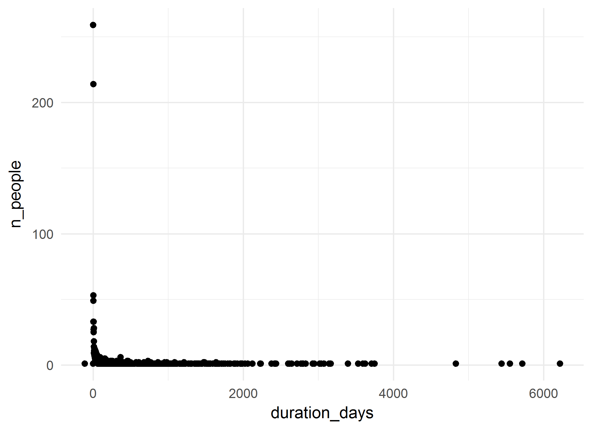
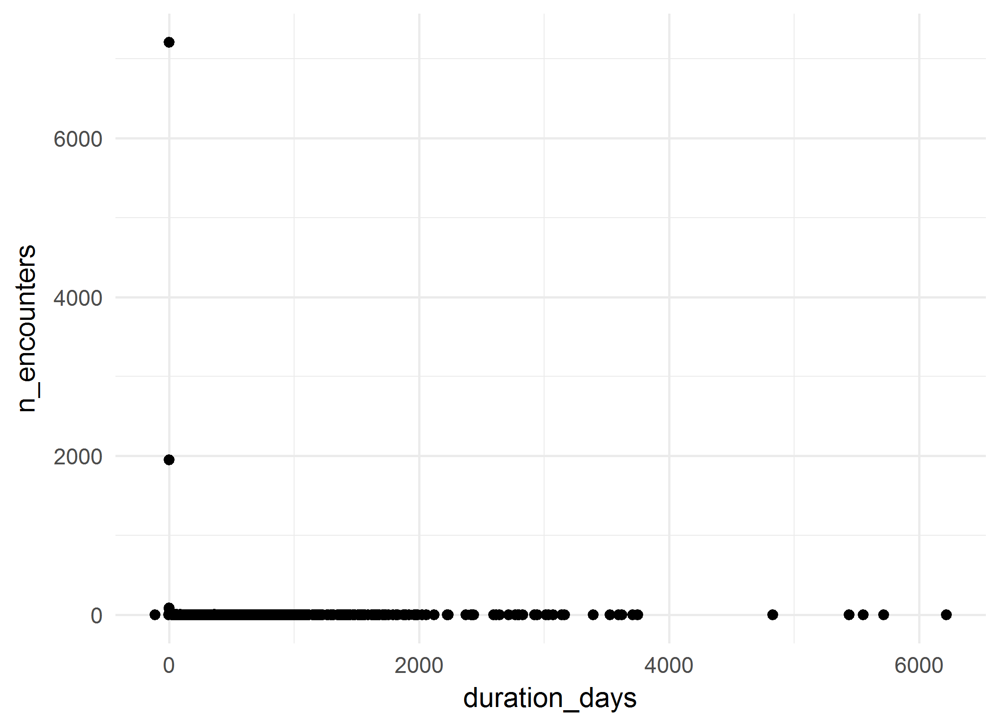
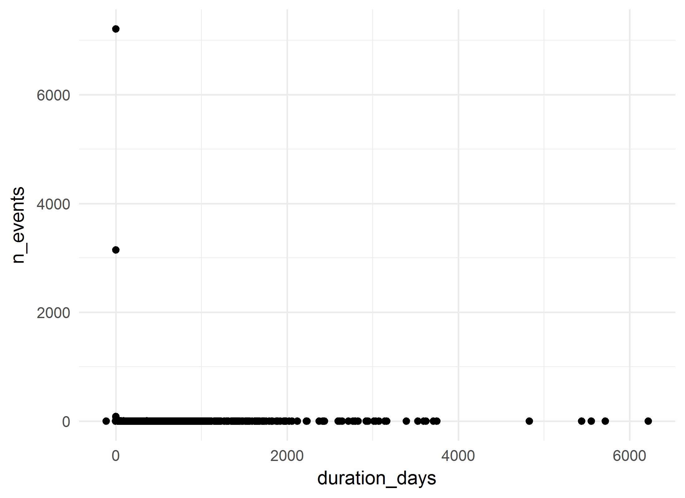

# FAS Diagnosis Cohort: Summative analysis
A.Koval, K.Moselle, S.Robertson  
`r Sys.Date()`  

<!-- These two chunks should be added in the beginning of every .Rmd that you want to source an .R script -->
<!--  The 1st mandatory chunck  -->
<!--  Set the working directory to the repository's base directory -->


<!--  The 2nd mandatory chunck  -->
<!-- Set the report-wide options, and point to the external code file. -->


<!-- Load 'sourced' R files.  Suppress the output when loading packages. --> 


<!-- Load the sources.  Suppress the output when loading sources. --> 

# I. Exposition

## Glossary
Review some of the object definition to help you interpret the report. 
<!-- Load any Global functions and variables declared in the R file.  Suppress the output. --> 

```r
# dto_location_map.rds is products of `./manipulation/0-ellis-location-map.R` 
path_input_location_map   <- "./data-unshared/derived/dto_location_map.rds" 
path_input_patient_events <-  "./data-unshared/derived/dto_patient_events_fas_diagnosis_267.rds" # research cohort
# Make sure the files are located where they supposed to be, in `./data-unshared/` folder
testit::assert("File does not exist", base::file.exists(path_input_location_map))
testit::assert("File does not exist", base::file.exists(path_input_patient_events))
# list variables that constitute patient event table
components_patient_events <- c(
  "id"                           # patient unique key
  ,"gender"                      # biological sex
  ,"age_group"                   # in groups of 5 years
  ,"encounter_id"                # unique identifier for the encounter 
  ,"encounter_class"             # value from the D_Location dimension table in the data warehous
  ,"encounter_type"              # value from the D_Location dimension table in the data warehous
  ,"event_type"                  # high-level classification of the event (encounter itself, diagnosis, procedure, clinical order, laboratory, pharmacy event, etc.).           
  ,"event_title"                 # a shorter, more rolled up category describing the event
  ,"event_detail"                # description of the event, can be long and specific
  ,"event_count"                 # count of the events in the row- each row has a value of 1, and can be summed
  ,"event_year"                  # year in which event occurred 
  ,"event_month"                 # month in which event occured
  ,"event_start_date"            # might be the date of the event itself (e.g. date of diagnosis) or the start date of the encounter that the event is associated with     
  ,"event_end_date"              # might be the end date of the event itself (e.g. end date of prescriptions) or the end date of the encounter that the event is associated with
  ,"start_day"                   # number of days between the first day the patient accessed Island Health services and the start date of this event. This is useful to mask dates, but still provides the relative time between events.
  ,"end_day"                     # number of days between the first day the patient accessed Island Health services and the end date of this event. This is useful to mask dates, but still provides the relative time between events.            
  ,"duration_days"               # number of days between the Start_Day and End_Day (End_Day - Start_Day)
  ,"addiction_location_count"    # patient has accessed services at a location that was used for the selection of the cohort
  ,"location_map_id"             # unique id for VIHA program, connects to location map
  ,"palette_code"                # unique id for colours of this palette
  ,"palette_colour_name"         # labels for clusters of service programs (aka 3T palette colours)
)
# list variables that consitute location map table
components_location_map <- c(
  "location_map_id"              # unique id for VIHA program, connects to patient events
  , "site_name"                  # CERNER address          # EHR address   
  , "facility_name"              # CERNER address          # EHR address   
  , "building_name"              # CERNER address          # EHR address   
  , "unit_name"                  # CERNER address          # EHR address   
  , "location_category"          # Data Warehouse address  # EHR address           
  , "location_type"              # Data Warehouse address  # EHR address           
  , "location_grouping"          # Data Warehouse address  # EHR address            
  , "site_key"                   # Factual counterparts to CERNER address
  , "facility_key"               # Factual counterparts to CERNER address
  , "building_key"               # Factual counterparts to CERNER address
  , "unit_key"                   # Factual counterparts to CERNER address
  , "intensity_type"             # Classifier, Compressor, Lense
  , "intensity_severity_risk"    # Classifier, Compressor, Lense
  , "clinical_focus"             # Classifier, Compressor, Lense
  , "service_type"               # Classifier, Compressor, Lense
  , "service_location"           # Classifier, Compressor, Lense
  , "population_age"             # Classifier, Compressor, Lense
  , "provider_mix"               # Classifier, Compressor, Lense
  , "location_class_code"        # Program Class, identifier
  , "location_class_description" # Porgram Class, Descriptive label
  , "palette_code"               # Palette,  identifier       # cluster specific     
  , "palette_colour_name"        # Palette, descriptive label # cluster specific            
)

# define output format for the report
options(
  knitr.table.format = "html"
  ,tibble.width = 110
  #   ,bootstrap_options = c("striped", "hover", "condensed","responsive")
)
```


<!-- Declare any global functions specific to a Rmd output.  Suppress the output. --> 


## Load Data
<!-- Load the datasets.   -->

```r
ds_patient_events <- readRDS(path_input_patient_events) # %>% as.data.frame()
ds_location_map   <- readRDS(path_input_location_map)

ds_patient_events  %>% glimpse()
ds_location_map %>% glimpse()
```

<!-- Inspect the datasets.   -->


## Data Tweaks
<!-- Tweak the datasets.   -->

```r
# augment the event table with additional columns from location map
ds <- dplyr::left_join(
  ds_patient_events,             # patient event table
  ds_location_map %>%         # location map 
    dplyr::select_(.dots = components_location_map)
  ,by = c("location_map_id","palette_code","palette_colour_name") 
) %>% 
  dplyr::mutate(
    location_class_description_display    = substr(location_class_description,1,42)
    ,palette_colour_name_display = substr(palette_colour_name,1,42)
  )
ds_location_map %>% glimpse()
# from this point on, ds_location_map is needed only for selective reference
ds %>% glimpse()
# ds now contains full coordinates to events of the cohort down to unit level
# ehr_address + location_classifiers + palette_colours
```

# II. Patient Events
The main data set `ds` contains both patient events table and their location map coordinates.

```r
# the data object containing events and location map 
ds %>% glimpse()
```

```
Observations: 11,732
Variables: 43
$ id                                 <chr> "10WAB3", "10WAB3", "10WAB3", "10WAB3", "10WAB3", "10WAB3", "1...
$ gender                             <chr> "Female", "Female", "Female", "Female", "Female", "Female", "F...
$ age_group                          <chr> "35 - 39", "35 - 39", "30 - 34", "30 - 34", "35 - 39", "35 - 3...
$ encounter_id                       <chr> "1257B894", "1332C94", "14830854", "14B89B34", "1587BE84", "16...
$ encounter_class                    <chr> "Outpatient", "Recurring", "Inpatient", "Outpatient", "Emergen...
$ encounter_type                     <chr> "Ambulatory", "Open Encounter", "MHAS - Acute Care", "Ambulato...
$ event_type                         <chr> "Encounter Only", "Encounter Only", "Encounter Only", "Encount...
$ event_title                        <chr> "Outpatient", "Outpatient", "Mental Health", "Child, Youth & F...
$ event_detail                       <chr> "Outpatient", "Laboratory", "Adult Psychiatry", "Maternity", N...
$ event_count                        <int> 1, 1, 1, 1, 1, 1, 1, 1, 1, 1, 1, 1, 1, 1, 1, 1, 1, 1, 1, 1, 1,...
$ event_year                         <int> 2016, 2015, 2012, 2013, 2016, 2015, 2015, 2015, 2016, 2015, 20...
$ event_month                        <int> 6, 10, 5, 1, 8, 11, 8, 11, 4, 11, 1, 1, 1, 1, 8, 6, 8, 10, 12,...
$ event_start_date                   <date> 2016-06-15, 2015-10-26, 2012-05-13, 2013-01-18, 2016-08-15, 2...
$ event_end_date                     <date> 2016-06-15, 2016-06-30, 2012-05-14, 2013-01-18, 2016-08-16, 2...
$ start_day                          <int> 1865, 1632, 371, 621, 1926, 1667, 1570, 1654, 1797, 1649, 626,...
$ end_day                            <int> 1865, 1880, 372, 621, 1927, 1667, 1570, 1654, 1950, 1649, 626,...
$ duration_days                      <int> 0, 248, 1, 0, 1, 0, 0, 0, 153, 0, 1, 1, 1, 0, 0, 0, 0, 0, 0, 0...
$ addiction_location_count           <int> 0, 0, 1, 0, 0, 0, 0, 0, 0, 0, 0, 0, 0, 0, 1, 1, 1, 0, 0, 0, 0,...
$ location_map_id                    <int> 764, 647, 1554, 1190, 1655, 1150, 891, 1150, 1544, 807, 1365, ...
$ palette_code                       <int> 0, 36, 11, 71, 28, 36, 38, 36, 82, 36, 6, 6, 6, 0, 11, 11, 11,...
$ palette_colour_name                <chr> NA, "Lab - Island Health - General", "Addictions - Sobering & ...
$ site_name                          <chr> "Nanaimo Regional General Hospital", NA, "MHSU Community - Sou...
$ facility_name                      <chr> "Nanaimo Regional General Hospital", "Island Clinical Support ...
$ building_name                      <chr> "Nanaimo Regional General Hospital", "Nanaimo Sat Lab", "Sober...
$ unit_name                          <chr> "Infectious Disease-NRG", "Lab-Sat Lab", "Female Beds", "Obste...
$ location_category                  <chr> NA, "Ambulatory", "Community-MHAS", "Inpatient-Acute", "Emerge...
$ location_type                      <chr> "Unclassified", "Laboratory", "Community-MHAS", "InPt-Acute-Ma...
$ location_grouping                  <chr> NA, NA, "Mental Health Community Care Services", "Inpatient-Ac...
$ site_key                           <chr> NA, NA, NA, NA, NA, NA, NA, NA, NA, NA, NA, NA, NA, NA, NA, NA...
$ facility_key                       <chr> "NRG", "ICS", "MHSCC", "NRG", "NRG", "ICSC", "NRG", "ICSC", "M...
$ building_key                       <chr> "NRGA", "SLAB", "SOB", "NRGA", "NRGA", "SLAB", "NRGA", "SLAB",...
$ unit_key                           <chr> "IDN", "LASL", "FBED", "OBNN", "EDNRGH", "LASL", "MINR", "LASL...
$ intensity_type                     <chr> NA, "Laboratory", "Residential Care", "Ambulatory-Episodic", "...
$ intensity_severity_risk            <chr> NA, "Lab-General", "High Intensity Res Care", "Ambulatory Epis...
$ clinical_focus                     <chr> NA, "Lab", "MHSU-Addictions", "Maternity, Perinatal", "Emergen...
$ service_type                       <chr> NA, "Laboratory", "Res Care-MHSU-Crisis", "Ambulatory-Episodic...
$ service_location                   <chr> NA, "IH Lab", "Community Facility", "Ambulatory Clinic", "Hosp...
$ population_age                     <chr> NA, "Mixed Ages", "Adults, some adols, older adults", "Mother-...
$ provider_mix                       <chr> NA, "Miscellaneous", "Nursing and allied health professional, ...
$ location_class_code                <int> 1, 146, 22, 123, 78, 146, 148, 146, 144, 146, 68, 68, 68, 1, 2...
$ location_class_description         <chr> NA, "Lab - Island Health - General", "Addictions - Sobering & ...
$ location_class_description_display <chr> NA, "Lab - Island Health - General", "Addictions - Sobering & ...
$ palette_colour_name_display        <chr> NA, "Lab - Island Health - General", "Addictions - Sobering & ...
```

```r
# What variables relate to patient event table?
# What variables relate to locations at which events took place?
# How many unique values does each variable/column contain? 
ds %>% select_(.dots=components_patient_events) %>% summarise_all(dplyr::n_distinct) %>% t() 
```

```
                          [,1]
id                         267
gender                       2
age_group                   14
encounter_id             10537
encounter_class              7
encounter_type              15
event_type                   3
event_title                 54
event_detail               687
event_count                  1
event_year                  19
event_month                 13
event_start_date          2301
event_end_date            2209
start_day                 2955
end_day                   3011
duration_days              536
addiction_location_count     2
location_map_id            760
palette_code                76
palette_colour_name         76
```

```r
ds %>% select_(.dots=components_location_map) %>% summarise_all(dplyr::n_distinct) %>% t() 
```

```
                           [,1]
location_map_id             760
site_name                    56
facility_name               106
building_name               194
unit_name                   546
location_category            10
location_type                40
location_grouping            22
site_key                      1
facility_key                 85
building_key                159
unit_key                    496
intensity_type               14
intensity_severity_risk      34
clinical_focus               35
service_type                 48
service_location             13
population_age                8
provider_mix                 18
location_class_code         100
location_class_description  100
palette_code                 76
palette_colour_name          76
```

```r
# they share / connected by the fields:
intersect(components_patient_events, components_location_map)
```

```
[1] "location_map_id"     "palette_code"        "palette_colour_name"
```

## Overview

```r
# PET - Patient Event Table
# How many patients are in this cohort?
ds %>% distinct(id) %>% count() %>% neat()
```

<?xml version="1.0" encoding="UTF-8"?>
<table class="table table-striped table-hover table-condensed table-responsive" style="width: auto !important; text-align: right;">
 <thead>
  <tr>
   <th style="text-align:right;"> n </th>
  </tr>
 </thead>
<tbody>
  <tr>
   <td style="text-align:right;"> 267 </td>
  </tr>
</tbody>
</table>

```r
# What are basic demographics?
ds %>% unique_sums(c("gender")) %>% arrange(desc(n_people)) %>% neat()
```

<?xml version="1.0" encoding="UTF-8"?>
<table class="table table-striped table-hover table-condensed table-responsive" style="width: auto !important; text-align: right;">
 <thead>
  <tr>
   <th style="text-align:left;"> gender </th>
   <th style="text-align:right;"> n_people </th>
   <th style="text-align:right;"> n_encounters </th>
   <th style="text-align:right;"> n_events </th>
  </tr>
 </thead>
<tbody>
  <tr>
   <td style="text-align:left;"> Male </td>
   <td style="text-align:right;"> 143 </td>
   <td style="text-align:right;"> 4027 </td>
   <td style="text-align:right;"> 4435 </td>
  </tr>
  <tr>
   <td style="text-align:left;"> Female </td>
   <td style="text-align:right;"> 124 </td>
   <td style="text-align:right;"> 6510 </td>
   <td style="text-align:right;"> 7297 </td>
  </tr>
</tbody>
</table>

```r
ds %>% unique_sums(c("age_group"))  %>%  neat()
```

<?xml version="1.0" encoding="UTF-8"?>
<table class="table table-striped table-hover table-condensed table-responsive" style="width: auto !important; text-align: right;">
 <thead>
  <tr>
   <th style="text-align:left;"> age_group </th>
   <th style="text-align:right;"> n_people </th>
   <th style="text-align:right;"> n_encounters </th>
   <th style="text-align:right;"> n_events </th>
  </tr>
 </thead>
<tbody>
  <tr>
   <td style="text-align:left;"> &lt;1 </td>
   <td style="text-align:right;"> 8 </td>
   <td style="text-align:right;"> 32 </td>
   <td style="text-align:right;"> 38 </td>
  </tr>
  <tr>
   <td style="text-align:left;"> 01 - 04 </td>
   <td style="text-align:right;"> 16 </td>
   <td style="text-align:right;"> 161 </td>
   <td style="text-align:right;"> 171 </td>
  </tr>
  <tr>
   <td style="text-align:left;"> 05 - 09 </td>
   <td style="text-align:right;"> 33 </td>
   <td style="text-align:right;"> 265 </td>
   <td style="text-align:right;"> 299 </td>
  </tr>
  <tr>
   <td style="text-align:left;"> 10 - 14 </td>
   <td style="text-align:right;"> 65 </td>
   <td style="text-align:right;"> 637 </td>
   <td style="text-align:right;"> 718 </td>
  </tr>
  <tr>
   <td style="text-align:left;"> 15 - 19 </td>
   <td style="text-align:right;"> 110 </td>
   <td style="text-align:right;"> 2014 </td>
   <td style="text-align:right;"> 2274 </td>
  </tr>
  <tr>
   <td style="text-align:left;"> 20 - 24 </td>
   <td style="text-align:right;"> 105 </td>
   <td style="text-align:right;"> 2186 </td>
   <td style="text-align:right;"> 2465 </td>
  </tr>
  <tr>
   <td style="text-align:left;"> 25 - 29 </td>
   <td style="text-align:right;"> 89 </td>
   <td style="text-align:right;"> 1894 </td>
   <td style="text-align:right;"> 2097 </td>
  </tr>
  <tr>
   <td style="text-align:left;"> 30 - 34 </td>
   <td style="text-align:right;"> 53 </td>
   <td style="text-align:right;"> 1004 </td>
   <td style="text-align:right;"> 1095 </td>
  </tr>
  <tr>
   <td style="text-align:left;"> 35 - 39 </td>
   <td style="text-align:right;"> 30 </td>
   <td style="text-align:right;"> 562 </td>
   <td style="text-align:right;"> 613 </td>
  </tr>
  <tr>
   <td style="text-align:left;"> 40 - 44 </td>
   <td style="text-align:right;"> 15 </td>
   <td style="text-align:right;"> 530 </td>
   <td style="text-align:right;"> 577 </td>
  </tr>
  <tr>
   <td style="text-align:left;"> 45 - 49 </td>
   <td style="text-align:right;"> 10 </td>
   <td style="text-align:right;"> 811 </td>
   <td style="text-align:right;"> 876 </td>
  </tr>
  <tr>
   <td style="text-align:left;"> 50 - 54 </td>
   <td style="text-align:right;"> 6 </td>
   <td style="text-align:right;"> 388 </td>
   <td style="text-align:right;"> 450 </td>
  </tr>
  <tr>
   <td style="text-align:left;"> 55 - 59 </td>
   <td style="text-align:right;"> 1 </td>
   <td style="text-align:right;"> 16 </td>
   <td style="text-align:right;"> 22 </td>
  </tr>
  <tr>
   <td style="text-align:left;"> No value </td>
   <td style="text-align:right;"> 30 </td>
   <td style="text-align:right;"> 37 </td>
   <td style="text-align:right;"> 37 </td>
  </tr>
</tbody>
</table>

```r
ds %>% unique_sums(c("gender","age_group")) %>%  neat()
```

<?xml version="1.0" encoding="UTF-8"?>
<table class="table table-striped table-hover table-condensed table-responsive" style="width: auto !important; text-align: right;">
 <thead>
  <tr>
   <th style="text-align:left;"> gender </th>
   <th style="text-align:left;"> age_group </th>
   <th style="text-align:right;"> n_people </th>
   <th style="text-align:right;"> n_encounters </th>
   <th style="text-align:right;"> n_events </th>
  </tr>
 </thead>
<tbody>
  <tr>
   <td style="text-align:left;"> Female </td>
   <td style="text-align:left;"> &lt;1 </td>
   <td style="text-align:right;"> 4 </td>
   <td style="text-align:right;"> 22 </td>
   <td style="text-align:right;"> 28 </td>
  </tr>
  <tr>
   <td style="text-align:left;"> Female </td>
   <td style="text-align:left;"> 01 - 04 </td>
   <td style="text-align:right;"> 7 </td>
   <td style="text-align:right;"> 38 </td>
   <td style="text-align:right;"> 39 </td>
  </tr>
  <tr>
   <td style="text-align:left;"> Female </td>
   <td style="text-align:left;"> 05 - 09 </td>
   <td style="text-align:right;"> 7 </td>
   <td style="text-align:right;"> 22 </td>
   <td style="text-align:right;"> 22 </td>
  </tr>
  <tr>
   <td style="text-align:left;"> Female </td>
   <td style="text-align:left;"> 10 - 14 </td>
   <td style="text-align:right;"> 28 </td>
   <td style="text-align:right;"> 347 </td>
   <td style="text-align:right;"> 397 </td>
  </tr>
  <tr>
   <td style="text-align:left;"> Female </td>
   <td style="text-align:left;"> 15 - 19 </td>
   <td style="text-align:right;"> 54 </td>
   <td style="text-align:right;"> 1257 </td>
   <td style="text-align:right;"> 1410 </td>
  </tr>
  <tr>
   <td style="text-align:left;"> Female </td>
   <td style="text-align:left;"> 20 - 24 </td>
   <td style="text-align:right;"> 48 </td>
   <td style="text-align:right;"> 1614 </td>
   <td style="text-align:right;"> 1822 </td>
  </tr>
  <tr>
   <td style="text-align:left;"> Female </td>
   <td style="text-align:left;"> 25 - 29 </td>
   <td style="text-align:right;"> 44 </td>
   <td style="text-align:right;"> 1054 </td>
   <td style="text-align:right;"> 1186 </td>
  </tr>
  <tr>
   <td style="text-align:left;"> Female </td>
   <td style="text-align:left;"> 30 - 34 </td>
   <td style="text-align:right;"> 32 </td>
   <td style="text-align:right;"> 642 </td>
   <td style="text-align:right;"> 716 </td>
  </tr>
  <tr>
   <td style="text-align:left;"> Female </td>
   <td style="text-align:left;"> 35 - 39 </td>
   <td style="text-align:right;"> 19 </td>
   <td style="text-align:right;"> 436 </td>
   <td style="text-align:right;"> 479 </td>
  </tr>
  <tr>
   <td style="text-align:left;"> Female </td>
   <td style="text-align:left;"> 40 - 44 </td>
   <td style="text-align:right;"> 8 </td>
   <td style="text-align:right;"> 449 </td>
   <td style="text-align:right;"> 493 </td>
  </tr>
  <tr>
   <td style="text-align:left;"> Female </td>
   <td style="text-align:left;"> 45 - 49 </td>
   <td style="text-align:right;"> 6 </td>
   <td style="text-align:right;"> 388 </td>
   <td style="text-align:right;"> 429 </td>
  </tr>
  <tr>
   <td style="text-align:left;"> Female </td>
   <td style="text-align:left;"> 50 - 54 </td>
   <td style="text-align:right;"> 5 </td>
   <td style="text-align:right;"> 208 </td>
   <td style="text-align:right;"> 237 </td>
  </tr>
  <tr>
   <td style="text-align:left;"> Female </td>
   <td style="text-align:left;"> 55 - 59 </td>
   <td style="text-align:right;"> 1 </td>
   <td style="text-align:right;"> 16 </td>
   <td style="text-align:right;"> 22 </td>
  </tr>
  <tr>
   <td style="text-align:left;"> Female </td>
   <td style="text-align:left;"> No value </td>
   <td style="text-align:right;"> 14 </td>
   <td style="text-align:right;"> 17 </td>
   <td style="text-align:right;"> 17 </td>
  </tr>
  <tr>
   <td style="text-align:left;"> Male </td>
   <td style="text-align:left;"> &lt;1 </td>
   <td style="text-align:right;"> 4 </td>
   <td style="text-align:right;"> 10 </td>
   <td style="text-align:right;"> 10 </td>
  </tr>
  <tr>
   <td style="text-align:left;"> Male </td>
   <td style="text-align:left;"> 01 - 04 </td>
   <td style="text-align:right;"> 9 </td>
   <td style="text-align:right;"> 123 </td>
   <td style="text-align:right;"> 132 </td>
  </tr>
  <tr>
   <td style="text-align:left;"> Male </td>
   <td style="text-align:left;"> 05 - 09 </td>
   <td style="text-align:right;"> 26 </td>
   <td style="text-align:right;"> 243 </td>
   <td style="text-align:right;"> 277 </td>
  </tr>
  <tr>
   <td style="text-align:left;"> Male </td>
   <td style="text-align:left;"> 10 - 14 </td>
   <td style="text-align:right;"> 37 </td>
   <td style="text-align:right;"> 290 </td>
   <td style="text-align:right;"> 321 </td>
  </tr>
  <tr>
   <td style="text-align:left;"> Male </td>
   <td style="text-align:left;"> 15 - 19 </td>
   <td style="text-align:right;"> 56 </td>
   <td style="text-align:right;"> 757 </td>
   <td style="text-align:right;"> 864 </td>
  </tr>
  <tr>
   <td style="text-align:left;"> Male </td>
   <td style="text-align:left;"> 20 - 24 </td>
   <td style="text-align:right;"> 57 </td>
   <td style="text-align:right;"> 572 </td>
   <td style="text-align:right;"> 643 </td>
  </tr>
  <tr>
   <td style="text-align:left;"> Male </td>
   <td style="text-align:left;"> 25 - 29 </td>
   <td style="text-align:right;"> 45 </td>
   <td style="text-align:right;"> 840 </td>
   <td style="text-align:right;"> 911 </td>
  </tr>
  <tr>
   <td style="text-align:left;"> Male </td>
   <td style="text-align:left;"> 30 - 34 </td>
   <td style="text-align:right;"> 21 </td>
   <td style="text-align:right;"> 362 </td>
   <td style="text-align:right;"> 379 </td>
  </tr>
  <tr>
   <td style="text-align:left;"> Male </td>
   <td style="text-align:left;"> 35 - 39 </td>
   <td style="text-align:right;"> 11 </td>
   <td style="text-align:right;"> 126 </td>
   <td style="text-align:right;"> 134 </td>
  </tr>
  <tr>
   <td style="text-align:left;"> Male </td>
   <td style="text-align:left;"> 40 - 44 </td>
   <td style="text-align:right;"> 7 </td>
   <td style="text-align:right;"> 81 </td>
   <td style="text-align:right;"> 84 </td>
  </tr>
  <tr>
   <td style="text-align:left;"> Male </td>
   <td style="text-align:left;"> 45 - 49 </td>
   <td style="text-align:right;"> 4 </td>
   <td style="text-align:right;"> 423 </td>
   <td style="text-align:right;"> 447 </td>
  </tr>
  <tr>
   <td style="text-align:left;"> Male </td>
   <td style="text-align:left;"> 50 - 54 </td>
   <td style="text-align:right;"> 1 </td>
   <td style="text-align:right;"> 180 </td>
   <td style="text-align:right;"> 213 </td>
  </tr>
  <tr>
   <td style="text-align:left;"> Male </td>
   <td style="text-align:left;"> No value </td>
   <td style="text-align:right;"> 16 </td>
   <td style="text-align:right;"> 20 </td>
   <td style="text-align:right;"> 20 </td>
  </tr>
</tbody>
</table>

## DW tags

```r
# how may unique encounters are there in this set?
ds %>% distinct(encounter_id) %>% count() %>% neat()
```

<?xml version="1.0" encoding="UTF-8"?>
<table class="table table-striped table-hover table-condensed table-responsive" style="width: auto !important; text-align: right;">
 <thead>
  <tr>
   <th style="text-align:right;"> n </th>
  </tr>
 </thead>
<tbody>
  <tr>
   <td style="text-align:right;"> 10537 </td>
  </tr>
</tbody>
</table>

```r
# tally engagement across encounter classes (as defined by data warehouse)
ds %>% unique_sums("encounter_class")%>% arrange(desc(n_people)) %>% neat()
```

<?xml version="1.0" encoding="UTF-8"?>
<table class="table table-striped table-hover table-condensed table-responsive" style="width: auto !important; text-align: right;">
 <thead>
  <tr>
   <th style="text-align:left;"> encounter_class </th>
   <th style="text-align:right;"> n_people </th>
   <th style="text-align:right;"> n_encounters </th>
   <th style="text-align:right;"> n_events </th>
  </tr>
 </thead>
<tbody>
  <tr>
   <td style="text-align:left;"> Emergency </td>
   <td style="text-align:right;"> 250 </td>
   <td style="text-align:right;"> 4491 </td>
   <td style="text-align:right;"> 4505 </td>
  </tr>
  <tr>
   <td style="text-align:left;"> Outpatient </td>
   <td style="text-align:right;"> 230 </td>
   <td style="text-align:right;"> 2860 </td>
   <td style="text-align:right;"> 2889 </td>
  </tr>
  <tr>
   <td style="text-align:left;"> Recurring </td>
   <td style="text-align:right;"> 219 </td>
   <td style="text-align:right;"> 1086 </td>
   <td style="text-align:right;"> 1087 </td>
  </tr>
  <tr>
   <td style="text-align:left;"> Inpatient </td>
   <td style="text-align:right;"> 202 </td>
   <td style="text-align:right;"> 1371 </td>
   <td style="text-align:right;"> 2520 </td>
  </tr>
  <tr>
   <td style="text-align:left;"> Other </td>
   <td style="text-align:right;"> 136 </td>
   <td style="text-align:right;"> 644 </td>
   <td style="text-align:right;"> 646 </td>
  </tr>
  <tr>
   <td style="text-align:left;"> Home Care </td>
   <td style="text-align:right;"> 51 </td>
   <td style="text-align:right;"> 81 </td>
   <td style="text-align:right;"> 81 </td>
  </tr>
  <tr>
   <td style="text-align:left;"> Cancelled Admission </td>
   <td style="text-align:right;"> 4 </td>
   <td style="text-align:right;"> 4 </td>
   <td style="text-align:right;"> 4 </td>
  </tr>
</tbody>
</table>

```r
ds %>% unique_sums("encounter_type") %>% arrange(desc(n_people)) %>% neat()
```

<?xml version="1.0" encoding="UTF-8"?>
<table class="table table-striped table-hover table-condensed table-responsive" style="width: auto !important; text-align: right;">
 <thead>
  <tr>
   <th style="text-align:left;"> encounter_type </th>
   <th style="text-align:right;"> n_people </th>
   <th style="text-align:right;"> n_encounters </th>
   <th style="text-align:right;"> n_events </th>
  </tr>
 </thead>
<tbody>
  <tr>
   <td style="text-align:left;"> Emergency </td>
   <td style="text-align:right;"> 250 </td>
   <td style="text-align:right;"> 4491 </td>
   <td style="text-align:right;"> 4505 </td>
  </tr>
  <tr>
   <td style="text-align:left;"> Ambulatory </td>
   <td style="text-align:right;"> 227 </td>
   <td style="text-align:right;"> 2715 </td>
   <td style="text-align:right;"> 2717 </td>
  </tr>
  <tr>
   <td style="text-align:left;"> Open Encounter </td>
   <td style="text-align:right;"> 216 </td>
   <td style="text-align:right;"> 1070 </td>
   <td style="text-align:right;"> 1071 </td>
  </tr>
  <tr>
   <td style="text-align:left;"> Inpatient Acute </td>
   <td style="text-align:right;"> 195 </td>
   <td style="text-align:right;"> 814 </td>
   <td style="text-align:right;"> 1961 </td>
  </tr>
  <tr>
   <td style="text-align:left;"> Specimen </td>
   <td style="text-align:right;"> 117 </td>
   <td style="text-align:right;"> 597 </td>
   <td style="text-align:right;"> 599 </td>
  </tr>
  <tr>
   <td style="text-align:left;"> Day Care </td>
   <td style="text-align:right;"> 60 </td>
   <td style="text-align:right;"> 145 </td>
   <td style="text-align:right;"> 172 </td>
  </tr>
  <tr>
   <td style="text-align:left;"> MHAS - Residential </td>
   <td style="text-align:right;"> 59 </td>
   <td style="text-align:right;"> 235 </td>
   <td style="text-align:right;"> 235 </td>
  </tr>
  <tr>
   <td style="text-align:left;"> Home Care </td>
   <td style="text-align:right;"> 51 </td>
   <td style="text-align:right;"> 81 </td>
   <td style="text-align:right;"> 81 </td>
  </tr>
  <tr>
   <td style="text-align:left;"> Waitlist </td>
   <td style="text-align:right;"> 30 </td>
   <td style="text-align:right;"> 37 </td>
   <td style="text-align:right;"> 37 </td>
  </tr>
  <tr>
   <td style="text-align:left;"> MHAS - Acute Care </td>
   <td style="text-align:right;"> 14 </td>
   <td style="text-align:right;"> 317 </td>
   <td style="text-align:right;"> 317 </td>
  </tr>
  <tr>
   <td style="text-align:left;"> Recurring/Series </td>
   <td style="text-align:right;"> 12 </td>
   <td style="text-align:right;"> 16 </td>
   <td style="text-align:right;"> 16 </td>
  </tr>
  <tr>
   <td style="text-align:left;"> Morgue </td>
   <td style="text-align:right;"> 9 </td>
   <td style="text-align:right;"> 10 </td>
   <td style="text-align:right;"> 10 </td>
  </tr>
  <tr>
   <td style="text-align:left;"> Cancelled Admission </td>
   <td style="text-align:right;"> 4 </td>
   <td style="text-align:right;"> 4 </td>
   <td style="text-align:right;"> 4 </td>
  </tr>
  <tr>
   <td style="text-align:left;"> Newborn </td>
   <td style="text-align:right;"> 3 </td>
   <td style="text-align:right;"> 3 </td>
   <td style="text-align:right;"> 5 </td>
  </tr>
  <tr>
   <td style="text-align:left;"> Residential Care </td>
   <td style="text-align:right;"> 1 </td>
   <td style="text-align:right;"> 2 </td>
   <td style="text-align:right;"> 2 </td>
  </tr>
</tbody>
</table>

```r
ds %>% unique_sums(c("encounter_class","encounter_type"))%>% arrange(desc(encounter_class,n_people)) %>% neat()
```

<?xml version="1.0" encoding="UTF-8"?>
<table class="table table-striped table-hover table-condensed table-responsive" style="width: auto !important; text-align: right;">
 <thead>
  <tr>
   <th style="text-align:left;"> encounter_class </th>
   <th style="text-align:left;"> encounter_type </th>
   <th style="text-align:right;"> n_people </th>
   <th style="text-align:right;"> n_encounters </th>
   <th style="text-align:right;"> n_events </th>
  </tr>
 </thead>
<tbody>
  <tr>
   <td style="text-align:left;"> Recurring </td>
   <td style="text-align:left;"> Open Encounter </td>
   <td style="text-align:right;"> 216 </td>
   <td style="text-align:right;"> 1070 </td>
   <td style="text-align:right;"> 1071 </td>
  </tr>
  <tr>
   <td style="text-align:left;"> Recurring </td>
   <td style="text-align:left;"> Recurring/Series </td>
   <td style="text-align:right;"> 12 </td>
   <td style="text-align:right;"> 16 </td>
   <td style="text-align:right;"> 16 </td>
  </tr>
  <tr>
   <td style="text-align:left;"> Outpatient </td>
   <td style="text-align:left;"> Ambulatory </td>
   <td style="text-align:right;"> 227 </td>
   <td style="text-align:right;"> 2715 </td>
   <td style="text-align:right;"> 2717 </td>
  </tr>
  <tr>
   <td style="text-align:left;"> Outpatient </td>
   <td style="text-align:left;"> Day Care </td>
   <td style="text-align:right;"> 60 </td>
   <td style="text-align:right;"> 145 </td>
   <td style="text-align:right;"> 172 </td>
  </tr>
  <tr>
   <td style="text-align:left;"> Other </td>
   <td style="text-align:left;"> Morgue </td>
   <td style="text-align:right;"> 9 </td>
   <td style="text-align:right;"> 10 </td>
   <td style="text-align:right;"> 10 </td>
  </tr>
  <tr>
   <td style="text-align:left;"> Other </td>
   <td style="text-align:left;"> Specimen </td>
   <td style="text-align:right;"> 117 </td>
   <td style="text-align:right;"> 597 </td>
   <td style="text-align:right;"> 599 </td>
  </tr>
  <tr>
   <td style="text-align:left;"> Other </td>
   <td style="text-align:left;"> Waitlist </td>
   <td style="text-align:right;"> 30 </td>
   <td style="text-align:right;"> 37 </td>
   <td style="text-align:right;"> 37 </td>
  </tr>
  <tr>
   <td style="text-align:left;"> Inpatient </td>
   <td style="text-align:left;"> Inpatient Acute </td>
   <td style="text-align:right;"> 195 </td>
   <td style="text-align:right;"> 814 </td>
   <td style="text-align:right;"> 1961 </td>
  </tr>
  <tr>
   <td style="text-align:left;"> Inpatient </td>
   <td style="text-align:left;"> MHAS - Acute Care </td>
   <td style="text-align:right;"> 14 </td>
   <td style="text-align:right;"> 317 </td>
   <td style="text-align:right;"> 317 </td>
  </tr>
  <tr>
   <td style="text-align:left;"> Inpatient </td>
   <td style="text-align:left;"> MHAS - Residential </td>
   <td style="text-align:right;"> 59 </td>
   <td style="text-align:right;"> 235 </td>
   <td style="text-align:right;"> 235 </td>
  </tr>
  <tr>
   <td style="text-align:left;"> Inpatient </td>
   <td style="text-align:left;"> Newborn </td>
   <td style="text-align:right;"> 3 </td>
   <td style="text-align:right;"> 3 </td>
   <td style="text-align:right;"> 5 </td>
  </tr>
  <tr>
   <td style="text-align:left;"> Inpatient </td>
   <td style="text-align:left;"> Residential Care </td>
   <td style="text-align:right;"> 1 </td>
   <td style="text-align:right;"> 2 </td>
   <td style="text-align:right;"> 2 </td>
  </tr>
  <tr>
   <td style="text-align:left;"> Home Care </td>
   <td style="text-align:left;"> Home Care </td>
   <td style="text-align:right;"> 51 </td>
   <td style="text-align:right;"> 81 </td>
   <td style="text-align:right;"> 81 </td>
  </tr>
  <tr>
   <td style="text-align:left;"> Emergency </td>
   <td style="text-align:left;"> Emergency </td>
   <td style="text-align:right;"> 250 </td>
   <td style="text-align:right;"> 4491 </td>
   <td style="text-align:right;"> 4505 </td>
  </tr>
  <tr>
   <td style="text-align:left;"> Cancelled Admission </td>
   <td style="text-align:left;"> Cancelled Admission </td>
   <td style="text-align:right;"> 4 </td>
   <td style="text-align:right;"> 4 </td>
   <td style="text-align:right;"> 4 </td>
  </tr>
</tbody>
</table>

## ACRU tags

```r
# how many event types  were there?
ds %>% unique_sums("event_type") %>% arrange(desc(n_people)) %>% neat()
```

<?xml version="1.0" encoding="UTF-8"?>
<table class="table table-striped table-hover table-condensed table-responsive" style="width: auto !important; text-align: right;">
 <thead>
  <tr>
   <th style="text-align:left;"> event_type </th>
   <th style="text-align:right;"> n_people </th>
   <th style="text-align:right;"> n_encounters </th>
   <th style="text-align:right;"> n_events </th>
  </tr>
 </thead>
<tbody>
  <tr>
   <td style="text-align:left;"> Encounter Only </td>
   <td style="text-align:right;"> 266 </td>
   <td style="text-align:right;"> 9663 </td>
   <td style="text-align:right;"> 9663 </td>
  </tr>
  <tr>
   <td style="text-align:left;"> Diagnosis </td>
   <td style="text-align:right;"> 175 </td>
   <td style="text-align:right;"> 693 </td>
   <td style="text-align:right;"> 1835 </td>
  </tr>
  <tr>
   <td style="text-align:left;"> Organism Identified </td>
   <td style="text-align:right;"> 76 </td>
   <td style="text-align:right;"> 205 </td>
   <td style="text-align:right;"> 234 </td>
  </tr>
</tbody>
</table>

```r
# view event_title and event_details with a dynmaic table 
ds %>% unique_sums(c("event_type","event_title","event_detail"))%>% arrange(desc(n_people)) %>% neat_DT()
```

<!--html_preserve--><div id="htmlwidget-b9487357ab23167f0c24" style="width:100%;height:auto;" class="datatables html-widget"></div>
<script type="application/json" data-for="htmlwidget-b9487357ab23167f0c24">{"x":{"filter":"top","filterHTML":"<tr>\n  <td><\/td>\n  <td data-type=\"character\" style=\"vertical-align: top;\">\n    <div class=\"form-group has-feedback\" style=\"margin-bottom: auto;\">\n      <input type=\"search\" placeholder=\"All\" class=\"form-control\" style=\"width: 100%;\"/>\n      <span class=\"glyphicon glyphicon-remove-circle form-control-feedback\"><\/span>\n    <\/div>\n  <\/td>\n  <td data-type=\"character\" style=\"vertical-align: top;\">\n    <div class=\"form-group has-feedback\" style=\"margin-bottom: auto;\">\n      <input type=\"search\" placeholder=\"All\" class=\"form-control\" style=\"width: 100%;\"/>\n      <span class=\"glyphicon glyphicon-remove-circle form-control-feedback\"><\/span>\n    <\/div>\n  <\/td>\n  <td data-type=\"character\" style=\"vertical-align: top;\">\n    <div class=\"form-group has-feedback\" style=\"margin-bottom: auto;\">\n      <input type=\"search\" placeholder=\"All\" class=\"form-control\" style=\"width: 100%;\"/>\n      <span class=\"glyphicon glyphicon-remove-circle form-control-feedback\"><\/span>\n    <\/div>\n  <\/td>\n  <td data-type=\"integer\" style=\"vertical-align: top;\">\n    <div class=\"form-group has-feedback\" style=\"margin-bottom: auto;\">\n      <input type=\"search\" placeholder=\"All\" class=\"form-control\" style=\"width: 100%;\"/>\n      <span class=\"glyphicon glyphicon-remove-circle form-control-feedback\"><\/span>\n    <\/div>\n    <div style=\"display: none; position: absolute; width: 200px;\">\n      <div data-min=\"1\" data-max=\"260\"><\/div>\n      <span style=\"float: left;\"><\/span>\n      <span style=\"float: right;\"><\/span>\n    <\/div>\n  <\/td>\n  <td data-type=\"integer\" style=\"vertical-align: top;\">\n    <div class=\"form-group has-feedback\" style=\"margin-bottom: auto;\">\n      <input type=\"search\" placeholder=\"All\" class=\"form-control\" style=\"width: 100%;\"/>\n      <span class=\"glyphicon glyphicon-remove-circle form-control-feedback\"><\/span>\n    <\/div>\n    <div style=\"display: none; position: absolute; width: 200px;\">\n      <div data-min=\"1\" data-max=\"4962\"><\/div>\n      <span style=\"float: left;\"><\/span>\n      <span style=\"float: right;\"><\/span>\n    <\/div>\n  <\/td>\n  <td data-type=\"integer\" style=\"vertical-align: top;\">\n    <div class=\"form-group has-feedback\" style=\"margin-bottom: auto;\">\n      <input type=\"search\" placeholder=\"All\" class=\"form-control\" style=\"width: 100%;\"/>\n      <span class=\"glyphicon glyphicon-remove-circle form-control-feedback\"><\/span>\n    <\/div>\n    <div style=\"display: none; position: absolute; width: 200px;\">\n      <div data-min=\"1\" data-max=\"4962\"><\/div>\n      <span style=\"float: left;\"><\/span>\n      <span style=\"float: right;\"><\/span>\n    <\/div>\n  <\/td>\n<\/tr>","data":[["1","2","3","4","5","6","7","8","9","10","11","12","13","14","15","16","17","18","19","20","21","22","23","24","25","26","27","28","29","30","31","32","33","34","35","36","37","38","39","40","41","42","43","44","45","46","47","48","49","50","51","52","53","54","55","56","57","58","59","60","61","62","63","64","65","66","67","68","69","70","71","72","73","74","75","76","77","78","79","80","81","82","83","84","85","86","87","88","89","90","91","92","93","94","95","96","97","98","99","100","101","102","103","104","105","106","107","108","109","110","111","112","113","114","115","116","117","118","119","120","121","122","123","124","125","126","127","128","129","130","131","132","133","134","135","136","137","138","139","140","141","142","143","144","145","146","147","148","149","150","151","152","153","154","155","156","157","158","159","160","161","162","163","164","165","166","167","168","169","170","171","172","173","174","175","176","177","178","179","180","181","182","183","184","185","186","187","188","189","190","191","192","193","194","195","196","197","198","199","200","201","202","203","204","205","206","207","208","209","210","211","212","213","214","215","216","217","218","219","220","221","222","223","224","225","226","227","228","229","230","231","232","233","234","235","236","237","238","239","240","241","242","243","244","245","246","247","248","249","250","251","252","253","254","255","256","257","258","259","260","261","262","263","264","265","266","267","268","269","270","271","272","273","274","275","276","277","278","279","280","281","282","283","284","285","286","287","288","289","290","291","292","293","294","295","296","297","298","299","300","301","302","303","304","305","306","307","308","309","310","311","312","313","314","315","316","317","318","319","320","321","322","323","324","325","326","327","328","329","330","331","332","333","334","335","336","337","338","339","340","341","342","343","344","345","346","347","348","349","350","351","352","353","354","355","356","357","358","359","360","361","362","363","364","365","366","367","368","369","370","371","372","373","374","375","376","377","378","379","380","381","382","383","384","385","386","387","388","389","390","391","392","393","394","395","396","397","398","399","400","401","402","403","404","405","406","407","408","409","410","411","412","413","414","415","416","417","418","419","420","421","422","423","424","425","426","427","428","429","430","431","432","433","434","435","436","437","438","439","440","441","442","443","444","445","446","447","448","449","450","451","452","453","454","455","456","457","458","459","460","461","462","463","464","465","466","467","468","469","470","471","472","473","474","475","476","477","478","479","480","481","482","483","484","485","486","487","488","489","490","491","492","493","494","495","496","497","498","499","500","501","502","503","504","505","506","507","508","509","510","511","512","513","514","515","516","517","518","519","520","521","522","523","524","525","526","527","528","529","530","531","532","533","534","535","536","537","538","539","540","541","542","543","544","545","546","547","548","549","550","551","552","553","554","555","556","557","558","559","560","561","562","563","564","565","566","567","568","569","570","571","572","573","574","575","576","577","578","579","580","581","582","583","584","585","586","587","588","589","590","591","592","593","594","595","596","597","598","599","600","601","602","603","604","605","606","607","608","609","610","611","612","613","614","615","616","617","618","619","620","621","622","623","624","625","626","627","628","629","630","631","632","633","634","635","636","637","638","639","640","641","642","643","644","645","646","647","648","649","650","651","652","653","654","655","656","657","658","659","660","661","662","663","664","665","666","667","668","669","670","671","672","673","674","675","676","677","678","679","680","681","682","683","684","685","686","687","688","689","690","691","692","693","694","695","696","697","698","699","700","701","702","703","704","705","706","707","708","709","710","711","712","713"],["Encounter Only","Encounter Only","Encounter Only","Encounter Only","Diagnosis","Encounter Only","Encounter Only","Organism Identified","Diagnosis","Diagnosis","Diagnosis","Diagnosis","Encounter Only","Diagnosis","Diagnosis","Diagnosis","Encounter Only","Diagnosis","Encounter Only","Diagnosis","Encounter Only","Encounter Only","Organism Identified","Organism Identified","Diagnosis","Diagnosis","Diagnosis","Diagnosis","Diagnosis","Diagnosis","Diagnosis","Diagnosis","Encounter Only","Diagnosis","Diagnosis","Diagnosis","Diagnosis","Encounter Only","Diagnosis","Diagnosis","Diagnosis","Diagnosis","Diagnosis","Diagnosis","Diagnosis","Encounter Only","Organism Identified","Organism Identified","Diagnosis","Diagnosis","Diagnosis","Diagnosis","Diagnosis","Diagnosis","Encounter Only","Encounter Only","Diagnosis","Diagnosis","Diagnosis","Diagnosis","Diagnosis","Diagnosis","Encounter Only","Diagnosis","Diagnosis","Diagnosis","Diagnosis","Diagnosis","Diagnosis","Diagnosis","Diagnosis","Diagnosis","Diagnosis","Diagnosis","Diagnosis","Diagnosis","Diagnosis","Encounter Only","Encounter Only","Encounter Only","Organism Identified","Organism Identified","Diagnosis","Diagnosis","Diagnosis","Diagnosis","Diagnosis","Diagnosis","Diagnosis","Diagnosis","Diagnosis","Diagnosis","Diagnosis","Diagnosis","Diagnosis","Diagnosis","Diagnosis","Diagnosis","Diagnosis","Diagnosis","Diagnosis","Diagnosis","Encounter Only","Encounter Only","Diagnosis","Diagnosis","Diagnosis","Diagnosis","Diagnosis","Diagnosis","Diagnosis","Diagnosis","Diagnosis","Diagnosis","Diagnosis","Diagnosis","Diagnosis","Diagnosis","Diagnosis","Diagnosis","Diagnosis","Diagnosis","Diagnosis","Diagnosis","Diagnosis","Diagnosis","Diagnosis","Diagnosis","Diagnosis","Diagnosis","Diagnosis","Diagnosis","Diagnosis","Diagnosis","Diagnosis","Diagnosis","Diagnosis","Diagnosis","Diagnosis","Diagnosis","Diagnosis","Diagnosis","Diagnosis","Diagnosis","Diagnosis","Diagnosis","Diagnosis","Diagnosis","Diagnosis","Diagnosis","Diagnosis","Diagnosis","Diagnosis","Diagnosis","Encounter Only","Encounter Only","Encounter Only","Organism Identified","Diagnosis","Diagnosis","Diagnosis","Diagnosis","Diagnosis","Diagnosis","Diagnosis","Diagnosis","Diagnosis","Diagnosis","Diagnosis","Diagnosis","Diagnosis","Diagnosis","Diagnosis","Diagnosis","Diagnosis","Diagnosis","Diagnosis","Diagnosis","Diagnosis","Diagnosis","Diagnosis","Diagnosis","Diagnosis","Diagnosis","Diagnosis","Diagnosis","Diagnosis","Diagnosis","Diagnosis","Diagnosis","Diagnosis","Diagnosis","Diagnosis","Diagnosis","Diagnosis","Diagnosis","Diagnosis","Diagnosis","Diagnosis","Diagnosis","Diagnosis","Diagnosis","Diagnosis","Diagnosis","Diagnosis","Diagnosis","Diagnosis","Diagnosis","Diagnosis","Diagnosis","Diagnosis","Diagnosis","Diagnosis","Diagnosis","Diagnosis","Diagnosis","Diagnosis","Diagnosis","Diagnosis","Diagnosis","Diagnosis","Diagnosis","Diagnosis","Diagnosis","Diagnosis","Diagnosis","Diagnosis","Diagnosis","Diagnosis","Diagnosis","Diagnosis","Diagnosis","Diagnosis","Diagnosis","Diagnosis","Diagnosis","Diagnosis","Diagnosis","Diagnosis","Diagnosis","Diagnosis","Diagnosis","Diagnosis","Diagnosis","Encounter Only","Encounter Only","Encounter Only","Encounter Only","Organism Identified","Organism Identified","Organism Identified","Organism Identified","Organism Identified","Organism Identified","Organism Identified","Diagnosis","Diagnosis","Diagnosis","Diagnosis","Diagnosis","Diagnosis","Diagnosis","Diagnosis","Diagnosis","Diagnosis","Diagnosis","Diagnosis","Diagnosis","Diagnosis","Diagnosis","Diagnosis","Diagnosis","Diagnosis","Diagnosis","Diagnosis","Diagnosis","Diagnosis","Diagnosis","Diagnosis","Diagnosis","Diagnosis","Diagnosis","Diagnosis","Diagnosis","Diagnosis","Diagnosis","Diagnosis","Diagnosis","Diagnosis","Diagnosis","Diagnosis","Diagnosis","Diagnosis","Diagnosis","Diagnosis","Diagnosis","Diagnosis","Diagnosis","Diagnosis","Diagnosis","Diagnosis","Diagnosis","Diagnosis","Diagnosis","Diagnosis","Diagnosis","Diagnosis","Diagnosis","Diagnosis","Diagnosis","Diagnosis","Diagnosis","Diagnosis","Diagnosis","Diagnosis","Diagnosis","Diagnosis","Diagnosis","Diagnosis","Diagnosis","Diagnosis","Diagnosis","Diagnosis","Diagnosis","Diagnosis","Diagnosis","Diagnosis","Diagnosis","Diagnosis","Diagnosis","Diagnosis","Diagnosis","Diagnosis","Diagnosis","Diagnosis","Diagnosis","Diagnosis","Diagnosis","Diagnosis","Diagnosis","Diagnosis","Diagnosis","Diagnosis","Diagnosis","Diagnosis","Diagnosis","Diagnosis","Diagnosis","Diagnosis","Diagnosis","Diagnosis","Diagnosis","Diagnosis","Diagnosis","Diagnosis","Diagnosis","Diagnosis","Diagnosis","Diagnosis","Diagnosis","Diagnosis","Diagnosis","Diagnosis","Diagnosis","Diagnosis","Diagnosis","Diagnosis","Diagnosis","Diagnosis","Diagnosis","Diagnosis","Diagnosis","Diagnosis","Diagnosis","Diagnosis","Diagnosis","Diagnosis","Diagnosis","Diagnosis","Diagnosis","Diagnosis","Diagnosis","Diagnosis","Diagnosis","Diagnosis","Diagnosis","Diagnosis","Diagnosis","Diagnosis","Diagnosis","Diagnosis","Diagnosis","Diagnosis","Diagnosis","Diagnosis","Diagnosis","Diagnosis","Diagnosis","Diagnosis","Diagnosis","Diagnosis","Diagnosis","Diagnosis","Diagnosis","Diagnosis","Diagnosis","Diagnosis","Diagnosis","Diagnosis","Diagnosis","Diagnosis","Diagnosis","Diagnosis","Diagnosis","Diagnosis","Diagnosis","Diagnosis","Diagnosis","Diagnosis","Diagnosis","Diagnosis","Diagnosis","Diagnosis","Diagnosis","Diagnosis","Diagnosis","Diagnosis","Diagnosis","Diagnosis","Diagnosis","Diagnosis","Diagnosis","Diagnosis","Diagnosis","Diagnosis","Diagnosis","Diagnosis","Diagnosis","Diagnosis","Diagnosis","Diagnosis","Diagnosis","Diagnosis","Diagnosis","Diagnosis","Diagnosis","Diagnosis","Diagnosis","Diagnosis","Diagnosis","Diagnosis","Diagnosis","Diagnosis","Diagnosis","Diagnosis","Diagnosis","Diagnosis","Diagnosis","Diagnosis","Diagnosis","Diagnosis","Diagnosis","Diagnosis","Diagnosis","Diagnosis","Diagnosis","Diagnosis","Diagnosis","Diagnosis","Diagnosis","Diagnosis","Diagnosis","Diagnosis","Diagnosis","Diagnosis","Diagnosis","Diagnosis","Diagnosis","Diagnosis","Diagnosis","Diagnosis","Diagnosis","Diagnosis","Diagnosis","Diagnosis","Diagnosis","Diagnosis","Diagnosis","Diagnosis","Diagnosis","Diagnosis","Diagnosis","Diagnosis","Diagnosis","Diagnosis","Diagnosis","Diagnosis","Diagnosis","Diagnosis","Diagnosis","Diagnosis","Diagnosis","Diagnosis","Diagnosis","Diagnosis","Diagnosis","Diagnosis","Diagnosis","Diagnosis","Diagnosis","Diagnosis","Diagnosis","Diagnosis","Diagnosis","Diagnosis","Diagnosis","Diagnosis","Diagnosis","Diagnosis","Diagnosis","Diagnosis","Diagnosis","Diagnosis","Diagnosis","Diagnosis","Diagnosis","Diagnosis","Diagnosis","Diagnosis","Diagnosis","Diagnosis","Diagnosis","Diagnosis","Diagnosis","Diagnosis","Diagnosis","Diagnosis","Diagnosis","Diagnosis","Diagnosis","Diagnosis","Diagnosis","Diagnosis","Diagnosis","Diagnosis","Diagnosis","Diagnosis","Diagnosis","Diagnosis","Diagnosis","Diagnosis","Diagnosis","Diagnosis","Diagnosis","Diagnosis","Diagnosis","Diagnosis","Diagnosis","Diagnosis","Diagnosis","Diagnosis","Diagnosis","Diagnosis","Diagnosis","Diagnosis","Diagnosis","Diagnosis","Diagnosis","Diagnosis","Diagnosis","Diagnosis","Diagnosis","Diagnosis","Diagnosis","Diagnosis","Diagnosis","Diagnosis","Diagnosis","Diagnosis","Diagnosis","Diagnosis","Diagnosis","Diagnosis","Diagnosis","Diagnosis","Diagnosis","Diagnosis","Diagnosis","Diagnosis","Diagnosis","Diagnosis","Diagnosis","Diagnosis","Diagnosis","Diagnosis","Diagnosis","Diagnosis","Diagnosis","Diagnosis","Diagnosis","Diagnosis","Diagnosis","Diagnosis","Diagnosis","Diagnosis","Diagnosis","Diagnosis","Diagnosis","Diagnosis","Diagnosis","Diagnosis","Diagnosis","Diagnosis","Diagnosis","Diagnosis","Diagnosis","Diagnosis","Diagnosis","Diagnosis","Diagnosis","Diagnosis","Diagnosis","Diagnosis","Diagnosis","Diagnosis","Diagnosis","Diagnosis","Diagnosis","Diagnosis","Diagnosis","Diagnosis","Diagnosis","Diagnosis","Diagnosis","Diagnosis","Diagnosis","Diagnosis","Diagnosis","Diagnosis","Diagnosis","Diagnosis","Diagnosis","Diagnosis","Diagnosis","Diagnosis","Diagnosis","Diagnosis","Diagnosis","Diagnosis","Diagnosis","Diagnosis","Diagnosis","Diagnosis","Encounter Only","Encounter Only","Encounter Only","Encounter Only","Encounter Only","Encounter Only","Encounter Only","Encounter Only","Encounter Only","Encounter Only","Encounter Only","Encounter Only","Encounter Only","Organism Identified","Organism Identified","Organism Identified","Organism Identified","Organism Identified","Organism Identified","Organism Identified","Organism Identified","Organism Identified","Organism Identified","Organism Identified","Organism Identified","Organism Identified","Organism Identified","Organism Identified","Organism Identified","Organism Identified","Organism Identified","Organism Identified","Organism Identified","Organism Identified","Organism Identified","Organism Identified","Organism Identified","Organism Identified","Organism Identified","Organism Identified","Organism Identified","Organism Identified","Organism Identified","Organism Identified","Organism Identified","Organism Identified","Organism Identified","Organism Identified","Organism Identified","Organism Identified","Organism Identified","Organism Identified","Organism Identified","Organism Identified","Organism Identified","Organism Identified","Organism Identified","Organism Identified","Organism Identified","Organism Identified"],[null,"Mental Health","Outpatient","Outpatient","Congenital malformations, deformations and chromosomal abnormalities","Outpatient","Medicine","Culture Urine","Factors influencing health status and contact with health services","Mental and behavioural disorders","Mental and behavioural disorders","Mental and behavioural disorders","Child, Youth &amp; Family","Mental and behavioural disorders","Mental and behavioural disorders","Mental and behavioural disorders","Child, Youth &amp; Family","Mental and behavioural disorders","Rehab","Mental and behavioural disorders","Child, Youth &amp; Family","Medicine","Culture Wound","Urine Culture","Mental and behavioural disorders","Mental and behavioural disorders","Symptoms, signs and abnormal clinical and laboratory findings, not elsewhere classified","Symptoms, signs and abnormal clinical and laboratory findings, not elsewhere classified","Mental and behavioural disorders","Pregnancy, childbirth and the puerperium","External causes of morbidity and mortality","Mental and behavioural disorders","Medicine","Diseases of the genitourinary system","Mental and behavioural disorders","External causes of morbidity and mortality","Injury, poisoning and certain other consequences of external causes","Medicine","Diseases of the digestive system","External causes of morbidity and mortality","Mental and behavioural disorders","Mental and behavioural disorders","Pregnancy, childbirth and the puerperium","Pregnancy, childbirth and the puerperium","Symptoms, signs and abnormal clinical and laboratory findings, not elsewhere classified","Outpatient","Culture Wound","Wound Culture","Diseases of the blood and blood-forming organs and certain disorders involving the immune mechanism","Diseases of the blood and blood-forming organs and certain disorders involving the immune mechanism","Factors influencing health status and contact with health services","Factors influencing health status and contact with health services","Mental and behavioural disorders","Pregnancy, childbirth and the puerperium","Outpatient","Outpatient","Endocrine, nutritional and metabolic diseases","Factors influencing health status and contact with health services","Mental and behavioural disorders","Mental and behavioural disorders","Mental and behavioural disorders","Pregnancy, childbirth and the puerperium","Surgery","Diseases of the digestive system","Diseases of the respiratory system","Endocrine, nutritional and metabolic diseases","Injury, poisoning and certain other consequences of external causes","Mental and behavioural disorders","Mental and behavioural disorders","Mental and behavioural disorders","Mental and behavioural disorders","Mental and behavioural disorders","Mental and behavioural disorders","Mental and behavioural disorders","Pregnancy, childbirth and the puerperium","Pregnancy, childbirth and the puerperium","Symptoms, signs and abnormal clinical and laboratory findings, not elsewhere classified","Other","Surgery","Surgery","Culture Blood","Culture Wound","Certain infectious and parasitic diseases","Diseases of the circulatory system","Diseases of the digestive system","Diseases of the genitourinary system","Endocrine, nutritional and metabolic diseases","Endocrine, nutritional and metabolic diseases","External causes of morbidity and mortality","External causes of morbidity and mortality","Factors influencing health status and contact with health services","Factors influencing health status and contact with health services","Factors influencing health status and contact with health services","Factors influencing health status and contact with health services","Injury, poisoning and certain other consequences of external causes","Mental and behavioural disorders","Mental and behavioural disorders","Mental and behavioural disorders","Pregnancy, childbirth and the puerperium","Pregnancy, childbirth and the puerperium","Pregnancy, childbirth and the puerperium","Pregnancy, childbirth and the puerperium","ICU","Surgery","Certain infectious and parasitic diseases","Diseases of the digestive system","Diseases of the digestive system","Diseases of the digestive system","Diseases of the digestive system","Diseases of the digestive system","Diseases of the digestive system","Diseases of the ear and mastoid process","Diseases of the genitourinary system","Diseases of the nervous system","Diseases of the respiratory system","Diseases of the respiratory system","External causes of morbidity and mortality","External causes of morbidity and mortality","External causes of morbidity and mortality","External causes of morbidity and mortality","External causes of morbidity and mortality","External causes of morbidity and mortality","Factors influencing health status and contact with health services","Factors influencing health status and contact with health services","Factors influencing health status and contact with health services","Factors influencing health status and contact with health services","Injury, poisoning and certain other consequences of external causes","Injury, poisoning and certain other consequences of external causes","Injury, poisoning and certain other consequences of external causes","Mental and behavioural disorders","Mental and behavioural disorders","Mental and behavioural disorders","Mental and behavioural disorders","Mental and behavioural disorders","Mental and behavioural disorders","Mental and behavioural disorders","Mental and behavioural disorders","Mental and behavioural disorders","Mental and behavioural disorders","Mental and behavioural disorders","Mental and behavioural disorders","Mental and behavioural disorders","Mental and behavioural disorders","Mental and behavioural disorders","Pregnancy, childbirth and the puerperium","Pregnancy, childbirth and the puerperium","Pregnancy, childbirth and the puerperium","Pregnancy, childbirth and the puerperium","Pregnancy, childbirth and the puerperium","Symptoms, signs and abnormal clinical and laboratory findings, not elsewhere classified","Symptoms, signs and abnormal clinical and laboratory findings, not elsewhere classified","Symptoms, signs and abnormal clinical and laboratory findings, not elsewhere classified","Symptoms, signs and abnormal clinical and laboratory findings, not elsewhere classified","Symptoms, signs and abnormal clinical and laboratory findings, not elsewhere classified","Medicine","Surgery","Surgery","Culture Urine","Certain infectious and parasitic diseases","Certain infectious and parasitic diseases","Diseases of the blood and blood-forming organs and certain disorders involving the immune mechanism","Diseases of the digestive system","Diseases of the digestive system","Diseases of the digestive system","Diseases of the digestive system","Diseases of the digestive system","Diseases of the digestive system","Diseases of the digestive system","Diseases of the digestive system","Diseases of the ear and mastoid process","Diseases of the genitourinary system","Diseases of the genitourinary system","Diseases of the genitourinary system","Diseases of the musculoskeletal system and connective tissue","Diseases of the musculoskeletal system and connective tissue","Diseases of the musculoskeletal system and connective tissue","Diseases of the nervous system","Diseases of the nervous system","Diseases of the nervous system","Diseases of the respiratory system","Diseases of the respiratory system","Diseases of the respiratory system","Diseases of the skin and subcutaneous tissue","Endocrine, nutritional and metabolic diseases","Endocrine, nutritional and metabolic diseases","Endocrine, nutritional and metabolic diseases","Endocrine, nutritional and metabolic diseases","External causes of morbidity and mortality","External causes of morbidity and mortality","External causes of morbidity and mortality","External causes of morbidity and mortality","External causes of morbidity and mortality","External causes of morbidity and mortality","External causes of morbidity and mortality","External causes of morbidity and mortality","Factors influencing health status and contact with health services","Factors influencing health status and contact with health services","Factors influencing health status and contact with health services","Factors influencing health status and contact with health services","Factors influencing health status and contact with health services","Factors influencing health status and contact with health services","Factors influencing health status and contact with health services","Injury, poisoning and certain other consequences of external causes","Injury, poisoning and certain other consequences of external causes","Injury, poisoning and certain other consequences of external causes","Injury, poisoning and certain other consequences of external causes","Injury, poisoning and certain other consequences of external causes","Injury, poisoning and certain other consequences of external causes","Injury, poisoning and certain other consequences of external causes","Injury, poisoning and certain other consequences of external causes","Injury, poisoning and certain other consequences of external causes","Injury, poisoning and certain other consequences of external causes","Injury, poisoning and certain other consequences of external causes","Injury, poisoning and certain other consequences of external causes","Injury, poisoning and certain other consequences of external causes","Injury, poisoning and certain other consequences of external causes","Mental and behavioural disorders","Mental and behavioural disorders","Mental and behavioural disorders","Mental and behavioural disorders","Mental and behavioural disorders","Mental and behavioural disorders","Mental and behavioural disorders","Mental and behavioural disorders","Mental and behavioural disorders","Mental and behavioural disorders","Mental and behavioural disorders","Mental and behavioural disorders","Mental and behavioural disorders","Mental and behavioural disorders","Mental and behavioural disorders","Mental and behavioural disorders","Pregnancy, childbirth and the puerperium","Pregnancy, childbirth and the puerperium","Pregnancy, childbirth and the puerperium","Pregnancy, childbirth and the puerperium","Pregnancy, childbirth and the puerperium","Symptoms, signs and abnormal clinical and laboratory findings, not elsewhere classified","Symptoms, signs and abnormal clinical and laboratory findings, not elsewhere classified","Symptoms, signs and abnormal clinical and laboratory findings, not elsewhere classified","Symptoms, signs and abnormal clinical and laboratory findings, not elsewhere classified","Symptoms, signs and abnormal clinical and laboratory findings, not elsewhere classified","Symptoms, signs and abnormal clinical and laboratory findings, not elsewhere classified","Symptoms, signs and abnormal clinical and laboratory findings, not elsewhere classified","ALC","Child, Youth &amp; Family","Medicine","Seniors","Culture ARO MRSA Only","Culture Blood","Culture Mycobacteria","Culture Urine","Culture Urine","Culture Urine","zzCulture ARO ESBL","Certain infectious and parasitic diseases","Certain infectious and parasitic diseases","Certain infectious and parasitic diseases","Certain infectious and parasitic diseases","Certain infectious and parasitic diseases","Certain infectious and parasitic diseases","Certain infectious and parasitic diseases","Certain infectious and parasitic diseases","Certain infectious and parasitic diseases","Certain infectious and parasitic diseases","Certain infectious and parasitic diseases","Certain infectious and parasitic diseases","Certain infectious and parasitic diseases","Certain infectious and parasitic diseases","Certain infectious and parasitic diseases","Certain infectious and parasitic diseases","Certain infectious and parasitic diseases","Congenital malformations, deformations and chromosomal abnormalities","Congenital malformations, deformations and chromosomal abnormalities","Congenital malformations, deformations and chromosomal abnormalities","Diseases of the blood and blood-forming organs and certain disorders involving the immune mechanism","Diseases of the blood and blood-forming organs and certain disorders involving the immune mechanism","Diseases of the blood and blood-forming organs and certain disorders involving the immune mechanism","Diseases of the blood and blood-forming organs and certain disorders involving the immune mechanism","Diseases of the blood and blood-forming organs and certain disorders involving the immune mechanism","Diseases of the blood and blood-forming organs and certain disorders involving the immune mechanism","Diseases of the blood and blood-forming organs and certain disorders involving the immune mechanism","Diseases of the circulatory system","Diseases of the circulatory system","Diseases of the circulatory system","Diseases of the circulatory system","Diseases of the circulatory system","Diseases of the circulatory system","Diseases of the circulatory system","Diseases of the circulatory system","Diseases of the circulatory system","Diseases of the circulatory system","Diseases of the digestive system","Diseases of the digestive system","Diseases of the digestive system","Diseases of the digestive system","Diseases of the digestive system","Diseases of the digestive system","Diseases of the digestive system","Diseases of the digestive system","Diseases of the digestive system","Diseases of the digestive system","Diseases of the digestive system","Diseases of the digestive system","Diseases of the digestive system","Diseases of the digestive system","Diseases of the digestive system","Diseases of the digestive system","Diseases of the digestive system","Diseases of the digestive system","Diseases of the digestive system","Diseases of the digestive system","Diseases of the digestive system","Diseases of the digestive system","Diseases of the digestive system","Diseases of the digestive system","Diseases of the digestive system","Diseases of the digestive system","Diseases of the digestive system","Diseases of the digestive system","Diseases of the digestive system","Diseases of the digestive system","Diseases of the digestive system","Diseases of the ear and mastoid process","Diseases of the ear and mastoid process","Diseases of the eye and adnexa","Diseases of the eye and adnexa","Diseases of the genitourinary system","Diseases of the genitourinary system","Diseases of the genitourinary system","Diseases of the genitourinary system","Diseases of the genitourinary system","Diseases of the genitourinary system","Diseases of the genitourinary system","Diseases of the genitourinary system","Diseases of the genitourinary system","Diseases of the genitourinary system","Diseases of the genitourinary system","Diseases of the genitourinary system","Diseases of the genitourinary system","Diseases of the musculoskeletal system and connective tissue","Diseases of the musculoskeletal system and connective tissue","Diseases of the musculoskeletal system and connective tissue","Diseases of the musculoskeletal system and connective tissue","Diseases of the musculoskeletal system and connective tissue","Diseases of the musculoskeletal system and connective tissue","Diseases of the musculoskeletal system and connective tissue","Diseases of the musculoskeletal system and connective tissue","Diseases of the musculoskeletal system and connective tissue","Diseases of the musculoskeletal system and connective tissue","Diseases of the musculoskeletal system and connective tissue","Diseases of the musculoskeletal system and connective tissue","Diseases of the musculoskeletal system and connective tissue","Diseases of the musculoskeletal system and connective tissue","Diseases of the musculoskeletal system and connective tissue","Diseases of the musculoskeletal system and connective tissue","Diseases of the musculoskeletal system and connective tissue","Diseases of the musculoskeletal system and connective tissue","Diseases of the musculoskeletal system and connective tissue","Diseases of the musculoskeletal system and connective tissue","Diseases of the nervous system","Diseases of the nervous system","Diseases of the nervous system","Diseases of the nervous system","Diseases of the respiratory system","Diseases of the respiratory system","Diseases of the respiratory system","Diseases of the respiratory system","Diseases of the respiratory system","Diseases of the respiratory system","Diseases of the respiratory system","Diseases of the respiratory system","Diseases of the respiratory system","Diseases of the respiratory system","Diseases of the respiratory system","Diseases of the respiratory system","Diseases of the skin and subcutaneous tissue","Diseases of the skin and subcutaneous tissue","Diseases of the skin and subcutaneous tissue","Diseases of the skin and subcutaneous tissue","Diseases of the skin and subcutaneous tissue","Diseases of the skin and subcutaneous tissue","Diseases of the skin and subcutaneous tissue","Diseases of the skin and subcutaneous tissue","Diseases of the skin and subcutaneous tissue","Diseases of the skin and subcutaneous tissue","Diseases of the skin and subcutaneous tissue","Endocrine, nutritional and metabolic diseases","Endocrine, nutritional and metabolic diseases","Endocrine, nutritional and metabolic diseases","Endocrine, nutritional and metabolic diseases","Endocrine, nutritional and metabolic diseases","Endocrine, nutritional and metabolic diseases","Endocrine, nutritional and metabolic diseases","Endocrine, nutritional and metabolic diseases","Endocrine, nutritional and metabolic diseases","Endocrine, nutritional and metabolic diseases","External causes of morbidity and mortality","External causes of morbidity and mortality","External causes of morbidity and mortality","External causes of morbidity and mortality","External causes of morbidity and mortality","External causes of morbidity and mortality","External causes of morbidity and mortality","External causes of morbidity and mortality","External causes of morbidity and mortality","External causes of morbidity and mortality","External causes of morbidity and mortality","External causes of morbidity and mortality","External causes of morbidity and mortality","External causes of morbidity and mortality","External causes of morbidity and mortality","External causes of morbidity and mortality","External causes of morbidity and mortality","External causes of morbidity and mortality","External causes of morbidity and mortality","External causes of morbidity and mortality","External causes of morbidity and mortality","External causes of morbidity and mortality","External causes of morbidity and mortality","External causes of morbidity and mortality","External causes of morbidity and mortality","External causes of morbidity and mortality","External causes of morbidity and mortality","External causes of morbidity and mortality","External causes of morbidity and mortality","External causes of morbidity and mortality","External causes of morbidity and mortality","External causes of morbidity and mortality","External causes of morbidity and mortality","External causes of morbidity and mortality","External causes of morbidity and mortality","External causes of morbidity and mortality","External causes of morbidity and mortality","External causes of morbidity and mortality","External causes of morbidity and mortality","External causes of morbidity and mortality","External causes of morbidity and mortality","Factors influencing health status and contact with health services","Factors influencing health status and contact with health services","Factors influencing health status and contact with health services","Factors influencing health status and contact with health services","Factors influencing health status and contact with health services","Factors influencing health status and contact with health services","Factors influencing health status and contact with health services","Factors influencing health status and contact with health services","Factors influencing health status and contact with health services","Factors influencing health status and contact with health services","Factors influencing health status and contact with health services","Factors influencing health status and contact with health services","Factors influencing health status and contact with health services","Factors influencing health status and contact with health services","Factors influencing health status and contact with health services","Factors influencing health status and contact with health services","Factors influencing health status and contact with health services","Factors influencing health status and contact with health services","Factors influencing health status and contact with health services","Factors influencing health status and contact with health services","Factors influencing health status and contact with health services","Factors influencing health status and contact with health services","Factors influencing health status and contact with health services","Factors influencing health status and contact with health services","Factors influencing health status and contact with health services","Factors influencing health status and contact with health services","Factors influencing health status and contact with health services","Factors influencing health status and contact with health services","Factors influencing health status and contact with health services","Factors influencing health status and contact with health services","Factors influencing health status and contact with health services","Factors influencing health status and contact with health services","Factors influencing health status and contact with health services","Factors influencing health status and contact with health services","Factors influencing health status and contact with health services","Factors influencing health status and contact with health services","Injury, poisoning and certain other consequences of external causes","Injury, poisoning and certain other consequences of external causes","Injury, poisoning and certain other consequences of external causes","Injury, poisoning and certain other consequences of external causes","Injury, poisoning and certain other consequences of external causes","Injury, poisoning and certain other consequences of external causes","Injury, poisoning and certain other consequences of external causes","Injury, poisoning and certain other consequences of external causes","Injury, poisoning and certain other consequences of external causes","Injury, poisoning and certain other consequences of external causes","Injury, poisoning and certain other consequences of external causes","Injury, poisoning and certain other consequences of external causes","Injury, poisoning and certain other consequences of external causes","Injury, poisoning and certain other consequences of external causes","Injury, poisoning and certain other consequences of external causes","Injury, poisoning and certain other consequences of external causes","Injury, poisoning and certain other consequences of external causes","Injury, poisoning and certain other consequences of external causes","Injury, poisoning and certain other consequences of external causes","Injury, poisoning and certain other consequences of external causes","Injury, poisoning and certain other consequences of external causes","Injury, poisoning and certain other consequences of external causes","Injury, poisoning and certain other consequences of external causes","Injury, poisoning and certain other consequences of external causes","Injury, poisoning and certain other consequences of external causes","Injury, poisoning and certain other consequences of external causes","Injury, poisoning and certain other consequences of external causes","Injury, poisoning and certain other consequences of external causes","Injury, poisoning and certain other consequences of external causes","Injury, poisoning and certain other consequences of external causes","Injury, poisoning and certain other consequences of external causes","Injury, poisoning and certain other consequences of external causes","Injury, poisoning and certain other consequences of external causes","Injury, poisoning and certain other consequences of external causes","Injury, poisoning and certain other consequences of external causes","Injury, poisoning and certain other consequences of external causes","Injury, poisoning and certain other consequences of external causes","Injury, poisoning and certain other consequences of external causes","Injury, poisoning and certain other consequences of external causes","Injury, poisoning and certain other consequences of external causes","Injury, poisoning and certain other consequences of external causes","Injury, poisoning and certain other consequences of external causes","Injury, poisoning and certain other consequences of external causes","Injury, poisoning and certain other consequences of external causes","Injury, poisoning and certain other consequences of external causes","Injury, poisoning and certain other consequences of external causes","Injury, poisoning and certain other consequences of external causes","Injury, poisoning and certain other consequences of external causes","Injury, poisoning and certain other consequences of external causes","Injury, poisoning and certain other consequences of external causes","Injury, poisoning and certain other consequences of external causes","Injury, poisoning and certain other consequences of external causes","Injury, poisoning and certain other consequences of external causes","Injury, poisoning and certain other consequences of external causes","Injury, poisoning and certain other consequences of external causes","Injury, poisoning and certain other consequences of external causes","Injury, poisoning and certain other consequences of external causes","Injury, poisoning and certain other consequences of external causes","Injury, poisoning and certain other consequences of external causes","Injury, poisoning and certain other consequences of external causes","Injury, poisoning and certain other consequences of external causes","Injury, poisoning and certain other consequences of external causes","Injury, poisoning and certain other consequences of external causes","Injury, poisoning and certain other consequences of external causes","Injury, poisoning and certain other consequences of external causes","Injury, poisoning and certain other consequences of external causes","Injury, poisoning and certain other consequences of external causes","Injury, poisoning and certain other consequences of external causes","Injury, poisoning and certain other consequences of external causes","Injury, poisoning and certain other consequences of external causes","Injury, poisoning and certain other consequences of external causes","Injury, poisoning and certain other consequences of external causes","Injury, poisoning and certain other consequences of external causes","Injury, poisoning and certain other consequences of external causes","Injury, poisoning and certain other consequences of external causes","Injury, poisoning and certain other consequences of external causes","Injury, poisoning and certain other consequences of external causes","Injury, poisoning and certain other consequences of external causes","Mental and behavioural disorders","Mental and behavioural disorders","Mental and behavioural disorders","Mental and behavioural disorders","Mental and behavioural disorders","Mental and behavioural disorders","Mental and behavioural disorders","Mental and behavioural disorders","Mental and behavioural disorders","Mental and behavioural disorders","Mental and behavioural disorders","Mental and behavioural disorders","Mental and behavioural disorders","Mental and behavioural disorders","Mental and behavioural disorders","Mental and behavioural disorders","Mental and behavioural disorders","Mental and behavioural disorders","Mental and behavioural disorders","Mental and behavioural disorders","Mental and behavioural disorders","Mental and behavioural disorders","Mental and behavioural disorders","Mental and behavioural disorders","Mental and behavioural disorders","Mental and behavioural disorders","Mental and behavioural disorders","Mental and behavioural disorders","Mental and behavioural disorders","Mental and behavioural disorders","Mental and behavioural disorders","Mental and behavioural disorders","Mental and behavioural disorders","Mental and behavioural disorders","Mental and behavioural disorders","Neoplasms","Neoplasms","Pregnancy, childbirth and the puerperium","Pregnancy, childbirth and the puerperium","Pregnancy, childbirth and the puerperium","Pregnancy, childbirth and the puerperium","Pregnancy, childbirth and the puerperium","Pregnancy, childbirth and the puerperium","Pregnancy, childbirth and the puerperium","Pregnancy, childbirth and the puerperium","Pregnancy, childbirth and the puerperium","Pregnancy, childbirth and the puerperium","Pregnancy, childbirth and the puerperium","Pregnancy, childbirth and the puerperium","Pregnancy, childbirth and the puerperium","Pregnancy, childbirth and the puerperium","Pregnancy, childbirth and the puerperium","Pregnancy, childbirth and the puerperium","Pregnancy, childbirth and the puerperium","Pregnancy, childbirth and the puerperium","Pregnancy, childbirth and the puerperium","Pregnancy, childbirth and the puerperium","Pregnancy, childbirth and the puerperium","Pregnancy, childbirth and the puerperium","Pregnancy, childbirth and the puerperium","Pregnancy, childbirth and the puerperium","Pregnancy, childbirth and the puerperium","Pregnancy, childbirth and the puerperium","Pregnancy, childbirth and the puerperium","Pregnancy, childbirth and the puerperium","Pregnancy, childbirth and the puerperium","Pregnancy, childbirth and the puerperium","Pregnancy, childbirth and the puerperium","Pregnancy, childbirth and the puerperium","Pregnancy, childbirth and the puerperium","Pregnancy, childbirth and the puerperium","Pregnancy, childbirth and the puerperium","Pregnancy, childbirth and the puerperium","Pregnancy, childbirth and the puerperium","Pregnancy, childbirth and the puerperium","Symptoms, signs and abnormal clinical and laboratory findings, not elsewhere classified","Symptoms, signs and abnormal clinical and laboratory findings, not elsewhere classified","Symptoms, signs and abnormal clinical and laboratory findings, not elsewhere classified","Symptoms, signs and abnormal clinical and laboratory findings, not elsewhere classified","Symptoms, signs and abnormal clinical and laboratory findings, not elsewhere classified","Symptoms, signs and abnormal clinical and laboratory findings, not elsewhere classified","Symptoms, signs and abnormal clinical and laboratory findings, not elsewhere classified","Symptoms, signs and abnormal clinical and laboratory findings, not elsewhere classified","Symptoms, signs and abnormal clinical and laboratory findings, not elsewhere classified","Symptoms, signs and abnormal clinical and laboratory findings, not elsewhere classified","Symptoms, signs and abnormal clinical and laboratory findings, not elsewhere classified","Symptoms, signs and abnormal clinical and laboratory findings, not elsewhere classified","Symptoms, signs and abnormal clinical and laboratory findings, not elsewhere classified","Symptoms, signs and abnormal clinical and laboratory findings, not elsewhere classified","Symptoms, signs and abnormal clinical and laboratory findings, not elsewhere classified","Symptoms, signs and abnormal clinical and laboratory findings, not elsewhere classified","Symptoms, signs and abnormal clinical and laboratory findings, not elsewhere classified","Symptoms, signs and abnormal clinical and laboratory findings, not elsewhere classified","Symptoms, signs and abnormal clinical and laboratory findings, not elsewhere classified","Symptoms, signs and abnormal clinical and laboratory findings, not elsewhere classified","Symptoms, signs and abnormal clinical and laboratory findings, not elsewhere classified","Symptoms, signs and abnormal clinical and laboratory findings, not elsewhere classified","Symptoms, signs and abnormal clinical and laboratory findings, not elsewhere classified","Symptoms, signs and abnormal clinical and laboratory findings, not elsewhere classified","Symptoms, signs and abnormal clinical and laboratory findings, not elsewhere classified","Symptoms, signs and abnormal clinical and laboratory findings, not elsewhere classified","ALC","Emergency","Medicine","Medicine","Medicine","Nutrition","Outpatient","Outpatient","Residential","Residential","Residential","Seniors","Surgery","ARO Culture","Blood Culture","Body Fluid Culture","Body Fluid Culture","Culture Blood","Culture Blood","Culture Blood","Culture Blood","Culture Deep","Culture Deep","Culture Deep","Culture Deep","Culture Eye","Culture Eye","Culture Genital","Culture Genital","Culture Genital","Culture Nasal","Culture Respiratory","Culture Sputum","Culture Sputum","Culture Sputum","Culture Sputum","Culture Sputum","Culture Sputum","Culture Stool","Culture Stool","Culture Stool","Culture Tissue","Culture Urine","Culture Urine","Culture Urine","Culture Urine","Culture Urine","Culture Urine","Culture Urine","Culture Urine","Culture Urine","Culture Wound","Culture Wound","Stool Culture","Urine Culture","Urine Culture","Urine Culture","Wound Culture","Wound Culture","zzCulture ARO ESBL"],[null,"Adult Psychiatry","Laboratory","Medical Imaging","Q86.0,  Fetal alcohol syndrome (dysmorphic)","Outpatient","Medicine (Unspecified)","Escherichia coli","Z37.000,  Single live birth spont ovul&amp;conc","F90.0,  Disturbance of activity and attention","F19.1,  Ment/beh dis harmf use mult dr &amp; psyact","F43.2,  Adjustment disorders","Maternity","F10.2,  Ment/beh disrd dt alcohol use dep syndr","F29,  Unspecified nonorganic psychosis","F32.9,  Depressive episode unspecified","Pediatrics","F10.1,  Ment/beh disrd dt harmful alcohol use","Acute Rehabilitation","F43.1,  Post traumatic stress disorder","Obstetrics","Clinical Decision Unit","Staphylococcus aureus","Escherichia coli","F10.0,  Ment/beh disrd dt alcohol use ac intox","F41.9,  Anxiety disorder unspecified","R45.8,  Oth symptoms signs inv emotional state","R46.88,  Oth sym signs inv appearance behaviour","F12.1,  Ment/beh disrd dt cannab use harmf use","O99.801,  Oth spec dis comp preg birth/delivered","X64,  Intent selfpois oth unsp dr med biol sub","F10.3,  Ment/beh disrd dt alco use withdrawal st","Medicine Family Practice","N39.0,  Urinary tract infection site not spec","F43.0,  Acute stress reaction","X60,  Intent self poisn anlgsc antipyr antirhm","T39.1,  Poisoning by 4-Aminophenol derivatives","Medicine Hospitalist","K02.9,  Dental caries unspecified","X61,  Intent selfpoison antiep sed hyp psytrp","F12.2,  Ment/beh disrd dt cannab use dep syndr","F31.9,  Bipolar affective disorder unspecified","O04.9,  Medical abortion complete unspec wo comp","O62.301,  Precipitate labour/delivered","R56.80,  Seizure disorder so described","PHARM","Staphylococcus aureus MRSA","Staphylococcus aureus","D50.9,  Iron deficiency anaemia unspecified","D64.9,  Anaemia unspecified","Z50.2,  Alcohol rehabilitation","Z59.0,  Homelessness","F91.9,  Conduct disorder unspecified","O99.301,  Ment disrd nerv sys preg birth/deliver","Electrodiagnostic Services","Pre-Admission Clinic","E86.0,  Dehydration","Z59.8,  Oth probs housing &amp; economic circumst","F14.1,  Ment/beh disrd dt harmful use cocaine","F15.1,  Ment/beh disrd dt harmf use stimulants","F20.9,  Schizophrenia unspecified","O70.001,  1st dgr perineal laceration del/deliv","Gynecology","K92.2,  Gastrointestinal haemorrhage NOS","J18.9,  Pneumonia unspecified","E11.9,  Type 2 DM no  comp","T40.2,  Poisoning by other opioids","F12.5,  Ment/beh disrd dt cannab use psych disrd","F15.5,  Ment/beh disrd dt stimulants psych disrd","F20.0,  Paranoid schizophrenia","F25.9,  Schizoaffective disorder unspecified","F60.3,  Emotionally unstable personality disrd","F81.9,  Development disrd scholastic skills NOS","F84.0,  Childhood autism","O60.101,  Preterm spont lab and delivery","O68.101,  Lab del complic meconium in amnio/deliv","R56.88,  Other &amp; unspec convulsions","Anaesthesia","Orthopedic","Surgery","Escherichia coli","Streptococcus pyogenes (Group A)","B18.2,  Chronic viral hepatitis C","I10.0,  Benign hypertension","K92.0,  Haematemesis","N17.9,  Acute renal failure unspecified","E87.1,  Hypo osmolality and hyponatraemia","E87.6,  Hypokalaemia","X42,  Accid poisn narc psychodysleptic NEC","X65,  Intentional selfpoisoning alcohol","Z21,  Asymptomatic HIV infection status","Z60.8,  Other problems rel to social environment","Z63.8,  Oth spec probs rel to prim support grp","Z73.1,  Accentuation of personality traits","T51.0,  Toxic effect of ethanol","F11.2,  Ment/beh disrd dt opioid use dep syndr","F60.2,  Dissocial personality disorder","F60.9,  Personality disorder unspecified","O47.003,  False lab &lt;37 comp wks gest/antepart","O68.201,  Lab del FHR abn w meconium/deliv","O99.001,  Anaem comp preg birth puerp/deliver","O99.803,  Oth spec dis comp preg birth/antepartum","Intensive Care Unit","Plastic","A09.9,  Gastroe &amp; colitis of unspec origin","K05.6,  Periodontal disease unspecified","K29.2,  Alcoholic gastritis","K70.1,  Alcoholic hepatitis","K80.10,  Calc gallblad w oth chlcyst wo obstrct","K85.2,  Alcohol induced acute pancreatitis","K92.1,  Melaena","H65.9,  Nonsuppurative otitis media unspecified","N12,  Tubulointerstitial nephritis NOS","G47.30,  Sleep apnoea obstructed","J35.0,  Chronic tonsillitis","J69.0,  Pneumonitis due to food and vomit","V03.1,  Ped vs car truck ped traf accident","X50,  Overexertion strenuous rept move","X62,  Intent selfpoison narc psychdyslpt NEC","X78,  Intentional selfharm by sharp object","Y04,  Assault by bodily force","Y05,  Sexual assault by bodily force","Z22.300,  Carrier of drug resistant staph","Z30.1,  Insertion of IUCD","Z33,  Pregnant state incidental","Z54.8,  Convalescence following other treatment","T43.5,  Psn oth &amp; NOS antipsychotics &amp; neurolept","T45.0,  Poisn antiallergic and antiemetic drugs","T50.9,  Poisn oth NOS drgs medicaments biol subs","F10.9,  Ment/beh disrd dt alco ment/beh dis NOS","F11.3,  Ment/beh disrd dt opioid use withdr st","F14.2,  Ment/beh disrd dt use cocaine dep syndr","F19.2,  Ment/beh dis mult dr &amp; psyact dep syndr","F19.5,  Ment/beh dis mult dr &amp; psyact psych dis","F32.2,  Sev depressive episode wo psych symptoms","F34.1,  Dysthymia","F41.1,  Generalized anxiety disorder","F41.8,  Other specified anxiety disorders","F44.9,  Dissociative [conversion] disorder NOS","F89,  Disorder psychological development NOS","F91.3,  Oppositional defiant disorder","F94.1,  Reactive attachment disorder childhood","F98.8,  Oth spec beh emot disrd child adol onset","F98.9,  Beh &amp; emot disrd child &amp; adol onset NOS","O34.201,  Mat care uterine scar dt Csec/delivered","O42.021,  PROM lab 24 hrs/deliv full term","O63.001,  Prolonged 1st stage (of lab)/deliv","O64.001,  Obs lab incomp rotatn fet head/deliv","O68.001,  Lab del complicated FHR anomaly/del","R10.4,  Other and unspecified abdominal pain","R18,  Ascites","R41.80,  Transient alteration of awareness","R45.1,  Restlessness and agitation","R57.2,  Septic shock","Nephrology","Enterology","Urology","Klebsiella pneumoniae","A41.50,  Sepsis due to E. coli","A41.9,  Sepsis unspec","D50.0,  Iron deficiency anaemia dt blood loss","K05.3,  Chronic periodontitis","K07.3,  Anomalies of tooth position","K21.9,  Gastrooesoph reflux dis w/o oesophagitis","K62.5,  Haemorrhage of anus and rectum","K80.20,  Calc gallblad wo cholecyst wo obstruct","K80.50,  Calc bil dct wo cholang/cholecy wo obst","K81.0,  Acute cholecystitis","K85.9,  Acute pancreatitis unspecified","H66.9,  Otitis media unspecified","N17.0,  Acute renal failure w tubular necrosis","N73.9,  Female pelvic inflammatory disease NOS","N92.0,  Excess freq menstruation w regular cycle","M17.9,  Gonarthrosis unspecified","M62.80,  Oth spec disorder muscle multiple sites","M93.9,  Osteochondropathy unspecified","G40.30,  Genl idiopath epilepsy epil syndr n intr","G40.90,  Epilepsy unspecified n intr","G80.9,  Cerebral palsy unspecified","J18.1,  Lobar pneumonia unspecified","J35.3,  Hypertrophy tonsils and adenoids","J80,  Adult respiratory distress syndrome","L02.4,  Cutan abscess furuncle &amp; carbuncle limb","E11.52,  Type 2 DM w certain circ comp","E71.3,  Disorders of fatty acid metabolism","E83.3,  Disord of phosphrus metab &amp; phosphatases","E83.4,  Disorders of magnesium metabolism","W26,  Contact with knife sword or dagger","W26.0,  Contact with knife sword or dagger","W50,  Hit stuck kick bite scratch by oth pers","W54,  Bitten or struck by dog","W79,  Inhale/ingest food cause obstr resp tr","X41,  Accid poisn antiep sed hyp psytrp NEC","X99,  Assault by sharp object","Y28,  Contact w sharp obj undetermined intent","Z03.8,  Obs oth suspected disease &amp; condition","Z22.51,  Carrier of viral hepatitis C","Z30.2,  Sterilization","Z59.3,  Problems rel to living in resd inst","Z75.1,  Pers waiting admssn facility elsewhere","Z75.3,  Unavail &amp; inaccess health facilities","Z91.1,  Persl h/o noncompliance med Rx regimen","S00.8,  Superficial injury of oth parts of head","S06.0,  Concussion","S22.300,  Fracture of rib closed","S27.000,  Traum pneuothor wo opn wnd into thor cav","S64.40,  Lacr of digital nerve of other finger","T39.3,  Poisn oth nonsteroid antiinf dg [NSAID]","T40.1,  Poisoning by heroin","T42.1,  Poisoning by iminostilbenes","T42.4,  Poisoning by benzodiazepines","T43.2,  Poisn by oth and unspecified antidprsnts","T43.6,  Psn psychostimlnts w abuse potential","T48.3,  Poisoning by antitussives","T51.9,  Toxic effect of alcohol unspecified","T74.2,  Sexual abuse","F05.9,  Delirium unspecified","F10.4,  Ment/beh disrd dt alco use withdr w del","F22.0,  Delusional disorder","F23.9,  Acute &amp; transient psychotic disrd NOS","F31.2,  Bipol aff disrd curr manic w psych sym","F32.3,  Sev depressive episode w psych symptoms","F33.1,  Rec depressive disrd curr episode mod","F33.2,  Rec depres disrd curr sev wo psych","F33.3,  Rec depres disrd current sev w psych sym","F39,  Unspecified mood [affective] disorder","F41.2,  Mixed anxiety and depressive disorder","F44.5,  Dissociative convulsions","F84.9,  Pervasive developmental disorder NOS","F91.8,  Other conduct disorders","F93.2,  Social anxiety disorder of childhood","F95.2,  Cmb vocal &amp; multiple motor tic disorder","O36.531,  Mat care restrict  fet grow 3rd trim/del","O48.001,  Prolonged pregnancy/delivered","O60.003,  Preterm labour undelivered","O70.101,  2nd dgr perineal laceration del/deliv","O72.102,  Oth immediate postpartum haem/deliv","R10.10,  Right upper quadrant pain","R10.12,  Epigastric pain","R10.39,  Lower abdominal pain unspecified","R41.88,  Oth/NOS symptom inv cogn fn &amp; awareness","R45.4,  Irritability and anger","R45.5,  Hostility","R51,  Headache","ALC: Community","Newborn","Internal","Seniors at Risk","Staphylococcus aureus MRSA","Streptococcus pneumoniae","Mycobacterium tuberculosis","Proteus mirabilis","Pseudomonas aeruginosa","Stenotrophomonas maltophilia","Escherichia coli ESBL","A08.4,  Viral intestinal infection unspecified","A15.1,  TB of lung confirm cult only","A15.6,  TB pleur conf bact and hist","A16.20,  TB lung w/o bact/ his confrm w cavtn","A16.21,  TB lung w/o bact /his confrm w/o cavtn","A18.2,  Tuberculous peripheral lymphadenopathy","A40.3,  Sepsis dt Streptococcus pneumoniae","A41.0,  Sepsis due to Staphylococcus aureus","A49.2,  Haemophilus influenzae infect unspec sit","A49.9,  Bacterial infection unspecified","A63.0,  Anogenital (venereal) warts","A74.8,  Other chlamydial diseases","B17.1,  Acute hepatitis C","B18.8,  Other chronic viral hepatitis","B24,  HIV disease","B34.9,  Viral infection unspecified","B85.0,  Pediculosis dt Pediculus humanus capitis","Q03.9,  Congenital hydrocephalus unspecified","Q65.4,  Congenital subluxation of hip bilateral","Q87.1,  Congen syndr predom w short stature","D50.8,  Other iron deficiency anaemias","D51.9,  Vitamin B12 deficiency anaemia unspec","D59.4,  Oth nonautoimmune haemolytic anaemias","D62,  Acute posthaemorrhagic anaemia","D63.8,  Anaemia in oth chr dis class elsewhere","D69.4,  Other primary thrombocytopenia","D69.5,  Secondary thrombocytopenia","I12,  Hypertensive renal disease","I20.0,  Unstable angina","I25.10,  Ath hrt dis native coron art","I31.3,  Pericardial effusion (noninflammatory)","I49.8,  Other specified cardiac arrhythmias","I60.9,  Subarachnoid haemorrhage unspecified","I61.0,  Intracerebral haem in hemisphere subcort","I67.9,  Cerebrovascular disease unspecified","I80.3,  Phlebitis &amp; thrombophlebitis of legs NOS","I95.9,  Hypotension unspecified","K01.1,  Impacted teeth","K07.13,  Mandibular retrognathism","K08.87,  Toothache NOS","K08.88,  Oth spec disrd of teeth &amp; supporting str","K22.19,  Ulcer oesoph unspec w/o haem/perf","K22.6,  Gastrooesophageal laceration haem syndr","K22.7,  Barrett's esophagus","K27.9,  Peptic ulcer NOS wo haem or perf","K29.5,  Chronic gastritis unspecified","K29.6,  Other gastritis","K29.7,  Gastritis unspecified","K31.9,  Disease of stomach &amp; duodenum NOS","K35.3,  Acute appendcts w local peritonitis","K42.0,  Umbilical hernia with obs wo gangrene","K42.9,  Umbilical hernia without obs or gangrene","K55.0,  Acute vascular disorders of intestine","K57.3,  Diverticlr dis lrg intest wo perf &amp; abs","K59.0,  Constipation","K62.1,  Rectal polyp","K62.3,  Rectal prolapse","K63.1,  Perforation of intestine (nontraumatic)","K64.9,  Haemorrhoids unspecified","K65.0,  Acute peritonitis","K67.0,  Chlamydial peritonitis","K70.3,  Alcoholic cirrhosis of liver","K71.2,  Toxic liver disease with acute hepatitis","K72.0,  Acute and subacute hepatic failure","K72.1,  Chronic hepatic failure","K80.00,  Calc gallblad w ac cholecyst wo obstrct","K83.8,  Other spec diseases biliary tract","K86.1,  Other chronic pancreatitis","H65.2,  Chronic serous otitis media","H72.9,  Perforation tympanic membrane NOS","H50.2,  Vertical strabismus","H53.2,  Diplopia","N02.2,  Rec haematuria diff membranous glomneph","N04.2,  Nephrotic syndr diff membranous glomneph","N08.5,  Glom disrd in systemic conn tissue disrd","N10,  Acute tubulointerstitial nephritis","N16.4,  Ren tubulointerst disrd conn tis dis","N17.8,  Other acute renal failure","N18.9,  Chronic kidney disease unspecified","N31.9,  Neuromuscular dysfunction of bladder NOS","N39.39,  Stress incontinence","N40,  Hyperplasia of prostate","N83.8,  Oth noninf disrd ovry fall tbe brd ligmt","N93.8,  Oth spec abn uterine vaginal bleeding","N94.6,  Dysmenorrhoea unspecified","M00.95,  Pyogenic arthritis NOS pelvis &amp; thigh","M16.9,  Coxarthrosis unspecified","M21.85,  Oth spec acquired defrm limbs pelv thgh","M23.26,  Derang oth/unspec lat meniscus old tear","M24.21,  Disorder of ligament shoulder region","M24.41,  Rec disloc &amp; sublux joint shoulder","M25.55,  Pain in a joint pelvic region and thigh","M25.74,  Osteophyte hand","M32.0,  Drug induced SLE","M32.1,  SLE with organ or system involvement","M32.9,  Systemic lupus erythematosus NOS","M34.1,  CR(E)ST syndrome","M34.9,  Systemic sclerosis unspecified","M53.3,  Sacrococcygeal disorders NEC","M62.89,  Oth spec disorders muscle site NOS site","M67.84,  Oth spec disorder synovium tendon hand","M71.16,  Other infective bursitis lower leg","M72.68,  Necrotizing fasciitis other site","M84.16,  Nonunion fx [pseudarthrosis] lower leg","M94.0,  Chondrocostal junction syndrome [Tietze]","G25.9,  Extrapyramidal &amp; movement disorder NOS","G40.50,  Special epileptic syndromes n intr","G40.91,  Epilepsy unspecified intr","G43.9,  Migraine unspecified","J02.0,  Streptococcal pharyngitis","J02.9,  Acute pharyngitis unspecified","J11.1,  Influenza w oth resp manif virus not id","J14,  Pneumonia due to Haemophilus influenzae","J15.6,  Pneumonia dt other aerobic gram neg bact","J17.0,  Pneumonia in bact dis class elsewhere","J36,  Peritonsillar abscess","J44.1,  COPD with acute exacerbation unspecified","J45.00,  Predom allgry asthma wo stat asthma","J45.90,  Asthma unspec w/o st status asthmaticus","J96.00,  Acute resp failure type 1 [hypoxic]","J96.99,  Resp failure unspec type unspecified","L02.3,  Cutan abscess furuncle carbuncle buttock","L03.10,  Cellulitis of upper limb","L03.11,  Cellulitis of lower limb","L03.31,  Cellulitis of abdominal wall","L23.8,  All contact dermatitis dt other agents","L70.0,  Acne vulgaris","L70.9,  Acne unspecified","L72.1,  Trichilemmal cyst","L89.9,  Decub ulcer &amp; press area unspec","L93.1,  Subacute cutaneous lupus erythematosus","L98.1,  Factitial dermatitis","E10.10,  Type 1 DM with ketoacidosis","E11.10,  Type 2 DM with ketoacidosis","E11.28,  Type 2 DM w oth spec kidney compl","E11.64,  Type 2 DM w poor control","E14.9,  Unspec DM no comp","E23.2,  Diabetes insipidus","E46,  Unspecified protein energy malnutrition","E66.8,  Other obesity","E80.6,  Other disorders of bilirubin metabolism","E83.5,  Disorders of calcium metabolism","W01,  Fall same lvl from slip trip &amp; stumble","W09.05,  Fall involving trampoline","W10,  Fall on and from stairs and steps","W18,  Other fall on same level","W18.09,  Other unspec fall same level","W19,  Unspecified fall","W23,  Caught crush jam or pinch bw objects","W25,  Contact with sharp glass","W29,  Contact oth powr hand tool/house machine","W44,  FB into/through eye or natural orifice","W80,  Inhale/ingest oth obj causing obstr resp","W83,  Other specified threats to breathing","X10,  Contact hot drink food fat cooking oil","X31,  Exposure to excessive natural cold","X40,  Acc poison nonopd anlgsc/antipyr/antirhm","X44,  Accid poisn oth/NOS dr medts biol subs","X45,  Accid poisoning by &amp; exposure to alcohol","X51,  Travel and motion","X59.9,  Exposure unspec factor cause injury NEC","X63,  Intent selfpoison oth aut nrv sys dr","X66,  Intent selfpoison orgnc solv hydcarb","X81,  Intent selfharm before moving object","X83,  Intentional selfharm by oth spec means","X84,  Intentional selfharm by unspec means","Y10,  Poisoning anlgsc antipyr undet intent","Y14,  Poisoning oth/unspec dr undet intent","Y34,  Unspecified event undetermined intent","Y40.6,  Rifamycins adverse effect Rx use","Y41.5,  Antiviral dr adverse effect Rx use","Y45.0,  Opioids &amp; rel anlgsc adv effect Rx use","Y45.5,  4 Aminophenol derivatives adv eff Rx use","Y49.5,  Oth antpsych neurlptc adv eff Rx use","Y49.7,  Psychstimt for use disrd adv eff Rx use","Y51.3,  Oth parasymp spasmlt adv eff Rx use","Y60.0,  Unintent cut perf haem during surg op","Y63.8,  Fail dosage during oth surg med care","Y73.2,  Gastro urol dev adv prosth oth impl","Y83.1,  Imp artf int dev w abn reactn w/o misadv","Y83.2,  Anast/byp/grft w abn reactn w/o misadv","Y83.4,  Oth reconstr srg w abn reactn w/o misadv","Y84.8,  Med proc w abn reactn wo misadv, oth","Z04.4,  Exam &amp; obs foll alleged rape &amp; seduction","Z22.38,  Carrier of other spec bacterial diseases","Z29.2,  Other prophylactic chemotherapy","Z30.5,  Surveillance of IUCD","Z34.8,  Supervision of other normal pregnancy","Z35.3,  Supervsn preg w h/o insuff A/N care","Z37.100,  Single stillbirth spont ovulat&amp;conc","Z38.000,  Single born hosp spont ovul/conc del vag","Z39.2,  Routine postpartum follow up","Z42.0,  F/U care inv plastic surg of head &amp; neck","Z50.3,  Drug rehabilitation","Z51.5,  Palliative care","Z51.80,  Pain management planning","Z51.88,  Other specified medical care NEC","Z54.0,  Convalescence following surgery","Z59.1,  Inadequate housing","Z59.9,  Prob housing economic circumst NOS","Z61.5,  Allgd sex ab child pers not prim supp","Z61.8,  Other negative life events in childhood","Z61.9,  Negative life event in childhood NOS","Z62.4,  Emotional neglect of child","Z63.2,  Inadequate family support","Z63.4,  Disappearance and death of family member","Z63.7,  Oth stress life event aff family","Z63.9,  Prob rel to primary support group NOS","Z65.3,  Problems rel to oth legal circumstances","Z65.9,  Prob rel to psychosocial circumst NOS","Z71.3,  Dietary counselling and surveillance","Z73.3,  Stress not elsewhere classified","Z74.3,  Need for continuous supervision","Z74.8,  Oth probs care provider dependency","Z75.2,  Oth waiting period for investgtn &amp; Rx","Z76.2,  Supervsn/care oth healthy infant &amp; child","Z86.5,  Persl h/o oth mental &amp; behavioural disrd","Z91.5,  Personal history of selfharm","Z94.0,  Kidney transplant status","S01.90,  Open wound head part unspec uncomplicate","S02.300,  Fracture of orbital floor closed","S02.890,  Fx oth &amp; unspec skl &amp; facial bone clsd","S05.1,  Contusion of eyeball and orbital tissues","S09.9,  Unspecified injury of head","S10.9,  Superficial injury of neck part NOS","S11.90,  Open wound of neck part unspec uncomplic","S21.10,  Open wound front wall  thorax uncomplic","S27.300,  Cont &amp; haemat lung wo opn wnd thor cav","S30.1,  Contusion of abdominal wall","S31.001,  Open wnd of low back &amp; pelvis complic","S31.100,  Open wnd of upp abdo wall uncomplicated","S31.121,  Opn wnd periumbilical rgn abd wall comp","S31.190,  Opn wnd unspec site abd wall uncomp","S32.500,  Fracture of pubis closed","S35.4,  Injury of renal blood vessels","S36.150,  Liver hemat/lacr/inj NOS w/o opn wnd cav","S36.801,  Hemat oth intraabd org w opn wnd cav","S37.090,  Inj of kidney NOS wo open wnd into cav","S40.7,  Mult superfic inj shoulder upper arm","S42.090,  Fx of unspec part of clavicle closed","S42.190,  Fx of unspec part of scapula closed","S42.301,  Fracture of shaft of humerus open","S44.20,  Lacr of radial nerve at upper arm level","S50.9,  Superficial injury of forearm NOS","S51.90,  Opn wnd of forearm part unspec uncomplic","S54.00,  Laceration of ulnar nerve at forearm lvl","S60.8,  Oth superficial injuries of wrist &amp; hand","S61.80,  Opn wnd oth part wrist/hand uncompl","S61.90,  Opn wnd unspec part wrist/hand uncompl","S62.000,  Fx navicular (scaphoid) bone hand closed","S62.160,  Fracture of hamate bone closed","S62.320,  Fx head &amp; neck oth metacarpal bone clsd","S66.10,  Lacr flexor musc/ten finger wr/hand lvl","S71.10,  Open wound of thigh uncomplicated","S71.11,  Open wound of thigh complicated","S72.300,  Fracture of shaft of femur closed","S73.19,  Sprain &amp; strain of unspec site of hip","S75.0,  Injury of femoral artery","S80.7,  Multiple superficial injuries lower leg","S81.01,  Open wound of knee complicated","S82.201,  Fx shaft tibia w or w/o fibula open","S82.300,  Fx low end tibia w or w/o fibula clsd","S82.601,  Fracture of lateral malleolus open","S82.800,  Bimalleolar fracture of ankle closed","S82.891,  Fracture of ankle NOS open","S93.6,  Sprain &amp; strain oth/unspec parts foot","T00.9,  Multiple superficial injuries NOS","T06.8,  Oth spec injuries inv mult body regions","T17.9,  FB in respiratory tract part NOS","T18.1,  Foreign body in oesophagus","T18.2,  Foreign body in stomach","T18.9,  FB in alimentary tract part NOS","T20.2,  Burn of second degree of head and neck","T22.7,  Corr burn 3 degree shold &amp; upp lmb","T23.2,  Burn of second degree of wrist and hand","T31.00,  Burn inv&lt;10%bdy surf 0%or unspec 3rd deg","T38.0,  Poisn glucocorticoids &amp; synth analogues","T38.5,  Poisn by oth estrogens and progestogens","T40.3,  Poisoning by methadone","T42.0,  Poisoning by hydantoin derivatives","T42.6,  Poisn by oth antiepileptic sed hyp drug","T42.7,  Poisn by antiepileptic sed hyp drugs NOS","T44.3,  Psn oth parasympatholytic spasmlytic NEC","T45.1,  Psn antineoplastic &amp; immunosuppress drgs","T45.4,  Poisoning by iron and its compounds","T46.5,  Poisn other antihypertensive drugs NEC","T48.4,  Poisoning by expectorants","T50.6,  Poisn antidotes and chelating agents NEC","T52.4,  Toxic effect of ketones","T52.8,  Toxic effect of oth organic solvents","T69.1,  Chilblains","T71,  Asphyxiation","T79.6,  Traumatic ischaemia of muscle","T81.0,  Haem &amp; haematoma comp a procedure NEC","T81.4,  Infection following a procedure NEC","T83.3,  Mech comp intrauterine contraceptive dev","T85.5,  Mech comp GI prosth dev impl gft","F05.8,  Other delirium","F06.7,  Mild cognitive disorder","F06.8,  Oth ment disrd dt brain dam dysf &amp; dis","F07.2,  Postconcussional syndrome","F10.5,  Ment/beh disrd dt alco use psych disrd","F10.8,  Ment/beh disrd dt alco oth ment/beh dis","F11.0,  Ment/beh disrd dt opioid use ac intox","F11.1,  Ment/beh disrd dt harmful opioid use","F12.8,  Ment/beh disrd dt cannab oth ment/beh","F14.0,  Ment/beh disrd dt use cocaine ac intox","F14.3,  Ment/beh disrd dt use cocaine withdr st","F17.2,  Ment/beh disrd dt use tobacco dep syndr","F19.3,  Ment/beh dis mult dr &amp; psyact withdr st","F19.4,  Ment/beh dis mult dr psyact withdr w del","F20.3,  Undifferentiated schizophrenia","F20.5,  Residual schizophrenia","F25.2,  Schizoaffective disorder mixed type","F25.8,  Other schizoaffective disorders","F31.8,  Other bipolar affective disorders","F33.4,  Rec depres disrd currently in remission","F33.8,  Other recurrent depressive disorders","F38.8,  Oth specified mood [affective] disorders","F41.0,  Panic disrd [ep paroxysmal anxiety]","F50.0,  Anorexia nervosa","F60.7,  Dependent personality disorder","F60.8,  Other specific personality disorders","F61,  Mixed and other personality disorders","F63.9,  Habit and impulse disorder unspecified","F70.1,  Mild mental retard signif impair beh","F70.9,  Mild mental retard wo impaired beh","F79.1,  Unspec mental retard w signif impair beh","F80.1,  Expressive language disorder","F80.9,  Development disrd speech &amp; language NOS","F94.9,  Childhood disrd social functioning NOS","F95.1,  Chronic motor or vocal tic disorder","C73,  Malignant neoplasm of thyroid gland","C77.0,  Sec/unspec neoplm lymph n head fce neck","O00.1,  Tubal pregnancy","O02.1,  Missed abortion","O03.9,  Spont abortion compl or unspec wo comp","O04.0,  Medical abortn incomp w pelv infectn","O23.003,  Infection  kidney in preg/antepartum","O24.801,  Gest DM deliv","O26.601,  Liver disrd preg birth puerp/delivered","O32.101,  Mat care for breech present/delivered","O32.401,  Mat care for high head at term/delivered","O34.503,  Mat care for oth abn gravid ut/antepart","O37.033,  Mat care decr fet moves 3rd trim/antepar","O41.091,  Oligohydramnios unspec trim/deliv","O41.131,  Infect amn/sac&amp;memb 3rd trim/deliv","O42.121,  PROM lab aft 24 hrs/deliv full term","O42.903,  PROM unspec antepartum","O43.101,  Malformation of placenta/delivered","O44.101,  Placental  praevia with haem/delivered","O45.901,  Prem sep of placenta NOS/delivered","O46.903,  Antepartum haem unspecified/antepart","O47.103,  False lab &gt;=37 comp wks gest/antepart","O60.301,  Preterm del without spont labour","O62.101,  Secondary uterine inertia/deliv","O62.201,  Other uterine inertia/delivered","O62.401,  Hyperton incoord prol contractions/deliv","O63.101,  Prolonged 2nd stage (of lab)/deliv","O66.001,  Obs lab dt shoulder dystocia/deliv","O69.101,  Lab del comp cord compression/del","O69.801,  Lab&amp;del complic cord complic/deliv","O75.301,  Other infection during labour/delivered","O75.881,  Oth spec comp lab&amp;del/delivered","O86.002,  Infection of obs surg wound/del w compl","O98.301,  Oth sex infectn preg birth puerp/del","O98.401,  Viral hepatitis preg birth puerp/deliver","O99.003,  Anaem comp preg birth puerp/antepart","O99.201,  Endocrine dis comp preg birth/delivered","O99.501,  Dis resp sys preg birth puerp/delivered","O99.503,  Dis resp sys preg birth puerp/antepartum","O99.804,  Oth spec dis comp preg birth/postpartum","R05,  Cough","R06.0,  Dyspnoea","R07.4,  Chest pain unspecified","R10.30,  Right lower quadrant pain","R10.31,  Left lower quadrant pain","R11.1,  Nausea alone","R11.2,  Vomiting alone","R11.3,  Nausea with vomiting","R13.8,  Other and unspecified dysphagia","R15,  Faecal incontinence","R17,  Unspecified jaundice","R22.1,  Localized swelling mass and lump neck","R29.6,  Tendency to fall NEC","R32,  Unspecified urinary incontinence","R40.0,  Somnolence","R40.29,  Coma unspecified","R41.0,  Disorientation unspecified","R44.0,  Auditory hallucinations","R44.1,  Visual hallucinations","R45.2,  Unhappiness","R45.6,  Physical violence","R52.2,  Other chronic pain","R53,  Malaise and fatigue","R60.1,  Generalized oedema","R62.9,  Lack expected physiological devt NOS","R74.8,  Abnormal levels of other serum enzymes","ALC: H/E/S","Emergency","Clinical Teaching Unit","Oncology/ Hematology","Respiratory","Nutrition Services","Child Life","Diabetes Care","Activation","Family Care Home","Group Home","Geriatric","Oral/Dental","Staphylococcus aureus","Fusobacterium species","Staphylococcus aureus","Streptococcus pyogenes Group A","Fusobacterium nucleatum","Haemophilus influenzae","Streptococcus agalactiae (Group B)","Streptococcus gallolyticus","Escherichia coli","Staphylococcus aureus","Staphylococcus aureus MRSA","Streptococcus pyogenes (Group A)","Staphylococcus aureus MRSA","Streptococcus pyogenes (Group A)","Neisseria gonorrhoeae","Streptococcus agalactiae (Group B)","Streptococcus pyogenes (Group A)","Staphylococcus aureus","Fusobacterium necrophorum","Actinobacillus ureae","Enterobacter cloacae","Klebsiella pneumoniae","Pseudomonas species","Staphylococcus aureus MRSA","Streptococcus pneumoniae","Campylobacter jejuni","Edwardsiella tarda","Salmonella species, NOT S.typhi","Escherichia coli","Citrobacter freundii","Coliform","Enterococcus species","Enterococcus species NOT VRE","Escherichia coli ESBL","Isolate","Klebsiella oxytoca","Non Fermenting Gram Negative Bacilli","Staphylococcus saprophyticus","Aeromonas hydrophila complex","Escherichia coli","Aeromonas hydrophila complex","Enterococcus faecalis","Enterococcus species","Staphylococcus aureus","Haemophilus influenzae","Staphylococcus lugdunensis","Escherichia coli"],[260,194,171,140,85,71,58,32,29,21,18,18,18,17,17,17,17,16,16,15,15,15,15,15,14,14,14,13,12,12,11,11,11,10,10,9,9,9,8,8,8,8,8,8,8,8,8,8,7,7,7,7,7,7,7,7,6,6,6,6,6,6,6,5,5,5,5,5,5,5,5,5,5,5,5,5,5,5,5,5,5,5,4,4,4,4,4,4,4,4,4,4,4,4,4,4,4,4,4,4,4,4,4,4,3,3,3,3,3,3,3,3,3,3,3,3,3,3,3,3,3,3,3,3,3,3,3,3,3,3,3,3,3,3,3,3,3,3,3,3,3,3,3,3,3,3,3,3,3,3,3,3,3,3,3,3,3,3,2,2,2,2,2,2,2,2,2,2,2,2,2,2,2,2,2,2,2,2,2,2,2,2,2,2,2,2,2,2,2,2,2,2,2,2,2,2,2,2,2,2,2,2,2,2,2,2,2,2,2,2,2,2,2,2,2,2,2,2,2,2,2,2,2,2,2,2,2,2,2,2,2,2,2,2,2,2,2,2,2,2,2,2,2,2,2,2,2,2,2,2,2,2,2,2,2,1,1,1,1,1,1,1,1,1,1,1,1,1,1,1,1,1,1,1,1,1,1,1,1,1,1,1,1,1,1,1,1,1,1,1,1,1,1,1,1,1,1,1,1,1,1,1,1,1,1,1,1,1,1,1,1,1,1,1,1,1,1,1,1,1,1,1,1,1,1,1,1,1,1,1,1,1,1,1,1,1,1,1,1,1,1,1,1,1,1,1,1,1,1,1,1,1,1,1,1,1,1,1,1,1,1,1,1,1,1,1,1,1,1,1,1,1,1,1,1,1,1,1,1,1,1,1,1,1,1,1,1,1,1,1,1,1,1,1,1,1,1,1,1,1,1,1,1,1,1,1,1,1,1,1,1,1,1,1,1,1,1,1,1,1,1,1,1,1,1,1,1,1,1,1,1,1,1,1,1,1,1,1,1,1,1,1,1,1,1,1,1,1,1,1,1,1,1,1,1,1,1,1,1,1,1,1,1,1,1,1,1,1,1,1,1,1,1,1,1,1,1,1,1,1,1,1,1,1,1,1,1,1,1,1,1,1,1,1,1,1,1,1,1,1,1,1,1,1,1,1,1,1,1,1,1,1,1,1,1,1,1,1,1,1,1,1,1,1,1,1,1,1,1,1,1,1,1,1,1,1,1,1,1,1,1,1,1,1,1,1,1,1,1,1,1,1,1,1,1,1,1,1,1,1,1,1,1,1,1,1,1,1,1,1,1,1,1,1,1,1,1,1,1,1,1,1,1,1,1,1,1,1,1,1,1,1,1,1,1,1,1,1,1,1,1,1,1,1,1,1,1,1,1,1,1,1,1,1,1,1,1,1,1,1,1,1,1,1,1,1,1,1,1,1,1,1,1,1,1,1,1,1,1,1,1,1,1,1,1,1,1,1,1,1,1,1,1,1,1,1,1,1,1,1,1,1,1,1,1,1,1,1,1,1,1,1,1,1,1,1,1,1,1,1,1,1,1,1,1,1,1,1,1,1,1,1,1,1,1,1,1,1,1,1,1,1,1,1,1,1,1,1,1,1,1,1,1],[4962,2082,997,508,119,574,191,90,47,29,23,21,58,49,32,19,71,18,20,15,41,33,16,27,27,17,24,16,13,13,12,28,15,12,10,11,12,11,8,13,13,15,9,8,13,8,8,9,8,8,13,8,9,8,7,7,7,6,6,7,7,6,7,6,7,14,5,5,8,6,8,7,5,7,7,5,12,5,19,5,6,7,4,8,5,8,4,4,4,5,6,4,4,4,5,8,4,4,4,4,4,4,4,5,3,3,4,5,3,4,5,4,7,3,3,5,3,3,3,6,4,3,5,3,3,3,7,3,3,3,3,4,3,5,46,3,3,3,3,3,4,14,4,7,3,3,3,3,3,3,3,3,3,3,5,3,4,3,3,4,3,3,2,2,3,3,3,2,2,3,2,2,2,2,2,2,2,12,2,2,2,2,2,3,2,2,3,2,2,2,4,2,2,2,2,2,3,2,2,2,2,2,2,2,2,2,2,3,2,2,2,2,2,3,2,2,2,2,2,3,3,2,3,2,2,3,2,2,2,3,2,2,2,2,2,2,2,2,2,2,2,2,2,2,2,2,2,2,2,2,2,3,2,2,3,1,2,1,1,1,2,1,1,1,1,1,1,1,1,3,1,1,1,1,1,1,1,4,1,1,1,1,1,1,1,1,1,1,1,1,1,2,1,1,1,1,1,1,3,1,1,1,1,1,1,1,1,1,1,1,1,3,1,1,1,1,1,1,1,1,1,1,1,1,1,1,1,1,2,10,1,1,1,1,1,1,1,1,1,1,1,1,1,1,1,1,1,1,1,8,1,2,1,1,1,1,1,1,2,1,1,1,1,1,1,1,1,1,1,1,1,1,1,1,1,1,1,1,1,1,1,1,1,1,2,1,1,1,2,1,3,1,1,1,1,1,1,1,1,1,1,1,1,1,1,1,4,2,1,1,1,1,1,1,1,1,1,1,1,2,1,2,1,1,1,1,1,1,1,1,1,1,1,1,1,1,1,1,1,1,1,1,2,1,1,1,1,1,1,1,1,2,1,1,1,1,1,1,1,1,1,1,1,1,1,1,1,1,1,1,1,1,2,1,1,1,1,1,1,1,1,1,1,1,1,1,2,1,1,1,1,1,1,1,1,1,1,1,1,1,1,1,1,1,1,1,1,1,1,2,1,1,1,1,1,1,1,1,1,1,1,1,1,1,3,2,1,1,1,1,1,1,1,1,1,1,1,1,1,1,1,1,1,1,1,1,1,1,1,2,1,2,1,1,1,1,1,1,1,1,1,1,1,1,1,1,2,1,1,1,1,1,1,1,1,2,1,1,1,1,1,3,1,1,1,1,3,1,1,1,1,1,1,3,1,1,1,1,1,1,1,1,1,1,1,1,1,1,1,1,1,1,1,1,1,1,1,1,1,1,1,1,1,1,1,1,1,1,1,1,1,1,1,1,1,1,1,1,1,1,1,1,1,1,1,1,1,1,1,1,2,1,1,1,1,1,1,1,1,1,1,1,1,1,1,1,1,1,1,1,1,1,1,1,1,1,1,1,1,1,1,1,1,1,1,1,1,1,1,1,1,1,1,1,1,1,1,1,2,1,1,1,1,1,1,1,1,1,1,1,1,1,1],[4962,2082,997,508,119,574,191,90,47,29,23,21,58,49,32,19,71,18,20,15,41,33,16,27,27,17,24,16,13,13,12,28,15,12,10,11,12,11,8,13,13,15,9,8,13,8,8,10,8,8,13,8,9,8,7,7,7,6,6,7,7,6,7,6,7,14,5,5,8,6,8,7,5,7,7,5,12,5,19,5,6,7,4,8,5,8,4,4,4,5,6,4,4,4,5,8,4,4,4,4,4,4,4,5,3,3,4,5,3,4,5,4,7,3,3,5,3,3,3,6,4,3,5,3,3,3,7,3,3,3,3,4,3,5,46,3,3,3,3,3,4,14,4,7,3,3,3,3,3,3,3,3,3,3,5,3,4,3,3,4,3,3,2,2,3,3,3,2,2,3,2,2,2,2,2,2,2,12,2,2,2,2,2,3,2,2,3,2,2,2,4,2,2,2,2,2,3,2,2,2,2,2,2,2,2,2,2,3,2,2,2,2,2,3,2,2,2,2,2,3,3,2,3,2,2,3,2,2,2,3,2,2,2,2,2,2,2,2,2,2,2,2,2,2,2,2,2,2,2,2,2,3,2,2,3,1,2,1,1,1,2,1,1,1,1,1,1,1,1,3,1,1,1,1,1,1,1,4,1,1,1,1,1,1,1,1,1,1,1,1,1,2,1,1,1,1,1,1,3,1,1,1,1,1,1,1,1,1,1,1,1,3,1,1,1,1,1,1,1,1,1,1,1,1,1,1,1,1,2,10,1,1,1,1,1,1,1,1,1,1,1,1,1,1,1,1,1,1,1,8,1,2,1,1,1,1,1,1,2,1,1,1,1,1,1,1,1,1,1,1,1,1,1,1,1,1,1,1,1,1,1,1,1,1,2,1,1,1,2,1,3,1,1,1,1,1,1,1,1,1,1,1,1,1,1,1,4,2,1,1,1,1,1,1,1,1,1,1,1,2,1,2,1,1,1,1,1,1,1,1,1,1,1,1,1,1,1,1,1,1,1,1,2,1,1,1,1,1,1,1,1,2,1,1,1,1,1,1,1,1,1,1,1,1,1,1,1,1,1,1,1,1,2,1,1,1,1,1,1,1,1,1,1,1,1,1,2,1,1,1,1,1,1,1,1,1,1,1,1,1,1,1,1,1,1,1,1,1,1,2,1,1,1,1,1,1,1,1,1,1,1,1,1,1,3,2,1,1,1,1,1,1,1,1,1,1,1,1,1,1,1,1,1,1,1,1,1,1,1,2,1,2,1,1,1,1,1,1,1,1,1,1,1,1,1,1,2,1,1,1,1,1,1,1,1,2,1,1,1,1,1,3,1,1,1,1,3,1,1,1,1,1,1,3,1,1,1,1,1,1,1,1,1,1,1,1,1,1,1,1,1,1,1,1,1,1,1,1,1,1,1,1,1,1,1,1,1,1,1,1,1,1,1,1,1,1,1,1,1,1,1,1,1,1,1,1,1,1,1,1,2,1,1,1,1,1,1,1,1,1,1,1,1,1,1,1,1,1,1,1,1,1,1,1,1,1,1,1,1,1,1,1,1,1,1,1,2,1,1,3,1,1,1,1,1,1,1,1,2,1,1,1,1,1,1,1,1,1,1,1,1,1,1]],"container":"<table class=\"cell-border stripe\">\n  <thead>\n    <tr>\n      <th> <\/th>\n      <th>event_type<\/th>\n      <th>event_title<\/th>\n      <th>event_detail<\/th>\n      <th>n_people<\/th>\n      <th>n_encounters<\/th>\n      <th>n_events<\/th>\n    <\/tr>\n  <\/thead>\n<\/table>","options":{"pageLength":6,"autoWidth":false,"columnDefs":[{"className":"dt-right","targets":[4,5,6]},{"orderable":false,"targets":0}],"order":[],"orderClasses":false,"orderCellsTop":true,"lengthMenu":[6,10,25,50,100]}},"evals":[],"jsHooks":[]}</script><!--/html_preserve-->

```r
# what is the total number of events recorded for this cohort?
ds %>% summarize(n_event = sum(event_count)) %>% neat()
```

<?xml version="1.0" encoding="UTF-8"?>
<table class="table table-striped table-hover table-condensed table-responsive" style="width: auto !important; text-align: right;">
 <thead>
  <tr>
   <th style="text-align:right;"> n_event </th>
  </tr>
 </thead>
<tbody>
  <tr>
   <td style="text-align:right;"> 11732 </td>
  </tr>
</tbody>
</table>

## Over Time

```r
# what was the pattern of engagement over time?
ds %>% unique_sums(c("event_year")) %>% neat()
```

<?xml version="1.0" encoding="UTF-8"?>
<table class="table table-striped table-hover table-condensed table-responsive" style="width: auto !important; text-align: right;">
 <thead>
  <tr>
   <th style="text-align:right;"> event_year </th>
   <th style="text-align:right;"> n_people </th>
   <th style="text-align:right;"> n_encounters </th>
   <th style="text-align:right;"> n_events </th>
  </tr>
 </thead>
<tbody>
  <tr>
   <td style="text-align:right;"> 0 </td>
   <td style="text-align:right;"> 30 </td>
   <td style="text-align:right;"> 37 </td>
   <td style="text-align:right;"> 37 </td>
  </tr>
  <tr>
   <td style="text-align:right;"> 1998 </td>
   <td style="text-align:right;"> 1 </td>
   <td style="text-align:right;"> 1 </td>
   <td style="text-align:right;"> 1 </td>
  </tr>
  <tr>
   <td style="text-align:right;"> 1999 </td>
   <td style="text-align:right;"> 1 </td>
   <td style="text-align:right;"> 1 </td>
   <td style="text-align:right;"> 1 </td>
  </tr>
  <tr>
   <td style="text-align:right;"> 2000 </td>
   <td style="text-align:right;"> 1 </td>
   <td style="text-align:right;"> 2 </td>
   <td style="text-align:right;"> 2 </td>
  </tr>
  <tr>
   <td style="text-align:right;"> 2002 </td>
   <td style="text-align:right;"> 3 </td>
   <td style="text-align:right;"> 3 </td>
   <td style="text-align:right;"> 3 </td>
  </tr>
  <tr>
   <td style="text-align:right;"> 2004 </td>
   <td style="text-align:right;"> 2 </td>
   <td style="text-align:right;"> 2 </td>
   <td style="text-align:right;"> 2 </td>
  </tr>
  <tr>
   <td style="text-align:right;"> 2005 </td>
   <td style="text-align:right;"> 1 </td>
   <td style="text-align:right;"> 1 </td>
   <td style="text-align:right;"> 1 </td>
  </tr>
  <tr>
   <td style="text-align:right;"> 2006 </td>
   <td style="text-align:right;"> 3 </td>
   <td style="text-align:right;"> 3 </td>
   <td style="text-align:right;"> 3 </td>
  </tr>
  <tr>
   <td style="text-align:right;"> 2007 </td>
   <td style="text-align:right;"> 7 </td>
   <td style="text-align:right;"> 8 </td>
   <td style="text-align:right;"> 8 </td>
  </tr>
  <tr>
   <td style="text-align:right;"> 2008 </td>
   <td style="text-align:right;"> 14 </td>
   <td style="text-align:right;"> 16 </td>
   <td style="text-align:right;"> 16 </td>
  </tr>
  <tr>
   <td style="text-align:right;"> 2009 </td>
   <td style="text-align:right;"> 19 </td>
   <td style="text-align:right;"> 21 </td>
   <td style="text-align:right;"> 21 </td>
  </tr>
  <tr>
   <td style="text-align:right;"> 2010 </td>
   <td style="text-align:right;"> 30 </td>
   <td style="text-align:right;"> 40 </td>
   <td style="text-align:right;"> 40 </td>
  </tr>
  <tr>
   <td style="text-align:right;"> 2011 </td>
   <td style="text-align:right;"> 178 </td>
   <td style="text-align:right;"> 1114 </td>
   <td style="text-align:right;"> 1283 </td>
  </tr>
  <tr>
   <td style="text-align:right;"> 2012 </td>
   <td style="text-align:right;"> 183 </td>
   <td style="text-align:right;"> 1536 </td>
   <td style="text-align:right;"> 1688 </td>
  </tr>
  <tr>
   <td style="text-align:right;"> 2013 </td>
   <td style="text-align:right;"> 197 </td>
   <td style="text-align:right;"> 1632 </td>
   <td style="text-align:right;"> 1832 </td>
  </tr>
  <tr>
   <td style="text-align:right;"> 2014 </td>
   <td style="text-align:right;"> 200 </td>
   <td style="text-align:right;"> 1796 </td>
   <td style="text-align:right;"> 1949 </td>
  </tr>
  <tr>
   <td style="text-align:right;"> 2015 </td>
   <td style="text-align:right;"> 199 </td>
   <td style="text-align:right;"> 1914 </td>
   <td style="text-align:right;"> 2146 </td>
  </tr>
  <tr>
   <td style="text-align:right;"> 2016 </td>
   <td style="text-align:right;"> 196 </td>
   <td style="text-align:right;"> 1606 </td>
   <td style="text-align:right;"> 1857 </td>
  </tr>
  <tr>
   <td style="text-align:right;"> 2017 </td>
   <td style="text-align:right;"> 145 </td>
   <td style="text-align:right;"> 806 </td>
   <td style="text-align:right;"> 842 </td>
  </tr>
</tbody>
</table>

```r
ds %>% unique_sums(c("event_month")) %>% neat()
```

<?xml version="1.0" encoding="UTF-8"?>
<table class="table table-striped table-hover table-condensed table-responsive" style="width: auto !important; text-align: right;">
 <thead>
  <tr>
   <th style="text-align:right;"> event_month </th>
   <th style="text-align:right;"> n_people </th>
   <th style="text-align:right;"> n_encounters </th>
   <th style="text-align:right;"> n_events </th>
  </tr>
 </thead>
<tbody>
  <tr>
   <td style="text-align:right;"> 0 </td>
   <td style="text-align:right;"> 30 </td>
   <td style="text-align:right;"> 37 </td>
   <td style="text-align:right;"> 37 </td>
  </tr>
  <tr>
   <td style="text-align:right;"> 1 </td>
   <td style="text-align:right;"> 178 </td>
   <td style="text-align:right;"> 1034 </td>
   <td style="text-align:right;"> 1156 </td>
  </tr>
  <tr>
   <td style="text-align:right;"> 2 </td>
   <td style="text-align:right;"> 178 </td>
   <td style="text-align:right;"> 873 </td>
   <td style="text-align:right;"> 977 </td>
  </tr>
  <tr>
   <td style="text-align:right;"> 3 </td>
   <td style="text-align:right;"> 189 </td>
   <td style="text-align:right;"> 891 </td>
   <td style="text-align:right;"> 981 </td>
  </tr>
  <tr>
   <td style="text-align:right;"> 4 </td>
   <td style="text-align:right;"> 196 </td>
   <td style="text-align:right;"> 961 </td>
   <td style="text-align:right;"> 1059 </td>
  </tr>
  <tr>
   <td style="text-align:right;"> 5 </td>
   <td style="text-align:right;"> 188 </td>
   <td style="text-align:right;"> 900 </td>
   <td style="text-align:right;"> 971 </td>
  </tr>
  <tr>
   <td style="text-align:right;"> 6 </td>
   <td style="text-align:right;"> 193 </td>
   <td style="text-align:right;"> 864 </td>
   <td style="text-align:right;"> 923 </td>
  </tr>
  <tr>
   <td style="text-align:right;"> 7 </td>
   <td style="text-align:right;"> 186 </td>
   <td style="text-align:right;"> 920 </td>
   <td style="text-align:right;"> 997 </td>
  </tr>
  <tr>
   <td style="text-align:right;"> 8 </td>
   <td style="text-align:right;"> 181 </td>
   <td style="text-align:right;"> 822 </td>
   <td style="text-align:right;"> 922 </td>
  </tr>
  <tr>
   <td style="text-align:right;"> 9 </td>
   <td style="text-align:right;"> 182 </td>
   <td style="text-align:right;"> 800 </td>
   <td style="text-align:right;"> 900 </td>
  </tr>
  <tr>
   <td style="text-align:right;"> 10 </td>
   <td style="text-align:right;"> 182 </td>
   <td style="text-align:right;"> 851 </td>
   <td style="text-align:right;"> 978 </td>
  </tr>
  <tr>
   <td style="text-align:right;"> 11 </td>
   <td style="text-align:right;"> 182 </td>
   <td style="text-align:right;"> 789 </td>
   <td style="text-align:right;"> 926 </td>
  </tr>
  <tr>
   <td style="text-align:right;"> 12 </td>
   <td style="text-align:right;"> 171 </td>
   <td style="text-align:right;"> 804 </td>
   <td style="text-align:right;"> 905 </td>
  </tr>
</tbody>
</table>

## Event Duration

```r
# durations of events vary, what is this distribution?
d <- ds %>% unique_sums("duration_days")
d %>% slice(1:6) %>% neat() # there are 318 possible values, the first 10 shown here
```

<?xml version="1.0" encoding="UTF-8"?>
<table class="table table-striped table-hover table-condensed table-responsive" style="width: auto !important; text-align: right;">
 <thead>
  <tr>
   <th style="text-align:right;"> duration_days </th>
   <th style="text-align:right;"> n_people </th>
   <th style="text-align:right;"> n_encounters </th>
   <th style="text-align:right;"> n_events </th>
  </tr>
 </thead>
<tbody>
  <tr>
   <td style="text-align:right;"> -112 </td>
   <td style="text-align:right;"> 1 </td>
   <td style="text-align:right;"> 1 </td>
   <td style="text-align:right;"> 1 </td>
  </tr>
  <tr>
   <td style="text-align:right;"> -2 </td>
   <td style="text-align:right;"> 1 </td>
   <td style="text-align:right;"> 1 </td>
   <td style="text-align:right;"> 1 </td>
  </tr>
  <tr>
   <td style="text-align:right;"> -1 </td>
   <td style="text-align:right;"> 1 </td>
   <td style="text-align:right;"> 1 </td>
   <td style="text-align:right;"> 1 </td>
  </tr>
  <tr>
   <td style="text-align:right;"> 0 </td>
   <td style="text-align:right;"> 259 </td>
   <td style="text-align:right;"> 7204 </td>
   <td style="text-align:right;"> 7204 </td>
  </tr>
  <tr>
   <td style="text-align:right;"> 1 </td>
   <td style="text-align:right;"> 214 </td>
   <td style="text-align:right;"> 1949 </td>
   <td style="text-align:right;"> 3144 </td>
  </tr>
  <tr>
   <td style="text-align:right;"> 2 </td>
   <td style="text-align:right;"> 53 </td>
   <td style="text-align:right;"> 90 </td>
   <td style="text-align:right;"> 90 </td>
  </tr>
</tbody>
</table>

```r
d %>% tail(5) %>% neat() # the last value exposes a clear data error
```

<?xml version="1.0" encoding="UTF-8"?>
<table class="table table-striped table-hover table-condensed table-responsive" style="width: auto !important; text-align: right;">
 <thead>
  <tr>
   <th style="text-align:right;"> duration_days </th>
   <th style="text-align:right;"> n_people </th>
   <th style="text-align:right;"> n_encounters </th>
   <th style="text-align:right;"> n_events </th>
  </tr>
 </thead>
<tbody>
  <tr>
   <td style="text-align:right;"> 4830 </td>
   <td style="text-align:right;"> 1 </td>
   <td style="text-align:right;"> 1 </td>
   <td style="text-align:right;"> 1 </td>
  </tr>
  <tr>
   <td style="text-align:right;"> 5441 </td>
   <td style="text-align:right;"> 1 </td>
   <td style="text-align:right;"> 1 </td>
   <td style="text-align:right;"> 1 </td>
  </tr>
  <tr>
   <td style="text-align:right;"> 5551 </td>
   <td style="text-align:right;"> 1 </td>
   <td style="text-align:right;"> 1 </td>
   <td style="text-align:right;"> 1 </td>
  </tr>
  <tr>
   <td style="text-align:right;"> 5716 </td>
   <td style="text-align:right;"> 1 </td>
   <td style="text-align:right;"> 1 </td>
   <td style="text-align:right;"> 1 </td>
  </tr>
  <tr>
   <td style="text-align:right;"> 6218 </td>
   <td style="text-align:right;"> 1 </td>
   <td style="text-align:right;"> 1 </td>
   <td style="text-align:right;"> 1 </td>
  </tr>
</tbody>
</table>

```r
d <- d %>% 
  filter(!duration_days==4910527) # remove the impossible value
# durations of events vary, what is this distribution?
d %>% 
  ggplot( aes(x = duration_days, y = n_people) )+
  geom_point()+
  theme_minimal()
```



```r
# durations of events vary, what is this distribution?
d %>% 
  ggplot( aes(x = duration_days, y = n_encounters) )+
  geom_point()+
  theme_minimal()  
```



```r
# durations of events vary, what is this distribution?
d %>% 
  ggplot( aes(x = duration_days, y = n_events) )+
  geom_point()+
  theme_minimal()  
```




# III. Location Map

```r
# count unique values in each column
ds %>% select_(.dots=c("id",components_location_map)) %>% summarise_all(dplyr::n_distinct) %>% t() 
```

```
                           [,1]
id                          267
location_map_id             760
site_name                    56
facility_name               106
building_name               194
unit_name                   546
location_category            10
location_type                40
location_grouping            22
site_key                      1
facility_key                 85
building_key                159
unit_key                    496
intensity_type               14
intensity_severity_risk      34
clinical_focus               35
service_type                 48
service_location             13
population_age                8
provider_mix                 18
location_class_code         100
location_class_description  100
palette_code                 76
palette_colour_name          76
```

```r
# how many unique programs were engaged by the cohort?
ds %>% distinct(location_map_id) %>% count() %>% neat()
```

<?xml version="1.0" encoding="UTF-8"?>
<table class="table table-striped table-hover table-condensed table-responsive" style="width: auto !important; text-align: right;">
 <thead>
  <tr>
   <th style="text-align:right;"> n </th>
  </tr>
 </thead>
<tbody>
  <tr>
   <td style="text-align:right;"> 760 </td>
  </tr>
</tbody>
</table>

```r
# what is the span of this cohort in the ehr_address space?
ds %>% count_unique_addresses() %>% neat()
```

<?xml version="1.0" encoding="UTF-8"?>
<table class="table table-striped table-hover table-condensed table-responsive" style="width: auto !important; text-align: right;">
 <thead>
  <tr>
   <th style="text-align:left;"> system </th>
   <th style="text-align:left;"> source </th>
   <th style="text-align:right;"> source_unique </th>
   <th style="text-align:right;"> system_unique </th>
   <th style="text-align:right;"> unique </th>
  </tr>
 </thead>
<tbody>
  <tr>
   <td style="text-align:left;"> CERNER </td>
   <td style="text-align:left;"> site_name </td>
   <td style="text-align:right;"> 56 </td>
   <td style="text-align:right;"> 725 </td>
   <td style="text-align:right;"> 748 </td>
  </tr>
  <tr>
   <td style="text-align:left;"> CERNER </td>
   <td style="text-align:left;"> facility_name </td>
   <td style="text-align:right;"> 106 </td>
   <td style="text-align:right;"> 725 </td>
   <td style="text-align:right;"> 748 </td>
  </tr>
  <tr>
   <td style="text-align:left;"> CERNER </td>
   <td style="text-align:left;"> building_name </td>
   <td style="text-align:right;"> 194 </td>
   <td style="text-align:right;"> 725 </td>
   <td style="text-align:right;"> 748 </td>
  </tr>
  <tr>
   <td style="text-align:left;"> CERNER </td>
   <td style="text-align:left;"> unit_name </td>
   <td style="text-align:right;"> 546 </td>
   <td style="text-align:right;"> 725 </td>
   <td style="text-align:right;"> 748 </td>
  </tr>
  <tr>
   <td style="text-align:left;"> DW </td>
   <td style="text-align:left;"> location_category </td>
   <td style="text-align:right;"> 10 </td>
   <td style="text-align:right;"> 47 </td>
   <td style="text-align:right;"> 748 </td>
  </tr>
  <tr>
   <td style="text-align:left;"> DW </td>
   <td style="text-align:left;"> location_grouping </td>
   <td style="text-align:right;"> 22 </td>
   <td style="text-align:right;"> 47 </td>
   <td style="text-align:right;"> 748 </td>
  </tr>
  <tr>
   <td style="text-align:left;"> DW </td>
   <td style="text-align:left;"> location_type </td>
   <td style="text-align:right;"> 40 </td>
   <td style="text-align:right;"> 47 </td>
   <td style="text-align:right;"> 748 </td>
  </tr>
</tbody>
</table>

```r
ds %>% count_unique_addresses(keys = T) %>% neat()
```

<?xml version="1.0" encoding="UTF-8"?>
<table class="table table-striped table-hover table-condensed table-responsive" style="width: auto !important; text-align: right;">
 <thead>
  <tr>
   <th style="text-align:left;"> system </th>
   <th style="text-align:left;"> source </th>
   <th style="text-align:right;"> source_unique </th>
   <th style="text-align:right;"> system_unique </th>
   <th style="text-align:right;"> unique </th>
  </tr>
 </thead>
<tbody>
  <tr>
   <td style="text-align:left;"> CERNER </td>
   <td style="text-align:left;"> site_key </td>
   <td style="text-align:right;"> 1 </td>
   <td style="text-align:right;"> 627 </td>
   <td style="text-align:right;"> 674 </td>
  </tr>
  <tr>
   <td style="text-align:left;"> CERNER </td>
   <td style="text-align:left;"> facility_key </td>
   <td style="text-align:right;"> 85 </td>
   <td style="text-align:right;"> 627 </td>
   <td style="text-align:right;"> 674 </td>
  </tr>
  <tr>
   <td style="text-align:left;"> CERNER </td>
   <td style="text-align:left;"> building_key </td>
   <td style="text-align:right;"> 159 </td>
   <td style="text-align:right;"> 627 </td>
   <td style="text-align:right;"> 674 </td>
  </tr>
  <tr>
   <td style="text-align:left;"> CERNER </td>
   <td style="text-align:left;"> unit_key </td>
   <td style="text-align:right;"> 496 </td>
   <td style="text-align:right;"> 627 </td>
   <td style="text-align:right;"> 674 </td>
  </tr>
  <tr>
   <td style="text-align:left;"> DW </td>
   <td style="text-align:left;"> location_category </td>
   <td style="text-align:right;"> 10 </td>
   <td style="text-align:right;"> 47 </td>
   <td style="text-align:right;"> 674 </td>
  </tr>
  <tr>
   <td style="text-align:left;"> DW </td>
   <td style="text-align:left;"> location_grouping </td>
   <td style="text-align:right;"> 22 </td>
   <td style="text-align:right;"> 47 </td>
   <td style="text-align:right;"> 674 </td>
  </tr>
  <tr>
   <td style="text-align:left;"> DW </td>
   <td style="text-align:left;"> location_type </td>
   <td style="text-align:right;"> 40 </td>
   <td style="text-align:right;"> 47 </td>
   <td style="text-align:right;"> 674 </td>
  </tr>
</tbody>
</table>

```r
# what is the span of this cohort int the classification scheme?
# how many unique combination of values on (6) classifiers
ds %>% count_unique_classes() %>% neat()
```

<?xml version="1.0" encoding="UTF-8"?>
<table class="table table-striped table-hover table-condensed table-responsive" style="width: auto !important; text-align: right;">
 <thead>
  <tr>
   <th style="text-align:left;"> compressor </th>
   <th style="text-align:right;"> compressor_unique </th>
   <th style="text-align:right;"> unique </th>
  </tr>
 </thead>
<tbody>
  <tr>
   <td style="text-align:left;"> intensity_type </td>
   <td style="text-align:right;"> 14 </td>
   <td style="text-align:right;"> 98 </td>
  </tr>
  <tr>
   <td style="text-align:left;"> intensity_severity_risk </td>
   <td style="text-align:right;"> 34 </td>
   <td style="text-align:right;"> 98 </td>
  </tr>
  <tr>
   <td style="text-align:left;"> clinical_focus </td>
   <td style="text-align:right;"> 35 </td>
   <td style="text-align:right;"> 98 </td>
  </tr>
  <tr>
   <td style="text-align:left;"> service_type </td>
   <td style="text-align:right;"> 48 </td>
   <td style="text-align:right;"> 98 </td>
  </tr>
  <tr>
   <td style="text-align:left;"> service_location </td>
   <td style="text-align:right;"> 13 </td>
   <td style="text-align:right;"> 98 </td>
  </tr>
  <tr>
   <td style="text-align:left;"> population_age </td>
   <td style="text-align:right;"> 8 </td>
   <td style="text-align:right;"> 98 </td>
  </tr>
</tbody>
</table>

## Classes
<!--html_preserve--><div id="htmlwidget-a519947f738e86384398" style="width:100%;height:auto;" class="datatables html-widget"></div>
<script type="application/json" data-for="htmlwidget-a519947f738e86384398">{"x":{"filter":"top","filterHTML":"<tr>\n  <td><\/td>\n  <td data-type=\"integer\" style=\"vertical-align: top;\">\n    <div class=\"form-group has-feedback\" style=\"margin-bottom: auto;\">\n      <input type=\"search\" placeholder=\"All\" class=\"form-control\" style=\"width: 100%;\"/>\n      <span class=\"glyphicon glyphicon-remove-circle form-control-feedback\"><\/span>\n    <\/div>\n    <div style=\"display: none; position: absolute; width: 200px;\">\n      <div data-min=\"1\" data-max=\"250\"><\/div>\n      <span style=\"float: left;\"><\/span>\n      <span style=\"float: right;\"><\/span>\n    <\/div>\n  <\/td>\n  <td data-type=\"integer\" style=\"vertical-align: top;\">\n    <div class=\"form-group has-feedback\" style=\"margin-bottom: auto;\">\n      <input type=\"search\" placeholder=\"All\" class=\"form-control\" style=\"width: 100%;\"/>\n      <span class=\"glyphicon glyphicon-remove-circle form-control-feedback\"><\/span>\n    <\/div>\n    <div style=\"display: none; position: absolute; width: 200px;\">\n      <div data-min=\"1\" data-max=\"4695\"><\/div>\n      <span style=\"float: left;\"><\/span>\n      <span style=\"float: right;\"><\/span>\n    <\/div>\n  <\/td>\n  <td data-type=\"integer\" style=\"vertical-align: top;\">\n    <div class=\"form-group has-feedback\" style=\"margin-bottom: auto;\">\n      <input type=\"search\" placeholder=\"All\" class=\"form-control\" style=\"width: 100%;\"/>\n      <span class=\"glyphicon glyphicon-remove-circle form-control-feedback\"><\/span>\n    <\/div>\n    <div style=\"display: none; position: absolute; width: 200px;\">\n      <div data-min=\"1\" data-max=\"4759\"><\/div>\n      <span style=\"float: left;\"><\/span>\n      <span style=\"float: right;\"><\/span>\n    <\/div>\n  <\/td>\n  <td data-type=\"integer\" style=\"vertical-align: top;\">\n    <div class=\"form-group has-feedback\" style=\"margin-bottom: auto;\">\n      <input type=\"search\" placeholder=\"All\" class=\"form-control\" style=\"width: 100%;\"/>\n      <span class=\"glyphicon glyphicon-remove-circle form-control-feedback\"><\/span>\n    <\/div>\n    <div style=\"display: none; position: absolute; width: 200px;\">\n      <div data-min=\"1\" data-max=\"150\"><\/div>\n      <span style=\"float: left;\"><\/span>\n      <span style=\"float: right;\"><\/span>\n    <\/div>\n  <\/td>\n  <td data-type=\"character\" style=\"vertical-align: top;\">\n    <div class=\"form-group has-feedback\" style=\"margin-bottom: auto;\">\n      <input type=\"search\" placeholder=\"All\" class=\"form-control\" style=\"width: 100%;\"/>\n      <span class=\"glyphicon glyphicon-remove-circle form-control-feedback\"><\/span>\n    <\/div>\n  <\/td>\n  <td data-type=\"character\" style=\"vertical-align: top;\">\n    <div class=\"form-group has-feedback\" style=\"margin-bottom: auto;\">\n      <input type=\"search\" placeholder=\"All\" class=\"form-control\" style=\"width: 100%;\"/>\n      <span class=\"glyphicon glyphicon-remove-circle form-control-feedback\"><\/span>\n    <\/div>\n  <\/td>\n  <td data-type=\"character\" style=\"vertical-align: top;\">\n    <div class=\"form-group has-feedback\" style=\"margin-bottom: auto;\">\n      <input type=\"search\" placeholder=\"All\" class=\"form-control\" style=\"width: 100%;\"/>\n      <span class=\"glyphicon glyphicon-remove-circle form-control-feedback\"><\/span>\n    <\/div>\n  <\/td>\n  <td data-type=\"character\" style=\"vertical-align: top;\">\n    <div class=\"form-group has-feedback\" style=\"margin-bottom: auto;\">\n      <input type=\"search\" placeholder=\"All\" class=\"form-control\" style=\"width: 100%;\"/>\n      <span class=\"glyphicon glyphicon-remove-circle form-control-feedback\"><\/span>\n    <\/div>\n  <\/td>\n  <td data-type=\"character\" style=\"vertical-align: top;\">\n    <div class=\"form-group has-feedback\" style=\"margin-bottom: auto;\">\n      <input type=\"search\" placeholder=\"All\" class=\"form-control\" style=\"width: 100%;\"/>\n      <span class=\"glyphicon glyphicon-remove-circle form-control-feedback\"><\/span>\n    <\/div>\n  <\/td>\n  <td data-type=\"character\" style=\"vertical-align: top;\">\n    <div class=\"form-group has-feedback\" style=\"margin-bottom: auto;\">\n      <input type=\"search\" placeholder=\"All\" class=\"form-control\" style=\"width: 100%;\"/>\n      <span class=\"glyphicon glyphicon-remove-circle form-control-feedback\"><\/span>\n    <\/div>\n  <\/td>\n  <td data-type=\"character\" style=\"vertical-align: top;\">\n    <div class=\"form-group has-feedback\" style=\"margin-bottom: auto;\">\n      <input type=\"search\" placeholder=\"All\" class=\"form-control\" style=\"width: 100%;\"/>\n      <span class=\"glyphicon glyphicon-remove-circle form-control-feedback\"><\/span>\n    <\/div>\n  <\/td>\n  <td data-type=\"character\" style=\"vertical-align: top;\">\n    <div class=\"form-group has-feedback\" style=\"margin-bottom: auto;\">\n      <input type=\"search\" placeholder=\"All\" class=\"form-control\" style=\"width: 100%;\"/>\n      <span class=\"glyphicon glyphicon-remove-circle form-control-feedback\"><\/span>\n    <\/div>\n  <\/td>\n<\/tr>","data":[["1","2","3","4","5","6","7","8","9","10","11","12","13","14","15","16","17","18","19","20","21","22","23","24","25","26","27","28","29","30","31","32","33","34","35","36","37","38","39","40","41","42","43","44","45","46","47","48","49","50","51","52","53","54","55","56","57","58","59","60","61","62","63","64","65","66","67","68","69","70","71","72","73","74","75","76","77","78","79","80","81","82","83","84","85","86","87","88","89","90","91","92","93","94","95","96","97","98","99","100"],[250,172,137,80,72,71,68,65,51,51,49,48,47,43,40,40,37,31,29,29,28,27,26,24,23,22,21,19,19,18,17,16,16,15,15,14,14,13,13,13,13,13,12,11,11,11,10,10,10,10,9,8,8,8,8,8,7,7,7,6,6,6,6,6,5,5,5,5,5,5,4,4,4,4,4,3,3,3,3,3,3,2,2,2,1,1,1,1,1,1,1,1,1,1,1,1,1,1,1,1],[4695,1052,501,168,292,578,200,145,144,86,72,59,64,108,49,109,62,81,135,96,131,36,47,199,27,48,42,22,31,48,25,18,19,391,55,19,57,14,15,20,15,78,16,19,25,11,20,12,12,10,10,9,8,15,12,11,7,39,9,12,7,23,17,9,5,7,7,7,11,56,4,4,4,4,5,6,3,3,3,4,5,2,2,2,1,1,1,1,1,1,1,2,3,2,1,2,6,2,1,1],[4759,1056,501,168,292,578,576,376,144,86,95,59,98,108,49,307,62,96,135,218,131,36,47,199,85,48,42,22,31,48,25,18,19,391,55,19,57,23,15,20,15,80,38,19,25,11,20,35,12,13,10,9,8,15,12,11,7,39,9,12,9,23,17,9,5,7,7,7,11,56,4,4,4,5,5,6,3,7,3,4,5,6,2,2,1,1,1,1,1,1,1,2,3,2,1,2,6,2,1,1],[78,146,148,34,3,135,66,6,43,57,140,129,7,23,1,68,12,2,49,70,123,14,39,4,142,79,29,44,145,108,15,26,130,22,35,16,24,9,27,31,38,136,67,48,80,149,25,75,128,138,150,17,40,46,124,127,20,88,137,11,91,100,109,147,30,45,50,71,125,143,13,72,104,139,141,21,47,77,98,113,134,73,102,107,18,32,33,42,52,65,76,82,95,97,103,106,110,114,115,144],["ED - Med-Surg","Lab - Island Health - General","Medical Imaging","Clinical Intake - Adult MHSU","Crisis Response Teams - One-time, High-intensity - Emergency Response","Med-Surg - Ambulatory Mixed Episodic - Chronic - Mixed Ages","Acute Care - Med-Surg - Mixed Ages","Acute Care - Psychiatric - Regular - Adult (secondary level)","Psychiatric [only] Clinic Services - Adults","H&amp;CC Services","Surgery - Same Day - Mixed Ages","Chronic - Child &amp; Youth Physical - Developmental-Clinic","Acute Care - Psychiatric - Regular - Child &amp; Youth (secondary level)","Addictions - Ambulatory (secondary level)",null,"Acute Care - Maternity, Perinatal","Long-term Community/Clinic-based  Treatment &amp; Support - Adult (secondary level)","Dedicated Psychiatric Emergency Settings - Emergency Response","Multi-Service - MHSU","Acute Care - Children, Adolescents","Obstetrics - Ambulatory","Assertive Community Treatment - High Conformance to ACT Model (tertiary level)","Psychology - Developmental Disabilities","MHSU Adult Outreach (for people who are chronically moderately  high risk in the community) (secondary level)","Surgery - Post - Acute Care","Crisis Response - Walk-in","Residential Care - MHSU -  Daily support - Unlicensed Moderate Support (secondary level)","Psychiatric [only] Clinic Services - Child &amp; Youth","Electrodiagnostics","Orthopedic - Ambulatory Lower Intensity","Other high-intensity community treatment teams (tertiary level)","Residential Care - MHSU - Rental Supplements","Rehab - Phys - Cog (Therapies)","Addictions - Sobering &amp; Assessment Centre (primary care)","Clinical Intake - Addictions","Time-limited Ambulatory Treatment Services - Mental Health - Adults (secondary level)","Addictions - Detox (secondary level)","Acute Care - Psychiatric Intensive care - Adult","Residential Care - MHSU - Lower Support (secondary level)","Residential Care - MHSU - Crisis Residential (secondary level)","Psychology -Neuropsychology - C&amp;Y","Med-Surg - Ambulatory Mixed Episodic - Chronic - Child &amp; Youth","Acute Care - Med-Surg ED - Mixed Ages","Addictions - C&amp;Y Ambulatory","Ambulatory Episodic - Treatment - Medical Day Care","Pharmacy","Addictions - Post Withdrawal Stabilization (secondary level)","Acute Care - Intensive - Mixed Ages","Chronic - Child &amp; Youth Developmental - Community","Surgery - Prep - Recovery - Mixed Ages","Morgue","Time-limited Ambulatory Treatment Services - Mental Health - Child &amp; Youth (secondary level)","Psychology - Adults","MHSU Specialist Consultation - Acute Care","Ambulatory - Infants, Toddlers","Ambulatory - Child &amp; Youth Physical Disabilities","MHSU Rehab Services - High Intensity (tertiary level???)","Diabetes Education - Mixed Ages","Surgery - Anaestesia Consult - Clinic","Acute Care - Community-based - Adult (tertiary level)","Endoscopy","Liver - Behavioural","Orthopedic - Ambulatory High Intensity","Lab - Island Health - Genetics","Residential Care - MHSU - Daily Support - Licensed (secondary level)","Early Psychosis Intervention (EPI)","Misc - MHSU","Acute Care - Adjunctive Therapies - Nutrition","Ambulatory - Young Children - Developmental","Surgery - Misc Ambulatory Services","Long-term Community/Clinic-based  Treatment &amp; Support - Child &amp; Youth (secondary level)","Acute Care - Adjunctive Therapies - Respiratory","Neurology - Diagnostic","Surgery - Procedure - Mixed Ages","Surgery - Same Day - Child &amp; Youth","MHSU Rehab services - Moderate Intensity (secondary level)","Acute Home Treatment Program","Acute Care - Intensive - Pediatric","Dialysis","Opthamology","Med-Surg - Ambulatory Episodic - Mixed Ages","Acute Care - Rehab-Phys/Cog (Therapies)","Urological - Treatment","Neurology - Ambulatory Episodic","Ambulatory Treatment Services - Geriatric (secondary level)","Residential Care - Brain Injury - Intellectual Disability","Telepsychiatry - Adults","Electro-Convulsive Therapy","MHSU Adults - Mixed Ambulatory-Group","Perinatal Mental Health","Acute Care - Intensive - Neo-Natal","Ambulatory Episodic - Cardiovascular Assessment - Mixed Ages","Colposcopy","Kidney Care","Urological - Cystoscopy","Neurology - Urgent Follow-Up","Oncology - Ambulatory - Adults","Wound Care","Respiratory - Mixed Ages - Moderate Intensity","Primary Care - Island Health"],["ED, Urgent Care, Acute","Laboratory","Medical Imaging","Intake, Assessment","ED, Urgent Care, Acute","Ambulatory-Mixed","ED, Urgent Care, Acute","ED, Urgent Care, Acute","Ambulatory-Mixed","Community Support","Surgery","Ambulatory-Chronic","ED, Urgent Care, Acute","Ambulatory-Chronic",null,"ED, Urgent Care, Acute","Community Support","ED, Urgent Care, Acute","Community Support","ED, Urgent Care, Acute","Ambulatory-Episodic","Community Support","Ambulatory-Chronic","Community Support","Surgery","ED, Urgent Care, Acute","Residential Care","Ambulatory-Mixed","Ambulatory-Episodic","Ambulatory-Episodic","Community Support","Residential Care","Ambulatory-Episodic","Residential Care","Intake, Assessment","Ambulatory-Episodic","ED, Urgent Care, Acute","ED, Urgent Care, Acute","Residential Care","Residential Care","Ambulatory-Episodic","Ambulatory-Mixed","ED, Urgent Care, Acute","Ambulatory-Mixed","Ambulatory-Episodic","Pharmacy","Residential Care","ED, Urgent Care, Acute","Ambulatory-Chronic","Surgery","Morgue","Ambulatory-Mixed","Ambulatory-Episodic","ED, Urgent Care, Acute","Ambulatory-Episodic","Ambulatory-Episodic","Ambulatory-Chronic","Ambulatory-Episodic","Surgery","ED, Urgent Care, Acute","Surgery","Ambulatory-Chronic","Ambulatory-Episodic","Laboratory","Residential Care","Community Support","Ambulatory-Episodic","ED, Urgent Care, Acute","Ambulatory-Chronic","Surgery",null,"ED, Urgent Care, Acute","Ambulatory-Episodic","Surgery","Surgery","Community Support","ED, Urgent Care, Acute","ED, Urgent Care, Acute","Ambulatory-Chronic","Ambulatory-Episodic","Ambulatory-Episodic","ED, Urgent Care, Acute","Ambulatory-Episodic","Ambulatory-Episodic","Ambulatory-Mixed","Residential Care","Ambulatory-Mixed","Ambulatory-Episodic","Ambulatory-Mixed","Ambulatory-Episodic","ED, Urgent Care, Acute","Ambulatory-Episodic","Ambulatory-Episodic","Ambulatory-Chronic","Ambulatory-Episodic","Ambulatory-Episodic","Ambulatory-Chronic","Ambulatory-Episodic","Ambulatory-Chronic","Primary Care"],["Emergent-Hospital","Lab-General","Medical Imaging","Lower-Intensity Assessment, Intake, Referral","Emergent-Community","Ambulatory Mixed-Moderate Intensity","Acute Care","Acute Care","Ambulatory Mixed-Moderate Intensity","Medium-Intensity Community Tx &amp; Support","Surgery-Procecure-Same Day","Ambulatory Chronic Care-Moderate Intensity","Acute Care","Ambulatory Chronic Care-Moderate Intensity",null,"Acute Care","Medium-Intensity Community Tx &amp; Support","Emergent-Hospital","Medium-Intensity Community Tx &amp; Support","Acute Care","Ambulatory Episodic-Moderate Intensity","High Intensity Community Tx &amp; Support","Ambulatory Chronic Care-High Intensity","Medium-Intensity Community Tx &amp; Support","Surgical-Post-Acute Care","Emergent-Community","Medium Intensity Res Care","Ambulatory Mixed-Moderate Intensity","Ambulatory Episodic-Moderate Intensity","Ambulatory Episodic-Low Intensity","High Intensity Community Tx &amp; Support","Rental Supplement","Ambulatory Episodic-Moderate Intensity","High Intensity Res Care","Lower-Intensity Assessment, Intake, Referral","Ambulatory Episodic-Moderate Intensity","Acute Care","Intensive Care","Lower Intensity Res Care","Medium Intensity Res Care - Bridging, Crisis","Ambulatory Episodic-High Intensity","Ambulatory Mixed-Moderate Intensity","Acute Care","Ambulatory Mixed-Moderate Intensity","Ambulatory Episodic-High Intensity","Pharmacy","Medium Intensity Res Care","Intensive Care","Ambulatory Chronic Care-Moderate Intensity","Surgical-Care, Support","Morgue","Ambulatory Mixed-Moderate Intensity","Ambulatory Episodic-High Intensity","Acute Care","Ambulatory Chronic Care-Moderate Intensity","Ambulatory Episodic-Moderate Intensity","Ambulatory Chronic Care-High Intensity","Ambulatory Episodic-Low Intensity","Surgery-Anaesthesia","Tertiary Acute","Surgery-Day Procedure","Ambulatory Chronic Care-Moderate Intensity","Ambulatory Episodic-Moderate Intensity","Lab-Genetics","Licensed Residential Care","Medium-Intensity Community Tx &amp; Support","Ambulatory Episodic-Low Intensity","Lower-Intensity, Time-Delimited","Ambulatory Chronic Care-Moderate Intensity","Surgical-Care, Support",null,"Acute Care","Ambulatory Episodic-Moderate Intensity","Surgery-Procedure-Acute Admission","Surgical-Care, Support","Medium-Intensity Community Tx &amp; Support","Acute Care","Intensive Care","Ambulatory Chronic Care-High Intensity","Ambulatory Episodic-Moderate Intensity","Ambulatory Episodic-Moderate Intensity","Acute Care","Ambulatory Episodic-Moderate Intensity","Ambulatory Episodic-Moderate Intensity","Ambulatory Mixed-Moderate Intensity","High Intensity Res Care","Ambulatory Mixed-Moderate Intensity","Ambulatory Episodic-High Intensity","Ambulatory Mixed-Moderate Intensity","Ambulatory Episodic-Moderate Intensity","Intensive Care","Ambulatory Episodic-Moderate Intensity","Ambulatory Episodic-Moderate Intensity","Ambulatory Chronic Care-Moderate Intensity","Ambulatory Episodic-Moderate Intensity","Ambulatory Episodic-High Intensity","Ambulatory Chronic Care-Moderate Intensity","Ambulatory Episodic-Low Intensity","Ambulatory Chronic Care-Moderate Intensity","Primary Care-IH Clinic"],["Emergency Response","Lab","Medical Imaging","MHSU","MHSU","Med-Surg","Med-Surg","MHSU","MHSU","Frailty-Mainly ADL","Surgical","Developmental - Phys,Cog","MHSU","MHSU-Addictions",null,"Maternity, Perinatal","MHSU","MHSU","MHSU","Med-Surg","Maternity, Perinatal","MHSU","Developmental - Phys,Cog,Psych","MHSU","Surgical","MHSU","MHSU","MHSU","Electrodiagnostics","Orthopedic","MHSU","MHSU","Physical/Functional Issues","MHSU-Addictions","MHSU-Addictions","MHSU","MHSU-Addictions","MHSU","MHSU","MHSU","Developmental - Phys,Cog,Psych","Med-Surg","Med-Surg","MHSU-Addictions","Med-Surg","Pharmacy","MHSU-Addictions","Medical-Intensive","Developmental - Phys,Cog","Surgical","Morgue","MHSU","MHSU","MHSU","Early Childhood Care and Development","Developmental - Phys,Cog","MHSU","Diabetes","Surgical","MHSU","Digestive System","Liver","Orthopedic","Lab","MHSU","MHSU","MHSU","Nutrition","Developmental - Phys,Cog","Surgical",null,"Respiratory","Neurological","Surgical","Surgical","MHSU","MHSU","Medical-Intensive","Kidneys","Ophthamology","Med-Surg","Physical/Functional Issues","Urological","Neurological","Frailty, Non-Specific or Mixed","Brain Injury or Intellectual Disability","MHSU","MHSU","MHSU","MHSU","Medical-Intensive","Cardiovascular","Female Reproductive","Kidneys","Urological","Neurological","Oncology","Wound Care","Respiratory","Primary Care"],["ED-Medical","Laboratory","Medical Imaging","Intake-Clinical","Crisis Response-Community","Ambulatory-Mixed","Acute Care","Acute Care","Ambulatory-Mixed","H&amp;CC Nursing, Support","Surgery-Day Procedure","Rehab-Phys/Cog(Therapies)","Acute Care","Ambulatory-Chronic",null,"Maternity","Case Management-MHSU","ED-PES or Psychiatric Bed","Multi-Service","Acute Care","Ambulatory-Episodic","Assertive Community Treatment (ACT)-MHSU","Assessment-Intensive","Outreach-MHSU","Surgical-Post-Acute Care","Crisis Response-Community","Res Care-MHSU-Group Home, Apartment Cluster","Ambulatory-Mixed","Diagnostics","Ambulatory-Episodic","Intensive Case Management (MHSU)","Rental Supplement-MHSU","Rehab-Phys/Cog(Therapies)","Res Care-MHSU-Crisis","Intake-Clinical","Ambulatory-Episodic","Detox-MHSU","Acute Care","Res Care-MHSU -- Supported Independent Living","Res Care-MHSU-Crisis","Assessment-Intensive","Ambulatory-Mixed","Acute Care","Ambulatory-Mixed","Ambulatory-Episodic","Pharmacy","Res Care-MHSU-Post Detox","Intensive Care","Rehab-Phys/Cog(Therapies)","Surgery-Prep, Recovery","Morgue","Ambulatory-Mixed","Ambulatory-Clinical Psychology","Specialist Consultation","Ambulatory-Episodic","Rehab-Phys/Cog(Therapies)","Rehab-MHSU","Ambulatory-Episodic","Surgery-Prep, Recovery","Acute Care-Tertiary","Diagnostics","Ambulatory-Chronic","Ambulatory-Episodic","Laboratory","Res Care-MHSU-Licensed","EPI Protocol","Ambulatory-Episodic","Acute Care-Adjunct Therapies","Rehab-Phys/Cog(Therapies)","Surgery-Ambulatory Prep, Procedure",null,"Acute Care-Adjunct Therapies","Diagnostics","Surgery-Procedure","Surgery-Day Procedure","Rehab-MHSU","Ambulatory-Intensive","Intensive Care","Dialysis","Ambulatory-Episodic","Ambulatory-Episodic","Rehab-Phys/Cog(Therapies)","Ambulatory-Episodic","Ambulatory-Episodic","Ambulatory-Mixed","Residential Care-CHS-Brain Injury, Int-Dis","Ambulatory-Mixed","ECT","Ambulatory-Mixed-Group","Ambulatory-Episodic","Intensive Care","Diagnostics","Diagnostics","Ambulatory-Chronic","Diagnostics","Ambulatory-Intensive","Ambulatory-Chronic","Ambulatory-Episodic","Ambulatory-Chronic","Primary Care"],["Hospital","IH Lab","Medical Imaging","Ambulatory Clinic","Community","Ambulatory Clinic","Hospital","Hospital","Ambulatory Clinic","Home","Hospital","Ambulatory Clinic","Hospital","Ambulatory Clinic",null,"Hospital","Community","Hospital-ED","Community","Hospital","Ambulatory Clinic","Community","Community","Community","Hospital","Ambulatory Clinic","Community Facility","Ambulatory Clinic","Ambulatory Clinic","Ambulatory Clinic","Community","Community","Ambulatory Clinic","Community Facility","Ambulatory Clinic","Ambulatory Clinic","Detox Facility","Hospital","Community Facility","Community Facility","Ambulatory Clinic","Ambulatory Clinic","Hospital-ED","Ambulatory Clinic","Ambulatory Clinic","Pharmacy","Community Facility","Hospital","Community","Hospital","Morgue","Ambulatory Clinic","Ambulatory Clinic","Hospital","Ambulatory Clinic","Ambulatory Clinic","Ambulatory Clinic","Ambulatory Clinic","Ambulatory Clinic","Community Facility","Hospital","Community","Ambulatory Clinic","IH Lab","Community Facility","Community","Ambulatory Clinic","Hospital","Community","Ambulatory Clinic",null,"Hospital","Ambulatory Clinic","Hospital","Hospital","Community","Home","Hospital","Ambulatory Clinic","Ambulatory Clinic","Ambulatory Clinic","Hospital","Ambulatory Clinic","Ambulatory Clinic","Ambulatory Clinic","Community Facility","Telehealth","Ambulatory Clinic","Ambulatory Clinic","Ambulatory Clinic","Hospital","Ambulatory Clinic","Ambulatory Clinic","Ambulatory Clinic","Ambulatory Clinic","Ambulatory Clinic","Ambulatory Clinic","Ambulatory Clinic","Ambulatory Clinic","Ambulatory Clinic"],["Mixed Ages","Mixed Ages","Mixed Ages","Adults, some adols, older adults","Mixed Ages","Mixed Ages","Mixed Ages","Adults, some adols, older adults","Adults, some adols, older adults","Mixed Ages","Mixed Ages","Children, Adolescents","Children, Adolescents","Adults, some adols, older adults",null,"Mother-Baby","Adults, some adols, older adults","Mixed Ages","Adults, some adols, older adults","Children, Adolescents","Mother-Baby","Adults, some adols, older adults","Mixed Ages","Adults, some adols, older adults","Mixed Ages","Mixed Ages","Adults, some adols, older adults","Children, Adolescents","Mixed Ages","Mixed Ages","Adults, some adols, older adults","Adults, some adols, older adults","Mixed Ages","Adults, some adols, older adults","Adults, some adols, older adults","Adults, some adols, older adults","Adults, some adols, older adults","Adults, some adols, older adults","Adults, some adols, older adults","Adults, some adols, older adults","Children, Adolescents","Children, Adolescents","Mixed Ages","Children, Adolescents","Mixed Ages","Mixed Ages","Adults, some adols, older adults","Mixed Ages","Children, Adolescents","Mixed Ages","Mixed Ages","Children, Adolescents","Adults, some adols, older adults","Mixed Ages","Young Children","Children, Adolescents","Adults, some adols, older adults","Mixed Ages","Mixed Ages","Adults, some adols, older adults","Mixed Ages","Adults, some adols, older adults","Mixed Ages","Mixed Ages","Adults, some adols, older adults","Adults, some adols, older adults","Children, Adolescents","Mixed Ages","Young Children","Mixed Ages",null,"Mixed Ages","Mixed Ages","Mixed Ages","Children, Adolescents","Adults, some adols, older adults","Mixed Ages","Children, Adolescents","Mixed Ages","Mixed Ages","Mixed Ages","Mixed Ages","Mixed Ages","Mixed Ages","Older Adults Exclusively","Adults, some adols, older adults","Adults, some adols, older adults","Mixed Ages","Adults, some adols, older adults","Mother-Baby","Infants","Mixed Ages","Mixed Ages","Mixed Ages","Mixed Ages","Mixed Ages","Mixed Ages","Mixed Ages","Mixed Ages","Mixed Ages"],["Physician, nurse delivered","Miscellaneous","Medical specialist with tech supports","Nursing and allied health professional ","Nursing and allied health professional ","Medical specialist service","Physician directed, nursing delivered","Physician, nurse delivered","Medical specialist","Nursing and allied health professional, physician oversight","Physician, nurse delivered",null,"Physician, nurse delivered","Nursing and allied health professional, physician oversight",null,"Physician directed, nursing delivered","Physician, nurse, allied health professional - team","Physician, nurse delivered","Nursing and allied health professional, physician oversight","Physician directed, nursing delivered","Physician, nurse delivered","Nursing and allied health professional, physician oversight","Psychologist","Nursing and allied health professional ","Physician, nurse delivered","Nursing and allied health professional ","Nursing and allied health professional, physician oversight","Medical specialist","Medical specialist with tech supports","Medical specialist","Nursing and allied health professional ","Nursing and allied health professional, physician oversight","Allied health","Nursing and allied health professional, physician oversight","Nursing and allied health professional ","Physician, nurse, allied health professional - team","Physician directed, nursing delivered ","Physician directed, nursing delivered","Nursing and allied health professional, physician oversight","Nursing and allied health professional ","Psychologist","Medical specialist service","Physician, nurse delivered","Medical specialist service","Physician directed, nursing delivered","Pharmacist","Nursing and allied health professional, physician oversight","Physician directed, nursing delivered",null,"Physician, nurse delivered","Morgue","Physician, nurse, allied health professional - team","Psychologist","Medical specialist",null,null,"Nursing and allied health professional ","Nursing delivered","Physician, nurse delivered","Physician directed, nursing delivered","Physician, nurse delivered","Nursing and allied health professional ","Medical specialist","Medical specialist","Nursing and allied health professional, physician oversight","Physician, nurse, allied health professional - team","Miscellaneous","Allied health",null,"Physician, nurse delivered","Physician, nurse, allied health professional - team","Allied health","Medical specialist","Physician, nurse delivered","Physician, nurse delivered","Nursing and allied health professional ","Nursing managed with physician oversight","Physician directed, nursing delivered","Physician, nurse delivered","Medical specialist","Medical specialist service","Allied health","Medical specialist","Medical specialist","Medical specialist service","Nursing and allied health professional, physician oversight","Medical specialist","Physician, nurse delivered","Physician, nurse, allied health professional - team","Physician, nurse delivered","Physician directed, nursing delivered","Medical specialist service","Physician, nurse delivered","Physician, nurse delivered","Medical specialist","Medical specialist","Medical specialist","Medical specialist","Allied health","Physician"]],"container":"<table class=\"display\">\n  <thead>\n    <tr>\n      <th> <\/th>\n      <th>n_people<\/th>\n      <th>n_encounters<\/th>\n      <th>n_events<\/th>\n      <th>location_class_code<\/th>\n      <th>location_class_description<\/th>\n      <th>intensity_type<\/th>\n      <th>intensity_severity_risk<\/th>\n      <th>clinical_focus<\/th>\n      <th>service_type<\/th>\n      <th>service_location<\/th>\n      <th>population_age<\/th>\n      <th>provider_mix<\/th>\n    <\/tr>\n  <\/thead>\n<\/table>","options":{"pageLength":6,"columnDefs":[{"className":"dt-right","targets":[1,2,3,4]},{"orderable":false,"targets":0}],"order":[],"autoWidth":false,"orderClasses":false,"orderCellsTop":true,"lengthMenu":[6,10,25,50,100]}},"evals":[],"jsHooks":[]}</script><!--/html_preserve-->

## Classes + Palette
<!--html_preserve--><div id="htmlwidget-08eedde13ce211bb2595" style="width:100%;height:auto;" class="datatables html-widget"></div>
<script type="application/json" data-for="htmlwidget-08eedde13ce211bb2595">{"x":{"filter":"top","filterHTML":"<tr>\n  <td><\/td>\n  <td data-type=\"integer\" style=\"vertical-align: top;\">\n    <div class=\"form-group has-feedback\" style=\"margin-bottom: auto;\">\n      <input type=\"search\" placeholder=\"All\" class=\"form-control\" style=\"width: 100%;\"/>\n      <span class=\"glyphicon glyphicon-remove-circle form-control-feedback\"><\/span>\n    <\/div>\n    <div style=\"display: none; position: absolute; width: 200px;\">\n      <div data-min=\"1\" data-max=\"250\"><\/div>\n      <span style=\"float: left;\"><\/span>\n      <span style=\"float: right;\"><\/span>\n    <\/div>\n  <\/td>\n  <td data-type=\"integer\" style=\"vertical-align: top;\">\n    <div class=\"form-group has-feedback\" style=\"margin-bottom: auto;\">\n      <input type=\"search\" placeholder=\"All\" class=\"form-control\" style=\"width: 100%;\"/>\n      <span class=\"glyphicon glyphicon-remove-circle form-control-feedback\"><\/span>\n    <\/div>\n    <div style=\"display: none; position: absolute; width: 200px;\">\n      <div data-min=\"1\" data-max=\"4695\"><\/div>\n      <span style=\"float: left;\"><\/span>\n      <span style=\"float: right;\"><\/span>\n    <\/div>\n  <\/td>\n  <td data-type=\"integer\" style=\"vertical-align: top;\">\n    <div class=\"form-group has-feedback\" style=\"margin-bottom: auto;\">\n      <input type=\"search\" placeholder=\"All\" class=\"form-control\" style=\"width: 100%;\"/>\n      <span class=\"glyphicon glyphicon-remove-circle form-control-feedback\"><\/span>\n    <\/div>\n    <div style=\"display: none; position: absolute; width: 200px;\">\n      <div data-min=\"1\" data-max=\"4759\"><\/div>\n      <span style=\"float: left;\"><\/span>\n      <span style=\"float: right;\"><\/span>\n    <\/div>\n  <\/td>\n  <td data-type=\"character\" style=\"vertical-align: top;\">\n    <div class=\"form-group has-feedback\" style=\"margin-bottom: auto;\">\n      <input type=\"search\" placeholder=\"All\" class=\"form-control\" style=\"width: 100%;\"/>\n      <span class=\"glyphicon glyphicon-remove-circle form-control-feedback\"><\/span>\n    <\/div>\n  <\/td>\n  <td data-type=\"character\" style=\"vertical-align: top;\">\n    <div class=\"form-group has-feedback\" style=\"margin-bottom: auto;\">\n      <input type=\"search\" placeholder=\"All\" class=\"form-control\" style=\"width: 100%;\"/>\n      <span class=\"glyphicon glyphicon-remove-circle form-control-feedback\"><\/span>\n    <\/div>\n  <\/td>\n  <td data-type=\"integer\" style=\"vertical-align: top;\">\n    <div class=\"form-group has-feedback\" style=\"margin-bottom: auto;\">\n      <input type=\"search\" placeholder=\"All\" class=\"form-control\" style=\"width: 100%;\"/>\n      <span class=\"glyphicon glyphicon-remove-circle form-control-feedback\"><\/span>\n    <\/div>\n    <div style=\"display: none; position: absolute; width: 200px;\">\n      <div data-min=\"0\" data-max=\"997\"><\/div>\n      <span style=\"float: left;\"><\/span>\n      <span style=\"float: right;\"><\/span>\n    <\/div>\n  <\/td>\n  <td data-type=\"integer\" style=\"vertical-align: top;\">\n    <div class=\"form-group has-feedback\" style=\"margin-bottom: auto;\">\n      <input type=\"search\" placeholder=\"All\" class=\"form-control\" style=\"width: 100%;\"/>\n      <span class=\"glyphicon glyphicon-remove-circle form-control-feedback\"><\/span>\n    <\/div>\n    <div style=\"display: none; position: absolute; width: 200px;\">\n      <div data-min=\"1\" data-max=\"150\"><\/div>\n      <span style=\"float: left;\"><\/span>\n      <span style=\"float: right;\"><\/span>\n    <\/div>\n  <\/td>\n  <td data-type=\"character\" style=\"vertical-align: top;\">\n    <div class=\"form-group has-feedback\" style=\"margin-bottom: auto;\">\n      <input type=\"search\" placeholder=\"All\" class=\"form-control\" style=\"width: 100%;\"/>\n      <span class=\"glyphicon glyphicon-remove-circle form-control-feedback\"><\/span>\n    <\/div>\n  <\/td>\n  <td data-type=\"character\" style=\"vertical-align: top;\">\n    <div class=\"form-group has-feedback\" style=\"margin-bottom: auto;\">\n      <input type=\"search\" placeholder=\"All\" class=\"form-control\" style=\"width: 100%;\"/>\n      <span class=\"glyphicon glyphicon-remove-circle form-control-feedback\"><\/span>\n    <\/div>\n  <\/td>\n  <td data-type=\"character\" style=\"vertical-align: top;\">\n    <div class=\"form-group has-feedback\" style=\"margin-bottom: auto;\">\n      <input type=\"search\" placeholder=\"All\" class=\"form-control\" style=\"width: 100%;\"/>\n      <span class=\"glyphicon glyphicon-remove-circle form-control-feedback\"><\/span>\n    <\/div>\n  <\/td>\n  <td data-type=\"character\" style=\"vertical-align: top;\">\n    <div class=\"form-group has-feedback\" style=\"margin-bottom: auto;\">\n      <input type=\"search\" placeholder=\"All\" class=\"form-control\" style=\"width: 100%;\"/>\n      <span class=\"glyphicon glyphicon-remove-circle form-control-feedback\"><\/span>\n    <\/div>\n  <\/td>\n  <td data-type=\"character\" style=\"vertical-align: top;\">\n    <div class=\"form-group has-feedback\" style=\"margin-bottom: auto;\">\n      <input type=\"search\" placeholder=\"All\" class=\"form-control\" style=\"width: 100%;\"/>\n      <span class=\"glyphicon glyphicon-remove-circle form-control-feedback\"><\/span>\n    <\/div>\n  <\/td>\n  <td data-type=\"character\" style=\"vertical-align: top;\">\n    <div class=\"form-group has-feedback\" style=\"margin-bottom: auto;\">\n      <input type=\"search\" placeholder=\"All\" class=\"form-control\" style=\"width: 100%;\"/>\n      <span class=\"glyphicon glyphicon-remove-circle form-control-feedback\"><\/span>\n    <\/div>\n  <\/td>\n  <td data-type=\"character\" style=\"vertical-align: top;\">\n    <div class=\"form-group has-feedback\" style=\"margin-bottom: auto;\">\n      <input type=\"search\" placeholder=\"All\" class=\"form-control\" style=\"width: 100%;\"/>\n      <span class=\"glyphicon glyphicon-remove-circle form-control-feedback\"><\/span>\n    <\/div>\n  <\/td>\n<\/tr>","data":[["1","2","3","4","5","6","7","8","9","10","11","12","13","14","15","16","17","18","19","20","21","22","23","24","25","26","27","28","29","30","31","32","33","34","35","36","37","38","39","40","41","42","43","44","45","46","47","48","49","50","51","52","53","54","55","56","57","58","59","60","61","62","63","64","65","66","67","68","69","70","71","72","73","74","75","76","77","78","79","80","81","82","83","84","85","86","87","88","89","90","91","92","93","94","95","96","97","98","99","100"],[250,172,137,80,72,71,68,65,51,51,49,48,47,43,40,40,37,31,29,29,28,27,26,24,23,22,21,19,19,18,17,16,16,15,15,14,14,13,13,13,13,13,12,11,11,11,10,10,10,10,9,8,8,8,8,8,7,7,7,6,6,6,6,6,5,5,5,5,5,5,4,4,4,4,4,3,3,3,3,3,3,2,2,2,1,1,1,1,1,1,1,1,1,1,1,1,1,1,1,1],[4695,1052,501,168,292,578,200,145,86,144,72,59,64,108,109,49,62,81,96,135,131,36,47,199,27,48,42,31,22,48,25,19,18,391,55,57,19,14,78,15,20,15,16,19,25,11,12,20,12,10,10,11,12,9,15,8,39,7,9,12,7,9,23,17,7,11,7,7,5,56,4,4,4,4,5,3,3,3,5,6,4,2,2,2,1,1,2,3,1,2,1,1,2,6,1,1,1,1,1,2],[4759,1056,501,168,292,578,576,376,86,144,95,59,98,108,307,49,62,96,218,135,131,36,47,199,85,48,42,31,22,48,25,19,18,391,55,57,19,23,80,15,20,15,38,19,25,11,35,20,12,13,10,11,12,9,15,8,39,7,9,12,9,9,23,17,7,11,7,7,5,56,4,4,4,5,5,3,7,3,5,6,4,6,2,2,1,1,2,3,1,2,1,1,2,6,1,1,1,1,1,2],["ED - Med-Surg","Lab - Island Health - General","Medical Imaging","Clinical Intake - Adult MHSU","Crisis Response Teams - One-time, High-intensity - Emergency Response","Med - Surg, Ambulatory","Acute Care - Med-Surg","MHSU, Psychogeriatric - Acute Care","H&amp;CC and Related Supports","Psychiatric Consultation Services - Ambulatory","Surgical - Procedure","Ambulatory - Child &amp; Youth - Physical","MHSU, Psychogeriatric - Acute Care","Addictions - Ambulatory (secondary level)","Acute Care - Maternity, Perinatal",null,"MHSU - Case Management","Dedicated Psychiatric Emergency Settings - Emergency Response","Acute Care - Med-Surg","Multi-Service - MHSU","Obstetrics - Ambulatory","Assertive Community Treatment - High Conformance to ACT Model (tertiary level)","Psychology - Developmental Disabilities","MHSU Adult Outreach (for people who are chronically moderately  high risk in the community) (secondary level)","Surgical - Pre, Post","Crisis Response - Walk-in","MHSU - Residential Care, High Support","Electrodiagnostics","Psychiatric Consultation Services - Ambulatory","Orthopedic","Other high-intensity community treatment teams (tertiary level)","Rehab- Physical, Cognitive (non-psych)","Residential Care - MHSU - Rental Supplements","Addictions - Sobering &amp; Assessment Centre (primary care)","Clinical Intake - Addictions","Addictions - Detox (secondary level)","MHSU - Urgent  or Short-Term Ambulatory","Acute Care - Psychiatric Intensive care - Adult","Med - Surg, Ambulatory","Psychology -Neuropsychology - C&amp;Y","Residential Care - MHSU - Crisis Residential (secondary level)","Residential Care - MHSU - Lower Support (secondary level)","Acute Care - Med-Surg ED - Mixed Ages","Addictions - Ambulatory - C&amp;Y","Ambulatory Episodic - Treatment - Medical Day Care","Pharmacy","Acute Care - Intensive - Mixed Ages","Addictions - Post Withdrawal Stabilization (secondary level)","Ambulatory - Child &amp; Youth - Developmental","Surgical - Pre, Post","Morgue","Ambulatory - Child &amp; Youth - Physical","Ambulatory - Infants, Toddlers","MHSU - Urgent  or Short-Term Ambulatory","MHSU Specialist Consultation - Acute Care","Psychology - Adults","Diabetes Education","MHSU - Rehab","Surgical - Pre, Post","Acute Care - Community-based - Adult (tertiary level)","Endoscopy","Lab-Genetics","Liver - Behavioural","Orthopedic","Acute Care - Adjunctive Therapies","Ambulatory - Child &amp; Youth - Developmental","Early Psychosis Intervention (EPI)","Misc - MHSU","Residential Care - MHSU - Daily Support - Licensed (secondary level)","Surgical - Procedure","Acute Care - Adjunctive Therapies","MHSU - Case Management","Neurological","Surgical - Procedure","Surgical - Procedure","Acute Care - Home Treatment Program","Acute Care - Intensive - Neo-Natal, Pediatric","Kidney Care, Dialysis","Med-Surg - Ambulatory Episodic - Mixed Ages","MHSU - Rehab","Opthamology","Acute Care - Adjunctive Therapies","Neurological","Urological","Acute Care - Intensive - Neo-Natal, Pediatric","Ambulatory - Geriatric","Cardiovascular","Colposcopy","Electro-Convulsive Therapy","Kidney Care, Dialysis","MHSU - Residential Care, High Support","MHSU - Urgent  or Short-Term Ambulatory","Neurology - Urgent Follow-Up","Oncology","Perinatal Mental Health","Primary Care - Island Health","Psychiatric Consultation Services - Ambulatory","Respiratory","Urological","Wound Care"],["ED - Med-Surg","Lab - Island Health - General","Medical Imaging","Clinical Intake - Adult MHSU","Crisis Response Teams - One-time, High-intensity - Emergency Response","Med-Surg - Ambulatory Mixed Episodic - Chronic - Mixed Ages","Acute Care - Med-Surg - Mixed Ages","Acute Care - Psychiatric - Regular - Adult (secondary level)","H&amp;CC Services","Psychiatric [only] Clinic Services - Adults","Surgery - Same Day - Mixed Ages","Chronic - Child &amp; Youth Physical - Developmental-Clinic","Acute Care - Psychiatric - Regular - Child &amp; Youth (secondary level)","Addictions - Ambulatory (secondary level)","Acute Care - Maternity, Perinatal",null,"Long-term Community/Clinic-based  Treatment &amp; Support - Adult (secondary level)","Dedicated Psychiatric Emergency Settings - Emergency Response","Acute Care - Children, Adolescents","Multi-Service - MHSU","Obstetrics - Ambulatory","Assertive Community Treatment - High Conformance to ACT Model (tertiary level)","Psychology - Developmental Disabilities","MHSU Adult Outreach (for people who are chronically moderately  high risk in the community) (secondary level)","Surgery - Post - Acute Care","Crisis Response - Walk-in","Residential Care - MHSU -  Daily support - Unlicensed Moderate Support (secondary level)","Electrodiagnostics","Psychiatric [only] Clinic Services - Child &amp; Youth","Orthopedic - Ambulatory Lower Intensity","Other high-intensity community treatment teams (tertiary level)","Rehab - Phys - Cog (Therapies)","Residential Care - MHSU - Rental Supplements","Addictions - Sobering &amp; Assessment Centre (primary care)","Clinical Intake - Addictions","Addictions - Detox (secondary level)","Time-limited Ambulatory Treatment Services - Mental Health - Adults (secondary level)","Acute Care - Psychiatric Intensive care - Adult","Med-Surg - Ambulatory Mixed Episodic - Chronic - Child &amp; Youth","Psychology -Neuropsychology - C&amp;Y","Residential Care - MHSU - Crisis Residential (secondary level)","Residential Care - MHSU - Lower Support (secondary level)","Acute Care - Med-Surg ED - Mixed Ages","Addictions - C&amp;Y Ambulatory","Ambulatory Episodic - Treatment - Medical Day Care","Pharmacy","Acute Care - Intensive - Mixed Ages","Addictions - Post Withdrawal Stabilization (secondary level)","Chronic - Child &amp; Youth Developmental - Community","Surgery - Prep - Recovery - Mixed Ages","Morgue","Ambulatory - Child &amp; Youth Physical Disabilities","Ambulatory - Infants, Toddlers","Time-limited Ambulatory Treatment Services - Mental Health - Child &amp; Youth (secondary level)","MHSU Specialist Consultation - Acute Care","Psychology - Adults","Diabetes Education - Mixed Ages","MHSU Rehab Services - High Intensity (tertiary level???)","Surgery - Anaestesia Consult - Clinic","Acute Care - Community-based - Adult (tertiary level)","Endoscopy","Lab - Island Health - Genetics","Liver - Behavioural","Orthopedic - Ambulatory High Intensity","Acute Care - Adjunctive Therapies - Nutrition","Ambulatory - Young Children - Developmental","Early Psychosis Intervention (EPI)","Misc - MHSU","Residential Care - MHSU - Daily Support - Licensed (secondary level)","Surgery - Misc Ambulatory Services","Acute Care - Adjunctive Therapies - Respiratory","Long-term Community/Clinic-based  Treatment &amp; Support - Child &amp; Youth (secondary level)","Neurology - Diagnostic","Surgery - Procedure - Mixed Ages","Surgery - Same Day - Child &amp; Youth","Acute Home Treatment Program","Acute Care - Intensive - Pediatric","Dialysis","Med-Surg - Ambulatory Episodic - Mixed Ages","MHSU Rehab services - Moderate Intensity (secondary level)","Opthamology","Acute Care - Rehab-Phys/Cog (Therapies)","Neurology - Ambulatory Episodic","Urological - Treatment","Acute Care - Intensive - Neo-Natal","Ambulatory Treatment Services - Geriatric (secondary level)","Ambulatory Episodic - Cardiovascular Assessment - Mixed Ages","Colposcopy","Electro-Convulsive Therapy","Kidney Care","Residential Care - Brain Injury - Intellectual Disability","MHSU Adults - Mixed Ambulatory-Group","Neurology - Urgent Follow-Up","Oncology - Ambulatory - Adults","Perinatal Mental Health","Primary Care - Island Health","Telepsychiatry - Adults","Respiratory - Mixed Ages - Moderate Intensity","Urological - Cystoscopy","Wound Care"],[28,36,38,64,46,40,5,41,34,84,93,19,41,12,6,0,45,47,5,53,71,51,86,54,92,63,59,29,84,78,52,88,57,11,65,13,62,42,40,85,61,58,3,8,17,81,2,10,18,92,66,19,20,62,83,87,26,56,92,24,31,33,37,78,7,18,48,997,60,93,7,45,68,93,93,43,1,35,99,56,77,7,68,96,1,14,22,23,27,35,59,62,69,76,67,82,84,89,96,97],[78,146,148,34,3,135,66,6,57,43,140,129,7,23,68,1,12,2,70,49,123,14,39,4,142,79,29,145,44,108,15,130,26,22,35,24,16,9,136,38,31,27,67,48,80,149,75,25,128,138,150,127,124,17,46,40,88,20,137,11,91,147,100,109,71,125,45,50,30,143,72,13,104,139,141,47,77,98,134,21,113,73,107,102,76,18,82,95,42,97,32,52,106,110,65,144,33,115,103,114],["ED, Urgent Care, Acute","Laboratory","Medical Imaging","Intake, Assessment","ED, Urgent Care, Acute","Ambulatory-Mixed","ED, Urgent Care, Acute","ED, Urgent Care, Acute","Community Support","Ambulatory-Mixed","Surgery","Ambulatory-Chronic","ED, Urgent Care, Acute","Ambulatory-Chronic","ED, Urgent Care, Acute",null,"Community Support","ED, Urgent Care, Acute","ED, Urgent Care, Acute","Community Support","Ambulatory-Episodic","Community Support","Ambulatory-Chronic","Community Support","Surgery","ED, Urgent Care, Acute","Residential Care","Ambulatory-Episodic","Ambulatory-Mixed","Ambulatory-Episodic","Community Support","Ambulatory-Episodic","Residential Care","Residential Care","Intake, Assessment","ED, Urgent Care, Acute","Ambulatory-Episodic","ED, Urgent Care, Acute","Ambulatory-Mixed","Ambulatory-Episodic","Residential Care","Residential Care","ED, Urgent Care, Acute","Ambulatory-Mixed","Ambulatory-Episodic","Pharmacy","ED, Urgent Care, Acute","Residential Care","Ambulatory-Chronic","Surgery","Morgue","Ambulatory-Episodic","Ambulatory-Episodic","Ambulatory-Mixed","ED, Urgent Care, Acute","Ambulatory-Episodic","Ambulatory-Episodic","Ambulatory-Chronic","Surgery","ED, Urgent Care, Acute","Surgery","Laboratory","Ambulatory-Chronic","Ambulatory-Episodic","ED, Urgent Care, Acute","Ambulatory-Chronic","Community Support","Ambulatory-Episodic","Residential Care","Surgery","ED, Urgent Care, Acute",null,"Ambulatory-Episodic","Surgery","Surgery","ED, Urgent Care, Acute","ED, Urgent Care, Acute","Ambulatory-Chronic","Ambulatory-Episodic","Community Support","Ambulatory-Episodic","ED, Urgent Care, Acute","Ambulatory-Episodic","Ambulatory-Episodic","ED, Urgent Care, Acute","Ambulatory-Mixed","Ambulatory-Episodic","Ambulatory-Episodic","Ambulatory-Episodic","Ambulatory-Chronic","Residential Care","Ambulatory-Mixed","Ambulatory-Episodic","Ambulatory-Chronic","Ambulatory-Episodic","Primary Care","Ambulatory-Mixed","Ambulatory-Chronic","Ambulatory-Episodic","Ambulatory-Episodic"],["Emergent-Hospital","Lab-General","Medical Imaging","Lower-Intensity Assessment, Intake, Referral","Emergent-Community","Ambulatory Mixed-Moderate Intensity","Acute Care","Acute Care","Medium-Intensity Community Tx &amp; Support","Ambulatory Mixed-Moderate Intensity","Surgery-Procecure-Same Day","Ambulatory Chronic Care-Moderate Intensity","Acute Care","Ambulatory Chronic Care-Moderate Intensity","Acute Care",null,"Medium-Intensity Community Tx &amp; Support","Emergent-Hospital","Acute Care","Medium-Intensity Community Tx &amp; Support","Ambulatory Episodic-Moderate Intensity","High Intensity Community Tx &amp; Support","Ambulatory Chronic Care-High Intensity","Medium-Intensity Community Tx &amp; Support","Surgical-Post-Acute Care","Emergent-Community","Medium Intensity Res Care","Ambulatory Episodic-Moderate Intensity","Ambulatory Mixed-Moderate Intensity","Ambulatory Episodic-Low Intensity","High Intensity Community Tx &amp; Support","Ambulatory Episodic-Moderate Intensity","Rental Supplement","High Intensity Res Care","Lower-Intensity Assessment, Intake, Referral","Acute Care","Ambulatory Episodic-Moderate Intensity","Intensive Care","Ambulatory Mixed-Moderate Intensity","Ambulatory Episodic-High Intensity","Medium Intensity Res Care - Bridging, Crisis","Lower Intensity Res Care","Acute Care","Ambulatory Mixed-Moderate Intensity","Ambulatory Episodic-High Intensity","Pharmacy","Intensive Care","Medium Intensity Res Care","Ambulatory Chronic Care-Moderate Intensity","Surgical-Care, Support","Morgue","Ambulatory Episodic-Moderate Intensity","Ambulatory Chronic Care-Moderate Intensity","Ambulatory Mixed-Moderate Intensity","Acute Care","Ambulatory Episodic-High Intensity","Ambulatory Episodic-Low Intensity","Ambulatory Chronic Care-High Intensity","Surgery-Anaesthesia","Tertiary Acute","Surgery-Day Procedure","Lab-Genetics","Ambulatory Chronic Care-Moderate Intensity","Ambulatory Episodic-Moderate Intensity","Lower-Intensity, Time-Delimited","Ambulatory Chronic Care-Moderate Intensity","Medium-Intensity Community Tx &amp; Support","Ambulatory Episodic-Low Intensity","Licensed Residential Care","Surgical-Care, Support","Acute Care",null,"Ambulatory Episodic-Moderate Intensity","Surgery-Procedure-Acute Admission","Surgical-Care, Support","Acute Care","Intensive Care","Ambulatory Chronic Care-High Intensity","Ambulatory Episodic-Moderate Intensity","Medium-Intensity Community Tx &amp; Support","Ambulatory Episodic-Moderate Intensity","Acute Care","Ambulatory Episodic-Moderate Intensity","Ambulatory Episodic-Moderate Intensity","Intensive Care","Ambulatory Mixed-Moderate Intensity","Ambulatory Episodic-Moderate Intensity","Ambulatory Episodic-Moderate Intensity","Ambulatory Episodic-High Intensity","Ambulatory Chronic Care-Moderate Intensity","High Intensity Res Care","Ambulatory Mixed-Moderate Intensity","Ambulatory Episodic-High Intensity","Ambulatory Chronic Care-Moderate Intensity","Ambulatory Episodic-Moderate Intensity","Primary Care-IH Clinic","Ambulatory Mixed-Moderate Intensity","Ambulatory Chronic Care-Moderate Intensity","Ambulatory Episodic-Moderate Intensity","Ambulatory Episodic-Low Intensity"],["Emergency Response","Lab","Medical Imaging","MHSU","MHSU","Med-Surg","Med-Surg","MHSU","Frailty-Mainly ADL","MHSU","Surgical","Developmental - Phys,Cog","MHSU","MHSU-Addictions","Maternity, Perinatal",null,"MHSU","MHSU","Med-Surg","MHSU","Maternity, Perinatal","MHSU","Developmental - Phys,Cog,Psych","MHSU","Surgical","MHSU","MHSU","Electrodiagnostics","MHSU","Orthopedic","MHSU","Physical/Functional Issues","MHSU","MHSU-Addictions","MHSU-Addictions","MHSU-Addictions","MHSU","MHSU","Med-Surg","Developmental - Phys,Cog,Psych","MHSU","MHSU","Med-Surg","MHSU-Addictions","Med-Surg","Pharmacy","Medical-Intensive","MHSU-Addictions","Developmental - Phys,Cog","Surgical","Morgue","Developmental - Phys,Cog","Early Childhood Care and Development","MHSU","MHSU","MHSU","Diabetes","MHSU","Surgical","MHSU","Digestive System","Lab","Liver","Orthopedic","Nutrition","Developmental - Phys,Cog","MHSU","MHSU","MHSU","Surgical","Respiratory",null,"Neurological","Surgical","Surgical","MHSU","Medical-Intensive","Kidneys","Med-Surg","MHSU","Ophthamology","Physical/Functional Issues","Neurological","Urological","Medical-Intensive","Frailty, Non-Specific or Mixed","Cardiovascular","Female Reproductive","MHSU","Kidneys","Brain Injury or Intellectual Disability","MHSU","Neurological","Oncology","MHSU","Primary Care","MHSU","Respiratory","Urological","Wound Care"],["ED-Medical","Laboratory","Medical Imaging","Intake-Clinical","Crisis Response-Community","Ambulatory-Mixed","Acute Care","Acute Care","H&amp;CC Nursing, Support","Ambulatory-Mixed","Surgery-Day Procedure","Rehab-Phys/Cog(Therapies)","Acute Care","Ambulatory-Chronic","Maternity",null,"Case Management-MHSU","ED-PES or Psychiatric Bed","Acute Care","Multi-Service","Ambulatory-Episodic","Assertive Community Treatment (ACT)-MHSU","Assessment-Intensive","Outreach-MHSU","Surgical-Post-Acute Care","Crisis Response-Community","Res Care-MHSU-Group Home, Apartment Cluster","Diagnostics","Ambulatory-Mixed","Ambulatory-Episodic","Intensive Case Management (MHSU)","Rehab-Phys/Cog(Therapies)","Rental Supplement-MHSU","Res Care-MHSU-Crisis","Intake-Clinical","Detox-MHSU","Ambulatory-Episodic","Acute Care","Ambulatory-Mixed","Assessment-Intensive","Res Care-MHSU-Crisis","Res Care-MHSU -- Supported Independent Living","Acute Care","Ambulatory-Mixed","Ambulatory-Episodic","Pharmacy","Intensive Care","Res Care-MHSU-Post Detox","Rehab-Phys/Cog(Therapies)","Surgery-Prep, Recovery","Morgue","Rehab-Phys/Cog(Therapies)","Ambulatory-Episodic","Ambulatory-Mixed","Specialist Consultation","Ambulatory-Clinical Psychology","Ambulatory-Episodic","Rehab-MHSU","Surgery-Prep, Recovery","Acute Care-Tertiary","Diagnostics","Laboratory","Ambulatory-Chronic","Ambulatory-Episodic","Acute Care-Adjunct Therapies","Rehab-Phys/Cog(Therapies)","EPI Protocol","Ambulatory-Episodic","Res Care-MHSU-Licensed","Surgery-Ambulatory Prep, Procedure","Acute Care-Adjunct Therapies",null,"Diagnostics","Surgery-Procedure","Surgery-Day Procedure","Ambulatory-Intensive","Intensive Care","Dialysis","Ambulatory-Episodic","Rehab-MHSU","Ambulatory-Episodic","Rehab-Phys/Cog(Therapies)","Ambulatory-Episodic","Ambulatory-Episodic","Intensive Care","Ambulatory-Mixed","Diagnostics","Diagnostics","ECT","Ambulatory-Chronic","Residential Care-CHS-Brain Injury, Int-Dis","Ambulatory-Mixed-Group","Ambulatory-Intensive","Ambulatory-Chronic","Ambulatory-Episodic","Primary Care","Ambulatory-Mixed","Ambulatory-Chronic","Diagnostics","Ambulatory-Episodic"],["Hospital","IH Lab","Medical Imaging","Ambulatory Clinic","Community","Ambulatory Clinic","Hospital","Hospital","Home","Ambulatory Clinic","Hospital","Ambulatory Clinic","Hospital","Ambulatory Clinic","Hospital",null,"Community","Hospital-ED","Hospital","Community","Ambulatory Clinic","Community","Community","Community","Hospital","Ambulatory Clinic","Community Facility","Ambulatory Clinic","Ambulatory Clinic","Ambulatory Clinic","Community","Ambulatory Clinic","Community","Community Facility","Ambulatory Clinic","Detox Facility","Ambulatory Clinic","Hospital","Ambulatory Clinic","Ambulatory Clinic","Community Facility","Community Facility","Hospital-ED","Ambulatory Clinic","Ambulatory Clinic","Pharmacy","Hospital","Community Facility","Community","Hospital","Morgue","Ambulatory Clinic","Ambulatory Clinic","Ambulatory Clinic","Hospital","Ambulatory Clinic","Ambulatory Clinic","Ambulatory Clinic","Ambulatory Clinic","Community Facility","Hospital","IH Lab","Community","Ambulatory Clinic","Hospital","Community","Community","Ambulatory Clinic","Community Facility","Ambulatory Clinic","Hospital",null,"Ambulatory Clinic","Hospital","Hospital","Home","Hospital","Ambulatory Clinic","Ambulatory Clinic","Community","Ambulatory Clinic","Hospital","Ambulatory Clinic","Ambulatory Clinic","Hospital","Ambulatory Clinic","Ambulatory Clinic","Ambulatory Clinic","Ambulatory Clinic","Ambulatory Clinic","Community Facility","Ambulatory Clinic","Ambulatory Clinic","Ambulatory Clinic","Ambulatory Clinic","Ambulatory Clinic","Telehealth","Ambulatory Clinic","Ambulatory Clinic","Ambulatory Clinic"],["Mixed Ages","Mixed Ages","Mixed Ages","Adults, some adols, older adults","Mixed Ages","Mixed Ages","Mixed Ages","Adults, some adols, older adults","Mixed Ages","Adults, some adols, older adults","Mixed Ages","Children, Adolescents","Children, Adolescents","Adults, some adols, older adults","Mother-Baby",null,"Adults, some adols, older adults","Mixed Ages","Children, Adolescents","Adults, some adols, older adults","Mother-Baby","Adults, some adols, older adults","Mixed Ages","Adults, some adols, older adults","Mixed Ages","Mixed Ages","Adults, some adols, older adults","Mixed Ages","Children, Adolescents","Mixed Ages","Adults, some adols, older adults","Mixed Ages","Adults, some adols, older adults","Adults, some adols, older adults","Adults, some adols, older adults","Adults, some adols, older adults","Adults, some adols, older adults","Adults, some adols, older adults","Children, Adolescents","Children, Adolescents","Adults, some adols, older adults","Adults, some adols, older adults","Mixed Ages","Children, Adolescents","Mixed Ages","Mixed Ages","Mixed Ages","Adults, some adols, older adults","Children, Adolescents","Mixed Ages","Mixed Ages","Children, Adolescents","Young Children","Children, Adolescents","Mixed Ages","Adults, some adols, older adults","Mixed Ages","Adults, some adols, older adults","Mixed Ages","Adults, some adols, older adults","Mixed Ages","Mixed Ages","Adults, some adols, older adults","Mixed Ages","Mixed Ages","Young Children","Adults, some adols, older adults","Children, Adolescents","Adults, some adols, older adults","Mixed Ages","Mixed Ages",null,"Mixed Ages","Mixed Ages","Children, Adolescents","Mixed Ages","Children, Adolescents","Mixed Ages","Mixed Ages","Adults, some adols, older adults","Mixed Ages","Mixed Ages","Mixed Ages","Mixed Ages","Infants","Older Adults Exclusively","Mixed Ages","Mixed Ages","Mixed Ages","Mixed Ages","Adults, some adols, older adults","Adults, some adols, older adults","Mixed Ages","Mixed Ages","Mother-Baby","Mixed Ages","Adults, some adols, older adults","Mixed Ages","Mixed Ages","Mixed Ages"],["Physician, nurse delivered","Miscellaneous","Medical specialist with tech supports","Nursing and allied health professional ","Nursing and allied health professional ","Medical specialist service","Physician directed, nursing delivered","Physician, nurse delivered","Nursing and allied health professional, physician oversight","Medical specialist","Physician, nurse delivered",null,"Physician, nurse delivered","Nursing and allied health professional, physician oversight","Physician directed, nursing delivered",null,"Physician, nurse, allied health professional - team","Physician, nurse delivered","Physician directed, nursing delivered","Nursing and allied health professional, physician oversight","Physician, nurse delivered","Nursing and allied health professional, physician oversight","Psychologist","Nursing and allied health professional ","Physician, nurse delivered","Nursing and allied health professional ","Nursing and allied health professional, physician oversight","Medical specialist with tech supports","Medical specialist","Medical specialist","Nursing and allied health professional ","Allied health","Nursing and allied health professional, physician oversight","Nursing and allied health professional, physician oversight","Nursing and allied health professional ","Physician directed, nursing delivered ","Physician, nurse, allied health professional - team","Physician directed, nursing delivered","Medical specialist service","Psychologist","Nursing and allied health professional ","Nursing and allied health professional, physician oversight","Physician, nurse delivered","Medical specialist service","Physician directed, nursing delivered","Pharmacist","Physician directed, nursing delivered","Nursing and allied health professional, physician oversight",null,"Physician, nurse delivered","Morgue",null,null,"Physician, nurse, allied health professional - team","Medical specialist","Psychologist","Nursing delivered","Nursing and allied health professional ","Physician, nurse delivered","Physician directed, nursing delivered","Physician, nurse delivered","Medical specialist","Nursing and allied health professional ","Medical specialist","Allied health",null,"Physician, nurse, allied health professional - team","Miscellaneous","Nursing and allied health professional, physician oversight","Physician, nurse delivered","Allied health","Physician, nurse, allied health professional - team","Medical specialist","Physician, nurse delivered","Physician, nurse delivered","Nursing managed with physician oversight","Physician directed, nursing delivered","Physician, nurse delivered","Medical specialist service","Nursing and allied health professional ","Medical specialist","Allied health","Medical specialist","Medical specialist","Physician directed, nursing delivered","Medical specialist service","Medical specialist service","Physician, nurse delivered","Physician, nurse delivered","Physician, nurse delivered","Nursing and allied health professional, physician oversight","Physician, nurse, allied health professional - team","Medical specialist","Medical specialist","Physician, nurse delivered","Physician","Medical specialist","Allied health","Medical specialist","Medical specialist"]],"container":"<table class=\"display\">\n  <thead>\n    <tr>\n      <th> <\/th>\n      <th>n_people<\/th>\n      <th>n_encounters<\/th>\n      <th>n_events<\/th>\n      <th>palette_colour_name<\/th>\n      <th>location_class_description<\/th>\n      <th>palette_code<\/th>\n      <th>location_class_code<\/th>\n      <th>intensity_type<\/th>\n      <th>intensity_severity_risk<\/th>\n      <th>clinical_focus<\/th>\n      <th>service_type<\/th>\n      <th>service_location<\/th>\n      <th>population_age<\/th>\n      <th>provider_mix<\/th>\n    <\/tr>\n  <\/thead>\n<\/table>","options":{"pageLength":6,"columnDefs":[{"className":"dt-right","targets":[1,2,3,6,7]},{"orderable":false,"targets":0}],"order":[],"autoWidth":false,"orderClasses":false,"orderCellsTop":true,"lengthMenu":[6,10,25,50,100]}},"evals":[],"jsHooks":[]}</script><!--/html_preserve-->

## Full Map
<!--html_preserve--><div id="htmlwidget-1691f55bd4d6cb779454" style="width:100%;height:auto;" class="datatables html-widget"></div>
<script type="application/json" data-for="htmlwidget-1691f55bd4d6cb779454">{"x":{"filter":"top","filterHTML":"<tr>\n  <td><\/td>\n  <td data-type=\"integer\" style=\"vertical-align: top;\">\n    <div class=\"form-group has-feedback\" style=\"margin-bottom: auto;\">\n      <input type=\"search\" placeholder=\"All\" class=\"form-control\" style=\"width: 100%;\"/>\n      <span class=\"glyphicon glyphicon-remove-circle form-control-feedback\"><\/span>\n    <\/div>\n    <div style=\"display: none; position: absolute; width: 200px;\">\n      <div data-min=\"1\" data-max=\"71\"><\/div>\n      <span style=\"float: left;\"><\/span>\n      <span style=\"float: right;\"><\/span>\n    <\/div>\n  <\/td>\n  <td data-type=\"integer\" style=\"vertical-align: top;\">\n    <div class=\"form-group has-feedback\" style=\"margin-bottom: auto;\">\n      <input type=\"search\" placeholder=\"All\" class=\"form-control\" style=\"width: 100%;\"/>\n      <span class=\"glyphicon glyphicon-remove-circle form-control-feedback\"><\/span>\n    <\/div>\n    <div style=\"display: none; position: absolute; width: 200px;\">\n      <div data-min=\"1\" data-max=\"727\"><\/div>\n      <span style=\"float: left;\"><\/span>\n      <span style=\"float: right;\"><\/span>\n    <\/div>\n  <\/td>\n  <td data-type=\"integer\" style=\"vertical-align: top;\">\n    <div class=\"form-group has-feedback\" style=\"margin-bottom: auto;\">\n      <input type=\"search\" placeholder=\"All\" class=\"form-control\" style=\"width: 100%;\"/>\n      <span class=\"glyphicon glyphicon-remove-circle form-control-feedback\"><\/span>\n    <\/div>\n    <div style=\"display: none; position: absolute; width: 200px;\">\n      <div data-min=\"1\" data-max=\"727\"><\/div>\n      <span style=\"float: left;\"><\/span>\n      <span style=\"float: right;\"><\/span>\n    <\/div>\n  <\/td>\n  <td data-type=\"character\" style=\"vertical-align: top;\">\n    <div class=\"form-group has-feedback\" style=\"margin-bottom: auto;\">\n      <input type=\"search\" placeholder=\"All\" class=\"form-control\" style=\"width: 100%;\"/>\n      <span class=\"glyphicon glyphicon-remove-circle form-control-feedback\"><\/span>\n    <\/div>\n  <\/td>\n  <td data-type=\"character\" style=\"vertical-align: top;\">\n    <div class=\"form-group has-feedback\" style=\"margin-bottom: auto;\">\n      <input type=\"search\" placeholder=\"All\" class=\"form-control\" style=\"width: 100%;\"/>\n      <span class=\"glyphicon glyphicon-remove-circle form-control-feedback\"><\/span>\n    <\/div>\n  <\/td>\n  <td data-type=\"integer\" style=\"vertical-align: top;\">\n    <div class=\"form-group has-feedback\" style=\"margin-bottom: auto;\">\n      <input type=\"search\" placeholder=\"All\" class=\"form-control\" style=\"width: 100%;\"/>\n      <span class=\"glyphicon glyphicon-remove-circle form-control-feedback\"><\/span>\n    <\/div>\n    <div style=\"display: none; position: absolute; width: 200px;\">\n      <div data-min=\"0\" data-max=\"997\"><\/div>\n      <span style=\"float: left;\"><\/span>\n      <span style=\"float: right;\"><\/span>\n    <\/div>\n  <\/td>\n  <td data-type=\"integer\" style=\"vertical-align: top;\">\n    <div class=\"form-group has-feedback\" style=\"margin-bottom: auto;\">\n      <input type=\"search\" placeholder=\"All\" class=\"form-control\" style=\"width: 100%;\"/>\n      <span class=\"glyphicon glyphicon-remove-circle form-control-feedback\"><\/span>\n    <\/div>\n    <div style=\"display: none; position: absolute; width: 200px;\">\n      <div data-min=\"1\" data-max=\"150\"><\/div>\n      <span style=\"float: left;\"><\/span>\n      <span style=\"float: right;\"><\/span>\n    <\/div>\n  <\/td>\n  <td data-type=\"character\" style=\"vertical-align: top;\">\n    <div class=\"form-group has-feedback\" style=\"margin-bottom: auto;\">\n      <input type=\"search\" placeholder=\"All\" class=\"form-control\" style=\"width: 100%;\"/>\n      <span class=\"glyphicon glyphicon-remove-circle form-control-feedback\"><\/span>\n    <\/div>\n  <\/td>\n  <td data-type=\"character\" style=\"vertical-align: top;\">\n    <div class=\"form-group has-feedback\" style=\"margin-bottom: auto;\">\n      <input type=\"search\" placeholder=\"All\" class=\"form-control\" style=\"width: 100%;\"/>\n      <span class=\"glyphicon glyphicon-remove-circle form-control-feedback\"><\/span>\n    <\/div>\n  <\/td>\n  <td data-type=\"character\" style=\"vertical-align: top;\">\n    <div class=\"form-group has-feedback\" style=\"margin-bottom: auto;\">\n      <input type=\"search\" placeholder=\"All\" class=\"form-control\" style=\"width: 100%;\"/>\n      <span class=\"glyphicon glyphicon-remove-circle form-control-feedback\"><\/span>\n    <\/div>\n  <\/td>\n  <td data-type=\"character\" style=\"vertical-align: top;\">\n    <div class=\"form-group has-feedback\" style=\"margin-bottom: auto;\">\n      <input type=\"search\" placeholder=\"All\" class=\"form-control\" style=\"width: 100%;\"/>\n      <span class=\"glyphicon glyphicon-remove-circle form-control-feedback\"><\/span>\n    <\/div>\n  <\/td>\n  <td data-type=\"character\" style=\"vertical-align: top;\">\n    <div class=\"form-group has-feedback\" style=\"margin-bottom: auto;\">\n      <input type=\"search\" placeholder=\"All\" class=\"form-control\" style=\"width: 100%;\"/>\n      <span class=\"glyphicon glyphicon-remove-circle form-control-feedback\"><\/span>\n    <\/div>\n  <\/td>\n  <td data-type=\"character\" style=\"vertical-align: top;\">\n    <div class=\"form-group has-feedback\" style=\"margin-bottom: auto;\">\n      <input type=\"search\" placeholder=\"All\" class=\"form-control\" style=\"width: 100%;\"/>\n      <span class=\"glyphicon glyphicon-remove-circle form-control-feedback\"><\/span>\n    <\/div>\n  <\/td>\n  <td data-type=\"character\" style=\"vertical-align: top;\">\n    <div class=\"form-group has-feedback\" style=\"margin-bottom: auto;\">\n      <input type=\"search\" placeholder=\"All\" class=\"form-control\" style=\"width: 100%;\"/>\n      <span class=\"glyphicon glyphicon-remove-circle form-control-feedback\"><\/span>\n    <\/div>\n  <\/td>\n  <td data-type=\"character\" style=\"vertical-align: top;\">\n    <div class=\"form-group has-feedback\" style=\"margin-bottom: auto;\">\n      <input type=\"search\" placeholder=\"All\" class=\"form-control\" style=\"width: 100%;\"/>\n      <span class=\"glyphicon glyphicon-remove-circle form-control-feedback\"><\/span>\n    <\/div>\n  <\/td>\n  <td data-type=\"character\" style=\"vertical-align: top;\">\n    <div class=\"form-group has-feedback\" style=\"margin-bottom: auto;\">\n      <input type=\"search\" placeholder=\"All\" class=\"form-control\" style=\"width: 100%;\"/>\n      <span class=\"glyphicon glyphicon-remove-circle form-control-feedback\"><\/span>\n    <\/div>\n  <\/td>\n  <td data-type=\"character\" style=\"vertical-align: top;\">\n    <div class=\"form-group has-feedback\" style=\"margin-bottom: auto;\">\n      <input type=\"search\" placeholder=\"All\" class=\"form-control\" style=\"width: 100%;\"/>\n      <span class=\"glyphicon glyphicon-remove-circle form-control-feedback\"><\/span>\n    <\/div>\n  <\/td>\n  <td data-type=\"character\" style=\"vertical-align: top;\">\n    <div class=\"form-group has-feedback\" style=\"margin-bottom: auto;\">\n      <input type=\"search\" placeholder=\"All\" class=\"form-control\" style=\"width: 100%;\"/>\n      <span class=\"glyphicon glyphicon-remove-circle form-control-feedback\"><\/span>\n    <\/div>\n  <\/td>\n  <td data-type=\"character\" style=\"vertical-align: top;\">\n    <div class=\"form-group has-feedback\" style=\"margin-bottom: auto;\">\n      <input type=\"search\" placeholder=\"All\" class=\"form-control\" style=\"width: 100%;\"/>\n      <span class=\"glyphicon glyphicon-remove-circle form-control-feedback\"><\/span>\n    <\/div>\n  <\/td>\n  <td data-type=\"character\" style=\"vertical-align: top;\">\n    <div class=\"form-group has-feedback\" style=\"margin-bottom: auto;\">\n      <input type=\"search\" placeholder=\"All\" class=\"form-control\" style=\"width: 100%;\"/>\n      <span class=\"glyphicon glyphicon-remove-circle form-control-feedback\"><\/span>\n    <\/div>\n  <\/td>\n  <td data-type=\"disabled\" style=\"vertical-align: top;\">\n    <div class=\"form-group has-feedback\" style=\"margin-bottom: auto;\">\n      <input type=\"search\" placeholder=\"All\" class=\"form-control\" style=\"width: 100%;\"/>\n      <span class=\"glyphicon glyphicon-remove-circle form-control-feedback\"><\/span>\n    <\/div>\n  <\/td>\n  <td data-type=\"character\" style=\"vertical-align: top;\">\n    <div class=\"form-group has-feedback\" style=\"margin-bottom: auto;\">\n      <input type=\"search\" placeholder=\"All\" class=\"form-control\" style=\"width: 100%;\"/>\n      <span class=\"glyphicon glyphicon-remove-circle form-control-feedback\"><\/span>\n    <\/div>\n  <\/td>\n  <td data-type=\"character\" style=\"vertical-align: top;\">\n    <div class=\"form-group has-feedback\" style=\"margin-bottom: auto;\">\n      <input type=\"search\" placeholder=\"All\" class=\"form-control\" style=\"width: 100%;\"/>\n      <span class=\"glyphicon glyphicon-remove-circle form-control-feedback\"><\/span>\n    <\/div>\n  <\/td>\n  <td data-type=\"character\" style=\"vertical-align: top;\">\n    <div class=\"form-group has-feedback\" style=\"margin-bottom: auto;\">\n      <input type=\"search\" placeholder=\"All\" class=\"form-control\" style=\"width: 100%;\"/>\n      <span class=\"glyphicon glyphicon-remove-circle form-control-feedback\"><\/span>\n    <\/div>\n  <\/td>\n<\/tr>","data":[["1","2","3","4","5","6","7","8","9","10","11","12","13","14","15","16","17","18","19","20","21","22","23","24","25","26","27","28","29","30","31","32","33","34","35","36","37","38","39","40","41","42","43","44","45","46","47","48","49","50","51","52","53","54","55","56","57","58","59","60","61","62","63","64","65","66","67","68","69","70","71","72","73","74","75","76","77","78","79","80","81","82","83","84","85","86","87","88","89","90","91","92","93","94","95","96","97","98","99","100","101","102","103","104","105","106","107","108","109","110","111","112","113","114","115","116","117","118","119","120","121","122","123","124","125","126","127","128","129","130","131","132","133","134","135","136","137","138","139","140","141","142","143","144","145","146","147","148","149","150","151","152","153","154","155","156","157","158","159","160","161","162","163","164","165","166","167","168","169","170","171","172","173","174","175","176","177","178","179","180","181","182","183","184","185","186","187","188","189","190","191","192","193","194","195","196","197","198","199","200","201","202","203","204","205","206","207","208","209","210","211","212","213","214","215","216","217","218","219","220","221","222","223","224","225","226","227","228","229","230","231","232","233","234","235","236","237","238","239","240","241","242","243","244","245","246","247","248","249","250","251","252","253","254","255","256","257","258","259","260","261","262","263","264","265","266","267","268","269","270","271","272","273","274","275","276","277","278","279","280","281","282","283","284","285","286","287","288","289","290","291","292","293","294","295","296","297","298","299","300","301","302","303","304","305","306","307","308","309","310","311","312","313","314","315","316","317","318","319","320","321","322","323","324","325","326","327","328","329","330","331","332","333","334","335","336","337","338","339","340","341","342","343","344","345","346","347","348","349","350","351","352","353","354","355","356","357","358","359","360","361","362","363","364","365","366","367","368","369","370","371","372","373","374","375","376","377","378","379","380","381","382","383","384","385","386","387","388","389","390","391","392","393","394","395","396","397","398","399","400","401","402","403","404","405","406","407","408","409","410","411","412","413","414","415","416","417","418","419","420","421","422","423","424","425","426","427","428","429","430","431","432","433","434","435","436","437","438","439","440","441","442","443","444","445","446","447","448","449","450","451","452","453","454","455","456","457","458","459","460","461","462","463","464","465","466","467","468","469","470","471","472","473","474","475","476","477","478","479","480","481","482","483","484","485","486","487","488","489","490","491","492","493","494","495","496","497","498","499","500","501","502","503","504","505","506","507","508","509","510","511","512","513","514","515","516","517","518","519","520","521","522","523","524","525","526","527","528","529","530","531","532","533","534","535","536","537","538","539","540","541","542","543","544","545","546","547","548","549","550","551","552","553","554","555","556","557","558","559","560","561","562","563","564","565","566","567","568","569","570","571","572","573","574","575","576","577","578","579","580","581","582","583","584","585","586","587","588","589","590","591","592","593","594","595","596","597","598","599","600","601","602","603","604","605","606","607","608","609","610","611","612","613","614","615","616","617","618","619","620","621","622","623","624","625","626","627","628","629","630","631","632","633","634","635","636","637","638","639","640","641","642","643","644","645","646","647","648","649","650","651","652","653","654","655","656","657","658","659","660","661","662","663","664","665","666","667","668","669","670","671","672","673","674","675","676","677","678","679","680","681","682","683","684","685","686","687","688","689","690","691","692","693","694","695","696","697","698","699","700","701","702","703","704","705","706","707","708","709","710","711","712","713","714","715","716","717","718","719","720","721","722","723","724","725","726","727","728","729","730","731","732","733","734","735","736","737","738","739","740","741","742","743","744","745","746","747","748","749","750","751","752","753","754","755","756","757","758"],[71,60,54,53,47,45,39,35,33,31,31,31,30,29,29,27,27,26,25,25,24,23,23,23,21,21,21,21,19,19,19,18,18,18,18,18,18,18,17,17,16,15,15,15,15,14,14,14,14,14,14,13,13,13,13,12,12,12,12,12,12,12,11,11,11,10,10,10,10,10,10,10,9,9,9,9,9,9,9,9,9,9,9,9,9,9,9,9,9,9,9,8,8,8,8,8,8,8,8,8,8,8,8,8,7,7,7,7,7,7,7,7,7,7,7,7,7,7,7,7,7,7,7,7,7,7,7,7,7,7,7,7,7,7,7,6,6,6,6,6,6,6,6,6,6,6,6,6,6,6,6,6,6,6,6,6,6,6,6,6,6,6,6,6,6,6,6,5,5,5,5,5,5,5,5,5,5,5,5,5,5,5,5,5,5,5,5,5,5,5,5,5,5,5,5,5,5,5,5,4,4,4,4,4,4,4,4,4,4,4,4,4,4,4,4,4,4,4,4,4,4,4,4,4,4,4,4,4,4,4,4,4,4,4,4,4,4,4,4,4,4,4,4,4,4,3,3,3,3,3,3,3,3,3,3,3,3,3,3,3,3,3,3,3,3,3,3,3,3,3,3,3,3,3,3,3,3,3,3,3,3,3,3,3,3,3,3,3,3,3,3,3,3,3,3,3,3,3,3,3,3,3,3,3,3,3,3,3,3,3,3,3,3,3,2,2,2,2,2,2,2,2,2,2,2,2,2,2,2,2,2,2,2,2,2,2,2,2,2,2,2,2,2,2,2,2,2,2,2,2,2,2,2,2,2,2,2,2,2,2,2,2,2,2,2,2,2,2,2,2,2,2,2,2,2,2,2,2,2,2,2,2,2,2,2,2,2,2,2,2,2,2,2,2,2,2,2,2,2,2,2,2,2,2,2,2,2,2,2,2,2,2,2,2,2,2,2,2,2,2,2,2,2,2,2,2,2,2,2,2,2,2,2,2,2,2,2,2,2,2,2,2,2,2,2,2,2,2,1,1,1,1,1,1,1,1,1,1,1,1,1,1,1,1,1,1,1,1,1,1,1,1,1,1,1,1,1,1,1,1,1,1,1,1,1,1,1,1,1,1,1,1,1,1,1,1,1,1,1,1,1,1,1,1,1,1,1,1,1,1,1,1,1,1,1,1,1,1,1,1,1,1,1,1,1,1,1,1,1,1,1,1,1,1,1,1,1,1,1,1,1,1,1,1,1,1,1,1,1,1,1,1,1,1,1,1,1,1,1,1,1,1,1,1,1,1,1,1,1,1,1,1,1,1,1,1,1,1,1,1,1,1,1,1,1,1,1,1,1,1,1,1,1,1,1,1,1,1,1,1,1,1,1,1,1,1,1,1,1,1,1,1,1,1,1,1,1,1,1,1,1,1,1,1,1,1,1,1,1,1,1,1,1,1,1,1,1,1,1,1,1,1,1,1,1,1,1,1,1,1,1,1,1,1,1,1,1,1,1,1,1,1,1,1,1,1,1,1,1,1,1,1,1,1,1,1,1,1,1,1,1,1,1,1,1,1,1,1,1,1,1,1,1,1,1,1,1,1,1,1,1,1,1,1,1,1,1,1,1,1,1,1,1,1,1,1,1,1,1,1,1,1,1,1,1,1,1,1,1,1,1,1,1,1,1,1,1,1,1,1,1,1,1,1,1,1,1,1,1,1,1,1,1,1,1,1,1,1],[432,294,481,727,256,166,266,39,302,161,597,69,140,164,100,110,66,87,90,27,36,56,63,44,30,38,148,98,31,48,30,34,62,91,53,32,100,22,35,77,21,27,31,49,69,45,31,29,18,25,14,37,20,25,16,44,16,24,23,21,38,22,11,12,18,15,31,33,13,19,10,23,17,16,11,14,18,16,11,22,11,129,15,19,26,28,38,10,11,30,80,11,24,16,45,11,13,18,13,11,10,36,10,11,14,8,17,14,10,8,84,10,8,11,12,9,32,10,10,10,12,32,10,9,12,12,7,12,10,171,13,9,7,7,20,19,7,6,10,6,18,16,11,7,16,6,28,13,80,6,10,7,57,17,9,11,6,10,8,7,13,8,6,7,7,6,8,5,7,9,30,63,164,6,8,5,21,8,6,9,11,16,7,12,11,10,7,6,6,12,5,10,7,22,7,10,5,5,5,5,9,5,4,4,4,6,26,7,4,4,5,8,4,4,4,8,9,31,4,7,5,7,11,5,9,6,52,26,5,20,5,5,5,12,24,6,5,5,4,7,5,4,6,5,6,3,3,3,3,3,4,4,19,4,4,3,3,10,3,4,3,3,10,4,10,3,3,61,26,4,5,5,19,8,8,8,7,10,5,38,5,6,3,3,3,5,3,3,4,4,6,4,4,3,4,10,6,3,3,5,3,4,3,3,3,3,3,3,3,3,4,3,4,3,2,2,6,2,2,2,3,8,2,2,2,3,3,3,3,3,2,2,2,2,5,3,2,2,2,2,2,2,2,8,2,2,5,7,4,3,3,2,2,3,3,2,4,2,3,2,2,2,2,2,2,2,2,2,3,2,2,2,10,10,4,5,4,4,2,2,2,2,2,3,2,5,2,3,4,2,2,5,3,3,2,2,3,2,3,2,4,2,2,2,2,3,3,2,2,2,2,2,3,3,2,2,2,3,4,2,2,12,9,2,2,2,2,4,2,2,2,2,2,2,2,2,2,2,2,2,2,2,2,2,2,2,2,4,2,1,1,1,1,1,1,1,1,1,1,1,1,1,1,1,2,1,1,1,1,1,1,1,1,2,2,1,1,1,1,3,1,1,1,1,1,1,1,1,1,1,1,1,1,1,1,1,1,1,1,2,1,1,1,1,2,1,1,1,1,3,2,1,1,1,1,1,1,5,1,2,3,1,1,1,1,1,1,1,1,1,1,1,1,1,1,1,1,1,1,1,1,1,1,1,2,4,1,1,1,1,2,2,3,1,3,2,1,1,1,1,1,1,1,2,1,1,9,2,1,1,1,1,1,1,1,1,1,1,1,1,1,2,1,1,2,1,1,1,2,1,2,9,1,1,2,1,2,1,1,4,1,2,1,1,1,2,1,3,1,1,1,1,1,2,5,1,1,3,1,1,1,1,1,2,1,1,2,1,1,1,1,1,1,1,1,1,1,1,1,1,1,2,1,2,1,1,1,1,1,1,1,1,1,1,1,1,1,1,1,1,2,1,6,1,1,1,1,2,2,1,1,1,2,1,1,1,1,1,1,1,1,1,1,1,1,1,1,1,1,1,1,1,1,1,1,1,1,1,1,1,1,1,2,1,1,1,2,1,1,1,1,1,1,1,1,1,1,2,1,1,1,1,1,1,2,1,1,1,1,1,1,1,1,1,1,1,1,1,1,1,1,1,51,1,1,1,1,1,1,1,1,1,1,1,1,2,1,1],[433,295,484,727,256,166,266,39,303,161,601,69,140,164,100,110,66,88,90,27,36,56,63,44,30,38,148,98,31,48,30,34,62,91,53,32,101,22,35,77,21,27,31,49,69,115,31,29,18,25,14,37,20,25,24,44,16,24,37,21,38,88,11,12,53,36,31,33,13,19,10,38,59,47,25,14,18,16,11,22,11,132,15,19,26,28,38,10,32,30,80,40,55,40,45,11,13,18,14,11,10,36,10,11,52,8,33,51,33,21,84,10,8,11,12,9,32,10,10,10,12,32,10,9,12,12,7,12,10,171,37,33,8,11,20,38,26,6,10,6,18,16,11,7,16,8,28,18,80,15,10,7,59,17,9,11,6,28,8,7,13,8,6,7,7,6,23,5,7,9,30,63,164,6,8,5,21,8,6,9,11,16,7,12,11,10,7,6,6,12,5,28,17,22,7,10,5,5,5,20,20,10,17,17,9,6,26,7,4,4,5,8,4,4,8,8,9,31,4,7,5,7,11,5,9,6,53,26,5,20,5,5,15,12,24,6,5,5,4,7,5,9,6,5,6,7,14,9,10,6,4,15,47,11,4,13,3,10,3,4,3,3,10,4,10,3,3,61,26,4,5,5,19,8,8,8,7,10,5,38,5,6,3,3,3,5,3,3,11,4,20,4,4,3,4,10,6,3,3,5,3,4,3,3,3,3,3,3,3,3,27,3,5,3,2,2,6,2,5,2,9,8,2,5,6,3,15,3,25,11,2,8,2,13,11,3,7,7,4,4,7,6,2,8,2,2,5,7,4,3,3,2,2,3,3,2,4,2,3,2,2,2,2,2,2,2,2,2,3,3,2,2,10,10,4,5,4,11,12,5,2,2,2,3,2,6,2,3,4,2,2,5,3,3,2,2,3,2,3,2,4,2,2,2,2,3,3,2,2,2,2,2,3,3,2,2,2,3,4,2,2,12,9,2,2,2,2,4,2,2,2,2,2,2,2,2,2,2,2,3,12,3,2,2,2,4,2,4,2,1,1,1,1,1,3,3,1,1,1,1,1,1,1,7,16,1,1,1,1,1,1,1,1,4,2,1,5,2,9,8,4,1,1,10,11,2,5,4,3,1,1,2,1,2,1,1,1,1,1,2,1,1,1,1,2,1,1,1,1,3,2,1,1,1,1,1,1,5,1,2,3,1,1,1,1,1,1,1,1,1,1,1,1,1,1,1,1,1,1,1,1,1,1,1,2,4,1,1,1,1,2,2,3,1,3,2,1,1,1,1,3,1,2,4,1,1,9,2,3,3,2,1,1,1,1,2,1,1,2,1,1,2,1,1,2,1,1,1,2,1,2,9,1,1,2,1,2,1,1,4,1,2,1,1,1,2,1,3,1,1,1,1,1,2,5,1,1,3,1,1,1,1,1,2,1,1,2,1,1,1,1,1,1,1,1,1,1,1,1,1,1,2,1,2,1,1,4,1,1,1,1,1,1,1,1,1,1,1,1,1,2,1,6,1,1,1,1,2,2,1,1,1,2,1,1,1,1,1,1,1,1,1,1,1,1,1,1,1,1,1,1,1,1,1,1,1,1,1,1,1,1,1,2,1,1,1,2,1,1,1,1,1,1,1,1,1,1,2,1,1,1,1,1,1,2,1,1,1,1,1,2,1,3,3,4,1,1,1,2,1,3,1,51,1,1,2,1,2,1,2,1,1,1,1,1,2,1,1],["ED - Med-Surg","ED - Med-Surg","ED - Med-Surg","ED - Med-Surg","Med - Surg, Ambulatory","ED - Med-Surg","ED - Med-Surg","Ambulatory - Child &amp; Youth - Physical","ED - Med-Surg","ED - Med-Surg","ED - Med-Surg","Medical Imaging","ED - Med-Surg","ED - Med-Surg","ED - Med-Surg","Crisis Response Teams - One-time, High-intensity - Emergency Response","Lab - Island Health - General","ED - Med-Surg","Crisis Response Teams - One-time, High-intensity - Emergency Response",null,"Psychology - Developmental Disabilities","ED - Med-Surg","Lab - Island Health - General","Medical Imaging","H&amp;CC and Related Supports","Lab - Island Health - General","Med - Surg, Ambulatory","Multi-Service - MHSU","Clinical Intake - Adult MHSU","Lab - Island Health - General","Lab - Island Health - General","Crisis Response Teams - One-time, High-intensity - Emergency Response","ED - Med-Surg","ED - Med-Surg","Lab - Island Health - General","Lab - Island Health - General","Lab - Island Health - General","MHSU, Psychogeriatric - Acute Care","Lab - Island Health - General","Lab - Island Health - General","H&amp;CC and Related Supports","Crisis Response - Walk-in","Medical Imaging","Medical Imaging","Medical Imaging","Acute Care - Med-Surg","ED - Med-Surg","Lab - Island Health - General","Medical Imaging","Medical Imaging","MHSU, Psychogeriatric - Acute Care","Dedicated Psychiatric Emergency Settings - Emergency Response","Medical Imaging","Multi-Service - MHSU","Surgical - Procedure","Clinical Intake - Addictions","Clinical Intake - Adult MHSU","Clinical Intake - Adult MHSU","Dedicated Psychiatric Emergency Settings - Emergency Response","Lab - Island Health - General","Lab - Island Health - General","MHSU, Psychogeriatric - Acute Care","Ambulatory - Child &amp; Youth - Physical","Lab - Island Health - General","MHSU, Psychogeriatric - Acute Care","Acute Care - Med-Surg","Crisis Response Teams - One-time, High-intensity - Emergency Response","ED - Med-Surg","H&amp;CC and Related Supports","Medical Imaging","Medical Imaging","MHSU, Psychogeriatric - Acute Care","Acute Care - Maternity, Perinatal","Acute Care - Maternity, Perinatal","Acute Care - Med-Surg","Addictions - Ambulatory (secondary level)","Addictions - Ambulatory (secondary level)","Clinical Intake - Adult MHSU","Clinical Intake - Adult MHSU","Crisis Response Teams - One-time, High-intensity - Emergency Response","ED - Med-Surg","ED - Med-Surg","Electrodiagnostics","Lab - Island Health - General","Lab - Island Health - General","Lab - Island Health - General","Med - Surg, Ambulatory","MHSU, Psychogeriatric - Acute Care","MHSU, Psychogeriatric - Acute Care","Obstetrics - Ambulatory","Psychiatric Consultation Services - Ambulatory","Acute Care - Maternity, Perinatal","Acute Care - Med-Surg","Acute Care - Med-Surg","Addictions - Sobering &amp; Assessment Centre (primary care)","Dedicated Psychiatric Emergency Settings - Emergency Response","ED - Med-Surg","Lab - Island Health - General","Med - Surg, Ambulatory","Medical Imaging","MHSU Adult Outreach (for people who are chronically moderately  high risk in the community) (secondary level)","Obstetrics - Ambulatory","Psychiatric Consultation Services - Ambulatory","Psychology - Developmental Disabilities","Acute Care - Maternity, Perinatal","Acute Care - Maternity, Perinatal","Acute Care - Med-Surg","Acute Care - Med-Surg","Acute Care - Med-Surg","Acute Care - Med-Surg ED - Mixed Ages","Addictions - Sobering &amp; Assessment Centre (primary care)","Ambulatory - Infants, Toddlers","Assertive Community Treatment - High Conformance to ACT Model (tertiary level)","Clinical Intake - Addictions","ED - Med-Surg","H&amp;CC and Related Supports","Lab - Island Health - General","Lab - Island Health - General","Lab - Island Health - General","Lab - Island Health - General","Lab - Island Health - General","Med - Surg, Ambulatory","Medical Imaging","Medical Imaging","Medical Imaging","MHSU - Case Management","MHSU - Case Management","MHSU - Residential Care, High Support","MHSU - Residential Care, High Support","MHSU Adult Outreach (for people who are chronically moderately  high risk in the community) (secondary level)","MHSU, Psychogeriatric - Acute Care","MHSU, Psychogeriatric - Acute Care","Surgical - Procedure","Surgical - Procedure","Surgical - Procedure","Acute Care - Med-Surg","Acute Care - Med-Surg","Acute Care - Psychiatric Intensive care - Adult","Addictions - Ambulatory (secondary level)","Addictions - Ambulatory (secondary level)","Addictions - Detox (secondary level)","Ambulatory Episodic - Treatment - Medical Day Care","Clinical Intake - Adult MHSU","Clinical Intake - Adult MHSU","Crisis Response - Walk-in","ED - Med-Surg","ED - Med-Surg","ED - Med-Surg","ED - Med-Surg","ED - Med-Surg","Lab - Island Health - General","Lab - Island Health - General","Lab - Island Health - General","Medical Imaging","Medical Imaging","Medical Imaging","MHSU - Urgent  or Short-Term Ambulatory","MHSU, Psychogeriatric - Acute Care","MHSU, Psychogeriatric - Acute Care","Obstetrics - Ambulatory","Orthopedic","Other high-intensity community treatment teams (tertiary level)","Psychiatric Consultation Services - Ambulatory","Psychiatric Consultation Services - Ambulatory","Psychiatric Consultation Services - Ambulatory","Psychology -Neuropsychology - C&amp;Y","Surgical - Pre, Post","Addictions - Ambulatory (secondary level)","Addictions - Ambulatory (secondary level)","Addictions - Post Withdrawal Stabilization (secondary level)","Addictions - Sobering &amp; Assessment Centre (primary care)","Addictions - Sobering &amp; Assessment Centre (primary care)","Addictions - Sobering &amp; Assessment Centre (primary care)","Assertive Community Treatment - High Conformance to ACT Model (tertiary level)","Clinical Intake - Adult MHSU","Clinical Intake - Adult MHSU","ED - Med-Surg","Lab-Genetics","Lab - Island Health - General","Lab - Island Health - General","Lab - Island Health - General","Lab - Island Health - General","Lab - Island Health - General","Med - Surg, Ambulatory","Med - Surg, Ambulatory","Medical Imaging","MHSU - Case Management","MHSU - Case Management","MHSU Adult Outreach (for people who are chronically moderately  high risk in the community) (secondary level)","MHSU Specialist Consultation - Acute Care","MHSU, Psychogeriatric - Acute Care","MHSU, Psychogeriatric - Acute Care","MHSU, Psychogeriatric - Acute Care","Orthopedic","Other high-intensity community treatment teams (tertiary level)","Psychiatric Consultation Services - Ambulatory","Psychiatric Consultation Services - Ambulatory","Psychiatric Consultation Services - Ambulatory","Psychology - Adults","Acute Care - Maternity, Perinatal","Acute Care - Maternity, Perinatal","Acute Care - Med-Surg","Acute Care - Med-Surg","Acute Care - Med-Surg","Acute Care - Med-Surg ED - Mixed Ages","Addictions - Ambulatory (secondary level)","Addictions - Detox (secondary level)","Addictions - Detox (secondary level)","Ambulatory - Child &amp; Youth - Developmental","Ambulatory - Child &amp; Youth - Physical","Clinical Intake - Adult MHSU","Clinical Intake - Adult MHSU","Crisis Response Teams - One-time, High-intensity - Emergency Response","Dedicated Psychiatric Emergency Settings - Emergency Response","ED - Med-Surg","ED - Med-Surg","ED - Med-Surg","ED - Med-Surg","Electrodiagnostics","Electrodiagnostics","H&amp;CC and Related Supports","Lab - Island Health - General","Lab - Island Health - General","Lab - Island Health - General","Lab - Island Health - General","Med - Surg, Ambulatory","Med - Surg, Ambulatory","Med - Surg, Ambulatory","Medical Imaging","Medical Imaging","Medical Imaging","MHSU - Case Management","MHSU, Psychogeriatric - Acute Care","Obstetrics - Ambulatory","Obstetrics - Ambulatory","Orthopedic","Psychiatric Consultation Services - Ambulatory","Psychiatric Consultation Services - Ambulatory","Psychiatric Consultation Services - Ambulatory","Residential Care - MHSU - Crisis Residential (secondary level)","Surgical - Procedure","Surgical - Procedure","Surgical - Procedure",null,null,"Acute Care - Intensive - Neo-Natal, Pediatric","Acute Care - Maternity, Perinatal","Acute Care - Maternity, Perinatal","Acute Care - Maternity, Perinatal","Acute Care - Med-Surg","Acute Care - Med-Surg","Acute Care - Med-Surg","Acute Care - Med-Surg","Acute Care - Med-Surg","Acute Care - Med-Surg","Acute Care - Med-Surg","Addictions - Ambulatory - C&amp;Y","Addictions - Ambulatory (secondary level)","Addictions - Ambulatory (secondary level)","Addictions - Detox (secondary level)","Ambulatory - Child &amp; Youth - Developmental","Ambulatory - Child &amp; Youth - Physical","Clinical Intake - Adult MHSU","Clinical Intake - Adult MHSU","Diabetes Education","Early Psychosis Intervention (EPI)","ED - Med-Surg","ED - Med-Surg","ED - Med-Surg","ED - Med-Surg","H&amp;CC and Related Supports","Lab - Island Health - General","Lab - Island Health - General","Lab - Island Health - General","Lab - Island Health - General","Lab - Island Health - General","Liver - Behavioural","Liver - Behavioural","Med - Surg, Ambulatory","Med - Surg, Ambulatory","Medical Imaging","MHSU - Case Management","MHSU - Rehab","MHSU - Urgent  or Short-Term Ambulatory","MHSU - Urgent  or Short-Term Ambulatory","MHSU - Urgent  or Short-Term Ambulatory","MHSU Adult Outreach (for people who are chronically moderately  high risk in the community) (secondary level)","MHSU Specialist Consultation - Acute Care","MHSU, Psychogeriatric - Acute Care","MHSU, Psychogeriatric - Acute Care","MHSU, Psychogeriatric - Acute Care","MHSU, Psychogeriatric - Acute Care","Misc - MHSU","Multi-Service - MHSU","Opthamology","Orthopedic","Orthopedic","Pharmacy","Pharmacy","Psychiatric Consultation Services - Ambulatory","Psychiatric Consultation Services - Ambulatory","Psychiatric Consultation Services - Ambulatory","Psychiatric Consultation Services - Ambulatory","Psychology -Neuropsychology - C&amp;Y","Psychology -Neuropsychology - C&amp;Y","Residential Care - MHSU - Lower Support (secondary level)","Residential Care - MHSU - Rental Supplements","Residential Care - MHSU - Rental Supplements","Surgical - Pre, Post","Surgical - Pre, Post","Surgical - Pre, Post","Surgical - Procedure","Surgical - Procedure",null,"Acute Care - Adjunctive Therapies","Acute Care - Adjunctive Therapies","Acute Care - Community-based - Adult (tertiary level)","Acute Care - Home Treatment Program","Acute Care - Intensive - Mixed Ages","Acute Care - Intensive - Mixed Ages","Acute Care - Maternity, Perinatal","Acute Care - Maternity, Perinatal","Acute Care - Maternity, Perinatal","Acute Care - Med-Surg","Acute Care - Med-Surg","Acute Care - Med-Surg","Acute Care - Med-Surg","Acute Care - Med-Surg","Acute Care - Med-Surg","Acute Care - Med-Surg","Acute Care - Med-Surg","Acute Care - Med-Surg","Acute Care - Med-Surg","Acute Care - Med-Surg","Acute Care - Med-Surg","Acute Care - Med-Surg","Acute Care - Med-Surg","Acute Care - Med-Surg","Acute Care - Med-Surg ED - Mixed Ages","Acute Care - Med-Surg ED - Mixed Ages","Acute Care - Psychiatric Intensive care - Adult","Acute Care - Psychiatric Intensive care - Adult","Acute Care - Psychiatric Intensive care - Adult","Addictions - Ambulatory - C&amp;Y","Addictions - Ambulatory - C&amp;Y","Addictions - Ambulatory - C&amp;Y","Addictions - Ambulatory (secondary level)","Addictions - Ambulatory (secondary level)","Addictions - Ambulatory (secondary level)","Addictions - Post Withdrawal Stabilization (secondary level)","Ambulatory - Child &amp; Youth - Developmental","Ambulatory - Child &amp; Youth - Developmental","Ambulatory - Child &amp; Youth - Developmental","Ambulatory - Child &amp; Youth - Physical","Ambulatory - Child &amp; Youth - Physical","Ambulatory - Infants, Toddlers","Ambulatory Episodic - Treatment - Medical Day Care","Ambulatory Episodic - Treatment - Medical Day Care","Assertive Community Treatment - High Conformance to ACT Model (tertiary level)","Assertive Community Treatment - High Conformance to ACT Model (tertiary level)","Assertive Community Treatment - High Conformance to ACT Model (tertiary level)","Assertive Community Treatment - High Conformance to ACT Model (tertiary level)","Assertive Community Treatment - High Conformance to ACT Model (tertiary level)","Assertive Community Treatment - High Conformance to ACT Model (tertiary level)","Assertive Community Treatment - High Conformance to ACT Model (tertiary level)","Assertive Community Treatment - High Conformance to ACT Model (tertiary level)","Assertive Community Treatment - High Conformance to ACT Model (tertiary level)","Clinical Intake - Adult MHSU","Clinical Intake - Adult MHSU","Dedicated Psychiatric Emergency Settings - Emergency Response","Dedicated Psychiatric Emergency Settings - Emergency Response","Dedicated Psychiatric Emergency Settings - Emergency Response","Diabetes Education","Diabetes Education","Diabetes Education","ED - Med-Surg","ED - Med-Surg","ED - Med-Surg","ED - Med-Surg","ED - Med-Surg","Electrodiagnostics","Electrodiagnostics","Endoscopy","H&amp;CC and Related Supports","Kidney Care, Dialysis","Lab - Island Health - General","Lab - Island Health - General","Lab - Island Health - General","Lab - Island Health - General","Med - Surg, Ambulatory","Med - Surg, Ambulatory","Med - Surg, Ambulatory","Med - Surg, Ambulatory","Medical Imaging","Medical Imaging","Medical Imaging","MHSU - Case Management","MHSU - Case Management","MHSU - Case Management","MHSU - Case Management","MHSU - Case Management","MHSU - Case Management","MHSU - Case Management","MHSU - Rehab","MHSU - Rehab","MHSU - Rehab","MHSU - Residential Care, High Support","MHSU - Residential Care, High Support","MHSU - Residential Care, High Support","MHSU - Residential Care, High Support","MHSU - Residential Care, High Support","MHSU - Urgent  or Short-Term Ambulatory","MHSU - Urgent  or Short-Term Ambulatory","MHSU Adult Outreach (for people who are chronically moderately  high risk in the community) (secondary level)","MHSU, Psychogeriatric - Acute Care","Misc - MHSU","Morgue","Multi-Service - MHSU","Multi-Service - MHSU","Multi-Service - MHSU","Neurological","Obstetrics - Ambulatory","Obstetrics - Ambulatory","Orthopedic","Other high-intensity community treatment teams (tertiary level)","Psychiatric Consultation Services - Ambulatory","Psychology - Adults","Rehab- Physical, Cognitive (non-psych)","Rehab- Physical, Cognitive (non-psych)","Rehab- Physical, Cognitive (non-psych)","Residential Care - MHSU - Crisis Residential (secondary level)","Residential Care - MHSU - Crisis Residential (secondary level)","Residential Care - MHSU - Lower Support (secondary level)","Residential Care - MHSU - Lower Support (secondary level)","Residential Care - MHSU - Lower Support (secondary level)","Residential Care - MHSU - Rental Supplements","Residential Care - MHSU - Rental Supplements","Residential Care - MHSU - Rental Supplements","Residential Care - MHSU - Rental Supplements","Surgical - Pre, Post","Surgical - Pre, Post","Surgical - Pre, Post","Surgical - Pre, Post","Surgical - Pre, Post","Surgical - Procedure","Surgical - Procedure",null,null,"Acute Care - Adjunctive Therapies","Acute Care - Adjunctive Therapies","Acute Care - Adjunctive Therapies","Acute Care - Adjunctive Therapies","Acute Care - Adjunctive Therapies","Acute Care - Adjunctive Therapies","Acute Care - Adjunctive Therapies","Acute Care - Adjunctive Therapies","Acute Care - Community-based - Adult (tertiary level)","Acute Care - Community-based - Adult (tertiary level)","Acute Care - Community-based - Adult (tertiary level)","Acute Care - Community-based - Adult (tertiary level)","Acute Care - Community-based - Adult (tertiary level)","Acute Care - Community-based - Adult (tertiary level)","Acute Care - Home Treatment Program","Acute Care - Intensive - Mixed Ages","Acute Care - Intensive - Mixed Ages","Acute Care - Intensive - Mixed Ages","Acute Care - Intensive - Mixed Ages","Acute Care - Intensive - Mixed Ages","Acute Care - Intensive - Mixed Ages","Acute Care - Intensive - Mixed Ages","Acute Care - Intensive - Neo-Natal, Pediatric","Acute Care - Maternity, Perinatal","Acute Care - Maternity, Perinatal","Acute Care - Maternity, Perinatal","Acute Care - Maternity, Perinatal","Acute Care - Maternity, Perinatal","Acute Care - Med-Surg","Acute Care - Med-Surg","Acute Care - Med-Surg","Acute Care - Med-Surg","Acute Care - Med-Surg","Acute Care - Med-Surg","Acute Care - Med-Surg","Acute Care - Med-Surg","Acute Care - Med-Surg","Acute Care - Med-Surg","Acute Care - Med-Surg","Acute Care - Med-Surg","Acute Care - Med-Surg","Acute Care - Med-Surg","Acute Care - Med-Surg","Acute Care - Med-Surg","Acute Care - Med-Surg","Acute Care - Med-Surg","Acute Care - Med-Surg","Acute Care - Med-Surg","Acute Care - Med-Surg","Acute Care - Med-Surg","Acute Care - Med-Surg","Acute Care - Psychiatric Intensive care - Adult","Addictions - Ambulatory - C&amp;Y","Addictions - Ambulatory - C&amp;Y","Addictions - Ambulatory - C&amp;Y","Addictions - Ambulatory - C&amp;Y","Addictions - Ambulatory (secondary level)","Addictions - Ambulatory (secondary level)","Addictions - Ambulatory (secondary level)","Addictions - Ambulatory (secondary level)","Addictions - Ambulatory (secondary level)","Addictions - Ambulatory (secondary level)","Addictions - Ambulatory (secondary level)","Addictions - Ambulatory (secondary level)","Addictions - Ambulatory (secondary level)","Addictions - Detox (secondary level)","Addictions - Detox (secondary level)","Addictions - Post Withdrawal Stabilization (secondary level)","Addictions - Post Withdrawal Stabilization (secondary level)","Addictions - Post Withdrawal Stabilization (secondary level)","Addictions - Post Withdrawal Stabilization (secondary level)","Addictions - Sobering &amp; Assessment Centre (primary care)","Addictions - Sobering &amp; Assessment Centre (primary care)","Ambulatory - Child &amp; Youth - Developmental","Ambulatory - Child &amp; Youth - Developmental","Ambulatory - Child &amp; Youth - Developmental","Ambulatory - Child &amp; Youth - Developmental","Ambulatory - Child &amp; Youth - Developmental","Ambulatory - Child &amp; Youth - Developmental","Ambulatory - Child &amp; Youth - Developmental","Ambulatory - Child &amp; Youth - Developmental","Ambulatory - Child &amp; Youth - Developmental","Ambulatory - Child &amp; Youth - Physical","Ambulatory - Child &amp; Youth - Physical","Ambulatory - Child &amp; Youth - Physical","Ambulatory - Child &amp; Youth - Physical","Ambulatory - Child &amp; Youth - Physical","Ambulatory - Child &amp; Youth - Physical","Ambulatory - Child &amp; Youth - Physical","Ambulatory - Geriatric","Ambulatory Episodic - Treatment - Medical Day Care","Ambulatory Episodic - Treatment - Medical Day Care","Ambulatory Episodic - Treatment - Medical Day Care","Assertive Community Treatment - High Conformance to ACT Model (tertiary level)","Assertive Community Treatment - High Conformance to ACT Model (tertiary level)","Assertive Community Treatment - High Conformance to ACT Model (tertiary level)","Cardiovascular","Clinical Intake - Adult MHSU","Clinical Intake - Adult MHSU","Clinical Intake - Adult MHSU","Clinical Intake - Adult MHSU","Colposcopy","Colposcopy","Crisis Response - Walk-in","Crisis Response - Walk-in","Crisis Response Teams - One-time, High-intensity - Emergency Response","Diabetes Education","Diabetes Education","Early Psychosis Intervention (EPI)","Early Psychosis Intervention (EPI)","Early Psychosis Intervention (EPI)","Early Psychosis Intervention (EPI)","ED - Med-Surg","ED - Med-Surg","ED - Med-Surg","ED - Med-Surg","ED - Med-Surg","ED - Med-Surg","ED - Med-Surg","ED - Med-Surg","ED - Med-Surg","ED - Med-Surg","ED - Med-Surg","ED - Med-Surg","ED - Med-Surg","Electro-Convulsive Therapy","Electrodiagnostics","Endoscopy","Endoscopy","Endoscopy","Endoscopy","Endoscopy","Kidney Care, Dialysis","Kidney Care, Dialysis","Lab-Genetics","Lab - Island Health - General","Lab - Island Health - General","Lab - Island Health - General","Lab - Island Health - General","Lab - Island Health - General","Lab - Island Health - General","Lab - Island Health - General","Lab - Island Health - General","Lab - Island Health - General","Lab - Island Health - General","Lab - Island Health - General","Lab - Island Health - General","Lab - Island Health - General","Lab - Island Health - General","Lab - Island Health - General","Liver - Behavioural","Liver - Behavioural","Liver - Behavioural","Med-Surg - Ambulatory Episodic - Mixed Ages","Med-Surg - Ambulatory Episodic - Mixed Ages","Med-Surg - Ambulatory Episodic - Mixed Ages","Med-Surg - Ambulatory Episodic - Mixed Ages","Med - Surg, Ambulatory","Med - Surg, Ambulatory","Med - Surg, Ambulatory","Med - Surg, Ambulatory","Medical Imaging","Medical Imaging","Medical Imaging","Medical Imaging","Medical Imaging","Medical Imaging","Medical Imaging","Medical Imaging","Medical Imaging","MHSU - Case Management","MHSU - Case Management","MHSU - Case Management","MHSU - Case Management","MHSU - Case Management","MHSU - Rehab","MHSU - Rehab","MHSU - Residential Care, High Support","MHSU - Residential Care, High Support","MHSU - Residential Care, High Support","MHSU - Residential Care, High Support","MHSU - Residential Care, High Support","MHSU - Residential Care, High Support","MHSU - Residential Care, High Support","MHSU - Residential Care, High Support","MHSU - Residential Care, High Support","MHSU - Urgent  or Short-Term Ambulatory","MHSU - Urgent  or Short-Term Ambulatory","MHSU - Urgent  or Short-Term Ambulatory","MHSU - Urgent  or Short-Term Ambulatory","MHSU - Urgent  or Short-Term Ambulatory","MHSU - Urgent  or Short-Term Ambulatory","MHSU - Urgent  or Short-Term Ambulatory","MHSU Adult Outreach (for people who are chronically moderately  high risk in the community) (secondary level)","MHSU Adult Outreach (for people who are chronically moderately  high risk in the community) (secondary level)","MHSU Adult Outreach (for people who are chronically moderately  high risk in the community) (secondary level)","MHSU Adult Outreach (for people who are chronically moderately  high risk in the community) (secondary level)","MHSU, Psychogeriatric - Acute Care","MHSU, Psychogeriatric - Acute Care","Misc - MHSU","Morgue","Morgue","Morgue","Morgue","Morgue","Morgue","Morgue","Morgue","Neurological","Neurological","Neurological","Neurological","Neurology - Urgent Follow-Up","Obstetrics - Ambulatory","Oncology","Orthopedic","Orthopedic","Orthopedic","Orthopedic","Orthopedic","Other high-intensity community treatment teams (tertiary level)","Other high-intensity community treatment teams (tertiary level)","Other high-intensity community treatment teams (tertiary level)","Other high-intensity community treatment teams (tertiary level)","Other high-intensity community treatment teams (tertiary level)","Other high-intensity community treatment teams (tertiary level)","Perinatal Mental Health","Pharmacy","Pharmacy","Pharmacy","Pharmacy","Pharmacy","Primary Care - Island Health","Psychiatric Consultation Services - Ambulatory","Psychiatric Consultation Services - Ambulatory","Psychiatric Consultation Services - Ambulatory","Psychiatric Consultation Services - Ambulatory","Psychiatric Consultation Services - Ambulatory","Psychiatric Consultation Services - Ambulatory","Psychology - Adults","Psychology -Neuropsychology - C&amp;Y","Psychology -Neuropsychology - C&amp;Y","Psychology -Neuropsychology - C&amp;Y","Rehab- Physical, Cognitive (non-psych)","Rehab- Physical, Cognitive (non-psych)","Rehab- Physical, Cognitive (non-psych)","Rehab- Physical, Cognitive (non-psych)","Rehab- Physical, Cognitive (non-psych)","Rehab- Physical, Cognitive (non-psych)","Rehab- Physical, Cognitive (non-psych)","Rehab- Physical, Cognitive (non-psych)","Rehab- Physical, Cognitive (non-psych)","Rehab- Physical, Cognitive (non-psych)","Rehab- Physical, Cognitive (non-psych)","Residential Care - MHSU - Crisis Residential (secondary level)","Residential Care - MHSU - Crisis Residential (secondary level)","Residential Care - MHSU - Crisis Residential (secondary level)","Residential Care - MHSU - Crisis Residential (secondary level)","Residential Care - MHSU - Crisis Residential (secondary level)","Residential Care - MHSU - Crisis Residential (secondary level)","Residential Care - MHSU - Crisis Residential (secondary level)","Residential Care - MHSU - Daily Support - Licensed (secondary level)","Residential Care - MHSU - Daily Support - Licensed (secondary level)","Residential Care - MHSU - Daily Support - Licensed (secondary level)","Residential Care - MHSU - Daily Support - Licensed (secondary level)","Residential Care - MHSU - Daily Support - Licensed (secondary level)","Residential Care - MHSU - Lower Support (secondary level)","Residential Care - MHSU - Lower Support (secondary level)","Residential Care - MHSU - Lower Support (secondary level)","Residential Care - MHSU - Lower Support (secondary level)","Residential Care - MHSU - Lower Support (secondary level)","Residential Care - MHSU - Rental Supplements","Residential Care - MHSU - Rental Supplements","Residential Care - MHSU - Rental Supplements","Residential Care - MHSU - Rental Supplements","Respiratory","Surgical - Pre, Post","Surgical - Pre, Post","Surgical - Pre, Post","Surgical - Pre, Post","Surgical - Pre, Post","Surgical - Pre, Post","Surgical - Pre, Post","Surgical - Pre, Post","Surgical - Pre, Post","Surgical - Pre, Post","Surgical - Pre, Post","Surgical - Pre, Post","Surgical - Pre, Post","Surgical - Pre, Post","Surgical - Pre, Post","Surgical - Pre, Post","Surgical - Pre, Post","Surgical - Procedure","Surgical - Procedure","Surgical - Procedure","Surgical - Procedure","Surgical - Procedure","Surgical - Procedure","Surgical - Procedure","Surgical - Procedure","Surgical - Procedure","Surgical - Procedure","Surgical - Procedure","Urological","Urological","Urological","Wound Care",null,null],["ED - Med-Surg","ED - Med-Surg","ED - Med-Surg","ED - Med-Surg","Med-Surg - Ambulatory Mixed Episodic - Chronic - Mixed Ages","ED - Med-Surg","ED - Med-Surg","Chronic - Child &amp; Youth Physical - Developmental-Clinic","ED - Med-Surg","ED - Med-Surg","ED - Med-Surg","Medical Imaging","ED - Med-Surg","ED - Med-Surg","ED - Med-Surg","Crisis Response Teams - One-time, High-intensity - Emergency Response","Lab - Island Health - General","ED - Med-Surg","Crisis Response Teams - One-time, High-intensity - Emergency Response",null,"Psychology - Developmental Disabilities","ED - Med-Surg","Lab - Island Health - General","Medical Imaging","H&amp;CC Services","Lab - Island Health - General","Med-Surg - Ambulatory Mixed Episodic - Chronic - Mixed Ages","Multi-Service - MHSU","Clinical Intake - Adult MHSU","Lab - Island Health - General","Lab - Island Health - General","Crisis Response Teams - One-time, High-intensity - Emergency Response","ED - Med-Surg","ED - Med-Surg","Lab - Island Health - General","Lab - Island Health - General","Lab - Island Health - General","Acute Care - Psychiatric - Regular - Child &amp; Youth (secondary level)","Lab - Island Health - General","Lab - Island Health - General","H&amp;CC Services","Crisis Response - Walk-in","Medical Imaging","Medical Imaging","Medical Imaging","Acute Care - Med-Surg - Mixed Ages","ED - Med-Surg","Lab - Island Health - General","Medical Imaging","Medical Imaging","Acute Care - Psychiatric - Regular - Child &amp; Youth (secondary level)","Dedicated Psychiatric Emergency Settings - Emergency Response","Medical Imaging","Multi-Service - MHSU","Surgery - Same Day - Mixed Ages","Clinical Intake - Addictions","Clinical Intake - Adult MHSU","Clinical Intake - Adult MHSU","Dedicated Psychiatric Emergency Settings - Emergency Response","Lab - Island Health - General","Lab - Island Health - General","Acute Care - Psychiatric - Regular - Adult (secondary level)","Chronic - Child &amp; Youth Physical - Developmental-Clinic","Lab - Island Health - General","Acute Care - Psychiatric - Regular - Adult (secondary level)","Acute Care - Children, Adolescents","Crisis Response Teams - One-time, High-intensity - Emergency Response","ED - Med-Surg","H&amp;CC Services","Medical Imaging","Medical Imaging","Acute Care - Psychiatric - Regular - Adult (secondary level)","Acute Care - Maternity, Perinatal","Acute Care - Maternity, Perinatal","Acute Care - Med-Surg - Mixed Ages","Addictions - Ambulatory (secondary level)","Addictions - Ambulatory (secondary level)","Clinical Intake - Adult MHSU","Clinical Intake - Adult MHSU","Crisis Response Teams - One-time, High-intensity - Emergency Response","ED - Med-Surg","ED - Med-Surg","Electrodiagnostics","Lab - Island Health - General","Lab - Island Health - General","Lab - Island Health - General","Med-Surg - Ambulatory Mixed Episodic - Chronic - Mixed Ages","Acute Care - Psychiatric - Regular - Adult (secondary level)","Acute Care - Psychiatric - Regular - Adult (secondary level)","Obstetrics - Ambulatory","Psychiatric [only] Clinic Services - Adults","Acute Care - Maternity, Perinatal","Acute Care - Children, Adolescents","Acute Care - Children, Adolescents","Addictions - Sobering &amp; Assessment Centre (primary care)","Dedicated Psychiatric Emergency Settings - Emergency Response","ED - Med-Surg","Lab - Island Health - General","Med-Surg - Ambulatory Mixed Episodic - Chronic - Child &amp; Youth","Medical Imaging","MHSU Adult Outreach (for people who are chronically moderately  high risk in the community) (secondary level)","Obstetrics - Ambulatory","Psychiatric [only] Clinic Services - Child &amp; Youth","Psychology - Developmental Disabilities","Acute Care - Maternity, Perinatal","Acute Care - Maternity, Perinatal","Acute Care - Children, Adolescents","Acute Care - Med-Surg - Mixed Ages","Acute Care - Med-Surg - Mixed Ages","Acute Care - Med-Surg ED - Mixed Ages","Addictions - Sobering &amp; Assessment Centre (primary care)","Ambulatory - Infants, Toddlers","Assertive Community Treatment - High Conformance to ACT Model (tertiary level)","Clinical Intake - Addictions","ED - Med-Surg","H&amp;CC Services","Lab - Island Health - General","Lab - Island Health - General","Lab - Island Health - General","Lab - Island Health - General","Lab - Island Health - General","Med-Surg - Ambulatory Mixed Episodic - Chronic - Mixed Ages","Medical Imaging","Medical Imaging","Medical Imaging","Long-term Community/Clinic-based  Treatment &amp; Support - Adult (secondary level)","Long-term Community/Clinic-based  Treatment &amp; Support - Adult (secondary level)","Residential Care - MHSU -  Daily support - Unlicensed Moderate Support (secondary level)","Residential Care - MHSU -  Daily support - Unlicensed Moderate Support (secondary level)","MHSU Adult Outreach (for people who are chronically moderately  high risk in the community) (secondary level)","Acute Care - Psychiatric - Regular - Adult (secondary level)","Acute Care - Psychiatric - Regular - Child &amp; Youth (secondary level)","Surgery - Same Day - Mixed Ages","Surgery - Same Day - Mixed Ages","Surgery - Same Day - Mixed Ages","Acute Care - Children, Adolescents","Acute Care - Med-Surg - Mixed Ages","Acute Care - Psychiatric Intensive care - Adult","Addictions - Ambulatory (secondary level)","Addictions - Ambulatory (secondary level)","Addictions - Detox (secondary level)","Ambulatory Episodic - Treatment - Medical Day Care","Clinical Intake - Adult MHSU","Clinical Intake - Adult MHSU","Crisis Response - Walk-in","ED - Med-Surg","ED - Med-Surg","ED - Med-Surg","ED - Med-Surg","ED - Med-Surg","Lab - Island Health - General","Lab - Island Health - General","Lab - Island Health - General","Medical Imaging","Medical Imaging","Medical Imaging","Time-limited Ambulatory Treatment Services - Mental Health - Child &amp; Youth (secondary level)","Acute Care - Psychiatric - Regular - Adult (secondary level)","Acute Care - Psychiatric - Regular - Child &amp; Youth (secondary level)","Obstetrics - Ambulatory","Orthopedic - Ambulatory Lower Intensity","Other high-intensity community treatment teams (tertiary level)","Psychiatric [only] Clinic Services - Adults","Psychiatric [only] Clinic Services - Adults","Psychiatric [only] Clinic Services - Adults","Psychology -Neuropsychology - C&amp;Y","Surgery - Post - Acute Care","Addictions - Ambulatory (secondary level)","Addictions - Ambulatory (secondary level)","Addictions - Post Withdrawal Stabilization (secondary level)","Addictions - Sobering &amp; Assessment Centre (primary care)","Addictions - Sobering &amp; Assessment Centre (primary care)","Addictions - Sobering &amp; Assessment Centre (primary care)","Assertive Community Treatment - High Conformance to ACT Model (tertiary level)","Clinical Intake - Adult MHSU","Clinical Intake - Adult MHSU","ED - Med-Surg","Lab - Island Health - Genetics","Lab - Island Health - General","Lab - Island Health - General","Lab - Island Health - General","Lab - Island Health - General","Lab - Island Health - General","Med-Surg - Ambulatory Mixed Episodic - Chronic - Mixed Ages","Med-Surg - Ambulatory Mixed Episodic - Chronic - Mixed Ages","Medical Imaging","Long-term Community/Clinic-based  Treatment &amp; Support - Adult (secondary level)","Long-term Community/Clinic-based  Treatment &amp; Support - Adult (secondary level)","MHSU Adult Outreach (for people who are chronically moderately  high risk in the community) (secondary level)","MHSU Specialist Consultation - Acute Care","Acute Care - Psychiatric - Regular - Adult (secondary level)","Acute Care - Psychiatric - Regular - Adult (secondary level)","Acute Care - Psychiatric - Regular - Child &amp; Youth (secondary level)","Orthopedic - Ambulatory Lower Intensity","Other high-intensity community treatment teams (tertiary level)","Psychiatric [only] Clinic Services - Adults","Psychiatric [only] Clinic Services - Adults","Psychiatric [only] Clinic Services - Child &amp; Youth","Psychology - Adults","Acute Care - Maternity, Perinatal","Acute Care - Maternity, Perinatal","Acute Care - Med-Surg - Mixed Ages","Acute Care - Med-Surg - Mixed Ages","Acute Care - Med-Surg - Mixed Ages","Acute Care - Med-Surg ED - Mixed Ages","Addictions - Ambulatory (secondary level)","Addictions - Detox (secondary level)","Addictions - Detox (secondary level)","Chronic - Child &amp; Youth Developmental - Community","Chronic - Child &amp; Youth Physical - Developmental-Clinic","Clinical Intake - Adult MHSU","Clinical Intake - Adult MHSU","Crisis Response Teams - One-time, High-intensity - Emergency Response","Dedicated Psychiatric Emergency Settings - Emergency Response","ED - Med-Surg","ED - Med-Surg","ED - Med-Surg","ED - Med-Surg","Electrodiagnostics","Electrodiagnostics","H&amp;CC Services","Lab - Island Health - General","Lab - Island Health - General","Lab - Island Health - General","Lab - Island Health - General","Med-Surg - Ambulatory Mixed Episodic - Chronic - Child &amp; Youth","Med-Surg - Ambulatory Mixed Episodic - Chronic - Child &amp; Youth","Med-Surg - Ambulatory Mixed Episodic - Chronic - Mixed Ages","Medical Imaging","Medical Imaging","Medical Imaging","Long-term Community/Clinic-based  Treatment &amp; Support - Adult (secondary level)","Acute Care - Psychiatric - Regular - Adult (secondary level)","Obstetrics - Ambulatory","Obstetrics - Ambulatory","Orthopedic - Ambulatory High Intensity","Psychiatric [only] Clinic Services - Adults","Psychiatric [only] Clinic Services - Adults","Psychiatric [only] Clinic Services - Child &amp; Youth","Residential Care - MHSU - Crisis Residential (secondary level)","Surgery - Same Day - Child &amp; Youth","Surgery - Same Day - Mixed Ages","Surgery - Same Day - Mixed Ages",null,null,"Acute Care - Intensive - Pediatric","Acute Care - Maternity, Perinatal","Acute Care - Maternity, Perinatal","Acute Care - Maternity, Perinatal","Acute Care - Med-Surg - Mixed Ages","Acute Care - Med-Surg - Mixed Ages","Acute Care - Med-Surg - Mixed Ages","Acute Care - Med-Surg - Mixed Ages","Acute Care - Med-Surg - Mixed Ages","Acute Care - Med-Surg - Mixed Ages","Acute Care - Med-Surg - Mixed Ages","Addictions - C&amp;Y Ambulatory","Addictions - Ambulatory (secondary level)","Addictions - Ambulatory (secondary level)","Addictions - Detox (secondary level)","Chronic - Child &amp; Youth Developmental - Community","Ambulatory - Child &amp; Youth Physical Disabilities","Clinical Intake - Adult MHSU","Clinical Intake - Adult MHSU","Diabetes Education - Mixed Ages","Early Psychosis Intervention (EPI)","ED - Med-Surg","ED - Med-Surg","ED - Med-Surg","ED - Med-Surg","H&amp;CC Services","Lab - Island Health - General","Lab - Island Health - General","Lab - Island Health - General","Lab - Island Health - General","Lab - Island Health - General","Liver - Behavioural","Liver - Behavioural","Med-Surg - Ambulatory Mixed Episodic - Chronic - Child &amp; Youth","Med-Surg - Ambulatory Mixed Episodic - Chronic - Mixed Ages","Medical Imaging","Long-term Community/Clinic-based  Treatment &amp; Support - Adult (secondary level)","MHSU Rehab Services - High Intensity (tertiary level???)","Time-limited Ambulatory Treatment Services - Mental Health - Adults (secondary level)","Time-limited Ambulatory Treatment Services - Mental Health - Adults (secondary level)","Time-limited Ambulatory Treatment Services - Mental Health - Adults (secondary level)","MHSU Adult Outreach (for people who are chronically moderately  high risk in the community) (secondary level)","MHSU Specialist Consultation - Acute Care","Acute Care - Psychiatric - Regular - Adult (secondary level)","Acute Care - Psychiatric - Regular - Adult (secondary level)","Acute Care - Psychiatric - Regular - Adult (secondary level)","Acute Care - Psychiatric - Regular - Child &amp; Youth (secondary level)","Misc - MHSU","Multi-Service - MHSU","Opthamology","Orthopedic - Ambulatory High Intensity","Orthopedic - Ambulatory Lower Intensity","Pharmacy","Pharmacy","Psychiatric [only] Clinic Services - Adults","Psychiatric [only] Clinic Services - Adults","Psychiatric [only] Clinic Services - Adults","Psychiatric [only] Clinic Services - Child &amp; Youth","Psychology -Neuropsychology - C&amp;Y","Psychology -Neuropsychology - C&amp;Y","Residential Care - MHSU - Lower Support (secondary level)","Residential Care - MHSU - Rental Supplements","Residential Care - MHSU - Rental Supplements","Surgery - Anaestesia Consult - Clinic","Surgery - Anaestesia Consult - Clinic","Surgery - Post - Acute Care","Surgery - Misc Ambulatory Services","Surgery - Same Day - Mixed Ages",null,"Acute Care - Adjunctive Therapies - Nutrition","Acute Care - Adjunctive Therapies - Respiratory","Acute Care - Community-based - Adult (tertiary level)","Acute Home Treatment Program","Acute Care - Intensive - Mixed Ages","Acute Care - Intensive - Mixed Ages","Acute Care - Maternity, Perinatal","Acute Care - Maternity, Perinatal","Acute Care - Maternity, Perinatal","Acute Care - Children, Adolescents","Acute Care - Children, Adolescents","Acute Care - Med-Surg - Mixed Ages","Acute Care - Med-Surg - Mixed Ages","Acute Care - Med-Surg - Mixed Ages","Acute Care - Med-Surg - Mixed Ages","Acute Care - Med-Surg - Mixed Ages","Acute Care - Med-Surg - Mixed Ages","Acute Care - Med-Surg - Mixed Ages","Acute Care - Med-Surg - Mixed Ages","Acute Care - Med-Surg - Mixed Ages","Acute Care - Med-Surg - Mixed Ages","Acute Care - Med-Surg - Mixed Ages","Acute Care - Med-Surg - Mixed Ages","Acute Care - Med-Surg - Mixed Ages","Acute Care - Med-Surg ED - Mixed Ages","Acute Care - Med-Surg ED - Mixed Ages","Acute Care - Psychiatric Intensive care - Adult","Acute Care - Psychiatric Intensive care - Adult","Acute Care - Psychiatric Intensive care - Adult","Addictions - C&amp;Y Ambulatory","Addictions - C&amp;Y Ambulatory","Addictions - C&amp;Y Ambulatory","Addictions - Ambulatory (secondary level)","Addictions - Ambulatory (secondary level)","Addictions - Ambulatory (secondary level)","Addictions - Post Withdrawal Stabilization (secondary level)","Ambulatory - Young Children - Developmental","Chronic - Child &amp; Youth Developmental - Community","Chronic - Child &amp; Youth Developmental - Community","Ambulatory - Child &amp; Youth Physical Disabilities","Chronic - Child &amp; Youth Physical - Developmental-Clinic","Ambulatory - Infants, Toddlers","Ambulatory Episodic - Treatment - Medical Day Care","Ambulatory Episodic - Treatment - Medical Day Care","Assertive Community Treatment - High Conformance to ACT Model (tertiary level)","Assertive Community Treatment - High Conformance to ACT Model (tertiary level)","Assertive Community Treatment - High Conformance to ACT Model (tertiary level)","Assertive Community Treatment - High Conformance to ACT Model (tertiary level)","Assertive Community Treatment - High Conformance to ACT Model (tertiary level)","Assertive Community Treatment - High Conformance to ACT Model (tertiary level)","Assertive Community Treatment - High Conformance to ACT Model (tertiary level)","Assertive Community Treatment - High Conformance to ACT Model (tertiary level)","Assertive Community Treatment - High Conformance to ACT Model (tertiary level)","Clinical Intake - Adult MHSU","Clinical Intake - Adult MHSU","Dedicated Psychiatric Emergency Settings - Emergency Response","Dedicated Psychiatric Emergency Settings - Emergency Response","Dedicated Psychiatric Emergency Settings - Emergency Response","Diabetes Education - Mixed Ages","Diabetes Education - Mixed Ages","Diabetes Education - Mixed Ages","ED - Med-Surg","ED - Med-Surg","ED - Med-Surg","ED - Med-Surg","ED - Med-Surg","Electrodiagnostics","Electrodiagnostics","Endoscopy","H&amp;CC Services","Dialysis","Lab - Island Health - General","Lab - Island Health - General","Lab - Island Health - General","Lab - Island Health - General","Med-Surg - Ambulatory Mixed Episodic - Chronic - Child &amp; Youth","Med-Surg - Ambulatory Mixed Episodic - Chronic - Mixed Ages","Med-Surg - Ambulatory Mixed Episodic - Chronic - Mixed Ages","Med-Surg - Ambulatory Mixed Episodic - Chronic - Mixed Ages","Medical Imaging","Medical Imaging","Medical Imaging","Long-term Community/Clinic-based  Treatment &amp; Support - Adult (secondary level)","Long-term Community/Clinic-based  Treatment &amp; Support - Adult (secondary level)","Long-term Community/Clinic-based  Treatment &amp; Support - Adult (secondary level)","Long-term Community/Clinic-based  Treatment &amp; Support - Adult (secondary level)","Long-term Community/Clinic-based  Treatment &amp; Support - Adult (secondary level)","Long-term Community/Clinic-based  Treatment &amp; Support - Child &amp; Youth (secondary level)","Long-term Community/Clinic-based  Treatment &amp; Support - Child &amp; Youth (secondary level)","MHSU Rehab Services - High Intensity (tertiary level???)","MHSU Rehab Services - High Intensity (tertiary level???)","MHSU Rehab services - Moderate Intensity (secondary level)","Residential Care - MHSU -  Daily support - Unlicensed Moderate Support (secondary level)","Residential Care - MHSU -  Daily support - Unlicensed Moderate Support (secondary level)","Residential Care - MHSU -  Daily support - Unlicensed Moderate Support (secondary level)","Residential Care - MHSU -  Daily support - Unlicensed Moderate Support (secondary level)","Residential Care - MHSU -  Daily support - Unlicensed Moderate Support (secondary level)","Time-limited Ambulatory Treatment Services - Mental Health - Adults (secondary level)","Time-limited Ambulatory Treatment Services - Mental Health - Child &amp; Youth (secondary level)","MHSU Adult Outreach (for people who are chronically moderately  high risk in the community) (secondary level)","Acute Care - Psychiatric - Regular - Adult (secondary level)","Misc - MHSU","Morgue","Multi-Service - MHSU","Multi-Service - MHSU","Multi-Service - MHSU","Neurology - Diagnostic","Obstetrics - Ambulatory","Obstetrics - Ambulatory","Orthopedic - Ambulatory Lower Intensity","Other high-intensity community treatment teams (tertiary level)","Psychiatric [only] Clinic Services - Adults","Psychology - Adults","Rehab - Phys - Cog (Therapies)","Rehab - Phys - Cog (Therapies)","Rehab - Phys - Cog (Therapies)","Residential Care - MHSU - Crisis Residential (secondary level)","Residential Care - MHSU - Crisis Residential (secondary level)","Residential Care - MHSU - Lower Support (secondary level)","Residential Care - MHSU - Lower Support (secondary level)","Residential Care - MHSU - Lower Support (secondary level)","Residential Care - MHSU - Rental Supplements","Residential Care - MHSU - Rental Supplements","Residential Care - MHSU - Rental Supplements","Residential Care - MHSU - Rental Supplements","Surgery - Post - Acute Care","Surgery - Post - Acute Care","Surgery - Post - Acute Care","Surgery - Prep - Recovery - Mixed Ages","Surgery - Prep - Recovery - Mixed Ages","Surgery - Procedure - Mixed Ages","Surgery - Same Day - Mixed Ages",null,null,"Acute Care - Adjunctive Therapies - Nutrition","Acute Care - Adjunctive Therapies - Nutrition","Acute Care - Adjunctive Therapies - Nutrition","Acute Care - Adjunctive Therapies - Nutrition","Acute Care - Adjunctive Therapies - Respiratory","Acute Care - Adjunctive Therapies - Respiratory","Acute Care - Rehab-Phys/Cog (Therapies)","Acute Care - Rehab-Phys/Cog (Therapies)","Acute Care - Community-based - Adult (tertiary level)","Acute Care - Community-based - Adult (tertiary level)","Acute Care - Community-based - Adult (tertiary level)","Acute Care - Community-based - Adult (tertiary level)","Acute Care - Community-based - Adult (tertiary level)","Acute Care - Community-based - Adult (tertiary level)","Acute Home Treatment Program","Acute Care - Intensive - Mixed Ages","Acute Care - Intensive - Mixed Ages","Acute Care - Intensive - Mixed Ages","Acute Care - Intensive - Mixed Ages","Acute Care - Intensive - Mixed Ages","Acute Care - Intensive - Mixed Ages","Acute Care - Intensive - Mixed Ages","Acute Care - Intensive - Neo-Natal","Acute Care - Maternity, Perinatal","Acute Care - Maternity, Perinatal","Acute Care - Maternity, Perinatal","Acute Care - Maternity, Perinatal","Acute Care - Maternity, Perinatal","Acute Care - Children, Adolescents","Acute Care - Med-Surg - Mixed Ages","Acute Care - Med-Surg - Mixed Ages","Acute Care - Med-Surg - Mixed Ages","Acute Care - Med-Surg - Mixed Ages","Acute Care - Med-Surg - Mixed Ages","Acute Care - Med-Surg - Mixed Ages","Acute Care - Med-Surg - Mixed Ages","Acute Care - Med-Surg - Mixed Ages","Acute Care - Med-Surg - Mixed Ages","Acute Care - Med-Surg - Mixed Ages","Acute Care - Med-Surg - Mixed Ages","Acute Care - Med-Surg - Mixed Ages","Acute Care - Med-Surg - Mixed Ages","Acute Care - Med-Surg - Mixed Ages","Acute Care - Med-Surg - Mixed Ages","Acute Care - Med-Surg - Mixed Ages","Acute Care - Med-Surg - Mixed Ages","Acute Care - Med-Surg - Mixed Ages","Acute Care - Med-Surg - Mixed Ages","Acute Care - Med-Surg - Mixed Ages","Acute Care - Med-Surg - Mixed Ages","Acute Care - Med-Surg - Mixed Ages","Acute Care - Psychiatric Intensive care - Adult","Addictions - C&amp;Y Ambulatory","Addictions - C&amp;Y Ambulatory","Addictions - C&amp;Y Ambulatory","Addictions - C&amp;Y Ambulatory","Addictions - Ambulatory (secondary level)","Addictions - Ambulatory (secondary level)","Addictions - Ambulatory (secondary level)","Addictions - Ambulatory (secondary level)","Addictions - Ambulatory (secondary level)","Addictions - Ambulatory (secondary level)","Addictions - Ambulatory (secondary level)","Addictions - Ambulatory (secondary level)","Addictions - Ambulatory (secondary level)","Addictions - Detox (secondary level)","Addictions - Detox (secondary level)","Addictions - Post Withdrawal Stabilization (secondary level)","Addictions - Post Withdrawal Stabilization (secondary level)","Addictions - Post Withdrawal Stabilization (secondary level)","Addictions - Post Withdrawal Stabilization (secondary level)","Addictions - Sobering &amp; Assessment Centre (primary care)","Addictions - Sobering &amp; Assessment Centre (primary care)","Ambulatory - Young Children - Developmental","Ambulatory - Young Children - Developmental","Ambulatory - Young Children - Developmental","Ambulatory - Young Children - Developmental","Ambulatory - Young Children - Developmental","Ambulatory - Young Children - Developmental","Ambulatory - Young Children - Developmental","Ambulatory - Young Children - Developmental","Chronic - Child &amp; Youth Developmental - Community","Ambulatory - Child &amp; Youth Physical Disabilities","Ambulatory - Child &amp; Youth Physical Disabilities","Ambulatory - Child &amp; Youth Physical Disabilities","Ambulatory - Child &amp; Youth Physical Disabilities","Ambulatory - Child &amp; Youth Physical Disabilities","Chronic - Child &amp; Youth Physical - Developmental-Clinic","Chronic - Child &amp; Youth Physical - Developmental-Clinic","Ambulatory Treatment Services - Geriatric (secondary level)","Ambulatory Episodic - Treatment - Medical Day Care","Ambulatory Episodic - Treatment - Medical Day Care","Ambulatory Episodic - Treatment - Medical Day Care","Assertive Community Treatment - High Conformance to ACT Model (tertiary level)","Assertive Community Treatment - High Conformance to ACT Model (tertiary level)","Assertive Community Treatment - High Conformance to ACT Model (tertiary level)","Ambulatory Episodic - Cardiovascular Assessment - Mixed Ages","Clinical Intake - Adult MHSU","Clinical Intake - Adult MHSU","Clinical Intake - Adult MHSU","Clinical Intake - Adult MHSU","Colposcopy","Colposcopy","Crisis Response - Walk-in","Crisis Response - Walk-in","Crisis Response Teams - One-time, High-intensity - Emergency Response","Diabetes Education - Mixed Ages","Diabetes Education - Mixed Ages","Early Psychosis Intervention (EPI)","Early Psychosis Intervention (EPI)","Early Psychosis Intervention (EPI)","Early Psychosis Intervention (EPI)","ED - Med-Surg","ED - Med-Surg","ED - Med-Surg","ED - Med-Surg","ED - Med-Surg","ED - Med-Surg","ED - Med-Surg","ED - Med-Surg","ED - Med-Surg","ED - Med-Surg","ED - Med-Surg","ED - Med-Surg","ED - Med-Surg","Electro-Convulsive Therapy","Electrodiagnostics","Endoscopy","Endoscopy","Endoscopy","Endoscopy","Endoscopy","Dialysis","Kidney Care","Lab - Island Health - Genetics","Lab - Island Health - General","Lab - Island Health - General","Lab - Island Health - General","Lab - Island Health - General","Lab - Island Health - General","Lab - Island Health - General","Lab - Island Health - General","Lab - Island Health - General","Lab - Island Health - General","Lab - Island Health - General","Lab - Island Health - General","Lab - Island Health - General","Lab - Island Health - General","Lab - Island Health - General","Lab - Island Health - General","Liver - Behavioural","Liver - Behavioural","Liver - Behavioural","Med-Surg - Ambulatory Episodic - Mixed Ages","Med-Surg - Ambulatory Episodic - Mixed Ages","Med-Surg - Ambulatory Episodic - Mixed Ages","Med-Surg - Ambulatory Episodic - Mixed Ages","Med-Surg - Ambulatory Mixed Episodic - Chronic - Mixed Ages","Med-Surg - Ambulatory Mixed Episodic - Chronic - Mixed Ages","Med-Surg - Ambulatory Mixed Episodic - Chronic - Mixed Ages","Med-Surg - Ambulatory Mixed Episodic - Chronic - Mixed Ages","Medical Imaging","Medical Imaging","Medical Imaging","Medical Imaging","Medical Imaging","Medical Imaging","Medical Imaging","Medical Imaging","Medical Imaging","Long-term Community/Clinic-based  Treatment &amp; Support - Adult (secondary level)","Long-term Community/Clinic-based  Treatment &amp; Support - Adult (secondary level)","Long-term Community/Clinic-based  Treatment &amp; Support - Adult (secondary level)","Long-term Community/Clinic-based  Treatment &amp; Support - Adult (secondary level)","Long-term Community/Clinic-based  Treatment &amp; Support - Adult (secondary level)","MHSU Rehab services - Moderate Intensity (secondary level)","MHSU Rehab services - Moderate Intensity (secondary level)","Residential Care - Brain Injury - Intellectual Disability","Residential Care - MHSU -  Daily support - Unlicensed Moderate Support (secondary level)","Residential Care - MHSU -  Daily support - Unlicensed Moderate Support (secondary level)","Residential Care - MHSU -  Daily support - Unlicensed Moderate Support (secondary level)","Residential Care - MHSU -  Daily support - Unlicensed Moderate Support (secondary level)","Residential Care - MHSU -  Daily support - Unlicensed Moderate Support (secondary level)","Residential Care - MHSU -  Daily support - Unlicensed Moderate Support (secondary level)","Residential Care - MHSU -  Daily support - Unlicensed Moderate Support (secondary level)","Residential Care - MHSU -  Daily support - Unlicensed Moderate Support (secondary level)","MHSU Adults - Mixed Ambulatory-Group","Time-limited Ambulatory Treatment Services - Mental Health - Adults (secondary level)","Time-limited Ambulatory Treatment Services - Mental Health - Adults (secondary level)","Time-limited Ambulatory Treatment Services - Mental Health - Adults (secondary level)","Time-limited Ambulatory Treatment Services - Mental Health - Adults (secondary level)","Time-limited Ambulatory Treatment Services - Mental Health - Adults (secondary level)","Time-limited Ambulatory Treatment Services - Mental Health - Adults (secondary level)","MHSU Adult Outreach (for people who are chronically moderately  high risk in the community) (secondary level)","MHSU Adult Outreach (for people who are chronically moderately  high risk in the community) (secondary level)","MHSU Adult Outreach (for people who are chronically moderately  high risk in the community) (secondary level)","MHSU Adult Outreach (for people who are chronically moderately  high risk in the community) (secondary level)","Acute Care - Psychiatric - Regular - Adult (secondary level)","Acute Care - Psychiatric - Regular - Adult (secondary level)","Misc - MHSU","Morgue","Morgue","Morgue","Morgue","Morgue","Morgue","Morgue","Morgue","Neurology - Ambulatory Episodic","Neurology - Ambulatory Episodic","Neurology - Diagnostic","Neurology - Diagnostic","Neurology - Urgent Follow-Up","Obstetrics - Ambulatory","Oncology - Ambulatory - Adults","Orthopedic - Ambulatory High Intensity","Orthopedic - Ambulatory Lower Intensity","Orthopedic - Ambulatory Lower Intensity","Orthopedic - Ambulatory Lower Intensity","Orthopedic - Ambulatory Lower Intensity","Other high-intensity community treatment teams (tertiary level)","Other high-intensity community treatment teams (tertiary level)","Other high-intensity community treatment teams (tertiary level)","Other high-intensity community treatment teams (tertiary level)","Other high-intensity community treatment teams (tertiary level)","Other high-intensity community treatment teams (tertiary level)","Perinatal Mental Health","Pharmacy","Pharmacy","Pharmacy","Pharmacy","Pharmacy","Primary Care - Island Health","Psychiatric [only] Clinic Services - Adults","Psychiatric [only] Clinic Services - Adults","Psychiatric [only] Clinic Services - Adults","Psychiatric [only] Clinic Services - Adults","Psychiatric [only] Clinic Services - Adults","Telepsychiatry - Adults","Psychology - Adults","Psychology -Neuropsychology - C&amp;Y","Psychology -Neuropsychology - C&amp;Y","Psychology -Neuropsychology - C&amp;Y","Rehab - Phys - Cog (Therapies)","Rehab - Phys - Cog (Therapies)","Rehab - Phys - Cog (Therapies)","Rehab - Phys - Cog (Therapies)","Rehab - Phys - Cog (Therapies)","Rehab - Phys - Cog (Therapies)","Rehab - Phys - Cog (Therapies)","Rehab - Phys - Cog (Therapies)","Rehab - Phys - Cog (Therapies)","Rehab - Phys - Cog (Therapies)","Rehab - Phys - Cog (Therapies)","Residential Care - MHSU - Crisis Residential (secondary level)","Residential Care - MHSU - Crisis Residential (secondary level)","Residential Care - MHSU - Crisis Residential (secondary level)","Residential Care - MHSU - Crisis Residential (secondary level)","Residential Care - MHSU - Crisis Residential (secondary level)","Residential Care - MHSU - Crisis Residential (secondary level)","Residential Care - MHSU - Crisis Residential (secondary level)","Residential Care - MHSU - Daily Support - Licensed (secondary level)","Residential Care - MHSU - Daily Support - Licensed (secondary level)","Residential Care - MHSU - Daily Support - Licensed (secondary level)","Residential Care - MHSU - Daily Support - Licensed (secondary level)","Residential Care - MHSU - Daily Support - Licensed (secondary level)","Residential Care - MHSU - Lower Support (secondary level)","Residential Care - MHSU - Lower Support (secondary level)","Residential Care - MHSU - Lower Support (secondary level)","Residential Care - MHSU - Lower Support (secondary level)","Residential Care - MHSU - Lower Support (secondary level)","Residential Care - MHSU - Rental Supplements","Residential Care - MHSU - Rental Supplements","Residential Care - MHSU - Rental Supplements","Residential Care - MHSU - Rental Supplements","Respiratory - Mixed Ages - Moderate Intensity","Surgery - Anaestesia Consult - Clinic","Surgery - Anaestesia Consult - Clinic","Surgery - Post - Acute Care","Surgery - Post - Acute Care","Surgery - Post - Acute Care","Surgery - Post - Acute Care","Surgery - Post - Acute Care","Surgery - Post - Acute Care","Surgery - Post - Acute Care","Surgery - Post - Acute Care","Surgery - Post - Acute Care","Surgery - Prep - Recovery - Mixed Ages","Surgery - Prep - Recovery - Mixed Ages","Surgery - Prep - Recovery - Mixed Ages","Surgery - Prep - Recovery - Mixed Ages","Surgery - Prep - Recovery - Mixed Ages","Surgery - Prep - Recovery - Mixed Ages","Surgery - Misc Ambulatory Services","Surgery - Misc Ambulatory Services","Surgery - Misc Ambulatory Services","Surgery - Procedure - Mixed Ages","Surgery - Procedure - Mixed Ages","Surgery - Same Day - Mixed Ages","Surgery - Same Day - Mixed Ages","Surgery - Same Day - Mixed Ages","Surgery - Same Day - Mixed Ages","Surgery - Same Day - Mixed Ages","Surgery - Same Day - Mixed Ages","Urological - Cystoscopy","Urological - Treatment","Urological - Treatment","Wound Care",null,null],[28,28,28,28,40,28,28,19,28,28,28,38,28,28,28,46,36,28,46,0,86,28,36,38,34,36,40,53,64,36,36,46,28,28,36,36,36,41,36,36,34,63,38,38,38,5,28,36,38,38,41,47,38,53,93,65,64,64,47,36,36,41,19,36,41,5,46,28,34,38,38,41,6,6,5,12,12,64,64,46,28,28,29,36,36,36,40,41,41,71,84,6,5,5,11,47,28,36,40,38,54,71,84,86,6,6,5,5,5,3,11,20,51,65,28,34,36,36,36,36,36,40,38,38,38,45,45,59,59,54,41,41,93,93,93,5,5,42,12,12,13,17,64,64,63,28,28,28,28,28,36,36,36,38,38,38,62,41,41,71,78,52,84,84,84,85,92,12,12,10,11,11,11,51,64,64,28,33,36,36,36,36,36,40,40,38,45,45,54,83,41,41,41,78,52,84,84,84,87,6,6,5,5,5,3,12,13,13,18,19,64,64,46,47,28,28,28,28,29,29,34,36,36,36,36,40,40,40,38,38,38,45,41,71,71,78,84,84,84,61,93,93,93,0,0,1,6,6,6,5,5,5,5,5,5,5,8,12,12,13,18,19,64,64,26,48,28,28,28,28,34,36,36,36,36,36,37,37,40,40,38,45,56,62,62,62,54,83,41,41,41,41,997,53,77,78,78,81,81,84,84,84,84,85,85,58,57,57,92,92,92,93,93,0,7,7,24,43,2,2,6,6,6,5,5,5,5,5,5,5,5,5,5,5,5,5,5,5,3,3,42,42,42,8,8,8,12,12,12,10,18,18,18,19,19,20,17,17,51,51,51,51,51,51,51,51,51,64,64,47,47,47,26,26,26,28,28,28,28,28,29,29,31,34,35,36,36,36,36,40,40,40,40,38,38,38,45,45,45,45,45,45,45,56,56,56,59,59,59,59,59,62,62,54,41,997,66,53,53,53,68,71,71,78,52,84,87,88,88,88,61,61,58,58,58,57,57,57,57,92,92,92,92,92,93,93,0,0,7,7,7,7,7,7,7,7,24,24,24,24,24,24,43,2,2,2,2,2,2,2,1,6,6,6,6,6,5,5,5,5,5,5,5,5,5,5,5,5,5,5,5,5,5,5,5,5,5,5,5,42,8,8,8,8,12,12,12,12,12,12,12,12,12,13,13,10,10,10,10,11,11,18,18,18,18,18,18,18,18,18,19,19,19,19,19,19,19,14,17,17,17,51,51,51,22,64,64,64,64,23,23,63,63,46,26,26,48,48,48,48,28,28,28,28,28,28,28,28,28,28,28,28,28,27,29,31,31,31,31,31,35,35,33,36,36,36,36,36,36,36,36,36,36,36,36,36,36,36,37,37,37,99,99,99,99,40,40,40,40,38,38,38,38,38,38,38,38,38,45,45,45,45,45,56,56,59,59,59,59,59,59,59,59,59,62,62,62,62,62,62,62,54,54,54,54,41,41,997,66,66,66,66,66,66,66,66,68,68,68,68,69,71,76,78,78,78,78,78,52,52,52,52,52,52,67,81,81,81,81,81,82,84,84,84,84,84,84,87,85,85,85,88,88,88,88,88,88,88,88,88,88,88,61,61,61,61,61,61,61,60,60,60,60,60,58,58,58,58,58,57,57,57,57,89,92,92,92,92,92,92,92,92,92,92,92,92,92,92,92,92,92,93,93,93,93,93,93,93,93,93,93,93,96,96,96,97,0,0],[78,78,78,78,135,78,78,129,78,78,78,148,78,78,78,3,146,78,3,1,39,78,146,148,57,146,135,49,34,146,146,3,78,78,146,146,146,7,146,146,57,79,148,148,148,66,78,146,148,148,7,2,148,49,140,35,34,34,2,146,146,6,129,146,6,70,3,78,57,148,148,6,68,68,66,23,23,34,34,3,78,78,145,146,146,146,135,6,6,123,43,68,70,70,22,2,78,146,136,148,4,123,44,39,68,68,70,66,66,67,22,124,14,35,78,57,146,146,146,146,146,135,148,148,148,12,12,29,29,4,6,7,140,140,140,70,66,9,23,23,24,80,34,34,79,78,78,78,78,78,146,146,146,148,148,148,17,6,7,123,108,15,43,43,43,38,142,23,23,25,22,22,22,14,34,34,78,147,146,146,146,146,146,135,135,148,12,12,4,46,6,6,7,108,15,43,43,44,40,68,68,66,66,66,67,23,24,24,128,129,34,34,3,2,78,78,78,78,145,145,57,146,146,146,146,136,136,135,148,148,148,12,6,123,123,109,43,43,44,31,141,140,140,1,1,77,68,68,68,66,66,66,66,66,66,66,48,23,23,24,128,127,34,34,88,45,78,78,78,78,57,146,146,146,146,146,100,100,136,135,148,12,20,16,16,16,4,46,6,6,6,7,50,49,113,109,108,149,149,43,43,43,44,38,38,27,26,26,137,137,142,143,140,1,71,72,11,47,75,75,68,68,68,70,70,66,66,66,66,66,66,66,66,66,66,66,66,66,67,67,9,9,9,48,48,48,23,23,23,25,125,128,128,127,129,124,80,80,14,14,14,14,14,14,14,14,14,34,34,2,2,2,88,88,88,78,78,78,78,78,145,145,91,57,98,146,146,146,146,136,135,135,135,148,148,148,12,12,12,12,12,13,13,20,20,21,29,29,29,29,29,16,17,4,6,50,150,49,49,49,104,123,123,108,15,43,40,130,130,130,31,31,27,27,27,26,26,26,26,142,142,142,138,138,139,140,1,1,71,71,71,71,72,72,73,73,11,11,11,11,11,11,47,75,75,75,75,75,75,75,76,68,68,68,68,68,70,66,66,66,66,66,66,66,66,66,66,66,66,66,66,66,66,66,66,66,66,66,66,9,48,48,48,48,23,23,23,23,23,23,23,23,23,24,24,25,25,25,25,22,22,125,125,125,125,125,125,125,125,128,127,127,127,127,127,129,129,18,80,80,80,14,14,14,82,34,34,34,34,95,95,79,79,3,88,88,45,45,45,45,78,78,78,78,78,78,78,78,78,78,78,78,78,42,145,91,91,91,91,91,98,97,147,146,146,146,146,146,146,146,146,146,146,146,146,146,146,146,100,100,100,134,134,134,134,135,135,135,135,148,148,148,148,148,148,148,148,148,12,12,12,12,12,21,21,32,29,29,29,29,29,29,29,29,52,16,16,16,16,16,16,4,4,4,4,6,6,50,150,150,150,150,150,150,150,150,107,107,104,104,106,123,110,109,108,108,108,108,15,15,15,15,15,15,65,149,149,149,149,149,144,43,43,43,43,43,33,40,38,38,38,130,130,130,130,130,130,130,130,130,130,130,31,31,31,31,31,31,31,30,30,30,30,30,27,27,27,27,27,26,26,26,26,115,137,137,142,142,142,142,142,142,142,142,142,138,138,138,138,138,138,143,143,143,139,139,140,140,140,140,140,140,103,102,102,114,1,1],["ED, Urgent Care, Acute","ED, Urgent Care, Acute","ED, Urgent Care, Acute","ED, Urgent Care, Acute","Ambulatory-Mixed","ED, Urgent Care, Acute","ED, Urgent Care, Acute","Ambulatory-Chronic","ED, Urgent Care, Acute","ED, Urgent Care, Acute","ED, Urgent Care, Acute","Medical Imaging","ED, Urgent Care, Acute","ED, Urgent Care, Acute","ED, Urgent Care, Acute","ED, Urgent Care, Acute","Laboratory","ED, Urgent Care, Acute","ED, Urgent Care, Acute",null,"Ambulatory-Chronic","ED, Urgent Care, Acute","Laboratory","Medical Imaging","Community Support","Laboratory","Ambulatory-Mixed","Community Support","Intake, Assessment","Laboratory","Laboratory","ED, Urgent Care, Acute","ED, Urgent Care, Acute","ED, Urgent Care, Acute","Laboratory","Laboratory","Laboratory","ED, Urgent Care, Acute","Laboratory","Laboratory","Community Support","ED, Urgent Care, Acute","Medical Imaging","Medical Imaging","Medical Imaging","ED, Urgent Care, Acute","ED, Urgent Care, Acute","Laboratory","Medical Imaging","Medical Imaging","ED, Urgent Care, Acute","ED, Urgent Care, Acute","Medical Imaging","Community Support","Surgery","Intake, Assessment","Intake, Assessment","Intake, Assessment","ED, Urgent Care, Acute","Laboratory","Laboratory","ED, Urgent Care, Acute","Ambulatory-Chronic","Laboratory","ED, Urgent Care, Acute","ED, Urgent Care, Acute","ED, Urgent Care, Acute","ED, Urgent Care, Acute","Community Support","Medical Imaging","Medical Imaging","ED, Urgent Care, Acute","ED, Urgent Care, Acute","ED, Urgent Care, Acute","ED, Urgent Care, Acute","Ambulatory-Chronic","Ambulatory-Chronic","Intake, Assessment","Intake, Assessment","ED, Urgent Care, Acute","ED, Urgent Care, Acute","ED, Urgent Care, Acute","Ambulatory-Episodic","Laboratory","Laboratory","Laboratory","Ambulatory-Mixed","ED, Urgent Care, Acute","ED, Urgent Care, Acute","Ambulatory-Episodic","Ambulatory-Mixed","ED, Urgent Care, Acute","ED, Urgent Care, Acute","ED, Urgent Care, Acute","Residential Care","ED, Urgent Care, Acute","ED, Urgent Care, Acute","Laboratory","Ambulatory-Mixed","Medical Imaging","Community Support","Ambulatory-Episodic","Ambulatory-Mixed","Ambulatory-Chronic","ED, Urgent Care, Acute","ED, Urgent Care, Acute","ED, Urgent Care, Acute","ED, Urgent Care, Acute","ED, Urgent Care, Acute","ED, Urgent Care, Acute","Residential Care","Ambulatory-Episodic","Community Support","Intake, Assessment","ED, Urgent Care, Acute","Community Support","Laboratory","Laboratory","Laboratory","Laboratory","Laboratory","Ambulatory-Mixed","Medical Imaging","Medical Imaging","Medical Imaging","Community Support","Community Support","Residential Care","Residential Care","Community Support","ED, Urgent Care, Acute","ED, Urgent Care, Acute","Surgery","Surgery","Surgery","ED, Urgent Care, Acute","ED, Urgent Care, Acute","ED, Urgent Care, Acute","Ambulatory-Chronic","Ambulatory-Chronic","ED, Urgent Care, Acute","Ambulatory-Episodic","Intake, Assessment","Intake, Assessment","ED, Urgent Care, Acute","ED, Urgent Care, Acute","ED, Urgent Care, Acute","ED, Urgent Care, Acute","ED, Urgent Care, Acute","ED, Urgent Care, Acute","Laboratory","Laboratory","Laboratory","Medical Imaging","Medical Imaging","Medical Imaging","Ambulatory-Mixed","ED, Urgent Care, Acute","ED, Urgent Care, Acute","Ambulatory-Episodic","Ambulatory-Episodic","Community Support","Ambulatory-Mixed","Ambulatory-Mixed","Ambulatory-Mixed","Ambulatory-Episodic","Surgery","Ambulatory-Chronic","Ambulatory-Chronic","Residential Care","Residential Care","Residential Care","Residential Care","Community Support","Intake, Assessment","Intake, Assessment","ED, Urgent Care, Acute","Laboratory","Laboratory","Laboratory","Laboratory","Laboratory","Laboratory","Ambulatory-Mixed","Ambulatory-Mixed","Medical Imaging","Community Support","Community Support","Community Support","ED, Urgent Care, Acute","ED, Urgent Care, Acute","ED, Urgent Care, Acute","ED, Urgent Care, Acute","Ambulatory-Episodic","Community Support","Ambulatory-Mixed","Ambulatory-Mixed","Ambulatory-Mixed","Ambulatory-Episodic","ED, Urgent Care, Acute","ED, Urgent Care, Acute","ED, Urgent Care, Acute","ED, Urgent Care, Acute","ED, Urgent Care, Acute","ED, Urgent Care, Acute","Ambulatory-Chronic","ED, Urgent Care, Acute","ED, Urgent Care, Acute","Ambulatory-Chronic","Ambulatory-Chronic","Intake, Assessment","Intake, Assessment","ED, Urgent Care, Acute","ED, Urgent Care, Acute","ED, Urgent Care, Acute","ED, Urgent Care, Acute","ED, Urgent Care, Acute","ED, Urgent Care, Acute","Ambulatory-Episodic","Ambulatory-Episodic","Community Support","Laboratory","Laboratory","Laboratory","Laboratory","Ambulatory-Mixed","Ambulatory-Mixed","Ambulatory-Mixed","Medical Imaging","Medical Imaging","Medical Imaging","Community Support","ED, Urgent Care, Acute","Ambulatory-Episodic","Ambulatory-Episodic","Ambulatory-Episodic","Ambulatory-Mixed","Ambulatory-Mixed","Ambulatory-Mixed","Residential Care","Surgery","Surgery","Surgery",null,null,"ED, Urgent Care, Acute","ED, Urgent Care, Acute","ED, Urgent Care, Acute","ED, Urgent Care, Acute","ED, Urgent Care, Acute","ED, Urgent Care, Acute","ED, Urgent Care, Acute","ED, Urgent Care, Acute","ED, Urgent Care, Acute","ED, Urgent Care, Acute","ED, Urgent Care, Acute","Ambulatory-Mixed","Ambulatory-Chronic","Ambulatory-Chronic","ED, Urgent Care, Acute","Ambulatory-Chronic","Ambulatory-Episodic","Intake, Assessment","Intake, Assessment","Ambulatory-Episodic","Community Support","ED, Urgent Care, Acute","ED, Urgent Care, Acute","ED, Urgent Care, Acute","ED, Urgent Care, Acute","Community Support","Laboratory","Laboratory","Laboratory","Laboratory","Laboratory","Ambulatory-Chronic","Ambulatory-Chronic","Ambulatory-Mixed","Ambulatory-Mixed","Medical Imaging","Community Support","Ambulatory-Chronic","Ambulatory-Episodic","Ambulatory-Episodic","Ambulatory-Episodic","Community Support","ED, Urgent Care, Acute","ED, Urgent Care, Acute","ED, Urgent Care, Acute","ED, Urgent Care, Acute","ED, Urgent Care, Acute","Ambulatory-Episodic","Community Support","Ambulatory-Episodic","Ambulatory-Episodic","Ambulatory-Episodic","Pharmacy","Pharmacy","Ambulatory-Mixed","Ambulatory-Mixed","Ambulatory-Mixed","Ambulatory-Mixed","Ambulatory-Episodic","Ambulatory-Episodic","Residential Care","Residential Care","Residential Care","Surgery","Surgery","Surgery","Surgery","Surgery",null,"ED, Urgent Care, Acute","ED, Urgent Care, Acute","ED, Urgent Care, Acute","ED, Urgent Care, Acute","ED, Urgent Care, Acute","ED, Urgent Care, Acute","ED, Urgent Care, Acute","ED, Urgent Care, Acute","ED, Urgent Care, Acute","ED, Urgent Care, Acute","ED, Urgent Care, Acute","ED, Urgent Care, Acute","ED, Urgent Care, Acute","ED, Urgent Care, Acute","ED, Urgent Care, Acute","ED, Urgent Care, Acute","ED, Urgent Care, Acute","ED, Urgent Care, Acute","ED, Urgent Care, Acute","ED, Urgent Care, Acute","ED, Urgent Care, Acute","ED, Urgent Care, Acute","ED, Urgent Care, Acute","ED, Urgent Care, Acute","ED, Urgent Care, Acute","ED, Urgent Care, Acute","ED, Urgent Care, Acute","ED, Urgent Care, Acute","ED, Urgent Care, Acute","Ambulatory-Mixed","Ambulatory-Mixed","Ambulatory-Mixed","Ambulatory-Chronic","Ambulatory-Chronic","Ambulatory-Chronic","Residential Care","Ambulatory-Chronic","Ambulatory-Chronic","Ambulatory-Chronic","Ambulatory-Episodic","Ambulatory-Chronic","Ambulatory-Episodic","Ambulatory-Episodic","Ambulatory-Episodic","Community Support","Community Support","Community Support","Community Support","Community Support","Community Support","Community Support","Community Support","Community Support","Intake, Assessment","Intake, Assessment","ED, Urgent Care, Acute","ED, Urgent Care, Acute","ED, Urgent Care, Acute","Ambulatory-Episodic","Ambulatory-Episodic","Ambulatory-Episodic","ED, Urgent Care, Acute","ED, Urgent Care, Acute","ED, Urgent Care, Acute","ED, Urgent Care, Acute","ED, Urgent Care, Acute","Ambulatory-Episodic","Ambulatory-Episodic","Surgery","Community Support","Ambulatory-Chronic","Laboratory","Laboratory","Laboratory","Laboratory","Ambulatory-Mixed","Ambulatory-Mixed","Ambulatory-Mixed","Ambulatory-Mixed","Medical Imaging","Medical Imaging","Medical Imaging","Community Support","Community Support","Community Support","Community Support","Community Support",null,null,"Ambulatory-Chronic","Ambulatory-Chronic","Community Support","Residential Care","Residential Care","Residential Care","Residential Care","Residential Care","Ambulatory-Episodic","Ambulatory-Mixed","Community Support","ED, Urgent Care, Acute","Ambulatory-Episodic","Morgue","Community Support","Community Support","Community Support","Ambulatory-Episodic","Ambulatory-Episodic","Ambulatory-Episodic","Ambulatory-Episodic","Community Support","Ambulatory-Mixed","Ambulatory-Episodic","Ambulatory-Episodic","Ambulatory-Episodic","Ambulatory-Episodic","Residential Care","Residential Care","Residential Care","Residential Care","Residential Care","Residential Care","Residential Care","Residential Care","Residential Care","Surgery","Surgery","Surgery","Surgery","Surgery","Surgery","Surgery",null,null,"ED, Urgent Care, Acute","ED, Urgent Care, Acute","ED, Urgent Care, Acute","ED, Urgent Care, Acute","ED, Urgent Care, Acute","ED, Urgent Care, Acute","ED, Urgent Care, Acute","ED, Urgent Care, Acute","ED, Urgent Care, Acute","ED, Urgent Care, Acute","ED, Urgent Care, Acute","ED, Urgent Care, Acute","ED, Urgent Care, Acute","ED, Urgent Care, Acute","ED, Urgent Care, Acute","ED, Urgent Care, Acute","ED, Urgent Care, Acute","ED, Urgent Care, Acute","ED, Urgent Care, Acute","ED, Urgent Care, Acute","ED, Urgent Care, Acute","ED, Urgent Care, Acute","ED, Urgent Care, Acute","ED, Urgent Care, Acute","ED, Urgent Care, Acute","ED, Urgent Care, Acute","ED, Urgent Care, Acute","ED, Urgent Care, Acute","ED, Urgent Care, Acute","ED, Urgent Care, Acute","ED, Urgent Care, Acute","ED, Urgent Care, Acute","ED, Urgent Care, Acute","ED, Urgent Care, Acute","ED, Urgent Care, Acute","ED, Urgent Care, Acute","ED, Urgent Care, Acute","ED, Urgent Care, Acute","ED, Urgent Care, Acute","ED, Urgent Care, Acute","ED, Urgent Care, Acute","ED, Urgent Care, Acute","ED, Urgent Care, Acute","ED, Urgent Care, Acute","ED, Urgent Care, Acute","ED, Urgent Care, Acute","ED, Urgent Care, Acute","ED, Urgent Care, Acute","ED, Urgent Care, Acute","ED, Urgent Care, Acute","ED, Urgent Care, Acute","ED, Urgent Care, Acute","Ambulatory-Mixed","Ambulatory-Mixed","Ambulatory-Mixed","Ambulatory-Mixed","Ambulatory-Chronic","Ambulatory-Chronic","Ambulatory-Chronic","Ambulatory-Chronic","Ambulatory-Chronic","Ambulatory-Chronic","Ambulatory-Chronic","Ambulatory-Chronic","Ambulatory-Chronic","ED, Urgent Care, Acute","ED, Urgent Care, Acute","Residential Care","Residential Care","Residential Care","Residential Care","Residential Care","Residential Care","Ambulatory-Chronic","Ambulatory-Chronic","Ambulatory-Chronic","Ambulatory-Chronic","Ambulatory-Chronic","Ambulatory-Chronic","Ambulatory-Chronic","Ambulatory-Chronic","Ambulatory-Chronic","Ambulatory-Episodic","Ambulatory-Episodic","Ambulatory-Episodic","Ambulatory-Episodic","Ambulatory-Episodic","Ambulatory-Chronic","Ambulatory-Chronic","Ambulatory-Mixed","Ambulatory-Episodic","Ambulatory-Episodic","Ambulatory-Episodic","Community Support","Community Support","Community Support","Ambulatory-Episodic","Intake, Assessment","Intake, Assessment","Intake, Assessment","Intake, Assessment","Ambulatory-Episodic","Ambulatory-Episodic","ED, Urgent Care, Acute","ED, Urgent Care, Acute","ED, Urgent Care, Acute","Ambulatory-Episodic","Ambulatory-Episodic","Community Support","Community Support","Community Support","Community Support","ED, Urgent Care, Acute","ED, Urgent Care, Acute","ED, Urgent Care, Acute","ED, Urgent Care, Acute","ED, Urgent Care, Acute","ED, Urgent Care, Acute","ED, Urgent Care, Acute","ED, Urgent Care, Acute","ED, Urgent Care, Acute","ED, Urgent Care, Acute","ED, Urgent Care, Acute","ED, Urgent Care, Acute","ED, Urgent Care, Acute","Ambulatory-Episodic","Ambulatory-Episodic","Surgery","Surgery","Surgery","Surgery","Surgery","Ambulatory-Chronic","Ambulatory-Chronic","Laboratory","Laboratory","Laboratory","Laboratory","Laboratory","Laboratory","Laboratory","Laboratory","Laboratory","Laboratory","Laboratory","Laboratory","Laboratory","Laboratory","Laboratory","Laboratory","Ambulatory-Chronic","Ambulatory-Chronic","Ambulatory-Chronic","Ambulatory-Episodic","Ambulatory-Episodic","Ambulatory-Episodic","Ambulatory-Episodic","Ambulatory-Mixed","Ambulatory-Mixed","Ambulatory-Mixed","Ambulatory-Mixed","Medical Imaging","Medical Imaging","Medical Imaging","Medical Imaging","Medical Imaging","Medical Imaging","Medical Imaging","Medical Imaging","Medical Imaging","Community Support","Community Support","Community Support","Community Support","Community Support","Community Support","Community Support","Residential Care","Residential Care","Residential Care","Residential Care","Residential Care","Residential Care","Residential Care","Residential Care","Residential Care","Ambulatory-Mixed","Ambulatory-Episodic","Ambulatory-Episodic","Ambulatory-Episodic","Ambulatory-Episodic","Ambulatory-Episodic","Ambulatory-Episodic","Community Support","Community Support","Community Support","Community Support","ED, Urgent Care, Acute","ED, Urgent Care, Acute","Ambulatory-Episodic","Morgue","Morgue","Morgue","Morgue","Morgue","Morgue","Morgue","Morgue","Ambulatory-Episodic","Ambulatory-Episodic","Ambulatory-Episodic","Ambulatory-Episodic","Ambulatory-Episodic","Ambulatory-Episodic","Ambulatory-Chronic","Ambulatory-Episodic","Ambulatory-Episodic","Ambulatory-Episodic","Ambulatory-Episodic","Ambulatory-Episodic","Community Support","Community Support","Community Support","Community Support","Community Support","Community Support","Ambulatory-Episodic","Pharmacy","Pharmacy","Pharmacy","Pharmacy","Pharmacy","Primary Care","Ambulatory-Mixed","Ambulatory-Mixed","Ambulatory-Mixed","Ambulatory-Mixed","Ambulatory-Mixed","Ambulatory-Mixed","Ambulatory-Episodic","Ambulatory-Episodic","Ambulatory-Episodic","Ambulatory-Episodic","Ambulatory-Episodic","Ambulatory-Episodic","Ambulatory-Episodic","Ambulatory-Episodic","Ambulatory-Episodic","Ambulatory-Episodic","Ambulatory-Episodic","Ambulatory-Episodic","Ambulatory-Episodic","Ambulatory-Episodic","Ambulatory-Episodic","Residential Care","Residential Care","Residential Care","Residential Care","Residential Care","Residential Care","Residential Care","Residential Care","Residential Care","Residential Care","Residential Care","Residential Care","Residential Care","Residential Care","Residential Care","Residential Care","Residential Care","Residential Care","Residential Care","Residential Care","Residential Care","Ambulatory-Chronic","Surgery","Surgery","Surgery","Surgery","Surgery","Surgery","Surgery","Surgery","Surgery","Surgery","Surgery","Surgery","Surgery","Surgery","Surgery","Surgery","Surgery","Surgery","Surgery","Surgery","Surgery","Surgery","Surgery","Surgery","Surgery","Surgery","Surgery","Surgery","Ambulatory-Episodic","Ambulatory-Episodic","Ambulatory-Episodic","Ambulatory-Episodic",null,null],["Emergent-Hospital","Emergent-Hospital","Emergent-Hospital","Emergent-Hospital","Ambulatory Mixed-Moderate Intensity","Emergent-Hospital","Emergent-Hospital","Ambulatory Chronic Care-Moderate Intensity","Emergent-Hospital","Emergent-Hospital","Emergent-Hospital","Medical Imaging","Emergent-Hospital","Emergent-Hospital","Emergent-Hospital","Emergent-Community","Lab-General","Emergent-Hospital","Emergent-Community",null,"Ambulatory Chronic Care-High Intensity","Emergent-Hospital","Lab-General","Medical Imaging","Medium-Intensity Community Tx &amp; Support","Lab-General","Ambulatory Mixed-Moderate Intensity","Medium-Intensity Community Tx &amp; Support","Lower-Intensity Assessment, Intake, Referral","Lab-General","Lab-General","Emergent-Community","Emergent-Hospital","Emergent-Hospital","Lab-General","Lab-General","Lab-General","Acute Care","Lab-General","Lab-General","Medium-Intensity Community Tx &amp; Support","Emergent-Community","Medical Imaging","Medical Imaging","Medical Imaging","Acute Care","Emergent-Hospital","Lab-General","Medical Imaging","Medical Imaging","Acute Care","Emergent-Hospital","Medical Imaging","Medium-Intensity Community Tx &amp; Support","Surgery-Procecure-Same Day","Lower-Intensity Assessment, Intake, Referral","Lower-Intensity Assessment, Intake, Referral","Lower-Intensity Assessment, Intake, Referral","Emergent-Hospital","Lab-General","Lab-General","Acute Care","Ambulatory Chronic Care-Moderate Intensity","Lab-General","Acute Care","Acute Care","Emergent-Community","Emergent-Hospital","Medium-Intensity Community Tx &amp; Support","Medical Imaging","Medical Imaging","Acute Care","Acute Care","Acute Care","Acute Care","Ambulatory Chronic Care-Moderate Intensity","Ambulatory Chronic Care-Moderate Intensity","Lower-Intensity Assessment, Intake, Referral","Lower-Intensity Assessment, Intake, Referral","Emergent-Community","Emergent-Hospital","Emergent-Hospital","Ambulatory Episodic-Moderate Intensity","Lab-General","Lab-General","Lab-General","Ambulatory Mixed-Moderate Intensity","Acute Care","Acute Care","Ambulatory Episodic-Moderate Intensity","Ambulatory Mixed-Moderate Intensity","Acute Care","Acute Care","Acute Care","High Intensity Res Care","Emergent-Hospital","Emergent-Hospital","Lab-General","Ambulatory Mixed-Moderate Intensity","Medical Imaging","Medium-Intensity Community Tx &amp; Support","Ambulatory Episodic-Moderate Intensity","Ambulatory Mixed-Moderate Intensity","Ambulatory Chronic Care-High Intensity","Acute Care","Acute Care","Acute Care","Acute Care","Acute Care","Acute Care","High Intensity Res Care","Ambulatory Chronic Care-Moderate Intensity","High Intensity Community Tx &amp; Support","Lower-Intensity Assessment, Intake, Referral","Emergent-Hospital","Medium-Intensity Community Tx &amp; Support","Lab-General","Lab-General","Lab-General","Lab-General","Lab-General","Ambulatory Mixed-Moderate Intensity","Medical Imaging","Medical Imaging","Medical Imaging","Medium-Intensity Community Tx &amp; Support","Medium-Intensity Community Tx &amp; Support","Medium Intensity Res Care","Medium Intensity Res Care","Medium-Intensity Community Tx &amp; Support","Acute Care","Acute Care","Surgery-Procecure-Same Day","Surgery-Procecure-Same Day","Surgery-Procecure-Same Day","Acute Care","Acute Care","Intensive Care","Ambulatory Chronic Care-Moderate Intensity","Ambulatory Chronic Care-Moderate Intensity","Acute Care","Ambulatory Episodic-High Intensity","Lower-Intensity Assessment, Intake, Referral","Lower-Intensity Assessment, Intake, Referral","Emergent-Community","Emergent-Hospital","Emergent-Hospital","Emergent-Hospital","Emergent-Hospital","Emergent-Hospital","Lab-General","Lab-General","Lab-General","Medical Imaging","Medical Imaging","Medical Imaging","Ambulatory Mixed-Moderate Intensity","Acute Care","Acute Care","Ambulatory Episodic-Moderate Intensity","Ambulatory Episodic-Low Intensity","High Intensity Community Tx &amp; Support","Ambulatory Mixed-Moderate Intensity","Ambulatory Mixed-Moderate Intensity","Ambulatory Mixed-Moderate Intensity","Ambulatory Episodic-High Intensity","Surgical-Post-Acute Care","Ambulatory Chronic Care-Moderate Intensity","Ambulatory Chronic Care-Moderate Intensity","Medium Intensity Res Care","High Intensity Res Care","High Intensity Res Care","High Intensity Res Care","High Intensity Community Tx &amp; Support","Lower-Intensity Assessment, Intake, Referral","Lower-Intensity Assessment, Intake, Referral","Emergent-Hospital","Lab-Genetics","Lab-General","Lab-General","Lab-General","Lab-General","Lab-General","Ambulatory Mixed-Moderate Intensity","Ambulatory Mixed-Moderate Intensity","Medical Imaging","Medium-Intensity Community Tx &amp; Support","Medium-Intensity Community Tx &amp; Support","Medium-Intensity Community Tx &amp; Support","Acute Care","Acute Care","Acute Care","Acute Care","Ambulatory Episodic-Low Intensity","High Intensity Community Tx &amp; Support","Ambulatory Mixed-Moderate Intensity","Ambulatory Mixed-Moderate Intensity","Ambulatory Mixed-Moderate Intensity","Ambulatory Episodic-High Intensity","Acute Care","Acute Care","Acute Care","Acute Care","Acute Care","Acute Care","Ambulatory Chronic Care-Moderate Intensity","Acute Care","Acute Care","Ambulatory Chronic Care-Moderate Intensity","Ambulatory Chronic Care-Moderate Intensity","Lower-Intensity Assessment, Intake, Referral","Lower-Intensity Assessment, Intake, Referral","Emergent-Community","Emergent-Hospital","Emergent-Hospital","Emergent-Hospital","Emergent-Hospital","Emergent-Hospital","Ambulatory Episodic-Moderate Intensity","Ambulatory Episodic-Moderate Intensity","Medium-Intensity Community Tx &amp; Support","Lab-General","Lab-General","Lab-General","Lab-General","Ambulatory Mixed-Moderate Intensity","Ambulatory Mixed-Moderate Intensity","Ambulatory Mixed-Moderate Intensity","Medical Imaging","Medical Imaging","Medical Imaging","Medium-Intensity Community Tx &amp; Support","Acute Care","Ambulatory Episodic-Moderate Intensity","Ambulatory Episodic-Moderate Intensity","Ambulatory Episodic-Moderate Intensity","Ambulatory Mixed-Moderate Intensity","Ambulatory Mixed-Moderate Intensity","Ambulatory Mixed-Moderate Intensity","Medium Intensity Res Care - Bridging, Crisis","Surgical-Care, Support","Surgery-Procecure-Same Day","Surgery-Procecure-Same Day",null,null,"Intensive Care","Acute Care","Acute Care","Acute Care","Acute Care","Acute Care","Acute Care","Acute Care","Acute Care","Acute Care","Acute Care","Ambulatory Mixed-Moderate Intensity","Ambulatory Chronic Care-Moderate Intensity","Ambulatory Chronic Care-Moderate Intensity","Acute Care","Ambulatory Chronic Care-Moderate Intensity","Ambulatory Episodic-Moderate Intensity","Lower-Intensity Assessment, Intake, Referral","Lower-Intensity Assessment, Intake, Referral","Ambulatory Episodic-Low Intensity","Medium-Intensity Community Tx &amp; Support","Emergent-Hospital","Emergent-Hospital","Emergent-Hospital","Emergent-Hospital","Medium-Intensity Community Tx &amp; Support","Lab-General","Lab-General","Lab-General","Lab-General","Lab-General","Ambulatory Chronic Care-Moderate Intensity","Ambulatory Chronic Care-Moderate Intensity","Ambulatory Mixed-Moderate Intensity","Ambulatory Mixed-Moderate Intensity","Medical Imaging","Medium-Intensity Community Tx &amp; Support","Ambulatory Chronic Care-High Intensity","Ambulatory Episodic-Moderate Intensity","Ambulatory Episodic-Moderate Intensity","Ambulatory Episodic-Moderate Intensity","Medium-Intensity Community Tx &amp; Support","Acute Care","Acute Care","Acute Care","Acute Care","Acute Care","Ambulatory Episodic-Low Intensity","Medium-Intensity Community Tx &amp; Support","Ambulatory Episodic-Moderate Intensity","Ambulatory Episodic-Moderate Intensity","Ambulatory Episodic-Low Intensity","Pharmacy","Pharmacy","Ambulatory Mixed-Moderate Intensity","Ambulatory Mixed-Moderate Intensity","Ambulatory Mixed-Moderate Intensity","Ambulatory Mixed-Moderate Intensity","Ambulatory Episodic-High Intensity","Ambulatory Episodic-High Intensity","Lower Intensity Res Care","Rental Supplement","Rental Supplement","Surgery-Anaesthesia","Surgery-Anaesthesia","Surgical-Post-Acute Care","Surgical-Care, Support","Surgery-Procecure-Same Day",null,"Lower-Intensity, Time-Delimited","Acute Care","Tertiary Acute","Acute Care","Intensive Care","Intensive Care","Acute Care","Acute Care","Acute Care","Acute Care","Acute Care","Acute Care","Acute Care","Acute Care","Acute Care","Acute Care","Acute Care","Acute Care","Acute Care","Acute Care","Acute Care","Acute Care","Acute Care","Acute Care","Acute Care","Acute Care","Intensive Care","Intensive Care","Intensive Care","Ambulatory Mixed-Moderate Intensity","Ambulatory Mixed-Moderate Intensity","Ambulatory Mixed-Moderate Intensity","Ambulatory Chronic Care-Moderate Intensity","Ambulatory Chronic Care-Moderate Intensity","Ambulatory Chronic Care-Moderate Intensity","Medium Intensity Res Care","Ambulatory Chronic Care-Moderate Intensity","Ambulatory Chronic Care-Moderate Intensity","Ambulatory Chronic Care-Moderate Intensity","Ambulatory Episodic-Moderate Intensity","Ambulatory Chronic Care-Moderate Intensity","Ambulatory Chronic Care-Moderate Intensity","Ambulatory Episodic-High Intensity","Ambulatory Episodic-High Intensity","High Intensity Community Tx &amp; Support","High Intensity Community Tx &amp; Support","High Intensity Community Tx &amp; Support","High Intensity Community Tx &amp; Support","High Intensity Community Tx &amp; Support","High Intensity Community Tx &amp; Support","High Intensity Community Tx &amp; Support","High Intensity Community Tx &amp; Support","High Intensity Community Tx &amp; Support","Lower-Intensity Assessment, Intake, Referral","Lower-Intensity Assessment, Intake, Referral","Emergent-Hospital","Emergent-Hospital","Emergent-Hospital","Ambulatory Episodic-Low Intensity","Ambulatory Episodic-Low Intensity","Ambulatory Episodic-Low Intensity","Emergent-Hospital","Emergent-Hospital","Emergent-Hospital","Emergent-Hospital","Emergent-Hospital","Ambulatory Episodic-Moderate Intensity","Ambulatory Episodic-Moderate Intensity","Surgery-Day Procedure","Medium-Intensity Community Tx &amp; Support","Ambulatory Chronic Care-High Intensity","Lab-General","Lab-General","Lab-General","Lab-General","Ambulatory Mixed-Moderate Intensity","Ambulatory Mixed-Moderate Intensity","Ambulatory Mixed-Moderate Intensity","Ambulatory Mixed-Moderate Intensity","Medical Imaging","Medical Imaging","Medical Imaging","Medium-Intensity Community Tx &amp; Support","Medium-Intensity Community Tx &amp; Support","Medium-Intensity Community Tx &amp; Support","Medium-Intensity Community Tx &amp; Support","Medium-Intensity Community Tx &amp; Support",null,null,"Ambulatory Chronic Care-High Intensity","Ambulatory Chronic Care-High Intensity","Medium-Intensity Community Tx &amp; Support","Medium Intensity Res Care","Medium Intensity Res Care","Medium Intensity Res Care","Medium Intensity Res Care","Medium Intensity Res Care","Ambulatory Episodic-Moderate Intensity","Ambulatory Mixed-Moderate Intensity","Medium-Intensity Community Tx &amp; Support","Acute Care","Ambulatory Episodic-Low Intensity","Morgue","Medium-Intensity Community Tx &amp; Support","Medium-Intensity Community Tx &amp; Support","Medium-Intensity Community Tx &amp; Support","Ambulatory Episodic-Moderate Intensity","Ambulatory Episodic-Moderate Intensity","Ambulatory Episodic-Moderate Intensity","Ambulatory Episodic-Low Intensity","High Intensity Community Tx &amp; Support","Ambulatory Mixed-Moderate Intensity","Ambulatory Episodic-High Intensity","Ambulatory Episodic-Moderate Intensity","Ambulatory Episodic-Moderate Intensity","Ambulatory Episodic-Moderate Intensity","Medium Intensity Res Care - Bridging, Crisis","Medium Intensity Res Care - Bridging, Crisis","Lower Intensity Res Care","Lower Intensity Res Care","Lower Intensity Res Care","Rental Supplement","Rental Supplement","Rental Supplement","Rental Supplement","Surgical-Post-Acute Care","Surgical-Post-Acute Care","Surgical-Post-Acute Care","Surgical-Care, Support","Surgical-Care, Support","Surgery-Procedure-Acute Admission","Surgery-Procecure-Same Day",null,null,"Lower-Intensity, Time-Delimited","Lower-Intensity, Time-Delimited","Lower-Intensity, Time-Delimited","Lower-Intensity, Time-Delimited","Acute Care","Acute Care","Acute Care","Acute Care","Tertiary Acute","Tertiary Acute","Tertiary Acute","Tertiary Acute","Tertiary Acute","Tertiary Acute","Acute Care","Intensive Care","Intensive Care","Intensive Care","Intensive Care","Intensive Care","Intensive Care","Intensive Care","Intensive Care","Acute Care","Acute Care","Acute Care","Acute Care","Acute Care","Acute Care","Acute Care","Acute Care","Acute Care","Acute Care","Acute Care","Acute Care","Acute Care","Acute Care","Acute Care","Acute Care","Acute Care","Acute Care","Acute Care","Acute Care","Acute Care","Acute Care","Acute Care","Acute Care","Acute Care","Acute Care","Acute Care","Acute Care","Intensive Care","Ambulatory Mixed-Moderate Intensity","Ambulatory Mixed-Moderate Intensity","Ambulatory Mixed-Moderate Intensity","Ambulatory Mixed-Moderate Intensity","Ambulatory Chronic Care-Moderate Intensity","Ambulatory Chronic Care-Moderate Intensity","Ambulatory Chronic Care-Moderate Intensity","Ambulatory Chronic Care-Moderate Intensity","Ambulatory Chronic Care-Moderate Intensity","Ambulatory Chronic Care-Moderate Intensity","Ambulatory Chronic Care-Moderate Intensity","Ambulatory Chronic Care-Moderate Intensity","Ambulatory Chronic Care-Moderate Intensity","Acute Care","Acute Care","Medium Intensity Res Care","Medium Intensity Res Care","Medium Intensity Res Care","Medium Intensity Res Care","High Intensity Res Care","High Intensity Res Care","Ambulatory Chronic Care-Moderate Intensity","Ambulatory Chronic Care-Moderate Intensity","Ambulatory Chronic Care-Moderate Intensity","Ambulatory Chronic Care-Moderate Intensity","Ambulatory Chronic Care-Moderate Intensity","Ambulatory Chronic Care-Moderate Intensity","Ambulatory Chronic Care-Moderate Intensity","Ambulatory Chronic Care-Moderate Intensity","Ambulatory Chronic Care-Moderate Intensity","Ambulatory Episodic-Moderate Intensity","Ambulatory Episodic-Moderate Intensity","Ambulatory Episodic-Moderate Intensity","Ambulatory Episodic-Moderate Intensity","Ambulatory Episodic-Moderate Intensity","Ambulatory Chronic Care-Moderate Intensity","Ambulatory Chronic Care-Moderate Intensity","Ambulatory Mixed-Moderate Intensity","Ambulatory Episodic-High Intensity","Ambulatory Episodic-High Intensity","Ambulatory Episodic-High Intensity","High Intensity Community Tx &amp; Support","High Intensity Community Tx &amp; Support","High Intensity Community Tx &amp; Support","Ambulatory Episodic-Moderate Intensity","Lower-Intensity Assessment, Intake, Referral","Lower-Intensity Assessment, Intake, Referral","Lower-Intensity Assessment, Intake, Referral","Lower-Intensity Assessment, Intake, Referral","Ambulatory Episodic-Moderate Intensity","Ambulatory Episodic-Moderate Intensity","Emergent-Community","Emergent-Community","Emergent-Community","Ambulatory Episodic-Low Intensity","Ambulatory Episodic-Low Intensity","Medium-Intensity Community Tx &amp; Support","Medium-Intensity Community Tx &amp; Support","Medium-Intensity Community Tx &amp; Support","Medium-Intensity Community Tx &amp; Support","Emergent-Hospital","Emergent-Hospital","Emergent-Hospital","Emergent-Hospital","Emergent-Hospital","Emergent-Hospital","Emergent-Hospital","Emergent-Hospital","Emergent-Hospital","Emergent-Hospital","Emergent-Hospital","Emergent-Hospital","Emergent-Hospital","Ambulatory Episodic-High Intensity","Ambulatory Episodic-Moderate Intensity","Surgery-Day Procedure","Surgery-Day Procedure","Surgery-Day Procedure","Surgery-Day Procedure","Surgery-Day Procedure","Ambulatory Chronic Care-High Intensity","Ambulatory Chronic Care-Moderate Intensity","Lab-Genetics","Lab-General","Lab-General","Lab-General","Lab-General","Lab-General","Lab-General","Lab-General","Lab-General","Lab-General","Lab-General","Lab-General","Lab-General","Lab-General","Lab-General","Lab-General","Ambulatory Chronic Care-Moderate Intensity","Ambulatory Chronic Care-Moderate Intensity","Ambulatory Chronic Care-Moderate Intensity","Ambulatory Episodic-Moderate Intensity","Ambulatory Episodic-Moderate Intensity","Ambulatory Episodic-Moderate Intensity","Ambulatory Episodic-Moderate Intensity","Ambulatory Mixed-Moderate Intensity","Ambulatory Mixed-Moderate Intensity","Ambulatory Mixed-Moderate Intensity","Ambulatory Mixed-Moderate Intensity","Medical Imaging","Medical Imaging","Medical Imaging","Medical Imaging","Medical Imaging","Medical Imaging","Medical Imaging","Medical Imaging","Medical Imaging","Medium-Intensity Community Tx &amp; Support","Medium-Intensity Community Tx &amp; Support","Medium-Intensity Community Tx &amp; Support","Medium-Intensity Community Tx &amp; Support","Medium-Intensity Community Tx &amp; Support","Medium-Intensity Community Tx &amp; Support","Medium-Intensity Community Tx &amp; Support","High Intensity Res Care","Medium Intensity Res Care","Medium Intensity Res Care","Medium Intensity Res Care","Medium Intensity Res Care","Medium Intensity Res Care","Medium Intensity Res Care","Medium Intensity Res Care","Medium Intensity Res Care","Ambulatory Mixed-Moderate Intensity","Ambulatory Episodic-Moderate Intensity","Ambulatory Episodic-Moderate Intensity","Ambulatory Episodic-Moderate Intensity","Ambulatory Episodic-Moderate Intensity","Ambulatory Episodic-Moderate Intensity","Ambulatory Episodic-Moderate Intensity","Medium-Intensity Community Tx &amp; Support","Medium-Intensity Community Tx &amp; Support","Medium-Intensity Community Tx &amp; Support","Medium-Intensity Community Tx &amp; Support","Acute Care","Acute Care","Ambulatory Episodic-Low Intensity","Morgue","Morgue","Morgue","Morgue","Morgue","Morgue","Morgue","Morgue","Ambulatory Episodic-Moderate Intensity","Ambulatory Episodic-Moderate Intensity","Ambulatory Episodic-Moderate Intensity","Ambulatory Episodic-Moderate Intensity","Ambulatory Episodic-High Intensity","Ambulatory Episodic-Moderate Intensity","Ambulatory Chronic Care-Moderate Intensity","Ambulatory Episodic-Moderate Intensity","Ambulatory Episodic-Low Intensity","Ambulatory Episodic-Low Intensity","Ambulatory Episodic-Low Intensity","Ambulatory Episodic-Low Intensity","High Intensity Community Tx &amp; Support","High Intensity Community Tx &amp; Support","High Intensity Community Tx &amp; Support","High Intensity Community Tx &amp; Support","High Intensity Community Tx &amp; Support","High Intensity Community Tx &amp; Support","Ambulatory Episodic-Moderate Intensity","Pharmacy","Pharmacy","Pharmacy","Pharmacy","Pharmacy","Primary Care-IH Clinic","Ambulatory Mixed-Moderate Intensity","Ambulatory Mixed-Moderate Intensity","Ambulatory Mixed-Moderate Intensity","Ambulatory Mixed-Moderate Intensity","Ambulatory Mixed-Moderate Intensity","Ambulatory Mixed-Moderate Intensity","Ambulatory Episodic-High Intensity","Ambulatory Episodic-High Intensity","Ambulatory Episodic-High Intensity","Ambulatory Episodic-High Intensity","Ambulatory Episodic-Moderate Intensity","Ambulatory Episodic-Moderate Intensity","Ambulatory Episodic-Moderate Intensity","Ambulatory Episodic-Moderate Intensity","Ambulatory Episodic-Moderate Intensity","Ambulatory Episodic-Moderate Intensity","Ambulatory Episodic-Moderate Intensity","Ambulatory Episodic-Moderate Intensity","Ambulatory Episodic-Moderate Intensity","Ambulatory Episodic-Moderate Intensity","Ambulatory Episodic-Moderate Intensity","Medium Intensity Res Care - Bridging, Crisis","Medium Intensity Res Care - Bridging, Crisis","Medium Intensity Res Care - Bridging, Crisis","Medium Intensity Res Care - Bridging, Crisis","Medium Intensity Res Care - Bridging, Crisis","Medium Intensity Res Care - Bridging, Crisis","Medium Intensity Res Care - Bridging, Crisis","Licensed Residential Care","Licensed Residential Care","Licensed Residential Care","Licensed Residential Care","Licensed Residential Care","Lower Intensity Res Care","Lower Intensity Res Care","Lower Intensity Res Care","Lower Intensity Res Care","Lower Intensity Res Care","Rental Supplement","Rental Supplement","Rental Supplement","Rental Supplement","Ambulatory Chronic Care-Moderate Intensity","Surgery-Anaesthesia","Surgery-Anaesthesia","Surgical-Post-Acute Care","Surgical-Post-Acute Care","Surgical-Post-Acute Care","Surgical-Post-Acute Care","Surgical-Post-Acute Care","Surgical-Post-Acute Care","Surgical-Post-Acute Care","Surgical-Post-Acute Care","Surgical-Post-Acute Care","Surgical-Care, Support","Surgical-Care, Support","Surgical-Care, Support","Surgical-Care, Support","Surgical-Care, Support","Surgical-Care, Support","Surgical-Care, Support","Surgical-Care, Support","Surgical-Care, Support","Surgery-Procedure-Acute Admission","Surgery-Procedure-Acute Admission","Surgery-Procecure-Same Day","Surgery-Procecure-Same Day","Surgery-Procecure-Same Day","Surgery-Procecure-Same Day","Surgery-Procecure-Same Day","Surgery-Procecure-Same Day","Ambulatory Episodic-Moderate Intensity","Ambulatory Episodic-Moderate Intensity","Ambulatory Episodic-Moderate Intensity","Ambulatory Episodic-Low Intensity",null,null],["Emergency Response","Emergency Response","Emergency Response","Emergency Response","Med-Surg","Emergency Response","Emergency Response","Developmental - Phys,Cog","Emergency Response","Emergency Response","Emergency Response","Medical Imaging","Emergency Response","Emergency Response","Emergency Response","MHSU","Lab","Emergency Response","MHSU",null,"Developmental - Phys,Cog,Psych","Emergency Response","Lab","Medical Imaging","Frailty-Mainly ADL","Lab","Med-Surg","MHSU","MHSU","Lab","Lab","MHSU","Emergency Response","Emergency Response","Lab","Lab","Lab","MHSU","Lab","Lab","Frailty-Mainly ADL","MHSU","Medical Imaging","Medical Imaging","Medical Imaging","Med-Surg","Emergency Response","Lab","Medical Imaging","Medical Imaging","MHSU","MHSU","Medical Imaging","MHSU","Surgical","MHSU-Addictions","MHSU","MHSU","MHSU","Lab","Lab","MHSU","Developmental - Phys,Cog","Lab","MHSU","Med-Surg","MHSU","Emergency Response","Frailty-Mainly ADL","Medical Imaging","Medical Imaging","MHSU","Maternity, Perinatal","Maternity, Perinatal","Med-Surg","MHSU-Addictions","MHSU-Addictions","MHSU","MHSU","MHSU","Emergency Response","Emergency Response","Electrodiagnostics","Lab","Lab","Lab","Med-Surg","MHSU","MHSU","Maternity, Perinatal","MHSU","Maternity, Perinatal","Med-Surg","Med-Surg","MHSU-Addictions","MHSU","Emergency Response","Lab","Med-Surg","Medical Imaging","MHSU","Maternity, Perinatal","MHSU","Developmental - Phys,Cog,Psych","Maternity, Perinatal","Maternity, Perinatal","Med-Surg","Med-Surg","Med-Surg","Med-Surg","MHSU-Addictions","Early Childhood Care and Development","MHSU","MHSU-Addictions","Emergency Response","Frailty-Mainly ADL","Lab","Lab","Lab","Lab","Lab","Med-Surg","Medical Imaging","Medical Imaging","Medical Imaging","MHSU","MHSU","MHSU","MHSU","MHSU","MHSU","MHSU","Surgical","Surgical","Surgical","Med-Surg","Med-Surg","MHSU","MHSU-Addictions","MHSU-Addictions","MHSU-Addictions","Med-Surg","MHSU","MHSU","MHSU","Emergency Response","Emergency Response","Emergency Response","Emergency Response","Emergency Response","Lab","Lab","Lab","Medical Imaging","Medical Imaging","Medical Imaging","MHSU","MHSU","MHSU","Maternity, Perinatal","Orthopedic","MHSU","MHSU","MHSU","MHSU","Developmental - Phys,Cog,Psych","Surgical","MHSU-Addictions","MHSU-Addictions","MHSU-Addictions","MHSU-Addictions","MHSU-Addictions","MHSU-Addictions","MHSU","MHSU","MHSU","Emergency Response","Lab","Lab","Lab","Lab","Lab","Lab","Med-Surg","Med-Surg","Medical Imaging","MHSU","MHSU","MHSU","MHSU","MHSU","MHSU","MHSU","Orthopedic","MHSU","MHSU","MHSU","MHSU","MHSU","Maternity, Perinatal","Maternity, Perinatal","Med-Surg","Med-Surg","Med-Surg","Med-Surg","MHSU-Addictions","MHSU-Addictions","MHSU-Addictions","Developmental - Phys,Cog","Developmental - Phys,Cog","MHSU","MHSU","MHSU","MHSU","Emergency Response","Emergency Response","Emergency Response","Emergency Response","Electrodiagnostics","Electrodiagnostics","Frailty-Mainly ADL","Lab","Lab","Lab","Lab","Med-Surg","Med-Surg","Med-Surg","Medical Imaging","Medical Imaging","Medical Imaging","MHSU","MHSU","Maternity, Perinatal","Maternity, Perinatal","Orthopedic","MHSU","MHSU","MHSU","MHSU","Surgical","Surgical","Surgical",null,null,"Medical-Intensive","Maternity, Perinatal","Maternity, Perinatal","Maternity, Perinatal","Med-Surg","Med-Surg","Med-Surg","Med-Surg","Med-Surg","Med-Surg","Med-Surg","MHSU-Addictions","MHSU-Addictions","MHSU-Addictions","MHSU-Addictions","Developmental - Phys,Cog","Developmental - Phys,Cog","MHSU","MHSU","Diabetes","MHSU","Emergency Response","Emergency Response","Emergency Response","Emergency Response","Frailty-Mainly ADL","Lab","Lab","Lab","Lab","Lab","Liver","Liver","Med-Surg","Med-Surg","Medical Imaging","MHSU","MHSU","MHSU","MHSU","MHSU","MHSU","MHSU","MHSU","MHSU","MHSU","MHSU","MHSU","MHSU","Ophthamology","Orthopedic","Orthopedic","Pharmacy","Pharmacy","MHSU","MHSU","MHSU","MHSU","Developmental - Phys,Cog,Psych","Developmental - Phys,Cog,Psych","MHSU","MHSU","MHSU","Surgical","Surgical","Surgical","Surgical","Surgical",null,"Nutrition","Respiratory","MHSU","MHSU","Medical-Intensive","Medical-Intensive","Maternity, Perinatal","Maternity, Perinatal","Maternity, Perinatal","Med-Surg","Med-Surg","Med-Surg","Med-Surg","Med-Surg","Med-Surg","Med-Surg","Med-Surg","Med-Surg","Med-Surg","Med-Surg","Med-Surg","Med-Surg","Med-Surg","Med-Surg","Med-Surg","Med-Surg","MHSU","MHSU","MHSU","MHSU-Addictions","MHSU-Addictions","MHSU-Addictions","MHSU-Addictions","MHSU-Addictions","MHSU-Addictions","MHSU-Addictions","Developmental - Phys,Cog","Developmental - Phys,Cog","Developmental - Phys,Cog","Developmental - Phys,Cog","Developmental - Phys,Cog","Early Childhood Care and Development","Med-Surg","Med-Surg","MHSU","MHSU","MHSU","MHSU","MHSU","MHSU","MHSU","MHSU","MHSU","MHSU","MHSU","MHSU","MHSU","MHSU","Diabetes","Diabetes","Diabetes","Emergency Response","Emergency Response","Emergency Response","Emergency Response","Emergency Response","Electrodiagnostics","Electrodiagnostics","Digestive System","Frailty-Mainly ADL","Kidneys","Lab","Lab","Lab","Lab","Med-Surg","Med-Surg","Med-Surg","Med-Surg","Medical Imaging","Medical Imaging","Medical Imaging","MHSU","MHSU","MHSU","MHSU","MHSU",null,null,"MHSU","MHSU","MHSU","MHSU","MHSU","MHSU","MHSU","MHSU","MHSU","MHSU","MHSU","MHSU","MHSU","Morgue","MHSU","MHSU","MHSU","Neurological","Maternity, Perinatal","Maternity, Perinatal","Orthopedic","MHSU","MHSU","MHSU","Physical/Functional Issues","Physical/Functional Issues","Physical/Functional Issues","MHSU","MHSU","MHSU","MHSU","MHSU","MHSU","MHSU","MHSU","MHSU","Surgical","Surgical","Surgical","Surgical","Surgical","Surgical","Surgical",null,null,"Nutrition","Nutrition","Nutrition","Nutrition","Respiratory","Respiratory","Physical/Functional Issues","Physical/Functional Issues","MHSU","MHSU","MHSU","MHSU","MHSU","MHSU","MHSU","Medical-Intensive","Medical-Intensive","Medical-Intensive","Medical-Intensive","Medical-Intensive","Medical-Intensive","Medical-Intensive","Medical-Intensive","Maternity, Perinatal","Maternity, Perinatal","Maternity, Perinatal","Maternity, Perinatal","Maternity, Perinatal","Med-Surg","Med-Surg","Med-Surg","Med-Surg","Med-Surg","Med-Surg","Med-Surg","Med-Surg","Med-Surg","Med-Surg","Med-Surg","Med-Surg","Med-Surg","Med-Surg","Med-Surg","Med-Surg","Med-Surg","Med-Surg","Med-Surg","Med-Surg","Med-Surg","Med-Surg","Med-Surg","MHSU","MHSU-Addictions","MHSU-Addictions","MHSU-Addictions","MHSU-Addictions","MHSU-Addictions","MHSU-Addictions","MHSU-Addictions","MHSU-Addictions","MHSU-Addictions","MHSU-Addictions","MHSU-Addictions","MHSU-Addictions","MHSU-Addictions","MHSU-Addictions","MHSU-Addictions","MHSU-Addictions","MHSU-Addictions","MHSU-Addictions","MHSU-Addictions","MHSU-Addictions","MHSU-Addictions","Developmental - Phys,Cog","Developmental - Phys,Cog","Developmental - Phys,Cog","Developmental - Phys,Cog","Developmental - Phys,Cog","Developmental - Phys,Cog","Developmental - Phys,Cog","Developmental - Phys,Cog","Developmental - Phys,Cog","Developmental - Phys,Cog","Developmental - Phys,Cog","Developmental - Phys,Cog","Developmental - Phys,Cog","Developmental - Phys,Cog","Developmental - Phys,Cog","Developmental - Phys,Cog","Frailty, Non-Specific or Mixed","Med-Surg","Med-Surg","Med-Surg","MHSU","MHSU","MHSU","Cardiovascular","MHSU","MHSU","MHSU","MHSU","Female Reproductive","Female Reproductive","MHSU","MHSU","MHSU","Diabetes","Diabetes","MHSU","MHSU","MHSU","MHSU","Emergency Response","Emergency Response","Emergency Response","Emergency Response","Emergency Response","Emergency Response","Emergency Response","Emergency Response","Emergency Response","Emergency Response","Emergency Response","Emergency Response","Emergency Response","MHSU","Electrodiagnostics","Digestive System","Digestive System","Digestive System","Digestive System","Digestive System","Kidneys","Kidneys","Lab","Lab","Lab","Lab","Lab","Lab","Lab","Lab","Lab","Lab","Lab","Lab","Lab","Lab","Lab","Lab","Liver","Liver","Liver","Med-Surg","Med-Surg","Med-Surg","Med-Surg","Med-Surg","Med-Surg","Med-Surg","Med-Surg","Medical Imaging","Medical Imaging","Medical Imaging","Medical Imaging","Medical Imaging","Medical Imaging","Medical Imaging","Medical Imaging","Medical Imaging","MHSU","MHSU","MHSU","MHSU","MHSU","MHSU","MHSU","Brain Injury or Intellectual Disability","MHSU","MHSU","MHSU","MHSU","MHSU","MHSU","MHSU","MHSU","MHSU","MHSU","MHSU","MHSU","MHSU","MHSU","MHSU","MHSU","MHSU","MHSU","MHSU","MHSU","MHSU","MHSU","Morgue","Morgue","Morgue","Morgue","Morgue","Morgue","Morgue","Morgue","Neurological","Neurological","Neurological","Neurological","Neurological","Maternity, Perinatal","Oncology","Orthopedic","Orthopedic","Orthopedic","Orthopedic","Orthopedic","MHSU","MHSU","MHSU","MHSU","MHSU","MHSU","MHSU","Pharmacy","Pharmacy","Pharmacy","Pharmacy","Pharmacy","Primary Care","MHSU","MHSU","MHSU","MHSU","MHSU","MHSU","MHSU","Developmental - Phys,Cog,Psych","Developmental - Phys,Cog,Psych","Developmental - Phys,Cog,Psych","Physical/Functional Issues","Physical/Functional Issues","Physical/Functional Issues","Physical/Functional Issues","Physical/Functional Issues","Physical/Functional Issues","Physical/Functional Issues","Physical/Functional Issues","Physical/Functional Issues","Physical/Functional Issues","Physical/Functional Issues","MHSU","MHSU","MHSU","MHSU","MHSU","MHSU","MHSU","MHSU","MHSU","MHSU","MHSU","MHSU","MHSU","MHSU","MHSU","MHSU","MHSU","MHSU","MHSU","MHSU","MHSU","Respiratory","Surgical","Surgical","Surgical","Surgical","Surgical","Surgical","Surgical","Surgical","Surgical","Surgical","Surgical","Surgical","Surgical","Surgical","Surgical","Surgical","Surgical","Surgical","Surgical","Surgical","Surgical","Surgical","Surgical","Surgical","Surgical","Surgical","Surgical","Surgical","Urological","Urological","Urological","Wound Care",null,null],["ED-Medical","ED-Medical","ED-Medical","ED-Medical","Ambulatory-Mixed","ED-Medical","ED-Medical","Rehab-Phys/Cog(Therapies)","ED-Medical","ED-Medical","ED-Medical","Medical Imaging","ED-Medical","ED-Medical","ED-Medical","Crisis Response-Community","Laboratory","ED-Medical","Crisis Response-Community",null,"Assessment-Intensive","ED-Medical","Laboratory","Medical Imaging","H&amp;CC Nursing, Support","Laboratory","Ambulatory-Mixed","Multi-Service","Intake-Clinical","Laboratory","Laboratory","Crisis Response-Community","ED-Medical","ED-Medical","Laboratory","Laboratory","Laboratory","Acute Care","Laboratory","Laboratory","H&amp;CC Nursing, Support","Crisis Response-Community","Medical Imaging","Medical Imaging","Medical Imaging","Acute Care","ED-Medical","Laboratory","Medical Imaging","Medical Imaging","Acute Care","ED-PES or Psychiatric Bed","Medical Imaging","Multi-Service","Surgery-Day Procedure","Intake-Clinical","Intake-Clinical","Intake-Clinical","ED-PES or Psychiatric Bed","Laboratory","Laboratory","Acute Care","Rehab-Phys/Cog(Therapies)","Laboratory","Acute Care","Acute Care","Crisis Response-Community","ED-Medical","H&amp;CC Nursing, Support","Medical Imaging","Medical Imaging","Acute Care","Maternity","Maternity","Acute Care","Ambulatory-Chronic","Ambulatory-Chronic","Intake-Clinical","Intake-Clinical","Crisis Response-Community","ED-Medical","ED-Medical","Diagnostics","Laboratory","Laboratory","Laboratory","Ambulatory-Mixed","Acute Care","Acute Care","Ambulatory-Episodic","Ambulatory-Mixed","Maternity","Acute Care","Acute Care","Res Care-MHSU-Crisis","ED-PES or Psychiatric Bed","ED-Medical","Laboratory","Ambulatory-Mixed","Medical Imaging","Outreach-MHSU","Ambulatory-Episodic","Ambulatory-Mixed","Assessment-Intensive","Maternity","Maternity","Acute Care","Acute Care","Acute Care","Acute Care","Res Care-MHSU-Crisis","Ambulatory-Episodic","Assertive Community Treatment (ACT)-MHSU","Intake-Clinical","ED-Medical","H&amp;CC Nursing, Support","Laboratory","Laboratory","Laboratory","Laboratory","Laboratory","Ambulatory-Mixed","Medical Imaging","Medical Imaging","Medical Imaging","Case Management-MHSU","Case Management-MHSU","Res Care-MHSU-Group Home, Apartment Cluster","Res Care-MHSU-Group Home, Apartment Cluster","Outreach-MHSU","Acute Care","Acute Care","Surgery-Day Procedure","Surgery-Day Procedure","Surgery-Day Procedure","Acute Care","Acute Care","Acute Care","Ambulatory-Chronic","Ambulatory-Chronic","Detox-MHSU","Ambulatory-Episodic","Intake-Clinical","Intake-Clinical","Crisis Response-Community","ED-Medical","ED-Medical","ED-Medical","ED-Medical","ED-Medical","Laboratory","Laboratory","Laboratory","Medical Imaging","Medical Imaging","Medical Imaging","Ambulatory-Mixed","Acute Care","Acute Care","Ambulatory-Episodic","Ambulatory-Episodic","Intensive Case Management (MHSU)","Ambulatory-Mixed","Ambulatory-Mixed","Ambulatory-Mixed","Assessment-Intensive","Surgical-Post-Acute Care","Ambulatory-Chronic","Ambulatory-Chronic","Res Care-MHSU-Post Detox","Res Care-MHSU-Crisis","Res Care-MHSU-Crisis","Res Care-MHSU-Crisis","Assertive Community Treatment (ACT)-MHSU","Intake-Clinical","Intake-Clinical","ED-Medical","Laboratory","Laboratory","Laboratory","Laboratory","Laboratory","Laboratory","Ambulatory-Mixed","Ambulatory-Mixed","Medical Imaging","Case Management-MHSU","Case Management-MHSU","Outreach-MHSU","Specialist Consultation","Acute Care","Acute Care","Acute Care","Ambulatory-Episodic","Intensive Case Management (MHSU)","Ambulatory-Mixed","Ambulatory-Mixed","Ambulatory-Mixed","Ambulatory-Clinical Psychology","Maternity","Maternity","Acute Care","Acute Care","Acute Care","Acute Care","Ambulatory-Chronic","Detox-MHSU","Detox-MHSU","Rehab-Phys/Cog(Therapies)","Rehab-Phys/Cog(Therapies)","Intake-Clinical","Intake-Clinical","Crisis Response-Community","ED-PES or Psychiatric Bed","ED-Medical","ED-Medical","ED-Medical","ED-Medical","Diagnostics","Diagnostics","H&amp;CC Nursing, Support","Laboratory","Laboratory","Laboratory","Laboratory","Ambulatory-Mixed","Ambulatory-Mixed","Ambulatory-Mixed","Medical Imaging","Medical Imaging","Medical Imaging","Case Management-MHSU","Acute Care","Ambulatory-Episodic","Ambulatory-Episodic","Ambulatory-Episodic","Ambulatory-Mixed","Ambulatory-Mixed","Ambulatory-Mixed","Res Care-MHSU-Crisis","Surgery-Day Procedure","Surgery-Day Procedure","Surgery-Day Procedure",null,null,"Intensive Care","Maternity","Maternity","Maternity","Acute Care","Acute Care","Acute Care","Acute Care","Acute Care","Acute Care","Acute Care","Ambulatory-Mixed","Ambulatory-Chronic","Ambulatory-Chronic","Detox-MHSU","Rehab-Phys/Cog(Therapies)","Rehab-Phys/Cog(Therapies)","Intake-Clinical","Intake-Clinical","Ambulatory-Episodic","EPI Protocol","ED-Medical","ED-Medical","ED-Medical","ED-Medical","H&amp;CC Nursing, Support","Laboratory","Laboratory","Laboratory","Laboratory","Laboratory","Ambulatory-Chronic","Ambulatory-Chronic","Ambulatory-Mixed","Ambulatory-Mixed","Medical Imaging","Case Management-MHSU","Rehab-MHSU","Ambulatory-Episodic","Ambulatory-Episodic","Ambulatory-Episodic","Outreach-MHSU","Specialist Consultation","Acute Care","Acute Care","Acute Care","Acute Care","Ambulatory-Episodic","Multi-Service","Ambulatory-Episodic","Ambulatory-Episodic","Ambulatory-Episodic","Pharmacy","Pharmacy","Ambulatory-Mixed","Ambulatory-Mixed","Ambulatory-Mixed","Ambulatory-Mixed","Assessment-Intensive","Assessment-Intensive","Res Care-MHSU -- Supported Independent Living","Rental Supplement-MHSU","Rental Supplement-MHSU","Surgery-Prep, Recovery","Surgery-Prep, Recovery","Surgical-Post-Acute Care","Surgery-Ambulatory Prep, Procedure","Surgery-Day Procedure",null,"Acute Care-Adjunct Therapies","Acute Care-Adjunct Therapies","Acute Care-Tertiary","Ambulatory-Intensive","Intensive Care","Intensive Care","Maternity","Maternity","Maternity","Acute Care","Acute Care","Acute Care","Acute Care","Acute Care","Acute Care","Acute Care","Acute Care","Acute Care","Acute Care","Acute Care","Acute Care","Acute Care","Acute Care","Acute Care","Acute Care","Acute Care","Acute Care","Acute Care","Acute Care","Ambulatory-Mixed","Ambulatory-Mixed","Ambulatory-Mixed","Ambulatory-Chronic","Ambulatory-Chronic","Ambulatory-Chronic","Res Care-MHSU-Post Detox","Rehab-Phys/Cog(Therapies)","Rehab-Phys/Cog(Therapies)","Rehab-Phys/Cog(Therapies)","Rehab-Phys/Cog(Therapies)","Rehab-Phys/Cog(Therapies)","Ambulatory-Episodic","Ambulatory-Episodic","Ambulatory-Episodic","Assertive Community Treatment (ACT)-MHSU","Assertive Community Treatment (ACT)-MHSU","Assertive Community Treatment (ACT)-MHSU","Assertive Community Treatment (ACT)-MHSU","Assertive Community Treatment (ACT)-MHSU","Assertive Community Treatment (ACT)-MHSU","Assertive Community Treatment (ACT)-MHSU","Assertive Community Treatment (ACT)-MHSU","Assertive Community Treatment (ACT)-MHSU","Intake-Clinical","Intake-Clinical","ED-PES or Psychiatric Bed","ED-PES or Psychiatric Bed","ED-PES or Psychiatric Bed","Ambulatory-Episodic","Ambulatory-Episodic","Ambulatory-Episodic","ED-Medical","ED-Medical","ED-Medical","ED-Medical","ED-Medical","Diagnostics","Diagnostics","Diagnostics","H&amp;CC Nursing, Support","Dialysis","Laboratory","Laboratory","Laboratory","Laboratory","Ambulatory-Mixed","Ambulatory-Mixed","Ambulatory-Mixed","Ambulatory-Mixed","Medical Imaging","Medical Imaging","Medical Imaging","Case Management-MHSU","Case Management-MHSU","Case Management-MHSU","Case Management-MHSU","Case Management-MHSU",null,null,"Rehab-MHSU","Rehab-MHSU","Rehab-MHSU","Res Care-MHSU-Group Home, Apartment Cluster","Res Care-MHSU-Group Home, Apartment Cluster","Res Care-MHSU-Group Home, Apartment Cluster","Res Care-MHSU-Group Home, Apartment Cluster","Res Care-MHSU-Group Home, Apartment Cluster","Ambulatory-Episodic","Ambulatory-Mixed","Outreach-MHSU","Acute Care","Ambulatory-Episodic","Morgue","Multi-Service","Multi-Service","Multi-Service","Diagnostics","Ambulatory-Episodic","Ambulatory-Episodic","Ambulatory-Episodic","Intensive Case Management (MHSU)","Ambulatory-Mixed","Ambulatory-Clinical Psychology","Rehab-Phys/Cog(Therapies)","Rehab-Phys/Cog(Therapies)","Rehab-Phys/Cog(Therapies)","Res Care-MHSU-Crisis","Res Care-MHSU-Crisis","Res Care-MHSU -- Supported Independent Living","Res Care-MHSU -- Supported Independent Living","Res Care-MHSU -- Supported Independent Living","Rental Supplement-MHSU","Rental Supplement-MHSU","Rental Supplement-MHSU","Rental Supplement-MHSU","Surgical-Post-Acute Care","Surgical-Post-Acute Care","Surgical-Post-Acute Care","Surgery-Prep, Recovery","Surgery-Prep, Recovery","Surgery-Procedure","Surgery-Day Procedure",null,null,"Acute Care-Adjunct Therapies","Acute Care-Adjunct Therapies","Acute Care-Adjunct Therapies","Acute Care-Adjunct Therapies","Acute Care-Adjunct Therapies","Acute Care-Adjunct Therapies","Rehab-Phys/Cog(Therapies)","Rehab-Phys/Cog(Therapies)","Acute Care-Tertiary","Acute Care-Tertiary","Acute Care-Tertiary","Acute Care-Tertiary","Acute Care-Tertiary","Acute Care-Tertiary","Ambulatory-Intensive","Intensive Care","Intensive Care","Intensive Care","Intensive Care","Intensive Care","Intensive Care","Intensive Care","Intensive Care","Maternity","Maternity","Maternity","Maternity","Maternity","Acute Care","Acute Care","Acute Care","Acute Care","Acute Care","Acute Care","Acute Care","Acute Care","Acute Care","Acute Care","Acute Care","Acute Care","Acute Care","Acute Care","Acute Care","Acute Care","Acute Care","Acute Care","Acute Care","Acute Care","Acute Care","Acute Care","Acute Care","Acute Care","Ambulatory-Mixed","Ambulatory-Mixed","Ambulatory-Mixed","Ambulatory-Mixed","Ambulatory-Chronic","Ambulatory-Chronic","Ambulatory-Chronic","Ambulatory-Chronic","Ambulatory-Chronic","Ambulatory-Chronic","Ambulatory-Chronic","Ambulatory-Chronic","Ambulatory-Chronic","Detox-MHSU","Detox-MHSU","Res Care-MHSU-Post Detox","Res Care-MHSU-Post Detox","Res Care-MHSU-Post Detox","Res Care-MHSU-Post Detox","Res Care-MHSU-Crisis","Res Care-MHSU-Crisis","Rehab-Phys/Cog(Therapies)","Rehab-Phys/Cog(Therapies)","Rehab-Phys/Cog(Therapies)","Rehab-Phys/Cog(Therapies)","Rehab-Phys/Cog(Therapies)","Rehab-Phys/Cog(Therapies)","Rehab-Phys/Cog(Therapies)","Rehab-Phys/Cog(Therapies)","Rehab-Phys/Cog(Therapies)","Rehab-Phys/Cog(Therapies)","Rehab-Phys/Cog(Therapies)","Rehab-Phys/Cog(Therapies)","Rehab-Phys/Cog(Therapies)","Rehab-Phys/Cog(Therapies)","Rehab-Phys/Cog(Therapies)","Rehab-Phys/Cog(Therapies)","Ambulatory-Mixed","Ambulatory-Episodic","Ambulatory-Episodic","Ambulatory-Episodic","Assertive Community Treatment (ACT)-MHSU","Assertive Community Treatment (ACT)-MHSU","Assertive Community Treatment (ACT)-MHSU","Diagnostics","Intake-Clinical","Intake-Clinical","Intake-Clinical","Intake-Clinical","Diagnostics","Diagnostics","Crisis Response-Community","Crisis Response-Community","Crisis Response-Community","Ambulatory-Episodic","Ambulatory-Episodic","EPI Protocol","EPI Protocol","EPI Protocol","EPI Protocol","ED-Medical","ED-Medical","ED-Medical","ED-Medical","ED-Medical","ED-Medical","ED-Medical","ED-Medical","ED-Medical","ED-Medical","ED-Medical","ED-Medical","ED-Medical","ECT","Diagnostics","Diagnostics","Diagnostics","Diagnostics","Diagnostics","Diagnostics","Dialysis","Ambulatory-Chronic","Laboratory","Laboratory","Laboratory","Laboratory","Laboratory","Laboratory","Laboratory","Laboratory","Laboratory","Laboratory","Laboratory","Laboratory","Laboratory","Laboratory","Laboratory","Laboratory","Ambulatory-Chronic","Ambulatory-Chronic","Ambulatory-Chronic","Ambulatory-Episodic","Ambulatory-Episodic","Ambulatory-Episodic","Ambulatory-Episodic","Ambulatory-Mixed","Ambulatory-Mixed","Ambulatory-Mixed","Ambulatory-Mixed","Medical Imaging","Medical Imaging","Medical Imaging","Medical Imaging","Medical Imaging","Medical Imaging","Medical Imaging","Medical Imaging","Medical Imaging","Case Management-MHSU","Case Management-MHSU","Case Management-MHSU","Case Management-MHSU","Case Management-MHSU","Rehab-MHSU","Rehab-MHSU","Residential Care-CHS-Brain Injury, Int-Dis","Res Care-MHSU-Group Home, Apartment Cluster","Res Care-MHSU-Group Home, Apartment Cluster","Res Care-MHSU-Group Home, Apartment Cluster","Res Care-MHSU-Group Home, Apartment Cluster","Res Care-MHSU-Group Home, Apartment Cluster","Res Care-MHSU-Group Home, Apartment Cluster","Res Care-MHSU-Group Home, Apartment Cluster","Res Care-MHSU-Group Home, Apartment Cluster","Ambulatory-Mixed-Group","Ambulatory-Episodic","Ambulatory-Episodic","Ambulatory-Episodic","Ambulatory-Episodic","Ambulatory-Episodic","Ambulatory-Episodic","Outreach-MHSU","Outreach-MHSU","Outreach-MHSU","Outreach-MHSU","Acute Care","Acute Care","Ambulatory-Episodic","Morgue","Morgue","Morgue","Morgue","Morgue","Morgue","Morgue","Morgue","Ambulatory-Episodic","Ambulatory-Episodic","Diagnostics","Diagnostics","Ambulatory-Intensive","Ambulatory-Episodic","Ambulatory-Chronic","Ambulatory-Episodic","Ambulatory-Episodic","Ambulatory-Episodic","Ambulatory-Episodic","Ambulatory-Episodic","Intensive Case Management (MHSU)","Intensive Case Management (MHSU)","Intensive Case Management (MHSU)","Intensive Case Management (MHSU)","Intensive Case Management (MHSU)","Intensive Case Management (MHSU)","Ambulatory-Episodic","Pharmacy","Pharmacy","Pharmacy","Pharmacy","Pharmacy","Primary Care","Ambulatory-Mixed","Ambulatory-Mixed","Ambulatory-Mixed","Ambulatory-Mixed","Ambulatory-Mixed","Ambulatory-Mixed","Ambulatory-Clinical Psychology","Assessment-Intensive","Assessment-Intensive","Assessment-Intensive","Rehab-Phys/Cog(Therapies)","Rehab-Phys/Cog(Therapies)","Rehab-Phys/Cog(Therapies)","Rehab-Phys/Cog(Therapies)","Rehab-Phys/Cog(Therapies)","Rehab-Phys/Cog(Therapies)","Rehab-Phys/Cog(Therapies)","Rehab-Phys/Cog(Therapies)","Rehab-Phys/Cog(Therapies)","Rehab-Phys/Cog(Therapies)","Rehab-Phys/Cog(Therapies)","Res Care-MHSU-Crisis","Res Care-MHSU-Crisis","Res Care-MHSU-Crisis","Res Care-MHSU-Crisis","Res Care-MHSU-Crisis","Res Care-MHSU-Crisis","Res Care-MHSU-Crisis","Res Care-MHSU-Licensed","Res Care-MHSU-Licensed","Res Care-MHSU-Licensed","Res Care-MHSU-Licensed","Res Care-MHSU-Licensed","Res Care-MHSU -- Supported Independent Living","Res Care-MHSU -- Supported Independent Living","Res Care-MHSU -- Supported Independent Living","Res Care-MHSU -- Supported Independent Living","Res Care-MHSU -- Supported Independent Living","Rental Supplement-MHSU","Rental Supplement-MHSU","Rental Supplement-MHSU","Rental Supplement-MHSU","Ambulatory-Chronic","Surgery-Prep, Recovery","Surgery-Prep, Recovery","Surgical-Post-Acute Care","Surgical-Post-Acute Care","Surgical-Post-Acute Care","Surgical-Post-Acute Care","Surgical-Post-Acute Care","Surgical-Post-Acute Care","Surgical-Post-Acute Care","Surgical-Post-Acute Care","Surgical-Post-Acute Care","Surgery-Prep, Recovery","Surgery-Prep, Recovery","Surgery-Prep, Recovery","Surgery-Prep, Recovery","Surgery-Prep, Recovery","Surgery-Prep, Recovery","Surgery-Ambulatory Prep, Procedure","Surgery-Ambulatory Prep, Procedure","Surgery-Ambulatory Prep, Procedure","Surgery-Procedure","Surgery-Procedure","Surgery-Day Procedure","Surgery-Day Procedure","Surgery-Day Procedure","Surgery-Day Procedure","Surgery-Day Procedure","Surgery-Day Procedure","Diagnostics","Ambulatory-Episodic","Ambulatory-Episodic","Ambulatory-Episodic",null,null],["Hospital","Hospital","Hospital","Hospital","Ambulatory Clinic","Hospital","Hospital","Ambulatory Clinic","Hospital","Hospital","Hospital","Medical Imaging","Hospital","Hospital","Hospital","Community","IH Lab","Hospital","Community",null,"Community","Hospital","IH Lab","Medical Imaging","Home","IH Lab","Ambulatory Clinic","Community","Ambulatory Clinic","IH Lab","IH Lab","Community","Hospital","Hospital","IH Lab","IH Lab","IH Lab","Hospital","IH Lab","IH Lab","Home","Ambulatory Clinic","Medical Imaging","Medical Imaging","Medical Imaging","Hospital","Hospital","IH Lab","Medical Imaging","Medical Imaging","Hospital","Hospital-ED","Medical Imaging","Community","Hospital","Ambulatory Clinic","Ambulatory Clinic","Ambulatory Clinic","Hospital-ED","IH Lab","IH Lab","Hospital","Ambulatory Clinic","IH Lab","Hospital","Hospital","Community","Hospital","Home","Medical Imaging","Medical Imaging","Hospital","Hospital","Hospital","Hospital","Ambulatory Clinic","Ambulatory Clinic","Ambulatory Clinic","Ambulatory Clinic","Community","Hospital","Hospital","Ambulatory Clinic","IH Lab","IH Lab","IH Lab","Ambulatory Clinic","Hospital","Hospital","Ambulatory Clinic","Ambulatory Clinic","Hospital","Hospital","Hospital","Community Facility","Hospital-ED","Hospital","IH Lab","Ambulatory Clinic","Medical Imaging","Community","Ambulatory Clinic","Ambulatory Clinic","Community","Hospital","Hospital","Hospital","Hospital","Hospital","Hospital-ED","Community Facility","Ambulatory Clinic","Community","Ambulatory Clinic","Hospital","Home","IH Lab","IH Lab","IH Lab","IH Lab","IH Lab","Ambulatory Clinic","Medical Imaging","Medical Imaging","Medical Imaging","Community","Community","Community Facility","Community Facility","Community","Hospital","Hospital","Hospital","Hospital","Hospital","Hospital","Hospital","Hospital","Ambulatory Clinic","Ambulatory Clinic","Detox Facility","Ambulatory Clinic","Ambulatory Clinic","Ambulatory Clinic","Ambulatory Clinic","Hospital","Hospital","Hospital","Hospital","Hospital","IH Lab","IH Lab","IH Lab","Medical Imaging","Medical Imaging","Medical Imaging","Ambulatory Clinic","Hospital","Hospital","Ambulatory Clinic","Ambulatory Clinic","Community","Ambulatory Clinic","Ambulatory Clinic","Ambulatory Clinic","Ambulatory Clinic","Hospital","Ambulatory Clinic","Ambulatory Clinic","Community Facility","Community Facility","Community Facility","Community Facility","Community","Ambulatory Clinic","Ambulatory Clinic","Hospital","IH Lab","IH Lab","IH Lab","IH Lab","IH Lab","IH Lab","Ambulatory Clinic","Ambulatory Clinic","Medical Imaging","Community","Community","Community","Hospital","Hospital","Hospital","Hospital","Ambulatory Clinic","Community","Ambulatory Clinic","Ambulatory Clinic","Ambulatory Clinic","Ambulatory Clinic","Hospital","Hospital","Hospital","Hospital","Hospital","Hospital-ED","Ambulatory Clinic","Detox Facility","Detox Facility","Community","Ambulatory Clinic","Ambulatory Clinic","Ambulatory Clinic","Community","Hospital-ED","Hospital","Hospital","Hospital","Hospital","Ambulatory Clinic","Ambulatory Clinic","Home","IH Lab","IH Lab","IH Lab","IH Lab","Ambulatory Clinic","Ambulatory Clinic","Ambulatory Clinic","Medical Imaging","Medical Imaging","Medical Imaging","Community","Hospital","Ambulatory Clinic","Ambulatory Clinic","Ambulatory Clinic","Ambulatory Clinic","Ambulatory Clinic","Ambulatory Clinic","Community Facility","Hospital","Hospital","Hospital",null,null,"Hospital","Hospital","Hospital","Hospital","Hospital","Hospital","Hospital","Hospital","Hospital","Hospital","Hospital","Ambulatory Clinic","Ambulatory Clinic","Ambulatory Clinic","Detox Facility","Community","Ambulatory Clinic","Ambulatory Clinic","Ambulatory Clinic","Ambulatory Clinic","Community","Hospital","Hospital","Hospital","Hospital","Home","IH Lab","IH Lab","IH Lab","IH Lab","IH Lab","Community","Community","Ambulatory Clinic","Ambulatory Clinic","Medical Imaging","Community","Ambulatory Clinic","Ambulatory Clinic","Ambulatory Clinic","Ambulatory Clinic","Community","Hospital","Hospital","Hospital","Hospital","Hospital","Ambulatory Clinic","Community","Ambulatory Clinic","Ambulatory Clinic","Ambulatory Clinic","Pharmacy","Pharmacy","Ambulatory Clinic","Ambulatory Clinic","Ambulatory Clinic","Ambulatory Clinic","Ambulatory Clinic","Ambulatory Clinic","Community Facility","Community","Community","Ambulatory Clinic","Ambulatory Clinic","Hospital","Ambulatory Clinic","Hospital",null,"Hospital","Hospital","Community Facility","Home","Hospital","Hospital","Hospital","Hospital","Hospital","Hospital","Hospital","Hospital","Hospital","Hospital","Hospital","Hospital","Hospital","Hospital","Hospital","Hospital","Hospital","Hospital","Hospital","Hospital","Hospital-ED","Hospital-ED","Hospital","Hospital","Hospital","Ambulatory Clinic","Ambulatory Clinic","Ambulatory Clinic","Ambulatory Clinic","Ambulatory Clinic","Ambulatory Clinic","Community Facility","Community","Community","Community","Ambulatory Clinic","Ambulatory Clinic","Ambulatory Clinic","Ambulatory Clinic","Ambulatory Clinic","Community","Community","Community","Community","Community","Community","Community","Community","Community","Ambulatory Clinic","Ambulatory Clinic","Hospital-ED","Hospital-ED","Hospital-ED","Ambulatory Clinic","Ambulatory Clinic","Ambulatory Clinic","Hospital","Hospital","Hospital","Hospital","Hospital","Ambulatory Clinic","Ambulatory Clinic","Hospital","Home","Ambulatory Clinic","IH Lab","IH Lab","IH Lab","IH Lab","Ambulatory Clinic","Ambulatory Clinic","Ambulatory Clinic","Ambulatory Clinic","Medical Imaging","Medical Imaging","Medical Imaging","Community","Community","Community","Community","Community",null,null,"Ambulatory Clinic","Ambulatory Clinic","Community","Community Facility","Community Facility","Community Facility","Community Facility","Community Facility","Ambulatory Clinic","Ambulatory Clinic","Community","Hospital","Ambulatory Clinic","Morgue","Community","Community","Community","Ambulatory Clinic","Ambulatory Clinic","Ambulatory Clinic","Ambulatory Clinic","Community","Ambulatory Clinic","Ambulatory Clinic","Ambulatory Clinic","Ambulatory Clinic","Ambulatory Clinic","Community Facility","Community Facility","Community Facility","Community Facility","Community Facility","Community","Community","Community","Community","Hospital","Hospital","Hospital","Hospital","Hospital","Hospital","Hospital",null,null,"Hospital","Hospital","Hospital","Hospital","Hospital","Hospital","Hospital","Hospital","Community Facility","Community Facility","Community Facility","Community Facility","Community Facility","Community Facility","Home","Hospital","Hospital","Hospital","Hospital","Hospital","Hospital","Hospital","Hospital","Hospital","Hospital","Hospital","Hospital","Hospital","Hospital","Hospital","Hospital","Hospital","Hospital","Hospital","Hospital","Hospital","Hospital","Hospital","Hospital","Hospital","Hospital","Hospital","Hospital","Hospital","Hospital","Hospital","Hospital","Hospital","Hospital","Hospital","Hospital","Hospital","Ambulatory Clinic","Ambulatory Clinic","Ambulatory Clinic","Ambulatory Clinic","Ambulatory Clinic","Ambulatory Clinic","Ambulatory Clinic","Ambulatory Clinic","Ambulatory Clinic","Ambulatory Clinic","Ambulatory Clinic","Ambulatory Clinic","Ambulatory Clinic","Detox Facility","Detox Facility","Community Facility","Community Facility","Community Facility","Community Facility","Community Facility","Community Facility","Community","Community","Community","Community","Community","Community","Community","Community","Community","Ambulatory Clinic","Ambulatory Clinic","Ambulatory Clinic","Ambulatory Clinic","Ambulatory Clinic","Ambulatory Clinic","Ambulatory Clinic","Ambulatory Clinic","Ambulatory Clinic","Ambulatory Clinic","Ambulatory Clinic","Community","Community","Community","Ambulatory Clinic","Ambulatory Clinic","Ambulatory Clinic","Ambulatory Clinic","Ambulatory Clinic","Ambulatory Clinic","Ambulatory Clinic","Ambulatory Clinic","Ambulatory Clinic","Community","Ambulatory Clinic","Ambulatory Clinic","Community","Community","Community","Community","Hospital","Hospital","Hospital","Hospital","Hospital","Hospital","Hospital","Hospital","Hospital","Hospital","Hospital","Hospital","Hospital","Ambulatory Clinic","Ambulatory Clinic","Hospital","Hospital","Hospital","Hospital","Hospital","Ambulatory Clinic","Ambulatory Clinic","IH Lab","IH Lab","IH Lab","IH Lab","IH Lab","IH Lab","IH Lab","IH Lab","IH Lab","IH Lab","IH Lab","IH Lab","IH Lab","IH Lab","IH Lab","IH Lab","Community","Community","Community","Ambulatory Clinic","Ambulatory Clinic","Ambulatory Clinic","Ambulatory Clinic","Ambulatory Clinic","Ambulatory Clinic","Ambulatory Clinic","Ambulatory Clinic","Medical Imaging","Medical Imaging","Medical Imaging","Medical Imaging","Medical Imaging","Medical Imaging","Medical Imaging","Medical Imaging","Medical Imaging","Community","Community","Community","Community","Community","Community","Community","Community Facility","Community Facility","Community Facility","Community Facility","Community Facility","Community Facility","Community Facility","Community Facility","Community Facility","Ambulatory Clinic","Ambulatory Clinic","Ambulatory Clinic","Ambulatory Clinic","Ambulatory Clinic","Ambulatory Clinic","Ambulatory Clinic","Community","Community","Community","Community","Hospital","Hospital","Ambulatory Clinic","Morgue","Morgue","Morgue","Morgue","Morgue","Morgue","Morgue","Morgue","Ambulatory Clinic","Ambulatory Clinic","Ambulatory Clinic","Ambulatory Clinic","Ambulatory Clinic","Ambulatory Clinic","Ambulatory Clinic","Ambulatory Clinic","Ambulatory Clinic","Ambulatory Clinic","Ambulatory Clinic","Ambulatory Clinic","Community","Community","Community","Community","Community","Community","Ambulatory Clinic","Pharmacy","Pharmacy","Pharmacy","Pharmacy","Pharmacy","Ambulatory Clinic","Ambulatory Clinic","Ambulatory Clinic","Ambulatory Clinic","Ambulatory Clinic","Ambulatory Clinic","Telehealth","Ambulatory Clinic","Ambulatory Clinic","Ambulatory Clinic","Ambulatory Clinic","Ambulatory Clinic","Ambulatory Clinic","Ambulatory Clinic","Ambulatory Clinic","Ambulatory Clinic","Ambulatory Clinic","Ambulatory Clinic","Ambulatory Clinic","Ambulatory Clinic","Ambulatory Clinic","Ambulatory Clinic","Community Facility","Community Facility","Community Facility","Community Facility","Community Facility","Community Facility","Community Facility","Community Facility","Community Facility","Community Facility","Community Facility","Community Facility","Community Facility","Community Facility","Community Facility","Community Facility","Community Facility","Community","Community","Community","Community","Ambulatory Clinic","Ambulatory Clinic","Ambulatory Clinic","Hospital","Hospital","Hospital","Hospital","Hospital","Hospital","Hospital","Hospital","Hospital","Hospital","Hospital","Hospital","Hospital","Hospital","Hospital","Ambulatory Clinic","Ambulatory Clinic","Ambulatory Clinic","Hospital","Hospital","Hospital","Hospital","Hospital","Hospital","Hospital","Hospital","Ambulatory Clinic","Ambulatory Clinic","Ambulatory Clinic","Ambulatory Clinic",null,null],["Mixed Ages","Mixed Ages","Mixed Ages","Mixed Ages","Mixed Ages","Mixed Ages","Mixed Ages","Children, Adolescents","Mixed Ages","Mixed Ages","Mixed Ages","Mixed Ages","Mixed Ages","Mixed Ages","Mixed Ages","Mixed Ages","Mixed Ages","Mixed Ages","Mixed Ages",null,"Mixed Ages","Mixed Ages","Mixed Ages","Mixed Ages","Mixed Ages","Mixed Ages","Mixed Ages","Adults, some adols, older adults","Adults, some adols, older adults","Mixed Ages","Mixed Ages","Mixed Ages","Mixed Ages","Mixed Ages","Mixed Ages","Mixed Ages","Mixed Ages","Children, Adolescents","Mixed Ages","Mixed Ages","Mixed Ages","Mixed Ages","Mixed Ages","Mixed Ages","Mixed Ages","Mixed Ages","Mixed Ages","Mixed Ages","Mixed Ages","Mixed Ages","Children, Adolescents","Mixed Ages","Mixed Ages","Adults, some adols, older adults","Mixed Ages","Adults, some adols, older adults","Adults, some adols, older adults","Adults, some adols, older adults","Mixed Ages","Mixed Ages","Mixed Ages","Adults, some adols, older adults","Children, Adolescents","Mixed Ages","Adults, some adols, older adults","Children, Adolescents","Mixed Ages","Mixed Ages","Mixed Ages","Mixed Ages","Mixed Ages","Adults, some adols, older adults","Mother-Baby","Mother-Baby","Mixed Ages","Adults, some adols, older adults","Adults, some adols, older adults","Adults, some adols, older adults","Adults, some adols, older adults","Mixed Ages","Mixed Ages","Mixed Ages","Mixed Ages","Mixed Ages","Mixed Ages","Mixed Ages","Mixed Ages","Adults, some adols, older adults","Adults, some adols, older adults","Mother-Baby","Adults, some adols, older adults","Mother-Baby","Children, Adolescents","Children, Adolescents","Adults, some adols, older adults","Mixed Ages","Mixed Ages","Mixed Ages","Children, Adolescents","Mixed Ages","Adults, some adols, older adults","Mother-Baby","Children, Adolescents","Mixed Ages","Mother-Baby","Mother-Baby","Children, Adolescents","Mixed Ages","Mixed Ages","Mixed Ages","Adults, some adols, older adults","Young Children","Adults, some adols, older adults","Adults, some adols, older adults","Mixed Ages","Mixed Ages","Mixed Ages","Mixed Ages","Mixed Ages","Mixed Ages","Mixed Ages","Mixed Ages","Mixed Ages","Mixed Ages","Mixed Ages","Adults, some adols, older adults","Adults, some adols, older adults","Adults, some adols, older adults","Adults, some adols, older adults","Adults, some adols, older adults","Adults, some adols, older adults","Children, Adolescents","Mixed Ages","Mixed Ages","Mixed Ages","Children, Adolescents","Mixed Ages","Adults, some adols, older adults","Adults, some adols, older adults","Adults, some adols, older adults","Adults, some adols, older adults","Mixed Ages","Adults, some adols, older adults","Adults, some adols, older adults","Mixed Ages","Mixed Ages","Mixed Ages","Mixed Ages","Mixed Ages","Mixed Ages","Mixed Ages","Mixed Ages","Mixed Ages","Mixed Ages","Mixed Ages","Mixed Ages","Children, Adolescents","Adults, some adols, older adults","Children, Adolescents","Mother-Baby","Mixed Ages","Adults, some adols, older adults","Adults, some adols, older adults","Adults, some adols, older adults","Adults, some adols, older adults","Children, Adolescents","Mixed Ages","Adults, some adols, older adults","Adults, some adols, older adults","Adults, some adols, older adults","Adults, some adols, older adults","Adults, some adols, older adults","Adults, some adols, older adults","Adults, some adols, older adults","Adults, some adols, older adults","Adults, some adols, older adults","Mixed Ages","Mixed Ages","Mixed Ages","Mixed Ages","Mixed Ages","Mixed Ages","Mixed Ages","Mixed Ages","Mixed Ages","Mixed Ages","Adults, some adols, older adults","Adults, some adols, older adults","Adults, some adols, older adults","Mixed Ages","Adults, some adols, older adults","Adults, some adols, older adults","Children, Adolescents","Mixed Ages","Adults, some adols, older adults","Adults, some adols, older adults","Adults, some adols, older adults","Children, Adolescents","Adults, some adols, older adults","Mother-Baby","Mother-Baby","Mixed Ages","Mixed Ages","Mixed Ages","Mixed Ages","Adults, some adols, older adults","Adults, some adols, older adults","Adults, some adols, older adults","Children, Adolescents","Children, Adolescents","Adults, some adols, older adults","Adults, some adols, older adults","Mixed Ages","Mixed Ages","Mixed Ages","Mixed Ages","Mixed Ages","Mixed Ages","Mixed Ages","Mixed Ages","Mixed Ages","Mixed Ages","Mixed Ages","Mixed Ages","Mixed Ages","Children, Adolescents","Children, Adolescents","Mixed Ages","Mixed Ages","Mixed Ages","Mixed Ages","Adults, some adols, older adults","Adults, some adols, older adults","Mother-Baby","Mother-Baby","Mixed Ages","Adults, some adols, older adults","Adults, some adols, older adults","Children, Adolescents","Adults, some adols, older adults","Children, Adolescents","Mixed Ages","Mixed Ages",null,null,"Children, Adolescents","Mother-Baby","Mother-Baby","Mother-Baby","Mixed Ages","Mixed Ages","Mixed Ages","Mixed Ages","Mixed Ages","Mixed Ages","Mixed Ages","Children, Adolescents","Adults, some adols, older adults","Adults, some adols, older adults","Adults, some adols, older adults","Children, Adolescents","Children, Adolescents","Adults, some adols, older adults","Adults, some adols, older adults","Mixed Ages","Adults, some adols, older adults","Mixed Ages","Mixed Ages","Mixed Ages","Mixed Ages","Mixed Ages","Mixed Ages","Mixed Ages","Mixed Ages","Mixed Ages","Mixed Ages","Adults, some adols, older adults","Adults, some adols, older adults","Children, Adolescents","Mixed Ages","Mixed Ages","Adults, some adols, older adults","Adults, some adols, older adults","Adults, some adols, older adults","Adults, some adols, older adults","Adults, some adols, older adults","Adults, some adols, older adults","Mixed Ages","Adults, some adols, older adults","Adults, some adols, older adults","Adults, some adols, older adults","Children, Adolescents","Children, Adolescents","Adults, some adols, older adults","Mixed Ages","Mixed Ages","Mixed Ages","Mixed Ages","Mixed Ages","Adults, some adols, older adults","Adults, some adols, older adults","Adults, some adols, older adults","Children, Adolescents","Children, Adolescents","Children, Adolescents","Adults, some adols, older adults","Adults, some adols, older adults","Adults, some adols, older adults","Mixed Ages","Mixed Ages","Mixed Ages","Mixed Ages","Mixed Ages",null,"Mixed Ages","Mixed Ages","Adults, some adols, older adults","Mixed Ages","Mixed Ages","Mixed Ages","Mother-Baby","Mother-Baby","Mother-Baby","Children, Adolescents","Children, Adolescents","Mixed Ages","Mixed Ages","Mixed Ages","Mixed Ages","Mixed Ages","Mixed Ages","Mixed Ages","Mixed Ages","Mixed Ages","Mixed Ages","Mixed Ages","Mixed Ages","Mixed Ages","Mixed Ages","Mixed Ages","Adults, some adols, older adults","Adults, some adols, older adults","Adults, some adols, older adults","Children, Adolescents","Children, Adolescents","Children, Adolescents","Adults, some adols, older adults","Adults, some adols, older adults","Adults, some adols, older adults","Adults, some adols, older adults","Young Children","Children, Adolescents","Children, Adolescents","Children, Adolescents","Children, Adolescents","Young Children","Mixed Ages","Mixed Ages","Adults, some adols, older adults","Adults, some adols, older adults","Adults, some adols, older adults","Adults, some adols, older adults","Adults, some adols, older adults","Adults, some adols, older adults","Adults, some adols, older adults","Adults, some adols, older adults","Adults, some adols, older adults","Adults, some adols, older adults","Adults, some adols, older adults","Mixed Ages","Mixed Ages","Mixed Ages","Mixed Ages","Mixed Ages","Mixed Ages","Mixed Ages","Mixed Ages","Mixed Ages","Mixed Ages","Mixed Ages","Mixed Ages","Mixed Ages","Mixed Ages","Mixed Ages","Mixed Ages","Mixed Ages","Mixed Ages","Mixed Ages","Mixed Ages","Children, Adolescents","Mixed Ages","Mixed Ages","Mixed Ages","Mixed Ages","Mixed Ages","Mixed Ages","Adults, some adols, older adults","Adults, some adols, older adults","Adults, some adols, older adults","Adults, some adols, older adults","Adults, some adols, older adults",null,null,"Adults, some adols, older adults","Adults, some adols, older adults","Adults, some adols, older adults","Adults, some adols, older adults","Adults, some adols, older adults","Adults, some adols, older adults","Adults, some adols, older adults","Adults, some adols, older adults","Adults, some adols, older adults","Children, Adolescents","Adults, some adols, older adults","Adults, some adols, older adults","Children, Adolescents","Mixed Ages","Adults, some adols, older adults","Adults, some adols, older adults","Adults, some adols, older adults","Mixed Ages","Mother-Baby","Mother-Baby","Mixed Ages","Adults, some adols, older adults","Adults, some adols, older adults","Adults, some adols, older adults","Mixed Ages","Mixed Ages","Mixed Ages","Adults, some adols, older adults","Adults, some adols, older adults","Adults, some adols, older adults","Adults, some adols, older adults","Adults, some adols, older adults","Adults, some adols, older adults","Adults, some adols, older adults","Adults, some adols, older adults","Adults, some adols, older adults","Mixed Ages","Mixed Ages","Mixed Ages","Mixed Ages","Mixed Ages","Mixed Ages","Mixed Ages",null,null,"Mixed Ages","Mixed Ages","Mixed Ages","Mixed Ages","Mixed Ages","Mixed Ages","Mixed Ages","Mixed Ages","Adults, some adols, older adults","Adults, some adols, older adults","Adults, some adols, older adults","Adults, some adols, older adults","Adults, some adols, older adults","Adults, some adols, older adults","Mixed Ages","Mixed Ages","Mixed Ages","Mixed Ages","Mixed Ages","Mixed Ages","Mixed Ages","Mixed Ages","Infants","Mother-Baby","Mother-Baby","Mother-Baby","Mother-Baby","Mother-Baby","Children, Adolescents","Mixed Ages","Mixed Ages","Mixed Ages","Mixed Ages","Mixed Ages","Mixed Ages","Mixed Ages","Mixed Ages","Mixed Ages","Mixed Ages","Mixed Ages","Mixed Ages","Mixed Ages","Mixed Ages","Mixed Ages","Mixed Ages","Mixed Ages","Mixed Ages","Mixed Ages","Mixed Ages","Mixed Ages","Mixed Ages","Adults, some adols, older adults","Children, Adolescents","Children, Adolescents","Children, Adolescents","Children, Adolescents","Adults, some adols, older adults","Adults, some adols, older adults","Adults, some adols, older adults","Adults, some adols, older adults","Adults, some adols, older adults","Adults, some adols, older adults","Adults, some adols, older adults","Adults, some adols, older adults","Adults, some adols, older adults","Adults, some adols, older adults","Adults, some adols, older adults","Adults, some adols, older adults","Adults, some adols, older adults","Adults, some adols, older adults","Adults, some adols, older adults","Adults, some adols, older adults","Adults, some adols, older adults","Young Children","Young Children","Young Children","Young Children","Young Children","Young Children","Young Children","Young Children","Children, Adolescents","Children, Adolescents","Children, Adolescents","Children, Adolescents","Children, Adolescents","Children, Adolescents","Children, Adolescents","Children, Adolescents","Older Adults Exclusively","Mixed Ages","Mixed Ages","Mixed Ages","Adults, some adols, older adults","Adults, some adols, older adults","Adults, some adols, older adults","Mixed Ages","Adults, some adols, older adults","Adults, some adols, older adults","Adults, some adols, older adults","Adults, some adols, older adults","Mixed Ages","Mixed Ages","Mixed Ages","Mixed Ages","Mixed Ages","Mixed Ages","Mixed Ages","Adults, some adols, older adults","Adults, some adols, older adults","Adults, some adols, older adults","Adults, some adols, older adults","Mixed Ages","Mixed Ages","Mixed Ages","Mixed Ages","Mixed Ages","Mixed Ages","Mixed Ages","Mixed Ages","Mixed Ages","Mixed Ages","Mixed Ages","Mixed Ages","Mixed Ages","Mixed Ages","Mixed Ages","Mixed Ages","Mixed Ages","Mixed Ages","Mixed Ages","Mixed Ages","Mixed Ages","Mixed Ages","Mixed Ages","Mixed Ages","Mixed Ages","Mixed Ages","Mixed Ages","Mixed Ages","Mixed Ages","Mixed Ages","Mixed Ages","Mixed Ages","Mixed Ages","Mixed Ages","Mixed Ages","Mixed Ages","Mixed Ages","Mixed Ages","Adults, some adols, older adults","Adults, some adols, older adults","Adults, some adols, older adults","Mixed Ages","Mixed Ages","Mixed Ages","Mixed Ages","Mixed Ages","Mixed Ages","Mixed Ages","Mixed Ages","Mixed Ages","Mixed Ages","Mixed Ages","Mixed Ages","Mixed Ages","Mixed Ages","Mixed Ages","Mixed Ages","Mixed Ages","Adults, some adols, older adults","Adults, some adols, older adults","Adults, some adols, older adults","Adults, some adols, older adults","Adults, some adols, older adults","Adults, some adols, older adults","Adults, some adols, older adults","Adults, some adols, older adults","Adults, some adols, older adults","Adults, some adols, older adults","Adults, some adols, older adults","Adults, some adols, older adults","Adults, some adols, older adults","Adults, some adols, older adults","Adults, some adols, older adults","Adults, some adols, older adults","Adults, some adols, older adults","Adults, some adols, older adults","Adults, some adols, older adults","Adults, some adols, older adults","Adults, some adols, older adults","Adults, some adols, older adults","Adults, some adols, older adults","Adults, some adols, older adults","Adults, some adols, older adults","Adults, some adols, older adults","Adults, some adols, older adults","Adults, some adols, older adults","Adults, some adols, older adults","Children, Adolescents","Mixed Ages","Mixed Ages","Mixed Ages","Mixed Ages","Mixed Ages","Mixed Ages","Mixed Ages","Mixed Ages","Mixed Ages","Mixed Ages","Mixed Ages","Mixed Ages","Mixed Ages","Mother-Baby","Mixed Ages","Mixed Ages","Mixed Ages","Mixed Ages","Mixed Ages","Mixed Ages","Adults, some adols, older adults","Adults, some adols, older adults","Adults, some adols, older adults","Adults, some adols, older adults","Adults, some adols, older adults","Adults, some adols, older adults","Mother-Baby","Mixed Ages","Mixed Ages","Mixed Ages","Mixed Ages","Mixed Ages","Mixed Ages","Adults, some adols, older adults","Adults, some adols, older adults","Adults, some adols, older adults","Adults, some adols, older adults","Adults, some adols, older adults","Adults, some adols, older adults","Adults, some adols, older adults","Children, Adolescents","Children, Adolescents","Children, Adolescents","Mixed Ages","Mixed Ages","Mixed Ages","Mixed Ages","Mixed Ages","Mixed Ages","Mixed Ages","Mixed Ages","Mixed Ages","Mixed Ages","Mixed Ages","Adults, some adols, older adults","Adults, some adols, older adults","Adults, some adols, older adults","Adults, some adols, older adults","Adults, some adols, older adults","Adults, some adols, older adults","Adults, some adols, older adults","Adults, some adols, older adults","Adults, some adols, older adults","Adults, some adols, older adults","Adults, some adols, older adults","Adults, some adols, older adults","Adults, some adols, older adults","Adults, some adols, older adults","Adults, some adols, older adults","Adults, some adols, older adults","Adults, some adols, older adults","Adults, some adols, older adults","Adults, some adols, older adults","Adults, some adols, older adults","Adults, some adols, older adults","Mixed Ages","Mixed Ages","Mixed Ages","Mixed Ages","Mixed Ages","Mixed Ages","Mixed Ages","Mixed Ages","Mixed Ages","Mixed Ages","Mixed Ages","Mixed Ages","Mixed Ages","Mixed Ages","Mixed Ages","Mixed Ages","Mixed Ages","Mixed Ages","Mixed Ages","Mixed Ages","Mixed Ages","Mixed Ages","Mixed Ages","Mixed Ages","Mixed Ages","Mixed Ages","Mixed Ages","Mixed Ages","Mixed Ages","Mixed Ages","Mixed Ages","Mixed Ages","Mixed Ages",null,null],["Physician, nurse delivered","Physician, nurse delivered","Physician, nurse delivered","Physician, nurse delivered","Medical specialist service","Physician, nurse delivered","Physician, nurse delivered",null,"Physician, nurse delivered","Physician, nurse delivered","Physician, nurse delivered","Medical specialist with tech supports","Physician, nurse delivered","Physician, nurse delivered","Physician, nurse delivered","Nursing and allied health professional ","Miscellaneous","Physician, nurse delivered","Nursing and allied health professional ",null,"Psychologist","Physician, nurse delivered","Miscellaneous","Medical specialist with tech supports","Nursing and allied health professional, physician oversight","Miscellaneous","Medical specialist service","Nursing and allied health professional, physician oversight","Nursing and allied health professional ","Miscellaneous","Miscellaneous","Nursing and allied health professional ","Physician, nurse delivered","Physician, nurse delivered","Miscellaneous","Miscellaneous","Miscellaneous","Physician, nurse delivered","Miscellaneous","Miscellaneous","Nursing and allied health professional, physician oversight","Nursing and allied health professional ","Medical specialist with tech supports","Medical specialist with tech supports","Medical specialist with tech supports","Physician directed, nursing delivered","Physician, nurse delivered","Miscellaneous","Medical specialist with tech supports","Medical specialist with tech supports","Physician, nurse delivered","Physician, nurse delivered","Medical specialist with tech supports","Nursing and allied health professional, physician oversight","Physician, nurse delivered","Nursing and allied health professional ","Nursing and allied health professional ","Nursing and allied health professional ","Physician, nurse delivered","Miscellaneous","Miscellaneous","Physician, nurse delivered",null,"Miscellaneous","Physician, nurse delivered","Physician directed, nursing delivered","Nursing and allied health professional ","Physician, nurse delivered","Nursing and allied health professional, physician oversight","Medical specialist with tech supports","Medical specialist with tech supports","Physician, nurse delivered","Physician directed, nursing delivered","Physician directed, nursing delivered","Physician directed, nursing delivered","Nursing and allied health professional, physician oversight","Nursing and allied health professional, physician oversight","Nursing and allied health professional ","Nursing and allied health professional ","Nursing and allied health professional ","Physician, nurse delivered","Physician, nurse delivered","Medical specialist with tech supports","Miscellaneous","Miscellaneous","Miscellaneous","Medical specialist service","Physician, nurse delivered","Physician, nurse delivered","Physician, nurse delivered","Medical specialist","Physician directed, nursing delivered","Physician directed, nursing delivered","Physician directed, nursing delivered","Nursing and allied health professional, physician oversight","Physician, nurse delivered","Physician, nurse delivered","Miscellaneous","Medical specialist service","Medical specialist with tech supports","Nursing and allied health professional ","Physician, nurse delivered","Medical specialist","Psychologist","Physician directed, nursing delivered","Physician directed, nursing delivered","Physician directed, nursing delivered","Physician directed, nursing delivered","Physician directed, nursing delivered","Physician, nurse delivered","Nursing and allied health professional, physician oversight",null,"Nursing and allied health professional, physician oversight","Nursing and allied health professional ","Physician, nurse delivered","Nursing and allied health professional, physician oversight","Miscellaneous","Miscellaneous","Miscellaneous","Miscellaneous","Miscellaneous","Medical specialist service","Medical specialist with tech supports","Medical specialist with tech supports","Medical specialist with tech supports","Physician, nurse, allied health professional - team","Physician, nurse, allied health professional - team","Nursing and allied health professional, physician oversight","Nursing and allied health professional, physician oversight","Nursing and allied health professional ","Physician, nurse delivered","Physician, nurse delivered","Physician, nurse delivered","Physician, nurse delivered","Physician, nurse delivered","Physician directed, nursing delivered","Physician directed, nursing delivered","Physician directed, nursing delivered","Nursing and allied health professional, physician oversight","Nursing and allied health professional, physician oversight","Physician directed, nursing delivered ","Physician directed, nursing delivered","Nursing and allied health professional ","Nursing and allied health professional ","Nursing and allied health professional ","Physician, nurse delivered","Physician, nurse delivered","Physician, nurse delivered","Physician, nurse delivered","Physician, nurse delivered","Miscellaneous","Miscellaneous","Miscellaneous","Medical specialist with tech supports","Medical specialist with tech supports","Medical specialist with tech supports","Physician, nurse, allied health professional - team","Physician, nurse delivered","Physician, nurse delivered","Physician, nurse delivered","Medical specialist","Nursing and allied health professional ","Medical specialist","Medical specialist","Medical specialist","Psychologist","Physician, nurse delivered","Nursing and allied health professional, physician oversight","Nursing and allied health professional, physician oversight","Nursing and allied health professional, physician oversight","Nursing and allied health professional, physician oversight","Nursing and allied health professional, physician oversight","Nursing and allied health professional, physician oversight","Nursing and allied health professional, physician oversight","Nursing and allied health professional ","Nursing and allied health professional ","Physician, nurse delivered","Medical specialist","Miscellaneous","Miscellaneous","Miscellaneous","Miscellaneous","Miscellaneous","Medical specialist service","Medical specialist service","Medical specialist with tech supports","Physician, nurse, allied health professional - team","Physician, nurse, allied health professional - team","Nursing and allied health professional ","Medical specialist","Physician, nurse delivered","Physician, nurse delivered","Physician, nurse delivered","Medical specialist","Nursing and allied health professional ","Medical specialist","Medical specialist","Medical specialist","Psychologist","Physician directed, nursing delivered","Physician directed, nursing delivered","Physician directed, nursing delivered","Physician directed, nursing delivered","Physician directed, nursing delivered","Physician, nurse delivered","Nursing and allied health professional, physician oversight","Physician directed, nursing delivered ","Physician directed, nursing delivered ",null,null,"Nursing and allied health professional ","Nursing and allied health professional ","Nursing and allied health professional ","Physician, nurse delivered","Physician, nurse delivered","Physician, nurse delivered","Physician, nurse delivered","Physician, nurse delivered","Medical specialist with tech supports","Medical specialist with tech supports","Nursing and allied health professional, physician oversight","Miscellaneous","Miscellaneous","Miscellaneous","Miscellaneous","Medical specialist service","Medical specialist service","Medical specialist service","Medical specialist with tech supports","Medical specialist with tech supports","Medical specialist with tech supports","Physician, nurse, allied health professional - team","Physician, nurse delivered","Physician, nurse delivered","Physician, nurse delivered","Medical specialist","Medical specialist","Medical specialist","Medical specialist","Nursing and allied health professional ","Physician, nurse delivered","Physician, nurse delivered","Physician, nurse delivered",null,null,"Physician directed, nursing delivered","Physician directed, nursing delivered","Physician directed, nursing delivered","Physician directed, nursing delivered","Physician directed, nursing delivered","Physician directed, nursing delivered","Physician directed, nursing delivered","Physician directed, nursing delivered","Physician directed, nursing delivered","Physician directed, nursing delivered","Physician directed, nursing delivered","Medical specialist service","Nursing and allied health professional, physician oversight","Nursing and allied health professional, physician oversight","Physician directed, nursing delivered ",null,null,"Nursing and allied health professional ","Nursing and allied health professional ","Nursing delivered","Physician, nurse, allied health professional - team","Physician, nurse delivered","Physician, nurse delivered","Physician, nurse delivered","Physician, nurse delivered","Nursing and allied health professional, physician oversight","Miscellaneous","Miscellaneous","Miscellaneous","Miscellaneous","Miscellaneous","Nursing and allied health professional ","Nursing and allied health professional ","Medical specialist service","Medical specialist service","Medical specialist with tech supports","Physician, nurse, allied health professional - team","Nursing and allied health professional ","Physician, nurse, allied health professional - team","Physician, nurse, allied health professional - team","Physician, nurse, allied health professional - team","Nursing and allied health professional ","Medical specialist","Physician, nurse delivered","Physician, nurse delivered","Physician, nurse delivered","Physician, nurse delivered","Miscellaneous","Nursing and allied health professional, physician oversight","Medical specialist","Medical specialist","Medical specialist","Pharmacist","Pharmacist","Medical specialist","Medical specialist","Medical specialist","Medical specialist","Psychologist","Psychologist","Nursing and allied health professional, physician oversight","Nursing and allied health professional, physician oversight","Nursing and allied health professional, physician oversight","Physician, nurse delivered","Physician, nurse delivered","Physician, nurse delivered","Physician, nurse delivered","Physician, nurse delivered",null,"Allied health","Allied health","Physician directed, nursing delivered","Nursing managed with physician oversight","Physician directed, nursing delivered","Physician directed, nursing delivered","Physician directed, nursing delivered","Physician directed, nursing delivered","Physician directed, nursing delivered","Physician directed, nursing delivered","Physician directed, nursing delivered","Physician directed, nursing delivered","Physician directed, nursing delivered","Physician directed, nursing delivered","Physician directed, nursing delivered","Physician directed, nursing delivered","Physician directed, nursing delivered","Physician directed, nursing delivered","Physician directed, nursing delivered","Physician directed, nursing delivered","Physician directed, nursing delivered","Physician directed, nursing delivered","Physician directed, nursing delivered","Physician directed, nursing delivered","Physician, nurse delivered","Physician, nurse delivered","Physician directed, nursing delivered","Physician directed, nursing delivered","Physician directed, nursing delivered","Medical specialist service","Medical specialist service","Medical specialist service","Nursing and allied health professional, physician oversight","Nursing and allied health professional, physician oversight","Nursing and allied health professional, physician oversight","Nursing and allied health professional, physician oversight",null,null,null,null,null,null,"Physician directed, nursing delivered","Physician directed, nursing delivered","Nursing and allied health professional, physician oversight","Nursing and allied health professional, physician oversight","Nursing and allied health professional, physician oversight","Nursing and allied health professional, physician oversight","Nursing and allied health professional, physician oversight","Nursing and allied health professional, physician oversight","Nursing and allied health professional, physician oversight","Nursing and allied health professional, physician oversight","Nursing and allied health professional, physician oversight","Nursing and allied health professional ","Nursing and allied health professional ","Physician, nurse delivered","Physician, nurse delivered","Physician, nurse delivered","Nursing delivered","Nursing delivered","Nursing delivered","Physician, nurse delivered","Physician, nurse delivered","Physician, nurse delivered","Physician, nurse delivered","Physician, nurse delivered","Medical specialist with tech supports","Medical specialist with tech supports","Physician, nurse delivered","Nursing and allied health professional, physician oversight","Physician, nurse delivered","Miscellaneous","Miscellaneous","Miscellaneous","Miscellaneous","Medical specialist service","Medical specialist service","Medical specialist service","Medical specialist service","Medical specialist with tech supports","Medical specialist with tech supports","Medical specialist with tech supports","Physician, nurse, allied health professional - team","Physician, nurse, allied health professional - team","Physician, nurse, allied health professional - team","Physician, nurse, allied health professional - team","Physician, nurse, allied health professional - team","Physician, nurse, allied health professional - team","Physician, nurse, allied health professional - team","Nursing and allied health professional ","Nursing and allied health professional ","Nursing and allied health professional ","Nursing and allied health professional, physician oversight","Nursing and allied health professional, physician oversight","Nursing and allied health professional, physician oversight","Nursing and allied health professional, physician oversight","Nursing and allied health professional, physician oversight","Physician, nurse, allied health professional - team","Physician, nurse, allied health professional - team","Nursing and allied health professional ","Physician, nurse delivered","Miscellaneous","Morgue","Nursing and allied health professional, physician oversight","Nursing and allied health professional, physician oversight","Nursing and allied health professional, physician oversight","Medical specialist","Physician, nurse delivered","Physician, nurse delivered","Medical specialist","Nursing and allied health professional ","Medical specialist","Psychologist","Allied health","Allied health","Allied health","Nursing and allied health professional ","Nursing and allied health professional ","Nursing and allied health professional, physician oversight","Nursing and allied health professional, physician oversight","Nursing and allied health professional, physician oversight","Nursing and allied health professional, physician oversight","Nursing and allied health professional, physician oversight","Nursing and allied health professional, physician oversight","Nursing and allied health professional, physician oversight","Physician, nurse delivered","Physician, nurse delivered","Physician, nurse delivered","Physician, nurse delivered","Physician, nurse delivered","Physician, nurse delivered","Physician, nurse delivered",null,null,"Allied health","Allied health","Allied health","Allied health","Allied health","Allied health","Allied health","Allied health","Physician directed, nursing delivered","Physician directed, nursing delivered","Physician directed, nursing delivered","Physician directed, nursing delivered","Physician directed, nursing delivered","Physician directed, nursing delivered","Nursing managed with physician oversight","Physician directed, nursing delivered","Physician directed, nursing delivered","Physician directed, nursing delivered","Physician directed, nursing delivered","Physician directed, nursing delivered","Physician directed, nursing delivered","Physician directed, nursing delivered","Physician directed, nursing delivered","Physician directed, nursing delivered","Physician directed, nursing delivered","Physician directed, nursing delivered","Physician directed, nursing delivered","Physician directed, nursing delivered","Physician directed, nursing delivered","Physician directed, nursing delivered","Physician directed, nursing delivered","Physician directed, nursing delivered","Physician directed, nursing delivered","Physician directed, nursing delivered","Physician directed, nursing delivered","Physician directed, nursing delivered","Physician directed, nursing delivered","Physician directed, nursing delivered","Physician directed, nursing delivered","Physician directed, nursing delivered","Physician directed, nursing delivered","Physician directed, nursing delivered","Physician directed, nursing delivered","Physician directed, nursing delivered","Physician directed, nursing delivered","Physician directed, nursing delivered","Physician directed, nursing delivered","Physician directed, nursing delivered","Physician directed, nursing delivered","Physician directed, nursing delivered","Physician directed, nursing delivered","Physician directed, nursing delivered","Medical specialist service","Medical specialist service","Medical specialist service","Medical specialist service","Nursing and allied health professional, physician oversight","Nursing and allied health professional, physician oversight","Nursing and allied health professional, physician oversight","Nursing and allied health professional, physician oversight","Nursing and allied health professional, physician oversight","Nursing and allied health professional, physician oversight","Nursing and allied health professional, physician oversight","Nursing and allied health professional, physician oversight","Nursing and allied health professional, physician oversight","Physician directed, nursing delivered ","Physician directed, nursing delivered ","Nursing and allied health professional, physician oversight","Nursing and allied health professional, physician oversight","Nursing and allied health professional, physician oversight","Nursing and allied health professional, physician oversight","Nursing and allied health professional, physician oversight","Nursing and allied health professional, physician oversight",null,null,null,null,null,null,null,null,null,null,null,null,null,null,null,null,"Medical specialist service","Physician directed, nursing delivered","Physician directed, nursing delivered","Physician directed, nursing delivered","Nursing and allied health professional, physician oversight","Nursing and allied health professional, physician oversight","Nursing and allied health professional, physician oversight","Medical specialist service","Nursing and allied health professional ","Nursing and allied health professional ","Nursing and allied health professional ","Nursing and allied health professional ","Physician, nurse delivered","Physician, nurse delivered","Nursing and allied health professional ","Nursing and allied health professional ","Nursing and allied health professional ","Nursing delivered","Nursing delivered","Physician, nurse, allied health professional - team","Physician, nurse, allied health professional - team","Physician, nurse, allied health professional - team","Physician, nurse, allied health professional - team","Physician, nurse delivered","Physician, nurse delivered","Physician, nurse delivered","Physician, nurse delivered","Physician, nurse delivered","Physician, nurse delivered","Physician, nurse delivered","Physician, nurse delivered","Physician, nurse delivered","Physician, nurse delivered","Physician, nurse delivered","Physician, nurse delivered","Physician, nurse delivered","Physician, nurse delivered","Medical specialist with tech supports","Physician, nurse delivered","Physician, nurse delivered","Physician, nurse delivered","Physician, nurse delivered","Physician, nurse delivered","Physician, nurse delivered","Physician, nurse delivered","Medical specialist","Miscellaneous","Miscellaneous","Miscellaneous","Miscellaneous","Miscellaneous","Miscellaneous","Miscellaneous","Miscellaneous","Miscellaneous","Miscellaneous","Miscellaneous","Miscellaneous","Miscellaneous","Miscellaneous","Miscellaneous","Nursing and allied health professional ","Nursing and allied health professional ","Nursing and allied health professional ","Medical specialist service","Medical specialist service","Medical specialist service","Medical specialist service","Medical specialist service","Medical specialist service","Medical specialist service","Medical specialist service","Medical specialist with tech supports","Medical specialist with tech supports","Medical specialist with tech supports","Medical specialist with tech supports","Medical specialist with tech supports","Medical specialist with tech supports","Medical specialist with tech supports","Medical specialist with tech supports","Medical specialist with tech supports","Physician, nurse, allied health professional - team","Physician, nurse, allied health professional - team","Physician, nurse, allied health professional - team","Physician, nurse, allied health professional - team","Physician, nurse, allied health professional - team","Nursing and allied health professional ","Nursing and allied health professional ","Nursing and allied health professional, physician oversight","Nursing and allied health professional, physician oversight","Nursing and allied health professional, physician oversight","Nursing and allied health professional, physician oversight","Nursing and allied health professional, physician oversight","Nursing and allied health professional, physician oversight","Nursing and allied health professional, physician oversight","Nursing and allied health professional, physician oversight","Nursing and allied health professional, physician oversight","Physician, nurse, allied health professional - team","Physician, nurse, allied health professional - team","Physician, nurse, allied health professional - team","Physician, nurse, allied health professional - team","Physician, nurse, allied health professional - team","Physician, nurse, allied health professional - team","Physician, nurse, allied health professional - team","Nursing and allied health professional ","Nursing and allied health professional ","Nursing and allied health professional ","Nursing and allied health professional ","Physician, nurse delivered","Physician, nurse delivered","Miscellaneous","Morgue","Morgue","Morgue","Morgue","Morgue","Morgue","Morgue","Morgue","Medical specialist","Medical specialist","Medical specialist","Medical specialist","Medical specialist","Physician, nurse delivered","Medical specialist","Medical specialist","Medical specialist","Medical specialist","Medical specialist","Medical specialist","Nursing and allied health professional ","Nursing and allied health professional ","Nursing and allied health professional ","Nursing and allied health professional ","Nursing and allied health professional ","Nursing and allied health professional ","Physician, nurse delivered","Pharmacist","Pharmacist","Pharmacist","Pharmacist","Pharmacist","Physician","Medical specialist","Medical specialist","Medical specialist","Medical specialist","Medical specialist","Medical specialist","Psychologist","Psychologist","Psychologist","Psychologist","Allied health","Allied health","Allied health","Allied health","Allied health","Allied health","Allied health","Allied health","Allied health","Allied health","Allied health","Nursing and allied health professional ","Nursing and allied health professional ","Nursing and allied health professional ","Nursing and allied health professional ","Nursing and allied health professional ","Nursing and allied health professional ","Nursing and allied health professional ","Nursing and allied health professional, physician oversight","Nursing and allied health professional, physician oversight","Nursing and allied health professional, physician oversight","Nursing and allied health professional, physician oversight","Nursing and allied health professional, physician oversight","Nursing and allied health professional, physician oversight","Nursing and allied health professional, physician oversight","Nursing and allied health professional, physician oversight","Nursing and allied health professional, physician oversight","Nursing and allied health professional, physician oversight","Nursing and allied health professional, physician oversight","Nursing and allied health professional, physician oversight","Nursing and allied health professional, physician oversight","Nursing and allied health professional, physician oversight","Allied health","Physician, nurse delivered","Physician, nurse delivered","Physician, nurse delivered","Physician, nurse delivered","Physician, nurse delivered","Physician, nurse delivered","Physician, nurse delivered","Physician, nurse delivered","Physician, nurse delivered","Physician, nurse delivered","Physician, nurse delivered","Physician, nurse delivered","Physician, nurse delivered","Physician, nurse delivered","Physician, nurse delivered","Physician, nurse delivered","Physician, nurse delivered","Physician, nurse delivered","Physician, nurse delivered","Physician, nurse delivered","Physician, nurse delivered","Physician, nurse delivered","Physician, nurse delivered","Physician, nurse delivered","Physician, nurse delivered","Physician, nurse delivered","Physician, nurse delivered","Physician, nurse delivered","Medical specialist","Medical specialist","Medical specialist","Medical specialist",null,null],["Victoria General - Acute Care","Nanaimo Regional General Hospital - Acute Care","Campbell River &amp; District Hospital - Acute Care","Royal Jubilee - Acute Care","Campbell River &amp; District Hospital - Acute Care","Nanaimo Regional General Hospital - Acute Care","Cowichan District Hospital - Acute Care","Child, Youth Family Health - Rehab","West Coast General Hospital - Acute Care","Campbell River &amp; District Hospital","Port Hardy Hospital","Nanaimo Regional General Hospital - Acute Care","Nanaimo Regional General Hospital","Royal Jubilee Hospital","St. Joseph's General Hospital - Acute Care","Mental Health &amp; Addictions Services Community Care","Island Clinical Support Services - SI","Victoria General Hospital","Mental Health &amp; Addictions Service CI - Community Care","Unassigned","Mental Health &amp; Addictions Services Community Care","Cowichan District Hospital","Island Clinical Support Services - SI","Madrona Imaging Inc.","Community Program NI","Royal Jubilee - Acute Care","Port Hardy Hospital","Mental Health &amp; Addictions Service NI - Community Care","Mental Health &amp; Addictions Service CI - Community Care","Island Clinical Support Services - CI","Nanaimo Regional General Hospital - Acute Care","Mental Health &amp; Addictions Service CI - Community Care","Port McNeill District Hospital - Acute Care","West Coast General Hospital","Island Clinical Support Services","Island Clinical Support Services","St. Joseph's General Hospital - Acute Care","Child, Youth Family Health - Mental Health","Island Clinical Support Services","West Coast General Hospital - Acute Care","Community Program CI","Mental Health &amp; Addictions Service CI - Community Care","Royal Jubilee - Acute Care","St. Joseph's General Hospital - Acute Care","West Coast General Hospital - Acute Care","Port Hardy Hospital","St. Joseph's General Hospital","Campbell River &amp; District Hospital - Acute Care","Cowichan District Hospital - Acute Care","Victoria General - Acute Care","Child, Youth Family Health - Mental Health","Royal Jubilee - Acute Care","Campbell River &amp; District Hospital","MHSU - Community - Mt Waddington","Campbell River &amp; District Hospital - Acute Care","Mental Health &amp; Addictions Services Community Care","Mental Health &amp; Addictions Service CI - Community Care","Mental Health &amp; Addictions Service NI - Community Care","Nanaimo Regional General Hospital - Acute Care","Island Clinical Support Services","Island Clinical Support Services - NI","St. Joseph's General Hospital - Mental Health","MHSU - Child Youth and Family Outpatient","Victoria General - Acute Care","Nanaimo Regional General Hospital - Mental Health","Victoria General - Acute Care","MHSU - Community - Urgent Episodic","Ladysmith Hospital","Community Program-HomeCare-NI","Port Hardy Hospital","West Coast General Hospital","Nanaimo Regional General Hospital","Campbell River &amp; District Hospital - Acute Care","Nanaimo Regional General Hospital - Acute Care","Port McNeill District Hospital - Acute Care","Mental Health &amp; Addictions Service CI - Community Care","Mental Health &amp; Addictions Service CI - Community Care","Mental Health &amp; Addictions Service NI - Community Care","Mental Health &amp; Addictions Services Community Care","MHSU - Community - Urgent Episodic","Saanich Peninsula - Acute Care","Tofino General Hospital - Acute Care","Victoria General - Acute Care","Island Clinical Support Services","Island Clinical Support Services","Island Clinical Support Services-SJH","Port McNeill District Hospital - Acute Care","Royal Jubilee - Acute Care","St. Joseph's General Hospital-Mental Health","Campbell River &amp; District Hospital - Acute Care","St. Joseph's General Hospital - Mental Health","St. Joseph's General Hospital - Acute Care","Nanaimo Regional General Hospital - Acute Care","Victoria General - Acute Care","Mental Health &amp; Addictions Services Community Care","Nanaimo Regional General Hospital - Acute Care","Royal Jubilee Hospital","Island Clinical Support Services","Victoria General - Acute Care","Port Hardy Hospital","Mental Health &amp; Addictions Service CI - Community Care","Nanaimo Regional General Hospital - Acute Care","Child Youth and Family Health - Mental Health-CI","MHSU - Community - DDMHT","Campbell River &amp; District Hospital - Acute Care","Victoria General - Acute Care","Victoria General Hospital","Royal Jubilee - Acute Care","West Coast General Hospital - Acute Care","Nanaimo Regional General Hospital - Acute Care","MHSU - Residential - Stabilization / Supportive Recovery","Campbell River &amp; District Hospital - Acute Care","MHSU - Community - ACT","MHSU - Community - Intake","Saanich Peninsula Hospital","Community Program SI","Cowichan District Hospital - Acute Care","Island Clinical Support Services - NI","Island Clinical Support Services - SI","Island Clinical Support Services - SI","Island Clinical Support Services - SI","Campbell River &amp; District Hospital - Acute Care","Cowichan District Hospital","Madrona Imaging Inc.","Nanaimo Regional General Hospital","Mental Health &amp; Addictions Service CI - Community Care","Mental Health &amp; Addictions Services Community Care","Mental Health &amp; Addictions Service NI - Residential Care","MHSU - Residential - Mt Waddington","Mental Health &amp; Addictions Service CI - Community Care","West Coast General Hospital - Acute Care","Child, Youth Family Health - Mental Health","Campbell River &amp; District Hospital","Cowichan District Hospital - Acute Care","Nanaimo Regional General Hospital - Acute Care","Cowichan District Hospital - Acute Care","Nanaimo Regional General Hospital - Acute Care","St. Joseph's General Hospital - Mental Health","MHSU - Community - Substance Use","MHSU - Community - Substance Use","Mental Health &amp; Addictions Service CI - Residential Care","Campbell River &amp; District Hospital - Acute Care","Mental Health &amp; Addictions Service CI - Community Care","MHSU - Community - Intake","MHSU - Community - Urgent Episodic","Campbell River &amp; District Hospital - Acute Care","Cormorant Island Health Centre","Cowichan District Hospital - Acute Care","Gold River Health Centre","Nanaimo Regional General Hospital - Acute Care","Island Clinical Support Services-SJH","Island Clinical Support Services - NI","Tofino General Hospital - Acute Care","Oceanside Health Centre","Royal Jubilee Hospital","St. Joseph's General Hospital","Child, Youth Family Health - Mental Health","Cowichan District Hospital - Mental Health","MHSU - Child Youth and Family Acute","Victoria General - Acute Care","Victoria General - Acute Care","MHSU - Community - ICMT","Mental Health &amp; Addictions Service CI - Community Care","Mental Health &amp; Addictions Service CI - Community Care","MHSU - Community - Case Management","Child, Youth Family Health - Rehab","Nanaimo Regional General Hospital - Acute Care","Mental Health &amp; Addictions Service NI - Community Care","St. Joseph's General Hospital - Mental Health","Mental Health &amp; Addictions Service NI - Residential Care","Mental Health &amp; Addictions Services - Residential Care","Mental Health &amp; Addictions Services Community Care","Mental Health &amp; Addictions Services Community Care","Mental Health &amp; Addictions Service NI - Community Care","MHSU - Community - Intake","MHSU - Community - Intake","Oceanside Health Centre","Victoria General - Acute Care","Island Clinical Support Services","Island Clinical Support Services","Island Clinical Support Services","Island Clinical Support Services - CI","Port Hardy Hospital","Cormorant Island Health Centre","Gold River Health Centre","Island Clinical Support Services - CI","Mental Health &amp; Addictions Service CI - Community Care","MHSU - Community - Urgent Episodic","MHSU - Community - Chronic Support","Mental Health &amp; Addictions Services - Acute Care","Royal Jubilee - Mental Health","West Coast General Hospital","MHSU - Child Youth and Family Acute","Nanaimo Regional General Hospital - Acute Care","Mental Health &amp; Addictions Service NI - Community Care","Mental Health &amp; Addictions Service CI - Community Care","MHSU - Community - Case Management","MHSU - Child Youth and Family Outpatient","Mental Health &amp; Addictions Services Community Care","Campbell River &amp; District Hospital","West Coast General Hospital - Acute Care","Campbell River &amp; District Hospital - Acute Care","Nanaimo Regional General Hospital - Acute Care","West Coast General Hospital - Acute Care","Nanaimo Regional General Hospital - Acute Care","MHSU - Community - Substance Use","Mental Health &amp; Addictions Services Community Care","MHSU - Residential - Detox","Child, Youth Family Health - Rehab","Child, Youth Family Health - Rehab","MHSU - Community - Intake","MHSU - Community - Intake","MHSU - Community - Urgent Episodic","Nanaimo Regional General Hospital - Acute Care","Cowichan District Hospital - Acute Care","Ladysmith Community Health Centre","Port McNeill Hospital","Tofino General Hospital","Nanaimo Regional General Hospital - Acute Care","Victoria General Hospital","Community Program-HomeCare-CI","Island Clinical Support Services","Island Clinical Support Services","Island Clinical Support Services","Island Clinical Support Services - SI","Nanaimo Regional General Hospital","Nanaimo Regional General Hospital - Acute Care","Nanaimo Regional General Hospital - Acute Care","Port McNeill District Hospital - Acute Care","Tofino General Hospital - Acute Care","Victoria General Hospital","MHSU - Community - Case Management","Nanaimo Regional General Hospital-Mental Health","St. Joseph's General Hospital - Acute Care","West Coast General Hospital - Acute Care","St. Joseph's General Hospital","Mental Health &amp; Addictions Services Community Care","MHSU - Community - Case Management","MHSU - Child Youth and Family Acute","Mental Health &amp; Addictions Service CI - Residential Care","Nanaimo Regional General Hospital - Acute Care","Royal Jubilee - Acute Care","Victoria General - Acute Care","MHSU - Community - Mt Waddington","MHSU - Residential - Mt Waddington","Victoria General - Acute Care","Campbell River &amp; District Hospital","Cowichan District Hospital - Acute Care","Victoria General - Acute Care","Campbell River &amp; District Hospital","Campbell River &amp; District Hospital - Acute Care","Royal Jubilee - Acute Care","Tofino General Hospital - Acute Care","Victoria General - Acute Care","Victoria General - Acute Care","West Coast General Hospital - Acute Care","MHSU - Child Youth and Family SU","Mental Health &amp; Addictions Service NI - Community Care","Mental Health &amp; Addictions Services Community Care","MHSU - Residential - Stabilization / Supportive Recovery","Child, Youth Family Health - Rehab","Child, Youth Family Health - Rehab","Mental Health &amp; Addictions Service CI - Community Care","Mental Health &amp; Addictions Services Community Care","Nanaimo Regional General Hospital - Acute Care","Mental Health &amp; Addictions Services Community Care","Chemainus Health Centre","Gold River Health Centre","Lady Minto Gulf Islands Hospital","Oceanside Health Centre","Oceanside Health Centre","Island Clinical Support Services","Island Clinical Support Services","Island Clinical Support Services","Island Clinical Support Services","Ladysmith Hospital","Campbell River &amp; District Hospital","Campbell River &amp; District Hospital - Acute Care","Victoria General Hospital","Campbell River &amp; District Hospital","Island Clinical Support Services - NI","Mental Health &amp; Addictions Service CI - Community Care","Mental Health &amp; Addictions Services Community Care","Mental Health &amp; Addictions Service CI - Community Care","Mental Health &amp; Addictions Service NI - Community Care","Mental Health &amp; Addictions Services Community Care","Child Youth and Family Health - Mental Health-CI","Royal Jubilee Hospital-Mental Health","Cowichan District Hospital-Mental Health","Royal Jubilee - Mental Health","Royal Jubilee - Mental Health","MHSU - Child Youth and Family Acute","MHSU - Child Youth and Family Outpatient","MHSU - Community - Mt Waddington","Royal Jubilee - Acute Care","St. Joseph's General Hospital - Acute Care","Campbell River &amp; District Hospital - Acute Care","Campbell River &amp; District Hospital - Acute Care","West Coast General Hospital - Acute Care","Mental Health &amp; Addictions Service CI - Community Care","Mental Health &amp; Addictions Service CI - Community Care","St. Joseph's General Hospital-Mental Health","Child, Youth Family Health - Mental Health","Child, Youth Family Health-Rehab","Child, Youth Family Health - Rehab","Mental Health &amp; Addictions Services - Residential Care","Mental Health &amp; Addictions Service CI - Community Care","Mental Health &amp; Addictions Service CI - Community Care","Campbell River &amp; District Hospital","Nanaimo Regional General Hospital - Acute Care","Royal Jubilee - Acute Care","Royal Jubilee - Acute Care","St. Joseph's General Hospital - Acute Care","MHSU - Community - Mt Waddington","Victoria General - Acute Care","Nanaimo Regional General Hospital - Acute Care","Mental Health &amp; Addictions Services - Residential Care","Mental Health &amp; Addictions Services - Acute Care","Royal Jubilee - Acute Care","West Coast General Hospital - Acute Care","Cowichan District Hospital","Victoria General - Acute Care","Victoria General Hospital","Nanaimo Regional General Hospital","Victoria General Hospital","Campbell River &amp; District Hospital","Campbell River &amp; District Hospital - Acute Care","Cowichan District Hospital - Acute Care","Nanaimo Regional General Hospital","Royal Jubilee - Acute Care","Royal Jubilee - Acute Care","Royal Jubilee - Acute Care","Royal Jubilee - Acute Care","Royal Jubilee Hospital","Tofino General Hospital","Victoria General - Acute Care","Victoria General - Acute Care","West Coast General Hospital","Nanaimo Regional General Hospital","Nanaimo Regional General Hospital - Acute Care","Nanaimo Regional General Hospital-Mental Health","Royal Jubilee - Mental Health","St. Joseph's General Hospital-Mental Health","Child Youth and Family Health - Mental Health-CI","Mental Health &amp; Addictions Service CI - Community Care","MHSU - Child Youth and Family SU","Mental Health &amp; Addictions Service CI - Community Care","Mental Health &amp; Addictions Service NI - Community Care","MHSU - Community - Substance Use","Mental Health &amp; Addictions Service NI - Residential Care","Child, Youth Family Health - Rehab","Child, Youth Family Health - Rehab","CYFH Rehab SP District 61","Child, Youth Family Health - Rehab","Child, Youth Family Health - Rehab","Campbell River &amp; District Hospital","Campbell River &amp; District Hospital","Nanaimo Regional General Hospital","Mental Health &amp; Addictions Service CI - Community Care","Mental Health &amp; Addictions Service NI - Community Care","Mental Health &amp; Addictions Services Community Care","Mental Health &amp; Addictions Services Community Care","MHSU - Community - ACT","MHSU - Community - ACT","MHSU - Community - ACT","MHSU - Community - ACT","MHSU - Community - ACT Cross Jurisdictional","MHSU - Community - Intake","MHSU - Community - Intake","Nanaimo Regional General Hospital - Acute Care","Royal Jubilee - Acute Care","Royal Jubilee Hospital","Campbell River &amp; District Hospital","Campbell River &amp; District Hospital - Acute Care","Royal Jubilee - Acute Care","Cormorant Island Health Centre","Lady Minto Gulf Islands Hospital","Royal Jubilee - Acute Care","St. Joseph's General Hospital - Acute Care","Victoria General Hospital","Nanaimo Regional General Hospital","Royal Jubilee - Acute Care","Royal Jubilee - Acute Care","Community Program-HomeCare-SI","Community Program CI","Cormorant Island Health Centre","Island Clinical Support Services","Island Clinical Support Services","Lady Minto Gulf Islands Hospital","Victoria General - Acute Care","Community Program NI","Port Alice Hospital","St. Joseph's General Hospital - Acute Care","Island Clinical Support Services","Island Clinical Support Services - SI","Saanich Peninsula Hospital","Mental Health &amp; Addictions Service CI - Community Care","Mental Health &amp; Addictions Service NI - Community Care","Mental Health &amp; Addictions Service NI - Community Care","Mental Health &amp; Addictions Services Community Care","MHSU - Community - Urgent Episodic","Child, Youth Family Health - Mental Health","MHSU - Child Youth and Family Outpatient","MHSU - Community - Day Program","St. Joseph's General Hospital-Mental Health","Mental Health &amp; Addictions Service NI - Community Care","Mental Health &amp; Addictions Service CI - Residential Care","Mental Health &amp; Addictions Services - Residential Care","Mental Health &amp; Addictions Services - Residential Care","Mental Health &amp; Addictions Services - Residential Care","MHSU - Residential - Psycho Social Rehab","MHSU - Community - Urgent Episodic","St. Joseph's General Hospital - Mental Health","MHSU - Child Youth and Family Acute","Royal Jubilee Hospital-Mental Health","Child, Youth Family Health - Consultation","Royal Jubilee - Acute Care","Mental Health &amp; Addictions Service CI - Community Care","Mental Health &amp; Addictions Service NI - Community Care","MHSU - Community - Case Management","Royal Jubilee - Acute Care","Cowichan District Hospital","Cowichan District Hospital - Acute Care","Saanich Peninsula - Acute Care","Mental Health &amp; Addictions Services Community Care","Mental Health &amp; Addictions Service CI - Community Care","MHSU - Community - Clinical Psychology","Campbell River &amp; District Hospital-Rehab Services","Campbell River &amp; District Hospital - Acute Care","Nanaimo Regional General Hospital - Acute Care","Mental Health &amp; Addictions Service CI - Residential Care","Mental Health &amp; Addictions Service NI - Residential Care","Mental Health &amp; Addictions Service CI - Community Care","Mental Health &amp; Addictions Services - Residential Care","MHSU - Residential - Supported Appts","Mental Health &amp; Addictions Services Community Care","MHSU - Residential - Rent Supplements","MHSU - Residential - Rent Supplements","MHSU - Residential - Rent Supplements","Nanaimo Regional General Hospital","Royal Jubilee - Acute Care","St. Joseph's General Hospital","Nanaimo Regional General Hospital - Acute Care","Victoria General - Acute Care","Nanaimo Regional General Hospital","West Coast General Hospital - Acute Care","MHSU - Community - Substance Use","Nanaimo Regional General Hospital","Campbell River &amp; District Hospital - Acute Care","Royal Jubilee - Acute Care","St. Joseph's General Hospital","St. Joseph's General Hospital - Acute Care","Nanaimo Regional General Hospital-Respiratory Therapy","Victoria General - Acute Care","Nanaimo Regional General Hospital - Acute Care","Royal Jubilee - Acute Care","Mental Health &amp; Addictions Services - Residential Care","Mental Health &amp; Addictions Services - Residential Care","Mental Health &amp; Addictions Services - Residential Care","MHSU - Residential - Tertiary","MHSU - Residential - Tertiary","MHSU - Residential - Tertiary","Royal Jubilee Hospital-Mental Health","Campbell River &amp; District Hospital","Campbell River &amp; District Hospital - Acute Care","Cowichan District Hospital - Acute Care","Royal Jubilee Hospital","St. Joseph's General Hospital - Acute Care","Victoria General - Acute Care","West Coast General Hospital","Victoria General - Acute Care","Campbell River &amp; District Hospital - Acute Care","Nanaimo Regional General Hospital","St. Joseph's General Hospital","St. Joseph's General Hospital - Acute Care","West Coast General Hospital","Cowichan District Hospital","Campbell River &amp; District Hospital","Campbell River &amp; District Hospital","Cormorant Island Health Centre","Cormorant Island Health Centre","Cowichan District Hospital","Cowichan District Hospital - Acute Care","Nanaimo Regional General Hospital","Nanaimo Regional General Hospital - Acute Care","Nanaimo Regional General Hospital - Acute Care","Port McNeill Hospital","Royal Jubilee - Acute Care","Royal Jubilee - Acute Care","Royal Jubilee - Acute Care","Royal Jubilee - Acute Care","Royal Jubilee Hospital","Royal Jubilee Hospital","Royal Jubilee Hospital","Saanich Peninsula Hospital","Victoria General Hospital","Victoria General Hospital","Victoria General Hospital","West Coast General Hospital","Nanaimo Regional General Hospital - Mental Health","Mental Health &amp; Addictions Service CI - Community Care","Mental Health &amp; Addictions Service NI - Community Care","Mental Health &amp; Addictions Services Community Care","MHSU - Child Youth and Family SU","Mental Health &amp; Addictions Service CI - Community Care","Mental Health &amp; Addictions Service CI - Community Care","MHSU - Community - Substance Use","MHSU - Community - Substance Use","MHSU - Community - Substance Use","MHSU - Community - Substance Use","MHSU - Community - Substance Use","MHSU - Community - Substance Use","St. Joseph's General Hospital-Mental Health","Mental Health &amp; Addictions Service NI - Community Care","Mental Health &amp; Addictions Services - Residential Care","Mental Health &amp; Addictions Services Community Care","MHSU - Residential - Stabilization / Supportive Recovery","MHSU - Residential - Stabilization / Supportive Recovery","MHSU - Residential - Stabilization / Supportive Recovery","MHSU - Community - Sobering Assessment","MHSU - Community - Sobering Assessment","Child, Youth Family Health-Rehab","Child, Youth Family Health-Rehab","Child, Youth Family Health-Rehab","Child, Youth Family Health - Rehab","Child, Youth Family Health - Rehab","Child, Youth Family Health - Rehab","Child, Youth Family Health - Rehab","Child, Youth Family Health - Rehab","Child, Youth Family Health - Rehab","Child, Youth Family Health-Rehab","Child, Youth Family Health-Rehab","Child, Youth Family Health-Rehab","Child, Youth Family Health - Rehab","Child, Youth Family Health - Rehab","Child, Youth Family Health-Rehab","MHSU - Child Youth and Family Outpatient","Seniors Health SI","Nanaimo Regional General Hospital - Acute Care","Oceanside Health Centre","St. Joseph's General Hospital","Mental Health &amp; Addictions Service CI - Community Care","Mental Health &amp; Addictions Service CI - Community Care","MHSU - Community - ACT","West Coast General Hospital - Acute Care","Mental Health &amp; Addictions Service CI - Community Care","Mental Health &amp; Addictions Service CI - Community Care","Mental Health &amp; Addictions Services Community Care","MHSU - Community - Intake","St. Joseph's General Hospital","St. Joseph's General Hospital - Acute Care","Mental Health &amp; Addictions Service CI - Community Care","MHSU - Community - Urgent Episodic","St. Joseph's General Hospital - Mental Health","Nanaimo Regional General Hospital","Royal Jubilee Hospital","Child, Youth Family Health - Mental Health","Mental Health &amp; Addictions Service CI - Community Care","MHSU - Child Youth and Family Outpatient","MHSU - Community - EPI","Campbell River &amp; District Hospital","Cowichan District Hospital","Cowichan District Hospital - Acute Care","Nanaimo Regional General Hospital","Nanaimo Regional General Hospital - Acute Care","Port Alice Health Centre","Port Alice Hospital","Royal Jubilee Hospital","Victoria General - Acute Care","Victoria General - Acute Care","Victoria General - Acute Care","Victoria General Hospital","West Coast General Hospital","Mental Health &amp; Addictions Service CI - Community Care","Cowichan District Hospital - Acute Care","Campbell River &amp; District Hospital - Acute Care","Nanaimo Regional General Hospital","Nanaimo Regional General Hospital - Acute Care","Victoria General - Acute Care","West Coast General Hospital","Nanaimo Regional General Hospital","Community Program-Kidney Care Clinic","Island Clinical Support Services - NI","Campbell River &amp; District Hospital","Island Clinical Support Services","Island Clinical Support Services","Island Clinical Support Services","Island Clinical Support Services","Island Clinical Support Services","Island Clinical Support Services","Island Clinical Support Services","Island Clinical Support Services","Island Clinical Support Services - CI","Island Clinical Support Services - NI","Island Clinical Support Services - SI","Island Clinical Support Services - SI","Royal Jubilee - Acute Care","Saanich Peninsula - Acute Care","Mental Health &amp; Addictions Service NI - Community Care","Mental Health &amp; Addictions Service NI - Community Care","MHSU - Community - Case Management","Community Program-Organ Transplant","Royal Jubilee - Acute Care","Royal Jubilee - Acute Care","Victoria General Hospital","Community Program-Sointula Clinic","Oceanside Health Centre","Tofino General Hospital","Victoria General - Acute Care","Campbell River &amp; District Hospital - Acute Care","Cormorant Island Health Centre","Gold River Health Centre","Island Clinical Support Services","Ladysmith Community Health Centre","Ladysmith Hospital","Nanaimo MRI Clinic","Port McNeill Hospital","Tofino General Hospital","Mental Health &amp; Addictions Service CI - Community Care","Mental Health &amp; Addictions Service CI - Community Care","Mental Health &amp; Addictions Services Community Care","MHSU - Community - Case Management","MHSU - Community - Chronic Support","Mental Health &amp; Addictions Service CI - Community Care","Mental Health &amp; Addictions Service NI - Community Care","Continuing Health Services - SI","Mental Health &amp; Addictions Service CI - Residential Care","Mental Health &amp; Addictions Service CI - Residential Care","Mental Health &amp; Addictions Services - Residential Care","MHSU - Residential - Group Homes Unlicensed","MHSU - Residential - Group Homes Unlicensed","MHSU - Residential - Mt Waddington","MHSU - Residential - Psycho Social Rehab","MHSU - Residential - Psycho Social Rehab","MHSU - Community - Urgent Episodic","Mental Health &amp; Addictions Service CI - Community Care","Mental Health &amp; Addictions Service NI - Community Care","Mental Health &amp; Addictions Service NI - Community Care","Mental Health &amp; Addictions Services Community Care","MHSU - Community - Urgent Episodic","MHSU - Community - Urgent Episodic","Mental Health &amp; Addictions Service CI - Community Care","Mental Health &amp; Addictions Service NI - Community Care","MHSU - Community - Chronic Support","MHSU - Community - Chronic Support","Royal Jubilee Hospital","Royal Jubilee Hospital-Mental Health","Child, Youth Family Health - Mental Health","Campbell River &amp; District Hospital","Campbell River &amp; District Hospital - Acute Care","Cormorant Island Health Centre","Nanaimo Regional General Hospital - Acute Care","Port Hardy Hospital","Royal Jubilee Hospital","Saanich Peninsula Hospital","Victoria General Hospital","Royal Jubilee - Acute Care","Victoria General - Acute Care","Nanaimo Regional General Hospital","Nanaimo Regional General Hospital - Acute Care","Victoria General - Acute Care","Nanaimo Regional General Hospital - Acute Care","Campbell River &amp; District Hospital","Nanaimo Regional General Hospital - Acute Care","Cowichan District Hospital - Acute Care","Nanaimo Regional General Hospital","Royal Jubilee - Acute Care","Royal Jubilee Hospital","Mental Health &amp; Addictions Service CI - Community Care","Mental Health &amp; Addictions Services Community Care","MHSU - Community - Case Mgmt Cross Jurisdictional","MHSU - Community - ICMT","MHSU - Community - ICMT","MHSU - Community - ICMT","Mental Health &amp; Addictions Services Community Care","Campbell River &amp; District Hospital","Cowichan District Hospital - Acute Care","Nanaimo Regional General Hospital - Acute Care","Nanaimo Regional General Hospital - Acute Care","West Coast General Hospital","MHSU - Community - Urgent Episodic","Mental Health &amp; Addictions Services Community Care","MHSU - Community - Case Management","MHSU - Community - Case Management","MHSU - Community - Case Management","MHSU - Community - Chronic Support","West Coast General Hospital-TeleMental Health","Mental Health &amp; Addictions Service CI - Community Care","Child Youth and Family Health - Consultation-CI","Child, Youth Family Health - Rehab","MHSU - Child Youth and Family Outpatient","Cowichan District Hospital - Acute Care","Nanaimo Regional General Hospital","Nanaimo Regional General Hospital-Occupational Therapy","Nanaimo Regional General Hospital - Acute Care","Nanaimo Regional General Hospital - Acute Care","Nanaimo Regional General Hospital - Acute Care","Port Hardy Hospital-Physio","Port McNeill District Hospital - Acute Care","Saanich Peninsula Hospital-Physio","Victoria General Hospital","West Coast General Hospital - Acute Care","Mental Health &amp; Addictions Service CI - Residential Care","Mental Health &amp; Addictions Service CI - Residential Care","Mental Health &amp; Addictions Service NI - Residential Care","MHSU - Residential - Crisis","MHSU - Residential - Crisis","MHSU - Residential - Crisis","MHSU - Residential - Crisis","Mental Health &amp; Addictions Service CI - Residential Care","Mental Health &amp; Addictions Service CI - Residential Care","Mental Health &amp; Addictions Services - Residential Care","Mental Health &amp; Addictions Services - Residential Care","Mental Health &amp; Addictions Services - Residential Care","Mental Health &amp; Addictions Service CI - Residential Care","Mental Health &amp; Addictions Service CI - Residential Care","MHSU - Residential - Supported Appts","MHSU - Residential - Supported Appts","MHSU - Residential - Supported Appts","Mental Health &amp; Addictions Service CI - Community Care","Mental Health &amp; Addictions Service NI - Community Care","Mental Health &amp; Addictions Service NI - Community Care","MHSU - Residential - Rent Supplements","Royal Jubilee Hospital","Campbell River &amp; District Hospital - Acute Care","Cowichan District Hospital - Acute Care","Nanaimo Regional General Hospital - Acute Care","Royal Jubilee - Acute Care","Royal Jubilee Hospital","Victoria General - Acute Care","Victoria General - Acute Care","Victoria General - Acute Care","Victoria General Hospital","Victoria General Hospital","West Coast General Hospital - Acute Care","Campbell River &amp; District Hospital - Acute Care","Royal Jubilee - Acute Care","Royal Jubilee Hospital","Victoria General - Acute Care","Victoria General Hospital","Victoria General Hospital","Nanaimo Regional General Hospital","Nanaimo Regional General Hospital - Acute Care","Royal Jubilee Hospital","Nanaimo Regional General Hospital - Acute Care","Victoria General - Acute Care","Cowichan District Hospital","Nanaimo Regional General Hospital - Acute Care","Royal Jubilee Hospital","Saanich Peninsula - Acute Care","St. Joseph's General Hospital","West Coast General Hospital","Royal Jubilee - Acute Care","Cowichan District Hospital - Acute Care","West Coast General Hospital - Acute Care","Nanaimo Regional General Hospital - Acute Care","Continuing Health Services - CI","Rebalance Clinic"],["Victoria General - Acute Care","Nanaimo Regional General - Acute Care","Campbell River Hospital","Royal Jubilee Main","Campbell River Hospital","Nanaimo Regional General - Acute Care","Cowichan District Hospital - Acute Care","Cross Program Services","West Coast Hospital - Acute Care","Campbell River Hospital","Port Hardy Hospital","Nanaimo Regional General - Acute Care","Nanaimo Regional General Hospital","Royal Jubilee Main","St. Joseph's Hospital - Acute Care","Church Street","Domiciliary Collections","Victoria General Hospital","Brooks Landing, Nanaimo - MHAS","Unassigned","Island Mental Health","Cowichan District Hospital","Referred In Specimens","Madrona Imaging","HCC - NI","Royal Jubilee Main","Port Hardy Hospital","Port Hardy MHAS","Brooks Landing, Nanaimo - MHAS","Nanaimo Sat Lab","Nanaimo Regional General - Acute Care","Gibbins Road, Duncan - MHAS","Port McNeill Hospital","West Coast Hospital","Campbell River Hospital Lab","Royal Jubilee Main Lab","St. Joseph's Hospital - Acute Care","Ledger","Port Hardy Hospital Lab","West Coast Hospital - Acute Care","HCC - CI","Brooks Landing, Nanaimo - MHAS","Royal Jubilee Main","St. Joseph's Hospital - Acute Care","West Coast Hospital - Acute Care","Port Hardy Hospital","St. Joseph's Hospital","Campbell River Hospital","Cowichan District Hospital - Acute Care","Victoria General - Acute Care","Ledger","Royal Jubilee Main","Campbell River Hospital","Port Hardy MHSU","Campbell River Hospital","Withdrawal Management","Roger Street, Port Alberni","Campbell River MHAS","Nanaimo Regional General - Acute Care","Victoria General Hospital Lab","Courtenay","St. Joseph's Hospital - Mental Health","Cross Program Services","Victoria General - Acute Care","Nanaimo Regional General Hospital - Mental Health","Victoria General - Acute Care","Church Street","Ladysmith Hospital","HCC - NI","Port Hardy Hospital","West Coast Hospital","Nanaimo Regional General Hospital","Campbell River Hospital","Nanaimo Regional General - Acute Care","Port McNeill Hospital","Barons Road, Nanaimo","Gibbins Road, Duncan - MHAS","England Comox Valley - MHAS","Church Street","Brooks Landing, Nanaimo - MHSU","Saanich Peninsula Acute Care","Tofino Hospital","Victoria General - Acute Care","Cowichan District Hospital Lab","West Coast Hospital Lab","St. Joseph's Hospital","Port McNeill Hospital","Royal Jubilee Main","St. Joseph's Hospital - Mental Health","Campbell River Hospital","St. Joseph's Hospital - Mental Health","St. Joseph's Hospital - Acute Care","Nanaimo Regional General - Acute Care","Victoria General - Acute Care","Sobering &amp; Assessment Centre","Nanaimo Regional General - Acute Care","Royal Jubilee Main","Referred In Specimens","Victoria General - Acute Care","Port Hardy Hospital","Balmoral Nanaimo - MHAS","Nanaimo Regional General - Acute Care","CYFH-Mental Health OutPatient-CI","Island Mental Health","Campbell River Hospital","Victoria General - Acute Care","Victoria General Hospital","Royal Jubilee Patient Care Centre","West Coast Hospital - Acute Care","Nanaimo Regional General - Acute Care","Pembroke","Campbell River Hospital","Redford Street - Port Alberni - MHSU","Withdrawal Management","Saanich Peninsula Hospital","HCC - SI","Cowichan District Hospital - Acute Care","Domicilary Collections","Domiciliary Collections","Island Diagnostic Centre","Saanich Rd Collection Station","Campbell River Hospital","Cowichan District Hospital","Madrona Imaging","Nanaimo Regional General Hospital","Roger Street, Port Alberni","Eric Martin Pavilion","New Beginnings","New Beginnings","Balmoral Nanaimo - MHAS","West Coast Hospital - Acute Care","Ledger","Campbell River Hospital","Cowichan District Hospital - Acute Care","Nanaimo Regional General - Acute Care","Cowichan District Hospital - Acute Care","Nanaimo Regional General - Acute Care","St. Joseph's Hospital - Mental Health","Gibbins Road, Duncan - MHSU","Roger Street, Port Alberni","Clearview Detox, Nanaimo - MHAS","Campbell River Hospital","Gibbins Road, Duncan - MHAS","England Comox Valley - MHSU","Brooks Landing, Nanaimo - MHSU","Campbell River Hospital","Cormorant Island Health Center","Cowichan District Hospital - Acute Care","Gold River","Nanaimo Regional General - Acute Care","Courtenay","Alder Collection Station","Tofino Hospital","Oceanside Health Centre","Royal Jubilee Main","St. Joseph's Hospital","Mental Health Outpatient","Cowichan District Hospital - Mental Health","Ledger","Victoria General - Acute Care","Victoria General - Acute Care","ICMT, Mt. Waddington - MHSU","Brooks Landing, Nanaimo - MHAS","Roger Street, Port Alberni","Brooks Landing, Nanaimo - MHSU","Cross Program Services","Nanaimo Regional General - Acute Care","Campbell River MHAS","St. Joseph's Hospital - Mental Health","Ann Elmore","Pembroke","Sobering &amp; Assessment Centre","Sobering &amp; Assessment Centre","12th Avenue, Campbell River- MHAS","Brooks Landing, Nanaimo - MHSU","Church Street","Oceanside Health Centre","Victoria General - Acute Care","Nanaimo Regional General Hospital Lab","Nanaimo Sat Lab","VI Correctional Centre Lab Collections","Domiciliary Collections","Port Hardy Hospital","Cormorant Island Health Center","Gold River","Mill Bay Xray Clinic","Brooks Landing, Nanaimo - MHAS","Roger Street, Port Alberni","Balmoral Nanaimo - MHSU","Royal Jubilee Eric Martin Pavilion","Royal Jubilee - Patient Care Centre","West Coast Hospital","Ledger","Nanaimo Regional General - Acute Care","ICMT, Mt. Waddington - MHAS","Gibbins Road, Duncan - MHAS","Royal Jubilee Eric Martin Pavilion","Mental Health Outpatient","Eric Martin Pavilion","Campbell River Hospital","West Coast Hospital - Acute Care","Campbell River Hospital","Nanaimo Regional General - Acute Care","West Coast Hospital - Acute Care","Nanaimo Regional General - Acute Care","Barons Road, Nanaimo","Eric Martin Pavilion","Clearview Detox, Nanaimo - MHSU","School Aged Therapy Program","Cross Program Services","Campbell River MHSU","Roger Street, Port Alberni","Gibbins Road, Duncan - MHSU","Nanaimo Regional General - Acute Care","Cowichan District Hospital - Acute Care","Ladysmith Community Health Centre","Port McNeill Hospital","Tofino General Hospital","Nanaimo Regional General - Acute Care","Victoria General Hospital","HCC - CI","Alder Collection Station","Queen Alexandra Lab Collections","Saanich Rd Collection Station","Sidney Collection Station","Nanaimo Regional General Hospital","Nanaimo Regional General - Acute Care","Nanaimo Regional General - Acute Care","Port McNeill Hospital","Tofino Hospital","Victoria General Hospital","Brooks Landing, Nanaimo - MHSU","Nanaimo Regional General Hospital-Mental Health","St. Joseph's Hospital - Acute Care","West Coast Hospital - Acute Care","St. Joseph's Hospital","Eric Martin Pavilion","Roger Street, Port Alberni","CYFH-Mental Health OutPatient-CI","Safe Harbour, Nanaimo - MHAS","Nanaimo Regional General - Acute Care","Royal Jubilee Main","Victoria General - Acute Care","Port Hardy MHSU","New Beginnings","Victoria General - Acute Care","Campbell River Hospital","Cowichan District Hospital - Acute Care","Victoria General - Acute Care","Campbell River Hospital","Campbell River Hospital","Royal Jubilee Patient Care Centre","Tofino Hospital","Victoria General - Acute Care","Victoria General - Acute Care","West Coast Hospital - Acute Care","Esquimalt Health Unit, Victoria - MHSU","England Comox Valley - MHAS","Quadra Street","Royal Jubilee Eric Martin Pavilion","School Aged Therapy Program","Cross Program Services","Main Street, Ucluelet - MHAS","Pandora","Nanaimo Regional General - Acute Care","Eric Martin Pavilion","Chemainus Health Centre","Gold River Health Centre","Lady Minto Hospital","Oceanside Health Centre","Oceanside Health Centre","Cool Aid Lab Collections","Gold River Health Centre Lab","Tofino General Hospital Lab","Youth Clinic Lab Collections","Ladysmith Hospital","Campbell River Hospital","Campbell River Hospital","Victoria General Hospital","Campbell River Hospital","Courtenay","Hirst Street, Parksville - MHAS","Eric Martin Pavilion","Barons Road, Nanaimo","England Comox Valley - MHAS","Church Street","Port Alberni Health Unit - CI","Royal Jubilee Eric Martin Pavilion","Cowichan District Hospital-Mental Health","Royal Jubilee - Patient Care Centre","Royal Jubilee - Patient Care Centre","Ledger","Mental Health Outpatient","Port McNeill MHSU","Royal Jubilee Main","St. Joseph's Hospital - Acute Care","Campbell River Hospital","Campbell River Hospital","West Coast Hospital - Acute Care","Hirst Street, Parksville - MHAS","NRGH, Nanaimo - MHAS","St. Joseph's Hospital - Mental Health","Mental Health Outpatient","Cross Program Services","Cross Program Services","Our Place","Grant Avenue, Nanaimo - MHAS","Roger Street, Port Alberni","Campbell River Hospital","Nanaimo Regional General - Acute Care","Royal Jubilee Patient Care Centre","Royal Jubilee Main","St. Joseph's Hospital - Acute Care","Port Hardy MHSU","Victoria General - Acute Care","Nanaimo Regional General - Acute Care","Seven Oaks","Royal Jubilee Eric Martin Pavilion","Royal Jubilee Main","West Coast Hospital - Acute Care","Cowichan District Hospital","Victoria General - Acute Care","Victoria General Hospital","Nanaimo Regional General Hospital","Victoria General Hospital","Campbell River Hospital","Campbell River Hospital","Cowichan District Hospital - Acute Care","Nanaimo Regional General Hospital","Royal Jubilee Main","Royal Jubilee Patient Care Centre","Royal Jubilee Patient Care Centre","Royal Jubilee Patient Care Centre","Royal Jubilee Patient Care Centre","Tofino General Hospital","Victoria General - Acute Care","Victoria General - Acute Care","West Coast Hospital","Nanaimo Regional General Hospital","Nanaimo Regional General - Acute Care","Nanaimo Regional General Hospital-Mental Health","Royal Jubilee - Patient Care Centre","St. Joseph's Hospital - Mental Health","CYFH-Mental Health OutPatient-CI","Cavan Street, Nanaimo - MHAS","Duncan Street, Duncan - MHSU","Roger Street, Port Alberni","England Comox Valley - MHAS","Hirst Street, Parksville - MHSU","Second Chance","Cross Program Services","School Aged Therapy Program","School Aged Therapy Program","Orthotics Prosthetics &amp; Seating","Clinics","Campbell River Hospital","Campbell River Hospital","Nanaimo Regional General Hospital","Wentworth, Nanaimo - MHAS","Port Hardy MHAS","Pandora","Seven Oaks","12th Avenue, Campbell River- MHSU","ACT, Duncan - MHSU","Seven Oaks","Wentworth, Nanaimo - MHSU","Pandora","Gibbins Road, Duncan - MHSU","Main Street, Ucluelet - MHSU","Nanaimo Regional General - Acute Care","Royal Jubilee Main","Royal Jubilee Main","Campbell River Hospital","Campbell River Hospital","Royal Jubilee Main","Cormorant Island Health Centre","Lady Minto Hospital","Royal Jubilee Main","St. Joseph's Hospital - Acute Care","Victoria General Hospital","Nanaimo Regional General Hospital","Royal Jubilee Main","Royal Jubilee Main","HCC - SI","Duncan Community Dialysis Facility","Cormorant Island Health Center","Domiciliary Collections","Kwakiuti District Lab Collections","Lady Minto Hospital","Victoria General - Acute Care","Sointula Health Centre","Port Alice","St. Joseph's Hospital - Acute Care","Island Diagnostic Centre","Island Diagnostic Centre","Saanich Peninsula Hospital","Gibbins Road, Duncan - MHAS","Campbell River MHAS","Fitzgerald Comox Valley - MHAS","Eric Martin Pavilion","Hirst Street, Parksville - MHSU","Mental Health Outpatient","Mental Health Outpatient","Royal Jubilee Eric Martin Pavilion","St. Joseph's Hospital - Mental Health","Fitzgerald Comox Valley - MHAS","Gateway, Nanaimo - MHAS","ALC Transition","Assessment/Transition","Empress Apts","Comeford Apts, SI-MHSU","Church Street","St. Joseph's Hospital - Mental Health","Port Alberni Health Unit - CI","Royal Jubilee Patient Care Centre","Adoption","Royal Jubilee Main","Main Street, Ucluelet - MHAS","Port McNeill MHAS","Main Street, Ucluelet - MHSU","Royal Jubilee Richmond Pavilion","Cowichan District Hospital","Cowichan District Hospital - Acute Care","Saanich Peninsula Acute Care","Johnson Street","Wentworth, Nanaimo - MHAS","Royal Jubilee Eric Martin Pavilion","Campbell River Hospital","Campbell River Hospital","Nanaimo Regional General - Acute Care","Port House, Port Alberni - MHAS","Evergreen","McCarter Street, Parksville - MHAS","Cedar Grove","Caulfield Place-Duncan-MHSU","Eric Martin Pavilion","Campbell River MHSU","Port Hardy MHSU","Roger Street, Port Alberni","Nanaimo Regional General Hospital","Royal Jubilee Patient Care Centre","St. Joseph's Hospital","Nanaimo Regional General - Acute Care","Victoria General - Acute Care","Nanaimo Regional General Hospital","West Coast Hospital - Acute Care","Campbell River MHSU","Nanaimo Regional General Hospital","Campbell River Hospital","Royal Jubilee Main","St. Joseph's Hospital","St. Joseph's Hospital - Acute Care","Nanaimo Regional General Hospital","Victoria General - Acute Care","Nanaimo Regional General - Acute Care","Royal Jubilee Patient Care Centre","Seven Oaks","Seven Oaks","Seven Oaks","Cowichan Lodge - Duncan","Seven Oaks","Seven Oaks","Royal Jubilee Eric Martin Pavilion","Campbell River Hospital","Campbell River Hospital","Cowichan District Hospital - Acute Care","Royal Jubilee Main","St. Joseph's Hospital - Acute Care","Victoria General - Acute Care","West Coast Hospital","Victoria General - Acute Care","Campbell River Hospital","Nanaimo Regional General Hospital","St. Joseph's Hospital","St. Joseph's Hospital - Acute Care","West Coast Hospital","Cowichan District Hospital","Campbell River Hospital","Campbell River Hospital","Cormorant Island Health Center","Cormorant Island Health Centre","Cowichan District Hospital","Cowichan District Hospital - Acute Care","Nanaimo Regional General Hospital","Nanaimo Regional General - Acute Care","Nanaimo Regional General - Acute Care","Port McNeill Hospital","Royal Jubilee Main","Royal Jubilee Main","Royal Jubilee Patient Care Centre","Royal Jubilee Patient Care Centre","Royal Jubilee Patient Care Centre","Royal Jubilee Patient Care Centre","Royal Jubilee Patient Care Centre","Saanich Peninsula Hospital","Victoria General Hospital","Victoria General Hospital","Victoria General Hospital","West Coast Hospital","Nanaimo Regional General Hospital - Mental Health","Duncan Street, Duncan - MHAS","Market Street, Port Hardy - MHAS","Esquimalt Health Unit, Victoria - MHAS","Market Street, Port Hardy - MHSU","Hirst Street, Parksville - MHAS","Princess Royal Family Centre, Nanaimo - MHAS","Campbell River MHSU","Campbell River MHSU","England Comox Valley - MHSU","England Comox Valley - MHSU","Quadra Street","Withdrawal Management","St. Joseph's Hospital - Mental Health","Lilli House","Eric Martin Pavilion","Withdrawal Management","Amethyst House","Ann Elmore","Royal Jubilee Eric Martin Pavilion","Sobering &amp; Assessment Centre","Sobering &amp; Assessment Centre","Cross Program Services","Early Intervention Program","Early Intervention Program","Early Intervention Program","Early Intervention Program","Early Intervention Program","Early Intervention Program","Early Intervention Program","School Aged Therapy Program","Clinics","Clinics","Orthotics Prosthetics &amp; Seating","Orthotics Prosthetics &amp; Seating","Orthotics Prosthetics &amp; Seating","Clinics","Cross Program Services","Memorial Pavillion, SH-Victoria","Nanaimo Regional General - Acute Care","Oceanside Health Centre","St. Joseph's Hospital","Assertive Community Treatment - MHAS - Port Alberni","Redford Street - Port Alberni - MHAS","Pandora","West Coast Hospital - Acute Care","Hirst Street, Parksville - MHAS","Wentworth, Nanaimo - MHAS","Church Street","Hirst Street, Parksville - MHSU","St. Joseph's Hospital","St. Joseph's Hospital - Acute Care","Hirst Street, Parksville - MHAS","Hirst Street, Parksville - MHSU","St. Joseph's Hospital - Mental Health","Nanaimo Regional General Hospital","Royal Jubilee Main","Mental Health Outpatient","Gibbins Road, Duncan - MHAS","Mental Health Outpatient","Royal Jubilee Eric Martin Pavilion","Campbell River Hospital","Cowichan District Hospital","Cowichan District Hospital - Acute Care","Nanaimo Regional General Hospital","Nanaimo Regional General - Acute Care","Port Alice Health Centre","Port Alice","Royal Jubilee Main","Victoria General - Acute Care","Victoria General - Acute Care","Victoria General - Acute Care","Victoria General Hospital","West Coast Hospital","NRGH, Nanaimo - MHAS","Cowichan District Hospital - Acute Care","Campbell River Hospital","Nanaimo Regional General Hospital","Nanaimo Regional General - Acute Care","Victoria General - Acute Care","West Coast Hospital","Nanaimo Regional General Hospital","Beaufort Centre","Genetics","Campbell River Hospital","Ahousaht Lab Collections","Coleman Lab Collections","Cormorant Island Health Centre Lab","Domiciliary Collections","Lady Minto Hospital Lab","Ladysmith Community Health Centre Lab","Port McNeill Hospital Lab","Seven Oaks Lab Collections","Ucluelet Collection Station","Quadra Island Collection Station","Admirals Walk Collection Station","SJH Referred In","Royal Jubilee Main","Saanich Peninsula Acute Care","Campbell River MHAS","England Comox Valley - MHAS","Campbell River MHSU","Beaufort Centre","Royal Jubilee Main","Royal Jubilee Main","Victoria General Hospital","Sointula Health Centre","Oceanside Health Centre","Tofino General Hospital","Victoria General - Acute Care","Campbell River Hospital","Cormorant Island Health Centre","Gold River Health Centre","Mill Bay Xray Clinic","Ladysmith Community Health Centre","Ladysmith Hospital","Nanaimo MRI","Port McNeill Hospital","Tofino General Hospital","Redford Street - Port Alberni - MHAS","Roger Street, Port Alberni","Eric Martin Pavilion","Royal Jubilee Eric Martin Pavilion","Royal Jubilee Eric Martin Pavilion","Open Door - Duncan - MHAS","Campbell River MHAS","MacDonald House-Group Home","Government Street, Duncan-MHAS","KC House, Nanaimo - MHAS","Tillicum Apts","Gateway, Nanaimo - MHSU","KC House, Nanaimo - MHSU","New Beginnings","Kendall Apartments, Port Alberni - MHSU","Tillicum Apts","Campbell River MHSU","Hirst Street, Parksville - MHAS","Campbell River MHAS","Campbell River MHAS","Pembroke","Barons Road, Nanaimo","Pembroke","Roger Street, Port Alberni","Campbell River MHAS","Campbell River MHSU","England Comox Valley - MHSU","Royal Jubilee Main","Royal Jubilee Patient Care Centre","Mental Health Outpatient","Campbell River Hospital","Campbell River Hospital","Cormorant Island Health Centre","Nanaimo Regional General - Acute Care","Port Hardy Hospital","Royal Jubilee Main","Saanich Peninsula Hospital","Victoria General Hospital","Royal Jubilee Main","Victoria General - Acute Care","Nanaimo Regional General Hospital","Nanaimo Regional General - Acute Care","Victoria General - Acute Care","Nanaimo Regional General - Acute Care","Campbell River Hospital","Nanaimo Regional General - Acute Care","Cowichan District Hospital - Acute Care","Nanaimo Regional General Hospital","Royal Jubilee Main","Royal Jubilee Main","Redford Street - Port Alberni - MHAS","RJH Main","Johnson Street","Brooks Landing, Nanaimo - MHSU","ICMT, Comox Valley - MHSU","Royal Jubilee Main","Victoria General Hospital","Campbell River Hospital","Cowichan District Hospital - Acute Care","Nanaimo Regional General - Acute Care","Nanaimo Regional General - Acute Care","West Coast Hospital","Brooks Landing, Nanaimo - MHSU","Eric Martin Pavilion","Gibbins Road, Duncan - MHSU","Hirst Street, Parksville - MHSU","Wentworth, Nanaimo - MHSU","Royal Jubilee Eric Martin Pavilion","West Coast Hospital","Wentworth, Nanaimo - MHAS","CYFH Consultation-CI","Cross Program Services","Cross Program Services","Cowichan District Hospital - Acute Care","Nanaimo Regional General Hospital","Nanaimo Regional General Hospital","Nanaimo Regional General - Acute Care","Nanaimo Regional General - Acute Care","Nanaimo Regional General - Acute Care","Port Hardy Hospital","Port McNeill Hospital","Saanich Peninsula Hospital","Victoria General Hospital","West Coast Hospital - Acute Care","Crescent House, Nanaimo - MHAS","Hirst House - Parksville - MHAS","Lilli House -CV","Crescent House, Nanaimo - MHSU","Hirst House - Parksville - MHSU","Port House, Port Alberni - MHSU","Safe Harbour, Nanaimo - MHSU","Wicks Road, Duncan - MHAS","Wisteria House, Duncan - MHAS","Greenridge","Styles Apts","Wascana House","Caulfield Place-Duncan-MHAS","Garnet House, Port Alberni - MHAS","Garnet House, Port Alberni - MHSU","McCarter Street, Parksville","Our Place","Gibbins Road, Duncan - MHAS","Campbell River MHAS","Fitzgerald Comox Valley - MHAS","Royal Jubilee Eric Martin Pavilion","Royal Jubilee Main","Campbell River Hospital","Cowichan District Hospital - Acute Care","Nanaimo Regional General - Acute Care","Royal Jubilee Patient Care Centre","Royal Jubilee Patient Care Centre","Victoria General - Acute Care","Victoria General - Acute Care","Victoria General - Acute Care","Victoria General Hospital","Victoria General Hospital","West Coast Hospital - Acute Care","Campbell River Hospital","Royal Jubilee Main","Royal Jubilee Main","Victoria General - Acute Care","Victoria General Hospital","Victoria General Hospital","Nanaimo Regional General Hospital","Nanaimo Regional General - Acute Care","Royal Jubilee Main","Nanaimo Regional General - Acute Care","Victoria General - Acute Care","Cowichan District Hospital","Nanaimo Regional General - Acute Care","Royal Jubilee Main","Saanich Peninsula Acute Care","St. Joseph's Hospital","West Coast Hospital","Royal Jubilee Main","Cowichan District Hospital - Acute Care","West Coast Hospital - Acute Care","Nanaimo Regional General - Acute Care","Family Care Home-Centre Island","Rebalance Clinic"],["VGH - Emergency","NRG - Emergency","CRH - Emergency Unit","RJH - Emergency","Outpatient-CRH","NRG - Emergency","CDH - Emergency","Complex Developmental Behaviour Conditions","WCG - Emergency","CRH - Emergency Unit","PHH - Emergency","Medical Imaging Reception","NRG - Emergency","RJH - Emergency","SJH - Emergency","Integrated Mobile Crisis Response Team","LAB-VGH Domiciliary","VGH - Emergency","Crisis Services - Nanaimo","Unassigned","Developmental Disability Mental Health  Team","CDH - Emergency","Lab-Ref In","Madrona Imaging Clinic","HomeCare NI","RJH-Lab Outpatient","Outpatient-PHH","Port Hardy MHAS","Intake - Nanaimo","Lab-Sat Lab","NRG-Lab Outpatient","Crisis Response Team - Duncan","PMH - Emergency","WCG - Emergency","Lab Outpatient-CRH","Lab Outpatient-RJH","SJH-Lab Outpatient","QAC - Child Unit","Lab Outpatient-PHH","WCG-Lab Outpatient","HomeCare CI","Walkin Clinic - Nanaimo","Medical Imaging Reception","Medical Imaging Reception","Medical Imaging Reception","PHH - Acute Care Unit","SJH - Emergency","CRH-Lab Outpatient","Medical Imaging Reception","Medical Imaging Reception","QAC - Youth Unit","RJH - Emergency Psych Beds","Medical Imaging Reception-CRH","Port Hardy MHSU","CRH - Surgical Day Care","Withdrawal Management Intake SI","Intake - Port Alberni","Intake","NRG - Emergency Psych Short Stay","Lab Outpatient-VGH","Lab-Courtenay","SJH - Psychiatric Unit","Complex Developmental Behaviour Conditions","VGH-Lab Outpatient","NRG - Psychiatry","VGH - North 4C - Pediatrics","Integrated Mobile Crisis Response Team","Emergency-LHC","HomeCare-NI","Medical Imaging Reception","Medical Imaging Reception-WCG","NRG - Rapid Admission Discharge Unit","CRH - Labour Delivery","NRG - Perinatal Unit","PMH - Acute Care Unit","Adult Community Addiction Services - Nanaimo","Adult Community Addiction Services - Duncan","Intake - Comox Valley","Mental Health Intake - SI","Crisis Services - Nanaimo","SPH - Emergency","TGH - Emergency","Electrodiagnostic Services","Lab Outpatient-CDH","Lab Outpatient-WCG","Lab Outpatient-SJH","Outpatient-PMH","RJH - Emergency Psych Short Stay","SJH - Psychiatric Unit","Obstetrical Outpatient","Psychiatrist Only-SJH","SJH - Maternal/Child","NRG - Pediatric Unit","VGH - North 4D - Pediatrics","Single Rooms","NRG - Emergency Psych Beds","RJH - Emergency","Lab-Ref In","VGH - Pediatric Ambulatory Services","Medical Imaging Reception-PHH","Outreach Team","Obstetrics Outpatient","Adolescent Psychiatry Program","Developmental Disability Mental Health  Team","CRH - 2 South","VGH - South 3AB - Perinatal Services","VGH - North 4D - Paediatric Unit","RJH - 4 South East - General Medicine and Medical Assessment Unit","WCG - MedSurg Psyc","NRG - Emergency","Sobering and Assessment Centre","Healthy Beginnings","Assertive Community Treatment-Port Alberni","Withdrawal Management Intake SI","SPH - Emergency","HomeCare SI","CDH-Lab Outpatient","Lab-CRH Domicilary","LAB-RJH Domiciliary","IDC Outpatient","LAB-Saanich","Nurse Practitioner Clinic","Medical Imaging Reception-CDH","Madrona Imaging Clinic","Medical Imaging Reception-NRG","Community Response Team-Port Alberni","Partnership Medication Clinic","New Beginnings - PH","New Beginnings - PH","Inreach Support","WCG - MedSurg Psyc","QAC - Psychiatric Special Care","CRH - Surgical Day Care","CDH - Surgical Day Care","NRG - Surgical Day Care","CDH - Pediatric Unit","NRG - Floor 4 - Medical","SJH - Psychiatric Intensive Care","Adult Community Addiction Services - Duncan","Adult Community Addiction Services - Port Alberni","Clearview Detox","Medical Day Care","Intake - Duncan","Intake - Comox Valley","Walkin Clinic - Nanaimo","CRH - Emergency Unit","CIH - Emergency","CDH - Emergency","Emergency-GRC","NRG - Emergency","Lab-Courtenay","Lab-Alder","TGH-Lab Outpatient","Medical Imaging Reception - Oceanside","Medical Imaging Reception-RJH","Medical Imaging Reception-SJH","Central Island Adolescent Psychiatry Program","CDH - 4 South","QAC - Child Unit","Ante Natal Assessment Unit","Cast Clinic","Intensive Case Management Team-Mt. Waddington","Psychiatrist Only - Brooks Landing","Psychiatrist Only","Psychiatrist Only - Brooks Landing","Neuropsychology","NRG - Floor 3 - Surgical","Addiction Services","Substance Abuse","Ann Elmore House - CR","Sobering and Assessment Centre","Female Beds","Male Beds","Assertive Community Treatment - CR","Intake - Nanaimo","Mental Health Intake - SI","Urgent Care - Oceanside","Lab-Genetics-VGH","Lab Outpatient-NRG","Lab-Sat Lab","Lab-VI Correctional Centre","Lab-CDH Domiciliary","PHH-Lab Outpatient","Outpatient-CIH","Outpatient-GRC","Medical Imaging Mill Bay","Adult Community Support Services - Nanaimo","Community Response Team-Port Alberni","Outreach Team","Consultation Liaison","RJH - 2 North West - General Psychiatry/Schizophrenia","WCG - MedSurg Psyc","QAC - Psychiatric Special Care","Cast Clinic","Intensive Case Management Team-Mt. Waddington","Psychiatrist Only","General Psychiatry Psychiatrist only Service","Neurodevelopmental Psychiatry","Clinical Psychology-SI","CRH - 2 South","WCG - Labour Delivery","CRH - 3 South","NRG - Floor 5 - Medical","WCG - Ambulatory Overflow","NRG - Emergency","Adult Community Addiction Services - Nanaimo","EMP 5A - Medical Detox","Clearview Detox","SP District 62","Developmental Behavioral Paediatrics","Intake Campbell River","Intake - Port Alberni","Crisis Response Team - Duncan","NRG - Emergency Psych Beds","CDH - Emergency","Urgent Care-LHC","PMH - Emergency","TGH - Emergency","Electrodiagnostic Services","Electrodiagnostic Services-VGH","HomeCare-CI","Lab-Alder","Lab-Queen Alexandra","Lab-Saanich","Lab-Sidney","NRG - Paediatric Ambulatory Health Clinic","NRG - Paediatric Ambulatory Health Clinic","Medical Clinics","Medical Imaging Reception","Medical Imaging Reception","Medical Imaging Reception-VGH","Adult Community Support Services - Nanaimo","NRG - Psychiatry","Obstetrics Outpatient Clinic","Obstetrics Outpatient","Ortho Clinic-SJH","General Psychiatry Psychitrist only Service","Psychiatrist Only-PA","Adolescent Psychiatry Program","Safe Harbour","NRG - Pediatric Surgical Day Care","RJH - Surgical Day Care","VGH - Surgical Day Care","Rapid Response Mount Waddington","Mount Waddington Outpatient Detox","VGH - Pediatric Intensive Care","CRH - Labour Delivery","CDH - Maternity","VGH - Antepartum","CRH - 2 North","CRH - 3 North","RJH - 3 North East - Clinical Teaching Unit","TGH - Acute Care Unit","VGH - South 4A - Acute Medicine: GI &amp; Medical Short Stay","VGH - South 4B - Acute Medicine: Hospitalist Unit","WCG - Medical-Surgical Unit B","Discovery Youth and Family Substance Use Services-VIC","Addiction Services - Comox Valley","Addiction Outpatient Services","EMP 5A - Detox Unit-RJH","SP District 61","Paed Feeding &amp; Swallowing","Intake - West Coast","ACT Intake - SI","Diabetes Education Clinic","Early Psychosis Intervention - Victoria","Urgent Care-CHC","Emergency-GRC","LMH - Emergency","Urgent Care-OHC","Community Primary Care - Oceanside","Lab-Cool Aid","Lab Outpatient-GRC","Lab Outpatient-TGH","Lab-Youth Clinic","LHC-Lab Outpatient","Positive Health Wellness-CRH","NI Liver Services","VGH - Pediatric Ambulatory Services","Nurse Practitioner Clinic-CRH","Courtenay Diagnostic Clinic","Community Response - Parksville","Day Hospital","Adult Short Term Assessment and Treatment - Nanaimo","Adult Short Term Assessment &amp; Treatment - CV","Enhanced Collaborative Care-SI","Port Alberni Health Outreach","Consultation Liaison-RJH","CDH - 4 South","RJH - 1 South West - General Psychiatry/Mood Disorder","RJH - 2 North East - General Psychiatry/Schizophrenia","QAC - Youth Unit","Mental Health Navigators","Port McNeill MHSU","Ophthalmology Medical Suite","Ortho Clinic","Cast Clinic-CRH","CRH OutPt Pharmacy","WCG Outpatient Pharmacy","Psychiatrist Only - Hirst","Psychiatrist Only - NRGH","Psychiatrist Only-SJH","Neurodevelopmental Psychiatry","Autism Diagnosis","Autism Diagnosis","OUR PLACE","Rent Supplement - Nanaimo","Rent Supplement - Port Alberni","Anaesthetic Consult Clinic-CRH","Anaesthetic Clinic","RJH - 7 South West - General Surgery and Complex Wound Care","Plastic Surgery Urgent Access Teaching Clinic","SJH - Surgical Day Care","Positive Wellness Mount Waddington","Nutrition Services","Respiratory Therapy Clinic","House 4","Acute Home Treatment Program","RJH - Intensive Care Unit","WCG - Intensive Care Unit","CDH - Maternity","VGH - Labour Delivery Room","VGH - South 3AB - Perinatal Services","NRG - Pediatric Unit","VGH - North 4C - Pediatrics","CRH - 3 North","CRH - 2 North","CDH - 3 East","NRG - Floor 5 - Medical","RJH - AREA C","RJH - 7 North West","RJH - 8 North East - General Medicine and Lung Health","RJH - 8 South East - General Medicine and Oncology Care","RJH - 8 North East - General Medicine and Lung Health","TGH - Acute Care Unit","VGH - North 6C - Acute Medical/Respiratory","VGH - North 6D - Acute Medicine","WCG - Medical-Surgical Unit B","NRG - Rapid Admission Discharge Unit","NRG - Emergency Psych Beds","NRG - Psychiatric Intensive Care","RJH - 1 North West - Psychiatric Intensive Care Unit","SJH - Psychiatric Intensive Care","Substance Use Consults-CI","Discovery Youth and Family Substance Use Services","Discovery Youth and Family Substance Use Services-DUN","Adult Community Addiction Services - Port Alberni","Addiction Services Group-CV","Adult Community Addiction Services - Parksville","Second Chance-CR","Supported Child Development","SP Private/Home","SP District 61","Orthotics","Neuromuscular","Healthy Beginnings-CRH","Medical Ambulatory Program-CRH","NRG - Medical Day Care","Assertive Community Treatment-Nan","Assertive Community Treatment-PH","Pandora Assertive Community Treatment-Victoria","Seven Oaks ACT","Assertive Community Treatment - CR","Assertive Community Treatment-Duncan","Seven Oaks ACT","Assertive Community Treatment-Nanaimo","Victoria Integrated Community Outreach Team","Intake - Duncan","Intake - West Coast","NRG - Emergency","RJH - Emergency Psych Beds","RJH - Emergency","Diabetes Education Centre-CRH","Diabetes Education Centre","Diabetic Education Centre","CIH - Emergency","LMH - Emergency","RJH - Emergency","SJH - Emergency","VGH - Emergency","Electrodiagnostic Services-NRG","Electrodiagnostic Services","RJH - Endoscopy","HomeCare-SI","Community Dialysis-Duncan","CIH-Lab Outpatient","Lab-VGH Domiciliary","Lab-Kwakiuti District","LMH-Lab Outpatient","Children and Family Ambulatory Unit","Sointula Clinic","Outpatient-PAH","Outpatient-SJH","IDC Medical Imaging","IDC Medical Imaging","Medical Imaging Reception-SPH","Adult Community Support Services - Duncan","Adult Community Support Services","Adult Community Support Services - Comox Valley","General Psychiatry Service","Community Response - Parksville","Mood,Anxiety &amp; Psychosis","Mood, Anxiety &amp; Psychosis","Day Hospital","Adult Day Therapy-SJH","Rehabilitation Services - Comox Valley","Gateway","ALC","1475 Suites","Empress Street","Comerford Apartments","Enhanced Collaborative Care-SI","Adolescent Outpatient Services","Port Alberni Health Outreach","RJH - 2 North West - General Psychiatry/Schizophrenia","Support","Morgue","Mental Health and Addiction Service - West Coast","Port McNeill MHAS","Mental Health and Substance Use - West Coast","Neurology Lab-RJH","Obstetrics Outpatient-CDH","Obstetrics Outpatient","Cast Clinic - SPH","Intensive Case Management Team","Psychiatrist Only - Wentworth","Clinical Psychology-SI","Rehabilitation Services-CRH","Rehabilitation Services","Occupational Therapy Services","Port House - Crisis Stabilization","Evergreen House CR","Supported Independent Living/Outreach - Parksville","CEDA","Caulfield Place Dun","Rental Supplements - SI","Rental Supplements - Campbell River","Rental Supplements - Port Hardy","Rent Supplement - Port Alberni","NRG - Floor 3 - Surgical","RJH - 7 South East - General Surgery and Complex Wound Care","SJH - Surgery","Pre Admission Clinic","Pre Admission Clinic","NRG - Main OR","WCG - Surgical Day Care","Sobering and Assessment Program - CR","Infectious Disease-NRG","Nutrition Services","Nutrition Services","Nutrition Services-SJH","Nurtrition Services","Respiratory Therapy Clinic-NRG","Respiratory Services","NRG - Rehabilitation Unit","RJH - 6 North West - Rehabilitation and Activation Care","House 1","House 2","Mt. Doug Apts","A Wing-Cowichan","House 4","Mt. Doug Apts","Acute Home Treatment Program-RJH","CRH - Intensive Care Unit","CRH - Intensive Care Unit","CDH - Intensive Care Unit","RJH - Intensive Care Unit","SJH - Intensive Care Unit","VGH - Intensive Care Unit ","WCG - Intensive Care Unit","VGH - Neonatal Intensive Care Unit","CRH - Nursery","NRG - Perinatal Unit","SJH - Maternal/Child","SJH - Labour Delivery","WCG - Labour Delivery","CDH - Pediatric Unit","CRH - 3 South","CRH - Telemetry Unit","CIH - Acute Care Unit","CIH - Acute Care Unit","CDH - 3 North Short Stay Unit","CDH - 2 East - Medical","NRG - Floor 4 - Medical","NRG - Floor 1 - Medical","NRG - Floor 6W - Medical","PMH - Acute Care Unit","RJH - AREA B","RJH - Cardiac Short Stay","RJH - 4 North East - General Medicine and Digestive Health","RJH - 4 North West","RJH - 3 North East - Clinical Teaching Unit","RJH - 4 North West","RJH - 8 North West - General Medicine and Lung Health","SPH - Acute Care Centre","VGH - North 6C - Acute Medical/Respiratory","VGH - North 6D - Acute Medicine","VGH - South 4B - Acute Medicine: Hospitalist Unit","WCG - Ambulatory Overflow","NRG - Psychiatric Intensive Care","Discovery Youth and Family Substance Use Services","Discovery Youth and Family Substance Use Services","Discovery Youth and Family Substance Use Services","Discovery Youth and Family Substance Use Services-PH","Adult Community Addiction Services - Parksville","Partners in Parenting - Nanaimo","Addiction Services -CR","Addiction Services Group-CR","Addiction Services - Comox Valley","Addiction Services Group-CV","Addiction Outpatient Services","Recovery Addictions Support","Substance Abuse-SJH","Lilli House Detox - Comox Valley","EMP 5A - Detox Unit","Stabilization Unit","Amethyst House-CV","Ann Elmore House - CR","EMP 5B - Stabilization Unit-RJH","Female Beds","Male Beds","Supported Child Development","Ages &amp; Stages Monitoring","Saanich, Sidney &amp; Gulf Islands Team","Ages &amp; Stages Montoring","Saanich, Sidney &amp; Gulf Islands Team","Vic East Team","Vic West Team","Westshore Team","SP District 63","Cleft lip &amp; Palate","Paediatric Feeding and Swallowing Clinic","Orthotics","Seating","Splinting","Neuromuscular","Developmental Behavioral Paediatrics","Seniors Outpatient Clinic-Med-Victoria","NRG - Medical Day Care","Medical Daycare - Oceanside","SJH - Medical Ambulatory Program","Assertive Community Treatment-PA","Assertive Community Treatment-PA","Downtown Assertive Community Treatment","Non Stress Test Clinic","Intake - Parksville","Ter-Cent-Access-Nanaimo","Intake-Psychiatrist only","Intake - Parksville","SJH - Colposcopy Clinic","SJH - Colposcopy Clinic","WalkIn - Parksville","WalkIn - Parksville","Crisis Intervention Outpatient","Diabetes Education Clinic-NRG","Diabetic Education Centre-RJH","Early Psychosis Intervention","Early Psychos Intervention (EPI)","Early Psychosis Intervention","Early Psychosis Intervention - Victoria","CRH - Emergency Unit","CDH - Emergency","CDH - Emergency","NRG - Emergency","NRG - Emergency","Emergency-PAH","Emergency-PAH","RJH - Emergency","VGH - Emergency","VGH - Emergency","VGH - Emergency","VGH - Emergency","WCG - Emergency","Electroconvulsive Therapy - Nanaimo","Electrodiagnostic Services","CRH - Endoscopy Unit","Colon Screening Program-NRG","NRG - Endoscopy","VGH - Endoscopy","WCG - Endoscopy","Ambulatory Dialysis Services-NRG","Kidney Care Clinic-NRG","Lab-Genetics-Campbell River","Pulmonary Function Lab-CRH","Lab-Ahousaht","Lab-Coleman","Lab Outpatient-CIH","Lab-RJH Domiciliary","Lab Outpatient-LMH","Lab Outpatient-LHC","Lab Outpatient-PMH","Lab-Seven Oaks","Lab-Ucluelet","Lab-Quadra","LAB-Admirals","Lab-SJH Ref In","PFT Lab","SPH-Lab Outpatient","North Island Liver Services","Liver Service - Comox Valley","North Island Liver Services","Organ Transplant Clinic-NAN","Burn - OT/PT","Organ Transplant Clinic","VGH - North 3C - Lumps &amp; Bumps","Sointula Clinic-CRH","Speciality Care-OHC","Ambulatory-TGH","VGH - South 4A - Ambulatory Services","Medical Imaging Reception","Medical Imaging Reception-CIH","Medical Imaging Reception-GRC","Medical Imaging Mill Bay","Medical Imaging Reception-LHC","Medical Imaging Reception","MRI Clinic-NMC","Medical Imaging Reception-PMH","Medical Imaging Reception-TGH","Adult Community Support/Rehab Service","Adult Community Support / Rehab Services - Port Alberni","Transition Team","Schizophrenia Service","Partnership Medication Clinic","Open Door Rehab and Recover - Duncan","Rehabilitation Services - Campbell River","MacDonald-Group Home","Centennial Place-Dun","K.C. House","TILL","Gateway","K.C. House","New Beginnings - PM","Kendall Apartments","TILL","Mental Health Services Group-CR","Adult Short Term Assessment and Treatment - Parksville","Adult Short Term Assessment &amp; Treatment","Enhanced Collaborative Care-CR","Urgent Short Term Assessment &amp; Tx and Group Therapy","Adult Short Term Assessment and Treatment - Nanaimo","Urgent Short Term Assessment &amp; Tx and Group Therapy","Outreach Team - MHAS Port Alberni","Remote Outreach","Remote Outreach","Remote Outreach - Comox Valley","RJH - Emergency","RJH - 2 North East - General Psychiatry/Schizophrenia","Mental Health Navigators","Morgue-CRH","Morgue","Morgue-CIH","Morgue","Morgue","Morgue-RJH","Morgue-SPH","Morgue-VGH","South 1 - Neurology","Neurosciences Clinic","Neurology Lab-NRG","Neurology Lab","Stroke Rapid Assessment Unit","C-Section Preop Visit","Cancer Care Clinic-CRH","Joint Replacement Clinic","Cast Clinic","Ortho Clinic-NRG","Cast Clinic","Ortho Clinic-RJH","Intensive Case Management Service","Intensive Case Management Team - PES","ICMT-Intensive Case Management Team","Intensive Case Management Services","Intensive Case Management Team-Courtney","Intensive Case Management Team - PES","Perinatal Mental Health Service","OutPt Pharmacy-CRH","Pharmacy OP CDH","NRG Outpatient Pharmacy","NRG Outpatient Pharmacy","Outpatient Pharmacy-WCG","GP4ME-Brooks Landing","Schizophrenia Psychiatrist only Service","Psychiatrist Only-DUN","Psychiatrist Only - Hirst","Psychiatrist Only - Wentworth","Schizophrenia Psychiatrist only Service","TeleMental Health-WCG","Psychology - Nanaimo","VI-SCAN","Neuropsych MH","Neuropsychology","Rehabiliitation Outpatient Unit","Hand Clinic-NRG","Occupational Therapy Services-NRG","Hand Clinic","Physiotherapy Services","Speech Therapy Services","Physiotherapy-PHH","Physio Therapy","Physiotherapy Services -SPH","Rehab Outpatient Unit-VGH","Rehabilitiation Outpatient Unit","Crescent House - ICMS","Hirst House - Crisis","Crisis Stabilization and Supportive Recovery - CV","Crescent House - ICMS","Hirst House - Crisis","Port House - Transitional/Rehab","Safe Harbour Bridge","Wicks Road Group Home","Wisteria House Group Home","GREE","Styles","WH","Caulfield Place Dun","Garnet House","Garnet House","Supported Independent Living/Outreach - Parksville","OUR PLACE","Rent Supplement - Duncan","Rental Supplements - Campbell River","Rental Supplements - Comox Valley","Rent Supplement - SI","Home Oxygen Clinic-RJH","Anaethestic Consult Clinic","Anaethetic Clinic","NRG - Surgical Step Down Unit","RJH - 6 South East - General Surgery and Bone Health","RJH - 6 South West - General Surgery and Bone Health","VGH - South 6B - Neurosurgery/High Acuity Neuro","VGH - South 7A - Women's General Surgery","VGH - South 7B - Surgery/General Thoracic","VGH - South 6A - Neurosurgery/High Acuity Neuro","VGH - South 7A - Women's General Surgery","WCG - Medical-Surgical Unit A","Pre-Admission Clinic","Pre Admission Clinic","Pre Admission Clinic-RJH","VGH - Post Anesthetic Recovery Room","Pre-Admission Clinic-VGH","VGH - Post Anesthetic Recovery Room","NRG - Surgical Day Care Ambulatory","NRG - Surgical Day Care Ambulatory","General Surgery Teaching Clinic-RJH","NRG - Private Surgery","VGH - Main OR","CDH - Surgical Day Care","NRG - Same Day Surgical Admit","RJH - Surgical Day Care","SPH - Surgical Day Care","SJH - Surgical Day Care","WCG - Surgical Day Care","RJH - Cystoscopy","Urology Clinic","Urology Clinic","Wound Care Clinic","Pennwood Group Services Ltd","Rebalance Clinic - RJH"],["Emergency Room","Emergency Room","Emergency Room","Emergency Room","Ambulatory","Emergency Room","Emergency Room","Ambulatory","Emergency Room","Emergency Room","Emergency Room","Medical Imaging","Emergency Room","Emergency Room","Emergency Room","Community-MHAS","Ambulatory","Emergency Room","Community-MHAS",null,"Community-MHAS","Emergency Room","Ambulatory","Medical Imaging","Community-Home","Ambulatory","Ambulatory","Community-MHAS","Community-MHAS","Ambulatory","Ambulatory","Community-MHAS","Emergency Room","Emergency Room",null,null,"Ambulatory","Inpatient-Acute",null,"Ambulatory","Community-Home","Community-MHAS","Medical Imaging","Medical Imaging","Medical Imaging","Inpatient-Acute","Emergency Room","Ambulatory","Medical Imaging","Medical Imaging","Inpatient-Acute","Emergency Room","Medical Imaging","Community-MHAS","Inpatient-Acute","Community-MHAS","Community-MHAS","Community-MHAS","Inpatient-Acute",null,"Ambulatory","Inpatient-Acute",null,"Ambulatory","Inpatient-Acute","Inpatient-Acute","Community-MHAS","Emergency Room","Community-Home","Medical Imaging","Medical Imaging","Inpatient-Acute","Inpatient-Acute","Inpatient-Acute","Inpatient-Acute","Community-MHAS","Community-MHAS","Community-MHAS","Community-MHAS","Community-MHAS","Emergency Room","Emergency Room","Ambulatory",null,null,"Ambulatory","Ambulatory","Inpatient-Acute","Inpatient-Acute","Ambulatory","Community-MHAS","Inpatient-Acute","Inpatient-Acute","Inpatient-Acute","Community-MHAS","Emergency Room","Emergency Room","Ambulatory","Ambulatory","Medical Imaging","Community-MHAS","Inpatient-Acute","Community-MHAS","Community-MHAS","Inpatient-Acute","Inpatient-Acute","Inpatient-Acute","Inpatient-Acute","Inpatient-Acute","Inpatient-Acute","Inpatient-Residential","Ambulatory","Community-MHAS","Community-MHAS","Emergency Room","Community-Home","Ambulatory","Ambulatory","Ambulatory","Ambulatory","Ambulatory","Other","Medical Imaging","Medical Imaging","Medical Imaging","Community-MHAS","Community-MHAS","Inpatient-Residential","Inpatient-Residential","Community-MHAS","Inpatient-Acute","Inpatient-Acute","Inpatient-Acute","Inpatient-Acute","Inpatient-Acute","Inpatient-Acute","Inpatient-Acute","Inpatient-Acute","Community-MHAS","Community-MHAS","Inpatient-Residential","Ambulatory","Community-MHAS","Community-MHAS","Community-MHAS","Emergency Room","Emergency Room","Emergency Room","Emergency Room","Emergency Room","Ambulatory","Other","Ambulatory","Medical Imaging","Medical Imaging","Medical Imaging","Community-MHAS","Inpatient-Acute","Inpatient-Acute","Ambulatory","Ambulatory","Community-MHAS","Community-MHAS","Community-MHAS","Community-MHAS","Other","Inpatient-Acute","Community-MHAS","Community-MHAS","Inpatient-Residential","Inpatient-Residential","Community-MHAS","Community-MHAS","Community-MHAS","Community-MHAS","Community-MHAS","Emergency Room","Ambulatory",null,"Ambulatory",null,"Ambulatory","Ambulatory","Ambulatory","Ambulatory","Medical Imaging","Community-MHAS","Community-MHAS","Community-MHAS","Community-MHAS","Inpatient-Acute","Inpatient-Acute","Inpatient-Acute","Ambulatory","Community-MHAS","Community-MHAS","Community-MHAS",null,"Community-MHAS","Inpatient-Acute","Inpatient-Acute","Inpatient-Acute","Inpatient-Acute","Inpatient-Acute","Inpatient-Acute","Community-MHAS","Inpatient-Residential","Inpatient-Residential","Other","Ambulatory","Community-MHAS","Community-MHAS","Community-MHAS","Emergency Room","Emergency Room","Emergency Room","Emergency Room","Emergency Room","Ambulatory","Ambulatory","Community-Home",null,null,"Ambulatory","Ambulatory","Ambulatory","Ambulatory","Ambulatory","Medical Imaging","Medical Imaging","Medical Imaging","Community-MHAS","Inpatient-Acute","Ambulatory","Inpatient-Acute","Ambulatory","Community-MHAS","Community-MHAS",null,"Inpatient-Residential","Ambulatory","Inpatient-Acute","Inpatient-Acute","Community-MHAS","Community-MHAS","Inpatient-Acute","Inpatient-Acute","Inpatient-Acute","Inpatient-Acute","Inpatient-Acute","Inpatient-Acute","Inpatient-Acute","Inpatient-Acute","Inpatient-Acute","Inpatient-Acute","Inpatient-Acute","Community-MHAS","Community-MHAS","Community-MHAS","Inpatient-Residential","Other","Ambulatory","Community-MHAS","Community-MHAS","Ambulatory","Community-MHAS","Emergency Room","Emergency Room","Emergency Room","Emergency Room","Community-Home",null,null,null,null,"Ambulatory","Ambulatory","Ambulatory","Ambulatory",null,"Medical Imaging","Community-MHAS","Community-MHAS","Community-MHAS","Community-MHAS","Community-MHAS","Community-MHAS","Community-MHAS","Inpatient-Acute","Inpatient-Acute","Inpatient-Acute","Inpatient-Acute",null,"Community-MHAS","Ambulatory","Ambulatory","Ambulatory","Other","Other","Community-MHAS","Community-MHAS",null,"Community-MHAS","Ambulatory","Ambulatory","Inpatient-Residential","Community-MHAS","Community-MHAS",null,"Ambulatory","Inpatient-Acute","Ambulatory","Inpatient-Acute","Community-MHAS","Other","Ambulatory","Inpatient-Residential","Community-MHAS","Inpatient-Acute","Inpatient-Acute","Inpatient-Acute","Inpatient-Acute","Inpatient-Acute","Inpatient-Acute","Inpatient-Acute","Inpatient-Acute","Inpatient-Acute","Inpatient-Acute","Inpatient-Acute","Inpatient-Acute","Inpatient-Acute","Inpatient-Acute","Inpatient-Acute","Inpatient-Acute","Inpatient-Acute","Inpatient-Acute","Inpatient-Acute","Inpatient-Acute","Inpatient-Acute","Inpatient-Acute","Inpatient-Acute","Inpatient-Acute","Inpatient-Acute","Community-MHAS","Community-MHAS","Community-MHAS","Community-MHAS","Community-MHAS","Community-MHAS","Inpatient-Residential","Ambulatory","Community-Home",null,"Ambulatory","Ambulatory","Ambulatory","Ambulatory","Ambulatory","Community-MHAS","Community-MHAS","Community-MHAS","Community-MHAS","Community-MHAS","Community-MHAS","Community-MHAS","Community-MHAS","Community-MHAS","Community-MHAS","Community-MHAS","Emergency Room","Emergency Room","Emergency Room","Ambulatory","Ambulatory","Ambulatory","Emergency Room","Emergency Room","Emergency Room","Emergency Room","Emergency Room","Ambulatory","Ambulatory","Ambulatory","Community-Home","Ambulatory","Ambulatory","Ambulatory",null,"Ambulatory","Ambulatory","Other","Ambulatory","Ambulatory","Medical Imaging","Medical Imaging","Medical Imaging","Community-MHAS","Community-MHAS","Community-MHAS","Community-MHAS","Community-MHAS","Community-MHAS",null,"Community-MHAS","Community-MHAS","Community-MHAS","Inpatient-Residential","Inpatient-Residential","Inpatient-Residential","Inpatient-Residential","Inpatient-Residential","Community-MHAS","Community-MHAS",null,"Inpatient-Acute","Ambulatory","Other","Community-MHAS","Community-MHAS","Community-MHAS","Ambulatory","Inpatient-Acute","Inpatient-Acute","Ambulatory","Community-MHAS","Community-MHAS","Community-MHAS","Ambulatory","Ambulatory","Ambulatory","Inpatient-Residential","Inpatient-Residential","Community-MHAS","Inpatient-Residential","Inpatient-Residential","Community-MHAS","Community-MHAS","Community-MHAS","Community-MHAS","Inpatient-Acute","Inpatient-Acute","Inpatient-Acute","Ambulatory","Ambulatory","Procedure","Inpatient-Acute","Inpatient-Residential",null,"Ambulatory","Ambulatory","Ambulatory","Ambulatory","Ambulatory","Ambulatory","Inpatient-Acute","Inpatient-Acute","Inpatient-Residential","Inpatient-Residential","Inpatient-Residential","Inpatient-Residential","Inpatient-Residential","Inpatient-Residential","Community-MHAS","Inpatient-Acute","Inpatient-Acute","Inpatient-Acute","Inpatient-Acute","Inpatient-Acute","Inpatient-Acute","Inpatient-Acute","Inpatient-Acute","Inpatient-Acute","Inpatient-Acute","Inpatient-Acute","Inpatient-Acute","Inpatient-Acute","Inpatient-Acute","Inpatient-Acute","Inpatient-Acute","Inpatient-Acute","Inpatient-Acute","Inpatient-Acute","Inpatient-Acute","Inpatient-Acute","Inpatient-Acute","Inpatient-Acute","Inpatient-Acute","Inpatient-Acute","Inpatient-Acute","Inpatient-Acute","Inpatient-Acute","Inpatient-Acute","Inpatient-Acute","Inpatient-Acute","Inpatient-Acute","Inpatient-Acute","Inpatient-Acute","Inpatient-Acute","Inpatient-Acute","Inpatient-Acute","Community-MHAS","Other","Community-MHAS","Community-MHAS","Community-MHAS","Community-MHAS","Community-MHAS","Community-MHAS","Community-MHAS","Community-MHAS","Community-MHAS","Community-MHAS","Community-MHAS","Inpatient-Residential","Inpatient-Residential","Community-MHAS","Inpatient-Residential","Inpatient-Residential","Inpatient-Residential","Community-MHAS","Community-MHAS","Ambulatory","Ambulatory",null,"Ambulatory","Other","Other","Other","Other","Other","Ambulatory","Ambulatory","Ambulatory","Ambulatory","Ambulatory","Ambulatory",null,"Ambulatory","Ambulatory","Ambulatory","Ambulatory","Community-MHAS","Community-MHAS","Community-MHAS","Ambulatory","Community-MHAS","Community-MHAS","Community-MHAS","Community-MHAS","Ambulatory","Ambulatory","Community-MHAS","Community-MHAS","Community-MHAS","Ambulatory","Ambulatory","Community-MHAS","Community-MHAS",null,"Community-MHAS","Emergency Room","Emergency Room","Emergency Room","Emergency Room","Emergency Room","Emergency Room","Emergency Room","Emergency Room","Emergency Room","Emergency Room","Emergency Room","Emergency Room","Emergency Room","Community-MHAS","Ambulatory","Ambulatory",null,"Ambulatory","Ambulatory","Procedure","Ambulatory","Ambulatory","Ambulatory","Ambulatory",null,null,null,"Ambulatory",null,null,null,null,"Ambulatory","Ambulatory","Ambulatory","Ambulatory","Ambulatory","Ambulatory","Community-MHAS","Community-MHAS","Community-MHAS",null,"Ambulatory","Ambulatory","Ambulatory",null,"Ambulatory","Ambulatory","Ambulatory","Medical Imaging","Medical Imaging","Medical Imaging","Medical Imaging","Medical Imaging","Medical Imaging",null,"Medical Imaging","Medical Imaging","Community-MHAS","Community-MHAS","Community-MHAS","Community-MHAS","Community-MHAS","Community-MHAS","Community-MHAS","Inpatient-Residential","Inpatient-Residential","Inpatient-Residential","Inpatient-Residential","Inpatient-Residential","Inpatient-Residential","Inpatient-Residential","Inpatient-Residential","Inpatient-Residential","Community-MHAS","Community-MHAS","Community-MHAS","Community-MHAS","Community-MHAS","Community-MHAS","Community-MHAS","Community-MHAS","Community-MHAS","Community-MHAS","Community-MHAS","Inpatient-Acute","Inpatient-Acute","Other",null,"Other",null,"Other","Other",null,null,null,"Ambulatory","Ambulatory","Ambulatory","Ambulatory","Ambulatory","Inpatient-Acute","Ambulatory","Ambulatory","Ambulatory","Ambulatory","Ambulatory","Ambulatory","Community-MHAS","Other","Community-MHAS","Community-MHAS","Community-MHAS",null,"Community-MHAS",null,"Other","Other",null,null,"Community-MHAS","Community-MHAS","Community-MHAS","Community-MHAS","Community-MHAS","Community-MHAS","Ambulatory","Community-MHAS","Ambulatory","Other",null,"Ambulatory","Ambulatory","Ambulatory","Ambulatory","Ambulatory","Ambulatory","Ambulatory","Ambulatory","Ambulatory","Ambulatory","Ambulatory","Inpatient-Residential","Inpatient-Residential","Inpatient-Residential","Inpatient-Residential","Inpatient-Residential","Inpatient-Residential","Inpatient-Residential","Inpatient-Residential","Inpatient-Residential","Inpatient-Residential","Inpatient-Residential","Inpatient-Residential","Inpatient-Residential","Inpatient-Residential","Inpatient-Residential","Community-MHAS","Inpatient-Residential","Community-MHAS","Community-MHAS","Community-MHAS","Community-MHAS","Ambulatory","Other","Ambulatory","Inpatient-Acute","Inpatient-Acute","Inpatient-Acute","Inpatient-Acute","Inpatient-Acute","Inpatient-Acute","Inpatient-Acute","Inpatient-Acute","Inpatient-Acute","Ambulatory","Ambulatory","Ambulatory","Procedure","Ambulatory","Procedure","Ambulatory","Ambulatory","Ambulatory","Procedure","Procedure","Inpatient-Acute","Inpatient-Acute","Inpatient-Acute","Ambulatory","Inpatient-Acute","Inpatient-Acute","Ambulatory","Ambulatory","Ambulatory","Ambulatory","Inpatient-Residential","Ambulatory"],["Emergency-General","Emergency-General","Emergency-General","Emergency-General","Ambulatory Clinic","Emergency-General","Emergency-General","Ambulatory Clinic","Emergency-General","Emergency-General","Emergency-General","Medical Imaging","Emergency-General","Emergency-General","Emergency-General","Mental Health Community Care Services","Ambulatory","Emergency-General","Mental Health Community Care Services",null,"Mental Health Community Care Services","Emergency-General","Ambulatory","Medical Imaging","Community-Home","Ambulatory","Ambulatory Clinic","Mental Health Community Care Services","Mental Health Community Care Services","Ambulatory","Ambulatory","Mental Health Community Care Services","Emergency-General","Emergency-General",null,null,"Ambulatory","Inpatient-Acute-Mental Health",null,"Ambulatory","Community-Home","Mental Health Community Care Services","Medical Imaging","Medical Imaging","Medical Imaging","Inpatient-Acute-General","Emergency-General","Ambulatory","Medical Imaging","Medical Imaging","Inpatient-Acute-Mental Health","Emergency-Treatment",null,"Mental Health Community Care Services","Inpatient-Acute-General","Mental Health Community Care Services","Mental Health Community Care Services","Mental Health Community Care Services","Inpatient-ER",null,"Ambulatory","Inpatient-Acute-Mental Health",null,"Ambulatory","Inpatient-Acute-Mental Health","Inpatient-Acute-Pediatric","Mental Health Community Care Services","Emergency-General","Community-Home","Medical Imaging",null,"Inpatient-ER","Inpatient-Acute-Maternity","Inpatient-Acute-Maternity","Inpatient-Acute-General","Mental Health Community Care Services","Mental Health Community Care Services","Mental Health Community Care Services","Mental Health Community Care Services","Mental Health Community Care Services","Emergency-General","Emergency-General","Ambulatory Clinic",null,null,null,"Ambulatory Clinic","Inpatient-ER","Inpatient-Acute-Mental Health","Ambulatory Clinic","Mental Health Community Care Services","Inpatient-Acute-Maternity","Inpatient-Acute-Pediatric","Inpatient-Acute-Pediatric","Mental Health Community Care Services","Emergency-Treatment","Emergency-Treatment",null,"Ambulatory Clinic",null,"Mental Health Community Care Services","Inpatient-Acute-Maternity","Mental Health Community Care Services","Mental Health Community Care Services","Inpatient-Acute-Maternity","Inpatient-Acute-Maternity","Inpatient-Acute-Pediatric","Inpatient-Acute-General","Inpatient-Acute-General","Inpatient-ER",null,"Ambulatory Clinic","Mental Health Community Care Services","Mental Health Community Care Services","Emergency-General","Community-Home","Ambulatory","Ambulatory","Ambulatory","Ambulatory","Ambulatory","Other",null,null,null,"Mental Health Community Care Services","Mental Health Community Care Services","Inpatient-Residential",null,"Mental Health Community Care Services","Inpatient-Acute-Mental Health","Inpatient-Acute-Mental Health","Inpatient-Acute-General","Inpatient-Acute-General","Inpatient-Acute-General","Inpatient-Acute-Pediatric","Inpatient-Acute-General","Inpatient-Acute-Mental Health","Mental Health Community Care Services","Mental Health Community Care Services","Inpatient-Residential","Ambulatory Clinic","Mental Health Community Care Services","Mental Health Community Care Services","Mental Health Community Care Services","Emergency-Treatment","Emergency-General","Emergency-Treatment","Emergency-General","Emergency-Treatment",null,"Other","Ambulatory","Medical Imaging",null,null,"Mental Health Community Care Services","Inpatient-Acute-Mental Health","Inpatient-Acute-Mental Health","Ambulatory Clinic","Ambulatory Clinic","Mental Health Community Care Services","Mental Health Community Care Services","Mental Health Community Care Services","Mental Health Community Care Services","Other","Inpatient-Acute-General","Mental Health Community Care Services","Mental Health Community Care Services","Inpatient-Residential","Inpatient-Residential","Mental Health Community Care Services","Mental Health Community Care Services","Mental Health Community Care Services","Mental Health Community Care Services","Mental Health Community Care Services","Emergency-General","Ambulatory",null,null,null,"Ambulatory","Ambulatory","Ambulatory Clinic","Ambulatory Clinic","Medical Imaging","Mental Health Community Care Services","Mental Health Community Care Services","Mental Health Community Care Services","Mental Health Community Care Services","Inpatient-Acute-Mental Health","Inpatient-Acute-Mental Health","Inpatient-Acute-Mental Health","Ambulatory Clinic","Mental Health Community Care Services","Mental Health Community Care Services","Mental Health Community Care Services",null,"Mental Health Community Care Services","Inpatient-Acute-Maternity","Inpatient-Acute-Maternity","Inpatient-Acute-General","Inpatient-Acute-General","Inpatient-Acute-General","Inpatient-ER","Mental Health Community Care Services","Inpatient-Residential",null,"Other","Ambulatory Clinic","Mental Health Community Care Services","Mental Health Community Care Services","Mental Health Community Care Services","Emergency-Treatment","Emergency-Treatment","Emergency-Treatment","Emergency-General","Emergency-General","Ambulatory Clinic","Ambulatory Clinic","Community-Home",null,null,null,"Ambulatory","Ambulatory Clinic","Ambulatory Clinic","Ambulatory Clinic","Medical Imaging","Medical Imaging",null,"Mental Health Community Care Services","Inpatient-Acute-Mental Health","Ambulatory Clinic","Inpatient-Acute-Maternity","Ambulatory Clinic","Mental Health Community Care Services","Mental Health Community Care Services",null,"Inpatient-Residential","Ambulatory-Day Surgery","Inpatient-Acute-General","Inpatient-Acute-General","Mental Health Community Care Services","Mental Health Community Care Services","Inpatient Intensive Care Bed","Inpatient-Acute-Maternity","Inpatient-Acute-Maternity","Inpatient-Acute-Maternity","Inpatient-Acute-General","Inpatient-Acute-General","Inpatient-Acute-General","Inpatient-Acute-General","Inpatient-Acute-General","Inpatient-Acute-General","Inpatient-Acute-General","Mental Health Community Care Services","Mental Health Community Care Services","Mental Health Community Care Services",null,"Other","Ambulatory Clinic","Mental Health Community Care Services","Mental Health Community Care Services","Ambulatory Clinic","Mental Health Community Care Services","Emergency-Treatment","Emergency-General","Emergency-General","Emergency-General","Community-Home",null,null,null,null,"Ambulatory","Ambulatory Clinic","Ambulatory Clinic","Ambulatory Clinic",null,"Medical Imaging","Mental Health Community Care Services","Mental Health Community Care Services","Mental Health Community Care Services","Mental Health Community Care Services","Mental Health Community Care Services","Mental Health Community Care Services","Mental Health Community Care Services","Inpatient-Acute-Mental Health","Inpatient-Acute-Mental Health","Inpatient-Acute-Mental Health","Inpatient-Acute-Mental Health",null,"Mental Health Community Care Services","Ambulatory Clinic","Ambulatory Clinic","Ambulatory Clinic","Other","Other","Mental Health Community Care Services","Mental Health Community Care Services",null,"Mental Health Community Care Services","Ambulatory Clinic","Ambulatory Clinic","Inpatient-Residential","Mental Health Community Care Services","Mental Health Community Care Services",null,"Ambulatory Clinic","Inpatient-Acute-General","Ambulatory Clinic","Inpatient-Acute-General","Mental Health Community Care Services","Other","Ambulatory Clinic","Inpatient-Residential","Mental Health Community Care Services","Inpatient Intensive Care Bed","Inpatient Intensive Care Bed","Inpatient-Acute-Maternity","Inpatient-Acute-Maternity","Inpatient-Acute-Maternity","Inpatient-Acute-Pediatric","Inpatient-Acute-Pediatric","Inpatient-Acute-General","Inpatient-Acute-General","Inpatient-Acute-General","Inpatient-Acute-General","Inpatient-Acute-General","Inpatient-Acute-General","Inpatient-Acute-General","Inpatient-Acute-General","Inpatient-Acute-General","Inpatient-Acute-General","Inpatient-Acute-General","Inpatient-Acute-General","Inpatient-Acute-General","Inpatient-ER","Inpatient-ER","Inpatient-Acute-Mental Health","Inpatient-Acute-Mental Health","Inpatient-Acute-Mental Health","Mental Health Community Care Services","Mental Health Community Care Services","Mental Health Community Care Services","Mental Health Community Care Services","Mental Health Community Care Services","Mental Health Community Care Services","Inpatient-Residential","Ambulatory Clinic","Community-Home",null,"Ambulatory Clinic","Ambulatory Clinic","Ambulatory Clinic","Ambulatory Clinic","Ambulatory Clinic","Mental Health Community Care Services","Mental Health Community Care Services","Mental Health Community Care Services","Mental Health Community Care Services","Mental Health Community Care Services","Mental Health Community Care Services","Mental Health Community Care Services","Mental Health Community Care Services","Mental Health Community Care Services","Mental Health Community Care Services","Mental Health Community Care Services","Emergency-Treatment","Emergency-Treatment","Emergency-Waiting Room","Ambulatory Clinic","Ambulatory Clinic","Ambulatory Clinic","Emergency-General","Emergency-General","Emergency-Treatment","Emergency-Treatment","Emergency-General","Ambulatory Clinic","Ambulatory Clinic","Ambulatory Clinic","Community-Home","Ambulatory Clinic","Ambulatory",null,null,"Ambulatory","Ambulatory Clinic","Other","Ambulatory Clinic","Ambulatory Clinic",null,"Medical Imaging",null,"Mental Health Community Care Services","Mental Health Community Care Services","Mental Health Community Care Services","Mental Health Community Care Services","Mental Health Community Care Services","Mental Health Community Care Services",null,"Mental Health Community Care Services","Mental Health Community Care Services","Mental Health Community Care Services","Inpatient-Residential","Inpatient-Residential","Inpatient-Residential","Inpatient-Residential",null,"Mental Health Community Care Services","Mental Health Community Care Services",null,"Inpatient-Acute-Mental Health","Ambulatory Clinic","Other","Mental Health Community Care Services","Mental Health Community Care Services","Mental Health Community Care Services","Ambulatory Clinic","Inpatient-Acute-Maternity","Inpatient-Acute-Maternity","Ambulatory Clinic","Mental Health Community Care Services","Mental Health Community Care Services","Mental Health Community Care Services","Ambulatory Clinic","Ambulatory Clinic","Therapy","Inpatient-Residential","Inpatient-Residential","Mental Health Community Care Services","Inpatient-Residential",null,"Mental Health Community Care Services","Mental Health Community Care Services","Mental Health Community Care Services","Mental Health Community Care Services","Inpatient-Acute-General","Inpatient-Acute-General","Inpatient-Acute-General","Ambulatory Clinic","Ambulatory Clinic","Operating Room","Inpatient-Acute-General",null,null,"Ambulatory Clinic","Ambulatory Clinic","Ambulatory Clinic","Ambulatory Clinic","Ambulatory Clinic","Ambulatory Clinic","Inpatient-Acute","Inpatient-Acute","Inpatient-Residential","Inpatient-Residential","Inpatient-Residential",null,null,null,"Mental Health Community Care Services","Inpatient Intensive Care Bed","Inpatient Intensive Care Bed","Inpatient Intensive Care Bed","Inpatient Intensive Care Bed","Inpatient Intensive Care Bed","Inpatient Intensive Care Bed","Inpatient Intensive Care Bed","Inpatient Intensive Care Bed","Inpatient-Acute-Maternity","Inpatient-Acute-Maternity","Inpatient-Acute-Maternity","Inpatient-Acute-Maternity","Inpatient-Acute-Maternity","Inpatient-Acute-Pediatric","Inpatient-Acute-General","Inpatient-Acute-General","Inpatient-Acute-General","Inpatient-Acute-General","Inpatient-Acute-General","Inpatient-Acute-General","Inpatient-Acute-General","Inpatient-Acute-General","Inpatient-Acute-General","Inpatient-Acute-General","Inpatient-Acute-General","Inpatient-Acute-General","Inpatient-Acute-General","Inpatient-Acute-General","Inpatient-Acute-General","Inpatient-Acute-General","Inpatient-Acute-General","Inpatient-Acute-General","Inpatient-Acute-General","Inpatient-Acute-General","Inpatient-Acute-General","Inpatient-Acute-General","Inpatient-Acute-Mental Health","Mental Health Community Care Services","Other","Mental Health Community Care Services","Mental Health Community Care Services","Mental Health Community Care Services","Mental Health Community Care Services","Mental Health Community Care Services","Mental Health Community Care Services","Mental Health Community Care Services","Mental Health Community Care Services","Mental Health Community Care Services","Mental Health Community Care Services","Mental Health Community Care Services","Inpatient-Residential","Inpatient-Residential","Mental Health Community Care Services",null,null,null,"Mental Health Community Care Services","Mental Health Community Care Services","Ambulatory Clinic","Ambulatory Clinic",null,"Ambulatory Clinic","Other","Other","Other","Other","Other","Ambulatory Clinic","Ambulatory Clinic","Ambulatory Clinic","Ambulatory Clinic","Ambulatory Clinic","Ambulatory Clinic",null,"Ambulatory Clinic","Ambulatory Clinic","Ambulatory Clinic","Ambulatory Clinic","Mental Health Community Care Services","Mental Health Community Care Services","Mental Health Community Care Services","Ambulatory Clinic","Mental Health Community Care Services","Mental Health Community Care Services","Mental Health Community Care Services","Mental Health Community Care Services","Ambulatory Clinic","Ambulatory Clinic","Mental Health Community Care Services","Mental Health Community Care Services","Mental Health Community Care Services","Ambulatory Clinic","Ambulatory Clinic","Mental Health Community Care Services","Mental Health Community Care Services",null,"Mental Health Community Care Services","Emergency-General","Emergency-General","Emergency-Treatment","Emergency-General","Emergency-Treatment","Emergency-General","Emergency-General","Emergency-General","Emergency-Treatment","Emergency-Treatment","Emergency-Treatment","Emergency-Waiting Room","Emergency-General","Mental Health Community Care Services","Ambulatory Clinic","Ambulatory Clinic",null,"Ambulatory Clinic","Ambulatory Clinic","Operating Room","Ambulatory Clinic","Ambulatory Clinic","Ambulatory","Ambulatory",null,null,null,null,null,null,null,null,"Ambulatory","Ambulatory","Ambulatory","Ambulatory","Ambulatory","Ambulatory","Mental Health Community Care Services","Mental Health Community Care Services","Mental Health Community Care Services",null,"Ambulatory Clinic","Ambulatory Clinic","Ambulatory Clinic",null,"Ambulatory Clinic","Ambulatory Clinic","Ambulatory Clinic","Medical Imaging",null,null,null,null,"Medical Imaging",null,null,null,"Mental Health Community Care Services","Mental Health Community Care Services","Mental Health Community Care Services","Mental Health Community Care Services","Mental Health Community Care Services","Mental Health Community Care Services","Mental Health Community Care Services","Inpatient-Residential","Inpatient-Residential","Inpatient-Residential","Inpatient-Residential",null,null,null,null,null,"Mental Health Community Care Services","Mental Health Community Care Services","Mental Health Community Care Services","Mental Health Community Care Services","Mental Health Community Care Services","Mental Health Community Care Services","Mental Health Community Care Services","Mental Health Community Care Services","Mental Health Community Care Services","Mental Health Community Care Services","Mental Health Community Care Services","Inpatient-ER","Inpatient-Acute-Mental Health","Other",null,"Other",null,"Other","Other",null,null,null,"Ambulatory Clinic","Ambulatory Clinic","Ambulatory Clinic","Ambulatory Clinic","Ambulatory Clinic","Inpatient-Acute-Maternity","Ambulatory Clinic","Ambulatory Clinic","Ambulatory Clinic","Ambulatory Clinic","Ambulatory Clinic","Ambulatory Clinic","Mental Health Community Care Services","Other","Mental Health Community Care Services","Mental Health Community Care Services","Mental Health Community Care Services",null,"Mental Health Community Care Services",null,"Other","Other",null,null,"Mental Health Community Care Services","Mental Health Community Care Services","Mental Health Community Care Services","Mental Health Community Care Services","Mental Health Community Care Services","Mental Health Community Care Services","Ambulatory","Mental Health Community Care Services","Ambulatory Clinic","Other",null,"Ambulatory Clinic","Ambulatory Clinic","Therapy","Ambulatory Clinic","Therapy","Therapy","Therapy","Therapy","Therapy","Ambulatory Clinic","Ambulatory Clinic","Inpatient-Residential","Inpatient-Residential","Inpatient-Residential",null,null,null,null,"Inpatient-Residential","Inpatient-Residential","Inpatient-Residential","Inpatient-Residential","Inpatient-Residential","Inpatient-Residential","Inpatient-Residential",null,"Mental Health Community Care Services",null,"Mental Health Community Care Services","Mental Health Community Care Services","Mental Health Community Care Services","Mental Health Community Care Services","Ambulatory Clinic","Other","Ambulatory Clinic","Inpatient-Acute-General","Inpatient-Acute-General","Inpatient-Acute-General","Inpatient-Acute-General","Inpatient-Acute-General","Inpatient-Acute-General","Inpatient-Acute-General","Inpatient-Acute-General","Inpatient-Acute-General","Ambulatory Clinic","Ambulatory Clinic","Ambulatory Clinic","Operating Room","Ambulatory Clinic","Operating Room","Ambulatory Clinic","Ambulatory Clinic","Ambulatory Clinic","OR-Contracted Out","Operating Room","Inpatient-Acute-General","Inpatient-Acute-General","Inpatient-Acute-General","Ambulatory-Day Surgery","Inpatient-Acute-General","Inpatient-Acute-General","Ambulatory Clinic","Ambulatory Clinic","Ambulatory Clinic","Ambulatory Clinic",null,"Ambulatory Clinic"],["ER-General","ER-General","ER-General","ER-General","Ambulatory Clinic","ER-General","ER-General","Ambulatory Clinic","ER-General","ER-General","ER-General","Medical Imaging","ER-General","ER-General","ER-General","Community-MHAS","Laboratory","ER-General","Community-MHAS","","Community-MHAS","ER-General","Laboratory","Medical Imaging","Community-Home Care","Laboratory","Ambulatory Clinic","Community-MHAS","Community-MHAS","Laboratory","Laboratory","Community-MHAS","ER-General","ER-General","Unclassified","Unclassified","Laboratory","Inpt-Acute-MHAS","Unclassified","Laboratory","Community-Home Care","Community-MHAS","Medical Imaging","Medical Imaging","Medical Imaging","InPt-Acute-General","ER-General","Laboratory","Medical Imaging","Medical Imaging","Inpt-Acute-MHAS","ER-PES Treatment Room","Medical Imaging","Community-MHAS","InPt-Acute-General","Community-MHAS","Community-MHAS","Community-MHAS","Inpt-Acute-ER-PES","Unclassified","Laboratory","Inpt-Acute-MHAS","Unclassified","Laboratory","Inpt-Acute-MHAS","Inpt-Acute-Pediatric","Community-MHAS","ER-General","Community-Home Care","Medical Imaging","Medical Imaging","InPt-Acute-ER-PES","InPt-Acute-Mat","InPt-Acute-Mat","InPt-Acute-General","Community-MHAS","Community-MHAS","Community-MHAS","Community-MHAS","Community-MHAS","ER-General","ER-General","Ambulatory Clinic","Unclassified","Unclassified","Laboratory","Ambulatory Clinic","Inpt-Acute-ER-PES","Inpt-Acute-MHAS","Ambulatory Clinic","Community-MHAS","InPt-Acute-Mat","Inpt-Acute-Pediatric","Inpt-Acute-Pediatric","Community-MHAS","ER-PES Treatment Room","ER-PES Treatment Room","Laboratory","Ambulatory Clinic","Medical Imaging","Community-MHAS","InPt-Acute-Mat","Community-MHAS","Community-MHAS","InPt-Acute-Mat","InPt-Acute-Mat","Inpt-Acute-Pediatric","InPt-Acute-General","InPt-Acute-General","InPt-Acute-ER","Inpt-ResCare-MHAS","Ambulatory Clinic","Community-MHAS","Community-MHAS","ER-General","Community-Home Care","Laboratory","Laboratory","Laboratory","Laboratory","Laboratory","Unclassified","Medical Imaging","Medical Imaging","Medical Imaging","Community-MHAS","Community-MHAS","Inpt-ResCare-MHAS","Inpt-ResCare-MHAS","Community-MHAS","Inpt-Acute-MHAS","Inpt-Acute-MHAS","InPt-Acute-General","InPt-Acute-General","InPt-Acute-General","Inpt-Acute-Pediatric","InPt-Acute-General","Inpt-Acute-MHAS","Community-MHAS","Community-MHAS","Inpt-ResCare-MHAS","Ambulatory Clinic","Community-MHAS","Community-MHAS","Community-MHAS","ER-Treatment Bed","ER-General","ER-Treatment Bed","ER-General","ER-Treatment Bed","Laboratory","Unclassified","Laboratory","Medical Imaging","Medical Imaging","Medical Imaging","MHAS-Other","Inpt-Acute-MHAS","Inpt-Acute-MHAS","Ambulatory Clinic","Ambulatory Clinic","Community-MHAS","Community-MHAS","Community-MHAS","Community-MHAS","Unclassified","InPt-Acute-General","Community-MHAS","Community-MHAS","Inpt-ResCare-MHAS","Inpt-ResCare-MHAS","Community-MHAS","Community-MHAS","Community-MHAS","Community-MHAS","Community-MHAS","ER-General","Laboratory","Unclassified","Laboratory","Unclassified","Laboratory","Laboratory","Ambulatory Clinic","Ambulatory Clinic","Medical Imaging","Community-MHAS","Community-MHAS","Community-MHAS","Community-MHAS","Inpt-Acute-MHAS","Inpt-Acute-MHAS","Inpt-Acute-MHAS","Ambulatory Clinic","Community-MHAS","Community-MHAS","Community-MHAS","Unclassified","Community-MHAS","InPt-Acute-Mat","InPt-Acute-Mat","InPt-Acute-General","InPt-Acute-General","InPt-Acute-General","InPt-Acute-ER","Community-MHAS","Inpt-ResCare-MHAS","Inpt-ResCare-MHAS","Unclassified","Ambulatory Clinic","Community-MHAS","Community-MHAS","Community-MHAS","ER-PES Bed-Seclusion","ER-Treatment Bed-Overflow","ER-Treatment Bed","ER-General","ER-General","Ambulatory Clinic","Ambulatory Clinic","Community-Home Care","Unclassified","Unclassified","Laboratory","Laboratory","Ambulatory Clinic","Ambulatory Clinic","Ambulatory Clinic","Medical Imaging","Medical Imaging","Medical Imaging","Community-MHAS","Inpt-Acute-MHAS","Ambulatory Clinic","InPt-Acute-Mat","Ambulatory Clinic","Community-MHAS","Community-MHAS","Unclassified","Inpt-ResCare-MHAS","Ambulatory-Day Surgery","InPt-Acute-General","InPt-Acute-General","Community-MHAS","Community-MHAS","InPt-ICU-Pediatric","InPt-Acute-Mat","InPt-Acute-Mat","InPt-Acute-Mat","InPt-Acute-General","InPt-Acute-General","InPt-Acute-General","InPt-Acute-General","InPt-Acute-General","InPt-Acute-General","InPt-Acute-General","Community-MHAS","Community-MHAS","Community-MHAS","Inpt-ResCare-MHAS","Unclassified","Ambulatory Clinic","Community-MHAS","Community-MHAS","Ambulatory Clinic","Community-MHAS","ER-Treatment Bed","ER-General","ER-General","ER-General","Community-Home Care","Unclassified","Unclassified","Unclassified","Unclassified","Laboratory","Ambulatory Clinic","Ambulatory Clinic","Ambulatory Clinic","Unclassified","Medical Imaging","Community-MHAS","Community-MHAS","Community-MHAS","Community-MHAS","Community-MHAS","Community-MHAS","Community-MHAS","Inpt-Acute-MHAS","Inpt-Acute-MHAS","Inpt-Acute-MHAS","Inpt-Acute-MHAS","Unclassified","Community-MHAS","Ambulatory Clinic","Ambulatory Clinic","Ambulatory Clinic","Pharmacy","Pharmacy","Community-MHAS","Community-MHAS","Unclassified","MHAS-Other","Ambulatory Clinic","Ambulatory Clinic","Inpt-ResCare-MHAS","Community-MHAS","Community-MHAS","Unclassified","Ambulatory Clinic","InPt-Acute-General","Ambulatory Clinic","InPt-Acute-General","Community-MHAS","Unclassified","Ambulatory Clinic","Inpt-ResCare-MHAS","Community-MHAS","InPt-ICU","InPt-ICU","InPt-Acute-Mat","InPt-Acute-Mat","InPt-Acute-Mat","Inpt-Acute-Pediatric","Inpt-Acute-Pediatric","InPt-Acute-General","InPt-Acute-General","InPt-Acute-General","InPt-Acute-General","InPt-Acute-General","InPt-Acute-General","InPt-Acute-General","InPt-Acute-General","InPt-Acute-General","InPt-Acute-General","InPt-Acute-General","InPt-Acute-General","InPt-Acute-General","InPt-Acute-ER","InPt-Acute-ER","Inpt-Acute-MHAS","Inpt-Acute-MHAS","Inpt-Acute-MHAS","Community-MHAS","Community-MHAS","Community-MHAS","Community-MHAS","Community-MHAS","Community-MHAS","Inpt-ResCare-MHAS","Ambulatory Clinic","Community-Home Care","Unclassified","Ambulatory Clinic","Ambulatory Clinic","Ambulatory Clinic","Ambulatory Clinic","Ambulatory Clinic","Community-MHAS","Community-MHAS","Community-MHAS","Community-MHAS","Community-MHAS","Community-MHAS","Community-MHAS","Community-MHAS","Community-MHAS","Community-MHAS","Community-MHAS","ER-Treatment Bed-Psychiatry","ER-PES Bed-Seclusion","ER-Waiting Room (PES)","Ambulatory Clinic","Ambulatory Clinic","Ambulatory Clinic","ER-General","ER-General","ER-Treatment Bed-Overflow","ER-Treatment Bed","ER-General","Ambulatory Clinic","Ambulatory Clinic","Ambulatory Clinic","Community-Home Care","Ambulatory Clinic","Laboratory","Laboratory","Unclassified","Laboratory","Ambulatory Clinic","Unclassified","Ambulatory Clinic","Ambulatory Clinic","Medical Imaging","Medical Imaging","Medical Imaging","Community-MHAS","Community-MHAS","Community-MHAS","Community-MHAS","Community-MHAS","MHAS-Other","Unclassified","Community-MHAS","Community-MHAS","Community-MHAS","Inpt-ResCare-MHAS","Inpt-ResCare-MHAS","Inpt-ResCare-MHAS","Inpt-ResCare-MHAS","Inpt-ResCare-MHAS","Community-MHAS","Community-MHAS","Unclassified","Inpt-Acute-MHAS","Ambulatory Clinic","Morgue","Community-MHAS","Community-MHAS","Community-MHAS","Ambulatory Clinic","InPt-Acute-Mat","InPt-Acute-Mat","Ambulatory Clinic","Community-MHAS","Community-MHAS","Community-MHAS","Ambulatory Clinic","Ambulatory Clinic","Therapy","Inpt-ResCare-MHAS","Inpt-ResCare-MHAS","Community-MHAS","Inpt-ResCare-MHAS","Inpt-ResCare-MHAS","Community-MHAS","Community-MHAS","Community-MHAS","Community-MHAS","InPt-Acute-General","InPt-Acute-General","InPt-Acute-General","Ambulatory Clinic","Ambulatory Clinic","OR/PARR","InPt-Acute-General","Inpt-ResCare-MHAS","Unclassified","Ambulatory Clinic","Ambulatory Clinic","Ambulatory Clinic","Ambulatory Clinic","Ambulatory Clinic","Ambulatory Clinic","InPt-Acute-Rehab","InPt-Acute-Rehab","Inpt-ResCare-MHAS","Inpt-ResCare-MHAS","Inpt-ResCare-MHAS","Inpt-ResCare-MHAS","Inpt-ResCare-MHAS","Inpt-ResCare-MHAS","Community-MHAS","InPt-ICU","InPt-ICU","InPt-ICU","InPt-ICU","InPt-ICU","InPt-ICU","InPt-ICU","InPt-ICU-Neonatal","InPt-Acute-Mat","InPt-Acute-Mat","InPt-Acute-Mat","InPt-Acute-Mat","InPt-Acute-Mat","Inpt-Acute-Pediatric","InPt-Acute-General","InPt-Acute-General","InPt-Acute-General","InPt-Acute-General","InPt-Acute-General","InPt-Acute-General","InPt-Acute-General","InPt-Acute-General","InPt-Acute-General","InPt-Acute-General","InPt-Acute-General","InPt-Acute-General","InPt-Acute-General","InPt-Acute-General","InPt-Acute-General","InPt-Acute-General","InPt-Acute-General","InPt-Acute-General","InPt-Acute-General","InPt-Acute-General","InPt-Acute-General","InPt-Acute-General","Inpt-Acute-MHAS","Community-MHAS","Unclassified","Community-MHAS","Community-MHAS","Community-MHAS","Community-MHAS","Community-MHAS","Community-MHAS","Community-MHAS","Community-MHAS","Community-MHAS","Community-MHAS","Community-MHAS","Inpt-ResCare-MHAS","Inpt-ResCare-MHAS","Community-MHAS","Inpt-ResCare-MHAS","Inpt-ResCare-MHAS","Inpt-ResCare-MHAS","Community-MHAS","Community-MHAS","Ambulatory Clinic","Ambulatory Clinic","Unclassified","Ambulatory Clinic","Unclassified","Unclassified","Unclassified","Unclassified","Unclassified","Ambulatory Clinic","Ambulatory Clinic","Ambulatory Clinic","Ambulatory Clinic","Ambulatory Clinic","Ambulatory Clinic","Unclassified","Ambulatory Clinic","Ambulatory Clinic","Ambulatory Clinic","Ambulatory Clinic","Community-MHAS","Community-MHAS","Community-MHAS","Ambulatory Clinic","Community-MHAS","Community-MHAS","Community-MHAS","Community-MHAS","Ambulatory Clinic","Ambulatory Clinic","Community-MHAS","Community-MHAS","Community-MHAS","Ambulatory Clinic","Ambulatory Clinic","MHAS-Other","Community-MHAS","Unclassified","Community-MHAS","ER-General","ER-General","ER-Ambulatory Treatment Area","ER-General","ER-Treatment Bed","ER-General","ER-General","ER-General","ER-Ambulatory Treatment Area","ER-Treatment Bed","ER-Treatment Bed-Pediatric","ER-Waiting Room (main)","ER-General","MHAS-Other","Ambulatory Clinic","Ambulatory Clinic","Unclassified","Ambulatory Clinic","Ambulatory Clinic","OR/PARR","Ambulatory Clinic","Ambulatory Clinic","Laboratory","Ambulatory-Lung Health","Unclassified","Unclassified","Unclassified","Laboratory","Unclassified","Unclassified","Unclassified","Unclassified","Laboratory","Laboratory","Laboratory","Laboratory","Laboratory","Laboratory","Community-MHAS","Community-MHAS","Community-MHAS","Unclassified","Ambulatory Clinic","Ambulatory Clinic","Ambulatory Clinic","Unclassified","Ambulatory Clinic","Ambulatory Clinic","Ambulatory Clinic","Medical Imaging","Medical Imaging","Medical Imaging","Medical Imaging","Medical Imaging","Medical Imaging","Unclassified","Medical Imaging","Medical Imaging","Community-MHAS","Community-MHAS","Community-MHAS","Community-MHAS","Community-MHAS","Community-MHAS","Community-MHAS","Inpt-ResCare","Inpt-ResCare-MHAS","Inpt-ResCare-MHAS","Inpt-ResCare-MHAS","Inpt-ResCare-MHAS","Inpt-ResCare-MHAS","Inpt-ResCare-MHAS","Inpt-ResCare-MHAS","Inpt-ResCare-MHAS","Community-MHAS","Community-MHAS","Community-MHAS","Community-MHAS","Community-MHAS","Community-MHAS","Community-MHAS","Community-MHAS","Community-MHAS","Community-MHAS","Community-MHAS","Inpt-Acute-ER-PES","Inpt-Acute-MHAS","Unclassified","Morgue","Morgue","Morgue","Morgue","Morgue","Morgue","Morgue","Morgue","Ambulatory Clinic","Ambulatory Clinic","Ambulatory Clinic","Ambulatory Clinic","Ambulatory Clinic","InPt-Acute-Mat","Ambulatory Clinic","Ambulatory Clinic","Ambulatory Clinic","Ambulatory Clinic","Ambulatory Clinic","Ambulatory Clinic","Community-MHAS","Unclassified","Community-MHAS","Community-MHAS","Community-MHAS","Unclassified","Community-MHAS","Pharmacy","Pharmacy","Pharmacy",null,"Pharmacy","Community-MHAS","Community-MHAS","Community-MHAS","Community-MHAS","Community-MHAS","Community-MHAS","Ambulatory-Primary Care","Community-MHAS","Ambulatory Clinic","Unclassified","Unclassified","Ambulatory Clinic","Ambulatory Clinic","Therapy","Ambulatory Clinic","Therapy","Therapy","Therapy","Therapy","Therapy","Ambulatory Clinic","Ambulatory Clinic","Inpt-ResCare-MHAS","Inpt-ResCare-MHAS","Inpt-ResCare-MHAS","Inpt-ResCare-MHAS","Inpt-ResCare-MHAS","Inpt-ResCare-MHAS","Inpt-ResCare-MHAS","Inpt-ResCare-MHAS","Inpt-ResCare-MHAS","Inpt-ResCare-MHAS","Inpt-ResCare-MHAS","Inpt-ResCare-MHAS","Inpt-ResCare-MHAS","Inpt-ResCare-MHAS","Inpt-ResCare-MHAS","Community-MHAS","Inpt-ResCare-MHAS","Community-MHAS","Community-MHAS","Community-MHAS","Community-MHAS","Ambulatory Clinic","Unclassified","Ambulatory Clinic","InPt-Acute-General","InPt-Acute-General","InPt-Acute-General","InPt-Acute-General","InPt-Acute-General","InPt-Acute-General","InPt-Acute-General","InPt-Acute-General","InPt-Acute-General","Ambulatory Clinic","Ambulatory Clinic","Ambulatory Clinic","OR/PARR","Ambulatory Clinic","OR/PARR","Ambulatory Clinic","Ambulatory Clinic","Ambulatory Clinic","OR-Contracted","OR/PARR","InPt-Acute-General","InPt-Acute-General","InPt-Acute-General","Ambulatory-Day Surgery","InPt-Acute-General","InPt-Acute-General","Ambulatory Clinic","Ambulatory Clinic","Ambulatory Clinic","Ambulatory Clinic","Inpt-ResCare","Ambulatory Clinic"],[null,null,null,null,null,null,null,null,null,null,null,null,null,null,null,null,null,null,null,null,null,null,null,null,null,null,null,null,null,null,null,null,null,null,null,null,null,null,null,null,null,null,null,null,null,null,null,null,null,null,null,null,null,null,null,null,null,null,null,null,null,null,null,null,null,null,null,null,null,null,null,null,null,null,null,null,null,null,null,null,null,null,null,null,null,null,null,null,null,null,null,null,null,null,null,null,null,null,null,null,null,null,null,null,null,null,null,null,null,null,null,null,null,null,null,null,null,null,null,null,null,null,null,null,null,null,null,null,null,null,null,null,null,null,null,null,null,null,null,null,null,null,null,null,null,null,null,null,null,null,null,null,null,null,null,null,null,null,null,null,null,null,null,null,null,null,null,null,null,null,null,null,null,null,null,null,null,null,null,null,null,null,null,null,null,null,null,null,null,null,null,null,null,null,null,null,null,null,null,null,null,null,null,null,null,null,null,null,null,null,null,null,null,null,null,null,null,null,null,null,null,null,null,null,null,null,null,null,null,null,null,null,null,null,null,null,null,null,null,null,null,null,null,null,null,null,null,null,null,null,null,null,null,null,null,null,null,null,null,null,null,null,null,null,null,null,null,null,null,null,null,null,null,null,null,null,null,null,null,null,null,null,null,null,null,null,null,null,null,null,null,null,null,null,null,null,null,null,null,null,null,null,null,null,null,null,null,null,null,null,null,null,null,null,null,null,null,null,null,null,null,null,null,null,null,null,null,null,null,null,null,null,null,null,null,null,null,null,null,null,null,null,null,null,null,null,null,null,null,null,null,null,null,null,null,null,null,null,null,null,null,null,null,null,null,null,null,null,null,null,null,null,null,null,null,null,null,null,null,null,null,null,null,null,null,null,null,null,null,null,null,null,null,null,null,null,null,null,null,null,null,null,null,null,null,null,null,null,null,null,null,null,null,null,null,null,null,null,null,null,null,null,null,null,null,null,null,null,null,null,null,null,null,null,null,null,null,null,null,null,null,null,null,null,null,null,null,null,null,null,null,null,null,null,null,null,null,null,null,null,null,null,null,null,null,null,null,null,null,null,null,null,null,null,null,null,null,null,null,null,null,null,null,null,null,null,null,null,null,null,null,null,null,null,null,null,null,null,null,null,null,null,null,null,null,null,null,null,null,null,null,null,null,null,null,null,null,null,null,null,null,null,null,null,null,null,null,null,null,null,null,null,null,null,null,null,null,null,null,null,null,null,null,null,null,null,null,null,null,null,null,null,null,null,null,null,null,null,null,null,null,null,null,null,null,null,null,null,null,null,null,null,null,null,null,null,null,null,null,null,null,null,null,null,null,null,null,null,null,null,null,null,null,null,null,null,null,null,null,null,null,null,null,null,null,null,null,null,null,null,null,null,null,null,null,null,null,null,null,null,null,null,null,null,null,null,null,null,null,null,null,null,null,null,null,null,null,null,null,null,null,null,null,null,null,null,null,null,null,null,null,null,null,null,null,null,null,null,null,null,null,null,null,null,null,null,null,null,null,null,null,null,null,null,null,null,null,null,null,null,null,null,null,null,null,null,null,null,null,null,null,null,null,null,null,null,null,null,null,null,null,null,null,null,null,null,null,null,null,null,null,null,null,null,null,null,null,null,null,null,null,null,null,null,null,null,null,null,null,null,null,null,null,null,null,null,null,null,null,null,null,null,null,null,null,null,null,null,null,null,null,null,null,null,null,null,null,null],["VGHAC","NRG","CRH","RJHAC","CRH","NRG","CDH","CYFHR","WCG","CRH","PHH","NRG","NRG","RJHAC","SJHAC","MHSCC","IDC","VGHAC","MHASCC-CI",null,"MHSCC","CDH","IDC","MADRCL","CPNI","RJHAC","PHH","MCNI","MHASCC-CI","ICSC","NRG","MHASCC-CI","PMH","WCG","ICS","ICS","SJHAC","CYFHM","ICS","WCG","CPCI","MHASCC-CI","RJHAC","SJHAC","WCG","PHH","SJHAC","CRH","CDH","VGHAC","CYFHM","RJHAC","CRH","MHCMW","CRH","MHSCC","MHASCC-CI","MCNI","NRG","ICS","ICSN","SJHMH","MHCYO","VGHAC","NRM","VGHAC","MHCUE","LHC","CPNI","PHH","WCG","NRG","CRH","NRG","PMH","MHASCC-CI","MHASCC-CI","MCNI","MHSCC","MHCUE","SPHAC","TGH","VGHAC","ICS","ICS","ICSSJ","PMH","RJHAC","SJHMH","CRH","SJHMH","SJHAC","NRG","VGHAC","MHSCC","NRG","RJHAC","ICS","VGHAC","PHH","MHASCC-CI","NRG","CYFHMCI","MHCDD","CRH","VGHAC","VGHAC","RJHAC","WCG","NRG","MHRSR","CRH","MHCACT","MHCIN","SPHAC","CC","CDH","ICSN","IDC","IDC","IDC","CRH","CDH","MADRCL","NRG","MHASCC-CI","MHSCC","MRNI","MHRMW","MHASCC-CI","WCG","CYFHM","CRH","CDH","NRG","CDH","NRG","SJHMH","MHCSU","MHCSU","MHASRC-CI","CRH","MHASCC-CI","MHCIN","MHCUE","CRH","CIH","CDH","GRC","NRG","ICSSJ","ICSN","TGH","OCEAN","RJHAC","SJHAC","CYFHM","CDM","CYFHM","VGHAC","VGHAC","MHCICM","MHASCC-CI","MHASCC-CI","MHCCM","CYFHR","NRG","MCNI","SJHMH","MRNI","MHS-RC","MHSCC","MHSCC","MCNI","MHCIN","MHCIN","OCEAN","VGHAC","ICS","ICS","ICS","ICSC","PHH","CIH","GRC","ICSC","MHASCC-CI","MHCUE","MHCCS","MHSAC","RJHMH","WCG","CYFHM","NRG","MCNI","MHASCC-CI","MHCCM","MHCYO","MHSCC","CRH","WCG","CRH","NRG","WCG","NRG","MHCSU","MHSCC","MHRD","CYFHR","CYFHR","MHCIN","MHCIN","MHCUE","NRG","CDH","LHC","PMH","TGH","NRG","VGHAC","CPCI","ICS","ICS","ICS","IDC","NRG","NRG","NRG","PMH","TGH","VGHAC","MHCCM","NRM","SJHAC","WCG","SJHAC","MHSCC","MHCCM","CYFHM","MHASRC-CI","NRG","RJHAC","VGHAC","MHCMW","MHRMW","VGHAC","CRH","CDH","VGHAC","CRH","CRH","RJHAC","TGH","VGHAC","VGHAC","WCG","MHCYSU","MCNI","MHSCC","MHRSR","CYFHR","CYFHR","MHASCC-CI","MHSCC","NRG","MHSCC","CHH","GRC","LMH","OCEAN","OCEAN","ICS","ICS","ICS","ICS","LHC","CRH","CRH","VGHAC","CRH","ICSN","MHASCC-CI","MHSCC","MHASCC-CI","MCNI","MHSCC","CYFHMCI","RJHMH","CDM","RJHMH","RJHMH","CYFHM","MHCYO","MHCMW","RJHAC","SJHAC","CRH","CRH","WCG","MHASCC-CI","MHASCC-CI","SJHMH","CYFHM","CYFHR","CYFHR","MHS-RC","MHASCC-CI","MHASCC-CI","CRH","NRG","RJHAC","RJHAC","SJHAC","MHCMW","VGHAC","NRG","MHS-RC","MHSAC","RJHAC","WCG","CDH","VGHAC","VGHAC","NRG","VGHAC","CRH","CRH","CDH","NRG","RJHAC","RJHAC","RJHAC","RJHAC","RJHAC","TGH","VGHAC","VGHAC","WCG","NRG","NRG","NRM","RJHMH","SJHMH","CYFHMCI","MHASCC-CI","MHCYSU","MHASCC-CI","MCNI","MHCSU","MRNI","CYFHR","CYFHR","CY61","CYFHR","CYFHR","CRH","CRH","NRG","MHASCC-CI","MCNI","MHSCC","MHSCC","MHCACT","MHCACT","MHCACT","MHCACT","MHCACJ","MHCIN","MHCIN","NRG","RJHAC","RJHAC","CRH","CRH","RJHAC","CIH","LMH","RJHAC","SJHAC","VGHAC","NRG","RJHAC","RJHAC","CC","CPCI","CIH","ICS","ICS","LMH","VGHAC","CPNI","PAH","SJHAC","ICS","IDC","SPHAC","MHASCC-CI","MCNI","MCNI","MHSCC","MHCUE","CYFHM","MHCYO","MHCDP","SJHMH","MCNI","MHASRC-CI","MHS-RC","MHS-RC","MHS-RC","MHRPSR","MHCUE","SJHMH","CYFHM","RJHMH","CYFHC","RJHAC","MHASCC-CI","MCNI","MHCCM","RJHAC","CDH","CDH","SPHAC","MHSCC","MHASCC-CI","MHCCP","CRRH","CRH","NRG","MHASRC-CI","MRNI","MHASCC-CI","MHS-RC","MHRSA","MHSCC","MHRRS","MHRRS","MHRRS","NRG","RJHAC","SJHAC","NRG","VGHAC","NRG","WCG","MHCSU","NRG","CRH","RJHAC","SJHAC","SJHAC","NRRT","VGHAC","NRG","RJHAC","MHS-RC","MHS-RC","MHS-RC","MHRTER","MHRTER","MHRTER","RJHMH","CRH","CRH","CDH","RJHAC","SJHAC","VGHAC","WCG","VGHAC","CRH","NRG","SJHAC","SJHAC","WCG","CDH","CRH","CRH","CIH","CIH","CDH","CDH","NRG","NRG","NRG","PMH","RJHAC","RJHAC","RJHAC","RJHAC","RJHAC","RJHAC","RJHAC","SPHAC","VGHAC","VGHAC","VGHAC","WCG","NRM","MHASCC-CI","MCNI","MHSCC","MHCYSU","MHASCC-CI","MHASCC-CI","MHCSU","MHCSU","MHCSU","MHCSU","MHCSU","MHCSU","SJHMH","MCNI","MHS-RC","MHSCC","MHRSR","MHRSR","MHRSR","MHCSA","MHCSA","CYFHR","CYFHR","CYFHR","CYFHR","CYFHR","CYFHR","CYFHR","CYFHR","CYFHR","CYFHR","CYFHR","CYFHR","CYFHR","CYFHR","CYFHR","MHCYO","SHSI","NRG","OCEAN","SJHAC","MHASCC-CI","MHASCC-CI","MHCACT","WCG","MHASCC-CI","MHASCC-CI","MHSCC","MHCIN","SJHAC","SJHAC","MHASCC-CI","MHCUE","SJHMH","NRG","RJHAC","CYFHM","MHASCC-CI","MHCYO","MHCEPI","CRH","CDH","CDH","NRG","NRG","PAH","PAH","RJHAC","VGHAC","VGHAC","VGHAC","VGHAC","WCG","MHASCC-CI","CDH","CRH","NRG","NRG","VGHAC","WCG","NRG","CPKCC","ICSN","CRH","ICS","ICS","ICS","ICS","ICS","ICS","ICS","ICS","ICSC","ICSN","IDC","IDC","RJHAC","SPHAC","MCNI","MCNI","MHCCM","CPOTC","RJHAC","RJHAC","VGHAC","CPSC","OCEAN","TGH","VGHAC","CRH","CIH","GRC","ICS","LHC","LHC","NANMRI","PMH","TGH","MHASCC-CI","MHASCC-CI","MHSCC","MHCCM","MHCCS","MHASCC-CI","MCNI","CHSSI","MHASRC-CI","MHASRC-CI","MHS-RC","MHRGRU","MHRGRU","MHRMW","MHRPSR","MHRPSR","MHCUE","MHASCC-CI","MCNI","MCNI","MHSCC","MHCUE","MHCUE","MHASCC-CI","MCNI","MHCCS","MHCCS","RJHAC","RJHMH","CYFHM","CRH","CRH","CIH","NRG","PHH","RJHAC","SPHAC","VGHAC","RJHAC","VGHAC","NRG","NRG","VGHAC","NRG","CRH","NRG","CDH","NRG","RJHAC","RJHAC","MHASCC-CI","MHSCC","MHCCMC","MHCICM","MHCICM","MHCICM","MHSCC","CRH","CDH","NRG","NRG","WCG","MHCUE","MHSCC","MHCCM","MHCCM","MHCCM","MHCCS","WCTM","MHASCC-CI","CYFHCCI","CYFHR","MHCYO","CDH","NRG","NROT","NRG","NRG","NRG","PHPH","PMH","SPTH","VGHAC","WCG","MHASRC-CI","MHASRC-CI","MRNI","MHRCR","MHRCR","MHRCR","MHRCR","MHASRC-CI","MHASRC-CI","MHS-RC","MHS-RC","MHS-RC","MHASRC-CI","MHASRC-CI","MHRSA","MHRSA","MHRSA","MHASCC-CI","MCNI","MCNI","MHRRS","RJHAC","CRH","CDH","NRG","RJHAC","RJHAC","VGHAC","VGHAC","VGHAC","VGHAC","VGHAC","WCG","CRH","RJHAC","RJHAC","VGHAC","VGHAC","VGHAC","NRG","NRG","RJHAC","NRG","VGHAC","CDH","NRG","RJHAC","SPHAC","SJHAC","WCG","RJHAC","CDH","WCG","NRG","CHSCI","REBCLIN"],["VGH-AC","NRGA","CRHA","MAIN","CRHA","NRGA","CDHA","CPS","WCGA","CRHA","PHHA","NRGA","NRGA","MAIN","SJHA","CHUR","Domiciliary","VGHA","BROO",null,"IMH","CDHA","RefIn","MADR","HCNI","MAIN","PHHA","SHOR","BROO","SLAB","NRGA","GIBB","PMHA","WCGA","CRHL","RJHL","SJHA","LEDG","PHHL","WCGA","HCCI","BROO","MAIN","SJHA","WCGA","PHHA","SJHA","CRHA","CDHA","VGH-AC","LEDG","MAIN","CRHA","SHOR","CRHA","DWITH","ROPA","SHOP","NRGA","VGH-L","COUR","SJHM","CPS","VGH-AC","NRGM","VGH-AC","CHUR","LCHC","HCNI","PHHA","WCGA","NRGA","CRHA","NRGA","PMHA","BARO","GIBB","ENCV","CHUR","BROO","SPH-AC","TGHA","VGH-AC","CDHL","WCGL","SJHL","PMHA","MAIN","SJHM","CRHA","SJHM","SJHA","NRGA","VGH-AC","SOB","NRGA","MAIN","RefIn","VGH-AC","PHHA","BALN","NRGA","CYMHCI","IMH","CRHA","VGH-AC","VGHA","PCC","WCGA","NRGA","PEMB","CRHA","REDPA","DWITH","SPH-AC","HCSI","CDHA","DOMN","Domiciliary","IDC","Saanich","CRHA","CDHA","MADR","NRGA","ROPA","EMPM","NEWB","NEWB","BALN","WCGA","LEDG","CRHA","CDHA","NRGA","CDHA","NRGA","SJHM","GIBBD","ROPA","CLDE","CRHA","GIBB","ENCV","BROO","CRHA","CIHA","CDHA","GOLD","NRGA","COUR","ALDER","TGHA","OCEANPK","MAIN","SJHA","MHOP","CDHM","LEDG","VGH-AC","VGH-AC","ICMTMW","BROO","ROPA","BROO","CPS","NRGA","SHOP","SJHM","ANEL","PEMB","SOB","SOB","ACTMCR","BROO","CHUR","OCEANPK","VGH-AC","NRGL","SLAB","VICCL","DOCI","PHHA","CIHA","GOLD","MBAY","BROO","ROPA","BALN","EMP","PCC","WCGA","LEDG","NRGA","ICMTMW","GIBB","EMP","MHOP","EMPM","CRHA","WCGA","CRHA","NRGA","WCGA","NRGA","BARO","EMPM","CLDE","SCHB","CPS","SHOP","ROPA","GIBBD","NRGA","CDHA","LCHC","PMHA","TGHA","NRGA","VGHA","HCCI","ALDER","QALC","Saanich","Sidney","NRGA","NRGA","NRGA","PMHA","TGHA","VGHA","BROO","NRGM","SJHA","WCGA","SJHA","EMPM","ROPA","CYMHCI","SAFN","NRGA","MAIN","VGH-AC","SHOR","NEWB","VGH-AC","CRHA","CDHA","VGH-AC","CRHA","CRHA","PCC","TGHA","VGH-AC","VGH-AC","WCGA","EHUV","ENCV","QUAD","EMP","SCHB","CPS","MAUC","PARA","NRGA","EMPM","CHHM","GOLD","LMH","OCEANPK","OCEANPK","LCAID","GOLDL","TGHL","YCLLC","LCHC","CRHA","CRHA","VGHA","CRHA","COUR","HIPK","EMPM","BARO","ENCV","CHUR","HOPPA","EMP","CDHM","PCC","PCC","LEDG","MHOP","KING","MAIN","SJHA","CRHA","CRHA","WCGA","HIPK","NRGN","SJHM","MHOP","CPS","CPS","OURP","GRAN","ROPA","CRHA","NRGA","PCC","MAIN","SJHA","SHOR","VGH-AC","NRGA","SOAKS","EMP","MAIN","WCGA","CDHA","VGH-AC","VGHA","NRGA","VGHA","CRHA","CRHA","CDHA","NRGA","MAIN","PCC","PCC","PCC","PCC","TGHA","VGH-AC","VGH-AC","WCGA","NRGA","NRGA","NRGM","PCC","SJHM","CYMHCI","CAVD","COWW","ROPA","ENCV","HIRST","SECH","CPS","SCHB","SCHB","OPS","CLIN","CRHA","CRHA","NRGA","WENT","SHOR","PARA","SOAKS","ACTMCR","ACTD","SOAKS","WENT","PARA","GIBBD","MAUC","NRGA","MAIN","MAIN","CRHA","CRHA","MAIN","CIHA","LDYM","MAIN","SJHA","VGHA","NRGA","MAIN","MAIN","HCSI","DCDF","CIHA","DOCI","KDLC","LMH","VGH-AC","SOINHC","PTAL","SJHA","IDC","IDC","SPH-AC","GIBB","SHOP","FICV","EMPM","HIRST","MHOP","MHOP","EMP","SJHM","FICV","COLU","GARD","1475","EMPRE","COMER","CHUR","SJHM","HOPPA","PCC","AS","MAIN","MAUC","KING","MAUC","RICH PAV","CDHA","CDHA","SPH-AC","CUBB","WENT","EMP","CRHA","CRHA","NRGA","PORP","EVER","MCPK","CEDA","CAUL","EMPM","SHOP","SHOR","ROPA","NRGA","PCC","SJHA","NRGA","VGH-AC","NRGA","WCGA","SHOP","NRGA","CRHA","MAIN","SJHA","SJHA","NRGA","VGH-AC","NRGA","PCC","SOAKS","SOAKS","SOAKS","COW","SOAKS","SOAKS","EMP","CRHA","CRHA","CDHA","MAIN","SJHA","VGH-AC","WCGA","VGH-AC","CRHA","NRGA","SJHA","SJHA","WCGA","CDHA","CRHA","CRHA","CIHA","CIHA","CDHA","CDHA","NRGA","NRGA","NRGA","PMHA","MAIN","MAIN","PCC","PCC","PCC","PCC","PCC","SPH-AC","VGHA","VGHA","VGHA","WCGA","NRGM","COWW","MARKPH","EHUV","MARKPH","HIPK","PRIR","SHOP","SHOP","ENCV","ENCV","QUADST","DWITH","SJHM","LICV","EMP","DWITH","AHCV","ANEL","EMP","SOB","SOB","CPS","EIP","EIP","EIP","EIP","EIP","EIP","EIP","SCHB","CLIN","CLIN","OPS","OPS","OPS","CLIN","CPS","MP","NRGA","OCEANPK","SJHA","ACTMPA","REDPA","PARA","WCGA","HIPK","WENT","CHUR","HIRST","SJHA","SJHA","HIPK","HIRST","SJHM","NRGA","MAIN","MHOP","GIBB","MHOP","EMP","CRHA","CDHA","CDHA","NRGA","NRGA","PTAL","PTAL","MAIN","VGH-AC","VGH-AC","VGH-AC","VGHA","WCGA","NRGN","CDHA","CRHA","NRGA","NRGA","VGH-AC","WCGA","NRGA","BEAU","GENNI","CRHA","AHLC","COLLC","CIHL","DOCI","LDYL","LCHL","PMHL","SOLC","UCL","QUAD","Admirals","SJRIn","MAIN","SPH-AC","SHOP","ENCV","SHOP","BEAU","MAIN","MAIN","VGHA","SOINHC","OCEANPK","TGHA","VGH-AC","CRHA","CIHA","GOLD","MBAY","LCHC","LCHC","MRINA","PMHA","TGHA","REDPA","ROPA","EMPM","EMP","EMP","ODDU","SHOP","MacDonald","GODU","KDHO","TILL","COLU","KDHO","NEWB","KAPA","TILLAP","SHOP","HIPK","SHOP","SHOP","PEMB","BARO","PEMB","ROPA","SHOP","SHOP","ENCV","MAIN","PCC","MHOP","CRHA","CRHA","CIHA","NRGA","PHHA","MAIN","SPH-AC","VGHA","MAIN","VGH-AC","NRGA","NRGA","VGH-AC","NRGA","CRHA","NRGA","CDHA","NRGA","MAIN","MAIN","REDPA","RJHM","CUBB","BROO","ICMTCV","MAIN","VGHA","CRHA","CDHA","NRGA","NRGA","WCGA","BROO","EMPM","GIBBD","HIRST","WENT","EMP","WCGA","WENT","CYCONCI","CPS","CPS","CDHA","NRGA","NRGA","NRGA","NRGA","NRGA","PHHA","PMHA","SPH-AC","VGHA","WCGA","CRES","HIPK","LICV","CRES","HIPK","PORP","SAFN","WICD","WISD","GREE","STYLE","WASCAN","CAUL","GAPA","GAPA","MCPK","OURP","GIBB","SHOP","FICV","EMP","MAIN","CRHA","CDHA","NRGA","PCC","PCC","VGH-AC","VGH-AC","VGH-AC","VGHA","VGHA","WCGA","CRHA","MAIN","MAIN","VGH-AC","VGHA","VGHA","NRGA","NRGA","MAIN","NRGA","VGH-AC","CDHA","NRGA","MAIN","SPH-AC","SJHA","WCGA","MAIN","CDHA","WCGA","NRGA","Famcareci","REBCL"],["ER-V","EDNRGH","ERCR","ER-R","OPCR","ERNR","ERCD","CDBC","ERWC","ERCR","ERPH","MINR","EDNRGH","ER-R","ERSJ","EMHS","VDOM","ER-V","CSNA",null,"IMST","ERCD","REIN","MIMA","INNI","LAB-R","OPPH","MHPH","INNA","LASL","LANR","CRTD","ERPM","ERWC","LACR","LAB-R","LASH","CU","LAPH","LAWC","INCI","WCNA","Med Img-R","MISH","MIWC","ACPH","ERSJ","LACR","MICD","Med Img-V","YU","ER-R","MICR","MHPH","SDCR","ADIK","ACPA","INC","EDNRGH","LAB-V","LACO","PIPJ","CDBC","LAB-V","PSYC","P4CN","EMHS","ERLH","INNI","MIPH","MIWC","RADU","LDCR","PNUN","ACPM","ACSN","ACAD","INCV","INTA","CSNA","ER-S","ERTG","EDS-V","LACD","LAWC","LASH","OPPM","ER-R","PIPJ","OBCR","POSJ","MCSJ","PEDN","P4DN","SROOM","EDNRGH","EHR","REIN","PAED-AS","MIPH","OTBA","OBNN","APP","IMST","2SCR","S3AB","P4DN","4SER","MSYW","ERNR","SOB","HGCR","ACTPA","ADIK","ER-S","INSI","LACD","CHDO","RDOM","IDC Outpatient","SRD","NPCC","MICD","MIMA","MINR","CRTP","PMC","SAPH","SAPH","ISBA","MSYW","PSC","SDCR","SDCD","SDCN","PECD","FL4","PICJ","ACAD","ACSP","CLNA","MDCR","INDU","INCV","WCNA","ERCR","ERCI","ERCD","ERGR","EDNRGH","LACO","ALDLAB","LATG","MEDIOHC","Med Img-R","MISH","CIAP","STHC","CU","AAU","CAST-V","ICMTM","POBL","PSPA","POBL","NEPS","FL3","ADC","SASJ","AEC","SOB","FBED","MBED","ACTCR","INNA","INTA","UCOH","GEVG","LANR","LASL","LWKRD","DDOM","LAPH","OPCI","OPGR","MIMB","ACS","CRTP","OTBA","CLMH","2NWR","MSYW","PSC","CASN","ICMTM","POGI","PGES","NPS","CPSI","2SCR","LDWC","3SCR","FL5","AMWC","EDNRGH","ACSN","EM5A","CLNA","DT62","DBP","INC","ACPA","CRTD","EDNRGH","ERCD","UCLH","ERPM","ERTG","EDNR","EDS-V","INCI","ALDLAB","LQAH","SRD","SID","PENN","PENN","MCLN","MIPM","MITG","Med Img-V","ACS","PSYC","OBSS","OBWW","ORCJ","PGES","PSPA","APP","SHNA","PSDC","SDC-R","SDC-V","RRMW","DETMW","P4CC","LDCR","MTCD","AP","2NCR","3NCR","3NER","ACTG","S4A","S4B","MBWC","DISC-V","ADCV","ADOU","EMP5A","DT61","PFS","INWC","ACTI","DECN","EPIV","UCCH","ERGR","ER-L","UCOH","CPOH","LCOOL","LAGR","LATG","LTC","LALH","LSCR","LSCR","PAED-AS","NPCC","CUSC","COMRESP","DAY","ASA","ASCV","ECCS","HOP","CLMH","STHC","1SWR","2NER","YU","NAVMH","MHPM","OPHT-Med","ORCJ","CSCR","CRPH","WCPO","PSHI","PONR","POSJ","NPS","AD","AD","OUPL","RSNA","RSPA","ANCR","ANAN","7SWR","PUAC","SDCJ","PWMW","NUTR-V","RESN","H4","AHTP","ICU-R","ICWC","MTCD","LDR","S3AB","PEDN","P4CN","3NCR","2NCR","ESCD","FL5","ER-R","7NWR","8NER","8SER","8NER","ACTG","N6C","N6D","MBWC","RADU","EDNRGH","PICNR","1NWR","PICJ","SUB","DISC-N","DISC-D","ACSP","AGCV","ACAP","SEC","SCD","PRHO","DT61","ORTH","NEUR","HGCR","MDCR","MDCN","ACNA","ACTPH","PASI","SEVA","ACTCR","ACTDUN","SEVA","ACNA","VICO","INDU","INWC","ERNR","ER-R","EHR","DECR","DECR","DEC-R","ERCI","ER-L","ER-R","ERSJ","EHV","EDNR","EDS-R","ENDO-R","INSI","DCD","LACI","VDOM","LKWAK","LAB-L","CFAU","SOINC","OPPA","OPSJ","IDCMI","IDCMI","Med Img-S","ACSD","ACC","ACCV","GENP","COMRESP","MOAX","MOAX","DAY","ADSJ","RECV","CONA","ALC","SUTE","ESTR","COME","ECCS","AOSJ","HOP","2NWR","ASUP","MORGUE-R","MHUC","MHPM","MHUC","NERJ","OBCD","OBCD","CAST","INMT","PODU","CPSI","RECR","RECR","OTNA","PHCS","SAEV","SIPK","CEDA","CADU","RSSI","RSC","RSPH","RSPA","FL3","7SER","SURGSJ","PACN","PAC-V","NROR","SDWC","SAMHCR","IDN","NUCR","NUTR-R","NUSJ","NUSJ","RESN","RESP-V","REHN","6NWR","H1","H2","H5","AWICO","H4","H5","AHTP","ICCR","ICCR","ICCD","ICU-R","ICUJ","ICU-V","ICWC","NICU","NSCR","PNUN","MCSJ","LDRJ","LDWC","PECD","3SCR","TECR","ACCI","ACCI","3NSS","2ECD","FL4","FL1","6WN","ACPM","ER-R","CSS-R","4NER","4NWR","3NER","4NWR","8NWR","CENT","N6C","N6D","S4B","AMWC","PICNR","DISC-D","DISC-PH","DISC-V","DISC-PH","ACAP","PPNA","ADC","AGCR","ADCV","AGCV","ADOU","DEOU","SASJ","LDCV","EM5A","STAB","ACV","AEC","EM5B","FBED","MBED","SCD","AGST","SSGI","AGST","SSGI","VET","VWT","WEST","DT63","CLLP","SWAL","ORTH","SEAT","SPL","NEUR","DBP","OMVI","MDCN","MAPOH","MDCJ","ACTPA","ACTPA","DOSM","NSTWC","INPK","TCAN","PINS","INPK","COSJ","COSJ","WALK","WALK","CISJ","DECN","DEC-R","EPI","EPID","EPI","EPIV","EHCR","EHCD","ERCD","EHN","ERNR","ERPA","ERPA","EHR","ER-V","ER-V","ER-V","ER-V","EHWC","ECTN","EDCD","ENCR","CSPNR","ENDN","ENDO-V","ENWC","DIAN","KCCN","GECR","PFCR","LAHST","LCOLM","LACI","RDOM","LAB-L","LALH","LAPM","LSVO","LAUC","LAQU","ADM","SJIN","PFT Lab-R","LAB-S","MNIL","NICV","MNIL","NOTC","BOTP","TRANSPLANT","N3C","SOINC","SCOH","AMTG","4AAS","MICR","MICI","MIGR","MIMB","MILH","MILH","NMRI","MIPM","MITG","ACRP","ACRP","TRSI","SCZS","PMC","ODRD","REHC","MACDONALDGH","CEND","KCNA","TILL","CONA","KCNA","SAPM","KEPA","TILL","MHCR","ASPK","ASC","ECCC","USTP","ASA","USTP","OTPA","ROCR","ROCR","ROCV","EHR","2NER","NAVMH","MOCR","MOCR","MOCI","MORN","MOPH","MORGUE-R","MORGUE-S","MORGUE-V","S1-NEURO","NEUR","NENR","NENR","SRAV","CSPN","CCCR","JRCN","CACD","CASN","CAST-R","CAST-R","ICMR","ICMTP","INMT","ICMB","ICMTC","ICMTP","PERM","CRPH","PHOD","PHON","PHON","WCPO","GP4ME","PSCS","POGI","PSHI","PODU","PSCS","TMWC","PWNA","VISC","NEMH","NEPS","RECD","HANN","OTNA","HANN","PTNA","SPNA","PTPH","PTPM","PHYSIO-S","REHAB-V","RHWC","CHN","KCPK","CSSRCV","CHN","KCPK","PHTR","SHBN","WIDU","WSDU","GREE","ST","WH","CADU","GHPA","GHPA","SIPK","OUPL","RSDU","RSC","RSCV","RSSI","HOC-R","ANCR","ANCD","FL3A","6SER","6SWR","S6B","S7A","S7B","S6A","S7A","MAWC","PCCR","PAC-R","PAC-R","PARR-V","PAC-V","PARR-V","SCCN","SCCN","GSTC","PSUN","OR-V Patient","SDCD","SDAN","SDC-R","SDC-S","SDCJ","SDWC","CYSTORJH","URCD","URWC","WOUDN","PENNWOODFCH","REBR"]],"container":"<table class=\"display\">\n  <thead>\n    <tr>\n      <th> <\/th>\n      <th>n_people<\/th>\n      <th>n_encounters<\/th>\n      <th>n_events<\/th>\n      <th>palette_colour_name<\/th>\n      <th>location_class_description<\/th>\n      <th>palette_code<\/th>\n      <th>location_class_code<\/th>\n      <th>intensity_type<\/th>\n      <th>intensity_severity_risk<\/th>\n      <th>clinical_focus<\/th>\n      <th>service_type<\/th>\n      <th>service_location<\/th>\n      <th>population_age<\/th>\n      <th>provider_mix<\/th>\n      <th>facility_name<\/th>\n      <th>building_name<\/th>\n      <th>unit_name<\/th>\n      <th>location_category<\/th>\n      <th>location_grouping<\/th>\n      <th>location_type<\/th>\n      <th>site_key<\/th>\n      <th>facility_key<\/th>\n      <th>building_key<\/th>\n      <th>unit_key<\/th>\n    <\/tr>\n  <\/thead>\n<\/table>","options":{"pageLength":6,"columnDefs":[{"className":"dt-right","targets":[1,2,3,6,7]},{"orderable":false,"targets":0}],"order":[],"autoWidth":false,"orderClasses":false,"orderCellsTop":true,"lengthMenu":[6,10,25,50,100]}},"evals":[],"jsHooks":[]}</script><!--/html_preserve-->

## Tally: Class

```r
ds %>% unique_sums("provider_mix") %>% arrange(desc(n_people)) %>% neat()
```

<?xml version="1.0" encoding="UTF-8"?>
<table class="table table-striped table-hover table-condensed table-responsive" style="width: auto !important; text-align: right;">
 <thead>
  <tr>
   <th style="text-align:left;"> provider_mix </th>
   <th style="text-align:right;"> n_people </th>
   <th style="text-align:right;"> n_encounters </th>
   <th style="text-align:right;"> n_events </th>
  </tr>
 </thead>
<tbody>
  <tr>
   <td style="text-align:left;"> Physician, nurse delivered </td>
   <td style="text-align:right;"> 258 </td>
   <td style="text-align:right;"> 5332 </td>
   <td style="text-align:right;"> 5785 </td>
  </tr>
  <tr>
   <td style="text-align:left;"> Miscellaneous </td>
   <td style="text-align:right;"> 172 </td>
   <td style="text-align:right;"> 1059 </td>
   <td style="text-align:right;"> 1063 </td>
  </tr>
  <tr>
   <td style="text-align:left;"> Nursing and allied health professional </td>
   <td style="text-align:right;"> 159 </td>
   <td style="text-align:right;"> 843 </td>
   <td style="text-align:right;"> 843 </td>
  </tr>
  <tr>
   <td style="text-align:left;"> Medical specialist with tech supports </td>
   <td style="text-align:right;"> 146 </td>
   <td style="text-align:right;"> 532 </td>
   <td style="text-align:right;"> 532 </td>
  </tr>
  <tr>
   <td style="text-align:left;"> Physician directed, nursing delivered </td>
   <td style="text-align:right;"> 127 </td>
   <td style="text-align:right;"> 472 </td>
   <td style="text-align:right;"> 1204 </td>
  </tr>
  <tr>
   <td style="text-align:left;"> Nursing and allied health professional, physician oversight </td>
   <td style="text-align:right;"> 119 </td>
   <td style="text-align:right;"> 857 </td>
   <td style="text-align:right;"> 857 </td>
  </tr>
  <tr>
   <td style="text-align:left;"> Medical specialist </td>
   <td style="text-align:right;"> 97 </td>
   <td style="text-align:right;"> 279 </td>
   <td style="text-align:right;"> 279 </td>
  </tr>
  <tr>
   <td style="text-align:left;"> Medical specialist service </td>
   <td style="text-align:right;"> 94 </td>
   <td style="text-align:right;"> 683 </td>
   <td style="text-align:right;"> 685 </td>
  </tr>
  <tr>
   <td style="text-align:left;"> NA </td>
   <td style="text-align:right;"> 84 </td>
   <td style="text-align:right;"> 154 </td>
   <td style="text-align:right;"> 154 </td>
  </tr>
  <tr>
   <td style="text-align:left;"> Physician, nurse, allied health professional - team </td>
   <td style="text-align:right;"> 56 </td>
   <td style="text-align:right;"> 102 </td>
   <td style="text-align:right;"> 102 </td>
  </tr>
  <tr>
   <td style="text-align:left;"> Psychologist </td>
   <td style="text-align:right;"> 44 </td>
   <td style="text-align:right;"> 70 </td>
   <td style="text-align:right;"> 70 </td>
  </tr>
  <tr>
   <td style="text-align:left;"> Allied health </td>
   <td style="text-align:right;"> 25 </td>
   <td style="text-align:right;"> 33 </td>
   <td style="text-align:right;"> 37 </td>
  </tr>
  <tr>
   <td style="text-align:left;"> Physician directed, nursing delivered </td>
   <td style="text-align:right;"> 14 </td>
   <td style="text-align:right;"> 57 </td>
   <td style="text-align:right;"> 57 </td>
  </tr>
  <tr>
   <td style="text-align:left;"> Pharmacist </td>
   <td style="text-align:right;"> 11 </td>
   <td style="text-align:right;"> 11 </td>
   <td style="text-align:right;"> 11 </td>
  </tr>
  <tr>
   <td style="text-align:left;"> Morgue </td>
   <td style="text-align:right;"> 9 </td>
   <td style="text-align:right;"> 10 </td>
   <td style="text-align:right;"> 10 </td>
  </tr>
  <tr>
   <td style="text-align:left;"> Nursing delivered </td>
   <td style="text-align:right;"> 7 </td>
   <td style="text-align:right;"> 39 </td>
   <td style="text-align:right;"> 39 </td>
  </tr>
  <tr>
   <td style="text-align:left;"> Nursing managed with physician oversight </td>
   <td style="text-align:right;"> 3 </td>
   <td style="text-align:right;"> 3 </td>
   <td style="text-align:right;"> 3 </td>
  </tr>
  <tr>
   <td style="text-align:left;"> Physician </td>
   <td style="text-align:right;"> 1 </td>
   <td style="text-align:right;"> 1 </td>
   <td style="text-align:right;"> 1 </td>
  </tr>
</tbody>
</table>

```r
ds %>% unique_sums("intensity_type") %>% arrange(desc(n_people)) %>%  neat()    
```

<?xml version="1.0" encoding="UTF-8"?>
<table class="table table-striped table-hover table-condensed table-responsive" style="width: auto !important; text-align: right;">
 <thead>
  <tr>
   <th style="text-align:left;"> intensity_type </th>
   <th style="text-align:right;"> n_people </th>
   <th style="text-align:right;"> n_encounters </th>
   <th style="text-align:right;"> n_events </th>
  </tr>
 </thead>
<tbody>
  <tr>
   <td style="text-align:left;"> ED, Urgent Care, Acute </td>
   <td style="text-align:right;"> 255 </td>
   <td style="text-align:right;"> 5876 </td>
   <td style="text-align:right;"> 6978 </td>
  </tr>
  <tr>
   <td style="text-align:left;"> Laboratory </td>
   <td style="text-align:right;"> 173 </td>
   <td style="text-align:right;"> 1061 </td>
   <td style="text-align:right;"> 1065 </td>
  </tr>
  <tr>
   <td style="text-align:left;"> Ambulatory-Mixed </td>
   <td style="text-align:right;"> 143 </td>
   <td style="text-align:right;"> 853 </td>
   <td style="text-align:right;"> 855 </td>
  </tr>
  <tr>
   <td style="text-align:left;"> Medical Imaging </td>
   <td style="text-align:right;"> 137 </td>
   <td style="text-align:right;"> 501 </td>
   <td style="text-align:right;"> 501 </td>
  </tr>
  <tr>
   <td style="text-align:left;"> Community Support </td>
   <td style="text-align:right;"> 118 </td>
   <td style="text-align:right;"> 556 </td>
   <td style="text-align:right;"> 556 </td>
  </tr>
  <tr>
   <td style="text-align:left;"> Ambulatory-Chronic </td>
   <td style="text-align:right;"> 117 </td>
   <td style="text-align:right;"> 279 </td>
   <td style="text-align:right;"> 279 </td>
  </tr>
  <tr>
   <td style="text-align:left;"> Ambulatory-Episodic </td>
   <td style="text-align:right;"> 116 </td>
   <td style="text-align:right;"> 411 </td>
   <td style="text-align:right;"> 411 </td>
  </tr>
  <tr>
   <td style="text-align:left;"> Intake, Assessment </td>
   <td style="text-align:right;"> 91 </td>
   <td style="text-align:right;"> 223 </td>
   <td style="text-align:right;"> 223 </td>
  </tr>
  <tr>
   <td style="text-align:left;"> Surgery </td>
   <td style="text-align:right;"> 81 </td>
   <td style="text-align:right;"> 190 </td>
   <td style="text-align:right;"> 277 </td>
  </tr>
  <tr>
   <td style="text-align:left;"> Residential Care </td>
   <td style="text-align:right;"> 61 </td>
   <td style="text-align:right;"> 512 </td>
   <td style="text-align:right;"> 512 </td>
  </tr>
  <tr>
   <td style="text-align:left;"> NA </td>
   <td style="text-align:right;"> 43 </td>
   <td style="text-align:right;"> 53 </td>
   <td style="text-align:right;"> 53 </td>
  </tr>
  <tr>
   <td style="text-align:left;"> Pharmacy </td>
   <td style="text-align:right;"> 11 </td>
   <td style="text-align:right;"> 11 </td>
   <td style="text-align:right;"> 11 </td>
  </tr>
  <tr>
   <td style="text-align:left;"> Morgue </td>
   <td style="text-align:right;"> 9 </td>
   <td style="text-align:right;"> 10 </td>
   <td style="text-align:right;"> 10 </td>
  </tr>
  <tr>
   <td style="text-align:left;"> Primary Care </td>
   <td style="text-align:right;"> 1 </td>
   <td style="text-align:right;"> 1 </td>
   <td style="text-align:right;"> 1 </td>
  </tr>
</tbody>
</table>

```r
ds %>% unique_sums("intensity_severity_risk") %>% arrange(desc(n_people))  %>% neat()
```

<?xml version="1.0" encoding="UTF-8"?>
<table class="table table-striped table-hover table-condensed table-responsive" style="width: auto !important; text-align: right;">
 <thead>
  <tr>
   <th style="text-align:left;"> intensity_severity_risk </th>
   <th style="text-align:right;"> n_people </th>
   <th style="text-align:right;"> n_encounters </th>
   <th style="text-align:right;"> n_events </th>
  </tr>
 </thead>
<tbody>
  <tr>
   <td style="text-align:left;"> Emergent-Hospital </td>
   <td style="text-align:right;"> 250 </td>
   <td style="text-align:right;"> 4776 </td>
   <td style="text-align:right;"> 4855 </td>
  </tr>
  <tr>
   <td style="text-align:left;"> Acute Care </td>
   <td style="text-align:right;"> 180 </td>
   <td style="text-align:right;"> 711 </td>
   <td style="text-align:right;"> 1698 </td>
  </tr>
  <tr>
   <td style="text-align:left;"> Lab-General </td>
   <td style="text-align:right;"> 172 </td>
   <td style="text-align:right;"> 1052 </td>
   <td style="text-align:right;"> 1056 </td>
  </tr>
  <tr>
   <td style="text-align:left;"> Ambulatory Mixed-Moderate Intensity </td>
   <td style="text-align:right;"> 143 </td>
   <td style="text-align:right;"> 853 </td>
   <td style="text-align:right;"> 855 </td>
  </tr>
  <tr>
   <td style="text-align:left;"> Medical Imaging </td>
   <td style="text-align:right;"> 137 </td>
   <td style="text-align:right;"> 501 </td>
   <td style="text-align:right;"> 501 </td>
  </tr>
  <tr>
   <td style="text-align:left;"> Medium-Intensity Community Tx &amp; Support </td>
   <td style="text-align:right;"> 107 </td>
   <td style="text-align:right;"> 495 </td>
   <td style="text-align:right;"> 495 </td>
  </tr>
  <tr>
   <td style="text-align:left;"> Ambulatory Chronic Care-Moderate Intensity </td>
   <td style="text-align:right;"> 104 </td>
   <td style="text-align:right;"> 234 </td>
   <td style="text-align:right;"> 234 </td>
  </tr>
  <tr>
   <td style="text-align:left;"> Lower-Intensity Assessment, Intake, Referral </td>
   <td style="text-align:right;"> 91 </td>
   <td style="text-align:right;"> 223 </td>
   <td style="text-align:right;"> 223 </td>
  </tr>
  <tr>
   <td style="text-align:left;"> Ambulatory Episodic-Moderate Intensity </td>
   <td style="text-align:right;"> 83 </td>
   <td style="text-align:right;"> 252 </td>
   <td style="text-align:right;"> 252 </td>
  </tr>
  <tr>
   <td style="text-align:left;"> Emergent-Community </td>
   <td style="text-align:right;"> 81 </td>
   <td style="text-align:right;"> 340 </td>
   <td style="text-align:right;"> 340 </td>
  </tr>
  <tr>
   <td style="text-align:left;"> Surgery-Procecure-Same Day </td>
   <td style="text-align:right;"> 49 </td>
   <td style="text-align:right;"> 72 </td>
   <td style="text-align:right;"> 95 </td>
  </tr>
  <tr>
   <td style="text-align:left;"> NA </td>
   <td style="text-align:right;"> 43 </td>
   <td style="text-align:right;"> 53 </td>
   <td style="text-align:right;"> 53 </td>
  </tr>
  <tr>
   <td style="text-align:left;"> High Intensity Community Tx &amp; Support </td>
   <td style="text-align:right;"> 41 </td>
   <td style="text-align:right;"> 61 </td>
   <td style="text-align:right;"> 61 </td>
  </tr>
  <tr>
   <td style="text-align:left;"> Ambulatory Chronic Care-High Intensity </td>
   <td style="text-align:right;"> 34 </td>
   <td style="text-align:right;"> 57 </td>
   <td style="text-align:right;"> 57 </td>
  </tr>
  <tr>
   <td style="text-align:left;"> Ambulatory Episodic-High Intensity </td>
   <td style="text-align:right;"> 34 </td>
   <td style="text-align:right;"> 51 </td>
   <td style="text-align:right;"> 51 </td>
  </tr>
  <tr>
   <td style="text-align:left;"> Medium Intensity Res Care </td>
   <td style="text-align:right;"> 30 </td>
   <td style="text-align:right;"> 62 </td>
   <td style="text-align:right;"> 62 </td>
  </tr>
  <tr>
   <td style="text-align:left;"> Ambulatory Episodic-Low Intensity </td>
   <td style="text-align:right;"> 29 </td>
   <td style="text-align:right;"> 96 </td>
   <td style="text-align:right;"> 96 </td>
  </tr>
  <tr>
   <td style="text-align:left;"> Intensive Care </td>
   <td style="text-align:right;"> 26 </td>
   <td style="text-align:right;"> 30 </td>
   <td style="text-align:right;"> 66 </td>
  </tr>
  <tr>
   <td style="text-align:left;"> Surgical-Post-Acute Care </td>
   <td style="text-align:right;"> 23 </td>
   <td style="text-align:right;"> 27 </td>
   <td style="text-align:right;"> 85 </td>
  </tr>
  <tr>
   <td style="text-align:left;"> Surgical-Care, Support </td>
   <td style="text-align:right;"> 18 </td>
   <td style="text-align:right;"> 71 </td>
   <td style="text-align:right;"> 74 </td>
  </tr>
  <tr>
   <td style="text-align:left;"> High Intensity Res Care </td>
   <td style="text-align:right;"> 16 </td>
   <td style="text-align:right;"> 392 </td>
   <td style="text-align:right;"> 392 </td>
  </tr>
  <tr>
   <td style="text-align:left;"> Rental Supplement </td>
   <td style="text-align:right;"> 16 </td>
   <td style="text-align:right;"> 18 </td>
   <td style="text-align:right;"> 18 </td>
  </tr>
  <tr>
   <td style="text-align:left;"> Lower Intensity Res Care </td>
   <td style="text-align:right;"> 13 </td>
   <td style="text-align:right;"> 15 </td>
   <td style="text-align:right;"> 15 </td>
  </tr>
  <tr>
   <td style="text-align:left;"> Medium Intensity Res Care - Bridging, Crisis </td>
   <td style="text-align:right;"> 13 </td>
   <td style="text-align:right;"> 20 </td>
   <td style="text-align:right;"> 20 </td>
  </tr>
  <tr>
   <td style="text-align:left;"> Pharmacy </td>
   <td style="text-align:right;"> 11 </td>
   <td style="text-align:right;"> 11 </td>
   <td style="text-align:right;"> 11 </td>
  </tr>
  <tr>
   <td style="text-align:left;"> Morgue </td>
   <td style="text-align:right;"> 9 </td>
   <td style="text-align:right;"> 10 </td>
   <td style="text-align:right;"> 10 </td>
  </tr>
  <tr>
   <td style="text-align:left;"> Surgery-Anaesthesia </td>
   <td style="text-align:right;"> 7 </td>
   <td style="text-align:right;"> 9 </td>
   <td style="text-align:right;"> 9 </td>
  </tr>
  <tr>
   <td style="text-align:left;"> Lab-Genetics </td>
   <td style="text-align:right;"> 6 </td>
   <td style="text-align:right;"> 9 </td>
   <td style="text-align:right;"> 9 </td>
  </tr>
  <tr>
   <td style="text-align:left;"> Surgery-Day Procedure </td>
   <td style="text-align:right;"> 6 </td>
   <td style="text-align:right;"> 7 </td>
   <td style="text-align:right;"> 9 </td>
  </tr>
  <tr>
   <td style="text-align:left;"> Tertiary Acute </td>
   <td style="text-align:right;"> 6 </td>
   <td style="text-align:right;"> 12 </td>
   <td style="text-align:right;"> 12 </td>
  </tr>
  <tr>
   <td style="text-align:left;"> Licensed Residential Care </td>
   <td style="text-align:right;"> 5 </td>
   <td style="text-align:right;"> 5 </td>
   <td style="text-align:right;"> 5 </td>
  </tr>
  <tr>
   <td style="text-align:left;"> Lower-Intensity, Time-Delimited </td>
   <td style="text-align:right;"> 5 </td>
   <td style="text-align:right;"> 7 </td>
   <td style="text-align:right;"> 7 </td>
  </tr>
  <tr>
   <td style="text-align:left;"> Surgery-Procedure-Acute Admission </td>
   <td style="text-align:right;"> 4 </td>
   <td style="text-align:right;"> 4 </td>
   <td style="text-align:right;"> 5 </td>
  </tr>
  <tr>
   <td style="text-align:left;"> Primary Care-IH Clinic </td>
   <td style="text-align:right;"> 1 </td>
   <td style="text-align:right;"> 1 </td>
   <td style="text-align:right;"> 1 </td>
  </tr>
</tbody>
</table>

```r
ds %>% unique_sums("clinical_focus") %>% arrange(desc(n_people))  %>% neat()
```

<?xml version="1.0" encoding="UTF-8"?>
<table class="table table-striped table-hover table-condensed table-responsive" style="width: auto !important; text-align: right;">
 <thead>
  <tr>
   <th style="text-align:left;"> clinical_focus </th>
   <th style="text-align:right;"> n_people </th>
   <th style="text-align:right;"> n_encounters </th>
   <th style="text-align:right;"> n_events </th>
  </tr>
 </thead>
<tbody>
  <tr>
   <td style="text-align:left;"> Emergency Response </td>
   <td style="text-align:right;"> 250 </td>
   <td style="text-align:right;"> 4695 </td>
   <td style="text-align:right;"> 4759 </td>
  </tr>
  <tr>
   <td style="text-align:left;"> MHSU </td>
   <td style="text-align:right;"> 200 </td>
   <td style="text-align:right;"> 1632 </td>
   <td style="text-align:right;"> 1921 </td>
  </tr>
  <tr>
   <td style="text-align:left;"> Lab </td>
   <td style="text-align:right;"> 173 </td>
   <td style="text-align:right;"> 1061 </td>
   <td style="text-align:right;"> 1065 </td>
  </tr>
  <tr>
   <td style="text-align:left;"> Med-Surg </td>
   <td style="text-align:right;"> 149 </td>
   <td style="text-align:right;"> 998 </td>
   <td style="text-align:right;"> 1520 </td>
  </tr>
  <tr>
   <td style="text-align:left;"> Medical Imaging </td>
   <td style="text-align:right;"> 137 </td>
   <td style="text-align:right;"> 501 </td>
   <td style="text-align:right;"> 501 </td>
  </tr>
  <tr>
   <td style="text-align:left;"> Surgical </td>
   <td style="text-align:right;"> 79 </td>
   <td style="text-align:right;"> 183 </td>
   <td style="text-align:right;"> 268 </td>
  </tr>
  <tr>
   <td style="text-align:left;"> MHSU-Addictions </td>
   <td style="text-align:right;"> 68 </td>
   <td style="text-align:right;"> 650 </td>
   <td style="text-align:right;"> 650 </td>
  </tr>
  <tr>
   <td style="text-align:left;"> Developmental - Phys,Cog </td>
   <td style="text-align:right;"> 54 </td>
   <td style="text-align:right;"> 93 </td>
   <td style="text-align:right;"> 93 </td>
  </tr>
  <tr>
   <td style="text-align:left;"> Frailty-Mainly ADL </td>
   <td style="text-align:right;"> 51 </td>
   <td style="text-align:right;"> 86 </td>
   <td style="text-align:right;"> 86 </td>
  </tr>
  <tr>
   <td style="text-align:left;"> NA </td>
   <td style="text-align:right;"> 43 </td>
   <td style="text-align:right;"> 53 </td>
   <td style="text-align:right;"> 53 </td>
  </tr>
  <tr>
   <td style="text-align:left;"> Maternity, Perinatal </td>
   <td style="text-align:right;"> 42 </td>
   <td style="text-align:right;"> 240 </td>
   <td style="text-align:right;"> 438 </td>
  </tr>
  <tr>
   <td style="text-align:left;"> Developmental - Phys,Cog,Psych </td>
   <td style="text-align:right;"> 37 </td>
   <td style="text-align:right;"> 62 </td>
   <td style="text-align:right;"> 62 </td>
  </tr>
  <tr>
   <td style="text-align:left;"> Orthopedic </td>
   <td style="text-align:right;"> 24 </td>
   <td style="text-align:right;"> 65 </td>
   <td style="text-align:right;"> 65 </td>
  </tr>
  <tr>
   <td style="text-align:left;"> Electrodiagnostics </td>
   <td style="text-align:right;"> 19 </td>
   <td style="text-align:right;"> 31 </td>
   <td style="text-align:right;"> 31 </td>
  </tr>
  <tr>
   <td style="text-align:left;"> Physical/Functional Issues </td>
   <td style="text-align:right;"> 17 </td>
   <td style="text-align:right;"> 21 </td>
   <td style="text-align:right;"> 25 </td>
  </tr>
  <tr>
   <td style="text-align:left;"> Medical-Intensive </td>
   <td style="text-align:right;"> 13 </td>
   <td style="text-align:right;"> 16 </td>
   <td style="text-align:right;"> 43 </td>
  </tr>
  <tr>
   <td style="text-align:left;"> Pharmacy </td>
   <td style="text-align:right;"> 11 </td>
   <td style="text-align:right;"> 11 </td>
   <td style="text-align:right;"> 11 </td>
  </tr>
  <tr>
   <td style="text-align:left;"> Morgue </td>
   <td style="text-align:right;"> 9 </td>
   <td style="text-align:right;"> 10 </td>
   <td style="text-align:right;"> 10 </td>
  </tr>
  <tr>
   <td style="text-align:left;"> Early Childhood Care and Development </td>
   <td style="text-align:right;"> 8 </td>
   <td style="text-align:right;"> 12 </td>
   <td style="text-align:right;"> 12 </td>
  </tr>
  <tr>
   <td style="text-align:left;"> Diabetes </td>
   <td style="text-align:right;"> 7 </td>
   <td style="text-align:right;"> 39 </td>
   <td style="text-align:right;"> 39 </td>
  </tr>
  <tr>
   <td style="text-align:left;"> Digestive System </td>
   <td style="text-align:right;"> 6 </td>
   <td style="text-align:right;"> 7 </td>
   <td style="text-align:right;"> 9 </td>
  </tr>
  <tr>
   <td style="text-align:left;"> Liver </td>
   <td style="text-align:right;"> 6 </td>
   <td style="text-align:right;"> 23 </td>
   <td style="text-align:right;"> 23 </td>
  </tr>
  <tr>
   <td style="text-align:left;"> Neurological </td>
   <td style="text-align:right;"> 6 </td>
   <td style="text-align:right;"> 8 </td>
   <td style="text-align:right;"> 8 </td>
  </tr>
  <tr>
   <td style="text-align:left;"> Nutrition </td>
   <td style="text-align:right;"> 5 </td>
   <td style="text-align:right;"> 7 </td>
   <td style="text-align:right;"> 7 </td>
  </tr>
  <tr>
   <td style="text-align:left;"> Respiratory </td>
   <td style="text-align:right;"> 5 </td>
   <td style="text-align:right;"> 5 </td>
   <td style="text-align:right;"> 5 </td>
  </tr>
  <tr>
   <td style="text-align:left;"> Kidneys </td>
   <td style="text-align:right;"> 4 </td>
   <td style="text-align:right;"> 5 </td>
   <td style="text-align:right;"> 5 </td>
  </tr>
  <tr>
   <td style="text-align:left;"> Ophthamology </td>
   <td style="text-align:right;"> 3 </td>
   <td style="text-align:right;"> 4 </td>
   <td style="text-align:right;"> 4 </td>
  </tr>
  <tr>
   <td style="text-align:left;"> Urological </td>
   <td style="text-align:right;"> 3 </td>
   <td style="text-align:right;"> 3 </td>
   <td style="text-align:right;"> 3 </td>
  </tr>
  <tr>
   <td style="text-align:left;"> Brain Injury or Intellectual Disability </td>
   <td style="text-align:right;"> 1 </td>
   <td style="text-align:right;"> 1 </td>
   <td style="text-align:right;"> 1 </td>
  </tr>
  <tr>
   <td style="text-align:left;"> Cardiovascular </td>
   <td style="text-align:right;"> 1 </td>
   <td style="text-align:right;"> 2 </td>
   <td style="text-align:right;"> 2 </td>
  </tr>
  <tr>
   <td style="text-align:left;"> Female Reproductive </td>
   <td style="text-align:right;"> 1 </td>
   <td style="text-align:right;"> 3 </td>
   <td style="text-align:right;"> 3 </td>
  </tr>
  <tr>
   <td style="text-align:left;"> Frailty, Non-Specific or Mixed </td>
   <td style="text-align:right;"> 1 </td>
   <td style="text-align:right;"> 1 </td>
   <td style="text-align:right;"> 1 </td>
  </tr>
  <tr>
   <td style="text-align:left;"> Oncology </td>
   <td style="text-align:right;"> 1 </td>
   <td style="text-align:right;"> 6 </td>
   <td style="text-align:right;"> 6 </td>
  </tr>
  <tr>
   <td style="text-align:left;"> Primary Care </td>
   <td style="text-align:right;"> 1 </td>
   <td style="text-align:right;"> 1 </td>
   <td style="text-align:right;"> 1 </td>
  </tr>
  <tr>
   <td style="text-align:left;"> Wound Care </td>
   <td style="text-align:right;"> 1 </td>
   <td style="text-align:right;"> 2 </td>
   <td style="text-align:right;"> 2 </td>
  </tr>
</tbody>
</table>

```r
ds %>% unique_sums("service_type") %>% arrange(desc(n_people))  %>% neat()         
```

<?xml version="1.0" encoding="UTF-8"?>
<table class="table table-striped table-hover table-condensed table-responsive" style="width: auto !important; text-align: right;">
 <thead>
  <tr>
   <th style="text-align:left;"> service_type </th>
   <th style="text-align:right;"> n_people </th>
   <th style="text-align:right;"> n_encounters </th>
   <th style="text-align:right;"> n_events </th>
  </tr>
 </thead>
<tbody>
  <tr>
   <td style="text-align:left;"> ED-Medical </td>
   <td style="text-align:right;"> 250 </td>
   <td style="text-align:right;"> 4695 </td>
   <td style="text-align:right;"> 4759 </td>
  </tr>
  <tr>
   <td style="text-align:left;"> Laboratory </td>
   <td style="text-align:right;"> 173 </td>
   <td style="text-align:right;"> 1061 </td>
   <td style="text-align:right;"> 1065 </td>
  </tr>
  <tr>
   <td style="text-align:left;"> Acute Care </td>
   <td style="text-align:right;"> 164 </td>
   <td style="text-align:right;"> 535 </td>
   <td style="text-align:right;"> 1329 </td>
  </tr>
  <tr>
   <td style="text-align:left;"> Ambulatory-Mixed </td>
   <td style="text-align:right;"> 143 </td>
   <td style="text-align:right;"> 852 </td>
   <td style="text-align:right;"> 854 </td>
  </tr>
  <tr>
   <td style="text-align:left;"> Medical Imaging </td>
   <td style="text-align:right;"> 137 </td>
   <td style="text-align:right;"> 501 </td>
   <td style="text-align:right;"> 501 </td>
  </tr>
  <tr>
   <td style="text-align:left;"> Intake-Clinical </td>
   <td style="text-align:right;"> 91 </td>
   <td style="text-align:right;"> 223 </td>
   <td style="text-align:right;"> 223 </td>
  </tr>
  <tr>
   <td style="text-align:left;"> Crisis Response-Community </td>
   <td style="text-align:right;"> 81 </td>
   <td style="text-align:right;"> 340 </td>
   <td style="text-align:right;"> 340 </td>
  </tr>
  <tr>
   <td style="text-align:left;"> Ambulatory-Episodic </td>
   <td style="text-align:right;"> 80 </td>
   <td style="text-align:right;"> 314 </td>
   <td style="text-align:right;"> 314 </td>
  </tr>
  <tr>
   <td style="text-align:left;"> Rehab-Phys/Cog(Therapies) </td>
   <td style="text-align:right;"> 69 </td>
   <td style="text-align:right;"> 114 </td>
   <td style="text-align:right;"> 118 </td>
  </tr>
  <tr>
   <td style="text-align:left;"> Surgery-Day Procedure </td>
   <td style="text-align:right;"> 53 </td>
   <td style="text-align:right;"> 77 </td>
   <td style="text-align:right;"> 100 </td>
  </tr>
  <tr>
   <td style="text-align:left;"> H&amp;CC Nursing, Support </td>
   <td style="text-align:right;"> 51 </td>
   <td style="text-align:right;"> 86 </td>
   <td style="text-align:right;"> 86 </td>
  </tr>
  <tr>
   <td style="text-align:left;"> Ambulatory-Chronic </td>
   <td style="text-align:right;"> 47 </td>
   <td style="text-align:right;"> 140 </td>
   <td style="text-align:right;"> 140 </td>
  </tr>
  <tr>
   <td style="text-align:left;"> NA </td>
   <td style="text-align:right;"> 43 </td>
   <td style="text-align:right;"> 53 </td>
   <td style="text-align:right;"> 53 </td>
  </tr>
  <tr>
   <td style="text-align:left;"> Maternity </td>
   <td style="text-align:right;"> 40 </td>
   <td style="text-align:right;"> 109 </td>
   <td style="text-align:right;"> 307 </td>
  </tr>
  <tr>
   <td style="text-align:left;"> Assessment-Intensive </td>
   <td style="text-align:right;"> 37 </td>
   <td style="text-align:right;"> 62 </td>
   <td style="text-align:right;"> 62 </td>
  </tr>
  <tr>
   <td style="text-align:left;"> Case Management-MHSU </td>
   <td style="text-align:right;"> 37 </td>
   <td style="text-align:right;"> 62 </td>
   <td style="text-align:right;"> 62 </td>
  </tr>
  <tr>
   <td style="text-align:left;"> ED-PES or Psychiatric Bed </td>
   <td style="text-align:right;"> 31 </td>
   <td style="text-align:right;"> 81 </td>
   <td style="text-align:right;"> 96 </td>
  </tr>
  <tr>
   <td style="text-align:left;"> Diagnostics </td>
   <td style="text-align:right;"> 30 </td>
   <td style="text-align:right;"> 48 </td>
   <td style="text-align:right;"> 50 </td>
  </tr>
  <tr>
   <td style="text-align:left;"> Multi-Service </td>
   <td style="text-align:right;"> 29 </td>
   <td style="text-align:right;"> 135 </td>
   <td style="text-align:right;"> 135 </td>
  </tr>
  <tr>
   <td style="text-align:left;"> Res Care-MHSU-Crisis </td>
   <td style="text-align:right;"> 28 </td>
   <td style="text-align:right;"> 411 </td>
   <td style="text-align:right;"> 411 </td>
  </tr>
  <tr>
   <td style="text-align:left;"> Assertive Community Treatment (ACT)-MHSU </td>
   <td style="text-align:right;"> 27 </td>
   <td style="text-align:right;"> 36 </td>
   <td style="text-align:right;"> 36 </td>
  </tr>
  <tr>
   <td style="text-align:left;"> Outreach-MHSU </td>
   <td style="text-align:right;"> 24 </td>
   <td style="text-align:right;"> 199 </td>
   <td style="text-align:right;"> 199 </td>
  </tr>
  <tr>
   <td style="text-align:left;"> Surgical-Post-Acute Care </td>
   <td style="text-align:right;"> 23 </td>
   <td style="text-align:right;"> 27 </td>
   <td style="text-align:right;"> 85 </td>
  </tr>
  <tr>
   <td style="text-align:left;"> Res Care-MHSU-Group Home, Apartment Cluster </td>
   <td style="text-align:right;"> 21 </td>
   <td style="text-align:right;"> 42 </td>
   <td style="text-align:right;"> 42 </td>
  </tr>
  <tr>
   <td style="text-align:left;"> Intensive Case Management (MHSU) </td>
   <td style="text-align:right;"> 17 </td>
   <td style="text-align:right;"> 25 </td>
   <td style="text-align:right;"> 25 </td>
  </tr>
  <tr>
   <td style="text-align:left;"> Surgery-Prep, Recovery </td>
   <td style="text-align:right;"> 17 </td>
   <td style="text-align:right;"> 19 </td>
   <td style="text-align:right;"> 22 </td>
  </tr>
  <tr>
   <td style="text-align:left;"> Rental Supplement-MHSU </td>
   <td style="text-align:right;"> 16 </td>
   <td style="text-align:right;"> 18 </td>
   <td style="text-align:right;"> 18 </td>
  </tr>
  <tr>
   <td style="text-align:left;"> Detox-MHSU </td>
   <td style="text-align:right;"> 14 </td>
   <td style="text-align:right;"> 57 </td>
   <td style="text-align:right;"> 57 </td>
  </tr>
  <tr>
   <td style="text-align:left;"> Intensive Care </td>
   <td style="text-align:right;"> 13 </td>
   <td style="text-align:right;"> 16 </td>
   <td style="text-align:right;"> 43 </td>
  </tr>
  <tr>
   <td style="text-align:left;"> Res Care-MHSU -- Supported Independent Living </td>
   <td style="text-align:right;"> 13 </td>
   <td style="text-align:right;"> 15 </td>
   <td style="text-align:right;"> 15 </td>
  </tr>
  <tr>
   <td style="text-align:left;"> Pharmacy </td>
   <td style="text-align:right;"> 11 </td>
   <td style="text-align:right;"> 11 </td>
   <td style="text-align:right;"> 11 </td>
  </tr>
  <tr>
   <td style="text-align:left;"> Res Care-MHSU-Post Detox </td>
   <td style="text-align:right;"> 10 </td>
   <td style="text-align:right;"> 20 </td>
   <td style="text-align:right;"> 20 </td>
  </tr>
  <tr>
   <td style="text-align:left;"> Acute Care-Adjunct Therapies </td>
   <td style="text-align:right;"> 9 </td>
   <td style="text-align:right;"> 11 </td>
   <td style="text-align:right;"> 11 </td>
  </tr>
  <tr>
   <td style="text-align:left;"> Morgue </td>
   <td style="text-align:right;"> 9 </td>
   <td style="text-align:right;"> 10 </td>
   <td style="text-align:right;"> 10 </td>
  </tr>
  <tr>
   <td style="text-align:left;"> Rehab-MHSU </td>
   <td style="text-align:right;"> 9 </td>
   <td style="text-align:right;"> 13 </td>
   <td style="text-align:right;"> 13 </td>
  </tr>
  <tr>
   <td style="text-align:left;"> Ambulatory-Clinical Psychology </td>
   <td style="text-align:right;"> 8 </td>
   <td style="text-align:right;"> 8 </td>
   <td style="text-align:right;"> 8 </td>
  </tr>
  <tr>
   <td style="text-align:left;"> Specialist Consultation </td>
   <td style="text-align:right;"> 8 </td>
   <td style="text-align:right;"> 15 </td>
   <td style="text-align:right;"> 15 </td>
  </tr>
  <tr>
   <td style="text-align:left;"> Acute Care-Tertiary </td>
   <td style="text-align:right;"> 6 </td>
   <td style="text-align:right;"> 12 </td>
   <td style="text-align:right;"> 12 </td>
  </tr>
  <tr>
   <td style="text-align:left;"> EPI Protocol </td>
   <td style="text-align:right;"> 5 </td>
   <td style="text-align:right;"> 7 </td>
   <td style="text-align:right;"> 7 </td>
  </tr>
  <tr>
   <td style="text-align:left;"> Res Care-MHSU-Licensed </td>
   <td style="text-align:right;"> 5 </td>
   <td style="text-align:right;"> 5 </td>
   <td style="text-align:right;"> 5 </td>
  </tr>
  <tr>
   <td style="text-align:left;"> Surgery-Ambulatory Prep, Procedure </td>
   <td style="text-align:right;"> 5 </td>
   <td style="text-align:right;"> 56 </td>
   <td style="text-align:right;"> 56 </td>
  </tr>
  <tr>
   <td style="text-align:left;"> Ambulatory-Intensive </td>
   <td style="text-align:right;"> 4 </td>
   <td style="text-align:right;"> 5 </td>
   <td style="text-align:right;"> 5 </td>
  </tr>
  <tr>
   <td style="text-align:left;"> Surgery-Procedure </td>
   <td style="text-align:right;"> 4 </td>
   <td style="text-align:right;"> 4 </td>
   <td style="text-align:right;"> 5 </td>
  </tr>
  <tr>
   <td style="text-align:left;"> Dialysis </td>
   <td style="text-align:right;"> 3 </td>
   <td style="text-align:right;"> 3 </td>
   <td style="text-align:right;"> 3 </td>
  </tr>
  <tr>
   <td style="text-align:left;"> Ambulatory-Mixed-Group </td>
   <td style="text-align:right;"> 1 </td>
   <td style="text-align:right;"> 1 </td>
   <td style="text-align:right;"> 1 </td>
  </tr>
  <tr>
   <td style="text-align:left;"> ECT </td>
   <td style="text-align:right;"> 1 </td>
   <td style="text-align:right;"> 1 </td>
   <td style="text-align:right;"> 1 </td>
  </tr>
  <tr>
   <td style="text-align:left;"> Primary Care </td>
   <td style="text-align:right;"> 1 </td>
   <td style="text-align:right;"> 1 </td>
   <td style="text-align:right;"> 1 </td>
  </tr>
  <tr>
   <td style="text-align:left;"> Residential Care-CHS-Brain Injury, Int-Dis </td>
   <td style="text-align:right;"> 1 </td>
   <td style="text-align:right;"> 1 </td>
   <td style="text-align:right;"> 1 </td>
  </tr>
</tbody>
</table>

```r
ds %>% unique_sums("service_location") %>% arrange(desc(n_people)) %>% neat()       
```

<?xml version="1.0" encoding="UTF-8"?>
<table class="table table-striped table-hover table-condensed table-responsive" style="width: auto !important; text-align: right;">
 <thead>
  <tr>
   <th style="text-align:left;"> service_location </th>
   <th style="text-align:right;"> n_people </th>
   <th style="text-align:right;"> n_encounters </th>
   <th style="text-align:right;"> n_events </th>
  </tr>
 </thead>
<tbody>
  <tr>
   <td style="text-align:left;"> Hospital </td>
   <td style="text-align:right;"> 259 </td>
   <td style="text-align:right;"> 5492 </td>
   <td style="text-align:right;"> 6644 </td>
  </tr>
  <tr>
   <td style="text-align:left;"> Ambulatory Clinic </td>
   <td style="text-align:right;"> 223 </td>
   <td style="text-align:right;"> 1786 </td>
   <td style="text-align:right;"> 1788 </td>
  </tr>
  <tr>
   <td style="text-align:left;"> IH Lab </td>
   <td style="text-align:right;"> 173 </td>
   <td style="text-align:right;"> 1061 </td>
   <td style="text-align:right;"> 1065 </td>
  </tr>
  <tr>
   <td style="text-align:left;"> Community </td>
   <td style="text-align:right;"> 161 </td>
   <td style="text-align:right;"> 873 </td>
   <td style="text-align:right;"> 873 </td>
  </tr>
  <tr>
   <td style="text-align:left;"> Medical Imaging </td>
   <td style="text-align:right;"> 137 </td>
   <td style="text-align:right;"> 501 </td>
   <td style="text-align:right;"> 501 </td>
  </tr>
  <tr>
   <td style="text-align:left;"> Community Facility </td>
   <td style="text-align:right;"> 59 </td>
   <td style="text-align:right;"> 506 </td>
   <td style="text-align:right;"> 506 </td>
  </tr>
  <tr>
   <td style="text-align:left;"> Home </td>
   <td style="text-align:right;"> 54 </td>
   <td style="text-align:right;"> 89 </td>
   <td style="text-align:right;"> 89 </td>
  </tr>
  <tr>
   <td style="text-align:left;"> NA </td>
   <td style="text-align:right;"> 43 </td>
   <td style="text-align:right;"> 53 </td>
   <td style="text-align:right;"> 53 </td>
  </tr>
  <tr>
   <td style="text-align:left;"> Hospital-ED </td>
   <td style="text-align:right;"> 40 </td>
   <td style="text-align:right;"> 97 </td>
   <td style="text-align:right;"> 134 </td>
  </tr>
  <tr>
   <td style="text-align:left;"> Detox Facility </td>
   <td style="text-align:right;"> 14 </td>
   <td style="text-align:right;"> 57 </td>
   <td style="text-align:right;"> 57 </td>
  </tr>
  <tr>
   <td style="text-align:left;"> Pharmacy </td>
   <td style="text-align:right;"> 11 </td>
   <td style="text-align:right;"> 11 </td>
   <td style="text-align:right;"> 11 </td>
  </tr>
  <tr>
   <td style="text-align:left;"> Morgue </td>
   <td style="text-align:right;"> 9 </td>
   <td style="text-align:right;"> 10 </td>
   <td style="text-align:right;"> 10 </td>
  </tr>
  <tr>
   <td style="text-align:left;"> Telehealth </td>
   <td style="text-align:right;"> 1 </td>
   <td style="text-align:right;"> 1 </td>
   <td style="text-align:right;"> 1 </td>
  </tr>
</tbody>
</table>

```r
ds %>% unique_sums("population_age") %>% arrange(desc(n_people)) %>% neat()
```

<?xml version="1.0" encoding="UTF-8"?>
<table class="table table-striped table-hover table-condensed table-responsive" style="width: auto !important; text-align: right;">
 <thead>
  <tr>
   <th style="text-align:left;"> population_age </th>
   <th style="text-align:right;"> n_people </th>
   <th style="text-align:right;"> n_encounters </th>
   <th style="text-align:right;"> n_events </th>
  </tr>
 </thead>
<tbody>
  <tr>
   <td style="text-align:left;"> Mixed Ages </td>
   <td style="text-align:right;"> 264 </td>
   <td style="text-align:right;"> 8074 </td>
   <td style="text-align:right;"> 8669 </td>
  </tr>
  <tr>
   <td style="text-align:left;"> Adults, some adols, older adults </td>
   <td style="text-align:right;"> 162 </td>
   <td style="text-align:right;"> 1744 </td>
   <td style="text-align:right;"> 1984 </td>
  </tr>
  <tr>
   <td style="text-align:left;"> Children, Adolescents </td>
   <td style="text-align:right;"> 94 </td>
   <td style="text-align:right;"> 400 </td>
   <td style="text-align:right;"> 562 </td>
  </tr>
  <tr>
   <td style="text-align:left;"> NA </td>
   <td style="text-align:right;"> 43 </td>
   <td style="text-align:right;"> 53 </td>
   <td style="text-align:right;"> 53 </td>
  </tr>
  <tr>
   <td style="text-align:left;"> Mother-Baby </td>
   <td style="text-align:right;"> 42 </td>
   <td style="text-align:right;"> 241 </td>
   <td style="text-align:right;"> 439 </td>
  </tr>
  <tr>
   <td style="text-align:left;"> Young Children </td>
   <td style="text-align:right;"> 13 </td>
   <td style="text-align:right;"> 23 </td>
   <td style="text-align:right;"> 23 </td>
  </tr>
  <tr>
   <td style="text-align:left;"> Infants </td>
   <td style="text-align:right;"> 1 </td>
   <td style="text-align:right;"> 1 </td>
   <td style="text-align:right;"> 1 </td>
  </tr>
  <tr>
   <td style="text-align:left;"> Older Adults Exclusively </td>
   <td style="text-align:right;"> 1 </td>
   <td style="text-align:right;"> 1 </td>
   <td style="text-align:right;"> 1 </td>
  </tr>
</tbody>
</table>

## Tally: EHR Address

```r
ds %>% unique_sums("facility_name") %>% arrange(desc(n_people)) %>% dt("none") 
```

<!--html_preserve--><div id="htmlwidget-57b01d6e1649f627d302" style="width:100%;height:auto;" class="datatables html-widget"></div>
<script type="application/json" data-for="htmlwidget-57b01d6e1649f627d302">{"x":{"filter":"none","data":[["1","2","3","4","5","6","7","8","9","10","11","12","13","14","15","16","17","18","19","20","21","22","23","24","25","26","27","28","29","30","31","32","33","34","35","36","37","38","39","40","41","42","43","44","45","46","47","48","49","50","51","52","53","54","55","56","57","58","59","60","61","62","63","64","65","66","67","68","69","70","71","72","73","74","75","76","77","78","79","80","81","82","83","84","85","86","87","88","89","90","91","92","93","94","95","96","97","98","99","100","101","102","103","104","105","106"],["Island Clinical Support Services","Victoria General - Acute Care","Nanaimo Regional General Hospital - Acute Care","Mental Health &amp; Addictions Service CI - Community Care","Royal Jubilee - Acute Care","Mental Health &amp; Addictions Services Community Care","Campbell River &amp; District Hospital - Acute Care","Island Clinical Support Services - SI","Child, Youth Family Health - Rehab","Nanaimo Regional General Hospital","Victoria General Hospital","Child, Youth Family Health - Mental Health","Campbell River &amp; District Hospital","Cowichan District Hospital - Acute Care","Mental Health &amp; Addictions Service NI - Community Care","MHSU - Community - Urgent Episodic","St. Joseph's General Hospital - Acute Care","Royal Jubilee Hospital","West Coast General Hospital - Acute Care","MHSU - Community - Intake","Port Hardy Hospital","Island Clinical Support Services - CI","Cowichan District Hospital","Madrona Imaging Inc.","Island Clinical Support Services - NI","Unassigned","Community Program NI","MHSU - Child Youth and Family Outpatient","MHSU - Community - Case Management","MHSU - Community - Substance Use","St. Joseph's General Hospital - Mental Health","West Coast General Hospital","Port McNeill District Hospital - Acute Care","St. Joseph's General Hospital","MHSU - Community - Mt Waddington","Community Program CI","MHSU - Child Youth and Family Acute","MHSU - Community - ACT","Mental Health &amp; Addictions Services - Residential Care","Mental Health &amp; Addictions Service CI - Residential Care","Mental Health &amp; Addictions Service NI - Residential Care","St. Joseph's General Hospital-Mental Health","Child Youth and Family Health - Mental Health-CI","Saanich Peninsula - Acute Care","Island Clinical Support Services-SJH","MHSU - Residential - Stabilization / Supportive Recovery","Nanaimo Regional General Hospital - Mental Health","Community Program-HomeCare-NI","Ladysmith Hospital","Saanich Peninsula Hospital","Tofino General Hospital - Acute Care","MHSU - Community - Chronic Support","MHSU - Community - ICMT","Oceanside Health Centre","Royal Jubilee - Mental Health","Cormorant Island Health Centre","MHSU - Community - DDMHT","MHSU - Residential - Mt Waddington","Community Program SI","Gold River Health Centre","Mental Health &amp; Addictions Services - Acute Care","MHSU - Residential - Rent Supplements","Child, Youth Family Health-Rehab","Cowichan District Hospital - Mental Health","MHSU - Child Youth and Family SU","Royal Jubilee Hospital-Mental Health","MHSU - Residential - Supported Appts","Nanaimo Regional General Hospital-Mental Health","Port McNeill Hospital","Tofino General Hospital","Community Program-HomeCare-CI","Lady Minto Gulf Islands Hospital","Ladysmith Community Health Centre","MHSU - Residential - Crisis","MHSU - Residential - Detox","Chemainus Health Centre","Cowichan District Hospital-Mental Health","MHSU - Residential - Psycho Social Rehab","MHSU - Residential - Tertiary","Campbell River &amp; District Hospital-Rehab Services","Child, Youth Family Health - Consultation","Community Program-HomeCare-SI","CYFH Rehab SP District 61","MHSU - Community - ACT Cross Jurisdictional","MHSU - Community - Clinical Psychology","MHSU - Community - Day Program","MHSU - Community - Sobering Assessment","MHSU - Residential - Group Homes Unlicensed","Port Alice Hospital","Child Youth and Family Health - Consultation-CI","Community Program-Kidney Care Clinic","Community Program-Organ Transplant","Community Program-Sointula Clinic","Continuing Health Services - CI","Continuing Health Services - SI","MHSU - Community - Case Mgmt Cross Jurisdictional","MHSU - Community - EPI","Nanaimo MRI Clinic","Nanaimo Regional General Hospital-Occupational Therapy","Nanaimo Regional General Hospital-Respiratory Therapy","Port Alice Health Centre","Port Hardy Hospital-Physio","Rebalance Clinic","Saanich Peninsula Hospital-Physio","Seniors Health SI","West Coast General Hospital-TeleMental Health"],[101,95,91,76,73,70,65,60,54,51,46,45,43,43,43,38,38,36,35,34,31,30,26,26,25,25,23,22,22,21,21,21,20,19,18,17,17,16,15,14,14,14,13,13,11,11,11,10,10,10,10,9,9,9,9,8,8,8,7,7,7,7,6,6,6,6,5,5,5,5,4,4,4,4,4,3,3,3,3,2,2,2,2,2,2,2,2,2,2,1,1,1,1,1,1,1,1,1,1,1,1,1,1,1,1,1],[321,619,933,543,922,552,961,175,82,213,138,58,279,383,203,92,297,207,523,50,828,75,85,53,62,27,32,25,29,37,119,120,117,56,36,23,26,17,55,40,27,20,21,15,38,95,20,13,46,16,225,11,12,49,17,56,11,17,9,153,14,7,10,10,6,7,6,7,11,42,5,34,10,5,7,3,4,4,3,4,2,3,2,2,2,2,5,2,14,1,2,2,2,1,1,1,1,1,1,1,1,1,1,1,1,1],[321,698,1102,543,1039,552,1086,175,82,267,168,82,326,422,203,92,338,220,610,50,902,75,95,53,62,27,32,25,29,37,185,143,131,59,36,23,36,17,55,40,27,41,21,16,38,95,55,13,46,16,258,11,12,49,35,65,11,17,9,153,14,7,10,28,6,10,6,22,15,48,5,34,10,5,7,3,11,4,3,4,2,3,2,2,2,2,5,2,14,1,2,2,2,1,1,1,1,1,1,1,1,1,1,1,1,1]],"container":"<table class=\"cell-border stripe\">\n  <thead>\n    <tr>\n      <th> <\/th>\n      <th>facility_name<\/th>\n      <th>n_people<\/th>\n      <th>n_encounters<\/th>\n      <th>n_events<\/th>\n    <\/tr>\n  <\/thead>\n<\/table>","options":{"pageLength":6,"autoWidth":false,"columnDefs":[{"className":"dt-right","targets":[2,3,4]},{"orderable":false,"targets":0}],"order":[],"orderClasses":false,"lengthMenu":[6,10,25,50,100]}},"evals":[],"jsHooks":[]}</script><!--/html_preserve-->

```r
ds %>% unique_sums("building_name") %>% arrange(desc(n_people)) %>% dt("none") 
```

<!--html_preserve--><div id="htmlwidget-17ea4a363cecd6b6e898" style="width:100%;height:auto;" class="datatables html-widget"></div>
<script type="application/json" data-for="htmlwidget-17ea4a363cecd6b6e898">{"x":{"filter":"none","data":[["1","2","3","4","5","6","7","8","9","10","11","12","13","14","15","16","17","18","19","20","21","22","23","24","25","26","27","28","29","30","31","32","33","34","35","36","37","38","39","40","41","42","43","44","45","46","47","48","49","50","51","52","53","54","55","56","57","58","59","60","61","62","63","64","65","66","67","68","69","70","71","72","73","74","75","76","77","78","79","80","81","82","83","84","85","86","87","88","89","90","91","92","93","94","95","96","97","98","99","100","101","102","103","104","105","106","107","108","109","110","111","112","113","114","115","116","117","118","119","120","121","122","123","124","125","126","127","128","129","130","131","132","133","134","135","136","137","138","139","140","141","142","143","144","145","146","147","148","149","150","151","152","153","154","155","156","157","158","159","160","161","162","163","164","165","166","167","168","169","170","171","172","173","174","175","176","177","178","179","180","181","182","183","184","185","186","187","188","189","190","191","192","193","194"],["Victoria General - Acute Care","Nanaimo Regional General - Acute Care","Royal Jubilee Main","Campbell River Hospital","Cross Program Services","Nanaimo Regional General Hospital","Ledger","Victoria General Hospital","Cowichan District Hospital - Acute Care","Church Street","Domiciliary Collections","St. Joseph's Hospital - Acute Care","West Coast Hospital - Acute Care","Brooks Landing, Nanaimo - MHAS","Port Hardy Hospital","St. Joseph's Hospital - Mental Health","HCC - NI","Cowichan District Hospital","Island Mental Health","Madrona Imaging","Referred In Specimens","Unassigned","Gibbins Road, Duncan - MHAS","Mental Health Outpatient","Port Hardy MHAS","West Coast Hospital","Port McNeill Hospital","Royal Jubilee Eric Martin Pavilion","Royal Jubilee Patient Care Centre","Brooks Landing, Nanaimo - MHSU","Nanaimo Sat Lab","St. Joseph's Hospital","Campbell River Hospital Lab","Eric Martin Pavilion","HCC - CI","Royal Jubilee Main Lab","Port Hardy Hospital Lab","Roger Street, Port Alberni","Campbell River MHAS","Port Hardy MHSU","Withdrawal Management","CYFH-Mental Health OutPatient-CI","Barons Road, Nanaimo","Courtenay","Saanich Peninsula Acute Care","New Beginnings","Pembroke","Victoria General Hospital Lab","Balmoral Nanaimo - MHAS","Gibbins Road, Duncan - MHSU","Nanaimo Regional General Hospital - Mental Health","Sobering &amp; Assessment Centre","Campbell River MHSU","Ladysmith Hospital","Saanich Peninsula Hospital","School Aged Therapy Program","Tofino Hospital","Cowichan District Hospital Lab","England Comox Valley - MHAS","Island Diagnostic Centre","Oceanside Health Centre","Royal Jubilee - Patient Care Centre","West Coast Hospital Lab","Alder Collection Station","HCC - SI","Pandora","Saanich Rd Collection Station","Seven Oaks","Domicilary Collections","Redford Street - Port Alberni - MHSU","Clearview Detox, Nanaimo - MHAS","Cormorant Island Health Center","Cowichan District Hospital - Mental Health","England Comox Valley - MHSU","Gold River","ICMT, Mt. Waddington - MHSU","Mill Bay Xray Clinic","Wentworth, Nanaimo - MHAS","12th Avenue, Campbell River- MHAS","Ann Elmore","Balmoral Nanaimo - MHSU","ICMT, Mt. Waddington - MHAS","Nanaimo Regional General Hospital-Mental Health","Nanaimo Regional General Hospital Lab","Port Alberni Health Unit - CI","Tofino General Hospital","VI Correctional Centre Lab Collections","Clearview Detox, Nanaimo - MHSU","Clinics","Early Intervention Program","Gold River Health Centre","Hirst Street, Parksville - MHAS","Lady Minto Hospital","Ladysmith Community Health Centre","NRGH, Nanaimo - MHAS","Orthotics Prosthetics &amp; Seating","Our Place","Quadra Street","Queen Alexandra Lab Collections","Safe Harbour, Nanaimo - MHAS","Sidney Collection Station","Chemainus Health Centre","Cool Aid Lab Collections","Cormorant Island Health Centre","Cowichan District Hospital-Mental Health","Esquimalt Health Unit, Victoria - MHSU","Fitzgerald Comox Valley - MHAS","Gold River Health Centre Lab","Grant Avenue, Nanaimo - MHAS","Hirst Street, Parksville - MHSU","Johnson Street","Main Street, Ucluelet - MHAS","Port McNeill MHSU","Redford Street - Port Alberni - MHAS","Sointula Health Centre","Tofino General Hospital Lab","Wentworth, Nanaimo - MHSU","Youth Clinic Lab Collections","12th Avenue, Campbell River- MHSU","ACT, Duncan - MHSU","Adoption","ALC Transition","Assessment/Transition","Beaufort Centre","Caulfield Place-Duncan-MHSU","Cavan Street, Nanaimo - MHAS","Cedar Grove","Comeford Apts, SI-MHSU","Duncan Community Dialysis Facility","Duncan Street, Duncan - MHSU","Empress Apts","Evergreen","Gateway, Nanaimo - MHAS","Kwakiuti District Lab Collections","Main Street, Ucluelet - MHSU","McCarter Street, Parksville - MHAS","Port Alice","Port House, Port Alberni - MHAS","Port McNeill MHAS","Royal Jubilee Richmond Pavilion","Second Chance","Tillicum Apts","Admirals Walk Collection Station","Ahousaht Lab Collections","Amethyst House","Assertive Community Treatment - MHAS - Port Alberni","Caulfield Place-Duncan-MHAS","Coleman Lab Collections","Cormorant Island Health Centre Lab","Cowichan Lodge - Duncan","Crescent House, Nanaimo - MHAS","Crescent House, Nanaimo - MHSU","CYFH Consultation-CI","Duncan Street, Duncan - MHAS","Esquimalt Health Unit, Victoria - MHAS","Family Care Home-Centre Island","Garnet House, Port Alberni - MHAS","Garnet House, Port Alberni - MHSU","Gateway, Nanaimo - MHSU","Genetics","Government Street, Duncan-MHAS","Greenridge","Hirst House - Parksville - MHAS","Hirst House - Parksville - MHSU","ICMT, Comox Valley - MHSU","KC House, Nanaimo - MHAS","KC House, Nanaimo - MHSU","Kendall Apartments, Port Alberni - MHSU","Lady Minto Hospital Lab","Ladysmith Community Health Centre Lab","Lilli House","Lilli House -CV","MacDonald House-Group Home","Market Street, Port Hardy - MHAS","Market Street, Port Hardy - MHSU","McCarter Street, Parksville","Memorial Pavillion, SH-Victoria","Nanaimo MRI","Open Door - Duncan - MHAS","Port Alice Health Centre","Port House, Port Alberni - MHSU","Port McNeill Hospital Lab","Princess Royal Family Centre, Nanaimo - MHAS","Quadra Island Collection Station","Rebalance Clinic","RJH Main","Safe Harbour, Nanaimo - MHSU","Seven Oaks Lab Collections","SJH Referred In","Styles Apts","Ucluelet Collection Station","Wascana House","Wicks Road, Duncan - MHAS","Wisteria House, Duncan - MHAS"],[95,91,84,71,54,51,47,46,43,38,38,38,35,34,31,29,27,26,26,26,25,25,24,21,21,21,20,20,20,19,19,19,18,18,18,18,17,17,16,16,15,14,13,13,13,12,12,12,11,11,11,11,10,10,10,10,10,9,9,9,9,9,9,8,8,8,8,8,7,7,6,6,6,6,6,6,6,6,5,5,5,5,5,5,5,5,5,4,4,4,4,4,4,4,4,4,4,4,4,4,4,3,3,3,3,3,3,3,3,3,3,3,3,3,3,3,3,3,2,2,2,2,2,2,2,2,2,2,2,2,2,2,2,2,2,2,2,2,2,2,2,2,1,1,1,1,1,1,1,1,1,1,1,1,1,1,1,1,1,1,1,1,1,1,1,1,1,1,1,1,1,1,1,1,1,1,1,1,1,1,1,1,1,1,1,1,1,1,1,1,1,1,1,1],[619,933,1088,1244,76,215,64,139,383,165,95,297,523,161,829,139,43,85,47,53,81,27,78,25,100,121,128,37,43,60,57,84,53,56,26,32,35,73,37,35,57,22,24,53,15,29,116,21,181,17,20,277,15,46,17,12,225,19,40,15,49,17,26,14,12,9,17,15,10,8,18,48,10,12,91,8,11,7,6,14,6,7,7,6,6,42,11,7,6,7,62,20,34,10,4,6,4,5,11,7,9,3,5,8,4,3,7,19,3,13,3,13,3,4,4,8,3,8,2,2,2,2,2,4,2,2,2,2,2,2,2,2,3,3,5,2,14,2,4,2,3,2,2,2,1,1,1,1,1,1,2,1,1,1,1,1,1,1,1,1,2,1,1,2,2,1,1,1,2,1,1,1,1,1,1,2,1,1,2,1,1,2,1,1,1,1,1,9,1,1,1,1,1,1],[698,1102,1116,1416,76,269,98,169,422,165,95,338,610,161,903,226,43,95,47,53,81,27,78,25,100,144,146,37,148,60,57,87,53,56,26,32,35,73,37,35,57,22,24,53,16,29,116,21,181,17,55,277,15,46,17,12,258,19,40,15,49,35,26,14,12,9,17,15,10,8,18,54,28,12,91,8,11,7,6,14,6,7,22,6,6,48,11,7,6,7,62,20,34,10,4,6,4,5,11,7,9,3,5,11,11,3,7,19,3,13,3,13,3,4,4,8,3,8,2,2,2,2,2,4,2,2,2,2,2,2,2,2,3,3,5,2,14,2,4,2,3,2,2,2,1,1,1,1,1,1,2,1,1,1,1,1,1,1,1,1,2,1,1,2,2,1,1,1,2,1,1,1,1,1,1,2,1,1,2,1,1,2,1,1,1,1,1,9,1,1,1,1,1,1]],"container":"<table class=\"cell-border stripe\">\n  <thead>\n    <tr>\n      <th> <\/th>\n      <th>building_name<\/th>\n      <th>n_people<\/th>\n      <th>n_encounters<\/th>\n      <th>n_events<\/th>\n    <\/tr>\n  <\/thead>\n<\/table>","options":{"pageLength":6,"autoWidth":false,"columnDefs":[{"className":"dt-right","targets":[2,3,4]},{"orderable":false,"targets":0}],"order":[],"orderClasses":false,"lengthMenu":[6,10,25,50,100]}},"evals":[],"jsHooks":[]}</script><!--/html_preserve-->

```r
ds %>% unique_sums("unit_name") %>% arrange(desc(n_people)) %>% dt("none") 
```

<!--html_preserve--><div id="htmlwidget-ff1f4c9d2353dd844a66" style="width:100%;height:auto;" class="datatables html-widget"></div>
<script type="application/json" data-for="htmlwidget-ff1f4c9d2353dd844a66">{"x":{"filter":"none","data":[["1","2","3","4","5","6","7","8","9","10","11","12","13","14","15","16","17","18","19","20","21","22","23","24","25","26","27","28","29","30","31","32","33","34","35","36","37","38","39","40","41","42","43","44","45","46","47","48","49","50","51","52","53","54","55","56","57","58","59","60","61","62","63","64","65","66","67","68","69","70","71","72","73","74","75","76","77","78","79","80","81","82","83","84","85","86","87","88","89","90","91","92","93","94","95","96","97","98","99","100","101","102","103","104","105","106","107","108","109","110","111","112","113","114","115","116","117","118","119","120","121","122","123","124","125","126","127","128","129","130","131","132","133","134","135","136","137","138","139","140","141","142","143","144","145","146","147","148","149","150","151","152","153","154","155","156","157","158","159","160","161","162","163","164","165","166","167","168","169","170","171","172","173","174","175","176","177","178","179","180","181","182","183","184","185","186","187","188","189","190","191","192","193","194","195","196","197","198","199","200","201","202","203","204","205","206","207","208","209","210","211","212","213","214","215","216","217","218","219","220","221","222","223","224","225","226","227","228","229","230","231","232","233","234","235","236","237","238","239","240","241","242","243","244","245","246","247","248","249","250","251","252","253","254","255","256","257","258","259","260","261","262","263","264","265","266","267","268","269","270","271","272","273","274","275","276","277","278","279","280","281","282","283","284","285","286","287","288","289","290","291","292","293","294","295","296","297","298","299","300","301","302","303","304","305","306","307","308","309","310","311","312","313","314","315","316","317","318","319","320","321","322","323","324","325","326","327","328","329","330","331","332","333","334","335","336","337","338","339","340","341","342","343","344","345","346","347","348","349","350","351","352","353","354","355","356","357","358","359","360","361","362","363","364","365","366","367","368","369","370","371","372","373","374","375","376","377","378","379","380","381","382","383","384","385","386","387","388","389","390","391","392","393","394","395","396","397","398","399","400","401","402","403","404","405","406","407","408","409","410","411","412","413","414","415","416","417","418","419","420","421","422","423","424","425","426","427","428","429","430","431","432","433","434","435","436","437","438","439","440","441","442","443","444","445","446","447","448","449","450","451","452","453","454","455","456","457","458","459","460","461","462","463","464","465","466","467","468","469","470","471","472","473","474","475","476","477","478","479","480","481","482","483","484","485","486","487","488","489","490","491","492","493","494","495","496","497","498","499","500","501","502","503","504","505","506","507","508","509","510","511","512","513","514","515","516","517","518","519","520","521","522","523","524","525","526","527","528","529","530","531","532","533","534","535","536","537","538","539","540","541","542","543","544","545","546"],["Medical Imaging Reception","NRG - Emergency","VGH - Emergency","RJH - Emergency","CRH - Emergency Unit","Outpatient-CRH","CDH - Emergency","Complex Developmental Behaviour Conditions","WCG - Emergency","SJH - Emergency","PHH - Emergency","Integrated Mobile Crisis Response Team","Crisis Services - Nanaimo","LAB-VGH Domiciliary","Developmental Disability Mental Health  Team","Madrona Imaging Clinic","Lab-Ref In","Unassigned","Intake - Nanaimo","QAC - Child Unit","HomeCare NI","Outpatient-PHH","Port Hardy MHAS","RJH-Lab Outpatient","Walkin Clinic - Nanaimo","CRH - Surgical Day Care","Lab-Sat Lab","NRG-Lab Outpatient","SJH - Psychiatric Unit","Crisis Response Team - Duncan","Lab Outpatient-CRH","Lab Outpatient-RJH","PMH - Emergency","SJH-Lab Outpatient","Lab Outpatient-PHH","QAC - Youth Unit","WCG-Lab Outpatient","HomeCare CI","Withdrawal Management Intake SI","CRH-Lab Outpatient","Electrodiagnostic Services","PHH - Acute Care Unit","Intake - Port Alberni","Lab-Courtenay","Medical Imaging Reception-CRH","Mental Health Intake - SI","Outreach Team","Port Hardy MHSU","RJH - Emergency Psych Beds","SPH - Emergency","WCG - MedSurg Psyc","Adolescent Psychiatry Program","Cast Clinic","Intake","Intake - Comox Valley","Lab Outpatient-VGH","NRG - Emergency Psych Short Stay","NRG - Psychiatry","NRG - Rapid Admission Discharge Unit","Obstetrics Outpatient","Psychiatrist Only - Brooks Landing","QAC - Psychiatric Special Care","Adult Community Addiction Services - Duncan","Adult Community Addiction Services - Nanaimo","New Beginnings - PH","NRG - Emergency Psych Beds","Psychiatrist Only","VGH-Lab Outpatient","VGH - North 4C - Pediatrics","Community Response Team-Port Alberni","CRH - Labour Delivery","Emergency-LHC","HomeCare-NI","Intensive Case Management Team-Mt. Waddington","Medical Imaging Reception-WCG","Sobering and Assessment Centre","CDH - 4 South","Clearview Detox","CRH - 2 South","Lab Outpatient-CDH","Lab Outpatient-SJH","Lab Outpatient-WCG","NRG - Pediatric Unit","NRG - Perinatal Unit","Obstetrical Outpatient","Outpatient-PMH","PMH - Acute Care Unit","Psychiatrist Only-SJH","RJH - Emergency Psych Short Stay","TGH - Emergency","VGH - South 3AB - Perinatal Services","Adult Community Support Services - Nanaimo","Lab-Alder","Medical Imaging Reception-PHH","Neurodevelopmental Psychiatry","NRG - Floor 3 - Surgical","Partnership Medication Clinic","Single Rooms","SJH - Maternal/Child","SJH - Psychiatric Intensive Care","VGH - North 4D - Pediatrics","VGH - Pediatric Ambulatory Services","Adult Community Addiction Services - Port Alberni","Assertive Community Treatment-Port Alberni","CDH-Lab Outpatient","CDH - Pediatric Unit","CDH - Surgical Day Care","CIH - Emergency","Clinical Psychology-SI","Healthy Beginnings","HomeCare SI","IDC Outpatient","Inreach Support","Lab-CRH Domicilary","LAB-RJH Domiciliary","LAB-Saanich","Medical Imaging Reception-CDH","Medical Imaging Reception-NRG","Neuropsychology","NRG - Surgical Day Care","Nurse Practitioner Clinic","RJH - 4 South East - General Medicine and Medical Assessment Unit","VGH - North 4D - Paediatric Unit","Ante Natal Assessment Unit","Assertive Community Treatment - CR","Autism Diagnosis","Central Island Adolescent Psychiatry Program","Emergency-GRC","Intake - Duncan","Medical Day Care","Medical Imaging Mill Bay","Medical Imaging Reception-RJH","Medical Imaging Reception-SJH","Medical Imaging Reception - Oceanside","NRG - Floor 4 - Medical","NRG - Floor 5 - Medical","NRG - Paediatric Ambulatory Health Clinic","RJH - 2 North West - General Psychiatry/Schizophrenia","TGH-Lab Outpatient","Addiction Services","Ann Elmore House - CR","Community Response - Parksville","Consultation Liaison","Day Hospital","Developmental Behavioral Paediatrics","Discovery Youth and Family Substance Use Services","Female Beds","General Psychiatry Psychiatrist only Service","Lab-CDH Domiciliary","Lab-Genetics-VGH","Lab-VI Correctional Centre","Lab Outpatient-NRG","Male Beds","Morgue","Outpatient-CIH","Outpatient-GRC","PHH-Lab Outpatient","Port Alberni Health Outreach","Pre Admission Clinic","Rent Supplement - Port Alberni","RJH - Surgical Day Care","SP District 61","Substance Abuse","Urgent Care - Oceanside","WCG - Ambulatory Overflow","WCG - Medical-Surgical Unit B","Addiction Outpatient Services","CDH - Maternity","CRH - 3 North","CRH - 3 South","Early Psychosis Intervention - Victoria","Electrodiagnostic Services-VGH","EMP 5A - Medical Detox","Enhanced Collaborative Care-SI","General Psychiatry Psychitrist only Service","HomeCare-CI","Intake - West Coast","Intake Campbell River","Lab-Queen Alexandra","Lab-Saanich","Lab-Sidney","LMH - Emergency","Medical Clinics","Medical Imaging Reception-VGH","Mental Health Navigators","Mount Waddington Outpatient Detox","NRG - Pediatric Surgical Day Care","Nutrition Services","Obstetrics Outpatient Clinic","Ortho Clinic-SJH","OUR PLACE","Psychiatrist Only-PA","Psychiatrist Only - Hirst","Rapid Response Mount Waddington","RJH - 2 North East - General Psychiatry/Schizophrenia","RJH - 3 North East - Clinical Teaching Unit","RJH - 8 North East - General Medicine and Lung Health","Safe Harbour","Seven Oaks ACT","SJH - Surgical Day Care","SP District 62","TGH - Acute Care Unit","Urgent Care-LHC","VGH - South 4B - Acute Medicine: Hospitalist Unit","VGH - Surgical Day Care","WCG - Labour Delivery","ACT Intake - SI","Addiction Services - Comox Valley","Adult Community Addiction Services - Parksville","Adult Short Term Assessment &amp; Treatment - CV","Adult Short Term Assessment and Treatment - Nanaimo","Anaesthetic Clinic","Anaesthetic Consult Clinic-CRH","Cast Clinic-CRH","Community Primary Care - Oceanside","Consultation Liaison-RJH","Courtenay Diagnostic Clinic","CRH - 2 North","CRH OutPt Pharmacy","Diabetes Education Clinic","Discovery Youth and Family Substance Use Services-VIC","EMP 5A - Detox Unit-RJH","Gateway","House 4","IDC Medical Imaging","Lab-Cool Aid","Lab-Youth Clinic","Lab Outpatient-GRC","Lab Outpatient-TGH","LHC-Lab Outpatient","Neuromuscular","NI Liver Services","NRG - Medical Day Care","NRG - Psychiatric Intensive Care","Nurse Practitioner Clinic-CRH","Ophthalmology Medical Suite","Ortho Clinic","Paed Feeding &amp; Swallowing","Plastic Surgery Urgent Access Teaching Clinic","Port McNeill MHSU","Positive Health Wellness-CRH","Positive Wellness Mount Waddington","Psychiatrist Only - NRGH","Psychiatrist Only - Wentworth","Rent Supplement - Nanaimo","Rental Supplements - Campbell River","RJH - 1 South West - General Psychiatry/Mood Disorder","RJH - 7 South West - General Surgery and Complex Wound Care","RJH - Intensive Care Unit","Supported Child Development","Supported Independent Living/Outreach - Parksville","Urgent Care-CHC","Urgent Care-OHC","VGH - Antepartum","VGH - North 6C - Acute Medical/Respiratory","VGH - Pediatric Intensive Care","VGH - South 4A - Acute Medicine: GI &amp; Medical Short Stay","WCG - Intensive Care Unit","WCG - Surgical Day Care","WCG Outpatient Pharmacy","1475 Suites","Acute Home Treatment Program","Addiction Services Group-CV","Adolescent Outpatient Services","Adult Community Support Services","Adult Community Support Services - Comox Valley","Adult Community Support Services - Duncan","Adult Day Therapy-SJH","ALC","Assertive Community Treatment-Duncan","Assertive Community Treatment-Nan","Assertive Community Treatment-Nanaimo","Assertive Community Treatment-PA","Assertive Community Treatment-PH","Cast Clinic - SPH","Caulfield Place Dun","CDH - 3 East","CEDA","Children and Family Ambulatory Unit","CIH-Lab Outpatient","Comerford Apartments","Community Dialysis-Duncan","Crescent House - ICMS","Diabetes Education Centre","Diabetes Education Centre-CRH","Diabetic Education Centre","Discovery Youth and Family Substance Use Services-DUN","Early Psychosis Intervention","Electrodiagnostic Services-NRG","Emergency-PAH","Empress Street","Evergreen House CR","Garnet House","General Psychiatry Service","Healthy Beginnings-CRH","Hirst House - Crisis","HomeCare-SI","Infectious Disease-NRG","Intake - Parksville","Intensive Case Management Team","Intensive Case Management Team - PES","K.C. House","Lab-Kwakiuti District","Lab-VGH Domiciliary","LMH-Lab Outpatient","Medical Ambulatory Program-CRH","Medical Imaging Reception-SPH","Mental Health and Addiction Service - West Coast","Mental Health and Substance Use - West Coast","Mood, Anxiety &amp; Psychosis","Mood,Anxiety &amp; Psychosis","Mt. Doug Apts","Neurology Lab-RJH","North Island Liver Services","NRG - Main OR","NRG Outpatient Pharmacy","Obstetrics Outpatient-CDH","Occupational Therapy Services","Orthotics","Outpatient-PAH","Outpatient-SJH","Pandora Assertive Community Treatment-Victoria","Port House - Crisis Stabilization","Port McNeill MHAS","Rehabilitation Services","Rehabilitation Services-CRH","Rehabilitation Services - Comox Valley","Rental Supplements - Port Hardy","Rental Supplements - SI","Respiratory Therapy Clinic","RJH - 1 North West - Psychiatric Intensive Care Unit","RJH - 7 North West","RJH - 7 South East - General Surgery and Complex Wound Care","RJH - 8 South East - General Medicine and Oncology Care","RJH - AREA C","RJH - Endoscopy","Schizophrenia Psychiatrist only Service","Second Chance-CR","SJH - Surgery","Sobering and Assessment Program - CR","Sointula Clinic","SP Private/Home","Substance Use Consults-CI","Support","TILL","Urgent Short Term Assessment &amp; Tx and Group Therapy","Urology Clinic","VGH - Labour Delivery Room","VGH - North 6D - Acute Medicine","VGH - Post Anesthetic Recovery Room","VGH - South 7A - Women's General Surgery","Victoria Integrated Community Outreach Team","WalkIn - Parksville","A Wing-Cowichan","Acute Home Treatment Program-RJH","Addiction Services -CR","Addiction Services Group-CR","Adult Community Support / Rehab Services - Port Alberni","Adult Community Support/Rehab Service","Adult Short Term Assessment &amp; Treatment","Adult Short Term Assessment and Treatment - Parksville","Ages &amp; Stages Monitoring","Ages &amp; Stages Montoring","Ambulatory-TGH","Ambulatory Dialysis Services-NRG","Amethyst House-CV","Anaethestic Consult Clinic","Anaethetic Clinic","Burn - OT/PT","C-Section Preop Visit","Cancer Care Clinic-CRH","CDH - 2 East - Medical","CDH - 3 North Short Stay Unit","CDH - Intensive Care Unit","Centennial Place-Dun","CIH - Acute Care Unit","Cleft lip &amp; Palate","Colon Screening Program-NRG","CRH - Endoscopy Unit","CRH - Intensive Care Unit","CRH - Nursery","CRH - Telemetry Unit","Crisis Intervention Outpatient","Crisis Stabilization and Supportive Recovery - CV","Diabetes Education Clinic-NRG","Diabetic Education Centre-RJH","Discovery Youth and Family Substance Use Services-PH","Downtown Assertive Community Treatment","Early Psychos Intervention (EPI)","Electroconvulsive Therapy - Nanaimo","EMP 5A - Detox Unit","EMP 5B - Stabilization Unit-RJH","Enhanced Collaborative Care-CR","General Surgery Teaching Clinic-RJH","GP4ME-Brooks Landing","GREE","Hand Clinic","Hand Clinic-NRG","Home Oxygen Clinic-RJH","House 1","House 2","ICMT-Intensive Case Management Team","Intake-Psychiatrist only","Intensive Case Management Service","Intensive Case Management Services","Intensive Case Management Team-Courtney","Joint Replacement Clinic","Kendall Apartments","Kidney Care Clinic-NRG","LAB-Admirals","Lab-Ahousaht","Lab-Coleman","Lab-Genetics-Campbell River","Lab-Quadra","Lab-RJH Domiciliary","Lab-Seven Oaks","Lab-SJH Ref In","Lab-Ucluelet","Lab Outpatient-CIH","Lab Outpatient-LHC","Lab Outpatient-LMH","Lab Outpatient-PMH","Lilli House Detox - Comox Valley","Liver Service - Comox Valley","MacDonald-Group Home","Medical Daycare - Oceanside","Medical Imaging Reception-CIH","Medical Imaging Reception-GRC","Medical Imaging Reception-LHC","Medical Imaging Reception-PMH","Medical Imaging Reception-TGH","Mental Health Services Group-CR","Morgue-CIH","Morgue-CRH","Morgue-RJH","Morgue-SPH","Morgue-VGH","MRI Clinic-NMC","Neurology Lab","Neurology Lab-NRG","Neuropsych MH","Neurosciences Clinic","New Beginnings - PM","Non Stress Test Clinic","NRG - Endoscopy","NRG - Floor 1 - Medical","NRG - Floor 6W - Medical","NRG - Private Surgery","NRG - Rehabilitation Unit","NRG - Same Day Surgical Admit","NRG - Surgical Day Care Ambulatory","NRG - Surgical Step Down Unit","Nurtrition Services","Nutrition Services-SJH","Occupational Therapy Services-NRG","Open Door Rehab and Recover - Duncan","Organ Transplant Clinic","Organ Transplant Clinic-NAN","Ortho Clinic-NRG","Ortho Clinic-RJH","Outpatient Pharmacy-WCG","OutPt Pharmacy-CRH","Outreach Team - MHAS Port Alberni","Paediatric Feeding and Swallowing Clinic","Partners in Parenting - Nanaimo","Pennwood Group Services Ltd","Perinatal Mental Health Service","PFT Lab","Pharmacy OP CDH","Physio Therapy","Physiotherapy-PHH","Physiotherapy Services","Physiotherapy Services -SPH","Port House - Transitional/Rehab","Pre-Admission Clinic","Pre-Admission Clinic-VGH","Pre Admission Clinic-RJH","Psychiatrist Only-DUN","Psychology - Nanaimo","Pulmonary Function Lab-CRH","Rebalance Clinic - RJH","Recovery Addictions Support","Rehab Outpatient Unit-VGH","Rehabiliitation Outpatient Unit","Rehabilitation Services - Campbell River","Rehabilitiation Outpatient Unit","Remote Outreach","Remote Outreach - Comox Valley","Rent Supplement - Duncan","Rent Supplement - SI","Rental Supplements - Comox Valley","Respiratory Services","Respiratory Therapy Clinic-NRG","RJH - 4 North East - General Medicine and Digestive Health","RJH - 4 North West","RJH - 6 North West - Rehabilitation and Activation Care","RJH - 6 South East - General Surgery and Bone Health","RJH - 6 South West - General Surgery and Bone Health","RJH - 8 North West - General Medicine and Lung Health","RJH - AREA B","RJH - Cardiac Short Stay","RJH - Cystoscopy","Saanich, Sidney &amp; Gulf Islands Team","Safe Harbour Bridge","Schizophrenia Service","Seating","Seniors Outpatient Clinic-Med-Victoria","SJH - Colposcopy Clinic","SJH - Intensive Care Unit","SJH - Labour Delivery","SJH - Medical Ambulatory Program","Sointula Clinic-CRH","South 1 - Neurology","SP District 63","Speciality Care-OHC","Speech Therapy Services","SPH-Lab Outpatient","SPH - Acute Care Centre","SPH - Surgical Day Care","Splinting","Stabilization Unit","Stroke Rapid Assessment Unit","Styles","Substance Abuse-SJH","TeleMental Health-WCG","Ter-Cent-Access-Nanaimo","Transition Team","VGH - Endoscopy","VGH - Intensive Care Unit ","VGH - Main OR","VGH - Neonatal Intensive Care Unit","VGH - North 3C - Lumps &amp; Bumps","VGH - South 4A - Ambulatory Services","VGH - South 6A - Neurosurgery/High Acuity Neuro","VGH - South 6B - Neurosurgery/High Acuity Neuro","VGH - South 7B - Surgery/General Thoracic","VI-SCAN","Vic East Team","Vic West Team","WCG - Endoscopy","WCG - Medical-Surgical Unit A","Westshore Team","WH","Wicks Road Group Home","Wisteria House Group Home","Wound Care Clinic"],[103,82,73,63,59,47,44,43,35,33,31,30,28,27,26,26,25,25,22,22,21,21,21,21,20,19,19,19,19,18,18,18,18,18,17,17,17,16,15,14,14,14,13,13,13,13,13,13,13,13,13,12,12,12,12,12,12,12,12,12,12,12,11,11,11,11,11,11,11,10,10,10,10,10,10,10,9,9,9,9,9,9,9,9,9,9,9,9,9,9,9,8,8,8,8,8,8,8,8,8,8,8,7,7,7,7,7,7,7,7,7,7,7,7,7,7,7,7,7,7,7,7,7,6,6,6,6,6,6,6,6,6,6,6,6,6,6,6,6,5,5,5,5,5,5,5,5,5,5,5,5,5,5,5,5,5,5,5,5,5,5,5,5,5,5,5,4,4,4,4,4,4,4,4,4,4,4,4,4,4,4,4,4,4,4,4,4,4,4,4,4,4,4,4,4,4,4,4,4,4,4,4,4,4,4,4,3,3,3,3,3,3,3,3,3,3,3,3,3,3,3,3,3,3,3,3,3,3,3,3,3,3,3,3,3,3,3,3,3,3,3,3,3,3,3,3,3,3,3,3,3,3,3,3,3,3,3,3,3,3,2,2,2,2,2,2,2,2,2,2,2,2,2,2,2,2,2,2,2,2,2,2,2,2,2,2,2,2,2,2,2,2,2,2,2,2,2,2,2,2,2,2,2,2,2,2,2,2,2,2,2,2,2,2,2,2,2,2,2,2,2,2,2,2,2,2,2,2,2,2,2,2,2,2,2,2,2,2,2,2,2,2,2,2,2,2,2,2,2,2,2,2,2,1,1,1,1,1,1,1,1,1,1,1,1,1,1,1,1,1,1,1,1,1,1,1,1,1,1,1,1,1,1,1,1,1,1,1,1,1,1,1,1,1,1,1,1,1,1,1,1,1,1,1,1,1,1,1,1,1,1,1,1,1,1,1,1,1,1,1,1,1,1,1,1,1,1,1,1,1,1,1,1,1,1,1,1,1,1,1,1,1,1,1,1,1,1,1,1,1,1,1,1,1,1,1,1,1,1,1,1,1,1,1,1,1,1,1,1,1,1,1,1,1,1,1,1,1,1,1,1,1,1,1,1,1,1,1,1,1,1,1,1,1,1,1,1,1,1,1,1,1,1,1,1,1,1,1,1,1,1,1,1,1,1,1,1,1,1,1,1,1,1,1,1,1,1,1,1,1,1,1,1,1,1,1,1,1,1,1,1,1,1,1,1,1],[311,623,525,913,649,256,341,50,394,133,597,141,112,66,47,53,81,27,39,30,30,148,98,38,43,23,57,30,33,38,53,32,71,100,35,18,77,21,55,29,22,45,24,48,20,16,16,25,39,23,33,14,37,24,23,21,23,23,25,69,13,16,28,20,22,17,17,12,17,18,20,33,13,15,10,114,14,25,19,19,28,26,26,17,30,38,12,84,10,160,10,12,14,11,8,10,8,45,13,8,16,18,11,8,32,20,8,33,7,10,9,10,171,10,10,12,10,12,7,20,32,14,17,7,8,6,6,141,13,16,11,9,11,17,8,7,58,7,57,5,14,10,12,5,5,5,65,5,16,8,11,6,167,5,12,11,7,6,5,5,5,5,7,21,5,5,5,6,7,6,4,7,26,7,5,5,13,5,11,5,9,30,26,5,5,6,5,5,12,6,4,5,6,5,7,5,4,7,4,5,4,24,8,5,6,10,4,11,6,3,4,3,3,6,5,3,5,6,3,10,3,4,4,7,5,5,8,19,8,8,4,10,3,4,38,4,10,3,3,3,7,3,3,3,3,3,4,4,3,4,4,3,4,3,4,3,4,3,3,3,2,2,10,3,2,3,3,2,2,2,3,2,2,2,2,3,3,2,2,5,2,2,3,10,10,4,2,2,2,10,2,2,2,2,2,3,3,4,5,2,2,2,3,2,4,4,2,3,2,2,2,2,2,2,2,2,12,2,4,5,3,2,2,4,2,4,3,2,2,2,2,2,2,2,3,2,2,3,2,2,2,2,8,2,2,2,2,8,3,2,2,2,5,1,1,1,1,1,1,1,1,1,1,3,1,1,2,1,1,1,6,1,1,1,2,4,1,1,1,3,1,1,1,1,3,2,1,1,1,1,1,1,1,1,1,1,1,1,1,1,1,1,1,2,1,2,1,1,2,2,2,1,1,1,1,9,1,1,1,1,2,2,1,4,1,1,1,1,2,1,3,1,1,1,1,1,1,1,1,1,1,1,1,2,1,1,1,1,1,1,52,1,1,1,1,2,1,2,1,2,1,1,2,1,1,1,1,2,1,1,1,1,1,1,1,1,1,1,1,1,1,1,1,1,1,1,3,1,1,1,1,1,1,1,2,1,1,1,1,1,1,1,2,1,1,1,1,3,1,2,1,2,1,1,1,1,1,1,1,1,1,2,1,1,1,1,1,1,1,1,1,1,1,1,1,1,1,1,1,1,1,1,1,1,1,2],[311,654,535,920,656,256,351,50,395,143,601,141,112,66,47,53,81,27,39,30,30,148,98,38,43,32,57,30,120,38,53,32,71,101,35,18,77,21,55,29,22,115,24,48,20,16,16,25,39,23,98,14,37,24,23,21,37,68,42,69,13,50,28,20,22,19,17,12,42,18,73,33,13,15,10,114,39,25,72,19,28,26,60,48,30,38,30,84,10,163,10,12,14,11,8,26,8,45,44,8,40,19,11,8,32,43,12,33,7,10,9,10,171,10,10,12,10,12,7,20,32,51,33,7,8,6,6,141,13,16,11,9,11,17,36,42,59,7,59,5,14,10,12,5,5,5,65,5,16,8,11,6,167,5,12,11,7,6,5,5,10,5,7,21,18,20,5,18,7,12,4,7,26,7,5,5,13,5,11,5,9,30,26,5,5,6,5,5,12,6,4,5,6,5,24,17,21,7,4,6,4,58,8,5,6,21,4,11,6,3,4,3,3,6,5,3,5,21,3,10,3,4,4,7,5,5,8,19,8,8,4,10,3,9,38,4,10,3,3,3,7,3,3,3,3,3,4,27,6,4,4,3,4,10,4,7,11,3,5,3,2,2,10,3,2,3,3,2,2,2,3,2,2,2,2,3,3,2,2,6,2,2,3,10,10,4,2,2,2,10,2,2,2,2,2,3,3,4,5,2,2,2,3,2,4,4,2,3,2,2,2,2,2,2,2,2,12,2,4,5,3,2,2,4,2,4,3,2,2,2,6,2,12,2,11,2,2,3,3,2,2,2,8,2,2,2,2,8,8,5,5,2,5,1,1,1,1,1,1,1,1,1,1,3,1,1,2,1,1,1,6,1,1,1,2,12,1,1,2,23,1,9,1,1,3,2,1,1,1,1,1,1,1,1,1,1,1,1,1,1,1,1,1,2,1,2,1,1,2,2,2,1,1,1,1,9,1,1,1,1,2,2,1,4,1,1,1,1,2,1,3,1,1,1,1,1,1,1,1,1,1,1,1,2,1,11,2,1,3,2,52,1,1,1,1,2,1,2,1,2,1,1,2,1,1,1,1,2,1,1,1,1,1,1,1,1,1,1,1,1,1,1,1,1,1,1,3,1,1,1,1,1,1,1,2,3,1,1,2,4,3,1,2,1,1,1,1,3,1,2,1,2,1,1,1,1,1,1,2,1,1,2,1,1,1,1,1,2,1,2,1,1,1,3,1,1,1,1,1,1,4,1,1,1,1,2]],"container":"<table class=\"cell-border stripe\">\n  <thead>\n    <tr>\n      <th> <\/th>\n      <th>unit_name<\/th>\n      <th>n_people<\/th>\n      <th>n_encounters<\/th>\n      <th>n_events<\/th>\n    <\/tr>\n  <\/thead>\n<\/table>","options":{"pageLength":6,"autoWidth":false,"columnDefs":[{"className":"dt-right","targets":[2,3,4]},{"orderable":false,"targets":0}],"order":[],"orderClasses":false,"lengthMenu":[6,10,25,50,100]}},"evals":[],"jsHooks":[]}</script><!--/html_preserve-->

```r
ds %>% unique_sums("location_category") %>% arrange(desc(n_people)) %>% dt("none") 
```

<!--html_preserve--><div id="htmlwidget-9604791c0e369a748f1c" style="width:100%;height:auto;" class="datatables html-widget"></div>
<script type="application/json" data-for="htmlwidget-9604791c0e369a748f1c">{"x":{"filter":"none","data":[["1","2","3","4","5","6","7","8","9","10"],["Emergency Room","Ambulatory","Inpatient-Acute","Community-MHAS","Medical Imaging",null,"Inpatient-Residential","Community-Home","Other","Procedure"],[250,200,197,195,136,123,59,53,44,7],[4753,1812,865,1740,500,408,284,88,80,7],[4818,1821,1982,1740,500,408,284,88,80,11]],"container":"<table class=\"cell-border stripe\">\n  <thead>\n    <tr>\n      <th> <\/th>\n      <th>location_category<\/th>\n      <th>n_people<\/th>\n      <th>n_encounters<\/th>\n      <th>n_events<\/th>\n    <\/tr>\n  <\/thead>\n<\/table>","options":{"pageLength":6,"autoWidth":false,"columnDefs":[{"className":"dt-right","targets":[2,3,4]},{"orderable":false,"targets":0}],"order":[],"orderClasses":false,"lengthMenu":[6,10,25,50,100]}},"evals":[],"jsHooks":[]}</script><!--/html_preserve-->

```r
ds %>% unique_sums("location_grouping") %>% arrange(desc(n_people)) %>% dt("none") 
```

<!--html_preserve--><div id="htmlwidget-036456825493432f921c" style="width:100%;height:auto;" class="datatables html-widget"></div>
<script type="application/json" data-for="htmlwidget-036456825493432f921c">{"x":{"filter":"none","data":[["1","2","3","4","5","6","7","8","9","10","11","12","13","14","15","16","17","18","19","20","21","22"],["Emergency-General","Mental Health Community Care Services","Ambulatory Clinic",null,"Ambulatory","Medical Imaging","Inpatient-Acute-General","Inpatient-Acute-Mental Health","Emergency-Treatment","Community-Home","Other","Inpatient-Acute-Maternity","Inpatient-Residential","Inpatient-ER","Inpatient-Acute-Pediatric","Inpatient Intensive Care Bed","Therapy","Operating Room","Ambulatory-Day Surgery","Emergency-Waiting Room","Inpatient-Acute","OR-Contracted Out"],[250,195,160,155,144,114,102,99,55,53,44,40,39,35,29,13,8,6,5,3,2,1],[4630,1740,1025,726,700,389,298,189,120,88,80,191,150,73,96,16,8,6,6,3,2,1],[4651,1740,1029,726,704,389,754,448,164,88,80,389,150,124,218,43,8,10,7,3,6,1]],"container":"<table class=\"cell-border stripe\">\n  <thead>\n    <tr>\n      <th> <\/th>\n      <th>location_grouping<\/th>\n      <th>n_people<\/th>\n      <th>n_encounters<\/th>\n      <th>n_events<\/th>\n    <\/tr>\n  <\/thead>\n<\/table>","options":{"pageLength":6,"autoWidth":false,"columnDefs":[{"className":"dt-right","targets":[2,3,4]},{"orderable":false,"targets":0}],"order":[],"orderClasses":false,"lengthMenu":[6,10,25,50,100]}},"evals":[],"jsHooks":[]}</script><!--/html_preserve-->

```r
ds %>% unique_sums("location_type")%>% arrange(desc(n_people)) %>% dt("none") 
```

<!--html_preserve--><div id="htmlwidget-6efacf5796415993f07f" style="width:100%;height:auto;" class="datatables html-widget"></div>
<script type="application/json" data-for="htmlwidget-6efacf5796415993f07f">{"x":{"filter":"none","data":[["1","2","3","4","5","6","7","8","9","10","11","12","13","14","15","16","17","18","19","20","21","22","23","24","25","26","27","28","29","30","31","32","33","34","35","36","37","38","39","40"],["ER-General","Community-MHAS","Ambulatory Clinic","Laboratory","Medical Imaging","Unclassified","InPt-Acute-General","Inpt-Acute-MHAS","Inpt-ResCare-MHAS","Community-Home Care","InPt-Acute-Mat","Inpt-Acute-Pediatric","ER-Treatment Bed","ER-PES Treatment Room","","Inpt-Acute-ER-PES","InPt-Acute-ER","MHAS-Other","InPt-Acute-ER-PES","InPt-ICU","Pharmacy","Morgue","Therapy","ER-PES Bed-Seclusion","ER-Treatment Bed-Overflow","OR/PARR","Ambulatory-Day Surgery","InPt-ICU-Pediatric","ER-Ambulatory Treatment Area","ER-Treatment Bed-Psychiatry","ER-Waiting Room (PES)","InPt-Acute-Rehab","Ambulatory-Lung Health","Ambulatory-Primary Care","ER-Treatment Bed-Pediatric","ER-Waiting Room (main)","InPt-ICU-Neonatal","Inpt-ResCare","OR-Contracted",null],[250,194,160,146,136,124,102,99,59,53,40,29,28,27,25,21,12,12,10,10,10,9,8,6,6,6,5,3,2,2,2,2,1,1,1,1,1,1,1,1],[4630,1727,1025,771,500,440,298,189,282,88,191,96,40,61,27,34,16,13,23,12,10,10,8,6,8,6,6,3,2,2,2,2,1,1,1,1,1,2,1,1],[4651,1727,1029,775,500,440,754,448,282,88,389,218,68,61,27,48,38,13,38,35,10,10,8,6,19,10,7,7,5,3,2,6,1,1,2,1,1,2,1,1]],"container":"<table class=\"cell-border stripe\">\n  <thead>\n    <tr>\n      <th> <\/th>\n      <th>location_type<\/th>\n      <th>n_people<\/th>\n      <th>n_encounters<\/th>\n      <th>n_events<\/th>\n    <\/tr>\n  <\/thead>\n<\/table>","options":{"pageLength":6,"autoWidth":false,"columnDefs":[{"className":"dt-right","targets":[2,3,4]},{"orderable":false,"targets":0}],"order":[],"orderClasses":false,"lengthMenu":[6,10,25,50,100]}},"evals":[],"jsHooks":[]}</script><!--/html_preserve-->

```r
ds %>% unique_sums("facility_key") %>% arrange(desc(n_people)) %>% dt("none") 
```

<!--html_preserve--><div id="htmlwidget-f612c56779b9d4a422a0" style="width:100%;height:auto;" class="datatables html-widget"></div>
<script type="application/json" data-for="htmlwidget-f612c56779b9d4a422a0">{"x":{"filter":"none","data":[["1","2","3","4","5","6","7","8","9","10","11","12","13","14","15","16","17","18","19","20","21","22","23","24","25","26","27","28","29","30","31","32","33","34","35","36","37","38","39","40","41","42","43","44","45","46","47","48","49","50","51","52","53","54","55","56","57","58","59","60","61","62","63","64","65","66","67","68","69","70","71","72","73","74","75","76","77","78","79","80","81","82","83","84","85"],["VGHAC","ICS","NRG","RJHAC","MHASCC-CI","CRH","MHSCC","IDC","CYFHM","CYFHR","CDH","MCNI","SJHAC","MHCUE","WCG","MHCIN","PHH","ICSC","SJHMH","CPNI","MADRCL","ICSN",null,"MHCCM","MHCYO","MHCSU","PMH","CPCI","MHCMW","SPHAC","MHCACT","MHS-RC","MHASRC-CI","MRNI","CYFHMCI","NRM","RJHMH","ICSSJ","LHC","MHRSR","TGH","CDM","MHCCS","MHCICM","OCEAN","CC","CIH","MHCDD","MHRMW","GRC","MHRRS","MHSAC","MHCYSU","MHRSA","LMH","MHRCR","MHRD","CHH","MHRPSR","MHRTER","PAH","CRRH","CY61","CYFHC","MHCACJ","MHCCP","MHCDP","MHCSA","MHRGRU","CHSCI","CHSSI","CPKCC","CPOTC","CPSC","CYFHCCI","MHCCMC","MHCEPI","NANMRI","NROT","NRRT","PHPH","REBCLIN","SHSI","SPTH","WCTM"],[102,101,99,84,76,71,70,60,57,54,48,43,43,38,37,34,31,30,29,28,26,25,25,22,22,21,20,19,18,18,16,15,14,14,13,13,13,11,11,11,11,9,9,9,9,8,8,8,8,7,7,7,6,5,4,4,4,3,3,3,3,2,2,2,2,2,2,2,2,1,1,1,1,1,1,1,1,1,1,1,1,1,1,1,1],[757,321,1146,1129,543,1240,552,175,84,92,468,203,353,92,643,50,828,75,139,45,53,62,27,29,25,37,128,28,36,31,17,55,40,27,21,27,24,38,56,95,267,14,11,12,49,12,56,11,17,153,7,14,6,6,34,5,7,3,4,3,15,4,2,2,2,2,2,5,2,1,1,2,2,2,1,1,1,1,1,1,1,1,1,1,1],[866,321,1369,1259,543,1412,552,175,118,92,517,203,397,92,753,50,902,75,226,45,53,62,27,29,25,37,146,28,36,32,17,55,40,27,21,77,45,38,56,95,306,39,11,12,49,12,65,11,17,153,7,14,6,6,34,5,7,3,4,3,15,4,2,2,2,2,2,5,2,1,1,2,2,2,1,1,1,1,1,1,1,1,1,1,1]],"container":"<table class=\"cell-border stripe\">\n  <thead>\n    <tr>\n      <th> <\/th>\n      <th>facility_key<\/th>\n      <th>n_people<\/th>\n      <th>n_encounters<\/th>\n      <th>n_events<\/th>\n    <\/tr>\n  <\/thead>\n<\/table>","options":{"pageLength":6,"autoWidth":false,"columnDefs":[{"className":"dt-right","targets":[2,3,4]},{"orderable":false,"targets":0}],"order":[],"orderClasses":false,"lengthMenu":[6,10,25,50,100]}},"evals":[],"jsHooks":[]}</script><!--/html_preserve-->

```r
ds %>% unique_sums("building_key")%>% arrange(desc(n_people)) %>% dt("none") 
```

<!--html_preserve--><div id="htmlwidget-45fb8f31f14a1ca7f317" style="width:100%;height:auto;" class="datatables html-widget"></div>
<script type="application/json" data-for="htmlwidget-45fb8f31f14a1ca7f317">{"x":{"filter":"none","data":[["1","2","3","4","5","6","7","8","9","10","11","12","13","14","15","16","17","18","19","20","21","22","23","24","25","26","27","28","29","30","31","32","33","34","35","36","37","38","39","40","41","42","43","44","45","46","47","48","49","50","51","52","53","54","55","56","57","58","59","60","61","62","63","64","65","66","67","68","69","70","71","72","73","74","75","76","77","78","79","80","81","82","83","84","85","86","87","88","89","90","91","92","93","94","95","96","97","98","99","100","101","102","103","104","105","106","107","108","109","110","111","112","113","114","115","116","117","118","119","120","121","122","123","124","125","126","127","128","129","130","131","132","133","134","135","136","137","138","139","140","141","142","143","144","145","146","147","148","149","150","151","152","153","154","155","156","157","158","159"],["NRGA","VGH-AC","MAIN","CRHA","CPS","CDHA","LEDG","VGHA","SJHA","BROO","CHUR","WCGA","Domiciliary","PHHA","SJHM","HCNI","IMH","MADR","PCC","RefIn","SHOR",null,"GIBB","EMP","MHOP","PMHA","SLAB","CRHL","HCCI","RJHL","SHOP","SPH-AC","EMPM","PHHL","ROPA","BALN","DWITH","CYMHCI","BARO","COUR","NRGM","ENCV","NEWB","PEMB","VGH-L","GIBBD","LCHC","SOB","TGHA","ICMTMW","SCHB","CDHL","CDHM","CLDE","IDC","OCEANPK","SJHL","WCGL","WENT","ALDER","CIHA","DOCI","HCSI","PARA","Saanich","SOAKS","DOMN","GOLD","REDPA","ACTMCR","MBAY","ANEL","HIPK","HOPPA","KING","NRGL","SAFN","VICCL","CLIN","EHUV","EIP","MAUC","NRGN","OPS","OURP","QALC","QUAD","Sidney","CHHM","COLU","CUBB","FICV","GOLDL","GRAN","HIRST","LCAID","LMH","MCPK","PORP","PTAL","SOINHC","TGHL","YCLLC","1475","ACTD","AS","BEAU","CAUL","CAVD","CEDA","COMER","COWW","CRES","DCDF","EMPRE","EVER","GAPA","GARD","KDHO","KDLC","LDYM","LICV","MARKPH","RICH PAV","SECH","ACTMPA","Admirals","AHCV","AHLC","CIHL","COLLC","COW","CYCONCI","Famcareci","GENNI","GODU","GREE","ICMTCV","KAPA","LCHL","LDYL","MacDonald","MP","MRINA","ODDU","PMHL","PRIR","QUADST","REBCL","RJHM","SJRIn","SOLC","STYLE","TILL","TILLAP","UCL","WASCAN","WICD","WISD"],[99,95,84,71,54,48,47,46,43,42,38,37,33,31,29,27,26,26,26,25,25,25,24,21,21,20,19,18,18,18,18,18,17,17,17,16,15,14,13,13,13,12,12,12,12,11,11,11,11,10,10,9,9,9,9,9,9,9,9,8,8,8,8,8,8,8,7,7,7,6,6,5,5,5,5,5,5,5,4,4,4,4,4,4,4,4,4,4,3,3,3,3,3,3,3,3,3,3,3,3,3,3,3,2,2,2,2,2,2,2,2,2,2,2,2,2,2,2,2,2,2,2,2,2,2,1,1,1,1,1,1,1,1,1,1,1,1,1,1,1,1,1,1,1,1,1,1,1,1,1,1,1,1,1,1,1,1,1,1],[1148,619,1088,1244,76,468,64,139,353,221,165,644,76,829,139,43,47,53,60,81,135,27,78,38,25,128,57,53,26,32,52,32,55,35,73,187,57,22,24,53,27,52,29,116,21,17,56,277,267,15,12,19,14,25,15,49,28,26,10,14,56,19,12,9,17,15,10,153,12,8,11,14,23,6,7,6,8,11,6,4,7,18,4,6,4,11,4,9,3,4,3,7,19,3,13,5,30,4,3,15,4,8,8,2,2,2,4,3,2,2,2,3,3,2,2,2,2,2,2,3,4,2,2,2,3,1,2,1,2,1,1,1,1,1,1,2,1,2,1,1,2,1,1,1,2,2,1,2,1,1,1,9,1,1,1,1,1,1,1],[1371,698,1116,1416,76,517,98,169,397,221,165,754,76,903,226,43,47,53,183,81,135,27,78,38,25,146,57,53,26,32,52,33,55,35,73,187,57,22,24,53,77,52,29,116,21,17,56,277,306,15,12,19,39,25,15,49,28,26,10,14,65,19,12,9,17,15,10,153,12,8,11,14,23,6,7,6,8,11,6,4,7,18,4,6,4,11,4,9,3,4,3,7,19,3,13,5,30,4,3,15,4,8,8,2,2,2,4,3,2,2,2,3,3,2,2,2,2,2,2,3,4,2,2,2,3,1,2,1,2,1,1,1,1,1,1,2,1,2,1,1,2,1,1,1,2,2,1,2,1,1,1,9,1,1,1,1,1,1,1]],"container":"<table class=\"cell-border stripe\">\n  <thead>\n    <tr>\n      <th> <\/th>\n      <th>building_key<\/th>\n      <th>n_people<\/th>\n      <th>n_encounters<\/th>\n      <th>n_events<\/th>\n    <\/tr>\n  <\/thead>\n<\/table>","options":{"pageLength":6,"autoWidth":false,"columnDefs":[{"className":"dt-right","targets":[2,3,4]},{"orderable":false,"targets":0}],"order":[],"orderClasses":false,"lengthMenu":[6,10,25,50,100]}},"evals":[],"jsHooks":[]}</script><!--/html_preserve-->

```r
ds %>% unique_sums("unit_key") %>% arrange(desc(n_people)) %>% dt("none")
```

<!--html_preserve--><div id="htmlwidget-4242b0ec2ec0736720e1" style="width:100%;height:auto;" class="datatables html-widget"></div>
<script type="application/json" data-for="htmlwidget-4242b0ec2ec0736720e1">{"x":{"filter":"none","data":[["1","2","3","4","5","6","7","8","9","10","11","12","13","14","15","16","17","18","19","20","21","22","23","24","25","26","27","28","29","30","31","32","33","34","35","36","37","38","39","40","41","42","43","44","45","46","47","48","49","50","51","52","53","54","55","56","57","58","59","60","61","62","63","64","65","66","67","68","69","70","71","72","73","74","75","76","77","78","79","80","81","82","83","84","85","86","87","88","89","90","91","92","93","94","95","96","97","98","99","100","101","102","103","104","105","106","107","108","109","110","111","112","113","114","115","116","117","118","119","120","121","122","123","124","125","126","127","128","129","130","131","132","133","134","135","136","137","138","139","140","141","142","143","144","145","146","147","148","149","150","151","152","153","154","155","156","157","158","159","160","161","162","163","164","165","166","167","168","169","170","171","172","173","174","175","176","177","178","179","180","181","182","183","184","185","186","187","188","189","190","191","192","193","194","195","196","197","198","199","200","201","202","203","204","205","206","207","208","209","210","211","212","213","214","215","216","217","218","219","220","221","222","223","224","225","226","227","228","229","230","231","232","233","234","235","236","237","238","239","240","241","242","243","244","245","246","247","248","249","250","251","252","253","254","255","256","257","258","259","260","261","262","263","264","265","266","267","268","269","270","271","272","273","274","275","276","277","278","279","280","281","282","283","284","285","286","287","288","289","290","291","292","293","294","295","296","297","298","299","300","301","302","303","304","305","306","307","308","309","310","311","312","313","314","315","316","317","318","319","320","321","322","323","324","325","326","327","328","329","330","331","332","333","334","335","336","337","338","339","340","341","342","343","344","345","346","347","348","349","350","351","352","353","354","355","356","357","358","359","360","361","362","363","364","365","366","367","368","369","370","371","372","373","374","375","376","377","378","379","380","381","382","383","384","385","386","387","388","389","390","391","392","393","394","395","396","397","398","399","400","401","402","403","404","405","406","407","408","409","410","411","412","413","414","415","416","417","418","419","420","421","422","423","424","425","426","427","428","429","430","431","432","433","434","435","436","437","438","439","440","441","442","443","444","445","446","447","448","449","450","451","452","453","454","455","456","457","458","459","460","461","462","463","464","465","466","467","468","469","470","471","472","473","474","475","476","477","478","479","480","481","482","483","484","485","486","487","488","489","490","491","492","493","494","495","496"],["ER-V","EDNRGH","ER-R","ERCR","OPCR","ERNR","ERCD","CDBC","ERWC","ERSJ","MINR","ERPH","LAB-R","EMHS","VDOM","CSNA","INNI","IMST","MIMA","LACR","REIN",null,"MHPH","CU","INNA","LAB-V","LANR","OPPH","LASH","WCNA","LASL","LAWC","Med Img-R","PIPJ","SDCR","CRTD","ERPM","INCI","MICD","LAPH","Med Img-V","MIWC","YU","ADIK","MISH","ACPH","INC","MIPH","ACPA","ER-S","INTA","LACD","LACO","MICR","MSYW","OTBA","P4DN","APP","EDS-V","INCV","POBL","PSC","PSYC","RADU","ACAD","ACSN","EHR","P4CN","SAPH","CRTP","ERLH","ICMTM","LDCR","SOB","2SCR","ACPM","CLNA","ERTG","OBCR","OPPM","PEDN","PNUN","POSJ","PSPA","S3AB","STHC","ACS","ACTPA","ALDLAB","CLMH","FL3","HGCR","INSI","MCSJ","NPS","OBNN","PAED-AS","PGES","PICJ","PMC","RDOM","SRD","SROOM","4SER","ACSP","CHDO","CPSI","ERCI","IDC Outpatient","ISBA","NEPS","NPCC","PECD","SDCD","SDCN","2NWR","AAU","ACTCR","AD","CASN","CAST-V","CIAP","EDNR","ERGR","FL4","FL5","INDU","LATG","LSCR","MDCR","MEDIOHC","MIMB","PENN","POGI","UCOH","ADC","AEC","AMWC","COMRESP","DAY","DBP","DDOM","DT61","EM5A","FBED","GEVG","HOP","LWKRD","MBED","MBWC","MHPM","OPCI","OPGR","ORCJ","RSPA","SASJ","SDC-R","2NER","3NCR","3NER","3SCR","8NER","ACNA","ACTG","ADOU","CRPH","DETMW","DISC-V","DT62","ECCS","EPIV","ER-L","INWC","LDWC","LQAH","MCLN","MIPM","MITG","MOAX","MTCD","NAVMH","NEUR","OBSS","OBWW","OUPL","PSDC","PSHI","RECR","RRMW","S4B","SDC-V","SDCJ","SEVA","SHNA","SID","UCLH","WCPO","1SWR","2NCR","7SWR","ACAP","ACTI","ADCV","AHTP","ANAN","ANCR","AP","ASA","ASCV","CONA","CPOH","CSCR","CUSC","DECN","EMP5A","H4","ICU-R","ICWC","IDCMI","INMT","LAGR","LALH","LCOOL","LTC","MDCN","MHUC","MORGUE-R","N6C","OBCD","OPHT-Med","OTNA","P4CC","PAC-V","PFS","PICNR","PODU","PONR","PUAC","PWMW","RESN","RSC","RSNA","RSSI","S4A","SCD","SDWC","SIPK","SOINC","UCCH","1NWR","7NWR","7SER","8SER","ACC","ACCV","ACRP","ACSD","ACTDUN","ACTPH","ADSJ","AGCV","AGST","ALC","AOSJ","ASUP","CADU","CAST","CAST-R","CEDA","CFAU","CHN","COME","DCD","DEC-R","DECR","DISC-D","DISC-N","DISC-PH","EDS-R","EHV","ENDO-R","EPI","ERPA","ESCD","ESTR","GENP","GHPA","H5","HANN","ICMTP","IDN","INPK","KCNA","KCPK","LAB-L","LACI","LDR","LKWAK","Med Img-S","MNIL","MOCR","N6D","NENR","NERJ","NROR","NUTR-V","OPPA","OPSJ","ORTH","PAC-R","PACN","PARR-V","PASI","PHCS","PHON","PRHO","PSCS","RECV","RSPH","S7A","SAEV","SAMHCR","SEC","SUB","SURGSJ","SUTE","TILL","USTP","VICO","WALK","2ECD","3NSS","4AAS","4NER","4NWR","6NWR","6SER","6SWR","6WN","8NWR","ACCI","ACV","ADM","AGCR","AMTG","ANCD","ASC","ASPK","AWICO","BOTP","CACD","CCCR","CEND","CENT","CISJ","CLLP","COSJ","CSPN","CSPNR","CSS-R","CSSRCV","CYSTORJH","DEOU","DIAN","DOSM","DT63","ECCC","ECTN","EDCD","EHCD","EHCR","EHN","EHWC","EM5B","ENCR","ENDN","ENDO-V","ENWC","EPID","FL1","FL3A","GECR","GP4ME","GREE","GSTC","H1","H2","HOC-R","ICCD","ICCR","ICMB","ICMR","ICMTC","ICU-V","ICUJ","JRCN","KCCN","KEPA","LAB-S","LAHST","LAPM","LAQU","LAUC","LCOLM","LDCV","LDRJ","LSVO","MACDONALDGH","MAPOH","MAWC","MDCJ","MHCR","MICI","MIGR","MILH","MOCI","MOPH","MORGUE-S","MORGUE-V","MORN","N3C","NEMH","NICU","NICV","NMRI","NOTC","NSCR","NSTWC","NUCR","NUSJ","NUTR-R","ODRD","OMVI","OR-V Patient","OTPA","PCCR","PENNWOODFCH","PERM","PFCR","PFT Lab-R","PHOD","PHTR","PHYSIO-S","PINS","PPNA","PSUN","PTNA","PTPH","PTPM","PWNA","REBR","RECD","REHAB-V","REHC","REHN","RESP-V","RHWC","ROCR","ROCV","RSCV","RSDU","S1-NEURO","S6A","S6B","S7B","SAPM","SCCN","SCOH","SCZS","SDAN","SDC-S","SEAT","SHBN","SJIN","SPL","SPNA","SRAV","SSGI","ST","STAB","SWAL","TCAN","TECR","TMWC","TRANSPLANT","TRSI","URCD","URWC","VET","VISC","VWT","WEST","WH","WIDU","WOUDN","WSDU"],[73,68,62,59,47,45,44,43,35,33,32,31,31,30,29,28,27,26,26,25,25,25,24,22,22,21,21,21,20,20,19,19,19,19,19,18,18,18,18,17,17,17,17,15,15,14,14,14,13,13,13,13,13,13,13,13,13,12,12,12,12,12,12,12,11,11,11,11,11,10,10,10,10,10,9,9,9,9,9,9,9,9,9,9,9,9,8,8,8,8,8,8,8,8,8,8,8,8,8,8,8,8,8,7,7,7,7,7,7,7,7,7,7,7,7,6,6,6,6,6,6,6,6,6,6,6,6,6,6,6,6,6,6,6,6,5,5,5,5,5,5,5,5,5,5,5,5,5,5,5,5,5,5,5,5,5,5,4,4,4,4,4,4,4,4,4,4,4,4,4,4,4,4,4,4,4,4,4,4,4,4,4,4,4,4,4,4,4,4,4,4,4,4,4,4,4,4,3,3,3,3,3,3,3,3,3,3,3,3,3,3,3,3,3,3,3,3,3,3,3,3,3,3,3,3,3,3,3,3,3,3,3,3,3,3,3,3,3,3,3,3,3,3,3,3,3,3,3,3,2,2,2,2,2,2,2,2,2,2,2,2,2,2,2,2,2,2,2,2,2,2,2,2,2,2,2,2,2,2,2,2,2,2,2,2,2,2,2,2,2,2,2,2,2,2,2,2,2,2,2,2,2,2,2,2,2,2,2,2,2,2,2,2,2,2,2,2,2,2,2,2,2,2,2,2,2,2,2,2,2,1,1,1,1,1,1,1,1,1,1,1,1,1,1,1,1,1,1,1,1,1,1,1,1,1,1,1,1,1,1,1,1,1,1,1,1,1,1,1,1,1,1,1,1,1,1,1,1,1,1,1,1,1,1,1,1,1,1,1,1,1,1,1,1,1,1,1,1,1,1,1,1,1,1,1,1,1,1,1,1,1,1,1,1,1,1,1,1,1,1,1,1,1,1,1,1,1,1,1,1,1,1,1,1,1,1,1,1,1,1,1,1,1,1,1,1,1,1,1,1,1,1,1,1,1,1,1,1,1,1,1,1,1,1,1,1,1,1,1,1,1,1,1,1,1,1,1,1,1,1,1,1,1,1,1,1,1,1,1,1,1,1,1,1,1,1],[523,484,948,648,256,177,340,50,393,133,81,597,70,141,68,112,43,47,53,82,81,27,123,30,39,33,36,148,128,43,57,103,40,33,23,38,71,26,28,42,30,79,18,55,60,45,29,30,24,23,16,51,48,21,33,16,33,14,22,23,13,16,23,25,28,20,18,17,22,18,33,15,20,114,19,12,25,160,30,38,26,17,84,12,10,14,12,10,14,15,10,12,12,13,8,36,18,10,8,8,11,17,45,14,11,10,7,33,10,171,7,70,20,8,20,7,7,8,6,23,13,6,6,141,8,7,13,65,17,20,17,11,58,11,25,6,14,5,10,5,5,16,5,27,65,8,6,11,167,5,7,12,11,16,5,8,5,7,7,5,6,4,5,24,5,4,6,4,4,7,4,30,13,10,11,26,6,23,4,6,5,5,12,24,4,5,6,6,5,5,6,5,4,7,9,8,4,4,6,4,6,4,11,3,3,5,3,4,3,4,5,6,5,13,4,7,3,3,5,3,19,9,5,8,3,5,3,4,21,4,3,3,3,3,4,3,3,3,3,3,3,3,3,4,4,3,4,4,3,2,2,2,2,2,3,2,3,2,2,2,10,2,2,3,2,3,2,3,2,2,3,2,2,6,20,3,2,2,2,2,2,2,10,3,2,2,2,2,2,2,4,5,2,3,6,6,8,3,2,2,2,3,2,2,2,2,5,3,4,2,2,2,2,2,2,2,2,3,2,2,2,2,3,8,2,2,2,2,2,5,1,1,1,1,2,1,1,1,1,1,4,1,2,1,3,1,1,1,1,1,1,6,2,1,1,1,3,1,1,1,1,1,1,1,1,1,1,1,1,1,1,2,1,1,1,1,1,1,1,1,1,1,1,1,1,1,1,1,1,3,1,2,2,1,1,1,2,1,1,2,2,1,1,1,1,2,9,1,1,1,1,1,1,1,7,1,1,1,1,1,1,1,1,4,1,2,1,2,2,2,1,2,1,1,2,1,1,1,1,2,1,1,1,1,1,1,1,1,1,1,1,1,1,1,1,1,1,3,1,1,1,1,1,1,1,1,52,1,1,1,1,1,1,1,1,1,2,2,1,1,1,1,1,1,1,1,1,1,1,1,1,1,1,1,2,1],[530,515,966,653,256,191,350,50,394,143,81,601,70,141,68,112,43,47,53,82,81,27,123,30,39,33,36,148,129,43,57,103,40,120,32,38,71,26,28,42,30,79,18,55,60,115,29,30,24,23,16,51,48,21,98,16,73,14,22,23,13,50,68,42,28,20,18,42,22,18,33,15,73,114,72,30,25,163,30,38,60,48,84,12,10,39,12,10,14,15,26,12,12,44,8,36,19,10,8,8,11,17,45,51,11,10,7,33,10,171,7,70,43,12,20,7,7,8,6,23,13,6,6,141,36,42,13,67,17,20,17,11,59,11,25,6,14,18,10,5,5,16,5,27,65,8,6,11,167,20,7,12,11,16,5,8,10,24,7,17,12,21,5,58,5,4,6,4,4,7,4,30,13,21,11,26,6,23,4,18,5,5,12,24,4,5,6,6,5,5,6,6,4,7,9,8,4,4,21,27,6,4,11,3,3,5,10,4,3,4,5,6,5,13,4,7,6,3,5,3,19,9,5,8,3,5,3,4,21,4,3,7,3,3,9,3,3,3,3,3,3,3,3,11,4,5,4,4,3,6,2,12,2,2,3,2,3,2,2,2,10,2,2,3,2,3,2,3,2,2,3,2,2,6,20,3,2,2,2,5,2,2,10,3,2,2,2,2,2,2,4,5,2,3,6,7,8,3,2,2,2,8,2,2,2,2,5,3,4,2,2,5,2,2,2,2,2,3,2,5,2,2,3,8,3,2,2,2,2,5,1,1,1,1,2,3,1,1,2,2,12,1,2,1,3,1,1,1,1,1,1,6,2,1,1,1,3,1,1,3,1,1,1,1,1,1,1,1,1,1,3,4,1,1,2,1,2,1,1,11,1,1,1,1,1,1,1,1,1,23,1,2,2,1,1,1,2,1,1,2,2,1,1,1,1,2,9,1,1,4,1,1,1,1,7,1,1,1,1,1,1,1,1,4,1,2,1,2,2,2,1,2,1,2,2,1,1,1,1,2,1,1,1,1,1,1,1,1,1,1,1,1,1,1,3,1,1,3,1,1,1,1,3,1,1,1,52,1,1,2,2,1,1,1,1,1,2,2,1,1,1,1,9,1,1,1,1,1,1,1,1,1,1,1,2,1]],"container":"<table class=\"cell-border stripe\">\n  <thead>\n    <tr>\n      <th> <\/th>\n      <th>unit_key<\/th>\n      <th>n_people<\/th>\n      <th>n_encounters<\/th>\n      <th>n_events<\/th>\n    <\/tr>\n  <\/thead>\n<\/table>","options":{"pageLength":6,"autoWidth":false,"columnDefs":[{"className":"dt-right","targets":[2,3,4]},{"orderable":false,"targets":0}],"order":[],"orderClasses":false,"lengthMenu":[6,10,25,50,100]}},"evals":[],"jsHooks":[]}</script><!--/html_preserve-->


```
Report rendered by AKoval_a at 2017-06-16, 09:28 -0700
```

```
R version 3.3.3 (2017-03-06)
Platform: x86_64-w64-mingw32/x64 (64-bit)
Running under: Windows Server >= 2012 x64 (build 9200)

locale:
[1] LC_COLLATE=English_United States.1252  LC_CTYPE=English_United States.1252    LC_MONETARY=English_United States.1252
[4] LC_NUMERIC=C                           LC_TIME=English_United States.1252    

attached base packages:
[1] grid      stats     graphics  grDevices utils     datasets  methods   base     

other attached packages:
 [1] kableExtra_0.1.0     rmarkdown_1.4.0.9000 dplyr_0.5.0          knitr_1.15.1         magrittr_1.5        
 [6] RColorBrewer_1.1-2   dichromat_2.0-0      ggplot2_2.2.1        extrafont_0.17       RevoUtilsMath_10.0.0

loaded via a namespace (and not attached):
 [1] Rcpp_0.12.9      plyr_1.8.4       highr_0.6        tools_3.3.3      digest_0.6.12    jsonlite_1.3    
 [7] evaluate_0.10    tibble_1.2       gtable_0.2.0     DBI_0.6          yaml_2.1.14      Rttf2pt1_1.3.4  
[13] stringr_1.2.0    httr_1.2.1       xml2_1.1.1       RevoUtils_10.0.3 htmlwidgets_0.8  rprojroot_1.2   
[19] DT_0.2           R6_2.2.0         readr_1.0.0      extrafontdb_1.0  selectr_0.3-1    scales_0.4.1    
[25] backports_1.0.5  htmltools_0.3.5  assertthat_0.1   testit_0.6       rvest_0.3.2      colorspace_1.3-2
[31] labeling_0.3     stringi_1.1.2    lazyeval_0.2.0   munsell_0.4.3   
```


