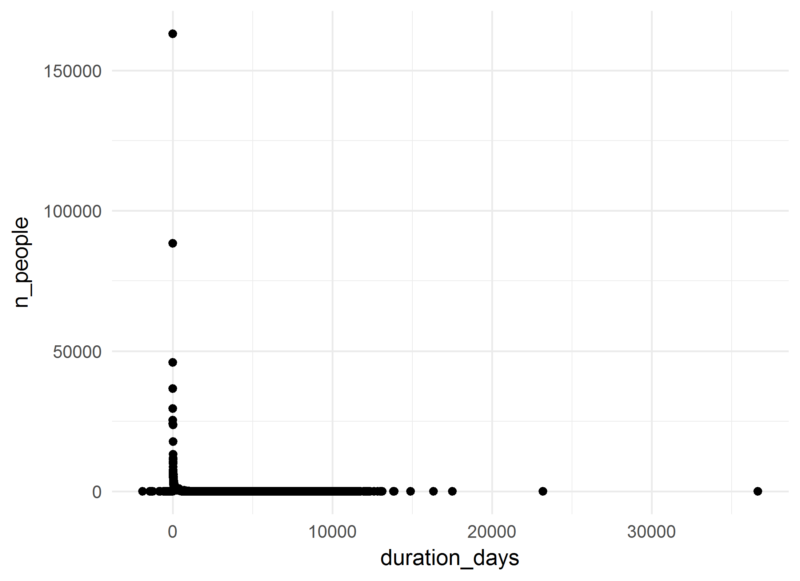
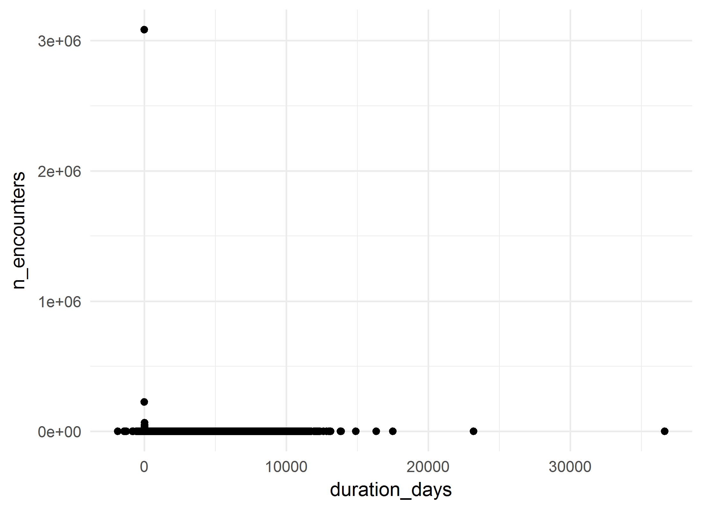
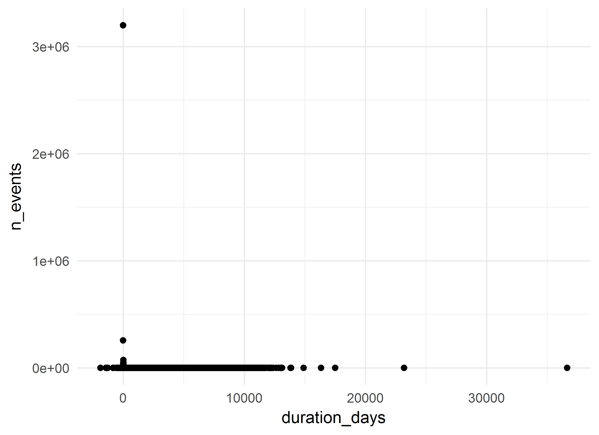

# Full 3T Cohort: Summative analysis
A.Koval, K.Moselle, S.Robertson  
`r Sys.Date()`  

<!-- These two chunks should be added in the beginning of every .Rmd that you want to source an .R script -->
<!--  The 1st mandatory chunck  -->
<!--  Set the working directory to the repository's base directory -->


<!--  The 2nd mandatory chunck  -->
<!-- Set the report-wide options, and point to the external code file. -->


<!-- Load 'sourced' R files.  Suppress the output when loading packages. --> 


<!-- Load the sources.  Suppress the output when loading sources. --> 

# I. Exposition

## Glossary
Review some of the object definition to help you interpret the report. 
<!-- Load any Global functions and variables declared in the R file.  Suppress the output. --> 

```r
# dto_location_map.rds is products of `./manipulation/0-ellis-location-map.R` 
path_input_location_map   <- "./data-unshared/derived/dto_location_map.rds" 
path_input_patient_events <-  "./data-unshared/derived/dto_patient_events_full3t_170656.rds" # research cohort
# Make sure the files are located where they supposed to be, in `./data-unshared/` folder
testit::assert("File does not exist", base::file.exists(path_input_location_map))
testit::assert("File does not exist", base::file.exists(path_input_patient_events))
# list variables that constitute patient event table
components_patient_events <- c(
  "id"                           # patient unique key
  ,"gender"                      # biological sex
  ,"age_group"                   # in groups of 5 years
  ,"encounter_id"                # unique identifier for the encounter 
  ,"encounter_class"             # value from the D_Location dimension table in the data warehous
  ,"encounter_type"              # value from the D_Location dimension table in the data warehous
  ,"event_type"                  # high-level classification of the event (encounter itself, diagnosis, procedure, clinical order, laboratory, pharmacy event, etc.).           
  ,"event_title"                 # a shorter, more rolled up category describing the event
  ,"event_detail"                # description of the event, can be long and specific
  ,"event_count"                 # count of the events in the row- each row has a value of 1, and can be summed
  ,"event_year"                  # year in which event occurred 
  ,"event_month"                 # month in which event occured
  ,"event_start_date"            # might be the date of the event itself (e.g. date of diagnosis) or the start date of the encounter that the event is associated with     
  ,"event_end_date"              # might be the end date of the event itself (e.g. end date of prescriptions) or the end date of the encounter that the event is associated with
  ,"start_day"                   # number of days between the first day the patient accessed Island Health services and the start date of this event. This is useful to mask dates, but still provides the relative time between events.
  ,"end_day"                     # number of days between the first day the patient accessed Island Health services and the end date of this event. This is useful to mask dates, but still provides the relative time between events.            
  ,"duration_days"               # number of days between the Start_Day and End_Day (End_Day - Start_Day)
  ,"addiction_location_count"    # patient has accessed services at a location that was used for the selection of the cohort
  ,"location_map_id"             # unique id for VIHA program, connects to location map
  ,"palette_code"                # unique id for colours of this palette
  ,"palette_colour_name"         # labels for clusters of service programs (aka 3T palette colours)
)
# list variables that consitute location map table
components_location_map <- c(
  "location_map_id"              # unique id for VIHA program, connects to patient events
  , "site_name"                  # CERNER address          # EHR address   
  , "facility_name"              # CERNER address          # EHR address   
  , "building_name"              # CERNER address          # EHR address   
  , "unit_name"                  # CERNER address          # EHR address   
  , "location_category"          # Data Warehouse address  # EHR address           
  , "location_type"              # Data Warehouse address  # EHR address           
  , "location_grouping"          # Data Warehouse address  # EHR address            
  , "site_key"                   # Factual counterparts to CERNER address
  , "facility_key"               # Factual counterparts to CERNER address
  , "building_key"               # Factual counterparts to CERNER address
  , "unit_key"                   # Factual counterparts to CERNER address
  , "intensity_type"             # Classifier, Compressor, Lense
  , "intensity_severity_risk"    # Classifier, Compressor, Lense
  , "clinical_focus"             # Classifier, Compressor, Lense
  , "service_type"               # Classifier, Compressor, Lense
  , "service_location"           # Classifier, Compressor, Lense
  , "population_age"             # Classifier, Compressor, Lense
  , "provider_mix"               # Classifier, Compressor, Lense
  , "location_class_code"        # Program Class, identifier
  , "location_class_description" # Porgram Class, Descriptive label
  , "palette_code"               # Palette,  identifier       # cluster specific     
  , "palette_colour_name"        # Palette, descriptive label # cluster specific            
)

# define output format for the report
options(
  knitr.table.format = "html"
  ,tibble.width = 110
  #   ,bootstrap_options = c("striped", "hover", "condensed","responsive")
)
```


<!-- Declare any global functions specific to a Rmd output.  Suppress the output. --> 


## Load Data
<!-- Load the datasets.   -->

```r
ds_patient_events <- readRDS(path_input_patient_events) # %>% as.data.frame()
ds_location_map   <- readRDS(path_input_location_map)

ds_patient_events  %>% glimpse()
ds_location_map %>% glimpse()
```

<!-- Inspect the datasets.   -->


## Data Tweaks
<!-- Tweak the datasets.   -->

```r
# augment the event table with additional columns from location map
ds <- dplyr::left_join(
  ds_patient_events,             # patient event table
  ds_location_map %>%         # location map 
    dplyr::select_(.dots = components_location_map)
  ,by = c("location_map_id","palette_code","palette_colour_name") 
) %>% 
  dplyr::mutate(
    location_class_description_display    = substr(location_class_description,1,42)
    ,palette_colour_name_display = substr(palette_colour_name,1,42)
  )
ds_location_map %>% glimpse()
# from this point on, ds_location_map is needed only for selective reference
ds %>% glimpse()
# ds now contains full coordinates to events of the cohort down to unit level
# ehr_address + location_classifiers + palette_colours
```

# II. Patient Events
The main data set `ds` contains both patient events table and their location map coordinates.

```r
# the data object containing events and location map 
ds %>% glimpse()
```

```
Observations: 4,634,852
Variables: 43
$ id                                 <chr> "1000022", "1000022", "1000022", "1000022", "1000022", "100002...
$ gender                             <chr> "Male", "Male", "Male", "Male", "Male", "Male", "Male", "Femal...
$ age_group                          <chr> "80 - 84", "80 - 84", "80 - 84", "80 - 84", "80 - 84", "80 - 8...
$ encounter_id                       <chr> "1DB11B14", "3A4A5EA4", "40628034", "40BCED34", "4B770524", "6...
$ encounter_class                    <chr> "Outpatient", "Emergency", "Home Care", "Inpatient", "Other", ...
$ encounter_type                     <chr> "Ambulatory", "Emergency", "Home Care", "Inpatient Acute", "Mo...
$ event_type                         <chr> "Encounter Only", "Encounter Only", "Encounter Only", "Encount...
$ event_title                        <chr> "Outpatient", NA, NA, NA, NA, "ALC", NA, NA, "Outpatient", "Ou...
$ event_detail                       <chr> "Medical Imaging", NA, NA, NA, NA, "ALC: Activation", NA, NA, ...
$ event_count                        <int> 1, 1, 1, 1, 1, 1, 1, 1, 1, 1, 1, 1, 1, 1, 1, 1, 1, 1, 1, 1, 1,...
$ event_year                         <int> 2012, 2012, 2010, 2012, 2012, 2012, 2012, 2011, 2013, 2015, 20...
$ event_month                        <int> 4, 4, 5, 4, 7, 2, 2, 5, 8, 3, 5, 8, 3, 3, 3, 3, 3, 3, 3, 3, 11...
$ event_start_date                   <date> 2012-04-04, 2012-04-09, 2010-05-27, 2012-04-09, 2012-07-27, 2...
$ event_end_date                     <date> 2012-04-04, 2012-04-09, 2012-07-06, 2012-07-27, 2012-07-27, 2...
$ start_day                          <int> 678, 683, 0, 683, 792, 636, 636, 0, 815, 1407, 1, 1182, 1766, ...
$ end_day                            <int> 678, 683, 771, 792, 792, 657, 636, 0, 815, 1407, 1, 1182, 2192...
$ duration_days                      <int> 0, 0, 771, 109, 0, 21, 0, 0, 0, 0, 0, 0, 426, 0, 3, 1, 1, 1, 2...
$ addiction_location_count           <int> 0, 0, 0, 0, 0, 0, 0, 0, 0, 0, 0, 0, 0, 0, 0, 0, 0, 0, 0, 0, 0,...
$ location_map_id                    <int> 891, 878, 1961, 863, 2168, 352, 878, 934, 2109, 483, 1415, 483...
$ palette_code                       <int> 38, 28, 34, 5, 66, 5, 28, 28, 36, 38, 69, 38, 5, 5, 5, 5, 5, 5...
$ palette_colour_name                <chr> "Medical Imaging", "ED - Med-Surg", "H&CC and Related Supports...
$ site_name                          <chr> "Nanaimo Regional General Hospital", "Nanaimo Regional General...
$ facility_name                      <chr> "Nanaimo Regional General Hospital - Acute Care", "Nanaimo Reg...
$ building_name                      <chr> "Nanaimo Regional General - Acute Care", "Nanaimo Regional Gen...
$ unit_name                          <chr> "Medical Imaging Reception", "NRG - Emergency", "HomeCare CI",...
$ location_category                  <chr> "Medical Imaging", "Emergency Room", "Community-Home", "Inpati...
$ location_type                      <chr> "Medical Imaging", "ER-General", "Community-Home Care", "InPt-...
$ location_grouping                  <chr> "Medical Imaging", "Emergency-General", "Community-Home", "Inp...
$ site_key                           <chr> NA, NA, NA, NA, NA, NA, NA, NA, NA, NA, NA, NA, NA, NA, NA, NA...
$ facility_key                       <chr> "NRG", "NRG", "CPCI", "NRG", "NRG", "NRG", "NRG", "VGHAC", "VG...
$ building_key                       <chr> "NRGA", "NRGA", "HCCI", "NRGA", "NRGA", "NRGA", "NRGA", "VGH-A...
$ unit_key                           <chr> "MINR", "ERNR", "INCI", "FL5", "MORN", "MEOV", "ERNR", "ER-V",...
$ intensity_type                     <chr> "Medical Imaging", "ED, Urgent Care, Acute", "Community Suppor...
$ intensity_severity_risk            <chr> "Medical Imaging", "Emergent-Hospital", "Medium-Intensity Comm...
$ clinical_focus                     <chr> "Medical Imaging", "Emergency Response", "Frailty-Mainly ADL",...
$ service_type                       <chr> "Medical Imaging", "ED-Medical", "H&CC Nursing, Support", "Acu...
$ service_location                   <chr> "Medical Imaging", "Hospital", "Home", "Hospital", "Morgue", "...
$ population_age                     <chr> "Mixed Ages", "Mixed Ages", "Mixed Ages", "Mixed Ages", "Mixed...
$ provider_mix                       <chr> "Medical specialist with tech supports", "Physician, nurse del...
$ location_class_code                <int> 148, 78, 57, 66, 150, 66, 78, 78, 146, 148, 106, 148, 66, 66, ...
$ location_class_description         <chr> "Medical Imaging", "ED - Med-Surg", "H&CC Services", "Acute Ca...
$ location_class_description_display <chr> "Medical Imaging", "ED - Med-Surg", "H&CC Services", "Acute Ca...
$ palette_colour_name_display        <chr> "Medical Imaging", "ED - Med-Surg", "H&CC and Related Supports...
```

```r
# What variables relate to patient event table?
# What variables relate to locations at which events took place?
# How many unique values does each variable/column contain? 
ds %>% select_(.dots=components_patient_events) %>% summarise_all(dplyr::n_distinct) %>% t() 
```

```
                            [,1]
id                        170553
gender                         3
age_group                     21
encounter_id             4148241
encounter_class                8
encounter_type                19
event_type                     9
event_title                  138
event_detail                7970
event_count                    1
event_year                    47
event_month                   13
event_start_date            6228
event_end_date              2248
start_day                  12357
end_day                    12432
duration_days               5683
addiction_location_count       2
location_map_id             2303
palette_code                  98
palette_colour_name           98
```

```r
ds %>% select_(.dots=components_location_map) %>% summarise_all(dplyr::n_distinct) %>% t() 
```

```
                           [,1]
location_map_id            2303
site_name                   101
facility_name               243
building_name               461
unit_name                  1533
location_category            10
location_type                53
location_grouping            23
site_key                      1
facility_key                218
building_key                400
unit_key                   1270
intensity_type               16
intensity_severity_risk      38
clinical_focus               47
service_type                 58
service_location             15
population_age                9
provider_mix                 18
location_class_code         154
location_class_description  154
palette_code                 98
palette_colour_name          98
```

```r
# they share / connected by the fields:
intersect(components_patient_events, components_location_map)
```

```
[1] "location_map_id"     "palette_code"        "palette_colour_name"
```

## Overview

```r
# PET - Patient Event Table
# How many patients are in this cohort?
ds %>% distinct(id) %>% count() %>% neat()
```

<?xml version="1.0" encoding="UTF-8"?>
<table class="table table-striped table-hover table-condensed table-responsive" style="width: auto !important; text-align: right;">
 <thead>
  <tr>
   <th style="text-align:right;"> n </th>
  </tr>
 </thead>
<tbody>
  <tr>
   <td style="text-align:right;"> 170553 </td>
  </tr>
</tbody>
</table>

```r
# What are basic demographics?
ds %>% unique_sums(c("gender")) %>% arrange(desc(n_people)) %>% neat()
```

<?xml version="1.0" encoding="UTF-8"?>
<table class="table table-striped table-hover table-condensed table-responsive" style="width: auto !important; text-align: right;">
 <thead>
  <tr>
   <th style="text-align:left;"> gender </th>
   <th style="text-align:right;"> n_people </th>
   <th style="text-align:right;"> n_encounters </th>
   <th style="text-align:right;"> n_events </th>
  </tr>
 </thead>
<tbody>
  <tr>
   <td style="text-align:left;"> Female </td>
   <td style="text-align:right;"> 90777 </td>
   <td style="text-align:right;"> 2313372 </td>
   <td style="text-align:right;"> 2582745 </td>
  </tr>
  <tr>
   <td style="text-align:left;"> Male </td>
   <td style="text-align:right;"> 79777 </td>
   <td style="text-align:right;"> 1834827 </td>
   <td style="text-align:right;"> 2052065 </td>
  </tr>
  <tr>
   <td style="text-align:left;"> Unknown </td>
   <td style="text-align:right;"> 5 </td>
   <td style="text-align:right;"> 42 </td>
   <td style="text-align:right;"> 42 </td>
  </tr>
</tbody>
</table>

```r
ds %>% unique_sums(c("age_group"))  %>%  neat()
```

<?xml version="1.0" encoding="UTF-8"?>
<table class="table table-striped table-hover table-condensed table-responsive" style="width: auto !important; text-align: right;">
 <thead>
  <tr>
   <th style="text-align:left;"> age_group </th>
   <th style="text-align:right;"> n_people </th>
   <th style="text-align:right;"> n_encounters </th>
   <th style="text-align:right;"> n_events </th>
  </tr>
 </thead>
<tbody>
  <tr>
   <td style="text-align:left;"> &lt;1 </td>
   <td style="text-align:right;"> 2893 </td>
   <td style="text-align:right;"> 10993 </td>
   <td style="text-align:right;"> 11183 </td>
  </tr>
  <tr>
   <td style="text-align:left;"> 01 - 04 </td>
   <td style="text-align:right;"> 4465 </td>
   <td style="text-align:right;"> 23409 </td>
   <td style="text-align:right;"> 23981 </td>
  </tr>
  <tr>
   <td style="text-align:left;"> 05 - 09 </td>
   <td style="text-align:right;"> 6042 </td>
   <td style="text-align:right;"> 27265 </td>
   <td style="text-align:right;"> 28327 </td>
  </tr>
  <tr>
   <td style="text-align:left;"> 10 - 14 </td>
   <td style="text-align:right;"> 6902 </td>
   <td style="text-align:right;"> 37857 </td>
   <td style="text-align:right;"> 39087 </td>
  </tr>
  <tr>
   <td style="text-align:left;"> 15 - 19 </td>
   <td style="text-align:right;"> 12308 </td>
   <td style="text-align:right;"> 104318 </td>
   <td style="text-align:right;"> 108914 </td>
  </tr>
  <tr>
   <td style="text-align:left;"> 20 - 24 </td>
   <td style="text-align:right;"> 16686 </td>
   <td style="text-align:right;"> 155661 </td>
   <td style="text-align:right;"> 163088 </td>
  </tr>
  <tr>
   <td style="text-align:left;"> 25 - 29 </td>
   <td style="text-align:right;"> 16915 </td>
   <td style="text-align:right;"> 170087 </td>
   <td style="text-align:right;"> 179750 </td>
  </tr>
  <tr>
   <td style="text-align:left;"> 30 - 34 </td>
   <td style="text-align:right;"> 16457 </td>
   <td style="text-align:right;"> 175129 </td>
   <td style="text-align:right;"> 185591 </td>
  </tr>
  <tr>
   <td style="text-align:left;"> 35 - 39 </td>
   <td style="text-align:right;"> 15274 </td>
   <td style="text-align:right;"> 166209 </td>
   <td style="text-align:right;"> 177154 </td>
  </tr>
  <tr>
   <td style="text-align:left;"> 40 - 44 </td>
   <td style="text-align:right;"> 15425 </td>
   <td style="text-align:right;"> 176055 </td>
   <td style="text-align:right;"> 188791 </td>
  </tr>
  <tr>
   <td style="text-align:left;"> 45 - 49 </td>
   <td style="text-align:right;"> 17122 </td>
   <td style="text-align:right;"> 211455 </td>
   <td style="text-align:right;"> 229336 </td>
  </tr>
  <tr>
   <td style="text-align:left;"> 50 - 54 </td>
   <td style="text-align:right;"> 19314 </td>
   <td style="text-align:right;"> 272773 </td>
   <td style="text-align:right;"> 296575 </td>
  </tr>
  <tr>
   <td style="text-align:left;"> 55 - 59 </td>
   <td style="text-align:right;"> 20263 </td>
   <td style="text-align:right;"> 298645 </td>
   <td style="text-align:right;"> 329882 </td>
  </tr>
  <tr>
   <td style="text-align:left;"> 60 - 64 </td>
   <td style="text-align:right;"> 20024 </td>
   <td style="text-align:right;"> 316727 </td>
   <td style="text-align:right;"> 353336 </td>
  </tr>
  <tr>
   <td style="text-align:left;"> 65 - 69 </td>
   <td style="text-align:right;"> 19670 </td>
   <td style="text-align:right;"> 345979 </td>
   <td style="text-align:right;"> 391152 </td>
  </tr>
  <tr>
   <td style="text-align:left;"> 70 - 74 </td>
   <td style="text-align:right;"> 19411 </td>
   <td style="text-align:right;"> 345704 </td>
   <td style="text-align:right;"> 394931 </td>
  </tr>
  <tr>
   <td style="text-align:left;"> 75 - 79 </td>
   <td style="text-align:right;"> 21419 </td>
   <td style="text-align:right;"> 368273 </td>
   <td style="text-align:right;"> 417821 </td>
  </tr>
  <tr>
   <td style="text-align:left;"> 80 - 84 </td>
   <td style="text-align:right;"> 24018 </td>
   <td style="text-align:right;"> 394076 </td>
   <td style="text-align:right;"> 453362 </td>
  </tr>
  <tr>
   <td style="text-align:left;"> 85 - 89 </td>
   <td style="text-align:right;"> 21937 </td>
   <td style="text-align:right;"> 328031 </td>
   <td style="text-align:right;"> 388299 </td>
  </tr>
  <tr>
   <td style="text-align:left;"> 90+ </td>
   <td style="text-align:right;"> 14055 </td>
   <td style="text-align:right;"> 216208 </td>
   <td style="text-align:right;"> 270892 </td>
  </tr>
  <tr>
   <td style="text-align:left;"> No value </td>
   <td style="text-align:right;"> 2972 </td>
   <td style="text-align:right;"> 3387 </td>
   <td style="text-align:right;"> 3400 </td>
  </tr>
</tbody>
</table>

```r
ds %>% unique_sums(c("gender","age_group")) %>%  neat()
```

<?xml version="1.0" encoding="UTF-8"?>
<table class="table table-striped table-hover table-condensed table-responsive" style="width: auto !important; text-align: right;">
 <thead>
  <tr>
   <th style="text-align:left;"> gender </th>
   <th style="text-align:left;"> age_group </th>
   <th style="text-align:right;"> n_people </th>
   <th style="text-align:right;"> n_encounters </th>
   <th style="text-align:right;"> n_events </th>
  </tr>
 </thead>
<tbody>
  <tr>
   <td style="text-align:left;"> Female </td>
   <td style="text-align:left;"> &lt;1 </td>
   <td style="text-align:right;"> 1125 </td>
   <td style="text-align:right;"> 4228 </td>
   <td style="text-align:right;"> 4277 </td>
  </tr>
  <tr>
   <td style="text-align:left;"> Female </td>
   <td style="text-align:left;"> 01 - 04 </td>
   <td style="text-align:right;"> 1562 </td>
   <td style="text-align:right;"> 8142 </td>
   <td style="text-align:right;"> 8366 </td>
  </tr>
  <tr>
   <td style="text-align:left;"> Female </td>
   <td style="text-align:left;"> 05 - 09 </td>
   <td style="text-align:right;"> 1892 </td>
   <td style="text-align:right;"> 9319 </td>
   <td style="text-align:right;"> 9622 </td>
  </tr>
  <tr>
   <td style="text-align:left;"> Female </td>
   <td style="text-align:left;"> 10 - 14 </td>
   <td style="text-align:right;"> 3218 </td>
   <td style="text-align:right;"> 19586 </td>
   <td style="text-align:right;"> 20161 </td>
  </tr>
  <tr>
   <td style="text-align:left;"> Female </td>
   <td style="text-align:left;"> 15 - 19 </td>
   <td style="text-align:right;"> 6715 </td>
   <td style="text-align:right;"> 65854 </td>
   <td style="text-align:right;"> 68804 </td>
  </tr>
  <tr>
   <td style="text-align:left;"> Female </td>
   <td style="text-align:left;"> 20 - 24 </td>
   <td style="text-align:right;"> 9162 </td>
   <td style="text-align:right;"> 99438 </td>
   <td style="text-align:right;"> 103825 </td>
  </tr>
  <tr>
   <td style="text-align:left;"> Female </td>
   <td style="text-align:left;"> 25 - 29 </td>
   <td style="text-align:right;"> 9305 </td>
   <td style="text-align:right;"> 107032 </td>
   <td style="text-align:right;"> 112810 </td>
  </tr>
  <tr>
   <td style="text-align:left;"> Female </td>
   <td style="text-align:left;"> 30 - 34 </td>
   <td style="text-align:right;"> 9009 </td>
   <td style="text-align:right;"> 107058 </td>
   <td style="text-align:right;"> 113276 </td>
  </tr>
  <tr>
   <td style="text-align:left;"> Female </td>
   <td style="text-align:left;"> 35 - 39 </td>
   <td style="text-align:right;"> 8195 </td>
   <td style="text-align:right;"> 99243 </td>
   <td style="text-align:right;"> 105783 </td>
  </tr>
  <tr>
   <td style="text-align:left;"> Female </td>
   <td style="text-align:left;"> 40 - 44 </td>
   <td style="text-align:right;"> 8266 </td>
   <td style="text-align:right;"> 101079 </td>
   <td style="text-align:right;"> 108540 </td>
  </tr>
  <tr>
   <td style="text-align:left;"> Female </td>
   <td style="text-align:left;"> 45 - 49 </td>
   <td style="text-align:right;"> 9244 </td>
   <td style="text-align:right;"> 116535 </td>
   <td style="text-align:right;"> 126647 </td>
  </tr>
  <tr>
   <td style="text-align:left;"> Female </td>
   <td style="text-align:left;"> 50 - 54 </td>
   <td style="text-align:right;"> 10632 </td>
   <td style="text-align:right;"> 153654 </td>
   <td style="text-align:right;"> 166771 </td>
  </tr>
  <tr>
   <td style="text-align:left;"> Female </td>
   <td style="text-align:left;"> 55 - 59 </td>
   <td style="text-align:right;"> 11169 </td>
   <td style="text-align:right;"> 167452 </td>
   <td style="text-align:right;"> 183734 </td>
  </tr>
  <tr>
   <td style="text-align:left;"> Female </td>
   <td style="text-align:left;"> 60 - 64 </td>
   <td style="text-align:right;"> 10720 </td>
   <td style="text-align:right;"> 168849 </td>
   <td style="text-align:right;"> 187216 </td>
  </tr>
  <tr>
   <td style="text-align:left;"> Female </td>
   <td style="text-align:left;"> 65 - 69 </td>
   <td style="text-align:right;"> 10336 </td>
   <td style="text-align:right;"> 181563 </td>
   <td style="text-align:right;"> 203679 </td>
  </tr>
  <tr>
   <td style="text-align:left;"> Female </td>
   <td style="text-align:left;"> 70 - 74 </td>
   <td style="text-align:right;"> 10120 </td>
   <td style="text-align:right;"> 175367 </td>
   <td style="text-align:right;"> 200393 </td>
  </tr>
  <tr>
   <td style="text-align:left;"> Female </td>
   <td style="text-align:left;"> 75 - 79 </td>
   <td style="text-align:right;"> 11461 </td>
   <td style="text-align:right;"> 191858 </td>
   <td style="text-align:right;"> 217543 </td>
  </tr>
  <tr>
   <td style="text-align:left;"> Female </td>
   <td style="text-align:left;"> 80 - 84 </td>
   <td style="text-align:right;"> 13420 </td>
   <td style="text-align:right;"> 207709 </td>
   <td style="text-align:right;"> 239353 </td>
  </tr>
  <tr>
   <td style="text-align:left;"> Female </td>
   <td style="text-align:left;"> 85 - 89 </td>
   <td style="text-align:right;"> 13207 </td>
   <td style="text-align:right;"> 188707 </td>
   <td style="text-align:right;"> 223967 </td>
  </tr>
  <tr>
   <td style="text-align:left;"> Female </td>
   <td style="text-align:left;"> 90+ </td>
   <td style="text-align:right;"> 9254 </td>
   <td style="text-align:right;"> 139087 </td>
   <td style="text-align:right;"> 176360 </td>
  </tr>
  <tr>
   <td style="text-align:left;"> Female </td>
   <td style="text-align:left;"> No value </td>
   <td style="text-align:right;"> 1405 </td>
   <td style="text-align:right;"> 1612 </td>
   <td style="text-align:right;"> 1618 </td>
  </tr>
  <tr>
   <td style="text-align:left;"> Male </td>
   <td style="text-align:left;"> &lt;1 </td>
   <td style="text-align:right;"> 1768 </td>
   <td style="text-align:right;"> 6765 </td>
   <td style="text-align:right;"> 6906 </td>
  </tr>
  <tr>
   <td style="text-align:left;"> Male </td>
   <td style="text-align:left;"> 01 - 04 </td>
   <td style="text-align:right;"> 2903 </td>
   <td style="text-align:right;"> 15267 </td>
   <td style="text-align:right;"> 15615 </td>
  </tr>
  <tr>
   <td style="text-align:left;"> Male </td>
   <td style="text-align:left;"> 05 - 09 </td>
   <td style="text-align:right;"> 4150 </td>
   <td style="text-align:right;"> 17946 </td>
   <td style="text-align:right;"> 18705 </td>
  </tr>
  <tr>
   <td style="text-align:left;"> Male </td>
   <td style="text-align:left;"> 10 - 14 </td>
   <td style="text-align:right;"> 3684 </td>
   <td style="text-align:right;"> 18271 </td>
   <td style="text-align:right;"> 18926 </td>
  </tr>
  <tr>
   <td style="text-align:left;"> Male </td>
   <td style="text-align:left;"> 15 - 19 </td>
   <td style="text-align:right;"> 5593 </td>
   <td style="text-align:right;"> 38464 </td>
   <td style="text-align:right;"> 40110 </td>
  </tr>
  <tr>
   <td style="text-align:left;"> Male </td>
   <td style="text-align:left;"> 20 - 24 </td>
   <td style="text-align:right;"> 7524 </td>
   <td style="text-align:right;"> 56221 </td>
   <td style="text-align:right;"> 59261 </td>
  </tr>
  <tr>
   <td style="text-align:left;"> Male </td>
   <td style="text-align:left;"> 25 - 29 </td>
   <td style="text-align:right;"> 7610 </td>
   <td style="text-align:right;"> 63051 </td>
   <td style="text-align:right;"> 66936 </td>
  </tr>
  <tr>
   <td style="text-align:left;"> Male </td>
   <td style="text-align:left;"> 30 - 34 </td>
   <td style="text-align:right;"> 7447 </td>
   <td style="text-align:right;"> 68061 </td>
   <td style="text-align:right;"> 72305 </td>
  </tr>
  <tr>
   <td style="text-align:left;"> Male </td>
   <td style="text-align:left;"> 35 - 39 </td>
   <td style="text-align:right;"> 7078 </td>
   <td style="text-align:right;"> 66942 </td>
   <td style="text-align:right;"> 71347 </td>
  </tr>
  <tr>
   <td style="text-align:left;"> Male </td>
   <td style="text-align:left;"> 40 - 44 </td>
   <td style="text-align:right;"> 7159 </td>
   <td style="text-align:right;"> 74975 </td>
   <td style="text-align:right;"> 80250 </td>
  </tr>
  <tr>
   <td style="text-align:left;"> Male </td>
   <td style="text-align:left;"> 45 - 49 </td>
   <td style="text-align:right;"> 7878 </td>
   <td style="text-align:right;"> 94920 </td>
   <td style="text-align:right;"> 102689 </td>
  </tr>
  <tr>
   <td style="text-align:left;"> Male </td>
   <td style="text-align:left;"> 50 - 54 </td>
   <td style="text-align:right;"> 8681 </td>
   <td style="text-align:right;"> 119118 </td>
   <td style="text-align:right;"> 129803 </td>
  </tr>
  <tr>
   <td style="text-align:left;"> Male </td>
   <td style="text-align:left;"> 55 - 59 </td>
   <td style="text-align:right;"> 9095 </td>
   <td style="text-align:right;"> 131193 </td>
   <td style="text-align:right;"> 146148 </td>
  </tr>
  <tr>
   <td style="text-align:left;"> Male </td>
   <td style="text-align:left;"> 60 - 64 </td>
   <td style="text-align:right;"> 9304 </td>
   <td style="text-align:right;"> 147878 </td>
   <td style="text-align:right;"> 166120 </td>
  </tr>
  <tr>
   <td style="text-align:left;"> Male </td>
   <td style="text-align:left;"> 65 - 69 </td>
   <td style="text-align:right;"> 9334 </td>
   <td style="text-align:right;"> 164416 </td>
   <td style="text-align:right;"> 187473 </td>
  </tr>
  <tr>
   <td style="text-align:left;"> Male </td>
   <td style="text-align:left;"> 70 - 74 </td>
   <td style="text-align:right;"> 9291 </td>
   <td style="text-align:right;"> 170337 </td>
   <td style="text-align:right;"> 194538 </td>
  </tr>
  <tr>
   <td style="text-align:left;"> Male </td>
   <td style="text-align:left;"> 75 - 79 </td>
   <td style="text-align:right;"> 9958 </td>
   <td style="text-align:right;"> 176415 </td>
   <td style="text-align:right;"> 200278 </td>
  </tr>
  <tr>
   <td style="text-align:left;"> Male </td>
   <td style="text-align:left;"> 80 - 84 </td>
   <td style="text-align:right;"> 10598 </td>
   <td style="text-align:right;"> 186367 </td>
   <td style="text-align:right;"> 214009 </td>
  </tr>
  <tr>
   <td style="text-align:left;"> Male </td>
   <td style="text-align:left;"> 85 - 89 </td>
   <td style="text-align:right;"> 8730 </td>
   <td style="text-align:right;"> 139324 </td>
   <td style="text-align:right;"> 164332 </td>
  </tr>
  <tr>
   <td style="text-align:left;"> Male </td>
   <td style="text-align:left;"> 90+ </td>
   <td style="text-align:right;"> 4801 </td>
   <td style="text-align:right;"> 77121 </td>
   <td style="text-align:right;"> 94532 </td>
  </tr>
  <tr>
   <td style="text-align:left;"> Male </td>
   <td style="text-align:left;"> No value </td>
   <td style="text-align:right;"> 1567 </td>
   <td style="text-align:right;"> 1775 </td>
   <td style="text-align:right;"> 1782 </td>
  </tr>
  <tr>
   <td style="text-align:left;"> Unknown </td>
   <td style="text-align:left;"> 20 - 24 </td>
   <td style="text-align:right;"> 1 </td>
   <td style="text-align:right;"> 2 </td>
   <td style="text-align:right;"> 2 </td>
  </tr>
  <tr>
   <td style="text-align:left;"> Unknown </td>
   <td style="text-align:left;"> 25 - 29 </td>
   <td style="text-align:right;"> 1 </td>
   <td style="text-align:right;"> 4 </td>
   <td style="text-align:right;"> 4 </td>
  </tr>
  <tr>
   <td style="text-align:left;"> Unknown </td>
   <td style="text-align:left;"> 30 - 34 </td>
   <td style="text-align:right;"> 3 </td>
   <td style="text-align:right;"> 10 </td>
   <td style="text-align:right;"> 10 </td>
  </tr>
  <tr>
   <td style="text-align:left;"> Unknown </td>
   <td style="text-align:left;"> 35 - 39 </td>
   <td style="text-align:right;"> 1 </td>
   <td style="text-align:right;"> 24 </td>
   <td style="text-align:right;"> 24 </td>
  </tr>
  <tr>
   <td style="text-align:left;"> Unknown </td>
   <td style="text-align:left;"> 40 - 44 </td>
   <td style="text-align:right;"> 1 </td>
   <td style="text-align:right;"> 1 </td>
   <td style="text-align:right;"> 1 </td>
  </tr>
  <tr>
   <td style="text-align:left;"> Unknown </td>
   <td style="text-align:left;"> 50 - 54 </td>
   <td style="text-align:right;"> 1 </td>
   <td style="text-align:right;"> 1 </td>
   <td style="text-align:right;"> 1 </td>
  </tr>
</tbody>
</table>

## DW tags

```r
# how may unique encounters are there in this set?
ds %>% distinct(encounter_id) %>% count() %>% neat()
```

<?xml version="1.0" encoding="UTF-8"?>
<table class="table table-striped table-hover table-condensed table-responsive" style="width: auto !important; text-align: right;">
 <thead>
  <tr>
   <th style="text-align:right;"> n </th>
  </tr>
 </thead>
<tbody>
  <tr>
   <td style="text-align:right;"> 4148241 </td>
  </tr>
</tbody>
</table>

```r
# tally engagement across encounter classes (as defined by data warehouse)
ds %>% unique_sums("encounter_class")%>% arrange(desc(n_people)) %>% neat()
```

<?xml version="1.0" encoding="UTF-8"?>
<table class="table table-striped table-hover table-condensed table-responsive" style="width: auto !important; text-align: right;">
 <thead>
  <tr>
   <th style="text-align:left;"> encounter_class </th>
   <th style="text-align:right;"> n_people </th>
   <th style="text-align:right;"> n_encounters </th>
   <th style="text-align:right;"> n_events </th>
  </tr>
 </thead>
<tbody>
  <tr>
   <td style="text-align:left;"> Outpatient </td>
   <td style="text-align:right;"> 150892 </td>
   <td style="text-align:right;"> 2138081 </td>
   <td style="text-align:right;"> 2223166 </td>
  </tr>
  <tr>
   <td style="text-align:left;"> Emergency </td>
   <td style="text-align:right;"> 141312 </td>
   <td style="text-align:right;"> 827006 </td>
   <td style="text-align:right;"> 874108 </td>
  </tr>
  <tr>
   <td style="text-align:left;"> Recurring </td>
   <td style="text-align:right;"> 138164 </td>
   <td style="text-align:right;"> 447292 </td>
   <td style="text-align:right;"> 458928 </td>
  </tr>
  <tr>
   <td style="text-align:left;"> Inpatient </td>
   <td style="text-align:right;"> 101472 </td>
   <td style="text-align:right;"> 334924 </td>
   <td style="text-align:right;"> 673248 </td>
  </tr>
  <tr>
   <td style="text-align:left;"> Other </td>
   <td style="text-align:right;"> 84141 </td>
   <td style="text-align:right;"> 276686 </td>
   <td style="text-align:right;"> 279077 </td>
  </tr>
  <tr>
   <td style="text-align:left;"> Home Care </td>
   <td style="text-align:right;"> 77009 </td>
   <td style="text-align:right;"> 122016 </td>
   <td style="text-align:right;"> 124044 </td>
  </tr>
  <tr>
   <td style="text-align:left;"> Cancelled Admission </td>
   <td style="text-align:right;"> 1971 </td>
   <td style="text-align:right;"> 2195 </td>
   <td style="text-align:right;"> 2239 </td>
  </tr>
  <tr>
   <td style="text-align:left;"> Not defined </td>
   <td style="text-align:right;"> 38 </td>
   <td style="text-align:right;"> 41 </td>
   <td style="text-align:right;"> 42 </td>
  </tr>
</tbody>
</table>

```r
ds %>% unique_sums("encounter_type") %>% arrange(desc(n_people)) %>% neat()
```

<?xml version="1.0" encoding="UTF-8"?>
<table class="table table-striped table-hover table-condensed table-responsive" style="width: auto !important; text-align: right;">
 <thead>
  <tr>
   <th style="text-align:left;"> encounter_type </th>
   <th style="text-align:right;"> n_people </th>
   <th style="text-align:right;"> n_encounters </th>
   <th style="text-align:right;"> n_events </th>
  </tr>
 </thead>
<tbody>
  <tr>
   <td style="text-align:left;"> Ambulatory </td>
   <td style="text-align:right;"> 149609 </td>
   <td style="text-align:right;"> 2010207 </td>
   <td style="text-align:right;"> 2072326 </td>
  </tr>
  <tr>
   <td style="text-align:left;"> Emergency </td>
   <td style="text-align:right;"> 141312 </td>
   <td style="text-align:right;"> 827006 </td>
   <td style="text-align:right;"> 874108 </td>
  </tr>
  <tr>
   <td style="text-align:left;"> Open Encounter </td>
   <td style="text-align:right;"> 136783 </td>
   <td style="text-align:right;"> 432076 </td>
   <td style="text-align:right;"> 443242 </td>
  </tr>
  <tr>
   <td style="text-align:left;"> Inpatient Acute </td>
   <td style="text-align:right;"> 93288 </td>
   <td style="text-align:right;"> 242844 </td>
   <td style="text-align:right;"> 554596 </td>
  </tr>
  <tr>
   <td style="text-align:left;"> Home Care </td>
   <td style="text-align:right;"> 77009 </td>
   <td style="text-align:right;"> 122016 </td>
   <td style="text-align:right;"> 124044 </td>
  </tr>
  <tr>
   <td style="text-align:left;"> Specimen </td>
   <td style="text-align:right;"> 74815 </td>
   <td style="text-align:right;"> 256941 </td>
   <td style="text-align:right;"> 259131 </td>
  </tr>
  <tr>
   <td style="text-align:left;"> Day Care </td>
   <td style="text-align:right;"> 61895 </td>
   <td style="text-align:right;"> 127089 </td>
   <td style="text-align:right;"> 150036 </td>
  </tr>
  <tr>
   <td style="text-align:left;"> Residential Care </td>
   <td style="text-align:right;"> 17675 </td>
   <td style="text-align:right;"> 27604 </td>
   <td style="text-align:right;"> 53114 </td>
  </tr>
  <tr>
   <td style="text-align:left;"> Morgue </td>
   <td style="text-align:right;"> 12505 </td>
   <td style="text-align:right;"> 12689 </td>
   <td style="text-align:right;"> 12828 </td>
  </tr>
  <tr>
   <td style="text-align:left;"> Recurring/Series </td>
   <td style="text-align:right;"> 8096 </td>
   <td style="text-align:right;"> 15216 </td>
   <td style="text-align:right;"> 15686 </td>
  </tr>
  <tr>
   <td style="text-align:left;"> MHAS - Residential </td>
   <td style="text-align:right;"> 6950 </td>
   <td style="text-align:right;"> 25005 </td>
   <td style="text-align:right;"> 25679 </td>
  </tr>
  <tr>
   <td style="text-align:left;"> MHAS - Acute Care </td>
   <td style="text-align:right;"> 3429 </td>
   <td style="text-align:right;"> 36587 </td>
   <td style="text-align:right;"> 36863 </td>
  </tr>
  <tr>
   <td style="text-align:left;"> Research </td>
   <td style="text-align:right;"> 2770 </td>
   <td style="text-align:right;"> 4295 </td>
   <td style="text-align:right;"> 4343 </td>
  </tr>
  <tr>
   <td style="text-align:left;"> Waitlist </td>
   <td style="text-align:right;"> 2367 </td>
   <td style="text-align:right;"> 2761 </td>
   <td style="text-align:right;"> 2775 </td>
  </tr>
  <tr>
   <td style="text-align:left;"> Newborn </td>
   <td style="text-align:right;"> 2127 </td>
   <td style="text-align:right;"> 2133 </td>
   <td style="text-align:right;"> 2191 </td>
  </tr>
  <tr>
   <td style="text-align:left;"> Cancelled Admission </td>
   <td style="text-align:right;"> 1971 </td>
   <td style="text-align:right;"> 2195 </td>
   <td style="text-align:right;"> 2239 </td>
  </tr>
  <tr>
   <td style="text-align:left;"> Lifetime </td>
   <td style="text-align:right;"> 748 </td>
   <td style="text-align:right;"> 751 </td>
   <td style="text-align:right;"> 805 </td>
  </tr>
  <tr>
   <td style="text-align:left;"> Phone Consult </td>
   <td style="text-align:right;"> 308 </td>
   <td style="text-align:right;"> 785 </td>
   <td style="text-align:right;"> 804 </td>
  </tr>
  <tr>
   <td style="text-align:left;"> Not defined </td>
   <td style="text-align:right;"> 38 </td>
   <td style="text-align:right;"> 41 </td>
   <td style="text-align:right;"> 42 </td>
  </tr>
</tbody>
</table>

```r
ds %>% unique_sums(c("encounter_class","encounter_type"))%>% arrange(desc(encounter_class,n_people)) %>% neat()
```

<?xml version="1.0" encoding="UTF-8"?>
<table class="table table-striped table-hover table-condensed table-responsive" style="width: auto !important; text-align: right;">
 <thead>
  <tr>
   <th style="text-align:left;"> encounter_class </th>
   <th style="text-align:left;"> encounter_type </th>
   <th style="text-align:right;"> n_people </th>
   <th style="text-align:right;"> n_encounters </th>
   <th style="text-align:right;"> n_events </th>
  </tr>
 </thead>
<tbody>
  <tr>
   <td style="text-align:left;"> Recurring </td>
   <td style="text-align:left;"> Open Encounter </td>
   <td style="text-align:right;"> 136783 </td>
   <td style="text-align:right;"> 432076 </td>
   <td style="text-align:right;"> 443242 </td>
  </tr>
  <tr>
   <td style="text-align:left;"> Recurring </td>
   <td style="text-align:left;"> Recurring/Series </td>
   <td style="text-align:right;"> 8096 </td>
   <td style="text-align:right;"> 15216 </td>
   <td style="text-align:right;"> 15686 </td>
  </tr>
  <tr>
   <td style="text-align:left;"> Outpatient </td>
   <td style="text-align:left;"> Ambulatory </td>
   <td style="text-align:right;"> 149609 </td>
   <td style="text-align:right;"> 2010207 </td>
   <td style="text-align:right;"> 2072326 </td>
  </tr>
  <tr>
   <td style="text-align:left;"> Outpatient </td>
   <td style="text-align:left;"> Day Care </td>
   <td style="text-align:right;"> 61895 </td>
   <td style="text-align:right;"> 127089 </td>
   <td style="text-align:right;"> 150036 </td>
  </tr>
  <tr>
   <td style="text-align:left;"> Outpatient </td>
   <td style="text-align:left;"> Phone Consult </td>
   <td style="text-align:right;"> 308 </td>
   <td style="text-align:right;"> 785 </td>
   <td style="text-align:right;"> 804 </td>
  </tr>
  <tr>
   <td style="text-align:left;"> Other </td>
   <td style="text-align:left;"> Morgue </td>
   <td style="text-align:right;"> 12505 </td>
   <td style="text-align:right;"> 12689 </td>
   <td style="text-align:right;"> 12828 </td>
  </tr>
  <tr>
   <td style="text-align:left;"> Other </td>
   <td style="text-align:left;"> Research </td>
   <td style="text-align:right;"> 2770 </td>
   <td style="text-align:right;"> 4295 </td>
   <td style="text-align:right;"> 4343 </td>
  </tr>
  <tr>
   <td style="text-align:left;"> Other </td>
   <td style="text-align:left;"> Specimen </td>
   <td style="text-align:right;"> 74815 </td>
   <td style="text-align:right;"> 256941 </td>
   <td style="text-align:right;"> 259131 </td>
  </tr>
  <tr>
   <td style="text-align:left;"> Other </td>
   <td style="text-align:left;"> Waitlist </td>
   <td style="text-align:right;"> 2367 </td>
   <td style="text-align:right;"> 2761 </td>
   <td style="text-align:right;"> 2775 </td>
  </tr>
  <tr>
   <td style="text-align:left;"> Not defined </td>
   <td style="text-align:left;"> Not defined </td>
   <td style="text-align:right;"> 38 </td>
   <td style="text-align:right;"> 41 </td>
   <td style="text-align:right;"> 42 </td>
  </tr>
  <tr>
   <td style="text-align:left;"> Inpatient </td>
   <td style="text-align:left;"> Inpatient Acute </td>
   <td style="text-align:right;"> 93288 </td>
   <td style="text-align:right;"> 242844 </td>
   <td style="text-align:right;"> 554596 </td>
  </tr>
  <tr>
   <td style="text-align:left;"> Inpatient </td>
   <td style="text-align:left;"> Lifetime </td>
   <td style="text-align:right;"> 748 </td>
   <td style="text-align:right;"> 751 </td>
   <td style="text-align:right;"> 805 </td>
  </tr>
  <tr>
   <td style="text-align:left;"> Inpatient </td>
   <td style="text-align:left;"> MHAS - Acute Care </td>
   <td style="text-align:right;"> 3429 </td>
   <td style="text-align:right;"> 36587 </td>
   <td style="text-align:right;"> 36863 </td>
  </tr>
  <tr>
   <td style="text-align:left;"> Inpatient </td>
   <td style="text-align:left;"> MHAS - Residential </td>
   <td style="text-align:right;"> 6950 </td>
   <td style="text-align:right;"> 25005 </td>
   <td style="text-align:right;"> 25679 </td>
  </tr>
  <tr>
   <td style="text-align:left;"> Inpatient </td>
   <td style="text-align:left;"> Newborn </td>
   <td style="text-align:right;"> 2127 </td>
   <td style="text-align:right;"> 2133 </td>
   <td style="text-align:right;"> 2191 </td>
  </tr>
  <tr>
   <td style="text-align:left;"> Inpatient </td>
   <td style="text-align:left;"> Residential Care </td>
   <td style="text-align:right;"> 17675 </td>
   <td style="text-align:right;"> 27604 </td>
   <td style="text-align:right;"> 53114 </td>
  </tr>
  <tr>
   <td style="text-align:left;"> Home Care </td>
   <td style="text-align:left;"> Home Care </td>
   <td style="text-align:right;"> 77009 </td>
   <td style="text-align:right;"> 122016 </td>
   <td style="text-align:right;"> 124044 </td>
  </tr>
  <tr>
   <td style="text-align:left;"> Emergency </td>
   <td style="text-align:left;"> Emergency </td>
   <td style="text-align:right;"> 141312 </td>
   <td style="text-align:right;"> 827006 </td>
   <td style="text-align:right;"> 874108 </td>
  </tr>
  <tr>
   <td style="text-align:left;"> Cancelled Admission </td>
   <td style="text-align:left;"> Cancelled Admission </td>
   <td style="text-align:right;"> 1971 </td>
   <td style="text-align:right;"> 2195 </td>
   <td style="text-align:right;"> 2239 </td>
  </tr>
</tbody>
</table>

## ACRU tags

```r
# how many event types  were there?
ds %>% unique_sums("event_type") %>% arrange(desc(n_people)) %>% neat()
```

<?xml version="1.0" encoding="UTF-8"?>
<table class="table table-striped table-hover table-condensed table-responsive" style="width: auto !important; text-align: right;">
 <thead>
  <tr>
   <th style="text-align:left;"> event_type </th>
   <th style="text-align:right;"> n_people </th>
   <th style="text-align:right;"> n_encounters </th>
   <th style="text-align:right;"> n_events </th>
  </tr>
 </thead>
<tbody>
  <tr>
   <td style="text-align:left;"> Encounter Only </td>
   <td style="text-align:right;"> 170502 </td>
   <td style="text-align:right;"> 3830734 </td>
   <td style="text-align:right;"> 3830734 </td>
  </tr>
  <tr>
   <td style="text-align:left;"> Radiology </td>
   <td style="text-align:right;"> 80447 </td>
   <td style="text-align:right;"> 274772 </td>
   <td style="text-align:right;"> 442363 </td>
  </tr>
  <tr>
   <td style="text-align:left;"> Pharmacy </td>
   <td style="text-align:right;"> 35881 </td>
   <td style="text-align:right;"> 65701 </td>
   <td style="text-align:right;"> 235207 </td>
  </tr>
  <tr>
   <td style="text-align:left;"> Diagnosis </td>
   <td style="text-align:right;"> 12047 </td>
   <td style="text-align:right;"> 13567 </td>
   <td style="text-align:right;"> 37858 </td>
  </tr>
  <tr>
   <td style="text-align:left;"> Nursing - Evaluation and Management </td>
   <td style="text-align:right;"> 9397 </td>
   <td style="text-align:right;"> 16228 </td>
   <td style="text-align:right;"> 53316 </td>
  </tr>
  <tr>
   <td style="text-align:left;"> Procedure </td>
   <td style="text-align:right;"> 9391 </td>
   <td style="text-align:right;"> 10257 </td>
   <td style="text-align:right;"> 19038 </td>
  </tr>
  <tr>
   <td style="text-align:left;"> Procedures - Surgery </td>
   <td style="text-align:right;"> 8063 </td>
   <td style="text-align:right;"> 11469 </td>
   <td style="text-align:right;"> 13555 </td>
  </tr>
  <tr>
   <td style="text-align:left;"> Laboratory - General Lab </td>
   <td style="text-align:right;"> 2480 </td>
   <td style="text-align:right;"> 2583 </td>
   <td style="text-align:right;"> 2702 </td>
  </tr>
  <tr>
   <td style="text-align:left;"> Laboratory - Micro </td>
   <td style="text-align:right;"> 79 </td>
   <td style="text-align:right;"> 79 </td>
   <td style="text-align:right;"> 79 </td>
  </tr>
</tbody>
</table>

```r
# view event_title and event_details with a dynmaic table 
ds %>% unique_sums(c("event_type","event_title","event_detail"))%>% arrange(desc(n_people)) %>% neat_DT()
```

<!--html_preserve--><div id="htmlwidget-2c01b643e7f49d7c3711" style="width:100%;height:auto;" class="datatables html-widget"></div>
<script type="application/json" data-for="htmlwidget-2c01b643e7f49d7c3711">{"x":{"filter":"top","filterHTML":"<tr>\n  <td><\/td>\n  <td data-type=\"character\" style=\"vertical-align: top;\">\n    <div class=\"form-group has-feedback\" style=\"margin-bottom: auto;\">\n      <input type=\"search\" placeholder=\"All\" class=\"form-control\" style=\"width: 100%;\"/>\n      <span class=\"glyphicon glyphicon-remove-circle form-control-feedback\"><\/span>\n    <\/div>\n  <\/td>\n  <td data-type=\"character\" style=\"vertical-align: top;\">\n    <div class=\"form-group has-feedback\" style=\"margin-bottom: auto;\">\n      <input type=\"search\" placeholder=\"All\" class=\"form-control\" style=\"width: 100%;\"/>\n      <span class=\"glyphicon glyphicon-remove-circle form-control-feedback\"><\/span>\n    <\/div>\n  <\/td>\n  <td data-type=\"character\" style=\"vertical-align: top;\">\n    <div class=\"form-group has-feedback\" style=\"margin-bottom: auto;\">\n      <input type=\"search\" placeholder=\"All\" class=\"form-control\" style=\"width: 100%;\"/>\n      <span class=\"glyphicon glyphicon-remove-circle form-control-feedback\"><\/span>\n    <\/div>\n  <\/td>\n  <td data-type=\"integer\" style=\"vertical-align: top;\">\n    <div class=\"form-group has-feedback\" style=\"margin-bottom: auto;\">\n      <input type=\"search\" placeholder=\"All\" class=\"form-control\" style=\"width: 100%;\"/>\n      <span class=\"glyphicon glyphicon-remove-circle form-control-feedback\"><\/span>\n    <\/div>\n    <div style=\"display: none; position: absolute; width: 200px;\">\n      <div data-min=\"1\" data-max=\"154247\"><\/div>\n      <span style=\"float: left;\"><\/span>\n      <span style=\"float: right;\"><\/span>\n    <\/div>\n  <\/td>\n  <td data-type=\"integer\" style=\"vertical-align: top;\">\n    <div class=\"form-group has-feedback\" style=\"margin-bottom: auto;\">\n      <input type=\"search\" placeholder=\"All\" class=\"form-control\" style=\"width: 100%;\"/>\n      <span class=\"glyphicon glyphicon-remove-circle form-control-feedback\"><\/span>\n    <\/div>\n    <div style=\"display: none; position: absolute; width: 200px;\">\n      <div data-min=\"1\" data-max=\"1163185\"><\/div>\n      <span style=\"float: left;\"><\/span>\n      <span style=\"float: right;\"><\/span>\n    <\/div>\n  <\/td>\n  <td data-type=\"integer\" style=\"vertical-align: top;\">\n    <div class=\"form-group has-feedback\" style=\"margin-bottom: auto;\">\n      <input type=\"search\" placeholder=\"All\" class=\"form-control\" style=\"width: 100%;\"/>\n      <span class=\"glyphicon glyphicon-remove-circle form-control-feedback\"><\/span>\n    <\/div>\n    <div style=\"display: none; position: absolute; width: 200px;\">\n      <div data-min=\"1\" data-max=\"1163185\"><\/div>\n      <span style=\"float: left;\"><\/span>\n      <span style=\"float: right;\"><\/span>\n    <\/div>\n  <\/td>\n<\/tr>","data":[["1","2","3","4","5","6","7","8","9","10","11","12","13","14","15","16","17","18","19","20","21","22","23","24","25","26","27","28","29","30","31","32","33","34","35","36","37","38","39","40","41","42","43","44","45","46","47","48","49","50","51","52","53","54","55","56","57","58","59","60","61","62","63","64","65","66","67","68","69","70","71","72","73","74","75","76","77","78","79","80","81","82","83","84","85","86","87","88","89","90","91","92","93","94","95","96","97","98","99","100","101","102","103","104","105","106","107","108","109","110","111","112","113","114","115","116","117","118","119","120","121","122","123","124","125","126","127","128","129","130","131","132","133","134","135","136","137","138","139","140","141","142","143","144","145","146","147","148","149","150","151","152","153","154","155","156","157","158","159","160","161","162","163","164","165","166","167","168","169","170","171","172","173","174","175","176","177","178","179","180","181","182","183","184","185","186","187","188","189","190","191","192","193","194","195","196","197","198","199","200","201","202","203","204","205","206","207","208","209","210","211","212","213","214","215","216","217","218","219","220","221","222","223","224","225","226","227","228","229","230","231","232","233","234","235","236","237","238","239","240","241","242","243","244","245","246","247","248","249","250","251","252","253","254","255","256","257","258","259","260","261","262","263","264","265","266","267","268","269","270","271","272","273","274","275","276","277","278","279","280","281","282","283","284","285","286","287","288","289","290","291","292","293","294","295","296","297","298","299","300","301","302","303","304","305","306","307","308","309","310","311","312","313","314","315","316","317","318","319","320","321","322","323","324","325","326","327","328","329","330","331","332","333","334","335","336","337","338","339","340","341","342","343","344","345","346","347","348","349","350","351","352","353","354","355","356","357","358","359","360","361","362","363","364","365","366","367","368","369","370","371","372","373","374","375","376","377","378","379","380","381","382","383","384","385","386","387","388","389","390","391","392","393","394","395","396","397","398","399","400","401","402","403","404","405","406","407","408","409","410","411","412","413","414","415","416","417","418","419","420","421","422","423","424","425","426","427","428","429","430","431","432","433","434","435","436","437","438","439","440","441","442","443","444","445","446","447","448","449","450","451","452","453","454","455","456","457","458","459","460","461","462","463","464","465","466","467","468","469","470","471","472","473","474","475","476","477","478","479","480","481","482","483","484","485","486","487","488","489","490","491","492","493","494","495","496","497","498","499","500","501","502","503","504","505","506","507","508","509","510","511","512","513","514","515","516","517","518","519","520","521","522","523","524","525","526","527","528","529","530","531","532","533","534","535","536","537","538","539","540","541","542","543","544","545","546","547","548","549","550","551","552","553","554","555","556","557","558","559","560","561","562","563","564","565","566","567","568","569","570","571","572","573","574","575","576","577","578","579","580","581","582","583","584","585","586","587","588","589","590","591","592","593","594","595","596","597","598","599","600","601","602","603","604","605","606","607","608","609","610","611","612","613","614","615","616","617","618","619","620","621","622","623","624","625","626","627","628","629","630","631","632","633","634","635","636","637","638","639","640","641","642","643","644","645","646","647","648","649","650","651","652","653","654","655","656","657","658","659","660","661","662","663","664","665","666","667","668","669","670","671","672","673","674","675","676","677","678","679","680","681","682","683","684","685","686","687","688","689","690","691","692","693","694","695","696","697","698","699","700","701","702","703","704","705","706","707","708","709","710","711","712","713","714","715","716","717","718","719","720","721","722","723","724","725","726","727","728","729","730","731","732","733","734","735","736","737","738","739","740","741","742","743","744","745","746","747","748","749","750","751","752","753","754","755","756","757","758","759","760","761","762","763","764","765","766","767","768","769","770","771","772","773","774","775","776","777","778","779","780","781","782","783","784","785","786","787","788","789","790","791","792","793","794","795","796","797","798","799","800","801","802","803","804","805","806","807","808","809","810","811","812","813","814","815","816","817","818","819","820","821","822","823","824","825","826","827","828","829","830","831","832","833","834","835","836","837","838","839","840","841","842","843","844","845","846","847","848","849","850","851","852","853","854","855","856","857","858","859","860","861","862","863","864","865","866","867","868","869","870","871","872","873","874","875","876","877","878","879","880","881","882","883","884","885","886","887","888","889","890","891","892","893","894","895","896","897","898","899","900","901","902","903","904","905","906","907","908","909","910","911","912","913","914","915","916","917","918","919","920","921","922","923","924","925","926","927","928","929","930","931","932","933","934","935","936","937","938","939","940","941","942","943","944","945","946","947","948","949","950","951","952","953","954","955","956","957","958","959","960","961","962","963","964","965","966","967","968","969","970","971","972","973","974","975","976","977","978","979","980","981","982","983","984","985","986","987","988","989","990","991","992","993","994","995","996","997","998","999","1000","1001","1002","1003","1004","1005","1006","1007","1008","1009","1010","1011","1012","1013","1014","1015","1016","1017","1018","1019","1020","1021","1022","1023","1024","1025","1026","1027","1028","1029","1030","1031","1032","1033","1034","1035","1036","1037","1038","1039","1040","1041","1042","1043","1044","1045","1046","1047","1048","1049","1050","1051","1052","1053","1054","1055","1056","1057","1058","1059","1060","1061","1062","1063","1064","1065","1066","1067","1068","1069","1070","1071","1072","1073","1074","1075","1076","1077","1078","1079","1080","1081","1082","1083","1084","1085","1086","1087","1088","1089","1090","1091","1092","1093","1094","1095","1096","1097","1098","1099","1100","1101","1102","1103","1104","1105","1106","1107","1108","1109","1110","1111","1112","1113","1114","1115","1116","1117","1118","1119","1120","1121","1122","1123","1124","1125","1126","1127","1128","1129","1130","1131","1132","1133","1134","1135","1136","1137","1138","1139","1140","1141","1142","1143","1144","1145","1146","1147","1148","1149","1150","1151","1152","1153","1154","1155","1156","1157","1158","1159","1160","1161","1162","1163","1164","1165","1166","1167","1168","1169","1170","1171","1172","1173","1174","1175","1176","1177","1178","1179","1180","1181","1182","1183","1184","1185","1186","1187","1188","1189","1190","1191","1192","1193","1194","1195","1196","1197","1198","1199","1200","1201","1202","1203","1204","1205","1206","1207","1208","1209","1210","1211","1212","1213","1214","1215","1216","1217","1218","1219","1220","1221","1222","1223","1224","1225","1226","1227","1228","1229","1230","1231","1232","1233","1234","1235","1236","1237","1238","1239","1240","1241","1242","1243","1244","1245","1246","1247","1248","1249","1250","1251","1252","1253","1254","1255","1256","1257","1258","1259","1260","1261","1262","1263","1264","1265","1266","1267","1268","1269","1270","1271","1272","1273","1274","1275","1276","1277","1278","1279","1280","1281","1282","1283","1284","1285","1286","1287","1288","1289","1290","1291","1292","1293","1294","1295","1296","1297","1298","1299","1300","1301","1302","1303","1304","1305","1306","1307","1308","1309","1310","1311","1312","1313","1314","1315","1316","1317","1318","1319","1320","1321","1322","1323","1324","1325","1326","1327","1328","1329","1330","1331","1332","1333","1334","1335","1336","1337","1338","1339","1340","1341","1342","1343","1344","1345","1346","1347","1348","1349","1350","1351","1352","1353","1354","1355","1356","1357","1358","1359","1360","1361","1362","1363","1364","1365","1366","1367","1368","1369","1370","1371","1372","1373","1374","1375","1376","1377","1378","1379","1380","1381","1382","1383","1384","1385","1386","1387","1388","1389","1390","1391","1392","1393","1394","1395","1396","1397","1398","1399","1400","1401","1402","1403","1404","1405","1406","1407","1408","1409","1410","1411","1412","1413","1414","1415","1416","1417","1418","1419","1420","1421","1422","1423","1424","1425","1426","1427","1428","1429","1430","1431","1432","1433","1434","1435","1436","1437","1438","1439","1440","1441","1442","1443","1444","1445","1446","1447","1448","1449","1450","1451","1452","1453","1454","1455","1456","1457","1458","1459","1460","1461","1462","1463","1464","1465","1466","1467","1468","1469","1470","1471","1472","1473","1474","1475","1476","1477","1478","1479","1480","1481","1482","1483","1484","1485","1486","1487","1488","1489","1490","1491","1492","1493","1494","1495","1496","1497","1498","1499","1500","1501","1502","1503","1504","1505","1506","1507","1508","1509","1510","1511","1512","1513","1514","1515","1516","1517","1518","1519","1520","1521","1522","1523","1524","1525","1526","1527","1528","1529","1530","1531","1532","1533","1534","1535","1536","1537","1538","1539","1540","1541","1542","1543","1544","1545","1546","1547","1548","1549","1550","1551","1552","1553","1554","1555","1556","1557","1558","1559","1560","1561","1562","1563","1564","1565","1566","1567","1568","1569","1570","1571","1572","1573","1574","1575","1576","1577","1578","1579","1580","1581","1582","1583","1584","1585","1586","1587","1588","1589","1590","1591","1592","1593","1594","1595","1596","1597","1598","1599","1600","1601","1602","1603","1604","1605","1606","1607","1608","1609","1610","1611","1612","1613","1614","1615","1616","1617","1618","1619","1620","1621","1622","1623","1624","1625","1626","1627","1628","1629","1630","1631","1632","1633","1634","1635","1636","1637","1638","1639","1640","1641","1642","1643","1644","1645","1646","1647","1648","1649","1650","1651","1652","1653","1654","1655","1656","1657","1658","1659","1660","1661","1662","1663","1664","1665","1666","1667","1668","1669","1670","1671","1672","1673","1674","1675","1676","1677","1678","1679","1680","1681","1682","1683","1684","1685","1686","1687","1688","1689","1690","1691","1692","1693","1694","1695","1696","1697","1698","1699","1700","1701","1702","1703","1704","1705","1706","1707","1708","1709","1710","1711","1712","1713","1714","1715","1716","1717","1718","1719","1720","1721","1722","1723","1724","1725","1726","1727","1728","1729","1730","1731","1732","1733","1734","1735","1736","1737","1738","1739","1740","1741","1742","1743","1744","1745","1746","1747","1748","1749","1750","1751","1752","1753","1754","1755","1756","1757","1758","1759","1760","1761","1762","1763","1764","1765","1766","1767","1768","1769","1770","1771","1772","1773","1774","1775","1776","1777","1778","1779","1780","1781","1782","1783","1784","1785","1786","1787","1788","1789","1790","1791","1792","1793","1794","1795","1796","1797","1798","1799","1800","1801","1802","1803","1804","1805","1806","1807","1808","1809","1810","1811","1812","1813","1814","1815","1816","1817","1818","1819","1820","1821","1822","1823","1824","1825","1826","1827","1828","1829","1830","1831","1832","1833","1834","1835","1836","1837","1838","1839","1840","1841","1842","1843","1844","1845","1846","1847","1848","1849","1850","1851","1852","1853","1854","1855","1856","1857","1858","1859","1860","1861","1862","1863","1864","1865","1866","1867","1868","1869","1870","1871","1872","1873","1874","1875","1876","1877","1878","1879","1880","1881","1882","1883","1884","1885","1886","1887","1888","1889","1890","1891","1892","1893","1894","1895","1896","1897","1898","1899","1900","1901","1902","1903","1904","1905","1906","1907","1908","1909","1910","1911","1912","1913","1914","1915","1916","1917","1918","1919","1920","1921","1922","1923","1924","1925","1926","1927","1928","1929","1930","1931","1932","1933","1934","1935","1936","1937","1938","1939","1940","1941","1942","1943","1944","1945","1946","1947","1948","1949","1950","1951","1952","1953","1954","1955","1956","1957","1958","1959","1960","1961","1962","1963","1964","1965","1966","1967","1968","1969","1970","1971","1972","1973","1974","1975","1976","1977","1978","1979","1980","1981","1982","1983","1984","1985","1986","1987","1988","1989","1990","1991","1992","1993","1994","1995","1996","1997","1998","1999","2000","2001","2002","2003","2004","2005","2006","2007","2008","2009","2010","2011","2012","2013","2014","2015","2016","2017","2018","2019","2020","2021","2022","2023","2024","2025","2026","2027","2028","2029","2030","2031","2032","2033","2034","2035","2036","2037","2038","2039","2040","2041","2042","2043","2044","2045","2046","2047","2048","2049","2050","2051","2052","2053","2054","2055","2056","2057","2058","2059","2060","2061","2062","2063","2064","2065","2066","2067","2068","2069","2070","2071","2072","2073","2074","2075","2076","2077","2078","2079","2080","2081","2082","2083","2084","2085","2086","2087","2088","2089","2090","2091","2092","2093","2094","2095","2096","2097","2098","2099","2100","2101","2102","2103","2104","2105","2106","2107","2108","2109","2110","2111","2112","2113","2114","2115","2116","2117","2118","2119","2120","2121","2122","2123","2124","2125","2126","2127","2128","2129","2130","2131","2132","2133","2134","2135","2136","2137","2138","2139","2140","2141","2142","2143","2144","2145","2146","2147","2148","2149","2150","2151","2152","2153","2154","2155","2156","2157","2158","2159","2160","2161","2162","2163","2164","2165","2166","2167","2168","2169","2170","2171","2172","2173","2174","2175","2176","2177","2178","2179","2180","2181","2182","2183","2184","2185","2186","2187","2188","2189","2190","2191","2192","2193","2194","2195","2196","2197","2198","2199","2200","2201","2202","2203","2204","2205","2206","2207","2208","2209","2210","2211","2212","2213","2214","2215","2216","2217","2218","2219","2220","2221","2222","2223","2224","2225","2226","2227","2228","2229","2230","2231","2232","2233","2234","2235","2236","2237","2238","2239","2240","2241","2242","2243","2244","2245","2246","2247","2248","2249","2250","2251","2252","2253","2254","2255","2256","2257","2258","2259","2260","2261","2262","2263","2264","2265","2266","2267","2268","2269","2270","2271","2272","2273","2274","2275","2276","2277","2278","2279","2280","2281","2282","2283","2284","2285","2286","2287","2288","2289","2290","2291","2292","2293","2294","2295","2296","2297","2298","2299","2300","2301","2302","2303","2304","2305","2306","2307","2308","2309","2310","2311","2312","2313","2314","2315","2316","2317","2318","2319","2320","2321","2322","2323","2324","2325","2326","2327","2328","2329","2330","2331","2332","2333","2334","2335","2336","2337","2338","2339","2340","2341","2342","2343","2344","2345","2346","2347","2348","2349","2350","2351","2352","2353","2354","2355","2356","2357","2358","2359","2360","2361","2362","2363","2364","2365","2366","2367","2368","2369","2370","2371","2372","2373","2374","2375","2376","2377","2378","2379","2380","2381","2382","2383","2384","2385","2386","2387","2388","2389","2390","2391","2392","2393","2394","2395","2396","2397","2398","2399","2400","2401","2402","2403","2404","2405","2406","2407","2408","2409","2410","2411","2412","2413","2414","2415","2416","2417","2418","2419","2420","2421","2422","2423","2424","2425","2426","2427","2428","2429","2430","2431","2432","2433","2434","2435","2436","2437","2438","2439","2440","2441","2442","2443","2444","2445","2446","2447","2448","2449","2450","2451","2452","2453","2454","2455","2456","2457","2458","2459","2460","2461","2462","2463","2464","2465","2466","2467","2468","2469","2470","2471","2472","2473","2474","2475","2476","2477","2478","2479","2480","2481","2482","2483","2484","2485","2486","2487","2488","2489","2490","2491","2492","2493","2494","2495","2496","2497","2498","2499","2500","2501","2502","2503","2504","2505","2506","2507","2508","2509","2510","2511","2512","2513","2514","2515","2516","2517","2518","2519","2520","2521","2522","2523","2524","2525","2526","2527","2528","2529","2530","2531","2532","2533","2534","2535","2536","2537","2538","2539","2540","2541","2542","2543","2544","2545","2546","2547","2548","2549","2550","2551","2552","2553","2554","2555","2556","2557","2558","2559","2560","2561","2562","2563","2564","2565","2566","2567","2568","2569","2570","2571","2572","2573","2574","2575","2576","2577","2578","2579","2580","2581","2582","2583","2584","2585","2586","2587","2588","2589","2590","2591","2592","2593","2594","2595","2596","2597","2598","2599","2600","2601","2602","2603","2604","2605","2606","2607","2608","2609","2610","2611","2612","2613","2614","2615","2616","2617","2618","2619","2620","2621","2622","2623","2624","2625","2626","2627","2628","2629","2630","2631","2632","2633","2634","2635","2636","2637","2638","2639","2640","2641","2642","2643","2644","2645","2646","2647","2648","2649","2650","2651","2652","2653","2654","2655","2656","2657","2658","2659","2660","2661","2662","2663","2664","2665","2666","2667","2668","2669","2670","2671","2672","2673","2674","2675","2676","2677","2678","2679","2680","2681","2682","2683","2684","2685","2686","2687","2688","2689","2690","2691","2692","2693","2694","2695","2696","2697","2698","2699","2700","2701","2702","2703","2704","2705","2706","2707","2708","2709","2710","2711","2712","2713","2714","2715","2716","2717","2718","2719","2720","2721","2722","2723","2724","2725","2726","2727","2728","2729","2730","2731","2732","2733","2734","2735","2736","2737","2738","2739","2740","2741","2742","2743","2744","2745","2746","2747","2748","2749","2750","2751","2752","2753","2754","2755","2756","2757","2758","2759","2760","2761","2762","2763","2764","2765","2766","2767","2768","2769","2770","2771","2772","2773","2774","2775","2776","2777","2778","2779","2780","2781","2782","2783","2784","2785","2786","2787","2788","2789","2790","2791","2792","2793","2794","2795","2796","2797","2798","2799","2800","2801","2802","2803","2804","2805","2806","2807","2808","2809","2810","2811","2812","2813","2814","2815","2816","2817","2818","2819","2820","2821","2822","2823","2824","2825","2826","2827","2828","2829","2830","2831","2832","2833","2834","2835","2836","2837","2838","2839","2840","2841","2842","2843","2844","2845","2846","2847","2848","2849","2850","2851","2852","2853","2854","2855","2856","2857","2858","2859","2860","2861","2862","2863","2864","2865","2866","2867","2868","2869","2870","2871","2872","2873","2874","2875","2876","2877","2878","2879","2880","2881","2882","2883","2884","2885","2886","2887","2888","2889","2890","2891","2892","2893","2894","2895","2896","2897","2898","2899","2900","2901","2902","2903","2904","2905","2906","2907","2908","2909","2910","2911","2912","2913","2914","2915","2916","2917","2918","2919","2920","2921","2922","2923","2924","2925","2926","2927","2928","2929","2930","2931","2932","2933","2934","2935","2936","2937","2938","2939","2940","2941","2942","2943","2944","2945","2946","2947","2948","2949","2950","2951","2952","2953","2954","2955","2956","2957","2958","2959","2960","2961","2962","2963","2964","2965","2966","2967","2968","2969","2970","2971","2972","2973","2974","2975","2976","2977","2978","2979","2980","2981","2982","2983","2984","2985","2986","2987","2988","2989","2990","2991","2992","2993","2994","2995","2996","2997","2998","2999","3000","3001","3002","3003","3004","3005","3006","3007","3008","3009","3010","3011","3012","3013","3014","3015","3016","3017","3018","3019","3020","3021","3022","3023","3024","3025","3026","3027","3028","3029","3030","3031","3032","3033","3034","3035","3036","3037","3038","3039","3040","3041","3042","3043","3044","3045","3046","3047","3048","3049","3050","3051","3052","3053","3054","3055","3056","3057","3058","3059","3060","3061","3062","3063","3064","3065","3066","3067","3068","3069","3070","3071","3072","3073","3074","3075","3076","3077","3078","3079","3080","3081","3082","3083","3084","3085","3086","3087","3088","3089","3090","3091","3092","3093","3094","3095","3096","3097","3098","3099","3100","3101","3102","3103","3104","3105","3106","3107","3108","3109","3110","3111","3112","3113","3114","3115","3116","3117","3118","3119","3120","3121","3122","3123","3124","3125","3126","3127","3128","3129","3130","3131","3132","3133","3134","3135","3136","3137","3138","3139","3140","3141","3142","3143","3144","3145","3146","3147","3148","3149","3150","3151","3152","3153","3154","3155","3156","3157","3158","3159","3160","3161","3162","3163","3164","3165","3166","3167","3168","3169","3170","3171","3172","3173","3174","3175","3176","3177","3178","3179","3180","3181","3182","3183","3184","3185","3186","3187","3188","3189","3190","3191","3192","3193","3194","3195","3196","3197","3198","3199","3200","3201","3202","3203","3204","3205","3206","3207","3208","3209","3210","3211","3212","3213","3214","3215","3216","3217","3218","3219","3220","3221","3222","3223","3224","3225","3226","3227","3228","3229","3230","3231","3232","3233","3234","3235","3236","3237","3238","3239","3240","3241","3242","3243","3244","3245","3246","3247","3248","3249","3250","3251","3252","3253","3254","3255","3256","3257","3258","3259","3260","3261","3262","3263","3264","3265","3266","3267","3268","3269","3270","3271","3272","3273","3274","3275","3276","3277","3278","3279","3280","3281","3282","3283","3284","3285","3286","3287","3288","3289","3290","3291","3292","3293","3294","3295","3296","3297","3298","3299","3300","3301","3302","3303","3304","3305","3306","3307","3308","3309","3310","3311","3312","3313","3314","3315","3316","3317","3318","3319","3320","3321","3322","3323","3324","3325","3326","3327","3328","3329","3330","3331","3332","3333","3334","3335","3336","3337","3338","3339","3340","3341","3342","3343","3344","3345","3346","3347","3348","3349","3350","3351","3352","3353","3354","3355","3356","3357","3358","3359","3360","3361","3362","3363","3364","3365","3366","3367","3368","3369","3370","3371","3372","3373","3374","3375","3376","3377","3378","3379","3380","3381","3382","3383","3384","3385","3386","3387","3388","3389","3390","3391","3392","3393","3394","3395","3396","3397","3398","3399","3400","3401","3402","3403","3404","3405","3406","3407","3408","3409","3410","3411","3412","3413","3414","3415","3416","3417","3418","3419","3420","3421","3422","3423","3424","3425","3426","3427","3428","3429","3430","3431","3432","3433","3434","3435","3436","3437","3438","3439","3440","3441","3442","3443","3444","3445","3446","3447","3448","3449","3450","3451","3452","3453","3454","3455","3456","3457","3458","3459","3460","3461","3462","3463","3464","3465","3466","3467","3468","3469","3470","3471","3472","3473","3474","3475","3476","3477","3478","3479","3480","3481","3482","3483","3484","3485","3486","3487","3488","3489","3490","3491","3492","3493","3494","3495","3496","3497","3498","3499","3500","3501","3502","3503","3504","3505","3506","3507","3508","3509","3510","3511","3512","3513","3514","3515","3516","3517","3518","3519","3520","3521","3522","3523","3524","3525","3526","3527","3528","3529","3530","3531","3532","3533","3534","3535","3536","3537","3538","3539","3540","3541","3542","3543","3544","3545","3546","3547","3548","3549","3550","3551","3552","3553","3554","3555","3556","3557","3558","3559","3560","3561","3562","3563","3564","3565","3566","3567","3568","3569","3570","3571","3572","3573","3574","3575","3576","3577","3578","3579","3580","3581","3582","3583","3584","3585","3586","3587","3588","3589","3590","3591","3592","3593","3594","3595","3596","3597","3598","3599","3600","3601","3602","3603","3604","3605","3606","3607","3608","3609","3610","3611","3612","3613","3614","3615","3616","3617","3618","3619","3620","3621","3622","3623","3624","3625","3626","3627","3628","3629","3630","3631","3632","3633","3634","3635","3636","3637","3638","3639","3640","3641","3642","3643","3644","3645","3646","3647","3648","3649","3650","3651","3652","3653","3654","3655","3656","3657","3658","3659","3660","3661","3662","3663","3664","3665","3666","3667","3668","3669","3670","3671","3672","3673","3674","3675","3676","3677","3678","3679","3680","3681","3682","3683","3684","3685","3686","3687","3688","3689","3690","3691","3692","3693","3694","3695","3696","3697","3698","3699","3700","3701","3702","3703","3704","3705","3706","3707","3708","3709","3710","3711","3712","3713","3714","3715","3716","3717","3718","3719","3720","3721","3722","3723","3724","3725","3726","3727","3728","3729","3730","3731","3732","3733","3734","3735","3736","3737","3738","3739","3740","3741","3742","3743","3744","3745","3746","3747","3748","3749","3750","3751","3752","3753","3754","3755","3756","3757","3758","3759","3760","3761","3762","3763","3764","3765","3766","3767","3768","3769","3770","3771","3772","3773","3774","3775","3776","3777","3778","3779","3780","3781","3782","3783","3784","3785","3786","3787","3788","3789","3790","3791","3792","3793","3794","3795","3796","3797","3798","3799","3800","3801","3802","3803","3804","3805","3806","3807","3808","3809","3810","3811","3812","3813","3814","3815","3816","3817","3818","3819","3820","3821","3822","3823","3824","3825","3826","3827","3828","3829","3830","3831","3832","3833","3834","3835","3836","3837","3838","3839","3840","3841","3842","3843","3844","3845","3846","3847","3848","3849","3850","3851","3852","3853","3854","3855","3856","3857","3858","3859","3860","3861","3862","3863","3864","3865","3866","3867","3868","3869","3870","3871","3872","3873","3874","3875","3876","3877","3878","3879","3880","3881","3882","3883","3884","3885","3886","3887","3888","3889","3890","3891","3892","3893","3894","3895","3896","3897","3898","3899","3900","3901","3902","3903","3904","3905","3906","3907","3908","3909","3910","3911","3912","3913","3914","3915","3916","3917","3918","3919","3920","3921","3922","3923","3924","3925","3926","3927","3928","3929","3930","3931","3932","3933","3934","3935","3936","3937","3938","3939","3940","3941","3942","3943","3944","3945","3946","3947","3948","3949","3950","3951","3952","3953","3954","3955","3956","3957","3958","3959","3960","3961","3962","3963","3964","3965","3966","3967","3968","3969","3970","3971","3972","3973","3974","3975","3976","3977","3978","3979","3980","3981","3982","3983","3984","3985","3986","3987","3988","3989","3990","3991","3992","3993","3994","3995","3996","3997","3998","3999","4000","4001","4002","4003","4004","4005","4006","4007","4008","4009","4010","4011","4012","4013","4014","4015","4016","4017","4018","4019","4020","4021","4022","4023","4024","4025","4026","4027","4028","4029","4030","4031","4032","4033","4034","4035","4036","4037","4038","4039","4040","4041","4042","4043","4044","4045","4046","4047","4048","4049","4050","4051","4052","4053","4054","4055","4056","4057","4058","4059","4060","4061","4062","4063","4064","4065","4066","4067","4068","4069","4070","4071","4072","4073","4074","4075","4076","4077","4078","4079","4080","4081","4082","4083","4084","4085","4086","4087","4088","4089","4090","4091","4092","4093","4094","4095","4096","4097","4098","4099","4100","4101","4102","4103","4104","4105","4106","4107","4108","4109","4110","4111","4112","4113","4114","4115","4116","4117","4118","4119","4120","4121","4122","4123","4124","4125","4126","4127","4128","4129","4130","4131","4132","4133","4134","4135","4136","4137","4138","4139","4140","4141","4142","4143","4144","4145","4146","4147","4148","4149","4150","4151","4152","4153","4154","4155","4156","4157","4158","4159","4160","4161","4162","4163","4164","4165","4166","4167","4168","4169","4170","4171","4172","4173","4174","4175","4176","4177","4178","4179","4180","4181","4182","4183","4184","4185","4186","4187","4188","4189","4190","4191","4192","4193","4194","4195","4196","4197","4198","4199","4200","4201","4202","4203","4204","4205","4206","4207","4208","4209","4210","4211","4212","4213","4214","4215","4216","4217","4218","4219","4220","4221","4222","4223","4224","4225","4226","4227","4228","4229","4230","4231","4232","4233","4234","4235","4236","4237","4238","4239","4240","4241","4242","4243","4244","4245","4246","4247","4248","4249","4250","4251","4252","4253","4254","4255","4256","4257","4258","4259","4260","4261","4262","4263","4264","4265","4266","4267","4268","4269","4270","4271","4272","4273","4274","4275","4276","4277","4278","4279","4280","4281","4282","4283","4284","4285","4286","4287","4288","4289","4290","4291","4292","4293","4294","4295","4296","4297","4298","4299","4300","4301","4302","4303","4304","4305","4306","4307","4308","4309","4310","4311","4312","4313","4314","4315","4316","4317","4318","4319","4320","4321","4322","4323","4324","4325","4326","4327","4328","4329","4330","4331","4332","4333","4334","4335","4336","4337","4338","4339","4340","4341","4342","4343","4344","4345","4346","4347","4348","4349","4350","4351","4352","4353","4354","4355","4356","4357","4358","4359","4360","4361","4362","4363","4364","4365","4366","4367","4368","4369","4370","4371","4372","4373","4374","4375","4376","4377","4378","4379","4380","4381","4382","4383","4384","4385","4386","4387","4388","4389","4390","4391","4392","4393","4394","4395","4396","4397","4398","4399","4400","4401","4402","4403","4404","4405","4406","4407","4408","4409","4410","4411","4412","4413","4414","4415","4416","4417","4418","4419","4420","4421","4422","4423","4424","4425","4426","4427","4428","4429","4430","4431","4432","4433","4434","4435","4436","4437","4438","4439","4440","4441","4442","4443","4444","4445","4446","4447","4448","4449","4450","4451","4452","4453","4454","4455","4456","4457","4458","4459","4460","4461","4462","4463","4464","4465","4466","4467","4468","4469","4470","4471","4472","4473","4474","4475","4476","4477","4478","4479","4480","4481","4482","4483","4484","4485","4486","4487","4488","4489","4490","4491","4492","4493","4494","4495","4496","4497","4498","4499","4500","4501","4502","4503","4504","4505","4506","4507","4508","4509","4510","4511","4512","4513","4514","4515","4516","4517","4518","4519","4520","4521","4522","4523","4524","4525","4526","4527","4528","4529","4530","4531","4532","4533","4534","4535","4536","4537","4538","4539","4540","4541","4542","4543","4544","4545","4546","4547","4548","4549","4550","4551","4552","4553","4554","4555","4556","4557","4558","4559","4560","4561","4562","4563","4564","4565","4566","4567","4568","4569","4570","4571","4572","4573","4574","4575","4576","4577","4578","4579","4580","4581","4582","4583","4584","4585","4586","4587","4588","4589","4590","4591","4592","4593","4594","4595","4596","4597","4598","4599","4600","4601","4602","4603","4604","4605","4606","4607","4608","4609","4610","4611","4612","4613","4614","4615","4616","4617","4618","4619","4620","4621","4622","4623","4624","4625","4626","4627","4628","4629","4630","4631","4632","4633","4634","4635","4636","4637","4638","4639","4640","4641","4642","4643","4644","4645","4646","4647","4648","4649","4650","4651","4652","4653","4654","4655","4656","4657","4658","4659","4660","4661","4662","4663","4664","4665","4666","4667","4668","4669","4670","4671","4672","4673","4674","4675","4676","4677","4678","4679","4680","4681","4682","4683","4684","4685","4686","4687","4688","4689","4690","4691","4692","4693","4694","4695","4696","4697","4698","4699","4700","4701","4702","4703","4704","4705","4706","4707","4708","4709","4710","4711","4712","4713","4714","4715","4716","4717","4718","4719","4720","4721","4722","4723","4724","4725","4726","4727","4728","4729","4730","4731","4732","4733","4734","4735","4736","4737","4738","4739","4740","4741","4742","4743","4744","4745","4746","4747","4748","4749","4750","4751","4752","4753","4754","4755","4756","4757","4758","4759","4760","4761","4762","4763","4764","4765","4766","4767","4768","4769","4770","4771","4772","4773","4774","4775","4776","4777","4778","4779","4780","4781","4782","4783","4784","4785","4786","4787","4788","4789","4790","4791","4792","4793","4794","4795","4796","4797","4798","4799","4800","4801","4802","4803","4804","4805","4806","4807","4808","4809","4810","4811","4812","4813","4814","4815","4816","4817","4818","4819","4820","4821","4822","4823","4824","4825","4826","4827","4828","4829","4830","4831","4832","4833","4834","4835","4836","4837","4838","4839","4840","4841","4842","4843","4844","4845","4846","4847","4848","4849","4850","4851","4852","4853","4854","4855","4856","4857","4858","4859","4860","4861","4862","4863","4864","4865","4866","4867","4868","4869","4870","4871","4872","4873","4874","4875","4876","4877","4878","4879","4880","4881","4882","4883","4884","4885","4886","4887","4888","4889","4890","4891","4892","4893","4894","4895","4896","4897","4898","4899","4900","4901","4902","4903","4904","4905","4906","4907","4908","4909","4910","4911","4912","4913","4914","4915","4916","4917","4918","4919","4920","4921","4922","4923","4924","4925","4926","4927","4928","4929","4930","4931","4932","4933","4934","4935","4936","4937","4938","4939","4940","4941","4942","4943","4944","4945","4946","4947","4948","4949","4950","4951","4952","4953","4954","4955","4956","4957","4958","4959","4960","4961","4962","4963","4964","4965","4966","4967","4968","4969","4970","4971","4972","4973","4974","4975","4976","4977","4978","4979","4980","4981","4982","4983","4984","4985","4986","4987","4988","4989","4990","4991","4992","4993","4994","4995","4996","4997","4998","4999","5000","5001","5002","5003","5004","5005","5006","5007","5008","5009","5010","5011","5012","5013","5014","5015","5016","5017","5018","5019","5020","5021","5022","5023","5024","5025","5026","5027","5028","5029","5030","5031","5032","5033","5034","5035","5036","5037","5038","5039","5040","5041","5042","5043","5044","5045","5046","5047","5048","5049","5050","5051","5052","5053","5054","5055","5056","5057","5058","5059","5060","5061","5062","5063","5064","5065","5066","5067","5068","5069","5070","5071","5072","5073","5074","5075","5076","5077","5078","5079","5080","5081","5082","5083","5084","5085","5086","5087","5088","5089","5090","5091","5092","5093","5094","5095","5096","5097","5098","5099","5100","5101","5102","5103","5104","5105","5106","5107","5108","5109","5110","5111","5112","5113","5114","5115","5116","5117","5118","5119","5120","5121","5122","5123","5124","5125","5126","5127","5128","5129","5130","5131","5132","5133","5134","5135","5136","5137","5138","5139","5140","5141","5142","5143","5144","5145","5146","5147","5148","5149","5150","5151","5152","5153","5154","5155","5156","5157","5158","5159","5160","5161","5162","5163","5164","5165","5166","5167","5168","5169","5170","5171","5172","5173","5174","5175","5176","5177","5178","5179","5180","5181","5182","5183","5184","5185","5186","5187","5188","5189","5190","5191","5192","5193","5194","5195","5196","5197","5198","5199","5200","5201","5202","5203","5204","5205","5206","5207","5208","5209","5210","5211","5212","5213","5214","5215","5216","5217","5218","5219","5220","5221","5222","5223","5224","5225","5226","5227","5228","5229","5230","5231","5232","5233","5234","5235","5236","5237","5238","5239","5240","5241","5242","5243","5244","5245","5246","5247","5248","5249","5250","5251","5252","5253","5254","5255","5256","5257","5258","5259","5260","5261","5262","5263","5264","5265","5266","5267","5268","5269","5270","5271","5272","5273","5274","5275","5276","5277","5278","5279","5280","5281","5282","5283","5284","5285","5286","5287","5288","5289","5290","5291","5292","5293","5294","5295","5296","5297","5298","5299","5300","5301","5302","5303","5304","5305","5306","5307","5308","5309","5310","5311","5312","5313","5314","5315","5316","5317","5318","5319","5320","5321","5322","5323","5324","5325","5326","5327","5328","5329","5330","5331","5332","5333","5334","5335","5336","5337","5338","5339","5340","5341","5342","5343","5344","5345","5346","5347","5348","5349","5350","5351","5352","5353","5354","5355","5356","5357","5358","5359","5360","5361","5362","5363","5364","5365","5366","5367","5368","5369","5370","5371","5372","5373","5374","5375","5376","5377","5378","5379","5380","5381","5382","5383","5384","5385","5386","5387","5388","5389","5390","5391","5392","5393","5394","5395","5396","5397","5398","5399","5400","5401","5402","5403","5404","5405","5406","5407","5408","5409","5410","5411","5412","5413","5414","5415","5416","5417","5418","5419","5420","5421","5422","5423","5424","5425","5426","5427","5428","5429","5430","5431","5432","5433","5434","5435","5436","5437","5438","5439","5440","5441","5442","5443","5444","5445","5446","5447","5448","5449","5450","5451","5452","5453","5454","5455","5456","5457","5458","5459","5460","5461","5462","5463","5464","5465","5466","5467","5468","5469","5470","5471","5472","5473","5474","5475","5476","5477","5478","5479","5480","5481","5482","5483","5484","5485","5486","5487","5488","5489","5490","5491","5492","5493","5494","5495","5496","5497","5498","5499","5500","5501","5502","5503","5504","5505","5506","5507","5508","5509","5510","5511","5512","5513","5514","5515","5516","5517","5518","5519","5520","5521","5522","5523","5524","5525","5526","5527","5528","5529","5530","5531","5532","5533","5534","5535","5536","5537","5538","5539","5540","5541","5542","5543","5544","5545","5546","5547","5548","5549","5550","5551","5552","5553","5554","5555","5556","5557","5558","5559","5560","5561","5562","5563","5564","5565","5566","5567","5568","5569","5570","5571","5572","5573","5574","5575","5576","5577","5578","5579","5580","5581","5582","5583","5584","5585","5586","5587","5588","5589","5590","5591","5592","5593","5594","5595","5596","5597","5598","5599","5600","5601","5602","5603","5604","5605","5606","5607","5608","5609","5610","5611","5612","5613","5614","5615","5616","5617","5618","5619","5620","5621","5622","5623","5624","5625","5626","5627","5628","5629","5630","5631","5632","5633","5634","5635","5636","5637","5638","5639","5640","5641","5642","5643","5644","5645","5646","5647","5648","5649","5650","5651","5652","5653","5654","5655","5656","5657","5658","5659","5660","5661","5662","5663","5664","5665","5666","5667","5668","5669","5670","5671","5672","5673","5674","5675","5676","5677","5678","5679","5680","5681","5682","5683","5684","5685","5686","5687","5688","5689","5690","5691","5692","5693","5694","5695","5696","5697","5698","5699","5700","5701","5702","5703","5704","5705","5706","5707","5708","5709","5710","5711","5712","5713","5714","5715","5716","5717","5718","5719","5720","5721","5722","5723","5724","5725","5726","5727","5728","5729","5730","5731","5732","5733","5734","5735","5736","5737","5738","5739","5740","5741","5742","5743","5744","5745","5746","5747","5748","5749","5750","5751","5752","5753","5754","5755","5756","5757","5758","5759","5760","5761","5762","5763","5764","5765","5766","5767","5768","5769","5770","5771","5772","5773","5774","5775","5776","5777","5778","5779","5780","5781","5782","5783","5784","5785","5786","5787","5788","5789","5790","5791","5792","5793","5794","5795","5796","5797","5798","5799","5800","5801","5802","5803","5804","5805","5806","5807","5808","5809","5810","5811","5812","5813","5814","5815","5816","5817","5818","5819","5820","5821","5822","5823","5824","5825","5826","5827","5828","5829","5830","5831","5832","5833","5834","5835","5836","5837","5838","5839","5840","5841","5842","5843","5844","5845","5846","5847","5848","5849","5850","5851","5852","5853","5854","5855","5856","5857","5858","5859","5860","5861","5862","5863","5864","5865","5866","5867","5868","5869","5870","5871","5872","5873","5874","5875","5876","5877","5878","5879","5880","5881","5882","5883","5884","5885","5886","5887","5888","5889","5890","5891","5892","5893","5894","5895","5896","5897","5898","5899","5900","5901","5902","5903","5904","5905","5906","5907","5908","5909","5910","5911","5912","5913","5914","5915","5916","5917","5918","5919","5920","5921","5922","5923","5924","5925","5926","5927","5928","5929","5930","5931","5932","5933","5934","5935","5936","5937","5938","5939","5940","5941","5942","5943","5944","5945","5946","5947","5948","5949","5950","5951","5952","5953","5954","5955","5956","5957","5958","5959","5960","5961","5962","5963","5964","5965","5966","5967","5968","5969","5970","5971","5972","5973","5974","5975","5976","5977","5978","5979","5980","5981","5982","5983","5984","5985","5986","5987","5988","5989","5990","5991","5992","5993","5994","5995","5996","5997","5998","5999","6000","6001","6002","6003","6004","6005","6006","6007","6008","6009","6010","6011","6012","6013","6014","6015","6016","6017","6018","6019","6020","6021","6022","6023","6024","6025","6026","6027","6028","6029","6030","6031","6032","6033","6034","6035","6036","6037","6038","6039","6040","6041","6042","6043","6044","6045","6046","6047","6048","6049","6050","6051","6052","6053","6054","6055","6056","6057","6058","6059","6060","6061","6062","6063","6064","6065","6066","6067","6068","6069","6070","6071","6072","6073","6074","6075","6076","6077","6078","6079","6080","6081","6082","6083","6084","6085","6086","6087","6088","6089","6090","6091","6092","6093","6094","6095","6096","6097","6098","6099","6100","6101","6102","6103","6104","6105","6106","6107","6108","6109","6110","6111","6112","6113","6114","6115","6116","6117","6118","6119","6120","6121","6122","6123","6124","6125","6126","6127","6128","6129","6130","6131","6132","6133","6134","6135","6136","6137","6138","6139","6140","6141","6142","6143","6144","6145","6146","6147","6148","6149","6150","6151","6152","6153","6154","6155","6156","6157","6158","6159","6160","6161","6162","6163","6164","6165","6166","6167","6168","6169","6170","6171","6172","6173","6174","6175","6176","6177","6178","6179","6180","6181","6182","6183","6184","6185","6186","6187","6188","6189","6190","6191","6192","6193","6194","6195","6196","6197","6198","6199","6200","6201","6202","6203","6204","6205","6206","6207","6208","6209","6210","6211","6212","6213","6214","6215","6216","6217","6218","6219","6220","6221","6222","6223","6224","6225","6226","6227","6228","6229","6230","6231","6232","6233","6234","6235","6236","6237","6238","6239","6240","6241","6242","6243","6244","6245","6246","6247","6248","6249","6250","6251","6252","6253","6254","6255","6256","6257","6258","6259","6260","6261","6262","6263","6264","6265","6266","6267","6268","6269","6270","6271","6272","6273","6274","6275","6276","6277","6278","6279","6280","6281","6282","6283","6284","6285","6286","6287","6288","6289","6290","6291","6292","6293","6294","6295","6296","6297","6298","6299","6300","6301","6302","6303","6304","6305","6306","6307","6308","6309","6310","6311","6312","6313","6314","6315","6316","6317","6318","6319","6320","6321","6322","6323","6324","6325","6326","6327","6328","6329","6330","6331","6332","6333","6334","6335","6336","6337","6338","6339","6340","6341","6342","6343","6344","6345","6346","6347","6348","6349","6350","6351","6352","6353","6354","6355","6356","6357","6358","6359","6360","6361","6362","6363","6364","6365","6366","6367","6368","6369","6370","6371","6372","6373","6374","6375","6376","6377","6378","6379","6380","6381","6382","6383","6384","6385","6386","6387","6388","6389","6390","6391","6392","6393","6394","6395","6396","6397","6398","6399","6400","6401","6402","6403","6404","6405","6406","6407","6408","6409","6410","6411","6412","6413","6414","6415","6416","6417","6418","6419","6420","6421","6422","6423","6424","6425","6426","6427","6428","6429","6430","6431","6432","6433","6434","6435","6436","6437","6438","6439","6440","6441","6442","6443","6444","6445","6446","6447","6448","6449","6450","6451","6452","6453","6454","6455","6456","6457","6458","6459","6460","6461","6462","6463","6464","6465","6466","6467","6468","6469","6470","6471","6472","6473","6474","6475","6476","6477","6478","6479","6480","6481","6482","6483","6484","6485","6486","6487","6488","6489","6490","6491","6492","6493","6494","6495","6496","6497","6498","6499","6500","6501","6502","6503","6504","6505","6506","6507","6508","6509","6510","6511","6512","6513","6514","6515","6516","6517","6518","6519","6520","6521","6522","6523","6524","6525","6526","6527","6528","6529","6530","6531","6532","6533","6534","6535","6536","6537","6538","6539","6540","6541","6542","6543","6544","6545","6546","6547","6548","6549","6550","6551","6552","6553","6554","6555","6556","6557","6558","6559","6560","6561","6562","6563","6564","6565","6566","6567","6568","6569","6570","6571","6572","6573","6574","6575","6576","6577","6578","6579","6580","6581","6582","6583","6584","6585","6586","6587","6588","6589","6590","6591","6592","6593","6594","6595","6596","6597","6598","6599","6600","6601","6602","6603","6604","6605","6606","6607","6608","6609","6610","6611","6612","6613","6614","6615","6616","6617","6618","6619","6620","6621","6622","6623","6624","6625","6626","6627","6628","6629","6630","6631","6632","6633","6634","6635","6636","6637","6638","6639","6640","6641","6642","6643","6644","6645","6646","6647","6648","6649","6650","6651","6652","6653","6654","6655","6656","6657","6658","6659","6660","6661","6662","6663","6664","6665","6666","6667","6668","6669","6670","6671","6672","6673","6674","6675","6676","6677","6678","6679","6680","6681","6682","6683","6684","6685","6686","6687","6688","6689","6690","6691","6692","6693","6694","6695","6696","6697","6698","6699","6700","6701","6702","6703","6704","6705","6706","6707","6708","6709","6710","6711","6712","6713","6714","6715","6716","6717","6718","6719","6720","6721","6722","6723","6724","6725","6726","6727","6728","6729","6730","6731","6732","6733","6734","6735","6736","6737","6738","6739","6740","6741","6742","6743","6744","6745","6746","6747","6748","6749","6750","6751","6752","6753","6754","6755","6756","6757","6758","6759","6760","6761","6762","6763","6764","6765","6766","6767","6768","6769","6770","6771","6772","6773","6774","6775","6776","6777","6778","6779","6780","6781","6782","6783","6784","6785","6786","6787","6788","6789","6790","6791","6792","6793","6794","6795","6796","6797","6798","6799","6800","6801","6802","6803","6804","6805","6806","6807","6808","6809","6810","6811","6812","6813","6814","6815","6816","6817","6818","6819","6820","6821","6822","6823","6824","6825","6826","6827","6828","6829","6830","6831","6832","6833","6834","6835","6836","6837","6838","6839","6840","6841","6842","6843","6844","6845","6846","6847","6848","6849","6850","6851","6852","6853","6854","6855","6856","6857","6858","6859","6860","6861","6862","6863","6864","6865","6866","6867","6868","6869","6870","6871","6872","6873","6874","6875","6876","6877","6878","6879","6880","6881","6882","6883","6884","6885","6886","6887","6888","6889","6890","6891","6892","6893","6894","6895","6896","6897","6898","6899","6900","6901","6902","6903","6904","6905","6906","6907","6908","6909","6910","6911","6912","6913","6914","6915","6916","6917","6918","6919","6920","6921","6922","6923","6924","6925","6926","6927","6928","6929","6930","6931","6932","6933","6934","6935","6936","6937","6938","6939","6940","6941","6942","6943","6944","6945","6946","6947","6948","6949","6950","6951","6952","6953","6954","6955","6956","6957","6958","6959","6960","6961","6962","6963","6964","6965","6966","6967","6968","6969","6970","6971","6972","6973","6974","6975","6976","6977","6978","6979","6980","6981","6982","6983","6984","6985","6986","6987","6988","6989","6990","6991","6992","6993","6994","6995","6996","6997","6998","6999","7000","7001","7002","7003","7004","7005","7006","7007","7008","7009","7010","7011","7012","7013","7014","7015","7016","7017","7018","7019","7020","7021","7022","7023","7024","7025","7026","7027","7028","7029","7030","7031","7032","7033","7034","7035","7036","7037","7038","7039","7040","7041","7042","7043","7044","7045","7046","7047","7048","7049","7050","7051","7052","7053","7054","7055","7056","7057","7058","7059","7060","7061","7062","7063","7064","7065","7066","7067","7068","7069","7070","7071","7072","7073","7074","7075","7076","7077","7078","7079","7080","7081","7082","7083","7084","7085","7086","7087","7088","7089","7090","7091","7092","7093","7094","7095","7096","7097","7098","7099","7100","7101","7102","7103","7104","7105","7106","7107","7108","7109","7110","7111","7112","7113","7114","7115","7116","7117","7118","7119","7120","7121","7122","7123","7124","7125","7126","7127","7128","7129","7130","7131","7132","7133","7134","7135","7136","7137","7138","7139","7140","7141","7142","7143","7144","7145","7146","7147","7148","7149","7150","7151","7152","7153","7154","7155","7156","7157","7158","7159","7160","7161","7162","7163","7164","7165","7166","7167","7168","7169","7170","7171","7172","7173","7174","7175","7176","7177","7178","7179","7180","7181","7182","7183","7184","7185","7186","7187","7188","7189","7190","7191","7192","7193","7194","7195","7196","7197","7198","7199","7200","7201","7202","7203","7204","7205","7206","7207","7208","7209","7210","7211","7212","7213","7214","7215","7216","7217","7218","7219","7220","7221","7222","7223","7224","7225","7226","7227","7228","7229","7230","7231","7232","7233","7234","7235","7236","7237","7238","7239","7240","7241","7242","7243","7244","7245","7246","7247","7248","7249","7250","7251","7252","7253","7254","7255","7256","7257","7258","7259","7260","7261","7262","7263","7264","7265","7266","7267","7268","7269","7270","7271","7272","7273","7274","7275","7276","7277","7278","7279","7280","7281","7282","7283","7284","7285","7286","7287","7288","7289","7290","7291","7292","7293","7294","7295","7296","7297","7298","7299","7300","7301","7302","7303","7304","7305","7306","7307","7308","7309","7310","7311","7312","7313","7314","7315","7316","7317","7318","7319","7320","7321","7322","7323","7324","7325","7326","7327","7328","7329","7330","7331","7332","7333","7334","7335","7336","7337","7338","7339","7340","7341","7342","7343","7344","7345","7346","7347","7348","7349","7350","7351","7352","7353","7354","7355","7356","7357","7358","7359","7360","7361","7362","7363","7364","7365","7366","7367","7368","7369","7370","7371","7372","7373","7374","7375","7376","7377","7378","7379","7380","7381","7382","7383","7384","7385","7386","7387","7388","7389","7390","7391","7392","7393","7394","7395","7396","7397","7398","7399","7400","7401","7402","7403","7404","7405","7406","7407","7408","7409","7410","7411","7412","7413","7414","7415","7416","7417","7418","7419","7420","7421","7422","7423","7424","7425","7426","7427","7428","7429","7430","7431","7432","7433","7434","7435","7436","7437","7438","7439","7440","7441","7442","7443","7444","7445","7446","7447","7448","7449","7450","7451","7452","7453","7454","7455","7456","7457","7458","7459","7460","7461","7462","7463","7464","7465","7466","7467","7468","7469","7470","7471","7472","7473","7474","7475","7476","7477","7478","7479","7480","7481","7482","7483","7484","7485","7486","7487","7488","7489","7490","7491","7492","7493","7494","7495","7496","7497","7498","7499","7500","7501","7502","7503","7504","7505","7506","7507","7508","7509","7510","7511","7512","7513","7514","7515","7516","7517","7518","7519","7520","7521","7522","7523","7524","7525","7526","7527","7528","7529","7530","7531","7532","7533","7534","7535","7536","7537","7538","7539","7540","7541","7542","7543","7544","7545","7546","7547","7548","7549","7550","7551","7552","7553","7554","7555","7556","7557","7558","7559","7560","7561","7562","7563","7564","7565","7566","7567","7568","7569","7570","7571","7572","7573","7574","7575","7576","7577","7578","7579","7580","7581","7582","7583","7584","7585","7586","7587","7588","7589","7590","7591","7592","7593","7594","7595","7596","7597","7598","7599","7600","7601","7602","7603","7604","7605","7606","7607","7608","7609","7610","7611","7612","7613","7614","7615","7616","7617","7618","7619","7620","7621","7622","7623","7624","7625","7626","7627","7628","7629","7630","7631","7632","7633","7634","7635","7636","7637","7638","7639","7640","7641","7642","7643","7644","7645","7646","7647","7648","7649","7650","7651","7652","7653","7654","7655","7656","7657","7658","7659","7660","7661","7662","7663","7664","7665","7666","7667","7668","7669","7670","7671","7672","7673","7674","7675","7676","7677","7678","7679","7680","7681","7682","7683","7684","7685","7686","7687","7688","7689","7690","7691","7692","7693","7694","7695","7696","7697","7698","7699","7700","7701","7702","7703","7704","7705","7706","7707","7708","7709","7710","7711","7712","7713","7714","7715","7716","7717","7718","7719","7720","7721","7722","7723","7724","7725","7726","7727","7728","7729","7730","7731","7732","7733","7734","7735","7736","7737","7738","7739","7740","7741","7742","7743","7744","7745","7746","7747","7748","7749","7750","7751","7752","7753","7754","7755","7756","7757","7758","7759","7760","7761","7762","7763","7764","7765","7766","7767","7768","7769","7770","7771","7772","7773","7774","7775","7776","7777","7778","7779","7780","7781","7782","7783","7784","7785","7786","7787","7788","7789","7790","7791","7792","7793","7794","7795","7796","7797","7798","7799","7800","7801","7802","7803","7804","7805","7806","7807","7808","7809","7810","7811","7812","7813","7814","7815","7816","7817","7818","7819","7820","7821","7822","7823","7824","7825","7826","7827","7828","7829","7830","7831","7832","7833","7834","7835","7836","7837","7838","7839","7840","7841","7842","7843","7844","7845","7846","7847","7848","7849","7850","7851","7852","7853","7854","7855","7856","7857","7858","7859","7860","7861","7862","7863","7864","7865","7866","7867","7868","7869","7870","7871","7872","7873","7874","7875","7876","7877","7878","7879","7880","7881","7882","7883","7884","7885","7886","7887","7888","7889","7890","7891","7892","7893","7894","7895","7896","7897","7898","7899","7900","7901","7902","7903","7904","7905","7906","7907","7908","7909","7910","7911","7912","7913","7914","7915","7916","7917","7918","7919","7920","7921","7922","7923","7924","7925","7926","7927","7928","7929","7930","7931","7932","7933","7934","7935","7936","7937","7938","7939","7940","7941","7942","7943","7944","7945","7946","7947","7948","7949","7950","7951","7952","7953","7954","7955","7956","7957","7958","7959","7960","7961","7962","7963","7964","7965","7966","7967","7968","7969","7970","7971","7972","7973","7974","7975","7976","7977","7978","7979","7980","7981","7982","7983","7984","7985","7986","7987","7988","7989","7990","7991","7992","7993","7994","7995","7996","7997","7998","7999","8000","8001","8002","8003","8004","8005","8006","8007","8008","8009","8010","8011","8012","8013","8014","8015","8016","8017","8018","8019","8020","8021","8022","8023","8024","8025","8026","8027","8028","8029","8030","8031","8032","8033","8034","8035","8036","8037","8038","8039","8040","8041","8042","8043","8044","8045","8046","8047","8048","8049","8050","8051","8052","8053","8054","8055","8056","8057","8058","8059","8060","8061","8062","8063","8064","8065","8066","8067","8068","8069","8070","8071","8072","8073","8074","8075","8076","8077","8078","8079","8080","8081","8082","8083","8084","8085","8086","8087","8088","8089","8090","8091","8092","8093","8094","8095","8096","8097","8098","8099","8100","8101","8102","8103","8104","8105","8106","8107","8108","8109","8110","8111","8112","8113","8114","8115","8116","8117","8118","8119","8120","8121","8122","8123","8124","8125"],["Encounter Only","Encounter Only","Encounter Only","Encounter Only","Encounter Only","Radiology","Encounter Only","Radiology","Encounter Only","Encounter Only","Encounter Only","Encounter Only","Encounter Only","Encounter Only","Encounter Only","Encounter Only","Pharmacy","Encounter Only","Encounter Only","Encounter Only","Radiology","Encounter Only","Encounter Only","Radiology","Encounter Only","Radiology","Encounter Only","Encounter Only","Encounter Only","Encounter Only","Pharmacy","Radiology","Pharmacy","Radiology","Encounter Only","Encounter Only","Encounter Only","Encounter Only","Radiology","Radiology","Encounter Only","Pharmacy","Pharmacy","Encounter Only","Nursing - Evaluation and Management","Radiology","Radiology","Nursing - Evaluation and Management","Radiology","Pharmacy","Encounter Only","Pharmacy","Encounter Only","Encounter Only","Encounter Only","Encounter Only","Pharmacy","Pharmacy","Pharmacy","Encounter Only","Pharmacy","Pharmacy","Radiology","Radiology","Pharmacy","Pharmacy","Pharmacy","Encounter Only","Radiology","Radiology","Radiology","Radiology","Radiology","Radiology","Pharmacy","Encounter Only","Radiology","Pharmacy","Pharmacy","Radiology","Encounter Only","Radiology","Encounter Only","Encounter Only","Radiology","Radiology","Radiology","Encounter Only","Radiology","Pharmacy","Radiology","Pharmacy","Radiology","Radiology","Encounter Only","Radiology","Pharmacy","Radiology","Encounter Only","Radiology","Radiology","Pharmacy","Radiology","Radiology","Radiology","Encounter Only","Encounter Only","Encounter Only","Radiology","Pharmacy","Radiology","Encounter Only","Pharmacy","Pharmacy","Pharmacy","Pharmacy","Nursing - Evaluation and Management","Radiology","Pharmacy","Radiology","Nursing - Evaluation and Management","Radiology","Pharmacy","Radiology","Radiology","Radiology","Radiology","Pharmacy","Radiology","Radiology","Procedures - Surgery","Pharmacy","Radiology","Encounter Only","Radiology","Radiology","Radiology","Radiology","Radiology","Pharmacy","Pharmacy","Radiology","Pharmacy","Nursing - Evaluation and Management","Radiology","Radiology","Radiology","Radiology","Radiology","Radiology","Radiology","Procedure","Pharmacy","Radiology","Encounter Only","Pharmacy","Procedure","Radiology","Encounter Only","Pharmacy","Radiology","Radiology","Pharmacy","Pharmacy","Radiology","Radiology","Radiology","Radiology","Radiology","Pharmacy","Procedures - Surgery","Radiology","Encounter Only","Pharmacy","Pharmacy","Radiology","Pharmacy","Pharmacy","Radiology","Radiology","Pharmacy","Pharmacy","Radiology","Encounter Only","Radiology","Pharmacy","Pharmacy","Pharmacy","Pharmacy","Radiology","Radiology","Pharmacy","Pharmacy","Radiology","Procedure","Pharmacy","Radiology","Encounter Only","Radiology","Procedures - Surgery","Pharmacy","Pharmacy","Pharmacy","Radiology","Nursing - Evaluation and Management","Radiology","Pharmacy","Pharmacy","Pharmacy","Pharmacy","Pharmacy","Radiology","Pharmacy","Radiology","Pharmacy","Diagnosis","Pharmacy","Procedures - Surgery","Pharmacy","Radiology","Encounter Only","Pharmacy","Procedures - Surgery","Pharmacy","Radiology","Nursing - Evaluation and Management","Radiology","Pharmacy","Pharmacy","Radiology","Pharmacy","Pharmacy","Pharmacy","Radiology","Radiology","Pharmacy","Radiology","Pharmacy","Radiology","Pharmacy","Pharmacy","Diagnosis","Pharmacy","Pharmacy","Radiology","Pharmacy","Pharmacy","Radiology","Radiology","Radiology","Radiology","Radiology","Nursing - Evaluation and Management","Radiology","Pharmacy","Pharmacy","Radiology","Radiology","Diagnosis","Radiology","Pharmacy","Radiology","Pharmacy","Radiology","Radiology","Diagnosis","Procedure","Encounter Only","Nursing - Evaluation and Management","Radiology","Pharmacy","Encounter Only","Radiology","Pharmacy","Pharmacy","Pharmacy","Radiology","Procedure","Radiology","Pharmacy","Radiology","Pharmacy","Diagnosis","Radiology","Pharmacy","Pharmacy","Procedures - Surgery","Pharmacy","Radiology","Radiology","Radiology","Radiology","Radiology","Pharmacy","Radiology","Encounter Only","Pharmacy","Radiology","Pharmacy","Diagnosis","Encounter Only","Pharmacy","Pharmacy","Procedure","Encounter Only","Encounter Only","Radiology","Radiology","Radiology","Radiology","Pharmacy","Pharmacy","Radiology","Pharmacy","Radiology","Pharmacy","Pharmacy","Pharmacy","Radiology","Pharmacy","Radiology","Radiology","Radiology","Pharmacy","Procedure","Pharmacy","Pharmacy","Pharmacy","Diagnosis","Pharmacy","Radiology","Procedures - Surgery","Pharmacy","Radiology","Pharmacy","Radiology","Diagnosis","Radiology","Diagnosis","Pharmacy","Radiology","Pharmacy","Radiology","Radiology","Radiology","Radiology","Pharmacy","Pharmacy","Pharmacy","Radiology","Pharmacy","Pharmacy","Pharmacy","Radiology","Radiology","Procedures - Surgery","Radiology","Procedure","Radiology","Diagnosis","Procedure","Radiology","Procedure","Pharmacy","Radiology","Radiology","Pharmacy","Diagnosis","Procedure","Nursing - Evaluation and Management","Radiology","Encounter Only","Radiology","Pharmacy","Radiology","Radiology","Radiology","Radiology","Pharmacy","Pharmacy","Pharmacy","Pharmacy","Pharmacy","Radiology","Nursing - Evaluation and Management","Pharmacy","Diagnosis","Pharmacy","Radiology","Radiology","Radiology","Pharmacy","Diagnosis","Pharmacy","Radiology","Encounter Only","Procedures - Surgery","Radiology","Procedure","Encounter Only","Nursing - Evaluation and Management","Pharmacy","Nursing - Evaluation and Management","Pharmacy","Radiology","Radiology","Pharmacy","Encounter Only","Procedure","Diagnosis","Radiology","Encounter Only","Pharmacy","Radiology","Pharmacy","Pharmacy","Pharmacy","Pharmacy","Radiology","Diagnosis","Pharmacy","Procedure","Pharmacy","Pharmacy","Pharmacy","Radiology","Radiology","Radiology","Pharmacy","Pharmacy","Diagnosis","Pharmacy","Pharmacy","Radiology","Radiology","Radiology","Radiology","Radiology","Radiology","Pharmacy","Procedures - Surgery","Radiology","Procedure","Radiology","Pharmacy","Radiology","Radiology","Radiology","Diagnosis","Radiology","Diagnosis","Encounter Only","Pharmacy","Radiology","Radiology","Encounter Only","Diagnosis","Pharmacy","Pharmacy","Radiology","Pharmacy","Pharmacy","Radiology","Pharmacy","Radiology","Radiology","Pharmacy","Radiology","Laboratory - General Lab","Pharmacy","Radiology","Radiology","Pharmacy","Pharmacy","Radiology","Pharmacy","Pharmacy","Radiology","Pharmacy","Radiology","Diagnosis","Procedure","Radiology","Diagnosis","Pharmacy","Radiology","Pharmacy","Pharmacy","Radiology","Radiology","Radiology","Encounter Only","Procedures - Surgery","Radiology","Pharmacy","Radiology","Pharmacy","Pharmacy","Radiology","Procedures - Surgery","Radiology","Diagnosis","Pharmacy","Pharmacy","Diagnosis","Diagnosis","Radiology","Diagnosis","Radiology","Radiology","Diagnosis","Diagnosis","Pharmacy","Diagnosis","Radiology","Pharmacy","Procedure","Pharmacy","Radiology","Radiology","Diagnosis","Nursing - Evaluation and Management","Pharmacy","Radiology","Pharmacy","Radiology","Radiology","Radiology","Radiology","Procedures - Surgery","Radiology","Radiology","Radiology","Radiology","Pharmacy","Radiology","Radiology","Pharmacy","Radiology","Radiology","Procedure","Radiology","Radiology","Diagnosis","Diagnosis","Encounter Only","Procedure","Radiology","Diagnosis","Radiology","Diagnosis","Radiology","Radiology","Pharmacy","Diagnosis","Pharmacy","Radiology","Radiology","Pharmacy","Radiology","Encounter Only","Radiology","Diagnosis","Diagnosis","Radiology","Radiology","Radiology","Radiology","Diagnosis","Pharmacy","Procedure","Radiology","Pharmacy","Radiology","Radiology","Diagnosis","Diagnosis","Radiology","Radiology","Diagnosis","Diagnosis","Pharmacy","Radiology","Radiology","Diagnosis","Diagnosis","Laboratory - General Lab","Pharmacy","Nursing - Evaluation and Management","Radiology","Pharmacy","Pharmacy","Radiology","Radiology","Radiology","Radiology","Radiology","Radiology","Diagnosis","Pharmacy","Radiology","Diagnosis","Radiology","Pharmacy","Radiology","Radiology","Radiology","Radiology","Pharmacy","Diagnosis","Diagnosis","Pharmacy","Pharmacy","Pharmacy","Procedure","Radiology","Pharmacy","Pharmacy","Radiology","Radiology","Diagnosis","Pharmacy","Pharmacy","Radiology","Radiology","Diagnosis","Pharmacy","Pharmacy","Radiology","Radiology","Radiology","Pharmacy","Radiology","Pharmacy","Pharmacy","Radiology","Pharmacy","Radiology","Diagnosis","Diagnosis","Pharmacy","Procedure","Radiology","Procedure","Procedures - Surgery","Diagnosis","Diagnosis","Radiology","Diagnosis","Diagnosis","Radiology","Radiology","Pharmacy","Procedure","Diagnosis","Pharmacy","Pharmacy","Encounter Only","Pharmacy","Pharmacy","Radiology","Radiology","Radiology","Radiology","Diagnosis","Diagnosis","Pharmacy","Pharmacy","Radiology","Nursing - Evaluation and Management","Radiology","Diagnosis","Pharmacy","Procedure","Radiology","Diagnosis","Pharmacy","Radiology","Pharmacy","Radiology","Radiology","Diagnosis","Pharmacy","Radiology","Pharmacy","Radiology","Radiology","Diagnosis","Procedures - Surgery","Radiology","Radiology","Radiology","Radiology","Pharmacy","Pharmacy","Pharmacy","Procedure","Radiology","Encounter Only","Pharmacy","Radiology","Radiology","Radiology","Diagnosis","Nursing - Evaluation and Management","Nursing - Evaluation and Management","Pharmacy","Pharmacy","Diagnosis","Pharmacy","Pharmacy","Pharmacy","Pharmacy","Procedure","Radiology","Diagnosis","Procedure","Diagnosis","Nursing - Evaluation and Management","Pharmacy","Pharmacy","Procedure","Pharmacy","Radiology","Diagnosis","Pharmacy","Pharmacy","Pharmacy","Radiology","Pharmacy","Procedures - Surgery","Radiology","Radiology","Diagnosis","Pharmacy","Nursing - Evaluation and Management","Pharmacy","Radiology","Diagnosis","Diagnosis","Pharmacy","Procedures - Surgery","Diagnosis","Diagnosis","Pharmacy","Procedure","Procedures - Surgery","Radiology","Radiology","Radiology","Diagnosis","Pharmacy","Pharmacy","Radiology","Radiology","Radiology","Diagnosis","Diagnosis","Procedures - Surgery","Radiology","Radiology","Pharmacy","Pharmacy","Procedure","Procedure","Procedures - Surgery","Radiology","Diagnosis","Pharmacy","Pharmacy","Radiology","Radiology","Diagnosis","Diagnosis","Encounter Only","Pharmacy","Pharmacy","Radiology","Diagnosis","Pharmacy","Procedures - Surgery","Radiology","Radiology","Pharmacy","Diagnosis","Pharmacy","Radiology","Diagnosis","Nursing - Evaluation and Management","Procedure","Procedures - Surgery","Procedures - Surgery","Radiology","Diagnosis","Diagnosis","Pharmacy","Procedures - Surgery","Radiology","Pharmacy","Pharmacy","Procedure","Radiology","Diagnosis","Nursing - Evaluation and Management","Pharmacy","Radiology","Diagnosis","Diagnosis","Pharmacy","Pharmacy","Diagnosis","Pharmacy","Procedure","Radiology","Radiology","Diagnosis","Diagnosis","Pharmacy","Pharmacy","Pharmacy","Radiology","Radiology","Radiology","Diagnosis","Diagnosis","Pharmacy","Radiology","Radiology","Radiology","Diagnosis","Diagnosis","Pharmacy","Radiology","Radiology","Diagnosis","Diagnosis","Pharmacy","Radiology","Diagnosis","Pharmacy","Procedure","Radiology","Diagnosis","Diagnosis","Pharmacy","Pharmacy","Pharmacy","Procedure","Procedure","Diagnosis","Pharmacy","Radiology","Radiology","Radiology","Radiology","Diagnosis","Diagnosis","Pharmacy","Pharmacy","Pharmacy","Radiology","Radiology","Pharmacy","Pharmacy","Pharmacy","Procedures - Surgery","Procedures - Surgery","Procedures - Surgery","Radiology","Radiology","Diagnosis","Pharmacy","Pharmacy","Pharmacy","Pharmacy","Diagnosis","Pharmacy","Pharmacy","Radiology","Nursing - Evaluation and Management","Pharmacy","Pharmacy","Pharmacy","Pharmacy","Procedure","Procedure","Radiology","Radiology","Diagnosis","Diagnosis","Pharmacy","Pharmacy","Pharmacy","Procedure","Diagnosis","Diagnosis","Diagnosis","Encounter Only","Nursing - Evaluation and Management","Pharmacy","Pharmacy","Pharmacy","Pharmacy","Procedure","Procedure","Procedures - Surgery","Radiology","Diagnosis","Diagnosis","Diagnosis","Pharmacy","Pharmacy","Pharmacy","Procedures - Surgery","Radiology","Radiology","Radiology","Radiology","Diagnosis","Diagnosis","Pharmacy","Pharmacy","Pharmacy","Procedures - Surgery","Radiology","Radiology","Radiology","Diagnosis","Pharmacy","Pharmacy","Pharmacy","Procedure","Procedures - Surgery","Procedures - Surgery","Radiology","Radiology","Diagnosis","Diagnosis","Pharmacy","Radiology","Diagnosis","Diagnosis","Diagnosis","Nursing - Evaluation and Management","Pharmacy","Radiology","Diagnosis","Diagnosis","Encounter Only","Pharmacy","Pharmacy","Pharmacy","Radiology","Radiology","Radiology","Radiology","Encounter Only","Procedure","Radiology","Radiology","Diagnosis","Diagnosis","Diagnosis","Diagnosis","Encounter Only","Encounter Only","Pharmacy","Pharmacy","Pharmacy","Procedure","Radiology","Radiology","Radiology","Diagnosis","Diagnosis","Diagnosis","Pharmacy","Pharmacy","Procedure","Procedures - Surgery","Diagnosis","Diagnosis","Pharmacy","Pharmacy","Procedure","Procedures - Surgery","Radiology","Radiology","Radiology","Radiology","Radiology","Radiology","Radiology","Diagnosis","Diagnosis","Diagnosis","Pharmacy","Procedures - Surgery","Radiology","Radiology","Radiology","Pharmacy","Pharmacy","Procedure","Radiology","Radiology","Radiology","Diagnosis","Diagnosis","Diagnosis","Diagnosis","Encounter Only","Laboratory - General Lab","Nursing - Evaluation and Management","Pharmacy","Procedure","Procedure","Procedure","Procedures - Surgery","Radiology","Radiology","Radiology","Diagnosis","Diagnosis","Diagnosis","Laboratory - General Lab","Pharmacy","Pharmacy","Pharmacy","Procedure","Radiology","Radiology","Radiology","Radiology","Radiology","Diagnosis","Diagnosis","Diagnosis","Pharmacy","Procedure","Radiology","Radiology","Radiology","Diagnosis","Diagnosis","Pharmacy","Pharmacy","Pharmacy","Pharmacy","Diagnosis","Diagnosis","Diagnosis","Nursing - Evaluation and Management","Nursing - Evaluation and Management","Pharmacy","Procedures - Surgery","Procedures - Surgery","Radiology","Radiology","Radiology","Diagnosis","Diagnosis","Pharmacy","Pharmacy","Pharmacy","Pharmacy","Pharmacy","Procedure","Procedures - Surgery","Radiology","Radiology","Radiology","Radiology","Diagnosis","Diagnosis","Diagnosis","Diagnosis","Diagnosis","Laboratory - General Lab","Laboratory - General Lab","Laboratory - General Lab","Pharmacy","Pharmacy","Pharmacy","Procedure","Procedure","Radiology","Radiology","Radiology","Radiology","Radiology","Radiology","Pharmacy","Procedure","Procedure","Procedure","Procedures - Surgery","Radiology","Radiology","Radiology","Radiology","Radiology","Radiology","Radiology","Diagnosis","Diagnosis","Diagnosis","Laboratory - General Lab","Laboratory - General Lab","Pharmacy","Pharmacy","Pharmacy","Pharmacy","Pharmacy","Procedure","Procedure","Radiology","Radiology","Radiology","Diagnosis","Diagnosis","Diagnosis","Pharmacy","Procedure","Procedure","Procedures - Surgery","Radiology","Radiology","Radiology","Radiology","Radiology","Radiology","Diagnosis","Diagnosis","Diagnosis","Nursing - Evaluation and Management","Pharmacy","Procedures - Surgery","Radiology","Radiology","Radiology","Radiology","Radiology","Diagnosis","Diagnosis","Diagnosis","Diagnosis","Encounter Only","Laboratory - General Lab","Laboratory - General Lab","Laboratory - General Lab","Nursing - Evaluation and Management","Pharmacy","Pharmacy","Pharmacy","Pharmacy","Pharmacy","Procedure","Procedure","Radiology","Radiology","Diagnosis","Diagnosis","Diagnosis","Diagnosis","Nursing - Evaluation and Management","Pharmacy","Procedure","Procedure","Procedures - Surgery","Radiology","Radiology","Radiology","Diagnosis","Diagnosis","Diagnosis","Pharmacy","Pharmacy","Pharmacy","Radiology","Radiology","Radiology","Radiology","Radiology","Radiology","Diagnosis","Diagnosis","Diagnosis","Diagnosis","Nursing - Evaluation and Management","Pharmacy","Pharmacy","Procedure","Procedures - Surgery","Radiology","Radiology","Diagnosis","Diagnosis","Diagnosis","Diagnosis","Diagnosis","Pharmacy","Pharmacy","Procedure","Procedure","Procedure","Procedures - Surgery","Radiology","Radiology","Radiology","Radiology","Radiology","Radiology","Radiology","Diagnosis","Diagnosis","Diagnosis","Diagnosis","Nursing - Evaluation and Management","Pharmacy","Pharmacy","Pharmacy","Procedure","Procedures - Surgery","Radiology","Radiology","Radiology","Radiology","Radiology","Radiology","Diagnosis","Diagnosis","Diagnosis","Diagnosis","Diagnosis","Diagnosis","Laboratory - General Lab","Laboratory - General Lab","Laboratory - General Lab","Pharmacy","Pharmacy","Pharmacy","Pharmacy","Pharmacy","Pharmacy","Pharmacy","Procedure","Procedure","Procedures - Surgery","Radiology","Radiology","Radiology","Diagnosis","Diagnosis","Diagnosis","Diagnosis","Diagnosis","Diagnosis","Diagnosis","Laboratory - General Lab","Nursing - Evaluation and Management","Pharmacy","Pharmacy","Pharmacy","Pharmacy","Pharmacy","Procedure","Procedure","Procedure","Procedure","Procedure","Procedures - Surgery","Radiology","Radiology","Radiology","Diagnosis","Diagnosis","Diagnosis","Diagnosis","Diagnosis","Diagnosis","Diagnosis","Diagnosis","Laboratory - General Lab","Nursing - Evaluation and Management","Nursing - Evaluation and Management","Pharmacy","Pharmacy","Pharmacy","Pharmacy","Pharmacy","Pharmacy","Procedure","Procedure","Procedure","Procedure","Procedure","Procedures - Surgery","Radiology","Radiology","Radiology","Radiology","Diagnosis","Diagnosis","Diagnosis","Diagnosis","Diagnosis","Diagnosis","Diagnosis","Diagnosis","Laboratory - General Lab","Pharmacy","Pharmacy","Pharmacy","Pharmacy","Pharmacy","Procedure","Procedure","Radiology","Radiology","Radiology","Diagnosis","Diagnosis","Diagnosis","Diagnosis","Diagnosis","Pharmacy","Pharmacy","Pharmacy","Procedure","Procedure","Procedure","Procedures - Surgery","Radiology","Radiology","Radiology","Radiology","Radiology","Radiology","Radiology","Radiology","Diagnosis","Diagnosis","Diagnosis","Diagnosis","Diagnosis","Diagnosis","Encounter Only","Laboratory - General Lab","Laboratory - General Lab","Nursing - Evaluation and Management","Pharmacy","Pharmacy","Pharmacy","Pharmacy","Procedure","Procedure","Procedures - Surgery","Radiology","Radiology","Radiology","Radiology","Radiology","Diagnosis","Diagnosis","Diagnosis","Diagnosis","Diagnosis","Diagnosis","Diagnosis","Diagnosis","Diagnosis","Diagnosis","Diagnosis","Diagnosis","Diagnosis","Diagnosis","Laboratory - General Lab","Laboratory - General Lab","Pharmacy","Pharmacy","Pharmacy","Pharmacy","Pharmacy","Pharmacy","Pharmacy","Pharmacy","Procedure","Procedure","Procedures - Surgery","Radiology","Radiology","Radiology","Radiology","Radiology","Radiology","Diagnosis","Diagnosis","Diagnosis","Diagnosis","Diagnosis","Laboratory - General Lab","Pharmacy","Pharmacy","Pharmacy","Pharmacy","Procedure","Procedure","Procedure","Procedures - Surgery","Procedures - Surgery","Radiology","Radiology","Radiology","Radiology","Diagnosis","Diagnosis","Diagnosis","Diagnosis","Diagnosis","Diagnosis","Diagnosis","Diagnosis","Diagnosis","Diagnosis","Diagnosis","Diagnosis","Diagnosis","Laboratory - General Lab","Nursing - Evaluation and Management","Pharmacy","Pharmacy","Pharmacy","Procedure","Procedure","Procedure","Procedure","Procedures - Surgery","Procedures - Surgery","Radiology","Radiology","Radiology","Radiology","Radiology","Radiology","Radiology","Radiology","Diagnosis","Diagnosis","Diagnosis","Diagnosis","Diagnosis","Diagnosis","Diagnosis","Diagnosis","Diagnosis","Diagnosis","Encounter Only","Encounter Only","Encounter Only","Encounter Only","Laboratory - General Lab","Laboratory - General Lab","Laboratory - Micro","Pharmacy","Pharmacy","Pharmacy","Pharmacy","Pharmacy","Pharmacy","Procedure","Procedure","Procedure","Radiology","Radiology","Radiology","Radiology","Radiology","Radiology","Radiology","Radiology","Radiology","Diagnosis","Diagnosis","Diagnosis","Diagnosis","Diagnosis","Diagnosis","Diagnosis","Diagnosis","Diagnosis","Diagnosis","Diagnosis","Diagnosis","Diagnosis","Diagnosis","Diagnosis","Diagnosis","Encounter Only","Laboratory - General Lab","Laboratory - General Lab","Laboratory - General Lab","Pharmacy","Pharmacy","Pharmacy","Pharmacy","Pharmacy","Pharmacy","Procedure","Procedure","Procedure","Procedure","Procedures - Surgery","Procedures - Surgery","Procedures - Surgery","Procedures - Surgery","Radiology","Radiology","Radiology","Radiology","Radiology","Radiology","Radiology","Radiology","Radiology","Radiology","Diagnosis","Diagnosis","Diagnosis","Diagnosis","Diagnosis","Diagnosis","Diagnosis","Diagnosis","Diagnosis","Diagnosis","Diagnosis","Diagnosis","Laboratory - General Lab","Laboratory - General Lab","Nursing - Evaluation and Management","Pharmacy","Pharmacy","Pharmacy","Procedure","Procedure","Procedure","Procedure","Procedure","Procedure","Procedure","Procedures - Surgery","Procedures - Surgery","Procedures - Surgery","Procedures - Surgery","Radiology","Radiology","Radiology","Radiology","Radiology","Radiology","Diagnosis","Diagnosis","Diagnosis","Diagnosis","Diagnosis","Diagnosis","Diagnosis","Diagnosis","Diagnosis","Diagnosis","Diagnosis","Diagnosis","Encounter Only","Laboratory - General Lab","Pharmacy","Pharmacy","Pharmacy","Pharmacy","Pharmacy","Procedure","Procedure","Procedure","Procedure","Procedures - Surgery","Procedures - Surgery","Radiology","Radiology","Radiology","Radiology","Diagnosis","Diagnosis","Diagnosis","Diagnosis","Diagnosis","Diagnosis","Diagnosis","Diagnosis","Diagnosis","Diagnosis","Diagnosis","Encounter Only","Laboratory - General Lab","Laboratory - General Lab","Nursing - Evaluation and Management","Nursing - Evaluation and Management","Pharmacy","Pharmacy","Pharmacy","Pharmacy","Procedure","Procedure","Procedures - Surgery","Procedures - Surgery","Procedures - Surgery","Radiology","Radiology","Radiology","Radiology","Radiology","Diagnosis","Diagnosis","Diagnosis","Diagnosis","Diagnosis","Diagnosis","Diagnosis","Diagnosis","Diagnosis","Diagnosis","Diagnosis","Diagnosis","Diagnosis","Diagnosis","Diagnosis","Diagnosis","Laboratory - General Lab","Nursing - Evaluation and Management","Pharmacy","Pharmacy","Pharmacy","Procedure","Procedure","Procedure","Procedure","Procedures - Surgery","Procedures - Surgery","Radiology","Radiology","Radiology","Diagnosis","Diagnosis","Diagnosis","Diagnosis","Diagnosis","Diagnosis","Diagnosis","Diagnosis","Diagnosis","Diagnosis","Diagnosis","Diagnosis","Diagnosis","Diagnosis","Laboratory - General Lab","Nursing - Evaluation and Management","Pharmacy","Pharmacy","Pharmacy","Pharmacy","Pharmacy","Pharmacy","Procedure","Procedure","Procedure","Procedure","Procedure","Procedure","Radiology","Radiology","Radiology","Radiology","Radiology","Radiology","Radiology","Radiology","Radiology","Radiology","Radiology","Radiology","Diagnosis","Diagnosis","Diagnosis","Diagnosis","Diagnosis","Diagnosis","Diagnosis","Diagnosis","Diagnosis","Diagnosis","Diagnosis","Diagnosis","Diagnosis","Diagnosis","Diagnosis","Diagnosis","Laboratory - General Lab","Pharmacy","Pharmacy","Pharmacy","Pharmacy","Pharmacy","Pharmacy","Procedure","Procedure","Procedure","Procedure","Procedure","Procedures - Surgery","Procedures - Surgery","Procedures - Surgery","Procedures - Surgery","Radiology","Radiology","Radiology","Radiology","Radiology","Diagnosis","Diagnosis","Diagnosis","Diagnosis","Diagnosis","Diagnosis","Diagnosis","Diagnosis","Diagnosis","Diagnosis","Diagnosis","Diagnosis","Diagnosis","Diagnosis","Diagnosis","Diagnosis","Diagnosis","Diagnosis","Diagnosis","Diagnosis","Diagnosis","Diagnosis","Diagnosis","Diagnosis","Diagnosis","Diagnosis","Laboratory - General Lab","Laboratory - General Lab","Laboratory - General Lab","Pharmacy","Pharmacy","Pharmacy","Pharmacy","Pharmacy","Pharmacy","Pharmacy","Pharmacy","Procedure","Procedure","Procedure","Procedure","Procedure","Procedure","Procedure","Procedure","Procedures - Surgery","Procedures - Surgery","Radiology","Radiology","Radiology","Radiology","Radiology","Diagnosis","Diagnosis","Diagnosis","Diagnosis","Diagnosis","Diagnosis","Diagnosis","Diagnosis","Diagnosis","Diagnosis","Diagnosis","Diagnosis","Diagnosis","Diagnosis","Laboratory - General Lab","Laboratory - General Lab","Pharmacy","Pharmacy","Pharmacy","Pharmacy","Pharmacy","Procedure","Procedure","Procedure","Procedure","Procedure","Procedure","Procedure","Procedure","Procedure","Procedure","Procedures - Surgery","Procedures - Surgery","Radiology","Radiology","Radiology","Radiology","Radiology","Radiology","Radiology","Radiology","Radiology","Diagnosis","Diagnosis","Diagnosis","Diagnosis","Diagnosis","Diagnosis","Diagnosis","Diagnosis","Diagnosis","Diagnosis","Diagnosis","Diagnosis","Diagnosis","Diagnosis","Diagnosis","Diagnosis","Diagnosis","Diagnosis","Diagnosis","Diagnosis","Diagnosis","Diagnosis","Laboratory - General Lab","Laboratory - General Lab","Laboratory - General Lab","Laboratory - General Lab","Nursing - Evaluation and Management","Nursing - Evaluation and Management","Nursing - Evaluation and Management","Pharmacy","Pharmacy","Pharmacy","Pharmacy","Procedure","Procedure","Procedures - Surgery","Procedures - Surgery","Procedures - Surgery","Radiology","Radiology","Radiology","Radiology","Radiology","Radiology","Radiology","Radiology","Radiology","Diagnosis","Diagnosis","Diagnosis","Diagnosis","Diagnosis","Diagnosis","Diagnosis","Diagnosis","Diagnosis","Diagnosis","Diagnosis","Diagnosis","Diagnosis","Diagnosis","Diagnosis","Diagnosis","Diagnosis","Diagnosis","Diagnosis","Diagnosis","Diagnosis","Diagnosis","Diagnosis","Diagnosis","Diagnosis","Encounter Only","Laboratory - General Lab","Laboratory - General Lab","Laboratory - General Lab","Laboratory - General Lab","Pharmacy","Pharmacy","Pharmacy","Pharmacy","Pharmacy","Pharmacy","Pharmacy","Pharmacy","Procedure","Procedure","Procedure","Procedure","Procedure","Procedure","Procedures - Surgery","Procedures - Surgery","Procedures - Surgery","Procedures - Surgery","Procedures - Surgery","Procedures - Surgery","Radiology","Radiology","Radiology","Radiology","Radiology","Radiology","Radiology","Radiology","Diagnosis","Diagnosis","Diagnosis","Diagnosis","Diagnosis","Diagnosis","Diagnosis","Diagnosis","Diagnosis","Diagnosis","Diagnosis","Diagnosis","Diagnosis","Diagnosis","Diagnosis","Diagnosis","Diagnosis","Diagnosis","Diagnosis","Diagnosis","Diagnosis","Laboratory - General Lab","Pharmacy","Pharmacy","Pharmacy","Pharmacy","Procedure","Procedure","Procedure","Procedure","Procedure","Procedure","Procedure","Procedure","Procedure","Procedure","Procedure","Procedure","Procedure","Procedure","Procedures - Surgery","Procedures - Surgery","Procedures - Surgery","Procedures - Surgery","Procedures - Surgery","Procedures - Surgery","Procedures - Surgery","Radiology","Radiology","Radiology","Radiology","Radiology","Radiology","Radiology","Radiology","Radiology","Diagnosis","Diagnosis","Diagnosis","Diagnosis","Diagnosis","Diagnosis","Diagnosis","Diagnosis","Diagnosis","Diagnosis","Diagnosis","Diagnosis","Diagnosis","Diagnosis","Diagnosis","Diagnosis","Diagnosis","Diagnosis","Diagnosis","Diagnosis","Laboratory - General Lab","Laboratory - General Lab","Laboratory - General Lab","Laboratory - General Lab","Nursing - Evaluation and Management","Pharmacy","Pharmacy","Pharmacy","Pharmacy","Pharmacy","Pharmacy","Pharmacy","Pharmacy","Procedure","Procedure","Procedure","Procedure","Procedure","Procedure","Procedure","Procedures - Surgery","Procedures - Surgery","Procedures - Surgery","Procedures - Surgery","Procedures - Surgery","Procedures - Surgery","Procedures - Surgery","Procedures - Surgery","Procedures - Surgery","Radiology","Radiology","Radiology","Radiology","Radiology","Radiology","Radiology","Radiology","Radiology","Radiology","Radiology","Radiology","Radiology","Radiology","Diagnosis","Diagnosis","Diagnosis","Diagnosis","Diagnosis","Diagnosis","Diagnosis","Diagnosis","Diagnosis","Diagnosis","Diagnosis","Diagnosis","Diagnosis","Diagnosis","Diagnosis","Diagnosis","Diagnosis","Diagnosis","Diagnosis","Diagnosis","Diagnosis","Diagnosis","Diagnosis","Diagnosis","Diagnosis","Diagnosis","Diagnosis","Diagnosis","Diagnosis","Diagnosis","Diagnosis","Diagnosis","Diagnosis","Encounter Only","Encounter Only","Encounter Only","Laboratory - General Lab","Laboratory - General Lab","Laboratory - General Lab","Laboratory - General Lab","Pharmacy","Pharmacy","Pharmacy","Pharmacy","Pharmacy","Pharmacy","Pharmacy","Pharmacy","Pharmacy","Procedure","Procedure","Procedure","Procedure","Procedure","Procedure","Procedure","Procedure","Procedure","Procedures - Surgery","Procedures - Surgery","Procedures - Surgery","Procedures - Surgery","Radiology","Radiology","Radiology","Radiology","Radiology","Radiology","Radiology","Radiology","Radiology","Radiology","Radiology","Radiology","Radiology","Diagnosis","Diagnosis","Diagnosis","Diagnosis","Diagnosis","Diagnosis","Diagnosis","Diagnosis","Diagnosis","Diagnosis","Diagnosis","Diagnosis","Diagnosis","Diagnosis","Diagnosis","Diagnosis","Diagnosis","Diagnosis","Diagnosis","Diagnosis","Diagnosis","Diagnosis","Diagnosis","Diagnosis","Diagnosis","Diagnosis","Diagnosis","Diagnosis","Diagnosis","Diagnosis","Diagnosis","Diagnosis","Diagnosis","Diagnosis","Laboratory - General Lab","Laboratory - General Lab","Laboratory - General Lab","Laboratory - Micro","Pharmacy","Pharmacy","Pharmacy","Pharmacy","Procedure","Procedure","Procedure","Procedure","Procedure","Procedure","Procedure","Procedure","Procedure","Procedure","Procedure","Procedure","Procedure","Procedure","Procedure","Procedures - Surgery","Procedures - Surgery","Procedures - Surgery","Procedures - Surgery","Procedures - Surgery","Procedures - Surgery","Procedures - Surgery","Procedures - Surgery","Radiology","Radiology","Radiology","Radiology","Radiology","Radiology","Radiology","Radiology","Radiology","Radiology","Radiology","Radiology","Radiology","Radiology","Diagnosis","Diagnosis","Diagnosis","Diagnosis","Diagnosis","Diagnosis","Diagnosis","Diagnosis","Diagnosis","Diagnosis","Diagnosis","Diagnosis","Diagnosis","Diagnosis","Diagnosis","Diagnosis","Diagnosis","Diagnosis","Diagnosis","Diagnosis","Diagnosis","Diagnosis","Diagnosis","Diagnosis","Diagnosis","Diagnosis","Diagnosis","Diagnosis","Diagnosis","Diagnosis","Diagnosis","Laboratory - General Lab","Laboratory - General Lab","Laboratory - General Lab","Laboratory - General Lab","Pharmacy","Pharmacy","Pharmacy","Pharmacy","Pharmacy","Pharmacy","Procedure","Procedure","Procedure","Procedure","Procedure","Procedure","Procedure","Procedure","Procedure","Procedure","Procedure","Procedure","Procedure","Procedure","Procedure","Procedure","Procedure","Procedure","Procedure","Procedure","Procedure","Procedure","Procedures - Surgery","Procedures - Surgery","Procedures - Surgery","Procedures - Surgery","Procedures - Surgery","Procedures - Surgery","Radiology","Radiology","Radiology","Radiology","Radiology","Radiology","Radiology","Radiology","Radiology","Radiology","Radiology","Radiology","Radiology","Radiology","Radiology","Diagnosis","Diagnosis","Diagnosis","Diagnosis","Diagnosis","Diagnosis","Diagnosis","Diagnosis","Diagnosis","Diagnosis","Diagnosis","Diagnosis","Diagnosis","Diagnosis","Diagnosis","Diagnosis","Diagnosis","Diagnosis","Diagnosis","Diagnosis","Diagnosis","Diagnosis","Diagnosis","Diagnosis","Diagnosis","Diagnosis","Diagnosis","Diagnosis","Diagnosis","Diagnosis","Diagnosis","Diagnosis","Diagnosis","Diagnosis","Diagnosis","Diagnosis","Diagnosis","Diagnosis","Diagnosis","Diagnosis","Diagnosis","Diagnosis","Diagnosis","Laboratory - General Lab","Laboratory - General Lab","Laboratory - General Lab","Laboratory - General Lab","Pharmacy","Pharmacy","Pharmacy","Pharmacy","Pharmacy","Pharmacy","Pharmacy","Pharmacy","Pharmacy","Pharmacy","Pharmacy","Pharmacy","Pharmacy","Pharmacy","Pharmacy","Pharmacy","Pharmacy","Procedure","Procedure","Procedure","Procedure","Procedure","Procedure","Procedure","Procedure","Procedure","Procedure","Procedure","Procedure","Procedure","Procedure","Procedure","Procedure","Procedure","Procedure","Procedure","Procedure","Procedure","Procedure","Procedure","Procedure","Procedure","Procedure","Procedure","Procedure","Procedure","Procedures - Surgery","Procedures - Surgery","Procedures - Surgery","Procedures - Surgery","Radiology","Radiology","Radiology","Radiology","Radiology","Radiology","Radiology","Radiology","Radiology","Radiology","Radiology","Radiology","Radiology","Radiology","Radiology","Diagnosis","Diagnosis","Diagnosis","Diagnosis","Diagnosis","Diagnosis","Diagnosis","Diagnosis","Diagnosis","Diagnosis","Diagnosis","Diagnosis","Diagnosis","Diagnosis","Diagnosis","Diagnosis","Diagnosis","Diagnosis","Diagnosis","Diagnosis","Diagnosis","Diagnosis","Diagnosis","Diagnosis","Diagnosis","Diagnosis","Diagnosis","Diagnosis","Diagnosis","Diagnosis","Diagnosis","Diagnosis","Diagnosis","Diagnosis","Diagnosis","Diagnosis","Diagnosis","Diagnosis","Diagnosis","Diagnosis","Diagnosis","Diagnosis","Diagnosis","Diagnosis","Diagnosis","Diagnosis","Diagnosis","Diagnosis","Diagnosis","Diagnosis","Laboratory - General Lab","Laboratory - General Lab","Laboratory - General Lab","Laboratory - General Lab","Laboratory - General Lab","Laboratory - General Lab","Laboratory - General Lab","Laboratory - General Lab","Pharmacy","Pharmacy","Pharmacy","Pharmacy","Pharmacy","Pharmacy","Pharmacy","Pharmacy","Pharmacy","Pharmacy","Procedure","Procedure","Procedure","Procedure","Procedure","Procedure","Procedure","Procedure","Procedure","Procedure","Procedure","Procedure","Procedure","Procedure","Procedures - Surgery","Procedures - Surgery","Procedures - Surgery","Procedures - Surgery","Procedures - Surgery","Procedures - Surgery","Radiology","Radiology","Radiology","Radiology","Radiology","Radiology","Radiology","Radiology","Radiology","Radiology","Radiology","Radiology","Radiology","Radiology","Diagnosis","Diagnosis","Diagnosis","Diagnosis","Diagnosis","Diagnosis","Diagnosis","Diagnosis","Diagnosis","Diagnosis","Diagnosis","Diagnosis","Diagnosis","Diagnosis","Diagnosis","Diagnosis","Diagnosis","Diagnosis","Diagnosis","Diagnosis","Diagnosis","Diagnosis","Diagnosis","Diagnosis","Diagnosis","Diagnosis","Diagnosis","Diagnosis","Diagnosis","Diagnosis","Diagnosis","Diagnosis","Diagnosis","Diagnosis","Diagnosis","Diagnosis","Diagnosis","Diagnosis","Diagnosis","Diagnosis","Diagnosis","Encounter Only","Encounter Only","Laboratory - General Lab","Laboratory - General Lab","Laboratory - General Lab","Nursing - Evaluation and Management","Pharmacy","Pharmacy","Pharmacy","Pharmacy","Pharmacy","Pharmacy","Pharmacy","Pharmacy","Pharmacy","Pharmacy","Pharmacy","Pharmacy","Pharmacy","Pharmacy","Pharmacy","Pharmacy","Pharmacy","Pharmacy","Pharmacy","Pharmacy","Pharmacy","Pharmacy","Pharmacy","Procedure","Procedure","Procedure","Procedure","Procedure","Procedure","Procedure","Procedure","Procedure","Procedure","Procedure","Procedure","Procedure","Procedure","Procedure","Procedure","Procedure","Procedure","Procedure","Procedure","Procedure","Procedure","Procedure","Procedure","Procedure","Procedures - Surgery","Procedures - Surgery","Procedures - Surgery","Procedures - Surgery","Procedures - Surgery","Procedures - Surgery","Procedures - Surgery","Procedures - Surgery","Procedures - Surgery","Procedures - Surgery","Procedures - Surgery","Procedures - Surgery","Radiology","Radiology","Radiology","Radiology","Radiology","Radiology","Radiology","Radiology","Radiology","Radiology","Radiology","Radiology","Radiology","Radiology","Radiology","Radiology","Radiology","Radiology","Radiology","Diagnosis","Diagnosis","Diagnosis","Diagnosis","Diagnosis","Diagnosis","Diagnosis","Diagnosis","Diagnosis","Diagnosis","Diagnosis","Diagnosis","Diagnosis","Diagnosis","Diagnosis","Diagnosis","Diagnosis","Diagnosis","Diagnosis","Diagnosis","Diagnosis","Diagnosis","Diagnosis","Diagnosis","Diagnosis","Diagnosis","Diagnosis","Diagnosis","Diagnosis","Diagnosis","Diagnosis","Diagnosis","Diagnosis","Diagnosis","Diagnosis","Diagnosis","Diagnosis","Diagnosis","Diagnosis","Diagnosis","Diagnosis","Diagnosis","Diagnosis","Diagnosis","Diagnosis","Diagnosis","Diagnosis","Diagnosis","Diagnosis","Diagnosis","Diagnosis","Diagnosis","Diagnosis","Diagnosis","Diagnosis","Diagnosis","Diagnosis","Diagnosis","Diagnosis","Diagnosis","Diagnosis","Diagnosis","Diagnosis","Diagnosis","Diagnosis","Diagnosis","Diagnosis","Diagnosis","Diagnosis","Encounter Only","Laboratory - General Lab","Laboratory - General Lab","Laboratory - General Lab","Laboratory - General Lab","Nursing - Evaluation and Management","Pharmacy","Pharmacy","Pharmacy","Pharmacy","Pharmacy","Pharmacy","Pharmacy","Pharmacy","Pharmacy","Pharmacy","Pharmacy","Pharmacy","Pharmacy","Pharmacy","Procedure","Procedure","Procedure","Procedure","Procedure","Procedure","Procedure","Procedure","Procedure","Procedure","Procedure","Procedure","Procedure","Procedure","Procedure","Procedure","Procedure","Procedure","Procedure","Procedure","Procedure","Procedure","Procedure","Procedure","Procedure","Procedure","Procedure","Procedure","Procedure","Procedure","Procedure","Procedure","Procedure","Procedure","Procedures - Surgery","Procedures - Surgery","Procedures - Surgery","Procedures - Surgery","Procedures - Surgery","Procedures - Surgery","Procedures - Surgery","Procedures - Surgery","Procedures - Surgery","Procedures - Surgery","Procedures - Surgery","Procedures - Surgery","Procedures - Surgery","Procedures - Surgery","Radiology","Radiology","Radiology","Radiology","Radiology","Radiology","Radiology","Radiology","Radiology","Radiology","Radiology","Radiology","Radiology","Radiology","Radiology","Radiology","Radiology","Radiology","Radiology","Diagnosis","Diagnosis","Diagnosis","Diagnosis","Diagnosis","Diagnosis","Diagnosis","Diagnosis","Diagnosis","Diagnosis","Diagnosis","Diagnosis","Diagnosis","Diagnosis","Diagnosis","Diagnosis","Diagnosis","Diagnosis","Diagnosis","Diagnosis","Diagnosis","Diagnosis","Diagnosis","Diagnosis","Diagnosis","Diagnosis","Diagnosis","Diagnosis","Diagnosis","Diagnosis","Diagnosis","Diagnosis","Diagnosis","Diagnosis","Diagnosis","Diagnosis","Diagnosis","Diagnosis","Diagnosis","Diagnosis","Diagnosis","Diagnosis","Diagnosis","Diagnosis","Diagnosis","Diagnosis","Diagnosis","Diagnosis","Diagnosis","Diagnosis","Diagnosis","Diagnosis","Diagnosis","Diagnosis","Diagnosis","Diagnosis","Diagnosis","Diagnosis","Diagnosis","Diagnosis","Diagnosis","Diagnosis","Diagnosis","Diagnosis","Diagnosis","Diagnosis","Diagnosis","Diagnosis","Diagnosis","Diagnosis","Diagnosis","Diagnosis","Diagnosis","Diagnosis","Diagnosis","Diagnosis","Diagnosis","Diagnosis","Diagnosis","Diagnosis","Diagnosis","Diagnosis","Diagnosis","Diagnosis","Diagnosis","Diagnosis","Diagnosis","Encounter Only","Laboratory - General Lab","Laboratory - General Lab","Laboratory - General Lab","Laboratory - General Lab","Laboratory - General Lab","Laboratory - General Lab","Laboratory - General Lab","Laboratory - General Lab","Laboratory - General Lab","Laboratory - General Lab","Laboratory - Micro","Nursing - Evaluation and Management","Nursing - Evaluation and Management","Pharmacy","Pharmacy","Pharmacy","Pharmacy","Pharmacy","Pharmacy","Pharmacy","Pharmacy","Pharmacy","Pharmacy","Pharmacy","Pharmacy","Pharmacy","Pharmacy","Pharmacy","Pharmacy","Pharmacy","Pharmacy","Pharmacy","Pharmacy","Pharmacy","Pharmacy","Pharmacy","Pharmacy","Pharmacy","Pharmacy","Pharmacy","Pharmacy","Procedure","Procedure","Procedure","Procedure","Procedure","Procedure","Procedure","Procedure","Procedure","Procedure","Procedure","Procedure","Procedure","Procedure","Procedure","Procedure","Procedure","Procedure","Procedure","Procedure","Procedure","Procedure","Procedure","Procedure","Procedure","Procedure","Procedure","Procedure","Procedure","Procedure","Procedure","Procedure","Procedure","Procedure","Procedures - Surgery","Procedures - Surgery","Procedures - Surgery","Procedures - Surgery","Procedures - Surgery","Procedures - Surgery","Procedures - Surgery","Procedures - Surgery","Procedures - Surgery","Procedures - Surgery","Procedures - Surgery","Procedures - Surgery","Procedures - Surgery","Procedures - Surgery","Procedures - Surgery","Procedures - Surgery","Radiology","Radiology","Radiology","Radiology","Radiology","Radiology","Radiology","Radiology","Radiology","Radiology","Radiology","Radiology","Radiology","Radiology","Radiology","Radiology","Radiology","Radiology","Radiology","Radiology","Radiology","Radiology","Radiology","Radiology","Radiology","Radiology","Radiology","Radiology","Radiology","Radiology","Diagnosis","Diagnosis","Diagnosis","Diagnosis","Diagnosis","Diagnosis","Diagnosis","Diagnosis","Diagnosis","Diagnosis","Diagnosis","Diagnosis","Diagnosis","Diagnosis","Diagnosis","Diagnosis","Diagnosis","Diagnosis","Diagnosis","Diagnosis","Diagnosis","Diagnosis","Diagnosis","Diagnosis","Diagnosis","Diagnosis","Diagnosis","Diagnosis","Diagnosis","Diagnosis","Diagnosis","Diagnosis","Diagnosis","Diagnosis","Diagnosis","Diagnosis","Diagnosis","Diagnosis","Diagnosis","Diagnosis","Diagnosis","Diagnosis","Diagnosis","Diagnosis","Diagnosis","Diagnosis","Diagnosis","Diagnosis","Diagnosis","Diagnosis","Diagnosis","Diagnosis","Diagnosis","Diagnosis","Diagnosis","Diagnosis","Diagnosis","Diagnosis","Diagnosis","Diagnosis","Diagnosis","Diagnosis","Diagnosis","Diagnosis","Diagnosis","Diagnosis","Diagnosis","Diagnosis","Diagnosis","Diagnosis","Diagnosis","Diagnosis","Diagnosis","Diagnosis","Diagnosis","Diagnosis","Diagnosis","Diagnosis","Diagnosis","Diagnosis","Diagnosis","Diagnosis","Diagnosis","Diagnosis","Diagnosis","Diagnosis","Diagnosis","Diagnosis","Diagnosis","Diagnosis","Diagnosis","Diagnosis","Diagnosis","Diagnosis","Diagnosis","Diagnosis","Diagnosis","Diagnosis","Diagnosis","Diagnosis","Diagnosis","Diagnosis","Diagnosis","Diagnosis","Diagnosis","Diagnosis","Diagnosis","Diagnosis","Diagnosis","Diagnosis","Diagnosis","Diagnosis","Encounter Only","Encounter Only","Encounter Only","Laboratory - General Lab","Laboratory - General Lab","Laboratory - General Lab","Laboratory - Micro","Nursing - Evaluation and Management","Nursing - Evaluation and Management","Nursing - Evaluation and Management","Nursing - Evaluation and Management","Pharmacy","Pharmacy","Pharmacy","Pharmacy","Pharmacy","Pharmacy","Pharmacy","Pharmacy","Pharmacy","Pharmacy","Pharmacy","Pharmacy","Pharmacy","Pharmacy","Pharmacy","Pharmacy","Pharmacy","Pharmacy","Pharmacy","Pharmacy","Pharmacy","Pharmacy","Pharmacy","Pharmacy","Pharmacy","Pharmacy","Pharmacy","Pharmacy","Pharmacy","Pharmacy","Pharmacy","Procedure","Procedure","Procedure","Procedure","Procedure","Procedure","Procedure","Procedure","Procedure","Procedure","Procedure","Procedure","Procedure","Procedure","Procedure","Procedure","Procedure","Procedure","Procedure","Procedure","Procedure","Procedure","Procedure","Procedure","Procedure","Procedure","Procedure","Procedure","Procedure","Procedure","Procedure","Procedure","Procedure","Procedure","Procedure","Procedure","Procedure","Procedure","Procedure","Procedure","Procedure","Procedure","Procedure","Procedure","Procedure","Procedure","Procedure","Procedure","Procedure","Procedure","Procedure","Procedure","Procedure","Procedures - Surgery","Procedures - Surgery","Procedures - Surgery","Procedures - Surgery","Procedures - Surgery","Procedures - Surgery","Procedures - Surgery","Procedures - Surgery","Procedures - Surgery","Procedures - Surgery","Procedures - Surgery","Procedures - Surgery","Procedures - Surgery","Procedures - Surgery","Procedures - Surgery","Procedures - Surgery","Procedures - Surgery","Radiology","Radiology","Radiology","Radiology","Radiology","Radiology","Radiology","Radiology","Radiology","Radiology","Radiology","Radiology","Radiology","Radiology","Radiology","Radiology","Radiology","Radiology","Diagnosis","Diagnosis","Diagnosis","Diagnosis","Diagnosis","Diagnosis","Diagnosis","Diagnosis","Diagnosis","Diagnosis","Diagnosis","Diagnosis","Diagnosis","Diagnosis","Diagnosis","Diagnosis","Diagnosis","Diagnosis","Diagnosis","Diagnosis","Diagnosis","Diagnosis","Diagnosis","Diagnosis","Diagnosis","Diagnosis","Diagnosis","Diagnosis","Diagnosis","Diagnosis","Diagnosis","Diagnosis","Diagnosis","Diagnosis","Diagnosis","Diagnosis","Diagnosis","Diagnosis","Diagnosis","Diagnosis","Diagnosis","Diagnosis","Diagnosis","Diagnosis","Diagnosis","Diagnosis","Diagnosis","Diagnosis","Diagnosis","Diagnosis","Diagnosis","Diagnosis","Diagnosis","Diagnosis","Diagnosis","Diagnosis","Diagnosis","Diagnosis","Diagnosis","Diagnosis","Diagnosis","Diagnosis","Diagnosis","Diagnosis","Diagnosis","Diagnosis","Diagnosis","Diagnosis","Diagnosis","Diagnosis","Diagnosis","Diagnosis","Diagnosis","Diagnosis","Diagnosis","Diagnosis","Diagnosis","Diagnosis","Diagnosis","Diagnosis","Diagnosis","Diagnosis","Diagnosis","Diagnosis","Diagnosis","Diagnosis","Diagnosis","Diagnosis","Diagnosis","Diagnosis","Diagnosis","Diagnosis","Diagnosis","Diagnosis","Diagnosis","Diagnosis","Diagnosis","Diagnosis","Diagnosis","Diagnosis","Diagnosis","Diagnosis","Diagnosis","Diagnosis","Diagnosis","Diagnosis","Diagnosis","Diagnosis","Diagnosis","Diagnosis","Diagnosis","Diagnosis","Diagnosis","Diagnosis","Diagnosis","Diagnosis","Diagnosis","Diagnosis","Diagnosis","Diagnosis","Diagnosis","Diagnosis","Diagnosis","Diagnosis","Diagnosis","Laboratory - General Lab","Laboratory - General Lab","Laboratory - General Lab","Laboratory - General Lab","Laboratory - General Lab","Laboratory - General Lab","Laboratory - General Lab","Laboratory - General Lab","Nursing - Evaluation and Management","Nursing - Evaluation and Management","Nursing - Evaluation and Management","Pharmacy","Pharmacy","Pharmacy","Pharmacy","Pharmacy","Pharmacy","Pharmacy","Pharmacy","Pharmacy","Pharmacy","Pharmacy","Pharmacy","Pharmacy","Pharmacy","Pharmacy","Pharmacy","Pharmacy","Pharmacy","Pharmacy","Pharmacy","Pharmacy","Pharmacy","Pharmacy","Pharmacy","Pharmacy","Pharmacy","Pharmacy","Pharmacy","Pharmacy","Pharmacy","Pharmacy","Pharmacy","Pharmacy","Pharmacy","Pharmacy","Pharmacy","Pharmacy","Pharmacy","Pharmacy","Pharmacy","Pharmacy","Pharmacy","Pharmacy","Pharmacy","Procedure","Procedure","Procedure","Procedure","Procedure","Procedure","Procedure","Procedure","Procedure","Procedure","Procedure","Procedure","Procedure","Procedure","Procedure","Procedure","Procedure","Procedure","Procedure","Procedure","Procedure","Procedure","Procedure","Procedure","Procedure","Procedure","Procedure","Procedure","Procedure","Procedure","Procedure","Procedure","Procedure","Procedure","Procedure","Procedure","Procedure","Procedure","Procedure","Procedure","Procedure","Procedure","Procedure","Procedure","Procedure","Procedure","Procedure","Procedure","Procedure","Procedure","Procedure","Procedure","Procedure","Procedure","Procedure","Procedure","Procedure","Procedure","Procedure","Procedure","Procedure","Procedure","Procedure","Procedure","Procedure","Procedure","Procedure","Procedure","Procedure","Procedures - Surgery","Procedures - Surgery","Procedures - Surgery","Procedures - Surgery","Procedures - Surgery","Procedures - Surgery","Procedures - Surgery","Procedures - Surgery","Procedures - Surgery","Procedures - Surgery","Procedures - Surgery","Procedures - Surgery","Procedures - Surgery","Procedures - Surgery","Procedures - Surgery","Procedures - Surgery","Procedures - Surgery","Procedures - Surgery","Procedures - Surgery","Procedures - Surgery","Radiology","Radiology","Radiology","Radiology","Radiology","Radiology","Radiology","Radiology","Radiology","Radiology","Radiology","Radiology","Radiology","Radiology","Radiology","Radiology","Radiology","Radiology","Radiology","Radiology","Radiology","Radiology","Radiology","Diagnosis","Diagnosis","Diagnosis","Diagnosis","Diagnosis","Diagnosis","Diagnosis","Diagnosis","Diagnosis","Diagnosis","Diagnosis","Diagnosis","Diagnosis","Diagnosis","Diagnosis","Diagnosis","Diagnosis","Diagnosis","Diagnosis","Diagnosis","Diagnosis","Diagnosis","Diagnosis","Diagnosis","Diagnosis","Diagnosis","Diagnosis","Diagnosis","Diagnosis","Diagnosis","Diagnosis","Diagnosis","Diagnosis","Diagnosis","Diagnosis","Diagnosis","Diagnosis","Diagnosis","Diagnosis","Diagnosis","Diagnosis","Diagnosis","Diagnosis","Diagnosis","Diagnosis","Diagnosis","Diagnosis","Diagnosis","Diagnosis","Diagnosis","Diagnosis","Diagnosis","Diagnosis","Diagnosis","Diagnosis","Diagnosis","Diagnosis","Diagnosis","Diagnosis","Diagnosis","Diagnosis","Diagnosis","Diagnosis","Diagnosis","Diagnosis","Diagnosis","Diagnosis","Diagnosis","Diagnosis","Diagnosis","Diagnosis","Diagnosis","Diagnosis","Diagnosis","Diagnosis","Diagnosis","Diagnosis","Diagnosis","Diagnosis","Diagnosis","Diagnosis","Diagnosis","Diagnosis","Diagnosis","Diagnosis","Diagnosis","Diagnosis","Diagnosis","Diagnosis","Diagnosis","Diagnosis","Diagnosis","Diagnosis","Diagnosis","Diagnosis","Diagnosis","Diagnosis","Diagnosis","Diagnosis","Diagnosis","Diagnosis","Diagnosis","Diagnosis","Diagnosis","Diagnosis","Diagnosis","Diagnosis","Diagnosis","Diagnosis","Diagnosis","Diagnosis","Diagnosis","Diagnosis","Diagnosis","Diagnosis","Diagnosis","Diagnosis","Diagnosis","Diagnosis","Diagnosis","Diagnosis","Diagnosis","Diagnosis","Diagnosis","Diagnosis","Diagnosis","Diagnosis","Diagnosis","Diagnosis","Diagnosis","Diagnosis","Diagnosis","Diagnosis","Diagnosis","Diagnosis","Diagnosis","Diagnosis","Diagnosis","Diagnosis","Diagnosis","Diagnosis","Diagnosis","Diagnosis","Diagnosis","Diagnosis","Diagnosis","Diagnosis","Diagnosis","Diagnosis","Diagnosis","Diagnosis","Diagnosis","Diagnosis","Diagnosis","Diagnosis","Diagnosis","Diagnosis","Diagnosis","Diagnosis","Diagnosis","Diagnosis","Diagnosis","Diagnosis","Diagnosis","Diagnosis","Diagnosis","Diagnosis","Diagnosis","Diagnosis","Diagnosis","Diagnosis","Diagnosis","Diagnosis","Diagnosis","Diagnosis","Diagnosis","Diagnosis","Diagnosis","Diagnosis","Diagnosis","Diagnosis","Diagnosis","Diagnosis","Diagnosis","Diagnosis","Diagnosis","Diagnosis","Diagnosis","Diagnosis","Diagnosis","Diagnosis","Encounter Only","Laboratory - General Lab","Laboratory - General Lab","Laboratory - General Lab","Laboratory - General Lab","Laboratory - General Lab","Laboratory - General Lab","Laboratory - General Lab","Laboratory - General Lab","Laboratory - General Lab","Laboratory - General Lab","Laboratory - General Lab","Laboratory - General Lab","Laboratory - Micro","Nursing - Evaluation and Management","Nursing - Evaluation and Management","Nursing - Evaluation and Management","Nursing - Evaluation and Management","Pharmacy","Pharmacy","Pharmacy","Pharmacy","Pharmacy","Pharmacy","Pharmacy","Pharmacy","Pharmacy","Pharmacy","Pharmacy","Pharmacy","Pharmacy","Pharmacy","Pharmacy","Pharmacy","Pharmacy","Pharmacy","Pharmacy","Pharmacy","Pharmacy","Pharmacy","Pharmacy","Pharmacy","Pharmacy","Pharmacy","Pharmacy","Pharmacy","Pharmacy","Pharmacy","Pharmacy","Pharmacy","Pharmacy","Pharmacy","Pharmacy","Pharmacy","Pharmacy","Pharmacy","Pharmacy","Procedure","Procedure","Procedure","Procedure","Procedure","Procedure","Procedure","Procedure","Procedure","Procedure","Procedure","Procedure","Procedure","Procedure","Procedure","Procedure","Procedure","Procedure","Procedure","Procedure","Procedure","Procedure","Procedure","Procedure","Procedure","Procedure","Procedure","Procedure","Procedure","Procedure","Procedure","Procedure","Procedure","Procedure","Procedure","Procedure","Procedure","Procedure","Procedure","Procedure","Procedure","Procedure","Procedure","Procedure","Procedure","Procedure","Procedure","Procedure","Procedure","Procedure","Procedure","Procedure","Procedure","Procedure","Procedure","Procedure","Procedure","Procedure","Procedure","Procedure","Procedure","Procedure","Procedure","Procedure","Procedure","Procedure","Procedure","Procedure","Procedure","Procedure","Procedure","Procedure","Procedure","Procedure","Procedure","Procedure","Procedure","Procedure","Procedure","Procedure","Procedure","Procedure","Procedure","Procedure","Procedure","Procedure","Procedure","Procedure","Procedure","Procedure","Procedure","Procedure","Procedure","Procedure","Procedure","Procedure","Procedure","Procedure","Procedure","Procedures - Surgery","Procedures - Surgery","Procedures - Surgery","Procedures - Surgery","Procedures - Surgery","Procedures - Surgery","Procedures - Surgery","Procedures - Surgery","Procedures - Surgery","Procedures - Surgery","Procedures - Surgery","Procedures - Surgery","Procedures - Surgery","Procedures - Surgery","Procedures - Surgery","Procedures - Surgery","Procedures - Surgery","Procedures - Surgery","Procedures - Surgery","Procedures - Surgery","Procedures - Surgery","Procedures - Surgery","Procedures - Surgery","Procedures - Surgery","Procedures - Surgery","Procedures - Surgery","Procedures - Surgery","Procedures - Surgery","Procedures - Surgery","Procedures - Surgery","Procedures - Surgery","Procedures - Surgery","Procedures - Surgery","Radiology","Radiology","Radiology","Radiology","Radiology","Radiology","Radiology","Radiology","Radiology","Radiology","Radiology","Radiology","Radiology","Radiology","Radiology","Radiology","Radiology","Radiology","Radiology","Radiology","Radiology","Radiology","Radiology","Radiology","Radiology","Radiology","Radiology","Radiology","Diagnosis","Diagnosis","Diagnosis","Diagnosis","Diagnosis","Diagnosis","Diagnosis","Diagnosis","Diagnosis","Diagnosis","Diagnosis","Diagnosis","Diagnosis","Diagnosis","Diagnosis","Diagnosis","Diagnosis","Diagnosis","Diagnosis","Diagnosis","Diagnosis","Diagnosis","Diagnosis","Diagnosis","Diagnosis","Diagnosis","Diagnosis","Diagnosis","Diagnosis","Diagnosis","Diagnosis","Diagnosis","Diagnosis","Diagnosis","Diagnosis","Diagnosis","Diagnosis","Diagnosis","Diagnosis","Diagnosis","Diagnosis","Diagnosis","Diagnosis","Diagnosis","Diagnosis","Diagnosis","Diagnosis","Diagnosis","Diagnosis","Diagnosis","Diagnosis","Diagnosis","Diagnosis","Diagnosis","Diagnosis","Diagnosis","Diagnosis","Diagnosis","Diagnosis","Diagnosis","Diagnosis","Diagnosis","Diagnosis","Diagnosis","Diagnosis","Diagnosis","Diagnosis","Diagnosis","Diagnosis","Diagnosis","Diagnosis","Diagnosis","Diagnosis","Diagnosis","Diagnosis","Diagnosis","Diagnosis","Diagnosis","Diagnosis","Diagnosis","Diagnosis","Diagnosis","Diagnosis","Diagnosis","Diagnosis","Diagnosis","Diagnosis","Diagnosis","Diagnosis","Diagnosis","Diagnosis","Diagnosis","Diagnosis","Diagnosis","Diagnosis","Diagnosis","Diagnosis","Diagnosis","Diagnosis","Diagnosis","Diagnosis","Diagnosis","Diagnosis","Diagnosis","Diagnosis","Diagnosis","Diagnosis","Diagnosis","Diagnosis","Diagnosis","Diagnosis","Diagnosis","Diagnosis","Diagnosis","Diagnosis","Diagnosis","Diagnosis","Diagnosis","Diagnosis","Diagnosis","Diagnosis","Diagnosis","Diagnosis","Diagnosis","Diagnosis","Diagnosis","Diagnosis","Diagnosis","Diagnosis","Diagnosis","Diagnosis","Diagnosis","Diagnosis","Diagnosis","Diagnosis","Diagnosis","Diagnosis","Diagnosis","Diagnosis","Diagnosis","Diagnosis","Diagnosis","Diagnosis","Diagnosis","Diagnosis","Diagnosis","Diagnosis","Diagnosis","Diagnosis","Diagnosis","Diagnosis","Diagnosis","Diagnosis","Diagnosis","Diagnosis","Diagnosis","Diagnosis","Diagnosis","Diagnosis","Diagnosis","Diagnosis","Diagnosis","Diagnosis","Diagnosis","Diagnosis","Diagnosis","Diagnosis","Diagnosis","Diagnosis","Diagnosis","Diagnosis","Diagnosis","Diagnosis","Diagnosis","Diagnosis","Diagnosis","Diagnosis","Diagnosis","Diagnosis","Diagnosis","Diagnosis","Diagnosis","Diagnosis","Diagnosis","Diagnosis","Diagnosis","Diagnosis","Diagnosis","Diagnosis","Diagnosis","Diagnosis","Diagnosis","Diagnosis","Diagnosis","Diagnosis","Diagnosis","Diagnosis","Diagnosis","Diagnosis","Diagnosis","Diagnosis","Diagnosis","Diagnosis","Diagnosis","Diagnosis","Diagnosis","Diagnosis","Diagnosis","Diagnosis","Diagnosis","Diagnosis","Diagnosis","Diagnosis","Diagnosis","Diagnosis","Diagnosis","Diagnosis","Diagnosis","Diagnosis","Diagnosis","Diagnosis","Diagnosis","Diagnosis","Diagnosis","Diagnosis","Diagnosis","Diagnosis","Diagnosis","Diagnosis","Diagnosis","Diagnosis","Diagnosis","Diagnosis","Diagnosis","Diagnosis","Diagnosis","Diagnosis","Diagnosis","Diagnosis","Diagnosis","Diagnosis","Diagnosis","Diagnosis","Diagnosis","Diagnosis","Diagnosis","Diagnosis","Diagnosis","Diagnosis","Diagnosis","Diagnosis","Diagnosis","Diagnosis","Diagnosis","Diagnosis","Diagnosis","Diagnosis","Diagnosis","Diagnosis","Diagnosis","Diagnosis","Diagnosis","Diagnosis","Diagnosis","Diagnosis","Diagnosis","Diagnosis","Diagnosis","Diagnosis","Diagnosis","Diagnosis","Diagnosis","Diagnosis","Diagnosis","Diagnosis","Diagnosis","Diagnosis","Diagnosis","Diagnosis","Diagnosis","Diagnosis","Diagnosis","Diagnosis","Diagnosis","Diagnosis","Diagnosis","Diagnosis","Diagnosis","Diagnosis","Diagnosis","Diagnosis","Diagnosis","Diagnosis","Diagnosis","Diagnosis","Encounter Only","Laboratory - General Lab","Laboratory - General Lab","Laboratory - General Lab","Laboratory - General Lab","Laboratory - General Lab","Laboratory - General Lab","Laboratory - General Lab","Laboratory - General Lab","Laboratory - General Lab","Laboratory - General Lab","Laboratory - General Lab","Laboratory - General Lab","Laboratory - General Lab","Laboratory - General Lab","Laboratory - General Lab","Laboratory - General Lab","Laboratory - General Lab","Laboratory - General Lab","Laboratory - General Lab","Laboratory - General Lab","Laboratory - General Lab","Laboratory - General Lab","Laboratory - General Lab","Laboratory - General Lab","Laboratory - Micro","Laboratory - Micro","Laboratory - Micro","Nursing - Evaluation and Management","Nursing - Evaluation and Management","Nursing - Evaluation and Management","Nursing - Evaluation and Management","Nursing - Evaluation and Management","Nursing - Evaluation and Management","Nursing - Evaluation and Management","Nursing - Evaluation and Management","Pharmacy","Pharmacy","Pharmacy","Pharmacy","Pharmacy","Pharmacy","Pharmacy","Pharmacy","Pharmacy","Pharmacy","Pharmacy","Pharmacy","Pharmacy","Pharmacy","Pharmacy","Pharmacy","Pharmacy","Pharmacy","Pharmacy","Pharmacy","Pharmacy","Pharmacy","Pharmacy","Pharmacy","Pharmacy","Pharmacy","Pharmacy","Pharmacy","Pharmacy","Pharmacy","Pharmacy","Pharmacy","Pharmacy","Pharmacy","Pharmacy","Pharmacy","Pharmacy","Pharmacy","Pharmacy","Pharmacy","Pharmacy","Pharmacy","Pharmacy","Pharmacy","Pharmacy","Pharmacy","Pharmacy","Pharmacy","Pharmacy","Pharmacy","Pharmacy","Pharmacy","Pharmacy","Pharmacy","Procedure","Procedure","Procedure","Procedure","Procedure","Procedure","Procedure","Procedure","Procedure","Procedure","Procedure","Procedure","Procedure","Procedure","Procedure","Procedure","Procedure","Procedure","Procedure","Procedure","Procedure","Procedure","Procedure","Procedure","Procedure","Procedure","Procedure","Procedure","Procedure","Procedure","Procedure","Procedure","Procedure","Procedure","Procedure","Procedure","Procedure","Procedure","Procedure","Procedure","Procedure","Procedure","Procedure","Procedure","Procedure","Procedure","Procedure","Procedure","Procedure","Procedure","Procedure","Procedure","Procedure","Procedure","Procedure","Procedure","Procedure","Procedure","Procedure","Procedure","Procedure","Procedure","Procedure","Procedure","Procedure","Procedure","Procedure","Procedure","Procedure","Procedure","Procedure","Procedure","Procedure","Procedure","Procedure","Procedure","Procedure","Procedure","Procedure","Procedure","Procedure","Procedure","Procedure","Procedure","Procedure","Procedure","Procedure","Procedure","Procedure","Procedure","Procedure","Procedure","Procedure","Procedure","Procedure","Procedure","Procedure","Procedure","Procedure","Procedure","Procedure","Procedure","Procedure","Procedure","Procedure","Procedure","Procedure","Procedure","Procedure","Procedure","Procedure","Procedure","Procedure","Procedure","Procedure","Procedure","Procedure","Procedure","Procedure","Procedure","Procedure","Procedure","Procedure","Procedure","Procedure","Procedure","Procedure","Procedure","Procedure","Procedure","Procedure","Procedure","Procedure","Procedure","Procedure","Procedure","Procedure","Procedure","Procedure","Procedures - Surgery","Procedures - Surgery","Procedures - Surgery","Procedures - Surgery","Procedures - Surgery","Procedures - Surgery","Procedures - Surgery","Procedures - Surgery","Procedures - Surgery","Procedures - Surgery","Procedures - Surgery","Procedures - Surgery","Procedures - Surgery","Procedures - Surgery","Procedures - Surgery","Procedures - Surgery","Procedures - Surgery","Procedures - Surgery","Procedures - Surgery","Procedures - Surgery","Procedures - Surgery","Procedures - Surgery","Procedures - Surgery","Procedures - Surgery","Procedures - Surgery","Procedures - Surgery","Procedures - Surgery","Procedures - Surgery","Procedures - Surgery","Procedures - Surgery","Procedures - Surgery","Procedures - Surgery","Procedures - Surgery","Procedures - Surgery","Procedures - Surgery","Procedures - Surgery","Procedures - Surgery","Procedures - Surgery","Radiology","Radiology","Radiology","Radiology","Radiology","Radiology","Radiology","Radiology","Radiology","Radiology","Radiology","Radiology","Radiology","Radiology","Radiology","Radiology","Radiology","Radiology","Radiology","Radiology","Radiology","Radiology","Radiology","Radiology","Radiology","Radiology","Radiology","Radiology","Radiology","Radiology","Radiology","Radiology","Radiology","Radiology","Radiology","Radiology","Radiology","Radiology","Radiology","Radiology","Radiology","Radiology","Diagnosis","Diagnosis","Diagnosis","Diagnosis","Diagnosis","Diagnosis","Diagnosis","Diagnosis","Diagnosis","Diagnosis","Diagnosis","Diagnosis","Diagnosis","Diagnosis","Diagnosis","Diagnosis","Diagnosis","Diagnosis","Diagnosis","Diagnosis","Diagnosis","Diagnosis","Diagnosis","Diagnosis","Diagnosis","Diagnosis","Diagnosis","Diagnosis","Diagnosis","Diagnosis","Diagnosis","Diagnosis","Diagnosis","Diagnosis","Diagnosis","Diagnosis","Diagnosis","Diagnosis","Diagnosis","Diagnosis","Diagnosis","Diagnosis","Diagnosis","Diagnosis","Diagnosis","Diagnosis","Diagnosis","Diagnosis","Diagnosis","Diagnosis","Diagnosis","Diagnosis","Diagnosis","Diagnosis","Diagnosis","Diagnosis","Diagnosis","Diagnosis","Diagnosis","Diagnosis","Diagnosis","Diagnosis","Diagnosis","Diagnosis","Diagnosis","Diagnosis","Diagnosis","Diagnosis","Diagnosis","Diagnosis","Diagnosis","Diagnosis","Diagnosis","Diagnosis","Diagnosis","Diagnosis","Diagnosis","Diagnosis","Diagnosis","Diagnosis","Diagnosis","Diagnosis","Diagnosis","Diagnosis","Diagnosis","Diagnosis","Diagnosis","Diagnosis","Diagnosis","Diagnosis","Diagnosis","Diagnosis","Diagnosis","Diagnosis","Diagnosis","Diagnosis","Diagnosis","Diagnosis","Diagnosis","Diagnosis","Diagnosis","Diagnosis","Diagnosis","Diagnosis","Diagnosis","Diagnosis","Diagnosis","Diagnosis","Diagnosis","Diagnosis","Diagnosis","Diagnosis","Diagnosis","Diagnosis","Diagnosis","Diagnosis","Diagnosis","Diagnosis","Diagnosis","Diagnosis","Diagnosis","Diagnosis","Diagnosis","Diagnosis","Diagnosis","Diagnosis","Diagnosis","Diagnosis","Diagnosis","Diagnosis","Diagnosis","Diagnosis","Diagnosis","Diagnosis","Diagnosis","Diagnosis","Diagnosis","Diagnosis","Diagnosis","Diagnosis","Diagnosis","Diagnosis","Diagnosis","Diagnosis","Diagnosis","Diagnosis","Diagnosis","Diagnosis","Diagnosis","Diagnosis","Diagnosis","Diagnosis","Diagnosis","Diagnosis","Diagnosis","Diagnosis","Diagnosis","Diagnosis","Diagnosis","Diagnosis","Diagnosis","Diagnosis","Diagnosis","Diagnosis","Diagnosis","Diagnosis","Diagnosis","Diagnosis","Diagnosis","Diagnosis","Diagnosis","Diagnosis","Diagnosis","Diagnosis","Diagnosis","Diagnosis","Diagnosis","Diagnosis","Diagnosis","Diagnosis","Diagnosis","Diagnosis","Diagnosis","Diagnosis","Diagnosis","Diagnosis","Diagnosis","Diagnosis","Diagnosis","Diagnosis","Diagnosis","Diagnosis","Diagnosis","Diagnosis","Diagnosis","Diagnosis","Diagnosis","Diagnosis","Diagnosis","Diagnosis","Diagnosis","Diagnosis","Diagnosis","Diagnosis","Diagnosis","Diagnosis","Diagnosis","Diagnosis","Diagnosis","Diagnosis","Diagnosis","Diagnosis","Diagnosis","Diagnosis","Diagnosis","Diagnosis","Diagnosis","Diagnosis","Diagnosis","Diagnosis","Diagnosis","Diagnosis","Diagnosis","Diagnosis","Diagnosis","Diagnosis","Diagnosis","Diagnosis","Diagnosis","Diagnosis","Diagnosis","Diagnosis","Diagnosis","Diagnosis","Diagnosis","Diagnosis","Diagnosis","Diagnosis","Diagnosis","Diagnosis","Diagnosis","Diagnosis","Diagnosis","Diagnosis","Diagnosis","Diagnosis","Diagnosis","Diagnosis","Diagnosis","Diagnosis","Diagnosis","Diagnosis","Diagnosis","Diagnosis","Diagnosis","Diagnosis","Diagnosis","Diagnosis","Diagnosis","Diagnosis","Diagnosis","Diagnosis","Diagnosis","Diagnosis","Diagnosis","Diagnosis","Diagnosis","Diagnosis","Diagnosis","Diagnosis","Diagnosis","Diagnosis","Diagnosis","Diagnosis","Diagnosis","Diagnosis","Diagnosis","Diagnosis","Diagnosis","Diagnosis","Diagnosis","Diagnosis","Diagnosis","Diagnosis","Diagnosis","Diagnosis","Diagnosis","Diagnosis","Diagnosis","Diagnosis","Diagnosis","Diagnosis","Diagnosis","Diagnosis","Diagnosis","Diagnosis","Diagnosis","Diagnosis","Diagnosis","Diagnosis","Diagnosis","Diagnosis","Diagnosis","Diagnosis","Diagnosis","Diagnosis","Diagnosis","Diagnosis","Diagnosis","Diagnosis","Diagnosis","Diagnosis","Diagnosis","Diagnosis","Diagnosis","Diagnosis","Diagnosis","Diagnosis","Diagnosis","Diagnosis","Diagnosis","Diagnosis","Diagnosis","Diagnosis","Diagnosis","Diagnosis","Diagnosis","Diagnosis","Diagnosis","Diagnosis","Diagnosis","Diagnosis","Diagnosis","Diagnosis","Diagnosis","Diagnosis","Diagnosis","Diagnosis","Diagnosis","Diagnosis","Diagnosis","Diagnosis","Diagnosis","Diagnosis","Diagnosis","Diagnosis","Diagnosis","Diagnosis","Diagnosis","Diagnosis","Diagnosis","Diagnosis","Diagnosis","Diagnosis","Diagnosis","Diagnosis","Diagnosis","Diagnosis","Diagnosis","Diagnosis","Diagnosis","Diagnosis","Diagnosis","Diagnosis","Diagnosis","Diagnosis","Diagnosis","Diagnosis","Diagnosis","Diagnosis","Diagnosis","Diagnosis","Diagnosis","Diagnosis","Diagnosis","Diagnosis","Diagnosis","Diagnosis","Diagnosis","Diagnosis","Diagnosis","Diagnosis","Diagnosis","Diagnosis","Diagnosis","Diagnosis","Diagnosis","Diagnosis","Diagnosis","Diagnosis","Diagnosis","Diagnosis","Diagnosis","Diagnosis","Diagnosis","Diagnosis","Diagnosis","Diagnosis","Diagnosis","Diagnosis","Diagnosis","Diagnosis","Diagnosis","Diagnosis","Diagnosis","Diagnosis","Diagnosis","Diagnosis","Diagnosis","Diagnosis","Diagnosis","Diagnosis","Diagnosis","Diagnosis","Diagnosis","Diagnosis","Diagnosis","Diagnosis","Diagnosis","Diagnosis","Diagnosis","Diagnosis","Diagnosis","Diagnosis","Diagnosis","Diagnosis","Diagnosis","Diagnosis","Diagnosis","Diagnosis","Diagnosis","Diagnosis","Diagnosis","Diagnosis","Diagnosis","Diagnosis","Diagnosis","Diagnosis","Diagnosis","Diagnosis","Diagnosis","Diagnosis","Diagnosis","Diagnosis","Diagnosis","Diagnosis","Diagnosis","Diagnosis","Diagnosis","Diagnosis","Diagnosis","Diagnosis","Diagnosis","Diagnosis","Diagnosis","Diagnosis","Diagnosis","Diagnosis","Diagnosis","Diagnosis","Diagnosis","Diagnosis","Diagnosis","Diagnosis","Diagnosis","Diagnosis","Diagnosis","Diagnosis","Diagnosis","Diagnosis","Diagnosis","Diagnosis","Diagnosis","Diagnosis","Diagnosis","Diagnosis","Diagnosis","Diagnosis","Diagnosis","Diagnosis","Diagnosis","Diagnosis","Diagnosis","Diagnosis","Diagnosis","Diagnosis","Diagnosis","Diagnosis","Diagnosis","Diagnosis","Encounter Only","Encounter Only","Encounter Only","Laboratory - General Lab","Laboratory - General Lab","Laboratory - General Lab","Laboratory - General Lab","Laboratory - General Lab","Laboratory - General Lab","Laboratory - General Lab","Laboratory - General Lab","Laboratory - General Lab","Laboratory - General Lab","Laboratory - General Lab","Laboratory - General Lab","Laboratory - General Lab","Laboratory - General Lab","Laboratory - General Lab","Laboratory - General Lab","Laboratory - General Lab","Laboratory - General Lab","Laboratory - General Lab","Laboratory - General Lab","Laboratory - General Lab","Laboratory - General Lab","Laboratory - General Lab","Laboratory - General Lab","Laboratory - General Lab","Laboratory - General Lab","Laboratory - General Lab","Laboratory - General Lab","Laboratory - General Lab","Laboratory - General Lab","Laboratory - General Lab","Laboratory - General Lab","Laboratory - General Lab","Laboratory - General Lab","Laboratory - General Lab","Laboratory - General Lab","Laboratory - General Lab","Laboratory - General Lab","Laboratory - General Lab","Laboratory - General Lab","Laboratory - General Lab","Laboratory - General Lab","Laboratory - General Lab","Laboratory - General Lab","Laboratory - General Lab","Laboratory - General Lab","Laboratory - General Lab","Laboratory - Micro","Laboratory - Micro","Laboratory - Micro","Nursing - Evaluation and Management","Nursing - Evaluation and Management","Nursing - Evaluation and Management","Nursing - Evaluation and Management","Nursing - Evaluation and Management","Nursing - Evaluation and Management","Nursing - Evaluation and Management","Nursing - Evaluation and Management","Nursing - Evaluation and Management","Pharmacy","Pharmacy","Pharmacy","Pharmacy","Pharmacy","Pharmacy","Pharmacy","Pharmacy","Pharmacy","Pharmacy","Pharmacy","Pharmacy","Pharmacy","Pharmacy","Pharmacy","Pharmacy","Pharmacy","Pharmacy","Pharmacy","Pharmacy","Pharmacy","Pharmacy","Pharmacy","Pharmacy","Pharmacy","Pharmacy","Pharmacy","Pharmacy","Pharmacy","Pharmacy","Pharmacy","Pharmacy","Pharmacy","Pharmacy","Pharmacy","Pharmacy","Pharmacy","Pharmacy","Pharmacy","Pharmacy","Pharmacy","Pharmacy","Pharmacy","Pharmacy","Pharmacy","Pharmacy","Pharmacy","Pharmacy","Pharmacy","Pharmacy","Pharmacy","Pharmacy","Pharmacy","Pharmacy","Pharmacy","Pharmacy","Pharmacy","Pharmacy","Pharmacy","Procedure","Procedure","Procedure","Procedure","Procedure","Procedure","Procedure","Procedure","Procedure","Procedure","Procedure","Procedure","Procedure","Procedure","Procedure","Procedure","Procedure","Procedure","Procedure","Procedure","Procedure","Procedure","Procedure","Procedure","Procedure","Procedure","Procedure","Procedure","Procedure","Procedure","Procedure","Procedure","Procedure","Procedure","Procedure","Procedure","Procedure","Procedure","Procedure","Procedure","Procedure","Procedure","Procedure","Procedure","Procedure","Procedure","Procedure","Procedure","Procedure","Procedure","Procedure","Procedure","Procedure","Procedure","Procedure","Procedure","Procedure","Procedure","Procedure","Procedure","Procedure","Procedure","Procedure","Procedure","Procedure","Procedure","Procedure","Procedure","Procedure","Procedure","Procedure","Procedure","Procedure","Procedure","Procedure","Procedure","Procedure","Procedure","Procedure","Procedure","Procedure","Procedure","Procedure","Procedure","Procedure","Procedure","Procedure","Procedure","Procedure","Procedure","Procedure","Procedure","Procedure","Procedure","Procedure","Procedure","Procedure","Procedure","Procedure","Procedure","Procedure","Procedure","Procedure","Procedure","Procedure","Procedure","Procedure","Procedure","Procedure","Procedure","Procedure","Procedure","Procedure","Procedure","Procedure","Procedure","Procedure","Procedure","Procedure","Procedure","Procedure","Procedure","Procedure","Procedure","Procedure","Procedure","Procedure","Procedure","Procedure","Procedure","Procedure","Procedure","Procedure","Procedure","Procedure","Procedure","Procedure","Procedure","Procedure","Procedure","Procedure","Procedure","Procedure","Procedure","Procedure","Procedure","Procedure","Procedure","Procedure","Procedure","Procedure","Procedure","Procedure","Procedure","Procedure","Procedure","Procedure","Procedure","Procedure","Procedure","Procedure","Procedure","Procedure","Procedure","Procedure","Procedure","Procedure","Procedure","Procedure","Procedure","Procedure","Procedure","Procedure","Procedure","Procedure","Procedure","Procedure","Procedure","Procedure","Procedure","Procedure","Procedure","Procedure","Procedure","Procedure","Procedure","Procedure","Procedure","Procedure","Procedure","Procedure","Procedure","Procedure","Procedure","Procedure","Procedure","Procedure","Procedure","Procedure","Procedure","Procedure","Procedure","Procedure","Procedure","Procedure","Procedure","Procedure","Procedure","Procedure","Procedure","Procedure","Procedure","Procedure","Procedure","Procedure","Procedure","Procedure","Procedure","Procedure","Procedure","Procedure","Procedure","Procedure","Procedure","Procedure","Procedure","Procedure","Procedure","Procedure","Procedure","Procedure","Procedure","Procedure","Procedure","Procedure","Procedure","Procedure","Procedure","Procedure","Procedure","Procedure","Procedure","Procedure","Procedure","Procedure","Procedure","Procedure","Procedure","Procedure","Procedure","Procedure","Procedure","Procedure","Procedure","Procedure","Procedure","Procedure","Procedure","Procedure","Procedure","Procedure","Procedure","Procedure","Procedure","Procedure","Procedure","Procedure","Procedure","Procedure","Procedure","Procedure","Procedure","Procedure","Procedure","Procedure","Procedure","Procedure","Procedure","Procedure","Procedure","Procedure","Procedure","Procedure","Procedure","Procedure","Procedure","Procedures - Surgery","Procedures - Surgery","Procedures - Surgery","Procedures - Surgery","Procedures - Surgery","Procedures - Surgery","Procedures - Surgery","Procedures - Surgery","Procedures - Surgery","Procedures - Surgery","Procedures - Surgery","Procedures - Surgery","Procedures - Surgery","Procedures - Surgery","Procedures - Surgery","Procedures - Surgery","Procedures - Surgery","Procedures - Surgery","Procedures - Surgery","Procedures - Surgery","Procedures - Surgery","Procedures - Surgery","Procedures - Surgery","Procedures - Surgery","Procedures - Surgery","Procedures - Surgery","Procedures - Surgery","Procedures - Surgery","Procedures - Surgery","Procedures - Surgery","Procedures - Surgery","Procedures - Surgery","Procedures - Surgery","Procedures - Surgery","Procedures - Surgery","Procedures - Surgery","Procedures - Surgery","Procedures - Surgery","Procedures - Surgery","Procedures - Surgery","Procedures - Surgery","Procedures - Surgery","Procedures - Surgery","Procedures - Surgery","Procedures - Surgery","Procedures - Surgery","Procedures - Surgery","Procedures - Surgery","Procedures - Surgery","Procedures - Surgery","Procedures - Surgery","Procedures - Surgery","Procedures - Surgery","Procedures - Surgery","Procedures - Surgery","Procedures - Surgery","Procedures - Surgery","Procedures - Surgery","Procedures - Surgery","Procedures - Surgery","Procedures - Surgery","Procedures - Surgery","Procedures - Surgery","Procedures - Surgery","Radiology","Radiology","Radiology","Radiology","Radiology","Radiology","Radiology","Radiology","Radiology","Radiology","Radiology","Radiology","Radiology","Radiology","Radiology","Radiology","Radiology","Radiology","Radiology","Radiology","Radiology","Radiology","Radiology","Radiology","Radiology","Radiology","Radiology","Radiology","Radiology","Radiology","Radiology","Radiology","Radiology","Radiology","Radiology","Radiology","Radiology","Radiology","Radiology","Radiology","Radiology","Radiology","Radiology","Radiology","Radiology","Radiology","Radiology","Radiology","Radiology","Radiology","Radiology","Radiology","Radiology","Radiology","Radiology","Radiology","Radiology","Radiology","Radiology","Diagnosis","Diagnosis","Diagnosis","Diagnosis","Diagnosis","Diagnosis","Diagnosis","Diagnosis","Diagnosis","Diagnosis","Diagnosis","Diagnosis","Diagnosis","Diagnosis","Diagnosis","Diagnosis","Diagnosis","Diagnosis","Diagnosis","Diagnosis","Diagnosis","Diagnosis","Diagnosis","Diagnosis","Diagnosis","Diagnosis","Diagnosis","Diagnosis","Diagnosis","Diagnosis","Diagnosis","Diagnosis","Diagnosis","Diagnosis","Diagnosis","Diagnosis","Diagnosis","Diagnosis","Diagnosis","Diagnosis","Diagnosis","Diagnosis","Diagnosis","Diagnosis","Diagnosis","Diagnosis","Diagnosis","Diagnosis","Diagnosis","Diagnosis","Diagnosis","Diagnosis","Diagnosis","Diagnosis","Diagnosis","Diagnosis","Diagnosis","Diagnosis","Diagnosis","Diagnosis","Diagnosis","Diagnosis","Diagnosis","Diagnosis","Diagnosis","Diagnosis","Diagnosis","Diagnosis","Diagnosis","Diagnosis","Diagnosis","Diagnosis","Diagnosis","Diagnosis","Diagnosis","Diagnosis","Diagnosis","Diagnosis","Diagnosis","Diagnosis","Diagnosis","Diagnosis","Diagnosis","Diagnosis","Diagnosis","Diagnosis","Diagnosis","Diagnosis","Diagnosis","Diagnosis","Diagnosis","Diagnosis","Diagnosis","Diagnosis","Diagnosis","Diagnosis","Diagnosis","Diagnosis","Diagnosis","Diagnosis","Diagnosis","Diagnosis","Diagnosis","Diagnosis","Diagnosis","Diagnosis","Diagnosis","Diagnosis","Diagnosis","Diagnosis","Diagnosis","Diagnosis","Diagnosis","Diagnosis","Diagnosis","Diagnosis","Diagnosis","Diagnosis","Diagnosis","Diagnosis","Diagnosis","Diagnosis","Diagnosis","Diagnosis","Diagnosis","Diagnosis","Diagnosis","Diagnosis","Diagnosis","Diagnosis","Diagnosis","Diagnosis","Diagnosis","Diagnosis","Diagnosis","Diagnosis","Diagnosis","Diagnosis","Diagnosis","Diagnosis","Diagnosis","Diagnosis","Diagnosis","Diagnosis","Diagnosis","Diagnosis","Diagnosis","Diagnosis","Diagnosis","Diagnosis","Diagnosis","Diagnosis","Diagnosis","Diagnosis","Diagnosis","Diagnosis","Diagnosis","Diagnosis","Diagnosis","Diagnosis","Diagnosis","Diagnosis","Diagnosis","Diagnosis","Diagnosis","Diagnosis","Diagnosis","Diagnosis","Diagnosis","Diagnosis","Diagnosis","Diagnosis","Diagnosis","Diagnosis","Diagnosis","Diagnosis","Diagnosis","Diagnosis","Diagnosis","Diagnosis","Diagnosis","Diagnosis","Diagnosis","Diagnosis","Diagnosis","Diagnosis","Diagnosis","Diagnosis","Diagnosis","Diagnosis","Diagnosis","Diagnosis","Diagnosis","Diagnosis","Diagnosis","Diagnosis","Diagnosis","Diagnosis","Diagnosis","Diagnosis","Diagnosis","Diagnosis","Diagnosis","Diagnosis","Diagnosis","Diagnosis","Diagnosis","Diagnosis","Diagnosis","Diagnosis","Diagnosis","Diagnosis","Diagnosis","Diagnosis","Diagnosis","Diagnosis","Diagnosis","Diagnosis","Diagnosis","Diagnosis","Diagnosis","Diagnosis","Diagnosis","Diagnosis","Diagnosis","Diagnosis","Diagnosis","Diagnosis","Diagnosis","Diagnosis","Diagnosis","Diagnosis","Diagnosis","Diagnosis","Diagnosis","Diagnosis","Diagnosis","Diagnosis","Diagnosis","Diagnosis","Diagnosis","Diagnosis","Diagnosis","Diagnosis","Diagnosis","Diagnosis","Diagnosis","Diagnosis","Diagnosis","Diagnosis","Diagnosis","Diagnosis","Diagnosis","Diagnosis","Diagnosis","Diagnosis","Diagnosis","Diagnosis","Diagnosis","Diagnosis","Diagnosis","Diagnosis","Diagnosis","Diagnosis","Diagnosis","Diagnosis","Diagnosis","Diagnosis","Diagnosis","Diagnosis","Diagnosis","Diagnosis","Diagnosis","Diagnosis","Diagnosis","Diagnosis","Diagnosis","Diagnosis","Diagnosis","Diagnosis","Diagnosis","Diagnosis","Diagnosis","Diagnosis","Diagnosis","Diagnosis","Diagnosis","Diagnosis","Diagnosis","Diagnosis","Diagnosis","Diagnosis","Diagnosis","Diagnosis","Diagnosis","Diagnosis","Diagnosis","Diagnosis","Diagnosis","Diagnosis","Diagnosis","Diagnosis","Diagnosis","Diagnosis","Diagnosis","Diagnosis","Diagnosis","Diagnosis","Diagnosis","Diagnosis","Diagnosis","Diagnosis","Diagnosis","Diagnosis","Diagnosis","Diagnosis","Diagnosis","Diagnosis","Diagnosis","Diagnosis","Diagnosis","Diagnosis","Diagnosis","Diagnosis","Diagnosis","Diagnosis","Diagnosis","Diagnosis","Diagnosis","Diagnosis","Diagnosis","Diagnosis","Diagnosis","Diagnosis","Diagnosis","Diagnosis","Diagnosis","Diagnosis","Diagnosis","Diagnosis","Diagnosis","Diagnosis","Diagnosis","Diagnosis","Diagnosis","Diagnosis","Diagnosis","Diagnosis","Diagnosis","Diagnosis","Diagnosis","Diagnosis","Diagnosis","Diagnosis","Diagnosis","Diagnosis","Diagnosis","Diagnosis","Diagnosis","Diagnosis","Diagnosis","Diagnosis","Diagnosis","Diagnosis","Diagnosis","Diagnosis","Diagnosis","Diagnosis","Diagnosis","Diagnosis","Diagnosis","Diagnosis","Diagnosis","Diagnosis","Diagnosis","Diagnosis","Diagnosis","Diagnosis","Diagnosis","Diagnosis","Diagnosis","Diagnosis","Diagnosis","Diagnosis","Diagnosis","Diagnosis","Diagnosis","Diagnosis","Diagnosis","Diagnosis","Diagnosis","Diagnosis","Diagnosis","Diagnosis","Diagnosis","Diagnosis","Diagnosis","Diagnosis","Diagnosis","Diagnosis","Diagnosis","Diagnosis","Diagnosis","Diagnosis","Diagnosis","Diagnosis","Diagnosis","Diagnosis","Diagnosis","Diagnosis","Diagnosis","Diagnosis","Diagnosis","Diagnosis","Diagnosis","Diagnosis","Diagnosis","Diagnosis","Diagnosis","Diagnosis","Diagnosis","Diagnosis","Diagnosis","Diagnosis","Diagnosis","Diagnosis","Diagnosis","Diagnosis","Diagnosis","Diagnosis","Diagnosis","Diagnosis","Diagnosis","Diagnosis","Diagnosis","Diagnosis","Diagnosis","Diagnosis","Diagnosis","Diagnosis","Diagnosis","Diagnosis","Diagnosis","Diagnosis","Diagnosis","Diagnosis","Diagnosis","Diagnosis","Diagnosis","Diagnosis","Diagnosis","Diagnosis","Diagnosis","Diagnosis","Diagnosis","Diagnosis","Diagnosis","Diagnosis","Diagnosis","Diagnosis","Diagnosis","Diagnosis","Diagnosis","Diagnosis","Diagnosis","Diagnosis","Diagnosis","Diagnosis","Diagnosis","Diagnosis","Diagnosis","Diagnosis","Diagnosis","Diagnosis","Diagnosis","Diagnosis","Diagnosis","Diagnosis","Diagnosis","Diagnosis","Diagnosis","Diagnosis","Diagnosis","Diagnosis","Diagnosis","Diagnosis","Diagnosis","Diagnosis","Diagnosis","Diagnosis","Diagnosis","Diagnosis","Diagnosis","Diagnosis","Diagnosis","Diagnosis","Diagnosis","Diagnosis","Diagnosis","Diagnosis","Diagnosis","Diagnosis","Diagnosis","Diagnosis","Diagnosis","Diagnosis","Diagnosis","Diagnosis","Diagnosis","Diagnosis","Diagnosis","Diagnosis","Diagnosis","Diagnosis","Diagnosis","Diagnosis","Diagnosis","Diagnosis","Diagnosis","Diagnosis","Diagnosis","Diagnosis","Diagnosis","Diagnosis","Diagnosis","Diagnosis","Diagnosis","Diagnosis","Diagnosis","Diagnosis","Diagnosis","Diagnosis","Diagnosis","Diagnosis","Diagnosis","Diagnosis","Diagnosis","Diagnosis","Diagnosis","Diagnosis","Diagnosis","Diagnosis","Diagnosis","Diagnosis","Diagnosis","Diagnosis","Diagnosis","Diagnosis","Diagnosis","Diagnosis","Diagnosis","Diagnosis","Diagnosis","Diagnosis","Diagnosis","Diagnosis","Diagnosis","Diagnosis","Diagnosis","Diagnosis","Diagnosis","Diagnosis","Diagnosis","Diagnosis","Diagnosis","Diagnosis","Diagnosis","Diagnosis","Diagnosis","Diagnosis","Diagnosis","Diagnosis","Diagnosis","Diagnosis","Diagnosis","Diagnosis","Diagnosis","Diagnosis","Diagnosis","Diagnosis","Diagnosis","Diagnosis","Diagnosis","Diagnosis","Diagnosis","Diagnosis","Diagnosis","Diagnosis","Diagnosis","Diagnosis","Diagnosis","Diagnosis","Diagnosis","Diagnosis","Diagnosis","Diagnosis","Diagnosis","Diagnosis","Diagnosis","Diagnosis","Diagnosis","Diagnosis","Diagnosis","Diagnosis","Diagnosis","Diagnosis","Diagnosis","Diagnosis","Diagnosis","Diagnosis","Diagnosis","Diagnosis","Diagnosis","Diagnosis","Diagnosis","Diagnosis","Diagnosis","Diagnosis","Diagnosis","Diagnosis","Diagnosis","Diagnosis","Diagnosis","Diagnosis","Diagnosis","Diagnosis","Diagnosis","Diagnosis","Diagnosis","Diagnosis","Diagnosis","Diagnosis","Diagnosis","Diagnosis","Diagnosis","Diagnosis","Diagnosis","Diagnosis","Diagnosis","Diagnosis","Diagnosis","Diagnosis","Diagnosis","Diagnosis","Diagnosis","Diagnosis","Diagnosis","Diagnosis","Diagnosis","Diagnosis","Diagnosis","Diagnosis","Diagnosis","Diagnosis","Diagnosis","Diagnosis","Diagnosis","Diagnosis","Diagnosis","Diagnosis","Diagnosis","Diagnosis","Diagnosis","Diagnosis","Diagnosis","Diagnosis","Diagnosis","Diagnosis","Diagnosis","Diagnosis","Diagnosis","Diagnosis","Diagnosis","Diagnosis","Diagnosis","Diagnosis","Diagnosis","Diagnosis","Diagnosis","Diagnosis","Diagnosis","Diagnosis","Diagnosis","Diagnosis","Diagnosis","Diagnosis","Diagnosis","Diagnosis","Diagnosis","Diagnosis","Diagnosis","Diagnosis","Diagnosis","Diagnosis","Diagnosis","Diagnosis","Diagnosis","Diagnosis","Diagnosis","Diagnosis","Diagnosis","Diagnosis","Diagnosis","Diagnosis","Diagnosis","Diagnosis","Diagnosis","Diagnosis","Diagnosis","Diagnosis","Diagnosis","Diagnosis","Diagnosis","Diagnosis","Diagnosis","Diagnosis","Diagnosis","Diagnosis","Diagnosis","Diagnosis","Diagnosis","Diagnosis","Diagnosis","Diagnosis","Diagnosis","Diagnosis","Diagnosis","Diagnosis","Diagnosis","Diagnosis","Diagnosis","Diagnosis","Diagnosis","Diagnosis","Diagnosis","Diagnosis","Diagnosis","Diagnosis","Diagnosis","Diagnosis","Diagnosis","Diagnosis","Diagnosis","Diagnosis","Diagnosis","Diagnosis","Diagnosis","Diagnosis","Diagnosis","Diagnosis","Diagnosis","Diagnosis","Diagnosis","Diagnosis","Diagnosis","Diagnosis","Diagnosis","Diagnosis","Diagnosis","Diagnosis","Diagnosis","Diagnosis","Diagnosis","Diagnosis","Diagnosis","Diagnosis","Diagnosis","Diagnosis","Diagnosis","Diagnosis","Diagnosis","Diagnosis","Diagnosis","Diagnosis","Diagnosis","Diagnosis","Diagnosis","Diagnosis","Diagnosis","Diagnosis","Diagnosis","Diagnosis","Diagnosis","Diagnosis","Diagnosis","Diagnosis","Diagnosis","Diagnosis","Diagnosis","Diagnosis","Diagnosis","Diagnosis","Diagnosis","Diagnosis","Diagnosis","Diagnosis","Diagnosis","Diagnosis","Diagnosis","Diagnosis","Diagnosis","Diagnosis","Diagnosis","Diagnosis","Diagnosis","Diagnosis","Diagnosis","Diagnosis","Diagnosis","Diagnosis","Diagnosis","Diagnosis","Diagnosis","Diagnosis","Diagnosis","Diagnosis","Diagnosis","Diagnosis","Diagnosis","Diagnosis","Diagnosis","Diagnosis","Diagnosis","Diagnosis","Diagnosis","Diagnosis","Diagnosis","Diagnosis","Diagnosis","Diagnosis","Diagnosis","Diagnosis","Diagnosis","Diagnosis","Diagnosis","Diagnosis","Diagnosis","Diagnosis","Diagnosis","Diagnosis","Diagnosis","Diagnosis","Diagnosis","Diagnosis","Diagnosis","Diagnosis","Diagnosis","Diagnosis","Diagnosis","Diagnosis","Diagnosis","Diagnosis","Diagnosis","Diagnosis","Diagnosis","Diagnosis","Diagnosis","Diagnosis","Diagnosis","Diagnosis","Diagnosis","Diagnosis","Diagnosis","Diagnosis","Diagnosis","Diagnosis","Diagnosis","Diagnosis","Diagnosis","Diagnosis","Diagnosis","Diagnosis","Diagnosis","Diagnosis","Diagnosis","Diagnosis","Diagnosis","Diagnosis","Diagnosis","Diagnosis","Diagnosis","Diagnosis","Diagnosis","Diagnosis","Diagnosis","Diagnosis","Diagnosis","Diagnosis","Diagnosis","Diagnosis","Diagnosis","Diagnosis","Diagnosis","Diagnosis","Diagnosis","Diagnosis","Diagnosis","Diagnosis","Diagnosis","Diagnosis","Diagnosis","Diagnosis","Diagnosis","Diagnosis","Diagnosis","Diagnosis","Diagnosis","Diagnosis","Diagnosis","Diagnosis","Diagnosis","Diagnosis","Diagnosis","Diagnosis","Diagnosis","Diagnosis","Diagnosis","Diagnosis","Diagnosis","Diagnosis","Diagnosis","Diagnosis","Diagnosis","Diagnosis","Diagnosis","Diagnosis","Diagnosis","Diagnosis","Diagnosis","Diagnosis","Diagnosis","Diagnosis","Diagnosis","Diagnosis","Diagnosis","Diagnosis","Diagnosis","Diagnosis","Diagnosis","Diagnosis","Diagnosis","Diagnosis","Diagnosis","Diagnosis","Diagnosis","Diagnosis","Diagnosis","Diagnosis","Diagnosis","Diagnosis","Diagnosis","Diagnosis","Diagnosis","Diagnosis","Diagnosis","Diagnosis","Diagnosis","Diagnosis","Diagnosis","Diagnosis","Diagnosis","Diagnosis","Diagnosis","Diagnosis","Diagnosis","Diagnosis","Diagnosis","Diagnosis","Diagnosis","Diagnosis","Diagnosis","Diagnosis","Diagnosis","Diagnosis","Diagnosis","Diagnosis","Diagnosis","Diagnosis","Diagnosis","Diagnosis","Diagnosis","Diagnosis","Diagnosis","Diagnosis","Diagnosis","Diagnosis","Diagnosis","Diagnosis","Diagnosis","Diagnosis","Diagnosis","Diagnosis","Diagnosis","Diagnosis","Diagnosis","Diagnosis","Diagnosis","Diagnosis","Diagnosis","Diagnosis","Diagnosis","Diagnosis","Diagnosis","Diagnosis","Diagnosis","Diagnosis","Diagnosis","Diagnosis","Diagnosis","Diagnosis","Diagnosis","Diagnosis","Diagnosis","Diagnosis","Diagnosis","Diagnosis","Diagnosis","Diagnosis","Diagnosis","Diagnosis","Diagnosis","Diagnosis","Diagnosis","Diagnosis","Diagnosis","Diagnosis","Diagnosis","Diagnosis","Diagnosis","Diagnosis","Diagnosis","Diagnosis","Diagnosis","Diagnosis","Diagnosis","Diagnosis","Diagnosis","Diagnosis","Diagnosis","Diagnosis","Diagnosis","Diagnosis","Diagnosis","Diagnosis","Diagnosis","Diagnosis","Diagnosis","Diagnosis","Diagnosis","Diagnosis","Diagnosis","Diagnosis","Diagnosis","Diagnosis","Diagnosis","Diagnosis","Diagnosis","Diagnosis","Diagnosis","Diagnosis","Diagnosis","Diagnosis","Diagnosis","Diagnosis","Diagnosis","Diagnosis","Diagnosis","Diagnosis","Diagnosis","Diagnosis","Diagnosis","Diagnosis","Diagnosis","Diagnosis","Diagnosis","Diagnosis","Diagnosis","Diagnosis","Diagnosis","Diagnosis","Diagnosis","Diagnosis","Diagnosis","Diagnosis","Diagnosis","Diagnosis","Diagnosis","Diagnosis","Diagnosis","Diagnosis","Diagnosis","Diagnosis","Diagnosis","Diagnosis","Diagnosis","Diagnosis","Diagnosis","Diagnosis","Diagnosis","Diagnosis","Diagnosis","Diagnosis","Diagnosis","Diagnosis","Diagnosis","Diagnosis","Diagnosis","Diagnosis","Diagnosis","Diagnosis","Diagnosis","Diagnosis","Diagnosis","Diagnosis","Diagnosis","Diagnosis","Diagnosis","Diagnosis","Diagnosis","Diagnosis","Diagnosis","Diagnosis","Diagnosis","Diagnosis","Diagnosis","Diagnosis","Diagnosis","Diagnosis","Diagnosis","Diagnosis","Diagnosis","Diagnosis","Diagnosis","Diagnosis","Diagnosis","Diagnosis","Diagnosis","Diagnosis","Diagnosis","Diagnosis","Diagnosis","Diagnosis","Diagnosis","Diagnosis","Diagnosis","Diagnosis","Diagnosis","Diagnosis","Diagnosis","Diagnosis","Diagnosis","Diagnosis","Diagnosis","Diagnosis","Diagnosis","Diagnosis","Diagnosis","Diagnosis","Diagnosis","Diagnosis","Diagnosis","Diagnosis","Diagnosis","Diagnosis","Diagnosis","Diagnosis","Diagnosis","Diagnosis","Diagnosis","Diagnosis","Diagnosis","Diagnosis","Diagnosis","Diagnosis","Diagnosis","Diagnosis","Diagnosis","Diagnosis","Diagnosis","Diagnosis","Diagnosis","Diagnosis","Diagnosis","Diagnosis","Diagnosis","Diagnosis","Diagnosis","Diagnosis","Diagnosis","Diagnosis","Diagnosis","Diagnosis","Diagnosis","Diagnosis","Diagnosis","Diagnosis","Diagnosis","Diagnosis","Diagnosis","Diagnosis","Diagnosis","Diagnosis","Diagnosis","Diagnosis","Diagnosis","Diagnosis","Diagnosis","Diagnosis","Diagnosis","Diagnosis","Diagnosis","Diagnosis","Diagnosis","Diagnosis","Diagnosis","Diagnosis","Diagnosis","Diagnosis","Diagnosis","Diagnosis","Diagnosis","Diagnosis","Diagnosis","Diagnosis","Diagnosis","Diagnosis","Diagnosis","Diagnosis","Diagnosis","Diagnosis","Diagnosis","Diagnosis","Diagnosis","Diagnosis","Diagnosis","Diagnosis","Diagnosis","Diagnosis","Diagnosis","Diagnosis","Diagnosis","Diagnosis","Diagnosis","Encounter Only","Laboratory - General Lab","Laboratory - General Lab","Laboratory - General Lab","Laboratory - General Lab","Laboratory - General Lab","Laboratory - General Lab","Laboratory - General Lab","Laboratory - General Lab","Laboratory - General Lab","Laboratory - General Lab","Laboratory - General Lab","Laboratory - General Lab","Laboratory - General Lab","Laboratory - General Lab","Laboratory - General Lab","Laboratory - General Lab","Laboratory - General Lab","Laboratory - General Lab","Laboratory - General Lab","Laboratory - General Lab","Laboratory - General Lab","Laboratory - General Lab","Laboratory - General Lab","Laboratory - General Lab","Laboratory - General Lab","Laboratory - General Lab","Laboratory - General Lab","Laboratory - General Lab","Laboratory - General Lab","Laboratory - General Lab","Laboratory - General Lab","Laboratory - General Lab","Laboratory - General Lab","Laboratory - General Lab","Laboratory - General Lab","Laboratory - General Lab","Laboratory - General Lab","Laboratory - General Lab","Laboratory - General Lab","Laboratory - General Lab","Laboratory - General Lab","Laboratory - General Lab","Laboratory - General Lab","Laboratory - General Lab","Laboratory - General Lab","Laboratory - General Lab","Laboratory - General Lab","Laboratory - General Lab","Laboratory - General Lab","Laboratory - General Lab","Laboratory - General Lab","Laboratory - General Lab","Laboratory - General Lab","Laboratory - General Lab","Laboratory - General Lab","Laboratory - General Lab","Laboratory - General Lab","Laboratory - General Lab","Laboratory - General Lab","Laboratory - General Lab","Laboratory - General Lab","Laboratory - General Lab","Laboratory - General Lab","Laboratory - General Lab","Laboratory - General Lab","Laboratory - General Lab","Laboratory - General Lab","Laboratory - General Lab","Laboratory - General Lab","Laboratory - General Lab","Laboratory - General Lab","Laboratory - General Lab","Laboratory - General Lab","Laboratory - General Lab","Laboratory - General Lab","Laboratory - General Lab","Laboratory - General Lab","Laboratory - General Lab","Laboratory - General Lab","Laboratory - General Lab","Laboratory - General Lab","Laboratory - General Lab","Laboratory - General Lab","Laboratory - General Lab","Laboratory - General Lab","Laboratory - General Lab","Laboratory - General Lab","Laboratory - General Lab","Laboratory - General Lab","Laboratory - General Lab","Laboratory - General Lab","Laboratory - General Lab","Laboratory - General Lab","Laboratory - General Lab","Laboratory - General Lab","Laboratory - General Lab","Laboratory - General Lab","Laboratory - General Lab","Laboratory - General Lab","Laboratory - General Lab","Laboratory - General Lab","Laboratory - General Lab","Laboratory - General Lab","Laboratory - General Lab","Laboratory - General Lab","Laboratory - General Lab","Laboratory - General Lab","Laboratory - General Lab","Laboratory - General Lab","Laboratory - General Lab","Laboratory - General Lab","Laboratory - General Lab","Laboratory - General Lab","Laboratory - General Lab","Laboratory - General Lab","Laboratory - General Lab","Laboratory - General Lab","Laboratory - General Lab","Laboratory - General Lab","Laboratory - General Lab","Laboratory - General Lab","Laboratory - General Lab","Laboratory - General Lab","Laboratory - General Lab","Laboratory - General Lab","Laboratory - General Lab","Laboratory - General Lab","Laboratory - General Lab","Laboratory - General Lab","Laboratory - General Lab","Laboratory - General Lab","Laboratory - General Lab","Laboratory - General Lab","Laboratory - General Lab","Laboratory - General Lab","Laboratory - General Lab","Laboratory - General Lab","Laboratory - General Lab","Laboratory - General Lab","Laboratory - General Lab","Laboratory - General Lab","Laboratory - General Lab","Laboratory - General Lab","Laboratory - General Lab","Laboratory - General Lab","Laboratory - Micro","Laboratory - Micro","Laboratory - Micro","Laboratory - Micro","Laboratory - Micro","Laboratory - Micro","Nursing - Evaluation and Management","Nursing - Evaluation and Management","Nursing - Evaluation and Management","Nursing - Evaluation and Management","Nursing - Evaluation and Management","Nursing - Evaluation and Management","Nursing - Evaluation and Management","Nursing - Evaluation and Management","Nursing - Evaluation and Management","Nursing - Evaluation and Management","Nursing - Evaluation and Management","Nursing - Evaluation and Management","Nursing - Evaluation and Management","Nursing - Evaluation and Management","Nursing - Evaluation and Management","Nursing - Evaluation and Management","Pharmacy","Pharmacy","Pharmacy","Pharmacy","Pharmacy","Pharmacy","Pharmacy","Pharmacy","Pharmacy","Pharmacy","Pharmacy","Pharmacy","Pharmacy","Pharmacy","Pharmacy","Pharmacy","Pharmacy","Pharmacy","Pharmacy","Pharmacy","Pharmacy","Pharmacy","Pharmacy","Pharmacy","Pharmacy","Pharmacy","Pharmacy","Pharmacy","Pharmacy","Pharmacy","Pharmacy","Pharmacy","Pharmacy","Pharmacy","Pharmacy","Pharmacy","Pharmacy","Pharmacy","Pharmacy","Pharmacy","Pharmacy","Pharmacy","Pharmacy","Pharmacy","Pharmacy","Pharmacy","Pharmacy","Pharmacy","Pharmacy","Pharmacy","Pharmacy","Pharmacy","Pharmacy","Pharmacy","Pharmacy","Pharmacy","Pharmacy","Pharmacy","Pharmacy","Pharmacy","Pharmacy","Pharmacy","Pharmacy","Pharmacy","Pharmacy","Pharmacy","Pharmacy","Pharmacy","Pharmacy","Pharmacy","Pharmacy","Pharmacy","Pharmacy","Pharmacy","Pharmacy","Pharmacy","Pharmacy","Pharmacy","Pharmacy","Pharmacy","Pharmacy","Pharmacy","Pharmacy","Pharmacy","Pharmacy","Pharmacy","Pharmacy","Pharmacy","Pharmacy","Pharmacy","Pharmacy","Pharmacy","Pharmacy","Pharmacy","Pharmacy","Pharmacy","Pharmacy","Pharmacy","Pharmacy","Pharmacy","Pharmacy","Pharmacy","Pharmacy","Pharmacy","Pharmacy","Pharmacy","Procedure","Procedure","Procedure","Procedure","Procedure","Procedure","Procedure","Procedure","Procedure","Procedure","Procedure","Procedure","Procedure","Procedure","Procedure","Procedure","Procedure","Procedure","Procedure","Procedure","Procedure","Procedure","Procedure","Procedure","Procedure","Procedure","Procedure","Procedure","Procedure","Procedure","Procedure","Procedure","Procedure","Procedure","Procedure","Procedure","Procedure","Procedure","Procedure","Procedure","Procedure","Procedure","Procedure","Procedure","Procedure","Procedure","Procedure","Procedure","Procedure","Procedure","Procedure","Procedure","Procedure","Procedure","Procedure","Procedure","Procedure","Procedure","Procedure","Procedure","Procedure","Procedure","Procedure","Procedure","Procedure","Procedure","Procedure","Procedure","Procedure","Procedure","Procedure","Procedure","Procedure","Procedure","Procedure","Procedure","Procedure","Procedure","Procedure","Procedure","Procedure","Procedure","Procedure","Procedure","Procedure","Procedure","Procedure","Procedure","Procedure","Procedure","Procedure","Procedure","Procedure","Procedure","Procedure","Procedure","Procedure","Procedure","Procedure","Procedure","Procedure","Procedure","Procedure","Procedure","Procedure","Procedure","Procedure","Procedure","Procedure","Procedure","Procedure","Procedure","Procedure","Procedure","Procedure","Procedure","Procedure","Procedure","Procedure","Procedure","Procedure","Procedure","Procedure","Procedure","Procedure","Procedure","Procedure","Procedure","Procedure","Procedure","Procedure","Procedure","Procedure","Procedure","Procedure","Procedure","Procedure","Procedure","Procedure","Procedure","Procedure","Procedure","Procedure","Procedure","Procedure","Procedure","Procedure","Procedure","Procedure","Procedure","Procedure","Procedure","Procedure","Procedure","Procedure","Procedure","Procedure","Procedure","Procedure","Procedure","Procedure","Procedure","Procedure","Procedure","Procedure","Procedure","Procedure","Procedure","Procedure","Procedure","Procedure","Procedure","Procedure","Procedure","Procedure","Procedure","Procedure","Procedure","Procedure","Procedure","Procedure","Procedure","Procedure","Procedure","Procedure","Procedure","Procedure","Procedure","Procedure","Procedure","Procedure","Procedure","Procedure","Procedure","Procedure","Procedure","Procedure","Procedure","Procedure","Procedure","Procedure","Procedure","Procedure","Procedure","Procedure","Procedure","Procedure","Procedure","Procedure","Procedure","Procedure","Procedure","Procedure","Procedure","Procedure","Procedure","Procedure","Procedure","Procedure","Procedure","Procedure","Procedure","Procedure","Procedure","Procedure","Procedure","Procedure","Procedure","Procedure","Procedure","Procedure","Procedure","Procedure","Procedure","Procedure","Procedure","Procedure","Procedure","Procedure","Procedure","Procedure","Procedure","Procedure","Procedure","Procedure","Procedure","Procedure","Procedure","Procedure","Procedure","Procedure","Procedure","Procedure","Procedure","Procedure","Procedure","Procedure","Procedure","Procedure","Procedure","Procedure","Procedure","Procedure","Procedure","Procedure","Procedure","Procedure","Procedure","Procedure","Procedure","Procedure","Procedure","Procedure","Procedure","Procedure","Procedure","Procedure","Procedure","Procedure","Procedure","Procedure","Procedure","Procedure","Procedure","Procedure","Procedure","Procedure","Procedure","Procedure","Procedure","Procedure","Procedure","Procedure","Procedure","Procedure","Procedure","Procedure","Procedure","Procedure","Procedure","Procedure","Procedure","Procedure","Procedure","Procedure","Procedure","Procedure","Procedure","Procedure","Procedure","Procedure","Procedure","Procedure","Procedure","Procedure","Procedure","Procedure","Procedure","Procedure","Procedure","Procedure","Procedure","Procedure","Procedure","Procedure","Procedure","Procedure","Procedure","Procedure","Procedure","Procedure","Procedure","Procedure","Procedure","Procedure","Procedure","Procedure","Procedure","Procedure","Procedure","Procedure","Procedure","Procedure","Procedure","Procedure","Procedure","Procedure","Procedure","Procedure","Procedure","Procedure","Procedure","Procedure","Procedure","Procedure","Procedure","Procedure","Procedure","Procedure","Procedure","Procedure","Procedure","Procedure","Procedure","Procedure","Procedure","Procedure","Procedure","Procedure","Procedure","Procedure","Procedure","Procedure","Procedure","Procedure","Procedure","Procedure","Procedure","Procedure","Procedure","Procedure","Procedure","Procedure","Procedure","Procedure","Procedure","Procedure","Procedure","Procedure","Procedure","Procedure","Procedure","Procedure","Procedure","Procedure","Procedure","Procedure","Procedure","Procedure","Procedure","Procedure","Procedure","Procedure","Procedure","Procedure","Procedure","Procedure","Procedure","Procedure","Procedure","Procedure","Procedure","Procedure","Procedure","Procedure","Procedure","Procedure","Procedure","Procedure","Procedure","Procedure","Procedure","Procedure","Procedure","Procedure","Procedure","Procedure","Procedure","Procedure","Procedure","Procedure","Procedure","Procedure","Procedure","Procedure","Procedure","Procedure","Procedure","Procedure","Procedure","Procedure","Procedure","Procedure","Procedure","Procedure","Procedure","Procedure","Procedure","Procedure","Procedure","Procedure","Procedure","Procedure","Procedure","Procedure","Procedure","Procedure","Procedure","Procedure","Procedure","Procedure","Procedure","Procedure","Procedure","Procedure","Procedure","Procedure","Procedure","Procedure","Procedure","Procedure","Procedure","Procedure","Procedure","Procedure","Procedure","Procedure","Procedure","Procedure","Procedure","Procedure","Procedure","Procedure","Procedure","Procedure","Procedure","Procedure","Procedure","Procedure","Procedure","Procedure","Procedure","Procedure","Procedure","Procedure","Procedure","Procedure","Procedure","Procedure","Procedure","Procedure","Procedure","Procedure","Procedure","Procedure","Procedure","Procedure","Procedure","Procedure","Procedure","Procedure","Procedure","Procedure","Procedure","Procedure","Procedure","Procedure","Procedure","Procedure","Procedure","Procedure","Procedure","Procedure","Procedure","Procedure","Procedure","Procedure","Procedure","Procedure","Procedure","Procedure","Procedure","Procedure","Procedure","Procedure","Procedure","Procedure","Procedure","Procedure","Procedure","Procedure","Procedure","Procedure","Procedure","Procedure","Procedure","Procedure","Procedure","Procedure","Procedure","Procedure","Procedure","Procedure","Procedure","Procedure","Procedure","Procedure","Procedure","Procedure","Procedure","Procedure","Procedure","Procedure","Procedure","Procedure","Procedure","Procedure","Procedure","Procedure","Procedure","Procedure","Procedure","Procedure","Procedure","Procedure","Procedure","Procedure","Procedure","Procedure","Procedure","Procedure","Procedure","Procedure","Procedure","Procedure","Procedure","Procedure","Procedure","Procedure","Procedure","Procedure","Procedure","Procedure","Procedure","Procedure","Procedure","Procedure","Procedure","Procedure","Procedure","Procedure","Procedure","Procedure","Procedure","Procedure","Procedure","Procedure","Procedure","Procedure","Procedure","Procedure","Procedure","Procedure","Procedure","Procedure","Procedure","Procedure","Procedure","Procedure","Procedure","Procedure","Procedure","Procedure","Procedure","Procedure","Procedure","Procedure","Procedure","Procedure","Procedure","Procedure","Procedure","Procedure","Procedure","Procedure","Procedure","Procedure","Procedure","Procedure","Procedure","Procedure","Procedure","Procedure","Procedure","Procedure","Procedure","Procedure","Procedure","Procedure","Procedure","Procedure","Procedure","Procedure","Procedure","Procedure","Procedure","Procedure","Procedure","Procedure","Procedure","Procedure","Procedure","Procedure","Procedure","Procedure","Procedure","Procedure","Procedure","Procedure","Procedure","Procedure","Procedure","Procedure","Procedure","Procedure","Procedure","Procedure","Procedure","Procedure","Procedure","Procedure","Procedure","Procedure","Procedure","Procedure","Procedure","Procedure","Procedure","Procedure","Procedure","Procedure","Procedure","Procedure","Procedure","Procedure","Procedure","Procedure","Procedure","Procedure","Procedure","Procedure","Procedure","Procedure","Procedure","Procedure","Procedure","Procedure","Procedure","Procedure","Procedure","Procedure","Procedure","Procedure","Procedure","Procedure","Procedure","Procedure","Procedure","Procedure","Procedure","Procedure","Procedure","Procedure","Procedure","Procedure","Procedure","Procedure","Procedure","Procedure","Procedure","Procedure","Procedure","Procedure","Procedure","Procedure","Procedure","Procedure","Procedure","Procedure","Procedure","Procedure","Procedure","Procedure","Procedure","Procedure","Procedure","Procedure","Procedure","Procedure","Procedure","Procedure","Procedure","Procedure","Procedure","Procedure","Procedure","Procedure","Procedure","Procedure","Procedure","Procedure","Procedure","Procedure","Procedure","Procedure","Procedure","Procedure","Procedure","Procedure","Procedure","Procedure","Procedure","Procedure","Procedure","Procedure","Procedure","Procedure","Procedure","Procedure","Procedure","Procedure","Procedure","Procedure","Procedure","Procedure","Procedure","Procedure","Procedure","Procedure","Procedure","Procedure","Procedure","Procedure","Procedure","Procedure","Procedure","Procedure","Procedure","Procedure","Procedure","Procedure","Procedure","Procedure","Procedure","Procedure","Procedure","Procedure","Procedure","Procedure","Procedure","Procedure","Procedure","Procedure","Procedure","Procedure","Procedure","Procedure","Procedure","Procedure","Procedure","Procedure","Procedure","Procedure","Procedure","Procedure","Procedure","Procedure","Procedure","Procedure","Procedure","Procedure","Procedure","Procedure","Procedure","Procedure","Procedure","Procedure","Procedure","Procedure","Procedure","Procedure","Procedure","Procedure","Procedure","Procedure","Procedure","Procedure","Procedure","Procedure","Procedure","Procedure","Procedure","Procedure","Procedure","Procedure","Procedures - Surgery","Procedures - Surgery","Procedures - Surgery","Procedures - Surgery","Procedures - Surgery","Procedures - Surgery","Procedures - Surgery","Procedures - Surgery","Procedures - Surgery","Procedures - Surgery","Procedures - Surgery","Procedures - Surgery","Procedures - Surgery","Procedures - Surgery","Procedures - Surgery","Procedures - Surgery","Procedures - Surgery","Procedures - Surgery","Procedures - Surgery","Procedures - Surgery","Procedures - Surgery","Procedures - Surgery","Procedures - Surgery","Procedures - Surgery","Procedures - Surgery","Procedures - Surgery","Procedures - Surgery","Procedures - Surgery","Procedures - Surgery","Procedures - Surgery","Procedures - Surgery","Procedures - Surgery","Procedures - Surgery","Procedures - Surgery","Procedures - Surgery","Procedures - Surgery","Procedures - Surgery","Procedures - Surgery","Procedures - Surgery","Procedures - Surgery","Procedures - Surgery","Procedures - Surgery","Procedures - Surgery","Procedures - Surgery","Procedures - Surgery","Procedures - Surgery","Procedures - Surgery","Procedures - Surgery","Procedures - Surgery","Procedures - Surgery","Procedures - Surgery","Procedures - Surgery","Procedures - Surgery","Procedures - Surgery","Procedures - Surgery","Procedures - Surgery","Procedures - Surgery","Procedures - Surgery","Procedures - Surgery","Procedures - Surgery","Procedures - Surgery","Procedures - Surgery","Procedures - Surgery","Procedures - Surgery","Procedures - Surgery","Procedures - Surgery","Procedures - Surgery","Procedures - Surgery","Procedures - Surgery","Procedures - Surgery","Procedures - Surgery","Procedures - Surgery","Procedures - Surgery","Procedures - Surgery","Procedures - Surgery","Procedures - Surgery","Procedures - Surgery","Procedures - Surgery","Procedures - Surgery","Procedures - Surgery","Procedures - Surgery","Procedures - Surgery","Procedures - Surgery","Procedures - Surgery","Procedures - Surgery","Procedures - Surgery","Procedures - Surgery","Procedures - Surgery","Procedures - Surgery","Procedures - Surgery","Procedures - Surgery","Procedures - Surgery","Procedures - Surgery","Procedures - Surgery","Procedures - Surgery","Procedures - Surgery","Procedures - Surgery","Procedures - Surgery","Procedures - Surgery","Procedures - Surgery","Procedures - Surgery","Procedures - Surgery","Procedures - Surgery","Procedures - Surgery","Procedures - Surgery","Procedures - Surgery","Procedures - Surgery","Procedures - Surgery","Procedures - Surgery","Procedures - Surgery","Procedures - Surgery","Procedures - Surgery","Procedures - Surgery","Procedures - Surgery","Radiology","Radiology","Radiology","Radiology","Radiology","Radiology","Radiology","Radiology","Radiology","Radiology","Radiology","Radiology","Radiology","Radiology","Radiology","Radiology","Radiology","Radiology","Radiology","Radiology","Radiology","Radiology","Radiology","Radiology","Radiology","Radiology","Radiology","Radiology","Radiology","Radiology","Radiology","Radiology","Radiology","Radiology","Radiology","Radiology","Radiology","Radiology","Radiology","Radiology","Radiology","Radiology","Radiology","Radiology","Radiology","Radiology","Radiology","Radiology","Radiology","Radiology","Radiology","Radiology","Radiology","Radiology","Radiology","Radiology","Radiology","Radiology","Radiology","Radiology","Radiology","Radiology","Radiology","Radiology","Radiology","Radiology","Radiology","Radiology","Radiology","Radiology","Radiology","Radiology","Radiology","Radiology","Radiology","Radiology","Radiology","Radiology","Radiology","Radiology","Radiology","Radiology","Radiology","Radiology","Radiology"],[null,"Outpatient","Outpatient","Mental Health","Medicine","Diagnostic Imaging","Surgery","Diagnostic Imaging","Outpatient","Rehab","Outpatient","Medicine","Medicine","Seniors","Seniors Mental Health","Surgery","Medications","Outpatient","Residential","Surgery","Diagnostic Imaging","Medicine","Surgery","Diagnostic Imaging","Heart Health","Diagnostic Imaging","Other","Medicine","Surgery","Surgery","Medications","Diagnostic Imaging","Medications","Diagnostic Imaging","ALC","Medicine","Medicine","End of Life","Diagnostic Imaging","Diagnostic Imaging","Child, Youth &amp; Family","Medications","Medications","Child, Youth &amp; Family","Special","Diagnostic Imaging","Diagnostic Imaging","Special","Diagnostic Imaging","Medications","Medicine","Medications","Outpatient","Medicine","Surgery","Child, Youth &amp; Family","Medications","Medications","Medications","Seniors","Medications","Medications","Diagnostic Imaging","Diagnostic Imaging","Continuous Infusions","Medications","Medications","Residential","Diagnostic Imaging","Diagnostic Imaging","Diagnostic Imaging","Diagnostic Imaging","Diagnostic Imaging","Diagnostic Imaging","Medications","Surgery","Diagnostic Imaging","Medications","Medications","Diagnostic Imaging","Medicine","Diagnostic Imaging","Child, Youth &amp; Family","Medicine","Diagnostic Imaging","Diagnostic Imaging","Diagnostic Imaging","Residential","Diagnostic Imaging","Medications","Diagnostic Imaging","Medications","Diagnostic Imaging","Diagnostic Imaging","Residential","Diagnostic Imaging","Medications","Diagnostic Imaging","ICU","Diagnostic Imaging","Diagnostic Imaging","Medications","Diagnostic Imaging","Diagnostic Imaging","Diagnostic Imaging","Heart Health","Surgery","Neuro-sciences","Diagnostic Imaging","Medications","Diagnostic Imaging","Neuro-sciences","Medications","Medications","Medications","Medications","Special","Diagnostic Imaging","Medications","Diagnostic Imaging","Special","Diagnostic Imaging","Medications","Diagnostic Imaging","Diagnostic Imaging","Diagnostic Imaging","Diagnostic Imaging","Medications","Diagnostic Imaging","Diagnostic Imaging","Individually ordered","Medications","Diagnostic Imaging","ALC","Diagnostic Imaging","Diagnostic Imaging","Diagnostic Imaging","Diagnostic Imaging","Diagnostic Imaging","Medications","Medications","Diagnostic Imaging","Medications","Special","Diagnostic Imaging","Diagnostic Imaging","Diagnostic Imaging","Diagnostic Imaging","Diagnostic Imaging","Diagnostic Imaging","Diagnostic Imaging","Diagnostic Interventions on the Digestive and Hepatobiliary Tracts and Other Sites within the Abdominal Cavity NEC","Medications","Diagnostic Imaging","Outpatient","Medications","Therapeutic Interventions on the Eye and Ocular Adnexa","Diagnostic Imaging","Surgery","Medications","Diagnostic Imaging","Diagnostic Imaging","Medications","Medications","Diagnostic Imaging","Diagnostic Imaging","Diagnostic Imaging","Diagnostic Imaging","Diagnostic Imaging","Medications","Individually ordered","Diagnostic Imaging","ALC","Medications","Medications","Diagnostic Imaging","Medications","Medications","Diagnostic Imaging","Diagnostic Imaging","Medications","Medications","Diagnostic Imaging","Surgery","Diagnostic Imaging","Medications","Medications","Medications","Medications","Diagnostic Imaging","Diagnostic Imaging","Medications","Medications","Diagnostic Imaging","Therapeutic Interventions on the Digestive and Hepatobiliary Tracts and Other Sites within the Abdominal Cavity NEC","Medications","Diagnostic Imaging","Medicine","Diagnostic Imaging","Individually ordered","Medications","Medications","Medications","Diagnostic Imaging","Special","Diagnostic Imaging","Medications","Medications","Medications","Medications","Medications","Diagnostic Imaging","Medications","Diagnostic Imaging","Medications","Factors influencing health status and contact with health services","Medications","Individually ordered","Medications","Diagnostic Imaging","ALC","Medications","Individually ordered","Medications","Diagnostic Imaging","Special","Diagnostic Imaging","Medications","Medications","Diagnostic Imaging","Medications","Medications","Medications","Diagnostic Imaging","Diagnostic Imaging","Medications","Diagnostic Imaging","Medications","Diagnostic Imaging","Medications","Medications","Diseases of the circulatory system","Medications","Medications","Diagnostic Imaging","Medications","Medications","Diagnostic Imaging","Diagnostic Imaging","Diagnostic Imaging","Diagnostic Imaging","Diagnostic Imaging","Special","Diagnostic Imaging","Medications","Medications","Diagnostic Imaging","Diagnostic Imaging","Diseases of the circulatory system","Diagnostic Imaging","Medications","Diagnostic Imaging","Medications","Diagnostic Imaging","Diagnostic Imaging","Diseases of the genitourinary system","Diagnostic Interventions on the Digestive and Hepatobiliary Tracts and Other Sites within the Abdominal Cavity NEC","Neuro-sciences","Special","Diagnostic Imaging","Medications","ALC","Diagnostic Imaging","Medications","Medications","Medications","Diagnostic Imaging","Diagnostic Interventions on the Digestive and Hepatobiliary Tracts and Other Sites within the Abdominal Cavity NEC","Diagnostic Imaging","Medications","Diagnostic Imaging","Medications","Endocrine, nutritional and metabolic diseases","Diagnostic Imaging","Medications","Medications","Individually ordered","Medications","Diagnostic Imaging","Diagnostic Imaging","Diagnostic Imaging","Diagnostic Imaging","Diagnostic Imaging","Medications","Diagnostic Imaging","Surgery","Medications","Diagnostic Imaging","Medications","Endocrine, nutritional and metabolic diseases","Outpatient","Medications","Medications","Diagnostic Imaging Interventions on the Cardiovascular System","Surgery","ALC","Diagnostic Imaging","Diagnostic Imaging","Diagnostic Imaging","Diagnostic Imaging","Medications","Medications","Diagnostic Imaging","Medications","Diagnostic Imaging","Medications","Medications","Medications","Diagnostic Imaging","Medications","Diagnostic Imaging","Diagnostic Imaging","Diagnostic Imaging","Medications","Diagnostic Imaging Interventions on the Nervous System","Medications","Medications","Medications","Diseases of the genitourinary system","Medications","Diagnostic Imaging","Individually ordered","Continuous Infusions","Diagnostic Imaging","Medications","Diagnostic Imaging","Diseases of the respiratory system","Diagnostic Imaging","Factors influencing health status and contact with health services","Medications","Diagnostic Imaging","Medications","Diagnostic Imaging","Diagnostic Imaging","Diagnostic Imaging","Diagnostic Imaging","Medications","Medications","Medications","Diagnostic Imaging","Medications","Medications","Medications","Diagnostic Imaging","Diagnostic Imaging","Individually ordered","Diagnostic Imaging","Therapeutic Interventions on the Nervous System","Diagnostic Imaging","Factors influencing health status and contact with health services","Diagnostic Interventions on the Digestive and Hepatobiliary Tracts and Other Sites within the Abdominal Cavity NEC","Diagnostic Imaging","Therapeutic Interventions on the Nervous System","Medications","Diagnostic Imaging","Diagnostic Imaging","Medications","Diseases of the circulatory system","Diagnostic Interventions on the Digestive and Hepatobiliary Tracts and Other Sites within the Abdominal Cavity NEC","Special","Diagnostic Imaging","Surgery","Diagnostic Imaging","Medications","Diagnostic Imaging","Diagnostic Imaging","Diagnostic Imaging","Diagnostic Imaging","Medications","Medications","Medications","Medications","Medications","Diagnostic Imaging","Special","Medications","Diseases of the circulatory system","Medications","Diagnostic Imaging","Diagnostic Imaging","Diagnostic Imaging","Medications","External causes of morbidity and mortality","Medications","Diagnostic Imaging","Surgery","Individually ordered","Diagnostic Imaging","Therapeutic Interventions on the Cardiovascular System","Heart Health","Special","Medications","Special","Medications","Diagnostic Imaging","Diagnostic Imaging","Medications","Surgery","Therapeutic Interventions on the Digestive and Hepatobiliary Tracts and Other Sites within the Abdominal Cavity NEC","Diseases of the eye and adnexa","Diagnostic Imaging","ALC","Medications","Diagnostic Imaging","Medications","Medications","Medications","Medications","Diagnostic Imaging","Diseases of the eye and adnexa","Medications","Diagnostic Interventions on the Digestive and Hepatobiliary Tracts and Other Sites within the Abdominal Cavity NEC","Medications","Medications","Medications","Diagnostic Imaging","Diagnostic Imaging","Diagnostic Imaging","Medications","Medications","Diseases of the eye and adnexa","Medications","Medications","Diagnostic Imaging","Diagnostic Imaging","Diagnostic Imaging","Diagnostic Imaging","Diagnostic Imaging","Diagnostic Imaging","Medications","Individually ordered","Diagnostic Imaging","Diagnostic Interventions on the Digestive and Hepatobiliary Tracts and Other Sites within the Abdominal Cavity NEC","Diagnostic Imaging","Medications","Diagnostic Imaging","Diagnostic Imaging","Diagnostic Imaging","Endocrine, nutritional and metabolic diseases","Diagnostic Imaging","Mental and behavioural disorders","Surgery","Medications","Diagnostic Imaging","Diagnostic Imaging","Neuro-sciences","Diseases of the blood and blood-forming organs and certain disorders involving the immune mechanism","Medications","Medications","Diagnostic Imaging","Medications","Medications","Diagnostic Imaging","Medications","Diagnostic Imaging","Diagnostic Imaging","Medications","Diagnostic Imaging","Individually ordered","Medications","Diagnostic Imaging","Diagnostic Imaging","Medications","Medications","Diagnostic Imaging","Medications","Medications","Diagnostic Imaging","Medications","Diagnostic Imaging","Diseases of the digestive system","Therapeutic Interventions on the Respiratory System","Diagnostic Imaging","Diseases of the respiratory system","Medications","Diagnostic Imaging","Medications","Medications","Diagnostic Imaging","Diagnostic Imaging","Diagnostic Imaging","Surgery","Individually ordered","Diagnostic Imaging","Medications","Diagnostic Imaging","Medications","Medications","Diagnostic Imaging","Individually ordered","Diagnostic Imaging","Symptoms, signs and abnormal clinical and laboratory findings, not elsewhere classified","Medications","Medications","Diseases of the circulatory system","Neoplasms","Diagnostic Imaging","Neoplasms","Diagnostic Imaging","Diagnostic Imaging","Factors influencing health status and contact with health services","Mental and behavioural disorders","Medications","Endocrine, nutritional and metabolic diseases","Diagnostic Imaging","Medications","Diagnostic Interventions on the Genitourinary System","Medications","Diagnostic Imaging","Diagnostic Imaging","Factors influencing health status and contact with health services","Special","Medications","Diagnostic Imaging","Medications","Diagnostic Imaging","Diagnostic Imaging","Diagnostic Imaging","Diagnostic Imaging","Individually ordered","Diagnostic Imaging","Diagnostic Imaging","Diagnostic Imaging","Diagnostic Imaging","Medications","Diagnostic Imaging","Diagnostic Imaging","Medications","Diagnostic Imaging","Diagnostic Imaging","Therapeutic Interventions on the Cardiovascular System","Diagnostic Imaging","Diagnostic Imaging","External causes of morbidity and mortality","Mental and behavioural disorders","Residential","Interventions During Labour and Delivery","Diagnostic Imaging","Endocrine, nutritional and metabolic diseases","Diagnostic Imaging","Diseases of the respiratory system","Diagnostic Imaging","Diagnostic Imaging","Medications","External causes of morbidity and mortality","Medications","Diagnostic Imaging","Diagnostic Imaging","Medications","Diagnostic Imaging","Surgery","Diagnostic Imaging","Mental and behavioural disorders","Diseases of the musculoskeletal system and connective tissue","Diagnostic Imaging","Diagnostic Imaging","Diagnostic Imaging","Diagnostic Imaging","Neoplasms","Continuous Infusions","Therapeutic Interventions on the Cardiovascular System","Diagnostic Imaging","Medications","Diagnostic Imaging","Diagnostic Imaging","Endocrine, nutritional and metabolic diseases","Neoplasms","Diagnostic Imaging","Diagnostic Imaging","Endocrine, nutritional and metabolic diseases","Neoplasms","Medications","Diagnostic Imaging","Diagnostic Imaging","Diseases of the digestive system","Endocrine, nutritional and metabolic diseases","Individually ordered","Medications","Special","Diagnostic Imaging","Medications","Medications","Diagnostic Imaging","Diagnostic Imaging","Diagnostic Imaging","Diagnostic Imaging","Diagnostic Imaging","Diagnostic Imaging","Symptoms, signs and abnormal clinical and laboratory findings, not elsewhere classified","Medications","Diagnostic Imaging","Symptoms, signs and abnormal clinical and laboratory findings, not elsewhere classified","Diagnostic Imaging","Medications","Diagnostic Imaging","Diagnostic Imaging","Diagnostic Imaging","Diagnostic Imaging","Medications","Diseases of the genitourinary system","External causes of morbidity and mortality","Medications","Medications","Medications","Therapeutic Interventions on the Genitourinary System","Diagnostic Imaging","Medications","Medications","Diagnostic Imaging","Diagnostic Imaging","Factors influencing health status and contact with health services","Medications","Medications","Diagnostic Imaging","Diagnostic Imaging","Diseases of the genitourinary system","Medications","Medications","Diagnostic Imaging","Diagnostic Imaging","Diagnostic Imaging","Medications","Diagnostic Imaging","Medications","Medications","Diagnostic Imaging","Medications","Diagnostic Imaging","Mental and behavioural disorders","Symptoms, signs and abnormal clinical and laboratory findings, not elsewhere classified","Medications","Therapeutic Interventions on the Musculoskeletal System","Diagnostic Imaging","Diagnostic Interventions on the Digestive and Hepatobiliary Tracts and Other Sites within the Abdominal Cavity NEC","Individually ordered","Mental and behavioural disorders","Symptoms, signs and abnormal clinical and laboratory findings, not elsewhere classified","Diagnostic Imaging","Certain infectious and parasitic diseases","Diseases of the respiratory system","Diagnostic Imaging","Diagnostic Imaging","Medications","Diagnostic Interventions on the Digestive and Hepatobiliary Tracts and Other Sites within the Abdominal Cavity NEC","Symptoms, signs and abnormal clinical and laboratory findings, not elsewhere classified","Medications","Medications","n/d","Medications","Medications","Diagnostic Imaging","Diagnostic Imaging","Diagnostic Imaging","Diagnostic Imaging","Diseases of the digestive system","Diseases of the skin and subcutaneous tissue","Medications","Medications","Diagnostic Imaging","Special","Diagnostic Imaging","Mental and behavioural disorders","Medications","Therapeutic Interventions on the Musculoskeletal System","Diagnostic Imaging","Neoplasms","Medications","Diagnostic Imaging","Medications","Diagnostic Imaging","Diagnostic Imaging","Factors influencing health status and contact with health services","Medications","Diagnostic Imaging","Medications","Diagnostic Imaging","Diagnostic Imaging","Diseases of the blood and blood-forming organs and certain disorders involving the immune mechanism","Individually ordered","Diagnostic Imaging","Diagnostic Imaging","Diagnostic Imaging","Diagnostic Imaging","Medications","Medications","Medications","Postpartum Interventions","Diagnostic Imaging","Outpatient","Medications","Diagnostic Imaging","Diagnostic Imaging","Diagnostic Imaging","Neoplasms","Special","Special","Medications","Medications","External causes of morbidity and mortality","Medications","Medications","Medications","Medications","Therapeutic Interventions on the Genitourinary System","Diagnostic Imaging","Diseases of the respiratory system","Diagnostic Interventions on the Digestive and Hepatobiliary Tracts and Other Sites within the Abdominal Cavity NEC","Factors influencing health status and contact with health services","Special","Medications","Medications","Therapeutic Interventions on the Musculoskeletal System","Medications","Diagnostic Imaging","Factors influencing health status and contact with health services","Medications","Medications","Medications","Diagnostic Imaging","Medications","Individually ordered","Diagnostic Imaging","Diagnostic Imaging","Symptoms, signs and abnormal clinical and laboratory findings, not elsewhere classified","Medications","Special","Medications","Diagnostic Imaging","Diseases of the digestive system","Symptoms, signs and abnormal clinical and laboratory findings, not elsewhere classified","Medications","Individually ordered","Certain infectious and parasitic diseases","Diseases of the digestive system","Medications","Interventions During Labour and Delivery","Individually ordered","Diagnostic Imaging","Diagnostic Imaging","Diagnostic Imaging","External causes of morbidity and mortality","Medications","Medications","Diagnostic Imaging","Diagnostic Imaging","Diagnostic Imaging","Diseases of the digestive system","Endocrine, nutritional and metabolic diseases","Individually ordered","Diagnostic Imaging","Diagnostic Imaging","Medications","Medications","Therapeutic Interventions on the Digestive and Hepatobiliary Tracts and Other Sites within the Abdominal Cavity NEC","Therapeutic Interventions on the Genitourinary System","Individually ordered","Diagnostic Imaging","Symptoms, signs and abnormal clinical and laboratory findings, not elsewhere classified","Medications","Medications","Diagnostic Imaging","Diagnostic Imaging","Injury, poisoning and certain other consequences of external causes","Neoplasms","Neuro-sciences","Medications","Medications","Diagnostic Imaging","Neoplasms","Medications","Individually ordered","Diagnostic Imaging","Diagnostic Imaging","Medications","External causes of morbidity and mortality","Medications","Diagnostic Imaging","Diseases of the genitourinary system","Special","Therapeutic Interventions on the Respiratory System","Individually ordered","Individually ordered","Diagnostic Imaging","Injury, poisoning and certain other consequences of external causes","Symptoms, signs and abnormal clinical and laboratory findings, not elsewhere classified","Medications","Individually ordered","Diagnostic Imaging","Medications","Medications","Therapeutic Interventions on the Cardiovascular System","Diagnostic Imaging","Endocrine, nutritional and metabolic diseases","Special","Medications","Diagnostic Imaging","Diseases of the digestive system","Symptoms, signs and abnormal clinical and laboratory findings, not elsewhere classified","Medications","Medications","Mental and behavioural disorders","Medications","Therapeutic Interventions on the Musculoskeletal System","Diagnostic Imaging","Diagnostic Imaging","Diseases of the respiratory system","Mental and behavioural disorders","Medications","Medications","Medications","Diagnostic Imaging","Diagnostic Imaging","Diagnostic Imaging","Diseases of the circulatory system","Diseases of the digestive system","Medications","Diagnostic Imaging","Diagnostic Imaging","Diagnostic Imaging","Diseases of the musculoskeletal system and connective tissue","Endocrine, nutritional and metabolic diseases","Medications","Diagnostic Imaging","Diagnostic Imaging","Mental and behavioural disorders","Symptoms, signs and abnormal clinical and laboratory findings, not elsewhere classified","Medications","Diagnostic Imaging","Diseases of the musculoskeletal system and connective tissue","Medications","Diagnostic Imaging Interventions on the Genitourinary System","Diagnostic Imaging","Factors influencing health status and contact with health services","Neoplasms","Medications","Medications","Medications","Therapeutic Interventions on the Cardiovascular System","Therapeutic Interventions on the Musculoskeletal System","Symptoms, signs and abnormal clinical and laboratory findings, not elsewhere classified","Medications","Diagnostic Imaging","Diagnostic Imaging","Diagnostic Imaging","Diagnostic Imaging","Injury, poisoning and certain other consequences of external causes","Pregnancy, childbirth and the puerperium","Medications","Medications","Medications","Diagnostic Imaging","Diagnostic Imaging","Medications","Medications","Medications","Individually ordered","Individually ordered","Individually ordered","Diagnostic Imaging","Diagnostic Imaging","Symptoms, signs and abnormal clinical and laboratory findings, not elsewhere classified","Medications","Medications","Medications","Medications","Diseases of the digestive system","Medications","Medications","Diagnostic Imaging","Special","Medications","Medications","Medications","Medications","Interventions During Labour and Delivery","Therapeutic Interventions on the Digestive and Hepatobiliary Tracts and Other Sites within the Abdominal Cavity NEC","Diagnostic Imaging","Diagnostic Imaging","Diseases of the circulatory system","Mental and behavioural disorders","Medications","Medications","Medications","Therapeutic Interventions on the Genitourinary System","Diseases of the genitourinary system","Mental and behavioural disorders","Symptoms, signs and abnormal clinical and laboratory findings, not elsewhere classified","Outpatient","Special","Medications","Medications","Medications","Medications","Therapeutic Interventions on the Cardiovascular System","Therapeutic Interventions on the Musculoskeletal System","Individually ordered","Diagnostic Imaging","Endocrine, nutritional and metabolic diseases","Mental and behavioural disorders","Neoplasms","Medications","Medications","Medications","Individually ordered","Diagnostic Imaging","Diagnostic Imaging","Diagnostic Imaging","Diagnostic Imaging","Diseases of the digestive system","Diseases of the genitourinary system","Medications","Medications","Medications","Individually ordered","Diagnostic Imaging","Diagnostic Imaging","Diagnostic Imaging","Symptoms, signs and abnormal clinical and laboratory findings, not elsewhere classified","Medications","Medications","Medications","Antepartum Interventions","Individually ordered","Individually ordered","Diagnostic Imaging","Diagnostic Imaging","External causes of morbidity and mortality","Injury, poisoning and certain other consequences of external causes","Medications","Diagnostic Imaging","Diseases of the circulatory system","Diseases of the respiratory system","Mental and behavioural disorders","Special","Medications","Diagnostic Imaging","Diseases of the circulatory system","Mental and behavioural disorders","Surgery","Medications","Medications","Medications","Diagnostic Imaging","Diagnostic Imaging","Diagnostic Imaging","Diagnostic Imaging","Emergency","Diagnostic Interventions on the Respiratory System","Diagnostic Imaging","Diagnostic Imaging","Diseases of the circulatory system","Diseases of the digestive system","Diseases of the musculoskeletal system and connective tissue","Diseases of the nervous system","Nutrition","Surgery","Medications","Medications","Medications","Diagnostic Interventions on the Respiratory System","Diagnostic Imaging","Diagnostic Imaging","Diagnostic Imaging","Diseases of the nervous system","Neoplasms","Symptoms, signs and abnormal clinical and laboratory findings, not elsewhere classified","Medications","Medications","Therapeutic Interventions on the Musculoskeletal System","Individually ordered","External causes of morbidity and mortality","Factors influencing health status and contact with health services","Medications","Medications","Antepartum Interventions","Individually ordered","Diagnostic Imaging","Diagnostic Imaging","Diagnostic Imaging","Diagnostic Imaging","Diagnostic Imaging","Diagnostic Imaging","Diagnostic Imaging","Endocrine, nutritional and metabolic diseases","External causes of morbidity and mortality","Neoplasms","Medications","Individually ordered","Diagnostic Imaging","Diagnostic Imaging","Diagnostic Imaging","Medications","Medications","Therapeutic Interventions on the Genitourinary System","Diagnostic Imaging","Diagnostic Imaging","Diagnostic Imaging","Diseases of the digestive system","Diseases of the digestive system","Factors influencing health status and contact with health services","Mental and behavioural disorders","Residential","Individually ordered","Special","Medications","Diagnostic Imaging Interventions on the Cardiovascular System","Therapeutic Interventions on the Cardiovascular System","Therapeutic Interventions on the Digestive and Hepatobiliary Tracts and Other Sites within the Abdominal Cavity NEC","Individually ordered","Diagnostic Imaging","Diagnostic Imaging","Diagnostic Imaging","Factors influencing health status and contact with health services","Mental and behavioural disorders","Mental and behavioural disorders","Individually ordered","Medications","Medications","Medications","Diagnostic Imaging Interventions on the Respiratory System","Diagnostic Imaging","Diagnostic Imaging","Diagnostic Imaging","Diagnostic Imaging","Diagnostic Imaging","Diseases of the digestive system","Diseases of the digestive system","Neoplasms","Medications","Therapeutic Interventions on the Orocraniofacial Region","Diagnostic Imaging","Diagnostic Imaging","Diagnostic Imaging","Endocrine, nutritional and metabolic diseases","Factors influencing health status and contact with health services","Medications","Medications","Medications","Medications","Endocrine, nutritional and metabolic diseases","External causes of morbidity and mortality","Symptoms, signs and abnormal clinical and laboratory findings, not elsewhere classified","Special","Special","Medications","Individually ordered","Individually ordered","Diagnostic Imaging","Diagnostic Imaging","Diagnostic Imaging","Diseases of the circulatory system","Diseases of the digestive system","Medications","Medications","Medications","Medications","Medications","Therapeutic Interventions on the Nervous System","Individually ordered","Diagnostic Imaging","Diagnostic Imaging","Diagnostic Imaging","Diagnostic Imaging","Diseases of the circulatory system","Diseases of the digestive system","Diseases of the digestive system","Factors influencing health status and contact with health services","Symptoms, signs and abnormal clinical and laboratory findings, not elsewhere classified","Chem 6 Careset","Individually ordered","Individually ordered","Medications","Medications","Medications","Therapeutic Interventions on the Digestive and Hepatobiliary Tracts and Other Sites within the Abdominal Cavity NEC","Therapeutic Interventions on the Digestive and Hepatobiliary Tracts and Other Sites within the Abdominal Cavity NEC","Diagnostic Imaging","Diagnostic Imaging","Diagnostic Imaging","Diagnostic Imaging","Diagnostic Imaging","Diagnostic Imaging","Medications","Diagnostic Interventions on the Respiratory System","Therapeutic Interventions on the Cardiovascular System","Therapeutic Interventions on the Musculoskeletal System","Individually ordered","Diagnostic Imaging","Diagnostic Imaging","Diagnostic Imaging","Diagnostic Imaging","Diagnostic Imaging","Diagnostic Imaging","Diagnostic Imaging","Certain infectious and parasitic diseases","Diseases of the respiratory system","Symptoms, signs and abnormal clinical and laboratory findings, not elsewhere classified","Chem 6 Careset","Chem 6 Careset","Continuous Infusions","Medications","Medications","Medications","Medications","Interventions During Labour and Delivery","Therapeutic Interventions on the Musculoskeletal System","Diagnostic Imaging","Diagnostic Imaging","Diagnostic Imaging","Diseases of the digestive system","Mental and behavioural disorders","Neoplasms","Medications","Diagnostic Interventions on the Genitourinary System","Diagnostic Interventions on the Lymphatic System","Individually ordered","Diagnostic Imaging","Diagnostic Imaging","Diagnostic Imaging","Diagnostic Imaging","Diagnostic Imaging","Diagnostic Imaging","Diseases of the digestive system","Diseases of the musculoskeletal system and connective tissue","Neoplasms","Special","Medications","Individually ordered","Diagnostic Imaging","Diagnostic Imaging","Diagnostic Imaging","Diagnostic Imaging","Diagnostic Imaging","Diseases of the circulatory system","Diseases of the digestive system","Mental and behavioural disorders","Neoplasms","Residential","Chem 6 Careset","Individually ordered","Individually ordered","Special","Medications","Medications","Medications","Medications","Medications","Therapeutic Interventions on the Cardiovascular System","Therapeutic Interventions on the Genitourinary System","Diagnostic Imaging","Diagnostic Imaging","Factors influencing health status and contact with health services","Neoplasms","Symptoms, signs and abnormal clinical and laboratory findings, not elsewhere classified","Symptoms, signs and abnormal clinical and laboratory findings, not elsewhere classified","Special","Medications","Therapeutic Interventions on the Orocraniofacial Region","Therapeutic Interventions on the Orocraniofacial Region","Individually ordered","Diagnostic Imaging","Diagnostic Imaging","Diagnostic Imaging","Mental and behavioural disorders","Mental and behavioural disorders","Symptoms, signs and abnormal clinical and laboratory findings, not elsewhere classified","Medications","Medications","Medications","Diagnostic Imaging","Diagnostic Imaging","Diagnostic Imaging","Diagnostic Imaging","Diagnostic Imaging","Diagnostic Imaging","Diseases of the digestive system","Diseases of the nervous system","Diseases of the respiratory system","External causes of morbidity and mortality","Special","Medications","Medications","Diagnostic Interventions on the Digestive and Hepatobiliary Tracts and Other Sites within the Abdominal Cavity NEC","Individually ordered","Diagnostic Imaging","Diagnostic Imaging","Diseases of the blood and blood-forming organs and certain disorders involving the immune mechanism","Diseases of the circulatory system","Diseases of the genitourinary system","Factors influencing health status and contact with health services","Injury, poisoning and certain other consequences of external causes","Continuous Infusions","Medications","Diagnostic Imaging Interventions on the Cardiovascular System","Therapeutic Interventions on the Digestive and Hepatobiliary Tracts and Other Sites within the Abdominal Cavity NEC","Therapeutic Interventions on the Musculoskeletal System","Individually ordered","Diagnostic Imaging","Diagnostic Imaging","Diagnostic Imaging","Diagnostic Imaging","Diagnostic Imaging","Diagnostic Imaging","Diagnostic Imaging","External causes of morbidity and mortality","Mental and behavioural disorders","Mental and behavioural disorders","Neoplasms","Special","Medications","Medications","Medications","Antepartum Interventions","Individually ordered","Diagnostic Imaging","Diagnostic Imaging","Diagnostic Imaging","Diagnostic Imaging","Diagnostic Imaging","Diagnostic Imaging","Diseases of the digestive system","External causes of morbidity and mortality","Injury, poisoning and certain other consequences of external causes","Mental and behavioural disorders","Symptoms, signs and abnormal clinical and laboratory findings, not elsewhere classified","Symptoms, signs and abnormal clinical and laboratory findings, not elsewhere classified","Chem 6 Careset","Chem 6 Careset","Chem 7 Hem Careset","Medications","Medications","Medications","Medications","Medications","Medications","Medications","Diagnostic Imaging Interventions on the Musculoskeletal System","Therapeutic Interventions on the Digestive and Hepatobiliary Tracts and Other Sites within the Abdominal Cavity NEC","Individually ordered","Diagnostic Imaging","Diagnostic Imaging","Diagnostic Imaging","Diseases of the digestive system","Diseases of the digestive system","Diseases of the genitourinary system","Diseases of the musculoskeletal system and connective tissue","Factors influencing health status and contact with health services","Injury, poisoning and certain other consequences of external causes","Symptoms, signs and abnormal clinical and laboratory findings, not elsewhere classified","Elect Careset","Special","Continuous Infusions","Medications","Medications","Medications","Medications","Diagnostic Imaging Interventions on the Digestive and Hepatobiliary Tracts and Other Sites within the Abdominal Cavity NEC","Diagnostic Imaging Interventions on the Digestive and Hepatobiliary Tracts and Other Sites within the Abdominal Cavity NEC","Therapeutic Interventions on the Digestive and Hepatobiliary Tracts and Other Sites within the Abdominal Cavity NEC","Therapeutic Interventions on the Ear and Mastoid (process)","Therapeutic Interventions on the Genitourinary System","Individually ordered","Diagnostic Imaging","Diagnostic Imaging","Diagnostic Imaging","Diseases of the digestive system","Diseases of the digestive system","Diseases of the digestive system","External causes of morbidity and mortality","Injury, poisoning and certain other consequences of external causes","Neoplasms","Pregnancy, childbirth and the puerperium","Symptoms, signs and abnormal clinical and laboratory findings, not elsewhere classified","Chem 6 Careset","Special","Special","Medications","Medications","Medications","Medications","Medications","Medications","Therapeutic Interventions on the Genitourinary System","Therapeutic Interventions on the Genitourinary System","Therapeutic Interventions on the Musculoskeletal System","Therapeutic Interventions on the Orocraniofacial Region","Therapeutic Interventions on the Orocraniofacial Region","Individually ordered","Diagnostic Imaging","Diagnostic Imaging","Diagnostic Imaging","Diagnostic Imaging","Diseases of the digestive system","Diseases of the digestive system","Diseases of the musculoskeletal system and connective tissue","Endocrine, nutritional and metabolic diseases","External causes of morbidity and mortality","External causes of morbidity and mortality","Factors influencing health status and contact with health services","Factors influencing health status and contact with health services","Individually ordered","Continuous Infusions","Medications","Medications","Medications","Medications","Diagnostic Interventions on the Genitourinary System","Therapeutic Interventions on the Musculoskeletal System","Diagnostic Imaging","Diagnostic Imaging","Diagnostic Imaging","Diseases of the circulatory system","Diseases of the musculoskeletal system and connective tissue","Diseases of the nervous system","Endocrine, nutritional and metabolic diseases","Symptoms, signs and abnormal clinical and laboratory findings, not elsewhere classified","Medications","Medications","Medications","Therapeutic Interventions on the Cardiovascular System","Therapeutic Interventions on the Genitourinary System","Therapeutic Interventions on the Genitourinary System","Individually ordered","Diagnostic Imaging","Diagnostic Imaging","Diagnostic Imaging","Diagnostic Imaging","Diagnostic Imaging","Diagnostic Imaging","Diagnostic Imaging","Diagnostic Imaging","Diseases of the digestive system","Diseases of the musculoskeletal system and connective tissue","Endocrine, nutritional and metabolic diseases","External causes of morbidity and mortality","Injury, poisoning and certain other consequences of external causes","Neoplasms","Surgery","Chem 7 Hem Careset","Individually ordered","Special","Medications","Medications","Medications","Medications","Therapeutic Interventions on the Musculoskeletal System","Therapeutic Interventions on the Orocraniofacial Region","Individually ordered","Diagnostic Imaging","Diagnostic Imaging","Diagnostic Imaging","Diagnostic Imaging","Diagnostic Imaging","Certain infectious and parasitic diseases","Diseases of the blood and blood-forming organs and certain disorders involving the immune mechanism","Diseases of the circulatory system","Diseases of the circulatory system","Diseases of the digestive system","Diseases of the digestive system","Diseases of the musculoskeletal system and connective tissue","Endocrine, nutritional and metabolic diseases","Endocrine, nutritional and metabolic diseases","External causes of morbidity and mortality","External causes of morbidity and mortality","External causes of morbidity and mortality","Mental and behavioural disorders","Symptoms, signs and abnormal clinical and laboratory findings, not elsewhere classified","Individually ordered","Individually ordered","Medications","Medications","Medications","Medications","Medications","Medications","Medications","Medications","Diagnostic Imaging Interventions on the Genitourinary System","Therapeutic Interventions on the Skin, Subcutaneous Tissue and Breast","Individually ordered","Diagnostic Imaging","Diagnostic Imaging","Diagnostic Imaging","Diagnostic Imaging","Diagnostic Imaging","Diagnostic Imaging","Diseases of the digestive system","Diseases of the genitourinary system","Endocrine, nutritional and metabolic diseases","Mental and behavioural disorders","Neoplasms","Chem 7 Hem Careset","Medications","Medications","Medications","Medications","Therapeutic Interventions on the Digestive and Hepatobiliary Tracts and Other Sites within the Abdominal Cavity NEC","Therapeutic Interventions on the Eye and Ocular Adnexa","Therapeutic Interventions on the Musculoskeletal System","Individually ordered","Individually ordered","Diagnostic Imaging","Diagnostic Imaging","Diagnostic Imaging","Diagnostic Imaging","Diseases of the circulatory system","Diseases of the circulatory system","Diseases of the digestive system","Diseases of the digestive system","Diseases of the musculoskeletal system and connective tissue","Diseases of the respiratory system","Diseases of the skin and subcutaneous tissue","Factors influencing health status and contact with health services","Factors influencing health status and contact with health services","Mental and behavioural disorders","Neoplasms","Neoplasms","Symptoms, signs and abnormal clinical and laboratory findings, not elsewhere classified","Individually ordered","Special","Medications","Medications","Medications","Antepartum Interventions","Therapeutic Interventions on the Genitourinary System","Therapeutic Interventions on the Genitourinary System","Therapeutic Interventions on the Skin, Subcutaneous Tissue and Breast","Individually ordered","Individually ordered","Diagnostic Imaging","Diagnostic Imaging","Diagnostic Imaging","Diagnostic Imaging","Diagnostic Imaging","Diagnostic Imaging","Diagnostic Imaging","Diagnostic Imaging","Diseases of the musculoskeletal system and connective tissue","External causes of morbidity and mortality","External causes of morbidity and mortality","Factors influencing health status and contact with health services","Injury, poisoning and certain other consequences of external causes","Mental and behavioural disorders","Mental and behavioural disorders","Neoplasms","Pregnancy, childbirth and the puerperium","Symptoms, signs and abnormal clinical and laboratory findings, not elsewhere classified","Neuro-sciences","Outpatient","Outpatient","Residential","Chem 7 Hem Careset","Individually ordered","Individually ordered","Medications","Medications","Medications","Medications","Medications","Medications","Therapeutic Interventions on the Cardiovascular System","Therapeutic Interventions on the Musculoskeletal System","Therapeutic Interventions on the Musculoskeletal System","Diagnostic Imaging","Diagnostic Imaging","Diagnostic Imaging","Diagnostic Imaging","Diagnostic Imaging","Diagnostic Imaging","Diagnostic Imaging","Diagnostic Imaging","Diagnostic Imaging","Certain infectious and parasitic diseases","Diseases of the blood and blood-forming organs and certain disorders involving the immune mechanism","Diseases of the circulatory system","Diseases of the circulatory system","Diseases of the circulatory system","Diseases of the circulatory system","Diseases of the digestive system","Diseases of the digestive system","Diseases of the genitourinary system","Diseases of the nervous system","Factors influencing health status and contact with health services","Injury, poisoning and certain other consequences of external causes","Injury, poisoning and certain other consequences of external causes","Mental and behavioural disorders","Mental and behavioural disorders","Symptoms, signs and abnormal clinical and laboratory findings, not elsewhere classified","Residential","Chem 7 Hem Careset","Elect Careset","Individually ordered","Medications","Medications","Medications","Medications","Medications","Medications","Therapeutic Interventions on the Digestive and Hepatobiliary Tracts and Other Sites within the Abdominal Cavity NEC","Therapeutic Interventions on the Genitourinary System","Therapeutic Interventions on the Musculoskeletal System","Therapeutic Interventions on the Nervous System","Individually ordered","Individually ordered","Individually ordered","Individually ordered","Diagnostic Imaging","Diagnostic Imaging","Diagnostic Imaging","Diagnostic Imaging","Diagnostic Imaging","Diagnostic Imaging","Diagnostic Imaging","Diagnostic Imaging","Diagnostic Imaging","Diagnostic Imaging","Diseases of the circulatory system","Diseases of the respiratory system","Diseases of the skin and subcutaneous tissue","Endocrine, nutritional and metabolic diseases","Endocrine, nutritional and metabolic diseases","External causes of morbidity and mortality","Injury, poisoning and certain other consequences of external causes","Injury, poisoning and certain other consequences of external causes","Neoplasms","Neoplasms","Neoplasms","Symptoms, signs and abnormal clinical and laboratory findings, not elsewhere classified","Individually ordered","Individually ordered","Special","Medications","Medications","Medications","Diagnostic Interventions on the Cardiovascular System","Therapeutic Interventions on the Digestive and Hepatobiliary Tracts and Other Sites within the Abdominal Cavity NEC","Therapeutic Interventions on the Musculoskeletal System","Therapeutic Interventions on the Musculoskeletal System","Therapeutic Interventions on the Nervous System","Therapeutic Interventions on the Orocraniofacial Region","Therapeutic Interventions on the Skin, Subcutaneous Tissue and Breast","Individually ordered","Individually ordered","Individually ordered","Individually ordered","Diagnostic Imaging","Diagnostic Imaging","Diagnostic Imaging","Diagnostic Imaging","Diagnostic Imaging","Diagnostic Imaging","Diseases of the circulatory system","Diseases of the circulatory system","Diseases of the digestive system","Diseases of the skin and subcutaneous tissue","Factors influencing health status and contact with health services","Mental and behavioural disorders","Mental and behavioural disorders","Neoplasms","Pregnancy, childbirth and the puerperium","Symptoms, signs and abnormal clinical and laboratory findings, not elsewhere classified","Symptoms, signs and abnormal clinical and laboratory findings, not elsewhere classified","Symptoms, signs and abnormal clinical and laboratory findings, not elsewhere classified","ALC","Individually ordered","Medications","Medications","Medications","Medications","Medications","Therapeutic Interventions on the Cardiovascular System","Therapeutic Interventions on the Digestive and Hepatobiliary Tracts and Other Sites within the Abdominal Cavity NEC","Therapeutic Interventions on the Digestive and Hepatobiliary Tracts and Other Sites within the Abdominal Cavity NEC","Therapeutic Interventions on the Nervous System","Individually ordered","Individually ordered","Diagnostic Imaging","Diagnostic Imaging","Diagnostic Imaging","Diagnostic Imaging","Diseases of the digestive system","Diseases of the musculoskeletal system and connective tissue","Diseases of the nervous system","External causes of morbidity and mortality","Factors influencing health status and contact with health services","Injury, poisoning and certain other consequences of external causes","Mental and behavioural disorders","Neoplasms","Pregnancy, childbirth and the puerperium","Symptoms, signs and abnormal clinical and laboratory findings, not elsewhere classified","Symptoms, signs and abnormal clinical and laboratory findings, not elsewhere classified","Surgery","Elect Careset","SI ED Basic Careset","Special","Special","Medications","Medications","Medications","Medications","Diagnostic Imaging Interventions on the Orocraniofacial Region","Therapeutic Interventions on the Skin, Subcutaneous Tissue and Breast","Individually ordered","Individually ordered","Individually ordered","Diagnostic Imaging","Diagnostic Imaging","Diagnostic Imaging","Diagnostic Imaging","Diagnostic Imaging","Certain infectious and parasitic diseases","Diseases of the circulatory system","Diseases of the circulatory system","Diseases of the genitourinary system","Diseases of the genitourinary system","Diseases of the musculoskeletal system and connective tissue","Diseases of the nervous system","Diseases of the respiratory system","Endocrine, nutritional and metabolic diseases","Factors influencing health status and contact with health services","Factors influencing health status and contact with health services","Injury, poisoning and certain other consequences of external causes","Injury, poisoning and certain other consequences of external causes","Mental and behavioural disorders","Neoplasms","Pregnancy, childbirth and the puerperium","Individually ordered","Special","Continuous Infusions","Medications","Medications","Antepartum Interventions","Diagnostic Imaging Interventions on the Musculoskeletal System","Therapeutic Interventions on the Digestive and Hepatobiliary Tracts and Other Sites within the Abdominal Cavity NEC","Therapeutic Interventions on the Musculoskeletal System","Individually ordered","Individually ordered","Diagnostic Imaging","Diagnostic Imaging","Diagnostic Imaging","Diseases of the blood and blood-forming organs and certain disorders involving the immune mechanism","Diseases of the circulatory system","Diseases of the circulatory system","Diseases of the digestive system","Diseases of the digestive system","Diseases of the genitourinary system","Endocrine, nutritional and metabolic diseases","External causes of morbidity and mortality","Factors influencing health status and contact with health services","Injury, poisoning and certain other consequences of external causes","Mental and behavioural disorders","Neoplasms","Neoplasms","Symptoms, signs and abnormal clinical and laboratory findings, not elsewhere classified","Individually ordered","Special","Continuous Infusions","Medications","Medications","Medications","Medications","Medications","Diagnostic Imaging Interventions on the Cardiovascular System","Diagnostic Imaging Interventions on the Digestive and Hepatobiliary Tracts and Other Sites within the Abdominal Cavity NEC","Therapeutic Interventions on the Cardiovascular System","Therapeutic Interventions on the Genitourinary System","Therapeutic Interventions on the Genitourinary System","Therapeutic Interventions on the Genitourinary System","Diagnostic Imaging","Diagnostic Imaging","Diagnostic Imaging","Diagnostic Imaging","Diagnostic Imaging","Diagnostic Imaging","Diagnostic Imaging","Diagnostic Imaging","Diagnostic Imaging","Diagnostic Imaging","Diagnostic Imaging","Diagnostic Imaging","Certain infectious and parasitic diseases","Diseases of the digestive system","Diseases of the digestive system","Diseases of the eye and adnexa","Diseases of the nervous system","Endocrine, nutritional and metabolic diseases","Endocrine, nutritional and metabolic diseases","External causes of morbidity and mortality","Factors influencing health status and contact with health services","Injury, poisoning and certain other consequences of external causes","Injury, poisoning and certain other consequences of external causes","Mental and behavioural disorders","Mental and behavioural disorders","Neoplasms","Neoplasms","Symptoms, signs and abnormal clinical and laboratory findings, not elsewhere classified","Individually ordered","Medications","Medications","Medications","Medications","Medications","Medications","Diagnostic Imaging Interventions on the Cardiovascular System","Therapeutic Interventions on the Musculoskeletal System","Therapeutic Interventions on the Musculoskeletal System","Therapeutic Interventions on the Orocraniofacial Region","Therapeutic Interventions on the Skin, Subcutaneous Tissue and Breast","Individually ordered","Individually ordered","Individually ordered","Individually ordered","Diagnostic Imaging","Diagnostic Imaging","Diagnostic Imaging","Diagnostic Imaging","Diagnostic Imaging","Certain infectious and parasitic diseases","Certain infectious and parasitic diseases","Diseases of the blood and blood-forming organs and certain disorders involving the immune mechanism","Diseases of the digestive system","Diseases of the digestive system","Diseases of the genitourinary system","Diseases of the genitourinary system","Diseases of the musculoskeletal system and connective tissue","Diseases of the nervous system","Diseases of the respiratory system","Endocrine, nutritional and metabolic diseases","Endocrine, nutritional and metabolic diseases","External causes of morbidity and mortality","Factors influencing health status and contact with health services","Factors influencing health status and contact with health services","Mental and behavioural disorders","Mental and behavioural disorders","Neoplasms","Neoplasms","Neoplasms","Neoplasms","Neoplasms","Symptoms, signs and abnormal clinical and laboratory findings, not elsewhere classified","Symptoms, signs and abnormal clinical and laboratory findings, not elsewhere classified","Symptoms, signs and abnormal clinical and laboratory findings, not elsewhere classified","Symptoms, signs and abnormal clinical and laboratory findings, not elsewhere classified","Elect Careset","Individually ordered","Individually ordered","Medications","Medications","Medications","Medications","Medications","Medications","Medications","Medications","Diagnostic Interventions on the Digestive and Hepatobiliary Tracts and Other Sites within the Abdominal Cavity NEC","Therapeutic Interventions on the Cardiovascular System","Therapeutic Interventions on the Eye and Ocular Adnexa","Therapeutic Interventions on the Musculoskeletal System","Therapeutic Interventions on the Nervous System","Therapeutic Interventions on the Orocraniofacial Region","Therapeutic Interventions on the Respiratory System","Therapeutic Interventions on the Skin, Subcutaneous Tissue and Breast","Individually ordered","Individually ordered","Diagnostic Imaging","Diagnostic Imaging","Diagnostic Imaging","Diagnostic Imaging","Diagnostic Imaging","Diseases of the blood and blood-forming organs and certain disorders involving the immune mechanism","Diseases of the circulatory system","Diseases of the digestive system","Diseases of the digestive system","Diseases of the digestive system","Diseases of the digestive system","Diseases of the genitourinary system","Diseases of the nervous system","Endocrine, nutritional and metabolic diseases","Factors influencing health status and contact with health services","Factors influencing health status and contact with health services","Neoplasms","Pregnancy, childbirth and the puerperium","Symptoms, signs and abnormal clinical and laboratory findings, not elsewhere classified","Individually ordered","Individually ordered","Medications","Medications","Medications","Medications","Medications","Antepartum Interventions","Antepartum Interventions","Diagnostic Imaging Interventions on the Musculoskeletal System","Diagnostic Interventions on the Digestive and Hepatobiliary Tracts and Other Sites within the Abdominal Cavity NEC","Diagnostic Interventions on the Genitourinary System","Diagnostic Interventions on the Lymphatic System","Diagnostic Interventions on the Respiratory System","Therapeutic Interventions on the Cardiovascular System","Therapeutic Interventions on the Digestive and Hepatobiliary Tracts and Other Sites within the Abdominal Cavity NEC","Therapeutic Interventions on the Digestive and Hepatobiliary Tracts and Other Sites within the Abdominal Cavity NEC","Individually ordered","Individually ordered","Diagnostic Imaging","Diagnostic Imaging","Diagnostic Imaging","Diagnostic Imaging","Diagnostic Imaging","Diagnostic Imaging","Diagnostic Imaging","Diagnostic Imaging","Diagnostic Imaging","Certain infectious and parasitic diseases","Diseases of the circulatory system","Diseases of the digestive system","Diseases of the digestive system","Diseases of the genitourinary system","Diseases of the genitourinary system","Diseases of the nervous system","Diseases of the respiratory system","Diseases of the skin and subcutaneous tissue","External causes of morbidity and mortality","External causes of morbidity and mortality","External causes of morbidity and mortality","Factors influencing health status and contact with health services","Factors influencing health status and contact with health services","Injury, poisoning and certain other consequences of external causes","Injury, poisoning and certain other consequences of external causes","Mental and behavioural disorders","Neoplasms","Neoplasms","Pregnancy, childbirth and the puerperium","Symptoms, signs and abnormal clinical and laboratory findings, not elsewhere classified","Symptoms, signs and abnormal clinical and laboratory findings, not elsewhere classified","Chem 7 Hem Careset","Chem 7 Hem Careset","Elect Careset","Individually ordered","Special","Special","Special","Medications","Medications","Medications","Medications","Therapeutic Interventions on the Digestive and Hepatobiliary Tracts and Other Sites within the Abdominal Cavity NEC","Therapeutic Interventions on the Musculoskeletal System","Individually ordered","Individually ordered","Individually ordered","Diagnostic Imaging","Diagnostic Imaging","Diagnostic Imaging","Diagnostic Imaging","Diagnostic Imaging","Diagnostic Imaging","Diagnostic Imaging","Diagnostic Imaging","Diagnostic Imaging","Certain infectious and parasitic diseases","Diseases of the digestive system","Diseases of the digestive system","Diseases of the digestive system","Diseases of the digestive system","Diseases of the digestive system","Diseases of the digestive system","Diseases of the genitourinary system","Diseases of the musculoskeletal system and connective tissue","Diseases of the respiratory system","Endocrine, nutritional and metabolic diseases","External causes of morbidity and mortality","External causes of morbidity and mortality","Factors influencing health status and contact with health services","Factors influencing health status and contact with health services","Factors influencing health status and contact with health services","Factors influencing health status and contact with health services","Injury, poisoning and certain other consequences of external causes","Mental and behavioural disorders","Mental and behavioural disorders","Mental and behavioural disorders","Neoplasms","Neoplasms","Neoplasms","Pregnancy, childbirth and the puerperium","Surgery","Chem 7 Hem Careset","Individually ordered","Individually ordered","SI ED Basic Careset","Continuous Infusions","Medications","Medications","Medications","Medications","Medications","Medications","Medications","Antepartum Interventions","Therapeutic Interventions on the Digestive and Hepatobiliary Tracts and Other Sites within the Abdominal Cavity NEC","Therapeutic Interventions on the Digestive and Hepatobiliary Tracts and Other Sites within the Abdominal Cavity NEC","Therapeutic Interventions on the Genitourinary System","Therapeutic Interventions on the Musculoskeletal System","Therapeutic Interventions on the Orocraniofacial Region","Individually ordered","Individually ordered","Individually ordered","Individually ordered","Individually ordered","Individually ordered","Diagnostic Imaging","Diagnostic Imaging","Diagnostic Imaging","Diagnostic Imaging","Diagnostic Imaging","Diagnostic Imaging","Diagnostic Imaging","Diagnostic Imaging","Diseases of the circulatory system","Diseases of the circulatory system","Diseases of the digestive system","Diseases of the digestive system","Diseases of the digestive system","Diseases of the eye and adnexa","Diseases of the genitourinary system","Diseases of the genitourinary system","Diseases of the genitourinary system","Diseases of the genitourinary system","Diseases of the genitourinary system","Diseases of the nervous system","Endocrine, nutritional and metabolic diseases","Factors influencing health status and contact with health services","Factors influencing health status and contact with health services","Injury, poisoning and certain other consequences of external causes","Mental and behavioural disorders","Mental and behavioural disorders","Neoplasms","Pregnancy, childbirth and the puerperium","Symptoms, signs and abnormal clinical and laboratory findings, not elsewhere classified","Chem 7 Hem Careset","Continuous Infusions","Medications","Medications","Medications","Diagnostic Interventions on the Digestive and Hepatobiliary Tracts and Other Sites within the Abdominal Cavity NEC","Diagnostic Interventions on the Lymphatic System","Interventions During Labour and Delivery","Therapeutic Interventions on the Body NEC","Therapeutic Interventions on the Cardiovascular System","Therapeutic Interventions on the Cardiovascular System","Therapeutic Interventions on the Cardiovascular System","Therapeutic Interventions on the Digestive and Hepatobiliary Tracts and Other Sites within the Abdominal Cavity NEC","Therapeutic Interventions on the Digestive and Hepatobiliary Tracts and Other Sites within the Abdominal Cavity NEC","Therapeutic Interventions on the Eye and Ocular Adnexa","Therapeutic Interventions on the Genitourinary System","Therapeutic Interventions on the Genitourinary System","Therapeutic Interventions on the Orocraniofacial Region","Therapeutic Interventions on the Skin, Subcutaneous Tissue and Breast","Individually ordered","Individually ordered","Individually ordered","Individually ordered","Individually ordered","Individually ordered","Individually ordered","Diagnostic Imaging","Diagnostic Imaging","Diagnostic Imaging","Diagnostic Imaging","Diagnostic Imaging","Diagnostic Imaging","Diagnostic Imaging","Diagnostic Imaging","Diagnostic Imaging","Diseases of the digestive system","Diseases of the digestive system","Diseases of the digestive system","Diseases of the musculoskeletal system and connective tissue","Diseases of the musculoskeletal system and connective tissue","Diseases of the respiratory system","Endocrine, nutritional and metabolic diseases","Endocrine, nutritional and metabolic diseases","Endocrine, nutritional and metabolic diseases","External causes of morbidity and mortality","External causes of morbidity and mortality","External causes of morbidity and mortality","External causes of morbidity and mortality","Factors influencing health status and contact with health services","Factors influencing health status and contact with health services","Injury, poisoning and certain other consequences of external causes","Injury, poisoning and certain other consequences of external causes","Injury, poisoning and certain other consequences of external causes","Mental and behavioural disorders","Symptoms, signs and abnormal clinical and laboratory findings, not elsewhere classified","Chem 4 OP Careset","Individually ordered","Individually ordered","SI ED Basic Careset","Special","Medications","Medications","Medications","Medications","Medications","Medications","Medications","Medications","Diagnostic Imaging Interventions on the Musculoskeletal System","Diagnostic Imaging Interventions on the Musculoskeletal System","Postpartum Interventions","Therapeutic Interventions on the Body NEC","Therapeutic Interventions on the Cardiovascular System","Therapeutic Interventions on the Digestive and Hepatobiliary Tracts and Other Sites within the Abdominal Cavity NEC","Therapeutic Interventions on the Digestive and Hepatobiliary Tracts and Other Sites within the Abdominal Cavity NEC","Individually ordered","Individually ordered","Individually ordered","Individually ordered","Individually ordered","Individually ordered","Individually ordered","Individually ordered","Individually ordered","Diagnostic Imaging","Diagnostic Imaging","Diagnostic Imaging","Diagnostic Imaging","Diagnostic Imaging","Diagnostic Imaging","Diagnostic Imaging","Diagnostic Imaging","Diagnostic Imaging","Diagnostic Imaging","Diagnostic Imaging","Diagnostic Imaging","Diagnostic Imaging","Diagnostic Imaging","Certain infectious and parasitic diseases","Diseases of the circulatory system","Diseases of the circulatory system","Diseases of the digestive system","Diseases of the digestive system","Diseases of the digestive system","Diseases of the digestive system","Diseases of the genitourinary system","Diseases of the genitourinary system","Diseases of the genitourinary system","Diseases of the genitourinary system","Diseases of the musculoskeletal system and connective tissue","Diseases of the musculoskeletal system and connective tissue","Diseases of the musculoskeletal system and connective tissue","Diseases of the respiratory system","Diseases of the respiratory system","Diseases of the respiratory system","Diseases of the respiratory system","Endocrine, nutritional and metabolic diseases","Endocrine, nutritional and metabolic diseases","Endocrine, nutritional and metabolic diseases","External causes of morbidity and mortality","External causes of morbidity and mortality","Factors influencing health status and contact with health services","Injury, poisoning and certain other consequences of external causes","Injury, poisoning and certain other consequences of external causes","Injury, poisoning and certain other consequences of external causes","Injury, poisoning and certain other consequences of external causes","Mental and behavioural disorders","Mental and behavioural disorders","Neoplasms","Neoplasms","Pregnancy, childbirth and the puerperium","Outpatient","Surgery","Surgery","Coag Panel Careset","Coag Panel Careset","Individually ordered","SI ED Basic Careset","Continuous Infusions","Medications","Medications","Medications","Medications","Medications","Medications","Medications","Medications","Diagnostic Imaging Interventions on the Cardiovascular System","Diagnostic Imaging Interventions on the Musculoskeletal System","Postpartum Interventions","Therapeutic Interventions on the Cardiovascular System","Therapeutic Interventions on the Digestive and Hepatobiliary Tracts and Other Sites within the Abdominal Cavity NEC","Therapeutic Interventions on the Eye and Ocular Adnexa","Therapeutic Interventions on the Genitourinary System","Therapeutic Interventions on the Genitourinary System","Therapeutic Interventions on the Orocraniofacial Region","Individually ordered","Individually ordered","Individually ordered","Individually ordered","Diagnostic Imaging","Diagnostic Imaging","Diagnostic Imaging","Diagnostic Imaging","Diagnostic Imaging","Diagnostic Imaging","Diagnostic Imaging","Diagnostic Imaging","Diagnostic Imaging","Diagnostic Imaging","Diagnostic Imaging","Diagnostic Imaging","Diagnostic Imaging","Certain infectious and parasitic diseases","Diseases of the blood and blood-forming organs and certain disorders involving the immune mechanism","Diseases of the circulatory system","Diseases of the circulatory system","Diseases of the circulatory system","Diseases of the digestive system","Diseases of the digestive system","Diseases of the digestive system","Diseases of the genitourinary system","Diseases of the genitourinary system","Diseases of the genitourinary system","Diseases of the musculoskeletal system and connective tissue","Diseases of the musculoskeletal system and connective tissue","Diseases of the nervous system","Diseases of the nervous system","Diseases of the respiratory system","Endocrine, nutritional and metabolic diseases","Endocrine, nutritional and metabolic diseases","Factors influencing health status and contact with health services","Factors influencing health status and contact with health services","Injury, poisoning and certain other consequences of external causes","Injury, poisoning and certain other consequences of external causes","Injury, poisoning and certain other consequences of external causes","Mental and behavioural disorders","Neoplasms","Neoplasms","Neoplasms","Neoplasms","Neoplasms","Pregnancy, childbirth and the puerperium","Symptoms, signs and abnormal clinical and laboratory findings, not elsewhere classified","Symptoms, signs and abnormal clinical and laboratory findings, not elsewhere classified","Symptoms, signs and abnormal clinical and laboratory findings, not elsewhere classified","Symptoms, signs and abnormal clinical and laboratory findings, not elsewhere classified","Chem 4 OP Careset","Individually ordered","Individually ordered","Individually ordered","Medications","Medications","Medications","Medications","Antepartum Interventions","Diagnostic Imaging Interventions on the Skin, Subcutaneous Tissue and Breast","Diagnostic Interventions on the Genitourinary System","Therapeutic Interventions on the Cardiovascular System","Therapeutic Interventions on the Cardiovascular System","Therapeutic Interventions on the Digestive and Hepatobiliary Tracts and Other Sites within the Abdominal Cavity NEC","Therapeutic Interventions on the Genitourinary System","Therapeutic Interventions on the Genitourinary System","Therapeutic Interventions on the Genitourinary System","Therapeutic Interventions on the Genitourinary System","Therapeutic Interventions on the Genitourinary System","Therapeutic Interventions on the Musculoskeletal System","Therapeutic Interventions on the Musculoskeletal System","Therapeutic Interventions on the Orocraniofacial Region","Therapeutic Interventions on the Skin, Subcutaneous Tissue and Breast","Individually ordered","Individually ordered","Individually ordered","Individually ordered","Individually ordered","Individually ordered","Individually ordered","Individually ordered","Diagnostic Imaging","Diagnostic Imaging","Diagnostic Imaging","Diagnostic Imaging","Diagnostic Imaging","Diagnostic Imaging","Diagnostic Imaging","Diagnostic Imaging","Diagnostic Imaging","Diagnostic Imaging","Diagnostic Imaging","Diagnostic Imaging","Diagnostic Imaging","Diagnostic Imaging","Certain infectious and parasitic diseases","Diseases of the blood and blood-forming organs and certain disorders involving the immune mechanism","Diseases of the circulatory system","Diseases of the circulatory system","Diseases of the digestive system","Diseases of the digestive system","Diseases of the eye and adnexa","Diseases of the genitourinary system","Diseases of the musculoskeletal system and connective tissue","Diseases of the musculoskeletal system and connective tissue","Diseases of the musculoskeletal system and connective tissue","Diseases of the musculoskeletal system and connective tissue","Diseases of the nervous system","Diseases of the respiratory system","Diseases of the respiratory system","External causes of morbidity and mortality","External causes of morbidity and mortality","External causes of morbidity and mortality","Factors influencing health status and contact with health services","Factors influencing health status and contact with health services","Injury, poisoning and certain other consequences of external causes","Mental and behavioural disorders","Mental and behavioural disorders","Mental and behavioural disorders","Mental and behavioural disorders","Neoplasms","Neoplasms","Neoplasms","Neoplasms","Pregnancy, childbirth and the puerperium","Pregnancy, childbirth and the puerperium","Electrolytes Out Patient Careset","Electrolytes Out Patient Careset","Individually ordered","SI ED Basic Careset","Medications","Medications","Medications","Medications","Medications","Medications","Diagnostic Imaging Interventions on the Genitourinary System","Diagnostic Imaging Interventions on the Musculoskeletal System","Diagnostic Imaging Interventions on the Skin, Subcutaneous Tissue and Breast","Diagnostic Interventions on the Digestive and Hepatobiliary Tracts and Other Sites within the Abdominal Cavity NEC","Therapeutic Interventions on the Cardiovascular System","Therapeutic Interventions on the Cardiovascular System","Therapeutic Interventions on the Cardiovascular System","Therapeutic Interventions on the Digestive and Hepatobiliary Tracts and Other Sites within the Abdominal Cavity NEC","Therapeutic Interventions on the Digestive and Hepatobiliary Tracts and Other Sites within the Abdominal Cavity NEC","Therapeutic Interventions on the Digestive and Hepatobiliary Tracts and Other Sites within the Abdominal Cavity NEC","Therapeutic Interventions on the Genitourinary System","Therapeutic Interventions on the Genitourinary System","Therapeutic Interventions on the Genitourinary System","Therapeutic Interventions on the Genitourinary System","Therapeutic Interventions on the Musculoskeletal System","Therapeutic Interventions on the Musculoskeletal System","Therapeutic Interventions on the Musculoskeletal System","Therapeutic Interventions on the Musculoskeletal System","Therapeutic Interventions on the Nervous System","Therapeutic Interventions on the Orocraniofacial Region","Therapeutic Interventions on the Orocraniofacial Region","Therapeutic Interventions on the Orocraniofacial Region","Individually ordered","Individually ordered","Individually ordered","Individually ordered","Individually ordered","Individually ordered","Diagnostic Imaging","Diagnostic Imaging","Diagnostic Imaging","Diagnostic Imaging","Diagnostic Imaging","Diagnostic Imaging","Diagnostic Imaging","Diagnostic Imaging","Diagnostic Imaging","Diagnostic Imaging","Diagnostic Imaging","Diagnostic Imaging","Diagnostic Imaging","Diagnostic Imaging","Diagnostic Imaging","Certain infectious and parasitic diseases","Diseases of the blood and blood-forming organs and certain disorders involving the immune mechanism","Diseases of the circulatory system","Diseases of the circulatory system","Diseases of the circulatory system","Diseases of the circulatory system","Diseases of the digestive system","Diseases of the digestive system","Diseases of the digestive system","Diseases of the digestive system","Diseases of the digestive system","Diseases of the digestive system","Diseases of the digestive system","Diseases of the genitourinary system","Diseases of the genitourinary system","Diseases of the genitourinary system","Diseases of the genitourinary system","Diseases of the musculoskeletal system and connective tissue","Diseases of the musculoskeletal system and connective tissue","Diseases of the musculoskeletal system and connective tissue","Diseases of the respiratory system","Diseases of the respiratory system","Diseases of the respiratory system","External causes of morbidity and mortality","Factors influencing health status and contact with health services","Factors influencing health status and contact with health services","Factors influencing health status and contact with health services","Factors influencing health status and contact with health services","Injury, poisoning and certain other consequences of external causes","Injury, poisoning and certain other consequences of external causes","Injury, poisoning and certain other consequences of external causes","Injury, poisoning and certain other consequences of external causes","Injury, poisoning and certain other consequences of external causes","Injury, poisoning and certain other consequences of external causes","Injury, poisoning and certain other consequences of external causes","Mental and behavioural disorders","Mental and behavioural disorders","Neoplasms","Neoplasms","Neoplasms","Pregnancy, childbirth and the puerperium","Pregnancy, childbirth and the puerperium","Symptoms, signs and abnormal clinical and laboratory findings, not elsewhere classified","Individually ordered","Individually ordered","Individually ordered","Individually ordered","Continuous Infusions","Medications","Medications","Medications","Medications","Medications","Medications","Medications","Medications","Medications","Medications","Medications","Medications","Medications","Medications","Medications","Medications","Diagnostic Imaging Interventions on the Musculoskeletal System","Diagnostic Imaging Interventions on the Orocraniofacial Region","Diagnostic Imaging Interventions on the Respiratory System","Diagnostic Interventions on the Cardiovascular System","Diagnostic Interventions on the Digestive and Hepatobiliary Tracts and Other Sites within the Abdominal Cavity NEC","Diagnostic Interventions on the Digestive and Hepatobiliary Tracts and Other Sites within the Abdominal Cavity NEC","Therapeutic Interventions on the Cardiovascular System","Therapeutic Interventions on the Digestive and Hepatobiliary Tracts and Other Sites within the Abdominal Cavity NEC","Therapeutic Interventions on the Digestive and Hepatobiliary Tracts and Other Sites within the Abdominal Cavity NEC","Therapeutic Interventions on the Digestive and Hepatobiliary Tracts and Other Sites within the Abdominal Cavity NEC","Therapeutic Interventions on the Eye and Ocular Adnexa","Therapeutic Interventions on the Eye and Ocular Adnexa","Therapeutic Interventions on the Eye and Ocular Adnexa","Therapeutic Interventions on the Eye and Ocular Adnexa","Therapeutic Interventions on the Genitourinary System","Therapeutic Interventions on the Genitourinary System","Therapeutic Interventions on the Genitourinary System","Therapeutic Interventions on the Genitourinary System","Therapeutic Interventions on the Genitourinary System","Therapeutic Interventions on the Genitourinary System","Therapeutic Interventions on the Lymphatic System","Therapeutic Interventions on the Musculoskeletal System","Therapeutic Interventions on the Musculoskeletal System","Therapeutic Interventions on the Musculoskeletal System","Therapeutic Interventions on the Musculoskeletal System","Therapeutic Interventions on the Musculoskeletal System","Therapeutic Interventions on the Musculoskeletal System","Therapeutic Interventions on the Nervous System","Therapeutic Interventions on the Nervous System","Individually ordered","Individually ordered","Individually ordered","Individually ordered","Diagnostic Imaging","Diagnostic Imaging","Diagnostic Imaging","Diagnostic Imaging","Diagnostic Imaging","Diagnostic Imaging","Diagnostic Imaging","Diagnostic Imaging","Diagnostic Imaging","Diagnostic Imaging","Diagnostic Imaging","Diagnostic Imaging","Diagnostic Imaging","Diagnostic Imaging","Diagnostic Imaging","Certain infectious and parasitic diseases","Diseases of the blood and blood-forming organs and certain disorders involving the immune mechanism","Diseases of the circulatory system","Diseases of the digestive system","Diseases of the digestive system","Diseases of the digestive system","Diseases of the genitourinary system","Diseases of the genitourinary system","Diseases of the musculoskeletal system and connective tissue","Diseases of the musculoskeletal system and connective tissue","Diseases of the musculoskeletal system and connective tissue","Diseases of the musculoskeletal system and connective tissue","Diseases of the musculoskeletal system and connective tissue","Diseases of the nervous system","Diseases of the nervous system","Diseases of the nervous system","Diseases of the nervous system","Diseases of the nervous system","Diseases of the respiratory system","Diseases of the respiratory system","Diseases of the respiratory system","Diseases of the respiratory system","Diseases of the skin and subcutaneous tissue","Diseases of the skin and subcutaneous tissue","Endocrine, nutritional and metabolic diseases","Endocrine, nutritional and metabolic diseases","External causes of morbidity and mortality","External causes of morbidity and mortality","Factors influencing health status and contact with health services","Factors influencing health status and contact with health services","Factors influencing health status and contact with health services","Factors influencing health status and contact with health services","Injury, poisoning and certain other consequences of external causes","Injury, poisoning and certain other consequences of external causes","Injury, poisoning and certain other consequences of external causes","Injury, poisoning and certain other consequences of external causes","Injury, poisoning and certain other consequences of external causes","Injury, poisoning and certain other consequences of external causes","Mental and behavioural disorders","Mental and behavioural disorders","Mental and behavioural disorders","Neoplasms","Neoplasms","Neoplasms","Neoplasms","Pregnancy, childbirth and the puerperium","Pregnancy, childbirth and the puerperium","Pregnancy, childbirth and the puerperium","Symptoms, signs and abnormal clinical and laboratory findings, not elsewhere classified","Symptoms, signs and abnormal clinical and laboratory findings, not elsewhere classified","Chem 4 OP Careset","Individually ordered","Individually ordered","Individually ordered","Individually ordered","Individually ordered","SI ED Basic Careset","SI ED Basic Careset","Medications","Medications","Medications","Medications","Medications","Medications","Medications","Medications","Medications","Medications","Diagnostic Interventions on the Cardiovascular System","Diagnostic Interventions on the Digestive and Hepatobiliary Tracts and Other Sites within the Abdominal Cavity NEC","Diagnostic Interventions on the Genitourinary System","Postpartum Interventions","Therapeutic Interventions on the Digestive and Hepatobiliary Tracts and Other Sites within the Abdominal Cavity NEC","Therapeutic Interventions on the Genitourinary System","Therapeutic Interventions on the Musculoskeletal System","Therapeutic Interventions on the Musculoskeletal System","Therapeutic Interventions on the Nervous System","Therapeutic Interventions on the Nervous System","Therapeutic Interventions on the Respiratory System","Therapeutic Interventions on the Respiratory System","Therapeutic Interventions on the Skin, Subcutaneous Tissue and Breast","Therapeutic Interventions on the Skin, Subcutaneous Tissue and Breast","Individually ordered","Individually ordered","Individually ordered","Individually ordered","Individually ordered","Individually ordered","Diagnostic Imaging","Diagnostic Imaging","Diagnostic Imaging","Diagnostic Imaging","Diagnostic Imaging","Diagnostic Imaging","Diagnostic Imaging","Diagnostic Imaging","Diagnostic Imaging","Diagnostic Imaging","Diagnostic Imaging","Diagnostic Imaging","Diagnostic Imaging","Diagnostic Imaging","Diseases of the circulatory system","Diseases of the circulatory system","Diseases of the digestive system","Diseases of the digestive system","Diseases of the digestive system","Diseases of the digestive system","Diseases of the digestive system","Diseases of the digestive system","Diseases of the ear and mastoid process","Diseases of the eye and adnexa","Diseases of the eye and adnexa","Diseases of the genitourinary system","Diseases of the musculoskeletal system and connective tissue","Diseases of the musculoskeletal system and connective tissue","Diseases of the respiratory system","Endocrine, nutritional and metabolic diseases","External causes of morbidity and mortality","Factors influencing health status and contact with health services","Factors influencing health status and contact with health services","Injury, poisoning and certain other consequences of external causes","Injury, poisoning and certain other consequences of external causes","Injury, poisoning and certain other consequences of external causes","Injury, poisoning and certain other consequences of external causes","Injury, poisoning and certain other consequences of external causes","Injury, poisoning and certain other consequences of external causes","Injury, poisoning and certain other consequences of external causes","Injury, poisoning and certain other consequences of external causes","Injury, poisoning and certain other consequences of external causes","Mental and behavioural disorders","Mental and behavioural disorders","Mental and behavioural disorders","Neoplasms","Neoplasms","Neoplasms","Neoplasms","Neoplasms","Pregnancy, childbirth and the puerperium","Pregnancy, childbirth and the puerperium","Symptoms, signs and abnormal clinical and laboratory findings, not elsewhere classified","Symptoms, signs and abnormal clinical and laboratory findings, not elsewhere classified","Symptoms, signs and abnormal clinical and laboratory findings, not elsewhere classified","Seniors","Surgery","Individually ordered","Individually ordered","Individually ordered","Special","Medications","Medications","Medications","Medications","Medications","Medications","Medications","Medications","Medications","Medications","Medications","Medications","Medications","Medications","Medications","Medications","Medications","Medications","Medications","Medications","Medications","Medications","Other","Diagnostic Imaging Interventions on the Respiratory System","Diagnostic Imaging Interventions on the Skin, Subcutaneous Tissue and Breast","Diagnostic Interventions on the Digestive and Hepatobiliary Tracts and Other Sites within the Abdominal Cavity NEC","Diagnostic Interventions on the Genitourinary System","Diagnostic Interventions on the Musculoskeletal System","Interventions During Labour and Delivery","Postpartum Interventions","Therapeutic Interventions on the Cardiovascular System","Therapeutic Interventions on the Digestive and Hepatobiliary Tracts and Other Sites within the Abdominal Cavity NEC","Therapeutic Interventions on the Digestive and Hepatobiliary Tracts and Other Sites within the Abdominal Cavity NEC","Therapeutic Interventions on the Digestive and Hepatobiliary Tracts and Other Sites within the Abdominal Cavity NEC","Therapeutic Interventions on the Digestive and Hepatobiliary Tracts and Other Sites within the Abdominal Cavity NEC","Therapeutic Interventions on the Eye and Ocular Adnexa","Therapeutic Interventions on the Genitourinary System","Therapeutic Interventions on the Genitourinary System","Therapeutic Interventions on the Genitourinary System","Therapeutic Interventions on the Musculoskeletal System","Therapeutic Interventions on the Musculoskeletal System","Therapeutic Interventions on the Musculoskeletal System","Therapeutic Interventions on the Musculoskeletal System","Therapeutic Interventions on the Musculoskeletal System","Therapeutic Interventions on the Musculoskeletal System","Therapeutic Interventions on the Orocraniofacial Region","Therapeutic Interventions on the Skin, Subcutaneous Tissue and Breast","Therapeutic Interventions on the Skin, Subcutaneous Tissue and Breast","Individually ordered","Individually ordered","Individually ordered","Individually ordered","Individually ordered","Individually ordered","Individually ordered","Individually ordered","Individually ordered","Individually ordered","Individually ordered","Individually ordered","Diagnostic Imaging","Diagnostic Imaging","Diagnostic Imaging","Diagnostic Imaging","Diagnostic Imaging","Diagnostic Imaging","Diagnostic Imaging","Diagnostic Imaging","Diagnostic Imaging","Diagnostic Imaging","Diagnostic Imaging","Diagnostic Imaging","Diagnostic Imaging","Diagnostic Imaging","Diagnostic Imaging","Diagnostic Imaging","Diagnostic Imaging","Diagnostic Imaging","Diagnostic Imaging","Certain infectious and parasitic diseases","Certain infectious and parasitic diseases","Certain infectious and parasitic diseases","Diseases of the circulatory system","Diseases of the circulatory system","Diseases of the circulatory system","Diseases of the circulatory system","Diseases of the circulatory system","Diseases of the circulatory system","Diseases of the digestive system","Diseases of the digestive system","Diseases of the digestive system","Diseases of the digestive system","Diseases of the genitourinary system","Diseases of the genitourinary system","Diseases of the genitourinary system","Diseases of the musculoskeletal system and connective tissue","Diseases of the musculoskeletal system and connective tissue","Diseases of the musculoskeletal system and connective tissue","Diseases of the musculoskeletal system and connective tissue","Diseases of the musculoskeletal system and connective tissue","Diseases of the nervous system","Diseases of the respiratory system","Diseases of the respiratory system","Diseases of the respiratory system","Diseases of the respiratory system","Endocrine, nutritional and metabolic diseases","Endocrine, nutritional and metabolic diseases","Endocrine, nutritional and metabolic diseases","Endocrine, nutritional and metabolic diseases","External causes of morbidity and mortality","External causes of morbidity and mortality","External causes of morbidity and mortality","External causes of morbidity and mortality","External causes of morbidity and mortality","Factors influencing health status and contact with health services","Factors influencing health status and contact with health services","Factors influencing health status and contact with health services","Factors influencing health status and contact with health services","Factors influencing health status and contact with health services","Factors influencing health status and contact with health services","Injury, poisoning and certain other consequences of external causes","Injury, poisoning and certain other consequences of external causes","Injury, poisoning and certain other consequences of external causes","Injury, poisoning and certain other consequences of external causes","Injury, poisoning and certain other consequences of external causes","Injury, poisoning and certain other consequences of external causes","Injury, poisoning and certain other consequences of external causes","Injury, poisoning and certain other consequences of external causes","Injury, poisoning and certain other consequences of external causes","Mental and behavioural disorders","Mental and behavioural disorders","Mental and behavioural disorders","Mental and behavioural disorders","Neoplasms","Neoplasms","Neoplasms","Neoplasms","Neoplasms","Neoplasms","Neoplasms","Neoplasms","Pregnancy, childbirth and the puerperium","Pregnancy, childbirth and the puerperium","Symptoms, signs and abnormal clinical and laboratory findings, not elsewhere classified","Symptoms, signs and abnormal clinical and laboratory findings, not elsewhere classified","Symptoms, signs and abnormal clinical and laboratory findings, not elsewhere classified","Symptoms, signs and abnormal clinical and laboratory findings, not elsewhere classified","Symptoms, signs and abnormal clinical and laboratory findings, not elsewhere classified","Residential","Individually ordered","SI ED Basic Careset","SI ED Basic Careset","SI ED Basic Careset","Special","Continuous Infusions","Medications","Medications","Medications","Medications","Medications","Medications","Medications","Medications","Medications","Medications","Medications","Medications","Medications","Diagnostic Imaging Interventions on the Cardiovascular System","Diagnostic Imaging Interventions on the Lymphatic System","Diagnostic Interventions on the Cardiovascular System","Diagnostic Interventions on the Cardiovascular System","Diagnostic Interventions on the Digestive and Hepatobiliary Tracts and Other Sites within the Abdominal Cavity NEC","Diagnostic Interventions on the Genitourinary System","Diagnostic Interventions on the Respiratory System","Interventions During Labour and Delivery","Therapeutic Interventions on the Cardiovascular System","Therapeutic Interventions on the Cardiovascular System","Therapeutic Interventions on the Cardiovascular System","Therapeutic Interventions on the Cardiovascular System","Therapeutic Interventions on the Cardiovascular System","Therapeutic Interventions on the Cardiovascular System","Therapeutic Interventions on the Cardiovascular System","Therapeutic Interventions on the Cardiovascular System","Therapeutic Interventions on the Digestive and Hepatobiliary Tracts and Other Sites within the Abdominal Cavity NEC","Therapeutic Interventions on the Digestive and Hepatobiliary Tracts and Other Sites within the Abdominal Cavity NEC","Therapeutic Interventions on the Digestive and Hepatobiliary Tracts and Other Sites within the Abdominal Cavity NEC","Therapeutic Interventions on the Digestive and Hepatobiliary Tracts and Other Sites within the Abdominal Cavity NEC","Therapeutic Interventions on the Eye and Ocular Adnexa","Therapeutic Interventions on the Genitourinary System","Therapeutic Interventions on the Genitourinary System","Therapeutic Interventions on the Genitourinary System","Therapeutic Interventions on the Genitourinary System","Therapeutic Interventions on the Musculoskeletal System","Therapeutic Interventions on the Musculoskeletal System","Therapeutic Interventions on the Musculoskeletal System","Therapeutic Interventions on the Orocraniofacial Region","Therapeutic Interventions on the Orocraniofacial Region","Therapeutic Interventions on the Respiratory System","Therapeutic Interventions on the Respiratory System","Therapeutic Interventions on the Skin, Subcutaneous Tissue and Breast","Therapeutic Interventions on the Skin, Subcutaneous Tissue and Breast","Individually ordered","Individually ordered","Individually ordered","Individually ordered","Individually ordered","Individually ordered","Individually ordered","Individually ordered","Individually ordered","Individually ordered","Individually ordered","Individually ordered","Individually ordered","Individually ordered","Diagnostic Imaging","Diagnostic Imaging","Diagnostic Imaging","Diagnostic Imaging","Diagnostic Imaging","Diagnostic Imaging","Diagnostic Imaging","Diagnostic Imaging","Diagnostic Imaging","Diagnostic Imaging","Diagnostic Imaging","Diagnostic Imaging","Diagnostic Imaging","Diagnostic Imaging","Diagnostic Imaging","Diagnostic Imaging","Diagnostic Imaging","Diagnostic Imaging","Diagnostic Imaging","Certain infectious and parasitic diseases","Certain infectious and parasitic diseases","Congenital malformations, deformations and chromosomal abnormalities","Diseases of the circulatory system","Diseases of the circulatory system","Diseases of the circulatory system","Diseases of the circulatory system","Diseases of the circulatory system","Diseases of the circulatory system","Diseases of the circulatory system","Diseases of the circulatory system","Diseases of the circulatory system","Diseases of the digestive system","Diseases of the digestive system","Diseases of the digestive system","Diseases of the digestive system","Diseases of the digestive system","Diseases of the digestive system","Diseases of the digestive system","Diseases of the digestive system","Diseases of the digestive system","Diseases of the digestive system","Diseases of the digestive system","Diseases of the eye and adnexa","Diseases of the eye and adnexa","Diseases of the genitourinary system","Diseases of the genitourinary system","Diseases of the genitourinary system","Diseases of the genitourinary system","Diseases of the genitourinary system","Diseases of the musculoskeletal system and connective tissue","Diseases of the musculoskeletal system and connective tissue","Diseases of the musculoskeletal system and connective tissue","Diseases of the musculoskeletal system and connective tissue","Diseases of the musculoskeletal system and connective tissue","Diseases of the musculoskeletal system and connective tissue","Diseases of the nervous system","Diseases of the nervous system","Diseases of the respiratory system","Diseases of the respiratory system","Diseases of the skin and subcutaneous tissue","Diseases of the skin and subcutaneous tissue","Diseases of the skin and subcutaneous tissue","Endocrine, nutritional and metabolic diseases","Endocrine, nutritional and metabolic diseases","External causes of morbidity and mortality","External causes of morbidity and mortality","External causes of morbidity and mortality","External causes of morbidity and mortality","External causes of morbidity and mortality","Factors influencing health status and contact with health services","Factors influencing health status and contact with health services","Factors influencing health status and contact with health services","Factors influencing health status and contact with health services","Injury, poisoning and certain other consequences of external causes","Injury, poisoning and certain other consequences of external causes","Injury, poisoning and certain other consequences of external causes","Injury, poisoning and certain other consequences of external causes","Injury, poisoning and certain other consequences of external causes","Injury, poisoning and certain other consequences of external causes","Injury, poisoning and certain other consequences of external causes","Injury, poisoning and certain other consequences of external causes","Injury, poisoning and certain other consequences of external causes","Injury, poisoning and certain other consequences of external causes","Injury, poisoning and certain other consequences of external causes","Injury, poisoning and certain other consequences of external causes","Injury, poisoning and certain other consequences of external causes","Injury, poisoning and certain other consequences of external causes","Injury, poisoning and certain other consequences of external causes","Injury, poisoning and certain other consequences of external causes","Mental and behavioural disorders","Mental and behavioural disorders","Mental and behavioural disorders","Mental and behavioural disorders","Mental and behavioural disorders","Mental and behavioural disorders","Mental and behavioural disorders","Mental and behavioural disorders","Mental and behavioural disorders","Mental and behavioural disorders","Neoplasms","Neoplasms","Pregnancy, childbirth and the puerperium","Pregnancy, childbirth and the puerperium","Pregnancy, childbirth and the puerperium","Symptoms, signs and abnormal clinical and laboratory findings, not elsewhere classified","Symptoms, signs and abnormal clinical and laboratory findings, not elsewhere classified","Surgery","Chem 4 OP Careset","Individually ordered","Individually ordered","Individually ordered","Individually ordered","Individually ordered","Individually ordered","Protein Electrophoresis Careset","SI ED Basic Careset","SI ED Cardiac Careset","Individually ordered","Special","Special","Medications","Medications","Medications","Medications","Medications","Medications","Medications","Medications","Medications","Medications","Medications","Medications","Medications","Medications","Medications","Medications","Medications","Medications","Medications","Medications","Medications","Medications","Medications","Medications","Medications","Medications","Medications","Medications","Diagnostic Imaging Interventions on the Digestive and Hepatobiliary Tracts and Other Sites within the Abdominal Cavity NEC","Diagnostic Imaging Interventions on the Genitourinary System","Diagnostic Imaging Interventions on the Musculoskeletal System","Diagnostic Interventions on the Genitourinary System","Diagnostic Interventions on the Respiratory System","Interventions During Labour and Delivery","Therapeutic Interventions on the Cardiovascular System","Therapeutic Interventions on the Cardiovascular System","Therapeutic Interventions on the Cardiovascular System","Therapeutic Interventions on the Cardiovascular System","Therapeutic Interventions on the Digestive and Hepatobiliary Tracts and Other Sites within the Abdominal Cavity NEC","Therapeutic Interventions on the Digestive and Hepatobiliary Tracts and Other Sites within the Abdominal Cavity NEC","Therapeutic Interventions on the Digestive and Hepatobiliary Tracts and Other Sites within the Abdominal Cavity NEC","Therapeutic Interventions on the Digestive and Hepatobiliary Tracts and Other Sites within the Abdominal Cavity NEC","Therapeutic Interventions on the Eye and Ocular Adnexa","Therapeutic Interventions on the Eye and Ocular Adnexa","Therapeutic Interventions on the Genitourinary System","Therapeutic Interventions on the Genitourinary System","Therapeutic Interventions on the Genitourinary System","Therapeutic Interventions on the Musculoskeletal System","Therapeutic Interventions on the Musculoskeletal System","Therapeutic Interventions on the Musculoskeletal System","Therapeutic Interventions on the Musculoskeletal System","Therapeutic Interventions on the Musculoskeletal System","Therapeutic Interventions on the Musculoskeletal System","Therapeutic Interventions on the Musculoskeletal System","Therapeutic Interventions on the Musculoskeletal System","Therapeutic Interventions on the Musculoskeletal System","Therapeutic Interventions on the Nervous System","Therapeutic Interventions on the Orocraniofacial Region","Therapeutic Interventions on the Orocraniofacial Region","Therapeutic Interventions on the Orocraniofacial Region","Therapeutic Interventions on the Skin, Subcutaneous Tissue and Breast","Therapeutic Interventions on the Skin, Subcutaneous Tissue and Breast","Individually ordered","Individually ordered","Individually ordered","Individually ordered","Individually ordered","Individually ordered","Individually ordered","Individually ordered","Individually ordered","Individually ordered","Individually ordered","Individually ordered","Individually ordered","Individually ordered","Individually ordered","Individually ordered","Diagnostic Imaging","Diagnostic Imaging","Diagnostic Imaging","Diagnostic Imaging","Diagnostic Imaging","Diagnostic Imaging","Diagnostic Imaging","Diagnostic Imaging","Diagnostic Imaging","Diagnostic Imaging","Diagnostic Imaging","Diagnostic Imaging","Diagnostic Imaging","Diagnostic Imaging","Diagnostic Imaging","Diagnostic Imaging","Diagnostic Imaging","Diagnostic Imaging","Diagnostic Imaging","Diagnostic Imaging","Diagnostic Imaging","Diagnostic Imaging","Diagnostic Imaging","Diagnostic Imaging","Diagnostic Imaging","Diagnostic Imaging","Diagnostic Imaging","Diagnostic Imaging","Diagnostic Imaging","Diagnostic Imaging","Certain infectious and parasitic diseases","Certain infectious and parasitic diseases","Diseases of the blood and blood-forming organs and certain disorders involving the immune mechanism","Diseases of the circulatory system","Diseases of the circulatory system","Diseases of the circulatory system","Diseases of the circulatory system","Diseases of the circulatory system","Diseases of the circulatory system","Diseases of the circulatory system","Diseases of the circulatory system","Diseases of the digestive system","Diseases of the digestive system","Diseases of the digestive system","Diseases of the digestive system","Diseases of the digestive system","Diseases of the eye and adnexa","Diseases of the genitourinary system","Diseases of the genitourinary system","Diseases of the genitourinary system","Diseases of the genitourinary system","Diseases of the genitourinary system","Diseases of the musculoskeletal system and connective tissue","Diseases of the musculoskeletal system and connective tissue","Diseases of the nervous system","Diseases of the nervous system","Diseases of the respiratory system","Diseases of the respiratory system","Diseases of the respiratory system","Diseases of the respiratory system","Diseases of the respiratory system","Diseases of the respiratory system","Diseases of the respiratory system","Diseases of the respiratory system","Diseases of the respiratory system","Diseases of the respiratory system","Diseases of the skin and subcutaneous tissue","Diseases of the skin and subcutaneous tissue","Diseases of the skin and subcutaneous tissue","Endocrine, nutritional and metabolic diseases","Endocrine, nutritional and metabolic diseases","Endocrine, nutritional and metabolic diseases","Endocrine, nutritional and metabolic diseases","Endocrine, nutritional and metabolic diseases","Endocrine, nutritional and metabolic diseases","Endocrine, nutritional and metabolic diseases","Endocrine, nutritional and metabolic diseases","External causes of morbidity and mortality","External causes of morbidity and mortality","External causes of morbidity and mortality","External causes of morbidity and mortality","External causes of morbidity and mortality","External causes of morbidity and mortality","External causes of morbidity and mortality","External causes of morbidity and mortality","External causes of morbidity and mortality","External causes of morbidity and mortality","Factors influencing health status and contact with health services","Factors influencing health status and contact with health services","Factors influencing health status and contact with health services","Factors influencing health status and contact with health services","Factors influencing health status and contact with health services","Factors influencing health status and contact with health services","Factors influencing health status and contact with health services","Injury, poisoning and certain other consequences of external causes","Injury, poisoning and certain other consequences of external causes","Injury, poisoning and certain other consequences of external causes","Injury, poisoning and certain other consequences of external causes","Injury, poisoning and certain other consequences of external causes","Injury, poisoning and certain other consequences of external causes","Injury, poisoning and certain other consequences of external causes","Injury, poisoning and certain other consequences of external causes","Injury, poisoning and certain other consequences of external causes","Injury, poisoning and certain other consequences of external causes","Injury, poisoning and certain other consequences of external causes","Injury, poisoning and certain other consequences of external causes","Injury, poisoning and certain other consequences of external causes","Injury, poisoning and certain other consequences of external causes","Injury, poisoning and certain other consequences of external causes","Injury, poisoning and certain other consequences of external causes","Injury, poisoning and certain other consequences of external causes","Injury, poisoning and certain other consequences of external causes","Injury, poisoning and certain other consequences of external causes","Injury, poisoning and certain other consequences of external causes","Injury, poisoning and certain other consequences of external causes","Mental and behavioural disorders","Mental and behavioural disorders","Mental and behavioural disorders","Mental and behavioural disorders","Mental and behavioural disorders","Neoplasms","Neoplasms","Neoplasms","Neoplasms","Neoplasms","Neoplasms","Neoplasms","Neoplasms","Neoplasms","Neoplasms","Neoplasms","Neoplasms","Pregnancy, childbirth and the puerperium","Pregnancy, childbirth and the puerperium","Pregnancy, childbirth and the puerperium","Pregnancy, childbirth and the puerperium","Pregnancy, childbirth and the puerperium","Pregnancy, childbirth and the puerperium","Symptoms, signs and abnormal clinical and laboratory findings, not elsewhere classified","Symptoms, signs and abnormal clinical and laboratory findings, not elsewhere classified","Symptoms, signs and abnormal clinical and laboratory findings, not elsewhere classified","Symptoms, signs and abnormal clinical and laboratory findings, not elsewhere classified","Mental Health","Neuro-sciences","Outpatient","Individually ordered","Individually ordered","Individually ordered","Individually ordered","Special","Special","Special","Special","Continuous Infusions","Medications","Medications","Medications","Medications","Medications","Medications","Medications","Medications","Medications","Medications","Medications","Medications","Medications","Medications","Medications","Medications","Medications","Medications","Medications","Medications","Medications","Medications","Medications","Medications","Medications","Medications","Medications","Medications","Medications","Other","Diagnostic Imaging Interventions on the Cardiovascular System","Diagnostic Imaging Interventions on the Cardiovascular System","Diagnostic Imaging Interventions on the Digestive and Hepatobiliary Tracts and Other Sites within the Abdominal Cavity NEC","Diagnostic Imaging Interventions on the Musculoskeletal System","Diagnostic Imaging Interventions on the Musculoskeletal System","Diagnostic Interventions on the Cardiovascular System","Diagnostic Interventions on the Digestive and Hepatobiliary Tracts and Other Sites within the Abdominal Cavity NEC","Diagnostic Interventions on the Lymphatic System","Interventions During Labour and Delivery","Interventions During Labour and Delivery","Therapeutic Interventions on the Cardiovascular System","Therapeutic Interventions on the Cardiovascular System","Therapeutic Interventions on the Cardiovascular System","Therapeutic Interventions on the Cardiovascular System","Therapeutic Interventions on the Cardiovascular System","Therapeutic Interventions on the Digestive and Hepatobiliary Tracts and Other Sites within the Abdominal Cavity NEC","Therapeutic Interventions on the Digestive and Hepatobiliary Tracts and Other Sites within the Abdominal Cavity NEC","Therapeutic Interventions on the Digestive and Hepatobiliary Tracts and Other Sites within the Abdominal Cavity NEC","Therapeutic Interventions on the Digestive and Hepatobiliary Tracts and Other Sites within the Abdominal Cavity NEC","Therapeutic Interventions on the Digestive and Hepatobiliary Tracts and Other Sites within the Abdominal Cavity NEC","Therapeutic Interventions on the Digestive and Hepatobiliary Tracts and Other Sites within the Abdominal Cavity NEC","Therapeutic Interventions on the Digestive and Hepatobiliary Tracts and Other Sites within the Abdominal Cavity NEC","Therapeutic Interventions on the Digestive and Hepatobiliary Tracts and Other Sites within the Abdominal Cavity NEC","Therapeutic Interventions on the Digestive and Hepatobiliary Tracts and Other Sites within the Abdominal Cavity NEC","Therapeutic Interventions on the Eye and Ocular Adnexa","Therapeutic Interventions on the Eye and Ocular Adnexa","Therapeutic Interventions on the Eye and Ocular Adnexa","Therapeutic Interventions on the Genitourinary System","Therapeutic Interventions on the Genitourinary System","Therapeutic Interventions on the Genitourinary System","Therapeutic Interventions on the Genitourinary System","Therapeutic Interventions on the Genitourinary System","Therapeutic Interventions on the Genitourinary System","Therapeutic Interventions on the Musculoskeletal System","Therapeutic Interventions on the Musculoskeletal System","Therapeutic Interventions on the Musculoskeletal System","Therapeutic Interventions on the Musculoskeletal System","Therapeutic Interventions on the Musculoskeletal System","Therapeutic Interventions on the Musculoskeletal System","Therapeutic Interventions on the Musculoskeletal System","Therapeutic Interventions on the Musculoskeletal System","Therapeutic Interventions on the Musculoskeletal System","Therapeutic Interventions on the Musculoskeletal System","Therapeutic Interventions on the Musculoskeletal System","Therapeutic Interventions on the Musculoskeletal System","Therapeutic Interventions on the Nervous System","Therapeutic Interventions on the Nervous System","Therapeutic Interventions on the Orocraniofacial Region","Therapeutic Interventions on the Orocraniofacial Region","Therapeutic Interventions on the Skin, Subcutaneous Tissue and Breast","Therapeutic Interventions on the Skin, Subcutaneous Tissue and Breast","Therapeutic Interventions on the Skin, Subcutaneous Tissue and Breast","Therapeutic Interventions on the Skin, Subcutaneous Tissue and Breast","Individually ordered","Individually ordered","Individually ordered","Individually ordered","Individually ordered","Individually ordered","Individually ordered","Individually ordered","Individually ordered","Individually ordered","Individually ordered","Individually ordered","Individually ordered","Individually ordered","Individually ordered","Individually ordered","Individually ordered","Diagnostic Imaging","Diagnostic Imaging","Diagnostic Imaging","Diagnostic Imaging","Diagnostic Imaging","Diagnostic Imaging","Diagnostic Imaging","Diagnostic Imaging","Diagnostic Imaging","Diagnostic Imaging","Diagnostic Imaging","Diagnostic Imaging","Diagnostic Imaging","Diagnostic Imaging","Diagnostic Imaging","Diagnostic Imaging","Diagnostic Imaging","Diagnostic Imaging","Certain infectious and parasitic diseases","Certain infectious and parasitic diseases","Certain infectious and parasitic diseases","Diseases of the blood and blood-forming organs and certain disorders involving the immune mechanism","Diseases of the circulatory system","Diseases of the circulatory system","Diseases of the circulatory system","Diseases of the circulatory system","Diseases of the circulatory system","Diseases of the circulatory system","Diseases of the circulatory system","Diseases of the circulatory system","Diseases of the circulatory system","Diseases of the digestive system","Diseases of the digestive system","Diseases of the digestive system","Diseases of the digestive system","Diseases of the digestive system","Diseases of the digestive system","Diseases of the digestive system","Diseases of the digestive system","Diseases of the digestive system","Diseases of the digestive system","Diseases of the digestive system","Diseases of the digestive system","Diseases of the digestive system","Diseases of the digestive system","Diseases of the digestive system","Diseases of the digestive system","Diseases of the ear and mastoid process","Diseases of the ear and mastoid process","Diseases of the eye and adnexa","Diseases of the eye and adnexa","Diseases of the eye and adnexa","Diseases of the eye and adnexa","Diseases of the genitourinary system","Diseases of the genitourinary system","Diseases of the genitourinary system","Diseases of the genitourinary system","Diseases of the genitourinary system","Diseases of the genitourinary system","Diseases of the genitourinary system","Diseases of the genitourinary system","Diseases of the genitourinary system","Diseases of the musculoskeletal system and connective tissue","Diseases of the musculoskeletal system and connective tissue","Diseases of the musculoskeletal system and connective tissue","Diseases of the musculoskeletal system and connective tissue","Diseases of the musculoskeletal system and connective tissue","Diseases of the musculoskeletal system and connective tissue","Diseases of the musculoskeletal system and connective tissue","Diseases of the musculoskeletal system and connective tissue","Diseases of the musculoskeletal system and connective tissue","Diseases of the musculoskeletal system and connective tissue","Diseases of the nervous system","Diseases of the nervous system","Diseases of the nervous system","Diseases of the respiratory system","Diseases of the respiratory system","Diseases of the respiratory system","Diseases of the skin and subcutaneous tissue","Diseases of the skin and subcutaneous tissue","Endocrine, nutritional and metabolic diseases","Endocrine, nutritional and metabolic diseases","Endocrine, nutritional and metabolic diseases","Endocrine, nutritional and metabolic diseases","Endocrine, nutritional and metabolic diseases","Endocrine, nutritional and metabolic diseases","External causes of morbidity and mortality","External causes of morbidity and mortality","External causes of morbidity and mortality","External causes of morbidity and mortality","External causes of morbidity and mortality","External causes of morbidity and mortality","External causes of morbidity and mortality","External causes of morbidity and mortality","Factors influencing health status and contact with health services","Factors influencing health status and contact with health services","Factors influencing health status and contact with health services","Factors influencing health status and contact with health services","Injury, poisoning and certain other consequences of external causes","Injury, poisoning and certain other consequences of external causes","Injury, poisoning and certain other consequences of external causes","Injury, poisoning and certain other consequences of external causes","Injury, poisoning and certain other consequences of external causes","Injury, poisoning and certain other consequences of external causes","Injury, poisoning and certain other consequences of external causes","Injury, poisoning and certain other consequences of external causes","Injury, poisoning and certain other consequences of external causes","Injury, poisoning and certain other consequences of external causes","Injury, poisoning and certain other consequences of external causes","Injury, poisoning and certain other consequences of external causes","Injury, poisoning and certain other consequences of external causes","Injury, poisoning and certain other consequences of external causes","Injury, poisoning and certain other consequences of external causes","Injury, poisoning and certain other consequences of external causes","Mental and behavioural disorders","Mental and behavioural disorders","Mental and behavioural disorders","Mental and behavioural disorders","Mental and behavioural disorders","Neoplasms","Neoplasms","Neoplasms","Neoplasms","Neoplasms","Neoplasms","Neoplasms","Neoplasms","Neoplasms","Neoplasms","Neoplasms","Neoplasms","Neoplasms","Neoplasms","Pregnancy, childbirth and the puerperium","Pregnancy, childbirth and the puerperium","Pregnancy, childbirth and the puerperium","Pregnancy, childbirth and the puerperium","Pregnancy, childbirth and the puerperium","Pregnancy, childbirth and the puerperium","Symptoms, signs and abnormal clinical and laboratory findings, not elsewhere classified","Symptoms, signs and abnormal clinical and laboratory findings, not elsewhere classified","Symptoms, signs and abnormal clinical and laboratory findings, not elsewhere classified","Symptoms, signs and abnormal clinical and laboratory findings, not elsewhere classified","Individually ordered","Individually ordered","Individually ordered","Individually ordered","Individually ordered","Individually ordered","Macroscopic and Microscopic Urinalysis S","Renal Unit Monthly Careset","Special","Special","Special","Continuous Infusions","Continuous Infusions","Continuous Infusions","Continuous Infusions","Continuous Infusions","Medications","Medications","Medications","Medications","Medications","Medications","Medications","Medications","Medications","Medications","Medications","Medications","Medications","Medications","Medications","Medications","Medications","Medications","Medications","Medications","Medications","Medications","Medications","Medications","Medications","Medications","Medications","Medications","Medications","Medications","Medications","Medications","Medications","Medications","Medications","Medications","Medications","Medications","Medications","Antepartum Interventions","Diagnostic Imaging Interventions on the Digestive and Hepatobiliary Tracts and Other Sites within the Abdominal Cavity NEC","Diagnostic Imaging Interventions on the Genitourinary System","Diagnostic Imaging Interventions on the Musculoskeletal System","Diagnostic Imaging Interventions on the Nervous System","Diagnostic Interventions on the Cardiovascular System","Diagnostic Interventions on the Digestive and Hepatobiliary Tracts and Other Sites within the Abdominal Cavity NEC","Diagnostic Interventions on the Digestive and Hepatobiliary Tracts and Other Sites within the Abdominal Cavity NEC","Diagnostic Interventions on the Genitourinary System","Diagnostic Interventions on the Genitourinary System","Diagnostic Interventions on the Genitourinary System","Diagnostic Interventions on the Lymphatic System","Diagnostic Interventions on the Respiratory System","Interventions During Labour and Delivery","Interventions During Labour and Delivery","Interventions During Labour and Delivery","Interventions During Labour and Delivery","Therapeutic Interventions on the Cardiovascular System","Therapeutic Interventions on the Cardiovascular System","Therapeutic Interventions on the Cardiovascular System","Therapeutic Interventions on the Digestive and Hepatobiliary Tracts and Other Sites within the Abdominal Cavity NEC","Therapeutic Interventions on the Digestive and Hepatobiliary Tracts and Other Sites within the Abdominal Cavity NEC","Therapeutic Interventions on the Digestive and Hepatobiliary Tracts and Other Sites within the Abdominal Cavity NEC","Therapeutic Interventions on the Digestive and Hepatobiliary Tracts and Other Sites within the Abdominal Cavity NEC","Therapeutic Interventions on the Digestive and Hepatobiliary Tracts and Other Sites within the Abdominal Cavity NEC","Therapeutic Interventions on the Digestive and Hepatobiliary Tracts and Other Sites within the Abdominal Cavity NEC","Therapeutic Interventions on the Digestive and Hepatobiliary Tracts and Other Sites within the Abdominal Cavity NEC","Therapeutic Interventions on the Digestive and Hepatobiliary Tracts and Other Sites within the Abdominal Cavity NEC","Therapeutic Interventions on the Digestive and Hepatobiliary Tracts and Other Sites within the Abdominal Cavity NEC","Therapeutic Interventions on the Digestive and Hepatobiliary Tracts and Other Sites within the Abdominal Cavity NEC","Therapeutic Interventions on the Ear and Mastoid (process)","Therapeutic Interventions on the Eye and Ocular Adnexa","Therapeutic Interventions on the Genitourinary System","Therapeutic Interventions on the Genitourinary System","Therapeutic Interventions on the Genitourinary System","Therapeutic Interventions on the Genitourinary System","Therapeutic Interventions on the Genitourinary System","Therapeutic Interventions on the Genitourinary System","Therapeutic Interventions on the Genitourinary System","Therapeutic Interventions on the Genitourinary System","Therapeutic Interventions on the Genitourinary System","Therapeutic Interventions on the Genitourinary System","Therapeutic Interventions on the Lymphatic System","Therapeutic Interventions on the Musculoskeletal System","Therapeutic Interventions on the Musculoskeletal System","Therapeutic Interventions on the Musculoskeletal System","Therapeutic Interventions on the Musculoskeletal System","Therapeutic Interventions on the Musculoskeletal System","Therapeutic Interventions on the Musculoskeletal System","Therapeutic Interventions on the Musculoskeletal System","Therapeutic Interventions on the Musculoskeletal System","Therapeutic Interventions on the Musculoskeletal System","Therapeutic Interventions on the Musculoskeletal System","Therapeutic Interventions on the Musculoskeletal System","Therapeutic Interventions on the Musculoskeletal System","Therapeutic Interventions on the Musculoskeletal System","Therapeutic Interventions on the Musculoskeletal System","Therapeutic Interventions on the Musculoskeletal System","Therapeutic Interventions on the Musculoskeletal System","Therapeutic Interventions on the Nervous System","Therapeutic Interventions on the Orocraniofacial Region","Therapeutic Interventions on the Orocraniofacial Region","Therapeutic Interventions on the Orocraniofacial Region","Therapeutic Interventions on the Respiratory System","Therapeutic Interventions on the Respiratory System","Therapeutic Interventions on the Respiratory System","Therapeutic Interventions on the Respiratory System","Therapeutic Interventions on the Skin, Subcutaneous Tissue and Breast","Therapeutic Interventions on the Skin, Subcutaneous Tissue and Breast","Individually ordered","Individually ordered","Individually ordered","Individually ordered","Individually ordered","Individually ordered","Individually ordered","Individually ordered","Individually ordered","Individually ordered","Individually ordered","Individually ordered","Individually ordered","Individually ordered","Individually ordered","Individually ordered","Individually ordered","Individually ordered","Individually ordered","Individually ordered","Diagnostic Imaging","Diagnostic Imaging","Diagnostic Imaging","Diagnostic Imaging","Diagnostic Imaging","Diagnostic Imaging","Diagnostic Imaging","Diagnostic Imaging","Diagnostic Imaging","Diagnostic Imaging","Diagnostic Imaging","Diagnostic Imaging","Diagnostic Imaging","Diagnostic Imaging","Diagnostic Imaging","Diagnostic Imaging","Diagnostic Imaging","Diagnostic Imaging","Diagnostic Imaging","Diagnostic Imaging","Diagnostic Imaging","Diagnostic Imaging","Diagnostic Imaging","Certain infectious and parasitic diseases","Certain infectious and parasitic diseases","Certain infectious and parasitic diseases","Certain infectious and parasitic diseases","Certain infectious and parasitic diseases","Certain infectious and parasitic diseases","Congenital malformations, deformations and chromosomal abnormalities","Diseases of the blood and blood-forming organs and certain disorders involving the immune mechanism","Diseases of the blood and blood-forming organs and certain disorders involving the immune mechanism","Diseases of the circulatory system","Diseases of the circulatory system","Diseases of the circulatory system","Diseases of the circulatory system","Diseases of the circulatory system","Diseases of the circulatory system","Diseases of the circulatory system","Diseases of the circulatory system","Diseases of the circulatory system","Diseases of the circulatory system","Diseases of the circulatory system","Diseases of the circulatory system","Diseases of the circulatory system","Diseases of the circulatory system","Diseases of the circulatory system","Diseases of the circulatory system","Diseases of the circulatory system","Diseases of the circulatory system","Diseases of the digestive system","Diseases of the digestive system","Diseases of the digestive system","Diseases of the digestive system","Diseases of the digestive system","Diseases of the digestive system","Diseases of the digestive system","Diseases of the digestive system","Diseases of the digestive system","Diseases of the digestive system","Diseases of the digestive system","Diseases of the digestive system","Diseases of the digestive system","Diseases of the digestive system","Diseases of the digestive system","Diseases of the digestive system","Diseases of the digestive system","Diseases of the eye and adnexa","Diseases of the eye and adnexa","Diseases of the eye and adnexa","Diseases of the genitourinary system","Diseases of the genitourinary system","Diseases of the genitourinary system","Diseases of the genitourinary system","Diseases of the genitourinary system","Diseases of the genitourinary system","Diseases of the genitourinary system","Diseases of the genitourinary system","Diseases of the genitourinary system","Diseases of the genitourinary system","Diseases of the genitourinary system","Diseases of the genitourinary system","Diseases of the genitourinary system","Diseases of the musculoskeletal system and connective tissue","Diseases of the musculoskeletal system and connective tissue","Diseases of the musculoskeletal system and connective tissue","Diseases of the musculoskeletal system and connective tissue","Diseases of the musculoskeletal system and connective tissue","Diseases of the musculoskeletal system and connective tissue","Diseases of the musculoskeletal system and connective tissue","Diseases of the musculoskeletal system and connective tissue","Diseases of the musculoskeletal system and connective tissue","Diseases of the musculoskeletal system and connective tissue","Diseases of the musculoskeletal system and connective tissue","Diseases of the musculoskeletal system and connective tissue","Diseases of the musculoskeletal system and connective tissue","Diseases of the musculoskeletal system and connective tissue","Diseases of the musculoskeletal system and connective tissue","Diseases of the musculoskeletal system and connective tissue","Diseases of the musculoskeletal system and connective tissue","Diseases of the musculoskeletal system and connective tissue","Diseases of the musculoskeletal system and connective tissue","Diseases of the musculoskeletal system and connective tissue","Diseases of the musculoskeletal system and connective tissue","Diseases of the musculoskeletal system and connective tissue","Diseases of the musculoskeletal system and connective tissue","Diseases of the musculoskeletal system and connective tissue","Diseases of the musculoskeletal system and connective tissue","Diseases of the musculoskeletal system and connective tissue","Diseases of the nervous system","Diseases of the nervous system","Diseases of the nervous system","Diseases of the nervous system","Diseases of the nervous system","Diseases of the nervous system","Diseases of the nervous system","Diseases of the nervous system","Diseases of the respiratory system","Diseases of the respiratory system","Diseases of the respiratory system","Diseases of the respiratory system","Diseases of the respiratory system","Diseases of the respiratory system","Diseases of the respiratory system","Diseases of the respiratory system","Diseases of the skin and subcutaneous tissue","Diseases of the skin and subcutaneous tissue","Endocrine, nutritional and metabolic diseases","Endocrine, nutritional and metabolic diseases","Endocrine, nutritional and metabolic diseases","Endocrine, nutritional and metabolic diseases","Endocrine, nutritional and metabolic diseases","External causes of morbidity and mortality","External causes of morbidity and mortality","External causes of morbidity and mortality","External causes of morbidity and mortality","External causes of morbidity and mortality","External causes of morbidity and mortality","External causes of morbidity and mortality","External causes of morbidity and mortality","External causes of morbidity and mortality","External causes of morbidity and mortality","Factors influencing health status and contact with health services","Factors influencing health status and contact with health services","Factors influencing health status and contact with health services","Factors influencing health status and contact with health services","Factors influencing health status and contact with health services","Factors influencing health status and contact with health services","Factors influencing health status and contact with health services","Injury, poisoning and certain other consequences of external causes","Injury, poisoning and certain other consequences of external causes","Injury, poisoning and certain other consequences of external causes","Injury, poisoning and certain other consequences of external causes","Injury, poisoning and certain other consequences of external causes","Injury, poisoning and certain other consequences of external causes","Injury, poisoning and certain other consequences of external causes","Injury, poisoning and certain other consequences of external causes","Injury, poisoning and certain other consequences of external causes","Injury, poisoning and certain other consequences of external causes","Injury, poisoning and certain other consequences of external causes","Injury, poisoning and certain other consequences of external causes","Injury, poisoning and certain other consequences of external causes","Injury, poisoning and certain other consequences of external causes","Injury, poisoning and certain other consequences of external causes","Injury, poisoning and certain other consequences of external causes","Injury, poisoning and certain other consequences of external causes","Mental and behavioural disorders","Mental and behavioural disorders","Mental and behavioural disorders","Mental and behavioural disorders","Mental and behavioural disorders","Mental and behavioural disorders","Mental and behavioural disorders","Mental and behavioural disorders","Mental and behavioural disorders","Mental and behavioural disorders","Neoplasms","Neoplasms","Neoplasms","Neoplasms","Neoplasms","Neoplasms","Neoplasms","Neoplasms","Neoplasms","Neoplasms","Neoplasms","Neoplasms","Neoplasms","Neoplasms","Neoplasms","Neoplasms","Pregnancy, childbirth and the puerperium","Pregnancy, childbirth and the puerperium","Pregnancy, childbirth and the puerperium","Pregnancy, childbirth and the puerperium","Pregnancy, childbirth and the puerperium","Pregnancy, childbirth and the puerperium","Pregnancy, childbirth and the puerperium","Pregnancy, childbirth and the puerperium","Pregnancy, childbirth and the puerperium","Pregnancy, childbirth and the puerperium","Symptoms, signs and abnormal clinical and laboratory findings, not elsewhere classified","Symptoms, signs and abnormal clinical and laboratory findings, not elsewhere classified","Symptoms, signs and abnormal clinical and laboratory findings, not elsewhere classified","Symptoms, signs and abnormal clinical and laboratory findings, not elsewhere classified","Symptoms, signs and abnormal clinical and laboratory findings, not elsewhere classified","Symptoms, signs and abnormal clinical and laboratory findings, not elsewhere classified","Symptoms, signs and abnormal clinical and laboratory findings, not elsewhere classified","Symptoms, signs and abnormal clinical and laboratory findings, not elsewhere classified","Symptoms, signs and abnormal clinical and laboratory findings, not elsewhere classified","Symptoms, signs and abnormal clinical and laboratory findings, not elsewhere classified","Symptoms, signs and abnormal clinical and laboratory findings, not elsewhere classified","Symptoms, signs and abnormal clinical and laboratory findings, not elsewhere classified","Outpatient","Bl Chem 7 Careset","ED Nurse Protocol Chest Pain","Individually ordered","Individually ordered","Individually ordered","Individually ordered","Individually ordered","Renal Unit Monthly Careset","Renal Unit Monthly Careset","Renal Unit Monthly Careset","SI ED Cardiac Careset","SI ED Cardiac Careset","Individually ordered","Special","Special","Special","Special","Medications","Medications","Medications","Medications","Medications","Medications","Medications","Medications","Medications","Medications","Medications","Medications","Medications","Medications","Medications","Medications","Medications","Medications","Medications","Medications","Medications","Medications","Medications","Medications","Medications","Medications","Medications","Medications","Medications","Medications","Medications","Medications","Medications","Medications","Medications","Medications","Medications","Medications","Other","Diagnostic Imaging Interventions on the Digestive and Hepatobiliary Tracts and Other Sites within the Abdominal Cavity NEC","Diagnostic Imaging Interventions on the Digestive and Hepatobiliary Tracts and Other Sites within the Abdominal Cavity NEC","Diagnostic Imaging Interventions on the Genitourinary System","Diagnostic Imaging Interventions on the Musculoskeletal System","Diagnostic Imaging Interventions on the Nervous System","Diagnostic Imaging Interventions on the Respiratory System","Diagnostic Interventions on the Digestive and Hepatobiliary Tracts and Other Sites within the Abdominal Cavity NEC","Diagnostic Interventions on the Digestive and Hepatobiliary Tracts and Other Sites within the Abdominal Cavity NEC","Diagnostic Interventions on the Lymphatic System","Diagnostic Interventions on the Lymphatic System","Postpartum Interventions","Therapeutic Interventions on the Body NEC","Therapeutic Interventions on the Cardiovascular System","Therapeutic Interventions on the Cardiovascular System","Therapeutic Interventions on the Cardiovascular System","Therapeutic Interventions on the Cardiovascular System","Therapeutic Interventions on the Cardiovascular System","Therapeutic Interventions on the Cardiovascular System","Therapeutic Interventions on the Cardiovascular System","Therapeutic Interventions on the Cardiovascular System","Therapeutic Interventions on the Cardiovascular System","Therapeutic Interventions on the Digestive and Hepatobiliary Tracts and Other Sites within the Abdominal Cavity NEC","Therapeutic Interventions on the Digestive and Hepatobiliary Tracts and Other Sites within the Abdominal Cavity NEC","Therapeutic Interventions on the Digestive and Hepatobiliary Tracts and Other Sites within the Abdominal Cavity NEC","Therapeutic Interventions on the Digestive and Hepatobiliary Tracts and Other Sites within the Abdominal Cavity NEC","Therapeutic Interventions on the Digestive and Hepatobiliary Tracts and Other Sites within the Abdominal Cavity NEC","Therapeutic Interventions on the Digestive and Hepatobiliary Tracts and Other Sites within the Abdominal Cavity NEC","Therapeutic Interventions on the Digestive and Hepatobiliary Tracts and Other Sites within the Abdominal Cavity NEC","Therapeutic Interventions on the Digestive and Hepatobiliary Tracts and Other Sites within the Abdominal Cavity NEC","Therapeutic Interventions on the Digestive and Hepatobiliary Tracts and Other Sites within the Abdominal Cavity NEC","Therapeutic Interventions on the Digestive and Hepatobiliary Tracts and Other Sites within the Abdominal Cavity NEC","Therapeutic Interventions on the Digestive and Hepatobiliary Tracts and Other Sites within the Abdominal Cavity NEC","Therapeutic Interventions on the Digestive and Hepatobiliary Tracts and Other Sites within the Abdominal Cavity NEC","Therapeutic Interventions on the Digestive and Hepatobiliary Tracts and Other Sites within the Abdominal Cavity NEC","Therapeutic Interventions on the Digestive and Hepatobiliary Tracts and Other Sites within the Abdominal Cavity NEC","Therapeutic Interventions on the Digestive and Hepatobiliary Tracts and Other Sites within the Abdominal Cavity NEC","Therapeutic Interventions on the Digestive and Hepatobiliary Tracts and Other Sites within the Abdominal Cavity NEC","Therapeutic Interventions on the Digestive and Hepatobiliary Tracts and Other Sites within the Abdominal Cavity NEC","Therapeutic Interventions on the Digestive and Hepatobiliary Tracts and Other Sites within the Abdominal Cavity NEC","Therapeutic Interventions on the Digestive and Hepatobiliary Tracts and Other Sites within the Abdominal Cavity NEC","Therapeutic Interventions on the Eye and Ocular Adnexa","Therapeutic Interventions on the Eye and Ocular Adnexa","Therapeutic Interventions on the Eye and Ocular Adnexa","Therapeutic Interventions on the Eye and Ocular Adnexa","Therapeutic Interventions on the Eye and Ocular Adnexa","Therapeutic Interventions on the Eye and Ocular Adnexa","Therapeutic Interventions on the Genitourinary System","Therapeutic Interventions on the Genitourinary System","Therapeutic Interventions on the Genitourinary System","Therapeutic Interventions on the Genitourinary System","Therapeutic Interventions on the Genitourinary System","Therapeutic Interventions on the Genitourinary System","Therapeutic Interventions on the Genitourinary System","Therapeutic Interventions on the Genitourinary System","Therapeutic Interventions on the Genitourinary System","Therapeutic Interventions on the Genitourinary System","Therapeutic Interventions on the Genitourinary System","Therapeutic Interventions on the Genitourinary System","Therapeutic Interventions on the Genitourinary System","Therapeutic Interventions on the Genitourinary System","Therapeutic Interventions on the Genitourinary System","Therapeutic Interventions on the Genitourinary System","Therapeutic Interventions on the Lymphatic System","Therapeutic Interventions on the Musculoskeletal System","Therapeutic Interventions on the Musculoskeletal System","Therapeutic Interventions on the Musculoskeletal System","Therapeutic Interventions on the Musculoskeletal System","Therapeutic Interventions on the Musculoskeletal System","Therapeutic Interventions on the Musculoskeletal System","Therapeutic Interventions on the Musculoskeletal System","Therapeutic Interventions on the Musculoskeletal System","Therapeutic Interventions on the Musculoskeletal System","Therapeutic Interventions on the Musculoskeletal System","Therapeutic Interventions on the Musculoskeletal System","Therapeutic Interventions on the Musculoskeletal System","Therapeutic Interventions on the Musculoskeletal System","Therapeutic Interventions on the Musculoskeletal System","Therapeutic Interventions on the Musculoskeletal System","Therapeutic Interventions on the Musculoskeletal System","Therapeutic Interventions on the Musculoskeletal System","Therapeutic Interventions on the Musculoskeletal System","Therapeutic Interventions on the Musculoskeletal System","Therapeutic Interventions on the Musculoskeletal System","Therapeutic Interventions on the Musculoskeletal System","Therapeutic Interventions on the Musculoskeletal System","Therapeutic Interventions on the Musculoskeletal System","Therapeutic Interventions on the Nervous System","Therapeutic Interventions on the Orocraniofacial Region","Therapeutic Interventions on the Orocraniofacial Region","Therapeutic Interventions on the Orocraniofacial Region","Therapeutic Interventions on the Orocraniofacial Region","Therapeutic Interventions on the Respiratory System","Therapeutic Interventions on the Respiratory System","Therapeutic Interventions on the Respiratory System","Therapeutic Interventions on the Respiratory System","Therapeutic Interventions on the Skin, Subcutaneous Tissue and Breast","Therapeutic Interventions on the Skin, Subcutaneous Tissue and Breast","Therapeutic Interventions on the Skin, Subcutaneous Tissue and Breast","Therapeutic Interventions on the Skin, Subcutaneous Tissue and Breast","Individually ordered","Individually ordered","Individually ordered","Individually ordered","Individually ordered","Individually ordered","Individually ordered","Individually ordered","Individually ordered","Individually ordered","Individually ordered","Individually ordered","Individually ordered","Individually ordered","Individually ordered","Individually ordered","Individually ordered","Individually ordered","Individually ordered","Individually ordered","Individually ordered","Individually ordered","Individually ordered","Individually ordered","Individually ordered","Individually ordered","Individually ordered","Individually ordered","Individually ordered","Individually ordered","Individually ordered","Individually ordered","Individually ordered","Diagnostic Imaging","Diagnostic Imaging","Diagnostic Imaging","Diagnostic Imaging","Diagnostic Imaging","Diagnostic Imaging","Diagnostic Imaging","Diagnostic Imaging","Diagnostic Imaging","Diagnostic Imaging","Diagnostic Imaging","Diagnostic Imaging","Diagnostic Imaging","Diagnostic Imaging","Diagnostic Imaging","Diagnostic Imaging","Diagnostic Imaging","Diagnostic Imaging","Diagnostic Imaging","Diagnostic Imaging","Diagnostic Imaging","Diagnostic Imaging","Diagnostic Imaging","Diagnostic Imaging","Diagnostic Imaging","Diagnostic Imaging","Diagnostic Imaging","Diagnostic Imaging","Certain infectious and parasitic diseases","Certain infectious and parasitic diseases","Certain infectious and parasitic diseases","Certain infectious and parasitic diseases","Certain infectious and parasitic diseases","Certain infectious and parasitic diseases","Congenital malformations, deformations and chromosomal abnormalities","Congenital malformations, deformations and chromosomal abnormalities","Diseases of the blood and blood-forming organs and certain disorders involving the immune mechanism","Diseases of the circulatory system","Diseases of the circulatory system","Diseases of the circulatory system","Diseases of the circulatory system","Diseases of the circulatory system","Diseases of the circulatory system","Diseases of the circulatory system","Diseases of the circulatory system","Diseases of the circulatory system","Diseases of the circulatory system","Diseases of the circulatory system","Diseases of the circulatory system","Diseases of the circulatory system","Diseases of the circulatory system","Diseases of the circulatory system","Diseases of the circulatory system","Diseases of the circulatory system","Diseases of the circulatory system","Diseases of the circulatory system","Diseases of the digestive system","Diseases of the digestive system","Diseases of the digestive system","Diseases of the digestive system","Diseases of the digestive system","Diseases of the digestive system","Diseases of the digestive system","Diseases of the digestive system","Diseases of the digestive system","Diseases of the digestive system","Diseases of the digestive system","Diseases of the digestive system","Diseases of the digestive system","Diseases of the digestive system","Diseases of the digestive system","Diseases of the digestive system","Diseases of the digestive system","Diseases of the digestive system","Diseases of the ear and mastoid process","Diseases of the ear and mastoid process","Diseases of the ear and mastoid process","Diseases of the ear and mastoid process","Diseases of the ear and mastoid process","Diseases of the eye and adnexa","Diseases of the eye and adnexa","Diseases of the eye and adnexa","Diseases of the eye and adnexa","Diseases of the eye and adnexa","Diseases of the eye and adnexa","Diseases of the genitourinary system","Diseases of the genitourinary system","Diseases of the genitourinary system","Diseases of the genitourinary system","Diseases of the genitourinary system","Diseases of the genitourinary system","Diseases of the genitourinary system","Diseases of the genitourinary system","Diseases of the genitourinary system","Diseases of the genitourinary system","Diseases of the genitourinary system","Diseases of the genitourinary system","Diseases of the genitourinary system","Diseases of the genitourinary system","Diseases of the genitourinary system","Diseases of the genitourinary system","Diseases of the genitourinary system","Diseases of the genitourinary system","Diseases of the genitourinary system","Diseases of the genitourinary system","Diseases of the musculoskeletal system and connective tissue","Diseases of the musculoskeletal system and connective tissue","Diseases of the musculoskeletal system and connective tissue","Diseases of the musculoskeletal system and connective tissue","Diseases of the musculoskeletal system and connective tissue","Diseases of the musculoskeletal system and connective tissue","Diseases of the musculoskeletal system and connective tissue","Diseases of the musculoskeletal system and connective tissue","Diseases of the musculoskeletal system and connective tissue","Diseases of the musculoskeletal system and connective tissue","Diseases of the musculoskeletal system and connective tissue","Diseases of the musculoskeletal system and connective tissue","Diseases of the musculoskeletal system and connective tissue","Diseases of the musculoskeletal system and connective tissue","Diseases of the musculoskeletal system and connective tissue","Diseases of the musculoskeletal system and connective tissue","Diseases of the musculoskeletal system and connective tissue","Diseases of the musculoskeletal system and connective tissue","Diseases of the musculoskeletal system and connective tissue","Diseases of the musculoskeletal system and connective tissue","Diseases of the musculoskeletal system and connective tissue","Diseases of the musculoskeletal system and connective tissue","Diseases of the musculoskeletal system and connective tissue","Diseases of the musculoskeletal system and connective tissue","Diseases of the musculoskeletal system and connective tissue","Diseases of the musculoskeletal system and connective tissue","Diseases of the musculoskeletal system and connective tissue","Diseases of the musculoskeletal system and connective tissue","Diseases of the musculoskeletal system and connective tissue","Diseases of the nervous system","Diseases of the nervous system","Diseases of the nervous system","Diseases of the nervous system","Diseases of the nervous system","Diseases of the nervous system","Diseases of the nervous system","Diseases of the nervous system","Diseases of the nervous system","Diseases of the respiratory system","Diseases of the respiratory system","Diseases of the respiratory system","Diseases of the respiratory system","Diseases of the respiratory system","Diseases of the respiratory system","Diseases of the respiratory system","Diseases of the respiratory system","Diseases of the respiratory system","Diseases of the respiratory system","Diseases of the respiratory system","Diseases of the respiratory system","Diseases of the respiratory system","Diseases of the respiratory system","Diseases of the respiratory system","Diseases of the skin and subcutaneous tissue","Diseases of the skin and subcutaneous tissue","Diseases of the skin and subcutaneous tissue","Diseases of the skin and subcutaneous tissue","Diseases of the skin and subcutaneous tissue","Diseases of the skin and subcutaneous tissue","Endocrine, nutritional and metabolic diseases","Endocrine, nutritional and metabolic diseases","Endocrine, nutritional and metabolic diseases","Endocrine, nutritional and metabolic diseases","Endocrine, nutritional and metabolic diseases","Endocrine, nutritional and metabolic diseases","Endocrine, nutritional and metabolic diseases","Endocrine, nutritional and metabolic diseases","Endocrine, nutritional and metabolic diseases","Endocrine, nutritional and metabolic diseases","Endocrine, nutritional and metabolic diseases","Endocrine, nutritional and metabolic diseases","External causes of morbidity and mortality","External causes of morbidity and mortality","External causes of morbidity and mortality","External causes of morbidity and mortality","External causes of morbidity and mortality","External causes of morbidity and mortality","External causes of morbidity and mortality","External causes of morbidity and mortality","External causes of morbidity and mortality","External causes of morbidity and mortality","External causes of morbidity and mortality","External causes of morbidity and mortality","External causes of morbidity and mortality","External causes of morbidity and mortality","External causes of morbidity and mortality","External causes of morbidity and mortality","External causes of morbidity and mortality","External causes of morbidity and mortality","External causes of morbidity and mortality","External causes of morbidity and mortality","External causes of morbidity and mortality","External causes of morbidity and mortality","Factors influencing health status and contact with health services","Factors influencing health status and contact with health services","Factors influencing health status and contact with health services","Factors influencing health status and contact with health services","Factors influencing health status and contact with health services","Factors influencing health status and contact with health services","Factors influencing health status and contact with health services","Factors influencing health status and contact with health services","Factors influencing health status and contact with health services","Factors influencing health status and contact with health services","Factors influencing health status and contact with health services","Factors influencing health status and contact with health services","Factors influencing health status and contact with health services","Factors influencing health status and contact with health services","Factors influencing health status and contact with health services","Factors influencing health status and contact with health services","Injury, poisoning and certain other consequences of external causes","Injury, poisoning and certain other consequences of external causes","Injury, poisoning and certain other consequences of external causes","Injury, poisoning and certain other consequences of external causes","Injury, poisoning and certain other consequences of external causes","Injury, poisoning and certain other consequences of external causes","Injury, poisoning and certain other consequences of external causes","Injury, poisoning and certain other consequences of external causes","Injury, poisoning and certain other consequences of external causes","Injury, poisoning and certain other consequences of external causes","Injury, poisoning and certain other consequences of external causes","Injury, poisoning and certain other consequences of external causes","Injury, poisoning and certain other consequences of external causes","Injury, poisoning and certain other consequences of external causes","Injury, poisoning and certain other consequences of external causes","Injury, poisoning and certain other consequences of external causes","Injury, poisoning and certain other consequences of external causes","Injury, poisoning and certain other consequences of external causes","Injury, poisoning and certain other consequences of external causes","Injury, poisoning and certain other consequences of external causes","Injury, poisoning and certain other consequences of external causes","Injury, poisoning and certain other consequences of external causes","Injury, poisoning and certain other consequences of external causes","Injury, poisoning and certain other consequences of external causes","Injury, poisoning and certain other consequences of external causes","Injury, poisoning and certain other consequences of external causes","Injury, poisoning and certain other consequences of external causes","Injury, poisoning and certain other consequences of external causes","Injury, poisoning and certain other consequences of external causes","Injury, poisoning and certain other consequences of external causes","Injury, poisoning and certain other consequences of external causes","Mental and behavioural disorders","Mental and behavioural disorders","Mental and behavioural disorders","Mental and behavioural disorders","Mental and behavioural disorders","Mental and behavioural disorders","Mental and behavioural disorders","Mental and behavioural disorders","Mental and behavioural disorders","Mental and behavioural disorders","Mental and behavioural disorders","Mental and behavioural disorders","Mental and behavioural disorders","Mental and behavioural disorders","Mental and behavioural disorders","Mental and behavioural disorders","Mental and behavioural disorders","Neoplasms","Neoplasms","Neoplasms","Neoplasms","Neoplasms","Neoplasms","Neoplasms","Neoplasms","Neoplasms","Neoplasms","Neoplasms","Neoplasms","Neoplasms","Neoplasms","Neoplasms","Neoplasms","Neoplasms","Neoplasms","Neoplasms","Neoplasms","Neoplasms","Neoplasms","Neoplasms","Neoplasms","Neoplasms","Pregnancy, childbirth and the puerperium","Pregnancy, childbirth and the puerperium","Pregnancy, childbirth and the puerperium","Pregnancy, childbirth and the puerperium","Pregnancy, childbirth and the puerperium","Pregnancy, childbirth and the puerperium","Pregnancy, childbirth and the puerperium","Pregnancy, childbirth and the puerperium","Pregnancy, childbirth and the puerperium","Pregnancy, childbirth and the puerperium","Pregnancy, childbirth and the puerperium","Pregnancy, childbirth and the puerperium","Pregnancy, childbirth and the puerperium","Pregnancy, childbirth and the puerperium","Pregnancy, childbirth and the puerperium","Symptoms, signs and abnormal clinical and laboratory findings, not elsewhere classified","Symptoms, signs and abnormal clinical and laboratory findings, not elsewhere classified","Symptoms, signs and abnormal clinical and laboratory findings, not elsewhere classified","Symptoms, signs and abnormal clinical and laboratory findings, not elsewhere classified","Symptoms, signs and abnormal clinical and laboratory findings, not elsewhere classified","Symptoms, signs and abnormal clinical and laboratory findings, not elsewhere classified","Symptoms, signs and abnormal clinical and laboratory findings, not elsewhere classified","Symptoms, signs and abnormal clinical and laboratory findings, not elsewhere classified","Symptoms, signs and abnormal clinical and laboratory findings, not elsewhere classified","Symptoms, signs and abnormal clinical and laboratory findings, not elsewhere classified","Symptoms, signs and abnormal clinical and laboratory findings, not elsewhere classified","Symptoms, signs and abnormal clinical and laboratory findings, not elsewhere classified","Symptoms, signs and abnormal clinical and laboratory findings, not elsewhere classified","Symptoms, signs and abnormal clinical and laboratory findings, not elsewhere classified","Symptoms, signs and abnormal clinical and laboratory findings, not elsewhere classified","Symptoms, signs and abnormal clinical and laboratory findings, not elsewhere classified","Symptoms, signs and abnormal clinical and laboratory findings, not elsewhere classified","Symptoms, signs and abnormal clinical and laboratory findings, not elsewhere classified","Symptoms, signs and abnormal clinical and laboratory findings, not elsewhere classified","Symptoms, signs and abnormal clinical and laboratory findings, not elsewhere classified","Symptoms, signs and abnormal clinical and laboratory findings, not elsewhere classified","Surgery","Bl Chem 7 Careset","Bl Chem 8 Hem iSTAT Careset","Bl Chem 8 Hem iSTAT Careset","ED Nurse Protocol Abdominal Pain","ED Nurse Protocol Chest Pain","ED Nurse Protocol Chest Pain","Individually ordered","Individually ordered","Individually ordered","Individually ordered","Individually ordered","Individually ordered","Individually ordered","Individually ordered","Individually ordered","Individually ordered","Macroscopic and Microscopic Urinalysis S","Renal Unit Monthly Careset","SI ED Cardiac Careset","SI ED Cardiac Careset","SI ED Cardiac Careset","SI ED Cardiac Careset","SI ED Cardiac Careset","SI ED Sepsis Careset","Individually ordered","Individually ordered","SI ED Sepsis Careset","Special","Special","Special","Special","Special","Special","Special","Special","Medications","Medications","Medications","Medications","Medications","Medications","Medications","Medications","Medications","Medications","Medications","Medications","Medications","Medications","Medications","Medications","Medications","Medications","Medications","Medications","Medications","Medications","Medications","Medications","Medications","Medications","Medications","Medications","Medications","Medications","Medications","Medications","Medications","Medications","Medications","Medications","Medications","Medications","Medications","Medications","Medications","Medications","Medications","Medications","Medications","Medications","Medications","Medications","Medications","Medications","Medications","Medications","Medications","Other","Diagnostic Imaging Interventions on the Cardiovascular System","Diagnostic Imaging Interventions on the Cardiovascular System","Diagnostic Imaging Interventions on the Cardiovascular System","Diagnostic Imaging Interventions on the Cardiovascular System","Diagnostic Imaging Interventions on the Cardiovascular System","Diagnostic Imaging Interventions on the Digestive and Hepatobiliary Tracts and Other Sites within the Abdominal Cavity NEC","Diagnostic Imaging Interventions on the Digestive and Hepatobiliary Tracts and Other Sites within the Abdominal Cavity NEC","Diagnostic Imaging Interventions on the Musculoskeletal System","Diagnostic Imaging Interventions on the Musculoskeletal System","Diagnostic Imaging Interventions on the Respiratory System","Diagnostic Imaging Interventions on the Respiratory System","Diagnostic Imaging Interventions on the Respiratory System","Diagnostic Interventions on the Cardiovascular System","Diagnostic Interventions on the Digestive and Hepatobiliary Tracts and Other Sites within the Abdominal Cavity NEC","Diagnostic Interventions on the Digestive and Hepatobiliary Tracts and Other Sites within the Abdominal Cavity NEC","Diagnostic Interventions on the Digestive and Hepatobiliary Tracts and Other Sites within the Abdominal Cavity NEC","Diagnostic Interventions on the Genitourinary System","Diagnostic Interventions on the Genitourinary System","Diagnostic Interventions on the Genitourinary System","Diagnostic Interventions on the Genitourinary System","Diagnostic Interventions on the Lymphatic System","Diagnostic Interventions on the Musculoskeletal System","Diagnostic Interventions on the Musculoskeletal System","Diagnostic Interventions on the Nervous System","Diagnostic Interventions on the Orocraniofacial Region","Diagnostic Interventions on the Respiratory System","Diagnostic Interventions on the Skin, Subcutaneous Tissue and Breast","Interventions During Labour and Delivery","Interventions During Labour and Delivery","Postpartum Interventions","Therapeutic Interventions on the Body NEC","Therapeutic Interventions on the Cardiovascular System","Therapeutic Interventions on the Cardiovascular System","Therapeutic Interventions on the Cardiovascular System","Therapeutic Interventions on the Cardiovascular System","Therapeutic Interventions on the Cardiovascular System","Therapeutic Interventions on the Cardiovascular System","Therapeutic Interventions on the Cardiovascular System","Therapeutic Interventions on the Cardiovascular System","Therapeutic Interventions on the Cardiovascular System","Therapeutic Interventions on the Cardiovascular System","Therapeutic Interventions on the Digestive and Hepatobiliary Tracts and Other Sites within the Abdominal Cavity NEC","Therapeutic Interventions on the Digestive and Hepatobiliary Tracts and Other Sites within the Abdominal Cavity NEC","Therapeutic Interventions on the Digestive and Hepatobiliary Tracts and Other Sites within the Abdominal Cavity NEC","Therapeutic Interventions on the Digestive and Hepatobiliary Tracts and Other Sites within the Abdominal Cavity NEC","Therapeutic Interventions on the Digestive and Hepatobiliary Tracts and Other Sites within the Abdominal Cavity NEC","Therapeutic Interventions on the Digestive and Hepatobiliary Tracts and Other Sites within the Abdominal Cavity NEC","Therapeutic Interventions on the Digestive and Hepatobiliary Tracts and Other Sites within the Abdominal Cavity NEC","Therapeutic Interventions on the Digestive and Hepatobiliary Tracts and Other Sites within the Abdominal Cavity NEC","Therapeutic Interventions on the Digestive and Hepatobiliary Tracts and Other Sites within the Abdominal Cavity NEC","Therapeutic Interventions on the Digestive and Hepatobiliary Tracts and Other Sites within the Abdominal Cavity NEC","Therapeutic Interventions on the Digestive and Hepatobiliary Tracts and Other Sites within the Abdominal Cavity NEC","Therapeutic Interventions on the Digestive and Hepatobiliary Tracts and Other Sites within the Abdominal Cavity NEC","Therapeutic Interventions on the Digestive and Hepatobiliary Tracts and Other Sites within the Abdominal Cavity NEC","Therapeutic Interventions on the Digestive and Hepatobiliary Tracts and Other Sites within the Abdominal Cavity NEC","Therapeutic Interventions on the Digestive and Hepatobiliary Tracts and Other Sites within the Abdominal Cavity NEC","Therapeutic Interventions on the Digestive and Hepatobiliary Tracts and Other Sites within the Abdominal Cavity NEC","Therapeutic Interventions on the Digestive and Hepatobiliary Tracts and Other Sites within the Abdominal Cavity NEC","Therapeutic Interventions on the Digestive and Hepatobiliary Tracts and Other Sites within the Abdominal Cavity NEC","Therapeutic Interventions on the Digestive and Hepatobiliary Tracts and Other Sites within the Abdominal Cavity NEC","Therapeutic Interventions on the Ear and Mastoid (process)","Therapeutic Interventions on the Eye and Ocular Adnexa","Therapeutic Interventions on the Eye and Ocular Adnexa","Therapeutic Interventions on the Eye and Ocular Adnexa","Therapeutic Interventions on the Eye and Ocular Adnexa","Therapeutic Interventions on the Genitourinary System","Therapeutic Interventions on the Genitourinary System","Therapeutic Interventions on the Genitourinary System","Therapeutic Interventions on the Genitourinary System","Therapeutic Interventions on the Genitourinary System","Therapeutic Interventions on the Genitourinary System","Therapeutic Interventions on the Genitourinary System","Therapeutic Interventions on the Genitourinary System","Therapeutic Interventions on the Genitourinary System","Therapeutic Interventions on the Genitourinary System","Therapeutic Interventions on the Genitourinary System","Therapeutic Interventions on the Genitourinary System","Therapeutic Interventions on the Genitourinary System","Therapeutic Interventions on the Genitourinary System","Therapeutic Interventions on the Lymphatic System","Therapeutic Interventions on the Musculoskeletal System","Therapeutic Interventions on the Musculoskeletal System","Therapeutic Interventions on the Musculoskeletal System","Therapeutic Interventions on the Musculoskeletal System","Therapeutic Interventions on the Musculoskeletal System","Therapeutic Interventions on the Musculoskeletal System","Therapeutic Interventions on the Musculoskeletal System","Therapeutic Interventions on the Musculoskeletal System","Therapeutic Interventions on the Musculoskeletal System","Therapeutic Interventions on the Musculoskeletal System","Therapeutic Interventions on the Musculoskeletal System","Therapeutic Interventions on the Musculoskeletal System","Therapeutic Interventions on the Musculoskeletal System","Therapeutic Interventions on the Musculoskeletal System","Therapeutic Interventions on the Musculoskeletal System","Therapeutic Interventions on the Musculoskeletal System","Therapeutic Interventions on the Musculoskeletal System","Therapeutic Interventions on the Musculoskeletal System","Therapeutic Interventions on the Musculoskeletal System","Therapeutic Interventions on the Musculoskeletal System","Therapeutic Interventions on the Musculoskeletal System","Therapeutic Interventions on the Musculoskeletal System","Therapeutic Interventions on the Musculoskeletal System","Therapeutic Interventions on the Musculoskeletal System","Therapeutic Interventions on the Musculoskeletal System","Therapeutic Interventions on the Musculoskeletal System","Therapeutic Interventions on the Musculoskeletal System","Therapeutic Interventions on the Musculoskeletal System","Therapeutic Interventions on the Musculoskeletal System","Therapeutic Interventions on the Musculoskeletal System","Therapeutic Interventions on the Musculoskeletal System","Therapeutic Interventions on the Nervous System","Therapeutic Interventions on the Nervous System","Therapeutic Interventions on the Nervous System","Therapeutic Interventions on the Nervous System","Therapeutic Interventions on the Orocraniofacial Region","Therapeutic Interventions on the Orocraniofacial Region","Therapeutic Interventions on the Orocraniofacial Region","Therapeutic Interventions on the Orocraniofacial Region","Therapeutic Interventions on the Orocraniofacial Region","Therapeutic Interventions on the Orocraniofacial Region","Therapeutic Interventions on the Orocraniofacial Region","Therapeutic Interventions on the Orocraniofacial Region","Therapeutic Interventions on the Orocraniofacial Region","Therapeutic Interventions on the Orocraniofacial Region","Therapeutic Interventions on the Orocraniofacial Region","Therapeutic Interventions on the Respiratory System","Therapeutic Interventions on the Respiratory System","Therapeutic Interventions on the Respiratory System","Therapeutic Interventions on the Respiratory System","Therapeutic Interventions on the Skin, Subcutaneous Tissue and Breast","Therapeutic Interventions on the Skin, Subcutaneous Tissue and Breast","Therapeutic Interventions on the Skin, Subcutaneous Tissue and Breast","Therapeutic Interventions on the Skin, Subcutaneous Tissue and Breast","Therapeutic Interventions on the Skin, Subcutaneous Tissue and Breast","Therapeutic Interventions on the Skin, Subcutaneous Tissue and Breast","Therapeutic Interventions on the Skin, Subcutaneous Tissue and Breast","Therapeutic Interventions on the Skin, Subcutaneous Tissue and Breast","Therapeutic Interventions on the Skin, Subcutaneous Tissue and Breast","Individually ordered","Individually ordered","Individually ordered","Individually ordered","Individually ordered","Individually ordered","Individually ordered","Individually ordered","Individually ordered","Individually ordered","Individually ordered","Individually ordered","Individually ordered","Individually ordered","Individually ordered","Individually ordered","Individually ordered","Individually ordered","Individually ordered","Individually ordered","Individually ordered","Individually ordered","Individually ordered","Individually ordered","Individually ordered","Individually ordered","Individually ordered","Individually ordered","Individually ordered","Individually ordered","Individually ordered","Individually ordered","Individually ordered","Individually ordered","Individually ordered","Individually ordered","Individually ordered","Individually ordered","Diagnostic Imaging","Diagnostic Imaging","Diagnostic Imaging","Diagnostic Imaging","Diagnostic Imaging","Diagnostic Imaging","Diagnostic Imaging","Diagnostic Imaging","Diagnostic Imaging","Diagnostic Imaging","Diagnostic Imaging","Diagnostic Imaging","Diagnostic Imaging","Diagnostic Imaging","Diagnostic Imaging","Diagnostic Imaging","Diagnostic Imaging","Diagnostic Imaging","Diagnostic Imaging","Diagnostic Imaging","Diagnostic Imaging","Diagnostic Imaging","Diagnostic Imaging","Diagnostic Imaging","Diagnostic Imaging","Diagnostic Imaging","Diagnostic Imaging","Diagnostic Imaging","Diagnostic Imaging","Diagnostic Imaging","Diagnostic Imaging","Diagnostic Imaging","Diagnostic Imaging","Diagnostic Imaging","Diagnostic Imaging","Diagnostic Imaging","Diagnostic Imaging","Diagnostic Imaging","Diagnostic Imaging","Diagnostic Imaging","Diagnostic Imaging","Diagnostic Imaging","Certain infectious and parasitic diseases","Certain infectious and parasitic diseases","Certain infectious and parasitic diseases","Certain infectious and parasitic diseases","Certain infectious and parasitic diseases","Certain infectious and parasitic diseases","Certain infectious and parasitic diseases","Certain infectious and parasitic diseases","Certain infectious and parasitic diseases","Certain infectious and parasitic diseases","Certain infectious and parasitic diseases","Certain infectious and parasitic diseases","Certain infectious and parasitic diseases","Congenital malformations, deformations and chromosomal abnormalities","Congenital malformations, deformations and chromosomal abnormalities","Congenital malformations, deformations and chromosomal abnormalities","Diseases of the blood and blood-forming organs and certain disorders involving the immune mechanism","Diseases of the blood and blood-forming organs and certain disorders involving the immune mechanism","Diseases of the blood and blood-forming organs and certain disorders involving the immune mechanism","Diseases of the blood and blood-forming organs and certain disorders involving the immune mechanism","Diseases of the blood and blood-forming organs and certain disorders involving the immune mechanism","Diseases of the blood and blood-forming organs and certain disorders involving the immune mechanism","Diseases of the blood and blood-forming organs and certain disorders involving the immune mechanism","Diseases of the blood and blood-forming organs and certain disorders involving the immune mechanism","Diseases of the circulatory system","Diseases of the circulatory system","Diseases of the circulatory system","Diseases of the circulatory system","Diseases of the circulatory system","Diseases of the circulatory system","Diseases of the circulatory system","Diseases of the circulatory system","Diseases of the circulatory system","Diseases of the circulatory system","Diseases of the circulatory system","Diseases of the circulatory system","Diseases of the circulatory system","Diseases of the circulatory system","Diseases of the circulatory system","Diseases of the circulatory system","Diseases of the circulatory system","Diseases of the circulatory system","Diseases of the circulatory system","Diseases of the circulatory system","Diseases of the circulatory system","Diseases of the circulatory system","Diseases of the circulatory system","Diseases of the circulatory system","Diseases of the circulatory system","Diseases of the circulatory system","Diseases of the circulatory system","Diseases of the digestive system","Diseases of the digestive system","Diseases of the digestive system","Diseases of the digestive system","Diseases of the digestive system","Diseases of the digestive system","Diseases of the digestive system","Diseases of the digestive system","Diseases of the digestive system","Diseases of the digestive system","Diseases of the digestive system","Diseases of the digestive system","Diseases of the digestive system","Diseases of the digestive system","Diseases of the digestive system","Diseases of the digestive system","Diseases of the digestive system","Diseases of the digestive system","Diseases of the digestive system","Diseases of the digestive system","Diseases of the digestive system","Diseases of the digestive system","Diseases of the digestive system","Diseases of the digestive system","Diseases of the digestive system","Diseases of the digestive system","Diseases of the digestive system","Diseases of the digestive system","Diseases of the digestive system","Diseases of the digestive system","Diseases of the digestive system","Diseases of the digestive system","Diseases of the digestive system","Diseases of the digestive system","Diseases of the ear and mastoid process","Diseases of the ear and mastoid process","Diseases of the ear and mastoid process","Diseases of the eye and adnexa","Diseases of the eye and adnexa","Diseases of the eye and adnexa","Diseases of the eye and adnexa","Diseases of the eye and adnexa","Diseases of the eye and adnexa","Diseases of the eye and adnexa","Diseases of the eye and adnexa","Diseases of the eye and adnexa","Diseases of the genitourinary system","Diseases of the genitourinary system","Diseases of the genitourinary system","Diseases of the genitourinary system","Diseases of the genitourinary system","Diseases of the genitourinary system","Diseases of the genitourinary system","Diseases of the genitourinary system","Diseases of the genitourinary system","Diseases of the genitourinary system","Diseases of the genitourinary system","Diseases of the genitourinary system","Diseases of the genitourinary system","Diseases of the genitourinary system","Diseases of the genitourinary system","Diseases of the genitourinary system","Diseases of the genitourinary system","Diseases of the musculoskeletal system and connective tissue","Diseases of the musculoskeletal system and connective tissue","Diseases of the musculoskeletal system and connective tissue","Diseases of the musculoskeletal system and connective tissue","Diseases of the musculoskeletal system and connective tissue","Diseases of the musculoskeletal system and connective tissue","Diseases of the musculoskeletal system and connective tissue","Diseases of the musculoskeletal system and connective tissue","Diseases of the musculoskeletal system and connective tissue","Diseases of the musculoskeletal system and connective tissue","Diseases of the musculoskeletal system and connective tissue","Diseases of the musculoskeletal system and connective tissue","Diseases of the musculoskeletal system and connective tissue","Diseases of the musculoskeletal system and connective tissue","Diseases of the musculoskeletal system and connective tissue","Diseases of the musculoskeletal system and connective tissue","Diseases of the musculoskeletal system and connective tissue","Diseases of the musculoskeletal system and connective tissue","Diseases of the musculoskeletal system and connective tissue","Diseases of the musculoskeletal system and connective tissue","Diseases of the musculoskeletal system and connective tissue","Diseases of the musculoskeletal system and connective tissue","Diseases of the musculoskeletal system and connective tissue","Diseases of the musculoskeletal system and connective tissue","Diseases of the musculoskeletal system and connective tissue","Diseases of the musculoskeletal system and connective tissue","Diseases of the musculoskeletal system and connective tissue","Diseases of the musculoskeletal system and connective tissue","Diseases of the musculoskeletal system and connective tissue","Diseases of the musculoskeletal system and connective tissue","Diseases of the musculoskeletal system and connective tissue","Diseases of the musculoskeletal system and connective tissue","Diseases of the musculoskeletal system and connective tissue","Diseases of the musculoskeletal system and connective tissue","Diseases of the musculoskeletal system and connective tissue","Diseases of the musculoskeletal system and connective tissue","Diseases of the musculoskeletal system and connective tissue","Diseases of the musculoskeletal system and connective tissue","Diseases of the musculoskeletal system and connective tissue","Diseases of the musculoskeletal system and connective tissue","Diseases of the nervous system","Diseases of the nervous system","Diseases of the nervous system","Diseases of the nervous system","Diseases of the nervous system","Diseases of the nervous system","Diseases of the nervous system","Diseases of the nervous system","Diseases of the nervous system","Diseases of the nervous system","Diseases of the nervous system","Diseases of the nervous system","Diseases of the nervous system","Diseases of the nervous system","Diseases of the nervous system","Diseases of the nervous system","Diseases of the nervous system","Diseases of the nervous system","Diseases of the nervous system","Diseases of the nervous system","Diseases of the respiratory system","Diseases of the respiratory system","Diseases of the respiratory system","Diseases of the respiratory system","Diseases of the respiratory system","Diseases of the respiratory system","Diseases of the respiratory system","Diseases of the respiratory system","Diseases of the respiratory system","Diseases of the respiratory system","Diseases of the respiratory system","Diseases of the respiratory system","Diseases of the respiratory system","Diseases of the respiratory system","Diseases of the respiratory system","Diseases of the respiratory system","Diseases of the respiratory system","Diseases of the respiratory system","Diseases of the respiratory system","Diseases of the skin and subcutaneous tissue","Diseases of the skin and subcutaneous tissue","Diseases of the skin and subcutaneous tissue","Diseases of the skin and subcutaneous tissue","Diseases of the skin and subcutaneous tissue","Diseases of the skin and subcutaneous tissue","Diseases of the skin and subcutaneous tissue","Diseases of the skin and subcutaneous tissue","Diseases of the skin and subcutaneous tissue","Diseases of the skin and subcutaneous tissue","Diseases of the skin and subcutaneous tissue","Diseases of the skin and subcutaneous tissue","Diseases of the skin and subcutaneous tissue","Diseases of the skin and subcutaneous tissue","Diseases of the skin and subcutaneous tissue","Diseases of the skin and subcutaneous tissue","Diseases of the skin and subcutaneous tissue","Diseases of the skin and subcutaneous tissue","Diseases of the skin and subcutaneous tissue","Diseases of the skin and subcutaneous tissue","Diseases of the skin and subcutaneous tissue","Diseases of the skin and subcutaneous tissue","Diseases of the skin and subcutaneous tissue","Endocrine, nutritional and metabolic diseases","Endocrine, nutritional and metabolic diseases","Endocrine, nutritional and metabolic diseases","Endocrine, nutritional and metabolic diseases","Endocrine, nutritional and metabolic diseases","Endocrine, nutritional and metabolic diseases","Endocrine, nutritional and metabolic diseases","Endocrine, nutritional and metabolic diseases","Endocrine, nutritional and metabolic diseases","Endocrine, nutritional and metabolic diseases","Endocrine, nutritional and metabolic diseases","Endocrine, nutritional and metabolic diseases","Endocrine, nutritional and metabolic diseases","Endocrine, nutritional and metabolic diseases","Endocrine, nutritional and metabolic diseases","Endocrine, nutritional and metabolic diseases","Endocrine, nutritional and metabolic diseases","Endocrine, nutritional and metabolic diseases","Endocrine, nutritional and metabolic diseases","Endocrine, nutritional and metabolic diseases","Endocrine, nutritional and metabolic diseases","Endocrine, nutritional and metabolic diseases","Endocrine, nutritional and metabolic diseases","Endocrine, nutritional and metabolic diseases","Endocrine, nutritional and metabolic diseases","External causes of morbidity and mortality","External causes of morbidity and mortality","External causes of morbidity and mortality","External causes of morbidity and mortality","External causes of morbidity and mortality","External causes of morbidity and mortality","External causes of morbidity and mortality","External causes of morbidity and mortality","External causes of morbidity and mortality","External causes of morbidity and mortality","External causes of morbidity and mortality","External causes of morbidity and mortality","External causes of morbidity and mortality","External causes of morbidity and mortality","External causes of morbidity and mortality","External causes of morbidity and mortality","External causes of morbidity and mortality","External causes of morbidity and mortality","External causes of morbidity and mortality","External causes of morbidity and mortality","External causes of morbidity and mortality","External causes of morbidity and mortality","External causes of morbidity and mortality","Factors influencing health status and contact with health services","Factors influencing health status and contact with health services","Factors influencing health status and contact with health services","Factors influencing health status and contact with health services","Factors influencing health status and contact with health services","Factors influencing health status and contact with health services","Factors influencing health status and contact with health services","Factors influencing health status and contact with health services","Factors influencing health status and contact with health services","Factors influencing health status and contact with health services","Factors influencing health status and contact with health services","Factors influencing health status and contact with health services","Factors influencing health status and contact with health services","Factors influencing health status and contact with health services","Factors influencing health status and contact with health services","Factors influencing health status and contact with health services","Factors influencing health status and contact with health services","Factors influencing health status and contact with health services","Factors influencing health status and contact with health services","Factors influencing health status and contact with health services","Factors influencing health status and contact with health services","Factors influencing health status and contact with health services","Factors influencing health status and contact with health services","Factors influencing health status and contact with health services","Factors influencing health status and contact with health services","Factors influencing health status and contact with health services","Factors influencing health status and contact with health services","Factors influencing health status and contact with health services","Injury, poisoning and certain other consequences of external causes","Injury, poisoning and certain other consequences of external causes","Injury, poisoning and certain other consequences of external causes","Injury, poisoning and certain other consequences of external causes","Injury, poisoning and certain other consequences of external causes","Injury, poisoning and certain other consequences of external causes","Injury, poisoning and certain other consequences of external causes","Injury, poisoning and certain other consequences of external causes","Injury, poisoning and certain other consequences of external causes","Injury, poisoning and certain other consequences of external causes","Injury, poisoning and certain other consequences of external causes","Injury, poisoning and certain other consequences of external causes","Injury, poisoning and certain other consequences of external causes","Injury, poisoning and certain other consequences of external causes","Injury, poisoning and certain other consequences of external causes","Injury, poisoning and certain other consequences of external causes","Injury, poisoning and certain other consequences of external causes","Injury, poisoning and certain other consequences of external causes","Injury, poisoning and certain other consequences of external causes","Injury, poisoning and certain other consequences of external causes","Injury, poisoning and certain other consequences of external causes","Injury, poisoning and certain other consequences of external causes","Injury, poisoning and certain other consequences of external causes","Injury, poisoning and certain other consequences of external causes","Injury, poisoning and certain other consequences of external causes","Injury, poisoning and certain other consequences of external causes","Injury, poisoning and certain other consequences of external causes","Injury, poisoning and certain other consequences of external causes","Injury, poisoning and certain other consequences of external causes","Injury, poisoning and certain other consequences of external causes","Injury, poisoning and certain other consequences of external causes","Injury, poisoning and certain other consequences of external causes","Injury, poisoning and certain other consequences of external causes","Injury, poisoning and certain other consequences of external causes","Injury, poisoning and certain other consequences of external causes","Injury, poisoning and certain other consequences of external causes","Injury, poisoning and certain other consequences of external causes","Injury, poisoning and certain other consequences of external causes","Injury, poisoning and certain other consequences of external causes","Injury, poisoning and certain other consequences of external causes","Injury, poisoning and certain other consequences of external causes","Injury, poisoning and certain other consequences of external causes","Injury, poisoning and certain other consequences of external causes","Injury, poisoning and certain other consequences of external causes","Injury, poisoning and certain other consequences of external causes","Injury, poisoning and certain other consequences of external causes","Injury, poisoning and certain other consequences of external causes","Injury, poisoning and certain other consequences of external causes","Injury, poisoning and certain other consequences of external causes","Injury, poisoning and certain other consequences of external causes","Injury, poisoning and certain other consequences of external causes","Injury, poisoning and certain other consequences of external causes","Injury, poisoning and certain other consequences of external causes","Injury, poisoning and certain other consequences of external causes","Injury, poisoning and certain other consequences of external causes","Injury, poisoning and certain other consequences of external causes","Injury, poisoning and certain other consequences of external causes","Injury, poisoning and certain other consequences of external causes","Injury, poisoning and certain other consequences of external causes","Injury, poisoning and certain other consequences of external causes","Injury, poisoning and certain other consequences of external causes","Injury, poisoning and certain other consequences of external causes","Injury, poisoning and certain other consequences of external causes","Injury, poisoning and certain other consequences of external causes","Injury, poisoning and certain other consequences of external causes","Injury, poisoning and certain other consequences of external causes","Injury, poisoning and certain other consequences of external causes","Injury, poisoning and certain other consequences of external causes","Injury, poisoning and certain other consequences of external causes","Injury, poisoning and certain other consequences of external causes","Injury, poisoning and certain other consequences of external causes","Injury, poisoning and certain other consequences of external causes","Injury, poisoning and certain other consequences of external causes","Injury, poisoning and certain other consequences of external causes","Injury, poisoning and certain other consequences of external causes","Mental and behavioural disorders","Mental and behavioural disorders","Mental and behavioural disorders","Mental and behavioural disorders","Mental and behavioural disorders","Mental and behavioural disorders","Mental and behavioural disorders","Mental and behavioural disorders","Mental and behavioural disorders","Mental and behavioural disorders","Mental and behavioural disorders","Mental and behavioural disorders","Mental and behavioural disorders","Mental and behavioural disorders","Mental and behavioural disorders","Mental and behavioural disorders","Mental and behavioural disorders","Mental and behavioural disorders","Mental and behavioural disorders","Mental and behavioural disorders","Mental and behavioural disorders","Mental and behavioural disorders","Neoplasms","Neoplasms","Neoplasms","Neoplasms","Neoplasms","Neoplasms","Neoplasms","Neoplasms","Neoplasms","Neoplasms","Neoplasms","Neoplasms","Neoplasms","Neoplasms","Neoplasms","Neoplasms","Neoplasms","Neoplasms","Neoplasms","Neoplasms","Neoplasms","Neoplasms","Neoplasms","Neoplasms","Neoplasms","Neoplasms","Neoplasms","Neoplasms","Neoplasms","Neoplasms","Neoplasms","Neoplasms","Neoplasms","Neoplasms","Neoplasms","Neoplasms","Neoplasms","Neoplasms","Neoplasms","Neoplasms","Neoplasms","Neoplasms","Neoplasms","Neoplasms","Neoplasms","Neoplasms","Neoplasms","Neoplasms","Neoplasms","Neoplasms","Neoplasms","Neoplasms","Pregnancy, childbirth and the puerperium","Pregnancy, childbirth and the puerperium","Pregnancy, childbirth and the puerperium","Pregnancy, childbirth and the puerperium","Pregnancy, childbirth and the puerperium","Pregnancy, childbirth and the puerperium","Pregnancy, childbirth and the puerperium","Pregnancy, childbirth and the puerperium","Pregnancy, childbirth and the puerperium","Pregnancy, childbirth and the puerperium","Pregnancy, childbirth and the puerperium","Pregnancy, childbirth and the puerperium","Pregnancy, childbirth and the puerperium","Pregnancy, childbirth and the puerperium","Pregnancy, childbirth and the puerperium","Pregnancy, childbirth and the puerperium","Pregnancy, childbirth and the puerperium","Pregnancy, childbirth and the puerperium","Pregnancy, childbirth and the puerperium","Pregnancy, childbirth and the puerperium","Pregnancy, childbirth and the puerperium","Symptoms, signs and abnormal clinical and laboratory findings, not elsewhere classified","Symptoms, signs and abnormal clinical and laboratory findings, not elsewhere classified","Symptoms, signs and abnormal clinical and laboratory findings, not elsewhere classified","Symptoms, signs and abnormal clinical and laboratory findings, not elsewhere classified","Symptoms, signs and abnormal clinical and laboratory findings, not elsewhere classified","Symptoms, signs and abnormal clinical and laboratory findings, not elsewhere classified","Symptoms, signs and abnormal clinical and laboratory findings, not elsewhere classified","Symptoms, signs and abnormal clinical and laboratory findings, not elsewhere classified","Symptoms, signs and abnormal clinical and laboratory findings, not elsewhere classified","Symptoms, signs and abnormal clinical and laboratory findings, not elsewhere classified","Symptoms, signs and abnormal clinical and laboratory findings, not elsewhere classified","Symptoms, signs and abnormal clinical and laboratory findings, not elsewhere classified","Symptoms, signs and abnormal clinical and laboratory findings, not elsewhere classified","Symptoms, signs and abnormal clinical and laboratory findings, not elsewhere classified","Symptoms, signs and abnormal clinical and laboratory findings, not elsewhere classified","Symptoms, signs and abnormal clinical and laboratory findings, not elsewhere classified","Symptoms, signs and abnormal clinical and laboratory findings, not elsewhere classified","Symptoms, signs and abnormal clinical and laboratory findings, not elsewhere classified","Symptoms, signs and abnormal clinical and laboratory findings, not elsewhere classified","Symptoms, signs and abnormal clinical and laboratory findings, not elsewhere classified","Symptoms, signs and abnormal clinical and laboratory findings, not elsewhere classified","Symptoms, signs and abnormal clinical and laboratory findings, not elsewhere classified","Symptoms, signs and abnormal clinical and laboratory findings, not elsewhere classified","Symptoms, signs and abnormal clinical and laboratory findings, not elsewhere classified","Symptoms, signs and abnormal clinical and laboratory findings, not elsewhere classified","Symptoms, signs and abnormal clinical and laboratory findings, not elsewhere classified","Symptoms, signs and abnormal clinical and laboratory findings, not elsewhere classified","Symptoms, signs and abnormal clinical and laboratory findings, not elsewhere classified","ALC","Child, Youth &amp; Family","Residential","ABG Acute Careset","Acute Hepatitis Careset","Acute Hepatitis Careset","Bl Chem 7 Careset","Bl Chem 7 Careset","Bl Chem 8 Hem iSTAT Careset","Chronic Hepatitis Careset","Drug Screen Careset","ED Nurse Protocol Abdominal Pain","ED Nurse Protocol Chest Pain","ED Nurse Protocol Chest Pain","ED Nurse Protocol Chest Pain","ED Nurse Protocol Suspected Sepsis","ENA Careset","Individually ordered","Individually ordered","Individually ordered","Individually ordered","Individually ordered","Individually ordered","Individually ordered","Individually ordered","Individually ordered","Individually ordered","Individually ordered","Individually ordered","Individually ordered","Individually ordered","Individually ordered","Individually ordered","Individually ordered","Individually ordered","Liver Function Emergency (Mini-Set)","Mono Careset","Protein Electrophoresis Careset","Protein Electrophoresis Careset","Renal Unit Monthly Careset","Renal Unit Monthly Careset","Renal Unit Monthly Careset","Renal Unit Monthly Careset","Renal Unit Monthly Careset","Renal Unit Monthly Careset","SI ED Cardiac Careset","SI ED Sepsis Careset","SI ED Sepsis Careset","SI ED Sepsis Careset","Venous Blood Gas (VBG) Acute ASAP (Mini-Set)","Individually ordered","Individually ordered","Individually ordered","Special","Special","Special","Special","Special","Special","Special","Special","Special","Continuous Infusions","Continuous Infusions","Continuous Infusions","Continuous Infusions","Continuous Infusions","Medications","Medications","Medications","Medications","Medications","Medications","Medications","Medications","Medications","Medications","Medications","Medications","Medications","Medications","Medications","Medications","Medications","Medications","Medications","Medications","Medications","Medications","Medications","Medications","Medications","Medications","Medications","Medications","Medications","Medications","Medications","Medications","Medications","Medications","Medications","Medications","Medications","Medications","Medications","Medications","Medications","Medications","Medications","Medications","Medications","Medications","Medications","Medications","Medications","Medications","Medications","Medications","Medications","Other","Antepartum Interventions","Diagnostic Imaging Interventions on the Cardiovascular System","Diagnostic Imaging Interventions on the Cardiovascular System","Diagnostic Imaging Interventions on the Cardiovascular System","Diagnostic Imaging Interventions on the Digestive and Hepatobiliary Tracts and Other Sites within the Abdominal Cavity NEC","Diagnostic Imaging Interventions on the Eyes and Ocular Adnexa","Diagnostic Imaging Interventions on the Genitourinary System","Diagnostic Imaging Interventions on the Genitourinary System","Diagnostic Imaging Interventions on the Lymphatic System","Diagnostic Imaging Interventions on the Musculoskeletal System","Diagnostic Imaging Interventions on the Musculoskeletal System","Diagnostic Imaging Interventions on the Musculoskeletal System","Diagnostic Imaging Interventions on the Musculoskeletal System","Diagnostic Imaging Interventions on the Musculoskeletal System","Diagnostic Imaging Interventions on the Musculoskeletal System","Diagnostic Imaging Interventions on the Nervous System","Diagnostic Imaging Interventions on the Nervous System","Diagnostic Imaging Interventions on the Respiratory System","Diagnostic Imaging Interventions on the Skin, Subcutaneous Tissue and Breast","Diagnostic Interventions on the Cardiovascular System","Diagnostic Interventions on the Digestive and Hepatobiliary Tracts and Other Sites within the Abdominal Cavity NEC","Diagnostic Interventions on the Eyes and Ocular Adnexa","Diagnostic Interventions on the Eyes and Ocular Adnexa","Diagnostic Interventions on the Genitourinary System","Diagnostic Interventions on the Genitourinary System","Diagnostic Interventions on the Genitourinary System","Diagnostic Interventions on the Genitourinary System","Diagnostic Interventions on the Lymphatic System","Diagnostic Interventions on the Lymphatic System","Diagnostic Interventions on the Nervous System","Diagnostic Interventions on the Orocraniofacial Region","Diagnostic Interventions on the Orocraniofacial Region","Diagnostic Interventions on the Orocraniofacial Region","Diagnostic Interventions on the Respiratory System","Diagnostic Interventions on the Respiratory System","Diagnostic Interventions on the Respiratory System","Diagnostic Interventions on the Skin, Subcutaneous Tissue and Breast","Diagnostic Interventions on the Skin, Subcutaneous Tissue and Breast","Interventions During Labour and Delivery","Interventions During Labour and Delivery","Interventions During Labour and Delivery","Interventions During Labour and Delivery","Postpartum Interventions","Therapeutic Interventions on the Cardiovascular System","Therapeutic Interventions on the Cardiovascular System","Therapeutic Interventions on the Cardiovascular System","Therapeutic Interventions on the Cardiovascular System","Therapeutic Interventions on the Cardiovascular System","Therapeutic Interventions on the Cardiovascular System","Therapeutic Interventions on the Cardiovascular System","Therapeutic Interventions on the Cardiovascular System","Therapeutic Interventions on the Cardiovascular System","Therapeutic Interventions on the Cardiovascular System","Therapeutic Interventions on the Cardiovascular System","Therapeutic Interventions on the Cardiovascular System","Therapeutic Interventions on the Cardiovascular System","Therapeutic Interventions on the Cardiovascular System","Therapeutic Interventions on the Cardiovascular System","Therapeutic Interventions on the Cardiovascular System","Therapeutic Interventions on the Cardiovascular System","Therapeutic Interventions on the Cardiovascular System","Therapeutic Interventions on the Cardiovascular System","Therapeutic Interventions on the Cardiovascular System","Therapeutic Interventions on the Cardiovascular System","Therapeutic Interventions on the Cardiovascular System","Therapeutic Interventions on the Digestive and Hepatobiliary Tracts and Other Sites within the Abdominal Cavity NEC","Therapeutic Interventions on the Digestive and Hepatobiliary Tracts and Other Sites within the Abdominal Cavity NEC","Therapeutic Interventions on the Digestive and Hepatobiliary Tracts and Other Sites within the Abdominal Cavity NEC","Therapeutic Interventions on the Digestive and Hepatobiliary Tracts and Other Sites within the Abdominal Cavity NEC","Therapeutic Interventions on the Digestive and Hepatobiliary Tracts and Other Sites within the Abdominal Cavity NEC","Therapeutic Interventions on the Digestive and Hepatobiliary Tracts and Other Sites within the Abdominal Cavity NEC","Therapeutic Interventions on the Digestive and Hepatobiliary Tracts and Other Sites within the Abdominal Cavity NEC","Therapeutic Interventions on the Digestive and Hepatobiliary Tracts and Other Sites within the Abdominal Cavity NEC","Therapeutic Interventions on the Digestive and Hepatobiliary Tracts and Other Sites within the Abdominal Cavity NEC","Therapeutic Interventions on the Digestive and Hepatobiliary Tracts and Other Sites within the Abdominal Cavity NEC","Therapeutic Interventions on the Digestive and Hepatobiliary Tracts and Other Sites within the Abdominal Cavity NEC","Therapeutic Interventions on the Digestive and Hepatobiliary Tracts and Other Sites within the Abdominal Cavity NEC","Therapeutic Interventions on the Digestive and Hepatobiliary Tracts and Other Sites within the Abdominal Cavity NEC","Therapeutic Interventions on the Digestive and Hepatobiliary Tracts and Other Sites within the Abdominal Cavity NEC","Therapeutic Interventions on the Digestive and Hepatobiliary Tracts and Other Sites within the Abdominal Cavity NEC","Therapeutic Interventions on the Digestive and Hepatobiliary Tracts and Other Sites within the Abdominal Cavity NEC","Therapeutic Interventions on the Digestive and Hepatobiliary Tracts and Other Sites within the Abdominal Cavity NEC","Therapeutic Interventions on the Digestive and Hepatobiliary Tracts and Other Sites within the Abdominal Cavity NEC","Therapeutic Interventions on the Digestive and Hepatobiliary Tracts and Other Sites within the Abdominal Cavity NEC","Therapeutic Interventions on the Digestive and Hepatobiliary Tracts and Other Sites within the Abdominal Cavity NEC","Therapeutic Interventions on the Digestive and Hepatobiliary Tracts and Other Sites within the Abdominal Cavity NEC","Therapeutic Interventions on the Digestive and Hepatobiliary Tracts and Other Sites within the Abdominal Cavity NEC","Therapeutic Interventions on the Digestive and Hepatobiliary Tracts and Other Sites within the Abdominal Cavity NEC","Therapeutic Interventions on the Digestive and Hepatobiliary Tracts and Other Sites within the Abdominal Cavity NEC","Therapeutic Interventions on the Digestive and Hepatobiliary Tracts and Other Sites within the Abdominal Cavity NEC","Therapeutic Interventions on the Digestive and Hepatobiliary Tracts and Other Sites within the Abdominal Cavity NEC","Therapeutic Interventions on the Digestive and Hepatobiliary Tracts and Other Sites within the Abdominal Cavity NEC","Therapeutic Interventions on the Digestive and Hepatobiliary Tracts and Other Sites within the Abdominal Cavity NEC","Therapeutic Interventions on the Digestive and Hepatobiliary Tracts and Other Sites within the Abdominal Cavity NEC","Therapeutic Interventions on the Digestive and Hepatobiliary Tracts and Other Sites within the Abdominal Cavity NEC","Therapeutic Interventions on the Digestive and Hepatobiliary Tracts and Other Sites within the Abdominal Cavity NEC","Therapeutic Interventions on the Digestive and Hepatobiliary Tracts and Other Sites within the Abdominal Cavity NEC","Therapeutic Interventions on the Digestive and Hepatobiliary Tracts and Other Sites within the Abdominal Cavity NEC","Therapeutic Interventions on the Ear and Mastoid (process)","Therapeutic Interventions on the Ear and Mastoid (process)","Therapeutic Interventions on the Ear and Mastoid (process)","Therapeutic Interventions on the Eye and Ocular Adnexa","Therapeutic Interventions on the Eye and Ocular Adnexa","Therapeutic Interventions on the Eye and Ocular Adnexa","Therapeutic Interventions on the Eye and Ocular Adnexa","Therapeutic Interventions on the Eye and Ocular Adnexa","Therapeutic Interventions on the Eye and Ocular Adnexa","Therapeutic Interventions on the Eye and Ocular Adnexa","Therapeutic Interventions on the Eye and Ocular Adnexa","Therapeutic Interventions on the Eye and Ocular Adnexa","Therapeutic Interventions on the Eye and Ocular Adnexa","Therapeutic Interventions on the Eye and Ocular Adnexa","Therapeutic Interventions on the Genitourinary System","Therapeutic Interventions on the Genitourinary System","Therapeutic Interventions on the Genitourinary System","Therapeutic Interventions on the Genitourinary System","Therapeutic Interventions on the Genitourinary System","Therapeutic Interventions on the Genitourinary System","Therapeutic Interventions on the Genitourinary System","Therapeutic Interventions on the Genitourinary System","Therapeutic Interventions on the Genitourinary System","Therapeutic Interventions on the Genitourinary System","Therapeutic Interventions on the Genitourinary System","Therapeutic Interventions on the Genitourinary System","Therapeutic Interventions on the Genitourinary System","Therapeutic Interventions on the Genitourinary System","Therapeutic Interventions on the Genitourinary System","Therapeutic Interventions on the Genitourinary System","Therapeutic Interventions on the Genitourinary System","Therapeutic Interventions on the Genitourinary System","Therapeutic Interventions on the Genitourinary System","Therapeutic Interventions on the Genitourinary System","Therapeutic Interventions on the Genitourinary System","Therapeutic Interventions on the Genitourinary System","Therapeutic Interventions on the Genitourinary System","Therapeutic Interventions on the Genitourinary System","Therapeutic Interventions on the Genitourinary System","Therapeutic Interventions on the Genitourinary System","Therapeutic Interventions on the Genitourinary System","Therapeutic Interventions on the Genitourinary System","Therapeutic Interventions on the Genitourinary System","Therapeutic Interventions on the Genitourinary System","Therapeutic Interventions on the Genitourinary System","Therapeutic Interventions on the Genitourinary System","Therapeutic Interventions on the Lymphatic System","Therapeutic Interventions on the Lymphatic System","Therapeutic Interventions on the Lymphatic System","Therapeutic Interventions on the Musculoskeletal System","Therapeutic Interventions on the Musculoskeletal System","Therapeutic Interventions on the Musculoskeletal System","Therapeutic Interventions on the Musculoskeletal System","Therapeutic Interventions on the Musculoskeletal System","Therapeutic Interventions on the Musculoskeletal System","Therapeutic Interventions on the Musculoskeletal System","Therapeutic Interventions on the Musculoskeletal System","Therapeutic Interventions on the Musculoskeletal System","Therapeutic Interventions on the Musculoskeletal System","Therapeutic Interventions on the Musculoskeletal System","Therapeutic Interventions on the Musculoskeletal System","Therapeutic Interventions on the Musculoskeletal System","Therapeutic Interventions on the Musculoskeletal System","Therapeutic Interventions on the Musculoskeletal System","Therapeutic Interventions on the Musculoskeletal System","Therapeutic Interventions on the Musculoskeletal System","Therapeutic Interventions on the Musculoskeletal System","Therapeutic Interventions on the Musculoskeletal System","Therapeutic Interventions on the Musculoskeletal System","Therapeutic Interventions on the Musculoskeletal System","Therapeutic Interventions on the Musculoskeletal System","Therapeutic Interventions on the Musculoskeletal System","Therapeutic Interventions on the Musculoskeletal System","Therapeutic Interventions on the Musculoskeletal System","Therapeutic Interventions on the Musculoskeletal System","Therapeutic Interventions on the Musculoskeletal System","Therapeutic Interventions on the Musculoskeletal System","Therapeutic Interventions on the Musculoskeletal System","Therapeutic Interventions on the Musculoskeletal System","Therapeutic Interventions on the Musculoskeletal System","Therapeutic Interventions on the Musculoskeletal System","Therapeutic Interventions on the Musculoskeletal System","Therapeutic Interventions on the Musculoskeletal System","Therapeutic Interventions on the Musculoskeletal System","Therapeutic Interventions on the Musculoskeletal System","Therapeutic Interventions on the Musculoskeletal System","Therapeutic Interventions on the Musculoskeletal System","Therapeutic Interventions on the Musculoskeletal System","Therapeutic Interventions on the Musculoskeletal System","Therapeutic Interventions on the Musculoskeletal System","Therapeutic Interventions on the Musculoskeletal System","Therapeutic Interventions on the Musculoskeletal System","Therapeutic Interventions on the Musculoskeletal System","Therapeutic Interventions on the Musculoskeletal System","Therapeutic Interventions on the Musculoskeletal System","Therapeutic Interventions on the Musculoskeletal System","Therapeutic Interventions on the Musculoskeletal System","Therapeutic Interventions on the Musculoskeletal System","Therapeutic Interventions on the Musculoskeletal System","Therapeutic Interventions on the Musculoskeletal System","Therapeutic Interventions on the Musculoskeletal System","Therapeutic Interventions on the Musculoskeletal System","Therapeutic Interventions on the Musculoskeletal System","Therapeutic Interventions on the Musculoskeletal System","Therapeutic Interventions on the Musculoskeletal System","Therapeutic Interventions on the Musculoskeletal System","Therapeutic Interventions on the Musculoskeletal System","Therapeutic Interventions on the Musculoskeletal System","Therapeutic Interventions on the Musculoskeletal System","Therapeutic Interventions on the Musculoskeletal System","Therapeutic Interventions on the Musculoskeletal System","Therapeutic Interventions on the Musculoskeletal System","Therapeutic Interventions on the Musculoskeletal System","Therapeutic Interventions on the Musculoskeletal System","Therapeutic Interventions on the Musculoskeletal System","Therapeutic Interventions on the Musculoskeletal System","Therapeutic Interventions on the Musculoskeletal System","Therapeutic Interventions on the Musculoskeletal System","Therapeutic Interventions on the Musculoskeletal System","Therapeutic Interventions on the Nervous System","Therapeutic Interventions on the Nervous System","Therapeutic Interventions on the Nervous System","Therapeutic Interventions on the Nervous System","Therapeutic Interventions on the Nervous System","Therapeutic Interventions on the Nervous System","Therapeutic Interventions on the Nervous System","Therapeutic Interventions on the Nervous System","Therapeutic Interventions on the Nervous System","Therapeutic Interventions on the Nervous System","Therapeutic Interventions on the Nervous System","Therapeutic Interventions on the Nervous System","Therapeutic Interventions on the Nervous System","Therapeutic Interventions on the Nervous System","Therapeutic Interventions on the Nervous System","Therapeutic Interventions on the Nervous System","Therapeutic Interventions on the Nervous System","Therapeutic Interventions on the Nervous System","Therapeutic Interventions on the Orocraniofacial Region","Therapeutic Interventions on the Orocraniofacial Region","Therapeutic Interventions on the Orocraniofacial Region","Therapeutic Interventions on the Orocraniofacial Region","Therapeutic Interventions on the Orocraniofacial Region","Therapeutic Interventions on the Orocraniofacial Region","Therapeutic Interventions on the Orocraniofacial Region","Therapeutic Interventions on the Orocraniofacial Region","Therapeutic Interventions on the Orocraniofacial Region","Therapeutic Interventions on the Orocraniofacial Region","Therapeutic Interventions on the Orocraniofacial Region","Therapeutic Interventions on the Respiratory System","Therapeutic Interventions on the Respiratory System","Therapeutic Interventions on the Respiratory System","Therapeutic Interventions on the Respiratory System","Therapeutic Interventions on the Respiratory System","Therapeutic Interventions on the Respiratory System","Therapeutic Interventions on the Respiratory System","Therapeutic Interventions on the Skin, Subcutaneous Tissue and Breast","Therapeutic Interventions on the Skin, Subcutaneous Tissue and Breast","Therapeutic Interventions on the Skin, Subcutaneous Tissue and Breast","Therapeutic Interventions on the Skin, Subcutaneous Tissue and Breast","Therapeutic Interventions on the Skin, Subcutaneous Tissue and Breast","Therapeutic Interventions on the Skin, Subcutaneous Tissue and Breast","Therapeutic Interventions on the Skin, Subcutaneous Tissue and Breast","Therapeutic Interventions on the Skin, Subcutaneous Tissue and Breast","Therapeutic Interventions on the Skin, Subcutaneous Tissue and Breast","Therapeutic Interventions on the Skin, Subcutaneous Tissue and Breast","Therapeutic Interventions on the Skin, Subcutaneous Tissue and Breast","Therapeutic Interventions on the Skin, Subcutaneous Tissue and Breast","Therapeutic Interventions on the Skin, Subcutaneous Tissue and Breast","Therapeutic Interventions on the Skin, Subcutaneous Tissue and Breast","Therapeutic Interventions on the Skin, Subcutaneous Tissue and Breast","Therapeutic Interventions on the Skin, Subcutaneous Tissue and Breast","Therapeutic Interventions on the Skin, Subcutaneous Tissue and Breast","Therapeutic Interventions on the Skin, Subcutaneous Tissue and Breast","Therapeutic Interventions on the Skin, Subcutaneous Tissue and Breast","Therapeutic Interventions on the Skin, Subcutaneous Tissue and Breast","Therapeutic Interventions on the Skin, Subcutaneous Tissue and Breast","Therapeutic Interventions on the Skin, Subcutaneous Tissue and Breast","Therapeutic Interventions on the Skin, Subcutaneous Tissue and Breast","Therapeutic Interventions on the Skin, Subcutaneous Tissue and Breast","Therapeutic Interventions on the Skin, Subcutaneous Tissue and Breast","Therapeutic Interventions on the Skin, Subcutaneous Tissue and Breast","Therapeutic Interventions on the Skin, Subcutaneous Tissue and Breast","Therapeutic Interventions on the Skin, Subcutaneous Tissue and Breast","Therapeutic Interventions on the Skin, Subcutaneous Tissue and Breast","Therapeutic Interventions on the Skin, Subcutaneous Tissue and Breast","Therapeutic Interventions on the Skin, Subcutaneous Tissue and Breast","Therapeutic Interventions on the Skin, Subcutaneous Tissue and Breast","Therapeutic Interventions on the Skin, Subcutaneous Tissue and Breast","Individually ordered","Individually ordered","Individually ordered","Individually ordered","Individually ordered","Individually ordered","Individually ordered","Individually ordered","Individually ordered","Individually ordered","Individually ordered","Individually ordered","Individually ordered","Individually ordered","Individually ordered","Individually ordered","Individually ordered","Individually ordered","Individually ordered","Individually ordered","Individually ordered","Individually ordered","Individually ordered","Individually ordered","Individually ordered","Individually ordered","Individually ordered","Individually ordered","Individually ordered","Individually ordered","Individually ordered","Individually ordered","Individually ordered","Individually ordered","Individually ordered","Individually ordered","Individually ordered","Individually ordered","Individually ordered","Individually ordered","Individually ordered","Individually ordered","Individually ordered","Individually ordered","Individually ordered","Individually ordered","Individually ordered","Individually ordered","Individually ordered","Individually ordered","Individually ordered","Individually ordered","Individually ordered","Individually ordered","Individually ordered","Individually ordered","Individually ordered","Individually ordered","Individually ordered","Individually ordered","Individually ordered","Individually ordered","Individually ordered","Individually ordered","Diagnostic Imaging","Diagnostic Imaging","Diagnostic Imaging","Diagnostic Imaging","Diagnostic Imaging","Diagnostic Imaging","Diagnostic Imaging","Diagnostic Imaging","Diagnostic Imaging","Diagnostic Imaging","Diagnostic Imaging","Diagnostic Imaging","Diagnostic Imaging","Diagnostic Imaging","Diagnostic Imaging","Diagnostic Imaging","Diagnostic Imaging","Diagnostic Imaging","Diagnostic Imaging","Diagnostic Imaging","Diagnostic Imaging","Diagnostic Imaging","Diagnostic Imaging","Diagnostic Imaging","Diagnostic Imaging","Diagnostic Imaging","Diagnostic Imaging","Diagnostic Imaging","Diagnostic Imaging","Diagnostic Imaging","Diagnostic Imaging","Diagnostic Imaging","Diagnostic Imaging","Diagnostic Imaging","Diagnostic Imaging","Diagnostic Imaging","Diagnostic Imaging","Diagnostic Imaging","Diagnostic Imaging","Diagnostic Imaging","Diagnostic Imaging","Diagnostic Imaging","Diagnostic Imaging","Diagnostic Imaging","Diagnostic Imaging","Diagnostic Imaging","Diagnostic Imaging","Diagnostic Imaging","Diagnostic Imaging","Diagnostic Imaging","Diagnostic Imaging","Diagnostic Imaging","Diagnostic Imaging","Diagnostic Imaging","Diagnostic Imaging","Diagnostic Imaging","Diagnostic Imaging","Diagnostic Imaging","Diagnostic Imaging","Certain conditions originating in the perinatal period","Certain conditions originating in the perinatal period","Certain conditions originating in the perinatal period","Certain infectious and parasitic diseases","Certain infectious and parasitic diseases","Certain infectious and parasitic diseases","Certain infectious and parasitic diseases","Certain infectious and parasitic diseases","Certain infectious and parasitic diseases","Certain infectious and parasitic diseases","Certain infectious and parasitic diseases","Certain infectious and parasitic diseases","Certain infectious and parasitic diseases","Certain infectious and parasitic diseases","Certain infectious and parasitic diseases","Certain infectious and parasitic diseases","Certain infectious and parasitic diseases","Certain infectious and parasitic diseases","Certain infectious and parasitic diseases","Certain infectious and parasitic diseases","Certain infectious and parasitic diseases","Certain infectious and parasitic diseases","Certain infectious and parasitic diseases","Certain infectious and parasitic diseases","Certain infectious and parasitic diseases","Certain infectious and parasitic diseases","Certain infectious and parasitic diseases","Certain infectious and parasitic diseases","Certain infectious and parasitic diseases","Certain infectious and parasitic diseases","Certain infectious and parasitic diseases","Certain infectious and parasitic diseases","Certain infectious and parasitic diseases","Congenital malformations, deformations and chromosomal abnormalities","Congenital malformations, deformations and chromosomal abnormalities","Congenital malformations, deformations and chromosomal abnormalities","Congenital malformations, deformations and chromosomal abnormalities","Congenital malformations, deformations and chromosomal abnormalities","Congenital malformations, deformations and chromosomal abnormalities","Congenital malformations, deformations and chromosomal abnormalities","Congenital malformations, deformations and chromosomal abnormalities","Congenital malformations, deformations and chromosomal abnormalities","Congenital malformations, deformations and chromosomal abnormalities","Congenital malformations, deformations and chromosomal abnormalities","Congenital malformations, deformations and chromosomal abnormalities","Congenital malformations, deformations and chromosomal abnormalities","Congenital malformations, deformations and chromosomal abnormalities","Congenital malformations, deformations and chromosomal abnormalities","Congenital malformations, deformations and chromosomal abnormalities","Congenital malformations, deformations and chromosomal abnormalities","Congenital malformations, deformations and chromosomal abnormalities","Congenital malformations, deformations and chromosomal abnormalities","Congenital malformations, deformations and chromosomal abnormalities","Congenital malformations, deformations and chromosomal abnormalities","Congenital malformations, deformations and chromosomal abnormalities","Congenital malformations, deformations and chromosomal abnormalities","Congenital malformations, deformations and chromosomal abnormalities","Congenital malformations, deformations and chromosomal abnormalities","Congenital malformations, deformations and chromosomal abnormalities","Congenital malformations, deformations and chromosomal abnormalities","Congenital malformations, deformations and chromosomal abnormalities","Congenital malformations, deformations and chromosomal abnormalities","Congenital malformations, deformations and chromosomal abnormalities","Diseases of the blood and blood-forming organs and certain disorders involving the immune mechanism","Diseases of the blood and blood-forming organs and certain disorders involving the immune mechanism","Diseases of the blood and blood-forming organs and certain disorders involving the immune mechanism","Diseases of the blood and blood-forming organs and certain disorders involving the immune mechanism","Diseases of the blood and blood-forming organs and certain disorders involving the immune mechanism","Diseases of the blood and blood-forming organs and certain disorders involving the immune mechanism","Diseases of the blood and blood-forming organs and certain disorders involving the immune mechanism","Diseases of the blood and blood-forming organs and certain disorders involving the immune mechanism","Diseases of the blood and blood-forming organs and certain disorders involving the immune mechanism","Diseases of the blood and blood-forming organs and certain disorders involving the immune mechanism","Diseases of the blood and blood-forming organs and certain disorders involving the immune mechanism","Diseases of the blood and blood-forming organs and certain disorders involving the immune mechanism","Diseases of the circulatory system","Diseases of the circulatory system","Diseases of the circulatory system","Diseases of the circulatory system","Diseases of the circulatory system","Diseases of the circulatory system","Diseases of the circulatory system","Diseases of the circulatory system","Diseases of the circulatory system","Diseases of the circulatory system","Diseases of the circulatory system","Diseases of the circulatory system","Diseases of the circulatory system","Diseases of the circulatory system","Diseases of the circulatory system","Diseases of the circulatory system","Diseases of the circulatory system","Diseases of the circulatory system","Diseases of the circulatory system","Diseases of the circulatory system","Diseases of the circulatory system","Diseases of the circulatory system","Diseases of the circulatory system","Diseases of the circulatory system","Diseases of the circulatory system","Diseases of the circulatory system","Diseases of the circulatory system","Diseases of the circulatory system","Diseases of the circulatory system","Diseases of the circulatory system","Diseases of the circulatory system","Diseases of the circulatory system","Diseases of the circulatory system","Diseases of the circulatory system","Diseases of the circulatory system","Diseases of the circulatory system","Diseases of the circulatory system","Diseases of the circulatory system","Diseases of the circulatory system","Diseases of the circulatory system","Diseases of the circulatory system","Diseases of the circulatory system","Diseases of the circulatory system","Diseases of the circulatory system","Diseases of the circulatory system","Diseases of the circulatory system","Diseases of the circulatory system","Diseases of the circulatory system","Diseases of the circulatory system","Diseases of the circulatory system","Diseases of the circulatory system","Diseases of the circulatory system","Diseases of the digestive system","Diseases of the digestive system","Diseases of the digestive system","Diseases of the digestive system","Diseases of the digestive system","Diseases of the digestive system","Diseases of the digestive system","Diseases of the digestive system","Diseases of the digestive system","Diseases of the digestive system","Diseases of the digestive system","Diseases of the digestive system","Diseases of the digestive system","Diseases of the digestive system","Diseases of the digestive system","Diseases of the digestive system","Diseases of the digestive system","Diseases of the digestive system","Diseases of the digestive system","Diseases of the digestive system","Diseases of the digestive system","Diseases of the digestive system","Diseases of the digestive system","Diseases of the digestive system","Diseases of the digestive system","Diseases of the digestive system","Diseases of the digestive system","Diseases of the digestive system","Diseases of the digestive system","Diseases of the digestive system","Diseases of the digestive system","Diseases of the digestive system","Diseases of the digestive system","Diseases of the digestive system","Diseases of the digestive system","Diseases of the digestive system","Diseases of the digestive system","Diseases of the digestive system","Diseases of the digestive system","Diseases of the digestive system","Diseases of the digestive system","Diseases of the digestive system","Diseases of the digestive system","Diseases of the digestive system","Diseases of the digestive system","Diseases of the digestive system","Diseases of the digestive system","Diseases of the digestive system","Diseases of the digestive system","Diseases of the digestive system","Diseases of the digestive system","Diseases of the digestive system","Diseases of the digestive system","Diseases of the digestive system","Diseases of the digestive system","Diseases of the digestive system","Diseases of the ear and mastoid process","Diseases of the ear and mastoid process","Diseases of the ear and mastoid process","Diseases of the ear and mastoid process","Diseases of the ear and mastoid process","Diseases of the ear and mastoid process","Diseases of the ear and mastoid process","Diseases of the ear and mastoid process","Diseases of the ear and mastoid process","Diseases of the eye and adnexa","Diseases of the eye and adnexa","Diseases of the eye and adnexa","Diseases of the eye and adnexa","Diseases of the eye and adnexa","Diseases of the eye and adnexa","Diseases of the eye and adnexa","Diseases of the eye and adnexa","Diseases of the eye and adnexa","Diseases of the eye and adnexa","Diseases of the eye and adnexa","Diseases of the eye and adnexa","Diseases of the eye and adnexa","Diseases of the eye and adnexa","Diseases of the eye and adnexa","Diseases of the eye and adnexa","Diseases of the eye and adnexa","Diseases of the eye and adnexa","Diseases of the eye and adnexa","Diseases of the eye and adnexa","Diseases of the eye and adnexa","Diseases of the eye and adnexa","Diseases of the eye and adnexa","Diseases of the eye and adnexa","Diseases of the eye and adnexa","Diseases of the eye and adnexa","Diseases of the eye and adnexa","Diseases of the eye and adnexa","Diseases of the eye and adnexa","Diseases of the eye and adnexa","Diseases of the eye and adnexa","Diseases of the genitourinary system","Diseases of the genitourinary system","Diseases of the genitourinary system","Diseases of the genitourinary system","Diseases of the genitourinary system","Diseases of the genitourinary system","Diseases of the genitourinary system","Diseases of the genitourinary system","Diseases of the genitourinary system","Diseases of the genitourinary system","Diseases of the genitourinary system","Diseases of the genitourinary system","Diseases of the genitourinary system","Diseases of the genitourinary system","Diseases of the genitourinary system","Diseases of the genitourinary system","Diseases of the genitourinary system","Diseases of the genitourinary system","Diseases of the genitourinary system","Diseases of the genitourinary system","Diseases of the genitourinary system","Diseases of the genitourinary system","Diseases of the genitourinary system","Diseases of the genitourinary system","Diseases of the genitourinary system","Diseases of the genitourinary system","Diseases of the genitourinary system","Diseases of the genitourinary system","Diseases of the genitourinary system","Diseases of the genitourinary system","Diseases of the genitourinary system","Diseases of the genitourinary system","Diseases of the genitourinary system","Diseases of the genitourinary system","Diseases of the genitourinary system","Diseases of the genitourinary system","Diseases of the genitourinary system","Diseases of the genitourinary system","Diseases of the genitourinary system","Diseases of the genitourinary system","Diseases of the genitourinary system","Diseases of the genitourinary system","Diseases of the genitourinary system","Diseases of the genitourinary system","Diseases of the genitourinary system","Diseases of the genitourinary system","Diseases of the genitourinary system","Diseases of the genitourinary system","Diseases of the genitourinary system","Diseases of the genitourinary system","Diseases of the genitourinary system","Diseases of the genitourinary system","Diseases of the genitourinary system","Diseases of the genitourinary system","Diseases of the genitourinary system","Diseases of the genitourinary system","Diseases of the genitourinary system","Diseases of the genitourinary system","Diseases of the genitourinary system","Diseases of the genitourinary system","Diseases of the genitourinary system","Diseases of the genitourinary system","Diseases of the genitourinary system","Diseases of the genitourinary system","Diseases of the genitourinary system","Diseases of the genitourinary system","Diseases of the genitourinary system","Diseases of the genitourinary system","Diseases of the genitourinary system","Diseases of the genitourinary system","Diseases of the genitourinary system","Diseases of the genitourinary system","Diseases of the genitourinary system","Diseases of the genitourinary system","Diseases of the musculoskeletal system and connective tissue","Diseases of the musculoskeletal system and connective tissue","Diseases of the musculoskeletal system and connective tissue","Diseases of the musculoskeletal system and connective tissue","Diseases of the musculoskeletal system and connective tissue","Diseases of the musculoskeletal system and connective tissue","Diseases of the musculoskeletal system and connective tissue","Diseases of the musculoskeletal system and connective tissue","Diseases of the musculoskeletal system and connective tissue","Diseases of the musculoskeletal system and connective tissue","Diseases of the musculoskeletal system and connective tissue","Diseases of the musculoskeletal system and connective tissue","Diseases of the musculoskeletal system and connective tissue","Diseases of the musculoskeletal system and connective tissue","Diseases of the musculoskeletal system and connective tissue","Diseases of the musculoskeletal system and connective tissue","Diseases of the musculoskeletal system and connective tissue","Diseases of the musculoskeletal system and connective tissue","Diseases of the musculoskeletal system and connective tissue","Diseases of the musculoskeletal system and connective tissue","Diseases of the musculoskeletal system and connective tissue","Diseases of the musculoskeletal system and connective tissue","Diseases of the musculoskeletal system and connective tissue","Diseases of the musculoskeletal system and connective tissue","Diseases of the musculoskeletal system and connective tissue","Diseases of the musculoskeletal system and connective tissue","Diseases of the musculoskeletal system and connective tissue","Diseases of the musculoskeletal system and connective tissue","Diseases of the musculoskeletal system and connective tissue","Diseases of the musculoskeletal system and connective tissue","Diseases of the musculoskeletal system and connective tissue","Diseases of the musculoskeletal system and connective tissue","Diseases of the musculoskeletal system and connective tissue","Diseases of the musculoskeletal system and connective tissue","Diseases of the musculoskeletal system and connective tissue","Diseases of the musculoskeletal system and connective tissue","Diseases of the musculoskeletal system and connective tissue","Diseases of the musculoskeletal system and connective tissue","Diseases of the musculoskeletal system and connective tissue","Diseases of the musculoskeletal system and connective tissue","Diseases of the musculoskeletal system and connective tissue","Diseases of the musculoskeletal system and connective tissue","Diseases of the musculoskeletal system and connective tissue","Diseases of the musculoskeletal system and connective tissue","Diseases of the musculoskeletal system and connective tissue","Diseases of the musculoskeletal system and connective tissue","Diseases of the musculoskeletal system and connective tissue","Diseases of the musculoskeletal system and connective tissue","Diseases of the musculoskeletal system and connective tissue","Diseases of the musculoskeletal system and connective tissue","Diseases of the musculoskeletal system and connective tissue","Diseases of the musculoskeletal system and connective tissue","Diseases of the musculoskeletal system and connective tissue","Diseases of the musculoskeletal system and connective tissue","Diseases of the musculoskeletal system and connective tissue","Diseases of the musculoskeletal system and connective tissue","Diseases of the musculoskeletal system and connective tissue","Diseases of the musculoskeletal system and connective tissue","Diseases of the musculoskeletal system and connective tissue","Diseases of the musculoskeletal system and connective tissue","Diseases of the musculoskeletal system and connective tissue","Diseases of the musculoskeletal system and connective tissue","Diseases of the musculoskeletal system and connective tissue","Diseases of the musculoskeletal system and connective tissue","Diseases of the musculoskeletal system and connective tissue","Diseases of the musculoskeletal system and connective tissue","Diseases of the musculoskeletal system and connective tissue","Diseases of the musculoskeletal system and connective tissue","Diseases of the musculoskeletal system and connective tissue","Diseases of the musculoskeletal system and connective tissue","Diseases of the musculoskeletal system and connective tissue","Diseases of the musculoskeletal system and connective tissue","Diseases of the musculoskeletal system and connective tissue","Diseases of the musculoskeletal system and connective tissue","Diseases of the musculoskeletal system and connective tissue","Diseases of the musculoskeletal system and connective tissue","Diseases of the musculoskeletal system and connective tissue","Diseases of the musculoskeletal system and connective tissue","Diseases of the musculoskeletal system and connective tissue","Diseases of the musculoskeletal system and connective tissue","Diseases of the musculoskeletal system and connective tissue","Diseases of the musculoskeletal system and connective tissue","Diseases of the musculoskeletal system and connective tissue","Diseases of the musculoskeletal system and connective tissue","Diseases of the musculoskeletal system and connective tissue","Diseases of the musculoskeletal system and connective tissue","Diseases of the musculoskeletal system and connective tissue","Diseases of the musculoskeletal system and connective tissue","Diseases of the musculoskeletal system and connective tissue","Diseases of the musculoskeletal system and connective tissue","Diseases of the musculoskeletal system and connective tissue","Diseases of the musculoskeletal system and connective tissue","Diseases of the musculoskeletal system and connective tissue","Diseases of the musculoskeletal system and connective tissue","Diseases of the musculoskeletal system and connective tissue","Diseases of the musculoskeletal system and connective tissue","Diseases of the musculoskeletal system and connective tissue","Diseases of the musculoskeletal system and connective tissue","Diseases of the musculoskeletal system and connective tissue","Diseases of the musculoskeletal system and connective tissue","Diseases of the musculoskeletal system and connective tissue","Diseases of the musculoskeletal system and connective tissue","Diseases of the musculoskeletal system and connective tissue","Diseases of the musculoskeletal system and connective tissue","Diseases of the musculoskeletal system and connective tissue","Diseases of the musculoskeletal system and connective tissue","Diseases of the musculoskeletal system and connective tissue","Diseases of the musculoskeletal system and connective tissue","Diseases of the musculoskeletal system and connective tissue","Diseases of the musculoskeletal system and connective tissue","Diseases of the musculoskeletal system and connective tissue","Diseases of the musculoskeletal system and connective tissue","Diseases of the musculoskeletal system and connective tissue","Diseases of the musculoskeletal system and connective tissue","Diseases of the musculoskeletal system and connective tissue","Diseases of the musculoskeletal system and connective tissue","Diseases of the musculoskeletal system and connective tissue","Diseases of the musculoskeletal system and connective tissue","Diseases of the musculoskeletal system and connective tissue","Diseases of the musculoskeletal system and connective tissue","Diseases of the musculoskeletal system and connective tissue","Diseases of the musculoskeletal system and connective tissue","Diseases of the musculoskeletal system and connective tissue","Diseases of the musculoskeletal system and connective tissue","Diseases of the musculoskeletal system and connective tissue","Diseases of the musculoskeletal system and connective tissue","Diseases of the musculoskeletal system and connective tissue","Diseases of the musculoskeletal system and connective tissue","Diseases of the musculoskeletal system and connective tissue","Diseases of the musculoskeletal system and connective tissue","Diseases of the musculoskeletal system and connective tissue","Diseases of the musculoskeletal system and connective tissue","Diseases of the musculoskeletal system and connective tissue","Diseases of the musculoskeletal system and connective tissue","Diseases of the musculoskeletal system and connective tissue","Diseases of the musculoskeletal system and connective tissue","Diseases of the nervous system","Diseases of the nervous system","Diseases of the nervous system","Diseases of the nervous system","Diseases of the nervous system","Diseases of the nervous system","Diseases of the nervous system","Diseases of the nervous system","Diseases of the nervous system","Diseases of the nervous system","Diseases of the nervous system","Diseases of the nervous system","Diseases of the nervous system","Diseases of the nervous system","Diseases of the nervous system","Diseases of the nervous system","Diseases of the nervous system","Diseases of the nervous system","Diseases of the nervous system","Diseases of the nervous system","Diseases of the nervous system","Diseases of the nervous system","Diseases of the nervous system","Diseases of the nervous system","Diseases of the nervous system","Diseases of the nervous system","Diseases of the nervous system","Diseases of the nervous system","Diseases of the nervous system","Diseases of the nervous system","Diseases of the nervous system","Diseases of the nervous system","Diseases of the nervous system","Diseases of the nervous system","Diseases of the nervous system","Diseases of the nervous system","Diseases of the nervous system","Diseases of the nervous system","Diseases of the nervous system","Diseases of the nervous system","Diseases of the nervous system","Diseases of the nervous system","Diseases of the nervous system","Diseases of the nervous system","Diseases of the nervous system","Diseases of the nervous system","Diseases of the nervous system","Diseases of the nervous system","Diseases of the nervous system","Diseases of the nervous system","Diseases of the nervous system","Diseases of the nervous system","Diseases of the nervous system","Diseases of the nervous system","Diseases of the nervous system","Diseases of the nervous system","Diseases of the nervous system","Diseases of the nervous system","Diseases of the nervous system","Diseases of the nervous system","Diseases of the nervous system","Diseases of the nervous system","Diseases of the nervous system","Diseases of the respiratory system","Diseases of the respiratory system","Diseases of the respiratory system","Diseases of the respiratory system","Diseases of the respiratory system","Diseases of the respiratory system","Diseases of the respiratory system","Diseases of the respiratory system","Diseases of the respiratory system","Diseases of the respiratory system","Diseases of the respiratory system","Diseases of the respiratory system","Diseases of the respiratory system","Diseases of the respiratory system","Diseases of the respiratory system","Diseases of the respiratory system","Diseases of the respiratory system","Diseases of the respiratory system","Diseases of the respiratory system","Diseases of the respiratory system","Diseases of the respiratory system","Diseases of the respiratory system","Diseases of the respiratory system","Diseases of the respiratory system","Diseases of the respiratory system","Diseases of the respiratory system","Diseases of the respiratory system","Diseases of the respiratory system","Diseases of the respiratory system","Diseases of the respiratory system","Diseases of the respiratory system","Diseases of the respiratory system","Diseases of the skin and subcutaneous tissue","Diseases of the skin and subcutaneous tissue","Diseases of the skin and subcutaneous tissue","Diseases of the skin and subcutaneous tissue","Diseases of the skin and subcutaneous tissue","Diseases of the skin and subcutaneous tissue","Diseases of the skin and subcutaneous tissue","Diseases of the skin and subcutaneous tissue","Diseases of the skin and subcutaneous tissue","Diseases of the skin and subcutaneous tissue","Diseases of the skin and subcutaneous tissue","Diseases of the skin and subcutaneous tissue","Diseases of the skin and subcutaneous tissue","Diseases of the skin and subcutaneous tissue","Diseases of the skin and subcutaneous tissue","Diseases of the skin and subcutaneous tissue","Diseases of the skin and subcutaneous tissue","Diseases of the skin and subcutaneous tissue","Endocrine, nutritional and metabolic diseases","Endocrine, nutritional and metabolic diseases","Endocrine, nutritional and metabolic diseases","Endocrine, nutritional and metabolic diseases","Endocrine, nutritional and metabolic diseases","Endocrine, nutritional and metabolic diseases","Endocrine, nutritional and metabolic diseases","Endocrine, nutritional and metabolic diseases","Endocrine, nutritional and metabolic diseases","Endocrine, nutritional and metabolic diseases","Endocrine, nutritional and metabolic diseases","Endocrine, nutritional and metabolic diseases","Endocrine, nutritional and metabolic diseases","Endocrine, nutritional and metabolic diseases","Endocrine, nutritional and metabolic diseases","Endocrine, nutritional and metabolic diseases","Endocrine, nutritional and metabolic diseases","Endocrine, nutritional and metabolic diseases","Endocrine, nutritional and metabolic diseases","Endocrine, nutritional and metabolic diseases","Endocrine, nutritional and metabolic diseases","Endocrine, nutritional and metabolic diseases","Endocrine, nutritional and metabolic diseases","Endocrine, nutritional and metabolic diseases","Endocrine, nutritional and metabolic diseases","Endocrine, nutritional and metabolic diseases","Endocrine, nutritional and metabolic diseases","Endocrine, nutritional and metabolic diseases","Endocrine, nutritional and metabolic diseases","Endocrine, nutritional and metabolic diseases","Endocrine, nutritional and metabolic diseases","Endocrine, nutritional and metabolic diseases","Endocrine, nutritional and metabolic diseases","Endocrine, nutritional and metabolic diseases","Endocrine, nutritional and metabolic diseases","Endocrine, nutritional and metabolic diseases","Endocrine, nutritional and metabolic diseases","Endocrine, nutritional and metabolic diseases","Endocrine, nutritional and metabolic diseases","Endocrine, nutritional and metabolic diseases","Endocrine, nutritional and metabolic diseases","Endocrine, nutritional and metabolic diseases","Endocrine, nutritional and metabolic diseases","Endocrine, nutritional and metabolic diseases","External causes of morbidity and mortality","External causes of morbidity and mortality","External causes of morbidity and mortality","External causes of morbidity and mortality","External causes of morbidity and mortality","External causes of morbidity and mortality","External causes of morbidity and mortality","External causes of morbidity and mortality","External causes of morbidity and mortality","External causes of morbidity and mortality","External causes of morbidity and mortality","External causes of morbidity and mortality","External causes of morbidity and mortality","External causes of morbidity and mortality","External causes of morbidity and mortality","External causes of morbidity and mortality","External causes of morbidity and mortality","External causes of morbidity and mortality","External causes of morbidity and mortality","External causes of morbidity and mortality","External causes of morbidity and mortality","External causes of morbidity and mortality","External causes of morbidity and mortality","External causes of morbidity and mortality","External causes of morbidity and mortality","External causes of morbidity and mortality","External causes of morbidity and mortality","External causes of morbidity and mortality","External causes of morbidity and mortality","External causes of morbidity and mortality","External causes of morbidity and mortality","External causes of morbidity and mortality","External causes of morbidity and mortality","External causes of morbidity and mortality","External causes of morbidity and mortality","External causes of morbidity and mortality","External causes of morbidity and mortality","External causes of morbidity and mortality","External causes of morbidity and mortality","External causes of morbidity and mortality","External causes of morbidity and mortality","External causes of morbidity and mortality","External causes of morbidity and mortality","External causes of morbidity and mortality","External causes of morbidity and mortality","External causes of morbidity and mortality","External causes of morbidity and mortality","External causes of morbidity and mortality","External causes of morbidity and mortality","External causes of morbidity and mortality","External causes of morbidity and mortality","External causes of morbidity and mortality","External causes of morbidity and mortality","External causes of morbidity and mortality","External causes of morbidity and mortality","External causes of morbidity and mortality","External causes of morbidity and mortality","External causes of morbidity and mortality","External causes of morbidity and mortality","External causes of morbidity and mortality","External causes of morbidity and mortality","External causes of morbidity and mortality","External causes of morbidity and mortality","External causes of morbidity and mortality","External causes of morbidity and mortality","External causes of morbidity and mortality","External causes of morbidity and mortality","External causes of morbidity and mortality","External causes of morbidity and mortality","External causes of morbidity and mortality","External causes of morbidity and mortality","External causes of morbidity and mortality","External causes of morbidity and mortality","External causes of morbidity and mortality","External causes of morbidity and mortality","External causes of morbidity and mortality","External causes of morbidity and mortality","External causes of morbidity and mortality","External causes of morbidity and mortality","External causes of morbidity and mortality","External causes of morbidity and mortality","External causes of morbidity and mortality","External causes of morbidity and mortality","External causes of morbidity and mortality","External causes of morbidity and mortality","External causes of morbidity and mortality","External causes of morbidity and mortality","External causes of morbidity and mortality","External causes of morbidity and mortality","External causes of morbidity and mortality","External causes of morbidity and mortality","External causes of morbidity and mortality","External causes of morbidity and mortality","External causes of morbidity and mortality","External causes of morbidity and mortality","External causes of morbidity and mortality","External causes of morbidity and mortality","External causes of morbidity and mortality","External causes of morbidity and mortality","External causes of morbidity and mortality","External causes of morbidity and mortality","External causes of morbidity and mortality","External causes of morbidity and mortality","Factors influencing health status and contact with health services","Factors influencing health status and contact with health services","Factors influencing health status and contact with health services","Factors influencing health status and contact with health services","Factors influencing health status and contact with health services","Factors influencing health status and contact with health services","Factors influencing health status and contact with health services","Factors influencing health status and contact with health services","Factors influencing health status and contact with health services","Factors influencing health status and contact with health services","Factors influencing health status and contact with health services","Factors influencing health status and contact with health services","Factors influencing health status and contact with health services","Factors influencing health status and contact with health services","Factors influencing health status and contact with health services","Factors influencing health status and contact with health services","Factors influencing health status and contact with health services","Factors influencing health status and contact with health services","Factors influencing health status and contact with health services","Factors influencing health status and contact with health services","Factors influencing health status and contact with health services","Factors influencing health status and contact with health services","Factors influencing health status and contact with health services","Factors influencing health status and contact with health services","Factors influencing health status and contact with health services","Factors influencing health status and contact with health services","Factors influencing health status and contact with health services","Factors influencing health status and contact with health services","Factors influencing health status and contact with health services","Factors influencing health status and contact with health services","Factors influencing health status and contact with health services","Factors influencing health status and contact with health services","Factors influencing health status and contact with health services","Factors influencing health status and contact with health services","Factors influencing health status and contact with health services","Factors influencing health status and contact with health services","Factors influencing health status and contact with health services","Factors influencing health status and contact with health services","Factors influencing health status and contact with health services","Factors influencing health status and contact with health services","Factors influencing health status and contact with health services","Factors influencing health status and contact with health services","Factors influencing health status and contact with health services","Factors influencing health status and contact with health services","Factors influencing health status and contact with health services","Factors influencing health status and contact with health services","Factors influencing health status and contact with health services","Factors influencing health status and contact with health services","Factors influencing health status and contact with health services","Factors influencing health status and contact with health services","Factors influencing health status and contact with health services","Factors influencing health status and contact with health services","Factors influencing health status and contact with health services","Factors influencing health status and contact with health services","Injury, poisoning and certain other consequences of external causes","Injury, poisoning and certain other consequences of external causes","Injury, poisoning and certain other consequences of external causes","Injury, poisoning and certain other consequences of external causes","Injury, poisoning and certain other consequences of external causes","Injury, poisoning and certain other consequences of external causes","Injury, poisoning and certain other consequences of external causes","Injury, poisoning and certain other consequences of external causes","Injury, poisoning and certain other consequences of external causes","Injury, poisoning and certain other consequences of external causes","Injury, poisoning and certain other consequences of external causes","Injury, poisoning and certain other consequences of external causes","Injury, poisoning and certain other consequences of external causes","Injury, poisoning and certain other consequences of external causes","Injury, poisoning and certain other consequences of external causes","Injury, poisoning and certain other consequences of external causes","Injury, poisoning and certain other consequences of external causes","Injury, poisoning and certain other consequences of external causes","Injury, poisoning and certain other consequences of external causes","Injury, poisoning and certain other consequences of external causes","Injury, poisoning and certain other consequences of external causes","Injury, poisoning and certain other consequences of external causes","Injury, poisoning and certain other consequences of external causes","Injury, poisoning and certain other consequences of external causes","Injury, poisoning and certain other consequences of external causes","Injury, poisoning and certain other consequences of external causes","Injury, poisoning and certain other consequences of external causes","Injury, poisoning and certain other consequences of external causes","Injury, poisoning and certain other consequences of external causes","Injury, poisoning and certain other consequences of external causes","Injury, poisoning and certain other consequences of external causes","Injury, poisoning and certain other consequences of external causes","Injury, poisoning and certain other consequences of external causes","Injury, poisoning and certain other consequences of external causes","Injury, poisoning and certain other consequences of external causes","Injury, poisoning and certain other consequences of external causes","Injury, poisoning and certain other consequences of external causes","Injury, poisoning and certain other consequences of external causes","Injury, poisoning and certain other consequences of external causes","Injury, poisoning and certain other consequences of external causes","Injury, poisoning and certain other consequences of external causes","Injury, poisoning and certain other consequences of external causes","Injury, poisoning and certain other consequences of external causes","Injury, poisoning and certain other consequences of external causes","Injury, poisoning and certain other consequences of external causes","Injury, poisoning and certain other consequences of external causes","Injury, poisoning and certain other consequences of external causes","Injury, poisoning and certain other consequences of external causes","Injury, poisoning and certain other consequences of external causes","Injury, poisoning and certain other consequences of external causes","Injury, poisoning and certain other consequences of external causes","Injury, poisoning and certain other consequences of external causes","Injury, poisoning and certain other consequences of external causes","Injury, poisoning and certain other consequences of external causes","Injury, poisoning and certain other consequences of external causes","Injury, poisoning and certain other consequences of external causes","Injury, poisoning and certain other consequences of external causes","Injury, poisoning and certain other consequences of external causes","Injury, poisoning and certain other consequences of external causes","Injury, poisoning and certain other consequences of external causes","Injury, poisoning and certain other consequences of external causes","Injury, poisoning and certain other consequences of external causes","Injury, poisoning and certain other consequences of external causes","Injury, poisoning and certain other consequences of external causes","Injury, poisoning and certain other consequences of external causes","Injury, poisoning and certain other consequences of external causes","Injury, poisoning and certain other consequences of external causes","Injury, poisoning and certain other consequences of external causes","Injury, poisoning and certain other consequences of external causes","Injury, poisoning and certain other consequences of external causes","Injury, poisoning and certain other consequences of external causes","Injury, poisoning and certain other consequences of external causes","Injury, poisoning and certain other consequences of external causes","Injury, poisoning and certain other consequences of external causes","Injury, poisoning and certain other consequences of external causes","Injury, poisoning and certain other consequences of external causes","Injury, poisoning and certain other consequences of external causes","Injury, poisoning and certain other consequences of external causes","Injury, poisoning and certain other consequences of external causes","Injury, poisoning and certain other consequences of external causes","Injury, poisoning and certain other consequences of external causes","Injury, poisoning and certain other consequences of external causes","Injury, poisoning and certain other consequences of external causes","Injury, poisoning and certain other consequences of external causes","Injury, poisoning and certain other consequences of external causes","Injury, poisoning and certain other consequences of external causes","Injury, poisoning and certain other consequences of external causes","Injury, poisoning and certain other consequences of external causes","Injury, poisoning and certain other consequences of external causes","Injury, poisoning and certain other consequences of external causes","Injury, poisoning and certain other consequences of external causes","Injury, poisoning and certain other consequences of external causes","Injury, poisoning and certain other consequences of external causes","Injury, poisoning and certain other consequences of external causes","Injury, poisoning and certain other consequences of external causes","Injury, poisoning and certain other consequences of external causes","Injury, poisoning and certain other consequences of external causes","Injury, poisoning and certain other consequences of external causes","Injury, poisoning and certain other consequences of external causes","Injury, poisoning and certain other consequences of external causes","Injury, poisoning and certain other consequences of external causes","Injury, poisoning and certain other consequences of external causes","Injury, poisoning and certain other consequences of external causes","Injury, poisoning and certain other consequences of external causes","Injury, poisoning and certain other consequences of external causes","Injury, poisoning and certain other consequences of external causes","Injury, poisoning and certain other consequences of external causes","Injury, poisoning and certain other consequences of external causes","Injury, poisoning and certain other consequences of external causes","Injury, poisoning and certain other consequences of external causes","Injury, poisoning and certain other consequences of external causes","Injury, poisoning and certain other consequences of external causes","Injury, poisoning and certain other consequences of external causes","Injury, poisoning and certain other consequences of external causes","Injury, poisoning and certain other consequences of external causes","Injury, poisoning and certain other consequences of external causes","Injury, poisoning and certain other consequences of external causes","Injury, poisoning and certain other consequences of external causes","Injury, poisoning and certain other consequences of external causes","Injury, poisoning and certain other consequences of external causes","Injury, poisoning and certain other consequences of external causes","Injury, poisoning and certain other consequences of external causes","Injury, poisoning and certain other consequences of external causes","Injury, poisoning and certain other consequences of external causes","Injury, poisoning and certain other consequences of external causes","Injury, poisoning and certain other consequences of external causes","Injury, poisoning and certain other consequences of external causes","Injury, poisoning and certain other consequences of external causes","Injury, poisoning and certain other consequences of external causes","Injury, poisoning and certain other consequences of external causes","Injury, poisoning and certain other consequences of external causes","Injury, poisoning and certain other consequences of external causes","Injury, poisoning and certain other consequences of external causes","Injury, poisoning and certain other consequences of external causes","Injury, poisoning and certain other consequences of external causes","Injury, poisoning and certain other consequences of external causes","Injury, poisoning and certain other consequences of external causes","Injury, poisoning and certain other consequences of external causes","Injury, poisoning and certain other consequences of external causes","Injury, poisoning and certain other consequences of external causes","Injury, poisoning and certain other consequences of external causes","Injury, poisoning and certain other consequences of external causes","Injury, poisoning and certain other consequences of external causes","Injury, poisoning and certain other consequences of external causes","Injury, poisoning and certain other consequences of external causes","Injury, poisoning and certain other consequences of external causes","Injury, poisoning and certain other consequences of external causes","Injury, poisoning and certain other consequences of external causes","Injury, poisoning and certain other consequences of external causes","Injury, poisoning and certain other consequences of external causes","Injury, poisoning and certain other consequences of external causes","Injury, poisoning and certain other consequences of external causes","Injury, poisoning and certain other consequences of external causes","Injury, poisoning and certain other consequences of external causes","Injury, poisoning and certain other consequences of external causes","Injury, poisoning and certain other consequences of external causes","Injury, poisoning and certain other consequences of external causes","Injury, poisoning and certain other consequences of external causes","Injury, poisoning and certain other consequences of external causes","Injury, poisoning and certain other consequences of external causes","Injury, poisoning and certain other consequences of external causes","Injury, poisoning and certain other consequences of external causes","Injury, poisoning and certain other consequences of external causes","Injury, poisoning and certain other consequences of external causes","Injury, poisoning and certain other consequences of external causes","Injury, poisoning and certain other consequences of external causes","Injury, poisoning and certain other consequences of external causes","Injury, poisoning and certain other consequences of external causes","Injury, poisoning and certain other consequences of external causes","Injury, poisoning and certain other consequences of external causes","Injury, poisoning and certain other consequences of external causes","Injury, poisoning and certain other consequences of external causes","Injury, poisoning and certain other consequences of external causes","Injury, poisoning and certain other consequences of external causes","Injury, poisoning and certain other consequences of external causes","Injury, poisoning and certain other consequences of external causes","Injury, poisoning and certain other consequences of external causes","Injury, poisoning and certain other consequences of external causes","Injury, poisoning and certain other consequences of external causes","Injury, poisoning and certain other consequences of external causes","Injury, poisoning and certain other consequences of external causes","Injury, poisoning and certain other consequences of external causes","Injury, poisoning and certain other consequences of external causes","Injury, poisoning and certain other consequences of external causes","Injury, poisoning and certain other consequences of external causes","Injury, poisoning and certain other consequences of external causes","Injury, poisoning and certain other consequences of external causes","Injury, poisoning and certain other consequences of external causes","Injury, poisoning and certain other consequences of external causes","Injury, poisoning and certain other consequences of external causes","Injury, poisoning and certain other consequences of external causes","Injury, poisoning and certain other consequences of external causes","Injury, poisoning and certain other consequences of external causes","Injury, poisoning and certain other consequences of external causes","Injury, poisoning and certain other consequences of external causes","Injury, poisoning and certain other consequences of external causes","Injury, poisoning and certain other consequences of external causes","Injury, poisoning and certain other consequences of external causes","Injury, poisoning and certain other consequences of external causes","Injury, poisoning and certain other consequences of external causes","Injury, poisoning and certain other consequences of external causes","Injury, poisoning and certain other consequences of external causes","Injury, poisoning and certain other consequences of external causes","Injury, poisoning and certain other consequences of external causes","Injury, poisoning and certain other consequences of external causes","Injury, poisoning and certain other consequences of external causes","Injury, poisoning and certain other consequences of external causes","Injury, poisoning and certain other consequences of external causes","Injury, poisoning and certain other consequences of external causes","Injury, poisoning and certain other consequences of external causes","Mental and behavioural disorders","Mental and behavioural disorders","Mental and behavioural disorders","Mental and behavioural disorders","Mental and behavioural disorders","Mental and behavioural disorders","Mental and behavioural disorders","Mental and behavioural disorders","Mental and behavioural disorders","Mental and behavioural disorders","Mental and behavioural disorders","Mental and behavioural disorders","Mental and behavioural disorders","Mental and behavioural disorders","Mental and behavioural disorders","Mental and behavioural disorders","Mental and behavioural disorders","Mental and behavioural disorders","Mental and behavioural disorders","Mental and behavioural disorders","Mental and behavioural disorders","Mental and behavioural disorders","Mental and behavioural disorders","Mental and behavioural disorders","Mental and behavioural disorders","Mental and behavioural disorders","Mental and behavioural disorders","Mental and behavioural disorders","Mental and behavioural disorders","Mental and behavioural disorders","Mental and behavioural disorders","Mental and behavioural disorders","Mental and behavioural disorders","Mental and behavioural disorders","Mental and behavioural disorders","Mental and behavioural disorders","Mental and behavioural disorders","Mental and behavioural disorders","Mental and behavioural disorders","Mental and behavioural disorders","Mental and behavioural disorders","Mental and behavioural disorders","Mental and behavioural disorders","Mental and behavioural disorders","Mental and behavioural disorders","Mental and behavioural disorders","Mental and behavioural disorders","Mental and behavioural disorders","Mental and behavioural disorders","Mental and behavioural disorders","Mental and behavioural disorders","Neoplasms","Neoplasms","Neoplasms","Neoplasms","Neoplasms","Neoplasms","Neoplasms","Neoplasms","Neoplasms","Neoplasms","Neoplasms","Neoplasms","Neoplasms","Neoplasms","Neoplasms","Neoplasms","Neoplasms","Neoplasms","Neoplasms","Neoplasms","Neoplasms","Neoplasms","Neoplasms","Neoplasms","Neoplasms","Neoplasms","Neoplasms","Neoplasms","Neoplasms","Neoplasms","Neoplasms","Neoplasms","Neoplasms","Neoplasms","Neoplasms","Neoplasms","Neoplasms","Neoplasms","Neoplasms","Neoplasms","Neoplasms","Neoplasms","Neoplasms","Neoplasms","Neoplasms","Neoplasms","Neoplasms","Neoplasms","Neoplasms","Neoplasms","Neoplasms","Neoplasms","Neoplasms","Neoplasms","Neoplasms","Neoplasms","Neoplasms","Neoplasms","Neoplasms","Neoplasms","Neoplasms","Neoplasms","Neoplasms","Neoplasms","Neoplasms","Neoplasms","Neoplasms","Neoplasms","Neoplasms","Neoplasms","Neoplasms","Neoplasms","Neoplasms","Neoplasms","Neoplasms","Neoplasms","Neoplasms","Neoplasms","Neoplasms","Neoplasms","Neoplasms","Neoplasms","Neoplasms","Neoplasms","Neoplasms","Neoplasms","Neoplasms","Neoplasms","Neoplasms","Neoplasms","Neoplasms","Neoplasms","Neoplasms","Neoplasms","Neoplasms","Neoplasms","Neoplasms","Neoplasms","Neoplasms","Neoplasms","Neoplasms","Neoplasms","Neoplasms","Neoplasms","Neoplasms","Neoplasms","Neoplasms","Neoplasms","Neoplasms","Neoplasms","Neoplasms","Neoplasms","Neoplasms","Neoplasms","Neoplasms","Neoplasms","Neoplasms","Neoplasms","Neoplasms","Neoplasms","Neoplasms","Neoplasms","Pregnancy, childbirth and the puerperium","Pregnancy, childbirth and the puerperium","Pregnancy, childbirth and the puerperium","Pregnancy, childbirth and the puerperium","Pregnancy, childbirth and the puerperium","Pregnancy, childbirth and the puerperium","Pregnancy, childbirth and the puerperium","Pregnancy, childbirth and the puerperium","Pregnancy, childbirth and the puerperium","Pregnancy, childbirth and the puerperium","Pregnancy, childbirth and the puerperium","Pregnancy, childbirth and the puerperium","Pregnancy, childbirth and the puerperium","Pregnancy, childbirth and the puerperium","Pregnancy, childbirth and the puerperium","Pregnancy, childbirth and the puerperium","Pregnancy, childbirth and the puerperium","Pregnancy, childbirth and the puerperium","Pregnancy, childbirth and the puerperium","Pregnancy, childbirth and the puerperium","Pregnancy, childbirth and the puerperium","Pregnancy, childbirth and the puerperium","Pregnancy, childbirth and the puerperium","Pregnancy, childbirth and the puerperium","Pregnancy, childbirth and the puerperium","Pregnancy, childbirth and the puerperium","Pregnancy, childbirth and the puerperium","Pregnancy, childbirth and the puerperium","Pregnancy, childbirth and the puerperium","Pregnancy, childbirth and the puerperium","Pregnancy, childbirth and the puerperium","Pregnancy, childbirth and the puerperium","Pregnancy, childbirth and the puerperium","Pregnancy, childbirth and the puerperium","Pregnancy, childbirth and the puerperium","Pregnancy, childbirth and the puerperium","Pregnancy, childbirth and the puerperium","Pregnancy, childbirth and the puerperium","Pregnancy, childbirth and the puerperium","Pregnancy, childbirth and the puerperium","Pregnancy, childbirth and the puerperium","Pregnancy, childbirth and the puerperium","Pregnancy, childbirth and the puerperium","Pregnancy, childbirth and the puerperium","Pregnancy, childbirth and the puerperium","Pregnancy, childbirth and the puerperium","Pregnancy, childbirth and the puerperium","Pregnancy, childbirth and the puerperium","Pregnancy, childbirth and the puerperium","Pregnancy, childbirth and the puerperium","Pregnancy, childbirth and the puerperium","Pregnancy, childbirth and the puerperium","Pregnancy, childbirth and the puerperium","Pregnancy, childbirth and the puerperium","Pregnancy, childbirth and the puerperium","Pregnancy, childbirth and the puerperium","Pregnancy, childbirth and the puerperium","Pregnancy, childbirth and the puerperium","Pregnancy, childbirth and the puerperium","Pregnancy, childbirth and the puerperium","Pregnancy, childbirth and the puerperium","Pregnancy, childbirth and the puerperium","Pregnancy, childbirth and the puerperium","Pregnancy, childbirth and the puerperium","Pregnancy, childbirth and the puerperium","Pregnancy, childbirth and the puerperium","Pregnancy, childbirth and the puerperium","Pregnancy, childbirth and the puerperium","Pregnancy, childbirth and the puerperium","Symptoms, signs and abnormal clinical and laboratory findings, not elsewhere classified","Symptoms, signs and abnormal clinical and laboratory findings, not elsewhere classified","Symptoms, signs and abnormal clinical and laboratory findings, not elsewhere classified","Symptoms, signs and abnormal clinical and laboratory findings, not elsewhere classified","Symptoms, signs and abnormal clinical and laboratory findings, not elsewhere classified","Symptoms, signs and abnormal clinical and laboratory findings, not elsewhere classified","Symptoms, signs and abnormal clinical and laboratory findings, not elsewhere classified","Symptoms, signs and abnormal clinical and laboratory findings, not elsewhere classified","Symptoms, signs and abnormal clinical and laboratory findings, not elsewhere classified","Symptoms, signs and abnormal clinical and laboratory findings, not elsewhere classified","Symptoms, signs and abnormal clinical and laboratory findings, not elsewhere classified","Symptoms, signs and abnormal clinical and laboratory findings, not elsewhere classified","Symptoms, signs and abnormal clinical and laboratory findings, not elsewhere classified","Symptoms, signs and abnormal clinical and laboratory findings, not elsewhere classified","Symptoms, signs and abnormal clinical and laboratory findings, not elsewhere classified","Symptoms, signs and abnormal clinical and laboratory findings, not elsewhere classified","Symptoms, signs and abnormal clinical and laboratory findings, not elsewhere classified","Symptoms, signs and abnormal clinical and laboratory findings, not elsewhere classified","Symptoms, signs and abnormal clinical and laboratory findings, not elsewhere classified","Symptoms, signs and abnormal clinical and laboratory findings, not elsewhere classified","Symptoms, signs and abnormal clinical and laboratory findings, not elsewhere classified","Symptoms, signs and abnormal clinical and laboratory findings, not elsewhere classified","Symptoms, signs and abnormal clinical and laboratory findings, not elsewhere classified","Symptoms, signs and abnormal clinical and laboratory findings, not elsewhere classified","Symptoms, signs and abnormal clinical and laboratory findings, not elsewhere classified","Symptoms, signs and abnormal clinical and laboratory findings, not elsewhere classified","Symptoms, signs and abnormal clinical and laboratory findings, not elsewhere classified","Symptoms, signs and abnormal clinical and laboratory findings, not elsewhere classified","Symptoms, signs and abnormal clinical and laboratory findings, not elsewhere classified","Symptoms, signs and abnormal clinical and laboratory findings, not elsewhere classified","Symptoms, signs and abnormal clinical and laboratory findings, not elsewhere classified","Symptoms, signs and abnormal clinical and laboratory findings, not elsewhere classified","Symptoms, signs and abnormal clinical and laboratory findings, not elsewhere classified","Symptoms, signs and abnormal clinical and laboratory findings, not elsewhere classified","Symptoms, signs and abnormal clinical and laboratory findings, not elsewhere classified","Symptoms, signs and abnormal clinical and laboratory findings, not elsewhere classified","Symptoms, signs and abnormal clinical and laboratory findings, not elsewhere classified","Symptoms, signs and abnormal clinical and laboratory findings, not elsewhere classified","Symptoms, signs and abnormal clinical and laboratory findings, not elsewhere classified","Symptoms, signs and abnormal clinical and laboratory findings, not elsewhere classified","Symptoms, signs and abnormal clinical and laboratory findings, not elsewhere classified","Symptoms, signs and abnormal clinical and laboratory findings, not elsewhere classified","Symptoms, signs and abnormal clinical and laboratory findings, not elsewhere classified","Symptoms, signs and abnormal clinical and laboratory findings, not elsewhere classified","Child, Youth &amp; Family","ABG Acute Careset","Acute Hepatitis Careset","Bl Chem 7 Careset","Bl Chem 7 Careset","Bl Chem 7 Careset","Bl Chem 8 Hem iSTAT Careset","Bl Chem 8 Hem iSTAT Careset","Bl Chem 8 Hem iSTAT Careset","CBC, Electrolytes, Creatinine (Mini-Set)","CBC, Electrolytes, Creatinine (Mini-Set)","CBC, Electrolytes, Creatinine (Mini-Set)","CBC, Electrolytes, Creatinine (Mini-Set)","CD4 Careset","Chem 8 Hem Careset","Complete Liver Function (LFT) Early AM Collection (Mini-Set)","CSF Careset","CSF Careset","ED Nurse Protocol Abdominal Pain","ED Nurse Protocol Abdominal Pain","ED Nurse Protocol Abdominal Pain","ED Nurse Protocol Abdominal Pain","ED Nurse Protocol Acute or Worsening Confusion","ED Nurse Protocol Acute or Worsening Confusion","ED Nurse Protocol Acute or Worsening Confusion","ED Nurse Protocol Acute or Worsening Confusion","ED Nurse Protocol Dyspnea (Acute)","ED Nurse Protocol Flank Pain","ED Nurse Protocol Suspected Sepsis","ED Nurse Protocol Suspected Sepsis","ED Nurse Protocol Suspected Sepsis","ED Nurse Protocol Suspected Sepsis","ED Nurse Protocol Suspected Sepsis","ED Nurse Protocol Suspected Sepsis","Electrolytes, Creatinine, and Glucose ASAP Emergency (Mini-Set)","ENA Careset","ENA Careset","Free PSA Careset","GTT Gest 2 Hour (75 g) Careset","Hepatitis B Careset","Hepatitis B Careset","Individually ordered","Individually ordered","Individually ordered","Individually ordered","Individually ordered","Individually ordered","Individually ordered","Individually ordered","Individually ordered","Individually ordered","Individually ordered","Individually ordered","Individually ordered","Individually ordered","Individually ordered","Individually ordered","Individually ordered","Individually ordered","Individually ordered","Individually ordered","Individually ordered","Individually ordered","Individually ordered","Individually ordered","Individually ordered","Individually ordered","Individually ordered","Individually ordered","Individually ordered","Individually ordered","Individually ordered","Individually ordered","Individually ordered","Individually ordered","Individually ordered","Individually ordered","Individually ordered","Individually ordered","Individually ordered","Individually ordered","Individually ordered","Individually ordered","Individually ordered","Individually ordered","Individually ordered","Individually ordered","Individually ordered","Individually ordered","Individually ordered","Individually ordered","Individually ordered","Individually ordered","Individually ordered","Individually ordered","Individually ordered","Individually ordered","Individually ordered","Individually ordered","Individually ordered","Individually ordered","Individually ordered","Individually ordered","Individually ordered","Individually ordered","Liver Function (Mini-Set)","Liver Function (Mini-Set)","Liver Function Emergency (Mini-Set)","MED Hospitalist Admission","MED Hospitalist Admission","MED Internal Admission","Medicine","NEPH Admission","NEPH Admission","NEPH Admission","NR Major Hemorrhage Careset","NR Major Hemorrhage Careset","ORTHO Major Adult Post-Op (Multiphase)","Osmolality Calculated Careset","Pathology Review Hematology Careset","Protein Electrophoresis Urine Careset","PTH Careset","RADU Psychiatry Evaluation and Short Term Stabilization","Renal Transplant Mini Careset","Renal Unit Monthly Careset","Renal Unit Monthly Careset","Renal Unit Monthly Careset","Renal Unit Monthly Careset","Renal Unit Monthly Careset","Renal Unit Monthly Careset","SI ED Reproductive Careset","SI ED Reproductive Careset","SI ED Sepsis Careset","SI ED Sepsis Careset","SI ED Sepsis Careset","SI ED Sepsis Careset","SJH Bone Marrow Careset","SURG Colon Resection Post-Op (Multiphase)","Surgery","VBG Acute Careset","VBG Acute Careset","VBG Acute Careset","VBG Acute Careset","Venous Blood Gas (VBG) Acute STAT (Mini-Set)","xxFull Urine Drug Screen","xxFull Urine Drug Screen","ED Nurse Protocol Suspected Sepsis","Individually ordered","Individually ordered","Individually ordered","MED Hospitalist Admission","Stool C&amp;S O&amp;P C Diff (Mini-Set)","Special","Special","Special","Special","Special","Special","Special","Special","Special","Special","Special","Special","Special","Special","Special","Special","Continuous Infusions","Continuous Infusions","Continuous Infusions","Continuous Infusions","Continuous Infusions","Continuous Infusions","Medications","Medications","Medications","Medications","Medications","Medications","Medications","Medications","Medications","Medications","Medications","Medications","Medications","Medications","Medications","Medications","Medications","Medications","Medications","Medications","Medications","Medications","Medications","Medications","Medications","Medications","Medications","Medications","Medications","Medications","Medications","Medications","Medications","Medications","Medications","Medications","Medications","Medications","Medications","Medications","Medications","Medications","Medications","Medications","Medications","Medications","Medications","Medications","Medications","Medications","Medications","Medications","Medications","Medications","Medications","Medications","Medications","Medications","Medications","Medications","Medications","Medications","Medications","Medications","Medications","Medications","Medications","Medications","Medications","Medications","Medications","Medications","Medications","Medications","Medications","Medications","Medications","Medications","Medications","Medications","Medications","Medications","Medications","Medications","Medications","Medications","Medications","Medications","Medications","Medications","Medications","Medications","Medications","Medications","Medications","Medications","Medications","Medications","Medications","Medications","Antepartum Interventions","Antepartum Interventions","Antepartum Interventions","Antepartum Interventions","Antepartum Interventions","Antepartum Interventions","Diagnostic Imaging Interventions on the Cardiovascular System","Diagnostic Imaging Interventions on the Cardiovascular System","Diagnostic Imaging Interventions on the Cardiovascular System","Diagnostic Imaging Interventions on the Cardiovascular System","Diagnostic Imaging Interventions on the Cardiovascular System","Diagnostic Imaging Interventions on the Cardiovascular System","Diagnostic Imaging Interventions on the Cardiovascular System","Diagnostic Imaging Interventions on the Cardiovascular System","Diagnostic Imaging Interventions on the Cardiovascular System","Diagnostic Imaging Interventions on the Cardiovascular System","Diagnostic Imaging Interventions on the Cardiovascular System","Diagnostic Imaging Interventions on the Digestive and Hepatobiliary Tracts and Other Sites within the Abdominal Cavity NEC","Diagnostic Imaging Interventions on the Digestive and Hepatobiliary Tracts and Other Sites within the Abdominal Cavity NEC","Diagnostic Imaging Interventions on the Digestive and Hepatobiliary Tracts and Other Sites within the Abdominal Cavity NEC","Diagnostic Imaging Interventions on the Digestive and Hepatobiliary Tracts and Other Sites within the Abdominal Cavity NEC","Diagnostic Imaging Interventions on the Digestive and Hepatobiliary Tracts and Other Sites within the Abdominal Cavity NEC","Diagnostic Imaging Interventions on the Digestive and Hepatobiliary Tracts and Other Sites within the Abdominal Cavity NEC","Diagnostic Imaging Interventions on the Digestive and Hepatobiliary Tracts and Other Sites within the Abdominal Cavity NEC","Diagnostic Imaging Interventions on the Digestive and Hepatobiliary Tracts and Other Sites within the Abdominal Cavity NEC","Diagnostic Imaging Interventions on the Digestive and Hepatobiliary Tracts and Other Sites within the Abdominal Cavity NEC","Diagnostic Imaging Interventions on the Genitourinary System","Diagnostic Imaging Interventions on the Genitourinary System","Diagnostic Imaging Interventions on the Genitourinary System","Diagnostic Imaging Interventions on the Genitourinary System","Diagnostic Imaging Interventions on the Genitourinary System","Diagnostic Imaging Interventions on the Musculoskeletal System","Diagnostic Imaging Interventions on the Musculoskeletal System","Diagnostic Imaging Interventions on the Musculoskeletal System","Diagnostic Imaging Interventions on the Musculoskeletal System","Diagnostic Imaging Interventions on the Musculoskeletal System","Diagnostic Imaging Interventions on the Musculoskeletal System","Diagnostic Imaging Interventions on the Musculoskeletal System","Diagnostic Imaging Interventions on the Musculoskeletal System","Diagnostic Imaging Interventions on the Musculoskeletal System","Diagnostic Imaging Interventions on the Orocraniofacial Region","Diagnostic Imaging Interventions on the Orocraniofacial Region","Diagnostic Imaging Interventions on the Respiratory System","Diagnostic Interventions on the Body System NEC","Diagnostic Interventions on the Body System NEC","Diagnostic Interventions on the Cardiovascular System","Diagnostic Interventions on the Cardiovascular System","Diagnostic Interventions on the Cardiovascular System","Diagnostic Interventions on the Digestive and Hepatobiliary Tracts and Other Sites within the Abdominal Cavity NEC","Diagnostic Interventions on the Digestive and Hepatobiliary Tracts and Other Sites within the Abdominal Cavity NEC","Diagnostic Interventions on the Digestive and Hepatobiliary Tracts and Other Sites within the Abdominal Cavity NEC","Diagnostic Interventions on the Digestive and Hepatobiliary Tracts and Other Sites within the Abdominal Cavity NEC","Diagnostic Interventions on the Digestive and Hepatobiliary Tracts and Other Sites within the Abdominal Cavity NEC","Diagnostic Interventions on the Digestive and Hepatobiliary Tracts and Other Sites within the Abdominal Cavity NEC","Diagnostic Interventions on the Digestive and Hepatobiliary Tracts and Other Sites within the Abdominal Cavity NEC","Diagnostic Interventions on the Digestive and Hepatobiliary Tracts and Other Sites within the Abdominal Cavity NEC","Diagnostic Interventions on the Digestive and Hepatobiliary Tracts and Other Sites within the Abdominal Cavity NEC","Diagnostic Interventions on the Ear and Mastoid (process)","Diagnostic Interventions on the Eyes and Ocular Adnexa","Diagnostic Interventions on the Eyes and Ocular Adnexa","Diagnostic Interventions on the Eyes and Ocular Adnexa","Diagnostic Interventions on the Genitourinary System","Diagnostic Interventions on the Genitourinary System","Diagnostic Interventions on the Genitourinary System","Diagnostic Interventions on the Genitourinary System","Diagnostic Interventions on the Genitourinary System","Diagnostic Interventions on the Genitourinary System","Diagnostic Interventions on the Genitourinary System","Diagnostic Interventions on the Genitourinary System","Diagnostic Interventions on the Genitourinary System","Diagnostic Interventions on the Genitourinary System","Diagnostic Interventions on the Genitourinary System","Diagnostic Interventions on the Genitourinary System","Diagnostic Interventions on the Genitourinary System","Diagnostic Interventions on the Genitourinary System","Diagnostic Interventions on the Genitourinary System","Diagnostic Interventions on the Genitourinary System","Diagnostic Interventions on the Genitourinary System","Diagnostic Interventions on the Genitourinary System","Diagnostic Interventions on the Genitourinary System","Diagnostic Interventions on the Genitourinary System","Diagnostic Interventions on the Genitourinary System","Diagnostic Interventions on the Lymphatic System","Diagnostic Interventions on the Lymphatic System","Diagnostic Interventions on the Lymphatic System","Diagnostic Interventions on the Lymphatic System","Diagnostic Interventions on the Lymphatic System","Diagnostic Interventions on the Musculoskeletal System","Diagnostic Interventions on the Musculoskeletal System","Diagnostic Interventions on the Musculoskeletal System","Diagnostic Interventions on the Musculoskeletal System","Diagnostic Interventions on the Musculoskeletal System","Diagnostic Interventions on the Musculoskeletal System","Diagnostic Interventions on the Musculoskeletal System","Diagnostic Interventions on the Musculoskeletal System","Diagnostic Interventions on the Musculoskeletal System","Diagnostic Interventions on the Musculoskeletal System","Diagnostic Interventions on the Musculoskeletal System","Diagnostic Interventions on the Musculoskeletal System","Diagnostic Interventions on the Musculoskeletal System","Diagnostic Interventions on the Musculoskeletal System","Diagnostic Interventions on the Musculoskeletal System","Diagnostic Interventions on the Nervous System","Diagnostic Interventions on the Orocraniofacial Region","Diagnostic Interventions on the Orocraniofacial Region","Diagnostic Interventions on the Orocraniofacial Region","Diagnostic Interventions on the Orocraniofacial Region","Diagnostic Interventions on the Orocraniofacial Region","Diagnostic Interventions on the Orocraniofacial Region","Diagnostic Interventions on the Orocraniofacial Region","Diagnostic Interventions on the Orocraniofacial Region","Diagnostic Interventions on the Respiratory System","Diagnostic Interventions on the Respiratory System","Diagnostic Interventions on the Skin, Subcutaneous Tissue and Breast","Diagnostic Interventions on the Skin, Subcutaneous Tissue and Breast","Diagnostic Interventions on the Skin, Subcutaneous Tissue and Breast","Interventions During Labour and Delivery","Interventions During Labour and Delivery","Interventions During Labour and Delivery","Interventions During Labour and Delivery","Interventions During Labour and Delivery","Interventions During Labour and Delivery","Interventions During Labour and Delivery","Interventions During Labour and Delivery","Interventions During Labour and Delivery","Interventions During Labour and Delivery","Interventions During Labour and Delivery","Postpartum Interventions","Postpartum Interventions","Postpartum Interventions","Therapeutic Interventions on the Body NEC","Therapeutic Interventions on the Body NEC","Therapeutic Interventions on the Body NEC","Therapeutic Interventions on the Body NEC","Therapeutic Interventions on the Body NEC","Therapeutic Interventions on the Body NEC","Therapeutic Interventions on the Body NEC","Therapeutic Interventions on the Body NEC","Therapeutic Interventions on the Body NEC","Therapeutic Interventions on the Body NEC","Therapeutic Interventions on the Cardiovascular System","Therapeutic Interventions on the Cardiovascular System","Therapeutic Interventions on the Cardiovascular System","Therapeutic Interventions on the Cardiovascular System","Therapeutic Interventions on the Cardiovascular System","Therapeutic Interventions on the Cardiovascular System","Therapeutic Interventions on the Cardiovascular System","Therapeutic Interventions on the Cardiovascular System","Therapeutic Interventions on the Cardiovascular System","Therapeutic Interventions on the Cardiovascular System","Therapeutic Interventions on the Cardiovascular System","Therapeutic Interventions on the Cardiovascular System","Therapeutic Interventions on the Cardiovascular System","Therapeutic Interventions on the Cardiovascular System","Therapeutic Interventions on the Cardiovascular System","Therapeutic Interventions on the Cardiovascular System","Therapeutic Interventions on the Cardiovascular System","Therapeutic Interventions on the Cardiovascular System","Therapeutic Interventions on the Cardiovascular System","Therapeutic Interventions on the Cardiovascular System","Therapeutic Interventions on the Cardiovascular System","Therapeutic Interventions on the Cardiovascular System","Therapeutic Interventions on the Cardiovascular System","Therapeutic Interventions on the Cardiovascular System","Therapeutic Interventions on the Cardiovascular System","Therapeutic Interventions on the Cardiovascular System","Therapeutic Interventions on the Cardiovascular System","Therapeutic Interventions on the Cardiovascular System","Therapeutic Interventions on the Cardiovascular System","Therapeutic Interventions on the Cardiovascular System","Therapeutic Interventions on the Cardiovascular System","Therapeutic Interventions on the Cardiovascular System","Therapeutic Interventions on the Cardiovascular System","Therapeutic Interventions on the Cardiovascular System","Therapeutic Interventions on the Cardiovascular System","Therapeutic Interventions on the Cardiovascular System","Therapeutic Interventions on the Cardiovascular System","Therapeutic Interventions on the Cardiovascular System","Therapeutic Interventions on the Cardiovascular System","Therapeutic Interventions on the Cardiovascular System","Therapeutic Interventions on the Cardiovascular System","Therapeutic Interventions on the Cardiovascular System","Therapeutic Interventions on the Cardiovascular System","Therapeutic Interventions on the Cardiovascular System","Therapeutic Interventions on the Cardiovascular System","Therapeutic Interventions on the Cardiovascular System","Therapeutic Interventions on the Cardiovascular System","Therapeutic Interventions on the Cardiovascular System","Therapeutic Interventions on the Cardiovascular System","Therapeutic Interventions on the Cardiovascular System","Therapeutic Interventions on the Cardiovascular System","Therapeutic Interventions on the Cardiovascular System","Therapeutic Interventions on the Cardiovascular System","Therapeutic Interventions on the Cardiovascular System","Therapeutic Interventions on the Cardiovascular System","Therapeutic Interventions on the Cardiovascular System","Therapeutic Interventions on the Cardiovascular System","Therapeutic Interventions on the Cardiovascular System","Therapeutic Interventions on the Cardiovascular System","Therapeutic Interventions on the Cardiovascular System","Therapeutic Interventions on the Cardiovascular System","Therapeutic Interventions on the Cardiovascular System","Therapeutic Interventions on the Cardiovascular System","Therapeutic Interventions on the Cardiovascular System","Therapeutic Interventions on the Cardiovascular System","Therapeutic Interventions on the Cardiovascular System","Therapeutic Interventions on the Cardiovascular System","Therapeutic Interventions on the Cardiovascular System","Therapeutic Interventions on the Cardiovascular System","Therapeutic Interventions on the Cardiovascular System","Therapeutic Interventions on the Cardiovascular System","Therapeutic Interventions on the Cardiovascular System","Therapeutic Interventions on the Digestive and Hepatobiliary Tracts and Other Sites within the Abdominal Cavity NEC","Therapeutic Interventions on the Digestive and Hepatobiliary Tracts and Other Sites within the Abdominal Cavity NEC","Therapeutic Interventions on the Digestive and Hepatobiliary Tracts and Other Sites within the Abdominal Cavity NEC","Therapeutic Interventions on the Digestive and Hepatobiliary Tracts and Other Sites within the Abdominal Cavity NEC","Therapeutic Interventions on the Digestive and Hepatobiliary Tracts and Other Sites within the Abdominal Cavity NEC","Therapeutic Interventions on the Digestive and Hepatobiliary Tracts and Other Sites within the Abdominal Cavity NEC","Therapeutic Interventions on the Digestive and Hepatobiliary Tracts and Other Sites within the Abdominal Cavity NEC","Therapeutic Interventions on the Digestive and Hepatobiliary Tracts and Other Sites within the Abdominal Cavity NEC","Therapeutic Interventions on the Digestive and Hepatobiliary Tracts and Other Sites within the Abdominal Cavity NEC","Therapeutic Interventions on the Digestive and Hepatobiliary Tracts and Other Sites within the Abdominal Cavity NEC","Therapeutic Interventions on the Digestive and Hepatobiliary Tracts and Other Sites within the Abdominal Cavity NEC","Therapeutic Interventions on the Digestive and Hepatobiliary Tracts and Other Sites within the Abdominal Cavity NEC","Therapeutic Interventions on the Digestive and Hepatobiliary Tracts and Other Sites within the Abdominal Cavity NEC","Therapeutic Interventions on the Digestive and Hepatobiliary Tracts and Other Sites within the Abdominal Cavity NEC","Therapeutic Interventions on the Digestive and Hepatobiliary Tracts and Other Sites within the Abdominal Cavity NEC","Therapeutic Interventions on the Digestive and Hepatobiliary Tracts and Other Sites within the Abdominal Cavity NEC","Therapeutic Interventions on the Digestive and Hepatobiliary Tracts and Other Sites within the Abdominal Cavity NEC","Therapeutic Interventions on the Digestive and Hepatobiliary Tracts and Other Sites within the Abdominal Cavity NEC","Therapeutic Interventions on the Digestive and Hepatobiliary Tracts and Other Sites within the Abdominal Cavity NEC","Therapeutic Interventions on the Digestive and Hepatobiliary Tracts and Other Sites within the Abdominal Cavity NEC","Therapeutic Interventions on the Digestive and Hepatobiliary Tracts and Other Sites within the Abdominal Cavity NEC","Therapeutic Interventions on the Digestive and Hepatobiliary Tracts and Other Sites within the Abdominal Cavity NEC","Therapeutic Interventions on the Digestive and Hepatobiliary Tracts and Other Sites within the Abdominal Cavity NEC","Therapeutic Interventions on the Digestive and Hepatobiliary Tracts and Other Sites within the Abdominal Cavity NEC","Therapeutic Interventions on the Digestive and Hepatobiliary Tracts and Other Sites within the Abdominal Cavity NEC","Therapeutic Interventions on the Digestive and Hepatobiliary Tracts and Other Sites within the Abdominal Cavity NEC","Therapeutic Interventions on the Digestive and Hepatobiliary Tracts and Other Sites within the Abdominal Cavity NEC","Therapeutic Interventions on the Digestive and Hepatobiliary Tracts and Other Sites within the Abdominal Cavity NEC","Therapeutic Interventions on the Digestive and Hepatobiliary Tracts and Other Sites within the Abdominal Cavity NEC","Therapeutic Interventions on the Digestive and Hepatobiliary Tracts and Other Sites within the Abdominal Cavity NEC","Therapeutic Interventions on the Digestive and Hepatobiliary Tracts and Other Sites within the Abdominal Cavity NEC","Therapeutic Interventions on the Digestive and Hepatobiliary Tracts and Other Sites within the Abdominal Cavity NEC","Therapeutic Interventions on the Digestive and Hepatobiliary Tracts and Other Sites within the Abdominal Cavity NEC","Therapeutic Interventions on the Digestive and Hepatobiliary Tracts and Other Sites within the Abdominal Cavity NEC","Therapeutic Interventions on the Digestive and Hepatobiliary Tracts and Other Sites within the Abdominal Cavity NEC","Therapeutic Interventions on the Digestive and Hepatobiliary Tracts and Other Sites within the Abdominal Cavity NEC","Therapeutic Interventions on the Digestive and Hepatobiliary Tracts and Other Sites within the Abdominal Cavity NEC","Therapeutic Interventions on the Digestive and Hepatobiliary Tracts and Other Sites within the Abdominal Cavity NEC","Therapeutic Interventions on the Digestive and Hepatobiliary Tracts and Other Sites within the Abdominal Cavity NEC","Therapeutic Interventions on the Digestive and Hepatobiliary Tracts and Other Sites within the Abdominal Cavity NEC","Therapeutic Interventions on the Digestive and Hepatobiliary Tracts and Other Sites within the Abdominal Cavity NEC","Therapeutic Interventions on the Digestive and Hepatobiliary Tracts and Other Sites within the Abdominal Cavity NEC","Therapeutic Interventions on the Digestive and Hepatobiliary Tracts and Other Sites within the Abdominal Cavity NEC","Therapeutic Interventions on the Digestive and Hepatobiliary Tracts and Other Sites within the Abdominal Cavity NEC","Therapeutic Interventions on the Digestive and Hepatobiliary Tracts and Other Sites within the Abdominal Cavity NEC","Therapeutic Interventions on the Digestive and Hepatobiliary Tracts and Other Sites within the Abdominal Cavity NEC","Therapeutic Interventions on the Digestive and Hepatobiliary Tracts and Other Sites within the Abdominal Cavity NEC","Therapeutic Interventions on the Digestive and Hepatobiliary Tracts and Other Sites within the Abdominal Cavity NEC","Therapeutic Interventions on the Digestive and Hepatobiliary Tracts and Other Sites within the Abdominal Cavity NEC","Therapeutic Interventions on the Digestive and Hepatobiliary Tracts and Other Sites within the Abdominal Cavity NEC","Therapeutic Interventions on the Digestive and Hepatobiliary Tracts and Other Sites within the Abdominal Cavity NEC","Therapeutic Interventions on the Digestive and Hepatobiliary Tracts and Other Sites within the Abdominal Cavity NEC","Therapeutic Interventions on the Digestive and Hepatobiliary Tracts and Other Sites within the Abdominal Cavity NEC","Therapeutic Interventions on the Digestive and Hepatobiliary Tracts and Other Sites within the Abdominal Cavity NEC","Therapeutic Interventions on the Digestive and Hepatobiliary Tracts and Other Sites within the Abdominal Cavity NEC","Therapeutic Interventions on the Digestive and Hepatobiliary Tracts and Other Sites within the Abdominal Cavity NEC","Therapeutic Interventions on the Digestive and Hepatobiliary Tracts and Other Sites within the Abdominal Cavity NEC","Therapeutic Interventions on the Digestive and Hepatobiliary Tracts and Other Sites within the Abdominal Cavity NEC","Therapeutic Interventions on the Digestive and Hepatobiliary Tracts and Other Sites within the Abdominal Cavity NEC","Therapeutic Interventions on the Digestive and Hepatobiliary Tracts and Other Sites within the Abdominal Cavity NEC","Therapeutic Interventions on the Digestive and Hepatobiliary Tracts and Other Sites within the Abdominal Cavity NEC","Therapeutic Interventions on the Digestive and Hepatobiliary Tracts and Other Sites within the Abdominal Cavity NEC","Therapeutic Interventions on the Digestive and Hepatobiliary Tracts and Other Sites within the Abdominal Cavity NEC","Therapeutic Interventions on the Digestive and Hepatobiliary Tracts and Other Sites within the Abdominal Cavity NEC","Therapeutic Interventions on the Digestive and Hepatobiliary Tracts and Other Sites within the Abdominal Cavity NEC","Therapeutic Interventions on the Digestive and Hepatobiliary Tracts and Other Sites within the Abdominal Cavity NEC","Therapeutic Interventions on the Digestive and Hepatobiliary Tracts and Other Sites within the Abdominal Cavity NEC","Therapeutic Interventions on the Digestive and Hepatobiliary Tracts and Other Sites within the Abdominal Cavity NEC","Therapeutic Interventions on the Digestive and Hepatobiliary Tracts and Other Sites within the Abdominal Cavity NEC","Therapeutic Interventions on the Digestive and Hepatobiliary Tracts and Other Sites within the Abdominal Cavity NEC","Therapeutic Interventions on the Digestive and Hepatobiliary Tracts and Other Sites within the Abdominal Cavity NEC","Therapeutic Interventions on the Digestive and Hepatobiliary Tracts and Other Sites within the Abdominal Cavity NEC","Therapeutic Interventions on the Digestive and Hepatobiliary Tracts and Other Sites within the Abdominal Cavity NEC","Therapeutic Interventions on the Digestive and Hepatobiliary Tracts and Other Sites within the Abdominal Cavity NEC","Therapeutic Interventions on the Digestive and Hepatobiliary Tracts and Other Sites within the Abdominal Cavity NEC","Therapeutic Interventions on the Digestive and Hepatobiliary Tracts and Other Sites within the Abdominal Cavity NEC","Therapeutic Interventions on the Digestive and Hepatobiliary Tracts and Other Sites within the Abdominal Cavity NEC","Therapeutic Interventions on the Digestive and Hepatobiliary Tracts and Other Sites within the Abdominal Cavity NEC","Therapeutic Interventions on the Digestive and Hepatobiliary Tracts and Other Sites within the Abdominal Cavity NEC","Therapeutic Interventions on the Digestive and Hepatobiliary Tracts and Other Sites within the Abdominal Cavity NEC","Therapeutic Interventions on the Digestive and Hepatobiliary Tracts and Other Sites within the Abdominal Cavity NEC","Therapeutic Interventions on the Digestive and Hepatobiliary Tracts and Other Sites within the Abdominal Cavity NEC","Therapeutic Interventions on the Digestive and Hepatobiliary Tracts and Other Sites within the Abdominal Cavity NEC","Therapeutic Interventions on the Digestive and Hepatobiliary Tracts and Other Sites within the Abdominal Cavity NEC","Therapeutic Interventions on the Digestive and Hepatobiliary Tracts and Other Sites within the Abdominal Cavity NEC","Therapeutic Interventions on the Digestive and Hepatobiliary Tracts and Other Sites within the Abdominal Cavity NEC","Therapeutic Interventions on the Digestive and Hepatobiliary Tracts and Other Sites within the Abdominal Cavity NEC","Therapeutic Interventions on the Digestive and Hepatobiliary Tracts and Other Sites within the Abdominal Cavity NEC","Therapeutic Interventions on the Digestive and Hepatobiliary Tracts and Other Sites within the Abdominal Cavity NEC","Therapeutic Interventions on the Digestive and Hepatobiliary Tracts and Other Sites within the Abdominal Cavity NEC","Therapeutic Interventions on the Digestive and Hepatobiliary Tracts and Other Sites within the Abdominal Cavity NEC","Therapeutic Interventions on the Digestive and Hepatobiliary Tracts and Other Sites within the Abdominal Cavity NEC","Therapeutic Interventions on the Digestive and Hepatobiliary Tracts and Other Sites within the Abdominal Cavity NEC","Therapeutic Interventions on the Digestive and Hepatobiliary Tracts and Other Sites within the Abdominal Cavity NEC","Therapeutic Interventions on the Digestive and Hepatobiliary Tracts and Other Sites within the Abdominal Cavity NEC","Therapeutic Interventions on the Digestive and Hepatobiliary Tracts and Other Sites within the Abdominal Cavity NEC","Therapeutic Interventions on the Digestive and Hepatobiliary Tracts and Other Sites within the Abdominal Cavity NEC","Therapeutic Interventions on the Digestive and Hepatobiliary Tracts and Other Sites within the Abdominal Cavity NEC","Therapeutic Interventions on the Digestive and Hepatobiliary Tracts and Other Sites within the Abdominal Cavity NEC","Therapeutic Interventions on the Digestive and Hepatobiliary Tracts and Other Sites within the Abdominal Cavity NEC","Therapeutic Interventions on the Digestive and Hepatobiliary Tracts and Other Sites within the Abdominal Cavity NEC","Therapeutic Interventions on the Digestive and Hepatobiliary Tracts and Other Sites within the Abdominal Cavity NEC","Therapeutic Interventions on the Ear and Mastoid (process)","Therapeutic Interventions on the Ear and Mastoid (process)","Therapeutic Interventions on the Ear and Mastoid (process)","Therapeutic Interventions on the Ear and Mastoid (process)","Therapeutic Interventions on the Ear and Mastoid (process)","Therapeutic Interventions on the Ear and Mastoid (process)","Therapeutic Interventions on the Eye and Ocular Adnexa","Therapeutic Interventions on the Eye and Ocular Adnexa","Therapeutic Interventions on the Eye and Ocular Adnexa","Therapeutic Interventions on the Eye and Ocular Adnexa","Therapeutic Interventions on the Eye and Ocular Adnexa","Therapeutic Interventions on the Eye and Ocular Adnexa","Therapeutic Interventions on the Eye and Ocular Adnexa","Therapeutic Interventions on the Eye and Ocular Adnexa","Therapeutic Interventions on the Eye and Ocular Adnexa","Therapeutic Interventions on the Eye and Ocular Adnexa","Therapeutic Interventions on the Eye and Ocular Adnexa","Therapeutic Interventions on the Eye and Ocular Adnexa","Therapeutic Interventions on the Eye and Ocular Adnexa","Therapeutic Interventions on the Eye and Ocular Adnexa","Therapeutic Interventions on the Eye and Ocular Adnexa","Therapeutic Interventions on the Eye and Ocular Adnexa","Therapeutic Interventions on the Eye and Ocular Adnexa","Therapeutic Interventions on the Eye and Ocular Adnexa","Therapeutic Interventions on the Eye and Ocular Adnexa","Therapeutic Interventions on the Eye and Ocular Adnexa","Therapeutic Interventions on the Eye and Ocular Adnexa","Therapeutic Interventions on the Eye and Ocular Adnexa","Therapeutic Interventions on the Eye and Ocular Adnexa","Therapeutic Interventions on the Eye and Ocular Adnexa","Therapeutic Interventions on the Eye and Ocular Adnexa","Therapeutic Interventions on the Eye and Ocular Adnexa","Therapeutic Interventions on the Eye and Ocular Adnexa","Therapeutic Interventions on the Eye and Ocular Adnexa","Therapeutic Interventions on the Eye and Ocular Adnexa","Therapeutic Interventions on the Eye and Ocular Adnexa","Therapeutic Interventions on the Eye and Ocular Adnexa","Therapeutic Interventions on the Genitourinary System","Therapeutic Interventions on the Genitourinary System","Therapeutic Interventions on the Genitourinary System","Therapeutic Interventions on the Genitourinary System","Therapeutic Interventions on the Genitourinary System","Therapeutic Interventions on the Genitourinary System","Therapeutic Interventions on the Genitourinary System","Therapeutic Interventions on the Genitourinary System","Therapeutic Interventions on the Genitourinary System","Therapeutic Interventions on the Genitourinary System","Therapeutic Interventions on the Genitourinary System","Therapeutic Interventions on the Genitourinary System","Therapeutic Interventions on the Genitourinary System","Therapeutic Interventions on the Genitourinary System","Therapeutic Interventions on the Genitourinary System","Therapeutic Interventions on the Genitourinary System","Therapeutic Interventions on the Genitourinary System","Therapeutic Interventions on the Genitourinary System","Therapeutic Interventions on the Genitourinary System","Therapeutic Interventions on the Genitourinary System","Therapeutic Interventions on the Genitourinary System","Therapeutic Interventions on the Genitourinary System","Therapeutic Interventions on the Genitourinary System","Therapeutic Interventions on the Genitourinary System","Therapeutic Interventions on the Genitourinary System","Therapeutic Interventions on the Genitourinary System","Therapeutic Interventions on the Genitourinary System","Therapeutic Interventions on the Genitourinary System","Therapeutic Interventions on the Genitourinary System","Therapeutic Interventions on the Genitourinary System","Therapeutic Interventions on the Genitourinary System","Therapeutic Interventions on the Genitourinary System","Therapeutic Interventions on the Genitourinary System","Therapeutic Interventions on the Genitourinary System","Therapeutic Interventions on the Genitourinary System","Therapeutic Interventions on the Genitourinary System","Therapeutic Interventions on the Genitourinary System","Therapeutic Interventions on the Genitourinary System","Therapeutic Interventions on the Genitourinary System","Therapeutic Interventions on the Genitourinary System","Therapeutic Interventions on the Genitourinary System","Therapeutic Interventions on the Genitourinary System","Therapeutic Interventions on the Genitourinary System","Therapeutic Interventions on the Genitourinary System","Therapeutic Interventions on the Genitourinary System","Therapeutic Interventions on the Genitourinary System","Therapeutic Interventions on the Genitourinary System","Therapeutic Interventions on the Genitourinary System","Therapeutic Interventions on the Genitourinary System","Therapeutic Interventions on the Genitourinary System","Therapeutic Interventions on the Genitourinary System","Therapeutic Interventions on the Genitourinary System","Therapeutic Interventions on the Genitourinary System","Therapeutic Interventions on the Genitourinary System","Therapeutic Interventions on the Genitourinary System","Therapeutic Interventions on the Genitourinary System","Therapeutic Interventions on the Genitourinary System","Therapeutic Interventions on the Genitourinary System","Therapeutic Interventions on the Genitourinary System","Therapeutic Interventions on the Genitourinary System","Therapeutic Interventions on the Genitourinary System","Therapeutic Interventions on the Genitourinary System","Therapeutic Interventions on the Genitourinary System","Therapeutic Interventions on the Genitourinary System","Therapeutic Interventions on the Genitourinary System","Therapeutic Interventions on the Genitourinary System","Therapeutic Interventions on the Genitourinary System","Therapeutic Interventions on the Genitourinary System","Therapeutic Interventions on the Genitourinary System","Therapeutic Interventions on the Genitourinary System","Therapeutic Interventions on the Genitourinary System","Therapeutic Interventions on the Genitourinary System","Therapeutic Interventions on the Genitourinary System","Therapeutic Interventions on the Genitourinary System","Therapeutic Interventions on the Genitourinary System","Therapeutic Interventions on the Genitourinary System","Therapeutic Interventions on the Genitourinary System","Therapeutic Interventions on the Genitourinary System","Therapeutic Interventions on the Genitourinary System","Therapeutic Interventions on the Genitourinary System","Therapeutic Interventions on the Genitourinary System","Therapeutic Interventions on the Genitourinary System","Therapeutic Interventions on the Genitourinary System","Therapeutic Interventions on the Genitourinary System","Therapeutic Interventions on the Genitourinary System","Therapeutic Interventions on the Genitourinary System","Therapeutic Interventions on the Genitourinary System","Therapeutic Interventions on the Genitourinary System","Therapeutic Interventions on the Genitourinary System","Therapeutic Interventions on the Genitourinary System","Therapeutic Interventions on the Genitourinary System","Therapeutic Interventions on the Genitourinary System","Therapeutic Interventions on the Lymphatic System","Therapeutic Interventions on the Lymphatic System","Therapeutic Interventions on the Lymphatic System","Therapeutic Interventions on the Lymphatic System","Therapeutic Interventions on the Lymphatic System","Therapeutic Interventions on the Lymphatic System","Therapeutic Interventions on the Lymphatic System","Therapeutic Interventions on the Lymphatic System","Therapeutic Interventions on the Lymphatic System","Therapeutic Interventions on the Lymphatic System","Therapeutic Interventions on the Lymphatic System","Therapeutic Interventions on the Lymphatic System","Therapeutic Interventions on the Musculoskeletal System","Therapeutic Interventions on the Musculoskeletal System","Therapeutic Interventions on the Musculoskeletal System","Therapeutic Interventions on the Musculoskeletal System","Therapeutic Interventions on the Musculoskeletal System","Therapeutic Interventions on the Musculoskeletal System","Therapeutic Interventions on the Musculoskeletal System","Therapeutic Interventions on the Musculoskeletal System","Therapeutic Interventions on the Musculoskeletal System","Therapeutic Interventions on the Musculoskeletal System","Therapeutic Interventions on the Musculoskeletal System","Therapeutic Interventions on the Musculoskeletal System","Therapeutic Interventions on the Musculoskeletal System","Therapeutic Interventions on the Musculoskeletal System","Therapeutic Interventions on the Musculoskeletal System","Therapeutic Interventions on the Musculoskeletal System","Therapeutic Interventions on the Musculoskeletal System","Therapeutic Interventions on the Musculoskeletal System","Therapeutic Interventions on the Musculoskeletal System","Therapeutic Interventions on the Musculoskeletal System","Therapeutic Interventions on the Musculoskeletal System","Therapeutic Interventions on the Musculoskeletal System","Therapeutic Interventions on the Musculoskeletal System","Therapeutic Interventions on the Musculoskeletal System","Therapeutic Interventions on the Musculoskeletal System","Therapeutic Interventions on the Musculoskeletal System","Therapeutic Interventions on the Musculoskeletal System","Therapeutic Interventions on the Musculoskeletal System","Therapeutic Interventions on the Musculoskeletal System","Therapeutic Interventions on the Musculoskeletal System","Therapeutic Interventions on the Musculoskeletal System","Therapeutic Interventions on the Musculoskeletal System","Therapeutic Interventions on the Musculoskeletal System","Therapeutic Interventions on the Musculoskeletal System","Therapeutic Interventions on the Musculoskeletal System","Therapeutic Interventions on the Musculoskeletal System","Therapeutic Interventions on the Musculoskeletal System","Therapeutic Interventions on the Musculoskeletal System","Therapeutic Interventions on the Musculoskeletal System","Therapeutic Interventions on the Musculoskeletal System","Therapeutic Interventions on the Musculoskeletal System","Therapeutic Interventions on the Musculoskeletal System","Therapeutic Interventions on the Musculoskeletal System","Therapeutic Interventions on the Musculoskeletal System","Therapeutic Interventions on the Musculoskeletal System","Therapeutic Interventions on the Musculoskeletal System","Therapeutic Interventions on the Musculoskeletal System","Therapeutic Interventions on the Musculoskeletal System","Therapeutic Interventions on the Musculoskeletal System","Therapeutic Interventions on the Musculoskeletal System","Therapeutic Interventions on the Musculoskeletal System","Therapeutic Interventions on the Musculoskeletal System","Therapeutic Interventions on the Musculoskeletal System","Therapeutic Interventions on the Musculoskeletal System","Therapeutic Interventions on the Musculoskeletal System","Therapeutic Interventions on the Musculoskeletal System","Therapeutic Interventions on the Musculoskeletal System","Therapeutic Interventions on the Musculoskeletal System","Therapeutic Interventions on the Musculoskeletal System","Therapeutic Interventions on the Musculoskeletal System","Therapeutic Interventions on the Musculoskeletal System","Therapeutic Interventions on the Musculoskeletal System","Therapeutic Interventions on the Musculoskeletal System","Therapeutic Interventions on the Musculoskeletal System","Therapeutic Interventions on the Musculoskeletal System","Therapeutic Interventions on the Musculoskeletal System","Therapeutic Interventions on the Musculoskeletal System","Therapeutic Interventions on the Musculoskeletal System","Therapeutic Interventions on the Musculoskeletal System","Therapeutic Interventions on the Musculoskeletal System","Therapeutic Interventions on the Musculoskeletal System","Therapeutic Interventions on the Musculoskeletal System","Therapeutic Interventions on the Musculoskeletal System","Therapeutic Interventions on the Musculoskeletal System","Therapeutic Interventions on the Musculoskeletal System","Therapeutic Interventions on the Musculoskeletal System","Therapeutic Interventions on the Musculoskeletal System","Therapeutic Interventions on the Musculoskeletal System","Therapeutic Interventions on the Musculoskeletal System","Therapeutic Interventions on the Musculoskeletal System","Therapeutic Interventions on the Musculoskeletal System","Therapeutic Interventions on the Musculoskeletal System","Therapeutic Interventions on the Musculoskeletal System","Therapeutic Interventions on the Musculoskeletal System","Therapeutic Interventions on the Musculoskeletal System","Therapeutic Interventions on the Musculoskeletal System","Therapeutic Interventions on the Musculoskeletal System","Therapeutic Interventions on the Musculoskeletal System","Therapeutic Interventions on the Musculoskeletal System","Therapeutic Interventions on the Musculoskeletal System","Therapeutic Interventions on the Musculoskeletal System","Therapeutic Interventions on the Musculoskeletal System","Therapeutic Interventions on the Musculoskeletal System","Therapeutic Interventions on the Musculoskeletal System","Therapeutic Interventions on the Musculoskeletal System","Therapeutic Interventions on the Musculoskeletal System","Therapeutic Interventions on the Musculoskeletal System","Therapeutic Interventions on the Musculoskeletal System","Therapeutic Interventions on the Musculoskeletal System","Therapeutic Interventions on the Musculoskeletal System","Therapeutic Interventions on the Musculoskeletal System","Therapeutic Interventions on the Musculoskeletal System","Therapeutic Interventions on the Musculoskeletal System","Therapeutic Interventions on the Musculoskeletal System","Therapeutic Interventions on the Musculoskeletal System","Therapeutic Interventions on the Musculoskeletal System","Therapeutic Interventions on the Musculoskeletal System","Therapeutic Interventions on the Musculoskeletal System","Therapeutic Interventions on the Musculoskeletal System","Therapeutic Interventions on the Musculoskeletal System","Therapeutic Interventions on the Musculoskeletal System","Therapeutic Interventions on the Musculoskeletal System","Therapeutic Interventions on the Musculoskeletal System","Therapeutic Interventions on the Musculoskeletal System","Therapeutic Interventions on the Musculoskeletal System","Therapeutic Interventions on the Musculoskeletal System","Therapeutic Interventions on the Musculoskeletal System","Therapeutic Interventions on the Musculoskeletal System","Therapeutic Interventions on the Musculoskeletal System","Therapeutic Interventions on the Musculoskeletal System","Therapeutic Interventions on the Musculoskeletal System","Therapeutic Interventions on the Musculoskeletal System","Therapeutic Interventions on the Musculoskeletal System","Therapeutic Interventions on the Musculoskeletal System","Therapeutic Interventions on the Musculoskeletal System","Therapeutic Interventions on the Musculoskeletal System","Therapeutic Interventions on the Musculoskeletal System","Therapeutic Interventions on the Musculoskeletal System","Therapeutic Interventions on the Musculoskeletal System","Therapeutic Interventions on the Musculoskeletal System","Therapeutic Interventions on the Musculoskeletal System","Therapeutic Interventions on the Musculoskeletal System","Therapeutic Interventions on the Musculoskeletal System","Therapeutic Interventions on the Musculoskeletal System","Therapeutic Interventions on the Musculoskeletal System","Therapeutic Interventions on the Musculoskeletal System","Therapeutic Interventions on the Musculoskeletal System","Therapeutic Interventions on the Musculoskeletal System","Therapeutic Interventions on the Musculoskeletal System","Therapeutic Interventions on the Musculoskeletal System","Therapeutic Interventions on the Musculoskeletal System","Therapeutic Interventions on the Musculoskeletal System","Therapeutic Interventions on the Musculoskeletal System","Therapeutic Interventions on the Musculoskeletal System","Therapeutic Interventions on the Musculoskeletal System","Therapeutic Interventions on the Musculoskeletal System","Therapeutic Interventions on the Musculoskeletal System","Therapeutic Interventions on the Musculoskeletal System","Therapeutic Interventions on the Musculoskeletal System","Therapeutic Interventions on the Musculoskeletal System","Therapeutic Interventions on the Musculoskeletal System","Therapeutic Interventions on the Musculoskeletal System","Therapeutic Interventions on the Musculoskeletal System","Therapeutic Interventions on the Musculoskeletal System","Therapeutic Interventions on the Musculoskeletal System","Therapeutic Interventions on the Musculoskeletal System","Therapeutic Interventions on the Musculoskeletal System","Therapeutic Interventions on the Musculoskeletal System","Therapeutic Interventions on the Musculoskeletal System","Therapeutic Interventions on the Musculoskeletal System","Therapeutic Interventions on the Musculoskeletal System","Therapeutic Interventions on the Musculoskeletal System","Therapeutic Interventions on the Musculoskeletal System","Therapeutic Interventions on the Musculoskeletal System","Therapeutic Interventions on the Musculoskeletal System","Therapeutic Interventions on the Musculoskeletal System","Therapeutic Interventions on the Musculoskeletal System","Therapeutic Interventions on the Musculoskeletal System","Therapeutic Interventions on the Musculoskeletal System","Therapeutic Interventions on the Musculoskeletal System","Therapeutic Interventions on the Musculoskeletal System","Therapeutic Interventions on the Musculoskeletal System","Therapeutic Interventions on the Musculoskeletal System","Therapeutic Interventions on the Musculoskeletal System","Therapeutic Interventions on the Musculoskeletal System","Therapeutic Interventions on the Musculoskeletal System","Therapeutic Interventions on the Musculoskeletal System","Therapeutic Interventions on the Musculoskeletal System","Therapeutic Interventions on the Musculoskeletal System","Therapeutic Interventions on the Musculoskeletal System","Therapeutic Interventions on the Musculoskeletal System","Therapeutic Interventions on the Musculoskeletal System","Therapeutic Interventions on the Musculoskeletal System","Therapeutic Interventions on the Musculoskeletal System","Therapeutic Interventions on the Musculoskeletal System","Therapeutic Interventions on the Musculoskeletal System","Therapeutic Interventions on the Musculoskeletal System","Therapeutic Interventions on the Musculoskeletal System","Therapeutic Interventions on the Musculoskeletal System","Therapeutic Interventions on the Musculoskeletal System","Therapeutic Interventions on the Musculoskeletal System","Therapeutic Interventions on the Musculoskeletal System","Therapeutic Interventions on the Musculoskeletal System","Therapeutic Interventions on the Musculoskeletal System","Therapeutic Interventions on the Musculoskeletal System","Therapeutic Interventions on the Musculoskeletal System","Therapeutic Interventions on the Musculoskeletal System","Therapeutic Interventions on the Musculoskeletal System","Therapeutic Interventions on the Musculoskeletal System","Therapeutic Interventions on the Musculoskeletal System","Therapeutic Interventions on the Musculoskeletal System","Therapeutic Interventions on the Musculoskeletal System","Therapeutic Interventions on the Musculoskeletal System","Therapeutic Interventions on the Musculoskeletal System","Therapeutic Interventions on the Musculoskeletal System","Therapeutic Interventions on the Musculoskeletal System","Therapeutic Interventions on the Musculoskeletal System","Therapeutic Interventions on the Musculoskeletal System","Therapeutic Interventions on the Musculoskeletal System","Therapeutic Interventions on the Musculoskeletal System","Therapeutic Interventions on the Musculoskeletal System","Therapeutic Interventions on the Musculoskeletal System","Therapeutic Interventions on the Musculoskeletal System","Therapeutic Interventions on the Musculoskeletal System","Therapeutic Interventions on the Musculoskeletal System","Therapeutic Interventions on the Musculoskeletal System","Therapeutic Interventions on the Musculoskeletal System","Therapeutic Interventions on the Nervous System","Therapeutic Interventions on the Nervous System","Therapeutic Interventions on the Nervous System","Therapeutic Interventions on the Nervous System","Therapeutic Interventions on the Nervous System","Therapeutic Interventions on the Nervous System","Therapeutic Interventions on the Nervous System","Therapeutic Interventions on the Nervous System","Therapeutic Interventions on the Nervous System","Therapeutic Interventions on the Nervous System","Therapeutic Interventions on the Nervous System","Therapeutic Interventions on the Nervous System","Therapeutic Interventions on the Nervous System","Therapeutic Interventions on the Nervous System","Therapeutic Interventions on the Nervous System","Therapeutic Interventions on the Nervous System","Therapeutic Interventions on the Nervous System","Therapeutic Interventions on the Nervous System","Therapeutic Interventions on the Nervous System","Therapeutic Interventions on the Nervous System","Therapeutic Interventions on the Nervous System","Therapeutic Interventions on the Nervous System","Therapeutic Interventions on the Nervous System","Therapeutic Interventions on the Nervous System","Therapeutic Interventions on the Nervous System","Therapeutic Interventions on the Nervous System","Therapeutic Interventions on the Nervous System","Therapeutic Interventions on the Nervous System","Therapeutic Interventions on the Orocraniofacial Region","Therapeutic Interventions on the Orocraniofacial Region","Therapeutic Interventions on the Orocraniofacial Region","Therapeutic Interventions on the Orocraniofacial Region","Therapeutic Interventions on the Orocraniofacial Region","Therapeutic Interventions on the Orocraniofacial Region","Therapeutic Interventions on the Orocraniofacial Region","Therapeutic Interventions on the Orocraniofacial Region","Therapeutic Interventions on the Orocraniofacial Region","Therapeutic Interventions on the Orocraniofacial Region","Therapeutic Interventions on the Orocraniofacial Region","Therapeutic Interventions on the Orocraniofacial Region","Therapeutic Interventions on the Orocraniofacial Region","Therapeutic Interventions on the Orocraniofacial Region","Therapeutic Interventions on the Orocraniofacial Region","Therapeutic Interventions on the Orocraniofacial Region","Therapeutic Interventions on the Orocraniofacial Region","Therapeutic Interventions on the Orocraniofacial Region","Therapeutic Interventions on the Orocraniofacial Region","Therapeutic Interventions on the Orocraniofacial Region","Therapeutic Interventions on the Orocraniofacial Region","Therapeutic Interventions on the Orocraniofacial Region","Therapeutic Interventions on the Orocraniofacial Region","Therapeutic Interventions on the Orocraniofacial Region","Therapeutic Interventions on the Orocraniofacial Region","Therapeutic Interventions on the Orocraniofacial Region","Therapeutic Interventions on the Orocraniofacial Region","Therapeutic Interventions on the Orocraniofacial Region","Therapeutic Interventions on the Orocraniofacial Region","Therapeutic Interventions on the Orocraniofacial Region","Therapeutic Interventions on the Orocraniofacial Region","Therapeutic Interventions on the Orocraniofacial Region","Therapeutic Interventions on the Orocraniofacial Region","Therapeutic Interventions on the Orocraniofacial Region","Therapeutic Interventions on the Orocraniofacial Region","Therapeutic Interventions on the Orocraniofacial Region","Therapeutic Interventions on the Orocraniofacial Region","Therapeutic Interventions on the Orocraniofacial Region","Therapeutic Interventions on the Orocraniofacial Region","Therapeutic Interventions on the Orocraniofacial Region","Therapeutic Interventions on the Orocraniofacial Region","Therapeutic Interventions on the Orocraniofacial Region","Therapeutic Interventions on the Orocraniofacial Region","Therapeutic Interventions on the Orocraniofacial Region","Therapeutic Interventions on the Orocraniofacial Region","Therapeutic Interventions on the Orocraniofacial Region","Therapeutic Interventions on the Orocraniofacial Region","Therapeutic Interventions on the Orocraniofacial Region","Therapeutic Interventions on the Orocraniofacial Region","Therapeutic Interventions on the Orocraniofacial Region","Therapeutic Interventions on the Orocraniofacial Region","Therapeutic Interventions on the Orocraniofacial Region","Therapeutic Interventions on the Orocraniofacial Region","Therapeutic Interventions on the Orocraniofacial Region","Therapeutic Interventions on the Orocraniofacial Region","Therapeutic Interventions on the Orocraniofacial Region","Therapeutic Interventions on the Orocraniofacial Region","Therapeutic Interventions on the Orocraniofacial Region","Therapeutic Interventions on the Orocraniofacial Region","Therapeutic Interventions on the Orocraniofacial Region","Therapeutic Interventions on the Orocraniofacial Region","Therapeutic Interventions on the Orocraniofacial Region","Therapeutic Interventions on the Orocraniofacial Region","Therapeutic Interventions on the Orocraniofacial Region","Therapeutic Interventions on the Orocraniofacial Region","Therapeutic Interventions on the Orocraniofacial Region","Therapeutic Interventions on the Orocraniofacial Region","Therapeutic Interventions on the Orocraniofacial Region","Therapeutic Interventions on the Orocraniofacial Region","Therapeutic Interventions on the Orocraniofacial Region","Therapeutic Interventions on the Orocraniofacial Region","Therapeutic Interventions on the Orocraniofacial Region","Therapeutic Interventions on the Orocraniofacial Region","Therapeutic Interventions on the Orocraniofacial Region","Therapeutic Interventions on the Orocraniofacial Region","Therapeutic Interventions on the Orocraniofacial Region","Therapeutic Interventions on the Orocraniofacial Region","Therapeutic Interventions on the Orocraniofacial Region","Therapeutic Interventions on the Orocraniofacial Region","Therapeutic Interventions on the Orocraniofacial Region","Therapeutic Interventions on the Orocraniofacial Region","Therapeutic Interventions on the Respiratory System","Therapeutic Interventions on the Respiratory System","Therapeutic Interventions on the Respiratory System","Therapeutic Interventions on the Respiratory System","Therapeutic Interventions on the Respiratory System","Therapeutic Interventions on the Respiratory System","Therapeutic Interventions on the Respiratory System","Therapeutic Interventions on the Respiratory System","Therapeutic Interventions on the Respiratory System","Therapeutic Interventions on the Respiratory System","Therapeutic Interventions on the Respiratory System","Therapeutic Interventions on the Respiratory System","Therapeutic Interventions on the Respiratory System","Therapeutic Interventions on the Respiratory System","Therapeutic Interventions on the Respiratory System","Therapeutic Interventions on the Respiratory System","Therapeutic Interventions on the Respiratory System","Therapeutic Interventions on the Respiratory System","Therapeutic Interventions on the Respiratory System","Therapeutic Interventions on the Skin, Subcutaneous Tissue and Breast","Therapeutic Interventions on the Skin, Subcutaneous Tissue and Breast","Therapeutic Interventions on the Skin, Subcutaneous Tissue and Breast","Therapeutic Interventions on the Skin, Subcutaneous Tissue and Breast","Therapeutic Interventions on the Skin, Subcutaneous Tissue and Breast","Therapeutic Interventions on the Skin, Subcutaneous Tissue and Breast","Therapeutic Interventions on the Skin, Subcutaneous Tissue and Breast","Therapeutic Interventions on the Skin, Subcutaneous Tissue and Breast","Therapeutic Interventions on the Skin, Subcutaneous Tissue and Breast","Therapeutic Interventions on the Skin, Subcutaneous Tissue and Breast","Therapeutic Interventions on the Skin, Subcutaneous Tissue and Breast","Therapeutic Interventions on the Skin, Subcutaneous Tissue and Breast","Therapeutic Interventions on the Skin, Subcutaneous Tissue and Breast","Therapeutic Interventions on the Skin, Subcutaneous Tissue and Breast","Therapeutic Interventions on the Skin, Subcutaneous Tissue and Breast","Therapeutic Interventions on the Skin, Subcutaneous Tissue and Breast","Therapeutic Interventions on the Skin, Subcutaneous Tissue and Breast","Therapeutic Interventions on the Skin, Subcutaneous Tissue and Breast","Therapeutic Interventions on the Skin, Subcutaneous Tissue and Breast","Therapeutic Interventions on the Skin, Subcutaneous Tissue and Breast","Therapeutic Interventions on the Skin, Subcutaneous Tissue and Breast","Therapeutic Interventions on the Skin, Subcutaneous Tissue and Breast","Therapeutic Interventions on the Skin, Subcutaneous Tissue and Breast","Therapeutic Interventions on the Skin, Subcutaneous Tissue and Breast","Therapeutic Interventions on the Skin, Subcutaneous Tissue and Breast","Therapeutic Interventions on the Skin, Subcutaneous Tissue and Breast","Therapeutic Interventions on the Skin, Subcutaneous Tissue and Breast","Therapeutic Interventions on the Skin, Subcutaneous Tissue and Breast","Therapeutic Interventions on the Skin, Subcutaneous Tissue and Breast","Therapeutic Interventions on the Skin, Subcutaneous Tissue and Breast","Therapeutic Interventions on the Skin, Subcutaneous Tissue and Breast","Therapeutic Interventions on the Skin, Subcutaneous Tissue and Breast","Therapeutic Interventions on the Skin, Subcutaneous Tissue and Breast","Therapeutic Interventions on the Skin, Subcutaneous Tissue and Breast","Therapeutic Interventions on the Skin, Subcutaneous Tissue and Breast","Therapeutic Interventions on the Skin, Subcutaneous Tissue and Breast","Therapeutic Interventions on the Skin, Subcutaneous Tissue and Breast","Therapeutic Interventions on the Skin, Subcutaneous Tissue and Breast","Therapeutic Interventions on the Skin, Subcutaneous Tissue and Breast","Therapeutic Interventions on the Skin, Subcutaneous Tissue and Breast","Therapeutic Interventions on the Skin, Subcutaneous Tissue and Breast","Therapeutic Interventions on the Skin, Subcutaneous Tissue and Breast","Therapeutic Interventions on the Skin, Subcutaneous Tissue and Breast","Therapeutic Interventions on the Skin, Subcutaneous Tissue and Breast","Therapeutic Interventions on the Skin, Subcutaneous Tissue and Breast","Therapeutic Interventions on the Skin, Subcutaneous Tissue and Breast","Therapeutic Interventions on the Skin, Subcutaneous Tissue and Breast","Therapeutic Interventions on the Skin, Subcutaneous Tissue and Breast","Therapeutic Interventions on the Skin, Subcutaneous Tissue and Breast","Therapeutic Interventions on the Skin, Subcutaneous Tissue and Breast","Therapeutic Interventions on the Skin, Subcutaneous Tissue and Breast","Therapeutic Interventions on the Skin, Subcutaneous Tissue and Breast","Therapeutic Interventions on the Skin, Subcutaneous Tissue and Breast","Therapeutic Interventions on the Skin, Subcutaneous Tissue and Breast","Therapeutic Interventions on the Skin, Subcutaneous Tissue and Breast","Individually ordered","Individually ordered","Individually ordered","Individually ordered","Individually ordered","Individually ordered","Individually ordered","Individually ordered","Individually ordered","Individually ordered","Individually ordered","Individually ordered","Individually ordered","Individually ordered","Individually ordered","Individually ordered","Individually ordered","Individually ordered","Individually ordered","Individually ordered","Individually ordered","Individually ordered","Individually ordered","Individually ordered","Individually ordered","Individually ordered","Individually ordered","Individually ordered","Individually ordered","Individually ordered","Individually ordered","Individually ordered","Individually ordered","Individually ordered","Individually ordered","Individually ordered","Individually ordered","Individually ordered","Individually ordered","Individually ordered","Individually ordered","Individually ordered","Individually ordered","Individually ordered","Individually ordered","Individually ordered","Individually ordered","Individually ordered","Individually ordered","Individually ordered","Individually ordered","Individually ordered","Individually ordered","Individually ordered","Individually ordered","Individually ordered","Individually ordered","Individually ordered","Individually ordered","Individually ordered","Individually ordered","Individually ordered","Individually ordered","Individually ordered","Individually ordered","Individually ordered","Individually ordered","Individually ordered","Individually ordered","Individually ordered","Individually ordered","Individually ordered","Individually ordered","Individually ordered","Individually ordered","Individually ordered","Individually ordered","Individually ordered","Individually ordered","Individually ordered","Individually ordered","Individually ordered","Individually ordered","Individually ordered","Individually ordered","Individually ordered","Individually ordered","Individually ordered","Individually ordered","Individually ordered","Individually ordered","Individually ordered","Individually ordered","Individually ordered","Individually ordered","Individually ordered","Individually ordered","Individually ordered","Individually ordered","Individually ordered","Individually ordered","Individually ordered","Individually ordered","Individually ordered","Individually ordered","Individually ordered","Individually ordered","Individually ordered","Individually ordered","Individually ordered","Individually ordered","Individually ordered","Individually ordered","Individually ordered","Diagnostic Imaging","Diagnostic Imaging","Diagnostic Imaging","Diagnostic Imaging","Diagnostic Imaging","Diagnostic Imaging","Diagnostic Imaging","Diagnostic Imaging","Diagnostic Imaging","Diagnostic Imaging","Diagnostic Imaging","Diagnostic Imaging","Diagnostic Imaging","Diagnostic Imaging","Diagnostic Imaging","Diagnostic Imaging","Diagnostic Imaging","Diagnostic Imaging","Diagnostic Imaging","Diagnostic Imaging","Diagnostic Imaging","Diagnostic Imaging","Diagnostic Imaging","Diagnostic Imaging","Diagnostic Imaging","Diagnostic Imaging","Diagnostic Imaging","Diagnostic Imaging","Diagnostic Imaging","Diagnostic Imaging","Diagnostic Imaging","Diagnostic Imaging","Diagnostic Imaging","Diagnostic Imaging","Diagnostic Imaging","Diagnostic Imaging","Diagnostic Imaging","Diagnostic Imaging","Diagnostic Imaging","Diagnostic Imaging","Diagnostic Imaging","Diagnostic Imaging","Diagnostic Imaging","Diagnostic Imaging","Diagnostic Imaging","Diagnostic Imaging","Diagnostic Imaging","Diagnostic Imaging","Diagnostic Imaging","Diagnostic Imaging","Diagnostic Imaging","Diagnostic Imaging","Diagnostic Imaging","Diagnostic Imaging","Diagnostic Imaging","Diagnostic Imaging","Diagnostic Imaging","Diagnostic Imaging","Diagnostic Imaging","Diagnostic Imaging","Diagnostic Imaging","Diagnostic Imaging","Diagnostic Imaging","Diagnostic Imaging","Diagnostic Imaging","Diagnostic Imaging","Diagnostic Imaging","Diagnostic Imaging","Diagnostic Imaging","Diagnostic Imaging","Diagnostic Imaging","Diagnostic Imaging","Diagnostic Imaging","Diagnostic Imaging","Diagnostic Imaging","Diagnostic Imaging","Diagnostic Imaging","Diagnostic Imaging","Diagnostic Imaging","Diagnostic Imaging","Diagnostic Imaging","Diagnostic Imaging","Diagnostic Imaging","Diagnostic Imaging","Diagnostic Imaging"],[null,"Medical Imaging","Laboratory","Adult Psychiatry","Medicine (Unspecified)","HH ECG Electrocardiogram","Surgery","XR Chest 2 Views","Outpatient","Acute Rehabilitation","Pre-Admission Clinic","Medicine Family Practice","Medicine Hospitalist","Geriatric","Geriatric Psychiatry","Orthopedic","iohexol","Electrodiagnostic Services","Complex Care","Urology","CT Head w/o Contrast","Gastro-enterology","Opthamology","Echocardiogram","Cardiology","XR Chest AP/PA 1 View","Anaesthesia","Respiratory","Plastic","Gynecology","HYDROmorphone","XR Spine Lumbar","acetaminophen","CT Abdomen Pelvis w/ Contrast","ALC: Awaiting Placement","Clinical Decision Unit","Internal","Palliative","US Abdomen Complete","BI Mammogram Screening Program","Maternity","ceFAZolin","ondansetron","Pediatrics","IMC: 00108 Hospital Visit","HH Holter Monitor","HH Holter Monitor Scanning","IMC: xx200 Visit - Out of Office","US Pelvis","potassium chloride","Oncology/ Hematology","Lactated Ringers","PHARM","Medical Assessment","Enterology","Obstetrics","propofol","morphine","furosemide","Seniors at Risk","magnesium sulfate","dimenhyDRINATE","XR Spine Cervical up to 4 Views","CT Chest Abdomen Pelvis w/ Contrast","Normal Saline","gadobutrol","fentaNYL","Respite","XR Hip Right","XR Hip Left","NM Bone Scan Wholebody","BI Mammogram Bilateral","XR Abdomen 3 Views Include Chest PA","CT Spine Lumbar w/o Contrast","iopamidol","Vascular","XR Spine Thoracic","dexamethasone","cefTRIAXone","XR Bone Mineral Density Scan","Clinical Teaching Unit","XR Knee 2 Views Right","Newborn","Nephrology","MRI Brain w/o Contrast","XR Abdomen Multiple Views","XR Knee 2 Views Left","Assisted Living","CT Chest for PE w/ Contrast","ciprofloxacin","XR Pelvis and Hip Right","ketorolac","US Renal and Bladder","CT Chest w/ Contrast","Activation","RT Detailed Pulmonary Function Study","zopiclone","US Renal","Intensive Care Unit","XR Pelvis and Hip Left","US Carotid Doppler Bilateral","LORazepam","RT Spirometry Pre/Post Bronchodilator","XR Shoulder 3 or More Views Right","XR Pelvis","Cardiac Surgery","Oral/Dental","Neurosurgery","XR Shoulder 3 or More Views Left","remifentanil","US Abdomen Specific Area(s)","Neurology","pantoprazole","lidocaine","iron sucrose","rocuronium","IMC: xx210 Consultation - Out of office","CT Kidneys Ureters Bladder w/o Contrast","predniSONE","NT EEG Awake","IMC: 01207 Emergency Calls - Continuing care non-operative (weekends/stats)","HH Pacemaker Check Dual Chamber","midazolam","XR Ankle 3 or More Views Right","US Obstetrical Scan Less than 14 Weeks","XR Foot 3 or More Views Right","XR Foot 3 or More Views Left","dipyridamole","NM Myocardial Perfusion Scan Pharmacolog","XR Knee 3 or More Views Right","Esophagogastroduodenoscopy","warfarin","US Leg Veins Doppler Right","ALC: Activation","CT Abdomen Pelvis w/o Contrast","CT Chest w/o Contrast","US Obstetrical Scan Over 14 Weeks","CT Head w/ Contrast","XR Ankle 3 or More Views Left","aminophylline","acetylsalicylic acid","US Leg Veins Doppler Left","thiamine","IMC: 00116 Consult - Special","RT Overnight Oximetry","CTA Carotid/COW+Head w/o Contrast","XR Abdomen 1 View","XR Knee 3 or More Views Left","XR Knee 2 Views Bilateral","MRI Spine Lumbar w/o Contrast","XR Hand 3 or More Views Right","2.NM.70.BA-BJ,  Inspect lg intest EPO app &amp; colonoscope","oseltamivir","HH Treadmill Cardiac","Diabetes Care","barium sulfate","1.CL.89.VR-LM,  Excise tot lens phakoemulsfctn w fold post chamb lens","CT Head and Spine Cervical","Thoracic","salbutamol","RT Respiratory Assessment","FL Injection not by a Radiologist","cholecalciferol","vancomycin","FL Esophagus Stomach Duodenum","NM Bone Scan - Site Specific","CT Spine Cervical w/o Contrast","BI Breast US Left","US Arterial Doppler Resting","cyanocobalamin","PAC Visit","HH Pacemaker Check Single Chamber","ALC: H/E/S","dalteparin","haloperidol","XR Ribs Left w/ Chest 1 View","piperacillin-tazobactam","senna","MRI Brain w/ Contrast","BI Breast US Right","azithromycin","gabapentin","US Abdomen and Pelvis","Opthamology Family Practice","NT Nerve Conduction Study","clotrimazole topical","lidocaine topical","lactulose","metoprolol","XR Shoulder Limited 2 Views Right","XR Ribs Right w/ Chest 1 View",".residential services discretionary orders","polyethylene glycol 3350","XR Wrist 3 or More Views Left","1.NM.87.BA,  Excis prt lg intest EPO","QUEtiapine","HH MIBI Cardiolite Treadmill","Sub-Acute","XR Wrist 3 or More Views Right","Colonoscopy (Symptoms and Findings) SN","metroNIDAZOLE","potassium phosphate","tetanus-diphth toxoids (Td) adult/adol","HC Coronary Angiogram - Diagnostic","IMC: xx201 Complete Exam - Out of office","XR Shoulder Limited 2 Views Left",".residential services - prevention and treatment of constipation",".Resident Medication Review","nitrofurantoin","glycopyrrolate","ePHEDrine","US Thyroid","cephalexin","CTA Abd Aorta and Femoral Runoff","tetracaine ophthalmic","Z51.5,  Palliative care","povidone ophthalmic","Endoscopy Consultation (SN)","cyclopentolate ophthalmic","XR Hand 3 or More Views Left","ALC: Awaiting Assessment","levothyroxine","EYE EXTRACT CATARACT IOL W/PHACO","cyclopentolate/phenylephrine/tropicamide in lidocaine","XR Pelvis and Hips Bilateral","IMC: 00109 First Hospital Visit (admission/no consult)","CT Pelvis w/o Contrast","moxifloxacin","glycerin","US Non Extremity Soft Tissue","amoxicillin","sodium citrate-sorbitol","neostigmine","BI Mammogram Left","XR Chest Line Position Placement","SUFentanil","CT Abdomen Upper Bi/Triphasic","ramipril","US Shoulder Right","metoclopramide","sulfamethoxazole-trimethoprim","I50.0,  Congestive heart failure","nitroglycerin",".Medications Reordered","XR Knee 3 or More Views Bilateral","amLODIPine","nystatin","MRI Spine Cervical w/o Contrast","XR Femur Right","XR Tibia/Fibula Right","BI Mammogram Right","XR Tibia/Fibula Left","IMC: xx220 Counselling - Out of office","CT Chest/High Resolution","clopidogrel","bupivacaine","US Leg Veins Doppler Bilateral","US Extremity Right","I10.0,  Benign hypertension","XR Sacroiliac Joints","diphenhydrAMINE","XR Femur Left","Non Formulary","CTA Carotid and Circle of Willis","US Scrotum","N39.0,  Urinary tract infection site not spec","2.NK.70.BA-BL,  Inspect sm intest EPO app &amp; gastroscope","Neurology Hospitalist","IMC: 01205 Emergency Calls - Continuing care non-operative (evening)","US Shoulder Left","ibuprofen","ALC: Home &amp; Community Care","MRI Knee w/o Contrast Left","ipratropium","doxycycline","influenza virus vaccine, inactivated","XR Elbow 3 or More Views Right","2.NF.71.BA,  Biopsy stomach EPO app","XR Foot/Ankle 3 or More Views Left","ipratropium-salbutamol","MRI Knee w/o Contrast Right","tranexamic acid","E11.9,  Type 2 DM no  comp","XR Elbow 3 or More Views Left","atorvastatin","sodium biphosphate-sodium phosphate","MEDICAL ENDO GASTROSCOPY","risperiDONE","XR Finger 3 or More Views Right","US Extremity Left","XR Foot/Ankle 3 or More Views Right","XR Finger 3 or More Views Left","NT Electromyogram","amoxicillin-clavulanate","CT Soft Tissue Neck w/ Contrast","Orthopedic Family Practice","clindamycin","XR Wrist Limited 2 Views Left","phytonadione","E11.52,  Type 2 DM w certain circ comp","Palliative Outpatient","mineral oil","diclofenac topical","3.IP.10.VX,  Xray heart w cor art lt hrt struc PTA retro","Surgery Family Practice","ALC: Community","CT Chest Abdomen Upper w/ Contrast","XR Humerus Left","US Head/Neck Soft Tissue","XR Wrist Limited 2 Views Right","fluconazole","pneumococcal 23-polyvalent vaccine","CT Sinus w/o Contrast","succinylcholine","XR Humerus Right","ranitidine","multivitamin","methylPREDNISolone","US Drainage Chest","digoxin","HC Coronary Angiogram and Angioplasty","RT Spirometry no drug","XR Paranasal Sinus","traZODone","3.AW.12.VA,  Fluoro sp cord without contrast","cefixime","OLANZapine","phenylephrine","N17.9,  Acute renal failure unspecified","citalopram","FL Videofluoroscopic Swallowing Study","Colonoscopy (Surveillance No CSP) SN","Normal Saline KCl 20 mmol/L","XR Sacrum","nitroglycerin Patch Removal","XR Foot 3 or More Views Bilateral","J18.9,  Pneumonia unspecified","XR Hand 3 or More Views Bilateral","Z51.2,  Other chemotherapy","hydrocortisone-clotrimazole topical","XR Forearm 2 Views Left","heparin","HH Cardiac Consult Outpatient","XR Chest Pediatric","US Obstetrical Scan Over 14 wks Limited","XR Foot Limited 2 Views Right","venlafaxine","aluminum hydroxide-magnesium hydroxide","sodium polystyrene sulfonate","XR Forearm 2 Views Right","insulin lispro","celecoxib","hyoscine (scopolamine)","CT Abdomen/Pelvis Bi/Triphasic","XR Wrist and Scaphoid Right","MEDICAL ENDO COLONOSCOPY (SYMPTOMS AND FINDINGS)","XR Foot Limited 2 Views Left","1.AX.35.HA-P1,  Pharm tx sp can &amp; mening inject &amp;anesth agnt","CT Hip w/o Contrast Right","Z03.1,  Obs suspected malignant neoplasm","2.NK.70.BA-BJ,  Inspect sm intest EPO app &amp; colonoscope","MRI IAC/CP Angle w/o Contrast","1.AX.35.HA-J2,  Pharm tx sp can &amp; mening PA &amp; corticstrd agnt","melatonin","XR Ankle Limited 2 Views Right","CT Head and Facial Bones","bisoprolol","I48.90,  Atrial fib unspec","2.NK.71.BA-BL,  Biopsy sm intest EPO app &amp; gastroscope","IMC: xxxxx Other Service","XR Wrist and Scaphoid Left","Orthopedic Hospitalist","MRI Abdomen w/ Contrast","calcium carbonate","CT Head w/ + w/o Contrast","CT Hip w/o Contrast Left","HH ECG Electrocardiogram Pre Persantine","US Renal w/ Post Void Views","cefuroxime","multivitamin with minerals","acetaminophen/caffeine/codeine","escitalopram","mirtazapine","RT Six Minute Walk Test","IMC: 00127 Hospital Visit - Terminal Care","traMADol-acetaminophen","I25.10,  Ath hrt dis native coron art","paliperidone","NT EEG Sleep","CT Chest Abdomen Pelvis w/o Contrast","XR Hand/Wrist 3 or More Views Right","hydrocortisone topical","Y83.1,  Imp artf int dev w abn reactn w/o misadv","loxapine","NM Ejection Fraction Resting","Gynecology Family Practice","Sigmoidoscopy, Flexible","RT Arterial Blood Gases","1.IS.53.GR-LF,  Implant int dev v cava PTA non tun CVC","Cardiac","IMC: NP - 3642(3)x Visit in Primary Location, Level 2","pamidronate","IMC: NP - 3642(4)x Visit in Primary Location, Level 1","nicotine","XR Ankle Limited 2 Views Left","XR Spine Cervical Flexion + Extension","bupivacaine-EPINEPHrine","Oral/Dental Family Practice","1.NQ.87.BA,  Excis prt rectum EPO","H25.1,  Senile nuclear cataract","FL Lower Extremity not by a Rad Left","ALC: Private","spironolactone","XR Kidneys Ureters Bladder","diltiazem","metFORMIN","ferrous fumarate","sodium phosphate","XR NG Tube Insertion Confirmation","H25.8,  Other senile cataract","oxytocin","2.NM.71.BA-BJ,  Biopsy lg intest EPO app &amp; colonoscope","naloxone","hydrocortisone","mupirocin topical","FL ERCP","US Abdomen Doppler","MRI Pelvis w/o Contrast","ketamine","bisacodyl","H26.9,  Cataract unspecified","oxyCODONE","insulin glargine","FL Lower Extremity not by a Rad Right","Echocardiogram Trans Esophageal","XR Elbow Limited 2 Views Left","XR Elbow Limited 2 Views Right","Echocardiogram Pediatric","MRI Heart w/ Contrast","tamsulosin","Colonoscopy (FIT Positive Yes CSP) SN","BI Breast US Bilateral","2.NA.71.BA,  Biopsy esoph EPO app","CT Intravenous Pyelogram","colchicine","XR Hand Limited 2 Views Right","XR Nasopharynx","MRI Brain and Spine Cervical w/o Cont","E86.0,  Dehydration","XR Full Leg Standing Views","F03,  Unspecified dementia","Surgery Hospitalist","tamoxifen","US Biopsy Other","XR Facial Bones","Sub-acute","D64.9,  Anaemia unspecified","codeine","sertraline","CT Facial Bones w/o Contrast","bacitracin-polymyxin B topical","diazepam","CT Pelvis w/ Contrast","fusidic acid topical","IR Venous Access PICC","XR Hand/Wrist 3 or More Views Left","levodopa-carbidopa","FL Pacemaker Permanent Insertion","xxAutomated Diff","clonazePAM","CTA Cardiac Imaging","CT Spine Thoracic and Lumbar","betamethasone topical","polyethylene glycol 3350 with electrolytes","US Drainage Paracentesis","diclofenac","ocular lubricant","XR Orbits Pre MRI Views",".Please send patient's med(s) to Rx:","US Arm Veins Doppler Right","K63.5,  Polyp of colon","1.GZ.31.CA-ND,  Ventilation invasive  PO &amp; pos pressure","XR Hand Limited 2 Views Left","J44.1,  COPD with acute exacerbation unspecified","hydrALAZINE","XR Mandible","loperamide","insulin regular","FL Spine","XR Scoliosis Series","HH ICD Check Dual Chamber","Plastic/Burn Family Practice","MEDICAL ENDO COLONOSCOPY (FIT POSITIVE YES CSP)","FL Shoulder Injection Right","amiodarone","XR Clavicle Left","calcium gluconate","meropenem","CT Neck Chest Abd Pelvis w/ Contrast","MEDICAL ENDO COLONOSCOPY (SURVEILLANCE NO CSP)","US Arm Veins Doppler Left","R94.31,  Abn cv funct study suggests NSTEMI","methadone","tiotropium","I21.4,  Ac subendocardial myocardial infarction","D12.3,  Benign neoplasm of transverse colon","BI Biopsy Breast US Right","D12.2,  Benign neoplasm of ascending colon","Echocardiogram Exercise Stress","XR Clavicle Right","Z37.000,  Single live birth spont ovul&amp;conc","F10.3,  Ment/beh disrd dt alco use withdrawal st","magnesium hydroxide","E11.23,  Type 2 DM w establish adv renal disease","CT Colonography Diagnostic","phenytoin","2.PM.70.BA,  Inspect bladder EPO app","apixaban","CTA Circle of Willis","MRI Spine Lumbar w/ Contrast","Z09.0,  Follow up exam after surg for oth cond","IMC: NP - 3643(4)x Visit in Primary Location, Level 3","magnesium elemental","XR Toes 3 or More Views Right","valACYclovir","BI Biopsy Breast US Left","FL Upper Extremity not by a Rad Right","NM Myocardial Perfusion Scan Treadmill","RT Polysomnography, standard","CYSTO LOCAL","XR Finger Limited 2 Views Right","CTA Abdominal Aorta","FL Retrograde Pyelogram Left","MRI Pituitary w/ Contrast","ARIPiprazole","FL Hip Pinning in OR Right","XR Feed Tube Placement","alteplase","MRA Brain w/o Contrast","US Biopsy Thyroid","1.IL.35.HZ-M8,  Pharm tx ves heart elutn implant dev &amp;immunsuppr","CT Neck and Chest w/ Contrast","HH Blood Pressure 24 hour Monitor Amb","W01,  Fall same lvl from slip trip &amp; stumble","F10.2,  Ment/beh disrd dt alcohol use dep syndr","Licensed Dementia Care","5.MD.50.AA,  Manual delivery assistance NEC","CT Knee w/o Contrast Right","E87.6,  Hypokalaemia","HH ICD Check Single Chamber","J44.0,  COPD with acute lower resp infection","CT Abdomen Upper w/ Contrast","MRI Shoulder w/o Contrast Right","nalbuphine","W19,  Unspecified fall","docusate","FL Upper Extremity not by a Rad Left","MRI Pelvis w/ Contrast","ketoconazole topical","FL Shoulder Injection Left","Urology Family Practice","CT Biopsy Lung","F05.9,  Delirium unspecified","M54.5,  Low back pain","CT Abdomen Upper w/o Contrast","XR Finger Limited 2 Views Left","XR Hand Limited 2 Views Bilateral","IR Venous Access Tunnelled Dialysis Cath","D12.5,  Benign neoplasm of sigmoid colon","Normal Saline KCl 40 mmol/L","1.IJ.50.GQ-OA,  Dilate cor art PTA balloon w stent","HH Cardiac Event Monitor","nystatin topical","FL Hip Injection Right","XR Toes 3 or More Views Left","E14.9,  Unspec DM no comp","C79.5,  Sec malgt neoplasm bone &amp; bone marrow","CT Spine Thoracic w/o Contrast","FL Intramedullary Nail in OR Left","E87.1,  Hypo osmolality and hyponatraemia","C78.7,  Sec malgt neoplm livr &amp;intrahep bile dct","hydrochlorothiazide","CT Foot w/o Contrast Right","CT Knee w/o Contrast Left","K57.3,  Diverticlr dis lrg intest wo perf &amp; abs","E11.78,  Type 2 DM with other mult comp","Complete Blood Count and Differential","sunscreen topical","IMC: 13611 Superficial - Minor Wound/FB (with anesthesia)","FL Hip Pinning in OR Left","donepezil","leuprolide","Cardiac Stress with Echo Protocol","CT Wrist w/o Contrast Right","CT Wrist w/o Contrast Left","XR Chest Inspiration/Expiration Views","CTA Thoracic Aorta","XR Foot Limited 2 Views Bilateral","R53,  Malaise and fatigue","candesartan","FL Abdomen not by a Radiologist","R10.4,  Other and unspecified abdominal pain","XR Ribs Bilateral w/ Chest 1 View","ertapenem","CT Foot w/o Contrast Left","US Abdominal Aortic Aneurysm","XR Bone Survey Adult","XR Sternum","benztropine","N08.39,  Unspec glomer disor in DM","Y83.2,  Anast/byp/grft w abn reactn w/o misadv","insulin isophane (NPH)","rivaroxaban","allopurinol","1.PE.50.BA-BJ,  Dilate ren pelvis EPO &amp;flex dilat","FL Retrograde Pyelogram Right","metolazone","sodium bicarbonate","CTA Aortic Dissection","FL Exam Set Up","Z50.9,  Care inv use of rehab procedure NOS","erythromycin ophthalmic","fluticasone-salmeterol","CT Extremity Other w/ Contrast","FL Intramedullary Nail in OR Right","N18.9,  Chronic kidney disease unspecified","latanoprost ophthalmic","naproxen","FL Spine Lumbar/Inj Single","MRI Shoulder w/o Contrast Left","NM Lung Aerosol and Perfusion","oxazepam","CT Shoulder w/o Contrast Right","sodium picosulfate/Mg oxide/citric acid","trandolapril","MRI MRCP w/o Contrast","cloZAPine","CTA Thoracic and Abdominal Aorta","F05.8,  Other delirium","R29.6,  Tendency to fall NEC","methotrimeprazine","1.VG.53.LA-PP-N,  Implant tri comp prosth knee OA &amp;synth mat","XR Coccyx","2.NM.70.BA-BH,  Inspect lg intest EPO app short flex scope","KNEE ARTHROPLASTY TOTAL","F10.1,  Ment/beh disrd dt harmful alcohol use","R52.9,  Pain unspecified","HH ICD Remote Monitor Bi/Dual Chamber","A09.9,  Gastroe &amp; colitis of unspec origin","J69.0,  Pneumonitis due to food and vomit","CT Ankle w/o Contrast Right","MRI MRCP and Abdomen w/o Contrast","nabilone","2.NQ.71.BA,  Biopsy rectum EPO app","R11.3,  Nausea with vomiting","captopril","cloNIDine","n/d","acetaZOLAMIDE","fruit laxative","CT Spine Lumbar w/ Contrast","MRI Breast w/ Contrast Bilateral","US Leg Arteries Doppler Left","XR Calcaneus 2 Views Left","K62.1,  Rectal polyp","L03.11,  Cellulitis of lower limb",".Complex Care Bowel Maintenance Protocol","buPROPion","NM Brain Cerebral Perfusion Scan","IMC: 00128 Supportive Care","FL Retrograde Pyelogram Bilateral","F41.9,  Anxiety disorder unspecified","esomeprazole","1.SY.80.LA-XX-N,  Repair m chest &amp; abd OA synth mesh","CT Shoulder w/o Contrast Left","D12.0,  Benign neoplasm of caecum","divalproex sodium","CT Small Bowel Enterography","cyclophosphamide","FL Spine Lumbar/Inj Multiple","US Parotid or Submandibular Glands","Z75.1,  Pers waiting admssn facility elsewhere","diatrizoate","XR Hand/Wrist 3 or More Views Bilateral","folic acid","CT Ankle w/o Contrast Left","XR Sacrum and Coccyx","D50.9,  Iron deficiency anaemia unspecified","URETEROSCOPY FLEXIBLE","CT IAC w/o Contrast","US Leg Arteries Doppler Right","XR Chest Lateral View","XR Foot/Ankle Limited 2 Views Left","DAPTOmycin","probenecid","terbinafine topical","5.PC.80.JP,  Postpartum repair lacerat pelv flr/perin/vag/vulva","MRI Spine Thoracic w/o Contrast","IV Therapy","letrozole","FL Gadolinium Injection Pre MRI","US Chest","MRI Spine Cerv and Thoracic w/o Contrast","D12.4,  Benign neoplasm of descending colon","IMC: 00082 Critical Care - Patient monitoring/30 min","IMC: NP - 36281 Tele-management visit","gliclazide","imipenem-cilastatin","W18.09,  Other and unspecified fall on same level","ferrous gluconate","fondaparinux","permethrin topical","pregabalin","1.PZ.21.HQ-BR,  Hemodialysis","XR Skull","J90,  Pleural effusion NEC","2.NK.71.BA-BJ,  Biopsy sm intest EPO app &amp; colonoscope","Z51.88,  Other specified medical care NEC","IMC: 01202 Emergency Call Out - Weekends/Stats (0800-2300)","budesonide","penicillin G sodium","1.VA.53.LA-PN,  Implant dev hip OA &amp;uncemt dual comp prosth","labetalol","MRI Unsuccessful Attempt","Z08.0,  F/U exam after surg for malgt neoplasm","anastrozole","bicalutamide","lamoTRIgine","XR Nasal Bones","iothalamate","Bronchoscopy Flexible (SN)","Colonoscopy Med Img","MRI Spine Cerv/Thor/Lumbar w/o Contrast","R33,  Retention of urine","goserelin","IMC: 01200 Emergency Call Out - Evening (1800-2300)","beclomethasone nasal","CTA TAVI","K02.9,  Dental caries unspecified","R55,  Syncope and collapse","botulinum toxin type A","PROSTATE TRANSURETHRAL RESECTION","A41.9,  Sepsis unspec","K59.0,  Constipation","inhaler device","5.LD.31.AP,  Augment act labor, ARM","CAESAREAN SECTION PRIMARY","CT Chest for PE and Abdomen Pelvis","US Drainage Abscess or Cyst","XR Foot/Ankle Limited 2 Views Right","Y83.6,  Rem other organ w abn reactn w/o misadv","clarithromycin","sodium chloride","NM Lymph Node Scan Breast Right","US Arterial Doppler Resting/Tiptoe Test","XR Shoulder and Clavicle Left","K56.6,  Oth &amp; unspec intestinal obstruction","E11.28,  Type 2 DM w oth spec kidney compl","HYSTEROSCOPY DIAGNOSTIC/BIOPSY ENDOMETRIUM","MRI Spine Thor and Lumbar w/o Contrast","NT Electronystagmogram","amitriptyline","iodixanol","1.OD.89.DA,  Excise tot gall bl EA","1.PM.87.BA,  Excise prt bladder EPO","MEDICAL ENDO SIGMOIDOSCOPY FLEXIBLE","HH ICD Check Bi-ventricular","R13.8,  Other and unspecified dysphagia","carBAMazepine","cosyntropin","EDS Cystometry","EDS Voiding Flow","S72.100,  Intertrochanteric fracture closed","C61,  Malignant neoplasm of prostate","Neurosurgery Hospitalist","CARBOplatin","tiotropium handihaler","XR Calcaneus 2 Views Right","D12.8,  Benign neoplasm of rectum","oxyCODONE-acetaminophen","Endoscopic Retrograde Cholangiopancreatogram  (Endo)","FL Hip Injection Left","MRI Sacrum and/or SI Joints w/o Contrast","sodium ferric gluconate complex","W80,  Inhale/ingest oth obj causing obstr resp","cyclobenzaprine","FL Lower Extremity","N40,  Hyperplasia of prostate","IMC: NP - 363(4)xx Initial Visit/Complete Exam","1.GV.52.HA-HE,  Drain pleura perc app &amp;clos drain w seal H2O","Colonoscopy (Screening) SN","HIP ARTHROPLASTY TOTAL UNCEMENTED SECUR-FIT","US OB for Nuchal Translucency","S72.080,  Other fracture of femoral neck closed","R45.8,  Oth symptoms signs inv emotional state","enoxaparin","FEMUR IM NAIL GAMMA LONG","US Biopsy Liver","acetylcysteine","loratadine","1.LZ.37.LA-GB,  Install cardiopulm bypass OA (chest)","MRI Soft Tissue Neck w/ Contrast","E11.64,  Type 2 DM w poor control","IMC: Worksafe BC (WCB)","meperidine","CT Drainage Abdomen Pelvis","K92.2,  Gastrointestinal haemorrhage NOS","R41.88,  Oth/NOS symptom inv cogn fn &amp; awareness","gentamicin","timolol ophthalmic","F32.9,  Depressive episode unspecified","lidocaine-EPINEPHrine","1.SC.35.HA-J2,  Pharm tx sp vert injct corticosteroid","HH ICD Remote Monitor Single Chamber","IR Other","J44.9,  COPD unspecified","F19.1,  Ment/beh dis harmf use mult dr &amp; psyact","FLUoxetine","lithium","losartan","CT Lower Extremity Dual Energy","FL Esophagus Stomach Duod Water Sol Cont","MRI Brain and Spine Cervical w/ Contrast","I48.00,  Paroxysmal atrial fibrillation","K64.9,  Haemorrhoids unspecified","emollients, topical","CTA Limited Carotid Arteries","HC Coronary Artery Intervention","XR Pelvis and Hips Frog Leg Bilateral","M17.9,  Gonarthrosis unspecified","E11.38,  Type 2 DM w oth spec ophthalmic comp",".acute care: bowel care - adult non-ICU","US Obstetrical by Perinatologist","XR Knee Patella/Tunnel/Oblique Left","F32.2,  Sev depressive episode wo psych symptoms","R94.30,  ECG suggests STEMI","riTUXimab","XR Knee Patella/Tunnel/Oblique Right","M81.9,  Osteoporosis unspecified","atenolol","3.PH.10.XJ,  Xray kidwureter after retrograde inject contrast","XR Shoulder and Clavicle Right","Z12.1,  Specl screen exam neoplasm intest tract","C20,  Malignant neoplasm of rectum","ascorbic acid","baclofen","hydrocortisone-zinc sulfate topical","1.KR.58.LA,  Procure vn leg OA","1.SC.35.HA-P1,  Pharm tx sp vert perc app &amp;anesth agnt","R64,  Cachexia","chlorhexidine topical","CT Unsuccessful Attempt","CTA Circle of Willis+Head w/o Contr","US Varicose Veins Bilateral","US Varicose Veins Left","T81.4,  Infection following a procedure NEC","O04.9,  Medical abortion complete unspec wo comp","desmopressin","measles/mumps/rubella virus vaccine","valproic acid","FL Chest not by a Radiologist","US Biopsy Prostate","capecitabine","levETIRAcetam","zuclopenthixol","BLADDER TRANSURETHRAL RESECTION TUMOR","HIP PINNING OMEGA","MEDICAL ENDO BRONCHOSCOPY","NM Lymph Node Scan Breast Left","XR Shoulder and Scapula Left","R18,  Ascites","carvedilol","DOXOrubicin","fluorescein","psyllium","K29.5,  Chronic gastritis unspecified","fluorouracil","rosuvastatin","CTA Abdomen post EVAR","IMC: 03333 No Charge Referral","darbepoetin alfa","magnesium glucoheptonate","PACLitaxel","vasopressin","5.MD.60.AA,  C section lwr seg transv inc","1.OT.52.HA-TS,  Drain abd cav perc app &amp;tube NOS","FL Bursa Injection","NM Renal Scan w/ Diuretic","I95.9,  Hypotension unspecified","F05.1,  Delirium superimposed on dementia","budesonide-formoterol","buprenorphine-naloxone","ticagrelor","1.RM.87.CA-AE,  Excise prt uterus PO &amp;curette","N18.5,  Chronic kidney disease stage 5","F01.9,  Vascular dementia unspecified","R07.4,  Chest pain unspecified","Wound Care","IMC: 01201 Emergency Call Out - Night (2300-0800)","dexmedetomidine","fluticasone","fusidic acid ophthalmic","phenylephrine ophthalmic","1.HZ.09.JA-JF,  Stimulat heart electrd w DC shock","1.SY.80.LA,  Repair m chest &amp; abd OA apposition","ANKLE ORIF BIMALLEOLAR","MRI Exam Set Up","E14.52,  Unspec DM w circultory compl","F10.0,  Ment/beh disrd dt alcohol use ac intox","C34.99,  Malgt neoplm br/lung unspec, uns side","cefTAZidime","cloxacillin","ferrous sulfate","CHOLECYSTECTOMY MIS","HH Pacemaker Check Bi-ventricular","IR AV Fistula/Graft Venogram","MRI Prostate w/ Contrast","XR Hand/Wrist Limited 2 Views Bilateral","K62.5,  Haemorrhage of anus and rectum","N08.35,  Glomer dis in diabetes chron kid stage 5","amylmetacresol-dichlorobenzyl alcohol topical","PARoxetine","tropicamide ophthalmic","HERNIA REPAIR FEMORAL/INGUINAL","CT Chest Abdomen Upper w/o Contrast","NM Renal Scan w/o Diuretic","XR Toes Limited 2 Views Right","R41.0,  Disorientation unspecified","Dextrose 50% in Water","domperidone","propofol-remifentanil 2.5 mcg/mL","5.CA.89.GC,  Sx  terminat pregnancy  asp &amp; curet vag app","ANAESTHETIC ECT","TEETH EXTRACT","IR AV Fistula/Graft Venoplasty","RT Methacholine Challenge Test","X61,  Intent selfpoison antiep sed hyp psytrp","T81.0,  Haem &amp; haematoma comp a procedure NEC","insulin regular-insulin isophane","MRI Spine Thoracic w/ Contrast","I26.9,  Pulm embolism wo acute cor pulmonale","J18.1,  Lobar pneumonia unspecified","F43.2,  Adjustment disorders","IMC: NP - 36630 Mental Health (annually)","gadobenate dimeglumine","US Shoulder Bilateral","I35.0,  Aortic (valve) stenosis","F29,  Unspecified nonorganic psychosis","Urology Hospitalist","ampicillin","clotrimazole-betamethasone topical","indomethacin","CT Soft Tissue Neck w/o Contrast","IR Nephrostomy Tube Change Bilateral","IR Radiologist Consult","XR Bone Age Studies","Emergency","2.GM.71.BA,  Biopsy bronchus EPO app","MRI Hip w/o Contrast Left","US Guided Injection","I24.9,  Acute ischaemic heart disease NOS","K21.9,  Gastrooesoph reflux dis w/o oesophagitis","M16.9,  Coxarthrosis unspecified","G30.9,  Alzheimer's disease unspecified","Nutrition Services","Enterology Family Practice","gemcitabine","lactobacillus acidophilus","octreotide","2.GM.71.BR,  Biopsy bronchus EPO w br/wsh/scrape","CT Femur w/o Contrast Left","CT Head and Sinuses","US Varicose Veins Right","G20,  Parkinson's disease","C79.3,  Sec malgt neoplm brain cerebral meninges","R54,  Senility","propranolol","triamcinolone/nystat/neomy/gramicidin top","1.VG.80.FY,  Repair knee EA w exc/repr meniscus","HIP ARTHROPLASTY HEMI UNIPOLAR","Y83.8,  Oth surg proc w abn reactn w/o misadv","Z85.0,  Persl h/o malgt neoplm digestive org","atropine","exemestane","5.AC.30.HA-I2,  Induce labor perc needl oxytocic agnt","MEDICAL ENDO COLONOSCOPY (FIT POSITIVE NO CSP)","MRI Spine Cerv and Lumbar w/o Contrast","MRI Spine Cerv/Thor/Lumbar w/ Contrast","MRI Stealth Localization for OR","NM Hepatobiliary w/ Ejection Fraction","NM Thyroid Uptake and Scan","NM White Blood Cell Scan-Site Specific","XR Scaphoid Right","E83.4,  Disorders of magnesium metabolism","Y83.3,  Form ext stoma w abn reactn w/o misadv","C67.9,  Malignant neoplasm of  bladder unspec","leucovorin","DILATION AND CURETTAGE SUCTION","Gastroscopy Med Img","US Exam Set Up","US Leg Arteries Doppler Bilateral","alfacalcidol","tobramycin-dexamethasone ophthalmic","1.RM.53.CA-BH,  Implant int dev uterus vag app contracptv dev","NM Parathyroid Scan","US Extremity Bilateral","XR Orbits","K22.2,  Oesophageal obstruction","K91.3,  Postoperative intestinal obstruction","Z54.0,  Convalescence following surgery","F00.9,  Alzheimers dementia NOS","Group Home","Creatinine","IMC: 14018 Conference - GP urgent telephone consult with Specialist","magnesium citrate","3.IP.30.HD,  EUS heart w cor art w col flw &amp; Doppler","1.LZ.35.HH-C6,  Pharm tx circ sys infusion paren nutrit soln","1.NV.89.DA,  Excise tot appendix EA","KNEE ARTHROSCOPY","CT Biopsy Other","NM Gastric Emptying Solid","XR Shoulder and AC Joint Right","Z45.8,  Adjust/manage oth implanted dev","F12.1,  Ment/beh disrd dt cannab use harmf use","F20.9,  Schizophrenia unspecified","Magnesium Level","hepatitis B adult vaccine","hydrOXYzine","nortriptyline","3.GY.10.VA,  Xray thor cav without contrast","CT Femur w/o Contrast Right","CT Head and Orbits w/ Contrast","FL Abdomen","FL Small Bowel Follow Through","XR Toes Limited 2 Views Left","K29.7,  Gastritis unspecified","K70.3,  Alcoholic cirrhosis of liver","C34.10,  Malgt neoplm upper lobe right bronc/lung","valsartan","1.FE.89.LA,  Excise tot tooth OA incision","CT Spine Cervical and Thoracic","MRI IAC/CP Angle w/ Contrast","XR Shoulder and AC Joint Left","E87.5,  Hyperkalaemia","Z74.2,  Need asst hme no house member to care","CISplatin","penicillin V potassium","polymyxin B-gramicidin ophthalmic","sincalide","E14.38,  Unspec DM w oth spec ophthalmic comp","Y83.9,  Surg proc unspec w abn reactn w/o misadv","R06.0,  Dyspnoea","IMC: NP - 36366 Procedure (routine pelvic exam)","IMC: NP - 36645 Health Risk Assessment (annually)","memantine","CHOLECYSTECTOMY MIS W/CHOLANGIOGRAM","HIP ARTHROPLASTY HEMI BIPOLAR UNCEMENTED","CT Chest Abdomen Upper Bi/Triphasic","CT Sacrum and Coccyx","FL Drainage Chest US Guided","I63.9,  Cerebral infarction unspecified","K80.10,  Calc gallblad w oth chlcyst wo obstrct","alendronate","calcium chloride","hydroxyurea","methotrexate","tobramycin ophthalmic","1.AN.09.JA-DV,  Stimulat brain ext elec stim dv","PACER INSERTION BIVENTRICULAR","EDS Esophageal Motility","IR Venous Access Port-a-Cath","MRI Shoulder Arthrogram w/ Contrast Rt","XR AC Joint Right","I48.91,  Atrial flutter unspec","K40.9,  Unil/unspec ing hernia wo obs or gangr","K92.1,  Melaena","Z75.8,  Oth probs med faclty &amp; oth health care","R56.88,  Other &amp; unspec convulsions","Potassium Level","ALT","INR","filgrastim","HC Inj/diphen.Lq/nystatin Susp in SW for irrigation","pancrelipase","1.NA.50.BA-BD,  Dilate esoph EPO w balloon","1.OT.72.LA,  Release abd cav OA","CT Neck Chest Abdomen Upper w/ Contrast","FL Hysterosalpingogram","FL Lumbar Puncture","FL Unsuccessful Attempt","US Pelvis Specific Endovaginal","XR Temporomandibular Joints","perindopril","2.GM.70.BA,  Inspect bronchus EPO app","1.IJ.76.LA-XX-Q,  Bypass cor art OA combo tis","1.VC.74.HA-LQ,  Fix femur perc app &amp;intramed nail","PACER REVISION GENERATOR REPLACEMENT","CT Facial Bones w/ Contrast","CT Spine Thoracic w/ Contrast","CTA Circle of Willis+Head w/ Contra","FL Catheter or Tube Check w/ Contrast","IR Nephrostomy Tube Change Left","XR AC Joint Left","XR Scapula Left","A04.7,  Enterocolitis dt Clostridium difficile","J18.0,  Bronchopneumonia unspecified","R50.9,  Fever unspecified","Creatinine","Urea Level","Dextrose 5% in Water","ciprofloxacin ophthalmic","mitoMYcin","prednisoLONE ophthalmic","triamcinolone","5.LD.31.HA-I2,  Augment act labor, perc inject, oxytocic","1.WA.74.LA-NW,  Fix ankle OA &amp;plate/scrw","CTA Renal Arteries","FL Peripheral Arteriogram OR Unilateral","MRI Spine Cervical w/ Contrast","K22.7,  Barrett's esophagus","F60.3,  Emotionally unstable personality disrd","C77.2,  Sec/unspec neoplm intrabdo lymph n","Warfarin (Coumadin) Physician Managed","2.RM.70.BA,  Inspect uterus EPO app","2.MD.71.LA,  Biopsy axil lymph nd OA","SALPINGECTOMY MIS","BI Specimen Breast XR Left","FL Sinogram","IR Nephrostomy Tube Change Right","MRI Orbits w/ Contrast","MRI Wrist w/o Contrast Right","XR Hand/Wrist Limited 2 Views Right","K21.0,  Gastrooesoph reflux dis w oesophagitis","M17.0,  Primary gonarthrosis bilateral","C78.6,  Sec malgt neoplm retperitonm peritoneum","IMC: NP - 36288 Completion of Forms","dinoprostone topical","TEETH EXTRACT ALVEOPLASTY","CT Exam Set Up","FL Colon Water Soluble Contrast","IR Nephrostomy Right","MRI Small Bowel w/ Contrast","XR Scapula Right","I79.2,  Peripheral angiopathy in diseases cl/e","K56.5,  Intestinal adhesions with obstruction","F10.4,  Ment/beh disrd dt alco use withdr w del","D12.6,  Benign neoplasm of colon unspecified","Functional Enhancement Program","Anion Gap","Chem 6 Careset","GGT","IMC: NP - 36643 Chronic Disease (annually) Hypertension","EPINEPHrine","fosfomycin","irinotecan","pramipexole","Warfarin (Coumadin) Pharmacist to Manage","1.HZ.53.GR-NK,  Implant int dev PTA dual chamb rr pacer","1.QT.87.BA-GX,  Excise prt prostate EPO &amp;dev NEC","FL Esophagus Study","XR Scaphoid Left","Z01.8,  Other specified special examinations","C78.09,  Secondary malignant neoplasm of lung, un","R00.1,  Bradycardia unspecified","R91,  Abn findings on diagnostic imaging lung","IMC: NP - 36200 Request advice from GP","degarelix","1.FE.57.JA,  Extract tooth forceps","1.FE.89.WL,  Excise tot tooth bn split tech","LIMB I&amp;D","BI Specimen Breast XR Right","MRI Abdomen w/o Contrast","NM Myocardial Perfusion Scan Pharm Only","F00.2,  Alzheimers dementia atypic/ mixed","F25.9,  Schizoaffective disorder unspecified","R31.0,  Gross hematuria","etoposide","fludrocortisone","midodrine","CT Elbow w/o Contrast Left","FL Drainage Paracentesis US Guided","FL Joint Injection Other","US Arm AV Fistula/Graft Mapping Bilat","US Biopsy Renal","XR Shoulder and Scapula Right","K74.6,  Other and unspecified cirrhosis of liver","G30.88,  Oth Alzheimer's disease","J10.1,  Influenza w oth resp manif id virus","Y44.2,  Anticoagulants adv eff Rx use","03333: No Charge Referrral","betamethasone","ofloxacin ophthalmic","2.NF.70.BA,  Inspect stomach EPO app","LIMB SOFT TISSUE EXCISE/REPAIR","CT Elbow w/o Contrast Right","MRI Shoulder Arthrogram w/ Contrast Left","D63.0,  Anaemia in neoplastic disease","I95.1,  Orthostatic hypotension","N20.0,  Calculus of kidney","Z85.5,  Persl h/o malgt neoplm urinary tract","S32.500,  Fracture of pubis closed","Dextrose 5% Saline 0.45%","dabigatran","3.ID.10.VX,  Xray aorta after intra arterial inject contrast","1.OT.72.DA,  Release abd cav EA","1.VP.80.DA,  Repair patella EA","APPENDECTOMY MIS","FL Biopsy US Guided","FL Chest","FL Hip Aspiration Right","IR Nephrostomy Left","MRI Hip w/o Contrast Right","NT Visual Evoked Response","RT Maximum Inspired/ Expired Pressures","W10,  Fall on and from stairs and steps","F33.2,  Rec depres disrd curr sev wo psych","F43.1,  Post traumatic stress disorder","C34.11,  Malgt neoplm upper lobe left bronc/lung","IMC: NP - 36411 Procedure (minor)","brimonidine ophthalmic","erythromycin","silver sulfADIAZINE topical","5.AC.30.CK-I2,  Induce labor PO &amp; oxytocic agnt","SKIN GRAFT SPLIT THICKNESS NOT A BURN MAJOR","CT Extremity Other w/o Contrast","CT Orbit Sella etc. w/o Contrast","CT TM Joints","EP Cardioversion","EP Pacemaker Implant Dual Chamber","MRI Spine Thor and Lumbar w/ Contrast","K56.7,  Ileus unspecified","Y84.8,  Med proc w abn reactn wo misadv, oth","T81.2,  Accid puncture lacr during proc NEC","F11.2,  Ment/beh disrd dt opioid use dep syndr","R42,  Dizziness and giddiness","R52.2,  Other chronic pain","Carbon Dioxide Total","Sodium Level","Creatinine",".pharmanet profile sent","ciprofloxacin-dexamethasone otic","HC/framycet/cinchocain/aesculin topical","hydrocortisone-nystatin topical","oxaliplatin","PHENobarbital","tuberculin purified protein derivative","3.SC.12.VA,  Fluoro sp vert without contrast","1.OE.57.BA-BD,  Extract bile dct retro EPO &amp; balloon","BOWEL MIS RESECTION SUPINE","CT Hand w/o Contrast Right","XR Calcaneus 3 or More Views Right","XR Hand/Wrist Limited 2 Views Left","K80.50,  Calc bil dct wo cholang/cholecy wo obst","K85.9,  Acute pancreatitis unspecified","N92.0,  Excess freq menstruation w regular cycle","M62.80,  Oth spec disorder muscle multiple sites","Z51.4,  Preparatory care for subsequent Rx NEC","T39.1,  Poisoning by 4-Aminophenol derivatives","R07.3,  Other chest pain","Anion Gap","IMC: 00081 Critical Care - Emergency bedside care (continuous/30 min)","TPN - Amino Acids 5% with Dextrose 10% bag",".acute care: bowel care - adult","bortezomib","medroxyPROGESTERone","verapamil","3.OE.10.WZ,  Xray bile dct after endo retrograde injct contr","3.OT.30.HA,  EUS abd cav NEC","1.OE.50.BA-NR,  Dilate bile dct EPO retro &amp;stent","1.DF.53.JA-TS,  Implant vent tube tymp memb","1.RD.89.DA,  Excise tot ovary w fallop EA","Endoscopic Ultrasound-Upper Radial","CT Spine Lumbar and SI Joints","MRI Ankle w/o Contrast Right","XR Calcaneus 3 or More Views Left","K20,  Oesophagitis","K31.7,  Polyp of stomach and duodenum","K83.1,  Obstruction of bile duct","Y60.0,  Unintent cut perf haem during surg op","S06.5,  Traumatic subdural haemorrhage","C80.0,  Malgt neoplm unknown primary site","O70.101,  2nd dgr perineal laceration del/deliv","R10.12,  Epigastric pain","Chloride Level","IMC: Insurance Corporation of BC (ICBC)","IMC: NP - 36280 Telephone contact with provider","acyclovir topical","BCG","clobetasol topical","enzalutamide","epoetin alfa","vinCRIStine","1.RF.89.DA,  Excise tot fallop EA","1.RS.80.CR,  Repair vagina PO &amp; incisn","1.VA.53.LA-PM,  Implant dev hip OA &amp;uncemt sing comp prosth","1.EM.80.LA,  Repair max alv ridge OA","1.FE.29.JA-RI,  Restore tooth acid etch/resin bond/col plast fill","HERNIA REPAIR ABD WALL/INCISIONAL/VENTRAL MAJOR","CT Orbit Sella etc. w/ Contrast","IR Percutaneous Gastrostomy Tube","NM White Blood Cell Scan Wholebody","US Fetal Echo 2D","K66.0,  Peritoneal adhesions","K92.0,  Haematemesis","M22.4,  Chondromalacia patellae","E14.23,  Unspec DM w adv kidny disease","X59.0,  Exposure unspec factor cause fracture","X60,  Intent self poisn anlgsc antipyr antirhm","Z09.2,  F/U exam after chemotherapy for oth cond","Z59.0,  Homelessness","Electrolytes and Creatinine Panel","Saline 3%","DULoxetine","pneumococcal 13-valent conjugate vaccine","TPN - Amino Acids 5% with  Dextrose 16.6% bag","trastuzumab","2.QT.71.HA,  Biopsy prostate perc ndle app","1.SC.80.HA-AW,  Repair sp vert perc app &amp;radiofreq","CT Biopsy Abdomen","HC Transcatheter Aortic Valve Implant","MRI Ankle w/o Contrast Left","I47.2,  Ventricular tachycardia","M54.2,  Cervicalgia","G45.9,  Transient cerebral ischaemic attack NOS","E83.5,  Disorders of calcium metabolism","R57.2,  Septic shock","acyclovir","betahistine","rivastigmine","1.IS.53.LA-LF,  Implant int dev v cava OA implnt  CVC w injctn port","1.PG.59.BA-AG,  Destruct ureter EPO &amp;lasr","1.RM.89.AA,  Excise tot uterus combo EA w vag app","REMOVE PLATE/SCREW/WIRE/PIN","FL Endovascular Aortic Aneurysm Repair","FL Morphological Cystogram","IR Nephrostomy Bilateral","IR Vertebroplasty","MRI Wrist w/o Contrast Left","NM Lymph Node Scan Melanoma","RT Four channel home polysomnography","US Cyst Aspiration","K57.2,  Diverticlr dis large intest w perf &amp; abs","M54.9,  Dorsalgia unspecified site","E14.78,  Unspec DM w oth spec mult comp","Y04,  Assault by bodily force","T51.0,  Toxic effect of ethanol","C25.9,  Malignant neoplasm pancreas part unspec","Plastic/Burn Hospitalist","Potassium Level","Calcium Level","IMC: 51016 Casts - Short arm (elbow to hand)","clobazam","metroNIDAZOLE topical","zinc elemental","zinc sulfate topical","1.VK.87.DA,  Excise prt menisc knee EA","1.EN.80.LA,  Repair mand alv ridge OA","TEETH RESTORATION PAED","BI Biopsy Breast Stereotaxis Left","CT IAC w/ Contrast","Gastroscopy and Colonoscopy Med Img","MRI MRCP and Abdomen w/ Contrast","US Unsuccessful Attempt","A41.50,  Sepsis due to E. coli","D62,  Acute posthaemorrhagic anaemia","I20.0,  Unstable angina","I21.1,  Acute transmural MI of inf wall","K52.9,  Noninfect gastroenteritis &amp; colitis NOS","K72.9,  Hepatic failure unspecified","M62.89,  Oth spec disorders muscle site NOS site","E46,  Unspecified protein energy malnutrition","E87.2,  Acidosis","W18,  Other fall on same level","X42,  Accid poisn narc psychodysleptic NEC","Y45.0,  Opioids &amp; rel anlgsc adv effect Rx use","F31.9,  Bipolar affective disorder unspecified","R11.2,  Vomiting alone","Alkaline Phosphatase","Bilirubin Total","2/3 Dextrose 1/3 NS KCl 20 mmol/L","DOBUTamine","fentaNYL Patch Removal","linezolid","polymyxin B-gramicidin topical","potassium bicarbonate-potassium citrate","ritonavir","sodium citrate-citric acid","3.QT.30.DG,  U/S prostate trans rectal app","1.YV.58.LA-XX-B,  Procure sk leg OA splt gr","URETHRA URETHROTOMY","CT Upper Extremity Dual Energy","EDS pH Monitoring Gastric","EP Pacemaker Implant Single Chamber","FL Hip Aspiration Left","MRI Hip w/o Contrast Bilateral","NM Gallium Scan - Site Specific","K85.2,  Alcohol induced acute pancreatitis","N13.3,  Other and unspecified hydronephrosis","E11.50,  Type 2 DM with periph angiopathy","F19.5,  Ment/beh dis mult dr &amp; psyact psych dis","C64,  Malgt neoplasm kidney ex renal pelvis","Sodium Level","aprepitant","cisatracurium","guaiFENesin","lidocaine-prilocaine topical","1.NA.13.BA-FA,  Contr bleed esoph EPO encirclage (band)","1.CM.89.PF,  Excise tot vitreous post app &amp; BSS","1.VA.53.LA-PM-N,  Implant hip OA &amp;sing comp prosth synth mat","BOWEL MIS RESECTION W/EEA LITH","HYST MIS POSSIBLE OPEN LAPAROTOMY","EP Atrial Ventricular Node Ablation","IR Biliary Drain Exchange","XR Pelvis and Judet Views","XR Spine Lumbar Flexion + Extension","I12,  Hypertensive renal disease","I98.2,  Oesophageal varices w/o bled dis cl/e","K44.9,  Diaph hernia without obs or gangrene","K65.0,  Acute peritonitis","M54.16,  Radiculopathy lumbar region","J22,  Unspec acute lower respiratory infection","L89.9,  Decub ulcer &amp; press area unspec","Z22.300,  Carrier of drug resistant staph","Z74.8,  Oth probs care provider dependency","F43.0,  Acute stress reaction","C79.88,  Secondary malgt neoplm other spec sites","C79.9,  Sec malgt neoplm unspec site","R19.50,  Positive faecal occult blood test","Thyroid Stimulating Hormone","33310: Consultation","dutasteride","topiramate","zoledronic acid","5.AB.03.CK,  Obs U/S  transvag","1.QT.59.BA-AG,  Destruct prostate EPO &amp;lasr","1.RD.89.LA,  Excise tot ovary w fallop OA","1.YM.89.LA,  Excise tot breast","HERNIA REPAIR UMBILICAL","WRIST/DISTAL RADIUS/ULNA ORIF","FL Cholangiogram Laproscopic in OR","IR Arterial Angioplasty Femoral","MRI Extremity Other w/ Contrast","NM Octreotide Scan","NT EEG Ambulatory 24 HR","US Arterial Pseudoaneurysm Doppler","US Biopsy Liver Fine Needle","XR Chest Decubitus View","M16.0,  Primary coxarthrosis bilateral","X50,  Overexertion strenuous rept move","Y43.3,  Oth antineoplastic dr adv effect Rx use","Z30.2,  Sterilization","S72.090,  Unspec fracture of neck of femur closed","F14.1,  Ment/beh disrd dt harmful use cocaine","F31.2,  Bipol aff disrd curr manic w psych sym","C77.3,  Sec/unspec neoplm axil upp lmb lymph n","O24.801,  Gest DM deliv","R19.4,  Change in bowel habit","Neurology Family Practice","Ostomies-Urinary Management","Primary Care","Complex Neuro Care","Carbon Dioxide Total","Phosphorus Level","Urine Culture","fat emulsion, intravenous","methylphenidate","oxybutynin","saliva substitutes","SUMAtriptan","urea topical","1.HZ.53.GR-NM,  Implant int dev heart  PTA sing cham rr pacer","1.SI.35.HA-J2,  Pharm tx sacroiliac jnt perc app &amp; corticsterd","1.VC.74.LA-NW,  Fix femur OA &amp;plate/scrw","CT Chest for PE and Abdomen Upper","CT Hip w/ Contrast Right","CT Humerus w/o Contrast Left","Echocardiogram Pharmacological Stress","MRI Extremity Other w/o Contrast","MRI Foot w/o Contrast Right","MRI Spine Cerv and Thoracic w/ Contrast","NM Thyroid Therapy Hyperthyroidism","XR Dental","B18.2,  Chronic viral hepatitis C","D63.8,  Anaemia in oth chr dis class elsewhere","I21.0,  Acute transmural MI of ant wall","I25.5,  Ischaemic cardiomyopathy","I63.5,  Cereb infarct dt occlusion cereb art NOS","I64,  Stroke not spec haemorrhage or infarct","K64.8,  Other specified haemorrhoids","K76.6,  Portal hypertension","N20.1,  Calculus of ureter","G99.0,  Autonomic neuropathy endocrine metab dis","Z73.1,  Accentuation of personality traits","S22.400,  Multiple fractures of 2  4 ribs closed","S42.200,  Fx of surgical neck of humerus closed","F15.1,  Ment/beh disrd dt harmf use stimulants","F41.1,  Generalized anxiety disorder","R10.19,  Upper abdominal pain unspecified","Family Care Home","Chloride Level","Carbon Dioxide Total","Slide Scan","5-aminosalicylic acid","ALPRAZolam","dorzolamide ophthalmic","linagliptin","moxifloxacin ophthalmic","tobramycin","1.NP.35.BA-X4,  Pharm tx sm &amp; lg intest EPO &amp; tatoo dye","1.PE.59.BA-AG,  Destruct ren pelvis EPO &amp;lasr","1.SI.35.HA-P1,  Pharm tx sacroiliac jnt perc app &amp; anesth agnt","1.AX.35.HA-T9,  Pharm tx sp can &amp; mening injct px agnt NEC","BOWEL RESECTION SUPINE","FACE REPAIR SUPERFICIAL SKIN 45 MINS","HIP PINNING PERC CANNULATED SCREW","VAGINA REPAIR","CT Spine Cervical w/ Contrast","FL Abdomen US Guided","FL Colon Barium Adult","FL Hysterosalpingogram by Gynecologist","IR Arteriogram Lower Extremity Left","MRA Carotid/Vert Art w/ Contrast","MRI Orbits w/o Contrast","NM Myocardial Perfusion Scan Resting","NM Octreotide Scan Delayed Image 24 Hrs","NM Therapy for Bone Pain","I80.2,  Phleb &amp; thrombophleb oth deep vesl legs","J06.9,  Acute URTI unspecified","L03.10,  Cellulitis of upper limb","E10.64,  Type 1 DM w poor control","E10.9,  Type 1 DM no (mention of) comp","X65,  Intentional selfpoisoning alcohol","T43.2,  Poisn by oth and unspecified antidprsnts","T82.8,  Oth comp card vasc prosth dev impl gft","C18.9,  Malgt neoplasm colon unspecified part","C77.1,  Sec/unspec neoplm intrathor lymph n","C90.0,  Multiple myeloma","R11.1,  Nausea alone","Albumin Level","Urea Level","IMC: NP - 36641 Chronic Disease (annually) Diabetes Mellitus","norepinephrine","tolterodine","zinc oxide topical","2.HZ.24.GP-KM,  Cardiac mapping (tachycardia) PTL app","1.NP.13.BA-GX,  Contr bleed sm &amp; lg intest EPO &amp; dev NEC","1.VA.53.LA-PN-N,  Implant dev hip OA &amp;dual comp prosth synth mat","1.VG.87.DA,  Excise prt knee EA","1.AW.59.HA-AW,  Destruct sp cord perc app &amp;radiofreq","1.FE.29.JA-RB,  Restore tooth met crown","1.YY.54.LA-NM,  Manage in dev sk surg const site OA &amp;pacer","Colonoscopy (Surveillance Yes CSP) SN","LIMB AMPUTATION MAJOR","LIMB AMPUTATION MINOR/RAY","MEDICAL ENDO COLONOSCOPY (SURVEILLANCE YES CSP)","BI Biopsy Breast Stereotaxis Right","CT Brain Venogram","FL Colon Air Contrast Adult","IR Arterial Angioplasty Iliac","IR Transhepatic Biliary Drain","XR Pelvis and Inlet/Outlet Views","I46.0,  Cardiac arrest w success resuscitation","I49.5,  Sick sinus syndrome","K31.88,  Oth spec diseases stom &amp; duod","L97,  Ulcer low limb not elsewhere classified","Z50.1,  Other physical therapy","F11.3,  Ment/beh disrd dt opioid use withdr st","F20.0,  Paranoid schizophrenia","C34.30,  Malgt neoplm lower lobe right bronc/lung","O70.001,  1st dgr perineal laceration del/deliv","R46.88,  Oth sym signs inv appearance behaviour","R51,  Headache","R63.4,  Abnormal weight loss","ALC: Companion Well Baby","AST","bevacizumab","calcitonin","conjugated estrogens topical","diatrizoate-iodipamide","micafungin","1.KR.87.WM,  Excise prt vn leg OA stripping tx","1.NA.50.BA-BJ,  Dilate esoph EPO w  flex dilator","1.NQ.87.BA-FA,  Excise prt rectum EPO &amp;encirclage","1.BN.72.LA,  Release nv forearm OA","BOWEL LAPAROSCOPY DIAGNOSTIC/RELEASE ADHESIONS","VAG HYST MIS ASSIST POSS LAPAROTOMY","FL Gastric Tube Insertion","IR AV Fistula/Graft Thrombolysis","MRA Renal Arteries w/ Contrast","NM Radiologist Consult","K04.7,  Periapical abscess without sinus","M79.61,  Pain in lower limb","G35,  Multiple sclerosis","W06,  Fall involving bed","Z85.4,  Persl h/o malgt neoplm genital org","T42.4,  Poisoning by benzodiazepines","F11.1,  Ment/beh disrd dt harmful opioid use","C78.2,  Secondary malignant neoplasm of pleura","O68.001,  Lab del complicated FHR anomaly/del","R10.10,  Right upper quadrant pain","R41.80,  Transient alteration of awareness","Enterology Hospitalist","Potassium Level","Sodium Level","33312: Repeat or Limited Consultation","IMC: 07059 Abscess - Deep abscess (with local anaethesia)","dextromethorphan","galantamine","quiNINE","telmisartan","3.FE.10.AQ,  Xray tooth part set/series","1.YM.87.LA,  Excise prt breast OA","BLADDER INJECTION BOTOX","Colonoscopy (Family History No CSP) SN","LAPAROTOMY DIAGNOSTIC","CT Sinus w/ Contrast","FL Knee Injection Right","IR IVC Filter Placement","IR Venous Access Central Line","US Radiologist Consult","A41.0,  Sepsis due to Staphylococcus aureus","I48.01,  Persistent atrial fibrillation","I70.20,  Atheroscler of art of extrem w/o gangr","N13.2,  Hydronephrosis w renal ureteral calc obs","N95.0,  Postmenopausal bleeding","M48.06,  Spinal stenosis lumbar region","G40.90,  Epilepsy unspecified n intr","J84.1,  Oth interstitial pulm dis w fibrosis","E11.70,  Type 2 DM with foot ulcer","Z30.1,  Insertion of IUCD","Z54.4,  Convalescence foll treatment of fracture","T40.2,  Poisoning by other opioids","T43.5,  Psn oth &amp; NOS antipsychotics &amp; neurolept","F32.3,  Sev depressive episode w psych symptoms","C34.31,  Malgt neoplm lower lobe left bronc/lung","O42.021,  PROM lab 24 hrs/deliv full term","C Reactive Protein High Sensitivity","IMC: 13610 Superficial - Minor Wound/FB (without anaesthesia)","Dextrose 5% Saline 0.45% KCl 20mmol/L",".bowel management - adult ICU","methyl salicylate topical","5.AC.30.AP,  Induce labor ARM","3.SE.12.VA,  Fluoro vert disc without contrast","1.NF.87.BA,  Excis prt stomach EPO","1.SY.80.DA-XX-N,  Repair m chest &amp; abd EA synth mesh","BOWEL RECTOPEXY","DILATION AND CURETTAGE","IR Permanent Peritoneal Drain","MRI Spine Thoracolumbar w/o Contrast","US Venous Doppler","D70.0,  Neutropenia","I44.2,  Atrioventricular block complete","I65.2,  Occlusion and stenosis of carotid artery","K29.8,  Duodenitis","K70.4,  Alcoholic hepatic failure","N84.0,  Polyp of corpus uteri","E10.10,  Type 1 DM with ketoacidosis","Y84.6,  Urinary cath w abn reactn/comp wo misadv","Z50.2,  Alcohol rehabilitation","T85.5,  Mech comp GI prosth dev impl gft","F22.0,  Delusional disorder","C18.7,  Malignant neoplasm of sigmoid colon","C56.9,  Malgt neoplm ovary u/bilateral not spec","R10.2,  Pelvic and perineal pain","Chem 7 Hem Careset","IMC: NP - 36646 Complex (2+ chronic conditions) Care Plan (annually)","bupivacaine 0.1%+HYDROmorphone 10 mcg/mL",".cardiac arrest / arrhythmia protocols","misoprostol","prochlorperazine","sodium chloride nasal","xylometazoline nasal","3.HZ.12.VA,  Fluoro heart without contrast","3.OG.10.WZ,  Xray b dct w pancr w endo retrograde injct contr","1.HH.59.GP-AW,  Destruct card cond sys PTA &amp;radiofreq","1.PE.52.HH,  Drain ren pelvis perc transcath app","1.PE.55.BA-NR,  Remove stent ren pelvis EPO","1.RM.89.LA,  Excise tot uterus OA","CT Hip w/ Contrast Left","EP Typical A-Flutter Ablation","FL Foot Injection Left","FL Radiologist Consult","FL Sacroiliac Joint Injection Right","FL Voiding Cystogram","IR Arteriogram Aorta w/ Bilat Run-Off","IR Exam Set Up","IR Ureteric Stent Left","MI Radiologist Telephone Consult","MRI Elbow w/o Contrast Right","XR Unsuccessful Attempt","B96.2,  E coli causing disease in other chptr","K22.8,  Other specified diseases of oesophagus","K50.9,  Crohn's disease unspecified","H25.0,  Senile incipient cataract","G63.2,  Diabetic polyneuropathy","E03.9,  Hypothyroidism unspecified","E87.0,  Hyperosmolality and hypernatraemia","W44,  FB into/through eye or natural orifice","Z49.0,  Preparatory care for dialysis","S01.00,  Open wound of scalp uncomplicated","T81.3,  Disruption of operation wound NEC","F05.0,  Delirium not superimposed on dementia","F19.2,  Ment/beh dis mult dr &amp; psyact dep syndr","C78.00,  Secondary malignant neoplasm of right lu","C79.7,  Sec malignant neoplasm adrenal gland","R00.0,  Tachycardia unspecified","Hemoglobin A1c",".SJGH Palliative/Opioid Bowel Protocol","chlorproMAZINE","gadoxetate","hydroxychloroquine","triamterene-hydrochlorothiazide","ursodiol","3.IJ.30.GP,  U/S cor art PTA w card cath insp","1.TV.74.LA-NW,  Fix rad &amp; ulna OA &amp;plate/scrw","1.VA.74.HA-NW,  Fix hip perc app &amp;plate/scrw","1.FE.94.JA,  Tx intervnt NEC tooth EA","1.YM.87.UT,  Excise prt breast loc needl/guidewr tx","BOWEL CLOSURE ILEOSTOMY","INSERT CHEMOPORT/PORTOCATH","PACER INSERTION PERMANENT","TORSO SOFT TISSUE EXCISE/REPAIR","CT Tibia/Fibula w/o Contrast Left","EP ICD Generator Replacement","FL Esophagus Water Sol Contrast","IR Permanent Pleural Drain","NM Unsuccessful Attempt","A08.4,  Viral intestinal infection unspecified","B37.0,  Candidal stomatitis","D50.0,  Iron deficiency anaemia dt blood loss","K05.3,  Chronic periodontitis","K91.45,  Enterostomy malfunction NEC","N12,  Tubulointerstitial nephritis NOS","N35.9,  Urethral stricture unspecified","M80.98,  Osteoporosis NOS w path fx other site","G55.1,  Nrv root plexus comprs I/V disc disrd","J96.09,  Acute resp failure type unspecified","E86.8,  Other volume depletion","E87.7,  Fluid overload","Y83.4,  Oth reconstr srg w abn reactn w/o misadv","Z21,  Asymptomatic HIV infection status","Z75.0,  Medical services not available in home","F31.1,  Bipol aff disrd curr manic wo psych sym","F42.9,  Obsessive compulsive disorder NOS","C15.9,  Malignant lesion oesophagus unspecified","C19,  Malignant neoplasm rectosigmoid junction","C25.0,  Malignant neoplasm of head of pancreas","C54.1,  Malignant neoplasm of endometrium","C78.0,  Secondary malignant neoplasm of lung","R10.30,  Right lower quadrant pain","R45.1,  Restlessness and agitation","R56.80,  Seizure disorder so described","R60.0,  Localized oedema","Sodium Level","Macroscopic Urinalysis IP (U Cul)","xxMicroscopic Urinalysis","buserelin","dornase alfa","hydrocortisone-ketoconazole topical","inFLIXimab","temazepam","terazosin","traMADol","zzmagnesium glucoheptonate","2.NM.71.BA-BH,  Biopsy lg intest EPO app short flex scope","1.KY.76.LA,  Bypass art to vn AV fistula","1.CN.72.LA,  Release retina OA","1.TB.52.GB,  Drain ac &amp; sc jnt EA w bursectomy","1.BF.35.HA-P1,  Pharm tx sympath nv perc app &amp;anesth agnt","1.FE.29.JA-RG,  Restore tooth amalg fillng","1.GV.52.HA-TK,  Drain pleura perc app &amp;mech suction","1.YM.78.LA-XX-E,  Repair decr sz breast loc flp","BREAST LUMP/PARTIAL MAST W/SENTINEL NODE BX","URETER CHANGE STENT","CT Hand w/o Contrast Left","IR Venous Access Port-a-Cath Removal","NM Shunt Patency","US Head Neonatal","US Localization","D61.9,  Aplastic anaemia unspecified","I47.1,  Supraventricular tachycardia","K35.3,  Acute appendcts w local peritonitis","K35.8,  Acute appendcts othr &amp; unspec","K42.9,  Umbilical hernia without obs or gangrene","K43.2,  Incisional hernia w/o obs or gangr","N31.9,  Neuromuscular dysfunction of bladder NOS","G47.30,  Sleep apnoea obstructed","E66.8,  Other obesity","Z45.00,  Adjustment and management of cardiac pac","Z47.0,  F/U care r/o fx plate oth int fix dev","C15.5,  Malgt neoplasm lower third oesophagus","O47.003,  False lab &lt;37 comp wks gest/antepart","R94.38,  Oth abnormal result cv funct study","AP Surgical","Electrolytes Out Patient Careset",".Palliative Care","emtricitabine-tenofovir","esmolol","finasteride","irbesartan","5.AB.03.JA,  Obs u/s NEC","5.CA.88.CA-A2,  Px terminat preg, oral route, antacids","3.UZ.12.VA,  Fluoro hand NEC without contrast","2.OT.70.DA,  Inspect abd cav endo app","2.RN.71.CG,  Biopsy cervix per orif w suc/curet","2.ME.71.BP,  Biopsy mediast lymph nd EPO w needl asp","2.GT.71.HA,  Biopsy lung perc ndle app","1.HV.90.LA-XX-L,  Exc tot w reconstr aort val OA &amp; xenogr","1.NA.50.CA-BJ,  Dilate esoph PO w flex dilat","1.NK.77.RR,  Bypass extz sm intest OA ent/ilestmy","BLADDER SUSPENSION SLING/TAPE","BREAST MASTECTOMY TOTAL W/SENTINEL NODE BX GENL","BI Localization Breast US Left","CT Neck and Chest w/o Contrast","FL Chest US Guided","FL Cholangiogram","IR Arterial Stent Iliac","IR Ureteric Stent Bilateral","IR Venogram Upper Extremity Left","MRI Foot w/o Contrast Left","NM Hepatobiliary Scan","B34.9,  Viral infection unspecified","I21.9,  Acute myocardial infarction unspecified","K05.6,  Periodontal disease unspecified","K80.00,  Calc gallblad w ac cholecyst wo obstrct","N17.0,  Acute renal failure w tubular necrosis","N99.0,  Postprocedural renal failure","G81.99,  Hemiplegia unspec type unspec [unilat)]","J98.10,  Atelectasis","L02.4,  Cutan abscess furuncle &amp; carbuncle limb","W05.00,  Fall involving wheelchair","X59.9,  Exposure unspec factor cause injury NEC","X64,  Intent selfpois oth unsp dr med biol sub","Z13.8,  Specl screen exam oth spec dis &amp; disrd","Z85.80,  Persl h/o prim malgt neoplm oth org syst","T79.6,  Traumatic ischaemia of muscle","T84.8,  Oth comp int ortho prosth dev impl gft","F15.5,  Ment/beh disrd dt stimulants psych disrd","C22.0,  Liver cell carcinoma","C83.3,  Diffuse large B cell lymphoma","O62.301,  Precipitate labour/delivered","R31.8,  Other and unspecified hematuria","R47.0,  Dysphasia and aphasia","Anion Gap","Urea Level","Chloride Level","Lipid Panel","33307: Subsequent Office Visit","IMC: 13605 Abscess - Superficial abscess opening","IMC: 13612 Superficial - Extensive wound over 6 cm","charcoal","darunavir","flupentixol","tacrolimus","1.NK.82.RR,  Reattach/takedwn sm intest OA ilestmy","1.SC.80.PF,  Repair sp vert post OA","Colonoscopy (FIT Positive No CSP) SN","LAPAROSCOPY DIAGNOSTIC","MANDIBLE ORIF","CT Drainage Other","CT Sinogram","CTA Femoral Arteries","CTA Subclavian Artery/Vein","FL Cholangiogram in OR","FL Esophagus Stomach Duodenum Pediatric","FL Upper Extremity","HH Treadmill Cardiac Rehab","IR Nephrostogram Existing Catheter Right","B95.6,  Staph aureus causing dis in other chptr","K01.1,  Impacted teeth","K22.19,  Ulcer oesoph unspec w/o haem/perf","K25.9,  Gastric ulcer NOS without haem or perf","K42.0,  Umbilical hernia with obs wo gangrene","K85.1,  Biliary acute pancreatitis","K91.8,  Oth postproc disrd digestive system NEC","N19,  Unspecified kidney failure","M51.1,  Lumbar &amp; oth I/V disc disrd w radiclpth","J96.99,  Resp failure unspec type unspecified","E11.68,  Type 2 DM with other spec complication","X41,  Accid poisn antiep sed hyp psytrp NEC","Y42.0,  Glucocorticoids adv effect Rx use","Z03.8,  Obs oth suspected disease &amp; condition","Z43.2,  Attention to ileostomy","Z54.8,  Convalescence following other treatment","Z85.30,  Personal history of malignant neoplasm o","S52.590,  Unspec fx of lower end of radius closed","F02.3,  Dementia in Parkinson's disease","F06.7,  Mild cognitive disorder","F34.1,  Dysthymia","C34.90,  Malgt neoplasm right bronc/lung unspec","C50.91,  Malgt neoplasm left breast part unspec","C77.0,  Sec/unspec neoplm lymph n head fce neck","O64.001,  Obs lab incomp rotatn fet head/deliv","Vascular Hospitalist","Glucose Random","Elect Careset","Glucose Random","Chloride Level","Dextrose 5% Normal Saline","azaTHIOprine","caffeine","calcitriol","DOCEtaxel","fluvoxaMINE","methylnaltrexone","tinzaparin","5.CA.89.GD,  Surg terminate preg  D &amp; E","1.NF.53.BT-TS,  Implant int dev stomch EPO incsn &amp;tube","1.OE.50.BT-NR,  Dilation, bile ducts endoscopic [retrograde] per orifice app","1.RW.87.LA,  Excise prt vulva OA","1.TB.80.DA,  Repair ac &amp; sc jnt EA","1.FR.89.LA,  Excise tot tonsil OA","BREAST REDUCTION MAMMOPLASTY BILAT 150 MINS","Endoscopic Ultrasound-Rectal Radial","Ileoscopy (SN)","LAPAROSCOPY ENDOMETRIAL BIOPSY","MEDICAL ENDO COLONOSCOPY (SCREENING)","MELANOMA EXCISE WIDE","BI Localization Breast US Right","CT Biopsy Bone","CT Soft Tissue Neck w/ + w/o Contrast","FL Chest Tube Insertion","HC Rt Heart Cath and Coronary Angiogram","MRA Brain w/ Contrast","NM Lung Quantitative Perfusion","XR Sternoclavicular Joint Right","I34.0,  Mitral (valve) insufficiency","I42.9,  Cardiomyopathy unspecified","K52.8,  Oth spec noninfect gastroenteritis colit","K62.3,  Rectal prolapse","K86.1,  Other chronic pancreatitis","H36.0,  Diabetic retinopathy","N13.1,  Hydronephrosis w ureteral stricture NEC","N32.0,  Bladder neck obstruction","N32.1,  Vesicointestinal fistula","N39.39,  Stress incontinence","N93.9,  Abnormal uterine &amp; vaginal bleeding NOS","G56.0,  Carpal tunnel syndrome","E22.2,  SIADH","Z63.8,  Oth spec probs rel to prim support grp","Z74.0,  Need for assist due to reduced mobility","S32.000,  Fx of lumbar vertebra L1 level closed","F41.2,  Mixed anxiety and depressive disorder","F60.9,  Personality disorder unspecified","C50.99,  Malgt neoplm breast part/side unspec","O99.301,  Ment disrd nerv sys preg birth/deliver","R10.31,  Left lower quadrant pain","Complete Blood Count and Differential","Dextrose 5% Saline 0.45% KCl 40 mmol/L","levofloxacin","sucralfate","temozolomide","2.OA.71.HA,  Biopsy liver perc ndle app","2.ME.71.DA,  Biopsy mediast lymph nd endo app","5.MD.60.JW,  Low segment C section w forceps","1.ZZ.35.HA-1C,  Pharm tx NEC perc app &amp;thromb agnt","1.IJ.50.GU-OA,  Dilate cor art PTA w asp tech balloon &amp; stent","1.IS.53.HN-LF,  Implant  int dev v cava perc tun tech tun CVC","1.JE.57.LA-GX-A,  Extract carot art OA &amp;dev NEC autogr","1.NK.87.RF,  Excise prt sm intest OA w enterentrstmy anast","1.NM.87.RE,  Excis prt lg intest OA w entercolstmy anast","1.CM.89.PF-V0,  Excise tot vitreous post app &amp; gas","1.QT.87.BA-AK,  Excise prt prostate EPO (TURP) &amp;elec loop","1.RM.89.CA,  Excise tot uterus PO","1.FG.72.LA,  Release oral muc OA incision tx","1.YS.80.LA,  Repair sk abd &amp; trunk OA","APPLICATION VAC DRESSING","FLAP ROTATION","MEDICAL ENDO COLONOSCOPY (FAMILY HISTORY YES CSP)","NODE/SOFT TISSUE BIOPSY/EXCISE SUPINE","SALPINGO-OOPHORECTOMY MIS","SHOULDER ARTHROPLASTY TOTAL UNCEMENTED","SHOULDER ARTHROSCOPY REPAIR ROTATOR CUFF SUPINE","CT Abdomen Pelvis w/ + w/o Contrast","CT Pulmonary Venogram","CT Therapeutic Injection","FL Defecogram","FL Knee Injection Left","HH ECG Under 2 Yrs","IR Arteriogram Lower Extremity Right","MRI Hip Arthrogram w/ Contrast Right","NT Electro Retinogram","K26.4,  Chronic or unspec duodenal ulcer w haem","K29.2,  Alcoholic gastritis","K51.9,  Ulcerative colitis unspecified","M23.23,  Derang oth/unspec mdl meniscus old tear","M90.7,  Fracture of bone in neoplastic disease","J98.8,  Other specified respiratory disorders","E11.41,  Type 2 DM with polyneuropathy","E11.60,  Type 2 DM w msk/connective tis comp","E14.64,  Unspec DM w poor control","W07,  Fall involving chair","W17,  Other fall from one level to another","W22.08,  Struck by/against oth obj non sports","Y84.2,  Radiol proc R/T w abn reactn wo misadv","Z09.8,  F/U exam after oth Rx for oth cond","Z41.8,  Oth proc purpose oth than remedy health","S82.800,  Bimalleolar fracture of ankle closed","T42.6,  Poisn by oth antiepileptic sed hyp drug","T81.83,  Postoperative leak","F41.0,  Panic disrd [ep paroxysmal anxiety]","R05,  Cough","Potassium Level","Ferritin","Vitamin B12 Level","Complete Blood Count and Differential","IMC: 00083 Critical Care - Crisis intervention (individual or family/30 min)",".acute care: bowel intervention - adult",".PROBLEM ORDER:","brinzolamide ophthalmic","flumazenil","glyBURIDE","hepatitis A adult vaccine","minocycline","selenium sulfide topical","3.SF.12.VA,  Fluoro sacr&amp;coccyx without contrast","3.WA.12.VA,  Fluoro ankle without contrast","5.PC.91.GC,  Aspirat &amp; curet post delivery/abort","1.ZZ.35.HA-M9,  Pharm tx NEC perc app &amp;multi antineoplastic","1.LZ.37.LA-FP,  Install blood salvage circ dev","1.NM.87.DN,  Excis prt lg intest EA w entercolstmy anast","1.NV.89.LA,  Excise tot appendix OA","BREAST MASTECTOMY SIMPLE GENL","BREAST REMOVE EXPANDER/INSERT IMPLANT BILAT","CYSTO ADC","CYSTO BIOPSY BLADDER/FULGURATION","Endoscopic Ultrasound-Upper Linear","Feeding Device (non-endoscopic)","NOSE SEPTOPLASTY","TEETH EXTRACT 3RD MOLAR","TIBIA/FIBULA ORIF DISTAL","CT Shoulder w/ Contrast Right","EP ICD Implant Bi-Ventricular","EP Pacemaker Implant Bi-Ventricular","FL Loopogram","FL Nephrostogram Bilateral","FL Pacemaker Temporary Insertion","FL Pacemaker w/ Defibrillator Insertion","HC Biopsy Cardiac - Endocardium","IR Cholangiogram Via Existing Catheter","IR Ureteric Stent Right","MRI Brachial Plexus w/o Contrast Left","MRI Foot w/ Contrast Right","NM Hemangioma Scan","XR Knee Patella/Tunnel/Oblq Bilateral","A49.0,  Staphylococcal infection unspec site","I44.1,  Atrioventricular block second degree","I71.4,  Abdo aortic aneurysm wo rupture","K40.3,  Unil/unspec ing hernia w obs wo gangr","K43.9,  Oth &amp; unspec vent hern w/o obs/gangr","K55.0,  Acute vascular disorders of intestine","K81.0,  Acute cholecystitis","N13.6,  Pyonephrosis","N18.4,  Chronic kidney disease stage 4","N81.1,  Cystocele","N81.6,  Rectocele","M23.22,  Derang post horn mdl meniscus old tear","M25.55,  Pain in a joint pelvic region and thigh","M25.56,  Pain in a joint lower leg","J35.0,  Chronic tonsillitis","J45.90,  Asthma unspec w/o st status asthmaticus","J96.00,  Acute resp failure type 1 [hypoxic]","J96.01,  Acute resp failure type 2 [hypercapnic]","E10.52,  Type 1 DM w certain circ comp","E11.42,  Type 2 DM with autonomic neuropathy","E53.8,  Deficiency other spec B group vitamins","W05.01,  Fall involving adult walker","W79,  Inhale/ingest food cause obstr resp tr","Z59.8,  Oth probs housing &amp; economic circumst","S02.200,  Fracture of nasal bones closed","S09.9,  Unspecified injury of head","S32.100,  Fracture of sacrum closed","S72.190,  Unspecified trochanteric fracture closed","F10.5,  Ment/beh disrd dt alco use psych disrd","F17.2,  Ment/beh disrd dt use tobacco dep syndr","C16.9,  Malignant neoplasm stomach unspecified","C80.9,  Malgt neoplm primary site unspec","O66.001,  Obs lab dt shoulder dystocia/deliv","Cast","Oral/Dental Hospitalist","Thoracic Hospitalist","INR","PTT","SI ED Basic Careset","Carbon Dioxide Total","Dextrose 5% Normal Saline KCl 20 mmol/L","Amino Acids 10% (Travasol)","conjugated estrogens","diphenoxylate-atropine","doxazosin","panitumumab","primidone","tetracycline","vitamin E","3.KG.10.VX,  Xray art leg after intra arterial inject contrast","3.WG.12.VA,  Fluoro foot without contrast","5.PC.80.JQ,  Postpartum repair lacerat rectum &amp; sphinct ani","1.IJ.50.GQ-BD,  Dilate cor art  PTA balloon","1.NA.56.BA,  Remov for bdy esoph EPO","1.CN.59.LA-AD,  Destruct retina cryoprob","1.PG.57.BA-AM,  Extract ureter EPO &amp;basket","1.PM.52.HH-TS,  Drain bladder perc transcath app &amp;tube NOS","1.ES.87.LA,  Excise prt nas cart OA","FINGER REDUCTION PERC","HAND REPAIR TENDON FLEXOR","TESTIS HYDROCELECTOMY","URETER INSERT STENT","BI Biopsy Breast Fine Needle US Left","CT Humerus w/o Contrast Right","EP Pulmonary Vein Ablation","EP VT/VF Study","FL Nephrostogram Left","FL Spine Cerv/Inj Multiple","HH Cardiac Event Monitor Additional Strips","IR IVC Filter Removal","IR Nephrostogram Existing Catheter Bilat","IR Venous Access Other","MRI Foot w/ Contrast Left","MRI TM Joints w/o Contrast","US Renal Doppler","A49.8,  Other bacterial infections of site NOS","D69.6,  Thrombocytopenia unspecified","I42.0,  Dilated cardiomyopathy","I46.9,  Cardiac arrest unspecified","I50.1,  Left ventricular failure","K25.4,  Chronic or unspec gastric ulcer w haem","K57.9,  Diverticlr dis intest NOS wo perf or abs","K58.9,  Irritable bowel syndrome wo diarrhoea","N73.6,  Female pelvic peritoneal adhesions","N83.2,  Other and unspecified ovarian cysts","N94.6,  Dysmenorrhoea unspecified","M65.96,  Synovitis &amp; tenosynovitis NOS lower leg","M84.48,  Pathological fracture NEC other site","G31.8,  Oth spec degenerative dis nervous system","G40.60,  Grand mal seiz unspec not statd intract","J34.2,  Deviated nasal septum","E11.10,  Type 2 DM with ketoacidosis","E14.28,  Unspec DM w othr spec kidny comp","Z08.7,  F/U exam after cmb Rx malgt neoplasm","Z75.2,  Oth waiting period for investgtn &amp; Rx","S42.220,  Fx greater tuberosity of humerus closed","T18.1,  Foreign body in oesophagus","T84.53,  Infect &amp; infl reaction dt to hip prosth","F02.8,  Dementia in oth spec dis class elsewhere","C16.0,  Malignant neoplasm of cardia","C18.0,  Malignant neoplasm of caecum","C50.90,  Malgt neoplm right breast part unspec","C78.01,  Secondary malignant neoplasm of left lun","D27,  Benign neoplasm of ovary","O68.201,  Lab del FHR abn w meconium/deliv","R04.0,  Epistaxis","R13.2,  Esophageal dysphagia","R52.0,  Acute pain","R74.8,  Abnormal levels of other serum enzymes","Sodium Level","Lipase Level","Procalcitonin Level","Blood Culture","atazanavir","belladonna-opium","clodronate","glucose","5.CA.88.CK-A2,  Med terminate preg  PO  &amp; antacids","3.YN.10.VA,  Xray surg rem breast without contrast","2.PG.70.BA,  Inspect ureter EPO app","1.HZ.30.JN,  Resusc heart com/pressure tx w/wt ventil","1.JM.58.LA,  Procure art arm OA","1.OE.57.BA-GX,  Extract bile dct retro EPO &amp; dev","1.PL.74.CR-XX-N,  Fix blad neck PO &amp; incisn  synth mater","1.PQ.50.BA,  Dilate urethra EPO","1.PZ.21.HP-D4,  Peritoneal dialysis","1.QT.87.BA-AG,  Excise prt prostate EPO &amp;lasr","1.RM.89.DA,  Excise tot uterus EA","1.UB.74.LA-NW,  Fix wrist OA &amp;plate/scrw","1.VC.74.LA-LQ,  Fix femur OA &amp;intramed nail","1.ET.73.JA,  Reduce nose manual EA","1.YS.87.LA,  Excise prt sk abd &amp; trunk","BLADDER LITHOTRIPSY LASER HOLMIUM","HIP ARTHROPLASTY TOTAL REVISION","LARYNGOSCOPY MICRO","MEDICAL EXCISION/BIOPSY","NODE DISSECTION/EXCISE MASS AXILLA","PERINEUM INCISE DRAIN ABSCESS","RECTUM FISTULOTOMY/FISSURECTOMY/SETON","SOFT TISSUE INCISE DRAIN ABSCESS/HEMATOMA","BI Biopsy Breast Fine Needle US Right","CT Tibia/Fibula w/o Contrast Right","CTA Upper Extremity Left","FL Ankle Injection Left","FL Ankle Injection Right","FL Foot Injection Right","FL Peripheral Arteriogram OR Bilateral","HH Treadmill Under 19 Years","IR Arterial Angioplasty Popliteal","IR Cholecystostomy Drain","IR Unsuccessful Attempt","XR AC Joints Bilateral w/ + w/o wts","XR Chest Pediatric w/ Abd 1 View","XR Pelvis Inlet/Outlet View","B37.80,  Candidal esophagitis","D68.3,  Haemorrhagic disrd dt circ anticoagulant","I33.0,  Acute &amp; subacute infective endocarditis","I98.3,  Oesophageal varic in dis cl/els bleed","K50.0,  Crohn's disease of small intestine","K63.1,  Perforation of intestine (nontraumatic)","H35.3,  Degeneration macula &amp; posterior pole","N32.8,  Other specified disorders of bladder","M10.97,  Gout unspecified ankle and foot","M19.9,  Arthrosis unspecified","M47.86,  Other spondylosis lumbar region","M96.60,  Fracture of bone following insertion of","G43.9,  Migraine unspecified","J40,  Bronchitis not spec as acute or chronic","J80,  Adult respiratory distress syndrome","W11,  Fall on and from ladder","Y45.3,  Other NSAID adv eff Rx use","Y83.5,  Amptn of limb(s) w abn reactn w/o misadv","Z59.1,  Inadequate housing","Z85.31,  Personal history of malignant neoplasm o","S06.6,  Traumatic subarachnoid haemorrhage","F31.4,  Bipol aff disrd sev depres wo psych sym","F33.9,  Recurrent depressive disorder NOS","F64.0,  Transsexualism","F84.0,  Childhood autism","C67.0,  Malignant neoplasm of trigone of bladder","C67.8,  Overlapping malignant lesion of bladder","C85.1,  B cell lymphoma unspecified","C91.1,  Chronic lymphocyt leukaemia B cell type","O48.001,  Prolonged pregnancy/delivered","O63.101,  Prolonged 2nd stage (of lab)/deliv","Potassium Level","Sodium Level","Coag Panel Careset","ALT","abacavir-lamiVUDine","abacavir/dolutegravir/lamiVUDine","adenosine","clomiPRAMINE","PACLitaxel protein-bound","pravastatin","3.PH.12.XJ,  Fluoro kidwureter after retrograde inject contrast","3.UB.12.VA,  Fluoro wrist without contrast","3.YM.10.SZ,  Xray breast place needle locat wire","2.OT.71.DA,  Biopsy abd cav endo app","1.IS.55.GR-LF,  Remove dev v cava cvc PTA","1.KG.76.MI-XX-A,  Bypass art leg to art leg autogr","1.KR.59.HA-X7,  Destruct vn leg PA &amp;chem caut agnt","1.NM.87.TF,  Excis prt lg intest OA w stoma &amp; dist close","1.NT.87.LA,  Excise prt anus","1.OE.52.BA-TS,  Drain bile dct EPO &amp;tube NOS","1.PM.35.BA-L7,  Pharm tx bladder EPO &amp;bact toxin","1.PM.59.BA-GX,  Destruct bladder EPO &amp;dev NEC","1.QT.91.PK,  Excise rad prostate retropubic OA","1.RS.74.CR,  Fix vagina PO &amp; incisn","1.SC.35.HA-T9,  Pharm tx sp vert perc app &amp; px agnt NEC","1.SE.87.PF,  Excise prt vert disc post OA","1.TC.80.GC-FH,  Repair rot cuff EA w tenodesis &amp;bioabsorb bindng","1.VA.74.LA-NW,  Fix hip OA &amp;plate/scrw","1.BF.35.HA-J2,  Pharm tx sympath nv perc app &amp; cortcstrd agnt","1.FE.35.JA-SB,  Pharm tx tooth gpercha w synth resin seal","1.FR.87.LA,  Excise prt tonsil/adenoid","1.FR.89.WJ,  Excise tot tonsil w adenoid OA","BREAST LUMPECTOMY/PARTIAL MASTECTOMY","BREAST REMOVE EXPANDER/INSERT IMPLANT","INSERT PERITONEAL DIALYSIS CATHETER","LAPAROSCOPY HYSTEROSCOPY/BIOPSY ENDOMETRIUM","MAXILLA/MANDIBLE OSTEOTOMY BILAT","TIBIA IM NAIL","BI Localization Mammo Left","CT Cardiac Calcium Score w/o Contrast","CT Knee w/ Contrast Left","CT Radiologist Consult","CTA Upper Extremity Right","EP Electrophysiology Study","FL Nephrostogram Right","IR Arterial Embolization Other","IR Nephrostogram Existing Catheter Left","IR Percutaneous Gastrojejunostomy","MRI Spine Thoracolumbar w/ Contrast","NM Lung Quantitative Aerosol","US Arm Veins Doppler Bilateral","US Finger/Toe PPG","US Guided Amniocentesis","A49.9,  Bacterial infection unspecified","D50.8,  Other iron deficiency anaemias","I20.9,  Angina pectoris unspecified","I25.9,  Chronic IHD unspecified","I27.2,  Other secondary pulmonary hypertension","I50.9,  Heart failure unspecified","K43.0,  Incisional hernia with obs w/o gangrene","K58.0,  Irritable bowel syndrome with diarrhoea","K60.2,  Anal fissure unspecified","K60.3,  Anal fistula","K62.8,  Other specified diseases anus &amp; rectum","K63.88,  Other spec diseases of intestine","K70.1,  Alcoholic hepatitis","N08.38,  Oth glomerlr disorder in DM","N21.0,  Calculus in bladder","N30.9,  Cystitis unspecified","N62,  Hypertrophy of breast","M06.9,  Rheumatoid arthritis unspecified","M75.1,  Rotator cuff syndrome","M82.1,  Osteoporosis in endocrine disorders","J47,  Bronchiectasis","J86.9,  Pyothorax without fistula","J96.91,  Resp failure unspec type 2 [hypercapnic]","X62,  Intent selfpoison narc psychdyslpt NEC","Z22.38,  Carrier of other spec bacterial diseases","Z53.8,  Proc not carried out for oth reasons","Z74.3,  Need for continuous supervision","Z75.3,  Unavail &amp; inaccess health facilities","S02.100,  Fracture of base of skull closed","S06.0,  Concussion","S52.500,  Colles' fracture closed","S70.0,  Contusion of hip","S72.300,  Fracture of shaft of femur closed","T83.1,  Mechanical comp oth urinary dev impl","T85.7,  Infectn inf dt oth int prosth dev impl","F60.8,  Other specific personality disorders","F61,  Mixed and other personality disorders","C22.1,  Intrahepatic bile duct carcinoma","C77.5,  Sec/unspec neoplm intrapelvic lymph n","C78.8,  Sec malgt neoplm oth/unspec digest org","O34.201,  Mat care uterine scar dt Csec/delivered","O60.101,  Preterm spont lab and delivery","R02,  Gangrene not elsewhere classified","Calcium Ionized Level","Chem 4 OP Careset","Glucose Fasting","Macroscopic Urinalysis","bupivacaine 0.1% with fentaNYL 2 mcg/mL",".CTU Patient","alginic acid/Al hydroxide/Mg carbonate","entacapone","glucagon","insulin pen","isosorbide dinitrate","methimazole","mycophenolate mofetil","nadolol","parenteral nutrition solution","pentamidine","pilocarpine ophthalmic","rifampin","ropivacaine","simethicone","zzthroat lozenge","3.TV.12.VA,  Fluoro rad &amp; ulna without contrast","3.FE.10.AR,  Xray tooth full set/series","3.GY.30.HJ,  U/S thor cav trans esophag app","2.HZ.21.UC,  Capacity measur heart O2 consumption","2.NA.70.BA,  Inspect esoph EPO app","2.OT.71.LA,  Biopsy abd cav OA","1.HZ.53.GR-FU,  Implantation of internal device, heart NEC percutaneous tran","1.NF.78.GB,  Repair decr sz stomach EA w excision","1.OT.52.LA,  Drain abd cav OA","1.OT.87.LA,  Excise prt abd cav OA","1.CL.89.NP-LM,  Excise tot lens EC  extr w  fold post chamb lens","1.CN.59.LA-AG,  Destruct retina lasr","1.CQ.78.LA,  Repair decr sz ocular m &amp; t excision tx","1.CV.80.UP,  Repair up eylid OA w levator m advnc","1.PE.50.DA-BJ,  Dilate ren pelvis EA &amp;flex dilat","1.PE.50.LA-BJ,  Dilate ren pelvis OA &amp;flex dilat","1.PE.57.BA-GX,  Extract ren pelvis EPO retro &amp;dev NEC","1.PM.59.BA-AG,  Destruct bladder EPO &amp;lasr","1.RF.89.LA,  Excise tot fallop OA","1.RM.59.CA-EA,  Destruct uterus PO &amp;conduct heat","1.MD.87.LA,  Excise prt axil lymph nd OA","1.SC.75.PF-NW-A,  Fuse sp vert post OA &amp;plate/scrw autogr","1.SC.80.HA-XX-N,  Repair sp vert perc injct synth mater","1.SM.74.LA-NW,  Fix clavicle OA &amp;plate/scrw","1.UY.72.WJ,  Release s t wr &amp; hnd fasciectomy","1.VQ.55.LA-NW,  Remove dev tib &amp; fib OA &amp;plate/scrw","1.VS.58.LA-XX-A,  Procure tend low leg OA autogr","1.AN.87.SZ-GX,  Excise prt brain cranial flap OA &amp;dev NEC","1.AX.35.HH-P1,  Pharm tx sp can &amp; mening perc transcath app &amp;anesth agnt","BREAST MASTOPEXY","ELBOW/PROXIMAL RADIUS/ULNA ORIF","KNEE ARTHROPLASTY TOTAL REVISION","RECTUM HEMORRHOIDECTOMY LITHOTOMY","BI Localization Mammo Right","CT Forearm w/o Contrast Left","CT Nasopharynx w/ Contrast","FL Cholangiogram T Tube","FL Drainage Abscess US Guided","IR Arterial Angioplasty Other","IR Arterial Thrombolysis Cerebral","IR Transarterial Chemoembolization(TACE)","MRI Brachial Plexus w/o Contrast Right","MRI Femur w/o Contrast Right","MRI Spine Cerv and Brach Plexus w/o Cont","NM Bone Marrow Scan","RT Cardiopulmonary Exercise Test","US Hips Infant Dynamic","XR Clavicle and AC Joint Left","A41.58,  Sepsis dt other Gram neg organisms","D68.9,  Coagulation defect unspecified","I25.11,  Ath hrt dis autolg vein byp grft","K31.1,  Adult hypertrophic pyloric stenosis","K50.1,  Crohn's disease of large intestine","K80.20,  Calc gallblad wo cholecyst wo obstruct","N17.8,  Other acute renal failure","N82.3,  Fistula of vagina to large intestine","M23.8,  Other internal derangements of knee","M51.2,  Oth spec intervertebral disc displacemnt","M53.3,  Sacrococcygeal disorders NEC","M67.86,  Oth spec disorder synovium tend low leg","M86.97,  Unspecified osteomyelitis ankle &amp; foot","G12.20,  Amyotrophic lateral sclerosis","G31.02,  Frontal lobe dementia","G31.2,  Degeneration nervous system dt alcohol","G55.2,  Nerve root &amp; plexus comprs spondylosis","G62.9,  Polyneuropathy unspecified","J11.1,  Influenza w oth resp manif virus not id","J44.8,  Other specified COPD","J45.00,  Predom allgry asthma wo stat asthma","J81,  Pulmonary oedema","L02.2,  Cutan abscess furuncle &amp; carbuncle trunk","L05.9,  Pilonidal cyst without abscess","E10.23,  Type 1 DM w establish adv renal disease","E87.8,  Oth disorder electrolyte &amp; fluid bal NEC","W18.02,  Fall on same level from or off toilet","W78,  Inhalation of gastric contents","Z09.9,  F/U exam after unspec Rx for oth cond","Z22.51,  Carrier of viral hepatitis C","Z52.5,  Cornea donor","Z85.3,  Persl h/o malgt neoplasm of breast","S22.010,  Fx of thoracic vertebra T7 T12 closed","S22.300,  Fracture of rib closed","S32.400,  Fracture of acetabulum closed","S72.200,  Subtrochanteric fracture closed","T43.0,  Poisn tricyclic &amp; tetracyclic antidprsnt","T81.7,  Vascular comp following a procedure NEC","F14.2,  Ment/beh disrd dt use cocaine dep syndr","F33.3,  Rec depres disrd current sev w psych sym","F39,  Unspecified mood [affective] disorder","C18.2,  Malignant neoplasm of ascending colon","C18.4,  Malignant neoplasm of transverse colon","C34.91,  Malgt neoplasm left bronc/lung unspec","C50.40,  Malgt neoplm upp out quadrnt right brst","O60.003,  Preterm labour undelivered","O99.303,  Ment disrd nerv sys preg birth/antepart","O99.803,  Oth spec dis comp preg birth/antepartum","R04.2,  Haemoptysis","R09.2,  Respiratory arrest","Creatinine","Iron IBC Panel","Potassium Level","Protein Total","Reticulocyte Count","Sodium Level","Creatinine","Potassium Level","benzocaine topical","betamethasone/camphor/menthol topical","buprenorphine","cefotaxime","cholestyramine","fluorouracil topical","lactase","prazosin","propafenone","tolnaftate topical","2.IJ.57.GQ,  Flow study cor art PTL art app","2.OW.70.BA,  Inspect surg site digest sys &amp;bil tract EPO app","2.PC.71.HA,  Biopsy kidney perc ndle app","5.PC.91.HU,  Manual compress/massage uterus post delivery/abort","1.OT.52.HA,  Drain abd cav perc app","1.QD.89.LA,  Excise tot prepuce OA","1.WA.55.LA-NW,  Remove dev ankle OA &amp;plate/scrw","1.WI.87.LA,  Excise prt 1st metatar bn &amp; 1st metatarphal jnt  OA","1.AX.35.HA-P0,  Pharm tx sp can &amp; mening injct nerv sys agnt","1.AX.35.HH-J2,  Pharm tx sp can &amp; mening PTA corticstrd agnt","1.GR.89.DA,  Excise tot lobe lung EA","1.GV.52.HA,  Drain pleura perc app","1.YM.91.LA,  Exc rad breast modified","1.YS.14.JA-NC-N,  Dress sk abd &amp; trunk ext app &amp; neg pressure synth mater","LIPOSUCTION","RECTUM EUA/BIOPSY/DILATION","SHOULDER ARTHROSCOPY DIAG/ACROMIOPLASTY","TIBIA ORIF PROXIMAL PLATEAU","TRACHEOSTOMY","URETHROPEXY SLING W/IMPLANT","CT Sternoclavicular Joints","EP Pacemaker Generator Replacement","EP SVT Ablation","HC Cardiac Valvuloplasty","IR Arteriogram Cerebral 4 Vessel","IR Thrombolysis Recheck","MRA Aortic Arch/Branches w/ Cont","MRA Femoral Arteries w/ Contrast","MRI Elbow w/o Contrast Left","MRI Hip Arthrogram w/ Contrast Left","NT SSEP All Limbs","US Temporal Arteries","XR Clavicle and AC Joint Right","XR Pelvis Judet View","I70.8,  Atherosclerosis of other arteries","I95.2,  Hypotension due to drugs","K07.3,  Anomalies of tooth position","K31.9,  Disease of stomach &amp; duodenum NOS","K43.6,  Oth &amp; unspec vent hern w obs w/o gang","K51.4,  Inflammatory polyps","K55.9,  Vascular disorder of intestine NOS","K70.9,  Alcoholic liver disease unspecified","H66.9,  Otitis media unspecified","H02.1,  Ectropion of eyelid","H33.0,  Retinal detachment with retinal break","N99.4,  Postproc pelvic peritoneal adhesions","M23.4,  Loose body in knee","M87.95,  Unspecified osteonecrosis pelvis thigh","J10.0,  Influenza w pneumonia identified virus","E61.1,  Iron deficiency","W13,  Fall out of/through building structure","Z43.3,  Attention to colostomy","Z85.39,  Personal history of malignant neoplasm o","S12.210,  Fracture of C5 C7 vertebra closed","S27.000,  Traum pneuothor wo opn wnd into thor cav","S42.010,  Fracture of shaft of clavicle closed","S42.280,  Fx oth part of upp end of humerus closed","S82.000,  Fracture of patella closed","S82.400,  Fracture of fibula alone closed","T82.701,  Bloodstream infection and inflammatory r","T83.5,  Infectn inf dt prosth dev impl urin sys","T83.8,  Oth comp GU prosth dev impl gft","F15.2,  Ment/beh disrd dt stimulants dep syndr","F50.0,  Anorexia nervosa","F60.2,  Dissocial personality disorder","C53.9,  Malignant neoplasm cervix uteri NOS","C67.1,  Malignant neoplasm of dome of bladder","C67.4,  Malgt neoplasm of posterior wall bladder","C77.9,  Sec/unspec neoplm unspec lymph nodes","D09.0,  Carcinoma in situ of bladder","O68.101,  Lab del complic meconium in amnio/deliv","O99.001,  Anaem comp preg birth puerp/deliver","R19.0,  Intraabdominal pelv swelling/mass/lump","R44.0,  Auditory hallucinations","R63.0,  Anorexia","Primary Health","Gynecology Hospitalist","Thyroxine Free","Troponin I","xxBlood Gases Arterial Resp","IMC: NP - 36210 Procedure (injections except HPV)",".critical care electrolyte replacement",".VIHA residential services bowel care protocol","alginic acid-aluminum hydroxide","aluminum hydroxide","amantadine","atomoxetine","busPIRone","cabergoline","chlorobutanol otic","ergonovine","mannitol","meningococcal conjugate vaccine","naltrexone","nepafenac ophthalmic","PEMEtrexed","petrolatum topical","propofol-remifentanil 5 mcg/mL","pyridoxine","rOPINIRole","trastuzumab emtansine","trimethoprim","trolamine salicylate topical","lactobacillus acidophilus (super strain)","3.GY.12.VA,  Fluoro thor cav without contrast","3.YM.30.SZ,  U/S breast place needle locat wire","2.OE.71.BA,  Biopsy bile dct EPO app","2.PM.71.BA,  Biopsy bladder EPO app","2.WY.71.HA,  Biopsy bone marrow perc ndle app","5.MD.40.JC,  Manual rotation fetal head dur delivery","5.PC.91.HN,  Manual removal placenta post delivery/abort","1.HV.90.GP-XX-L,  Exc tot w reconstr aort val PTA &amp; xenogr","1.NF.13.BA-KK,  Contr bleed stomach EPO &amp;spec electr heat dev","1.NP.72.DA,  Release sm &amp; lg intest EA","1.NQ.87.RD,  Excis prt rectum OA w colorectal anast","1.OE.55.BA-NR,  Remove dev bile dct EPO &amp; stent","1.CJ.52.WJ,  Drain ant cham eye excision tx","1.PE.57.BA-AM,  Extract ren pelvis EPO &amp;basket","1.RM.59.DA-GX,  Destruct uterus EA &amp; dev","1.RM.87.BA-GX,  Excise prt uterus EPO &amp;dev NEC","1.SQ.27.JA,  Radiatn pelvis ext beam","1.SQ.58.LA-XX-A,  Procure pelvis OA autogr","1.TA.74.LA-NW,  Fix shoulder OA &amp;plate/scrw","1.TA.80.DA,  Repair shoulder EA apposition","1.TA.87.DA,  Excise prt shoulder EA","1.WE.74.LA-NW,  Fix tarsal bn &amp; jnt OA &amp;plate/scrw","1.ET.80.LA,  Repair nose intranasal app","1.YS.80.LA-XX-E,  Repair sk abd &amp; trunk OA loc flp","1.YV.87.LA-XX-B,  Excise prt sk leg &amp;splt gr","BLADDER CYSTECTOMY W/ILEOCONDUIT","BOWEL OSTOMY/ILEOSTOMY/COLOSTOMY","BOWEL RESECTION W/EEA LITHOTOMY","ECTOPIC PREGNANCY REMOVE MIS POSS LAPAROTOMY","ENDOSCOPY PHARYNX/BRONCH/LARYNX/ESOPHAGUS RIGID","FLAP ROTATION FULL THICKNESS MINOR","HAND REPAIR NERVE","HIP BIOPSY/IRRIGATE/DEBRIDE","NOSE INFERIOR TURBINATE RESECTION SUBMUCOSAL","PENIS CIRCUMCISION","SHOULDER/HUMERUS ORIF PROXIMAL","STEALTH/LANDMARK NAVIGATON SYSTEM ENT","BI Localization w/ Sentinel Node US Lt","BI Localization w/ Sentinel Node US Rt","CT Knee w/ Contrast Right","CT Neck Chest Abd Pelvis w/o Contrast","CT Small Bowel Bi/Triphasic","CT Stealth Localization for OR","FL Knee Aspiration Right","FL Urethrogram","FL Wrist Injection Left","HH Pacemaker Remote Monitor Single Chamber","IR Venogram Upper Extremity Bilateral","MRA Carotid/Vert Art w/o Contrast","MRI Heart w/o Contrast","NM Dacryocystography","NM Gallium Scan Wholebody","NT Electro Oculogram","US Biopsy Paracentesis","XR Orbits for Foreign Body","XR Shoulder and Clavicle/AC Joint Right","A40.8,  Other streptococcal sepsis","A41.1,  Sepsis due to othr spec staphylococcus","B96.1,  K. pneumoniae causing dis in oth chptr","I13,  Hypertensive heart and renal disease","I31.3,  Pericardial effusion (noninflammatory)","I42.8,  Other cardiomyopathies","I49.00,  Ventricular fibrillation","I63.4,  Cereb infarct dt embolism cerebral art","I67.9,  Cerebrovascular disease unspecified","K26.9,  Duodenal ulcer NOS wo haem or perf","K31.80,  Angiodysplasia stom &amp; duod w bleed","K61.0,  Anal abscess","K80.51,  Calc bil dct wo cholang/cholecy w obst","N08.34,  Glomer dis in diabetes chron kid stage 4","N10,  Acute tubulointerstitial nephritis","N81.5,  Vaginal enterocele","M23.26,  Derang oth/unspec lat meniscus old tear","M24.11,  Oth articular cartilage disrd shoulder","M25.51,  Pain in a joint shoulder region","M35.3,  Polymyalgia rheumatica","M54.8,  Other dorsalgia","G99.2,  Myelopathy in diseases class elsewhere","J12.9,  Viral pneumonia unspecified","J20.9,  Acute bronchitis unspecified","J95.80,  Postprocedural pneumothorax","J96.90,  Resp failure unspec type 1 [hypoxic]","E10.42,  Type 1 DM with autonomic neuropathy","E10.78,  Type 1 DM w mult other comp","E13.9,  Other specified DM no comp","E65,  Localized adiposity","V18.4,  Cycl noncol trnspt drvr traffic accdnt","X45,  Accid poisoning by &amp; exposure to alcohol","Y51.7,  Beta adrenrcp antagonists adv eff Rx use","Y54.3,  Benzothiadiazine derivt adv eff Rx use","Y83.0,  trnspl org w abn reactn/comp w/o misadv","Z33,  Pregnant state incidental","Z40.00,  Prophylactic removal of breast","Z48.8,  Other specified surgical follow up care","Z51.80,  Pain management planning","Z53.0,  Proc not done dt contraindication","Z87.18,  Personal h/o oth dis of digestive system","S32.020,  Fx of lumbar vertebra L3 level closed","S80.0,  Contusion of knee","S92.000,  Fracture of calcaneus closed","T39.3,  Poisn oth nonsteroid antiinf dg [NSAID]","T43.6,  Psn psychostimlnts w abuse potential","T81.88,  Other complications of procedures NEC","T82.1,  Mech comp cardiac electronic device","T83.0,  Mech comp urinary (indwelling) catheter","T84.54,  Infect &amp; infl reaction dt knee prosth","F02.0,  Dementia in Pick's disease","F12.2,  Ment/beh disrd dt cannab use dep syndr","F60.7,  Dependent personality disorder","F90.0,  Disturbance of activity and attention","C44.3,  Malgt neoplm skin oth/unspec parts face","C44.4,  Malignant neoplasm skin of scalp &amp; neck","C50.41,  Malgt neoplm upp out quadrt left breast","C67.6,  Malignant neoplasm of ureteric orifice","C71.1,  Malignant neoplasm of frontal lobe","C85.9,  NHL unspecified","D12.7,  Benign neoplasm of rectosigmoid junction","D46.9,  Myelodysplastic syndrome unspecified","O13.001,  Gest H/T delivered","O72.102,  Oth immediate postpartum haem/deliv","R10.11,  Left upper quadrant pain","R10.39,  Lower abdominal pain unspecified","R32,  Unspecified urinary incontinence","R40.0,  Somnolence","R44.1,  Visual hallucinations","Post Activation Awaiting Placement","NT proBNP","Anion Gap","Glucose Random","xxCoagulation Hold Tube","IMC: 51019 Casts - Below Knee","Lactated Ringers KCl 20 mmol/L","acebutolol","doxepin","erlotinib","fludarabine","gefitinib","imatinib","lax/supp/enema","nevirapine","phenol-glycerin-sterile water","prednisoLONE","propofol-remifentanil 10 mcg/mL","voriconazole","warfarin protocol","3.IS.12.VA,  Fluoro v cava without contrast","3.MZ.70.CA,  Nuclear study lymph sys scintigraphy","2.HZ.08.EK,  Test heart eval w prolong exp agnts","2.HZ.24.GP-KL,  ECG by card cath insert stim pace &amp; rec electrode","2.OT.71.HA,  Biopsy abd cav perc ndle app","2.RM.71.CR,  Biopsy uterus per orif w br/wsh/scrape","2.GT.71.BP,  Biopsy lung EPO w needl asp","5.MD.16.LL,  Positioning during delivery, flex leg over abd","1.HH.59.GR-AW,  Destruct card cond sys transsept PTA &amp;radiofreq","1.HH.59.LA-AW,  Destruct card cond sys OA &amp;radiofreq","1.HS.80.LA-FE,  Repair tricusp val OA &amp;prosth dev","1.HZ.53.GR-FS,  Implant int dev heart  PTA cardiovert/defib","1.HZ.53.GR-NN,  Implant int dev heart PTA temp pacer","1.IJ.50.GT-OA,  Dilate cor art PTA w exc tech balloon &amp; stent","1.KG.50.GQ-BD,  Dilate art leg art PTA &amp;balloon","1.KY.76.LA-XX-N,  Bypass art to vn interpstn gr syn mat","1.NK.80.LA,  Repair sm intest OA","1.NM.82.RS,  Reattach/takedwn lg intest OA term colstmy","1.NM.87.RD,  Excis prt lg intest OA w colrec anast","1.NT.86.MB,  Close fistula anus OA at skin","1.CX.74.UO,  Fix eyelid OA w ectrop repr","1.QM.74.LA,  Fix testis OA","1.RF.89.RA,  Excise tot fallop vaginal OA","1.RM.87.BA-AK,  Excise prt uterus EPO &amp;elec loop","1.RM.87.CA-GX,  Excise prt uterus PO &amp;dev NEC","1.TK.74.LA-NW,  Fix humerus OA &amp;plate/scrw","1.VA.55.LA-NW,  Remove dev hip OA &amp;plate/scrw","1.VG.52.HA,  Drain knee perc app","1.EU.87.BA,  Excise prt ethm sin EPO","1.FR.89.WJ-AK,  Excise tot tonsil w adenoid OA &amp;elec loop","1.GJ.77.LA,  Bypass exterior trachea OA","1.GZ.31.CR-ND,  Ventilation  PO invasive by tracheostomy &amp; pos pressure","1.YS.52.LA,  Drain sk abd &amp; trunk OA","1.YS.78.LA,  Repair decr sz sk abd &amp; trunk OA","ABDOMINAL PANNICULECTOMY","BOWEL RESECTION ABDOMINAL PERINEAL","BOWEL RESECTION ABDOMINAL PERINEAL PROVIDER 2","BREAST REDUCTION MAMMOPLASTY","CYSTO PYELOGRAM RETROGRADE","FAT INJECTION","HYSTEROSCOPY ABLATION/RESECTION ENDOMETRIUM","PARATHYROIDECTOMY","PILONIDAL SINUS/ABSCESS EXCISE","PROSTATE RETROPUBIC RAD W/STAGE LYMPHADENECTOMY","REMOVE PERITONEAL DIALYSIS CATHETER","SINUS ENDOSCOPIC W/CAUTERY TURBINATE BILAT","URETER REMOVE STENT","VULVA BIOPSY","CT Clavicle w/o Contrast","CT Cystogram","CT Drainage Chest","CT SI Joints","EP AV Nodal Modification","EP ICD Implant Dual Chamber","FL Sacroiliac Joint Injection Left","FL Shoulder Aspiration Right","FL Small Bowel Water Soluble Contrast","FL Spine Cerv/Inj Single","Flexible Sigmoidoscopy Med Img","HC Heart Catheterization Rt","MRI Hand w/o Contrast Left","MRI Hand/Wrist w/o Contrast Right","MRI Sacrum and/or SI Joints w/ Contrast","US Anal Sphincter","US Percutaneous Cholecystostomy","US Thoracic Outlet Compression","XR Sternoclavicular Joint Left","A09.0,  Oth &amp; unsp gastroe &amp; colitis inf origin","B96.81,  Enterococcus cause dis class oth chap","Q86.0,  Fetal alcohol syndrome (dysmorphic)","I08.1,  Disorders both mitral &amp; tricuspid valves","I24.8,  Other forms of acute IHD","I35.1,  Aortic (valve) insufficiency","I70.21,  Atheroscler of art of extrem with gangr","I71.0,  Dissection of aorta","I73.9,  Peripheral vascular disease unspecified","I83.8,  Varicose veins legs w oth complctns","I83.9,  Varicse veins lgs w/o ulcer/inflam/compl","I85.0,  Oesophageal varices with bleeding","K31.81,  Angiodysplasia stom &amp; duod w/o bleed","K50.8,  Other Crohn's disease","K51.2,  Ulcerative (chronic) proctitis","K52.1,  Toxic gastroenteritis and colitis","K55.21,  Angiodysplasia colon w/o bleed","K56.0,  Paralytic ileus","K63.2,  Fistula of intestine","K75.9,  Inflammatory liver disease unspecified","K76.7,  Hepatorenal syndrome","K76.8,  Other specified diseases of liver","K86.3,  Pseudocyst of pancreas","H02.4,  Ptosis of eyelid","H50.1,  Divergent concomitant strabismus","N08.33,  Glomer dis in diabetes chron kid stage 3","N13.5,  Kinking stricture ureter wo hydroneph","N13.9,  Obstructive &amp; reflux uropathy NOS","N41.1,  Chronic prostatitis","N49.2,  Inflammatory disorders of scrotum","M23.61,  Oth spont disrupt ant cruciate ligament","M51.3,  Oth spec intervertebral disc degen","M54.17,  Radiculopathy lumbosacral region","M72.0,  Palmar fascial fibromatosis [Dupuytren]","M86.98,  Unspecified osteomyelitis other site","M96.6,  Bone fx foll ins orthopaedic implant","G47.0,  Disorders initiating &amp; maintaining sleep","G93.1,  Anoxic brain damage NEC","J17.0,  Pneumonia in bact dis class elsewhere","J35.2,  Hypertrophy of adenoids","L03.31,  Cellulitis of abdominal wall","L08.9,  Local infection skin &amp; subc tissue NOS","L27.0,  Genl skin eruption dt drugs medicaments","E11.71,  Type 2 DM w foot ulcer w gangrene","E83.3,  Disord of phosphrus metab &amp; phosphatases","V03.1,  Ped vs car truck ped traf accident","W00,  Fall on same level inv ice and snow","X44,  Accid poisn oth/NOS dr medts biol subs","X58,  Exposure to other specified factors","Y49.5,  Oth antpsych neurlptc adv eff Rx use","Z42.1,  F/U care inv plastic surg of breast","Z51.1,  Chemotherapy session for neoplasm","Z54.7,  Convalescence foll combined treatment","Z74.1,  Need for assistance with personal care","S00.8,  Superficial injury of oth parts of head","S02.5,  Fracture of tooth","S22.200,  Fracture of sternum closed","S22.410,  Mult fractures of 5 or more ribs closed","S42.300,  Fracture of shaft of humerus closed","S66.10,  Lacr flexor musc/ten finger wr/hand lvl","S82.600,  Fracture of lateral malleolus closed","S82.810,  Trimalleolar fracture of ankle closed","T17.9,  FB in respiratory tract part NOS","T40.5,  Poisoning by cocaine","T40.7,  Poisoning by cannabis (derivatives)","T45.0,  Poisn antiallergic and antiemetic drugs","T82.0,  Mechanical comp heart valve prosthesis","T82.5,  Mech comp oth cardiac vasc device impl","T82.79,  Infection and inflammatory reaction due","T84.031,  Mechanical complication of hip prosthesi","F07.2,  Postconcussional syndrome","F10.7,  Ment/beh disrd dt alco res &amp; late psych","F25.0,  Schizoaffective disorder manic type","F25.2,  Schizoaffective disorder mixed type","F32.1,  Moderate depressive episode","F41.8,  Other specified anxiety disorders","F43.9,  Reaction to severe stress unspecified","F44.5,  Dissociative convulsions","F45.8,  Other somatoform disorders","F50.9,  Eating disorder unspecified","C71.9,  Malignant neoplasm of brain unspecified","D25.9,  Leiomyoma of uterus unspecified","O02.1,  Missed abortion","O62.101,  Secondary uterine inertia/deliv","O70.201,  3rd dgr perineal laceration del/deliv","R15,  Faecal incontinence","R57.0,  Cardiogenic shock","Opthamology Hospitalist","Urea Level","Albumin Urine","Chlamydia and GC","Cholesterol LDL Calculated","Drug Screen Urine Qualitative","Prostate Specific Antigen","Troponin T High Sensitivity","Albumin Level","GGT","Complete Blood Count and Differential","ARO Culture","IMC: 00761 Injection/Aspiration - Cyst/bursa aspiration","IMC: NP - 36410 Procedure (skin biopsy)",".res services warfarin monitoring-Atrial Fibrillation","aluminum hydrox/magnesium hydrox/lidocaine susp","arginine","atropine ophthalmic","bendamustine","bismuth subsalicylate","calcium polystyrene sulfonate","cefOXitin","ciclopirox topical","dolutegravir","ergocalciferol","everolimus","fenofibrate","gadoteridol","insulin aspart","ketorolac ophthalmic","mesna","montelukast","NIFEdipine","pinaverium","sodium thiosulfate","solifenacin","sotalol","sterile talc","sulfaSALAzine","tenecteplase","thyroid desiccated","tiZANidine","3.OA.30.DA,  U/S liver alone","3.PH.12.VA,  Fluoro kidney w ureter without contrast","3.VA.12.VA,  Fluoro hip without contrast","2.RM.71.BR,  Biopsy uterus EPO w br/wsh/scrape","2.GE.70.BA,  Inspect larynx EPO app","5.MD.54.NE,  Deliv by vacuum tract NOS","1.HZ.09.JA-FS,  Stimulat heart cardiovert/defib","1.IJ.76.LA-XX-A,  Bypass cor art OA autogr","1.IL.35.H2-M3,  Pharmacotherapy (local), vessels of heart elution from other","1.KA.80.LA-XX-N,  Repair abd aorta OA synth mater","1.NF.13.BA-GX,  Contr bleed stomach EPO &amp; dev  NEC","1.NQ.89.LH,  Exc tot rect abdperin OA w stoma &amp; dis clsr","1.NQ.89.SF,  Exc tot rect abd OA w coloanal anast","1.OD.89.LA,  Excise tot gall bl OA","1.CC.87.LA-XX-A,  Excise prt cornea OA autogr","1.CM.89.PF-G2,  Excise tot vitreous post app &amp;silicone oil","1.PM.52.CA-TS,  Drain bladder PO &amp;tube NOS","1.RB.87.DA,  Excise prt ovary EA","1.RW.52.LA,  Drain vulva OA","1.SZ.87.LA,  Excise prt s t chest &amp; abd OA","1.TA.53.LA-PN-N,  Implant dual comp prosth shoulder &amp;synth mat","1.TA.80.DA-FH,  Repair shoulder EA &amp;bioabsorb bindng","1.UJ.74.HA-KD,  Fix other phalanx hand perc app &amp;wire/stpl","1.UT.72.LA,  Release flex tend finger OA","1.VQ.74.LA-NW,  Fix tib &amp; fib OA &amp;plate/scrw","1.VX.52.LA,  Drain s t leg OA incision","1.VX.59.LA-GX,  Destruct s t leg OA &amp;dev NEC","1.WT.72.LA,  Release tend ankle &amp; ft OA","1.AA.80.SZ-XX-N,  Repair mening brn cranial flap OA synth mat","1.EY.87.BA,  Excise prt paranas sin EPO","1.FE.29.JA-RW,  Restore tooth ext app crown acid etch/resin/plastic","1.FE.35.JA-A1,  Pharm tx tooth top stomatol agnt","1.YV.80.LA-XX-B,  Repair sk leg OA splt gr","1.YV.87.LA,  Excise prt sk leg","BONE GRAFT FROM ILIAC CREST","BREAST BIOPSY","CYSTO RESECT/INCISE BLADDER NECK","EAR EUA/MYRINGOTOMY","Enteroscopy  (Endo)","EYE REMOVE/REPOSITION IOL","FEMUR ORIF DISTAL CONDYLAR/DCS","FINGER FUSION/ARTHRODESIS MCP","FINGER ORIF","JOINT EUA INJECTION MEDICATION","KNEE ORIF PATELLA","LABIA INCISION MARSUPIALIZATION BARTHOLIN CYST","MEDICAL ENDO COLONOSCOPY (FAMILY HISTORY NO CSP)","SOFT TISSUE EXCISE MOUTH","TONSILLECTOMY","ULCER DECUBITIS DEBRIDEMENT","CT Biopsy Chest/Mediastinum","CT Spine Lumbar Injection","EP VT Ablation","FL Ankle Aspiration Left","FL Drainage Abscess","FL Shoulder Arthrogram Left","HH Pacemaker Remote Monitor Bi/Dual Chamber","IR Biliary Stent","IR Percutaneous Stone Tract in OR","IR Venogram Upper Extremity Right","MRA Abdomen w/ Contrast","MRI Brachial Plexus w/ Contrast Right","MRI Chest w/ Contrast","MRI Femur w/ Contrast Left","MRI Femur w/ Contrast Right","MRI Hand w/o Contrast Right","MRI Hip w/ Contrast Right","MRI Knee w/ Contrast Right","MRI Pituitary w/o Contrast","MRI Soft Tissue Neck w/o Contrast","NM GI Bleed Scan","NM Lymph Node Scan Breast Bilateral","NT Brain Stem Auditory Evoked Response","RT Pulse Oximetry","US Arm Arteries Doppler Left","US Arm Arteries Doppler Right","US Arm AV Fistula/Graft Mapping Left","XR Bone Survey Pediatric","XR Exam Set Up","XR Thoracic/Inlet","A41.88,  Other specified sepsis","B02.9,  Zoster without complication","D72.8,  Other spec disorder white blood cells","I08.0,  Disorders both mitral &amp; aortic valves","I42.6,  Alcoholic cardiomyopathy","I61.1,  Intracereb haem in hemisphere cortical","I67.1,  Cerebral aneurysm nonruptured","I70.0,  Atherosclerosis of aorta","I77.8,  Other spec disrd arteries &amp; arterioles","I83.0,  Varicose veins legs w ulcer","I86.4,  Gastric varices","K51.0,  Ulcerative (chronic) pancolitis","K75.8,  Other spec inflammatory liver diseases","K80.31,  Calc bile duct w cholangitis w obstruct","K81.9,  Cholecystitis unspecified","K90.0,  Coeliac disease","H42.0,  Glaucoma in endocrine nutrit metab dis","N18.3,  Chronic kidney disease stage 3","N43.3,  Hydrocele unspecified","N80.3,  Endometriosis of pelvic peritoneum","N81.3,  Complete uterovaginal prolapse","N92.1,  Excess freq menstruation w irreg cycle","M00.96,  Pyogenic arthritis NOS lower leg","M80.95,  Osteoporosis NOS w path fx pelvis thigh","G25.8,  Oth spec extrapyramidal &amp; movement disrd","G80.9,  Cerebral palsy unspecified","J20.88,  Acute bronchitis dt other spec organisms","J21.9,  Acute bronchiolitis unspecified","J34.3,  Hypertrophy of nasal turbinates","J34.88,  Oth spec disorders nose &amp; nasal sinuses","J35.3,  Hypertrophy tonsils and adenoids","J69.8,  Pneumonitis dt other solids &amp; liquids","J84.9,  Interstitial pulmonary disease NOS","J93.1,  Other spontaneous pneumothorax","J95.08,  Oth tracheostomy complication","J98.4,  Other disorders of lung","L03.35,  Cellulitis of buttock","L05.0,  Pilonidal cyst with abscess","L89.3,  Stage 4 decub ulc","E10.63,  Type 1 DM w hypoglycaemia","E11.33,  Type 2 DM with other retinopathy","E11.63,  Type 2 DM with hypoglycaemia","E16.2,  Hypoglycaemia unspecified","E55.9,  Vitamin D deficiency unspecified","E66.9,  Obesity unspecified","E85.4,  Organ limited amyloidosis","E88.0,  Disorders plasma protein metabolism NEC","W23,  Caught crush jam or pinch bw objects","W54,  Bitten or struck by dog","X78,  Intentional selfharm by sharp object","Y00,  Assault by blunt object","Y11,  Poisoning sed hyp psytrp undet intent","Y12,  Poisoning narc NEC undetermined intent","Y40.8,  Oth systc antibiotic adv effect Rx use","Y54.4,  Loop diuretics adverse effect Rx use","Y65.8,  Oth spec misadventures surg med care","Y84.1,  Kidney dialysis w abn reactn wo misadv","Z43.1,  Attention to gastrostomy","Z45.0,  Adjust/manage cardiac pacemaker","Z46.6,  Fitting and adjustment of urinary device","Z59.9,  Prob housing economic circumst NOS","Z60.2,  Living alone","Z80.0,  Family h/o malgt neoplm digest org","Z86.01,  Personal history of benign neoplasms","S01.80,  Open wounds oth parts head uncomplicate","S20.2,  Contusion of thorax","S22.490,  Mult fx of unspec number of ribs closed","S27.200,  Traum haempneuothor wo opn wnd thor cav","S30.0,  Contusion of lower back and pelvis","S32.800,  Fx oth/unspec part lmbr spn/pelvis clsd","S42.090,  Fx of unspec part of clavicle closed","S52.600,  Fx low end of both ulna &amp; radius closed","S62.600,  Fx mid/proximal phalanx finger clsd","S64.40,  Lacr of digital nerve of other finger","S72.010,  Fx bas fem neck/cervicotrochanteric clsd","S82.100,  Fx upp end tibia w or w/o fibula clsd","S82.300,  Fx low end tibia w or w/o fibula clsd","S82.500,  Fracture of medial malleolus closed","S83.20,  Tear med meniscus knee current","S92.300,  Fracture of metatarsal bone closed","T40.1,  Poisoning by heroin","T50.9,  Poisn oth NOS drgs medicaments biol subs","T81.1,  Shock during or due to a procedure NEC","T84.030,  Mechanical complication of hip prosthesi","T85.8,  Oth comp int prosth dev impl gft NEC","F01.3,  Mix cortical &amp; subcortical vasc dementia","F19.3,  Ment/beh dis mult dr &amp; psyact withdr st","F30.2,  Mania with psychotic symptoms","F30.9,  Manic episode unspecified","F33.1,  Rec depressive disrd curr episode mod","C18.3,  Malignant neoplasm of hepatic flexure","C50.20,  Malgn neoplm upp inn qudrnt right breast","C50.80,  Overlapping malgt lesion of right breast","C50.81,  Overlapping malgt lesion of left breast","C67.5,  Malignant neoplasm of bladder neck","C73,  Malignant neoplasm of thyroid gland","C77.4,  Sec/unspec neoplm ing &amp; low limb lymph n","C83.1,  Mantle cell lymphoma","D13.2,  Benign neoplasm of duodenum","D17.1,  Ben lipoma neoplm sk &amp; subc tis trunk","D25.0,  Submucous leiomyoma of uterus","D25.2,  Subserosal leiomyoma of uterus","O32.101,  Mat care for breech present/delivered","O42.011,  PROM lab 24 hr/delivered preterm","O69.801,  Lab&amp;del complic cord complic/deliv","O75.601,  Delay del after spont ROM/delivered","O99.201,  Endocrine dis comp preg birth/delivered","O99.801,  Oth spec dis comp preg birth/delivered","R09.0,  Asphyxia unspecified","R27.0,  Ataxia unspecified","R39.18,  Oth &amp; unspec difficulties of micturition","R44.3,  Hallucinations unspecified","Psychiatric Intensive Care","Neurosurgery Family Practice","Child Life","Macroscopic Urinalysis (UCul)","Occult Blood Immunoassay Kit Dispensed","xxRBC Morphology","Sputum Culture","IMC: 00015 Injection/Aspiration - Tendons/bursae/joints (except intra-articular hip)","IMC: 00065 Certificates - Investigation (with Mental Health Act forms 3/4/6)","IMC: 06075 Wound - Complex Lip or Eyelid","IMC: NP - 36644 Chronic Disease (annually) COPD","Saline 0.45% KCl 20 mmol/L",".Nicotine Replacement of Choice","anagrelide","chloral hydrate","chlorthalidone","cyproheptadine","dihydroergotamine","enalapril","etidronate","etidronate-calcium carbonate","gadopentetate dimeglumine","haemophilus b conjugate (PRP-T) vaccine","heparin NO INITIAL BOLUS","hydrocortisone-urea topical","ifosfamide","ioxitalamate","lamiVUDine","lansoprazole","levonorgestrel","methylcobalamin","multivitamin with iron","nilutamide","Non Formulary Diabetic Med","procainamide","pyridostigmine","salmeterol","testosterone","trifluoperazine","tryptophan","ziprasidone","Dental Protectant Ointment","3.IP.30.DD,  U/S heart w cor art u/s &amp; color flw &amp; Doppler","3.KR.30.DA,  U/S vn leg alone","3.OE.10.WX,  Xray bile dct after T tube/cath inject contrast","3.SM.12.VA,  Fluoro clavicle without contrast","3.UL.10.VA,  Xray jnt fing &amp; hnd without contrast","2.IM.28.GP-PL,  Pressr measur pulm art PTL app pressur meas dev","2.NT.71.BA,  Biopsy anus EPO app","2.MC.71.LA,  Biopsy cerv lymp nd OA","5.MD.53.KK,  Deliv by low forceps tract/rotat","5.MD.54.KK,  Deliv by low vacuum tract","1.HU.90.LA-XX-L,  Exc tot w reconstr mitral val OA &amp;xenogr","1.HZ.53.GR-FR,  Implant int dev heart  PTA resynch pacer","1.JM.80.LA,  Repair art arm OA","1.KG.57.LA-GX-A,  Extract art leg OA &amp;dev &amp;autogr","1.KG.76.MI-XX-N,  Bypass art leg to art leg syn mat","1.NA.50.BA-BP,  Dilate esoph EPO w rigid dilator","1.NA.50.BA-NR,  Dilate esoph EPO w stent","1.NF.53.HA-TS,  Implant int dev stomch PA &amp;tube","1.NK.58.LA-XX-G,  Procure sm intest OA  ped flp","1.NK.77.EN,  Bypass extz sm intest EA ent/ilestmy","1.NT.52.LA,  Drain anus OA","1.OE.50.BT,  Dilation, bile ducts endoscopic [retrograde] per orifice app","1.OT.52.DA-TS,  Drain abd cav EA &amp;tube NOS","1.OT.87.DA,  Excise prt abd cav EA","1.CQ.83.LA,  Transfer ocular m &amp; t OA","1.CQ.83.RC,  Transfer ocular m &amp; t OA w adjust suture","1.CU.72.LA,  Release lacr excret sys OA","1.PG.57.BA-GX,  Extract ureter EPO &amp;dev","1.PL.74.AL-XX-N,  Fix blad nck comb perc &amp; vag app w syn mat","1.PM.57.BA-GX,  Extract bladder EPO &amp;dev NEC","1.PM.91.RR,  Excision radical, bladder open approach with non continent u","1.PQ.50.BA-BJ,  Dilate urethra EPO &amp;flex dilator","1.QH.87.LA,  Excise prt tunica vag OA","1.SC.27.JA,  Radiatn sp vert ext beam","1.SZ.52.HA-TS,  Drain s t chest &amp; abd perc app &amp;tube NOS","1.TA.35.HA-J2,  Pharm tx shoulder injct corticosteroid","1.TH.80.WU,  Repair tend up arm OA w tenodesis","1.UF.74.HA-NV,  Fix other metacarp bn perc app &amp;pin/nail","1.VA.35.HA-J2,  Pharm tx hip injct corticosteroid","1.VA.73.JA,  Reduce hip EA","1.VC.74.HA-NW,  Fix femur perc app &amp;plate/scrw","1.VG.05.JH,  Manipulate knee manual tx","1.VG.35.HA-J2,  Pharm tx knee injct corticosteroid","1.VQ.93.LA-XX-E,  Amputate tib &amp; fib OA loc flp","1.WL.93.LA,  Amputate othr phalanx","1.AA.52.SE,  Drain mening brn burr hole app","1.BQ.80.LA,  Repair nv finger OA","1.EE.74.LA-NW,  Fix mandible OA &amp;plate/scrw","1.FU.87.NZ,  Excise prt thyr gl lat neck OA","1.YA.80.LA,  Repair scalp OA","1.YM.89.LA-XX-A,  Excise tot breast w autogr","1.YM.89.LA-XX-E,  Excise tot breast OA  loc flp","1.YY.54.LA-FS,  Manage in dev sk surg const site OA &amp;cardiovert/defib","BREAST INSERT IMPLANT/EXPANDER BILAT","BREAST MASTECTOMY TOTAL W/AXILLARY NODES","CLAVICLE ORIF","Colonoscopy (Family History Yes CSP) SN","EYE KERATOPLASTY ENDOTHELIAL","HAND REDUCTION CLOSED","HAND TRANSFER TENDON","HERNIA REPAIR MIS INGUINAL","HYST ABDOMINAL","HYST VAGINAL/PELVIC FLOOR REPAIR","KNEE REMOVE HARDWARE TOTAL JOINT","MAXILLA REMOVE INTRAOSSEOUS LESION","NECK SOFT TISSUE/NODE BIOPSY","REMOVE BROVIAC/HICKMAN/CHEMPORT/PORTOCATH","TOE ARTHRODESIS","URETEROSCOPY RIGID","WIRE LOCALIZED LESION","BI Cyst Aspiration Breast Left","CT Forearm w/o Contrast Right","CT Nasopharynx and Neck w/ Contrast","CT Pituitary Fossa","EP AFib/ Atypical Aflutter Ablation","EP EAT Ablation","EP ICD Implant Single Chamber","FL AC Joint Injection Left","FL Biopsy Other","FL Hip Arthrogram Right","FL Shoulder Arthrogram Right","IR Arteriogram Lower Extremity Bilateral","MRI Ankle w/ Contrast Right","MRI Brachial Plexus w/ Contrast Left","MRI Knee w/ Contrast Left","MRI Radiologist Consult","US Carotid Intimal Thickness","US Needle Aspiration Chest","A40.3,  Sepsis dt Streptococcus pneumoniae","A41.51,  Sepsis due to Pseudomonas","A41.80,  Sepsis due to Enterococcus","D51.9,  Vitamin B12 deficiency anaemia unspec","I21.2,  Acute transmural MI of oth site","I21.3,  Acute transmural MI of uns site","I34.1,  Mitral (valve) prolapse","I61.0,  Intracerebral haem in hemisphere subcort","I61.9,  Intracerebral haemorrhage unspecified","I63.3,  Cereb infarction dt thrombosis cereb art","I72.4,  Aneurysm &amp; dissectn artry lower extrem","I87.1,  Compression of vein","I87.2,  Venous insufficiency (chronic)(perph)","K12.2,  Cellulitis and abscess of mouth","K36,  Other appendicitis","K40.2,  Bil inguinal hernia without obs or gangr","K51.3,  Ulcerative (chronic) rectosigmoiditis","K55.1,  Chronic vascular disorders of intestine","K56.4,  Other impaction of intestine","K59.1,  Functional diarrhoea","K61.3,  Ischiorectal abscess","K62.4,  Stenosis of anus and rectum","K62.7,  Radiation proctitis","K66.1,  Haemoperitoneum","K74.3,  Primary biliary cirrhosis","K80.30,  Calc bile duct w cholangitis wo obstruct","K81.1,  Chronic cholecystitis","K83.8,  Other spec diseases biliary tract","K86.8,  Other specified diseases of pancreas","H65.2,  Chronic serous otitis media","H65.9,  Nonsuppurative otitis media unspecified","H16.0,  Corneal ulcer","H40.1,  Primary open angle glaucoma","H40.9,  Glaucoma unspecified","H43.1,  Vitreous haemorrhage","N08.5,  Glom disrd in systemic conn tissue disrd","N20.2,  Calculus of kidney w calculus of ureter","N23,  Unspecified renal colic","N30.1,  Interstitial cystitis (chronic)","N47.0,  Phimosis","N73.9,  Female pelvic inflammatory disease NOS","N76.4,  Abscess of vulva","N93.8,  Oth spec abn uterine vaginal bleeding","N94.1,  Dyspareunia","M10.96,  Gout unspecified lower leg","M20.5,  Other deformities of toe(s) (acquired)","M24.41,  Rec disloc &amp; sublux joint shoulder","M46.46,  Unspecified discitis lumbar region","M47.26,  Oth spondylosis w radiculopathy lumbar","M48.02,  Spinal stenosis cervical region","M60.05,  Infective myositis pelvic region thigh","M60.08,  Infective myositis other","M67.43,  Ganglion forearm","M79.4,  Hypertrophy of (infrapatellar) fat pad","G40.30,  Genl idiopath epilepsy epil syndr n intr","G41.9,  Status epilepticus unspecified","G82.292,  Paraplg unspec ty unspec thoracic level","J12.1,  Respiratory syncytial virus pneumonia","J39.8,  Oth spec disease upper respiratory tract","J95.88,  Oth postprocedural respiratory disorders","L72.0,  Epidermal cyst","L89.1,  Stage 2 decub ulc","E05.0,  Thyrotoxicosis with diffuse goitre","E10.28,  Type 1 DM with oth spec kidney comp","E10.70,  Type 1 DM with foot ulcer","E11.51,  Type 2 DM w periph angiopathy gangr","E14.50,  Unspec DM w periph angiopathy","E87.3,  Alkalosis","V28.4,  Mtrcyc rdr noncol trnspt drvr traff acc","V43.5,  Car occ vs car trck drvr traf accdnt","V48.4,  Car occupant noncol trnspt board/algt","W08,  Fall involving other furniture","W26.0,  Contact with knife, sword or dagger","W26.8,  Contact with other sharp object(s), not","W51.08,  Struck against/bumped into in non sports","X40,  Acc poison nonopd anlgsc/antipyr/antirhm","Z45.01,  Adjustment and management of cardioverte","Z51.0,  Radiotherapy session","Z85.7,  Persl h/o oth malgt neoplm lymph haemat","Z91.1,  Persl h/o noncompliance med Rx regimen","S02.000,  Fracture of vault of skull closed","S06.35,  Focal brain injury w/o open intracran wd","S06.85,  Other intracran inju w/o opn intracr wd","S20.8,  Superfic injury oth/unspec thorax","S32.010,  Fx of lumbar vertebra L2  level closed","S39.9,  NOS injury abdomen lower back &amp; pelvis","S52.000,  Fx of olecranon process of ulna closed","S52.580,  Other fx of lower end of radius closed","S72.490,  Unspec fx low (distal) end of femur clsd","S82.200,  Fx shaft tibia w or w/o fibula clsd","S82.820,  Tibial plafond fracture closed","T31.00,  Burn inv&lt;10%bdy surf 0%or unspec 3rd deg","T40.6,  Poisn by other and unspecified narcotics","T84.03,  Mech complication of hip prosthesis","T85.2,  Mechanical complication intraocular lens","T85.6,  Mech comp oth spec int prosth dev impl","F12.5,  Ment/beh disrd dt cannab use psych disrd","F14.5,  Ment/beh disrd dt cocaine psych disrd","F23.9,  Acute &amp; transient psychotic disrd NOS","F31.0,  Bipolar affective disrd curr hypomanic","F31.5,  Bipol aff disrd sev depres w psych sym","C21.1,  Malignant neoplasm of anal canal","C22.9,  Malignant neoplasm of liver unspecified","C34.01,  Malignant neoplasm of left main bronchus","C44.1,  Malgt neoplasm skin eyelid incl canthus","C56.0,  Malignant neoplasm of ovary unilateral","C65,  Malignant neoplasm of renal pelvis","C66,  Malignant neoplasm of ureter","C67.3,  Malignant neoplasm anterior wall bladder","C71.2,  Malignant neoplasm of temporal lobe","C78.5,  Sec malgt neoplm lrg intestine &amp; rectum","C79.6,  Secondary malignant neoplasm of ovary","C92.0,  Acute myeloblastic leukaemia","D14.1,  Benign neoplasm of larynx","D25.1,  Intramural leiomyoma of uterus","O13.003,  Gest H/T antepartum","O30.003,  Twin pregnancy/antepartum","O42.121,  PROM lab aft 24 hrs/deliv full term","O60.301,  Preterm del without spont labour","O61.001,  Failed med inductn of labour/deliv","O62.201,  Other uterine inertia/delivered","R14,  Flatulence and related conditions","R31.1,  Microscopic hematuria","R59.0,  Localized enlarged lymph nodes","R60.1,  Generalized oedema","CEA","CK Total","Lactate Dehydrogenase","Occult Blood Immunoassay","Protein Electrophoresis Careset","xxPathology Review Hematology","Macroscopic Urinalysis","Magnesium Level","IMC: 01206 Emergency Calls - Continuing care non-operative (night)","IMC: NP - 36516 Urinalysis, chemical or any part of","IMC: NP - 36621 Acute/Critical Status Visit","2/3 Dextrose 1/3 Normal Saline","bupivacaine 0.1% with morphine 50 mcg/mL","Dextrose 5% Normal Saline KCl 40 mmol/L","Dextrose 5% Premix","Saline 0.45% KCl 40 mmol/L","1/2 Normal Saline","bacitracin topical","benzydamine topical","calamine topical","calcium acetate","calcium citrate","chlorambucil","chlordiazePOXIDE","cinacalcet","cycloSPORINE","dacarbazine","denosumab","dextroamphetamine","Dextrose 10% in Water","Dextrose 5% in Water KCl 20 mmol/L","diclofenac ophthalmic","dimethicone topical","dorzolamide-timolol ophthalmic","DOXOrubicin liposomal","eribulin","ethacrynic acid","fusidic acid-hydrocortisone topical","HepaSphere","indapamide","insulin lispro protamine-insulin lispro","lanreotide","levodopa-benserazide","liothyronine","lurasidone","methylene blue","metroNIDAZOLE-nystatin topical","mexiletine","milrinone","OXcarbazepine","pentoxifylline","sodium chloride 0.9%","tetanus/diphtheria/poliovirus, inactivated","trifluridine ophthalmic","vinBLAStine","5.CA.93.GB,  Sx remov extrauter preg EA tot salpingectomy","3.OT.12.VA,  Fluoro abd cav without contrast","3.RZ.30.LA,  U/S female gen abd &amp; trans vag u/s alone","3.TA.12.VA,  Fluoro shoulder without contrast","3.AW.10.VM,  Xray sp cord after epid inject contrast","2.HZ.71.GP,  Biopsy heart PTL app","2.NM.70.BA-BG,  Inspect lg intest EPO app short rig scope","2.OE.70.BA,  Inspect bile dct EPO app","2.PC.70.BA,  Inspect kidney EPO app","2.PG.71.BA,  Biopsy ureter EPO app","2.RN.71.CR,  Biopsy cervix per orif w br/wsh/scrape","2.MH.71.LA,  Biopsy pelv lymph nd OA","2.GM.71.BP,  Biopsy bronchus EPO w needl asp","5.MD.50.GH,  Manual delivery with episiotomy","5.MD.53.KM,  Deliv by mid forceps tract/rotat","5.MD.53.KN,  Deliv by mid forceps tract/rotat w episiotomy","5.MD.60.JX,  Low segment C section w  vacuum","1.HD.54.GR-JA,  Manage leads endocard vn PTA","1.KA.57.LA-GX,  Extract abd aorta OA &amp;dev","1.KE.50.GQ-OA,  Dilate abd art PTA balloon &amp; stent","1.NM.50.BA-BD,  Dilate lg intest EPO &amp; balloon","1.NM.77.EP,  Bypass exterior lg intest EA non cont stoma","1.NP.13.BA-C2,  Contr bleed sm &amp; lg intest EPO &amp;antihemrgc","1.NP.13.BA-KK,  Contr bleed sm &amp; lg intest EPO &amp;electr heat","1.NP.13.BA-X7,  Contr bleed sm &amp; lg intest EPO &amp;chem caut agnt","1.NQ.74.PC,  Fix rectum perineal OA w circ staple fixatn","1.NQ.87.CA,  Excise prt rectum perineal app","1.NQ.87.TF,  Excis prt rectum OA w stoma &amp; dist closr","1.OE.50.BA-BD,  Dilate bile dct EPO retro &amp;mech balloon dilat","1.OE.52.GP-TS,  Drain bile dct PTA &amp;tube NOS","1.DF.55.JA-TS,  Remove vent tube tymp memb","1.CC.85.LA-XX-K,  Transplant cornea OA homogr","1.PC.89.DA,  Excise tot kidney EA","1.PC.91.DA,  Excise rad kidney EA","1.PG.72.LA,  Release ureter OA","1.PM.35.BA-M4,  Pharm tx blad EPO &amp; cytotoxc antibiot","1.PM.91.RR-XX-G,  Excision radical, bladder open approach with creation of con","1.PQ.50.BA-BP,  Dilate urethra EPO &amp;rig dilator","1.PZ.21.HQ-BS,  Dialysis urin sys contin venovenous hemodial","1.QJ.87.LA,  Excise prt epididymis OA","1.QM.91.LB,  Excise rad testis abd OA","1.RF.51.LA-LV,  Occlude fallop OA &amp;ligature","1.MD.89.LA,  Excise tot axil lymph nd OA","1.SZ.59.LA,  Destruct s t chest &amp; abd OA","1.TA.35.HA-P1,  Pharm tx shoulder perc app &amp;anesth agnt","1.TV.73.JA,  Reduce rad &amp; ulna EA","1.UC.87.WJ,  Excise prt carpal &amp; raduln jnt synovectomy OA","1.UJ.93.LA,  Amputate other phalanx hand w simpl appos","1.UT.80.LA,  Repair flex tend fing apposition","1.VA.35.HA-P1,  Pharm tx hip perc app &amp;anesth agnt","1.VC.74.LA-KD,  Fix femur OA &amp;fix dev NEC","1.VG.53.LA-PM,  Implant sing comp prosth knee OA","1.VG.80.DA,  Repair knee EA","1.VL.87.DA,  Excise prt cruc lig knee EA","1.WI.55.LA-NW,  Remov dev 1st metatar bn &amp; 1st metatarphal jnt  OA&amp;plt&amp;scrw","1.WI.75.LA-NW,  Fuse 1st metatar bn &amp;1st  metatarphal jnt  &amp;plate/scrw","1.WJ.93.LA,  Amputate othr metatarsal othr MTP bn jnt level","1.WT.79.WK,  Repair incr sz tend ankle &amp; spec incis tx","1.WV.87.LA,  Excise prt s t ankle &amp; ft OA","1.AN.27.JA,  Radiatn brain ext beam","1.EQ.52.LA,  Drain sft tis head &amp; neck OA","1.EW.52.BA,  Drain max sin EPO","1.FU.89.NZ,  Excise tot thyr gl lat neck OA","1.GM.52.BA-TJ,  Drain bronchus EPO &amp;manual suction","1.GR.87.DA,  Excise prt lobe lung EA","1.GV.52.LA-TS,  Drain pleura OA &amp;tube NOS","1.GY.13.LA,  Contr bleed thor cav OA","1.YG.58.LA-XX-A,  Procure sk neck OA autogr","1.YS.87.LA-XX-E,  Excise prt sk abd &amp; trunk &amp;loc flp","ADENOIDECTOMY","CHOLECYSTECTOMY","Dilation (non-endoscopic)","FEMUR ORIF","FINGER AMPUTATION","FLAP DIEP/TRAM FREE TO BREAST","FOOT EXCISE EXOSTOSIS","HAND RELEASE CARPAL TUNNEL","INSERT PERITONEAL DIALYSIS CATHETER MIS","KIDNEY NEPHRECTOMY PARTIAL/BIOPSY","LID BLEPHAROPLASTY UPPER BILAT","LIMB FASCIOTOMY","MANDIBLE GENIOPLASTY","MANDIBLE REMOVAL HARDWARE","MANDIBLE SAGITTAL OSTEOTOMY BILAT","MAXILLA INSERT IMPLANT","MEDICAL ENDO HEMORRHOID BANDING","MOUTH INCISION DRAINAGE ABSCESS","OVARIAN SURGERY MIS POSSIBLE LAPAROTOMY","ULNAR NERVE TRANSPOSITION/CUBITAL TUNNEL RELEASE","CT Ankle w/ Contrast Right","CT Shoulder w/ Contrast Left","FL Elbow Injection Right","FL Joint Aspiration Other","FL Knee Aspiration Left","FL Lumbar Myelogram","FL Shoulder Aspiration Left","FL Voiding Cystogram Pediatric","FL Wrist Injection Right","IR Arterial Thrombolysis Lower Extremity","IR Arteriogram Upper Extremity Left","IR Arteriogram Upper Extremity Right","MRA Extremity w/ Contrast","MRI Chest w/o Contrast","MRI Lumbar Plexis w/o Contrast","MRI Tibia/Fibula w/ Contrast Left","NM Ejection Fraction Stress","NM Gallium Scan Repeat","NM Thyroid Scan Only","US Embolization","XR Bone Mineral Density Scan Whole Body","XR Chest Immigration/Emigration","XR Colon Transit Study","A40.9,  Streptococcal sepsis unspecified","A49.1,  Streptococcal infection unspec site","A63.0,  Anogenital (venereal) warts","B02.2,  Zoster w oth nervous system involvement","B24,  HIV disease","B44.1,  Other pulmonary aspergillosis","Q53.1,  Undescended testicle unilateral","D59.4,  Oth nonautoimmune haemolytic anaemias","D69.38,  Oth idiopathic thrombocytopenic purpura","I08.3,  Cmb disrd mitral aortic tricuspid valve","I20.88,  Other forms of angina pectoris","I25.4,  Coronary artery aneurysm and dissection","I30.1,  Infective pericarditis","I30.9,  Acute pericarditis unspecified","I31.1,  Chronic constrictive pericarditis","I31.9,  Disease of pericardium unspecified","I35.2,  Aortic (valve) stenosis w insufficiency","I43.1,  Cardiomyopathy in metabolic diseases","I48.02,  Chronic atrial fibrillation","I49.9,  Cardiac arrhythmia unspecified","I60.9,  Subarachnoid haemorrhage unspecified","I71.2,  Thoracic aortic aneurysm wo rupture","I74.3,  Embolism &amp; thromb arteries lower extrem","I77.1,  Stricture of artery","I77.6,  Arteritis unspecified","I80.8,  Phlebitis &amp; thrombophlebitis other sites","I83.2,  Varicose veins legs w ulcer &amp; inflam","K11.2,  Sialoadenitis","K22.0,  Achalasia of cardia","K22.5,  Diverticulum of oesophagus acquired","K22.6,  Gastrooesophageal laceration haem syndr","K29.6,  Other gastritis","K30,  Functional dyspepsia","K41.9,  Unil/unspec femor hernia wo obs or gangr","K43.3,  Parastomal hernia w obs w/o gangr","K44.0,  Diaph hernia with obs wo gangrene","K55.20,  Angiodysplasia colon w bleed","K56.2,  Volvulus","K63.3,  Ulcer of intestine","K64.10,  Second degree haemorrhoids uncomplicated","K65.9,  Peritonitis unspecified","K76.1,  Chronic passive congestion of liver","K83.02,  Ascending cholangitis","K83.08,  Other and unspecified cholangitis","H02.3,  Blepharochalasis","H04.5,  Stenosis &amp; insuff lacrimal passages","H10.9,  Conjunctivitis unspecified","N08.31,  Glomer dis in diabetes chron kid stage 1","N13.0,  Hydronephrosis w ureteropelvic jnct obs","N13.8,  Other obstructive and reflux uropathy","N30.2,  Other chronic cystitis","N30.8,  Other cystitis","N31.2,  Flaccid neuropathic bladder NEC","N39.4,  Other specified urinary incontinence","N45.90,  Epididymitis","N75.0,  Cyst of Bartholin's gland","N81.4,  Uterovaginal prolapse unspecified","N90.6,  Hypertrophy of vulva","N99.3,  Prolapse vag vault after hysterectomy","N99.8,  Oth postproc disrd genitourinary system","M00.95,  Pyogenic arthritis NOS pelvis &amp; thigh","M10.99,  Gout unspecified site unspecified","M11.26,  Other chondrocalcinosis lower leg","M13.98,  Arthritis unspecified other site","M19.0,  Primary arthrosis of other joints","M20.1,  Hallux valgus (acquired)","M20.2,  Hallux rigidus","M23.25,  Derang post horn lat meniscus old tear","M23.32,  Other derang post horn medial meniscus","M23.33,  Oth derang oth/unspec medial meniscus","M43.17,  Spondylolisthesis lumbosacral region","M46.1,  Sacroiliitis not elsewhere classified","M46.25,  Vertebral osteomyelitis thoracolumbar","M47.27,  Oth spondylosis w radiclpth lumbosacral","M47.82,  Other spondylosis cervical region","M47.96,  Unspecified spondylosis lumbar region","M48.09,  Spinal stenosis unspecified site","M50.0,  Cervical disc disrd w myelopathy","M50.3,  Other cervical disc degeneration","M70.7,  Other bursitis of hip","M71.38,  Other bursal cyst other site","M75.0,  Adhesive capsulitis of shoulder","M84.15,  Nonunion fx [pseudarthrosis] pelvis thgh","M86.17,  Other acute osteomyelitis ankle &amp; foot","M89.00,  Compl reg pain syndr 1[CRPS 1] uppr lim","M96.0,  Pseudarthrosis after fusion arthrodesis","G24.0,  Drug induced dystonia","G40.50,  Special epileptic syndromes n intr","G47.38,  Other sleep apnoea","G50.0,  Trigeminal neuralgia","G53.0,  Postzoster neuralgia","G71.1,  Myotonic disorders","G72.8,  Other specified myopathies","G81.19,  Spastic hemiplegia unspec [unilat] side","J01.9,  Acute sinusitis unspecified","J02.9,  Acute pharyngitis unspecified","J09,  Influenza dt cert ident influenza virus","J15.2,  Pneumonia due to Staphylococcus","J15.9,  Bacterial pneumonia unspecified","J32.9,  Chronic sinusitis unspecified","J35.1,  Hypertrophy of tonsils","J93.9,  Pneumothorax unspecified","L02.1,  Cutan abscess furuncle &amp; carbuncle neck","L89.2,  Stage 3 decub ulcer","E14.41,  Unspec DM w polyneuropathy","E14.42,  Unspec DM w autonomic neuropathy","E14.70,  Unspec DM w foot ulcer","E66.2,  Extreme obesity w alveolar hypoventilatn","E78.5,  Hyperlipidaemia unspecified","V23.4,  Mtrcyc rdr vs car trck drvr traf accdnt","V47.5,  Car occupant vs statnry drvr traf accdnt","W03,  Oth fall same lvl dt col/push by person","Y40.0,  Penicillins adverse effect Rx use","Y44.4,  Antithrombotic dr adv eff Rx use","Y45.1,  Salicylates adverse effect Rx use","Y49.2,  Oth/unspec antidprst adv eff Rx use","Y52.0,  Card stimt glycoside/simlr dr adv eff Rx","Y52.1,  Calcium channel blockers adv eff Rx use","Y57.5,  Xray contrast media adv effect Rx use","Z09.7,  F/U exam after combined Rx for oth cond","Z45.2,  Adjust/manage vascular access dev","Z60.8,  Other problems rel to social environment","Z63.0,  Probs relationship w spouse or partner","Z75.5,  Holiday relief care","Z92.1,  Persl h/o long term use anticoagulants","Z95.00,  Presence of cardiac pacemaker","S02.620,  Fx of temporomandibular joint closed","S22.500,  Flail chest closed","S27.100,  Traum haemothor wo opn wnd thor cav","S30.9,  Superfic inj abdo low back pelv part NOS","S32.300,  Fracture of ilium closed","S42.020,  Fx of acromial end of clavicle closed","S42.190,  Fx of unspec part of scapula closed","S51.00,  Open wound of elbow uncomplicated","S61.00,  Opn wnd finger w/o damage nail uncomp","S62.310,  Fx of shaft of oth metacarpal bone close","S63.4,  Traumatic rupture ligament at MCP &amp; IPJ","S80.9,  Superficial injury of lower leg NOS","S82.890,  Fracture of ankle NOS closed","T40.3,  Poisoning by methadone","T81.82,  Persistent postoperative fistula","T84.041,  Mechanical complication of knee prosthes","T84.64,  Infect/inf react dt int fix dev tib/fib","F10.6,  Ment/beh disrd dt alcohol use amnesic","F11.0,  Ment/beh disrd dt opioid use ac intox","F12.0,  Ment/beh disrd dt cannab use ac intox","F15.0,  Ment/beh disrd dt stimulants ac intox","F19.0,  Ment/beh disrd mult dr &amp; psyact ac intox","F25.1,  Schizoaffective disrd depressive type","F31.7,  Bipolar aff disrd curr in remission","F31.8,  Other bipolar affective disorders","F45.9,  Somatoform disorder unspecified","F91.3,  Oppositional defiant disorder","C18.6,  Malignant neoplasm of descending colon","C23,  Malignant neoplasm of gallbladder","C25.1,  Malignant neoplasm of body of pancreas","C34.2,  Malgt neoplasm mid lobe bronchus or lung","C43.7,  Malignant melanoma lower limb incl hip","C43.9,  Malignant melanoma of skin unspecified","C49.5,  Malgt neoplasm con &amp; soft tissue pelvis","C51.9,  Malignant neoplasm of vulva unspecified","C77.8,  Sec/unspec neoplm lymph n mult region","C78.1,  Sec malignant neoplasm mediastinum","C83.0,  Small cell B cell lymphoma","D05.10,  Intraductal carcinoma in situ of right b","D07.1,  Carcinoma in situ of vulva","D07.5,  Carcinoma in situ of prostate","D17.5,  Benign lipomatous neoplm intrabdo organs","D37.4,  Neoplasm uncertain or unknown beh colon","O03.4,  Spontaneous abortion incomplete wo comp","O21.003,  Mild hyperemesis gravidarum/antepartum","O30.001,  Twin pregnancy/delivered","O36.591,  Mat care restrict fet grow unsp trim/del","O46.903,  Antepartum haem unspecified/antepart","O65.401,  Obs lab dt fetopelvic disprop NOS/del","O66.401,  Failed trial lab fol prev Csec/deliv","O66.501,  Fail appl vac extr &amp; forc NOS/delivered","O98.401,  Viral hepatitis preg birth puerp/deliver","O99.003,  Anaem comp preg birth puerp/antepart","R10.0,  Acute abdomen","R21,  Rash and other nonspecific skin eruption","R22.1,  Localized swelling mass and lump neck","R25.1,  Tremor unspecified","R25.2,  Cramp and spasm","R26.88,  Oth &amp; unspec abn of gait &amp; mobility","R27.8,  Other &amp; unspec lack of coordination","R45.3,  Demoralization and apathy","R47.1,  Dysarthria and anarthria","R50.2,  Drug induced fever","R78.8,  Oth spec subs not normally in blood","R93.3,  Abn finding dx image oth part digest tr","Medication","Carbon Dioxide Blood","Calcium Level","hCG Qualitative","HIV Ag/Ab Combination Assay","Lactate Level","Syphilis Serology","xxManual Diff","Calcium Level","Iron IBC Panel","Phosphorus Level","INR","Potassium Level","Stool Culture","IMC: 13600 Biopsy - Skin/mucosa","IMC: NP - 36374 Case Management (multiple calls)","IMC: NP - 364(6)xx Simple/Fastrack Visit","IMC: NP - 36642 Chronic Disease (annually) Heart Failure",".Full Strength Mayo Enema","Al hydroxide/Mg hydroxide/simethicone","betaxolol ophthalmic","calcipotriol topical","clindamycin topical","cranberry","dantrolene","diclofenac-misoprostol","efavirenz/emtricitabine/tenofovir","eptifibatide","fluPHENAZine","gatifloxacin ophthalmic","hepatitis B pediatric vaccine","ibrutinib","ifosfamide-mesna","KY Jelly","lacosamide","methocarbamol","minoxidil","moclobemide","penicillin G benzathine","pertuzumab","procyclidine","proparacaine ophthalmic","protamine","rasburicase","risedronate","silver nitrate topical","sodium acid phosphate","sodium citrate","SORAfenib","SUNItinib","tetrabenazine","theophylline","varicella virus vaccine","vinorelbine","vortioxetine","zinc sulfate","Emulsion Premix","3.OT.10.VA,  Xray abd cav without contrast","3.OT.30.DA,  U/S abd cav alone","3.RZ.30.DA,  U/S female gen u/s only","3.VQ.12.VA,  Fluoro tib &amp; fib without contrast","3.AN.94.ZB,  Imaging NEC brain computer with or without stereotaxis","3.GT.20.SZ,  CT lung place needle locat wire","2.NQ.70.BA,  Inspect rectum EPO app","2.OJ.71.HA,  Biopsy pancreas perc ndle app","2.ME.71.LA,  Biopsy mediast lymph nd OA","2.MJ.71.LA,  Biopsy ing lymph nd OA","5.PC.91.GA,  D &amp; C post delivery/abort","1.ZZ.35.HA-M5,  Pharm tx NEC perc app &amp;antineoplastic NEC","1.HU.80.LA-FE,  Repair mitral val OA &amp;prosth dev","1.HV.90.LA-CF,  Exc tot w reconstr aort val &amp; mech OA no tis","1.IC.53.GQ-QL,  Implant dev thor aorta art PTA &amp;balloon pump","1.IS.55.LA-LF,  Remove dev v cava cvc OA","1.KA.76.MZ-XX-N,  Bypass abd aorta to leg ves synth mater","1.KA.80.GQ-NR-N,  Repair abd aorta art PTA  insert stent &amp; synth graft","1.KG.57.LA-GX,  Extract art leg OA &amp;dev","1.KT.50.GQ-BD,  Dilate ves pelv perin &amp; glut PTA &amp;balloon","1.KT.50.GQ-OA,  Dilate ves pelv perin &amp; glut PTA balloon &amp;stent","1.NE.35.BA-L7,  Pharm tx pylorus EPO &amp;bact vaccn","1.NF.54.HA-TS,  Manage int dev stomch PA &amp;tube","1.NK.53.LA-TS,  Implant int dev sm intest OA &amp; fd tube","1.NK.80.LA-XX-E,  Repair sm intest OA loc flp","1.NK.87.DP,  Excise prt sm intest EA enterentrostmy anast","1.NK.87.LA,  Excise prt sm intest OA","1.NK.87.TF,  Excise prt sm intest OA w stoma &amp; dist close","1.NM.59.BA-GX,  Destruct lg intest EPO &amp;dev NEC","1.NM.87.DE,  Excis prt lg intest EA w colorect anast","1.NM.87.DX,  Excis prt lg intest EA w stoma &amp; dist close","1.NM.87.RN,  Excis prt lg intest OA w colocolstmy anast","1.NQ.52.LA,  Drain rectum OA","1.NQ.59.BA-GX,  Destruct rectum EPO &amp;dev NEC","1.NT.86.MB-FA,  Close fistula anus OA term at skin &amp;encirclage","1.OD.52.HA-TS,  Drain gall bl perc app &amp;tube NOS","1.OE.57.BA-AM,  Extract bile dct EPO retro &amp;basket","1.OT.52.DA,  Drain abd cav EA","1.OT.52.LA-TS,  Drain abd cav OA &amp;tube NOS","1.OT.53.HA-TS,  Implant int dev abd cav perc app &amp; tube","1.CH.87.LA,  Excise prt iris OA","1.CL.53.LA-LP,  Implant int dev lens OA &amp; ant chamb lens","1.CL.55.LA-LM,  Remove dev lens OA &amp;fold post chamb lens","1.CN.59.LA-GY,  Destruct retina OA &amp;multi dev","1.CX.74.WQ,  Fix eyelid OA w suture","1.CX.88.VP-XX-E,  Exc prt w reconstruct eyelid prt thick excis loc flp","1.PC.87.DA,  Excise prt kidney EA","1.PC.87.LA,  Excise prt kidney OA","1.PE.57.DT-GX,  Extract ren pelvis EA w calc extract &amp;dev NEC","1.PL.50.BT-GX,  Dilation, bladder neck endoscopic per orifice (transurethral","1.PM.50.BA-D2,  Dilate bladder EPO &amp;salt irrigat","1.PM.87.LA,  Excise prt bladder OA","1.PQ.50.CA-BP,  Dilate urethra PO &amp;rig dilator","1.QM.89.LA,  Excise tot testis OA","1.RB.87.LA,  Excise prt ovary OA","1.RF.51.DA-AL,  Occlude fallop EA &amp;elec dev","1.RF.51.DA-LV,  Occlude fallop EA &amp;ligature","1.RM.53.CA-EM,  Implant int dev uterus vag app  brachytx dev","1.RM.55.CA-BH,  Remove dev uterus PO contracptv dev","1.RM.59.BA-GX,  Destruct uterus EPO &amp; dev","1.RN.87.CR-AK,  Excise prt cervix PO &amp; incisn &amp;elec loop","1.RS.87.CR,  Excise prt vagina PO &amp; incisn","1.MH.87.DA,  Excise prt pelv lymph nd EA","1.TC.80.WU,  Repair rot cuff OA w tenodesis","1.TM.74.LA-NW,  Fix elbow OA &amp;plate/scrw","1.TS.80.WU,  Repair tend forearm OA w tenodesis","1.TX.59.LA-GX,  Destruct s t arm OA &amp;dev NEC","1.UC.74.HA-NV,  Fix carpal &amp; raduln jnt perc app &amp;pin/nail","1.UJ.74.HA-NV,  Fix other phalanx hand perc app &amp;pin/nail","1.UU.80.LA,  Repair tend thmb apposition","1.UY.72.WJ-XX-E,  Release s t wr &amp; hand fasciectomy loc flp","1.UY.87.LA,  Excise prt s t wr &amp; hnd OA","1.VA.52.WK,  Drain hip bursotomy","1.VA.53.LA-PM-Q,  Implant dev hip OA &amp;sing comp prosth combo tis","1.VA.74.LA-LQ,  Fix hip OA &amp;intramed nail","1.VA.87.LA,  Excise prt hip OA","1.VC.93.LA-XX-E,  Amputate femur loc flp","1.VG.35.HA-P1,  Pharm tx knee perc app &amp;anesth agnt","1.VG.53.LA-PN-N,  Implant dual comp prosth knee OA &amp;synth mat","1.VG.74.LA-NW,  Fix knee OA &amp;plate/scrw","1.VR.72.WK,  Release m low leg fasciotomy/myotomy","1.VX.87.LA,  Excise prt s t leg OA","1.WA.75.LA-NW-A,  Fuse ankle OA &amp;plate/scrw autogr","1.WJ.74.LA-NW,  Fix tarsmetat jt oth metat bn oth MTP jt OA &amp;scrw/plate","1.WM.93.LA,  Amputate other ip jnt toe","1.WV.59.LA-GX,  Destruct s t ankle &amp; ft OA &amp;dev NEC","1.AX.53.LA-DV,  Implant elec stim dev sp can &amp; mening OA","1.EA.80.LA-NW,  Repair cranium OA &amp; plate/scrw/clamp no tis","1.ET.59.BA-GX,  Destruct nose EPO &amp;dev NEC","1.ET.87.BA-GX,  Excise prt nose EPO &amp;dev NEC","1.FJ.72.LA,  Release tongue OA","1.GJ.50.CA-BP,  Dilate trachea PO &amp;rig dilator","1.GJ.77.LA-LG,  Bypass exterior trachea OA &amp;temp implnt NEC","1.GT.27.JA,  Radiatn lung ext beam","1.GV.52.DA-TS,  Drain pleura EA &amp;tube NOS","1.YE.87.LA,  Excise prt lip OA no tissue","1.YM.52.LA,  Drain breast OA","1.YM.87.LA-XX-E,  Excise prt breast OA  loc flp","1.YW.80.LA-XX-B,  Repair sk foot OA splt gr","ADHESIOLYSIS","BLADDER SUSPEND SLING/TAPE MALE ADVANCE","BOWEL MIS OSTOMY CLOSURE","BOWEL MIS RECTOPEXY","BREAST INSERT IMPLANT/EXPANDER","CYSTO REMOVE SUPRAPUBIC CATHETER LOCAL","FEMUR IM NAIL GAMMA SHORT","FEMUR IM NAIL RETROGRADE/SUPRACONDYLAR","FOOT AMPUTATION PARTIAL/TOTAL/SYMES","FOOT/TOE ORIF","GAMMA PROBE IDENTIFICATION - INJ. TIME @","HAND EXCISE GANGLION","HAND ORIF","HAND RELEASE DUPUYTREN CONTRACTURE 45 MINS","HAND REMOVAL HARDWARE","HAND REPAIR TENDON EXTENSOR","HIP REMOVE DHS PLATE/SCREW","HYST/USL LIGAMENT SUSP/BURCH RECTO&amp;CYSTOCELE MIS","KIDNEY NEPHROURETERECTOMY MIS","KNEE ARTHROSCOPY REPAIR ACL/MCL","LABIA BIOPSY","MANDIBLE REMOVE INTRAOSSEOUS LESION","MOUTH CLOSURE ANTRAL FISTULA","NECK EXCISE SUBMANDIBULAR SALIVARY GLAND","PALATE RAPID EXPANSION","PAROTIDECTOMY","SHOULDER ARTHROPLASTY HEMI CEMENTED","SOFT TISSUE EXCISE MINOR","SPINE INSERT CORD STIMULATOR","SPLENECTOMY","TENDON REPAIR ACHILLES","TOE OSTEOTOMY","TONSILLECTOMY AND ADENOIDECTOMY PAED","BI Cyst Aspiration Breast Right","CT Abdomen Upper w/ + w/o Contrast","CT Biopsy Renal","CT Consultation Outside Film","EP Pacemaker Lead Reposition","FL Esophageal Stent Placement","FL Pacemaker Lead Extraction","FL Rhizotomy","FL Spine Thoracic/Injection Single","FL Vaginogram","IR Arterial Embolization Splenic","IR Arterial Stent Other","IR Arteriogram Iliac Left","IR Radiofrequency Ablation","IR Venous Angioplasty Superior Vena Cava","MRI Hand w/ Contrast Left","MRI Hip w/ Contrast Bilateral","MRI Lumbar Plexis w/ Contrast","MRI Spine Cerv and Lumbar w/ Contrast","NM Hepatobiliary Scan w/ Pharmaceutical","NM Iodine Whole Body Scan","NM Meckels Scan","NM MIBG Scan for Adrenals","NT SSEP Lower Limbs","US Arm AV Fistula/Graft Mapping Right","US Popliteal Entrapment Syndrome","US Spine Pediatric","XR Shoulder and Clavicle/AC Joint Left","A02.0,  Salmonella enteritis","A31.0,  Pulmonary mycobacterial infection","A41.3,  Sepsis due to Haemophilus influenzae","A41.4,  Sepsis due to anaerobes","B37.7,  Candidal sepsis","B99,  Other &amp; unspecified infectious diseases","Q21.1,  Atrial septal defect","Q23.1,  Congenital insufficiency of aortic valve","D72.1,  Eosinophilia","I07.1,  Tricuspid insufficiency","I24.0,  Coronary thrombosis not resulting in MI","I25.0,  Atherosclerotic C V disease so described","I32.8,  Pericarditis in other diseases cl/e","I38,  Endocarditis valve unspecified","I42.2,  Other hypertrophic cardiomyopathy","I44.7,  Left bundle-branch block unspecified","I48.3,  Typical atrial flutter","I48.4,  Atypical atrial flutter","I49.8,  Other specified cardiac arrhythmias","I61.3,  Intracerebral haemorrhage in brain stem","I63.8,  Other cerebral infarction","I67.4,  Hypertensive encephalopathy","I74.2,  Embolism &amp; thromb arteries upp extrem","I81,  Portal vein thrombosis","I83.1,  Varicose veins legs w inflammation","I87.8,  Other specified disorders of veins","I88.0,  Nonspecific mesenteric lymphadenitis","I89.8,  Oth spec noninfect disrd lymph vesl &amp; n","K07.4,  Malocclusion unspecified","K10.0,  Developmental disorders of jaws","K22.14,  Ulcer oesophagus chr/unsp w haem","K22.4,  Dyskinesia of oesophagus","K25.0,  Gastric ulcer acute with haemorrhage","K26.5,  Chronic or unspec duodenal ulcer w perf","K27.4,  Chronic or unspec peptic ulcer w haem","K27.9,  Peptic ulcer NOS wo haem or perf","K45.0,  Other spec abdo hernia w obs wo gangrene","K64.0,  First degree haemorrhoids","K65.8,  Other peritonitis","K72.0,  Acute and subacute hepatic failure","K72.1,  Chronic hepatic failure","K80.40,  Calc bile duct w cholecyst wo men obst","K82.2,  Perforation of gallbladder","K85.8,  Other acute pancreatitis","K86.0,  Alcohol induced chronic pancreatitis","K91.62,  Gastrostomy malfunct NEC","H61.2,  Impacted cerumen","H72.9,  Perforation tympanic membrane NOS","H81.2,  Vestibular neuronitis","H81.3,  Other peripheral vertigo","H83.0,  Labyrinthitis","H02.0,  Entropion and trichiasis of eyelid","H06.2,  Dysthyroid exophthalmos","H18.8,  Other specified disorders of cornea","H21.8,  Other spec disorders iris &amp; ciliary body","H50.0,  Convergent concomitant strabismus","H50.2,  Vertical strabismus","N02.9,  Recurrent &amp; persistent haematuria NOS","N11.9,  Chr tubulointerstitial nephritis NOS","N13.4,  Hydroureter","N30.4,  Irradiation cystitis","N35.8,  Other urethral stricture","N36.8,  Other specified disorders of urethra","N50.8,  Oth spec disorder of male genital organs","N61,  Inflammatory disorders of breast","N64.8,  Other specified disorders of breast","N80.0,  Endometriosis of uterus","N80.1,  Endometriosis of ovary","N80.2,  Endometriosis of fallopian tube","N81.2,  Incomplete uterovaginal prolapse","N81.8,  Other female genital prolapse","N82.4,  Oth femle intest genital tract fistulae","N83.8,  Oth noninf disrd ovry fall tbe brd ligmt","N84.1,  Polyp of cervix uteri","N85.8,  Oth spec noninflammatory disrd of uterus","N89.8,  Oth spec noninflammatory disrd of vagina","N94.8,  Oth spec cond in femle gen org menst","M10.09,  Idiopathic gout site unspecified","M10.90,  Gout unspecified multiple sites","M14.2,  Diabetic arthropathy","M17.1,  Other primary gonarthrosis","M24.45,  Rec disloc &amp; sublux joint pelvis thigh","M31.3,  Wegener's granulomatosis","M31.6,  Other giant cell arteritis","M32.1,  SLE with organ or system involvement","M34.9,  Systemic sclerosis unspecified","M43.16,  Spondylolisthesis lumbar region","M47.12,  Oth spondylosis w myelopathy cervical","M48.07,  Spinal stenosis lumbosacral region","M54.4,  Lumbago with sciatica","M54.6,  Pain in thoracic spine","M65.3,  Trigger finger","M65.94,  Synovitis &amp; tenosynovitis NOS hand","M70.2,  Olecranon bursitis","M70.6,  Trochanteric bursitis","M75.8,  Other shoulder lesions","M79.60,  Pain in upper limb","M79.7,  Fibromyalgia","M79.86,  Oth spec soft tissue disorder lower leg","M84.03,  Malunion of fracture forearm","M84.13,  Nonunion fx [pseudarthrosis] forearm","M84.16,  Nonunion fx [pseudarthrosis] lower leg","M84.45,  Pathological fracture NEC pelvis thigh","M86.96,  Unspecified osteomyelitis lower leg","M89.01,  Compl reg pain syndr 1[CRPS 1] low lim","M94.0,  Chondrocostal junction syndrome [Tietze]","G10,  Huntington's disease","G40.61,  Grand mal seiz unspec intract","G59.0,  Diabetic mononeuropathy","G70.0,  Myasthenia gravis","G91.2,  Normal pressure hydrocephalus","G91.9,  Hydrocephalus unspecified","G93.0,  Cerebral cysts","G93.2,  Benign intracranial hypertension","G93.9,  Disorder of brain unspecified","J03.9,  Acute tonsillitis unspecified","J13,  Pneumonia dt Streptococcus pneumoniae","J14,  Pneumonia due to Haemophilus influenzae","J15.1,  Pneumonia due to Pseudomonas","J15.8,  Other bacterial pneumonia","J18.8,  Other pneumonia organism unspecified","J21.0,  Ac bronchiolitis dt resp syncytial virus","J32.0,  Chronic maxillary sinusitis","J32.8,  Other chronic sinusitis","J36,  Peritonsillar abscess","J38.3,  Other diseases of vocal cords","J84.8,  Oth spec interstitial pulmonary diseases","J94.8,  Other specified pleural conditions","J98.0,  Diseases of bronchus NEC","J99.8,  Respiratory disrd in other diseases cl/e","L01.0,  Impetigo [any organism] [any site]","L02.3,  Cutan abscess furuncle carbuncle buttock","L03.01,  Cellulitis of toe","L29.9,  Pruritus unspecified","L30.9,  Dermatitis unspecified","L98.4,  Chronic ulcer of skin NEC","E05.9,  Thyrotoxicosis unspecified","E10.38,  Type 1 DM w oth spec ophthalmic comp","E11.36,  Type 2 DM with adv opht disease","E11.40,  Type 2 DM w mononeuropathy","E13.28,  Oth spec DM w oth spec kidney comp","E14.10,  Unspec DM w ketoacidosis","E14.36,  Unspec DM w adv ophthalmc disease","E14.63,  Unspec DM w hypoglycaemia","E14.68,  Unspec DM w oth comp NEC","E21.3,  Hyperparathyroidism unspecified","E84.9,  Cystic fibrosis unspecified","E90,  Nutritional &amp; metab disorder in dis cl/e","V13.4,  Cycl vs car truck drvr traffic accident","V28.0,  Mtrcyc rdr noncol trnspt drvr nontrf","V48.6,  Car occ noncol trnspt pass traf accdnt","V86.58,  Drvr ATV/off rd MV inj nontraffic accdnt","W02.03,  Fall involving skateboard","W14,  Fall from tree","W18.00,  Fall on same level in or from bathtub","W18.01,  Fall on same level in or from shower sta","W20,  Struck by thrown or falling object","W31,  Contact w oth and unspecified machinery","X12,  Contact with other hot fluids","X31,  Exposure to excessive natural cold","X69,  Intent selfpois oth/unsp chem nox subst","Y05,  Sexual assault by bodily force","Y10,  Poisoning anlgsc antipyr undet intent","Y41.8,  Oth spec antinfect adv effect Rx use","Y45.2,  Propionic acid derivt adv eff Rx use","Y45.5,  4 Aminophenol derivatives adv eff Rx use","Y51.6,  Alp adrenrcp antgnst NEC adv eff Rx use","Y52.4,  Angiotensin conv enz inhib adv eff Rx","Y54.5,  Oth diuretics adverse effect Rx use","Y84.0,  Cardiac cath w abn reactn/comp wo misadv","Z03.5,  Obs oth suspected cardiovascular dis","Z29.2,  Other prophylactic chemotherapy","Z35.3,  Supervsn preg w h/o insuff A/N care","Z37.001,  Single live birth reslt frm ART","Z37.100,  Single stillbirth spont ovulat&amp;conc","Z40.08,  Prophylactic removal of other organ","Z41.1,  Oth plastic surg unaccept cosmet appear","Z42.0,  F/U care inv plastic surg of head &amp; neck","Z42.2,  F/U care plastic surg oth parts trunk","Z48.0,  Attention to surg dressings &amp; sutures","Z53.9,  Procedure not carried out unspec reason","Z54.9,  Convalescence following unspec treatment","Z59.3,  Problems rel to living in resd inst","Z73.8,  Oth probs rel life management difficulty","Z85.111,  Personal history of malignant neoplasm o","Z95.01,  Presence of cardioverter/defibrillator","S01.10,  Open wound eyelid &amp; periocular area unco","S01.70,  Multiple open wounds head uncomplicated","S02.480,  Oth fx of malar &amp; maxillary bones closed","S02.890,  Fx oth &amp; unspec skl &amp; facial bone clsd","S05.8,  Other injuries of eye and orbit","S10.9,  Superficial injury of neck part NOS","S12.200,  Fracture of C3 C4 vertebra closed","S22.000,  Fx of  thoracic vertebra T1 T6 closed","S30.1,  Contusion of abdominal wall","S32.700,  Mult fx of lumbar spine &amp; pelvis closed","S34.18,  Other injuries of lumbar spinal cord","S36.090,  Hema/lacr/inj NOS spleen w/o opn wnd cav","S39.08,  Oth/unsp inj musc/ten abd/low bck/pelvis","S40.0,  Contusion of shoulder and upper arm","S42.290,  Fx unspec part of upp end humerus closed","S51.90,  Opn wnd of forearm part unspec uncomplic","S52.400,  Fx of shaft of both ulna &amp; radius closed","S70.9,  Superficial injury of hip and thigh NOS","S82.801,  Bimalleolar fracture of ankle open","S83.21,  Tear lat meniscus knee current","S92.210,  Fracture of cuboid bone closed","S92.290,  Fracture of unspec tarsal bone closed","T17.5,  Foreign body in bronchus","T21.2,  Burn of second degree of trunk","T42.7,  Poisn by antiepileptic sed hyp drugs NOS","T48.1,  Poisoning by skeletal muscle relaxants","T58,  Toxic effect of carbon monoxide","T68,  Hypothermia","T80.8,  Oth comp foll infus transfn thrpc injct","T82.3,  Mechanical comp oth vascular grafts","T84.13,  Mech comp of int fix device of femur","F01.1,  Multi infarct dementia","F06.9,  Mental disrd dt brain dam dysf &amp; dis NOS","F07.9,  Orgnc person/beh disrd dt brain dis NOS","F10.8,  Ment/beh disrd dt alco oth ment/beh dis","F13.0,  Ment/beh disrd dt use sed hypn ac intox","F13.2,  Ment/beh disrd dt use sed hypn dep syndr","F13.4,  Ment/beh dis dt sed hypn withdr st w del","F15.3,  Ment/beh disrd dt stimulants withdr st","F19.6,  Ment/beh dis mult dr psyact amnes syndr","F20.8,  Other schizophrenia","F32.8,  Other depressive episodes","F33.4,  Rec depres disrd currently in remission","F55,  Harmful use non dependence substances","F60.0,  Paranoid personality disorder","F64.9,  Gender identity disorder unspecified","F81.9,  Development disrd scholastic skills NOS","F95.2,  Cmb vocal &amp; multiple motor tic disorder","C02.1,  Malignant neoplasm of border of tongue","C02.9,  Malignant neoplasm tongue unspecified","C17.0,  Malignant neoplasm of duodenum","C21.8,  Overlap malgt lsn rectum anus anal cnl","C24.0,  Malignant neoplm extrahepatic bile duct","C34.00,  Malignant neoplasm right main bronchus","C44.6,  Malgt neoplm skin upp lmb incl shoulder","C45.0,  Mesothelioma of pleura","C50.10,  Malgt neoplm cntrl portion right breast","C50.11,  Malgt neoplm cntrl portion left breast","C50.51,  Malgt neoplm low out quadrnt left breast","C55,  Malignant neoplasm uterus part unspec","C67.2,  Malignant neoplasm lateral wall bladder","C68.0,  Malignant neoplasm of urethra","C71.8,  Overlapping malignant lesion of brain","C78.4,  Sec malignant neoplasm small intestine","C79.0,  Sec malgt neoplasm kidney &amp; renal pelvis","C79.2,  Secondary malignant neoplasm of skin","C85.2,  Mediastinal thymic large B cell lymphoma","D05.1,  Intraductal carcinoma in situ of breast","D30.3,  Benign neoplasm of bladder","D32.9,  Benign neoplasm of meninges unspecified","D35.2,  Benign neoplasm of pituitary gland","D41.4,  Neoplm uncertain or unknown beh bladder","D45,  Polycythaemia vera","O00.1,  Tubal pregnancy","O26.803,  Oth spec preg relat condition/antepartum","O32.501,  Mat care mult gest w malpres&gt;=1fet/deliv","O32.801,  Mat care for oth malpresent fet/delivere","O34.301,  Mat care for cerv incompetence/deliv","O36.531,  Mat care restrict  fet grow 3rd trim/del","O36.631,  Mat care exc fet grow 3rd trim/delivered","O40.031,  Polyhydramnios 3rd trim/delivered","O41.031,  Oligohydramnios 3rd trim/deliv","O62.801,  Oth abnorm of forces of labour/deliv","O72.002,  3rd stage haemorrhage/delivered","O73.002,  Retained placenta wo haem/deliv","O75.201,  Pyrexia during labour NEC/delivered","O75.701,  Vag del following previous Csec/delivere","O75.881,  Oth spec comp lab&amp;del/delivered","R00.2,  Palpitations","R06.1,  Stridor","R06.8,  Other and unspec breathing abnormalities","R09.1,  Pleurisy","R13.0,  Oropharyngeal dysphagia","R17,  Unspecified jaundice","R25.8,  Oth &amp; NOS abnormal involuntary movements","R26.0,  Ataxic gait","R29.8,  Oth/unspec sym/signs inv nrvs &amp; M/S sys","R30.0,  Dysuria","R35.8,  Other and unspecified polyuria","R46.2,  Strange and inexplicable behaviour","R48.2,  Apraxia","R57.1,  Hypovolaemic shock","R57.8,  Other shock","R57.9,  Shock unspecified","R59.1,  Generalized enlarged lymph nodes","R62.9,  Lack expected physiological devt NOS","R79.8,  Oth spec abn findings blood chemistry","R82.8,  Abn find cytological histo exam urine","R93.4,  Abn findings on dx imaging urinary org","Burn","Glucose Blood","Creatinine Blood","Sodium Blood","Glucose Random","Glucose Random","INR","Amylase Level","Blood Gases Arterial","Blood Gases Venous","Ethanol Level","hCG Qualitative Urine","hCG Quantitative for Pregnancy","Hepatic Panel Advance","Lithium Level","PTT","Uric Acid","xxMicroscopic Urinalysis","Anion Gap","Anion Gap","Chloride Level","Creatinine","Glucose Random","Troponin T High Sensitivity","Complete Blood Count and Differential","Genital Culture","Wound Culture","Blood Culture","IMC: 00112 Emergency Call Out - Emergency Visit (0800-1800 hours weekdays)","IMC: 00757 Injection/Aspiration - Joint aspiration","IMC: 96220 OSMV Driver's Medical","IMC: NP - 1181953 WSBC Form 11 - Subsequent","IMC: NP - 36243 Procedure (anticoagulation therapy)","IMC: NP - 36340 Counselling group (1st full hour)","IMC: NP - 36360 Prenatal Visit, Complete Examination","IMC: NP - 36620 Reassessment Visit",".End of Life - Residential Services",".WCGH ALC PRN Orders","abciximab","acamprosate","acetaminophen-codeine","aMILoride","amphotericin B liposomal","azaCITIDine","bimatoprost ophthalmic","calcium lactate gluconate","colistin (as colistimethate)","collagenase topical","cyproterone","cytarabine","dabrafenib","daratumumab","desvenlafaxine","dexa/tetracycline/lido/nyst/diphenhydramine","dexamethasone ophthalmic","diphtheria/tetanus/pertussis,acel/polio","DOPamine","emollients, nasal","ezetimibe","febuxostat","fluorometholone ophthalmic","framycetin/gramicedin/dexamethasone","heparin flush","hepatitis A-hepatitis B vaccine","hydrocortisone/camphor/menthol topical","interferon alfa-2b","ipratropium nasal","iron dextran","isoniazid","itraconazole","lidocaine visc./Maalox/diphenhydramine","lidocaine/morphine/ketamine topical spray","naphazoline ophthalmic","niMODipine","olmesartan","pembrolizumab","pentosan polysulfate sodium","pioglitazone","raltegravir","sirolimus","tetanus/diphth/pertuss (Tdap) adult/adol","thyrotropin alfa","tigecycline","trace elements with selenium and iodide","travoprost-timolol ophthalmic","triamcinolone topical","trimipramine","ubiquinone","zidovudine","sodium chloride, hypertonic, ophthalmic","3.JU.30.DA,  U/S vn arm alone","3.JY.30.DA,  U/S thor ves u/s only","3.KE.10.VX,  Xray abd art after intra arterial inject contrast","3.KX.30.DA,  U/S vn NEC alone","3.KY.30.DA,  U/S art w vn alone","3.OT.20.WC,  CT abd cav with contrast","3.OT.30.DG,  U/S abd cav transrectal","3.SC.12.AY,  Fluoro sp vert video record","3.VZ.12.VA,  Fluoro leg without contrast","3.GT.12.VA,  Fluoro lung without contrast","3.GT.20.VA,  Computerized tomography [CT], lung NEC without contrast","3.GY.30.DA,  U/S thor cav u/s only","2.HZ.07.NR,  Eval/analysis heart card defibrillator","2.NT.71.LA,  Biopsy anus OA","2.OJ.71.BA,  Biopsy pancreas EPO app","2.OW.71.BA,  Biopsy surg site digest sys &amp;bil tract EPO app","2.PV.70.BA,  Inspect surg site urin sys EPO app","2.QE.71.LA,  Biopsy penis OA","2.RM.71.BA,  Biopsy uterus EPO app","2.RM.71.CG,  Biopsy uterus per orif w suc/curet","2.MJ.71.HA,  Biopsy ing lymph nd perc ndle app","2.SF.71.HA,  Biopsy sacr &amp; coccyx perc ndle app","2.VG.70.DA,  Inspect knee endo app","2.AN.71.SE,  Biopsy brn burr hole app","2.EQ.71.LA,  Biopsy s t head &amp; neck OA","2.GV.71.DA,  Biopsy pleura endo app","2.YV.71.HA,  Biopsy sk leg perc ndle app","5.MD.54.KH,  Deliv by outlet vacuum tract","5.MD.54.NF,  Deliv by vacuum tract NOS w episiotomy","5.PC.91.GD,  D&amp;E uterus post delivery/abort","1.ZZ.35.HA-M2,  Pharm tx NEC perc app &amp;antimetabolit","1.HD.53.GR-JA,  Implant leads endocard vn PTA","1.HM.78.LA,  Repair decr sz atrium OA","1.HU.90.LA-CF,  Exc tot w reconstr mitral val OA &amp;mech valve","1.HV.90.WJ-CF-N,  Exc tot w reconstr aort val excn tx OA mech dev syn mat","1.IS.51.GR-KA,  Occlude v cava PTA &amp; filter","1.JE.57.LA-GX-L,  Extract carot art OA &amp;dev NEC xenogr","1.JU.58.LA,  Procure vn arm OA","1.KE.51.GQ-M0,  Occlude abd art PTA &amp;antineoplsm agnt","1.KG.50.GQ-OA,  Dilate art leg PTA balloon &amp;stent","1.KY.50.GP-BD,  Dilate art &amp; vn PTA &amp;balloon","1.NA.87.BA,  Excis prt esoph EPO pull through appr","1.NK.58.LA-XX-F,  Procure sm intest OA free flp","1.NK.77.RQ,  Bypass extz sm intest OA fd ent/jejnstmy","1.NK.80.DA,  Repair sm intest EA","1.NK.87.BA,  Excise prt sm intest EPO","1.NM.77.RS,  Bypass exterior lg intest OA non cont stoma","1.NM.80.LA,  Repair lg intest OA &amp; appstn","1.NM.87.DA,  Excise prt lg intest EA","1.NP.72.LA,  Release sm &amp; lg intest OA","1.NQ.35.BA-X4,  Pharm tx rect EPO &amp;dye","1.NQ.50.BA-BD,  Dilate rectum EPO &amp; balloon","1.NQ.87.DE,  Excise prt rectum EA w colorec lvl anast","1.NQ.87.DX,  Excis prt rectum EA w stoma &amp; dist closr","1.OA.52.HA-TS,  Drain liver perc app &amp;tube NOS","1.OE.50.BT-BD,  Dilation, bile ducts endoscopic [retrograde] per orifice app","1.OK.87.LA,  Excis prt pancr w duod OA","1.OT.13.LA,  Contr bleed abd cav OA","1.OT.80.LA,  Repair abd cav OA","1.OW.50.BA-BD,  Dilate surg site dig &amp;bil tract EPO &amp; balln dilat","1.DF.80.XG-XX-A,  Repair tymp memb tympanoplasty 1 autogr","1.CC.80.LA,  Repair cornea OA","1.CJ.52.LA-LP,  Drain ant cham eye insert aq shunt w/o res","1.CL.53.LA-FE,  Implant int dev lens OA &amp; prosth ring","1.CX.72.LA,  Release eyelid OA","1.PE.59.KQ-AQ,  Destruct ren pelvis electmagnet ESWL lithotripsy","1.PG.52.BA,  Drain ureter EPO","1.PL.87.BA,  Excise prt blad neck EPO","1.PM.35.CA-M7,  Pharm tx blad PO &amp; immnstim agnt","1.PM.52.BA-TS,  Drain bladder EPO &amp;tube NOS","1.PM.91.LA-XX-G,  Excision radical, bladder open approach with creation of neo","1.PQ.50.CA,  Dilate urethra PO","1.QT.26.HA,  Brachythx prostate perc app","1.QT.53.HA-EM,  Implant int dev prost perc app &amp; brachytx dev","1.QT.59.BA-GX,  Destruct prostate EPO &amp;dev NEC","1.RB.89.DA,  Excise tot ovary EA","1.RD.72.DA-GX,  Release ovary w fallop EA &amp;dev NEC","1.RF.51.DA-FF,  Occlude fallop EA &amp;closure dev","1.RF.87.DA,  Excise prt fallop EA","1.MH.87.LA,  Excise prt pelv lymph nd OA","1.SC.55.PF-NW,  Remove plate/scrw sp vert post OA","1.SC.74.LL-NW,  Fix sp vert ant OA &amp;plate/scrw","1.SC.75.PF-NW-K,  Fuse sp vert post OA &amp;plate/scrw homogr","1.SC.75.PF-NW-Q,  Fuse sp vert post OA &amp;plate/scrw combo tis","1.SL.27.JA,  Radiatn ribs ext beam","1.SQ.74.LA-NW,  Fix pelvis OA &amp;plate/scrw","1.SY.55.LA-XX-N,  Remove synth mesh m chest &amp; abd","1.SZ.52.LA,  Drain s t chest &amp; abd OA","1.TB.80.LA,  Repair ac &amp; sc jnt OA","1.TC.80.LA,  Repair rot cuff OA apposition","1.TM.74.HA-KD,  Fix elbow perc app &amp;fix dev NEC","1.TM.74.LA-KD,  Fix elbow OA &amp;fix dev NEC","1.TM.80.LA,  Repair elbow OA apposition","1.TV.55.LA-LQ,  Remove dev rad &amp; ulna OA &amp;intramed nail","1.TX.59.LA,  Destruct s t arm OA","1.UM.75.LA-NW,  Fuse 1st IP jnt hand OA &amp;plate/scrw","1.US.80.LA,  Repair ext tend fing apposition","1.UU.72.LA,  Release tendthmb OA","1.UY.59.LA-GX,  Destruct s t wr &amp; hnd OA &amp;dev NEC","1.UY.80.LA,  Repair s t wr &amp; hnd OA","1.VA.35.LA-D3,  Pharm tx hip OA &amp;irrigat soln NEC","1.VA.53.LA-PN-A,  Implant dev hip OA &amp;uncemt dual comp prosth autogr","1.VC.80.LA-NW,  Repair femur OA &amp;plate/scrw","1.VG.53.LA-PP,  Implant tri comp prosth knee OA","1.VL.80.FY-FH-A,  Rpr cruc lig knee EA w menisc &amp;bioabsorb bindng autogr","1.VL.80.FY-KD-A,  Repair cruc lig knee EA w menisc &amp;endobut/stpl autgr","1.VP.74.LA-NW,  Fix patella OA &amp;plate/scrw","1.VQ.74.HA-LQ,  Fix tib &amp; fib perc app &amp;intramed nail","1.VS.72.LA,  Release tend low leg OA","1.VS.80.WU,  Repair tend low leg w tenodesis","1.WV.52.LA,  Drain s t ankle &amp; ft OA","1.AA.80.SZ-XX-L,  Repair mening brn cranial flap OA  xenogr","1.AC.52.ME-SJ,  Drain ventric brn OA term site abd cav &amp;shunt","1.AX.80.LA-W3,  Repair sp can &amp; mening OA &amp;fibrin","1.BS.35.HA-P1,  Pharm tx nv pelv &amp; hip perc app &amp; anesth agnt","1.EC.80.LA,  Repair nasoethm/orbit bn OA","1.EE.79.LA-NW,  Repair incr sz mandible &amp; plate/scrw","1.EF.80.LA-NW,  Repair max w mand OA &amp;plate/scrw no tiss","1.EM.80.LA-XX-E,  Repair max alv ridge OA loc flp","1.EN.80.LA-XX-E,  Repair mand alv ridge OA loc flp","1.ET.87.LA-GX,  Excise prt nose OA &amp;dev NEC","1.EW.52.LA,  Drain max sin OA","1.FD.80.LA-XX-E,  Repair gingiva OA loc flp","1.FF.59.LA-GX,  Destruct outside root tooth &amp;dev NEC","1.FH.52.LA,  Drain flr mouth OA","1.FJ.87.LA,  Excise prt tongue OA","1.GE.59.BA-AG,  Destruct larynx EPO &amp;lasr","1.GE.87.BA,  Excise prt larynx EPO","1.GJ.59.BA-AG,  Destruct trachea EPO &amp;lasr","1.GJ.77.HA,  Bypass exterior trachea perc app","1.YA.87.LA-XX-B,  Excise prt scalp w splt gr","1.YA.87.LA,  Excise prt scalp","1.YD.87.LA-XX-A,  Excise prt sk nose w autogr","1.YF.87.LA,  Excise prt sk face","1.YM.80.LA-PM,  Repair breast OA w prosth","1.YM.87.DA,  Excise prt breast EA","1.YS.58.LA-XX-A,  Procure sk abd &amp; trunk OA autogr","1.YS.58.LA-XX-F,  Procure sk abd &amp; trunk OA free flp","1.YW.87.LA,  Excise prt sk foot","ANAESTHESIA COMMENCED NO SURGERY","APPENDECTOMY","BREAST MASTOPEXY BILAT","BREAST REMOVE IMPLANT BILAT","CAESAREAN SECTION PRIMARY W/FALLOP TUBE LIGATION","EAR TYMPANOPLASTY TRANSCANAL","ELBOW/DISTAL HUMERUS ORIF","EYE REMOVE PTERYGIUM","EYE TRABECULECTOMY","FLAP LATISSIMUS ROTATION TO BREAST","FOOT/CALCANEUS ORIF","GASTROJEJUNOSTOMY","HAND REPAIR NERVE ARTERY","HERNIA REPAIR MIS INGUINAL BILAT","HIP ARTHROPLASTY HEMI BIPOLAR CEMENTED","KIDNEY NEPHRECTOMY MIS PARTIAL POSS OPEN","KIDNEY NEPHRECTOMY MIS POSS OPEN","KIDNEY NEPHROSTOMY TUBE REMOVE/EXCHANGE","KNEE ARTHROPLASTY TOTAL REVISION POLY","KNEE ARTHROTOMY","MANDIBLE OSTEOTOMY INTRA","MEDICAL ENDO ANOSCOPY PROCTOSCOPY","MOUTH EXCISION LESION INTRAORAL","NECK DISSECT MODIFIED","NODE DISSECTION/EXCISE MASS GROIN","PACER REVISION LEAD REPLACEMENT","PEG GASTROSCOPIC PLACEMENT FEEDING TUBE","PERINEUM CAUTERIZE WARTS/CONDYLOMATA","PROSTATE BIOPSY TRANSRECTAL ULTRASOUND","RECTUM EXCISE POLYP LITHOTOMY","SHOULDER ARTHROSCOPY STABILIZATION SUPINE","SINUS DACRYOCYSTORHINOSTOMY","SPLENECTOMY MIS","TENDON REPAIR QUADRICEPS","THYROIDECTOMY PARTIAL","THYROIDECTOMY TOTAL","VAGINA EUA","WRIST ARTHROPLASTY/ARTHRODESIS","BI Exam Set Up","BI Radiologist Consult","CT Ankle w/ Contrast Left","CT Biopsy Liver","CT Biopsy Pancreas","CT Chest w/ + w/o Contrast","CT Leg Length Scanogram","CT Nasopharynx w/o Contrast","CT Pelvis Venogram","CT Tumour Ablation","CT Upper Extremity Venogram","CTA Carotid/Thoracic and Abd Aorta","EP Loop Recorder Insertion","EP RVOT Ablation","FL AC Joint Injection Right","FL Ankle Aspiration Right","FL Gastric Button","FL Sialogram","FL Wrist Aspiration Right","IR Aortogram Abdominal","IR Aortogram Arch","IR Arterial Angioplasty Subclavian","IR Arterial Embolization Epistaxis","IR Arterial Stent Femoral","IR Arteriogram Iliac Bilateral","IR Arteriogram Other","IR Venacavogram Inferior","IR Venogram Other","IR Venous Angioplasty Iliac","IR Venous Embolization Other","IR Venous Sampling Adrenal","MRI Breast w/o Contrast Bilateral","MRI Cervix w/o Contrast","MRI Consultation Outside Film","MRI Hip w/ Contrast Left","MRI Shoulder w/ Contrast Left","MRI Shoulder w/ Contrast Right","MRI Tibia/Fibula w/o Contrast Left","NM Renal Scan w/ Captopril Stimulation","US Endorectal Scan","US Prostate w/ Post Void Bladder","XR Tomography/3D Volume","A05.9,  Bacterial foodborne intoxication NOS","A40.0,  Sepsis dt streptococcus group A","A41.52,  Sepsis due to Serratia","A46,  Erysipelas","A87.9,  Viral meningitis unspecified","B00.9,  Herpesviral infection unspecified","B02.3,  Zoster ocular disease","B37.1,  Pulmonary candidiasis","B37.3,  Candidiasis of vulva and vagina","B45.0,  Pulmonary cryptococcosis","B86,  Scabies","B95.48,  Other strep causing dis in other chptr","B96.5,  Pseudomonas causing disease in oth chptr","Q55.2,  Other congen malform of testis &amp; scrotum","Q66.8,  Other congenital deformities of feet","Q90.9,  Down's syndrome unspecified","D52.9,  Folate deficiency anaemia unspecified","D59.1,  Other autoimmune haemolytic anaemias","D64.8,  Other specified anaemias","D68.4,  Acquired coagulation factor deficiency","D69.5,  Secondary thrombocytopenia","D75.1,  Secondary polycythaemia","D86.0,  Sarcoidosis of lung","D86.8,  Sarcoidosis of other and combined sites","I07.8,  Other tricuspid valve diseases","I08.2,  Disorders both aortic &amp; tricuspid valves","I10.1,  Malignant hypertension","I26.0,  Pulm embolism w acute cor pulmonale","I27.0,  Primary pulmonary hypertension","I35.8,  Other aortic valve disorders","I44.0,  Atrioventricular block first degree","I45.6,  Preexcitation syndrome","I60.1,  Subarach haem middle cerebral artery","I60.8,  Other subarachnoid haemorrhage","I62.9,  Intracranial haem (nontraumatic) NOS","I63.2,  Cereb infarct dt occlus precereb art NOS","I65.3,  Occlus stenos mult &amp; bil precereb artery","I67.8,  Other specified cerebrovascular diseases","I68.0,  Cerebral amyloid angiopathy","I69.4,  Sequelae of stroke not haem or infarct","I70.1,  Atherosclerosis of renal artery","I71.9,  Aortic aneurysm unspec site wo rupture","I72.1,  Aneurysm &amp; dissectn artry upp extr","I74.0,  Embolism &amp; thrombosis abdominal aorta","I74.5,  Embolism and thrombosis of iliac artery","I77.0,  Arteriovenous fistula acquired","I82.8,  Embolism &amp; thrombosis other spec veins","I85.9,  Oesophageal varices without bleeding","I89.0,  Lymphoedema not elsewhere classified","I97.1,  Oth fn disturbances foll cardiac surgery","I99,  Other &amp; unspec disrd circulatory system","K03.5,  Ankylosis of teeth","K08.80,  Maxillary alveolar ridge hyperplasia","K09.0,  Developmental odontogenic cysts","K10.8,  Other specified diseases of jaws","K13.7,  Oth &amp; unspec lesions oral mucosa","K22.17,  Ulcer oesoph chr/unsp w/o haem/perf","K25.5,  Chronic or unspec gastric ulcer w perf","K26.0,  Duodenal ulcer acute with haemorrhage","K29.1,  Other acute gastritis","K31.5,  Obstruction of duodenum","K41.3,  Unil/unspec femor hernia w obs wo gangr","K43.5,  Parastomal hernia w/o obst or gangr","K51.8,  Other ulcerative colitis","K52.0,  Gastroenteritis &amp; colitis dt radiation","K56.1,  Intussusception","K56.3,  Gallstone ileus","K57.0,  Diverticlr dis sm intest w perf &amp; abs","K57.1,  Diverticlr dis sm intest wo perf or abs","K59.4,  Anal spasm","K59.8,  Other spec functional intestinal disrd","K62.6,  Ulcer of anus and rectum","K64.20,  Third degree haemorrhoids uncomplicated","K64.4,  Residual haemorrhoidal skin tags","K66.8,  Other specified disorders of peritoneum","K73.9,  Chronic hepatitis unspecified","K75.0,  Abscess of liver","K75.4,  Autoimmune hepatitis","K76.9,  Liver disease unspecified","K85.0,  Idiopathic acute pancreatitis","K90.8,  Other intestinal malabsorption","K91.2,  Postsurgical malabsorption NEC","K91.40,  Haemorrhage from colostomy stoma","K91.42,  Colostomy malfunction NEC","K91.61,  Infection gastrostomy stoma","H65.1,  Other acute nonsuppurative otitis media","H65.3,  Chronic mucoid otitis media","H81.1,  Benign paroxysmal vertigo","H04.2,  Epiphora","H05.0,  Acute inflammation of orbit","H11.0,  Pterygium","H26.8,  Other specified cataract","H53.1,  Subjective visual disturbances","H53.4,  Visual field defects","H54.9,  Unspec visual impairmt binocular","H58.8,  Oth spec disrd eye &amp; adnexa in dis cl/e","H59.0,  Keratopathy (bullous aphakic) surgery","N02.8,  Recurrent &amp; persistent haematuria other","N08.1,  Glomerular disrd in neoplastic diseases","N11.1,  Chronic obstructive pyelonephritis","N14.1,  Nephropathy ind by oth drugs substances","N15.1,  Renal and perinephric abscess","N28.88,  Oth spec disorders of kidney &amp; ureter","N30.0,  Acute cystitis","N45.91,  Orchitis","N48.1,  Balanoposthitis","N77.1,  Vaginits vulvits infect parasit dis cl/e","N82.1,  Oth fem urinary genital tract fistulae","N83.50,  Torsion of ovary and ovarian pedicle","N85.0,  Endometrial glandular hyperplasia","N87.1,  Moderate cervical dysplasia","N89.5,  Stricture and atresia of vagina","N92.6,  Irregular menstruation unspecified","N99.52,  Oth malf of extl stoma of urin tract NEC","M00.06,  Staph arthritis polyarthritis lower leg","M00.91,  Pyogenic arthritis NOS shoulder","M07.3,  Other psoriatic arthropathies","M10.92,  Gout unspecified upper arm","M14.6,  Neuropathic arthropathy","M14.8,  Arthropathies in oth spec diseases cl/e","M15.9,  Polyarthrosis unspecified","M18.9,  Arthrosis 1st carpometacarpal joint NOS","M20.4,  Other hammer toe(s) (acquired)","M21.0,  Valgus deformity NEC","M21.3,  Wrist or foot drop (acquired)","M23.20,  Derang meniscus old tear/inj mult sites","M23.36,  Oth derang oth/unspec lateral meniscus","M24.01,  Loose body in joint shoulder region","M24.25,  Disorder of ligament pelvis &amp; thigh","M25.31,  Other instability joint shoulder","M25.45,  Effusion of joint pelvis &amp; thigh","M25.50,  Pain in a joint multiple sites","M25.77,  Osteophyte ankle and foot","M32.9,  Systemic lupus erythematosus NOS","M35.0,  Sicca syndrome [Sjogren]","M46.97,  Inf spondylopathy NOS lumbosacral rgn","M47.87,  Other spondylosis lumbosacral region","M47.92,  Unspecified spondylosis cervical region","M49.5,  Collapsed vertebra in diseases c/e","M50.1,  Cervical disc disorder w radiculopathy","M54.12,  Radiculopathy cervical region","M54.13,  Radiculopathy cervicothoracic region","M62.86,  Oth spec disorders muscle lower leg","M75.3,  Calcific tendinitis of shoulder","M75.4,  Impingement syndrome of shoulder","M75.5,  Bursitis of shoulder","M79.10,  Myalgia multiple sites","M79.38,  Panniculitis unspecified other site","M84.02,  Malunion of fracture upper arm","M84.14,  Nonunion fx [pseudarthrosis] hand","M84.17,  Nonunion fx [pseudarthrosis] ankle foot","M86.18,  Other acute osteomyelitis other site","M86.94,  Unspecified osteomyelitis hand","M86.95,  Unspecified osteomyelitis pelvis thigh","G08,  Intrcran intraspin phleb &amp; thrombophleb","G11.9,  Hereditary ataxia unspecified","G21.0,  Malignant neuroleptic syndrome","G25.0,  Essential tremor","G25.9,  Extrapyramidal &amp; movement disorder NOS","G32.8,  Oth spec degen disrd nrvs sys dis cl/e","G40.20,  Loc rel sym epil complx part sz n/s intr","G40.40,  Oth genl epilepsy &amp; epilept synd n intr","G47.31,  Sleep apnoea central","G47.9,  Sleep disorder unspecified","G54.6,  Phantom limb syndrome with pain","G56.2,  Lesion of ulnar nerve","G71.0,  Muscular dystrophy","G73.0,  Myasthenic syndr in endocrine diseases","G80.8,  Other cerebral palsy","G82.591,  Quad unspec unspec cervic spin C5 C7","G90.3,  Multi system degeneration","G90.4,  Autonomic dysreflexia","G93.4,  Encephalopathy unspecified","G95.8,  Other specified diseases of spinal cord","J04.0,  Acute laryngitis","J04.1,  Acute tracheitis","J05.0,  Acute obstructive laryngitis [croup]","J10.8,  Influenza w oth manif identified virus","J11.0,  Influenza w pneum virus not identified","J15.5,  Pneumonia due to Escherichia coli","J17.2,  Pneumonia in mycoses","J18.2,  Hypostatic pneumonia unspecified","J31.0,  Chronic rhinitis","J33.0,  Polyp of nasal cavity","J38.7,  Other diseases of larynx","J39.0,  Retropharyngeal &amp; parapharyngeal abscess","J43.9,  Emphysema unspecified","J45.91,  Asthma unspec w st status asthmaticus","J85.1,  Abscess of lung with pneumonia","J95.02,  Malfunction of tracheostomy stoma","J95.1,  Ac pulm insuff foll thoracic surgery","J96.11,  Chronic resp failure typ 2 [hypercapnic]","J98.2,  Interstitial emphysema","L03.00,  Cellulitis of finger","L03.2,  Cellulitis of face","L03.30,  Cellulitis of chest wall","L03.33,  Cellulitis of groin","L03.34,  Cellulitis of back [except buttock]","L03.8,  Cellulitis of other sites","L08.8,  Oth spec local infectn skin subc tissue","L28.0,  Lichen simplex chronicus","L29.8,  Other pruritus","L30.4,  Erythema intertrigo","L40.5,  Arthropathic psoriasis","L40.8,  Other psoriasis","L50.9,  Urticaria unspecified","L57.0,  Actinic keratosis","L59.8,  Oth spec radiat rel disrd skin subc tis","L73.2,  Hidradenitis suppurativa","L82,  Seborrhoeic keratosis","L88,  Pyoderma gangrenosum","L89.0,  Stage 1 decub ulc &amp; press area","L90.5,  Scar conditions and fibrosis of skin","L93.1,  Subacute cutaneous lupus erythematosus","L95.8,  Other vasculitis limited to skin","L98.8,  Oth spec disrd skin &amp; subcutaneous tis","E03.5,  Myxoedema coma","E04.2,  Nontoxic multinodular goitre","E10.33,  Type 1 DM with other retinopathy","E10.50,  Type 1 DM with peripheral angiopathy","E10.68,  Type 1 DM w other spec comp","E10.71,  Type 1 DM w foot ulcer w gangrene","E11.0,  Type 2 DM with coma","E11.30,  Type 2 DM w background retinopathy","E11.32,  Type 2 DM w proliferative retinopathy","E13.41,  Oth spec DM w polyneuropathy","E14.33,  Unspec DM w oth retinopathy","E14.60,  Unspec DM w musclskl &amp; connect tis comp","E21.1,  Secondary hyperparathyroidism NEC","E23.2,  Diabetes insipidus","E27.1,  Primary adrenocortical insufficiency","E27.2,  Addisonian crisis","E28.2,  Polycystic ovarian syndrome","E34.8,  Other specified endocrine disorders","E41,  Nutritional marasmus","E51.2,  Wernicke's encephalopathy","E63.9,  Nutritional deficiency unspecified","E78.0,  Pure hypercholesterolaemia","E84.0,  Cystic fibrosis with pulmonary manif","E88.3,  Tumour lysis syndrome","E88.88,  Other specified metabolic disorders","V04.1,  Ped vs trnspt veh bus ped traffic","V18.0,  Cycl noncol trnspt drvr nontrf","V43.6,  Car occ vs car trck pass traf accdnt","V49.8,  Car occupant oth spec trnspt","W02.04,  Fall involving snowboard","W15,  Fall from cliff","W26.9,  Contact with unspecified sharp object(s)","W50,  Hit stuck kick bite scratch by oth pers","X49,  Accid poisn oth/unspec chem nox subs","X67,  Intent selfpoison oth gases &amp; vapours","X99,  Assault by sharp object","Y40.1,  Cefalosporin adv effect Rx use","Y40.9,  Systc antibiotic NOS adv effect Rx use","Y42.6,  Antigonad/estrgn/andrgn adv eff Rx use","Y43.0,  Antiallergic antiemetic adv eff Rx use","Y46.2,  Hydantoin derivatives adv effect Rx use","Y47.9,  Sed hyp antianx dr NOS adv eff Rx use","Y52.2,  Oth antidysrhythmic adv effect Rx use","Y53.1,  Oth antacid antgast secrtn dr adv eff Rx","Y56.0,  Loc antifung antinfect antinf adv eff Rx","Y57.9,  Drug or medicament unspec adv eff Rx use","Y79.1,  Ortho dev ass w adv incdt Rx rehab dev","Y79.2,  Ortho dev w adv incdt prosth oth impl","Z04.1,  Examination &amp; observation foll trnspt","Z12.0,  Specl screen exam neoplasm of stomach","Z22.304,  Carrier of drug resistant esch coli","Z30.5,  Surveillance of IUCD","Z35.88,  Supvsn  other high risk pregnancy unspec","Z37.201,  Twins livebirth reslt frm ART","Z39.0,  Postpartum care &amp; exam after delivery","Z40.01,  Prophylactic removal of ovary","Z43.4,  Attn oth artf openings digestive tract","Z45.02,  Adjustment and management of cardiac res","Z47.8,  Other spec orthopaedic follow up care","Z50.3,  Drug rehabilitation","Z50.8,  Care inv use of other rehab procedure","Z63.4,  Disappearance and death of family member","Z63.7,  Oth stress life event aff family","Z63.9,  Prob rel to primary support group NOS","Z65.8,  Oth spec probs rel psychosocial circumst","Z72.8,  Other problems related to lifestyle","Z76.3,  Healthy person accompanying sick person","Z76.5,  Malingerer [conscious simulation]","Z85.1,  Persl h/o malgt neoplm trach bronc lung","Z85.110,  Personal history of malignant neoplasm o","Z85.119,  Personal history of malignant neoplasm o","Z92.28,  Persl h/o long term use of oth drug ther","Z94.0,  Kidney transplant status","Z95.1,  Presence of aortocoronary bypass graft","Z95.5,  Presnc coronary angioplasty impl gft","Z98.0,  Intestinal bypass and anastomosis status","S00.0,  Superficial injury of scalp","S00.9,  Superficial injury of head part NOS","S01.50,  Open wound lip &amp; oral cavity uncomplict","S02.300,  Fracture of orbital floor closed","S02.600,  Fracture of mandible closed","S02.601,  Fracture of mandible open","S02.670,  Multiple mandibular fracture sites closd","S02.700,  Mult fx inv skull &amp; facial bones closed","S05.3,  Oclr lacr wo prolps loss intraocular tis","S06.4,  Epidural haemorrhage","S12.000,  Fx of first cervical vertebra closed","S12.700,  Multiple fx of cervical spine closed","S22.100,  Mult fractures of thoracic spine closed","S25.8,  Injury of other blood vessels of thorax","S27.380,  Oth inj lung wo opn wnd into thor cav","S30.80,  Oth superfic inj of lower back &amp; pelvis","S30.81,  Oth superficial injuries  abdominal wall","S32.030,  Fx of lumbar vertebra L4 level closed","S32.040,  Fx of lumbar vertebra L5 level closed","S36.150,  Liver hemat/lacr/inj NOS w/o opn wnd cav","S36.491,  Injury NOS small bowel w opn wnd cav","S37.110,  Lacr of ureter wo open wound into cavity","S42.180,  Fx of other part of scapula closed","S42.210,  Fx of anatomical neck of humerus closed","S42.400,  Supracondylar fracture of humerus closed","S42.410,  Fx of lateral condyle of humerus closed","S43.000,  Anterior dislocation of shoulder closed","S45.1,  Injury of brachial artery","S46.00,  Lacr mus/tend rotator cuff should","S46.08,  Oth/unspec inj mus/tend rotator cuff","S46.28,  Oth/unspec inj musc/tend oth part bicep","S52.300,  Fracture of shaft of radius closed","S52.601,  Fx low end of both ulna &amp; radius open","S54.10,  Lacr of median nerve at forearm level","S60.9,  Unspec superficial injury wrist &amp; hand","S61.01,  Opn wnd finger w/o damage to nail comp","S61.90,  Opn wnd unspec part wrist/hand uncompl","S62.000,  Fx navicular (scaphoid) bone hand closed","S62.300,  Fx of base of oth metacarpal bone closed","S62.400,  Mult fx bas oth metacarpl bone closed","S65.0,  Injury ulnar art at wrist &amp; hand level","S68.1,  Traumatic amputation other single finger","S70.1,  Contusion of thigh","S71.10,  Open wound of thigh uncomplicated","S71.11,  Open wound of thigh complicated","S72.410,  Condylar fracture of femur closed","S72.420,  Supracondylar fracture of femur closed","S79.9,  Unspecified injury of hip and thigh","S80.8,  Other superficial injuries of lower leg","S81.01,  Open wound of knee complicated","S83.500,  Spr/strain ant cruc ligament knee rupt","S90.0,  Contusion of ankle","S90.8,  Oth superficial injuries of ankle &amp; foot","S92.100,  Fracture of talus closed","S93.49,  Sprain and strain of ankle unspecified","T17.8,  FB in oth multiple parts resp tract","T18.5,  Foreign body in anus and rectum","T18.9,  FB in alimentary tract part NOS","T28.6,  Corrosion of oesophagus","T42.8,  Psn antipark drg oth cntrl msc tn dprsnt","T71,  Asphyxiation","T82.6,  Infectn inf reactn dt card valve prosth","T82.7,  Infectn inf dt oth card vasc dev impl","T83.3,  Mech comp intrauterine contraceptive dev","T84.040,  Mechanical complication of knee prosthes","T84.049,  Mechanical complication of knee prosthes","T84.23,  Mech comp int fix dev spinal vertebrae","T84.28,  Mech comp of int fix device of oth bones","T84.4,  Mech comp oth int ortho dev impl gft","T84.63,  Infect/inf react dt int fix dev femur","T84.65,  Infect/inf react dt int fix dev foot","T85.3,  Mech comp oth ocular prosth dev impl gft","T86.100,  Kidney transplant rejection","T86.101,  Kidney transplant failure","T88.7,  NOS adverse effect of drug or medicament","F12.3,  Ment/beh disrd dt cannab use withdr st","F13.3,  Ment/beh disrd dt use sed hypn withdr st","F14.0,  Ment/beh disrd dt use cocaine ac intox","F17.3,  Ment/beh disrd dt use tobacco withdr st","F19.4,  Ment/beh dis mult dr psyact withdr w del","F20.5,  Residual schizophrenia","F25.8,  Other schizoaffective disorders","F31.6,  Bipolar affective disrd currently mixed","F34.9,  Persistent mood [affective] disorder NOS","F40.0,  Agoraphobia","F44.3,  Trance and possession disorders","F50.8,  Other eating disorders","F60.4,  Histrionic personality disorder","F60.6,  Anxious [avoidant] personality disorder","F69,  Disrd adult personality &amp; behaviour NOS","F82,  Spec development disorder motor function","F84.5,  Asperger's syndrome","F84.8,  Other pervasive developmental disorders","F93.2,  Social anxiety disorder of childhood","F93.8,  Other childhood emotional disorders","F94.1,  Reactive attachment disorder childhood","F94.9,  Childhood disrd social functioning NOS","C01,  Malignant neoplasm of base of tongue","C06.0,  Malignant neoplasm of cheek mucosa","C11.9,  Malignant neoplasm nasopharynx unspec","C13.9,  Malignant lesion hypopharynx unspecified","C14.0,  Malignant neoplasm pharynx unspecified","C16.5,  Malgt neoplasm lesser curve stomach NOS","C18.1,  Malignant neoplasm of appendix","C18.8,  Overlapping malignant lesion of colon","C21.0,  Malignant neoplasm of anus unspecified","C32.0,  Malignant neoplasm of glottis","C34.39,  Malgt neoplm low lobe br/lung uns side","C34.80,  Overlap malgt lsn right bronchus/lung","C34.81,  Overlap malgt neoplm left bronchus/lung","C41.1,  Malignant neoplasm of mandible","C43.3,  Malgt melanoma other &amp; unspec parts face","C43.5,  Malignant melanoma of trunk","C43.6,  Malgt melanoma upper limb incl shoulder","C44.2,  Malgt neoplm skin ear &amp; ext auric canal","C44.5,  Malignant neoplasm of skin of trunk","C44.7,  Malgt neoplasm skin lower limb incl hip","C48.2,  Malignant neoplasm peritoneum NOS","C50.00,  Malgt neoplasm right nipple and areola","C50.01,  Malgt neoplasm left nipple and areola","C50.21,  Malgt neoplm upp inn quadrnt left breast","C50.50,  Malgt neoplm low out quadrnt rt breast","C52,  Malignant neoplasm of vagina","C53.0,  Malignant neoplasm of endocervix","C56.1,  Malignant neoplasm of ovary bilateral","C57.00,  Malgt neoplm fallopian tube unilateral","C57.09,  Malgt neoplm fallpn tube u/bil not spec","C60.9,  Malignant neoplasm of penis unspecified","C71.4,  Malignant neoplasm of occipital lobe","C79.4,  Sec malgt neoplm oth/unspec nrvs system","C82.9,  Follicular lymphoma unspec","C88.4,  Extranodal marg zone Bcell lymphoma MALT","C90.1,  Plasma cell leukaemia","C91.0,  Acute lymphoblastic leukaemia [ALL]","D03.3,  Melanoma in situ oth/unspec parts face","D03.7,  Melanoma in situ lower limb incl hip","D05.11,  Intraductal carcinoma in situ of left br","D06.0,  Carcinoma in situ of endocervix","D11.0,  Benign neoplasm of parotid gland","D12.9,  Benign neoplasm of anus and anal canal","D13.4,  Benign neoplasm of liver","D13.5,  Benign neoplasm extrahepatic bile ducts","D14.2,  Benign neoplasm of trachea","D16.2,  Benign neoplasm long bones lower limb","D17.6,  Benign lipomatous neoplm spermatic cord","D18.01,  Haemangioma of intracranial structures","D22.4,  Melanocytic naevi of scalp and neck","D37.5,  Neoplasm uncertain or unknown beh rectum","D46.4,  Refractory anaemia unspecified","O10.001,  Px essent H/T preg bir puer/delivered","O14.901,  Preeclampsia unspec delivered","O21.103,  Hyperemesis grav metab disturb/antepart","O23.403,  Infect urin tract NOS in preg/antepartum","O32.601,  Mat care for compound present/delivered","O34.303,  Mat care for cerv incompetence/antepartu","O36.421,  Mat care IU death 2nd trim/delivered","O36.533,  Mat care restrict fet grow 3rd trim/ante","O41.033,  Oligohydramnios 3rd trim/antepart","O42.111,  PROM lab aft24 hrs/deliv preterm","O42.903,  PROM unspec antepartum","O43.101,  Malformation of placenta/delivered","O64.501,  Obs lab dt compound present/delivered","O64.801,  Obs labour dt  malpos &amp; malpres/deliv","O66.901,  Obstructed labour unspecified/delivered","O69.101,  Lab del comp cord compression/del","O69.201,  Lab del w oth cord entangl w compres/del","O71.401,  Obs high vag laceration/deliv","O74.502,  Spn epid headdache lab&amp;del/deliv w compl","O99.601,  Dis digest sys preg birth puerp/deliver","O99.603,  Dis digest sys preg birth puerp/antepart","R06.2,  Wheezing","R07.0,  Pain in throat","R12,  Heartburn","R16.1,  Splenomegaly not elsewhere classified","R19.6,  Halitosis","R20.2,  Paraesthesia of skin","R26.2,  Difficulty in walking NEC","R35.0,  Nocturia","R39.8,  Oth unspec symptoms sign inv urinary sys","R40.29,  Coma unspecified","R41.3,  Other amnesia","R45.2,  Unhappiness","R45.4,  Irritability and anger","R46.80,  Obsessive compulsive behaviour","R50.8,  Other specified fever","R56.01,  Complex febrile convulsions","R58,  Haemorrhage not elsewhere classified","R60.9,  Oedema unspecified","R61.9,  Hyperhidrosis unspecified","R63.1,  Polydipsia","R68.8,  Other specified general symptoms &amp; signs","R72,  Abnormality of white blood cells NEC","R73.9,  Hyperglycaemia unspecified","R74.0,  Elevated levels transaminase &amp; LDH","R79.0,  Abnormal level of blood mineral","R93.2,  Abn finding dx imaging liver biliary tr","R93.8,  Abn finding dx imaging oth spec body str","R94.5,  Abnormal results of liver fn studies","ALC: Awaiting Diagnostics","Paediatric Oncology","Assisted Living - Spouse","Potassium Blood","Hepatitis A Antibody IgM","Hepatitis B Surface Antigen","Potassium Blood","Sodium Blood","Hematocrit Blood","Hepatitis C Antibody","Salicylate Level","Electrolytes and Creatinine Panel","Complete Blood Count and Differential","Electrolytes and Creatinine Panel","Troponin I","Glucose Blood","Smith Antibody","Acute Hepatitis Careset","AP 2 Containers","Bilirubin Conjugated","Blood Gases Capillary","Calcium Ionized Blood","Cell Count and Diff Fluid","Creatinine Urine","D Dimer","Fluid Type","Hepatitis B Surface Antibody","HFE Hemochromatosis Careset","Indices","Occult Blood Stool","Osmolality Measured","PTH Careset","Sodium Urine","Triiodothyronine Free","VBG Acute Careset","ALT","Slide Scan","Protein Total","xxProtein Electrophoresis","Albumin Level","ALT","Carbon Dioxide Total","Potassium Level","Reticulocyte Count","Urea Level","PTT","Calcium Level","Glucose Random","Lipase Level","Hemoglobin Blood","Body Fluid Culture","Throat Culture","Tissue Culture","IMC: 19940 WCB Follow-Up E-Form - within 3 days","IMC: 52721 Reductions (closed) - Shoulder (without GA)","IMC: 54702 Reductions (closed) - Radius (with GA)","IMC: NP - 36285 On-call telephone contact","IMC: NP - 36361 Prenatal Visit - Subsequent Exam","IMC: NP - 36363 Post Natal Visit","IMC: NP - 36377 Family Conference (during work hours)","IMC: NP - 36412 Procedure (complex)","IMC: NP - 3652x Walk-in","2/3 Dextrose 1/3 NS KCl 40 mmol/L","bupivacaine 0.1% with fentaNYL 5 mcg/mL","Dextrose 10% in Water KCl 20 mmol/L","Dextrose 5% in Water KCl 40 mmol/L","Sterile Water Premix","abiraterone","acetylsalicylic acid-dipyridamole","aMILoride-hydrochlorothiazide","aztreonam","bethanechol","bleomycin","brentuximab vedotin","bromocriptine","canagliflozin","capsaicin topical","caspofungin","chlorpheniramine","colloidal oatmeal topical","cortisone","crizotinib","dapsone","deferoxamine","diphth/tetanus/pertussis/hep B/polio/haem","disopyramide","edetate disodium (EDTA)","estradiol","estradiol topical","etanercept","ethanol","etomidate","etravirine","felodipine","fluorescein ophthalmic","fomepizole","formoterol","Guar Gum","human papillomavirus vaccine","hydrocortisone-Glaxal topical","imipramine","insulin glulisine","lidocaine/epinephrine/tetracaine","LJPC-501 vs Placebo","mebendazole","megestrol","melphalan","mometasone topical","niacin","olopatadine ophthalmic","PAZOPanib","perphenazine","phentolamine","raltitrexed","ruxolitinib","Saline 0.45% KCl 10 mmol/L","sulfacetamide sodium-prednisoLONE ophthalmic","tenofovir","trametinib","trimebutine","hydrophilic wound dressing","5.AC.30.CK-A2,  Induce labor PO &amp; antacids","3.IP.10.VC,  Xray heart w cor art rt hrt struc PTV ante","3.JE.10.VX,  Xray carot art after intra art inject contrast","3.JQ.30.DA,  U/S jug vn alone","3.OT.20.VA,  Computerized tomography [CT], abdominal cavity without contr","3.CA.30.FD,  U/S orbit eye biometric study","3.PS.10.VA,  Xray KUB without contrast","3.PZ.12.VA,  Fluoro urin sys without contrast","3.MZ.70.CC,  Nuclear study lymph sys SPECT","3.SE.12.VK,  Fluoro vert disc after intradiscal inject contrast","3.TK.12.VA,  Fluoro humerus without contrast","3.TM.12.VA,  Fluoro elbow without contrast","3.TZ.12.VA,  Fluoro arm without contrast","3.VG.12.VA,  Fluoro knee without contrast","3.WG.10.VA,  Xray foot without contrast","3.AN.40.VA,  MRI brain without contrast","3.AN.40.WC,  MRI brain with contrast","3.GT.10.VA,  Xray lung without contrast","3.YM.10.VA,  Xray breast without contrast","2.HZ.21.UD,  Capacity measur heart thermodilution","2.NT.70.BA,  Inspect anus EPO app","2.CC.70.FB,  Inspect cornea keratomtr","2.CZ.02.ZZ,  Assess eye app/tech","2.PE.70.BA,  Inspect ren plvs EPO app","2.QT.70.CA,  Inspect prostate per orif","2.RM.70.DA,  Inspect uterus endo app","2.RN.71.CQ,  Biopsy cervix PO needle app","2.MC.71.HA,  Biopsy cerv lymp nod perc ndle app","2.MG.71.HA,  Biopsy in abd lymph nd perc ndle app","2.AX.13.HA,  Specimen collect sp can &amp; mening perc ndle app","2.ET.70.BA,  Inspect nose EPO app","2.EY.71.BA,  Biopsy paran sin EPO app","2.FA.70.BA,  Inspect nasophrnx EPO app","2.GE.71.BA,  Biopsy larynx EPO app","2.GT.71.BA,  Biopsy lung EPO app","2.GY.70.DA,  Inspect thor cav endo app","2.YS.71.LA,  Biopsy sk abd &amp; trunk OA","2.YV.71.LA,  Biopsy sk leg OA","5.MD.53.KJ,  Deliv by outlet forceps tract/rotat w episiotomy","5.MD.53.KL,  Deliv by low forceps tract/rotat w episiotomy","5.MD.53.KP,  Deliv by double appl forceps tract/rotat","5.MD.53.KS,  Deliv by double appl forceps tract/rotat w episiot","5.PC.80.JU,  Postpartum repair high vaginal laceration","1.HA.52.HA,  Drain pericard perc app","1.HM.80.LA,  Repair atrium OA","1.HZ.37.JA-NN,  Install appliance heart ext temp pacer","1.ID.80.LA-XX-N,  Repair aorta OA synth mater","1.IJ.50.GQ-BF,  Dilate cor art  PTA  baloon  w lasr","1.IL.35.H2-M8,  Pharmacotherapy (local), vessels of heart elution from other","1.IS.55.GR-KA,  Remove dev v cava PTA &amp; filter","1.IS.56.GR-GX,  Remov for bdy v cava PTA &amp; dev NEC","1.JM.51.LA,  Occlude art arm OA","1.JM.57.LA,  Extract art arm OA","1.JM.76.MI-XX-N,  Bypass art arm to art leg axllfemrl &amp; syn mat","1.JM.80.LA-XX-A,  Repair art arm OA autogr","1.JW.51.SZ-FF,  Occlude in cran ves cranl flp OA &amp;closr dev","1.JW.80.SZ,  Repair in cran ves cranl flp OA","1.KG.35.HH-1C,  Pharm tx art leg perc transcath app &amp;thromb agnt","1.KG.51.LA,  Occlude art leg OA","1.KG.57.LA-GX-L,  Extract art leg OA &amp;dev &amp;xenogr","1.KG.80.LA,  Repair art leg OA","1.KR.51.LA,  Occlude vn leg OA","1.KT.57.LA-GX-A,  Extract ves pelv perin &amp; glut OA &amp;dev NEC autogr","1.KY.80.LA-XX-N,  Repair art &amp; vn OA  syn mat","1.KY.80.LA,  Repair art &amp; vn OA","1.NA.13.BA-X7,  Contr bleed esoph EPO chemocaut agnt","1.NA.27.JA,  Radiatn esoph ext beam","1.NA.54.JA-NR,  Manage int dev esoph stent","1.NA.89.QF,  Excise tot esoph combo thoracoabd OA w anast","1.NF.13.BA-W4,  Contr bleed stomach EPO &amp;glue","1.NF.53.LA-TS,  Implant int dev stomch OA &amp;tube","1.NK.53.CA-TS,  Implant int dev sm intest PO &amp; fd tube","1.NK.54.HA-TS,  Manage in dev sm intest perc app &amp;tube","1.NK.59.BA-GX,  Destruct sm intest EPO &amp;dev NEC","1.NK.76.DQ,  Bypass sm intest EA w gastrentrstmy","1.NK.77.EM,  Bypass extz sm intest EA fd ent/jejnstmy","1.NK.82.RF,  Reattach/takedwn sm intest OA enterenterstmy","1.NK.87.DN,  Excise prt sm intest EA entercolstmy anast","1.NM.77.TG,  Bypass with exteriorization, large intestine open approach n","1.NM.89.TF,  Excis tot lg intest OA w stoma form &amp; dist close","1.NP.73.DA,  Reduce sm &amp; lg intest EA","1.NP.86.MR,  Clos fstula sm &amp; lg intes term in urin trct","1.NQ.57.CJ,  Extract rectum PO w manual tx","1.NQ.86.MB,  Close fstula rectum term at skin","1.NQ.87.LA,  Excise prt rectum OA","1.NT.35.HA-L7,  Pharm tx anus perc app bact vaccn","1.NT.59.CA-GX,  Destruct anus PO &amp; dev NEC","1.OA.87.DA,  Excise prt liver EA","1.OB.87.LA,  Excise prt spleen OA","1.OD.55.HA-TS,  Remove dev gallbl perc app &amp; tube","1.OD.89.DT-GX,  Excise tot gall bl EA w calc extract &amp;dev NEC","1.OD.89.EC,  Excis tot gall bl EA w explore dcts","1.OE.55.BA-TS,  Remove dev bile dct EPO &amp;tube","1.OE.59.BA-AS,  Destruct bile dct EPO &amp; electhydrlc","1.OT.53.DA-TS,  Implant int dev abd cav EA &amp; tube","1.OT.55.JA-TS,  Remove dev abd cav tube","1.OW.50.BA,  Dilate surg site dig &amp;bil tract EPO","1.OW.50.CJ,  Dilate surg site dig &amp;bil tract PO &amp;man tx","1.DE.57.BA-GX,  Extract ext aud meat EPO &amp;dev NEC","1.DE.57.CA-GX,  Extract ext aud meat PO &amp;dev NEC","1.DG.84.LA-AH,  Re/construct ossic chain OA &amp;lasr w prosthes","1.CC.80.LA-XX-K,  Repair cornea OA homogr","1.CC.87.LA,  Excise prt cornea OA","1.CJ.52.HA,  Drain ant cham eye needle asp","1.CJ.52.LA-SJ,  Drain ant cham eye insert aq shunt","1.CJ.52.LA,  Drain ant cham eye OA","1.CL.53.LA-LM,  Implant int dev lens OA &amp; fold post chamb lens","1.CU.50.CA-BJ,  Dilate lacr excret sys PO flex dilat","1.CU.76.LA-NR,  Bypass lacr excret sys OA &amp;stent","1.CX.74.UX,  Fix eyelid OA w entrop repr","1.CX.78.LA,  Repair decr sz eyelid OA","1.CX.87.UD,  Excise prt eyelid full thick excisn","1.PB.89.DA,  Excise tot adren gl EA","1.PC.91.LB,  Excise rad kidney abd OA","1.PE.50.BA-BD,  Dilate ren pelvis EPO &amp;mech balloon dilat","1.PE.50.BA-GX,  Dilation, renal pelvis endoscopic per orifice approach [retr","1.PE.59.BA-GX,  Destruct ren pelvis EPO &amp;dev NEC","1.PE.59.DA-GX,  Destruct ren pelvis EA &amp;dev NEC","1.PG.50.BA-BJ,  Dilate ureter EPO &amp;flex dilat","1.PG.59.BA-GX,  Destruct ureter EPO &amp;dev NEC","1.PG.72.DA,  Release ureter EA","1.PG.80.LA,  Repair ureter OA &amp;simp appos","1.PL.35.HA-L7,  Pharm tx blad neck perc app &amp;bact toxin botox","1.PL.50.BA-GX,  Dilate blad neck EPO &amp;dev","1.PL.55.CA-XX-N,  Remove dev blad neck PO  syn mat","1.PL.72.LA,  Release blad neck OA","1.PM.57.CA-D3,  Extract bladder PO &amp;irrigat soln","1.PM.80.FJ,  Repair bladder transvag EA","1.PQ.50.CA-BJ,  Dilate urethra PO &amp;flex dilat","1.PV.52.HH,  Drain surg site urin sys perc transcath app","1.PV.80.LA-XX-G,  Repair surg site urin sys OA &amp; ped flp stoma","1.QD.72.LA,  Release prepuce OA","1.QE.87.LA,  Excise prt penis OA","1.QH.87.LB,  Excise prt tunica vag abd OA","1.QT.87.PK-GX,  Excise prt prostate retropubic OA &amp;dev NEC","1.RB.52.DA,  Drain ovary EA","1.RB.89.LA,  Excise tot ovary OA","1.RD.89.RA,  Excise tot ovary w fallop vaginal OA","1.RM.26.CA,  Brachythx uterus PO","1.RM.72.BA-GX,  Release uterus EPO &amp;dev NEC","1.RM.87.DA-GX,  Excise prt uterus EA &amp;dev NEC","1.RM.87.LA-GX,  Excise prt uterus OA &amp;dev NEC","1.RW.91.LA,  Excise rad vulva OA","1.RY.87.LA,  Excise prt perineum OA","1.MC.87.LA,  Excise prt lymph nd cervical OA","1.MC.91.VB,  Excise rad lymph nd cerv OA w mod rad excisn","1.MJ.87.LA,  Excise prt ing lymph nd OA","1.SC.74.PF-NW,  Fix sp vert post OA &amp;plate/scrw","1.SE.53.LL-SL-K,  Implant spacer vert disc ant OA &amp;homogr","1.SF.74.HA-NW,  Fix sacr &amp; coccyx perc app &amp;plate/scrw","1.SK.55.LA-KD,  Remove dev sternum OA &amp;fix dev NEC","1.SK.87.LA,  Excise prt sternum OA","1.SY.55.LA-FT,  Remove dial catheter m chest &amp; abd","1.SY.80.DA,  Repair m chest &amp; abd EA apposition","1.SZ.55.JA-FF,  Remove closure dev s t chest &amp; abd ext app","1.TA.53.LA-PM-N,  Implant sing comp prosth shoulder OA &amp;synth mat","1.TA.53.LA-PN,  Implant dual comp prosth shoulder OA","1.TA.53.LA-PQ,  Impl dev shoulder OA reverse dual-comp prosth dev","1.TA.73.JA,  Reduce shoulder EA","1.TA.87.LA,  Excise prt shoulder OA","1.TC.80.WU-FH,  Repair rot cuff OA w tenodesis &amp;bioabsorb bindng","1.TF.72.WK,  Release m up arm fasciotomy/myotomy","1.TH.80.LA,  Repair tend up arm OA","1.TK.74.LA-NV,  Fix humerus OA &amp;pin/nail","1.TM.53.LA-PN-N,  Implant dual comp prosth elbow OA &amp;synth mat","1.TQ.80.LA,  Repair m forearm OA","1.TV.58.LA-XX-A,  Procure rad &amp; ulna OA  autogr","1.TV.74.HA-NV,  Fix rad &amp; ulna perc app &amp;pin/nail","1.TX.52.LA,  Drain s t arm OA","1.TX.87.LA,  Excise prt s t arm OA","1.UB.55.LA-NW,  Remove dev wrist OA &amp;plate/scrw","1.UB.73.JA,  Reduce wrist EA","1.UC.80.LA-NW,  Repair carpal &amp; raduln jnt OA &amp;plate/scrw","1.UC.87.LA,  Excise prt carpal &amp; raduln jnt OA","1.UF.74.HA-KD,  Fix other metacarp bn perc app &amp;fix dev NEC","1.UF.74.LA-NW,  Fix other metacarp bn OA &amp;plate/scrw","1.UJ.74.LA-NW,  Fix other phalanx hand OA &amp;plate/scrw","1.UK.87.LA,  Excise prt other ip jnt hand OA","1.UU.80.LA-XX-E,  Repair tend thmb w loc flp","1.UU.80.WU-NW-A,  Repair tend thmb w tenodesis scrw fix autogr","1.UV.58.LA-XX-A,  Procure tend wr &amp; hnd OA autogr","1.UV.80.LA,  Repair tend wr/hnd w apposition","1.UY.52.LA,  Drain s t wr &amp; hnd OA","1.VA.52.HA,  Drain hip perc app","1.VA.53.LA-PN-Q,  Implant dev hip OA &amp;dual comp prosth combo tis","1.VA.53.LA-SL-N,  Implant dev hip OA &amp;cemt spacer synth mater","1.VA.55.LA-PM,  Remove dev hip OA &amp;prosthesis","1.VA.55.LA-PN-N,  Remove dev hip OA &amp;dual comp prosth synth mater","1.VA.55.LA-SL-N,  Removal of device, hip joint of cement spacer [temporary, im","1.VC.55.LA-LQ,  Remove dev femur OA &amp;intramed nail","1.VC.55.LA-NW,  Remove dev femur OA &amp;plate/scrw","1.VC.74.HA-NV,  Fix femur perc app &amp;pin/nail","1.VG.52.WK,  Drain knee bursotomy","1.VG.55.LA-NW,  Remove dev knee OA &amp;plate/scrw","1.VG.74.LA-NW-A,  Fix knee OA &amp;plate/scrw autogr","1.VG.80.GZ,  Repair knee EA w incision","1.VG.87.GB,  Excise prt knee synovectomy EA","1.VG.87.LA,  Excise prt knee OA","1.VL.80.DA-FH-A,  Repair cruc lig knee EA &amp;bioabsorb bindng autogr","1.VL.80.DA-KD-A,  Repair cruc lig knee EA &amp;endobut/stpl autogr","1.VL.80.LA-KD-A,  Repair cruc lig knee OA &amp;endobut/stpl autogr","1.VP.87.DA,  Excise prt patella EA","1.VQ.58.LA-XX-F,  Procure tib &amp; fib OA free flp","1.VQ.74.LA-LQ,  Fix tib &amp; fib OA &amp;intramed nail","1.VQ.80.LA-NW-A,  Repair tib &amp; fib OA &amp;plate/scrw autogr","1.VQ.87.LA,  Excise prt tib &amp; fib OA","1.VQ.93.LA,  Amputate tib &amp; fib OA","1.VR.80.LA-XX-E,  Repair m low leg OA loc flp","1.VS.80.LA,  Repair tend low leg w apposition","1.WA.87.DA,  Excise prt ankle EA","1.WE.55.LA-NW,  Remove plate/scrw tarsal bn &amp; jnt OA","1.WI.75.LA-NW-A,  Fuse 1st metatar bn &amp;1st metatarphal jnt autogr &amp;plate/scrw","1.WI.75.VJ-NW,  Fuse 1st metatar bn &amp;1st metatarphal jnt ostmy &amp;plate/scrw","1.WM.75.LA-KD,  Fuse other ip jnt toe &amp;wir/stp","1.WT.80.LA,  Repair tend ankle/ft apposition","1.WV.72.WK,  Release s t ankle &amp; ft fasciotomy","1.WZ.27.JA,  Radiatn msk sys ext app","1.AA.52.SZ,  Drain mening brn cranial flap OA","1.AF.87.DA-GX,  Excis prt pituitary EA &amp;dev NEC","1.AF.87.SZ-GX,  Excis prt pituitary cranial flap OA &amp;dev NEC","1.AG.87.SZ-GX,  Excise prt pineal craniotomy flap &amp;dev NEC","1.AN.52.SZ,  Drain brain cranial flap OA no tube in situ","1.AN.87.SE-GX,  Excise prt brain burr hole app &amp;dev NEC","1.AX.35.HH-T9,  Pharm tx sp can &amp; mening transcath drug NEC","1.AX.52.LA,  Drain sp can &amp; mening OA","1.AX.80.HA-U9,  Repair sp can &amp; mening injct bld patch","1.AX.80.LA-XX-N,  Repair sp can &amp; mening OA synth mater","1.AX.80.LA,  Repair sp can &amp; mening OA apposition","1.BA.72.SZ,  Release intracranl nv cranl flp OA","1.BB.59.HA-AW,  Destruct nv head &amp; neck perc app &amp;radiofreq","1.BM.80.LA,  Repair nv up arm OA","1.BS.35.HA-J2,  Pharm tx nv pelv &amp; hip perc app &amp; corticstrd","1.BS.87.WF,  Excise prt nv pelv &amp; hip w end buried","1.BX.35.HA-J2,  Pharm tx periph nv perc app &amp; corticstrd agnt","1.BX.35.HA-P1,  Pharm tx periph nv perc app &amp; anesth agnt","1.EA.80.LA-NW-A,  Repair cranium OA w autogr &amp; plate/scrw/clamp","1.EE.78.LA,  Repair decr sz mandible OA","1.EF.03.JA-FA,  Immobiliz max w mand encirclage","1.ET.80.WK-XX-A,  Repair nose columellar  app autogr","1.FB.87.LA,  Excise prt h palate OA","1.FD.80.LA,  Repair gingiva OA","1.FM.87.LA,  Excise prt parot gl OA","1.FM.89.VW,  Excise tot parot gl OA w facial nv preserv","1.FQ.78.LA,  Repair decr sz uvula OA","1.FR.89.LA-AK,  Excise tot tonsil OA &amp;elec loop","1.FV.87.NZ,  Excise prt parathyr gl lat neck OA","1.GJ.50.CA-NG,  Dilate trachea PO &amp;vent tube","1.GJ.54.JA-NG,  Manage int dev trach tube","1.GJ.55.CA-NG,  Remove dev trachea tube PO","1.GM.35.BA-D2,  Pharm tx bronchus EPO salt irrigat","1.GR.87.QB,  Excise prt lobe lung thor OA","1.GR.89.QB,  Excise tot lobe lung thor OA","1.GV.35.HH-1C,  Pharm tx pleura perc transcath app &amp;thromb agnt","1.YA.87.LA-XX-E,  Excise prt scalp w loc flp","1.YB.80.LA,  Repair sk forehead OA","1.YC.87.LA,  Excise prt sk ear","1.YD.87.LA-XX-E,  Excise prt sk nose OA  loc flp","1.YE.87.LA-XX-E,  Excise prt lip OA w loc flp","1.YF.27.JA,  Radiatn sk face ext beam","1.YF.52.LA,  Drain sk face OA","1.YF.80.LA-XX-A,  Repair sk face full thck autogr","1.YF.87.LA-XX-A,  Excise prt sk face w autogr","1.YG.52.LA,  Drain sk neck OA","1.YK.83.LA-XX-A,  Transfer nipple OA autogr","1.YM.55.LA-TP,  Remove tiss expandr breast","1.YM.74.LA,  Fix breast OA","1.YM.79.LA-PM,  Augment breast OA w prosth","1.YM.80.LA-XX-F,  Repair breast OA w free flp","1.YR.87.LA,  Excise prt sk axilla","1.YS.27.JA,  Radiatn sk abd &amp; trunk ext beam","1.YS.52.HA-TS,  Drain sk abd &amp; trunk perc app &amp;tube NOS","1.YT.52.LA,  Drain sk arm OA","1.YT.58.LA-XX-F,  Procure sk arm OA free flp","1.YT.80.LA-XX-B,  Repair sk arm OA splt gr","1.YT.80.LA,  Repair sk arm OA","1.YT.87.LA-XX-B,  Excise prt sk arm &amp;splt gr","1.YT.87.LA-XX-E,  Excise prt sk arm &amp;loc flp","1.YT.87.LA,  Excise prt sk arm","1.YU.52.LA,  Drain sk hand OA","1.YV.14.JA-NC-N,  Dress sk leg ext app &amp; neg pressure synth mater","1.YV.58.LA-XX-F,  Procure sk leg OA free flp","1.YV.80.LA-XX-E,  Repair sk leg OA loc flp","1.YV.80.LA,  Repair sk leg OA","1.YW.52.LA,  Drain sk foot OA","1.YW.59.JA-GX,  Destruct sk foot dev NEC","1.YY.55.LA-NM,  Remove dev sk surg const site OA &amp;pacer","ABDOMEN CLOSURE WOUND","ANKLE ARTHRODESIS","ANKLE ARTHROSCOPY","BOWEL MIS RESECTION ABDOMINAL PERINEAL","BREAST CAPSULOTOMY BILAT","BREAST LUMP/PARTIAL MAST W/SENTINEL NODE BX BILAT","BREAST MAST TOTAL W/SENTINEL NODE BX BILAT GENL","BREAST MASTECTOMY SIMPLE BILAT GENL","BREAST REDUCTION GYNECOMASTIA","BREAST REMOVE IMPLANT","BRONCH FLEX","CAESAREAN SECTION REPEAT","CERVIX BIOPSY/CONE BIOPSY/REPAIR LACERATION","CERVIX SUTURING SHIRODKAR","CYSTO HYDRODISTEND BLADDER/MARSHALL TEST","EAR REMOVAL FOREIGN BODY","EAR STAPEDOTOMY/STAPEDECTOMY W/LASER CO2","EAR TYMPANOMASTOIDECTOMY POST AURICULAR","ELBOW ARTHROTOMY","EYE ADJUST SUTURE RECTUS MUSCLE","EYE CORNEA TRANSPLANT","EYE ENUCLEATION","FEMUR REMOVE IM NAIL/LOCKING SCREW","GASTRECTOMY TOTAL","HAND RELEASE DUPUYTREN CONTRACTURE 105 MINS","HAND RELEASE DUPUYTREN CONTRACTURE 60 MINS","HAND RELEASE DUPUYTREN CONTRACTURE 75 MINS","HERNIA REPAIR FEMORAL/INGUINAL BILAT","HERNIA REPAIR MIS INCISIONAL/VENTRAL","HIP ARTHROPLASTY REVISION HEAD/LINER","HYST VAGINAL","HYST VAGINAL/PELVIC FLOOR REP/URETHROPEXY","KIDNEY NEPHRECTOMY","KIDNEY NEPHROLITHROTRIPSY PERC ULTRASONIC","KNEE ARTHROSCOPY MENISCAL REPAIR","LAPAROTOMY LIGATION FALLOP TUBE","LAPAROTOMY LYSIS OF ADHESIONS","LAPAROTOMY SALPINGO-OOPHORECTOMY","LARYNGOSCOPY MICRO W/LASER CO2","MANDIBLE REDUCTION/APPLICATION ARCH BARS","MYOMECTOMY MIS","NECK EXCISE ZENKER DIVERTICULUM","NOSE CLOSED REDUCTION FRACTURE","NOSE DIATHERMY SUBMUCOSAL EMERGENT","RECTOSIGMOIDECTOMY PERINEAL","RECTUM EXCISE VILLOUS TUMOR LITHOTOMY","RECTUM MIS TRANSANAL EXCISION LITH","RECTUM REPAIR PROLAPSE MINOR LITHOTOMY","REDUCE FRACTURE CLOSED PERC PINNING","REDUCE FRACTURE CLOSED PERC PINNING PAED","SHOULDER ARTHROPLASTY HEMI UNCEMENTED","SPINE REVISION STIMULATOR IMPLANT","TEETH RESTORATION","TEMPOROMANDIBULAR JOINT ARTHROSCOPY","TENDON REPAIR BICEPS","TESTIS ORCHIDECTOMY","TESTIS REMOVE EPIDIDYMAS","TESTIS SPERMATOCELECTOMY","TOE IP FUSION","URETER INSERT STENT BILAT","URETER INSERT URETERIC CATHETER BILAT","UTEROSACRAL LIGAMENT SUSPENSION MIS","VASECTOMY BILAT","VOCAL CORD EXCISION LESION","BI Drainage Abscess Breast Right","BI Unsuccessful Attempt","CT Body Dual Energy","CT Elbow w/ Contrast Right","CT Extremity Other w/ + w/o Contrast","CT Lower Extremity Venogram","ECHO Guidance for Pericardiocentesis","EP ICD Lead Reposition","FL Biopsy Lung","FL Biopsy Spine","FL Elbow Injection Left","FL Non Voiding Lateral Cystogram","FL Spine Complete Myelogram","FL Spine Thoracic/Injection Multiple","FL Wrist Aspiration Left","IR Arterial Angioplasty Renal","IR Arterial Embolization Renal","IR Arterial Embolization Uterine","IR Arterial Stent Renal","IR Arterial Thrombolysis Iliac","IR Arterial Thrombolysis Other","IR Arteriogram Cerebral Limited","IR Arteriogram Mesenteric","IR Arteriogram Renal Right","IR Arteriogram Superior Mesenteric","IR Fallopian Tube Recanalization Bilat","IR Transjugular Liver Biopsy","IR Venacavogram Superior","IR Venous Angioplasty Subclavian","IR Venous Sampling Parathyroid","IR Venous Thrombolysis Iliac","MRI Ankle w/ Contrast Left","MRI Brain Spectroscopy w/ Contrast","MRI Brain Spectroscopy w/o Contrast","MRI Elbow w/ Contrast Left","MRI Femur w/o Contrast Left","MRI Forearm w/ Contrast Left","MRI Forearm w/o Contrast Left","MRI Forearm w/o Contrast Right","MRI Humerus w/ Contrast Right","MRI Prostate w/o Contrast","MRI Tibia/Fibula w/ Contrast Right","MRI Wrist Arthrogram w/ Contrast Right","MRI Wrist w/ Contrast Right","NM Gastroesophageal Reflux Scan","NM Lung Perfusion Only","NM Myocardial Perfusion Scan TM Only","NM Parathyroid Scan for OR","NM Plasma GFR","NM Spleen Damaged RBC Scan","NM Thyroid Therapy Ablation","NM Thyroid Therapy Post Ablation Scan","NT SSEP Upper Limbs","US Biopsy Other not by a Rad","US Penile Blood Flow Doppler","US Therapeutic Abortion","US Vertebral/Subclavian Doppler","XR Bone Survey Diver Medical","XR Mastoids","P22.8,  Other respiratory distress of newborn","P59.9,  Neonatal jaundice unspecified","P96.9,  Cond originating in perinatal period NOS","A02.1,  Salmonella sepsis","A08.1,  Acute gastroenteropathy dt Norwalk agent","A15.7,  Prim resp TB conf bact and hist","A16.21,  TB lung w/o bact /his confrm w/o cavtn","A18.0,  Tuberculosis of bones and joints","A18.3,  TB intest peritnm mesenteric lymph nodes","A19.9,  Miliary tuberculosis unspecified","A40.1,  Sepsis dt streptococcus group B","A43.0,  Pulmonary nocardiosis","A48.3,  Toxic shock syndrome","A81.0,  Creutzfeldt Jakob disease","B00.4,  Herpesviral encephalitis","B18.1,  Chronic viral hep B wo delta agent","B25.9,  Cytomegaloviral disease unspecified","B27.0,  Gammaherpesviral mononucleosis","B30.8,  Other viral conjunctivitis","B35.4,  Tinea corporis","B35.6,  Tinea cruris","B36.0,  Pityriasis versicolor","B37.2,  Candidiasis of skin and nail","B37.4,  Candidiasis of other urogenital sites","B37.6,  Candidal endocarditis","B37.88,  Candidiasis of other sites","B37.9,  Candidiasis unspecified","B49,  Unspecified mycosis","B85.0,  Pediculosis dt Pediculus humanus capitis","B85.2,  Pediculosis unspecified","B95.1,  Group B strep causing dis in other chptr","B95.8,  Staph NOS causing disease in other chptr","B96.88,  Oth spec bact agent cause dis oth chptr","Q03.1,  Atresia foramina Magendie &amp; Luschka","Q03.9,  Congenital hydrocephalus unspecified","Q04.9,  Congenital malformation of brain NOS","Q05.9,  Spina bifida unspecified","Q06.9,  Congenital malformation spinal cord NOS","Q10.0,  Congenital ptosis","Q17.5,  Prominent ear","Q27.32,  Perph artven malform digestive sys vesl","Q32.0,  Congenital tracheomalacia","Q32.12,  Congenital stenosis of trachea","Q38.0,  Congenital malformations of lips NEC","Q38.1,  Ankyloglossia","Q39.2,  Congen tracheooesoph fistula w/o atresia","Q39.4,  Oesophageal web","Q42.3,  Congen absence atrs stenos anus wo fist","Q43.1,  Hirschsprung's disease","Q44.1,  Oth congenital malformations gallbladder","Q44.2,  Atresia of bile ducts","Q53.2,  Undescended testicle bilateral","Q61.1,  Polycystic kidney autosomal recessive","Q61.3,  Polycystic kidney unspecified","Q61.4,  Renal dysplasia","Q64.32,  Congenital stricture of urinary meatus","Q65.4,  Congenital subluxation of hip bilateral","Q65.8,  Other congenital deformities of hip","Q74.1,  Congenital malformation of knee","Q85.9,  Phakomatosis unspecified","Q87.8,  Oth spec congen malform syndromes NEC","Q93.5,  Other deletions of part of a chromosome","Q99.8,  Other specified chromosome abnormalities","D53.9,  Nutritional anaemia unspecified","D55.2,  Anaemia dt disorders gylcolytic enzymes","D57.0,  Sickle cell anaemia with crisis","D58.0,  Hereditary spherocytosis","D60.9,  Acquired pure red cell aplasia unspec","D61.1,  Drug induced aplastic anaemia","D68.5,  Primary Thrombophilia","D69.30,  Evans' syndrome","D70.8,  Other agranulocytosis","D73.1,  Hypersplenism","D73.3,  Abscess of spleen","D75.88,  Oth spec dis blood &amp; blood forming organ","I11,  Hypertensive heart disease","I15.00,  Renovascular H/T benign or unspec","I20.80,  Atypical angina","I22.1,  Subsequent MI of inferior wall","I23.6,  Atrl thromb auric append ventric w ac MI","I23.81,  Pericarditis  as current comp foll ac MI","I25.12,  Ath hrt dis nonautolg biol byp gft","I25.13,  Ath hrt dis of art byp gft","I25.14,  Ath htt dis of unspec byp gft","I25.19,  Ath hrt dis unspec ves native/gft","I25.8,  Other forms of chronic IHD","I27.9,  Pulmonary heart disease unspecified","I33.9,  Acute endocarditis unspecified","I34.2,  Nonrheumatic mitral (valve) stenosis","I34.8,  Oth nonrheumatic mitral valve disorders","I36.1,  Nonrheumatic tricuspid insufficiency","I39.8,  Endocarditis unspec valve in dis cl/e","I40.0,  Infective myocarditis","I41.8,  Myocarditis in other dis class elsewhere","I44.3,  Other &amp; unspec atrioventricular block","I44.6,  Other and unspecified fascicular block","I45.1,  Other &amp; unspec R bundle branch block","I45.2,  Bifascicular block","I45.5,  Other specified heart block","I45.9,  Conduction disorder unspecified","I47.0,  Reentry ventricular arrhythmia","I47.9,  Paroxysmal tachycardia unspecified","I49.3,  Ventricular premature depolarization","I51.1,  Rupture of chordae tendineae NEC","I51.4,  Myocarditis unspecified","I60.4,  Subarachnoid haemorrhage basilar artery","I60.7,  Subarach haem intracranial artery NOS","I61.5,  Intracerebral haem intraventricular","I61.8,  Other intracerebral haemorrhage","I62.0,  Subdural haem (acute)(nontraumatic)","I62.1,  Nontraumatic extradural haemorrhage","I63.0,  Cereb infarct dt thrombosis precereb art","I63.6,  Cereb infarct dt cntrl ven thromb nonpyo","I65.1,  Occlusion and stenosis of basilar artery","I67.2,  Cerebral atherosclerosis","I67.3,  Progressive vascular leukoencephalopathy","I71.3,  Abdominal aortic aneurysm ruptured","I72.0,  Aneurysm &amp; dissectn carotid art","I72.2,  Aneurysm &amp; dissectn renal art","I72.3,  Aneurysm &amp;dissectn iliac art","I74.1,  Embolism &amp; thrombosis oth/unspec aorta","I74.8,  Embolism &amp; thrombosis other arteries","I80.1,  Phlebitis &amp; thrombophleb femoral vein","I80.9,  Phlebitis &amp; thrombophlebitis of site NOS","I82.3,  Embolism and thrombosis of renal vein","I86.8,  Varicose veins of other specified sites","I95.8,  Other hypotension","K00.7,  Teething syndrome","K02.8,  Other dental caries","K03.6,  Deposits [accretions] on teeth","K04.5,  Chronic apical periodontitis","K04.6,  Periapical abscess with sinus","K05.1,  Chronic gingivitis","K07.00,  Maxillary hyperplasia","K07.12,  Maxillary prognathism","K08.81,  Mandibular alveolar ridge hyperplasia","K08.87,  Toothache NOS","K10.2,  Inflammatory conditions of jaws","K11.6,  Mucocele of salivary gland","K11.7,  Disturbances of salivary secretion","K11.9,  Disease of salivary gland unspecified","K12.3,  Oral mucositis (ulcerative)","K13.0,  Diseases of lips","K14.8,  Other diseases of tongue","K22.13,  Ulcer oesophagus acute w/o haem/perf","K22.3,  Perforation of oesophagus","K25.3,  Acute gastric ulcer without haem or perf","K25.7,  Chronic gastric ulcer wo haem or perf","K26.1,  Duodenal ulcer acute with perforation","K26.2,  Acute duodenal ulcer w haem &amp; perf","K26.7,  Chronic duodenal ulcer wo haem or perf","K29.0,  Acute haemorrhagic gastritis","K29.9,  Gastroduodenitis unspecified","K31.3,  Pylorospasm not elsewhere classified","K31.6,  Fistula of stomach and duodenum","K35.2,  Acute appendcts w general peritonitis","K38.2,  Diverticulum of appendix","K38.8,  Other specified diseases of appendix","K43.1,  Incisional hernia w gangrene","K51.5,  Left sided colitis","K57.8,  Diverticlr dis intest NOS w perf &amp; abs","K59.9,  Functional intestinal disorder NOS","K61.4,  Intrasphincteric abscess","K62.9,  Disease of anus and rectum unspecified","K64.21,  Third degree haemorrhoids complicated","K64.30,  Fourth degree haemorrhoids uncomplicated","K70.0,  Alcoholic fatty liver","K71.0,  Toxic liver disease with cholestasis","K71.8,  Toxic liver disease w oth disrd of liver","K73.2,  Chronic active hepatitis NEC","K74.0,  Hepatic fibrosis","K74.5,  Biliary cirrhosis unspecified","K76.0,  Fatty (change of) liver NEC","K80.11,  Calc gallblad w oth chlcyst w obstrct","K80.21,  Calc gallblad wo cholecyst w obstruct","K80.80,  Other cholelithiasis wo obst","K82.4,  Cholesterolosis of gallbladder","K83.00,  Primary sclerosing cholangitis","K85.3,  Drug induced acute pancreatitis","K86.2,  Cyst of pancreas","K91.0,  Vomiting foll gastrointestinal surgery","K92.9,  Disease of digestive system unspecified","K93.0,  Tubrcul disrd intest peritnm mesent gld","H60.1,  Cellulitis of external ear","H60.8,  Other otitis externa","H60.9,  Otitis externa unspecified","H61.8,  Other specified disorders external ear","H69.9,  Eustachian tube disorder unspecified","H74.8,  Oth spec disorders middle ear &amp; mastoid","H75.0,  Mastoiditis in infect &amp; parasit dis cl/e","H80.8,  Other otosclerosis","H90.8,  Mix conduct &amp; senorineur hear loss NOS","H00.0,  Hordeolum &amp; other deep inflam of eyelid","H02.5,  Other disorders aff eyelid function","H05.2,  Exophthalmic conditions","H10.1,  Acute atopic conjunctivitis","H11.4,  Oth conjunctival vascular disrd &amp; cysts","H13.1,  Conjunctivitis infect &amp; parasit dis cl/e","H16.9,  Keratitis unspecified","H17.9,  Corneal scar and opacity unspecified","H18.2,  Other corneal oedema","H18.5,  Hereditary corneal dystrophies","H20.1,  Chronic iridocyclitis","H20.9,  Iridocyclitis unspecified","H21.0,  Hyphaema","H25.2,  Senile cataract morgagnian type","H27.8,  Other specified disorders of lens","H33.2,  Serous retinal detachment","H33.4,  Traction detachment of retina","H35.5,  Hereditary retinal dystrophy","H35.6,  Retinal haemorrhage","H43.3,  Other vitreous opacities","H43.8,  Other disorders of vitreous body","H44.9,  Disorder of globe unspecified","H47.1,  Papilloedema unspecified","H50.3,  Intermittent heterotropia","H50.9,  Strabismus unspecified","H51.1,  Convergence insufficiency and excess","H51.2,  Internuclear ophthalmoplegia","H51.8,  Other specified disrd binocular movement","H53.2,  Diplopia","H53.8,  Other visual disturbances","H53.9,  Visual disturbance unspecified","N00.1,  Ac neph syndr focal segment glom lesion","N03.5,  Chr neph syndr diff mesngcp glomneph","N05.0,  Nephritic syndrome NOS minor glom abn","N05.8,  Unspecified nephritic syndrome other","N06.5,  Isol prot w diff mesngcp glomneph","N11.8,  Oth chr tubulointerstitial nephritis","N16.0,  Ren tubulointerst disrd infect dis cl/e","N16.3,  Renal tubulointerst disrd metabolic dis","N16.4,  Ren tubulointerst disrd conn tis dis","N20.9,  Urinary calculus unspecified","N25.1,  Nephrogenic diabetes insipidus","N25.8,  Oth disrd dt impaired renal tubular fn","N25.9,  Disorders dt impair renal tubular fn NOS","N26,  Unspecified contracted kidney","N28.0,  Ischaemia and infarction of kidney","N28.1,  Cyst of kidney","N28.9,  Disorder of kidney and ureter NOS","N30.3,  Trigonitis","N32.2,  Vesical fistula NEC","N32.3,  Diverticulum of bladder","N32.9,  Bladder disorder unspecified","N34.2,  Other urethritis","N39.1,  Persistent proteinuria unspecified","N39.30,  Mixed incontinence","N39.9,  Disorder of urinary system unspecified","N41.2,  Abscess of prostate","N41.9,  Inflammatory disease of prostate NOS","N42.1,  Congestion and haemorrhage of prostate","N42.88,  Other specified disorders of prostate","N43.4,  Spermatocele","N45.01,  Orchitis with abscess","N47.8,  Other disorders of prepuce","N48.48,  Male erectile dysf due to oth cause","N48.5,  Ulcer of penis","N48.8,  Other specified disorders of penis","N49.1,  Inf disrd sperm cd tunica vaginalis vas","N51.2,  Balanitis in diseases cl/e","N60.2,  Fibroadenosis of breast","N60.3,  Fibrosclerosis of breast","N63,  Unspecified lump in breast","N70.9,  Salpingitis and oophoritis unspecified","N71.0,  Acute inflammatory disease of uterus","N71.1,  Chronic inflammatory disease of uterus","N73.3,  Female acute pelvic peritonitis","N75.1,  Abscess of Bartholin's gland","N76.0,  Acute vaginitis","N76.2,  Acute vulvitis","N76.6,  Ulceration of vulva","N76.88,  Oth spec inflam of vagina and vulva","N80.8,  Other endometriosis","N80.9,  Endometriosis unspecified","N81.0,  Female urethrocele","N82.0,  Vesicovaginal fistula","N82.2,  Fistula of vagina to small intestine","N83.0,  Follicular cyst of ovary","N83.1,  Corpus luteum cyst","N83.3,  Acquired atrophy ovary &amp; fallopian tube","N83.52,  Tors of ova &amp; ova pedi w tors of f t","N84.2,  Polyp of vagina","N85.1,  Endometrial adenomatous hyperplasia","N85.2,  Hypertrophy of uterus","N87.0,  Mild cervical dysplasia","N88.2,  Stricture and stenosis of cervix uteri","N90.0,  Mild vulvar dysplasia","N90.4,  Leukoplakia of vulva","N91.0,  Primary amenorrhoea","N93.0,  Postcoital and contact bleeding","N94.0,  Mittelschmerz","N94.9,  Unspec cond in femle gen org menst","N95.2,  Postmenopausal atrophic vaginitis","N97.1,  Female infertility of tubal origin","N97.9,  Female infertility unspecified","N99.2,  Postoperative adhesions of vagina","N99.50,  Haem from extl stoma of urinary tract","M00.25,  Oth strep arthritis polyarthr pelv thigh","M00.28,  Oth strep arthritis polyarthrts oth site","M00.92,  Pyogenic arthritis NOS upper arm","M00.97,  Pyogenic arthritis NOS ankle &amp; foot","M00.98,  Pyogenic arthritis unspecified other sit","M03.25,  Oth postinf arthrpthy dis cl/e pelv thgh","M08.2,  Juvenile arthritis with systemic onset","M10.00,  Idiopathic gout multiple sites","M10.02,  Idiopathic gout upper arm","M10.03,  Idiopathic gout forearm","M10.07,  Idiopathic gout ankle and foot","M10.37,  Gout dt renal impairment ankle &amp; foot","M11.20,  Other chondrocalcinosis multiple sites","M11.23,  Other chondrocalcinosis forearm","M11.96,  Crystal arthropathy NOS lower leg","M13.0,  Polyarthritis unspecified","M13.96,  Arthritis unspecified lower leg","M13.97,  Arthritis unspecified ankle and foot","M16.5,  Other posttraumatic coxarthrosis","M16.7,  Other secondary coxarthrosis","M18.0,  Prim arthrs bil 1st carpometacarpal jt","M18.5,  Oth sec arthrosis 1st carpmetacarp jt","M19.1,  Posttraumatic arthrosis of other joints","M19.8,  Other specified arthrosis","M21.1,  Varus deformity NEC","M21.2,  Flexion deformity","M21.4,  Flat foot [pes planus] (acquired)","M21.57,  Acquire claw/club hand &amp; foot ankle foot","M21.7,  Unequal limb length (acquired)","M22.2,  Patellofemoral disorders","M22.8,  Other disorders of patella","M23.21,  Derang ant horn mdl meniscus old tear","M23.35,  Oth derang post horn lateral meniscus","M23.39,  Other derangements meniscus NOS","M23.5,  Chronic instability of knee","M24.07,  Loose body in joint ankle and foot","M24.13,  Oth articular cartilage disrd forearm","M24.44,  Recurrent disloc &amp; sublux joint hand","M24.57,  Contracture of joint ankle and foot","M24.66,  Ankylosis of joint lower leg","M24.81,  Oth spec joint derangement NEC shoulder","M24.84,  Oth specific joint derangement NEC hand","M25.46,  Effusion of joint lower leg","M25.47,  Effusion of joint ankle and foot","M25.49,  Effusion of joint site unspecified","M25.52,  Pain in a joint upper arm","M25.57,  Pain in a joint ankle and foot","M25.58,  Pain in a joint other site","M25.63,  Stiffness of joint NEC forearm","M25.64,  Stiffness of joint NEC hand","M25.71,  Osteophyte shoulder region","M25.76,  Osteophyte lower leg","M25.99,  Joint disorder NOS site unspecified","M31.0,  Hypersensitivity angiitis","M31.5,  Giant cell arteritis w polymyalgia rheum","M31.9,  Necrotizing vasculopathy unspecified","M32.0,  Drug induced SLE","M33.1,  Other dermatomyositis","M34.1,  CR(E)ST syndrome","M34.8,  Other forms of systemic sclerosis","M35.7,  Hypermobility syndrome","M40.22,  Oth/unspec kyphosis cervical region","M41.86,  Other forms of scoliosis lumbar region","M41.90,  Scoliosis NOS multiple sites in spine","M46.22,  Osteomyelitis vertebra cervical reg","M46.28,  Vertebral osteomyelitis sacrum &amp; coccyx","M46.35,  Infection I/V disc thoracolumbar region","M46.36,  Infection intervertebral disc lumbar","M46.42,  Unspecified discitis cervical region","M46.44,  Unspecified discitis thoracic region","M46.58,  Oth infect spondylopathy sacrum &amp; coccyx","M46.96,  Inf spondylopathy NOS lumbar region","M47.22,  Oth spondylosis w radiculopathy cervical","M47.24,  Oth spondylosis w radiclpth thoracic","M47.97,  Spondylosis NOS lumbosacral region","M48.48,  Fatigue fracture vertebra sacrum coccyx","M49.0,  Tuberculosis of spine","M50.8,  Other cervical disc disorders","M51.9,  Intervertebral disc disorder NOS","M54.18,  Radiculopathy sacral &amp; sacrococcygeal","M54.19,  Radiculopathy unspecified site","M54.3,  Sciatica","M62.15,  Oth rupture muscle (nontraum) pelv thgh","M62.26,  Ischaemic infarct muscle lower leg","M62.50,  Muscle wasting &amp; atrophy NEC mult sites","M62.81,  Oth spec disorders muscle shoulder rgn","M62.82,  Oth spec disorders muscle upper arm","M65.4,  Radial styloid tenosynovitis","M66.24,  Spont rupture extensor tendons hand","M66.41,  Spont rupture other tendons shoulder","M67.18,  Oth contracture tendon (sheath) oth site","M67.41,  Ganglion shoulder region","M67.47,  Ganglion ankle and foot","M71.12,  Other infective bursitis upper arm","M71.2,  Synovial cyst of popliteal space [Baker]","M71.34,  Other bursal cyst hand","M72.65,  Necrotizing fasciitis pelvis thigh","M73.8,  Oth soft tissue disorders in dis c/e","M75.2,  Bicipital tendinitis","M77.1,  Lateral epicondylitis","M77.5,  Other enthesopathy of foot","M77.9,  Enthesopathy unspecified site","M79.15,  Myalgia pelvic region and thigh","M79.19,  Myalgia site unspecified","M79.25,  Neuralgia &amp; neuritis NOS pelvis &amp; thigh","M79.28,  Neuralgia &amp; neuritis NOS other site","M79.57,  Residual FB in soft tissue ankle foot","M79.58,  Residual FB in soft tissue other site","M80.96,  Osteoporosis NOS w path fx lower leg","M81.0,  Postmenopausal osteoporosis","M81.2,  Osteoporosis of disuse","M84.12,  Nonunion fx [pseudarthrosis] upper arm","M84.22,  Delayed union of fracture upper arm","M84.27,  Delayed union fracture ankle foot","M84.36,  Stress fracture NEC lower leg","M84.40,  Pathological fracture NEC mult sites","M84.41,  Pathological fracture NEC shoulder","M85.97,  Disrd bone density &amp; str NOS ankle foot","M86.14,  Other acute osteomyelitis hand","M86.15,  Other acute osteomyelitis pelvis thigh","M86.65,  Other chronic osteomyelitis pelvis thgh","M86.67,  Other chronic osteomyelitis ankle foot","M86.68,  Other chronic osteomyelitis other site","M86.84,  Other osteomyelitis hand","M86.91,  Unspecified osteomyelitis shoulder","M86.99,  Unspecified osteomyelitis site NOS","M87.96,  Unspecified osteonecrosis lower leg","M87.98,  Unspecified osteonecrosis other site","M88.8,  Paget's disease of other bones","M89.02,  Compl reg pain syndr 1 NEC","M93.9,  Osteochondropathy unspecified","M94.80,  Oth spec disorders cartilage mult sites","M95.0,  Acquired deformity of nose","M96.1,  Postlaminectomy syndrome NEC","M96.68,  Fracture of bone following insertion of","M96.9,  Postproc musculoskeletal disorder NOS","G00.1,  Pneumococcal meningitis","G00.2,  Streptococcal meningitis","G00.3,  Staphylococcal meningitis","G00.8,  Other bacterial meningitis","G00.9,  Bacterial meningitis unspecified","G04.8,  Oth encephalit myelitis encephalomyelit","G04.9,  Encephalit myelitis encephalomyelit NOS","G05.1,  Encephalit &amp;/or myelitis viral dis cl/e","G06.1,  Intraspinal abscess and granuloma","G11.1,  Early onset cerebellar ataxia","G13.0,  Paraneoplastic neuromyopathy neuropathy","G21.1,  Oth drug induced secondary parkinsonism","G23.0,  Hallervorden Spatz disease","G23.1,  Progress supranuclear ophthalmoplegia","G24.3,  Spasmodic torticollis","G25.1,  Drug induced tremor","G25.3,  Myoclonus","G30.81,  Alzheimer's disease w Parkinson's","G31.00,  Pick's disease","G36.0,  Neuromyelitis optica [Devic]","G40.00,  Loc rel idiop epil w sz loc n/s intract","G40.10,  Loc rel sym epil w sim part sz n/s intrc","G40.41,  Oth genl epilepsy &amp; epileptic syndr intr","G40.80,  Other epilepsy n intr","G40.91,  Epilepsy unspecified intr","G43.1,  Migraine with aura [classical migraine]","G43.8,  Other migraine","G45.0,  Vertebrobasilar artery syndrome","G45.3,  Amaurosis fugax","G47.2,  Disorders of the sleep wake schedule","G51.0,  Bell's palsy","G51.1,  Geniculate ganglionitis","G51.8,  Other disorders of facial nerve","G52.7,  Disorders of multiple cranial nerves","G52.8,  Disorders other specified cranial nerves","G53.2,  Mult cranial nrv palsy in sarcoidosis","G55.8,  Nerve root &amp; plexus comprs in dis cl/e","G57.6,  Lesion of plantar nerve","G57.8,  Other mononeuropathies of lower limb","G58.7,  Mononeuritis multiplex","G58.8,  Other specified mononeuropathies","G58.9,  Mononeuropathy unspecified","G60.9,  Hereditary &amp; idiopathic neuropathy NOS","G61.0,  Guillain Barré syndrome","G61.8,  Other inflammatory polyneuropathies","G62.8,  Other specified polyneuropathies","G63.1,  Polyneuropathy in neoplastic disease","G71.3,  Mitochondrial myopathy NEC","G72.4,  Inflammatory myopathy NEC","G81.91,  Hemiplegia unspec non dominant side","G82.092,  Flaccid paraplg unspec thor level","G82.293,  Paraplg unspec ty unspec lumbar level","G82.520,  Quad unspec incomp cervic spin C1 C4","G83.4,  Cauda equina syndrome","G90.0,  Idiopath peripheral autonomic neuropathy","G91.0,  Communicating hydrocephalus","G91.1,  Obstructive hydrocephalus","G93.88,  Other specified disorders of brain","G95.2,  Cord compression unspecified","G95.9,  Disease of spinal cord unspecified","G96.01,  Cerebrospinal fluid otorrhea (leak)","G96.02,  Cerebrospinal fluid leak within cranium","G96.08,  Other cerebrospinal fluid leak","J01.0,  Acute maxillary sinusitis","J01.4,  Acute pansinusitis","J02.0,  Streptococcal pharyngitis","J15.0,  Pneumonia due to Klebsiella pneumoniae","J15.4,  Pneumonia due to other streptococci","J15.6,  Pneumonia dt other aerobic gram neg bact","J20.5,  Ac bronchitis dt resp syncytial virus","J32.3,  Chronic sphenoidal sinusitis","J33.8,  Other polyp of sinus","J34.0,  Abscess furuncle and carbuncle of nose","J34.80,  Mucositis nose &amp; nasal sinus","J37.0,  Chronic laryngitis","J38.01,  Paralysis of vocal cords &amp; larynx unil","J38.02,  Paralysis of vocal cords and larynx bil","J39.2,  Other diseases of pharynx","J39.9,  Disease of upper respiratory tract NOS","J42,  Unspecified chronic bronchitis","J66.8,  Airway disease dt oth spec organic dusts","J67.90,  Allergic bronchopulmonary aspergillosis","J68.0,  Bronchitis pneumonitis dt chemical gases","J68.4,  Chr resp cond dt chemicals gases fumes","J85.0,  Gangrene and necrosis of lung","J85.2,  Abscess of lung without pneumonia","J86.0,  Pyothorax with fistula","J91,  Pleural effusion in conditions cl/e","J93.8,  Other pneumothorax","J94.2,  Haemothorax","J95.03,  Tracheoesoph fist foll tracheostomy","J95.2,  Ac pulm insuff foll nonthoracic surg","J95.5,  Postprocedural subglottic stenosis","J96.10,  Chronic resp failure type 1 [hypoxic]","J98.5,  Diseases of mediastinum NEC","L02.0,  Cutan abscess furuncle &amp; carbuncle face","L03.36,  Cellulitis of perineum","L04.0,  Acute lymphadenitis face head &amp; neck","L04.8,  Acute lymphadenitis of other sites","L08.0,  Pyoderma","L12.0,  Bullous pemphigoid","L20.8,  Other atopic dermatitis","L23.1,  Allergic contact dermatitis dt adhesives","L28.1,  Prurigo nodularis","L40.9,  Psoriasis unspecified","L43.9,  Lichen planus unspecified","L53.9,  Erythematous condition unspecified","L57.8,  Oth skin ch dt chr exp nonionzng radiat","L72.1,  Trichilemmal cyst","L73.9,  Follicular disorder unspecified","L85.3,  Xerosis cutis","L92.9,  Granulomatous disrd skin subc tissue NOS","L98.0,  Pyogenic granuloma","E02,  Subclinical iodine-def hypothyroidism","E04.1,  Nontoxic single thyroid nodule","E04.9,  Nontoxic goitre unspecified","E05.2,  Thyrotoxicosis w tox multinodular goitre","E06.3,  Autoimmune thyroiditis","E07.81,  Sick euthyroid syndrome","E10.40,  Type 1 DM with mononeuropathy","E10.41,  Type 1 DM with polyneuropathy","E10.51,  Type 1 DM w periph angiopathy gangrene","E11.12,  Type 2 DM w keto &amp; lact acidosis","E11.20,  Type 2 DM w incipient diab nephropathy","E11.31,  Type 2 DM w preproliferative retinopathy","E11.62,  Type 2 DM with periodontal comp","E13.36,  Oth spec DM w adv ophthalm dis","E13.64,  Oth spec DM w poor control","E13.78,  Oth spec DM w oth spec mult complication","E14.20,  Unspec DM w incipient diab nephropathy","E14.32,  Unspec DM w prolif retinopathy","E14.40,  Unspec DM w mononeuropathy","E14.51,  Unspec DM w periph angiopthy w gangr","E14.71,  Unspec DM w foot ulcer w gangr","E16.0,  Drug induced hypoglycaemia without coma","E16.1,  Other hypoglycaemia","E20.9,  Hypoparathyroidism unspecified","E23.0,  Hypopituitarism","E26.0,  Primary hyperaldosteronism","E26.9,  Hyperaldosteronism unspecified","E27.4,  Other &amp; unspec adrenocortical insuff","E43,  Unspec severe protein energy maln","E44.0,  Moderate protein energy malnutrition","E51.9,  Thiamine deficiency unspecified","E61.2,  Magnesium deficiency","E71.3,  Disorders of fatty acid metabolism","E77.8,  Other disorders glycoprotein metabolism","E78.8,  Other disorders lipoprotein metabolism","E78.9,  Disorder lipoprotein metabolism NOS","E80.2,  Other porphyria","E83.0,  Disorders of copper metabolism","E83.10,  Haemochromatosis","E83.18,  Other disorders of iron metabolism","E84.8,  Cystic fibrosis w other manifestations","E85.1,  Neuropathic heredofamilial amyloidosis","E89.1,  Postprocedural hypoinsulinaemia","E89.3,  Postprocedural hypopituitarism","V03.0,  Ped vs car pckup truck ped nontrf","V14.4,  Cycl vs trnspt veh bus drvr traffic","V20.4,  MC rdr vs ped/anml drvr traffic accdnt","V23.0,  Mtrcyc rider vs car truck drvr nontrf","V29.9,  Mtrcyc rider [any] unspec traffic accdnt","V42.6,  Car occ vs 2/3wl MV pass traf accdnt","V43.0,  Car occupant vs car truck drvr nontrf","V48.5,  Car occ noncol trnspt drvr traf accdnt","V49.1,  Car passenger vs oth/unspec MV nontrf","V49.4,  Car occ/driver vs oth/unspec MV traf acc","V49.9,  Car occupant unspec traffic accdnt","V53.5,  Occ trck vs car trck drvr traf accdnt","V54.6,  Occ trck vs trnspt bus pass traf accdnt","V58.5,  Occ trck noncol trnspt drvr traf accdnt","V86.08,  Drvr ATV/off rd MV inj in traff accdnt","V89.9,  Person inj in unspecified veh accident","V91.2,  Wtrcrft causing oth injury fishing boat","V93.1,  Accdnt aboard pass ship not drowning","V93.8,  Accdnt aboard unpowr wtrcrft not drown","V94.6,  Oth/unspec accdnt inflat crft nonpowr","W02.00,  Fall involving ice skates","W02.01,  Fall involving skis","W02.08,  Fall involving other spec sports equip","W09.02,  Fall involving slide","W09.04,  Fall involving monkey bars","W09.05,  Fall involving trampoline","W09.08,  Fall involving other playground equip","W09.09,  Fall involving unspec playground equipm","W16,  Dive/jump into water inj not drowning","W21.00,  Striking against or struck by ball","W22.02,  Striking agnst/struck other obj  hockey","W22.05,  Striking agnst/struck by oth obj basebal","W22.09,  Striking agnst/struck by oth obj unspec","W25,  Contact with sharp glass","W29,  Contact oth powr hand tool/house machine","W34.09,  Discharge from unspecified firearm","W40,  Explosion of other materials","W45.09,  Foreign body or obj enter skin","W46,  Contact w hypodermc needle","W51.03,  Struck against/bumped into ftball/rugby","W55,  Bitten or struck by other mammals","W57,  Bite sting nonvenomous insect/arthropod","X00,  Exp uncont building fire","X04,  Exp ignition highly flammable material","X09,  Exposure to unspec smoke fire and flames","X10,  Contact hot drink food fat cooking oil","X15.00,  Contact with stove","X43,  Accid poisn oth autonomic nrv sys dr","X51,  Travel and motion","X63,  Intent selfpoison oth aut nrv sys dr","X70,  Intent selfharm hanging strangltn suffn","X82,  Intentional selfharm by crashing of MV","Y07.0,  Oth maltreatment by spouse/partner","Y07.8,  Oth maltreatment by oth spec person","Y09,  Assault by unspecified means","Y14,  Poisoning oth/unspec dr undet intent","Y15,  Poisoning alcohol undetermined intent","Y20,  Hanging strangltn suffn undet intent","Y40.3,  Macrolides adverse effect Rx use","Y40.4,  Tetracyclines adverse effect Rx use","Y40.6,  Rifamycins adverse effect Rx use","Y41.4,  Anthelminthics adverse effect Rx use","Y42.3,  Insulin/oral hypogly adv effect Rx use","Y42.5,  Oth estrogen progst adv effect Rx use","Y42.8,  Unspec hormone synthc sub adv eff Rx use","Y43.2,  Antineopl nat products adv effect Rx use","Y43.4,  Immunosuppressive agent adv eff Rx use","Y44.0,  Iron antihypochromic anm adv eff Rx use","Y44.5,  Thrombolytic dr adverse effect Rx use","Y44.6,  Natural bld/products adv eff Rx use","Y46.4,  Iminostilbenes adverse effect Rx use","Y46.5,  Valproic acid adverse effect Rx use","Y46.6,  Oth/unspec antiepileptics adv eff Rx use","Y46.7,  Antiparkinsonism dr adv effect Rx use","Y46.8,  Antispasticity dr adverse effect Rx use","Y47.1,  Benzodiazepines adverse effect Rx use","Y47.8,  Oth sed hyp antianx dr adv eff Rx use","Y48.0,  Inhaled anaesthetics adv effect Rx use","Y49.0,  Tri/tetracyclic antidprst adv eff Rx use","Y49.4,  Butyroph thioxanth neurlptc adv eff Rx","Y49.6,  Psychodysleptics adverse effect Rx use","Y49.9,  Psychotropic dr NOS adv effect Rx use","Y51.1,  Oth parasympathomimetic adv eff Rx use","Y51.9,  Oth/unspec aut nrvs sys dr adv eff Rx","Y52.6,  Anthyplipid antiartsclrc dr adv eff Rx u","Y53.5,  Digestants adverse effect Rx use","Y54.1,  Mineralocorticoid antagonists adv eff Rx","Y54.2,  Carbonic anhydrase inhib adv eff Rx use","Y55.6,  Antiasthmatics NEC adverse effect Rx use","Y57.8,  Oth dr &amp; medicaments adv effect Rx use","Y60.1,  Unintent cut perf haem in infus transfn","Y60.4,  Unintent cut perf haem endoscopic exam","Y61.0,  FB left in body during surg operation","Y71.0,  Cardiovas dev ass w adv incdt dx mon dev","Y71.1,  Cardiov dev ass w adv incdt Rx rehab dev","Y71.2,  Cardiov dev ass w adv inc prost oth impl","Y73.2,  Gastro urol dev adv prosth oth impl","Y74.2,  Hosp/pers dev adv incdt prosth oth impl","Y81.3,  Genl/plast surg adv incdt surg instrmt","Y84.30,  ECT w abn reactn w/o misadv","Y84.38,  Oth shock therapy w abn reactn wo misadv","Y84.4,  Aspiration fluid w abn reactn wo misadv","Y84.9,  Medical proc NOS w abn reactn wo misadv","Z03.0,  Observation for suspected tuberculosis","Z03.9,  Obs suspected dis or cond NOS","Z04.3,  Exam &amp; observation foll oth accdnt","Z08.9,  F/U exam after unspec Rx malgt neoplasm","Z11.8,  Specl screen exam oth infect parasit dis","Z12.2,  Specl screen exam neoplasm resp organ","Z12.8,  Specl screen exam neoplasms of oth sites","Z22.302,  Carrier of drug resistant enter","Z22.308,  Carrier of other drug resist microorg","Z22.4,  Carrier infectn w predom sexual trnsmsn","Z22.50,  Carrier of viral hepatitis B","Z22.8,  Carrier of other infectious diseases","Z34.8,  Supervision of other normal pregnancy","Z35.2,  Supervsn preg w oth poor obst history","Z35.6,  Supervision of very young primigravida","Z35.7,  Supervsn high risk preg dt social probs","Z35.80,  Supervision of elderly multigravida","Z37.200,  Twins livebirth result spont ovul&amp;conc","Z38.000,  Single born hosp spont ovul/conc del vag","Z42.3,  F/U care plastic surg upper extremity","Z43.0,  Attention to tracheostomy","Z43.5,  Attention to cystostomy","Z43.6,  Attn oth artf openings of urinary tract","Z46.5,  Fit/adjust ileostomy &amp; oth intest aplnce","Z49.2,  Other dialysis","Z50.7,  OT &amp; vocational rehabilitation NEC","Z54.2,  Convalescence following chemotherapy","Z59.6,  Low income","Z60.4,  Social exclusion and rejection","Z61.6,  Probs rel allgd physical abuse of child","Z61.8,  Other negative life events in childhood","Z64.2,  Seek harmful nutrit/chem intervention","Z65.3,  Problems rel to oth legal circumstances","Z72.0,  Tobacco use current","Z73.3,  Stress not elsewhere classified","Z75.4,  Unavail &amp; inaccess oth helping agencies","Z76.88,  Per encounter hlth serv oth spec circums","Z85.2,  Persl h/o malgt neoplm oth resp org","Z85.81,  Persl h/o secondary malgt neoplasms","Z86.00,  Personal history of in situ neoplasms","Z92.22,  Per h/o long term use mult prescr drg","Z94.1,  Heart transplant status","Z94.4,  Liver transplant status","Z94.80,  Bone marrow transplant status","Z94.83,  Stem cell transplant status","Z95.08,  Presence of other and unspecified electr","Z95.2,  Presence of prosthetic heart valve","Z95.3,  Presence of xenogenic heart valve","Z95.4,  Presence of oth heart valve replacement","Z96.60,  Presence of artificial hip","Z96.61,  Presence of artificial knee","Z98.8,  Other specified postsurgical states","Z99.1,  Dependence on respirator","Z99.8,  Dep on oth enabling machines &amp; dev","S00.2,  Oth superfic inj eyelid periocular area","S00.4,  Superficial injury of ear","S01.20,  Open wound of nose uncomplicated","S02.001,  Fracture of vault of skull open","S02.101,  Fracture of base of skull open","S02.201,  Fracture of nasal bones open","S02.400,  Fx malar &amp; max bones Lefort 1 clsd","S02.420,  Fx malar/max bones cmb Lefort 1 w 2 clos","S02.610,  Fracture of ramus closed","S05.0,  Inj conjunctiva corneal abrasion wo FB","S06.25,  Diffuse brain inj w/o open intracran wd","S06.36,  Focal brain inj with opn intracran wd","S09.2,  Traumatic rupture of ear drum","S09.8,  Other specified injuries of head","S11.80,  Open wound  other parts neck uncomplic","S11.90,  Open wound of neck part unspec uncomplic","S13.1,  Dislocation of cervical vertebra","S13.48,  Oth sprain &amp; strain cervical spine","S14.18,  Other injuries of cervical spinal cord","S14.38,  Other &amp; unspec injury of brachial plexus","S20.4,  Oth superfic injuries back wall thorax","S22.501,  Flail chest open","S25.4,  Injury of pulmonary blood vessels","S26.810,  Lacr &amp; punct of hrt wo opn wnd thor cav","S27.201,  Traum haempneuothor w opn wnd thor cav","S27.300,  Cont &amp; haemat lung wo opn wnd thor cav","S27.611,  Lacr &amp; punct pleur w opn wnd thor cav","S27.801,  lacr diaphrgm w opn wnd int thor cav","S29.8,  Other specified injuries of thorax","S30.28,  Contusion  other external genital organs","S30.7,  Mult superfic inj abdo low back pelvis","S30.83,  Oth superfic inj of scrotum and testes","S30.88,  Oth superfic inj abdo low bck &amp; pelv NOS","S31.001,  Open wnd of low back &amp; pelvis complic","S31.400,  Open wound of vagina and vulva uncomp","S31.801,  Opn wnd oth/unspec part abdomen comp","S32.200,  Fracture of coccyx closed","S33.1,  Dislocation of lumbar vertebra","S33.7,  Sprain strain oth/unspec lmbr spine pelv","S35.8,  Inj oth bl vesl abdo low back pelvis lvl","S36.091,  Haemat/lacr/inj NOS spleen w opn wnd cav","S36.151,  Liver hemat/lacr/inj NOS w opn wnd cav","S36.411,  Lacr of duodenum w opn wnd cav","S36.461,  Lacr sm bowel excl duod w opn wnd cav","S36.490,  Inj NOS small bowel w/o opn wnd cav","S36.590,  Injury NOS of colon wo open wnd into cav","S36.591,  Inj NOS of colon w open wound into cav","S36.601,  Haematoma of rectum w open wnd of cav","S36.611,  Laceration of rectum w open wnd into cav","S36.800,  Hemat oth intraabd org w/o opn wnd cav","S36.900,  Hemat unsp intraabd org w/o opn wnd cav","S37.000,  Haematoma of kidney wo open wnd into cav","S37.310,  Lacr of urethra wo open wound into cav","S37.610,  Lacr of uterus wo open wound into cavity","S40.8,  Oth superfic injuries shoulder upper arm","S42.000,  Fx of sternal end of clavicle closed","S42.301,  Fracture of shaft of humerus open","S42.481,  Fx oth part of low end of humerus open","S42.490,  Fx unspec part low end of humerus close","S42.700,  Mult fx clavicle scapula &amp; humerus close","S43.020,  Inferior dislocation of humerus closed","S43.402,  Sprain &amp; strain shldr jt NOS","S46.18,  Oth &amp; unspec inj of musc &amp; tendon bicep","S46.30,  Laceration of muscle &amp; tendon of triceps","S46.88,  Oth/unsp inj oth musc/ten shldr/upp arm","S50.7,  Multiple superficial injuries of forearm","S50.8,  Other superficial injuries of forearm","S51.80,  Opn wnd of oth part of forearm uncomplic","S52.020,  Monteggia's fracture closed","S52.090,  Unspec fx of upper end of ulna closed","S52.120,  Fx of radius w ulna upper end closed","S52.190,  Unspec fx of upp end of radius closed","S52.401,  Fx of shaft of both ulna &amp; radius open","S53.3,  Traumatic rupture ulnar collateral ligmt","S53.41,  Sprain &amp; strain of ulnar coll ligament","S53.48,  Other sprain and strain of elbow","S54.00,  Laceration of ulnar nerve at forearm lvl","S55.0,  Injury of ulnar artery at forearm level","S55.1,  Injury of radial artery at forearm level","S56.50,  Lacr oth extensor musc/ten forearm lvl","S59.7,  Multiple injuries of forearm","S60.2,  Contusion of oth parts of wrist and hand","S61.10,  Opn wnd finger w damage to nail uncomp","S61.80,  Opn wnd oth part wrist/hand uncompl","S62.200,  Fx base first metacarpal bone closed","S62.390,  Fx unsp site other metacarpal bone clsd","S62.410,  Muti fx shaft oth metacarpal bone closed","S62.510,  Fracture of distal phalanx closed","S62.601,  Fx mid/proximal phalanx finger open","S62.610,  Fx of distal phalanx of finger closed","S62.690,  Fx unspec part phalanx finger clsd","S63.100,  Disloc metacarpophal jt of finger clsd","S63.101,  Disloc metacarpophal jt of finger open","S63.68,  Other sprain and strain of finger(s)","S64.10,  Lacr of median nrv at wrist &amp; hand level","S65.1,  Injury radial art at wrist &amp; hand level","S65.5,  Injury of blood vessel(s) of oth finger","S66.00,  Lacr flexor musc/ten thumb wr/hand lvl","S66.20,  Lacr extensor musc/ten thumb wr/hand lvl","S66.38,  Inj extensor musc/ten finger wr/hnd lvl","S66.70,  Lacr mult extensor musc/ten wr/hnd lvl","S68.2,  Traumatic amputation two or more fingers","S72.191,  Unspecified trochanteric fracture open","S72.301,  Fracture of shaft of femur open","S72.900,  Fracture of femur part unspec closed","S73.090,  Unspecified dislocation of hip closed","S73.19,  Sprain &amp; strain of unspec site of hip","S76.08,  Oth &amp; unspec inj  muscle &amp; tendon of hip","S76.10,  Laceration of quadriceps muscle &amp; tendon","S76.18,  Oth/unspec inj quadricep muscle/tendon","S80.1,  Contusion oth/unspec parts low leg","S81.90,  Open wnd low leg part unspec uncomplic","S81.91,  Open wnd low leg part unspec complic","S86.20,  Lacr oth ant musc/tend grp lwr leg lvl","S86.28,  Oth/unsp inj ant musc grp lwr leg lvl","S86.80,  Lacr oth musc/tend lwr leg lvl","S89.8,  Other specified injuries of lower leg","S89.9,  Unspecified injury of lower leg","S90.9,  Superficial injury of ankle &amp; foot NOS","S91.00,  Open wound of ankle uncomplicated","S92.220,  Fracture of cuneiform bone closed","S92.500,  Fracture of other toe closed","S96.10,  Lacr entensor musc/ten toe ankl/ft lvl","T00.6,  Superfic inj inv mult rgn upp w low limb","T00.9,  Multiple superficial injuries NOS","T09.0,  Superficial injury of trunk level NOS","T09.5,  Injury muscle and tendon of trunk NOS","T11.0,  Superficial injury upper limb level NOS","T11.1,  Open wound of upper limb level NOS","T13.0,  Superficial injury lower limb level NOS","T14.0,  Superficial inj unspecified body region","T17.2,  Foreign body in pharynx","T18.2,  Foreign body in stomach","T18.3,  Foreign body in small intestine","T18.4,  Foreign body in colon","T19.1,  Foreign body in bladder","T20.2,  Burn of second degree of head and neck","T22.1,  Burn 1 deg shlder/upp limb exc wr/hand","T22.3,  Burn 3 deg shlder/upp limb exc wr/hand","T23.1,  Burn of first degree of wrist and hand","T23.2,  Burn of second degree of wrist and hand","T23.3,  Burn of third degree of wrist and hand","T24.1,  Burn 1 deg hip/low limb exc ankle/foot","T24.2,  Burn 2 deg hip/low limb exc ankle/foot","T24.3,  Burn 3 deg hip/low limb exc ankle/foot","T25.0,  Burn of NOS thickness of ankle and foot","T25.2,  Burn of second degree of ankle and foot","T28.0,  Burn of mouth and pharynx","T28.5,  Corrosion of mouth and pharynx","T28.7,  Corrosion oth parts of alimentary tract","T31.01,  Burn inv &lt;10%  body surf w &lt;10% 3rd deg","T31.10,  Burn inv 10 19% bdy surf 0% unsp 3 deg","T38.3,  Poisn insulin oral hypoglycaemic drugs","T38.8,  Poisn oth uns hormone &amp; synthetic subst","T39.0,  Poisoning by salicylates","T40.4,  Poisoning by other synthetic narcotics","T42.0,  Poisoning by hydantoin derivatives","T43.3,  Poisn phenothiazine antipsychtc neurlept","T43.8,  Poisn by other psychotropic drugs NEC","T43.9,  Poisn by psychotropic drug unspecified","T44.7,  Poisn beta adrenoreceptr antagonists NEC","T45.5,  Poisoning by anticoagulants","T46.0,  Psn card stimt glycoside/drug simlr actn","T46.5,  Poisn other antihypertensive drugs NEC","T47.1,  Psn oth antacid anti gastrc secretn drgs","T48.2,  Psn oth NOS agents prim actng on muscles","T48.5,  Poisoning by anti common cold drugs","T50.1,  Poisn by loop [high ceiling] diuretics","T50.7,  Psn analeptics &amp; opioid recptr antagnsts","T51.2,  Toxic effect of 2-Propanol","T51.9,  Toxic effect of alcohol unspecified","T54.3,  Tox eff corrosive alkalis alklike substs","T54.9,  Tox eff corrosive substance unspec","T62.0,  Toxic effect of ingested mushrooms","T62.9,  Tox eff noxious subs/food NOS","T74.1,  Physical abuse","T74.2,  Sexual abuse","T74.9,  Maltreatment syndrome unspecified","T78.2,  Anaphylactic shock unspecified","T79.4,  Traumatic shock","T79.7,  Traumatic subcutaneous emphysema","T81.57,  FB accid left in body foll proc w/o comp","T81.58,  Spec comp dt FB accid left in foll proc","T81.81,  Emphysema (subc) resulting from a proc","T82.2,  Mech comp coron art bypass valve gft","T82.4,  Mechanical comp vasc dialysis catheter","T82.700,  Local infection and inflammatory reactio","T82.709,  Unspecified infection and inflammatory r","T82.9,  NOS comp card vasc prosth dev impl gft","T83.6,  Infectn inf dt prosth dev impl gen tr","T84.032,  Mechanical complication of hip prosthesi","T84.038,  Mechanical complication of hip prosthesi","T84.039,  Mechanical complication of hip prosthesi","T84.04,  Mech complication of knee prosthesis","T84.11,  Mech comp int fix dev of radius and ulna","T84.14,  Mech comp int fix dev of tibia &amp; fibula","T84.15,  Mech comp of int fix dev of bone of foot","T84.19,  Mech comp int fix dev bone of limb NOS","T84.22,  Mech comp of int fix dev of mandible","T84.68,  Infect/inf react dt int fix dev oth bone","T85.0,  Mech comp ventricular intrcran shunt","T85.4,  Mechanical comp breast prosth implant","T86.000,  Bone marrow transplant rejection","T86.001,  Graft versus host reaction or disease","T86.841,  Failure soft tissue graft/flap","T87.36,  Neuroma of above knee amputation stump","T87.57,  Necrosis of below knee amputation stump","T87.66,  Oth/unspec comp abv knee amput stump","T87.67,  Oth/unspec comp blw knee amput stump","T88.5,  Other complications of anaesthesia","F01.0,  Vascular dementia of acute onset","F01.2,  Subcortical vascular dementia","F06.8,  Oth ment disrd dt brain dam dysf &amp; dis","F07.0,  Organic personality disorder","F07.8,  Oth orgnc person/beh disrd dt brain dis","F09,  Unspec orgnc or symptomatic mental disrd","F10.9,  Ment/beh disrd dt alco ment/beh dis NOS","F11.5,  Ment/beh disrd dt opioids psych disrd","F12.9,  Ment/beh disrd cannab ment/beh disrd NOS","F13.1,  Ment/beh disrd dt harmf use sed hypn","F13.5,  Ment/beh disrd dt use sed hypn psych dis","F15.4,  Ment/beh disrd dt stimt withdr st w del","F16.0,  Ment/beh disrd dt hallucinogens ac intox","F16.2,  Ment/beh disrd dt use hallucin dep syndr","F17.1,  Ment/beh disrd dt harmful use tobacco","F19.9,  Ment/beh dis mult dr psyact ment/beh NOS","F20.1,  Hebephrenic schizophrenia","F22.8,  Other persistent delusional disorders","F23.2,  Ac schizophrenia like psychotic disorder","F28,  Other nonorganic psychotic disorders","F30.1,  Mania without psychotic symptoms","F33.8,  Other recurrent depressive disorders","F34.8,  Oth persistent mood [affective] disorder","F38.8,  Oth specified mood [affective] disorders","F40.1,  Social phobias","F40.2,  Specific (isolated) phobias","F41.3,  Other mixed anxiety disorders","F42.0,  Predom obsessional thoughts/ruminations","F42.8,  Other obsessive compulsive disorders","F44.4,  Dissociative motor disorders","F45.0,  Somatization disorder","F45.4,  Persistent somatoform pain disorder","F48.1,  Depersonalization derealization syndrome","F51.5,  Nightmares","F52.0,  Lack or loss of sexual desire","F53.0,  Mild ment/beh disrd ass w puerperium NEC","F53.1,  Sev ment/beh disrd ass w puerperium NEC","F63.0,  Pathological gambling","F63.9,  Habit and impulse disorder unspecified","F70.9,  Mild mental retard wo impaired beh","F79.8,  Unspec mental retard w other impair beh","F84.3,  Other childhood disintegrative disorder","F84.4,  Overact disrd w ment retard stereo move","F84.9,  Pervasive developmental disorder NOS","F89,  Disorder psychological development NOS","F91.8,  Other conduct disorders","F91.9,  Conduct disorder unspecified","F93.9,  Childhood emotional disorder NOS","F98.3,  Pica of infancy and childhood","F98.5,  Stuttering [stammering]","F98.8,  Oth spec beh emot disrd child adol onset","C04.0,  Malignant neoplasm ant floor of mouth","C05.2,  Malignant neoplasm of uvula","C07,  Malignant neoplasm of parotid gland","C10.3,  Malignant neoplasm post wall oropharynx","C10.9,  Malignant lesion oropharynx unspecified","C15.3,  Malgt neoplasm upper third oesophagus","C15.4,  Malgt neoplasm middle third oesophagus","C16.3,  Malignant neoplasm of pyloric antrum","C16.8,  Overlapping malignant lesion of stomach","C17.2,  Malignant neoplasm of ileum","C17.8,  Overlap malgt lesion small intestine","C17.9,  Malignant lesion small intestine NOS","C18.5,  Malignant neoplasm of splenic flexure","C24.1,  Malignant neoplasm of ampulla of Vater","C25.2,  Malignant neoplasm of tail of pancreas","C25.3,  Malignant neoplasm of pancreatic duct","C25.4,  Malignant neoplasm of endocrine pancreas","C31.0,  Malignant neoplasm of maxillary sinus","C32.8,  Overlapping malignant lesion of larynx","C32.9,  Malignant neoplasm larynx unspecified","C33,  Malignant neoplasm of trachea","C34.09,  Malgt neoplm main bronchus, unspec side","C34.89,  Overlap malgt lsn br/lung unspec side","C38.4,  Malignant neoplasm of pleura","C40.9,  Malgt neoplm bone &amp; artlr cart limb NOS","C41.01,  Malignant neoplasm maxillofacial bones","C41.2,  Malignant neoplasm of vertebral column","C41.9,  Malgt neoplasm bone &amp; artlr cart NOS","C43.4,  Malignant melanoma of scalp and neck","C44.0,  Malignant neoplasm of skin of lip","C45.1,  Mesothelioma of peritoneum","C45.9,  Mesothelioma unspecified","C47.5,  Malgt neoplasm peripheral nerves pelvis","C48.0,  Malignant neoplasm of retroperitoneum","C49.0,  Malgt neoplm con/sft tis head face neck","C49.2,  Malgt neoplm con/sft tis lower limb hip","C49.3,  Malgt neoplasm con &amp; soft tissue thorax","C49.9,  Malgt neoplasm con &amp; soft tissue NOS","C50.30,  Malgt neoplm low inn qudrnt right breast","C51.8,  Overlapping malignant lesion of vulva","C54.2,  Malignant neoplasm of myometrium","C60.0,  Malignant neoplasm of prepuce","C60.1,  Malignant neoplasm of glans penis","C60.8,  Overlapping malignant lesion of penis","C62.11,  Malignant neoplasm descended left testis","C62.90,  Malgt neoplm right testis unspecified","C62.99,  Malgt neoplm testis unspec side unspec","C63.2,  Malignant neoplasm of scrotum","C68.8,  Overlap malignant lesion urinary organs","C69.5,  Malignant neoplasm lacrimal gland &amp; duct","C70.9,  Malignant neoplasm of meninges unspec","C71.3,  Malignant neoplasm of parietal lobe","C71.6,  Malignant neoplasm of cerebellum","C75.3,  Malignant neoplasm of pineal gland","C76.1,  Malignant neoplasm of thorax","C76.8,  Overlap malgt lesion oth &amp; ill def sites","C78.3,  Sec malgt neoplm oth/unspec resp organ","C79.1,  Sec neoplm bladder oth/unspec urin org","C82.0,  Follicular lymphoma grade I","C82.1,  Follicular lymphoma grade II","C83.5,  Lymphoblastic (diffuse) lymphoma","C83.7,  Burkitt lymphoma","C84.0,  Mycosis fungoides","C84.4,  Peripheral T cell lymphoma NEC","C84.7,  Anaplastic large cell lymphoma ALK neg","C85.7,  Other specified types of NHL","C86.5,  Angioimmunoblastic T cell lymphoma","C90.3,  Solitary plasmacytoma","C92.1,  Chr myeloid leukaemia BCR/ABL pos","C92.9,  Myeloid leukaemia unspecified","C93.1,  Chronic myelomonocytic leukaemia","C94.6,  Myelodyspl &amp; myeloprolif dx NEC","C95.0,  Acute leukaemia of unspecified cell type","C95.9,  Leukaemia unspecified","C97,  Malgt neoplm independent multiple sites","D01.3,  Carcinoma in situ of anus and anal canal","D04.0,  Carcinoma in situ of skin of lip","D04.5,  Carcinoma in situ of skin of trunk","D05.0,  Lobular carcinoma in situ of breast","D05.91,  Carcinoma in situ of left breast, unspec","D05.99,  Carcinoma in situ of breast, unspecified","D06.9,  Carcinoma in situ of cervix unspecified","D09.1,  Ca in situ other &amp; unspec urinary organs","D10.0,  Benign neoplasm of lip","D10.5,  Benign neoplasm other parts oropharynx","D10.9,  Benign neoplasm of pharynx unspecified","D12.1,  Benign neoplasm of appendix","D13.0,  Benign neoplasm of oesophagus","D13.3,  Benign neoplm oth/unspec sm intestine","D14.0,  Benign neoplm mid ear nasal cv acc sinus","D14.3,  Benign neoplasm of bronchus and lung","D15.1,  Benign neoplasm of heart","D16.3,  Benign neoplasm short bones lower limb","D17.0,  Ben lipoma neoplm sk tis head face neck","D17.2,  Ben lipoma neoplm sk &amp; subc tis limbs","D17.7,  Benign lipomatous neoplasm other sites","D18.04,  Haemangioma ear nose mouth and throat","D18.1,  Lymphangioma any site","D21.9,  Oth benign neoplasm conn &amp; soft tis NOS","D22.3,  Melanocytic naevi oth/unspec part face","D28.1,  Benign neoplasm of vagina","D32.0,  Benign neoplasm of cerebral meninges","D34,  Benign neoplasm of thyroid gland","D35.0,  Benign neoplasm of adrenal gland","D35.1,  Benign neoplasm of parathyroid gland","D36.16,  Ben neoplm perph nrv/aut nrvs sys trunk","D37.02,  Neoplm uncertain or unknown beh tongue","D37.1,  Neoplm uncertain or unknown beh stomach","D37.7,  Neoplm uncrt/unk beh oth digestive organ","D39.0,  Neoplasm uncertain or unknown beh uterus","D41.0,  Neoplasm uncertain or unknown beh kidney","D43.0,  Neoplasm uncrt/unk beh brain supratentor","D43.2,  Neoplasm uncrt/unk beh brain NOS","D43.4,  Neoplasm uncrt/unk beh spinal cord","D44.0,  Neoplasm uncrt/unk beh thyroid gland","D46.5,  Refractory anaemia multi lineage dysplas","D47.0,  Histiocytic mast cell tum uncrt/unk beh","D47.1,  Chronic myeloproliferative disease","D47.4,  Osteomyelofibrosis","D48.1,  Neoplm uncrt/unk beh conn oth sft tissue","D48.3,  Neoplm uncrt/unk beh retroperitoneum","D48.5,  Neoplasm uncertain or unknown beh skin","O01.0,  Classical hydatidiform mole","O03.1,  Spont abortion incomp complic by haem","O03.9,  Spont abortion compl or unspec wo comp","O04.0,  Medical abortn incomp w pelv infectn","O08.02,  Gen tract &amp; pelv inf follw spont abort","O08.03,  Gen tract &amp; pelv inf follw medic abort","O08.82,  Other compl fol spont abort","O12.101,  Gestational proteinuria/delivered","O14.003,  Mild/moderate preeclampsia/antepartum","O15.001,  Eclampsia in pregnancy/deliv","O16.003,  Unspec maternal hypertension/antepartum","O20.003,  Threatened abortion/antepartum","O21.203,  Late vomiting of pregnancy/antepartum","O22.101,  Genital varices in pregnancy/delivered","O22.301,  Deep phleb/thromb in pregnancy/delivered","O22.303,  Deep phleb/thromb in preg/antepartum","O23.003,  Infection  kidney in preg/antepartum","O23.303,  Infect oth urinary tract preg/antepartum","O23.401,  Infect urin tract NOS pregnancy/deliver","O23.503,  Infect genl tract pregnancy/antepartum","O24.603,  Type 2 DM preg w antepart comp","O24.803,  Gest DM antepart comp","O28.303,  Abn ultrason  A/N scrn mother/antepartum","O31.113,  Cont preg af spont ab &gt;=1 fetus/antepart","O32.001,  Mat care for unstable lie/delivered","O32.103,  Mat care for breech present/antepartum","O32.401,  Mat care for high head at term/delivered","O33.501,  Mat care disprop dt  large fetus/deliv","O35.101,  Mat care (susp) chromosomal abn fet/del","O35.501,  Mat care dam fet dt drugs/delivered","O36.333,  Mat care fet asphyx 3rd trim antepartum","O36.431,  Mat care IU death 3rd trim/delivered","O36.521,  Mat care restrict fet grow 2nd trim/del","O40.091,  Polyhydramnios unspec trim/deliv","O41.121,  Infect amn/sac&amp;memb 2nd trim/deliv","O41.131,  Infect amn/sac&amp;memb 3rd trim/deliv","O41.191,  Infect amn/sac&amp;memb unspec trim/del","O41.891,  Oth disrd amn fld unspec trim/deliv","O42.123,  PROM lab 24 hrs/anterpartum full term","O42.901,  Premature rupture of membranes, unspecif","O45.901,  Prem sep of placenta NOS/delivered","O45.903,  Prem sep of placenta NOS/antepartum","O46.901,  Antepartum haemorrhage unspecified/del","O47.903,  False labour unspec/antepartum","O62.001,  Prim inadequate contractions/deliv","O63.001,  Prolonged 1st stage (of lab)/deliv","O64.101,  Obs lab dt breech present/delivered","O64.201,  Obs lab dt face present/delivered","O64.401,  Obs lab dt shoulder present/delivered","O65.201,  Obs lab dt pelv inlet contraction/deliv","O65.501,  Obs lab dt abn mat pelv organ/deliv","O67.801,  Oth intrapartum haemorrhage/delivered","O71.504,  Oth obs injury to pelv organs/postpartum","O71.601,  Obs dam pelv joints&amp;ligaments/deliv","O71.901,  Obs trauma unspecified/delivered","O71.903,  Obs trauma unspecified/antepartum","O72.004,  3rd stage haemorrhage/postpartum","O72.104,  Oth immediate postpartum haem/postpartum","O72.204,  Delayed &amp; sec postpartum haem/postpart","O75.301,  Other infection during labour/delivered","O86.004,  Infect of obs surg wound/postpartum","O86.402,  PUO foll delivery/ delivered w compl","O89.404,  Spn epid headache dur puerp/postpartum","O90.004,  Disruption of Csec wound/postpartum","O90.204,  Haematoma of obs wound/postpartum","O98.101,  Syphilis comp preg birth puerp/delivered","O99.002,  Anaem comp preg birth puerp/del w comp","O99.203,  Endocrine dis comp preg birth/antepart","O99.302,  Ment disrd nerv sys preg birth/del w com","R03.0,  Elevated BP reading wo diagnosis H/T","R04.8,  Haem from oth sites in resp passages","R06.3,  Periodic breathing","R06.4,  Hyperventilation","R07.1,  Chest pain on breathing","R10.32,  Periumbilical pain","R16.0,  Hepatomegaly not elsewhere classified","R19.2,  Visible peristalsis","R19.58,  Other faecal abnormalities","R19.8,  Oth spec sym signs inv digest sys abdo","R20.8,  Oth &amp; unspec disturb of skin sensation","R22.0,  Localized swelling mass and lump head","R22.7,  Localized swelling mass lump mult sites","R26.3,  Immobility","R26.82,  Unsteadiness on feet","R29.2,  Abnormal reflex","R39.11,  Poor urinary stream","R39.13,  Urgency of micturition","R41.1,  Anterograde amnesia","R41.6,  Neurological neglect syndrome","R45.6,  Physical violence","R45.7,  State of emotional shock and stress NOS","R46.0,  Very low level of personal hygiene","R49.0,  Dysphonia","R52.1,  Chronic intractable pain","R59.9,  Enlarged lymph nodes unspecified","R63.5,  Abnormal weight gain","R63.6,  Insuff intk f &amp; w due to self neglect","R63.8,  Oth sym concerning food &amp; fluid intake","R65.0,  SIRS infectious w/out organ failure","R65.2,  SIRS noninfectious w/out organ failure","R65.9,  SIRS unspecified","R68.0,  Hypothermia not assoc w low envir temp","R68.2,  Dry mouth unspecified","R73.812,  Blood glucose 14 plus mmol/L post meal","R76.8,  Oth spec abn immun findings in serum","R80,  Isolated proteinuria","R82.9,  Other unspec abnormal findings urine","R85.9,  Unspec abn find fm digest org abdo","R87.7,  Abn histo findings from femle gen org","R90.8,  Oth abn findings on dx imaging CNS","R93.1,  Abn find dx image heart coronary circ","R93.5,  Abn dx imaging oth abdo incl retperitonm","R94.6,  Abnormal results of thyroid fn studies","Paediatric Surgery","Hemoglobin Blood","Hepatitis C Antibody","Chloride Blood","Creatinine Blood","Urea Blood","Carbon Dioxide Blood","Chloride Blood","Hemoglobin Blood","AST","Electrolytes and Creatinine Panel","HIV Ag/Ab Combination Assay","Urea Level","Complete Blood Count and Differential","Potassium Level","Bilirubin Total","Glucose CSF","Protein CSF","Bilirubin Total","Complete Blood Count and Differential","GGT","Lipase Level","Albumin Level","ALT","Bilirubin Total","Lipase Level","Electrolytes and Creatinine Panel","Complete Blood Count and Differential","ALT","Calcium Ionized Blood","Glucose Random","Hemoglobin Blood","INR","Lactate Blood","Electrolytes and Creatinine Panel","Jo 1 Antibody","Scl 70 Antibody","Prostate Specific Antigen","xxGTT Gest 1 h (75g)","Hepatitis B Core Antibody Total","Hepatitis B Surface Antigen","ABG Acute Careset","Acetaminophen Level","Alpha 1 Fetoprotein","Anion Gap","AP 4 Containers","AP Cytology","AP Review","Beta 2 Microglobulin","Bl Chem 7 Careset","Cancer Antigen 15-3","Carbon Dioxide Total","Ceruloplasmin","Chem 8 Hem Careset","Chloride Blood","Chloride Level","Chronic Hepatitis Careset","Clozapine Level","CMV NAT Send Out","CMV Serology","Complement C3","Creatinine Fluid","Cryptococcus Antigen","Cytotoxic Antibodies","Digoxin Level","Drug Screen Careset","Drug Study","Electrolytes Panel","ENA Careset","Eosinophils Urine","Fibrinogen Level","FSH","Hepatitis A Antibody IgG","Hepatitis B Careset","Hepatitis C Genotyping","Hepatitis C RNA","Immunofixation","Immunoglobulin A","Lyme Disease Serology","Macroscopic and Microscopic Urinalysis Special Case Carese","Mono Careset","Nucleated Red Blood Cells Manual","Osmolality Calculated Careset","Osmolality Urine","Oxalate Urine 24 h","Parathyroid Hormone Renal","Phenytoin Level","Potassium Blood","Prolactin Level","Protein Fluid","Protein Urine","Rejected Specimen","Rheumatoid Factor Qualitative","Salicylate Level","SI ED Cardiac Careset","Sirolimus Level","Sodium Blood","Sperm Post","Tacrolimus Level","Tobramycin Level Random","Troponin I Blood","Urea Post Dialysis","Valproic Acid Level","Virus Investigation","xxCoagulation Hold Tube","Bilirubin Total","GGT","GGT","Electrolytes and Creatinine Panel","Hemoglobin A1c","Alkaline Phosphatase","Electrolytes and Creatinine Panel","Calcium Level","GGT","Phosphorus Level","INR","xxMajor Hemorrhage Protocol","Electrolytes and Creatinine Panel","Sodium Level","xxMD Order Pathology Review Hematology","Creatinine Urine","xxParathyroid Hormone","HIV Ag/Ab Combination Assay","Complete Blood Count and Differential","Alkaline Phosphatase","Chloride Level","Complete Blood Count and Differential","Creatinine","Protein Total","Sodium Level","Creatinine","Sodium Level","Albumin Level","ALT","Chloride Level","xxCoagulation Hold Tube","AP Bone Marrow","Phosphorus Level","Complete Blood Count and Differential","Blood Gases Venous","Calcium Ionized Blood","Chloride Blood","Sodium Blood","Chloride Blood","xxBenzodiazepines Class Urine Drug Screen","xxCannabinoids Urine Drug Screen","Blood Culture","Mycobacteria Culture","Nasal Culture","Ova and Parasites","Urine Culture","Stool Culture","10003 Specialist patient management - follow up","99999: Patient/Third Party Payable Service","IMC: 00103 Home Visit","IMC: 06076 Wound - Complex Nose or Ear","IMC: 51017 Casts - Long Arm (axilla to hand)","IMC: 57701 Reductions (closed) - Ankle (with GA cast/traction)","IMC: 70084 Abscess - Pilonidal cyst incision/drainage","IMC: NP - 1181952 WSBC Form 8 - First Report","IMC: NP - 36216 TD","IMC: NP - 36219 INFLUENZA","IMC: NP - 36255 Newborn Care","IMC: NP - 36292 Procedure (syringe ear)","IMC: NP - 363(4)xx Consultation","IMC: NP - 36365 Procedure (IUD/endometrial biopsy)","IMC: NP - 36501 Pregnancy test, immunologic, urine","IMC: T06238 Repair - Fingertip (complex)","Amino Acids 5% with 5% Dextrose (Travasol)","Dextrose 5% Saline 0.45% KCl 10 mmol/L","Electrolyte Solution (Plasma-Lyte)","Lactated Ringers KCl 40 mmol/L","Sodium Chloride 0.9% Premix","zzfat emulsion, SMOFlipid",".anaphylaxis protocol",".Crush Meds",".mlc bowel care",".Severe Dyspnea Protocol","adalimumab","Aerochamber-Adult","afatinib","agalsidase beta","alendronate-cholecalciferol","alfuzosin","alpha 1-proteinase inhibitor","aluminum potassium sulfate","amikacin","asenapine","attapulgite","bacitracin","basiliximab","betamethasone-ketoconazole topical","bismuth subsalicylate-calcium carbonate","bivalirudin","bumetanide","butorphanol","cabazitaxel","carboprost","cetirizine","coal tar topical","cobicistat-darunavir","cyclopentolate/phenylephrine/tropicamide","darifenacin","dextroamphetamine-amphetamine","diazoxide","diclofenac-Glaxal topical","diphenhydrAMINE topical","doxylamine-pyridoxine","dronedarone","eculizumab","electrolyte replacement solutions, oral","emtricitabine/rilpivirine/tenofovir","epirubicin","ethambutol","flecainide","flucytosine","flumethasone-clioquinol otic","flutamide","gentian violet topical","golimumab","gonadorelin","histamine phosphate","hydrocortisone-petrolatum topical","hydrocortisone-terbinafine topical","hydrocortisone/camphor/menthol/petrolatum topical","idarucizumab","insulin detemir","iodine topical","isopropyl myristate topical","ketotifen","lamiVUDine-zidovudine","lapatinib","leflunomide","magnesium hydroxide-mineral oil","mercaptopurine","methenamine","mirabegron","mitotane","modafinil","mometasone nasal","naphazoline-pheniramine ophthalmic","Non Formulary Intermittent","nystatin/polymyxin/gramicidin/zinc oxide topical","omeprazole","pegademase bovine","phenazopyridine","phenelzine","phenol topical","polymyxin B-trimethoprim ophthalmic","povidone iodine topical","prasugrel","prucalopride","riboflavin","rifabutin","rotigotine","selegiline","sevelamer","sildenafil","sitaGLIPtin","sodium cromoglycate ophthalmic","sodium hypochlorite topical","terbinafine","terbutaline","tetanus immune globulin","topotecan","tranylcypromine","travoprost ophthalmic","trihexyphenidyl","Tucks topical solution","urea","valGANciclovir","varenicline","zzmelatonin oral solution","zzzDextrose 5% Normal Saline Bolus","5.AC.24.CK-BD,  Prep dilat cervix labour PO balloon cath","5.AC.80.CK,  Sutur int cerv os PO","5.CA.88.AL-A2,  Px terminat preg, combo route, antacids","5.CA.89.GA,  Sx terminat pregnancy by d&amp;c","5.CA.93.ED,  Sx remov extrauter preg EA salpingostomy","5.CA.93.EK,  Sx remov extrauter preg EA part salpingectomy","3.HZ.30.GP,  U/S heart PTA card cath insp","3.ID.20.WA,  CT aorta without enhancement","3.ID.20.WC,  CT aorta with contrast","3.JQ.10.VA,  Xray jug vn without contrast","3.JQ.12.VA,  Fluoro jug vn without contrast","3.JW.10.VA,  Xray in cran ves without contrast","3.JW.10.VC,  Xray in cran ves after IV inject contrast","3.JW.10.VX,  Xray in cran ves after intra art injct contr","3.JY.10.VC,  Xray thor ves after IV inject contrast","3.JY.12.VA,  Fluoro thor ves without contrast","3.KE.40.WC,  MRI abd art with contrast","3.NA.12.VA,  Fluoro esoph without contrast","3.NL.10.VN,  Xray up gi tract fluoroscopy","3.OA.30.DD,  U/S liver w color flw &amp; Doppler","3.OE.10.WG,  Xray bile dct after oral admin contrast","3.OE.10.XA,  Xray bile dct after trans hepatic inject contrast","3.OJ.10.WZ,  Xray pancreas w endo retrograde injct contr","3.OT.10.WX,  Xray abd cav after catheter inject contrast","3.OT.40.WC,  MRI abd cav with contrast","3.OZ.94.AY,  Imaging NEC dig sys video record","3.PC.10.VC,  Xray kidney after IV inject contrast","3.PC.10.VZ,  Xray kidney after inject contrast","3.PC.30.DA,  U/S kidney u/s only","3.PZ.10.XJ,  Xray urin sys after retrograde inject contrast","3.QZ.12.VA,  Fluoro male gen without contrast","3.SC.40.VA,  Magnetic resonance imaging [MRI], spinal vertebrae without c","3.SC.40.WC,  MRI sp vert with contrast","3.SF.10.VA,  Xray sacr&amp;coccyx without contrast","3.SF.12.VL,  Fluoro sacr&amp;coccyx after intra artic injct contr","3.TK.10.VA,  Xray humerus without contrast","3.UZ.94.ZA,  Imaging NEC hand NEC microscope","3.VG.30.DA,  U/S knee u/s only","3.VZ.40.VA,  Magnetic resonance imaging [MRI], leg NEC without contrast","3.WA.10.VA,  Xray ankle without contrast","3.ER.20.VA,  Computerized tomography [CT], head NEC without contrast","3.FE.10.AP,  Xray tooth one tooth","3.GT.20.WA,  CT lung without enhancement","2.ZZ.13.RA,  Specimen collect NEC vn puncture","2.ZZ.13.RB,  Specimen collect NEC fem vn catheter","2.HZ.24.HA-XJ,  ECG perc insert cardiac event record electrode","2.JX.71.LA,  Biopsy other ves head, neck and spine NEC OA","2.KG.70.LA,  Inspect art leg NEC OA","2.NA.71.BR,  Biopsy esoph EPO w br/wsh/scrape","2.NA.71.HA,  Biopsy esoph perc ndle app","2.NK.70.BC-BK,  Inspect sm intest antegr EPO app &amp;balloon enteroscope","2.NM.70.BA,  Inspect lg intest EPO app","2.NM.71.BA-BG,  Biopsy lg intest EPO app short rig scope","2.NQ.70.CA,  Inspect rectum per orif","2.NQ.71.CA,  Biopsy rectum per orif","2.NQ.71.HA,  Biopsy rectum perc ndle app","2.OT.70.LA,  Inspect abd cav OA","2.DZ.29.ZZ,  Measurmnt NEC ear app/tech NEC","2.CP.71.LA,  Biopsy s t eyeball OA","2.CZ.28.JA-PR,  Pressr measur eye ext app handhld tonometer","2.CZ.70.JA-JB,  Inspect eye ext app ophthalmscp","2.PC.71.BA,  Biopsy kidney EPO app","2.PE.70.DA,  Inspect ren plvs endo app","2.PE.71.BA,  Biopsy ren plvs EPO app","2.PG.70.DA,  Inspect ureter endo app","2.PG.71.BR,  Biopsy ureter EPO w br/wsh/scrape","2.PG.71.LA,  Biopsy ureter OA","2.PM.58.CA-X4,  Func study bladder per orif and dye","2.PM.58.VE,  Func study bladder bladder cap","2.PM.71.LA,  Biopsy bladder OA","2.QE.71.HA,  Biopsy penis perc ndle app","2.QG.70.LA,  Inspect scrotum OA","2.QT.71.BA,  Biopsy prostate EPO app","2.QZ.02.JA,  Assess male gen trct ext app","2.RF.58.DA-D2,  Func study fallop endo app saline","2.RF.58.DA-T9,  Func study fallop endo app drug NEC","2.RF.58.DA-X4,  Func study fallop endo app and dye","2.RM.71.DA,  Biopsy uterus endo app","2.RM.71.LA,  Biopsy uterus OA","2.RS.70.BA,  Inspect vagina EPO app","2.RW.71.LA,  Biopsy vulva OA","2.RZ.02.JA,  Assess female gen trct ext app","2.MA.71.LA,  Biopsy lymph nd head OA","2.MD.71.HA,  Biopsy axil lymph nd perc ndle app","2.ME.71.HA,  Biopsy mediast lymph nd perc ndle app","2.MG.71.DA,  Biopsy in abd lymph nd endo app","2.MG.71.LA,  Biopsy in abd lymph nd OA","2.SE.71.HA,  Biopsy vert disc perc ndle app","2.SK.71.HA,  Biopsy sternum perc ndle app","2.SN.71.HA,  Biopsy scapula perc ndle app","2.SQ.71.HA,  Biopsy pelvis perc ndle app","2.SZ.71.HA,  Biopsy s t chest &amp; abd perc ndle app","2.SZ.71.LA,  Biopsy s t chest &amp; abd OA","2.UB.70.DA,  Inspect wrist endo app","2.VA.70.LA,  Inspect hip OA","2.VA.71.HA,  Biopsy hip perc ndle app","2.VC.71.LA,  Biopsy femur OA","2.VG.71.DA,  Biopsy knee endo app","2.VG.71.HA,  Biopsy knee perc ndle app","2.VX.70.LA,  Inspect s t leg OA","2.WL.71.LA,  Biopsy phalynx foot OA","2.WS.71.LA,  Biopsy metatarsal bn OA","2.AX.71.HA,  Biopsy sp can &amp; mening perc ndle app","2.EE.71.LA,  Biopsy mand OA","2.EN.71.LA,  Biopsy mand alv ridge OA","2.ET.71.BA,  Biopsy nose EPO app","2.FA.71.BA,  Biopsy nasophrnx EPO app","2.FJ.71.LA,  Biopsy tongue OA","2.FR.71.LA,  Biopsy t &amp; a OA","2.FU.71.HA,  Biopsy thyr gl perc ndle app","2.FX.70.BA,  Inspect orophrnx EPO app","2.GT.71.DA,  Biopsy lung endo app","2.GZ.21.EA,  Capacity measur resp sys tot cap determ only","2.YD.71.LA,  Biopsy sk nose OA","2.YM.71.LA,  Biopsy breast OA","2.YZ.28.JA-PL,  Pressr measur skin ext app pressur meas dev","5.LD.25.GN,  Remove cerclage suture, cervix, during act labor","5.MD.40.LH,  Corkscrew rotation maneuver dur delivery","5.MD.52.KV,  Under water birth","5.MD.53.KH,  Deliv by outlet forceps tract/rotat","5.MD.54.KL,  Deliv by low vacuum tract w episiotomy","5.MD.54.KN,  Deliv by mid vacuum tract w episiotomy","5.MD.55.KK,  Combo low forceps &amp; vacuum  deliv","5.MD.55.KL,  Combo  low forceps &amp; vacuum  deliv w episiotomy","5.MD.55.KN,  Combo mid forceps &amp; vacuum  deliv w episiotomy","5.MD.56.AA,  Spontaneous breech delivery","5.MD.56.NU,  Unspec breech extract w spont deliv head","5.PC.80.JJ,  Postpartum repair lacerat cervix, post vag del","5.PC.91.HV,  Compr &amp; intrauter balloon post delivery/abort","5.PC.91.LA,  Suture uterus post delivery/abort","1.ZZ.11.CA-P1,  Anesthesia NEC PO &amp;anesth agnt","1.ZZ.11.HA-P1,  Anesthesia NEC perc app &amp;anesth agnt","1.ZZ.35.CA-M1,  Pharm tx NEC PO &amp;alkylating agnt","1.ZZ.35.CA-M7,  Pharm tx NEC PO &amp;immunostimul","1.ZZ.35.HA-C1,  Pharm tx NEC perc app &amp;anti thromb agnt","1.ZZ.35.HA-E3,  Pharm tx NEC perc app &amp;card stimul","1.ZZ.35.HA-I5,  Pharm tx NEC perc app &amp;sex hormon modulatr","1.ZZ.35.HA-M0,  Pharm tx NEC perc app &amp;anti neoplasm agnt","1.ZZ.35.HA-M1,  Pharm tx NEC perc app &amp;alkylating agnt","1.ZZ.35.HA-M3,  Pharm tx NEC perc app &amp;plant alkaloid","1.HA.52.DA,  Drain pericard EA [VATS]","1.HA.52.HA-TS,  Drain pericard perc app &amp; tube NOS","1.HD.55.GP-JB,  Remove dev endocard PTA electrode by laser","1.HH.59.GP-AD,  Destruct card cond sys PTA &amp;cryoprob","1.HH.59.LA-GX,  Destruct card cond sys OA &amp;dev NEC","1.HS.90.LA-XX-L,  Exc tot w reconstr tricusp val OA xenogr","1.HV.90.WJ-XX-D,  Exc tot w reconstr aort val excn tx OA &amp;comp gr","1.HZ.09.GR-JF,  Stimulat heart vn PTA &amp;electrd w DC shock","1.HZ.38.GR-NN,  Manage appl heart vn PTA &amp;temp pacer","1.HZ.55.GP-FS,  Remove dev heart PTA &amp;cardiovert/defib","1.HZ.55.GP-NM,  Remove dev heart PTA &amp;1 chamb rr pacer","1.HZ.55.LA-FR,  Removal of device, heart NEC open approach (e.g. sternotomy)","1.HZ.55.LA-FU,  Removal of device, heart NEC open approach (e.g. sternotomy)","1.HZ.55.LA-NK,  Remove dev heart OA &amp;2 chamb rr pacer","1.HZ.80.LA-XX-K,  Repair heart OA homogr","1.IA.79.LA,  Repair incr sz asc aorta OA","1.IA.80.LA-XX-A,  Repair asc aorta OA autogr","1.IC.53.LA-QL,  Implant dev thor aorta OA &amp;balloon pump","1.IC.80.GQ-NR-N,  Repair thor aorta PTA &amp;stent synth mater","1.IC.80.LA-XX-A,  Repair thor aorta OA autogr","1.ID.76.MU-XX-N,  Bypass aorta to abd ves synth mat","1.ID.87.LA-XX-N,  Excise prt aorta OA synth mater","1.IJ.50.GU-BD,  Dilate cor art PTA w asp tech &amp;mech balloon dilat","1.IJ.50.GU-OB,  Dilate cor art PTA w asp tech laser &amp; stent","1.IJ.76.LA-XX-G,  Bypass cor art OA ped flp","1.IL.35.HZ-M3,  Pharm tx ves heart elutn implant dev &amp;plant alkald","1.IM.80.LA,  Repair pulm art OA","1.IM.87.LA,  Excise prt pulm art OA","1.IN.84.LA-XX-A,  Re/construct pulm vn OA autogr","1.IS.50.GR-BD,  Dilate v cava vn PTA &amp;balloon dilat","1.IS.54.JA-LF,  Manage int dev v cava ext app &amp; cvc","1.JE.51.LA,  Occlude carot art OA","1.JK.50.GQ-OA,  Dilate subclav art PTA balloon w stent","1.JM.76.MY-XX-A,  Bypass art arm to art arm axllbrachl &amp; autgr","1.JM.87.LA-XX-A,  Excise prt art arm OA autogr","1.JQ.55.GR-NR,  Remove stent jug vn  PTA","1.JT.50.GR-BD,  Dilate subclav vn PTA &amp;balloon","1.JU.50.GR-BD,  Dilate vn arm vn PTA &amp;mech balloon dilat","1.JU.51.LA,  Occlude vn arm OA","1.JU.87.LA,  Excise prt vn arm OA","1.JX.51.LA-FF,  Occlude ves head &amp; neck OA &amp;closr dev","1.JX.51.LA-GX,  Occlude ves head &amp; neck OA &amp;dev NEC","1.JX.80.LA,  Repair ves head &amp; neck OA","1.KA.76.MZ-XX-Q,  Bypass abd aorta to leg ves combo tis","1.KE.50.GQ-BP,  Dilate abd art  PTA &amp; dilator","1.KE.51.GQ-W0,  Occlude abd art PTA &amp;syn agnt","1.KE.51.LA,  Occlude abd art OA","1.KE.57.LA-GX-A,  Extract abd art OA &amp;dev &amp;autogr","1.KE.80.LA-XX-A,  Repair abd art OA autogr","1.KG.35.H2-M3,  Pharmacotherapy (local), arteries of leg NEC elution from ot","1.KG.35.HH-T9,  Pharm tx art leg infsn px agnt","1.KG.50.LA-BD,  Dilate art leg OA &amp;balloon","1.KG.50.LA-OA,  Dilate art leg OA balloon &amp; stent","1.KG.51.GQ-C2,  Occlude art leg PTA &amp; thrombsng agnt","1.KG.57.GQ-GX-L,  Extract art leg PTA &amp;dev &amp;xenogr","1.KG.80.LA-XX-A,  Repair art leg OA autogr","1.KQ.80.LA,  Repair abd vn OA","1.KR.50.LA-BP,  Dilate vn leg OA &amp;dilator","1.KR.55.GR-LG,  Remove TEMP vad vn leg  PTA","1.KR.57.LA-XX-A,  Extract vn leg OA &amp; autogr","1.KR.80.LA,  Repair vn leg OA","1.KR.87.LA,  Excise prt vn leg OA","1.KT.51.GQ-GE,  Occlude ves pelv perin &amp; glut  PTA &amp;coil","1.KT.57.LA-GX-N,  Extract ves pelv perin &amp; glut OA &amp;dev NEC synth mater","1.KT.57.LA-GX,  Extract ves pelv perin &amp; glut OA &amp;dev NEC","1.KT.80.LA,  Repair ves pelv perin &amp; glut OA","1.KX.80.LA,  Repair vn NEC OA","1.KY.57.LA,  Extract art &amp; vn OA","1.KY.76.LA-XX-A,  Bypass art to vn interpstn autogr","1.KY.80.LA-XX-A,  Repair art &amp; vn OA  autogr","1.LC.84.LA,  Re/construct iv w ia sept &amp; hrt val","1.LZ.37.GP-QM,  Install PTA ECMO","1.NA.13.BA-GX,  Contr bleed esoph EPO &amp; dev NEC","1.NA.35.BA-J2,  Pharm tx esoph EPO &amp;system corticosteroid","1.NA.35.BA-L7,  Pharm tx esoph EPO &amp;bact vaccn","1.NA.55.JA-NR,  Remove dev esoph stent","1.NA.59.BA-GX,  Destruct esoph EPO &amp;dev NEC","1.NA.74.BA,  Fix esoph EPO","1.NA.80.QB,  Repair esoph thor OA","1.NA.87.LB-XX-G,  Excision partial, esophagus with gastric pull up using open","1.NA.89.LB-XX-G,  Excision total, esophagus using open cervical with abdominal","1.NE.50.DA,  Dilate pylorus EA","1.NF.13.BA-FA,  Contr bleed stomach EPO &amp;bandng","1.NF.13.BA-X7,  Contr bleed stomach EPO &amp;chem agnt","1.NF.27.JA,  Radiatn stomach ext beam","1.NF.35.CA-D2,  Pharm tx stomach PO &amp;salt irrig","1.NF.50.BA-BL,  Dilate stomach EPO &amp;hydrostat balloon","1.NF.52.CA-TL,  Drain stomach PO &amp;syringe","1.NF.53.DA-TS,  Implant int dev stomch EA &amp;tube","1.NF.55.BA-TS,  Remove dev stomch EPO &amp;tube","1.NF.55.DA-FA,  Remove dev stomach EA &amp;encirclage","1.NF.55.HA-TS,  Remove dev stomch PA &amp;tube","1.NF.56.BA,  Remov for bdy stomach EPO","1.NF.74.DA,  Fix stomach EA","1.NF.76.DQ,  Bypass stomch EA w gastrentsmy","1.NF.76.RJ,  Bypass stomch OA w gastroentrstmy","1.NF.80.LA-XX-E,  Repair stomach OA loc flp","1.NF.80.LA,  Repair stomach OA","1.NF.86.MB,  Close fstula stomach term at skin","1.NF.87.RJ,  Excis prt stomach OA w gastrent anast","1.NK.50.BA-BD,  Dilate sm intest EPO &amp; balloon","1.NK.53.DA-TS,  Implant int dev sm intest EA &amp; fd tube","1.NK.53.HA-TS,  Implant dev sm intest PTA &amp;tube","1.NK.56.BA,  Remov for bdy sm intest EPO","1.NK.80.DA-XX-E,  Repair sm intest EA loc flp","1.NK.82.RE,  Reattach/takedwn sm intest OA entercolstmy","1.NK.87.DX,  Excise prt sm intest EA w stoma form &amp; dist close","1.NK.87.RE,  Excis prt sm intest OA w entercolstmy anast","1.NK.87.TG,  Excise prt sm intest OA w stoma &amp; muc fistla","1.NM.52.CA-TS,  Drain lg intest PO &amp;tube","1.NM.52.CA,  Drain lg intest PO","1.NM.58.LA-XX-F,  Procure lg intest OA free flp","1.NM.82.EP,  Reattach/takedwn lg intest EA term colstmy","1.NM.87.LA,  Excis prt lg intest OA","1.NM.89.DF,  Excis tot lg intest EA w ileorect anast","1.NM.89.DX,  Excis tot lg intest EA w stoma &amp; dist close","1.NM.91.RD,  Excis rad lg intest OA w colorect anast","1.NP.73.BA,  Reduce sm &amp; lg intest EPO","1.NP.73.LA,  Reduce sm &amp; lg intest OA","1.NP.86.MT,  Clos fstula sm &amp; lg intest term in mult cav","1.NQ.13.BA-GX,  Contr bleed rectum EPO &amp;dev NEC","1.NQ.50.BA-NR,  Dilate rectum EPO &amp;stent","1.NQ.55.BA-EB,  Remove dev rect EPO &amp;interstit radioact mat","1.NQ.56.BA,  Remov for bdy rectum EPO","1.NQ.56.CJ,  Remov for bdy rectum PO w manual tx","1.NQ.59.BA-AG,  Destruct rectum EPO &amp;lasr","1.NQ.59.LA-GX,  Destruct rectum OA &amp;dev NEC","1.NQ.73.CJ,  Reduce rectum PO w manual tx","1.NQ.74.BN,  Fix rectum EPO circ stap sut tech","1.NQ.74.PE,  Fix rectum perineal OA w plication","1.NQ.89.AB,  Exc tot rect open &amp; endo w stma &amp; dis clsr","1.NQ.89.KZ,  Exc tot rect abdperin OA w coloanal anast","1.NQ.89.RS,  Exc tot rect OA w stoma &amp; dis clsr","1.NQ.89.SF-XX-G,  Excise tot rectum abd app pouch formation","1.NT.35.HA-P1,  Pharm tx anus perc app anesth agnt","1.NT.59.CA-AG,  Destruct anus PO &amp;lasr","1.NT.59.CA-DU,  Destruct anus PO &amp;infra red prob","1.NT.86.ME-XX-G,  Close fstula anus ped flp in abd cav &amp;ped flp","1.NT.87.UR-FA,  Excise prt anus w ligatr diss &amp;encirclage","1.NV.52.HA,  Drain appendix perc app","1.OA.13.DA-GX,  Contr bleed liver EA dev NEC","1.OA.13.LA-W3,  Contr bleed liver OA fibrin","1.OA.52.LA,  Drain liver OA","1.OA.52.QV,  Drain liver transpleural OA","1.OA.54.JA-TS,  Manage int dev liver tube","1.OA.59.HA-AW,  Destruct liver perc app &amp;radiofreq","1.OA.59.HA-X7,  Destruct liver perc app &amp;chem caut agnt","1.OA.87.LA,  Excise prt liver OA","1.OB.13.LA-GX,  Contr bleed spleen OA &amp;dev NEC","1.OB.89.DA,  Excise tot spleen EA","1.OB.89.LA,  Excise tot spleen OA","1.OD.52.DA,  Drain gallbl EA","1.OD.52.LA,  Drain gall bl OA","1.OD.76.DA,  Bypass gall bl EA","1.OD.89.TP,  Excis tot gall bl OA w explore dcts","1.OE.50.HA-BD,  Dilate bile dct perc app &amp;mech balloon dilat","1.OE.50.LA-NR,  Dilate bile dct OA &amp;stent","1.OE.52.DA-TS,  Drain bile dct EA &amp;tube NOS","1.OE.54.JA-NR,  Manage int dev bile dct stent/tube","1.OE.57.DA-GX,  Extract bile dct EA &amp; dev","1.OE.59.BA-AG,  Destruct bile dct EPO &amp; lasr","1.OE.59.BA-AZ,  Destruct bile dct EPO &amp; u/s dev","1.OE.59.KQ-AS,  Destruct bile dct ESWL","1.OJ.52.BA-TS,  Drain pancreas EPO &amp;tube NOS","1.OJ.52.BA,  Drain pancreas EPO","1.OJ.52.LA,  Drain pancreas OA","1.OJ.87.LA,  Excise prt pancreas OA","1.OT.53.LA-TS,  Implant int dev abd cav OA &amp; tube","1.OT.54.JA-TS,  Manage int dev abd cav tube","1.OT.56.DA,  Remov for bdy abd cav EA","1.OT.56.LA,  Remov for bdy abd cav OA","1.OW.50.CA-BP,  Dilate surg dig &amp;bil tract PO &amp;rigd dilat","1.OW.52.CA,  Drain surg site dig sys &amp;bil tract PO","1.OW.89.LA,  Excise tot surg site digest sys &amp;bil tract OA","1.DA.56.JA,  Remov for bdy ext ear EA","1.DA.58.LA,  Procure ext ear OA","1.DA.80.LA,  Repair ext ear OA","1.DA.87.LA-XX-A,  Excise prt ext ear autogr","1.DE.80.LA,  Repair ext aud meat OA","1.DK.87.LL,  Excise prt mid ear NEC transtympan","1.CC.84.WK,  Re/construct cornea keratotomy","1.CD.53.LA-KT,  Implant dev sclera OA &amp;scler buckle","1.CD.55.LA-KT,  Remove dev sclera OA &amp;scler buckle","1.CF.52.LA,  Drain choroid OA","1.CH.72.LA,  Release iris OA","1.CJ.52.VP-SL,  Drain ant cham eye nonpen excisn tx impl","1.CL.54.LA-LM,  Manage in dev lens OA &amp;fold post chamb lens","1.CL.89.NP-LN,  Excise tot lens EC extr w rigid post chamb lens","1.CL.89.NP-LP,  Excise tot lens EC extr w ant chamb lens","1.CL.89.NV,  Excise tot lens IC extr","1.CL.89.VR-LN,  Excise tot phakoemulsfctn w  rigid post chamb lens","1.CL.89.VR,  Excise tot lens phakoemulsificatn","1.CM.35.HA-1C,  Pharm tx vitreous perc app &amp; bio agnt NEC","1.CM.35.HA-Q5,  Pharm tx vitreous perc app &amp;ophthalm agnt","1.CM.89.HB,  Excise tot vitreous post app aspirate &amp; BSS","1.CP.87.LA,  Excise prt s t eyeball OA eviscerated","1.CQ.83.TW,  Transfer ocular m &amp; t OA w post fixatn","1.CS.87.LA,  Excise prt conjunctiva incis tx","1.CU.50.LA-BJ,  Dilat lacr excret sys OA flex dilat","1.CX.55.JA-FF,  Remove closure dev eyelid","1.CX.74.LA,  Fix eyelid OA incisional tx","1.CX.74.RZ,  Fix eyelid OA w lid retract repr","1.CX.80.LA,  Repair eyelid OA","1.CX.80.VP-XX-A,  Repair eyelid OA w prt thk excisn autogr","1.CX.80.WJ,  Repair eyelid excision tx","1.CX.84.LA-XX-E,  Re/construct eyelid OA loc flp","1.CX.84.LA-XX-Q,  Re/construct eyelid OA combo tis","1.CX.87.LA,  Excise part (simple) eyelid","1.CX.88.UD-XX-E,  Exc prt w reconstr eyelid full thick excis loc flp","1.CX.88.VP-XX-Q,  Exc prt w reconstruct eyelid combo tis prt thick excis","1.CZ.35.JA-D1,  Pharm tx eye top antinfect irrigat","1.PB.87.LB,  Excise prt adren gl abd OA","1.PC.52.HA,  Drain kidney perc app","1.PC.59.BA-AG,  Destruct kidney EPO &amp;lasr","1.PC.89.QF,  Excise tot kidney thor/abd OA","1.PC.91.PF,  Excise rad kidney post OA","1.PE.54.BA-NR,  Manage stent ren pelvis EPO","1.PE.55.CA-TS,  Remove dev ren pelvis PO &amp; drain catheter","1.PE.55.DA-NR,  Remove stent ren pelvis EA","1.PE.55.JA-TS,  Remove drain tube ren pelvis EA","1.PE.59.DA-AG,  Destruct ren pelvis EA &amp;lasr","1.PE.59.DA-AS,  Destruct ren pelvis EA &amp;electhydraulic","1.PE.59.DA-AZ,  Destruct ren pelvis EA &amp; u/s dev","1.PE.80.LA,  Repair ren pelvis OA","1.PG.50.DA-BD,  Dilate ureter EA &amp;mech balloon dilat","1.PG.59.DA-AG,  Destruct ureter EA &amp;lasr","1.PG.77.LA,  Bypass exterior ureter OA","1.PG.87.LA-XX-E,  Excise prt ureter OA loc flp","1.PG.87.LA,  Excise prt ureter OA","1.PL.35.BA-L7,  Pharm tx blad neck EPO &amp;bact toxin botox","1.PL.35.BA-T9,  Pharm tx blad neck EPO &amp; px agnt","1.PL.50.BA-AG,  Dilate blad neck EPO &amp;lasr","1.PL.50.BT-AG,  Dilation, bladder neck endoscopic per orifice (transurethral","1.PL.50.BT-BD,  Dilation, bladder neck endoscopic per orifice (transurethral","1.PL.50.BT-BJ,  Dilation, bladder neck endoscopic per orifice (transurethral","1.PL.50.CR-BD,  Dilate blad neck PO &amp; incisn &amp; balloon","1.PL.59.BA-AG,  Destruct blad neck EPO &amp;lasr","1.PL.59.BA-GX,  Destruct blad neck EPO &amp;dev NEC","1.PL.74.CR,  Fix blad neck PO &amp; incisn","1.PL.74.LA-XX-N,  Fix blad neck OA &amp; syn mat","1.PL.74.LA,  Fix blad neck OA &amp; suture","1.PM.35.CA-M4,  Pharm tx blad PO &amp; cytotoxc antibiot","1.PM.35.CA-T9,  Pharm tx blad  PO &amp; px agnt","1.PM.35.HA-L7,  Pharm tx bladder injct &amp;bact toxin","1.PM.52.LA-TS,  Drain bladder OA &amp;tube NOS","1.PM.55.HH-TS,  Remove dev blad PTA &amp; tube","1.PM.56.BA,  Remov for bdy bladder EPO","1.PM.57.LA-GX,  Extract bladder OA &amp;dev NEC","1.PM.59.BA-AT,  Destruct bladder EPO &amp;elecmech dev","1.PM.80.LA,  Repair bladder OA","1.PM.86.MB,  Close fistula bladder OA term at skin","1.PM.86.MH,  Close fistula bladder OA term site gen trct","1.PM.87.BA-AG,  Excise prt bladder EPO &amp; lasr","1.PM.92.LA-XX-G,  Exc rad w reconstr bladder OA ped flp","1.PQ.35.BA-T9,  Pharm tx urethra EPO px agnt NEC","1.PQ.35.BA-Z9,  Pharm tx urethra EPO agnt NEC","1.PQ.50.BA-AG,  Dilate urethra EPO &amp;lasr","1.PQ.50.BT-BP,  Dilate urethra EPO w incisn &amp;rig dilator","1.PQ.59.BA-AG,  Destruct urethra EPO &amp;lasr","1.PQ.77.LA,  Bypass exterior urethra OA","1.PQ.80.LA,  Repair urethra OA &amp; simpl appos","1.PQ.86.MH,  Close fistula urethra OA term site gen trct","1.PQ.87.NU,  Excise prt urethra transpenile OA","1.PV.50.BA-BJ,  Dilate surg site urin sys EPO &amp;flex dilat","1.PV.50.BA-BM,  Dilate surg site urin sys EPO &amp;balln dilat","1.PV.50.BT-BJ,  Dilation, surgically constructed urinary tract endoscopic pe","1.PV.55.CA-NR,  Remove dev surg site urin sys PO &amp;stent","1.PV.55.CA-TS,  Remove dev surg site urin sys PO cath tube","1.PV.59.BA-AG,  Destruct surg site urin sys EPO &amp;lasr","1.QE.53.LA-PX,  Implant int dev penis OA &amp; infl hydralc prosth","1.QE.59.JA-GX,  Destruct penis dev NEC","1.QE.78.LA,  Repair decr sz penis OA","1.QE.89.LA,  Excise tot penis OA","1.QG.52.LA,  Drain scrotum OA","1.QG.87.LA-XX-E,  Excise prt scrotum OA loc flp","1.QH.52.LA,  Drain tunica vag OA","1.QJ.89.LA,  Excise tot epididymis OA","1.QM.52.LA,  Drain testis OA","1.QM.80.LA,  Repair testis OA","1.QM.87.LA,  Excise prt testis OA","1.QN.51.LA,  Occlude vas def OA","1.QN.51.WK,  Occlude vas def incision tx","1.QT.52.BA,  Drain prostate EPO","1.QT.52.HA,  Drain prostate perc app","1.RM.27.JA,  Radiatn uterus ext beam","1.RM.35.HA-I2,  Pharm tx uterus injct oxytocic agnt","1.RM.55.BA-BH,  Remove dev uterus EPO contracptv dev","1.RM.59.CA-AW,  Destruct uterus PO &amp;radiofreq","1.RM.80.DA,  Repair uterus EA","1.RN.50.CA-BP,  Dilate cervix PO &amp;rig dilator","1.RN.53.CA-EM,  Implant int dev cervix PO &amp; brachytx dev","1.RS.27.JA,  Radiatn vagina ext beam","1.RS.50.CA-BP,  Dilate vagina PO &amp;rig dilator","1.RS.50.CR,  Dilate vagina PO &amp; incisn","1.RS.55.CA-NU,  Remove dev vagina PO &amp; pessary","1.RS.72.CR-GX,  Release vagina PO &amp; incisn &amp;dev NEC","1.RS.80.DA,  Repair vagina EA","1.RS.84.CR-XX-F,  Re/construct vagina PO &amp; incisn  free flp","1.RW.59.JA-AG,  Destruct vulva EA lasr","1.RW.80.LA-XX-B,  Repair vulva OA splt gr","1.RW.80.LA,  Repair vulva OA","1.RY.52.LA,  Drain perineum OA","1.RY.80.LA,  Repair perineum OA","1.MC.87.LA-XX-E,  Excise prt lymph nd cervical OA loc flp","1.MC.89.LA,  Excise tot lymph nd cervical OA","1.MC.91.VB-XX-A,  Excise rad lymph nd cerv OA w mod rad excisn autogr","1.MC.91.VB-XX-G,  Excise rad lymph nd cerv OA w mod rad excisn ped flp","1.ME.87.DA,  Excise prt medias lymph nd EA","1.ME.87.LA,  Excise prt medias lymph nd OA","1.MF.27.JA,  Radiatn in thor lymph nd ext beam","1.MG.27.JA,  Radiatn in abd lymph nd ext beam","1.MG.87.LA,  Excise prt in abd lymph nd OA","1.MH.89.DA,  Excise tot pelv lymph nd EA","1.MH.89.LA,  Excise tot pelv lymph nd OA","1.MP.52.DA,  Drain abd/pelv lymph ves EA","1.SA.74.LL-NW,  Fix C1 &amp; C2 ant OA &amp;plate/scrw","1.SC.75.LL-NW-A,  Fuse sp vert ant OA &amp;plate/scrw autogr","1.SC.75.LN-NW-A,  Fuse sp vert ant w post OA &amp;plate/scrw autogr","1.SC.75.PF-NW-N,  Fuse sp vert post OA &amp;plate/scrw synth mater","1.SC.80.HA-BD-N,  Repair sp vert perc app w balloon &amp; synth mat","1.SC.87.PF,  Excise prt sp vert post OA","1.SE.53.LL-SL-A,  Implant spacer vert disc ant OA &amp;autogr","1.SE.53.LL-SL-Q,  Implant spacer  vert disc ant OA &amp;combo tis","1.SE.53.PF-FE,  Implant dev vert disc post OA &amp;prosth disc","1.SE.53.PF-SL-K,  Implant spacer vert disc post OA &amp;homogr","1.SE.53.PF-SL-N,  Implant spacer vert disc post OA &amp;synth mat","1.SG.58.LA-XX-A,  Procure m back OA autogr","1.SH.35.HA-P2,  Pharm tx s t back injct &amp; analg agnt","1.SH.52.HA-TS,  Drain s t back perc app &amp;tube NOS","1.SH.87.LA-XX-G,  Excise prt s t back OA ped flp","1.SH.87.LA,  Excise prt s t back OA","1.SI.75.PF-NW-A,  Fuse sacroiliac jnt post OA &amp;plate/scrw autogr","1.SL.58.PF-XX-A,  Procure ribs post OA autogr","1.SM.55.LA-NW,  Remove dev clavicle OA &amp;plate/scrw","1.SQ.80.LA-KD-A,  Repair pelvis OA &amp;fix dev NEC autogr","1.SQ.91.LA,  Excise rad pelvis OA","1.SY.58.LA-XX-F,  Procure m chest &amp; abd OA free flp","1.SY.58.LA-XX-G,  Procure m chest &amp; abd OA  ped flp","1.SY.80.LA-XX-F,  Repair m chest &amp; abd OA free flp","1.SY.80.LA-XX-Q,  Repair m chest &amp; abd OA combo tis","1.SY.84.LA,  Re/construct m chest &amp; abd apposition","1.SZ.27.JA,  Radiatn s t chest &amp; abd ext beam","1.SZ.56.LA,  Remov for bdy s t chest &amp; abd OA","1.SZ.87.LA-XX-E,  Excise prt s t chest &amp; abd OA loc flp","1.TA.05.JH,  Manipulate shoulder manual tx","1.TA.35.HA-N1,  Pharm tx shoulder injct antinflam/rheumatic","1.TA.35.HA-P2,  Pharm tx shoulder perc app &amp;analges agnt","1.TA.52.DA,  Drain shoulder EA","1.TA.53.LA-PN-Q,  Implant dual comp prosth shoulder &amp;combo tis","1.TA.55.DA-NW,  Remove dev shoulder EA &amp;plate/scrw","1.TA.72.DA,  Release shoulder EA","1.TA.74.LA-NW-N,  Fix shoulder OA &amp;plate/scrw synth mater","1.TA.80.DA-GX,  Repair shoulder EA &amp;dev NEC","1.TA.80.LA-FH,  Repair shoulder OA &amp;bioabsorb bindng","1.TB.87.DA,  Excise prt ac &amp; sc jnt EA","1.TB.87.LA,  Excise prt ac &amp; sc jnt OA","1.TC.59.DA,  Destruct rot cuff EA","1.TC.80.GC-FH-E,  Repair rot cuff EA w tenodesis &amp;bioabsorb bindng w loc flp","1.TC.80.GC,  Repair rot cuff EA w tenodesis","1.TC.80.WU-NW,  Repair rot cuff OA w tenodesis scrw fix","1.TH.72.DA,  Release tend up arm EA","1.TK.55.LA-KD,  Remove dev humerus OA &amp;fix dev NEC","1.TK.55.LA-NW,  Remove dev humerus OA &amp;plate/scrw","1.TK.74.HA-NV,  Fix humerus perc app &amp;pin/nail","1.TK.74.LA-LQ-A,  Fix humerus OA &amp;intramed nail autogr","1.TK.74.LA-NW-A,  Fix humerus OA &amp;plate/scrw autogr","1.TK.74.LA-NW-N,  Fix humerus OA &amp;plate/scrw synth mater","1.TK.74.LA-NW-Q,  Fix humerus OA &amp;plate/scrw combo tis","1.TM.52.WJ,  Drain elbow bursectomy","1.TM.55.LA-NW,  Remove dev elbow OA &amp;plate/scrw","1.TM.74.HA-NV,  Fix elbow perc app &amp;pin/nail","1.TM.74.LA-NV,  Fix elbow OA &amp;pin/nail","1.TM.87.LA,  Excise prt elbow OA","1.TQ.72.WK,  Release m forearm fasciotomy/myotomy","1.TS.80.LA-XX-E,  Repair tend forearm OA loc flp","1.TV.03.JA-FQ,  Immobiliz rad &amp; ulna cast","1.TV.74.HA-KD,  Fix rad &amp; ulna perc app &amp;fix dev NEC","1.TV.74.LA-LQ,  Fix rad &amp; ulna OA &amp;intramed nail","1.TV.74.LA-NV,  Fix rad &amp; ulna OA &amp;pin/nail","1.TV.74.LA-NW-N,  Fix rad &amp; ulna OA &amp;plate/scrw synth mater","1.TV.80.LA-NW-K,  Repair rad &amp; ulna OA &amp;plate/scrw homogr","1.TV.80.LA-NW-N,  Repair rad &amp; ulna OA &amp;plate/scrw synth mater","1.TX.52.HA-TS,  Drain s t arm perc app &amp;tube NOS","1.TX.52.HA,  Drain s t arm perc app","1.TZ.27.JA,  Radiatn arm ext beam","1.UB.03.JA-FQ,  Immobiliz wrist cast","1.UB.53.LA-PN,  Implant dual comp prosth wrist OA","1.UB.74.HA-NV,  Fix wrist perc app &amp;pin/nail","1.UB.74.LA-NV,  Fix wrist OA &amp;pin/nail","1.UB.80.DA-XX-A,  Repair wrist EA autogr","1.UB.80.LA-XX-E,  Repair wrist OA loc flp","1.UB.80.LA,  Repair wrist OA apposition","1.UB.87.LA,  Excise prt wrist OA","1.UC.55.LA-NV,  Remove dev carpal &amp; raduln jnt OA &amp;pin/nail","1.UC.74.HA-NW,  Fix carpal &amp; raduln jnt perc app &amp;plate/scrw","1.UC.74.LA-KD,  Fix carpal &amp; raduln jnt OA &amp;fix dev NEC","1.UC.74.LA-NW-A,  Fix carpal &amp; raduln jnt OA &amp;plate/scrw autogr","1.UC.80.DA-XX-A,  Repair carpal &amp; raduln jnt EA autogr","1.UC.80.LA-NW-A,  Repair carpal &amp; raduln jnt OA &amp;plate/scrw autogr","1.UC.80.LA-XX-A,  Repair carpal &amp; raduln jnt OA autogr","1.UC.80.LA-XX-E,  Repair carpal &amp; raduln jnt OA loc flp","1.UC.80.LA,  Repair carpal &amp; raduln jnt OA","1.UC.87.DA,  Excise prt carpal &amp; raduln jnt EA","1.UC.89.LA,  Excise tot carpal &amp; raduln jnt OA","1.UF.55.LA-NW,  Remove dev other metacarp bn OA &amp;plate/scrw","1.UG.53.LA-PM,  Implantation of internal device, other metacarpophalangeal j","1.UG.72.LA,  Release other mcp jnt OA","1.UG.73.LA,  Reduce other mcp jnt OA","1.UG.80.LA,  Repair other mcp jnt OA","1.UH.80.LA-KD,  Repair 1st mcp jnt OA &amp;fix dev NEC","1.UI.55.LA-KD,  Remove dev 1st phalanx OA wire/stpl","1.UI.74.HA-NV,  Fix 1st phalanx hand perc app &amp;pin/nail","1.UI.74.LA-NV,  Fix 1st phalanx hand OA &amp;pin/nail","1.UJ.55.LA-KD,  Remove dev other phalanx hand OA &amp;wire/stpl","1.UJ.82.LA-KD,  Reattach other phalanx hand wire/stpl w appos tech","1.UJ.87.LA,  Excise prt other phalanx hand OA","1.UK.52.WK,  Drain other ip jnt hand bursotomy","1.UK.74.LA-KD,  Fix other ip jnt hand OA &amp; wire","1.UK.80.LA,  Repair other ip jnt hand OA","1.UK.93.LA,  Amputate other ip jnt hand OA","1.UL.35.HA-T9,  Pharm tx jnt fing &amp; hnd injct px agnt NEC","1.UM.72.LA,  Release 1st IP jnt hand OA","1.UM.74.LA-NV,  Fix 1st IP jnt hand OA &amp;pin/nail","1.US.80.LA-XX-E,  Repair ext tend fing w loc flp","1.UV.72.LA,  Release tend wr &amp; hnd OA","1.UY.35.JA-D2,  Pharm tx s t wr &amp; hnd top salt irrigat","1.UY.52.HA,  Drain s t wr &amp; hnd perc app","1.UY.72.WK,  Release s t wr &amp; hnd fasciotomy/myotomy","1.VA.35.HA-T9,  Pharm tx hip injct px agnt NEC","1.VA.52.WJ,  Drain hip bursectomy","1.VA.53.LA-PN-K,  Implant dev hip OA &amp;uncemt dual comp prosth homogr","1.VA.53.LL-PM-N,  Implantation of internal device, hip joint open anterior (mu","1.VA.53.LL-PN,  Implantation of internal device, hip joint open anterior (mu","1.VA.53.LL-SL-N,  Implantation of internal device, hip joint open anterior (mu","1.VA.55.JA-GX,  Remove dev hip ext app &amp;dev NEC","1.VA.55.LA-NV,  Remove dev hip OA &amp;pin/nail","1.VA.55.LA-PM-N,  Remove dev hip OA &amp;prosthesis synth mater","1.VA.55.LA-PN,  Remove dev hip OA &amp;dual comp prosth","1.VA.73.LA,  Reduce hip OA","1.VA.74.HA-LQ,  Fix hip perc app &amp;intramed nail","1.VA.74.LA-NW-K,  Fix hip OA &amp;plate/scrw homogr","1.VA.87.DA,  Excise prt hip EA","1.VA.87.WJ,  Excise prt hip excision tx","1.VC.73.LA,  Reduce femur OA","1.VC.74.LA-LQ-A,  Fix femur OA &amp;intramed nail autogr","1.VC.74.LA-LQ-K,  Fix femur OA &amp;intramed nail homogr","1.VC.74.LA-NV,  Fix femur OA &amp;pin/nail","1.VC.79.HA-MG,  Repair incr sz femur perc app &amp;osseodistract","1.VC.87.LA,  Excise prt femur OA","1.VD.72.WK,  Release m hip &amp; thigh fasciotomy/myotomy","1.VD.80.LA,  Repair m hip &amp; thigh OA","1.VE.80.LA-XX-A,  Repair tend hip &amp; thigh w autogr","1.VE.80.WU,  Repair tend hip &amp; thigh w tenodesis","1.VG.03.JA-SR,  Immobiliz knee ext applic splint","1.VG.35.HA-P2,  Pharm tx knee injct analges agnt","1.VG.35.HA-T9,  Pharm tx knee injct px agnt NEC","1.VG.35.LA-D2,  Pharm tx knee OA &amp;salt irrigat","1.VG.53.LA-PP-Q,  Implant tri comp prosth knee OA &amp;comb tis","1.VG.55.LA-PN-N,  Remove dev knee OA &amp;dual comp prosth synth mater","1.VG.73.DA,  Reduce knee EA","1.VG.74.HA-LQ,  Fix knee perc app &amp;intramed nail","1.VG.74.LA-NV-Q,  Fix knee OA &amp;pin/nail combo tis","1.VG.80.UY,  Repair knee OA w excisn/repr meniscus","1.VG.83.DA-XX-A,  Transfer knee EA  autogr","1.VG.87.WJ,  Excise prt knee synovectomy OA","1.VK.80.DA,  Repair menisc knee EA apposition","1.VL.80.FY-XX-A,  Repair cruc lig knee EA w menisc autogr","1.VL.80.LA-FH-A,  Repair cruc lig knee OA &amp;bioabsorb bindng autogr","1.VL.87.GB,  Excise prt cruc/menisc lig knee EA","1.VP.55.LA-KD,  Remove dev patella OA &amp;fix dev NEC","1.VP.72.DA,  Release patella EA","1.VP.74.LA-KD,  Fix patella OA &amp;fix dev NEC","1.VP.80.LA-XX-A,  Repair patella OA autogr","1.VP.80.LA,  Repair patella OA","1.VQ.55.LA-NV,  Remove dev tib &amp; fib OA &amp;pin/nail","1.VQ.56.LA,  Remov for bdy tib &amp; fib OA","1.VQ.74.HA-KD,  Fix tib &amp; fib perc app &amp;wire","1.VQ.74.LA-LQ-A,  Fix tib &amp; fib OA &amp;intramed nail autogr","1.VQ.74.LA-NV,  Fix tib &amp; fib OA &amp;pin/nail","1.VQ.74.LA-NW-A,  Fix tib &amp; fib OA &amp;plate/scrw autogr","1.VQ.79.HA-MG,  Repair incr sz tib &amp; fib perc app &amp;osseodistract","1.VQ.80.LA-NW-K,  Repair tib &amp; fib OA &amp;plate/scrw homogr","1.VQ.80.LA-NW-N,  Repair tib &amp; fib OA &amp;plate/scrw synth mater","1.VR.58.LA-XX-A,  Procure m low leg OA autogr","1.VR.80.LA,  Repair m low leg OA","1.VS.80.LA-XX-A,  Repair tend low leg w autogr","1.VS.80.LA-XX-E,  Repair tend low leg w loc flp","1.VS.80.WU-NW-A,  Repair tend low leg w tenodesis scrw autogr","1.VS.80.WU-NW,  Repair tend low leg w tenodesis scrw fix","1.VX.52.HA-TS,  Drain s t leg perc app &amp;tube NOS","1.VX.87.LA-XX-A,  Excise prt s t leg OA autogr","1.WA.03.HA-KC,  Immobiliz ankle perc app &amp; ext fixatr","1.WA.52.HA,  Drain ankle perc app","1.WA.53.LA-PN,  Implant dev ankle OA uncemtd dual comp prosth","1.WA.55.LA-NV,  Remove dev ankle OA &amp;pin/nail","1.WA.73.JA,  Reduce ankle EA","1.WA.75.LA-NW-Q,  Fuse ankle OA &amp;plate/scrw combo tis","1.WA.80.DA,  Repair ankle EA","1.WA.80.LA-NW-A,  Repair, ankle joint open approach with autograft [e.g. bone,","1.WA.80.LA-NW,  Repair ankle OA &amp;plate/scrw","1.WA.87.LA,  Excise prt ankle OA","1.WE.74.LA-NW-A,  Fix tarsal bn jnt OA &amp;plate/scrw autogr","1.WE.74.LA-NW-K,  Fix tarsal bn jnt OA &amp;plate/scrw homogr","1.WE.80.LA-NW,  Repair tarsal OA &amp;plate/scrw","1.WE.87.DA,  Excise prt tarsal bn jnt EA","1.WE.87.LA,  Excise prt tarsal bn jnt OA","1.WE.91.LA,  Excise rad tarsal bn jnt OA","1.WE.93.LA-XX-E,  Amputate tarsal bn &amp; jnt loc flp","1.WI.52.WJ,  Drain 1st metatar bn &amp;1st metatarphal jnt  excision tx","1.WI.80.LA-NW,  Repair 1st metatar bn &amp;1st  MTP jnt ostmy &amp;plate/scrw","1.WI.93.LA,  Amputate 1st metatar bn &amp; 1st metatarphal jnt  OA","1.WJ.55.LA-NW,  Remove dev tarsometat jt oth metat bn oth MTP jt OA scr/plat","1.WJ.80.LA-KD,  Repair tarsmet jnt oth metat bn oth MTP jnt ostmy &amp;wire/stpl","1.WJ.80.LA-NV,  Repair tarsmet jnt oth metat bn oth MTP jnt ostmy &amp;pin/nail","1.WJ.80.LA,  Repair tarsmet jnt oth metat bn oth MTP jnt ostmy","1.WJ.80.RV-NV,  Repair tarsmet jt oth metat bn oth MTP jt arthrplty &amp;pin","1.WJ.93.LA-XX-E,  Amputate othr metatarsal othr MTP bn jnt level &amp;loc flp","1.WK.80.LA-KD,  Repair 1st phalanx of foot OA &amp;fix dev NEC","1.WK.80.LA,  Repair 1st phalanx of foot OA","1.WK.87.LA,  Excise prt 1st phalanx of foot OA","1.WK.93.LA,  Amputate 1st phalanx of foot OA","1.WM.75.LA-NV,  Fuse other ip jnt toe &amp;pin/nail","1.WM.80.RU-NV,  Repair other ip jnt toe w arthrectmy pin/nail","1.WM.80.RV-KD,  Repair other ip jnt toe w arthoplasty fix dev","1.WM.80.RV-NV,  Repair other ip jnt toe w arthoplasty pin/nail","1.WM.93.LA-XX-E,  Amputate other ip jnt toe loc flp","1.WN.75.LA-NW,  Fuse 1st ip jnt toe OA &amp;plate/scrw","1.WT.80.LA-XX-E,  Repair tend ankle/ft w loc flp","1.WT.80.WU-XX-E,  Repair tend ankle/ft w tenodesis loc flp","1.WV.56.LA,  Remov for bdy s t ankle &amp; ft OA","1.WV.80.LA,  Repair s t ankle &amp; ft OA","1.WX.58.LA-XX-K,  Procure bone NEC OA homogr","1.AA.80.SZ-XX-A,  Repair mening brn cranial flap OA autogr","1.AA.80.SZ-XX-K,  Repair mening brn cranial flap OA  homogr","1.AA.87.SZ-XX-L,  Excise prt mening brn cranial flap OA  xenogr","1.AC.52.MB-SJ,  Drain ventric brn to skin w cath in situ","1.AC.55.SZ-SJ,  Remove dev ventric brn cranial flap OA &amp;shunt","1.AC.59.SZ-GX,  Destruct ventric brn cranial flap OA &amp;dev NEC","1.AJ.87.SZ-GX,  Excise prt cerebellum craniotomy flap OA &amp;dev NEC","1.AN.59.SZ-GX,  Destruct brain cranial flap OA &amp;dev NEC","1.AN.87.SZ-AZ,  Excise prt brain cranial flap OA &amp; u/s dev","1.AP.72.SZ,  Release brn stem cranial flap OA","1.AW.72.LA-GX,  Release sp cord OA extradur incis &amp;dev NEC","1.AW.72.WK-GX,  Release sp cord OA intradur incis &amp;dev NEC","1.AX.35.HA-M0,  Pharm tx sp can &amp; mening injct antineoplastic","1.AX.52.HA-TS,  Drain sp can &amp; mening perc app &amp;tube NOS","1.AX.53.HH-FT,  Implant dev sp can &amp; mening perc transcath app &amp;catheter","1.AX.87.LA-GX,  Excise prt sp can &amp; mening extradur OA dev NEC","1.BB.11.HA-P1,  Anesthesia nv head &amp; neck perc app &amp;anesth agnt","1.BB.72.LA,  Release nv head &amp; neck OA","1.BB.87.WF,  Excise prt nv head &amp; neck w end buried","1.BF.35.BV-P1,  Pharm tx sympath nv EPO w inject &amp;anesth agnt","1.BF.59.HA-X7,  Destruct sympath nv perc app &amp;chem caut agnt","1.BM.87.LA-XX-E,  Excise prt nv up arm OA transposition rejoin","1.BN.80.LA,  Repair nv forearm OA","1.BN.87.LA-XX-E,  Excise prt nv forearm OA transposition rejoin","1.BN.87.WF,  Excise prt nv forearm OA w nv end buried","1.BN.87.WG,  Excise prt nv forearm OA w nv end coag/buried","1.BQ.80.UH,  Repair nv finger OA w interfascicle repr","1.BS.11.HA-P1,  Anesthesia nv pelv &amp; hip inject &amp;anesth agnt","1.EA.74.LA-NW,  Fix cranium OA &amp; plate/scrw no tis","1.EA.80.LA-KD,  Repair cranium OA &amp; wire/mesh no tis","1.EA.87.LA-KD,  Excise prt cranium OA &amp; wire/mesh no tis","1.EA.87.LA-NW-K,  Excise prt cranium OA w homogr &amp; plate/scrw","1.EA.87.LA-XX-G,  Excise prt cranium OA w ped flp no dev","1.EA.87.LA,  Excise prt cranium OA","1.EC.55.LA-NW,  Remove dev nasoethm &amp; orbit bn OA &amp; plate/scrw","1.EC.87.LA,  Excise prt nasoethm &amp; orbit bn OA","1.ED.55.LA-NW,  Remove dev maxilla plate/scrw OA","1.ED.80.LA-KD,  Repair maxilla OA &amp; wire/mesh no tis","1.ED.80.LA-NW-Q,  Repair maxilla OA &amp; plate/scrw w combo tis","1.ED.87.LA-XX-F,  Excise prt maxilla OA free flp","1.ED.87.LA-XX-G,  Excise prt maxilla OA ped flp","1.EE.55.LA-NW,  Remove dev mandible OA &amp; plate/scrw","1.EE.74.LA-NW-F,  Fix mandible OA &amp;plate/scrw free flp","1.EE.80.LA-NW,  Repair mandible OA &amp; plate/scrw no tiss","1.EE.87.LA-NW-F,  Excis prt mandible OA &amp; plate/scrw w free flp","1.EE.87.LA,  Excise prt mandible OA no tiss","1.EF.80.LA-NW-N,  Repair max w mand OA &amp;plate/scrw synth mat","1.EG.74.LA-NW,  Fix multi bn midface OA &amp;plate/scrw","1.EL.55.LA-KD,  Remove dev TMJ OA &amp;wire/mesh","1.EM.73.JA,  Reduce max alv ridge EA","1.EM.80.LA-NW-A,  Repair max alv ridge OA &amp;plate/scrw autogr","1.EM.80.LA-XX-K,  Repair max alv ridge OA  homogr no dev","1.EM.87.LA,  Excise prt max alv ridge OA","1.EN.74.LA-KD,  Fix mand alv ridge OA &amp;fix dev NEC","1.EN.80.LA-XX-K,  Repair mand alv ridge OA  homogr no dev","1.EN.87.LA,  Excise prt mand alv ridge OA","1.EP.58.LA,  Procure m head &amp; neck OA","1.EP.72.WK,  Release m head &amp; neck (fasciotomy/myotomy)","1.EP.80.LA,  Repair m head &amp; neck OA","1.EP.87.LA,  Excise prt m head &amp; neck OA","1.EQ.13.HH-C2,  Contr bleed sft tis head &amp; neck PTA antihmrgc agnt","1.EQ.27.JA,  Radiatn sft tis head &amp; neck ext beam","1.EQ.52.HA,  Drain sft tis head &amp; neck PA","1.EQ.87.LA-XX-G,  Excise prt sft tis head &amp; neck OA ped flp","1.EQ.87.LA,  Excise prt sft tis head &amp; neck OA","1.ES.80.LA-XX-A,  Repair nas cart OA autogr","1.ES.80.LA-XX-E,  Repair nas cart OA loc flp","1.ET.03.JA-SR,  Immobiliz nose external splint","1.ET.37.JA-PM,  Install nose ext prosthesis","1.ET.59.LA-GX,  Destruct nose OA &amp;dev NEC","1.ET.72.LA,  Release nose OA","1.ET.80.WK-PM,  Repair nose columellar app w prosth","1.ET.80.WK,  Repair nose columellar app","1.ET.87.LA-GX-E,  Excise prt nose OA &amp;dev NEC loc flp","1.EV.52.BA-TS,  Drain sphen sin EPO &amp;tube NOS","1.EW.52.BA-TS,  Drain max sin EPO &amp;tube NOS","1.EW.52.LA-TS,  Drain max sin OA &amp;tube NOS","1.EW.86.MN-XX-E,  Clos fstula max sin OA w/o membr &amp;local flp","1.EW.86.MN,  Close fistula max sin OA w/o membr appostn for closr","1.EW.87.BA,  Excise prt max sin EPO","1.EY.87.LA,  Excise prt paranas sin OA","1.FA.87.BA,  Excise prt nasophrnx EPO","1.FC.80.LA-XX-G,  Repair sft palate OA ped flp","1.FD.87.LA-XX-E,  Excise prt gingiva OA loc flp","1.FD.87.LA,  Excise prt gingiva OA","1.FE.29.JA-RA,  Restore tooth amalg crown","1.FE.29.JA-RC,  Restore tooth plast crown","1.FE.29.JA-RD,  Restore tooth non etch col/plast crown","1.FE.29.JA-RH,  Restore tooth metal fillng","1.FE.29.JA-RJ,  Restore tooth plast fillng","1.FE.29.JA-RU,  Restore tooth acid etch/ceramic onlay fillng","1.FE.37.JA-PM,  Install appliance tooth denture","1.FE.37.JA-SL,  Install appliance tooth spacer","1.FF.59.JA-SA,  Destruct inside root tooth gpercha w eugen seal","1.FF.87.LA,  Excise prt root tooth OA","1.FG.27.JA,  Radiatn oral muc ext beam","1.FG.52.LA,  Drain oral muc OA","1.FG.80.LA,  Repair oral muc OA","1.FG.87.LA-GX,  Excise prt oral muc OA &amp;dev NEC","1.FJ.80.LA-XX-G,  Repair tongue OA ped flp","1.FJ.87.LA-XX-A,  Excise prt tongue OA autogr","1.FM.52.HA,  Drain parot gl perc app","1.FQ.87.LA,  Excise prt uvula OA","1.FR.13.JA-GX,  Contr bleed tonsil/adenoid dev NEC","1.FU.89.PZ,  Excise tot thyr gl substernal OA","1.FV.83.NZ,  Transfer parathyr gl lat neck OA","1.FX.56.CA,  Remov for bdy orophrnx PO","1.FX.86.ME-XX-G,  Close fistula orophrnx, term in abd cav ped flp","1.FX.87.BA,  Excise prt orophrnx EPO","1.GA.35.BA-Z9,  Pharm tx glottis EPO &amp;agnt NEC","1.GA.80.LA-SL,  Repair glottis OA &amp;spacer","1.GA.87.BA-AG,  Excise prt glottis EPO &amp;lasr","1.GC.59.BA-AG,  Destruct subglottis EPO &amp;lasr","1.GE.27.JA,  Radiatn larynx ext beam","1.GJ.86.MB-XX-E,  Close fstula trachea term at skin loc flp","1.GM.13.GQ-C2,  Contr bleed bronchus art PTA &amp;antihemrg agnt","1.GM.56.BA,  Remov for bdy bronchus EPO","1.GT.52.DA,  Drain lung EA","1.GT.52.HA,  Drain lung perc app","1.GV.52.LA,  Drain pleura OA","1.GV.55.JA-TS,  Remove tube  pleura","1.GV.59.DA-GX,  Destruct pleura EA &amp;dev NEC","1.GV.80.LA-XX-G,  Repair pleura OA ped flp","1.GW.27.JA,  Radiatn mediastnm ext app","1.GX.80.QF,  Repair diaphrgm thor/abd OA","1.GZ.30.JH,  Resusc resp sys manual tx","1.GZ.31.CA-EP,  Ventil resp sys  invasive  &amp; assist manual bag","1.GZ.31.GP-ND,  Ventilation invasive transtracheal jet &amp; pos pressure","1.YB.87.LA-XX-B,  Excise prt sk forehead w splt gr","1.YB.87.LA-XX-E,  Excise prt sk forehead w loc flp","1.YC.80.LA-XX-B,  Repair sk ear OA splt gr","1.YD.80.LA-XX-E,  Repair sk nose OA loc flp","1.YD.87.LA,  Excise prt sk nose","1.YF.58.LA-XX-B,  Procure sk face OA splt gr","1.YF.59.JA-GX,  Destruct sk face dev NEC","1.YF.78.HA-AZ,  Repair decr sz sk face perc u/s asp","1.YF.80.LA-XX-E,  Repair sk face loc flp","1.YF.80.LA-XX-F,  Repair sk face free flp","1.YF.80.LA,  Repair sk face suture","1.YF.87.LA-XX-E,  Excise prt sk face w loc flp","1.YF.87.LA-XX-F,  Excise prt sk face w free flp","1.YG.78.HA-AZ,  Repair decr sz sk neck perc app &amp; u/s dev","1.YG.87.LA-XX-E,  Excise prt sk neck w loc flp","1.YG.87.LA,  Excise prt sk neck","1.YK.84.LA-XX-E,  Re/construct nipple OA loc flp","1.YK.87.LA,  Excise prt nipple OA","1.YM.80.LA-TP,  Repair breast OA w tiss expandr","1.YM.80.LA-XX-A,  Repair breast OA w autogr","1.YM.80.LA,  Repair breast OA","1.YM.90.LA-PM-G,  Exc tot breast prosth ped flp reconstr","1.YM.90.LA-TP,  Exc tot breast tiss expand reconstr","1.YM.90.LA-XX-F,  Exc tot breast free flp reconstr","1.YR.52.LA,  Drain sk axilla OA","1.YS.14.JA-T6,  Dress sk abd &amp; trunk surg dress","1.YS.55.LA-TP,  Remove dev sk abd &amp; trunk OA &amp;tiss expandr","1.YS.59.JA-GX,  Destruct sk abd &amp; trunk dev NEC","1.YS.78.HA-AZ,  Repair decr sz sk abd &amp; trunk perc app &amp; u/s dev","1.YS.80.LA-XX-B,  Repair sk abd &amp; trunk OA splt gr","1.YS.80.LA-XX-F,  Repair sk abd &amp; trunk OA free flp","1.YS.87.LA-XX-F,  Excise prt sk abd &amp; trunk &amp;free flp","1.YT.14.JA-NC-N,  Dress sk arm ext app &amp; neg pressure synth mater","1.YT.58.LA-XX-A,  Procure sk arm OA autogr","1.YT.58.LA-XX-B,  Procure sk arm OA splt gr","1.YT.59.JA-GX,  Destruct sk arm dev NEC","1.YT.78.LA,  Repair decr sz sk arm OA","1.YT.80.LA-XX-E,  Repair sk arm OA loc flp","1.YU.14.JA-T6,  Dress sk hand surg dress","1.YU.80.LA-W4,  Repair sk hand &amp;glue","1.YU.80.LA-XX-B,  Repair sk hand OA splt gr","1.YU.80.LA-XX-E,  Repair sk hand OA loc flp","1.YV.35.JA-D1,  Pharm tx sk leg top antinfect irrigat","1.YV.52.JA,  Drain sk leg EA","1.YV.56.LA,  Remov for bdy sk leg OA","1.YV.58.LA-XX-A,  Procure sk leg OA autogr","1.YV.59.JA-GX,  Destruct sk leg dev NEC","1.YV.78.HA,  Repair decr sz sk leg perc app","1.YV.80.LA-XX-A,  Repair sk leg OA autogr","1.YV.87.LA-XX-E,  Excise prt sk leg &amp;loc flp","1.YW.14.JA-NC-N,  Dress sk foot ext app &amp; neg pressure synth mater","1.YW.80.LA-XX-F,  Repair sk foot OA  free flp","1.YZ.12.JA-DQ,  Therapy skin NOS UVB light","1.YZ.58.HA-XX-A,  Procure skin NOS perc app  autogr","1.YZ.87.LA-XX-B,  Excise prt skin NOS &amp;splt gr","ADRENALECTOMY MIS","ANKLE ARTHROSCOPY BILAT","ANKLE ARTHROTOMY","ANKLE ORIF MALLEOLUS LATERAL","ANKLE ORIF PILON","ARM REATTACHMENT MICROVASCULAR","BLADDER CYSTECTOMY PARTIAL/DIVERTICULECTOMY","BLADDER CYSTOTOMY/CYSTOLITHOTOMY","BOWEL CLOSURE STOMA W/LAPAROTOMY","BOWEL REVISION OSTOMY LAPAROTOMY","BREAST MASTECTOMY PARTIAL W/AXILLARY NODES","BREAST RECONSTRUCTION NIPPLE","BREAST RECONSTRUCTION NIPPLE BILAT","BREAST REDUCTION GYNECOMASTIA BILAT","BURSA EXCISION","CERVIX BIOPSY CONE LLETZ/LEEP","CHOLECYSTECTOMY MIS EXPLORE CBD","COMPLEX PLANNED","CYSTO DILATION URETHRA","CYSTO PENIS CAUTERY/BIOPSY LOCAL","CYSTO REMOVE/REPLACE SUPRAPUBIC CATHETER","CYSTO URETER REMOVE STENT LOCAL","DILATION AND EVACUATION UTERUS","EAR TYMPANOPLASTY POST AURICULAR","ELBOW PERC PIN POSSIBLE ORIF PAED","ELBOW/RADIAL HEAD ARTHROPLASTY","ENDOSCOPY RIGID SIGMOIDOSCOPY/COLONOSCOPY","ESOPHAGEAL DILATION","EYE CORNEA GRAFT AMNIOTIC MEMBRANE","EYE CORNEA TRANSPLANT DSAEK/PHACO CATARACT IOL","EYE INSERT IOL IRIS SUTURE FIXATION","EYE ORBITOTOMY ANTERIOR","EYE PHACO CATARACT IOL BILAT","EYE PROBING LACRIMAL DUCT PAED","EYE RECESSION/RESECT RECTUS MUSCLE SIMPLE","EYE RECESSION/RESECT RECTUS MUSCLE SIMPLE BILAT","FACE BROW LIFT","FACE RECONSTRUCTION CRANIOFACIAL","FEMUR REMOVE IM NAIL/LOCKING SCREW GAMMA","FEMUR/TIBIA IM NAIL ELASTIC/NANCY PAED","FEMUR/TIBIA REMOVE IM NAIL ELASTIC/NANCY","FLAP LATISSIMUS ROTATION TO BREAST BILAT","FOOT OSTEOTOMY","FOOT OSTEOTOMY CALCANEAL","FOREARM MID RADIUS/MID ULNA ORIF","HAND ARTHROPLASTY CARPAL/METACARPAL","HAND EUA","HAND NEUROLYSIS","HERNIA REPAIR MIS NISSEN FUNDOPLICATION MOD LITH","HIP ARTHROPLASTY TOTAL BILAT","HIP ARTHROPLASTY TOTAL REVISION PROSTALIC","HIP ARTHROPLASTY TOTAL UNCEMENTED","HIP ARTHROSCOPY","HIP REMOVE TOTAL/GIRDLESTONE","HYST VAG/VAG REP/PELVIC FLOOR REP/URETHROPEXY","HYST W/BURCH REPAIR MIS","HYST W/VAGINAL REPAIR MIS","HYST/UTEROSACRAL LIGAMENT SUSP MIS","INSERT ANTIBIOTIC BEAD","KNEE ARTHROPLASTY TOTAL BILAT","KNEE ARTHROSCOPY BILAT","KNEE ARTHROSCOPY REPAIR ACL","KNEE TOTAL IRRIGATE DEBRIDE","LACERATION REPAIR FACE (GREEN CARD)","LACERATION/TENDON REPAIR LIMB (GREEN CARD)","LAPAROTOMY DRAIN ABSCESS/HEMATOMA","LAPAROTOMY PLACEMENT FEEDING TUBE","LASER CO2 ANOGENITAL AREA","LASER CO2 CERVIX","LASER CO2 VULVA","LID REPAIR ECTROPION COMPLEX/COMPLICATED","LIGAMENT FIXATION SACROSPINOUS","MANDIBLE REDUCTION CLOSED","MAXILLA ORIF","MAXILLA OSTEOTOMY SEGMENTAL","MEDICAL ENDO COLONOSCOPY ARTIFICIAL STOMA","MOUTH VESTIBULOPLASTY MANDIBLE","MOUTH VESTIBULOPLASTY MAXILLA","NECK MYOTOMY CRICOPHARYNGEAL","NOSE RHINOPLASTY/SEPTOPLASTY","Outpatient Clinic Miscellaneous (SN)","PACER REVISION GENERATOR/LEAD REPLACEMENT","PENIS REPAIR NESBITT","PENIS REVISE PROSTHESIS","RECTUM SPHINCTEROTOMY INTERNAL LATERAL LITHOTOMY","SCROTUM EXCISE/REPAIR","SHOULDER ARTHROPLASTY TOTAL REVERSE","SHOULDER ARTHROSCOPY REPAIR ROTATOR CUFF LATERAL","SHOULDER REPAIR ROTATOR CUFF","SHOULDER REPAIR SEPARATION ACROMIOCLAVICULAR","SINUS ANTROSTOMY CALDWELL LUC","SINUS DACRYOCYSTORHINOSTOMY ENDONASAL","SINUS ENDOSCOPIC SURGERY BILAT","SKIN GRAFT BURN MINOR DEBRIDEMENT","SKIN GRAFT SPLIT THICKNESS NOT A BURN MINOR","SPINE INTRATHECAL PLACEMENT PROGRAMMABLE PUMP","TENDON REPAIR PATELLA","TESTIS BIOPSY/EXCISE LESION","THIGHPLASTY","Thoracentesis (SN)","THYROGLOSSAL CYSTECTOMY","TIBIA REMOVE IM NAIL/LOCKING SCREW","TOENAIL EXCISE","URETER LITHOTRIPSY LASER HOLMIUM","URETER REIMPLANT","URETHRA BIOPSY/REPAIR MINOR","URETHROPEXY/SACROCOLPOPEXY BURCH","VAGINA EXCISE CYST/BIOPSY","VULVULOPLASTY","WOUND CLOSURE SECONDARY","WRIST APPLY EXTERNAL FIXATION","WRIST ARTHROSCOPY W/REPAIR","WRIST CARPECTOMY PROXIMAL ROW","ZYGOMA ORIF","BI Drainage Abscess Breast Left","BI Localization w/ Sentinel Node Inj Rt","BI Specimen Breast US Right","CT Dental","CT Elbow w/ Contrast Left","CT Neck Chest Abdomen Upper w/o Contrast","CT Pelvis w/ + w/o Contrast","CT Vertebroplasty","EP Intracardiac Defibrillator Test","EP Loop Recorder Removal","EP Pulmonary Vein Angioplasty","FL AC Joint Aspiration Left","FL Colonoscopy","FL Descending Venogram","FL Elbow Aspiration Left","FL Elbow Aspiration Right","FL Enteroclysis","FL Hip Arthrogram Left","FL Needle Aspiration Chest US Guided","FL Skull","HC Cardiac Valve Fluoroscopy","IR Arterial Angioplasty Abdominal Aorta","IR Arterial Angioplasty Brachiocephalic","IR Arterial Embolization Mesenteric","IR Arterial Foreign Body Removal","IR Arterial Stent Abdominal Aorta","IR Arterial Stent Popliteal","IR Arterial Stent Subclavian","IR Arteriogram Carotid Bilateral","IR Arteriogram Iliac Right","IR Arteriogram Renal Bilateral","IR Conversion from Gastrostomy Tube","IR Fallopian Tube Recanalization Left","IR Tumour Embolization","IR Venogram Iliac Left","IR Venogram Lower Extremity Left","IR Venogram Lower Extremity Right","IR Venous Angioplasty Brachiocephalic","IR Venous Angioplasty Other","IR Venous Embolization Ovarian","IR Venous Embolization Varicocele","IR Venous Foreign Body Removal","IR Venous Stent Superior Vena Cava","IR Venous Thrombolysis Lower Extremity","IR Venous Thrombolysis Other","MRA Aortic Arch/Branches w/o Cont","MRA Femoral Arteries w/o Contrast","MRA Renal Arteries w/o Contrast","MRI Breast w/ Contrast Left","MRI Elbow w/ Contrast Right","MRI Hand w/ Contrast Right","MRI Hand/Wrist w/ Contrast Right","MRI Hand/Wrist w/o Contrast Left","MRI Humerus w/ Contrast Left","MRI Humerus w/o Contrast Left","MRI Humerus w/o Contrast Right","MRI Tibia/Fibula w/o Contrast Right","MRI Wrist w/ Contrast Left","NM Bone Scan Repeat 24 Hours","NM Cisternography Cerebrospinal","NM Cisternography Repeat Scan 24 Hours","NM Cisternography Repeat Scan 48 Hours","NM Esophageal Motility","NM Gastric Emptying Liquid","NM GI Reflux Scan Delayed Image 24 Hrs","NM Liver/Spleen Scan","NM Lung Ventilation Aerosol","NM Thyroid Uptake Only","RT Exercise Induced Asthma","RT Multiple Sleep Latency Test","US Arm Arteries Doppler Bilateral","US Arterial Doppler Stress Treadmill","US Biopsy Renal Fine Needle","US Consultation Outside Film","US Ophthalmic","US Prostate w/ Volume","US Saphenous Vein Mapping Bilateral","XR Ankle Forced Inversion Left","XR Consultation Outside Film","XR Lateral Cephalometry Skull","XR Radiologist Consult","XR Salivary Glands","XR Shoulder/Clav/AC Joint/Scapula Right","XR Sternum and Sternoclavicular Joint","zFL Tube Change"],[154247,111069,105560,94652,50071,39023,31430,29727,22220,21159,19959,19674,17211,16691,15371,14776,14289,13721,12310,12109,11108,10893,10850,9886,8648,8583,8238,8215,7842,6636,6547,6360,6196,6072,5924,5894,5874,5854,5756,5581,5452,5370,4719,4457,4289,4054,3922,3769,3340,3248,3229,3118,3068,3066,3047,2932,2915,2845,2732,2717,2717,2685,2637,2617,2581,2510,2490,2441,2409,2369,2333,2332,2309,2303,2296,2290,2289,2272,2269,2237,2189,2169,2159,2149,2120,2118,2062,2058,2039,2030,2018,1995,1942,1941,1928,1912,1898,1871,1866,1859,1842,1793,1791,1738,1731,1676,1672,1660,1650,1637,1617,1608,1590,1558,1528,1501,1496,1472,1452,1367,1361,1360,1341,1313,1311,1309,1307,1301,1272,1267,1253,1251,1249,1247,1247,1247,1239,1236,1234,1223,1219,1210,1188,1186,1165,1151,1147,1138,1127,1088,1084,1070,1056,1056,1048,1043,1036,1034,1029,1027,1027,1024,1014,1007,1004,1004,1001,997,990,989,974,961,960,955,942,934,927,925,924,922,905,900,891,885,883,865,862,856,851,847,841,836,834,834,830,823,820,818,809,798,793,781,777,776,771,769,768,767,766,764,749,748,742,741,737,732,729,728,720,720,718,715,711,708,706,696,696,692,687,675,670,664,659,659,654,653,644,639,639,635,632,629,628,620,615,614,609,605,602,598,588,588,587,577,573,571,571,568,565,562,560,556,550,547,539,536,536,533,533,533,527,526,526,521,520,515,514,513,513,509,509,508,506,503,500,496,493,488,488,486,486,485,484,483,482,477,475,475,474,473,473,470,463,462,461,460,448,448,447,434,432,431,431,429,429,425,424,421,418,417,416,413,412,407,407,405,405,401,397,396,391,389,388,388,384,376,375,372,368,367,367,366,362,360,359,359,348,346,345,344,343,340,338,338,337,336,335,334,330,328,326,326,325,324,323,322,321,320,316,314,314,313,313,310,308,308,308,308,307,307,305,305,304,303,302,302,301,301,300,299,298,297,296,295,295,294,294,293,291,290,288,286,285,285,285,285,280,279,279,277,277,276,275,275,274,274,272,270,267,266,266,266,265,263,263,263,263,260,258,257,255,252,251,251,250,250,249,248,248,247,247,247,246,246,242,241,237,236,235,234,232,230,229,227,227,225,224,224,224,224,223,223,220,219,219,219,218,218,217,216,216,215,213,212,212,210,210,210,208,208,207,207,207,206,206,206,205,204,201,201,200,199,197,196,195,194,193,193,193,192,192,191,191,191,190,189,189,188,186,186,185,185,184,183,183,181,181,180,180,180,179,179,179,179,176,176,176,175,175,174,174,173,172,172,171,171,171,170,170,169,168,168,168,167,167,167,167,167,166,165,164,163,163,162,161,161,161,161,160,160,158,158,157,156,156,156,156,155,154,153,153,153,151,151,151,150,150,150,150,149,148,148,148,148,147,147,147,147,146,146,145,145,145,145,144,144,142,142,141,140,140,139,139,138,138,138,138,138,137,136,136,136,136,135,135,135,133,133,133,133,132,132,132,132,132,131,131,131,131,131,131,130,130,129,129,129,128,128,127,127,127,127,127,126,126,125,125,125,124,124,124,124,123,123,122,122,122,121,121,121,121,121,121,121,120,120,120,120,119,118,118,117,117,117,117,116,116,116,115,115,115,114,114,114,113,113,113,112,112,112,111,111,111,110,110,110,110,110,109,109,109,109,108,107,106,106,106,106,105,105,105,105,105,105,105,104,104,103,103,103,103,103,102,102,101,101,101,101,101,100,100,100,100,99,99,98,98,97,96,96,96,96,95,95,95,95,95,95,95,95,94,94,94,94,94,94,93,93,93,93,93,92,92,92,92,92,92,91,91,91,91,91,90,90,90,90,90,90,89,89,89,89,89,88,87,87,87,86,86,86,86,86,86,85,85,85,85,85,84,84,84,84,83,83,83,83,82,82,82,82,81,81,81,81,81,80,80,80,80,80,80,80,80,79,79,79,79,79,79,78,78,78,78,78,77,77,77,77,76,76,76,76,75,75,75,75,75,75,75,74,74,74,74,74,74,73,73,73,73,73,73,73,72,72,72,72,72,72,72,72,71,71,71,71,71,70,70,70,70,69,69,69,69,69,69,69,69,69,68,68,68,68,68,68,67,67,67,67,67,67,67,67,67,67,67,67,67,66,66,66,66,66,66,66,66,66,66,66,65,65,65,65,65,65,65,65,65,64,64,64,64,64,64,64,64,64,63,63,63,63,62,62,62,62,62,62,61,61,61,61,61,61,61,61,61,61,60,60,60,60,59,59,59,59,59,59,59,59,59,59,59,59,59,58,58,58,58,58,58,58,57,57,57,57,57,57,57,57,57,57,57,57,57,56,56,56,56,56,56,56,56,55,55,55,55,55,55,54,54,54,54,54,54,54,54,54,54,54,54,54,54,54,53,53,53,53,53,53,53,53,53,53,53,53,53,52,52,52,52,52,52,52,52,51,51,51,51,51,51,50,50,50,50,50,50,50,50,50,50,50,49,49,49,49,49,49,49,49,49,49,49,49,49,48,48,48,48,48,48,48,48,48,48,48,48,48,48,48,48,48,48,48,47,47,47,47,47,47,47,47,47,47,47,47,46,46,46,46,46,46,46,46,46,46,46,46,46,46,46,45,45,45,45,45,45,45,45,45,45,45,45,45,44,44,44,44,44,44,44,44,44,44,44,43,43,43,43,43,43,43,43,43,43,43,43,43,43,43,43,43,43,42,42,42,42,42,42,42,42,42,42,42,42,41,41,41,41,41,41,41,41,41,41,41,41,40,40,40,40,40,40,40,40,40,40,40,39,39,39,39,39,39,39,39,39,39,39,39,39,39,39,39,39,39,38,38,38,38,38,38,38,38,38,38,38,38,38,38,38,38,37,37,37,37,37,37,37,37,37,37,37,37,37,37,37,37,37,37,37,37,37,37,36,36,36,36,36,36,36,36,36,36,36,36,36,36,36,36,36,36,36,36,36,36,36,35,35,35,35,35,35,35,35,35,35,35,35,35,35,35,35,35,35,35,35,35,35,35,35,35,35,35,34,34,34,34,34,34,34,34,34,34,34,34,34,34,34,34,34,34,34,33,33,33,33,33,33,33,33,33,33,33,33,33,33,33,33,33,33,33,33,32,32,32,32,32,32,32,32,32,32,32,32,32,32,32,32,32,32,32,32,32,32,31,31,31,31,31,31,31,31,31,31,31,31,31,31,31,31,31,31,31,31,31,31,31,31,31,31,31,31,31,31,31,31,31,30,30,30,30,30,30,30,30,30,30,30,30,30,30,30,30,30,30,30,29,29,29,29,29,29,29,29,29,29,29,29,29,29,29,29,29,29,29,29,29,29,29,29,29,29,29,29,29,29,29,29,28,28,28,28,28,28,28,28,28,28,28,28,28,28,28,28,28,28,28,28,28,28,28,28,28,28,28,28,28,28,28,28,28,28,28,27,27,27,27,27,27,27,27,27,27,27,27,27,27,27,27,27,27,27,27,27,27,27,27,27,27,27,27,27,27,27,27,27,27,27,27,27,27,27,27,27,27,27,27,26,26,26,26,26,26,26,26,26,26,26,26,26,26,26,26,26,26,26,26,26,26,26,26,26,26,26,26,26,26,26,26,26,26,26,25,25,25,25,25,25,25,25,25,25,25,25,25,25,25,25,25,25,25,25,25,25,25,25,25,25,25,25,25,24,24,24,24,24,24,24,24,24,24,24,24,24,24,24,24,24,24,24,24,24,24,24,24,24,24,24,24,24,24,23,23,23,23,23,23,23,23,23,23,23,23,23,23,23,23,23,23,23,23,23,23,23,23,23,23,23,23,23,23,22,22,22,22,22,22,22,22,22,22,22,22,22,22,22,22,22,22,22,22,22,22,22,22,22,22,22,22,22,22,22,22,22,22,22,22,22,22,22,22,21,21,21,21,21,21,21,21,21,21,21,21,21,21,21,21,21,21,21,21,21,21,21,21,21,21,21,21,21,21,21,21,21,21,21,21,21,20,20,20,20,20,20,20,20,20,20,20,20,20,20,20,20,20,20,20,20,20,20,20,20,20,20,20,20,20,20,20,20,20,20,20,20,20,20,20,20,20,20,20,20,20,20,20,20,20,20,20,20,19,19,19,19,19,19,19,19,19,19,19,19,19,19,19,19,19,19,19,19,19,19,19,19,19,19,19,19,19,19,19,19,19,19,19,19,19,19,19,19,19,19,18,18,18,18,18,18,18,18,18,18,18,18,18,18,18,18,18,18,18,18,18,18,18,18,18,18,18,18,18,18,18,18,18,18,18,18,18,18,18,18,18,18,18,18,18,18,18,17,17,17,17,17,17,17,17,17,17,17,17,17,17,17,17,17,17,17,17,17,17,17,17,17,17,17,17,17,17,17,17,17,17,17,17,17,17,17,17,17,17,17,17,17,17,17,17,17,17,17,17,17,17,17,17,17,17,16,16,16,16,16,16,16,16,16,16,16,16,16,16,16,16,16,16,16,16,16,16,16,16,16,16,16,16,16,16,16,16,16,16,16,16,16,16,16,16,16,16,16,16,16,16,16,16,16,16,16,16,16,16,16,16,15,15,15,15,15,15,15,15,15,15,15,15,15,15,15,15,15,15,15,15,15,15,15,15,15,15,15,15,15,15,15,15,15,15,15,15,15,15,15,15,15,15,15,15,15,15,15,15,15,15,15,15,15,15,15,15,15,15,15,15,15,15,15,14,14,14,14,14,14,14,14,14,14,14,14,14,14,14,14,14,14,14,14,14,14,14,14,14,14,14,14,14,14,14,14,14,14,14,14,14,14,14,14,14,14,14,14,14,14,14,14,14,14,14,14,14,14,14,14,14,14,14,14,14,14,14,14,14,14,14,14,14,14,14,14,14,14,14,13,13,13,13,13,13,13,13,13,13,13,13,13,13,13,13,13,13,13,13,13,13,13,13,13,13,13,13,13,13,13,13,13,13,13,13,13,13,13,13,13,13,13,13,13,13,13,13,13,13,13,13,13,13,13,13,13,13,13,13,13,13,13,13,13,13,13,13,13,13,13,13,13,13,13,13,13,13,13,12,12,12,12,12,12,12,12,12,12,12,12,12,12,12,12,12,12,12,12,12,12,12,12,12,12,12,12,12,12,12,12,12,12,12,12,12,12,12,12,12,12,12,12,12,12,12,12,12,12,12,12,12,12,12,12,12,12,12,12,12,12,12,12,12,12,12,12,12,12,12,12,12,12,12,12,12,12,12,12,12,12,12,12,11,11,11,11,11,11,11,11,11,11,11,11,11,11,11,11,11,11,11,11,11,11,11,11,11,11,11,11,11,11,11,11,11,11,11,11,11,11,11,11,11,11,11,11,11,11,11,11,11,11,11,11,11,11,11,11,11,11,11,11,11,11,11,11,11,11,11,11,11,11,11,11,11,11,11,11,11,11,11,11,11,11,11,11,11,11,11,11,11,11,11,11,11,11,11,11,11,11,11,11,11,11,11,11,11,11,11,11,11,11,11,11,10,10,10,10,10,10,10,10,10,10,10,10,10,10,10,10,10,10,10,10,10,10,10,10,10,10,10,10,10,10,10,10,10,10,10,10,10,10,10,10,10,10,10,10,10,10,10,10,10,10,10,10,10,10,10,10,10,10,10,10,10,10,10,10,10,10,10,10,10,10,10,10,10,10,10,10,10,10,10,10,10,10,10,10,10,10,10,10,10,10,10,10,10,10,10,10,10,10,10,10,10,10,9,9,9,9,9,9,9,9,9,9,9,9,9,9,9,9,9,9,9,9,9,9,9,9,9,9,9,9,9,9,9,9,9,9,9,9,9,9,9,9,9,9,9,9,9,9,9,9,9,9,9,9,9,9,9,9,9,9,9,9,9,9,9,9,9,9,9,9,9,9,9,9,9,9,9,9,9,9,9,9,9,9,9,9,9,9,9,9,9,9,9,9,9,9,9,9,9,9,9,9,9,9,9,9,9,9,9,9,9,9,9,9,9,9,9,9,9,9,9,9,9,9,9,9,9,9,8,8,8,8,8,8,8,8,8,8,8,8,8,8,8,8,8,8,8,8,8,8,8,8,8,8,8,8,8,8,8,8,8,8,8,8,8,8,8,8,8,8,8,8,8,8,8,8,8,8,8,8,8,8,8,8,8,8,8,8,8,8,8,8,8,8,8,8,8,8,8,8,8,8,8,8,8,8,8,8,8,8,8,8,8,8,8,8,8,8,8,8,8,8,8,8,8,8,8,8,8,8,8,8,8,8,8,8,8,8,8,8,8,8,8,8,8,8,8,8,8,8,8,8,8,8,8,8,8,8,8,8,8,8,8,8,8,8,8,8,8,8,8,8,8,8,8,8,8,8,8,8,8,8,8,8,7,7,7,7,7,7,7,7,7,7,7,7,7,7,7,7,7,7,7,7,7,7,7,7,7,7,7,7,7,7,7,7,7,7,7,7,7,7,7,7,7,7,7,7,7,7,7,7,7,7,7,7,7,7,7,7,7,7,7,7,7,7,7,7,7,7,7,7,7,7,7,7,7,7,7,7,7,7,7,7,7,7,7,7,7,7,7,7,7,7,7,7,7,7,7,7,7,7,7,7,7,7,7,7,7,7,7,7,7,7,7,7,7,7,7,7,7,7,7,7,7,7,7,7,7,7,7,7,7,7,7,7,7,7,7,7,7,7,7,7,7,7,7,7,7,7,7,7,7,7,7,7,7,7,7,7,7,7,7,7,7,7,7,7,7,7,7,7,7,7,7,7,7,7,7,7,7,7,7,7,7,7,7,7,7,7,7,7,7,7,7,7,7,7,7,7,7,7,7,7,7,7,7,7,7,7,7,7,7,6,6,6,6,6,6,6,6,6,6,6,6,6,6,6,6,6,6,6,6,6,6,6,6,6,6,6,6,6,6,6,6,6,6,6,6,6,6,6,6,6,6,6,6,6,6,6,6,6,6,6,6,6,6,6,6,6,6,6,6,6,6,6,6,6,6,6,6,6,6,6,6,6,6,6,6,6,6,6,6,6,6,6,6,6,6,6,6,6,6,6,6,6,6,6,6,6,6,6,6,6,6,6,6,6,6,6,6,6,6,6,6,6,6,6,6,6,6,6,6,6,6,6,6,6,6,6,6,6,6,6,6,6,6,6,6,6,6,6,6,6,6,6,6,6,6,6,6,6,6,6,6,6,6,6,6,6,6,6,6,6,6,6,6,6,6,6,6,6,6,6,6,6,6,6,6,6,6,6,6,6,6,6,6,6,6,6,6,6,6,6,6,6,6,6,6,6,6,6,6,6,6,6,6,6,6,6,6,6,6,6,6,6,6,6,6,6,6,6,6,6,6,6,6,6,6,6,6,6,6,6,6,6,6,6,6,6,6,6,6,6,6,5,5,5,5,5,5,5,5,5,5,5,5,5,5,5,5,5,5,5,5,5,5,5,5,5,5,5,5,5,5,5,5,5,5,5,5,5,5,5,5,5,5,5,5,5,5,5,5,5,5,5,5,5,5,5,5,5,5,5,5,5,5,5,5,5,5,5,5,5,5,5,5,5,5,5,5,5,5,5,5,5,5,5,5,5,5,5,5,5,5,5,5,5,5,5,5,5,5,5,5,5,5,5,5,5,5,5,5,5,5,5,5,5,5,5,5,5,5,5,5,5,5,5,5,5,5,5,5,5,5,5,5,5,5,5,5,5,5,5,5,5,5,5,5,5,5,5,5,5,5,5,5,5,5,5,5,5,5,5,5,5,5,5,5,5,5,5,5,5,5,5,5,5,5,5,5,5,5,5,5,5,5,5,5,5,5,5,5,5,5,5,5,5,5,5,5,5,5,5,5,5,5,5,5,5,5,5,5,5,5,5,5,5,5,5,5,5,5,5,5,5,5,5,5,5,5,5,5,5,5,5,5,5,5,5,5,5,5,5,5,5,5,5,5,5,5,5,5,5,5,5,5,5,5,5,5,5,5,5,5,5,5,5,5,5,5,5,5,5,5,5,5,5,5,5,5,5,5,5,5,5,5,5,5,5,5,5,5,5,5,5,5,4,4,4,4,4,4,4,4,4,4,4,4,4,4,4,4,4,4,4,4,4,4,4,4,4,4,4,4,4,4,4,4,4,4,4,4,4,4,4,4,4,4,4,4,4,4,4,4,4,4,4,4,4,4,4,4,4,4,4,4,4,4,4,4,4,4,4,4,4,4,4,4,4,4,4,4,4,4,4,4,4,4,4,4,4,4,4,4,4,4,4,4,4,4,4,4,4,4,4,4,4,4,4,4,4,4,4,4,4,4,4,4,4,4,4,4,4,4,4,4,4,4,4,4,4,4,4,4,4,4,4,4,4,4,4,4,4,4,4,4,4,4,4,4,4,4,4,4,4,4,4,4,4,4,4,4,4,4,4,4,4,4,4,4,4,4,4,4,4,4,4,4,4,4,4,4,4,4,4,4,4,4,4,4,4,4,4,4,4,4,4,4,4,4,4,4,4,4,4,4,4,4,4,4,4,4,4,4,4,4,4,4,4,4,4,4,4,4,4,4,4,4,4,4,4,4,4,4,4,4,4,4,4,4,4,4,4,4,4,4,4,4,4,4,4,4,4,4,4,4,4,4,4,4,4,4,4,4,4,4,4,4,4,4,4,4,4,4,4,4,4,4,4,4,4,4,4,4,4,4,4,4,4,4,4,4,4,4,4,4,4,4,4,4,4,4,4,4,4,4,4,4,4,4,4,4,4,4,4,4,4,4,4,4,4,4,4,4,4,4,4,4,4,4,4,4,4,4,4,4,4,4,4,4,4,4,4,4,4,4,4,4,4,4,4,4,4,4,4,4,4,4,4,4,4,4,4,4,4,4,4,4,4,4,4,4,4,4,4,4,4,4,4,4,4,4,4,4,4,4,4,4,4,4,4,4,4,4,4,4,4,4,4,4,4,4,4,4,4,4,4,4,4,4,4,4,4,4,3,3,3,3,3,3,3,3,3,3,3,3,3,3,3,3,3,3,3,3,3,3,3,3,3,3,3,3,3,3,3,3,3,3,3,3,3,3,3,3,3,3,3,3,3,3,3,3,3,3,3,3,3,3,3,3,3,3,3,3,3,3,3,3,3,3,3,3,3,3,3,3,3,3,3,3,3,3,3,3,3,3,3,3,3,3,3,3,3,3,3,3,3,3,3,3,3,3,3,3,3,3,3,3,3,3,3,3,3,3,3,3,3,3,3,3,3,3,3,3,3,3,3,3,3,3,3,3,3,3,3,3,3,3,3,3,3,3,3,3,3,3,3,3,3,3,3,3,3,3,3,3,3,3,3,3,3,3,3,3,3,3,3,3,3,3,3,3,3,3,3,3,3,3,3,3,3,3,3,3,3,3,3,3,3,3,3,3,3,3,3,3,3,3,3,3,3,3,3,3,3,3,3,3,3,3,3,3,3,3,3,3,3,3,3,3,3,3,3,3,3,3,3,3,3,3,3,3,3,3,3,3,3,3,3,3,3,3,3,3,3,3,3,3,3,3,3,3,3,3,3,3,3,3,3,3,3,3,3,3,3,3,3,3,3,3,3,3,3,3,3,3,3,3,3,3,3,3,3,3,3,3,3,3,3,3,3,3,3,3,3,3,3,3,3,3,3,3,3,3,3,3,3,3,3,3,3,3,3,3,3,3,3,3,3,3,3,3,3,3,3,3,3,3,3,3,3,3,3,3,3,3,3,3,3,3,3,3,3,3,3,3,3,3,3,3,3,3,3,3,3,3,3,3,3,3,3,3,3,3,3,3,3,3,3,3,3,3,3,3,3,3,3,3,3,3,3,3,3,3,3,3,3,3,3,3,3,3,3,3,3,3,3,3,3,3,3,3,3,3,3,3,3,3,3,3,3,3,3,3,3,3,3,3,3,3,3,3,3,3,3,3,3,3,3,3,3,3,3,3,3,3,3,3,3,3,3,3,3,3,3,3,3,3,3,3,3,3,3,3,3,3,3,3,3,3,3,3,3,3,3,3,3,3,3,3,3,3,3,3,3,3,3,3,3,3,3,3,3,3,3,3,3,3,3,3,3,3,3,3,3,3,3,3,3,3,3,3,3,3,3,3,3,3,3,3,3,3,3,3,3,3,3,3,3,3,3,3,3,3,3,3,3,3,3,3,3,3,3,3,3,3,3,3,3,3,3,3,3,3,3,3,3,3,3,3,3,3,3,3,3,3,3,3,3,3,3,3,3,3,3,3,3,3,3,3,3,3,3,3,3,3,3,3,3,3,3,3,3,3,3,3,3,3,3,3,3,3,3,3,3,3,3,3,3,3,3,3,3,3,3,3,3,3,2,2,2,2,2,2,2,2,2,2,2,2,2,2,2,2,2,2,2,2,2,2,2,2,2,2,2,2,2,2,2,2,2,2,2,2,2,2,2,2,2,2,2,2,2,2,2,2,2,2,2,2,2,2,2,2,2,2,2,2,2,2,2,2,2,2,2,2,2,2,2,2,2,2,2,2,2,2,2,2,2,2,2,2,2,2,2,2,2,2,2,2,2,2,2,2,2,2,2,2,2,2,2,2,2,2,2,2,2,2,2,2,2,2,2,2,2,2,2,2,2,2,2,2,2,2,2,2,2,2,2,2,2,2,2,2,2,2,2,2,2,2,2,2,2,2,2,2,2,2,2,2,2,2,2,2,2,2,2,2,2,2,2,2,2,2,2,2,2,2,2,2,2,2,2,2,2,2,2,2,2,2,2,2,2,2,2,2,2,2,2,2,2,2,2,2,2,2,2,2,2,2,2,2,2,2,2,2,2,2,2,2,2,2,2,2,2,2,2,2,2,2,2,2,2,2,2,2,2,2,2,2,2,2,2,2,2,2,2,2,2,2,2,2,2,2,2,2,2,2,2,2,2,2,2,2,2,2,2,2,2,2,2,2,2,2,2,2,2,2,2,2,2,2,2,2,2,2,2,2,2,2,2,2,2,2,2,2,2,2,2,2,2,2,2,2,2,2,2,2,2,2,2,2,2,2,2,2,2,2,2,2,2,2,2,2,2,2,2,2,2,2,2,2,2,2,2,2,2,2,2,2,2,2,2,2,2,2,2,2,2,2,2,2,2,2,2,2,2,2,2,2,2,2,2,2,2,2,2,2,2,2,2,2,2,2,2,2,2,2,2,2,2,2,2,2,2,2,2,2,2,2,2,2,2,2,2,2,2,2,2,2,2,2,2,2,2,2,2,2,2,2,2,2,2,2,2,2,2,2,2,2,2,2,2,2,2,2,2,2,2,2,2,2,2,2,2,2,2,2,2,2,2,2,2,2,2,2,2,2,2,2,2,2,2,2,2,2,2,2,2,2,2,2,2,2,2,2,2,2,2,2,2,2,2,2,2,2,2,2,2,2,2,2,2,2,2,2,2,2,2,2,2,2,2,2,2,2,2,2,2,2,2,2,2,2,2,2,2,2,2,2,2,2,2,2,2,2,2,2,2,2,2,2,2,2,2,2,2,2,2,2,2,2,2,2,2,2,2,2,2,2,2,2,2,2,2,2,2,2,2,2,2,2,2,2,2,2,2,2,2,2,2,2,2,2,2,2,2,2,2,2,2,2,2,2,2,2,2,2,2,2,2,2,2,2,2,2,2,2,2,2,2,2,2,2,2,2,2,2,2,2,2,2,2,2,2,2,2,2,2,2,2,2,2,2,2,2,2,2,2,2,2,2,2,2,2,2,2,2,2,2,2,2,2,2,2,2,2,2,2,2,2,2,2,2,2,2,2,2,2,2,2,2,2,2,2,2,2,2,2,2,2,2,2,2,2,2,2,2,2,2,2,2,2,2,2,2,2,2,2,2,2,2,2,2,2,2,2,2,2,2,2,2,2,2,2,2,2,2,2,2,2,2,2,2,2,2,2,2,2,2,2,2,2,2,2,2,2,2,2,2,2,2,2,2,2,2,2,2,2,2,2,2,2,2,2,2,2,2,2,2,2,2,2,2,2,2,2,2,2,2,2,2,2,2,2,2,2,2,2,2,2,2,2,2,2,2,2,2,2,2,2,2,2,2,2,2,2,2,2,2,2,2,2,2,2,2,2,2,2,2,2,2,2,2,2,2,2,2,2,2,2,2,2,2,2,2,2,2,2,2,2,2,2,2,2,2,2,2,2,2,2,2,2,2,2,2,2,2,2,2,2,2,2,2,2,2,2,2,2,2,2,2,2,2,2,2,2,2,2,2,2,2,2,2,2,2,2,2,2,2,2,2,2,2,2,2,2,2,2,2,2,2,2,2,2,2,2,2,2,2,2,2,2,2,2,2,2,2,2,2,2,2,2,2,2,2,2,2,2,2,2,2,2,2,2,2,2,2,2,2,2,2,2,2,2,2,2,2,2,2,2,2,2,2,2,2,2,2,2,2,2,2,2,2,2,2,2,2,2,2,2,2,2,2,2,2,2,2,2,2,2,2,2,2,2,2,2,2,2,2,2,2,2,2,2,2,2,2,2,2,2,2,2,2,2,2,2,2,2,2,2,2,2,2,2,2,2,2,2,2,2,2,2,2,2,2,2,2,2,2,2,2,2,2,2,2,2,2,2,2,2,2,2,2,2,2,2,2,2,2,2,2,2,2,2,2,2,2,1,1,1,1,1,1,1,1,1,1,1,1,1,1,1,1,1,1,1,1,1,1,1,1,1,1,1,1,1,1,1,1,1,1,1,1,1,1,1,1,1,1,1,1,1,1,1,1,1,1,1,1,1,1,1,1,1,1,1,1,1,1,1,1,1,1,1,1,1,1,1,1,1,1,1,1,1,1,1,1,1,1,1,1,1,1,1,1,1,1,1,1,1,1,1,1,1,1,1,1,1,1,1,1,1,1,1,1,1,1,1,1,1,1,1,1,1,1,1,1,1,1,1,1,1,1,1,1,1,1,1,1,1,1,1,1,1,1,1,1,1,1,1,1,1,1,1,1,1,1,1,1,1,1,1,1,1,1,1,1,1,1,1,1,1,1,1,1,1,1,1,1,1,1,1,1,1,1,1,1,1,1,1,1,1,1,1,1,1,1,1,1,1,1,1,1,1,1,1,1,1,1,1,1,1,1,1,1,1,1,1,1,1,1,1,1,1,1,1,1,1,1,1,1,1,1,1,1,1,1,1,1,1,1,1,1,1,1,1,1,1,1,1,1,1,1,1,1,1,1,1,1,1,1,1,1,1,1,1,1,1,1,1,1,1,1,1,1,1,1,1,1,1,1,1,1,1,1,1,1,1,1,1,1,1,1,1,1,1,1,1,1,1,1,1,1,1,1,1,1,1,1,1,1,1,1,1,1,1,1,1,1,1,1,1,1,1,1,1,1,1,1,1,1,1,1,1,1,1,1,1,1,1,1,1,1,1,1,1,1,1,1,1,1,1,1,1,1,1,1,1,1,1,1,1,1,1,1,1,1,1,1,1,1,1,1,1,1,1,1,1,1,1,1,1,1,1,1,1,1,1,1,1,1,1,1,1,1,1,1,1,1,1,1,1,1,1,1,1,1,1,1,1,1,1,1,1,1,1,1,1,1,1,1,1,1,1,1,1,1,1,1,1,1,1,1,1,1,1,1,1,1,1,1,1,1,1,1,1,1,1,1,1,1,1,1,1,1,1,1,1,1,1,1,1,1,1,1,1,1,1,1,1,1,1,1,1,1,1,1,1,1,1,1,1,1,1,1,1,1,1,1,1,1,1,1,1,1,1,1,1,1,1,1,1,1,1,1,1,1,1,1,1,1,1,1,1,1,1,1,1,1,1,1,1,1,1,1,1,1,1,1,1,1,1,1,1,1,1,1,1,1,1,1,1,1,1,1,1,1,1,1,1,1,1,1,1,1,1,1,1,1,1,1,1,1,1,1,1,1,1,1,1,1,1,1,1,1,1,1,1,1,1,1,1,1,1,1,1,1,1,1,1,1,1,1,1,1,1,1,1,1,1,1,1,1,1,1,1,1,1,1,1,1,1,1,1,1,1,1,1,1,1,1,1,1,1,1,1,1,1,1,1,1,1,1,1,1,1,1,1,1,1,1,1,1,1,1,1,1,1,1,1,1,1,1,1,1,1,1,1,1,1,1,1,1,1,1,1,1,1,1,1,1,1,1,1,1,1,1,1,1,1,1,1,1,1,1,1,1,1,1,1,1,1,1,1,1,1,1,1,1,1,1,1,1,1,1,1,1,1,1,1,1,1,1,1,1,1,1,1,1,1,1,1,1,1,1,1,1,1,1,1,1,1,1,1,1,1,1,1,1,1,1,1,1,1,1,1,1,1,1,1,1,1,1,1,1,1,1,1,1,1,1,1,1,1,1,1,1,1,1,1,1,1,1,1,1,1,1,1,1,1,1,1,1,1,1,1,1,1,1,1,1,1,1,1,1,1,1,1,1,1,1,1,1,1,1,1,1,1,1,1,1,1,1,1,1,1,1,1,1,1,1,1,1,1,1,1,1,1,1,1,1,1,1,1,1,1,1,1,1,1,1,1,1,1,1,1,1,1,1,1,1,1,1,1,1,1,1,1,1,1,1,1,1,1,1,1,1,1,1,1,1,1,1,1,1,1,1,1,1,1,1,1,1,1,1,1,1,1,1,1,1,1,1,1,1,1,1,1,1,1,1,1,1,1,1,1,1,1,1,1,1,1,1,1,1,1,1,1,1,1,1,1,1,1,1,1,1,1,1,1,1,1,1,1,1,1,1,1,1,1,1,1,1,1,1,1,1,1,1,1,1,1,1,1,1,1,1,1,1,1,1,1,1,1,1,1,1,1,1,1,1,1,1,1,1,1,1,1,1,1,1,1,1,1,1,1,1,1,1,1,1,1,1,1,1,1,1,1,1,1,1,1,1,1,1,1,1,1,1,1,1,1,1,1,1,1,1,1,1,1,1,1,1,1,1,1,1,1,1,1,1,1,1,1,1,1,1,1,1,1,1,1,1,1,1,1,1,1,1,1,1,1,1,1,1,1,1,1,1,1,1,1,1,1,1,1,1,1,1,1,1,1,1,1,1,1,1,1,1,1,1,1,1,1,1,1,1,1,1,1,1,1,1,1,1,1,1,1,1,1,1,1,1,1,1,1,1,1,1,1,1,1,1,1,1,1,1,1,1,1,1,1,1,1,1,1,1,1,1,1,1,1,1,1,1,1,1,1,1,1,1,1,1,1,1,1,1,1,1,1,1,1,1,1,1,1,1,1,1,1,1,1,1,1,1,1,1,1,1,1,1,1,1,1,1,1,1,1,1,1,1,1,1,1,1,1,1,1,1,1,1,1,1,1,1,1,1,1,1,1,1,1,1,1,1,1,1,1,1,1,1,1,1,1,1,1,1,1,1,1,1,1,1,1,1,1,1,1,1,1,1,1,1,1,1,1,1,1,1,1,1,1,1,1,1,1,1,1,1,1,1,1,1,1,1,1,1,1,1,1,1,1,1,1,1,1,1,1,1,1,1,1,1,1,1,1,1,1,1,1,1,1,1,1,1,1,1,1,1,1,1,1,1,1,1,1,1,1,1,1,1,1,1,1,1,1,1,1,1,1,1,1,1,1,1,1,1,1,1,1,1,1,1,1,1,1,1,1,1,1,1,1,1,1,1,1,1,1,1,1,1,1,1,1,1,1,1,1,1,1,1,1,1,1,1,1,1,1,1,1,1,1,1,1,1,1,1,1,1,1,1,1,1,1,1,1,1,1,1,1,1,1,1,1,1,1,1,1,1,1,1,1,1,1,1,1,1,1,1,1,1,1,1,1,1,1,1,1,1,1,1,1,1,1,1,1,1,1,1,1,1,1,1,1,1,1,1,1,1,1,1,1,1,1,1,1,1,1,1,1,1,1,1,1,1,1,1,1,1,1,1,1,1,1,1,1,1,1,1,1,1,1,1,1,1,1,1,1,1,1,1,1,1,1,1,1,1,1,1,1,1,1,1,1,1,1,1,1,1,1,1,1,1,1,1,1,1,1,1,1,1,1,1,1,1,1,1,1,1,1,1,1,1,1,1,1,1,1,1,1,1,1,1,1,1,1,1,1,1,1,1,1,1,1,1,1,1,1,1,1,1,1,1,1,1,1,1,1,1,1,1,1,1,1,1,1,1,1,1,1,1,1,1,1,1,1,1,1,1,1,1,1,1,1,1,1,1,1,1,1,1,1,1,1,1,1,1,1,1,1,1,1,1,1,1,1,1,1,1,1,1,1,1,1,1,1,1,1,1,1,1,1,1,1,1,1,1,1,1,1,1,1,1,1,1,1,1,1,1,1,1,1,1,1,1,1,1,1,1,1,1,1,1,1,1,1,1,1,1,1,1,1,1,1,1,1,1,1,1,1,1,1,1,1,1,1,1,1,1,1,1,1,1,1,1,1,1,1,1,1,1,1,1,1,1,1,1,1,1,1,1,1,1,1,1,1,1,1,1,1,1,1,1,1,1,1,1,1,1,1,1,1,1,1,1,1,1,1,1,1,1,1,1,1,1,1,1,1,1,1,1,1,1,1,1,1,1,1,1,1,1,1,1,1,1,1,1,1,1,1,1,1,1,1,1,1,1,1,1,1,1,1,1,1,1,1,1,1,1,1,1,1,1,1,1,1,1,1,1,1,1,1,1,1,1,1,1,1,1,1,1,1,1,1,1,1,1,1,1,1,1,1,1,1,1,1,1,1,1,1,1,1,1,1,1,1,1,1,1,1,1,1,1,1,1,1,1,1,1,1,1,1,1,1,1,1,1,1,1,1,1,1,1,1,1,1,1,1,1,1,1,1,1,1,1,1,1,1,1,1,1,1,1,1,1,1,1,1,1,1,1,1,1,1,1,1,1,1,1,1,1,1,1,1,1,1,1,1,1,1,1,1,1,1,1,1,1,1,1,1,1,1,1,1,1,1,1,1,1,1,1,1,1,1,1,1,1,1,1,1,1,1,1,1,1,1,1,1,1,1,1,1,1,1,1,1,1,1,1,1,1,1,1,1,1,1,1,1,1,1,1,1,1,1,1,1,1,1,1,1,1,1,1,1,1,1,1,1,1,1,1,1,1,1,1,1,1,1,1,1,1,1,1,1,1,1,1,1,1,1,1,1,1,1,1,1,1,1,1,1,1,1,1,1,1,1,1,1,1,1,1,1,1,1,1,1,1,1,1,1,1,1,1,1,1,1,1,1,1,1,1,1,1,1,1,1,1,1,1,1,1,1,1,1,1,1,1,1,1,1,1,1,1,1,1,1,1,1,1,1,1,1,1,1,1,1,1,1,1,1,1,1,1,1,1,1,1,1,1,1,1,1,1,1,1,1,1,1,1,1,1,1,1,1,1,1,1,1,1,1,1,1,1,1,1,1,1,1,1,1,1,1,1,1,1,1,1,1,1,1,1,1,1,1,1,1,1,1,1,1,1,1,1,1,1,1,1,1,1,1,1,1,1,1,1,1,1,1,1,1,1,1,1,1,1,1,1,1,1,1,1,1,1,1,1,1,1,1,1,1,1,1,1,1,1,1,1,1,1,1,1,1,1,1,1,1,1,1,1,1,1,1,1,1,1,1,1,1,1,1,1,1,1,1,1,1,1,1,1,1,1,1,1,1,1,1,1,1,1,1,1,1,1,1,1,1,1,1,1,1,1,1,1,1,1,1,1,1,1,1,1,1,1,1,1,1,1,1,1,1,1,1,1,1,1,1,1,1,1,1,1,1,1,1,1,1,1,1,1,1,1,1,1,1,1,1,1,1,1,1,1,1,1,1,1,1,1,1,1,1,1,1,1,1,1,1,1,1,1,1,1,1,1,1,1,1,1,1,1,1,1,1,1,1,1,1,1,1,1,1,1,1,1,1,1,1,1,1,1,1,1,1,1,1,1,1,1,1,1,1,1,1,1,1,1,1,1,1,1,1,1,1,1,1,1,1,1,1,1,1,1,1,1,1,1,1,1,1,1,1,1,1,1,1,1,1,1,1,1,1,1,1,1,1,1,1,1,1,1,1,1,1,1,1,1,1,1,1,1,1,1,1,1,1,1,1,1,1,1,1,1,1,1,1,1,1,1,1,1,1,1,1,1,1,1,1,1,1,1,1,1,1,1,1,1,1,1,1,1,1,1,1,1,1,1,1,1,1,1,1,1,1,1,1,1,1,1,1,1,1,1,1,1,1,1,1,1,1,1,1,1,1,1,1,1,1,1,1,1,1,1,1,1,1,1,1,1,1,1,1,1,1,1,1,1,1,1,1,1,1,1,1,1,1,1,1,1,1,1,1,1,1,1,1,1,1,1,1,1,1,1,1,1,1,1,1,1,1,1,1,1,1,1,1,1,1,1,1,1,1,1,1,1,1,1,1,1,1,1,1,1,1,1,1,1,1,1,1,1,1,1,1,1,1,1,1,1,1,1,1,1,1,1,1,1,1,1,1],[1163185,525110,800762,391172,173593,74545,50987,49445,180296,44323,28146,36698,28056,30917,33624,30383,21433,30954,14226,25991,13067,17004,17892,11955,14411,10358,26703,11384,11863,9467,7745,6977,6942,7363,6043,8574,7916,7584,6400,5752,14541,5886,5307,10771,5302,4645,4508,6568,3712,3698,8762,3585,3299,3959,4288,5594,3319,3106,3136,2833,3231,3064,2851,3904,3107,3159,2683,6334,2839,2827,2655,2475,2723,2384,2986,2921,2445,2540,2590,2243,2696,2576,2186,5696,2196,2498,2425,2125,2216,2225,2523,2222,2054,2168,2140,2044,2031,1999,2104,2352,1877,1964,1931,2044,1894,1952,1957,2013,1986,1769,1748,1942,1723,1674,1736,1622,1604,1648,1732,1451,1642,2719,1433,1807,1629,1524,1543,1324,1293,1391,1525,1599,1379,1342,1379,1505,2132,1445,1717,1245,1278,1341,1332,1294,1254,1205,1224,1247,1168,1108,1233,1082,1070,1075,1267,1062,1047,1076,1320,1147,1400,2167,1028,1144,1018,1022,1036,1087,1060,1031,1160,1799,1020,994,995,965,1007,935,1310,1033,965,955,914,1348,922,931,993,866,918,947,874,838,840,1157,835,869,836,899,1153,836,825,828,784,788,861,871,772,767,805,802,782,799,760,809,886,735,877,759,866,768,735,753,855,846,720,725,724,717,693,709,684,668,694,731,703,680,711,664,644,685,661,634,672,620,639,649,650,615,813,770,667,756,610,618,612,586,597,590,565,568,597,760,560,561,575,541,538,544,580,542,542,537,531,593,538,515,586,516,536,544,515,540,510,576,541,505,540,506,538,515,505,517,503,493,524,515,504,768,528,473,797,477,466,466,534,495,527,592,465,672,460,434,441,439,548,457,452,459,650,451,433,469,428,418,407,415,428,408,400,424,412,415,397,392,410,394,375,375,368,378,435,377,369,469,586,398,377,365,360,405,401,352,351,348,381,346,398,334,339,331,326,329,325,326,358,328,346,321,317,324,366,318,386,319,335,320,315,312,308,313,321,326,328,354,305,304,304,327,312,356,305,309,299,306,360,342,315,307,292,309,785,395,893,306,319,288,290,326,282,277,293,282,290,308,307,295,275,274,274,268,267,266,269,293,275,391,316,271,265,257,256,273,267,262,258,348,361,282,258,258,247,263,246,250,253,256,240,241,235,255,234,237,232,242,228,227,226,235,238,230,231,251,241,222,250,222,231,223,218,230,218,222,216,214,488,210,212,218,222,225,208,207,229,206,218,208,210,222,213,250,407,215,198,222,210,271,197,209,260,194,202,191,215,221,190,189,194,189,188,247,186,185,185,183,184,199,181,198,183,209,179,329,185,184,182,187,183,175,183,190,181,178,221,195,182,171,176,176,174,199,168,180,183,167,168,167,167,173,166,342,164,171,166,163,162,162,169,179,165,180,264,164,157,156,161,163,158,205,154,157,153,159,153,172,157,150,150,152,150,149,148,152,151,149,147,147,149,147,150,146,153,148,146,155,150,162,146,149,141,146,190,139,139,169,141,147,146,140,140,137,136,148,146,138,135,173,143,144,141,133,133,135,138,141,133,131,133,133,153,132,138,132,133,131,137,134,145,143,127,127,130,127,128,126,132,125,125,261,124,124,127,131,138,123,123,126,127,121,122,121,130,133,157,143,121,120,120,127,123,119,144,117,117,117,119,116,122,116,132,148,120,114,117,116,116,114,114,112,146,115,145,111,121,127,138,116,111,115,267,110,112,118,109,107,107,157,109,111,105,105,105,110,114,105,116,104,104,103,105,105,105,104,105,107,101,102,102,104,102,105,104,103,101,100,101,100,98,98,97,96,113,99,95,95,107,95,95,96,107,96,94,95,96,94,94,94,93,93,98,94,93,97,96,92,92,102,190,91,94,95,92,92,90,90,90,95,94,103,89,98,116,96,89,91,87,89,89,86,95,86,88,91,87,85,85,87,86,90,86,86,84,90,83,95,90,86,82,82,94,85,81,81,81,170,105,80,80,88,91,85,80,82,89,79,79,79,80,82,79,78,78,78,78,79,77,77,85,78,76,83,76,78,75,75,77,77,75,75,75,74,75,75,74,74,75,73,74,75,73,80,73,76,77,83,78,100,73,75,72,73,71,77,80,74,71,70,72,70,95,95,77,71,76,70,69,69,85,71,68,68,69,74,70,68,67,67,67,121,69,67,68,68,70,67,67,72,68,66,66,66,73,73,66,70,107,94,68,66,65,65,65,66,68,66,69,66,68,64,66,68,64,65,438,64,109,64,63,63,68,69,62,62,62,81,64,62,61,61,61,63,61,63,61,201,62,62,65,60,60,76,59,60,59,59,62,65,59,59,61,59,60,61,60,58,58,58,63,59,58,58,57,57,58,57,57,58,57,67,60,57,60,57,60,56,56,56,58,60,61,56,70,58,55,56,55,56,55,55,54,54,54,54,54,54,54,55,54,54,64,57,54,54,53,53,53,53,54,53,56,53,54,55,55,54,56,53,52,52,55,52,52,60,53,51,51,61,53,51,51,50,50,50,53,56,52,53,51,51,51,131,49,49,51,50,51,54,49,49,50,50,49,49,50,48,48,48,48,48,48,48,48,54,48,49,48,48,52,48,50,50,48,49,49,47,47,47,49,48,48,47,54,115,48,49,47,46,47,46,46,46,47,58,47,48,46,46,46,46,53,45,45,45,45,45,45,47,47,50,113,47,45,45,44,44,44,63,44,45,44,47,52,47,45,43,43,43,43,45,43,43,43,62,44,44,44,45,43,43,43,43,46,42,42,42,42,61,43,42,42,46,46,42,42,41,41,41,46,41,44,41,202,47,43,41,41,40,40,40,40,41,41,41,40,44,41,40,39,39,39,39,39,47,42,39,39,39,39,39,39,41,45,39,40,42,38,38,38,38,55,38,40,40,38,46,38,38,38,41,38,39,37,37,37,37,37,37,37,37,37,37,40,37,37,37,41,38,37,37,37,39,45,37,36,36,36,36,36,36,36,36,36,37,36,38,37,38,36,36,36,36,36,37,36,36,41,35,35,35,35,35,35,35,35,35,38,45,38,44,35,36,40,37,35,35,35,35,35,39,36,44,35,36,34,34,34,34,34,34,34,34,34,37,36,34,34,35,34,34,34,34,34,33,33,33,33,33,33,34,33,33,33,33,34,34,34,36,35,33,33,38,33,32,32,32,32,32,32,33,32,33,34,33,33,32,32,32,32,32,33,32,32,32,32,31,31,31,31,31,31,31,31,31,31,31,31,31,31,31,31,31,31,33,31,32,32,31,31,31,31,39,31,32,31,36,31,32,30,30,30,30,30,30,48,30,30,32,30,30,30,30,31,30,59,34,30,29,29,29,29,29,29,29,29,29,29,29,29,29,29,29,30,32,35,29,29,29,29,31,30,29,31,37,31,31,29,29,29,29,28,28,28,28,28,28,28,28,28,29,43,28,30,28,28,28,28,31,33,28,30,28,28,28,29,28,29,29,28,28,28,30,28,28,27,27,27,27,27,27,27,27,27,27,27,27,27,27,27,27,27,27,27,27,28,28,28,31,29,32,27,27,27,27,27,32,27,29,29,34,28,27,27,29,27,27,29,90,26,26,26,26,26,26,26,26,26,26,26,26,26,26,37,26,29,26,26,26,26,26,26,26,26,26,31,30,26,26,26,26,26,41,30,25,25,25,25,25,25,25,25,25,25,25,25,26,25,26,26,26,25,25,25,25,25,25,25,25,30,43,25,27,24,24,24,24,24,24,24,24,24,24,24,24,25,24,40,27,24,26,27,26,24,24,27,24,25,24,25,24,24,26,23,23,23,23,23,23,23,23,23,24,23,23,23,23,23,23,23,23,23,23,24,23,23,23,23,24,26,25,23,23,22,22,22,22,22,22,22,22,22,22,22,22,22,22,22,25,22,22,23,25,22,22,22,22,22,22,22,22,22,23,23,22,27,23,22,23,33,22,22,22,21,21,21,21,21,21,21,21,21,21,21,21,21,21,21,21,21,21,22,24,22,22,22,21,21,21,21,21,22,23,21,24,23,21,23,23,21,20,20,20,20,20,20,20,20,20,20,20,20,20,20,20,20,20,20,20,20,20,20,20,20,20,20,20,20,21,20,20,20,20,20,20,21,20,20,20,20,20,20,20,20,20,20,28,21,20,22,20,21,19,19,19,19,19,19,19,19,19,19,19,19,19,19,19,19,19,19,19,19,21,19,19,19,19,19,19,19,19,19,19,20,19,19,19,31,19,19,22,20,19,19,18,18,18,18,18,18,18,18,18,18,18,18,18,18,18,18,18,18,18,18,18,18,18,18,18,18,34,18,18,18,18,20,19,18,18,18,19,18,19,18,18,18,18,18,18,21,21,17,17,17,17,17,17,17,17,17,17,17,17,17,17,17,17,17,17,17,17,17,17,17,17,17,17,17,17,17,17,22,17,23,19,17,20,17,18,17,17,17,17,17,17,17,17,18,20,17,21,17,17,17,17,17,17,17,17,16,16,16,16,16,16,16,16,16,16,16,16,16,16,16,16,16,16,16,16,16,16,16,16,17,19,16,16,16,16,16,16,16,16,16,16,16,16,16,16,18,17,16,17,16,16,17,16,18,28,16,19,16,16,16,16,15,15,15,15,15,15,15,15,15,15,15,15,15,15,15,15,15,15,15,15,15,15,15,15,15,15,15,16,16,17,15,16,15,15,15,15,15,15,15,15,15,20,16,17,15,19,16,15,15,16,15,15,17,15,16,15,15,16,28,15,16,15,15,14,14,14,14,14,14,14,14,14,14,14,14,14,14,14,14,14,14,14,14,14,14,14,14,14,14,14,14,14,14,14,14,14,14,15,14,14,14,14,14,14,14,14,14,14,14,16,15,14,14,14,14,14,14,14,14,14,14,14,14,14,16,14,14,15,14,15,19,14,14,15,15,14,14,15,13,13,13,13,13,13,13,13,13,13,13,13,13,13,13,13,13,13,13,13,13,13,13,13,13,13,13,13,13,13,13,13,13,13,13,13,13,13,13,13,13,13,13,13,13,13,13,13,13,13,13,13,13,13,13,13,13,14,14,13,16,13,14,14,13,13,13,13,15,14,15,13,13,13,14,13,13,13,13,12,12,12,12,12,12,12,12,12,12,12,12,12,12,12,12,12,12,12,12,12,12,12,12,12,12,12,12,12,12,12,12,12,12,12,12,12,12,13,12,12,12,12,12,12,12,12,12,12,12,12,12,12,12,12,12,12,12,12,12,12,12,12,12,14,12,12,12,12,12,12,15,12,13,12,12,12,13,24,12,12,13,12,12,11,11,11,11,11,11,11,11,11,11,11,11,11,11,11,11,11,11,11,11,11,11,11,11,11,11,11,11,11,11,11,11,11,11,11,11,11,11,11,11,11,11,11,11,11,11,11,11,11,11,11,11,11,11,11,11,11,11,18,11,13,11,11,11,11,11,11,11,11,11,11,11,11,11,11,11,11,11,11,11,11,11,11,11,11,11,11,11,11,11,11,11,11,13,11,13,11,11,11,11,13,12,11,11,14,11,11,11,11,11,15,11,10,10,10,10,10,10,10,10,10,10,10,10,10,10,10,10,10,10,10,10,10,10,10,10,10,10,10,10,10,10,10,10,10,10,10,10,10,10,10,10,10,10,10,10,10,10,10,10,10,10,10,10,10,10,10,10,10,10,10,12,12,10,10,10,10,11,10,10,10,10,10,10,10,10,10,10,10,10,10,10,10,10,11,11,10,10,10,10,10,10,10,10,10,10,10,10,10,10,11,10,10,12,9,9,9,9,9,9,9,9,9,9,9,9,9,9,9,9,9,9,9,9,9,9,9,9,9,9,9,9,9,9,9,9,9,9,9,9,9,9,9,9,9,9,9,9,9,9,11,9,9,9,9,9,9,9,10,9,9,9,9,9,9,9,9,9,9,9,9,9,9,9,9,9,9,9,9,9,9,9,9,9,9,9,9,9,9,9,9,9,9,9,9,9,9,9,9,9,9,9,9,9,9,9,12,9,9,9,9,9,9,11,9,9,9,10,9,10,29,9,10,9,9,9,9,10,9,9,8,8,8,8,8,8,8,8,8,8,8,8,8,8,8,8,8,8,8,8,8,8,8,8,8,8,8,8,8,8,8,8,8,8,8,8,8,8,8,8,8,8,8,8,8,8,8,8,8,8,8,8,8,8,8,8,8,8,8,8,8,8,8,8,8,8,8,8,8,8,8,8,8,8,8,8,8,8,8,8,8,9,8,8,8,9,8,10,8,8,8,8,8,8,8,8,8,8,8,8,8,8,8,8,8,8,8,8,8,8,8,8,8,8,8,8,8,8,8,8,8,8,8,8,8,8,8,9,12,8,9,9,8,8,9,10,10,9,8,8,8,8,8,10,9,8,9,8,8,8,8,8,9,8,8,8,7,7,7,7,7,7,7,7,7,7,7,7,7,7,7,7,7,7,7,7,7,7,7,7,7,7,7,7,7,7,7,7,7,7,7,7,7,7,7,7,7,7,7,7,7,7,7,7,7,7,7,7,7,7,7,7,7,7,7,7,7,7,7,7,7,7,7,7,7,7,7,7,7,7,7,7,7,7,7,7,7,7,7,7,7,7,7,7,7,7,7,7,7,7,7,7,7,7,7,7,7,7,7,8,7,7,7,7,9,7,7,8,7,8,7,7,7,19,9,7,7,7,7,7,7,9,7,7,8,7,7,7,7,7,7,7,7,7,7,7,7,7,7,7,7,7,7,7,7,7,7,7,7,7,7,7,7,7,7,7,7,7,7,8,8,11,7,8,7,7,9,9,9,7,8,7,7,8,7,7,8,7,7,7,7,12,9,9,8,7,7,7,9,7,7,9,7,7,7,7,7,7,7,7,8,7,9,7,7,6,6,6,6,6,6,6,6,6,6,6,6,6,6,6,6,6,6,6,6,6,6,6,6,6,6,6,6,6,6,6,6,6,6,6,6,6,6,6,6,6,6,6,6,6,6,6,6,6,6,6,6,6,6,6,6,6,6,6,6,6,6,6,6,6,6,6,6,6,6,6,6,6,6,6,6,6,6,6,6,6,6,6,6,6,6,6,6,6,6,6,6,6,6,6,6,6,6,6,6,6,6,6,6,6,6,6,6,6,6,6,6,6,6,6,6,6,6,6,6,6,6,8,7,6,6,6,6,6,6,6,6,6,6,6,6,6,20,6,6,7,6,6,6,6,6,6,8,6,6,6,7,6,6,6,6,6,6,6,6,6,6,6,6,6,6,6,6,6,6,6,6,6,6,6,6,6,6,6,6,6,6,6,6,6,6,6,6,6,6,6,6,6,6,6,6,6,6,6,6,6,6,6,6,6,6,6,6,6,7,6,6,6,6,6,6,7,6,6,6,6,6,6,6,7,6,6,6,6,6,6,6,6,6,6,6,6,8,7,6,6,6,5,5,5,5,5,5,5,5,5,5,5,5,5,5,5,5,5,5,5,5,5,5,5,5,5,5,5,5,5,5,5,5,5,5,5,5,5,5,5,5,5,5,5,5,5,5,5,5,5,5,5,5,5,5,5,5,5,5,5,5,5,5,5,5,5,5,5,5,5,5,5,5,5,5,5,5,5,5,5,5,5,5,5,5,5,5,5,5,5,5,5,5,5,5,5,5,5,5,5,5,5,5,5,5,5,5,5,5,5,5,5,5,5,5,5,5,5,5,5,5,5,5,5,5,5,5,5,5,5,5,5,5,5,5,5,5,5,5,5,5,5,5,5,5,5,5,5,5,6,5,6,5,5,5,5,6,5,5,5,5,5,5,5,5,6,6,6,5,5,5,5,5,5,5,6,6,5,5,5,5,5,5,5,5,5,5,5,5,5,5,5,5,5,5,5,5,5,5,5,5,5,5,5,5,5,5,5,5,5,5,5,5,5,5,5,5,5,5,5,5,5,5,5,5,5,5,5,5,5,5,5,5,5,5,5,5,5,5,5,5,5,5,5,5,5,5,5,5,5,5,5,5,5,6,5,5,7,5,5,5,5,5,5,5,5,5,5,5,5,5,5,5,5,6,5,5,5,5,5,5,5,5,5,5,5,5,5,5,5,5,5,5,4,4,4,4,4,4,4,4,4,4,4,4,4,4,4,4,4,4,4,4,4,4,4,4,4,4,4,4,4,4,4,4,4,4,4,4,4,4,4,4,4,4,4,4,4,4,4,4,4,4,4,4,4,4,4,4,4,4,4,4,4,4,4,4,4,4,4,4,4,4,4,4,4,4,4,4,4,4,4,4,4,4,4,4,4,4,4,4,4,4,4,4,4,4,4,4,4,4,4,4,4,4,4,4,4,4,4,4,4,4,4,4,4,4,4,4,4,4,4,4,4,4,4,4,4,4,4,4,4,4,4,4,4,4,4,4,4,4,4,4,4,4,4,4,4,4,4,4,4,4,4,4,4,4,4,4,4,4,4,4,4,4,4,4,4,4,4,4,4,4,4,4,4,4,4,4,4,4,4,4,4,4,4,4,4,4,4,4,4,4,4,4,4,4,4,4,4,4,4,4,4,4,4,4,4,4,4,4,5,4,4,4,4,4,4,4,4,4,4,4,4,4,4,8,4,5,4,4,4,4,4,5,4,4,4,4,4,4,4,4,4,4,4,4,4,4,4,4,4,4,4,4,4,4,4,4,4,4,4,4,4,4,4,4,4,4,4,4,4,4,4,4,4,4,4,4,4,4,4,4,4,4,4,4,4,4,4,4,4,4,4,4,4,4,4,4,4,4,4,4,4,4,4,4,4,4,4,4,4,4,4,4,4,4,4,4,4,4,4,4,4,4,4,4,4,4,4,4,4,4,4,4,4,4,4,4,4,4,4,4,4,4,4,4,4,4,4,4,4,4,5,4,4,4,4,4,4,4,4,4,4,4,6,5,4,4,4,5,4,4,5,4,4,5,4,4,4,5,4,4,4,4,4,4,4,4,4,5,5,4,4,4,4,4,5,4,4,4,5,4,4,4,4,4,5,4,4,4,3,3,3,3,3,3,3,3,3,3,3,3,3,3,3,3,3,3,3,3,3,3,3,3,3,3,3,3,3,3,3,3,3,3,3,3,3,3,3,3,3,3,3,3,3,3,3,3,3,3,3,3,3,3,3,3,3,3,3,3,3,3,3,3,3,3,3,3,3,3,3,3,3,3,3,3,3,3,3,3,3,3,3,3,3,3,3,3,3,3,3,3,3,3,3,3,3,3,3,3,3,3,3,3,3,3,3,3,3,3,3,3,3,3,3,3,3,3,3,3,3,3,3,3,3,3,3,3,3,3,3,3,3,3,3,3,3,3,3,3,3,3,3,3,3,3,3,3,3,3,3,3,3,3,3,3,3,3,3,3,3,3,3,3,3,3,3,3,3,3,3,3,3,3,3,3,3,3,3,3,3,3,3,3,3,3,3,3,3,3,3,3,3,3,3,3,3,3,3,3,3,3,3,3,3,3,3,3,3,3,3,3,3,3,3,3,3,3,3,3,3,3,3,3,3,3,3,3,3,3,3,3,3,3,3,3,3,3,3,3,3,3,3,3,3,3,3,3,3,3,3,3,3,3,3,3,3,3,3,3,3,3,3,3,3,3,3,3,3,3,3,3,3,3,3,3,3,3,3,3,3,3,3,3,3,3,3,3,3,3,3,3,3,3,3,3,3,3,3,3,3,3,3,3,3,3,3,3,3,3,3,3,3,3,3,3,3,3,3,3,3,3,3,3,3,3,10,4,3,4,3,3,3,3,3,3,3,3,3,3,3,4,3,3,3,3,4,3,3,3,3,3,3,3,3,3,3,3,3,3,3,3,3,4,3,3,3,3,3,5,3,3,4,3,3,3,3,4,3,3,3,4,3,3,3,3,3,3,3,3,3,3,3,3,3,3,3,3,3,3,3,3,3,3,3,3,3,3,3,3,3,3,3,3,3,3,3,3,3,3,3,3,3,3,3,3,3,3,3,3,3,3,3,3,3,3,3,3,3,3,3,3,3,3,3,3,3,3,3,3,3,3,3,3,3,3,3,3,3,3,3,3,3,3,3,3,3,3,3,3,3,3,3,3,3,3,3,3,3,3,3,3,3,3,3,3,3,3,3,3,3,3,3,3,3,3,3,3,3,3,3,3,3,3,3,3,3,3,3,3,3,3,3,3,3,3,3,3,3,3,3,3,3,3,3,3,3,3,3,3,3,3,3,3,3,3,3,3,3,3,3,5,3,3,3,3,3,3,3,3,3,3,3,4,3,3,4,3,3,3,3,4,3,3,3,3,3,3,3,3,3,3,3,3,3,3,3,3,3,3,3,3,3,3,3,3,3,3,3,3,3,3,3,4,3,3,3,3,3,3,3,3,3,3,2,2,2,2,2,2,2,2,2,2,2,2,2,2,2,2,2,2,2,2,2,2,2,2,2,2,2,2,2,2,2,2,2,2,2,2,2,2,2,2,2,2,2,2,2,2,2,2,2,2,2,2,2,2,2,2,2,2,2,2,2,2,2,2,2,2,2,2,2,2,2,2,2,2,2,2,2,2,2,2,2,2,2,2,2,2,2,2,2,2,2,2,2,2,2,2,2,2,2,2,2,2,2,2,2,2,2,2,2,2,2,2,2,2,2,2,2,2,2,2,2,2,2,2,2,2,2,2,2,2,2,2,2,2,2,2,2,2,2,2,2,2,2,2,2,2,2,2,2,2,2,2,2,2,2,2,2,2,2,2,2,2,2,2,2,2,2,2,2,2,2,2,2,2,2,2,2,2,2,2,2,2,2,2,2,2,2,2,2,2,2,2,2,2,2,2,2,2,2,2,2,2,2,2,2,2,2,2,2,2,2,2,2,2,2,2,2,2,2,2,2,2,2,2,2,2,2,2,2,2,2,2,2,2,2,2,2,2,2,2,2,2,2,2,2,2,2,2,2,2,2,2,2,2,2,2,2,2,2,2,2,2,2,2,2,2,2,2,2,2,2,2,2,2,2,2,2,2,2,2,2,2,2,2,2,2,2,2,2,2,2,2,2,2,2,2,2,2,2,2,2,2,2,2,2,2,2,2,2,2,2,2,2,2,2,2,2,2,2,2,2,2,2,2,2,2,2,2,2,2,2,2,2,2,2,2,2,2,2,2,2,2,2,2,2,2,2,2,2,2,2,2,2,2,2,2,2,2,2,2,2,2,2,2,2,2,2,2,2,2,2,2,2,2,2,2,2,2,2,2,2,2,2,2,2,2,2,2,2,2,2,2,2,2,2,2,2,2,2,2,2,2,2,2,2,2,2,2,2,2,2,2,2,2,2,2,2,2,2,2,2,2,2,2,2,2,2,2,2,2,2,2,2,2,2,2,2,2,2,2,2,2,2,2,2,2,2,2,2,2,2,2,2,2,2,2,2,2,2,2,2,2,2,2,2,2,2,2,2,2,2,2,2,2,2,2,2,2,2,2,2,2,2,2,2,2,2,2,2,2,3,2,2,2,2,2,2,2,2,2,2,2,2,2,2,2,2,2,2,2,2,2,2,2,2,2,2,2,2,2,2,2,2,2,2,2,2,2,2,2,2,2,2,2,2,2,2,2,2,2,2,2,2,2,2,2,3,2,2,2,2,2,2,2,2,2,3,2,3,2,2,2,2,2,2,2,2,2,2,2,4,2,2,2,2,2,3,2,2,2,2,2,2,2,2,2,2,3,2,2,2,2,2,2,2,2,2,2,2,2,2,3,2,2,2,2,2,2,2,2,2,2,2,2,2,2,2,2,2,2,2,2,2,2,2,2,2,2,2,2,2,2,2,2,2,2,2,2,2,2,2,2,2,2,2,2,2,2,2,2,2,2,2,2,2,2,2,2,2,2,2,2,2,2,2,2,2,2,2,2,2,2,2,2,2,2,2,2,2,2,2,2,2,2,2,2,2,2,2,2,2,2,2,2,2,2,2,2,2,2,2,2,2,2,2,2,2,2,2,2,2,2,2,2,2,2,2,2,2,2,2,2,2,2,2,2,2,2,2,2,2,2,2,2,2,2,2,2,2,2,2,2,2,2,2,2,2,2,2,2,2,2,2,2,2,2,2,2,2,2,2,2,2,2,2,2,2,2,2,2,2,2,2,2,2,2,2,2,2,2,2,2,2,2,2,2,2,2,2,2,2,2,2,2,2,2,2,2,2,2,2,2,2,2,2,2,2,2,2,2,2,2,2,2,2,2,2,2,2,2,2,2,2,2,2,2,2,2,2,2,2,2,2,2,2,2,2,2,2,2,2,2,2,2,2,2,2,2,2,2,2,2,2,2,2,2,2,2,2,2,2,2,2,2,2,2,2,2,2,2,2,2,2,2,2,2,2,2,2,2,2,2,2,2,2,2,2,2,2,2,2,2,2,2,2,2,2,2,3,2,2,2,2,2,2,2,2,2,2,3,2,3,2,2,2,2,2,2,2,2,2,2,2,2,2,2,2,2,2,2,2,2,2,2,2,2,2,2,2,2,2,2,3,2,2,2,2,2,2,2,2,2,2,2,2,2,2,2,2,2,2,3,2,2,2,2,2,2,2,2,2,5,2,2,3,2,2,2,2,2,2,3,2,2,2,2,2,2,2,2,2,2,2,2,2,3,2,2,2,2,2,2,3,2,2,2,2,2,2,2,2,2,2,2,2,2,2,2,2,2,1,1,1,1,1,1,1,1,1,1,1,1,1,1,1,1,1,1,1,1,1,1,1,1,1,1,1,1,1,1,1,1,1,1,1,1,1,1,1,1,1,1,1,1,1,1,1,1,1,1,1,1,1,1,1,1,1,1,1,1,1,1,1,1,1,1,1,1,1,1,1,1,1,1,1,1,1,1,1,1,1,1,1,1,1,1,1,1,1,1,1,1,1,1,1,1,1,1,1,1,1,1,1,1,1,1,1,1,1,1,1,1,1,1,1,1,1,1,1,1,1,1,1,1,1,1,1,1,1,1,1,1,1,1,1,1,1,1,1,1,1,1,1,1,1,1,1,1,1,1,1,1,1,1,1,1,1,1,1,1,1,1,1,1,1,1,1,1,1,1,1,1,1,1,1,1,1,1,1,1,1,1,1,1,1,1,1,1,1,1,1,1,1,1,1,1,1,1,1,1,1,1,1,1,1,1,1,1,1,1,1,1,1,1,1,1,1,1,1,1,1,1,1,1,1,1,1,1,1,1,1,1,1,1,1,1,1,1,1,1,1,1,1,1,1,1,1,1,1,1,1,1,1,1,1,1,1,1,1,1,1,1,1,1,1,1,1,1,1,1,1,1,1,1,1,1,1,1,1,1,1,1,1,1,1,1,1,1,1,1,1,1,1,1,1,1,1,1,1,1,1,1,1,1,1,1,1,1,1,1,1,1,1,1,1,1,1,1,1,1,1,1,1,1,1,1,1,1,1,1,1,1,1,1,1,1,1,1,1,1,1,1,1,1,1,1,1,1,1,1,1,1,1,1,1,1,1,1,1,1,1,1,1,1,1,1,1,1,1,1,1,1,1,1,1,1,1,1,1,1,1,1,1,1,1,1,1,1,1,1,1,1,1,1,1,1,1,1,1,1,1,1,1,1,1,1,1,1,1,1,1,1,1,1,1,1,1,1,1,1,1,1,1,1,1,1,1,1,1,1,1,1,1,1,1,1,1,1,1,1,1,1,1,1,1,1,1,1,1,1,1,1,1,1,1,1,1,1,1,1,1,1,1,1,1,1,1,1,1,1,1,1,1,1,1,1,1,1,1,1,1,1,1,1,1,1,1,1,1,1,1,1,1,1,1,1,1,1,1,1,1,1,1,1,1,1,1,1,1,1,1,1,1,1,1,1,1,1,1,1,1,1,1,1,1,1,1,1,1,1,1,1,1,1,1,1,1,1,1,1,1,1,1,1,1,1,1,1,1,1,1,1,1,1,1,1,1,1,1,1,1,1,1,1,1,1,1,1,1,1,1,1,1,1,1,1,1,1,1,1,1,1,1,1,1,1,1,1,1,1,1,1,1,1,1,1,1,1,1,1,1,1,1,1,1,1,1,1,1,1,1,1,1,1,1,1,1,1,1,1,1,1,1,1,1,1,1,1,1,1,1,1,1,1,1,1,1,1,1,1,1,1,1,1,1,1,1,1,1,1,1,1,1,1,1,1,1,1,1,1,1,1,1,1,1,1,1,1,1,1,1,1,1,1,1,1,1,1,1,1,1,1,1,1,1,1,1,1,1,1,1,1,1,1,1,1,1,1,1,1,1,1,1,1,1,1,1,1,1,1,1,1,1,1,1,1,1,1,1,1,1,1,1,1,1,1,1,1,1,1,1,1,1,1,1,1,1,1,1,1,1,1,1,1,1,1,1,1,1,1,1,1,1,1,1,1,1,1,1,1,1,1,1,1,1,1,1,1,1,1,1,1,1,1,1,1,1,1,1,1,1,1,1,1,1,1,1,1,1,1,1,1,1,1,1,1,1,1,1,1,1,1,1,1,1,1,1,1,1,1,1,1,1,1,1,1,1,1,1,1,1,1,1,1,1,1,1,1,1,1,1,1,1,1,1,1,1,1,1,1,1,1,1,1,1,1,1,1,1,1,1,1,1,1,1,1,1,1,1,1,1,1,1,1,1,1,1,1,1,1,1,1,1,1,1,1,1,1,1,1,1,1,1,1,1,1,1,1,1,1,1,1,1,1,1,1,1,1,1,1,1,1,1,1,1,1,1,1,1,1,1,1,1,1,1,1,1,1,1,1,1,1,1,1,1,1,1,1,1,1,1,1,1,1,1,1,1,1,1,1,1,1,1,1,1,1,1,1,1,1,1,1,1,1,1,1,1,1,1,1,1,1,1,1,1,1,1,1,1,1,1,1,1,1,1,1,1,1,1,1,1,1,1,1,1,1,1,1,1,1,1,1,1,1,1,1,1,1,1,1,1,1,1,1,1,1,1,1,1,1,1,1,1,1,1,1,1,1,1,1,1,1,1,1,1,1,1,1,1,1,1,1,1,1,1,1,1,1,1,1,1,1,1,1,1,1,1,1,1,1,1,1,1,1,1,1,1,1,1,1,1,1,1,1,1,1,1,1,1,1,1,1,1,1,1,1,1,1,1,1,1,1,1,1,1,1,1,1,1,1,1,1,1,1,1,1,1,1,1,1,1,1,1,1,1,1,1,1,1,1,1,1,1,1,1,1,1,1,1,1,1,1,1,1,1,1,1,1,1,1,1,1,1,1,1,1,1,1,1,1,1,1,1,1,1,1,1,1,1,1,1,1,1,1,1,1,1,1,1,1,1,1,1,1,1,1,1,1,1,1,1,1,1,1,1,1,1,1,1,1,1,1,1,1,1,1,1,1,1,1,1,1,1,1,1,1,1,1,1,1,1,1,1,1,1,1,1,1,1,1,1,1,1,1,1,1,1,1,1,1,1,1,1,1,1,1,1,1,1,1,1,1,1,1,1,1,1,1,1,1,1,1,1,1,1,1,1,1,1,1,1,1,1,1,1,1,1,1,1,1,1,1,1,1,1,1,1,1,1,1,1,1,1,1,1,1,1,1,1,1,1,1,1,1,1,1,1,1,1,1,1,1,1,1,1,1,1,1,1,1,1,1,1,1,1,1,1,1,1,1,1,1,1,1,1,1,1,1,1,1,1,1,1,1,1,1,1,1,1,1,1,1,1,1,1,1,1,1,1,1,1,1,1,1,1,1,1,1,1,1,1,1,1,1,1,1,1,1,1,1,1,1,1,1,1,1,1,1,1,1,1,1,1,1,1,1,1,1,1,1,1,1,1,1,1,1,1,1,1,1,1,1,1,1,1,1,12,2,1,1,1,1,1,1,1,1,1,1,1,1,1,1,1,1,1,1,1,1,1,1,1,1,1,1,1,1,1,1,1,1,1,1,1,1,1,1,1,1,1,1,1,1,1,1,1,1,1,1,1,1,1,1,1,1,1,1,1,1,1,1,1,1,1,1,2,1,1,1,1,1,1,1,1,1,1,1,1,2,1,1,1,1,1,1,1,1,1,1,1,1,1,1,1,1,1,1,1,1,1,1,1,1,1,1,1,2,1,2,1,1,2,1,1,1,1,1,1,1,1,1,1,1,1,1,1,1,1,1,1,1,1,1,1,1,1,1,1,1,1,1,1,1,1,1,1,1,1,1,1,1,1,1,1,1,1,1,1,1,1,1,1,1,1,1,1,1,1,1,1,1,1,1,1,1,1,1,1,1,1,1,1,1,1,1,1,1,1,1,1,1,1,1,1,1,1,1,1,1,1,1,1,1,1,1,1,1,1,1,1,1,1,1,1,1,1,1,1,1,1,1,1,1,1,1,1,1,1,1,1,1,1,1,1,1,1,1,1,1,1,1,1,1,1,1,1,1,1,1,1,1,1,1,1,1,1,1,1,1,1,1,1,1,1,1,1,1,1,1,1,1,1,1,1,1,1,1,1,1,1,1,1,1,1,1,1,1,1,1,1,1,1,1,1,1,1,1,1,1,1,1,1,1,1,1,1,1,1,1,1,1,1,1,1,1,1,1,1,1,1,1,1,1,1,1,1,1,1,1,1,1,1,1,1,1,1,1,1,1,1,1,1,1,1,1,1,1,1,1,1,1,1,1,1,1,1,1,1,1,1,1,1,1,1,1,1,1,1,1,1,1,1,1,1,1,1,1,1,1,1,1,1,1,1,1,1,1,1,1,1,1,1,1,1,1,1,1,1,1,1,1,1,1,1,1,1,1,1,1,1,1,1,1,1,1,1,1,1,1,1,1,1,1,1,1,1,1,1,1,1,1,1,1,1,1,1,1,1,1,1,1,1,1,1,1,1,1,1,1,1,1,1,1,1,1,1,1,1,1,1,1,1,1,1,1,1,1,1,1,1,1,1,1,1,1,1,1,1,1,1,1,1,1,1,1,1,1,1,1,1,1,1,1,1,1,1,1,1,1,1,1,1,1,1,1,1,1,1,1,1,1,1,1,1,1,1,1,1,1,1,1,1,1,1,1,1,1,1,1,1,1,1,1,1,1,1,1,1,1,1,1,1,1,1,1,1,1,1,1,1,1,1,1,1,1,1,1,1,1,1,1,1,1,1,1,1,1,1,1,1,1,1,1,1,1,1,1,1,1,1,1,1,1,1,1,1,1,1,1,1,1,1,1,1,1,1,1,1,1,1,1,1,1,1,1,1,1,1,1,1,1,1,1,1,1,1,1,1,1,1,1,1,1,1,1,1,1,1,1,1,1,1,1,1,1,1,1,1,1,1,1,1,1,1,1,1,1,1,1,1,1,1,1,1,1,1,1,1,1,1,1,1,1,1,1,1,1,1,1,1,1,1,1,1,1,1,1,1,1,1,1,1,1,1,1,1,1,1,1,1,1,1,1,1,1,1,1,1,1,1,1,1,1,1,1,1,1,1,1,1,1,1,1,1,1,1,1,1,1,1,1,1,1,1,1,1,1,1,1,1,1,1,1,1,1,1,1,1,1,1,1,1,1,1,1,1,1,1,1,1,1,1,1,1,1,1,1,1,1,1,1,1,1,1,1,1,1,1,1,1,1,1,1,1,1,1,1,1,1,1,1,1,1,1,1,1,1,1,1,1,1,1,1,1,1,1,1,1,1,1,1,1,1,1,1,1,1,1,1,1,1,1,1,1,1,1,1,1,1,1,1,1,1,1,1,1,1,1,1,1,1,1,1,1,1,1,1,1,1,1,1,1,1,1,1,1,1,1,1,1,1,1,1,1,1,1,1,1,1,1,1,1,1,1,1,1,1,1,1,1,1,1,1,1,1,1,1,1,1,1,1,1,1,1,1,1,1,1,1,1,1,1,1,1,1,1,1,1,1,1,1,1,1,1,1,1,1,1,1,1,1,1,1,1,1,1,1,1,1,1,1,1,1,1,1,1,1,1,1,1,1,1,1,1,1,1,1,1,1,1,1,1,1,1,1,1,1,1,1,1,1,1,1,1,1,1,1,1,1,1,1,1,1,1,1,1,1,1,1,1,1,1,1,1,1,1,1,1,1,1,1,1,1,1,1,1,1,1,1,1,1,1,1,1,1,1,1,1,1,1,3,2,1,1,1,1,1,1,2,1,1,1,1,1,1,1,1,1,1,1,1,1,1,1,1,1,1,1,1,1,1,1,1,1,1,1,1,1,1,1,1,1,1,1,1,1,1,1,1,1,1,1,1,1,1,1,1,1,1,2,1,1,1,1,1,1,1,1,1,1,1,1,1,1,1,1,1,1,1,1,1,1,1,1,1,1,1,2,1,1,1,1,1,1,1,1,1,1,1,1,1,1,1,1,1,1,1,1,1,1,1,1,1,1,1,1,1,1,1,1,1,1,1,1,1,1,1,1,1,1,1,1,1,1,1,1,1,1,1,1,1,1,1,1,1,1,1,1,1,1,1,1,1,2,1,1,1,1,1,1,1,1,1,1,1,1,1,1,1,1,1,1],[1163185,525110,800762,391172,173593,95199,50987,56239,180296,44323,28146,36698,28056,30917,33624,30383,22942,30954,14226,25991,13941,17004,17892,12183,14411,17365,26703,11384,11863,9467,11337,7000,7431,7745,6043,8574,7916,7584,6427,5752,14541,6353,5454,10771,33806,4726,4538,6573,3719,5067,8762,3989,3299,3959,4288,5594,3390,3881,4094,2833,4995,3229,2895,3915,3641,3238,2847,6334,2924,2928,2658,2476,2831,2390,3056,2921,2454,2725,2947,2243,2696,2623,2186,5696,2208,2657,2502,2125,2251,2443,2757,2264,2062,2203,2140,2046,2083,2011,2104,2597,1877,2116,1940,2099,1936,1952,1957,2013,2038,1789,1781,1942,1799,1733,1981,1652,1654,1662,2164,1479,1642,2787,1466,1872,1630,1533,1557,1334,1295,1398,1618,4646,1399,1342,1442,1528,2266,1455,1766,1257,1305,1365,1398,1306,1319,1213,1310,1253,1170,1109,1246,1082,1218,1078,1267,1066,1047,1080,1320,1227,1405,2169,1042,1527,1018,1023,1045,1090,1071,1072,1309,1829,1020,1078,1054,967,1127,1006,1338,1033,1029,1016,914,1348,925,1197,1001,914,1013,962,874,853,913,1185,835,1070,836,899,1188,841,879,1248,793,791,862,879,774,793,924,815,789,801,854,824,886,735,878,759,866,778,735,770,855,847,722,742,739,784,705,717,733,674,702,733,786,837,712,687,645,709,739,634,731,630,639,662,724,615,889,807,669,797,681,621,624,599,609,595,565,568,639,853,673,561,582,541,538,544,581,542,567,537,531,629,575,559,595,516,539,608,515,550,510,588,544,556,550,620,541,522,506,518,505,546,530,515,566,786,634,473,797,585,521,466,534,495,527,631,465,693,513,445,441,442,568,482,462,509,726,515,434,531,428,462,407,460,493,415,400,440,426,415,406,392,419,398,375,375,368,494,441,414,370,576,611,400,425,389,458,406,604,363,358,350,381,348,399,334,342,331,326,329,325,339,363,330,362,321,317,328,368,318,386,331,339,323,315,312,331,318,329,336,343,357,839,336,304,420,327,357,306,352,299,326,360,342,316,308,292,309,786,480,895,346,324,288,293,326,282,277,295,282,301,309,334,300,279,341,406,268,268,266,280,323,327,411,318,271,273,259,256,327,306,265,264,351,364,283,260,265,247,263,246,250,313,257,241,241,235,255,234,237,329,245,228,227,226,297,261,232,266,287,252,270,263,222,265,227,220,244,218,222,258,235,537,212,232,218,223,234,208,207,230,206,231,209,221,263,217,250,420,215,198,222,226,274,261,251,260,195,216,191,295,256,190,189,194,189,188,247,186,185,187,183,184,235,181,206,186,223,179,330,193,185,196,190,185,175,183,191,182,179,224,196,216,172,239,219,174,199,168,182,183,167,168,167,167,173,166,350,164,174,166,164,162,166,169,180,203,180,264,164,157,156,162,163,158,211,154,158,153,160,191,172,157,150,150,152,150,149,148,154,151,149,147,147,149,149,150,146,160,176,146,157,153,179,146,149,141,150,191,139,139,197,141,147,146,141,146,137,136,166,151,141,135,178,173,164,144,133,133,155,140,149,133,131,134,143,155,132,138,142,134,139,139,134,296,146,127,127,153,127,128,126,132,125,125,308,124,124,127,132,215,123,123,134,141,121,150,122,130,133,157,145,121,120,120,128,123,172,146,117,121,117,120,116,132,116,201,149,120,114,121,116,117,114,114,112,147,115,145,111,121,152,183,142,111,115,267,157,112,123,109,107,109,161,112,126,105,108,108,134,124,105,118,104,104,103,105,109,107,104,107,107,101,143,123,113,102,109,109,103,101,100,121,100,102,98,97,96,145,99,95,95,109,95,95,96,114,96,94,98,108,94,94,94,93,93,98,94,93,102,98,92,92,104,195,91,101,106,92,92,90,90,90,184,95,103,89,139,116,97,89,102,87,91,89,86,95,86,89,91,87,85,85,93,89,92,90,94,84,90,83,95,91,94,82,82,108,86,81,82,81,197,109,80,80,94,95,88,85,85,89,79,79,83,80,84,79,78,78,78,160,79,77,77,136,78,76,87,76,78,75,75,78,83,78,75,75,74,89,76,75,74,75,73,74,86,74,84,75,76,220,85,98,100,74,75,72,73,71,82,129,74,78,70,176,72,97,99,87,76,138,71,69,69,86,71,68,68,70,103,71,68,67,67,67,121,69,69,69,79,70,67,67,73,70,66,66,66,80,90,68,73,108,94,68,66,65,65,67,67,68,66,70,66,68,64,73,72,64,65,476,65,109,64,63,63,74,71,62,62,62,81,65,62,61,61,61,67,72,67,62,205,62,62,65,60,60,76,59,60,59,59,62,65,106,62,66,59,60,61,60,58,58,58,69,72,58,59,57,57,59,70,57,58,57,72,60,57,60,57,60,56,56,56,139,60,62,56,70,60,71,56,56,57,55,55,54,54,54,54,54,54,57,55,54,54,66,59,54,55,53,53,53,53,57,65,65,53,54,56,60,54,56,53,52,52,55,52,53,60,53,51,51,92,58,58,51,50,50,50,54,56,60,53,52,51,51,132,49,49,51,59,73,64,56,49,51,50,49,49,50,48,48,48,48,48,48,49,49,69,58,55,48,48,52,48,50,50,48,49,51,47,47,47,49,49,48,47,54,115,48,49,47,46,47,46,46,49,57,58,53,57,46,46,46,51,54,45,45,45,47,45,45,47,47,56,113,48,45,45,44,44,44,63,54,45,44,49,55,47,45,43,43,43,43,45,43,43,43,62,44,49,129,49,43,43,43,43,46,42,42,42,42,61,63,42,42,50,46,43,42,41,41,41,71,45,52,41,206,47,43,41,41,40,40,40,40,41,42,46,40,44,41,40,39,39,39,39,39,53,42,39,39,39,39,39,41,41,46,39,40,42,38,38,38,38,55,38,42,56,38,47,40,39,38,41,38,40,37,37,37,37,37,37,37,37,37,38,43,38,47,64,52,38,37,37,38,39,45,37,36,36,36,36,36,36,36,36,37,76,36,59,38,42,36,36,36,36,36,37,36,36,42,35,35,35,35,35,35,35,35,35,51,46,42,51,44,60,48,72,35,35,35,35,35,39,36,47,35,39,34,34,34,34,34,34,34,34,34,50,37,36,116,80,34,34,34,34,34,33,33,33,33,33,35,36,36,33,33,33,34,34,34,36,35,33,33,38,33,32,32,32,32,32,32,33,32,33,34,34,37,32,33,32,32,32,33,32,32,32,32,31,31,31,31,31,31,31,31,31,31,31,31,31,31,31,31,31,31,40,34,32,42,49,31,31,31,39,32,32,31,37,31,33,30,30,30,30,30,30,51,30,33,33,30,30,30,30,31,30,61,41,30,29,29,29,29,29,29,29,29,29,29,29,29,29,29,29,30,32,37,29,29,29,29,31,30,29,31,37,31,31,40,29,31,29,28,28,28,28,28,28,28,28,28,29,43,28,30,28,28,28,51,36,35,28,35,30,28,28,29,28,30,29,28,28,28,32,28,28,27,27,27,27,27,27,27,27,27,27,27,27,27,27,27,27,27,27,27,27,28,31,28,31,31,41,27,27,27,27,28,32,27,29,30,34,28,27,28,29,27,27,31,90,26,26,26,26,26,26,26,26,26,26,26,26,26,26,38,29,29,27,26,26,26,26,26,26,26,26,36,35,26,26,26,26,26,44,34,25,25,25,25,25,25,25,25,25,25,25,25,26,25,61,31,30,25,29,25,25,25,25,25,25,37,44,25,27,24,24,24,24,24,24,24,24,24,24,24,24,25,24,40,27,25,29,28,26,24,24,27,24,26,24,26,24,24,26,23,23,23,23,23,23,23,23,23,24,23,23,23,23,23,23,23,23,23,24,27,23,23,23,23,24,26,25,23,23,22,22,22,22,22,22,22,22,22,22,22,22,22,22,22,25,22,22,27,28,22,23,22,22,22,22,22,22,22,23,23,22,27,23,22,23,33,23,22,22,21,21,21,21,21,21,21,21,21,21,21,21,21,21,21,21,21,21,25,24,22,23,22,21,21,21,21,21,22,23,21,24,23,21,24,23,21,20,20,20,20,20,20,20,20,20,20,20,20,20,20,20,20,20,20,20,20,20,20,20,20,20,20,20,20,21,27,30,23,24,21,20,34,21,20,20,20,20,20,20,20,20,20,28,21,20,22,20,22,19,19,19,19,19,19,19,19,19,19,19,19,19,19,19,19,19,36,19,20,21,19,19,19,19,19,19,19,19,19,19,20,19,19,19,31,19,19,22,20,19,19,18,18,18,18,18,18,18,18,18,18,18,18,18,18,18,18,18,18,18,18,18,18,18,18,18,18,35,18,18,18,27,23,22,18,18,18,19,18,19,23,18,18,18,18,18,21,23,17,17,17,17,17,17,17,17,17,17,17,17,17,17,17,17,17,17,17,17,17,17,17,17,17,17,17,17,17,17,22,17,50,20,45,21,20,20,17,17,17,17,17,17,17,17,19,20,17,21,17,17,17,19,17,18,17,17,16,16,16,16,16,16,16,16,16,16,16,16,16,16,16,16,16,16,16,16,16,16,18,17,17,33,16,16,16,16,16,16,16,16,16,16,16,16,16,16,25,17,16,17,16,16,18,16,18,29,16,19,16,16,16,16,15,15,15,15,15,15,15,15,15,15,15,15,15,15,15,15,15,15,15,15,15,15,15,15,15,15,15,16,16,18,16,16,18,15,15,15,15,15,15,15,15,20,16,17,15,19,16,15,17,18,15,15,18,15,16,15,15,19,29,15,16,15,15,14,14,14,14,14,14,14,14,14,14,14,14,14,14,14,14,14,14,14,14,14,14,14,14,14,14,14,14,14,14,14,14,14,14,15,14,14,14,14,14,14,30,14,15,15,21,18,17,14,14,14,14,14,14,14,14,14,14,14,14,14,16,14,14,15,14,16,19,14,14,15,18,14,14,16,13,13,13,13,13,13,13,13,13,13,13,13,13,13,13,13,13,13,13,13,13,13,13,13,13,13,13,13,13,13,13,13,13,13,13,13,13,13,21,14,17,17,13,13,13,13,13,13,13,13,13,13,13,13,13,13,13,14,14,13,16,13,14,14,13,13,13,13,15,14,15,13,13,13,14,13,13,14,14,12,12,12,12,12,12,12,12,12,12,12,12,12,12,12,12,12,12,12,12,12,12,12,12,12,12,12,12,12,12,12,12,12,12,12,20,22,12,18,19,12,12,12,12,12,12,12,12,12,12,12,12,12,12,12,12,12,12,12,12,12,12,12,12,14,12,12,12,12,12,12,15,12,13,12,12,12,14,24,12,12,14,12,13,11,11,11,11,11,11,11,11,11,11,11,11,11,11,11,11,11,11,11,11,11,11,11,11,11,11,11,11,11,11,11,11,11,11,11,11,11,11,11,11,11,11,11,11,11,11,11,11,11,11,11,13,11,11,11,11,12,12,21,11,13,11,12,11,11,11,11,11,11,11,11,11,11,11,11,11,11,11,11,11,11,11,11,11,11,11,11,11,11,11,11,11,11,13,12,13,11,11,11,11,13,12,11,11,14,11,11,11,11,11,15,11,10,10,10,10,10,10,10,10,10,10,10,10,10,10,10,10,10,10,10,10,10,10,10,10,10,10,10,10,10,10,10,10,10,10,10,10,10,10,10,10,10,10,10,10,10,10,10,10,10,10,10,10,10,10,10,10,10,10,10,15,14,10,11,11,11,11,11,17,10,10,10,10,10,10,10,10,10,10,10,10,10,10,11,11,10,10,12,10,10,10,11,10,10,19,10,10,10,10,11,10,10,12,9,9,9,9,9,9,9,9,9,9,9,9,9,9,9,9,9,9,9,9,9,9,9,9,9,9,9,9,9,9,9,9,9,9,9,9,9,9,9,9,9,9,9,9,9,9,11,9,9,9,9,9,9,9,16,11,9,9,10,9,12,12,9,9,10,10,25,11,9,9,9,9,9,9,9,9,9,9,9,9,9,9,9,9,9,9,9,9,9,9,9,9,9,9,9,10,9,9,9,9,9,9,12,9,9,9,9,9,9,12,9,9,9,10,9,10,30,9,10,9,9,9,9,10,9,9,8,8,8,8,8,8,8,8,8,8,8,8,8,8,8,8,8,8,8,8,8,8,8,8,8,8,8,8,8,8,8,8,8,8,8,8,8,8,8,8,8,8,8,8,8,8,8,8,8,8,8,8,8,8,8,8,8,8,8,8,8,8,8,8,8,8,8,8,8,8,8,8,8,8,8,8,8,8,12,17,14,11,8,8,10,10,8,10,8,8,8,8,8,8,8,8,8,8,8,8,8,8,8,8,8,8,8,8,8,8,8,8,8,8,8,8,8,8,8,8,8,8,8,8,8,8,8,9,12,8,9,9,8,8,9,11,10,9,8,8,8,8,8,10,10,8,9,8,8,8,8,8,9,8,8,8,7,7,7,7,7,7,7,7,7,7,7,7,7,7,7,7,7,7,7,7,7,7,7,7,7,7,7,7,7,7,7,7,7,7,7,7,7,7,7,7,7,7,7,7,7,7,7,7,7,7,7,7,7,7,7,7,7,7,7,7,7,7,7,7,7,7,7,7,7,7,7,7,7,7,7,7,7,7,7,7,7,7,7,7,7,7,7,7,7,7,7,7,7,7,7,7,7,7,7,7,7,7,7,9,7,8,7,7,10,9,19,8,17,8,7,7,9,20,9,7,7,8,7,7,7,11,7,8,8,7,7,7,7,7,7,7,7,7,7,7,7,7,7,7,7,7,7,7,7,7,7,7,7,7,7,7,7,7,7,7,7,7,7,8,8,11,7,8,7,7,9,9,9,7,8,7,7,8,9,8,8,7,7,7,7,13,9,9,8,7,7,7,9,7,7,9,7,7,7,7,7,7,7,7,8,7,9,7,7,6,6,6,6,6,6,6,6,6,6,6,6,6,6,6,6,6,6,6,6,6,6,6,6,6,6,6,6,6,6,6,6,6,6,6,6,6,6,6,6,6,6,6,6,6,6,6,6,6,6,6,6,6,6,6,6,6,6,6,6,6,6,6,6,6,6,6,6,6,6,6,6,6,6,6,6,6,6,6,6,6,6,6,6,6,6,6,6,6,6,6,6,6,6,6,6,6,6,6,6,6,6,6,6,6,6,6,6,6,6,6,6,6,6,6,6,6,6,6,6,6,6,8,9,6,7,6,6,6,7,6,7,6,6,8,6,7,20,6,7,8,6,6,6,8,6,6,8,6,9,7,7,7,6,6,6,6,6,6,6,6,6,6,6,6,6,6,6,6,6,6,6,6,6,6,6,6,6,6,6,6,6,6,6,6,6,6,6,6,6,6,6,6,6,6,6,6,6,6,6,6,6,6,6,6,6,6,6,6,7,6,6,6,6,6,6,7,6,6,6,6,6,6,6,7,6,6,6,6,6,6,6,6,6,6,6,6,8,7,6,6,6,5,5,5,5,5,5,5,5,5,5,5,5,5,5,5,5,5,5,5,5,5,5,5,5,5,5,5,5,5,5,5,5,5,5,5,5,5,5,5,5,5,5,5,5,5,5,5,5,5,5,5,5,5,5,5,5,5,5,5,5,5,5,5,5,5,5,5,5,5,5,5,5,5,5,5,5,5,5,5,5,5,5,5,5,5,5,5,5,5,5,5,5,5,5,5,5,5,5,5,5,5,5,5,5,5,5,5,5,5,5,5,5,5,5,5,5,5,5,5,5,5,5,5,5,5,5,5,5,5,5,5,5,5,5,5,5,5,6,5,5,5,6,5,5,5,5,6,9,8,6,7,13,5,5,5,6,6,5,5,7,5,6,6,5,6,6,12,6,6,5,5,6,5,5,7,7,6,5,7,11,5,5,5,5,5,5,5,5,5,5,5,5,5,5,5,5,5,5,5,5,5,5,5,5,5,5,5,5,5,5,5,5,5,5,5,5,5,5,5,5,5,5,5,5,5,5,5,5,5,5,5,5,5,5,5,5,5,5,5,5,5,5,5,5,5,5,5,5,5,5,5,5,6,6,5,5,7,6,5,5,8,5,5,5,5,5,5,5,5,5,5,5,5,7,5,5,5,5,9,6,5,5,5,5,5,5,5,5,6,5,5,9,4,4,4,4,4,4,4,4,4,4,4,4,4,4,4,4,4,4,4,4,4,4,4,4,4,4,4,4,4,4,4,4,4,4,4,4,4,4,4,4,4,4,4,4,4,4,4,4,4,4,4,4,4,4,4,4,4,4,4,4,4,4,4,4,4,4,4,4,4,4,4,4,4,4,4,4,4,4,4,4,4,4,4,4,4,4,4,4,4,4,4,4,4,4,4,4,4,4,4,4,4,4,4,4,4,4,4,4,4,4,4,4,4,4,4,4,4,4,4,4,4,4,4,4,4,4,4,4,4,4,4,4,4,4,4,4,4,4,4,4,4,4,4,4,4,4,4,4,4,4,4,4,4,4,4,4,4,4,4,4,4,4,4,4,4,4,4,4,4,4,4,4,4,4,4,4,4,4,4,4,4,4,4,4,4,4,4,4,4,4,4,4,4,4,4,4,4,4,4,4,4,4,4,4,4,4,4,4,5,4,4,4,4,4,4,5,4,10,4,5,6,4,6,9,4,5,4,4,4,4,5,5,4,4,5,4,4,4,4,5,14,10,4,5,9,5,4,4,4,4,4,4,4,4,4,4,4,4,4,4,4,4,4,4,4,4,4,4,4,4,4,4,4,4,4,4,4,4,4,4,4,4,4,4,4,4,4,4,4,4,4,4,4,4,4,4,4,4,4,4,4,4,4,4,4,4,4,4,4,4,4,4,4,4,4,4,4,4,4,4,4,4,4,4,4,4,4,4,4,4,4,4,4,4,4,4,4,4,4,4,4,4,4,4,4,4,4,4,4,4,5,4,4,4,4,4,4,4,4,4,4,4,6,5,4,4,4,5,4,4,5,4,4,5,4,4,4,5,4,4,4,4,4,4,4,4,4,5,5,4,4,4,4,4,5,4,4,4,5,4,4,4,4,4,5,4,4,4,3,3,3,3,3,3,3,3,3,3,3,3,3,3,3,3,3,3,3,3,3,3,3,3,3,3,3,3,3,3,3,3,3,3,3,3,3,3,3,3,3,3,3,3,3,3,3,3,3,3,3,3,3,3,3,3,3,3,3,3,3,3,3,3,3,3,3,3,3,3,3,3,3,3,3,3,3,3,3,3,3,3,3,3,3,3,3,3,3,3,3,3,3,3,3,3,3,3,3,3,3,3,3,3,3,3,3,3,3,3,3,3,3,3,3,3,3,3,3,3,3,3,3,3,3,3,3,3,3,3,3,3,3,3,3,3,3,3,3,3,3,3,3,3,3,3,3,3,3,3,3,3,3,3,3,3,3,3,3,3,3,3,3,3,3,3,3,3,3,3,3,3,3,3,3,3,3,3,3,3,3,3,3,3,3,3,3,3,3,3,3,3,3,3,3,3,3,3,3,3,3,3,3,3,3,3,3,3,3,3,3,3,3,3,3,3,3,3,3,3,3,3,3,3,3,3,3,3,3,3,3,3,3,3,3,3,3,3,3,3,3,3,3,3,3,3,3,3,3,3,3,3,3,3,3,3,3,3,3,3,3,3,3,3,3,3,3,3,3,3,3,3,3,3,3,3,3,3,3,3,3,3,3,3,3,3,3,3,3,3,3,3,3,3,3,3,3,3,3,3,3,3,3,3,3,3,3,3,3,3,3,3,3,3,3,3,3,3,3,3,3,3,3,3,3,3,10,4,3,4,3,3,3,3,3,3,3,4,3,3,3,6,4,3,3,5,4,4,3,3,4,3,3,3,3,3,3,3,4,3,3,3,3,6,3,3,4,3,3,5,4,3,4,7,3,3,5,8,3,3,3,4,3,3,3,3,3,3,3,3,3,3,3,3,3,3,3,3,3,3,3,3,3,3,3,3,3,3,3,3,3,3,3,3,3,3,3,3,3,3,3,3,3,3,3,3,3,3,3,3,3,3,3,3,3,3,3,3,3,3,3,3,3,3,3,3,3,3,3,3,3,3,3,3,3,3,3,3,3,3,3,3,3,3,3,3,3,3,3,3,3,3,3,3,3,3,3,3,3,3,3,3,3,3,3,3,3,3,3,3,3,3,3,3,3,3,3,3,3,3,3,3,3,3,3,3,3,3,3,3,3,3,3,3,3,3,3,3,3,3,3,3,3,3,3,3,3,3,3,3,4,3,3,3,3,3,3,3,3,3,3,5,3,3,3,3,3,4,3,3,3,3,3,4,3,3,4,3,3,3,3,4,3,3,3,3,3,3,3,3,3,3,3,3,3,3,3,3,3,3,3,3,3,3,3,3,3,3,3,3,3,3,3,4,3,3,3,3,3,3,3,3,3,3,2,2,2,2,2,2,2,2,2,2,2,2,2,2,2,2,2,2,2,2,2,2,2,2,2,2,2,2,2,2,2,2,2,2,2,2,2,2,2,2,2,2,2,2,2,2,2,2,2,2,2,2,2,2,2,2,2,2,2,2,2,2,2,2,2,2,2,2,2,2,2,2,2,2,2,2,2,2,2,2,2,2,2,2,2,2,2,2,2,2,2,2,2,2,2,2,2,2,2,2,2,2,2,2,2,2,2,2,2,2,2,2,2,2,2,2,2,2,2,2,2,2,2,2,2,2,2,2,2,2,2,2,2,2,2,2,2,2,2,2,2,2,2,2,2,2,2,2,2,2,2,2,2,2,2,2,2,2,2,2,2,2,2,2,2,2,2,2,2,2,2,2,2,2,2,2,2,2,2,2,2,2,2,2,2,2,2,2,2,2,2,2,2,2,2,2,2,2,2,2,2,2,2,2,2,2,2,2,2,2,2,2,2,2,2,2,2,2,2,2,2,2,2,2,2,2,2,2,2,2,2,2,2,2,2,2,2,2,2,2,2,2,2,2,2,2,2,2,2,2,2,2,2,2,2,2,2,2,2,2,2,2,2,2,2,2,2,2,2,2,2,2,2,2,2,2,2,2,2,2,2,2,2,2,2,2,2,2,2,2,2,2,2,2,2,2,2,2,2,2,2,2,2,2,2,2,2,2,2,2,2,2,2,2,2,2,2,2,2,2,2,2,2,2,2,2,2,2,2,2,2,2,2,2,2,2,2,2,2,2,2,2,2,2,2,2,2,2,2,2,2,2,2,2,2,2,2,2,2,2,2,2,2,2,2,2,2,2,2,2,2,2,2,2,2,2,2,2,2,2,2,2,2,2,2,2,2,2,2,2,2,2,2,2,2,2,2,2,2,2,2,2,2,2,2,2,2,2,2,2,2,2,2,2,2,2,2,2,2,2,2,2,2,2,2,2,2,2,2,2,2,2,2,2,2,2,2,2,2,2,2,2,2,2,2,2,2,2,2,2,2,2,2,2,2,2,2,2,2,2,2,2,2,2,2,2,2,2,2,2,2,2,2,2,2,2,2,2,2,2,2,2,2,2,2,2,2,2,2,2,3,2,2,2,2,2,2,2,2,2,2,2,2,2,2,2,2,2,2,2,2,2,2,2,2,2,2,2,2,2,2,2,2,2,2,2,2,2,2,2,2,2,2,2,2,2,2,2,2,2,2,2,2,2,2,2,3,2,2,2,2,2,2,2,2,2,4,3,4,2,2,3,2,2,2,2,2,2,2,2,4,8,3,5,2,2,3,2,3,2,2,2,5,2,2,2,2,3,2,2,2,2,2,2,2,2,2,2,2,2,4,3,2,9,4,3,2,2,3,2,2,2,2,2,2,2,2,2,2,2,2,2,2,2,2,2,2,2,2,2,2,2,2,2,2,2,2,2,2,2,2,2,2,2,2,2,2,2,2,2,2,2,2,2,2,2,2,2,2,2,2,2,2,2,2,2,2,2,2,2,2,2,2,2,2,2,2,2,2,2,2,2,2,2,2,2,2,2,2,2,2,2,2,2,2,2,2,2,2,2,2,2,2,2,2,2,2,2,2,2,2,2,2,2,2,2,2,2,2,2,2,2,2,2,2,2,2,2,2,2,2,2,2,2,2,2,2,2,2,2,2,2,2,2,2,2,2,2,2,2,2,2,2,2,2,2,2,2,2,2,2,2,2,2,2,2,2,2,2,2,2,2,2,2,2,2,2,2,2,2,2,2,2,2,2,2,2,2,2,2,2,2,2,2,2,2,2,2,2,2,2,2,2,2,2,2,2,2,2,2,2,2,2,2,2,2,2,2,2,2,2,2,2,2,2,2,2,2,2,2,2,2,2,2,2,2,2,2,2,2,2,2,2,2,2,2,2,2,2,2,2,2,2,2,2,2,2,2,2,2,2,2,2,2,2,2,2,2,2,2,2,2,2,2,2,2,2,2,2,2,2,2,2,2,2,2,2,2,2,2,2,2,2,2,2,2,2,2,3,2,2,2,2,2,2,2,2,2,2,3,2,3,2,2,2,2,2,2,2,2,2,2,2,2,2,2,2,2,2,2,2,2,2,2,2,2,2,2,2,2,2,2,3,2,2,2,2,2,2,2,2,2,2,2,2,2,2,2,2,2,2,3,2,2,2,2,2,2,2,2,2,5,2,2,3,2,2,2,2,2,2,3,2,3,2,2,2,2,2,2,2,2,2,2,2,3,2,2,2,2,2,2,3,2,2,2,2,2,2,2,2,2,2,2,2,2,2,2,2,2,1,1,1,1,1,1,1,1,1,1,1,1,1,1,1,1,1,1,1,1,1,1,1,1,1,1,1,1,1,1,1,1,1,1,1,1,1,1,1,1,1,1,1,1,1,1,1,1,1,1,1,1,1,1,1,1,1,1,1,1,1,1,1,1,1,1,1,1,1,1,1,1,1,1,1,1,1,1,1,1,1,1,1,1,1,1,1,1,1,1,1,1,1,1,1,1,1,1,1,1,1,1,1,1,1,1,1,1,1,1,1,1,1,1,1,1,1,1,1,1,1,1,1,1,1,1,1,1,1,1,1,1,1,1,1,1,1,1,1,1,1,1,1,1,1,1,1,1,1,1,1,1,1,1,1,1,1,1,1,1,1,1,1,1,1,1,1,1,1,1,1,1,1,1,1,1,1,1,1,1,1,1,1,1,1,1,1,1,1,1,1,1,1,1,1,1,1,1,1,1,1,1,1,1,1,1,1,1,1,1,1,1,1,1,1,1,1,1,1,1,1,1,1,1,1,1,1,1,1,1,1,1,1,1,1,1,1,1,1,1,1,1,1,1,1,1,1,1,1,1,1,1,1,1,1,1,1,1,1,1,1,1,1,1,1,1,1,1,1,1,1,1,1,1,1,1,1,1,1,1,1,1,1,1,1,1,1,1,1,1,1,1,1,1,1,1,1,1,1,1,1,1,1,1,1,1,1,1,1,1,1,1,1,1,1,1,1,1,1,1,1,1,1,1,1,1,1,1,1,1,1,1,1,1,1,1,1,1,1,1,1,1,1,1,1,1,1,1,1,1,1,1,1,1,1,1,1,1,1,1,1,1,1,1,1,1,1,1,1,1,1,1,1,1,1,1,1,1,1,1,1,1,1,1,1,1,1,1,1,1,1,1,1,1,1,1,1,1,1,1,1,1,1,1,1,1,1,1,1,1,1,1,1,1,1,1,1,1,1,1,1,1,1,1,1,1,1,1,1,1,1,1,1,1,1,1,1,1,1,1,1,1,1,1,1,1,1,1,1,1,1,1,1,1,1,1,1,1,1,1,1,1,1,1,1,1,1,1,1,1,1,1,1,1,1,1,1,1,1,1,1,1,1,1,1,1,1,1,1,1,1,1,1,1,1,1,1,1,1,1,1,1,1,1,1,1,1,1,1,1,1,1,1,1,1,1,1,1,1,1,1,1,1,1,1,1,1,1,1,1,1,1,1,1,1,1,1,1,1,1,1,1,1,1,1,1,1,1,1,1,1,1,1,1,1,1,1,1,1,1,1,1,1,1,1,1,1,1,1,1,1,1,1,1,1,1,1,1,1,1,1,1,1,1,1,1,1,1,1,1,1,1,1,1,1,1,1,1,1,1,1,1,1,1,1,1,1,1,1,1,1,1,1,1,1,1,1,1,1,1,1,1,1,1,1,1,1,1,1,1,1,1,1,1,1,1,1,1,1,1,1,1,1,1,1,1,1,1,1,1,1,1,1,1,1,1,1,1,1,1,1,1,1,1,1,1,1,1,1,1,1,1,1,1,1,1,1,1,1,1,1,1,1,1,1,1,1,1,1,1,1,1,1,1,1,1,1,1,1,1,1,1,1,1,1,1,1,1,1,1,1,1,1,1,1,1,1,1,1,1,1,1,1,1,1,1,1,1,1,1,1,1,1,1,1,1,1,1,1,1,1,1,1,1,1,1,1,1,1,1,1,1,1,1,1,1,1,1,1,1,1,1,1,1,1,1,1,1,1,1,1,1,1,1,1,1,1,1,1,1,1,1,1,1,1,1,1,1,1,1,1,1,1,1,1,1,1,1,1,1,1,1,1,1,1,1,1,1,1,1,1,1,1,1,1,1,1,1,1,1,1,1,1,1,1,1,1,1,1,1,1,1,1,1,1,1,1,1,1,1,1,1,1,1,1,1,1,1,1,1,1,1,1,1,1,1,1,1,1,1,1,1,1,1,1,1,1,1,1,1,1,1,1,1,1,1,1,1,1,1,1,1,1,1,1,1,1,1,1,1,1,1,1,1,1,1,1,1,1,1,1,1,1,1,1,1,1,1,1,1,1,1,1,1,1,1,1,1,1,1,1,1,1,1,1,1,1,1,1,1,1,1,1,1,1,1,1,1,1,1,1,1,1,1,1,1,1,1,1,1,1,1,1,1,1,1,1,1,1,1,1,1,1,1,1,1,1,1,1,1,1,1,1,1,1,1,1,1,1,1,1,1,1,1,1,1,1,1,1,1,1,1,1,1,1,1,1,1,1,1,1,1,1,1,1,1,1,1,1,1,1,1,1,1,1,1,1,1,1,1,1,1,1,1,1,1,1,1,1,1,1,1,1,1,1,1,1,1,1,1,1,1,1,1,1,1,1,1,1,1,1,1,1,1,1,1,1,1,1,1,1,1,1,1,1,1,1,1,1,1,1,1,1,1,1,1,1,1,1,1,1,1,1,1,1,1,1,1,1,1,1,1,1,1,1,1,1,1,1,1,1,1,1,1,1,1,1,1,1,1,1,1,1,1,1,1,1,1,1,1,1,1,1,1,1,1,1,1,1,1,1,1,1,1,1,1,1,1,1,1,1,1,1,1,1,1,1,1,1,1,1,1,1,1,1,1,1,1,1,1,1,1,1,1,1,1,1,1,1,1,1,1,1,1,1,1,1,1,1,1,1,1,1,1,1,1,1,1,1,1,1,1,1,1,1,1,1,1,1,1,1,1,1,1,1,1,1,1,1,1,1,1,1,1,1,1,1,1,1,1,1,1,1,1,1,1,1,1,1,1,1,1,1,1,1,1,1,1,1,1,1,1,1,1,1,1,1,1,1,1,1,1,1,1,1,1,1,1,1,1,1,1,1,1,1,1,1,1,1,1,1,1,1,1,1,1,1,1,1,1,1,1,1,1,1,1,1,1,1,1,1,1,1,1,1,1,1,1,1,1,1,1,1,1,1,1,1,1,1,1,1,1,1,1,1,1,1,1,1,1,1,1,1,1,1,1,1,1,1,1,1,1,1,1,1,1,1,1,1,1,1,1,1,1,1,1,1,1,1,1,1,1,1,1,1,1,1,1,1,1,1,1,1,1,1,1,1,1,1,1,1,1,1,1,1,1,1,1,1,1,1,1,1,1,1,1,1,1,1,1,1,1,1,1,1,1,14,2,1,1,1,1,1,1,1,1,1,1,1,1,1,1,1,1,1,1,1,1,1,1,1,1,1,1,1,2,1,1,1,1,1,1,1,1,1,1,1,1,1,3,1,1,2,1,1,1,1,1,1,2,1,1,1,1,1,1,1,1,1,1,1,1,1,1,2,1,1,1,1,1,1,1,1,1,1,1,1,4,1,1,1,1,1,1,1,1,1,1,1,2,2,1,1,1,1,1,1,1,1,1,1,1,1,1,1,2,1,2,1,1,2,1,1,1,1,1,1,1,1,1,1,1,1,1,1,1,1,1,1,1,1,1,1,1,1,1,1,1,1,1,1,1,1,1,1,1,1,1,1,1,1,1,1,1,1,1,1,1,1,1,1,1,1,1,1,1,1,1,1,1,1,1,1,1,1,1,1,1,1,1,1,1,1,1,1,1,1,1,1,1,1,1,1,1,1,1,1,1,1,1,1,1,1,1,1,1,1,1,1,1,1,1,1,1,1,1,1,1,1,1,1,1,1,1,1,1,1,1,1,1,1,1,1,1,1,1,1,1,1,1,1,1,1,1,1,1,1,1,1,1,1,1,1,1,1,1,1,1,1,1,1,1,1,1,1,1,1,1,1,1,1,1,1,1,1,1,1,1,1,1,1,1,1,1,1,1,1,1,1,1,1,1,1,1,1,1,1,1,1,1,1,1,1,1,1,1,1,1,1,1,1,1,1,1,1,1,1,1,1,1,1,1,1,1,1,1,1,1,1,1,1,1,1,1,1,1,1,1,1,1,1,1,1,1,1,1,1,1,1,1,1,1,1,1,1,1,1,1,1,1,1,1,1,1,1,1,1,1,1,1,1,1,1,1,1,1,1,1,1,1,1,1,1,1,1,1,1,1,1,1,1,1,1,1,1,1,1,1,1,1,1,1,1,1,1,1,1,1,1,1,1,1,1,1,1,1,1,1,1,1,1,1,1,1,1,1,1,1,1,1,1,1,1,1,1,1,1,1,1,1,1,1,1,1,1,1,1,1,1,1,1,1,1,1,1,1,1,1,1,1,1,1,1,1,1,1,1,1,1,1,1,1,1,1,1,1,1,1,1,1,1,1,1,1,1,1,1,1,1,1,1,1,1,1,1,1,1,1,1,1,1,1,1,1,1,1,1,1,1,1,1,1,1,1,1,1,1,1,1,1,1,1,1,1,1,1,1,1,1,1,1,1,1,1,1,1,1,1,1,1,1,1,1,1,1,1,1,1,1,1,1,1,1,1,1,1,1,1,1,1,1,1,1,1,1,1,1,1,1,1,1,1,1,1,1,1,1,1,1,1,1,1,1,1,1,1,1,1,1,1,1,1,1,1,1,1,1,1,1,1,1,1,1,1,1,1,1,1,1,1,1,1,1,1,1,1,1,1,1,1,1,1,1,1,1,1,1,1,1,1,1,1,1,1,1,1,1,1,1,1,1,1,1,1,1,1,1,1,1,1,1,1,1,1,1,1,1,1,1,1,1,1,1,1,1,1,1,1,1,1,1,1,1,1,1,1,1,1,1,1,1,1,1,1,1,1,1,1,1,1,1,1,1,1,1,1,1,1,1,1,1,1,1,1,1,1,1,1,1,1,1,1,1,1,1,1,1,1,1,1,1,1,1,1,1,1,1,1,1,1,1,1,1,1,1,1,1,1,1,1,1,1,1,1,1,1,1,1,1,1,1,1,1,1,1,1,1,1,1,1,1,1,1,1,1,1,1,1,1,1,1,1,1,1,1,1,1,1,1,1,1,1,1,1,1,1,1,1,1,1,1,1,1,1,1,1,1,1,1,1,1,1,1,1,1,1,1,1,1,1,1,1,1,1,1,1,1,1,1,1,1,1,1,1,1,1,1,1,1,1,1,1,1,1,1,1,1,1,1,1,1,1,1,1,1,1,1,1,1,1,1,1,1,1,1,1,1,1,1,1,1,1,1,1,1,1,1,1,1,1,1,1,1,1,1,1,1,1,1,1,1,1,1,1,1,1,1,1,1,1,1,1,1,1,1,1,1,1,1,1,1,1,1,1,1,1,1,1,1,1,1,1,1,1,1,1,1,1,1,1,1,1,1,1,1,1,1,1,1,1,1,1,1,1,1,1,1,1,1,1,1,1,1,1,1,1,1,1,1,1,1,1,1,1,1,1,1,1,1,1,1,1,1,1,1,1,1,1,1,1,1,1,1,1,1,1,1,1,1,1,1,1,1,1,1,1,1,1,1,1,1,1,1,1,1,1,1,1,1,3,2,1,1,1,1,1,1,2,1,1,1,1,1,1,1,1,1,1,1,1,2,1,1,1,1,1,1,1,1,1,1,1,1,1,1,1,1,1,1,1,1,1,1,1,1,1,1,1,1,1,1,1,1,1,1,1,1,1,2,1,1,1,1,1,1,1,1,1,1,1,1,1,1,1,1,1,1,1,1,1,1,1,1,1,1,1,2,1,1,1,1,1,1,1,1,1,1,1,1,1,1,1,1,1,1,1,1,1,1,1,1,1,1,1,1,1,1,1,1,1,1,1,1,1,1,1,1,1,1,1,1,1,1,1,1,1,1,1,1,1,1,1,1,1,1,1,1,1,1,1,1,1,2,1,1,1,1,1,1,1,1,1,1,1,1,1,1,1,1,1,1]],"container":"<table class=\"cell-border stripe\">\n  <thead>\n    <tr>\n      <th> <\/th>\n      <th>event_type<\/th>\n      <th>event_title<\/th>\n      <th>event_detail<\/th>\n      <th>n_people<\/th>\n      <th>n_encounters<\/th>\n      <th>n_events<\/th>\n    <\/tr>\n  <\/thead>\n<\/table>","options":{"pageLength":6,"autoWidth":false,"columnDefs":[{"className":"dt-right","targets":[4,5,6]},{"orderable":false,"targets":0}],"order":[],"orderClasses":false,"orderCellsTop":true,"lengthMenu":[6,10,25,50,100]}},"evals":[],"jsHooks":[]}</script><!--/html_preserve-->

```r
# what is the total number of events recorded for this cohort?
ds %>% summarize(n_event = sum(event_count)) %>% neat()
```

<?xml version="1.0" encoding="UTF-8"?>
<table class="table table-striped table-hover table-condensed table-responsive" style="width: auto !important; text-align: right;">
 <thead>
  <tr>
   <th style="text-align:right;"> n_event </th>
  </tr>
 </thead>
<tbody>
  <tr>
   <td style="text-align:right;"> 4634852 </td>
  </tr>
</tbody>
</table>

## Over Time

```r
# what was the pattern of engagement over time?
ds %>% unique_sums(c("event_year")) %>% neat()
```

<?xml version="1.0" encoding="UTF-8"?>
<table class="table table-striped table-hover table-condensed table-responsive" style="width: auto !important; text-align: right;">
 <thead>
  <tr>
   <th style="text-align:right;"> event_year </th>
   <th style="text-align:right;"> n_people </th>
   <th style="text-align:right;"> n_encounters </th>
   <th style="text-align:right;"> n_events </th>
  </tr>
 </thead>
<tbody>
  <tr>
   <td style="text-align:right;"> 0 </td>
   <td style="text-align:right;"> 2889 </td>
   <td style="text-align:right;"> 3295 </td>
   <td style="text-align:right;"> 3295 </td>
  </tr>
  <tr>
   <td style="text-align:right;"> 1913 </td>
   <td style="text-align:right;"> 1 </td>
   <td style="text-align:right;"> 1 </td>
   <td style="text-align:right;"> 1 </td>
  </tr>
  <tr>
   <td style="text-align:right;"> 1949 </td>
   <td style="text-align:right;"> 1 </td>
   <td style="text-align:right;"> 1 </td>
   <td style="text-align:right;"> 1 </td>
  </tr>
  <tr>
   <td style="text-align:right;"> 1967 </td>
   <td style="text-align:right;"> 1 </td>
   <td style="text-align:right;"> 1 </td>
   <td style="text-align:right;"> 1 </td>
  </tr>
  <tr>
   <td style="text-align:right;"> 1968 </td>
   <td style="text-align:right;"> 1 </td>
   <td style="text-align:right;"> 1 </td>
   <td style="text-align:right;"> 1 </td>
  </tr>
  <tr>
   <td style="text-align:right;"> 1971 </td>
   <td style="text-align:right;"> 1 </td>
   <td style="text-align:right;"> 1 </td>
   <td style="text-align:right;"> 1 </td>
  </tr>
  <tr>
   <td style="text-align:right;"> 1974 </td>
   <td style="text-align:right;"> 1 </td>
   <td style="text-align:right;"> 1 </td>
   <td style="text-align:right;"> 1 </td>
  </tr>
  <tr>
   <td style="text-align:right;"> 1979 </td>
   <td style="text-align:right;"> 9 </td>
   <td style="text-align:right;"> 9 </td>
   <td style="text-align:right;"> 9 </td>
  </tr>
  <tr>
   <td style="text-align:right;"> 1980 </td>
   <td style="text-align:right;"> 1 </td>
   <td style="text-align:right;"> 1 </td>
   <td style="text-align:right;"> 1 </td>
  </tr>
  <tr>
   <td style="text-align:right;"> 1981 </td>
   <td style="text-align:right;"> 5 </td>
   <td style="text-align:right;"> 5 </td>
   <td style="text-align:right;"> 5 </td>
  </tr>
  <tr>
   <td style="text-align:right;"> 1982 </td>
   <td style="text-align:right;"> 10 </td>
   <td style="text-align:right;"> 10 </td>
   <td style="text-align:right;"> 10 </td>
  </tr>
  <tr>
   <td style="text-align:right;"> 1983 </td>
   <td style="text-align:right;"> 8 </td>
   <td style="text-align:right;"> 8 </td>
   <td style="text-align:right;"> 8 </td>
  </tr>
  <tr>
   <td style="text-align:right;"> 1984 </td>
   <td style="text-align:right;"> 14 </td>
   <td style="text-align:right;"> 14 </td>
   <td style="text-align:right;"> 14 </td>
  </tr>
  <tr>
   <td style="text-align:right;"> 1985 </td>
   <td style="text-align:right;"> 37 </td>
   <td style="text-align:right;"> 37 </td>
   <td style="text-align:right;"> 37 </td>
  </tr>
  <tr>
   <td style="text-align:right;"> 1986 </td>
   <td style="text-align:right;"> 31 </td>
   <td style="text-align:right;"> 31 </td>
   <td style="text-align:right;"> 31 </td>
  </tr>
  <tr>
   <td style="text-align:right;"> 1987 </td>
   <td style="text-align:right;"> 34 </td>
   <td style="text-align:right;"> 34 </td>
   <td style="text-align:right;"> 34 </td>
  </tr>
  <tr>
   <td style="text-align:right;"> 1988 </td>
   <td style="text-align:right;"> 40 </td>
   <td style="text-align:right;"> 41 </td>
   <td style="text-align:right;"> 41 </td>
  </tr>
  <tr>
   <td style="text-align:right;"> 1989 </td>
   <td style="text-align:right;"> 58 </td>
   <td style="text-align:right;"> 59 </td>
   <td style="text-align:right;"> 59 </td>
  </tr>
  <tr>
   <td style="text-align:right;"> 1990 </td>
   <td style="text-align:right;"> 74 </td>
   <td style="text-align:right;"> 75 </td>
   <td style="text-align:right;"> 75 </td>
  </tr>
  <tr>
   <td style="text-align:right;"> 1991 </td>
   <td style="text-align:right;"> 67 </td>
   <td style="text-align:right;"> 67 </td>
   <td style="text-align:right;"> 67 </td>
  </tr>
  <tr>
   <td style="text-align:right;"> 1992 </td>
   <td style="text-align:right;"> 55 </td>
   <td style="text-align:right;"> 56 </td>
   <td style="text-align:right;"> 56 </td>
  </tr>
  <tr>
   <td style="text-align:right;"> 1993 </td>
   <td style="text-align:right;"> 82 </td>
   <td style="text-align:right;"> 83 </td>
   <td style="text-align:right;"> 83 </td>
  </tr>
  <tr>
   <td style="text-align:right;"> 1994 </td>
   <td style="text-align:right;"> 90 </td>
   <td style="text-align:right;"> 91 </td>
   <td style="text-align:right;"> 91 </td>
  </tr>
  <tr>
   <td style="text-align:right;"> 1995 </td>
   <td style="text-align:right;"> 88 </td>
   <td style="text-align:right;"> 89 </td>
   <td style="text-align:right;"> 89 </td>
  </tr>
  <tr>
   <td style="text-align:right;"> 1996 </td>
   <td style="text-align:right;"> 106 </td>
   <td style="text-align:right;"> 107 </td>
   <td style="text-align:right;"> 107 </td>
  </tr>
  <tr>
   <td style="text-align:right;"> 1997 </td>
   <td style="text-align:right;"> 130 </td>
   <td style="text-align:right;"> 131 </td>
   <td style="text-align:right;"> 131 </td>
  </tr>
  <tr>
   <td style="text-align:right;"> 1998 </td>
   <td style="text-align:right;"> 171 </td>
   <td style="text-align:right;"> 172 </td>
   <td style="text-align:right;"> 172 </td>
  </tr>
  <tr>
   <td style="text-align:right;"> 1999 </td>
   <td style="text-align:right;"> 262 </td>
   <td style="text-align:right;"> 267 </td>
   <td style="text-align:right;"> 267 </td>
  </tr>
  <tr>
   <td style="text-align:right;"> 2000 </td>
   <td style="text-align:right;"> 212 </td>
   <td style="text-align:right;"> 217 </td>
   <td style="text-align:right;"> 217 </td>
  </tr>
  <tr>
   <td style="text-align:right;"> 2001 </td>
   <td style="text-align:right;"> 211 </td>
   <td style="text-align:right;"> 213 </td>
   <td style="text-align:right;"> 213 </td>
  </tr>
  <tr>
   <td style="text-align:right;"> 2002 </td>
   <td style="text-align:right;"> 299 </td>
   <td style="text-align:right;"> 300 </td>
   <td style="text-align:right;"> 300 </td>
  </tr>
  <tr>
   <td style="text-align:right;"> 2003 </td>
   <td style="text-align:right;"> 326 </td>
   <td style="text-align:right;"> 330 </td>
   <td style="text-align:right;"> 330 </td>
  </tr>
  <tr>
   <td style="text-align:right;"> 2004 </td>
   <td style="text-align:right;"> 440 </td>
   <td style="text-align:right;"> 447 </td>
   <td style="text-align:right;"> 447 </td>
  </tr>
  <tr>
   <td style="text-align:right;"> 2005 </td>
   <td style="text-align:right;"> 680 </td>
   <td style="text-align:right;"> 702 </td>
   <td style="text-align:right;"> 702 </td>
  </tr>
  <tr>
   <td style="text-align:right;"> 2006 </td>
   <td style="text-align:right;"> 1075 </td>
   <td style="text-align:right;"> 1137 </td>
   <td style="text-align:right;"> 1137 </td>
  </tr>
  <tr>
   <td style="text-align:right;"> 2007 </td>
   <td style="text-align:right;"> 1906 </td>
   <td style="text-align:right;"> 2028 </td>
   <td style="text-align:right;"> 2028 </td>
  </tr>
  <tr>
   <td style="text-align:right;"> 2008 </td>
   <td style="text-align:right;"> 5138 </td>
   <td style="text-align:right;"> 5637 </td>
   <td style="text-align:right;"> 5637 </td>
  </tr>
  <tr>
   <td style="text-align:right;"> 2009 </td>
   <td style="text-align:right;"> 10476 </td>
   <td style="text-align:right;"> 11809 </td>
   <td style="text-align:right;"> 11812 </td>
  </tr>
  <tr>
   <td style="text-align:right;"> 2010 </td>
   <td style="text-align:right;"> 17409 </td>
   <td style="text-align:right;"> 21216 </td>
   <td style="text-align:right;"> 21218 </td>
  </tr>
  <tr>
   <td style="text-align:right;"> 2011 </td>
   <td style="text-align:right;"> 101214 </td>
   <td style="text-align:right;"> 471045 </td>
   <td style="text-align:right;"> 471045 </td>
  </tr>
  <tr>
   <td style="text-align:right;"> 2012 </td>
   <td style="text-align:right;"> 113885 </td>
   <td style="text-align:right;"> 685364 </td>
   <td style="text-align:right;"> 685364 </td>
  </tr>
  <tr>
   <td style="text-align:right;"> 2013 </td>
   <td style="text-align:right;"> 113602 </td>
   <td style="text-align:right;"> 691505 </td>
   <td style="text-align:right;"> 691505 </td>
  </tr>
  <tr>
   <td style="text-align:right;"> 2014 </td>
   <td style="text-align:right;"> 112540 </td>
   <td style="text-align:right;"> 699081 </td>
   <td style="text-align:right;"> 701779 </td>
  </tr>
  <tr>
   <td style="text-align:right;"> 2015 </td>
   <td style="text-align:right;"> 109571 </td>
   <td style="text-align:right;"> 690583 </td>
   <td style="text-align:right;"> 709786 </td>
  </tr>
  <tr>
   <td style="text-align:right;"> 2016 </td>
   <td style="text-align:right;"> 106916 </td>
   <td style="text-align:right;"> 653327 </td>
   <td style="text-align:right;"> 973989 </td>
  </tr>
  <tr>
   <td style="text-align:right;"> 2017 </td>
   <td style="text-align:right;"> 67023 </td>
   <td style="text-align:right;"> 213117 </td>
   <td style="text-align:right;"> 352654 </td>
  </tr>
  <tr>
   <td style="text-align:right;"> 2018 </td>
   <td style="text-align:right;"> 1 </td>
   <td style="text-align:right;"> 1 </td>
   <td style="text-align:right;"> 1 </td>
  </tr>
</tbody>
</table>

```r
ds %>% unique_sums(c("event_month")) %>% neat()
```

<?xml version="1.0" encoding="UTF-8"?>
<table class="table table-striped table-hover table-condensed table-responsive" style="width: auto !important; text-align: right;">
 <thead>
  <tr>
   <th style="text-align:right;"> event_month </th>
   <th style="text-align:right;"> n_people </th>
   <th style="text-align:right;"> n_encounters </th>
   <th style="text-align:right;"> n_events </th>
  </tr>
 </thead>
<tbody>
  <tr>
   <td style="text-align:right;"> 0 </td>
   <td style="text-align:right;"> 2889 </td>
   <td style="text-align:right;"> 3295 </td>
   <td style="text-align:right;"> 3295 </td>
  </tr>
  <tr>
   <td style="text-align:right;"> 1 </td>
   <td style="text-align:right;"> 108081 </td>
   <td style="text-align:right;"> 362543 </td>
   <td style="text-align:right;"> 395715 </td>
  </tr>
  <tr>
   <td style="text-align:right;"> 2 </td>
   <td style="text-align:right;"> 105949 </td>
   <td style="text-align:right;"> 338873 </td>
   <td style="text-align:right;"> 377351 </td>
  </tr>
  <tr>
   <td style="text-align:right;"> 3 </td>
   <td style="text-align:right;"> 107726 </td>
   <td style="text-align:right;"> 355630 </td>
   <td style="text-align:right;"> 413393 </td>
  </tr>
  <tr>
   <td style="text-align:right;"> 4 </td>
   <td style="text-align:right;"> 111559 </td>
   <td style="text-align:right;"> 382253 </td>
   <td style="text-align:right;"> 439660 </td>
  </tr>
  <tr>
   <td style="text-align:right;"> 5 </td>
   <td style="text-align:right;"> 110749 </td>
   <td style="text-align:right;"> 380691 </td>
   <td style="text-align:right;"> 437659 </td>
  </tr>
  <tr>
   <td style="text-align:right;"> 6 </td>
   <td style="text-align:right;"> 106124 </td>
   <td style="text-align:right;"> 346612 </td>
   <td style="text-align:right;"> 376022 </td>
  </tr>
  <tr>
   <td style="text-align:right;"> 7 </td>
   <td style="text-align:right;"> 103857 </td>
   <td style="text-align:right;"> 335903 </td>
   <td style="text-align:right;"> 364186 </td>
  </tr>
  <tr>
   <td style="text-align:right;"> 8 </td>
   <td style="text-align:right;"> 103148 </td>
   <td style="text-align:right;"> 329473 </td>
   <td style="text-align:right;"> 357005 </td>
  </tr>
  <tr>
   <td style="text-align:right;"> 9 </td>
   <td style="text-align:right;"> 104570 </td>
   <td style="text-align:right;"> 338504 </td>
   <td style="text-align:right;"> 366586 </td>
  </tr>
  <tr>
   <td style="text-align:right;"> 10 </td>
   <td style="text-align:right;"> 106686 </td>
   <td style="text-align:right;"> 352745 </td>
   <td style="text-align:right;"> 382332 </td>
  </tr>
  <tr>
   <td style="text-align:right;"> 11 </td>
   <td style="text-align:right;"> 105681 </td>
   <td style="text-align:right;"> 342214 </td>
   <td style="text-align:right;"> 373652 </td>
  </tr>
  <tr>
   <td style="text-align:right;"> 12 </td>
   <td style="text-align:right;"> 101577 </td>
   <td style="text-align:right;"> 316027 </td>
   <td style="text-align:right;"> 347996 </td>
  </tr>
</tbody>
</table>

## Event Duration

```r
# durations of events vary, what is this distribution?
d <- ds %>% unique_sums("duration_days")
d %>% slice(1:6) %>% neat() # there are 318 possible values, the first 10 shown here
```

<?xml version="1.0" encoding="UTF-8"?>
<table class="table table-striped table-hover table-condensed table-responsive" style="width: auto !important; text-align: right;">
 <thead>
  <tr>
   <th style="text-align:right;"> duration_days </th>
   <th style="text-align:right;"> n_people </th>
   <th style="text-align:right;"> n_encounters </th>
   <th style="text-align:right;"> n_events </th>
  </tr>
 </thead>
<tbody>
  <tr>
   <td style="text-align:right;"> -1886 </td>
   <td style="text-align:right;"> 1 </td>
   <td style="text-align:right;"> 1 </td>
   <td style="text-align:right;"> 1 </td>
  </tr>
  <tr>
   <td style="text-align:right;"> -1436 </td>
   <td style="text-align:right;"> 1 </td>
   <td style="text-align:right;"> 1 </td>
   <td style="text-align:right;"> 1 </td>
  </tr>
  <tr>
   <td style="text-align:right;"> -1348 </td>
   <td style="text-align:right;"> 1 </td>
   <td style="text-align:right;"> 1 </td>
   <td style="text-align:right;"> 1 </td>
  </tr>
  <tr>
   <td style="text-align:right;"> -1268 </td>
   <td style="text-align:right;"> 1 </td>
   <td style="text-align:right;"> 1 </td>
   <td style="text-align:right;"> 1 </td>
  </tr>
  <tr>
   <td style="text-align:right;"> -840 </td>
   <td style="text-align:right;"> 1 </td>
   <td style="text-align:right;"> 1 </td>
   <td style="text-align:right;"> 1 </td>
  </tr>
  <tr>
   <td style="text-align:right;"> -829 </td>
   <td style="text-align:right;"> 1 </td>
   <td style="text-align:right;"> 1 </td>
   <td style="text-align:right;"> 1 </td>
  </tr>
</tbody>
</table>

```r
d %>% tail(5) %>% neat() # the last value exposes a clear data error
```

<?xml version="1.0" encoding="UTF-8"?>
<table class="table table-striped table-hover table-condensed table-responsive" style="width: auto !important; text-align: right;">
 <thead>
  <tr>
   <th style="text-align:right;"> duration_days </th>
   <th style="text-align:right;"> n_people </th>
   <th style="text-align:right;"> n_encounters </th>
   <th style="text-align:right;"> n_events </th>
  </tr>
 </thead>
<tbody>
  <tr>
   <td style="text-align:right;"> 14896 </td>
   <td style="text-align:right;"> 1 </td>
   <td style="text-align:right;"> 1 </td>
   <td style="text-align:right;"> 1 </td>
  </tr>
  <tr>
   <td style="text-align:right;"> 16317 </td>
   <td style="text-align:right;"> 1 </td>
   <td style="text-align:right;"> 1 </td>
   <td style="text-align:right;"> 1 </td>
  </tr>
  <tr>
   <td style="text-align:right;"> 17502 </td>
   <td style="text-align:right;"> 1 </td>
   <td style="text-align:right;"> 1 </td>
   <td style="text-align:right;"> 1 </td>
  </tr>
  <tr>
   <td style="text-align:right;"> 23172 </td>
   <td style="text-align:right;"> 1 </td>
   <td style="text-align:right;"> 1 </td>
   <td style="text-align:right;"> 1 </td>
  </tr>
  <tr>
   <td style="text-align:right;"> 36650 </td>
   <td style="text-align:right;"> 1 </td>
   <td style="text-align:right;"> 1 </td>
   <td style="text-align:right;"> 1 </td>
  </tr>
</tbody>
</table>

```r
d <- d %>% 
  filter(!duration_days==4910527) # remove the impossible value
# durations of events vary, what is this distribution?
d %>% 
  ggplot( aes(x = duration_days, y = n_people) )+
  geom_point()+
  theme_minimal()
```



```r
# durations of events vary, what is this distribution?
d %>% 
  ggplot( aes(x = duration_days, y = n_encounters) )+
  geom_point()+
  theme_minimal()  
```



```r
# durations of events vary, what is this distribution?
d %>% 
  ggplot( aes(x = duration_days, y = n_events) )+
  geom_point()+
  theme_minimal()  
```




# III. Location Map

```r
# count unique values in each column
ds %>% select_(.dots=c("id",components_location_map)) %>% summarise_all(dplyr::n_distinct) %>% t() 
```

```
                             [,1]
id                         170553
location_map_id              2303
site_name                     101
facility_name                 243
building_name                 461
unit_name                    1533
location_category              10
location_type                  53
location_grouping              23
site_key                        1
facility_key                  218
building_key                  400
unit_key                     1270
intensity_type                 16
intensity_severity_risk        38
clinical_focus                 47
service_type                   58
service_location               15
population_age                  9
provider_mix                   18
location_class_code           154
location_class_description    154
palette_code                   98
palette_colour_name            98
```

```r
# how many unique programs were engaged by the cohort?
ds %>% distinct(location_map_id) %>% count() %>% neat()
```

<?xml version="1.0" encoding="UTF-8"?>
<table class="table table-striped table-hover table-condensed table-responsive" style="width: auto !important; text-align: right;">
 <thead>
  <tr>
   <th style="text-align:right;"> n </th>
  </tr>
 </thead>
<tbody>
  <tr>
   <td style="text-align:right;"> 2303 </td>
  </tr>
</tbody>
</table>

```r
# what is the span of this cohort in the ehr_address space?
ds %>% count_unique_addresses() %>% neat()
```

<?xml version="1.0" encoding="UTF-8"?>
<table class="table table-striped table-hover table-condensed table-responsive" style="width: auto !important; text-align: right;">
 <thead>
  <tr>
   <th style="text-align:left;"> system </th>
   <th style="text-align:left;"> source </th>
   <th style="text-align:right;"> source_unique </th>
   <th style="text-align:right;"> system_unique </th>
   <th style="text-align:right;"> unique </th>
  </tr>
 </thead>
<tbody>
  <tr>
   <td style="text-align:left;"> CERNER </td>
   <td style="text-align:left;"> site_name </td>
   <td style="text-align:right;"> 101 </td>
   <td style="text-align:right;"> 2115 </td>
   <td style="text-align:right;"> 2262 </td>
  </tr>
  <tr>
   <td style="text-align:left;"> CERNER </td>
   <td style="text-align:left;"> facility_name </td>
   <td style="text-align:right;"> 243 </td>
   <td style="text-align:right;"> 2115 </td>
   <td style="text-align:right;"> 2262 </td>
  </tr>
  <tr>
   <td style="text-align:left;"> CERNER </td>
   <td style="text-align:left;"> building_name </td>
   <td style="text-align:right;"> 461 </td>
   <td style="text-align:right;"> 2115 </td>
   <td style="text-align:right;"> 2262 </td>
  </tr>
  <tr>
   <td style="text-align:left;"> CERNER </td>
   <td style="text-align:left;"> unit_name </td>
   <td style="text-align:right;"> 1533 </td>
   <td style="text-align:right;"> 2115 </td>
   <td style="text-align:right;"> 2262 </td>
  </tr>
  <tr>
   <td style="text-align:left;"> DW </td>
   <td style="text-align:left;"> location_category </td>
   <td style="text-align:right;"> 10 </td>
   <td style="text-align:right;"> 61 </td>
   <td style="text-align:right;"> 2262 </td>
  </tr>
  <tr>
   <td style="text-align:left;"> DW </td>
   <td style="text-align:left;"> location_grouping </td>
   <td style="text-align:right;"> 23 </td>
   <td style="text-align:right;"> 61 </td>
   <td style="text-align:right;"> 2262 </td>
  </tr>
  <tr>
   <td style="text-align:left;"> DW </td>
   <td style="text-align:left;"> location_type </td>
   <td style="text-align:right;"> 53 </td>
   <td style="text-align:right;"> 61 </td>
   <td style="text-align:right;"> 2262 </td>
  </tr>
</tbody>
</table>

```r
ds %>% count_unique_addresses(keys = T) %>% neat()
```

<?xml version="1.0" encoding="UTF-8"?>
<table class="table table-striped table-hover table-condensed table-responsive" style="width: auto !important; text-align: right;">
 <thead>
  <tr>
   <th style="text-align:left;"> system </th>
   <th style="text-align:left;"> source </th>
   <th style="text-align:right;"> source_unique </th>
   <th style="text-align:right;"> system_unique </th>
   <th style="text-align:right;"> unique </th>
  </tr>
 </thead>
<tbody>
  <tr>
   <td style="text-align:left;"> CERNER </td>
   <td style="text-align:left;"> site_key </td>
   <td style="text-align:right;"> 1 </td>
   <td style="text-align:right;"> 1741 </td>
   <td style="text-align:right;"> 1991 </td>
  </tr>
  <tr>
   <td style="text-align:left;"> CERNER </td>
   <td style="text-align:left;"> facility_key </td>
   <td style="text-align:right;"> 218 </td>
   <td style="text-align:right;"> 1741 </td>
   <td style="text-align:right;"> 1991 </td>
  </tr>
  <tr>
   <td style="text-align:left;"> CERNER </td>
   <td style="text-align:left;"> building_key </td>
   <td style="text-align:right;"> 400 </td>
   <td style="text-align:right;"> 1741 </td>
   <td style="text-align:right;"> 1991 </td>
  </tr>
  <tr>
   <td style="text-align:left;"> CERNER </td>
   <td style="text-align:left;"> unit_key </td>
   <td style="text-align:right;"> 1270 </td>
   <td style="text-align:right;"> 1741 </td>
   <td style="text-align:right;"> 1991 </td>
  </tr>
  <tr>
   <td style="text-align:left;"> DW </td>
   <td style="text-align:left;"> location_category </td>
   <td style="text-align:right;"> 10 </td>
   <td style="text-align:right;"> 61 </td>
   <td style="text-align:right;"> 1991 </td>
  </tr>
  <tr>
   <td style="text-align:left;"> DW </td>
   <td style="text-align:left;"> location_grouping </td>
   <td style="text-align:right;"> 23 </td>
   <td style="text-align:right;"> 61 </td>
   <td style="text-align:right;"> 1991 </td>
  </tr>
  <tr>
   <td style="text-align:left;"> DW </td>
   <td style="text-align:left;"> location_type </td>
   <td style="text-align:right;"> 53 </td>
   <td style="text-align:right;"> 61 </td>
   <td style="text-align:right;"> 1991 </td>
  </tr>
</tbody>
</table>

```r
# what is the span of this cohort int the classification scheme?
# how many unique combination of values on (6) classifiers
ds %>% count_unique_classes() %>% neat()
```

<?xml version="1.0" encoding="UTF-8"?>
<table class="table table-striped table-hover table-condensed table-responsive" style="width: auto !important; text-align: right;">
 <thead>
  <tr>
   <th style="text-align:left;"> compressor </th>
   <th style="text-align:right;"> compressor_unique </th>
   <th style="text-align:right;"> unique </th>
  </tr>
 </thead>
<tbody>
  <tr>
   <td style="text-align:left;"> intensity_type </td>
   <td style="text-align:right;"> 16 </td>
   <td style="text-align:right;"> 152 </td>
  </tr>
  <tr>
   <td style="text-align:left;"> intensity_severity_risk </td>
   <td style="text-align:right;"> 38 </td>
   <td style="text-align:right;"> 152 </td>
  </tr>
  <tr>
   <td style="text-align:left;"> clinical_focus </td>
   <td style="text-align:right;"> 47 </td>
   <td style="text-align:right;"> 152 </td>
  </tr>
  <tr>
   <td style="text-align:left;"> service_type </td>
   <td style="text-align:right;"> 58 </td>
   <td style="text-align:right;"> 152 </td>
  </tr>
  <tr>
   <td style="text-align:left;"> service_location </td>
   <td style="text-align:right;"> 15 </td>
   <td style="text-align:right;"> 152 </td>
  </tr>
  <tr>
   <td style="text-align:left;"> population_age </td>
   <td style="text-align:right;"> 9 </td>
   <td style="text-align:right;"> 152 </td>
  </tr>
</tbody>
</table>

## Classes
<!--html_preserve--><div id="htmlwidget-fe11dd99dc620dde2648" style="width:100%;height:auto;" class="datatables html-widget"></div>
<script type="application/json" data-for="htmlwidget-fe11dd99dc620dde2648">{"x":{"filter":"top","filterHTML":"<tr>\n  <td><\/td>\n  <td data-type=\"integer\" style=\"vertical-align: top;\">\n    <div class=\"form-group has-feedback\" style=\"margin-bottom: auto;\">\n      <input type=\"search\" placeholder=\"All\" class=\"form-control\" style=\"width: 100%;\"/>\n      <span class=\"glyphicon glyphicon-remove-circle form-control-feedback\"><\/span>\n    <\/div>\n    <div style=\"display: none; position: absolute; width: 200px;\">\n      <div data-min=\"1\" data-max=\"141821\"><\/div>\n      <span style=\"float: left;\"><\/span>\n      <span style=\"float: right;\"><\/span>\n    <\/div>\n  <\/td>\n  <td data-type=\"integer\" style=\"vertical-align: top;\">\n    <div class=\"form-group has-feedback\" style=\"margin-bottom: auto;\">\n      <input type=\"search\" placeholder=\"All\" class=\"form-control\" style=\"width: 100%;\"/>\n      <span class=\"glyphicon glyphicon-remove-circle form-control-feedback\"><\/span>\n    <\/div>\n    <div style=\"display: none; position: absolute; width: 200px;\">\n      <div data-min=\"1\" data-max=\"888472\"><\/div>\n      <span style=\"float: left;\"><\/span>\n      <span style=\"float: right;\"><\/span>\n    <\/div>\n  <\/td>\n  <td data-type=\"integer\" style=\"vertical-align: top;\">\n    <div class=\"form-group has-feedback\" style=\"margin-bottom: auto;\">\n      <input type=\"search\" placeholder=\"All\" class=\"form-control\" style=\"width: 100%;\"/>\n      <span class=\"glyphicon glyphicon-remove-circle form-control-feedback\"><\/span>\n    <\/div>\n    <div style=\"display: none; position: absolute; width: 200px;\">\n      <div data-min=\"1\" data-max=\"943726\"><\/div>\n      <span style=\"float: left;\"><\/span>\n      <span style=\"float: right;\"><\/span>\n    <\/div>\n  <\/td>\n  <td data-type=\"integer\" style=\"vertical-align: top;\">\n    <div class=\"form-group has-feedback\" style=\"margin-bottom: auto;\">\n      <input type=\"search\" placeholder=\"All\" class=\"form-control\" style=\"width: 100%;\"/>\n      <span class=\"glyphicon glyphicon-remove-circle form-control-feedback\"><\/span>\n    <\/div>\n    <div style=\"display: none; position: absolute; width: 200px;\">\n      <div data-min=\"1\" data-max=\"154\"><\/div>\n      <span style=\"float: left;\"><\/span>\n      <span style=\"float: right;\"><\/span>\n    <\/div>\n  <\/td>\n  <td data-type=\"character\" style=\"vertical-align: top;\">\n    <div class=\"form-group has-feedback\" style=\"margin-bottom: auto;\">\n      <input type=\"search\" placeholder=\"All\" class=\"form-control\" style=\"width: 100%;\"/>\n      <span class=\"glyphicon glyphicon-remove-circle form-control-feedback\"><\/span>\n    <\/div>\n  <\/td>\n  <td data-type=\"character\" style=\"vertical-align: top;\">\n    <div class=\"form-group has-feedback\" style=\"margin-bottom: auto;\">\n      <input type=\"search\" placeholder=\"All\" class=\"form-control\" style=\"width: 100%;\"/>\n      <span class=\"glyphicon glyphicon-remove-circle form-control-feedback\"><\/span>\n    <\/div>\n  <\/td>\n  <td data-type=\"character\" style=\"vertical-align: top;\">\n    <div class=\"form-group has-feedback\" style=\"margin-bottom: auto;\">\n      <input type=\"search\" placeholder=\"All\" class=\"form-control\" style=\"width: 100%;\"/>\n      <span class=\"glyphicon glyphicon-remove-circle form-control-feedback\"><\/span>\n    <\/div>\n  <\/td>\n  <td data-type=\"character\" style=\"vertical-align: top;\">\n    <div class=\"form-group has-feedback\" style=\"margin-bottom: auto;\">\n      <input type=\"search\" placeholder=\"All\" class=\"form-control\" style=\"width: 100%;\"/>\n      <span class=\"glyphicon glyphicon-remove-circle form-control-feedback\"><\/span>\n    <\/div>\n  <\/td>\n  <td data-type=\"character\" style=\"vertical-align: top;\">\n    <div class=\"form-group has-feedback\" style=\"margin-bottom: auto;\">\n      <input type=\"search\" placeholder=\"All\" class=\"form-control\" style=\"width: 100%;\"/>\n      <span class=\"glyphicon glyphicon-remove-circle form-control-feedback\"><\/span>\n    <\/div>\n  <\/td>\n  <td data-type=\"character\" style=\"vertical-align: top;\">\n    <div class=\"form-group has-feedback\" style=\"margin-bottom: auto;\">\n      <input type=\"search\" placeholder=\"All\" class=\"form-control\" style=\"width: 100%;\"/>\n      <span class=\"glyphicon glyphicon-remove-circle form-control-feedback\"><\/span>\n    <\/div>\n  <\/td>\n  <td data-type=\"character\" style=\"vertical-align: top;\">\n    <div class=\"form-group has-feedback\" style=\"margin-bottom: auto;\">\n      <input type=\"search\" placeholder=\"All\" class=\"form-control\" style=\"width: 100%;\"/>\n      <span class=\"glyphicon glyphicon-remove-circle form-control-feedback\"><\/span>\n    <\/div>\n  <\/td>\n  <td data-type=\"character\" style=\"vertical-align: top;\">\n    <div class=\"form-group has-feedback\" style=\"margin-bottom: auto;\">\n      <input type=\"search\" placeholder=\"All\" class=\"form-control\" style=\"width: 100%;\"/>\n      <span class=\"glyphicon glyphicon-remove-circle form-control-feedback\"><\/span>\n    <\/div>\n  <\/td>\n<\/tr>","data":[["1","2","3","4","5","6","7","8","9","10","11","12","13","14","15","16","17","18","19","20","21","22","23","24","25","26","27","28","29","30","31","32","33","34","35","36","37","38","39","40","41","42","43","44","45","46","47","48","49","50","51","52","53","54","55","56","57","58","59","60","61","62","63","64","65","66","67","68","69","70","71","72","73","74","75","76","77","78","79","80","81","82","83","84","85","86","87","88","89","90","91","92","93","94","95","96","97","98","99","100","101","102","103","104","105","106","107","108","109","110","111","112","113","114","115","116","117","118","119","120","121","122","123","124","125","126","127","128","129","130","131","132","133","134","135","136","137","138","139","140","141","142","143","144","145","146","147","148","149","150","151","152","153","154"],[141821,119560,109088,79030,57261,46158,34363,32366,31765,26455,26006,22639,21907,20858,20785,19844,15960,15446,15007,14620,14435,13111,12748,12620,12533,12296,10334,9845,8469,8056,8032,7551,7349,7239,6942,6878,6494,6257,5897,5765,5069,4993,4992,4982,4956,4950,4923,4504,4501,4435,4381,4346,4341,4329,4218,4138,4130,4091,3960,3655,3595,3484,3476,3430,3186,3106,2786,2760,2554,2507,2463,2440,2403,2332,2189,2153,2146,1883,1820,1754,1725,1567,1504,1396,1329,1276,1175,1160,1110,1104,1090,1088,1087,1073,1027,1014,1002,1001,988,930,915,896,894,877,836,825,661,655,636,615,611,583,543,484,456,451,424,417,294,274,271,267,259,240,239,232,215,211,211,185,181,176,161,123,112,105,105,100,61,56,42,42,37,34,32,26,16,14,9,7,4,3,2,1],[888472,648650,833549,131292,128099,73417,53449,89601,45732,186901,38387,34812,37194,32934,27356,54257,28410,24370,37460,23734,24212,18759,17327,25717,12809,20130,32418,17047,13880,16106,12095,11576,9260,13840,9952,11554,7050,15193,52938,14701,8802,5929,8792,6590,10044,5889,10510,6433,19386,12044,10017,4914,5293,6109,5688,6245,9618,5843,5804,10048,4180,3980,4349,4512,16001,6980,4227,2973,3359,4540,2540,9729,6574,2408,3522,42588,2636,4744,3486,2137,5766,2003,1824,1582,1381,1659,4480,1446,9420,1274,1554,1391,1265,1406,1532,1599,1449,1704,1737,1155,978,3902,1435,1235,969,922,773,795,1094,770,764,633,554,654,543,902,507,4817,334,558,388,464,270,241,248,624,223,290,322,190,390,190,178,124,176,110,110,127,62,135,42,45,242,37,36,31,20,14,25,7,5,3,2,1],[943726,691063,842182,133483,307426,73991,54831,91572,105344,188976,40530,37149,37678,33473,27661,55405,28753,49759,37834,23983,24495,19039,17483,25925,12986,25019,33641,22164,23484,16211,25734,11773,10672,14022,10370,11633,9916,15332,53460,14970,8924,6340,8882,6696,10170,5947,10668,6994,20004,12434,10114,23687,14382,6163,7182,8156,9717,5993,5896,10605,9171,4077,4405,4610,16049,7066,4269,3017,5710,4608,2598,9796,6656,2488,3597,42983,2636,4782,3545,2178,5811,2050,1872,8841,1406,1680,4526,1458,10368,1292,1575,1409,1284,1454,1543,1634,1467,1715,1781,1194,1002,4463,1467,1276,991,938,4255,921,1098,770,1323,636,608,656,850,920,530,4845,368,590,388,464,280,245,250,626,223,302,456,190,397,190,178,163,176,119,110,127,62,135,44,45,291,37,36,31,20,14,25,7,5,3,2,1],[78,148,146,57,66,34,140,145,142,135,91,138,37,43,16,108,23,53,3,130,82,5,18,79,150,143,80,68,6,35,139,12,1,134,72,113,149,88,121,127,103,104,102,20,115,137,109,106,110,123,24,73,75,19,67,70,81,2,125,136,74,128,46,107,4,49,71,38,61,129,55,86,112,64,97,22,36,95,25,84,85,48,27,60,40,93,100,21,144,44,114,147,26,105,152,154,122,31,39,14,65,98,29,15,45,87,8,7,120,56,9,17,76,47,30,116,124,132,141,99,131,101,10,13,52,92,151,42,77,63,11,28,96,153,33,41,50,126,69,90,32,59,119,94,62,133,111,54,118,117,83,51,89,58],["ED - Med-Surg","Medical Imaging","Lab - Island Health - General","H&amp;CC Services","Acute Care - Med-Surg - Mixed Ages","Clinical Intake - Adult MHSU","Surgery - Same Day - Mixed Ages","Electrodiagnostics","Surgery - Post - Acute Care","Med-Surg - Ambulatory Mixed Episodic - Chronic - Mixed Ages","Endoscopy","Surgery - Prep - Recovery - Mixed Ages","Clerical Intake - Older Adults","Psychiatric [only] Clinic Services - Adults","Time-limited Ambulatory Treatment Services - Mental Health - Adults (secondary level)","Orthopedic - Ambulatory Lower Intensity","Addictions - Ambulatory (secondary level)","Residential Care - CHS - Licensed","Crisis Response Teams - One-time, High-intensity - Emergency Response","Rehab - Phys - Cog (Therapies)","Ambulatory Episodic - Cardiovascular Assessment - Mixed Ages","Seniors outreach (secondary level)","Ambulatory Treatment Services - Geriatric (secondary level)","Crisis Response - Walk-in","Morgue","Surgery - Misc Ambulatory Services","Ambulatory Episodic - Treatment - Medical Day Care","Acute Care - Maternity, Perinatal","Acute Care - Psychiatric - Regular - Adult (secondary level)","Clinical Intake - Addictions","Surgery - Procedure - Mixed Ages","Long-term Community/Clinic-based  Treatment &amp; Support - Adult (secondary level)",null,"Med-Surg - Ambulatory Episodic - Mixed Ages","Acute Care - Adjunctive Therapies - Respiratory","Opthamology","Pharmacy","Diabetes Education - Mixed Ages","Pain","Ambulatory - Child &amp; Youth Physical Disabilities","Urological - Cystoscopy","Neurology - Diagnostic","Urological - Treatment","MHSU Rehab Services - High Intensity (tertiary level???)","Respiratory - Mixed Ages - Moderate Intensity","Surgery - Anaestesia Consult - Clinic","Orthopedic - Ambulatory High Intensity","Neurology - Urgent Follow-Up","Oncology - Ambulatory - Adults","Obstetrics - Ambulatory","Addictions - Detox (secondary level)","Acute Care - Rehab-Phys/Cog (Therapies)","Acute Care - Intensive - Mixed Ages","Ambulatory Treatment Services - Psychogeriatric (secondary level)","Acute Care - Med-Surg ED - Mixed Ages","Acute Care - Children, Adolescents","Ambulatory Episodic - Urgent Assessment","Dedicated Psychiatric Emergency Settings - Emergency Response","Ambulatory - Young Children - Developmental","Med-Surg - Ambulatory Mixed Episodic - Chronic - Child &amp; Youth","Acute Care - Palliative","Chronic - Child &amp; Youth Developmental - Community","MHSU Specialist Consultation - Acute Care","Neurology - Ambulatory Episodic","MHSU Adult Outreach (for people who are chronically moderately  high risk in the community) (secondary level)","Multi-Service - MHSU","Acute Care - Adjunctive Therapies - Nutrition","Psychology -Neuropsychology - C&amp;Y","Older Adults - Palliative","Chronic - Child &amp; Youth Physical - Developmental-Clinic","Residential Care - CHS - Assisted Living","Ambulatory Chronic - Cardiovascular Rehab","Oncology - Telehealth","Older Adults at Risk - Home Support","Kidney Care","Addictions - Sobering &amp; Assessment Centre (primary care)","Clinical Intake - Older Adults","Colposcopy","Addictions - Post Withdrawal Stabilization (secondary level)","Ambulatory Episodic - Cardiovascular Treatment","Ambulatory Chronic - Cardiovascular Treatment","Addictions - C&amp;Y Ambulatory","Residential Care - MHSU - Lower Support (secondary level)","Older Adults - Rehab - Acute Care","Psychology - Adults","ENT","Liver - Behavioural","MHSU Rehab services - Moderate Intensity (secondary level)","Primary Care - Island Health","Psychiatric [only] Clinic Services - Child &amp; Youth","Wound Care","Lab - Island Health - Genetics","Residential Care - MHSU - Rental Supplements","Neurology - Chronic Care","Telehealth - Misc","Med-Surg - Ambulatory Episodic - Palliative","Sleep","Residential Care - MHSU - Crisis Residential (secondary level)","Psychology - Developmental Disabilities","Assertive Community Treatment - High Conformance to ACT Model (tertiary level)","Perinatal Mental Health","Dialysis","Residential Care - MHSU -  Daily support - Unlicensed Moderate Support (secondary level)","Other high-intensity community treatment teams (tertiary level)","Early Psychosis Intervention (EPI)","Ambulatory - Breast Health","Acute Care - Psychogeriatric - Regular (secondary level)","Acute Care - Psychiatric - Regular - Child &amp; Youth (secondary level)","Nutrition","Older Adults - Transition","Acute Care - Psychiatric Intensive care - Adult","Time-limited Ambulatory Treatment Services - Mental Health - Child &amp; Youth (secondary level)","Acute Care - Intensive - Neo-Natal","Acute Home Treatment Program","Residential Care - MHSU - Daily Support - Licensed (secondary level)","Respiratory Ambulatory - Adults - Moderate Intensity","Ambulatory - Infants, Toddlers","Spasticity (Adults)","Surgery - Same Day - Child &amp; Youth","Home Dialysis","Rehab - Physical - Intensive Ambulatory","Telehealth - Thoracic","Acute Care - Community-based - Psychogeriatric (tertiary level)","Long-term Community/Clinic-based  Treatment &amp; Support - Child &amp; Youth (secondary level)","MHSU Adults - Mixed Ambulatory-Group","Endocrine - Pediatric","Administrative","Electro-Convulsive Therapy","Acute Care - Intensive - Pediatric","Telehealth - Homecare","Acute Care - Community-based - Adult (tertiary level)","Residential Care - MHSU - Family Care Homes (secondary level)","Genetics - Telehealth","Ambulatory Care Palliative","Telepsychiatry - Adults","Personality Disorder (DBT)","Misc - MHSU","Ambulatory - Child &amp; Youth Developmental","Acute Care - Infants","Diabetes Education - Pediatric","Residential Care - Brain Injury - Intellectual Disability","Telehealth - Seniors - Psych","Respiratory Ambulatory - Chronic - Adults - High Intensity","Hearing Loss - Rehab","Residential Care - MHSU - Older Adults","Social Work Therapy","Oncology - Child &amp; Youth","Residential Care - CHS - Family Care Home","Respiratory Ambulatory - Chronic - C&amp;Y - High Intensity","Respiratory Ambulatory - Child &amp; Youth - Moderate Intensity","Ambulatory Episodic - Cardiovascular Assessment - Cath","Misc - Ambulatory - Other","Diabetes Education - Gestational Diabetes","Telehealth - Seniors - Med"],["ED, Urgent Care, Acute","Medical Imaging","Laboratory","Community Support","ED, Urgent Care, Acute","Intake, Assessment","Surgery","Ambulatory-Episodic","Surgery","Ambulatory-Mixed","Surgery","Surgery","Intake, Assessment","Ambulatory-Mixed","Ambulatory-Episodic","Ambulatory-Episodic","Ambulatory-Chronic","Residential Care","ED, Urgent Care, Acute","Ambulatory-Episodic","Ambulatory-Episodic","Ambulatory-Episodic","Ambulatory-Mixed","ED, Urgent Care, Acute","Morgue","Surgery","Ambulatory-Episodic","ED, Urgent Care, Acute","ED, Urgent Care, Acute","Intake, Assessment","Surgery","Community Support",null,"Ambulatory-Episodic","ED, Urgent Care, Acute","Ambulatory-Episodic","Pharmacy","Ambulatory-Episodic","Ambulatory-Mixed","Ambulatory-Episodic","Ambulatory-Episodic","Ambulatory-Episodic","Ambulatory-Episodic","Ambulatory-Chronic","Ambulatory-Chronic","Surgery","Ambulatory-Episodic","Ambulatory-Episodic","Ambulatory-Chronic","Ambulatory-Episodic","ED, Urgent Care, Acute","ED, Urgent Care, Acute","ED, Urgent Care, Acute","Ambulatory-Mixed","ED, Urgent Care, Acute","ED, Urgent Care, Acute","Ambulatory-Episodic","ED, Urgent Care, Acute","Ambulatory-Chronic","Ambulatory-Mixed","ED, Urgent Care, Acute","Ambulatory-Chronic","ED, Urgent Care, Acute","Ambulatory-Episodic","Community Support","Community Support","ED, Urgent Care, Acute","Ambulatory-Episodic","ED, Urgent Care, Acute","Ambulatory-Chronic","Residential Care","Ambulatory-Chronic","Ambulatory-Chronic","Community Support","Ambulatory-Chronic","Residential Care","Intake, Assessment","Ambulatory-Episodic","Residential Care","Ambulatory-Episodic","Ambulatory-Chronic","Ambulatory-Mixed","Residential Care","ED, Urgent Care, Acute","Ambulatory-Episodic","Ambulatory-Episodic","Ambulatory-Chronic","Community Support","Primary Care","Ambulatory-Mixed","Ambulatory-Episodic","Laboratory","Residential Care","Ambulatory-Chronic","Ambulatory-Mixed","Ambulatory-Episodic","Ambulatory-Episodic","Residential Care","Ambulatory-Chronic","Community Support","Ambulatory-Episodic","Ambulatory-Chronic","Residential Care","Community Support","Community Support","Ambulatory-Episodic","ED, Urgent Care, Acute","ED, Urgent Care, Acute","Ambulatory-Episodic","Ambulatory-Episodic","ED, Urgent Care, Acute","Ambulatory-Mixed","ED, Urgent Care, Acute","ED, Urgent Care, Acute","Residential Care","Ambulatory-Chronic","Ambulatory-Episodic","Ambulatory-Episodic","Surgery","Ambulatory-Chronic","Ambulatory-Episodic","Ambulatory-Episodic","ED, Urgent Care, Acute",null,"Ambulatory-Mixed","Ambulatory-Mixed","Administrative","Ambulatory-Episodic","ED, Urgent Care, Acute","Community Support","ED, Urgent Care, Acute","Residential Care","Ambulatory-Episodic","Ambulatory-Episodic","Ambulatory-Mixed","Ambulatory-Chronic","Ambulatory-Episodic","Ambulatory-Episodic","ED, Urgent Care, Acute","Ambulatory-Episodic","Residential Care","Ambulatory-Mixed","Ambulatory-Chronic","Ambulatory-Episodic","Residential Care","Ambulatory-Episodic","Ambulatory-Chronic","Residential Care","Ambulatory-Chronic","Ambulatory-Chronic","Ambulatory-Episodic","Ambulatory-Misc","Ambulatory-Episodic","Ambulatory-Mixed"],["Emergent-Hospital","Medical Imaging","Lab-General","Medium-Intensity Community Tx &amp; Support","Acute Care","Lower-Intensity Assessment, Intake, Referral","Surgery-Procecure-Same Day","Ambulatory Episodic-Moderate Intensity","Surgical-Post-Acute Care","Ambulatory Mixed-Moderate Intensity","Surgery-Day Procedure","Surgical-Care, Support","Clerical Intake","Ambulatory Mixed-Moderate Intensity","Ambulatory Episodic-Moderate Intensity","Ambulatory Episodic-Low Intensity","Ambulatory Chronic Care-Moderate Intensity","Licensed Residential Care","Emergent-Community","Ambulatory Episodic-Moderate Intensity","Ambulatory Episodic-Moderate Intensity","High-Intensity Assessment, Intake, Referral","Ambulatory Mixed-Moderate Intensity","Emergent-Community","Morgue","Surgical-Care, Support","Ambulatory Episodic-High Intensity","Acute Care","Acute Care","Lower-Intensity Assessment, Intake, Referral","Surgery-Procedure-Acute Admission","Medium-Intensity Community Tx &amp; Support",null,"Ambulatory Episodic-Moderate Intensity","Acute Care","Ambulatory Episodic-Moderate Intensity","Pharmacy","Ambulatory Episodic-Low Intensity","Ambulatory Mixed-Moderate Intensity","Ambulatory Episodic-Moderate Intensity","Ambulatory Episodic-Moderate Intensity","Ambulatory Episodic-Moderate Intensity","Ambulatory Episodic-Moderate Intensity","Ambulatory Chronic Care-High Intensity","Ambulatory Chronic Care-Moderate Intensity","Surgery-Anaesthesia","Ambulatory Episodic-Moderate Intensity","Ambulatory Episodic-High Intensity","Ambulatory Chronic Care-Moderate Intensity","Ambulatory Episodic-Moderate Intensity","Acute Care","Acute Care","Intensive Care","Ambulatory Mixed-Moderate Intensity","Acute Care","Acute Care","Ambulatory Episodic-High Intensity","Emergent-Hospital","Ambulatory Chronic Care-Moderate Intensity","Ambulatory Mixed-Moderate Intensity","Acute Care","Ambulatory Chronic Care-Moderate Intensity","Acute Care","Ambulatory Episodic-Moderate Intensity","Medium-Intensity Community Tx &amp; Support","Medium-Intensity Community Tx &amp; Support","Lower-Intensity, Time-Delimited","Ambulatory Episodic-High Intensity","Acute Care","Ambulatory Chronic Care-Moderate Intensity","Medium Intensity Res Care","Ambulatory Chronic Care-Moderate Intensity","Ambulatory Chronic Care-Moderate Intensity","Medium-Intensity Community Tx &amp; Support","Ambulatory Chronic Care-Moderate Intensity","High Intensity Res Care","Lower-Intensity Assessment, Intake, Referral","Ambulatory Episodic-Moderate Intensity","Medium Intensity Res Care","Ambulatory Episodic-Moderate Intensity","Ambulatory Chronic Care-Moderate Intensity","Ambulatory Mixed-Moderate Intensity","Lower Intensity Res Care","Acute Care","Ambulatory Episodic-High Intensity","Ambulatory Episodic-Moderate Intensity","Ambulatory Chronic Care-Moderate Intensity","Medium-Intensity Community Tx &amp; Support","Primary Care-IH Clinic","Ambulatory Mixed-Moderate Intensity","Ambulatory Episodic-Low Intensity","Lab-Genetics","Rental Supplement","Ambulatory Chronic Care-Moderate Intensity","Ambulatory Mixed-Moderate Intensity","Ambulatory Episodic-Moderate Intensity","Ambulatory Episodic-Moderate Intensity","Medium Intensity Res Care - Bridging, Crisis","Ambulatory Chronic Care-High Intensity","High Intensity Community Tx &amp; Support","Ambulatory Episodic-Moderate Intensity","Ambulatory Chronic Care-High Intensity","Medium Intensity Res Care","High Intensity Community Tx &amp; Support","Medium-Intensity Community Tx &amp; Support","Ambulatory Episodic-Moderate Intensity","Acute Care","Acute Care","Ambulatory Episodic-Moderate Intensity","Ambulatory Episodic-Moderate Intensity","Intensive Care","Ambulatory Mixed-Moderate Intensity","Intensive Care","Acute Care","Licensed Residential Care","Ambulatory Chronic Care-Moderate Intensity","Ambulatory Chronic Care-Moderate Intensity","Ambulatory Episodic-Moderate Intensity","Surgical-Care, Support","Ambulatory Chronic Care-High Intensity","Ambulatory Episodic-High Intensity","Ambulatory Episodic-Moderate Intensity","Tertiary Acute",null,"Ambulatory Mixed-Moderate Intensity","Ambulatory Mixed-Moderate Intensity","Administrative","Ambulatory Episodic-High Intensity","Intensive Care","Medium-Intensity Community Tx &amp; Support","Tertiary Acute","Medium Intensity Res Care","Ambulatory Episodic-Moderate Intensity","Ambulatory Episodic-Moderate Intensity","Ambulatory Mixed-Moderate Intensity","Ambulatory Episodic-High Intensity","Ambulatory Episodic-Low Intensity","Ambulatory Episodic-Moderate Intensity","Acute Care","Ambulatory Episodic-Low Intensity","High Intensity Res Care","Ambulatory Mixed-Moderate Intensity","Ambulatory Chronic Care-High Intensity","Ambulatory Episodic-Moderate Intensity","Medium Intensity Res Care","Ambulatory Episodic-Moderate Intensity","Ambulatory Chronic Care-Moderate Intensity","Medium Intensity Res Care","Ambulatory Chronic Care-High Intensity","Ambulatory Chronic Care-Moderate Intensity","Ambulatory Episodic-High Intensity","Ambulatory-Misc","Ambulatory Episodic-Low Intensity","Ambulatory Mixed-Moderate Intensity"],["Emergency Response","Medical Imaging","Lab","Frailty-Mainly ADL","Med-Surg","MHSU","Surgical","Electrodiagnostics","Surgical","Med-Surg","Digestive System","Surgical","Frailty, Non-Specific or Mixed","MHSU","MHSU","Orthopedic","MHSU-Addictions","Frailty, Non-Specific or Mixed","MHSU","Physical/Functional Issues","Cardiovascular","Frailty, Non-Specific or Mixed","Frailty, Non-Specific or Mixed","MHSU","Morgue","Surgical","Med-Surg","Maternity, Perinatal","MHSU","MHSU-Addictions","Surgical","MHSU",null,"Med-Surg","Respiratory","Ophthamology","Pharmacy","Diabetes","Pain","Developmental - Phys,Cog","Urological","Neurological","Urological","MHSU","Respiratory","Surgical","Orthopedic","Neurological","Oncology","Maternity, Perinatal","MHSU-Addictions","Physical/Functional Issues","Medical-Intensive","Frailty-Neurocog, Psychiatric","Med-Surg","Med-Surg","Med-Surg","MHSU","Developmental - Phys,Cog","Med-Surg","End of Life","Developmental - Phys,Cog","MHSU","Neurological","MHSU","MHSU","Nutrition","Developmental - Phys,Cog,Psych","End of Life","Developmental - Phys,Cog","Frailty-Mainly ADL","Cardiovascular","Oncology","Frailty, Non-Specific or Mixed","Kidneys","MHSU-Addictions","Frailty, Non-Specific or Mixed","Female Reproductive","MHSU-Addictions","Cardiovascular","Cardiovascular","MHSU-Addictions","MHSU","Frailty, Non-Specific or Mixed","MHSU","ENT","Liver","MHSU","Primary Care","MHSU","Wound Care","Lab","MHSU","Neurological","Misc","End of Life","Sleep","MHSU","Developmental - Phys,Cog,Psych","MHSU","MHSU","Kidneys","MHSU","MHSU","MHSU","Breast Health","Psychogeriatrics","MHSU","Nutrition","Frailty, Non-Specific or Mixed","MHSU","MHSU","Medical-Intensive","MHSU","MHSU","Respiratory","Early Childhood Care and Development","Physical/Functional Issues","Surgical","Kidneys","Physical/Functional Issues","Thoracic","Psychogeriatrics",null,"MHSU","Endocrine","Administrative","MHSU","Medical-Intensive","Frailty-Mainly ADL","MHSU","MHSU","Genetics","End of Life","MHSU","MHSU","MHSU","Developmental - Phys,Cog","Med-Surg","Diabetes","Brain Injury or Intellectual Disability","Frailty-Neurocog, Psychiatric","Respiratory","ENT","Frailty-Neurocog, Psychiatric","Physical/Functional Issues","Oncology","Frailty, Non-Specific or Mixed","Respiratory","Respiratory","Cardiovascular","Med-Surg","Diabetes","Frailty, Non-Specific or Mixed"],["ED-Medical","Medical Imaging","Laboratory","H&amp;CC Nursing, Support","Acute Care","Intake-Clinical","Surgery-Day Procedure","Diagnostics","Surgical-Post-Acute Care","Ambulatory-Mixed","Diagnostics","Surgery-Prep, Recovery","Intake-Clerical","Ambulatory-Mixed","Ambulatory-Episodic","Ambulatory-Episodic","Ambulatory-Chronic","Residential Care-CHS-Licensed","Crisis Response-Community","Rehab-Phys/Cog(Therapies)","Diagnostics","Assessment-Intensive","Ambulatory-Mixed","Crisis Response-Community","Morgue","Surgery-Ambulatory Prep, Procedure","Ambulatory-Episodic","Maternity","Acute Care","Intake-Clinical","Surgery-Procedure","Case Management-MHSU",null,"Ambulatory-Episodic","Acute Care-Adjunct Therapies","Ambulatory-Episodic","Pharmacy","Ambulatory-Episodic","Ambulatory-Mixed","Rehab-Phys/Cog(Therapies)","Diagnostics","Diagnostics","Ambulatory-Episodic","Rehab-MHSU","Ambulatory-Chronic","Surgery-Prep, Recovery","Ambulatory-Episodic","Ambulatory-Intensive","Ambulatory-Chronic","Ambulatory-Episodic","Detox-MHSU","Rehab-Phys/Cog(Therapies)","Intensive Care","Ambulatory-Mixed","Acute Care","Acute Care","Assessment-Intensive","ED-PES or Psychiatric Bed","Rehab-Phys/Cog(Therapies)","Ambulatory-Mixed","Palliative, End of Life","Rehab-Phys/Cog(Therapies)","Specialist Consultation","Ambulatory-Episodic","Outreach-MHSU","Multi-Service","Acute Care-Adjunct Therapies","Assessment-Intensive","Palliative, End of Life","Rehab-Phys/Cog(Therapies)","Residential Care-CHS-Assisted Living","Rehab-Phys/Cog(Therapies)","Ambulatory-Chronic","Case Management-SARIN","Ambulatory-Chronic","Res Care-MHSU-Crisis","Intake-Clinical","Diagnostics","Res Care-MHSU-Post Detox","Ambulatory-Episodic","Ambulatory-Chronic","Ambulatory-Mixed","Res Care-MHSU -- Supported Independent Living","Rehab-Phys/Cog(Therapies)","Ambulatory-Clinical Psychology","Ambulatory-Episodic","Ambulatory-Chronic","Rehab-MHSU","Primary Care","Ambulatory-Mixed","Ambulatory-Episodic","Laboratory","Rental Supplement-MHSU","Ambulatory-Chronic","Ambulatory-Mixed","Palliative, End of Life","Diagnostics","Res Care-MHSU-Crisis","Assessment-Intensive","Assertive Community Treatment (ACT)-MHSU","Ambulatory-Episodic","Dialysis","Res Care-MHSU-Group Home, Apartment Cluster","Intensive Case Management (MHSU)","EPI Protocol","Ambulatory-Chronic","Acute Care","Acute Care","Ambulatory-Episodic","Ambulatory-Episodic","Acute Care","Ambulatory-Mixed","Intensive Care","Ambulatory-Intensive","Res Care-MHSU-Licensed","Ambulatory-Chronic","Ambulatory-Episodic","Rehab-Phys/Cog(Therapies)","Surgery-Day Procedure","Dialysis","Rehab-Phys/Cog(Therapies)","Ambulatory-Episodic","Acute Care-Tertiary",null,"Ambulatory-Mixed-Group","Ambulatory-Mixed","Administrative","ECT","Intensive Care","H&amp;CC Nursing, Support","Acute Care-Tertiary","Res Care-MHSU-Family Care Home","Diagnostics","Palliative, End of Life","Ambulatory-Mixed","Ambulatory-Chronic","Ambulatory-Episodic","Rehab-Phys/Cog(Therapies)","Acute Care","Ambulatory-Episodic","Residential Care-CHS-Brain Injury, Int-Dis","Ambulatory-Mixed","Ambulatory-Chronic","Rehab-Phys/Cog(Therapies)","Res Care-MHSU-Group Home, Apartment Cluster","Social Work","Ambulatory-Chronic","Residential Care-CHS-Family Care Home","Ambulatory-Chronic","Ambulatory-Chronic","Diagnostics","Ambulatory-Misc","Ambulatory-Episodic","Ambulatory-Mixed"],["Hospital","Medical Imaging","IH Lab","Home","Hospital","Ambulatory Clinic","Hospital","Ambulatory Clinic","Hospital","Ambulatory Clinic","Hospital","Hospital","Ambulatory Clinic","Ambulatory Clinic","Ambulatory Clinic","Ambulatory Clinic","Ambulatory Clinic","Community Facility","Community","Ambulatory Clinic","Ambulatory Clinic","Home","Ambulatory Clinic","Ambulatory Clinic","Morgue","Ambulatory Clinic","Ambulatory Clinic","Hospital","Hospital","Ambulatory Clinic","Hospital","Community",null,"Ambulatory Clinic","Hospital","Ambulatory Clinic","Pharmacy","Ambulatory Clinic","Ambulatory Clinic","Ambulatory Clinic","Ambulatory Clinic","Ambulatory Clinic","Ambulatory Clinic","Ambulatory Clinic","Ambulatory Clinic","Ambulatory Clinic","Ambulatory Clinic","Ambulatory Clinic","Ambulatory Clinic","Ambulatory Clinic","Detox Facility","Hospital","Hospital","Ambulatory Clinic","Hospital-ED","Hospital","Ambulatory Clinic","Hospital-ED","Community","Ambulatory Clinic","Hospital","Community","Hospital","Ambulatory Clinic","Community","Community","Hospital","Ambulatory Clinic","Hospital","Ambulatory Clinic","Community Facility","Ambulatory Clinic","Telehealth","Home","Ambulatory Clinic","Community Facility","Ambulatory Clinic","Ambulatory Clinic","Community Facility","Ambulatory Clinic","Ambulatory Clinic","Ambulatory Clinic","Community Facility","Hospital","Ambulatory Clinic","Ambulatory Clinic","Community","Community","Ambulatory Clinic","Ambulatory Clinic","Ambulatory Clinic","IH Lab","Community","Ambulatory Clinic","Telehealth","Hospital","Ambulatory Clinic","Community Facility","Community","Community","Ambulatory Clinic","Ambulatory Clinic","Community Facility","Community","Community","Ambulatory Clinic","Hospital","Hospital","Ambulatory Clinic","Ambulatory Clinic","Hospital","Ambulatory Clinic","Hospital","Home","Community Facility","Ambulatory Clinic","Ambulatory Clinic","Ambulatory Clinic","Hospital","Home","Ambulatory Clinic","Telehealth","Community Facility",null,"Ambulatory Clinic","Ambulatory Clinic","Administrative","Ambulatory Clinic","Hospital","Telehealth","Community Facility","Family Care Home","Telehealth","Community Facility","Telehealth","Ambulatory Clinic","Ambulatory Clinic","Community","Hospital","Ambulatory Clinic","Community Facility","Telehealth","Ambulatory Clinic","Ambulatory Clinic","Community Facility","Ambulatory Clinic","Ambulatory Clinic","Family Care Home","Ambulatory Clinic","Ambulatory Clinic","Ambulatory Clinic","Ambulatory Clinic","Ambulatory Clinic","Telehealth"],["Mixed Ages","Mixed Ages","Mixed Ages","Mixed Ages","Mixed Ages","Adults, some adols, older adults","Mixed Ages","Mixed Ages","Mixed Ages","Mixed Ages","Mixed Ages","Mixed Ages","Older Adults Exclusively","Adults, some adols, older adults","Adults, some adols, older adults","Mixed Ages","Adults, some adols, older adults","Older Adults Exclusively","Mixed Ages","Mixed Ages","Mixed Ages","Older Adults Exclusively","Older Adults Exclusively","Mixed Ages","Mixed Ages","Mixed Ages","Mixed Ages","Mother-Baby","Adults, some adols, older adults","Adults, some adols, older adults","Mixed Ages","Adults, some adols, older adults",null,"Mixed Ages","Mixed Ages","Mixed Ages","Mixed Ages","Mixed Ages","Mixed Ages","Children, Adolescents","Mixed Ages","Mixed Ages","Mixed Ages","Adults, some adols, older adults","Mixed Ages","Mixed Ages","Mixed Ages","Mixed Ages","Mixed Ages","Mother-Baby","Adults, some adols, older adults","Mixed Ages","Mixed Ages","Older Adults Exclusively","Mixed Ages","Children, Adolescents","Mixed Ages","Mixed Ages","Young Children","Children, Adolescents","Mixed Ages","Children, Adolescents","Mixed Ages","Mixed Ages","Adults, some adols, older adults","Adults, some adols, older adults","Mixed Ages","Children, Adolescents","Older Adults Exclusively","Children, Adolescents","Older Adults Exclusively","Mixed Ages","Mixed Ages","Older Adults Exclusively","Mixed Ages","Adults, some adols, older adults","Older Adults Exclusively","Mixed Ages","Adults, some adols, older adults","Mixed Ages","Mixed Ages","Children, Adolescents","Adults, some adols, older adults","Older Adults Exclusively","Adults, some adols, older adults","Mixed Ages","Adults, some adols, older adults","Adults, some adols, older adults","Mixed Ages","Children, Adolescents","Mixed Ages","Mixed Ages","Adults, some adols, older adults","Mixed Ages","Mixed Ages","Mixed Ages","Mixed Ages","Adults, some adols, older adults","Mixed Ages","Adults, some adols, older adults","Mother-Baby","Mixed Ages","Adults, some adols, older adults","Adults, some adols, older adults","Adults, some adols, older adults","Adults, some adols, older adults","Older Adults Exclusively","Children, Adolescents","Mixed Ages","Older Adults Exclusively","Adults, some adols, older adults","Children, Adolescents","Infants","Mixed Ages","Adults, some adols, older adults","Adults, some adols, older adults","Young Children","Adults, some adols, older adults","Children, Adolescents","Mixed Ages","Mixed Ages","Mixed Ages","Older Adults Exclusively",null,"Adults, some adols, older adults","Children, Adolescents","Administrative","Mixed Ages","Children, Adolescents","Mixed Ages","Adults, some adols, older adults","Adults, some adols, older adults","Mixed Ages","Mixed Ages","Adults, some adols, older adults","Adults, some adols, older adults","Children, Adolescents","Children, Adolescents","Infants","Children, Adolescents","Adults, some adols, older adults","Older Adults Exclusively","Adults, some adols, older adults","Children, Adolescents","Older Adults Exclusively","Mixed Ages","Children, Adolescents","Older Adults Exclusively","Children, Adolescents","Children, Adolescents","Mixed Ages","Mixed Ages","Mother-Baby","Older Adults Exclusively"],["Physician, nurse delivered","Medical specialist with tech supports","Miscellaneous","Nursing and allied health professional, physician oversight","Physician directed, nursing delivered","Nursing and allied health professional ","Physician, nurse delivered","Medical specialist with tech supports","Physician, nurse delivered","Medical specialist service","Physician, nurse delivered","Physician, nurse delivered","Nursing and allied health professional ","Medical specialist","Physician, nurse, allied health professional - team","Medical specialist","Nursing and allied health professional, physician oversight","Nursing and allied health professional, physician oversight","Nursing and allied health professional ","Allied health","Medical specialist service","Physician, nurse, allied health professional - team","Medical specialist service","Nursing and allied health professional ","Morgue","Physician, nurse delivered","Physician directed, nursing delivered","Physician directed, nursing delivered","Physician, nurse delivered","Nursing and allied health professional ","Physician, nurse delivered","Physician, nurse, allied health professional - team",null,"Medical specialist service","Allied health","Medical specialist","Pharmacist","Nursing delivered","Medical specialist",null,"Medical specialist","Medical specialist","Medical specialist","Nursing and allied health professional ","Allied health","Physician, nurse delivered","Medical specialist","Medical specialist","Medical specialist","Physician, nurse delivered","Physician directed, nursing delivered ","Allied health","Physician directed, nursing delivered","Medical specialist service","Physician, nurse delivered","Physician directed, nursing delivered","Physician directed, nursing delivered","Physician, nurse delivered",null,"Medical specialist service","Physician directed, nursing delivered",null,"Medical specialist","Medical specialist","Nursing and allied health professional ","Nursing and allied health professional, physician oversight","Allied health","Psychologist","Physician, nurse delivered",null,null,"Medical specialist service","Medical specialist","Nursing and allied health professional, physician oversight","Physician, nurse delivered","Nursing and allied health professional, physician oversight","Nursing and allied health professional ","Physician, nurse delivered","Nursing and allied health professional, physician oversight","Medical specialist service","Medical specialist service","Medical specialist service","Nursing and allied health professional, physician oversight","Allied health","Psychologist","Medical specialist service","Nursing and allied health professional ","Nursing and allied health professional ","Physician","Medical specialist","Medical specialist","Medical specialist","Nursing and allied health professional, physician oversight","Medical specialist","Medical specialist","Medical specialist service",null,"Nursing and allied health professional ","Psychologist","Nursing and allied health professional, physician oversight","Physician, nurse delivered","Physician, nurse delivered","Nursing and allied health professional, physician oversight","Nursing and allied health professional ","Physician, nurse, allied health professional - team","Medical specialist service","Physician, nurse delivered","Physician, nurse delivered","Allied health","Nursing and allied health professional, physician oversight","Physician directed, nursing delivered","Physician, nurse, allied health professional - team","Physician directed, nursing delivered","Nursing managed with physician oversight","Nursing and allied health professional, physician oversight","Allied health",null,"Allied health","Physician, nurse delivered","Physician, nurse delivered","Allied health","Medical specialist","Physician directed, nursing delivered","Physician, nurse, allied health professional - team","Physician, nurse, allied health professional - team","Medical specialist service",null,"Physician, nurse delivered","Physician directed, nursing delivered","Nursing and allied health professional, physician oversight","Physician directed, nursing delivered",null,"Medical specialist","Physician, nurse delivered","Medical specialist","Physician, nurse, allied health professional - team","Miscellaneous",null,"Physician directed, nursing delivered","Nursing delivered","Nursing and allied health professional, physician oversight","Medical specialist service","Allied health","Allied health","Nursing and allied health professional, physician oversight","Allied health","Medical specialist",null,"Allied health","Allied health","Medical specialist service","Miscellaneous","Nursing delivered","Medical specialist service"]],"container":"<table class=\"display\">\n  <thead>\n    <tr>\n      <th> <\/th>\n      <th>n_people<\/th>\n      <th>n_encounters<\/th>\n      <th>n_events<\/th>\n      <th>location_class_code<\/th>\n      <th>location_class_description<\/th>\n      <th>intensity_type<\/th>\n      <th>intensity_severity_risk<\/th>\n      <th>clinical_focus<\/th>\n      <th>service_type<\/th>\n      <th>service_location<\/th>\n      <th>population_age<\/th>\n      <th>provider_mix<\/th>\n    <\/tr>\n  <\/thead>\n<\/table>","options":{"pageLength":6,"columnDefs":[{"className":"dt-right","targets":[1,2,3,4]},{"orderable":false,"targets":0}],"order":[],"autoWidth":false,"orderClasses":false,"orderCellsTop":true,"lengthMenu":[6,10,25,50,100]}},"evals":[],"jsHooks":[]}</script><!--/html_preserve-->

## Classes + Palette
<!--html_preserve--><div id="htmlwidget-bdca33ec97fb010a6865" style="width:100%;height:auto;" class="datatables html-widget"></div>
<script type="application/json" data-for="htmlwidget-bdca33ec97fb010a6865">{"x":{"filter":"top","filterHTML":"<tr>\n  <td><\/td>\n  <td data-type=\"integer\" style=\"vertical-align: top;\">\n    <div class=\"form-group has-feedback\" style=\"margin-bottom: auto;\">\n      <input type=\"search\" placeholder=\"All\" class=\"form-control\" style=\"width: 100%;\"/>\n      <span class=\"glyphicon glyphicon-remove-circle form-control-feedback\"><\/span>\n    <\/div>\n    <div style=\"display: none; position: absolute; width: 200px;\">\n      <div data-min=\"1\" data-max=\"141821\"><\/div>\n      <span style=\"float: left;\"><\/span>\n      <span style=\"float: right;\"><\/span>\n    <\/div>\n  <\/td>\n  <td data-type=\"integer\" style=\"vertical-align: top;\">\n    <div class=\"form-group has-feedback\" style=\"margin-bottom: auto;\">\n      <input type=\"search\" placeholder=\"All\" class=\"form-control\" style=\"width: 100%;\"/>\n      <span class=\"glyphicon glyphicon-remove-circle form-control-feedback\"><\/span>\n    <\/div>\n    <div style=\"display: none; position: absolute; width: 200px;\">\n      <div data-min=\"1\" data-max=\"888472\"><\/div>\n      <span style=\"float: left;\"><\/span>\n      <span style=\"float: right;\"><\/span>\n    <\/div>\n  <\/td>\n  <td data-type=\"integer\" style=\"vertical-align: top;\">\n    <div class=\"form-group has-feedback\" style=\"margin-bottom: auto;\">\n      <input type=\"search\" placeholder=\"All\" class=\"form-control\" style=\"width: 100%;\"/>\n      <span class=\"glyphicon glyphicon-remove-circle form-control-feedback\"><\/span>\n    <\/div>\n    <div style=\"display: none; position: absolute; width: 200px;\">\n      <div data-min=\"1\" data-max=\"943726\"><\/div>\n      <span style=\"float: left;\"><\/span>\n      <span style=\"float: right;\"><\/span>\n    <\/div>\n  <\/td>\n  <td data-type=\"character\" style=\"vertical-align: top;\">\n    <div class=\"form-group has-feedback\" style=\"margin-bottom: auto;\">\n      <input type=\"search\" placeholder=\"All\" class=\"form-control\" style=\"width: 100%;\"/>\n      <span class=\"glyphicon glyphicon-remove-circle form-control-feedback\"><\/span>\n    <\/div>\n  <\/td>\n  <td data-type=\"character\" style=\"vertical-align: top;\">\n    <div class=\"form-group has-feedback\" style=\"margin-bottom: auto;\">\n      <input type=\"search\" placeholder=\"All\" class=\"form-control\" style=\"width: 100%;\"/>\n      <span class=\"glyphicon glyphicon-remove-circle form-control-feedback\"><\/span>\n    <\/div>\n  <\/td>\n  <td data-type=\"integer\" style=\"vertical-align: top;\">\n    <div class=\"form-group has-feedback\" style=\"margin-bottom: auto;\">\n      <input type=\"search\" placeholder=\"All\" class=\"form-control\" style=\"width: 100%;\"/>\n      <span class=\"glyphicon glyphicon-remove-circle form-control-feedback\"><\/span>\n    <\/div>\n    <div style=\"display: none; position: absolute; width: 200px;\">\n      <div data-min=\"0\" data-max=\"999\"><\/div>\n      <span style=\"float: left;\"><\/span>\n      <span style=\"float: right;\"><\/span>\n    <\/div>\n  <\/td>\n  <td data-type=\"integer\" style=\"vertical-align: top;\">\n    <div class=\"form-group has-feedback\" style=\"margin-bottom: auto;\">\n      <input type=\"search\" placeholder=\"All\" class=\"form-control\" style=\"width: 100%;\"/>\n      <span class=\"glyphicon glyphicon-remove-circle form-control-feedback\"><\/span>\n    <\/div>\n    <div style=\"display: none; position: absolute; width: 200px;\">\n      <div data-min=\"1\" data-max=\"154\"><\/div>\n      <span style=\"float: left;\"><\/span>\n      <span style=\"float: right;\"><\/span>\n    <\/div>\n  <\/td>\n  <td data-type=\"character\" style=\"vertical-align: top;\">\n    <div class=\"form-group has-feedback\" style=\"margin-bottom: auto;\">\n      <input type=\"search\" placeholder=\"All\" class=\"form-control\" style=\"width: 100%;\"/>\n      <span class=\"glyphicon glyphicon-remove-circle form-control-feedback\"><\/span>\n    <\/div>\n  <\/td>\n  <td data-type=\"character\" style=\"vertical-align: top;\">\n    <div class=\"form-group has-feedback\" style=\"margin-bottom: auto;\">\n      <input type=\"search\" placeholder=\"All\" class=\"form-control\" style=\"width: 100%;\"/>\n      <span class=\"glyphicon glyphicon-remove-circle form-control-feedback\"><\/span>\n    <\/div>\n  <\/td>\n  <td data-type=\"character\" style=\"vertical-align: top;\">\n    <div class=\"form-group has-feedback\" style=\"margin-bottom: auto;\">\n      <input type=\"search\" placeholder=\"All\" class=\"form-control\" style=\"width: 100%;\"/>\n      <span class=\"glyphicon glyphicon-remove-circle form-control-feedback\"><\/span>\n    <\/div>\n  <\/td>\n  <td data-type=\"character\" style=\"vertical-align: top;\">\n    <div class=\"form-group has-feedback\" style=\"margin-bottom: auto;\">\n      <input type=\"search\" placeholder=\"All\" class=\"form-control\" style=\"width: 100%;\"/>\n      <span class=\"glyphicon glyphicon-remove-circle form-control-feedback\"><\/span>\n    <\/div>\n  <\/td>\n  <td data-type=\"character\" style=\"vertical-align: top;\">\n    <div class=\"form-group has-feedback\" style=\"margin-bottom: auto;\">\n      <input type=\"search\" placeholder=\"All\" class=\"form-control\" style=\"width: 100%;\"/>\n      <span class=\"glyphicon glyphicon-remove-circle form-control-feedback\"><\/span>\n    <\/div>\n  <\/td>\n  <td data-type=\"character\" style=\"vertical-align: top;\">\n    <div class=\"form-group has-feedback\" style=\"margin-bottom: auto;\">\n      <input type=\"search\" placeholder=\"All\" class=\"form-control\" style=\"width: 100%;\"/>\n      <span class=\"glyphicon glyphicon-remove-circle form-control-feedback\"><\/span>\n    <\/div>\n  <\/td>\n  <td data-type=\"character\" style=\"vertical-align: top;\">\n    <div class=\"form-group has-feedback\" style=\"margin-bottom: auto;\">\n      <input type=\"search\" placeholder=\"All\" class=\"form-control\" style=\"width: 100%;\"/>\n      <span class=\"glyphicon glyphicon-remove-circle form-control-feedback\"><\/span>\n    <\/div>\n  <\/td>\n<\/tr>","data":[["1","2","3","4","5","6","7","8","9","10","11","12","13","14","15","16","17","18","19","20","21","22","23","24","25","26","27","28","29","30","31","32","33","34","35","36","37","38","39","40","41","42","43","44","45","46","47","48","49","50","51","52","53","54","55","56","57","58","59","60","61","62","63","64","65","66","67","68","69","70","71","72","73","74","75","76","77","78","79","80","81","82","83","84","85","86","87","88","89","90","91","92","93","94","95","96","97","98","99","100","101","102","103","104","105","106","107","108","109","110","111","112","113","114","115","116","117","118","119","120","121","122","123","124","125","126","127","128","129","130","131","132","133","134","135","136","137","138","139","140","141","142","143","144","145","146","147","148","149","150","151","152","153","154"],[141821,119560,109088,79030,57261,46158,34363,32366,31765,26455,26006,22639,21907,20858,20785,19844,15960,15446,15007,14620,14435,13111,12748,12620,12533,12296,10334,9845,8469,8056,8032,7551,7349,7239,6942,6878,6494,6257,5897,5765,5069,4993,4992,4982,4956,4950,4923,4504,4501,4435,4381,4346,4341,4329,4218,4138,4130,4091,3960,3655,3595,3484,3476,3430,3186,3106,2786,2760,2554,2507,2463,2440,2403,2332,2189,2153,2146,1883,1820,1754,1725,1567,1504,1396,1329,1276,1175,1160,1110,1104,1090,1088,1087,1073,1027,1014,1002,1001,988,930,915,896,894,877,836,825,661,655,636,615,611,583,543,484,456,451,424,417,294,274,271,267,259,240,239,232,215,211,211,185,181,176,161,123,112,105,105,100,61,56,42,42,37,34,32,26,16,14,9,7,4,3,2,1],[888472,648650,833549,131292,128099,73417,53449,89601,45732,186901,38387,34812,37194,32934,27356,54257,28410,24370,37460,23734,24212,18759,17327,25717,12809,20130,32418,17047,13880,16106,12095,11576,9260,13840,9952,11554,7050,15193,52938,14701,8802,5929,8792,6590,10044,5889,10510,6433,19386,12044,10017,4914,5293,6109,5688,6245,9618,5843,5804,10048,4180,3980,4349,4512,16001,6980,4227,2973,3359,4540,2540,9729,6574,2408,3522,42588,2636,4744,3486,2137,5766,2003,1824,1582,1381,1659,4480,1446,9420,1274,1554,1391,1265,1406,1532,1599,1449,1704,1737,1155,978,3902,1435,1235,969,922,773,795,1094,770,764,633,554,654,543,902,507,4817,334,558,388,464,270,241,248,624,223,322,290,190,390,190,178,124,176,110,110,127,62,135,45,42,242,37,36,31,20,14,25,7,5,3,2,1],[943726,691063,842182,133483,307426,73991,54831,91572,105344,188976,40530,37149,37678,33473,27661,55405,28753,49759,37834,23983,24495,19039,17483,25925,12986,25019,33641,22164,23484,16211,25734,11773,10672,14022,10370,11633,9916,15332,53460,14970,8924,6340,8882,6696,10170,5947,10668,6994,20004,12434,10114,23687,14382,6163,7182,8156,9717,5993,5896,10605,9171,4077,4405,4610,16049,7066,4269,3017,5710,4608,2598,9796,6656,2488,3597,42983,2636,4782,3545,2178,5811,2050,1872,8841,1406,1680,4526,1458,10368,1292,1575,1409,1284,1454,1543,1634,1467,1715,1781,1194,1002,4463,1467,1276,991,938,4255,921,1098,770,1323,636,608,656,850,920,530,4845,368,590,388,464,280,245,250,626,223,456,302,190,397,190,178,163,176,119,110,127,62,135,45,44,291,37,36,31,20,14,25,7,5,3,2,1],["ED - Med-Surg","Medical Imaging","Lab - Island Health - General","H&amp;CC and Related Supports","Acute Care - Med-Surg","Clinical Intake - Adult MHSU","Surgical - Procedure","Electrodiagnostics","Surgical - Pre, Post","Med - Surg, Ambulatory","Endoscopy","Surgical - Pre, Post","Older Adults - Intake","Psychiatric Consultation Services - Ambulatory","MHSU - Urgent  or Short-Term Ambulatory","Orthopedic","Addictions - Ambulatory (secondary level)","Residential Care - CHS - Licensed","Crisis Response Teams - One-time, High-intensity - Emergency Response","Rehab- Physical, Cognitive (non-psych)","Cardiovascular","Seniors outreach (secondary level)","Ambulatory - Geriatric","Crisis Response - Walk-in","Morgue","Surgical - Procedure","Ambulatory Episodic - Treatment - Medical Day Care","Acute Care - Maternity, Perinatal","MHSU, Psychogeriatric - Acute Care","Clinical Intake - Addictions","Surgical - Procedure","MHSU - Case Management",null,"Med-Surg - Ambulatory Episodic - Mixed Ages","Acute Care - Adjunctive Therapies","Opthamology","Pharmacy","Diabetes Education","Pain","Ambulatory - Child &amp; Youth - Physical","Urological","Neurological","Urological","MHSU - Rehab","Respiratory","Surgical - Pre, Post","Orthopedic","Neurology - Urgent Follow-Up","Oncology","Obstetrics - Ambulatory","Addictions - Detox (secondary level)","Acute Care - Adjunctive Therapies","Acute Care - Intensive - Mixed Ages","Ambulatory - Psychogeriatric","Acute Care - Med-Surg ED - Mixed Ages","Acute Care - Med-Surg","Ambulatory Episodic - Urgent Assessment","Dedicated Psychiatric Emergency Settings - Emergency Response","Ambulatory - Child &amp; Youth - Developmental","Med - Surg, Ambulatory","Acute Care - Palliative","Ambulatory - Child &amp; Youth - Developmental","MHSU Specialist Consultation - Acute Care","Neurological","MHSU Adult Outreach (for people who are chronically moderately  high risk in the community) (secondary level)","Multi-Service - MHSU","Acute Care - Adjunctive Therapies","Psychology -Neuropsychology - C&amp;Y","Older Adults - Palliative","Ambulatory - Child &amp; Youth - Physical","Residential Care - CHS - Family Care Homes, Assisted Living","Cardiovascular","Oncology","H&amp;CC and Related Supports","Kidney Care, Dialysis","Addictions - Sobering &amp; Assessment Centre (primary care)","Older Adults - Intake","Colposcopy","Addictions - Post Withdrawal Stabilization (secondary level)","Cardiovascular","Cardiovascular","Addictions - Ambulatory - C&amp;Y","Residential Care - MHSU - Lower Support (secondary level)","Older Adults - Rehab - Acute Care","Psychology - Adults","ENT","Liver - Behavioural","MHSU - Rehab","Primary Care - Island Health","Psychiatric Consultation Services - Ambulatory","Wound Care","Lab-Genetics","Residential Care - MHSU - Rental Supplements","Neurological","Telehealth - Misc","Med-Surg - Ambulatory Episodic - Mixed Ages","Sleep","Residential Care - MHSU - Crisis Residential (secondary level)","Psychology - Developmental Disabilities","Assertive Community Treatment - High Conformance to ACT Model (tertiary level)","Perinatal Mental Health","Kidney Care, Dialysis","MHSU - Residential Care, High Support","Other high-intensity community treatment teams (tertiary level)","Early Psychosis Intervention (EPI)","Ambulatory - Breast Health","MHSU, Psychogeriatric - Acute Care","MHSU, Psychogeriatric - Acute Care","Nutrition","H&amp;CC and Related Supports","Acute Care - Psychiatric Intensive care - Adult","MHSU - Urgent  or Short-Term Ambulatory","Acute Care - Intensive - Neo-Natal, Pediatric","Acute Care - Home Treatment Program","Residential Care - MHSU - Daily Support - Licensed (secondary level)","Respiratory","Ambulatory - Infants, Toddlers","Rehab- Physical, Cognitive (non-psych)","Surgical - Procedure","Kidney Care, Dialysis","Rehab- Physical, Cognitive (non-psych)","Telehealth - Thoracic","Acute Care - Community-based - Psychogeriatric (tertiary level)","MHSU - Case Management","MHSU - Urgent  or Short-Term Ambulatory","Endocrine - Pediatric","Administrative","Acute Care - Intensive - Neo-Natal, Pediatric","Electro-Convulsive Therapy","H&amp;CC and Related Supports","Acute Care - Community-based - Adult (tertiary level)","Residential Care - MHSU - Family Care Homes (secondary level)","Lab-Genetics","Older Adults - Palliative","Psychiatric Consultation Services - Ambulatory","MHSU - Urgent  or Short-Term Ambulatory","Misc - MHSU","Ambulatory - Child &amp; Youth - Developmental","Acute Care - Med-Surg","Diabetes Education","Ambulatory - Psychogeriatric","MHSU - Residential Care, High Support","Respiratory","Rehab- Physical, Cognitive (non-psych)","MHSU - Residential Care, High Support","Social Work Therapy","Oncology","Residential Care - CHS - Family Care Homes, Assisted Living","Respiratory","Respiratory","Cardiovascular","Misc - Ambulatory - Other","Diabetes Education","Ambulatory - Geriatric"],["ED - Med-Surg","Medical Imaging","Lab - Island Health - General","H&amp;CC Services","Acute Care - Med-Surg - Mixed Ages","Clinical Intake - Adult MHSU","Surgery - Same Day - Mixed Ages","Electrodiagnostics","Surgery - Post - Acute Care","Med-Surg - Ambulatory Mixed Episodic - Chronic - Mixed Ages","Endoscopy","Surgery - Prep - Recovery - Mixed Ages","Clerical Intake - Older Adults","Psychiatric [only] Clinic Services - Adults","Time-limited Ambulatory Treatment Services - Mental Health - Adults (secondary level)","Orthopedic - Ambulatory Lower Intensity","Addictions - Ambulatory (secondary level)","Residential Care - CHS - Licensed","Crisis Response Teams - One-time, High-intensity - Emergency Response","Rehab - Phys - Cog (Therapies)","Ambulatory Episodic - Cardiovascular Assessment - Mixed Ages","Seniors outreach (secondary level)","Ambulatory Treatment Services - Geriatric (secondary level)","Crisis Response - Walk-in","Morgue","Surgery - Misc Ambulatory Services","Ambulatory Episodic - Treatment - Medical Day Care","Acute Care - Maternity, Perinatal","Acute Care - Psychiatric - Regular - Adult (secondary level)","Clinical Intake - Addictions","Surgery - Procedure - Mixed Ages","Long-term Community/Clinic-based  Treatment &amp; Support - Adult (secondary level)",null,"Med-Surg - Ambulatory Episodic - Mixed Ages","Acute Care - Adjunctive Therapies - Respiratory","Opthamology","Pharmacy","Diabetes Education - Mixed Ages","Pain","Ambulatory - Child &amp; Youth Physical Disabilities","Urological - Cystoscopy","Neurology - Diagnostic","Urological - Treatment","MHSU Rehab Services - High Intensity (tertiary level???)","Respiratory - Mixed Ages - Moderate Intensity","Surgery - Anaestesia Consult - Clinic","Orthopedic - Ambulatory High Intensity","Neurology - Urgent Follow-Up","Oncology - Ambulatory - Adults","Obstetrics - Ambulatory","Addictions - Detox (secondary level)","Acute Care - Rehab-Phys/Cog (Therapies)","Acute Care - Intensive - Mixed Ages","Ambulatory Treatment Services - Psychogeriatric (secondary level)","Acute Care - Med-Surg ED - Mixed Ages","Acute Care - Children, Adolescents","Ambulatory Episodic - Urgent Assessment","Dedicated Psychiatric Emergency Settings - Emergency Response","Ambulatory - Young Children - Developmental","Med-Surg - Ambulatory Mixed Episodic - Chronic - Child &amp; Youth","Acute Care - Palliative","Chronic - Child &amp; Youth Developmental - Community","MHSU Specialist Consultation - Acute Care","Neurology - Ambulatory Episodic","MHSU Adult Outreach (for people who are chronically moderately  high risk in the community) (secondary level)","Multi-Service - MHSU","Acute Care - Adjunctive Therapies - Nutrition","Psychology -Neuropsychology - C&amp;Y","Older Adults - Palliative","Chronic - Child &amp; Youth Physical - Developmental-Clinic","Residential Care - CHS - Assisted Living","Ambulatory Chronic - Cardiovascular Rehab","Oncology - Telehealth","Older Adults at Risk - Home Support","Kidney Care","Addictions - Sobering &amp; Assessment Centre (primary care)","Clinical Intake - Older Adults","Colposcopy","Addictions - Post Withdrawal Stabilization (secondary level)","Ambulatory Episodic - Cardiovascular Treatment","Ambulatory Chronic - Cardiovascular Treatment","Addictions - C&amp;Y Ambulatory","Residential Care - MHSU - Lower Support (secondary level)","Older Adults - Rehab - Acute Care","Psychology - Adults","ENT","Liver - Behavioural","MHSU Rehab services - Moderate Intensity (secondary level)","Primary Care - Island Health","Psychiatric [only] Clinic Services - Child &amp; Youth","Wound Care","Lab - Island Health - Genetics","Residential Care - MHSU - Rental Supplements","Neurology - Chronic Care","Telehealth - Misc","Med-Surg - Ambulatory Episodic - Palliative","Sleep","Residential Care - MHSU - Crisis Residential (secondary level)","Psychology - Developmental Disabilities","Assertive Community Treatment - High Conformance to ACT Model (tertiary level)","Perinatal Mental Health","Dialysis","Residential Care - MHSU -  Daily support - Unlicensed Moderate Support (secondary level)","Other high-intensity community treatment teams (tertiary level)","Early Psychosis Intervention (EPI)","Ambulatory - Breast Health","Acute Care - Psychogeriatric - Regular (secondary level)","Acute Care - Psychiatric - Regular - Child &amp; Youth (secondary level)","Nutrition","Older Adults - Transition","Acute Care - Psychiatric Intensive care - Adult","Time-limited Ambulatory Treatment Services - Mental Health - Child &amp; Youth (secondary level)","Acute Care - Intensive - Neo-Natal","Acute Home Treatment Program","Residential Care - MHSU - Daily Support - Licensed (secondary level)","Respiratory Ambulatory - Adults - Moderate Intensity","Ambulatory - Infants, Toddlers","Spasticity (Adults)","Surgery - Same Day - Child &amp; Youth","Home Dialysis","Rehab - Physical - Intensive Ambulatory","Telehealth - Thoracic","Acute Care - Community-based - Psychogeriatric (tertiary level)","Long-term Community/Clinic-based  Treatment &amp; Support - Child &amp; Youth (secondary level)","MHSU Adults - Mixed Ambulatory-Group","Endocrine - Pediatric","Administrative","Acute Care - Intensive - Pediatric","Electro-Convulsive Therapy","Telehealth - Homecare","Acute Care - Community-based - Adult (tertiary level)","Residential Care - MHSU - Family Care Homes (secondary level)","Genetics - Telehealth","Ambulatory Care Palliative","Telepsychiatry - Adults","Personality Disorder (DBT)","Misc - MHSU","Ambulatory - Child &amp; Youth Developmental","Acute Care - Infants","Diabetes Education - Pediatric","Telehealth - Seniors - Psych","Residential Care - Brain Injury - Intellectual Disability","Respiratory Ambulatory - Chronic - Adults - High Intensity","Hearing Loss - Rehab","Residential Care - MHSU - Older Adults","Social Work Therapy","Oncology - Child &amp; Youth","Residential Care - CHS - Family Care Home","Respiratory Ambulatory - Chronic - C&amp;Y - High Intensity","Respiratory Ambulatory - Child &amp; Youth - Moderate Intensity","Ambulatory Episodic - Cardiovascular Assessment - Cath","Misc - Ambulatory - Other","Diabetes Education - Gestational Diabetes","Telehealth - Seniors - Med"],[28,38,36,34,5,64,93,29,92,40,31,92,73,84,62,78,12,74,46,88,22,90,14,63,66,93,17,6,41,65,93,45,0,99,7,77,81,26,79,19,96,68,96,56,89,92,78,69,76,71,13,7,2,15,3,5,16,47,18,40,4,18,83,68,54,53,7,85,80,19,72,22,76,34,35,11,73,23,10,22,22,8,58,75,87,32,37,56,82,84,97,33,57,68,94,99,91,61,86,51,67,35,59,52,48,21,41,41,70,34,42,62,1,43,60,89,20,88,93,35,88,95,25,45,62,30,999,1,27,34,24,49,33,80,84,62,997,18,5,26,15,59,89,88,59,996,76,72,89,89,22,998,26,14],[78,148,146,57,66,34,140,145,142,135,91,138,37,43,16,108,23,53,3,130,82,5,18,79,150,143,80,68,6,35,139,12,1,134,72,113,149,88,121,127,103,104,102,20,115,137,109,106,110,123,24,73,75,19,67,70,81,2,125,136,74,128,46,107,4,49,71,38,61,129,55,86,112,64,97,22,36,95,25,84,85,48,27,60,40,93,100,21,144,44,114,147,26,105,152,154,122,31,39,14,65,98,29,15,45,87,8,7,120,56,9,17,76,47,30,116,124,132,141,99,131,101,10,13,52,92,151,77,42,63,11,28,96,153,33,41,50,126,69,90,59,32,119,94,62,133,111,54,118,117,83,51,89,58],["ED, Urgent Care, Acute","Medical Imaging","Laboratory","Community Support","ED, Urgent Care, Acute","Intake, Assessment","Surgery","Ambulatory-Episodic","Surgery","Ambulatory-Mixed","Surgery","Surgery","Intake, Assessment","Ambulatory-Mixed","Ambulatory-Episodic","Ambulatory-Episodic","Ambulatory-Chronic","Residential Care","ED, Urgent Care, Acute","Ambulatory-Episodic","Ambulatory-Episodic","Ambulatory-Episodic","Ambulatory-Mixed","ED, Urgent Care, Acute","Morgue","Surgery","Ambulatory-Episodic","ED, Urgent Care, Acute","ED, Urgent Care, Acute","Intake, Assessment","Surgery","Community Support",null,"Ambulatory-Episodic","ED, Urgent Care, Acute","Ambulatory-Episodic","Pharmacy","Ambulatory-Episodic","Ambulatory-Mixed","Ambulatory-Episodic","Ambulatory-Episodic","Ambulatory-Episodic","Ambulatory-Episodic","Ambulatory-Chronic","Ambulatory-Chronic","Surgery","Ambulatory-Episodic","Ambulatory-Episodic","Ambulatory-Chronic","Ambulatory-Episodic","ED, Urgent Care, Acute","ED, Urgent Care, Acute","ED, Urgent Care, Acute","Ambulatory-Mixed","ED, Urgent Care, Acute","ED, Urgent Care, Acute","Ambulatory-Episodic","ED, Urgent Care, Acute","Ambulatory-Chronic","Ambulatory-Mixed","ED, Urgent Care, Acute","Ambulatory-Chronic","ED, Urgent Care, Acute","Ambulatory-Episodic","Community Support","Community Support","ED, Urgent Care, Acute","Ambulatory-Episodic","ED, Urgent Care, Acute","Ambulatory-Chronic","Residential Care","Ambulatory-Chronic","Ambulatory-Chronic","Community Support","Ambulatory-Chronic","Residential Care","Intake, Assessment","Ambulatory-Episodic","Residential Care","Ambulatory-Episodic","Ambulatory-Chronic","Ambulatory-Mixed","Residential Care","ED, Urgent Care, Acute","Ambulatory-Episodic","Ambulatory-Episodic","Ambulatory-Chronic","Community Support","Primary Care","Ambulatory-Mixed","Ambulatory-Episodic","Laboratory","Residential Care","Ambulatory-Chronic","Ambulatory-Mixed","Ambulatory-Episodic","Ambulatory-Episodic","Residential Care","Ambulatory-Chronic","Community Support","Ambulatory-Episodic","Ambulatory-Chronic","Residential Care","Community Support","Community Support","Ambulatory-Episodic","ED, Urgent Care, Acute","ED, Urgent Care, Acute","Ambulatory-Episodic","Ambulatory-Episodic","ED, Urgent Care, Acute","Ambulatory-Mixed","ED, Urgent Care, Acute","ED, Urgent Care, Acute","Residential Care","Ambulatory-Chronic","Ambulatory-Episodic","Ambulatory-Episodic","Surgery","Ambulatory-Chronic","Ambulatory-Episodic","Ambulatory-Episodic","ED, Urgent Care, Acute",null,"Ambulatory-Mixed","Ambulatory-Mixed","Administrative","ED, Urgent Care, Acute","Ambulatory-Episodic","Community Support","ED, Urgent Care, Acute","Residential Care","Ambulatory-Episodic","Ambulatory-Episodic","Ambulatory-Mixed","Ambulatory-Chronic","Ambulatory-Episodic","Ambulatory-Episodic","ED, Urgent Care, Acute","Ambulatory-Episodic","Ambulatory-Mixed","Residential Care","Ambulatory-Chronic","Ambulatory-Episodic","Residential Care","Ambulatory-Episodic","Ambulatory-Chronic","Residential Care","Ambulatory-Chronic","Ambulatory-Chronic","Ambulatory-Episodic","Ambulatory-Misc","Ambulatory-Episodic","Ambulatory-Mixed"],["Emergent-Hospital","Medical Imaging","Lab-General","Medium-Intensity Community Tx &amp; Support","Acute Care","Lower-Intensity Assessment, Intake, Referral","Surgery-Procecure-Same Day","Ambulatory Episodic-Moderate Intensity","Surgical-Post-Acute Care","Ambulatory Mixed-Moderate Intensity","Surgery-Day Procedure","Surgical-Care, Support","Clerical Intake","Ambulatory Mixed-Moderate Intensity","Ambulatory Episodic-Moderate Intensity","Ambulatory Episodic-Low Intensity","Ambulatory Chronic Care-Moderate Intensity","Licensed Residential Care","Emergent-Community","Ambulatory Episodic-Moderate Intensity","Ambulatory Episodic-Moderate Intensity","High-Intensity Assessment, Intake, Referral","Ambulatory Mixed-Moderate Intensity","Emergent-Community","Morgue","Surgical-Care, Support","Ambulatory Episodic-High Intensity","Acute Care","Acute Care","Lower-Intensity Assessment, Intake, Referral","Surgery-Procedure-Acute Admission","Medium-Intensity Community Tx &amp; Support",null,"Ambulatory Episodic-Moderate Intensity","Acute Care","Ambulatory Episodic-Moderate Intensity","Pharmacy","Ambulatory Episodic-Low Intensity","Ambulatory Mixed-Moderate Intensity","Ambulatory Episodic-Moderate Intensity","Ambulatory Episodic-Moderate Intensity","Ambulatory Episodic-Moderate Intensity","Ambulatory Episodic-Moderate Intensity","Ambulatory Chronic Care-High Intensity","Ambulatory Chronic Care-Moderate Intensity","Surgery-Anaesthesia","Ambulatory Episodic-Moderate Intensity","Ambulatory Episodic-High Intensity","Ambulatory Chronic Care-Moderate Intensity","Ambulatory Episodic-Moderate Intensity","Acute Care","Acute Care","Intensive Care","Ambulatory Mixed-Moderate Intensity","Acute Care","Acute Care","Ambulatory Episodic-High Intensity","Emergent-Hospital","Ambulatory Chronic Care-Moderate Intensity","Ambulatory Mixed-Moderate Intensity","Acute Care","Ambulatory Chronic Care-Moderate Intensity","Acute Care","Ambulatory Episodic-Moderate Intensity","Medium-Intensity Community Tx &amp; Support","Medium-Intensity Community Tx &amp; Support","Lower-Intensity, Time-Delimited","Ambulatory Episodic-High Intensity","Acute Care","Ambulatory Chronic Care-Moderate Intensity","Medium Intensity Res Care","Ambulatory Chronic Care-Moderate Intensity","Ambulatory Chronic Care-Moderate Intensity","Medium-Intensity Community Tx &amp; Support","Ambulatory Chronic Care-Moderate Intensity","High Intensity Res Care","Lower-Intensity Assessment, Intake, Referral","Ambulatory Episodic-Moderate Intensity","Medium Intensity Res Care","Ambulatory Episodic-Moderate Intensity","Ambulatory Chronic Care-Moderate Intensity","Ambulatory Mixed-Moderate Intensity","Lower Intensity Res Care","Acute Care","Ambulatory Episodic-High Intensity","Ambulatory Episodic-Moderate Intensity","Ambulatory Chronic Care-Moderate Intensity","Medium-Intensity Community Tx &amp; Support","Primary Care-IH Clinic","Ambulatory Mixed-Moderate Intensity","Ambulatory Episodic-Low Intensity","Lab-Genetics","Rental Supplement","Ambulatory Chronic Care-Moderate Intensity","Ambulatory Mixed-Moderate Intensity","Ambulatory Episodic-Moderate Intensity","Ambulatory Episodic-Moderate Intensity","Medium Intensity Res Care - Bridging, Crisis","Ambulatory Chronic Care-High Intensity","High Intensity Community Tx &amp; Support","Ambulatory Episodic-Moderate Intensity","Ambulatory Chronic Care-High Intensity","Medium Intensity Res Care","High Intensity Community Tx &amp; Support","Medium-Intensity Community Tx &amp; Support","Ambulatory Episodic-Moderate Intensity","Acute Care","Acute Care","Ambulatory Episodic-Moderate Intensity","Ambulatory Episodic-Moderate Intensity","Intensive Care","Ambulatory Mixed-Moderate Intensity","Intensive Care","Acute Care","Licensed Residential Care","Ambulatory Chronic Care-Moderate Intensity","Ambulatory Chronic Care-Moderate Intensity","Ambulatory Episodic-Moderate Intensity","Surgical-Care, Support","Ambulatory Chronic Care-High Intensity","Ambulatory Episodic-High Intensity","Ambulatory Episodic-Moderate Intensity","Tertiary Acute",null,"Ambulatory Mixed-Moderate Intensity","Ambulatory Mixed-Moderate Intensity","Administrative","Intensive Care","Ambulatory Episodic-High Intensity","Medium-Intensity Community Tx &amp; Support","Tertiary Acute","Medium Intensity Res Care","Ambulatory Episodic-Moderate Intensity","Ambulatory Episodic-Moderate Intensity","Ambulatory Mixed-Moderate Intensity","Ambulatory Episodic-High Intensity","Ambulatory Episodic-Low Intensity","Ambulatory Episodic-Moderate Intensity","Acute Care","Ambulatory Episodic-Low Intensity","Ambulatory Mixed-Moderate Intensity","High Intensity Res Care","Ambulatory Chronic Care-High Intensity","Ambulatory Episodic-Moderate Intensity","Medium Intensity Res Care","Ambulatory Episodic-Moderate Intensity","Ambulatory Chronic Care-Moderate Intensity","Medium Intensity Res Care","Ambulatory Chronic Care-High Intensity","Ambulatory Chronic Care-Moderate Intensity","Ambulatory Episodic-High Intensity","Ambulatory-Misc","Ambulatory Episodic-Low Intensity","Ambulatory Mixed-Moderate Intensity"],["Emergency Response","Medical Imaging","Lab","Frailty-Mainly ADL","Med-Surg","MHSU","Surgical","Electrodiagnostics","Surgical","Med-Surg","Digestive System","Surgical","Frailty, Non-Specific or Mixed","MHSU","MHSU","Orthopedic","MHSU-Addictions","Frailty, Non-Specific or Mixed","MHSU","Physical/Functional Issues","Cardiovascular","Frailty, Non-Specific or Mixed","Frailty, Non-Specific or Mixed","MHSU","Morgue","Surgical","Med-Surg","Maternity, Perinatal","MHSU","MHSU-Addictions","Surgical","MHSU",null,"Med-Surg","Respiratory","Ophthamology","Pharmacy","Diabetes","Pain","Developmental - Phys,Cog","Urological","Neurological","Urological","MHSU","Respiratory","Surgical","Orthopedic","Neurological","Oncology","Maternity, Perinatal","MHSU-Addictions","Physical/Functional Issues","Medical-Intensive","Frailty-Neurocog, Psychiatric","Med-Surg","Med-Surg","Med-Surg","MHSU","Developmental - Phys,Cog","Med-Surg","End of Life","Developmental - Phys,Cog","MHSU","Neurological","MHSU","MHSU","Nutrition","Developmental - Phys,Cog,Psych","End of Life","Developmental - Phys,Cog","Frailty-Mainly ADL","Cardiovascular","Oncology","Frailty, Non-Specific or Mixed","Kidneys","MHSU-Addictions","Frailty, Non-Specific or Mixed","Female Reproductive","MHSU-Addictions","Cardiovascular","Cardiovascular","MHSU-Addictions","MHSU","Frailty, Non-Specific or Mixed","MHSU","ENT","Liver","MHSU","Primary Care","MHSU","Wound Care","Lab","MHSU","Neurological","Misc","End of Life","Sleep","MHSU","Developmental - Phys,Cog,Psych","MHSU","MHSU","Kidneys","MHSU","MHSU","MHSU","Breast Health","Psychogeriatrics","MHSU","Nutrition","Frailty, Non-Specific or Mixed","MHSU","MHSU","Medical-Intensive","MHSU","MHSU","Respiratory","Early Childhood Care and Development","Physical/Functional Issues","Surgical","Kidneys","Physical/Functional Issues","Thoracic","Psychogeriatrics",null,"MHSU","Endocrine","Administrative","Medical-Intensive","MHSU","Frailty-Mainly ADL","MHSU","MHSU","Genetics","End of Life","MHSU","MHSU","MHSU","Developmental - Phys,Cog","Med-Surg","Diabetes","Frailty-Neurocog, Psychiatric","Brain Injury or Intellectual Disability","Respiratory","ENT","Frailty-Neurocog, Psychiatric","Physical/Functional Issues","Oncology","Frailty, Non-Specific or Mixed","Respiratory","Respiratory","Cardiovascular","Med-Surg","Diabetes","Frailty, Non-Specific or Mixed"],["ED-Medical","Medical Imaging","Laboratory","H&amp;CC Nursing, Support","Acute Care","Intake-Clinical","Surgery-Day Procedure","Diagnostics","Surgical-Post-Acute Care","Ambulatory-Mixed","Diagnostics","Surgery-Prep, Recovery","Intake-Clerical","Ambulatory-Mixed","Ambulatory-Episodic","Ambulatory-Episodic","Ambulatory-Chronic","Residential Care-CHS-Licensed","Crisis Response-Community","Rehab-Phys/Cog(Therapies)","Diagnostics","Assessment-Intensive","Ambulatory-Mixed","Crisis Response-Community","Morgue","Surgery-Ambulatory Prep, Procedure","Ambulatory-Episodic","Maternity","Acute Care","Intake-Clinical","Surgery-Procedure","Case Management-MHSU",null,"Ambulatory-Episodic","Acute Care-Adjunct Therapies","Ambulatory-Episodic","Pharmacy","Ambulatory-Episodic","Ambulatory-Mixed","Rehab-Phys/Cog(Therapies)","Diagnostics","Diagnostics","Ambulatory-Episodic","Rehab-MHSU","Ambulatory-Chronic","Surgery-Prep, Recovery","Ambulatory-Episodic","Ambulatory-Intensive","Ambulatory-Chronic","Ambulatory-Episodic","Detox-MHSU","Rehab-Phys/Cog(Therapies)","Intensive Care","Ambulatory-Mixed","Acute Care","Acute Care","Assessment-Intensive","ED-PES or Psychiatric Bed","Rehab-Phys/Cog(Therapies)","Ambulatory-Mixed","Palliative, End of Life","Rehab-Phys/Cog(Therapies)","Specialist Consultation","Ambulatory-Episodic","Outreach-MHSU","Multi-Service","Acute Care-Adjunct Therapies","Assessment-Intensive","Palliative, End of Life","Rehab-Phys/Cog(Therapies)","Residential Care-CHS-Assisted Living","Rehab-Phys/Cog(Therapies)","Ambulatory-Chronic","Case Management-SARIN","Ambulatory-Chronic","Res Care-MHSU-Crisis","Intake-Clinical","Diagnostics","Res Care-MHSU-Post Detox","Ambulatory-Episodic","Ambulatory-Chronic","Ambulatory-Mixed","Res Care-MHSU -- Supported Independent Living","Rehab-Phys/Cog(Therapies)","Ambulatory-Clinical Psychology","Ambulatory-Episodic","Ambulatory-Chronic","Rehab-MHSU","Primary Care","Ambulatory-Mixed","Ambulatory-Episodic","Laboratory","Rental Supplement-MHSU","Ambulatory-Chronic","Ambulatory-Mixed","Palliative, End of Life","Diagnostics","Res Care-MHSU-Crisis","Assessment-Intensive","Assertive Community Treatment (ACT)-MHSU","Ambulatory-Episodic","Dialysis","Res Care-MHSU-Group Home, Apartment Cluster","Intensive Case Management (MHSU)","EPI Protocol","Ambulatory-Chronic","Acute Care","Acute Care","Ambulatory-Episodic","Ambulatory-Episodic","Acute Care","Ambulatory-Mixed","Intensive Care","Ambulatory-Intensive","Res Care-MHSU-Licensed","Ambulatory-Chronic","Ambulatory-Episodic","Rehab-Phys/Cog(Therapies)","Surgery-Day Procedure","Dialysis","Rehab-Phys/Cog(Therapies)","Ambulatory-Episodic","Acute Care-Tertiary",null,"Ambulatory-Mixed-Group","Ambulatory-Mixed","Administrative","Intensive Care","ECT","H&amp;CC Nursing, Support","Acute Care-Tertiary","Res Care-MHSU-Family Care Home","Diagnostics","Palliative, End of Life","Ambulatory-Mixed","Ambulatory-Chronic","Ambulatory-Episodic","Rehab-Phys/Cog(Therapies)","Acute Care","Ambulatory-Episodic","Ambulatory-Mixed","Residential Care-CHS-Brain Injury, Int-Dis","Ambulatory-Chronic","Rehab-Phys/Cog(Therapies)","Res Care-MHSU-Group Home, Apartment Cluster","Social Work","Ambulatory-Chronic","Residential Care-CHS-Family Care Home","Ambulatory-Chronic","Ambulatory-Chronic","Diagnostics","Ambulatory-Misc","Ambulatory-Episodic","Ambulatory-Mixed"],["Hospital","Medical Imaging","IH Lab","Home","Hospital","Ambulatory Clinic","Hospital","Ambulatory Clinic","Hospital","Ambulatory Clinic","Hospital","Hospital","Ambulatory Clinic","Ambulatory Clinic","Ambulatory Clinic","Ambulatory Clinic","Ambulatory Clinic","Community Facility","Community","Ambulatory Clinic","Ambulatory Clinic","Home","Ambulatory Clinic","Ambulatory Clinic","Morgue","Ambulatory Clinic","Ambulatory Clinic","Hospital","Hospital","Ambulatory Clinic","Hospital","Community",null,"Ambulatory Clinic","Hospital","Ambulatory Clinic","Pharmacy","Ambulatory Clinic","Ambulatory Clinic","Ambulatory Clinic","Ambulatory Clinic","Ambulatory Clinic","Ambulatory Clinic","Ambulatory Clinic","Ambulatory Clinic","Ambulatory Clinic","Ambulatory Clinic","Ambulatory Clinic","Ambulatory Clinic","Ambulatory Clinic","Detox Facility","Hospital","Hospital","Ambulatory Clinic","Hospital-ED","Hospital","Ambulatory Clinic","Hospital-ED","Community","Ambulatory Clinic","Hospital","Community","Hospital","Ambulatory Clinic","Community","Community","Hospital","Ambulatory Clinic","Hospital","Ambulatory Clinic","Community Facility","Ambulatory Clinic","Telehealth","Home","Ambulatory Clinic","Community Facility","Ambulatory Clinic","Ambulatory Clinic","Community Facility","Ambulatory Clinic","Ambulatory Clinic","Ambulatory Clinic","Community Facility","Hospital","Ambulatory Clinic","Ambulatory Clinic","Community","Community","Ambulatory Clinic","Ambulatory Clinic","Ambulatory Clinic","IH Lab","Community","Ambulatory Clinic","Telehealth","Hospital","Ambulatory Clinic","Community Facility","Community","Community","Ambulatory Clinic","Ambulatory Clinic","Community Facility","Community","Community","Ambulatory Clinic","Hospital","Hospital","Ambulatory Clinic","Ambulatory Clinic","Hospital","Ambulatory Clinic","Hospital","Home","Community Facility","Ambulatory Clinic","Ambulatory Clinic","Ambulatory Clinic","Hospital","Home","Ambulatory Clinic","Telehealth","Community Facility",null,"Ambulatory Clinic","Ambulatory Clinic","Administrative","Hospital","Ambulatory Clinic","Telehealth","Community Facility","Family Care Home","Telehealth","Community Facility","Telehealth","Ambulatory Clinic","Ambulatory Clinic","Community","Hospital","Ambulatory Clinic","Telehealth","Community Facility","Ambulatory Clinic","Ambulatory Clinic","Community Facility","Ambulatory Clinic","Ambulatory Clinic","Family Care Home","Ambulatory Clinic","Ambulatory Clinic","Ambulatory Clinic","Ambulatory Clinic","Ambulatory Clinic","Telehealth"],["Mixed Ages","Mixed Ages","Mixed Ages","Mixed Ages","Mixed Ages","Adults, some adols, older adults","Mixed Ages","Mixed Ages","Mixed Ages","Mixed Ages","Mixed Ages","Mixed Ages","Older Adults Exclusively","Adults, some adols, older adults","Adults, some adols, older adults","Mixed Ages","Adults, some adols, older adults","Older Adults Exclusively","Mixed Ages","Mixed Ages","Mixed Ages","Older Adults Exclusively","Older Adults Exclusively","Mixed Ages","Mixed Ages","Mixed Ages","Mixed Ages","Mother-Baby","Adults, some adols, older adults","Adults, some adols, older adults","Mixed Ages","Adults, some adols, older adults",null,"Mixed Ages","Mixed Ages","Mixed Ages","Mixed Ages","Mixed Ages","Mixed Ages","Children, Adolescents","Mixed Ages","Mixed Ages","Mixed Ages","Adults, some adols, older adults","Mixed Ages","Mixed Ages","Mixed Ages","Mixed Ages","Mixed Ages","Mother-Baby","Adults, some adols, older adults","Mixed Ages","Mixed Ages","Older Adults Exclusively","Mixed Ages","Children, Adolescents","Mixed Ages","Mixed Ages","Young Children","Children, Adolescents","Mixed Ages","Children, Adolescents","Mixed Ages","Mixed Ages","Adults, some adols, older adults","Adults, some adols, older adults","Mixed Ages","Children, Adolescents","Older Adults Exclusively","Children, Adolescents","Older Adults Exclusively","Mixed Ages","Mixed Ages","Older Adults Exclusively","Mixed Ages","Adults, some adols, older adults","Older Adults Exclusively","Mixed Ages","Adults, some adols, older adults","Mixed Ages","Mixed Ages","Children, Adolescents","Adults, some adols, older adults","Older Adults Exclusively","Adults, some adols, older adults","Mixed Ages","Adults, some adols, older adults","Adults, some adols, older adults","Mixed Ages","Children, Adolescents","Mixed Ages","Mixed Ages","Adults, some adols, older adults","Mixed Ages","Mixed Ages","Mixed Ages","Mixed Ages","Adults, some adols, older adults","Mixed Ages","Adults, some adols, older adults","Mother-Baby","Mixed Ages","Adults, some adols, older adults","Adults, some adols, older adults","Adults, some adols, older adults","Adults, some adols, older adults","Older Adults Exclusively","Children, Adolescents","Mixed Ages","Older Adults Exclusively","Adults, some adols, older adults","Children, Adolescents","Infants","Mixed Ages","Adults, some adols, older adults","Adults, some adols, older adults","Young Children","Adults, some adols, older adults","Children, Adolescents","Mixed Ages","Mixed Ages","Mixed Ages","Older Adults Exclusively",null,"Adults, some adols, older adults","Children, Adolescents","Administrative","Children, Adolescents","Mixed Ages","Mixed Ages","Adults, some adols, older adults","Adults, some adols, older adults","Mixed Ages","Mixed Ages","Adults, some adols, older adults","Adults, some adols, older adults","Children, Adolescents","Children, Adolescents","Infants","Children, Adolescents","Older Adults Exclusively","Adults, some adols, older adults","Adults, some adols, older adults","Children, Adolescents","Older Adults Exclusively","Mixed Ages","Children, Adolescents","Older Adults Exclusively","Children, Adolescents","Children, Adolescents","Mixed Ages","Mixed Ages","Mother-Baby","Older Adults Exclusively"],["Physician, nurse delivered","Medical specialist with tech supports","Miscellaneous","Nursing and allied health professional, physician oversight","Physician directed, nursing delivered","Nursing and allied health professional ","Physician, nurse delivered","Medical specialist with tech supports","Physician, nurse delivered","Medical specialist service","Physician, nurse delivered","Physician, nurse delivered","Nursing and allied health professional ","Medical specialist","Physician, nurse, allied health professional - team","Medical specialist","Nursing and allied health professional, physician oversight","Nursing and allied health professional, physician oversight","Nursing and allied health professional ","Allied health","Medical specialist service","Physician, nurse, allied health professional - team","Medical specialist service","Nursing and allied health professional ","Morgue","Physician, nurse delivered","Physician directed, nursing delivered","Physician directed, nursing delivered","Physician, nurse delivered","Nursing and allied health professional ","Physician, nurse delivered","Physician, nurse, allied health professional - team",null,"Medical specialist service","Allied health","Medical specialist","Pharmacist","Nursing delivered","Medical specialist",null,"Medical specialist","Medical specialist","Medical specialist","Nursing and allied health professional ","Allied health","Physician, nurse delivered","Medical specialist","Medical specialist","Medical specialist","Physician, nurse delivered","Physician directed, nursing delivered ","Allied health","Physician directed, nursing delivered","Medical specialist service","Physician, nurse delivered","Physician directed, nursing delivered","Physician directed, nursing delivered","Physician, nurse delivered",null,"Medical specialist service","Physician directed, nursing delivered",null,"Medical specialist","Medical specialist","Nursing and allied health professional ","Nursing and allied health professional, physician oversight","Allied health","Psychologist","Physician, nurse delivered",null,null,"Medical specialist service","Medical specialist","Nursing and allied health professional, physician oversight","Physician, nurse delivered","Nursing and allied health professional, physician oversight","Nursing and allied health professional ","Physician, nurse delivered","Nursing and allied health professional, physician oversight","Medical specialist service","Medical specialist service","Medical specialist service","Nursing and allied health professional, physician oversight","Allied health","Psychologist","Medical specialist service","Nursing and allied health professional ","Nursing and allied health professional ","Physician","Medical specialist","Medical specialist","Medical specialist","Nursing and allied health professional, physician oversight","Medical specialist","Medical specialist","Medical specialist service",null,"Nursing and allied health professional ","Psychologist","Nursing and allied health professional, physician oversight","Physician, nurse delivered","Physician, nurse delivered","Nursing and allied health professional, physician oversight","Nursing and allied health professional ","Physician, nurse, allied health professional - team","Medical specialist service","Physician, nurse delivered","Physician, nurse delivered","Allied health","Nursing and allied health professional, physician oversight","Physician directed, nursing delivered","Physician, nurse, allied health professional - team","Physician directed, nursing delivered","Nursing managed with physician oversight","Nursing and allied health professional, physician oversight","Allied health",null,"Allied health","Physician, nurse delivered","Physician, nurse delivered","Allied health","Medical specialist","Physician directed, nursing delivered","Physician, nurse, allied health professional - team","Physician, nurse, allied health professional - team","Medical specialist service",null,"Physician directed, nursing delivered","Physician, nurse delivered","Nursing and allied health professional, physician oversight","Physician directed, nursing delivered",null,"Medical specialist","Physician, nurse delivered","Medical specialist","Physician, nurse, allied health professional - team","Miscellaneous",null,"Physician directed, nursing delivered","Nursing delivered","Medical specialist service","Nursing and allied health professional, physician oversight","Allied health","Allied health","Nursing and allied health professional, physician oversight","Allied health","Medical specialist",null,"Allied health","Allied health","Medical specialist service","Miscellaneous","Nursing delivered","Medical specialist service"]],"container":"<table class=\"display\">\n  <thead>\n    <tr>\n      <th> <\/th>\n      <th>n_people<\/th>\n      <th>n_encounters<\/th>\n      <th>n_events<\/th>\n      <th>palette_colour_name<\/th>\n      <th>location_class_description<\/th>\n      <th>palette_code<\/th>\n      <th>location_class_code<\/th>\n      <th>intensity_type<\/th>\n      <th>intensity_severity_risk<\/th>\n      <th>clinical_focus<\/th>\n      <th>service_type<\/th>\n      <th>service_location<\/th>\n      <th>population_age<\/th>\n      <th>provider_mix<\/th>\n    <\/tr>\n  <\/thead>\n<\/table>","options":{"pageLength":6,"columnDefs":[{"className":"dt-right","targets":[1,2,3,6,7]},{"orderable":false,"targets":0}],"order":[],"autoWidth":false,"orderClasses":false,"orderCellsTop":true,"lengthMenu":[6,10,25,50,100]}},"evals":[],"jsHooks":[]}</script><!--/html_preserve-->

## Full Map
<!--html_preserve--><div id="htmlwidget-648259f61dc8e05612f3" style="width:100%;height:auto;" class="datatables html-widget"></div>
<script type="application/json" data-for="htmlwidget-648259f61dc8e05612f3">{"x":{"filter":"top","filterHTML":"<tr>\n  <td><\/td>\n  <td data-type=\"integer\" style=\"vertical-align: top;\">\n    <div class=\"form-group has-feedback\" style=\"margin-bottom: auto;\">\n      <input type=\"search\" placeholder=\"All\" class=\"form-control\" style=\"width: 100%;\"/>\n      <span class=\"glyphicon glyphicon-remove-circle form-control-feedback\"><\/span>\n    <\/div>\n    <div style=\"display: none; position: absolute; width: 200px;\">\n      <div data-min=\"1\" data-max=\"38914\"><\/div>\n      <span style=\"float: left;\"><\/span>\n      <span style=\"float: right;\"><\/span>\n    <\/div>\n  <\/td>\n  <td data-type=\"integer\" style=\"vertical-align: top;\">\n    <div class=\"form-group has-feedback\" style=\"margin-bottom: auto;\">\n      <input type=\"search\" placeholder=\"All\" class=\"form-control\" style=\"width: 100%;\"/>\n      <span class=\"glyphicon glyphicon-remove-circle form-control-feedback\"><\/span>\n    <\/div>\n    <div style=\"display: none; position: absolute; width: 200px;\">\n      <div data-min=\"1\" data-max=\"132338\"><\/div>\n      <span style=\"float: left;\"><\/span>\n      <span style=\"float: right;\"><\/span>\n    <\/div>\n  <\/td>\n  <td data-type=\"integer\" style=\"vertical-align: top;\">\n    <div class=\"form-group has-feedback\" style=\"margin-bottom: auto;\">\n      <input type=\"search\" placeholder=\"All\" class=\"form-control\" style=\"width: 100%;\"/>\n      <span class=\"glyphicon glyphicon-remove-circle form-control-feedback\"><\/span>\n    <\/div>\n    <div style=\"display: none; position: absolute; width: 200px;\">\n      <div data-min=\"1\" data-max=\"133939\"><\/div>\n      <span style=\"float: left;\"><\/span>\n      <span style=\"float: right;\"><\/span>\n    <\/div>\n  <\/td>\n  <td data-type=\"character\" style=\"vertical-align: top;\">\n    <div class=\"form-group has-feedback\" style=\"margin-bottom: auto;\">\n      <input type=\"search\" placeholder=\"All\" class=\"form-control\" style=\"width: 100%;\"/>\n      <span class=\"glyphicon glyphicon-remove-circle form-control-feedback\"><\/span>\n    <\/div>\n  <\/td>\n  <td data-type=\"character\" style=\"vertical-align: top;\">\n    <div class=\"form-group has-feedback\" style=\"margin-bottom: auto;\">\n      <input type=\"search\" placeholder=\"All\" class=\"form-control\" style=\"width: 100%;\"/>\n      <span class=\"glyphicon glyphicon-remove-circle form-control-feedback\"><\/span>\n    <\/div>\n  <\/td>\n  <td data-type=\"integer\" style=\"vertical-align: top;\">\n    <div class=\"form-group has-feedback\" style=\"margin-bottom: auto;\">\n      <input type=\"search\" placeholder=\"All\" class=\"form-control\" style=\"width: 100%;\"/>\n      <span class=\"glyphicon glyphicon-remove-circle form-control-feedback\"><\/span>\n    <\/div>\n    <div style=\"display: none; position: absolute; width: 200px;\">\n      <div data-min=\"0\" data-max=\"999\"><\/div>\n      <span style=\"float: left;\"><\/span>\n      <span style=\"float: right;\"><\/span>\n    <\/div>\n  <\/td>\n  <td data-type=\"integer\" style=\"vertical-align: top;\">\n    <div class=\"form-group has-feedback\" style=\"margin-bottom: auto;\">\n      <input type=\"search\" placeholder=\"All\" class=\"form-control\" style=\"width: 100%;\"/>\n      <span class=\"glyphicon glyphicon-remove-circle form-control-feedback\"><\/span>\n    <\/div>\n    <div style=\"display: none; position: absolute; width: 200px;\">\n      <div data-min=\"1\" data-max=\"154\"><\/div>\n      <span style=\"float: left;\"><\/span>\n      <span style=\"float: right;\"><\/span>\n    <\/div>\n  <\/td>\n  <td data-type=\"character\" style=\"vertical-align: top;\">\n    <div class=\"form-group has-feedback\" style=\"margin-bottom: auto;\">\n      <input type=\"search\" placeholder=\"All\" class=\"form-control\" style=\"width: 100%;\"/>\n      <span class=\"glyphicon glyphicon-remove-circle form-control-feedback\"><\/span>\n    <\/div>\n  <\/td>\n  <td data-type=\"character\" style=\"vertical-align: top;\">\n    <div class=\"form-group has-feedback\" style=\"margin-bottom: auto;\">\n      <input type=\"search\" placeholder=\"All\" class=\"form-control\" style=\"width: 100%;\"/>\n      <span class=\"glyphicon glyphicon-remove-circle form-control-feedback\"><\/span>\n    <\/div>\n  <\/td>\n  <td data-type=\"character\" style=\"vertical-align: top;\">\n    <div class=\"form-group has-feedback\" style=\"margin-bottom: auto;\">\n      <input type=\"search\" placeholder=\"All\" class=\"form-control\" style=\"width: 100%;\"/>\n      <span class=\"glyphicon glyphicon-remove-circle form-control-feedback\"><\/span>\n    <\/div>\n  <\/td>\n  <td data-type=\"character\" style=\"vertical-align: top;\">\n    <div class=\"form-group has-feedback\" style=\"margin-bottom: auto;\">\n      <input type=\"search\" placeholder=\"All\" class=\"form-control\" style=\"width: 100%;\"/>\n      <span class=\"glyphicon glyphicon-remove-circle form-control-feedback\"><\/span>\n    <\/div>\n  <\/td>\n  <td data-type=\"character\" style=\"vertical-align: top;\">\n    <div class=\"form-group has-feedback\" style=\"margin-bottom: auto;\">\n      <input type=\"search\" placeholder=\"All\" class=\"form-control\" style=\"width: 100%;\"/>\n      <span class=\"glyphicon glyphicon-remove-circle form-control-feedback\"><\/span>\n    <\/div>\n  <\/td>\n  <td data-type=\"character\" style=\"vertical-align: top;\">\n    <div class=\"form-group has-feedback\" style=\"margin-bottom: auto;\">\n      <input type=\"search\" placeholder=\"All\" class=\"form-control\" style=\"width: 100%;\"/>\n      <span class=\"glyphicon glyphicon-remove-circle form-control-feedback\"><\/span>\n    <\/div>\n  <\/td>\n  <td data-type=\"character\" style=\"vertical-align: top;\">\n    <div class=\"form-group has-feedback\" style=\"margin-bottom: auto;\">\n      <input type=\"search\" placeholder=\"All\" class=\"form-control\" style=\"width: 100%;\"/>\n      <span class=\"glyphicon glyphicon-remove-circle form-control-feedback\"><\/span>\n    <\/div>\n  <\/td>\n  <td data-type=\"character\" style=\"vertical-align: top;\">\n    <div class=\"form-group has-feedback\" style=\"margin-bottom: auto;\">\n      <input type=\"search\" placeholder=\"All\" class=\"form-control\" style=\"width: 100%;\"/>\n      <span class=\"glyphicon glyphicon-remove-circle form-control-feedback\"><\/span>\n    <\/div>\n  <\/td>\n  <td data-type=\"character\" style=\"vertical-align: top;\">\n    <div class=\"form-group has-feedback\" style=\"margin-bottom: auto;\">\n      <input type=\"search\" placeholder=\"All\" class=\"form-control\" style=\"width: 100%;\"/>\n      <span class=\"glyphicon glyphicon-remove-circle form-control-feedback\"><\/span>\n    <\/div>\n  <\/td>\n  <td data-type=\"character\" style=\"vertical-align: top;\">\n    <div class=\"form-group has-feedback\" style=\"margin-bottom: auto;\">\n      <input type=\"search\" placeholder=\"All\" class=\"form-control\" style=\"width: 100%;\"/>\n      <span class=\"glyphicon glyphicon-remove-circle form-control-feedback\"><\/span>\n    <\/div>\n  <\/td>\n  <td data-type=\"character\" style=\"vertical-align: top;\">\n    <div class=\"form-group has-feedback\" style=\"margin-bottom: auto;\">\n      <input type=\"search\" placeholder=\"All\" class=\"form-control\" style=\"width: 100%;\"/>\n      <span class=\"glyphicon glyphicon-remove-circle form-control-feedback\"><\/span>\n    <\/div>\n  <\/td>\n  <td data-type=\"character\" style=\"vertical-align: top;\">\n    <div class=\"form-group has-feedback\" style=\"margin-bottom: auto;\">\n      <input type=\"search\" placeholder=\"All\" class=\"form-control\" style=\"width: 100%;\"/>\n      <span class=\"glyphicon glyphicon-remove-circle form-control-feedback\"><\/span>\n    <\/div>\n  <\/td>\n  <td data-type=\"character\" style=\"vertical-align: top;\">\n    <div class=\"form-group has-feedback\" style=\"margin-bottom: auto;\">\n      <input type=\"search\" placeholder=\"All\" class=\"form-control\" style=\"width: 100%;\"/>\n      <span class=\"glyphicon glyphicon-remove-circle form-control-feedback\"><\/span>\n    <\/div>\n  <\/td>\n  <td data-type=\"disabled\" style=\"vertical-align: top;\">\n    <div class=\"form-group has-feedback\" style=\"margin-bottom: auto;\">\n      <input type=\"search\" placeholder=\"All\" class=\"form-control\" style=\"width: 100%;\"/>\n      <span class=\"glyphicon glyphicon-remove-circle form-control-feedback\"><\/span>\n    <\/div>\n  <\/td>\n  <td data-type=\"character\" style=\"vertical-align: top;\">\n    <div class=\"form-group has-feedback\" style=\"margin-bottom: auto;\">\n      <input type=\"search\" placeholder=\"All\" class=\"form-control\" style=\"width: 100%;\"/>\n      <span class=\"glyphicon glyphicon-remove-circle form-control-feedback\"><\/span>\n    <\/div>\n  <\/td>\n  <td data-type=\"character\" style=\"vertical-align: top;\">\n    <div class=\"form-group has-feedback\" style=\"margin-bottom: auto;\">\n      <input type=\"search\" placeholder=\"All\" class=\"form-control\" style=\"width: 100%;\"/>\n      <span class=\"glyphicon glyphicon-remove-circle form-control-feedback\"><\/span>\n    <\/div>\n  <\/td>\n  <td data-type=\"character\" style=\"vertical-align: top;\">\n    <div class=\"form-group has-feedback\" style=\"margin-bottom: auto;\">\n      <input type=\"search\" placeholder=\"All\" class=\"form-control\" style=\"width: 100%;\"/>\n      <span class=\"glyphicon glyphicon-remove-circle form-control-feedback\"><\/span>\n    <\/div>\n  <\/td>\n<\/tr>","data":[["1","2","3","4","5","6","7","8","9","10","11","12","13","14","15","16","17","18","19","20","21","22","23","24","25","26","27","28","29","30","31","32","33","34","35","36","37","38","39","40","41","42","43","44","45","46","47","48","49","50","51","52","53","54","55","56","57","58","59","60","61","62","63","64","65","66","67","68","69","70","71","72","73","74","75","76","77","78","79","80","81","82","83","84","85","86","87","88","89","90","91","92","93","94","95","96","97","98","99","100","101","102","103","104","105","106","107","108","109","110","111","112","113","114","115","116","117","118","119","120","121","122","123","124","125","126","127","128","129","130","131","132","133","134","135","136","137","138","139","140","141","142","143","144","145","146","147","148","149","150","151","152","153","154","155","156","157","158","159","160","161","162","163","164","165","166","167","168","169","170","171","172","173","174","175","176","177","178","179","180","181","182","183","184","185","186","187","188","189","190","191","192","193","194","195","196","197","198","199","200","201","202","203","204","205","206","207","208","209","210","211","212","213","214","215","216","217","218","219","220","221","222","223","224","225","226","227","228","229","230","231","232","233","234","235","236","237","238","239","240","241","242","243","244","245","246","247","248","249","250","251","252","253","254","255","256","257","258","259","260","261","262","263","264","265","266","267","268","269","270","271","272","273","274","275","276","277","278","279","280","281","282","283","284","285","286","287","288","289","290","291","292","293","294","295","296","297","298","299","300","301","302","303","304","305","306","307","308","309","310","311","312","313","314","315","316","317","318","319","320","321","322","323","324","325","326","327","328","329","330","331","332","333","334","335","336","337","338","339","340","341","342","343","344","345","346","347","348","349","350","351","352","353","354","355","356","357","358","359","360","361","362","363","364","365","366","367","368","369","370","371","372","373","374","375","376","377","378","379","380","381","382","383","384","385","386","387","388","389","390","391","392","393","394","395","396","397","398","399","400","401","402","403","404","405","406","407","408","409","410","411","412","413","414","415","416","417","418","419","420","421","422","423","424","425","426","427","428","429","430","431","432","433","434","435","436","437","438","439","440","441","442","443","444","445","446","447","448","449","450","451","452","453","454","455","456","457","458","459","460","461","462","463","464","465","466","467","468","469","470","471","472","473","474","475","476","477","478","479","480","481","482","483","484","485","486","487","488","489","490","491","492","493","494","495","496","497","498","499","500","501","502","503","504","505","506","507","508","509","510","511","512","513","514","515","516","517","518","519","520","521","522","523","524","525","526","527","528","529","530","531","532","533","534","535","536","537","538","539","540","541","542","543","544","545","546","547","548","549","550","551","552","553","554","555","556","557","558","559","560","561","562","563","564","565","566","567","568","569","570","571","572","573","574","575","576","577","578","579","580","581","582","583","584","585","586","587","588","589","590","591","592","593","594","595","596","597","598","599","600","601","602","603","604","605","606","607","608","609","610","611","612","613","614","615","616","617","618","619","620","621","622","623","624","625","626","627","628","629","630","631","632","633","634","635","636","637","638","639","640","641","642","643","644","645","646","647","648","649","650","651","652","653","654","655","656","657","658","659","660","661","662","663","664","665","666","667","668","669","670","671","672","673","674","675","676","677","678","679","680","681","682","683","684","685","686","687","688","689","690","691","692","693","694","695","696","697","698","699","700","701","702","703","704","705","706","707","708","709","710","711","712","713","714","715","716","717","718","719","720","721","722","723","724","725","726","727","728","729","730","731","732","733","734","735","736","737","738","739","740","741","742","743","744","745","746","747","748","749","750","751","752","753","754","755","756","757","758","759","760","761","762","763","764","765","766","767","768","769","770","771","772","773","774","775","776","777","778","779","780","781","782","783","784","785","786","787","788","789","790","791","792","793","794","795","796","797","798","799","800","801","802","803","804","805","806","807","808","809","810","811","812","813","814","815","816","817","818","819","820","821","822","823","824","825","826","827","828","829","830","831","832","833","834","835","836","837","838","839","840","841","842","843","844","845","846","847","848","849","850","851","852","853","854","855","856","857","858","859","860","861","862","863","864","865","866","867","868","869","870","871","872","873","874","875","876","877","878","879","880","881","882","883","884","885","886","887","888","889","890","891","892","893","894","895","896","897","898","899","900","901","902","903","904","905","906","907","908","909","910","911","912","913","914","915","916","917","918","919","920","921","922","923","924","925","926","927","928","929","930","931","932","933","934","935","936","937","938","939","940","941","942","943","944","945","946","947","948","949","950","951","952","953","954","955","956","957","958","959","960","961","962","963","964","965","966","967","968","969","970","971","972","973","974","975","976","977","978","979","980","981","982","983","984","985","986","987","988","989","990","991","992","993","994","995","996","997","998","999","1000","1001","1002","1003","1004","1005","1006","1007","1008","1009","1010","1011","1012","1013","1014","1015","1016","1017","1018","1019","1020","1021","1022","1023","1024","1025","1026","1027","1028","1029","1030","1031","1032","1033","1034","1035","1036","1037","1038","1039","1040","1041","1042","1043","1044","1045","1046","1047","1048","1049","1050","1051","1052","1053","1054","1055","1056","1057","1058","1059","1060","1061","1062","1063","1064","1065","1066","1067","1068","1069","1070","1071","1072","1073","1074","1075","1076","1077","1078","1079","1080","1081","1082","1083","1084","1085","1086","1087","1088","1089","1090","1091","1092","1093","1094","1095","1096","1097","1098","1099","1100","1101","1102","1103","1104","1105","1106","1107","1108","1109","1110","1111","1112","1113","1114","1115","1116","1117","1118","1119","1120","1121","1122","1123","1124","1125","1126","1127","1128","1129","1130","1131","1132","1133","1134","1135","1136","1137","1138","1139","1140","1141","1142","1143","1144","1145","1146","1147","1148","1149","1150","1151","1152","1153","1154","1155","1156","1157","1158","1159","1160","1161","1162","1163","1164","1165","1166","1167","1168","1169","1170","1171","1172","1173","1174","1175","1176","1177","1178","1179","1180","1181","1182","1183","1184","1185","1186","1187","1188","1189","1190","1191","1192","1193","1194","1195","1196","1197","1198","1199","1200","1201","1202","1203","1204","1205","1206","1207","1208","1209","1210","1211","1212","1213","1214","1215","1216","1217","1218","1219","1220","1221","1222","1223","1224","1225","1226","1227","1228","1229","1230","1231","1232","1233","1234","1235","1236","1237","1238","1239","1240","1241","1242","1243","1244","1245","1246","1247","1248","1249","1250","1251","1252","1253","1254","1255","1256","1257","1258","1259","1260","1261","1262","1263","1264","1265","1266","1267","1268","1269","1270","1271","1272","1273","1274","1275","1276","1277","1278","1279","1280","1281","1282","1283","1284","1285","1286","1287","1288","1289","1290","1291","1292","1293","1294","1295","1296","1297","1298","1299","1300","1301","1302","1303","1304","1305","1306","1307","1308","1309","1310","1311","1312","1313","1314","1315","1316","1317","1318","1319","1320","1321","1322","1323","1324","1325","1326","1327","1328","1329","1330","1331","1332","1333","1334","1335","1336","1337","1338","1339","1340","1341","1342","1343","1344","1345","1346","1347","1348","1349","1350","1351","1352","1353","1354","1355","1356","1357","1358","1359","1360","1361","1362","1363","1364","1365","1366","1367","1368","1369","1370","1371","1372","1373","1374","1375","1376","1377","1378","1379","1380","1381","1382","1383","1384","1385","1386","1387","1388","1389","1390","1391","1392","1393","1394","1395","1396","1397","1398","1399","1400","1401","1402","1403","1404","1405","1406","1407","1408","1409","1410","1411","1412","1413","1414","1415","1416","1417","1418","1419","1420","1421","1422","1423","1424","1425","1426","1427","1428","1429","1430","1431","1432","1433","1434","1435","1436","1437","1438","1439","1440","1441","1442","1443","1444","1445","1446","1447","1448","1449","1450","1451","1452","1453","1454","1455","1456","1457","1458","1459","1460","1461","1462","1463","1464","1465","1466","1467","1468","1469","1470","1471","1472","1473","1474","1475","1476","1477","1478","1479","1480","1481","1482","1483","1484","1485","1486","1487","1488","1489","1490","1491","1492","1493","1494","1495","1496","1497","1498","1499","1500","1501","1502","1503","1504","1505","1506","1507","1508","1509","1510","1511","1512","1513","1514","1515","1516","1517","1518","1519","1520","1521","1522","1523","1524","1525","1526","1527","1528","1529","1530","1531","1532","1533","1534","1535","1536","1537","1538","1539","1540","1541","1542","1543","1544","1545","1546","1547","1548","1549","1550","1551","1552","1553","1554","1555","1556","1557","1558","1559","1560","1561","1562","1563","1564","1565","1566","1567","1568","1569","1570","1571","1572","1573","1574","1575","1576","1577","1578","1579","1580","1581","1582","1583","1584","1585","1586","1587","1588","1589","1590","1591","1592","1593","1594","1595","1596","1597","1598","1599","1600","1601","1602","1603","1604","1605","1606","1607","1608","1609","1610","1611","1612","1613","1614","1615","1616","1617","1618","1619","1620","1621","1622","1623","1624","1625","1626","1627","1628","1629","1630","1631","1632","1633","1634","1635","1636","1637","1638","1639","1640","1641","1642","1643","1644","1645","1646","1647","1648","1649","1650","1651","1652","1653","1654","1655","1656","1657","1658","1659","1660","1661","1662","1663","1664","1665","1666","1667","1668","1669","1670","1671","1672","1673","1674","1675","1676","1677","1678","1679","1680","1681","1682","1683","1684","1685","1686","1687","1688","1689","1690","1691","1692","1693","1694","1695","1696","1697","1698","1699","1700","1701","1702","1703","1704","1705","1706","1707","1708","1709","1710","1711","1712","1713","1714","1715","1716","1717","1718","1719","1720","1721","1722","1723","1724","1725","1726","1727","1728","1729","1730","1731","1732","1733","1734","1735","1736","1737","1738","1739","1740","1741","1742","1743","1744","1745","1746","1747","1748","1749","1750","1751","1752","1753","1754","1755","1756","1757","1758","1759","1760","1761","1762","1763","1764","1765","1766","1767","1768","1769","1770","1771","1772","1773","1774","1775","1776","1777","1778","1779","1780","1781","1782","1783","1784","1785","1786","1787","1788","1789","1790","1791","1792","1793","1794","1795","1796","1797","1798","1799","1800","1801","1802","1803","1804","1805","1806","1807","1808","1809","1810","1811","1812","1813","1814","1815","1816","1817","1818","1819","1820","1821","1822","1823","1824","1825","1826","1827","1828","1829","1830","1831","1832","1833","1834","1835","1836","1837","1838","1839","1840","1841","1842","1843","1844","1845","1846","1847","1848","1849","1850","1851","1852","1853","1854","1855","1856","1857","1858","1859","1860","1861","1862","1863","1864","1865","1866","1867","1868","1869","1870","1871","1872","1873","1874","1875","1876","1877","1878","1879","1880","1881","1882","1883","1884","1885","1886","1887","1888","1889","1890","1891","1892","1893","1894","1895","1896","1897","1898","1899","1900","1901","1902","1903","1904","1905","1906","1907","1908","1909","1910","1911","1912","1913","1914","1915","1916","1917","1918","1919","1920","1921","1922","1923","1924","1925","1926","1927","1928","1929","1930","1931","1932","1933","1934","1935","1936","1937","1938","1939","1940","1941","1942","1943","1944","1945","1946","1947","1948","1949","1950","1951","1952","1953","1954","1955","1956","1957","1958","1959","1960","1961","1962","1963","1964","1965","1966","1967","1968","1969","1970","1971","1972","1973","1974","1975","1976","1977","1978","1979","1980","1981","1982","1983","1984","1985","1986","1987","1988","1989","1990","1991","1992","1993","1994","1995","1996","1997","1998","1999","2000","2001","2002","2003","2004","2005","2006","2007","2008","2009","2010","2011","2012","2013","2014","2015","2016","2017","2018","2019","2020","2021","2022","2023","2024","2025","2026","2027","2028","2029","2030","2031","2032","2033","2034","2035","2036","2037","2038","2039","2040","2041","2042","2043","2044","2045","2046","2047","2048","2049","2050","2051","2052","2053","2054","2055","2056","2057","2058","2059","2060","2061","2062","2063","2064","2065","2066","2067","2068","2069","2070","2071","2072","2073","2074","2075","2076","2077","2078","2079","2080","2081","2082","2083","2084","2085","2086","2087","2088","2089","2090","2091","2092","2093","2094","2095","2096","2097","2098","2099","2100","2101","2102","2103","2104","2105","2106","2107","2108","2109","2110","2111","2112","2113","2114","2115","2116","2117","2118","2119","2120","2121","2122","2123","2124","2125","2126","2127","2128","2129","2130","2131","2132","2133","2134","2135","2136","2137","2138","2139","2140","2141","2142","2143","2144","2145","2146","2147","2148","2149","2150","2151","2152","2153","2154","2155","2156","2157","2158","2159","2160","2161","2162","2163","2164","2165","2166","2167","2168","2169","2170","2171","2172","2173","2174","2175","2176","2177","2178","2179","2180","2181","2182","2183","2184","2185","2186","2187","2188","2189","2190","2191","2192","2193","2194","2195","2196","2197","2198","2199","2200","2201","2202","2203","2204","2205","2206","2207","2208","2209","2210","2211","2212","2213","2214","2215","2216","2217","2218","2219","2220","2221","2222","2223","2224","2225","2226","2227","2228","2229","2230","2231","2232","2233","2234","2235","2236","2237","2238","2239","2240","2241","2242","2243","2244","2245","2246","2247","2248","2249","2250","2251","2252","2253","2254","2255","2256","2257","2258","2259","2260","2261","2262","2263","2264","2265","2266","2267","2268","2269","2270","2271","2272","2273","2274","2275","2276","2277","2278","2279","2280","2281","2282","2283","2284","2285","2286","2287","2288","2289","2290","2291","2292","2293","2294","2295","2296","2297","2298","2299","2300","2301"],[38914,32446,32434,30503,30184,29097,28301,23842,22622,21488,18509,17662,14475,14229,13649,13022,12798,12744,12741,12735,12663,12648,12486,12115,12041,11100,10657,10498,10434,10415,10353,10232,9980,9903,9768,9766,9661,9661,9557,9550,8885,8876,8520,7456,7323,7192,6986,6912,6900,6830,6777,6616,6508,6496,6459,6293,6288,6098,6023,5823,5753,5571,5527,5520,5510,5491,5472,5394,5393,5205,5188,5077,5039,5022,4702,4652,4636,4558,4529,4512,4500,4469,4424,4407,4259,4232,4207,4205,4204,4151,4139,4121,4013,3948,3904,3893,3887,3866,3812,3809,3777,3770,3768,3715,3696,3637,3600,3545,3488,3485,3440,3406,3382,3332,3303,3284,3272,3255,3214,3133,3129,3117,3110,3073,3062,3056,2995,2948,2932,2928,2891,2891,2887,2849,2833,2829,2810,2782,2769,2768,2763,2747,2741,2736,2722,2710,2687,2681,2667,2583,2536,2523,2506,2498,2497,2482,2470,2467,2459,2457,2410,2403,2347,2341,2337,2322,2317,2309,2301,2298,2298,2252,2224,2220,2216,2211,2192,2146,2133,2131,2130,2120,2118,2089,2083,2070,2065,2056,2050,2043,2023,2020,2019,2008,1993,1981,1980,1974,1972,1952,1950,1929,1927,1927,1923,1918,1901,1894,1886,1876,1875,1868,1865,1850,1830,1825,1822,1820,1811,1805,1785,1770,1770,1764,1753,1745,1743,1740,1735,1723,1717,1714,1713,1696,1695,1690,1683,1667,1664,1652,1651,1647,1646,1644,1644,1644,1626,1619,1618,1606,1604,1601,1596,1595,1588,1584,1581,1573,1571,1570,1567,1557,1554,1554,1543,1541,1539,1532,1524,1514,1513,1491,1490,1489,1489,1479,1476,1457,1450,1450,1433,1428,1421,1413,1410,1400,1396,1396,1392,1391,1390,1390,1383,1373,1366,1346,1332,1324,1321,1319,1318,1315,1304,1303,1299,1299,1298,1296,1295,1292,1277,1275,1273,1272,1265,1265,1254,1252,1251,1239,1237,1236,1229,1223,1219,1212,1210,1205,1205,1203,1202,1196,1195,1193,1189,1184,1177,1169,1167,1163,1157,1155,1155,1149,1149,1145,1134,1130,1129,1120,1119,1114,1110,1108,1104,1102,1097,1089,1087,1075,1071,1071,1069,1062,1061,1045,1038,1038,1035,1032,1029,1025,1019,1016,1011,1008,994,985,985,984,982,981,981,979,977,969,967,967,964,963,961,960,960,957,954,952,948,943,941,940,939,935,935,934,932,926,926,925,923,920,919,918,914,912,905,903,896,896,895,890,883,871,867,853,850,849,845,845,845,842,842,842,840,838,838,835,834,827,826,821,821,814,807,806,803,801,798,796,795,793,790,788,786,784,780,779,777,774,773,773,763,759,759,759,757,757,757,757,754,753,750,748,746,746,740,738,738,738,734,732,731,731,729,729,726,724,720,716,716,707,703,702,702,700,698,696,696,695,689,688,686,684,683,682,680,679,679,678,676,674,670,668,667,665,664,663,655,655,653,653,652,645,639,639,638,636,635,635,633,624,624,624,622,620,619,618,616,611,610,604,602,601,600,599,597,596,596,595,590,588,584,584,582,582,578,578,576,574,570,570,569,568,567,566,565,565,563,562,559,559,559,558,557,556,553,553,550,549,549,545,543,541,540,536,536,533,533,532,532,531,529,528,525,524,522,520,520,517,516,515,514,513,513,511,509,508,507,506,506,505,504,500,496,496,492,489,489,485,485,484,483,482,482,478,478,478,476,473,472,471,470,470,470,468,467,466,460,460,459,459,458,458,456,454,454,453,453,453,452,452,452,451,450,449,448,445,445,445,443,441,441,437,435,434,434,434,432,432,431,431,429,429,429,427,426,426,423,422,421,420,419,418,417,417,415,414,414,414,413,413,412,411,411,411,408,407,406,405,402,402,399,398,396,395,395,394,393,391,390,389,388,388,388,385,384,384,384,383,382,382,382,382,380,379,379,378,376,374,372,372,372,371,371,369,368,367,367,365,365,363,362,361,360,360,357,356,355,355,355,354,354,354,354,354,353,352,352,351,350,350,349,349,348,345,344,343,343,343,343,342,342,342,341,339,339,336,336,334,333,332,331,329,328,328,328,327,325,325,324,323,322,322,322,321,320,319,319,318,318,317,316,316,314,314,313,312,309,307,307,305,305,305,304,304,303,302,301,301,299,299,299,298,297,297,296,296,295,291,291,290,289,289,288,287,287,287,284,281,281,281,281,281,281,280,280,280,277,277,277,276,275,274,273,271,271,271,271,269,268,268,267,266,265,264,263,263,262,262,259,259,259,257,257,254,254,254,252,251,249,248,248,248,246,246,245,244,243,242,239,239,239,239,239,239,239,238,238,238,237,237,235,235,234,234,234,234,232,232,232,231,231,230,229,227,227,226,226,226,225,224,224,224,224,222,221,221,219,219,219,217,217,217,217,215,215,213,213,213,211,211,210,210,208,208,208,207,206,205,203,203,202,202,201,200,199,199,198,197,197,196,196,196,195,194,194,194,194,194,194,193,191,191,190,190,189,188,187,187,187,186,186,186,186,186,184,184,184,183,183,183,183,182,182,181,181,180,180,179,179,177,177,177,177,177,176,175,174,174,174,174,174,173,173,173,172,172,170,170,170,170,170,170,169,168,168,167,166,166,166,166,165,165,164,162,162,161,160,160,160,160,160,160,158,157,155,155,155,155,154,153,153,153,152,152,152,151,151,151,150,150,148,147,147,146,145,145,145,145,144,144,143,143,143,142,142,142,141,141,141,141,141,140,140,140,140,139,139,139,138,137,137,136,136,136,135,135,134,134,134,133,133,133,132,132,132,132,131,130,130,129,129,129,129,129,128,127,127,127,127,126,126,126,126,125,125,125,125,125,125,124,124,124,124,123,122,122,122,122,122,122,122,121,121,121,120,120,120,120,120,119,119,119,119,118,118,118,118,117,116,116,116,116,116,115,114,114,114,114,114,114,114,114,114,113,113,113,112,112,112,112,112,112,111,111,111,111,110,109,108,108,108,108,107,107,107,107,106,105,105,105,105,104,104,104,104,103,103,102,102,102,101,101,101,101,101,101,100,100,100,100,99,99,99,99,99,99,99,98,98,98,97,97,97,97,96,96,96,96,96,96,95,95,95,95,95,94,94,94,94,93,93,93,92,92,92,91,91,91,91,90,90,89,89,88,88,88,88,88,87,87,87,87,87,86,86,86,86,86,86,85,85,85,85,85,84,84,84,84,83,83,83,83,83,82,82,82,82,82,82,82,82,81,80,80,80,80,80,80,80,80,79,79,79,79,78,78,78,78,78,78,77,77,77,77,76,76,76,76,76,76,76,76,75,75,75,74,74,74,74,74,74,74,73,73,73,73,73,72,72,72,72,72,71,71,71,71,70,70,70,70,69,69,69,69,68,68,68,68,68,68,67,67,67,67,67,66,66,66,66,66,66,65,65,65,65,65,65,65,65,65,64,64,64,64,64,63,63,63,63,63,62,62,62,62,62,61,61,61,61,61,61,61,60,60,60,60,60,60,60,59,59,59,59,59,59,59,59,59,59,58,58,58,58,58,58,57,57,57,57,57,57,57,57,56,56,56,56,56,56,56,55,55,55,55,55,54,54,54,54,54,54,54,53,53,53,53,53,52,52,52,52,52,52,52,52,51,51,51,51,51,51,51,51,51,51,51,51,50,50,50,49,49,49,49,49,49,49,49,49,48,48,48,48,47,47,47,47,47,47,47,47,46,46,46,45,45,45,45,45,45,45,45,44,44,44,44,44,44,44,44,44,44,43,43,43,43,43,43,43,43,42,42,42,42,42,42,42,42,41,41,41,41,41,41,41,40,40,40,40,40,40,40,40,39,39,39,39,39,39,39,39,38,38,38,38,38,38,38,38,38,38,37,37,37,37,36,36,36,36,36,36,36,36,36,36,36,36,36,36,35,35,35,35,35,35,35,35,34,34,34,34,34,34,34,33,33,33,33,33,33,33,33,33,33,32,32,32,32,32,32,32,32,32,32,32,32,31,31,31,31,31,31,31,31,31,30,30,30,30,30,29,29,29,29,29,29,29,29,29,29,29,28,28,28,28,28,28,28,28,28,28,28,27,27,27,27,27,27,27,27,27,27,27,27,27,26,26,26,26,26,26,26,26,26,26,26,26,25,25,25,25,25,25,25,25,25,25,24,24,24,24,24,24,24,23,23,23,23,23,23,23,23,23,23,23,23,23,23,23,23,23,23,22,22,22,22,22,22,22,22,22,22,22,22,22,22,22,22,22,21,21,21,21,21,21,21,21,21,21,21,21,20,20,20,20,20,20,20,20,20,20,20,20,20,19,19,19,19,19,19,19,19,19,19,19,19,19,19,19,19,19,19,19,19,19,19,19,18,18,18,18,18,18,18,18,18,18,18,18,18,18,17,17,17,17,17,17,17,17,17,17,17,17,17,16,16,16,16,16,16,16,16,16,16,16,16,15,15,15,15,15,15,15,15,15,15,15,15,15,14,14,14,14,14,14,14,14,14,14,14,14,14,13,13,13,13,13,13,13,13,13,13,13,12,12,12,12,12,12,12,12,12,12,12,12,11,11,11,11,11,11,11,11,11,11,10,10,10,10,10,10,10,10,10,10,10,10,10,10,10,10,10,10,9,9,9,9,9,9,9,9,9,9,9,9,9,9,9,9,9,9,9,9,9,9,9,9,8,8,8,8,8,8,8,8,8,8,8,8,7,7,7,7,7,7,7,7,7,7,7,7,7,7,7,7,7,7,7,7,7,7,7,7,7,7,6,6,6,6,6,6,6,6,6,6,6,6,6,6,6,6,6,6,6,6,6,6,6,6,6,6,6,6,6,6,6,6,6,5,5,5,5,5,5,5,5,5,5,5,5,5,5,5,5,5,5,5,5,5,5,5,5,5,5,5,5,5,5,5,5,5,4,4,4,4,4,4,4,4,4,4,4,4,4,4,4,4,4,4,4,4,4,4,4,4,4,4,4,4,3,3,3,3,3,3,3,3,3,3,3,3,3,3,3,3,3,3,3,3,3,3,3,3,3,3,3,3,3,3,3,3,3,3,3,3,3,3,3,3,3,3,3,3,3,2,2,2,2,2,2,2,2,2,2,2,2,2,2,2,2,2,2,2,2,2,2,2,2,2,2,2,2,2,2,2,2,2,2,2,2,2,2,2,2,2,2,2,2,2,2,2,2,2,2,2,1,1,1,1,1,1,1,1,1,1,1,1,1,1,1,1,1,1,1,1,1,1,1,1,1,1,1,1,1,1,1,1,1,1,1,1,1,1,1,1,1,1,1,1,1,1,1,1,1,1,1,1,1,1,1,1,1,1,1,1,1,1,1,1,1,1,1,1,1,1,1,1,1,1,1,1,1,1,1,1,1,1,1,1,1,1,1,1,1,1,1,1,1,1,1,1,1,1,1,1,1,1,1,1,1,1,1,1,1,1,1,1,1,1,1,1,1,1,1,1,1,1,1,1,1,1,1,1,1,1,1,1,1,1,1,1],[132338,82835,89249,90184,43250,99549,65280,32333,44702,57060,54844,41809,65301,38375,17467,116908,47518,53444,21308,34399,25375,26108,93871,40811,15915,18201,17438,17566,16585,18632,34972,29814,14503,43887,13652,12223,19515,14176,18663,21870,56298,20763,32909,11183,35063,31292,15552,16940,9757,8576,13102,9390,8473,8304,33920,20585,44212,19179,13552,8057,7003,6944,10832,33796,6808,9671,21935,12132,9102,7410,16735,8756,11325,21929,5572,6055,6191,5702,8978,14439,10309,5057,8361,6258,25430,9634,7903,5658,8193,4728,5427,6768,9202,6586,6179,5264,5588,9961,4633,5945,4609,12517,4557,6782,6798,6360,4908,6156,4850,6589,7973,3997,7456,6945,6232,4263,4104,4638,4082,8617,4285,3882,7301,3081,4822,3553,9286,4193,3825,4055,3593,5673,3469,5388,5231,3084,3312,3467,3622,3443,17011,3355,27277,2879,3698,3158,3275,3231,25691,2933,3160,3086,3883,3187,3923,17240,2827,5533,7558,6001,4182,3323,6279,17378,7039,3004,2479,2535,19398,2945,3054,2494,2676,2310,2673,2967,2427,2413,5386,3419,3979,15231,6223,3431,2748,8315,2421,5094,2693,2688,2931,2348,11463,4467,2469,2195,2401,2294,3321,2331,2090,2078,2628,1931,5903,3727,2007,13541,1987,2049,2141,2115,1875,2150,9867,3227,2103,5731,7268,2294,2777,8291,10308,2901,2013,2292,5530,7492,2097,1794,2255,2253,1882,1805,1956,2645,1932,1826,2170,1766,3011,2013,1861,2730,1837,2028,1629,10914,1875,1901,1724,2227,2368,3867,1794,3084,2249,1685,2063,1942,1816,1832,1638,2018,1903,8172,1676,4884,1835,2452,1680,7650,1565,1696,1904,1696,1684,1542,4609,1542,1540,5162,1579,1569,1576,1651,1600,1533,1534,1572,1782,2604,1850,1481,4588,2491,1616,3335,1503,2574,1534,1533,3570,3702,1415,1753,1797,1446,1550,1581,6872,2802,1606,1815,1581,1314,1634,1399,1367,1780,1576,1425,2218,1380,2655,1775,4053,2560,5630,1886,1288,1588,1316,1915,6400,3841,1277,1344,3650,1457,2199,1437,1247,1497,12570,1615,1320,1342,1297,2376,1222,4554,2522,1188,2963,1524,1325,1534,1428,1120,1126,1327,2373,1213,21468,1502,2658,1522,1105,1389,1312,1486,1169,1411,1125,1172,1332,1242,3645,1174,1143,1105,1533,1122,1142,1644,1041,1116,1208,1115,1155,1373,1100,1340,1292,1143,1066,1028,1125,1005,1074,1105,2262,958,1345,1001,1258,971,2954,1095,2584,1667,1136,1460,1164,5418,2006,1027,1154,974,996,928,987,1204,1099,936,1168,919,1012,964,1120,1266,1092,878,1254,1577,1006,914,1114,1962,1227,954,1980,921,1070,885,852,2076,825,1010,1479,1251,902,855,1004,1442,917,837,905,2157,793,1035,1097,956,954,2035,1823,959,826,785,1194,755,1121,1858,1029,786,3220,806,1647,1139,1239,2496,768,2984,982,727,1156,1226,1054,776,774,910,705,723,766,3827,1402,937,726,1541,750,747,866,933,858,7977,746,726,795,738,1233,1624,1846,713,824,744,712,730,757,745,910,711,1005,668,743,647,694,656,1922,715,1535,626,702,1418,635,3163,1480,734,679,683,632,677,720,1005,700,1331,796,644,704,655,658,635,807,606,649,613,1121,888,1086,670,777,772,913,709,1370,586,644,899,630,581,683,634,572,1212,603,707,586,705,582,623,586,6262,603,549,877,546,3231,592,576,567,622,547,627,548,666,623,592,740,592,647,548,889,567,553,1163,1600,1085,680,740,1787,509,557,546,538,513,537,705,526,507,515,527,577,1323,662,506,501,610,1342,4060,490,487,544,5491,557,4245,487,4353,560,628,656,900,3265,855,563,637,518,476,494,488,634,517,740,513,509,448,959,1603,471,659,714,490,582,549,444,489,455,545,468,449,460,468,432,450,451,449,436,489,476,3206,440,508,418,446,459,430,456,783,490,449,435,412,540,434,456,447,417,889,2625,706,1484,448,526,437,442,408,505,7824,399,493,410,465,479,426,450,406,417,407,438,477,393,480,951,857,381,410,641,1243,944,607,400,406,445,381,411,1835,388,514,430,392,721,414,1674,981,471,838,365,455,434,366,427,367,381,609,363,380,359,701,1233,398,578,455,349,4121,690,762,384,357,393,344,390,513,3067,350,463,369,3008,1175,340,409,345,334,349,411,409,369,865,3581,4315,339,355,373,341,347,350,363,2122,327,338,350,681,326,356,378,343,1127,321,348,665,332,847,321,388,329,310,370,400,301,322,388,316,326,395,314,376,439,447,331,1745,360,623,301,326,360,546,302,485,598,311,293,485,316,309,297,380,282,305,277,322,293,279,523,605,276,376,286,313,271,380,280,291,2237,293,305,426,431,1390,275,563,259,291,267,262,602,372,284,338,293,311,311,394,260,264,257,268,626,257,899,315,244,258,331,293,264,257,277,241,259,411,381,243,267,236,862,293,286,249,239,236,233,279,270,233,235,323,237,378,236,226,607,279,232,299,242,222,243,287,283,224,317,236,261,513,273,239,220,246,621,215,224,212,227,240,213,218,240,543,226,214,231,203,299,222,202,203,230,227,205,215,197,695,197,656,196,195,394,323,204,204,246,195,194,195,220,227,207,798,242,213,203,277,223,195,1053,188,198,413,197,188,199,188,263,236,182,182,190,195,205,210,181,228,195,177,183,490,205,194,291,324,190,192,222,359,333,185,939,877,196,266,273,176,336,188,857,298,176,222,724,191,696,185,252,165,281,177,185,195,188,175,165,349,164,233,163,175,166,257,1247,163,1717,153,158,154,666,156,218,254,177,195,310,151,150,762,161,148,164,501,567,147,154,187,213,145,146,276,261,144,312,142,158,217,150,152,149,161,1128,148,182,153,211,241,161,173,137,144,143,138,138,577,134,410,278,199,199,221,132,137,177,141,217,170,335,2033,180,129,134,127,131,206,127,132,532,183,126,136,413,130,128,125,155,178,131,132,128,123,127,317,188,127,239,142,135,134,128,211,185,237,129,133,120,134,193,119,137,136,238,120,118,118,150,116,126,123,167,206,269,114,120,300,118,117,138,114,115,585,113,116,116,115,138,128,115,135,117,112,112,113,696,129,128,108,119,115,115,405,120,121,107,110,105,158,119,134,109,108,187,267,103,110,105,102,122,110,106,150,101,101,275,100,100,129,265,839,99,99,101,105,103,99,123,107,113,99,97,97,100,98,103,96,97,129,136,96,144,96,181,98,107,104,109,98,93,98,436,92,141,119,92,172,91,105,172,92,93,151,90,89,120,124,89,159,122,87,87,97,153,155,87,129,86,87,90,127,86,117,375,102,86,101,87,87,246,86,158,92,87,83,86,83,211,85,82,89,96,112,84,171,81,163,90,101,85,79,80,179,167,80,452,80,79,135,91,87,97,89,123,76,240,173,80,98,128,150,75,75,134,88,76,83,116,75,76,79,90,78,77,84,73,79,74,270,76,135,268,126,97,81,85,117,70,74,80,376,83,78,78,78,71,71,69,156,73,127,147,67,67,118,67,67,77,66,131,67,97,68,70,71,65,65,77,68,102,75,65,64,65,65,95,64,67,65,62,62,88,62,64,62,72,74,65,124,67,61,93,64,64,88,60,66,62,68,59,111,67,255,62,59,59,82,71,58,65,118,139,60,67,58,87,861,59,57,70,61,58,164,135,102,59,56,60,108,78,56,56,59,115,73,55,54,80,55,72,68,55,85,61,55,53,54,58,52,95,52,52,57,597,53,52,75,70,102,52,51,84,60,56,51,52,55,54,51,55,58,84,49,49,49,49,49,50,49,53,48,49,47,50,51,51,60,48,47,47,48,46,47,47,49,74,47,45,48,49,47,51,45,49,45,46,54,68,44,76,53,46,43,46,43,43,44,65,51,44,59,45,45,66,43,48,42,41,41,41,42,41,46,41,40,40,40,40,41,40,40,63,42,43,39,40,39,46,42,55,41,40,44,42,47,38,38,38,160,38,73,39,37,37,53,37,36,40,44,37,39,36,36,37,36,37,39,36,35,38,40,38,35,35,37,53,34,34,34,34,34,34,160,33,42,34,35,35,41,34,33,35,53,34,50,36,33,32,32,42,32,40,39,32,34,31,34,32,42,68,37,31,32,46,30,40,31,40,30,29,29,32,31,29,30,31,30,29,29,35,28,28,29,28,30,28,29,29,28,39,49,27,27,30,28,27,27,27,39,42,28,27,30,27,26,33,34,34,27,26,26,26,27,189,34,29,36,28,27,29,36,44,25,25,25,25,24,47,24,24,24,24,25,38,24,25,23,23,34,73,23,23,28,24,23,25,23,23,27,23,23,22,22,53,27,22,22,60,22,22,22,22,23,24,22,22,24,31,23,31,21,21,21,81,21,21,31,24,21,53,21,20,22,20,20,20,20,20,21,20,20,20,21,20,19,19,20,89,23,20,20,19,19,19,19,19,19,19,19,19,20,19,19,23,28,21,20,31,18,18,18,18,18,18,18,18,20,18,18,18,19,17,17,17,17,17,18,17,17,17,17,17,17,18,18,16,16,16,20,22,16,16,17,16,18,17,15,18,17,15,15,15,15,15,15,15,16,28,16,14,14,14,14,15,14,19,14,14,14,14,14,13,33,13,32,13,19,14,15,13,13,18,19,12,13,14,12,14,12,12,12,12,12,12,11,14,11,11,14,11,11,11,12,15,10,12,10,10,17,28,12,10,38,10,11,11,11,10,13,10,18,10,10,9,10,10,9,9,10,9,13,13,9,24,9,9,9,9,9,9,9,9,25,22,10,12,11,8,8,8,8,11,8,8,11,8,8,8,7,7,7,7,7,7,7,18,12,10,13,7,20,8,7,7,7,7,7,7,7,8,8,7,10,7,6,6,6,6,9,6,6,6,6,7,6,6,6,7,6,6,6,6,6,6,6,6,6,6,6,6,6,6,6,8,6,6,6,6,6,5,5,8,5,5,5,5,5,5,5,5,5,5,5,5,5,5,5,5,6,5,5,5,5,5,6,8,12,5,5,6,4,4,4,4,4,4,4,4,4,4,4,4,4,4,6,4,4,4,4,4,4,4,4,4,4,4,5,4,3,3,3,4,3,3,4,3,3,3,3,3,3,3,3,3,4,3,3,3,3,3,3,3,3,3,3,3,3,3,3,3,3,3,5,3,3,3,3,3,3,3,3,8,3,2,2,2,2,2,2,2,2,2,2,2,2,2,2,2,2,2,2,2,2,2,2,2,2,2,2,2,2,2,7,2,2,2,2,2,2,2,2,2,2,2,2,2,7,6,2,2,5,2,2,2,1,1,1,1,1,1,1,1,1,1,1,1,1,1,1,1,1,1,1,1,1,1,1,1,1,1,1,1,1,1,1,1,1,1,1,1,1,2,1,1,1,1,1,1,1,1,1,1,1,1,1,1,1,1,1,1,1,1,1,1,1,1,1,1,1,1,1,1,1,1,1,1,1,1,1,1,1,1,1,1,1,1,1,1,1,1,1,1,1,1,1,1,1,1,1,1,1,1,1,1,1,1,2,1,1,1,1,1,1,3,1,1,1,1,1,1,1,1,1,1,1,1,1,1,1,1,1,1,1,1,1,1,1,1,1,2],[133939,83673,90248,90950,44020,101225,65906,32679,45200,57698,55397,41809,65981,38725,17641,118058,48002,53990,21617,34741,31420,33897,94946,41289,16238,24715,17580,22465,18814,25579,35402,30104,14665,44380,13894,12456,19582,19319,18831,22066,56887,20963,33269,11308,35544,31565,15838,17328,9853,8671,13198,9555,8567,8335,34332,21372,44646,19422,16549,8128,7092,7038,13973,34204,6875,9682,22150,14732,9171,7526,16773,8875,14873,22136,5622,6136,6199,5765,11096,14648,10385,5057,18297,6343,25757,9749,7969,5717,8260,4775,5512,6839,9313,7818,7750,5319,5629,12058,4744,6041,4648,13505,4586,6797,8223,6442,4961,6437,4874,6639,8071,4102,7527,9047,6282,4283,4137,4666,4104,8659,4320,3930,7310,3141,4854,3571,9342,4238,3874,4123,3632,5723,3481,5434,5275,3117,3312,3516,3622,3490,17175,3402,27648,2934,3732,3202,3311,3316,26203,2970,3188,3341,3944,3227,4523,17432,2874,5609,7630,6035,4185,3345,6305,17483,7097,3013,3003,2579,19645,2976,3087,2505,2702,2379,2719,2993,2455,2433,5438,3491,4015,15394,6290,3481,2814,8378,2455,5116,2734,2719,3129,2390,11572,4484,2505,2201,15960,2321,3419,2331,2155,2117,2663,1962,6063,3769,2007,13714,2006,2079,2204,2173,1901,2176,9996,3305,2136,5784,7359,2332,2809,8404,10430,2932,2032,2316,5620,7565,2097,1817,2269,2272,1920,1811,1988,2685,1969,1859,2221,2239,3018,2048,1864,2730,2356,2052,1680,11050,2124,1928,1735,2269,2368,3916,1827,3112,2285,1709,2068,1953,1835,2482,1649,2037,1903,8239,1957,5006,1852,2476,1705,7710,1598,1718,1918,1784,1697,1562,4609,1561,1567,5188,1603,1591,1616,1653,1623,1543,1620,1585,1825,2634,1909,1496,4624,2600,1678,3387,1524,2581,1546,1533,3874,3728,1435,1766,1831,1465,1552,1599,6954,2843,1627,1831,1590,1358,1658,1414,2184,1795,1598,1436,2243,1429,2686,1812,4064,2560,5666,1925,1356,1597,1339,1921,6472,3862,1291,1344,3692,1462,2428,1452,1256,1520,12570,1934,1320,1606,1570,2579,1222,4558,2552,1188,3045,1551,1327,1535,1495,1147,1133,1358,2396,14103,21599,1762,2689,1524,1110,1391,1326,1507,1172,1427,1165,2604,1339,1244,3693,2198,1150,1114,1550,1134,1147,1645,1061,1142,1219,1120,1166,1383,1101,1365,1294,10476,1087,2818,1125,1005,1094,1113,2270,1493,1390,1007,1271,979,2991,1100,2596,1683,5774,1462,1170,5447,2099,1099,1169,985,1014,941,992,1261,5982,936,1170,919,1012,975,1491,1289,1097,879,1257,1599,1012,929,1127,1962,1241,6148,2004,935,1088,922,870,2093,825,1028,1745,1293,913,857,1034,1507,5497,843,8414,2360,794,1055,1097,957,967,2646,1955,968,858,785,1219,809,1378,1875,1055,791,3248,3508,1669,1414,1239,2496,769,2992,982,731,1168,1309,1060,1095,790,925,710,733,766,3843,1407,1020,727,1599,3722,3697,876,939,877,7977,750,743,816,743,1297,1626,1879,720,828,770,6995,761,765,760,1332,720,1010,676,755,654,6224,656,1948,728,1536,626,702,1488,637,3211,1577,734,684,698,651,731,732,1022,700,1339,797,6105,919,672,3412,5562,808,7734,653,623,1131,896,1103,670,906,772,917,714,1389,586,663,899,842,592,689,659,673,1225,729,721,4458,2941,584,634,586,6432,4174,557,881,590,3232,6497,596,6826,625,551,636,4005,2986,623,602,1114,593,649,650,889,584,1855,1167,1600,1088,691,752,1803,522,2603,7031,543,545,551,757,6266,507,4668,529,4784,1337,700,508,822,613,1355,4105,6574,513,1064,5571,597,4447,4464,4404,566,628,658,900,3265,905,579,637,2720,5192,506,491,745,525,770,518,509,470,2844,1606,4120,732,924,491,587,553,446,2811,5811,549,5306,1871,472,5777,434,458,7909,1162,753,489,476,3255,7027,1611,428,5752,467,3967,6165,783,491,454,436,414,540,442,465,450,417,891,3384,715,1497,448,528,448,444,408,508,7907,409,493,4329,468,1421,443,454,420,417,2205,456,3698,395,488,951,868,381,410,647,1249,951,1610,424,409,453,389,7259,1838,394,514,450,406,721,2454,1696,983,492,838,3847,458,443,930,1450,5478,381,612,363,380,369,711,1233,456,690,456,358,4148,696,773,459,364,416,347,392,1165,3094,350,467,370,3033,1181,353,409,348,339,1807,1381,419,369,875,3596,4376,345,355,3499,364,357,1891,366,2141,467,338,353,687,718,356,385,345,1127,337,2128,680,332,847,324,391,338,326,370,402,307,322,412,316,326,805,315,376,442,449,348,1745,362,635,305,342,380,578,1547,811,613,1679,1413,943,337,309,2605,409,297,313,296,2355,295,285,523,605,286,376,293,323,282,383,296,291,2265,930,305,426,437,1411,275,573,259,293,267,6144,602,372,285,908,315,853,324,408,263,388,257,2383,626,257,904,315,632,258,337,293,264,275,277,244,270,411,382,254,267,244,879,304,301,1524,246,240,241,291,279,233,236,330,353,381,236,250,609,283,237,299,246,225,244,287,284,226,317,259,269,522,281,247,243,246,637,218,2598,212,227,242,2274,226,249,544,2244,226,586,211,303,226,213,205,230,227,206,215,201,695,201,659,199,195,394,336,222,204,246,209,194,206,225,265,222,850,242,214,203,289,228,197,1053,188,199,413,204,188,199,188,263,250,188,5735,202,292,210,830,181,534,195,177,183,548,208,1290,296,347,191,200,222,361,338,185,941,877,1061,588,273,176,336,188,864,298,176,222,727,191,697,189,252,167,286,178,185,195,189,175,165,351,164,246,1686,1078,166,257,1247,188,1728,153,497,2039,666,165,218,254,179,198,427,155,158,762,171,157,164,502,567,147,1084,187,214,151,146,340,261,144,319,143,158,217,160,155,149,161,1129,148,182,153,216,241,1852,179,137,1056,1172,143,3147,577,134,412,281,207,205,223,1559,137,178,1025,217,289,336,2036,180,134,134,127,132,207,127,174,532,183,127,2725,415,130,129,129,155,178,131,132,128,125,1991,321,188,127,239,142,135,178,128,215,185,237,129,133,124,134,241,120,1623,136,238,123,118,133,150,116,1585,904,172,206,275,114,120,323,126,117,139,116,115,585,121,1532,986,1749,138,128,115,135,273,117,1711,113,706,129,128,111,128,115,115,405,120,622,107,110,105,164,119,202,122,116,187,269,103,114,139,103,124,112,106,150,120,101,275,100,100,129,265,839,102,99,1136,107,103,99,123,110,118,105,97,97,100,98,103,97,97,129,136,135,149,97,181,110,107,104,109,99,713,98,436,94,143,595,92,172,91,105,172,149,93,151,93,89,120,124,98,167,122,91,87,97,157,160,87,129,1682,87,94,149,86,117,375,102,88,102,457,87,246,808,158,92,627,1098,366,90,211,85,84,92,102,113,84,171,81,164,90,101,91,79,80,179,167,80,452,82,79,135,91,87,100,89,123,738,240,173,80,660,131,150,76,75,139,88,76,112,116,76,76,678,90,78,77,84,73,79,76,270,77,135,270,126,111,81,85,117,70,74,80,376,593,615,78,78,71,71,81,156,192,127,147,67,74,119,68,67,77,72,131,69,97,75,70,71,69,65,77,68,102,75,65,64,65,65,99,64,74,65,74,62,88,62,64,62,77,74,65,124,67,61,237,91,64,91,60,66,62,68,59,111,67,256,62,67,633,82,71,58,77,118,139,60,67,61,114,865,59,58,70,64,58,164,135,102,59,58,60,108,78,64,56,59,161,73,55,60,363,89,72,68,55,85,64,55,56,54,58,52,96,52,58,349,623,53,52,75,70,102,52,56,84,61,56,900,52,55,62,55,124,68,87,49,49,49,49,49,50,51,53,48,49,47,50,51,51,60,50,55,636,48,46,47,47,49,76,690,56,48,49,47,51,45,49,51,46,90,68,48,76,53,46,51,932,43,43,44,563,51,44,59,45,45,85,44,48,42,41,41,41,42,50,46,42,40,40,40,40,41,40,469,63,44,43,46,77,39,46,42,55,41,151,46,42,47,38,38,79,171,559,73,43,37,37,53,37,38,42,44,37,39,36,36,37,106,37,39,36,37,38,40,38,35,39,37,55,34,34,34,34,34,37,163,33,45,34,38,35,41,34,33,35,102,35,55,36,33,32,32,42,32,40,39,32,34,31,34,32,51,70,38,33,628,46,35,40,31,40,31,29,70,32,31,29,30,31,30,29,29,35,28,28,29,28,30,28,29,29,31,39,49,27,27,32,28,27,29,27,39,42,28,27,30,27,26,155,34,35,27,26,27,30,27,189,34,29,36,28,42,29,37,51,26,25,27,25,24,47,24,24,24,24,25,38,24,25,23,75,34,76,23,23,28,24,25,25,23,23,27,23,23,22,22,55,27,22,22,60,22,30,22,22,283,24,22,23,24,31,27,31,21,21,21,81,21,207,31,24,21,53,21,20,22,21,20,420,52,20,21,20,20,20,28,188,19,55,25,89,23,20,24,19,19,19,19,19,19,19,19,19,224,19,19,23,28,21,20,31,18,20,26,18,18,18,18,18,20,18,18,18,19,23,17,18,17,17,18,17,17,17,17,17,17,18,20,20,16,16,20,22,16,16,17,23,18,17,15,19,17,15,15,15,15,18,15,15,17,28,16,14,14,14,14,15,14,19,14,14,272,14,21,13,33,13,32,13,19,14,15,13,13,18,21,12,13,14,12,14,12,12,12,12,12,12,11,14,11,19,14,11,11,11,12,15,10,12,10,10,17,28,12,10,38,10,11,13,11,10,13,10,18,10,10,9,10,10,9,9,10,9,13,13,11,24,9,9,9,9,9,9,9,9,25,22,10,26,11,8,8,24,8,13,8,8,11,8,8,27,7,7,7,7,10,7,7,18,12,10,13,7,20,8,7,7,7,7,8,7,7,11,8,7,10,7,6,6,6,6,9,6,6,6,6,7,6,6,6,7,6,6,6,6,9,6,6,6,6,6,6,6,6,6,24,8,6,6,6,6,6,5,5,8,5,8,5,7,5,5,9,5,7,5,5,5,5,5,5,5,6,5,12,5,5,5,6,8,12,5,5,6,4,4,4,4,4,4,5,4,4,4,4,4,16,4,6,4,4,11,4,4,4,4,4,4,4,4,5,4,3,3,3,4,3,3,4,5,3,5,15,3,4,3,3,3,4,3,3,3,3,3,3,3,3,3,3,3,3,3,3,3,3,3,5,3,3,3,3,3,3,3,3,8,3,2,2,2,2,2,2,2,2,2,2,2,2,2,2,2,2,2,2,2,2,2,2,2,2,2,2,2,2,2,7,2,2,2,2,2,2,2,2,2,2,2,2,2,7,6,2,2,5,2,2,2,1,1,1,1,1,1,1,1,1,1,1,1,1,1,1,1,1,1,1,1,1,1,1,2,1,1,1,1,1,1,1,1,1,1,1,1,1,2,1,1,1,1,1,1,1,1,1,1,1,1,1,1,1,1,1,1,1,1,1,1,1,1,1,1,1,1,1,1,1,1,1,1,1,1,1,1,1,1,1,1,1,1,1,1,1,1,1,1,1,1,1,1,1,1,1,1,1,1,1,1,1,1,2,1,1,1,1,1,1,3,1,1,1,1,1,1,1,1,1,1,1,1,1,1,1,1,1,1,1,1,1,1,1,1,1,2],["ED - Med-Surg","Medical Imaging","ED - Med-Surg","Medical Imaging","H&amp;CC and Related Supports","ED - Med-Surg","Medical Imaging","H&amp;CC and Related Supports","Lab - Island Health - General","Medical Imaging","Lab - Island Health - General","ED - Med-Surg","ED - Med-Surg","Lab - Island Health - General","Clinical Intake - Adult MHSU","Med - Surg, Ambulatory","Medical Imaging","Medical Imaging","Older Adults - Intake","Medical Imaging","ED - Med-Surg","ED - Med-Surg","Lab - Island Health - General","ED - Med-Surg","H&amp;CC and Related Supports","Medical Imaging","Cardiovascular","ED - Med-Surg","Medical Imaging","Medical Imaging","ED - Med-Surg","Electrodiagnostics","Electrodiagnostics","ED - Med-Surg","H&amp;CC and Related Supports","H&amp;CC and Related Supports","Lab - Island Health - General","Medical Imaging","Crisis Response - Walk-in","Electrodiagnostics","ED - Med-Surg","Lab - Island Health - General","Lab - Island Health - General","Clinical Intake - Adult MHSU","Lab - Island Health - General","Medical Imaging","Medical Imaging","ED - Med-Surg","Surgical - Procedure","Surgical - Pre, Post","Clinical Intake - Addictions","Older Adults - Intake","Surgical - Procedure","Lab - Island Health - General","Lab - Island Health - General","Lab - Island Health - General","Lab - Island Health - General","Lab - Island Health - General","Medical Imaging","Lab - Island Health - General","Surgical - Pre, Post","Surgical - Procedure","Medical Imaging","Lab - Island Health - General","Endoscopy","Lab - Island Health - General","Lab - Island Health - General","ED - Med-Surg","Opthamology","Endoscopy","Lab - Island Health - General","Crisis Response Teams - One-time, High-intensity - Emergency Response","Medical Imaging","Lab - Island Health - General","Ambulatory - Geriatric","H&amp;CC and Related Supports","Older Adults - Intake","Surgical - Pre, Post","ED - Med-Surg","Crisis Response Teams - One-time, High-intensity - Emergency Response","Orthopedic","Clinical Intake - Adult MHSU","ED - Med-Surg","Acute Care - Med-Surg","ED - Med-Surg","Orthopedic","Lab - Island Health - General","Clinical Intake - Adult MHSU","Respiratory","MHSU - Urgent  or Short-Term Ambulatory","Endoscopy","Surgical - Procedure","Orthopedic","Medical Imaging","Medical Imaging","Clinical Intake - Adult MHSU","Acute Care - Adjunctive Therapies","ED - Med-Surg","H&amp;CC and Related Supports","Surgical - Procedure","Surgical - Pre, Post","ED - Med-Surg","Addictions - Ambulatory (secondary level)","Lab - Island Health - General","ED - Med-Surg","Ambulatory Episodic - Treatment - Medical Day Care","Acute Care - Med-Surg","Electrodiagnostics","Clinical Intake - Adult MHSU","Med - Surg, Ambulatory","Ambulatory Episodic - Urgent Assessment","Cardiovascular","Medical Imaging","Medical Imaging","Med - Surg, Ambulatory","Lab - Island Health - General","Acute Care - Med-Surg","Surgical - Procedure","Acute Care - Med-Surg","Lab - Island Health - General","Acute Care - Med-Surg","Acute Care - Med-Surg","Lab - Island Health - General","Morgue","Lab - Island Health - General","Acute Care - Maternity, Perinatal","Lab - Island Health - General","Clinical Intake - Adult MHSU","Neurology - Urgent Follow-Up","Surgical - Procedure","MHSU - Urgent  or Short-Term Ambulatory","Surgical - Procedure","Surgical - Pre, Post","Diabetes Education","Crisis Response Teams - One-time, High-intensity - Emergency Response","Clinical Intake - Adult MHSU","Ambulatory - Geriatric","Surgical - Pre, Post","Clinical Intake - Adult MHSU","Surgical - Procedure","ED - Med-Surg","Seniors outreach (secondary level)","Pain","Ambulatory - Geriatric","Addictions - Ambulatory (secondary level)","Neurological","MHSU Specialist Consultation - Acute Care","H&amp;CC and Related Supports","ED - Med-Surg","Medical Imaging","Psychiatric Consultation Services - Ambulatory","Electrodiagnostics","Acute Care - Med-Surg","Endoscopy","Electrodiagnostics","Lab - Island Health - General","Surgical - Pre, Post","Electrodiagnostics","Med - Surg, Ambulatory","Lab - Island Health - General","Crisis Response - Walk-in","Surgical - Procedure","Lab - Island Health - General","Pain","Lab - Island Health - General","Clinical Intake - Addictions","Pharmacy","Acute Care - Med-Surg","Lab - Island Health - General","Acute Care - Med-Surg","Clinical Intake - Adult MHSU","Acute Care - Med-Surg","Ambulatory - Psychogeriatric","Psychiatric Consultation Services - Ambulatory","Acute Care - Med-Surg","Endoscopy","Surgical - Pre, Post","Acute Care - Med-Surg","Medical Imaging","Urological","Med - Surg, Ambulatory","Med - Surg, Ambulatory","Orthopedic","Addictions - Ambulatory (secondary level)","Neurological","ED - Med-Surg","Acute Care - Med-Surg","Lab - Island Health - General","Surgical - Pre, Post","Older Adults - Palliative","Oncology","Acute Care - Med-Surg","ED - Med-Surg","Addictions - Detox (secondary level)","Endoscopy","Acute Care - Med-Surg","Surgical - Procedure","Acute Care - Med-Surg","Ambulatory - Child &amp; Youth - Physical","Med-Surg - Ambulatory Episodic - Mixed Ages","Psychiatric Consultation Services - Ambulatory","Addictions - Ambulatory (secondary level)","Dedicated Psychiatric Emergency Settings - Emergency Response","Morgue","ED - Med-Surg","Surgical - Pre, Post","Psychiatric Consultation Services - Ambulatory","Ambulatory Episodic - Treatment - Medical Day Care","Psychiatric Consultation Services - Ambulatory","Surgical - Pre, Post","Seniors outreach (secondary level)","Acute Care - Med-Surg","Morgue","Acute Care - Palliative","Lab - Island Health - General","Ambulatory - Child &amp; Youth - Physical","Acute Care - Med-Surg","Orthopedic","Medical Imaging","Acute Care - Adjunctive Therapies","Acute Care - Med-Surg","ED - Med-Surg","Lab - Island Health - General","Rehab- Physical, Cognitive (non-psych)","Acute Care - Med-Surg","Acute Care - Med-Surg","Orthopedic","Lab - Island Health - General","Clinical Intake - Adult MHSU","Psychology -Neuropsychology - C&amp;Y","Surgical - Pre, Post","Acute Care - Med-Surg","MHSU - Urgent  or Short-Term Ambulatory","Acute Care - Med-Surg","Acute Care - Med-Surg","Urological","Acute Care - Med-Surg","Cardiovascular","Acute Care - Maternity, Perinatal","Pharmacy","Orthopedic","Med-Surg - Ambulatory Episodic - Mixed Ages","Rehab- Physical, Cognitive (non-psych)","Lab - Island Health - General","Surgical - Pre, Post","Surgical - Procedure","H&amp;CC and Related Supports","Med - Surg, Ambulatory","Surgical - Procedure","Surgical - Procedure","Surgical - Pre, Post","Acute Care - Med-Surg","Crisis Response Teams - One-time, High-intensity - Emergency Response","Medical Imaging",null,"Addictions - Detox (secondary level)","Acute Care - Med-Surg","Surgical - Pre, Post","ED - Med-Surg","Acute Care - Med-Surg","Surgical - Pre, Post","Endoscopy","Ambulatory - Child &amp; Youth - Developmental","MHSU - Rehab","Older Adults - Intake","Lab - Island Health - General","Surgical - Pre, Post","Lab - Island Health - General","Seniors outreach (secondary level)","Ambulatory Episodic - Treatment - Medical Day Care","Acute Care - Med-Surg","Lab - Island Health - General","MHSU - Urgent  or Short-Term Ambulatory","Obstetrics - Ambulatory","Psychiatric Consultation Services - Ambulatory","Lab - Island Health - General","Clinical Intake - Adult MHSU","Surgical - Pre, Post","Crisis Response Teams - One-time, High-intensity - Emergency Response","Surgical - Pre, Post","Surgical - Pre, Post","Cardiovascular","MHSU - Urgent  or Short-Term Ambulatory","ED - Med-Surg",null,"Surgical - Pre, Post","Medical Imaging","Surgical - Pre, Post","Surgical - Procedure","Rehab- Physical, Cognitive (non-psych)","Acute Care - Maternity, Perinatal","Ambulatory - Child &amp; Youth - Physical","Respiratory","MHSU - Urgent  or Short-Term Ambulatory","Lab - Island Health - General","Orthopedic","Acute Care - Med-Surg ED - Mixed Ages","Multi-Service - MHSU","Ambulatory - Geriatric","Rehab- Physical, Cognitive (non-psych)","Med-Surg - Ambulatory Episodic - Mixed Ages","Acute Care - Med-Surg ED - Mixed Ages","ED - Med-Surg","Diabetes Education","Acute Care - Med-Surg","MHSU - Urgent  or Short-Term Ambulatory","Surgical - Procedure","Psychiatric Consultation Services - Ambulatory","Clinical Intake - Adult MHSU","Seniors outreach (secondary level)","Lab - Island Health - General","Electrodiagnostics","Dedicated Psychiatric Emergency Settings - Emergency Response","Acute Care - Med-Surg","Endoscopy","Psychiatric Consultation Services - Ambulatory","Ambulatory - Geriatric","Rehab- Physical, Cognitive (non-psych)","Endoscopy","MHSU, Psychogeriatric - Acute Care","Ambulatory - Psychogeriatric","Seniors outreach (secondary level)","Med - Surg, Ambulatory","Psychiatric Consultation Services - Ambulatory","Med - Surg, Ambulatory","Crisis Response - Walk-in","Lab - Island Health - General","Lab - Island Health - General","Lab - Island Health - General","Urological","Seniors outreach (secondary level)","Acute Care - Maternity, Perinatal","Seniors outreach (secondary level)","Med - Surg, Ambulatory","Psychiatric Consultation Services - Ambulatory","Obstetrics - Ambulatory","Acute Care - Adjunctive Therapies","Orthopedic","Pain","MHSU Adult Outreach (for people who are chronically moderately  high risk in the community) (secondary level)","Orthopedic","Acute Care - Med-Surg","MHSU - Urgent  or Short-Term Ambulatory","Acute Care - Med-Surg","MHSU Adult Outreach (for people who are chronically moderately  high risk in the community) (secondary level)","Ambulatory Episodic - Treatment - Medical Day Care","Acute Care - Med-Surg ED - Mixed Ages","Acute Care - Adjunctive Therapies","Endoscopy","Orthopedic","Surgical - Pre, Post","Pain","Medical Imaging","Endoscopy","Lab - Island Health - General","MHSU, Psychogeriatric - Acute Care","MHSU - Urgent  or Short-Term Ambulatory","Opthamology","Surgical - Procedure","Psychiatric Consultation Services - Ambulatory","Acute Care - Med-Surg","MHSU - Rehab","Acute Care - Med-Surg","Surgical - Pre, Post","Addictions - Sobering &amp; Assessment Centre (primary care)","Medical Imaging","Medical Imaging","Surgical - Procedure","Ambulatory - Child &amp; Youth - Physical","Urological","Surgical - Procedure","MHSU, Psychogeriatric - Acute Care","Acute Care - Med-Surg","Urological",null,"Acute Care - Med-Surg ED - Mixed Ages","Acute Care - Med-Surg","Addictions - Ambulatory (secondary level)","Med-Surg - Ambulatory Episodic - Mixed Ages","Surgical - Pre, Post","MHSU - Urgent  or Short-Term Ambulatory","Psychiatric Consultation Services - Ambulatory","Urological","Surgical - Pre, Post","MHSU - Urgent  or Short-Term Ambulatory","Ambulatory Episodic - Urgent Assessment","Acute Care - Adjunctive Therapies","Acute Care - Palliative","Addictions - Ambulatory (secondary level)","MHSU, Psychogeriatric - Acute Care","Surgical - Pre, Post","Clinical Intake - Adult MHSU","Orthopedic","Addictions - Ambulatory (secondary level)","Acute Care - Med-Surg","Acute Care - Med-Surg","MHSU - Rehab","Acute Care - Med-Surg","Acute Care - Med-Surg","Morgue","MHSU Specialist Consultation - Acute Care","MHSU - Case Management","Oncology","Pharmacy","Addictions - Ambulatory (secondary level)","Acute Care - Med-Surg","Rehab- Physical, Cognitive (non-psych)","Acute Care - Adjunctive Therapies","Liver - Behavioural","Addictions - Ambulatory (secondary level)","Medical Imaging","Addictions - Ambulatory (secondary level)","Surgical - Procedure","Crisis Response Teams - One-time, High-intensity - Emergency Response","Kidney Care, Dialysis","Addictions - Sobering &amp; Assessment Centre (primary care)","ED - Med-Surg",null,"MHSU, Psychogeriatric - Acute Care","Older Adults - Rehab - Acute Care","Rehab- Physical, Cognitive (non-psych)","Ambulatory - Child &amp; Youth - Developmental","ED - Med-Surg","MHSU - Case Management","Acute Care - Med-Surg","Neurological","Addictions - Ambulatory (secondary level)","Ambulatory - Geriatric","Clinical Intake - Adult MHSU","MHSU - Urgent  or Short-Term Ambulatory","MHSU, Psychogeriatric - Acute Care","Psychology - Developmental Disabilities","Rehab- Physical, Cognitive (non-psych)","Clinical Intake - Adult MHSU","MHSU - Case Management","Acute Care - Maternity, Perinatal","MHSU, Psychogeriatric - Acute Care","Psychiatric Consultation Services - Ambulatory","MHSU, Psychogeriatric - Acute Care","Lab - Island Health - General","Sleep","Surgical - Pre, Post","Oncology","Neurological","Acute Care - Adjunctive Therapies","Addictions - Ambulatory (secondary level)","Cardiovascular","Lab - Island Health - General","Ambulatory - Psychogeriatric","Lab-Genetics","Medical Imaging","Addictions - Detox (secondary level)","Surgical - Pre, Post","Endoscopy","Surgical - Procedure","Lab - Island Health - General","Acute Care - Med-Surg","Psychiatric Consultation Services - Ambulatory","Acute Care - Med-Surg","ED - Med-Surg","Ambulatory - Child &amp; Youth - Developmental","Addictions - Post Withdrawal Stabilization (secondary level)","Crisis Response - Walk-in","Kidney Care, Dialysis","Acute Care - Med-Surg","Acute Care - Med-Surg","ED - Med-Surg","MHSU - Rehab","Neurological","Seniors outreach (secondary level)","Ambulatory Episodic - Treatment - Medical Day Care",null,"Medical Imaging","Urological","Med - Surg, Ambulatory","Ambulatory - Geriatric","Med - Surg, Ambulatory","Surgical - Pre, Post","Colposcopy","Medical Imaging","Diabetes Education","Lab - Island Health - General","Ambulatory - Child &amp; Youth - Developmental","Lab - Island Health - General","Urological","Morgue","Multi-Service - MHSU","Ambulatory Episodic - Treatment - Medical Day Care","Rehab- Physical, Cognitive (non-psych)","Surgical - Procedure","Ambulatory - Breast Health","MHSU - Urgent  or Short-Term Ambulatory","Morgue","Ambulatory - Child &amp; Youth - Developmental","Cardiovascular","Cardiovascular","Lab - Island Health - General","Med - Surg, Ambulatory","Ambulatory - Child &amp; Youth - Developmental","Orthopedic","Surgical - Pre, Post","Surgical - Pre, Post","Ambulatory - Child &amp; Youth - Physical","Acute Care - Adjunctive Therapies","Psychiatric Consultation Services - Ambulatory","Addictions - Sobering &amp; Assessment Centre (primary care)","Endoscopy","Acute Care - Med-Surg","Surgical - Procedure","ED - Med-Surg","Electrodiagnostics","Lab - Island Health - General","Diabetes Education","ED - Med-Surg","Ambulatory - Child &amp; Youth - Physical","MHSU - Rehab","Acute Care - Med-Surg","Rehab- Physical, Cognitive (non-psych)","Acute Care - Med-Surg","Seniors outreach (secondary level)","Neurology - Urgent Follow-Up","Acute Care - Med-Surg","Addictions - Ambulatory (secondary level)","Perinatal Mental Health","Surgical - Pre, Post","Psychology - Adults","Acute Care - Med-Surg","Seniors outreach (secondary level)","Residential Care - CHS - Licensed","Acute Care - Intensive - Mixed Ages","Lab - Island Health - General","Morgue","Surgical - Procedure","Orthopedic","Morgue","Lab - Island Health - General","Orthopedic","Medical Imaging","Residential Care - CHS - Licensed","Acute Care - Med-Surg","Ambulatory - Child &amp; Youth - Developmental","Medical Imaging","Dedicated Psychiatric Emergency Settings - Emergency Response","Multi-Service - MHSU","Residential Care - CHS - Licensed","Lab - Island Health - General","Urological","Acute Care - Med-Surg","ED - Med-Surg","Wound Care","Acute Care - Med-Surg","Acute Care - Med-Surg","Acute Care - Med-Surg","Acute Care - Med-Surg","Acute Care - Med-Surg","Endoscopy","Ambulatory - Child &amp; Youth - Physical","Lab - Island Health - General","Acute Care - Med-Surg","Surgical - Pre, Post","Ambulatory Episodic - Treatment - Medical Day Care","Addictions - Detox (secondary level)","Surgical - Pre, Post","Rehab- Physical, Cognitive (non-psych)","Lab - Island Health - General","Seniors outreach (secondary level)","Rehab- Physical, Cognitive (non-psych)","Acute Care - Maternity, Perinatal","Acute Care - Maternity, Perinatal","Psychology -Neuropsychology - C&amp;Y","Seniors outreach (secondary level)","Med-Surg - Ambulatory Episodic - Mixed Ages","Pharmacy","Kidney Care, Dialysis","Neurological","Residential Care - CHS - Licensed","Acute Care - Med-Surg","Acute Care - Med-Surg","Rehab- Physical, Cognitive (non-psych)","Acute Care - Intensive - Mixed Ages","Seniors outreach (secondary level)","Primary Care - Island Health","Acute Care - Palliative","Acute Care - Adjunctive Therapies","Nutrition","Ambulatory - Child &amp; Youth - Developmental","Ambulatory Episodic - Treatment - Medical Day Care","Acute Care - Med-Surg","Psychiatric Consultation Services - Ambulatory","Acute Care - Med-Surg","Medical Imaging","Acute Care - Intensive - Mixed Ages","Surgical - Procedure","Acute Care - Med-Surg","Older Adults - Palliative","Clinical Intake - Adult MHSU","ENT","Ambulatory Episodic - Treatment - Medical Day Care","Ambulatory - Geriatric","Medical Imaging","Neurological","Acute Care - Adjunctive Therapies","MHSU - Case Management","ED - Med-Surg","Colposcopy","Psychiatric Consultation Services - Ambulatory","Cardiovascular","ENT","MHSU, Psychogeriatric - Acute Care","Cardiovascular","Acute Care - Intensive - Neo-Natal, Pediatric","Acute Care - Med-Surg","Acute Care - Med-Surg","Addictions - Ambulatory (secondary level)","MHSU - Case Management","Acute Care - Med-Surg","Neurology - Urgent Follow-Up","Acute Care - Med-Surg","ED - Med-Surg","Acute Care - Med-Surg","Acute Care - Intensive - Mixed Ages","Acute Care - Med-Surg","Med-Surg - Ambulatory Episodic - Mixed Ages","Kidney Care, Dialysis","MHSU - Case Management","Obstetrics - Ambulatory","Multi-Service - MHSU","Oncology","ED - Med-Surg","Acute Care - Med-Surg","Ambulatory - Child &amp; Youth - Physical","ED - Med-Surg","ED - Med-Surg","Lab - Island Health - General","Addictions - Sobering &amp; Assessment Centre (primary care)","Surgical - Pre, Post","Med - Surg, Ambulatory","Surgical - Procedure","Acute Care - Med-Surg","Residential Care - MHSU - Crisis Residential (secondary level)","Liver - Behavioural","Oncology","Med - Surg, Ambulatory","Ambulatory - Child &amp; Youth - Physical","MHSU - Case Management","Acute Care - Med-Surg","Acute Care - Med-Surg","MHSU - Urgent  or Short-Term Ambulatory","Ambulatory - Child &amp; Youth - Physical","Medical Imaging","Medical Imaging","Kidney Care, Dialysis","Addictions - Ambulatory (secondary level)","H&amp;CC and Related Supports","Neurological","Acute Care - Maternity, Perinatal","Obstetrics - Ambulatory","Surgical - Pre, Post","Med - Surg, Ambulatory","Medical Imaging","Surgical - Procedure","Acute Care - Maternity, Perinatal","Rehab- Physical, Cognitive (non-psych)","Acute Care - Intensive - Mixed Ages","Surgical - Pre, Post","Surgical - Pre, Post","Acute Care - Maternity, Perinatal","Acute Care - Med-Surg","ED - Med-Surg","ED - Med-Surg","Acute Care - Med-Surg","Morgue","Rehab- Physical, Cognitive (non-psych)","Acute Care - Adjunctive Therapies","ED - Med-Surg","Oncology","Crisis Response Teams - One-time, High-intensity - Emergency Response","MHSU - Rehab","Med - Surg, Ambulatory","Acute Care - Med-Surg","MHSU, Psychogeriatric - Acute Care","H&amp;CC and Related Supports","Acute Care - Med-Surg","Endoscopy","Surgical - Pre, Post","Acute Care - Med-Surg","Ambulatory Episodic - Treatment - Medical Day Care","MHSU - Urgent  or Short-Term Ambulatory","Addictions - Ambulatory (secondary level)","Neurological","Morgue","Acute Care - Med-Surg","Addictions - Ambulatory - C&amp;Y","Seniors outreach (secondary level)","MHSU - Urgent  or Short-Term Ambulatory","Older Adults - Intake","Diabetes Education","Primary Care - Island Health","Ambulatory - Child &amp; Youth - Physical","Lab - Island Health - General","Cardiovascular","Acute Care - Home Treatment Program","Surgical - Procedure","Acute Care - Intensive - Mixed Ages","Urological","Acute Care - Maternity, Perinatal","Oncology","Ambulatory - Child &amp; Youth - Developmental","Residential Care - MHSU - Lower Support (secondary level)","Surgical - Pre, Post","MHSU - Rehab","MHSU, Psychogeriatric - Acute Care","Psychiatric Consultation Services - Ambulatory","MHSU, Psychogeriatric - Acute Care","Addictions - Ambulatory (secondary level)","Ambulatory - Psychogeriatric","Surgical - Pre, Post","MHSU - Case Management","Acute Care - Med-Surg","ED - Med-Surg","Surgical - Procedure",null,"Cardiovascular","Orthopedic","Rehab- Physical, Cognitive (non-psych)","MHSU - Urgent  or Short-Term Ambulatory","Obstetrics - Ambulatory","Obstetrics - Ambulatory","Acute Care - Med-Surg","Med - Surg, Ambulatory","MHSU - Case Management","Cardiovascular","Surgical - Procedure","Older Adults - Rehab - Acute Care","Lab - Island Health - General","Ambulatory - Psychogeriatric","Multi-Service - MHSU","Cardiovascular","Early Psychosis Intervention (EPI)","Lab - Island Health - General","Acute Care - Med-Surg","Lab - Island Health - General","Lab - Island Health - General","Psychology - Developmental Disabilities","Diabetes Education","Surgical - Pre, Post","Addictions - Ambulatory (secondary level)","MHSU - Rehab","Pharmacy","Acute Care - Med-Surg","Acute Care - Med-Surg","MHSU - Case Management","Neurological","Surgical - Procedure","Surgical - Procedure","Psychology -Neuropsychology - C&amp;Y","Respiratory","Lab - Island Health - General","Med - Surg, Ambulatory","Medical Imaging","MHSU - Urgent  or Short-Term Ambulatory","Residential Care - CHS - Licensed","Rehab- Physical, Cognitive (non-psych)","Addictions - Post Withdrawal Stabilization (secondary level)","Acute Care - Med-Surg","Acute Care - Adjunctive Therapies","Acute Care - Med-Surg","Ambulatory - Infants, Toddlers","Morgue","Acute Care - Intensive - Mixed Ages","Acute Care - Med-Surg","Addictions - Sobering &amp; Assessment Centre (primary care)","Acute Care - Med-Surg","Addictions - Ambulatory (secondary level)","Cardiovascular","Lab - Island Health - General","Obstetrics - Ambulatory","Ambulatory - Child &amp; Youth - Developmental","Clinical Intake - Adult MHSU","Surgical - Pre, Post","Residential Care - CHS - Licensed","Acute Care - Med-Surg","Acute Care - Maternity, Perinatal","Addictions - Detox (secondary level)","MHSU Adult Outreach (for people who are chronically moderately  high risk in the community) (secondary level)","Ambulatory - Child &amp; Youth - Physical","Lab - Island Health - General","Lab - Island Health - General","MHSU - Urgent  or Short-Term Ambulatory","ED - Med-Surg","Acute Care - Med-Surg","MHSU - Case Management","MHSU - Urgent  or Short-Term Ambulatory","Acute Care - Maternity, Perinatal","Seniors outreach (secondary level)","ED - Med-Surg","Pharmacy","Ambulatory - Child &amp; Youth - Developmental",null,"Electrodiagnostics","Pharmacy","Residential Care - CHS - Licensed","Med - Surg, Ambulatory","Surgical - Pre, Post","Lab - Island Health - General","Addictions - Ambulatory - C&amp;Y","MHSU, Psychogeriatric - Acute Care","Ambulatory - Child &amp; Youth - Physical","Surgical - Pre, Post","Med-Surg - Ambulatory Episodic - Mixed Ages","MHSU - Case Management","Psychiatric Consultation Services - Ambulatory","Opthamology","Perinatal Mental Health","Residential Care - CHS - Licensed","Rehab- Physical, Cognitive (non-psych)","Residential Care - CHS - Family Care Homes, Assisted Living","Seniors outreach (secondary level)","MHSU Adult Outreach (for people who are chronically moderately  high risk in the community) (secondary level)","Older Adults - Intake","Opthamology","Acute Care - Med-Surg","ED - Med-Surg","Oncology","Ambulatory - Child &amp; Youth - Physical","Rehab- Physical, Cognitive (non-psych)","Med - Surg, Ambulatory","Lab - Island Health - General","Multi-Service - MHSU","Colposcopy","Psychiatric Consultation Services - Ambulatory","Surgical - Procedure","Addictions - Post Withdrawal Stabilization (secondary level)","Diabetes Education","ED - Med-Surg","Med - Surg, Ambulatory","Cardiovascular","Acute Care - Palliative","ED - Med-Surg","Kidney Care, Dialysis","Med-Surg - Ambulatory Episodic - Mixed Ages","MHSU - Case Management","Surgical - Pre, Post","Neurology - Urgent Follow-Up","Psychiatric Consultation Services - Ambulatory","Urological","H&amp;CC and Related Supports","MHSU, Psychogeriatric - Acute Care","Rehab- Physical, Cognitive (non-psych)","Residential Care - CHS - Licensed","Oncology","Kidney Care, Dialysis","Residential Care - CHS - Licensed","MHSU - Case Management","Psychiatric Consultation Services - Ambulatory","Rehab- Physical, Cognitive (non-psych)","Residential Care - CHS - Licensed","MHSU - Case Management","Ambulatory - Child &amp; Youth - Developmental","ED - Med-Surg","Med - Surg, Ambulatory","Acute Care - Med-Surg","Clinical Intake - Adult MHSU","Colposcopy","Acute Care - Adjunctive Therapies","ED - Med-Surg","Acute Care - Med-Surg","Oncology","MHSU - Urgent  or Short-Term Ambulatory","Rehab- Physical, Cognitive (non-psych)","Rehab- Physical, Cognitive (non-psych)","Acute Care - Adjunctive Therapies","Residential Care - CHS - Licensed","Addictions - Ambulatory (secondary level)","MHSU Adult Outreach (for people who are chronically moderately  high risk in the community) (secondary level)","MHSU, Psychogeriatric - Acute Care","Lab - Island Health - General","MHSU, Psychogeriatric - Acute Care","Ambulatory Episodic - Treatment - Medical Day Care","Lab - Island Health - General","MHSU, Psychogeriatric - Acute Care","Neurological","Ambulatory - Child &amp; Youth - Developmental","MHSU, Psychogeriatric - Acute Care","Lab - Island Health - General","Seniors outreach (secondary level)","Lab - Island Health - General","MHSU - Case Management","ED - Med-Surg","H&amp;CC and Related Supports","Med - Surg, Ambulatory","Residential Care - CHS - Licensed","Surgical - Pre, Post","Surgical - Procedure","Urological","Acute Care - Intensive - Mixed Ages","Primary Care - Island Health","Urological","Acute Care - Maternity, Perinatal","Ambulatory - Child &amp; Youth - Developmental","Med-Surg - Ambulatory Episodic - Mixed Ages","Residential Care - CHS - Licensed","ED - Med-Surg","Lab - Island Health - General","Rehab- Physical, Cognitive (non-psych)","Residential Care - CHS - Licensed","Neurology - Urgent Follow-Up","Residential Care - CHS - Licensed","Residential Care - CHS - Licensed","Med-Surg - Ambulatory Episodic - Mixed Ages","Rehab- Physical, Cognitive (non-psych)","Surgical - Pre, Post","Ambulatory - Child &amp; Youth - Developmental","Addictions - Ambulatory (secondary level)","Surgical - Pre, Post","Med - Surg, Ambulatory","Orthopedic","Residential Care - CHS - Licensed","Endocrine - Pediatric","Acute Care - Psychiatric Intensive care - Adult","Ambulatory - Child &amp; Youth - Developmental","Ambulatory - Child &amp; Youth - Physical","Wound Care","Residential Care - CHS - Licensed","Dedicated Psychiatric Emergency Settings - Emergency Response","ENT","MHSU - Case Management","Older Adults - Intake","Residential Care - CHS - Licensed","Acute Care - Med-Surg","Addictions - Ambulatory - C&amp;Y","Lab - Island Health - General","Lab - Island Health - General","Medical Imaging","Neurological","Acute Care - Adjunctive Therapies","Oncology","Psychology - Adults","Acute Care - Adjunctive Therapies","Acute Care - Intensive - Mixed Ages","Ambulatory - Psychogeriatric","MHSU - Urgent  or Short-Term Ambulatory","Acute Care - Med-Surg","Early Psychosis Intervention (EPI)","Oncology","Lab - Island Health - General","Acute Care - Med-Surg","Ambulatory - Child &amp; Youth - Developmental","Acute Care - Med-Surg","Residential Care - CHS - Licensed","Rehab- Physical, Cognitive (non-psych)","Sleep","Ambulatory - Child &amp; Youth - Developmental","Residential Care - CHS - Licensed","MHSU - Case Management","Psychiatric Consultation Services - Ambulatory","Surgical - Procedure","MHSU - Rehab","Residential Care - CHS - Licensed","Lab - Island Health - General","Residential Care - CHS - Licensed","Surgical - Procedure","Residential Care - CHS - Licensed","Administrative","Med-Surg - Ambulatory Episodic - Mixed Ages","Orthopedic","Psychiatric Consultation Services - Ambulatory","Residential Care - CHS - Licensed",null,"Psychology - Adults","Orthopedic","Psychiatric Consultation Services - Ambulatory","Residential Care - MHSU - Rental Supplements","Surgical - Procedure","Residential Care - MHSU - Lower Support (secondary level)","Med - Surg, Ambulatory","Acute Care - Adjunctive Therapies","Dedicated Psychiatric Emergency Settings - Emergency Response","Residential Care - MHSU - Lower Support (secondary level)","Acute Care - Intensive - Neo-Natal, Pediatric","Addictions - Ambulatory - C&amp;Y","Cardiovascular","Lab - Island Health - General","Morgue","Acute Care - Med-Surg","Diabetes Education","Rehab- Physical, Cognitive (non-psych)","H&amp;CC and Related Supports","MHSU - Case Management","Residential Care - CHS - Licensed","Residential Care - CHS - Licensed","Residential Care - CHS - Licensed","Residential Care - CHS - Licensed","Acute Care - Med-Surg","MHSU - Case Management","Pharmacy","Rehab- Physical, Cognitive (non-psych)","Residential Care - CHS - Licensed","Residential Care - CHS - Licensed","Acute Care - Med-Surg","MHSU - Case Management","Older Adults - Rehab - Acute Care","Residential Care - CHS - Licensed","Surgical - Procedure","MHSU, Psychogeriatric - Acute Care","Acute Care - Med-Surg","Liver - Behavioural","Med-Surg - Ambulatory Episodic - Mixed Ages","MHSU Adult Outreach (for people who are chronically moderately  high risk in the community) (secondary level)","MHSU Adult Outreach (for people who are chronically moderately  high risk in the community) (secondary level)","Residential Care - CHS - Licensed","Lab - Island Health - General","Residential Care - CHS - Licensed","Surgical - Pre, Post","Lab - Island Health - General","Lab - Island Health - General","Acute Care - Intensive - Mixed Ages","Acute Care - Med-Surg","Lab - Island Health - General","Morgue","Oncology","Surgical - Procedure","Cardiovascular","Colposcopy","Endoscopy","Electro-Convulsive Therapy","Lab - Island Health - General","MHSU - Case Management","Rehab- Physical, Cognitive (non-psych)","Residential Care - CHS - Licensed","Colposcopy","Residential Care - CHS - Licensed","Residential Care - MHSU - Crisis Residential (secondary level)","Rehab- Physical, Cognitive (non-psych)","Residential Care - CHS - Licensed","Acute Care - Adjunctive Therapies","Addictions - Post Withdrawal Stabilization (secondary level)","Ambulatory - Child &amp; Youth - Physical","Lab-Genetics","Lab - Island Health - General","MHSU - Case Management","Residential Care - CHS - Licensed","Acute Care - Med-Surg","Acute Care - Med-Surg","Dedicated Psychiatric Emergency Settings - Emergency Response","Diabetes Education","Med - Surg, Ambulatory","Other high-intensity community treatment teams (tertiary level)","Lab - Island Health - General","Cardiovascular","ED - Med-Surg","Residential Care - CHS - Licensed","Lab - Island Health - General","Morgue","Residential Care - CHS - Licensed","Lab - Island Health - General","MHSU Adult Outreach (for people who are chronically moderately  high risk in the community) (secondary level)","Telehealth - Misc","Acute Care - Maternity, Perinatal","Residential Care - CHS - Licensed","Residential Care - CHS - Licensed","Lab - Island Health - General","Med - Surg, Ambulatory","Ambulatory - Child &amp; Youth - Developmental","Cardiovascular","Lab - Island Health - General","Lab - Island Health - General","Rehab- Physical, Cognitive (non-psych)","Acute Care - Intensive - Mixed Ages","Telehealth - Misc","Residential Care - CHS - Licensed","Residential Care - MHSU - Rental Supplements","Surgical - Pre, Post","Kidney Care, Dialysis","Kidney Care, Dialysis","Residential Care - CHS - Licensed","Ambulatory - Child &amp; Youth - Physical","MHSU - Case Management","MHSU - Rehab","Rehab- Physical, Cognitive (non-psych)","Residential Care - CHS - Licensed","Acute Care - Psychiatric Intensive care - Adult","Addictions - Post Withdrawal Stabilization (secondary level)","Psychiatric Consultation Services - Ambulatory","Surgical - Pre, Post","Ambulatory - Breast Health","Medical Imaging","Seniors outreach (secondary level)","Addictions - Post Withdrawal Stabilization (secondary level)","Addictions - Post Withdrawal Stabilization (secondary level)","Residential Care - CHS - Licensed","MHSU - Case Management","Residential Care - CHS - Licensed","Residential Care - CHS - Licensed","Residential Care - CHS - Licensed","Residential Care - MHSU - Rental Supplements","Acute Care - Adjunctive Therapies","Lab - Island Health - General","Residential Care - CHS - Licensed","ED - Med-Surg","Kidney Care, Dialysis","Respiratory","Medical Imaging","Rehab- Physical, Cognitive (non-psych)","Residential Care - CHS - Licensed","Residential Care - MHSU - Family Care Homes (secondary level)","Neurology - Urgent Follow-Up","Acute Care - Intensive - Mixed Ages","Nutrition","Acute Care - Maternity, Perinatal","Lab - Island Health - General","Oncology","Residential Care - CHS - Licensed","Residential Care - CHS - Licensed","Residential Care - CHS - Licensed","Acute Care - Med-Surg","Ambulatory - Child &amp; Youth - Developmental","Med-Surg - Ambulatory Episodic - Mixed Ages","Psychology -Neuropsychology - C&amp;Y","Dedicated Psychiatric Emergency Settings - Emergency Response","Lab - Island Health - General","Med-Surg - Ambulatory Episodic - Mixed Ages","Residential Care - CHS - Family Care Homes, Assisted Living","MHSU, Psychogeriatric - Acute Care","Obstetrics - Ambulatory","Other high-intensity community treatment teams (tertiary level)","Primary Care - Island Health","Residential Care - CHS - Licensed","Residential Care - CHS - Licensed","Acute Care - Adjunctive Therapies","MHSU - Urgent  or Short-Term Ambulatory","MHSU - Urgent  or Short-Term Ambulatory","Residential Care - CHS - Licensed","Ambulatory - Child &amp; Youth - Physical","Acute Care - Intensive - Mixed Ages","Acute Care - Med-Surg","Ambulatory Episodic - Treatment - Medical Day Care","MHSU - Case Management","MHSU - Residential Care, High Support","Residential Care - CHS - Licensed","Seniors outreach (secondary level)","Acute Care - Maternity, Perinatal","MHSU - Rehab","Residential Care - CHS - Licensed","Ambulatory - Child &amp; Youth - Physical","Med-Surg - Ambulatory Episodic - Mixed Ages","Other high-intensity community treatment teams (tertiary level)","Residential Care - CHS - Licensed","Residential Care - CHS - Licensed","Addictions - Ambulatory (secondary level)","Medical Imaging","Residential Care - CHS - Family Care Homes, Assisted Living","Residential Care - CHS - Licensed","Addictions - Ambulatory - C&amp;Y","Colposcopy","MHSU, Psychogeriatric - Acute Care","Residential Care - CHS - Licensed","Residential Care - CHS - Licensed","MHSU - Urgent  or Short-Term Ambulatory","Residential Care - CHS - Licensed","Residential Care - CHS - Licensed","Surgical - Pre, Post","Surgical - Procedure","Kidney Care, Dialysis","Addictions - Sobering &amp; Assessment Centre (primary care)","Ambulatory - Infants, Toddlers","Early Psychosis Intervention (EPI)","Med-Surg - Ambulatory Episodic - Mixed Ages","Morgue","Rehab- Physical, Cognitive (non-psych)","Residential Care - CHS - Licensed","Residential Care - CHS - Licensed","Surgical - Procedure","Lab - Island Health - General","Residential Care - CHS - Licensed","Residential Care - CHS - Licensed","Acute Care - Intensive - Mixed Ages","Acute Care - Intensive - Mixed Ages","MHSU Adult Outreach (for people who are chronically moderately  high risk in the community) (secondary level)","Other high-intensity community treatment teams (tertiary level)","Psychology - Adults","Residential Care - MHSU - Crisis Residential (secondary level)","ED - Med-Surg","Psychiatric Consultation Services - Ambulatory","Residential Care - CHS - Licensed",null,"Med - Surg, Ambulatory","Rehab- Physical, Cognitive (non-psych)","Acute Care - Home Treatment Program","Residential Care - CHS - Licensed","Residential Care - CHS - Licensed","Surgical - Pre, Post","Ambulatory - Geriatric","Lab - Island Health - General","MHSU, Psychogeriatric - Acute Care","Residential Care - CHS - Licensed","Residential Care - CHS - Licensed","MHSU - Residential Care, High Support","MHSU - Urgent  or Short-Term Ambulatory","Residential Care - CHS - Licensed","Residential Care - MHSU - Rental Supplements","Acute Care - Maternity, Perinatal","MHSU - Residential Care, High Support","MHSU - Urgent  or Short-Term Ambulatory","Wound Care","Obstetrics - Ambulatory","Residential Care - CHS - Licensed","Medical Imaging","MHSU, Psychogeriatric - Acute Care","Residential Care - CHS - Licensed","Acute Care - Psychiatric Intensive care - Adult","MHSU - Case Management","MHSU - Urgent  or Short-Term Ambulatory","Rehab- Physical, Cognitive (non-psych)","Residential Care - CHS - Licensed","Residential Care - CHS - Licensed","Lab - Island Health - General","Psychiatric Consultation Services - Ambulatory","Residential Care - CHS - Licensed","Residential Care - MHSU - Crisis Residential (secondary level)","Ambulatory - Child &amp; Youth - Physical","Lab - Island Health - General","MHSU - Case Management","Psychiatric Consultation Services - Ambulatory","Residential Care - CHS - Licensed","Residential Care - MHSU - Lower Support (secondary level)",null,"ED - Med-Surg","Liver - Behavioural","Primary Care - Island Health","Acute Care - Maternity, Perinatal","Morgue","Residential Care - CHS - Licensed","Residential Care - CHS - Licensed","ENT","Med-Surg - Ambulatory Episodic - Mixed Ages","MHSU Adult Outreach (for people who are chronically moderately  high risk in the community) (secondary level)","Residential Care - CHS - Licensed","Residential Care - CHS - Licensed",null,"Addictions - Post Withdrawal Stabilization (secondary level)","Older Adults - Palliative","Other high-intensity community treatment teams (tertiary level)","Residential Care - CHS - Licensed","Wound Care","Cardiovascular","Medical Imaging","Opthamology","Telehealth - Misc","Psychology - Adults","Residential Care - CHS - Licensed",null,"Med - Surg, Ambulatory","Residential Care - CHS - Licensed","Telehealth - Misc","Acute Care - Med-Surg","ED - Med-Surg","Oncology","Residential Care - CHS - Licensed","Residential Care - CHS - Licensed",null,"MHSU, Psychogeriatric - Acute Care","Psychiatric Consultation Services - Ambulatory","Addictions - Post Withdrawal Stabilization (secondary level)","Assertive Community Treatment - High Conformance to ACT Model (tertiary level)","Residential Care - CHS - Family Care Homes, Assisted Living","Residential Care - CHS - Licensed","Residential Care - MHSU - Crisis Residential (secondary level)","Assertive Community Treatment - High Conformance to ACT Model (tertiary level)","Kidney Care, Dialysis","Other high-intensity community treatment teams (tertiary level)","Residential Care - CHS - Family Care Homes, Assisted Living","Residential Care - CHS - Licensed","Assertive Community Treatment - High Conformance to ACT Model (tertiary level)","Kidney Care, Dialysis","Kidney Care, Dialysis","Med-Surg - Ambulatory Episodic - Mixed Ages","Neurological","Residential Care - CHS - Licensed","Addictions - Post Withdrawal Stabilization (secondary level)","Assertive Community Treatment - High Conformance to ACT Model (tertiary level)","Medical Imaging","MHSU, Psychogeriatric - Acute Care","Residential Care - CHS - Licensed","Lab - Island Health - General","MHSU - Residential Care, High Support","Morgue","Telehealth - Misc","Acute Care - Psychiatric Intensive care - Adult","ED - Med-Surg","Lab - Island Health - General","Residential Care - CHS - Licensed","Wound Care","Acute Care - Adjunctive Therapies","Acute Care - Intensive - Mixed Ages","Acute Care - Intensive - Mixed Ages","Acute Care - Intensive - Mixed Ages","Assertive Community Treatment - High Conformance to ACT Model (tertiary level)","Lab - Island Health - General","MHSU - Urgent  or Short-Term Ambulatory","Residential Care - CHS - Licensed","Residential Care - MHSU - Rental Supplements","Addictions - Ambulatory - C&amp;Y","Ambulatory - Child &amp; Youth - Physical","H&amp;CC and Related Supports","Obstetrics - Ambulatory","Older Adults - Intake","Rehab- Physical, Cognitive (non-psych)","Residential Care - MHSU - Rental Supplements","Telehealth - Misc","Assertive Community Treatment - High Conformance to ACT Model (tertiary level)","ED - Med-Surg","ED - Med-Surg","Oncology","Addictions - Ambulatory - C&amp;Y","ED - Med-Surg","Lab - Island Health - General","Med - Surg, Ambulatory","Residential Care - CHS - Licensed","Residential Care - CHS - Licensed","Kidney Care, Dialysis","Rehab- Physical, Cognitive (non-psych)","Residential Care - CHS - Licensed","Residential Care - MHSU - Rental Supplements","Acute Care - Maternity, Perinatal","Acute Care - Med-Surg","Cardiovascular","Med-Surg - Ambulatory Episodic - Mixed Ages","Psychiatric Consultation Services - Ambulatory","Residential Care - CHS - Licensed","Telehealth - Misc","Telehealth - Thoracic","Residential Care - CHS - Licensed","Residential Care - CHS - Licensed","Residential Care - CHS - Licensed","Ambulatory - Child &amp; Youth - Physical","Cardiovascular","Dedicated Psychiatric Emergency Settings - Emergency Response","MHSU - Residential Care, High Support","MHSU - Urgent  or Short-Term Ambulatory","Rehab- Physical, Cognitive (non-psych)","Residential Care - CHS - Licensed","Early Psychosis Intervention (EPI)","Opthamology","Other high-intensity community treatment teams (tertiary level)","Residential Care - MHSU - Rental Supplements",null,"Acute Care - Maternity, Perinatal","Assertive Community Treatment - High Conformance to ACT Model (tertiary level)","Lab - Island Health - General","MHSU - Urgent  or Short-Term Ambulatory",null,"Lab - Island Health - General","MHSU - Case Management","Oncology","Opthamology","Ambulatory - Child &amp; Youth - Developmental","Liver - Behavioural","Residential Care - CHS - Licensed","Surgical - Pre, Post","Addictions - Ambulatory - C&amp;Y","Lab - Island Health - General","Residential Care - CHS - Licensed","Surgical - Pre, Post","Addictions - Ambulatory - C&amp;Y","Crisis Response Teams - One-time, High-intensity - Emergency Response","Lab-Genetics","MHSU, Psychogeriatric - Acute Care","Residential Care - CHS - Licensed","Urological","Medical Imaging","Oncology","Rehab- Physical, Cognitive (non-psych)","Residential Care - CHS - Licensed","Residential Care - CHS - Licensed","MHSU - Case Management","MHSU - Urgent  or Short-Term Ambulatory","MHSU - Urgent  or Short-Term Ambulatory","Rehab- Physical, Cognitive (non-psych)","Residential Care - CHS - Licensed","Wound Care","Addictions - Post Withdrawal Stabilization (secondary level)","Colposcopy","Other high-intensity community treatment teams (tertiary level)","Psychiatric Consultation Services - Ambulatory","Rehab- Physical, Cognitive (non-psych)","Residential Care - CHS - Family Care Homes, Assisted Living","Residential Care - CHS - Licensed","Residential Care - MHSU - Daily Support - Licensed (secondary level)","Residential Care - MHSU - Lower Support (secondary level)","Assertive Community Treatment - High Conformance to ACT Model (tertiary level)","Assertive Community Treatment - High Conformance to ACT Model (tertiary level)","Assertive Community Treatment - High Conformance to ACT Model (tertiary level)","ED - Med-Surg","Surgical - Pre, Post","ED - Med-Surg","Liver - Behavioural","Med-Surg - Ambulatory Episodic - Mixed Ages","MHSU Adult Outreach (for people who are chronically moderately  high risk in the community) (secondary level)","Psychiatric Consultation Services - Ambulatory","Acute Care - Adjunctive Therapies","ED - Med-Surg","Medical Imaging","Residential Care - CHS - Family Care Homes, Assisted Living","Surgical - Procedure","Ambulatory - Child &amp; Youth - Physical","Assertive Community Treatment - High Conformance to ACT Model (tertiary level)","MHSU - Case Management","Misc - MHSU","Obstetrics - Ambulatory","Other high-intensity community treatment teams (tertiary level)","Residential Care - CHS - Licensed","Acute Care - Med-Surg","MHSU, Psychogeriatric - Acute Care","Obstetrics - Ambulatory","Other high-intensity community treatment teams (tertiary level)","Residential Care - CHS - Family Care Homes, Assisted Living","Residential Care - CHS - Licensed","Urological","Addictions - Ambulatory - C&amp;Y","ED - Med-Surg","Kidney Care, Dialysis","Lab-Genetics","Lab - Island Health - General","Neurology - Urgent Follow-Up","Residential Care - CHS - Family Care Homes, Assisted Living","Residential Care - CHS - Licensed","Residential Care - MHSU - Lower Support (secondary level)","Surgical - Procedure","ED - Med-Surg","Electro-Convulsive Therapy","Kidney Care, Dialysis","Lab - Island Health - General","MHSU - Residential Care, High Support","Residential Care - CHS - Licensed","Acute Care - Community-based - Psychogeriatric (tertiary level)","Kidney Care, Dialysis","Lab - Island Health - General","MHSU - Case Management","Residential Care - CHS - Family Care Homes, Assisted Living","Residential Care - CHS - Licensed","Surgical - Pre, Post",null,"Acute Care - Community-based - Adult (tertiary level)","Diabetes Education","Lab - Island Health - General","MHSU - Residential Care, High Support","Residential Care - CHS - Family Care Homes, Assisted Living","Surgical - Procedure","Telehealth - Misc","Pain","Residential Care - CHS - Licensed","Residential Care - CHS - Licensed","Residential Care - MHSU - Lower Support (secondary level)",null,"Med - Surg, Ambulatory","Residential Care - CHS - Family Care Homes, Assisted Living","Residential Care - CHS - Licensed","Residential Care - CHS - Licensed","Surgical - Pre, Post","Telehealth - Misc","Telehealth - Misc","Ambulatory - Child &amp; Youth - Physical","Ambulatory - Child &amp; Youth - Physical","Kidney Care, Dialysis","Residential Care - CHS - Family Care Homes, Assisted Living","Residential Care - CHS - Family Care Homes, Assisted Living","Acute Care - Community-based - Psychogeriatric (tertiary level)","Assertive Community Treatment - High Conformance to ACT Model (tertiary level)","MHSU - Case Management","Other high-intensity community treatment teams (tertiary level)","Residential Care - CHS - Family Care Homes, Assisted Living","Residential Care - CHS - Family Care Homes, Assisted Living","Residential Care - MHSU - Daily Support - Licensed (secondary level)","Surgical - Pre, Post","Acute Care - Community-based - Psychogeriatric (tertiary level)","Addictions - Post Withdrawal Stabilization (secondary level)","Diabetes Education","Neurology - Urgent Follow-Up","Oncology","Residential Care - CHS - Licensed","Residential Care - CHS - Licensed","Residential Care - CHS - Licensed","Residential Care - MHSU - Crisis Residential (secondary level)","Seniors outreach (secondary level)","Surgical - Pre, Post","Surgical - Pre, Post","Psychology - Adults","Residential Care - MHSU - Daily Support - Licensed (secondary level)","Residential Care - MHSU - Lower Support (secondary level)","Acute Care - Psychiatric Intensive care - Adult","Ambulatory - Child &amp; Youth - Physical","Med-Surg - Ambulatory Episodic - Mixed Ages","Morgue","Residential Care - CHS - Licensed","Residential Care - CHS - Licensed","Residential Care - CHS - Licensed","Residential Care - CHS - Licensed","Residential Care - MHSU - Lower Support (secondary level)","Addictions - Ambulatory - C&amp;Y","Psychiatric Consultation Services - Ambulatory","Residential Care - CHS - Family Care Homes, Assisted Living","Residential Care - CHS - Family Care Homes, Assisted Living","Acute Care - Adjunctive Therapies","Acute Care - Community-based - Adult (tertiary level)","Lab - Island Health - General","MHSU - Case Management","Rehab- Physical, Cognitive (non-psych)","Residential Care - CHS - Family Care Homes, Assisted Living","Residential Care - MHSU - Lower Support (secondary level)",null,"Early Psychosis Intervention (EPI)","MHSU - Case Management",null,"Acute Care - Med-Surg ED - Mixed Ages","Assertive Community Treatment - High Conformance to ACT Model (tertiary level)","Kidney Care, Dialysis","Residential Care - CHS - Licensed","Residential Care - CHS - Licensed","Residential Care - CHS - Licensed","Residential Care - MHSU - Crisis Residential (secondary level)","Surgical - Procedure","Acute Care - Adjunctive Therapies","Acute Care - Med-Surg","Lab-Genetics","MHSU - Case Management","MHSU - Rehab","MHSU, Psychogeriatric - Acute Care","Oncology","Residential Care - CHS - Family Care Homes, Assisted Living","Residential Care - CHS - Licensed","Telehealth - Thoracic","Ambulatory - Child &amp; Youth - Physical","MHSU - Urgent  or Short-Term Ambulatory","MHSU, Psychogeriatric - Acute Care","Morgue","Residential Care - CHS - Family Care Homes, Assisted Living","Residential Care - CHS - Family Care Homes, Assisted Living","Residential Care - CHS - Licensed","Surgical - Pre, Post","Addictions - Post Withdrawal Stabilization (secondary level)","Addictions - Sobering &amp; Assessment Centre (primary care)","Ambulatory - Psychogeriatric","Assertive Community Treatment - High Conformance to ACT Model (tertiary level)","Medical Imaging","MHSU - Urgent  or Short-Term Ambulatory","MHSU Adult Outreach (for people who are chronically moderately  high risk in the community) (secondary level)","Psychology -Neuropsychology - C&amp;Y","ED - Med-Surg","MHSU - Residential Care, High Support","Residential Care - CHS - Licensed","Residential Care - CHS - Licensed","Residential Care - CHS - Licensed","Residential Care - CHS - Licensed","Residential Care - MHSU - Lower Support (secondary level)","ED - Med-Surg","MHSU - Case Management","Residential Care - CHS - Family Care Homes, Assisted Living","Residential Care - CHS - Family Care Homes, Assisted Living","Residential Care - CHS - Family Care Homes, Assisted Living","Residential Care - CHS - Licensed","Residential Care - CHS - Licensed","Telehealth - Thoracic","Assertive Community Treatment - High Conformance to ACT Model (tertiary level)","Early Psychosis Intervention (EPI)","ED - Med-Surg","ED - Med-Surg","Residential Care - CHS - Licensed","Residential Care - MHSU - Rental Supplements","Residential Care - MHSU - Rental Supplements","Telehealth - Misc","Acute Care - Adjunctive Therapies","Acute Care - Psychiatric Intensive care - Adult","Addictions - Ambulatory - C&amp;Y","Ambulatory - Child &amp; Youth - Developmental","MHSU - Residential Care, High Support","Residential Care - CHS - Family Care Homes, Assisted Living","Residential Care - CHS - Licensed","Residential Care - CHS - Licensed","Surgical - Pre, Post",null,"Oncology","Primary Care - Island Health","Residential Care - CHS - Licensed","Residential Care - MHSU - Lower Support (secondary level)","Acute Care - Adjunctive Therapies","ED - Med-Surg","ED - Med-Surg","Kidney Care, Dialysis","Med-Surg - Ambulatory Episodic - Mixed Ages","MHSU - Residential Care, High Support","MHSU - Urgent  or Short-Term Ambulatory","Residential Care - CHS - Family Care Homes, Assisted Living","Residential Care - CHS - Licensed","Residential Care - CHS - Licensed","Residential Care - CHS - Licensed","Residential Care - MHSU - Crisis Residential (secondary level)","Residential Care - MHSU - Daily Support - Licensed (secondary level)",null,"Acute Care - Community-based - Psychogeriatric (tertiary level)","Ambulatory - Child &amp; Youth - Physical","Lab-Genetics","Psychology -Neuropsychology - C&amp;Y","Residential Care - CHS - Family Care Homes, Assisted Living","Residential Care - MHSU - Lower Support (secondary level)","Residential Care - MHSU - Rental Supplements","Telehealth - Misc","Lab - Island Health - General","Morgue","Residential Care - CHS - Family Care Homes, Assisted Living","Residential Care - CHS - Licensed","Residential Care - CHS - Licensed","Residential Care - CHS - Licensed","Surgical - Pre, Post","Addictions - Ambulatory (secondary level)","Med - Surg, Ambulatory","MHSU - Urgent  or Short-Term Ambulatory","Morgue","Rehab- Physical, Cognitive (non-psych)","Rehab- Physical, Cognitive (non-psych)","Residential Care - CHS - Licensed","Residential Care - CHS - Licensed","Residential Care - MHSU - Rental Supplements","Respiratory","Acute Care - Community-based - Adult (tertiary level)","Addictions - Post Withdrawal Stabilization (secondary level)","Early Psychosis Intervention (EPI)","Lab - Island Health - General","MHSU - Residential Care, High Support","Residential Care - CHS - Family Care Homes, Assisted Living","Residential Care - CHS - Licensed","Residential Care - CHS - Licensed","Residential Care - CHS - Licensed","Residential Care - MHSU - Crisis Residential (secondary level)","Residential Care - MHSU - Daily Support - Licensed (secondary level)","Residential Care - MHSU - Rental Supplements","Acute Care - Med-Surg","Addictions - Ambulatory - C&amp;Y","Clinical Intake - Adult MHSU","Medical Imaging","Oncology","Residential Care - CHS - Family Care Homes, Assisted Living","Residential Care - CHS - Family Care Homes, Assisted Living","Residential Care - CHS - Licensed","Residential Care - MHSU - Crisis Residential (secondary level)","Acute Care - Community-based - Psychogeriatric (tertiary level)","Ambulatory - Child &amp; Youth - Physical","Residential Care - CHS - Licensed","Residential Care - CHS - Licensed","Residential Care - MHSU - Lower Support (secondary level)","Acute Care - Adjunctive Therapies","Acute Care - Intensive - Neo-Natal, Pediatric","Cardiovascular","Cardiovascular","Lab-Genetics","MHSU - Case Management","MHSU - Urgent  or Short-Term Ambulatory","Psychology - Adults","Residential Care - CHS - Family Care Homes, Assisted Living","Residential Care - CHS - Licensed","Residential Care - MHSU - Crisis Residential (secondary level)","Acute Care - Maternity, Perinatal","Cardiovascular","MHSU - Residential Care, High Support","Older Adults - Palliative","Rehab- Physical, Cognitive (non-psych)","Residential Care - CHS - Family Care Homes, Assisted Living","Residential Care - CHS - Licensed","Residential Care - MHSU - Daily Support - Licensed (secondary level)","Residential Care - MHSU - Lower Support (secondary level)","Telehealth - Misc","Telehealth - Thoracic","Acute Care - Intensive - Mixed Ages","Crisis Response Teams - One-time, High-intensity - Emergency Response","Kidney Care, Dialysis","Lab - Island Health - General","Misc - MHSU","Residential Care - CHS - Family Care Homes, Assisted Living","Residential Care - CHS - Licensed","Residential Care - CHS - Licensed","Residential Care - CHS - Licensed","Residential Care - MHSU - Daily Support - Licensed (secondary level)","Residential Care - MHSU - Lower Support (secondary level)","Residential Care - MHSU - Lower Support (secondary level)","Surgical - Procedure","Acute Care - Community-based - Psychogeriatric (tertiary level)","Acute Care - Intensive - Neo-Natal, Pediatric","Addictions - Detox (secondary level)","Cardiovascular","MHSU - Residential Care, High Support","Residential Care - CHS - Family Care Homes, Assisted Living","Residential Care - CHS - Family Care Homes, Assisted Living","Residential Care - CHS - Licensed","Residential Care - CHS - Licensed","Respiratory","Telehealth - Thoracic",null,"Lab-Genetics","Lab-Genetics","MHSU - Residential Care, High Support","Neurology - Urgent Follow-Up","Neurology - Urgent Follow-Up","Orthopedic","Residential Care - CHS - Family Care Homes, Assisted Living","Residential Care - CHS - Family Care Homes, Assisted Living","Residential Care - CHS - Licensed","Residential Care - MHSU - Rental Supplements","Addictions - Post Withdrawal Stabilization (secondary level)","Addictions - Sobering &amp; Assessment Centre (primary care)","MHSU - Residential Care, High Support","Other high-intensity community treatment teams (tertiary level)","Residential Care - CHS - Family Care Homes, Assisted Living","Residential Care - CHS - Family Care Homes, Assisted Living","Residential Care - MHSU - Daily Support - Licensed (secondary level)","Addictions - Sobering &amp; Assessment Centre (primary care)","Cardiovascular","Dedicated Psychiatric Emergency Settings - Emergency Response","ED - Med-Surg","ED - Med-Surg","Kidney Care, Dialysis","Oncology","Psychiatric Consultation Services - Ambulatory","Rehab- Physical, Cognitive (non-psych)","Rehab- Physical, Cognitive (non-psych)","Rehab- Physical, Cognitive (non-psych)","Residential Care - CHS - Licensed","Residential Care - CHS - Licensed","Residential Care - CHS - Licensed","Residential Care - CHS - Licensed","Residential Care - MHSU - Crisis Residential (secondary level)","Residential Care - MHSU - Daily Support - Licensed (secondary level)","Residential Care - MHSU - Rental Supplements","Clinical Intake - Adult MHSU","Lab-Genetics","Lab - Island Health - General","MHSU - Residential Care, High Support","MHSU - Residential Care, High Support","MHSU - Residential Care, High Support","Oncology","Psychology - Adults","Residential Care - CHS - Licensed","Residential Care - CHS - Licensed","Residential Care - CHS - Licensed","Residential Care - CHS - Licensed","Residential Care - MHSU - Daily Support - Licensed (secondary level)","Residential Care - MHSU - Lower Support (secondary level)","Surgical - Pre, Post","Telehealth - Misc",null,"Acute Care - Community-based - Adult (tertiary level)","Lab - Island Health - General","MHSU - Residential Care, High Support","MHSU - Residential Care, High Support","MHSU - Residential Care, High Support","Oncology","Residential Care - CHS - Licensed","Residential Care - CHS - Licensed","Residential Care - MHSU - Crisis Residential (secondary level)","Residential Care - MHSU - Daily Support - Licensed (secondary level)","Residential Care - MHSU - Lower Support (secondary level)","Telehealth - Misc","Acute Care - Community-based - Adult (tertiary level)","Acute Care - Med-Surg","Early Psychosis Intervention (EPI)","ED - Med-Surg","Lab-Genetics","Older Adults - Rehab - Acute Care","Pharmacy","Psychiatric Consultation Services - Ambulatory","Psychology -Neuropsychology - C&amp;Y","Residential Care - CHS - Family Care Homes, Assisted Living","Residential Care - CHS - Family Care Homes, Assisted Living","Residential Care - CHS - Licensed","Residential Care - MHSU - Daily Support - Licensed (secondary level)","Acute Care - Intensive - Mixed Ages","Acute Care - Psychiatric Intensive care - Adult","ED - Med-Surg","ED - Med-Surg","Lab - Island Health - General","MHSU - Residential Care, High Support","MHSU - Residential Care, High Support","MHSU - Residential Care, High Support","MHSU - Residential Care, High Support","Pharmacy","Residential Care - CHS - Family Care Homes, Assisted Living","Residential Care - CHS - Family Care Homes, Assisted Living","Residential Care - CHS - Licensed","Residential Care - CHS - Licensed","Residential Care - CHS - Licensed","Residential Care - CHS - Licensed","Residential Care - CHS - Licensed","Residential Care - CHS - Licensed","Residential Care - MHSU - Lower Support (secondary level)","Residential Care - MHSU - Lower Support (secondary level)","Telehealth - Thoracic","Urological",null,"Acute Care - Community-based - Adult (tertiary level)","Lab - Island Health - General","Misc - MHSU","Morgue","Residential Care - CHS - Family Care Homes, Assisted Living","Residential Care - CHS - Family Care Homes, Assisted Living","Residential Care - CHS - Licensed","Residential Care - CHS - Licensed","Residential Care - MHSU - Lower Support (secondary level)","Seniors outreach (secondary level)","Social Work Therapy","Surgical - Procedure","Urological",null,"Acute Care - Maternity, Perinatal","ED - Med-Surg","MHSU - Residential Care, High Support","Residential Care - CHS - Family Care Homes, Assisted Living","Residential Care - CHS - Family Care Homes, Assisted Living","Residential Care - CHS - Family Care Homes, Assisted Living","Residential Care - CHS - Family Care Homes, Assisted Living","Residential Care - CHS - Licensed","Residential Care - CHS - Licensed","Residential Care - MHSU - Crisis Residential (secondary level)","Residential Care - MHSU - Lower Support (secondary level)","Seniors outreach (secondary level)",null,"Acute Care - Community-based - Adult (tertiary level)","Acute Care - Community-based - Adult (tertiary level)","Dedicated Psychiatric Emergency Settings - Emergency Response","Med-Surg - Ambulatory Episodic - Mixed Ages","Morgue","Oncology","Psychiatric Consultation Services - Ambulatory","Residential Care - CHS - Licensed","Residential Care - MHSU - Daily Support - Licensed (secondary level)","Residential Care - MHSU - Daily Support - Licensed (secondary level)","Residential Care - MHSU - Lower Support (secondary level)",null,"Acute Care - Community-based - Adult (tertiary level)","Ambulatory - Geriatric","Assertive Community Treatment - High Conformance to ACT Model (tertiary level)","Cardiovascular","MHSU - Residential Care, High Support","Rehab- Physical, Cognitive (non-psych)","Residential Care - CHS - Family Care Homes, Assisted Living","Residential Care - CHS - Family Care Homes, Assisted Living","Residential Care - CHS - Licensed","Residential Care - CHS - Licensed","Residential Care - MHSU - Rental Supplements","Surgical - Procedure",null,"Acute Care - Intensive - Neo-Natal, Pediatric","Ambulatory - Child &amp; Youth - Physical","MHSU - Residential Care, High Support","MHSU - Residential Care, High Support","MHSU - Residential Care, High Support","MHSU - Residential Care, High Support","MHSU, Psychogeriatric - Acute Care","Oncology","Rehab- Physical, Cognitive (non-psych)","Residential Care - CHS - Family Care Homes, Assisted Living","Residential Care - CHS - Licensed","Residential Care - CHS - Licensed","Surgical - Procedure","Endocrine - Pediatric","Lab - Island Health - General","MHSU - Case Management","Oncology","Psychiatric Consultation Services - Ambulatory","Psychiatric Consultation Services - Ambulatory","Residential Care - CHS - Licensed","Residential Care - MHSU - Crisis Residential (secondary level)","Surgical - Procedure","Surgical - Procedure","Telehealth - Thoracic","Kidney Care, Dialysis","MHSU - Residential Care, High Support","MHSU - Residential Care, High Support","MHSU - Residential Care, High Support","MHSU - Urgent  or Short-Term Ambulatory","MHSU - Urgent  or Short-Term Ambulatory","Residential Care - CHS - Family Care Homes, Assisted Living","Residential Care - MHSU - Daily Support - Licensed (secondary level)","Residential Care - MHSU - Lower Support (secondary level)","Residential Care - MHSU - Rental Supplements","Surgical - Procedure","Surgical - Procedure","ED - Med-Surg","MHSU - Residential Care, High Support","Morgue","Pharmacy","Psychiatric Consultation Services - Ambulatory","Residential Care - CHS - Family Care Homes, Assisted Living","Residential Care - CHS - Family Care Homes, Assisted Living","Residential Care - CHS - Family Care Homes, Assisted Living","Residential Care - MHSU - Daily Support - Licensed (secondary level)","Telehealth - Thoracic","Acute Care - Community-based - Psychogeriatric (tertiary level)","Acute Care - Intensive - Neo-Natal, Pediatric","ED - Med-Surg","ED - Med-Surg","Lab - Island Health - General","Lab - Island Health - General","Lab - Island Health - General","Med-Surg - Ambulatory Episodic - Mixed Ages","Psychiatric Consultation Services - Ambulatory","Residential Care - CHS - Licensed","Residential Care - MHSU - Family Care Homes (secondary level)","Residential Care - MHSU - Lower Support (secondary level)","Social Work Therapy","Surgical - Procedure","Telehealth - Misc","Telehealth - Misc","Telehealth - Misc",null,"Acute Care - Community-based - Adult (tertiary level)","Acute Care - Community-based - Adult (tertiary level)","Acute Care - Psychiatric Intensive care - Adult","Addictions - Ambulatory - C&amp;Y","ED - Med-Surg","ED - Med-Surg","Med-Surg - Ambulatory Episodic - Mixed Ages","MHSU - Residential Care, High Support","MHSU - Residential Care, High Support","Oncology","Psychiatric Consultation Services - Ambulatory","Psychiatric Consultation Services - Ambulatory","Psychology -Neuropsychology - C&amp;Y","Rehab- Physical, Cognitive (non-psych)","Residential Care - CHS - Family Care Homes, Assisted Living","Residential Care - MHSU - Daily Support - Licensed (secondary level)","Residential Care - MHSU - Daily Support - Licensed (secondary level)","Residential Care - MHSU - Lower Support (secondary level)","Residential Care - MHSU - Lower Support (secondary level)","Residential Care - MHSU - Rental Supplements","Respiratory","Telehealth - Misc","Urological",null,"Administrative","ED - Med-Surg","ED - Med-Surg","ED - Med-Surg","ED - Med-Surg","Lab - Island Health - General","Oncology","Residential Care - CHS - Family Care Homes, Assisted Living","Residential Care - MHSU - Crisis Residential (secondary level)","Residential Care - MHSU - Daily Support - Licensed (secondary level)","Residential Care - MHSU - Lower Support (secondary level)","Surgical - Pre, Post","ED - Med-Surg","ED - Med-Surg","Lab-Genetics","Lab - Island Health - General","Med - Surg, Ambulatory","MHSU - Residential Care, High Support","MHSU - Residential Care, High Support","MHSU Adult Outreach (for people who are chronically moderately  high risk in the community) (secondary level)","Oncology","Oncology","Oncology","Rehab- Physical, Cognitive (non-psych)","Rehab- Physical, Cognitive (non-psych)","Rehab- Physical, Cognitive (non-psych)","Residential Care - CHS - Family Care Homes, Assisted Living","Residential Care - CHS - Licensed","Residential Care - CHS - Licensed","Residential Care - MHSU - Daily Support - Licensed (secondary level)","Residential Care - MHSU - Lower Support (secondary level)","Residential Care - MHSU - Lower Support (secondary level)","Respiratory","Surgical - Pre, Post","Surgical - Procedure","Telehealth - Misc","Telehealth - Thoracic",null,"Acute Care - Community-based - Adult (tertiary level)","Ambulatory - Child &amp; Youth - Developmental","Assertive Community Treatment - High Conformance to ACT Model (tertiary level)","Assertive Community Treatment - High Conformance to ACT Model (tertiary level)","Assertive Community Treatment - High Conformance to ACT Model (tertiary level)","ED - Med-Surg","Lab-Genetics","Lab - Island Health - General","Med-Surg - Ambulatory Episodic - Mixed Ages","Med-Surg - Ambulatory Episodic - Mixed Ages","MHSU - Residential Care, High Support","MHSU - Residential Care, High Support","Psychiatric Consultation Services - Ambulatory","Psychiatric Consultation Services - Ambulatory","Residential Care - CHS - Family Care Homes, Assisted Living","Residential Care - CHS - Licensed","Residential Care - CHS - Licensed","Residential Care - MHSU - Crisis Residential (secondary level)","Residential Care - MHSU - Crisis Residential (secondary level)","Residential Care - MHSU - Daily Support - Licensed (secondary level)","Residential Care - MHSU - Daily Support - Licensed (secondary level)","Residential Care - MHSU - Lower Support (secondary level)","Residential Care - MHSU - Lower Support (secondary level)","Residential Care - MHSU - Lower Support (secondary level)","Residential Care - MHSU - Lower Support (secondary level)","Residential Care - MHSU - Rental Supplements","Residential Care - MHSU - Rental Supplements","Surgical - Procedure","Surgical - Procedure","Telehealth - Misc",null,null,null,"Acute Care - Adjunctive Therapies","Acute Care - Adjunctive Therapies","Acute Care - Med-Surg","Addictions - Ambulatory (secondary level)","Administrative","Ambulatory - Child &amp; Youth - Developmental","Dedicated Psychiatric Emergency Settings - Emergency Response","ED - Med-Surg","ED - Med-Surg","Endoscopy","Kidney Care, Dialysis","Med - Surg, Ambulatory","Medical Imaging","MHSU - Residential Care, High Support","MHSU - Residential Care, High Support","MHSU - Residential Care, High Support","MHSU, Psychogeriatric - Acute Care","Older Adults - Palliative","Pharmacy","Psychiatric Consultation Services - Ambulatory","Psychiatric Consultation Services - Ambulatory","Psychiatric Consultation Services - Ambulatory","Residential Care - CHS - Family Care Homes, Assisted Living","Surgical - Pre, Post","Surgical - Procedure","Surgical - Procedure","Surgical - Procedure","Telehealth - Misc","Telehealth - Thoracic","Telehealth - Thoracic",null,null,null,"Acute Care - Community-based - Psychogeriatric (tertiary level)","Cardiovascular","Lab-Genetics","Lab - Island Health - General","Lab - Island Health - General","Med-Surg - Ambulatory Episodic - Mixed Ages","Medical Imaging","MHSU - Residential Care, High Support","MHSU - Residential Care, High Support","MHSU - Residential Care, High Support","MHSU - Residential Care, High Support","MHSU, Psychogeriatric - Acute Care","Morgue","Oncology","Psychiatric Consultation Services - Ambulatory","Psychology - Adults","Rehab- Physical, Cognitive (non-psych)","Rehab- Physical, Cognitive (non-psych)","Rehab- Physical, Cognitive (non-psych)","Residential Care - CHS - Family Care Homes, Assisted Living","Residential Care - CHS - Family Care Homes, Assisted Living","Residential Care - MHSU - Daily Support - Licensed (secondary level)","Residential Care - MHSU - Daily Support - Licensed (secondary level)","Residential Care - MHSU - Lower Support (secondary level)","Residential Care - MHSU - Lower Support (secondary level)","Surgical - Procedure","Telehealth - Thoracic",null,"Acute Care - Maternity, Perinatal","Acute Care - Med-Surg","Acute Care - Med-Surg","Acute Care - Med-Surg","Acute Care - Med-Surg","Ambulatory - Child &amp; Youth - Physical","Cardiovascular","Dedicated Psychiatric Emergency Settings - Emergency Response","ED - Med-Surg","ED - Med-Surg","ED - Med-Surg","ED - Med-Surg","ED - Med-Surg","ED - Med-Surg","ED - Med-Surg","ED - Med-Surg","Endocrine - Pediatric","Lab-Genetics","Lab-Genetics","Lab - Island Health - General","Lab - Island Health - General","Lab - Island Health - General","Med - Surg, Ambulatory","MHSU - Case Management","MHSU - Residential Care, High Support","MHSU - Residential Care, High Support","MHSU - Urgent  or Short-Term Ambulatory","MHSU, Psychogeriatric - Acute Care","Misc - Ambulatory - Other","Morgue","Oncology","Oncology","Pharmacy","Psychiatric Consultation Services - Ambulatory","Psychiatric Consultation Services - Ambulatory","Psychiatric Consultation Services - Ambulatory","Rehab- Physical, Cognitive (non-psych)","Residential Care - CHS - Family Care Homes, Assisted Living","Residential Care - MHSU - Family Care Homes (secondary level)","Surgical - Procedure","Surgical - Procedure","Telehealth - Misc","Telehealth - Thoracic","Telehealth - Thoracic",null,"Acute Care - Maternity, Perinatal","Acute Care - Med-Surg","Acute Care - Med-Surg","Addictions - Ambulatory - C&amp;Y","Administrative","Administrative","Crisis Response Teams - One-time, High-intensity - Emergency Response","Dedicated Psychiatric Emergency Settings - Emergency Response","Diabetes Education","ED - Med-Surg","ED - Med-Surg","Electro-Convulsive Therapy","H&amp;CC and Related Supports","H&amp;CC and Related Supports","Lab-Genetics","Lab - Island Health - General","Lab - Island Health - General","Med-Surg - Ambulatory Episodic - Mixed Ages","Med - Surg, Ambulatory","MHSU - Case Management","MHSU - Case Management","MHSU - Residential Care, High Support","MHSU - Residential Care, High Support","MHSU - Residential Care, High Support","MHSU - Residential Care, High Support","Neurological","Obstetrics - Ambulatory","Oncology","Oncology","Oncology","Pharmacy","Psychiatric Consultation Services - Ambulatory","Psychiatric Consultation Services - Ambulatory","Residential Care - CHS - Family Care Homes, Assisted Living","Residential Care - CHS - Family Care Homes, Assisted Living","Residential Care - MHSU - Family Care Homes (secondary level)","Residential Care - MHSU - Family Care Homes (secondary level)","Residential Care - MHSU - Family Care Homes (secondary level)","Residential Care - MHSU - Family Care Homes (secondary level)","Residential Care - MHSU - Lower Support (secondary level)","Surgical - Pre, Post","Surgical - Procedure","Telehealth - Misc","Telehealth - Misc","Telehealth - Thoracic",null,null,null,null,null,null,"Acute Care - Adjunctive Therapies","Acute Care - Med-Surg","Acute Care - Med-Surg","Acute Care - Med-Surg","Acute Care - Med-Surg","Addictions - Post Withdrawal Stabilization (secondary level)","Administrative","Administrative","Administrative","Administrative","Administrative","Ambulatory - Geriatric","Ambulatory Episodic - Urgent Assessment","Cardiovascular","Cardiovascular","Cardiovascular","Cardiovascular","Cardiovascular","Crisis Response Teams - One-time, High-intensity - Emergency Response","Dedicated Psychiatric Emergency Settings - Emergency Response","ED - Med-Surg","ED - Med-Surg","ED - Med-Surg","ED - Med-Surg","ED - Med-Surg","Electro-Convulsive Therapy","H&amp;CC and Related Supports","Lab-Genetics","Lab-Genetics","Lab-Genetics","Lab-Genetics","Lab-Genetics","Lab-Genetics","Lab-Genetics","Lab - Island Health - General","Lab - Island Health - General","Med-Surg - Ambulatory Episodic - Mixed Ages","Med - Surg, Ambulatory","Med - Surg, Ambulatory","MHSU - Residential Care, High Support","MHSU - Residential Care, High Support","MHSU - Residential Care, High Support","MHSU - Urgent  or Short-Term Ambulatory","MHSU - Urgent  or Short-Term Ambulatory","Pain","Pharmacy","Psychiatric Consultation Services - Ambulatory","Psychiatric Consultation Services - Ambulatory","Psychology -Neuropsychology - C&amp;Y","Psychology -Neuropsychology - C&amp;Y","Rehab- Physical, Cognitive (non-psych)","Rehab- Physical, Cognitive (non-psych)","Residential Care - CHS - Family Care Homes, Assisted Living","Residential Care - CHS - Family Care Homes, Assisted Living","Residential Care - CHS - Family Care Homes, Assisted Living","Residential Care - CHS - Family Care Homes, Assisted Living","Residential Care - CHS - Family Care Homes, Assisted Living","Residential Care - CHS - Family Care Homes, Assisted Living","Residential Care - CHS - Family Care Homes, Assisted Living","Residential Care - CHS - Family Care Homes, Assisted Living","Residential Care - CHS - Family Care Homes, Assisted Living","Residential Care - CHS - Family Care Homes, Assisted Living","Residential Care - CHS - Licensed","Residential Care - MHSU - Family Care Homes (secondary level)","Residential Care - MHSU - Family Care Homes (secondary level)","Residential Care - MHSU - Family Care Homes (secondary level)","Residential Care - MHSU - Family Care Homes (secondary level)","Residential Care - MHSU - Family Care Homes (secondary level)","Residential Care - MHSU - Family Care Homes (secondary level)","Residential Care - MHSU - Family Care Homes (secondary level)","Residential Care - MHSU - Family Care Homes (secondary level)","Residential Care - MHSU - Family Care Homes (secondary level)","Residential Care - MHSU - Family Care Homes (secondary level)","Residential Care - MHSU - Family Care Homes (secondary level)","Residential Care - MHSU - Family Care Homes (secondary level)","Residential Care - MHSU - Family Care Homes (secondary level)","Residential Care - MHSU - Family Care Homes (secondary level)","Residential Care - MHSU - Family Care Homes (secondary level)","Residential Care - MHSU - Family Care Homes (secondary level)","Residential Care - MHSU - Family Care Homes (secondary level)","Residential Care - MHSU - Family Care Homes (secondary level)","Residential Care - MHSU - Family Care Homes (secondary level)","Residential Care - MHSU - Family Care Homes (secondary level)","Residential Care - MHSU - Family Care Homes (secondary level)","Residential Care - MHSU - Family Care Homes (secondary level)","Residential Care - MHSU - Family Care Homes (secondary level)","Residential Care - MHSU - Family Care Homes (secondary level)","Residential Care - MHSU - Family Care Homes (secondary level)","Residential Care - MHSU - Family Care Homes (secondary level)","Residential Care - MHSU - Family Care Homes (secondary level)","Residential Care - MHSU - Family Care Homes (secondary level)","Residential Care - MHSU - Family Care Homes (secondary level)","Residential Care - MHSU - Family Care Homes (secondary level)","Residential Care - MHSU - Family Care Homes (secondary level)","Residential Care - MHSU - Lower Support (secondary level)","Residential Care - MHSU - Lower Support (secondary level)","Residential Care - MHSU - Rental Supplements","Respiratory","Respiratory","Respiratory","Surgical - Pre, Post","Surgical - Procedure","Surgical - Procedure","Surgical - Procedure","Surgical - Procedure","Telehealth - Misc","Telehealth - Misc","Telehealth - Thoracic","Telehealth - Thoracic","Telehealth - Thoracic","Telehealth - Thoracic","Telehealth - Thoracic",null,null,null,null,null,null,null,null,null,null,null,null,null,null,null,null,null,null,null,null,null,null,null,null],["ED - Med-Surg","Medical Imaging","ED - Med-Surg","Medical Imaging","H&amp;CC Services","ED - Med-Surg","Medical Imaging","H&amp;CC Services","Lab - Island Health - General","Medical Imaging","Lab - Island Health - General","ED - Med-Surg","ED - Med-Surg","Lab - Island Health - General","Clinical Intake - Adult MHSU","Med-Surg - Ambulatory Mixed Episodic - Chronic - Mixed Ages","Medical Imaging","Medical Imaging","Clerical Intake - Older Adults","Medical Imaging","ED - Med-Surg","ED - Med-Surg","Lab - Island Health - General","ED - Med-Surg","H&amp;CC Services","Medical Imaging","Ambulatory Episodic - Cardiovascular Assessment - Mixed Ages","ED - Med-Surg","Medical Imaging","Medical Imaging","ED - Med-Surg","Electrodiagnostics","Electrodiagnostics","ED - Med-Surg","H&amp;CC Services","H&amp;CC Services","Lab - Island Health - General","Medical Imaging","Crisis Response - Walk-in","Electrodiagnostics","ED - Med-Surg","Lab - Island Health - General","Lab - Island Health - General","Clinical Intake - Adult MHSU","Lab - Island Health - General","Medical Imaging","Medical Imaging","ED - Med-Surg","Surgery - Same Day - Mixed Ages","Surgery - Prep - Recovery - Mixed Ages","Clinical Intake - Addictions","Clerical Intake - Older Adults","Surgery - Same Day - Mixed Ages","Lab - Island Health - General","Lab - Island Health - General","Lab - Island Health - General","Lab - Island Health - General","Lab - Island Health - General","Medical Imaging","Lab - Island Health - General","Surgery - Prep - Recovery - Mixed Ages","Surgery - Same Day - Mixed Ages","Medical Imaging","Lab - Island Health - General","Endoscopy","Lab - Island Health - General","Lab - Island Health - General","ED - Med-Surg","Opthamology","Endoscopy","Lab - Island Health - General","Crisis Response Teams - One-time, High-intensity - Emergency Response","Medical Imaging","Lab - Island Health - General","Ambulatory Treatment Services - Geriatric (secondary level)","H&amp;CC Services","Clerical Intake - Older Adults","Surgery - Post - Acute Care","ED - Med-Surg","Crisis Response Teams - One-time, High-intensity - Emergency Response","Orthopedic - Ambulatory Lower Intensity","Clinical Intake - Adult MHSU","ED - Med-Surg","Acute Care - Med-Surg - Mixed Ages","ED - Med-Surg","Orthopedic - Ambulatory Lower Intensity","Lab - Island Health - General","Clinical Intake - Adult MHSU","Respiratory - Mixed Ages - Moderate Intensity","Time-limited Ambulatory Treatment Services - Mental Health - Adults (secondary level)","Endoscopy","Surgery - Procedure - Mixed Ages","Orthopedic - Ambulatory Lower Intensity","Medical Imaging","Medical Imaging","Clinical Intake - Adult MHSU","Acute Care - Adjunctive Therapies - Respiratory","ED - Med-Surg","H&amp;CC Services","Surgery - Same Day - Mixed Ages","Surgery - Prep - Recovery - Mixed Ages","ED - Med-Surg","Addictions - Ambulatory (secondary level)","Lab - Island Health - General","ED - Med-Surg","Ambulatory Episodic - Treatment - Medical Day Care","Acute Care - Med-Surg - Mixed Ages","Electrodiagnostics","Clinical Intake - Adult MHSU","Med-Surg - Ambulatory Mixed Episodic - Chronic - Mixed Ages","Ambulatory Episodic - Urgent Assessment","Ambulatory Episodic - Cardiovascular Assessment - Mixed Ages","Medical Imaging","Medical Imaging","Med-Surg - Ambulatory Mixed Episodic - Chronic - Mixed Ages","Lab - Island Health - General","Acute Care - Med-Surg - Mixed Ages","Surgery - Same Day - Mixed Ages","Acute Care - Med-Surg - Mixed Ages","Lab - Island Health - General","Acute Care - Med-Surg - Mixed Ages","Acute Care - Med-Surg - Mixed Ages","Lab - Island Health - General","Morgue","Lab - Island Health - General","Acute Care - Maternity, Perinatal","Lab - Island Health - General","Clinical Intake - Adult MHSU","Neurology - Urgent Follow-Up","Surgery - Same Day - Mixed Ages","Time-limited Ambulatory Treatment Services - Mental Health - Adults (secondary level)","Surgery - Misc Ambulatory Services","Surgery - Post - Acute Care","Diabetes Education - Mixed Ages","Crisis Response Teams - One-time, High-intensity - Emergency Response","Clinical Intake - Adult MHSU","Ambulatory Treatment Services - Geriatric (secondary level)","Surgery - Post - Acute Care","Clinical Intake - Adult MHSU","Surgery - Same Day - Mixed Ages","ED - Med-Surg","Seniors outreach (secondary level)","Pain","Ambulatory Treatment Services - Geriatric (secondary level)","Addictions - Ambulatory (secondary level)","Neurology - Diagnostic","MHSU Specialist Consultation - Acute Care","H&amp;CC Services","ED - Med-Surg","Medical Imaging","Psychiatric [only] Clinic Services - Adults","Electrodiagnostics","Acute Care - Med-Surg - Mixed Ages","Endoscopy","Electrodiagnostics","Lab - Island Health - General","Surgery - Post - Acute Care","Electrodiagnostics","Med-Surg - Ambulatory Mixed Episodic - Chronic - Mixed Ages","Lab - Island Health - General","Crisis Response - Walk-in","Surgery - Misc Ambulatory Services","Lab - Island Health - General","Pain","Lab - Island Health - General","Clinical Intake - Addictions","Pharmacy","Acute Care - Med-Surg - Mixed Ages","Lab - Island Health - General","Acute Care - Med-Surg - Mixed Ages","Clinical Intake - Adult MHSU","Acute Care - Med-Surg - Mixed Ages","Ambulatory Treatment Services - Psychogeriatric (secondary level)","Psychiatric [only] Clinic Services - Adults","Acute Care - Med-Surg - Mixed Ages","Endoscopy","Surgery - Post - Acute Care","Acute Care - Med-Surg - Mixed Ages","Medical Imaging","Urological - Cystoscopy","Med-Surg - Ambulatory Mixed Episodic - Chronic - Child &amp; Youth","Med-Surg - Ambulatory Mixed Episodic - Chronic - Mixed Ages","Orthopedic - Ambulatory Lower Intensity","Addictions - Ambulatory (secondary level)","Neurology - Ambulatory Episodic","ED - Med-Surg","Acute Care - Med-Surg - Mixed Ages","Lab - Island Health - General","Surgery - Post - Acute Care","Older Adults - Palliative","Oncology - Ambulatory - Adults","Acute Care - Med-Surg - Mixed Ages","ED - Med-Surg","Addictions - Detox (secondary level)","Endoscopy","Acute Care - Med-Surg - Mixed Ages","Surgery - Procedure - Mixed Ages","Acute Care - Med-Surg - Mixed Ages","Ambulatory - Child &amp; Youth Physical Disabilities","Med-Surg - Ambulatory Episodic - Mixed Ages","Psychiatric [only] Clinic Services - Adults","Addictions - Ambulatory (secondary level)","Dedicated Psychiatric Emergency Settings - Emergency Response","Morgue","ED - Med-Surg","Surgery - Prep - Recovery - Mixed Ages","Psychiatric [only] Clinic Services - Adults","Ambulatory Episodic - Treatment - Medical Day Care","Psychiatric [only] Clinic Services - Adults","Surgery - Post - Acute Care","Seniors outreach (secondary level)","Acute Care - Med-Surg - Mixed Ages","Morgue","Acute Care - Palliative","Lab - Island Health - General","Ambulatory - Child &amp; Youth Physical Disabilities","Acute Care - Med-Surg - Mixed Ages","Orthopedic - Ambulatory High Intensity","Medical Imaging","Acute Care - Adjunctive Therapies - Respiratory","Acute Care - Med-Surg - Mixed Ages","ED - Med-Surg","Lab - Island Health - General","Rehab - Phys - Cog (Therapies)","Acute Care - Med-Surg - Mixed Ages","Acute Care - Med-Surg - Mixed Ages","Orthopedic - Ambulatory Lower Intensity","Lab - Island Health - General","Clinical Intake - Adult MHSU","Psychology -Neuropsychology - C&amp;Y","Surgery - Post - Acute Care","Acute Care - Med-Surg - Mixed Ages","Time-limited Ambulatory Treatment Services - Mental Health - Adults (secondary level)","Acute Care - Med-Surg - Mixed Ages","Acute Care - Med-Surg - Mixed Ages","Urological - Cystoscopy","Acute Care - Med-Surg - Mixed Ages","Ambulatory Episodic - Cardiovascular Assessment - Mixed Ages","Acute Care - Maternity, Perinatal","Pharmacy","Orthopedic - Ambulatory Lower Intensity","Med-Surg - Ambulatory Episodic - Mixed Ages","Rehab - Phys - Cog (Therapies)","Lab - Island Health - General","Surgery - Prep - Recovery - Mixed Ages","Surgery - Misc Ambulatory Services","Older Adults at Risk - Home Support","Med-Surg - Ambulatory Mixed Episodic - Chronic - Mixed Ages","Surgery - Same Day - Mixed Ages","Surgery - Misc Ambulatory Services","Surgery - Post - Acute Care","Acute Care - Med-Surg - Mixed Ages","Crisis Response Teams - One-time, High-intensity - Emergency Response","Medical Imaging",null,"Addictions - Detox (secondary level)","Acute Care - Med-Surg - Mixed Ages","Surgery - Post - Acute Care","ED - Med-Surg","Acute Care - Med-Surg - Mixed Ages","Surgery - Post - Acute Care","Endoscopy","Chronic - Child &amp; Youth Developmental - Community","MHSU Rehab Services - High Intensity (tertiary level???)","Clinical Intake - Older Adults","Lab - Island Health - General","Surgery - Prep - Recovery - Mixed Ages","Lab - Island Health - General","Seniors outreach (secondary level)","Ambulatory Episodic - Treatment - Medical Day Care","Acute Care - Med-Surg - Mixed Ages","Lab - Island Health - General","Time-limited Ambulatory Treatment Services - Mental Health - Adults (secondary level)","Obstetrics - Ambulatory","Psychiatric [only] Clinic Services - Adults","Lab - Island Health - General","Clinical Intake - Adult MHSU","Surgery - Post - Acute Care","Crisis Response Teams - One-time, High-intensity - Emergency Response","Surgery - Post - Acute Care","Surgery - Anaestesia Consult - Clinic","Ambulatory Chronic - Cardiovascular Rehab","Time-limited Ambulatory Treatment Services - Mental Health - Adults (secondary level)","ED - Med-Surg",null,"Surgery - Anaestesia Consult - Clinic","Medical Imaging","Surgery - Post - Acute Care","Surgery - Same Day - Mixed Ages","Rehab - Phys - Cog (Therapies)","Acute Care - Maternity, Perinatal","Ambulatory - Child &amp; Youth Physical Disabilities","Respiratory - Mixed Ages - Moderate Intensity","Time-limited Ambulatory Treatment Services - Mental Health - Adults (secondary level)","Lab - Island Health - General","Orthopedic - Ambulatory Lower Intensity","Acute Care - Med-Surg ED - Mixed Ages","Multi-Service - MHSU","Ambulatory Treatment Services - Geriatric (secondary level)","Rehab - Phys - Cog (Therapies)","Med-Surg - Ambulatory Episodic - Mixed Ages","Acute Care - Med-Surg ED - Mixed Ages","ED - Med-Surg","Diabetes Education - Mixed Ages","Acute Care - Med-Surg - Mixed Ages","Time-limited Ambulatory Treatment Services - Mental Health - Adults (secondary level)","Surgery - Misc Ambulatory Services","Psychiatric [only] Clinic Services - Adults","Clinical Intake - Adult MHSU","Seniors outreach (secondary level)","Lab - Island Health - General","Electrodiagnostics","Dedicated Psychiatric Emergency Settings - Emergency Response","Acute Care - Med-Surg - Mixed Ages","Endoscopy","Psychiatric [only] Clinic Services - Adults","Ambulatory Treatment Services - Geriatric (secondary level)","Rehab - Phys - Cog (Therapies)","Endoscopy","Acute Care - Psychiatric - Regular - Adult (secondary level)","Ambulatory Treatment Services - Psychogeriatric (secondary level)","Seniors outreach (secondary level)","Med-Surg - Ambulatory Mixed Episodic - Chronic - Mixed Ages","Psychiatric [only] Clinic Services - Adults","Med-Surg - Ambulatory Mixed Episodic - Chronic - Mixed Ages","Crisis Response - Walk-in","Lab - Island Health - General","Lab - Island Health - General","Lab - Island Health - General","Urological - Treatment","Seniors outreach (secondary level)","Acute Care - Maternity, Perinatal","Seniors outreach (secondary level)","Med-Surg - Ambulatory Mixed Episodic - Chronic - Mixed Ages","Psychiatric [only] Clinic Services - Adults","Obstetrics - Ambulatory","Acute Care - Rehab-Phys/Cog (Therapies)","Orthopedic - Ambulatory High Intensity","Pain","MHSU Adult Outreach (for people who are chronically moderately  high risk in the community) (secondary level)","Orthopedic - Ambulatory Lower Intensity","Acute Care - Med-Surg - Mixed Ages","Time-limited Ambulatory Treatment Services - Mental Health - Adults (secondary level)","Acute Care - Children, Adolescents","MHSU Adult Outreach (for people who are chronically moderately  high risk in the community) (secondary level)","Ambulatory Episodic - Treatment - Medical Day Care","Acute Care - Med-Surg ED - Mixed Ages","Acute Care - Adjunctive Therapies - Respiratory","Endoscopy","Orthopedic - Ambulatory Lower Intensity","Surgery - Post - Acute Care","Pain","Medical Imaging","Endoscopy","Lab - Island Health - General","Acute Care - Psychiatric - Regular - Adult (secondary level)","Time-limited Ambulatory Treatment Services - Mental Health - Adults (secondary level)","Opthamology","Surgery - Same Day - Mixed Ages","Psychiatric [only] Clinic Services - Adults","Acute Care - Med-Surg - Mixed Ages","MHSU Rehab Services - High Intensity (tertiary level???)","Acute Care - Med-Surg - Mixed Ages","Surgery - Post - Acute Care","Addictions - Sobering &amp; Assessment Centre (primary care)","Medical Imaging","Medical Imaging","Surgery - Procedure - Mixed Ages","Chronic - Child &amp; Youth Physical - Developmental-Clinic","Urological - Cystoscopy","Surgery - Same Day - Mixed Ages","Acute Care - Psychiatric - Regular - Adult (secondary level)","Acute Care - Med-Surg - Mixed Ages","Urological - Treatment",null,"Acute Care - Med-Surg ED - Mixed Ages","Acute Care - Children, Adolescents","Addictions - Ambulatory (secondary level)","Med-Surg - Ambulatory Episodic - Mixed Ages","Surgery - Prep - Recovery - Mixed Ages","Time-limited Ambulatory Treatment Services - Mental Health - Adults (secondary level)","Psychiatric [only] Clinic Services - Adults","Urological - Treatment","Surgery - Prep - Recovery - Mixed Ages","Time-limited Ambulatory Treatment Services - Mental Health - Adults (secondary level)","Ambulatory Episodic - Urgent Assessment","Acute Care - Rehab-Phys/Cog (Therapies)","Acute Care - Palliative","Addictions - Ambulatory (secondary level)","Acute Care - Psychiatric - Regular - Adult (secondary level)","Surgery - Anaestesia Consult - Clinic","Clinical Intake - Adult MHSU","Orthopedic - Ambulatory High Intensity","Addictions - Ambulatory (secondary level)","Acute Care - Children, Adolescents","Acute Care - Med-Surg - Mixed Ages","MHSU Rehab Services - High Intensity (tertiary level???)","Acute Care - Med-Surg - Mixed Ages","Acute Care - Med-Surg - Mixed Ages","Morgue","MHSU Specialist Consultation - Acute Care","Long-term Community/Clinic-based  Treatment &amp; Support - Adult (secondary level)","Oncology - Ambulatory - Adults","Pharmacy","Addictions - Ambulatory (secondary level)","Acute Care - Med-Surg - Mixed Ages","Rehab - Phys - Cog (Therapies)","Acute Care - Rehab-Phys/Cog (Therapies)","Liver - Behavioural","Addictions - Ambulatory (secondary level)","Medical Imaging","Addictions - Ambulatory (secondary level)","Surgery - Misc Ambulatory Services","Crisis Response Teams - One-time, High-intensity - Emergency Response","Kidney Care","Addictions - Sobering &amp; Assessment Centre (primary care)","ED - Med-Surg",null,"Acute Care - Psychiatric - Regular - Adult (secondary level)","Older Adults - Rehab - Acute Care","Rehab - Phys - Cog (Therapies)","Ambulatory - Young Children - Developmental","ED - Med-Surg","Long-term Community/Clinic-based  Treatment &amp; Support - Adult (secondary level)","Acute Care - Med-Surg - Mixed Ages","Neurology - Ambulatory Episodic","Addictions - Ambulatory (secondary level)","Ambulatory Treatment Services - Geriatric (secondary level)","Clinical Intake - Adult MHSU","Time-limited Ambulatory Treatment Services - Mental Health - Adults (secondary level)","Acute Care - Psychiatric - Regular - Adult (secondary level)","Psychology - Developmental Disabilities","Rehab - Phys - Cog (Therapies)","Clinical Intake - Adult MHSU","Long-term Community/Clinic-based  Treatment &amp; Support - Adult (secondary level)","Acute Care - Maternity, Perinatal","Acute Care - Psychiatric - Regular - Adult (secondary level)","Psychiatric [only] Clinic Services - Adults","Acute Care - Psychiatric - Regular - Adult (secondary level)","Lab - Island Health - General","Sleep","Surgery - Post - Acute Care","Oncology - Telehealth","Neurology - Diagnostic","Acute Care - Adjunctive Therapies - Nutrition","Addictions - Ambulatory (secondary level)","Ambulatory Chronic - Cardiovascular Treatment","Lab - Island Health - General","Ambulatory Treatment Services - Psychogeriatric (secondary level)","Lab - Island Health - Genetics","Medical Imaging","Addictions - Detox (secondary level)","Surgery - Prep - Recovery - Mixed Ages","Endoscopy","Surgery - Same Day - Mixed Ages","Lab - Island Health - General","Acute Care - Med-Surg - Mixed Ages","Psychiatric [only] Clinic Services - Adults","Acute Care - Med-Surg - Mixed Ages","ED - Med-Surg","Ambulatory - Young Children - Developmental","Addictions - Post Withdrawal Stabilization (secondary level)","Crisis Response - Walk-in","Kidney Care","Acute Care - Med-Surg - Mixed Ages","Acute Care - Med-Surg - Mixed Ages","ED - Med-Surg","MHSU Rehab Services - High Intensity (tertiary level???)","Neurology - Ambulatory Episodic","Seniors outreach (secondary level)","Ambulatory Episodic - Treatment - Medical Day Care",null,"Medical Imaging","Urological - Treatment","Med-Surg - Ambulatory Mixed Episodic - Chronic - Child &amp; Youth","Ambulatory Treatment Services - Geriatric (secondary level)","Med-Surg - Ambulatory Mixed Episodic - Chronic - Child &amp; Youth","Surgery - Post - Acute Care","Colposcopy","Medical Imaging","Diabetes Education - Mixed Ages","Lab - Island Health - General","Ambulatory - Young Children - Developmental","Lab - Island Health - General","Urological - Cystoscopy","Morgue","Multi-Service - MHSU","Ambulatory Episodic - Treatment - Medical Day Care","Rehab - Phys - Cog (Therapies)","Surgery - Same Day - Mixed Ages","Ambulatory - Breast Health","Time-limited Ambulatory Treatment Services - Mental Health - Adults (secondary level)","Morgue","Chronic - Child &amp; Youth Developmental - Community","Ambulatory Episodic - Cardiovascular Treatment","Ambulatory Chronic - Cardiovascular Treatment","Lab - Island Health - General","Med-Surg - Ambulatory Mixed Episodic - Chronic - Child &amp; Youth","Ambulatory - Young Children - Developmental","Orthopedic - Ambulatory Lower Intensity","Surgery - Post - Acute Care","Surgery - Post - Acute Care","Ambulatory - Child &amp; Youth Physical Disabilities","Acute Care - Adjunctive Therapies - Nutrition","Psychiatric [only] Clinic Services - Adults","Addictions - Sobering &amp; Assessment Centre (primary care)","Endoscopy","Acute Care - Med-Surg - Mixed Ages","Surgery - Same Day - Mixed Ages","ED - Med-Surg","Electrodiagnostics","Lab - Island Health - General","Diabetes Education - Mixed Ages","ED - Med-Surg","Ambulatory - Child &amp; Youth Physical Disabilities","MHSU Rehab Services - High Intensity (tertiary level???)","Acute Care - Med-Surg - Mixed Ages","Rehab - Phys - Cog (Therapies)","Acute Care - Med-Surg - Mixed Ages","Seniors outreach (secondary level)","Neurology - Urgent Follow-Up","Acute Care - Med-Surg - Mixed Ages","Addictions - Ambulatory (secondary level)","Perinatal Mental Health","Surgery - Anaestesia Consult - Clinic","Psychology - Adults","Acute Care - Med-Surg - Mixed Ages","Seniors outreach (secondary level)","Residential Care - CHS - Licensed","Acute Care - Intensive - Mixed Ages","Lab - Island Health - General","Morgue","Surgery - Misc Ambulatory Services","Orthopedic - Ambulatory Lower Intensity","Morgue","Lab - Island Health - General","Orthopedic - Ambulatory High Intensity","Medical Imaging","Residential Care - CHS - Licensed","Acute Care - Med-Surg - Mixed Ages","Ambulatory - Young Children - Developmental","Medical Imaging","Dedicated Psychiatric Emergency Settings - Emergency Response","Multi-Service - MHSU","Residential Care - CHS - Licensed","Lab - Island Health - General","Urological - Treatment","Acute Care - Med-Surg - Mixed Ages","ED - Med-Surg","Wound Care","Acute Care - Med-Surg - Mixed Ages","Acute Care - Med-Surg - Mixed Ages","Acute Care - Children, Adolescents","Acute Care - Med-Surg - Mixed Ages","Acute Care - Med-Surg - Mixed Ages","Endoscopy","Ambulatory - Child &amp; Youth Physical Disabilities","Lab - Island Health - General","Acute Care - Med-Surg - Mixed Ages","Surgery - Post - Acute Care","Ambulatory Episodic - Treatment - Medical Day Care","Addictions - Detox (secondary level)","Surgery - Prep - Recovery - Mixed Ages","Rehab - Phys - Cog (Therapies)","Lab - Island Health - General","Seniors outreach (secondary level)","Rehab - Phys - Cog (Therapies)","Acute Care - Maternity, Perinatal","Acute Care - Maternity, Perinatal","Psychology -Neuropsychology - C&amp;Y","Seniors outreach (secondary level)","Med-Surg - Ambulatory Episodic - Mixed Ages","Pharmacy","Dialysis","Neurology - Diagnostic","Residential Care - CHS - Licensed","Acute Care - Med-Surg - Mixed Ages","Acute Care - Med-Surg - Mixed Ages","Rehab - Phys - Cog (Therapies)","Acute Care - Intensive - Mixed Ages","Seniors outreach (secondary level)","Primary Care - Island Health","Acute Care - Palliative","Acute Care - Rehab-Phys/Cog (Therapies)","Nutrition","Chronic - Child &amp; Youth Developmental - Community","Ambulatory Episodic - Treatment - Medical Day Care","Acute Care - Med-Surg - Mixed Ages","Psychiatric [only] Clinic Services - Adults","Acute Care - Med-Surg - Mixed Ages","Medical Imaging","Acute Care - Intensive - Mixed Ages","Surgery - Same Day - Mixed Ages","Acute Care - Med-Surg - Mixed Ages","Older Adults - Palliative","Clinical Intake - Adult MHSU","ENT","Ambulatory Episodic - Treatment - Medical Day Care","Ambulatory Treatment Services - Geriatric (secondary level)","Medical Imaging","Neurology - Diagnostic","Acute Care - Adjunctive Therapies - Nutrition","Long-term Community/Clinic-based  Treatment &amp; Support - Adult (secondary level)","ED - Med-Surg","Colposcopy","Psychiatric [only] Clinic Services - Adults","Ambulatory Chronic - Cardiovascular Rehab","ENT","Acute Care - Psychiatric - Regular - Adult (secondary level)","Ambulatory Chronic - Cardiovascular Rehab","Acute Care - Intensive - Neo-Natal","Acute Care - Med-Surg - Mixed Ages","Acute Care - Med-Surg - Mixed Ages","Addictions - Ambulatory (secondary level)","Long-term Community/Clinic-based  Treatment &amp; Support - Adult (secondary level)","Acute Care - Med-Surg - Mixed Ages","Neurology - Urgent Follow-Up","Acute Care - Med-Surg - Mixed Ages","ED - Med-Surg","Acute Care - Med-Surg - Mixed Ages","Acute Care - Intensive - Mixed Ages","Acute Care - Med-Surg - Mixed Ages","Med-Surg - Ambulatory Episodic - Mixed Ages","Kidney Care","Long-term Community/Clinic-based  Treatment &amp; Support - Adult (secondary level)","Obstetrics - Ambulatory","Multi-Service - MHSU","Oncology - Telehealth","ED - Med-Surg","Acute Care - Med-Surg - Mixed Ages","Chronic - Child &amp; Youth Physical - Developmental-Clinic","ED - Med-Surg","ED - Med-Surg","Lab - Island Health - General","Addictions - Sobering &amp; Assessment Centre (primary care)","Surgery - Post - Acute Care","Med-Surg - Ambulatory Mixed Episodic - Chronic - Mixed Ages","Surgery - Procedure - Mixed Ages","Acute Care - Med-Surg - Mixed Ages","Residential Care - MHSU - Crisis Residential (secondary level)","Liver - Behavioural","Oncology - Ambulatory - Adults","Med-Surg - Ambulatory Mixed Episodic - Chronic - Mixed Ages","Ambulatory - Child &amp; Youth Physical Disabilities","Long-term Community/Clinic-based  Treatment &amp; Support - Adult (secondary level)","Acute Care - Med-Surg - Mixed Ages","Acute Care - Med-Surg - Mixed Ages","Time-limited Ambulatory Treatment Services - Mental Health - Adults (secondary level)","Ambulatory - Child &amp; Youth Physical Disabilities","Medical Imaging","Medical Imaging","Kidney Care","Addictions - Ambulatory (secondary level)","Older Adults - Transition","Neurology - Chronic Care","Acute Care - Maternity, Perinatal","Obstetrics - Ambulatory","Surgery - Post - Acute Care","Med-Surg - Ambulatory Mixed Episodic - Chronic - Mixed Ages","Medical Imaging","Surgery - Misc Ambulatory Services","Acute Care - Maternity, Perinatal","Rehab - Phys - Cog (Therapies)","Acute Care - Intensive - Mixed Ages","Surgery - Post - Acute Care","Surgery - Post - Acute Care","Acute Care - Maternity, Perinatal","Acute Care - Med-Surg - Mixed Ages","ED - Med-Surg","ED - Med-Surg","Acute Care - Med-Surg - Mixed Ages","Morgue","Rehab - Phys - Cog (Therapies)","Acute Care - Rehab-Phys/Cog (Therapies)","ED - Med-Surg","Oncology - Ambulatory - Adults","Crisis Response Teams - One-time, High-intensity - Emergency Response","MHSU Rehab Services - High Intensity (tertiary level???)","Med-Surg - Ambulatory Mixed Episodic - Chronic - Mixed Ages","Acute Care - Med-Surg - Mixed Ages","Acute Care - Psychiatric - Regular - Adult (secondary level)","Older Adults at Risk - Home Support","Acute Care - Med-Surg - Mixed Ages","Endoscopy","Surgery - Post - Acute Care","Acute Care - Med-Surg - Mixed Ages","Ambulatory Episodic - Treatment - Medical Day Care","Time-limited Ambulatory Treatment Services - Mental Health - Adults (secondary level)","Addictions - Ambulatory (secondary level)","Neurology - Diagnostic","Morgue","Acute Care - Med-Surg - Mixed Ages","Addictions - C&amp;Y Ambulatory","Seniors outreach (secondary level)","Time-limited Ambulatory Treatment Services - Mental Health - Adults (secondary level)","Clinical Intake - Older Adults","Diabetes Education - Mixed Ages","Primary Care - Island Health","Chronic - Child &amp; Youth Physical - Developmental-Clinic","Lab - Island Health - General","Ambulatory Episodic - Cardiovascular Assessment - Mixed Ages","Acute Home Treatment Program","Surgery - Misc Ambulatory Services","Acute Care - Intensive - Mixed Ages","Urological - Treatment","Acute Care - Maternity, Perinatal","Oncology - Ambulatory - Adults","Ambulatory - Young Children - Developmental","Residential Care - MHSU - Lower Support (secondary level)","Surgery - Post - Acute Care","MHSU Rehab services - Moderate Intensity (secondary level)","Acute Care - Psychiatric - Regular - Adult (secondary level)","Psychiatric [only] Clinic Services - Adults","Acute Care - Psychogeriatric - Regular (secondary level)","Addictions - Ambulatory (secondary level)","Ambulatory Treatment Services - Psychogeriatric (secondary level)","Surgery - Post - Acute Care","Long-term Community/Clinic-based  Treatment &amp; Support - Adult (secondary level)","Acute Care - Med-Surg - Mixed Ages","ED - Med-Surg","Surgery - Misc Ambulatory Services",null,"Ambulatory Chronic - Cardiovascular Treatment","Orthopedic - Ambulatory High Intensity","Rehab - Phys - Cog (Therapies)","Time-limited Ambulatory Treatment Services - Mental Health - Adults (secondary level)","Obstetrics - Ambulatory","Obstetrics - Ambulatory","Acute Care - Med-Surg - Mixed Ages","Med-Surg - Ambulatory Mixed Episodic - Chronic - Mixed Ages","Long-term Community/Clinic-based  Treatment &amp; Support - Adult (secondary level)","Ambulatory Episodic - Cardiovascular Treatment","Surgery - Misc Ambulatory Services","Older Adults - Rehab - Acute Care","Lab - Island Health - General","Ambulatory Treatment Services - Psychogeriatric (secondary level)","Multi-Service - MHSU","Ambulatory Episodic - Cardiovascular Treatment","Early Psychosis Intervention (EPI)","Lab - Island Health - General","Acute Care - Med-Surg - Mixed Ages","Lab - Island Health - General","Lab - Island Health - General","Psychology - Developmental Disabilities","Diabetes Education - Mixed Ages","Surgery - Post - Acute Care","Addictions - Ambulatory (secondary level)","MHSU Rehab services - Moderate Intensity (secondary level)","Pharmacy","Acute Care - Med-Surg - Mixed Ages","Acute Care - Med-Surg - Mixed Ages","Long-term Community/Clinic-based  Treatment &amp; Support - Adult (secondary level)","Neurology - Chronic Care","Surgery - Misc Ambulatory Services","Surgery - Procedure - Mixed Ages","Psychology -Neuropsychology - C&amp;Y","Respiratory Ambulatory - Adults - Moderate Intensity","Lab - Island Health - General","Med-Surg - Ambulatory Mixed Episodic - Chronic - Child &amp; Youth","Medical Imaging","Time-limited Ambulatory Treatment Services - Mental Health - Adults (secondary level)","Residential Care - CHS - Licensed","Spasticity (Adults)","Addictions - Post Withdrawal Stabilization (secondary level)","Acute Care - Med-Surg - Mixed Ages","Acute Care - Adjunctive Therapies - Respiratory","Acute Care - Med-Surg - Mixed Ages","Ambulatory - Infants, Toddlers","Morgue","Acute Care - Intensive - Mixed Ages","Acute Care - Med-Surg - Mixed Ages","Addictions - Sobering &amp; Assessment Centre (primary care)","Acute Care - Med-Surg - Mixed Ages","Addictions - Ambulatory (secondary level)","Ambulatory Episodic - Cardiovascular Treatment","Lab - Island Health - General","Obstetrics - Ambulatory","Ambulatory - Young Children - Developmental","Clinical Intake - Adult MHSU","Surgery - Anaestesia Consult - Clinic","Residential Care - CHS - Licensed","Acute Care - Med-Surg - Mixed Ages","Acute Care - Maternity, Perinatal","Addictions - Detox (secondary level)","MHSU Adult Outreach (for people who are chronically moderately  high risk in the community) (secondary level)","Chronic - Child &amp; Youth Physical - Developmental-Clinic","Lab - Island Health - General","Lab - Island Health - General","Time-limited Ambulatory Treatment Services - Mental Health - Adults (secondary level)","ED - Med-Surg","Acute Care - Med-Surg - Mixed Ages","Long-term Community/Clinic-based  Treatment &amp; Support - Adult (secondary level)","Time-limited Ambulatory Treatment Services - Mental Health - Adults (secondary level)","Acute Care - Maternity, Perinatal","Seniors outreach (secondary level)","ED - Med-Surg","Pharmacy","Chronic - Child &amp; Youth Developmental - Community",null,"Electrodiagnostics","Pharmacy","Residential Care - CHS - Licensed","Med-Surg - Ambulatory Mixed Episodic - Chronic - Mixed Ages","Surgery - Post - Acute Care","Lab - Island Health - General","Addictions - C&amp;Y Ambulatory","Acute Care - Psychiatric - Regular - Adult (secondary level)","Chronic - Child &amp; Youth Physical - Developmental-Clinic","Surgery - Anaestesia Consult - Clinic","Med-Surg - Ambulatory Episodic - Mixed Ages","Long-term Community/Clinic-based  Treatment &amp; Support - Adult (secondary level)","Psychiatric [only] Clinic Services - Child &amp; Youth","Opthamology","Perinatal Mental Health","Residential Care - CHS - Licensed","Rehab - Phys - Cog (Therapies)","Residential Care - CHS - Assisted Living","Seniors outreach (secondary level)","MHSU Adult Outreach (for people who are chronically moderately  high risk in the community) (secondary level)","Clinical Intake - Older Adults","Opthamology","Acute Care - Children, Adolescents","ED - Med-Surg","Oncology - Ambulatory - Adults","Chronic - Child &amp; Youth Physical - Developmental-Clinic","Rehab - Phys - Cog (Therapies)","Med-Surg - Ambulatory Mixed Episodic - Chronic - Mixed Ages","Lab - Island Health - General","Multi-Service - MHSU","Colposcopy","Psychiatric [only] Clinic Services - Adults","Surgery - Same Day - Child &amp; Youth","Addictions - Post Withdrawal Stabilization (secondary level)","Diabetes Education - Mixed Ages","ED - Med-Surg","Med-Surg - Ambulatory Mixed Episodic - Chronic - Child &amp; Youth","Ambulatory Chronic - Cardiovascular Rehab","Acute Care - Palliative","ED - Med-Surg","Dialysis","Med-Surg - Ambulatory Episodic - Mixed Ages","Long-term Community/Clinic-based  Treatment &amp; Support - Adult (secondary level)","Surgery - Post - Acute Care","Neurology - Urgent Follow-Up","Psychiatric [only] Clinic Services - Child &amp; Youth","Urological - Cystoscopy","Older Adults at Risk - Home Support","Acute Care - Psychiatric - Regular - Adult (secondary level)","Rehab - Phys - Cog (Therapies)","Residential Care - CHS - Licensed","Oncology - Telehealth","Dialysis","Residential Care - CHS - Licensed","Long-term Community/Clinic-based  Treatment &amp; Support - Adult (secondary level)","Psychiatric [only] Clinic Services - Adults","Rehab - Phys - Cog (Therapies)","Residential Care - CHS - Licensed","Long-term Community/Clinic-based  Treatment &amp; Support - Adult (secondary level)","Ambulatory - Young Children - Developmental","ED - Med-Surg","Med-Surg - Ambulatory Mixed Episodic - Chronic - Mixed Ages","Acute Care - Children, Adolescents","Clinical Intake - Adult MHSU","Colposcopy","Acute Care - Adjunctive Therapies - Nutrition","ED - Med-Surg","Acute Care - Children, Adolescents","Oncology - Telehealth","Time-limited Ambulatory Treatment Services - Mental Health - Child &amp; Youth (secondary level)","Rehab - Phys - Cog (Therapies)","Rehab - Phys - Cog (Therapies)","Acute Care - Rehab-Phys/Cog (Therapies)","Residential Care - CHS - Licensed","Addictions - Ambulatory (secondary level)","MHSU Adult Outreach (for people who are chronically moderately  high risk in the community) (secondary level)","Acute Care - Psychiatric - Regular - Adult (secondary level)","Lab - Island Health - General","Acute Care - Psychiatric - Regular - Adult (secondary level)","Ambulatory Episodic - Treatment - Medical Day Care","Lab - Island Health - General","Acute Care - Psychiatric - Regular - Child &amp; Youth (secondary level)","Neurology - Diagnostic","Ambulatory - Young Children - Developmental","Acute Care - Psychiatric - Regular - Adult (secondary level)","Lab - Island Health - General","Seniors outreach (secondary level)","Lab - Island Health - General","Long-term Community/Clinic-based  Treatment &amp; Support - Adult (secondary level)","ED - Med-Surg","Older Adults - Transition","Med-Surg - Ambulatory Mixed Episodic - Chronic - Mixed Ages","Residential Care - CHS - Licensed","Surgery - Prep - Recovery - Mixed Ages","Surgery - Same Day - Mixed Ages","Urological - Treatment","Acute Care - Intensive - Mixed Ages","Primary Care - Island Health","Urological - Treatment","Acute Care - Maternity, Perinatal","Chronic - Child &amp; Youth Developmental - Community","Med-Surg - Ambulatory Episodic - Palliative","Residential Care - CHS - Licensed","ED - Med-Surg","Lab - Island Health - General","Rehab - Phys - Cog (Therapies)","Residential Care - CHS - Licensed","Neurology - Urgent Follow-Up","Residential Care - CHS - Licensed","Residential Care - CHS - Licensed","Med-Surg - Ambulatory Episodic - Palliative","Rehab - Phys - Cog (Therapies)","Surgery - Post - Acute Care","Ambulatory - Young Children - Developmental","Addictions - Ambulatory (secondary level)","Surgery - Prep - Recovery - Mixed Ages","Med-Surg - Ambulatory Mixed Episodic - Chronic - Mixed Ages","Orthopedic - Ambulatory High Intensity","Residential Care - CHS - Licensed","Endocrine - Pediatric","Acute Care - Psychiatric Intensive care - Adult","Ambulatory - Young Children - Developmental","Ambulatory - Child &amp; Youth Physical Disabilities","Wound Care","Residential Care - CHS - Licensed","Dedicated Psychiatric Emergency Settings - Emergency Response","ENT","Long-term Community/Clinic-based  Treatment &amp; Support - Adult (secondary level)","Clerical Intake - Older Adults","Residential Care - CHS - Licensed","Acute Care - Med-Surg - Mixed Ages","Addictions - C&amp;Y Ambulatory","Lab - Island Health - General","Lab - Island Health - General","Medical Imaging","Neurology - Chronic Care","Acute Care - Adjunctive Therapies - Respiratory","Oncology - Telehealth","Psychology - Adults","Acute Care - Rehab-Phys/Cog (Therapies)","Acute Care - Intensive - Mixed Ages","Ambulatory Treatment Services - Psychogeriatric (secondary level)","Time-limited Ambulatory Treatment Services - Mental Health - Child &amp; Youth (secondary level)","Acute Care - Med-Surg - Mixed Ages","Early Psychosis Intervention (EPI)","Oncology - Ambulatory - Adults","Lab - Island Health - General","Acute Care - Med-Surg - Mixed Ages","Ambulatory - Young Children - Developmental","Acute Care - Children, Adolescents","Residential Care - CHS - Licensed","Rehab - Phys - Cog (Therapies)","Sleep","Chronic - Child &amp; Youth Developmental - Community","Residential Care - CHS - Licensed","Long-term Community/Clinic-based  Treatment &amp; Support - Adult (secondary level)","Psychiatric [only] Clinic Services - Child &amp; Youth","Surgery - Procedure - Mixed Ages","MHSU Rehab services - Moderate Intensity (secondary level)","Residential Care - CHS - Licensed","Lab - Island Health - General","Residential Care - CHS - Licensed","Surgery - Misc Ambulatory Services","Residential Care - CHS - Licensed","Administrative","Med-Surg - Ambulatory Episodic - Palliative","Orthopedic - Ambulatory Lower Intensity","Psychiatric [only] Clinic Services - Adults","Residential Care - CHS - Licensed",null,"Psychology - Adults","Orthopedic - Ambulatory High Intensity","Psychiatric [only] Clinic Services - Adults","Residential Care - MHSU - Rental Supplements","Surgery - Same Day - Mixed Ages","Residential Care - MHSU - Lower Support (secondary level)","Med-Surg - Ambulatory Mixed Episodic - Chronic - Mixed Ages","Acute Care - Adjunctive Therapies - Nutrition","Dedicated Psychiatric Emergency Settings - Emergency Response","Residential Care - MHSU - Lower Support (secondary level)","Acute Care - Intensive - Pediatric","Addictions - C&amp;Y Ambulatory","Ambulatory Episodic - Cardiovascular Assessment - Mixed Ages","Lab - Island Health - General","Morgue","Acute Care - Med-Surg - Mixed Ages","Diabetes Education - Mixed Ages","Rehab - Phys - Cog (Therapies)","Telehealth - Homecare","Long-term Community/Clinic-based  Treatment &amp; Support - Adult (secondary level)","Residential Care - CHS - Licensed","Residential Care - CHS - Licensed","Residential Care - CHS - Licensed","Residential Care - CHS - Licensed","Acute Care - Med-Surg - Mixed Ages","Long-term Community/Clinic-based  Treatment &amp; Support - Adult (secondary level)","Pharmacy","Rehab - Phys - Cog (Therapies)","Residential Care - CHS - Licensed","Residential Care - CHS - Licensed","Acute Care - Med-Surg - Mixed Ages","Long-term Community/Clinic-based  Treatment &amp; Support - Adult (secondary level)","Older Adults - Rehab - Acute Care","Residential Care - CHS - Licensed","Surgery - Misc Ambulatory Services","Acute Care - Psychiatric - Regular - Child &amp; Youth (secondary level)","Acute Care - Med-Surg - Mixed Ages","Liver - Behavioural","Med-Surg - Ambulatory Episodic - Palliative","MHSU Adult Outreach (for people who are chronically moderately  high risk in the community) (secondary level)","MHSU Adult Outreach (for people who are chronically moderately  high risk in the community) (secondary level)","Residential Care - CHS - Licensed","Lab - Island Health - General","Residential Care - CHS - Licensed","Surgery - Prep - Recovery - Mixed Ages","Lab - Island Health - General","Lab - Island Health - General","Acute Care - Intensive - Mixed Ages","Acute Care - Med-Surg - Mixed Ages","Lab - Island Health - General","Morgue","Oncology - Telehealth","Surgery - Same Day - Mixed Ages","Ambulatory Chronic - Cardiovascular Rehab","Colposcopy","Endoscopy","Electro-Convulsive Therapy","Lab - Island Health - General","Long-term Community/Clinic-based  Treatment &amp; Support - Adult (secondary level)","Spasticity (Adults)","Residential Care - CHS - Licensed","Colposcopy","Residential Care - CHS - Licensed","Residential Care - MHSU - Crisis Residential (secondary level)","Rehab - Phys - Cog (Therapies)","Residential Care - CHS - Licensed","Acute Care - Adjunctive Therapies - Nutrition","Addictions - Post Withdrawal Stabilization (secondary level)","Ambulatory - Child &amp; Youth Physical Disabilities","Lab - Island Health - Genetics","Lab - Island Health - General","Long-term Community/Clinic-based  Treatment &amp; Support - Adult (secondary level)","Residential Care - CHS - Licensed","Acute Care - Med-Surg - Mixed Ages","Acute Care - Med-Surg - Mixed Ages","Dedicated Psychiatric Emergency Settings - Emergency Response","Diabetes Education - Mixed Ages","Med-Surg - Ambulatory Mixed Episodic - Chronic - Mixed Ages","Other high-intensity community treatment teams (tertiary level)","Lab - Island Health - General","Ambulatory Chronic - Cardiovascular Treatment","ED - Med-Surg","Residential Care - CHS - Licensed","Lab - Island Health - General","Morgue","Residential Care - CHS - Licensed","Lab - Island Health - General","MHSU Adult Outreach (for people who are chronically moderately  high risk in the community) (secondary level)","Telehealth - Misc","Acute Care - Maternity, Perinatal","Residential Care - CHS - Licensed","Residential Care - CHS - Licensed","Lab - Island Health - General","Med-Surg - Ambulatory Mixed Episodic - Chronic - Mixed Ages","Chronic - Child &amp; Youth Developmental - Community","Ambulatory Episodic - Cardiovascular Assessment - Mixed Ages","Lab - Island Health - General","Lab - Island Health - General","Rehab - Phys - Cog (Therapies)","Acute Care - Intensive - Mixed Ages","Telehealth - Misc","Residential Care - CHS - Licensed","Residential Care - MHSU - Rental Supplements","Surgery - Prep - Recovery - Mixed Ages","Dialysis","Home Dialysis","Residential Care - CHS - Licensed","Ambulatory - Child &amp; Youth Physical Disabilities","Long-term Community/Clinic-based  Treatment &amp; Support - Child &amp; Youth (secondary level)","MHSU Rehab services - Moderate Intensity (secondary level)","Rehab - Physical - Intensive Ambulatory","Residential Care - CHS - Licensed","Acute Care - Psychiatric Intensive care - Adult","Addictions - Post Withdrawal Stabilization (secondary level)","Psychiatric [only] Clinic Services - Adults","Surgery - Prep - Recovery - Mixed Ages","Ambulatory - Breast Health","Medical Imaging","Seniors outreach (secondary level)","Addictions - Post Withdrawal Stabilization (secondary level)","Addictions - Post Withdrawal Stabilization (secondary level)","Residential Care - CHS - Licensed","Long-term Community/Clinic-based  Treatment &amp; Support - Adult (secondary level)","Residential Care - CHS - Licensed","Residential Care - CHS - Licensed","Residential Care - CHS - Licensed","Residential Care - MHSU - Rental Supplements","Acute Care - Rehab-Phys/Cog (Therapies)","Lab - Island Health - General","Residential Care - CHS - Licensed","ED - Med-Surg","Dialysis","Respiratory Ambulatory - Adults - Moderate Intensity","Medical Imaging","Rehab - Phys - Cog (Therapies)","Residential Care - CHS - Licensed","Residential Care - MHSU - Family Care Homes (secondary level)","Neurology - Urgent Follow-Up","Acute Care - Intensive - Mixed Ages","Nutrition","Acute Care - Maternity, Perinatal","Lab - Island Health - General","Oncology - Ambulatory - Adults","Residential Care - CHS - Licensed","Residential Care - CHS - Licensed","Residential Care - CHS - Licensed","Acute Care - Med-Surg - Mixed Ages","Chronic - Child &amp; Youth Developmental - Community","Med-Surg - Ambulatory Episodic - Mixed Ages","Psychology -Neuropsychology - C&amp;Y","Dedicated Psychiatric Emergency Settings - Emergency Response","Lab - Island Health - General","Med-Surg - Ambulatory Episodic - Mixed Ages","Residential Care - CHS - Assisted Living","Acute Care - Psychogeriatric - Regular (secondary level)","Obstetrics - Ambulatory","Other high-intensity community treatment teams (tertiary level)","Primary Care - Island Health","Residential Care - CHS - Licensed","Residential Care - CHS - Licensed","Acute Care - Adjunctive Therapies - Nutrition","Time-limited Ambulatory Treatment Services - Mental Health - Adults (secondary level)","Time-limited Ambulatory Treatment Services - Mental Health - Adults (secondary level)","Residential Care - CHS - Licensed","Ambulatory - Child &amp; Youth Physical Disabilities","Acute Care - Intensive - Mixed Ages","Acute Care - Med-Surg - Mixed Ages","Ambulatory Episodic - Treatment - Medical Day Care","Long-term Community/Clinic-based  Treatment &amp; Support - Adult (secondary level)","Residential Care - MHSU -  Daily support - Unlicensed Moderate Support (secondary level)","Residential Care - CHS - Licensed","Seniors outreach (secondary level)","Acute Care - Maternity, Perinatal","MHSU Rehab services - Moderate Intensity (secondary level)","Residential Care - CHS - Licensed","Chronic - Child &amp; Youth Physical - Developmental-Clinic","Med-Surg - Ambulatory Episodic - Mixed Ages","Other high-intensity community treatment teams (tertiary level)","Residential Care - CHS - Licensed","Residential Care - CHS - Licensed","Addictions - Ambulatory (secondary level)","Medical Imaging","Residential Care - CHS - Assisted Living","Residential Care - CHS - Licensed","Addictions - C&amp;Y Ambulatory","Colposcopy","Acute Care - Psychogeriatric - Regular (secondary level)","Residential Care - CHS - Licensed","Residential Care - CHS - Licensed","Time-limited Ambulatory Treatment Services - Mental Health - Adults (secondary level)","Residential Care - CHS - Licensed","Residential Care - CHS - Licensed","Surgery - Post - Acute Care","Surgery - Misc Ambulatory Services","Dialysis","Addictions - Sobering &amp; Assessment Centre (primary care)","Ambulatory - Infants, Toddlers","Early Psychosis Intervention (EPI)","Med-Surg - Ambulatory Episodic - Mixed Ages","Morgue","Rehab - Phys - Cog (Therapies)","Residential Care - CHS - Licensed","Residential Care - CHS - Licensed","Surgery - Same Day - Mixed Ages","Lab - Island Health - General","Residential Care - CHS - Licensed","Residential Care - CHS - Licensed","Acute Care - Intensive - Mixed Ages","Acute Care - Intensive - Mixed Ages","MHSU Adult Outreach (for people who are chronically moderately  high risk in the community) (secondary level)","Other high-intensity community treatment teams (tertiary level)","Psychology - Adults","Residential Care - MHSU - Crisis Residential (secondary level)","ED - Med-Surg","Psychiatric [only] Clinic Services - Adults","Residential Care - CHS - Licensed",null,"Med-Surg - Ambulatory Mixed Episodic - Chronic - Mixed Ages","Rehab - Phys - Cog (Therapies)","Acute Home Treatment Program","Residential Care - CHS - Licensed","Residential Care - CHS - Licensed","Surgery - Anaestesia Consult - Clinic","Ambulatory Treatment Services - Geriatric (secondary level)","Lab - Island Health - General","Acute Care - Psychiatric - Regular - Child &amp; Youth (secondary level)","Residential Care - CHS - Licensed","Residential Care - CHS - Licensed","Residential Care - MHSU -  Daily support - Unlicensed Moderate Support (secondary level)","Time-limited Ambulatory Treatment Services - Mental Health - Adults (secondary level)","Residential Care - CHS - Licensed","Residential Care - MHSU - Rental Supplements","Acute Care - Maternity, Perinatal","Residential Care - MHSU -  Daily support - Unlicensed Moderate Support (secondary level)","Time-limited Ambulatory Treatment Services - Mental Health - Adults (secondary level)","Wound Care","Obstetrics - Ambulatory","Residential Care - CHS - Licensed","Medical Imaging","Acute Care - Psychiatric - Regular - Adult (secondary level)","Residential Care - CHS - Licensed","Acute Care - Psychiatric Intensive care - Adult","Long-term Community/Clinic-based  Treatment &amp; Support - Adult (secondary level)","Time-limited Ambulatory Treatment Services - Mental Health - Adults (secondary level)","Rehab - Phys - Cog (Therapies)","Residential Care - CHS - Licensed","Residential Care - CHS - Licensed","Lab - Island Health - General","Psychiatric [only] Clinic Services - Child &amp; Youth","Residential Care - CHS - Licensed","Residential Care - MHSU - Crisis Residential (secondary level)","Ambulatory - Child &amp; Youth Physical Disabilities","Lab - Island Health - General","Long-term Community/Clinic-based  Treatment &amp; Support - Child &amp; Youth (secondary level)","Psychiatric [only] Clinic Services - Child &amp; Youth","Residential Care - CHS - Licensed","Residential Care - MHSU - Lower Support (secondary level)",null,"ED - Med-Surg","Liver - Behavioural","Primary Care - Island Health","Acute Care - Maternity, Perinatal","Morgue","Residential Care - CHS - Licensed","Residential Care - CHS - Licensed","ENT","Med-Surg - Ambulatory Episodic - Palliative","MHSU Adult Outreach (for people who are chronically moderately  high risk in the community) (secondary level)","Residential Care - CHS - Licensed","Residential Care - CHS - Licensed",null,"Addictions - Post Withdrawal Stabilization (secondary level)","Ambulatory Care Palliative","Other high-intensity community treatment teams (tertiary level)","Residential Care - CHS - Licensed","Wound Care","Ambulatory Episodic - Cardiovascular Treatment","Medical Imaging","Opthamology","Telehealth - Misc","Psychology - Adults","Residential Care - CHS - Licensed",null,"Med-Surg - Ambulatory Mixed Episodic - Chronic - Mixed Ages","Residential Care - CHS - Licensed","Telehealth - Misc","Acute Care - Children, Adolescents","ED - Med-Surg","Oncology - Telehealth","Residential Care - CHS - Licensed","Residential Care - CHS - Licensed",null,"Acute Care - Psychiatric - Regular - Child &amp; Youth (secondary level)","Psychiatric [only] Clinic Services - Child &amp; Youth","Addictions - Post Withdrawal Stabilization (secondary level)","Assertive Community Treatment - High Conformance to ACT Model (tertiary level)","Residential Care - CHS - Assisted Living","Residential Care - CHS - Licensed","Residential Care - MHSU - Crisis Residential (secondary level)","Assertive Community Treatment - High Conformance to ACT Model (tertiary level)","Dialysis","Other high-intensity community treatment teams (tertiary level)","Residential Care - CHS - Assisted Living","Residential Care - CHS - Licensed","Assertive Community Treatment - High Conformance to ACT Model (tertiary level)","Dialysis","Dialysis","Med-Surg - Ambulatory Episodic - Mixed Ages","Neurology - Chronic Care","Residential Care - CHS - Licensed","Addictions - Post Withdrawal Stabilization (secondary level)","Assertive Community Treatment - High Conformance to ACT Model (tertiary level)","Medical Imaging","Acute Care - Psychiatric - Regular - Adult (secondary level)","Residential Care - CHS - Licensed","Lab - Island Health - General","Residential Care - MHSU -  Daily support - Unlicensed Moderate Support (secondary level)","Morgue","Telehealth - Misc","Acute Care - Psychiatric Intensive care - Adult","ED - Med-Surg","Lab - Island Health - General","Residential Care - CHS - Licensed","Wound Care","Acute Care - Adjunctive Therapies - Nutrition","Acute Care - Intensive - Mixed Ages","Acute Care - Intensive - Mixed Ages","Acute Care - Intensive - Mixed Ages","Assertive Community Treatment - High Conformance to ACT Model (tertiary level)","Lab - Island Health - General","MHSU Adults - Mixed Ambulatory-Group","Residential Care - CHS - Licensed","Residential Care - MHSU - Rental Supplements","Addictions - C&amp;Y Ambulatory","Ambulatory - Child &amp; Youth Physical Disabilities","Older Adults at Risk - Home Support","Obstetrics - Ambulatory","Clerical Intake - Older Adults","Rehab - Phys - Cog (Therapies)","Residential Care - MHSU - Rental Supplements","Telehealth - Misc","Assertive Community Treatment - High Conformance to ACT Model (tertiary level)","ED - Med-Surg","ED - Med-Surg","Oncology - Telehealth","Addictions - C&amp;Y Ambulatory","ED - Med-Surg","Lab - Island Health - General","Med-Surg - Ambulatory Mixed Episodic - Chronic - Mixed Ages","Residential Care - CHS - Licensed","Residential Care - CHS - Licensed","Home Dialysis","Rehab - Physical - Intensive Ambulatory","Residential Care - CHS - Licensed","Residential Care - MHSU - Rental Supplements","Acute Care - Maternity, Perinatal","Acute Care - Med-Surg - Mixed Ages","Ambulatory Chronic - Cardiovascular Rehab","Med-Surg - Ambulatory Episodic - Palliative","Psychiatric [only] Clinic Services - Adults","Residential Care - CHS - Licensed","Telehealth - Misc","Telehealth - Thoracic","Residential Care - CHS - Licensed","Residential Care - CHS - Licensed","Residential Care - CHS - Licensed","Chronic - Child &amp; Youth Physical - Developmental-Clinic","Ambulatory Chronic - Cardiovascular Treatment","Dedicated Psychiatric Emergency Settings - Emergency Response","Residential Care - MHSU -  Daily support - Unlicensed Moderate Support (secondary level)","MHSU Adults - Mixed Ambulatory-Group","Rehab - Phys - Cog (Therapies)","Residential Care - CHS - Licensed","Early Psychosis Intervention (EPI)","Opthamology","Other high-intensity community treatment teams (tertiary level)","Residential Care - MHSU - Rental Supplements",null,"Acute Care - Maternity, Perinatal","Assertive Community Treatment - High Conformance to ACT Model (tertiary level)","Lab - Island Health - General","MHSU Adults - Mixed Ambulatory-Group",null,"Lab - Island Health - General","Long-term Community/Clinic-based  Treatment &amp; Support - Adult (secondary level)","Oncology - Telehealth","Opthamology","Ambulatory - Child &amp; Youth Developmental","Liver - Behavioural","Residential Care - CHS - Licensed","Surgery - Prep - Recovery - Mixed Ages","Addictions - C&amp;Y Ambulatory","Lab - Island Health - General","Residential Care - CHS - Licensed","Surgery - Post - Acute Care","Addictions - C&amp;Y Ambulatory","Crisis Response Teams - One-time, High-intensity - Emergency Response","Lab - Island Health - Genetics","Acute Care - Psychiatric - Regular - Adult (secondary level)","Residential Care - CHS - Licensed","Urological - Treatment","Medical Imaging","Oncology - Telehealth","Rehab - Phys - Cog (Therapies)","Residential Care - CHS - Licensed","Residential Care - CHS - Licensed","Long-term Community/Clinic-based  Treatment &amp; Support - Adult (secondary level)","Personality Disorder (DBT)","Time-limited Ambulatory Treatment Services - Mental Health - Adults (secondary level)","Rehab - Phys - Cog (Therapies)","Residential Care - CHS - Licensed","Wound Care","Addictions - Post Withdrawal Stabilization (secondary level)","Colposcopy","Other high-intensity community treatment teams (tertiary level)","Psychiatric [only] Clinic Services - Adults","Rehab - Phys - Cog (Therapies)","Residential Care - CHS - Assisted Living","Residential Care - CHS - Licensed","Residential Care - MHSU - Daily Support - Licensed (secondary level)","Residential Care - MHSU - Lower Support (secondary level)","Assertive Community Treatment - High Conformance to ACT Model (tertiary level)","Assertive Community Treatment - High Conformance to ACT Model (tertiary level)","Assertive Community Treatment - High Conformance to ACT Model (tertiary level)","ED - Med-Surg","Surgery - Prep - Recovery - Mixed Ages","ED - Med-Surg","Liver - Behavioural","Med-Surg - Ambulatory Episodic - Mixed Ages","MHSU Adult Outreach (for people who are chronically moderately  high risk in the community) (secondary level)","Psychiatric [only] Clinic Services - Child &amp; Youth","Acute Care - Adjunctive Therapies - Nutrition","ED - Med-Surg","Medical Imaging","Residential Care - CHS - Assisted Living","Surgery - Procedure - Mixed Ages","Ambulatory - Child &amp; Youth Physical Disabilities","Assertive Community Treatment - High Conformance to ACT Model (tertiary level)","Long-term Community/Clinic-based  Treatment &amp; Support - Adult (secondary level)","Misc - MHSU","Obstetrics - Ambulatory","Other high-intensity community treatment teams (tertiary level)","Residential Care - CHS - Licensed","Acute Care - Med-Surg - Mixed Ages","Acute Care - Psychiatric - Regular - Child &amp; Youth (secondary level)","Obstetrics - Ambulatory","Other high-intensity community treatment teams (tertiary level)","Residential Care - CHS - Assisted Living","Residential Care - CHS - Licensed","Urological - Cystoscopy","Addictions - C&amp;Y Ambulatory","ED - Med-Surg","Dialysis","Lab - Island Health - Genetics","Lab - Island Health - General","Neurology - Urgent Follow-Up","Residential Care - CHS - Assisted Living","Residential Care - CHS - Licensed","Residential Care - MHSU - Lower Support (secondary level)","Surgery - Misc Ambulatory Services","ED - Med-Surg","Electro-Convulsive Therapy","Dialysis","Lab - Island Health - General","Residential Care - MHSU -  Daily support - Unlicensed Moderate Support (secondary level)","Residential Care - CHS - Licensed","Acute Care - Community-based - Psychogeriatric (tertiary level)","Home Dialysis","Lab - Island Health - General","Long-term Community/Clinic-based  Treatment &amp; Support - Adult (secondary level)","Residential Care - CHS - Assisted Living","Residential Care - CHS - Licensed","Surgery - Prep - Recovery - Mixed Ages",null,"Acute Care - Community-based - Adult (tertiary level)","Diabetes Education - Pediatric","Lab - Island Health - General","Residential Care - MHSU -  Daily support - Unlicensed Moderate Support (secondary level)","Residential Care - CHS - Assisted Living","Surgery - Procedure - Mixed Ages","Telehealth - Misc","Pain","Residential Care - CHS - Licensed","Residential Care - CHS - Licensed","Residential Care - MHSU - Lower Support (secondary level)",null,"Med-Surg - Ambulatory Mixed Episodic - Chronic - Mixed Ages","Residential Care - CHS - Assisted Living","Residential Care - CHS - Licensed","Residential Care - CHS - Licensed","Surgery - Prep - Recovery - Mixed Ages","Telehealth - Misc","Telehealth - Misc","Ambulatory - Child &amp; Youth Physical Disabilities","Ambulatory - Child &amp; Youth Physical Disabilities","Home Dialysis","Residential Care - CHS - Assisted Living","Residential Care - CHS - Assisted Living","Acute Care - Community-based - Psychogeriatric (tertiary level)","Assertive Community Treatment - High Conformance to ACT Model (tertiary level)","Long-term Community/Clinic-based  Treatment &amp; Support - Adult (secondary level)","Other high-intensity community treatment teams (tertiary level)","Residential Care - CHS - Assisted Living","Residential Care - CHS - Assisted Living","Residential Care - MHSU - Daily Support - Licensed (secondary level)","Surgery - Prep - Recovery - Mixed Ages","Acute Care - Community-based - Psychogeriatric (tertiary level)","Addictions - Post Withdrawal Stabilization (secondary level)","Diabetes Education - Mixed Ages","Neurology - Urgent Follow-Up","Oncology - Telehealth","Residential Care - CHS - Licensed","Residential Care - CHS - Licensed","Residential Care - CHS - Licensed","Residential Care - MHSU - Crisis Residential (secondary level)","Seniors outreach (secondary level)","Surgery - Post - Acute Care","Surgery - Prep - Recovery - Mixed Ages","Psychology - Adults","Residential Care - MHSU - Daily Support - Licensed (secondary level)","Residential Care - MHSU - Lower Support (secondary level)","Acute Care - Psychiatric Intensive care - Adult","Ambulatory - Child &amp; Youth Physical Disabilities","Med-Surg - Ambulatory Episodic - Mixed Ages","Morgue","Residential Care - CHS - Licensed","Residential Care - CHS - Licensed","Residential Care - CHS - Licensed","Residential Care - CHS - Licensed","Residential Care - MHSU - Lower Support (secondary level)","Addictions - C&amp;Y Ambulatory","Psychiatric [only] Clinic Services - Adults","Residential Care - CHS - Assisted Living","Residential Care - CHS - Assisted Living","Acute Care - Adjunctive Therapies - Nutrition","Acute Care - Community-based - Adult (tertiary level)","Lab - Island Health - General","Long-term Community/Clinic-based  Treatment &amp; Support - Adult (secondary level)","Rehab - Physical - Intensive Ambulatory","Residential Care - CHS - Assisted Living","Residential Care - MHSU - Lower Support (secondary level)",null,"Early Psychosis Intervention (EPI)","Long-term Community/Clinic-based  Treatment &amp; Support - Adult (secondary level)",null,"Acute Care - Med-Surg ED - Mixed Ages","Assertive Community Treatment - High Conformance to ACT Model (tertiary level)","Dialysis","Residential Care - CHS - Licensed","Residential Care - CHS - Licensed","Residential Care - CHS - Licensed","Residential Care - MHSU - Crisis Residential (secondary level)","Surgery - Procedure - Mixed Ages","Acute Care - Adjunctive Therapies - Respiratory","Acute Care - Med-Surg - Mixed Ages","Genetics - Telehealth","Long-term Community/Clinic-based  Treatment &amp; Support - Adult (secondary level)","MHSU Rehab services - Moderate Intensity (secondary level)","Acute Care - Psychiatric - Regular - Child &amp; Youth (secondary level)","Oncology - Telehealth","Residential Care - CHS - Assisted Living","Residential Care - CHS - Licensed","Telehealth - Thoracic","Ambulatory - Child &amp; Youth Physical Disabilities","Personality Disorder (DBT)","Acute Care - Psychogeriatric - Regular (secondary level)","Morgue","Residential Care - CHS - Assisted Living","Residential Care - CHS - Assisted Living","Residential Care - CHS - Licensed","Surgery - Prep - Recovery - Mixed Ages","Addictions - Post Withdrawal Stabilization (secondary level)","Addictions - Sobering &amp; Assessment Centre (primary care)","Telehealth - Seniors - Psych","Assertive Community Treatment - High Conformance to ACT Model (tertiary level)","Medical Imaging","Time-limited Ambulatory Treatment Services - Mental Health - Child &amp; Youth (secondary level)","MHSU Adult Outreach (for people who are chronically moderately  high risk in the community) (secondary level)","Psychology -Neuropsychology - C&amp;Y","ED - Med-Surg","Residential Care - MHSU -  Daily support - Unlicensed Moderate Support (secondary level)","Residential Care - CHS - Licensed","Residential Care - CHS - Licensed","Residential Care - CHS - Licensed","Residential Care - CHS - Licensed","Residential Care - MHSU - Lower Support (secondary level)","ED - Med-Surg","Long-term Community/Clinic-based  Treatment &amp; Support - Adult (secondary level)","Residential Care - CHS - Assisted Living","Residential Care - CHS - Assisted Living","Residential Care - CHS - Assisted Living","Residential Care - CHS - Licensed","Residential Care - CHS - Licensed","Telehealth - Thoracic","Assertive Community Treatment - High Conformance to ACT Model (tertiary level)","Early Psychosis Intervention (EPI)","ED - Med-Surg","ED - Med-Surg","Residential Care - CHS - Licensed","Residential Care - MHSU - Rental Supplements","Residential Care - MHSU - Rental Supplements","Telehealth - Misc","Acute Care - Adjunctive Therapies - Respiratory","Acute Care - Psychiatric Intensive care - Adult","Addictions - C&amp;Y Ambulatory","Ambulatory - Child &amp; Youth Developmental","Residential Care - MHSU -  Daily support - Unlicensed Moderate Support (secondary level)","Residential Care - CHS - Assisted Living","Residential Care - CHS - Licensed","Residential Care - CHS - Licensed","Surgery - Prep - Recovery - Mixed Ages",null,"Oncology - Telehealth","Primary Care - Island Health","Residential Care - CHS - Licensed","Residential Care - MHSU - Lower Support (secondary level)","Acute Care - Adjunctive Therapies - Nutrition","ED - Med-Surg","ED - Med-Surg","Dialysis","Med-Surg - Ambulatory Episodic - Palliative","Residential Care - MHSU -  Daily support - Unlicensed Moderate Support (secondary level)","Time-limited Ambulatory Treatment Services - Mental Health - Child &amp; Youth (secondary level)","Residential Care - CHS - Assisted Living","Residential Care - CHS - Licensed","Residential Care - CHS - Licensed","Residential Care - CHS - Licensed","Residential Care - MHSU - Crisis Residential (secondary level)","Residential Care - MHSU - Daily Support - Licensed (secondary level)",null,"Acute Care - Community-based - Psychogeriatric (tertiary level)","Ambulatory - Child &amp; Youth Physical Disabilities","Lab - Island Health - Genetics","Psychology -Neuropsychology - C&amp;Y","Residential Care - CHS - Assisted Living","Residential Care - MHSU - Lower Support (secondary level)","Residential Care - MHSU - Rental Supplements","Telehealth - Misc","Lab - Island Health - General","Morgue","Residential Care - CHS - Assisted Living","Residential Care - CHS - Licensed","Residential Care - CHS - Licensed","Residential Care - CHS - Licensed","Surgery - Prep - Recovery - Mixed Ages","Addictions - Ambulatory (secondary level)","Med-Surg - Ambulatory Mixed Episodic - Chronic - Mixed Ages","Time-limited Ambulatory Treatment Services - Mental Health - Child &amp; Youth (secondary level)","Morgue","Rehab - Phys - Cog (Therapies)","Rehab - Phys - Cog (Therapies)","Residential Care - CHS - Licensed","Residential Care - CHS - Licensed","Residential Care - MHSU - Rental Supplements","Respiratory Ambulatory - Chronic - Adults - High Intensity","Acute Care - Community-based - Adult (tertiary level)","Addictions - Post Withdrawal Stabilization (secondary level)","Early Psychosis Intervention (EPI)","Lab - Island Health - General","Residential Care - MHSU -  Daily support - Unlicensed Moderate Support (secondary level)","Residential Care - CHS - Assisted Living","Residential Care - CHS - Licensed","Residential Care - CHS - Licensed","Residential Care - CHS - Licensed","Residential Care - MHSU - Crisis Residential (secondary level)","Residential Care - MHSU - Daily Support - Licensed (secondary level)","Residential Care - MHSU - Rental Supplements","Acute Care - Infants","Addictions - C&amp;Y Ambulatory","Clinical Intake - Adult MHSU","Medical Imaging","Oncology - Telehealth","Residential Care - CHS - Assisted Living","Residential Care - CHS - Assisted Living","Residential Care - CHS - Licensed","Residential Care - MHSU - Crisis Residential (secondary level)","Acute Care - Community-based - Psychogeriatric (tertiary level)","Ambulatory - Child &amp; Youth Physical Disabilities","Residential Care - CHS - Licensed","Residential Care - CHS - Licensed","Residential Care - MHSU - Lower Support (secondary level)","Acute Care - Adjunctive Therapies - Nutrition","Acute Care - Intensive - Neo-Natal","Ambulatory Episodic - Cardiovascular Assessment - Mixed Ages","Ambulatory Episodic - Cardiovascular Assessment - Mixed Ages","Genetics - Telehealth","Long-term Community/Clinic-based  Treatment &amp; Support - Adult (secondary level)","Time-limited Ambulatory Treatment Services - Mental Health - Adults (secondary level)","Psychology - Adults","Residential Care - CHS - Assisted Living","Residential Care - CHS - Licensed","Residential Care - MHSU - Crisis Residential (secondary level)","Acute Care - Maternity, Perinatal","Ambulatory Episodic - Cardiovascular Treatment","Residential Care - MHSU -  Daily support - Unlicensed Moderate Support (secondary level)","Ambulatory Care Palliative","Hearing Loss - Rehab","Residential Care - CHS - Assisted Living","Residential Care - CHS - Licensed","Residential Care - MHSU - Daily Support - Licensed (secondary level)","Residential Care - MHSU - Lower Support (secondary level)","Telehealth - Misc","Telehealth - Thoracic","Acute Care - Intensive - Mixed Ages","Crisis Response Teams - One-time, High-intensity - Emergency Response","Dialysis","Lab - Island Health - General","Misc - MHSU","Residential Care - CHS - Assisted Living","Residential Care - CHS - Licensed","Residential Care - CHS - Licensed","Residential Care - CHS - Licensed","Residential Care - MHSU - Daily Support - Licensed (secondary level)","Residential Care - MHSU - Lower Support (secondary level)","Residential Care - MHSU - Lower Support (secondary level)","Surgery - Procedure - Mixed Ages","Acute Care - Community-based - Psychogeriatric (tertiary level)","Acute Care - Intensive - Pediatric","Addictions - Detox (secondary level)","Ambulatory Episodic - Cardiovascular Assessment - Mixed Ages","Residential Care - MHSU -  Daily support - Unlicensed Moderate Support (secondary level)","Residential Care - CHS - Assisted Living","Residential Care - CHS - Assisted Living","Residential Care - CHS - Licensed","Residential Care - CHS - Licensed","Respiratory Ambulatory - Chronic - Adults - High Intensity","Telehealth - Thoracic",null,"Genetics - Telehealth","Lab - Island Health - Genetics","Residential Care - MHSU -  Daily support - Unlicensed Moderate Support (secondary level)","Neurology - Urgent Follow-Up","Neurology - Urgent Follow-Up","Orthopedic - Ambulatory High Intensity","Residential Care - CHS - Assisted Living","Residential Care - CHS - Assisted Living","Residential Care - CHS - Licensed","Residential Care - MHSU - Rental Supplements","Addictions - Post Withdrawal Stabilization (secondary level)","Addictions - Sobering &amp; Assessment Centre (primary care)","Residential Care - MHSU -  Daily support - Unlicensed Moderate Support (secondary level)","Other high-intensity community treatment teams (tertiary level)","Residential Care - CHS - Assisted Living","Residential Care - CHS - Assisted Living","Residential Care - MHSU - Daily Support - Licensed (secondary level)","Addictions - Sobering &amp; Assessment Centre (primary care)","Ambulatory Episodic - Cardiovascular Assessment - Mixed Ages","Dedicated Psychiatric Emergency Settings - Emergency Response","ED - Med-Surg","ED - Med-Surg","Home Dialysis","Oncology - Telehealth","Telepsychiatry - Adults","Rehab - Phys - Cog (Therapies)","Rehab - Phys - Cog (Therapies)","Rehab - Physical - Intensive Ambulatory","Residential Care - CHS - Licensed","Residential Care - CHS - Licensed","Residential Care - CHS - Licensed","Residential Care - CHS - Licensed","Residential Care - MHSU - Crisis Residential (secondary level)","Residential Care - MHSU - Daily Support - Licensed (secondary level)","Residential Care - MHSU - Rental Supplements","Clinical Intake - Adult MHSU","Genetics - Telehealth","Lab - Island Health - General","Residential Care - MHSU -  Daily support - Unlicensed Moderate Support (secondary level)","Residential Care - MHSU -  Daily support - Unlicensed Moderate Support (secondary level)","Residential Care - MHSU -  Daily support - Unlicensed Moderate Support (secondary level)","Oncology - Telehealth","Psychology - Adults","Residential Care - CHS - Licensed","Residential Care - CHS - Licensed","Residential Care - CHS - Licensed","Residential Care - CHS - Licensed","Residential Care - MHSU - Daily Support - Licensed (secondary level)","Residential Care - MHSU - Lower Support (secondary level)","Surgery - Prep - Recovery - Mixed Ages","Telehealth - Misc",null,"Acute Care - Community-based - Adult (tertiary level)","Lab - Island Health - General","Residential Care - MHSU -  Daily support - Unlicensed Moderate Support (secondary level)","Residential Care - MHSU -  Daily support - Unlicensed Moderate Support (secondary level)","Residential Care - MHSU -  Daily support - Unlicensed Moderate Support (secondary level)","Oncology - Telehealth","Residential Care - CHS - Licensed","Residential Care - CHS - Licensed","Residential Care - MHSU - Crisis Residential (secondary level)","Residential Care - MHSU - Daily Support - Licensed (secondary level)","Residential Care - MHSU - Lower Support (secondary level)","Telehealth - Misc","Acute Care - Community-based - Adult (tertiary level)","Acute Care - Infants","Early Psychosis Intervention (EPI)","ED - Med-Surg","Genetics - Telehealth","Older Adults - Rehab - Acute Care","Pharmacy","Psychiatric [only] Clinic Services - Child &amp; Youth","Psychology -Neuropsychology - C&amp;Y","Residential Care - CHS - Assisted Living","Residential Care - CHS - Assisted Living","Residential Care - CHS - Licensed","Residential Care - MHSU - Daily Support - Licensed (secondary level)","Acute Care - Intensive - Mixed Ages","Acute Care - Psychiatric Intensive care - Adult","ED - Med-Surg","ED - Med-Surg","Lab - Island Health - General","Residential Care - MHSU -  Daily support - Unlicensed Moderate Support (secondary level)","Residential Care - MHSU -  Daily support - Unlicensed Moderate Support (secondary level)","Residential Care - MHSU -  Daily support - Unlicensed Moderate Support (secondary level)","Residential Care - MHSU -  Daily support - Unlicensed Moderate Support (secondary level)","Pharmacy","Residential Care - CHS - Assisted Living","Residential Care - CHS - Assisted Living","Residential Care - CHS - Licensed","Residential Care - CHS - Licensed","Residential Care - CHS - Licensed","Residential Care - CHS - Licensed","Residential Care - CHS - Licensed","Residential Care - CHS - Licensed","Residential Care - MHSU - Lower Support (secondary level)","Residential Care - MHSU - Lower Support (secondary level)","Telehealth - Thoracic","Urological - Treatment",null,"Acute Care - Community-based - Adult (tertiary level)","Lab - Island Health - General","Misc - MHSU","Morgue","Residential Care - CHS - Assisted Living","Residential Care - CHS - Assisted Living","Residential Care - CHS - Licensed","Residential Care - CHS - Licensed","Residential Care - MHSU - Lower Support (secondary level)","Seniors outreach (secondary level)","Social Work Therapy","Surgery - Misc Ambulatory Services","Urological - Treatment",null,"Acute Care - Maternity, Perinatal","ED - Med-Surg","Residential Care - MHSU -  Daily support - Unlicensed Moderate Support (secondary level)","Residential Care - CHS - Assisted Living","Residential Care - CHS - Assisted Living","Residential Care - CHS - Assisted Living","Residential Care - CHS - Assisted Living","Residential Care - CHS - Licensed","Residential Care - CHS - Licensed","Residential Care - MHSU - Crisis Residential (secondary level)","Residential Care - MHSU - Lower Support (secondary level)","Seniors outreach (secondary level)",null,"Acute Care - Community-based - Adult (tertiary level)","Acute Care - Community-based - Adult (tertiary level)","Dedicated Psychiatric Emergency Settings - Emergency Response","Med-Surg - Ambulatory Episodic - Mixed Ages","Morgue","Oncology - Child &amp; Youth","Telepsychiatry - Adults","Residential Care - CHS - Licensed","Residential Care - MHSU - Daily Support - Licensed (secondary level)","Residential Care - MHSU - Daily Support - Licensed (secondary level)","Residential Care - MHSU - Lower Support (secondary level)",null,"Acute Care - Community-based - Adult (tertiary level)","Ambulatory Treatment Services - Geriatric (secondary level)","Assertive Community Treatment - High Conformance to ACT Model (tertiary level)","Ambulatory Episodic - Cardiovascular Assessment - Mixed Ages","Residential Care - MHSU -  Daily support - Unlicensed Moderate Support (secondary level)","Rehab - Phys - Cog (Therapies)","Residential Care - CHS - Assisted Living","Residential Care - CHS - Assisted Living","Residential Care - CHS - Licensed","Residential Care - CHS - Licensed","Residential Care - MHSU - Rental Supplements","Surgery - Same Day - Mixed Ages",null,"Acute Care - Intensive - Neo-Natal","Ambulatory - Child &amp; Youth Physical Disabilities","Residential Care - MHSU -  Daily support - Unlicensed Moderate Support (secondary level)","Residential Care - MHSU -  Daily support - Unlicensed Moderate Support (secondary level)","Residential Care - MHSU -  Daily support - Unlicensed Moderate Support (secondary level)","Residential Care - MHSU - Older Adults","Acute Care - Psychogeriatric - Regular (secondary level)","Oncology - Telehealth","Rehab - Phys - Cog (Therapies)","Residential Care - CHS - Assisted Living","Residential Care - CHS - Licensed","Residential Care - CHS - Licensed","Surgery - Same Day - Mixed Ages","Endocrine - Pediatric","Lab - Island Health - General","Long-term Community/Clinic-based  Treatment &amp; Support - Adult (secondary level)","Oncology - Telehealth","Psychiatric [only] Clinic Services - Adults","Telepsychiatry - Adults","Residential Care - CHS - Licensed","Residential Care - MHSU - Crisis Residential (secondary level)","Surgery - Procedure - Mixed Ages","Surgery - Same Day - Mixed Ages","Telehealth - Thoracic","Home Dialysis","Residential Care - Brain Injury - Intellectual Disability","Residential Care - MHSU -  Daily support - Unlicensed Moderate Support (secondary level)","Residential Care - MHSU - Older Adults","MHSU Adults - Mixed Ambulatory-Group","Time-limited Ambulatory Treatment Services - Mental Health - Child &amp; Youth (secondary level)","Residential Care - CHS - Assisted Living","Residential Care - MHSU - Daily Support - Licensed (secondary level)","Residential Care - MHSU - Lower Support (secondary level)","Residential Care - MHSU - Rental Supplements","Surgery - Misc Ambulatory Services","Surgery - Procedure - Mixed Ages","ED - Med-Surg","Residential Care - MHSU -  Daily support - Unlicensed Moderate Support (secondary level)","Morgue","Pharmacy","Telepsychiatry - Adults","Residential Care - CHS - Assisted Living","Residential Care - CHS - Assisted Living","Residential Care - CHS - Assisted Living","Residential Care - MHSU - Daily Support - Licensed (secondary level)","Telehealth - Thoracic","Acute Care - Community-based - Psychogeriatric (tertiary level)","Acute Care - Intensive - Pediatric","ED - Med-Surg","ED - Med-Surg","Lab - Island Health - General","Lab - Island Health - General","Lab - Island Health - General","Med-Surg - Ambulatory Episodic - Mixed Ages","Telepsychiatry - Adults","Residential Care - CHS - Licensed","Residential Care - MHSU - Family Care Homes (secondary level)","Residential Care - MHSU - Lower Support (secondary level)","Social Work Therapy","Surgery - Same Day - Mixed Ages","Telehealth - Misc","Telehealth - Misc","Telehealth - Misc",null,"Acute Care - Community-based - Adult (tertiary level)","Acute Care - Community-based - Adult (tertiary level)","Acute Care - Psychiatric Intensive care - Adult","Addictions - C&amp;Y Ambulatory","ED - Med-Surg","ED - Med-Surg","Med-Surg - Ambulatory Episodic - Palliative","Residential Care - Brain Injury - Intellectual Disability","Residential Care - MHSU -  Daily support - Unlicensed Moderate Support (secondary level)","Oncology - Telehealth","Psychiatric [only] Clinic Services - Adults","Telepsychiatry - Adults","Psychology -Neuropsychology - C&amp;Y","Rehab - Phys - Cog (Therapies)","Residential Care - CHS - Assisted Living","Residential Care - MHSU - Daily Support - Licensed (secondary level)","Residential Care - MHSU - Daily Support - Licensed (secondary level)","Residential Care - MHSU - Lower Support (secondary level)","Residential Care - MHSU - Lower Support (secondary level)","Residential Care - MHSU - Rental Supplements","Respiratory Ambulatory - Chronic - C&amp;Y - High Intensity","Telehealth - Misc","Urological - Treatment",null,"Administrative","ED - Med-Surg","ED - Med-Surg","ED - Med-Surg","ED - Med-Surg","Lab - Island Health - General","Oncology - Ambulatory - Adults","Residential Care - CHS - Assisted Living","Residential Care - MHSU - Crisis Residential (secondary level)","Residential Care - MHSU - Daily Support - Licensed (secondary level)","Residential Care - MHSU - Lower Support (secondary level)","Surgery - Prep - Recovery - Mixed Ages","ED - Med-Surg","ED - Med-Surg","Lab - Island Health - Genetics","Lab - Island Health - General","Med-Surg - Ambulatory Mixed Episodic - Chronic - Mixed Ages","Residential Care - MHSU -  Daily support - Unlicensed Moderate Support (secondary level)","Residential Care - MHSU -  Daily support - Unlicensed Moderate Support (secondary level)","MHSU Adult Outreach (for people who are chronically moderately  high risk in the community) (secondary level)","Oncology - Telehealth","Oncology - Telehealth","Oncology - Telehealth","Hearing Loss - Rehab","Rehab - Phys - Cog (Therapies)","Rehab - Phys - Cog (Therapies)","Residential Care - CHS - Assisted Living","Residential Care - CHS - Licensed","Residential Care - CHS - Licensed","Residential Care - MHSU - Daily Support - Licensed (secondary level)","Residential Care - MHSU - Lower Support (secondary level)","Residential Care - MHSU - Lower Support (secondary level)","Respiratory Ambulatory - Child &amp; Youth - Moderate Intensity","Surgery - Anaestesia Consult - Clinic","Surgery - Procedure - Mixed Ages","Telehealth - Misc","Telehealth - Thoracic",null,"Acute Care - Community-based - Adult (tertiary level)","Chronic - Child &amp; Youth Developmental - Community","Assertive Community Treatment - High Conformance to ACT Model (tertiary level)","Assertive Community Treatment - High Conformance to ACT Model (tertiary level)","Assertive Community Treatment - High Conformance to ACT Model (tertiary level)","ED - Med-Surg","Genetics - Telehealth","Lab - Island Health - General","Med-Surg - Ambulatory Episodic - Mixed Ages","Med-Surg - Ambulatory Episodic - Palliative","Residential Care - Brain Injury - Intellectual Disability","Residential Care - MHSU -  Daily support - Unlicensed Moderate Support (secondary level)","Psychiatric [only] Clinic Services - Adults","Telepsychiatry - Adults","Residential Care - CHS - Assisted Living","Residential Care - CHS - Licensed","Residential Care - CHS - Licensed","Residential Care - MHSU - Crisis Residential (secondary level)","Residential Care - MHSU - Crisis Residential (secondary level)","Residential Care - MHSU - Daily Support - Licensed (secondary level)","Residential Care - MHSU - Daily Support - Licensed (secondary level)","Residential Care - MHSU - Lower Support (secondary level)","Residential Care - MHSU - Lower Support (secondary level)","Residential Care - MHSU - Lower Support (secondary level)","Residential Care - MHSU - Lower Support (secondary level)","Residential Care - MHSU - Rental Supplements","Residential Care - MHSU - Rental Supplements","Surgery - Procedure - Mixed Ages","Surgery - Same Day - Child &amp; Youth","Telehealth - Misc",null,null,null,"Acute Care - Adjunctive Therapies - Nutrition","Acute Care - Adjunctive Therapies - Respiratory","Acute Care - Med-Surg - Mixed Ages","Addictions - Ambulatory (secondary level)","Administrative","Chronic - Child &amp; Youth Developmental - Community","Dedicated Psychiatric Emergency Settings - Emergency Response","ED - Med-Surg","ED - Med-Surg","Endoscopy","Home Dialysis","Med-Surg - Ambulatory Mixed Episodic - Chronic - Mixed Ages","Medical Imaging","Residential Care - Brain Injury - Intellectual Disability","Residential Care - MHSU -  Daily support - Unlicensed Moderate Support (secondary level)","Residential Care - MHSU - Older Adults","Acute Care - Psychiatric - Regular - Adult (secondary level)","Older Adults - Palliative","Pharmacy","Psychiatric [only] Clinic Services - Adults","Psychiatric [only] Clinic Services - Adults","Telepsychiatry - Adults","Residential Care - CHS - Assisted Living","Surgery - Prep - Recovery - Mixed Ages","Surgery - Misc Ambulatory Services","Surgery - Procedure - Mixed Ages","Surgery - Procedure - Mixed Ages","Telehealth - Misc","Telehealth - Thoracic","Telehealth - Thoracic",null,null,null,"Acute Care - Community-based - Psychogeriatric (tertiary level)","Ambulatory Episodic - Cardiovascular Assessment - Mixed Ages","Genetics - Telehealth","Lab - Island Health - General","Lab - Island Health - General","Med-Surg - Ambulatory Episodic - Mixed Ages","Medical Imaging","Residential Care - Brain Injury - Intellectual Disability","Residential Care - MHSU -  Daily support - Unlicensed Moderate Support (secondary level)","Residential Care - MHSU -  Daily support - Unlicensed Moderate Support (secondary level)","Residential Care - MHSU -  Daily support - Unlicensed Moderate Support (secondary level)","Acute Care - Psychogeriatric - Regular (secondary level)","Morgue","Oncology - Ambulatory - Adults","Telepsychiatry - Adults","Psychology - Adults","Rehab - Phys - Cog (Therapies)","Rehab - Phys - Cog (Therapies)","Rehab - Phys - Cog (Therapies)","Residential Care - CHS - Assisted Living","Residential Care - CHS - Assisted Living","Residential Care - MHSU - Daily Support - Licensed (secondary level)","Residential Care - MHSU - Daily Support - Licensed (secondary level)","Residential Care - MHSU - Lower Support (secondary level)","Residential Care - MHSU - Lower Support (secondary level)","Surgery - Procedure - Mixed Ages","Telehealth - Thoracic",null,"Acute Care - Maternity, Perinatal","Acute Care - Children, Adolescents","Acute Care - Infants","Acute Care - Infants","Acute Care - Med-Surg - Mixed Ages","Ambulatory - Child &amp; Youth Physical Disabilities","Ambulatory Episodic - Cardiovascular Assessment - Cath","Dedicated Psychiatric Emergency Settings - Emergency Response","ED - Med-Surg","ED - Med-Surg","ED - Med-Surg","ED - Med-Surg","ED - Med-Surg","ED - Med-Surg","ED - Med-Surg","ED - Med-Surg","Endocrine - Pediatric","Genetics - Telehealth","Genetics - Telehealth","Lab - Island Health - General","Lab - Island Health - General","Lab - Island Health - General","Med-Surg - Ambulatory Mixed Episodic - Chronic - Mixed Ages","Long-term Community/Clinic-based  Treatment &amp; Support - Adult (secondary level)","Residential Care - Brain Injury - Intellectual Disability","Residential Care - MHSU -  Daily support - Unlicensed Moderate Support (secondary level)","Time-limited Ambulatory Treatment Services - Mental Health - Child &amp; Youth (secondary level)","Acute Care - Psychogeriatric - Regular (secondary level)","Misc - Ambulatory - Other","Morgue","Oncology - Ambulatory - Adults","Oncology - Telehealth","Pharmacy","Telepsychiatry - Adults","Telepsychiatry - Adults","Telepsychiatry - Adults","Rehab - Phys - Cog (Therapies)","Residential Care - CHS - Family Care Home","Residential Care - MHSU - Family Care Homes (secondary level)","Surgery - Procedure - Mixed Ages","Surgery - Same Day - Mixed Ages","Telehealth - Misc","Telehealth - Thoracic","Telehealth - Thoracic",null,"Acute Care - Maternity, Perinatal","Acute Care - Infants","Acute Care - Med-Surg - Mixed Ages","Addictions - C&amp;Y Ambulatory","Administrative","Administrative","Crisis Response Teams - One-time, High-intensity - Emergency Response","Dedicated Psychiatric Emergency Settings - Emergency Response","Diabetes Education - Gestational Diabetes","ED - Med-Surg","ED - Med-Surg","Electro-Convulsive Therapy","Older Adults - Transition","Telehealth - Homecare","Genetics - Telehealth","Lab - Island Health - General","Lab - Island Health - General","Med-Surg - Ambulatory Episodic - Palliative","Med-Surg - Ambulatory Mixed Episodic - Chronic - Mixed Ages","Long-term Community/Clinic-based  Treatment &amp; Support - Adult (secondary level)","Long-term Community/Clinic-based  Treatment &amp; Support - Adult (secondary level)","Residential Care - Brain Injury - Intellectual Disability","Residential Care - MHSU -  Daily support - Unlicensed Moderate Support (secondary level)","Residential Care - MHSU -  Daily support - Unlicensed Moderate Support (secondary level)","Residential Care - MHSU - Older Adults","Neurology - Ambulatory Episodic","Obstetrics - Ambulatory","Oncology - Ambulatory - Adults","Oncology - Ambulatory - Adults","Oncology - Telehealth","Pharmacy","Telepsychiatry - Adults","Telepsychiatry - Adults","Residential Care - CHS - Family Care Home","Residential Care - CHS - Family Care Home","Residential Care - MHSU - Family Care Homes (secondary level)","Residential Care - MHSU - Family Care Homes (secondary level)","Residential Care - MHSU - Family Care Homes (secondary level)","Residential Care - MHSU - Family Care Homes (secondary level)","Residential Care - MHSU - Lower Support (secondary level)","Surgery - Prep - Recovery - Mixed Ages","Surgery - Procedure - Mixed Ages","Telehealth - Misc","Telehealth - Misc","Telehealth - Thoracic",null,null,null,null,null,null,"Acute Care - Rehab-Phys/Cog (Therapies)","Acute Care - Children, Adolescents","Acute Care - Infants","Acute Care - Infants","Acute Care - Med-Surg - Mixed Ages","Addictions - Post Withdrawal Stabilization (secondary level)","Administrative","Administrative","Administrative","Administrative","Administrative","Telehealth - Seniors - Med","Ambulatory Episodic - Urgent Assessment","Ambulatory Chronic - Cardiovascular Treatment","Ambulatory Episodic - Cardiovascular Assessment - Cath","Ambulatory Episodic - Cardiovascular Assessment - Mixed Ages","Ambulatory Episodic - Cardiovascular Assessment - Mixed Ages","Ambulatory Episodic - Cardiovascular Treatment","Crisis Response Teams - One-time, High-intensity - Emergency Response","Dedicated Psychiatric Emergency Settings - Emergency Response","ED - Med-Surg","ED - Med-Surg","ED - Med-Surg","ED - Med-Surg","ED - Med-Surg","Electro-Convulsive Therapy","Older Adults - Transition","Genetics - Telehealth","Genetics - Telehealth","Genetics - Telehealth","Genetics - Telehealth","Lab - Island Health - Genetics","Lab - Island Health - Genetics","Lab - Island Health - Genetics","Lab - Island Health - General","Lab - Island Health - General","Med-Surg - Ambulatory Episodic - Palliative","Med-Surg - Ambulatory Mixed Episodic - Chronic - Mixed Ages","Med-Surg - Ambulatory Mixed Episodic - Chronic - Mixed Ages","Residential Care - Brain Injury - Intellectual Disability","Residential Care - MHSU -  Daily support - Unlicensed Moderate Support (secondary level)","Residential Care - MHSU -  Daily support - Unlicensed Moderate Support (secondary level)","Time-limited Ambulatory Treatment Services - Mental Health - Adults (secondary level)","Time-limited Ambulatory Treatment Services - Mental Health - Child &amp; Youth (secondary level)","Pain","Pharmacy","Telepsychiatry - Adults","Telepsychiatry - Adults","Psychology -Neuropsychology - C&amp;Y","Psychology -Neuropsychology - C&amp;Y","Rehab - Phys - Cog (Therapies)","Rehab - Phys - Cog (Therapies)","Residential Care - CHS - Assisted Living","Residential Care - CHS - Assisted Living","Residential Care - CHS - Assisted Living","Residential Care - CHS - Family Care Home","Residential Care - CHS - Family Care Home","Residential Care - CHS - Family Care Home","Residential Care - CHS - Family Care Home","Residential Care - CHS - Family Care Home","Residential Care - CHS - Family Care Home","Residential Care - CHS - Family Care Home","Residential Care - CHS - Licensed","Residential Care - MHSU - Family Care Homes (secondary level)","Residential Care - MHSU - Family Care Homes (secondary level)","Residential Care - MHSU - Family Care Homes (secondary level)","Residential Care - MHSU - Family Care Homes (secondary level)","Residential Care - MHSU - Family Care Homes (secondary level)","Residential Care - MHSU - Family Care Homes (secondary level)","Residential Care - MHSU - Family Care Homes (secondary level)","Residential Care - MHSU - Family Care Homes (secondary level)","Residential Care - MHSU - Family Care Homes (secondary level)","Residential Care - MHSU - Family Care Homes (secondary level)","Residential Care - MHSU - Family Care Homes (secondary level)","Residential Care - MHSU - Family Care Homes (secondary level)","Residential Care - MHSU - Family Care Homes (secondary level)","Residential Care - MHSU - Family Care Homes (secondary level)","Residential Care - MHSU - Family Care Homes (secondary level)","Residential Care - MHSU - Family Care Homes (secondary level)","Residential Care - MHSU - Family Care Homes (secondary level)","Residential Care - MHSU - Family Care Homes (secondary level)","Residential Care - MHSU - Family Care Homes (secondary level)","Residential Care - MHSU - Family Care Homes (secondary level)","Residential Care - MHSU - Family Care Homes (secondary level)","Residential Care - MHSU - Family Care Homes (secondary level)","Residential Care - MHSU - Family Care Homes (secondary level)","Residential Care - MHSU - Family Care Homes (secondary level)","Residential Care - MHSU - Family Care Homes (secondary level)","Residential Care - MHSU - Family Care Homes (secondary level)","Residential Care - MHSU - Family Care Homes (secondary level)","Residential Care - MHSU - Family Care Homes (secondary level)","Residential Care - MHSU - Family Care Homes (secondary level)","Residential Care - MHSU - Family Care Homes (secondary level)","Residential Care - MHSU - Family Care Homes (secondary level)","Residential Care - MHSU - Lower Support (secondary level)","Residential Care - MHSU - Lower Support (secondary level)","Residential Care - MHSU - Rental Supplements","Respiratory - Mixed Ages - Moderate Intensity","Respiratory Ambulatory - Adults - Moderate Intensity","Respiratory Ambulatory - Adults - Moderate Intensity","Surgery - Prep - Recovery - Mixed Ages","Surgery - Procedure - Mixed Ages","Surgery - Procedure - Mixed Ages","Surgery - Same Day - Child &amp; Youth","Surgery - Same Day - Child &amp; Youth","Telehealth - Misc","Telehealth - Misc","Telehealth - Thoracic","Telehealth - Thoracic","Telehealth - Thoracic","Telehealth - Thoracic","Telehealth - Thoracic",null,null,null,null,null,null,null,null,null,null,null,null,null,null,null,null,null,null,null,null,null,null,null,null],[28,38,28,38,34,28,38,34,36,38,36,28,28,36,64,40,38,38,73,38,28,28,36,28,34,38,22,28,38,38,28,29,29,28,34,34,36,38,63,29,28,36,36,64,36,38,38,28,93,92,65,73,93,36,36,36,36,36,38,36,92,93,38,36,31,36,36,28,77,31,36,46,38,36,14,34,73,92,28,46,78,64,28,5,28,78,36,64,89,62,31,93,78,38,38,64,7,28,34,93,92,28,12,36,28,17,5,29,64,40,16,22,38,38,40,36,5,93,5,36,5,5,36,66,36,6,36,64,69,93,62,93,92,26,46,64,14,92,64,93,28,90,79,14,12,68,83,34,28,38,84,29,5,31,29,36,92,29,40,36,63,93,36,79,36,65,81,5,36,5,64,5,15,84,5,31,92,5,38,96,40,40,78,12,68,28,5,36,92,80,76,5,28,13,31,5,93,5,19,99,84,12,47,66,28,92,84,17,84,92,90,5,66,4,36,19,5,78,38,7,5,28,36,88,5,5,78,36,64,85,92,5,62,5,5,96,5,22,6,81,78,99,88,36,92,93,34,40,93,93,92,5,46,38,0,13,5,92,28,5,92,31,18,56,73,36,92,36,90,17,5,36,62,71,84,36,64,92,46,92,92,22,62,28,0,92,38,92,93,88,6,19,89,62,36,78,3,53,14,88,99,3,28,26,5,62,93,84,64,90,36,29,47,5,31,84,14,88,31,41,15,90,40,84,40,63,36,36,36,96,90,6,90,40,84,71,7,78,79,54,78,5,62,5,54,17,3,7,31,78,92,79,38,31,36,41,62,77,93,84,5,56,5,92,11,38,38,93,19,96,93,41,5,96,0,3,5,12,99,92,62,84,96,92,62,16,7,4,12,41,92,64,78,12,5,5,56,5,5,66,83,45,76,81,12,5,88,7,37,12,38,12,93,46,35,11,28,0,41,75,88,18,28,45,5,68,12,14,64,62,41,86,88,64,45,6,41,84,41,36,91,92,76,68,7,12,22,36,15,33,38,13,92,31,93,36,5,84,5,28,18,10,63,35,5,5,28,56,68,90,17,0,38,96,40,14,40,92,23,38,26,36,18,36,96,66,53,17,88,93,21,62,66,18,22,22,36,40,18,78,92,92,19,7,84,11,31,5,93,28,29,36,26,28,19,56,5,88,5,90,69,5,12,67,92,87,5,90,74,2,36,66,93,78,66,36,78,38,74,5,18,38,47,53,74,36,96,5,28,97,5,5,5,5,5,31,19,36,5,92,17,13,92,88,36,90,88,6,6,85,90,99,81,35,68,74,5,5,88,2,90,82,4,7,70,18,17,5,84,5,38,2,93,5,80,64,32,17,14,38,68,7,45,28,23,84,22,32,41,22,1,5,5,12,45,5,69,5,28,5,2,5,99,35,45,71,53,76,28,5,19,28,28,36,11,92,40,93,5,61,37,76,40,19,45,5,5,62,19,38,38,35,12,34,68,6,71,92,40,38,93,6,88,2,92,92,6,5,28,28,5,66,88,7,28,76,46,56,40,5,41,34,5,31,92,5,17,62,12,68,66,5,8,90,62,73,26,82,19,36,22,43,93,2,96,6,76,18,58,92,56,41,84,41,12,15,92,45,5,28,93,0,22,78,88,62,71,71,5,40,45,22,93,75,36,15,53,22,48,36,5,36,36,86,26,92,12,56,81,5,5,45,68,93,93,85,89,36,40,38,62,74,88,10,5,7,5,20,66,2,5,11,5,12,22,36,71,18,64,92,74,5,6,13,54,19,36,36,62,28,5,45,62,6,90,28,81,18,0,29,81,74,40,92,36,8,41,19,92,99,45,84,77,67,74,88,72,90,54,73,77,5,28,76,19,88,40,36,53,23,84,93,10,26,28,40,22,4,28,35,99,45,92,69,84,96,34,41,88,74,76,35,74,45,84,88,74,45,18,28,40,5,64,23,7,28,5,76,62,88,88,7,74,12,54,41,36,41,17,36,41,68,18,41,36,90,36,45,28,34,40,74,92,93,96,2,82,96,6,18,99,74,28,36,88,74,69,74,74,99,88,92,18,12,92,40,78,74,30,42,18,19,97,74,47,32,45,73,74,5,8,36,36,38,68,7,76,87,7,2,15,62,5,48,76,36,5,18,5,74,88,91,18,74,45,84,93,56,74,36,74,93,74,999,99,78,84,74,0,87,78,84,57,93,58,40,7,47,58,1,8,22,36,66,5,26,88,34,45,74,74,74,74,5,45,81,88,74,74,5,45,75,74,93,41,5,37,99,54,54,74,36,74,92,36,36,2,5,36,66,76,93,22,23,31,27,36,45,88,74,23,74,61,88,74,7,10,19,33,36,45,74,5,5,47,26,40,52,36,22,28,74,36,66,74,36,54,94,6,74,74,36,40,18,22,36,36,88,2,94,74,57,92,35,35,74,19,45,56,88,74,42,10,84,92,21,38,90,10,10,74,45,74,74,74,57,7,36,74,28,35,89,38,88,74,49,69,2,70,6,36,76,74,74,74,5,18,99,85,47,36,99,72,41,71,52,82,74,74,7,62,62,74,19,2,5,17,45,59,74,90,6,56,74,19,99,52,74,74,12,38,72,74,8,23,41,74,74,62,74,74,92,93,35,11,20,48,99,66,88,74,74,93,36,74,74,2,2,54,52,87,61,28,84,74,0,40,88,43,74,74,92,14,36,41,74,74,59,62,74,57,6,59,62,97,71,74,38,41,74,42,45,62,88,74,74,36,84,74,61,19,36,45,84,74,58,0,28,37,82,6,66,74,74,32,99,54,74,74,0,10,80,52,74,97,22,38,77,94,87,74,0,40,74,94,5,28,76,74,74,0,41,84,10,51,72,74,61,51,35,52,72,74,51,35,35,99,68,74,10,51,38,41,74,36,59,66,94,42,28,36,74,97,7,2,2,2,51,36,62,74,57,8,19,34,71,73,88,57,94,51,28,28,76,8,28,36,40,74,74,35,88,74,57,6,5,22,99,84,74,94,95,74,74,74,19,22,47,59,62,88,74,48,77,52,57,0,6,51,36,62,0,36,45,76,77,18,37,74,92,8,36,74,92,8,46,33,41,74,96,38,76,88,74,74,45,62,62,88,74,97,10,23,52,84,88,72,74,60,58,51,51,51,28,92,28,37,99,54,84,7,28,38,72,93,19,51,45,997,71,52,74,5,41,71,52,72,74,96,8,28,35,33,36,69,72,74,58,93,28,27,35,36,59,74,25,35,36,45,72,74,92,0,24,26,36,59,72,93,94,79,74,74,58,0,40,72,74,74,92,94,94,19,19,35,72,72,25,51,45,52,72,72,60,92,25,10,26,69,76,74,74,74,61,90,92,92,87,60,58,42,19,99,66,74,74,74,74,58,8,84,72,72,7,24,36,45,88,72,58,0,48,45,0,3,51,35,74,74,74,61,93,7,5,33,45,56,41,76,72,74,95,19,62,41,66,72,72,74,92,10,11,15,51,38,62,54,85,28,59,74,74,74,74,58,28,45,72,72,72,74,74,95,51,48,28,28,74,57,57,94,7,42,8,18,59,72,74,74,92,0,76,82,74,58,7,28,28,35,99,59,62,72,74,74,74,61,60,0,25,19,33,85,72,58,57,94,36,66,72,74,74,74,92,12,40,62,66,88,88,74,74,57,89,24,10,48,36,59,72,74,74,74,61,60,57,5,8,64,38,76,72,72,74,61,25,19,74,74,58,7,1,22,22,33,45,62,87,72,74,61,6,22,59,80,88,72,74,60,58,94,95,2,46,35,36,997,72,74,74,74,60,58,58,93,25,1,13,22,59,72,72,74,74,89,95,0,33,33,59,69,69,78,72,72,74,57,10,11,59,52,72,72,60,11,22,47,28,28,35,76,84,88,88,88,74,74,74,74,61,60,57,64,33,36,59,59,59,76,87,74,74,74,74,60,58,92,94,0,24,36,59,59,59,76,74,74,61,60,58,94,24,5,48,28,33,75,81,84,85,72,72,74,60,2,42,28,28,36,59,59,59,59,81,72,72,74,74,74,74,74,74,58,58,95,96,0,24,36,997,66,72,72,74,74,58,90,996,93,96,0,6,28,59,72,72,72,72,74,74,61,58,90,0,24,24,47,99,66,76,84,74,60,60,58,0,24,14,51,22,59,88,72,72,74,74,57,93,0,1,19,59,59,59,59,41,76,88,72,74,74,93,30,36,45,76,84,84,74,61,93,93,95,35,59,59,59,62,62,72,60,58,57,93,93,28,59,66,81,84,72,72,72,60,95,25,1,28,28,36,36,36,99,84,74,49,58,996,93,94,94,94,0,24,24,42,8,28,28,99,59,59,76,84,84,85,88,72,60,60,58,58,57,89,94,96,0,999,28,28,28,28,36,76,72,61,60,58,92,28,28,33,36,40,59,59,54,76,76,76,88,88,88,72,74,74,60,58,58,89,92,93,94,95,0,24,18,51,51,51,28,33,36,99,99,59,59,84,84,72,74,74,61,61,60,60,58,58,58,58,57,57,93,93,94,0,0,0,7,7,5,12,999,18,47,28,28,31,35,40,38,59,59,59,41,80,81,84,84,84,72,92,93,93,93,94,95,95,0,0,0,25,22,33,36,36,99,38,59,59,59,59,41,66,76,84,87,88,88,88,72,72,60,60,58,58,93,95,0,6,5,5,5,5,19,22,47,28,28,28,28,28,28,28,28,30,33,33,36,36,36,40,45,59,59,62,41,998,66,76,76,81,84,84,84,88,72,49,93,93,94,95,95,0,6,5,5,8,999,999,46,47,26,28,28,27,34,34,33,36,36,99,40,45,45,59,59,59,59,68,71,76,76,76,81,84,84,72,72,49,49,49,49,58,92,93,94,94,95,0,0,0,0,0,0,7,5,5,5,5,10,999,999,999,999,999,14,16,22,22,22,22,22,46,47,28,28,28,28,28,27,34,33,33,33,33,33,33,33,36,36,99,40,40,59,59,59,62,62,79,81,84,84,85,85,88,88,72,72,72,72,72,72,72,72,72,72,74,49,49,49,49,49,49,49,49,49,49,49,49,49,49,49,49,49,49,49,49,49,49,49,49,49,49,49,49,49,49,49,58,58,57,89,89,89,92,93,93,93,93,94,94,95,95,95,95,95,0,0,0,0,0,0,0,0,0,0,0,0,0,0,0,0,0,0,0,0,0,0,0,0],[78,148,78,148,57,78,148,57,146,148,146,78,78,146,34,135,148,148,37,148,78,78,146,78,57,148,82,78,148,148,78,145,145,78,57,57,146,148,79,145,78,146,146,34,146,148,148,78,140,138,35,37,140,146,146,146,146,146,148,146,138,140,148,146,91,146,146,78,113,91,146,3,148,146,18,57,37,142,78,3,108,34,78,66,78,108,146,34,115,16,91,139,108,148,148,34,72,78,57,140,138,78,23,146,78,80,66,145,34,135,81,82,148,148,135,146,66,140,66,146,66,66,146,150,146,68,146,34,106,140,16,143,142,88,3,34,18,142,34,140,78,5,121,18,23,104,46,57,78,148,43,145,66,91,145,146,142,145,135,146,79,143,146,121,146,35,149,66,146,66,34,66,19,43,66,91,142,66,148,103,136,135,108,23,107,78,66,146,142,61,110,66,78,24,91,66,139,66,127,134,43,23,2,150,78,138,43,80,43,142,5,66,150,74,146,127,66,109,148,72,66,78,146,130,66,66,108,146,34,38,142,66,16,66,66,103,66,82,68,149,108,134,130,146,138,143,64,135,140,143,142,66,3,148,1,24,66,142,78,66,142,91,128,20,36,146,138,146,5,80,66,146,16,123,43,146,34,142,3,142,137,86,16,78,1,137,148,142,140,130,68,127,115,16,146,108,67,49,18,130,134,67,78,88,66,16,143,43,34,5,146,145,2,66,91,43,18,130,91,6,19,5,135,43,135,79,146,146,146,102,5,68,5,135,43,123,73,109,121,4,108,66,16,70,4,80,67,72,91,108,142,121,148,91,146,6,16,113,140,43,66,20,66,142,22,148,148,139,129,103,140,6,66,102,1,67,70,23,134,138,16,43,102,138,16,81,73,74,23,6,137,34,109,23,70,66,20,66,66,150,46,12,110,149,23,66,130,73,100,23,148,23,143,3,97,22,78,1,6,60,130,125,78,12,66,107,23,18,34,16,6,39,130,34,12,68,6,43,6,146,122,142,112,104,71,23,85,146,19,147,148,24,138,91,140,146,66,43,66,78,125,25,79,97,66,66,78,20,107,5,80,1,148,102,136,18,136,142,95,148,88,146,125,146,103,150,49,80,130,140,87,16,150,128,84,85,146,136,125,108,142,142,127,71,43,22,91,66,140,78,145,146,88,78,127,20,66,130,66,5,106,66,23,65,137,40,66,5,53,75,146,150,143,108,150,146,109,148,53,66,125,148,2,49,53,146,102,66,78,114,66,66,70,66,66,91,127,146,66,142,80,24,138,130,146,5,130,68,68,38,5,134,149,98,104,53,66,66,130,75,5,144,74,73,120,128,80,66,43,66,148,75,140,66,61,34,93,80,18,148,104,71,12,78,95,43,86,93,6,86,76,66,66,23,12,66,106,66,78,66,75,66,134,97,12,123,49,112,78,66,129,78,78,146,22,142,135,139,66,31,100,110,135,127,12,66,66,16,127,148,148,97,23,56,105,68,123,142,135,148,143,68,130,75,142,142,68,66,78,78,66,150,130,73,78,110,3,20,135,66,6,64,66,91,142,66,80,16,23,104,150,66,48,5,16,36,88,144,129,146,82,47,143,75,102,68,110,125,27,142,21,6,43,8,23,19,142,12,66,78,143,1,85,109,130,16,123,123,66,135,12,84,143,60,146,19,49,84,45,146,66,146,146,39,88,142,23,21,149,66,66,12,105,143,139,38,116,146,136,148,16,53,132,25,66,72,66,124,150,75,66,22,66,23,84,146,123,125,34,137,53,66,68,24,4,129,146,146,16,78,66,12,16,68,5,78,149,128,1,145,149,53,135,142,146,48,6,129,137,134,12,44,113,65,53,130,55,5,4,36,113,70,78,110,129,130,135,146,49,95,43,141,25,88,78,136,86,74,78,98,134,12,142,106,44,103,64,6,130,53,112,98,53,12,43,130,53,12,125,78,135,70,34,95,71,78,70,112,17,130,130,73,53,23,4,6,146,6,80,146,7,104,125,6,146,5,146,12,78,56,135,53,138,140,102,75,144,102,68,128,154,53,78,146,130,53,106,53,53,154,130,142,125,23,138,135,109,53,92,9,125,127,114,53,2,93,12,37,53,66,48,146,146,148,105,72,112,40,73,75,19,17,66,45,110,146,66,125,70,53,130,122,128,53,12,44,139,21,53,146,53,143,53,151,154,108,43,53,1,40,109,43,26,140,27,135,71,2,27,77,48,82,146,150,66,88,130,63,12,53,53,53,53,66,12,149,130,53,53,66,12,60,53,143,7,66,100,154,4,4,53,146,53,138,146,146,75,66,146,150,112,140,86,95,91,42,146,12,132,53,95,53,31,130,53,71,25,127,147,146,12,53,66,66,2,88,135,15,146,85,78,53,146,150,53,146,4,152,68,53,53,146,135,128,82,146,146,130,75,152,53,26,138,98,99,53,127,13,21,131,53,9,25,43,138,87,148,5,25,25,53,12,53,53,53,26,73,146,53,78,98,116,148,130,53,28,106,75,120,68,146,110,53,53,53,66,128,134,38,2,146,134,55,8,123,15,144,53,53,71,16,16,53,127,75,66,80,12,29,53,5,68,21,53,129,134,15,53,53,23,148,55,53,48,95,8,53,53,16,53,53,142,143,98,22,124,45,134,150,130,53,53,140,146,53,53,75,75,4,15,40,31,78,43,53,1,135,130,47,53,53,137,18,146,7,53,53,29,16,53,26,68,29,16,114,123,53,148,6,53,9,12,16,130,53,53,146,44,53,31,127,146,13,44,53,27,1,78,100,144,68,150,53,53,93,154,4,53,53,1,25,153,15,53,114,84,148,113,152,40,53,1,135,53,152,70,78,112,53,53,1,7,44,25,14,55,53,31,14,98,15,55,53,14,98,98,134,105,53,25,14,148,6,53,146,29,150,152,9,78,146,53,114,71,75,75,75,14,146,52,53,26,48,127,64,123,37,130,26,152,14,78,78,112,48,78,146,135,53,53,99,131,53,26,68,66,86,154,43,53,152,101,53,53,53,129,85,2,29,52,130,53,45,113,15,26,1,68,14,146,52,1,146,12,112,113,126,100,53,138,48,146,53,142,48,3,147,6,53,102,148,112,130,53,53,12,41,16,130,53,114,25,95,15,43,130,55,53,30,27,14,14,14,78,138,78,100,134,4,44,71,78,148,55,139,127,14,12,50,123,15,53,66,7,123,15,55,53,103,48,78,98,147,146,106,55,53,27,143,78,42,98,146,29,53,10,99,146,12,55,53,138,1,11,90,146,29,55,139,152,121,53,53,27,1,135,55,53,53,138,152,152,127,127,99,55,55,10,14,12,15,55,55,30,138,10,25,88,106,112,53,53,53,31,5,142,138,40,30,27,9,127,134,150,53,53,53,53,27,48,43,55,55,71,11,146,12,131,55,27,1,45,12,1,67,14,98,53,53,53,31,139,72,66,96,12,21,7,112,55,53,101,127,41,8,150,55,55,53,138,25,22,59,14,148,17,4,38,78,29,53,53,53,53,27,78,12,55,55,55,53,53,101,14,45,78,78,53,26,26,152,72,9,48,126,29,55,53,53,138,1,112,144,53,27,71,78,78,98,154,29,17,55,53,53,53,31,30,1,10,127,147,38,55,27,26,152,146,150,55,53,53,53,138,23,135,17,150,130,130,53,53,26,119,11,25,45,146,29,55,53,53,53,31,30,26,69,48,34,148,112,55,55,53,31,10,127,53,53,27,71,76,82,82,96,12,16,40,55,53,31,68,84,29,153,94,55,53,30,27,152,101,75,3,98,146,50,55,53,53,53,30,27,27,139,10,77,24,82,29,55,55,53,53,119,101,1,96,147,29,106,106,109,55,55,53,26,25,22,29,15,55,55,30,22,82,2,78,78,99,112,33,130,130,131,53,53,53,53,31,30,26,34,96,146,29,29,29,112,40,53,53,53,53,30,27,138,152,1,11,146,29,29,29,112,53,53,31,30,27,152,11,69,45,78,96,60,149,44,38,55,55,53,30,75,9,78,78,146,29,29,29,29,149,55,55,53,53,53,53,53,53,27,27,101,102,1,11,146,50,150,55,55,53,53,27,5,133,143,102,1,68,78,29,55,55,55,55,53,53,31,27,5,1,11,11,2,134,150,111,33,53,30,30,27,1,11,18,14,82,29,130,55,55,53,53,26,140,1,76,127,29,29,29,62,8,112,130,55,53,53,140,92,146,12,112,43,33,53,31,139,140,101,99,32,29,62,52,17,55,30,27,26,143,139,78,29,150,149,33,55,55,55,30,101,10,77,78,78,146,146,146,134,33,53,28,27,133,140,152,152,152,1,11,11,9,48,78,78,154,32,29,112,43,33,38,130,55,30,30,27,27,26,118,152,102,1,151,78,78,78,78,146,110,55,31,30,27,138,78,78,147,146,135,29,29,4,112,112,112,94,130,130,55,53,53,30,27,27,117,137,139,152,101,1,11,128,14,14,14,78,96,146,134,154,32,29,43,33,55,53,53,31,31,30,30,27,27,27,27,26,26,139,141,152,1,1,1,71,72,66,23,151,128,2,78,78,91,99,135,148,32,29,62,6,61,149,43,43,33,55,138,143,139,139,152,101,101,1,1,1,10,82,96,146,146,134,148,32,29,29,29,8,150,110,33,40,130,130,130,55,55,30,30,27,27,139,101,1,68,70,69,69,66,127,83,2,78,78,78,78,78,78,78,78,92,96,96,146,146,146,135,12,32,29,17,8,51,150,110,112,149,33,33,33,130,54,28,139,140,152,101,101,1,68,69,66,48,151,151,3,2,89,78,78,42,56,63,96,146,146,154,135,12,12,32,29,29,62,107,123,110,110,112,149,33,33,54,54,28,28,28,28,27,138,139,152,152,101,1,1,1,1,1,1,73,70,69,69,66,25,151,151,151,151,151,58,81,85,83,82,82,84,3,2,78,78,78,78,78,42,56,96,96,96,96,147,147,147,146,146,154,135,135,32,29,29,16,17,121,149,33,33,38,38,130,130,55,55,55,54,54,54,54,54,54,54,53,28,28,28,28,28,28,28,28,28,28,28,28,28,28,28,28,28,28,28,28,28,28,28,28,28,28,28,28,28,28,28,27,27,26,115,116,116,138,139,139,141,141,152,152,101,101,101,101,101,1,1,1,1,1,1,1,1,1,1,1,1,1,1,1,1,1,1,1,1,1,1,1,1],["ED, Urgent Care, Acute","Medical Imaging","ED, Urgent Care, Acute","Medical Imaging","Community Support","ED, Urgent Care, Acute","Medical Imaging","Community Support","Laboratory","Medical Imaging","Laboratory","ED, Urgent Care, Acute","ED, Urgent Care, Acute","Laboratory","Intake, Assessment","Ambulatory-Mixed","Medical Imaging","Medical Imaging","Intake, Assessment","Medical Imaging","ED, Urgent Care, Acute","ED, Urgent Care, Acute","Laboratory","ED, Urgent Care, Acute","Community Support","Medical Imaging","Ambulatory-Episodic","ED, Urgent Care, Acute","Medical Imaging","Medical Imaging","ED, Urgent Care, Acute","Ambulatory-Episodic","Ambulatory-Episodic","ED, Urgent Care, Acute","Community Support","Community Support","Laboratory","Medical Imaging","ED, Urgent Care, Acute","Ambulatory-Episodic","ED, Urgent Care, Acute","Laboratory","Laboratory","Intake, Assessment","Laboratory","Medical Imaging","Medical Imaging","ED, Urgent Care, Acute","Surgery","Surgery","Intake, Assessment","Intake, Assessment","Surgery","Laboratory","Laboratory","Laboratory","Laboratory","Laboratory","Medical Imaging","Laboratory","Surgery","Surgery","Medical Imaging","Laboratory","Surgery","Laboratory","Laboratory","ED, Urgent Care, Acute","Ambulatory-Episodic","Surgery","Laboratory","ED, Urgent Care, Acute","Medical Imaging","Laboratory","Ambulatory-Mixed","Community Support","Intake, Assessment","Surgery","ED, Urgent Care, Acute","ED, Urgent Care, Acute","Ambulatory-Episodic","Intake, Assessment","ED, Urgent Care, Acute","ED, Urgent Care, Acute","ED, Urgent Care, Acute","Ambulatory-Episodic","Laboratory","Intake, Assessment","Ambulatory-Chronic","Ambulatory-Episodic","Surgery","Surgery","Ambulatory-Episodic","Medical Imaging","Medical Imaging","Intake, Assessment","ED, Urgent Care, Acute","ED, Urgent Care, Acute","Community Support","Surgery","Surgery","ED, Urgent Care, Acute","Ambulatory-Chronic","Laboratory","ED, Urgent Care, Acute","Ambulatory-Episodic","ED, Urgent Care, Acute","Ambulatory-Episodic","Intake, Assessment","Ambulatory-Mixed","Ambulatory-Episodic","Ambulatory-Episodic","Medical Imaging","Medical Imaging","Ambulatory-Mixed","Laboratory","ED, Urgent Care, Acute","Surgery","ED, Urgent Care, Acute","Laboratory","ED, Urgent Care, Acute","ED, Urgent Care, Acute","Laboratory","Morgue","Laboratory","ED, Urgent Care, Acute","Laboratory","Intake, Assessment","Ambulatory-Episodic","Surgery","Ambulatory-Episodic","Surgery","Surgery","Ambulatory-Episodic","ED, Urgent Care, Acute","Intake, Assessment","Ambulatory-Mixed","Surgery","Intake, Assessment","Surgery","ED, Urgent Care, Acute","Ambulatory-Episodic","Ambulatory-Mixed","Ambulatory-Mixed","Ambulatory-Chronic","Ambulatory-Episodic","ED, Urgent Care, Acute","Community Support","ED, Urgent Care, Acute","Medical Imaging","Ambulatory-Mixed","Ambulatory-Episodic","ED, Urgent Care, Acute","Surgery","Ambulatory-Episodic","Laboratory","Surgery","Ambulatory-Episodic","Ambulatory-Mixed","Laboratory","ED, Urgent Care, Acute","Surgery","Laboratory","Ambulatory-Mixed","Laboratory","Intake, Assessment","Pharmacy","ED, Urgent Care, Acute","Laboratory","ED, Urgent Care, Acute","Intake, Assessment","ED, Urgent Care, Acute","Ambulatory-Mixed","Ambulatory-Mixed","ED, Urgent Care, Acute","Surgery","Surgery","ED, Urgent Care, Acute","Medical Imaging","Ambulatory-Episodic","Ambulatory-Mixed","Ambulatory-Mixed","Ambulatory-Episodic","Ambulatory-Chronic","Ambulatory-Episodic","ED, Urgent Care, Acute","ED, Urgent Care, Acute","Laboratory","Surgery","ED, Urgent Care, Acute","Ambulatory-Chronic","ED, Urgent Care, Acute","ED, Urgent Care, Acute","ED, Urgent Care, Acute","Surgery","ED, Urgent Care, Acute","Surgery","ED, Urgent Care, Acute","Ambulatory-Episodic","Ambulatory-Episodic","Ambulatory-Mixed","Ambulatory-Chronic","ED, Urgent Care, Acute","Morgue","ED, Urgent Care, Acute","Surgery","Ambulatory-Mixed","Ambulatory-Episodic","Ambulatory-Mixed","Surgery","Ambulatory-Episodic","ED, Urgent Care, Acute","Morgue","ED, Urgent Care, Acute","Laboratory","Ambulatory-Episodic","ED, Urgent Care, Acute","Ambulatory-Episodic","Medical Imaging","ED, Urgent Care, Acute","ED, Urgent Care, Acute","ED, Urgent Care, Acute","Laboratory","Ambulatory-Episodic","ED, Urgent Care, Acute","ED, Urgent Care, Acute","Ambulatory-Episodic","Laboratory","Intake, Assessment","Ambulatory-Episodic","Surgery","ED, Urgent Care, Acute","Ambulatory-Episodic","ED, Urgent Care, Acute","ED, Urgent Care, Acute","Ambulatory-Episodic","ED, Urgent Care, Acute","Ambulatory-Episodic","ED, Urgent Care, Acute","Pharmacy","Ambulatory-Episodic","Ambulatory-Episodic","Ambulatory-Episodic","Laboratory","Surgery","Surgery","Community Support","Ambulatory-Mixed","Surgery","Surgery","Surgery","ED, Urgent Care, Acute","ED, Urgent Care, Acute","Medical Imaging",null,"ED, Urgent Care, Acute","ED, Urgent Care, Acute","Surgery","ED, Urgent Care, Acute","ED, Urgent Care, Acute","Surgery","Surgery","Ambulatory-Chronic","Ambulatory-Chronic","Intake, Assessment","Laboratory","Surgery","Laboratory","Ambulatory-Episodic","Ambulatory-Episodic","ED, Urgent Care, Acute","Laboratory","Ambulatory-Episodic","Ambulatory-Episodic","Ambulatory-Mixed","Laboratory","Intake, Assessment","Surgery","ED, Urgent Care, Acute","Surgery","Surgery","Ambulatory-Chronic","Ambulatory-Episodic","ED, Urgent Care, Acute",null,"Surgery","Medical Imaging","Surgery","Surgery","Ambulatory-Episodic","ED, Urgent Care, Acute","Ambulatory-Episodic","Ambulatory-Chronic","Ambulatory-Episodic","Laboratory","Ambulatory-Episodic","ED, Urgent Care, Acute","Community Support","Ambulatory-Mixed","Ambulatory-Episodic","Ambulatory-Episodic","ED, Urgent Care, Acute","ED, Urgent Care, Acute","Ambulatory-Episodic","ED, Urgent Care, Acute","Ambulatory-Episodic","Surgery","Ambulatory-Mixed","Intake, Assessment","Ambulatory-Episodic","Laboratory","Ambulatory-Episodic","ED, Urgent Care, Acute","ED, Urgent Care, Acute","Surgery","Ambulatory-Mixed","Ambulatory-Mixed","Ambulatory-Episodic","Surgery","ED, Urgent Care, Acute","Ambulatory-Mixed","Ambulatory-Episodic","Ambulatory-Mixed","Ambulatory-Mixed","Ambulatory-Mixed","ED, Urgent Care, Acute","Laboratory","Laboratory","Laboratory","Ambulatory-Episodic","Ambulatory-Episodic","ED, Urgent Care, Acute","Ambulatory-Episodic","Ambulatory-Mixed","Ambulatory-Mixed","Ambulatory-Episodic","ED, Urgent Care, Acute","Ambulatory-Episodic","Ambulatory-Mixed","Community Support","Ambulatory-Episodic","ED, Urgent Care, Acute","Ambulatory-Episodic","ED, Urgent Care, Acute","Community Support","Ambulatory-Episodic","ED, Urgent Care, Acute","ED, Urgent Care, Acute","Surgery","Ambulatory-Episodic","Surgery","Ambulatory-Mixed","Medical Imaging","Surgery","Laboratory","ED, Urgent Care, Acute","Ambulatory-Episodic","Ambulatory-Episodic","Surgery","Ambulatory-Mixed","ED, Urgent Care, Acute","Ambulatory-Chronic","ED, Urgent Care, Acute","Surgery","Residential Care","Medical Imaging","Medical Imaging","Surgery","Ambulatory-Chronic","Ambulatory-Episodic","Surgery","ED, Urgent Care, Acute","ED, Urgent Care, Acute","Ambulatory-Episodic",null,"ED, Urgent Care, Acute","ED, Urgent Care, Acute","Ambulatory-Chronic","Ambulatory-Episodic","Surgery","Ambulatory-Episodic","Ambulatory-Mixed","Ambulatory-Episodic","Surgery","Ambulatory-Episodic","Ambulatory-Episodic","ED, Urgent Care, Acute","ED, Urgent Care, Acute","Ambulatory-Chronic","ED, Urgent Care, Acute","Surgery","Intake, Assessment","Ambulatory-Episodic","Ambulatory-Chronic","ED, Urgent Care, Acute","ED, Urgent Care, Acute","Ambulatory-Chronic","ED, Urgent Care, Acute","ED, Urgent Care, Acute","Morgue","ED, Urgent Care, Acute","Community Support","Ambulatory-Chronic","Pharmacy","Ambulatory-Chronic","ED, Urgent Care, Acute","Ambulatory-Episodic","ED, Urgent Care, Acute","Ambulatory-Chronic","Ambulatory-Chronic","Medical Imaging","Ambulatory-Chronic","Surgery","ED, Urgent Care, Acute","Ambulatory-Chronic","Residential Care","ED, Urgent Care, Acute",null,"ED, Urgent Care, Acute","ED, Urgent Care, Acute","Ambulatory-Episodic","Ambulatory-Chronic","ED, Urgent Care, Acute","Community Support","ED, Urgent Care, Acute","Ambulatory-Episodic","Ambulatory-Chronic","Ambulatory-Mixed","Intake, Assessment","Ambulatory-Episodic","ED, Urgent Care, Acute","Ambulatory-Chronic","Ambulatory-Episodic","Intake, Assessment","Community Support","ED, Urgent Care, Acute","ED, Urgent Care, Acute","Ambulatory-Mixed","ED, Urgent Care, Acute","Laboratory","Ambulatory-Episodic","Surgery","Ambulatory-Chronic","Ambulatory-Episodic","ED, Urgent Care, Acute","Ambulatory-Chronic","Ambulatory-Chronic","Laboratory","Ambulatory-Mixed","Laboratory","Medical Imaging","ED, Urgent Care, Acute","Surgery","Surgery","Surgery","Laboratory","ED, Urgent Care, Acute","Ambulatory-Mixed","ED, Urgent Care, Acute","ED, Urgent Care, Acute","Ambulatory-Chronic","Residential Care","ED, Urgent Care, Acute","Ambulatory-Chronic","ED, Urgent Care, Acute","ED, Urgent Care, Acute","ED, Urgent Care, Acute","Ambulatory-Chronic","Ambulatory-Episodic","Ambulatory-Episodic","Ambulatory-Episodic",null,"Medical Imaging","Ambulatory-Episodic","Ambulatory-Mixed","Ambulatory-Mixed","Ambulatory-Mixed","Surgery","Ambulatory-Episodic","Medical Imaging","Ambulatory-Episodic","Laboratory","Ambulatory-Chronic","Laboratory","Ambulatory-Episodic","Morgue","Community Support","Ambulatory-Episodic","Ambulatory-Episodic","Surgery","Ambulatory-Episodic","Ambulatory-Episodic","Morgue","Ambulatory-Chronic","Ambulatory-Episodic","Ambulatory-Chronic","Laboratory","Ambulatory-Mixed","Ambulatory-Chronic","Ambulatory-Episodic","Surgery","Surgery","Ambulatory-Episodic","ED, Urgent Care, Acute","Ambulatory-Mixed","Residential Care","Surgery","ED, Urgent Care, Acute","Surgery","ED, Urgent Care, Acute","Ambulatory-Episodic","Laboratory","Ambulatory-Episodic","ED, Urgent Care, Acute","Ambulatory-Episodic","Ambulatory-Chronic","ED, Urgent Care, Acute","Ambulatory-Episodic","ED, Urgent Care, Acute","Ambulatory-Episodic","Ambulatory-Episodic","ED, Urgent Care, Acute","Ambulatory-Chronic","Ambulatory-Episodic","Surgery","Ambulatory-Episodic","ED, Urgent Care, Acute","Ambulatory-Episodic","Residential Care","ED, Urgent Care, Acute","Laboratory","Morgue","Surgery","Ambulatory-Episodic","Morgue","Laboratory","Ambulatory-Episodic","Medical Imaging","Residential Care","ED, Urgent Care, Acute","Ambulatory-Chronic","Medical Imaging","ED, Urgent Care, Acute","Community Support","Residential Care","Laboratory","Ambulatory-Episodic","ED, Urgent Care, Acute","ED, Urgent Care, Acute","Ambulatory-Episodic","ED, Urgent Care, Acute","ED, Urgent Care, Acute","ED, Urgent Care, Acute","ED, Urgent Care, Acute","ED, Urgent Care, Acute","Surgery","Ambulatory-Episodic","Laboratory","ED, Urgent Care, Acute","Surgery","Ambulatory-Episodic","ED, Urgent Care, Acute","Surgery","Ambulatory-Episodic","Laboratory","Ambulatory-Episodic","Ambulatory-Episodic","ED, Urgent Care, Acute","ED, Urgent Care, Acute","Ambulatory-Episodic","Ambulatory-Episodic","Ambulatory-Episodic","Pharmacy","Ambulatory-Chronic","Ambulatory-Episodic","Residential Care","ED, Urgent Care, Acute","ED, Urgent Care, Acute","Ambulatory-Episodic","ED, Urgent Care, Acute","Ambulatory-Episodic","Primary Care","ED, Urgent Care, Acute","ED, Urgent Care, Acute","Ambulatory-Episodic","Ambulatory-Chronic","Ambulatory-Episodic","ED, Urgent Care, Acute","Ambulatory-Mixed","ED, Urgent Care, Acute","Medical Imaging","ED, Urgent Care, Acute","Surgery","ED, Urgent Care, Acute","ED, Urgent Care, Acute","Intake, Assessment","Ambulatory-Episodic","Ambulatory-Episodic","Ambulatory-Mixed","Medical Imaging","Ambulatory-Episodic","ED, Urgent Care, Acute","Community Support","ED, Urgent Care, Acute","Ambulatory-Episodic","Ambulatory-Mixed","Ambulatory-Chronic","Ambulatory-Episodic","ED, Urgent Care, Acute","Ambulatory-Chronic","ED, Urgent Care, Acute","ED, Urgent Care, Acute","ED, Urgent Care, Acute","Ambulatory-Chronic","Community Support","ED, Urgent Care, Acute","Ambulatory-Episodic","ED, Urgent Care, Acute","ED, Urgent Care, Acute","ED, Urgent Care, Acute","ED, Urgent Care, Acute","ED, Urgent Care, Acute","Ambulatory-Episodic","Ambulatory-Chronic","Community Support","Ambulatory-Episodic","Community Support","Ambulatory-Chronic","ED, Urgent Care, Acute","ED, Urgent Care, Acute","Ambulatory-Chronic","ED, Urgent Care, Acute","ED, Urgent Care, Acute","Laboratory","Residential Care","Surgery","Ambulatory-Mixed","Surgery","ED, Urgent Care, Acute","Residential Care","Ambulatory-Chronic","Ambulatory-Chronic","Ambulatory-Mixed","Ambulatory-Episodic","Community Support","ED, Urgent Care, Acute","ED, Urgent Care, Acute","Ambulatory-Episodic","Ambulatory-Episodic","Medical Imaging","Medical Imaging","Ambulatory-Chronic","Ambulatory-Chronic","Ambulatory-Episodic","Ambulatory-Chronic","ED, Urgent Care, Acute","Ambulatory-Episodic","Surgery","Ambulatory-Mixed","Medical Imaging","Surgery","ED, Urgent Care, Acute","Ambulatory-Episodic","ED, Urgent Care, Acute","Surgery","Surgery","ED, Urgent Care, Acute","ED, Urgent Care, Acute","ED, Urgent Care, Acute","ED, Urgent Care, Acute","ED, Urgent Care, Acute","Morgue","Ambulatory-Episodic","ED, Urgent Care, Acute","ED, Urgent Care, Acute","Ambulatory-Chronic","ED, Urgent Care, Acute","Ambulatory-Chronic","Ambulatory-Mixed","ED, Urgent Care, Acute","ED, Urgent Care, Acute","Community Support","ED, Urgent Care, Acute","Surgery","Surgery","ED, Urgent Care, Acute","Ambulatory-Episodic","Ambulatory-Episodic","Ambulatory-Chronic","Ambulatory-Episodic","Morgue","ED, Urgent Care, Acute","Ambulatory-Mixed","Ambulatory-Episodic","Ambulatory-Episodic","Intake, Assessment","Ambulatory-Episodic","Primary Care","Ambulatory-Chronic","Laboratory","Ambulatory-Episodic","ED, Urgent Care, Acute","Surgery","ED, Urgent Care, Acute","Ambulatory-Episodic","ED, Urgent Care, Acute","Ambulatory-Chronic","Ambulatory-Chronic","Residential Care","Surgery","Community Support","ED, Urgent Care, Acute","Ambulatory-Mixed","ED, Urgent Care, Acute","Ambulatory-Chronic","Ambulatory-Mixed","Surgery","Community Support","ED, Urgent Care, Acute","ED, Urgent Care, Acute","Surgery",null,"Ambulatory-Chronic","Ambulatory-Episodic","Ambulatory-Episodic","Ambulatory-Episodic","Ambulatory-Episodic","Ambulatory-Episodic","ED, Urgent Care, Acute","Ambulatory-Mixed","Community Support","Ambulatory-Episodic","Surgery","ED, Urgent Care, Acute","Laboratory","Ambulatory-Mixed","Community Support","Ambulatory-Episodic","Community Support","Laboratory","ED, Urgent Care, Acute","Laboratory","Laboratory","Ambulatory-Chronic","Ambulatory-Episodic","Surgery","Ambulatory-Chronic","Community Support","Pharmacy","ED, Urgent Care, Acute","ED, Urgent Care, Acute","Community Support","Ambulatory-Chronic","Surgery","Surgery","Ambulatory-Episodic","Ambulatory-Chronic","Laboratory","Ambulatory-Mixed","Medical Imaging","Ambulatory-Episodic","Residential Care","Ambulatory-Episodic","Residential Care","ED, Urgent Care, Acute","ED, Urgent Care, Acute","ED, Urgent Care, Acute","Ambulatory-Episodic","Morgue","ED, Urgent Care, Acute","ED, Urgent Care, Acute","Residential Care","ED, Urgent Care, Acute","Ambulatory-Chronic","Ambulatory-Episodic","Laboratory","Ambulatory-Episodic","Ambulatory-Chronic","Intake, Assessment","Surgery","Residential Care","ED, Urgent Care, Acute","ED, Urgent Care, Acute","ED, Urgent Care, Acute","Community Support","Ambulatory-Chronic","Laboratory","Laboratory","Ambulatory-Episodic","ED, Urgent Care, Acute","ED, Urgent Care, Acute","Community Support","Ambulatory-Episodic","ED, Urgent Care, Acute","Ambulatory-Episodic","ED, Urgent Care, Acute","Pharmacy","Ambulatory-Chronic",null,"Ambulatory-Episodic","Pharmacy","Residential Care","Ambulatory-Mixed","Surgery","Laboratory","Ambulatory-Mixed","ED, Urgent Care, Acute","Ambulatory-Chronic","Surgery","Ambulatory-Episodic","Community Support","Ambulatory-Mixed","Ambulatory-Episodic","Ambulatory-Episodic","Residential Care","Ambulatory-Episodic","Residential Care","Ambulatory-Episodic","Community Support","Intake, Assessment","Ambulatory-Episodic","ED, Urgent Care, Acute","ED, Urgent Care, Acute","Ambulatory-Chronic","Ambulatory-Chronic","Ambulatory-Episodic","Ambulatory-Mixed","Laboratory","Community Support","Ambulatory-Episodic","Ambulatory-Mixed","Surgery","Residential Care","Ambulatory-Episodic","ED, Urgent Care, Acute","Ambulatory-Mixed","Ambulatory-Chronic","ED, Urgent Care, Acute","ED, Urgent Care, Acute","Ambulatory-Chronic","Ambulatory-Episodic","Community Support","Surgery","Ambulatory-Episodic","Ambulatory-Mixed","Ambulatory-Episodic","Community Support","ED, Urgent Care, Acute","Ambulatory-Episodic","Residential Care","Ambulatory-Chronic","Ambulatory-Chronic","Residential Care","Community Support","Ambulatory-Mixed","Ambulatory-Episodic","Residential Care","Community Support","Ambulatory-Chronic","ED, Urgent Care, Acute","Ambulatory-Mixed","ED, Urgent Care, Acute","Intake, Assessment","Ambulatory-Episodic","ED, Urgent Care, Acute","ED, Urgent Care, Acute","ED, Urgent Care, Acute","Ambulatory-Chronic","Ambulatory-Mixed","Ambulatory-Episodic","Ambulatory-Episodic","ED, Urgent Care, Acute","Residential Care","Ambulatory-Chronic","Community Support","ED, Urgent Care, Acute","Laboratory","ED, Urgent Care, Acute","Ambulatory-Episodic","Laboratory","ED, Urgent Care, Acute","Ambulatory-Episodic","Ambulatory-Chronic","ED, Urgent Care, Acute","Laboratory","Ambulatory-Episodic","Laboratory","Community Support","ED, Urgent Care, Acute","Ambulatory-Episodic","Ambulatory-Mixed","Residential Care","Surgery","Surgery","Ambulatory-Episodic","ED, Urgent Care, Acute","Primary Care","Ambulatory-Episodic","ED, Urgent Care, Acute","Ambulatory-Chronic","Ambulatory-Episodic","Residential Care","ED, Urgent Care, Acute","Laboratory","Ambulatory-Episodic","Residential Care","Ambulatory-Episodic","Residential Care","Residential Care","Ambulatory-Episodic","Ambulatory-Episodic","Surgery","Ambulatory-Chronic","Ambulatory-Chronic","Surgery","Ambulatory-Mixed","Ambulatory-Episodic","Residential Care","Ambulatory-Mixed","ED, Urgent Care, Acute","Ambulatory-Chronic","Ambulatory-Episodic","Ambulatory-Episodic","Residential Care","ED, Urgent Care, Acute","Ambulatory-Episodic","Community Support","Intake, Assessment","Residential Care","ED, Urgent Care, Acute","Ambulatory-Mixed","Laboratory","Laboratory","Medical Imaging","Ambulatory-Chronic","ED, Urgent Care, Acute","Ambulatory-Chronic","Ambulatory-Episodic","ED, Urgent Care, Acute","ED, Urgent Care, Acute","Ambulatory-Mixed","Ambulatory-Mixed","ED, Urgent Care, Acute","Community Support","Ambulatory-Chronic","Laboratory","ED, Urgent Care, Acute","Ambulatory-Chronic","ED, Urgent Care, Acute","Residential Care","Ambulatory-Episodic","Ambulatory-Episodic","Ambulatory-Chronic","Residential Care","Community Support","Ambulatory-Mixed","Surgery","Community Support","Residential Care","Laboratory","Residential Care","Surgery","Residential Care","Administrative","Ambulatory-Episodic","Ambulatory-Episodic","Ambulatory-Mixed","Residential Care",null,"Ambulatory-Episodic","Ambulatory-Episodic","Ambulatory-Mixed","Residential Care","Surgery","Residential Care","Ambulatory-Mixed","ED, Urgent Care, Acute","ED, Urgent Care, Acute","Residential Care","ED, Urgent Care, Acute","Ambulatory-Mixed","Ambulatory-Episodic","Laboratory","Morgue","ED, Urgent Care, Acute","Ambulatory-Episodic","Ambulatory-Episodic","Community Support","Community Support","Residential Care","Residential Care","Residential Care","Residential Care","ED, Urgent Care, Acute","Community Support","Pharmacy","Ambulatory-Episodic","Residential Care","Residential Care","ED, Urgent Care, Acute","Community Support","ED, Urgent Care, Acute","Residential Care","Surgery","ED, Urgent Care, Acute","ED, Urgent Care, Acute","Ambulatory-Chronic","Ambulatory-Episodic","Community Support","Community Support","Residential Care","Laboratory","Residential Care","Surgery","Laboratory","Laboratory","ED, Urgent Care, Acute","ED, Urgent Care, Acute","Laboratory","Morgue","Ambulatory-Chronic","Surgery","Ambulatory-Chronic","Ambulatory-Episodic","Surgery","Ambulatory-Episodic","Laboratory","Community Support","Ambulatory-Episodic","Residential Care","Ambulatory-Episodic","Residential Care","Residential Care","Ambulatory-Episodic","Residential Care","ED, Urgent Care, Acute","Residential Care","Ambulatory-Episodic","Laboratory","Laboratory","Community Support","Residential Care","ED, Urgent Care, Acute","ED, Urgent Care, Acute","ED, Urgent Care, Acute","Ambulatory-Episodic","Ambulatory-Mixed","Community Support","Laboratory","Ambulatory-Chronic","ED, Urgent Care, Acute","Residential Care","Laboratory","Morgue","Residential Care","Laboratory","Community Support","Ambulatory-Mixed","ED, Urgent Care, Acute","Residential Care","Residential Care","Laboratory","Ambulatory-Mixed","Ambulatory-Chronic","Ambulatory-Episodic","Laboratory","Laboratory","Ambulatory-Episodic","ED, Urgent Care, Acute","Ambulatory-Mixed","Residential Care","Residential Care","Surgery","Ambulatory-Chronic","Ambulatory-Chronic","Residential Care","Ambulatory-Episodic",null,"Community Support","Ambulatory-Episodic","Residential Care","ED, Urgent Care, Acute","Residential Care","Ambulatory-Mixed","Surgery","Ambulatory-Episodic","Medical Imaging","Ambulatory-Episodic","Residential Care","Residential Care","Residential Care","Community Support","Residential Care","Residential Care","Residential Care","Residential Care","ED, Urgent Care, Acute","Laboratory","Residential Care","ED, Urgent Care, Acute","Ambulatory-Chronic","Ambulatory-Chronic","Medical Imaging","Ambulatory-Episodic","Residential Care","Residential Care","Ambulatory-Episodic","ED, Urgent Care, Acute","Ambulatory-Episodic","ED, Urgent Care, Acute","Laboratory","Ambulatory-Chronic","Residential Care","Residential Care","Residential Care","ED, Urgent Care, Acute","Ambulatory-Chronic","Ambulatory-Episodic","Ambulatory-Episodic","ED, Urgent Care, Acute","Laboratory","Ambulatory-Episodic","Residential Care","ED, Urgent Care, Acute","Ambulatory-Episodic","Community Support","Primary Care","Residential Care","Residential Care","ED, Urgent Care, Acute","Ambulatory-Episodic","Ambulatory-Episodic","Residential Care","Ambulatory-Episodic","ED, Urgent Care, Acute","ED, Urgent Care, Acute","Ambulatory-Episodic","Community Support","Residential Care","Residential Care","Ambulatory-Episodic","ED, Urgent Care, Acute","Community Support","Residential Care","Ambulatory-Chronic","Ambulatory-Episodic","Community Support","Residential Care","Residential Care","Ambulatory-Chronic","Medical Imaging","Residential Care","Residential Care","Ambulatory-Mixed","Ambulatory-Episodic","ED, Urgent Care, Acute","Residential Care","Residential Care","Ambulatory-Episodic","Residential Care","Residential Care","Surgery","Surgery","Ambulatory-Chronic","Residential Care","Ambulatory-Episodic","Community Support","Ambulatory-Episodic","Morgue","Ambulatory-Episodic","Residential Care","Residential Care","Surgery","Laboratory","Residential Care","Residential Care","ED, Urgent Care, Acute","ED, Urgent Care, Acute","Community Support","Community Support","Ambulatory-Episodic","Residential Care","ED, Urgent Care, Acute","Ambulatory-Mixed","Residential Care",null,"Ambulatory-Mixed","Ambulatory-Episodic","ED, Urgent Care, Acute","Residential Care","Residential Care","Surgery","Ambulatory-Mixed","Laboratory","ED, Urgent Care, Acute","Residential Care","Residential Care","Residential Care","Ambulatory-Episodic","Residential Care","Residential Care","ED, Urgent Care, Acute","Residential Care","Ambulatory-Episodic","Ambulatory-Episodic","Ambulatory-Episodic","Residential Care","Medical Imaging","ED, Urgent Care, Acute","Residential Care","ED, Urgent Care, Acute","Community Support","Ambulatory-Episodic","Ambulatory-Episodic","Residential Care","Residential Care","Laboratory","Ambulatory-Mixed","Residential Care","Residential Care","Ambulatory-Episodic","Laboratory",null,"Ambulatory-Mixed","Residential Care","Residential Care",null,"ED, Urgent Care, Acute","Ambulatory-Chronic","Primary Care","ED, Urgent Care, Acute","Morgue","Residential Care","Residential Care","Ambulatory-Episodic","Ambulatory-Episodic","Community Support","Residential Care","Residential Care",null,"Residential Care","Ambulatory-Episodic","Community Support","Residential Care","Ambulatory-Episodic","Ambulatory-Episodic","Medical Imaging","Ambulatory-Episodic","Ambulatory-Mixed","Ambulatory-Episodic","Residential Care",null,"Ambulatory-Mixed","Residential Care","Ambulatory-Mixed","ED, Urgent Care, Acute","ED, Urgent Care, Acute","Ambulatory-Chronic","Residential Care","Residential Care",null,"ED, Urgent Care, Acute","Ambulatory-Mixed","Residential Care","Community Support","Residential Care","Residential Care","Residential Care","Community Support","Ambulatory-Chronic","Community Support","Residential Care","Residential Care","Community Support","Ambulatory-Chronic","Ambulatory-Chronic","Ambulatory-Episodic","Ambulatory-Chronic","Residential Care","Residential Care","Community Support","Medical Imaging","ED, Urgent Care, Acute","Residential Care","Laboratory","Residential Care","Morgue","Ambulatory-Mixed","ED, Urgent Care, Acute","ED, Urgent Care, Acute","Laboratory","Residential Care","Ambulatory-Episodic","ED, Urgent Care, Acute","ED, Urgent Care, Acute","ED, Urgent Care, Acute","ED, Urgent Care, Acute","Community Support","Laboratory","Ambulatory-Mixed","Residential Care","Residential Care","Ambulatory-Mixed","Ambulatory-Episodic","Community Support","Ambulatory-Episodic","Intake, Assessment","Ambulatory-Episodic","Residential Care","Ambulatory-Mixed","Community Support","ED, Urgent Care, Acute","ED, Urgent Care, Acute","Ambulatory-Chronic","Ambulatory-Mixed","ED, Urgent Care, Acute","Laboratory","Ambulatory-Mixed","Residential Care","Residential Care","Ambulatory-Chronic","Ambulatory-Episodic","Residential Care","Residential Care","ED, Urgent Care, Acute","ED, Urgent Care, Acute","Ambulatory-Chronic","Ambulatory-Episodic","Ambulatory-Mixed","Residential Care","Ambulatory-Mixed","Ambulatory-Episodic","Residential Care","Residential Care","Residential Care","Ambulatory-Chronic","Ambulatory-Chronic","ED, Urgent Care, Acute","Residential Care","Ambulatory-Mixed","Ambulatory-Episodic","Residential Care","Community Support","Ambulatory-Episodic","Community Support","Residential Care",null,"ED, Urgent Care, Acute","Community Support","Laboratory","Ambulatory-Mixed",null,"Laboratory","Community Support","Ambulatory-Chronic","Ambulatory-Episodic","Ambulatory-Episodic","Ambulatory-Chronic","Residential Care","Surgery","Ambulatory-Mixed","Laboratory","Residential Care","Surgery","Ambulatory-Mixed","ED, Urgent Care, Acute","Laboratory","ED, Urgent Care, Acute","Residential Care","Ambulatory-Episodic","Medical Imaging","Ambulatory-Chronic","Ambulatory-Episodic","Residential Care","Residential Care","Community Support","Ambulatory-Chronic","Ambulatory-Episodic","Ambulatory-Episodic","Residential Care","Ambulatory-Episodic","Residential Care","Ambulatory-Episodic","Community Support","Ambulatory-Mixed","Ambulatory-Episodic","Residential Care","Residential Care","Residential Care","Residential Care","Community Support","Community Support","Community Support","ED, Urgent Care, Acute","Surgery","ED, Urgent Care, Acute","Ambulatory-Chronic","Ambulatory-Episodic","Community Support","Ambulatory-Mixed","ED, Urgent Care, Acute","ED, Urgent Care, Acute","Medical Imaging","Residential Care","Surgery","Ambulatory-Episodic","Community Support","Community Support","Ambulatory-Episodic","Ambulatory-Episodic","Community Support","Residential Care","ED, Urgent Care, Acute","ED, Urgent Care, Acute","Ambulatory-Episodic","Community Support","Residential Care","Residential Care","Ambulatory-Episodic","Ambulatory-Mixed","ED, Urgent Care, Acute","Ambulatory-Chronic","Laboratory","Laboratory","Ambulatory-Episodic","Residential Care","Residential Care","Residential Care","Surgery","ED, Urgent Care, Acute","Ambulatory-Episodic","Ambulatory-Chronic","Laboratory","Residential Care","Residential Care","ED, Urgent Care, Acute","Ambulatory-Chronic","Laboratory","Community Support","Residential Care","Residential Care","Surgery",null,"ED, Urgent Care, Acute","Ambulatory-Episodic","Laboratory","Residential Care","Residential Care","Surgery","Ambulatory-Mixed","Ambulatory-Mixed","Residential Care","Residential Care","Residential Care",null,"Ambulatory-Mixed","Residential Care","Residential Care","Residential Care","Surgery","Ambulatory-Mixed","Ambulatory-Mixed","Ambulatory-Episodic","Ambulatory-Episodic","Ambulatory-Chronic","Residential Care","Residential Care","ED, Urgent Care, Acute","Community Support","Community Support","Community Support","Residential Care","Residential Care","Residential Care","Surgery","ED, Urgent Care, Acute","Residential Care","Ambulatory-Episodic","Ambulatory-Episodic","Ambulatory-Chronic","Residential Care","Residential Care","Residential Care","Residential Care","Ambulatory-Episodic","Surgery","Surgery","Ambulatory-Episodic","Residential Care","Residential Care","ED, Urgent Care, Acute","Ambulatory-Episodic","Ambulatory-Episodic","Morgue","Residential Care","Residential Care","Residential Care","Residential Care","Residential Care","Ambulatory-Mixed","Ambulatory-Mixed","Residential Care","Residential Care","ED, Urgent Care, Acute","ED, Urgent Care, Acute","Laboratory","Community Support","Ambulatory-Episodic","Residential Care","Residential Care",null,"Community Support","Community Support",null,"ED, Urgent Care, Acute","Community Support","Ambulatory-Chronic","Residential Care","Residential Care","Residential Care","Residential Care","Surgery","ED, Urgent Care, Acute","ED, Urgent Care, Acute","Ambulatory-Episodic","Community Support","Community Support","ED, Urgent Care, Acute","Ambulatory-Chronic","Residential Care","Residential Care","Ambulatory-Episodic","Ambulatory-Episodic","Ambulatory-Chronic","ED, Urgent Care, Acute","Morgue","Residential Care","Residential Care","Residential Care","Surgery","Residential Care","Residential Care","Ambulatory-Mixed","Community Support","Medical Imaging","Ambulatory-Mixed","Community Support","Ambulatory-Episodic","ED, Urgent Care, Acute","Residential Care","Residential Care","Residential Care","Residential Care","Residential Care","Residential Care","ED, Urgent Care, Acute","Community Support","Residential Care","Residential Care","Residential Care","Residential Care","Residential Care","Ambulatory-Episodic","Community Support","Community Support","ED, Urgent Care, Acute","ED, Urgent Care, Acute","Residential Care","Residential Care","Residential Care","Ambulatory-Mixed","ED, Urgent Care, Acute","ED, Urgent Care, Acute","Ambulatory-Mixed","Ambulatory-Episodic","Residential Care","Residential Care","Residential Care","Residential Care","Surgery",null,"Ambulatory-Chronic","Primary Care","Residential Care","Residential Care","ED, Urgent Care, Acute","ED, Urgent Care, Acute","ED, Urgent Care, Acute","Ambulatory-Chronic","Ambulatory-Episodic","Residential Care","Ambulatory-Mixed","Residential Care","Residential Care","Residential Care","Residential Care","Residential Care","Residential Care",null,"ED, Urgent Care, Acute","Ambulatory-Episodic","Laboratory","Ambulatory-Episodic","Residential Care","Residential Care","Residential Care","Ambulatory-Mixed","Laboratory","Morgue","Residential Care","Residential Care","Residential Care","Residential Care","Surgery","Ambulatory-Chronic","Ambulatory-Mixed","Ambulatory-Mixed","Morgue","Ambulatory-Episodic","Ambulatory-Episodic","Residential Care","Residential Care","Residential Care","Ambulatory-Chronic","ED, Urgent Care, Acute","Residential Care","Community Support","Laboratory","Residential Care","Residential Care","Residential Care","Residential Care","Residential Care","Residential Care","Residential Care","Residential Care","ED, Urgent Care, Acute","Ambulatory-Mixed","Intake, Assessment","Medical Imaging","Ambulatory-Chronic","Residential Care","Residential Care","Residential Care","Residential Care","ED, Urgent Care, Acute","Ambulatory-Episodic","Residential Care","Residential Care","Residential Care","ED, Urgent Care, Acute","ED, Urgent Care, Acute","Ambulatory-Episodic","Ambulatory-Episodic","Ambulatory-Episodic","Community Support","Ambulatory-Episodic","Ambulatory-Episodic","Residential Care","Residential Care","Residential Care","ED, Urgent Care, Acute","Ambulatory-Episodic","Residential Care","Ambulatory-Episodic","Ambulatory-Episodic","Residential Care","Residential Care","Residential Care","Residential Care","Ambulatory-Mixed","Ambulatory-Episodic","ED, Urgent Care, Acute","ED, Urgent Care, Acute","Ambulatory-Chronic","Laboratory","Ambulatory-Episodic","Residential Care","Residential Care","Residential Care","Residential Care","Residential Care","Residential Care","Residential Care","Surgery","ED, Urgent Care, Acute","ED, Urgent Care, Acute","ED, Urgent Care, Acute","Ambulatory-Episodic","Residential Care","Residential Care","Residential Care","Residential Care","Residential Care","Ambulatory-Chronic","Ambulatory-Episodic",null,"Ambulatory-Episodic","Laboratory","Residential Care","Ambulatory-Episodic","Ambulatory-Episodic","Ambulatory-Episodic","Residential Care","Residential Care","Residential Care","Residential Care","Residential Care","Residential Care","Residential Care","Community Support","Residential Care","Residential Care","Residential Care","Residential Care","Ambulatory-Episodic","ED, Urgent Care, Acute","ED, Urgent Care, Acute","ED, Urgent Care, Acute","Ambulatory-Chronic","Ambulatory-Chronic","Ambulatory-Mixed","Ambulatory-Episodic","Ambulatory-Episodic","Ambulatory-Episodic","Residential Care","Residential Care","Residential Care","Residential Care","Residential Care","Residential Care","Residential Care","Intake, Assessment","Ambulatory-Episodic","Laboratory","Residential Care","Residential Care","Residential Care","Ambulatory-Chronic","Ambulatory-Episodic","Residential Care","Residential Care","Residential Care","Residential Care","Residential Care","Residential Care","Surgery","Ambulatory-Mixed",null,"ED, Urgent Care, Acute","Laboratory","Residential Care","Residential Care","Residential Care","Ambulatory-Chronic","Residential Care","Residential Care","Residential Care","Residential Care","Residential Care","Ambulatory-Mixed","ED, Urgent Care, Acute","ED, Urgent Care, Acute","Community Support","ED, Urgent Care, Acute","Ambulatory-Episodic","ED, Urgent Care, Acute","Pharmacy","Ambulatory-Mixed","Ambulatory-Episodic","Residential Care","Residential Care","Residential Care","Residential Care","ED, Urgent Care, Acute","ED, Urgent Care, Acute","ED, Urgent Care, Acute","ED, Urgent Care, Acute","Laboratory","Residential Care","Residential Care","Residential Care","Residential Care","Pharmacy","Residential Care","Residential Care","Residential Care","Residential Care","Residential Care","Residential Care","Residential Care","Residential Care","Residential Care","Residential Care","Ambulatory-Episodic","Ambulatory-Episodic",null,"ED, Urgent Care, Acute","Laboratory","Ambulatory-Episodic","Morgue","Residential Care","Residential Care","Residential Care","Residential Care","Residential Care","Ambulatory-Episodic","Ambulatory-Episodic","Surgery","Ambulatory-Episodic",null,"ED, Urgent Care, Acute","ED, Urgent Care, Acute","Residential Care","Residential Care","Residential Care","Residential Care","Residential Care","Residential Care","Residential Care","Residential Care","Residential Care","Ambulatory-Episodic",null,"ED, Urgent Care, Acute","ED, Urgent Care, Acute","ED, Urgent Care, Acute","Ambulatory-Episodic","Morgue","Ambulatory-Chronic","Ambulatory-Mixed","Residential Care","Residential Care","Residential Care","Residential Care",null,"ED, Urgent Care, Acute","Ambulatory-Mixed","Community Support","Ambulatory-Episodic","Residential Care","Ambulatory-Episodic","Residential Care","Residential Care","Residential Care","Residential Care","Residential Care","Surgery",null,"ED, Urgent Care, Acute","Ambulatory-Episodic","Residential Care","Residential Care","Residential Care","Residential Care","ED, Urgent Care, Acute","Ambulatory-Chronic","Ambulatory-Episodic","Residential Care","Residential Care","Residential Care","Surgery","Ambulatory-Mixed","Laboratory","Community Support","Ambulatory-Chronic","Ambulatory-Mixed","Ambulatory-Mixed","Residential Care","Residential Care","Surgery","Surgery","Ambulatory-Episodic","Ambulatory-Chronic","Residential Care","Residential Care","Residential Care","Ambulatory-Mixed","Ambulatory-Mixed","Residential Care","Residential Care","Residential Care","Residential Care","Surgery","Surgery","ED, Urgent Care, Acute","Residential Care","Morgue","Pharmacy","Ambulatory-Mixed","Residential Care","Residential Care","Residential Care","Residential Care","Ambulatory-Episodic","ED, Urgent Care, Acute","ED, Urgent Care, Acute","ED, Urgent Care, Acute","ED, Urgent Care, Acute","Laboratory","Laboratory","Laboratory","Ambulatory-Episodic","Ambulatory-Mixed","Residential Care","Residential Care","Residential Care","Ambulatory-Episodic","Surgery","Ambulatory-Mixed","Ambulatory-Mixed","Ambulatory-Mixed",null,"ED, Urgent Care, Acute","ED, Urgent Care, Acute","ED, Urgent Care, Acute","Ambulatory-Mixed","ED, Urgent Care, Acute","ED, Urgent Care, Acute","Ambulatory-Episodic","Residential Care","Residential Care","Ambulatory-Chronic","Ambulatory-Mixed","Ambulatory-Mixed","Ambulatory-Episodic","Ambulatory-Episodic","Residential Care","Residential Care","Residential Care","Residential Care","Residential Care","Residential Care","Ambulatory-Chronic","Ambulatory-Mixed","Ambulatory-Episodic",null,"Administrative","ED, Urgent Care, Acute","ED, Urgent Care, Acute","ED, Urgent Care, Acute","ED, Urgent Care, Acute","Laboratory","Ambulatory-Chronic","Residential Care","Residential Care","Residential Care","Residential Care","Surgery","ED, Urgent Care, Acute","ED, Urgent Care, Acute","Laboratory","Laboratory","Ambulatory-Mixed","Residential Care","Residential Care","Community Support","Ambulatory-Chronic","Ambulatory-Chronic","Ambulatory-Chronic","Ambulatory-Episodic","Ambulatory-Episodic","Ambulatory-Episodic","Residential Care","Residential Care","Residential Care","Residential Care","Residential Care","Residential Care","Ambulatory-Chronic","Surgery","Surgery","Ambulatory-Mixed","Ambulatory-Episodic",null,"ED, Urgent Care, Acute","Ambulatory-Chronic","Community Support","Community Support","Community Support","ED, Urgent Care, Acute","Ambulatory-Episodic","Laboratory","Ambulatory-Episodic","Ambulatory-Episodic","Residential Care","Residential Care","Ambulatory-Mixed","Ambulatory-Mixed","Residential Care","Residential Care","Residential Care","Residential Care","Residential Care","Residential Care","Residential Care","Residential Care","Residential Care","Residential Care","Residential Care","Residential Care","Residential Care","Surgery","Surgery","Ambulatory-Mixed",null,null,null,"ED, Urgent Care, Acute","ED, Urgent Care, Acute","ED, Urgent Care, Acute","Ambulatory-Chronic","Administrative","Ambulatory-Chronic","ED, Urgent Care, Acute","ED, Urgent Care, Acute","ED, Urgent Care, Acute","Surgery","Ambulatory-Chronic","Ambulatory-Mixed","Medical Imaging","Residential Care","Residential Care","Residential Care","ED, Urgent Care, Acute","ED, Urgent Care, Acute","Pharmacy","Ambulatory-Mixed","Ambulatory-Mixed","Ambulatory-Mixed","Residential Care","Surgery","Surgery","Surgery","Surgery","Ambulatory-Mixed","Ambulatory-Episodic","Ambulatory-Episodic",null,null,null,"ED, Urgent Care, Acute","Ambulatory-Episodic","Ambulatory-Episodic","Laboratory","Laboratory","Ambulatory-Episodic","Medical Imaging","Residential Care","Residential Care","Residential Care","Residential Care","ED, Urgent Care, Acute","Morgue","Ambulatory-Chronic","Ambulatory-Mixed","Ambulatory-Episodic","Ambulatory-Episodic","Ambulatory-Episodic","Ambulatory-Episodic","Residential Care","Residential Care","Residential Care","Residential Care","Residential Care","Residential Care","Surgery","Ambulatory-Episodic",null,"ED, Urgent Care, Acute","ED, Urgent Care, Acute","ED, Urgent Care, Acute","ED, Urgent Care, Acute","ED, Urgent Care, Acute","Ambulatory-Episodic","Ambulatory-Episodic","ED, Urgent Care, Acute","ED, Urgent Care, Acute","ED, Urgent Care, Acute","ED, Urgent Care, Acute","ED, Urgent Care, Acute","ED, Urgent Care, Acute","ED, Urgent Care, Acute","ED, Urgent Care, Acute","ED, Urgent Care, Acute","Ambulatory-Mixed","Ambulatory-Episodic","Ambulatory-Episodic","Laboratory","Laboratory","Laboratory","Ambulatory-Mixed","Community Support","Residential Care","Residential Care","Ambulatory-Mixed","ED, Urgent Care, Acute","Ambulatory-Misc","Morgue","Ambulatory-Chronic","Ambulatory-Chronic","Pharmacy","Ambulatory-Mixed","Ambulatory-Mixed","Ambulatory-Mixed","Ambulatory-Episodic","Residential Care","Residential Care","Surgery","Surgery","Ambulatory-Mixed","Ambulatory-Episodic","Ambulatory-Episodic",null,"ED, Urgent Care, Acute","ED, Urgent Care, Acute","ED, Urgent Care, Acute","Ambulatory-Mixed","Administrative","Administrative","ED, Urgent Care, Acute","ED, Urgent Care, Acute","Ambulatory-Episodic","ED, Urgent Care, Acute","ED, Urgent Care, Acute","Ambulatory-Episodic","Ambulatory-Episodic","Community Support","Ambulatory-Episodic","Laboratory","Laboratory","Ambulatory-Episodic","Ambulatory-Mixed","Community Support","Community Support","Residential Care","Residential Care","Residential Care","Residential Care","Ambulatory-Episodic","Ambulatory-Episodic","Ambulatory-Chronic","Ambulatory-Chronic","Ambulatory-Chronic","Pharmacy","Ambulatory-Mixed","Ambulatory-Mixed","Residential Care","Residential Care","Residential Care","Residential Care","Residential Care","Residential Care","Residential Care","Surgery","Surgery","Ambulatory-Mixed","Ambulatory-Mixed","Ambulatory-Episodic",null,null,null,null,null,null,"ED, Urgent Care, Acute","ED, Urgent Care, Acute","ED, Urgent Care, Acute","ED, Urgent Care, Acute","ED, Urgent Care, Acute","Residential Care","Administrative","Administrative","Administrative","Administrative","Administrative","Ambulatory-Mixed","Ambulatory-Episodic","Ambulatory-Chronic","Ambulatory-Episodic","Ambulatory-Episodic","Ambulatory-Episodic","Ambulatory-Episodic","ED, Urgent Care, Acute","ED, Urgent Care, Acute","ED, Urgent Care, Acute","ED, Urgent Care, Acute","ED, Urgent Care, Acute","ED, Urgent Care, Acute","ED, Urgent Care, Acute","Ambulatory-Episodic","Ambulatory-Episodic","Ambulatory-Episodic","Ambulatory-Episodic","Ambulatory-Episodic","Ambulatory-Episodic","Laboratory","Laboratory","Laboratory","Laboratory","Laboratory","Ambulatory-Episodic","Ambulatory-Mixed","Ambulatory-Mixed","Residential Care","Residential Care","Residential Care","Ambulatory-Episodic","Ambulatory-Mixed","Ambulatory-Mixed","Pharmacy","Ambulatory-Mixed","Ambulatory-Mixed","Ambulatory-Episodic","Ambulatory-Episodic","Ambulatory-Episodic","Ambulatory-Episodic","Residential Care","Residential Care","Residential Care","Residential Care","Residential Care","Residential Care","Residential Care","Residential Care","Residential Care","Residential Care","Residential Care","Residential Care","Residential Care","Residential Care","Residential Care","Residential Care","Residential Care","Residential Care","Residential Care","Residential Care","Residential Care","Residential Care","Residential Care","Residential Care","Residential Care","Residential Care","Residential Care","Residential Care","Residential Care","Residential Care","Residential Care","Residential Care","Residential Care","Residential Care","Residential Care","Residential Care","Residential Care","Residential Care","Residential Care","Residential Care","Residential Care","Residential Care","Residential Care","Residential Care","Residential Care","Ambulatory-Chronic","Ambulatory-Chronic","Ambulatory-Chronic","Surgery","Surgery","Surgery","Surgery","Surgery","Ambulatory-Mixed","Ambulatory-Mixed","Ambulatory-Episodic","Ambulatory-Episodic","Ambulatory-Episodic","Ambulatory-Episodic","Ambulatory-Episodic",null,null,null,null,null,null,null,null,null,null,null,null,null,null,null,null,null,null,null,null,null,null,null,null],["Emergent-Hospital","Medical Imaging","Emergent-Hospital","Medical Imaging","Medium-Intensity Community Tx &amp; Support","Emergent-Hospital","Medical Imaging","Medium-Intensity Community Tx &amp; Support","Lab-General","Medical Imaging","Lab-General","Emergent-Hospital","Emergent-Hospital","Lab-General","Lower-Intensity Assessment, Intake, Referral","Ambulatory Mixed-Moderate Intensity","Medical Imaging","Medical Imaging","Clerical Intake","Medical Imaging","Emergent-Hospital","Emergent-Hospital","Lab-General","Emergent-Hospital","Medium-Intensity Community Tx &amp; Support","Medical Imaging","Ambulatory Episodic-Moderate Intensity","Emergent-Hospital","Medical Imaging","Medical Imaging","Emergent-Hospital","Ambulatory Episodic-Moderate Intensity","Ambulatory Episodic-Moderate Intensity","Emergent-Hospital","Medium-Intensity Community Tx &amp; Support","Medium-Intensity Community Tx &amp; Support","Lab-General","Medical Imaging","Emergent-Community","Ambulatory Episodic-Moderate Intensity","Emergent-Hospital","Lab-General","Lab-General","Lower-Intensity Assessment, Intake, Referral","Lab-General","Medical Imaging","Medical Imaging","Emergent-Hospital","Surgery-Procecure-Same Day","Surgical-Care, Support","Lower-Intensity Assessment, Intake, Referral","Clerical Intake","Surgery-Procecure-Same Day","Lab-General","Lab-General","Lab-General","Lab-General","Lab-General","Medical Imaging","Lab-General","Surgical-Care, Support","Surgery-Procecure-Same Day","Medical Imaging","Lab-General","Surgery-Day Procedure","Lab-General","Lab-General","Emergent-Hospital","Ambulatory Episodic-Moderate Intensity","Surgery-Day Procedure","Lab-General","Emergent-Community","Medical Imaging","Lab-General","Ambulatory Mixed-Moderate Intensity","Medium-Intensity Community Tx &amp; Support","Clerical Intake","Surgical-Post-Acute Care","Emergent-Hospital","Emergent-Community","Ambulatory Episodic-Low Intensity","Lower-Intensity Assessment, Intake, Referral","Emergent-Hospital","Acute Care","Emergent-Hospital","Ambulatory Episodic-Low Intensity","Lab-General","Lower-Intensity Assessment, Intake, Referral","Ambulatory Chronic Care-Moderate Intensity","Ambulatory Episodic-Moderate Intensity","Surgery-Day Procedure","Surgery-Procedure-Acute Admission","Ambulatory Episodic-Low Intensity","Medical Imaging","Medical Imaging","Lower-Intensity Assessment, Intake, Referral","Acute Care","Emergent-Hospital","Medium-Intensity Community Tx &amp; Support","Surgery-Procecure-Same Day","Surgical-Care, Support","Emergent-Hospital","Ambulatory Chronic Care-Moderate Intensity","Lab-General","Emergent-Hospital","Ambulatory Episodic-High Intensity","Acute Care","Ambulatory Episodic-Moderate Intensity","Lower-Intensity Assessment, Intake, Referral","Ambulatory Mixed-Moderate Intensity","Ambulatory Episodic-High Intensity","Ambulatory Episodic-Moderate Intensity","Medical Imaging","Medical Imaging","Ambulatory Mixed-Moderate Intensity","Lab-General","Acute Care","Surgery-Procecure-Same Day","Acute Care","Lab-General","Acute Care","Acute Care","Lab-General","Morgue","Lab-General","Acute Care","Lab-General","Lower-Intensity Assessment, Intake, Referral","Ambulatory Episodic-High Intensity","Surgery-Procecure-Same Day","Ambulatory Episodic-Moderate Intensity","Surgical-Care, Support","Surgical-Post-Acute Care","Ambulatory Episodic-Low Intensity","Emergent-Community","Lower-Intensity Assessment, Intake, Referral","Ambulatory Mixed-Moderate Intensity","Surgical-Post-Acute Care","Lower-Intensity Assessment, Intake, Referral","Surgery-Procecure-Same Day","Emergent-Hospital","High-Intensity Assessment, Intake, Referral","Ambulatory Mixed-Moderate Intensity","Ambulatory Mixed-Moderate Intensity","Ambulatory Chronic Care-Moderate Intensity","Ambulatory Episodic-Moderate Intensity","Acute Care","Medium-Intensity Community Tx &amp; Support","Emergent-Hospital","Medical Imaging","Ambulatory Mixed-Moderate Intensity","Ambulatory Episodic-Moderate Intensity","Acute Care","Surgery-Day Procedure","Ambulatory Episodic-Moderate Intensity","Lab-General","Surgical-Post-Acute Care","Ambulatory Episodic-Moderate Intensity","Ambulatory Mixed-Moderate Intensity","Lab-General","Emergent-Community","Surgical-Care, Support","Lab-General","Ambulatory Mixed-Moderate Intensity","Lab-General","Lower-Intensity Assessment, Intake, Referral","Pharmacy","Acute Care","Lab-General","Acute Care","Lower-Intensity Assessment, Intake, Referral","Acute Care","Ambulatory Mixed-Moderate Intensity","Ambulatory Mixed-Moderate Intensity","Acute Care","Surgery-Day Procedure","Surgical-Post-Acute Care","Acute Care","Medical Imaging","Ambulatory Episodic-Moderate Intensity","Ambulatory Mixed-Moderate Intensity","Ambulatory Mixed-Moderate Intensity","Ambulatory Episodic-Low Intensity","Ambulatory Chronic Care-Moderate Intensity","Ambulatory Episodic-Moderate Intensity","Emergent-Hospital","Acute Care","Lab-General","Surgical-Post-Acute Care","Acute Care","Ambulatory Chronic Care-Moderate Intensity","Acute Care","Emergent-Hospital","Acute Care","Surgery-Day Procedure","Acute Care","Surgery-Procedure-Acute Admission","Acute Care","Ambulatory Episodic-Moderate Intensity","Ambulatory Episodic-Moderate Intensity","Ambulatory Mixed-Moderate Intensity","Ambulatory Chronic Care-Moderate Intensity","Emergent-Hospital","Morgue","Emergent-Hospital","Surgical-Care, Support","Ambulatory Mixed-Moderate Intensity","Ambulatory Episodic-High Intensity","Ambulatory Mixed-Moderate Intensity","Surgical-Post-Acute Care","High-Intensity Assessment, Intake, Referral","Acute Care","Morgue","Acute Care","Lab-General","Ambulatory Episodic-Moderate Intensity","Acute Care","Ambulatory Episodic-Moderate Intensity","Medical Imaging","Acute Care","Acute Care","Emergent-Hospital","Lab-General","Ambulatory Episodic-Moderate Intensity","Acute Care","Acute Care","Ambulatory Episodic-Low Intensity","Lab-General","Lower-Intensity Assessment, Intake, Referral","Ambulatory Episodic-High Intensity","Surgical-Post-Acute Care","Acute Care","Ambulatory Episodic-Moderate Intensity","Acute Care","Acute Care","Ambulatory Episodic-Moderate Intensity","Acute Care","Ambulatory Episodic-Moderate Intensity","Acute Care","Pharmacy","Ambulatory Episodic-Low Intensity","Ambulatory Episodic-Moderate Intensity","Ambulatory Episodic-Moderate Intensity","Lab-General","Surgical-Care, Support","Surgical-Care, Support","Medium-Intensity Community Tx &amp; Support","Ambulatory Mixed-Moderate Intensity","Surgery-Procecure-Same Day","Surgical-Care, Support","Surgical-Post-Acute Care","Acute Care","Emergent-Community","Medical Imaging",null,"Acute Care","Acute Care","Surgical-Post-Acute Care","Emergent-Hospital","Acute Care","Surgical-Post-Acute Care","Surgery-Day Procedure","Ambulatory Chronic Care-Moderate Intensity","Ambulatory Chronic Care-High Intensity","Lower-Intensity Assessment, Intake, Referral","Lab-General","Surgical-Care, Support","Lab-General","High-Intensity Assessment, Intake, Referral","Ambulatory Episodic-High Intensity","Acute Care","Lab-General","Ambulatory Episodic-Moderate Intensity","Ambulatory Episodic-Moderate Intensity","Ambulatory Mixed-Moderate Intensity","Lab-General","Lower-Intensity Assessment, Intake, Referral","Surgical-Post-Acute Care","Emergent-Community","Surgical-Post-Acute Care","Surgery-Anaesthesia","Ambulatory Chronic Care-Moderate Intensity","Ambulatory Episodic-Moderate Intensity","Emergent-Hospital",null,"Surgery-Anaesthesia","Medical Imaging","Surgical-Post-Acute Care","Surgery-Procecure-Same Day","Ambulatory Episodic-Moderate Intensity","Acute Care","Ambulatory Episodic-Moderate Intensity","Ambulatory Chronic Care-Moderate Intensity","Ambulatory Episodic-Moderate Intensity","Lab-General","Ambulatory Episodic-Low Intensity","Acute Care","Medium-Intensity Community Tx &amp; Support","Ambulatory Mixed-Moderate Intensity","Ambulatory Episodic-Moderate Intensity","Ambulatory Episodic-Moderate Intensity","Acute Care","Emergent-Hospital","Ambulatory Episodic-Low Intensity","Acute Care","Ambulatory Episodic-Moderate Intensity","Surgical-Care, Support","Ambulatory Mixed-Moderate Intensity","Lower-Intensity Assessment, Intake, Referral","High-Intensity Assessment, Intake, Referral","Lab-General","Ambulatory Episodic-Moderate Intensity","Emergent-Hospital","Acute Care","Surgery-Day Procedure","Ambulatory Mixed-Moderate Intensity","Ambulatory Mixed-Moderate Intensity","Ambulatory Episodic-Moderate Intensity","Surgery-Day Procedure","Acute Care","Ambulatory Mixed-Moderate Intensity","High-Intensity Assessment, Intake, Referral","Ambulatory Mixed-Moderate Intensity","Ambulatory Mixed-Moderate Intensity","Ambulatory Mixed-Moderate Intensity","Emergent-Community","Lab-General","Lab-General","Lab-General","Ambulatory Episodic-Moderate Intensity","High-Intensity Assessment, Intake, Referral","Acute Care","High-Intensity Assessment, Intake, Referral","Ambulatory Mixed-Moderate Intensity","Ambulatory Mixed-Moderate Intensity","Ambulatory Episodic-Moderate Intensity","Acute Care","Ambulatory Episodic-Moderate Intensity","Ambulatory Mixed-Moderate Intensity","Medium-Intensity Community Tx &amp; Support","Ambulatory Episodic-Low Intensity","Acute Care","Ambulatory Episodic-Moderate Intensity","Acute Care","Medium-Intensity Community Tx &amp; Support","Ambulatory Episodic-High Intensity","Acute Care","Acute Care","Surgery-Day Procedure","Ambulatory Episodic-Low Intensity","Surgical-Post-Acute Care","Ambulatory Mixed-Moderate Intensity","Medical Imaging","Surgery-Day Procedure","Lab-General","Acute Care","Ambulatory Episodic-Moderate Intensity","Ambulatory Episodic-Moderate Intensity","Surgery-Procecure-Same Day","Ambulatory Mixed-Moderate Intensity","Acute Care","Ambulatory Chronic Care-High Intensity","Acute Care","Surgical-Post-Acute Care","High Intensity Res Care","Medical Imaging","Medical Imaging","Surgery-Procedure-Acute Admission","Ambulatory Chronic Care-Moderate Intensity","Ambulatory Episodic-Moderate Intensity","Surgery-Procecure-Same Day","Acute Care","Acute Care","Ambulatory Episodic-Moderate Intensity",null,"Acute Care","Acute Care","Ambulatory Chronic Care-Moderate Intensity","Ambulatory Episodic-Moderate Intensity","Surgical-Care, Support","Ambulatory Episodic-Moderate Intensity","Ambulatory Mixed-Moderate Intensity","Ambulatory Episodic-Moderate Intensity","Surgical-Care, Support","Ambulatory Episodic-Moderate Intensity","Ambulatory Episodic-High Intensity","Acute Care","Acute Care","Ambulatory Chronic Care-Moderate Intensity","Acute Care","Surgery-Anaesthesia","Lower-Intensity Assessment, Intake, Referral","Ambulatory Episodic-Moderate Intensity","Ambulatory Chronic Care-Moderate Intensity","Acute Care","Acute Care","Ambulatory Chronic Care-High Intensity","Acute Care","Acute Care","Morgue","Acute Care","Medium-Intensity Community Tx &amp; Support","Ambulatory Chronic Care-Moderate Intensity","Pharmacy","Ambulatory Chronic Care-Moderate Intensity","Acute Care","Ambulatory Episodic-Moderate Intensity","Acute Care","Ambulatory Chronic Care-Moderate Intensity","Ambulatory Chronic Care-Moderate Intensity","Medical Imaging","Ambulatory Chronic Care-Moderate Intensity","Surgical-Care, Support","Emergent-Community","Ambulatory Chronic Care-Moderate Intensity","High Intensity Res Care","Emergent-Hospital",null,"Acute Care","Acute Care","Ambulatory Episodic-Moderate Intensity","Ambulatory Chronic Care-Moderate Intensity","Emergent-Hospital","Medium-Intensity Community Tx &amp; Support","Acute Care","Ambulatory Episodic-Moderate Intensity","Ambulatory Chronic Care-Moderate Intensity","Ambulatory Mixed-Moderate Intensity","Lower-Intensity Assessment, Intake, Referral","Ambulatory Episodic-Moderate Intensity","Acute Care","Ambulatory Chronic Care-High Intensity","Ambulatory Episodic-Moderate Intensity","Lower-Intensity Assessment, Intake, Referral","Medium-Intensity Community Tx &amp; Support","Acute Care","Acute Care","Ambulatory Mixed-Moderate Intensity","Acute Care","Lab-General","Ambulatory Episodic-Moderate Intensity","Surgical-Post-Acute Care","Ambulatory Chronic Care-Moderate Intensity","Ambulatory Episodic-Moderate Intensity","Lower-Intensity, Time-Delimited","Ambulatory Chronic Care-Moderate Intensity","Ambulatory Chronic Care-Moderate Intensity","Lab-General","Ambulatory Mixed-Moderate Intensity","Lab-Genetics","Medical Imaging","Acute Care","Surgical-Care, Support","Surgery-Day Procedure","Surgery-Procecure-Same Day","Lab-General","Acute Care","Ambulatory Mixed-Moderate Intensity","Acute Care","Emergent-Hospital","Ambulatory Chronic Care-Moderate Intensity","Medium Intensity Res Care","Emergent-Community","Ambulatory Chronic Care-Moderate Intensity","Acute Care","Acute Care","Emergent-Hospital","Ambulatory Chronic Care-High Intensity","Ambulatory Episodic-Moderate Intensity","High-Intensity Assessment, Intake, Referral","Ambulatory Episodic-High Intensity",null,"Medical Imaging","Ambulatory Episodic-Moderate Intensity","Ambulatory Mixed-Moderate Intensity","Ambulatory Mixed-Moderate Intensity","Ambulatory Mixed-Moderate Intensity","Surgical-Post-Acute Care","Ambulatory Episodic-Moderate Intensity","Medical Imaging","Ambulatory Episodic-Low Intensity","Lab-General","Ambulatory Chronic Care-Moderate Intensity","Lab-General","Ambulatory Episodic-Moderate Intensity","Morgue","Medium-Intensity Community Tx &amp; Support","Ambulatory Episodic-High Intensity","Ambulatory Episodic-Moderate Intensity","Surgery-Procecure-Same Day","Ambulatory Episodic-Moderate Intensity","Ambulatory Episodic-Moderate Intensity","Morgue","Ambulatory Chronic Care-Moderate Intensity","Ambulatory Episodic-Moderate Intensity","Ambulatory Chronic Care-Moderate Intensity","Lab-General","Ambulatory Mixed-Moderate Intensity","Ambulatory Chronic Care-Moderate Intensity","Ambulatory Episodic-Low Intensity","Surgical-Post-Acute Care","Surgical-Post-Acute Care","Ambulatory Episodic-Moderate Intensity","Lower-Intensity, Time-Delimited","Ambulatory Mixed-Moderate Intensity","High Intensity Res Care","Surgery-Day Procedure","Acute Care","Surgery-Procecure-Same Day","Emergent-Hospital","Ambulatory Episodic-Moderate Intensity","Lab-General","Ambulatory Episodic-Low Intensity","Emergent-Hospital","Ambulatory Episodic-Moderate Intensity","Ambulatory Chronic Care-High Intensity","Acute Care","Ambulatory Episodic-Moderate Intensity","Acute Care","High-Intensity Assessment, Intake, Referral","Ambulatory Episodic-High Intensity","Acute Care","Ambulatory Chronic Care-Moderate Intensity","Ambulatory Episodic-Moderate Intensity","Surgery-Anaesthesia","Ambulatory Episodic-High Intensity","Acute Care","High-Intensity Assessment, Intake, Referral","Licensed Residential Care","Intensive Care","Lab-General","Morgue","Surgical-Care, Support","Ambulatory Episodic-Low Intensity","Morgue","Lab-General","Ambulatory Episodic-Moderate Intensity","Medical Imaging","Licensed Residential Care","Acute Care","Ambulatory Chronic Care-Moderate Intensity","Medical Imaging","Emergent-Hospital","Medium-Intensity Community Tx &amp; Support","Licensed Residential Care","Lab-General","Ambulatory Episodic-Moderate Intensity","Acute Care","Emergent-Hospital","Ambulatory Episodic-Low Intensity","Acute Care","Acute Care","Acute Care","Acute Care","Acute Care","Surgery-Day Procedure","Ambulatory Episodic-Moderate Intensity","Lab-General","Acute Care","Surgical-Post-Acute Care","Ambulatory Episodic-High Intensity","Acute Care","Surgical-Care, Support","Ambulatory Episodic-Moderate Intensity","Lab-General","High-Intensity Assessment, Intake, Referral","Ambulatory Episodic-Moderate Intensity","Acute Care","Acute Care","Ambulatory Episodic-High Intensity","High-Intensity Assessment, Intake, Referral","Ambulatory Episodic-Moderate Intensity","Pharmacy","Ambulatory Chronic Care-High Intensity","Ambulatory Episodic-Moderate Intensity","Licensed Residential Care","Acute Care","Acute Care","Ambulatory Episodic-Moderate Intensity","Intensive Care","High-Intensity Assessment, Intake, Referral","Primary Care-IH Clinic","Acute Care","Acute Care","Ambulatory Episodic-Moderate Intensity","Ambulatory Chronic Care-Moderate Intensity","Ambulatory Episodic-High Intensity","Acute Care","Ambulatory Mixed-Moderate Intensity","Acute Care","Medical Imaging","Intensive Care","Surgery-Procecure-Same Day","Acute Care","Acute Care","Lower-Intensity Assessment, Intake, Referral","Ambulatory Episodic-Moderate Intensity","Ambulatory Episodic-High Intensity","Ambulatory Mixed-Moderate Intensity","Medical Imaging","Ambulatory Episodic-Moderate Intensity","Lower-Intensity, Time-Delimited","Medium-Intensity Community Tx &amp; Support","Emergent-Hospital","Ambulatory Episodic-Moderate Intensity","Ambulatory Mixed-Moderate Intensity","Ambulatory Chronic Care-Moderate Intensity","Ambulatory Episodic-Moderate Intensity","Acute Care","Ambulatory Chronic Care-Moderate Intensity","Intensive Care","Acute Care","Acute Care","Ambulatory Chronic Care-Moderate Intensity","Medium-Intensity Community Tx &amp; Support","Acute Care","Ambulatory Episodic-High Intensity","Acute Care","Emergent-Hospital","Acute Care","Intensive Care","Acute Care","Ambulatory Episodic-Moderate Intensity","Ambulatory Chronic Care-Moderate Intensity","Medium-Intensity Community Tx &amp; Support","Ambulatory Episodic-Moderate Intensity","Medium-Intensity Community Tx &amp; Support","Ambulatory Chronic Care-Moderate Intensity","Emergent-Hospital","Acute Care","Ambulatory Chronic Care-Moderate Intensity","Emergent-Hospital","Emergent-Hospital","Lab-General","High Intensity Res Care","Surgical-Post-Acute Care","Ambulatory Mixed-Moderate Intensity","Surgery-Procedure-Acute Admission","Acute Care","Medium Intensity Res Care - Bridging, Crisis","Ambulatory Chronic Care-Moderate Intensity","Ambulatory Chronic Care-Moderate Intensity","Ambulatory Mixed-Moderate Intensity","Ambulatory Episodic-Moderate Intensity","Medium-Intensity Community Tx &amp; Support","Acute Care","Acute Care","Ambulatory Episodic-Moderate Intensity","Ambulatory Episodic-Moderate Intensity","Medical Imaging","Medical Imaging","Ambulatory Chronic Care-Moderate Intensity","Ambulatory Chronic Care-Moderate Intensity","Ambulatory Episodic-Moderate Intensity","Ambulatory Chronic Care-Moderate Intensity","Acute Care","Ambulatory Episodic-Moderate Intensity","Surgical-Post-Acute Care","Ambulatory Mixed-Moderate Intensity","Medical Imaging","Surgical-Care, Support","Acute Care","Ambulatory Episodic-Moderate Intensity","Intensive Care","Surgical-Post-Acute Care","Surgical-Post-Acute Care","Acute Care","Acute Care","Emergent-Hospital","Emergent-Hospital","Acute Care","Morgue","Ambulatory Episodic-Moderate Intensity","Acute Care","Emergent-Hospital","Ambulatory Chronic Care-Moderate Intensity","Emergent-Community","Ambulatory Chronic Care-High Intensity","Ambulatory Mixed-Moderate Intensity","Acute Care","Acute Care","Medium-Intensity Community Tx &amp; Support","Acute Care","Surgery-Day Procedure","Surgical-Post-Acute Care","Acute Care","Ambulatory Episodic-High Intensity","Ambulatory Episodic-Moderate Intensity","Ambulatory Chronic Care-Moderate Intensity","Ambulatory Episodic-Moderate Intensity","Morgue","Acute Care","Ambulatory Mixed-Moderate Intensity","High-Intensity Assessment, Intake, Referral","Ambulatory Episodic-Moderate Intensity","Lower-Intensity Assessment, Intake, Referral","Ambulatory Episodic-Low Intensity","Primary Care-IH Clinic","Ambulatory Chronic Care-Moderate Intensity","Lab-General","Ambulatory Episodic-Moderate Intensity","Acute Care","Surgical-Care, Support","Intensive Care","Ambulatory Episodic-Moderate Intensity","Acute Care","Ambulatory Chronic Care-Moderate Intensity","Ambulatory Chronic Care-Moderate Intensity","Lower Intensity Res Care","Surgical-Post-Acute Care","Medium-Intensity Community Tx &amp; Support","Acute Care","Ambulatory Mixed-Moderate Intensity","Acute Care","Ambulatory Chronic Care-Moderate Intensity","Ambulatory Mixed-Moderate Intensity","Surgical-Post-Acute Care","Medium-Intensity Community Tx &amp; Support","Acute Care","Emergent-Hospital","Surgical-Care, Support",null,"Ambulatory Chronic Care-Moderate Intensity","Ambulatory Episodic-Moderate Intensity","Ambulatory Episodic-Moderate Intensity","Ambulatory Episodic-Moderate Intensity","Ambulatory Episodic-Moderate Intensity","Ambulatory Episodic-Moderate Intensity","Acute Care","Ambulatory Mixed-Moderate Intensity","Medium-Intensity Community Tx &amp; Support","Ambulatory Episodic-Moderate Intensity","Surgical-Care, Support","Acute Care","Lab-General","Ambulatory Mixed-Moderate Intensity","Medium-Intensity Community Tx &amp; Support","Ambulatory Episodic-Moderate Intensity","Medium-Intensity Community Tx &amp; Support","Lab-General","Acute Care","Lab-General","Lab-General","Ambulatory Chronic Care-High Intensity","Ambulatory Episodic-Low Intensity","Surgical-Post-Acute Care","Ambulatory Chronic Care-Moderate Intensity","Medium-Intensity Community Tx &amp; Support","Pharmacy","Acute Care","Acute Care","Medium-Intensity Community Tx &amp; Support","Ambulatory Chronic Care-Moderate Intensity","Surgical-Care, Support","Surgery-Procedure-Acute Admission","Ambulatory Episodic-High Intensity","Ambulatory Chronic Care-Moderate Intensity","Lab-General","Ambulatory Mixed-Moderate Intensity","Medical Imaging","Ambulatory Episodic-Moderate Intensity","Licensed Residential Care","Ambulatory Episodic-Moderate Intensity","Medium Intensity Res Care","Acute Care","Acute Care","Acute Care","Ambulatory Chronic Care-Moderate Intensity","Morgue","Intensive Care","Acute Care","High Intensity Res Care","Acute Care","Ambulatory Chronic Care-Moderate Intensity","Ambulatory Episodic-Moderate Intensity","Lab-General","Ambulatory Episodic-Moderate Intensity","Ambulatory Chronic Care-Moderate Intensity","Lower-Intensity Assessment, Intake, Referral","Surgery-Anaesthesia","Licensed Residential Care","Acute Care","Acute Care","Acute Care","Medium-Intensity Community Tx &amp; Support","Ambulatory Chronic Care-Moderate Intensity","Lab-General","Lab-General","Ambulatory Episodic-Moderate Intensity","Emergent-Hospital","Acute Care","Medium-Intensity Community Tx &amp; Support","Ambulatory Episodic-Moderate Intensity","Acute Care","High-Intensity Assessment, Intake, Referral","Emergent-Hospital","Pharmacy","Ambulatory Chronic Care-Moderate Intensity",null,"Ambulatory Episodic-Moderate Intensity","Pharmacy","Licensed Residential Care","Ambulatory Mixed-Moderate Intensity","Surgical-Post-Acute Care","Lab-General","Ambulatory Mixed-Moderate Intensity","Acute Care","Ambulatory Chronic Care-Moderate Intensity","Surgery-Anaesthesia","Ambulatory Episodic-Moderate Intensity","Medium-Intensity Community Tx &amp; Support","Ambulatory Mixed-Moderate Intensity","Ambulatory Episodic-Moderate Intensity","Ambulatory Episodic-Moderate Intensity","Licensed Residential Care","Ambulatory Episodic-Moderate Intensity","Medium Intensity Res Care","High-Intensity Assessment, Intake, Referral","Medium-Intensity Community Tx &amp; Support","Lower-Intensity Assessment, Intake, Referral","Ambulatory Episodic-Moderate Intensity","Acute Care","Emergent-Hospital","Ambulatory Chronic Care-Moderate Intensity","Ambulatory Chronic Care-Moderate Intensity","Ambulatory Episodic-Moderate Intensity","Ambulatory Mixed-Moderate Intensity","Lab-General","Medium-Intensity Community Tx &amp; Support","Ambulatory Episodic-Moderate Intensity","Ambulatory Mixed-Moderate Intensity","Surgical-Care, Support","Medium Intensity Res Care","Ambulatory Episodic-Low Intensity","Emergent-Hospital","Ambulatory Mixed-Moderate Intensity","Ambulatory Chronic Care-Moderate Intensity","Acute Care","Emergent-Hospital","Ambulatory Chronic Care-High Intensity","Ambulatory Episodic-Moderate Intensity","Medium-Intensity Community Tx &amp; Support","Surgical-Post-Acute Care","Ambulatory Episodic-High Intensity","Ambulatory Mixed-Moderate Intensity","Ambulatory Episodic-Moderate Intensity","Medium-Intensity Community Tx &amp; Support","Acute Care","Ambulatory Episodic-Moderate Intensity","Licensed Residential Care","Ambulatory Chronic Care-Moderate Intensity","Ambulatory Chronic Care-High Intensity","Licensed Residential Care","Medium-Intensity Community Tx &amp; Support","Ambulatory Mixed-Moderate Intensity","Ambulatory Episodic-Moderate Intensity","Licensed Residential Care","Medium-Intensity Community Tx &amp; Support","Ambulatory Chronic Care-Moderate Intensity","Emergent-Hospital","Ambulatory Mixed-Moderate Intensity","Acute Care","Lower-Intensity Assessment, Intake, Referral","Ambulatory Episodic-Moderate Intensity","Lower-Intensity, Time-Delimited","Emergent-Hospital","Acute Care","Ambulatory Chronic Care-Moderate Intensity","Ambulatory Mixed-Moderate Intensity","Ambulatory Episodic-Moderate Intensity","Ambulatory Episodic-Moderate Intensity","Acute Care","Licensed Residential Care","Ambulatory Chronic Care-Moderate Intensity","Medium-Intensity Community Tx &amp; Support","Acute Care","Lab-General","Acute Care","Ambulatory Episodic-High Intensity","Lab-General","Acute Care","Ambulatory Episodic-Moderate Intensity","Ambulatory Chronic Care-Moderate Intensity","Acute Care","Lab-General","High-Intensity Assessment, Intake, Referral","Lab-General","Medium-Intensity Community Tx &amp; Support","Emergent-Hospital","Ambulatory Episodic-Moderate Intensity","Ambulatory Mixed-Moderate Intensity","Licensed Residential Care","Surgical-Care, Support","Surgery-Procecure-Same Day","Ambulatory Episodic-Moderate Intensity","Intensive Care","Primary Care-IH Clinic","Ambulatory Episodic-Moderate Intensity","Acute Care","Ambulatory Chronic Care-Moderate Intensity","Ambulatory Episodic-Moderate Intensity","Licensed Residential Care","Emergent-Hospital","Lab-General","Ambulatory Episodic-Moderate Intensity","Licensed Residential Care","Ambulatory Episodic-High Intensity","Licensed Residential Care","Licensed Residential Care","Ambulatory Episodic-Moderate Intensity","Ambulatory Episodic-Moderate Intensity","Surgical-Post-Acute Care","Ambulatory Chronic Care-Moderate Intensity","Ambulatory Chronic Care-Moderate Intensity","Surgical-Care, Support","Ambulatory Mixed-Moderate Intensity","Ambulatory Episodic-Moderate Intensity","Licensed Residential Care","Ambulatory Mixed-Moderate Intensity","Intensive Care","Ambulatory Chronic Care-Moderate Intensity","Ambulatory Episodic-Moderate Intensity","Ambulatory Episodic-Low Intensity","Licensed Residential Care","Emergent-Hospital","Ambulatory Episodic-Moderate Intensity","Medium-Intensity Community Tx &amp; Support","Clerical Intake","Licensed Residential Care","Acute Care","Ambulatory Mixed-Moderate Intensity","Lab-General","Lab-General","Medical Imaging","Ambulatory Chronic Care-Moderate Intensity","Acute Care","Ambulatory Chronic Care-Moderate Intensity","Ambulatory Episodic-High Intensity","Acute Care","Intensive Care","Ambulatory Mixed-Moderate Intensity","Ambulatory Mixed-Moderate Intensity","Acute Care","Medium-Intensity Community Tx &amp; Support","Ambulatory Chronic Care-Moderate Intensity","Lab-General","Acute Care","Ambulatory Chronic Care-Moderate Intensity","Acute Care","Licensed Residential Care","Ambulatory Episodic-Moderate Intensity","Ambulatory Episodic-Moderate Intensity","Ambulatory Chronic Care-Moderate Intensity","Licensed Residential Care","Medium-Intensity Community Tx &amp; Support","Ambulatory Mixed-Moderate Intensity","Surgery-Procedure-Acute Admission","Medium-Intensity Community Tx &amp; Support","Licensed Residential Care","Lab-General","Licensed Residential Care","Surgical-Care, Support","Licensed Residential Care","Administrative","Ambulatory Episodic-Moderate Intensity","Ambulatory Episodic-Low Intensity","Ambulatory Mixed-Moderate Intensity","Licensed Residential Care",null,"Ambulatory Episodic-High Intensity","Ambulatory Episodic-Moderate Intensity","Ambulatory Mixed-Moderate Intensity","Rental Supplement","Surgery-Procecure-Same Day","Lower Intensity Res Care","Ambulatory Mixed-Moderate Intensity","Lower-Intensity, Time-Delimited","Emergent-Hospital","Lower Intensity Res Care","Intensive Care","Ambulatory Mixed-Moderate Intensity","Ambulatory Episodic-Moderate Intensity","Lab-General","Morgue","Acute Care","Ambulatory Episodic-Low Intensity","Ambulatory Episodic-Moderate Intensity","Medium-Intensity Community Tx &amp; Support","Medium-Intensity Community Tx &amp; Support","Licensed Residential Care","Licensed Residential Care","Licensed Residential Care","Licensed Residential Care","Acute Care","Medium-Intensity Community Tx &amp; Support","Pharmacy","Ambulatory Episodic-Moderate Intensity","Licensed Residential Care","Licensed Residential Care","Acute Care","Medium-Intensity Community Tx &amp; Support","Acute Care","Licensed Residential Care","Surgical-Care, Support","Acute Care","Acute Care","Ambulatory Chronic Care-Moderate Intensity","Ambulatory Episodic-Moderate Intensity","Medium-Intensity Community Tx &amp; Support","Medium-Intensity Community Tx &amp; Support","Licensed Residential Care","Lab-General","Licensed Residential Care","Surgical-Care, Support","Lab-General","Lab-General","Intensive Care","Acute Care","Lab-General","Morgue","Ambulatory Chronic Care-Moderate Intensity","Surgery-Procecure-Same Day","Ambulatory Chronic Care-Moderate Intensity","Ambulatory Episodic-Moderate Intensity","Surgery-Day Procedure","Ambulatory Episodic-High Intensity","Lab-General","Medium-Intensity Community Tx &amp; Support","Ambulatory Episodic-Moderate Intensity","Licensed Residential Care","Ambulatory Episodic-Moderate Intensity","Licensed Residential Care","Medium Intensity Res Care - Bridging, Crisis","Ambulatory Episodic-Moderate Intensity","Licensed Residential Care","Lower-Intensity, Time-Delimited","Medium Intensity Res Care","Ambulatory Episodic-Moderate Intensity","Lab-Genetics","Lab-General","Medium-Intensity Community Tx &amp; Support","Licensed Residential Care","Acute Care","Acute Care","Emergent-Hospital","Ambulatory Episodic-Low Intensity","Ambulatory Mixed-Moderate Intensity","High Intensity Community Tx &amp; Support","Lab-General","Ambulatory Chronic Care-Moderate Intensity","Emergent-Hospital","Licensed Residential Care","Lab-General","Morgue","Licensed Residential Care","Lab-General","Medium-Intensity Community Tx &amp; Support","Ambulatory Mixed-Moderate Intensity","Acute Care","Licensed Residential Care","Licensed Residential Care","Lab-General","Ambulatory Mixed-Moderate Intensity","Ambulatory Chronic Care-Moderate Intensity","Ambulatory Episodic-Moderate Intensity","Lab-General","Lab-General","Ambulatory Episodic-Moderate Intensity","Intensive Care","Ambulatory Mixed-Moderate Intensity","Licensed Residential Care","Rental Supplement","Surgical-Care, Support","Ambulatory Chronic Care-High Intensity","Ambulatory Chronic Care-High Intensity","Licensed Residential Care","Ambulatory Episodic-Moderate Intensity",null,"Medium-Intensity Community Tx &amp; Support","Ambulatory Episodic-High Intensity","Licensed Residential Care","Intensive Care","Medium Intensity Res Care","Ambulatory Mixed-Moderate Intensity","Surgical-Care, Support","Ambulatory Episodic-Moderate Intensity","Medical Imaging","High-Intensity Assessment, Intake, Referral","Medium Intensity Res Care","Medium Intensity Res Care","Licensed Residential Care","Medium-Intensity Community Tx &amp; Support","Licensed Residential Care","Licensed Residential Care","Licensed Residential Care","Rental Supplement","Acute Care","Lab-General","Licensed Residential Care","Emergent-Hospital","Ambulatory Chronic Care-High Intensity","Ambulatory Chronic Care-Moderate Intensity","Medical Imaging","Ambulatory Episodic-Moderate Intensity","Licensed Residential Care","Medium Intensity Res Care","Ambulatory Episodic-High Intensity","Intensive Care","Ambulatory Episodic-Moderate Intensity","Acute Care","Lab-General","Ambulatory Chronic Care-Moderate Intensity","Licensed Residential Care","Licensed Residential Care","Licensed Residential Care","Acute Care","Ambulatory Chronic Care-Moderate Intensity","Ambulatory Episodic-Moderate Intensity","Ambulatory Episodic-High Intensity","Emergent-Hospital","Lab-General","Ambulatory Episodic-Moderate Intensity","Medium Intensity Res Care","Acute Care","Ambulatory Episodic-Moderate Intensity","High Intensity Community Tx &amp; Support","Primary Care-IH Clinic","Licensed Residential Care","Licensed Residential Care","Lower-Intensity, Time-Delimited","Ambulatory Episodic-Moderate Intensity","Ambulatory Episodic-Moderate Intensity","Licensed Residential Care","Ambulatory Episodic-Moderate Intensity","Intensive Care","Acute Care","Ambulatory Episodic-High Intensity","Medium-Intensity Community Tx &amp; Support","Medium Intensity Res Care","Licensed Residential Care","High-Intensity Assessment, Intake, Referral","Acute Care","Medium-Intensity Community Tx &amp; Support","Licensed Residential Care","Ambulatory Chronic Care-Moderate Intensity","Ambulatory Episodic-Moderate Intensity","High Intensity Community Tx &amp; Support","Licensed Residential Care","Licensed Residential Care","Ambulatory Chronic Care-Moderate Intensity","Medical Imaging","Medium Intensity Res Care","Licensed Residential Care","Ambulatory Mixed-Moderate Intensity","Ambulatory Episodic-Moderate Intensity","Acute Care","Licensed Residential Care","Licensed Residential Care","Ambulatory Episodic-Moderate Intensity","Licensed Residential Care","Licensed Residential Care","Surgical-Post-Acute Care","Surgical-Care, Support","Ambulatory Chronic Care-High Intensity","High Intensity Res Care","Ambulatory Chronic Care-Moderate Intensity","Medium-Intensity Community Tx &amp; Support","Ambulatory Episodic-Moderate Intensity","Morgue","Ambulatory Episodic-Moderate Intensity","Licensed Residential Care","Licensed Residential Care","Surgery-Procecure-Same Day","Lab-General","Licensed Residential Care","Licensed Residential Care","Intensive Care","Intensive Care","Medium-Intensity Community Tx &amp; Support","High Intensity Community Tx &amp; Support","Ambulatory Episodic-High Intensity","Medium Intensity Res Care - Bridging, Crisis","Emergent-Hospital","Ambulatory Mixed-Moderate Intensity","Licensed Residential Care",null,"Ambulatory Mixed-Moderate Intensity","Ambulatory Episodic-Moderate Intensity","Acute Care","Licensed Residential Care","Licensed Residential Care","Surgery-Anaesthesia","Ambulatory Mixed-Moderate Intensity","Lab-General","Acute Care","Licensed Residential Care","Licensed Residential Care","Medium Intensity Res Care","Ambulatory Episodic-Moderate Intensity","Licensed Residential Care","Rental Supplement","Acute Care","Medium Intensity Res Care","Ambulatory Episodic-Moderate Intensity","Ambulatory Episodic-Low Intensity","Ambulatory Episodic-Moderate Intensity","Licensed Residential Care","Medical Imaging","Acute Care","Licensed Residential Care","Intensive Care","Medium-Intensity Community Tx &amp; Support","Ambulatory Episodic-Moderate Intensity","Ambulatory Episodic-Moderate Intensity","Licensed Residential Care","Licensed Residential Care","Lab-General","Ambulatory Mixed-Moderate Intensity","Licensed Residential Care","Medium Intensity Res Care - Bridging, Crisis","Ambulatory Episodic-Moderate Intensity","Lab-General",null,"Ambulatory Mixed-Moderate Intensity","Licensed Residential Care","Lower Intensity Res Care",null,"Emergent-Hospital","Ambulatory Chronic Care-Moderate Intensity","Primary Care-IH Clinic","Acute Care","Morgue","Licensed Residential Care","Licensed Residential Care","Ambulatory Episodic-Moderate Intensity","Ambulatory Episodic-Moderate Intensity","Medium-Intensity Community Tx &amp; Support","Licensed Residential Care","Licensed Residential Care",null,"Medium Intensity Res Care","Ambulatory Episodic-Moderate Intensity","High Intensity Community Tx &amp; Support","Licensed Residential Care","Ambulatory Episodic-Low Intensity","Ambulatory Episodic-Moderate Intensity","Medical Imaging","Ambulatory Episodic-Moderate Intensity","Ambulatory Mixed-Moderate Intensity","Ambulatory Episodic-High Intensity","Licensed Residential Care",null,"Ambulatory Mixed-Moderate Intensity","Licensed Residential Care","Ambulatory Mixed-Moderate Intensity","Acute Care","Emergent-Hospital","Ambulatory Chronic Care-Moderate Intensity","Licensed Residential Care","Licensed Residential Care",null,"Acute Care","Ambulatory Mixed-Moderate Intensity","Medium Intensity Res Care","High Intensity Community Tx &amp; Support","Medium Intensity Res Care","Licensed Residential Care","Medium Intensity Res Care - Bridging, Crisis","High Intensity Community Tx &amp; Support","Ambulatory Chronic Care-High Intensity","High Intensity Community Tx &amp; Support","Medium Intensity Res Care","Licensed Residential Care","High Intensity Community Tx &amp; Support","Ambulatory Chronic Care-High Intensity","Ambulatory Chronic Care-High Intensity","Ambulatory Episodic-Moderate Intensity","Ambulatory Chronic Care-Moderate Intensity","Licensed Residential Care","Medium Intensity Res Care","High Intensity Community Tx &amp; Support","Medical Imaging","Acute Care","Licensed Residential Care","Lab-General","Medium Intensity Res Care","Morgue","Ambulatory Mixed-Moderate Intensity","Intensive Care","Emergent-Hospital","Lab-General","Licensed Residential Care","Ambulatory Episodic-Low Intensity","Lower-Intensity, Time-Delimited","Intensive Care","Intensive Care","Intensive Care","High Intensity Community Tx &amp; Support","Lab-General","Ambulatory Mixed-Moderate Intensity","Licensed Residential Care","Rental Supplement","Ambulatory Mixed-Moderate Intensity","Ambulatory Episodic-Moderate Intensity","Medium-Intensity Community Tx &amp; Support","Ambulatory Episodic-Moderate Intensity","Clerical Intake","Ambulatory Episodic-Moderate Intensity","Rental Supplement","Ambulatory Mixed-Moderate Intensity","High Intensity Community Tx &amp; Support","Emergent-Hospital","Emergent-Hospital","Ambulatory Chronic Care-Moderate Intensity","Ambulatory Mixed-Moderate Intensity","Emergent-Hospital","Lab-General","Ambulatory Mixed-Moderate Intensity","Licensed Residential Care","Licensed Residential Care","Ambulatory Chronic Care-High Intensity","Ambulatory Episodic-High Intensity","Licensed Residential Care","Rental Supplement","Acute Care","Acute Care","Ambulatory Chronic Care-Moderate Intensity","Ambulatory Episodic-Moderate Intensity","Ambulatory Mixed-Moderate Intensity","Licensed Residential Care","Ambulatory Mixed-Moderate Intensity","Ambulatory Episodic-Moderate Intensity","Licensed Residential Care","Licensed Residential Care","Licensed Residential Care","Ambulatory Chronic Care-Moderate Intensity","Ambulatory Chronic Care-Moderate Intensity","Emergent-Hospital","Medium Intensity Res Care","Ambulatory Mixed-Moderate Intensity","Ambulatory Episodic-Moderate Intensity","Licensed Residential Care","Medium-Intensity Community Tx &amp; Support","Ambulatory Episodic-Moderate Intensity","High Intensity Community Tx &amp; Support","Rental Supplement",null,"Acute Care","High Intensity Community Tx &amp; Support","Lab-General","Ambulatory Mixed-Moderate Intensity",null,"Lab-General","Medium-Intensity Community Tx &amp; Support","Ambulatory Chronic Care-Moderate Intensity","Ambulatory Episodic-Moderate Intensity","Ambulatory Episodic-Moderate Intensity","Ambulatory Chronic Care-Moderate Intensity","Licensed Residential Care","Surgical-Care, Support","Ambulatory Mixed-Moderate Intensity","Lab-General","Licensed Residential Care","Surgical-Post-Acute Care","Ambulatory Mixed-Moderate Intensity","Emergent-Community","Lab-Genetics","Acute Care","Licensed Residential Care","Ambulatory Episodic-Moderate Intensity","Medical Imaging","Ambulatory Chronic Care-Moderate Intensity","Ambulatory Episodic-Moderate Intensity","Licensed Residential Care","Licensed Residential Care","Medium-Intensity Community Tx &amp; Support","Ambulatory Episodic-High Intensity","Ambulatory Episodic-Moderate Intensity","Ambulatory Episodic-Moderate Intensity","Licensed Residential Care","Ambulatory Episodic-Low Intensity","Medium Intensity Res Care","Ambulatory Episodic-Moderate Intensity","High Intensity Community Tx &amp; Support","Ambulatory Mixed-Moderate Intensity","Ambulatory Episodic-Moderate Intensity","Medium Intensity Res Care","Licensed Residential Care","Licensed Residential Care","Lower Intensity Res Care","High Intensity Community Tx &amp; Support","High Intensity Community Tx &amp; Support","High Intensity Community Tx &amp; Support","Emergent-Hospital","Surgical-Care, Support","Emergent-Hospital","Ambulatory Chronic Care-Moderate Intensity","Ambulatory Episodic-Moderate Intensity","Medium-Intensity Community Tx &amp; Support","Ambulatory Mixed-Moderate Intensity","Lower-Intensity, Time-Delimited","Emergent-Hospital","Medical Imaging","Medium Intensity Res Care","Surgery-Procedure-Acute Admission","Ambulatory Episodic-Moderate Intensity","High Intensity Community Tx &amp; Support","Medium-Intensity Community Tx &amp; Support","Ambulatory Episodic-Low Intensity","Ambulatory Episodic-Moderate Intensity","High Intensity Community Tx &amp; Support","Licensed Residential Care","Acute Care","Acute Care","Ambulatory Episodic-Moderate Intensity","High Intensity Community Tx &amp; Support","Medium Intensity Res Care","Licensed Residential Care","Ambulatory Episodic-Moderate Intensity","Ambulatory Mixed-Moderate Intensity","Emergent-Hospital","Ambulatory Chronic Care-High Intensity","Lab-Genetics","Lab-General","Ambulatory Episodic-High Intensity","Medium Intensity Res Care","Licensed Residential Care","Lower Intensity Res Care","Surgical-Care, Support","Emergent-Hospital","Ambulatory Episodic-High Intensity","Ambulatory Chronic Care-High Intensity","Lab-General","Medium Intensity Res Care","Licensed Residential Care","Tertiary Acute","Ambulatory Chronic Care-High Intensity","Lab-General","Medium-Intensity Community Tx &amp; Support","Medium Intensity Res Care","Licensed Residential Care","Surgical-Care, Support",null,"Tertiary Acute","Ambulatory Episodic-Low Intensity","Lab-General","Medium Intensity Res Care","Medium Intensity Res Care","Surgery-Procedure-Acute Admission","Ambulatory Mixed-Moderate Intensity","Ambulatory Mixed-Moderate Intensity","Licensed Residential Care","Licensed Residential Care","Lower Intensity Res Care",null,"Ambulatory Mixed-Moderate Intensity","Medium Intensity Res Care","Licensed Residential Care","Licensed Residential Care","Surgical-Care, Support","Ambulatory Mixed-Moderate Intensity","Ambulatory Mixed-Moderate Intensity","Ambulatory Episodic-Moderate Intensity","Ambulatory Episodic-Moderate Intensity","Ambulatory Chronic Care-High Intensity","Medium Intensity Res Care","Medium Intensity Res Care","Tertiary Acute","High Intensity Community Tx &amp; Support","Medium-Intensity Community Tx &amp; Support","High Intensity Community Tx &amp; Support","Medium Intensity Res Care","Medium Intensity Res Care","Licensed Residential Care","Surgical-Care, Support","Tertiary Acute","Medium Intensity Res Care","Ambulatory Episodic-Low Intensity","Ambulatory Episodic-High Intensity","Ambulatory Chronic Care-Moderate Intensity","Licensed Residential Care","Licensed Residential Care","Licensed Residential Care","Medium Intensity Res Care - Bridging, Crisis","High-Intensity Assessment, Intake, Referral","Surgical-Post-Acute Care","Surgical-Care, Support","Ambulatory Episodic-High Intensity","Licensed Residential Care","Lower Intensity Res Care","Intensive Care","Ambulatory Episodic-Moderate Intensity","Ambulatory Episodic-Moderate Intensity","Morgue","Licensed Residential Care","Licensed Residential Care","Licensed Residential Care","Licensed Residential Care","Lower Intensity Res Care","Ambulatory Mixed-Moderate Intensity","Ambulatory Mixed-Moderate Intensity","Medium Intensity Res Care","Medium Intensity Res Care","Lower-Intensity, Time-Delimited","Tertiary Acute","Lab-General","Medium-Intensity Community Tx &amp; Support","Ambulatory Episodic-High Intensity","Medium Intensity Res Care","Lower Intensity Res Care",null,"Medium-Intensity Community Tx &amp; Support","Medium-Intensity Community Tx &amp; Support",null,"Acute Care","High Intensity Community Tx &amp; Support","Ambulatory Chronic Care-High Intensity","Licensed Residential Care","Licensed Residential Care","Licensed Residential Care","Medium Intensity Res Care - Bridging, Crisis","Surgery-Procedure-Acute Admission","Acute Care","Acute Care","Ambulatory Episodic-Moderate Intensity","Medium-Intensity Community Tx &amp; Support","Medium-Intensity Community Tx &amp; Support","Acute Care","Ambulatory Chronic Care-Moderate Intensity","Medium Intensity Res Care","Licensed Residential Care","Ambulatory Episodic-Moderate Intensity","Ambulatory Episodic-Moderate Intensity","Ambulatory Episodic-High Intensity","Acute Care","Morgue","Medium Intensity Res Care","Medium Intensity Res Care","Licensed Residential Care","Surgical-Care, Support","Medium Intensity Res Care","High Intensity Res Care","Ambulatory Mixed-Moderate Intensity","High Intensity Community Tx &amp; Support","Medical Imaging","Ambulatory Mixed-Moderate Intensity","Medium-Intensity Community Tx &amp; Support","Ambulatory Episodic-High Intensity","Emergent-Hospital","Medium Intensity Res Care","Licensed Residential Care","Licensed Residential Care","Licensed Residential Care","Licensed Residential Care","Lower Intensity Res Care","Emergent-Hospital","Medium-Intensity Community Tx &amp; Support","Medium Intensity Res Care","Medium Intensity Res Care","Medium Intensity Res Care","Licensed Residential Care","Licensed Residential Care","Ambulatory Episodic-Moderate Intensity","High Intensity Community Tx &amp; Support","Medium-Intensity Community Tx &amp; Support","Emergent-Hospital","Emergent-Hospital","Licensed Residential Care","Rental Supplement","Rental Supplement","Ambulatory Mixed-Moderate Intensity","Acute Care","Intensive Care","Ambulatory Mixed-Moderate Intensity","Ambulatory Episodic-Moderate Intensity","Medium Intensity Res Care","Medium Intensity Res Care","Licensed Residential Care","Licensed Residential Care","Surgical-Care, Support",null,"Ambulatory Chronic Care-Moderate Intensity","Primary Care-IH Clinic","Licensed Residential Care","Lower Intensity Res Care","Lower-Intensity, Time-Delimited","Emergent-Hospital","Emergent-Hospital","Ambulatory Chronic Care-High Intensity","Ambulatory Episodic-Moderate Intensity","Medium Intensity Res Care","Ambulatory Mixed-Moderate Intensity","Medium Intensity Res Care","Licensed Residential Care","Licensed Residential Care","Licensed Residential Care","Medium Intensity Res Care - Bridging, Crisis","Licensed Residential Care",null,"Tertiary Acute","Ambulatory Episodic-Moderate Intensity","Lab-Genetics","Ambulatory Episodic-High Intensity","Medium Intensity Res Care","Lower Intensity Res Care","Rental Supplement","Ambulatory Mixed-Moderate Intensity","Lab-General","Morgue","Medium Intensity Res Care","Licensed Residential Care","Licensed Residential Care","Licensed Residential Care","Surgical-Care, Support","Ambulatory Chronic Care-Moderate Intensity","Ambulatory Mixed-Moderate Intensity","Ambulatory Mixed-Moderate Intensity","Morgue","Ambulatory Episodic-Moderate Intensity","Ambulatory Episodic-Moderate Intensity","Licensed Residential Care","Licensed Residential Care","Rental Supplement","Ambulatory Chronic Care-High Intensity","Tertiary Acute","Medium Intensity Res Care","Medium-Intensity Community Tx &amp; Support","Lab-General","Medium Intensity Res Care","Medium Intensity Res Care","Licensed Residential Care","Licensed Residential Care","Licensed Residential Care","Medium Intensity Res Care - Bridging, Crisis","Licensed Residential Care","Rental Supplement","Acute Care","Ambulatory Mixed-Moderate Intensity","Lower-Intensity Assessment, Intake, Referral","Medical Imaging","Ambulatory Chronic Care-Moderate Intensity","Medium Intensity Res Care","Medium Intensity Res Care","Licensed Residential Care","Medium Intensity Res Care - Bridging, Crisis","Tertiary Acute","Ambulatory Episodic-Moderate Intensity","Licensed Residential Care","Licensed Residential Care","Lower Intensity Res Care","Lower-Intensity, Time-Delimited","Intensive Care","Ambulatory Episodic-Moderate Intensity","Ambulatory Episodic-Moderate Intensity","Ambulatory Episodic-Moderate Intensity","Medium-Intensity Community Tx &amp; Support","Ambulatory Episodic-Moderate Intensity","Ambulatory Episodic-High Intensity","Medium Intensity Res Care","Licensed Residential Care","Medium Intensity Res Care - Bridging, Crisis","Acute Care","Ambulatory Episodic-Moderate Intensity","Medium Intensity Res Care","Ambulatory Episodic-Moderate Intensity","Ambulatory Episodic-Moderate Intensity","Medium Intensity Res Care","Licensed Residential Care","Licensed Residential Care","Lower Intensity Res Care","Ambulatory Mixed-Moderate Intensity","Ambulatory Episodic-Moderate Intensity","Intensive Care","Emergent-Community","Ambulatory Chronic Care-High Intensity","Lab-General","Ambulatory Episodic-Low Intensity","Medium Intensity Res Care","Licensed Residential Care","Licensed Residential Care","Licensed Residential Care","Licensed Residential Care","Lower Intensity Res Care","Lower Intensity Res Care","Surgery-Procedure-Acute Admission","Tertiary Acute","Intensive Care","Acute Care","Ambulatory Episodic-Moderate Intensity","Medium Intensity Res Care","Medium Intensity Res Care","Medium Intensity Res Care","Licensed Residential Care","Licensed Residential Care","Ambulatory Chronic Care-High Intensity","Ambulatory Episodic-Moderate Intensity",null,"Ambulatory Episodic-Moderate Intensity","Lab-Genetics","Medium Intensity Res Care","Ambulatory Episodic-High Intensity","Ambulatory Episodic-High Intensity","Ambulatory Episodic-Moderate Intensity","Medium Intensity Res Care","Medium Intensity Res Care","Licensed Residential Care","Rental Supplement","Medium Intensity Res Care","High Intensity Res Care","Medium Intensity Res Care","High Intensity Community Tx &amp; Support","Medium Intensity Res Care","Medium Intensity Res Care","Licensed Residential Care","High Intensity Res Care","Ambulatory Episodic-Moderate Intensity","Emergent-Hospital","Emergent-Hospital","Emergent-Hospital","Ambulatory Chronic Care-High Intensity","Ambulatory Chronic Care-Moderate Intensity","Ambulatory Mixed-Moderate Intensity","Ambulatory Episodic-Moderate Intensity","Ambulatory Episodic-Moderate Intensity","Ambulatory Episodic-High Intensity","Licensed Residential Care","Licensed Residential Care","Licensed Residential Care","Licensed Residential Care","Medium Intensity Res Care - Bridging, Crisis","Licensed Residential Care","Rental Supplement","Lower-Intensity Assessment, Intake, Referral","Ambulatory Episodic-Moderate Intensity","Lab-General","Medium Intensity Res Care","Medium Intensity Res Care","Medium Intensity Res Care","Ambulatory Chronic Care-Moderate Intensity","Ambulatory Episodic-High Intensity","Licensed Residential Care","Licensed Residential Care","Licensed Residential Care","Licensed Residential Care","Licensed Residential Care","Lower Intensity Res Care","Surgical-Care, Support","Ambulatory Mixed-Moderate Intensity",null,"Tertiary Acute","Lab-General","Medium Intensity Res Care","Medium Intensity Res Care","Medium Intensity Res Care","Ambulatory Chronic Care-Moderate Intensity","Licensed Residential Care","Licensed Residential Care","Medium Intensity Res Care - Bridging, Crisis","Licensed Residential Care","Lower Intensity Res Care","Ambulatory Mixed-Moderate Intensity","Tertiary Acute","Acute Care","Medium-Intensity Community Tx &amp; Support","Emergent-Hospital","Ambulatory Episodic-Moderate Intensity","Acute Care","Pharmacy","Ambulatory Mixed-Moderate Intensity","Ambulatory Episodic-High Intensity","Medium Intensity Res Care","Medium Intensity Res Care","Licensed Residential Care","Licensed Residential Care","Intensive Care","Intensive Care","Emergent-Hospital","Emergent-Hospital","Lab-General","Medium Intensity Res Care","Medium Intensity Res Care","Medium Intensity Res Care","Medium Intensity Res Care","Pharmacy","Medium Intensity Res Care","Medium Intensity Res Care","Licensed Residential Care","Licensed Residential Care","Licensed Residential Care","Licensed Residential Care","Licensed Residential Care","Licensed Residential Care","Lower Intensity Res Care","Lower Intensity Res Care","Ambulatory Episodic-Moderate Intensity","Ambulatory Episodic-Moderate Intensity",null,"Tertiary Acute","Lab-General","Ambulatory Episodic-Low Intensity","Morgue","Medium Intensity Res Care","Medium Intensity Res Care","Licensed Residential Care","Licensed Residential Care","Lower Intensity Res Care","High-Intensity Assessment, Intake, Referral","Ambulatory Episodic-Moderate Intensity","Surgical-Care, Support","Ambulatory Episodic-Moderate Intensity",null,"Acute Care","Emergent-Hospital","Medium Intensity Res Care","Medium Intensity Res Care","Medium Intensity Res Care","Medium Intensity Res Care","Medium Intensity Res Care","Licensed Residential Care","Licensed Residential Care","Medium Intensity Res Care - Bridging, Crisis","Lower Intensity Res Care","High-Intensity Assessment, Intake, Referral",null,"Tertiary Acute","Tertiary Acute","Emergent-Hospital","Ambulatory Episodic-Moderate Intensity","Morgue","Ambulatory Chronic Care-Moderate Intensity","Ambulatory Mixed-Moderate Intensity","Licensed Residential Care","Licensed Residential Care","Licensed Residential Care","Lower Intensity Res Care",null,"Tertiary Acute","Ambulatory Mixed-Moderate Intensity","High Intensity Community Tx &amp; Support","Ambulatory Episodic-Moderate Intensity","Medium Intensity Res Care","Ambulatory Episodic-Moderate Intensity","Medium Intensity Res Care","Medium Intensity Res Care","Licensed Residential Care","Licensed Residential Care","Rental Supplement","Surgery-Procecure-Same Day",null,"Intensive Care","Ambulatory Episodic-Moderate Intensity","Medium Intensity Res Care","Medium Intensity Res Care","Medium Intensity Res Care","Medium Intensity Res Care","Acute Care","Ambulatory Chronic Care-Moderate Intensity","Ambulatory Episodic-Moderate Intensity","Medium Intensity Res Care","Licensed Residential Care","Licensed Residential Care","Surgery-Procecure-Same Day","Ambulatory Mixed-Moderate Intensity","Lab-General","Medium-Intensity Community Tx &amp; Support","Ambulatory Chronic Care-Moderate Intensity","Ambulatory Mixed-Moderate Intensity","Ambulatory Mixed-Moderate Intensity","Licensed Residential Care","Medium Intensity Res Care - Bridging, Crisis","Surgery-Procedure-Acute Admission","Surgery-Procecure-Same Day","Ambulatory Episodic-Moderate Intensity","Ambulatory Chronic Care-High Intensity","High Intensity Res Care","Medium Intensity Res Care","Medium Intensity Res Care","Ambulatory Mixed-Moderate Intensity","Ambulatory Mixed-Moderate Intensity","Medium Intensity Res Care","Licensed Residential Care","Lower Intensity Res Care","Rental Supplement","Surgical-Care, Support","Surgery-Procedure-Acute Admission","Emergent-Hospital","Medium Intensity Res Care","Morgue","Pharmacy","Ambulatory Mixed-Moderate Intensity","Medium Intensity Res Care","Medium Intensity Res Care","Medium Intensity Res Care","Licensed Residential Care","Ambulatory Episodic-Moderate Intensity","Tertiary Acute","Intensive Care","Emergent-Hospital","Emergent-Hospital","Lab-General","Lab-General","Lab-General","Ambulatory Episodic-Moderate Intensity","Ambulatory Mixed-Moderate Intensity","Licensed Residential Care","Medium Intensity Res Care","Lower Intensity Res Care","Ambulatory Episodic-Moderate Intensity","Surgery-Procecure-Same Day","Ambulatory Mixed-Moderate Intensity","Ambulatory Mixed-Moderate Intensity","Ambulatory Mixed-Moderate Intensity",null,"Tertiary Acute","Tertiary Acute","Intensive Care","Ambulatory Mixed-Moderate Intensity","Emergent-Hospital","Emergent-Hospital","Ambulatory Episodic-Moderate Intensity","High Intensity Res Care","Medium Intensity Res Care","Ambulatory Chronic Care-Moderate Intensity","Ambulatory Mixed-Moderate Intensity","Ambulatory Mixed-Moderate Intensity","Ambulatory Episodic-High Intensity","Ambulatory Episodic-Moderate Intensity","Medium Intensity Res Care","Licensed Residential Care","Licensed Residential Care","Lower Intensity Res Care","Lower Intensity Res Care","Rental Supplement","Ambulatory Chronic Care-High Intensity","Ambulatory Mixed-Moderate Intensity","Ambulatory Episodic-Moderate Intensity",null,"Administrative","Emergent-Hospital","Emergent-Hospital","Emergent-Hospital","Emergent-Hospital","Lab-General","Ambulatory Chronic Care-Moderate Intensity","Medium Intensity Res Care","Medium Intensity Res Care - Bridging, Crisis","Licensed Residential Care","Lower Intensity Res Care","Surgical-Care, Support","Emergent-Hospital","Emergent-Hospital","Lab-Genetics","Lab-General","Ambulatory Mixed-Moderate Intensity","Medium Intensity Res Care","Medium Intensity Res Care","Medium-Intensity Community Tx &amp; Support","Ambulatory Chronic Care-Moderate Intensity","Ambulatory Chronic Care-Moderate Intensity","Ambulatory Chronic Care-Moderate Intensity","Ambulatory Episodic-Moderate Intensity","Ambulatory Episodic-Moderate Intensity","Ambulatory Episodic-Moderate Intensity","Medium Intensity Res Care","Licensed Residential Care","Licensed Residential Care","Licensed Residential Care","Lower Intensity Res Care","Lower Intensity Res Care","Ambulatory Chronic Care-Moderate Intensity","Surgery-Anaesthesia","Surgery-Procedure-Acute Admission","Ambulatory Mixed-Moderate Intensity","Ambulatory Episodic-Moderate Intensity",null,"Tertiary Acute","Ambulatory Chronic Care-Moderate Intensity","High Intensity Community Tx &amp; Support","High Intensity Community Tx &amp; Support","High Intensity Community Tx &amp; Support","Emergent-Hospital","Ambulatory Episodic-Moderate Intensity","Lab-General","Ambulatory Episodic-Moderate Intensity","Ambulatory Episodic-Moderate Intensity","High Intensity Res Care","Medium Intensity Res Care","Ambulatory Mixed-Moderate Intensity","Ambulatory Mixed-Moderate Intensity","Medium Intensity Res Care","Licensed Residential Care","Licensed Residential Care","Medium Intensity Res Care - Bridging, Crisis","Medium Intensity Res Care - Bridging, Crisis","Licensed Residential Care","Licensed Residential Care","Lower Intensity Res Care","Lower Intensity Res Care","Lower Intensity Res Care","Lower Intensity Res Care","Rental Supplement","Rental Supplement","Surgery-Procedure-Acute Admission","Surgical-Care, Support","Ambulatory Mixed-Moderate Intensity",null,null,null,"Lower-Intensity, Time-Delimited","Acute Care","Acute Care","Ambulatory Chronic Care-Moderate Intensity","Administrative","Ambulatory Chronic Care-Moderate Intensity","Emergent-Hospital","Emergent-Hospital","Emergent-Hospital","Surgery-Day Procedure","Ambulatory Chronic Care-High Intensity","Ambulatory Mixed-Moderate Intensity","Medical Imaging","High Intensity Res Care","Medium Intensity Res Care","Medium Intensity Res Care","Acute Care","Acute Care","Pharmacy","Ambulatory Mixed-Moderate Intensity","Ambulatory Mixed-Moderate Intensity","Ambulatory Mixed-Moderate Intensity","Medium Intensity Res Care","Surgical-Care, Support","Surgical-Care, Support","Surgery-Procedure-Acute Admission","Surgery-Procedure-Acute Admission","Ambulatory Mixed-Moderate Intensity","Ambulatory Episodic-Moderate Intensity","Ambulatory Episodic-Moderate Intensity",null,null,null,"Tertiary Acute","Ambulatory Episodic-Moderate Intensity","Ambulatory Episodic-Moderate Intensity","Lab-General","Lab-General","Ambulatory Episodic-Moderate Intensity","Medical Imaging","High Intensity Res Care","Medium Intensity Res Care","Medium Intensity Res Care","Medium Intensity Res Care","Acute Care","Morgue","Ambulatory Chronic Care-Moderate Intensity","Ambulatory Mixed-Moderate Intensity","Ambulatory Episodic-High Intensity","Ambulatory Episodic-Moderate Intensity","Ambulatory Episodic-Moderate Intensity","Ambulatory Episodic-Moderate Intensity","Medium Intensity Res Care","Medium Intensity Res Care","Licensed Residential Care","Licensed Residential Care","Lower Intensity Res Care","Lower Intensity Res Care","Surgery-Procedure-Acute Admission","Ambulatory Episodic-Moderate Intensity",null,"Acute Care","Acute Care","Acute Care","Acute Care","Acute Care","Ambulatory Episodic-Moderate Intensity","Ambulatory Episodic-High Intensity","Emergent-Hospital","Emergent-Hospital","Emergent-Hospital","Emergent-Hospital","Emergent-Hospital","Emergent-Hospital","Emergent-Hospital","Emergent-Hospital","Emergent-Hospital","Ambulatory Mixed-Moderate Intensity","Ambulatory Episodic-Moderate Intensity","Ambulatory Episodic-Moderate Intensity","Lab-General","Lab-General","Lab-General","Ambulatory Mixed-Moderate Intensity","Medium-Intensity Community Tx &amp; Support","High Intensity Res Care","Medium Intensity Res Care","Ambulatory Mixed-Moderate Intensity","Acute Care","Ambulatory-Misc","Morgue","Ambulatory Chronic Care-Moderate Intensity","Ambulatory Chronic Care-Moderate Intensity","Pharmacy","Ambulatory Mixed-Moderate Intensity","Ambulatory Mixed-Moderate Intensity","Ambulatory Mixed-Moderate Intensity","Ambulatory Episodic-Moderate Intensity","Medium Intensity Res Care","Medium Intensity Res Care","Surgery-Procedure-Acute Admission","Surgery-Procecure-Same Day","Ambulatory Mixed-Moderate Intensity","Ambulatory Episodic-Moderate Intensity","Ambulatory Episodic-Moderate Intensity",null,"Acute Care","Acute Care","Acute Care","Ambulatory Mixed-Moderate Intensity","Administrative","Administrative","Emergent-Community","Emergent-Hospital","Ambulatory Episodic-Low Intensity","Emergent-Hospital","Emergent-Hospital","Ambulatory Episodic-High Intensity","Ambulatory Episodic-Moderate Intensity","Medium-Intensity Community Tx &amp; Support","Ambulatory Episodic-Moderate Intensity","Lab-General","Lab-General","Ambulatory Episodic-Moderate Intensity","Ambulatory Mixed-Moderate Intensity","Medium-Intensity Community Tx &amp; Support","Medium-Intensity Community Tx &amp; Support","High Intensity Res Care","Medium Intensity Res Care","Medium Intensity Res Care","Medium Intensity Res Care","Ambulatory Episodic-Moderate Intensity","Ambulatory Episodic-Moderate Intensity","Ambulatory Chronic Care-Moderate Intensity","Ambulatory Chronic Care-Moderate Intensity","Ambulatory Chronic Care-Moderate Intensity","Pharmacy","Ambulatory Mixed-Moderate Intensity","Ambulatory Mixed-Moderate Intensity","Medium Intensity Res Care","Medium Intensity Res Care","Medium Intensity Res Care","Medium Intensity Res Care","Medium Intensity Res Care","Medium Intensity Res Care","Lower Intensity Res Care","Surgical-Care, Support","Surgery-Procedure-Acute Admission","Ambulatory Mixed-Moderate Intensity","Ambulatory Mixed-Moderate Intensity","Ambulatory Episodic-Moderate Intensity",null,null,null,null,null,null,"Acute Care","Acute Care","Acute Care","Acute Care","Acute Care","Medium Intensity Res Care","Administrative","Administrative","Administrative","Administrative","Administrative","Ambulatory Mixed-Moderate Intensity","Ambulatory Episodic-High Intensity","Ambulatory Chronic Care-Moderate Intensity","Ambulatory Episodic-High Intensity","Ambulatory Episodic-Moderate Intensity","Ambulatory Episodic-Moderate Intensity","Ambulatory Episodic-Moderate Intensity","Emergent-Community","Emergent-Hospital","Emergent-Hospital","Emergent-Hospital","Emergent-Hospital","Emergent-Hospital","Emergent-Hospital","Ambulatory Episodic-High Intensity","Ambulatory Episodic-Moderate Intensity","Ambulatory Episodic-Moderate Intensity","Ambulatory Episodic-Moderate Intensity","Ambulatory Episodic-Moderate Intensity","Ambulatory Episodic-Moderate Intensity","Lab-Genetics","Lab-Genetics","Lab-Genetics","Lab-General","Lab-General","Ambulatory Episodic-Moderate Intensity","Ambulatory Mixed-Moderate Intensity","Ambulatory Mixed-Moderate Intensity","High Intensity Res Care","Medium Intensity Res Care","Medium Intensity Res Care","Ambulatory Episodic-Moderate Intensity","Ambulatory Mixed-Moderate Intensity","Ambulatory Mixed-Moderate Intensity","Pharmacy","Ambulatory Mixed-Moderate Intensity","Ambulatory Mixed-Moderate Intensity","Ambulatory Episodic-High Intensity","Ambulatory Episodic-High Intensity","Ambulatory Episodic-Moderate Intensity","Ambulatory Episodic-Moderate Intensity","Medium Intensity Res Care","Medium Intensity Res Care","Medium Intensity Res Care","Medium Intensity Res Care","Medium Intensity Res Care","Medium Intensity Res Care","Medium Intensity Res Care","Medium Intensity Res Care","Medium Intensity Res Care","Medium Intensity Res Care","Licensed Residential Care","Medium Intensity Res Care","Medium Intensity Res Care","Medium Intensity Res Care","Medium Intensity Res Care","Medium Intensity Res Care","Medium Intensity Res Care","Medium Intensity Res Care","Medium Intensity Res Care","Medium Intensity Res Care","Medium Intensity Res Care","Medium Intensity Res Care","Medium Intensity Res Care","Medium Intensity Res Care","Medium Intensity Res Care","Medium Intensity Res Care","Medium Intensity Res Care","Medium Intensity Res Care","Medium Intensity Res Care","Medium Intensity Res Care","Medium Intensity Res Care","Medium Intensity Res Care","Medium Intensity Res Care","Medium Intensity Res Care","Medium Intensity Res Care","Medium Intensity Res Care","Medium Intensity Res Care","Medium Intensity Res Care","Medium Intensity Res Care","Medium Intensity Res Care","Medium Intensity Res Care","Medium Intensity Res Care","Lower Intensity Res Care","Lower Intensity Res Care","Rental Supplement","Ambulatory Chronic Care-Moderate Intensity","Ambulatory Chronic Care-Moderate Intensity","Ambulatory Chronic Care-Moderate Intensity","Surgical-Care, Support","Surgery-Procedure-Acute Admission","Surgery-Procedure-Acute Admission","Surgical-Care, Support","Surgical-Care, Support","Ambulatory Mixed-Moderate Intensity","Ambulatory Mixed-Moderate Intensity","Ambulatory Episodic-Moderate Intensity","Ambulatory Episodic-Moderate Intensity","Ambulatory Episodic-Moderate Intensity","Ambulatory Episodic-Moderate Intensity","Ambulatory Episodic-Moderate Intensity",null,null,null,null,null,null,null,null,null,null,null,null,null,null,null,null,null,null,null,null,null,null,null,null],["Emergency Response","Medical Imaging","Emergency Response","Medical Imaging","Frailty-Mainly ADL","Emergency Response","Medical Imaging","Frailty-Mainly ADL","Lab","Medical Imaging","Lab","Emergency Response","Emergency Response","Lab","MHSU","Med-Surg","Medical Imaging","Medical Imaging","Frailty, Non-Specific or Mixed","Medical Imaging","Emergency Response","Emergency Response","Lab","Emergency Response","Frailty-Mainly ADL","Medical Imaging","Cardiovascular","Emergency Response","Medical Imaging","Medical Imaging","Emergency Response","Electrodiagnostics","Electrodiagnostics","Emergency Response","Frailty-Mainly ADL","Frailty-Mainly ADL","Lab","Medical Imaging","MHSU","Electrodiagnostics","Emergency Response","Lab","Lab","MHSU","Lab","Medical Imaging","Medical Imaging","Emergency Response","Surgical","Surgical","MHSU-Addictions","Frailty, Non-Specific or Mixed","Surgical","Lab","Lab","Lab","Lab","Lab","Medical Imaging","Lab","Surgical","Surgical","Medical Imaging","Lab","Digestive System","Lab","Lab","Emergency Response","Ophthamology","Digestive System","Lab","MHSU","Medical Imaging","Lab","Frailty, Non-Specific or Mixed","Frailty-Mainly ADL","Frailty, Non-Specific or Mixed","Surgical","Emergency Response","MHSU","Orthopedic","MHSU","Emergency Response","Med-Surg","Emergency Response","Orthopedic","Lab","MHSU","Respiratory","MHSU","Digestive System","Surgical","Orthopedic","Medical Imaging","Medical Imaging","MHSU","Respiratory","Emergency Response","Frailty-Mainly ADL","Surgical","Surgical","Emergency Response","MHSU-Addictions","Lab","Emergency Response","Med-Surg","Med-Surg","Electrodiagnostics","MHSU","Med-Surg","Med-Surg","Cardiovascular","Medical Imaging","Medical Imaging","Med-Surg","Lab","Med-Surg","Surgical","Med-Surg","Lab","Med-Surg","Med-Surg","Lab","Morgue","Lab","Maternity, Perinatal","Lab","MHSU","Neurological","Surgical","MHSU","Surgical","Surgical","Diabetes","MHSU","MHSU","Frailty, Non-Specific or Mixed","Surgical","MHSU","Surgical","Emergency Response","Frailty, Non-Specific or Mixed","Pain","Frailty, Non-Specific or Mixed","MHSU-Addictions","Neurological","MHSU","Frailty-Mainly ADL","Emergency Response","Medical Imaging","MHSU","Electrodiagnostics","Med-Surg","Digestive System","Electrodiagnostics","Lab","Surgical","Electrodiagnostics","Med-Surg","Lab","MHSU","Surgical","Lab","Pain","Lab","MHSU-Addictions","Pharmacy","Med-Surg","Lab","Med-Surg","MHSU","Med-Surg","Frailty-Neurocog, Psychiatric","MHSU","Med-Surg","Digestive System","Surgical","Med-Surg","Medical Imaging","Urological","Med-Surg","Med-Surg","Orthopedic","MHSU-Addictions","Neurological","Emergency Response","Med-Surg","Lab","Surgical","End of Life","Oncology","Med-Surg","Emergency Response","MHSU-Addictions","Digestive System","Med-Surg","Surgical","Med-Surg","Developmental - Phys,Cog","Med-Surg","MHSU","MHSU-Addictions","MHSU","Morgue","Emergency Response","Surgical","MHSU","Med-Surg","MHSU","Surgical","Frailty, Non-Specific or Mixed","Med-Surg","Morgue","End of Life","Lab","Developmental - Phys,Cog","Med-Surg","Orthopedic","Medical Imaging","Respiratory","Med-Surg","Emergency Response","Lab","Physical/Functional Issues","Med-Surg","Med-Surg","Orthopedic","Lab","MHSU","Developmental - Phys,Cog,Psych","Surgical","Med-Surg","MHSU","Med-Surg","Med-Surg","Urological","Med-Surg","Cardiovascular","Maternity, Perinatal","Pharmacy","Orthopedic","Med-Surg","Physical/Functional Issues","Lab","Surgical","Surgical","Frailty, Non-Specific or Mixed","Med-Surg","Surgical","Surgical","Surgical","Med-Surg","MHSU","Medical Imaging",null,"MHSU-Addictions","Med-Surg","Surgical","Emergency Response","Med-Surg","Surgical","Digestive System","Developmental - Phys,Cog","MHSU","Frailty, Non-Specific or Mixed","Lab","Surgical","Lab","Frailty, Non-Specific or Mixed","Med-Surg","Med-Surg","Lab","MHSU","Maternity, Perinatal","MHSU","Lab","MHSU","Surgical","MHSU","Surgical","Surgical","Cardiovascular","MHSU","Emergency Response",null,"Surgical","Medical Imaging","Surgical","Surgical","Physical/Functional Issues","Maternity, Perinatal","Developmental - Phys,Cog","Respiratory","MHSU","Lab","Orthopedic","Med-Surg","MHSU","Frailty, Non-Specific or Mixed","Physical/Functional Issues","Med-Surg","Med-Surg","Emergency Response","Diabetes","Med-Surg","MHSU","Surgical","MHSU","MHSU","Frailty, Non-Specific or Mixed","Lab","Electrodiagnostics","MHSU","Med-Surg","Digestive System","MHSU","Frailty, Non-Specific or Mixed","Physical/Functional Issues","Digestive System","MHSU","Frailty-Neurocog, Psychiatric","Frailty, Non-Specific or Mixed","Med-Surg","MHSU","Med-Surg","MHSU","Lab","Lab","Lab","Urological","Frailty, Non-Specific or Mixed","Maternity, Perinatal","Frailty, Non-Specific or Mixed","Med-Surg","MHSU","Maternity, Perinatal","Physical/Functional Issues","Orthopedic","Pain","MHSU","Orthopedic","Med-Surg","MHSU","Med-Surg","MHSU","Med-Surg","Med-Surg","Respiratory","Digestive System","Orthopedic","Surgical","Pain","Medical Imaging","Digestive System","Lab","MHSU","MHSU","Ophthamology","Surgical","MHSU","Med-Surg","MHSU","Med-Surg","Surgical","MHSU-Addictions","Medical Imaging","Medical Imaging","Surgical","Developmental - Phys,Cog","Urological","Surgical","MHSU","Med-Surg","Urological",null,"Med-Surg","Med-Surg","MHSU-Addictions","Med-Surg","Surgical","MHSU","MHSU","Urological","Surgical","MHSU","Med-Surg","Physical/Functional Issues","End of Life","MHSU-Addictions","MHSU","Surgical","MHSU","Orthopedic","MHSU-Addictions","Med-Surg","Med-Surg","MHSU","Med-Surg","Med-Surg","Morgue","MHSU","MHSU","Oncology","Pharmacy","MHSU-Addictions","Med-Surg","Physical/Functional Issues","Physical/Functional Issues","Liver","MHSU-Addictions","Medical Imaging","MHSU-Addictions","Surgical","MHSU","Kidneys","MHSU-Addictions","Emergency Response",null,"MHSU","Frailty, Non-Specific or Mixed","Physical/Functional Issues","Developmental - Phys,Cog","Emergency Response","MHSU","Med-Surg","Neurological","MHSU-Addictions","Frailty, Non-Specific or Mixed","MHSU","MHSU","MHSU","Developmental - Phys,Cog,Psych","Physical/Functional Issues","MHSU","MHSU","Maternity, Perinatal","MHSU","MHSU","MHSU","Lab","Sleep","Surgical","Oncology","Neurological","Nutrition","MHSU-Addictions","Cardiovascular","Lab","Frailty-Neurocog, Psychiatric","Lab","Medical Imaging","MHSU-Addictions","Surgical","Digestive System","Surgical","Lab","Med-Surg","MHSU","Med-Surg","Emergency Response","Developmental - Phys,Cog","MHSU-Addictions","MHSU","Kidneys","Med-Surg","Med-Surg","Emergency Response","MHSU","Neurological","Frailty, Non-Specific or Mixed","Med-Surg",null,"Medical Imaging","Urological","Med-Surg","Frailty, Non-Specific or Mixed","Med-Surg","Surgical","Female Reproductive","Medical Imaging","Diabetes","Lab","Developmental - Phys,Cog","Lab","Urological","Morgue","MHSU","Med-Surg","Physical/Functional Issues","Surgical","Breast Health","MHSU","Morgue","Developmental - Phys,Cog","Cardiovascular","Cardiovascular","Lab","Med-Surg","Developmental - Phys,Cog","Orthopedic","Surgical","Surgical","Developmental - Phys,Cog","Nutrition","MHSU","MHSU-Addictions","Digestive System","Med-Surg","Surgical","Emergency Response","Electrodiagnostics","Lab","Diabetes","Emergency Response","Developmental - Phys,Cog","MHSU","Med-Surg","Physical/Functional Issues","Med-Surg","Frailty, Non-Specific or Mixed","Neurological","Med-Surg","MHSU-Addictions","MHSU","Surgical","MHSU","Med-Surg","Frailty, Non-Specific or Mixed","Frailty, Non-Specific or Mixed","Medical-Intensive","Lab","Morgue","Surgical","Orthopedic","Morgue","Lab","Orthopedic","Medical Imaging","Frailty, Non-Specific or Mixed","Med-Surg","Developmental - Phys,Cog","Medical Imaging","MHSU","MHSU","Frailty, Non-Specific or Mixed","Lab","Urological","Med-Surg","Emergency Response","Wound Care","Med-Surg","Med-Surg","Med-Surg","Med-Surg","Med-Surg","Digestive System","Developmental - Phys,Cog","Lab","Med-Surg","Surgical","Med-Surg","MHSU-Addictions","Surgical","Physical/Functional Issues","Lab","Frailty, Non-Specific or Mixed","Physical/Functional Issues","Maternity, Perinatal","Maternity, Perinatal","Developmental - Phys,Cog,Psych","Frailty, Non-Specific or Mixed","Med-Surg","Pharmacy","Kidneys","Neurological","Frailty, Non-Specific or Mixed","Med-Surg","Med-Surg","Physical/Functional Issues","Medical-Intensive","Frailty, Non-Specific or Mixed","Primary Care","End of Life","Physical/Functional Issues","Nutrition","Developmental - Phys,Cog","Med-Surg","Med-Surg","MHSU","Med-Surg","Medical Imaging","Medical-Intensive","Surgical","Med-Surg","End of Life","MHSU","ENT","Med-Surg","Frailty, Non-Specific or Mixed","Medical Imaging","Neurological","Nutrition","MHSU","Emergency Response","Female Reproductive","MHSU","Cardiovascular","ENT","MHSU","Cardiovascular","Medical-Intensive","Med-Surg","Med-Surg","MHSU-Addictions","MHSU","Med-Surg","Neurological","Med-Surg","Emergency Response","Med-Surg","Medical-Intensive","Med-Surg","Med-Surg","Kidneys","MHSU","Maternity, Perinatal","MHSU","Oncology","Emergency Response","Med-Surg","Developmental - Phys,Cog","Emergency Response","Emergency Response","Lab","MHSU-Addictions","Surgical","Med-Surg","Surgical","Med-Surg","MHSU","Liver","Oncology","Med-Surg","Developmental - Phys,Cog","MHSU","Med-Surg","Med-Surg","MHSU","Developmental - Phys,Cog","Medical Imaging","Medical Imaging","Kidneys","MHSU-Addictions","Frailty, Non-Specific or Mixed","Neurological","Maternity, Perinatal","Maternity, Perinatal","Surgical","Med-Surg","Medical Imaging","Surgical","Maternity, Perinatal","Physical/Functional Issues","Medical-Intensive","Surgical","Surgical","Maternity, Perinatal","Med-Surg","Emergency Response","Emergency Response","Med-Surg","Morgue","Physical/Functional Issues","Physical/Functional Issues","Emergency Response","Oncology","MHSU","MHSU","Med-Surg","Med-Surg","MHSU","Frailty, Non-Specific or Mixed","Med-Surg","Digestive System","Surgical","Med-Surg","Med-Surg","MHSU","MHSU-Addictions","Neurological","Morgue","Med-Surg","MHSU-Addictions","Frailty, Non-Specific or Mixed","MHSU","Frailty, Non-Specific or Mixed","Diabetes","Primary Care","Developmental - Phys,Cog","Lab","Cardiovascular","MHSU","Surgical","Medical-Intensive","Urological","Maternity, Perinatal","Oncology","Developmental - Phys,Cog","MHSU","Surgical","MHSU","MHSU","MHSU","Psychogeriatrics","MHSU-Addictions","Frailty-Neurocog, Psychiatric","Surgical","MHSU","Med-Surg","Emergency Response","Surgical",null,"Cardiovascular","Orthopedic","Physical/Functional Issues","MHSU","Maternity, Perinatal","Maternity, Perinatal","Med-Surg","Med-Surg","MHSU","Cardiovascular","Surgical","Frailty, Non-Specific or Mixed","Lab","Frailty-Neurocog, Psychiatric","MHSU","Cardiovascular","MHSU","Lab","Med-Surg","Lab","Lab","Developmental - Phys,Cog,Psych","Diabetes","Surgical","MHSU-Addictions","MHSU","Pharmacy","Med-Surg","Med-Surg","MHSU","Neurological","Surgical","Surgical","Developmental - Phys,Cog,Psych","Respiratory","Lab","Med-Surg","Medical Imaging","MHSU","Frailty, Non-Specific or Mixed","Physical/Functional Issues","MHSU-Addictions","Med-Surg","Respiratory","Med-Surg","Early Childhood Care and Development","Morgue","Medical-Intensive","Med-Surg","MHSU-Addictions","Med-Surg","MHSU-Addictions","Cardiovascular","Lab","Maternity, Perinatal","Developmental - Phys,Cog","MHSU","Surgical","Frailty, Non-Specific or Mixed","Med-Surg","Maternity, Perinatal","MHSU-Addictions","MHSU","Developmental - Phys,Cog","Lab","Lab","MHSU","Emergency Response","Med-Surg","MHSU","MHSU","Maternity, Perinatal","Frailty, Non-Specific or Mixed","Emergency Response","Pharmacy","Developmental - Phys,Cog",null,"Electrodiagnostics","Pharmacy","Frailty, Non-Specific or Mixed","Med-Surg","Surgical","Lab","MHSU-Addictions","MHSU","Developmental - Phys,Cog","Surgical","Med-Surg","MHSU","MHSU","Ophthamology","MHSU","Frailty, Non-Specific or Mixed","Physical/Functional Issues","Frailty-Mainly ADL","Frailty, Non-Specific or Mixed","MHSU","Frailty, Non-Specific or Mixed","Ophthamology","Med-Surg","Emergency Response","Oncology","Developmental - Phys,Cog","Physical/Functional Issues","Med-Surg","Lab","MHSU","Female Reproductive","MHSU","Surgical","MHSU-Addictions","Diabetes","Emergency Response","Med-Surg","Cardiovascular","End of Life","Emergency Response","Kidneys","Med-Surg","MHSU","Surgical","Neurological","MHSU","Urological","Frailty, Non-Specific or Mixed","MHSU","Physical/Functional Issues","Frailty, Non-Specific or Mixed","Oncology","Kidneys","Frailty, Non-Specific or Mixed","MHSU","MHSU","Physical/Functional Issues","Frailty, Non-Specific or Mixed","MHSU","Developmental - Phys,Cog","Emergency Response","Med-Surg","Med-Surg","MHSU","Female Reproductive","Nutrition","Emergency Response","Med-Surg","Oncology","MHSU","Physical/Functional Issues","Physical/Functional Issues","Physical/Functional Issues","Frailty, Non-Specific or Mixed","MHSU-Addictions","MHSU","MHSU","Lab","MHSU","Med-Surg","Lab","MHSU","Neurological","Developmental - Phys,Cog","MHSU","Lab","Frailty, Non-Specific or Mixed","Lab","MHSU","Emergency Response","Frailty, Non-Specific or Mixed","Med-Surg","Frailty, Non-Specific or Mixed","Surgical","Surgical","Urological","Medical-Intensive","Primary Care","Urological","Maternity, Perinatal","Developmental - Phys,Cog","End of Life","Frailty, Non-Specific or Mixed","Emergency Response","Lab","Physical/Functional Issues","Frailty, Non-Specific or Mixed","Neurological","Frailty, Non-Specific or Mixed","Frailty, Non-Specific or Mixed","End of Life","Physical/Functional Issues","Surgical","Developmental - Phys,Cog","MHSU-Addictions","Surgical","Med-Surg","Orthopedic","Frailty, Non-Specific or Mixed","Endocrine","MHSU","Developmental - Phys,Cog","Developmental - Phys,Cog","Wound Care","Frailty, Non-Specific or Mixed","MHSU","ENT","MHSU","Frailty, Non-Specific or Mixed","Frailty, Non-Specific or Mixed","Med-Surg","MHSU-Addictions","Lab","Lab","Medical Imaging","Neurological","Respiratory","Oncology","MHSU","Physical/Functional Issues","Medical-Intensive","Frailty-Neurocog, Psychiatric","MHSU","Med-Surg","MHSU","Oncology","Lab","Med-Surg","Developmental - Phys,Cog","Med-Surg","Frailty, Non-Specific or Mixed","Physical/Functional Issues","Sleep","Developmental - Phys,Cog","Frailty, Non-Specific or Mixed","MHSU","MHSU","Surgical","MHSU","Frailty, Non-Specific or Mixed","Lab","Frailty, Non-Specific or Mixed","Surgical","Frailty, Non-Specific or Mixed","Administrative","End of Life","Orthopedic","MHSU","Frailty, Non-Specific or Mixed",null,"MHSU","Orthopedic","MHSU","MHSU","Surgical","MHSU","Med-Surg","Nutrition","MHSU","MHSU","Medical-Intensive","MHSU-Addictions","Cardiovascular","Lab","Morgue","Med-Surg","Diabetes","Physical/Functional Issues","Frailty-Mainly ADL","MHSU","Frailty, Non-Specific or Mixed","Frailty, Non-Specific or Mixed","Frailty, Non-Specific or Mixed","Frailty, Non-Specific or Mixed","Med-Surg","MHSU","Pharmacy","Physical/Functional Issues","Frailty, Non-Specific or Mixed","Frailty, Non-Specific or Mixed","Med-Surg","MHSU","Frailty, Non-Specific or Mixed","Frailty, Non-Specific or Mixed","Surgical","MHSU","Med-Surg","Liver","End of Life","MHSU","MHSU","Frailty, Non-Specific or Mixed","Lab","Frailty, Non-Specific or Mixed","Surgical","Lab","Lab","Medical-Intensive","Med-Surg","Lab","Morgue","Oncology","Surgical","Cardiovascular","Female Reproductive","Digestive System","MHSU","Lab","MHSU","Physical/Functional Issues","Frailty, Non-Specific or Mixed","Female Reproductive","Frailty, Non-Specific or Mixed","MHSU","Physical/Functional Issues","Frailty, Non-Specific or Mixed","Nutrition","MHSU-Addictions","Developmental - Phys,Cog","Lab","Lab","MHSU","Frailty, Non-Specific or Mixed","Med-Surg","Med-Surg","MHSU","Diabetes","Med-Surg","MHSU","Lab","Cardiovascular","Emergency Response","Frailty, Non-Specific or Mixed","Lab","Morgue","Frailty, Non-Specific or Mixed","Lab","MHSU","Misc","Maternity, Perinatal","Frailty, Non-Specific or Mixed","Frailty, Non-Specific or Mixed","Lab","Med-Surg","Developmental - Phys,Cog","Cardiovascular","Lab","Lab","Physical/Functional Issues","Medical-Intensive","Misc","Frailty, Non-Specific or Mixed","MHSU","Surgical","Kidneys","Kidneys","Frailty, Non-Specific or Mixed","Developmental - Phys,Cog",null,"MHSU","Physical/Functional Issues","Frailty, Non-Specific or Mixed","MHSU","MHSU-Addictions","MHSU","Surgical","Breast Health","Medical Imaging","Frailty, Non-Specific or Mixed","MHSU-Addictions","MHSU-Addictions","Frailty, Non-Specific or Mixed","MHSU","Frailty, Non-Specific or Mixed","Frailty, Non-Specific or Mixed","Frailty, Non-Specific or Mixed","MHSU","Physical/Functional Issues","Lab","Frailty, Non-Specific or Mixed","Emergency Response","Kidneys","Respiratory","Medical Imaging","Physical/Functional Issues","Frailty, Non-Specific or Mixed","MHSU","Neurological","Medical-Intensive","Nutrition","Maternity, Perinatal","Lab","Oncology","Frailty, Non-Specific or Mixed","Frailty, Non-Specific or Mixed","Frailty, Non-Specific or Mixed","Med-Surg","Developmental - Phys,Cog","Med-Surg","Developmental - Phys,Cog,Psych","MHSU","Lab","Med-Surg","Frailty-Mainly ADL","Psychogeriatrics","Maternity, Perinatal","MHSU","Primary Care","Frailty, Non-Specific or Mixed","Frailty, Non-Specific or Mixed","Nutrition","MHSU","MHSU","Frailty, Non-Specific or Mixed","Developmental - Phys,Cog","Medical-Intensive","Med-Surg","Med-Surg","MHSU","MHSU","Frailty, Non-Specific or Mixed","Frailty, Non-Specific or Mixed","Maternity, Perinatal","MHSU","Frailty, Non-Specific or Mixed","Developmental - Phys,Cog","Med-Surg","MHSU","Frailty, Non-Specific or Mixed","Frailty, Non-Specific or Mixed","MHSU-Addictions","Medical Imaging","Frailty-Mainly ADL","Frailty, Non-Specific or Mixed","MHSU-Addictions","Female Reproductive","Psychogeriatrics","Frailty, Non-Specific or Mixed","Frailty, Non-Specific or Mixed","MHSU","Frailty, Non-Specific or Mixed","Frailty, Non-Specific or Mixed","Surgical","Surgical","Kidneys","MHSU-Addictions","Early Childhood Care and Development","MHSU","Med-Surg","Morgue","Physical/Functional Issues","Frailty, Non-Specific or Mixed","Frailty, Non-Specific or Mixed","Surgical","Lab","Frailty, Non-Specific or Mixed","Frailty, Non-Specific or Mixed","Medical-Intensive","Medical-Intensive","MHSU","MHSU","MHSU","MHSU","Emergency Response","MHSU","Frailty, Non-Specific or Mixed",null,"Med-Surg","Physical/Functional Issues","MHSU","Frailty, Non-Specific or Mixed","Frailty, Non-Specific or Mixed","Surgical","Frailty, Non-Specific or Mixed","Lab","MHSU","Frailty, Non-Specific or Mixed","Frailty, Non-Specific or Mixed","MHSU","MHSU","Frailty, Non-Specific or Mixed","MHSU","Maternity, Perinatal","MHSU","MHSU","Wound Care","Maternity, Perinatal","Frailty, Non-Specific or Mixed","Medical Imaging","MHSU","Frailty, Non-Specific or Mixed","MHSU","MHSU","MHSU","Physical/Functional Issues","Frailty, Non-Specific or Mixed","Frailty, Non-Specific or Mixed","Lab","MHSU","Frailty, Non-Specific or Mixed","MHSU","Developmental - Phys,Cog","Lab",null,"MHSU","Frailty, Non-Specific or Mixed","MHSU",null,"Emergency Response","Liver","Primary Care","Maternity, Perinatal","Morgue","Frailty, Non-Specific or Mixed","Frailty, Non-Specific or Mixed","ENT","End of Life","MHSU","Frailty, Non-Specific or Mixed","Frailty, Non-Specific or Mixed",null,"MHSU-Addictions","End of Life","MHSU","Frailty, Non-Specific or Mixed","Wound Care","Cardiovascular","Medical Imaging","Ophthamology","Misc","MHSU","Frailty, Non-Specific or Mixed",null,"Med-Surg","Frailty, Non-Specific or Mixed","Misc","Med-Surg","Emergency Response","Oncology","Frailty, Non-Specific or Mixed","Frailty, Non-Specific or Mixed",null,"MHSU","MHSU","MHSU-Addictions","MHSU","Frailty-Mainly ADL","Frailty, Non-Specific or Mixed","MHSU","MHSU","Kidneys","MHSU","Frailty-Mainly ADL","Frailty, Non-Specific or Mixed","MHSU","Kidneys","Kidneys","Med-Surg","Neurological","Frailty, Non-Specific or Mixed","MHSU-Addictions","MHSU","Medical Imaging","MHSU","Frailty, Non-Specific or Mixed","Lab","MHSU","Morgue","Misc","MHSU","Emergency Response","Lab","Frailty, Non-Specific or Mixed","Wound Care","Nutrition","Medical-Intensive","Medical-Intensive","Medical-Intensive","MHSU","Lab","MHSU","Frailty, Non-Specific or Mixed","MHSU","MHSU-Addictions","Developmental - Phys,Cog","Frailty, Non-Specific or Mixed","Maternity, Perinatal","Frailty, Non-Specific or Mixed","Physical/Functional Issues","MHSU","Misc","MHSU","Emergency Response","Emergency Response","Oncology","MHSU-Addictions","Emergency Response","Lab","Med-Surg","Frailty, Non-Specific or Mixed","Frailty, Non-Specific or Mixed","Kidneys","Physical/Functional Issues","Frailty, Non-Specific or Mixed","MHSU","Maternity, Perinatal","Med-Surg","Cardiovascular","End of Life","MHSU","Frailty, Non-Specific or Mixed","Misc","Thoracic","Frailty, Non-Specific or Mixed","Frailty, Non-Specific or Mixed","Frailty, Non-Specific or Mixed","Developmental - Phys,Cog","Cardiovascular","MHSU","MHSU","MHSU","Physical/Functional Issues","Frailty, Non-Specific or Mixed","MHSU","Ophthamology","MHSU","MHSU",null,"Maternity, Perinatal","MHSU","Lab","MHSU",null,"Lab","MHSU","Oncology","Ophthamology","Developmental - Phys,Cog","Liver","Frailty, Non-Specific or Mixed","Surgical","MHSU-Addictions","Lab","Frailty, Non-Specific or Mixed","Surgical","MHSU-Addictions","MHSU","Lab","MHSU","Frailty, Non-Specific or Mixed","Urological","Medical Imaging","Oncology","Physical/Functional Issues","Frailty, Non-Specific or Mixed","Frailty, Non-Specific or Mixed","MHSU","MHSU","MHSU","Physical/Functional Issues","Frailty, Non-Specific or Mixed","Wound Care","MHSU-Addictions","Female Reproductive","MHSU","MHSU","Physical/Functional Issues","Frailty-Mainly ADL","Frailty, Non-Specific or Mixed","MHSU","MHSU","MHSU","MHSU","MHSU","Emergency Response","Surgical","Emergency Response","Liver","Med-Surg","MHSU","MHSU","Nutrition","Emergency Response","Medical Imaging","Frailty-Mainly ADL","Surgical","Developmental - Phys,Cog","MHSU","MHSU","MHSU","Maternity, Perinatal","MHSU","Frailty, Non-Specific or Mixed","Med-Surg","MHSU","Maternity, Perinatal","MHSU","Frailty-Mainly ADL","Frailty, Non-Specific or Mixed","Urological","MHSU-Addictions","Emergency Response","Kidneys","Lab","Lab","Neurological","Frailty-Mainly ADL","Frailty, Non-Specific or Mixed","MHSU","Surgical","Emergency Response","MHSU","Kidneys","Lab","MHSU","Frailty, Non-Specific or Mixed","Psychogeriatrics","Kidneys","Lab","MHSU","Frailty-Mainly ADL","Frailty, Non-Specific or Mixed","Surgical",null,"MHSU","Diabetes","Lab","MHSU","Frailty-Mainly ADL","Surgical","Misc","Pain","Frailty, Non-Specific or Mixed","Frailty, Non-Specific or Mixed","MHSU",null,"Med-Surg","Frailty-Mainly ADL","Frailty, Non-Specific or Mixed","Frailty, Non-Specific or Mixed","Surgical","Misc","Misc","Developmental - Phys,Cog","Developmental - Phys,Cog","Kidneys","Frailty-Mainly ADL","Frailty-Mainly ADL","Psychogeriatrics","MHSU","MHSU","MHSU","Frailty-Mainly ADL","Frailty-Mainly ADL","MHSU","Surgical","Psychogeriatrics","MHSU-Addictions","Diabetes","Neurological","Oncology","Frailty, Non-Specific or Mixed","Frailty, Non-Specific or Mixed","Frailty, Non-Specific or Mixed","MHSU","Frailty, Non-Specific or Mixed","Surgical","Surgical","MHSU","MHSU","MHSU","MHSU","Developmental - Phys,Cog","Med-Surg","Morgue","Frailty, Non-Specific or Mixed","Frailty, Non-Specific or Mixed","Frailty, Non-Specific or Mixed","Frailty, Non-Specific or Mixed","MHSU","MHSU-Addictions","MHSU","Frailty-Mainly ADL","Frailty-Mainly ADL","Nutrition","MHSU","Lab","MHSU","Physical/Functional Issues","Frailty-Mainly ADL","MHSU",null,"MHSU","MHSU",null,"Med-Surg","MHSU","Kidneys","Frailty, Non-Specific or Mixed","Frailty, Non-Specific or Mixed","Frailty, Non-Specific or Mixed","MHSU","Surgical","Respiratory","Med-Surg","Genetics","MHSU","MHSU","MHSU","Oncology","Frailty-Mainly ADL","Frailty, Non-Specific or Mixed","Thoracic","Developmental - Phys,Cog","MHSU","Psychogeriatrics","Morgue","Frailty-Mainly ADL","Frailty-Mainly ADL","Frailty, Non-Specific or Mixed","Surgical","MHSU-Addictions","MHSU-Addictions","Frailty-Neurocog, Psychiatric","MHSU","Medical Imaging","MHSU","MHSU","Developmental - Phys,Cog,Psych","Emergency Response","MHSU","Frailty, Non-Specific or Mixed","Frailty, Non-Specific or Mixed","Frailty, Non-Specific or Mixed","Frailty, Non-Specific or Mixed","MHSU","Emergency Response","MHSU","Frailty-Mainly ADL","Frailty-Mainly ADL","Frailty-Mainly ADL","Frailty, Non-Specific or Mixed","Frailty, Non-Specific or Mixed","Thoracic","MHSU","MHSU","Emergency Response","Emergency Response","Frailty, Non-Specific or Mixed","MHSU","MHSU","Misc","Respiratory","MHSU","MHSU-Addictions","Developmental - Phys,Cog","MHSU","Frailty-Mainly ADL","Frailty, Non-Specific or Mixed","Frailty, Non-Specific or Mixed","Surgical",null,"Oncology","Primary Care","Frailty, Non-Specific or Mixed","MHSU","Nutrition","Emergency Response","Emergency Response","Kidneys","End of Life","MHSU","MHSU","Frailty-Mainly ADL","Frailty, Non-Specific or Mixed","Frailty, Non-Specific or Mixed","Frailty, Non-Specific or Mixed","MHSU","MHSU",null,"Psychogeriatrics","Developmental - Phys,Cog","Lab","Developmental - Phys,Cog,Psych","Frailty-Mainly ADL","MHSU","MHSU","Misc","Lab","Morgue","Frailty-Mainly ADL","Frailty, Non-Specific or Mixed","Frailty, Non-Specific or Mixed","Frailty, Non-Specific or Mixed","Surgical","MHSU-Addictions","Med-Surg","MHSU","Morgue","Physical/Functional Issues","Physical/Functional Issues","Frailty, Non-Specific or Mixed","Frailty, Non-Specific or Mixed","MHSU","Respiratory","MHSU","MHSU-Addictions","MHSU","Lab","MHSU","Frailty-Mainly ADL","Frailty, Non-Specific or Mixed","Frailty, Non-Specific or Mixed","Frailty, Non-Specific or Mixed","MHSU","MHSU","MHSU","Med-Surg","MHSU-Addictions","MHSU","Medical Imaging","Oncology","Frailty-Mainly ADL","Frailty-Mainly ADL","Frailty, Non-Specific or Mixed","MHSU","Psychogeriatrics","Developmental - Phys,Cog","Frailty, Non-Specific or Mixed","Frailty, Non-Specific or Mixed","MHSU","Nutrition","Medical-Intensive","Cardiovascular","Cardiovascular","Genetics","MHSU","MHSU","MHSU","Frailty-Mainly ADL","Frailty, Non-Specific or Mixed","MHSU","Maternity, Perinatal","Cardiovascular","MHSU","End of Life","ENT","Frailty-Mainly ADL","Frailty, Non-Specific or Mixed","MHSU","MHSU","Misc","Thoracic","Medical-Intensive","MHSU","Kidneys","Lab","MHSU","Frailty-Mainly ADL","Frailty, Non-Specific or Mixed","Frailty, Non-Specific or Mixed","Frailty, Non-Specific or Mixed","MHSU","MHSU","MHSU","Surgical","Psychogeriatrics","Medical-Intensive","MHSU-Addictions","Cardiovascular","MHSU","Frailty-Mainly ADL","Frailty-Mainly ADL","Frailty, Non-Specific or Mixed","Frailty, Non-Specific or Mixed","Respiratory","Thoracic",null,"Genetics","Lab","MHSU","Neurological","Neurological","Orthopedic","Frailty-Mainly ADL","Frailty-Mainly ADL","Frailty, Non-Specific or Mixed","MHSU","MHSU-Addictions","MHSU-Addictions","MHSU","MHSU","Frailty-Mainly ADL","Frailty-Mainly ADL","MHSU","MHSU-Addictions","Cardiovascular","MHSU","Emergency Response","Emergency Response","Kidneys","Oncology","MHSU","Physical/Functional Issues","Physical/Functional Issues","Physical/Functional Issues","Frailty, Non-Specific or Mixed","Frailty, Non-Specific or Mixed","Frailty, Non-Specific or Mixed","Frailty, Non-Specific or Mixed","MHSU","MHSU","MHSU","MHSU","Genetics","Lab","MHSU","MHSU","MHSU","Oncology","MHSU","Frailty, Non-Specific or Mixed","Frailty, Non-Specific or Mixed","Frailty, Non-Specific or Mixed","Frailty, Non-Specific or Mixed","MHSU","MHSU","Surgical","Misc",null,"MHSU","Lab","MHSU","MHSU","MHSU","Oncology","Frailty, Non-Specific or Mixed","Frailty, Non-Specific or Mixed","MHSU","MHSU","MHSU","Misc","MHSU","Med-Surg","MHSU","Emergency Response","Genetics","Frailty, Non-Specific or Mixed","Pharmacy","MHSU","Developmental - Phys,Cog,Psych","Frailty-Mainly ADL","Frailty-Mainly ADL","Frailty, Non-Specific or Mixed","MHSU","Medical-Intensive","MHSU","Emergency Response","Emergency Response","Lab","MHSU","MHSU","MHSU","MHSU","Pharmacy","Frailty-Mainly ADL","Frailty-Mainly ADL","Frailty, Non-Specific or Mixed","Frailty, Non-Specific or Mixed","Frailty, Non-Specific or Mixed","Frailty, Non-Specific or Mixed","Frailty, Non-Specific or Mixed","Frailty, Non-Specific or Mixed","MHSU","MHSU","Thoracic","Urological",null,"MHSU","Lab","MHSU","Morgue","Frailty-Mainly ADL","Frailty-Mainly ADL","Frailty, Non-Specific or Mixed","Frailty, Non-Specific or Mixed","MHSU","Frailty, Non-Specific or Mixed","Physical/Functional Issues","Surgical","Urological",null,"Maternity, Perinatal","Emergency Response","MHSU","Frailty-Mainly ADL","Frailty-Mainly ADL","Frailty-Mainly ADL","Frailty-Mainly ADL","Frailty, Non-Specific or Mixed","Frailty, Non-Specific or Mixed","MHSU","MHSU","Frailty, Non-Specific or Mixed",null,"MHSU","MHSU","MHSU","Med-Surg","Morgue","Oncology","MHSU","Frailty, Non-Specific or Mixed","MHSU","MHSU","MHSU",null,"MHSU","Frailty, Non-Specific or Mixed","MHSU","Cardiovascular","MHSU","Physical/Functional Issues","Frailty-Mainly ADL","Frailty-Mainly ADL","Frailty, Non-Specific or Mixed","Frailty, Non-Specific or Mixed","MHSU","Surgical",null,"Medical-Intensive","Developmental - Phys,Cog","MHSU","MHSU","MHSU","Frailty-Neurocog, Psychiatric","Psychogeriatrics","Oncology","Physical/Functional Issues","Frailty-Mainly ADL","Frailty, Non-Specific or Mixed","Frailty, Non-Specific or Mixed","Surgical","Endocrine","Lab","MHSU","Oncology","MHSU","MHSU","Frailty, Non-Specific or Mixed","MHSU","Surgical","Surgical","Thoracic","Kidneys","Brain Injury or Intellectual Disability","MHSU","Frailty-Neurocog, Psychiatric","MHSU","MHSU","Frailty-Mainly ADL","MHSU","MHSU","MHSU","Surgical","Surgical","Emergency Response","MHSU","Morgue","Pharmacy","MHSU","Frailty-Mainly ADL","Frailty-Mainly ADL","Frailty-Mainly ADL","MHSU","Thoracic","Psychogeriatrics","Medical-Intensive","Emergency Response","Emergency Response","Lab","Lab","Lab","Med-Surg","MHSU","Frailty, Non-Specific or Mixed","MHSU","MHSU","Physical/Functional Issues","Surgical","Misc","Misc","Misc",null,"MHSU","MHSU","MHSU","MHSU-Addictions","Emergency Response","Emergency Response","End of Life","Brain Injury or Intellectual Disability","MHSU","Oncology","MHSU","MHSU","Developmental - Phys,Cog,Psych","Physical/Functional Issues","Frailty-Mainly ADL","MHSU","MHSU","MHSU","MHSU","MHSU","Respiratory","Misc","Urological",null,"Administrative","Emergency Response","Emergency Response","Emergency Response","Emergency Response","Lab","Oncology","Frailty-Mainly ADL","MHSU","MHSU","MHSU","Surgical","Emergency Response","Emergency Response","Lab","Lab","Med-Surg","MHSU","MHSU","MHSU","Oncology","Oncology","Oncology","ENT","Physical/Functional Issues","Physical/Functional Issues","Frailty-Mainly ADL","Frailty, Non-Specific or Mixed","Frailty, Non-Specific or Mixed","MHSU","MHSU","MHSU","Respiratory","Surgical","Surgical","Misc","Thoracic",null,"MHSU","Developmental - Phys,Cog","MHSU","MHSU","MHSU","Emergency Response","Genetics","Lab","Med-Surg","End of Life","Brain Injury or Intellectual Disability","MHSU","MHSU","MHSU","Frailty-Mainly ADL","Frailty, Non-Specific or Mixed","Frailty, Non-Specific or Mixed","MHSU","MHSU","MHSU","MHSU","MHSU","MHSU","MHSU","MHSU","MHSU","MHSU","Surgical","Surgical","Misc",null,null,null,"Nutrition","Respiratory","Med-Surg","MHSU-Addictions","Administrative","Developmental - Phys,Cog","MHSU","Emergency Response","Emergency Response","Digestive System","Kidneys","Med-Surg","Medical Imaging","Brain Injury or Intellectual Disability","MHSU","Frailty-Neurocog, Psychiatric","MHSU","End of Life","Pharmacy","MHSU","MHSU","MHSU","Frailty-Mainly ADL","Surgical","Surgical","Surgical","Surgical","Misc","Thoracic","Thoracic",null,null,null,"Psychogeriatrics","Cardiovascular","Genetics","Lab","Lab","Med-Surg","Medical Imaging","Brain Injury or Intellectual Disability","MHSU","MHSU","MHSU","Psychogeriatrics","Morgue","Oncology","MHSU","MHSU","Physical/Functional Issues","Physical/Functional Issues","Physical/Functional Issues","Frailty-Mainly ADL","Frailty-Mainly ADL","MHSU","MHSU","MHSU","MHSU","Surgical","Thoracic",null,"Maternity, Perinatal","Med-Surg","Med-Surg","Med-Surg","Med-Surg","Developmental - Phys,Cog","Cardiovascular","MHSU","Emergency Response","Emergency Response","Emergency Response","Emergency Response","Emergency Response","Emergency Response","Emergency Response","Emergency Response","Endocrine","Genetics","Genetics","Lab","Lab","Lab","Med-Surg","MHSU","Brain Injury or Intellectual Disability","MHSU","MHSU","Psychogeriatrics","Med-Surg","Morgue","Oncology","Oncology","Pharmacy","MHSU","MHSU","MHSU","Physical/Functional Issues","Frailty, Non-Specific or Mixed","MHSU","Surgical","Surgical","Misc","Thoracic","Thoracic",null,"Maternity, Perinatal","Med-Surg","Med-Surg","MHSU-Addictions","Administrative","Administrative","MHSU","MHSU","Diabetes","Emergency Response","Emergency Response","MHSU","Frailty, Non-Specific or Mixed","Frailty-Mainly ADL","Genetics","Lab","Lab","End of Life","Med-Surg","MHSU","MHSU","Brain Injury or Intellectual Disability","MHSU","MHSU","Frailty-Neurocog, Psychiatric","Neurological","Maternity, Perinatal","Oncology","Oncology","Oncology","Pharmacy","MHSU","MHSU","Frailty, Non-Specific or Mixed","Frailty, Non-Specific or Mixed","MHSU","MHSU","MHSU","MHSU","MHSU","Surgical","Surgical","Misc","Misc","Thoracic",null,null,null,null,null,null,"Physical/Functional Issues","Med-Surg","Med-Surg","Med-Surg","Med-Surg","MHSU-Addictions","Administrative","Administrative","Administrative","Administrative","Administrative","Frailty, Non-Specific or Mixed","Med-Surg","Cardiovascular","Cardiovascular","Cardiovascular","Cardiovascular","Cardiovascular","MHSU","MHSU","Emergency Response","Emergency Response","Emergency Response","Emergency Response","Emergency Response","MHSU","Frailty, Non-Specific or Mixed","Genetics","Genetics","Genetics","Genetics","Lab","Lab","Lab","Lab","Lab","End of Life","Med-Surg","Med-Surg","Brain Injury or Intellectual Disability","MHSU","MHSU","MHSU","MHSU","Pain","Pharmacy","MHSU","MHSU","Developmental - Phys,Cog,Psych","Developmental - Phys,Cog,Psych","Physical/Functional Issues","Physical/Functional Issues","Frailty-Mainly ADL","Frailty-Mainly ADL","Frailty-Mainly ADL","Frailty, Non-Specific or Mixed","Frailty, Non-Specific or Mixed","Frailty, Non-Specific or Mixed","Frailty, Non-Specific or Mixed","Frailty, Non-Specific or Mixed","Frailty, Non-Specific or Mixed","Frailty, Non-Specific or Mixed","Frailty, Non-Specific or Mixed","MHSU","MHSU","MHSU","MHSU","MHSU","MHSU","MHSU","MHSU","MHSU","MHSU","MHSU","MHSU","MHSU","MHSU","MHSU","MHSU","MHSU","MHSU","MHSU","MHSU","MHSU","MHSU","MHSU","MHSU","MHSU","MHSU","MHSU","MHSU","MHSU","MHSU","MHSU","MHSU","MHSU","MHSU","Respiratory","Respiratory","Respiratory","Surgical","Surgical","Surgical","Surgical","Surgical","Misc","Misc","Thoracic","Thoracic","Thoracic","Thoracic","Thoracic",null,null,null,null,null,null,null,null,null,null,null,null,null,null,null,null,null,null,null,null,null,null,null,null],["ED-Medical","Medical Imaging","ED-Medical","Medical Imaging","H&amp;CC Nursing, Support","ED-Medical","Medical Imaging","H&amp;CC Nursing, Support","Laboratory","Medical Imaging","Laboratory","ED-Medical","ED-Medical","Laboratory","Intake-Clinical","Ambulatory-Mixed","Medical Imaging","Medical Imaging","Intake-Clerical","Medical Imaging","ED-Medical","ED-Medical","Laboratory","ED-Medical","H&amp;CC Nursing, Support","Medical Imaging","Diagnostics","ED-Medical","Medical Imaging","Medical Imaging","ED-Medical","Diagnostics","Diagnostics","ED-Medical","H&amp;CC Nursing, Support","H&amp;CC Nursing, Support","Laboratory","Medical Imaging","Crisis Response-Community","Diagnostics","ED-Medical","Laboratory","Laboratory","Intake-Clinical","Laboratory","Medical Imaging","Medical Imaging","ED-Medical","Surgery-Day Procedure","Surgery-Prep, Recovery","Intake-Clinical","Intake-Clerical","Surgery-Day Procedure","Laboratory","Laboratory","Laboratory","Laboratory","Laboratory","Medical Imaging","Laboratory","Surgery-Prep, Recovery","Surgery-Day Procedure","Medical Imaging","Laboratory","Diagnostics","Laboratory","Laboratory","ED-Medical","Ambulatory-Episodic","Diagnostics","Laboratory","Crisis Response-Community","Medical Imaging","Laboratory","Ambulatory-Mixed","H&amp;CC Nursing, Support","Intake-Clerical","Surgical-Post-Acute Care","ED-Medical","Crisis Response-Community","Ambulatory-Episodic","Intake-Clinical","ED-Medical","Acute Care","ED-Medical","Ambulatory-Episodic","Laboratory","Intake-Clinical","Ambulatory-Chronic","Ambulatory-Episodic","Diagnostics","Surgery-Procedure","Ambulatory-Episodic","Medical Imaging","Medical Imaging","Intake-Clinical","Acute Care-Adjunct Therapies","ED-Medical","H&amp;CC Nursing, Support","Surgery-Day Procedure","Surgery-Prep, Recovery","ED-Medical","Ambulatory-Chronic","Laboratory","ED-Medical","Ambulatory-Episodic","Acute Care","Diagnostics","Intake-Clinical","Ambulatory-Mixed","Assessment-Intensive","Diagnostics","Medical Imaging","Medical Imaging","Ambulatory-Mixed","Laboratory","Acute Care","Surgery-Day Procedure","Acute Care","Laboratory","Acute Care","Acute Care","Laboratory","Morgue","Laboratory","Maternity","Laboratory","Intake-Clinical","Ambulatory-Intensive","Surgery-Day Procedure","Ambulatory-Episodic","Surgery-Ambulatory Prep, Procedure","Surgical-Post-Acute Care","Ambulatory-Episodic","Crisis Response-Community","Intake-Clinical","Ambulatory-Mixed","Surgical-Post-Acute Care","Intake-Clinical","Surgery-Day Procedure","ED-Medical","Assessment-Intensive","Ambulatory-Mixed","Ambulatory-Mixed","Ambulatory-Chronic","Diagnostics","Specialist Consultation","H&amp;CC Nursing, Support","ED-Medical","Medical Imaging","Ambulatory-Mixed","Diagnostics","Acute Care","Diagnostics","Diagnostics","Laboratory","Surgical-Post-Acute Care","Diagnostics","Ambulatory-Mixed","Laboratory","Crisis Response-Community","Surgery-Ambulatory Prep, Procedure","Laboratory","Ambulatory-Mixed","Laboratory","Intake-Clinical","Pharmacy","Acute Care","Laboratory","Acute Care","Intake-Clinical","Acute Care","Ambulatory-Mixed","Ambulatory-Mixed","Acute Care","Diagnostics","Surgical-Post-Acute Care","Acute Care","Medical Imaging","Diagnostics","Ambulatory-Mixed","Ambulatory-Mixed","Ambulatory-Episodic","Ambulatory-Chronic","Ambulatory-Episodic","ED-Medical","Acute Care","Laboratory","Surgical-Post-Acute Care","Palliative, End of Life","Ambulatory-Chronic","Acute Care","ED-Medical","Detox-MHSU","Diagnostics","Acute Care","Surgery-Procedure","Acute Care","Rehab-Phys/Cog(Therapies)","Ambulatory-Episodic","Ambulatory-Mixed","Ambulatory-Chronic","ED-PES or Psychiatric Bed","Morgue","ED-Medical","Surgery-Prep, Recovery","Ambulatory-Mixed","Ambulatory-Episodic","Ambulatory-Mixed","Surgical-Post-Acute Care","Assessment-Intensive","Acute Care","Morgue","Palliative, End of Life","Laboratory","Rehab-Phys/Cog(Therapies)","Acute Care","Ambulatory-Episodic","Medical Imaging","Acute Care-Adjunct Therapies","Acute Care","ED-Medical","Laboratory","Rehab-Phys/Cog(Therapies)","Acute Care","Acute Care","Ambulatory-Episodic","Laboratory","Intake-Clinical","Assessment-Intensive","Surgical-Post-Acute Care","Acute Care","Ambulatory-Episodic","Acute Care","Acute Care","Diagnostics","Acute Care","Diagnostics","Maternity","Pharmacy","Ambulatory-Episodic","Ambulatory-Episodic","Rehab-Phys/Cog(Therapies)","Laboratory","Surgery-Prep, Recovery","Surgery-Ambulatory Prep, Procedure","Case Management-SARIN","Ambulatory-Mixed","Surgery-Day Procedure","Surgery-Ambulatory Prep, Procedure","Surgical-Post-Acute Care","Acute Care","Crisis Response-Community","Medical Imaging",null,"Detox-MHSU","Acute Care","Surgical-Post-Acute Care","ED-Medical","Acute Care","Surgical-Post-Acute Care","Diagnostics","Rehab-Phys/Cog(Therapies)","Rehab-MHSU","Intake-Clinical","Laboratory","Surgery-Prep, Recovery","Laboratory","Assessment-Intensive","Ambulatory-Episodic","Acute Care","Laboratory","Ambulatory-Episodic","Ambulatory-Episodic","Ambulatory-Mixed","Laboratory","Intake-Clinical","Surgical-Post-Acute Care","Crisis Response-Community","Surgical-Post-Acute Care","Surgery-Prep, Recovery","Rehab-Phys/Cog(Therapies)","Ambulatory-Episodic","ED-Medical",null,"Surgery-Prep, Recovery","Medical Imaging","Surgical-Post-Acute Care","Surgery-Day Procedure","Rehab-Phys/Cog(Therapies)","Maternity","Rehab-Phys/Cog(Therapies)","Ambulatory-Chronic","Ambulatory-Episodic","Laboratory","Ambulatory-Episodic","Acute Care","Multi-Service","Ambulatory-Mixed","Rehab-Phys/Cog(Therapies)","Ambulatory-Episodic","Acute Care","ED-Medical","Ambulatory-Episodic","Acute Care","Ambulatory-Episodic","Surgery-Ambulatory Prep, Procedure","Ambulatory-Mixed","Intake-Clinical","Assessment-Intensive","Laboratory","Diagnostics","ED-PES or Psychiatric Bed","Acute Care","Diagnostics","Ambulatory-Mixed","Ambulatory-Mixed","Rehab-Phys/Cog(Therapies)","Diagnostics","Acute Care","Ambulatory-Mixed","Assessment-Intensive","Ambulatory-Mixed","Ambulatory-Mixed","Ambulatory-Mixed","Crisis Response-Community","Laboratory","Laboratory","Laboratory","Ambulatory-Episodic","Assessment-Intensive","Maternity","Assessment-Intensive","Ambulatory-Mixed","Ambulatory-Mixed","Ambulatory-Episodic","Rehab-Phys/Cog(Therapies)","Ambulatory-Episodic","Ambulatory-Mixed","Outreach-MHSU","Ambulatory-Episodic","Acute Care","Ambulatory-Episodic","Acute Care","Outreach-MHSU","Ambulatory-Episodic","Acute Care","Acute Care-Adjunct Therapies","Diagnostics","Ambulatory-Episodic","Surgical-Post-Acute Care","Ambulatory-Mixed","Medical Imaging","Diagnostics","Laboratory","Acute Care","Ambulatory-Episodic","Ambulatory-Episodic","Surgery-Day Procedure","Ambulatory-Mixed","Acute Care","Rehab-MHSU","Acute Care","Surgical-Post-Acute Care","Res Care-MHSU-Crisis","Medical Imaging","Medical Imaging","Surgery-Procedure","Rehab-Phys/Cog(Therapies)","Diagnostics","Surgery-Day Procedure","Acute Care","Acute Care","Ambulatory-Episodic",null,"Acute Care","Acute Care","Ambulatory-Chronic","Ambulatory-Episodic","Surgery-Prep, Recovery","Ambulatory-Episodic","Ambulatory-Mixed","Ambulatory-Episodic","Surgery-Prep, Recovery","Ambulatory-Episodic","Assessment-Intensive","Rehab-Phys/Cog(Therapies)","Palliative, End of Life","Ambulatory-Chronic","Acute Care","Surgery-Prep, Recovery","Intake-Clinical","Ambulatory-Episodic","Ambulatory-Chronic","Acute Care","Acute Care","Rehab-MHSU","Acute Care","Acute Care","Morgue","Specialist Consultation","Case Management-MHSU","Ambulatory-Chronic","Pharmacy","Ambulatory-Chronic","Acute Care","Rehab-Phys/Cog(Therapies)","Rehab-Phys/Cog(Therapies)","Ambulatory-Chronic","Ambulatory-Chronic","Medical Imaging","Ambulatory-Chronic","Surgery-Ambulatory Prep, Procedure","Crisis Response-Community","Ambulatory-Chronic","Res Care-MHSU-Crisis","ED-Medical",null,"Acute Care","Rehab-Phys/Cog(Therapies)","Rehab-Phys/Cog(Therapies)","Rehab-Phys/Cog(Therapies)","ED-Medical","Case Management-MHSU","Acute Care","Ambulatory-Episodic","Ambulatory-Chronic","Ambulatory-Mixed","Intake-Clinical","Ambulatory-Episodic","Acute Care","Assessment-Intensive","Rehab-Phys/Cog(Therapies)","Intake-Clinical","Case Management-MHSU","Maternity","Acute Care","Ambulatory-Mixed","Acute Care","Laboratory","Diagnostics","Surgical-Post-Acute Care","Ambulatory-Chronic","Diagnostics","Acute Care-Adjunct Therapies","Ambulatory-Chronic","Ambulatory-Chronic","Laboratory","Ambulatory-Mixed","Laboratory","Medical Imaging","Detox-MHSU","Surgery-Prep, Recovery","Diagnostics","Surgery-Day Procedure","Laboratory","Acute Care","Ambulatory-Mixed","Acute Care","ED-Medical","Rehab-Phys/Cog(Therapies)","Res Care-MHSU-Post Detox","Crisis Response-Community","Ambulatory-Chronic","Acute Care","Acute Care","ED-Medical","Rehab-MHSU","Ambulatory-Episodic","Assessment-Intensive","Ambulatory-Episodic",null,"Medical Imaging","Ambulatory-Episodic","Ambulatory-Mixed","Ambulatory-Mixed","Ambulatory-Mixed","Surgical-Post-Acute Care","Diagnostics","Medical Imaging","Ambulatory-Episodic","Laboratory","Rehab-Phys/Cog(Therapies)","Laboratory","Diagnostics","Morgue","Multi-Service","Ambulatory-Episodic","Rehab-Phys/Cog(Therapies)","Surgery-Day Procedure","Ambulatory-Chronic","Ambulatory-Episodic","Morgue","Rehab-Phys/Cog(Therapies)","Ambulatory-Episodic","Ambulatory-Chronic","Laboratory","Ambulatory-Mixed","Rehab-Phys/Cog(Therapies)","Ambulatory-Episodic","Surgical-Post-Acute Care","Surgical-Post-Acute Care","Rehab-Phys/Cog(Therapies)","Acute Care-Adjunct Therapies","Ambulatory-Mixed","Res Care-MHSU-Crisis","Diagnostics","Acute Care","Surgery-Day Procedure","ED-Medical","Diagnostics","Laboratory","Ambulatory-Episodic","ED-Medical","Rehab-Phys/Cog(Therapies)","Rehab-MHSU","Acute Care","Rehab-Phys/Cog(Therapies)","Acute Care","Assessment-Intensive","Ambulatory-Intensive","Acute Care","Ambulatory-Chronic","Ambulatory-Episodic","Surgery-Prep, Recovery","Ambulatory-Clinical Psychology","Acute Care","Assessment-Intensive","Residential Care-CHS-Licensed","Intensive Care","Laboratory","Morgue","Surgery-Ambulatory Prep, Procedure","Ambulatory-Episodic","Morgue","Laboratory","Ambulatory-Episodic","Medical Imaging","Residential Care-CHS-Licensed","Acute Care","Rehab-Phys/Cog(Therapies)","Medical Imaging","ED-PES or Psychiatric Bed","Multi-Service","Residential Care-CHS-Licensed","Laboratory","Ambulatory-Episodic","Acute Care","ED-Medical","Ambulatory-Episodic","Acute Care","Acute Care","Acute Care","Acute Care","Acute Care","Diagnostics","Rehab-Phys/Cog(Therapies)","Laboratory","Acute Care","Surgical-Post-Acute Care","Ambulatory-Episodic","Detox-MHSU","Surgery-Prep, Recovery","Rehab-Phys/Cog(Therapies)","Laboratory","Assessment-Intensive","Rehab-Phys/Cog(Therapies)","Maternity","Maternity","Assessment-Intensive","Assessment-Intensive","Ambulatory-Episodic","Pharmacy","Dialysis","Diagnostics","Residential Care-CHS-Licensed","Acute Care","Acute Care","Rehab-Phys/Cog(Therapies)","Intensive Care","Assessment-Intensive","Primary Care","Palliative, End of Life","Rehab-Phys/Cog(Therapies)","Ambulatory-Episodic","Rehab-Phys/Cog(Therapies)","Ambulatory-Episodic","Acute Care","Ambulatory-Mixed","Acute Care","Medical Imaging","Intensive Care","Surgery-Day Procedure","Acute Care","Palliative, End of Life","Intake-Clinical","Ambulatory-Episodic","Ambulatory-Episodic","Ambulatory-Mixed","Medical Imaging","Diagnostics","Acute Care-Adjunct Therapies","Case Management-MHSU","ED-Medical","Diagnostics","Ambulatory-Mixed","Rehab-Phys/Cog(Therapies)","Ambulatory-Episodic","Acute Care","Rehab-Phys/Cog(Therapies)","Intensive Care","Acute Care","Acute Care","Ambulatory-Chronic","Case Management-MHSU","Acute Care","Ambulatory-Intensive","Acute Care","ED-Medical","Acute Care","Intensive Care","Acute Care","Ambulatory-Episodic","Ambulatory-Chronic","Case Management-MHSU","Ambulatory-Episodic","Multi-Service","Ambulatory-Chronic","ED-Medical","Acute Care","Rehab-Phys/Cog(Therapies)","ED-Medical","ED-Medical","Laboratory","Res Care-MHSU-Crisis","Surgical-Post-Acute Care","Ambulatory-Mixed","Surgery-Procedure","Acute Care","Res Care-MHSU-Crisis","Ambulatory-Chronic","Ambulatory-Chronic","Ambulatory-Mixed","Rehab-Phys/Cog(Therapies)","Case Management-MHSU","Acute Care","Acute Care","Ambulatory-Episodic","Rehab-Phys/Cog(Therapies)","Medical Imaging","Medical Imaging","Ambulatory-Chronic","Ambulatory-Chronic","Ambulatory-Episodic","Ambulatory-Chronic","Maternity","Ambulatory-Episodic","Surgical-Post-Acute Care","Ambulatory-Mixed","Medical Imaging","Surgery-Ambulatory Prep, Procedure","Maternity","Rehab-Phys/Cog(Therapies)","Intensive Care","Surgical-Post-Acute Care","Surgical-Post-Acute Care","Maternity","Acute Care","ED-Medical","ED-Medical","Acute Care","Morgue","Rehab-Phys/Cog(Therapies)","Rehab-Phys/Cog(Therapies)","ED-Medical","Ambulatory-Chronic","Crisis Response-Community","Rehab-MHSU","Ambulatory-Mixed","Acute Care","Acute Care","Case Management-SARIN","Acute Care","Diagnostics","Surgical-Post-Acute Care","Acute Care","Ambulatory-Episodic","Ambulatory-Episodic","Ambulatory-Chronic","Diagnostics","Morgue","Acute Care","Ambulatory-Mixed","Assessment-Intensive","Ambulatory-Episodic","Intake-Clinical","Ambulatory-Episodic","Primary Care","Rehab-Phys/Cog(Therapies)","Laboratory","Diagnostics","Ambulatory-Intensive","Surgery-Ambulatory Prep, Procedure","Intensive Care","Ambulatory-Episodic","Maternity","Ambulatory-Chronic","Rehab-Phys/Cog(Therapies)","Res Care-MHSU -- Supported Independent Living","Surgical-Post-Acute Care","Rehab-MHSU","Acute Care","Ambulatory-Mixed","Acute Care","Ambulatory-Chronic","Ambulatory-Mixed","Surgical-Post-Acute Care","Case Management-MHSU","Acute Care","ED-Medical","Surgery-Ambulatory Prep, Procedure",null,"Ambulatory-Chronic","Ambulatory-Episodic","Rehab-Phys/Cog(Therapies)","Ambulatory-Episodic","Ambulatory-Episodic","Ambulatory-Episodic","Acute Care","Ambulatory-Mixed","Case Management-MHSU","Ambulatory-Episodic","Surgery-Ambulatory Prep, Procedure","Rehab-Phys/Cog(Therapies)","Laboratory","Ambulatory-Mixed","Multi-Service","Ambulatory-Episodic","EPI Protocol","Laboratory","Acute Care","Laboratory","Laboratory","Assessment-Intensive","Ambulatory-Episodic","Surgical-Post-Acute Care","Ambulatory-Chronic","Rehab-MHSU","Pharmacy","Acute Care","Acute Care","Case Management-MHSU","Ambulatory-Chronic","Surgery-Ambulatory Prep, Procedure","Surgery-Procedure","Assessment-Intensive","Ambulatory-Chronic","Laboratory","Ambulatory-Mixed","Medical Imaging","Ambulatory-Episodic","Residential Care-CHS-Licensed","Rehab-Phys/Cog(Therapies)","Res Care-MHSU-Post Detox","Acute Care","Acute Care-Adjunct Therapies","Acute Care","Ambulatory-Episodic","Morgue","Intensive Care","Acute Care","Res Care-MHSU-Crisis","Acute Care","Ambulatory-Chronic","Ambulatory-Episodic","Laboratory","Ambulatory-Episodic","Rehab-Phys/Cog(Therapies)","Intake-Clinical","Surgery-Prep, Recovery","Residential Care-CHS-Licensed","Acute Care","Maternity","Detox-MHSU","Outreach-MHSU","Rehab-Phys/Cog(Therapies)","Laboratory","Laboratory","Ambulatory-Episodic","ED-Medical","Acute Care","Case Management-MHSU","Ambulatory-Episodic","Maternity","Assessment-Intensive","ED-Medical","Pharmacy","Rehab-Phys/Cog(Therapies)",null,"Diagnostics","Pharmacy","Residential Care-CHS-Licensed","Ambulatory-Mixed","Surgical-Post-Acute Care","Laboratory","Ambulatory-Mixed","Acute Care","Rehab-Phys/Cog(Therapies)","Surgery-Prep, Recovery","Ambulatory-Episodic","Case Management-MHSU","Ambulatory-Mixed","Ambulatory-Episodic","Ambulatory-Episodic","Residential Care-CHS-Licensed","Rehab-Phys/Cog(Therapies)","Residential Care-CHS-Assisted Living","Assessment-Intensive","Outreach-MHSU","Intake-Clinical","Ambulatory-Episodic","Acute Care","ED-Medical","Ambulatory-Chronic","Rehab-Phys/Cog(Therapies)","Rehab-Phys/Cog(Therapies)","Ambulatory-Mixed","Laboratory","Multi-Service","Diagnostics","Ambulatory-Mixed","Surgery-Day Procedure","Res Care-MHSU-Post Detox","Ambulatory-Episodic","ED-Medical","Ambulatory-Mixed","Rehab-Phys/Cog(Therapies)","Palliative, End of Life","ED-Medical","Dialysis","Ambulatory-Episodic","Case Management-MHSU","Surgical-Post-Acute Care","Ambulatory-Intensive","Ambulatory-Mixed","Diagnostics","Case Management-SARIN","Acute Care","Rehab-Phys/Cog(Therapies)","Residential Care-CHS-Licensed","Ambulatory-Chronic","Dialysis","Residential Care-CHS-Licensed","Case Management-MHSU","Ambulatory-Mixed","Rehab-Phys/Cog(Therapies)","Residential Care-CHS-Licensed","Case Management-MHSU","Rehab-Phys/Cog(Therapies)","ED-Medical","Ambulatory-Mixed","Acute Care","Intake-Clinical","Diagnostics","Acute Care-Adjunct Therapies","ED-Medical","Acute Care","Ambulatory-Chronic","Ambulatory-Mixed","Rehab-Phys/Cog(Therapies)","Rehab-Phys/Cog(Therapies)","Rehab-Phys/Cog(Therapies)","Residential Care-CHS-Licensed","Ambulatory-Chronic","Outreach-MHSU","Acute Care","Laboratory","Acute Care","Ambulatory-Episodic","Laboratory","Acute Care","Diagnostics","Rehab-Phys/Cog(Therapies)","Acute Care","Laboratory","Assessment-Intensive","Laboratory","Case Management-MHSU","ED-Medical","Ambulatory-Episodic","Ambulatory-Mixed","Residential Care-CHS-Licensed","Surgery-Prep, Recovery","Surgery-Day Procedure","Ambulatory-Episodic","Intensive Care","Primary Care","Ambulatory-Episodic","Maternity","Rehab-Phys/Cog(Therapies)","Palliative, End of Life","Residential Care-CHS-Licensed","ED-Medical","Laboratory","Rehab-Phys/Cog(Therapies)","Residential Care-CHS-Licensed","Ambulatory-Intensive","Residential Care-CHS-Licensed","Residential Care-CHS-Licensed","Palliative, End of Life","Rehab-Phys/Cog(Therapies)","Surgical-Post-Acute Care","Rehab-Phys/Cog(Therapies)","Ambulatory-Chronic","Surgery-Prep, Recovery","Ambulatory-Mixed","Ambulatory-Episodic","Residential Care-CHS-Licensed","Ambulatory-Mixed","Acute Care","Rehab-Phys/Cog(Therapies)","Rehab-Phys/Cog(Therapies)","Ambulatory-Episodic","Residential Care-CHS-Licensed","ED-PES or Psychiatric Bed","Ambulatory-Episodic","Case Management-MHSU","Intake-Clerical","Residential Care-CHS-Licensed","Acute Care","Ambulatory-Mixed","Laboratory","Laboratory","Medical Imaging","Ambulatory-Chronic","Acute Care-Adjunct Therapies","Ambulatory-Chronic","Ambulatory-Clinical Psychology","Rehab-Phys/Cog(Therapies)","Intensive Care","Ambulatory-Mixed","Ambulatory-Mixed","Acute Care","EPI Protocol","Ambulatory-Chronic","Laboratory","Acute Care","Rehab-Phys/Cog(Therapies)","Acute Care","Residential Care-CHS-Licensed","Rehab-Phys/Cog(Therapies)","Diagnostics","Rehab-Phys/Cog(Therapies)","Residential Care-CHS-Licensed","Case Management-MHSU","Ambulatory-Mixed","Surgery-Procedure","Rehab-MHSU","Residential Care-CHS-Licensed","Laboratory","Residential Care-CHS-Licensed","Surgery-Ambulatory Prep, Procedure","Residential Care-CHS-Licensed","Administrative","Palliative, End of Life","Ambulatory-Episodic","Ambulatory-Mixed","Residential Care-CHS-Licensed",null,"Ambulatory-Clinical Psychology","Ambulatory-Episodic","Ambulatory-Mixed","Rental Supplement-MHSU","Surgery-Day Procedure","Res Care-MHSU -- Supported Independent Living","Ambulatory-Mixed","Acute Care-Adjunct Therapies","ED-PES or Psychiatric Bed","Res Care-MHSU -- Supported Independent Living","Intensive Care","Ambulatory-Mixed","Diagnostics","Laboratory","Morgue","Acute Care","Ambulatory-Episodic","Rehab-Phys/Cog(Therapies)","H&amp;CC Nursing, Support","Case Management-MHSU","Residential Care-CHS-Licensed","Residential Care-CHS-Licensed","Residential Care-CHS-Licensed","Residential Care-CHS-Licensed","Acute Care","Case Management-MHSU","Pharmacy","Rehab-Phys/Cog(Therapies)","Residential Care-CHS-Licensed","Residential Care-CHS-Licensed","Acute Care","Case Management-MHSU","Rehab-Phys/Cog(Therapies)","Residential Care-CHS-Licensed","Surgery-Ambulatory Prep, Procedure","Acute Care","Acute Care","Ambulatory-Chronic","Palliative, End of Life","Outreach-MHSU","Outreach-MHSU","Residential Care-CHS-Licensed","Laboratory","Residential Care-CHS-Licensed","Surgery-Prep, Recovery","Laboratory","Laboratory","Intensive Care","Acute Care","Laboratory","Morgue","Ambulatory-Chronic","Surgery-Day Procedure","Rehab-Phys/Cog(Therapies)","Diagnostics","Diagnostics","ECT","Laboratory","Case Management-MHSU","Rehab-Phys/Cog(Therapies)","Residential Care-CHS-Licensed","Diagnostics","Residential Care-CHS-Licensed","Res Care-MHSU-Crisis","Rehab-Phys/Cog(Therapies)","Residential Care-CHS-Licensed","Acute Care-Adjunct Therapies","Res Care-MHSU-Post Detox","Rehab-Phys/Cog(Therapies)","Laboratory","Laboratory","Case Management-MHSU","Residential Care-CHS-Licensed","Acute Care","Acute Care","ED-PES or Psychiatric Bed","Ambulatory-Episodic","Ambulatory-Mixed","Intensive Case Management (MHSU)","Laboratory","Ambulatory-Chronic","ED-Medical","Residential Care-CHS-Licensed","Laboratory","Morgue","Residential Care-CHS-Licensed","Laboratory","Outreach-MHSU","Ambulatory-Mixed","Maternity","Residential Care-CHS-Licensed","Residential Care-CHS-Licensed","Laboratory","Ambulatory-Mixed","Rehab-Phys/Cog(Therapies)","Diagnostics","Laboratory","Laboratory","Rehab-Phys/Cog(Therapies)","Intensive Care","Ambulatory-Mixed","Residential Care-CHS-Licensed","Rental Supplement-MHSU","Surgery-Prep, Recovery","Dialysis","Dialysis","Residential Care-CHS-Licensed","Rehab-Phys/Cog(Therapies)",null,"Rehab-MHSU","Rehab-Phys/Cog(Therapies)","Residential Care-CHS-Licensed","Acute Care","Res Care-MHSU-Post Detox","Ambulatory-Mixed","Surgery-Prep, Recovery","Ambulatory-Chronic","Medical Imaging","Assessment-Intensive","Res Care-MHSU-Post Detox","Res Care-MHSU-Post Detox","Residential Care-CHS-Licensed","Case Management-MHSU","Residential Care-CHS-Licensed","Residential Care-CHS-Licensed","Residential Care-CHS-Licensed","Rental Supplement-MHSU","Rehab-Phys/Cog(Therapies)","Laboratory","Residential Care-CHS-Licensed","ED-Medical","Dialysis","Ambulatory-Chronic","Medical Imaging","Rehab-Phys/Cog(Therapies)","Residential Care-CHS-Licensed","Res Care-MHSU-Family Care Home","Ambulatory-Intensive","Intensive Care","Ambulatory-Episodic","Maternity","Laboratory","Ambulatory-Chronic","Residential Care-CHS-Licensed","Residential Care-CHS-Licensed","Residential Care-CHS-Licensed","Acute Care","Rehab-Phys/Cog(Therapies)","Ambulatory-Episodic","Assessment-Intensive","ED-PES or Psychiatric Bed","Laboratory","Ambulatory-Episodic","Residential Care-CHS-Assisted Living","Acute Care","Ambulatory-Episodic","Intensive Case Management (MHSU)","Primary Care","Residential Care-CHS-Licensed","Residential Care-CHS-Licensed","Acute Care-Adjunct Therapies","Ambulatory-Episodic","Ambulatory-Episodic","Residential Care-CHS-Licensed","Rehab-Phys/Cog(Therapies)","Intensive Care","Acute Care","Ambulatory-Episodic","Case Management-MHSU","Res Care-MHSU-Group Home, Apartment Cluster","Residential Care-CHS-Licensed","Assessment-Intensive","Maternity","Rehab-MHSU","Residential Care-CHS-Licensed","Rehab-Phys/Cog(Therapies)","Ambulatory-Episodic","Intensive Case Management (MHSU)","Residential Care-CHS-Licensed","Residential Care-CHS-Licensed","Ambulatory-Chronic","Medical Imaging","Residential Care-CHS-Assisted Living","Residential Care-CHS-Licensed","Ambulatory-Mixed","Diagnostics","Acute Care","Residential Care-CHS-Licensed","Residential Care-CHS-Licensed","Ambulatory-Episodic","Residential Care-CHS-Licensed","Residential Care-CHS-Licensed","Surgical-Post-Acute Care","Surgery-Ambulatory Prep, Procedure","Dialysis","Res Care-MHSU-Crisis","Ambulatory-Episodic","EPI Protocol","Ambulatory-Episodic","Morgue","Rehab-Phys/Cog(Therapies)","Residential Care-CHS-Licensed","Residential Care-CHS-Licensed","Surgery-Day Procedure","Laboratory","Residential Care-CHS-Licensed","Residential Care-CHS-Licensed","Intensive Care","Intensive Care","Outreach-MHSU","Intensive Case Management (MHSU)","Ambulatory-Clinical Psychology","Res Care-MHSU-Crisis","ED-Medical","Ambulatory-Mixed","Residential Care-CHS-Licensed",null,"Ambulatory-Mixed","Rehab-Phys/Cog(Therapies)","Ambulatory-Intensive","Residential Care-CHS-Licensed","Residential Care-CHS-Licensed","Surgery-Prep, Recovery","Ambulatory-Mixed","Laboratory","Acute Care","Residential Care-CHS-Licensed","Residential Care-CHS-Licensed","Res Care-MHSU-Group Home, Apartment Cluster","Ambulatory-Episodic","Residential Care-CHS-Licensed","Rental Supplement-MHSU","Maternity","Res Care-MHSU-Group Home, Apartment Cluster","Ambulatory-Episodic","Ambulatory-Episodic","Ambulatory-Episodic","Residential Care-CHS-Licensed","Medical Imaging","Acute Care","Residential Care-CHS-Licensed","Acute Care","Case Management-MHSU","Ambulatory-Episodic","Rehab-Phys/Cog(Therapies)","Residential Care-CHS-Licensed","Residential Care-CHS-Licensed","Laboratory","Ambulatory-Mixed","Residential Care-CHS-Licensed","Res Care-MHSU-Crisis","Rehab-Phys/Cog(Therapies)","Laboratory",null,"Ambulatory-Mixed","Residential Care-CHS-Licensed","Res Care-MHSU -- Supported Independent Living",null,"ED-Medical","Ambulatory-Chronic","Primary Care","Maternity","Morgue","Residential Care-CHS-Licensed","Residential Care-CHS-Licensed","Ambulatory-Episodic","Palliative, End of Life","Outreach-MHSU","Residential Care-CHS-Licensed","Residential Care-CHS-Licensed",null,"Res Care-MHSU-Post Detox","Palliative, End of Life","Intensive Case Management (MHSU)","Residential Care-CHS-Licensed","Ambulatory-Episodic","Ambulatory-Episodic","Medical Imaging","Ambulatory-Episodic","Ambulatory-Mixed","Ambulatory-Clinical Psychology","Residential Care-CHS-Licensed",null,"Ambulatory-Mixed","Residential Care-CHS-Licensed","Ambulatory-Mixed","Acute Care","ED-Medical","Ambulatory-Chronic","Residential Care-CHS-Licensed","Residential Care-CHS-Licensed",null,"Acute Care","Ambulatory-Mixed","Res Care-MHSU-Post Detox","Assertive Community Treatment (ACT)-MHSU","Residential Care-CHS-Assisted Living","Residential Care-CHS-Licensed","Res Care-MHSU-Crisis","Assertive Community Treatment (ACT)-MHSU","Dialysis","Intensive Case Management (MHSU)","Residential Care-CHS-Assisted Living","Residential Care-CHS-Licensed","Assertive Community Treatment (ACT)-MHSU","Dialysis","Dialysis","Ambulatory-Episodic","Ambulatory-Chronic","Residential Care-CHS-Licensed","Res Care-MHSU-Post Detox","Assertive Community Treatment (ACT)-MHSU","Medical Imaging","Acute Care","Residential Care-CHS-Licensed","Laboratory","Res Care-MHSU-Group Home, Apartment Cluster","Morgue","Ambulatory-Mixed","Acute Care","ED-Medical","Laboratory","Residential Care-CHS-Licensed","Ambulatory-Episodic","Acute Care-Adjunct Therapies","Intensive Care","Intensive Care","Intensive Care","Assertive Community Treatment (ACT)-MHSU","Laboratory","Ambulatory-Mixed-Group","Residential Care-CHS-Licensed","Rental Supplement-MHSU","Ambulatory-Mixed","Rehab-Phys/Cog(Therapies)","Case Management-SARIN","Ambulatory-Episodic","Intake-Clerical","Rehab-Phys/Cog(Therapies)","Rental Supplement-MHSU","Ambulatory-Mixed","Assertive Community Treatment (ACT)-MHSU","ED-Medical","ED-Medical","Ambulatory-Chronic","Ambulatory-Mixed","ED-Medical","Laboratory","Ambulatory-Mixed","Residential Care-CHS-Licensed","Residential Care-CHS-Licensed","Dialysis","Rehab-Phys/Cog(Therapies)","Residential Care-CHS-Licensed","Rental Supplement-MHSU","Maternity","Acute Care","Rehab-Phys/Cog(Therapies)","Palliative, End of Life","Ambulatory-Mixed","Residential Care-CHS-Licensed","Ambulatory-Mixed","Ambulatory-Episodic","Residential Care-CHS-Licensed","Residential Care-CHS-Licensed","Residential Care-CHS-Licensed","Rehab-Phys/Cog(Therapies)","Ambulatory-Chronic","ED-PES or Psychiatric Bed","Res Care-MHSU-Group Home, Apartment Cluster","Ambulatory-Mixed-Group","Rehab-Phys/Cog(Therapies)","Residential Care-CHS-Licensed","EPI Protocol","Ambulatory-Episodic","Intensive Case Management (MHSU)","Rental Supplement-MHSU",null,"Maternity","Assertive Community Treatment (ACT)-MHSU","Laboratory","Ambulatory-Mixed-Group",null,"Laboratory","Case Management-MHSU","Ambulatory-Chronic","Ambulatory-Episodic","Rehab-Phys/Cog(Therapies)","Ambulatory-Chronic","Residential Care-CHS-Licensed","Surgery-Prep, Recovery","Ambulatory-Mixed","Laboratory","Residential Care-CHS-Licensed","Surgical-Post-Acute Care","Ambulatory-Mixed","Crisis Response-Community","Laboratory","Acute Care","Residential Care-CHS-Licensed","Ambulatory-Episodic","Medical Imaging","Ambulatory-Chronic","Rehab-Phys/Cog(Therapies)","Residential Care-CHS-Licensed","Residential Care-CHS-Licensed","Case Management-MHSU","Ambulatory-Chronic","Ambulatory-Episodic","Rehab-Phys/Cog(Therapies)","Residential Care-CHS-Licensed","Ambulatory-Episodic","Res Care-MHSU-Post Detox","Diagnostics","Intensive Case Management (MHSU)","Ambulatory-Mixed","Rehab-Phys/Cog(Therapies)","Residential Care-CHS-Assisted Living","Residential Care-CHS-Licensed","Res Care-MHSU-Licensed","Res Care-MHSU -- Supported Independent Living","Assertive Community Treatment (ACT)-MHSU","Assertive Community Treatment (ACT)-MHSU","Assertive Community Treatment (ACT)-MHSU","ED-Medical","Surgery-Prep, Recovery","ED-Medical","Ambulatory-Chronic","Ambulatory-Episodic","Outreach-MHSU","Ambulatory-Mixed","Acute Care-Adjunct Therapies","ED-Medical","Medical Imaging","Residential Care-CHS-Assisted Living","Surgery-Procedure","Rehab-Phys/Cog(Therapies)","Assertive Community Treatment (ACT)-MHSU","Case Management-MHSU","Ambulatory-Episodic","Ambulatory-Episodic","Intensive Case Management (MHSU)","Residential Care-CHS-Licensed","Acute Care","Acute Care","Ambulatory-Episodic","Intensive Case Management (MHSU)","Residential Care-CHS-Assisted Living","Residential Care-CHS-Licensed","Diagnostics","Ambulatory-Mixed","ED-Medical","Dialysis","Laboratory","Laboratory","Ambulatory-Intensive","Residential Care-CHS-Assisted Living","Residential Care-CHS-Licensed","Res Care-MHSU -- Supported Independent Living","Surgery-Ambulatory Prep, Procedure","ED-Medical","ECT","Dialysis","Laboratory","Res Care-MHSU-Group Home, Apartment Cluster","Residential Care-CHS-Licensed","Acute Care-Tertiary","Dialysis","Laboratory","Case Management-MHSU","Residential Care-CHS-Assisted Living","Residential Care-CHS-Licensed","Surgery-Prep, Recovery",null,"Acute Care-Tertiary","Ambulatory-Episodic","Laboratory","Res Care-MHSU-Group Home, Apartment Cluster","Residential Care-CHS-Assisted Living","Surgery-Procedure","Ambulatory-Mixed","Ambulatory-Mixed","Residential Care-CHS-Licensed","Residential Care-CHS-Licensed","Res Care-MHSU -- Supported Independent Living",null,"Ambulatory-Mixed","Residential Care-CHS-Assisted Living","Residential Care-CHS-Licensed","Residential Care-CHS-Licensed","Surgery-Prep, Recovery","Ambulatory-Mixed","Ambulatory-Mixed","Rehab-Phys/Cog(Therapies)","Rehab-Phys/Cog(Therapies)","Dialysis","Residential Care-CHS-Assisted Living","Residential Care-CHS-Assisted Living","Acute Care-Tertiary","Assertive Community Treatment (ACT)-MHSU","Case Management-MHSU","Intensive Case Management (MHSU)","Residential Care-CHS-Assisted Living","Residential Care-CHS-Assisted Living","Res Care-MHSU-Licensed","Surgery-Prep, Recovery","Acute Care-Tertiary","Res Care-MHSU-Post Detox","Ambulatory-Episodic","Ambulatory-Intensive","Ambulatory-Chronic","Residential Care-CHS-Licensed","Residential Care-CHS-Licensed","Residential Care-CHS-Licensed","Res Care-MHSU-Crisis","Assessment-Intensive","Surgical-Post-Acute Care","Surgery-Prep, Recovery","Ambulatory-Clinical Psychology","Res Care-MHSU-Licensed","Res Care-MHSU -- Supported Independent Living","Acute Care","Rehab-Phys/Cog(Therapies)","Ambulatory-Episodic","Morgue","Residential Care-CHS-Licensed","Residential Care-CHS-Licensed","Residential Care-CHS-Licensed","Residential Care-CHS-Licensed","Res Care-MHSU -- Supported Independent Living","Ambulatory-Mixed","Ambulatory-Mixed","Residential Care-CHS-Assisted Living","Residential Care-CHS-Assisted Living","Acute Care-Adjunct Therapies","Acute Care-Tertiary","Laboratory","Case Management-MHSU","Rehab-Phys/Cog(Therapies)","Residential Care-CHS-Assisted Living","Res Care-MHSU -- Supported Independent Living",null,"EPI Protocol","Case Management-MHSU",null,"Acute Care","Assertive Community Treatment (ACT)-MHSU","Dialysis","Residential Care-CHS-Licensed","Residential Care-CHS-Licensed","Residential Care-CHS-Licensed","Res Care-MHSU-Crisis","Surgery-Procedure","Acute Care-Adjunct Therapies","Acute Care","Diagnostics","Case Management-MHSU","Rehab-MHSU","Acute Care","Ambulatory-Chronic","Residential Care-CHS-Assisted Living","Residential Care-CHS-Licensed","Ambulatory-Episodic","Rehab-Phys/Cog(Therapies)","Ambulatory-Chronic","Acute Care","Morgue","Residential Care-CHS-Assisted Living","Residential Care-CHS-Assisted Living","Residential Care-CHS-Licensed","Surgery-Prep, Recovery","Res Care-MHSU-Post Detox","Res Care-MHSU-Crisis","Ambulatory-Mixed","Assertive Community Treatment (ACT)-MHSU","Medical Imaging","Ambulatory-Mixed","Outreach-MHSU","Assessment-Intensive","ED-Medical","Res Care-MHSU-Group Home, Apartment Cluster","Residential Care-CHS-Licensed","Residential Care-CHS-Licensed","Residential Care-CHS-Licensed","Residential Care-CHS-Licensed","Res Care-MHSU -- Supported Independent Living","ED-Medical","Case Management-MHSU","Residential Care-CHS-Assisted Living","Residential Care-CHS-Assisted Living","Residential Care-CHS-Assisted Living","Residential Care-CHS-Licensed","Residential Care-CHS-Licensed","Ambulatory-Episodic","Assertive Community Treatment (ACT)-MHSU","EPI Protocol","ED-Medical","ED-Medical","Residential Care-CHS-Licensed","Rental Supplement-MHSU","Rental Supplement-MHSU","Ambulatory-Mixed","Acute Care-Adjunct Therapies","Acute Care","Ambulatory-Mixed","Rehab-Phys/Cog(Therapies)","Res Care-MHSU-Group Home, Apartment Cluster","Residential Care-CHS-Assisted Living","Residential Care-CHS-Licensed","Residential Care-CHS-Licensed","Surgery-Prep, Recovery",null,"Ambulatory-Chronic","Primary Care","Residential Care-CHS-Licensed","Res Care-MHSU -- Supported Independent Living","Acute Care-Adjunct Therapies","ED-Medical","ED-Medical","Dialysis","Palliative, End of Life","Res Care-MHSU-Group Home, Apartment Cluster","Ambulatory-Mixed","Residential Care-CHS-Assisted Living","Residential Care-CHS-Licensed","Residential Care-CHS-Licensed","Residential Care-CHS-Licensed","Res Care-MHSU-Crisis","Res Care-MHSU-Licensed",null,"Acute Care-Tertiary","Rehab-Phys/Cog(Therapies)","Laboratory","Assessment-Intensive","Residential Care-CHS-Assisted Living","Res Care-MHSU -- Supported Independent Living","Rental Supplement-MHSU","Ambulatory-Mixed","Laboratory","Morgue","Residential Care-CHS-Assisted Living","Residential Care-CHS-Licensed","Residential Care-CHS-Licensed","Residential Care-CHS-Licensed","Surgery-Prep, Recovery","Ambulatory-Chronic","Ambulatory-Mixed","Ambulatory-Mixed","Morgue","Rehab-Phys/Cog(Therapies)","Rehab-Phys/Cog(Therapies)","Residential Care-CHS-Licensed","Residential Care-CHS-Licensed","Rental Supplement-MHSU","Ambulatory-Chronic","Acute Care-Tertiary","Res Care-MHSU-Post Detox","EPI Protocol","Laboratory","Res Care-MHSU-Group Home, Apartment Cluster","Residential Care-CHS-Assisted Living","Residential Care-CHS-Licensed","Residential Care-CHS-Licensed","Residential Care-CHS-Licensed","Res Care-MHSU-Crisis","Res Care-MHSU-Licensed","Rental Supplement-MHSU","Acute Care","Ambulatory-Mixed","Intake-Clinical","Medical Imaging","Ambulatory-Chronic","Residential Care-CHS-Assisted Living","Residential Care-CHS-Assisted Living","Residential Care-CHS-Licensed","Res Care-MHSU-Crisis","Acute Care-Tertiary","Rehab-Phys/Cog(Therapies)","Residential Care-CHS-Licensed","Residential Care-CHS-Licensed","Res Care-MHSU -- Supported Independent Living","Acute Care-Adjunct Therapies","Intensive Care","Diagnostics","Diagnostics","Diagnostics","Case Management-MHSU","Ambulatory-Episodic","Ambulatory-Clinical Psychology","Residential Care-CHS-Assisted Living","Residential Care-CHS-Licensed","Res Care-MHSU-Crisis","Maternity","Ambulatory-Episodic","Res Care-MHSU-Group Home, Apartment Cluster","Palliative, End of Life","Rehab-Phys/Cog(Therapies)","Residential Care-CHS-Assisted Living","Residential Care-CHS-Licensed","Res Care-MHSU-Licensed","Res Care-MHSU -- Supported Independent Living","Ambulatory-Mixed","Ambulatory-Episodic","Intensive Care","Crisis Response-Community","Dialysis","Laboratory","Ambulatory-Episodic","Residential Care-CHS-Assisted Living","Residential Care-CHS-Licensed","Residential Care-CHS-Licensed","Residential Care-CHS-Licensed","Res Care-MHSU-Licensed","Res Care-MHSU -- Supported Independent Living","Res Care-MHSU -- Supported Independent Living","Surgery-Procedure","Acute Care-Tertiary","Intensive Care","Detox-MHSU","Diagnostics","Res Care-MHSU-Group Home, Apartment Cluster","Residential Care-CHS-Assisted Living","Residential Care-CHS-Assisted Living","Residential Care-CHS-Licensed","Residential Care-CHS-Licensed","Ambulatory-Chronic","Ambulatory-Episodic",null,"Diagnostics","Laboratory","Res Care-MHSU-Group Home, Apartment Cluster","Ambulatory-Intensive","Ambulatory-Intensive","Ambulatory-Episodic","Residential Care-CHS-Assisted Living","Residential Care-CHS-Assisted Living","Residential Care-CHS-Licensed","Rental Supplement-MHSU","Res Care-MHSU-Post Detox","Res Care-MHSU-Crisis","Res Care-MHSU-Group Home, Apartment Cluster","Intensive Case Management (MHSU)","Residential Care-CHS-Assisted Living","Residential Care-CHS-Assisted Living","Res Care-MHSU-Licensed","Res Care-MHSU-Crisis","Diagnostics","ED-PES or Psychiatric Bed","ED-Medical","ED-Medical","Dialysis","Ambulatory-Chronic","Ambulatory-Mixed","Rehab-Phys/Cog(Therapies)","Rehab-Phys/Cog(Therapies)","Rehab-Phys/Cog(Therapies)","Residential Care-CHS-Licensed","Residential Care-CHS-Licensed","Residential Care-CHS-Licensed","Residential Care-CHS-Licensed","Res Care-MHSU-Crisis","Res Care-MHSU-Licensed","Rental Supplement-MHSU","Intake-Clinical","Diagnostics","Laboratory","Res Care-MHSU-Group Home, Apartment Cluster","Res Care-MHSU-Group Home, Apartment Cluster","Res Care-MHSU-Group Home, Apartment Cluster","Ambulatory-Chronic","Ambulatory-Clinical Psychology","Residential Care-CHS-Licensed","Residential Care-CHS-Licensed","Residential Care-CHS-Licensed","Residential Care-CHS-Licensed","Res Care-MHSU-Licensed","Res Care-MHSU -- Supported Independent Living","Surgery-Prep, Recovery","Ambulatory-Mixed",null,"Acute Care-Tertiary","Laboratory","Res Care-MHSU-Group Home, Apartment Cluster","Res Care-MHSU-Group Home, Apartment Cluster","Res Care-MHSU-Group Home, Apartment Cluster","Ambulatory-Chronic","Residential Care-CHS-Licensed","Residential Care-CHS-Licensed","Res Care-MHSU-Crisis","Res Care-MHSU-Licensed","Res Care-MHSU -- Supported Independent Living","Ambulatory-Mixed","Acute Care-Tertiary","Acute Care","EPI Protocol","ED-Medical","Diagnostics","Rehab-Phys/Cog(Therapies)","Pharmacy","Ambulatory-Mixed","Assessment-Intensive","Residential Care-CHS-Assisted Living","Residential Care-CHS-Assisted Living","Residential Care-CHS-Licensed","Res Care-MHSU-Licensed","Intensive Care","Acute Care","ED-Medical","ED-Medical","Laboratory","Res Care-MHSU-Group Home, Apartment Cluster","Res Care-MHSU-Group Home, Apartment Cluster","Res Care-MHSU-Group Home, Apartment Cluster","Res Care-MHSU-Group Home, Apartment Cluster","Pharmacy","Residential Care-CHS-Assisted Living","Residential Care-CHS-Assisted Living","Residential Care-CHS-Licensed","Residential Care-CHS-Licensed","Residential Care-CHS-Licensed","Residential Care-CHS-Licensed","Residential Care-CHS-Licensed","Residential Care-CHS-Licensed","Res Care-MHSU -- Supported Independent Living","Res Care-MHSU -- Supported Independent Living","Ambulatory-Episodic","Ambulatory-Episodic",null,"Acute Care-Tertiary","Laboratory","Ambulatory-Episodic","Morgue","Residential Care-CHS-Assisted Living","Residential Care-CHS-Assisted Living","Residential Care-CHS-Licensed","Residential Care-CHS-Licensed","Res Care-MHSU -- Supported Independent Living","Assessment-Intensive","Social Work","Surgery-Ambulatory Prep, Procedure","Ambulatory-Episodic",null,"Maternity","ED-Medical","Res Care-MHSU-Group Home, Apartment Cluster","Residential Care-CHS-Assisted Living","Residential Care-CHS-Assisted Living","Residential Care-CHS-Assisted Living","Residential Care-CHS-Assisted Living","Residential Care-CHS-Licensed","Residential Care-CHS-Licensed","Res Care-MHSU-Crisis","Res Care-MHSU -- Supported Independent Living","Assessment-Intensive",null,"Acute Care-Tertiary","Acute Care-Tertiary","ED-PES or Psychiatric Bed","Ambulatory-Episodic","Morgue","Ambulatory-Chronic","Ambulatory-Mixed","Residential Care-CHS-Licensed","Res Care-MHSU-Licensed","Res Care-MHSU-Licensed","Res Care-MHSU -- Supported Independent Living",null,"Acute Care-Tertiary","Ambulatory-Mixed","Assertive Community Treatment (ACT)-MHSU","Diagnostics","Res Care-MHSU-Group Home, Apartment Cluster","Rehab-Phys/Cog(Therapies)","Residential Care-CHS-Assisted Living","Residential Care-CHS-Assisted Living","Residential Care-CHS-Licensed","Residential Care-CHS-Licensed","Rental Supplement-MHSU","Surgery-Day Procedure",null,"Intensive Care","Rehab-Phys/Cog(Therapies)","Res Care-MHSU-Group Home, Apartment Cluster","Res Care-MHSU-Group Home, Apartment Cluster","Res Care-MHSU-Group Home, Apartment Cluster","Res Care-MHSU-Group Home, Apartment Cluster","Acute Care","Ambulatory-Chronic","Rehab-Phys/Cog(Therapies)","Residential Care-CHS-Assisted Living","Residential Care-CHS-Licensed","Residential Care-CHS-Licensed","Surgery-Day Procedure","Ambulatory-Mixed","Laboratory","Case Management-MHSU","Ambulatory-Chronic","Ambulatory-Mixed","Ambulatory-Mixed","Residential Care-CHS-Licensed","Res Care-MHSU-Crisis","Surgery-Procedure","Surgery-Day Procedure","Ambulatory-Episodic","Dialysis","Residential Care-CHS-Brain Injury, Int-Dis","Res Care-MHSU-Group Home, Apartment Cluster","Res Care-MHSU-Group Home, Apartment Cluster","Ambulatory-Mixed-Group","Ambulatory-Mixed","Residential Care-CHS-Assisted Living","Res Care-MHSU-Licensed","Res Care-MHSU -- Supported Independent Living","Rental Supplement-MHSU","Surgery-Ambulatory Prep, Procedure","Surgery-Procedure","ED-Medical","Res Care-MHSU-Group Home, Apartment Cluster","Morgue","Pharmacy","Ambulatory-Mixed","Residential Care-CHS-Assisted Living","Residential Care-CHS-Assisted Living","Residential Care-CHS-Assisted Living","Res Care-MHSU-Licensed","Ambulatory-Episodic","Acute Care-Tertiary","Intensive Care","ED-Medical","ED-Medical","Laboratory","Laboratory","Laboratory","Ambulatory-Episodic","Ambulatory-Mixed","Residential Care-CHS-Licensed","Res Care-MHSU-Family Care Home","Res Care-MHSU -- Supported Independent Living","Social Work","Surgery-Day Procedure","Ambulatory-Mixed","Ambulatory-Mixed","Ambulatory-Mixed",null,"Acute Care-Tertiary","Acute Care-Tertiary","Acute Care","Ambulatory-Mixed","ED-Medical","ED-Medical","Palliative, End of Life","Residential Care-CHS-Brain Injury, Int-Dis","Res Care-MHSU-Group Home, Apartment Cluster","Ambulatory-Chronic","Ambulatory-Mixed","Ambulatory-Mixed","Assessment-Intensive","Rehab-Phys/Cog(Therapies)","Residential Care-CHS-Assisted Living","Res Care-MHSU-Licensed","Res Care-MHSU-Licensed","Res Care-MHSU -- Supported Independent Living","Res Care-MHSU -- Supported Independent Living","Rental Supplement-MHSU","Ambulatory-Chronic","Ambulatory-Mixed","Ambulatory-Episodic",null,"Administrative","ED-Medical","ED-Medical","ED-Medical","ED-Medical","Laboratory","Ambulatory-Chronic","Residential Care-CHS-Assisted Living","Res Care-MHSU-Crisis","Res Care-MHSU-Licensed","Res Care-MHSU -- Supported Independent Living","Surgery-Prep, Recovery","ED-Medical","ED-Medical","Laboratory","Laboratory","Ambulatory-Mixed","Res Care-MHSU-Group Home, Apartment Cluster","Res Care-MHSU-Group Home, Apartment Cluster","Outreach-MHSU","Ambulatory-Chronic","Ambulatory-Chronic","Ambulatory-Chronic","Rehab-Phys/Cog(Therapies)","Rehab-Phys/Cog(Therapies)","Rehab-Phys/Cog(Therapies)","Residential Care-CHS-Assisted Living","Residential Care-CHS-Licensed","Residential Care-CHS-Licensed","Res Care-MHSU-Licensed","Res Care-MHSU -- Supported Independent Living","Res Care-MHSU -- Supported Independent Living","Ambulatory-Chronic","Surgery-Prep, Recovery","Surgery-Procedure","Ambulatory-Mixed","Ambulatory-Episodic",null,"Acute Care-Tertiary","Rehab-Phys/Cog(Therapies)","Assertive Community Treatment (ACT)-MHSU","Assertive Community Treatment (ACT)-MHSU","Assertive Community Treatment (ACT)-MHSU","ED-Medical","Diagnostics","Laboratory","Ambulatory-Episodic","Palliative, End of Life","Residential Care-CHS-Brain Injury, Int-Dis","Res Care-MHSU-Group Home, Apartment Cluster","Ambulatory-Mixed","Ambulatory-Mixed","Residential Care-CHS-Assisted Living","Residential Care-CHS-Licensed","Residential Care-CHS-Licensed","Res Care-MHSU-Crisis","Res Care-MHSU-Crisis","Res Care-MHSU-Licensed","Res Care-MHSU-Licensed","Res Care-MHSU -- Supported Independent Living","Res Care-MHSU -- Supported Independent Living","Res Care-MHSU -- Supported Independent Living","Res Care-MHSU -- Supported Independent Living","Rental Supplement-MHSU","Rental Supplement-MHSU","Surgery-Procedure","Surgery-Day Procedure","Ambulatory-Mixed",null,null,null,"Acute Care-Adjunct Therapies","Acute Care-Adjunct Therapies","Acute Care","Ambulatory-Chronic","Administrative","Rehab-Phys/Cog(Therapies)","ED-PES or Psychiatric Bed","ED-Medical","ED-Medical","Diagnostics","Dialysis","Ambulatory-Mixed","Medical Imaging","Residential Care-CHS-Brain Injury, Int-Dis","Res Care-MHSU-Group Home, Apartment Cluster","Res Care-MHSU-Group Home, Apartment Cluster","Acute Care","Palliative, End of Life","Pharmacy","Ambulatory-Mixed","Ambulatory-Mixed","Ambulatory-Mixed","Residential Care-CHS-Assisted Living","Surgery-Prep, Recovery","Surgery-Ambulatory Prep, Procedure","Surgery-Procedure","Surgery-Procedure","Ambulatory-Mixed","Ambulatory-Episodic","Ambulatory-Episodic",null,null,null,"Acute Care-Tertiary","Diagnostics","Diagnostics","Laboratory","Laboratory","Ambulatory-Episodic","Medical Imaging","Residential Care-CHS-Brain Injury, Int-Dis","Res Care-MHSU-Group Home, Apartment Cluster","Res Care-MHSU-Group Home, Apartment Cluster","Res Care-MHSU-Group Home, Apartment Cluster","Acute Care","Morgue","Ambulatory-Chronic","Ambulatory-Mixed","Ambulatory-Clinical Psychology","Rehab-Phys/Cog(Therapies)","Rehab-Phys/Cog(Therapies)","Rehab-Phys/Cog(Therapies)","Residential Care-CHS-Assisted Living","Residential Care-CHS-Assisted Living","Res Care-MHSU-Licensed","Res Care-MHSU-Licensed","Res Care-MHSU -- Supported Independent Living","Res Care-MHSU -- Supported Independent Living","Surgery-Procedure","Ambulatory-Episodic",null,"Maternity","Acute Care","Acute Care","Acute Care","Acute Care","Rehab-Phys/Cog(Therapies)","Diagnostics","ED-PES or Psychiatric Bed","ED-Medical","ED-Medical","ED-Medical","ED-Medical","ED-Medical","ED-Medical","ED-Medical","ED-Medical","Ambulatory-Mixed","Diagnostics","Diagnostics","Laboratory","Laboratory","Laboratory","Ambulatory-Mixed","Case Management-MHSU","Residential Care-CHS-Brain Injury, Int-Dis","Res Care-MHSU-Group Home, Apartment Cluster","Ambulatory-Mixed","Acute Care","Ambulatory-Misc","Morgue","Ambulatory-Chronic","Ambulatory-Chronic","Pharmacy","Ambulatory-Mixed","Ambulatory-Mixed","Ambulatory-Mixed","Rehab-Phys/Cog(Therapies)","Residential Care-CHS-Family Care Home","Res Care-MHSU-Family Care Home","Surgery-Procedure","Surgery-Day Procedure","Ambulatory-Mixed","Ambulatory-Episodic","Ambulatory-Episodic",null,"Maternity","Acute Care","Acute Care","Ambulatory-Mixed","Administrative","Administrative","Crisis Response-Community","ED-PES or Psychiatric Bed","Ambulatory-Episodic","ED-Medical","ED-Medical","ECT","Ambulatory-Episodic","H&amp;CC Nursing, Support","Diagnostics","Laboratory","Laboratory","Palliative, End of Life","Ambulatory-Mixed","Case Management-MHSU","Case Management-MHSU","Residential Care-CHS-Brain Injury, Int-Dis","Res Care-MHSU-Group Home, Apartment Cluster","Res Care-MHSU-Group Home, Apartment Cluster","Res Care-MHSU-Group Home, Apartment Cluster","Ambulatory-Episodic","Ambulatory-Episodic","Ambulatory-Chronic","Ambulatory-Chronic","Ambulatory-Chronic","Pharmacy","Ambulatory-Mixed","Ambulatory-Mixed","Residential Care-CHS-Family Care Home","Residential Care-CHS-Family Care Home","Res Care-MHSU-Family Care Home","Res Care-MHSU-Family Care Home","Res Care-MHSU-Family Care Home","Res Care-MHSU-Family Care Home","Res Care-MHSU -- Supported Independent Living","Surgery-Prep, Recovery","Surgery-Procedure","Ambulatory-Mixed","Ambulatory-Mixed","Ambulatory-Episodic",null,null,null,null,null,null,"Rehab-Phys/Cog(Therapies)","Acute Care","Acute Care","Acute Care","Acute Care","Res Care-MHSU-Post Detox","Administrative","Administrative","Administrative","Administrative","Administrative","Ambulatory-Mixed","Assessment-Intensive","Ambulatory-Chronic","Diagnostics","Diagnostics","Diagnostics","Ambulatory-Episodic","Crisis Response-Community","ED-PES or Psychiatric Bed","ED-Medical","ED-Medical","ED-Medical","ED-Medical","ED-Medical","ECT","Ambulatory-Episodic","Diagnostics","Diagnostics","Diagnostics","Diagnostics","Laboratory","Laboratory","Laboratory","Laboratory","Laboratory","Palliative, End of Life","Ambulatory-Mixed","Ambulatory-Mixed","Residential Care-CHS-Brain Injury, Int-Dis","Res Care-MHSU-Group Home, Apartment Cluster","Res Care-MHSU-Group Home, Apartment Cluster","Ambulatory-Episodic","Ambulatory-Mixed","Ambulatory-Mixed","Pharmacy","Ambulatory-Mixed","Ambulatory-Mixed","Assessment-Intensive","Assessment-Intensive","Rehab-Phys/Cog(Therapies)","Rehab-Phys/Cog(Therapies)","Residential Care-CHS-Assisted Living","Residential Care-CHS-Assisted Living","Residential Care-CHS-Assisted Living","Residential Care-CHS-Family Care Home","Residential Care-CHS-Family Care Home","Residential Care-CHS-Family Care Home","Residential Care-CHS-Family Care Home","Residential Care-CHS-Family Care Home","Residential Care-CHS-Family Care Home","Residential Care-CHS-Family Care Home","Residential Care-CHS-Licensed","Res Care-MHSU-Family Care Home","Res Care-MHSU-Family Care Home","Res Care-MHSU-Family Care Home","Res Care-MHSU-Family Care Home","Res Care-MHSU-Family Care Home","Res Care-MHSU-Family Care Home","Res Care-MHSU-Family Care Home","Res Care-MHSU-Family Care Home","Res Care-MHSU-Family Care Home","Res Care-MHSU-Family Care Home","Res Care-MHSU-Family Care Home","Res Care-MHSU-Family Care Home","Res Care-MHSU-Family Care Home","Res Care-MHSU-Family Care Home","Res Care-MHSU-Family Care Home","Res Care-MHSU-Family Care Home","Res Care-MHSU-Family Care Home","Res Care-MHSU-Family Care Home","Res Care-MHSU-Family Care Home","Res Care-MHSU-Family Care Home","Res Care-MHSU-Family Care Home","Res Care-MHSU-Family Care Home","Res Care-MHSU-Family Care Home","Res Care-MHSU-Family Care Home","Res Care-MHSU-Family Care Home","Res Care-MHSU-Family Care Home","Res Care-MHSU-Family Care Home","Res Care-MHSU-Family Care Home","Res Care-MHSU-Family Care Home","Res Care-MHSU-Family Care Home","Res Care-MHSU-Family Care Home","Res Care-MHSU -- Supported Independent Living","Res Care-MHSU -- Supported Independent Living","Rental Supplement-MHSU","Ambulatory-Chronic","Ambulatory-Chronic","Ambulatory-Chronic","Surgery-Prep, Recovery","Surgery-Procedure","Surgery-Procedure","Surgery-Day Procedure","Surgery-Day Procedure","Ambulatory-Mixed","Ambulatory-Mixed","Ambulatory-Episodic","Ambulatory-Episodic","Ambulatory-Episodic","Ambulatory-Episodic","Ambulatory-Episodic",null,null,null,null,null,null,null,null,null,null,null,null,null,null,null,null,null,null,null,null,null,null,null,null],["Hospital","Medical Imaging","Hospital","Medical Imaging","Home","Hospital","Medical Imaging","Home","IH Lab","Medical Imaging","IH Lab","Hospital","Hospital","IH Lab","Ambulatory Clinic","Ambulatory Clinic","Medical Imaging","Medical Imaging","Ambulatory Clinic","Medical Imaging","Hospital","Hospital","IH Lab","Hospital","Home","Medical Imaging","Ambulatory Clinic","Hospital","Medical Imaging","Medical Imaging","Hospital","Ambulatory Clinic","Ambulatory Clinic","Hospital","Home","Home","IH Lab","Medical Imaging","Ambulatory Clinic","Ambulatory Clinic","Hospital","IH Lab","IH Lab","Ambulatory Clinic","IH Lab","Medical Imaging","Medical Imaging","Hospital","Hospital","Hospital","Ambulatory Clinic","Ambulatory Clinic","Hospital","IH Lab","IH Lab","IH Lab","IH Lab","IH Lab","Medical Imaging","IH Lab","Hospital","Hospital","Medical Imaging","IH Lab","Hospital","IH Lab","IH Lab","Hospital","Ambulatory Clinic","Hospital","IH Lab","Community","Medical Imaging","IH Lab","Ambulatory Clinic","Home","Ambulatory Clinic","Hospital","Hospital","Community","Ambulatory Clinic","Ambulatory Clinic","Hospital","Hospital","Hospital","Ambulatory Clinic","IH Lab","Ambulatory Clinic","Ambulatory Clinic","Ambulatory Clinic","Hospital","Hospital","Ambulatory Clinic","Medical Imaging","Medical Imaging","Ambulatory Clinic","Hospital","Hospital","Home","Hospital","Hospital","Hospital","Ambulatory Clinic","IH Lab","Hospital","Ambulatory Clinic","Hospital","Ambulatory Clinic","Ambulatory Clinic","Ambulatory Clinic","Ambulatory Clinic","Ambulatory Clinic","Medical Imaging","Medical Imaging","Ambulatory Clinic","IH Lab","Hospital","Hospital","Hospital","IH Lab","Hospital","Hospital","IH Lab","Morgue","IH Lab","Hospital","IH Lab","Ambulatory Clinic","Ambulatory Clinic","Hospital","Ambulatory Clinic","Ambulatory Clinic","Hospital","Ambulatory Clinic","Community","Ambulatory Clinic","Ambulatory Clinic","Hospital","Ambulatory Clinic","Hospital","Hospital","Home","Ambulatory Clinic","Ambulatory Clinic","Ambulatory Clinic","Ambulatory Clinic","Hospital","Home","Hospital","Medical Imaging","Ambulatory Clinic","Ambulatory Clinic","Hospital","Hospital","Ambulatory Clinic","IH Lab","Hospital","Ambulatory Clinic","Ambulatory Clinic","IH Lab","Ambulatory Clinic","Ambulatory Clinic","IH Lab","Ambulatory Clinic","IH Lab","Ambulatory Clinic","Pharmacy","Hospital","IH Lab","Hospital","Ambulatory Clinic","Hospital","Ambulatory Clinic","Ambulatory Clinic","Hospital","Hospital","Hospital","Hospital","Medical Imaging","Ambulatory Clinic","Ambulatory Clinic","Ambulatory Clinic","Ambulatory Clinic","Ambulatory Clinic","Ambulatory Clinic","Hospital","Hospital","IH Lab","Hospital","Hospital","Ambulatory Clinic","Hospital","Hospital","Detox Facility","Hospital","Hospital","Hospital","Hospital","Ambulatory Clinic","Ambulatory Clinic","Ambulatory Clinic","Ambulatory Clinic","Hospital-ED","Morgue","Hospital","Hospital","Ambulatory Clinic","Ambulatory Clinic","Ambulatory Clinic","Hospital","Home","Hospital","Morgue","Hospital","IH Lab","Ambulatory Clinic","Hospital","Ambulatory Clinic","Medical Imaging","Hospital","Hospital","Hospital","IH Lab","Ambulatory Clinic","Hospital","Hospital","Ambulatory Clinic","IH Lab","Ambulatory Clinic","Ambulatory Clinic","Hospital","Hospital","Ambulatory Clinic","Hospital","Hospital","Ambulatory Clinic","Hospital","Ambulatory Clinic","Hospital","Pharmacy","Ambulatory Clinic","Ambulatory Clinic","Ambulatory Clinic","IH Lab","Hospital","Ambulatory Clinic","Home","Ambulatory Clinic","Hospital","Ambulatory Clinic","Hospital","Hospital","Community","Medical Imaging",null,"Detox Facility","Hospital","Hospital","Hospital","Hospital","Hospital","Hospital","Community","Ambulatory Clinic","Ambulatory Clinic","IH Lab","Hospital","IH Lab","Home","Ambulatory Clinic","Hospital","IH Lab","Ambulatory Clinic","Ambulatory Clinic","Ambulatory Clinic","IH Lab","Ambulatory Clinic","Hospital","Community","Hospital","Ambulatory Clinic","Ambulatory Clinic","Ambulatory Clinic","Hospital",null,"Ambulatory Clinic","Medical Imaging","Hospital","Hospital","Ambulatory Clinic","Hospital","Ambulatory Clinic","Ambulatory Clinic","Ambulatory Clinic","IH Lab","Ambulatory Clinic","Hospital-ED","Community","Ambulatory Clinic","Ambulatory Clinic","Ambulatory Clinic","Hospital-ED","Hospital","Ambulatory Clinic","Hospital","Ambulatory Clinic","Ambulatory Clinic","Ambulatory Clinic","Ambulatory Clinic","Home","IH Lab","Ambulatory Clinic","Hospital-ED","Hospital","Hospital","Ambulatory Clinic","Ambulatory Clinic","Ambulatory Clinic","Hospital","Hospital","Ambulatory Clinic","Home","Ambulatory Clinic","Ambulatory Clinic","Ambulatory Clinic","Ambulatory Clinic","IH Lab","IH Lab","IH Lab","Ambulatory Clinic","Home","Hospital","Home","Ambulatory Clinic","Ambulatory Clinic","Ambulatory Clinic","Hospital","Ambulatory Clinic","Ambulatory Clinic","Community","Ambulatory Clinic","Hospital","Ambulatory Clinic","Hospital","Community","Ambulatory Clinic","Hospital-ED","Hospital","Hospital","Ambulatory Clinic","Hospital","Ambulatory Clinic","Medical Imaging","Hospital","IH Lab","Hospital","Ambulatory Clinic","Ambulatory Clinic","Hospital","Ambulatory Clinic","Hospital","Ambulatory Clinic","Hospital","Hospital","Community Facility","Medical Imaging","Medical Imaging","Hospital","Ambulatory Clinic","Ambulatory Clinic","Hospital","Hospital","Hospital","Ambulatory Clinic",null,"Hospital-ED","Hospital","Ambulatory Clinic","Ambulatory Clinic","Hospital","Ambulatory Clinic","Ambulatory Clinic","Ambulatory Clinic","Hospital","Ambulatory Clinic","Ambulatory Clinic","Hospital","Hospital","Ambulatory Clinic","Hospital","Ambulatory Clinic","Ambulatory Clinic","Ambulatory Clinic","Ambulatory Clinic","Hospital","Hospital","Ambulatory Clinic","Hospital","Hospital","Morgue","Hospital","Community","Ambulatory Clinic","Pharmacy","Ambulatory Clinic","Hospital","Ambulatory Clinic","Hospital","Community","Ambulatory Clinic","Medical Imaging","Ambulatory Clinic","Ambulatory Clinic","Community","Ambulatory Clinic","Community Facility","Hospital",null,"Hospital","Hospital","Ambulatory Clinic","Community","Hospital","Community","Hospital","Ambulatory Clinic","Ambulatory Clinic","Ambulatory Clinic","Ambulatory Clinic","Ambulatory Clinic","Hospital","Community","Ambulatory Clinic","Ambulatory Clinic","Community","Hospital","Hospital","Ambulatory Clinic","Hospital","IH Lab","Ambulatory Clinic","Hospital","Telehealth","Ambulatory Clinic","Hospital","Ambulatory Clinic","Ambulatory Clinic","IH Lab","Ambulatory Clinic","IH Lab","Medical Imaging","Detox Facility","Hospital","Hospital","Hospital","IH Lab","Hospital","Ambulatory Clinic","Hospital","Hospital","Community","Community Facility","Ambulatory Clinic","Ambulatory Clinic","Hospital","Hospital","Hospital","Ambulatory Clinic","Ambulatory Clinic","Home","Ambulatory Clinic",null,"Medical Imaging","Ambulatory Clinic","Ambulatory Clinic","Ambulatory Clinic","Ambulatory Clinic","Hospital","Ambulatory Clinic","Medical Imaging","Ambulatory Clinic","IH Lab","Community","IH Lab","Ambulatory Clinic","Morgue","Community","Ambulatory Clinic","Ambulatory Clinic","Hospital","Ambulatory Clinic","Ambulatory Clinic","Morgue","Community","Ambulatory Clinic","Ambulatory Clinic","IH Lab","Ambulatory Clinic","Community","Ambulatory Clinic","Hospital","Hospital","Ambulatory Clinic","Hospital","Ambulatory Clinic","Community Facility","Hospital","Hospital","Hospital","Hospital","Ambulatory Clinic","IH Lab","Ambulatory Clinic","Hospital","Ambulatory Clinic","Ambulatory Clinic","Hospital","Ambulatory Clinic","Hospital","Home","Ambulatory Clinic","Hospital","Ambulatory Clinic","Ambulatory Clinic","Ambulatory Clinic","Ambulatory Clinic","Hospital","Home","Community Facility","Hospital","IH Lab","Morgue","Ambulatory Clinic","Ambulatory Clinic","Morgue","IH Lab","Ambulatory Clinic","Medical Imaging","Community Facility","Hospital","Community","Medical Imaging","Hospital-ED","Community","Community Facility","IH Lab","Ambulatory Clinic","Hospital","Hospital","Ambulatory Clinic","Hospital","Hospital","Hospital","Hospital","Hospital","Hospital","Ambulatory Clinic","IH Lab","Hospital","Hospital","Ambulatory Clinic","Detox Facility","Hospital","Ambulatory Clinic","IH Lab","Home","Ambulatory Clinic","Hospital","Hospital","Ambulatory Clinic","Home","Ambulatory Clinic","Pharmacy","Ambulatory Clinic","Ambulatory Clinic","Community Facility","Hospital","Hospital","Ambulatory Clinic","Hospital","Home","Ambulatory Clinic","Hospital","Hospital","Ambulatory Clinic","Community","Ambulatory Clinic","Hospital","Ambulatory Clinic","Hospital","Medical Imaging","Hospital","Hospital","Hospital","Hospital","Ambulatory Clinic","Ambulatory Clinic","Ambulatory Clinic","Ambulatory Clinic","Medical Imaging","Ambulatory Clinic","Hospital","Community","Hospital","Ambulatory Clinic","Ambulatory Clinic","Ambulatory Clinic","Ambulatory Clinic","Hospital","Ambulatory Clinic","Hospital","Hospital","Hospital","Ambulatory Clinic","Community","Hospital","Ambulatory Clinic","Hospital","Hospital","Hospital","Hospital","Hospital","Ambulatory Clinic","Ambulatory Clinic","Community","Ambulatory Clinic","Community","Telehealth","Hospital","Hospital","Ambulatory Clinic","Hospital","Hospital","IH Lab","Community Facility","Hospital","Ambulatory Clinic","Hospital","Hospital","Community Facility","Community","Ambulatory Clinic","Ambulatory Clinic","Ambulatory Clinic","Community","Hospital","Hospital","Ambulatory Clinic","Ambulatory Clinic","Medical Imaging","Medical Imaging","Ambulatory Clinic","Ambulatory Clinic","Ambulatory Clinic","Ambulatory Clinic","Hospital","Ambulatory Clinic","Hospital","Ambulatory Clinic","Medical Imaging","Ambulatory Clinic","Hospital","Ambulatory Clinic","Hospital","Hospital","Hospital","Hospital","Hospital","Hospital","Hospital","Hospital","Morgue","Ambulatory Clinic","Hospital","Hospital","Ambulatory Clinic","Community","Ambulatory Clinic","Ambulatory Clinic","Hospital","Hospital","Home","Hospital","Hospital","Hospital","Hospital","Ambulatory Clinic","Ambulatory Clinic","Ambulatory Clinic","Ambulatory Clinic","Morgue","Hospital","Ambulatory Clinic","Home","Ambulatory Clinic","Ambulatory Clinic","Ambulatory Clinic","Ambulatory Clinic","Ambulatory Clinic","IH Lab","Ambulatory Clinic","Home","Ambulatory Clinic","Hospital","Ambulatory Clinic","Hospital","Ambulatory Clinic","Community","Community Facility","Hospital","Community","Hospital","Ambulatory Clinic","Hospital","Ambulatory Clinic","Ambulatory Clinic","Hospital","Community","Hospital","Hospital","Ambulatory Clinic",null,"Ambulatory Clinic","Ambulatory Clinic","Ambulatory Clinic","Ambulatory Clinic","Ambulatory Clinic","Ambulatory Clinic","Hospital","Ambulatory Clinic","Community","Ambulatory Clinic","Ambulatory Clinic","Hospital","IH Lab","Ambulatory Clinic","Community","Ambulatory Clinic","Community","IH Lab","Hospital","IH Lab","IH Lab","Community","Ambulatory Clinic","Hospital","Ambulatory Clinic","Community","Pharmacy","Hospital","Hospital","Community","Ambulatory Clinic","Ambulatory Clinic","Hospital","Ambulatory Clinic","Ambulatory Clinic","IH Lab","Ambulatory Clinic","Medical Imaging","Ambulatory Clinic","Community Facility","Ambulatory Clinic","Community Facility","Hospital","Hospital","Hospital","Ambulatory Clinic","Morgue","Hospital","Hospital","Community Facility","Hospital","Ambulatory Clinic","Ambulatory Clinic","IH Lab","Ambulatory Clinic","Community","Ambulatory Clinic","Ambulatory Clinic","Community Facility","Hospital","Hospital","Detox Facility","Community","Ambulatory Clinic","IH Lab","IH Lab","Ambulatory Clinic","Hospital","Hospital","Community","Ambulatory Clinic","Hospital","Home","Hospital","Pharmacy","Community",null,"Ambulatory Clinic","Pharmacy","Community Facility","Ambulatory Clinic","Hospital","IH Lab","Ambulatory Clinic","Hospital","Ambulatory Clinic","Ambulatory Clinic","Ambulatory Clinic","Community","Ambulatory Clinic","Ambulatory Clinic","Ambulatory Clinic","Community Facility","Ambulatory Clinic","Community Facility","Home","Community","Ambulatory Clinic","Ambulatory Clinic","Hospital","Hospital","Ambulatory Clinic","Ambulatory Clinic","Ambulatory Clinic","Ambulatory Clinic","IH Lab","Community","Ambulatory Clinic","Ambulatory Clinic","Hospital","Community Facility","Ambulatory Clinic","Hospital","Ambulatory Clinic","Ambulatory Clinic","Hospital","Hospital","Ambulatory Clinic","Ambulatory Clinic","Community","Hospital","Ambulatory Clinic","Ambulatory Clinic","Ambulatory Clinic","Home","Hospital","Ambulatory Clinic","Community Facility","Telehealth","Ambulatory Clinic","Community Facility","Community","Ambulatory Clinic","Ambulatory Clinic","Community Facility","Community","Community","Hospital","Ambulatory Clinic","Hospital","Ambulatory Clinic","Ambulatory Clinic","Hospital","Hospital","Hospital","Telehealth","Ambulatory Clinic","Ambulatory Clinic","Ambulatory Clinic","Hospital","Community Facility","Ambulatory Clinic","Community","Hospital","IH Lab","Hospital","Ambulatory Clinic","IH Lab","Hospital","Ambulatory Clinic","Community","Hospital","IH Lab","Home","IH Lab","Community","Hospital","Ambulatory Clinic","Ambulatory Clinic","Community Facility","Hospital","Hospital","Ambulatory Clinic","Hospital","Ambulatory Clinic","Ambulatory Clinic","Hospital","Community","Hospital","Community Facility","Hospital","IH Lab","Ambulatory Clinic","Community Facility","Ambulatory Clinic","Community Facility","Community Facility","Hospital","Ambulatory Clinic","Hospital","Community","Ambulatory Clinic","Hospital","Ambulatory Clinic","Ambulatory Clinic","Community Facility","Ambulatory Clinic","Hospital","Community","Ambulatory Clinic","Ambulatory Clinic","Community Facility","Hospital-ED","Ambulatory Clinic","Community","Ambulatory Clinic","Community Facility","Hospital","Ambulatory Clinic","IH Lab","IH Lab","Medical Imaging","Ambulatory Clinic","Hospital","Telehealth","Ambulatory Clinic","Hospital","Hospital","Ambulatory Clinic","Ambulatory Clinic","Hospital","Community","Ambulatory Clinic","IH Lab","Hospital","Community","Hospital","Community Facility","Ambulatory Clinic","Ambulatory Clinic","Community","Community Facility","Community","Ambulatory Clinic","Hospital","Community","Community Facility","IH Lab","Community Facility","Ambulatory Clinic","Community Facility","Administrative","Hospital","Ambulatory Clinic","Ambulatory Clinic","Community Facility",null,"Ambulatory Clinic","Ambulatory Clinic","Ambulatory Clinic","Community","Hospital","Community Facility","Ambulatory Clinic","Hospital","Hospital-ED","Community Facility","Hospital","Ambulatory Clinic","Ambulatory Clinic","IH Lab","Morgue","Hospital","Ambulatory Clinic","Ambulatory Clinic","Telehealth","Community","Community Facility","Community Facility","Community Facility","Community Facility","Hospital","Community","Pharmacy","Ambulatory Clinic","Community Facility","Community Facility","Hospital","Community","Hospital","Community Facility","Ambulatory Clinic","Hospital","Hospital","Community","Hospital","Community","Community","Community Facility","IH Lab","Community Facility","Hospital","IH Lab","IH Lab","Hospital","Hospital","IH Lab","Morgue","Telehealth","Hospital","Ambulatory Clinic","Ambulatory Clinic","Hospital","Ambulatory Clinic","IH Lab","Community","Ambulatory Clinic","Community Facility","Ambulatory Clinic","Community Facility","Community Facility","Ambulatory Clinic","Community Facility","Hospital","Community Facility","Ambulatory Clinic","IH Lab","IH Lab","Community","Community Facility","Hospital","Hospital","Hospital-ED","Ambulatory Clinic","Ambulatory Clinic","Community","IH Lab","Ambulatory Clinic","Hospital","Community Facility","IH Lab","Morgue","Community Facility","IH Lab","Community","Telehealth","Hospital","Community Facility","Community Facility","IH Lab","Ambulatory Clinic","Community","Ambulatory Clinic","IH Lab","IH Lab","Ambulatory Clinic","Hospital","Telehealth","Community Facility","Community","Hospital","Ambulatory Clinic","Home","Community Facility","Ambulatory Clinic",null,"Community","Ambulatory Clinic","Community Facility","Hospital","Community Facility","Ambulatory Clinic","Hospital","Ambulatory Clinic","Medical Imaging","Home","Community Facility","Community Facility","Community Facility","Community","Community Facility","Community Facility","Community Facility","Community","Hospital","IH Lab","Community Facility","Hospital","Ambulatory Clinic","Ambulatory Clinic","Medical Imaging","Ambulatory Clinic","Community Facility","Family Care Home","Ambulatory Clinic","Hospital","Ambulatory Clinic","Hospital","IH Lab","Ambulatory Clinic","Community Facility","Community Facility","Community Facility","Hospital","Community","Ambulatory Clinic","Ambulatory Clinic","Hospital-ED","IH Lab","Ambulatory Clinic","Community Facility","Hospital","Ambulatory Clinic","Community","Ambulatory Clinic","Community Facility","Community Facility","Hospital","Ambulatory Clinic","Ambulatory Clinic","Community Facility","Ambulatory Clinic","Hospital","Hospital","Ambulatory Clinic","Community","Community Facility","Community Facility","Home","Hospital","Community","Community Facility","Ambulatory Clinic","Ambulatory Clinic","Community","Community Facility","Community Facility","Ambulatory Clinic","Medical Imaging","Community Facility","Community Facility","Ambulatory Clinic","Ambulatory Clinic","Hospital","Community Facility","Community Facility","Ambulatory Clinic","Community Facility","Community Facility","Hospital","Ambulatory Clinic","Ambulatory Clinic","Community Facility","Ambulatory Clinic","Community","Ambulatory Clinic","Morgue","Ambulatory Clinic","Community Facility","Community Facility","Hospital","IH Lab","Community Facility","Community Facility","Hospital","Hospital","Community","Community","Ambulatory Clinic","Community Facility","Hospital","Ambulatory Clinic","Community Facility",null,"Ambulatory Clinic","Ambulatory Clinic","Home","Community Facility","Community Facility","Ambulatory Clinic","Ambulatory Clinic","IH Lab","Hospital","Community Facility","Community Facility","Community Facility","Ambulatory Clinic","Community Facility","Community","Hospital","Community Facility","Ambulatory Clinic","Ambulatory Clinic","Ambulatory Clinic","Community Facility","Medical Imaging","Hospital","Community Facility","Hospital","Community","Ambulatory Clinic","Ambulatory Clinic","Community Facility","Community Facility","IH Lab","Ambulatory Clinic","Community Facility","Community Facility","Ambulatory Clinic","IH Lab",null,"Ambulatory Clinic","Community Facility","Community Facility",null,"Hospital","Community","Ambulatory Clinic","Hospital","Morgue","Community Facility","Community Facility","Ambulatory Clinic","Hospital","Community","Community Facility","Community Facility",null,"Community Facility","Community Facility","Community","Community Facility","Ambulatory Clinic","Ambulatory Clinic","Medical Imaging","Ambulatory Clinic","Telehealth","Ambulatory Clinic","Community Facility",null,"Ambulatory Clinic","Community Facility","Telehealth","Hospital","Hospital","Telehealth","Community Facility","Community Facility",null,"Hospital","Ambulatory Clinic","Community Facility","Community","Community Facility","Community Facility","Community Facility","Community","Ambulatory Clinic","Community","Community Facility","Community Facility","Community","Ambulatory Clinic","Ambulatory Clinic","Ambulatory Clinic","Ambulatory Clinic","Community Facility","Community Facility","Community","Medical Imaging","Hospital","Community Facility","IH Lab","Community Facility","Morgue","Telehealth","Hospital","Hospital","IH Lab","Community Facility","Ambulatory Clinic","Hospital","Hospital","Hospital","Hospital","Community","IH Lab","Ambulatory Clinic","Community Facility","Community","Ambulatory Clinic","Ambulatory Clinic","Home","Ambulatory Clinic","Ambulatory Clinic","Ambulatory Clinic","Community","Telehealth","Community","Hospital","Hospital","Telehealth","Ambulatory Clinic","Hospital","IH Lab","Ambulatory Clinic","Community Facility","Community Facility","Home","Ambulatory Clinic","Community Facility","Community","Hospital","Hospital","Ambulatory Clinic","Hospital","Ambulatory Clinic","Community Facility","Telehealth","Telehealth","Community Facility","Community Facility","Community Facility","Ambulatory Clinic","Ambulatory Clinic","Hospital-ED","Community Facility","Ambulatory Clinic","Ambulatory Clinic","Community Facility","Community","Ambulatory Clinic","Community","Community",null,"Hospital","Community","IH Lab","Ambulatory Clinic",null,"IH Lab","Community","Telehealth","Ambulatory Clinic","Community","Community","Community Facility","Hospital","Ambulatory Clinic","IH Lab","Community Facility","Hospital","Ambulatory Clinic","Community","IH Lab","Hospital","Community Facility","Ambulatory Clinic","Medical Imaging","Telehealth","Ambulatory Clinic","Community Facility","Community Facility","Community","Ambulatory Clinic","Ambulatory Clinic","Ambulatory Clinic","Community Facility","Ambulatory Clinic","Community Facility","Ambulatory Clinic","Community","Ambulatory Clinic","Ambulatory Clinic","Community Facility","Community Facility","Community Facility","Community Facility","Community","Community","Community","Hospital","Hospital","Hospital","Community","Ambulatory Clinic","Community","Ambulatory Clinic","Hospital","Hospital","Medical Imaging","Community Facility","Hospital","Ambulatory Clinic","Community","Community","Ambulatory Clinic","Ambulatory Clinic","Community","Community Facility","Hospital","Hospital","Ambulatory Clinic","Community","Community Facility","Community Facility","Ambulatory Clinic","Ambulatory Clinic","Hospital","Ambulatory Clinic","IH Lab","IH Lab","Ambulatory Clinic","Community Facility","Community Facility","Community Facility","Ambulatory Clinic","Hospital","Ambulatory Clinic","Ambulatory Clinic","IH Lab","Community Facility","Community Facility","Community Facility","Home","IH Lab","Community","Community Facility","Community Facility","Hospital",null,"Community Facility","Ambulatory Clinic","IH Lab","Community Facility","Community Facility","Hospital","Telehealth","Ambulatory Clinic","Community Facility","Community Facility","Community Facility",null,"Ambulatory Clinic","Community Facility","Community Facility","Community Facility","Hospital","Telehealth","Telehealth","Ambulatory Clinic","Ambulatory Clinic","Home","Community Facility","Community Facility","Community Facility","Community","Community","Community","Community Facility","Community Facility","Community Facility","Hospital","Community Facility","Community Facility","Ambulatory Clinic","Ambulatory Clinic","Telehealth","Community Facility","Community Facility","Community Facility","Community Facility","Home","Hospital","Hospital","Ambulatory Clinic","Community Facility","Community Facility","Hospital","Ambulatory Clinic","Ambulatory Clinic","Morgue","Community Facility","Community Facility","Community Facility","Community Facility","Community Facility","Ambulatory Clinic","Ambulatory Clinic","Community Facility","Community Facility","Hospital","Community Facility","IH Lab","Community","Ambulatory Clinic","Community Facility","Community Facility",null,"Community","Community",null,"Hospital-ED","Community","Ambulatory Clinic","Community Facility","Community Facility","Community Facility","Community Facility","Hospital","Hospital","Hospital","Telehealth","Community","Community","Hospital","Telehealth","Community Facility","Community Facility","Telehealth","Ambulatory Clinic","Ambulatory Clinic","Hospital","Morgue","Community Facility","Community Facility","Community Facility","Hospital","Community Facility","Community Facility","Telehealth","Community","Medical Imaging","Ambulatory Clinic","Community","Ambulatory Clinic","Hospital","Community Facility","Community Facility","Community Facility","Community Facility","Community Facility","Community Facility","Hospital","Community","Community Facility","Community Facility","Community Facility","Community Facility","Community Facility","Telehealth","Community","Community","Hospital","Hospital","Community Facility","Community","Community","Telehealth","Hospital","Hospital","Ambulatory Clinic","Community","Community Facility","Community Facility","Community Facility","Community Facility","Hospital",null,"Telehealth","Ambulatory Clinic","Community Facility","Community Facility","Hospital","Hospital","Hospital","Ambulatory Clinic","Hospital","Community Facility","Ambulatory Clinic","Community Facility","Community Facility","Community Facility","Community Facility","Community Facility","Community Facility",null,"Community Facility","Ambulatory Clinic","IH Lab","Ambulatory Clinic","Community Facility","Community Facility","Community","Telehealth","IH Lab","Morgue","Community Facility","Community Facility","Community Facility","Community Facility","Hospital","Ambulatory Clinic","Ambulatory Clinic","Ambulatory Clinic","Morgue","Ambulatory Clinic","Ambulatory Clinic","Community Facility","Community Facility","Community","Ambulatory Clinic","Community Facility","Community Facility","Community","IH Lab","Community Facility","Community Facility","Community Facility","Community Facility","Community Facility","Community Facility","Community Facility","Community","Hospital","Ambulatory Clinic","Ambulatory Clinic","Medical Imaging","Telehealth","Community Facility","Community Facility","Community Facility","Community Facility","Community Facility","Ambulatory Clinic","Community Facility","Community Facility","Community Facility","Hospital","Hospital","Ambulatory Clinic","Ambulatory Clinic","Telehealth","Community","Ambulatory Clinic","Ambulatory Clinic","Community Facility","Community Facility","Community Facility","Hospital","Ambulatory Clinic","Community Facility","Community Facility","Ambulatory Clinic","Community Facility","Community Facility","Community Facility","Community Facility","Telehealth","Telehealth","Hospital","Community","Ambulatory Clinic","IH Lab","Ambulatory Clinic","Community Facility","Community Facility","Community Facility","Community Facility","Community Facility","Community Facility","Community Facility","Hospital","Community Facility","Hospital","Detox Facility","Ambulatory Clinic","Community Facility","Community Facility","Community Facility","Community Facility","Community Facility","Ambulatory Clinic","Telehealth",null,"Telehealth","IH Lab","Community Facility","Ambulatory Clinic","Ambulatory Clinic","Ambulatory Clinic","Community Facility","Community Facility","Community Facility","Community","Community Facility","Community Facility","Community Facility","Community","Community Facility","Community Facility","Community Facility","Community Facility","Ambulatory Clinic","Hospital-ED","Hospital","Hospital","Home","Telehealth","Telehealth","Ambulatory Clinic","Ambulatory Clinic","Ambulatory Clinic","Community Facility","Community Facility","Community Facility","Community Facility","Community Facility","Community Facility","Community","Ambulatory Clinic","Telehealth","IH Lab","Community Facility","Community Facility","Community Facility","Telehealth","Ambulatory Clinic","Community Facility","Community Facility","Community Facility","Community Facility","Community Facility","Community Facility","Hospital","Telehealth",null,"Community Facility","IH Lab","Community Facility","Community Facility","Community Facility","Telehealth","Community Facility","Community Facility","Community Facility","Community Facility","Community Facility","Telehealth","Community Facility","Hospital","Community","Hospital","Telehealth","Hospital","Pharmacy","Ambulatory Clinic","Ambulatory Clinic","Community Facility","Community Facility","Community Facility","Community Facility","Hospital","Hospital","Hospital","Hospital","IH Lab","Community Facility","Community Facility","Community Facility","Community Facility","Pharmacy","Community Facility","Community Facility","Community Facility","Community Facility","Community Facility","Community Facility","Community Facility","Community Facility","Community Facility","Community Facility","Telehealth","Ambulatory Clinic",null,"Community Facility","IH Lab","Ambulatory Clinic","Morgue","Community Facility","Community Facility","Community Facility","Community Facility","Community Facility","Home","Ambulatory Clinic","Ambulatory Clinic","Ambulatory Clinic",null,"Hospital","Hospital","Community Facility","Community Facility","Community Facility","Community Facility","Community Facility","Community Facility","Community Facility","Community Facility","Community Facility","Home",null,"Community Facility","Community Facility","Hospital-ED","Ambulatory Clinic","Morgue","Ambulatory Clinic","Telehealth","Community Facility","Community Facility","Community Facility","Community Facility",null,"Community Facility","Ambulatory Clinic","Community","Ambulatory Clinic","Community Facility","Ambulatory Clinic","Community Facility","Community Facility","Community Facility","Community Facility","Community","Hospital",null,"Hospital","Ambulatory Clinic","Community Facility","Community Facility","Community Facility","Community Facility","Hospital","Telehealth","Ambulatory Clinic","Community Facility","Community Facility","Community Facility","Hospital","Ambulatory Clinic","IH Lab","Community","Telehealth","Ambulatory Clinic","Telehealth","Community Facility","Community Facility","Hospital","Hospital","Telehealth","Home","Community Facility","Community Facility","Community Facility","Ambulatory Clinic","Ambulatory Clinic","Community Facility","Community Facility","Community Facility","Community","Ambulatory Clinic","Hospital","Hospital","Community Facility","Morgue","Pharmacy","Telehealth","Community Facility","Community Facility","Community Facility","Community Facility","Telehealth","Community Facility","Hospital","Hospital","Hospital","IH Lab","IH Lab","IH Lab","Ambulatory Clinic","Telehealth","Community Facility","Family Care Home","Community Facility","Ambulatory Clinic","Hospital","Telehealth","Telehealth","Telehealth",null,"Community Facility","Community Facility","Hospital","Ambulatory Clinic","Hospital","Hospital","Hospital","Community Facility","Community Facility","Telehealth","Ambulatory Clinic","Telehealth","Ambulatory Clinic","Ambulatory Clinic","Community Facility","Community Facility","Community Facility","Community Facility","Community Facility","Community","Ambulatory Clinic","Telehealth","Ambulatory Clinic",null,"Administrative","Hospital","Hospital","Hospital","Hospital","IH Lab","Ambulatory Clinic","Community Facility","Community Facility","Community Facility","Community Facility","Hospital","Hospital","Hospital","IH Lab","IH Lab","Ambulatory Clinic","Community Facility","Community Facility","Community","Telehealth","Telehealth","Telehealth","Ambulatory Clinic","Ambulatory Clinic","Ambulatory Clinic","Community Facility","Community Facility","Community Facility","Community Facility","Community Facility","Community Facility","Ambulatory Clinic","Ambulatory Clinic","Hospital","Telehealth","Telehealth",null,"Community Facility","Community","Community","Community","Community","Hospital","Telehealth","IH Lab","Ambulatory Clinic","Hospital","Community Facility","Community Facility","Ambulatory Clinic","Telehealth","Community Facility","Community Facility","Community Facility","Community Facility","Community Facility","Community Facility","Community Facility","Community Facility","Community Facility","Community Facility","Community Facility","Community","Community","Hospital","Hospital","Telehealth",null,null,null,"Hospital","Hospital","Hospital","Ambulatory Clinic","Administrative","Community","Hospital-ED","Hospital","Hospital","Hospital","Home","Ambulatory Clinic","Medical Imaging","Community Facility","Community Facility","Community Facility","Hospital","Hospital","Pharmacy","Ambulatory Clinic","Ambulatory Clinic","Telehealth","Community Facility","Hospital","Ambulatory Clinic","Hospital","Hospital","Telehealth","Telehealth","Telehealth",null,null,null,"Community Facility","Ambulatory Clinic","Telehealth","IH Lab","IH Lab","Ambulatory Clinic","Medical Imaging","Community Facility","Community Facility","Community Facility","Community Facility","Hospital","Morgue","Ambulatory Clinic","Telehealth","Ambulatory Clinic","Ambulatory Clinic","Ambulatory Clinic","Ambulatory Clinic","Community Facility","Community Facility","Community Facility","Community Facility","Community Facility","Community Facility","Hospital","Telehealth",null,"Hospital","Hospital","Hospital","Hospital","Hospital","Ambulatory Clinic","Ambulatory Clinic","Hospital-ED","Hospital","Hospital","Hospital","Hospital","Hospital","Hospital","Hospital","Hospital","Ambulatory Clinic","Telehealth","Telehealth","IH Lab","IH Lab","IH Lab","Ambulatory Clinic","Community","Community Facility","Community Facility","Ambulatory Clinic","Hospital","Ambulatory Clinic","Morgue","Ambulatory Clinic","Telehealth","Pharmacy","Telehealth","Telehealth","Telehealth","Ambulatory Clinic","Family Care Home","Family Care Home","Hospital","Hospital","Telehealth","Telehealth","Telehealth",null,"Hospital","Hospital","Hospital","Ambulatory Clinic","Administrative","Administrative","Community","Hospital-ED","Ambulatory Clinic","Hospital","Hospital","Ambulatory Clinic","Ambulatory Clinic","Telehealth","Telehealth","IH Lab","IH Lab","Hospital","Ambulatory Clinic","Community","Community","Community Facility","Community Facility","Community Facility","Community Facility","Ambulatory Clinic","Ambulatory Clinic","Ambulatory Clinic","Ambulatory Clinic","Telehealth","Pharmacy","Telehealth","Telehealth","Family Care Home","Family Care Home","Family Care Home","Family Care Home","Family Care Home","Family Care Home","Community Facility","Hospital","Hospital","Telehealth","Telehealth","Telehealth",null,null,null,null,null,null,"Hospital","Hospital","Hospital","Hospital","Hospital","Community Facility","Administrative","Administrative","Administrative","Administrative","Administrative","Telehealth","Ambulatory Clinic","Ambulatory Clinic","Ambulatory Clinic","Ambulatory Clinic","Ambulatory Clinic","Ambulatory Clinic","Community","Hospital-ED","Hospital","Hospital","Hospital","Hospital","Hospital","Ambulatory Clinic","Ambulatory Clinic","Telehealth","Telehealth","Telehealth","Telehealth","IH Lab","IH Lab","IH Lab","IH Lab","IH Lab","Hospital","Ambulatory Clinic","Ambulatory Clinic","Community Facility","Community Facility","Community Facility","Ambulatory Clinic","Ambulatory Clinic","Ambulatory Clinic","Pharmacy","Telehealth","Telehealth","Ambulatory Clinic","Ambulatory Clinic","Ambulatory Clinic","Ambulatory Clinic","Community Facility","Community Facility","Community Facility","Family Care Home","Family Care Home","Family Care Home","Family Care Home","Family Care Home","Family Care Home","Family Care Home","Community Facility","Family Care Home","Family Care Home","Family Care Home","Family Care Home","Family Care Home","Family Care Home","Family Care Home","Family Care Home","Family Care Home","Family Care Home","Family Care Home","Family Care Home","Family Care Home","Family Care Home","Family Care Home","Family Care Home","Family Care Home","Family Care Home","Family Care Home","Family Care Home","Family Care Home","Family Care Home","Family Care Home","Family Care Home","Family Care Home","Family Care Home","Family Care Home","Family Care Home","Family Care Home","Family Care Home","Family Care Home","Community Facility","Community Facility","Community","Ambulatory Clinic","Ambulatory Clinic","Ambulatory Clinic","Hospital","Hospital","Hospital","Hospital","Hospital","Telehealth","Telehealth","Telehealth","Telehealth","Telehealth","Telehealth","Telehealth",null,null,null,null,null,null,null,null,null,null,null,null,null,null,null,null,null,null,null,null,null,null,null,null],["Mixed Ages","Mixed Ages","Mixed Ages","Mixed Ages","Mixed Ages","Mixed Ages","Mixed Ages","Mixed Ages","Mixed Ages","Mixed Ages","Mixed Ages","Mixed Ages","Mixed Ages","Mixed Ages","Adults, some adols, older adults","Mixed Ages","Mixed Ages","Mixed Ages","Older Adults Exclusively","Mixed Ages","Mixed Ages","Mixed Ages","Mixed Ages","Mixed Ages","Mixed Ages","Mixed Ages","Mixed Ages","Mixed Ages","Mixed Ages","Mixed Ages","Mixed Ages","Mixed Ages","Mixed Ages","Mixed Ages","Mixed Ages","Mixed Ages","Mixed Ages","Mixed Ages","Mixed Ages","Mixed Ages","Mixed Ages","Mixed Ages","Mixed Ages","Adults, some adols, older adults","Mixed Ages","Mixed Ages","Mixed Ages","Mixed Ages","Mixed Ages","Mixed Ages","Adults, some adols, older adults","Older Adults Exclusively","Mixed Ages","Mixed Ages","Mixed Ages","Mixed Ages","Mixed Ages","Mixed Ages","Mixed Ages","Mixed Ages","Mixed Ages","Mixed Ages","Mixed Ages","Mixed Ages","Mixed Ages","Mixed Ages","Mixed Ages","Mixed Ages","Mixed Ages","Mixed Ages","Mixed Ages","Mixed Ages","Mixed Ages","Mixed Ages","Older Adults Exclusively","Mixed Ages","Older Adults Exclusively","Mixed Ages","Mixed Ages","Mixed Ages","Mixed Ages","Adults, some adols, older adults","Mixed Ages","Mixed Ages","Mixed Ages","Mixed Ages","Mixed Ages","Adults, some adols, older adults","Mixed Ages","Adults, some adols, older adults","Mixed Ages","Mixed Ages","Mixed Ages","Mixed Ages","Mixed Ages","Adults, some adols, older adults","Mixed Ages","Mixed Ages","Mixed Ages","Mixed Ages","Mixed Ages","Mixed Ages","Adults, some adols, older adults","Mixed Ages","Mixed Ages","Mixed Ages","Mixed Ages","Mixed Ages","Adults, some adols, older adults","Mixed Ages","Mixed Ages","Mixed Ages","Mixed Ages","Mixed Ages","Mixed Ages","Mixed Ages","Mixed Ages","Mixed Ages","Mixed Ages","Mixed Ages","Mixed Ages","Mixed Ages","Mixed Ages","Mixed Ages","Mixed Ages","Mother-Baby","Mixed Ages","Adults, some adols, older adults","Mixed Ages","Mixed Ages","Adults, some adols, older adults","Mixed Ages","Mixed Ages","Mixed Ages","Mixed Ages","Adults, some adols, older adults","Older Adults Exclusively","Mixed Ages","Adults, some adols, older adults","Mixed Ages","Mixed Ages","Older Adults Exclusively","Mixed Ages","Older Adults Exclusively","Adults, some adols, older adults","Mixed Ages","Mixed Ages","Mixed Ages","Mixed Ages","Mixed Ages","Adults, some adols, older adults","Mixed Ages","Mixed Ages","Mixed Ages","Mixed Ages","Mixed Ages","Mixed Ages","Mixed Ages","Mixed Ages","Mixed Ages","Mixed Ages","Mixed Ages","Mixed Ages","Mixed Ages","Mixed Ages","Adults, some adols, older adults","Mixed Ages","Mixed Ages","Mixed Ages","Mixed Ages","Adults, some adols, older adults","Mixed Ages","Older Adults Exclusively","Adults, some adols, older adults","Mixed Ages","Mixed Ages","Mixed Ages","Mixed Ages","Mixed Ages","Mixed Ages","Children, Adolescents","Mixed Ages","Mixed Ages","Adults, some adols, older adults","Mixed Ages","Mixed Ages","Mixed Ages","Mixed Ages","Mixed Ages","Older Adults Exclusively","Mixed Ages","Mixed Ages","Mixed Ages","Adults, some adols, older adults","Mixed Ages","Mixed Ages","Mixed Ages","Mixed Ages","Children, Adolescents","Mixed Ages","Adults, some adols, older adults","Adults, some adols, older adults","Mixed Ages","Mixed Ages","Mixed Ages","Mixed Ages","Adults, some adols, older adults","Mixed Ages","Adults, some adols, older adults","Mixed Ages","Older Adults Exclusively","Mixed Ages","Mixed Ages","Mixed Ages","Mixed Ages","Children, Adolescents","Mixed Ages","Mixed Ages","Mixed Ages","Mixed Ages","Mixed Ages","Mixed Ages","Mixed Ages","Mixed Ages","Mixed Ages","Mixed Ages","Mixed Ages","Mixed Ages","Adults, some adols, older adults","Children, Adolescents","Mixed Ages","Mixed Ages","Adults, some adols, older adults","Mixed Ages","Mixed Ages","Mixed Ages","Mixed Ages","Mixed Ages","Mother-Baby","Mixed Ages","Mixed Ages","Mixed Ages","Mixed Ages","Mixed Ages","Mixed Ages","Mixed Ages","Older Adults Exclusively","Mixed Ages","Mixed Ages","Mixed Ages","Mixed Ages","Mixed Ages","Mixed Ages","Mixed Ages",null,"Adults, some adols, older adults","Mixed Ages","Mixed Ages","Mixed Ages","Mixed Ages","Mixed Ages","Mixed Ages","Children, Adolescents","Adults, some adols, older adults","Older Adults Exclusively","Mixed Ages","Mixed Ages","Mixed Ages","Older Adults Exclusively","Mixed Ages","Mixed Ages","Mixed Ages","Adults, some adols, older adults","Mother-Baby","Adults, some adols, older adults","Mixed Ages","Adults, some adols, older adults","Mixed Ages","Mixed Ages","Mixed Ages","Mixed Ages","Mixed Ages","Adults, some adols, older adults","Mixed Ages",null,"Mixed Ages","Mixed Ages","Mixed Ages","Mixed Ages","Mixed Ages","Mother-Baby","Children, Adolescents","Mixed Ages","Adults, some adols, older adults","Mixed Ages","Mixed Ages","Mixed Ages","Adults, some adols, older adults","Older Adults Exclusively","Mixed Ages","Mixed Ages","Mixed Ages","Mixed Ages","Mixed Ages","Mixed Ages","Adults, some adols, older adults","Mixed Ages","Adults, some adols, older adults","Adults, some adols, older adults","Older Adults Exclusively","Mixed Ages","Mixed Ages","Mixed Ages","Mixed Ages","Mixed Ages","Adults, some adols, older adults","Older Adults Exclusively","Mixed Ages","Mixed Ages","Adults, some adols, older adults","Older Adults Exclusively","Older Adults Exclusively","Mixed Ages","Adults, some adols, older adults","Mixed Ages","Mixed Ages","Mixed Ages","Mixed Ages","Mixed Ages","Mixed Ages","Older Adults Exclusively","Mother-Baby","Older Adults Exclusively","Mixed Ages","Adults, some adols, older adults","Mother-Baby","Mixed Ages","Mixed Ages","Mixed Ages","Adults, some adols, older adults","Mixed Ages","Mixed Ages","Adults, some adols, older adults","Children, Adolescents","Adults, some adols, older adults","Mixed Ages","Mixed Ages","Mixed Ages","Mixed Ages","Mixed Ages","Mixed Ages","Mixed Ages","Mixed Ages","Mixed Ages","Mixed Ages","Adults, some adols, older adults","Adults, some adols, older adults","Mixed Ages","Mixed Ages","Adults, some adols, older adults","Mixed Ages","Adults, some adols, older adults","Mixed Ages","Mixed Ages","Adults, some adols, older adults","Mixed Ages","Mixed Ages","Mixed Ages","Children, Adolescents","Mixed Ages","Mixed Ages","Adults, some adols, older adults","Mixed Ages","Mixed Ages",null,"Mixed Ages","Children, Adolescents","Adults, some adols, older adults","Mixed Ages","Mixed Ages","Adults, some adols, older adults","Adults, some adols, older adults","Mixed Ages","Mixed Ages","Adults, some adols, older adults","Mixed Ages","Mixed Ages","Mixed Ages","Adults, some adols, older adults","Adults, some adols, older adults","Mixed Ages","Adults, some adols, older adults","Mixed Ages","Adults, some adols, older adults","Children, Adolescents","Mixed Ages","Adults, some adols, older adults","Mixed Ages","Mixed Ages","Mixed Ages","Mixed Ages","Adults, some adols, older adults","Mixed Ages","Mixed Ages","Adults, some adols, older adults","Mixed Ages","Mixed Ages","Mixed Ages","Adults, some adols, older adults","Adults, some adols, older adults","Mixed Ages","Adults, some adols, older adults","Mixed Ages","Mixed Ages","Mixed Ages","Adults, some adols, older adults","Mixed Ages",null,"Adults, some adols, older adults","Older Adults Exclusively","Mixed Ages","Young Children","Mixed Ages","Adults, some adols, older adults","Mixed Ages","Mixed Ages","Adults, some adols, older adults","Older Adults Exclusively","Adults, some adols, older adults","Adults, some adols, older adults","Adults, some adols, older adults","Mixed Ages","Mixed Ages","Adults, some adols, older adults","Adults, some adols, older adults","Mother-Baby","Adults, some adols, older adults","Adults, some adols, older adults","Adults, some adols, older adults","Mixed Ages","Mixed Ages","Mixed Ages","Mixed Ages","Mixed Ages","Mixed Ages","Adults, some adols, older adults","Mixed Ages","Mixed Ages","Older Adults Exclusively","Mixed Ages","Mixed Ages","Adults, some adols, older adults","Mixed Ages","Mixed Ages","Mixed Ages","Mixed Ages","Mixed Ages","Adults, some adols, older adults","Mixed Ages","Mixed Ages","Young Children","Adults, some adols, older adults","Mixed Ages","Mixed Ages","Mixed Ages","Mixed Ages","Mixed Ages","Adults, some adols, older adults","Mixed Ages","Older Adults Exclusively","Mixed Ages",null,"Mixed Ages","Mixed Ages","Children, Adolescents","Older Adults Exclusively","Children, Adolescents","Mixed Ages","Mixed Ages","Mixed Ages","Mixed Ages","Mixed Ages","Young Children","Mixed Ages","Mixed Ages","Mixed Ages","Adults, some adols, older adults","Mixed Ages","Mixed Ages","Mixed Ages","Adults, some adols, older adults","Adults, some adols, older adults","Mixed Ages","Children, Adolescents","Mixed Ages","Mixed Ages","Mixed Ages","Children, Adolescents","Young Children","Mixed Ages","Mixed Ages","Mixed Ages","Children, Adolescents","Mixed Ages","Adults, some adols, older adults","Adults, some adols, older adults","Mixed Ages","Mixed Ages","Mixed Ages","Mixed Ages","Mixed Ages","Mixed Ages","Mixed Ages","Mixed Ages","Children, Adolescents","Adults, some adols, older adults","Mixed Ages","Mixed Ages","Mixed Ages","Older Adults Exclusively","Mixed Ages","Mixed Ages","Adults, some adols, older adults","Mother-Baby","Mixed Ages","Adults, some adols, older adults","Mixed Ages","Older Adults Exclusively","Older Adults Exclusively","Mixed Ages","Mixed Ages","Mixed Ages","Mixed Ages","Mixed Ages","Mixed Ages","Mixed Ages","Mixed Ages","Mixed Ages","Older Adults Exclusively","Mixed Ages","Young Children","Mixed Ages","Mixed Ages","Adults, some adols, older adults","Older Adults Exclusively","Mixed Ages","Mixed Ages","Mixed Ages","Mixed Ages","Mixed Ages","Mixed Ages","Mixed Ages","Children, Adolescents","Mixed Ages","Mixed Ages","Mixed Ages","Children, Adolescents","Mixed Ages","Mixed Ages","Mixed Ages","Mixed Ages","Adults, some adols, older adults","Mixed Ages","Mixed Ages","Mixed Ages","Older Adults Exclusively","Mixed Ages","Mother-Baby","Mother-Baby","Children, Adolescents","Older Adults Exclusively","Mixed Ages","Mixed Ages","Mixed Ages","Mixed Ages","Older Adults Exclusively","Mixed Ages","Mixed Ages","Mixed Ages","Mixed Ages","Older Adults Exclusively","Mixed Ages","Mixed Ages","Mixed Ages","Mixed Ages","Children, Adolescents","Mixed Ages","Mixed Ages","Adults, some adols, older adults","Mixed Ages","Mixed Ages","Mixed Ages","Mixed Ages","Mixed Ages","Older Adults Exclusively","Adults, some adols, older adults","Mixed Ages","Mixed Ages","Older Adults Exclusively","Mixed Ages","Mixed Ages","Mixed Ages","Adults, some adols, older adults","Mixed Ages","Mixed Ages","Adults, some adols, older adults","Mixed Ages","Mixed Ages","Adults, some adols, older adults","Mixed Ages","Infants","Mixed Ages","Mixed Ages","Adults, some adols, older adults","Adults, some adols, older adults","Mixed Ages","Mixed Ages","Mixed Ages","Mixed Ages","Mixed Ages","Mixed Ages","Mixed Ages","Mixed Ages","Mixed Ages","Adults, some adols, older adults","Mother-Baby","Adults, some adols, older adults","Mixed Ages","Mixed Ages","Mixed Ages","Children, Adolescents","Mixed Ages","Mixed Ages","Mixed Ages","Adults, some adols, older adults","Mixed Ages","Mixed Ages","Mixed Ages","Mixed Ages","Adults, some adols, older adults","Adults, some adols, older adults","Mixed Ages","Mixed Ages","Children, Adolescents","Adults, some adols, older adults","Mixed Ages","Mixed Ages","Adults, some adols, older adults","Children, Adolescents","Mixed Ages","Mixed Ages","Mixed Ages","Adults, some adols, older adults","Older Adults Exclusively","Mixed Ages","Mother-Baby","Mother-Baby","Mixed Ages","Mixed Ages","Mixed Ages","Mixed Ages","Mother-Baby","Mixed Ages","Mixed Ages","Mixed Ages","Mixed Ages","Mother-Baby","Mixed Ages","Mixed Ages","Mixed Ages","Mixed Ages","Mixed Ages","Mixed Ages","Mixed Ages","Mixed Ages","Mixed Ages","Mixed Ages","Adults, some adols, older adults","Mixed Ages","Mixed Ages","Adults, some adols, older adults","Older Adults Exclusively","Mixed Ages","Mixed Ages","Mixed Ages","Mixed Ages","Mixed Ages","Adults, some adols, older adults","Adults, some adols, older adults","Mixed Ages","Mixed Ages","Mixed Ages","Children, Adolescents","Older Adults Exclusively","Adults, some adols, older adults","Older Adults Exclusively","Mixed Ages","Mixed Ages","Children, Adolescents","Mixed Ages","Mixed Ages","Mixed Ages","Mixed Ages","Mixed Ages","Mixed Ages","Mother-Baby","Mixed Ages","Young Children","Adults, some adols, older adults","Mixed Ages","Adults, some adols, older adults","Adults, some adols, older adults","Adults, some adols, older adults","Older Adults Exclusively","Adults, some adols, older adults","Older Adults Exclusively","Mixed Ages","Adults, some adols, older adults","Mixed Ages","Mixed Ages","Mixed Ages",null,"Mixed Ages","Mixed Ages","Mixed Ages","Adults, some adols, older adults","Mother-Baby","Mother-Baby","Mixed Ages","Mixed Ages","Adults, some adols, older adults","Mixed Ages","Mixed Ages","Older Adults Exclusively","Mixed Ages","Older Adults Exclusively","Adults, some adols, older adults","Mixed Ages","Adults, some adols, older adults","Mixed Ages","Mixed Ages","Mixed Ages","Mixed Ages","Mixed Ages","Mixed Ages","Mixed Ages","Adults, some adols, older adults","Adults, some adols, older adults","Mixed Ages","Mixed Ages","Mixed Ages","Adults, some adols, older adults","Mixed Ages","Mixed Ages","Mixed Ages","Children, Adolescents","Adults, some adols, older adults","Mixed Ages","Children, Adolescents","Mixed Ages","Adults, some adols, older adults","Older Adults Exclusively","Adults, some adols, older adults","Adults, some adols, older adults","Mixed Ages","Mixed Ages","Mixed Ages","Young Children","Mixed Ages","Mixed Ages","Mixed Ages","Adults, some adols, older adults","Mixed Ages","Adults, some adols, older adults","Mixed Ages","Mixed Ages","Mother-Baby","Young Children","Adults, some adols, older adults","Mixed Ages","Older Adults Exclusively","Mixed Ages","Mother-Baby","Adults, some adols, older adults","Adults, some adols, older adults","Children, Adolescents","Mixed Ages","Mixed Ages","Adults, some adols, older adults","Mixed Ages","Mixed Ages","Adults, some adols, older adults","Adults, some adols, older adults","Mother-Baby","Older Adults Exclusively","Mixed Ages","Mixed Ages","Children, Adolescents",null,"Mixed Ages","Mixed Ages","Older Adults Exclusively","Mixed Ages","Mixed Ages","Mixed Ages","Children, Adolescents","Adults, some adols, older adults","Children, Adolescents","Mixed Ages","Mixed Ages","Adults, some adols, older adults","Children, Adolescents","Mixed Ages","Mother-Baby","Older Adults Exclusively","Mixed Ages","Older Adults Exclusively","Older Adults Exclusively","Adults, some adols, older adults","Older Adults Exclusively","Mixed Ages","Children, Adolescents","Mixed Ages","Mixed Ages","Children, Adolescents","Mixed Ages","Mixed Ages","Mixed Ages","Adults, some adols, older adults","Mixed Ages","Adults, some adols, older adults","Children, Adolescents","Adults, some adols, older adults","Mixed Ages","Mixed Ages","Children, Adolescents","Mixed Ages","Mixed Ages","Mixed Ages","Mixed Ages","Mixed Ages","Adults, some adols, older adults","Mixed Ages","Mixed Ages","Children, Adolescents","Mixed Ages","Older Adults Exclusively","Adults, some adols, older adults","Mixed Ages","Older Adults Exclusively","Mixed Ages","Mixed Ages","Older Adults Exclusively","Adults, some adols, older adults","Adults, some adols, older adults","Mixed Ages","Older Adults Exclusively","Adults, some adols, older adults","Young Children","Mixed Ages","Mixed Ages","Children, Adolescents","Adults, some adols, older adults","Mixed Ages","Mixed Ages","Mixed Ages","Children, Adolescents","Mixed Ages","Children, Adolescents","Mixed Ages","Mixed Ages","Mixed Ages","Older Adults Exclusively","Adults, some adols, older adults","Adults, some adols, older adults","Adults, some adols, older adults","Mixed Ages","Adults, some adols, older adults","Mixed Ages","Mixed Ages","Children, Adolescents","Mixed Ages","Young Children","Adults, some adols, older adults","Mixed Ages","Older Adults Exclusively","Mixed Ages","Adults, some adols, older adults","Mixed Ages","Older Adults Exclusively","Mixed Ages","Older Adults Exclusively","Mixed Ages","Mixed Ages","Mixed Ages","Mixed Ages","Mixed Ages","Mixed Ages","Mother-Baby","Children, Adolescents","Mixed Ages","Older Adults Exclusively","Mixed Ages","Mixed Ages","Mixed Ages","Older Adults Exclusively","Mixed Ages","Older Adults Exclusively","Older Adults Exclusively","Mixed Ages","Mixed Ages","Mixed Ages","Young Children","Adults, some adols, older adults","Mixed Ages","Mixed Ages","Mixed Ages","Older Adults Exclusively","Children, Adolescents","Adults, some adols, older adults","Young Children","Children, Adolescents","Mixed Ages","Older Adults Exclusively","Mixed Ages","Mixed Ages","Adults, some adols, older adults","Older Adults Exclusively","Older Adults Exclusively","Mixed Ages","Children, Adolescents","Mixed Ages","Mixed Ages","Mixed Ages","Mixed Ages","Mixed Ages","Mixed Ages","Adults, some adols, older adults","Mixed Ages","Mixed Ages","Older Adults Exclusively","Children, Adolescents","Mixed Ages","Adults, some adols, older adults","Mixed Ages","Mixed Ages","Mixed Ages","Young Children","Children, Adolescents","Older Adults Exclusively","Mixed Ages","Mixed Ages","Children, Adolescents","Older Adults Exclusively","Adults, some adols, older adults","Children, Adolescents","Mixed Ages","Adults, some adols, older adults","Older Adults Exclusively","Mixed Ages","Older Adults Exclusively","Mixed Ages","Older Adults Exclusively","Administrative","Mixed Ages","Mixed Ages","Adults, some adols, older adults","Older Adults Exclusively",null,"Adults, some adols, older adults","Mixed Ages","Adults, some adols, older adults","Adults, some adols, older adults","Mixed Ages","Adults, some adols, older adults","Mixed Ages","Mixed Ages","Mixed Ages","Adults, some adols, older adults","Children, Adolescents","Children, Adolescents","Mixed Ages","Mixed Ages","Mixed Ages","Mixed Ages","Mixed Ages","Mixed Ages","Mixed Ages","Adults, some adols, older adults","Older Adults Exclusively","Older Adults Exclusively","Older Adults Exclusively","Older Adults Exclusively","Mixed Ages","Adults, some adols, older adults","Mixed Ages","Mixed Ages","Older Adults Exclusively","Older Adults Exclusively","Mixed Ages","Adults, some adols, older adults","Older Adults Exclusively","Older Adults Exclusively","Mixed Ages","Children, Adolescents","Mixed Ages","Adults, some adols, older adults","Mixed Ages","Adults, some adols, older adults","Adults, some adols, older adults","Older Adults Exclusively","Mixed Ages","Older Adults Exclusively","Mixed Ages","Mixed Ages","Mixed Ages","Mixed Ages","Mixed Ages","Mixed Ages","Mixed Ages","Mixed Ages","Mixed Ages","Mixed Ages","Mixed Ages","Mixed Ages","Mixed Ages","Mixed Ages","Adults, some adols, older adults","Adults, some adols, older adults","Older Adults Exclusively","Mixed Ages","Older Adults Exclusively","Adults, some adols, older adults","Mixed Ages","Older Adults Exclusively","Mixed Ages","Adults, some adols, older adults","Children, Adolescents","Mixed Ages","Mixed Ages","Adults, some adols, older adults","Older Adults Exclusively","Mixed Ages","Mixed Ages","Mixed Ages","Mixed Ages","Mixed Ages","Adults, some adols, older adults","Mixed Ages","Mixed Ages","Mixed Ages","Older Adults Exclusively","Mixed Ages","Mixed Ages","Older Adults Exclusively","Mixed Ages","Adults, some adols, older adults","Mixed Ages","Mother-Baby","Older Adults Exclusively","Older Adults Exclusively","Mixed Ages","Mixed Ages","Children, Adolescents","Mixed Ages","Mixed Ages","Mixed Ages","Mixed Ages","Mixed Ages","Mixed Ages","Older Adults Exclusively","Adults, some adols, older adults","Mixed Ages","Mixed Ages","Mixed Ages","Older Adults Exclusively","Children, Adolescents",null,"Adults, some adols, older adults","Mixed Ages","Older Adults Exclusively","Adults, some adols, older adults","Adults, some adols, older adults","Adults, some adols, older adults","Mixed Ages","Adults, some adols, older adults","Mixed Ages","Older Adults Exclusively","Adults, some adols, older adults","Adults, some adols, older adults","Older Adults Exclusively","Adults, some adols, older adults","Older Adults Exclusively","Older Adults Exclusively","Older Adults Exclusively","Adults, some adols, older adults","Mixed Ages","Mixed Ages","Older Adults Exclusively","Mixed Ages","Mixed Ages","Adults, some adols, older adults","Mixed Ages","Mixed Ages","Older Adults Exclusively","Adults, some adols, older adults","Mixed Ages","Mixed Ages","Mixed Ages","Mother-Baby","Mixed Ages","Mixed Ages","Older Adults Exclusively","Older Adults Exclusively","Older Adults Exclusively","Mixed Ages","Children, Adolescents","Mixed Ages","Children, Adolescents","Mixed Ages","Mixed Ages","Mixed Ages","Older Adults Exclusively","Older Adults Exclusively","Mother-Baby","Adults, some adols, older adults","Mixed Ages","Older Adults Exclusively","Older Adults Exclusively","Mixed Ages","Adults, some adols, older adults","Adults, some adols, older adults","Older Adults Exclusively","Children, Adolescents","Mixed Ages","Mixed Ages","Mixed Ages","Adults, some adols, older adults","Adults, some adols, older adults","Older Adults Exclusively","Older Adults Exclusively","Mother-Baby","Adults, some adols, older adults","Older Adults Exclusively","Children, Adolescents","Mixed Ages","Adults, some adols, older adults","Older Adults Exclusively","Older Adults Exclusively","Adults, some adols, older adults","Mixed Ages","Older Adults Exclusively","Older Adults Exclusively","Children, Adolescents","Mixed Ages","Older Adults Exclusively","Older Adults Exclusively","Older Adults Exclusively","Adults, some adols, older adults","Older Adults Exclusively","Older Adults Exclusively","Mixed Ages","Mixed Ages","Mixed Ages","Adults, some adols, older adults","Young Children","Adults, some adols, older adults","Mixed Ages","Mixed Ages","Mixed Ages","Older Adults Exclusively","Older Adults Exclusively","Mixed Ages","Mixed Ages","Older Adults Exclusively","Older Adults Exclusively","Mixed Ages","Mixed Ages","Adults, some adols, older adults","Adults, some adols, older adults","Adults, some adols, older adults","Adults, some adols, older adults","Mixed Ages","Adults, some adols, older adults","Older Adults Exclusively",null,"Mixed Ages","Mixed Ages","Mixed Ages","Older Adults Exclusively","Older Adults Exclusively","Mixed Ages","Older Adults Exclusively","Mixed Ages","Children, Adolescents","Older Adults Exclusively","Older Adults Exclusively","Adults, some adols, older adults","Adults, some adols, older adults","Older Adults Exclusively","Adults, some adols, older adults","Mother-Baby","Adults, some adols, older adults","Adults, some adols, older adults","Mixed Ages","Mother-Baby","Older Adults Exclusively","Mixed Ages","Adults, some adols, older adults","Older Adults Exclusively","Adults, some adols, older adults","Adults, some adols, older adults","Adults, some adols, older adults","Mixed Ages","Older Adults Exclusively","Older Adults Exclusively","Mixed Ages","Children, Adolescents","Older Adults Exclusively","Adults, some adols, older adults","Children, Adolescents","Mixed Ages",null,"Children, Adolescents","Older Adults Exclusively","Adults, some adols, older adults",null,"Mixed Ages","Adults, some adols, older adults","Mixed Ages","Mother-Baby","Mixed Ages","Older Adults Exclusively","Older Adults Exclusively","Mixed Ages","Mixed Ages","Adults, some adols, older adults","Older Adults Exclusively","Older Adults Exclusively",null,"Adults, some adols, older adults","Mixed Ages","Adults, some adols, older adults","Older Adults Exclusively","Mixed Ages","Mixed Ages","Mixed Ages","Mixed Ages","Mixed Ages","Adults, some adols, older adults","Older Adults Exclusively",null,"Mixed Ages","Older Adults Exclusively","Mixed Ages","Children, Adolescents","Mixed Ages","Mixed Ages","Older Adults Exclusively","Older Adults Exclusively",null,"Children, Adolescents","Children, Adolescents","Adults, some adols, older adults","Adults, some adols, older adults","Older Adults Exclusively","Older Adults Exclusively","Adults, some adols, older adults","Adults, some adols, older adults","Mixed Ages","Adults, some adols, older adults","Older Adults Exclusively","Older Adults Exclusively","Adults, some adols, older adults","Mixed Ages","Mixed Ages","Mixed Ages","Mixed Ages","Older Adults Exclusively","Adults, some adols, older adults","Adults, some adols, older adults","Mixed Ages","Adults, some adols, older adults","Older Adults Exclusively","Mixed Ages","Adults, some adols, older adults","Mixed Ages","Mixed Ages","Adults, some adols, older adults","Mixed Ages","Mixed Ages","Older Adults Exclusively","Mixed Ages","Mixed Ages","Mixed Ages","Mixed Ages","Mixed Ages","Adults, some adols, older adults","Mixed Ages","Adults, some adols, older adults","Older Adults Exclusively","Adults, some adols, older adults","Children, Adolescents","Children, Adolescents","Older Adults Exclusively","Mother-Baby","Older Adults Exclusively","Mixed Ages","Adults, some adols, older adults","Mixed Ages","Adults, some adols, older adults","Mixed Ages","Mixed Ages","Mixed Ages","Children, Adolescents","Mixed Ages","Mixed Ages","Mixed Ages","Older Adults Exclusively","Older Adults Exclusively","Mixed Ages","Mixed Ages","Older Adults Exclusively","Adults, some adols, older adults","Mother-Baby","Mixed Ages","Mixed Ages","Mixed Ages","Adults, some adols, older adults","Older Adults Exclusively","Mixed Ages","Mixed Ages","Older Adults Exclusively","Older Adults Exclusively","Older Adults Exclusively","Children, Adolescents","Mixed Ages","Mixed Ages","Adults, some adols, older adults","Adults, some adols, older adults","Mixed Ages","Older Adults Exclusively","Adults, some adols, older adults","Mixed Ages","Adults, some adols, older adults","Adults, some adols, older adults",null,"Mother-Baby","Adults, some adols, older adults","Mixed Ages","Adults, some adols, older adults",null,"Mixed Ages","Adults, some adols, older adults","Mixed Ages","Mixed Ages","Children, Adolescents","Adults, some adols, older adults","Older Adults Exclusively","Mixed Ages","Children, Adolescents","Mixed Ages","Older Adults Exclusively","Mixed Ages","Children, Adolescents","Mixed Ages","Mixed Ages","Adults, some adols, older adults","Older Adults Exclusively","Mixed Ages","Mixed Ages","Mixed Ages","Mixed Ages","Older Adults Exclusively","Older Adults Exclusively","Adults, some adols, older adults","Adults, some adols, older adults","Adults, some adols, older adults","Mixed Ages","Older Adults Exclusively","Mixed Ages","Adults, some adols, older adults","Mixed Ages","Adults, some adols, older adults","Adults, some adols, older adults","Mixed Ages","Older Adults Exclusively","Older Adults Exclusively","Adults, some adols, older adults","Adults, some adols, older adults","Adults, some adols, older adults","Adults, some adols, older adults","Adults, some adols, older adults","Mixed Ages","Mixed Ages","Mixed Ages","Adults, some adols, older adults","Mixed Ages","Adults, some adols, older adults","Children, Adolescents","Mixed Ages","Mixed Ages","Mixed Ages","Older Adults Exclusively","Mixed Ages","Children, Adolescents","Adults, some adols, older adults","Adults, some adols, older adults","Children, Adolescents","Mother-Baby","Adults, some adols, older adults","Older Adults Exclusively","Mixed Ages","Children, Adolescents","Mother-Baby","Adults, some adols, older adults","Older Adults Exclusively","Older Adults Exclusively","Mixed Ages","Children, Adolescents","Mixed Ages","Mixed Ages","Mixed Ages","Mixed Ages","Mixed Ages","Older Adults Exclusively","Older Adults Exclusively","Adults, some adols, older adults","Mixed Ages","Mixed Ages","Mixed Ages","Mixed Ages","Mixed Ages","Adults, some adols, older adults","Older Adults Exclusively","Older Adults Exclusively","Mixed Ages","Mixed Ages","Adults, some adols, older adults","Older Adults Exclusively","Older Adults Exclusively","Mixed Ages",null,"Adults, some adols, older adults","Children, Adolescents","Mixed Ages","Adults, some adols, older adults","Older Adults Exclusively","Mixed Ages","Mixed Ages","Mixed Ages","Older Adults Exclusively","Older Adults Exclusively","Adults, some adols, older adults",null,"Mixed Ages","Older Adults Exclusively","Older Adults Exclusively","Older Adults Exclusively","Mixed Ages","Mixed Ages","Mixed Ages","Children, Adolescents","Children, Adolescents","Mixed Ages","Older Adults Exclusively","Older Adults Exclusively","Older Adults Exclusively","Adults, some adols, older adults","Adults, some adols, older adults","Adults, some adols, older adults","Older Adults Exclusively","Older Adults Exclusively","Adults, some adols, older adults","Mixed Ages","Older Adults Exclusively","Adults, some adols, older adults","Mixed Ages","Mixed Ages","Mixed Ages","Older Adults Exclusively","Older Adults Exclusively","Older Adults Exclusively","Adults, some adols, older adults","Older Adults Exclusively","Mixed Ages","Mixed Ages","Adults, some adols, older adults","Adults, some adols, older adults","Adults, some adols, older adults","Adults, some adols, older adults","Children, Adolescents","Mixed Ages","Mixed Ages","Older Adults Exclusively","Older Adults Exclusively","Older Adults Exclusively","Older Adults Exclusively","Adults, some adols, older adults","Children, Adolescents","Adults, some adols, older adults","Older Adults Exclusively","Older Adults Exclusively","Mixed Ages","Adults, some adols, older adults","Mixed Ages","Adults, some adols, older adults","Mixed Ages","Older Adults Exclusively","Adults, some adols, older adults",null,"Adults, some adols, older adults","Adults, some adols, older adults",null,"Mixed Ages","Adults, some adols, older adults","Mixed Ages","Older Adults Exclusively","Older Adults Exclusively","Older Adults Exclusively","Adults, some adols, older adults","Mixed Ages","Mixed Ages","Mixed Ages","Mixed Ages","Adults, some adols, older adults","Adults, some adols, older adults","Children, Adolescents","Mixed Ages","Older Adults Exclusively","Older Adults Exclusively","Mixed Ages","Children, Adolescents","Adults, some adols, older adults","Older Adults Exclusively","Mixed Ages","Older Adults Exclusively","Older Adults Exclusively","Older Adults Exclusively","Mixed Ages","Adults, some adols, older adults","Adults, some adols, older adults","Older Adults Exclusively","Adults, some adols, older adults","Mixed Ages","Children, Adolescents","Adults, some adols, older adults","Children, Adolescents","Mixed Ages","Adults, some adols, older adults","Older Adults Exclusively","Older Adults Exclusively","Older Adults Exclusively","Older Adults Exclusively","Adults, some adols, older adults","Mixed Ages","Adults, some adols, older adults","Older Adults Exclusively","Older Adults Exclusively","Older Adults Exclusively","Older Adults Exclusively","Older Adults Exclusively","Mixed Ages","Adults, some adols, older adults","Adults, some adols, older adults","Mixed Ages","Mixed Ages","Older Adults Exclusively","Adults, some adols, older adults","Adults, some adols, older adults","Mixed Ages","Mixed Ages","Adults, some adols, older adults","Children, Adolescents","Children, Adolescents","Adults, some adols, older adults","Older Adults Exclusively","Older Adults Exclusively","Older Adults Exclusively","Mixed Ages",null,"Mixed Ages","Mixed Ages","Older Adults Exclusively","Adults, some adols, older adults","Mixed Ages","Mixed Ages","Mixed Ages","Mixed Ages","Mixed Ages","Adults, some adols, older adults","Children, Adolescents","Older Adults Exclusively","Older Adults Exclusively","Older Adults Exclusively","Older Adults Exclusively","Adults, some adols, older adults","Adults, some adols, older adults",null,"Older Adults Exclusively","Children, Adolescents","Mixed Ages","Children, Adolescents","Older Adults Exclusively","Adults, some adols, older adults","Adults, some adols, older adults","Mixed Ages","Mixed Ages","Mixed Ages","Older Adults Exclusively","Older Adults Exclusively","Older Adults Exclusively","Older Adults Exclusively","Mixed Ages","Adults, some adols, older adults","Mixed Ages","Children, Adolescents","Mixed Ages","Mixed Ages","Mixed Ages","Older Adults Exclusively","Older Adults Exclusively","Adults, some adols, older adults","Adults, some adols, older adults","Adults, some adols, older adults","Adults, some adols, older adults","Adults, some adols, older adults","Mixed Ages","Adults, some adols, older adults","Older Adults Exclusively","Older Adults Exclusively","Older Adults Exclusively","Older Adults Exclusively","Adults, some adols, older adults","Adults, some adols, older adults","Adults, some adols, older adults","Infants","Children, Adolescents","Adults, some adols, older adults","Mixed Ages","Mixed Ages","Older Adults Exclusively","Older Adults Exclusively","Older Adults Exclusively","Adults, some adols, older adults","Older Adults Exclusively","Children, Adolescents","Older Adults Exclusively","Older Adults Exclusively","Adults, some adols, older adults","Mixed Ages","Infants","Mixed Ages","Mixed Ages","Mixed Ages","Adults, some adols, older adults","Adults, some adols, older adults","Adults, some adols, older adults","Older Adults Exclusively","Older Adults Exclusively","Adults, some adols, older adults","Mother-Baby","Mixed Ages","Adults, some adols, older adults","Mixed Ages","Children, Adolescents","Older Adults Exclusively","Older Adults Exclusively","Adults, some adols, older adults","Adults, some adols, older adults","Mixed Ages","Mixed Ages","Mixed Ages","Mixed Ages","Mixed Ages","Mixed Ages","Children, Adolescents","Older Adults Exclusively","Older Adults Exclusively","Older Adults Exclusively","Older Adults Exclusively","Adults, some adols, older adults","Adults, some adols, older adults","Adults, some adols, older adults","Mixed Ages","Older Adults Exclusively","Children, Adolescents","Adults, some adols, older adults","Mixed Ages","Adults, some adols, older adults","Older Adults Exclusively","Older Adults Exclusively","Older Adults Exclusively","Older Adults Exclusively","Adults, some adols, older adults","Mixed Ages",null,"Mixed Ages","Mixed Ages","Adults, some adols, older adults","Mixed Ages","Mixed Ages","Mixed Ages","Older Adults Exclusively","Older Adults Exclusively","Older Adults Exclusively","Adults, some adols, older adults","Adults, some adols, older adults","Adults, some adols, older adults","Adults, some adols, older adults","Adults, some adols, older adults","Older Adults Exclusively","Older Adults Exclusively","Adults, some adols, older adults","Adults, some adols, older adults","Mixed Ages","Mixed Ages","Mixed Ages","Mixed Ages","Mixed Ages","Mixed Ages","Adults, some adols, older adults","Mixed Ages","Mixed Ages","Mixed Ages","Older Adults Exclusively","Older Adults Exclusively","Older Adults Exclusively","Older Adults Exclusively","Adults, some adols, older adults","Adults, some adols, older adults","Adults, some adols, older adults","Adults, some adols, older adults","Mixed Ages","Mixed Ages","Adults, some adols, older adults","Adults, some adols, older adults","Adults, some adols, older adults","Mixed Ages","Adults, some adols, older adults","Older Adults Exclusively","Older Adults Exclusively","Older Adults Exclusively","Older Adults Exclusively","Adults, some adols, older adults","Adults, some adols, older adults","Mixed Ages","Mixed Ages",null,"Adults, some adols, older adults","Mixed Ages","Adults, some adols, older adults","Adults, some adols, older adults","Adults, some adols, older adults","Mixed Ages","Older Adults Exclusively","Older Adults Exclusively","Adults, some adols, older adults","Adults, some adols, older adults","Adults, some adols, older adults","Mixed Ages","Adults, some adols, older adults","Infants","Adults, some adols, older adults","Mixed Ages","Mixed Ages","Older Adults Exclusively","Mixed Ages","Children, Adolescents","Children, Adolescents","Older Adults Exclusively","Older Adults Exclusively","Older Adults Exclusively","Adults, some adols, older adults","Mixed Ages","Adults, some adols, older adults","Mixed Ages","Mixed Ages","Mixed Ages","Adults, some adols, older adults","Adults, some adols, older adults","Adults, some adols, older adults","Adults, some adols, older adults","Mixed Ages","Older Adults Exclusively","Older Adults Exclusively","Older Adults Exclusively","Older Adults Exclusively","Older Adults Exclusively","Older Adults Exclusively","Older Adults Exclusively","Older Adults Exclusively","Adults, some adols, older adults","Adults, some adols, older adults","Mixed Ages","Mixed Ages",null,"Adults, some adols, older adults","Mixed Ages","Children, Adolescents","Mixed Ages","Older Adults Exclusively","Older Adults Exclusively","Older Adults Exclusively","Older Adults Exclusively","Adults, some adols, older adults","Older Adults Exclusively","Mixed Ages","Mixed Ages","Mixed Ages",null,"Mother-Baby","Mixed Ages","Adults, some adols, older adults","Older Adults Exclusively","Older Adults Exclusively","Older Adults Exclusively","Older Adults Exclusively","Older Adults Exclusively","Older Adults Exclusively","Adults, some adols, older adults","Adults, some adols, older adults","Older Adults Exclusively",null,"Adults, some adols, older adults","Adults, some adols, older adults","Mixed Ages","Mixed Ages","Mixed Ages","Children, Adolescents","Adults, some adols, older adults","Older Adults Exclusively","Adults, some adols, older adults","Adults, some adols, older adults","Adults, some adols, older adults",null,"Adults, some adols, older adults","Older Adults Exclusively","Adults, some adols, older adults","Mixed Ages","Adults, some adols, older adults","Mixed Ages","Older Adults Exclusively","Older Adults Exclusively","Older Adults Exclusively","Older Adults Exclusively","Adults, some adols, older adults","Mixed Ages",null,"Infants","Children, Adolescents","Adults, some adols, older adults","Adults, some adols, older adults","Adults, some adols, older adults","Older Adults Exclusively","Older Adults Exclusively","Mixed Ages","Mixed Ages","Older Adults Exclusively","Older Adults Exclusively","Older Adults Exclusively","Mixed Ages","Children, Adolescents","Mixed Ages","Adults, some adols, older adults","Mixed Ages","Adults, some adols, older adults","Adults, some adols, older adults","Older Adults Exclusively","Adults, some adols, older adults","Mixed Ages","Mixed Ages","Mixed Ages","Mixed Ages","Adults, some adols, older adults","Adults, some adols, older adults","Older Adults Exclusively","Adults, some adols, older adults","Children, Adolescents","Older Adults Exclusively","Adults, some adols, older adults","Adults, some adols, older adults","Adults, some adols, older adults","Mixed Ages","Mixed Ages","Mixed Ages","Adults, some adols, older adults","Mixed Ages","Mixed Ages","Adults, some adols, older adults","Older Adults Exclusively","Older Adults Exclusively","Older Adults Exclusively","Adults, some adols, older adults","Mixed Ages","Older Adults Exclusively","Children, Adolescents","Mixed Ages","Mixed Ages","Mixed Ages","Mixed Ages","Mixed Ages","Mixed Ages","Adults, some adols, older adults","Older Adults Exclusively","Adults, some adols, older adults","Adults, some adols, older adults","Mixed Ages","Mixed Ages","Mixed Ages","Mixed Ages","Mixed Ages",null,"Adults, some adols, older adults","Adults, some adols, older adults","Adults, some adols, older adults","Children, Adolescents","Mixed Ages","Mixed Ages","Mixed Ages","Adults, some adols, older adults","Adults, some adols, older adults","Mixed Ages","Adults, some adols, older adults","Adults, some adols, older adults","Children, Adolescents","Mixed Ages","Older Adults Exclusively","Adults, some adols, older adults","Adults, some adols, older adults","Adults, some adols, older adults","Adults, some adols, older adults","Adults, some adols, older adults","Children, Adolescents","Mixed Ages","Mixed Ages",null,"Administrative","Mixed Ages","Mixed Ages","Mixed Ages","Mixed Ages","Mixed Ages","Mixed Ages","Older Adults Exclusively","Adults, some adols, older adults","Adults, some adols, older adults","Adults, some adols, older adults","Mixed Ages","Mixed Ages","Mixed Ages","Mixed Ages","Mixed Ages","Mixed Ages","Adults, some adols, older adults","Adults, some adols, older adults","Adults, some adols, older adults","Mixed Ages","Mixed Ages","Mixed Ages","Children, Adolescents","Mixed Ages","Mixed Ages","Older Adults Exclusively","Older Adults Exclusively","Older Adults Exclusively","Adults, some adols, older adults","Adults, some adols, older adults","Adults, some adols, older adults","Children, Adolescents","Mixed Ages","Mixed Ages","Mixed Ages","Mixed Ages",null,"Adults, some adols, older adults","Children, Adolescents","Adults, some adols, older adults","Adults, some adols, older adults","Adults, some adols, older adults","Mixed Ages","Mixed Ages","Mixed Ages","Mixed Ages","Mixed Ages","Adults, some adols, older adults","Adults, some adols, older adults","Adults, some adols, older adults","Adults, some adols, older adults","Older Adults Exclusively","Older Adults Exclusively","Older Adults Exclusively","Adults, some adols, older adults","Adults, some adols, older adults","Adults, some adols, older adults","Adults, some adols, older adults","Adults, some adols, older adults","Adults, some adols, older adults","Adults, some adols, older adults","Adults, some adols, older adults","Adults, some adols, older adults","Adults, some adols, older adults","Mixed Ages","Children, Adolescents","Mixed Ages",null,null,null,"Mixed Ages","Mixed Ages","Mixed Ages","Adults, some adols, older adults","Administrative","Children, Adolescents","Mixed Ages","Mixed Ages","Mixed Ages","Mixed Ages","Mixed Ages","Mixed Ages","Mixed Ages","Adults, some adols, older adults","Adults, some adols, older adults","Older Adults Exclusively","Adults, some adols, older adults","Older Adults Exclusively","Mixed Ages","Adults, some adols, older adults","Adults, some adols, older adults","Adults, some adols, older adults","Older Adults Exclusively","Mixed Ages","Mixed Ages","Mixed Ages","Mixed Ages","Mixed Ages","Mixed Ages","Mixed Ages",null,null,null,"Older Adults Exclusively","Mixed Ages","Mixed Ages","Mixed Ages","Mixed Ages","Mixed Ages","Mixed Ages","Adults, some adols, older adults","Adults, some adols, older adults","Adults, some adols, older adults","Adults, some adols, older adults","Older Adults Exclusively","Mixed Ages","Mixed Ages","Adults, some adols, older adults","Adults, some adols, older adults","Mixed Ages","Mixed Ages","Mixed Ages","Older Adults Exclusively","Older Adults Exclusively","Adults, some adols, older adults","Adults, some adols, older adults","Adults, some adols, older adults","Adults, some adols, older adults","Mixed Ages","Mixed Ages",null,"Mother-Baby","Children, Adolescents","Infants","Infants","Mixed Ages","Children, Adolescents","Mixed Ages","Mixed Ages","Mixed Ages","Mixed Ages","Mixed Ages","Mixed Ages","Mixed Ages","Mixed Ages","Mixed Ages","Mixed Ages","Children, Adolescents","Mixed Ages","Mixed Ages","Mixed Ages","Mixed Ages","Mixed Ages","Mixed Ages","Adults, some adols, older adults","Adults, some adols, older adults","Adults, some adols, older adults","Children, Adolescents","Older Adults Exclusively","Mixed Ages","Mixed Ages","Mixed Ages","Mixed Ages","Mixed Ages","Adults, some adols, older adults","Adults, some adols, older adults","Adults, some adols, older adults","Mixed Ages","Older Adults Exclusively","Adults, some adols, older adults","Mixed Ages","Mixed Ages","Mixed Ages","Mixed Ages","Mixed Ages",null,"Mother-Baby","Infants","Mixed Ages","Children, Adolescents","Administrative","Administrative","Mixed Ages","Mixed Ages","Mother-Baby","Mixed Ages","Mixed Ages","Mixed Ages","Older Adults Exclusively","Mixed Ages","Mixed Ages","Mixed Ages","Mixed Ages","Mixed Ages","Mixed Ages","Adults, some adols, older adults","Adults, some adols, older adults","Adults, some adols, older adults","Adults, some adols, older adults","Adults, some adols, older adults","Older Adults Exclusively","Mixed Ages","Mother-Baby","Mixed Ages","Mixed Ages","Mixed Ages","Mixed Ages","Adults, some adols, older adults","Adults, some adols, older adults","Older Adults Exclusively","Older Adults Exclusively","Adults, some adols, older adults","Adults, some adols, older adults","Adults, some adols, older adults","Adults, some adols, older adults","Adults, some adols, older adults","Mixed Ages","Mixed Ages","Mixed Ages","Mixed Ages","Mixed Ages",null,null,null,null,null,null,"Mixed Ages","Children, Adolescents","Infants","Infants","Mixed Ages","Adults, some adols, older adults","Administrative","Administrative","Administrative","Administrative","Administrative","Older Adults Exclusively","Mixed Ages","Mixed Ages","Mixed Ages","Mixed Ages","Mixed Ages","Mixed Ages","Mixed Ages","Mixed Ages","Mixed Ages","Mixed Ages","Mixed Ages","Mixed Ages","Mixed Ages","Mixed Ages","Older Adults Exclusively","Mixed Ages","Mixed Ages","Mixed Ages","Mixed Ages","Mixed Ages","Mixed Ages","Mixed Ages","Mixed Ages","Mixed Ages","Mixed Ages","Mixed Ages","Mixed Ages","Adults, some adols, older adults","Adults, some adols, older adults","Adults, some adols, older adults","Adults, some adols, older adults","Children, Adolescents","Mixed Ages","Mixed Ages","Adults, some adols, older adults","Adults, some adols, older adults","Children, Adolescents","Children, Adolescents","Mixed Ages","Mixed Ages","Older Adults Exclusively","Older Adults Exclusively","Older Adults Exclusively","Older Adults Exclusively","Older Adults Exclusively","Older Adults Exclusively","Older Adults Exclusively","Older Adults Exclusively","Older Adults Exclusively","Older Adults Exclusively","Older Adults Exclusively","Adults, some adols, older adults","Adults, some adols, older adults","Adults, some adols, older adults","Adults, some adols, older adults","Adults, some adols, older adults","Adults, some adols, older adults","Adults, some adols, older adults","Adults, some adols, older adults","Adults, some adols, older adults","Adults, some adols, older adults","Adults, some adols, older adults","Adults, some adols, older adults","Adults, some adols, older adults","Adults, some adols, older adults","Adults, some adols, older adults","Adults, some adols, older adults","Adults, some adols, older adults","Adults, some adols, older adults","Adults, some adols, older adults","Adults, some adols, older adults","Adults, some adols, older adults","Adults, some adols, older adults","Adults, some adols, older adults","Adults, some adols, older adults","Adults, some adols, older adults","Adults, some adols, older adults","Adults, some adols, older adults","Adults, some adols, older adults","Adults, some adols, older adults","Adults, some adols, older adults","Adults, some adols, older adults","Adults, some adols, older adults","Adults, some adols, older adults","Adults, some adols, older adults","Mixed Ages","Adults, some adols, older adults","Adults, some adols, older adults","Mixed Ages","Mixed Ages","Mixed Ages","Children, Adolescents","Children, Adolescents","Mixed Ages","Mixed Ages","Mixed Ages","Mixed Ages","Mixed Ages","Mixed Ages","Mixed Ages",null,null,null,null,null,null,null,null,null,null,null,null,null,null,null,null,null,null,null,null,null,null,null,null],["Physician, nurse delivered","Medical specialist with tech supports","Physician, nurse delivered","Medical specialist with tech supports","Nursing and allied health professional, physician oversight","Physician, nurse delivered","Medical specialist with tech supports","Nursing and allied health professional, physician oversight","Miscellaneous","Medical specialist with tech supports","Miscellaneous","Physician, nurse delivered","Physician, nurse delivered","Miscellaneous","Nursing and allied health professional ","Medical specialist service","Medical specialist with tech supports","Medical specialist with tech supports","Nursing and allied health professional ","Medical specialist with tech supports","Physician, nurse delivered","Physician, nurse delivered","Miscellaneous","Physician, nurse delivered","Nursing and allied health professional, physician oversight","Medical specialist with tech supports","Medical specialist service","Physician, nurse delivered","Medical specialist with tech supports","Medical specialist with tech supports","Physician, nurse delivered","Medical specialist with tech supports","Medical specialist with tech supports","Physician, nurse delivered","Nursing and allied health professional, physician oversight","Nursing and allied health professional, physician oversight","Miscellaneous","Medical specialist with tech supports","Nursing and allied health professional ","Medical specialist with tech supports","Physician, nurse delivered","Miscellaneous","Miscellaneous","Nursing and allied health professional ","Miscellaneous","Medical specialist with tech supports","Medical specialist with tech supports","Physician, nurse delivered","Physician, nurse delivered","Physician, nurse delivered","Nursing and allied health professional ","Nursing and allied health professional ","Physician, nurse delivered","Miscellaneous","Miscellaneous","Miscellaneous","Miscellaneous","Miscellaneous","Medical specialist with tech supports","Miscellaneous","Physician, nurse delivered","Physician, nurse delivered","Medical specialist with tech supports","Miscellaneous","Physician, nurse delivered","Miscellaneous","Miscellaneous","Physician, nurse delivered","Medical specialist","Physician, nurse delivered","Miscellaneous","Nursing and allied health professional ","Medical specialist with tech supports","Miscellaneous","Medical specialist service","Nursing and allied health professional, physician oversight","Nursing and allied health professional ","Physician, nurse delivered","Physician, nurse delivered","Nursing and allied health professional ","Medical specialist","Nursing and allied health professional ","Physician, nurse delivered","Physician directed, nursing delivered","Physician, nurse delivered","Medical specialist","Miscellaneous","Nursing and allied health professional ","Allied health","Physician, nurse, allied health professional - team","Physician, nurse delivered","Physician, nurse delivered","Medical specialist","Medical specialist with tech supports","Medical specialist with tech supports","Nursing and allied health professional ","Allied health","Physician, nurse delivered","Nursing and allied health professional, physician oversight","Physician, nurse delivered","Physician, nurse delivered","Physician, nurse delivered","Nursing and allied health professional, physician oversight","Miscellaneous","Physician, nurse delivered","Physician directed, nursing delivered","Physician directed, nursing delivered","Medical specialist with tech supports","Nursing and allied health professional ","Medical specialist service","Physician directed, nursing delivered","Medical specialist service","Medical specialist with tech supports","Medical specialist with tech supports","Medical specialist service","Miscellaneous","Physician directed, nursing delivered","Physician, nurse delivered","Physician directed, nursing delivered","Miscellaneous","Physician directed, nursing delivered","Physician directed, nursing delivered","Miscellaneous","Morgue","Miscellaneous","Physician directed, nursing delivered","Miscellaneous","Nursing and allied health professional ","Medical specialist","Physician, nurse delivered","Physician, nurse, allied health professional - team","Physician, nurse delivered","Physician, nurse delivered","Nursing delivered","Nursing and allied health professional ","Nursing and allied health professional ","Medical specialist service","Physician, nurse delivered","Nursing and allied health professional ","Physician, nurse delivered","Physician, nurse delivered","Physician, nurse, allied health professional - team","Medical specialist","Medical specialist service","Nursing and allied health professional, physician oversight","Medical specialist","Medical specialist","Nursing and allied health professional, physician oversight","Physician, nurse delivered","Medical specialist with tech supports","Medical specialist","Medical specialist with tech supports","Physician directed, nursing delivered","Physician, nurse delivered","Medical specialist with tech supports","Miscellaneous","Physician, nurse delivered","Medical specialist with tech supports","Medical specialist service","Miscellaneous","Nursing and allied health professional ","Physician, nurse delivered","Miscellaneous","Medical specialist","Miscellaneous","Nursing and allied health professional ","Pharmacist","Physician directed, nursing delivered","Miscellaneous","Physician directed, nursing delivered","Nursing and allied health professional ","Physician directed, nursing delivered","Medical specialist service","Medical specialist","Physician directed, nursing delivered","Physician, nurse delivered","Physician, nurse delivered","Physician directed, nursing delivered","Medical specialist with tech supports","Medical specialist","Medical specialist service","Medical specialist service","Medical specialist","Nursing and allied health professional, physician oversight","Medical specialist","Physician, nurse delivered","Physician directed, nursing delivered","Miscellaneous","Physician, nurse delivered","Physician, nurse delivered","Medical specialist","Physician directed, nursing delivered","Physician, nurse delivered","Physician directed, nursing delivered ","Physician, nurse delivered","Physician directed, nursing delivered","Physician, nurse delivered","Physician directed, nursing delivered",null,"Medical specialist service","Medical specialist","Nursing and allied health professional, physician oversight","Physician, nurse delivered","Morgue","Physician, nurse delivered","Physician, nurse delivered","Medical specialist","Physician directed, nursing delivered","Medical specialist","Physician, nurse delivered","Physician, nurse, allied health professional - team","Physician directed, nursing delivered","Morgue","Physician directed, nursing delivered","Miscellaneous",null,"Physician directed, nursing delivered","Medical specialist","Medical specialist with tech supports","Allied health","Physician directed, nursing delivered","Physician, nurse delivered","Miscellaneous","Allied health","Physician directed, nursing delivered","Physician directed, nursing delivered","Medical specialist","Miscellaneous","Nursing and allied health professional ","Psychologist","Physician, nurse delivered","Physician directed, nursing delivered","Physician, nurse, allied health professional - team","Physician directed, nursing delivered","Physician directed, nursing delivered","Medical specialist","Physician directed, nursing delivered","Medical specialist service","Physician directed, nursing delivered","Pharmacist","Medical specialist","Medical specialist service","Allied health","Miscellaneous","Physician, nurse delivered","Physician, nurse delivered","Nursing and allied health professional, physician oversight","Medical specialist service","Physician, nurse delivered","Physician, nurse delivered","Physician, nurse delivered","Physician directed, nursing delivered","Nursing and allied health professional ","Medical specialist with tech supports",null,"Physician directed, nursing delivered ","Physician directed, nursing delivered","Physician, nurse delivered","Physician, nurse delivered","Physician directed, nursing delivered","Physician, nurse delivered","Physician, nurse delivered",null,"Nursing and allied health professional ","Nursing and allied health professional ","Miscellaneous","Physician, nurse delivered","Miscellaneous","Physician, nurse, allied health professional - team","Physician directed, nursing delivered","Physician directed, nursing delivered","Miscellaneous","Physician, nurse, allied health professional - team","Physician, nurse delivered","Medical specialist","Miscellaneous","Nursing and allied health professional ","Physician, nurse delivered","Nursing and allied health professional ","Physician, nurse delivered","Physician, nurse delivered","Medical specialist service","Physician, nurse, allied health professional - team","Physician, nurse delivered",null,"Physician, nurse delivered","Medical specialist with tech supports","Physician, nurse delivered","Physician, nurse delivered","Allied health","Physician directed, nursing delivered",null,"Allied health","Physician, nurse, allied health professional - team","Miscellaneous","Medical specialist","Physician, nurse delivered","Nursing and allied health professional, physician oversight","Medical specialist service","Allied health","Medical specialist service","Physician, nurse delivered","Physician, nurse delivered","Nursing delivered","Physician directed, nursing delivered","Physician, nurse, allied health professional - team","Physician, nurse delivered","Medical specialist","Nursing and allied health professional ","Physician, nurse, allied health professional - team","Miscellaneous","Medical specialist with tech supports","Physician, nurse delivered","Physician directed, nursing delivered","Physician, nurse delivered","Medical specialist","Medical specialist service","Allied health","Physician, nurse delivered","Physician, nurse delivered","Medical specialist service","Physician, nurse, allied health professional - team","Medical specialist service","Medical specialist","Medical specialist service","Nursing and allied health professional ","Miscellaneous","Miscellaneous","Miscellaneous","Medical specialist","Physician, nurse, allied health professional - team","Physician directed, nursing delivered","Physician, nurse, allied health professional - team","Medical specialist service","Medical specialist","Physician, nurse delivered","Allied health","Medical specialist","Medical specialist","Nursing and allied health professional ","Medical specialist","Physician directed, nursing delivered","Physician, nurse, allied health professional - team","Physician directed, nursing delivered","Nursing and allied health professional ","Physician directed, nursing delivered","Physician, nurse delivered","Allied health","Physician, nurse delivered","Medical specialist","Physician, nurse delivered","Medical specialist","Medical specialist with tech supports","Physician, nurse delivered","Miscellaneous","Physician, nurse delivered","Physician, nurse, allied health professional - team","Medical specialist","Physician, nurse delivered","Medical specialist","Physician directed, nursing delivered","Nursing and allied health professional ","Physician directed, nursing delivered","Physician, nurse delivered","Nursing and allied health professional, physician oversight","Medical specialist with tech supports","Medical specialist with tech supports","Physician, nurse delivered",null,"Medical specialist","Physician, nurse delivered","Physician, nurse delivered","Physician directed, nursing delivered","Medical specialist",null,"Physician, nurse delivered","Physician directed, nursing delivered","Nursing and allied health professional, physician oversight","Medical specialist service","Physician, nurse delivered","Physician, nurse, allied health professional - team","Medical specialist","Medical specialist","Physician, nurse delivered","Physician, nurse, allied health professional - team","Physician directed, nursing delivered","Allied health","Physician directed, nursing delivered","Nursing and allied health professional, physician oversight","Physician, nurse delivered","Physician, nurse delivered","Nursing and allied health professional ","Medical specialist","Nursing and allied health professional, physician oversight","Physician directed, nursing delivered","Physician directed, nursing delivered","Nursing and allied health professional ","Physician directed, nursing delivered","Physician directed, nursing delivered","Morgue","Medical specialist","Physician, nurse, allied health professional - team","Medical specialist","Pharmacist","Nursing and allied health professional, physician oversight","Physician directed, nursing delivered","Allied health","Allied health","Nursing and allied health professional ","Nursing and allied health professional, physician oversight","Medical specialist with tech supports","Nursing and allied health professional, physician oversight","Physician, nurse delivered","Nursing and allied health professional ","Physician, nurse delivered","Nursing and allied health professional, physician oversight","Physician, nurse delivered",null,"Physician, nurse delivered","Allied health","Allied health",null,"Physician, nurse delivered","Physician, nurse, allied health professional - team","Physician directed, nursing delivered","Medical specialist","Nursing and allied health professional, physician oversight","Medical specialist service","Nursing and allied health professional ","Physician, nurse, allied health professional - team","Physician, nurse delivered","Psychologist","Allied health","Nursing and allied health professional ","Physician, nurse, allied health professional - team","Physician directed, nursing delivered","Physician, nurse delivered","Medical specialist","Physician, nurse delivered","Miscellaneous",null,"Physician, nurse delivered","Medical specialist","Medical specialist","Allied health","Nursing and allied health professional, physician oversight","Medical specialist service","Miscellaneous","Medical specialist service","Medical specialist","Medical specialist with tech supports","Physician directed, nursing delivered ","Physician, nurse delivered","Physician, nurse delivered","Physician, nurse delivered","Miscellaneous","Physician directed, nursing delivered","Medical specialist","Physician directed, nursing delivered","Physician, nurse delivered",null,"Nursing and allied health professional, physician oversight","Nursing and allied health professional ","Physician, nurse delivered","Physician directed, nursing delivered","Physician directed, nursing delivered","Physician, nurse delivered","Nursing and allied health professional ","Medical specialist","Physician, nurse, allied health professional - team","Physician directed, nursing delivered",null,"Medical specialist with tech supports","Medical specialist","Medical specialist service","Medical specialist service","Medical specialist service","Physician, nurse delivered","Physician, nurse delivered","Medical specialist with tech supports","Nursing delivered","Miscellaneous",null,"Miscellaneous","Medical specialist","Morgue","Nursing and allied health professional, physician oversight","Physician directed, nursing delivered","Allied health","Physician, nurse delivered","Medical specialist service","Physician, nurse, allied health professional - team","Morgue",null,"Medical specialist service","Medical specialist service","Miscellaneous","Medical specialist service",null,"Medical specialist","Physician, nurse delivered","Physician, nurse delivered",null,"Allied health","Medical specialist","Nursing and allied health professional, physician oversight","Physician, nurse delivered","Physician directed, nursing delivered","Physician, nurse delivered","Physician, nurse delivered","Medical specialist with tech supports","Miscellaneous","Nursing delivered","Physician, nurse delivered",null,"Nursing and allied health professional ","Physician directed, nursing delivered","Allied health","Physician directed, nursing delivered","Physician, nurse, allied health professional - team","Medical specialist","Physician directed, nursing delivered","Nursing and allied health professional, physician oversight","Physician, nurse delivered","Physician, nurse delivered","Psychologist","Physician directed, nursing delivered","Physician, nurse, allied health professional - team","Nursing and allied health professional, physician oversight","Physician directed, nursing delivered","Miscellaneous","Morgue","Physician, nurse delivered","Medical specialist","Morgue","Miscellaneous","Medical specialist","Medical specialist with tech supports","Nursing and allied health professional, physician oversight","Physician directed, nursing delivered",null,"Medical specialist with tech supports","Physician, nurse delivered","Nursing and allied health professional, physician oversight","Nursing and allied health professional, physician oversight","Miscellaneous","Medical specialist","Physician directed, nursing delivered","Physician, nurse delivered","Medical specialist","Physician directed, nursing delivered","Physician directed, nursing delivered","Physician directed, nursing delivered","Physician directed, nursing delivered","Physician directed, nursing delivered","Physician, nurse delivered",null,"Miscellaneous","Physician directed, nursing delivered","Physician, nurse delivered","Physician directed, nursing delivered","Physician directed, nursing delivered ","Physician, nurse delivered","Allied health","Miscellaneous","Physician, nurse, allied health professional - team","Allied health","Physician directed, nursing delivered","Physician directed, nursing delivered","Psychologist","Physician, nurse, allied health professional - team","Medical specialist service","Pharmacist","Physician, nurse delivered","Medical specialist","Nursing and allied health professional, physician oversight","Physician directed, nursing delivered","Physician directed, nursing delivered","Allied health","Physician directed, nursing delivered","Physician, nurse, allied health professional - team","Physician","Physician directed, nursing delivered","Allied health","Allied health",null,"Physician directed, nursing delivered","Physician directed, nursing delivered","Medical specialist","Physician directed, nursing delivered","Medical specialist with tech supports","Physician directed, nursing delivered","Physician, nurse delivered","Physician directed, nursing delivered","Physician, nurse delivered","Nursing and allied health professional ","Medical specialist service","Physician directed, nursing delivered","Medical specialist service","Medical specialist with tech supports","Medical specialist","Allied health","Physician, nurse, allied health professional - team","Physician, nurse delivered","Physician, nurse delivered","Medical specialist","Medical specialist service","Medical specialist service","Physician, nurse delivered","Medical specialist service","Physician directed, nursing delivered","Physician directed, nursing delivered","Physician directed, nursing delivered","Nursing and allied health professional, physician oversight","Physician, nurse, allied health professional - team","Physician directed, nursing delivered","Medical specialist","Physician directed, nursing delivered","Physician, nurse delivered","Physician directed, nursing delivered","Physician directed, nursing delivered","Physician directed, nursing delivered","Medical specialist service","Physician, nurse delivered","Physician, nurse, allied health professional - team","Physician, nurse delivered","Nursing and allied health professional, physician oversight","Medical specialist","Physician, nurse delivered","Physician directed, nursing delivered",null,"Physician, nurse delivered","Physician, nurse delivered","Miscellaneous","Nursing and allied health professional, physician oversight","Physician, nurse delivered","Medical specialist service","Physician, nurse delivered","Physician directed, nursing delivered","Nursing and allied health professional ","Nursing and allied health professional ","Medical specialist","Medical specialist service",null,"Physician, nurse, allied health professional - team","Physician directed, nursing delivered","Physician directed, nursing delivered","Physician, nurse, allied health professional - team",null,"Medical specialist with tech supports","Medical specialist with tech supports","Physician, nurse delivered","Nursing and allied health professional, physician oversight","Nursing and allied health professional, physician oversight","Medical specialist","Physician directed, nursing delivered","Physician, nurse delivered","Physician, nurse delivered","Medical specialist service","Medical specialist with tech supports","Physician, nurse delivered","Physician directed, nursing delivered","Allied health","Physician directed, nursing delivered","Physician, nurse delivered","Physician, nurse delivered","Physician directed, nursing delivered","Physician directed, nursing delivered","Physician, nurse delivered","Physician, nurse delivered","Physician directed, nursing delivered","Morgue","Allied health","Allied health","Physician, nurse delivered","Medical specialist","Nursing and allied health professional ","Nursing and allied health professional ","Medical specialist service","Physician directed, nursing delivered","Physician, nurse delivered","Nursing and allied health professional, physician oversight","Physician directed, nursing delivered","Physician, nurse delivered","Physician, nurse delivered","Physician directed, nursing delivered","Physician directed, nursing delivered","Physician, nurse, allied health professional - team","Nursing and allied health professional, physician oversight","Medical specialist","Morgue","Physician directed, nursing delivered","Medical specialist service","Physician, nurse, allied health professional - team","Physician, nurse, allied health professional - team","Nursing and allied health professional ","Nursing delivered","Physician",null,"Miscellaneous","Medical specialist service","Nursing managed with physician oversight","Physician, nurse delivered","Physician directed, nursing delivered","Medical specialist","Physician directed, nursing delivered","Medical specialist",null,"Nursing and allied health professional, physician oversight","Physician, nurse delivered","Nursing and allied health professional ","Physician, nurse delivered","Medical specialist","Physician, nurse delivered","Nursing and allied health professional, physician oversight","Medical specialist service","Physician, nurse delivered","Physician, nurse, allied health professional - team","Physician directed, nursing delivered","Physician, nurse delivered","Physician, nurse delivered",null,"Medical specialist service","Medical specialist","Allied health","Physician, nurse, allied health professional - team","Physician, nurse delivered","Physician, nurse delivered","Physician directed, nursing delivered","Medical specialist service","Physician, nurse, allied health professional - team","Medical specialist service","Physician, nurse delivered","Allied health","Miscellaneous","Medical specialist service","Nursing and allied health professional, physician oversight","Medical specialist service","Physician, nurse, allied health professional - team","Miscellaneous","Physician directed, nursing delivered","Miscellaneous","Miscellaneous","Psychologist","Nursing delivered","Physician, nurse delivered","Nursing and allied health professional, physician oversight","Nursing and allied health professional ","Pharmacist","Physician directed, nursing delivered","Physician directed, nursing delivered","Physician, nurse, allied health professional - team","Medical specialist","Physician, nurse delivered","Physician, nurse delivered","Psychologist","Allied health","Miscellaneous","Medical specialist service","Medical specialist with tech supports","Physician, nurse, allied health professional - team","Nursing and allied health professional, physician oversight","Allied health","Nursing and allied health professional, physician oversight","Physician directed, nursing delivered","Allied health","Physician directed, nursing delivered",null,"Morgue","Physician directed, nursing delivered","Physician directed, nursing delivered","Nursing and allied health professional, physician oversight","Physician directed, nursing delivered","Nursing and allied health professional, physician oversight","Medical specialist service","Miscellaneous","Physician, nurse delivered",null,"Nursing and allied health professional ","Physician, nurse delivered","Nursing and allied health professional, physician oversight","Physician directed, nursing delivered","Physician directed, nursing delivered","Physician directed, nursing delivered ","Nursing and allied health professional ",null,"Miscellaneous","Miscellaneous","Physician, nurse, allied health professional - team","Physician, nurse delivered","Physician directed, nursing delivered","Physician, nurse, allied health professional - team","Physician, nurse, allied health professional - team","Physician directed, nursing delivered","Physician, nurse, allied health professional - team","Physician, nurse delivered","Pharmacist",null,null,"Medical specialist with tech supports","Pharmacist","Nursing and allied health professional, physician oversight","Medical specialist service","Physician, nurse delivered","Miscellaneous","Medical specialist service","Physician, nurse delivered",null,"Physician, nurse delivered","Medical specialist service","Physician, nurse, allied health professional - team","Medical specialist","Medical specialist","Physician, nurse delivered","Nursing and allied health professional, physician oversight","Allied health",null,"Physician, nurse, allied health professional - team","Nursing and allied health professional ","Nursing and allied health professional ","Medical specialist","Physician directed, nursing delivered","Physician, nurse delivered","Medical specialist",null,"Allied health","Medical specialist service","Miscellaneous","Nursing and allied health professional, physician oversight","Physician, nurse delivered","Medical specialist","Physician, nurse delivered","Nursing and allied health professional, physician oversight","Nursing delivered","Physician, nurse delivered","Medical specialist service","Medical specialist service","Physician directed, nursing delivered","Physician, nurse delivered","Physician, nurse delivered","Medical specialist service","Physician, nurse, allied health professional - team","Physician, nurse delivered","Medical specialist","Medical specialist","Medical specialist","Nursing and allied health professional, physician oversight","Physician, nurse delivered","Allied health","Nursing and allied health professional, physician oversight","Medical specialist","Physician, nurse delivered","Nursing and allied health professional, physician oversight","Physician, nurse, allied health professional - team","Medical specialist","Allied health","Nursing and allied health professional, physician oversight","Physician, nurse, allied health professional - team",null,"Physician, nurse delivered","Medical specialist service","Physician directed, nursing delivered","Nursing and allied health professional ","Physician, nurse delivered","Allied health","Physician, nurse delivered","Physician directed, nursing delivered","Medical specialist","Physician, nurse, allied health professional - team","Allied health","Allied health","Allied health","Nursing and allied health professional, physician oversight","Nursing and allied health professional, physician oversight","Nursing and allied health professional ","Physician, nurse delivered","Miscellaneous","Physician, nurse delivered","Physician directed, nursing delivered","Miscellaneous","Physician, nurse delivered","Medical specialist",null,"Physician, nurse delivered","Miscellaneous","Physician, nurse, allied health professional - team","Miscellaneous","Physician, nurse, allied health professional - team","Physician, nurse delivered","Nursing and allied health professional, physician oversight","Medical specialist service","Nursing and allied health professional, physician oversight","Physician, nurse delivered","Physician, nurse delivered","Medical specialist","Physician directed, nursing delivered","Physician","Medical specialist","Physician directed, nursing delivered",null,"Medical specialist service","Nursing and allied health professional, physician oversight","Physician, nurse delivered","Miscellaneous","Allied health","Nursing and allied health professional, physician oversight","Medical specialist","Nursing and allied health professional, physician oversight","Nursing and allied health professional, physician oversight","Medical specialist service","Allied health","Physician, nurse delivered",null,"Nursing and allied health professional, physician oversight","Physician, nurse delivered","Medical specialist service","Medical specialist","Nursing and allied health professional, physician oversight","Medical specialist service","Physician directed, nursing delivered",null,null,"Medical specialist","Nursing and allied health professional, physician oversight","Physician, nurse delivered","Medical specialist service","Physician, nurse, allied health professional - team","Nursing and allied health professional ","Nursing and allied health professional, physician oversight","Physician directed, nursing delivered","Medical specialist service","Miscellaneous","Miscellaneous","Medical specialist with tech supports","Medical specialist","Allied health","Medical specialist","Psychologist","Allied health","Physician directed, nursing delivered","Medical specialist service","Physician, nurse, allied health professional - team","Physician directed, nursing delivered","Physician, nurse, allied health professional - team","Medical specialist","Miscellaneous","Physician directed, nursing delivered",null,"Physician directed, nursing delivered","Nursing and allied health professional, physician oversight","Allied health",null,null,"Nursing and allied health professional, physician oversight","Physician, nurse, allied health professional - team","Medical specialist","Physician, nurse delivered","Nursing and allied health professional ","Nursing and allied health professional, physician oversight","Miscellaneous","Nursing and allied health professional, physician oversight","Physician, nurse delivered","Nursing and allied health professional, physician oversight",null,"Medical specialist service","Medical specialist","Medical specialist","Nursing and allied health professional, physician oversight",null,"Psychologist","Medical specialist","Medical specialist","Nursing and allied health professional, physician oversight","Physician, nurse delivered","Nursing and allied health professional, physician oversight","Medical specialist service","Allied health","Physician, nurse delivered","Nursing and allied health professional, physician oversight","Physician directed, nursing delivered","Medical specialist service","Medical specialist service","Miscellaneous","Morgue","Physician directed, nursing delivered","Nursing delivered","Allied health","Nursing and allied health professional, physician oversight","Physician, nurse, allied health professional - team","Nursing and allied health professional, physician oversight","Nursing and allied health professional, physician oversight","Nursing and allied health professional, physician oversight","Nursing and allied health professional, physician oversight","Physician directed, nursing delivered","Physician, nurse, allied health professional - team","Pharmacist","Allied health","Nursing and allied health professional, physician oversight","Nursing and allied health professional, physician oversight","Physician directed, nursing delivered","Physician, nurse, allied health professional - team","Allied health","Nursing and allied health professional, physician oversight","Physician, nurse delivered","Physician, nurse delivered","Physician directed, nursing delivered","Nursing and allied health professional ","Medical specialist service","Nursing and allied health professional ","Nursing and allied health professional ","Nursing and allied health professional, physician oversight","Miscellaneous","Nursing and allied health professional, physician oversight","Physician, nurse delivered","Miscellaneous","Miscellaneous","Physician directed, nursing delivered","Physician directed, nursing delivered","Miscellaneous","Morgue","Medical specialist","Physician, nurse delivered","Medical specialist service","Physician, nurse delivered","Physician, nurse delivered","Physician, nurse delivered","Miscellaneous","Physician, nurse, allied health professional - team","Allied health","Nursing and allied health professional, physician oversight","Physician, nurse delivered","Nursing and allied health professional, physician oversight","Nursing and allied health professional ","Allied health","Nursing and allied health professional, physician oversight","Allied health","Nursing and allied health professional, physician oversight",null,"Medical specialist","Miscellaneous","Physician, nurse, allied health professional - team","Nursing and allied health professional, physician oversight","Physician directed, nursing delivered","Physician directed, nursing delivered","Physician, nurse delivered","Nursing delivered","Medical specialist service","Nursing and allied health professional ","Miscellaneous","Medical specialist service","Physician, nurse delivered","Nursing and allied health professional, physician oversight","Miscellaneous","Morgue","Nursing and allied health professional, physician oversight","Miscellaneous","Nursing and allied health professional ","Medical specialist","Physician directed, nursing delivered","Nursing and allied health professional, physician oversight","Nursing and allied health professional, physician oversight","Miscellaneous","Medical specialist service",null,"Medical specialist service","Miscellaneous","Miscellaneous","Allied health","Physician directed, nursing delivered","Medical specialist","Nursing and allied health professional, physician oversight","Nursing and allied health professional, physician oversight","Physician, nurse delivered","Physician, nurse delivered","Physician, nurse delivered","Nursing and allied health professional, physician oversight",null,"Physician, nurse, allied health professional - team","Nursing and allied health professional ","Allied health","Nursing and allied health professional, physician oversight","Physician directed, nursing delivered","Nursing and allied health professional, physician oversight","Medical specialist","Physician, nurse delivered","Medical specialist service","Medical specialist with tech supports","Physician, nurse, allied health professional - team","Nursing and allied health professional, physician oversight","Nursing and allied health professional, physician oversight","Nursing and allied health professional, physician oversight","Physician, nurse, allied health professional - team","Nursing and allied health professional, physician oversight","Nursing and allied health professional, physician oversight","Nursing and allied health professional, physician oversight","Nursing and allied health professional, physician oversight","Allied health","Miscellaneous","Nursing and allied health professional, physician oversight","Physician, nurse delivered","Physician, nurse delivered","Allied health","Medical specialist with tech supports","Allied health","Nursing and allied health professional, physician oversight",null,"Medical specialist","Physician directed, nursing delivered","Allied health","Physician directed, nursing delivered","Miscellaneous","Medical specialist","Nursing and allied health professional, physician oversight","Nursing and allied health professional, physician oversight","Nursing and allied health professional, physician oversight","Physician directed, nursing delivered",null,"Medical specialist service","Psychologist","Physician, nurse delivered","Miscellaneous","Medical specialist service",null,"Physician, nurse delivered","Physician, nurse delivered","Nursing and allied health professional ","Physician","Nursing and allied health professional, physician oversight","Nursing and allied health professional, physician oversight","Allied health","Physician, nurse, allied health professional - team","Physician, nurse, allied health professional - team","Nursing and allied health professional, physician oversight",null,"Physician directed, nursing delivered","Physician directed, nursing delivered","Physician directed, nursing delivered","Physician, nurse, allied health professional - team","Nursing and allied health professional, physician oversight","Nursing and allied health professional, physician oversight","Physician, nurse, allied health professional - team","Physician directed, nursing delivered","Nursing and allied health professional ","Nursing and allied health professional, physician oversight",null,"Medical specialist service","Nursing and allied health professional ","Nursing and allied health professional, physician oversight","Nursing and allied health professional, physician oversight","Nursing and allied health professional, physician oversight","Medical specialist with tech supports",null,"Nursing and allied health professional, physician oversight","Medical specialist service","Physician, nurse delivered","Physician, nurse delivered","Nursing and allied health professional, physician oversight","Nursing and allied health professional, physician oversight","Physician, nurse, allied health professional - team","Nursing and allied health professional, physician oversight","Nursing and allied health professional, physician oversight","Physician, nurse delivered","Physician, nurse delivered","Physician, nurse delivered","Nursing and allied health professional, physician oversight",null,"Physician, nurse, allied health professional - team","Medical specialist service","Morgue","Allied health","Nursing and allied health professional, physician oversight","Nursing and allied health professional, physician oversight","Physician, nurse delivered","Miscellaneous","Nursing and allied health professional, physician oversight","Nursing and allied health professional, physician oversight","Physician directed, nursing delivered","Physician directed, nursing delivered","Nursing and allied health professional ","Nursing and allied health professional ","Psychologist","Nursing and allied health professional ","Physician, nurse delivered","Medical specialist","Nursing and allied health professional, physician oversight",null,"Medical specialist service","Allied health","Nursing managed with physician oversight","Nursing and allied health professional, physician oversight","Nursing and allied health professional, physician oversight","Physician, nurse delivered","Medical specialist service","Miscellaneous","Physician, nurse delivered","Nursing and allied health professional, physician oversight","Nursing and allied health professional, physician oversight","Nursing and allied health professional, physician oversight","Physician, nurse, allied health professional - team","Nursing and allied health professional, physician oversight","Nursing and allied health professional, physician oversight","Physician directed, nursing delivered","Nursing and allied health professional, physician oversight","Physician, nurse, allied health professional - team","Medical specialist","Physician, nurse delivered","Nursing and allied health professional, physician oversight","Medical specialist with tech supports","Physician, nurse delivered","Nursing and allied health professional, physician oversight","Physician directed, nursing delivered","Physician, nurse, allied health professional - team","Physician, nurse, allied health professional - team","Allied health","Nursing and allied health professional, physician oversight","Nursing and allied health professional, physician oversight","Miscellaneous","Medical specialist","Nursing and allied health professional, physician oversight","Nursing and allied health professional ",null,"Miscellaneous","Physician, nurse, allied health professional - team","Medical specialist","Nursing and allied health professional, physician oversight","Nursing and allied health professional, physician oversight",null,"Physician, nurse delivered","Nursing and allied health professional ","Physician","Physician directed, nursing delivered","Morgue","Nursing and allied health professional, physician oversight","Nursing and allied health professional, physician oversight","Medical specialist service","Medical specialist service","Nursing and allied health professional ","Nursing and allied health professional, physician oversight","Nursing and allied health professional, physician oversight",null,"Nursing and allied health professional, physician oversight","Physician, nurse delivered","Nursing and allied health professional ","Nursing and allied health professional, physician oversight","Medical specialist","Medical specialist service","Medical specialist with tech supports","Medical specialist","Medical specialist","Psychologist","Nursing and allied health professional, physician oversight",null,"Medical specialist service","Nursing and allied health professional, physician oversight","Medical specialist","Physician directed, nursing delivered","Physician, nurse delivered","Medical specialist","Nursing and allied health professional, physician oversight","Nursing and allied health professional, physician oversight",null,"Physician, nurse delivered","Medical specialist","Nursing and allied health professional, physician oversight","Nursing and allied health professional, physician oversight",null,"Nursing and allied health professional, physician oversight","Nursing and allied health professional ","Nursing and allied health professional, physician oversight","Physician, nurse delivered","Nursing and allied health professional ",null,"Nursing and allied health professional, physician oversight","Nursing and allied health professional, physician oversight","Physician, nurse delivered","Physician, nurse delivered","Medical specialist service","Medical specialist","Nursing and allied health professional, physician oversight","Nursing and allied health professional, physician oversight","Nursing and allied health professional, physician oversight","Medical specialist with tech supports","Physician, nurse delivered","Nursing and allied health professional, physician oversight","Miscellaneous","Nursing and allied health professional, physician oversight","Morgue","Medical specialist","Physician directed, nursing delivered","Physician, nurse delivered","Miscellaneous","Nursing and allied health professional, physician oversight","Medical specialist","Allied health","Physician directed, nursing delivered","Physician directed, nursing delivered","Physician directed, nursing delivered","Nursing and allied health professional, physician oversight","Miscellaneous","Physician, nurse, allied health professional - team","Nursing and allied health professional, physician oversight","Nursing and allied health professional, physician oversight","Medical specialist service",null,"Nursing and allied health professional, physician oversight","Physician, nurse delivered","Nursing and allied health professional ","Allied health","Nursing and allied health professional, physician oversight","Medical specialist","Nursing and allied health professional, physician oversight","Physician, nurse delivered","Physician, nurse delivered","Medical specialist","Medical specialist service","Physician, nurse delivered","Miscellaneous","Medical specialist service","Nursing and allied health professional, physician oversight","Nursing and allied health professional, physician oversight","Physician, nurse delivered","Allied health","Nursing and allied health professional, physician oversight","Nursing and allied health professional, physician oversight","Physician directed, nursing delivered","Physician directed, nursing delivered","Medical specialist service","Medical specialist service","Medical specialist","Nursing and allied health professional, physician oversight","Medical specialist","Medical specialist","Nursing and allied health professional, physician oversight","Nursing and allied health professional, physician oversight","Nursing and allied health professional, physician oversight",null,"Medical specialist service","Physician, nurse delivered","Nursing and allied health professional, physician oversight","Physician, nurse, allied health professional - team","Allied health","Nursing and allied health professional, physician oversight","Physician, nurse, allied health professional - team","Medical specialist","Nursing and allied health professional ","Nursing and allied health professional, physician oversight",null,"Physician directed, nursing delivered","Nursing and allied health professional, physician oversight","Miscellaneous","Physician, nurse, allied health professional - team",null,"Miscellaneous","Physician, nurse, allied health professional - team","Medical specialist","Medical specialist",null,"Nursing and allied health professional ","Nursing and allied health professional, physician oversight","Physician, nurse delivered","Medical specialist service","Miscellaneous","Nursing and allied health professional, physician oversight","Physician, nurse delivered","Medical specialist service","Nursing and allied health professional ","Medical specialist","Physician, nurse delivered","Nursing and allied health professional, physician oversight","Medical specialist","Medical specialist with tech supports","Medical specialist","Allied health","Nursing and allied health professional, physician oversight","Nursing and allied health professional, physician oversight","Physician, nurse, allied health professional - team","Physician, nurse, allied health professional - team","Physician, nurse, allied health professional - team","Allied health","Nursing and allied health professional, physician oversight","Medical specialist","Nursing and allied health professional, physician oversight","Physician, nurse delivered","Nursing and allied health professional ","Medical specialist","Allied health",null,"Nursing and allied health professional, physician oversight","Nursing and allied health professional, physician oversight","Nursing and allied health professional, physician oversight","Nursing and allied health professional, physician oversight","Nursing and allied health professional, physician oversight","Nursing and allied health professional, physician oversight","Physician, nurse delivered","Physician, nurse delivered","Physician, nurse delivered","Nursing and allied health professional ","Medical specialist service","Nursing and allied health professional ","Medical specialist","Allied health","Physician, nurse delivered","Medical specialist with tech supports",null,"Physician, nurse delivered",null,"Nursing and allied health professional, physician oversight","Physician, nurse, allied health professional - team","Miscellaneous","Physician, nurse delivered","Nursing and allied health professional ","Nursing and allied health professional, physician oversight","Physician directed, nursing delivered","Physician, nurse delivered","Physician, nurse delivered","Nursing and allied health professional ",null,"Nursing and allied health professional, physician oversight","Medical specialist","Medical specialist service","Physician, nurse delivered","Physician, nurse delivered","Medical specialist","Miscellaneous","Medical specialist",null,"Nursing and allied health professional, physician oversight","Nursing and allied health professional, physician oversight","Physician, nurse delivered","Physician, nurse delivered","Physician, nurse delivered","Physician, nurse delivered","Miscellaneous","Nursing and allied health professional, physician oversight","Nursing and allied health professional, physician oversight","Physician directed, nursing delivered","Physician, nurse delivered","Miscellaneous","Physician, nurse, allied health professional - team",null,"Nursing and allied health professional, physician oversight","Physician, nurse delivered",null,"Physician directed, nursing delivered","Nursing delivered","Miscellaneous","Nursing and allied health professional, physician oversight",null,"Physician, nurse delivered","Medical specialist","Medical specialist","Nursing and allied health professional, physician oversight","Nursing and allied health professional, physician oversight","Nursing and allied health professional, physician oversight",null,"Medical specialist service",null,"Nursing and allied health professional, physician oversight","Nursing and allied health professional, physician oversight","Physician, nurse delivered","Medical specialist","Medical specialist",null,null,"Physician, nurse delivered",null,null,"Physician directed, nursing delivered","Nursing and allied health professional, physician oversight","Physician, nurse, allied health professional - team","Nursing and allied health professional ",null,null,"Nursing and allied health professional, physician oversight","Physician, nurse delivered","Physician directed, nursing delivered","Nursing and allied health professional, physician oversight","Nursing delivered","Medical specialist","Medical specialist","Nursing and allied health professional, physician oversight","Nursing and allied health professional, physician oversight","Nursing and allied health professional, physician oversight","Nursing and allied health professional ","Physician, nurse, allied health professional - team","Physician, nurse delivered","Physician, nurse delivered","Psychologist","Nursing and allied health professional, physician oversight","Nursing and allied health professional, physician oversight","Physician directed, nursing delivered",null,"Medical specialist service","Morgue","Nursing and allied health professional, physician oversight","Nursing and allied health professional, physician oversight","Nursing and allied health professional, physician oversight","Nursing and allied health professional, physician oversight","Nursing and allied health professional, physician oversight","Medical specialist service","Medical specialist",null,null,"Allied health","Physician directed, nursing delivered","Miscellaneous","Physician, nurse, allied health professional - team","Allied health",null,"Nursing and allied health professional, physician oversight",null,"Physician, nurse, allied health professional - team","Physician, nurse, allied health professional - team",null,"Physician, nurse delivered","Nursing and allied health professional, physician oversight","Physician, nurse delivered","Nursing and allied health professional, physician oversight","Nursing and allied health professional, physician oversight","Nursing and allied health professional, physician oversight","Nursing and allied health professional ","Physician, nurse delivered","Allied health","Physician directed, nursing delivered","Medical specialist","Physician, nurse, allied health professional - team","Nursing and allied health professional ","Physician, nurse delivered","Medical specialist",null,"Nursing and allied health professional, physician oversight","Medical specialist",null,"Physician, nurse, allied health professional - team","Physician, nurse delivered","Morgue",null,null,"Nursing and allied health professional, physician oversight","Physician, nurse delivered","Nursing and allied health professional, physician oversight","Nursing and allied health professional, physician oversight","Medical specialist service","Nursing and allied health professional, physician oversight","Medical specialist with tech supports","Physician, nurse, allied health professional - team","Nursing and allied health professional ","Psychologist","Physician, nurse delivered","Nursing and allied health professional, physician oversight","Nursing and allied health professional, physician oversight","Nursing and allied health professional, physician oversight","Nursing and allied health professional, physician oversight","Nursing and allied health professional, physician oversight","Nursing and allied health professional, physician oversight","Physician, nurse delivered","Physician, nurse, allied health professional - team",null,null,null,"Nursing and allied health professional, physician oversight","Nursing and allied health professional, physician oversight","Medical specialist","Nursing and allied health professional, physician oversight","Physician, nurse, allied health professional - team","Physician, nurse delivered","Physician, nurse delivered","Nursing and allied health professional, physician oversight","Nursing and allied health professional, physician oversight","Nursing and allied health professional, physician oversight","Medical specialist","Allied health","Physician directed, nursing delivered","Medical specialist service",null,"Nursing and allied health professional, physician oversight",null,"Nursing and allied health professional, physician oversight","Nursing and allied health professional, physician oversight","Physician, nurse delivered",null,"Medical specialist","Physician","Nursing and allied health professional, physician oversight","Nursing and allied health professional, physician oversight","Allied health","Physician, nurse delivered","Physician, nurse delivered","Physician, nurse delivered","Medical specialist service","Nursing and allied health professional, physician oversight","Physician, nurse, allied health professional - team",null,"Nursing and allied health professional, physician oversight","Nursing and allied health professional, physician oversight","Nursing and allied health professional, physician oversight","Nursing and allied health professional ","Nursing and allied health professional, physician oversight",null,"Physician directed, nursing delivered",null,"Medical specialist","Psychologist",null,"Nursing and allied health professional, physician oversight","Nursing and allied health professional, physician oversight","Medical specialist","Miscellaneous","Morgue",null,"Nursing and allied health professional, physician oversight","Nursing and allied health professional, physician oversight","Nursing and allied health professional, physician oversight","Physician, nurse delivered","Nursing and allied health professional, physician oversight","Medical specialist service","Physician, nurse, allied health professional - team","Morgue","Allied health","Allied health","Nursing and allied health professional, physician oversight","Nursing and allied health professional, physician oversight","Nursing and allied health professional, physician oversight","Allied health","Physician directed, nursing delivered","Nursing and allied health professional, physician oversight","Physician, nurse, allied health professional - team","Miscellaneous","Nursing and allied health professional, physician oversight",null,"Nursing and allied health professional, physician oversight","Nursing and allied health professional, physician oversight","Nursing and allied health professional, physician oversight","Nursing and allied health professional ","Nursing and allied health professional, physician oversight","Nursing and allied health professional, physician oversight","Physician directed, nursing delivered","Medical specialist service","Nursing and allied health professional ","Medical specialist with tech supports","Medical specialist",null,null,"Nursing and allied health professional, physician oversight","Nursing and allied health professional ","Physician directed, nursing delivered",null,"Nursing and allied health professional, physician oversight","Nursing and allied health professional, physician oversight","Nursing and allied health professional, physician oversight","Allied health","Physician directed, nursing delivered","Medical specialist service","Medical specialist service","Medical specialist","Physician, nurse, allied health professional - team","Physician, nurse, allied health professional - team","Psychologist",null,"Nursing and allied health professional, physician oversight","Nursing and allied health professional ","Physician directed, nursing delivered","Medical specialist service","Nursing and allied health professional, physician oversight","Physician, nurse delivered","Allied health",null,"Nursing and allied health professional, physician oversight","Nursing and allied health professional, physician oversight","Nursing and allied health professional, physician oversight","Medical specialist","Medical specialist","Physician directed, nursing delivered","Nursing and allied health professional ","Physician, nurse delivered","Miscellaneous","Miscellaneous",null,"Nursing and allied health professional, physician oversight","Nursing and allied health professional, physician oversight","Nursing and allied health professional, physician oversight","Nursing and allied health professional, physician oversight","Nursing and allied health professional, physician oversight","Nursing and allied health professional, physician oversight","Physician, nurse delivered","Physician directed, nursing delivered","Physician directed, nursing delivered","Physician directed, nursing delivered ","Medical specialist service","Nursing and allied health professional, physician oversight",null,null,"Nursing and allied health professional, physician oversight","Nursing and allied health professional, physician oversight","Allied health","Medical specialist",null,"Medical specialist","Medical specialist","Nursing and allied health professional, physician oversight","Medical specialist","Medical specialist","Medical specialist",null,null,"Nursing and allied health professional, physician oversight","Nursing and allied health professional, physician oversight","Nursing and allied health professional, physician oversight","Nursing and allied health professional, physician oversight","Nursing and allied health professional, physician oversight","Nursing and allied health professional ",null,null,"Nursing and allied health professional, physician oversight","Nursing and allied health professional, physician oversight","Medical specialist service","Physician, nurse delivered","Physician, nurse delivered","Physician, nurse delivered","Physician, nurse delivered","Medical specialist","Medical specialist","Allied health","Allied health","Allied health","Nursing and allied health professional, physician oversight","Nursing and allied health professional, physician oversight","Nursing and allied health professional, physician oversight","Nursing and allied health professional, physician oversight","Nursing and allied health professional ","Nursing and allied health professional, physician oversight","Nursing and allied health professional, physician oversight","Nursing and allied health professional ","Medical specialist","Miscellaneous","Nursing and allied health professional, physician oversight","Nursing and allied health professional, physician oversight","Nursing and allied health professional, physician oversight","Medical specialist","Psychologist","Nursing and allied health professional, physician oversight","Nursing and allied health professional, physician oversight","Nursing and allied health professional, physician oversight","Nursing and allied health professional, physician oversight","Nursing and allied health professional, physician oversight","Nursing and allied health professional, physician oversight","Physician, nurse delivered","Medical specialist",null,"Physician directed, nursing delivered","Miscellaneous","Nursing and allied health professional, physician oversight","Nursing and allied health professional, physician oversight","Nursing and allied health professional, physician oversight","Medical specialist","Nursing and allied health professional, physician oversight","Nursing and allied health professional, physician oversight","Nursing and allied health professional ","Nursing and allied health professional, physician oversight","Nursing and allied health professional, physician oversight","Medical specialist","Physician directed, nursing delivered","Physician directed, nursing delivered","Physician, nurse, allied health professional - team","Physician, nurse delivered","Medical specialist","Allied health","Pharmacist","Medical specialist","Psychologist",null,null,"Nursing and allied health professional, physician oversight","Nursing and allied health professional, physician oversight","Physician directed, nursing delivered","Physician directed, nursing delivered","Physician, nurse delivered","Physician, nurse delivered","Miscellaneous","Nursing and allied health professional, physician oversight","Nursing and allied health professional, physician oversight","Nursing and allied health professional, physician oversight","Nursing and allied health professional, physician oversight","Pharmacist",null,null,"Nursing and allied health professional, physician oversight","Nursing and allied health professional, physician oversight","Nursing and allied health professional, physician oversight","Nursing and allied health professional, physician oversight","Nursing and allied health professional, physician oversight","Nursing and allied health professional, physician oversight","Nursing and allied health professional, physician oversight","Nursing and allied health professional, physician oversight","Medical specialist","Medical specialist",null,"Physician directed, nursing delivered","Miscellaneous","Miscellaneous","Morgue",null,null,"Nursing and allied health professional, physician oversight","Nursing and allied health professional, physician oversight","Nursing and allied health professional, physician oversight","Physician, nurse, allied health professional - team","Allied health","Physician, nurse delivered","Medical specialist",null,"Physician directed, nursing delivered","Physician, nurse delivered","Nursing and allied health professional, physician oversight",null,null,null,null,"Nursing and allied health professional, physician oversight","Nursing and allied health professional, physician oversight","Nursing and allied health professional ","Nursing and allied health professional, physician oversight","Physician, nurse, allied health professional - team",null,"Physician directed, nursing delivered","Physician directed, nursing delivered","Physician, nurse delivered","Medical specialist service","Morgue","Medical specialist","Medical specialist","Nursing and allied health professional, physician oversight","Nursing and allied health professional, physician oversight","Nursing and allied health professional, physician oversight","Nursing and allied health professional, physician oversight",null,"Physician directed, nursing delivered","Medical specialist service","Nursing and allied health professional, physician oversight","Medical specialist service","Nursing and allied health professional, physician oversight","Allied health",null,null,"Nursing and allied health professional, physician oversight","Nursing and allied health professional, physician oversight","Nursing and allied health professional, physician oversight","Physician, nurse delivered",null,"Physician directed, nursing delivered",null,"Nursing and allied health professional, physician oversight","Nursing and allied health professional, physician oversight","Nursing and allied health professional, physician oversight","Nursing and allied health professional, physician oversight","Physician, nurse delivered","Medical specialist","Allied health",null,"Nursing and allied health professional, physician oversight","Nursing and allied health professional, physician oversight","Physician, nurse delivered","Medical specialist service","Miscellaneous","Physician, nurse, allied health professional - team","Medical specialist","Medical specialist","Medical specialist","Nursing and allied health professional, physician oversight","Nursing and allied health professional ","Physician, nurse delivered","Physician, nurse delivered","Medical specialist","Physician, nurse delivered","Nursing and allied health professional, physician oversight","Nursing and allied health professional, physician oversight","Nursing and allied health professional, physician oversight","Physician, nurse, allied health professional - team","Physician, nurse, allied health professional - team",null,"Nursing and allied health professional, physician oversight","Nursing and allied health professional, physician oversight","Nursing and allied health professional, physician oversight","Physician, nurse delivered","Physician, nurse delivered","Physician, nurse delivered","Nursing and allied health professional, physician oversight","Morgue","Pharmacist","Medical specialist",null,null,null,"Nursing and allied health professional, physician oversight","Medical specialist","Physician directed, nursing delivered","Physician directed, nursing delivered","Physician, nurse delivered","Physician, nurse delivered","Miscellaneous","Miscellaneous","Miscellaneous","Medical specialist service","Medical specialist","Nursing and allied health professional, physician oversight",null,"Nursing and allied health professional, physician oversight","Allied health","Physician, nurse delivered","Medical specialist","Medical specialist","Medical specialist",null,"Physician directed, nursing delivered","Physician directed, nursing delivered","Physician directed, nursing delivered","Medical specialist service","Physician, nurse delivered","Physician, nurse delivered","Medical specialist service","Nursing and allied health professional, physician oversight","Nursing and allied health professional, physician oversight","Medical specialist","Medical specialist","Medical specialist","Psychologist","Allied health",null,"Nursing and allied health professional, physician oversight","Nursing and allied health professional, physician oversight","Nursing and allied health professional, physician oversight","Nursing and allied health professional, physician oversight","Nursing and allied health professional, physician oversight","Allied health","Medical specialist","Medical specialist",null,null,"Physician, nurse delivered","Physician, nurse delivered","Physician, nurse delivered","Physician, nurse delivered","Miscellaneous","Medical specialist",null,"Nursing and allied health professional ","Nursing and allied health professional, physician oversight","Nursing and allied health professional, physician oversight","Physician, nurse delivered","Physician, nurse delivered","Physician, nurse delivered","Medical specialist","Miscellaneous","Medical specialist service","Nursing and allied health professional, physician oversight","Nursing and allied health professional, physician oversight","Nursing and allied health professional ","Medical specialist","Medical specialist","Medical specialist","Allied health","Allied health","Allied health",null,"Nursing and allied health professional, physician oversight","Nursing and allied health professional, physician oversight","Nursing and allied health professional, physician oversight","Nursing and allied health professional, physician oversight","Nursing and allied health professional, physician oversight","Allied health","Physician, nurse delivered","Physician, nurse delivered","Medical specialist","Medical specialist",null,"Physician directed, nursing delivered",null,"Nursing and allied health professional, physician oversight","Nursing and allied health professional, physician oversight","Nursing and allied health professional, physician oversight","Physician, nurse delivered","Medical specialist","Miscellaneous","Medical specialist service","Medical specialist service","Nursing and allied health professional, physician oversight","Nursing and allied health professional, physician oversight","Medical specialist","Medical specialist",null,"Nursing and allied health professional, physician oversight","Nursing and allied health professional, physician oversight","Nursing and allied health professional ","Nursing and allied health professional ","Nursing and allied health professional, physician oversight","Nursing and allied health professional, physician oversight","Nursing and allied health professional, physician oversight","Nursing and allied health professional, physician oversight","Nursing and allied health professional, physician oversight","Nursing and allied health professional, physician oversight","Nursing and allied health professional, physician oversight","Nursing and allied health professional, physician oversight","Physician, nurse delivered","Physician, nurse delivered","Medical specialist",null,null,null,"Allied health","Allied health","Physician directed, nursing delivered","Nursing and allied health professional, physician oversight",null,null,"Physician, nurse delivered","Physician, nurse delivered","Physician, nurse delivered","Physician, nurse delivered","Physician, nurse delivered","Medical specialist service","Medical specialist with tech supports","Nursing and allied health professional, physician oversight","Nursing and allied health professional, physician oversight","Nursing and allied health professional, physician oversight","Physician, nurse delivered","Physician, nurse delivered","Pharmacist","Medical specialist","Medical specialist","Medical specialist",null,"Physician, nurse delivered","Physician, nurse delivered","Physician, nurse delivered","Physician, nurse delivered","Medical specialist","Medical specialist","Medical specialist",null,null,null,"Physician directed, nursing delivered","Medical specialist service","Medical specialist","Miscellaneous","Miscellaneous","Medical specialist service","Medical specialist with tech supports","Nursing and allied health professional, physician oversight","Nursing and allied health professional, physician oversight","Nursing and allied health professional, physician oversight","Nursing and allied health professional, physician oversight","Physician, nurse delivered","Morgue","Medical specialist","Medical specialist","Psychologist","Allied health","Allied health","Allied health",null,null,"Nursing and allied health professional, physician oversight","Nursing and allied health professional, physician oversight","Nursing and allied health professional, physician oversight","Nursing and allied health professional, physician oversight","Physician, nurse delivered","Medical specialist",null,"Physician directed, nursing delivered","Physician directed, nursing delivered","Physician directed, nursing delivered","Physician directed, nursing delivered","Physician directed, nursing delivered",null,"Medical specialist service","Physician, nurse delivered","Physician, nurse delivered","Physician, nurse delivered","Physician, nurse delivered","Physician, nurse delivered","Physician, nurse delivered","Physician, nurse delivered","Physician, nurse delivered","Physician, nurse delivered","Medical specialist service","Medical specialist","Medical specialist","Miscellaneous","Miscellaneous","Miscellaneous","Medical specialist service","Physician, nurse, allied health professional - team","Nursing and allied health professional, physician oversight","Nursing and allied health professional, physician oversight","Physician, nurse, allied health professional - team","Physician, nurse delivered","Miscellaneous","Morgue","Medical specialist","Medical specialist","Pharmacist","Medical specialist","Medical specialist","Medical specialist","Allied health",null,null,"Physician, nurse delivered","Physician, nurse delivered","Medical specialist","Medical specialist","Medical specialist",null,"Physician directed, nursing delivered","Physician directed, nursing delivered","Physician directed, nursing delivered","Medical specialist service",null,null,"Nursing and allied health professional ","Physician, nurse delivered","Nursing delivered","Physician, nurse delivered","Physician, nurse delivered","Physician, nurse delivered","Nursing and allied health professional, physician oversight","Nursing and allied health professional, physician oversight","Medical specialist","Miscellaneous","Miscellaneous","Medical specialist service","Medical specialist service","Physician, nurse, allied health professional - team","Physician, nurse, allied health professional - team","Nursing and allied health professional, physician oversight","Nursing and allied health professional, physician oversight","Nursing and allied health professional, physician oversight","Nursing and allied health professional, physician oversight","Medical specialist","Physician, nurse delivered","Medical specialist","Medical specialist","Medical specialist","Pharmacist","Medical specialist","Medical specialist",null,null,null,null,null,null,"Nursing and allied health professional, physician oversight","Physician, nurse delivered","Physician, nurse delivered","Medical specialist","Medical specialist","Medical specialist",null,null,null,null,null,null,"Allied health","Physician directed, nursing delivered","Physician directed, nursing delivered","Physician directed, nursing delivered","Physician directed, nursing delivered","Nursing and allied health professional, physician oversight",null,null,null,null,null,"Medical specialist service","Physician directed, nursing delivered","Medical specialist service","Medical specialist service","Medical specialist service","Medical specialist service","Medical specialist service","Nursing and allied health professional ","Physician, nurse delivered","Physician, nurse delivered","Physician, nurse delivered","Physician, nurse delivered","Physician, nurse delivered","Physician, nurse delivered","Physician, nurse delivered","Nursing and allied health professional, physician oversight","Medical specialist","Medical specialist","Medical specialist","Medical specialist","Medical specialist","Medical specialist","Medical specialist","Miscellaneous","Miscellaneous","Medical specialist service","Medical specialist service","Medical specialist service","Nursing and allied health professional, physician oversight","Nursing and allied health professional, physician oversight","Nursing and allied health professional, physician oversight","Physician, nurse, allied health professional - team","Physician, nurse, allied health professional - team","Medical specialist","Pharmacist","Medical specialist","Medical specialist","Psychologist","Psychologist","Allied health","Allied health",null,null,null,null,null,null,null,null,null,null,"Nursing and allied health professional, physician oversight",null,null,null,null,null,null,null,null,null,null,null,null,null,null,null,null,null,null,null,null,null,null,null,null,null,null,null,null,null,null,null,"Nursing and allied health professional, physician oversight","Nursing and allied health professional, physician oversight","Nursing and allied health professional, physician oversight","Allied health","Allied health","Allied health","Physician, nurse delivered","Physician, nurse delivered","Physician, nurse delivered","Physician, nurse delivered","Physician, nurse delivered","Medical specialist","Medical specialist","Medical specialist","Medical specialist","Medical specialist","Medical specialist","Medical specialist",null,null,null,null,null,null,null,null,null,null,null,null,null,null,null,null,null,null,null,null,null,null,null,null],["Royal Jubilee - Acute Care","Royal Jubilee - Acute Care","Victoria General - Acute Care","Nanaimo Regional General Hospital - Acute Care","Community Program SI","Nanaimo Regional General Hospital - Acute Care","Victoria General - Acute Care","Community Program CI","Island Clinical Support Services - SI","Madrona Imaging Inc.","Royal Jubilee - Acute Care","Nanaimo Regional General Hospital - Acute Care","Cowichan District Hospital - Acute Care","Nanaimo Regional General Hospital - Acute Care","Mental Health &amp; Addictions Services Community Care","Campbell River &amp; District Hospital - Acute Care","Cowichan District Hospital - Acute Care","St. Joseph's General Hospital - Acute Care","Seniors Health SI","Saanich Peninsula - Acute Care","Royal Jubilee Hospital","Nanaimo Regional General Hospital","St. Joseph's General Hospital - Acute Care","St. Joseph's General Hospital - Acute Care","Community Program-HomeCare-SI","Royal Jubilee Hospital","Royal Jubilee - Acute Care","Victoria General Hospital","Madrona Imaging Inc.","Nanaimo Regional General Hospital","Saanich Peninsula - Acute Care","Royal Jubilee - Acute Care","Victoria General - Acute Care","Campbell River &amp; District Hospital - Acute Care","Community Program NI","Community Program-HomeCare-CI","Island Clinical Support Services","Victoria General Hospital","Mental Health &amp; Addictions Service CI - Community Care","Nanaimo Regional General Hospital - Acute Care","West Coast General Hospital - Acute Care","Victoria General - Acute Care","Island Clinical Support Services - CI","Mental Health &amp; Addictions Service CI - Community Care","Cowichan District Hospital - Acute Care","West Coast General Hospital - Acute Care","Oceanside Health Centre","Oceanside Health Centre","Nanaimo Regional General Hospital - Acute Care","Royal Jubilee - Acute Care","Mental Health &amp; Addictions Services Community Care","Seniors Health CI","Royal Jubilee - Acute Care","Island Clinical Support Services - SI","Island Clinical Support Services - NI","Island Clinical Support Services-SJH","West Coast General Hospital - Acute Care","Island Clinical Support Services - SI","St. Joseph's General Hospital","Royal Jubilee - Acute Care","Victoria General - Acute Care","Victoria General - Acute Care","Cowichan District Hospital","Island Clinical Support Services - SI","Nanaimo Regional General Hospital - Acute Care","Island Clinical Support Services","Saanich Peninsula - Acute Care","Cowichan District Hospital","Royal Jubilee - Acute Care","Royal Jubilee - Acute Care","Island Clinical Support Services","Mental Health &amp; Addictions Services Community Care","Campbell River &amp; District Hospital","Island Clinical Support Services - SI","Seniors Health SI","Oceanside Health Centre","Seniors Health - Intake and Screening","Nanaimo Regional General Hospital - Acute Care","St. Joseph's General Hospital","Mental Health &amp; Addictions Service CI - Community Care","Royal Jubilee - Acute Care","MHSU - Community - Intake","Oceanside Health Centre","Royal Jubilee - Acute Care","Ladysmith Hospital","Nanaimo Regional General Hospital - Acute Care","Campbell River &amp; District Hospital - Acute Care","Mental Health &amp; Addictions Service CI - Community Care","Royal Jubilee - Acute Care","Mental Health &amp; Addictions Services Community Care","Victoria General - Acute Care","Royal Jubilee - Acute Care","Victoria General - Acute Care","Oceanside Health Centre","Saanich Peninsula Hospital","Mental Health &amp; Addictions Service NI - Community Care","Nanaimo Regional General Hospital - Acute Care","Campbell River &amp; District Hospital","Community Program-HomeCare-NI","St. Joseph's General Hospital - Acute Care","Nanaimo Regional General Hospital - Acute Care","West Coast General Hospital","Mental Health &amp; Addictions Services Community Care","Island Clinical Support Services","Saanich Peninsula Hospital","Nanaimo Regional General Hospital - Acute Care","Nanaimo Regional General Hospital - Acute Care","Royal Jubilee Hospital","Mental Health &amp; Addictions Service NI - Community Care","Royal Jubilee - Acute Care","Victoria General - Acute Care","Royal Jubilee Hospital","Island Clinical Support Services - CI","West Coast General Hospital","St. Joseph's General Hospital - Acute Care","Island Clinical Support Services","Royal Jubilee - Acute Care","Cowichan District Hospital - Acute Care","Nanaimo Regional General Hospital - Acute Care","Island Clinical Support Services-SJH","Victoria General - Acute Care","Nanaimo Regional General Hospital - Acute Care","Island Clinical Support Services","Royal Jubilee - Acute Care","Island Clinical Support Services","Victoria General - Acute Care","Island Clinical Support Services","Mental Health &amp; Addictions Service CI - Community Care","Victoria General - Acute Care","Saanich Peninsula - Acute Care","Mental Health &amp; Addictions Service CI - Community Care","Nanaimo Regional General Hospital - Acute Care","Victoria General - Acute Care","Royal Jubilee - Acute Care","Mental Health &amp; Addictions Service CI - Community Care","Mental Health &amp; Addictions Services Community Care","Royal Jubilee - Acute Care","Victoria General - Acute Care","MHSU - Community - Intake","Campbell River &amp; District Hospital - Acute Care","Lady Minto Gulf Islands Hospital","Seniors Health SI","Royal Jubilee - Acute Care","Seniors Health - Clinic - Seniors Outpatient Clinic","Mental Health &amp; Addictions Service CI - Community Care","Royal Jubilee - Acute Care","Mental Health &amp; Addictions Services - Acute Care","Oceanside Health Centre","Port Hardy Hospital","Island Clinical Support Services - SI","Mental Health &amp; Addictions Service CI - Community Care","Victoria General Hospital","Saanich Peninsula - Acute Care","St. Joseph's General Hospital - Acute Care","Nanaimo Regional General Hospital","Ladysmith Hospital","Royal Jubilee - Acute Care","Cowichan District Hospital - Acute Care","Nanaimo Regional General Hospital - Acute Care","Island Clinical Support Services","MHSU - Community - Urgent Episodic","Nanaimo Regional General Hospital - Acute Care","Island Clinical Support Services","Nanaimo Regional General Hospital - Acute Care","Island Clinical Support Services - SI","MHSU - Community - Intake","Nanaimo Regional General Hospital - Acute Care","Nanaimo Regional General Hospital - Acute Care","Lady Minto Gulf Islands Hospital","Cowichan District Hospital - Acute Care","Mental Health &amp; Addictions Service CI - Community Care","Royal Jubilee - Acute Care","Seniors Health SI","MHSU - Community - Case Management","Victoria General - Acute Care","Campbell River &amp; District Hospital - Acute Care","Royal Jubilee - Acute Care","Victoria General - Acute Care","Ladysmith Hospital","Royal Jubilee - Acute Care","Victoria General - Acute Care","Port Hardy Hospital","Cowichan District Hospital - Acute Care","Mental Health &amp; Addictions Service CI - Community Care","Victoria General - Acute Care","Chemainus Health Centre","Victoria General - Acute Care","Island Clinical Support Services","St. Joseph's General Hospital - Acute Care","Royal Jubilee - Acute Care","Nanaimo Regional General Hospital - Acute Care","Royal Jubilee - Acute Care","Port McNeill District Hospital - Acute Care","Mental Health &amp; Addictions Services Community Care","Cowichan District Hospital - Acute Care","Royal Jubilee - Acute Care","Nanaimo Regional General Hospital","Victoria General - Acute Care","Child, Youth Family Health - Rehab","Royal Jubilee - Acute Care","Mental Health &amp; Addictions Services Community Care","MHSU - Community - Substance Use","Royal Jubilee - Acute Care","Victoria General - Acute Care","Ladysmith Community Health Centre","St. Joseph's General Hospital - Acute Care","Mental Health &amp; Addictions Service CI - Community Care","Campbell River &amp; District Hospital - Acute Care","Mental Health &amp; Addictions Service CI - Community Care","Nanaimo Regional General Hospital - Acute Care","Seniors Health - Community - Mental Health Outreach","Royal Jubilee - Acute Care","Nanaimo Regional General Hospital - Acute Care","Nanaimo Regional General Hospital - Acute Care","Island Clinical Support Services - SI","Child, Youth Family Health - Rehab","Royal Jubilee - Acute Care","St. Joseph's General Hospital - Acute Care","Lady Minto Gulf Islands Hospital","Cowichan District Hospital - Acute Care","West Coast General Hospital - Acute Care","Tofino General Hospital - Acute Care","Island Clinical Support Services - CI","Campbell River &amp; District Hospital - Acute Care","Royal Jubilee - Acute Care","Cowichan District Hospital - Acute Care","Campbell River &amp; District Hospital - Acute Care","Island Clinical Support Services - SI","MHSU - Community - Intake","Child, Youth Family Health - Rehab","Cowichan District Hospital - Acute Care","Royal Jubilee - Acute Care","Mental Health &amp; Addictions Services Community Care","Royal Jubilee - Acute Care","Royal Jubilee - Acute Care","Nanaimo Regional General Hospital - Acute Care","Royal Jubilee - Acute Care","Nanaimo Regional General Hospital","Nanaimo Regional General Hospital - Acute Care","Campbell River &amp; District Hospital - Acute Care","Saanich Peninsula - Acute Care","Royal Jubilee - Acute Care","Nanaimo Regional General Hospital - Acute Care","Island Clinical Support Services - SI","Royal Jubilee Hospital","Royal Jubilee - Acute Care","Royal Jubilee - Acute Care","Port McNeill District Hospital - Acute Care","Royal Jubilee Hospital","Royal Jubilee - Acute Care","Royal Jubilee - Acute Care","Cowichan District Hospital - Acute Care","MHSU - Community - Urgent Episodic","Port Hardy Hospital","Unassigned","Mental Health &amp; Addictions Service CI - Residential Care","Campbell River &amp; District Hospital - Acute Care","Nanaimo Regional General Hospital - Acute Care","Cowichan District Hospital - Acute Care","Campbell River &amp; District Hospital - Acute Care","Victoria General - Acute Care","Royal Jubilee Hospital","Child, Youth Family Health - Rehab","Mental Health &amp; Addictions Services Community Care","Mental Health &amp; Addictions Services Community Care","Chemainus Health Centre","Victoria General Hospital","Island Clinical Support Services - NI","Seniors Health CI","St. Joseph's General Hospital - Acute Care","Victoria General - Acute Care","Island Clinical Support Services - SI","MHSU - Community - Urgent Episodic","Victoria General - Acute Care","Mental Health &amp; Addictions Service CI - Community Care","Royal Jubilee Hospital","MHSU - Community - Intake","Royal Jubilee - Acute Care","MHSU - Community - Urgent Episodic","Victoria General - Acute Care","Nanaimo Regional General Hospital - Acute Care","Royal Jubilee - Acute Care","MHSU - Community - Urgent Episodic","Nanaimo Regional General Hospital - Acute Care","Seniors Health - Clinic - Seniors Outpatient Clinic","Cowichan District Hospital - Acute Care","Island Clinical Support Services","Royal Jubilee - Acute Care","Victoria General Hospital","Nanaimo Regional General Hospital - Acute Care","Campbell River &amp; District Hospital - Acute Care","Child, Youth Family Health - Rehab","Royal Jubilee Hospital","MHSU - Community - Urgent Episodic","Island Clinical Support Services","Nanaimo Regional General Hospital","Nanaimo Regional General Hospital - Acute Care","Mental Health &amp; Addictions Service NI - Community Care","Seniors Health CI","Nanaimo Regional General Hospital - Acute Care","Victoria General - Acute Care","Nanaimo Regional General Hospital - Acute Care","Lady Minto Gulf Islands Hospital","Nanaimo Regional General Hospital - Acute Care","Royal Jubilee - Acute Care","Mental Health &amp; Addictions Service CI - Community Care","Cowichan District Hospital - Acute Care","Mental Health &amp; Addictions Service CI - Community Care","MHSU - Community - Intake","Seniors Health CI","Tofino General Hospital - Acute Care","Saanich Peninsula - Acute Care","Nanaimo Regional General Hospital - Acute Care","West Coast General Hospital - Acute Care","West Coast General Hospital - Acute Care","MHSU - Community - Case Management","Seniors Health NI","Royal Jubilee - Acute Care","Nanaimo Regional General Hospital","Nanaimo Regional General Hospital - Mental Health","Seniors Health NI","Seniors Health CI","Saanich Peninsula - Acute Care","Mental Health &amp; Addictions Service CI - Community Care","Victoria General - Acute Care","Mental Health &amp; Addictions Service CI - Community Care","Island Clinical Support Services","Island Clinical Support Services","Island Clinical Support Services - SI","St. Joseph's General Hospital - Acute Care","Seniors Health - Community - Mental Health Outreach","St. Joseph's General Hospital - Acute Care","Seniors Health - Community - Mental Health Outreach","St. Joseph's General Hospital","St. Joseph's General Hospital - Mental Health","Nanaimo Regional General Hospital - Acute Care","Royal Jubilee - Acute Care","Royal Jubilee - Acute Care","Nanaimo Regional General Hospital","Mental Health &amp; Addictions Service CI - Community Care","Royal Jubilee Hospital","St. Joseph's General Hospital - Acute Care","Mental Health &amp; Addictions Services Community Care","Cowichan District Hospital - Acute Care","Mental Health &amp; Addictions Service CI - Community Care","Nanaimo Regional General Hospital","Nanaimo Regional General Hospital - Acute Care","Nanaimo Regional General Hospital-Respiratory Therapy","Victoria General Hospital","Victoria General Hospital","Royal Jubilee - Acute Care","Royal Jubilee Hospital","Chemainus Health Centre","Nanaimo Regional General Hospital","Island Clinical Support Services","St. Joseph's General Hospital - Mental Health","Mental Health &amp; Addictions Service CI - Community Care","Royal Jubilee Hospital","St. Joseph's General Hospital","MHSU - Community - Case Management","Royal Jubilee - Acute Care","St. Joseph's General Hospital - Mental Health","Lady Minto Gulf Islands Hospital","Nanaimo Regional General Hospital","Mental Health &amp; Addictions Services Community Care","Island Clinical Support Services","Port McNeill District Hospital - Acute Care","Royal Jubilee Hospital","Child, Youth Family Health - Rehab","Royal Jubilee Hospital","West Coast General Hospital - Acute Care","Cowichan District Hospital - Mental Health","Nanaimo Regional General Hospital - Acute Care","Cowichan District Hospital - Acute Care","Royal Jubilee Hospital","Nanaimo Regional General Hospital","Victoria General - Acute Care","Mental Health &amp; Addictions Service NI - Community Care","Royal Jubilee - Acute Care","Nanaimo Regional General Hospital","Mental Health &amp; Addictions Service CI - Community Care","MHSU - Community - Case Management","Nanaimo Regional General Hospital - Acute Care","Cowichan District Hospital - Acute Care","Mental Health &amp; Addictions Service NI - Community Care","Victoria General Hospital","Nanaimo Regional General Hospital - Acute Care","Saanich Peninsula - Residential Care","Mental Health &amp; Addictions Service NI - Community Care","Royal Jubilee - Acute Care","Campbell River &amp; District Hospital - Acute Care","Mental Health &amp; Addictions Service CI - Community Care","Nanaimo Regional General Hospital - Acute Care","MHSU - Community - Substance Use","Victoria General - Acute Care","Nanaimo Regional General Hospital","MHSU - Community - Day Program","Royal Jubilee Hospital","St. Joseph's General Hospital - Acute Care","Royal Jubilee Hospital","Royal Jubilee Hospital-Mental Health","Mental Health &amp; Addictions Service CI - Community Care","Cowichan District Hospital - Acute Care","Cowichan District Hospital - Acute Care","Mental Health &amp; Addictions Service NI - Community Care","Royal Jubilee - Acute Care","Campbell River &amp; District Hospital-Rehab Services","Royal Jubilee - Acute Care","Campbell River &amp; District Hospital - Acute Care","Mental Health &amp; Addictions Services Community Care","Tofino General Hospital - Acute Care","St. Joseph's General Hospital - Mental Health","Nanaimo Regional General Hospital","MHSU - Community - Urgent Episodic","Royal Jubilee - Acute Care","Mental Health &amp; Addictions Services Community Care","Chemainus Health Centre","Rebalance Clinic","Royal Jubilee - Mental Health","Victoria General - Acute Care","Nanaimo Regional General Hospital - Acute Care","Child, Youth Family Health - Rehab","Saanich Peninsula - Acute Care","Mental Health &amp; Addictions Service CI - Community Care","Saanich Peninsula Hospital","Royal Jubilee - Acute Care","Mental Health &amp; Addictions Service CI - Community Care","Nanaimo Regional General Hospital - Acute Care","MHSU - Community - Intake","Mental Health &amp; Addictions Service NI - Community Care","Nanaimo Regional General Hospital","Mental Health &amp; Addictions Services Community Care","Cowichan District Hospital - Acute Care","MHSU - Community - Urgent Episodic","Mental Health &amp; Addictions Service CI - Community Care","Victoria General - Acute Care","Royal Jubilee - Mental Health","Mental Health &amp; Addictions Services Community Care","Royal Jubilee - Mental Health","Island Clinical Support Services","Royal Jubilee - Acute Care","St. Joseph's General Hospital","Nanaimo Regional General Hospital - Acute Care","Saanich Peninsula - Acute Care","Royal Jubilee - Acute Care","MHSU - Community - Substance Use","Royal Jubilee - Acute Care","Island Clinical Support Services","Mental Health &amp; Addictions Services Community Care","Victoria General - Acute Care","Lady Minto Gulf Islands Hospital","MHSU - Residential - Stabilization / Supportive Recovery","West Coast General Hospital - Acute Care","St. Joseph's General Hospital","Cowichan District Hospital","Island Clinical Support Services - NI","Victoria General Hospital","MHSU - Community - Case Management","Nanaimo Regional General Hospital","Port McNeill Hospital","Child, Youth Family Health - Rehab","Mental Health &amp; Addictions Services Community Care","MHSU - Community - Urgent Episodic","Community Program CI","Campbell River &amp; District Hospital - Acute Care","Port Hardy Hospital","Tofino General Hospital","Mental Health &amp; Addictions Service CI - Community Care","Victoria General Hospital","Mental Health &amp; Addictions Services Community Care","Oceanside Health Centre","Outside Lab","Ladysmith Community Health Centre","West Coast General Hospital - Acute Care","Victoria General - Acute Care","Seniors Health - Clinic - Seniors Outpatient Clinic","Nanaimo Regional General Hospital - Acute Care","Victoria General Hospital","Royal Jubilee - Acute Care","Port Hardy Hospital","Royal Jubilee Hospital","Island Clinical Support Services","Child, Youth Family Health - Rehab","Island Clinical Support Services - SI","Nanaimo Regional General Hospital","Cowichan District Hospital - Acute Care","Mental Health &amp; Addictions Service NI - Community Care","Royal Jubilee Hospital","St. Joseph's General Hospital - Acute Care","Campbell River &amp; District Hospital","Victoria General - Acute Care","Mental Health &amp; Addictions Service CI - Community Care","Campbell River &amp; District Hospital - Acute Care","Child, Youth Family Health - Rehab","Royal Jubilee - Acute Care","Campbell River &amp; District Hospital - Acute Care","Island Clinical Support Services","Victoria General Hospital","Child, Youth Family Health - Rehab","Cowichan District Hospital","Royal Jubilee Hospital","Victoria General Hospital","Child, Youth Family Health-Rehab","Victoria General - Acute Care","MHSU - Community - Case Management","MHSU - Residential - Stabilization / Supportive Recovery","Campbell River &amp; District Hospital","Nanaimo Regional General Hospital - Acute Care","Saanich Peninsula Hospital","St. Joseph's General Hospital - Acute Care","Cowichan District Hospital","Island Clinical Support Services","Campbell River &amp; District Hospital - Acute Care","Royal Jubilee - Acute Care","Child, Youth Family Health-Rehab","MHSU - Community - Day Program","Nanaimo Regional General Hospital","Victoria General Hospital","Campbell River &amp; District Hospital - Acute Care","Seniors Health - Community - Mental Health Outreach","Victoria General Hospital","Saanich Peninsula - Acute Care","Mental Health &amp; Addictions Service CI - Community Care","Mental Health &amp; Addictions Services Community Care","West Coast General Hospital - Acute Care","Mental Health &amp; Addictions Services Community Care","Victoria General Hospital","Mental Health &amp; Addictions Service CI - Community Care","Continuing Health Services - SI","Cowichan District Hospital - Acute Care","Island Clinical Support Services","Victoria General Hospital","Nanaimo Regional General Hospital","Campbell River &amp; District Hospital","Nanaimo Regional General Hospital","Island Clinical Support Services - NI","St. Joseph's General Hospital","Island Clinical Support Services - NI","Juan de Fuca","St. Joseph's General Hospital - Acute Care","Child, Youth Family Health - Rehab","Nanaimo MRI Clinic","Nanaimo Regional General Hospital - Acute Care","MHSU - Community - Mt Waddington","Dufferin Place","Island Clinical Support Services","St. Joseph's General Hospital","Victoria General Hospital","Royal Jubilee Hospital","Royal Jubilee - Acute Care","Cowichan District Hospital","Victoria General Hospital","Nanaimo Regional General Hospital - Acute Care","Nanaimo Regional General Hospital","St. Joseph's General Hospital - Acute Care","Cowichan District Hospital","Child, Youth Family Health - Rehab","Port Hardy Hospital","Port McNeill District Hospital - Acute Care","West Coast General Hospital - Acute Care","St. Joseph's General Hospital","MHSU - Residential - Detox","St. Joseph's General Hospital","West Coast General Hospital - Acute Care","Island Clinical Support Services","Mental Health &amp; Addictions Service CI - Community Care","Saanich Peninsula - Acute Care","West Coast General Hospital - Acute Care","Victoria General Hospital","Child, Youth Family Health-Rehab","Seniors Health CI","Royal Jubilee Hospital","West Coast General Hospital - Acute Care","Royal Jubilee - Acute Care","Royal Jubilee Hospital","Cairnsmore Place","Victoria General Hospital","West Coast General Hospital","Nanaimo Regional General Hospital-Occupational Therapy","St. Joseph's General Hospital - Acute Care","Mental Health &amp; Addictions Service CI - Community Care","Oceanside Health Centre","Nanaimo Regional General Hospital","Victoria General - Acute Care","Nanaimo Regional General Hospital - Acute Care","CYFH Rehab SP District 61","Campbell River &amp; District Hospital","Royal Jubilee Hospital","MHSU - Community - Chronic Support","Royal Jubilee Hospital","Victoria General - Acute Care","Royal Jubilee - Acute Care","Lady Minto Gulf Islands Hospital","Royal Jubilee Hospital","Royal Jubilee Hospital","MHSU - Community - Intake","Nanaimo Regional General Hospital - Acute Care","Oceanside Health Centre","Seniors Health - Clinic - Seniors Outpatient Clinic","Nanaimo Regional General Hospital - Acute Care","Nanaimo Regional General Hospital","St. Joseph's General Hospital - Acute Care","Mental Health &amp; Addictions Services Community Care","Royal Jubilee Hospital","Nanaimo Regional General Hospital - Acute Care","St. Joseph's General Hospital-Mental Health","Royal Jubilee Hospital","Royal Jubilee - Acute Care","West Coast General Hospital - Acute Care","Nanaimo Regional General Hospital - Acute Care","Victoria General - Acute Care","Campbell River &amp; District Hospital","Royal Jubilee Hospital","MHSU - Community - Substance Use","MHSU - Community - Case Management","Cowichan District Hospital - Acute Care","Nanaimo Regional General Hospital","Royal Jubilee Hospital","Nanaimo Regional General Hospital - Acute Care","Royal Jubilee Hospital","St. Joseph's General Hospital - Acute Care","St. Joseph's General Hospital","Royal Jubilee - Acute Care","Royal Jubilee Hospital","Mental Health &amp; Addictions Services Community Care","Victoria General Hospital","Mental Health &amp; Addictions Service CI - Community Care","St. Joseph's General Hospital - Acute Care","Cormorant Island Health Centre","Royal Jubilee Hospital","MHSU - Child Youth and Family Outpatient","Cowichan District Hospital","Gold River Health Centre","Campbell River &amp; District Hospital","Mental Health &amp; Addictions Services - Residential Care","Royal Jubilee Hospital","Cormorant Island Health Centre","Victoria General - Acute Care","West Coast General Hospital - Acute Care","Mental Health &amp; Addictions Service CI - Residential Care","Campbell River &amp; District Hospital","St. Joseph's General Hospital - Acute Care","Oceanside Health Centre","Child, Youth Family Health-Rehab","MHSU - Community - Urgent Episodic","Cowichan District Hospital","Royal Jubilee Hospital","MHSU - Community - Urgent Episodic","Child, Youth Family Health - Rehab","Chemainus Health Centre","Comox Valley MRI","Community Program-Kidney Care Clinic","MHSU - Community - Substance Use","Seniors Health SI","Royal Jubilee Hospital","Nanaimo Regional General Hospital","Campbell River &amp; District Hospital - Acute Care","Royal Jubilee Hospital","Victoria General Hospital","Port McNeill Hospital","Royal Jubilee Hospital","Cowichan District Hospital - Acute Care","Victoria General - Acute Care","Nanaimo Regional General Hospital - Acute Care","Cowichan District Hospital","Nanaimo Regional General Hospital","Campbell River &amp; District Hospital - Acute Care","Royal Jubilee Hospital","Nanaimo Regional General Hospital","Royal Jubilee - Acute Care","Royal Jubilee Hospital","St. Joseph's General Hospital - Acute Care","Victoria General - Acute Care","Royal Jubilee Hospital","Nanaimo Regional General Hospital","Nanaimo Regional General Hospital","MHSU - Community - Urgent Episodic","St. Joseph's General Hospital-Mental Health","Gold River Health Centre","Victoria General Hospital","Nanaimo Regional General Hospital-Mental Health","Royal Jubilee - Acute Care","Royal Jubilee Hospital","West Coast General Hospital","Royal Jubilee Hospital","Nanaimo Regional General Hospital","Royal Jubilee Hospital","MHSU - Community - Urgent Episodic","MHSU - Community - Substance Use","Nanaimo Regional General Hospital - Acute Care","West Coast General Hospital - Acute Care","Royal Jubilee - Acute Care","MHSU - Child Youth and Family SU","Seniors Health - Community - Mental Health Outreach","MHSU - Community - Urgent Episodic","Mental Health &amp; Addictions Service CI - Community Care","West Coast General Hospital - Acute Care","Oceanside Health Centre","Child, Youth Family Health - Rehab","Island Clinical Support Services - CI","Cowichan District Hospital","Mental Health &amp; Addictions Services - Acute Care","Royal Jubilee Hospital","Campbell River &amp; District Hospital - Acute Care","Royal Jubilee - Acute Care","Victoria General - Acute Care","Campbell River &amp; District Hospital - Acute Care","Child, Youth Family Health - Rehab","Mental Health &amp; Addictions Service CI - Community Care","Victoria General Hospital","Mental Health &amp; Addictions Service NI - Community Care","St. Joseph's General Hospital-Mental Health","MHSU - Community - Case Management","Royal Jubilee - Geriatric Psychiatry","MHSU - Community - Substance Use","Mental Health &amp; Addictions Service NI - Community Care","Victoria General Hospital","Mental Health &amp; Addictions Services Community Care","Campbell River &amp; District Hospital","Victoria General - Acute Care","Cowichan District Hospital","Nanaimo Regional General Hospital","Campbell River &amp; District Hospital","Royal Jubilee - Acute Care","Nanaimo Regional General Hospital-Physio","MHSU - Community - Urgent Episodic","Cowichan District Hospital - Acute Care","St. Joseph's General Hospital - Acute Care","Lady Minto Gulf Islands Hospital","Royal Jubilee Hospital","MHSU - Community - Case Management","Royal Jubilee - Acute Care","Royal Jubilee - Acute Care","Victoria General Hospital","Island Clinical Support Services","Seniors Health - Community - Mental Health Outreach","MHSU - Community - Mt Waddington","Royal Jubilee Hospital","Mental Health &amp; Addictions Services Community Care","Island Clinical Support Services","Cowichan District Hospital","Island Clinical Support Services - NI","Island Clinical Support Services","MHSU - Community - DDMHT","Nanaimo Regional General Hospital","Nanaimo Regional General Hospital","MHSU - Community - Substance Use","Mental Health &amp; Addictions Service NI - Community Care","Cowichan District Hospital","Cowichan District Hospital","Royal Jubilee Hospital","Mental Health &amp; Addictions Services Community Care","Campbell River &amp; District Hospital - Acute Care","Royal Jubilee Hospital","Nanaimo Regional General Hospital - Acute Care","Child, Youth Family Health - Rehab","Royal Jubilee - Acute Care","Island Clinical Support Services-SJH","Victoria General Hospital","Tofino General Hospital","MHSU - Community - Urgent Episodic","Continuing Health Services - SI","Child, Youth Family Health - Rehab","Mental Health &amp; Addictions Service NI - Residential Care","Tofino General Hospital - Acute Care","Cowichan District Hospital-Respiratory Therapy","Royal Jubilee - Acute Care","Campbell River &amp; District Hospital - Acute Care","Saanich Peninsula - Acute Care","West Coast General Hospital - Acute Care","West Coast General Hospital","Mental Health &amp; Addictions Services Community Care","Nanaimo Regional General Hospital - Acute Care","Mental Health &amp; Addictions Service CI - Community Care","Royal Jubilee Hospital","Island Clinical Support Services - NI","West Coast General Hospital - Acute Care","Child, Youth Family Health-Rehab","MHSU - Community - Intake","Cowichan District Hospital","Continuing Health Services - SI","Nanaimo Regional General Hospital","St. Joseph's General Hospital","Mental Health &amp; Addictions Services - Residential Care","MHSU - Community - Chronic Support","Child, Youth Family Health - Rehab","Island Clinical Support Services - SI","Island Clinical Support Services - SI","MHSU - Community - Urgent Episodic","St. Joseph's General Hospital - Acute Care","Campbell River &amp; District Hospital","MHSU - Community - Chronic Support","MHSU - Community - Urgent Episodic","Campbell River &amp; District Hospital","Seniors Health - Community - Mental Health Outreach","Port Alice Hospital","Nanaimo Regional General Hospital","Child, Youth Family Health - Rehab","Rebalance Clinic","Saanich Peninsula Hospital","Campbell River &amp; District Hospital","Continuing Health Services - SI","Royal Jubilee - Acute Care","West Coast General Hospital - Acute Care","Island Clinical Support Services","Mental Health &amp; Addictions Services Community Care","Royal Jubilee Hospital-Mental Health","Child, Youth Family Health - Rehab","Campbell River &amp; District Hospital","Royal Jubilee Hospital","MHSU - Community - Case Management","Child Youth and Family Health - Mental Health-CI","Nanaimo Regional General Hospital - Acute Care","MHSU - Community - Urgent Episodic","Gorge Road - Residential Care","St. Joseph's General Hospital-Physio","Continuing Health Services - CI","Seniors Health NI","MHSU - Child Youth and Family Acute","Mental Health &amp; Addictions Services Community Care","Cowichan District Hospital - Acute Care","Victoria General Hospital","Cowichan District Hospital - Acute Care","Cowichan District Hospital","Child, Youth Family Health-Rehab","Nanaimo Regional General Hospital","Cowichan District Hospital - Acute Care","Island Clinical Support Services","MHSU - Community - Case Management","St. Joseph's General Hospital - Acute Care","Mental Health &amp; Addictions Services Community Care","Nanaimo Regional General Hospital - Acute Care","MHSU - Residential - Stabilization / Supportive Recovery","St. Joseph's General Hospital - Acute Care","St. Joseph's General Hospital","Nanaimo Regional General Hospital","Nanaimo Regional General Hospital","Saanich Peninsula Hospital","Royal Jubilee Hospital","Royal Jubilee Hospital","Victoria General Hospital","Mental Health &amp; Addictions Services Community Care","Royal Jubilee Hospital","Nanaimo Regional General Hospital - Acute Care","Child, Youth Family Health - Mental Health","Nanaimo Regional General Hospital - Acute Care","Seniors Health SI","Royal Jubilee Hospital-Mental Health","Nanaimo Regional General Hospital-Speech Therapy","Continuing Health Services - CI","Nanaimo Regional General Hospital-TeleOncology","Nanaimo Regional General Hospital - Acute Care","Continuing Health Services - CI","MHSU - Community - Urgent Episodic","Mental Health &amp; Addictions Services Community Care","Cowichan District Hospital","Continuing Health Services - CI","Mental Health &amp; Addictions Service NI - Community Care","Child, Youth Family Health-Rehab","Campbell River &amp; District Hospital - Acute Care","Port Alice Hospital","Cowichan District Hospital","Mental Health &amp; Addictions Services Community Care","Royal Jubilee Hospital","Campbell River &amp; District Hospital - Acute Care","Gold River Health Centre","Cowichan District Hospital - Acute Care","Campbell River &amp; District Hospital - Acute Care","Child, Youth Family Health - Mental Health","Ladysmith Hospital","Royal Jubilee Hospital-Physio","Royal Jubilee Hospital","Continuing Health Services - SI","St. Joseph's General Hospital-Mental Health","MHSU - Community - Chronic Support","West Coast General Hospital","Island Clinical Support Services","Cowichan District Hospital-Mental Health","Royal Jubilee - Acute Care","Island Clinical Support Services","Child, Youth Family Health - Mental Health","Saanich Peninsula Hospital","Child, Youth Family Health-Rehab","Royal Jubilee Hospital-Mental Health","Island Clinical Support Services","Mental Health &amp; Addictions Service CI - Community Care","Island Clinical Support Services","Mental Health &amp; Addictions Service NI - Community Care","Victoria General Hospital","Mental Health &amp; Addictions Services Community Care","Saanich Peninsula Hospital","Continuing Health Services - CI","Royal Jubilee - Acute Care","West Coast General Hospital","Cowichan District Hospital","Royal Jubilee - Acute Care","MHSU - Community - Urgent Episodic","West Coast General Hospital","Victoria General Hospital","Child, Youth Family Health - Rehab","Royal Jubilee Hospital","Continuing Health Services - SI","Cormorant Island Health Centre","Island Clinical Support Services","Port Hardy Hospital","Aberdeen","Nanaimo Regional General Hospital - Acute Care","Continuing Health Services - SI","Continuing Health Services - SI","Royal Jubilee - Acute Care","Port Hardy Hospital-Physio","Nanaimo Regional General Hospital - Acute Care","Child, Youth Family Health-Rehab","MHSU - Community - Substance Use","Cowichan District Hospital","Oceanside Health Centre","Nanaimo Regional General Hospital-Joint Replacement Clinic","Continuing Health Services - SI","Victoria General - Acute Care","Royal Jubilee - Mental Health","Child, Youth Family Health-Rehab","Child, Youth Family Health-Rehab","Royal Jubilee Hospital","Continuing Health Services - SI","Nanaimo Regional General Hospital - Acute Care","Royal Jubilee Hospital","Mental Health &amp; Addictions Service CI - Community Care","Seniors Health - Intake and Screening","Trillium Lodge","St. Joseph's General Hospital - Acute Care","Mental Health &amp; Addictions Service CI - Community Care","Cormorant Island Health Centre","Port McNeill District Hospital - Acute Care","Comox Valley MRI","Royal Jubilee - Acute Care","Royal Jubilee - Acute Care","West Coast General Hospital - Acute Care","Mental Health &amp; Addictions Service CI - Community Care","Nanaimo Regional General Hospital","Victoria General - Acute Care","Mental Health &amp; Addictions Service NI - Community Care","St. Joseph's General Hospital - Mental Health","Saanich Peninsula Hospital","MHSU - Community - EPI","St. Joseph's General Hospital","Island Clinical Support Services","St. Joseph's General Hospital","Child, Youth Family Health-Rehab","Victoria General Hospital","Continuing Health Services - NI","Nanaimo Regional General Hospital - Acute Care","Royal Jubilee Hospital","CYFH Rehab SP District 62","Continuing Health Services - SI","Mental Health &amp; Addictions Service CI - Community Care","MHSU - Child Youth and Family Acute","Royal Jubilee - Acute Care","MHSU - Community - Chronic Support","Continuing Health Services - SI","Island Clinical Support Services","Continuing Health Services - CI","Royal Jubilee Hospital","Juan de Fuca","Saanich Peninsula - Acute Care","Nanaimo Regional General Hospital","Saanich Peninsula Hospital","MHSU - Community - Urgent Episodic","Gorge Road - Residential Care","Nanaimo Regional General Hospital","MHSU - Community - Clinical Psychology","Royal Jubilee - Acute Care","Mental Health &amp; Addictions Services Community Care","Mental Health &amp; Addictions Service CI - Community Care","Nanaimo Regional General Hospital","MHSU - Residential - Supported Appts","Campbell River &amp; District Hospital - Acute Care","St. Joseph's General Hospital","Royal Jubilee - Acute Care","Mental Health &amp; Addictions Services - Residential Care","Victoria General - Acute Care","MHSU - Child Youth and Family SU","Nanaimo Regional General Hospital - Acute Care","Island Clinical Support Services","Cowichan District Hospital","Cowichan District Hospital - Acute Care","Campbell River &amp; District Hospital","Saanich Peninsula Hospital-Physio","Royal Jubilee - Acute Care","MHSU - Community - Chronic Support","Chemainus Health Centre","Continuing Health Services - NI","Continuing Health Services - CI","Continuing Health Services - SI","Royal Jubilee Hospital","MHSU - Community - Case Management","West Coast General Hospital","Ladysmith Community Health Centre-Physio","Cairnsmore Place","Continuing Health Services - CI","Port McNeill Hospital","MHSU - Community - Case Management","Victoria General - Acute Care","Juan de Fuca","Royal Jubilee - Acute Care","Child, Youth Family Health - Mental Health","St. Joseph's General Hospital","Mental Health &amp; Addictions Service NI - Community Care","Nanaimo Regional General Hospital - Acute Care","Child Youth and Family Health - Mental Health-CI","Mental Health &amp; Addictions Service NI - Community Care","Saanich Peninsula - Residential Care","Island Clinical Support Services","Westhaven","West Coast General Hospital","Island Clinical Support Services","Island Clinical Support Services","Cowichan District Hospital","Tofino General Hospital","Island Clinical Support Services","Campbell River &amp; District Hospital","St. Joseph's General Hospital-TeleOncology","Lady Minto Gulf Islands Hospital","Campbell River &amp; District Hospital - Acute Care","St. Joseph's General Hospital","Saanich Peninsula - Acute Care","Mental Health &amp; Addictions Service CI - Community Care","Island Clinical Support Services - SI","Mental Health &amp; Addictions Service NI - Community Care","Child, Youth Family Health-Rehab","Dufferin Place","Nanaimo Regional General Hospital","Continuing Health Services - SI","Mental Health &amp; Addictions Service CI - Residential Care","West Coast General Hospital","Continuing Health Services - SI","Royal Jubilee Hospital","Mental Health &amp; Addictions Services - Residential Care","Child, Youth Family Health - Rehab","Victoria General Hospital-Lab Genetics","Island Clinical Support Services","MHSU - Community - Case Management","Cairnsmore Place","St. Joseph's General Hospital","Campbell River &amp; District Hospital","Nanaimo Regional General Hospital - Acute Care","St. Joseph's General Hospital","Campbell River &amp; District Hospital","MHSU - Community - ICMT","Island Clinical Support Services - SI","Royal Jubilee Hospital","Saanich Peninsula Hospital","Dufferin Place","Island Clinical Support Services","St. Joseph's General Hospital","St. Joseph's General Hospital - Residential Care","Island Clinical Support Services","Mental Health &amp; Addictions Service CI - Community Care","Nanaimo Regional General Hospital - Acute Care","Campbell River &amp; District Hospital","Continuing Health Services - CI","Trillium Lodge","Island Clinical Support Services","Royal Jubilee Hospital","CYFH Rehab SP District 63","Nanaimo Regional General Hospital","Island Clinical Support Services","Island Clinical Support Services","Victoria General Hospital-Speech Therapy","St. Joseph's General Hospital","Nanaimo Regional General Hospital-TeleOther","Juan de Fuca","MHSU - Residential - Rent Supplements","Nanaimo Regional General Hospital - Acute Care","Nanaimo Regional General Hospital","Royal Jubilee - Acute Care","Juan de Fuca","Child, Youth Family Health - Rehab","Child, Youth Family Health - Mental Health","MHSU - Community - Chronic Support","Royal Jubilee - Acute Care","Dufferin Place","St. Joseph's General Hospital - Mental Health","Mental Health &amp; Addictions Services - Residential Care","Mental Health &amp; Addictions Service CI - Community Care","Royal Jubilee Hospital","Victoria General Hospital","Nanaimo Regional General Hospital - Acute Care","Seniors Health NI","Mental Health &amp; Addictions Service NI - Residential Care","MHSU - Residential - Stabilization / Supportive Recovery","Dufferin Place","MHSU - Community - Case Management","Continuing Health Services - SI","Gorge Road - Residential Care","Gorge Road - Residential Care","Mental Health &amp; Addictions Services Community Care","Victoria General Hospital","Island Clinical Support Services","Continuing Health Services - CI","Port Alice Health Centre","Community Program SI","Royal Jubilee Hospital","Cormorant Island Health Centre","Tofino General Hospital - Acute Care","Mt. Tolmie","Mental Health &amp; Addictions Services - Residential Care","Royal Jubilee Hospital","St. Joseph's General Hospital","Nanaimo Regional General Hospital-Nutrition Counselling","West Coast General Hospital","Island Clinical Support Services","Campbell River &amp; District Hospital","Chemainus Health Centre","Continuing Health Services - CI","St. Joseph's General Hospital - Residential Care","Royal Jubilee - Acute Care","CYFH Rehab SP Independent Schools","Saanich Peninsula - Acute Care","Child Youth and Family Health - Consultation-CI","Royal Jubilee Hospital","Island Clinical Support Services-SJH","Nanaimo Regional General Hospital","Continuing Health Services - CI","Royal Jubilee Hospital-Geriatric Psychiatry","Cowichan District Hospital","MHSU - Community - Case Mgmt Cross Jurisdictional","MHSU - Community - Urgent Episodic","Continuing Health Services - SI","Trillium Lodge","Victoria General Hospital","MHSU - Community - Urgent Episodic","MHSU - Community - Urgent Episodic","Juan de Fuca","Child, Youth Family Health-Rehab","Nanaimo Regional General Hospital","Cormorant Island Health Centre","Royal Jubilee - Acute Care","MHSU - Community - Case Management","Mental Health &amp; Addictions Service NI - Residential Care","Continuing Health Services - NI","Seniors Health - Community - Mental Health Outreach","Cowichan District Hospital","Mental Health &amp; Addictions Service CI - Community Care","Cumberland Lodge","Child, Youth Family Health-Rehab","Saanich Peninsula Hospital","Mental Health &amp; Addictions Services Community Care","Cairnsmore Place","Continuing Health Services - CI","MHSU - Community - Chronic Support","Cormorant Island Health Centre","Continuing Health Services - CI","Priory","MHSU - Child Youth and Family SU","Cowichan District Hospital - Acute Care","Royal Jubilee - Geriatric Psychiatry","Continuing Health Services - SI","Continuing Health Services - CI","MHSU - Community - Urgent Episodic","Continuing Health Services - SI","Saanich Peninsula Hospital-Residential Care","West Coast General Hospital","Royal Jubilee - Acute Care","Community Program CI","MHSU - Community - Sobering Assessment","Campbell River &amp; District Hospital","Child, Youth Family Health - Mental Health","Royal Jubilee Hospital","Saanich Peninsula Hospital","St. Joseph's General Hospital - Acute Care","Continuing Health Services - CI","Continuing Health Services - SI","Nanaimo Regional General Hospital - Acute Care","Island Clinical Support Services","Continuing Health Services - NI","Saanich Peninsula Hospital-Residential Care","Royal Jubilee Hospital","Royal Jubilee Hospital","Mental Health &amp; Addictions Service NI - Community Care","MHSU - Community - ICMT","MHSU - Community - Clinical Psychology","MHSU - Residential - Crisis","Campbell River &amp; District Hospital","MHSU - Community - Chronic Support","Priory","Undefined","Community Program NI","Port McNeill District Hospital - Acute Care","Royal Jubilee Hospital-Mental Health","Continuing Health Services - NI","Saanich Peninsula - Residential Care","West Coast General Hospital","Seniors Health - Clinic - Seniors Outpatient Clinic","Island Clinical Support Services","Child, Youth Family Health - Mental Health","St. Joseph's General Hospital-Residential Care","Eagle Park Health","Mental Health &amp; Addictions Services - Residential Care","Mental Health &amp; Addictions Service NI - Community Care","Continuing Health Services - SI","Mental Health &amp; Addictions Service CI - Community Care","Victoria General Hospital","Mental Health &amp; Addictions Services - Residential Care","Mental Health &amp; Addictions Services Community Care","Nanaimo Regional General Hospital - Acute Care","St. Joseph's General Hospital","Continuing Health Services - SI","Campbell River &amp; District Hospital - Acute Care","Royal Jubilee Hospital","Trillium Lodge","Nanaimo Regional General Hospital - Mental Health","MHSU - Community - Case Management","Mental Health &amp; Addictions Services Community Care","Tofino General Hospital-Physio","Continuing Health Services - NI","Continuing Health Services - SI","Island Clinical Support Services","MHSU - Child Youth and Family Outpatient","Oak Bay Lodge","Mental Health &amp; Addictions Service NI - Residential Care","Child, Youth Family Health - Rehab","Island Clinical Support Services","MHSU - Child Youth and Family Outpatient","Child, Youth Family Health - Mental Health","Glengarry","Mental Health &amp; Addictions Service CI - Residential Care","MHSU - Community - Substance Use","Victoria General - Acute Care","Mental Health &amp; Addictions Service NI - Community Care","Mental Health &amp; Addictions Service CI - Community Care","St. Joseph's General Hospital - Acute Care","West Coast General Hospital","Continuing Health Services - SI","Continuing Health Services - SI","Nanaimo Regional General Hospital","Oceanside Health Centre","MHSU - Community - Chronic Support","Continuing Health Services - CI","Continuing Health Services - CI","Schwarz Niels E. Provider Practice","MHSU - Residential - Stabilization / Supportive Recovery","St. Joseph's General Hospital-Residential Care","MHSU - Community - ICMT","Continuing Health Services - CI","Nanaimo Regional General Hospital","Royal Jubilee - Acute Care","Victoria General Hospital","Campbell River &amp; District Hospital - Acute Care","Campbell River &amp; District Hospital-TeleOther","Mental Health &amp; Addictions Service CI - Community Care","Chemainus Health Centre","MHSU - Community - Substance Use","Community Program-Sointula Clinic","Continuing Health Services - CI","West Coast General Hospital - Acute Care","Nanaimo Regional General Hospital","Royal Jubilee - Acute Care","Campbell River &amp; District Hospital-TeleOncology","Continuing Health Services - SI","Continuing Health Services - CI","MHSU - Community - Mt Waddington","MHSU - Child Youth and Family Acute","MHSU - Child Youth and Family Outpatient","MHSU - Residential - Stabilization / Supportive Recovery","MHSU - Community - ACT","Continuing Health Services - NI","Juan de Fuca","MHSU - Residential - Crisis","Mental Health &amp; Addictions Services Community Care","Community Program-VCDF Clinic","MHSU - Community - ICMT","Continuing Health Services - SI","Continuing Health Services - CI","Mental Health &amp; Addictions Services Community Care","Community Program CI","Community Program NI","Royal Jubilee - Acute Care","Campbell River &amp; District Hospital","Dufferin Place","Mental Health &amp; Addictions Services - Residential Care","MHSU - Community - ACT","Gold River Health Centre","Mental Health &amp; Addictions Services - Acute Care","Dufferin Place","Island Clinical Support Services","Mental Health &amp; Addictions Service CI - Residential Care","Port Hardy Hospital","St. Joseph's General Hospital - Acute Care","Royal Jubilee Hospital-Mental Health","Saanich Peninsula - Acute Care","Island Clinical Support Services","St. Joseph's General Hospital-Residential Care","Nanaimo Regional General Hospital - Acute Care","Lady Minto Gulf Islands Hospital","Campbell River &amp; District Hospital","Victoria General Hospital","West Coast General Hospital","MHSU - Community - ACT Cross Jurisdictional","Island Clinical Support Services","MHSU - Community - Case Management","Continuing Health Services - SI","Mental Health &amp; Addictions Service CI - Community Care","Mental Health &amp; Addictions Service CI - Community Care","Child, Youth Family Health-Rehab","Mental Health &amp; Addictions Services Community Care","West Coast General Hospital","Seniors Health - Intake and Screening","Nanaimo Regional General Hospital - Acute Care","Mental Health &amp; Addictions Service CI - Community Care","Campbell River &amp; District Hospital - Acute Care","MHSU - Community - ACT","Nanaimo Regional General Hospital - Acute Care","Victoria General - Acute Care","West Coast General Hospital-TeleOncology","Child Youth and Family Health - Mental Health-CI","Nanaimo Regional General Hospital - Acute Care","Island Clinical Support Services","Cowichan District Hospital","Continuing Health Services - SI","Yucalta Lodge","Nanaimo Regional General Hospital - Acute Care","Nanaimo Regional General Hospital - Acute Care","Cumberland Lodge","Mental Health &amp; Addictions Service NI - Community Care","St. Joseph's General Hospital","Cowichan District Hospital","Campbell River &amp; District Hospital","Cowichan District Hospital","MHSU - Community - Urgent Episodic","Cairnsmore Place","Port Hardy Hospital","Nanaimo Regional General Hospital - Acute Care","Continuing Health Services - CI","Continuing Health Services - SI","Yucalta Lodge","MHSU - Child Youth and Family Outpatient","Nanaimo Regional General Hospital - Acute Care","Royal Jubilee Hospital","MHSU - Residential - Mt Waddington","MHSU - Community - Urgent Episodic","Nanaimo Regional General Hospital - Acute Care","Glengarry","Mental Health &amp; Addictions Service CI - Community Care","Nanaimo Regional General Hospital","MHSU - Community - ICMT","Mental Health &amp; Addictions Service NI - Community Care","Royal Jubilee Hospital","Cowichan District Hospital - Acute Care","MHSU - Community - ACT","Island Clinical Support Services","Mental Health &amp; Addictions Service NI - Community Care","MHSU - Residential - Mt Waddington","Island Clinical Support Services","Mental Health &amp; Addictions Services Community Care","Cowichan District Hospital - Acute Care","Cowichan District Hospital","Child, Youth Family Health - Rehab","MHSU - Community - Case Management","Oak Bay Lodge","Saanich Peninsula - Acute Care","MHSU - Child Youth and Family SU","Island Clinical Support Services","Chemainus Health Centre","West Coast General Hospital","MHSU - Child Youth and Family SU","St. Joseph's General Hospital - Mental Health","Island Clinical Support Services - CI","Mental Health &amp; Addictions Services - Acute Care","Continuing Health Services - CI","Tofino General Hospital - Acute Care","Nanaimo Regional General Hospital","Cowichan District Hospital-TeleOncology","Nanaimo Regional General Hospital-Rehab Outpatient Clinic","Continuing Health Services - CI","Continuing Health Services - SI","MHSU - Community - Case Management","MHSU - Community - Urgent Episodic","MHSU - Community - Urgent Episodic","Chemainus Health Centre","Oak Bay Lodge","Nanaimo Regional General Hospital","Mental Health &amp; Addictions Services - Residential Care","Cowichan District Hospital","Mental Health &amp; Addictions Services Community Care","MHSU - Community - Urgent Episodic","Port McNeill Hospital-Physio","Continuing Health Services - CI","Continuing Health Services - CI","Mental Health &amp; Addictions Service CI - Residential Care","Mental Health &amp; Addictions Services - Residential Care","Mental Health &amp; Addictions Service NI - Community Care","Mental Health &amp; Addictions Services Community Care","MHSU - Community - ACT","Victoria General - Acute Care","Royal Jubilee - Acute Care","Nanaimo Regional General Hospital - Acute Care","MHSU - Community - Case Management","Royal Jubilee - Acute Care","Mental Health &amp; Addictions Service CI - Community Care","MHSU - Child Youth and Family Outpatient","Ladysmith Hospital","Nanaimo Regional General Hospital - Acute Care","Port Alice Hospital","Continuing Health Services - SI","Royal Jubilee Hospital-Private Surgery","Child, Youth Family Health - Rehab","MHSU - Community - ACT","Mental Health &amp; Addictions Service CI - Community Care","MHSU - Child Youth and Family Outpatient","Campbell River &amp; District Hospital","Mental Health &amp; Addictions Service CI - Community Care","Continuing Health Services - CI","Cormorant Island Health Centre","MHSU - Child Youth and Family Acute","Nanaimo Regional General Hospital - Acute Care","Mental Health &amp; Addictions Service NI - Community Care","Continuing Health Services - SI","Lady Minto Gulf Islands Hospital","Nanaimo Regional General Hospital","MHSU - Child Youth and Family SU","Royal Jubilee - Acute Care","Community Program CI","Island Clinical Support Services - CI","Island Clinical Support Services","Nanaimo Regional General Hospital","Continuing Health Services - SI","Cairnsmore Place","Mental Health &amp; Addictions Service CI - Residential Care","Royal Jubilee Hospital","Royal Jubilee - Acute Care","Nanaimo Regional General Hospital-Mental Health","Community Program-NCDF Clinic","Island Clinical Support Services","MHSU - Residential - Psycho Social Rehab","Juan de Fuca","Seniors Health SI-Residential","Royal Jubilee Hospital","Island Clinical Support Services - CI","MHSU - Community - Case Management","Continuing Health Services - SI","Continuing Health Services - SI","Royal Jubilee - Acute Care","Mental Health &amp; Addictions Services Community Care","Mental Health &amp; Addictions Services - Residential Care","Victoria General - Acute Care","Island Clinical Support Services","Mental Health &amp; Addictions Services - Residential Care","Continuing Health Services - NI","Victoria General Hospital","Cowichan District Hospital-TeleOther","Royal Jubilee - Acute Care","Continuing Health Services - CI","Oak Bay Lodge","MHSU - Residential - Supported Appts","Holland Stephen G. Provider Practice","Tofino General Hospital","Continuing Health Services - CI","Continuing Health Services - CI","Westhaven","Royal Jubilee Hospital","Cowichan District Hospital - Acute Care","St. Joseph's General Hospital-TeleOther","Child, Youth Family Health-Rehab","Child, Youth Family Health - Rehab","Nanaimo Regional General Hospital","Continuing Health Services - CI","Continuing Health Services - SI","Seniors Health - Tertiary Mental Health Rehabilitation","Mental Health &amp; Addictions Service CI - Community Care","Mental Health &amp; Addictions Service CI - Community Care","Mental Health &amp; Addictions Service NI - Community Care","Continuing Health Services - SI","Continuing Health Services - SI","MHSU - Residential - Stabilization / Supportive Recovery","Nanaimo Regional General Hospital","Seniors Health CI-Residential","MHSU - Residential - Stabilization / Supportive Recovery","West Coast General Hospital","Nanaimo Regional General Hospital","Ladysmith Hospital","Continuing Health Services - SI","Gorge Road - Residential Care","Yucalta Lodge","Mental Health &amp; Addictions Service CI - Residential Care","Seniors Health CI","Nanaimo Regional General Hospital","Royal Jubilee - Acute Care","Mental Health &amp; Addictions Service CI - Community Care","Mental Health &amp; Addictions Service CI - Residential Care","Mental Health &amp; Addictions Services - Residential Care","St. Joseph's General Hospital-Mental Health","Child, Youth Family Health-Rehab","Community Program-Organ Transplant","Port McNeill District Hospital - Acute Care","Continuing Health Services - CI","Continuing Health Services - CI","Continuing Health Services - CI","Eagle Park Health","MHSU - Residential - Supported Appts","Mental Health &amp; Addictions Service CI - Community Care","Mental Health &amp; Addictions Service CI - Community Care","Continuing Health Services - CI","Continuing Health Services - CI","Saanich Peninsula - Acute Care","MHSU - Residential - Tertiary","Island Clinical Support Services","Mental Health &amp; Addictions Services Community Care","Royal Jubilee Hospital","Continuing Health Services - CI","Mental Health &amp; Addictions Services - Residential Care","Royal Jubilee Hospital","MHSU - Child Youth and Family Outpatient","Mental Health &amp; Addictions Service CI - Community Care","MHSU - Community - Mt Waddington","Royal Jubilee - Acute Care","MHSU - Community - ACT","Community Program-DCDF Clinic","Glengarry","Oak Bay Lodge","Seniors Health CI-Residential","Mental Health &amp; Addictions Service NI - Community Care","St. Joseph's General Hospital - Acute Care","Victoria General - Acute Care","Saanich Peninsula - Acute Care","Campbell River &amp; District Hospital - Acute Care","MHSU - Community - ACT","MHSU - Community - Substance Use","MHSU - Child Youth and Family Acute","Ladysmith Community Health Centre-TeleOncology","Continuing Health Services - SI","Eagle Ridge Manor","Campbell River &amp; District Hospital - Acute Care","Child, Youth Family Health-Rehab","Mental Health &amp; Addictions Services Community Care","Royal Jubilee Hospital-Geriatric Psychiatry","Cormorant Island Health Centre","Continuing Health Services - NI","Continuing Health Services - NI","Eagle Ridge Manor","Saanich Peninsula Hospital","MHSU - Residential - Stabilization / Supportive Recovery","MHSU - Community - Sobering Assessment","West Coast General Hospital - Acute Care","Mental Health &amp; Addictions Services Community Care","Port Alice Health Centre","St. Joseph's General Hospital-Mental Health","MHSU - Community - Chronic Support","MHSU - Child Youth and Family Outpatient","Victoria General - Acute Care","Mental Health &amp; Addictions Services - Residential Care","Continuing Health Services - SI","Eagle Park Health","Eagle Park Health","Yucalta Lodge","Mental Health &amp; Addictions Services - Residential Care","Nanaimo Regional General Hospital - Acute Care","Mental Health &amp; Addictions Services Community Care","Continuing Health Services - CI","Continuing Health Services - CI","Continuing Health Services - NI","Continuing Health Services - NI","Lady Minto Gulf Islands Hospital","St. Joseph's General Hospital - Acute Care","Mental Health &amp; Addictions Service CI - Community Care","MHSU - Community - EPI","Royal Jubilee Hospital","West Coast General Hospital","Continuing Health Services - SI","Mental Health &amp; Addictions Service NI - Community Care","MHSU - Residential - Rent Supplements","West Coast General Hospital-TeleOther","Royal Jubilee Hospital","Nanaimo Regional General Hospital-Mental Health","Mental Health &amp; Addictions Service NI - Community Care","Child, Youth Family Health-Rehab","Mental Health &amp; Addictions Service CI - Residential Care","Continuing Health Services - SI","Continuing Health Services - SI","Echo Village","Campbell River &amp; District Hospital - Acute Care","Royal Jubilee Hospital","Port Hardy Hospital","Mental Health &amp; Addictions Service NI - Community Care","Eagle Park Health","MHSU - Residential - Supported Appts","Campbell River &amp; District Hospital","Cowichan District Hospital - Acute Care","Cowichan District Hospital - Acute Care","Community Program-CCDF Clinic","Saanich Peninsula Hospital","Mental Health &amp; Addictions Service CI - Residential Care","MHSU - Child Youth and Family Outpatient","Continuing Health Services - SI","Continuing Health Services - CI","Cumberland Lodge","Echo Village","MHSU - Community - Urgent Episodic","Mental Health &amp; Addictions Service CI - Residential Care","Victoria General Hospital","Seniors Health SI-Residential","Child, Youth Family Health - Rehab","Island Clinical Support Services - NI","Child, Youth Family Health - Consultation","Continuing Health Services - SI","Mental Health &amp; Addictions Services - Residential Care","MHSU - Residential - Rent Supplements","Port McNeill District Hospital - Acute Care","Island Clinical Support Services - SI","Tofino General Hospital - Acute Care","Continuing Health Services - SI","Continuing Health Services - NI","Eagle Park Health","Oak Bay Lodge","Campbell River &amp; District Hospital","MHSU - Community - Substance Use","Cormorant Island Health Centre","Child, Youth Family Health - Mental Health","Port Hardy Hospital","Cormorant Island Health Centre","Nanaimo Regional General Hospital - Acute Care","Echo Village","Echo Village","MHSU - Residential - Rent Supplements","Royal Jubilee Hospital","Mental Health &amp; Addictions Service CI - Residential Care","Mental Health &amp; Addictions Service NI - Residential Care","Mental Health &amp; Addictions Service CI - Community Care","Gold River Health Centre","MHSU - Residential - Psycho Social Rehab","Continuing Health Services - SI","MHSU - Residential - Stabilization / Supportive Recovery","Oak Bay Lodge","Yucalta Lodge","Mental Health &amp; Addictions Service CI - Residential Care","Mental Health &amp; Addictions Services - Residential Care","MHSU - Residential - Rent Supplements","Cowichan District Hospital - Acute Care","Mental Health &amp; Addictions Service CI - Community Care","Mental Health &amp; Addictions Service CI - Community Care","Nanaimo Regional General Hospital","Lady Minto Gulf Islands Hospital","Continuing Health Services - CI","Continuing Health Services - SI","Aberdeen","Mental Health &amp; Addictions Service NI - Residential Care","Seniors Health - Tertiary Mental Health Rehabilitation","Child, Youth Family Health-Rehab","Oak Bay Lodge","Yucalta Lodge","MHSU - Residential - Supported Appts","Ladysmith Community Health Centre","Victoria General Hospital","Cowichan District Hospital - Acute Care","West Coast General Hospital - Acute Care","Nanaimo Regional General Hospital - Acute Care","Mental Health &amp; Addictions Services Community Care","MHSU - Community - Case Management","Mental Health &amp; Addictions Service CI - Community Care","Continuing Health Services - SI","Continuing Health Services - CI","Mental Health &amp; Addictions Service CI - Residential Care","Campbell River &amp; District Hospital - Acute Care","Royal Jubilee Hospital","Mental Health &amp; Addictions Service CI - Residential Care","St. Joseph's General Hospital - Residential Care","Child, Youth Family Health - Rehab","Continuing Health Services - SI","Cormorant Island Health Centre","Mental Health &amp; Addictions Services - Residential Care","Mental Health &amp; Addictions Services - Residential Care","Tofino General Hospital - Acute Care","West Coast General Hospital - Acute Care","Royal Jubilee - Acute Care","St. Joseph's General Hospital-Mental Health","Community Program-PCDF Clinic","Campbell River &amp; District Hospital - Acute Care","Child, Youth Family Health - Consultation","Continuing Health Services - SI","Continuing Health Services - CI","Yucalta Lodge","Yucalta Lodge","Mental Health &amp; Addictions Services - Residential Care","Mental Health &amp; Addictions Services - Residential Care","MHSU - Residential - Supported Appts","Nanaimo Regional General Hospital-Private Surgery","Seniors Health - Tertiary Mental Health Residential","Victoria General Hospital","Mental Health &amp; Addictions Service NI - Community Care","Royal Jubilee - Acute Care","Mental Health &amp; Addictions Services - Residential Care","Continuing Health Services - CI","Continuing Health Services - CI","Continuing Health Services - SI","Cumberland Lodge","Royal Jubilee - Acute Care","St. Joseph's General Hospital-TeleThoracic","MHSU - Community - Urgent Episodic","Cowichan District Hospital - Acute Care","Island Clinical Support Services - NI","MHSU - Residential - Psycho Social Rehab","Nanaimo Regional General Hospital - Acute Care","Royal Jubilee - Acute Care","Nanaimo Regional General Hospital - Acute Care","Continuing Health Services - CI","Continuing Health Services - SI","Continuing Health Services - SI","MHSU - Residential - Rent Supplements","MHSU - Residential - Stabilization / Supportive Recovery","MHSU - Community - Sobering Assessment","Mental Health &amp; Addictions Services - Residential Care","Mental Health &amp; Addictions Service CI - Community Care","Continuing Health Services - CI","Continuing Health Services - SI","Mental Health &amp; Addictions Services - Residential Care","Mental Health &amp; Addictions Services Community Care","West Coast General Hospital","Royal Jubilee Hospital","Campbell River &amp; District Hospital - Acute Care","Cowichan District Hospital","Royal Jubilee - Acute Care","Tofino General Hospital - Acute Care","West Coast General Hospital-TeleMental Health","Chemainus Health Centre-Physio","Nanaimo Regional General Hospital","Nanaimo Regional General Hospital","Continuing Health Services - SI","Continuing Health Services - SI","Seniors Health - Tertiary Mental Health Residential","Westhaven","Mental Health &amp; Addictions Service CI - Residential Care","MHSU - Residential - Group Homes Licensed","MHSU - Residential - Rent Supplements","MHSU - Community - Intake","St. Joseph's General Hospital - Acute Care","Port Alice Hospital","Mental Health &amp; Addictions Service NI - Community Care","MHSU - Residential - Group Homes Unlicensed","MHSU - Residential - Psycho Social Rehab","Port McNeill District Hospital - Acute Care","MHSU - Community - Clinical Psychology","Continuing Health Services - CI","Continuing Health Services - CI","Continuing Health Services - SI","Rainbow Gardens","Mental Health &amp; Addictions Services - Residential Care","MHSU - Residential - Supported Appts","Victoria General - Acute Care","Ladysmith Hospital","Royal Jubilee Hospital","MHSU - Residential - Tertiary","Island Clinical Support Services","Mental Health &amp; Addictions Services - Residential Care","Mental Health &amp; Addictions Services - Residential Care","MHSU - Residential - Psycho Social Rehab","Lady Minto Gulf Islands Hospital-TeleOncology","Rainbow Gardens","Westhaven","MHSU - Residential - Crisis","Mental Health &amp; Addictions Services - Residential Care","Mental Health &amp; Addictions Services Community Care","Port McNeill Hospital-TeleOther","Mental Health &amp; Addictions Services - Residential Care","West Coast General Hospital - Acute Care","Mental Health &amp; Addictions Service CI - Community Care","Cowichan District Hospital","West Coast General Hospital - Acute Care","Victoria General Hospital","Nanaimo Regional General Hospital - Acute Care","Child, Youth Family Health - Mental Health","Child, Youth Family Health - Rehab","Continuing Health Services - CI","Continuing Health Services - SI","Yucalta Lodge","MHSU - Residential - Group Homes Licensed","Royal Jubilee Hospital","Mental Health &amp; Addictions Services - Acute Care","Royal Jubilee Hospital","Victoria General Hospital","Island Clinical Support Services","Mental Health &amp; Addictions Service CI - Residential Care","Mental Health &amp; Addictions Service CI - Residential Care","Mental Health &amp; Addictions Service CI - Residential Care","MHSU - Residential - Group Homes Unlicensed","Victoria General - Acute Care","Continuing Health Services - CI","Continuing Health Services - SI","Continuing Health Services - CI","Continuing Health Services - SI","Continuing Health Services - SI","Cumberland Lodge","Echo Village","Rainbow Gardens","Mental Health &amp; Addictions Services - Residential Care","MHSU - Residential - Supported Appts","Nanaimo Regional General Hospital-TeleThoracic","Tofino General Hospital","MHSU - Community - Substance Use","Mental Health &amp; Addictions Services - Residential Care","Island Clinical Support Services","Child, Youth Family Health - Mental Health","Tofino General Hospital","Continuing Health Services - SI","Continuing Health Services - SI","Oak Bay Lodge","Yucalta Lodge","Mental Health &amp; Addictions Service NI - Residential Care","Seniors Health - Community - Mental Health Outreach","Nanaimo Regional General Hospital - Acute Care","Nanaimo Regional General Hospital - Acute Care","Royal Jubilee Hospital","MHSU - Community - Intake","Cowichan District Hospital","Cowichan District Hospital","Mental Health &amp; Addictions Services - Residential Care","Continuing Health Services - CI","Continuing Health Services - NI","Continuing Health Services - SI","Continuing Health Services - SI","Oak Bay Lodge","Seniors Health NI-Residential","MHSU - Residential - Crisis","Mental Health &amp; Addictions Services - Residential Care","Seniors Health CI","Lady Minto Gulf Islands Hospital","Mental Health &amp; Addictions Services - Residential Care","MHSU - Residential - Tertiary","Nanaimo Regional General Hospital","Victoria General - Acute Care","Cormorant Island Health Centre","Victoria General - Acute Care","West Coast General Hospital - Acute Care","Yucalta Lodge","MHSU - Residential - Group Homes Licensed","MHSU - Residential - Group Homes Licensed","Mental Health &amp; Addictions Service CI - Residential Care","Community Program - CAP","Mental Health &amp; Addictions Services - Residential Care","Seniors Health CI","MHSU - Community - ACT","Cowichan District Hospital - Acute Care","MHSU - Residential - Psycho Social Rehab","St. Joseph's General Hospital-Occupational Therapy","Continuing Health Services - CI","Continuing Health Services - SI","Oak Bay Lodge","Rainbow Gardens","Mental Health &amp; Addictions Service NI - Community Care","Cowichan District Hospital","Primary Care - Nurse Practitioner-LMH","Nanaimo Regional General Hospital - Acute Care","Child, Youth Family Health-Rehab","Mental Health &amp; Addictions Services - Residential Care","Mental Health &amp; Addictions Services - Residential Care","MHSU - Residential - ALC","Mental Health &amp; Addictions Service CI - Residential Care","Royal Jubilee - Residential Care","Gold River Health Centre","Nanaimo Regional General Hospital","Continuing Health Services - SI","Cormorant Island Health Centre","Yucalta Lodge","West Coast General Hospital","Victoria General Hospital","Island Clinical Support Services","MHSU - Community - Chronic Support","Port McNeill Hospital-TeleOncology","MHSU - Community - Case Management","Cowichan District Hospital-TeleMental Health","Cumberland Lodge","Mental Health &amp; Addictions Service CI - Residential Care","St. Joseph's General Hospital","Cowichan District Hospital - Acute Care","West Coast General Hospital-TeleThoracic","Royal Jubilee Hospital","Continuing Health Services - SI","MHSU - Residential - Group Homes Unlicensed","Seniors Health - Tertiary Mental Health Residential","Mental Health &amp; Addictions Service NI - Community Care","Child Youth and Family Health - Mental Health-CI","Continuing Health Services - SI","Mental Health &amp; Addictions Services - Residential Care","Mental Health &amp; Addictions Service CI - Residential Care","MHSU - Residential - Rent Supplements","Saanich Peninsula - Acute Care","St. Joseph's General Hospital - Acute Care","Nanaimo Regional General Hospital","Mental Health &amp; Addictions Service CI - Residential Care","Port McNeill Hospital","Victoria General Hospital","St. Joseph's General Hospital - Acute Care","Continuing Health Services - SI","Continuing Health Services - SI","Continuing Health Services - SI","MHSU - Residential - Group Homes Licensed","Campbell River &amp; District Hospital-TeleThoracic","Mental Health &amp; Addictions Services - Residential Care","Victoria General - Acute Care","Campbell River &amp; District Hospital - Acute Care","Saanich Peninsula - Acute Care","Island Clinical Support Services","Island Clinical Support Services","Island Clinical Support Services-SJH","Royal Jubilee Hospital","Port Alice Hospital","Gorge Road - Residential Care","Mental Health &amp; Addictions Service NI - Residential Care","Mental Health &amp; Addictions Services - Residential Care","Nanaimo Regional General Hospital-Social Work Therapy","West Coast General Hospital - Acute Care","Cormorant Island Health Centre","Ladysmith Community Health Centre-TeleOther","Port Alice Hospital","Seniors Health - Community - Mental Health Outreach","MHSU - Residential - Tertiary","MHSU - Residential - Tertiary","Mental Health &amp; Addictions Services - Acute Care","MHSU - Child Youth and Family SU","Campbell River &amp; District Hospital - Acute Care","Victoria General - Acute Care","Oceanside Health Centre","Continuing Health Services - SI","Mental Health &amp; Addictions Service NI - Residential Care","Tofino General Hospital-TeleOncology","MHSU - Community - Case Management","Lady Minto Gulf Islands Hospital","MHSU - Child Youth and Family Outpatient","Victoria General - Acute Care","Continuing Health Services - CI","Mental Health &amp; Addictions Services - Residential Care","MHSU - Residential - Group Homes Licensed","Mental Health &amp; Addictions Service CI - Residential Care","MHSU - Residential - Supported Appts","Mental Health &amp; Addictions Service CI - Community Care","Victoria General - Acute Care","Tofino General Hospital-TeleOther","Nanaimo Regional General Hospital","Campbell River &amp; District Hospital","Port Alice Health Centre","Cowichan District Hospital","Royal Jubilee Hospital","St. Joseph's General Hospital","St. Joseph's General Hospital","Royal Jubilee - Acute Care","Royal Jubilee - Acute Care","Continuing Health Services - CI","MHSU - Residential - Crisis","MHSU - Residential - Group Homes Licensed","Mental Health &amp; Addictions Service CI - Residential Care","Victoria General Hospital","Campbell River &amp; District Hospital","Nanaimo Regional General Hospital - Acute Care","Cowichan District Hospital- Lab Genetics","Island Clinical Support Services - CI","Cowichan District Hospital","Mental Health &amp; Addictions Services - Residential Care","Mental Health &amp; Addictions Services - Residential Care","MHSU - Community - Chronic Support","Cormorant Island Health Centre","Gold River Health Centre-TeleOncology","Port Alice Hospital","Child, Youth Family Health-Rehab","Royal Jubilee Hospital","Victoria General - Acute Care","Continuing Health Services - SI","Continuing Health Services - SI","Oak Bay Lodge","MHSU - Residential - Group Homes Licensed","MHSU - Residential - Supported Appts","MHSU - Residential - Supported Appts","Victoria General - Acute Care","Nanaimo Regional General Hospital","Campbell River &amp; District Hospital-Private Surgery","Lady Minto Gulf Islands Hospital","Cowichan District Hospital-TeleThoracic","Royal Jubilee Hospital","MHSU - Residential - Tertiary","Child, Youth Family Health - Rehab","Mental Health &amp; Addictions Service CI - Community Care","Mental Health &amp; Addictions Service CI - Community Care","Mental Health &amp; Addictions Service NI - Community Care","Nanaimo Regional General Hospital","Port Hardy Hospital","Island Clinical Support Services - NI","Royal Jubilee Hospital","Campbell River &amp; District Hospital - Acute Care","Continuing Health Services - SI","MHSU - Residential - Psycho Social Rehab","Mental Health &amp; Addictions Service CI - Community Care","Cormorant Island Health Centre","Continuing Health Services - SI","Continuing Health Services - SI","Seniors Health NI-Residential","MHSU - Residential - Crisis","MHSU - Residential - Crisis","MHSU - Residential - Group Homes Licensed","MHSU - Residential - Group Homes Licensed","MHSU - Residential - Supported Appts","MHSU - Residential - Supported Appts","MHSU - Residential - Supported Appts","MHSU - Residential - Supported Appts","MHSU - Residential - Rent Supplements","MHSU - Residential - Rent Supplements","Cowichan District Hospital - Acute Care","Nanaimo Regional General Hospital","Gold River Health Centre-TeleOther","Lady Minto Gulf Islands Hospital-Physio","Ladysmith Community Health Centre","Seniors Health - Clinic - Seniors Outpatient Clinic","Lady Minto Gulf Islands Hospital","Victoria General Hospital","Nanaimo Regional General Hospital - Acute Care","Mental Health &amp; Addictions Service NI - Community Care","Port Alice Hospital","CYFH Rehab School Age PT","Nanaimo Regional General Hospital","Campbell River &amp; District Hospital","Tofino General Hospital","Saanich Peninsula Hospital","Nanaimo Regional General Hospital","Victoria General Hospital","Royal Jubilee - Acute Care","Continuing Health Services - CI","MHSU - Residential - Group Homes Unlicensed","Mental Health &amp; Addictions Service NI - Residential Care","Royal Jubilee Hospital","Saanich Peninsula Hospital-Residential Care","Royal Jubilee - Acute Care","Mental Health &amp; Addictions Services Community Care","MHSU - Community - Case Management","Campbell River &amp; District Hospital - Acute Care","Continuing Health Services - SI","St. Joseph's General Hospital","Nanaimo Regional General Hospital","Campbell River &amp; District Hospital","Royal Jubilee - Acute Care","Lady Minto Gulf Islands Hospital-TeleOther","Ladysmith Hospital","Tofino General Hospital - Acute Care","Mental Health &amp; Addictions Services Community Care","MHSU - Residential - Stabilization / Supportive Recovery","Seniors Health - Clinic - Seniors Outpatient Clinic","Mental Health &amp; Addictions Services - Residential Care","Campbell River &amp; District Hospital","Gold River Health Centre","Island Clinical Support Services","Island Clinical Support Services","Community Program CI","Royal Jubilee Hospital","Continuing Health Services - SI","Mental Health &amp; Addictions Services - Residential Care","MHSU - Residential - Psycho Social Rehab","MHSU - Residential - Psycho Social Rehab","Royal Jubilee - Residential Care","Royal Jubilee Hospital","Cowichan District Hospital - Acute Care","Cowichan District Hospital - Acute Care","MHSU - Community - Clinical Psychology","Nanaimo Regional General Hospital","Royal Jubilee Hospital","Victoria General Hospital-Occupational Therapy","Continuing Health Services - CI","Continuing Health Services - SI","Mental Health &amp; Addictions Services - Residential Care","Mental Health &amp; Addictions Services - Residential Care","MHSU - Residential - Supported Appts","MHSU - Residential - Supported Appts","West Coast General Hospital - Acute Care","Cowichan District Hospital - Acute Care","Unassigned-Inpt","Campbell River &amp; District Hospital","Cowichan District Hospital - Acute Care","Lady Minto Gulf Islands Hospital","Lady Minto Gulf Islands Hospital","Royal Jubilee - Acute Care","Child, Youth Family Health - Rehab","Royal Jubilee - Acute Care","Campbell River &amp; District Hospital","Campbell River &amp; District Hospital","Lady Minto Gulf Islands Hospital","Nanaimo Regional General Hospital","Nanaimo Regional General Hospital - Acute Care","Port Hardy Hospital","Royal Jubilee Hospital","Saanich Peninsula Hospital","Victoria General Hospital","Victoria General Hospital","Cormorant Island Health Centre","Lady Minto Gulf Islands Hospital","Island Clinical Support Services","Island Clinical Support Services - NI","West Coast General Hospital - Acute Care","Gold River Health Centre-OP-Ambulatory Care","Mental Health &amp; Addictions Service CI - Community Care","Continuing Health Services - CI","MHSU - Residential - Psycho Social Rehab","MHSU - Child Youth and Family Acute","Seniors Health - Clinic - Seniors Outpatient Clinic","Royal Jubilee - Acute Care","Royal Jubilee - Acute Care","Nanaimo Regional General Hospital - Acute Care","Cormorant Island Health Centre-TeleOncology","Tofino General Hospital - Acute Care","Nanaimo Regional General Hospital - Acute Care","Port McNeill District Hospital - Acute Care","Tofino General Hospital - Acute Care","Cormorant Island Health Centre-Physio","Continuing Health Services - SI","Mental Health &amp; Addictions Service CI - Residential Care","Campbell River &amp; District Hospital - Acute Care","Nanaimo Regional General Hospital","Cormorant Island Health Centre-TeleOther","Ladysmith Community Health Centre-TeleThoracic","Port Hardy Hospital","View Royal Surgical Centre","Nanaimo Regional General Hospital - Acute Care","Cowichan District Hospital","Royal Jubilee - Acute Care","Mental Health &amp; Addictions Service CI - Community Care","Port Hardy Hospital","Saanich Peninsula - Acute Care","Child, Youth Family Health - Mental Health","Royal Jubilee Hospital","Victoria General - Acute Care","Campbell River &amp; District Hospital - Acute Care","Victoria General Hospital","Mental Health &amp; Addictions Services - Acute Care","Mental Health &amp; Addictions Services Community Care","Royal Jubilee Hospital-Telehomecare","Ladysmith Hospital","Island Clinical Support Services","Island Clinical Support Services","Campbell River &amp; District Hospital","Victoria General - Acute Care","Mental Health &amp; Addictions Service CI - Community Care","MHSU - Community - Chronic Support","Continuing Health Services - CI","MHSU - Residential - Crisis","MHSU - Residential - Mt Waddington","Mental Health &amp; Addictions Service NI - Residential Care","Royal Jubilee Hospital","Nanaimo Regional General Hospital - Acute Care","Cowichan District Hospital","Nanaimo Regional General Hospital","Port Alice Health Centre-TeleOncology","Saanich Peninsula - Residential Care","Campbell River &amp; District Hospital-TeleMental Health","Mayne Island Health Care Centre- TeleMental Health","Continuing Health Services - CI","Continuing Health Services - SI","Mental Health &amp; Addictions Service CI - Residential Care","Mental Health &amp; Addictions Service NI - Residential Care","Mental Health &amp; Addictions Service NI - Residential Care","MHSU - Residential - Family Care Home","MHSU - Residential - Supported Appts","Campbell River &amp; District Hospital - Acute Care","West Coast General Hospital","Gold River Health Centre","Port Alice Health Centre-TeleOther","Lady Minto Gulf Islands Hospital","Continuing Health Services - CI","Port Hardy Hospital-TeleMental Health","Primary Care - Nurse Practitioner-PHU","Royal Jubilee Hospital","Seniors Health - Clinic - Seniors Outpatient Clinic","Tofino General Hospital-TeleMental Health","Royal Jubilee - Acute Care","Cowichan District Hospital","St. Joseph's General Hospital - Acute Care","Tofino General Hospital","Royal Jubilee - Acute Care","MHSU - Residential - Stabilization / Supportive Recovery","Cormorant Island Health Centre","Lady Minto Gulf Islands Hospital","Lady Minto Gulf Islands Hospital","Saanich Peninsula Hospital","Victoria General - Acute Care","West Coast General Hospital - Acute Care","Royal Jubilee - Acute Care","Nanaimo Regional General Hospital","Royal Jubilee Hospital","Campbell River &amp; District Hospital - Acute Care","Royal Jubilee Hospital","Royal Jubilee Hospital","Mental Health &amp; Addictions Services Community Care","Nanaimo Regional General Hospital","Cormorant Island Health Centre","Nanaimo Regional General Hospital","Nanaimo Regional General Hospital - Acute Care","Royal Jubilee Hospital","Royal Jubilee Hospital","Royal Jubilee Hospital-Mental Health","Mental Health &amp; Addictions Services Community Care","Port Alice Hospital","Port McNeill District Hospital - Acute Care","Tofino General Hospital - Acute Care","West Coast General Hospital-TeleGenetics","Campbell River &amp; District Hospital-Lab Genetics","Lady Minto Gulf Islands Hospital","Nanaimo Regional General Hospital-Lab Genetics","Island Clinical Support Services - NI","West Coast General Hospital","St. Joseph's General Hospital - Acute Care","Oceanside Health Centre","Victoria General Hospital","Continuing Health Services - SI","Mental Health &amp; Addictions Services - Residential Care","Mental Health &amp; Addictions Services - Residential Care","Mental Health &amp; Addictions Services Community Care","MHSU - Child Youth and Family Acute","Royal Jubilee Hospital","Royal Jubilee Hospital","Nanaimo Regional General Hospital-TeleMental Health","Port Hardy Hospital","Victoria General - Acute Care","Victoria General Hospital","Royal Jubilee - Acute Care","Royal Jubilee - Acute Care","Continuing Health Services - CI","Continuing Health Services - SI","Continuing Health Services - SI","Continuing Health Services - CI","Continuing Health Services - CI","Continuing Health Services - CI","Continuing Health Services - NI","Continuing Health Services - NI","Continuing Health Services - SI","Continuing Health Services - SI","Continuing Health Services - SI","Mental Health &amp; Addictions Service CI - Residential Care","Mental Health &amp; Addictions Service CI - Residential Care","Mental Health &amp; Addictions Service CI - Residential Care","Mental Health &amp; Addictions Service CI - Residential Care","Mental Health &amp; Addictions Service CI - Residential Care","Mental Health &amp; Addictions Service CI - Residential Care","Mental Health &amp; Addictions Service CI - Residential Care","Mental Health &amp; Addictions Service NI - Residential Care","Mental Health &amp; Addictions Service NI - Residential Care","Mental Health &amp; Addictions Service NI - Residential Care","Mental Health &amp; Addictions Service NI - Residential Care","Mental Health &amp; Addictions Service NI - Residential Care","Mental Health &amp; Addictions Service NI - Residential Care","Mental Health &amp; Addictions Service NI - Residential Care","Mental Health &amp; Addictions Service NI - Residential Care","Mental Health &amp; Addictions Service NI - Residential Care","MHSU - Residential - Family Care Home","MHSU - Residential - Family Care Home","MHSU - Residential - Family Care Home","MHSU - Residential - Family Care Home","MHSU - Residential - Family Care Home","MHSU - Residential - Family Care Home","MHSU - Residential - Family Care Home","MHSU - Residential - Family Care Home","MHSU - Residential - Family Care Home","MHSU - Residential - Family Care Home","MHSU - Residential - Family Care Home","MHSU - Residential - Family Care Home","MHSU - Residential - Family Care Home","MHSU - Residential - Family Care Home","MHSU - Residential - Family Care Home","MHSU - Residential - Supported Appts","MHSU - Residential - Supported Appts","Mental Health &amp; Addictions Services Community Care","Nanaimo Regional General Hospital","Victoria General - Acute Care","Victoria General Hospital","St. Joseph's General Hospital - Acute Care","Cowichan District Hospital","Cowichan District Hospital-Private Surgery","St. Joseph's General Hospital","St. Joseph's General Hospital - Acute Care","Port Hardy Primary Health Care Centre","Port Hardy Primary Health Care Centre-TeleOther","Cormorant Island Health Centre","Cormorant Island Health Centre-TeleThoracic","Lady Minto Gulf Islands Hospital-TeleThoracic","Port McNeill District Hospital - Acute Care","Port McNeill Hospital-TeleThoracic","Campbell River &amp; District Hospital-TeleGenetics","Continuing Health Services - CI","Continuing Health Services - SI","Continuing Health Services - SI","Cowichan District Hospital-TeleGenetics","Cowichan Lodge","Gold River Health Centre-TeleMental Health","Juan de Fuca","Lady Minto Gulf Islands Hospital-TeleMental Health","MHSU - Community - Urgent Episodic","MHSU - Residential - Intake - Cross Jurisdictional","MHSU - Residential - Psycho Social Rehab","Nanaimo Regional General Hospital","Nanaimo Regional General Hospital-Osteoporosis Clinic","Nanaimo Regional General Hospital-TeleGenetics","Port Hardy Primary Health Care Centre","Royal Jubilee - Acute Care","Royal Jubilee - Acute Care","Royal Jubilee Hospital","Royal Jubilee Hospital","Seniors Health - Clinic - Seniors Outpatient Clinic","Victoria General Hospital","Victoria General Hospital-Physio","Victoria General Hospital-Private Surgery"],["Royal Jubilee Main","Royal Jubilee Main","Victoria General - Acute Care","Nanaimo Regional General - Acute Care","HCC - SI","Nanaimo Regional General - Acute Care","Victoria General - Acute Care","HCC - CI","Referred In Specimens","Madrona Imaging","Royal Jubilee Main","Nanaimo Regional General - Acute Care","Cowichan District Hospital - Acute Care","Nanaimo Regional General - Acute Care","Church Street","Campbell River Hospital","Cowichan District Hospital - Acute Care","St. Joseph's Hospital - Acute Care","Memorial Pavillion, SH-Victoria","Saanich Peninsula Acute Care","Royal Jubilee Main","Nanaimo Regional General Hospital","St. Joseph's Hospital - Acute Care","St. Joseph's Hospital - Acute Care","HCC - SI","Royal Jubilee Main","Royal Jubilee Main","Victoria General Hospital","Madrona Imaging","Nanaimo Regional General Hospital","Saanich Peninsula Acute Care","Royal Jubilee Main","Victoria General - Acute Care","Campbell River Hospital","HCC - NI","HCC - CI","Royal Jubilee Main Lab","Victoria General Hospital","Brooks Landing, Nanaimo - MHAS","Nanaimo Regional General - Acute Care","West Coast Hospital - Acute Care","Victoria General - Acute Care","Nanaimo Sat Lab","Brooks Landing, Nanaimo - MHAS","Cowichan District Hospital - Acute Care","West Coast Hospital - Acute Care","Oceanside Health Centre","Oceanside Health Centre","Nanaimo Regional General - Acute Care","Royal Jubilee Main","Withdrawal Management","Grant Avenue, SH-Nanaimo","Royal Jubilee Main","Island Diagnostic Centre","Courtenay","St. Joseph's Hospital","West Coast Hospital - Acute Care","Vancouver Island Cancer Clinic","St. Joseph's Hospital","Royal Jubilee Main","Victoria General - Acute Care","Victoria General - Acute Care","Cowichan District Hospital","Sidney Collection Station","Nanaimo Regional General - Acute Care","Nanaimo Regional General Hospital Lab","Saanich Peninsula Acute Care","Cowichan District Hospital","Royal Jubilee Main","Royal Jubilee Main","Campbell River Hospital Lab","Church Street","Campbell River Hospital","Domiciliary Collections","Memorial Pavillion, SH-Victoria","Oceanside Health Centre","Royal Jubilee Memorial Pavilion","Nanaimo Regional General - Acute Care","St. Joseph's Hospital","Brooks Landing, Nanaimo - MHAS","Royal Jubilee Main","Church Street","Oceanside Health Centre","Royal Jubilee Main","Ladysmith Hospital","Nanaimo Regional General - Acute Care","Campbell River Hospital","Gibbins Road, Duncan - MHAS","Royal Jubilee Main","Pembroke","Victoria General - Acute Care","Royal Jubilee Main","Victoria General - Acute Care","Oceanside Health Centre","Saanich Peninsula Hospital","England Comox Valley - MHAS","Nanaimo Regional General - Acute Care","Campbell River Hospital","HCC - NI","St. Joseph's Hospital - Acute Care","Nanaimo Regional General - Acute Care","West Coast Hospital","Quadra Street","Victoria General Hospital Lab","Saanich Peninsula Hospital","Nanaimo Regional General - Acute Care","Nanaimo Regional General - Acute Care","Royal Jubilee Main","Campbell River MHAS","Royal Jubilee Main","Victoria General - Acute Care","Royal Jubilee Main","Mill Bay Xray Clinic","West Coast Hospital","St. Joseph's Hospital - Acute Care","Referred In Specimens","Royal Jubilee Patient Care Centre","Cowichan District Hospital - Acute Care","Nanaimo Regional General - Acute Care","Courtenay","Victoria General - Acute Care","Nanaimo Regional General - Acute Care","Cowichan District Hospital Lab","Royal Jubilee Main","Vancouver Island Cancer Clinic","Victoria General - Acute Care","West Coast Hospital Lab","Roger Street, Port Alberni","Victoria General - Acute Care","Saanich Peninsula Acute Care","Barons Road, Nanaimo","Nanaimo Regional General - Acute Care","Victoria General - Acute Care","Royal Jubilee Main","Gibbins Road, Duncan - MHAS","Church Street","Royal Jubilee Memorial Pavilion","Victoria General - Acute Care","Brooks Landing, Nanaimo - MHSU","Campbell River Hospital","Lady Minto Hospital","Nanaimo Street, SH-Vic","Royal Jubilee Memorial Pavilion","Royal Jubilee Memorial Pavilion","Barons Road, Nanaimo","Royal Jubilee Richmond Pavilion","Royal Jubilee Eric Martin Pavilion","Oceanside Health Centre","Port Hardy Hospital","Island Diagnostic Centre","Gibbins Road, Duncan - MHAS","Victoria General Hospital","Saanich Peninsula Acute Care","St. Joseph's Hospital - Acute Care","Nanaimo Regional General Hospital","Ladysmith Hospital","Royal Jubilee Patient Care Centre","Cowichan District Hospital - Acute Care","Nanaimo Regional General - Acute Care","Nanaimo Sat Lab","Brooks Landing, Nanaimo - MHSU","Nanaimo Regional General - Acute Care","Sidney Collection Station","Nanaimo Regional General - Acute Care","Saanich Rd Collection Station","Withdrawal Management","Nanaimo Regional General - Acute Care","Nanaimo Regional General - Acute Care","Lady Minto Hospital","Cowichan District Hospital - Acute Care","Hirst Street, Parksville - MHAS","Royal Jubilee Patient Care Centre","Memorial Pavillion, SH-Victoria","Brooks Landing, Nanaimo - MHSU","Victoria General - Acute Care","Campbell River Hospital","Royal Jubilee Patient Care Centre","Victoria General - Acute Care","Ladysmith Hospital","Royal Jubilee Main","Victoria General - Acute Care","Port Hardy Hospital","Cowichan District Hospital - Acute Care","Gibbins Road, Duncan - MHAS","Victoria General - Acute Care","Chemainus Health Centre","Victoria General - Acute Care","Saanich Peninsula Hospital Lab","St. Joseph's Hospital - Acute Care","Royal Jubilee Richmond Pavilion","Nanaimo Regional General - Acute Care","Royal Jubilee Patient Care Centre","Port McNeill Hospital","Eric Martin Pavilion","Cowichan District Hospital - Acute Care","Royal Jubilee Patient Care Centre","Nanaimo Regional General Hospital","Victoria General - Acute Care","Orthotics Prosthetics &amp; Seating","Royal Jubilee Memorial Pavilion","Eric Martin Pavilion","Quadra Street","Royal Jubilee Main","Victoria General - Acute Care","Ladysmith Community Health Centre","St. Joseph's Hospital - Acute Care","NRGH, Nanaimo - MHAS","Campbell River Hospital","Brooks Landing, Nanaimo - MHAS","Nanaimo Regional General - Acute Care","Grant Avenue, Nanaimo","Royal Jubilee Patient Care Centre","Nanaimo Regional General - Acute Care","Nanaimo Regional General - Acute Care","Domiciliary Collections","Orthotics Prosthetics &amp; Seating","Royal Jubilee Patient Care Centre","St. Joseph's Hospital - Acute Care","Lady Minto Hospital","Cowichan District Hospital - Acute Care","West Coast Hospital - Acute Care","Tofino Hospital","Domiciliary Collections","Campbell River Hospital","Royal Jubilee Patient Care Centre","Cowichan District Hospital - Acute Care","Campbell River Hospital","Admirals Walk Collection Station","Gibbins Road, Duncan - MHSU","Cross Program Services","Cowichan District Hospital - Acute Care","Royal Jubilee Patient Care Centre","Church Street","Royal Jubilee Patient Care Centre","Royal Jubilee Patient Care Centre","Nanaimo Regional General - Acute Care","Royal Jubilee Patient Care Centre","Nanaimo Regional General Hospital","Nanaimo Regional General - Acute Care","Campbell River Hospital","Saanich Peninsula Acute Care","Royal Jubilee Main","Nanaimo Regional General - Acute Care","SJH Referred In","Royal Jubilee Main","Royal Jubilee Main","Royal Jubilee Memorial Pavilion","Port McNeill Hospital","Royal Jubilee Main","Royal Jubilee Main","Royal Jubilee Patient Care Centre","Cowichan District Hospital - Acute Care","Church Street","Port Hardy Hospital","Unassigned","Clearview Detox, Nanaimo - MHAS","Campbell River Hospital","Nanaimo Regional General - Acute Care","Cowichan District Hospital - Acute Care","Campbell River Hospital","Victoria General - Acute Care","Royal Jubilee Main","School Aged Therapy Program","Eric Martin Pavilion","Memorial Pavilion","Chemainus Health Centre","Victoria General Hospital","Domicilary Collections","Grant Avenue, SH-Nanaimo","St. Joseph's Hospital - Acute Care","Victoria General - Acute Care","Brentwood Collection Station","Pembroke","Victoria General - Acute Care","Hirst Street, Parksville - MHAS","Royal Jubilee Main","England Comox Valley - MHSU","Royal Jubilee Patient Care Centre","Brooks Landing, Nanaimo - MHSU","Victoria General - Acute Care","Nanaimo Regional General - Acute Care","Royal Jubilee Main","Barons Road, Nanaimo","Nanaimo Regional General - Acute Care","Royal Jubilee Memorial Pavilion","Cowichan District Hospital - Acute Care","Island Diagnostic Centre","Royal Jubilee Patient Care Centre","Victoria General Hospital","Nanaimo Regional General - Acute Care","Campbell River Hospital","Orthotics Prosthetics &amp; Seating","Royal Jubilee Main","Church Street","Lady Minto Hospital Lab","Nanaimo Regional General Hospital","Nanaimo Regional General - Acute Care","Port Hardy MHAS","Dufferin Place, SH-Nanaimo","Nanaimo Regional General - Acute Care","Victoria General - Acute Care","Nanaimo Regional General - Acute Care","Lady Minto Hospital","Nanaimo Regional General - Acute Care","Royal Jubilee Patient Care Centre","Hirst Street, Parksville - MHAS","Cowichan District Hospital - Acute Care","Wentworth, Nanaimo - MHAS","Campbell River MHSU","Gibbons Road, SH-Duncan","Tofino Hospital","Saanich Peninsula Acute Care","Nanaimo Regional General - Acute Care","West Coast Hospital - Acute Care","West Coast Hospital - Acute Care","Royal Jubilee Eric Martin Pavilion","St. Joseph's Hospital, SH-Comox","Royal Jubilee Memorial Pavilion","Nanaimo Regional General Hospital","Nanaimo Regional General Hospital - Mental Health","St. Joseph's Hospital, SH-Comox","McCarter Street, SH-Parksville","Saanich Peninsula Acute Care","Roger Street, Port Alberni","Victoria General - Acute Care","Hirst Street, Parksville - MHAS","Port Hardy Hospital Lab","Alder Collection Station","Keating Collection Station","St. Joseph's Hospital - Acute Care","McCarter Street, Parksville","St. Joseph's Hospital - Acute Care","Nanaimo Street, SH-Vic","St. Joseph's Hospital","St. Joseph's Hospital - Mental Health","Nanaimo Regional General - Acute Care","Royal Jubilee Patient Care Centre","Victoria Professional Building","Nanaimo Regional General Hospital","Balmoral Nanaimo - MHAS","Royal Jubilee Main","St. Joseph's Hospital - Acute Care","Eric Martin Pavilion","Cowichan District Hospital - Acute Care","Balmoral Nanaimo - MHAS","Nanaimo Regional General Hospital","Nanaimo Regional General - Acute Care","Nanaimo Regional General Hospital","Victoria General Hospital","Victoria General Hospital","Royal Jubilee Main","Royal Jubilee Memorial Pavilion","Chemainus Health Centre","Nanaimo Regional General Hospital","Ladysmith Community Health Centre Lab","St. Joseph's Hospital - Mental Health","Roger Street, Port Alberni","Royal Jubilee Main","St. Joseph's Hospital","Wentworth, Nanaimo - MHSU","Royal Jubilee Patient Care Centre","St. Joseph's Hospital - Mental Health","Lady Minto Hospital","Nanaimo Regional General Hospital","Sobering &amp; Assessment Centre","Mill Bay Xray Clinic","Port McNeill Hospital","Royal Jubilee Main","Cross Program Services","Royal Jubilee Main","West Coast Hospital - Acute Care","Cowichan District Hospital - Mental Health","Nanaimo Regional General - Acute Care","Cowichan District Hospital - Acute Care","Royal Jubilee Memorial Pavilion","Nanaimo Regional General Hospital","Victoria General - Acute Care","England Comox Valley - MHAS","Royal Jubilee Main","Nanaimo Regional General Hospital","Gibbins Road, Duncan - MHAS","Gibbins Road, Duncan - MHSU","Nanaimo Regional General - Acute Care","Cowichan District Hospital - Acute Care","Campbell River MHAS","Victoria General Hospital","Nanaimo Regional General - Acute Care","Saanich Peninsula - Residential Care","Campbell River MHAS","Royal Jubilee Main","Campbell River Hospital","Main Street, Ucluelet - MHAS","Nanaimo Regional General - Acute Care","Gibbins Road, Duncan - MHSU","Victoria General - Acute Care","Nanaimo Regional General Hospital","Gibbins Road, Duncan - MHSU","Royal Jubilee Main","St. Joseph's Hospital - Acute Care","Royal Jubilee Main","Royal Jubilee Eric Martin Pavilion","Brooks Landing, Nanaimo - MHAS","Cowichan District Hospital - Acute Care","Cowichan District Hospital - Acute Care","England Comox Valley - MHAS","Royal Jubilee Main","Campbell River Hospital","Royal Jubilee Patient Care Centre","Campbell River Hospital","Withdrawal Management","Tofino Hospital","St. Joseph's Hospital - Mental Health","Nanaimo Regional General Hospital","Gibbins Road, Duncan - MHSU","Royal Jubilee Main","Sobering &amp; Assessment Centre","Chemainus Health Centre","Rebalance Clinic","Royal Jubilee - Patient Care Centre","Victoria General - Acute Care","Nanaimo Regional General - Acute Care","Early Intervention Program","Saanich Peninsula Acute Care","Hirst Street, Parksville - MHAS","Saanich Peninsula Hospital","Royal Jubilee Main","Roger Street, Port Alberni","Nanaimo Regional General - Acute Care","Roger Street, Port Alberni","England Comox Valley - MHAS","Nanaimo Regional General Hospital","Island Mental Health","Cowichan District Hospital - Acute Care","Church Street","Roger Street, Port Alberni","Victoria General - Acute Care","Royal Jubilee - Patient Care Centre","Eric Martin Pavilion","Royal Jubilee - Patient Care Centre","Coleman Lab Collections","Royal Jubilee Main","St. Joseph's Hospital","Nanaimo Regional General - Acute Care","Saanich Peninsula Acute Care","Royal Jubilee Main","Barons Road, Nanaimo","Royal Jubilee Main","Chemainus Health Centre Lab","Memorial Pavilion","Victoria General - Acute Care","Lady Minto Hospital","Royal Jubilee Eric Martin Pavilion","West Coast Hospital - Acute Care","St. Joseph's Hospital","Cowichan District Hospital","Alder Collection Station","Victoria General Hospital","Roger Street, Port Alberni","Nanaimo Regional General Hospital","Port McNeill Hospital","Early Intervention Program","Withdrawal Management","Hirst Street, Parksville - MHSU","Beaufort Centre","Campbell River Hospital","Port Hardy Hospital","Tofino General Hospital","Gibbins Road, Duncan - MHAS","Victoria General Hospital","Elderly Outreach Service","Oceanside Health Centre","Outside Lab","Ladysmith Community Health Centre","West Coast Hospital - Acute Care","Victoria General - Acute Care","Nanaimo Regional General Hospital","Nanaimo Regional General - Acute Care","Victoria General Hospital","Royal Jubilee Main","Port Hardy Hospital","Royal Jubilee Main","Port McNeill Hospital Lab","Early Intervention Program","Domiciliary Collections","Nanaimo Regional General Hospital","Cowichan District Hospital - Acute Care","Port McNeill MHAS","Royal Jubilee Main","St. Joseph's Hospital - Acute Care","Campbell River Hospital","Victoria General - Acute Care","4th Street, Ladysmith - MHAS","Campbell River Hospital","School Aged Therapy Program","Royal Jubilee Main","Campbell River Hospital","Saanich Rd Collection Station","Victoria General Hospital","Early Intervention Program","Cowichan District Hospital","Royal Jubilee Patient Care Centre","Victoria General Hospital","Orthotics Prosthetics &amp; Seating","Victoria General - Acute Care","Hirst Street, Parksville - MHSU","Pembroke","Campbell River Hospital","Nanaimo Regional General - Acute Care","Saanich Peninsula Hospital","St. Joseph's Hospital - Acute Care","Cowichan District Hospital","Tofino General Hospital Lab","Campbell River Hospital","Royal Jubilee Main","Orthotics Prosthetics &amp; Seating","Royal Jubilee Eric Martin Pavilion","Nanaimo Regional General Hospital","Victoria General Hospital","Campbell River Hospital","Gibbons Road, SH-Duncan","Victoria General Hospital","Saanich Peninsula Acute Care","Hirst Street, Parksville - MHAS","Victoria General Hospital","West Coast Hospital - Acute Care","Eric Martin Pavilion","Victoria General Hospital","Grant Avenue, Nanaimo - MHAS","Piercy Respite Hotel-Victoria","Cowichan District Hospital - Acute Care","Cool Aid Lab Collections","Victoria General Hospital","Nanaimo Regional General Hospital","Campbell River Hospital","Nanaimo Regional General Hospital","Cumberland Collection Station","St. Joseph's Hospital","Courtenay","Aberdeen","St. Joseph's Hospital - Acute Care","Cross Program Services","Nanaimo MRI","Nanaimo Regional General - Acute Care","Port Hardy MHSU","Dufferin Place","Brentwood Collection Station","St. Joseph's Hospital","Victoria General Hospital","Royal Jubilee Main","Royal Jubilee Main","Cowichan District Hospital","Victoria General Hospital","Nanaimo Regional General - Acute Care","Nanaimo Regional General Hospital","St. Joseph's Hospital - Acute Care","Cowichan District Hospital","Orthotics Prosthetics &amp; Seating","Port Hardy Hospital","Port McNeill Hospital","West Coast Hospital - Acute Care","St. Joseph's Hospital","Clearview Detox, Nanaimo - MHSU","St. Joseph's Hospital","West Coast Hospital - Acute Care","Admirals Walk Collection Station","Gibbins Road, Duncan - MHAS","Saanich Peninsula Acute Care","West Coast Hospital - Acute Care","Victoria General Hospital","Cross Program Services","Roger Street, SH-Port Alberni","Royal Jubilee Main","West Coast Hospital - Acute Care","Royal Jubilee Main","Royal Jubilee Richmond Pavilion","Cairnsmore Place","Victoria General Hospital","West Coast Hospital","Nanaimo Regional General Hospital","St. Joseph's Hospital - Acute Care","McCarter Street, Parksville - MHAS","Oceanside Health Centre","Nanaimo Regional General Hospital","Victoria General - Acute Care","Nanaimo Regional General - Acute Care","School Aged Therapy Program","Campbell River Hospital","Royal Jubilee Patient Care Centre","Royal Jubilee Eric Martin Pavilion","Royal Jubilee Patient Care Centre","Victoria General - Acute Care","Royal Jubilee Main","Lady Minto Hospital","Royal Jubilee Patient Care Centre","Royal Jubilee Richmond Pavilion","Hirst Street, Parksville - MHSU","Nanaimo Regional General - Acute Care","Oceanside Health Centre","St. Joseph's Hospital","Nanaimo Regional General - Acute Care","Nanaimo Regional General Hospital","St. Joseph's Hospital - Acute Care","Eric Martin Pavilion","Royal Jubilee Main","Nanaimo Regional General - Acute Care","St. Joseph's Hospital - Mental Health","Royal Jubilee Main","Royal Jubilee Main","West Coast Hospital - Acute Care","Nanaimo Regional General - Acute Care","Victoria General - Acute Care","Campbell River Hospital","Royal Jubilee Patient Care Centre","Withdrawal Management","Royal Jubilee Eric Martin Pavilion","Cowichan District Hospital - Acute Care","Nanaimo Regional General Hospital","Royal Jubilee Patient Care Centre","Nanaimo Regional General - Acute Care","Royal Jubilee Patient Care Centre","St. Joseph's Hospital - Acute Care","St. Joseph's Hospital","Royal Jubilee Main","Royal Jubilee Main","Eric Martin Pavilion","Victoria General Hospital","Main Street, Ucluelet - MHAS","St. Joseph's Hospital - Acute Care","Cormorant Island Health Center","Royal Jubilee Patient Care Centre","Cross Program Services","Cowichan District Hospital","Gold River","Campbell River Hospital","Pembroke","Royal Jubilee Patient Care Centre","Cormorant Island Health Center","Victoria General - Acute Care","West Coast Hospital - Acute Care","Safe Harbour, Nanaimo - MHAS","Campbell River Hospital","St. Joseph's Hospital - Acute Care","Oceanside Health Centre","Orthotics Prosthetics &amp; Seating","Hirst Street, Parksville - MHSU","Cowichan District Hospital","Royal Jubilee Patient Care Centre","Royal Jubilee Eric Martin Pavilion","Cross Program Services","Chemainus Health Centre","Comox Valley MRI","Beaufort Centre","Roger Street, Port Alberni","Memorial Pavillion, SH-Victoria","Royal Jubilee Main","Nanaimo Regional General Hospital","Campbell River Hospital","Royal Jubilee Patient Care Centre","Victoria General Hospital","Port McNeill Hospital","Royal Jubilee Main","Cowichan District Hospital - Acute Care","Victoria General - Acute Care","Nanaimo Regional General - Acute Care","Cowichan District Hospital","Nanaimo Regional General Hospital","Campbell River Hospital","Royal Jubilee Patient Care Centre","Nanaimo Regional General Hospital","Royal Jubilee Main","Royal Jubilee Patient Care Centre","St. Joseph's Hospital - Acute Care","Victoria General - Acute Care","Royal Jubilee Patient Care Centre","Nanaimo Regional General Hospital","Nanaimo Regional General Hospital","Salt Spring Island Community Services","St. Joseph's Hospital - Mental Health","Gold River","Victoria General Hospital","Nanaimo Regional General Hospital-Mental Health","Royal Jubilee Memorial Pavilion","Royal Jubilee Patient Care Centre","West Coast Hospital","Royal Jubilee Patient Care Centre","Nanaimo Regional General Hospital","Royal Jubilee Main","Gibbins Road, Duncan - MHSU","England Comox Valley - MHSU","Nanaimo Regional General - Acute Care","West Coast Hospital - Acute Care","Royal Jubilee Main","Esquimalt Health Unit, Victoria - MHSU","Roger Street, Port Alberni","Salt Spring Island Community Services","Grant Avenue, Nanaimo - MHAS","West Coast Hospital - Acute Care","Oceanside Health Centre","Cross Program Services","Ucluelet Collection Station","Cowichan District Hospital","Royal Jubilee Eric Martin Pavilion","Royal Jubilee Main","Campbell River Hospital","Royal Jubilee Main","Victoria General - Acute Care","Campbell River Hospital","Early Intervention Program","McCarter Street, Parksville - MHAS","Victoria General Hospital","Fitzgerald Comox Valley - MHAS","St. Joseph's Hospital - Mental Health","Salt Spring island Community Services","Royal Jubilee - Patient Care Centre","Campbell River MHSU","Fitzgerald Comox Valley - MHAS","Victoria General Hospital","Eric Martin Pavilion","Campbell River Hospital","Victoria General - Acute Care","Cowichan District Hospital","Nanaimo Regional General Hospital","Campbell River Hospital","Victoria Professional Building","Nanaimo Regional General Hospital","Hirst Street, Parksville - MHSU","Cowichan District Hospital - Acute Care","St. Joseph's Hospital - Acute Care","Lady Minto Hospital","Royal Jubilee Main","Brooks Landing, Nanaimo - MHSU","Royal Jubilee Main","Royal Jubilee Main","Victoria General Hospital","Oak Bay Lodge Lab Colllections","St. Joseph's Hospital","Port McNeill MHSU","Royal Jubilee Main","Eric Martin Pavilion","VI Correctional Centre Lab Collections","Cowichan District Hospital","Quadra Island Collection Station","Keating Collection Station","Island Mental Health","Nanaimo Regional General Hospital","Nanaimo Regional General Hospital","England Comox Valley - MHSU","Campbell River MHAS","Cowichan District Hospital","Cowichan District Hospital","Royal Jubilee Patient Care Centre","Eric Martin Pavilion","Campbell River Hospital","Royal Jubilee Main","Nanaimo Regional General - Acute Care","Cross Program Services","Royal Jubilee Main","Lab-Cumberland","Victoria General Hospital","Tofino General Hospital","Campbell River MHSU","Lodge at Broadmead-Victoria","Orthotics Prosthetics &amp; Seating","Second Chance","Tofino Hospital","Cowichan District Hospital","Royal Jubilee Main","Campbell River Hospital","Saanich Peninsula Acute Care","West Coast Hospital - Acute Care","West Coast Hospital","Sobering &amp; Assessment Centre","Nanaimo Regional General - Acute Care","Princess Royal Family Centre, Nanaimo - MHAS","Royal Jubilee Main","Domicilary Collections","West Coast Hospital - Acute Care","Early Intervention Program","Main Street, Ucluelet - MHSU","Cowichan District Hospital","Selkirk Place-Victoria","Nanaimo Regional General Hospital","St. Joseph's Hospital","Eric Martin Pavilion","Balmoral Nanaimo - MHSU","Clinics","Galiano Collection Station","Pender Collection Station","Roger Street, Port Alberni","St. Joseph's Hospital - Acute Care","Campbell River Hospital","Royal Jubilee Eric Martin Pavilion","England Comox Valley - MHSU","Campbell River Hospital","Fitzgerald Ave, SH-Courtenay","Port Alice","Nanaimo Regional General Hospital","School Aged Therapy Program","Rebalance Clinic","Saanich Peninsula Hospital","Campbell River Hospital","Oak Bay Lodge-Victoria","Royal Jubilee Memorial Pavilion","West Coast Hospital - Acute Care","Broadmead Lodge Lab Collections","Esquimalt Health Unit, Victoria - MHAS","Royal Jubilee Patient Care Centre","Clinics","Campbell River Hospital","Royal Jubilee Main","Royal Jubilee Eric Martin Pavilion","CYFH-Mental Health OutPatient-CI","Nanaimo Regional General - Acute Care","Victoria General Hospital","Gorge Road - Residential Care","St. Joseph's Hospital","Malaspina Gardens-Nanaimo","Fitzgerald Ave, SH-Courtenay","Port Alberni Health Unit - CI","Elderly Outreach Service","Cowichan District Hospital - Acute Care","Victoria General Hospital","Cowichan District Hospital - Acute Care","Cowichan District Hospital","Clinics","Nanaimo Regional General Hospital","Cowichan District Hospital - Acute Care","Selkirk Lab Collections","Main Street, Ucluelet - MHSU","St. Joseph's Hospital - Acute Care","Pembroke","Nanaimo Regional General - Acute Care","Royal Jubilee Eric Martin Pavilion","St. Joseph's Hospital - Acute Care","St. Joseph's Hospital","Nanaimo Regional General Hospital","Nanaimo Regional General Hospital","Saanich Peninsula Hospital","Royal Jubilee Main","Royal Jubilee Main","Victoria General Hospital","Eric Martin Pavilion","Royal Jubilee Patient Care Centre","Nanaimo Regional General - Acute Care","Mental Health Outpatient","Nanaimo Regional General - Acute Care","Memorial Pavillion, SH-Victoria","Royal Jubilee Patient Care Centre","Nanaimo Regional General Hospital","Stanford Place-Parksville","Nanaimo Regional General Hospital","Nanaimo Regional General - Acute Care","Sunridge Place-Duncan","Roger Street, Port Alberni","Eric Martin Pavilion","Cowichan District Hospital","Nanaimo Seniors Village","Fitzgerald Comox Valley - MHAS","Early Intervention Program","Campbell River Hospital","Port Alice","Cowichan District Hospital","Pandora","Royal Jubilee Main","Campbell River Hospital","Gold River Health Centre","Cowichan District Hospital - Acute Care","Campbell River Hospital","Mental Health Outpatient","Ladysmith Hospital","Royal Jubilee Memorial Pavilion","Royal Jubilee Patient Care Centre","Piercy Respite Hotel-Victoria","St. Joseph's Hospital - Mental Health","Brooks Landing, Nanaimo - MHSU","West Coast Hospital","Domiciliary Collections","Cowichan District Hospital-Mental Health","Royal Jubilee Main","Domiciliary Collections","Ledger","Saanich Peninsula Hospital","Early Intervention Program","Royal Jubilee Patient Care Centre","Stanford Lab Collections","Roger Street, Port Alberni","Cormorant Island Health Centre Lab","Campbell River MHAS","Victoria General Hospital","Memorial Pavilion","Saanich Peninsula Hospital","Lodge on 4th-Ladysmith","Royal Jubilee Main","West Coast Hospital","Cowichan District Hospital","Royal Jubilee Main","Fitzgerald Comox Valley - MHSU","West Coast Hospital","Victoria General Hospital","School Aged Therapy Program","Royal Jubilee Richmond Pavilion","Lodge at Broadmead-Victoria","Cormorant Island Health Centre","Domiciliary Collections","Port Hardy Hospital","Aberdeen","Nanaimo Regional General - Acute Care","Glenwarren Private Hospital-Victoria","Kiwanis Pavillion-Victoria","Royal Jubilee Richmond Pavilion","Port Hardy Hospital","Nanaimo Regional General - Acute Care","Early Intervention Program","Hirst Street, Parksville - MHSU","Cowichan District Hospital","Oceanside Health Centre","Nanaimo Regional General Hospital","The Heights at Mount View-Saanich","Victoria General - Acute Care","Royal Jubilee - Patient Care Centre","Cross Program Services","Orthotics Prosthetics &amp; Seating","Royal Jubilee Main","Mount St. Mary-Victoria","Nanaimo Regional General - Acute Care","Royal Jubilee Main","Gibbins Road, Duncan - MHAS","Grant Avenue, Nanaimo","Trillium Lodge","St. Joseph's Hospital - Acute Care","Cavan Street, Nanaimo - MHAS","Cormorant Island Health Center","Port McNeill Hospital","Comox Valley MRI","Royal Jubilee Main","Royal Jubilee Main","West Coast Hospital - Acute Care","Wentworth, Nanaimo - MHAS","Nanaimo Regional General Hospital","Victoria General - Acute Care","Campbell River MHAS","St. Joseph's Hospital - Mental Health","Saanich Peninsula Hospital","Royal Jubilee Eric Martin Pavilion","St. Joseph's Hospital","Gold River Health Centre Lab","St. Joseph's Hospital","Early Intervention Program","Victoria General Hospital","Comox Valley Seniors Village-Courtenay","Nanaimo Regional General - Acute Care","Royal Jubilee Main","School Aged Therapy Program","Sunset Lodge-Victoria","Roger Street, Port Alberni","CYFH-Mental Health OutPatient-CI","Royal Jubilee Main","Fitzgerald Comox Valley - MHSU","James Bay Care Centre-Victoria","Mount St. Mary's Lab Collections","Wexford Creek-Nanaimo","Royal Jubilee Memorial Pavilion","Mt. Tolmie","Saanich Peninsula Acute Care","Nanaimo Regional General Hospital","Saanich Peninsula Hospital","Pembroke","Gorge Road - Residential Care","Nanaimo Regional General Hospital","Royal Jubilee Eric Martin Pavilion","Victoria Professional Building","Salt Spring Island Community Services","Grant Avenue, Nanaimo - MHAS","Nanaimo Regional General Hospital","McCarter Street, Parksville","Campbell River Hospital","St. Joseph's Hospital","Royal Jubilee Main","Our Place","Victoria General - Acute Care","Cavan Street, Nanaimo - MHSU","Nanaimo Regional General - Acute Care","Sunridge Lab Collections","Cowichan District Hospital","Cowichan District Hospital - Acute Care","Campbell River Hospital","Saanich Peninsula Hospital","Royal Jubilee Memorial Pavilion","Royal Jubilee Eric Martin Pavilion","Chemainus Health Centre","Glacier View Lodge-Comox","Arrowsmith Lodge-Parksville","The Heights at Mount View-Saanich","Royal Jubilee Patient Care Centre","Royal Jubilee Eric Martin Pavilion","West Coast Hospital","Ladysmith Community Health Centre","Cairnsmore Place","Stanford Place-Parksville","Port McNeill Hospital","Fitzgerald Comox Valley - MHSU","Victoria General - Acute Care","Glengarry","Royal Jubilee Memorial Pavilion","Ledger","St. Joseph's Hospital","England Comox Valley - MHAS","Nanaimo Regional General - Acute Care","Port Alberni Health Unit - CI","Campbell River MHAS","Saanich Peninsula - Residential Care","Ucluelet Collection Station Lab","Westhaven","West Coast Hospital","Cairnsmore Lab Collections","Pender Collection Station","Cowichan District Hospital","Tofino General Hospital","Youth Clinic Lab Collections","Campbell River Hospital","St. Joseph's Hospital","Lady Minto Hospital","Campbell River Hospital","St. Joseph's Hospital","Saanich Peninsula Acute Care","NRGH, Nanaimo - MHAS","Domiciliary Collections","Integrated Care Team - MHAS - Campbell River","Orthotics Prosthetics &amp; Seating","Dufferin Place","Nanaimo Regional General Hospital","Selkirk Place-Victoria","Crescent House, Nanaimo - MHAS","West Coast Hospital","Beckley Farm Lodge-Victoria","Royal Jubilee Main","Grove","Clinics","Victoria General Hospital","Quadra Island Collection Station","Integrated Care Team - MHSU - Campbell River","Cairnsmore Place","St. Joseph's Hospital","Campbell River Hospital","Nanaimo Regional General - Acute Care","St. Joseph's Hospital","Campbell River Hospital","Redford Street - Port Alberni - MHSU","Mayne Collection Station","Royal Jubilee Main","Saanich Peninsula Hospital","Dufferin Place","James Bay Centre Lab Collections","St. Joseph's Hospital","St. Joseph's  Hospital - Residential Care","Trillium Lab Collections","Brooks Landing, Nanaimo - MHAS","Nanaimo Regional General - Acute Care","Campbell River Hospital","The Gardens at Qualicum Beach","Trillium Lodge","New Horizons Lab Collections","Royal Jubilee Memorial Pavilion","School Aged Therapy Program","Nanaimo Regional General Hospital","Port Alice Health Centre Lab","Sunset Lodge Home Lab Collections","Victoria General Hospital","St. Joseph's Hospital","Nanaimo Regional General Hospital","The Priory","Royal Jubilee Eric Martin Pavilion","Nanaimo Regional General - Acute Care","Nanaimo Regional General Hospital","Royal Jubilee Main","Glengarry","Orthotics Prosthetics &amp; Seating","Mental Health Outpatient","Campbell River MHSU","Royal Jubilee Memorial Pavilion","Dufferin Place","St. Joseph's Hospital - Mental Health","Lilac","4th Street, Ladysmith - MHAS","Royal Jubilee Main","Victoria General Hospital","Nanaimo Regional General - Acute Care","Shoppers Row, SH-Campbell River","Ann Elmore","Second Chance","Dufferin Place","Campbell River MHSU","Beacon Hill Villa-Victoria","Gorge Road - Residential Care","Gorge Road - Residential Care","Eric Martin Pavilion","Victoria General Hospital","Resthaven Lab Collections","Nanaimo Traveller's Lodge","Port Alice Health Centre","Victoria Community Dialysis Facility","Royal Jubilee Main","Cormorant Island Health Center","Tofino Hospital","Mt. Tolmie","Galiano Island","Royal Jubilee Main","St. Joseph's Hospital","Nanaimo Regional General Hospital","West Coast Hospital","Lodge 4th Lab Collections","Campbell River Hospital","Chemainus Health Centre","Kiwanis Village Lodge-Nanaimo","St. Joseph's  Hospital - Residential Care","Royal Jubilee Main","School Aged Therapy Program","Saanich Peninsula Acute Care","CYFH Consultation-CI","Royal Jubilee Main","Glacier View Lab Collections","Nanaimo Regional General Hospital","Malaspina Gardens-Nanaimo","Royal Jubilee Patient Care Centre","Cowichan District Hospital","Johnson Street","Brooks Landing, Nanaimo - MHSU","Glenwarren Private Hospital-Victoria","Trillium Lodge","Victoria General Hospital","Campbell River MHSU","Roger Street, Port Alberni","The Priory","Cross Program Services","Nanaimo Regional General Hospital","Cormorant Island Health Center","Royal Jubilee Main","Salt Spring island Community Services","New Beginnings","Glacier View Lodge-Comox","Shoppers Row, SH-Campbell River","Cowichan District Hospital","Open Door - Duncan - MHAS","Cumberland Lodge","Clinics","Saanich Peninsula Hospital","Johnson Street","Cairnsmore Place","Sunridge Place-Duncan","Princess Royal Family Centre, Nanaimo - MHSU","Cormorant Island Health Centre","Kiwanis House-Nanaimo","The Priory","Duncan Street, Duncan - MHSU","Cowichan District Hospital - Acute Care","Royal Jubilee - Patient Care Centre","Mount St. Mary-Victoria","Nanaimo Seniors Village","4th Street, Ladysmith - MHSU","Central Care Home-Victoria","Saanich Peninsula Hospital-Residential Care","West Coast Hospital","Royal Jubilee Main","Nanaimo Community Dialysis Facility","Sobering &amp; Assessment Centre","Campbell River Hospital","Mental Health Outpatient","Royal Jubilee Main","Saanich Peninsula Hospital","St. Joseph's Hospital - Acute Care","Lodge on 4th-Ladysmith","Sunset Lodge-Victoria","Nanaimo Regional General - Acute Care","Galiano Collection Station","New Horizons-Campbell River","Saanich Peninsula Hospital-Residential Care","Royal Jubilee Main","Royal Jubilee Main","England Comox Valley - MHAS","Royal Jubilee Main","Wentworth, Nanaimo - MHSU","Safe Harbour, Nanaimo - MHSU","Campbell River Hospital","Royal Jubilee Eric Martin Pavilion","The Priory","Undefined","Sointula Health Centre","Port McNeill Hospital","Royal Jubilee Eric Martin Pavilion","Comox Valley Seniors Village-Courtenay","Saanich Peninsula - Residential Care","West Coast Hospital","Roger Street, Port Alberni","Yucalta Lab Collections","Ledger","St. Joseph's  Hospital - Residential Care","Eagle Park Health","Assessment/Transition","Campbell River MHAS","Greenwoods-Salt Spring","Roger Street, Port Alberni","Victoria General Hospital","ALC Transition","Salt Spring Island Community Services","Nanaimo Regional General - Acute Care","St. Joseph's Hospital","James Bay Care Centre-Victoria","Campbell River Hospital","Royal Jubilee Main","Trillium Lodge","Nanaimo Regional General Hospital - Mental Health","Gibbins Road, Duncan - MHSU","Eric Martin Pavilion","Tofino General Hospital","New Horizons-Campbell River","Kiwanis Pavillion-Victoria","Eagle Park Lab Collections","Mental Health Outpatient","Oak Bay Lodge","Evergreen","Orthotics Prosthetics &amp; Seating","Cowichan Lab Collections","Mental Health Outpatient","Mental Health Outpatient","Glengarry","Caulfield Place-Duncan-MHAS","Roger Street, Port Alberni","Victoria General - Acute Care","Campbell River MHAS","Brooks Landing, Nanaimo - MHAS","St. Joseph's Hospital - Acute Care","West Coast Hospital","Luther Court-Saanich","Rest Haven Lodge-Sidney","Nanaimo Regional General Hospital","Oceanside Health Centre","Campbell River MHSU","Echo Village-Port Alberni","Fir Park Village-Port Alberni","Schwarz, Neil E.-PP-CI","Ann Elmore","St. Joseph's  Hospital - Residential Care","ICMT, Comox Valley - MHSU","Wexford Creek-Nanaimo","Nanaimo Regional General Hospital","Royal Jubilee Main","Victoria General Hospital","Campbell River Hospital","Campbell River Hospital","Gibbins Road, Duncan - MHAS","Chemainus Health Centre","Pembroke","Sointula Health Centre","The Gardens at Qualicum Beach","West Coast Hospital - Acute Care","Nanaimo Regional General Hospital","Royal Jubilee Main","Campbell River Hospital","Mount Edward Court-Victoria","Arrowsmith Lodge-Parksville","Port Hardy MHSU","Ledger","Mental Health Outpatient","Amethyst House","Pandora","Comox Valley Seniors Village-Courtenay","Aberdeen","Crescent House, Nanaimo - MHSU","Pandora","Victoria Community Dialysis Facility","ICMT, Mt. Waddington - MHSU","Jesken Aerie-Langford","Nanaimo EDEN GARDENS","Seven Oaks","Duncan Community Dialysis Facility","Cumberland Community Dialysis Facility","Royal Jubilee Main","Campbell River Hospital","Dufferin Place","Holly Place","Redford Street - Port Alberni - MHSU","Gold River Health Centre","Royal Jubilee Eric Martin Pavilion","Dufferin Place","Mayne Collection Station","Gateway, Nanaimo - MHAS","Port Hardy Hospital","St. Joseph's Hospital - Acute Care","Royal Jubilee Patient Care Centre","Saanich Peninsula Acute Care","Luther Court Lab Collections","St. Joseph's  Hospital - Residential Care","Nanaimo Regional General - Acute Care","Lady Minto Hospital","Campbell River Hospital","Victoria General Hospital","West Coast Hospital","Pandora","Rainbow Lab Collections","England Comox Valley - MHSU","Beacon Hill Villa-Victoria","Hirst Street, Parksville - MHAS","Duncan Street, Duncan - MHAS","Orthotics Prosthetics &amp; Seating","Elderly Outreach Service","West Coast Hospital","Royal Jubilee Memorial Pavilion","Nanaimo Regional General - Acute Care","Gibbins Road, Duncan - MHAS","Campbell River Hospital","Wentworth, Nanaimo - MHSU","Nanaimo Regional General - Acute Care","Victoria General - Acute Care","West Coast Hospital","CYFH-Mental Health OutPatient-CI","Nanaimo Regional General - Acute Care","Beckley Farm Collections","Cowichan District Hospital","Rest Haven Lodge-Sidney","Yucalta Lodge","Nanaimo Regional General - Acute Care","Nanaimo Regional General - Acute Care","Cumberland Lodge","Campbell River MHAS","St. Joseph's Hospital","Cowichan District Hospital","Campbell River Hospital","Cowichan District Hospital","England Comox Valley - MHSU","Cairnsmore Place","Port Hardy Hospital","Nanaimo Regional General - Acute Care","Kiwanis Village Lodge-Nanaimo","Sidney Care Home-Sidney","Yucalta Lodge","Cross Program Services","Nanaimo Regional General - Acute Care","Royal Jubilee Main","New Beginnings","Campbell River MHSU","Nanaimo Regional General - Acute Care","Glengarry","Gibbins Road, Duncan - MHAS","Nanaimo Regional General Hospital","Brooks Landing, Nanaimo - MHSU","Fitzgerald Comox Valley - MHAS","Royal Jubilee Main","Cowichan District Hospital - Acute Care","Pandora","Sidney Care Home Lab Collections","England Comox Valley - MHAS","New Beginnings","Domiciliary Collections","Eric Martin Pavilion","Cowichan District Hospital - Acute Care","Cowichan District Hospital","Cross Program Services","Campbell River MHSU","Oak Bay Lodge","Saanich Peninsula Acute Care","Ladysmith Community Health Centre","Sandringham Lab Collections","Chemainus Health Centre","West Coast Hospital","Market Street, Port Hardy - MHSU","St. Joseph's Hospital - Mental Health","Genetics","Royal Jubilee Eric Martin Pavilion","Echo Village-Port Alberni","Tofino Hospital","Nanaimo Regional General Hospital","Cowichan District Hospital","Nanaimo Regional General Hospital","Woodgrove Manor-Nanaimo","Luther Court-Saanich","Royal Jubilee Eric Martin Pavilion","Pembroke","Salt Spring Island Community Services","Chemainus Health Centre","Oak Bay Lodge","Nanaimo Regional General Hospital","Eric Martin Pavilion","Cowichan District Hospital","RJH Main","4th Street, Ladysmith - MHSU","Port McNeill Hospital","Sunridge Place-Duncan","Cerwydden-Duncan","Wisteria House, Duncan - MHAS","Mike Gidora Place","12th Avenue, Campbell River- MHAS","Pandora","Seven Oaks","Victoria General - Acute Care","Royal Jubilee Main","Nanaimo Regional General - Acute Care","England Comox Valley - MHSU","Royal Jubilee Main","Roger Street, Port Alberni","Mental Health Outpatient","Ladysmith Hospital","Nanaimo Regional General - Acute Care","Port Alice","The Wellesley-Victoria","Royal Jubilee Main","Cross Program Services","12th Avenue, Campbell River- MHSU","Gibbins Road, Duncan - MHAS","Mental Health Outpatient","Campbell River Hospital","Redford Street - Port Alberni - MHAS","Acacia Ty Mawr-Shawnigan Lake","Cormorant Island Health Centre","Ledger","Nanaimo Regional General - Acute Care","ICMT, Mt. Waddington - MHAS","Luther Court-Saanich","Lady Minto Hospital","Nanaimo Regional General Hospital","Parksville Family Place - MHSU","Royal Jubilee Main","Port Alberni Community Dialysis Facility","Genetics","Seven Oaks Lab Collections","Nanaimo Regional General Hospital","Cridge Village Senions Centre-Victoria","Cairnsmore Place","Garnet House, Port Alberni - MHAS","Royal Jubilee Main","Royal Jubilee Main","Nanaimo Regional General Hospital-Mental Health","Nanaimo Community Dialysis Facility","Chinatown Care Lab Collections","Comeford Apts, SI-MHSU","Glengarry","Sandringham, SH-Victoria","Royal Jubilee Main","Domiciliary Collections","Salt Spring island Community Services","Marrion Gardens-Victoria","Greenwoods-Salt Spring","Royal Jubilee Main","Elderly Outreach Service","Seven Oaks","Victoria General - Acute Care","Queen Alexandra Lab Collections","Tillicum Apts","Ironwood Place-Campbell River","Victoria General Hospital","Cowichan District Hospital","Royal Jubilee Memorial Pavilion","Cerwydden-Duncan","Oak Bay Lodge","Caulfield Place-Duncan-MHSU","Holland, Stephen G.-PP-SI","Tofino General Hospital","Tsltsuwatullelum-Asst Living","Fir Park Village-Port Alberni","Westhaven","Royal Jubilee Main","Cowichan District Hospital - Acute Care","St. Joseph's Hospital","Clinics","Clinics","Nanaimo Regional General Hospital","Kiwanis House-Nanaimo","Braehaven-Salt Spring","Cowichan Lodge - Duncan","Wentworth, Nanaimo - MHAS","Redford Street - Port Alberni - MHAS","ICMT, Comox Valley - MHAS","Hillside Terrace-Victoria","Ross Place-Victoria","Glengarry","Nanaimo Regional General Hospital","Cowichan Lodge - Duncan","Grove","West Coast Hospital","Nanaimo Regional General Hospital","Ladysmith Hospital","Sidney Care Home-Sidney","Gorge Road - Residential Care","Yucalta Lodge","Hirst House - Parksville - MHAS","Tofino Ambulatory, TGH","Nanaimo Regional General Hospital","Royal Jubilee Main","Hirst Street, Parksville - MHAS","Wicks Road, Duncan - MHAS","Burdett","St. Joseph's Hospital - Mental Health","Clinics","Beaufort Centre","Port McNeill Hospital","Nanaimo Traveller's Lodge","Qualicum Manor","Woodgrove Manor-Nanaimo","Eagle Park Health","Our Place","Parksville Family Place - MHAS","Main Street, Ucluelet - MHAS","Stanford Place-Parksville","The Gardens at Qualicum Beach","Saanich Peninsula Acute Care","Cowichan Lodge - Duncan","Domiciliary Collections","Johnson Street","Royal Jubilee Memorial Pavilion","La Rosa Gardens-Ladysmith","Cedar Grove","Royal Jubilee Patient Care Centre","Mental Health Outpatient","Redford Street - Port Alberni - MHAS","Port Hardy MHSU","Royal Jubilee Main","ACT, Duncan - MHSU","Duncan Community Dialysis Facility","Glengarry","Oak Bay Lodge","Lodge on 4th, SH-Ladysmith","Comox Valley Recovery Center","St. Joseph's Hospital - Acute Care","Victoria General - Acute Care","Saanich Peninsula Acute Care","Campbell River Hospital","Pandora","Open Door - Duncan - MHSU","Ledger","Ladysmith Community Health Centre","Shoal Centre-Sidney","Eagle Ridge Manor","Campbell River Hospital","Clinics","Pembroke","Royal Jubilee Patient Care Centre","Cormorant Island Health Center","Casa Loma-Courtenay","Ironwood Place-Campbell River","Eagle Ridge Manor","Saanich Peninsula Hospital","Lilac","Sobering &amp; Assessment Centre","West Coast Hospital - Acute Care","Pandora","Port Alice Health Centre","St. Joseph's Hospital - Mental Health","England Comox Valley - MHSU","Cross Program Services","Victoria General - Acute Care","1471 Rockland Apts","Ayre Manor-Sooke","Eagle Park Health","Eagle Park Health","Yucalta Lodge","Fairway Woods","Nanaimo Regional General - Acute Care","Eric Martin Pavilion","Cokely Manor-Parksville","Sunridge Place-Duncan","Comox Valley Seniors Village-Courtenay","Evergreen Seniors-Campbell River","Lady Minto Hospital","St. Joseph's Hospital - Acute Care","Redford Street - Port Alberni - MHAS","Gibbins Road, Duncan - MHSU","Royal Jubilee Main","West Coast Hospital","Beckley Farm Lodge-Victoria","Port Hardy MHAS","Port Hardy MHSU","West Coast Hospital","Royal Jubilee Main","Nanaimo Regional General Hospital-Mental Health","Market Street, Port Hardy - MHAS","Cross Program Services","Sophia House, Nanaimo-MHAS","Jesken Aerie-Langford","Victoria Chinatown Care Centre-Victoria","Echo Village","Campbell River Hospital","Royal Jubilee Patient Care Centre","Port Hardy Hospital","Fitzgerald Comox Valley - MHAS","Eagle Park Health","Mike Gidora Place","Campbell River Hospital","Cowichan District Hospital - Acute Care","Cowichan District Hospital - Acute Care","Cumberland Community Dialysis Facility","Saanich Peninsula Hospital","Bob Currie House, Nanaimo - MHAS","Mental Health Outpatient","Legion Manor-Saanichton","Rainbow Gardens Tsawaayuus-Port Alberni","Cumberland Lodge","Echo Village","Comox Valley Recovery Centre","Littleford-Nanaimo-MHAS","Victoria General Hospital","Sandringham, SH-Victoria","Clinics","Genetics","CYFH Consultation-CI","Selkirk Place-Victoria","Pandora","Gibbins Road, Duncan - MHSU","Port McNeill Hospital","Saturna Collection Station","Tofino Hospital","The Wellesley-Victoria","Evergreen Seniors-Campbell River","Eagle Park Health","Oak Bay Lodge","Campbell River Hospital","Campbell River MHSU","Cormorant Island Health Centre","Mental Health Outpatient","Port Hardy Hospital","Cormorant Island Health Center","Nanaimo Regional General - Acute Care","Echo Village","Echo Village","Campbell River MHSU","Royal Jubilee Main","Cowichan Lodge- Duncan","Amethyst House - CV","Roger Street, Port Alberni","Gold River","Tillicum Apts","Marrion Gardens-Victoria","Bute Street","Oak Bay Lodge","Yucalta Lodge","Crescent House, Nanaimo - MHAS","Adanac House","Roger Street, Port Alberni","Cowichan District Hospital - Acute Care","Ladysmith Community Health Centre, Nanaimo - MHAS","Wentworth, Nanaimo - MHAS","Nanaimo Regional General Hospital","Lady Minto Hospital","Tsltsuwatullelum-Asst Living","Ross Place-Victoria","Aberdeen","Lilli House -CV","Sandringham, SH-Victoria","Orthotics Prosthetics &amp; Seating","Oak Bay Lodge","Yucalta Lodge","Serenity - Nanaimo","Ladysmith Community Health Centre","Victoria General Hospital","Cowichan District Hospital - Acute Care","West Coast Hospital - Acute Care","Nanaimo Regional General - Acute Care","Pandora","Royal Jubilee Eric Martin Pavilion","Roger Street, Port Alberni","Parry Place-Victoria","Qualicum Manor","Port House, Port Alberni - MHAS","Campbell River Hospital","Royal Jubilee Main","KC House, Nanaimo - MHAS","St. Joseph's  Hospital - Residential Care","Early Intervention Program","Luther Court-Saanich","Cormorant Island Health Center","Greenridge","Swift","Tofino Hospital","West Coast Hospital - Acute Care","Royal Jubilee Main","St. Joseph's Hospital - Mental Health","Port Alberni Community Dialysis Facility","Campbell River Hospital","Adoption","Ayre Manor-Sooke","Acacia Ty Mawr-Shawnigan Lake","Yucalta Lodge","Yucalta Lodge","Shellmarie","Medewiwin","Garnet House, Port Alberni - MHSU","Nanaimo Regional General Hospital","Sandringham, SH-Victoria","Victoria General Hospital","Lilli House","Royal Jubilee Patient Care Centre","Blackwood Apts","Heritage Place-Port Alberni","The Gardens at Qualicum Beach","Ayre Manor-Sooke","Cumberland Lodge","Royal Jubilee Main","St. Joseph's Hospital","Campbell River MHSU","Cowichan District Hospital - Acute Care","Genetics","1471 Rockland Apts","Nanaimo Regional General - Acute Care","Royal Jubilee Main","Nanaimo Regional General - Acute Care","Heritage Place-Port Alberni","Braehaven-Salt Spring","Nigel House-Victoria","Fitzgerald Comox Valley - MHSU","Holly Place","Sobering &amp; Assessment Centre","Cook","Brooks Landing, Nanaimo - MHAS","Stanford Place-Parksville","Cridge Village Senions Centre-Victoria","Styles Apts","Sobering &amp; Assessment Centre","West Coast Hospital","Royal Jubilee Main","Campbell River Hospital","Cowichan District Hospital","Royal Jubilee Main","Tofino Hospital","West Coast Hospital","Chemainus Health Centre","Nanaimo Regional General Hospital","Nanaimo Regional General Hospital","Brentwood House-Central Saanich","Sluggett House-Central Saanich","Lodge on 4th, SH-Ladysmith","Westhaven","Safe Harbour, Nanaimo - MHAS","Styles Apts","Hirst Street, Parksville - MHSU","Pandora","St. Joseph's Hospital - Acute Care","Port Alice","Lilli House","Gateway, Nanaimo - MHSU","Assessment/Transition","Port McNeill Hospital","Hirst Street, Parksville - MHSU","Nanaimo Seniors Village","Rainbow Gardens Tsawaayuus-Port Alberni","Brentwood House-Central Saanich","Rainbow Gardens","McCauley Lodge","Cedar Grove","Victoria General - Acute Care","Ladysmith Hospital","Royal Jubilee Main","Seven Oaks","Domiciliary Collections","Empress Apts","Hampton House","Blackwood Apts","Lady Minto Hospital","Rainbow Gardens","Westhaven","Hirst House - Parksville - MHSU","Glengarry","McCauley Lodge","Port McNeill Hospital","Seven Oaks","West Coast Hospital - Acute Care","Redford Street - Port Alberni - MHAS","Cowichan District Hospital","West Coast Hospital - Acute Care","Victoria General Hospital","Nanaimo Regional General - Acute Care","Mental Health Outpatient","Cross Program Services","Steeples-Chemainus","Ayre Manor-Sooke","Yucalta Lodge","Wisteria House, Duncan - MHSU","Royal Jubilee Main","Royal Jubilee Eric Martin Pavilion","Royal Jubilee Main","Victoria General Hospital","Island View Lab Collections","Government Street, Duncan-MHAS","Gwladys Brewster House, Nanaimo - MHAS","Kendall Apartments, Port Alberni - MHAS","Bob Currie House, Nanaimo - MHSU","Victoria General - Acute Care","Rainbow Gardens Tsawaayuus-Port Alberni","Grafton Lodge-Esquimalt","Nanaimo Seniors Village","Sluggett House-Central Saanich","Victoria Chinatown Care Centre-Victoria","Cumberland Lodge","Echo Village","Rainbow Gardens","Desmond","Burdett","Nanaimo Regional General Hospital","Tofino General Hospital","Campbell River MHSU","Seven Oaks","Penelakut Lab Collections","Mental Health Outpatient","Tofino General Hospital","Hillside Terrace-Victoria","Lion's Cove-Victoria","Oak Bay Lodge","Yucalta Lodge","Eagle Manor","Tofino General Hospital","Nanaimo Regional General - Acute Care","Nanaimo Regional General - Acute Care","Royal Jubilee Main","Wentworth, Nanaimo - MHSU","Cowichan District Hospital","Cowichan District Hospital","Empress Apts","La Rosa Gardens-Ladysmith","Casa Loma-Courtenay","Selkirk Place-Victoria","Shoal Centre-Sidney","Oak Bay Lodge","New Horizons, SH-Campbell River","Safe Harbour, Nanaimo - MHSU","Meerstille","McCarter Street, SH-Parksville","Lady Minto Hospital","Seven Oaks","Seven Oaks","Nanaimo Regional General Hospital","Victoria General - Acute Care","Cormorant Island Health Centre","Victoria General - Acute Care","West Coast Hospital - Acute Care","Yucalta Lodge","Littleford-Nanaimo-MHSU","Wicks Road, Duncan - MHSU","Wallace, Nanaimo - MHAS","Campbell River Community Care","Seven Oaks","Roger Street, SH-Port Alberni","Port Hardy MHSU","Cowichan District Hospital - Acute Care","Caribbean Apts","St. Joseph's Hospital","Cokely Manor-Parksville","Heritage Abbeyfield-Victoria","Oak Bay Lodge","Rainbow Gardens","Port McNeill MHAS","Cowichan District Hospital","Saltspring Island NP Clinic","Nanaimo Regional General - Acute Care","Cross Program Services","Caribbean Apts","Litehouse","ALC Transition","Lodge on 4th, Duncan - MHAS","Royal Jubilee Memorial Pavilion","Gold River","Nanaimo Regional General Hospital","Parry Place-Victoria","Cormorant Island Health Centre","Yucalta Lodge","West Coast Hospital","Victoria General Hospital","Kwakiuti District Lab Collections","Royal Jubilee Eric Martin Pavilion","Port McNeill Hospital","Royal Jubilee Eric Martin Pavilion","Cowichan District Hospital","Cumberland Lodge","Port House, Port Alberni - MHAS","St. Joseph's Hospital","Cowichan District Hospital - Acute Care","West Coast Hospital","Royal Jubilee Main","MacDonald House-Group Home","KC House, Nanaimo - MHSU","New Horizons, SH-Campbell River","Campbell River MHAS","CYFH-Mental Health OutPatient-CI","Cedars-Victoria","Eaglerock Heights","Dogwood Apartments, Duncan - MHAS","Port McNeill MHSU","Saanich Peninsula Acute Care","St. Joseph's Hospital - Acute Care","Nanaimo Regional General Hospital","Hirst House - Parksville - MHAS","Port McNeill Hospital","Victoria General Hospital","St. Joseph's Hospital - Acute Care","Grafton Lodge-Esquimalt","Legion Manor-Saanichton","West Shore Lodge-Colwood","Adanac House","Campbell River Hospital","Sandringham","Victoria General - Acute Care","Campbell River Hospital","Saanich Peninsula Acute Care","Pacheedaht Lab Collections","William Head Lab Collections","Domiciliary Collections","Royal Jubilee Main","Port Alice","Gorge Road - Residential Care","Family Care","Newbridge","Nanaimo Regional General Hospital","West Coast Hospital - Acute Care","Cormorant Island Health Center","Ladysmith Community Health Centre","Port Alice","Island Highway, SH-Campbell River","Seven Oaks","Seven Oaks","Royal Jubilee Eric Martin Pavilion","Main Street, Ucluelet - MHSU","Campbell River Hospital","Victoria General - Acute Care","Oceanside Health Centre","Pacifica-Fisgard-Group Home","New Beginnings","Tofino General Hospital","Main Street, Ucluelet - MHSU","Lady Minto Hospital","Cross Program Services","Victoria General - Acute Care","Rainbow Gardens Tsawaayuus-Port Alberni","Wascana House","Shellmarie","Prideaux, Nanaimo - MHAS","Pandora","Main Street, Ucluelet - MHAS","Victoria General - Acute Care","Tofino General Hospital","Nanaimo Regional General Hospital","Campbell River Hospital","Port Alice Health Centre","Cowichan District Hospital","Royal Jubilee Main","St. Joseph's Hospital","St. Joseph's Hospital","Royal Jubilee Main","Royal Jubilee Main","Forest Glen-Ucluelet","Port House, Port Alberni - MHSU","Panama House","Serenity - Nanaimo","Victoria General Hospital","Campbell River Hospital","Nanaimo Regional General - Acute Care","Cowichan District Hospital","Domiciliary Collections","Cowichan District Hospital","Camosun Heights","Comerford Apts, SI-MHAS","Balmoral Nanaimo - MHSU","Cormorant Island Health Center","Gold River Health Centre","Port Alice","Early Intervention Program","Royal Jubilee Main","Victoria General - Acute Care","Cedars-Victoria","St. Ann's Residents-Victoria","Oak Bay Lodge","Wascana House","Fairway Woods","Medewiwin","Victoria General - Acute Care","Nanaimo Regional General Hospital","Campbell River Hospital","Lady Minto Hospital","Cowichan District Hospital","Royal Jubilee Main","Seven Oaks","Clinics","ACT, Duncan - MHAS","Assertive Community Treatment - MHAS - Port Alberni","Port Hardy MHAS","Nanaimo Regional General Hospital","Port Hardy Hospital","Referred In Specimens-SJH","Royal Jubilee Main","Campbell River Hospital","Harriet House-Group Home","Kendall Apartments, Port Alberni - MHSU","McCarter Street, Parksville - MHAS","Cormorant Island Health Center","Highgate Lodge-Victoria","Nigel House-Victoria","Plas Melica, SH-Comox Valley","Crescent House, Nanaimo - MHSU","Port House, Port Alberni - MHSU","Eaglerock Heights","McCauley Lodge","Desmond","Dogwood Apartments, Duncan - MHSU","Eagle Manor","Swift","Grant Avenue, Nanaimo","Main Street, Ucluelet - MHSU","Cowichan District Hospital - Acute Care","Nanaimo Regional General Hospital","Gold River Health Centre","Lady Minto Hospital","Ladysmith Community Health Centre","Peninsula Health Unit - SP","Lady Minto Hospital","Victoria General Hospital","Nanaimo Regional General - Acute Care","Campbell River MHAS","Port Alice","Clinics","Nanaimo Regional General Hospital","Campbell River Hospital","Tofino General Hospital","Saanich Peninsula Hospital","Nanaimo Regional General Hospital","Victoria General Hospital","Royal Jubilee Main","Bill's Place-Group Home","Gwladys Brewster House, Nanaimo - MHSU","New Horizons","Royal Jubilee Main","Saanich Peninsula Hospital-Residential Care","Royal Jubilee Main","Eric Martin Pavilion","McCarter Street, Parksville","Campbell River Hospital","Meadowbrook-Salt Spring","St. Joseph's Hospital","Nanaimo Regional General Hospital","Campbell River Hospital","Royal Jubilee Main","Lady Minto Hospital","Ladysmith Hospital","Tofino Hospital","Eric Martin Pavilion","Serenity - Nanaimo","Peninsula Health Unit - SP","Sandringham","Campbell River Hospital","Gold River","Ahousaht Lab Collections","Royal Jubilee Main Lab PAC Collection Station","Beaufort Centre","Royal Jubilee Main","Harriet House-Group Home","Johnson Manor","Hampton House","Litehouse","Royal Jubilee Memorial Pavilion","Royal Jubilee Main","Cowichan District Hospital - Acute Care","Cowichan District Hospital - Acute Care","Roger Street, Port Alberni","Nanaimo Regional General Hospital","Royal Jubilee Memorial Pavilion","Victoria General Hospital","Steeples-Chemainus","West Shore Lodge-Colwood","Panama House","Saanich House","Meerstille","Newbridge","West Coast Hospital - Acute Care","Cowichan District Hospital - Acute Care","Unassigned-Inpt","Campbell River Hospital","Cowichan District Hospital - Acute Care","Lady Minto Hospital","Lady Minto Hospital","Royal Jubilee Richmond Pavilion","Orthotics Prosthetics &amp; Seating","Royal Jubilee Main","Campbell River Hospital","Campbell River Hospital","Lady Minto Hospital","Nanaimo Regional General Hospital","Nanaimo Regional General - Acute Care","Port Hardy Hospital","Royal Jubilee Main","Saanich Peninsula Hospital","Victoria General Hospital","Victoria General Hospital","Cormorant Island Health Center","Lady Minto Hospital","Victoria Detox Lab Collections","Domicilary Collections","West Coast Hospital - Acute Care","Gold River Health Centre","Balmoral Nanaimo - MHAS","Harmony House-Group Home","Cook","Mental Health Outpatient","Grant Avenue, Nanaimo","Royal Jubilee Richmond Pavilion","Royal Jubilee Main","Nanaimo Regional General - Acute Care","Cormorant Island Health Centre","Tofino Hospital","Nanaimo Regional General - Acute Care","Port McNeill Hospital","Tofino Hospital","Cormorant Island Health Centre","Family Care Home-South Island","Family Care Home, Nanaimo - MHAS","Campbell River Hospital","Nanaimo Regional General Hospital","Cormorant Island Health Centre","Ladysmith Community Health Centre","Port Hardy Hospital","View Royal Surgical Centre","Nanaimo Regional General - Acute Care","Cowichan District Hospital","Royal Jubilee Main","Main Street, Ucluelet - MHAS","Port Hardy Hospital","Saanich Peninsula Acute Care","Mental Health Outpatient","Royal Jubilee Main","Victoria General - Acute Care","Campbell River Hospital","Victoria General Hospital","RJH D&amp;T","Elderly Outreach Service","Royal Jubilee Memorial Pavilion","Ladysmith Hospital","Domiciliary Collections","Eagle Ridge Lab Collections","Campbell River Hospital","Victoria General - Acute Care","Integrated Care Team - MHAS - Port Alberni","Johnson Street","Bill's Place-Group Home","Hirst House - Parksville - MHSU","New Beginnings","Plas Melica, Comox Valley - MHAS","Royal Jubilee Main","Nanaimo Regional General - Acute Care","Cowichan District Hospital","Nanaimo Regional General Hospital","Port Alice Health Centre","Saanich Peninsula - Residential Care","Campbell River Hospital","Mayne Island Health Care Centre","Family Care Home-Centre Island","Family Care Home-South Island","Family Care Home, Nanaimo - MHAS","Family Care Home, Comox Valley - MHAS","Family Care Home, Comox Valley - MHAS","Family Care","Wallace, Nanaimo - MHSU","Campbell River Hospital","West Coast Hospital","Gold River","Port Alice Health Centre","Lady Minto Hospital","Group Home-Centre Island","Port Hardy Hospital","Peninsula Health Unit NP Clinic","Royal Jubilee Main","Island Highway","Tofino General Hospital","Royal Jubilee Richmond Pavilion","Cowichan District Hospital","St. Joseph's Hospital - Acute Care","Tofino General Hospital","Royal Jubilee Main","Withdrawal Management","Cormorant Island Health Centre","Lady Minto Hospital","Lady Minto Hospital","Saanich Peninsula Hospital","Victoria General - Acute Care","West Coast Hospital - Acute Care","Royal Jubilee Main","Nanaimo Regional General Hospital","Royal Jubilee Main","Campbell River Hospital","Royal Jubilee Patient Care Centre","Royal Jubilee Main","Salt Spring Island Community Services","Nanaimo Regional General Hospital","Cormorant Island Health Centre","Nanaimo Regional General Hospital","Nanaimo Regional General - Acute Care","Royal Jubilee Main","Royal Jubilee Main","Royal Jubilee Main","Elderly Outreach Service","Port Alice","Port McNeill Hospital","Tofino Hospital","West Coast Hospital","Campbell River Hospital","Lady Minto Hospital","Nanaimo Regional General Hospital","Domicilary Collections","West Coast Hospital","St. Joseph's Hospital - Acute Care","Oceanside Health Centre","Victoria General Hospital","Pacifica-Fisgard-Group Home","Assessment/Transition","Assessment/Transition","Church Street","CYFH-Mental Health OutPatient-CI","Royal Jubilee Memorial Pavilion","Royal Jubilee Main","Nanaimo Regional General Hospital","Port Hardy Hospital","Victoria General - Acute Care","Victoria General Hospital","Royal Jubilee Memorial Pavilion","Royal Jubilee Memorial Pavilion","Forest Glen-Ucluelet","Lion's Cove-Victoria","Rainbow Apartments-Group Home","Family Care Home-Centre Island","Family Care Home-Centre Island","Family Care Home-Centre Island","Family Care Home-North Island","Family Care Home-North Island","Family Care Home-South Island","Family Care Home-South Island","The Heathers-Group Home","Family Care Home, Duncan - MHAS","Family Care Home, Duncan - MHAS","Family Care Home, Duncan - MHAS","Family Care Home, Duncan - MHAS","Family Care Home, Nanaimo - MHAS","Family Care Home, Nanaimo - MHAS","Family Care Home, Parksville - MHAS","Family Care Home, Comox Valley - MHAS","Family Care Home, Comox Valley - MHAS","Family Care Home, Comox Valley - MHAS","Family Care Home, Comox Valley - MHAS","Family Care Home, Comox Valley - MHAS","Family Care Home, Comox Valley - MHAS","Family Care Home, Comox Valley - MHAS","Family Care Home, Comox Valley - MHAS","Family Care Home, Comox Valley - MHAS","Caumartin Family Care Home, Nanaimo-MHSU","Family Care","Family Care","Family Care","Family Care Home, Comox Valley - MHSU","Family Care Home, Comox Valley - MHSU","Family Care Home, Comox Valley - MHSU","Family Care Home, Comox Valley - MHSU","Family Care Home, Comox Valley - MHSU","Family Care Home, Comox Valley - MHSU","Family Care Home, Comox Valley - MHSU","Family Care Home, Duncan - MHSU","Family Care Home, Duncan - MHSU","Family Care Home, Duncan - MHSU","Family Care Home, Nanaimo - MHSU","McCauley Lodge","Prideaux, Nanaimo - MHSU","Victoria Mental Health","Nanaimo Regional General Hospital","Victoria General - Acute Care","Victoria General Hospital","St. Joseph's Hospital - Acute Care","Cowichan District Hospital","Cowichan District Hospital","St. Joseph's Hospital","St. Joseph's Hospital - Acute Care","Port Hardy primary Health Care Centre","Port Hardy Primary Health Care Centre","Cormorant Island Health Center","Cormorant Island Health Centre","Lady Minto Hospital","Port McNeill Hospital","Port McNeill Hospital","Campbell River Hospital","Family Care Home-Centre Island","Family Care Home-South Island","The Gardens-Group Home","Cowichan District Hospital","Cowichan Lodge","Gold River Health Centre","Aberdeen","Lady Minto Hospital","Campbell River MHSU","Royal Jubilee Eric Martin Pavilion","Ryan Hill Apartments, Courtenay-MHSU","Nanaimo Regional General Hospital","Nanaimo Regional General Hospital","Nanaimo Regional General Hospital","Port Hardy primary Health Care Centre","Royal Jubilee Main","Royal Jubilee Main","Royal Jubilee Main","Royal Jubilee Main","Nanaimo Regional General Hospital","Victoria General Hospital","Victoria General Hospital","Victoria General Hospital"],["RJH - Emergency","Medical Imaging Reception","VGH - Emergency","Medical Imaging Reception","HomeCare SI","NRG - Emergency","Medical Imaging Reception","HomeCare CI","Lab-Ref In","Madrona Imaging Clinic","RJH-Lab Outpatient","NRG - Emergency","CDH - Emergency","NRG-Lab Outpatient","Mental Health Intake - SI","Outpatient-CRH","Medical Imaging Reception","Medical Imaging Reception","Seniors intake-Victoria","Medical Imaging Reception","RJH - Emergency","NRG - Emergency","SJH-Lab Outpatient","SJH - Emergency","HomeCare-SI","Medical Imaging Reception-RJH","South 2 - Echo","VGH - Emergency","Madrona Imaging Clinic","Medical Imaging Reception-NRG","SPH - Emergency","Electrodiagnostic Services","Electrodiagnostic Services","CRH - Emergency Unit","HomeCare NI","HomeCare-CI","Lab Outpatient-RJH","Medical Imaging Reception-VGH","Walkin Clinic - Nanaimo","Electrodiagnostic Services","WCG - Emergency","VGH-Lab Outpatient","Lab-Sat Lab","Intake - Nanaimo","CDH-Lab Outpatient","Medical Imaging Reception","Medical Imaging Reception - Oceanside","Urgent Care - Oceanside","NRG - Surgical Day Care","Pre Admission Clinic","Withdrawal Management Intake SI","Seniors intake - Nanaimo","RJH - Surgical Day Care","IDC Outpatient","Lab-Courtenay","Lab Outpatient-SJH","WCG-Lab Outpatient","Lab-VICC","Medical Imaging Reception-SJH","PFT Lab","Pre Admission Clinic","VGH - Surgical Day Care","Medical Imaging Reception-CDH","Lab-Sidney","NRG - Endoscopy","Lab Outpatient-NRG","SPH-Lab Outpatient","CDH - Emergency","Ophthalmology Medical Suite","RJH - Endoscopy","Lab Outpatient-CRH","Integrated Mobile Crisis Response Team","Medical Imaging Reception-CRH","LAB-VGH Domiciliary","Seniors Outpatient Clinic-Med-Victoria","Community Primary Care - Oceanside","Seniors Intake-Victoria","NRG - Floor 3 - Surgical","SJH - Emergency","Crisis Services - Nanaimo","Cast Clinic","Mental Health Intake - SI","Urgent Care-OHC","RJH - Cardiac Short Stay","Emergency-LHC","Cast Clinic","CRH-Lab Outpatient","Intake - Duncan","Home Oxygen Clinic","Urgent Short Term Assessment &amp; Tx and Group Therapy","VGH - Endoscopy","RJH - Ophthalmology Surgical Suite","Cast Clinic","Medical Imaging Reception-OHC","Medical Imaging Reception-SPH","Intake - Comox Valley","Respiratory Therapy Clinic","CRH - Emergency Unit","HomeCare-NI","SJH - Surgical Day Care","Pre Admission Clinic","WCG - Emergency","Addiction Outpatient Services","Lab Outpatient-VGH","SPH - Emergency","NRG - Medical Day Care","NRG - Floor 1 - Medical","Electrodiagnostic Services-RJH","Intake","RJH - Medical Ambulatory Program","Urgent Medical Assessment Clinic","Echocardiography-RJH","Medical Imaging Mill Bay","Medical Imaging Reception-WCG","Outpatient-SJH","Lab-Ref In","RJH - 4 South East - General Medicine and Medical Assessment Unit","CDH - Surgical Day Care","NRG - Floor 5 - Medical","Lab-Courtenay","VGH - South 4A - Acute Medicine: GI &amp; Medical Short Stay","NRG - Floor 4 - Medical","Lab Outpatient-CDH","Morgue","Lab-VI-Cancer Centre","VGH - South 3AB - Perinatal Services","Lab Outpatient-WCG","Intake - Port Alberni","Stroke Rapid Assessment Unit","SPH - Surgical Day Care","Adult Short Term Assessment and Treatment - Nanaimo","NRG - Surgical Day Care Ambulatory","VGH - South 7A - Women's General Surgery","Diabetic Education Centre","Crisis Response Team - Duncan","Intake-Psychiatrist only","Geriatric Ambulatory Services","VGH - South 7B - Surgery/General Thoracic","Intake - Nanaimo","CRH - Surgical Day Care","LMH - Emergency","Seniors Outreach Team - Victoria","RJH - PAIN","Seniors Outpatient Clinic-Med-Victoria","Adult Community Addiction Services - Nanaimo","Neurology Lab-RJH","Consultation Liaison","Community Primary Care-OHC","PHH - Emergency","IDC Medical Imaging","Psychiatrist Only","Electrodiagnostic Services-VGH","SPH - Acute Care Centre","SJH - Endoscopy","Electrodiagnostic Services-NRG","LHC-Lab Outpatient","RJH - 7 South East - General Surgery and Complex Wound Care","Electrodiagnostic Services","Medical Clinics","Lab-Sat Lab","Walkin Clinic - Nanaimo","Plastics Clinic","Lab-Sidney","NRG - Pain Clinic","LAB-Saanich","Withdrawal Management Intake SI","NRG Outpatient Pharmacy","NRG - Floor 6W - Medical","LMH-Lab Outpatient","CDH - 3 East","Intake - Parksville","RJH - 3 South East - Heart Health","Seniors Outpatient Clinic-Psyc-Victoria","Psychiatrist Only - Brooks Landing","VGH - South 4B - Acute Medicine: Hospitalist Unit","CRH - Endoscopy Unit","RJH - 7 North East - General Surgery and Surgical Telemetry","VGH - South 5A - Orthopedics","Medical Imaging Reception","RJH - Cystoscopy","VGH - Pediatric Ambulatory Services","Outpatient-PHH","Cast Clinic","Adult Community Addiction Services - Duncan","Neurosciences Clinic","Emergency-CHH","VGH - North 6C - Acute Medical/Respiratory","Lab Outpatient-SPH","SJH - Surgery","RJH - Richmond Pavilion 3 - Seniors/EOL","Chemo Clinic","RJH - 8 South West - General Medicine and Oncology Care","PMH - Emergency","EMP 5A - Medical Detox","CDH - Endoscopy","RJH - 3 South West - Heart Health","NRG - Main OR","VGH - North 6D - Acute Medicine","Splinting","Foot &amp; Leg Ulcer Clinic","General Psychiatry Psychitrist only Service","Addiction Outpatient Services","RJH - Emergency Psych Beds","Morgue","Urgent Care-LHC","Pre-Admission Clinic","Psychiatrist Only - NRGH","Medical Day Care","Psychiatrist Only - Brooks Landing","NRG - Floor 6E - Surgical","Seniors Outreach Team - Nanaimo","RJH - 3 North East - Clinical Teaching Unit","Morgue","NRG - Palliative Care Unit","LAB-RJH Domiciliary","Orthotics","RJH - 8 North East - General Medicine and Lung Health","Ortho Clinic","Medical Imaging","Respiratory Therapy","WCG - Medical-Surgical Unit B","TGH - Emergency","Lab-CDH Domiciliary","Rehabilitation Services","RJH - 8 North West - General Medicine and Lung Health","CDH - 2 West - Medical","Cast Clinic-CRH","LAB-Admirals","Intake - Duncan","Autism Diagnosis","CDH - 3 West - Surgical","RJH - 4 South West - Kidney Care Unit","Enhanced Collaborative Care-SI","RJH - 3 North West - Heart Health","RJH - 8 South East - General Medicine and Oncology Care","NRG - Cystoscopy","RJH - 4 North West","Echocardiography-NRG","NRG - Perinatal Unit","CRH OutPt Pharmacy","Cast Clinic - SPH","Outpatient Parenteral Antibiotic Therapy Clinic","Occupational Therapy Services","Lab-SJH Ref In","Pre Admission Clinic-RJH","Surgical Suture Clinic","Seniors at Risk D","Outpatient-PMH","RJH - Surgical Day Care","Plastic Surgery Urgent Access Teaching Clinic","RJH - 6 South West - General Surgery and Bone Health","CDH - 2 East - Medical","Integrated Mobile Crisis Response Team","Medical Imaging Reception","Unassigned","Clearview Detox","CRH - 3 North","NRG - Surgical Short Stay Unit","CDH - Emergency","CRH - 3 South","VGH - South 6A - Neurosurgery/High Acuity Neuro","RJH - Endoscopy","SP District 61","Day Hospital","OAMHAS Intake - SI","CHH-Lab Outpatient","Pre-Admission Clinic-VGH","Lab-CRH Domicilary","Seniors Outreach Team - Nanaimo","SJH - Medical Day Care","VGH - South 5B - Neurosubacute/Medsubacute","LAB-Brentwood","Urgent Short Term Assessment &amp; Tx and Group Therapy","Ante Natal Assessment Unit","Psychiatrist Only - Hirst","PFT Lab-RJH","Intake - Comox Valley","RJH - 6 South East - General Surgery and Bone Health","Crisis Services - Nanaimo","VGH - South 6B - Neurosurgery/High Acuity Neuro","Anaesthetic Clinic","Cardiac Rehab Program","Adult Short Term Assessment and Treatment - Nanaimo","NRG - Emergency","Seniors Outpatient Clinic-Psyc-Victoria","Anaethetic Clinic","IDC Medical Imaging","RJH - 7 South West - General Surgery and Complex Wound Care","VGH - Surgical Day Care","Physiotherapy Services","CRH - 2 South","Orthotic Clinic","Home Oxygen Clinic-RJH","Enhanced Collaborative Care-SI","Lab Outpatient-LMH","Ortho Clinic-NRG","NRG - Emergency Psych Beds","Port Hardy MHAS","Seniors Outpatient-Med - Nanaimo","Hand Clinic","VGH - North 3C - Lumps &amp; Bumps","NRG - Emergency","LMH - Emergency","Diabetes Education Clinic","RJH - 7 North West","Adult Short Term Assessment and Treatment - Parksville","CDH - Ambulatory Minor Surgery","Psychiatrist Only - Wentworth","Intake Campbell River","Seniors Outreach Team - Duncan","TGH-Lab Outpatient","Electrodiagnostic Services","NRG - Emergency Psych Short Stay","WCG - Ambulatory Overflow","WCG - Endoscopy","General Psychiatry Psychiatrist only Service","Seniors Health Team-MED - North Island","Physiotherapy Services","NRG - Endoscopy","NRG - Psychiatry","Seniors Health Team-PSYC - North Island","Seniors Outreach Team - Oceanside","Ambulatory Care Services","Psychiatrist Only","VGH - South 4A - Ambulatory Services","WalkIn - Parksville","Lab Outpatient-PHH","Lab-Alder","LAB-Keating","SJH - Urology","Seniors Outreach Team - Oceanside","SJH - Maternal/Child","Seniors Outreach Team - Victoria","Outpatient-SJH","Psychiatrist Only-SJH","Obstetrics Outpatient","RJH - 6 North West - Rehabilitation and Activation Care","Joint Replacement Clinic-SI","NRG - Pain Clinic","Outreach Team","Ortho Clinic-RJH","SJH - Medical","Anxiety Clinic","CDH - Pediatric Unit","Inreach Support","NRG - Medical Day Care","NRG - Emergency","Respiratory Therapy Clinic-NRG","VGH - Endoscopy","Ortho Clinic-VGH","RJH - Short Stay Surgery","RJH - Pain Clinic","Medical Imagaing Reception","Colon Screening Program-NRG","Lab Outpatient-LHC","SJH - Psychiatric Unit","Adult Short Term Assessment and Treatment - Port Alberni","Ophthalmology Medical Suite-RJH","SJH - Surgical Day Care","Psychiatrist Only - Wentworth","RJH - 4 North East - General Medicine and Digestive Health","Adult Day Therapy","LMH - Acute Care Unit","NRG - Floor 3 - Surgical","Male Beds","Medical Imaging Mill Bay","Medical Imaging Reception","RJH - Ophthalmology Surgical Suite","Complex Developmental Behaviour Conditions","RJH - Cystoscopy","WCG - Surgical Day Care","CDH - 4 South","NRG - Transitions","Urology Clinic","Foot &amp; Leg Ulcer Clinic-RJH","NRG - Rapid Admission Discharge Unit","VGH - North 4D - Pediatrics","Addiction Services Group-CV","Enterostomal Therapy Centre","Pre Admission Clinic-NRG","Adult Short Term Assessment and Treatment - Duncan","Psychiatrist Only-DUN","Urology Clinic","Pre-Admission Clinic","Adult Short Term Assessment &amp; Treatment","Urgent Medical Assessment Clinic-VGH","NRG - Rehabilitation Unit","SPH - Palliative Care Unit","Addiction Services","RJH - Emergency Psych Short Stay","Anaethestic Consult Clinic","Intake - West Coast","Joint Replacement Clinic","Adult Community Addiction Services - Duncan","VGH - North 4C - Pediatrics","NRG - Floor 1 - Medical","Day Program - Duncan","RJH - Cardiac Short Stay","SJH - Med/Surg","Morgue-RJH","Consultation Liaison-RJH","Adult Community Support Services - Nanaimo","Chemo Clinic","Pharmacy OP CDH","Addiction Services - Comox Valley","RJH - AREA C","Rehabilitation Services-CRH","RJH - 6 North East - Rehabilitation and Activation Care","NI Liver Services","Recovery Addictions Support","Medical Imaging Reception","Substance Abuse","NRG - Surgical Day Care Ambulatory","Crisis Response Team - Duncan","Kidney Care Clinic","Single Rooms","Urgent Care-CHC","Rebalance Clinic - RJH","RJH - 2 North West - General Psychiatry/Schizophrenia","VGH - North 7C - Geriatric Rehab","Speech Therapy Services","Westshore Team","SPH - Emergency","Community Response - Parksville","SPH - Acute Care Centre","South 1 - Neurology","Adult Community Addiction Services - Port Alberni","Geriatric Outpatient Clinic","Intake - Port Alberni","Adult Short Term Assessment &amp; Treatment - CV","NRG - Rapid Admission Discharge Unit","Developmental Disability Mental Health  Team","Rehabiliitation Outpatient Unit","Intake-Psychiatrist only","Community Response Team-Port Alberni","VGH - Labour Delivery Room","RJH - 2 North East - General Psychiatry/Schizophrenia","Mood Disorders Psychiatrist only Service","RJH - 1 South West - General Psychiatry/Mood Disorder","Lab-Coleman","Sleep Lab","SJH - Surgery","TeleOncology","Neurology Lab Saanich Peninsula Hospital","Nutrition Services","Adult Community Addiction Services - Nanaimo","Atrial Fibrillation Clinic","Lab Outpatient-CHC","OAMHAS Outpatient Services SI","Lab-Genetics-VGH","Medical Imaging Reception-LMH","EMP 5A - Detox Unit-RJH","Pre-Admission Clinic","SJH - Endoscopy","CDH - Surgical Day Care","Lab-Alder","VGH - South 4A - Acute Medicine: GI &amp; Medical Short Stay","Psychiatrist Only-PA","NRG - Floor 5 - Medical","PMH - Emergency","Vic East Team","Stabilization Unit","WalkIn - Parksville","Kidney Care Clinic-Nanaimo","CRH - 2 North","PHH - Acute Care Unit","TGH - Emergency","Day Program - Duncan","Neurosciences Clinic-VGH","Elderly Outreach","Medical Daycare - Oceanside","Outside Lab-OHC","Medical Imaging Reception-LHC","Urology Clinic","Children and Family Ambulatory Unit","Seniors Outpatient-Med - Nanaimo","NRG - Paediatric Ambulatory Health Clinic","VGH - South 7A - Women's General Surgery","RJH - Colposcopy Clinic","Medical Imaging Reception-PHH","Diabetic Education Centre-RJH","Lab Outpatient-PMH","Vic West Team","LAB-SPH Domiciliary","NRG - Cystoscopy","Morgue","Port McNeill MHAS","Medical Day Care-RJH","Physiotherapy","CRH - Surgical Day Care","Breast Health Centre","Adult Short Term Assessment &amp; Treatment","Morgue","SP District 62","Deep Vein Thrombosis Clinic-RJH","Pace Maker Clinic","Lab-Saanich","VGH - Pediatric Ambulatory Services","Saanich, Sidney &amp; Gulf Islands Team","Ortho Clinic-CDH","RJH - 7 South East - General Surgery and Complex Wound Care","VGH - South 7B - Surgery/General Thoracic","Orthotics","Nutrition Services","Psychiatrist Only - Hirst","Sobering and Assessment Centre","CRH - Endoscopy Unit","NRG - Access Response Unit","SPH - Surgical Day Care","SJH - Emergency","Electrodiagnostic Services-CDH","Lab Outpatient-TGH","Diabetes Education Centre","RJH - Emergency","Pedorthics","Day Hospital","NRG - Floor 4 - Medical","Rehab Outpatient Unit-VGH","CRH - Telemetry Unit","Seniors Outreach Team - Duncan","Stroke Rapid Assessment Unit-VGH","SPH - Acute Care South","Adult Community Addiction Services - Parksville","Perinatal Mental Health Service","Anaesthetic Clinic","Clinical Psychology-SI","VGH - South 4B - Acute Medicine: Hospitalist Unit","Older Adult Outreach Team - Nanaimo","Piercy Respite Hotel-Res Care","CDH - Intensive Care Unit","Lab-Cool Aid","Morgue-VGH","Plastics Clinic-NRG","Ortho Clinic-CRH","Morgue-NRG","Lab-Cumberland","Ortho Clinic-SJH","Courtenay Diagnostic Clinic","Lansdowne Unit","SJH - Transitional Care Unit","Supported Child Development","MRI Clinic-NMC","NRG - Emergency Psych Beds","Port Hardy MHSU","Activation","Lab-Brentwood","SJH - Urology","VGH - North 6C - Acute Medical/Respiratory","RJH - Emergency","Outpatient Burn &amp; Wound Care Clinic","CDH - 3 East","VGH - North 6D - Acute Medicine","NRG - Pediatric Unit","NRG - Floor 6W - Medical","SJH - First Floor Inpatient Unit","CDH - Endoscopy","Seating","PHH-Lab Outpatient","PMH - Acute Care Unit","WCG - Medical-Surgical Unit A","SJH - Medical Ambulatory Program","Clearview Detox","Pre-Admission Clinic-SJH","Rehabilitiation Outpatient Unit","Lab-Admirals","Older Adult Outreach Team - Duncan","Physiotherapy Services","WCG - Labour Delivery","VGH - South 3AB - Perinatal Services","Autism Diagnosis","Seniors Outreach Team - Port Alberni","Outpatient Parenteral Antibiotic Therapy Clinic-RJH","WCG Outpatient Pharmacy","Ambulatory Dialysis Services","Neurology Lab-RJH","South","VGH - South 5A - Orthopedics","WCG - Medical-Surgical Unit B","Occupational Therapy Services-NRG","SJH - Telemetry Unit","Older Adult Outreach Team - Parksville","Primary Care - Oceanside","NRG - Palliative Care Unit","VGH - North 5 - Neuro &amp; Rehab","Nutrition Counselling","SP District 61","Medical Ambulatory Program-CRH","RJH - 8 South West - General Medicine and Oncology Care","Mood Disorders Psychiatrist only Service","RJH - 3 North East - Clinical Teaching Unit","PICC","RJH - Cardiac Intensive Care Unit","LMH - Surgical Day Care","RJH - 3 South East - Heart Health","RJH - Richmond Pavilion 3 - Seniors/EOL","Intake - Parksville","ENT Clinic","Medical Ambulatory Program-OHC","Seniors Health Team-MED - North Island","Fluorescein Clinic","Neurology Lab-NRG","Nurtrition Services","Partnership Medication Clinic","RJH - Emergency","NRG - Colposcopy Clinic","Psychiatrist Only-SJH","Cardiac Rehab/Heart Function Clinic-RJH","ENT - Treatment Room","WCG - MedSurg Psyc","Cardiac Rehab Program","VGH - Neonatal Intensive Care Unit","CRH - 3 South","RJH - 4 South West - Kidney Care Unit","Recovery Addictions Support","General Psychiatry Service","CDH - 3 North Short Stay Unit","Stroke Rapid Assessment Unit-NRG","RJH - 4 South East - General Medicine and Medical Assessment Unit","NRG - Emergency","RJH - 7 North West","SJH - Intensive Care Unit","SJH - Medical","Rapid Access Internal Medicine Clinic","Kidney Care Clinic-RJH","General Psychiatry Service","Ante Natal Assessment Unit-VGH","Mental Health and Addiction Service - West Coast","TeleOncology","CIH - Emergency","RJH - 4 North West","Complex Developmental Behaviour Conditions","CDH - Emergency","Emergency-GRC","Pulmonary Function Lab-CRH","Sobering and Assessment Centre","RJH - 6 South West - General Surgery and Bone Health","Outpatient-CIH","VGH - Main OR","WCG - MedSurg Psyc","Safe Harbour","Positive Health Wellness-CRH","Cancer Care Clinic","Speciality Care - Oceanside","Seating","Community Response - Parksville","CDH - 2 East - Medical","RJH - 3 South West - Heart Health","Anxiety Clinic","Paed Feeding &amp; Swallowing","Medical Imaging Reception-CHC","Comox Valley MRI Clinic","Kidney Care Clinic-NRG","Adult Community Addiction Services - Port Alberni","Seniors Transition Team-Victoria","Multiple Sclerosis Clinic-RJH","NRG - Perinatal Unit","Obstetrical Outpatient","RJH - 7 North East - General Surgery and Surgical Telemetry","VGH - South 4A - Ambulatory Services","Medical Imaging Reception-PMH","Surgical Suture Clinic-RJH","CDH - Maternity","Speech Therapy Services","NRG - Intensive Care Unit","CDH - 3 West - Surgical","NRG - Floor 6E - Surgical","CRH - Labour Delivery","RJH - 8 South East - General Medicine and Oncology Care","NRG - EMERGENCY OVERFLOW","RJH - Emergency","RJH - 8 North East - General Medicine and Lung Health","Morgue","Rehab Outpatient Unit","RJH - 6 North West - Rehabilitation and Activation Care","NRG - Emergency","Chemo Clinic-NRG","Access and Crisis Response-SSI","Adult Day Therapy-SJH","Outpatient-GRC","VGH - South 5B - Neurosubacute/Medsubacute","NRG - Psychiatry","Seniors at Risk C","RJH - 8 North West - General Medicine and Lung Health","WCG - Endoscopy","RJH - 6 South East - General Surgery and Bone Health","NRG - Transitions","Urgent Medical Access Clinic-RJH","Adult Short Term Assessment and Treatment - Duncan","Addiction Services Group-CV","Neurology Lab","Morgue","ENT - Treatment Room","Discovery Youth and Family Substance Use Services-VIC","Seniors Outreach Team - Port Alberni","Adult Short Term Assessment and Treatment-SSI","Intake Older Adult Outreach Team - Nanaimo","Diabetic Education","Primary Care-OHC","Developmental Behavioral Paediatrics","Lab-Ucluelet","Echocardiography-CDH","Acute Home Treatment Program","Plastic Surgery Urgent Access Teaching Clinic-RJH","CRH - Intensive Care Unit","RJH - Urology","VGH - Antepartum","Cancer Care Clinic","Ages &amp; Stages Montoring","Supported Independent Living/Outreach - Parksville","VGH - South 6B - Neurosurgery/High Acuity Neuro","Rehabilitation Services - Comox Valley","SJH - Psychiatric Unit","Psych Only - Salt Spring Island","RJH - 2 South East - Geriatric Psychiatry","Addiction Services -CR","Older Adults - Comox Valley","VGH - South 6A - Neurosurgery/High Acuity Neuro","Transition Team","CRH - 3 North","VGH - Emergency","CDH - Ambulatory Minor Surgery","Infectious Disease-NRG","Pace Maker Clinic-CRH","Joint Replacement clinic RJH","Physiotherapy Services-NRG","Adult Short Term Assessment and Treatment - Parksville","Obstetrics Outpatient","Obstetrics Outpatient Clinic","LMH - Acute Care Unit","RJH - Medical Ambulatory Program","Adult Community Support Services - Nanaimo","Vascular Access Clinic","General Surgery Teaching Clinic","VGH - North 7D - Geriatric Rehab","Lab-Oak Bay Lodge","Seniors Health Team-PSYC - North Island","Port McNeill MHSU","Vascular Access Clinic-RJH","Early Psychosis Intervention - Victoria","Lab-VI Correctional Centre","CDH - 2 West - Medical","Lab-Quadra","Lab-Keating","Developmental Disability Mental Health  Team","Diabetes Education Clinic-NRG","NRG - Surgical Short Stay Unit","Addiction Services - Comox Valley","Rehabilitation Services - Campbell River","Pharmacy OP-CDH","CDH - 3 North Short Stay Unit","RJH - 3 North West - Heart Health","Mood Disorders Service","North Island Stroke Program","General Surgery Teaching Clinic-RJH","NRG - Private Surgery","Neuropsychology","Adult Asthma Clinic","Lab-Cumberland","Children and Family Ambulatory Unit-VGH","Medical Imaging Reception-TGH","Adult Short Term Assessment &amp; Treatment","Lodge at Broadmead-Res Care","Spasticity Clinic","Second Chance-CR","TGH - Acute Care Unit","Respiratory Therapy-CDH","RJH - AREA B","Healthy Beginnings","Morgue","WCG - Intensive Care Unit","WCG - Ambulatory Overflow","Female Beds","NRG - Transitions","Partners in Parenting - Nanaimo","Anticoagulation Therapy Clinic-RJH","Lab-SJH Domicilary","Obstetrics Outpatient","Westshore Team","Intake - West Coast","Anaesthetic Clinic-CDH","Selkirk Place-Res Care","NRG - Access Response Unit","SJH - Maternal/Child","EMP 5A - Detox Unit","Outreach Team","Neuromuscular","LAB-Galiano","LAB-Pender","Adult Short Term Assessment and Treatment - Port Alberni","SJH - Emergency","CRH - 2 North","Partnership Medication Clinic","Adult Short Term Assessment &amp; Treatment - CV","CRH - 2 South","Seniors Outreach Team-Comox Valley","Emergency-PAH","Outpatient Pharmacy-NRG","SP District 63","Rebalance Clinic - VGH","Electrodiagnostic Services-SPH","OutPt Pharmacy-CRH","Oak Bay Lodge-Res Care","Psoriasis Clinic","WCG - Medical-Surgical ALC","Lab-Broadmead Lodge","Discovery Youth and Family Substance Use Services","RJH - 2 North West - General Psychiatry/Schizophrenia","Spinal Deformity","Anaesthetic Consult Clinic-CRH","Enterostomal Therapy Centre-RJH","Mood Disorders Service","Adolescent Psychiatry Program","Ophthalmology Med","Perinatal Mental Health Service","Waterview Unit - 1st Floor GRH","Physiotherapy-SJH","Malaspina-Res Care","Seniors Outreach Team-Comox Valley","Port Alberni Health Outreach","OAMHAS Intake - SI","Ophthalmology Med","VGH - North 4D - Paediatric Unit","CDH - Emergency","Medical Ambulatory Program-CDH","Neuromuscular","Hand Clinic-NRG","Ambulatory Care","Lab-Selkirk","Mental Health and Substance Use - West Coast","SJH - Colposcopy Clinic","Psychiatrist Only","NRG - Pediatric Surgical Day Care","EMP 5B - Stabilization Unit-RJH","Diabetes Education Centre","SJH - Emergency","NRG - Paediatric Ambulatory Health Clinic","Cardiac Rehab/Heart Function Clinic-NRG","SPH - Palliative Care Unit","RJH - Emergency","Ambulatory Dialysis Services-RJH","VGH - North 3C - Lumps &amp; Bumps","Schizophrenia Service","RJH - 7 South West - General Surgery and Complex Wound Care","Stroke Rapid Assessment Unit","Urgent Psychiatric Consultation","Urodynamic Clinic","Seniors at Risk IHN","RJH - 1 South West - General Psychiatry/Mood Disorder","Speech Therapy Services-NRG","Stanford Place-Res Care","TeleOncology-NRG","Ambulatory Dialysis Services-Nanaimo","Arbours-Res Care","Community Response Team-Port Alberni","Schizophrenia Psychiatrist only Service","Rehabilitation Outpatient Unit-CDH","Nanaimo Seniors Village-Res Care","Adult Community Support Services - Comox Valley","Vic West Team","CRH - Emergency Unit","Outpatient-PAH","CDH - Pediatric Unit","ACT Intake - SI","Colposcopy Clinic-RJH","Nutrition Services","Emergency-GRC","CDH - Pediatric Overflow Unit","TeleOncology","Central Island Adolescent Psychiatry Program","Physio-LHC","Physiotherapy Services-RJH","RJH - 6 North East - Rehabilitation and Activation Care","Piercy Respite Hotel-Res Care","Substance Abuse-SJH","Gabriola Island Outreach-Brooks Landing","WCG - MedSurg Psyc","Lab-CDH Domiciliary","CDH - 4 South","Medical Day Care","Lab-VGH Domiciliary","QAC - Youth Unit","Neurology Lab-SPH","Saanich, Sidney &amp; Gulf Islands Team","RJH - 2 North East - General Psychiatry/Schizophrenia","Lab-Stanford","Older Adult Outreach Team - Port Alberni","Lab Outpatient-CIH","Adult Community Support Services","VGH - Emergency","OAMHAS Transition Team SI","Medical Ambulatory Program-SPH","Lodge on 4th-Res Care","RJH - Post Anesthetic Recovery","WCG - Surgical Day Care","Urology Clinic-CDH","RJH - Intensive Care Unit","GP4ME (Collaboration between MHSU &amp; Div. of Family Practice)","Urology Clinic-WCG","VGH - Labour Delivery Room","SP Private/Home","Palliative Symptom Control Clinic-RJH","Lodge at Broadmead-Res Care","CIH - Emergency","Lab-RJH Domiciliary","Physio Therapy-PHH","Lansdowne Unit-AB","Intensive Outpatient Neuro","Glenwarren-Res Care","Kiwanis Pavillion-Res Care","Palliative Symptom Control Clinic-RJH","Physiotherapy-PHH","NRG - Surgical Step Down Unit","Vic East Team","Adult Community Addiction Services - Parksville","Pre-Admission Clinic-CDH","Speciality Care-OHC","Joint Replacement Clinic-NRG","The Heights at Mt View","CYFH-Endocrine","RJH - 1 North West - Psychiatric Intensive Care Unit","Supported Child Development","Orthotic Clinic","Outpatient Burn &amp; Wound Care Clinic-RJH","Mt St Mary-Res Care","NRG - Emergency Psych Beds","ENT-Treatment Room-RJH","Adult Community Support Services - Duncan","Seniors Intake - Nanaimo","Westwood","SJH - Inpatient Overflow Unit","Discovery Youth and Family Substance Use Services","CIH-Lab Outpatient","PMH-Lab Outpatient","Comox Valley MRI Clinic","Multiple Sclerosis Clinic","Respiratory Services","TeleOncology","Psychology - Nanaimo","NRG - Rehabilitation Unit","VGH - Intensive Care Unit ","Older Adults","Adolescent Outpatient Services","SPH - Acute Care South","Early Psychosis Intervention - Victoria","Cancer Care Clinic-SJH","Lab Outpatient-GRC","SJH - Transitional Care Unit","Ages &amp; Stages Monitoring","VGH - North 4C - Pediatrics","Comox Valley Seniors Village-Res Care","Rehabilitiation Outpatient Unit","Sleep Lab-RJH","SP District 62","Sunset Lodge-Res Care","Adult Community Support / Rehab Services - Port Alberni","Adolescent Psychiatry Program","RJH - Private Clinic Surgery","Rehabilitation Services - Comox Valley","James Bay Care Centre-Res Care","Lab-Mount St. Mary's","Wexford Creek-Res Care","Bariatric Unit-RJH","Mt. Tolmie Unit","Record Conversion (ICS)","Palliative Symptom Control Clinic-NRG","Ortho Clinic-SPH","Psychiatrist Only-SI","GRH - Arbutus View Unit","Positive Health Wellness-NRG","Clinical Psychology-SI","Joint Replacement Clinic VGH","Psych Only - Salt Spring Island","Rent Supplement - Nanaimo","NRG - Surgical Day Care","Supported Independent Living/Outreach - Parksville","Nurse Practitioner Clinic","Nutrition Services-SJH","RJH - Emergency Psych Beds","OUR PLACE","VGH - Pediatric Intensive Care","Discovery Youth and Family Substance Use Services-NAN","Non Stress Test Clinic","Lab-Sunridge","Morgue-CDH","CDH - 2 Central","Diabetes Education Centre-CRH","Physiotherapy Services -SPH","Telehomecare","Transition Team","Harbourside","Glacier View lodge-Res Care","Arrowsmith Lodge-Res Care","The Heights at Mt View","RJH - 4 North East - General Medicine and Digestive Health","Schizophrenia Service","Outpatient Pharmacy-WCG","Physio-LHC","South-CP","Stanford Place-Res Care","PMH - Acute Care Unit","Adult Community Support Services - Comox Valley","VGH - North 7C - Geriatric Rehab","Chandler Unit","Bariatric Unit - RJH","QAC - Child Unit","SJH - Inpatient Overflow Unit","Liver Service - Comox Valley","Palliative Symptom Control Clinic-NRGH","Port Alberni Health Outreach","Remote Outreach","SPH - Extended Care Unit 2","Lab-Ucluelet","B Unit","Pre-Admission Clinic-WCG","Lab-Cairnsmore","Lab-Pender","CDH - Intensive Care Unit","TGH - Acute Care Unit","Lab-Youth Clinic","Morgue-CRH","TeleOncology-SJH","LMH - Surgical Day Care","Cardiac Rehab/Heart Function Clinic","SJH - Colposcopy Clinic","SPH - Endoscopy","Electroconvulsive Therapy - Nanaimo","LAB-LMH Domiciliary","Integrated Care Team - MHAS - Campbell River","Spasticity Clinic","Arbutus","NRG - Colposcopy Clinic","Selkirk Place-Res Care","Crescent House - ICMS","Rehabilitation Outpatient Unit-WCG","Beckley Farm Lodge-Res Care","Nutrition Services-RJH","Grove","Pediatric Feeding and Swallowing Clinic","Genetics-VGH","Lab-Quadra Island","Integrated Care Team - MHSU - Campbell River","North","SJH - First Floor Inpatient Unit","CRH - Telemetry Unit","NRG - Emergency","Diabetes Education Centre-SJH","Nurse Practitioner Clinic-CRH","Intensive Case Management Service","LAB-Mayne","Atrial Fibrillation Clinic-RJH","SPH - Emergency","Activation-DP","Lab-James Bay Centre","Morgue-SJH","Oceanview","Lab-Trillium","Gabriola Island Outreach","TeleOther","CRH - Labour Delivery","Gardens at Qualicum Beach- Res Care","Eastwood-TR","Lab-New Horizons","Psoriasis Clinic-RJH","SP District 63","Antenatal Assessment Unit-NRG","Lab Outpatient-PAH","Lab-Sunset Lodge","Speech Therapy Services-VGH","SJH - Telemetry Unit","TeleOther-NRG","Heritage Woods Unit","Rent Supplement - SI","NRG - Post Anesthetic Recovery Room","Ambulatory Dialysis Services-NRG","Home Dialysis - PD","Fairfield Unit","Prosthetics","Mood,Anxiety &amp; Psychosis","Rehabilitation Services - Campbell River","Intensive Outpatient Amp-R","Birch","SJH - Psychiatric Intensive Care","LILAC","Psychiatrist Only-Ladysmith","RJH - Post Anaesthetic Care Unit","Breast Health Centre-VGH","NRG - Surgical Day Care Medical Imaging","Seniors Outreach Team-Campbell River","Ann Elmore House - CR","Second Chance-CR","Arbutus-DP","Adult Community Support Services","Beacon Hill Villa-Res Care","Waterview Unit - 1st Floor-GRH","Arbutus View Unit - 2nd Floor-GRH","Rental Supplements - SI","VGH - North 5 - Neuro &amp; Rehab","Lab-Resthaven","Nanaimo Traveller's Lodge-Res Care","Emergency-PAH","Community Dialysis-Victoria","Adult Asthma Clinic-RJH","Medical Imaging Reception","Physio Therapy - TG","Mt. Tolmie Unit-MT","Woodstone Residence","Urgent Neurology Clinic-RJH","SJH - Intensive Care Unit","Nutrition Counselling-NRG","WCG - Labour Delivery","Lab-Lodge 4th","Cancer Care Clinic-CRH","Ocean  Point","Kiwanis Village-Res Care","Eagleview","RJH - Royal 1 - ALC Unit","SP Independent Schools","Internal Medicine Clinic-SPH","VI-SCAN","RJH - Emergency","Lab-Glacier View","Internal Medicine Clinic-NRG","Malaspina-Res Care","RJH - 2 South East - Geriatric Psychiatry","Obstetrics Outpatient-CDH","ICMT-Intensive Case Management Team","GP4ME-Brooks Landing","Glenwarren-Res Care","Westwood-TR","Nutrition Services-VGH","Enhanced Collaborative Care-CR","Adult Short Term Assessment and Treatment Group-Port Alberni","Hiscock Unit","Paed Feeding &amp; Swallowing","NRG - Intensive Care Unit","CIH - Acute Care Unit","Urgent Medical Access Clinic","Adult Community Support Service-SSI","New Beginnings - PH","Glacier View lodge-Res Care","Seniors Outreach Team-Campbell River","CDH - Maternity","Open Door Rehab and Recover - Duncan","Beaufort - 300Block","Spinal","Internal Medicine Clinic-SPH","Intensive Case Management Team","East","Arbours-Res Care","Partners in Parenting - Nanaimo","Medical Imaging Reception-CIH","Kiwanis-Asst Living","Heritage Woods Unit-PRI","Discovery Youth and Family Substance Use Services-DUN","CDH - Colposcopy Clinic","RJH - 2 South West - Geriatric Psychiatry","Mt St Mary-Res Care","Nanaimo Seniors Village-Res Care","Adult Short Term Assessment &amp; Treatment Ladysmith","Central Care Home-Res Care","SPH - Extended Care Unit 2","WCG - Medical-Surgical Unit A","Transcatheter Aortic Valve Implantation Clinic","Community Dialysis-Nanaimo","Male Beds","Healthy Beginnings-CRH","Early Psychosis Intervention","Organ Transplant Clinic-RJH","Morgue-SPH","Occupational Therapy","Lodge on 4th-Res Care","Sunset Lodge-Res Care","NRG - Same Day Surgical Admit","Lab-Galiano","New Horizons-Res Care","SPH - Extended Care Unit 1","RJH - Cardiac Intensive Care Unit","RJH - Intensive Care Unit","Remote Outreach - Comox Valley","Intensive Case Management Team - PES","Psychology - Nanaimo","Safe Harbour","CRH - Emergency Unit","Schizophrenia Psychiatrist only Service","Hiscock Unit-PRI","Undefined","Sointula Clinic","Physio Therapy","Acute Home Treatment Program-RJH","Comox Valley Seniors Village-Res Care","SPH - Extended Care Unit 1","Anaesthetic Clinic-WCG","Seniors Outpatient Clinic-Med - Port Alberni","Lab-Yucalta","QAC - Psychiatric Special Care","Oceanview-SJH","Pink Unit","1475 Suites","Enhanced Collaborative Care-CR","Greenwoods-Res Care","Rent Supplement - Port Alberni","VGH - Antepartum","ALC","Adult Short Term Assessment and Treatment","Dressing Change Clinic","Obstetrics Outpatient Clinic-SJH","James Bay Care Centre-Res Care","Medical Imaging Reception","RJH - Emergency","Eastwood","NRG - Psychiatric Intensive Care","Adult Community Support Services - Duncan","Eating Disorders, Outpatients-SI","Physiotherapy-TGH","New Horizons-Res Care","Kiwanis Pavillion-Res Care","Lab-Eagle Park","Neurodevelopmental Psychiatry","2nd Floor Maple Wing","Evergreen House CR","Amputee Clinic","Lab-Cowichan","Mood, Anxiety &amp; Psychosis","Neurodevelopmental Psychiatry","Fairfield Unit-GLE","Caulfield Place Dun","Substance Use Group - Port Alberni","VGH - Emergency","North Island Liver Services","GP4ME","SJH - Labour Delivery","Morgue-WCG","Luther Court-Res Care","Rest Haven-Rest Care","ENT Clinic-NRG","Palliative Symptom Control Clinic-OHC","Remote Outreach","Echo Village-Res Care","Fir Park Village-Res Care","Schwarz-NE-PP","Ann Elmore House - CR","Hospice-SJH","Intensive Case Management Team-Courtney","Wexford Creek-Res Care","Enterostomal Therapy Clinic-NRG","Anticoagulation Therapy Clinic","PICC-VGH","Opthamology - CRH","TeleOther-CRH","Clinical Psychology-DUN","Harbourside-CHC","Rapid Access Addiction Clinic","Sointula Clinic-CRH","Gardens at Qualicum Beach- Res Care","TeleOther","NRG - Pediatric Unit","RJH - Emergency","TeleOncology-CRH","Mount Edward-Res Care","Arrowsmith Lodge-Res Care","Rapid Response Mount Waddington","QAC - Youth Unit","Consults-Psychiatrist Only","Amethyst House-CV","Downtown Assertive Community Treatment","Comox Valley Seniors Village-Asst Living","Hillside Unit","Crescent House - ICMS","Pandora Assertive Community Treatment-Victoria","VCDF Clinic","Intensive Case Management Team-Mt. Waddington","Jesken Aerie-Asst Living","Nanaimo EDEN GARDENS- Res Care","Seven Oaks ACT","Community Dialysis-Duncan","Community Dialysis-Cumberland","Organ Transplant Clinic","North Island Stroke Program-CRH","Birch-DP","Holly Place","Assertive Community Treatment-Port Alberni","Medical Imaging Reception-GRC","RJH - Eric Martin 4B - Psychiatry","Cedar","Lab-Mayne","Gateway","Morgue","TeleOther","RJH - 1 North West - Psychiatric Intensive Care Unit","SPH - Emergency","Lab-Luther Court","Eagleview-SJH","Wound Care Clinic","Nutrition Services","CRH - Intensive Care Unit","VGH - Intensive Care Unit ","WCG - Intensive Care Unit","Victoria Integrated Community Outreach Team","Lab-Rainbow","Mental Health Services Group-CV","Beacon Hill Villa-Res Care","Rent Supplement - Parksville","Discovery Youth and Family Substance Use Services","Prosthetics","MHAS Sarin Services","Obstetrics Outpatient-WCG","Seniors at Risk IHN","Amputation Clinic","Rent Supplement - Duncan","TeleOther","Assertive Community Treatment-Nanaimo","NRG - Emergency","VGH - Emergency","TeleOncology-WCG","Substance Use Consults-CI","NRG - Emergency","Lab-Beckley Farm","CDH - Ambulatory Care Unit","Rest Haven-Rest Care","Coastal East","Home Dialysis PD-Nanaimo","Intensive Outpatient Amp","Beaufort - 300Block-CL","Rental Supplements - Campbell River","SJH - Labour Delivery","CDH - 2 Central","Cardiac Rehab/Heart Function Clinic-CRH","Palliative Symptom Control Clinic-CDH","Psychiatrist - CV","North-CP","TeleOther","TeleThoracic","Kiwanis Village-Res Care","Sidney Care Home-Res Care","Woodland South","Developmental Behavioral Paediatrics","NRG - Pacemaker Clinic","RJH - Emergency","New Beginnings - PH","Mental Health Services Group-CR","Sports Medicine","Chandler Unit-GLE","Early Psychos Intervention (EPI)","Ophthalmology Med-NRG","Intensive Case Management Services","Rental Supplements - Comox Valley","Lower Leg Wound Clinic","CDH - Labour Delivery","Pandora Assertive Community Treatment-Victoria","Lab-Sidney Care Home","Mental Health Services Group-CV","Mount Waddington Outpatient Detox","Lab-LMH Domiciliary","Integrated Care Team - SI","TeleOncology","Ophthalmology Med-CDH","Rehab Support","North Island Liver Services","1st Floor Dogwood Wing","Pre Admission Clinic","Discovery Youth and Family Substance Use Services-LSMITH","Lab-Sandringham","Ocean  Point-CHC","WCG - Medical-Surgical ALC","Discovery Youth and Family Substance Use Services-PH","Crisis Intervention Outpatient","Lab-Genetics-Nanamio","RJH - Eric Martin 3B - Psychiatry","Echo Village-Res Care","Urology Clinic","Fluorescein Clinic-NRG","TeleOncology-CDH","Rehabilitation Outpatient Unit-NRG","Woodgrove Manor-Res Care","Luther Court-Res Care","Integrated Care Team - SI","Dialectical Behavioral Therapy","GP4ME-SSI","Physio-CHH","2nd Floor Maple Wing","Wound Care Clinic-NRG","EMP 5B- Stabilization Unit","CDH - Colposcopy Clinic","Intensive Case Management Team - PES","Psychiatrist Only-Ladysmith","Physiotherapy-PMH","Meadows-Asst Living","Cerwydden-Res Care","Wisteria House Group Home","MIKE","Assertive Community Treatment - CR","Downtown Assertive Community Treatment","Seven Oaks ACT","VGH - Emergency","RJH - Post Anesthetic Recovery Holding","NRG - Emergency","Liver Service - Comox Valley","Burn - OT/PT","Outreach Team - MHAS Port Alberni","Urgent Psychiatric Consultation","Nutrition-LHC","NRG - Emergency","Medical Imaging Reception","The Wellesely-Asst Living","RJH - Private Clinic Surgery","Cleft Lip &amp; Palate Service","Assertive Community Treatment - CR","Integrated Care Team - Duncan","Mental Health Navigators","Obstetrical Outpatient-CRH","Intensive Case Management Service","Acacia Ty Mawar-Res Care","CIH - Acute Care Unit","QAC - Child Unit","C-Section Preop Visit","Intensive Case Management Team-Mt. Waddington","Luther Court-Asst Living","Extended Care Unit","Urodynamic Clinic-NRG","Discovery Youth and Family Substance Use Services-PK","RJH - Emergency","Community Dialysis-Port Alberni","Lab-Genetics-Cowichan","Lab-Seven Oaks","Intensive Outpatient Neuro-NRG","Cridge Village-Asst Living","East-CP","Garnet House","Transcatheter Aortic Valve Implantation Clinic-RJH","RJH - Emergency","Electroconvulsive Therapy - NRG","NCDF Clinic-NRG","Lab-Chinatown Care","Comerford Apartments","Richmond Unit","Sandringham Community Residential","Home Dialysis-PD-RJH","Lab-WCH Domiciliary","Nurse Practitioner-SSI","Marrion Gardens-Asst Living","Greenwoods-Res Care","RJH - Post Anaesthetic Care Unit","Victoria Innovative Seniors Tx Approach","House 4","CYFH-Diabetes Education Centre","Lab-Queen Alexandra","TILL","Ironwood Place-Asst Living","VGH - Main OR","TeleOther-CDH","Acupuncture Clinic","Cerwydden-Res Care","3rd Floor Maple Wing - Special Care Unit","Caulfield Place Dun","Holland, SG-PP","Ambulatory-TGH","Tsltsuwatullelum","Fir Park Village-Res Care","B Unit-WH","RJH - Post Anaesthetic Care Unit","TeleOther","TeleOther-SJH","Paediatric Feeding and Swallowing Clinic","Cleft lip &amp; Palate","Home Dialysis PD-NRG","Kiwanis-Asst Living","Braehaven-Asst Living","C Wing - Cowichan Seniors Mental Health Tertiary Rehab","Assertive Community Treatment-Nan","Adult Community Support/Rehab Service","Intensive Case Management Team-Courtenay","Hillside Terrace-Asst Living","Ross Place-Asst Living","Glengarry-TCU","NRG - Post Anesthetic Recovery Room","CWING - Cowichan","Grove","Diabetic Education-WCG","Urgent Neurology Clinic-NRG","TeleOncology","Sidney Care Home-Res Care","Bridgeview Unit - 3rd Floor GRH","Homestead South","Hirst House - Crisis","Seniors Outreach-Tofino Ucluelet","NRG - Surgical Step Down Unit","RJH - Post Anaesthetic Care Unit","Clinical Psychology","Wicks Road Group Home","Burdett","SJH - Psychiatric Intensive Care","Cleft lip &amp; Palate","Organ Transplant Clinic-NAN","Morgue","Nanaimo Traveller's Lodge-Res Care","Qualicum Manor-Res Care","Woodgrove Manor-Res Care","Blue Unit","OUR PLACE","Discovery Youth and Family Substance Use Services","Psychiatrist Only - Westcoast","Stanford Place-Asst Living","Gardens at Qualicum Beach-Asst Living","Nutrition Services","A Wing-Cowichan","Lab-CRH Domiciliary","Community Support Service","Intensive Outpatient Amp-RJH","La Rosa-Asst Living","CEDA","RJH - 5 North East","Early Psychosis Intervention","Integrated Care Team-PA","Positive Wellness Mount Waddington","RJH - AREA C","Assertive Community Treatment-Duncan","DCDF Clinic-CDH","Richmond Unit-GLE","3rd Floor Dogwood Wing - Special Care Unit","Lodge on 4th","Crisis Stabilization - Comox Valley","SJH - Private Surgery","Respiratory Services","SPH - Emergency","TeleGenetics","STEP Team","Open Door Rehab and Recover - Duncan","QAC - Psychiatric Special Care","TeleOncology-LHC","Shoal Centre-Asst Living","Multi Level Care","TeleThoracic","Paediatric Vision Clinic","Dialectical Behavioral Therapy","RJH - 2 South West - Geriatric Psychiatry","Morgue","Casa Loma-Asst Living","Ironwood Place-Asst Living","Multi Level Care-ERM","Pre Admission Clinic-SPH","LILAC","Single Rooms","Telehealth Seniors Psyc","Victoria Integrated Community Outreach Team","Medical Imaging Reception-PAH","Adolescent Outpatient Services-SJH","Remote Outreach - Comox Valley","Neuropsychology","VGH - Emergency","1471 Suites","Ayre Manor-Res Care","Blue Unit-EP","Green Unit","Coastal East-YL","FWAY","NRG - Emergency","Medication Mornitoring","Cokely Manor-Asst Living","Meadows-Asst Living","Comox Valley Seniors Village-Asst Living","Evergreen Seniors Home-Res Care","Extended Care Unit-LMH","TeleThoracic","Assertive Community Treatment-PA","Early Psychosis Intervention (EPI)","RJH - Emergency","WCG - Emergency","Beckley Farm Lodge-Res Care","Rental Supplements - Port Hardy","Rental Supplements - Port Hardy","TeleOther-WCG","Respiratory Services-RJH","NRG - Psychiatric Intensive Care","Discovery Youth and Family Substance Use Services","Rehab Support","Sophia House-Nanaimo","Jesken Aerie-Asst Living","Chinatown Care Centre-Res Care","Echo Blue-EV","Pre-Admission Clinic","RJH - 5 North West","TeleOncology","GP4ME","Pink Unit-EP","MIKE","Nutrition Services-CRH","CDH - Emergency","CDH - Emergency","CCDF Clinic-CRH","Palliative Symptom Control Clinic-SPH","Bob Currie House","Connect","Legion Manor-Asst Living","Tsawaayuus-Res Care","Ambleside - 200Block","Echo Green-EV","Crisis Stabilization - Comox Valley","Littleford-Nanaimo","VGH - Minor Surgical Procedure Clinic","Sandringham Rehabilitation","Pediatric Vision Clinic","Lab-Genetics-Courtney","VI-SCAN","Selkirk Place-Asst Living","PAND","Rent Supplement - Duncan","TeleOther","LAB-Saturna","Morgue","The Wellesely-Asst Living","Evergreen Seniors Home-Res Care","Green Unit-EP","2nd Floor Dogwood Wing - Licensed Dementia Care","Pre-Admission Clinic-CRH","Addiction Services Group-CR","Outpatient-CIH","Connect","Morgue-PHH","Physiotherapy Services","Registered Nurse-Therapy - Nanaimo","Echo Blue","Echo Green","Rental Supplements - Campbell River","Adult Cystic Fibrosis-RJH","A Wing-Cowichan","Amethyst House  -CV","Early Psychosis Intervention (EPI)-Port Alberni","Lab-Gold River","TILL","Marrion Gardens-Asst Living","New Leaf Supportive Recovery - Port Alberni","3rd Floor Maple Wing - Special Care Unit","Woodland South-YL","Crescent House - Crisis","Adanac Street","Rent Supplement - Port Alberni","CDH - Nursery","Discovery Youth and Family Substance Use Services","Ter-Cent-Access-Nanaimo","NRG - Surgical Day Care Medical Imaging","TeleOncology","Tsltsuwatullelum","Ross Place-Asst Living","Hillside Unit-AB","Crisis Stabilization and Supportive Recovery - CV","Sandringham Seniors Mental Health Tertiary Rehab","Amputee Clinic","1st Floor Dogwood Wing","Coastal West","Serenity-Nan","Nutrition-LHC","VGH - Neonatal Intensive Care Unit","Echocardiography-CDH","Non Stress Test Clinic","TeleGenetics","STEP Team","Eating Disorders, Outpatients-SI","Clinical Psychology","Parry-Asst Living","Qualicum Manor-Res Care","Port House - Crisis Stabilization","CRH - Nursery","Deep Vein Thrombosis Clinic-RJH","K.C. House","Hospice","Hearing Loss","Luther Court-Asst Living","CIH - Multi Level Care Unit","GREE","SWIF","TeleOther","TeleThoracic","RJH - Post Op Openheart Surgery &amp; Major Vascular Surgery","Crisis Intervention Outpatient-SJH","PCDF Clinic-WCG","Pulmonary Function Lab","Support","Ayre Manor-Asst Living","Acacia Ty Mawar-Res Care","Coastal West-YL","Homestead South-YL","SHEL","MEDE","Garnet House","NRG - Private Surgery","Sandringham Seniors Mental Health Tertiary Residential","VGH - Pediatric Intensive Care","Lilli House Detox - Comox Valley","Cardiac Assessment, Review and Evaluation Clinic","Blackwood Street","Heritage Place-Asst Living","Gardens at Qualicum Beach-Asst Living","Ayre Manor-Res Care","Ambleside - 200Block-CL","Adult Cystic Fibrosis","TeleThoracic-SJH","Health Consultant - CR","TeleGentics","Lab-Genetics-Campbell River","1471 Suites","Urgent Neurology Clinic  - NRGH","Urgent Neurology Clinic","Osteoporosis Clinic","Heritage Place-Asst Living","Braehaven-Asst Living","Nigel-Res Care","Rental Supplements - Comox Valley","Holly Place","Female Beds","COOK","Intensive Case Management Services","Stanford Place-Asst Living","Cridge Village-Asst Living","Styles","Swing Beds","Non Stress Test Clinic-WCG","RJH - Emergency","CRH - Emergency Unit","CDH - Emergency","Home Dialysis - Hemo","TeleOncology","TeleMental Health-WCG","Physio-CHC","Registered Nurse-Therapy-NRG","Intensive Outpatient Amp-NRG","Brentwood House-Res Care","Sluggett House-Res Care","Lodge on 4th Seniors Mental Health Tertiary","A Unit","Safe Harbour Bridge","Styles","Rent Supplement - Parksville","ACT Intake - SI","TeleGenetics","Lab-Port Alice","Lilli House - Comox Valley","Gateway","1475 Suites","TeleOncology","Clinical Psychology Parksville","Nanaimo Seniors Village-AL","Tsawaayuus-Res Care","Brentwood House-Res Care","One-RG","MACC","CEDA","VGH - Post Anesthetic Recovery Room","TeleOther","repetitive Transcranial Magnetic Stimulation-RJH","House 4","Lab-WCH Domiciliary","Bay Street","HAMP","Blackwood Street","TeleOncology-LMH","Rainbow One","A Unit-WH","Hirst House - Crisis","Glengarry-TCU","McCauley Bridging","TeleOther-PMH","House 1","WCG - Nursery","Early Psychosis Intervention","CDH - Emergency","TeleGenetics","VGH - North 7C - Geriatric Rehab","NRG Outpatient Pharmacy","Consults-Psychiatrist Only","Neuropsych MH","Steeples-Asst Living","Ayre Manor-Asst Living","Homestead North-YL","Wisteria House Group Home","RJH - Post Op Openheart Surgery &amp; Major Vascular Surgery","RJH - Eric Martin 3A - Psychiatry","RJH - Emergency","VGH - Emergency","Lab-Island View","Centennial Place-Dun","Gwladys Brewster House","Kendall Apartments","Bob Currie House","VGH Outpatient Pharmacy","Tsawaayuus-Asst Living","Graft Lodge-Asst Living","Nanaimo Seniors Village-AL","Sluggett House-Res Care","Chinatown Care Centre-Res Care","Union - 100Block-CL","Echo Pink","Two-RG","DESMOND","Burdett","TeleThoracic-NRG","Urology Clinic-TGH","Sobering and Assessment Program - CR","Mt. Doug Apts","Lab-Penelakut","Mental Health Navigators","Morgue-TGH","Hillside Terrace-Asst Living","Lion's Cove-Asst Living","2nd Floor Dogwood Wing - Licensed Dementia Care","Woodland North-YL","Eagle Manor-CR","Seniors Outreach-Tofino Ucluelet","Social Work - Therapy - Nanaimo","NRG - Ambulatory Minor Surgery","RJH - Urology","Ter-Cent-Access-Nanaimo","CDH - Labour Delivery","CDH - Emergency","Empress Street","La Rosa-Asst Living","Casa Loma-Asst Living","Selkirk Place-Asst Living","Shoal Centre-Asst Living","3rd Floor Dogwood Wing - Special Care Unit","NEWH-SH-CR","Safe Harbour Bridge","MEER","Seniors Outpatient Clinic - Oceanside","Primary Care-Nurse Practitioner-LMH","House 2","House 1","NRG - Emergency Psych Beds","South 4B Ambulatory Services","Morgue-CIH","CYFH-Oncology","TeleMental Health","Woodland North","Littleford-Nanaimo","Wicks Road Group Home","Nanaimo Affordable Housing - Wallace","Community Ambulatory Program","House 3","Seniors Outpatient Clinic-Med - Port Alberni","Assertive Community Treatment-PH","Non Stress Test Clinic","CARB","Occupational Therapy-SJH","Cokely Manor-Asst Living","Heritage Abbeyfield-Asst Living","3rd Floor Maple Wing","Rainbow Two","Rental Supplements - Port McNeill","CDH - Same Day Surgical Admit","Saltspring-Island-Nurse-Practitioner-Clinic","NRG - Neonatal Intensive Care Unit-Level II","Cleft Lip &amp; Palate Service","CARB","LH","ALC","Lodge on 4th","RJH - Kenning 2 - Geriatric Psychology","TeleOncology","Sports Medicine-NRG","Parry-Asst Living","CIH - Multi Level Care Unit","Homestead North","WCG - Same Day Surgical Admit","CYFH-Endocrine-VGH","Lab-Kwakiuti District","Medication Monitoring","TeleOncology-PMH","Psychitrist only - Psychotherapy-SI","TeleMental Health-CDH","Union - 100Block","Port House - Transitional/Rehab","SJH - Private Surgery","CDH - Same Day Surgical Admit","TeleThoracic-WCG","Home Dialysis-Hemo-RJH","MacDonald-Group Home","K.C. House","New Horizons Seniors Mental Health Tertiary Residential","Mental Health Services Group-CR","Oceanside-CI","The Cedars-Asst Living","Eaglerock","Dogwood Apartments","Rental Supplements - Port McNeill","SPH - Acute Daycare Centre","Main OR-Patient","NRG - Emergency Psych Beds","Hirst House - Transistion Beds","Morgue-PMH","Outpatient Pharmacy-VGH","TeleMental Health","Graft Lodge-Asst Living","Legion Manor-Asst Living","West Shore Lodge-Asst Living","Adanac Street","TeleThoracic-CRH","Sandringham Community Residential","VGH - Pediatric Intensive Care","CRH - Emergency Unit","SPH - Emergency","Pacheedaht Lab Collections","Lab-William Head","Lab-SJH Domiciliary","Burn-OT/PT-RJH","TeleMentalHealth","Bridgeview Unit - 3rd Floor-GRH","Family Care Home - CR","NEWB","Social Work - Therapy-NRG","WCG - Same Day Surgical Admit","TeleOther","TeleOther-LHC","TeleOther","Seniors Outreach Team-Campbell River","House 2","House 3","RJH - Psychiatric Intensive Care","Discovery Youth and Family Substance Use Services-UCL","CRH - Emergency Unit","VGH - Emergency","Palliative Symptom Control Clinic-Oceanside","Pacifica-Fisgard-Group Home","New Beginnings - PM","TeleOncology-TGH","Psychiatrist Only - Westcoast","TeleMental Health","Neuropsych MH","Occupational Therapy Services","Tsawaayuus-Asst Living","WH","SHEL","Nanaimo Affordable Housing - Prideaux","PAND","Rent Supplement - West Coast","CYFH-Cystic Fibrosis","TeleOther-TGH","Urology Clinic-NRG","CRH - Sunshine Wellness Centre","Health Record Conversion-PAH","CDH - Emergency","RJH - Emergency","SJH - Emergency","SJH - Emergency","Lab PAC Collection Station","Vancouver Island Cancer Centre","Forest Glen-Asst Living","Port House - Crisis Stabilization","Panama Unit","Serenity-Nan","VGH - Post Anesthetic Recovery Room","CRH - Emergency Unit","NRG - Emergency","Lab-Genetics-CDH","Lab-NRG Domiciliary","Ambulatory Care Unit-CDH","CAMO","Comerford Apartments","Inreach Support","TeleOncology","TeleOncology-GRC","TeleOncology","Hearing Loss","Speech Therapy - RJH","Physiotherapy Services","The Cedars-Asst Living","St. Ann's Res Care","3rd Floor Maple Wing","WH","FWAY","MEDE","Paeds Asthma Program","Anaesthetic Clinic-NRG","CRH - Private Surgery","TeleOther","TeleThorasic-CDH","Pressure Injury Access Clinic","Mt. Doug Apts","School Clinic","Assertive Community Treatment - Duncan","Assertive Community Treatment-PA","Assertive Community Treatment-PH","NRG - Emergency","TeleGenetics","Lab-Ref In SJH","Rapid Access Internal Medicine Clinic-RJH","Palliative Symptom Control Clinic-CRH","Harriet House-Group Home","Kendall Apartments","Psychiatrist Only - McCarter","TeleMental Health","Highgate-Asst Living","Nigel-Res Care","Plas Melica-Comox Valley","Crescent House - Crisis","Port House - Transitional/Rehab","Eaglerock","MACC","DESMOND","Dogwood Apartments","Eagle Manor-CR","SWIF","Rent Supplement - Nanaimo","Rent Supplement - West Coast","Cowichan District Main OR-Patient","NRG - Pediatric Surgical Day Care","TeleOther-GRC","Physiotherapy Services-LMH","Substuse","Outpatient Clinic Psychiatry Consult -Geriatric Services","Nutrition Services-LMH","Respiratory Services-VGH","NRG - Floor 5 - ALC","Addiction Services Group-CR","Health Record Conversion","School Age PT","NRG - Emergency Psych Beds","CRH - Emergency Unit","TGH - Emergency","SPH - Endoscopy","Home Dialysis - Hemo-NRG","South 7B Ambulatory Services-VGH","Nuclear Medicine","Bill's Place-GH","Gwladys Brewster House","New Horizons","RJH - Emergency","SPH - Palliative Care Unit","RJH Outpatient Pharmacy","Psychiatrist Only - Psychotherapy-SI","Psychiatrist Only - McCarter","TeleMental Health","Meadowbrook-Asst Living","SJH - Post Anaesthetic Recovery Room","NRG - Ambulatory Minor Surgery","CRH - Main OR","RJH - MAIN OR","TeleOther-LMH","TeleThoracis","TeleThoracic","Centralized Access to Supported Housing Residential Prog SI","SerenitySU-Nan","OutPatient Clinic Medical Services Consult - Geriatric Servi","Sandringham Rehabilitiation","Non Stress Test Clinic-CRH","TeleGenetics","Lab-Ahousaht","Lab PAC Collection Station-RJH","Nanaimo Organ Transplant Clinic","Nuclear Medicine-RJH","Harriet House-Group Home","JOHN","HAMP","LH","RJH - Watson 2 - Geriatric Psychology","RJH - Emergency","Oncology Clinic","TeleMental Health","Clinical Psychology Port Alberni","Amputation Clinic-NRG","Rehab Outpatient Unit-RJH","Occupational Therapy Services-VGH","Steeples-Asst Living","West Shore Lodge-Asst Living","Panama Unit","SAAN","MEER","NEWB","WCG - Main OR","TeleThorasic","Unassigned-Inpt","CRH - Nursery","CDH - Pediatrics Same Day Admit","LMH - Nursery","LMH - Nursery","RJH - Richmond Pavilion 1 - Oncology/General Medicine","Foot Orthotics","Cath &amp; EP Lab","CRH - Emergency Unit","CRH - Emergency Unit","LMH - Emergency","NRG - Emergency","NRG - Emergency","PHH - Emergency","RJH - Emergency","SPH - Emergency","VGH - Emergency","CYFH-Diabetes Education Centre-VGH","TeleGenetics","TeleGenetics","Lab-Victoria Detox","Lab-PHH Domicilary","Cardiopulmonary Lab","Outpatient-GRC","Tenant Support","Harmony House-GH","COOK","Central Island Adolescent Psychiatry Program","Seniors Psychiatry Clinic - Nanaimo","RP1 Outpatient","RJH - Emergency","Oncology Clinic","TeleOncology-CIH","TGH Outpatient Pharmacy","TeleMental Health","TeleMental Health","TeleMentalHealth","Physiotherapy Services-CIH","Den Otter-FCH","Scholer Family Care Home","CRH - Private Surgery","NRG - Same Day Surgical Admit","TeleOther-CIH","TeleThoracis-LHC","TeleThoracic","View Royal Surgical DayCare Unit","NRG - Maternity Same Day Admit","CDH - Nursery","RJH - Burn Unit","Discovery Youth and Family Substance Use Services","Health Record Conversion-PHH","Disaster Location - SPH","MH Crisis Service","RJH - Emergency","Gestational Diabetes Educ Centre","CRH - Emergency Unit","VGH - Emergency","Electroconvulsive Therapy","Caregiver Support Counselling","Telehomecare-RJH","TeleGentics","Lab-SPH Domiciliary","Lab-Eagle Ridge","Palliative Symptom Control Clinic-CRH","South 7B Ambulatory Services","Integrated Care Team-PA","Community Support Service","Bill's Place-GH","Hirst House - Transition Beds","New Beginnings - PM","Plas Melica - Comox Valley","South 1 Neurology-RJH","Amniocentesis Clinic","Oncology Clinic-CDH","Oncology Clinic-NRG","TeleOncology-PAH","SPH Outpatient Pharmacy","TeleMental Health-CRH","TeleMental Health-MYI","Young-FCH","Bihis-FCH","Asselin Family Care Home","Brown Family Care Home - Comox Valley","Hudson Family Care Home - Comox Valley","Reynolds Family Care Home","Nanaimo Affordable Housing - Wallace","CRH - Post Anaesthetic Recovery Room","WCG - Main OR","TeleOther","TeleOther-PAH","TeleThoracic","Looten Health Care","TeleMental Health-PHH","Peninsula-Health-Unit-Nurse-Practitioner-Clinic","repetitive Transcranial Magnetic Stimulation Intake-RJH","Seniors Health Team-MED-CR","TeleMental Health-TGH","RJH - Richmond Pavilion 2 - Rehabilitation","CDH - Pediatrics Same Day Admit","SJH - Nursery","TGH - Nursery","RJH - West 4- Telemetry","Stabilization Unit","Health Record Conversion-CIH","History Location","Record Conversion (ICS)-LMH","Record Conversion (ICS)-SPH","Disaster Location - VGH","Telehealth Seniors Med","Triage Clinic for Suspected SARS Cases","NRG - Pacemaker Clinic","Cath &amp; EP Lab-RJH","Non Stress Test Clinic","Cardiac Assessment, Review and Evaluation Clinic-RJH","Anticoagulation Clinic-RJH","Access and Crisis Response","NRG - Emergency Psych Beds","CIH - Emergency","NRG - Emergency","NRG - EMERGENCY OVERFLOW","RJH - Emergency","RJH - Emergency","Electroconvulsive Therapy-RJH","OAMHAS Transition Team SI","TeleGenetics","TeleGenetics","TeleGenetics","TeleGenetics-WCG","Lab-Genetics-CRH","Lab-Genetics-LMH","Lab-Genetics-NRG","Lab-PMH Domicilary","Cardiopulmonary Lab-WCG","Palliative Symptom Control Clinic-SJH","Specialty Care - Oceanside","South 6A/B Ambulatory Services-VGH","Pacifica-Fisgard-Group Home","BL","ST","Brief Intervention-SI","Oceanside-CI","Acupuncture Clinic-RJH","Outpatient Pharmacy-RJH","TeleMental Health-NRG","TeleMental Health","Paediatric Psychology","Pediatric Psychology-VGH","Occupational Therapy Services","Rehab Outpatient Unit","Forest Glen-Asst Living","Lion's Cove-Asst Living","Rainbow-Group Home","Mayhew-FCH","Webowey-FCH","Webowey-FCH","Communitas Support-FCH","Maclennan-FCH","Carveiro-FCH","Pryce-FCH","The Heathers-Group Home","Donna Mattin","Pakulak Family Care Home","Stubbs Family Care Home","Wellsby Family Care Home","Dixon Family Care Home","Smith Family Care Home","Chappell Family Care Home","Alisha Kasper Family Care Home","Davidson Family Care Home-Comox Valley","K Thompson Family Care Home-Comox Valley","Kasper Family Care Home - Comox Valley","Parker Family Care Home","Powell Family Care Home-Comox Valley","Sharpe Family Care Home - Comox Valley","Tennant Family Care Home - Comox Valley","Tobacco Family Care Home - Comox Valley","Caumartin Family Care Home","Family Care Home - CR","Mariella Hubelit, Family Care Home","Sinclair Family Care Home","Holm Family Care Home - Comox Valley","Klooster Family Care Home - Comox Valley","Parker Family Care Home","Quilty Family Care Home - Comox Valley","Tobacco Family Care Home - Comox Valley","Tom Brown Family Care Home-Comox Valley","Walsh Care Home - Comox Valley","Husted Family Care Home","Pakulak Family Care Home","Stubbs Family Care Home","Muego Family Care Home","McCauley Bridging","Nanaimo Affordable Housing - Prideaux","Rental Supplements - SI","Asthma Clinic-NRG","Adult Asthma Clinic","Adult Asthma Clinic-VGH","SJH - Post Anaesthetic Recovery Room","Main OR-CDH","CDH - Private Surgery","SJH - Paediatric Medical Daycare","SJH - Paediatric Medical Daycare","TeleOther","TeleOther-PHP","TeleThoracic","TeleThoracic-CIH","TeleThoracic-LMH","TeleThoracic","TeleThoracic-PMH","TeleGenetics-CRH","Pennwood Group Services Ltd","Baier-FCH","The Gardens-Group Home","TeleGenetics-CDH","D Wing","TeleMental Health-GRC","JDF Outpatient Pharmacy","TeleMental Health-LMH","Crisis Response Team - Campbell River","Centralized Access to Supported Housing Residential Prog SI","Ryan Hill Apartments","Intensive Outpatient Rehab-NRG","Osteoporosis Clinic-NRG","TeleGenetics-NRG","TeleGenetics","Cardiology Clinic Outpatient","RJH - ROYAL 3 GENERAL SURGERY","RP2 Neurology-RJH","Tuberculosis Clinic-RJH","Seniors Psychiatry Clinic - Psych Resources-NRG","VGH - Medical Overflow","Physiotherapy Services-VGH","VGH - Private Clinic Surgery"],["Emergency Room","Medical Imaging","Emergency Room","Medical Imaging","Community-Home","Emergency Room","Medical Imaging","Community-Home","Ambulatory","Medical Imaging","Ambulatory","Emergency Room","Emergency Room","Ambulatory","Community-MHAS","Ambulatory","Medical Imaging","Medical Imaging","Other","Medical Imaging","Emergency Room","Emergency Room","Ambulatory","Emergency Room","Community-Home","Medical Imaging","Ambulatory","Emergency Room","Medical Imaging","Medical Imaging","Emergency Room","Ambulatory","Ambulatory","Emergency Room","Community-Home","Community-Home",null,"Medical Imaging","Community-MHAS","Ambulatory","Emergency Room","Ambulatory","Ambulatory","Community-MHAS","Ambulatory","Medical Imaging","Medical Imaging","Emergency Room","Inpatient-Acute","Ambulatory","Community-MHAS","Other","Inpatient-Acute","Ambulatory","Ambulatory","Ambulatory","Ambulatory","Ambulatory","Medical Imaging","Ambulatory","Ambulatory","Inpatient-Acute","Medical Imaging","Ambulatory","Ambulatory",null,"Ambulatory","Emergency Room","Ambulatory","Ambulatory",null,"Community-MHAS","Medical Imaging","Ambulatory","Ambulatory","Community-Home",null,"Inpatient-Acute","Emergency Room","Community-MHAS","Ambulatory","Community-MHAS","Emergency Room","Inpatient-Acute","Emergency Room","Ambulatory","Ambulatory","Community-MHAS","Ambulatory","Community-MHAS","Ambulatory","Procedure","Ambulatory","Medical Imaging","Medical Imaging","Community-MHAS","Ambulatory","Emergency Room","Community-Home","Inpatient-Acute","Ambulatory","Emergency Room","Community-MHAS",null,"Emergency Room","Ambulatory","Inpatient-Acute","Ambulatory","Community-MHAS","Ambulatory","Ambulatory","Ambulatory","Medical Imaging","Medical Imaging","Ambulatory","Ambulatory","Inpatient-Acute","Inpatient-Acute","Inpatient-Acute","Ambulatory","Inpatient-Acute","Inpatient-Acute",null,"Other","Ambulatory","Inpatient-Acute",null,"Community-MHAS","Ambulatory","Ambulatory","Community-MHAS","Ambulatory","Inpatient-Acute","Ambulatory","Community-MHAS","Community-MHAS","Ambulatory","Inpatient-Acute","Community-MHAS","Inpatient-Acute","Emergency Room","Community-MHAS","Ambulatory",null,"Community-MHAS","Ambulatory","Community-MHAS","Community-Home","Emergency Room","Medical Imaging","Community-MHAS","Ambulatory","Inpatient-Acute","Ambulatory","Ambulatory","Ambulatory","Inpatient-Acute","Ambulatory","Ambulatory","Ambulatory","Community-MHAS","Ambulatory","Ambulatory","Ambulatory","Ambulatory","Community-MHAS",null,"Inpatient-Acute","Ambulatory","Inpatient-Acute","Community-MHAS","Inpatient-Acute","Community-MHAS","Community-MHAS","Inpatient-Acute","Ambulatory","Inpatient-Acute","Inpatient-Acute","Medical Imaging","Ambulatory","Ambulatory","Ambulatory","Ambulatory","Community-MHAS","Ambulatory","Emergency Room","Inpatient-Acute",null,"Inpatient-Acute","Inpatient-Acute","Ambulatory","Inpatient-Acute","Emergency Room","Inpatient-Residential","Ambulatory","Inpatient-Acute","Procedure","Inpatient-Acute","Ambulatory","Ambulatory","Community-MHAS","Community-MHAS","Emergency Room","Other","Emergency Room","Ambulatory","Community-MHAS","Ambulatory","Community-MHAS","Inpatient-Acute","Community-MHAS","Inpatient-Acute","Other","Inpatient-Acute","Ambulatory","Ambulatory","Inpatient-Acute","Ambulatory","Medical Imaging","Ambulatory","Inpatient-Acute","Emergency Room","Ambulatory","Ambulatory","Inpatient-Acute","Inpatient-Acute","Ambulatory","Ambulatory","Community-MHAS","Ambulatory","Inpatient-Acute","Inpatient-Acute","Community-MHAS","Inpatient-Acute","Inpatient-Acute","Ambulatory","Inpatient-Acute","Medical Imaging","Inpatient-Acute","Other","Ambulatory","Ambulatory","Ambulatory","Ambulatory","Ambulatory","Ambulatory","Ambulatory","Ambulatory","Inpatient-Acute","Ambulatory","Inpatient-Acute","Inpatient-Acute","Community-MHAS","Medical Imaging",null,"Inpatient-Residential","Inpatient-Acute","Inpatient-Acute","Emergency Room","Inpatient-Acute","Inpatient-Acute","Ambulatory","Other","Community-MHAS","Community-MHAS","Ambulatory","Ambulatory","Ambulatory","Other","Ambulatory","Inpatient-Acute","Ambulatory","Community-MHAS","Ambulatory","Community-MHAS","Ambulatory","Community-MHAS","Inpatient-Acute","Community-MHAS","Inpatient-Acute","Ambulatory","Ambulatory","Community-MHAS","Emergency Room","Ambulatory","Ambulatory","Medical Imaging","Inpatient-Acute","Inpatient-Acute","Ambulatory","Inpatient-Acute","Ambulatory","Ambulatory","Community-MHAS",null,"Ambulatory","Inpatient-Acute","Community-MHAS","Ambulatory","Ambulatory","Ambulatory","Inpatient-Acute","Emergency Room","Ambulatory","Inpatient-Acute","Community-MHAS","Ambulatory","Community-MHAS","Community-MHAS","Other","Ambulatory","Ambulatory","Inpatient-Acute","Inpatient-Acute","Procedure","Community-MHAS","Other","Ambulatory","Ambulatory","Inpatient-Acute","Other","Other","Ambulatory","Community-MHAS","Ambulatory","Community-MHAS",null,null,"Ambulatory","Ambulatory","Community-MHAS","Inpatient-Acute","Community-MHAS","Ambulatory","Community-MHAS","Inpatient-Acute","Inpatient-Acute","Ambulatory","Ambulatory","Community-MHAS","Ambulatory","Inpatient-Acute","Community-MHAS","Inpatient-Acute","Community-MHAS","Ambulatory","Inpatient-Acute","Ambulatory","Ambulatory","Ambulatory","Inpatient-Acute","Ambulatory","Medical Imaging",null,null,"Inpatient-Acute","Community-MHAS","Ambulatory","Inpatient-Acute","Community-MHAS","Inpatient-Acute","Community-MHAS","Inpatient-Acute","Inpatient-Acute","Community-MHAS","Medical Imaging","Medical Imaging","Procedure","Ambulatory","Ambulatory","Inpatient-Acute","Inpatient-Acute","Inpatient-Acute","Ambulatory",null,"Inpatient-Acute","Inpatient-Acute","Community-MHAS","Ambulatory","Ambulatory","Community-MHAS","Community-MHAS","Ambulatory","Ambulatory","Community-MHAS","Ambulatory","Inpatient-Acute","Inpatient-Acute","Community-MHAS","Inpatient-Acute","Other","Community-MHAS","Ambulatory","Community-MHAS","Inpatient-Acute","Inpatient-Acute","Community-MHAS","Inpatient-Acute","Inpatient-Acute",null,"Community-MHAS","Community-MHAS","Ambulatory","Other","Community-MHAS","Inpatient-Acute","Ambulatory","Inpatient-Acute","Ambulatory","Community-MHAS","Medical Imaging","Community-MHAS","Ambulatory","Community-MHAS","Ambulatory","Community-MHAS","Emergency Room","Ambulatory","Inpatient-Acute","Inpatient-Acute","Ambulatory","Other","Emergency Room","Community-MHAS","Inpatient-Acute","Ambulatory","Community-MHAS","Ambulatory","Community-MHAS","Community-MHAS","Inpatient-Acute","Community-MHAS","Ambulatory","Community-MHAS","Community-MHAS","Inpatient-Acute","Inpatient-Acute","Community-MHAS","Inpatient-Acute",null,"Ambulatory","Inpatient-Acute","Ambulatory","Ambulatory","Ambulatory","Community-MHAS","Ambulatory",null,"Community-MHAS","Ambulatory","Medical Imaging","Inpatient-Residential","Ambulatory","Ambulatory","Inpatient-Acute","Other","Inpatient-Acute","Community-MHAS","Inpatient-Acute","Emergency Room","Other","Community-MHAS","Community-MHAS","Ambulatory","Inpatient-Acute","Inpatient-Acute","Emergency Room","Community-MHAS","Ambulatory","Community-MHAS","Ambulatory",null,"Medical Imaging","Ambulatory","Ambulatory","Ambulatory","Ambulatory","Inpatient-Acute","Ambulatory","Medical Imaging","Ambulatory",null,"Other","Ambulatory","Ambulatory","Other","Community-MHAS","Ambulatory","Ambulatory","Inpatient-Acute","Ambulatory","Community-MHAS","Other","Other","Ambulatory","Ambulatory","Ambulatory","Ambulatory","Other","Ambulatory","Inpatient-Acute","Inpatient-Acute","Ambulatory","Other","Community-MHAS","Inpatient-Residential","Ambulatory","Inpatient-Acute","Ambulatory","Emergency Room","Ambulatory",null,"Ambulatory","Emergency Room","Ambulatory","Community-MHAS","Inpatient-Acute","Ambulatory","Inpatient-Acute","Community-MHAS","Ambulatory","Inpatient-Acute","Community-MHAS","Community-MHAS","Ambulatory","Community-MHAS","Inpatient-Acute","Community-MHAS","Inpatient-Residential","Inpatient-Acute",null,null,"Ambulatory","Ambulatory",null,"Ambulatory","Ambulatory","Medical Imaging","Inpatient-Residential","Inpatient-Acute","Ambulatory",null,"Emergency Room","Community-MHAS","Inpatient-Residential","Ambulatory","Ambulatory","Inpatient-Acute","Emergency Room","Ambulatory","Inpatient-Acute","Inpatient-Acute","Inpatient-Acute","Inpatient-Acute","Inpatient-Acute","Ambulatory","Ambulatory","Ambulatory","Inpatient-Acute","Inpatient-Acute","Ambulatory","Inpatient-Residential","Ambulatory","Ambulatory","Ambulatory","Community-MHAS","Ambulatory","Inpatient-Acute","Inpatient-Acute","Ambulatory","Other","Ambulatory","Other","Ambulatory","Ambulatory","Inpatient-Residential","Inpatient-Acute","Inpatient-Acute","Ambulatory","Inpatient-Acute","Community-MHAS","Ambulatory","Inpatient-Acute","Inpatient-Acute","Ambulatory",null,"Ambulatory","Inpatient-Acute","Community-MHAS","Inpatient-Acute","Medical Imaging","Inpatient-Acute","Ambulatory","Inpatient-Acute","Inpatient-Acute","Community-MHAS","Ambulatory","Ambulatory",null,"Ambulatory","Ambulatory","Ambulatory","Community-MHAS","Emergency Room","Ambulatory",null,"Ambulatory","Ambulatory","Inpatient-Acute","Ambulatory","Inpatient-Acute","Inpatient-Acute","Inpatient-Acute","Community-MHAS","Community-MHAS","Inpatient-Acute","Ambulatory","Inpatient-Acute","Emergency Room","Inpatient-Acute","Inpatient-Acute","Inpatient-Acute","Ambulatory","Ambulatory","Community-MHAS","Ambulatory","Community-MHAS","Ambulatory","Emergency Room","Inpatient-Acute",null,"Emergency Room","Emergency Room","Ambulatory","Inpatient-Residential","Inpatient-Acute","Ambulatory","Procedure","Inpatient-Acute","Inpatient-Residential","Ambulatory","Ambulatory","Ambulatory","Ambulatory","Community-MHAS","Inpatient-Acute","Inpatient-Acute","Community-MHAS","Ambulatory","Medical Imaging","Medical Imaging","Ambulatory","Community-MHAS","Community-MHAS","Ambulatory","Inpatient-Acute","Ambulatory","Inpatient-Acute","Ambulatory","Medical Imaging","Ambulatory","Inpatient-Acute","Ambulatory","Inpatient-Acute","Inpatient-Acute","Inpatient-Acute","Inpatient-Acute","Inpatient-Acute","Inpatient-Acute","Emergency Room","Inpatient-Acute","Other","Ambulatory","Inpatient-Acute","Emergency Room","Ambulatory","Community-MHAS","Community-MHAS","Ambulatory","Inpatient-Acute","Inpatient-Acute","Ambulatory","Inpatient-Acute","Procedure","Inpatient-Acute","Inpatient-Acute","Ambulatory","Community-MHAS","Community-MHAS","Ambulatory","Other","Inpatient-Acute","Community-MHAS","Community-MHAS","Community-MHAS","Community-MHAS","Ambulatory","Ambulatory","Ambulatory","Ambulatory",null,"Community-MHAS","Ambulatory","Inpatient-Acute","Ambulatory","Inpatient-Acute","Ambulatory","Ambulatory","Community-MHAS","Inpatient-Acute","Community-MHAS","Inpatient-Acute","Community-MHAS","Inpatient-Acute","Community-MHAS","Community-MHAS","Inpatient-Acute","Community-MHAS","Inpatient-Acute","Emergency Room","Ambulatory",null,"Ambulatory","Ambulatory","Ambulatory","Community-MHAS","Inpatient-Acute","Ambulatory","Inpatient-Acute","Ambulatory","Community-MHAS","Ambulatory","Ambulatory","Inpatient-Acute",null,null,"Community-MHAS","Ambulatory","Community-MHAS",null,"Inpatient-Acute","Ambulatory","Ambulatory","Community-MHAS","Ambulatory","Inpatient-Acute","Community-MHAS","Community-MHAS",null,"Inpatient-Acute","Inpatient-Acute","Community-MHAS","Ambulatory","Ambulatory","Procedure","Other","Ambulatory",null,"Ambulatory","Medical Imaging","Community-MHAS","Inpatient-Residential","Ambulatory","Inpatient-Residential","Inpatient-Acute","Ambulatory","Inpatient-Acute","Ambulatory","Other","Inpatient-Acute","Inpatient-Acute","Community-MHAS","Inpatient-Acute","Community-MHAS","Ambulatory","Ambulatory","Inpatient-Acute",null,"Community-MHAS","Ambulatory","Inpatient-Residential","Inpatient-Acute","Inpatient-Acute","Inpatient-Residential","Community-MHAS","Ambulatory","Ambulatory","Ambulatory","Community-MHAS","Emergency Room","Inpatient-Acute","Community-MHAS","Community-MHAS","Inpatient-Acute",null,"Emergency Room",null,"Other","Ambulatory","Ambulatory",null,"Inpatient-Residential","Ambulatory","Inpatient-Acute",null,"Community-MHAS","Inpatient-Acute","Ambulatory",null,"Ambulatory","Community-MHAS","Community-MHAS","Ambulatory",null,"Inpatient-Residential","Ambulatory","Inpatient-Residential","Other",null,"Community-MHAS","Ambulatory","Inpatient-Acute","Emergency Room","Ambulatory","Ambulatory","Ambulatory","Ambulatory",null,"Community-MHAS","Ambulatory","Community-MHAS","Ambulatory","Inpatient-Residential","Ambulatory","Emergency Room","Ambulatory","Ambulatory","Inpatient-Acute","Inpatient-Acute","Ambulatory","Ambulatory","Community-MHAS","Inpatient-Acute","Ambulatory","Community-MHAS","Ambulatory","Community-MHAS","Inpatient-Acute","Ambulatory","Inpatient-Residential","Ambulatory","Ambulatory","Inpatient-Residential","Community-MHAS","Community-MHAS","Ambulatory","Inpatient-Residential","Community-MHAS",null,"Emergency Room","Ambulatory","Inpatient-Acute","Community-MHAS","Ambulatory","Ambulatory","Emergency Room","Inpatient-Acute","Ambulatory","Community-MHAS","Ambulatory","Ambulatory","Inpatient-Acute","Inpatient-Residential","Community-MHAS","Community-MHAS","Inpatient-Acute","Ambulatory","Inpatient-Acute","Ambulatory","Ambulatory","Inpatient-Acute","Ambulatory",null,"Inpatient-Acute",null,"Community-MHAS",null,"Community-MHAS","Emergency Room","Community-MHAS","Ambulatory","Inpatient-Residential","Procedure","Inpatient-Acute","Ambulatory","Inpatient-Acute","Community-MHAS","Ambulatory","Inpatient-Acute","Community-Home",null,"Inpatient-Residential","Emergency Room","Ambulatory","Ambulatory","Inpatient-Residential","Other","Inpatient-Residential","Inpatient-Residential","Other","Ambulatory","Inpatient-Acute",null,"Community-MHAS","Ambulatory","Ambulatory","Ambulatory","Inpatient-Residential","Ambulatory","Inpatient-Acute","Ambulatory","Ambulatory","Ambulatory","Inpatient-Residential","Emergency Room","Ambulatory","Community-MHAS",null,"Inpatient-Residential","Inpatient-Acute","Community-MHAS","Ambulatory","Ambulatory","Medical Imaging","Ambulatory","Ambulatory","Ambulatory","Community-MHAS","Inpatient-Acute","Inpatient-Acute","Community-MHAS","Community-MHAS","Inpatient-Acute","Community-MHAS","Ambulatory",null,"Inpatient-Acute","Ambulatory","Inpatient-Acute","Inpatient-Residential","Ambulatory","Ambulatory",null,"Inpatient-Residential","Community-MHAS",null,"Procedure","Community-MHAS","Inpatient-Residential",null,"Inpatient-Residential","Ambulatory","Inpatient-Residential","Other",null,"Ambulatory","Community-MHAS","Inpatient-Residential",null,"Community-MHAS","Ambulatory","Community-MHAS","Community-MHAS","Inpatient-Acute","Community-MHAS","Other","Ambulatory","Emergency Room","Inpatient-Residential","Inpatient-Acute","Community-MHAS","Ambulatory",null,null,"Inpatient-Acute","Ambulatory","Ambulatory","Community-Home","Community-MHAS","Inpatient-Residential","Inpatient-Residential","Inpatient-Residential","Inpatient-Residential","Inpatient-Acute","Community-MHAS",null,"Ambulatory","Inpatient-Residential","Inpatient-Residential","Inpatient-Acute","Community-MHAS","Inpatient-Acute","Inpatient-Residential","Ambulatory","Inpatient-Acute","Inpatient-Acute","Community-MHAS","Other","Community-MHAS","Community-MHAS","Inpatient-Residential","Ambulatory","Inpatient-Residential","Ambulatory",null,"Ambulatory","Inpatient-Acute","Inpatient-Acute",null,null,"Ambulatory","Ambulatory","Ambulatory","Ambulatory","Procedure","Community-MHAS","Ambulatory","Community-MHAS","Ambulatory","Inpatient-Residential","Ambulatory","Inpatient-Residential","Inpatient-Residential","Ambulatory","Inpatient-Residential","Ambulatory","Inpatient-Residential","Ambulatory","Ambulatory","Ambulatory","Community-MHAS","Inpatient-Residential","Inpatient-Acute","Inpatient-Acute","Emergency Room","Ambulatory",null,"Community-MHAS","Ambulatory","Ambulatory","Emergency Room","Inpatient-Residential",null,null,"Inpatient-Residential",null,"Other","Ambulatory","Inpatient-Acute","Inpatient-Residential","Inpatient-Residential",null,"Ambulatory",null,"Ambulatory",null,null,"Ambulatory","Inpatient-Acute","Ambulatory","Inpatient-Residential","Community-MHAS","Procedure","Ambulatory","Ambulatory","Inpatient-Residential","Ambulatory","Community-MHAS","Community-MHAS","Inpatient-Acute","Inpatient-Residential","Inpatient-Acute","Inpatient-Residential","Community-MHAS","Procedure","Ambulatory","Ambulatory","Other","Inpatient-Residential","Inpatient-Residential","Inpatient-Residential","Community-MHAS","Inpatient-Residential","Inpatient-Residential","Inpatient-Residential","Community-MHAS","Inpatient-Acute",null,"Inpatient-Residential","Emergency Room","Ambulatory","Ambulatory","Medical Imaging","Ambulatory","Inpatient-Residential","Inpatient-Residential","Ambulatory","Inpatient-Acute","Ambulatory","Inpatient-Acute",null,"Ambulatory","Inpatient-Residential","Inpatient-Residential","Inpatient-Residential","Inpatient-Acute","Community-Home","Other","Ambulatory","Emergency Room",null,null,"Inpatient-Residential","Inpatient-Acute","Inpatient-Acute","Community-MHAS","Community-MHAS","Inpatient-Residential","Inpatient-Residential",null,"Community-MHAS","Community-MHAS","Inpatient-Residential","Ambulatory","Inpatient-Acute","Inpatient-Acute","Ambulatory","Community-MHAS","Inpatient-Residential","Inpatient-Residential","Community-MHAS","Inpatient-Acute","Community-MHAS","Inpatient-Residential","Ambulatory",null,"Community-MHAS","Inpatient-Residential","Inpatient-Residential","Community-MHAS","Medical Imaging","Inpatient-Residential","Inpatient-Residential","Community-MHAS","Ambulatory","Inpatient-Acute","Inpatient-Residential","Inpatient-Residential","Community-MHAS","Inpatient-Residential","Inpatient-Residential","Inpatient-Acute","Ambulatory","Ambulatory","Community-MHAS","Ambulatory","Community-MHAS","Ambulatory",null,"Ambulatory","Inpatient-Residential","Inpatient-Residential","Inpatient-Acute","Ambulatory","Inpatient-Residential","Inpatient-Residential","Inpatient-Acute","Inpatient-Acute","Community-MHAS",null,"Community-MHAS","Inpatient-Residential","Emergency Room","Community-MHAS","Inpatient-Residential",null,"Other","Ambulatory","Community-MHAS","Inpatient-Residential","Inpatient-Residential","Ambulatory","Ambulatory",null,"Inpatient-Acute","Inpatient-Residential","Inpatient-Residential","Inpatient-Residential","Community-MHAS","Inpatient-Residential","Community-MHAS","Inpatient-Acute","Inpatient-Residential","Community-MHAS","Ambulatory","Ambulatory","Inpatient-Residential","Medical Imaging","Inpatient-Acute","Inpatient-Residential","Inpatient-Acute","Community-MHAS","Community-MHAS","Ambulatory","Inpatient-Residential","Inpatient-Residential",null,null,"Inpatient-Residential","Inpatient-Residential","Ambulatory",null,null,"Community-MHAS","Inpatient-Residential","Inpatient-Residential","Community-MHAS","Emergency Room","Community-MHAS","Other","Inpatient-Acute",null,"Inpatient-Residential","Inpatient-Residential","Ambulatory",null,"Community-MHAS","Inpatient-Residential","Inpatient-Residential","Ambulatory","Inpatient-Residential","Inpatient-Residential","Community-MHAS","Inpatient-Residential","Ambulatory","Other","Medical Imaging","Ambulatory","Ambulatory","Other","Inpatient-Residential","Community-MHAS",null,"Inpatient-Residential","Ambulatory","Inpatient-Acute","Emergency Room","Ambulatory","Inpatient-Residential","Inpatient-Residential","Community-MHAS","Inpatient-Acute",null,"Inpatient-Residential","Community-MHAS","Inpatient-Residential","Inpatient-Residential","Inpatient-Residential","Community-MHAS","Ambulatory","Community-MHAS","Inpatient-Residential","Inpatient-Residential","Community-MHAS","Ambulatory","Ambulatory","Ambulatory","Ambulatory","Inpatient-Residential","Inpatient-Residential","Community-MHAS","Medical Imaging","Inpatient-Acute","Inpatient-Residential","Ambulatory","Inpatient-Residential","Other","Ambulatory","Inpatient-Acute","Emergency Room",null,"Inpatient-Residential","Ambulatory","Other","Inpatient-Acute","Inpatient-Acute","Inpatient-Acute","Community-MHAS",null,"Community-MHAS","Inpatient-Residential","Community-MHAS","Community-MHAS","Ambulatory","Community-MHAS","Inpatient-Acute",null,"Ambulatory","Community-MHAS","Ambulatory","Community-MHAS","Emergency Room","Emergency Room","Ambulatory","Community-MHAS","Emergency Room",null,"Ambulatory","Inpatient-Residential","Inpatient-Residential","Ambulatory","Other","Inpatient-Residential","Community-MHAS","Inpatient-Acute","Inpatient-Acute","Ambulatory",null,null,"Inpatient-Residential","Ambulatory","Ambulatory","Inpatient-Residential","Inpatient-Residential","Inpatient-Residential",null,"Ambulatory","Emergency Room","Inpatient-Residential","Community-MHAS","Ambulatory","Inpatient-Residential","Community-MHAS","Ambulatory","Community-MHAS","Community-MHAS",null,"Inpatient-Acute","Community-MHAS",null,"Community-MHAS","Community-MHAS","Ambulatory","Community-MHAS","Ambulatory","Ambulatory","Ambulatory","Community-MHAS","Inpatient-Residential","Ambulatory","Community-MHAS",null,"Inpatient-Residential","Inpatient-Acute","Community-MHAS","Community-MHAS","Ambulatory","Inpatient-Acute","Inpatient-Residential","Ambulatory","Ambulatory","Ambulatory","Ambulatory","Inpatient-Residential","Inpatient-Residential","Community-MHAS","Community-MHAS","Community-MHAS","Ambulatory","Inpatient-Residential","Ambulatory","Inpatient-Residential","Ambulatory","Other","Community-MHAS","Ambulatory","Inpatient-Residential","Inpatient-Residential","Inpatient-Residential","Inpatient-Residential","Community-MHAS","Community-MHAS","Community-MHAS","Emergency Room","Procedure","Emergency Room","Community-MHAS","Ambulatory","Community-MHAS",null,"Ambulatory","Emergency Room","Medical Imaging","Inpatient-Residential","Procedure","Ambulatory","Community-MHAS","Community-MHAS",null,"Ambulatory","Community-MHAS","Inpatient-Residential","Inpatient-Acute","Inpatient-Acute","Inpatient-Acute","Community-MHAS","Inpatient-Residential","Inpatient-Residential","Ambulatory","Community-MHAS","Emergency Room","Ambulatory","Ambulatory",null,null,"Inpatient-Residential","Inpatient-Residential","Inpatient-Residential","Ambulatory","Emergency Room","Community-MHAS","Ambulatory",null,"Inpatient-Residential","Inpatient-Residential","Inpatient-Residential","Ambulatory","Ambulatory","Community-MHAS","Inpatient-Residential","Inpatient-Residential","Procedure",null,"Inpatient-Residential","Ambulatory",null,"Inpatient-Residential","Inpatient-Residential","Procedure","Ambulatory","Ambulatory","Inpatient-Residential","Inpatient-Residential","Inpatient-Residential",null,"Ambulatory","Inpatient-Residential","Inpatient-Residential","Inpatient-Residential","Procedure","Ambulatory","Ambulatory","Ambulatory","Ambulatory","Ambulatory","Inpatient-Residential","Inpatient-Residential","Inpatient-Residential","Community-MHAS","Community-MHAS","Community-MHAS","Inpatient-Residential","Inpatient-Residential","Inpatient-Residential","Procedure","Inpatient-Residential","Inpatient-Residential","Ambulatory","Ambulatory","Ambulatory","Inpatient-Residential","Inpatient-Residential","Inpatient-Residential","Inpatient-Residential","Other","Inpatient-Acute","Procedure","Community-MHAS","Inpatient-Residential","Inpatient-Residential","Inpatient-Acute","Ambulatory",null,"Other","Inpatient-Residential","Inpatient-Residential","Inpatient-Residential","Inpatient-Residential","Inpatient-Residential","Community-MHAS","Community-MHAS","Inpatient-Residential","Inpatient-Residential","Ambulatory","Inpatient-Residential","Ambulatory","Community-MHAS","Inpatient-Acute","Inpatient-Residential","Inpatient-Residential","Inpatient-Acute",null,"Community-MHAS","Community-MHAS","Inpatient-Acute","Community-MHAS","Ambulatory","Inpatient-Residential","Inpatient-Residential","Inpatient-Residential","Inpatient-Residential","Procedure","Ambulatory","Inpatient-Acute","Ambulatory","Community-MHAS","Community-MHAS","Inpatient-Acute","Ambulatory","Inpatient-Residential","Inpatient-Residential","Ambulatory","Ambulatory","Community-MHAS","Inpatient-Acute","Other","Inpatient-Residential","Inpatient-Residential","Inpatient-Residential","Ambulatory","Inpatient-Residential","Community-MHAS","Ambulatory","Community-MHAS","Medical Imaging","Community-MHAS","Community-MHAS",null,"Emergency Room","Inpatient-Residential","Inpatient-Residential","Inpatient-Residential","Inpatient-Residential","Inpatient-Residential","Inpatient-Residential","Emergency Room","Community-MHAS","Inpatient-Residential","Inpatient-Residential","Inpatient-Residential","Inpatient-Residential","Inpatient-Residential","Ambulatory","Community-MHAS","Community-MHAS","Emergency Room","Emergency Room","Inpatient-Residential","Community-MHAS","Community-MHAS","Ambulatory","Ambulatory","Inpatient-Acute","Other","Ambulatory","Inpatient-Residential","Inpatient-Residential","Inpatient-Residential","Inpatient-Residential","Ambulatory","Inpatient-Acute","Ambulatory","Other","Inpatient-Residential","Inpatient-Residential","Ambulatory","Emergency Room","Emergency Room","Ambulatory","Ambulatory","Inpatient-Residential",null,"Inpatient-Residential","Inpatient-Residential","Inpatient-Residential","Inpatient-Residential","Inpatient-Residential","Inpatient-Residential","Ambulatory","Inpatient-Residential","Ambulatory","Ambulatory","Ambulatory","Inpatient-Residential","Inpatient-Residential","Community-MHAS","Ambulatory","Ambulatory","Other","Inpatient-Residential","Inpatient-Residential","Inpatient-Residential","Inpatient-Residential","Ambulatory","Community-MHAS","Ambulatory","Other",null,"Ambulatory","Ambulatory","Inpatient-Residential","Inpatient-Residential","Community-MHAS","Ambulatory","Inpatient-Residential","Inpatient-Residential","Community-MHAS","Ambulatory","Inpatient-Residential","Inpatient-Residential","Inpatient-Residential","Inpatient-Residential","Inpatient-Residential","Inpatient-Residential","Inpatient-Residential","Community-MHAS","Inpatient-Acute","Other","Community-MHAS","Ambulatory","Ambulatory","Inpatient-Residential","Inpatient-Residential","Inpatient-Residential","Inpatient-Residential","Inpatient-Residential","Ambulatory","Inpatient-Residential","Inpatient-Residential","Inpatient-Residential","Ambulatory","Inpatient-Acute","Medical Imaging","Ambulatory","Ambulatory","Community-MHAS","Community-MHAS","Community-MHAS","Inpatient-Residential","Inpatient-Residential","Inpatient-Residential","Inpatient-Acute","Ambulatory","Inpatient-Residential","Inpatient-Residential","Ambulatory","Inpatient-Residential","Inpatient-Residential","Inpatient-Residential","Inpatient-Residential","Ambulatory","Ambulatory","Inpatient-Acute","Community-MHAS","Ambulatory","Ambulatory","Ambulatory","Inpatient-Residential","Inpatient-Residential","Inpatient-Residential","Inpatient-Residential","Inpatient-Residential","Inpatient-Residential","Inpatient-Residential","Procedure","Inpatient-Residential","Inpatient-Acute","Inpatient-Residential","Ambulatory","Inpatient-Residential","Inpatient-Residential","Inpatient-Residential","Inpatient-Residential","Inpatient-Residential","Ambulatory","Ambulatory",null,"Ambulatory","Ambulatory","Inpatient-Residential","Ambulatory","Ambulatory","Ambulatory","Inpatient-Residential","Inpatient-Residential","Inpatient-Residential","Community-MHAS","Inpatient-Residential","Community-MHAS","Inpatient-Residential","Community-MHAS","Inpatient-Residential","Inpatient-Residential","Inpatient-Residential","Community-MHAS","Ambulatory","Emergency Room","Emergency Room","Emergency Room","Ambulatory","Ambulatory","Ambulatory","Ambulatory","Ambulatory",null,"Inpatient-Residential","Inpatient-Residential","Inpatient-Residential","Inpatient-Residential","Inpatient-Residential","Inpatient-Residential","Community-MHAS","Community-MHAS","Ambulatory","Ambulatory","Inpatient-Residential","Inpatient-Residential","Inpatient-Residential","Ambulatory","Community-MHAS","Inpatient-Residential","Inpatient-Residential","Inpatient-Residential","Inpatient-Residential","Inpatient-Residential","Inpatient-Residential","Procedure","Ambulatory","Ambulatory","Inpatient-Residential","Ambulatory","Inpatient-Residential","Inpatient-Residential","Inpatient-Residential","Ambulatory","Inpatient-Residential","Inpatient-Residential","Inpatient-Residential","Inpatient-Residential","Community-MHAS","Ambulatory","Inpatient-Residential","Inpatient-Acute","Community-MHAS","Emergency Room","Ambulatory","Inpatient-Acute","Other","Other","Other","Inpatient-Residential","Inpatient-Residential","Inpatient-Residential","Inpatient-Residential","Inpatient-Acute","Inpatient-Acute","Emergency Room","Emergency Room",null,"Inpatient-Residential","Inpatient-Residential","Inpatient-Residential","Inpatient-Residential","Other","Inpatient-Residential","Inpatient-Residential","Inpatient-Residential","Inpatient-Residential","Inpatient-Residential","Inpatient-Residential","Inpatient-Residential","Inpatient-Residential","Inpatient-Residential","Inpatient-Residential","Ambulatory","Ambulatory","Inpatient-Residential","Inpatient-Residential",null,"Other",null,"Inpatient-Residential","Inpatient-Residential","Inpatient-Residential","Inpatient-Residential","Inpatient-Residential","Community-MHAS","Ambulatory","Ambulatory","Ambulatory","Community-MHAS","Inpatient-Acute","Emergency Room","Inpatient-Residential","Inpatient-Residential","Inpatient-Residential","Inpatient-Residential","Inpatient-Residential","Inpatient-Residential","Inpatient-Residential","Inpatient-Residential","Inpatient-Residential","Ambulatory","Ambulatory","Inpatient-Residential","Inpatient-Residential","Emergency Room","Inpatient-Acute",null,"Ambulatory","Ambulatory","Inpatient-Residential","Inpatient-Residential","Inpatient-Residential","Inpatient-Residential",null,"Inpatient-Residential","Ambulatory","Community-MHAS","Ambulatory","Inpatient-Residential","Ambulatory","Inpatient-Residential","Inpatient-Residential","Inpatient-Residential","Inpatient-Residential","Community-MHAS","Inpatient-Acute",null,"Inpatient-Acute","Ambulatory","Inpatient-Residential","Inpatient-Residential","Inpatient-Residential","Inpatient-Residential","Inpatient-Acute","Ambulatory","Ambulatory","Inpatient-Residential","Inpatient-Residential","Inpatient-Residential","Inpatient-Acute","Ambulatory",null,"Community-MHAS","Ambulatory",null,null,"Inpatient-Residential","Inpatient-Residential","Procedure","Inpatient-Acute","Ambulatory","Ambulatory","Inpatient-Residential","Inpatient-Residential","Inpatient-Residential","Community-MHAS","Community-MHAS","Inpatient-Residential","Inpatient-Residential","Inpatient-Residential","Community-MHAS","Ambulatory","Procedure","Emergency Room","Inpatient-Residential",null,null,"Ambulatory","Inpatient-Residential","Inpatient-Residential","Inpatient-Residential","Inpatient-Residential","Ambulatory","Inpatient-Residential","Inpatient-Acute","Emergency Room","Emergency Room",null,null,null,"Ambulatory","Ambulatory","Inpatient-Residential","Inpatient-Residential","Inpatient-Residential","Ambulatory","Inpatient-Acute","Ambulatory","Ambulatory","Ambulatory",null,"Inpatient-Residential","Inpatient-Residential","Inpatient-Acute","Community-MHAS","Emergency Room","Emergency Room","Other","Inpatient-Residential","Inpatient-Residential","Ambulatory","Community-MHAS","Ambulatory",null,"Ambulatory","Inpatient-Residential","Inpatient-Residential","Inpatient-Residential","Inpatient-Residential","Inpatient-Residential","Community-MHAS","Ambulatory","Ambulatory","Ambulatory","Inpatient-Acute",null,"Emergency Room","Emergency Room","Emergency Room","Emergency Room","Ambulatory","Ambulatory","Inpatient-Residential","Inpatient-Residential","Inpatient-Residential","Inpatient-Residential","Procedure","Emergency Room","Emergency Room",null,"Ambulatory","Inpatient-Acute","Inpatient-Residential","Inpatient-Residential","Community-MHAS","Ambulatory","Ambulatory","Ambulatory","Ambulatory","Ambulatory","Ambulatory","Inpatient-Residential","Inpatient-Residential","Inpatient-Residential","Inpatient-Residential","Inpatient-Residential","Inpatient-Residential","Ambulatory","Ambulatory","Procedure","Ambulatory",null,"Ambulatory","Inpatient-Residential","Ambulatory","Other","Community-MHAS","Community-MHAS","Emergency Room","Ambulatory","Ambulatory","Ambulatory","Other","Inpatient-Residential","Inpatient-Residential","Community-MHAS","Ambulatory","Inpatient-Residential","Inpatient-Residential","Inpatient-Residential","Inpatient-Residential","Inpatient-Residential","Inpatient-Residential","Inpatient-Residential","Inpatient-Residential","Inpatient-Residential","Inpatient-Residential","Inpatient-Residential","Community-MHAS","Community-MHAS","Procedure","Ambulatory","Ambulatory","Ambulatory","Community-MHAS",null,null,"Ambulatory","Inpatient-Acute","Community-MHAS","Other","Ambulatory","Emergency Room","Emergency Room","Emergency Room","Procedure",null,"Ambulatory","Medical Imaging","Inpatient-Residential","Inpatient-Residential","Inpatient-Residential","Inpatient-Acute","Inpatient-Acute","Other","Other","Community-MHAS","Ambulatory","Inpatient-Residential","Procedure","Ambulatory","Procedure","Procedure","Ambulatory","Other","Ambulatory","Community-MHAS","Inpatient-Residential",null,"Inpatient-Residential","Ambulatory","Ambulatory",null,null,"Ambulatory","Medical Imaging","Inpatient-Residential","Inpatient-Residential","Inpatient-Residential","Inpatient-Residential","Inpatient-Acute",null,"Ambulatory","Other","Community-MHAS","Ambulatory","Ambulatory","Ambulatory","Inpatient-Residential","Inpatient-Residential","Inpatient-Residential","Inpatient-Residential","Inpatient-Residential","Inpatient-Residential","Procedure","Other","Inpatient-Acute","Inpatient-Acute","Inpatient-Acute","Inpatient-Acute","Inpatient-Acute","Inpatient-Acute","Ambulatory","Ambulatory","Emergency Room","Emergency Room","Emergency Room","Emergency Room","Emergency Room","Emergency Room","Emergency Room","Emergency Room","Emergency Room","Ambulatory","Ambulatory","Ambulatory",null,"Ambulatory","Other","Ambulatory","Community-MHAS","Inpatient-Residential","Inpatient-Residential",null,null,"Ambulatory","Other","Ambulatory","Ambulatory","Other","Ambulatory","Ambulatory","Ambulatory","Ambulatory","Inpatient-Residential","Inpatient-Residential","Procedure","Inpatient-Acute","Ambulatory",null,"Ambulatory","Procedure","Inpatient-Acute","Inpatient-Acute","Inpatient-Acute","Community-MHAS",null,"Other","Community-MHAS","Emergency Room","Ambulatory","Emergency Room","Emergency Room","Ambulatory","Community-MHAS","Community-Home","Ambulatory","Ambulatory",null,null,"Ambulatory","Community-MHAS","Community-MHAS","Inpatient-Residential","Inpatient-Residential","Inpatient-Residential","Inpatient-Residential","Ambulatory","Inpatient-Acute","Ambulatory","Ambulatory","Ambulatory","Other","Ambulatory","Ambulatory","Inpatient-Residential","Inpatient-Residential","Inpatient-Residential","Inpatient-Residential","Inpatient-Residential","Inpatient-Residential","Inpatient-Residential","Procedure","Procedure","Ambulatory","Ambulatory","Ambulatory","Inpatient-Residential","Ambulatory",null,"Ambulatory",null,"Ambulatory","Inpatient-Acute","Inpatient-Acute","Inpatient-Acute","Inpatient-Acute","Inpatient-Acute",null,null,"Other",null,null,"Other","Ambulatory","Ambulatory","Ambulatory","Ambulatory","Ambulatory","Ambulatory","Ambulatory","Other","Emergency Room","Emergency Room","Emergency Room","Emergency Room","Emergency Room","Emergency Room","Ambulatory","Community-MHAS","Ambulatory","Ambulatory","Ambulatory","Ambulatory",null,"Ambulatory",null,"Ambulatory",null,"Other","Ambulatory","Ambulatory","Inpatient-Residential","Inpatient-Residential","Inpatient-Residential","Community-MHAS",null,"Ambulatory",null,"Ambulatory","Ambulatory","Community-MHAS","Community-MHAS","Ambulatory","Ambulatory","Inpatient-Residential","Inpatient-Residential","Inpatient-Residential","Inpatient-Residential","Inpatient-Residential","Inpatient-Residential","Inpatient-Residential","Inpatient-Residential","Inpatient-Residential","Inpatient-Residential","Inpatient-Residential","Inpatient-Residential","Inpatient-Residential","Inpatient-Residential","Inpatient-Residential","Inpatient-Residential","Inpatient-Residential","Inpatient-Residential","Inpatient-Residential","Inpatient-Residential","Inpatient-Residential","Inpatient-Residential","Inpatient-Residential","Inpatient-Residential","Inpatient-Residential","Inpatient-Residential","Inpatient-Residential","Inpatient-Residential","Inpatient-Residential","Inpatient-Residential","Inpatient-Residential","Inpatient-Residential","Inpatient-Residential","Inpatient-Residential","Inpatient-Residential","Inpatient-Residential","Inpatient-Residential","Inpatient-Residential","Inpatient-Residential","Inpatient-Residential","Inpatient-Residential","Inpatient-Residential","Community-MHAS","Inpatient-Residential","Community-MHAS","Ambulatory","Ambulatory","Ambulatory","Procedure","Procedure","Procedure","Ambulatory","Ambulatory","Other",null,"Ambulatory","Ambulatory","Ambulatory","Ambulatory","Ambulatory","Ambulatory","Inpatient-Residential","Inpatient-Residential","Inpatient-Residential","Ambulatory","Inpatient-Residential",null,"Other","Ambulatory","Community-MHAS","Community-MHAS","Inpatient-Residential",null,"Ambulatory","Ambulatory","Other","Ambulatory","Inpatient-Acute","Ambulatory","Ambulatory",null,"Inpatient-Acute","Ambulatory","Procedure"],["Emergency-General","Medical Imaging","Emergency-General","Medical Imaging","Community-Home","Emergency-General","Medical Imaging","Community-Home","Ambulatory","Medical Imaging","Ambulatory","Emergency-General","Emergency-General","Ambulatory","Mental Health Community Care Services","Ambulatory Clinic","Medical Imaging","Medical Imaging","Other","Medical Imaging","Emergency-General","Emergency-General","Ambulatory","Emergency-General","Community-Home",null,"Ambulatory Clinic","Emergency-General",null,null,"Emergency-General","Ambulatory Clinic","Ambulatory Clinic","Emergency-General","Community-Home","Community-Home",null,null,"Mental Health Community Care Services","Ambulatory Clinic","Emergency-General","Ambulatory","Ambulatory","Mental Health Community Care Services","Ambulatory","Medical Imaging","Medical Imaging","Emergency-General","Inpatient-Acute-General","Ambulatory Clinic","Mental Health Community Care Services","Other","Inpatient-Acute-General","Ambulatory","Ambulatory",null,"Ambulatory","Ambulatory",null,"Ambulatory","Ambulatory Clinic","Inpatient-Acute-General",null,"Ambulatory","Ambulatory Clinic",null,"Ambulatory","Emergency-General","Ambulatory Clinic","Ambulatory Clinic",null,"Mental Health Community Care Services",null,"Ambulatory","Ambulatory Clinic","Community-Home",null,"Inpatient-Acute-General","Emergency-General","Mental Health Community Care Services","Ambulatory Clinic","Mental Health Community Care Services","Emergency-General","Inpatient-Acute-General","Emergency-General","Ambulatory Clinic","Ambulatory","Mental Health Community Care Services","Ambulatory Clinic","Mental Health Community Care Services","Ambulatory Clinic","Operating Room","Ambulatory Clinic",null,null,"Mental Health Community Care Services","Ambulatory Clinic","Emergency-General","Community-Home","Inpatient-Acute-General","Ambulatory Clinic","Emergency-General","Mental Health Community Care Services",null,"Emergency-General","Ambulatory Clinic","Inpatient-Acute-General","Ambulatory Clinic","Mental Health Community Care Services","Ambulatory Clinic","Ambulatory Clinic","Ambulatory Clinic","Medical Imaging",null,"Ambulatory Clinic",null,"Inpatient-Acute-General","Inpatient-Acute-General","Inpatient-Acute-General",null,"Inpatient-Acute-General","Inpatient-Acute-General",null,"Other",null,"Inpatient-Acute-Maternity",null,"Mental Health Community Care Services","Ambulatory Clinic","Ambulatory-Day Surgery","Mental Health Community Care Services","Ambulatory Clinic","Inpatient-Acute-General","Ambulatory Clinic","Mental Health Community Care Services","Mental Health Community Care Services","Ambulatory Clinic","Inpatient-Acute-General","Mental Health Community Care Services","Inpatient-Acute-General","Emergency-General","Mental Health Community Care Services","Ambulatory Clinic",null,"Mental Health Community Care Services","Ambulatory Clinic","Mental Health Community Care Services","Community-Home","Emergency-General","Medical Imaging","Mental Health Community Care Services","Ambulatory Clinic","Inpatient-Acute-General","Ambulatory","Ambulatory Clinic","Ambulatory","Inpatient-Acute-General","Ambulatory Clinic","Ambulatory Clinic",null,"Mental Health Community Care Services","Ambulatory Clinic",null,"Ambulatory Clinic","Ambulatory","Mental Health Community Care Services",null,"Inpatient-Acute-General","Ambulatory","Inpatient-Acute-General","Mental Health Community Care Services","Inpatient-Acute-General","Mental Health Community Care Services","Mental Health Community Care Services","Inpatient-Acute-General","Ambulatory Clinic","Inpatient-Acute-General","Inpatient-Acute-General","Medical Imaging","Ambulatory Clinic","Ambulatory Clinic","Ambulatory Clinic","Ambulatory Clinic","Mental Health Community Care Services","Ambulatory Clinic","Emergency-Treatment","Inpatient-Acute-General",null,"Inpatient-Acute-General","Inpatient-Acute","Ambulatory Clinic","Inpatient-Acute-General","Emergency-General","Inpatient-Residential","Ambulatory Clinic","Inpatient-Acute-General","Operating Room","Inpatient-Acute-General","Ambulatory Clinic","Ambulatory Clinic","Mental Health Community Care Services","Mental Health Community Care Services","Emergency-Treatment","Other","Emergency-Treatment","Ambulatory Clinic","Mental Health Community Care Services","Ambulatory Clinic","Mental Health Community Care Services","Inpatient-Acute-General","Mental Health Community Care Services","Inpatient-Acute-General","Other","Inpatient-Acute","Ambulatory","Ambulatory Clinic","Inpatient-Acute-General","Ambulatory Clinic","Medical Imaging","Ambulatory Clinic","Inpatient-Acute-General","Emergency-General","Ambulatory","Ambulatory Clinic","Inpatient-Acute-General","Inpatient-Acute-General","Ambulatory Clinic","Ambulatory","Mental Health Community Care Services","Ambulatory Clinic","Inpatient-Acute-General","Inpatient-Acute-General","Mental Health Community Care Services","Inpatient-Acute-General","Inpatient-Acute-General","Ambulatory Clinic","Inpatient-Acute-General",null,"Inpatient-Acute-Maternity","Other","Ambulatory Clinic","Ambulatory Clinic","Therapy","Ambulatory","Ambulatory Clinic","Ambulatory Clinic","Ambulatory Clinic","Ambulatory Clinic","Inpatient-Acute-General","Ambulatory Clinic","Inpatient-Acute-General","Inpatient-Acute-General","Mental Health Community Care Services","Medical Imaging",null,"Inpatient-Residential","Inpatient-Acute-General","Inpatient-Acute-General","Emergency-Treatment","Inpatient-Acute-General","Inpatient-Acute-General","Ambulatory Clinic","Other","Mental Health Community Care Services","Mental Health Community Care Services","Ambulatory","Ambulatory Clinic","Ambulatory","Other","Ambulatory Clinic","Inpatient-Acute-General","Ambulatory","Mental Health Community Care Services","Ambulatory Clinic","Mental Health Community Care Services",null,"Mental Health Community Care Services","Inpatient-Acute-General","Mental Health Community Care Services","Inpatient-Acute-General","Ambulatory Clinic","Ambulatory Clinic","Mental Health Community Care Services","Emergency-Treatment","Ambulatory Clinic","Ambulatory Clinic",null,"Inpatient-Acute-General","Inpatient-Acute-General","Therapy","Inpatient-Acute-Maternity","Ambulatory Clinic","Ambulatory Clinic","Mental Health Community Care Services",null,"Ambulatory Clinic","Inpatient-ER","Mental Health Community Care Services","Ambulatory Clinic","Ambulatory Clinic","Ambulatory Clinic","Inpatient-ER","Emergency-General","Ambulatory Clinic","Inpatient-Acute-General","Mental Health Community Care Services","Ambulatory Clinic","Mental Health Community Care Services","Mental Health Community Care Services","Other","Ambulatory","Ambulatory Clinic","Inpatient-ER","Inpatient-Acute-General","Operating Room","Mental Health Community Care Services","Other","Therapy","Ambulatory Clinic","Inpatient-Acute-Mental Health","Other","Other","Ambulatory Clinic","Mental Health Community Care Services","Ambulatory Clinic","Mental Health Community Care Services",null,null,"Ambulatory","Ambulatory Clinic","Mental Health Community Care Services","Inpatient-Acute-Maternity","Mental Health Community Care Services","Ambulatory Clinic","Mental Health Community Care Services","Inpatient-Acute-Maternity","Inpatient-Acute","Ambulatory Clinic","Ambulatory Clinic","Mental Health Community Care Services","Ambulatory Clinic","Inpatient-Acute-General","Mental Health Community Care Services","Inpatient-Acute-Pediatric","Mental Health Community Care Services","Ambulatory Clinic","Inpatient-ER","Ambulatory Clinic","Ambulatory Clinic","Ambulatory Clinic","Inpatient-Acute-General","Ambulatory Clinic","Medical Imaging",null,null,"Inpatient-Acute-Mental Health","Mental Health Community Care Services","Ambulatory Clinic","Inpatient-Acute-General","Mental Health Community Care Services","Inpatient-Acute-General","Mental Health Community Care Services","Inpatient-Acute-General","Inpatient-Acute-General","Mental Health Community Care Services",null,"Medical Imaging","Operating Room","Ambulatory Clinic","Ambulatory Clinic","Inpatient-Acute-General","Inpatient-Acute-Mental Health","Inpatient-Acute-General","Ambulatory Clinic",null,"Inpatient-ER","Inpatient-Acute-Pediatric","Mental Health Community Care Services","Ambulatory Clinic","Ambulatory Clinic","Mental Health Community Care Services","Mental Health Community Care Services","Ambulatory Clinic","Ambulatory Clinic","Mental Health Community Care Services","Ambulatory Clinic","Inpatient-Acute","Inpatient-Acute","Mental Health Community Care Services","Inpatient-ER","Other","Mental Health Community Care Services","Ambulatory Clinic","Mental Health Community Care Services","Inpatient-Acute-Pediatric","Inpatient-Acute-General","Mental Health Community Care Services","Inpatient-Acute-General","Inpatient-Acute-General",null,"Mental Health Community Care Services","Mental Health Community Care Services","Ambulatory Clinic","Other","Mental Health Community Care Services","Inpatient-Acute-General","Ambulatory Clinic","Inpatient-Acute","Ambulatory Clinic","Mental Health Community Care Services","Medical Imaging","Mental Health Community Care Services","Ambulatory Clinic","Mental Health Community Care Services","Ambulatory Clinic","Mental Health Community Care Services","Emergency-Treatment","Ambulatory Clinic","Inpatient-Acute-Mental Health","Inpatient-Acute-General","Therapy","Other","Emergency-Treatment","Mental Health Community Care Services","Inpatient-Acute-General","Ambulatory Clinic","Mental Health Community Care Services","Ambulatory Clinic","Mental Health Community Care Services","Mental Health Community Care Services","Inpatient-ER","Mental Health Community Care Services","Ambulatory Clinic","Mental Health Community Care Services","Mental Health Community Care Services","Inpatient-Acute-Maternity","Inpatient-Acute-Mental Health","Mental Health Community Care Services","Inpatient-Acute-Mental Health",null,"Ambulatory Clinic","Inpatient-Acute-General","Ambulatory","Ambulatory Clinic","Ambulatory Clinic","Mental Health Community Care Services","Ambulatory Clinic",null,"Mental Health Community Care Services","Ambulatory",null,null,"Ambulatory Clinic","Ambulatory","Inpatient-Acute-General","Other","Inpatient-Acute-General","Mental Health Community Care Services","Inpatient-Acute-General","Emergency-General","Other","Mental Health Community Care Services","Mental Health Community Care Services","Ambulatory Clinic","Inpatient-Acute-General","Inpatient-Acute-General","Emergency-General","Mental Health Community Care Services","Ambulatory Clinic","Mental Health Community Care Services","Ambulatory Clinic",null,null,"Ambulatory Clinic","Ambulatory Clinic","Ambulatory Clinic","Ambulatory Clinic","Inpatient-Acute-General","Ambulatory Clinic",null,"Ambulatory Clinic",null,"Other","Ambulatory","Ambulatory Clinic","Other","Mental Health Community Care Services","Ambulatory Clinic","Therapy","Inpatient-Acute-General","Ambulatory Clinic","Mental Health Community Care Services","Other","Other","Ambulatory Clinic","Ambulatory Clinic",null,"Ambulatory Clinic","Other","Ambulatory Clinic","Inpatient-Acute-General","Inpatient-Acute-General","Ambulatory Clinic","Other","Mental Health Community Care Services",null,"Ambulatory Clinic","Inpatient-Acute-General","Ambulatory-Day Surgery","Emergency-Treatment","Ambulatory Clinic",null,"Ambulatory Clinic","Emergency-Treatment","Ambulatory Clinic","Mental Health Community Care Services","Inpatient-Acute-General","Ambulatory Clinic","Inpatient-Acute-General","Mental Health Community Care Services","Ambulatory Clinic","Inpatient-Acute-General","Mental Health Community Care Services","Mental Health Community Care Services","Ambulatory Clinic","Mental Health Community Care Services","Inpatient-Acute-General","Mental Health Community Care Services","Inpatient-Residential","Inpatient Intensive Care Bed",null,null,"Ambulatory Clinic","Ambulatory Clinic",null,"Ambulatory","Ambulatory Clinic","Medical Imaging","Inpatient-Residential","Inpatient-Acute-General","Ambulatory Clinic",null,"Emergency-Treatment","Mental Health Community Care Services","Inpatient-Residential",null,"Ambulatory Clinic","Inpatient-Acute-General","Emergency-Treatment","Ambulatory Clinic","Inpatient-Acute-General","Inpatient-Acute-General","Inpatient-Acute-Pediatric","Inpatient-Acute-General","Inpatient-Acute-General","Ambulatory Clinic","Ambulatory Clinic","Ambulatory","Inpatient-Acute-General","Inpatient-Acute-General","Ambulatory Clinic",null,"Ambulatory Clinic","Ambulatory Clinic",null,"Mental Health Community Care Services","Therapy","Inpatient-Acute-Maternity","Inpatient-Acute-Maternity","Ambulatory Clinic","Other","Ambulatory Clinic","Other","Ambulatory Clinic","Ambulatory Clinic","Inpatient-Residential","Inpatient-Acute-General","Inpatient-Acute-General","Therapy","Inpatient Intensive Care Bed","Mental Health Community Care Services","Ambulatory","Inpatient-Acute","Inpatient-Acute","Ambulatory Clinic",null,"Ambulatory Clinic","Inpatient-Acute-General","Mental Health Community Care Services","Inpatient-Acute-General","Medical Imaging","Inpatient Intensive Care Bed","Ambulatory","Inpatient-Acute-General","Inpatient-Acute","Mental Health Community Care Services","Ambulatory Clinic","Ambulatory Clinic",null,"Ambulatory Clinic","Ambulatory Clinic","Ambulatory Clinic","Mental Health Community Care Services","Emergency-General","Ambulatory Clinic",null,"Ambulatory Clinic","Ambulatory Clinic","Inpatient-Acute-Mental Health","Ambulatory Clinic","Inpatient Intensive Care Bed","Inpatient-Acute-General","Inpatient-Acute-General","Mental Health Community Care Services","Mental Health Community Care Services","Inpatient-Acute-General","Ambulatory Clinic","Inpatient-Acute-General","Emergency-Treatment","Inpatient-Acute-General","Inpatient Intensive Care Bed","Inpatient-Acute-General","Ambulatory Clinic","Ambulatory Clinic","Mental Health Community Care Services","Ambulatory Clinic","Mental Health Community Care Services","Ambulatory","Emergency-General","Inpatient-Acute-General",null,"Emergency-General","Emergency-General","Ambulatory","Inpatient-Residential","Inpatient-Acute-General","Ambulatory Clinic","Operating Room","Inpatient-Acute-General","Inpatient-Residential","Ambulatory Clinic","Ambulatory Clinic","Ambulatory Clinic","Ambulatory Clinic","Mental Health Community Care Services","Inpatient-Acute-General","Inpatient-Acute-General","Mental Health Community Care Services","Ambulatory Clinic",null,"Medical Imaging","Ambulatory Clinic","Mental Health Community Care Services","Mental Health Community Care Services","Ambulatory Clinic","Inpatient-Acute-Maternity","Ambulatory Clinic","Inpatient-Acute-General","Ambulatory Clinic",null,"Ambulatory Clinic","Inpatient-Acute-Maternity","Therapy","Inpatient Intensive Care Bed","Inpatient-Acute-General","Inpatient-Acute-General","Inpatient-Acute-Maternity","Inpatient-Acute-General","Inpatient-Acute-General","Emergency-Treatment","Inpatient-Acute-General","Other","Ambulatory Clinic","Inpatient-Acute","Emergency-General","Ambulatory Clinic","Mental Health Community Care Services","Mental Health Community Care Services","Ambulatory Clinic","Inpatient-Acute-General","Inpatient-Acute-Mental Health","Ambulatory Clinic","Inpatient-Acute-General","Operating Room","Inpatient-Acute-General","Inpatient-Acute-General","Ambulatory Clinic","Mental Health Community Care Services","Mental Health Community Care Services","Ambulatory Clinic","Other","Inpatient-Acute-General","Mental Health Community Care Services","Mental Health Community Care Services","Mental Health Community Care Services","Mental Health Community Care Services","Ambulatory Clinic","Ambulatory","Ambulatory Clinic","Ambulatory",null,"Mental Health Community Care Services","Ambulatory Clinic","Inpatient Intensive Care Bed","Ambulatory Clinic","Inpatient-Acute-Maternity","Ambulatory Clinic","Ambulatory Clinic","Mental Health Community Care Services","Inpatient-Acute-General","Mental Health Community Care Services","Inpatient-Acute-Mental Health","Mental Health Community Care Services","Inpatient-Acute-Mental Health","Mental Health Community Care Services","Mental Health Community Care Services","Inpatient-Acute-General","Mental Health Community Care Services","Inpatient-Acute-General","Emergency-Treatment","Ambulatory Clinic",null,"Ambulatory Clinic","Ambulatory Clinic","Therapy","Mental Health Community Care Services","Inpatient-Acute-Maternity","Ambulatory Clinic","Inpatient-Acute-General","Ambulatory Clinic","Mental Health Community Care Services","Ambulatory Clinic","Ambulatory Clinic","Inpatient-Acute-General",null,null,"Mental Health Community Care Services","Ambulatory Clinic","Mental Health Community Care Services",null,"Inpatient-Acute-General","Ambulatory",null,"Mental Health Community Care Services","Ambulatory Clinic","Inpatient-Acute-General","Mental Health Community Care Services","Mental Health Community Care Services",null,"Inpatient-Acute-General","Inpatient-Acute-General","Mental Health Community Care Services","Ambulatory Clinic","Ambulatory Clinic","OR-Contracted Out","Other","Ambulatory Clinic",null,"Ambulatory Clinic",null,"Mental Health Community Care Services","Inpatient-Residential","Ambulatory Clinic","Inpatient-Residential","Inpatient-Acute-General","Ambulatory Clinic","Inpatient-Acute-General","Ambulatory Clinic","Other","Inpatient Intensive Care Bed","Inpatient-Acute-General","Mental Health Community Care Services","Inpatient-Acute-General","Mental Health Community Care Services","Ambulatory Clinic","Ambulatory","Inpatient-Acute-Maternity",null,"Mental Health Community Care Services","Ambulatory Clinic","Inpatient-Residential","Inpatient-Acute-General","Inpatient-Acute-Maternity","Inpatient-Residential","Mental Health Community Care Services","Ambulatory Clinic","Ambulatory","Ambulatory","Mental Health Community Care Services","Emergency-Treatment","Inpatient-Acute-General","Mental Health Community Care Services","Mental Health Community Care Services","Inpatient-Acute-Maternity",null,"Emergency-General",null,"Other","Ambulatory Clinic","Ambulatory Clinic",null,"Inpatient-Residential","Ambulatory Clinic","Inpatient-Acute-General",null,"Mental Health Community Care Services","Inpatient-Acute-Mental Health","Ambulatory Clinic",null,"Ambulatory Clinic","Mental Health Community Care Services","Mental Health Community Care Services","Ambulatory Clinic",null,"Inpatient-Residential","Therapy","Inpatient-Residential","Other",null,"Mental Health Community Care Services","Ambulatory Clinic","Inpatient-Acute-Pediatric","Emergency-Treatment","Ambulatory Clinic","Ambulatory Clinic","Ambulatory Clinic","Ambulatory Clinic",null,"Mental Health Community Care Services","Ambulatory Clinic","Mental Health Community Care Services","Ambulatory-Day Surgery",null,"Ambulatory Clinic","Emergency-General","Ambulatory Clinic","Ambulatory Clinic","Inpatient-Acute","Inpatient-Acute-General","Ambulatory Clinic","Ambulatory Clinic","Mental Health Community Care Services","Inpatient-Acute-General","Ambulatory Clinic","Mental Health Community Care Services","Ambulatory Clinic","Mental Health Community Care Services","Inpatient-Acute-Mental Health","Therapy","Inpatient-Residential","Ambulatory","Ambulatory Clinic","Inpatient-Residential","Mental Health Community Care Services","Mental Health Community Care Services","Ambulatory Clinic","Inpatient-Residential","Mental Health Community Care Services",null,"Emergency-Treatment","Ambulatory Clinic","Inpatient-Acute-Pediatric","Mental Health Community Care Services","Ambulatory Clinic","Ambulatory Clinic","Emergency-General","Inpatient-Acute-Pediatric","Ambulatory","Mental Health Community Care Services","Therapy","Therapy","Inpatient-Acute",null,"Mental Health Community Care Services","Mental Health Community Care Services","Inpatient-Acute-Mental Health",null,"Inpatient-Acute-Mental Health","Ambulatory Clinic",null,"Inpatient-Acute-Mental Health","Ambulatory Clinic",null,"Inpatient-Acute-Mental Health",null,"Mental Health Community Care Services",null,"Mental Health Community Care Services","Emergency-General","Mental Health Community Care Services","Ambulatory Clinic","Inpatient-Residential","Operating Room","Inpatient-Acute-General","Ambulatory Clinic","Inpatient Intensive Care Bed","Mental Health Community Care Services","Ambulatory Clinic","Inpatient-Acute-Maternity","Community-Home",null,null,"Emergency-General",null,"Therapy",null,"Other","Inpatient-Residential","Inpatient-Residential","Other","Therapy","Inpatient-Acute-General",null,"Mental Health Community Care Services","Ambulatory Clinic","Ambulatory Clinic","Ambulatory Clinic","Inpatient-Residential","Ambulatory Clinic","Inpatient-Acute-Mental Health","Ambulatory Clinic","Ambulatory Clinic","Ambulatory Clinic","Inpatient-Residential","Emergency-Treatment","Ambulatory Clinic","Mental Health Community Care Services",null,"Inpatient-Residential","Inpatient-Acute-General","Mental Health Community Care Services","Ambulatory","Ambulatory",null,"Ambulatory Clinic","Ambulatory Clinic","Ambulatory","Mental Health Community Care Services","Inpatient-Acute","Inpatient Intensive Care Bed","Mental Health Community Care Services","Mental Health Community Care Services","Inpatient-Acute-General","Mental Health Community Care Services","Ambulatory Clinic",null,"Inpatient-Acute-General","Ambulatory Clinic","Inpatient-Acute-Pediatric","Inpatient-Residential","Ambulatory Clinic","Ambulatory Clinic",null,"Inpatient-Residential","Mental Health Community Care Services",null,"OR-Contracted Out","Mental Health Community Care Services","Inpatient-Residential",null,"Inpatient-Residential","Ambulatory Clinic","Inpatient-Residential","Other",null,"Ambulatory Clinic","Mental Health Community Care Services","Inpatient-Residential",null,"Mental Health Community Care Services","Ambulatory Clinic","Mental Health Community Care Services","Mental Health Community Care Services","Inpatient-Acute-General","Mental Health Community Care Services","Other","Ambulatory Clinic","Emergency-Treatment","Inpatient-Residential","Inpatient Intensive Care Bed","Mental Health Community Care Services","Ambulatory Clinic",null,null,"Inpatient-Acute-General","Ambulatory Clinic","Therapy","Community-Home","Mental Health Community Care Services","Inpatient-Residential","Inpatient-Residential","Inpatient-Residential",null,"Inpatient-Acute-General","Mental Health Community Care Services",null,"Therapy",null,null,"Inpatient-Acute-General","Mental Health Community Care Services","Inpatient-Acute-General","Inpatient-Residential","Ambulatory Clinic","Inpatient-Acute-Mental Health","Inpatient-Acute-General","Mental Health Community Care Services","Other","Mental Health Community Care Services","Mental Health Community Care Services","Inpatient-Residential",null,"Inpatient-Residential","Ambulatory Clinic",null,null,"Inpatient Intensive Care Bed","Inpatient-Acute-General",null,null,"Ambulatory","Ambulatory","Ambulatory Clinic","Ambulatory Clinic","Operating Room","Mental Health Community Care Services","Ambulatory","Mental Health Community Care Services","Ambulatory Clinic","Inpatient-Residential","Ambulatory Clinic",null,"Inpatient-Residential","Ambulatory Clinic","Inpatient-Residential","Ambulatory Clinic","Inpatient-Residential","Ambulatory Clinic",null,null,"Mental Health Community Care Services","Inpatient-Residential","Inpatient-Acute-General","Inpatient-Acute-General","Emergency-Treatment","Ambulatory Clinic",null,"Mental Health Community Care Services","Ambulatory","Ambulatory Clinic","Emergency-General",null,null,null,"Inpatient-Residential",null,"Other","Ambulatory","Inpatient-Acute-Maternity","Inpatient-Residential",null,null,"Ambulatory Clinic",null,"Ambulatory Clinic",null,null,"Therapy","Inpatient Intensive Care Bed","Ambulatory","Inpatient-Residential","Mental Health Community Care Services","Operating Room","Ambulatory Clinic","Ambulatory Clinic","Inpatient-Residential","Ambulatory Clinic","Mental Health Community Care Services","Mental Health Community Care Services","Inpatient-Acute-General","Inpatient-Residential","Inpatient-Acute-Mental Health","Inpatient-Residential","Mental Health Community Care Services","Operating Room","Ambulatory Clinic","Ambulatory-Day Surgery","Other","Inpatient-Residential",null,null,"Mental Health Community Care Services","Inpatient-Residential",null,null,"Mental Health Community Care Services","Inpatient-Acute",null,"Inpatient-Residential","Emergency-General","Ambulatory Clinic","Ambulatory Clinic","Medical Imaging","Therapy",null,"Inpatient-Residential","Ambulatory Clinic","Inpatient Intensive Care Bed","Ambulatory Clinic","Inpatient-Acute-Maternity",null,"Ambulatory Clinic","Inpatient-Residential","Inpatient-Residential","Inpatient-Residential","Inpatient-Acute-General","Community-Home","Other","Ambulatory Clinic","Emergency-Waiting Room",null,null,null,"Inpatient-Acute-Mental Health","Inpatient-Acute-Maternity","Mental Health Community Care Services","Mental Health Community Care Services",null,null,null,"Mental Health Community Care Services","Mental Health Community Care Services","Inpatient-Residential","Ambulatory Clinic","Inpatient Intensive Care Bed","Inpatient-Acute-General","Ambulatory Clinic","Mental Health Community Care Services","Inpatient-Residential",null,"Mental Health Community Care Services","Inpatient-Acute-Maternity","Mental Health Community Care Services","Inpatient-Residential","Ambulatory Clinic",null,"Mental Health Community Care Services","Inpatient-Residential",null,"Mental Health Community Care Services",null,"Inpatient-Residential",null,"Mental Health Community Care Services","Ambulatory Clinic","Inpatient-Acute-Mental Health",null,null,"Mental Health Community Care Services","Inpatient-Residential",null,"Inpatient-Acute-General","Ambulatory Clinic","Ambulatory Clinic","Mental Health Community Care Services","Ambulatory Clinic","Mental Health Community Care Services","Ambulatory Clinic",null,"Therapy",null,null,"Inpatient-Acute-General",null,"Inpatient-Residential",null,"Inpatient Intensive Care Bed","Inpatient Intensive Care Bed","Mental Health Community Care Services",null,"Mental Health Community Care Services",null,"Emergency-General","Mental Health Community Care Services",null,null,"Other","Therapy","Mental Health Community Care Services",null,"Inpatient-Residential","Ambulatory Clinic","Ambulatory Clinic",null,"Inpatient-Acute-Mental Health",null,"Inpatient-Residential","Inpatient-Residential","Mental Health Community Care Services","Inpatient-Residential","Mental Health Community Care Services","Inpatient-Acute-Maternity","Inpatient-Residential","Mental Health Community Care Services","Ambulatory Clinic","Ambulatory Clinic",null,"Medical Imaging","Inpatient-ER","Inpatient-Residential","Inpatient-Acute-Mental Health","Mental Health Community Care Services","Mental Health Community Care Services","Therapy",null,null,null,null,null,"Inpatient-Residential","Ambulatory Clinic",null,null,"Mental Health Community Care Services",null,"Inpatient-Residential","Mental Health Community Care Services","Emergency-Treatment","Mental Health Community Care Services","Other","Inpatient-Acute-Maternity",null,"Inpatient-Residential","Inpatient-Residential","Ambulatory Clinic",null,"Mental Health Community Care Services","Inpatient-Residential","Inpatient-Residential","Ambulatory",null,null,"Mental Health Community Care Services",null,"Ambulatory Clinic","Other",null,"Ambulatory Clinic","Ambulatory","Other",null,"Mental Health Community Care Services",null,null,"Ambulatory","Inpatient-Acute-Pediatric","Emergency-Treatment","Ambulatory","Inpatient-Residential",null,"Mental Health Community Care Services","Inpatient-Acute-Mental Health",null,null,"Mental Health Community Care Services","Inpatient-Residential","Inpatient-Residential",null,"Mental Health Community Care Services","Ambulatory Clinic","Mental Health Community Care Services","Inpatient-Residential",null,"Mental Health Community Care Services","Ambulatory Clinic","Ambulatory Clinic","Ambulatory Clinic","Ambulatory Clinic",null,"Inpatient-Residential","Mental Health Community Care Services",null,"Inpatient-Acute-Mental Health","Inpatient-Residential",null,"Inpatient-Residential","Other","Ambulatory","Inpatient-Acute-Mental Health","Emergency-Treatment",null,null,"Ambulatory Clinic","Other","Inpatient Intensive Care Bed","Inpatient Intensive Care Bed","Inpatient Intensive Care Bed","Mental Health Community Care Services",null,"Mental Health Community Care Services",null,"Mental Health Community Care Services","Mental Health Community Care Services","Ambulatory Clinic","Mental Health Community Care Services","Inpatient-Acute-Maternity",null,"Ambulatory Clinic","Mental Health Community Care Services","Ambulatory","Mental Health Community Care Services","Emergency-Treatment","Emergency-Treatment","Ambulatory","Mental Health Community Care Services","Emergency-Treatment",null,"Ambulatory Clinic",null,"Inpatient-Residential","Ambulatory Clinic","Other",null,"Mental Health Community Care Services","Inpatient-Acute-Maternity","Inpatient-Acute-General","Ambulatory Clinic",null,null,null,"Ambulatory","Ambulatory Clinic",null,"Inpatient-Residential","Inpatient-Residential",null,"Ambulatory Clinic","Emergency-Treatment",null,"Mental Health Community Care Services","Ambulatory Clinic",null,"Mental Health Community Care Services","Ambulatory Clinic","Mental Health Community Care Services","Mental Health Community Care Services",null,"Inpatient-Acute-Maternity","Mental Health Community Care Services",null,"Mental Health Community Care Services","Mental Health Community Care Services",null,"Mental Health Community Care Services","Ambulatory","Ambulatory Clinic","Ambulatory Clinic","Mental Health Community Care Services",null,"Ambulatory Clinic","Mental Health Community Care Services",null,null,"Inpatient-Acute-General","Mental Health Community Care Services","Mental Health Community Care Services","Ambulatory","Inpatient-Acute-Mental Health",null,"Ambulatory Clinic","Ambulatory Clinic","Ambulatory","Ambulatory Clinic","Inpatient-Residential",null,"Mental Health Community Care Services","Mental Health Community Care Services","Mental Health Community Care Services","Therapy","Inpatient-Residential","Ambulatory Clinic","Inpatient-Residential","Ambulatory Clinic","Other","Mental Health Community Care Services","Therapy","Inpatient-Residential","Inpatient-Residential","Inpatient-Residential","Inpatient-Residential","Mental Health Community Care Services","Mental Health Community Care Services","Mental Health Community Care Services","Emergency-Treatment","Operating Room","Emergency-Treatment","Mental Health Community Care Services","Ambulatory Clinic","Mental Health Community Care Services",null,"Ambulatory Clinic","Emergency-Treatment","Medical Imaging","Inpatient-Residential","OR-Contracted Out","Ambulatory Clinic","Mental Health Community Care Services","Mental Health Community Care Services",null,"Ambulatory Clinic","Mental Health Community Care Services","Inpatient-Residential","Inpatient-Acute-General","Inpatient-Acute-Mental Health","Inpatient-Acute-Maternity","Mental Health Community Care Services","Inpatient-Residential","Inpatient-Residential","Ambulatory Clinic","Mental Health Community Care Services","Emergency-Treatment","Ambulatory Clinic","Ambulatory",null,null,"Inpatient-Residential",null,"Inpatient-Residential","Ambulatory Clinic","Emergency-Treatment","Mental Health Community Care Services","Ambulatory Clinic",null,null,"Inpatient-Residential","Inpatient-Residential","Ambulatory Clinic","Ambulatory","Mental Health Community Care Services","Inpatient-Residential",null,"Operating Room",null,"Inpatient-Residential","Ambulatory Clinic",null,"Inpatient-Residential","Inpatient-Residential","Operating Room","Ambulatory","Ambulatory Clinic",null,null,null,null,"Ambulatory Clinic","Inpatient-Residential",null,null,"Operating Room","Ambulatory","Ambulatory","Ambulatory Clinic","Ambulatory Clinic","Ambulatory Clinic",null,"Inpatient-Residential",null,"Mental Health Community Care Services","Mental Health Community Care Services","Mental Health Community Care Services","Inpatient-Residential","Inpatient-Residential",null,"Operating Room","Inpatient-Residential",null,"Ambulatory Clinic","Ambulatory Clinic","Ambulatory",null,"Inpatient-Residential","Inpatient-Residential","Inpatient-Residential","Other","Inpatient-Acute-General","Operating Room","Mental Health Community Care Services","Inpatient-Residential","Inpatient-Residential","Inpatient-Acute-Mental Health","Ambulatory Clinic",null,"Other",null,"Inpatient-Residential",null,"Inpatient-Residential",null,"Mental Health Community Care Services","Mental Health Community Care Services","Inpatient-Residential","Inpatient-Residential","Ambulatory Clinic",null,null,"Mental Health Community Care Services","Inpatient-Acute-General","Inpatient-Residential","Inpatient-Residential","Inpatient-Acute-General",null,"Mental Health Community Care Services","Mental Health Community Care Services","Inpatient-ER","Mental Health Community Care Services","Ambulatory Clinic",null,null,"Inpatient-Residential","Inpatient-Residential","OR-Contracted Out","Ambulatory Clinic","Inpatient-Acute-General","Ambulatory","Mental Health Community Care Services","Mental Health Community Care Services","Inpatient-Acute-Mental Health","Ambulatory","Inpatient-Residential","Inpatient-Residential","Ambulatory","Ambulatory Clinic","Mental Health Community Care Services","Inpatient-Acute-Mental Health","Other","Inpatient-Residential",null,null,"Ambulatory Clinic",null,"Mental Health Community Care Services","Ambulatory","Mental Health Community Care Services",null,"Mental Health Community Care Services","Mental Health Community Care Services",null,"Emergency-Treatment","Inpatient-Residential","Inpatient-Residential",null,"Inpatient-Residential",null,"Inpatient-Residential","Emergency-Treatment","Mental Health Community Care Services","Inpatient-Residential",null,null,"Inpatient-Residential",null,"Ambulatory","Mental Health Community Care Services","Mental Health Community Care Services","Emergency-Waiting Room","Emergency-General",null,"Mental Health Community Care Services","Mental Health Community Care Services","Ambulatory","Ambulatory Clinic","Inpatient-Acute-Mental Health","Other","Ambulatory Clinic","Inpatient-Residential",null,"Inpatient-Residential",null,"Ambulatory Clinic","Inpatient-Acute-General","Ambulatory","Other",null,null,"Ambulatory Clinic","Emergency-Treatment","Emergency-Treatment","Ambulatory Clinic","Ambulatory Clinic","Inpatient-Residential",null,"Inpatient-Residential",null,"Inpatient-Residential",null,null,"Inpatient-Residential","Ambulatory Clinic","Inpatient-Residential","Ambulatory Clinic","Ambulatory","Ambulatory Clinic","Inpatient-Residential","Inpatient-Residential","Mental Health Community Care Services","Ambulatory","Ambulatory","Other",null,null,null,null,"Ambulatory Clinic","Mental Health Community Care Services","Ambulatory Clinic","Other",null,"Therapy","Therapy","Inpatient-Residential","Inpatient-Residential","Mental Health Community Care Services","Ambulatory Clinic","Inpatient-Residential","Inpatient-Residential","Mental Health Community Care Services","Ambulatory",null,null,null,"Inpatient-Residential",null,"Inpatient-Residential","Inpatient-Residential","Mental Health Community Care Services","Inpatient-Acute-Bassinet","Other","Mental Health Community Care Services","Ambulatory-Day Surgery","Ambulatory",null,null,null,"Inpatient-Residential",null,"Ambulatory Clinic","Inpatient-Residential","Inpatient-Residential",null,"Ambulatory Clinic","Inpatient Intensive Care Bed","Medical Imaging","Ambulatory Clinic","Ambulatory Clinic","Mental Health Community Care Services","Mental Health Community Care Services","Mental Health Community Care Services","Inpatient-Residential",null,"Inpatient-Residential","Inpatient-Acute-Maternity","Ambulatory Clinic","Inpatient-Residential","Inpatient-Residential","Ambulatory Clinic",null,"Inpatient-Residential","Inpatient-Residential","Inpatient-Residential","Ambulatory","Ambulatory Clinic","Inpatient Intensive Care Bed","Mental Health Community Care Services","Ambulatory Clinic","Ambulatory","Ambulatory Clinic","Inpatient-Residential",null,null,null,"Inpatient-Residential","Inpatient-Residential",null,"OR-Contracted Out",null,"Inpatient Intensive Care Bed","Inpatient-Residential","Ambulatory","Inpatient-Residential",null,null,null,null,"Ambulatory Clinic","Ambulatory",null,"Ambulatory","Ambulatory",null,"Ambulatory Clinic","Ambulatory Clinic","Ambulatory Clinic","Inpatient-Residential",null,"Inpatient-Residential","Mental Health Community Care Services",null,"Mental Health Community Care Services","Inpatient-Residential","Mental Health Community Care Services",null,null,"Inpatient-Residential","Mental Health Community Care Services","Ambulatory Clinic","Emergency-Treatment","Emergency-Treatment","Emergency-Treatment","Ambulatory Clinic","Ambulatory","Ambulatory","Therapy","Therapy",null,null,null,null,"Inpatient-Residential","Inpatient-Residential",null,"Mental Health Community Care Services","Mental Health Community Care Services","Ambulatory","Ambulatory","Inpatient-Residential",null,null,"Ambulatory","Mental Health Community Care Services",null,"Inpatient-Residential","Inpatient-Residential",null,"Inpatient-Residential",null,"Operating Room","Ambulatory","Ambulatory Clinic",null,null,"Inpatient-Residential","Inpatient-Residential",null,"Ambulatory","Inpatient-Residential",null,null,"Inpatient-Residential","Mental Health Community Care Services","Ambulatory","Inpatient-Residential","Inpatient-Acute-Bassinet","Mental Health Community Care Services","Emergency-Treatment","Ambulatory","Inpatient-Acute-General","Other","Other","Other","Inpatient-Residential",null,null,null,"Inpatient Intensive Care Bed","Inpatient-Acute-Mental Health","Emergency-Waiting Room","Emergency-Waiting Room",null,"Inpatient-Residential","Inpatient-Residential","Inpatient-Residential",null,"Other","Inpatient-Residential","Inpatient-Residential","Inpatient-Residential","Inpatient-Residential",null,null,"Inpatient-Residential",null,"Inpatient-Residential",null,"Ambulatory Clinic","Ambulatory Clinic",null,"Inpatient-Residential",null,"Other",null,null,"Inpatient-Residential","Inpatient-Residential",null,"Inpatient-Residential","Mental Health Community Care Services","Therapy","Ambulatory Clinic","Ambulatory Clinic","Mental Health Community Care Services","Inpatient-Acute-Maternity","Emergency-Treatment","Inpatient-Residential",null,null,null,null,"Inpatient-Residential","Inpatient-Residential",null,"Inpatient-Residential","Ambulatory Clinic","Ambulatory","Inpatient-Residential",null,"Emergency-Treatment","Inpatient-Acute-General",null,"Ambulatory Clinic","Ambulatory","Inpatient-Residential",null,null,"Inpatient-Residential",null,"Inpatient-Residential","Ambulatory Clinic","Mental Health Community Care Services","Ambulatory Clinic",null,"Therapy",null,"Inpatient-Residential",null,"Inpatient-Residential","Mental Health Community Care Services","Inpatient-Acute-General",null,"Inpatient Intensive Care Bed","Ambulatory Clinic","Inpatient-Residential","Inpatient-Residential",null,"Inpatient-Residential","Inpatient-Acute-Mental Health","Ambulatory","Ambulatory Clinic",null,null,"Inpatient-Residential","Inpatient-Acute-General","Ambulatory Clinic",null,"Mental Health Community Care Services","Ambulatory",null,null,"Inpatient-Residential","Inpatient-Residential","OR-Contracted Out","Inpatient-Acute-General","Ambulatory Clinic","Ambulatory Clinic","Inpatient-Residential",null,null,"Mental Health Community Care Services","Mental Health Community Care Services","Inpatient-Residential","Inpatient-Residential","Inpatient-Residential","Mental Health Community Care Services","Ambulatory-Day Surgery","Operating Room","Emergency-Treatment","Inpatient-Residential",null,null,"Ambulatory",null,null,"Inpatient-Residential",null,"Ambulatory","Inpatient-Residential","Inpatient Intensive Care Bed","Emergency-Treatment","Emergency-Treatment",null,null,null,"Ambulatory Clinic","Ambulatory",null,"Inpatient-Residential","Inpatient-Residential","Therapy","Inpatient-Acute-General","Ambulatory","Ambulatory","Ambulatory",null,null,null,"Inpatient-Acute-Mental Health","Mental Health Community Care Services","Emergency-Treatment","Emergency-Treatment","Other","Inpatient-Residential","Inpatient-Residential","Ambulatory","Mental Health Community Care Services","Ambulatory",null,"Therapy",null,"Inpatient-Residential",null,"Inpatient-Residential",null,"Mental Health Community Care Services","Ambulatory Clinic","Ambulatory","Ambulatory Clinic","Inpatient-Acute-General",null,"Emergency-Waiting Room","Emergency-Waiting Room","Emergency-Treatment","Emergency-Waiting Room","Ambulatory","Ambulatory Clinic","Inpatient-Residential",null,null,"Inpatient-Residential","Operating Room","Emergency-Waiting Room","Emergency-Treatment",null,"Ambulatory","Inpatient-Acute-General","Inpatient-Residential","Inpatient-Residential","Mental Health Community Care Services","Ambulatory","Ambulatory","Ambulatory","Ambulatory Clinic","Therapy","Therapy",null,"Inpatient-Residential","Inpatient-Residential",null,null,null,"Ambulatory Clinic","Ambulatory Clinic","OR-Contracted Out","Ambulatory",null,"Ambulatory Clinic",null,"Ambulatory Clinic","Other","Mental Health Community Care Services","Mental Health Community Care Services","Emergency-Waiting Room","Ambulatory","Ambulatory","Ambulatory Clinic","Other","Inpatient-Residential",null,"Mental Health Community Care Services","Ambulatory","Inpatient-Residential",null,"Inpatient-Residential",null,null,null,null,null,null,null,null,"Mental Health Community Care Services","Mental Health Community Care Services","Operating Room","Ambulatory-Day Surgery","Ambulatory","Therapy","Mental Health Community Care Services",null,null,"Ambulatory Clinic","Inpatient-Acute-General","Mental Health Community Care Services","Other","Ambulatory Clinic","Emergency-Treatment","Emergency-Waiting Room","Emergency-General","Operating Room",null,"Ambulatory Clinic","Medical Imaging",null,null,"Inpatient-Residential","Inpatient-ER","Inpatient-Acute","Other","Other","Mental Health Community Care Services","Ambulatory","Inpatient-Residential","Operating Room","Ambulatory Clinic","Operating Room","Operating Room","Ambulatory","Other","Ambulatory","Mental Health Community Care Services",null,null,"Inpatient-Residential","Ambulatory Clinic","Ambulatory",null,null,"Ambulatory Clinic",null,null,"Inpatient-Residential",null,null,"Inpatient-Acute-Mental Health",null,"Ambulatory Clinic","Other","Mental Health Community Care Services","Ambulatory Clinic","Ambulatory Clinic","Therapy",null,null,"Inpatient-Residential","Inpatient-Residential",null,null,"Operating Room","Other","Inpatient-Acute-General","Inpatient-Acute-Maternity","Inpatient-Acute-Maternity","Inpatient-Acute-General","Inpatient-Acute-General","Inpatient-Acute-General","Ambulatory Clinic","Ambulatory Clinic","Emergency-Treatment","Emergency-Treatment","Emergency-General","Emergency-Treatment","Emergency-Treatment","Emergency-General","Emergency-Waiting Room","Emergency-Waiting Room","Emergency-Treatment","Ambulatory Clinic","Ambulatory","Ambulatory",null,"Ambulatory","Other","Ambulatory Clinic","Mental Health Community Care Services",null,null,null,null,"Ambulatory Clinic","Other","Ambulatory Clinic","Ambulatory","Other","Ambulatory","Ambulatory","Ambulatory","Therapy",null,"Inpatient-Residential","OR-Contracted Out","Inpatient-Acute-General","Ambulatory",null,"Ambulatory","OR-Contracted Out","Inpatient-Acute-Maternity","Inpatient-Acute-Bassinet","Inpatient-Acute-General","Mental Health Community Care Services",null,"Other","Mental Health Community Care Services","Emergency-Treatment","Ambulatory Clinic","Emergency-Treatment","Emergency-Treatment","Ambulatory Clinic","Mental Health Community Care Services","Community-Home","Ambulatory",null,null,null,"Ambulatory Clinic","Mental Health Community Care Services","Mental Health Community Care Services","Inpatient-Residential",null,null,"Inpatient-Residential","Ambulatory Clinic","Inpatient-Acute-Maternity","Ambulatory Clinic","Ambulatory Clinic","Ambulatory","Other","Ambulatory","Ambulatory Clinic",null,"Inpatient-Residential","Inpatient-Residential","Inpatient-Residential","Inpatient-Residential",null,null,"Operating Room","Operating Room","Ambulatory","Ambulatory","Ambulatory",null,"Ambulatory",null,"Ambulatory Clinic",null,"Ambulatory","Inpatient-Acute","Inpatient-Acute-Maternity","Inpatient-Acute-Bassinet","Inpatient-Acute-Bassinet","Inpatient-Acute-General",null,null,"Other",null,null,"Other","Ambulatory","Ambulatory Clinic","Ambulatory Clinic","Ambulatory Clinic","Ambulatory Clinic","Ambulatory","Ambulatory Clinic","Other","Emergency-Treatment","Emergency-General","Emergency-Treatment","Emergency-Treatment","Emergency-Treatment","Emergency-Waiting Room","Ambulatory Clinic","Mental Health Community Care Services","Ambulatory","Ambulatory","Ambulatory","Ambulatory",null,"Ambulatory",null,"Ambulatory",null,"Other","Ambulatory Clinic","Ambulatory Clinic",null,"Inpatient-Residential","Inpatient-Residential","Mental Health Community Care Services",null,"Ambulatory Clinic",null,"Ambulatory","Ambulatory","Mental Health Community Care Services","Mental Health Community Care Services","Therapy","Ambulatory Clinic",null,null,"Inpatient-Residential","Inpatient-Residential","Inpatient-Residential",null,null,null,null,"Inpatient-Residential","Inpatient-Residential","Inpatient-Residential","Inpatient-Residential","Inpatient-Residential","Inpatient-Residential","Inpatient-Residential","Inpatient-Residential","Inpatient-Residential","Inpatient-Residential","Inpatient-Residential","Inpatient-Residential","Inpatient-Residential","Inpatient-Residential","Inpatient-Residential","Inpatient-Residential","Inpatient-Residential","Inpatient-Residential",null,null,null,null,null,null,null,null,null,null,null,null,null,null,null,"Mental Health Community Care Services",null,"Mental Health Community Care Services","Ambulatory Clinic","Ambulatory Clinic","Ambulatory Clinic","Operating Room","Operating Room","OR-Contracted Out","Ambulatory-Day Surgery","Ambulatory-Day Surgery","Other",null,"Ambulatory","Ambulatory","Ambulatory","Ambulatory","Ambulatory","Ambulatory",null,null,"Inpatient-Residential","Ambulatory","Inpatient-Residential",null,"Other","Ambulatory","Mental Health Community Care Services","Mental Health Community Care Services",null,null,"Ambulatory Clinic","Ambulatory Clinic","Other","Ambulatory Clinic","Inpatient-Acute-General","Ambulatory Clinic","Ambulatory Clinic",null,"Inpatient-Acute-General","Therapy","OR-Contracted Out"],["ER-General","Medical Imaging","ER-General","Medical Imaging","Community-Home Care","ER-General","Medical Imaging","Community-Home Care","Laboratory","Medical Imaging","Laboratory","ER-General","ER-General","Laboratory","Community-MHAS","Ambulatory Clinic","Medical Imaging","Medical Imaging","Unclassified","Medical Imaging","ER-General","ER-General","Laboratory","ER-General","Community-Home Care","Medical Imaging","Ambulatory Clinic","ER-General","Medical Imaging","Medical Imaging","ER-General","Ambulatory Clinic","Ambulatory Clinic","ER-General","Community-Home Care","Community-Home Care","Unclassified","Medical Imaging","Community-MHAS","Ambulatory Clinic","ER-General","Laboratory","Laboratory","Community-MHAS","Laboratory","Medical Imaging","Medical Imaging","ER-General","InPt-Acute-General","Ambulatory Clinic","Community-MHAS","Unclassified","InPt-Acute-General","Laboratory","Laboratory","Laboratory","Laboratory","Laboratory","Medical Imaging","Laboratory","Ambulatory Clinic","InPt-Acute-General","Medical Imaging","Laboratory","Ambulatory Clinic","Unclassified","Laboratory","ER-General","Ambulatory Clinic","Ambulatory Clinic","Unclassified","Community-MHAS","Medical Imaging","Laboratory","Ambulatory Clinic","Community-Home Care","Unclassified","InPt-Acute-General","ER-General","Community-MHAS","Ambulatory Clinic","Community-MHAS","ER-General","InPt-Acute-General","ER-General","Ambulatory Clinic","Laboratory","Community-MHAS","Ambulatory Clinic","Community-MHAS","Ambulatory Clinic","OR/PARR","Ambulatory Clinic","Medical Imaging","Medical Imaging","Community-MHAS","Ambulatory Clinic","ER-General","Community-Home Care","InPt-Acute-General","Ambulatory Clinic","ER-General","Community-MHAS","Unclassified","ER-General","Ambulatory Clinic","InPt-Acute-General","Ambulatory Clinic","Community-MHAS","Ambulatory Clinic","Ambulatory Clinic","Ambulatory Clinic","Medical Imaging","Medical Imaging","Ambulatory Clinic","Laboratory","InPt-Acute-General","InPt-Acute-General","InPt-Acute-General","Laboratory","InPt-Acute-General","InPt-Acute-General","Unclassified","Morgue","Laboratory","InPt-Acute-Mat","Unclassified","Community-MHAS","Ambulatory Clinic","Ambulatory-Day Surgery","Community-MHAS","Ambulatory Clinic","InPt-Acute-General","Ambulatory Clinic","Community-MHAS","Community-MHAS","Ambulatory Clinic","InPt-Acute-General","Community-MHAS","InPt-Acute-General","ER-General","Community-MHAS","Ambulatory Clinic","Unclassified","Community-MHAS","Ambulatory Clinic","Community-MHAS","Community-Home Care","ER-General","Medical Imaging","Community-MHAS","Ambulatory Clinic","InPt-Acute-General","Ambulatory-Endoscopy","Ambulatory Clinic","Laboratory","InPt-Acute-General","Ambulatory Clinic","Ambulatory Clinic","Laboratory","Community-MHAS","Ambulatory Clinic","Laboratory","Ambulatory Clinic","Laboratory","Community-MHAS",null,"InPt-Acute-General","Laboratory","InPt-Acute-General","Community-MHAS","InPt-Acute-General","Community-MHAS","Community-MHAS","InPt-Acute-General","Ambulatory Clinic","InPt-Acute-General","InPt-Acute-General","Medical Imaging","Ambulatory Clinic","Ambulatory Clinic","Ambulatory Clinic","Ambulatory Clinic","Community-MHAS","Ambulatory Clinic","ER-Treatment Bed","InPt-Acute-General","Unclassified","InPt-Acute-General","InPt-Acute-Pallative","Ambulatory Clinic","InPt-Acute-General","ER-General","Inpt-ResCare-MHAS","Ambulatory Clinic","InPt-Acute-General","OR/PARR","InPt-Acute-General","Ambulatory Clinic","Ambulatory Clinic","Community-MHAS","Community-MHAS","ER-PES Treatment Room","Morgue","ER-Treatment Bed","Ambulatory Clinic","Community-MHAS","Ambulatory Clinic","Community-MHAS","InPt-Acute-General","Community-MHAS","InPt-Acute-General","Morgue","InPt-Acute-Pallative","Laboratory","Ambulatory Clinic","InPt-Acute-General","Ambulatory Clinic","Medical Imaging","Ambulatory Clinic","InPt-Acute-General","ER-General","Laboratory","Ambulatory Clinic","InPt-Acute-General","InPt-Acute-General","Ambulatory Clinic","Laboratory","Community-MHAS","Ambulatory Clinic","InPt-Acute-General","InPt-Acute-General","Community-MHAS","InPt-Acute-General","InPt-Acute-General","Ambulatory Clinic","InPt-Acute-General","Medical Imaging","InPt-Acute-Mat","Pharmacy","Ambulatory Clinic","Ambulatory Clinic","Therapy","Laboratory","Ambulatory Clinic","Ambulatory Clinic","Ambulatory Clinic","Ambulatory Clinic","InPt-Acute-General","Ambulatory Clinic","InPt-Acute-General","InPt-Acute-General","Community-MHAS","Medical Imaging","","Inpt-ResCare-MHAS","InPt-Acute-General","InPt-Acute-General","ER-Treatment Bed","InPt-Acute-General","InPt-Acute-General","Ambulatory Clinic","Unclassified","Community-MHAS","Community-MHAS","Laboratory","Ambulatory Clinic","Laboratory","Unclassified","Ambulatory Clinic","InPt-Acute-General","Laboratory","Community-MHAS","Ambulatory Clinic","Community-MHAS","Laboratory","Community-MHAS","InPt-Acute-General","Community-MHAS","InPt-Acute-General","Ambulatory Clinic","Ambulatory Clinic","Community-MHAS","ER-Treatment Bed","Ambulatory Clinic","Ambulatory Clinic","Medical Imaging","InPt-Acute-General","InPt-Acute-General","Therapy","InPt-Acute-Mat","Ambulatory Clinic","Ambulatory Clinic","Community-MHAS","Unclassified","Ambulatory Clinic","InPt-Acute-ER","Community-MHAS","Ambulatory Clinic","Ambulatory Clinic","Ambulatory Clinic","InPt-Acute-ER","ER-General","Ambulatory Clinic","InPt-Acute-General","Community-MHAS","Ambulatory Clinic","Community-MHAS","Community-MHAS","Unclassified","Laboratory","Ambulatory Clinic","Inpt-Acute-ER-PES","InPt-Acute-General","OR/PARR","Community-MHAS","Unclassified","Therapy","Ambulatory Clinic","Inpt-Acute-MHAS","Unclassified","Unclassified","Ambulatory Clinic","Community-MHAS","Ambulatory Clinic","Community-MHAS","Unclassified","Unclassified","Laboratory","Ambulatory Clinic","Community-MHAS","InPt-Acute-Mat","Community-MHAS","Ambulatory Clinic","Community-MHAS","InPt-Acute-Mat","InPt-Acute-Rehab","Ambulatory Clinic","Ambulatory Clinic","Community-MHAS","Ambulatory Clinic","InPt-Acute-General","Community-MHAS","Inpt-Acute-Pediatric","Community-MHAS","Ambulatory Clinic","InPt-Acute-ER","Ambulatory Clinic","Ambulatory Clinic","Ambulatory Clinic","InPt-Acute-General","Ambulatory Clinic","Medical Imaging","Unclassified","Unclassified","Inpt-Acute-MHAS","Community-MHAS","Ambulatory Clinic","InPt-Acute-General","Community-MHAS","InPt-Acute-General","Community-MHAS","InPt-Acute-General","InPt-Acute-General","Community-MHAS","Medical Imaging","Medical Imaging","OR/PARR","Ambulatory Clinic","Ambulatory Clinic","InPt-Acute-General","Inpt-Acute-MHAS","InPt-Acute-General","Ambulatory Clinic","Unclassified","InPt-Acute-ER","Inpt-Acute-Pediatric","Community-MHAS","Ambulatory Clinic","Ambulatory Clinic","Community-MHAS","Community-MHAS","Ambulatory Clinic","Ambulatory Clinic","Community-MHAS","Ambulatory Clinic","InPt-Acute-Rehab","InPt-Acute-Pallative","Community-MHAS","Inpt-Acute-ER-PES","Unclassified","Community-MHAS","Ambulatory Clinic","Community-MHAS","Inpt-Acute-Pediatric","InPt-Acute-General","Community-MHAS","InPt-Acute-General","InPt-Acute-General","Morgue","Community-MHAS","Community-MHAS","Ambulatory Clinic","Pharmacy","Community-MHAS","InPt-Acute-General","Ambulatory Clinic","InPt-Acute-Rehab","Ambulatory Clinic","Community-MHAS","Medical Imaging","Community-MHAS","Ambulatory Clinic","Community-MHAS","Ambulatory Clinic","Community-MHAS","ER-Treatment Bed","Ambulatory Clinic","Inpt-Acute-MHAS","InPt-Acute-General","Therapy","Unclassified","ER-Treatment Bed","Community-MHAS","InPt-Acute-General","Ambulatory Clinic","Community-MHAS","Ambulatory Clinic","Community-MHAS","Community-MHAS","InPt-Acute-ER-PES","Community-MHAS","Ambulatory Clinic","Community-MHAS","Community-MHAS","InPt-Acute-Mat","Inpt-Acute-MHAS","Community-MHAS","Inpt-Acute-MHAS","Unclassified","Ambulatory Clinic","InPt-Acute-General","Ambulatory-Primary Care","Ambulatory Clinic","Ambulatory Clinic","Community-MHAS","Ambulatory Clinic","Unclassified","Community-MHAS","Laboratory","Medical Imaging","Inpt-ResCare-MHAS","Ambulatory Clinic","Ambulatory-Endoscopy","InPt-Acute-General","Unclassified","InPt-Acute-General","Community-MHAS","InPt-Acute-General","ER-General","Unclassified","Community-MHAS","Community-MHAS","Ambulatory Clinic","InPt-Acute-General","InPt-Acute-General","ER-General","Community-MHAS","Ambulatory Clinic","Community-MHAS","Ambulatory Clinic","Unclassified","Medical Imaging","Ambulatory Clinic","Ambulatory Clinic","Ambulatory Clinic","Ambulatory Clinic","InPt-Acute-General","Ambulatory Clinic","Medical Imaging","Ambulatory Clinic","Unclassified","Unclassified","Laboratory","Ambulatory Clinic","Morgue","Community-MHAS","Ambulatory Clinic","Therapy","InPt-Acute-General","Ambulatory Clinic","Community-MHAS","Morgue","Unclassified","Ambulatory Clinic","Ambulatory Clinic","Laboratory","Ambulatory Clinic","Unclassified","Ambulatory Clinic","InPt-Acute-General","InPt-Acute-General","Ambulatory Clinic","Unclassified","Community-MHAS","Inpt-ResCare-MHAS","Ambulatory Clinic","InPt-Acute-General","Ambulatory-Day Surgery","ER-Treatment Bed","Ambulatory Clinic","Unclassified","Ambulatory Clinic","ER-Treatment Bed","Ambulatory Clinic","Community-MHAS","InPt-Acute-General","Ambulatory Clinic","InPt-Acute-General","Community-MHAS","Ambulatory Clinic","InPt-Acute-General","Community-MHAS","Community-MHAS","Ambulatory Clinic","Community-MHAS","InPt-Acute-General","Community-MHAS","Inpt-ResCare","InPt-ICU","Unclassified","Morgue","Ambulatory Clinic","Ambulatory Clinic","Morgue","Laboratory","Ambulatory Clinic","Medical Imaging","Inpt-ResCare","InPt-Acute-General","Ambulatory Clinic","Unclassified","ER-PES Treatment Room","Community-MHAS","Inpt-ResCare","Laboratory","Ambulatory Clinic","InPt-Acute-General","ER-PES Treatment Room","Ambulatory Clinic","InPt-Acute-General","InPt-Acute-General","Inpt-Acute-Pediatric","InPt-Acute-General","InPt-Acute-General","Ambulatory Clinic","Ambulatory Clinic","Laboratory","InPt-Acute-General","InPt-Acute-General","Ambulatory Clinic","Inpt-ResCare-MHAS","Ambulatory Clinic","Ambulatory Clinic","Laboratory","Community-MHAS","Therapy","InPt-Acute-Mat","InPt-Acute-Mat","Ambulatory Clinic","Unclassified","Ambulatory Clinic","Pharmacy","Ambulatory Clinic","Ambulatory Clinic","Inpt-ResCare","InPt-Acute-General","InPt-Acute-General","Therapy","InPt-ICU","Community-MHAS","Ambulatory-Primary Care","InPt-Acute-Pallative","InPt-Acute-Rehab","Ambulatory Clinic","Unclassified","Ambulatory Clinic","InPt-Acute-General","Community-MHAS","InPt-Acute-General","Medical Imaging","InPt-ICU","Ambulatory-Endoscopy","InPt-Acute-General","InPt-Acute-Pallative","Community-MHAS","Ambulatory Clinic","Ambulatory Clinic","Unclassified","Ambulatory Clinic","Ambulatory Clinic","Ambulatory Clinic","Community-MHAS","ER-General","Ambulatory Clinic","Unclassified","Ambulatory Clinic","Ambulatory Clinic","Inpt-Acute-MHAS","Ambulatory Clinic","InPt-ICU-Neonatal","InPt-Acute-General","InPt-Acute-General","Community-MHAS","Community-MHAS","InPt-Acute-General","Ambulatory Clinic","InPt-Acute-General","ER-Treatment Bed","InPt-Acute-General","InPt-ICU","InPt-Acute-General","Ambulatory Clinic","Ambulatory Clinic","Community-MHAS","Ambulatory Clinic","Community-MHAS","Ambulatory-Primary Care","ER-General","InPt-Acute-General","Unclassified","ER-General","ER-General","Ambulatory-Lung Health","Inpt-ResCare-MHAS","InPt-Acute-General","Ambulatory Clinic","OR/PARR","InPt-Acute-General","Inpt-ResCare-MHAS","Ambulatory Clinic","Ambulatory Clinic","Ambulatory Clinic","Ambulatory Clinic","Community-MHAS","InPt-Acute-General","InPt-Acute-General","Community-MHAS","Ambulatory Clinic","Medical Imaging","Medical Imaging","Ambulatory Clinic","Community-MHAS","Community-MHAS","Ambulatory Clinic","InPt-Acute-Mat","Ambulatory Clinic","InPt-Acute-General","Ambulatory Clinic","Medical Imaging","Ambulatory Clinic","InPt-Acute-Mat","Therapy","InPt-ICU","InPt-Acute-General","InPt-Acute-General","InPt-Acute-Mat","InPt-Acute-General","Inpt-Acute-General","ER-Treatment Bed-Overflow","InPt-Acute-General","Morgue","Ambulatory Clinic","InPt-Acute-Rehab","ER-General","Ambulatory Clinic","Community-MHAS","Community-MHAS","Ambulatory Clinic","InPt-Acute-General","Inpt-Acute-MHAS","Ambulatory Clinic","InPt-Acute-General","OR/PARR","InPt-Acute-General","InPt-Acute-General","Ambulatory Clinic","Community-MHAS","Community-MHAS","Ambulatory Clinic","Morgue","InPt-Acute-General","Community-MHAS","Community-MHAS","Community-MHAS","Community-MHAS","Ambulatory Clinic","Ambulatory-Primary Care","Ambulatory Clinic","Laboratory","Unclassified","Community-MHAS","Ambulatory Clinic","InPt-ICU","Ambulatory Clinic","InPt-Acute-Mat","Ambulatory Clinic","Ambulatory Clinic","Community-MHAS","InPt-Acute-General","Community-MHAS","Inpt-Acute-MHAS","Community-MHAS","Inpt-Acute-MHAS","Community-MHAS","Community-MHAS","InPt-Acute-General","Community-MHAS","InPt-Acute-General","ER-Treatment Bed","Ambulatory Clinic","Unclassified","Ambulatory Clinic","Ambulatory Clinic","Therapy","Community-MHAS","InPt-Acute-Mat","Ambulatory Clinic","InPt-Acute-General","Ambulatory Clinic","Community-MHAS","Ambulatory Clinic","Ambulatory Clinic","InPt-Acute-General","Unclassified","Unclassified","Community-MHAS","Ambulatory Clinic","Community-MHAS","Unclassified","InPt-Acute-General","Laboratory","Laboratory","Community-MHAS","Ambulatory Clinic","InPt-Acute-General","Community-MHAS","Community-MHAS","Pharmacy","InPt-Acute-General","InPt-Acute-General","Community-MHAS","Ambulatory Clinic","Ambulatory Clinic","OR-Contracted","Unclassified","Ambulatory Clinic","Unclassified","Ambulatory Clinic","Medical Imaging","Community-MHAS","Inpt-ResCare","Ambulatory Clinic","Inpt-ResCare-MHAS","InPt-Acute-General","Ambulatory Clinic","InPt-Acute-General","Ambulatory Clinic","Morgue","InPt-ICU","InPt-Acute-General","Community-MHAS","InPt-Acute-General","Community-MHAS","Ambulatory Clinic","Laboratory","InPt-Acute-Mat","Unclassified","Community-MHAS","Ambulatory Clinic","Inpt-ResCare","InPt-Acute-General","InPt-Acute-Mat","Inpt-ResCare-MHAS","Community-MHAS","Ambulatory Clinic","Laboratory","Laboratory","Community-MHAS","ER-Treatment Bed-Overflow","InPt-Acute-General","Community-MHAS","Community-MHAS","InPt-Acute-Mat","Unclassified","ER-General","Unclassified","Unclassified","Ambulatory Clinic","Ambulatory Clinic","Pharmacy","Inpt-ResCare","Ambulatory Clinic","InPt-Acute-General","Unclassified","Community-MHAS","Inpt-Acute-MHAS","Ambulatory Clinic","Unclassified","Ambulatory Clinic","Community-MHAS","Community-MHAS","Ambulatory Clinic","Unclassified","Inpt-ResCare","Therapy","Inpt-ResCare","Unclassified","Unclassified","Community-MHAS","Ambulatory Clinic","Inpt-Acute-Pediatric","ER-Treatment Bed-Overflow","Ambulatory Clinic","Ambulatory Clinic","Ambulatory Clinic","Ambulatory Clinic","Unclassified","Community-MHAS","Ambulatory Clinic","Community-MHAS","Ambulatory-Day Surgery","Inpt-ResCare-MHAS","Ambulatory Clinic","ER-General","Ambulatory Clinic","Ambulatory Clinic","InPt-Acute-Pallative","InPt-Acute-General","Ambulatory Clinic","Ambulatory Clinic","Community-MHAS","InPt-Acute-General","Ambulatory Clinic","MHAS-Other","Ambulatory Clinic","Community-MHAS","Inpt-Acute-MHAS","Therapy","Inpt-ResCare","Ambulatory-Primary Care","Ambulatory Clinic","Inpt-ResCare","Community-MHAS","Community-MHAS","Ambulatory Clinic","Inpt-ResCare","Community-MHAS","Unclassified","ER-Treatment Bed","Ambulatory Clinic","Inpt-Acute-Pediatric","Community-MHAS","Ambulatory Clinic","Ambulatory Clinic","ER-General","Inpt-Acute-Pediatric","Ambulatory-Primary Care","MHAS-Other","Therapy","Therapy","InPt-Acute-Rehab","Inpt-ResCare","Community-MHAS","Community-MHAS","Inpt-Acute-MHAS","Laboratory","Inpt-Acute-MHAS","Ambulatory Clinic","Laboratory","Inpt-Acute-MHAS","Ambulatory Clinic","Unclassified","Inpt-Acute-MHAS","Unclassified","Community-MHAS","Unclassified","Community-MHAS","ER-General","Community-MHAS","Ambulatory Clinic","Inpt-ResCare","OR/PARR","InPt-Acute-General","Ambulatory Clinic","InPt-ICU","Community-MHAS","Ambulatory Clinic","InPt-Acute-Mat","Community-Home Care","Unclassified","Inpt-ResCare","ER-General","Laboratory","Therapy","Inpt-ResCare","Unclassified","Inpt-ResCare","Inpt-ResCare","Unclassified","Therapy","InPt-Acute-General","Unclassified","Community-MHAS","Ambulatory Clinic","Ambulatory Clinic","Ambulatory Clinic","Inpt-ResCare","Ambulatory Clinic","Inpt-Acute-MHAS","Ambulatory Clinic","Ambulatory Clinic","Ambulatory Clinic","Inpt-ResCare","ER-PES Bed-Seclusion","Ambulatory Clinic","Community-MHAS","Unclassified","Inpt-ResCare","InPt-Acute-General","Community-MHAS","Laboratory","Laboratory","Medical Imaging","Ambulatory Clinic","Ambulatory Clinic","Ambulatory-Primary Care","Community-MHAS","InPt-Acute-Rehab","InPt-ICU","Community-MHAS","Community-MHAS","InPt-Acute-General","Community-MHAS","Ambulatory Clinic","Unclassified","InPt-Acute-General","Ambulatory Clinic","Inpt-Acute-Pediatric","Inpt-ResCare","Ambulatory Clinic","Ambulatory Clinic","Unclassified","Inpt-ResCare","Community-MHAS","Unclassified","OR-Contracted","Community-MHAS","Inpt-ResCare","Unclassified","Inpt-ResCare","Ambulatory Clinic","Inpt-ResCare","Unclassified","Unclassified","Ambulatory Clinic","Community-MHAS","Inpt-ResCare","Unclassified","Community-MHAS","Ambulatory Clinic","Community-MHAS","Community-MHAS","InPt-Acute-General","Community-MHAS","Unclassified","Ambulatory Clinic","ER-PES Bed-Seclusion","Inpt-ResCare-MHAS","InPt-ICU-Pediatric","Community-MHAS","Ambulatory Clinic","Unclassified","Morgue","InPt-Acute-General","Ambulatory Clinic","Therapy","Community-Home Care","Community-MHAS","Inpt-ResCare","Inpt-ResCare","Inpt-ResCare","Inpt-ResCare","InPt-Acute-General","Community-MHAS","Pharmacy","Therapy","Inpt-ResCare","Inpt-ResCare","InPt-Acute-General","Community-MHAS","InPt-Acute-General","Inpt-ResCare","Ambulatory Clinic","Inpt-Acute-MHAS","InPt-Acute-General","Community-MHAS","Unclassified","Community-MHAS","Community-MHAS","Inpt-ResCare","Laboratory","Inpt-ResCare","Ambulatory Clinic","Unclassified","Laboratory","InPt-ICU","InPt-Acute-General","Unclassified","Morgue","Ambulatory-Primary Care","Ambulatory-Endoscopy","Ambulatory Clinic","Ambulatory Clinic","OR/PARR","MHAS-Other","Laboratory","Community-MHAS","Ambulatory Clinic","Inpt-ResCare","Ambulatory Clinic","Inpt-ResCare","Inpt-ResCare-MHAS","Ambulatory Clinic","Inpt-ResCare","Ambulatory Clinic","Inpt-ResCare-MHAS","Ambulatory Clinic","Laboratory","Laboratory","Community-MHAS","Inpt-ResCare","InPt-Acute-General","InPt-Acute-General","ER-Treatment Bed-Psychiatry","Ambulatory Clinic","Unclassified","Community-MHAS","Laboratory","Ambulatory Clinic","ER-General","Inpt-ResCare","Unclassified","Morgue","Inpt-ResCare","Unclassified","Unclassified","Ambulatory-Primary Care","InPt-Acute-Mat","Inpt-ResCare","Inpt-ResCare","Unclassified","Ambulatory Clinic","Unclassified","Ambulatory Clinic","Unclassified","Unclassified","Therapy","InPt-ICU","Ambulatory-Primary Care","Inpt-ResCare","Community-MHAS","OR/PARR","Ambulatory Clinic","Ambulatory Clinic","Inpt-ResCare","Ambulatory Clinic","MHAS-Other","Community-MHAS","InPt-Acute-General","Inpt-ResCare","Inpt-Acute-MHAS","Inpt-ResCare-MHAS","Community-MHAS","OR/PARR","Ambulatory Clinic","Ambulatory-Day Surgery","Unclassified","Inpt-ResCare-MHAS","Inpt-ResCare-MHAS","Inpt-ResCare","Community-MHAS","Inpt-ResCare","Inpt-ResCare","Inpt-ResCare","Community-MHAS","InPt-Acute-Rehab","Unclassified","Inpt-ResCare","ER-General","Ambulatory Clinic","Ambulatory Clinic","Medical Imaging","Therapy","Inpt-ResCare","Inpt-ResCare-MHAS","Ambulatory Clinic","InPt-ICU","Ambulatory Clinic","InPt-Acute-Mat","Unclassified","Ambulatory Clinic","Inpt-ResCare","Inpt-ResCare","Inpt-ResCare","InPt-Acute-General","Community-Home Care","Unclassified","Ambulatory Clinic","ER-Waiting Room (PES)","Unclassified","Unclassified","Inpt-ResCare","Inpt-Acute-MHAS","InPt-Acute-Mat","Community-MHAS","Community-MHAS","Inpt-ResCare","Inpt-ResCare","Unclassified","Community-MHAS","Community-MHAS","Inpt-ResCare","Ambulatory Clinic","InPt-ICU","InPt-Acute-General","Ambulatory Clinic","Community-MHAS","Inpt-ResCare-MHAS","Inpt-ResCare","Community-MHAS","InPt-Acute-Mat","Community-MHAS","Inpt-ResCare","Ambulatory Clinic","Unclassified","Community-MHAS","Inpt-ResCare","Inpt-ResCare","Community-MHAS","Medical Imaging","Inpt-ResCare","Inpt-ResCare","Community-MHAS","Ambulatory Clinic","Inpt-Acute-MHAS","Inpt-ResCare","Inpt-ResCare","Community-MHAS","Inpt-ResCare","Inpt-ResCare","InPt-Acute-General","Ambulatory Clinic","Ambulatory Clinic","Community-MHAS","Ambulatory Clinic","MHAS-Other","Ambulatory Clinic","Morgue","Therapy","Inpt-ResCare","Inpt-ResCare","InPt-Acute-General","Laboratory","Inpt-ResCare","Inpt-ResCare","InPt-ICU","InPt-ICU","Community-MHAS","Unclassified","Community-MHAS","Inpt-ResCare-MHAS","ER-General","Community-MHAS","Inpt-ResCare",null,"Unclassified","Therapy","Community-MHAS","Inpt-ResCare","Inpt-ResCare","Ambulatory Clinic","Ambulatory Clinic","Unclassified","Inpt-Acute-MHAS","Inpt-ResCare","Inpt-ResCare","Inpt-ResCare-MHAS","Community-MHAS","Inpt-ResCare","Community-MHAS","InPt-Acute-Mat","Inpt-ResCare-MHAS","Community-MHAS","Ambulatory Clinic","Ambulatory Clinic","Inpt-ResCare","Medical Imaging","Inpt-Acute-ER-PES","Inpt-ResCare","Inpt-Acute-MHAS","Community-MHAS","Community-MHAS","Therapy","Inpt-ResCare","Inpt-ResCare","Unclassified","Unclassified","Inpt-ResCare","Inpt-ResCare-MHAS","Ambulatory Clinic","Unclassified","Unclassified","MHAS-Other","Inpt-ResCare","Inpt-ResCare-MHAS","Community-MHAS","ER-Treatment Bed-Pediatric","Community-MHAS","Unclassified","InPt-Acute-Mat","Morgue","Inpt-ResCare","Inpt-ResCare","Ambulatory Clinic","Unclassified","Community-MHAS","Inpt-ResCare","Inpt-ResCare","Ambulatory-Primary Care","Inpt-ResCare-MHAS","Inpt-ResCare","Community-MHAS","Inpt-ResCare","Ambulatory Clinic","Unclassified","Medical Imaging","Ambulatory Clinic","Ambulatory-Primary Care","Unclassified","Inpt-ResCare","Community-MHAS","Unclassified","Inpt-ResCare","Ambulatory-Primary Care","Inpt-Acute-Pediatric","ER-Ambulatory Treatment Area","Ambulatory-Primary Care","Inpt-ResCare","Inpt-ResCare","Community-MHAS","Inpt-Acute-MHAS","Unclassified","Inpt-ResCare-MHAS","Community-MHAS","Inpt-ResCare","Inpt-ResCare","Inpt-ResCare-MHAS","Community-MHAS","Ambulatory Clinic","Community-MHAS","Inpt-ResCare","Inpt-ResCare","Community-MHAS","Ambulatory Clinic","Ambulatory Clinic","Ambulatory Clinic","Ambulatory Clinic","Inpt-ResCare","Inpt-ResCare-MHAS","Community-MHAS","Medical Imaging","Inpt-Acute-MHAS","Inpt-ResCare","Laboratory","Inpt-ResCare-MHAS","Morgue","Ambulatory-Primary Care","Inpt-Acute-MHAS","ER-Treatment Bed-Overflow","Unclassified","Inpt-ResCare","Ambulatory Clinic","Unclassified","InPt-ICU","InPt-ICU","InPt-ICU","Community-MHAS","Unclassified","Community-MHAS","Inpt-ResCare","Community-MHAS","Community-MHAS","Ambulatory Clinic","Community-MHAS","InPt-Acute-Mat","Unclassified","Ambulatory Clinic","Community-MHAS","Ambulatory-Primary Care","Community-MHAS","ER-Trauma Bay","ER-Treatment Bed-Isolation","Ambulatory-Primary Care","Community-MHAS","ER-Treatment Bed-Overflow","Unclassified","Ambulatory Clinic","Inpt-ResCare","Inpt-ResCare","Ambulatory Clinic","Unclassified","Inpt-ResCare","Community-MHAS","InPt-Acute-Mat","InPt-Acute-General","Ambulatory Clinic","Unclassified","Unclassified","Inpt-ResCare","Ambulatory-Primary Care","Ambulatory Clinic","Inpt-ResCare","Inpt-ResCare","Inpt-ResCare","Unclassified","Ambulatory Clinic","ER-PES Bed-Seclusion","Inpt-ResCare-MHAS","Community-MHAS","Ambulatory Clinic","Inpt-ResCare","Community-MHAS","Ambulatory Clinic","Community-MHAS","Community-MHAS","Unclassified","InPt-Acute-Mat","Community-MHAS","Unclassified","Community-MHAS","Community-MHAS","Laboratory","Community-MHAS","Ambulatory-Primary Care","Ambulatory Clinic","Ambulatory Clinic","Community-MHAS","Inpt-ResCare","Ambulatory Clinic","Community-MHAS","Unclassified","Inpt-ResCare","InPt-Acute-General","Community-MHAS","Community-MHAS","Laboratory","Inpt-Acute-MHAS","Inpt-ResCare","Ambulatory Clinic","Ambulatory Clinic","Ambulatory-Primary Care","Ambulatory Clinic","Inpt-ResCare","Inpt-ResCare","Community-MHAS","Community-MHAS","Community-MHAS","Therapy","Inpt-ResCare","Ambulatory Clinic","Inpt-ResCare-MHAS","Ambulatory Clinic","Unclassified","Community-MHAS","Therapy","Inpt-ResCare","Inpt-ResCare","Inpt-ResCare-MHAS","Inpt-ResCare-MHAS","Community-MHAS","Community-MHAS","Community-MHAS","ER-Ambulatory Treatment Area","OR/PARR","ER-Ambulatory Treatment Area","Community-MHAS","Ambulatory Clinic","Community-MHAS","Unclassified","Ambulatory Clinic","ER-Ambulatory Treatment Area","Medical Imaging","Inpt-ResCare","OR-Contracted","Ambulatory Clinic","Community-MHAS","Community-MHAS","Unclassified","Ambulatory Clinic","Community-MHAS","Inpt-ResCare","InPt-Acute-General","Inpt-Acute-MHAS","InPt-Acute-Mat","Community-MHAS","Inpt-ResCare","Inpt-ResCare","Ambulatory Clinic","Community-MHAS","ER-Trauma Bay","Ambulatory Clinic","Laboratory","Unclassified","Unclassified","Inpt-ResCare","Inpt-ResCare","Inpt-ResCare-MHAS","Ambulatory Clinic","ER-Treatment Bed-Isolation","MHAS-Other","Ambulatory Clinic","Unclassified","Inpt-ResCare-MHAS","Inpt-ResCare","Inpt-ResCare-MHAS","Ambulatory Clinic","Laboratory","Community-MHAS","Inpt-ResCare","Inpt-ResCare","OR/PARR",null,"Inpt-ResCare-MHAS","Ambulatory Clinic","Unclassified","Inpt-ResCare-MHAS","Inpt-ResCare","OR/PARR","Ambulatory-Primary Care","Ambulatory Clinic","Inpt-ResCare","Inpt-ResCare","Inpt-ResCare-MHAS","Unclassified","Ambulatory Clinic","Inpt-ResCare","Inpt-ResCare","Inpt-ResCare","OR/PARR","Ambulatory-Primary Care","Ambulatory-Primary Care","Ambulatory Clinic","Ambulatory Clinic","Ambulatory Clinic","Inpt-ResCare","Inpt-ResCare","Inpt-ResCare-MHAS","Community-MHAS","Community-MHAS","Community-MHAS","Inpt-ResCare","Inpt-ResCare","Inpt-ResCare-MHAS","OR/PARR","Inpt-ResCare-MHAS","Inpt-ResCare-MHAS","Ambulatory Clinic","Ambulatory Clinic","Ambulatory-Primary Care","Inpt-ResCare","Inpt-ResCare","Inpt-ResCare","Inpt-ResCare-MHAS","Unclassified","InPt-Acute-General","OR/PARR","Community-MHAS","Inpt-ResCare-MHAS","Inpt-ResCare-MHAS","Inpt-Acute-MHAS","Ambulatory Clinic","Unclassified","Morgue","Inpt-ResCare","Inpt-ResCare","Inpt-ResCare","Inpt-ResCare","Inpt-ResCare-MHAS","Community-MHAS","Community-MHAS","Inpt-ResCare","Inpt-ResCare","Ambulatory Clinic","Inpt-ResCare-MHAS","Laboratory","Community-MHAS","InPt-Acute-General","Inpt-ResCare","Inpt-ResCare-MHAS","InPt-Acute-General","Unclassified","Community-MHAS","Community-MHAS","InPt-Acute-ER","Community-MHAS","Ambulatory Clinic","Inpt-ResCare","Inpt-ResCare","Inpt-ResCare-MHAS","Inpt-ResCare-MHAS","OR-Contracted","Ambulatory Clinic","InPt-Acute-General","Ambulatory-Primary Care","Community-MHAS","Community-MHAS","Inpt-Acute-MHAS","Ambulatory-Primary Care","Inpt-ResCare","Inpt-ResCare","Ambulatory-Primary Care","Ambulatory Clinic","Community-MHAS","Inpt-Acute-MHAS","Morgue","Inpt-ResCare","Inpt-ResCare","Inpt-ResCare","Ambulatory Clinic","Inpt-Rescare-MHAS","Community-MHAS","Ambulatory-Primary Care","Community-MHAS","Medical Imaging","Community-MHAS","Community-MHAS","Unclassified","ER-Treatment Bed-Overflow","Inpt-ResCare-MHAS","Inpt-ResCare","Inpt-ResCare","Inpt-ResCare","Inpt-ResCare","Inpt-ResCare-MHAS","ER-Treatment Bed-Isolation","Community-MHAS","Inpt-ResCare","Inpt-ResCare","Inpt-ResCare","Inpt-ResCare","Inpt-ResCare","Ambulatory-Primary Care","Community-MHAS","Community-MHAS","ER-Waiting Room (main)","ER-General","Inpt-ResCare","Community-MHAS","Community-MHAS","Ambulatory-Primary Care","Ambulatory Clinic","Inpt-Acute-MHAS","Unclassified","Ambulatory Clinic","Inpt-ResCare-MHAS","Inpt-ResCare","Inpt-ResCare","Inpt-ResCare","Ambulatory Clinic","InPt-Acute-General","Ambulatory-Primary Care","Unclassified","Inpt-ResCare","Inpt-ResCare-MHAS","Ambulatory Clinic","ER-Ambulatory Treatment Area","ER-Trauma Bay","Ambulatory Clinic","Ambulatory Clinic","Inpt-ResCare-MHAS","Unclassified","Inpt-ResCare","Inpt-ResCare","Inpt-ResCare","Inpt-ResCare","Inpt-ResCare-MHAS","Inpt-ResCare-MHAS","Ambulatory Clinic","Inpt-ResCare-MHAS","Ambulatory Clinic","Laboratory","Ambulatory Clinic","Inpt-ResCare","Inpt-ResCare-MHAS","Community-MHAS","Ambulatory-Primary Care","Laboratory","Morgue","Inpt-ResCare","Inpt-ResCare","Inpt-ResCare","Inpt-ResCare","Ambulatory Clinic","Community-MHAS","Ambulatory Clinic","Unclassified","Morgue","Therapy","Therapy","Inpt-ResCare","Inpt-ResCare","Community-MHAS","Ambulatory Clinic","Inpt-ResCare-MHAS","Inpt-ResCare-MHAS","Community-MHAS","Laboratory","Inpt-ResCare-MHAS","Inpt-ResCare","Inpt-ResCare-MHAS","Inpt-ResCare","Inpt-ResCare","Inpt-ResCare-MHAS","Inpt-ResCare-MHAS","Community-MHAS","InPt-Acute-NB","Unclassified","Community-MHAS","Ambulatory-Day Surgery","Ambulatory-Primary Care","Inpt-ResCare","Inpt-ResCare","Inpt-ResCare","Inpt-ResCare-MHAS","Inpt-ResCare-MHAS","Ambulatory Clinic","Inpt-ResCare","Inpt-ResCare","Inpt-ResCare-MHAS","Ambulatory Clinic","InPt-ICU-Neonatal","Medical Imaging","Ambulatory Clinic","Ambulatory Clinic","Community-MHAS","Community-MHAS","Community-MHAS","Inpt-ResCare","Inpt-ResCare","Inpt-ResCare-MHAS","InPt-Acute-Mat","Ambulatory Clinic","Inpt-ResCare-MHAS","Inpt-ResCare","Ambulatory Clinic","Inpt-ResCare","Inpt-ResCare","Inpt-ResCare-MHAS","Inpt-ResCare-MHAS","Ambulatory-Primary Care","Ambulatory Clinic","InPt-ICU","Community-MHAS","Ambulatory Clinic","Ambulatory-Lung Health","Ambulatory Clinic","Inpt-ResCare","Inpt-ResCare","Inpt-ResCare","Inpt-ResCare","Inpt-ResCare-MHAS","Inpt-ResCare-MHAS","Inpt-ResCare-MHAS","OR-Contracted","Inpt-ResCare-MHAS","InPt-ICU-Pediatric","Inpt-ResCare-MHAS","Ambulatory-Heart Health","Inpt-ResCare-MHAS","Inpt-ResCare","Inpt-ResCare","Inpt-ResCare","Inpt-ResCare","Ambulatory Clinic","Ambulatory-Primary Care","Unclassified","Ambulatory-Primary Care","Laboratory","Inpt-ResCare-MHAS","Ambulatory Clinic","Ambulatory Clinic","Ambulatory Clinic","Inpt-ResCare","Inpt-ResCare","Inpt-ResCare","Community-MHAS","Inpt-ResCare-MHAS","Community-MHAS","Inpt-ResCare-MHAS","Community-MHAS","Inpt-ResCare","Inpt-ResCare","Inpt-ResCare-MHAS","Community-MHAS","Ambulatory Clinic","ER-PES Treatment Room","ER-Treatment Bed-Isolation","ER-Treatment Bed-Overflow","Ambulatory Clinic","Ambulatory-Primary Care","Ambulatory-Primary Care","Therapy","Therapy","Unclassified","Inpt-ResCare","Inpt-ResCare","Inpt-ResCare-MHAS","Inpt-ResCare","Inpt-ResCare-MHAS","Inpt-ResCare-MHAS","Community-MHAS","Community-MHAS","Ambulatory-Primary Care","Laboratory","Inpt-ResCare-MHAS","Inpt-ResCare-MHAS","Inpt-ResCare-MHAS","Ambulatory-Primary Care","Community-MHAS","Inpt-ResCare","Inpt-ResCare","Inpt-ResCare","Inpt-ResCare","Inpt-ResCare-MHAS","Inpt-ResCare-MHAS","OR/PARR","Ambulatory-Primary Care","Ambulatory Clinic","Inpt-ResCare-MHAS","Laboratory","Inpt-ResCare-MHAS","Inpt-ResCare-MHAS","Inpt-ResCare-MHAS","Ambulatory-Primary Care","Inpt-ResCare","Inpt-ResCare","Inpt-ResCare-MHAS","Inpt-ResCare-MHAS","Community-MHAS","Ambulatory-Primary Care","Inpt-ResCare-MHAS","InPt-Acute-NB","Community-MHAS","ER-Ambulatory Treatment Area","Ambulatory-Primary Care","InPt-Acute-General","Pharmacy","Unclassified","Unclassified","Inpt-ResCare","Inpt-ResCare","Inpt-ResCare","Inpt-ResCare-MHAS","InPt-ICU","Inpt-Acute-MHAS","ER-Waiting Room (main)","ER-Waiting Room (main)","Unclassified","Inpt-ResCare-MHAS","Inpt-ResCare-MHAS","Inpt-ResCare-MHAS","Inpt-ResCare-MHAS","Pharmacy","Inpt-ResCare","Inpt-ResCare","Inpt-ResCare","Inpt-ResCare","Inpt-ResCare","Inpt-ResCare","Inpt-ResCare","Inpt-ResCare","Inpt-ResCare-MHAS","Inpt-ResCare-MHAS","Ambulatory Clinic","Ambulatory Clinic","Inpt-ResCare-MHAS","Inpt-ResCare-MHAS","Unclassified","Unclassified","Morgue","Inpt-ResCare","Inpt-ResCare","Inpt-ResCare","Inpt-ResCare","Inpt-ResCare-MHAS","Community-MHAS","Therapy","Ambulatory Clinic","Ambulatory Clinic","Community-MHAS","InPt-Acute-Mat","ER-Ambulatory Treatment Area","Inpt-ResCare-MHAS","Inpt-ResCare","Inpt-ResCare","Inpt-ResCare","Inpt-ResCare","Inpt-ResCare","Inpt-ResCare-MHAS","Inpt-ResCare-MHAS","Inpt-ResCare-MHAS","Ambulatory Clinic","Ambulatory-Primary Care","Inpt-ResCare-MHAS","Inpt-ResCare-MHAS","ER-PES Treatment Room","InPt-Acute-General","Morgue","Ambulatory Clinic","Ambulatory-Primary Care","Inpt-ResCare","Inpt-ResCare-MHAS","Inpt-ResCare-MHAS","Inpt-ResCare-MHAS","Unclassified","Inpt-ResCare-MHAS","Ambulatory Clinic","Community-MHAS","Ambulatory Clinic","Inpt-ResCare-MHAS","Therapy","Inpt-ResCare","Inpt-ResCare","Inpt-ResCare","Inpt-ResCare","Community-MHAS","InPt-Acute-General","Unclassified","InPt-ICU-Neonatal","Ambulatory Clinic","Inpt-ResCare-MHAS","Inpt-ResCare-MHAS","Inpt-ResCare-MHAS","Inpt-ResCare-MHAS","Inpt-Acute-MHAS","Ambulatory-Primary Care","Ambulatory Clinic","Inpt-ResCare","Inpt-ResCare","Inpt-ResCare","InPt-Acute-General","Ambulatory Clinic","Unclassified","Community-MHAS","Ambulatory-Primary Care","Unclassified","Unclassified","Inpt-ResCare","Inpt-ResCare-MHAS","OR-Contracted","InPt-Acute-General","Ambulatory Clinic","Ambulatory Clinic","Inpt-ResCare","Inpt-ResCare-MHAS","Inpt-ResCare-MHAS","Community-MHAS","Community-MHAS","Inpt-ResCare","Inpt-ResCare-MHAS","Inpt-ResCare-MHAS","Community-MHAS","Ambulatory-Day Surgery","OR/PARR","ER-PES Treatment Room","Inpt-ResCare-MHAS","Morgue","Pharmacy","Ambulatory-Primary Care","Inpt-ResCare","Inpt-ResCare","Inpt-ResCare","Inpt-ResCare-MHAS","Ambulatory-Primary Care","Inpt-ResCare-MHAS","InPt-ICU-Pediatric","ER-Trauma Bay","ER-Trauma Bay","Unclassified","Unclassified","Unclassified","Ambulatory Clinic","Ambulatory-Primary Care","Inpt-ResCare","Inpt-ResCare-MHAS","Inpt-ResCare-MHAS","Therapy","InPt-Acute-General","Ambulatory-Primary Care","Ambulatory-Primary Care","Ambulatory-Primary Care","Unclassified","Inpt-ResCare-MHAS","Inpt-ResCare-MHAS","Inpt-Acute-MHAS","Community-MHAS","ER-Treatment Bed-Overflow","ER-Trauma Bay","Unclassified","Inpt-ResCare","Inpt-ResCare-MHAS","Ambulatory-Primary Care","Community-MHAS","Ambulatory-Primary Care","Unclassified","Therapy","Inpt-ResCare","Inpt-ResCare-MHAS","Inpt-ResCare-MHAS","Inpt-ResCare-MHAS","Inpt-ResCare-MHAS","Community-MHAS","Ambulatory Clinic","Ambulatory-Primary Care","Ambulatory Clinic","InPt-Acute-General","Unclassified-Service Area","ER-Waiting Room (main)","ER-Waiting Room (isolation)","ER-Treatment Bed","ER-Waiting Room (main)","Laboratory","Ambulatory Clinic","Inpt-ResCare","Inpt-ResCare-MHAS","Inpt-ResCare-MHAS","Inpt-ResCare-MHAS","OR/PARR","ER-Waiting Room (main)","ER-Treatment-Fast-track","Unclassified","Laboratory","InPt-Acute-General","Inpt-ResCare-MHAS","Inpt-ResCare-MHAS","Community-MHAS","Ambulatory-Primary Care","Ambulatory-Primary Care","Ambulatory-Primary Care","Ambulatory Clinic","Therapy","Therapy","Inpt-ResCare","Inpt-ResCare","Inpt-ResCare","Inpt-ResCare-MHAS","Inpt-ResCare-MHAS","Inpt-ResCare-MHAS","Ambulatory Clinic","Ambulatory Clinic","OR-Contracted","Ambulatory-Primary Care","Unclassified","Ambulatory Clinic","Inpt-ResCare-MHAS","Ambulatory Clinic","Unclassified","Community-MHAS","Community-MHAS","ER-Waiting Room (main)","Ambulatory-Primary Care","Laboratory","Ambulatory Clinic","Unclassified","Inpt-ResCare","Inpt-ResCare-MHAS","Community-MHAS","Ambulatory-Primary Care","Inpt-ResCare","Inpt-ResCare","Inpt-ResCare-MHAS","Inpt-ResCare-MHAS","Inpt-ResCare-MHAS","Inpt-ResCare-MHAS","Inpt-ResCare-MHAS","Inpt-ResCare-MHAS","Inpt-ResCare-MHAS","Inpt-ResCare-MHAS","Inpt-ResCare-MHAS","Community-MHAS","Community-MHAS","OR/PARR","Ambulatory-Day Surgery","Ambulatory-Primary Care","Therapy","Community-MHAS","Unclassified","Unclassified","Ambulatory Clinic","InPt-Acute-General","Community-MHAS","Unclassified-Service Area","Ambulatory Clinic","ER-PES Bed-Seclusion","ER-Waiting Room (main)","ER-General","OR/PARR","Unclassified","Ambulatory Clinic","Medical Imaging","Inpt-ResCare","Inpt-ResCare-MHAS","Inpt-ResCare-MHAS","Inpt-Acute-ER-PES","Inpt-Acute-Pallative","Pharmacy","Unclassified","Community-MHAS","Ambulatory-Primary Care","Inpt-ResCare","OR/PARR","Ambulatory Clinic","OR/PARR","OR/PARR","Ambulatory-Primary Care","Unclassified","Ambulatory-Primary Care","Community-MHAS","Inpt-ResCare-MHAS","Unclassified","Inpt-ResCare-MHAS","Ambulatory Clinic","Ambulatory-Primary Care","Unclassified","Unclassified","Ambulatory Clinic","Medical Imaging","Inpt-ResCare","Inpt-ResCare-MHAS","Inpt-ResCare-MHAS","Inpt-ResCare-MHAS","Inpt-Acute-MHAS","Morgue","Ambulatory Clinic","Unclassified","Community-MHAS","Ambulatory Clinic","Ambulatory Clinic","Therapy","Inpt-ResCare","Inpt-ResCare","Inpt-ResCare-MHAS","Inpt-ResCare-MHAS","Inpt-ResCare-MHAS","Inpt-ResCare-MHAS","OR/PARR","Unclassified","InPt-Acute-General","InPt-Acute-Mat","InPt-Acute-Mat","InPt-Acute-General","InPt-Acute-General","InPt-Acute-General","Ambulatory Clinic","Ambulatory Clinic","ER-Treatment Bed-Psychiatry","ER-Treatment Bed-Psychiatry","ER-General","ER-Trauma Bay","ER-Trauma Bay","ER-General","ER-Waiting Room (PES)","ER-Waiting Room (main)","ER-Treatment Bed","Ambulatory Clinic","Ambulatory-Primary Care","Ambulatory-Primary Care","Unclassified","Laboratory","Unclassified","Ambulatory Clinic","Community-MHAS","Inpt-ResCare","Inpt-ResCare-MHAS","Unclassified","Unclassified","Ambulatory Clinic","Morgue","Ambulatory Clinic","Ambulatory-Primary Care","Unclassified","Ambulatory-Primary Care","Ambulatory-Primary Care","Ambulatory-Primary Care","Therapy","Inpt-ResCare","Inpt-ResCare-MHAS","OR-Contracted","InPt-Acute-General","Ambulatory-Primary Care","Unclassified","Ambulatory-Primary Care","OR-Contracted","InPt-Acute-Mat","InPt-Acute-NB","InPt-Acute-General","Community-MHAS","Unclassified-Service Area","Unclassified","MHAS-Other","ER-PES Bed-Seclusion","Ambulatory Clinic","ER-Ambulatory Treatment Area","ER-Treatment Bed","Ambulatory Clinic","Community-MHAS","Community-Home Care","Ambulatory-Primary Care","Laboratory","Unclassified","Unclassified","Ambulatory Clinic","Community-MHAS","Community-MHAS","Inpt-ResCare","Inpt-ResCare-MHAS","Inpt-ResCare-MHAS","Inpt-ResCare-MHAS","Ambulatory Clinic","InPt-Acute-Mat","Ambulatory Clinic","Ambulatory Clinic","Ambulatory-Primary Care","Pharmacy","Ambulatory-Primary Care","Ambulatory Clinic","Inpt-ResCare","Inpt-ResCare","Inpt-ResCare-MHAS","Inpt-ResCare-MHAS","Inpt-ResCare-MHAS","Inpt-ResCare-MHAS","Inpt-ResCare-MHAS","OR/PARR","OR/PARR","Ambulatory-Primary Care","Ambulatory-Primary Care","Ambulatory-Primary Care","Inpt-ResCare","Ambulatory-Primary Care","Unclassified","Ambulatory Clinic","Unclassified","Ambulatory-Primary Care","InPt-Acute-Rehab","InPt-Acute-Mat","InPt-Acute-NB","InPt-Acute-NB","InPt-Acute-General","Unclassified","Unclassified","Unclassified","Unclassified","Unclassified","Unclassified (was blank)","Ambulatory-Primary Care","Ambulatory Clinic","Ambulatory Clinic","Ambulatory Clinic","Ambulatory Clinic","Ambulatory-Heart Health","Ambulatory Clinic","Unclassified","ER-PES Bed-Seclusion","ER-General","ER-Trauma Bay","ER-Treatment Bed-Overflow","ER-Treatment Bed","ER-Waiting Room (isolation)","Ambulatory Clinic","Community-MHAS","Ambulatory-Primary Care","Ambulatory-Primary Care","Ambulatory-Primary Care","Ambulatory-Primary Care","Unclassified","Laboratory","Unclassified","Laboratory","Unclassified","Unclassified","Ambulatory Clinic","Ambulatory Clinic","Inpt-ResCare","Inpt-ResCare-MHAS","Inpt-ResCare-MHAS","Community-MHAS","Unclassified","Ambulatory Clinic","Pharmacy","Ambulatory-Primary Care","Ambulatory-Primary Care","MHAS-Other","MHAS-Other","Therapy","Ambulatory Clinic","Inpt-ResCare","Inpt-ResCare","Inpt-ResCare","Inpt-ResCare","Inpt-ResCare","Inpt-ResCare","Inpt-ResCare","Inpt-ResCare","Inpt-ResCare","Inpt-ResCare","Inpt-ResCare","Inpt-ResCare-MHAS","Inpt-ResCare-MHAS","Inpt-ResCare-MHAS","Inpt-ResCare-MHAS","Inpt-ResCare-MHAS","Inpt-ResCare-MHAS","Inpt-ResCare-MHAS","Inpt-ResCare-MHAS","Inpt-ResCare-MHAS","Inpt-ResCare-MHAS","Inpt-ResCare-MHAS","Inpt-ResCare-MHAS","Inpt-ResCare-MHAS","Inpt-ResCare-MHAS","Inpt-ResCare-MHAS","Inpt-ResCare-MHAS","Inpt-ResCare-MHAS","Inpt-ResCare-MHAS","Inpt-ResCare-MHAS","Inpt-ResCare-MHAS","Inpt-ResCare-MHAS","Inpt-ResCare-MHAS","Inpt-ResCare-MHAS","Inpt-ResCare-MHAS","Inpt-ResCare-MHAS","Inpt-ResCare-MHAS","Inpt-ResCare-MHAS","Inpt-ResCare-MHAS","Inpt-ResCare-MHAS","Inpt-ResCare-MHAS","Inpt-ResCare-MHAS","Community-MHAS","Inpt-ResCare-MHAS","Community-MHAS","Ambulatory Clinic","Ambulatory Clinic","Ambulatory Clinic","OR/PARR","OR/PARR","OR-Contracted","Ambulatory-Day Surgery","Ambulatory-Day Surgery","Unclassified","Unclassified","Ambulatory-Primary Care","Ambulatory-Primary Care","Ambulatory-Primary Care","Ambulatory-Primary Care","Ambulatory-Primary Care","Ambulatory-Primary Care","Inpt-ResCare","Inpt-ResCare","Inpt-ResCare","Ambulatory-Primary Care","Inpt-ResCare","Unclassified","Pharmacy","Ambulatory-Primary Care","Community-MHAS","Community-MHAS","Inpt-ResCare-MHAS","Unclassified","Ambulatory Clinic","Ambulatory Clinic","Unclassified","Ambulatory Clinic","InPt-Acute-General","Ambulatory Clinic","Ambulatory Clinic","Unclassified","InPt-Acute-General","Therapy","OR-Contracted"],[null,null,null,null,null,null,null,null,null,null,null,null,null,null,null,null,null,null,null,null,null,null,null,null,null,null,null,null,null,null,null,null,null,null,null,null,null,null,null,null,null,null,null,null,null,null,null,null,null,null,null,null,null,null,null,null,null,null,null,null,null,null,null,null,null,null,null,null,null,null,null,null,null,null,null,null,null,null,null,null,null,null,null,null,null,null,null,null,null,null,null,null,null,null,null,null,null,null,null,null,null,null,null,null,null,null,null,null,null,null,null,null,null,null,null,null,null,null,null,null,null,null,null,null,null,null,null,null,null,null,null,null,null,null,null,null,null,null,null,null,null,null,null,null,null,null,null,null,null,null,null,null,null,null,null,null,null,null,null,null,null,null,null,null,null,null,null,null,null,null,null,null,null,null,null,null,null,null,null,null,null,null,null,null,null,null,null,null,null,null,null,null,null,null,null,null,null,null,null,null,null,null,null,null,null,null,null,null,null,null,null,null,null,null,null,null,null,null,null,null,null,null,null,null,null,null,null,null,null,null,null,null,null,null,null,null,null,null,null,null,null,null,null,null,null,null,null,null,null,null,null,null,null,null,null,null,null,null,null,null,null,null,null,null,null,null,null,null,null,null,null,null,null,null,null,null,null,null,null,null,null,null,null,null,null,null,null,null,null,null,null,null,null,null,null,null,null,null,null,null,null,null,null,null,null,null,null,null,null,null,null,null,null,null,null,null,null,null,null,null,null,null,null,null,null,null,null,null,null,null,null,null,null,null,null,null,null,null,null,null,null,null,null,null,null,null,null,null,null,null,null,null,null,null,null,null,null,null,null,null,null,null,null,null,null,null,null,null,null,null,null,null,null,null,null,null,null,null,null,null,null,null,null,null,null,null,null,null,null,null,null,null,null,null,null,null,null,null,null,null,null,null,null,null,null,null,null,null,null,null,null,null,null,null,null,null,null,null,null,null,null,null,null,null,null,null,null,null,null,null,null,null,null,null,null,null,null,null,null,null,null,null,null,null,null,null,null,null,null,null,null,null,null,null,null,null,null,null,null,null,null,null,null,null,null,null,null,null,null,null,null,null,null,null,null,null,null,null,null,null,null,null,null,null,null,null,null,null,null,null,null,null,null,null,null,null,null,null,null,null,null,null,null,null,null,null,null,null,null,null,null,null,null,null,null,null,null,null,null,null,null,null,null,null,null,null,null,null,null,null,null,null,null,null,null,null,null,null,null,null,null,null,null,null,null,null,null,null,null,null,null,null,null,null,null,null,null,null,null,null,null,null,null,null,null,null,null,null,null,null,null,null,null,null,null,null,null,null,null,null,null,null,null,null,null,null,null,null,null,null,null,null,null,null,null,null,null,null,null,null,null,null,null,null,null,null,null,null,null,null,null,null,null,null,null,null,null,null,null,null,null,null,null,null,null,null,null,null,null,null,null,null,null,null,null,null,null,null,null,null,null,null,null,null,null,null,null,null,null,null,null,null,null,null,null,null,null,null,null,null,null,null,null,null,null,null,null,null,null,null,null,null,null,null,null,null,null,null,null,null,null,null,null,null,null,null,null,null,null,null,null,null,null,null,null,null,null,null,null,null,null,null,null,null,null,null,null,null,null,null,null,null,null,null,null,null,null,null,null,null,null,null,null,null,null,null,null,null,null,null,null,null,null,null,null,null,null,null,null,null,null,null,null,null,null,null,null,null,null,null,null,null,null,null,null,null,null,null,null,null,null,null,null,null,null,null,null,null,null,null,null,null,null,null,null,null,null,null,null,null,null,null,null,null,null,null,null,null,null,null,null,null,null,null,null,null,null,null,null,null,null,null,null,null,null,null,null,null,null,null,null,null,null,null,null,null,null,null,null,null,null,null,null,null,null,null,null,null,null,null,null,null,null,null,null,null,null,null,null,null,null,null,null,null,null,null,null,null,null,null,null,null,null,null,null,null,null,null,null,null,null,null,null,null,null,null,null,null,null,null,null,null,null,null,null,null,null,null,null,null,null,null,null,null,null,null,null,null,null,null,null,null,null,null,null,null,null,null,null,null,null,null,null,null,null,null,null,null,null,null,null,null,null,null,null,null,null,null,null,null,null,null,null,null,null,null,null,null,null,null,null,null,null,null,null,null,null,null,null,null,null,null,null,null,null,null,null,null,null,null,null,null,null,null,null,null,null,null,null,null,null,null,null,null,null,null,null,null,null,null,null,null,null,null,null,null,null,null,null,null,null,null,null,null,null,null,null,null,null,null,null,null,null,null,null,null,null,null,null,null,null,null,null,null,null,null,null,null,null,null,null,null,null,null,null,null,null,null,null,null,null,null,null,null,null,null,null,null,null,null,null,null,null,null,null,null,null,null,null,null,null,null,null,null,null,null,null,null,null,null,null,null,null,null,null,null,null,null,null,null,null,null,null,null,null,null,null,null,null,null,null,null,null,null,null,null,null,null,null,null,null,null,null,null,null,null,null,null,null,null,null,null,null,null,null,null,null,null,null,null,null,null,null,null,null,null,null,null,null,null,null,null,null,null,null,null,null,null,null,null,null,null,null,null,null,null,null,null,null,null,null,null,null,null,null,null,null,null,null,null,null,null,null,null,null,null,null,null,null,null,null,null,null,null,null,null,null,null,null,null,null,null,null,null,null,null,null,null,null,null,null,null,null,null,null,null,null,null,null,null,null,null,null,null,null,null,null,null,null,null,null,null,null,null,null,null,null,null,null,null,null,null,null,null,null,null,null,null,null,null,null,null,null,null,null,null,null,null,null,null,null,null,null,null,null,null,null,null,null,null,null,null,null,null,null,null,null,null,null,null,null,null,null,null,null,null,null,null,null,null,null,null,null,null,null,null,null,null,null,null,null,null,null,null,null,null,null,null,null,null,null,null,null,null,null,null,null,null,null,null,null,null,null,null,null,null,null,null,null,null,null,null,null,null,null,null,null,null,null,null,null,null,null,null,null,null,null,null,null,null,null,null,null,null,null,null,null,null,null,null,null,null,null,null,null,null,null,null,null,null,null,null,null,null,null,null,null,null,null,null,null,null,null,null,null,null,null,null,null,null,null,null,null,null,null,null,null,null,null,null,null,null,null,null,null,null,null,null,null,null,null,null,null,null,null,null,null,null,null,null,null,null,null,null,null,null,null,null,null,null,null,null,null,null,null,null,null,null,null,null,null,null,null,null,null,null,null,null,null,null,null,null,null,null,null,null,null,null,null,null,null,null,null,null,null,null,null,null,null,null,null,null,null,null,null,null,null,null,null,null,null,null,null,null,null,null,null,null,null,null,null,null,null,null,null,null,null,null,null,null,null,null,null,null,null,null,null,null,null,null,null,null,null,null,null,null,null,null,null,null,null,null,null,null,null,null,null,null,null,null,null,null,null,null,null,null,null,null,null,null,null,null,null,null,null,null,null,null,null,null,null,null,null,null,null,null,null,null,null,null,null,null,null,null,null,null,null,null,null,null,null,null,null,null,null,null,null,null,null,null,null,null,null,null,null,null,null,null,null,null,null,null,null,null,null,null,null,null,null,null,null,null,null,null,null,null,null,null,null,null,null,null,null,null,null,null,null,null,null,null,null,null,null,null,null,null,null,null,null,null,null,null,null,null,null,null,null,null,null,null,null,null,null,null,null,null,null,null,null,null,null,null,null,null,null,null,null,null,null,null,null,null,null,null,null,null,null,null,null,null,null,null,null,null,null,null,null,null,null,null,null,null,null,null,null,null,null,null,null,null,null,null,null,null,null,null,null,null,null,null,null,null,null,null,null,null,null,null,null,null,null,null,null,null,null,null,null,null,null,null,null,null,null,null,null,null,null,null,null,null,null,null,null,null,null,null,null,null,null,null,null,null,null,null,null,null,null,null,null,null,null,null,null,null,null,null,null,null,null,null,null,null,null,null,null,null,null,null,null,null,null,null,null,null,null,null,null,null,null,null,null,null,null,null,null,null,null,null,null,null,null,null,null,null,null,null,null,null,null,null,null,null,null,null,null,null,null,null,null,null,null,null,null,null,null,null,null,null,null,null,null,null,null,null,null,null,null,null,null,null,null,null,null,null,null,null,null,null,null,null,null,null,null,null,null,null,null,null,null,null,null,null,null,null,null,null,null,null,null,null,null,null,null,null,null,null,null,null,null,null,null,null,null,null,null,null,null,null,null,null,null,null,null,null,null,null,null,null,null,null,null,null,null,null,null,null,null,null,null,null,null,null,null,null,null,null,null,null,null,null,null,null,null,null,null,null,null,null,null,null,null,null,null,null,null,null,null,null,null,null,null,null,null,null,null,null,null,null,null,null,null,null,null,null,null,null,null,null,null,null,null,null,null,null,null,null,null,null,null,null,null,null,null,null,null,null,null,null,null,null,null,null,null,null,null,null,null,null,null,null,null,null,null,null,null,null,null,null,null,null,null,null,null,null,null,null,null,null,null,null,null,null,null,null,null,null,null,null,null,null,null,null,null,null,null,null,null,null,null,null,null,null,null,null,null,null,null,null,null,null,null,null,null,null,null,null,null,null,null,null,null,null,null,null,null,null,null,null,null,null,null,null,null,null,null,null,null,null,null,null,null,null,null,null,null,null,null,null,null,null,null,null,null,null,null,null,null,null,null,null,null,null,null,null,null,null,null,null,null,null,null,null,null,null,null,null,null,null,null,null,null,null,null,null,null,null,null,null,null,null,null,null,null,null,null,null,null,null,null,null,null,null,null,null,null,null,null,null,null,null,null,null,null,null,null,null,null,null,null,null,null,null,null,null,null,null,null,null,null,null,null,null,null,null,null,null,null,null,null,null,null,null,null,null,null,null,null,null,null,null,null,null,null,null,null,null,null,null,null,null,null,null,null,null,null,null,null,null,null,null,null,null,null,null,null,null,null,null,null,null,null,null,null,null,null,null,null,null,null,null,null,null,null,null,null,null,null,null,null,null,null,null,null,null,null,null,null,null,null,null,null,null,null,null,null,null,null,null,null,null,null,null,null,null,null,null,null,null,null,null,null,null,null,null,null,null,null,null,null,null,null,null,null,null,null,null,null,null,null,null,null,null,null,null,null,null,null,null,null,null,null,null,null,null,null,null,null,null,null,null,null,null,null,null,null,null,null,null,null,null,null,null,null,null,null,null,null,null,null,null,null,null,null,null,null,null,null,null,null,null,null,null,null,null,null,null,null,null,null,null,null,null,null,null,null,null,null,null,null,null,null],["RJHAC","RJHAC","VGHAC","NRG","CC","NRG","VGHAC","CPCI","IDC","MADRCL","RJHAC","NRG","CDH","NRG","MHSCC","CRH","CDH","SJHAC","SHSI","SPHAC","RJHAC","NRG","SJHAC","SJHAC","CC","RJHAC","RJHAC","VGHAC","MADRCL","NRG","SPHAC","RJHAC","VGHAC","CRH","CPNI","CPCI","ICS","VGHAC","MHASCC-CI","NRG","WCG","VGHAC","ICSC","MHASCC-CI","CDH","WCG","OCEAN","OCEAN","NRG","RJHAC","MHSCC","SHCI","RJHAC","IDC","ICSN","ICSSJ","WCG","IDC","SJHAC","RJHAC","VGHAC","VGHAC","CDH","IDC","NRG","ICS","SPHAC","CDH","RJHAC","RJHAC","ICS","MHSCC","CRH","IDC","SHSI","OCEAN","SHICSR","NRG","SJHAC","MHASCC-CI","RJHAC","MHCIN","OCEAN","RJHAC","LHC","NRG","CRH","MHASCC-CI","RJHAC","MHSCC","VGHAC","RJHAC","VGHAC","OCEAN","SPHAC","MCNI","NRG","CRH","CPNI","SJHAC","NRG","WCG","MHSCC","ICS","SPHAC","NRG","NRG","RJHAC","MCNI","RJHAC","VGHAC","RJHAC","ICSC","WCG","SJHAC","ICS","RJHAC","CDH","NRG","ICSSJ","VGHAC","NRG","ICS","RJHAC","ICS","VGHAC","ICS","MHASCC-CI","VGHAC","SPHAC","MHASCC-CI","NRG","VGHAC","RJHAC","MHASCC-CI","MHSCC","RJHAC","VGHAC","MHCIN","CRH","LMH","SHSI","RJHAC","SHARR","MHASCC-CI","RJHAC","MHSAC","OCEAN","PHH","IDC","MHASCC-CI","VGHAC","SPHAC","SJHAC","NRG","LHC","RJHAC","CDH","NRG","ICS","MHCUE","NRG","ICS","NRG","IDC","MHCIN","NRG","NRG","LMH","CDH","MHASCC-CI","RJHAC","SHSI","MHCCM","VGHAC","CRH","RJHAC","VGHAC","LHC","RJHAC","VGHAC","PHH","CDH","MHASCC-CI","VGHAC","CHH","VGHAC","ICS","SJHAC","RJHAC","NRG","RJHAC","PMH","MHSCC","CDH","RJHAC","NRG","VGHAC","CYFHR","RJHAC","MHSCC","MHCSU","RJHAC","VGHAC","LHC","SJHAC","MHASCC-CI","CRH","MHASCC-CI","NRG","SHOAL","RJHAC","NRG","NRG","IDC","CYFHR","RJHAC","SJHAC","LMH","CDH","WCG","TGH","ICSC","CRH","RJHAC","CDH","CRH","IDC","MHCIN","CYFHR","CDH","RJHAC","MHSCC","RJHAC","RJHAC","NRG","RJHAC","NRG","NRG","CRH","SPHAC","RJHAC","NRG","IDC","RJHAC","RJHAC","RJHAC","PMH","RJHAC","RJHAC","RJHAC","CDH","MHCUE","PHH",null,"MHASRC-CI","CRH","NRG","CDH","CRH","VGHAC","RJHAC","CYFHR","MHSCC","MHSCC","CHH","VGHAC","ICSN","SHCI","SJHAC","VGHAC","IDC","MHCUE","VGHAC","MHASCC-CI","RJHAC","MHCIN","RJHAC","MHCUE","VGHAC","NRG","RJHAC","MHCUE","NRG","SHARR","CDH","ICS","RJHAC","VGHAC","NRG","CRH","CYFHR","RJHAC","MHCUE","ICS","NRG","NRG","MCNI","SHCI","NRG","VGHAC","NRG","LMH","NRG","RJHAC","MHASCC-CI","CDH","MHASCC-CI","MHCIN","SHCI","TGH","SPHAC","NRG","WCG","WCG","MHCCM","SHNI","RJHAC","NRG","NRM","SHNI","SHCI","SPHAC","MHASCC-CI","VGHAC","MHASCC-CI","ICS","ICS","IDC","SJHAC","SHOAL","SJHAC","SHOAL","SJHAC","SJHMH","NRG","RJHAC","RJHAC","NRG","MHASCC-CI","RJHAC","SJHAC","MHSCC","CDH","MHASCC-CI","NRG","NRG","NRRT","VGHAC","VGHAC","RJHAC","RJHAC","CHH","NRG","ICS","SJHMH","MHASCC-CI","RJHAC","SJHAC","MHCCM","RJHAC","SJHMH","LMH","NRG","MHSCC","ICS","PMH","RJHAC","CYFHR","RJHAC","WCG","CDM","NRG","CDH","RJHAC","NRG","VGHAC","MCNI","RJHAC","NRG","MHASCC-CI","MHCCM","NRG","CDH","MCNI","VGHAC","NRG","SPHRC","MCNI","RJHAC","CRH","MHASCC-CI","NRG","MHCSU","VGHAC","NRG","MHCDP","RJHAC","SJHAC","RJHAC","RJHMH","MHASCC-CI","CDH","CDH","MCNI","RJHAC","CRRH","RJHAC","CRH","MHSCC","TGH","SJHMH","NRG","MHCUE","RJHAC","MHSCC","CHH","REBCLIN","RJHMH","VGHAC","NRG","CYFHR","SPHAC","MHASCC-CI","SPHAC","RJHAC","MHASCC-CI","NRG","MHCIN","MCNI","NRG","MHSCC","CDH","MHCUE","MHASCC-CI","VGHAC","RJHMH","MHSCC","RJHMH","ICS","RJHAC","SJHAC","NRG","SPHAC","RJHAC","MHCSU","RJHAC","ICS","MHSCC","VGHAC","LMH","MHRSR","WCG","SJHAC","CDH","ICSN","VGHAC","MHCCM","NRG","PMH","CYFHR","MHSCC","MHCUE","CPCI","CRH","PHH","TGH","MHASCC-CI","VGHAC","MHSCC","OCEAN","OUTLAB","LHC","WCG","VGHAC","SHARR","NRG","VGHAC","RJHAC","PHH","RJHAC","ICS","CYFHR","IDC","NRG","CDH","MCNI","RJHAC","SJHAC","CRH","VGHAC","MHASCC-CI","CRH","CYFHR","RJHAC","CRH","ICS","VGHAC","CYFHR","CDH","RJHAC","VGHAC","CYFHR","VGHAC","MHCCM","MHRSR","CRH","NRG","SPHAC","SJHAC","CDH","ICS","CRH","RJHAC","CYFHR","MHCDP","NRG","VGHAC","CRH","SHOAL","VGHAC","SPHAC","MHASCC-CI","MHSCC","WCG","MHSCC","VGHAC","MHASCC-CI","CHSSI","CDH","ICS","VGHAC","NRG","CRH","NRG","ICSN","SJHAC","ICSN","JDF","SJHAC","CYFHR","NANMRI","NRG","MHCMW","DUF","ICS","SJHAC","VGHAC","RJHAC","RJHAC","CDH","VGHAC","NRG","NRG","SJHAC","CDH","CYFHR","PHH","PMH","WCG","SJHAC","MHRD","SJHAC","WCG","ICS","MHASCC-CI","SPHAC","WCG","VGHAC","CYFHR","SHCI","RJHAC","WCG","RJHAC","RJHAC","CAR","VGHAC","WCG","NROT","SJHAC","MHASCC-CI","OCEAN","NRG","VGHAC","NRG","CY61","CRH","RJHAC","MHCCS","RJHAC","VGHAC","RJHAC","LMH","RJHAC","RJHAC","MHCIN","NRG","OCEAN","SHARR","NRG","NRG","SJHAC","MHSCC","RJHAC","NRG","SJHMH","RJHAC","RJHAC","WCG","NRG","VGHAC","CRH","RJHAC","MHCSU","MHCCM","CDH","NRG","RJHAC","NRG","RJHAC","SJHAC","SJHAC","RJHAC","RJHAC","MHSCC","VGHAC","MHASCC-CI","SJHAC","CIH","RJHAC","MHCYO","CDH","GRC","CRH","MHS-RC","RJHAC","CIH","VGHAC","WCG","MHASRC-CI","CRH","SJHAC","OCEAN","CYFHR","MHCUE","CDH","RJHAC","MHCUE","CYFHR","CHH","CVMRI","CPKCC","MHCSU","SHSI","RJHAC","NRG","CRH","RJHAC","VGHAC","PMH","RJHAC","CDH","VGHAC","NRG","CDH","NRG","CRH","RJHAC","NRG","RJHAC","RJHAC","SJHAC","VGHAC","RJHAC","NRG","NRG","MHCUE","SJHMH","GRC","VGHAC","NRM","RJHAC","RJHAC","WCG","RJHAC","NRG","RJHAC","MHCUE","MHCSU","NRG","WCG","RJHAC","MHCYSU","SHOAL","MHCUE","MHASCC-CI","WCG","OCEAN","CYFHR","ICSC","CDH","MHSAC","RJHAC","CRH","RJHAC","VGHAC","CRH","CYFHR","MHASCC-CI","VGHAC","MCNI","SJHMH","MHCCM","RJHGP","MHCSU","MCNI","VGHAC","MHSCC","CRH","VGHAC","CDH","NRG","CRH","RJHAC","NRPH","MHCUE","CDH","SJHAC","LMH","RJHAC","MHCCM","RJHAC","RJHAC","VGHAC","ICS","SHOAL","MHCMW","RJHAC","MHSCC","ICS","CDH","ICSN","ICS","MHCDD","NRG","NRG","MHCSU","MCNI","CDH","CDH","RJHAC","MHSCC","CRH","RJHAC","NRG","CYFHR","RJHAC","ICSSJ","VGHAC","TGH","MHCUE","CHSSI","CYFHR","MRNI","TGH","CDRT","RJHAC","CRH","SPHAC","WCG","WCG","MHSCC","NRG","MHASCC-CI","RJHAC","ICSN","WCG","CYFHR","MHCIN","CDH","CHSSI","NRG","SJHAC","MHS-RC","MHCCS","CYFHR","IDC","IDC","MHCUE","SJHAC","CRH","MHCCS","MHCUE","CRH","SHOAL","PAH","NRG","CYFHR","REBCLIN","SPHAC","CRH","CHSSI","RJHAC","WCG","ICS","MHSCC","RJHMH","CYFHR","CRH","RJHAC","MHCCM","CYFHMCI","NRG","MHCUE","GRHRC","SJPH","CHSCI","SHNI","CYFHM","MHSCC","CDH","VGHAC","CDH","CDH","CYFHR","NRG","CDH","ICS","MHCCM","SJHAC","MHSCC","NRG","MHRSR","SJHAC","SJHAC","NRG","NRG","SPHAC","RJHAC","RJHAC","VGHAC","MHSCC","RJHAC","NRG","CYFHM","NRG","SHSI","RJHMH","NRSPT","CHSCI","NRTO","NRG","CHSCI","MHCUE","MHSCC","CDH","CHSCI","MCNI","CYFHR","CRH","PAH","CDH","MHSCC","RJHAC","CRH","GRC","CDH","CRH","CYFHM","LHC","RJPH","RJHAC","CHSSI","SJHMH","MHCCS","WCG","ICS","CDM","RJHAC","ICS","CYFHM","SPHAC","CYFHR","RJHMH","ICS","MHASCC-CI","ICS","MCNI","VGHAC","MHSCC","SPHAC","CHSCI","RJHAC","WCG","CDH","RJHAC","MHCUE","WCG","VGHAC","CYFHR","RJHAC","CHSSI","CIH","ICS","PHH","ABER","NRG","CHSSI","CHSSI","RJHAC","PHPH","NRG","CYFHR","MHCSU","CDH","OCEAN","NRJRC","CHSSI","VGHAC","RJHMH","CYFHR","CYFHR","RJHAC","CHSSI","NRG","RJHAC","MHASCC-CI","SHICSR","TRI","SJHAC","MHASCC-CI","CIH","PMH","CVMRI","RJHAC","RJHAC","WCG","MHASCC-CI","NRG","VGHAC","MCNI","SJHMH","SPHAC","MHCEPI","SJHAC","ICS","SJHAC","CYFHR","VGHAC","CHSNI","NRG","RJHAC","CY62","CHSSI","MHASCC-CI","CYFHM","RJHAC","MHCCS","CHSSI","ICS","CHSCI","RJHAC","JDF","SPHAC","NRG","SPHAC","MHCUE","GRHRC","NRG","MHCCP","RJHAC","MHSCC","MHASCC-CI","NRG","MHRSA","CRH","SJHAC","RJHAC","MHS-RC","VGHAC","MHCYSU","NRG","ICS","CDH","CDH","CRH","SPTH","RJHAC","MHCCS","CHH","CHSNI","CHSCI","CHSSI","RJHAC","MHCCM","WCG","LSPH","CAR","CHSCI","PMH","MHCCM","VGHAC","JDF","RJHAC","CYFHM","SJHAC","MCNI","NRG","CYFHMCI","MCNI","SPHRC","ICS","WEH","WCG","ICS","ICS","CDH","TGH","ICS","CRH","SJTO","LMH","CRH","SJHAC","SPHAC","MHASCC-CI","IDC","MCNI","CYFHR","DUF","NRG","CHSSI","MHASRC-CI","WCG","CHSSI","RJHAC","MHS-RC","CYFHR","VGHLG","ICS","MHCCM","CAR","SJHAC","CRH","NRG","SJHAC","CRH","MHCICM","IDC","RJHAC","SPHAC","DUF","ICS","SJHAC","SJHRC","ICS","MHASCC-CI","NRG","CRH","CHSCI","TRI","ICS","RJHAC","CY63","NRG","ICS","ICS","VGHST","SJHAC","NRTH","JDF","MHRRS","NRG","NRG","RJHAC","JDF","CYFHR","CYFHM","MHCCS","RJHAC","DUF","SJHMH","MHS-RC","MHASCC-CI","RJHAC","VGHAC","NRG","SHNI","MRNI","MHRSR","DUF","MHCCM","CHSSI","GRHRC","GRHRC","MHSCC","VGHAC","ICS","CHSCI","PAH","CC","RJHAC","CIH","TGH","TOLMI","MHS-RC","RJHAC","SJHAC","NRNC","WCG","ICS","CRH","CHH","CHSCI","SJHRC","RJHAC","CYIN","SPHAC","CYFHCCI","RJHAC","ICSSJ","NRG","CHSCI","RJHGP","CDH","MHCCMC","MHCUE","CHSSI","TRI","VGHAC","MHCUE","MHCUE","JDF","CYFHR","NRG","CIH","RJHAC","MHCCM","MRNI","CHSNI","SHOAL","CDH","MHASCC-CI","CUM","CYFHR","SPHAC","MHSCC","CAR","CHSCI","MHCCS","CIH","CHSCI","PRIO","MHCYSU","CDH","RJHGP","CHSSI","CHSCI","MHCUE","CHSSI","SPHRC","WCG","RJHAC","CPCI","MHCSA","CRH","CYFHM","RJHAC","SPHAC","SJHAC","CHSCI","CHSSI","NRG","ICS","CHSNI","SPHRC","RJHAC","RJHAC","MCNI","MHCICM","MHCCP","MHRCR","CRH","MHCCS","PRIO","--","CPNI","PMH","RJHMH","CHSNI","SPHRC","WCG","SHARR","ICS","CYFHM","SJHRC","EAP","MHS-RC","MCNI","CHSSI","MHASCC-CI","VGHAC","MHS-RC","MHSCC","NRG","SJHAC","CHSSI","CRH","RJHAC","TRI","NRM","MHCCM","MHSCC","TPHY","CHSNI","CHSSI","ICS","MHCYO","OBLRC","MRNI","CYFHR","ICS","MHCYO","CYFHM","GLEN","MHASRC-CI","MHCSU","VGHAC","MCNI","MHASCC-CI","SJHAC","WCG","CHSSI","CHSSI","NRG","OCEAN","MHCCS","CHSCI","CHSCI","PPSCH","MHRSR","SJHRC","MHCICM","CHSCI","NRG","RJHAC","VGHAC","CRH","CRTH","MHASCC-CI","CHH","MHCSU","CPSC","CHSCI","WCG","NRG","RJHAC","CRTO","CHSSI","CHSCI","MHCMW","CYFHM","MHCYO","MHRSR","MHCACT","CHSNI","JDF","MHRCR","MHSCC","CPVCD","MHCICM","CHSSI","CHSCI","MHSCC","CPCI","CPNI","RJHAC","CRH","DUF","MHS-RC","MHCACT","GRC","MHSAC","DUF","ICS","MHASRC-CI","PHH","SJHAC","RJHMH","SPHAC","ICS","SJHRC","NRG","LMH","CRH","VGHAC","WCG","MHCACJ","ICS","MHCCM","CHSSI","MHASCC-CI","MHASCC-CI","CYFHR","MHSCC","WCG","SHICSR","NRG","MHASCC-CI","CRH","MHCACT","NRG","VGHAC","WCTON","CYFHMCI","NRG","ICS","CDH","CHSSI","YUC","NRG","NRG","CUM","MCNI","SJHAC","CDH","CRH","CDH","MHCUE","CAR","PHH","NRG","CHSCI","CHSSI","YUC","MHCYO","NRG","RJHAC","MHRMW","MHCUE","NRG","GLEN","MHASCC-CI","NRG","MHCICM","MCNI","RJHAC","CDH","MHCACT","ICS","MCNI","MHRMW","ICS","MHSCC","CDH","CDH","CYFHR","MHCCM","OBLRC","SPHAC","MHCYSU","ICS","CHH","WCG","MHCYSU","SJHMH","ICSC","MHSAC","CHSCI","TGH","NRG","CDTO","NRRO","CHSCI","CHSSI","MHCCM","MHCUE","MHCUE","CHH","OBLRC","NRG","MHS-RC","CDH","MHSCC","MHCUE","PMPH","CHSCI","CHSCI","MHASRC-CI","MHS-RC","MCNI","MHSCC","MHCACT","VGHAC","RJHAC","NRG","MHCCM","RJHAC","MHASCC-CI","MHCYO","LHC","NRG","PAH","CHSSI","RJPS","CYFHR","MHCACT","MHASCC-CI","MHCYO","CRH","MHASCC-CI","CHSCI","CIH","CYFHM","NRG","MCNI","CHSSI","LMH","NRG","MHCYSU","RJHAC","CPCI","ICSC","ICS","NRG","CHSSI","CAR","MHASRC-CI","RJHAC","RJHAC","NRM","CPNCD","ICS","MHRPSR","JDF","SHRSI","RJHAC","ICSC","MHCCM","CHSSI","CHSSI","RJHAC","MHSCC","MHS-RC","VGHAC","ICS","MHS-RC","CHSNI","VGHAC","CDTH","RJHAC","CHSCI","OBLRC","MHRSA","PPHOL","TGH","CHSCI","CHSCI","WEH","RJHAC","CDH","SJTH","CYFHR","CYFHR","NRG","CHSCI","CHSSI","SHTMRH","MHASCC-CI","MHASCC-CI","MCNI","CHSSI","CHSSI","MHRSR","NRG","SHRCI","MHRSR","WCG","NRG","LHC","CHSSI","GRHRC","YUC","MHASRC-CI","SHCI","NRG","RJHAC","MHASCC-CI","MHASRC-CI","MHS-RC","SJHMH","CYFHR","CPOTC","PMH","CHSCI","CHSCI","CHSCI","EAP","MHRSA","MHASCC-CI","MHASCC-CI","CHSCI","CHSCI","SPHAC","MHRTER","ICS","MHSCC","RJHAC","CHSCI","MHS-RC","RJHAC","MHCYO","MHASCC-CI","MHCMW","RJHAC","MHCACT","CPDCD","GLEN","OBLRC","SHRCI","MCNI","SJHAC","VGHAC","SPHAC","CRH","MHCACT","MHCSU","CYFHM","LSTO","CHSSI","ERM","CRH","CYFHR","MHSCC","RJHGP","CIH","CHSNI","CHSNI","ERM","SPHAC","MHRSR","MHCSA","WCG","MHSCC","PAH","SJHMH","MHCCS","MHCYO","VGHAC","MHS-RC","CHSSI","EAP","EAP","YUC","MHS-RC","NRG","MHSCC","CHSCI","CHSCI","CHSNI","CHSNI","LMH","SJHAC","MHASCC-CI","MHCEPI","RJHAC","WCG","CHSSI","MCNI","MHRRS","WCTH","RJHAC","NRM","MCNI","CYFHR","MHASRC-CI","CHSSI","CHSSI","ECV","CRH","RJHAC","PHH","MCNI","EAP","MHRSA","CRH","CDH","CDH","CPCCD","SPHAC","MHASRC-CI","MHCYO","CHSSI","CHSCI","CUM","ECV","MHCUE","MHASRC-CI","VGHAC","SHRSI","CYFHR","ICSN","CYFHC","CHSSI","MHS-RC","MHRRS","PMH","IDC","TGH","CHSSI","CHSNI","EAP","OBLRC","CRH","MHCSU","CIH","CYFHM","PHH","CIH","NRG","ECV","ECV","MHRRS","RJHAC","MHASRC-CI","MRNI","MHASCC-CI","GRC","MHRPSR","CHSSI","MHRSR","OBLRC","YUC","MHASRC-CI","MHS-RC","MHRRS","CDH","MHASCC-CI","MHASCC-CI","NRG","LMH","CHSCI","CHSSI","ABER","MRNI","SHTMRH","CYFHR","OBLRC","YUC","MHRSA","LHC","VGHAC","CDH","WCG","NRG","MHSCC","MHCCM","MHASCC-CI","CHSSI","CHSCI","MHASRC-CI","CRH","RJHAC","MHASRC-CI","SJHRC","CYFHR","CHSSI","CIH","MHS-RC","MHS-RC","TGH","WCG","RJHAC","SJHMH","CPPCD","CRH","CYFHC","CHSSI","CHSCI","YUC","YUC","MHS-RC","MHS-RC","MHRSA","NRPS","SHTMRE","VGHAC","MCNI","RJHAC","MHS-RC","CHSCI","CHSCI","CHSSI","CUM","RJHAC","SJTT","MHCUE","CDH","ICSN","MHRPSR","NRG","RJHAC","NRG","CHSCI","CHSSI","CHSSI","MHRRS","MHRSR","MHCSA","MHS-RC","MHASCC-CI","CHSCI","CHSSI","MHS-RC","MHSCC","WCG","RJHAC","CRH","CDH","RJHAC","TGH","WCTM","CHPH","NRG","NRG","CHSSI","CHSSI","SHTMRE","WEH","MHASRC-CI","MHRGHL","MHRRS","MHCIN","SJHAC","PAH","MCNI","MHRGRU","MHRPSR","PMH","MHCCP","CHSCI","CHSCI","CHSSI","RAI","MHS-RC","MHRSA","VGHAC","LHC","RJHAC","MHRTER","ICS","MHS-RC","MHS-RC","MHRPSR","LMTO","RAI","WEH","MHRCR","MHS-RC","MHSCC","PMTH","MHS-RC","WCG","MHASCC-CI","CDH","WCG","VGHAC","NRG","CYFHM","CYFHR","CHSCI","CHSSI","YUC","MHRGHL","RJHAC","MHSAC","RJHAC","VGHAC","ICS","MHASRC-CI","MHASRC-CI","MHASRC-CI","MHRGRU","VGHAC","CHSCI","CHSSI","CHSCI","CHSSI","CHSSI","CUM","ECV","RAI","MHS-RC","MHRSA","NRTT","TGH","MHCSU","MHS-RC","ICS","CYFHM","TGH","CHSSI","CHSSI","OBLRC","YUC","MRNI","SHOAL","NRG","NRG","RJHAC","MHCIN","CDH","CDH","MHS-RC","CHSCI","CHSNI","CHSSI","CHSSI","OBLRC","SHRNI","MHRCR","MHS-RC","SHCI","LMH","MHS-RC","MHRTER","NRG","VGHAC","CIH","VGHAC","WCG","YUC","MHRGHL","MHRGHL","MHASRC-CI","CPCAP","MHS-RC","SHCI","MHCACT","CDH","MHRPSR","SJOT","CHSCI","CHSSI","OBLRC","RAI","MCNI","CDH","PRIMARYCARENPLMH","NRG","CYFHR","MHS-RC","MHS-RC","MHRALC","MHASRC-CI","RJHRC","GRC","NRG","CHSSI","CIH","YUC","WCG","VGHAC","ICS","MHCCS","PMTO","MHCCM","CDTM","CUM","MHASRC-CI","SJHAC","CDH","WCTT","RJHAC","CHSSI","MHRGRU","SHTMRE","MCNI","CYFHMCI","CHSSI","MHS-RC","MHASRC-CI","MHRRS","SPHAC","SJHAC","NRG","MHASRC-CI","PMH","VGHAC","SJHAC","CHSSI","CHSSI","CHSSI","MHRGHL","CRTT","MHS-RC","VGHAC","CRH","SPHAC","ICS","ICS","ICSSJ","RJHAC","PAH","GRHRC","MRNI","MHS-RC","NRSWT","WCG","CIH","LSTH","PAH","SHOAL","MHRTER","MHRTER","MHSAC","MHCYSU","CRH","VGHAC","OCEAN","CHSSI","MRNI","TGON","MHCCM","LMH","MHCYO","VGHAC","CHSCI","MHS-RC","MHRGHL","MHASRC-CI","MHRSA","MHASCC-CI","VGHAC","TGTH","NRG","CRH","PAH","CDH","RJHAC","SJHAC","SJHAC","RJHAC","RJHAC","CHSCI","MHRCR","MHRGHL","MHASRC-CI","VGHAC","CRH","NRG","CDHLG","ICSC","CDH","MHS-RC","MHS-RC","MHCCS","CIH","GRTO","PAH","CYFHR","RJHAC","VGHAC","CHSSI","CHSSI","OBLRC","MHRGHL","MHRSA","MHRSA","VGHAC","NRG","CRPS","LMH","CDTT","RJHAC","MHRTER","CYFHR","MHASCC-CI","MHASCC-CI","MCNI","NRG","PHH","ICSN","RJHAC","CRH","CHSSI","MHRPSR","MHASCC-CI","CIH","CHSSI","CHSSI","SHRNI","MHRCR","MHRCR","MHRGHL","MHRGHL","MHRSA","MHRSA","MHRSA","MHRSA","MHRRS","MHRRS","CDH","NRG","GRTH","LMPH","LHC","SHARR","LMH","VGHAC","NRG","MCNI","PAH","CYSA","NRG","CRH","TGH","SPHAC","NRG","VGHAC","RJHAC","CHSCI","MHRGRU","MRNI","RJHAC","SPHRC","RJHAC","MHSCC","MHCCM","CRH","CHSSI","SJHAC","NRG","CRH","RJHAC","LMTH","LHC","TGH","MHSCC","MHRSR","SHARR","MHS-RC","CRH","GRC","ICS","ICS","CPCI","RJHAC","CHSSI","MHS-RC","MHRPSR","MHRPSR","RJHRC","RJHAC","CDH","CDH","MHCCP","NRG","RJHAC","VGHOT","CHSCI","CHSSI","MHS-RC","MHS-RC","MHRSA","MHRSA","WCG","CDH",null,"CRH","CDH","LMH","LMH","RJHAC","CYFHR","RJHAC","CRH","CRH","LMH","NRG","NRG","PHH","RJHAC","SPHAC","VGHAC","VGHAC","CIH","LMH","ICS","ICSN","WCG","GROA","MHASCC-CI","CHSCI","MHRPSR","CYFHM","SHARR","RJHAC","RJHAC","NRG","CITO","TGH","NRG","PMH","TGH","CIPH","CHSSI","MHASRC-CI","CRH","NRG","CITH","LSTT","PHH","VRSC","NRG","CDH","RJHAC","MHASCC-CI","PHH","SPHAC","CYFHM","RJHAC","VGHAC","CRH","VGHAC","MHSAC","MHSCC","RJTHC","LHC","ICS","ICS","CRH","VGHAC","MHASCC-CI","MHCCS","CHSCI","MHRCR","MHRMW","MRNI","RJHAC","NRG","CDH","NRG","PATO","SPHRC","CRTM","MIHTELMH","CHSCI","CHSSI","MHASRC-CI","MRNI","MRNI","MHRFCH","MHRSA","CRH","WCG","GRC","PATH","LMH","CHSCI","PHTM","PRIMARYCARENPPHU","RJHAC","SHARR","TGMH","RJHAC","CDH","SJHAC","TGH","RJHAC","MHRSR","CIH","LMH","LMH","SPHAC","VGHAC","WCG","RJHAC","NRG","RJHAC","CRH","RJHAC","RJHAC","MHSCC","NRG","CIH","NRG","NRG","RJHAC","RJHAC","RJHMH","MHSCC","PAH","PMH","TGH","WCTG","CRHLG","LMH","NRGLG","ICSN","WCG","SJHAC","OCEAN","VGHAC","CHSSI","MHS-RC","MHS-RC","MHSCC","CYFHM","RJHAC","RJHAC","NRTM","PHH","VGHAC","VGHAC","RJHAC","RJHAC","CHSCI","CHSSI","CHSSI","CHSCI","CHSCI","CHSCI","CHSNI","CHSNI","CHSSI","CHSSI","CHSSI","MHASRC-CI","MHASRC-CI","MHASRC-CI","MHASRC-CI","MHASRC-CI","MHASRC-CI","MHASRC-CI","MRNI","MRNI","MRNI","MRNI","MRNI","MRNI","MRNI","MRNI","MRNI","MHRFCH","MHRFCH","MHRFCH","MHRFCH","MHRFCH","MHRFCH","MHRFCH","MHRFCH","MHRFCH","MHRFCH","MHRFCH","MHRFCH","MHRFCH","MHRFCH","MHRFCH","MHRSA","MHRSA","MHSCC","NRG","VGHAC","VGHAC","SJHAC","CDH","CDPS","SJHAC","SJHAC","PHPHCC","PHPTH","CIH","CITT","LMTT","PMH","PMTT","CRTG","CHSCI","CHSSI","CHSSI","CDTG","COW","GRTM","JDF","LMTM","MHCUE","MHRICJ","MHRPSR","NRG","NROC","NRTG","PHPHCC","RJHAC","RJHAC","RJHAC","RJHAC","SHARR","VGHAC","VGHPT","VGHPS"],["MAIN","MAIN","VGH-AC","NRGA","HCSI","NRGA","VGH-AC","HCCI","RefIn","MADR","MAIN","NRGA","CDHA","NRGA","CHUR","CRHA","CDHA","SJHA","MP","SPH-AC","MAIN","NRGA","SJHA","SJHA","HCSI","MAIN","MAIN","VGHA","MADR","NRGA","SPH-AC","MAIN","VGH-AC","CRHA","HCNI","HCCI","RJHL","VGHA","BROO","NRGA","WCGA","VGH-AC","SLAB","BROO","CDHA","WCGA","OCEANPK","OCEANPK","NRGA","MAIN","DWITH","GRAN","MAIN","IDC","COUR","SJHL","WCGA","VICC","SJHA","MAIN","VGH-AC","VGH-AC","CDHA","Sidney","NRGA","NRGL","SPH-AC","CDHA","MAIN","MAIN","CRHL","CHUR","CRHA","Domiciliary","MP","OCEANPK","MP","NRGA","SJHA","BROO","MAIN","CHUR","OCEANPK","MAIN","LCHC","NRGA","CRHA","GIBB","MAIN","PEMB","VGH-AC","MAIN","VGH-AC","OCEANPK","SPH-AC","ENCV","NRGA","CRHA","HCNI","SJHA","NRGA","WCGA","QUAD","VGH-L","SPH-AC","NRGA","NRGA","MAIN","SHOP","MAIN","VGH-AC","MAIN","MBAY","WCGA","SJHA","RefIn","PCC","CDHA","NRGA","COUR","VGH-AC","NRGA","CDHL","MAIN","VICLAB","VGH-AC","WCGL","ROPA","VGH-AC","SPH-AC","BARO","NRGA","VGH-AC","MAIN","GIBB","CHUR","MEM PAV","VGH-AC","BROO","CRHA","LMH","NANA","MEM PAV","MP","BARO","RICH PAV","EMP","OCEANPK","PHHA","IDC","GIBB","VGHA","SPH-AC","SJHA","NRGA","LCHC","PCC","CDHA","NRGA","SLAB","BROO","NRGA","Sidney","NRGA","Saanich","DWITH","NRGA","NRGA","LMH","CDHA","HIPK","PCC","MP","BROO","VGH-AC","CRHA","PCC","VGH-AC","LCHC","MAIN","VGH-AC","PHHA","CDHA","GIBB","VGH-AC","CHHM","VGH-AC","SPH-L","SJHA","RICH PAV","NRGA","PCC","PMHA","EMPM","CDHA","PCC","NRGA","VGH-AC","OPS","MEM PAV","EMPM","QUADST","MAIN","VGH-AC","LCHC","SJHA","NRGN","CRHA","BROO","NRGA","GRAN","PCC","NRGA","NRGA","Domiciliary","OPS","PCC","SJHA","LMH","CDHA","WCGA","TGHA","DOCI","CRHA","PCC","CDHA","CRHA","Admirals","GIBBD","CPS","CDHA","PCC","CHUR","PCC","PCC","NRGA","PCC","NRGA","NRGA","CRHA","SPH-AC","MAIN","NRGA","SJRIn","MAIN","MAIN","MEM PAV","PMHA","MAIN","MAIN","PCC","CDHA","CHUR","PHHA",null,"CLDE","CRHA","NRGA","CDHA","CRHA","VGH-AC","MAIN","SCHB","EMPM","MP","CHHM","VGHA","DOMN","GRAN","SJHA","VGH-AC","Brentwood","PEMB","VGH-AC","HIPK","MAIN","ENCV","PCC","BROO","VGH-AC","NRGA","MAIN","BARO","NRGA","MP","CDHA","IDC","PCC","VGHA","NRGA","CRHA","OPS","MAIN","CHUR","LDYL","NRGA","NRGA","SHOR","DUFF","NRGA","VGH-AC","NRGA","LDYM","NRGA","PCC","HIPK","CDHA","WENT","SHOP","GIBB","TGHA","SPH-AC","NRGA","WCGA","WCGA","EMP","SJHA","MEM PAV","NRGA","NRGM","SJHA","MCPK","SPH-AC","ROPA","VGH-AC","HIPK","PHHL","ALDER","Keating","SJHA","MCPK","SJHA","NANA","SJHA","SJHM","NRGA","PCC","VPB","NRGA","BALN","MAIN","SJHA","EMPM","CDHA","BALN","NRGA","NRGA","NRGA","VGHA","VGHA","MAIN","MEM PAV","CHHM","NRGA","LCHL","SJHM","ROPA","MAIN","SJHA","WENT","PCC","SJHM","LMH","NRGA","SOB","MBAY","PMHA","MAIN","CPS","MAIN","WCGA","CDHM","NRGA","CDHA","MEM PAV","NRGA","VGH-AC","ENCV","MAIN","NRGA","GIBB","GIBBD","NRGA","CDHA","SHOP","VGHA","NRGA","SPH-RC","SHOP","MAIN","CRHA","MAUC","NRGA","GIBBD","VGH-AC","NRGA","GIBBD","MAIN","SJHA","MAIN","EMP","BROO","CDHA","CDHA","ENCV","MAIN","CRHA","PCC","CRHA","DWITH","TGHA","SJHM","NRGA","GIBBD","MAIN","SOB","CHHM","REBCL","PCC","VGH-AC","NRGA","EIP","SPH-AC","HIPK","SPH-AC","MAIN","ROPA","NRGA","ROPA","ENCV","NRGA","IMH","CDHA","CHUR","ROPA","VGH-AC","PCC","EMPM","PCC","COLLC","MAIN","SJHA","NRGA","SPH-AC","MAIN","BARO","MAIN","CHHL","MP","VGH-AC","LDYM","EMP","WCGA","SJHA","CDHA","ALDER","VGHA","ROPA","NRGA","PMHA","EIP","DWITH","HIRST","BEAU","CRHA","PHHA","TGHA","GIBB","VGHA","EO","OCEANPK","OLAB","LCHC","WCGA","VGH-AC","NRGA","NRGA","VGHA","MAIN","PHHA","MAIN","PMHL","EIP","Domiciliary","NRGA","CDHA","KING","MAIN","SJHA","CRHA","VGH-AC","4STL","CRHA","SCHB","MAIN","CRHA","Saanich","VGHA","EIP","CDHA","PCC","VGHA","OPS","VGH-AC","HIRST","PEMB","CRHA","NRGA","SPH-AC","SJHA","CDHA","TGHL","CRHA","MAIN","OPS","EMP","NRGA","VGHA","CRHA","GIBB","VGHA","SPH-AC","HIPK","VGHA","WCGA","EMPM","VGHA","GRAN","Piercy","CDHA","LCAID","VGHA","NRGA","CRHA","NRGA","CUMB","SJHA","COUR","Aberdeen","SJHA","CPS","MRINA","NRGA","SHOR","DUFF","Brentwood","SJHA","VGHA","MAIN","MAIN","CDHA","VGHA","NRGA","NRGA","SJHA","CDHA","OPS","PHHA","PMHA","WCGA","SJHA","CLDE","SJHA","WCGA","ADMIRALS","GIBB","SPH-AC","WCGA","VGHA","CPS","ROPA","MAIN","WCGA","MAIN","RICH PAV","CARP","VGHA","WCGA","NRGA","SJHA","MCPK","OCEANPK","NRGA","VGH-AC","NRGA","SCHB","CRHA","PCC","EMP","PCC","VGH-AC","MAIN","LMH","PCC","RICH PAV","HIRST","NRGA","OCEANPK","SJHA","NRGA","NRGA","SJHA","EMPM","MAIN","NRGA","SJHM","MAIN","MAIN","WCGA","NRGA","VGH-AC","CRHA","PCC","DWITH","EMP","CDHA","NRGA","PCC","NRGA","PCC","SJHA","SJHA","MAIN","MAIN","EMPM","VGHA","MAUC","SJHA","CIHA","PCC","CPS","CDHA","GOLD","CRHA","PEMB","PCC","CIHA","VGH-AC","WCGA","SAFN","CRHA","SJHA","OCEANPK","OPS","HIRST","CDHA","PCC","EMP","CPS","CHHM","MRIC","BEAU","ROPA","MP","MAIN","NRGA","CRHA","PCC","VGHA","PMHA","MAIN","CDHA","VGH-AC","NRGA","CDHA","NRGA","CRHA","PCC","NRGA","MAIN","PCC","SJHA","VGH-AC","PCC","NRGA","NRGA","SSICS","SJHM","GOLD","VGHA","NRGM","MEM PAV","PCC","WCGA","PCC","NRGA","MAIN","GIBBD","ENCV","NRGA","WCGA","MAIN","EHUV","ROPA","SSICS","GRAN","WCGA","OCEANPK","CPS","UCL","CDHA","EMP","MAIN","CRHA","MAIN","VGH-AC","CRHA","EIP","MCPK","VGHA","FICV","SJHM","SSICS","PCC","SHOP","FICV","VGHA","EMPM","CRHA","VGH-AC","CDHA","NRGA","CRHA","VPB","NRGA","HIRST","CDHA","SJHA","LDYM","MAIN","BROO","MAIN","MAIN","VGHA","OBLL","SJHA","KING","MAIN","EMPM","VICCL","CDHA","QUAD","Keating","IMH","NRGA","NRGA","ENCV","SHOP","CDHA","CDHA","PCC","EMPM","CRHA","MAIN","NRGA","CPS","MAIN","CUMBL","VGHA","TGHA","SHOP","Broadmead","OPS","SECH","TGHA","CDHA","MAIN","CRHA","SPH-AC","WCGA","WCGA","SOB","NRGA","PRIR","MAIN","DOMN","WCGA","EIP","MAUC","CDHA","Selkirk","NRGA","SJHA","EMP","BALN","CLIN","Galiano","Pender","ROPA","SJHA","CRHA","EMP","ENCV","CRHA","FICO","PTAL","NRGA","SCHB","REBCL","SPH-AC","CRHA","Oakbay","MEM PAV","WCGA","BLLC","EHUV","PCC","CLIN","CRHA","MAIN","EMP","CYMHCI","NRGA","VGH-AC","GRH-RC","SJHA","Malaspina","FICO","HOPPA","EO","CDHA","VGHA","CDHA","CDHA","CLIN","NRGA","CDHA","SELC","MAUC","SJHA","PEMB","NRGA","EMP","SJHA","SJHA","NRGA","NRGA","SPH-AC","MAIN","MAIN","VGHA","EMPM","PCC","NRGA","MHOP","NRGA","MP","PCC","NRGA","Stanford","NRGA","NRGA","Sunridge","ROPA","EMPM","CDHA","Nanaimosv","FICV","EIP","CRHA","PTAL","CDHA","PARA","MAIN","CRHA","GOLD","CDHA","CRHA","MHOP","LCHC","MEM PAV","PCC","Piercy","SJHM","BROO","WCGA","DOCI","CDHM","MAIN","DOCI","LEDG","SPH-AC","EIP","PCC","SFLC","ROPA","CIHL","SHOP","VGHA","MP","SPH-AC","Lodge4","MAIN","WCGA","CDHA","MAIN","FICV","WCGA","VGHA","SCHB","RICH PAV","Broadmead","CIHA","DOCI","PHHA","Aberdeen","NRGA","Glenwarren","Kiwanisp","RICH PAV","PHHA","NRGA","EIP","HIRST","CDHA","OCEANPK","NRGA","HEIGHTS","VGH-AC","PCC","CPS","OPS","MAIN","Mtstmary","NRGA","MAIN","GIBB","GRAN","TRIL","SJHA","CAVD","CIHA","PMHA","MRIC","MAIN","MAIN","WCGA","WENT","NRGA","VGH-AC","SHOP","SJHM","SPH-AC","EMP","SJHA","GOLDL","SJHA","EIP","VGHA","ComoxValley","NRGA","MAIN","SCHB","Sunset","ROPA","CYMHCI","MAIN","FICV","JamesBay","MSML","Wexford","MEM PAV","Mt. Tolmie","SPH-AC","NRGA","SPH-AC","PEMB","GRH-RC","NRGA","EMP","VPB","SSICS","GRAN","NRGA","MCPK","CRHA","SJHA","MAIN","OURP","VGH-AC","CAVD","NRGA","SRLC","CDHA","CDHA","CRHA","SPH-AC","MEM PAV","EMP","CHHM","GlacierView","Arrowsmith","HEIGHTS","PCC","EMP","WCGA","LCHC","CARP","Stanford","PMHA","FICV","VGH-AC","Glengarry","MEM PAV","LEDG","SJHA","ENCV","NRGA","HOPPA","SHOP","SPH-RC","UCL","WEHA","WCGA","CALC","Pender","CDHA","TGHA","YCLLC","CRHA","SJHA","LDYM","CRHA","SJHA","SPH-AC","NRGN","Domiciliary","ICTMCT","OPS","DUFF","NRGA","Selkirk","CRES","WCGA","Beckley","MAIN","GROVE","CLIN","VGHA","QUAD","ICTMCT","CARP","SJHA","CRHA","NRGA","SJHA","CRHA","REDPA","Mayne","MAIN","SPH-AC","DUFF","JBCL","SJHA","SJHR","TILC","BROO","NRGA","CRHA","Gardens","TRIL","NHLC","MEM PAV","SCHB","NRGA","PAHL","SLHL","VGHA","SJHA","NRGA","The Priory","EMP","NRGA","NRGA","MAIN","Glengarry","OPS","MHOP","SHOP","MEM PAV","DUFF","SJHM","LILA","4STL","MAIN","VGHA","NRGA","SHCR","ANEL","SECH","DUFF","SHOP","Beacon","GRH-RC","GRH-RC","EMPM","VGHA","RHLC","Nanaimotl","PTAL","VCDF","MAIN","CIHA","TGHA","Mt. Tolmie","GALI","MAIN","SJHA","NRGA","WCGA","L4LC","CRHA","CHHM","KiwanisL","SJHR","MAIN","SCHB","SPH-AC","CYCONCI","MAIN","GVLC","NRGA","Malaspina","PCC","CDHA","CUBB","BROO","Glenwarren","TRIL","VGHA","SHOP","ROPA","The Priory","CPS","NRGA","CIHA","MAIN","SSICS","NEWB","GlacierView","SHCR","CDHA","ODDU","CUMB","CLIN","SPH-AC","CUBB","CARP","Sunridge","PRIR","CIHA","Kiwanish","The Priory","COWW","CDHA","PCC","Mtstmary","Nanaimosv","4STL","Central","SPH-RC","WCGA","MAIN","NCDF","SOB","CRHA","MHOP","MAIN","SPH-AC","SJHA","Lodge4","Sunset","NRGA","Galiano","NewHorizons","SPH-RC","MAIN","MAIN","ENCV","MAIN","WENT","SAFN","CRHA","EMP","The Priory","--","SOINHC","PMHA","EMP","ComoxValley","SPH-RC","WCGA","ROPA","YCLC","LEDG","SJHR","EAPH","1475","SHOP","Greenwoods","ROPA","VGHA","GARD","SSICS","NRGA","SJHA","JamesBay","CRHA","MAIN","TRIL","NRGM","GIBBD","EMPM","TGHA","NewHorizons","Kiwanisp","EPLC","MHOP","OBLRES","EVER","OPS","COLC","MHOP","MHOP","Glengarry","CAUL","ROPA","VGH-AC","SHOP","BROO","SJHA","WCGA","Luther","Resthaven","NRGA","OCEANPK","SHOP","Echo","Fir","SCHPP","ANEL","SJHR","ICMTCV","Wexford","NRGA","MAIN","VGHA","CRHA","CRHA","GIBB","CHHM","RAACMHSI","SOINHC","Gardens","WCGA","NRGA","MAIN","CRHA","Mtedward","Arrowsmith","SHOR","LEDG","MHOP","AHCV","PARA","ComoxValley","Aberdeen","CRES","PARA","VCDF","ICMTMW","Jesken","NANAIMOEG","SOAKS","DCDF","CCDF","MAIN","CRHA","DUFF","HOLLY","REDPA","GOLD","EMP","DUFF","Mayne","COLU","PHHA","SJHA","PCC","SPH-AC","LUCRT","SJHR","NRGA","LMH","CRHA","VGHA","WCGA","PARA","RALC","ENCV","Beacon","HIPK","COWW","OPS","EO","WCGA","MP","NRGA","GIBB","CRHA","WENT","NRGA","VGH-AC","WCGA","CYMHCI","NRGA","BECK","CDHA","Resthaven","YUCA","NRGA","NRGA","CUMB","SHOP","SJHA","CDHA","CRHA","CDHA","ENCV","CARP","PHHA","NRGA","KiwanisL","Sidney","YUCA","CPS","NRGA","MAIN","NEWB","SHOP","NRGA","Glengarry","GIBB","NRGA","BROO","FICV","MAIN","CDHA","PARA","SCHL","ENCV","NEWB","DOCI","EMPM","CDHA","CDHA","CPS","SHOP","OBLRES","SPH-AC","LCHD","SALC","CHHM","WCGA","MARKPH","SJHM","GENCI","EMP","EchoVIL","TGHA","NRGA","CDHA","NRGA","Woodgrove","Luther","EMP","PEMB","SSICS","CHHM","OBLRES","NRGA","EMP","CDHA","RJHM","4STL","PMHA","Sunridge","Cerwydden","WISD","MIKE","ACTMCR","PARA","SOAKS","VGH-AC","MAIN","NRGA","ENCV","MAIN","ROPA","MHOP","LCHC","NRGA","PTAL","Wellesley","MAIN","CPS","ACTMCR","GIBB","MHOP","CRHA","REDPA","Acacia","CIHA","LEDG","NRGA","ICMTMW","Luther","LMH","NRGA","PKSF","MAIN","PCDF","GENCI","SOLC","NRGA","Cridge","CARP","GAPA","MAIN","MAIN","NRGM","NCDF","CCLC","COMER","Glengarry","SHAM","MAIN","DOCI","SSICS","Marrion","Greenwoods","MAIN","EO","SOAKS","VGH-AC","QALC","TILL","Ironwood","VGHA","CDHA","MEM PAV","Cerwydden","OBLRES","CAUL","HOLPP","TGHA","TSLTS","Fir","WEHA","MAIN","CDHA","SJHA","CLIN","CLIN","NRGA","Kiwanish","Braehaven","COWS","WENT","REDPA","ICMTCV","Hillside","Rossp","Glengarry","NRGA","COWS","GROVE","WCGA","NRGA","LCHC","SIDCARE","GRH-RC","YUCA","HIPK","ATGH","NRGA","MAIN","HIPK","WICD","BUSI","SJHM","CLIN","BEAU","PMHA","Nanaimotl","Qualicum","Woodgrove","EAPH","OURP","PKSF","MAUC","Stanford","Gardens","SPH-AC","COW","DOCI","CUBB","MEM PAV","LaRosa","CEDA","PCC","MHOP","REDPA","SHOR","MAIN","ACTD","DCDF","Glengarry","OBLRES","LOD4","CVRC","SJHA","VGH-AC","SPH-AC","CRHA","PARA","ODDU","LEDG","LCHC","Shoal","ERMA","CRHA","CLIN","PEMB","PCC","CIHA","Casaloma","Ironwood","ERMA","SPH-AC","LILA","SOB","WCGA","PARA","PTAL","SJHM","ENCV","CPS","VGH-AC","1471","Ayre","EAPH","EAPH","YUCA","FAIR","NRGA","EMPM","Cokely","Sunridge","ComoxValley","Evergreen","LDYM","SJHA","REDPA","GIBBD","MAIN","WCGA","Beckley","SHOR","SHOR","WCGA","MAIN","NRGM","MARKPH","CPS","SophiaHouse","Jesken","Chinatown","ECV","CRHA","PCC","PHHA","FICV","EAPH","MIKEGP","CRHA","CDHA","CDHA","CCDF","SPH-AC","BOBC","MHOP","Legion","Rainbowg","CUMB","ECV","CVRC","Littleford","VGHA","SHAM","CLIN","GENNI","CYCONCI","Selkirk","PAND","GIBBD","PMHA","Saturna","TGHA","Wellesley","Evergreen","EAPH","OBLRES","CRHA","SHOP","CIHA","MHOP","PHHA","CIHA","NRGA","ECVI","ECVI","SHOP","MAIN","COW","AHCV","ROPA","GOLD","TILLAP","Marrion","BUTE","OBLRES","YUCA","CRES","ADAN","ROPA","CDHA","LCHD","WENT","NRGA","LMH","TSLTS","Rossp","Aberdeen","LICV","SHAM","OPS","OBLRES","YUCA","SEREN","LCHC","VGHA","CDHA","WCGA","NRGA","PARA","EMP","ROPA","Parry","Qualicum","PORP","CRHA","MAIN","KDHO","SJHR","EIP","Luther","CIHA","GREE","SWIF","TGHA","WCGA","MAIN","SJHM","PCDF","CRHA","AS","Ayre","Acacia","YUCA","YUCA","SHEL","MEDE","GAPA","NRGA","SHAM","VGHA","LICV","PCC","BLACK","Heritagep","Gardens","Ayre","CUMB","MAIN","SJHA","SHOP","CDHA","GENNI","1471","NRGA","MAIN","NRGA","Heritagep","Braehaven","Nigel","FICV","HOLLY","SOB","COOK","BROO","Stanford","Cridge","STYLE","SOB","WCGA","MAIN","CRHA","CDHA","MAIN","TGHA","WCGA","CHHM","NRGA","NRGA","BWHouse","Sluggett","LOD4","WEHA","SAFN","STYLE","HIRST","PARA","SJHA","PTAL","LICV","COLU","1475","PMHA","HIRST","Nanaimosv","Rainbowg","Brentwood","RAIN","MACC","CEDA","VGH-AC","LCHC","MAIN","SOAKS","DOCI","EMPRE","HAMP","BLACK","LDYM","RAIN","WEHA","HIPK","GLENGARRY","MCCL","PMHA","SOAKS","WCGA","REDPA","CDHA","WCGA","VGHA","NRGA","MHOP","CPS","Steeples","Ayre","YUCA","WISD","MAIN","EMP","MAIN","VGHA","LISV","GODU","GWBR","KAPA","BOBC","VGH-AC","Rainbowg","Grafton","Nanaimosv","Sluggett","Chinatown","CUMB","ECVI","RAIN","DESD","BUSI","NRGA","TGHA","SHOP","SOAKS","PELC","MHOP","TGHA","Hillside","Lions","OBLRES","YUCA","EAMA","ATGH","NRGA","NRGA","MAIN","WENT","CDHA","CDHA","EMPRE","LaRosa","Casaloma","Selkirk","ShoalC","OBLRES","NEHS","SAFN","MEER","MCPK","LDYM","SOAKS","SOAKS","NRGA","VGH-AC","CIHA","VGH-AC","WCGA","YUCA","Littleford","WICD","WANA","CRCC","SOAKS","ROPA","SHOR","CDHA","CARBA","SJHA","Cokely","Heritagea","OBLRES","RAIN","KING","CDHA","SSINP","NRGA","CPS","CARB","LITE","GARD","LOD4","MEM PAV","GOLD","NRGA","Parry","CIHA","YUCA","WCGA","VGHA","KDLC","EMP","PMHA","EMP","CDHA","CUMB","PORP","SJHA","CDHA","WCGA","MAIN","MacDonald","KDHO","NEHS","SHOP","CYMHCI","Cedars","EAG","DOGA","KING","SPH-AC","SJHA","NRGA","HIPK","PMHA","VGHA","SJHA","Grafton","Legion","WestShore","ADAN","CRHA","SHAM","VGH-AC","CRHA","SPH-AC","PALC","WHLC","DOMN","MAIN","PTAL","GRH-RC","FACA","NEWB","NRGA","WCGA","CIHA","LCHC","PTAL","IHWYCR","SOAKS","SOAKS","EMP","MAUC","CRHA","VGH-AC","OCEANPK","Pacifica","NEWB","TGHA","MAUC","LMH","CPS","VGH-AC","Rainbowg","WASCAN","SHELM","PRNA","PARA","MAUC","VGH-AC","TGHA","NRGA","CRHA","PTAL","CDHA","MAIN","SJHA","SJHA","MAIN","MAIN","Forest","PORP","PANAMA","SEREN","VGHA","CRHA","NRGA","CDHA","DOCI","CDHA","CAMO","COMER","BALN","CIHA","GOLD","PTAL","EIP","MAIN","VGH-AC","Cedars","StAnn","OBLRES","WASCAN","FAIRWY","MEDEW","VGH-AC","NRGA","CRHA","LMH","CDHA","MAIN","SOAKS","CLIN","ACTD","ACTMPA","SHOR","NRGA","PHHA","REFS","MAIN","CRHA","Harrieth","KAPA","MCPK","CIHA","Highgate","Nigel","PMCV","CRES","PORP","EAG","MACC","DESD","DOGA","EAMA","SWIFT","GRAN","MAUC","CDHA","NRGA","GOLD","LDYM","LCHC","PHUSP","LDYM","VGHA","NRGA","SHOP","PTAL","CLIN","NRGA","CRHA","TGHA","SPH-AC","NRGA","VGHA","MAIN","Billsplc","GWBR","NEHS","MAIN","SPH-RC","MAIN","EMPM","MCPK","CRHA","Meadowbrook","SJHA","NRGA","CRHA","MAIN","LDYM","LCHC","TGHA","EMPM","SEREN","PHUSP","SHAM","CRHA","GOLD","AHLC","LABP","BEAU","MAIN","Harrieth","JOHN","HAMPH","LITE","MEM PAV","MAIN","CDHA","CDHA","ROPA","NRGA","MEM PAV","VGHA","Steeples","WestShore","PANAMA","SAAN","MEERS","NBRGE","WCGA","CDHA",null,"CRHA","CDHA","LDYM","LMH","RICH PAV","OPS","MAIN","CRHA","CRHA","LDYM","NRGA","NRGA","PHHA","MAIN","SPH-AC","VGHA","VGHA","CIHA","LMH","VDLC","DOMN","WCGA","GOLD","BALN","HARMONY","COOK","MHOP","GRAN","RICH PAV","MAIN","NRGA","CIHA","TGHA","NRGA","PMHA","TGHA","CIHA","Famcaresi","FCNA","CRHA","NRGA","CIHA","LCHC","PHHA","SCVR","NRGA","CDHA","MAIN","MAUC","PHHA","SPH-AC","MHOP","MAIN","VGH-AC","CRHA","VGHA","DT","EO","MEM PAV","LCHC","DOCI","ERLC","CRHA","VGH-AC","ICTMP","CUBB","Billsplc","HIPK","NEWB","PMCV","MAIN","NRGA","CDHA","NRGA","PTAL","SPH-RC","CRHA","HCCMYI","Famcareci","Famcaresi","FCNA","FCCV","FCCV","FACA","WANA","CRHA","WCGA","GOLD","PTAL","LMH","GROUPHOMECI","PHHA","PHUNP","MAIN","IHWYCR","TGHA","RICH PAV","CDHA","SJHA","TGHA","MAIN","DWITH","CIHA","LMH","LDYM","SPH-AC","VGH-AC","WCGA","MAIN","NRGA","MAIN","CRHA","PCC","MAIN","SSICS","NRGA","CIHA","NRGA","NRGA","MAIN","MAIN","MAIN","EO","PTAL","PMHA","TGHA","WCGA","CRHA","LMH","NRGA","DOMN","WCGA","SJHA","OCEANPK","VGHA","Pacifica","1475","1475","CHUR","CYMHCI","MEM PAV","MAIN","NRGA","PHHA","VGH-AC","VGHA","MEM PAV","MEM PAV","Forest","Lions","Rainbow","Famcareci","Famcareci","Famcareci","Famcareni","Famcareni","Famcaresi","Famcaresi","Heathers","FCDU","FCDU","FCDU","FCDU","FCNA","FCNA","FCPK","FCCV","FCCV","FCCV","FCCV","FCCV","FCCV","FCCV","FCCV","FCCV","CANA","FACA","FACA","FACA","FCCV","FCCV","FCCV","FCCV","FCCV","FCCV","FCCV","FCDU","FCDU","FCDU","FCNA","MCCL","PRNA","VMH","NRGA","VGH-AC","VGHA","SJHA","CDHA","CDHA","SJHA","SJHA","PHPHC","PHPHC","CIHA","CIHA","LDYM","PMHA","PMHA","CRHA","Famcareci","Famcaresi","Gardens","CDHA","COWL","GOLD","Aberdeen","LDYM","SHOP","EMP","RHACV","NRGA","NRGA","NRGA","PHPHC","MAIN","MAIN","MAIN","MAIN","NRGA","VGHA","VGHA","VGHA"],["ER-R","Med Img-R","ER-V","MINR","INSI","EDNRGH","Med Img-V","INCI","REIN","MIMA","LAB-R","ERNR","ERCD","LANR","INTA","OPCR","MICD","MISH","ITVI","Med Img-S","ER-R","EDNRGH","LASH","ERSJ","INSI","Med Img-R","ECHO","ER-V","MIMA","MINR","ER-S","EDS-R","EDS-V","ERCR","INNI","INCI","LAB-R","Med Img-V","WCNA","EDNR","ERWC","LAB-V","LASL","INNA","LACD","MIWC","MEDIOHC","UCOH","SDCN","PAC-R","ADIK","ITNA","SDC-R","IDC Outpatient","LACO","LASH","LAWC","LVIC","MISH","PFT Lab-R","PAC-V","SDC-V","MICD","SID","ENDN","LANR","LAB-S","ERCD","OPHT-Med","ENDO-R","LACR","EMHS","MICR","VDOM","OMVI","CPOH","ITVI","FL3","ERSJ","CSNA","CAST-R","INTA","UCOH","CSS-R","ERLH","CASN","LACR","INDU","HOC-R","USTP","ENDO-V","OPHT-Surg","CAST-V","MEDIOHC","Med Img-S","INCV","RESN","ERCR","INNI","SDCJ","PACN","ERWC","ADOU","LAB-V","ER-S","MDCN","FL1","EDS-R","INC","AMB DT","UMAC","ECHO","MIMB","MIWC","OPSJ","REIN","4SER","SDCD","FL5","LACO","S4A","FL4","LACD","MORGUE-R","LVIC","S3AB","LAWC","ACPA","SRAV","SDC-S","ASA","SCCN","S7A","DEC-R","CRTD","PINS","GERI","S7B","INNA","SDCR","ER-L","SOVI","PAIN","OMVI","ACSN","NERJ","CLMH","CPOH","ERPH","IDCMI","POGI","EDS-V","CENT","ENDJ","EDNR","LALH","7SER","EDCD","MCLN","LASL","WCNA","PLAN","SID","PANN","SRD","ADIK","PHON","6WN","LAB-L","ESCD","INPK","3SER","OPVI","POBL","S4B","ENCR","7NER","S5A","MILH","CYSTORJH","PAED-AS","OPPH","CACD","ACAD","NEUR","ERCH","N6C","LAB-S","SURGSJ","RP3","CHEN","8SWR","ERPM","EM5A","ENCD","3SWR","NROR","N6D","SPL","FOOT","PGES","ADOU","ER-R","MORGUE-V","UCLH","PACJ","PONR","MDCR","POBL","6EN","SONA","3NER","MORN","PALN","RDOM","ORTH","8NER","ORCJ","Med Img-L","RESD","MBWC","ERTG","DDOM","RECR","8NWR","2WCD","CSCR","ADM","INDU","AD","WSCD","4SWR","ECCS","3NWR","8SER","CYSTO","4NWR","ECHON","PNUN","CRPH","CAST","OPAT","OTNA","SJIN","PAC-R","SSC","SARD","OPPM","SDC-R","PUAC","6SWR","2ECD","EMHS","MIPH",null,"CLNA","3NCR","SSSN","ERCD","3SCR","S6A","ENDO-R","DT61","DAY","IOMS","LACH","PAC-V","CHDO","SONA","MDCJ","S5B","BRW","USTP","AAU","PSHI","PFT Lab-R","INCV","6SER","CSNA","S6B","ANAN","CRPR","ASA","EDNRGH","OPVI","ANCD","IDCMI","7SWR","SDC-V","PTNA","2SCR","ADOR","HOC-R","ECCS","LAB-L","CASN","EDNRGH","MHPH","OMNA","HANN","N3C","EDNRGH","ER-L","DECN","7NWR","ASPK","MRCD","PODU","INC","SODU","LATG","EDS-S","EDNRGH","AMWC","ENWC","PGES","SHMN","PHYSIO-R","ENDN","PSYC","SHPN","SOPK","AMB CARE-S","PSPA","4AAS","WALK","LAPH","ALDLAB","KXR","URSJ","SOPK","MCSJ","SOVI","OPSJ","POSJ","OBNN","6NWR","JRCS","PANN","OTBA","CAST-R","MEDSJ","ANXC","PECD","ISBA","MDCN","ERNR","RESN","ENDO-V","CAST-V","SDCSS-R","PAIN","MICH","CSPNR","LALH","PIPJ","ASTP","OPHT-Med","SDCJ","PODU","4NER","ADSJ","ACU-L","FL3","MBED","MIMB","MIPM","OPHT-Surg","CDBC","CYSTORJH","SDWC","STHC","TRANN","URCD","LLWCR","RADU","P4DN","AGCV","ETC","PACN","ASTD","POGI","URON","PACD","ASC","UMAC","REHN","PCU","ADC","ER-R","ANCR","INWC","JRCN","ACAD","P4CN","FL1","DAYD","CSS-R","MSUJ","MORGUE-R","CLMH","ACS","CHCD","PHOD","ADCV","ER-R","RECR","6NER","LSCR","DEOU","MITG","SASJ","SCCN","CRTD","KCC","SROOM","UCCH","REBR","2NWR","N7D","SPNA","WEST","ER-S","COMRESP","CENT","S1-NEURO","ACSP","GOCN","ACPA","ASCV","RADU","IMST","RECD","PINS","CRTP","LDR","2NER","PMDS","1SWR","LCOLM","SLEP","SURGSJ","TON","NESP","NUTR-R","ACSN","AFIB","LACH","OOMS","GEVG","Med Img-L","EMP5A","PAWC","ENDJ","SDCD","ALDLAB","S4A","PSPA","FL5","ERPM","VET","STAB","WALK","KCCN","2NCR","ACPH","ERTG","DAYD","NEURV","EOS","MAPOH","OLABOHC","MILH","URWC","CFAU","OMNA","PENN","S7A","COLP","MIPH","DEC-R","LAPM","VWT","SDOM","CYSTO","MOCD","MHPM","MDR","PHSJ","SDCR","BHC","MHLA","MOCR","DT62","DVTR","PMCR","SRD","PAED-AS","SSGI","CACD","7SER","S7B","ORTH","NUTR-V","PSHI","SOB","ENCR","ACUNR","SDC-S","ERSJ","EDCD","LATG","DECR","ER-R","SPL","DAY","FL4","REHAB-V","TECR","SODU","SRAV","SOUT","ACAP","PERM","ANWC","CPSI","S4B","AOTN","PIERCYRC","ICCD","LCOOL","MORGUE-V","PLAN","CSCR","MORN","LACU","ORCJ","CUSC","LANS","TCUJ","SCD","NMRI","EDNRGH","MHPH","TRDU","BRW","URSJ","N6C","EHR","OBWC","ESCD","N6D","PEDN","6WN","FFIJ","ENCD","SEAT","LAPH","ACPM","MAWC","MDCJ","CLNA","PACJ","RHWC","ADM","AOTD","PHYSIO-S","LDWC","S3AB","AD","SOPA","OPAT","WCPO","DIALYSIS-R","NERJ","SOCP","S5A","MBWC","OTNA","TELJ","AOPK","PCOH","PALN","N5","NUTN","DT61","MDCR","8SWR","PMDS","3NER","PICC","CCU-R","SDC-L","3SER","RP3","INPK","ENTN","MAPOH","SHMN","FLUN","NENR","NUSJ","PMC","EHR","COLN","POSJ","CRPR","ENTR","MSYW","CRPN","NICU","3SCR","4SWR","DEOU","GENP","3NSS","SRAN","4SER","ERNR","7NWR","ICUJ","MEDSJ","RAIM","KCC","GENP","AAU","MHUC","TTSJ","ERCI","4NWR","CDBC","EHCD","ERGR","PFCR","SOB","6SWR","OPCI","OR-V Patient","MSYW","SHNA","LSCR","CCSJ","SCOH","SEAT","COMRESP","2ECD","3SWR","ANXC","PFS","MICH","MICV","KCCN","ACSP","TRANS","MS","PNUN","OBCR","7NER","4AAS","MIPM","SSC","MTCD","SPEE","ICUN","WSCD","6EN","LDCR","8SER","EDMEDOF","ER-R","8NER","MOSJ","REHAB-V","6NWR","EHN","CHEN","SSIAC","ADSJ","OPGR","S5B","PSYC","SARC","8NWR","ENWC","6SER","TRANN","UMACR","ASTD","AGCV","NENR","MORW","ENTR","DISC-V","SOPA","SSIASTAT","IOAN","DECW","PCOH","DBP","LAUC","ECCD","AHTP","PUAC","ICCR","URRJ","AP","CCCR","AGST","SIPK","S6B","RECV","PIPJ","POSSI","2SER","ADC","OACV","S6A","TRSI","3NCR","ER-V","MRCD","IDN","PMCR","JRCR","PTNA","ASPK","OBCD","OBSS","ACU-L","AMB DT","ACS","VACR","GSTC","N7D","LOBL","SHPN","MHPM","VACR","EPIV","LWKRD","2WCD","LAQU","KXR","IMST","DECN","SSSN","ADCV","REHC","PHOD","3NSS","3NWR","MDOS","NISP","GSTC","PSUN","NEPS","AAC-R","LACU","CFAU","MITG","ASC","BROADMEADRC","SPCY","SEC","ACTG","RESD","ER-R","HGCR","MORGUE-S","ICWC","AMWC","FBED","MEOV","PPNA","ATCR","SJDO","OBWW","WEST","INWC","ANCD","SELKIRKRC","acunr","MCSJ","EM5A","OTBA","NEUR","GAL","PND","ASTP","ERSJ","2NCR","PMC","ASCV","2SCR","SOCV","ERPA","PHON","DT63","REBV","EDS-S","CRPH","OAKBAYRC","PSOR","ALCW","LBML","DISC-V","2NWR","SPIN","ANCR","ETC","MDOS","APP","OPHN","PERM","WVIEW","PHSJ","MALASPINARC","SOCV","HOP","INIK","OPCD","P4DN","ERCD","CHCD","NEUR","HANN","AMCD","LSELK","MHUC","COSJ","PUGS","PSDC","EM5B","DESJ","EHSJ","PENN","CRPN","PCU","EHR","DIALYSIS-R","N3C","SCZS","7SWR","SRAN","UPC","URDN","SAVI","1SWR","SPNA","STANFORDRC","TON","DIAN","ARBOURSRC","CRTP","PSCS","RECD","NANIASVRC","ACCV","VWT","ERCR","OPPA","PECD","ACTI","COLP","NUCR","ERGR","PEDOF","TOCR","CIAP","PTLH","PHYSIO-R","6NER","PIERCYRC","SASJ","GION","MSYW","DDOM","STHC","MDR","VDOM","YU","NESP","SSGI","2NER","LSTPL","AOTP","LACI","ACC","EHV","TOMS","AMB CARE-S","LODGE4RC","PARR-R","SDWC","URCD","ICU-R","GP4MCV","URWC","LDR","PRHO","PSCCR","BROADMEADRC","ERCI","RDOM","PTPH","LANS","IONN","GLENWARRENRC","KIWANISPRC","PSCCR","PTPH","FL3A","VET","ACAP","PACD","SCOH","JRCN","HEIGHTSMV","CYEN","1NWR","SCD","ADOR","OBWC","MTSTMARYRC","EDNRGH","ENTR","ACSD","ITNA","WETR","INPOF","DISC-N","LACI","LAPM","MICV","MS","RESP-R","TOWC","PWNA","REHN","ICU-V","OAC","AOSJ","SOUT","EPIV","CCSJ","LAGR","TCUJ","AGST","P4CN","COMOXVALLEYRC","REBN","SLEP","DT62","SUNSETRC","ACRP","APP","PSUR","RECV","JAMESBAYRC","LMSM","WEXFORDRC","BARR","TOLM","CONV","PSCCN","CAST","PUGS","ADUG","PWNR","CPSI","JRCV","POSSI","RSNA","SDCN","SIPK","NPCC","NUSJ","ER-R","OUPL","P4CC","DISC-N","NSTCNR","LSUNR","MOCD","2CENCD","DECR","PHYSIO-S","THRJ","TRSI","HACH","GLACIERVIEWRC","ARROWSMITHRC","HEIGHTSMV","4NER","SCZS","WCPO","PTLH","SOCP","STANFORDRC","ACPM","ACCV","N7C","CHAN","BARR","CU","INPOF","NICV","PSCCN","HOP","ROCR","ECU2-S","LAUC","BUWH","PAWC","LCMPL","PND","ICCD","ACTG","LTC","MOCR","TTSJ","SDC-L","CRPC","COSJ","ENDS","ECTN","LDOM","ICTCR","SPCY","ARDU","COLN","SELKIRKRC","CHN","RHWC","BECKLEYRC","NUTR-R","GR","SWAL","GEVG","LAQU","ICTCR","NOCP","FFIJ","TECR","ERNR","DESJ","NPCC","ICMR","MYN","AFIB","EHSP","TRDU","LJBC","MOSJ","OCVI","LTRML","GION","THN","LDCR","GARDENSRC","EATR","LNEW","PSOR","DT63","NSTCNR","LAPA","LSSL","SPEE","TELJ","THN","HERI","RSSI","PARN","DIAN","HDPD","FAIR","PROS","MOAX","REHC","IOAR","BIDU","PICJ","LILI","POLD","PACU-R","BHC","SDMI","SOCR","AEC","SEC","ARDU","ACC","BEACONRC","WVIEW","ADUG","RSSI","N5","LRHL","NANIATLRC","ERPA","VCD","AAC-R","MICI","PTTG","TOLM","WOOD","UNEUR","ICUJ","NUTN","LDWC","LLOD4","CCCR","OCCH","KIWANISRC","EAVI","R1","PRHO","INTMS","VISC","EHR","LGLAC","IMCN","MALASPINARC","2SER","OBCD","INMT","GP4ME","GLENWARRENRC","WETR","NUTR-V","ECCC","ASTATG","HISC","PFS","ICUN","ACCI","UMACR","SSIADC","SAPH","GLACIERVIEWRC","SOCR","MTCD","ODRD","BECL","SPIN","INTMS","INMT","EACP","ARBOURSRC","PPNA","MICI","KIWANISAL","HERI","DISC-D","COCD","2SWR","MTSTMARYRC","NANIASVRC","MHLA","CENTRALRC","ECU2-S","MAWC","TAV","NCD","MBED","HGCR","EPI","TRANSPLANT","MORGUE-S","OTSJ","LODGE4RC","SUNSETRC","SDAN","GAL","NEWHORIZONSRC","ECU1-S","CCU-R","ICU-R","ROCV","ICMTP","PWNA","SHNA","EHCR","PSCS","HISC","--","SOINC","PTPM","AHTP","COMOXVALLEYRC","ECU1-S","ANWC","OMPA","LYUCL","PSC","OCVI","PINK","SUTE","ECCC","GREENWOODSRC","RSPA","AP","ALC","SSIASTAT","DSGN","OBSS","JAMESBAYRC","MICR","EHR","EATR","PICNR","ACSD","EDOS","PTTG","NEWHORIZONSRC","KIWANISPRC","LEPH","NPS","MW2F","SAEV","AMP","LCOWL","MOAX","NPS","FAIR","CADU","SUG","ER-V","MNIL","GP4ME","LDRJ","MORW","LUTHERRC","RESTHAVENRC","ENTN","PSCCO","ROCR","ECHORC","FIRPARKRC","SCHNE","AEC","HOSPSJ","ICMTC","WEXFORDRC","DSGN","ATCR","PICC","OPTHC","THCR","CPDUN","HACH","RAACMHSI","SOINC","GARDENSRC","THWC","PEDN","ER-R","TOCR","MTEDWARDRC","ARROWSMITHRC","RRMW","YU","PCON","ACV","DOSM","COMOXVALLEYAL","HILL","CHN","PASI","VCD","ICMTM","JESKENAL","NANAIMOEDRC","SEVA","DCD","CCD","TRANSPLANT","NISP","BIDU","HOL","ACTPA","MIGR","EM4B","CEDU","MYN","CONA","MOPH","THSJ","1NWR","ER-S","LLTHC","EAVI","WOUDN","NUTL","ICCR","ICU-V","ICWC","VICO","LRAIN","MHCV","BEACONRC","RSPK","DISC-D","PROS","MSAR","OBWW","SARIN","AMPN","RSDU","THCR","ACNA","ERNR","ER-V","TOWC","SUB","ERNR","LBFL","AMCD","RESTHAVENRC","CEAY","HDPN","IOAN","BECL","RSC","LDRJ","2CENCD","CRPC","PSCCCD","PMHCV","NOCP","THPH","TTN","KIWANISRC","SIDNEYRC","WSOY","DBP","PACE","EHR","SAPH","MHCR","SPRN","CHAN","EPID","OPHN","ICMB","RSCV","LLWCR","LRCD","PASI","LSCH","MHCV","DETMW","LDOM","ICAS","TOCD","OPCD","RSUP","MNIL","DW1F","PAC-S","DISC-L","LSAND","OCCH","ALCW","DISC-PH","CISJ","GENA","EM3B","ECHORC","URTG","FLUN","TOCD","REBN","WOODGROVERC","LUTHERRC","ICAS","DBT","SSIGP","PTCH","MW2F","WOUDN","EM5B","COCD","ICMTP","POLD","PTPM","MEADOWSAL","CERWYDDENRC","WSDU","MIKE","ACTCR","DOSM","SEVA","ER-V","PARH","ERNR","NICV","BOTP","OTPA","UPC","NULH","EDNRGH","MIPA","WELLESLEYAL","PSUR","CLP","ACTCR","ICAD","NAVMH","OBCR","ICMR","ACACIARC","ACCI","CU","CSPN","ICMTM","LUTHERAL","ECU-L","URDN","DISC-PK","ER-R","PCD","GECD","LSVO","IONN","CRIDGEAL","EACP","GHPA","TAV","ER-R","ECTN","NCD","LVCTC","COME","RICH","SANC","HDPD","WDOM","SSINP","MARRIONAL","GREENWOODSRC","PACU-R","VIST","H4","CYDE","LQAH","TILL","IRONWOODAL","OR-V Patient","THCD","ACUP","CERWYDDENRC","MW3FSC","CADU","HOLSG","AMTG","TSLTSU","FIRPARKRC","BUWH","PACH-R","THCD","THSJ","SWAL","CLLP","HDPN","KIWANISAL","BRAEHAVENAL","CWICO","ACNA","ACRP","ICMTC","HILLSIDEAL","ROSSAL","TCUGL","PARN","CWICO","GR","DECW","UNEU-N","TOLHC","SIDNEYRC","BVIEW","HSOY","KCPK","SOTOF","FL3A","PACH-R","CPPK","WIDU","BURD","PICJ","CLLP","NOTC","MOPM","NANIATLRC","QUALICUMRC","WOODGROVERC","BLUE","OUPL","DISC-PK","PMUC","STANFORDAL","GARDENSAL","NUTR-S","AWICO","CHDO","CSMS","IOAR","LAROSAAL","CEDA","5NER","EPI","ICTPA","PWMW","ER-R","ACTDUN","DCD","RICH","DW3FSC","LODU","CRCV","PSSJ","RESP-V","ER-S","TGCR","STSI","ODRD","PSC","TOLHC","SHOALAL","MLC","TTCR","VIM","DBT","2SWR","MOCI","CASALOMAAL","IRONWOODAL","MLC","PAC-S","LILI","SROOM","TSMW","VICO","MIPA","AOSJ","ROCV","NEPS","ER-V","SUIT","AYRERC","BLUE","GREN","CEAY","FWAY","ERNR","MEDMON","COKELYAL","MEADOWSAL","COMOXVALLEYAL","EVERGREENRC","ECU-L","TOSJ","ACTPA","EPID","ER-R","EHWC","BECKLEYRC","RSPH","RSPH","THWC","RESP-R","PICNR","DISC-PH","RSUP","SOPH","JESKENAL","CHINATOWNRC","ECBL","PCCR","5NWR","TOPH","GP4MCV","PINK","MIKE","NUCR","ERCD","ERCD","CCD","PSCCSP","BCNA","CONN","LEGIONAL","TSAWAAYUUSRC","AMCL","ECGR","CRCV","LITT","MSPCVGH","SANR","VIM","GECO","VISC","SELKIRKAL","PAND","RSDU","THPM","SAT","MORT","WELLESLEYAL","EVERGREENRC","GREN","DW2FLD","PCCR","AGCR","OPCI","CONN","MOPH","PHCI","RNTN","ECBL","ECGR","RSC","ACF","AWICO","ACV","EPPA","LAGR","TILL","MARRIONAL","NLEAF","MW3FSC","WSOY","CRNA","ADA","RSPA","NRCD","DISC-L","TCAN","SDMI","TOLH","TSLTSU","ROSSAL","HILL","CSSRCV","SANR","AMP","DW1F","CWEY","BWING","NULH","NICU","ECCD","NSTWC","TGNR","STSI","EDOS","CPPA","PARRYAL","QUALICUMRC","PHCS","NSCR","DVTR","KCNA","HOSPSJ","HELO","LUTHERAL","MLCI","GREE","SWIF","THTG","TTWC","CVU","CISJ","PCD","PFCR","ASUP","AYREAL","ACACIARC","CWEY","HSOY","SHEL","MEDE","GHPA","PSUN","SANC","P4CC","LDCV","CARE","BWOOD","HERITAGEPAL","GARDENSAL","AYRERC","AMCL","ACF","TOSJ","HCMHCR","TGCD","GECR","SUIT","UNEU-N","UNEUR","OSTN","HERITAGEPAL","BRAEHAVENAL","NIGELRC","RSCV","HOL","FBED","COOK","ICMB","STANFORDAL","CRIDGEAL","ST","SBED","NSTWC","ER-R","ERCR","EHCD","HDH","TOTG","TMWC","PTCH","RNTN","IOAN","BRENTWOODRC","SLUGGETTRC","LODU","AUWH","SHBN","ST","RSPK","ACTI","TGSJ","LAPA","LSCV","CONA","SUTE","TOPM","CPPK","NANIASAL","TSAWAAYUUSRC","BRENTWOODRC","RAIO","MACC","CEDA","PARR-V","THLHC","RTMSR","H4","WDOM","BAY","HAMP","BWOOD","TOLH","RAIO","AUWH","KCPK","TCUGL","MCBR","THPM","H1","NRWC","EPPA","ERCD","TGWC","N7C","PHON","PCON","NEMH","STEEPLESAL","AYREAL","HNOY","WSDU","CVU","EM3A","EHR","ER-V","LIVPC","CEND","GBNA","KEPA","BCNA","PHARM OP V","TSAWAAYUUSAL","GRAFTONAL","NANIASAL","SLUGGETTRC","CHINATOWNRC","UNCL","ECPI","RAIT","DESM","BURD","TTN","URTG","SAMHCR","H5","LPEN","NAVMH","MORT","HILLSIDEAL","LIONSAL","DW2FLD","WNOY","EMC","SOTOF","SWTN","MRSG","URRJ","TCAN","LRCD","EHCD","ESTR","LAROSAAL","CASALOMAAL","SELKIRKAL","SHOALAL","DW3FSC","NEHO","SHBN","MEER","OMPK","PCLMH","H2","H1","EDNRGH","S4B-AS","MOCI","CYON","TMWC","WNOY","LITT","WIDU","NAHW","CAPCR","H3","OMPA","ACTPH","NSTCD","CARB","OTSJ","COKELYAL","HERITGEAAL","MW3F","RAIT","RSPM","SDAD","SSINPC","NIC2","CLP","CARB","LH","ALC","LODU","KEN2","TOGR","SPRN","PARRYAL","MLCI","HNOY","SDAW","CYEN","LKWAK","MEDMON","TOPM","PSYTHR","TMCD","UNCL","PHTR","PSSJ","SDAD","TTWC","HDH","MACDONALDGH","KCNA","NEHO","MHCR","OCNC","CEDARSAL","EAGL","DADU","RSPM","ADAYS","SJOR","EHN","HTPK","MOPM","PHARM OP V","TMSJ","GRAFTONAL","LEGIONAL","WESTSHOREAL","ADA","TTCR","SANC","P4CN","ERCR","ER-S","LPCHT","LWHI","SJDO","BOTP","TMPA","BVIEW","FCC","NEWB","SWTN","SDAW","THCI","THLHC","THPA","SOTMCR","H2","H3","PIC","DISC-UC","ERCR","ER-V","PSCCO","PACIFICAGH","SAPM","TOTG","PMUC","TMLM","NEMH","OT","TSAWAAYUUSAL","WH","SHEL","NAHP","PAND","RSWC","CYCF","THTG","URON","SWCCR","VPAH","ERCD","EHR","EHSJ","ERSJ","LPAC","VICC","FORESTAL","PHCS","PUNIT","BWING","PARR-V","ERCR","ERNR","GECD","NDOM","ACUCD","CAMO","COME","ISBA","TOCI","TOGR","TOPA","HELO","SPTR","PHYSIO-V","CEDARSAL","STANNRC","MW3F","WH","FWAY","MEDE","PAAE","ANAN","PSUC","THLM","TTCDH","PIACRJ","H5","SC","ACTDUN","ACTPA","ACTPH","EDNRGH","TGPH","LRIN","RAIM","PSCCCR","HARRIETGH","KEPA","POMC","TMCI","HIGHGATEAL","NIGELRC","PLCV","CRNA","PHTR","EAGL","MACC","DESM","DADU","EMC","SWIF","RSNA","RSWC","CDOR","PSDC","THGR","PHYSIO-L","SUBLHC","OPTCLNPS","NUTL","RESP-V","FL5A","AGCR","VPAH","SC","EHN","EHCR","EHTG","ENDS","HDHN","S7B-AS","NUC MED-R","BILLSPLCGH","GBNA","NEHO","ER-R","PCUCU","PHARM OP R","PSYTHR","POMC","TMCR","MEADOWBROOKAL","PARJ","MRSG","CROR","OR-R Patient","THLM","TTLHC","TTTG","CASH","SERSU","OPTCLNMD","SANR","NSTCR","TGGR","LAHST","LPAC","TRANSN","NUC MED-R","HARRIETGH","JOHN","HAMP","LH","WAT2","EHR","ONCD","TMCD","CPPA","AMPN","REHAB-R","OT","STEEPLESAL","WESTSHOREAL","PUNIT","SAAN","MEER","NEWBR","WCOR","TTLHC","n/a Inpt","NSCR","PSCD","NURS-L","NURS-L","RP1","FOOR","CATH/EP-R","EHCR","ERCR","EHLM","EHN","EDNRGH","EHPH","ER-R","ER-S","ER-V","CYDE","TGCI","TGLM","LVDTX","PHDO","CPWC","OPGR","TSBA","HarmonyGH","COOKMH","CIAP","SOPNM","RP1O","ER-R","ONCN","TOCI","TPO","TMN","TMPM","TMTG","PHCI","DENOTTERFCH","SFNA","PSUC","SDAN","THCI","TTLHC","TTPH","SDVRSC","MSDN","NRCD","BURN","DISC-UC","VPHH","DIS-S","MHCS","ER-R","GDEC","ERCR","EHV","ECTM","CSC","THRJ","TGLHC","SDOM","LERM","PSCCCR","S7B-AS","ICTN","CSMS","BILLSPLCGH","HTPK","SAPM","PLCV","S1-NEURO","AMNN","ONCD","ONCN","TOPA","POPS","TMCR","TMMYI","YOUNGFCH","BIHISFCH","AFNA","BRCV","HDCV","REYNOLDS","NAHW","PRCR","WCOR","THGR","THPA","TTLM","LOOTENGH","TMPH","PHUNPC","RTMSIR","SHMDCR","TMTG","RP2","PSCD","NSYJ","NRTG","W4","STAB","VCIH","HISTORY-L","CONV","CONVS","DIS-V","TSPW","C1R","PACE","CATH/EP-R","NSTCR","CARE","ANTIR","SSIAC","EDNRGH","EHCI","EDNRGH","ERNR","EHR","ER-R","ECTM","TRTM","TGPA","TGPM","TGTG","TGWC","GECR","GELM","GENA","PMDO","CPWC","PSCCS","SC-OHC","S6AB-AS","PACIFICAGH","BL","ST","BIS","OCNC","ACUP","PHARM OP R","TMN","TMPH","PSOL","PSOL","OT-R","REHAB-R","FORESTAL","LIONSAL","RAINBOWGH","MAYHEWFCH","WEBOWEYFCH","WEBOWEYFCH","COMMUNITAFCH","MACLENNANFCH","CARVEIROFCH","PRYCEFCH","HEATHERSGH","DMDU","PFDU","STDU","WFDU","DFNA","SMNA","CHNA","AKSCV","DVDS","KTCV","KSCV","PKCV","PWLL","SHCV","TNCV","TOBA","CMRTN","FCC","HUCR","SINCLAIR","HOCV","KLCV","PKCV","QLCV","TOBA","TOMBR","WALSH","HFDU","PFDU","STDU","MFNA","MCBR","NAHP","RSSI","ASTN","AAC-V","AAC-V","PARJ","CDOR","PSUD","PMDC","PMDC","TOPHPHC","THPHP","TTCI","TTCI","TTLM","TTPM","TTPM","TGCR","PENNWOODFCH","BAIERFCH","GARDENSGH","TGCD","DWCO","TMGR","PHARM OP JDF","TMLM","CRTC","CASH","RMHCV","IOPREHAB","OSTN","TGNR","TGPHPHC","COP","R3","R2NR","TBR","SOPPN","OVFV","PHYSIO-V","PSUV"]],"container":"<table class=\"display\">\n  <thead>\n    <tr>\n      <th> <\/th>\n      <th>n_people<\/th>\n      <th>n_encounters<\/th>\n      <th>n_events<\/th>\n      <th>palette_colour_name<\/th>\n      <th>location_class_description<\/th>\n      <th>palette_code<\/th>\n      <th>location_class_code<\/th>\n      <th>intensity_type<\/th>\n      <th>intensity_severity_risk<\/th>\n      <th>clinical_focus<\/th>\n      <th>service_type<\/th>\n      <th>service_location<\/th>\n      <th>population_age<\/th>\n      <th>provider_mix<\/th>\n      <th>facility_name<\/th>\n      <th>building_name<\/th>\n      <th>unit_name<\/th>\n      <th>location_category<\/th>\n      <th>location_grouping<\/th>\n      <th>location_type<\/th>\n      <th>site_key<\/th>\n      <th>facility_key<\/th>\n      <th>building_key<\/th>\n      <th>unit_key<\/th>\n    <\/tr>\n  <\/thead>\n<\/table>","options":{"pageLength":6,"columnDefs":[{"className":"dt-right","targets":[1,2,3,6,7]},{"orderable":false,"targets":0}],"order":[],"autoWidth":false,"orderClasses":false,"orderCellsTop":true,"lengthMenu":[6,10,25,50,100]}},"evals":[],"jsHooks":[]}</script><!--/html_preserve-->

## Tally: Class

```r
ds %>% unique_sums("provider_mix") %>% arrange(desc(n_people)) %>% neat()
```

<?xml version="1.0" encoding="UTF-8"?>
<table class="table table-striped table-hover table-condensed table-responsive" style="width: auto !important; text-align: right;">
 <thead>
  <tr>
   <th style="text-align:left;"> provider_mix </th>
   <th style="text-align:right;"> n_people </th>
   <th style="text-align:right;"> n_encounters </th>
   <th style="text-align:right;"> n_events </th>
  </tr>
 </thead>
<tbody>
  <tr>
   <td style="text-align:left;"> Physician, nurse delivered </td>
   <td style="text-align:right;"> 150292 </td>
   <td style="text-align:right;"> 1155800 </td>
   <td style="text-align:right;"> 1313526 </td>
  </tr>
  <tr>
   <td style="text-align:left;"> Medical specialist with tech supports </td>
   <td style="text-align:right;"> 122815 </td>
   <td style="text-align:right;"> 738251 </td>
   <td style="text-align:right;"> 782635 </td>
  </tr>
  <tr>
   <td style="text-align:left;"> Miscellaneous </td>
   <td style="text-align:right;"> 109133 </td>
   <td style="text-align:right;"> 833662 </td>
   <td style="text-align:right;"> 842295 </td>
  </tr>
  <tr>
   <td style="text-align:left;"> Nursing and allied health professional, physician oversight </td>
   <td style="text-align:right;"> 99981 </td>
   <td style="text-align:right;"> 246794 </td>
   <td style="text-align:right;"> 275784 </td>
  </tr>
  <tr>
   <td style="text-align:left;"> Nursing and allied health professional </td>
   <td style="text-align:right;"> 91295 </td>
   <td style="text-align:right;"> 223986 </td>
   <td style="text-align:right;"> 225995 </td>
  </tr>
  <tr>
   <td style="text-align:left;"> Physician directed, nursing delivered </td>
   <td style="text-align:right;"> 75981 </td>
   <td style="text-align:right;"> 205262 </td>
   <td style="text-align:right;"> 407783 </td>
  </tr>
  <tr>
   <td style="text-align:left;"> Medical specialist </td>
   <td style="text-align:right;"> 70045 </td>
   <td style="text-align:right;"> 234965 </td>
   <td style="text-align:right;"> 239565 </td>
  </tr>
  <tr>
   <td style="text-align:left;"> Medical specialist service </td>
   <td style="text-align:right;"> 60067 </td>
   <td style="text-align:right;"> 282927 </td>
   <td style="text-align:right;"> 286508 </td>
  </tr>
  <tr>
   <td style="text-align:left;"> Physician, nurse, allied health professional - team </td>
   <td style="text-align:right;"> 40127 </td>
   <td style="text-align:right;"> 59892 </td>
   <td style="text-align:right;"> 60714 </td>
  </tr>
  <tr>
   <td style="text-align:left;"> Allied health </td>
   <td style="text-align:right;"> 30976 </td>
   <td style="text-align:right;"> 61996 </td>
   <td style="text-align:right;"> 88962 </td>
  </tr>
  <tr>
   <td style="text-align:left;"> NA </td>
   <td style="text-align:right;"> 22507 </td>
   <td style="text-align:right;"> 43335 </td>
   <td style="text-align:right;"> 45372 </td>
  </tr>
  <tr>
   <td style="text-align:left;"> Morgue </td>
   <td style="text-align:right;"> 12533 </td>
   <td style="text-align:right;"> 12809 </td>
   <td style="text-align:right;"> 12986 </td>
  </tr>
  <tr>
   <td style="text-align:left;"> Pharmacist </td>
   <td style="text-align:right;"> 6494 </td>
   <td style="text-align:right;"> 7050 </td>
   <td style="text-align:right;"> 9916 </td>
  </tr>
  <tr>
   <td style="text-align:left;"> Nursing delivered </td>
   <td style="text-align:right;"> 6301 </td>
   <td style="text-align:right;"> 15330 </td>
   <td style="text-align:right;"> 15469 </td>
  </tr>
  <tr>
   <td style="text-align:left;"> Psychologist </td>
   <td style="text-align:right;"> 5028 </td>
   <td style="text-align:right;"> 6091 </td>
   <td style="text-align:right;"> 6204 </td>
  </tr>
  <tr>
   <td style="text-align:left;"> Physician directed, nursing delivered </td>
   <td style="text-align:right;"> 4381 </td>
   <td style="text-align:right;"> 10017 </td>
   <td style="text-align:right;"> 10114 </td>
  </tr>
  <tr>
   <td style="text-align:left;"> Physician </td>
   <td style="text-align:right;"> 1110 </td>
   <td style="text-align:right;"> 9420 </td>
   <td style="text-align:right;"> 10368 </td>
  </tr>
  <tr>
   <td style="text-align:left;"> Nursing managed with physician oversight </td>
   <td style="text-align:right;"> 484 </td>
   <td style="text-align:right;"> 654 </td>
   <td style="text-align:right;"> 656 </td>
  </tr>
</tbody>
</table>

```r
ds %>% unique_sums("intensity_type") %>% arrange(desc(n_people)) %>%  neat()    
```

<?xml version="1.0" encoding="UTF-8"?>
<table class="table table-striped table-hover table-condensed table-responsive" style="width: auto !important; text-align: right;">
 <thead>
  <tr>
   <th style="text-align:left;"> intensity_type </th>
   <th style="text-align:right;"> n_people </th>
   <th style="text-align:right;"> n_encounters </th>
   <th style="text-align:right;"> n_events </th>
  </tr>
 </thead>
<tbody>
  <tr>
   <td style="text-align:left;"> ED, Urgent Care, Acute </td>
   <td style="text-align:right;"> 149805 </td>
   <td style="text-align:right;"> 1180908 </td>
   <td style="text-align:right;"> 1481797 </td>
  </tr>
  <tr>
   <td style="text-align:left;"> Medical Imaging </td>
   <td style="text-align:right;"> 119560 </td>
   <td style="text-align:right;"> 648650 </td>
   <td style="text-align:right;"> 691063 </td>
  </tr>
  <tr>
   <td style="text-align:left;"> Laboratory </td>
   <td style="text-align:right;"> 109263 </td>
   <td style="text-align:right;"> 834940 </td>
   <td style="text-align:right;"> 843591 </td>
  </tr>
  <tr>
   <td style="text-align:left;"> Ambulatory-Episodic </td>
   <td style="text-align:right;"> 104482 </td>
   <td style="text-align:right;"> 420740 </td>
   <td style="text-align:right;"> 429186 </td>
  </tr>
  <tr>
   <td style="text-align:left;"> Community Support </td>
   <td style="text-align:right;"> 91489 </td>
   <td style="text-align:right;"> 173252 </td>
   <td style="text-align:right;"> 175968 </td>
  </tr>
  <tr>
   <td style="text-align:left;"> Surgery </td>
   <td style="text-align:right;"> 77311 </td>
   <td style="text-align:right;"> 210828 </td>
   <td style="text-align:right;"> 294922 </td>
  </tr>
  <tr>
   <td style="text-align:left;"> Intake, Assessment </td>
   <td style="text-align:right;"> 73874 </td>
   <td style="text-align:right;"> 129353 </td>
   <td style="text-align:right;"> 130516 </td>
  </tr>
  <tr>
   <td style="text-align:left;"> Ambulatory-Mixed </td>
   <td style="text-align:right;"> 67694 </td>
   <td style="text-align:right;"> 312793 </td>
   <td style="text-align:right;"> 316779 </td>
  </tr>
  <tr>
   <td style="text-align:left;"> Ambulatory-Chronic </td>
   <td style="text-align:right;"> 46196 </td>
   <td style="text-align:right;"> 117734 </td>
   <td style="text-align:right;"> 120260 </td>
  </tr>
  <tr>
   <td style="text-align:left;"> Residential Care </td>
   <td style="text-align:right;"> 23826 </td>
   <td style="text-align:right;"> 80037 </td>
   <td style="text-align:right;"> 106357 </td>
  </tr>
  <tr>
   <td style="text-align:left;"> Morgue </td>
   <td style="text-align:right;"> 12533 </td>
   <td style="text-align:right;"> 12809 </td>
   <td style="text-align:right;"> 12986 </td>
  </tr>
  <tr>
   <td style="text-align:left;"> NA </td>
   <td style="text-align:right;"> 7535 </td>
   <td style="text-align:right;"> 9501 </td>
   <td style="text-align:right;"> 10917 </td>
  </tr>
  <tr>
   <td style="text-align:left;"> Pharmacy </td>
   <td style="text-align:right;"> 6494 </td>
   <td style="text-align:right;"> 7050 </td>
   <td style="text-align:right;"> 9916 </td>
  </tr>
  <tr>
   <td style="text-align:left;"> Primary Care </td>
   <td style="text-align:right;"> 1110 </td>
   <td style="text-align:right;"> 9420 </td>
   <td style="text-align:right;"> 10368 </td>
  </tr>
  <tr>
   <td style="text-align:left;"> Administrative </td>
   <td style="text-align:right;"> 215 </td>
   <td style="text-align:right;"> 223 </td>
   <td style="text-align:right;"> 223 </td>
  </tr>
  <tr>
   <td style="text-align:left;"> Ambulatory-Misc </td>
   <td style="text-align:right;"> 3 </td>
   <td style="text-align:right;"> 3 </td>
   <td style="text-align:right;"> 3 </td>
  </tr>
</tbody>
</table>

```r
ds %>% unique_sums("intensity_severity_risk") %>% arrange(desc(n_people))  %>% neat()
```

<?xml version="1.0" encoding="UTF-8"?>
<table class="table table-striped table-hover table-condensed table-responsive" style="width: auto !important; text-align: right;">
 <thead>
  <tr>
   <th style="text-align:left;"> intensity_severity_risk </th>
   <th style="text-align:right;"> n_people </th>
   <th style="text-align:right;"> n_encounters </th>
   <th style="text-align:right;"> n_events </th>
  </tr>
 </thead>
<tbody>
  <tr>
   <td style="text-align:left;"> Emergent-Hospital </td>
   <td style="text-align:right;"> 141833 </td>
   <td style="text-align:right;"> 894315 </td>
   <td style="text-align:right;"> 949719 </td>
  </tr>
  <tr>
   <td style="text-align:left;"> Medical Imaging </td>
   <td style="text-align:right;"> 119560 </td>
   <td style="text-align:right;"> 648650 </td>
   <td style="text-align:right;"> 691063 </td>
  </tr>
  <tr>
   <td style="text-align:left;"> Lab-General </td>
   <td style="text-align:right;"> 109088 </td>
   <td style="text-align:right;"> 833549 </td>
   <td style="text-align:right;"> 842182 </td>
  </tr>
  <tr>
   <td style="text-align:left;"> Medium-Intensity Community Tx &amp; Support </td>
   <td style="text-align:right;"> 90924 </td>
   <td style="text-align:right;"> 170862 </td>
   <td style="text-align:right;"> 173498 </td>
  </tr>
  <tr>
   <td style="text-align:left;"> Acute Care </td>
   <td style="text-align:right;"> 84762 </td>
   <td style="text-align:right;"> 211596 </td>
   <td style="text-align:right;"> 446604 </td>
  </tr>
  <tr>
   <td style="text-align:left;"> Ambulatory Episodic-Moderate Intensity </td>
   <td style="text-align:right;"> 84470 </td>
   <td style="text-align:right;"> 276717 </td>
   <td style="text-align:right;"> 281588 </td>
  </tr>
  <tr>
   <td style="text-align:left;"> Ambulatory Mixed-Moderate Intensity </td>
   <td style="text-align:right;"> 67694 </td>
   <td style="text-align:right;"> 312793 </td>
   <td style="text-align:right;"> 316779 </td>
  </tr>
  <tr>
   <td style="text-align:left;"> Lower-Intensity Assessment, Intake, Referral </td>
   <td style="text-align:right;"> 53780 </td>
   <td style="text-align:right;"> 92159 </td>
   <td style="text-align:right;"> 92838 </td>
  </tr>
  <tr>
   <td style="text-align:left;"> Ambulatory Chronic Care-Moderate Intensity </td>
   <td style="text-align:right;"> 41335 </td>
   <td style="text-align:right;"> 105077 </td>
   <td style="text-align:right;"> 106825 </td>
  </tr>
  <tr>
   <td style="text-align:left;"> Surgery-Procecure-Same Day </td>
   <td style="text-align:right;"> 34363 </td>
   <td style="text-align:right;"> 53449 </td>
   <td style="text-align:right;"> 54831 </td>
  </tr>
  <tr>
   <td style="text-align:left;"> Surgical-Care, Support </td>
   <td style="text-align:right;"> 31837 </td>
   <td style="text-align:right;"> 55276 </td>
   <td style="text-align:right;"> 62536 </td>
  </tr>
  <tr>
   <td style="text-align:left;"> Surgical-Post-Acute Care </td>
   <td style="text-align:right;"> 31765 </td>
   <td style="text-align:right;"> 45732 </td>
   <td style="text-align:right;"> 105344 </td>
  </tr>
  <tr>
   <td style="text-align:left;"> Surgery-Day Procedure </td>
   <td style="text-align:right;"> 26006 </td>
   <td style="text-align:right;"> 38387 </td>
   <td style="text-align:right;"> 40530 </td>
  </tr>
  <tr>
   <td style="text-align:left;"> Ambulatory Episodic-Low Intensity </td>
   <td style="text-align:right;"> 25938 </td>
   <td style="text-align:right;"> 71251 </td>
   <td style="text-align:right;"> 72559 </td>
  </tr>
  <tr>
   <td style="text-align:left;"> Emergent-Community </td>
   <td style="text-align:right;"> 25008 </td>
   <td style="text-align:right;"> 63177 </td>
   <td style="text-align:right;"> 63759 </td>
  </tr>
  <tr>
   <td style="text-align:left;"> Ambulatory Episodic-High Intensity </td>
   <td style="text-align:right;"> 22262 </td>
   <td style="text-align:right;"> 53616 </td>
   <td style="text-align:right;"> 55589 </td>
  </tr>
  <tr>
   <td style="text-align:left;"> Clerical Intake </td>
   <td style="text-align:right;"> 21907 </td>
   <td style="text-align:right;"> 37194 </td>
   <td style="text-align:right;"> 37678 </td>
  </tr>
  <tr>
   <td style="text-align:left;"> Licensed Residential Care </td>
   <td style="text-align:right;"> 15846 </td>
   <td style="text-align:right;"> 24913 </td>
   <td style="text-align:right;"> 50609 </td>
  </tr>
  <tr>
   <td style="text-align:left;"> High-Intensity Assessment, Intake, Referral </td>
   <td style="text-align:right;"> 13111 </td>
   <td style="text-align:right;"> 18759 </td>
   <td style="text-align:right;"> 19039 </td>
  </tr>
  <tr>
   <td style="text-align:left;"> Morgue </td>
   <td style="text-align:right;"> 12533 </td>
   <td style="text-align:right;"> 12809 </td>
   <td style="text-align:right;"> 12986 </td>
  </tr>
  <tr>
   <td style="text-align:left;"> Surgery-Procedure-Acute Admission </td>
   <td style="text-align:right;"> 8032 </td>
   <td style="text-align:right;"> 12095 </td>
   <td style="text-align:right;"> 25734 </td>
  </tr>
  <tr>
   <td style="text-align:left;"> NA </td>
   <td style="text-align:right;"> 7535 </td>
   <td style="text-align:right;"> 9501 </td>
   <td style="text-align:right;"> 10917 </td>
  </tr>
  <tr>
   <td style="text-align:left;"> Ambulatory Chronic Care-High Intensity </td>
   <td style="text-align:right;"> 6955 </td>
   <td style="text-align:right;"> 13054 </td>
   <td style="text-align:right;"> 13846 </td>
  </tr>
  <tr>
   <td style="text-align:left;"> Pharmacy </td>
   <td style="text-align:right;"> 6494 </td>
   <td style="text-align:right;"> 7050 </td>
   <td style="text-align:right;"> 9916 </td>
  </tr>
  <tr>
   <td style="text-align:left;"> Intensive Care </td>
   <td style="text-align:right;"> 5657 </td>
   <td style="text-align:right;"> 6933 </td>
   <td style="text-align:right;"> 16769 </td>
  </tr>
  <tr>
   <td style="text-align:left;"> Medium Intensity Res Care </td>
   <td style="text-align:right;"> 5280 </td>
   <td style="text-align:right;"> 7701 </td>
   <td style="text-align:right;"> 7850 </td>
  </tr>
  <tr>
   <td style="text-align:left;"> Surgery-Anaesthesia </td>
   <td style="text-align:right;"> 4950 </td>
   <td style="text-align:right;"> 5889 </td>
   <td style="text-align:right;"> 5947 </td>
  </tr>
  <tr>
   <td style="text-align:left;"> Lower-Intensity, Time-Delimited </td>
   <td style="text-align:right;"> 2786 </td>
   <td style="text-align:right;"> 4227 </td>
   <td style="text-align:right;"> 4269 </td>
  </tr>
  <tr>
   <td style="text-align:left;"> High Intensity Res Care </td>
   <td style="text-align:right;"> 2193 </td>
   <td style="text-align:right;"> 42630 </td>
   <td style="text-align:right;"> 43027 </td>
  </tr>
  <tr>
   <td style="text-align:left;"> High Intensity Community Tx &amp; Support </td>
   <td style="text-align:right;"> 1728 </td>
   <td style="text-align:right;"> 2390 </td>
   <td style="text-align:right;"> 2470 </td>
  </tr>
  <tr>
   <td style="text-align:left;"> Lower Intensity Res Care </td>
   <td style="text-align:right;"> 1504 </td>
   <td style="text-align:right;"> 1824 </td>
   <td style="text-align:right;"> 1872 </td>
  </tr>
  <tr>
   <td style="text-align:left;"> Primary Care-IH Clinic </td>
   <td style="text-align:right;"> 1110 </td>
   <td style="text-align:right;"> 9420 </td>
   <td style="text-align:right;"> 10368 </td>
  </tr>
  <tr>
   <td style="text-align:left;"> Lab-Genetics </td>
   <td style="text-align:right;"> 1088 </td>
   <td style="text-align:right;"> 1391 </td>
   <td style="text-align:right;"> 1409 </td>
  </tr>
  <tr>
   <td style="text-align:left;"> Rental Supplement </td>
   <td style="text-align:right;"> 1087 </td>
   <td style="text-align:right;"> 1265 </td>
   <td style="text-align:right;"> 1284 </td>
  </tr>
  <tr>
   <td style="text-align:left;"> Medium Intensity Res Care - Bridging, Crisis </td>
   <td style="text-align:right;"> 1001 </td>
   <td style="text-align:right;"> 1704 </td>
   <td style="text-align:right;"> 1715 </td>
  </tr>
  <tr>
   <td style="text-align:left;"> Tertiary Acute </td>
   <td style="text-align:right;"> 440 </td>
   <td style="text-align:right;"> 660 </td>
   <td style="text-align:right;"> 677 </td>
  </tr>
  <tr>
   <td style="text-align:left;"> Administrative </td>
   <td style="text-align:right;"> 215 </td>
   <td style="text-align:right;"> 223 </td>
   <td style="text-align:right;"> 223 </td>
  </tr>
  <tr>
   <td style="text-align:left;"> Ambulatory-Misc </td>
   <td style="text-align:right;"> 3 </td>
   <td style="text-align:right;"> 3 </td>
   <td style="text-align:right;"> 3 </td>
  </tr>
</tbody>
</table>

```r
ds %>% unique_sums("clinical_focus") %>% arrange(desc(n_people))  %>% neat()
```

<?xml version="1.0" encoding="UTF-8"?>
<table class="table table-striped table-hover table-condensed table-responsive" style="width: auto !important; text-align: right;">
 <thead>
  <tr>
   <th style="text-align:left;"> clinical_focus </th>
   <th style="text-align:right;"> n_people </th>
   <th style="text-align:right;"> n_encounters </th>
   <th style="text-align:right;"> n_events </th>
  </tr>
 </thead>
<tbody>
  <tr>
   <td style="text-align:left;"> Emergency Response </td>
   <td style="text-align:right;"> 141821 </td>
   <td style="text-align:right;"> 888472 </td>
   <td style="text-align:right;"> 943726 </td>
  </tr>
  <tr>
   <td style="text-align:left;"> Medical Imaging </td>
   <td style="text-align:right;"> 119560 </td>
   <td style="text-align:right;"> 648650 </td>
   <td style="text-align:right;"> 691063 </td>
  </tr>
  <tr>
   <td style="text-align:left;"> Lab </td>
   <td style="text-align:right;"> 109263 </td>
   <td style="text-align:right;"> 834940 </td>
   <td style="text-align:right;"> 843591 </td>
  </tr>
  <tr>
   <td style="text-align:left;"> Med-Surg </td>
   <td style="text-align:right;"> 83907 </td>
   <td style="text-align:right;"> 392922 </td>
   <td style="text-align:right;"> 579790 </td>
  </tr>
  <tr>
   <td style="text-align:left;"> MHSU </td>
   <td style="text-align:right;"> 81030 </td>
   <td style="text-align:right;"> 281672 </td>
   <td style="text-align:right;"> 295237 </td>
  </tr>
  <tr>
   <td style="text-align:left;"> Frailty-Mainly ADL </td>
   <td style="text-align:right;"> 79129 </td>
   <td style="text-align:right;"> 134022 </td>
   <td style="text-align:right;"> 136271 </td>
  </tr>
  <tr>
   <td style="text-align:left;"> Surgical </td>
   <td style="text-align:right;"> 67811 </td>
   <td style="text-align:right;"> 172441 </td>
   <td style="text-align:right;"> 254392 </td>
  </tr>
  <tr>
   <td style="text-align:left;"> Frailty, Non-Specific or Mixed </td>
   <td style="text-align:right;"> 35784 </td>
   <td style="text-align:right;"> 105061 </td>
   <td style="text-align:right;"> 138709 </td>
  </tr>
  <tr>
   <td style="text-align:left;"> Electrodiagnostics </td>
   <td style="text-align:right;"> 32366 </td>
   <td style="text-align:right;"> 89601 </td>
   <td style="text-align:right;"> 91572 </td>
  </tr>
  <tr>
   <td style="text-align:left;"> Digestive System </td>
   <td style="text-align:right;"> 26006 </td>
   <td style="text-align:right;"> 38387 </td>
   <td style="text-align:right;"> 40530 </td>
  </tr>
  <tr>
   <td style="text-align:left;"> Orthopedic </td>
   <td style="text-align:right;"> 22927 </td>
   <td style="text-align:right;"> 64767 </td>
   <td style="text-align:right;"> 66073 </td>
  </tr>
  <tr>
   <td style="text-align:left;"> MHSU-Addictions </td>
   <td style="text-align:right;"> 21822 </td>
   <td style="text-align:right;"> 102610 </td>
   <td style="text-align:right;"> 103656 </td>
  </tr>
  <tr>
   <td style="text-align:left;"> Physical/Functional Issues </td>
   <td style="text-align:right;"> 17906 </td>
   <td style="text-align:right;"> 33884 </td>
   <td style="text-align:right;"> 52934 </td>
  </tr>
  <tr>
   <td style="text-align:left;"> Cardiovascular </td>
   <td style="text-align:right;"> 17305 </td>
   <td style="text-align:right;"> 41849 </td>
   <td style="text-align:right;"> 42285 </td>
  </tr>
  <tr>
   <td style="text-align:left;"> Developmental - Phys,Cog </td>
   <td style="text-align:right;"> 13059 </td>
   <td style="text-align:right;"> 29152 </td>
   <td style="text-align:right;"> 29678 </td>
  </tr>
  <tr>
   <td style="text-align:left;"> Morgue </td>
   <td style="text-align:right;"> 12533 </td>
   <td style="text-align:right;"> 12809 </td>
   <td style="text-align:right;"> 12986 </td>
  </tr>
  <tr>
   <td style="text-align:left;"> Neurological </td>
   <td style="text-align:right;"> 12418 </td>
   <td style="text-align:right;"> 18280 </td>
   <td style="text-align:right;"> 19398 </td>
  </tr>
  <tr>
   <td style="text-align:left;"> Respiratory </td>
   <td style="text-align:right;"> 11489 </td>
   <td style="text-align:right;"> 21172 </td>
   <td style="text-align:right;"> 21783 </td>
  </tr>
  <tr>
   <td style="text-align:left;"> Maternity, Perinatal </td>
   <td style="text-align:right;"> 10080 </td>
   <td style="text-align:right;"> 29091 </td>
   <td style="text-align:right;"> 34598 </td>
  </tr>
  <tr>
   <td style="text-align:left;"> Urological </td>
   <td style="text-align:right;"> 9379 </td>
   <td style="text-align:right;"> 17594 </td>
   <td style="text-align:right;"> 17806 </td>
  </tr>
  <tr>
   <td style="text-align:left;"> NA </td>
   <td style="text-align:right;"> 7535 </td>
   <td style="text-align:right;"> 9501 </td>
   <td style="text-align:right;"> 10917 </td>
  </tr>
  <tr>
   <td style="text-align:left;"> Ophthamology </td>
   <td style="text-align:right;"> 6878 </td>
   <td style="text-align:right;"> 11554 </td>
   <td style="text-align:right;"> 11633 </td>
  </tr>
  <tr>
   <td style="text-align:left;"> End of Life </td>
   <td style="text-align:right;"> 6771 </td>
   <td style="text-align:right;"> 9262 </td>
   <td style="text-align:right;"> 16678 </td>
  </tr>
  <tr>
   <td style="text-align:left;"> Pharmacy </td>
   <td style="text-align:right;"> 6494 </td>
   <td style="text-align:right;"> 7050 </td>
   <td style="text-align:right;"> 9916 </td>
  </tr>
  <tr>
   <td style="text-align:left;"> Diabetes </td>
   <td style="text-align:right;"> 6301 </td>
   <td style="text-align:right;"> 15330 </td>
   <td style="text-align:right;"> 15469 </td>
  </tr>
  <tr>
   <td style="text-align:left;"> Pain </td>
   <td style="text-align:right;"> 5897 </td>
   <td style="text-align:right;"> 52938 </td>
   <td style="text-align:right;"> 53460 </td>
  </tr>
  <tr>
   <td style="text-align:left;"> Oncology </td>
   <td style="text-align:right;"> 5514 </td>
   <td style="text-align:right;"> 25980 </td>
   <td style="text-align:right;"> 26680 </td>
  </tr>
  <tr>
   <td style="text-align:left;"> Medical-Intensive </td>
   <td style="text-align:right;"> 5061 </td>
   <td style="text-align:right;"> 6169 </td>
   <td style="text-align:right;"> 15446 </td>
  </tr>
  <tr>
   <td style="text-align:left;"> Frailty-Neurocog, Psychiatric </td>
   <td style="text-align:right;"> 4386 </td>
   <td style="text-align:right;"> 6190 </td>
   <td style="text-align:right;"> 6244 </td>
  </tr>
  <tr>
   <td style="text-align:left;"> Developmental - Phys,Cog,Psych </td>
   <td style="text-align:right;"> 3713 </td>
   <td style="text-align:right;"> 4710 </td>
   <td style="text-align:right;"> 4798 </td>
  </tr>
  <tr>
   <td style="text-align:left;"> Nutrition </td>
   <td style="text-align:right;"> 3405 </td>
   <td style="text-align:right;"> 5321 </td>
   <td style="text-align:right;"> 5367 </td>
  </tr>
  <tr>
   <td style="text-align:left;"> Kidneys </td>
   <td style="text-align:right;"> 2770 </td>
   <td style="text-align:right;"> 7982 </td>
   <td style="text-align:right;"> 8650 </td>
  </tr>
  <tr>
   <td style="text-align:left;"> Female Reproductive </td>
   <td style="text-align:right;"> 1883 </td>
   <td style="text-align:right;"> 4744 </td>
   <td style="text-align:right;"> 4782 </td>
  </tr>
  <tr>
   <td style="text-align:left;"> ENT </td>
   <td style="text-align:right;"> 1310 </td>
   <td style="text-align:right;"> 1696 </td>
   <td style="text-align:right;"> 1717 </td>
  </tr>
  <tr>
   <td style="text-align:left;"> Liver </td>
   <td style="text-align:right;"> 1175 </td>
   <td style="text-align:right;"> 4480 </td>
   <td style="text-align:right;"> 4526 </td>
  </tr>
  <tr>
   <td style="text-align:left;"> Primary Care </td>
   <td style="text-align:right;"> 1110 </td>
   <td style="text-align:right;"> 9420 </td>
   <td style="text-align:right;"> 10368 </td>
  </tr>
  <tr>
   <td style="text-align:left;"> Wound Care </td>
   <td style="text-align:right;"> 1090 </td>
   <td style="text-align:right;"> 1554 </td>
   <td style="text-align:right;"> 1575 </td>
  </tr>
  <tr>
   <td style="text-align:left;"> Misc </td>
   <td style="text-align:right;"> 1027 </td>
   <td style="text-align:right;"> 1532 </td>
   <td style="text-align:right;"> 1543 </td>
  </tr>
  <tr>
   <td style="text-align:left;"> Sleep </td>
   <td style="text-align:right;"> 1002 </td>
   <td style="text-align:right;"> 1449 </td>
   <td style="text-align:right;"> 1467 </td>
  </tr>
  <tr>
   <td style="text-align:left;"> Breast Health </td>
   <td style="text-align:right;"> 825 </td>
   <td style="text-align:right;"> 922 </td>
   <td style="text-align:right;"> 938 </td>
  </tr>
  <tr>
   <td style="text-align:left;"> Psychogeriatrics </td>
   <td style="text-align:right;"> 802 </td>
   <td style="text-align:right;"> 1043 </td>
   <td style="text-align:right;"> 4535 </td>
  </tr>
  <tr>
   <td style="text-align:left;"> Early Childhood Care and Development </td>
   <td style="text-align:right;"> 424 </td>
   <td style="text-align:right;"> 507 </td>
   <td style="text-align:right;"> 530 </td>
  </tr>
  <tr>
   <td style="text-align:left;"> Thoracic </td>
   <td style="text-align:right;"> 267 </td>
   <td style="text-align:right;"> 464 </td>
   <td style="text-align:right;"> 464 </td>
  </tr>
  <tr>
   <td style="text-align:left;"> Endocrine </td>
   <td style="text-align:right;"> 232 </td>
   <td style="text-align:right;"> 624 </td>
   <td style="text-align:right;"> 626 </td>
  </tr>
  <tr>
   <td style="text-align:left;"> Administrative </td>
   <td style="text-align:right;"> 215 </td>
   <td style="text-align:right;"> 223 </td>
   <td style="text-align:right;"> 223 </td>
  </tr>
  <tr>
   <td style="text-align:left;"> Genetics </td>
   <td style="text-align:right;"> 161 </td>
   <td style="text-align:right;"> 178 </td>
   <td style="text-align:right;"> 178 </td>
  </tr>
  <tr>
   <td style="text-align:left;"> Brain Injury or Intellectual Disability </td>
   <td style="text-align:right;"> 42 </td>
   <td style="text-align:right;"> 42 </td>
   <td style="text-align:right;"> 44 </td>
  </tr>
</tbody>
</table>

```r
ds %>% unique_sums("service_type") %>% arrange(desc(n_people))  %>% neat()         
```

<?xml version="1.0" encoding="UTF-8"?>
<table class="table table-striped table-hover table-condensed table-responsive" style="width: auto !important; text-align: right;">
 <thead>
  <tr>
   <th style="text-align:left;"> service_type </th>
   <th style="text-align:right;"> n_people </th>
   <th style="text-align:right;"> n_encounters </th>
   <th style="text-align:right;"> n_events </th>
  </tr>
 </thead>
<tbody>
  <tr>
   <td style="text-align:left;"> ED-Medical </td>
   <td style="text-align:right;"> 141821 </td>
   <td style="text-align:right;"> 888472 </td>
   <td style="text-align:right;"> 943726 </td>
  </tr>
  <tr>
   <td style="text-align:left;"> Medical Imaging </td>
   <td style="text-align:right;"> 119560 </td>
   <td style="text-align:right;"> 648650 </td>
   <td style="text-align:right;"> 691063 </td>
  </tr>
  <tr>
   <td style="text-align:left;"> Laboratory </td>
   <td style="text-align:right;"> 109263 </td>
   <td style="text-align:right;"> 834940 </td>
   <td style="text-align:right;"> 843591 </td>
  </tr>
  <tr>
   <td style="text-align:left;"> H&amp;CC Nursing, Support </td>
   <td style="text-align:right;"> 79036 </td>
   <td style="text-align:right;"> 131482 </td>
   <td style="text-align:right;"> 133673 </td>
  </tr>
  <tr>
   <td style="text-align:left;"> Ambulatory-Episodic </td>
   <td style="text-align:right;"> 70474 </td>
   <td style="text-align:right;"> 199886 </td>
   <td style="text-align:right;"> 203832 </td>
  </tr>
  <tr>
   <td style="text-align:left;"> Acute Care </td>
   <td style="text-align:right;"> 69115 </td>
   <td style="text-align:right;"> 156306 </td>
   <td style="text-align:right;"> 352809 </td>
  </tr>
  <tr>
   <td style="text-align:left;"> Ambulatory-Mixed </td>
   <td style="text-align:right;"> 67600 </td>
   <td style="text-align:right;"> 312545 </td>
   <td style="text-align:right;"> 316529 </td>
  </tr>
  <tr>
   <td style="text-align:left;"> Diagnostics </td>
   <td style="text-align:right;"> 60241 </td>
   <td style="text-align:right;"> 173307 </td>
   <td style="text-align:right;"> 178293 </td>
  </tr>
  <tr>
   <td style="text-align:left;"> Intake-Clinical </td>
   <td style="text-align:right;"> 53780 </td>
   <td style="text-align:right;"> 92159 </td>
   <td style="text-align:right;"> 92838 </td>
  </tr>
  <tr>
   <td style="text-align:left;"> Surgery-Day Procedure </td>
   <td style="text-align:right;"> 34631 </td>
   <td style="text-align:right;"> 53783 </td>
   <td style="text-align:right;"> 55199 </td>
  </tr>
  <tr>
   <td style="text-align:left;"> Rehab-Phys/Cog(Therapies) </td>
   <td style="text-align:right;"> 32498 </td>
   <td style="text-align:right;"> 74353 </td>
   <td style="text-align:right;"> 101255 </td>
  </tr>
  <tr>
   <td style="text-align:left;"> Ambulatory-Chronic </td>
   <td style="text-align:right;"> 32045 </td>
   <td style="text-align:right;"> 81816 </td>
   <td style="text-align:right;"> 83291 </td>
  </tr>
  <tr>
   <td style="text-align:left;"> Surgical-Post-Acute Care </td>
   <td style="text-align:right;"> 31765 </td>
   <td style="text-align:right;"> 45732 </td>
   <td style="text-align:right;"> 105344 </td>
  </tr>
  <tr>
   <td style="text-align:left;"> Crisis Response-Community </td>
   <td style="text-align:right;"> 25008 </td>
   <td style="text-align:right;"> 63177 </td>
   <td style="text-align:right;"> 63759 </td>
  </tr>
  <tr>
   <td style="text-align:left;"> Surgery-Prep, Recovery </td>
   <td style="text-align:right;"> 24889 </td>
   <td style="text-align:right;"> 40701 </td>
   <td style="text-align:right;"> 43096 </td>
  </tr>
  <tr>
   <td style="text-align:left;"> Intake-Clerical </td>
   <td style="text-align:right;"> 21907 </td>
   <td style="text-align:right;"> 37194 </td>
   <td style="text-align:right;"> 37678 </td>
  </tr>
  <tr>
   <td style="text-align:left;"> Assessment-Intensive </td>
   <td style="text-align:right;"> 20663 </td>
   <td style="text-align:right;"> 33087 </td>
   <td style="text-align:right;"> 33554 </td>
  </tr>
  <tr>
   <td style="text-align:left;"> Residential Care-CHS-Licensed </td>
   <td style="text-align:right;"> 15446 </td>
   <td style="text-align:right;"> 24370 </td>
   <td style="text-align:right;"> 49759 </td>
  </tr>
  <tr>
   <td style="text-align:left;"> Morgue </td>
   <td style="text-align:right;"> 12533 </td>
   <td style="text-align:right;"> 12809 </td>
   <td style="text-align:right;"> 12986 </td>
  </tr>
  <tr>
   <td style="text-align:left;"> Surgery-Ambulatory Prep, Procedure </td>
   <td style="text-align:right;"> 12296 </td>
   <td style="text-align:right;"> 20130 </td>
   <td style="text-align:right;"> 25019 </td>
  </tr>
  <tr>
   <td style="text-align:left;"> Maternity </td>
   <td style="text-align:right;"> 9845 </td>
   <td style="text-align:right;"> 17047 </td>
   <td style="text-align:right;"> 22164 </td>
  </tr>
  <tr>
   <td style="text-align:left;"> Acute Care-Adjunct Therapies </td>
   <td style="text-align:right;"> 9620 </td>
   <td style="text-align:right;"> 14179 </td>
   <td style="text-align:right;"> 14639 </td>
  </tr>
  <tr>
   <td style="text-align:left;"> Surgery-Procedure </td>
   <td style="text-align:right;"> 8032 </td>
   <td style="text-align:right;"> 12095 </td>
   <td style="text-align:right;"> 25734 </td>
  </tr>
  <tr>
   <td style="text-align:left;"> Case Management-MHSU </td>
   <td style="text-align:right;"> 7551 </td>
   <td style="text-align:right;"> 11576 </td>
   <td style="text-align:right;"> 11773 </td>
  </tr>
  <tr>
   <td style="text-align:left;"> NA </td>
   <td style="text-align:right;"> 7535 </td>
   <td style="text-align:right;"> 9501 </td>
   <td style="text-align:right;"> 10917 </td>
  </tr>
  <tr>
   <td style="text-align:left;"> Palliative, End of Life </td>
   <td style="text-align:right;"> 6771 </td>
   <td style="text-align:right;"> 9262 </td>
   <td style="text-align:right;"> 16678 </td>
  </tr>
  <tr>
   <td style="text-align:left;"> Pharmacy </td>
   <td style="text-align:right;"> 6494 </td>
   <td style="text-align:right;"> 7050 </td>
   <td style="text-align:right;"> 9916 </td>
  </tr>
  <tr>
   <td style="text-align:left;"> Rehab-MHSU </td>
   <td style="text-align:right;"> 5995 </td>
   <td style="text-align:right;"> 8036 </td>
   <td style="text-align:right;"> 8154 </td>
  </tr>
  <tr>
   <td style="text-align:left;"> Intensive Care </td>
   <td style="text-align:right;"> 5061 </td>
   <td style="text-align:right;"> 6169 </td>
   <td style="text-align:right;"> 15446 </td>
  </tr>
  <tr>
   <td style="text-align:left;"> Ambulatory-Intensive </td>
   <td style="text-align:right;"> 4974 </td>
   <td style="text-align:right;"> 7087 </td>
   <td style="text-align:right;"> 7650 </td>
  </tr>
  <tr>
   <td style="text-align:left;"> Detox-MHSU </td>
   <td style="text-align:right;"> 4381 </td>
   <td style="text-align:right;"> 10017 </td>
   <td style="text-align:right;"> 10114 </td>
  </tr>
  <tr>
   <td style="text-align:left;"> ED-PES or Psychiatric Bed </td>
   <td style="text-align:right;"> 4091 </td>
   <td style="text-align:right;"> 5843 </td>
   <td style="text-align:right;"> 5993 </td>
  </tr>
  <tr>
   <td style="text-align:left;"> Specialist Consultation </td>
   <td style="text-align:right;"> 3476 </td>
   <td style="text-align:right;"> 4349 </td>
   <td style="text-align:right;"> 4405 </td>
  </tr>
  <tr>
   <td style="text-align:left;"> Outreach-MHSU </td>
   <td style="text-align:right;"> 3186 </td>
   <td style="text-align:right;"> 16001 </td>
   <td style="text-align:right;"> 16049 </td>
  </tr>
  <tr>
   <td style="text-align:left;"> Res Care-MHSU-Crisis </td>
   <td style="text-align:right;"> 3117 </td>
   <td style="text-align:right;"> 44292 </td>
   <td style="text-align:right;"> 44698 </td>
  </tr>
  <tr>
   <td style="text-align:left;"> Multi-Service </td>
   <td style="text-align:right;"> 3106 </td>
   <td style="text-align:right;"> 6980 </td>
   <td style="text-align:right;"> 7066 </td>
  </tr>
  <tr>
   <td style="text-align:left;"> Residential Care-CHS-Assisted Living </td>
   <td style="text-align:right;"> 2463 </td>
   <td style="text-align:right;"> 2540 </td>
   <td style="text-align:right;"> 2598 </td>
  </tr>
  <tr>
   <td style="text-align:left;"> Case Management-SARIN </td>
   <td style="text-align:right;"> 2332 </td>
   <td style="text-align:right;"> 2408 </td>
   <td style="text-align:right;"> 2488 </td>
  </tr>
  <tr>
   <td style="text-align:left;"> Res Care-MHSU-Post Detox </td>
   <td style="text-align:right;"> 1820 </td>
   <td style="text-align:right;"> 3486 </td>
   <td style="text-align:right;"> 3545 </td>
  </tr>
  <tr>
   <td style="text-align:left;"> Res Care-MHSU -- Supported Independent Living </td>
   <td style="text-align:right;"> 1504 </td>
   <td style="text-align:right;"> 1824 </td>
   <td style="text-align:right;"> 1872 </td>
  </tr>
  <tr>
   <td style="text-align:left;"> Ambulatory-Clinical Psychology </td>
   <td style="text-align:right;"> 1329 </td>
   <td style="text-align:right;"> 1381 </td>
   <td style="text-align:right;"> 1406 </td>
  </tr>
  <tr>
   <td style="text-align:left;"> Primary Care </td>
   <td style="text-align:right;"> 1110 </td>
   <td style="text-align:right;"> 9420 </td>
   <td style="text-align:right;"> 10368 </td>
  </tr>
  <tr>
   <td style="text-align:left;"> Rental Supplement-MHSU </td>
   <td style="text-align:right;"> 1087 </td>
   <td style="text-align:right;"> 1265 </td>
   <td style="text-align:right;"> 1284 </td>
  </tr>
  <tr>
   <td style="text-align:left;"> Dialysis </td>
   <td style="text-align:right;"> 988 </td>
   <td style="text-align:right;"> 4460 </td>
   <td style="text-align:right;"> 5053 </td>
  </tr>
  <tr>
   <td style="text-align:left;"> Assertive Community Treatment (ACT)-MHSU </td>
   <td style="text-align:right;"> 930 </td>
   <td style="text-align:right;"> 1155 </td>
   <td style="text-align:right;"> 1194 </td>
  </tr>
  <tr>
   <td style="text-align:left;"> Res Care-MHSU-Group Home, Apartment Cluster </td>
   <td style="text-align:right;"> 926 </td>
   <td style="text-align:right;"> 1471 </td>
   <td style="text-align:right;"> 1503 </td>
  </tr>
  <tr>
   <td style="text-align:left;"> Intensive Case Management (MHSU) </td>
   <td style="text-align:right;"> 877 </td>
   <td style="text-align:right;"> 1235 </td>
   <td style="text-align:right;"> 1276 </td>
  </tr>
  <tr>
   <td style="text-align:left;"> EPI Protocol </td>
   <td style="text-align:right;"> 836 </td>
   <td style="text-align:right;"> 969 </td>
   <td style="text-align:right;"> 991 </td>
  </tr>
  <tr>
   <td style="text-align:left;"> Res Care-MHSU-Licensed </td>
   <td style="text-align:right;"> 456 </td>
   <td style="text-align:right;"> 543 </td>
   <td style="text-align:right;"> 850 </td>
  </tr>
  <tr>
   <td style="text-align:left;"> Acute Care-Tertiary </td>
   <td style="text-align:right;"> 440 </td>
   <td style="text-align:right;"> 660 </td>
   <td style="text-align:right;"> 677 </td>
  </tr>
  <tr>
   <td style="text-align:left;"> Ambulatory-Mixed-Group </td>
   <td style="text-align:right;"> 239 </td>
   <td style="text-align:right;"> 248 </td>
   <td style="text-align:right;"> 250 </td>
  </tr>
  <tr>
   <td style="text-align:left;"> Administrative </td>
   <td style="text-align:right;"> 215 </td>
   <td style="text-align:right;"> 223 </td>
   <td style="text-align:right;"> 223 </td>
  </tr>
  <tr>
   <td style="text-align:left;"> ECT </td>
   <td style="text-align:right;"> 211 </td>
   <td style="text-align:right;"> 290 </td>
   <td style="text-align:right;"> 302 </td>
  </tr>
  <tr>
   <td style="text-align:left;"> Res Care-MHSU-Family Care Home </td>
   <td style="text-align:right;"> 176 </td>
   <td style="text-align:right;"> 190 </td>
   <td style="text-align:right;"> 190 </td>
  </tr>
  <tr>
   <td style="text-align:left;"> Residential Care-CHS-Brain Injury, Int-Dis </td>
   <td style="text-align:right;"> 42 </td>
   <td style="text-align:right;"> 42 </td>
   <td style="text-align:right;"> 44 </td>
  </tr>
  <tr>
   <td style="text-align:left;"> Social Work </td>
   <td style="text-align:right;"> 26 </td>
   <td style="text-align:right;"> 31 </td>
   <td style="text-align:right;"> 31 </td>
  </tr>
  <tr>
   <td style="text-align:left;"> Residential Care-CHS-Family Care Home </td>
   <td style="text-align:right;"> 14 </td>
   <td style="text-align:right;"> 14 </td>
   <td style="text-align:right;"> 14 </td>
  </tr>
  <tr>
   <td style="text-align:left;"> Ambulatory-Misc </td>
   <td style="text-align:right;"> 3 </td>
   <td style="text-align:right;"> 3 </td>
   <td style="text-align:right;"> 3 </td>
  </tr>
</tbody>
</table>

```r
ds %>% unique_sums("service_location") %>% arrange(desc(n_people)) %>% neat()       
```

<?xml version="1.0" encoding="UTF-8"?>
<table class="table table-striped table-hover table-condensed table-responsive" style="width: auto !important; text-align: right;">
 <thead>
  <tr>
   <th style="text-align:left;"> service_location </th>
   <th style="text-align:right;"> n_people </th>
   <th style="text-align:right;"> n_encounters </th>
   <th style="text-align:right;"> n_events </th>
  </tr>
 </thead>
<tbody>
  <tr>
   <td style="text-align:left;"> Hospital </td>
   <td style="text-align:right;"> 151790 </td>
   <td style="text-align:right;"> 1281277 </td>
   <td style="text-align:right;"> 1659006 </td>
  </tr>
  <tr>
   <td style="text-align:left;"> Ambulatory Clinic </td>
   <td style="text-align:right;"> 149723 </td>
   <td style="text-align:right;"> 995641 </td>
   <td style="text-align:right;"> 1017107 </td>
  </tr>
  <tr>
   <td style="text-align:left;"> Medical Imaging </td>
   <td style="text-align:right;"> 119560 </td>
   <td style="text-align:right;"> 648650 </td>
   <td style="text-align:right;"> 691063 </td>
  </tr>
  <tr>
   <td style="text-align:left;"> IH Lab </td>
   <td style="text-align:right;"> 109263 </td>
   <td style="text-align:right;"> 834940 </td>
   <td style="text-align:right;"> 843591 </td>
  </tr>
  <tr>
   <td style="text-align:left;"> Home </td>
   <td style="text-align:right;"> 81910 </td>
   <td style="text-align:right;"> 153671 </td>
   <td style="text-align:right;"> 156256 </td>
  </tr>
  <tr>
   <td style="text-align:left;"> Community </td>
   <td style="text-align:right;"> 34892 </td>
   <td style="text-align:right;"> 94215 </td>
   <td style="text-align:right;"> 95332 </td>
  </tr>
  <tr>
   <td style="text-align:left;"> Community Facility </td>
   <td style="text-align:right;"> 23321 </td>
   <td style="text-align:right;"> 79352 </td>
   <td style="text-align:right;"> 105709 </td>
  </tr>
  <tr>
   <td style="text-align:left;"> Morgue </td>
   <td style="text-align:right;"> 12533 </td>
   <td style="text-align:right;"> 12809 </td>
   <td style="text-align:right;"> 12986 </td>
  </tr>
  <tr>
   <td style="text-align:left;"> Hospital-ED </td>
   <td style="text-align:right;"> 8002 </td>
   <td style="text-align:right;"> 11531 </td>
   <td style="text-align:right;"> 13175 </td>
  </tr>
  <tr>
   <td style="text-align:left;"> NA </td>
   <td style="text-align:right;"> 7535 </td>
   <td style="text-align:right;"> 9501 </td>
   <td style="text-align:right;"> 10917 </td>
  </tr>
  <tr>
   <td style="text-align:left;"> Pharmacy </td>
   <td style="text-align:right;"> 6494 </td>
   <td style="text-align:right;"> 7050 </td>
   <td style="text-align:right;"> 9916 </td>
  </tr>
  <tr>
   <td style="text-align:left;"> Detox Facility </td>
   <td style="text-align:right;"> 4381 </td>
   <td style="text-align:right;"> 10017 </td>
   <td style="text-align:right;"> 10114 </td>
  </tr>
  <tr>
   <td style="text-align:left;"> Telehealth </td>
   <td style="text-align:right;"> 3758 </td>
   <td style="text-align:right;"> 9160 </td>
   <td style="text-align:right;"> 9253 </td>
  </tr>
  <tr>
   <td style="text-align:left;"> Administrative </td>
   <td style="text-align:right;"> 215 </td>
   <td style="text-align:right;"> 223 </td>
   <td style="text-align:right;"> 223 </td>
  </tr>
  <tr>
   <td style="text-align:left;"> Family Care Home </td>
   <td style="text-align:right;"> 190 </td>
   <td style="text-align:right;"> 204 </td>
   <td style="text-align:right;"> 204 </td>
  </tr>
</tbody>
</table>

```r
ds %>% unique_sums("population_age") %>% arrange(desc(n_people)) %>% neat()
```

<?xml version="1.0" encoding="UTF-8"?>
<table class="table table-striped table-hover table-condensed table-responsive" style="width: auto !important; text-align: right;">
 <thead>
  <tr>
   <th style="text-align:left;"> population_age </th>
   <th style="text-align:right;"> n_people </th>
   <th style="text-align:right;"> n_encounters </th>
   <th style="text-align:right;"> n_events </th>
  </tr>
 </thead>
<tbody>
  <tr>
   <td style="text-align:left;"> Mixed Ages </td>
   <td style="text-align:right;"> 164377 </td>
   <td style="text-align:right;"> 3618812 </td>
   <td style="text-align:right;"> 4041644 </td>
  </tr>
  <tr>
   <td style="text-align:left;"> Adults, some adols, older adults </td>
   <td style="text-align:right;"> 77847 </td>
   <td style="text-align:right;"> 315581 </td>
   <td style="text-align:right;"> 329331 </td>
  </tr>
  <tr>
   <td style="text-align:left;"> Older Adults Exclusively </td>
   <td style="text-align:right;"> 38626 </td>
   <td style="text-align:right;"> 118193 </td>
   <td style="text-align:right;"> 157796 </td>
  </tr>
  <tr>
   <td style="text-align:left;"> Children, Adolescents </td>
   <td style="text-align:right;"> 18428 </td>
   <td style="text-align:right;"> 48933 </td>
   <td style="text-align:right;"> 52243 </td>
  </tr>
  <tr>
   <td style="text-align:left;"> Mother-Baby </td>
   <td style="text-align:right;"> 10241 </td>
   <td style="text-align:right;"> 30071 </td>
   <td style="text-align:right;"> 35602 </td>
  </tr>
  <tr>
   <td style="text-align:left;"> NA </td>
   <td style="text-align:right;"> 7535 </td>
   <td style="text-align:right;"> 9501 </td>
   <td style="text-align:right;"> 10917 </td>
  </tr>
  <tr>
   <td style="text-align:left;"> Young Children </td>
   <td style="text-align:right;"> 4382 </td>
   <td style="text-align:right;"> 6311 </td>
   <td style="text-align:right;"> 6426 </td>
  </tr>
  <tr>
   <td style="text-align:left;"> Infants </td>
   <td style="text-align:right;"> 599 </td>
   <td style="text-align:right;"> 616 </td>
   <td style="text-align:right;"> 670 </td>
  </tr>
  <tr>
   <td style="text-align:left;"> Administrative </td>
   <td style="text-align:right;"> 215 </td>
   <td style="text-align:right;"> 223 </td>
   <td style="text-align:right;"> 223 </td>
  </tr>
</tbody>
</table>

## Tally: EHR Address

```r
ds %>% unique_sums("facility_name") %>% arrange(desc(n_people)) %>% dt("none") 
```

<!--html_preserve--><div id="htmlwidget-c33a96c0b1a3949fa364" style="width:100%;height:auto;" class="datatables html-widget"></div>
<script type="application/json" data-for="htmlwidget-c33a96c0b1a3949fa364">{"x":{"filter":"none","data":[["1","2","3","4","5","6","7","8","9","10","11","12","13","14","15","16","17","18","19","20","21","22","23","24","25","26","27","28","29","30","31","32","33","34","35","36","37","38","39","40","41","42","43","44","45","46","47","48","49","50","51","52","53","54","55","56","57","58","59","60","61","62","63","64","65","66","67","68","69","70","71","72","73","74","75","76","77","78","79","80","81","82","83","84","85","86","87","88","89","90","91","92","93","94","95","96","97","98","99","100","101","102","103","104","105","106","107","108","109","110","111","112","113","114","115","116","117","118","119","120","121","122","123","124","125","126","127","128","129","130","131","132","133","134","135","136","137","138","139","140","141","142","143","144","145","146","147","148","149","150","151","152","153","154","155","156","157","158","159","160","161","162","163","164","165","166","167","168","169","170","171","172","173","174","175","176","177","178","179","180","181","182","183","184","185","186","187","188","189","190","191","192","193","194","195","196","197","198","199","200","201","202","203","204","205","206","207","208","209","210","211","212","213","214","215","216","217","218","219","220","221","222","223","224","225","226","227","228","229","230","231","232","233","234","235","236","237","238","239","240","241","242","243"],["Royal Jubilee - Acute Care","Victoria General - Acute Care","Nanaimo Regional General Hospital - Acute Care","Island Clinical Support Services","Island Clinical Support Services - SI","Mental Health &amp; Addictions Service CI - Community Care","Royal Jubilee Hospital","Mental Health &amp; Addictions Services Community Care","Community Program SI","Nanaimo Regional General Hospital","Victoria General Hospital","Madrona Imaging Inc.","Community Program CI","St. Joseph's General Hospital - Acute Care","Cowichan District Hospital - Acute Care","Saanich Peninsula - Acute Care","Campbell River &amp; District Hospital - Acute Care","MHSU - Community - Intake","MHSU - Community - Urgent Episodic","Seniors Health SI","Island Clinical Support Services - CI","Oceanside Health Centre","Child, Youth Family Health - Rehab","Community Program-HomeCare-SI","Mental Health &amp; Addictions Service NI - Community Care","West Coast General Hospital - Acute Care","St. Joseph's General Hospital","Cowichan District Hospital","Community Program NI","Community Program-HomeCare-CI","Seniors Health CI","Island Clinical Support Services - NI","MHSU - Community - Case Management","Campbell River &amp; District Hospital","Island Clinical Support Services-SJH","Saanich Peninsula Hospital","Seniors Health - Community - Mental Health Outreach","Continuing Health Services - SI","West Coast General Hospital","MHSU - Community - Substance Use","Seniors Health - Clinic - Seniors Outpatient Clinic","Ladysmith Hospital","Seniors Health - Intake and Screening","Continuing Health Services - CI","St. Joseph's General Hospital - Mental Health","Community Program-HomeCare-NI","Child, Youth Family Health-Rehab","Lady Minto Gulf Islands Hospital","Port Hardy Hospital","Chemainus Health Centre","Mental Health &amp; Addictions Services - Acute Care","Seniors Health NI","Port McNeill District Hospital - Acute Care","Mental Health &amp; Addictions Service CI - Residential Care","Royal Jubilee - Mental Health","MHSU - Community - Chronic Support","Ladysmith Community Health Centre","Tofino General Hospital - Acute Care","Mental Health &amp; Addictions Services - Residential Care","Royal Jubilee Hospital-Mental Health","MHSU - Residential - Stabilization / Supportive Recovery","MHSU - Community - Day Program","Unassigned","St. Joseph's General Hospital-Mental Health","Juan de Fuca","Child, Youth Family Health - Mental Health","Nanaimo Regional General Hospital - Mental Health","Dufferin Place","Saanich Peninsula - Residential Care","Rebalance Clinic","Nanaimo Regional General Hospital-Respiratory Therapy","Continuing Health Services - NI","Cowichan District Hospital - Mental Health","Port McNeill Hospital","MHSU - Child Youth and Family Outpatient","MHSU - Community - Mt Waddington","Cairnsmore Place","Tofino General Hospital","Campbell River &amp; District Hospital-Rehab Services","MHSU - Child Youth and Family SU","Gorge Road - Residential Care","Mental Health &amp; Addictions Service NI - Residential Care","Outside Lab","Cormorant Island Health Centre","MHSU - Child Youth and Family Acute","Comox Valley MRI","Gold River Health Centre","Nanaimo MRI Clinic","Trillium Lodge","MHSU - Residential - Detox","Child Youth and Family Health - Mental Health-CI","Nanaimo Regional General Hospital-Occupational Therapy","CYFH Rehab SP District 61","MHSU - Community - ACT","MHSU - Community - ICMT","Royal Jubilee - Geriatric Psychiatry","Nanaimo Regional General Hospital-Mental Health","Oak Bay Lodge","MHSU - Residential - Supported Appts","Community Program-Kidney Care Clinic","Nanaimo Regional General Hospital-Physio","MHSU - Community - DDMHT","Port Alice Hospital","MHSU - Residential - Rent Supplements","Cowichan District Hospital-Respiratory Therapy","MHSU - Community - Clinical Psychology","Yucalta Lodge","Eagle Park Health","St. Joseph's General Hospital-Physio","St. Joseph's General Hospital - Residential Care","St. Joseph's General Hospital-Residential Care","Nanaimo Regional General Hospital-Speech Therapy","Nanaimo Regional General Hospital-TeleOncology","Cumberland Lodge","Aberdeen","Royal Jubilee Hospital-Physio","Cowichan District Hospital-Mental Health","MHSU - Community - EPI","Westhaven","Saanich Peninsula Hospital-Residential Care","Port Hardy Hospital-Physio","Priory","Nanaimo Regional General Hospital-Joint Replacement Clinic","MHSU - Residential - Crisis","Glengarry","CYFH Rehab SP District 62","Saanich Peninsula Hospital-Physio","Ladysmith Community Health Centre-Physio","MHSU - Residential - Psycho Social Rehab","St. Joseph's General Hospital-TeleOncology","MHSU - Community - Sobering Assessment","Royal Jubilee Hospital-Geriatric Psychiatry","Victoria General Hospital-Lab Genetics","Echo Village","CYFH Rehab SP District 63","Victoria General Hospital-Speech Therapy","Nanaimo Regional General Hospital-TeleOther","Port Alice Health Centre","Mt. Tolmie","Nanaimo Regional General Hospital-Nutrition Counselling","Child Youth and Family Health - Consultation-CI","CYFH Rehab SP Independent Schools","MHSU - Community - Case Mgmt Cross Jurisdictional","MHSU - Residential - Mt Waddington","MHSU - Residential - Group Homes Licensed","Undefined","Tofino General Hospital-Physio","MHSU - Residential - Tertiary","Schwarz Niels E. Provider Practice","Campbell River &amp; District Hospital-TeleOther","Community Program-Sointula Clinic","Campbell River &amp; District Hospital-TeleOncology","Seniors Health SI-Residential","Seniors Health CI-Residential","Community Program-VCDF Clinic","MHSU - Community - ACT Cross Jurisdictional","Seniors Health - Tertiary Mental Health Rehabilitation","West Coast General Hospital-TeleOncology","Rainbow Gardens","Eagle Ridge Manor","Cowichan District Hospital-TeleOncology","Nanaimo Regional General Hospital-Rehab Outpatient Clinic","Port McNeill Hospital-Physio","Child, Youth Family Health - Consultation","Royal Jubilee Hospital-Private Surgery","Seniors Health - Tertiary Mental Health Residential","Community Program-NCDF Clinic","Cowichan District Hospital-TeleOther","Holland Stephen G. Provider Practice","St. Joseph's General Hospital-TeleOther","Community Program-Organ Transplant","Community Program-DCDF Clinic","Ladysmith Community Health Centre-TeleOncology","MHSU - Residential - Group Homes Unlicensed","West Coast General Hospital-TeleOther","Community Program-CCDF Clinic","Community Program-PCDF Clinic","Nanaimo Regional General Hospital-Private Surgery","St. Joseph's General Hospital-TeleThoracic","Chemainus Health Centre-Physio","West Coast General Hospital-TeleMental Health","Seniors Health NI-Residential","Lady Minto Gulf Islands Hospital-TeleOncology","Port McNeill Hospital-TeleOther","Nanaimo Regional General Hospital-TeleThoracic","Royal Jubilee - Residential Care","Community Program - CAP","MHSU - Residential - Family Care Home","Primary Care - Nurse Practitioner-LMH","St. Joseph's General Hospital-Occupational Therapy","MHSU - Residential - ALC","Cowichan District Hospital-TeleMental Health","Port McNeill Hospital-TeleOncology","West Coast General Hospital-TeleThoracic","Campbell River &amp; District Hospital-TeleThoracic","Ladysmith Community Health Centre-TeleOther","Nanaimo Regional General Hospital-Social Work Therapy","Tofino General Hospital-TeleOncology","Tofino General Hospital-TeleOther","Campbell River &amp; District Hospital-Private Surgery","Cowichan District Hospital- Lab Genetics","Cowichan District Hospital-TeleThoracic","Gold River Health Centre-TeleOncology","Gold River Health Centre-TeleOther","Lady Minto Gulf Islands Hospital-Physio","CYFH Rehab School Age PT","Lady Minto Gulf Islands Hospital-TeleOther","Unassigned-Inpt","Victoria General Hospital-Occupational Therapy","Cormorant Island Health Centre-Physio","Cormorant Island Health Centre-TeleOncology","Cormorant Island Health Centre-TeleOther","Gold River Health Centre-OP-Ambulatory Care","Ladysmith Community Health Centre-TeleThoracic","View Royal Surgical Centre","Campbell River &amp; District Hospital-TeleMental Health","Mayne Island Health Care Centre- TeleMental Health","Port Alice Health Centre-TeleOncology","Port Alice Health Centre-TeleOther","Port Hardy Hospital-TeleMental Health","Port Hardy Primary Health Care Centre","Primary Care - Nurse Practitioner-PHU","Royal Jubilee Hospital-Telehomecare","Tofino General Hospital-TeleMental Health","Campbell River &amp; District Hospital-Lab Genetics","Campbell River &amp; District Hospital-TeleGenetics","Cormorant Island Health Centre-TeleThoracic","Cowichan District Hospital-Private Surgery","Cowichan District Hospital-TeleGenetics","Cowichan Lodge","Gold River Health Centre-TeleMental Health","Lady Minto Gulf Islands Hospital-TeleMental Health","Lady Minto Gulf Islands Hospital-TeleThoracic","MHSU - Residential - Intake - Cross Jurisdictional","Nanaimo Regional General Hospital-Lab Genetics","Nanaimo Regional General Hospital-Osteoporosis Clinic","Nanaimo Regional General Hospital-TeleGenetics","Nanaimo Regional General Hospital-TeleMental Health","Port Hardy Primary Health Care Centre-TeleOther","Port McNeill Hospital-TeleThoracic","Victoria General Hospital-Physio","Victoria General Hospital-Private Surgery","West Coast General Hospital-TeleGenetics"],[73925,60010,52598,47050,43876,35742,32831,30332,30229,26060,24927,24356,24195,20054,19730,19371,16813,15203,14834,13936,13883,13016,12061,12041,11207,11019,10154,10106,9856,9766,9750,9363,9090,8289,7718,7320,5990,5786,5608,5527,5281,4953,4908,4297,3893,3812,3751,3399,3301,3156,3114,2535,2528,2457,2386,2243,2186,2083,2043,1733,1725,1611,1588,1526,1483,1319,1309,1250,1223,1188,1130,1100,1025,1014,1007,989,957,929,926,905,787,760,748,691,677,656,628,601,569,568,558,549,533,531,516,491,488,488,477,451,379,360,360,351,343,331,309,307,302,297,283,277,275,274,265,259,251,245,241,232,231,228,226,223,217,201,184,180,180,170,168,166,160,157,146,145,144,142,132,130,127,127,125,117,115,111,101,99,96,94,92,91,91,90,87,82,82,79,75,73,67,67,65,62,62,61,58,56,55,54,49,45,44,40,39,36,27,27,26,23,23,22,21,21,19,18,16,15,15,15,14,13,13,13,11,10,10,9,9,7,7,7,7,6,6,5,5,4,4,3,3,3,3,3,3,2,2,2,2,2,2,2,2,2,1,1,1,1,1,1,1,1,1,1,1,1,1,1,1,1,1,1,1],[535114,289280,457598,149568,184606,121457,105005,108426,43528,87996,58878,73645,33763,237528,198571,111736,232069,19098,25674,33697,53163,68889,28646,15915,24598,151184,35434,35094,14503,12223,16505,48903,11061,37608,30979,17611,6860,8735,23700,7288,5966,48545,6496,5040,11388,4633,6508,52863,49479,22270,3989,3685,26692,4952,3553,2572,7059,19051,6751,2228,10341,1810,1794,3052,1731,1561,1902,1553,1459,1377,1342,1296,1486,3110,1135,1738,1440,2792,1258,1029,922,1427,755,10807,829,756,10272,677,724,772,759,582,546,588,634,570,613,491,513,740,410,471,4578,365,384,336,628,310,400,380,303,293,523,405,281,267,311,261,457,247,270,249,236,332,227,202,197,205,195,336,375,182,165,160,148,147,187,487,132,217,127,131,130,253,125,113,150,116,129,109,436,172,93,101,159,83,84,179,79,141,127,147,71,65,64,63,118,108,115,68,84,74,68,59,55,40,30,27,34,23,23,23,81,53,23,18,18,17,28,15,14,19,32,18,15,10,11,13,22,8,7,10,10,8,6,5,6,4,4,3,3,3,3,3,3,2,2,7,7,2,2,5,2,2,1,1,1,2,1,1,1,1,3,1,1,1,1,1,1,1,1,2,1],[541030,292465,462948,150431,186484,122615,230168,109463,44301,199233,126291,76512,34114,240174,201289,112976,235039,19122,25839,34148,53733,82278,29048,16238,24854,152741,58965,54834,14760,12456,16743,49597,11319,55762,31808,29436,7047,8903,32139,7428,6067,49130,6506,5173,11539,4744,6613,55403,51121,23764,4027,3731,26995,5010,3591,2621,7476,19274,7001,8546,10695,1857,1827,4064,1740,1583,1919,6739,1494,1452,1606,1336,1507,3829,1164,1755,3223,3362,1271,1042,2868,1443,809,11392,973,772,10444,731,733,772,763,584,590,615,664,577,1839,514,530,770,410,492,4627,371,459,350,633,319,402,380,1565,295,523,412,2152,267,853,269,931,3122,279,3334,236,335,2504,213,204,210,210,336,381,3657,165,271,157,147,187,508,1559,217,127,132,130,253,132,113,150,122,129,109,436,172,98,101,167,90,89,179,543,639,127,147,71,65,64,63,118,108,161,68,87,76,68,59,55,42,32,27,34,23,23,23,81,53,23,18,18,17,28,15,14,19,32,18,15,10,11,13,22,8,7,10,10,8,6,5,6,4,4,3,3,3,3,3,3,2,2,7,7,2,2,5,2,2,1,1,1,2,1,1,1,1,3,1,1,1,1,1,1,1,1,2,1]],"container":"<table class=\"cell-border stripe\">\n  <thead>\n    <tr>\n      <th> <\/th>\n      <th>facility_name<\/th>\n      <th>n_people<\/th>\n      <th>n_encounters<\/th>\n      <th>n_events<\/th>\n    <\/tr>\n  <\/thead>\n<\/table>","options":{"pageLength":6,"autoWidth":false,"columnDefs":[{"className":"dt-right","targets":[2,3,4]},{"orderable":false,"targets":0}],"order":[],"orderClasses":false,"lengthMenu":[6,10,25,50,100]}},"evals":[],"jsHooks":[]}</script><!--/html_preserve-->

```r
ds %>% unique_sums("building_name") %>% arrange(desc(n_people)) %>% dt("none") 
```

<!--html_preserve--><div id="htmlwidget-59baf9d942011ab62988" style="width:100%;height:auto;" class="datatables html-widget"></div>
<script type="application/json" data-for="htmlwidget-59baf9d942011ab62988">{"x":{"filter":"none","data":[["1","2","3","4","5","6","7","8","9","10","11","12","13","14","15","16","17","18","19","20","21","22","23","24","25","26","27","28","29","30","31","32","33","34","35","36","37","38","39","40","41","42","43","44","45","46","47","48","49","50","51","52","53","54","55","56","57","58","59","60","61","62","63","64","65","66","67","68","69","70","71","72","73","74","75","76","77","78","79","80","81","82","83","84","85","86","87","88","89","90","91","92","93","94","95","96","97","98","99","100","101","102","103","104","105","106","107","108","109","110","111","112","113","114","115","116","117","118","119","120","121","122","123","124","125","126","127","128","129","130","131","132","133","134","135","136","137","138","139","140","141","142","143","144","145","146","147","148","149","150","151","152","153","154","155","156","157","158","159","160","161","162","163","164","165","166","167","168","169","170","171","172","173","174","175","176","177","178","179","180","181","182","183","184","185","186","187","188","189","190","191","192","193","194","195","196","197","198","199","200","201","202","203","204","205","206","207","208","209","210","211","212","213","214","215","216","217","218","219","220","221","222","223","224","225","226","227","228","229","230","231","232","233","234","235","236","237","238","239","240","241","242","243","244","245","246","247","248","249","250","251","252","253","254","255","256","257","258","259","260","261","262","263","264","265","266","267","268","269","270","271","272","273","274","275","276","277","278","279","280","281","282","283","284","285","286","287","288","289","290","291","292","293","294","295","296","297","298","299","300","301","302","303","304","305","306","307","308","309","310","311","312","313","314","315","316","317","318","319","320","321","322","323","324","325","326","327","328","329","330","331","332","333","334","335","336","337","338","339","340","341","342","343","344","345","346","347","348","349","350","351","352","353","354","355","356","357","358","359","360","361","362","363","364","365","366","367","368","369","370","371","372","373","374","375","376","377","378","379","380","381","382","383","384","385","386","387","388","389","390","391","392","393","394","395","396","397","398","399","400","401","402","403","404","405","406","407","408","409","410","411","412","413","414","415","416","417","418","419","420","421","422","423","424","425","426","427","428","429","430","431","432","433","434","435","436","437","438","439","440","441","442","443","444","445","446","447","448","449","450","451","452","453","454","455","456","457","458","459","460","461"],["Royal Jubilee Main","Victoria General - Acute Care","Nanaimo Regional General - Acute Care","HCC - SI","HCC - CI","Royal Jubilee Patient Care Centre","Nanaimo Regional General Hospital","Victoria General Hospital","Madrona Imaging","Referred In Specimens","Church Street","St. Joseph's Hospital - Acute Care","Cowichan District Hospital - Acute Care","Saanich Peninsula Acute Care","Campbell River Hospital","Royal Jubilee Memorial Pavilion","Brooks Landing, Nanaimo - MHAS","Memorial Pavillion, SH-Victoria","Oceanside Health Centre","HCC - NI","St. Joseph's Hospital","West Coast Hospital - Acute Care","Cowichan District Hospital","Royal Jubilee Main Lab","Nanaimo Sat Lab","Island Diagnostic Centre","Withdrawal Management","Domiciliary Collections","Gibbins Road, Duncan - MHAS","Eric Martin Pavilion","Royal Jubilee Eric Martin Pavilion","Saanich Peninsula Hospital","Courtenay","Grant Avenue, SH-Nanaimo","Vancouver Island Cancer Clinic","Brooks Landing, Nanaimo - MHSU","Pembroke","Barons Road, Nanaimo","Sidney Collection Station","Royal Jubilee Richmond Pavilion","West Coast Hospital","Nanaimo Regional General Hospital Lab","Orthotics Prosthetics &amp; Seating","Campbell River Hospital Lab","Quadra Street","Ladysmith Hospital","Roger Street, Port Alberni","St. Joseph's Hospital - Mental Health","Cross Program Services","England Comox Valley - MHAS","Campbell River MHAS","Hirst Street, Parksville - MHAS","Mill Bay Xray Clinic","Early Intervention Program","Victoria General Hospital Lab","Nanaimo Street, SH-Vic","Gibbins Road, Duncan - MHSU","School Aged Therapy Program","Lady Minto Hospital","Port Hardy Hospital","Chemainus Health Centre","Cowichan District Hospital Lab","West Coast Hospital Lab","Royal Jubilee - Patient Care Centre","Port McNeill Hospital","Saanich Rd Collection Station","Ladysmith Community Health Centre","St. Joseph's Hospital, SH-Comox","Tofino Hospital","Saanich Peninsula Hospital Lab","NRGH, Nanaimo - MHAS","England Comox Valley - MHSU","Grant Avenue, Nanaimo","Campbell River MHSU","Admirals Walk Collection Station","Memorial Pavilion","Domicilary Collections","Balmoral Nanaimo - MHAS","Gibbons Road, SH-Duncan","Hirst Street, Parksville - MHSU","Sobering &amp; Assessment Centre","SJH Referred In","Brentwood Collection Station","Victoria Professional Building","Unassigned","Clearview Detox, Nanaimo - MHAS","Alder Collection Station","Wentworth, Nanaimo - MHAS","McCarter Street, Parksville","Lady Minto Hospital Lab","Port Hardy MHAS","Dufferin Place, SH-Nanaimo","Nanaimo Regional General Hospital - Mental Health","Mental Health Outpatient","Keating Collection Station","Dufferin Place","McCarter Street, SH-Parksville","Wentworth, Nanaimo - MHSU","Saanich Peninsula - Residential Care","Port Hardy Hospital Lab","Rebalance Clinic","Ladysmith Community Health Centre Lab","Beaufort Centre","Cowichan District Hospital - Mental Health","Elderly Outreach Service","Main Street, Ucluelet - MHAS","Island Mental Health","Clinics","Cairnsmore Place","Fitzgerald Comox Valley - MHAS","Tofino General Hospital","McCarter Street, Parksville - MHAS","Grant Avenue, Nanaimo - MHAS","Aberdeen","Coleman Lab Collections","Salt Spring Island Community Services","Chemainus Health Centre Lab","Gorge Road - Residential Care","Piercy Respite Hotel-Victoria","4th Street, Ladysmith - MHAS","Outside Lab","Port McNeill Hospital Lab","Port McNeill MHAS","Pandora","Port Hardy MHSU","Tofino General Hospital Lab","Comox Valley MRI","Ledger","Glengarry","Cormorant Island Health Center","Cool Aid Lab Collections","Cumberland Collection Station","Nanaimo MRI","Fitzgerald Ave, SH-Courtenay","Lodge at Broadmead-Victoria","Trillium Lodge","Clearview Detox, Nanaimo - MHSU","Roger Street, SH-Port Alberni","Gold River","St. Joseph's  Hospital - Residential Care","Fitzgerald Comox Valley - MHSU","CYFH-Mental Health OutPatient-CI","Selkirk Place-Victoria","Stanford Place-Parksville","Salt Spring island Community Services","Nanaimo Regional General Hospital-Mental Health","Oak Bay Lodge","Sunridge Place-Duncan","The Priory","Safe Harbour, Nanaimo - MHAS","Main Street, Ucluelet - MHSU","Port Alberni Health Unit - CI","Second Chance","Comox Valley Seniors Village-Courtenay","Malaspina Gardens-Nanaimo","Nanaimo Seniors Village","Esquimalt Health Unit, Victoria - MHSU","The Heights at Mount View-Saanich","Ucluelet Collection Station","Quadra Island Collection Station","Port McNeill MHSU","Oak Bay Lodge Lab Colllections","VI Correctional Centre Lab Collections","Port Alice","Glenwarren Private Hospital-Victoria","Lab-Cumberland","Pender Collection Station","Galiano Collection Station","Lodge on 4th-Ladysmith","Mount St. Mary-Victoria","Princess Royal Family Centre, Nanaimo - MHAS","Balmoral Nanaimo - MHSU","Kiwanis Pavillion-Victoria","Mt. Tolmie","Oak Bay Lodge-Victoria","Sunset Lodge-Victoria","Broadmead Lodge Lab Collections","Esquimalt Health Unit, Victoria - MHAS","Yucalta Lodge","Eagle Park Health","The Gardens at Qualicum Beach","James Bay Care Centre-Victoria","Glacier View Lodge-Comox","Selkirk Lab Collections","Wexford Creek-Nanaimo","Cormorant Island Health Centre","Gold River Health Centre","Johnson Street","Cumberland Lodge","Arrowsmith Lodge-Parksville","Cowichan District Hospital-Mental Health","Shoppers Row, SH-Campbell River","Stanford Lab Collections","Cormorant Island Health Centre Lab","Westhaven","Our Place","Saanich Peninsula Hospital-Residential Care","Luther Court-Saanich","Redford Street - Port Alberni - MHSU","Seven Oaks","Beacon Hill Villa-Victoria","Cavan Street, Nanaimo - MHAS","New Beginnings","New Horizons-Campbell River","Ann Elmore","Gold River Health Centre Lab","Kiwanis Village Lodge-Nanaimo","Grove","Beckley Farm Lodge-Victoria","Mount St. Mary's Lab Collections","Redford Street - Port Alberni - MHAS","Cavan Street, Nanaimo - MHSU","Sunridge Lab Collections","Nanaimo Traveller's Lodge","Crescent House, Nanaimo - MHAS","Genetics","Lilac","Victoria Community Dialysis Facility","Rest Haven Lodge-Sidney","Ucluelet Collection Station Lab","Cairnsmore Lab Collections","Kiwanis House-Nanaimo","Youth Clinic Lab Collections","Mayne Collection Station","Integrated Care Team - MHAS - Campbell River","Echo Village-Port Alberni","Integrated Care Team - MHSU - Campbell River","Nanaimo Community Dialysis Facility","CYFH Consultation-CI","Echo Village","Greenwoods-Salt Spring","James Bay Centre Lab Collections","Trillium Lab Collections","Fir Park Village-Port Alberni","Cowichan Lodge - Duncan","4th Street, Ladysmith - MHSU","New Horizons Lab Collections","Sandringham, SH-Victoria","Port Alice Health Centre Lab","Sunset Lodge Home Lab Collections","Port Alice Health Centre","Resthaven Lab Collections","Galiano Island","Sointula Health Centre","Lodge 4th Lab Collections","Assessment/Transition","Glacier View Lab Collections","Sidney Care Home-Sidney","Jesken Aerie-Langford","Safe Harbour, Nanaimo - MHSU","Open Door - Duncan - MHAS","Cerwydden-Duncan","Princess Royal Family Centre, Nanaimo - MHSU","Duncan Street, Duncan - MHSU","ALC Transition","Central Care Home-Victoria","Woodgrove Manor-Nanaimo","Duncan Community Dialysis Facility","Undefined","Holly Place","Yucalta Lab Collections","Ayre Manor-Sooke","Cumberland Community Dialysis Facility","Mike Gidora Place","Eagle Park Lab Collections","Evergreen","Caulfield Place-Duncan-MHAS","Cowichan Lab Collections","Ironwood Place-Campbell River","Schwarz, Neil E.-PP-CI","The Wellesley-Victoria","ICMT, Comox Valley - MHSU","Mount Edward Court-Victoria","Crescent House, Nanaimo - MHSU","Marrion Gardens-Victoria","Acacia Ty Mawr-Shawnigan Lake","Amethyst House","ICMT, Mt. Waddington - MHSU","Nanaimo EDEN GARDENS","Tillicum Apts","Gateway, Nanaimo - MHAS","Tsltsuwatullelum-Asst Living","Cridge Village Senions Centre-Victoria","Luther Court Lab Collections","Rainbow Gardens Tsawaayuus-Port Alberni","Ross Place-Victoria","Rainbow Lab Collections","Duncan Street, Duncan - MHAS","Beckley Farm Collections","Qualicum Manor","Braehaven-Salt Spring","Rainbow Gardens","Evergreen Seniors-Campbell River","Eagle Ridge Manor","Sidney Care Home Lab Collections","Hillside Terrace-Victoria","Port Alberni Community Dialysis Facility","Burdett","Sandringham Lab Collections","Cedar Grove","Lodge on 4th, SH-Ladysmith","Market Street, Port Hardy - MHSU","1471 Rockland Apts","RJH Main","Wisteria House, Duncan - MHAS","12th Avenue, Campbell River- MHAS","La Rosa Gardens-Ladysmith","12th Avenue, Campbell River- MHSU","Shoal Centre-Sidney","Casa Loma-Courtenay","ICMT, Mt. Waddington - MHAS","Garnet House, Port Alberni - MHAS","Parksville Family Place - MHSU","Seven Oaks Lab Collections","Chinatown Care Lab Collections","Comeford Apts, SI-MHSU","Hirst House - Parksville - MHAS","Victoria Chinatown Care Centre-Victoria","Queen Alexandra Lab Collections","Caulfield Place-Duncan-MHSU","Cokely Manor-Parksville","Holland, Stephen G.-PP-SI","ICMT, Comox Valley - MHAS","Heritage Place-Port Alberni","Tofino Ambulatory, TGH","Wicks Road, Duncan - MHAS","Fairway Woods","Parksville Family Place - MHAS","Blackwood Apts","Legion Manor-Saanichton","Styles Apts","ACT, Duncan - MHSU","Brentwood House-Central Saanich","Comox Valley Recovery Center","Open Door - Duncan - MHSU","Adanac House","Parry Place-Victoria","McCauley Lodge","Serenity - Nanaimo","Sluggett House-Central Saanich","Port House, Port Alberni - MHAS","Market Street, Port Hardy - MHAS","Sophia House, Nanaimo-MHAS","Empress Apts","Bob Currie House, Nanaimo - MHAS","Comox Valley Recovery Centre","Littleford-Nanaimo-MHAS","Shellmarie","Lilli House","Medewiwin","Saturna Collection Station","Swift","Amethyst House - CV","Bute Street","Cowichan Lodge- Duncan","Ladysmith Community Health Centre, Nanaimo - MHAS","Lilli House -CV","Nigel House-Victoria","Grafton Lodge-Esquimalt","New Horizons, SH-Campbell River","Greenridge","KC House, Nanaimo - MHAS","Adoption","Caribbean Apts","Cook","Garnet House, Port Alberni - MHSU","Desmond","Hampton House","Eagle Manor","Steeples-Chemainus","Gateway, Nanaimo - MHSU","Hirst House - Parksville - MHSU","Meerstille","Wisteria House, Duncan - MHSU","Bob Currie House, Nanaimo - MHSU","Cedars-Victoria","Government Street, Duncan-MHAS","Gwladys Brewster House, Nanaimo - MHAS","Island View Lab Collections","Kendall Apartments, Port Alberni - MHAS","Lion's Cove-Victoria","Eaglerock Heights","Litehouse","Penelakut Lab Collections","Campbell River Community Care","Littleford-Nanaimo-MHSU","Wallace, Nanaimo - MHAS","Wascana House","Wicks Road, Duncan - MHSU","Heritage Abbeyfield-Victoria","Saltspring Island NP Clinic","West Shore Lodge-Colwood","Lodge on 4th, Duncan - MHAS","Newbridge","Sandringham","Family Care","Kwakiuti District Lab Collections","Port House, Port Alberni - MHSU","Dogwood Apartments, Duncan - MHAS","KC House, Nanaimo - MHSU","MacDonald House-Group Home","Panama House","Peninsula Health Unit - SP","Family Care Home, Comox Valley - MHAS","Harriet House-Group Home","Island Highway, SH-Campbell River","Pacheedaht Lab Collections","Pacifica-Fisgard-Group Home","William Head Lab Collections","Forest Glen-Ucluelet","Prideaux, Nanaimo - MHAS","Family Care Home-South Island","Bill's Place-Group Home","Camosun Heights","Comerford Apts, SI-MHAS","Family Care Home, Nanaimo - MHAS","St. Ann's Residents-Victoria","ACT, Duncan - MHAS","Assertive Community Treatment - MHAS - Port Alberni","Dogwood Apartments, Duncan - MHSU","Family Care Home-Centre Island","Family Care Home, Comox Valley - MHSU","Highgate Lodge-Victoria","Kendall Apartments, Port Alberni - MHSU","Plas Melica, SH-Comox Valley","Referred In Specimens-SJH","Gwladys Brewster House, Nanaimo - MHSU","Meadowbrook-Salt Spring","New Horizons","Ahousaht Lab Collections","Family Care Home, Duncan - MHAS","Johnson Manor","Royal Jubilee Main Lab PAC Collection Station","Saanich House","Unassigned-Inpt","Family Care Home, Duncan - MHSU","Harmony House-Group Home","Victoria Detox Lab Collections","View Royal Surgical Centre","Eagle Ridge Lab Collections","Family Care Home-North Island","Group Home-Centre Island","Integrated Care Team - MHAS - Port Alberni","Island Highway","Mayne Island Health Care Centre","Peninsula Health Unit NP Clinic","Plas Melica, Comox Valley - MHAS","Port Hardy primary Health Care Centre","RJH D&amp;T","Wallace, Nanaimo - MHSU","Caumartin Family Care Home, Nanaimo-MHSU","Cowichan Lodge","Family Care Home, Nanaimo - MHSU","Family Care Home, Parksville - MHAS","Port Hardy Primary Health Care Centre","Prideaux, Nanaimo - MHSU","Rainbow Apartments-Group Home","Ryan Hill Apartments, Courtenay-MHSU","The Gardens-Group Home","The Heathers-Group Home","Victoria Mental Health"],[76784,60010,52598,36882,29853,27475,26604,25492,24356,24227,21452,20054,19730,19371,18147,16549,16407,13786,13016,12015,11681,11019,10166,9661,9337,9167,8324,8321,8060,7782,7521,7355,7335,6919,6918,6758,6689,6465,5966,5901,5623,5491,5362,5188,5156,4953,4929,4759,4728,4669,4357,4019,3788,3748,3715,3690,3570,3477,3407,3305,3159,3110,2995,2871,2754,2654,2302,2274,2083,2056,2023,1988,1987,1946,1910,1883,1852,1802,1785,1709,1677,1644,1623,1612,1588,1584,1560,1517,1379,1366,1338,1321,1309,1307,1303,1250,1246,1241,1223,1210,1188,1104,1045,1025,1025,1009,988,987,957,953,951,929,916,914,821,812,796,787,787,748,748,731,724,718,670,668,656,655,648,632,624,618,601,593,584,569,568,568,563,563,554,543,539,512,497,488,488,483,473,466,449,442,428,425,424,416,411,408,402,400,369,368,363,360,357,351,349,344,342,339,339,333,333,326,316,314,313,312,309,307,304,300,292,291,291,288,279,279,274,265,251,251,245,243,241,233,232,228,227,219,218,217,216,214,209,207,204,203,201,196,189,186,186,183,182,180,180,180,175,173,172,171,170,168,166,164,160,159,157,157,153,152,151,150,149,148,147,146,145,145,142,134,132,131,129,128,126,126,125,123,121,120,119,118,117,116,116,111,111,107,107,105,105,101,100,100,99,99,99,96,96,95,91,90,89,88,88,87,87,85,84,84,83,83,83,83,82,80,78,78,77,75,74,73,72,70,70,69,69,68,68,68,65,65,65,64,64,61,61,60,60,59,59,59,58,58,58,57,56,55,55,55,52,51,51,50,48,48,47,47,47,45,45,45,44,43,43,42,42,42,41,38,38,37,36,36,36,36,35,34,34,33,32,32,32,31,31,31,29,29,28,28,27,27,27,27,25,25,24,24,22,22,21,20,19,19,19,19,19,19,19,18,18,18,16,16,16,16,16,15,15,15,14,14,14,13,13,13,12,12,12,12,11,10,10,10,10,10,10,9,9,8,7,7,7,7,7,6,6,6,6,6,6,6,6,6,5,5,5,4,4,4,4,4,4,3,3,3,3,2,2,2,2,2,2,2,2,2,2,2,1,1,1,1,1,1,1,1,1,1,1],[536826,289280,457598,59165,44556,50826,92785,60175,73645,48965,40974,237528,198571,111736,271243,55294,47685,30342,68889,18285,57852,151184,35752,19515,38910,12837,18775,48024,20803,15158,12338,17808,43271,11225,24001,15618,19228,9755,40075,7668,23976,9671,18374,16735,6635,48545,13980,14440,6870,9320,8702,10839,8958,4977,6782,4671,7748,3969,52960,49751,22293,7301,9286,4123,29959,8441,7425,3210,19051,5094,2229,3243,2374,3287,8862,2986,7896,14030,2326,4224,30366,2730,8981,1919,1794,3084,4002,1751,1500,4588,3390,1503,1902,1488,6611,1553,1442,1338,1459,4053,1377,2963,1784,1486,1246,2047,1737,2622,1440,1385,2997,1085,1293,1081,1962,1307,2076,922,2524,1071,755,2496,1171,902,1284,1624,756,795,702,9585,1535,3163,677,685,585,724,772,698,8755,683,694,797,551,532,612,613,491,501,590,683,794,578,931,441,427,430,434,408,1484,2023,526,1835,721,4578,361,1233,5192,4166,431,340,463,387,334,328,356,317,1127,321,628,310,318,300,405,1745,293,1232,1539,312,405,341,311,288,626,899,457,253,247,252,253,468,219,261,505,214,347,543,204,240,224,695,229,223,1053,183,320,206,193,437,176,359,939,174,273,2092,191,165,164,324,165,160,228,666,254,151,157,220,762,149,501,567,501,577,137,1132,335,134,532,127,125,152,128,121,134,136,123,116,116,227,113,111,405,114,195,105,275,129,105,839,100,129,96,144,91,130,89,88,151,122,87,91,102,92,83,246,86,83,211,96,452,78,78,79,74,141,270,70,141,70,376,69,71,78,68,68,77,102,65,72,62,60,88,82,68,255,139,60,74,57,102,59,55,115,95,51,56,54,48,49,48,47,48,49,45,49,46,44,43,52,43,44,50,44,47,38,37,37,39,37,61,34,34,34,50,42,34,34,46,31,30,31,29,29,27,29,27,30,25,25,24,24,22,33,21,21,19,19,23,20,89,20,19,18,18,31,18,16,16,16,17,15,28,15,15,15,14,16,33,17,12,13,12,12,12,13,10,10,17,10,28,9,9,8,7,7,7,7,7,6,6,6,6,7,6,6,6,6,5,5,5,4,4,4,4,4,4,3,3,3,3,2,2,2,2,2,2,5,2,2,2,2,1,1,1,1,1,1,1,1,1,1,1],[564525,292465,462948,60258,45135,160870,204295,127612,76512,49483,41354,240174,201289,112976,292380,55973,48219,30746,82278,18638,82179,152741,55567,19582,39304,12928,18910,48546,21002,15365,12664,29640,43725,11407,24276,15695,19541,9889,40509,10201,32415,9682,18656,16773,6703,49130,14114,15603,6983,9439,8759,11001,9289,5045,6797,4741,7808,4066,55500,51402,23787,7310,9342,4168,30981,8504,7847,3256,19274,5116,2229,3278,2439,3311,8954,2986,8043,14035,2359,4256,30559,2730,9049,1919,1827,3112,4067,1773,1583,4624,3442,1524,1919,1507,6649,6739,1453,1371,1494,4064,1452,3045,1818,1507,1246,2060,1781,2660,3223,1395,3567,1085,1298,2957,1962,1329,2093,2868,2550,1086,809,2496,1183,933,1302,1626,772,921,3271,9700,1536,3211,731,688,602,733,772,704,8884,1945,705,800,558,538,629,1839,514,519,3676,685,798,603,937,452,434,464,442,438,1497,2047,526,1838,721,4627,369,1233,5253,4181,432,343,467,387,342,1758,356,321,1127,337,633,319,325,304,405,1745,298,1702,1582,312,412,355,853,288,626,904,931,253,3122,259,282,474,221,269,505,241,352,544,210,241,224,695,231,228,1053,183,325,206,193,448,176,361,941,175,273,2103,191,178,164,324,165,271,234,666,254,157,157,220,762,159,502,567,522,577,137,1142,336,134,532,127,129,152,128,129,134,136,136,116,116,233,113,111,405,120,202,105,275,129,107,839,102,129,96,149,91,130,90,88,151,122,87,91,102,93,91,246,86,91,211,102,452,78,81,543,74,639,270,78,143,74,376,77,71,78,83,75,77,102,68,77,66,60,91,82,68,256,139,60,75,57,102,59,55,161,96,52,56,62,50,51,48,47,48,49,47,49,46,44,43,52,44,44,50,46,47,38,37,37,39,37,61,34,34,37,55,42,35,34,46,33,30,31,29,29,27,29,27,30,25,25,24,24,22,33,21,28,19,19,23,20,89,24,19,18,18,31,18,16,23,16,17,15,28,15,15,17,14,16,33,20,12,13,12,12,12,13,10,10,17,10,28,9,9,8,9,7,7,7,7,6,6,6,6,7,6,6,6,6,5,5,5,4,4,4,4,4,4,3,3,3,3,2,2,2,2,2,2,5,2,2,2,2,1,1,1,1,1,1,1,1,1,1,1]],"container":"<table class=\"cell-border stripe\">\n  <thead>\n    <tr>\n      <th> <\/th>\n      <th>building_name<\/th>\n      <th>n_people<\/th>\n      <th>n_encounters<\/th>\n      <th>n_events<\/th>\n    <\/tr>\n  <\/thead>\n<\/table>","options":{"pageLength":6,"autoWidth":false,"columnDefs":[{"className":"dt-right","targets":[2,3,4]},{"orderable":false,"targets":0}],"order":[],"orderClasses":false,"lengthMenu":[6,10,25,50,100]}},"evals":[],"jsHooks":[]}</script><!--/html_preserve-->

```r
ds %>% unique_sums("unit_name") %>% arrange(desc(n_people)) %>% dt("none") 
```

<!--html_preserve--><div id="htmlwidget-485b0acff3162eda3178" style="width:100%;height:auto;" class="datatables html-widget"></div>
<script type="application/json" data-for="htmlwidget-485b0acff3162eda3178">{"x":{"filter":"none","data":[["1","2","3","4","5","6","7","8","9","10","11","12","13","14","15","16","17","18","19","20","21","22","23","24","25","26","27","28","29","30","31","32","33","34","35","36","37","38","39","40","41","42","43","44","45","46","47","48","49","50","51","52","53","54","55","56","57","58","59","60","61","62","63","64","65","66","67","68","69","70","71","72","73","74","75","76","77","78","79","80","81","82","83","84","85","86","87","88","89","90","91","92","93","94","95","96","97","98","99","100","101","102","103","104","105","106","107","108","109","110","111","112","113","114","115","116","117","118","119","120","121","122","123","124","125","126","127","128","129","130","131","132","133","134","135","136","137","138","139","140","141","142","143","144","145","146","147","148","149","150","151","152","153","154","155","156","157","158","159","160","161","162","163","164","165","166","167","168","169","170","171","172","173","174","175","176","177","178","179","180","181","182","183","184","185","186","187","188","189","190","191","192","193","194","195","196","197","198","199","200","201","202","203","204","205","206","207","208","209","210","211","212","213","214","215","216","217","218","219","220","221","222","223","224","225","226","227","228","229","230","231","232","233","234","235","236","237","238","239","240","241","242","243","244","245","246","247","248","249","250","251","252","253","254","255","256","257","258","259","260","261","262","263","264","265","266","267","268","269","270","271","272","273","274","275","276","277","278","279","280","281","282","283","284","285","286","287","288","289","290","291","292","293","294","295","296","297","298","299","300","301","302","303","304","305","306","307","308","309","310","311","312","313","314","315","316","317","318","319","320","321","322","323","324","325","326","327","328","329","330","331","332","333","334","335","336","337","338","339","340","341","342","343","344","345","346","347","348","349","350","351","352","353","354","355","356","357","358","359","360","361","362","363","364","365","366","367","368","369","370","371","372","373","374","375","376","377","378","379","380","381","382","383","384","385","386","387","388","389","390","391","392","393","394","395","396","397","398","399","400","401","402","403","404","405","406","407","408","409","410","411","412","413","414","415","416","417","418","419","420","421","422","423","424","425","426","427","428","429","430","431","432","433","434","435","436","437","438","439","440","441","442","443","444","445","446","447","448","449","450","451","452","453","454","455","456","457","458","459","460","461","462","463","464","465","466","467","468","469","470","471","472","473","474","475","476","477","478","479","480","481","482","483","484","485","486","487","488","489","490","491","492","493","494","495","496","497","498","499","500","501","502","503","504","505","506","507","508","509","510","511","512","513","514","515","516","517","518","519","520","521","522","523","524","525","526","527","528","529","530","531","532","533","534","535","536","537","538","539","540","541","542","543","544","545","546","547","548","549","550","551","552","553","554","555","556","557","558","559","560","561","562","563","564","565","566","567","568","569","570","571","572","573","574","575","576","577","578","579","580","581","582","583","584","585","586","587","588","589","590","591","592","593","594","595","596","597","598","599","600","601","602","603","604","605","606","607","608","609","610","611","612","613","614","615","616","617","618","619","620","621","622","623","624","625","626","627","628","629","630","631","632","633","634","635","636","637","638","639","640","641","642","643","644","645","646","647","648","649","650","651","652","653","654","655","656","657","658","659","660","661","662","663","664","665","666","667","668","669","670","671","672","673","674","675","676","677","678","679","680","681","682","683","684","685","686","687","688","689","690","691","692","693","694","695","696","697","698","699","700","701","702","703","704","705","706","707","708","709","710","711","712","713","714","715","716","717","718","719","720","721","722","723","724","725","726","727","728","729","730","731","732","733","734","735","736","737","738","739","740","741","742","743","744","745","746","747","748","749","750","751","752","753","754","755","756","757","758","759","760","761","762","763","764","765","766","767","768","769","770","771","772","773","774","775","776","777","778","779","780","781","782","783","784","785","786","787","788","789","790","791","792","793","794","795","796","797","798","799","800","801","802","803","804","805","806","807","808","809","810","811","812","813","814","815","816","817","818","819","820","821","822","823","824","825","826","827","828","829","830","831","832","833","834","835","836","837","838","839","840","841","842","843","844","845","846","847","848","849","850","851","852","853","854","855","856","857","858","859","860","861","862","863","864","865","866","867","868","869","870","871","872","873","874","875","876","877","878","879","880","881","882","883","884","885","886","887","888","889","890","891","892","893","894","895","896","897","898","899","900","901","902","903","904","905","906","907","908","909","910","911","912","913","914","915","916","917","918","919","920","921","922","923","924","925","926","927","928","929","930","931","932","933","934","935","936","937","938","939","940","941","942","943","944","945","946","947","948","949","950","951","952","953","954","955","956","957","958","959","960","961","962","963","964","965","966","967","968","969","970","971","972","973","974","975","976","977","978","979","980","981","982","983","984","985","986","987","988","989","990","991","992","993","994","995","996","997","998","999","1000","1001","1002","1003","1004","1005","1006","1007","1008","1009","1010","1011","1012","1013","1014","1015","1016","1017","1018","1019","1020","1021","1022","1023","1024","1025","1026","1027","1028","1029","1030","1031","1032","1033","1034","1035","1036","1037","1038","1039","1040","1041","1042","1043","1044","1045","1046","1047","1048","1049","1050","1051","1052","1053","1054","1055","1056","1057","1058","1059","1060","1061","1062","1063","1064","1065","1066","1067","1068","1069","1070","1071","1072","1073","1074","1075","1076","1077","1078","1079","1080","1081","1082","1083","1084","1085","1086","1087","1088","1089","1090","1091","1092","1093","1094","1095","1096","1097","1098","1099","1100","1101","1102","1103","1104","1105","1106","1107","1108","1109","1110","1111","1112","1113","1114","1115","1116","1117","1118","1119","1120","1121","1122","1123","1124","1125","1126","1127","1128","1129","1130","1131","1132","1133","1134","1135","1136","1137","1138","1139","1140","1141","1142","1143","1144","1145","1146","1147","1148","1149","1150","1151","1152","1153","1154","1155","1156","1157","1158","1159","1160","1161","1162","1163","1164","1165","1166","1167","1168","1169","1170","1171","1172","1173","1174","1175","1176","1177","1178","1179","1180","1181","1182","1183","1184","1185","1186","1187","1188","1189","1190","1191","1192","1193","1194","1195","1196","1197","1198","1199","1200","1201","1202","1203","1204","1205","1206","1207","1208","1209","1210","1211","1212","1213","1214","1215","1216","1217","1218","1219","1220","1221","1222","1223","1224","1225","1226","1227","1228","1229","1230","1231","1232","1233","1234","1235","1236","1237","1238","1239","1240","1241","1242","1243","1244","1245","1246","1247","1248","1249","1250","1251","1252","1253","1254","1255","1256","1257","1258","1259","1260","1261","1262","1263","1264","1265","1266","1267","1268","1269","1270","1271","1272","1273","1274","1275","1276","1277","1278","1279","1280","1281","1282","1283","1284","1285","1286","1287","1288","1289","1290","1291","1292","1293","1294","1295","1296","1297","1298","1299","1300","1301","1302","1303","1304","1305","1306","1307","1308","1309","1310","1311","1312","1313","1314","1315","1316","1317","1318","1319","1320","1321","1322","1323","1324","1325","1326","1327","1328","1329","1330","1331","1332","1333","1334","1335","1336","1337","1338","1339","1340","1341","1342","1343","1344","1345","1346","1347","1348","1349","1350","1351","1352","1353","1354","1355","1356","1357","1358","1359","1360","1361","1362","1363","1364","1365","1366","1367","1368","1369","1370","1371","1372","1373","1374","1375","1376","1377","1378","1379","1380","1381","1382","1383","1384","1385","1386","1387","1388","1389","1390","1391","1392","1393","1394","1395","1396","1397","1398","1399","1400","1401","1402","1403","1404","1405","1406","1407","1408","1409","1410","1411","1412","1413","1414","1415","1416","1417","1418","1419","1420","1421","1422","1423","1424","1425","1426","1427","1428","1429","1430","1431","1432","1433","1434","1435","1436","1437","1438","1439","1440","1441","1442","1443","1444","1445","1446","1447","1448","1449","1450","1451","1452","1453","1454","1455","1456","1457","1458","1459","1460","1461","1462","1463","1464","1465","1466","1467","1468","1469","1470","1471","1472","1473","1474","1475","1476","1477","1478","1479","1480","1481","1482","1483","1484","1485","1486","1487","1488","1489","1490","1491","1492","1493","1494","1495","1496","1497","1498","1499","1500","1501","1502","1503","1504","1505","1506","1507","1508","1509","1510","1511","1512","1513","1514","1515","1516","1517","1518","1519","1520","1521","1522","1523","1524","1525","1526","1527","1528","1529","1530","1531","1532","1533"],["Medical Imaging Reception","RJH - Emergency","NRG - Emergency","VGH - Emergency","HomeCare SI","Electrodiagnostic Services","Madrona Imaging Clinic","Lab-Ref In","HomeCare CI","RJH-Lab Outpatient","Mental Health Intake - SI","CDH - Emergency","Pre Admission Clinic","NRG-Lab Outpatient","Cast Clinic","SJH - Emergency","Outpatient-CRH","Seniors intake-Victoria","SJH-Lab Outpatient","HomeCare-SI","SPH - Emergency","Medical Imaging Reception-RJH","Walkin Clinic - Nanaimo","CRH - Emergency Unit","South 2 - Echo","Medical Imaging Reception-NRG","HomeCare NI","HomeCare-CI","Lab Outpatient-RJH","Medical Imaging Reception-VGH","Morgue","WCG - Emergency","Intake - Nanaimo","Lab-Sat Lab","VGH-Lab Outpatient","Withdrawal Management Intake SI","RJH - Surgical Day Care","CDH-Lab Outpatient","Lab-Courtenay","NRG - Surgical Day Care","Medical Imaging Reception - Oceanside","Urgent Care - Oceanside","Seniors Outpatient Clinic-Med-Victoria","VGH - Surgical Day Care","Seniors intake - Nanaimo","IDC Outpatient","NRG - Endoscopy","RJH - Endoscopy","Lab Outpatient-SJH","WCG-Lab Outpatient","Integrated Mobile Crisis Response Team","Lab-VICC","Medical Imaging Reception-SJH","Lab-Sidney","PFT Lab","Medical Imaging Reception-CDH","Lab Outpatient-NRG","SPH-Lab Outpatient","Crisis Services - Nanaimo","Intake - Duncan","NRG - Floor 3 - Surgical","Ophthalmology Medical Suite","Urgent Short Term Assessment &amp; Tx and Group Therapy","Lab Outpatient-CRH","Addiction Outpatient Services","RJH - Cardiac Short Stay","Medical Imaging Reception-CRH","LAB-VGH Domiciliary","RJH - Ophthalmology Surgical Suite","VGH - Endoscopy","Intake - Comox Valley","Community Primary Care - Oceanside","Seniors Intake-Victoria","SJH - Surgical Day Care","Urgent Care-OHC","NRG - Medical Day Care","NRG - Floor 1 - Medical","Emergency-LHC","CRH-Lab Outpatient","Home Oxygen Clinic","Outpatient-SJH","Psychiatrist Only","Adult Short Term Assessment and Treatment - Nanaimo","Medical Imaging Reception-OHC","Medical Imaging Reception-SPH","Psychiatrist Only - Brooks Landing","Respiratory Therapy Clinic","NRG - Floor 5 - Medical","CDH - Surgical Day Care","HomeCare-NI","VGH - South 4A - Acute Medicine: GI &amp; Medical Short Stay","Medical Imaging Mill Bay","IDC Medical Imaging","RJH - Medical Ambulatory Program","Lab Outpatient-VGH","Pre-Admission Clinic","Seniors Outreach Team - Victoria","RJH - 4 South East - General Medicine and Medical Assessment Unit","NRG - Floor 4 - Medical","Intake-Psychiatrist only","NRG - Surgical Day Care Ambulatory","Electrodiagnostic Services-RJH","VGH - South 7A - Women's General Surgery","Intake","Intake - Port Alberni","VGH - South 3AB - Perinatal Services","Urgent Medical Assessment Clinic","Crisis Response Team - Duncan","Echocardiography-RJH","SPH - Surgical Day Care","Seniors Outpatient Clinic-Psyc-Victoria","VGH - South 7B - Surgery/General Thoracic","Medical Imaging Reception-WCG","CRH - Surgical Day Care","Physiotherapy Services","Stroke Rapid Assessment Unit","Adult Community Addiction Services - Nanaimo","Neurology Lab-RJH","Lab Outpatient-CDH","RJH - 7 South East - General Surgery and Complex Wound Care","Lab-VI-Cancer Centre","Seniors Outreach Team - Nanaimo","SPH - Acute Care Centre","Lab Outpatient-WCG","LMH - Emergency","SJH - Endoscopy","Enhanced Collaborative Care-SI","Chemo Clinic","NRG - Pain Clinic","Diabetic Education Centre","NRG - Floor 6W - Medical","Geriatric Ambulatory Services","RJH - Cystoscopy","Urology Clinic","VGH - South 4B - Acute Medicine: Hospitalist Unit","RJH - PAIN","CDH - 3 East","RJH - 3 South East - Heart Health","Consultation Liaison","Community Primary Care-OHC","SJH - Surgery","PHH - Emergency","Intake - Parksville","VGH - South 5A - Orthopedics","Adult Community Addiction Services - Duncan","CRH - Endoscopy Unit","RJH - 7 North East - General Surgery and Surgical Telemetry","VGH - North 6C - Acute Medical/Respiratory","RJH - Richmond Pavilion 3 - Seniors/EOL","Electrodiagnostic Services-VGH","RJH - 8 South West - General Medicine and Oncology Care","Electrodiagnostic Services-NRG","LHC-Lab Outpatient","VGH - North 6D - Acute Medicine","Medical Clinics","VGH - Pediatric Ambulatory Services","RJH - 3 South West - Heart Health","Plastics Clinic","CDH - Endoscopy","NRG - Palliative Care Unit","RJH - 3 North East - Clinical Teaching Unit","LAB-Saanich","NRG Outpatient Pharmacy","LMH-Lab Outpatient","NRG - Floor 6E - Surgical","Orthotics","Psychiatrist Only - Wentworth","Autism Diagnosis","PMH - Emergency","Seniors Outreach Team - Oceanside","RJH - 8 North East - General Medicine and Lung Health","Medical Day Care","NRG - Cystoscopy","RJH - 4 South West - Kidney Care Unit","WCG - Medical-Surgical Unit B","RJH - 8 North West - General Medicine and Lung Health","Outpatient-PHH","RJH - 4 North West","RJH - 8 South East - General Medicine and Oncology Care","Neurosciences Clinic","NRG - Emergency Psych Beds","Emergency-CHH","CDH - 3 West - Surgical","Lab Outpatient-SPH","Anaesthetic Clinic","RJH - Emergency Psych Beds","RJH - 3 North West - Heart Health","RJH - 6 South West - General Surgery and Bone Health","CDH - 2 West - Medical","Day Hospital","EMP 5A - Medical Detox","SP District 61","TGH - Emergency","TeleOncology","NRG - Main OR","Adult Short Term Assessment &amp; Treatment","Splinting","CRH - 3 South","NRG - Perinatal Unit","Foot &amp; Leg Ulcer Clinic","General Psychiatry Psychitrist only Service","Psychiatrist Only - Hirst","CDH - 2 East - Medical","Seniors Outpatient-Med - Nanaimo","Urgent Care-LHC","VGH - South 6A - Neurosurgery/High Acuity Neuro","Clearview Detox","NRG - Surgical Short Stay Unit","Psychiatrist Only - NRGH","VGH - South 5B - Neurosubacute/Medsubacute","Cardiac Rehab Program","Obstetrics Outpatient","RJH - 6 South East - General Surgery and Bone Health","CRH - 3 North","Nutrition Services","LAB-RJH Domiciliary","VGH - South 6B - Neurosurgery/High Acuity Neuro","Ortho Clinic","WalkIn - Parksville","Medical Imaging","Respiratory Therapy","NRG - Rapid Admission Discharge Unit","Seniors Outreach Team - Duncan","Lab-CDH Domiciliary","Rehabilitation Services","OAMHAS Intake - SI","RJH - 7 North West","Cast Clinic-CRH","LAB-Admirals","NRG - Transitions","Echocardiography-NRG","Occupational Therapy Services","CRH OutPt Pharmacy","RJH - 7 South West - General Surgery and Complex Wound Care","Cast Clinic - SPH","Outpatient Parenteral Antibiotic Therapy Clinic","Lab-SJH Ref In","Pre Admission Clinic-RJH","Surgical Suture Clinic","CRH - 2 South","Seniors at Risk D","Outpatient-PMH","Plastic Surgery Urgent Access Teaching Clinic","Unassigned","CDH - Ambulatory Minor Surgery","SJH - Urology","VGH - North 3C - Lumps &amp; Bumps","RJH - 6 North West - Rehabilitation and Activation Care","WCG - Endoscopy","Lab-Alder","Day Program - Duncan","Adult Short Term Assessment and Treatment - Parksville","Anxiety Clinic","CHH-Lab Outpatient","NRG - Psychiatry","SJH - Medical","Orthotic Clinic","Pre-Admission Clinic-VGH","Seniors Health Team-MED - North Island","Lab-CRH Domicilary","VGH - South 4A - Ambulatory Services","SJH - Medical Day Care","WCG - Ambulatory Overflow","LAB-Brentwood","Ante Natal Assessment Unit","PFT Lab-RJH","Seniors Health Team-PSYC - North Island","Complex Developmental Behaviour Conditions","SJH - Maternal/Child","Anaethetic Clinic","Psychiatrist Only-SJH","Outreach Team","Home Oxygen Clinic-RJH","SJH - Psychiatric Unit","Lab Outpatient-LMH","CDH - Pediatric Unit","Ortho Clinic-NRG","Adult Short Term Assessment and Treatment - Port Alberni","Port Hardy MHAS","Addiction Services Group-CV","Hand Clinic","Recovery Addictions Support","Speech Therapy Services","Adult Short Term Assessment and Treatment - Duncan","Diabetes Education Clinic","Intake Campbell River","TGH-Lab Outpatient","LMH - Acute Care Unit","NRG - Emergency Psych Short Stay","General Psychiatry Psychiatrist only Service","Mood Disorders Psychiatrist only Service","RJH - 4 North East - General Medicine and Digestive Health","Community Response - Parksville","Ambulatory Care Services","SPH - Palliative Care Unit","WCG - Surgical Day Care","Adult Community Support Services - Nanaimo","Lab Outpatient-PHH","LAB-Keating","CDH - 4 South","Joint Replacement Clinic-SI","Intake - West Coast","RJH - 6 North East - Rehabilitation and Activation Care","NRG - Rehabilitation Unit","Westshore Team","Ortho Clinic-RJH","Addiction Services - Comox Valley","Inreach Support","Adult Community Addiction Services - Port Alberni","Respiratory Therapy Clinic-NRG","RJH - 2 North West - General Psychiatry/Schizophrenia","Ortho Clinic-VGH","RJH - Short Stay Surgery","Adult Short Term Assessment &amp; Treatment - CV","RJH - Pain Clinic","Medical Imagaing Reception","Colon Screening Program-NRG","VGH - North 4C - Pediatrics","Lab Outpatient-LHC","Ophthalmology Medical Suite-RJH","Male Beds","VGH - North 7C - Geriatric Rehab","Adult Day Therapy","WCG - MedSurg Psyc","RJH - 1 South West - General Psychiatry/Mood Disorder","RJH - 2 North East - General Psychiatry/Schizophrenia","Community Response Team-Port Alberni","VGH - Labour Delivery Room","Foot &amp; Leg Ulcer Clinic-RJH","CRH - 2 North","VGH - North 4D - Pediatrics","Developmental Disability Mental Health  Team","Enterostomal Therapy Centre","NRG - Access Response Unit","Pre Admission Clinic-NRG","Psychiatrist Only-DUN","Vic East Team","Urgent Medical Assessment Clinic-VGH","Vic West Team","RJH - AREA C","Addiction Services","RJH - Emergency Psych Short Stay","Anaethestic Consult Clinic","Joint Replacement Clinic","Diabetes Education Centre","Sobering and Assessment Centre","SJH - Med/Surg","Morgue-RJH","Consultation Liaison-RJH","Pharmacy OP CDH","Rehabilitation Services-CRH","NI Liver Services","Substance Abuse","Single Rooms","Perinatal Mental Health Service","General Psychiatry Service","Kidney Care Clinic","Saanich, Sidney &amp; Gulf Islands Team","Rebalance Clinic - RJH","Urgent Care-CHC","SP District 62","NRG - Paediatric Ambulatory Health Clinic","Seniors Outreach Team - Port Alberni","ENT - Treatment Room","South 1 - Neurology","Geriatric Outpatient Clinic","Rehabiliitation Outpatient Unit","SPH - Acute Care South","Cancer Care Clinic","Seating","Lab-Coleman","Sleep Lab","Clinical Psychology-SI","Supported Child Development","Neurology Lab Saanich Peninsula Hospital","Atrial Fibrillation Clinic","Lab Outpatient-CHC","OAMHAS Outpatient Services SI","SJH - Transitional Care Unit","Partnership Medication Clinic","Lab-Genetics-VGH","CDH - 3 North Short Stay Unit","Medical Imaging Reception-LMH","CRH - Telemetry Unit","EMP 5A - Detox Unit-RJH","Piercy Respite Hotel-Res Care","Adult Community Addiction Services - Parksville","CDH - Intensive Care Unit","Psychiatrist Only-PA","Rehabilitiation Outpatient Unit","Lab-Cumberland","Kidney Care Clinic-Nanaimo","Stabilization Unit","PHH - Acute Care Unit","Neurosciences Clinic-VGH","Elderly Outreach","Medical Daycare - Oceanside","Outside Lab-OHC","Medical Imaging Reception-LHC","Children and Family Ambulatory Unit","RJH - Colposcopy Clinic","Medical Imaging Reception-PHH","Diabetic Education Centre-RJH","Lab Outpatient-PMH","LAB-SPH Domiciliary","Deep Vein Thrombosis Clinic-RJH","Port McNeill MHAS","SJH - First Floor Inpatient Unit","Medical Day Care-RJH","Physiotherapy","Discovery Youth and Family Substance Use Services","Breast Health Centre","Lab-Saanich","Pace Maker Clinic","Ortho Clinic-CDH","PMH - Acute Care Unit","Electrodiagnostic Services-CDH","SJH - Telemetry Unit","WCG - Medical-Surgical Unit A","Lab Outpatient-TGH","VGH - North 5 - Neuro &amp; Rehab","Pedorthics","NRG - Pediatric Unit","Comox Valley MRI Clinic","Rehab Outpatient Unit-VGH","Stroke Rapid Assessment Unit-VGH","TeleOther","WCG - Labour Delivery","LMH - Surgical Day Care","RJH - Cardiac Intensive Care Unit","Older Adult Outreach Team - Nanaimo","Lab-Cool Aid","Mood Disorders Service","Morgue-VGH","Plastics Clinic-NRG","Ortho Clinic-CRH","Morgue-NRG","Ortho Clinic-SJH","Courtenay Diagnostic Clinic","Lansdowne Unit","MRI Clinic-NMC","Port Hardy MHSU","SJH - Intensive Care Unit","Ophthalmology Med","Activation","Lab-Brentwood","Seniors Outreach Team-Comox Valley","Outpatient Burn &amp; Wound Care Clinic","Lodge at Broadmead-Res Care","NRG - Colposcopy Clinic","PHH-Lab Outpatient","SJH - Medical Ambulatory Program","Pre-Admission Clinic-SJH","Lab-Admirals","Older Adult Outreach Team - Duncan","Psych Only - Salt Spring Island","Early Psychosis Intervention - Victoria","Outpatient Parenteral Antibiotic Therapy Clinic-RJH","WCG Outpatient Pharmacy","Ambulatory Dialysis Services","Paed Feeding &amp; Swallowing","South","NRG - Intensive Care Unit","Rehabilitation Services - Comox Valley","Occupational Therapy Services-NRG","Older Adult Outreach Team - Parksville","Primary Care - Oceanside","Transition Team","CRH - Labour Delivery","Emergency-GRC","Nutrition Counselling","Safe Harbour","Medical Ambulatory Program-CRH","VGH - Neonatal Intensive Care Unit","CIH - Emergency","PICC","Supported Independent Living/Outreach - Parksville","ENT Clinic","Medical Ambulatory Program-OHC","CDH - Maternity","Fluorescein Clinic","Neurology Lab-NRG","Nurtrition Services","VGH - Main OR","Cardiac Rehab/Heart Function Clinic-RJH","RJH - 2 South East - Geriatric Psychiatry","Selkirk Place-Res Care","Stroke Rapid Assessment Unit-NRG","VGH - Antepartum","Rapid Access Internal Medicine Clinic","Ante Natal Assessment Unit-VGH","Kidney Care Clinic-RJH","Mental Health and Addiction Service - West Coast","Pulmonary Function Lab-CRH","Adolescent Psychiatry Program","CRH - Intensive Care Unit","Rehabilitation Services - Campbell River","Outpatient-CIH","Palliative Symptom Control Clinic-RJH","Positive Health Wellness-CRH","Speciality Care - Oceanside","Stanford Place-Res Care","SP District 63","Medical Imaging Reception-CHC","Kidney Care Clinic-NRG","Lab-Ucluelet","Seniors Transition Team-Victoria","Multiple Sclerosis Clinic-RJH","Obstetrical Outpatient","Port Alberni Health Outreach","Medical Imaging Reception-PMH","Surgical Suture Clinic-RJH","Schizophrenia Service","Developmental Behavioral Paediatrics","NRG - EMERGENCY OVERFLOW","Rehab Outpatient Unit","TGH - Acute Care Unit","Second Chance-CR","Chemo Clinic-NRG","Echocardiography-CDH","Malaspina-Res Care","Neuromuscular","Access and Crisis Response-SSI","Adult Day Therapy-SJH","Outpatient-GRC","Partners in Parenting - Nanaimo","Seniors at Risk C","Spasticity Clinic","Urgent Medical Access Clinic-RJH","Neurology Lab","RJH - Urology","Adult Community Support Services - Comox Valley","Discovery Youth and Family Substance Use Services-VIC","WCG - Intensive Care Unit","Adult Short Term Assessment and Treatment-SSI","The Heights at Mt View","Intake Older Adult Outreach Team - Nanaimo","Diabetic Education","Primary Care-OHC","Physio-LHC","Acute Home Treatment Program","Plastic Surgery Urgent Access Teaching Clinic-RJH","Arbours-Res Care","Ages &amp; Stages Montoring","Nanaimo Seniors Village-Res Care","Neuropsychology","Addiction Services -CR","Older Adults - Comox Valley","SJH - Inpatient Overflow Unit","Infectious Disease-NRG","Pace Maker Clinic-CRH","Joint Replacement clinic RJH","Physiotherapy Services-NRG","NRG - Private Surgery","WCG - Medical-Surgical ALC","Obstetrics Outpatient Clinic","General Surgery Teaching Clinic","Vascular Access Clinic","VGH - North 7D - Geriatric Rehab","Lab-Oak Bay Lodge","Port McNeill MHSU","Schizophrenia Psychiatrist only Service","Vascular Access Clinic-RJH","Lab-VI Correctional Centre","Lab-Quadra","Lab-Keating","Diabetes Education Clinic-NRG","Glenwarren-Res Care","Seniors at Risk IHN","Pharmacy OP-CDH","General Surgery Teaching Clinic-RJH","North Island Stroke Program","Adult Asthma Clinic","Children and Family Ambulatory Unit-VGH","Medical Imaging Reception-TGH","RJH - Intensive Care Unit","Emergency-PAH","Female Beds","Healthy Beginnings","Respiratory Therapy-CDH","RJH - AREA B","SJH - Colposcopy Clinic","Adult Community Support Services","Lodge on 4th-Res Care","Urgent Psychiatric Consultation","Anticoagulation Therapy Clinic-RJH","Mt St Mary-Res Care","Lab-SJH Domicilary","Kiwanis Pavillion-Res Care","Anaesthetic Clinic-CDH","QAC - Youth Unit","EMP 5A - Detox Unit","LAB-Galiano","LAB-Pender","Psychology - Nanaimo","Outpatient Pharmacy-NRG","Rebalance Clinic - VGH","Electrodiagnostic Services-SPH","Oak Bay Lodge-Res Care","OutPt Pharmacy-CRH","Psoriasis Clinic","Sunset Lodge-Res Care","Lab-Broadmead Lodge","Comox Valley Seniors Village-Res Care","Anaesthetic Consult Clinic-CRH","Spinal Deformity","Enterostomal Therapy Centre-RJH","Waterview Unit - 1st Floor GRH","Physiotherapy-SJH","James Bay Care Centre-Res Care","VGH - North 4D - Paediatric Unit","Medical Ambulatory Program-CDH","Hand Clinic-NRG","Ambulatory Care","Glacier View lodge-Res Care","NRG - Pediatric Surgical Day Care","RJH - 1 North West - Psychiatric Intensive Care Unit","VGH - Intensive Care Unit ","Lab-Selkirk","Mental Health and Substance Use - West Coast","Wexford Creek-Res Care","EMP 5B - Stabilization Unit-RJH","Cardiac Rehab/Heart Function Clinic-NRG","Adult Community Support Services - Duncan","SPH - Extended Care Unit 2","Ambulatory Dialysis Services-RJH","NRG - Surgical Step Down Unit","Urodynamic Clinic","ACT Intake - SI","RJH - Post Anaesthetic Care Unit","Speech Therapy Services-NRG","TeleOncology-NRG","Ambulatory Dialysis Services-Nanaimo","Rehabilitation Outpatient Unit-CDH","Outpatient-PAH","Arrowsmith Lodge-Res Care","Colposcopy Clinic-RJH","CDH - Pediatric Overflow Unit","Central Island Adolescent Psychiatry Program","Physiotherapy Services-RJH","Seniors Outreach Team-Campbell River","CDH - 2 Central","RJH - Private Clinic Surgery","Respiratory Services","Gabriola Island Outreach-Brooks Landing","Substance Abuse-SJH","Lab-VGH Domiciliary","Neurology Lab-SPH","Lab-Stanford","Remote Outreach","Older Adult Outreach Team - Port Alberni","Lab Outpatient-CIH","Gardens at Qualicum Beach- Res Care","OAMHAS Transition Team SI","Medical Ambulatory Program-SPH","RJH - Post Anesthetic Recovery","Urology Clinic-CDH","GP4ME (Collaboration between MHSU &amp; Div. of Family Practice)","Urology Clinic-WCG","SP Private/Home","Lab-RJH Domiciliary","Lansdowne Unit-AB","Physio Therapy-PHH","OUR PLACE","Intensive Outpatient Neuro","Non Stress Test Clinic","Physiotherapy-PHH","Enhanced Collaborative Care-CR","Pre-Admission Clinic-CDH","Crescent House - ICMS","Joint Replacement Clinic-NRG","QAC - Child Unit","Speciality Care-OHC","CYFH-Endocrine","Outpatient Burn &amp; Wound Care Clinic-RJH","ENT-Treatment Room-RJH","Internal Medicine Clinic-SPH","Seniors Intake - Nanaimo","Westwood","Beacon Hill Villa-Res Care","CIH-Lab Outpatient","PMH-Lab Outpatient","SPH - Extended Care Unit 1","Multiple Sclerosis Clinic","New Horizons-Res Care","Liver Service - Comox Valley","VGH - Pediatric Intensive Care","Adolescent Outpatient Services","Older Adults","Ann Elmore House - CR","Cancer Care Clinic-SJH","Lab Outpatient-GRC","Ages &amp; Stages Monitoring","Kiwanis Village-Res Care","Grove","Sleep Lab-RJH","Beckley Farm Lodge-Res Care","TeleThoracic","Adult Community Support / Rehab Services - Port Alberni","Neurodevelopmental Psychiatry","Intensive Case Management Service","Bariatric Unit-RJH","Lab-Mount St. Mary's","Mt. Tolmie Unit","GRH - Arbutus View Unit","NRG - Post Anesthetic Recovery Room","Ortho Clinic-SPH","Palliative Symptom Control Clinic-NRG","Positive Health Wellness-NRG","Psychiatrist Only-SI","Record Conversion (ICS)","Rent Supplement - Nanaimo","Joint Replacement Clinic VGH","Psychiatrist Only-Ladysmith","Nurse Practitioner Clinic","Nutrition Services-SJH","Discovery Youth and Family Substance Use Services-NAN","Lab-Sunridge","Morgue-CDH","SJH - Psychiatric Intensive Care","Diabetes Education Centre-CRH","Physiotherapy Services -SPH","Harbourside","Nanaimo Traveller's Lodge-Res Care","Telehomecare","LILAC","Outpatient Pharmacy-WCG","Prosthetics","South-CP","Bariatric Unit - RJH","Chandler Unit","Early Psychosis Intervention","New Beginnings - PH","Rest Haven-Rest Care","Palliative Symptom Control Clinic-NRGH","B Unit","Pre-Admission Clinic-WCG","Lab-Cairnsmore","Lab-Pender","Kiwanis-Asst Living","SPH - Endoscopy","Lab-Youth Clinic","Morgue-CRH","TeleOncology-SJH","Cardiac Rehab/Heart Function Clinic","Electroconvulsive Therapy - Nanaimo","SJH - Labour Delivery","2nd Floor Maple Wing","Arbutus","Integrated Care Team - MHAS - Campbell River","LAB-LMH Domiciliary","NRG - Surgical Day Care Medical Imaging","Echo Village-Res Care","Luther Court-Res Care","CDH - Colposcopy Clinic","Intensive Case Management Team - PES","Rehabilitation Outpatient Unit-WCG","Nutrition Services-RJH","RJH - 2 South West - Geriatric Psychiatry","Genetics-VGH","Integrated Care Team - MHSU - Campbell River","Lab-Quadra Island","North","Open Door Rehab and Recover - Duncan","Pediatric Feeding and Swallowing Clinic","VI-SCAN","Diabetes Education Centre-SJH","Nurse Practitioner Clinic-CRH","LAB-Mayne","Mental Health Services Group-CV","Activation-DP","Atrial Fibrillation Clinic-RJH","Greenwoods-Res Care","Lab-James Bay Centre","Morgue-SJH","Oceanview","Gabriola Island Outreach","Lab-Trillium","North Island Liver Services","Pandora Assertive Community Treatment-Victoria","Fir Park Village-Res Care","Eastwood-TR","Caulfield Place Dun","Lab-New Horizons","Psoriasis Clinic-RJH","CIH - Acute Care Unit","QAC - Psychiatric Special Care","Antenatal Assessment Unit-NRG","Lab-Sunset Lodge","Lab Outpatient-PAH","Speech Therapy Services-VGH","Downtown Assertive Community Treatment","TeleOther-NRG","Heritage Woods Unit","Rent Supplement - SI","Ambulatory Dialysis Services-NRG","Fairfield Unit","Home Dialysis - PD","Birch","Intensive Outpatient Amp-R","Mood,Anxiety &amp; Psychosis","Remote Outreach - Comox Valley","Breast Health Centre-VGH","Arbutus-DP","Rental Supplements - SI","Waterview Unit - 1st Floor-GRH","Arbutus View Unit - 2nd Floor-GRH","GP4ME","Seven Oaks ACT","TeleGenetics","Lab-Resthaven","Adult Asthma Clinic-RJH","Community Dialysis-Victoria","Mt. Tolmie Unit-MT","Physio Therapy - TG","Woodstone Residence","NRG - Psychiatric Intensive Care","Urgent Neurology Clinic-RJH","Nutrition Counselling-NRG","Cancer Care Clinic-CRH","Lab-Lodge 4th","Ocean  Point","Comox Valley Seniors Village-Asst Living","Eagleview","1475 Suites","Rent Supplement - Port Alberni","RJH - Royal 1 - ALC Unit","SP Independent Schools","Internal Medicine Clinic-NRG","Lab-Glacier View","Sidney Care Home-Res Care","GP4ME-Brooks Landing","ICMT-Intensive Case Management Team","Jesken Aerie-Asst Living","Obstetrics Outpatient-CDH","Westwood-TR","Adult Short Term Assessment and Treatment Group-Port Alberni","Eating Disorders, Outpatients-SI","Hiscock Unit","Nutrition Services-VGH","Adult Community Support Service-SSI","Urgent Medical Access Clinic","Beaufort - 300Block","Cerwydden-Res Care","East","Intensive Case Management Team","Spinal","Heritage Woods Unit-PRI","Medical Imaging Reception-CIH","Victoria Integrated Community Outreach Team","Discovery Youth and Family Substance Use Services-DUN","Seniors Outpatient Clinic-Med - Port Alberni","ALC","NRG - Same Day Surgical Admit","Adult Short Term Assessment &amp; Treatment Ladysmith","Central Care Home-Res Care","Transcatheter Aortic Valve Implantation Clinic","Woodgrove Manor-Res Care","Community Dialysis-Nanaimo","Intensive Case Management Team-Mt. Waddington","Healthy Beginnings-CRH","Morgue-SPH","Occupational Therapy","Organ Transplant Clinic-RJH","Lab-Galiano","Hiscock Unit-PRI","Undefined","Assertive Community Treatment - CR","Rent Supplement - Duncan","Sointula Clinic","Physio Therapy","Acute Home Treatment Program-RJH","Amputee Clinic","Anaesthetic Clinic-WCG","Consults-Psychiatrist Only","Rental Supplements - Campbell River","Holly Place","Integrated Care Team - SI","Lab-Yucalta","Oceanview-SJH","Pink Unit","Dialectical Behavioral Therapy","Adult Short Term Assessment and Treatment","Dressing Change Clinic","Meadows-Asst Living","Obstetrics Outpatient Clinic-SJH","Eastwood","Gateway","MIKE","Physiotherapy-TGH","1st Floor Dogwood Wing","Evergreen House CR","Lab-Eagle Park","Rehab Support","Fairfield Unit-GLE","Ironwood Place-Asst Living","Lab-Cowichan","Mood, Anxiety &amp; Psychosis","Substance Use Group - Port Alberni","Rent Supplement - Parksville","Morgue-WCG","ENT Clinic-NRG","Intensive Case Management Services","Palliative Symptom Control Clinic-OHC","Schwarz-NE-PP","The Wellesely-Asst Living","Enterostomal Therapy Clinic-NRG","Hospice-SJH","Intensive Case Management Team-Courtney","Rental Supplements - Comox Valley","Anticoagulation Therapy Clinic","Opthamology - CRH","PICC-VGH","TeleOther-CRH","Clinical Psychology-DUN","Harbourside-CHC","Rapid Access Addiction Clinic","Sointula Clinic-CRH","Mount Edward-Res Care","Nutrition-LHC","TeleOncology-CRH","Rapid Response Mount Waddington","Marrion Gardens-Asst Living","Acacia Ty Mawar-Res Care","Amethyst House-CV","Hillside Unit","Luther Court-Asst Living","3rd Floor Maple Wing - Special Care Unit","CDH - Labour Delivery","Nanaimo EDEN GARDENS- Res Care","VCDF Clinic","Birch-DP","Community Dialysis-Cumberland","Community Dialysis-Duncan","North Island Stroke Program-CRH","Organ Transplant Clinic","Assertive Community Treatment-Port Alberni","Cedar","Medical Imaging Reception-GRC","Mental Health Services Group-CR","RJH - Eric Martin 4B - Psychiatry","TILL","Lab-Mayne","Tsltsuwatullelum","Cridge Village-Asst Living","Eagleview-SJH","Garnet House","Lab-Luther Court","Ross Place-Asst Living","Wound Care Clinic","Lab-Rainbow","Amputation Clinic","MHAS Sarin Services","Obstetrics Outpatient-WCG","Assertive Community Treatment-Nanaimo","Clinical Psychology","Mental Health Navigators","TeleOncology-WCG","CDH - Ambulatory Care Unit","Coastal East","Lab-Beckley Farm","Qualicum Manor-Res Care","Substance Use Consults-CI","Wisteria House Group Home","Beaufort - 300Block-CL","Braehaven-Asst Living","Home Dialysis PD-Nanaimo","Intensive Outpatient Amp","Cardiac Rehab/Heart Function Clinic-CRH","Cleft lip &amp; Palate","Crisis Stabilization - Comox Valley","North-CP","Palliative Symptom Control Clinic-CDH","Psychiatrist - CV","Cleft Lip &amp; Palate Service","NRG - Pacemaker Clinic","Woodland South","Chandler Unit-GLE","Evergreen Seniors Home-Res Care","Gardens at Qualicum Beach-Asst Living","Sports Medicine","Early Psychos Intervention (EPI)","Lower Leg Wound Clinic","Ophthalmology Med-NRG","Lab-Sidney Care Home","Mount Waddington Outpatient Detox","Stanford Place-Asst Living","A Wing-Cowichan","Lab-LMH Domiciliary","Ophthalmology Med-CDH","Rental Supplements - Port Hardy","STEP Team","Glengarry-TCU","Hillside Terrace-Asst Living","Burdett","Discovery Youth and Family Substance Use Services-LSMITH","Lab-Sandringham","Ocean  Point-CHC","CEDA","Crisis Intervention Outpatient","Discovery Youth and Family Substance Use Services-PH","Hirst House - Crisis","House 4","Lab-Genetics-Nanamio","RJH - Eric Martin 3B - Psychiatry","Ayre Manor-Res Care","Fluorescein Clinic-NRG","Lab-WCH Domiciliary","Rehabilitation Outpatient Unit-NRG","Sandringham Community Residential","TeleOncology-CDH","Connect","GP4ME-SSI","Physio-CHH","Seniors Outreach-Tofino Ucluelet","Wound Care Clinic-NRG","1471 Suites","EMP 5B- Stabilization Unit","Physiotherapy-PMH","Comerford Apartments","La Rosa-Asst Living","RJH - Post Anesthetic Recovery Holding","Burn - OT/PT","Outreach Team - MHAS Port Alberni","Wicks Road Group Home","3rd Floor Dogwood Wing - Special Care Unit","Integrated Care Team - Duncan","Obstetrical Outpatient-CRH","Shoal Centre-Asst Living","C-Section Preop Visit","Casa Loma-Asst Living","Extended Care Unit","Urodynamic Clinic-NRG","Community Dialysis-Port Alberni","Discovery Youth and Family Substance Use Services-PK","East-CP","Intensive Outpatient Neuro-NRG","Lab-Genetics-Cowichan","Lab-Seven Oaks","Transcatheter Aortic Valve Implantation Clinic-RJH","Electroconvulsive Therapy - NRG","Lab-Chinatown Care","NCDF Clinic-NRG","Richmond Unit","TeleMental Health","Tsawaayuus-Res Care","Chinatown Care Centre-Res Care","Home Dialysis-PD-RJH","Nurse Practitioner-SSI","Victoria Innovative Seniors Tx Approach","CYFH-Diabetes Education Centre","Lab-Queen Alexandra","Lodge on 4th","SJH - Private Surgery","TeleOther-CDH","Acupuncture Clinic","Cokely Manor-Asst Living","Holland, SG-PP","Psychiatrist Only - Westcoast","Ambulatory-TGH","B Unit-WH","TeleOther-SJH","Bob Currie House","Home Dialysis PD-NRG","Paediatric Feeding and Swallowing Clinic","2nd Floor Dogwood Wing - Licensed Dementia Care","Adult Community Support/Rehab Service","Assertive Community Treatment-Nan","C Wing - Cowichan Seniors Mental Health Tertiary Rehab","Intensive Case Management Team-Courtenay","Selkirk Place-Asst Living","Bridgeview Unit - 3rd Floor GRH","CWING - Cowichan","Diabetic Education-WCG","Heritage Place-Asst Living","Homestead South","Urgent Neurology Clinic-NRG","Littleford-Nanaimo","Blue Unit","Community Support Service","Organ Transplant Clinic-NAN","FWAY","Integrated Care Team-PA","Ayre Manor-Asst Living","Blackwood Street","Intensive Outpatient Amp-RJH","Lab-CRH Domiciliary","Legion Manor-Asst Living","RJH - 5 North East","Styles","Positive Wellness Mount Waddington","RJH - Post Op Openheart Surgery &amp; Major Vascular Surgery","Ter-Cent-Access-Nanaimo","Assertive Community Treatment-Duncan","Assertive Community Treatment-PA","Brentwood House-Res Care","DCDF Clinic-CDH","Richmond Unit-GLE","Multi Level Care","PAND","TeleOncology-LHC","Adanac Street","Multi Level Care-ERM","Paediatric Vision Clinic","Parry-Asst Living","Pre Admission Clinic-SPH","Adolescent Outpatient Services-SJH","CIH - Multi Level Care Unit","Medical Imaging Reception-PAH","Sluggett House-Res Care","Telehealth Seniors Psyc","Blue Unit-EP","Coastal East-YL","Green Unit","Nanaimo Seniors Village-AL","Extended Care Unit-LMH","K.C. House","Medication Mornitoring","Early Psychosis Intervention (EPI)","TeleOther-WCG","Addiction Services Group-CR","Crescent House - Crisis","Echo Blue-EV","Respiratory Services-RJH","RJH - 5 North West","Safe Harbour Bridge","Sophia House-Nanaimo","Pink Unit-EP","Serenity-Nan","Ambleside - 200Block","CCDF Clinic-CRH","Echo Green-EV","Nutrition Services-CRH","Palliative Symptom Control Clinic-SPH","Port House - Crisis Stabilization","SHEL","VGH - Minor Surgical Procedure Clinic","Lab-Genetics-Courtney","Pediatric Vision Clinic","Sandringham Rehabilitation","Green Unit-EP","Hearing Loss","LAB-Saturna","MEDE","Pre-Admission Clinic-CRH","Adult Cystic Fibrosis-RJH","CDH - Nursery","Echo Blue","Echo Green","House 1","Morgue-PHH","Registered Nurse-Therapy - Nanaimo","SWIF","Amethyst House  -CV","Early Psychosis Intervention (EPI)-Port Alberni","Lab-Gold River","New Leaf Supportive Recovery - Port Alberni","Woodland South-YL","CRH - Nursery","Crisis Stabilization and Supportive Recovery - CV","Hillside Unit-AB","Nigel-Res Care","Coastal West","Sandringham Seniors Mental Health Tertiary Rehab","VGH - Post Anesthetic Recovery Room","Graft Lodge-Asst Living","Neuropsych MH","CDH - Same Day Surgical Admit","GREE","Hospice","MACC","Tsawaayuus-Asst Living","CARB","Coastal West-YL","COOK","Crisis Intervention Outpatient-SJH","Homestead South-YL","PCDF Clinic-WCG","Pulmonary Function Lab","Rental Supplements - Port McNeill","Support","TeleGentics","Adult Cystic Fibrosis","Ambleside - 200Block-CL","Cardiac Assessment, Review and Evaluation Clinic","Health Consultant - CR","Lilli House Detox - Comox Valley","Sandringham Seniors Mental Health Tertiary Residential","TeleThoracic-SJH","DESMOND","HAMP","Kendall Apartments","Lab-Genetics-Campbell River","Osteoporosis Clinic","Urgent Neurology Clinic","Urgent Neurology Clinic  - NRGH","Eagle Manor-CR","Gwladys Brewster House","Mt. Doug Apts","Steeples-Asst Living","WCG - Same Day Surgical Admit","A Unit","Home Dialysis - Hemo","House 3","Intensive Outpatient Amp-NRG","Lodge on 4th Seniors Mental Health Tertiary","Non Stress Test Clinic-WCG","NRG - Ambulatory Minor Surgery","Physio-CHC","Registered Nurse-Therapy-NRG","Swing Beds","TeleMental Health-WCG","3rd Floor Maple Wing","Clinical Psychology Parksville","House 2","Lab-Port Alice","Lilli House - Comox Valley","McCauley Bridging","One-RG","repetitive Transcranial Magnetic Stimulation-RJH","A Unit-WH","Bay Street","MEER","Rainbow One","TeleOncology-LMH","TeleOther-PMH","Assertive Community Treatment-PH","Homestead North-YL","WCG - Nursery","Centennial Place-Dun","Echo Pink","Lab-Island View","Lion's Cove-Asst Living","Port House - Transitional/Rehab","RJH - Eric Martin 3A - Psychiatry","Sobering and Assessment Program - CR","TeleThoracic-NRG","The Cedars-Asst Living","Two-RG","Union - 100Block-CL","Urology Clinic-TGH","VGH Outpatient Pharmacy","Eaglerock","Lab-Penelakut","LH","Morgue-TGH","Nanaimo Affordable Housing - Wallace","Social Work - Therapy - Nanaimo","Woodland North-YL","Dogwood Apartments","Empress Street","NEWH-SH-CR","Primary Care-Nurse Practitioner-LMH","Seniors Outpatient Clinic - Oceanside","Community Ambulatory Program","CYFH-Oncology","Morgue-CIH","South 4B Ambulatory Services","WH","Woodland North","Heritage Abbeyfield-Asst Living","Occupational Therapy-SJH","Rainbow Two","Rent Supplement - West Coast","Saltspring-Island-Nurse-Practitioner-Clinic","West Shore Lodge-Asst Living","Homestead North","NEWB","NRG - Neonatal Intensive Care Unit-Level II","RJH - Kenning 2 - Geriatric Psychology","Sports Medicine-NRG","CYFH-Endocrine-VGH","Lab-Kwakiuti District","Medication Monitoring","Psychitrist only - Psychotherapy-SI","TeleMental Health-CDH","TeleMentalHealth","TeleOncology-PMH","TeleThoracic-WCG","Union - 100Block","Home Dialysis-Hemo-RJH","MacDonald-Group Home","Main OR-Patient","New Horizons Seniors Mental Health Tertiary Residential","Oceanside-CI","Panama Unit","SPH - Acute Daycare Centre","Hirst House - Transistion Beds","Morgue-PMH","New Beginnings - PM","Outpatient Pharmacy-VGH","Psychiatrist Only - McCarter","TeleThoracic-CRH","Bridgeview Unit - 3rd Floor-GRH","Burn-OT/PT-RJH","CRH - Private Surgery","Family Care Home - CR","Harriet House-Group Home","Lab-SJH Domiciliary","Lab-William Head","Nanaimo Affordable Housing - Prideaux","Pacheedaht Lab Collections","Pacifica-Fisgard-Group Home","Social Work - Therapy-NRG","TeleOther-LHC","CRH - Sunshine Wellness Centre","CYFH-Cystic Fibrosis","Discovery Youth and Family Substance Use Services-UCL","Forest Glen-Asst Living","Palliative Symptom Control Clinic-Oceanside","RJH - Psychiatric Intensive Care","TeleOncology-TGH","TeleOther-TGH","Urology Clinic-NRG","Health Record Conversion-PAH","Lab PAC Collection Station","Palliative Symptom Control Clinic-CRH","Vancouver Island Cancer Centre","Ambulatory Care Unit-CDH","Anaesthetic Clinic-NRG","Bill's Place-GH","CAMO","Lab-Genetics-CDH","Lab-NRG Domiciliary","Oncology Clinic","Paeds Asthma Program","Pressure Injury Access Clinic","Speech Therapy - RJH","St. Ann's Res Care","TeleOncology-GRC","TeleThorasic-CDH","Assertive Community Treatment - Duncan","Centralized Access to Supported Housing Residential Prog SI","Cowichan District Main OR-Patient","Highgate-Asst Living","Lab-Ref In SJH","LMH - Nursery","Outpatient Clinic Psychiatry Consult -Geriatric Services","Physiotherapy Services-LMH","Plas Melica-Comox Valley","Rapid Access Internal Medicine Clinic-RJH","School Clinic","SJH - Post Anaesthetic Recovery Room","Substuse","TeleOther-GRC","WCG - Main OR","CRH - Main OR","Health Record Conversion","Home Dialysis - Hemo-NRG","Meadowbrook-Asst Living","New Horizons","NRG - Floor 5 - ALC","Nuclear Medicine","Nutrition Services-LMH","OutPatient Clinic Medical Services Consult - Geriatric Servi","Psychiatrist Only - Psychotherapy-SI","Respiratory Services-VGH","RJH - MAIN OR","RJH Outpatient Pharmacy","School Age PT","SerenitySU-Nan","South 7B Ambulatory Services-VGH","TeleOther-LMH","TeleThoracis","Amputation Clinic-NRG","CDH - Pediatrics Same Day Admit","Clinical Psychology Port Alberni","JOHN","Lab-Ahousaht","Lab PAC Collection Station-RJH","Nanaimo Organ Transplant Clinic","Non Stress Test Clinic-CRH","Nuclear Medicine-RJH","Occupational Therapy Services-VGH","Rehab Outpatient Unit-RJH","RJH - Watson 2 - Geriatric Psychology","SAAN","Sandringham Rehabilitiation","TeleThorasic","Unassigned-Inpt","Cardiopulmonary Lab","Cath &amp; EP Lab","CYFH-Diabetes Education Centre-VGH","Den Otter-FCH","Foot Orthotics","Harmony House-GH","Lab-PHH Domicilary","Lab-Victoria Detox","Physiotherapy Services-CIH","RJH - Richmond Pavilion 1 - Oncology/General Medicine","RP1 Outpatient","Scholer Family Care Home","Seniors Psychiatry Clinic - Nanaimo","TeleOncology-CIH","TeleOther-CIH","TeleThoracis-LHC","Tenant Support","TGH Outpatient Pharmacy","View Royal Surgical DayCare Unit","Amniocentesis Clinic","Asselin Family Care Home","Bihis-FCH","Brown Family Care Home - Comox Valley","Caregiver Support Counselling","CRH - Post Anaesthetic Recovery Room","Disaster Location - SPH","Electroconvulsive Therapy","Gestational Diabetes Educ Centre","Health Record Conversion-PHH","Hirst House - Transition Beds","Hudson Family Care Home - Comox Valley","Lab-Eagle Ridge","Lab-SPH Domiciliary","Looten Health Care","MH Crisis Service","NRG - Maternity Same Day Admit","Oncology Clinic-CDH","Oncology Clinic-NRG","Pakulak Family Care Home","Parker Family Care Home","Peninsula-Health-Unit-Nurse-Practitioner-Clinic","Plas Melica - Comox Valley","repetitive Transcranial Magnetic Stimulation Intake-RJH","Reynolds Family Care Home","RJH - Burn Unit","Seniors Health Team-MED-CR","SJH - Paediatric Medical Daycare","South 1 Neurology-RJH","South 7B Ambulatory Services","SPH Outpatient Pharmacy","Stubbs Family Care Home","Telehomecare-RJH","TeleMental Health-CRH","TeleMental Health-MYI","TeleMental Health-PHH","TeleMental Health-TGH","TeleOncology-PAH","TeleOther-PAH","Webowey-FCH","Young-FCH","Access and Crisis Response","Acupuncture Clinic-RJH","Adult Asthma Clinic-VGH","Alisha Kasper Family Care Home","Anticoagulation Clinic-RJH","Asthma Clinic-NRG","Baier-FCH","BL","Brief Intervention-SI","Cardiac Assessment, Review and Evaluation Clinic-RJH","Cardiology Clinic Outpatient","Cardiopulmonary Lab-WCG","Carveiro-FCH","Cath &amp; EP Lab-RJH","Caumartin Family Care Home","CDH - Private Surgery","Chappell Family Care Home","Communitas Support-FCH","Crisis Response Team - Campbell River","D Wing","Davidson Family Care Home-Comox Valley","Disaster Location - VGH","Dixon Family Care Home","Donna Mattin","Electroconvulsive Therapy-RJH","Health Record Conversion-CIH","History Location","Holm Family Care Home - Comox Valley","Husted Family Care Home","Intensive Outpatient Rehab-NRG","JDF Outpatient Pharmacy","K Thompson Family Care Home-Comox Valley","Kasper Family Care Home - Comox Valley","Klooster Family Care Home - Comox Valley","Lab-Genetics-CRH","Lab-Genetics-LMH","Lab-Genetics-NRG","Lab-PMH Domicilary","Maclennan-FCH","Main OR-CDH","Mariella Hubelit, Family Care Home","Mayhew-FCH","Muego Family Care Home","Osteoporosis Clinic-NRG","Outpatient Pharmacy-RJH","Paediatric Psychology","Palliative Symptom Control Clinic-SJH","Pediatric Psychology-VGH","Pennwood Group Services Ltd","Physiotherapy Services-VGH","Powell Family Care Home-Comox Valley","Pryce-FCH","Quilty Family Care Home - Comox Valley","Rainbow-Group Home","Record Conversion (ICS)-LMH","Record Conversion (ICS)-SPH","RJH - Richmond Pavilion 2 - Rehabilitation","RJH - ROYAL 3 GENERAL SURGERY","RJH - West 4- Telemetry","RP2 Neurology-RJH","Ryan Hill Apartments","Seniors Psychiatry Clinic - Psych Resources-NRG","Sharpe Family Care Home - Comox Valley","Sinclair Family Care Home","SJH - Nursery","Smith Family Care Home","South 6A/B Ambulatory Services-VGH","Specialty Care - Oceanside","ST","TeleGenetics-CDH","TeleGenetics-CRH","TeleGenetics-NRG","TeleGenetics-WCG","Telehealth Seniors Med","TeleMental Health-GRC","TeleMental Health-LMH","TeleMental Health-NRG","TeleOther-PHP","TeleThoracic-CIH","TeleThoracic-LMH","TeleThoracic-PMH","Tennant Family Care Home - Comox Valley","TGH - Nursery","The Gardens-Group Home","The Heathers-Group Home","Tobacco Family Care Home - Comox Valley","Tom Brown Family Care Home-Comox Valley","Triage Clinic for Suspected SARS Cases","Tuberculosis Clinic-RJH","VGH - Medical Overflow","VGH - Private Clinic Surgery","Walsh Care Home - Comox Valley","Wellsby Family Care Home"],[100681,43117,37899,36111,30184,28508,24356,24227,23842,18509,16822,15846,15255,14229,13921,13421,13022,12741,12486,12041,11648,11100,11007,11003,10657,10415,9768,9766,9661,9661,9618,9521,9363,9337,8876,8056,7746,7323,7109,7016,6986,6912,6899,6643,6616,6496,6354,6339,6293,6288,6162,6098,6023,5966,5823,5527,5491,5472,5416,5416,5400,5393,5359,5188,5156,5152,5039,5022,4954,4890,4877,4652,4636,4514,4424,4361,4302,4259,4207,4204,4060,4042,3953,3948,3904,3888,3887,3823,3820,3812,3796,3788,3773,3734,3715,3710,3690,3668,3641,3583,3572,3545,3500,3488,3476,3454,3440,3421,3406,3403,3359,3355,3332,3267,3233,3188,3178,3162,3110,3070,3062,3050,3041,2995,2985,2984,2964,2915,2901,2849,2818,2810,2755,2753,2747,2741,2735,2725,2687,2681,2680,2667,2647,2639,2638,2636,2590,2582,2549,2523,2508,2497,2482,2469,2459,2457,2406,2403,2385,2371,2340,2337,2336,2301,2271,2247,2239,2238,2225,2224,2193,2142,2140,2133,2127,2121,2120,2105,2093,2083,2074,2070,2067,2056,2044,2041,2038,2032,2021,2018,2008,2008,1989,1988,1980,1976,1972,1969,1953,1952,1950,1950,1935,1929,1923,1916,1915,1904,1901,1881,1880,1854,1850,1849,1834,1830,1822,1820,1814,1811,1805,1800,1785,1783,1764,1752,1747,1743,1740,1684,1667,1656,1652,1652,1651,1647,1644,1644,1644,1637,1626,1619,1606,1588,1584,1577,1575,1571,1562,1560,1557,1552,1544,1541,1540,1540,1539,1539,1537,1532,1518,1514,1496,1491,1489,1479,1475,1448,1440,1400,1388,1384,1383,1381,1366,1356,1346,1328,1324,1320,1319,1318,1313,1310,1303,1295,1277,1273,1273,1265,1264,1250,1234,1229,1227,1214,1210,1210,1205,1201,1169,1165,1164,1162,1158,1157,1156,1153,1138,1130,1126,1120,1119,1115,1114,1110,1108,1107,1104,1089,1083,1075,1071,1047,1045,1041,1040,1014,1011,1004,994,988,985,985,984,981,971,969,968,967,964,963,961,960,949,942,941,940,939,934,926,923,918,916,915,911,905,903,896,896,884,883,874,858,849,845,840,834,832,831,821,821,820,816,806,798,796,795,795,794,793,792,790,788,788,787,784,775,774,767,763,759,759,757,754,753,750,748,746,740,734,732,731,731,729,721,720,720,716,716,706,703,696,696,688,672,670,669,669,668,668,664,661,656,655,652,646,644,638,636,635,624,624,624,622,620,619,616,611,610,601,599,599,598,597,596,593,588,584,582,574,569,567,565,565,565,560,558,557,556,554,553,552,550,549,543,541,539,536,536,536,536,533,533,530,529,528,520,517,515,515,514,513,510,507,498,496,489,486,482,478,478,476,468,467,466,465,464,460,458,456,455,454,452,451,449,449,448,445,442,441,441,440,436,432,430,430,428,426,426,424,424,423,422,421,419,418,417,414,413,413,411,411,411,408,408,407,406,405,402,398,396,393,391,388,386,384,384,383,382,380,379,379,377,377,374,371,371,369,368,367,367,365,363,361,360,357,357,356,355,354,354,353,350,350,350,349,348,343,343,343,343,342,342,341,339,339,336,333,332,332,328,325,325,321,319,318,317,316,316,314,314,313,311,307,307,305,303,302,300,298,297,296,295,292,292,292,292,291,291,291,288,284,283,282,281,280,280,278,277,277,275,274,271,267,265,264,262,262,259,259,257,256,255,254,254,248,248,245,245,244,243,241,240,239,239,239,238,238,237,234,234,234,233,232,231,231,228,227,226,226,226,226,225,224,221,220,219,219,218,217,217,217,215,214,213,211,210,210,209,208,207,205,204,203,202,201,200,199,199,198,196,196,195,194,194,194,194,194,194,194,193,191,191,188,187,186,186,186,186,184,184,183,183,183,180,180,180,179,177,177,177,175,175,174,173,173,172,172,171,171,170,170,170,169,167,167,166,166,166,166,165,164,164,163,162,162,161,161,160,160,160,160,160,160,157,155,155,154,154,153,153,153,152,152,152,151,151,151,151,150,148,147,147,147,146,146,145,145,145,145,144,144,143,143,142,142,142,141,141,141,141,139,137,136,136,135,135,135,135,134,133,133,132,132,132,131,131,130,129,129,129,128,128,127,127,127,127,126,126,126,125,125,125,125,125,124,124,124,124,122,122,121,120,120,120,120,119,119,119,118,118,117,117,116,116,116,116,115,115,114,114,114,114,113,111,111,110,110,110,109,108,108,108,108,108,107,107,107,107,106,105,104,104,104,103,102,101,101,101,100,100,100,100,99,99,99,99,99,98,97,96,96,96,96,96,95,95,95,95,94,94,94,94,93,93,93,92,91,91,91,90,89,88,88,88,88,87,87,87,87,86,86,86,86,86,85,85,85,85,85,85,84,84,83,83,83,83,83,83,82,80,80,80,79,79,79,79,78,78,78,78,78,78,77,77,77,77,76,76,76,76,76,76,75,75,75,74,74,74,74,73,73,73,72,72,72,71,71,71,71,71,70,70,69,69,69,69,68,68,68,68,68,68,68,67,67,67,67,67,67,66,66,66,66,66,65,65,65,64,64,64,63,63,63,62,61,61,61,60,60,60,60,59,59,59,59,59,59,59,58,58,58,58,58,58,57,57,57,57,56,56,56,56,56,55,55,55,55,54,54,54,53,53,53,52,52,52,52,52,52,51,51,51,51,51,51,50,49,49,49,48,48,47,47,47,47,47,47,47,46,46,46,45,45,45,45,45,44,44,44,43,43,43,43,43,42,42,42,42,42,41,41,41,41,40,40,40,39,39,38,38,38,38,38,38,38,37,37,36,36,36,36,36,36,36,36,35,35,35,34,34,34,34,34,33,33,33,33,33,33,33,33,32,32,32,32,32,31,31,31,31,30,30,30,29,29,28,28,28,28,28,27,27,27,27,27,27,27,27,27,27,26,26,26,26,26,26,26,25,25,25,25,25,25,25,24,24,24,24,24,23,23,23,23,23,23,23,23,23,23,23,22,22,22,22,22,22,22,22,21,21,21,21,21,21,20,20,20,19,19,19,19,19,19,19,19,19,19,19,19,19,18,18,18,18,18,18,18,17,17,17,17,17,16,16,16,16,16,16,15,15,15,15,15,15,14,14,14,14,14,13,13,13,13,13,13,13,13,13,12,12,12,12,12,12,12,11,11,11,11,11,11,10,10,10,10,10,10,10,10,10,10,10,10,9,9,9,9,9,9,9,9,9,8,8,8,8,7,7,7,7,7,7,7,7,7,7,7,7,7,6,6,6,6,6,6,6,6,6,6,6,6,6,6,6,5,5,5,5,5,5,5,5,5,5,5,5,5,5,5,5,5,5,4,4,4,4,4,4,4,4,4,4,4,4,4,4,4,4,3,3,3,3,3,3,3,3,3,3,3,3,3,3,3,3,3,3,3,2,2,2,2,2,2,2,2,2,2,2,2,2,2,2,2,2,2,2,2,2,2,2,2,2,2,2,2,2,2,2,2,2,2,2,2,2,2,2,2,2,1,1,1,1,1,1,1,1,1,1,1,1,1,1,1,1,1,1,1,1,1,1,1,1,1,1,1,1,1,1,1,1,1,1,1,1,1,1,1,1,1,1,1,1,1,1,1,1,1,1,1,1,1,1,1,1,1,1,1,1,1,1,1,1,1,1,1,1,1,1,1,1,1,1,1,1,1,1,1,1,1,1,1,1,1,1,1,1,1,1,1,1,1],[419844,161075,173356,107770,43250,74522,73645,48965,32333,54844,22524,80495,20262,38375,35368,51200,116908,21308,93871,15915,43060,18201,22845,54318,17438,18632,13652,12223,19515,14176,9719,68855,14805,38910,20763,16106,10348,35063,42537,9984,15552,16940,8451,8478,9390,8304,8175,9242,20585,44212,11124,19179,13552,40075,8057,10832,9671,21935,19048,7755,6915,9102,6293,16735,6635,7286,11325,21929,8290,6724,6948,6055,6191,7373,8361,7975,6051,25430,7903,8193,8147,4841,5172,6586,6179,4297,5588,4987,5642,4633,5202,8958,4533,6989,6782,5911,4671,4630,4594,3962,6809,6156,4275,4850,5205,4183,7973,6691,3997,4850,4252,4214,6945,4219,3658,4205,4583,3761,7301,3577,4822,3976,4982,9286,20584,4042,3363,5193,21028,5388,3141,3312,4808,4958,3367,27277,3603,3042,3275,3231,3647,25694,3677,2999,4771,3713,2898,3065,3354,3086,2940,3923,17240,2929,7558,4916,2671,3323,3082,2753,2682,7039,2499,19398,2504,4093,2566,2375,13620,2713,2571,13852,3627,2799,3482,2459,15231,2422,2424,2748,2612,8315,2744,5094,2283,2841,2172,2211,2706,2762,4467,2184,10119,5023,2401,2507,3321,2499,3129,2331,2090,2762,2745,2289,5903,2223,3856,2050,2007,2120,6949,6259,1972,2726,2573,9867,1952,5731,2872,7268,2294,2292,2326,10601,2901,2219,1930,5530,7492,1975,1826,1871,1766,1830,3011,2013,2730,1837,2028,2132,1629,10914,1901,1794,2277,2682,1850,1728,2040,4002,2025,2394,1741,8172,2288,2014,2903,1676,2226,4884,3314,2452,2328,7650,1696,1696,1964,1592,1999,1651,8000,1826,1850,2003,4588,1790,2491,1664,3335,1691,2574,1633,1545,1633,3702,1550,6872,2980,1606,1314,1490,1308,1841,2218,1432,1569,1511,4053,5630,1797,1344,1782,1233,1265,1268,2199,1800,12588,1681,1342,1502,2376,1222,1311,4554,2522,1188,1523,2963,1534,21737,1171,1327,1706,1436,1274,1630,1958,1125,1327,1332,1737,3645,1075,1174,1105,1028,1644,1048,1048,1208,1115,1155,1100,2392,12222,1125,1005,1074,958,1258,2954,1667,5477,978,1019,1164,983,1027,2006,925,3705,1139,1220,936,919,1092,924,11089,1684,1962,1227,842,864,921,852,2076,825,909,908,1010,964,1479,932,1251,2524,1328,911,837,1008,4396,956,1036,2035,826,785,1194,755,1121,1029,1647,1139,1239,2496,2984,794,1156,812,1226,1054,807,774,1402,3827,1541,1314,1233,777,793,1624,687,824,926,756,730,910,895,1069,815,663,656,1535,702,626,702,1418,635,1480,734,679,677,1005,668,655,700,1331,685,655,585,1415,888,777,913,1370,586,621,610,634,572,1212,611,707,571,680,582,586,6262,637,855,6881,877,791,3231,538,4923,622,700,592,740,716,647,548,889,620,1085,586,499,705,639,1323,501,662,610,557,615,529,592,4395,546,900,855,460,486,634,740,1843,509,448,1603,578,714,490,499,794,450,451,1028,931,436,480,427,1304,489,476,3209,597,418,4817,783,435,426,575,434,476,447,408,417,889,2625,496,526,437,396,399,389,401,406,417,430,951,857,381,410,407,421,944,381,445,411,1835,514,398,430,721,1674,981,838,361,358,366,363,609,702,398,578,356,2532,3114,393,384,357,921,488,431,347,369,340,3008,334,345,352,409,3581,4315,330,327,350,681,356,326,378,317,1127,311,332,665,847,370,400,300,395,376,447,331,405,332,366,295,1745,360,293,360,598,393,348,485,284,305,327,1296,293,523,605,313,2237,341,426,275,262,267,298,274,269,297,284,372,394,264,626,295,257,899,243,259,331,264,277,259,411,243,293,249,286,253,239,244,270,236,237,405,236,269,378,607,242,287,443,224,317,219,513,273,235,220,214,386,322,240,227,347,240,543,214,204,240,222,224,343,230,199,230,656,695,196,204,743,323,394,246,204,195,226,194,231,798,242,223,1053,188,207,413,197,188,183,188,193,195,424,210,490,183,190,355,176,324,333,185,939,877,174,181,273,176,336,857,222,236,166,185,191,724,224,165,164,335,196,177,195,166,165,164,349,233,174,175,165,257,1247,1717,161,154,153,228,666,156,218,177,254,240,163,151,150,164,762,161,410,174,164,567,501,147,165,187,213,145,276,144,261,150,217,142,186,148,161,139,144,143,146,162,140,577,199,278,132,221,137,162,177,217,2033,335,180,130,134,132,153,127,131,183,532,127,128,130,125,413,155,132,137,128,178,127,188,211,121,133,129,185,137,193,128,136,130,123,118,150,116,167,116,206,210,114,118,117,300,585,112,113,174,127,696,129,128,305,115,113,124,111,244,405,121,107,110,108,187,105,267,102,124,105,150,101,129,275,127,101,100,839,99,103,112,99,100,101,98,129,96,181,96,144,109,98,104,107,109,98,93,98,436,91,91,172,172,89,88,151,120,88,88,98,87,159,86,155,153,129,87,90,117,127,87,86,91,375,92,83,86,112,246,83,158,211,163,84,171,85,85,83,179,80,135,452,78,167,98,97,78,91,87,240,143,86,98,173,80,76,77,134,79,74,75,76,90,73,78,270,135,72,84,268,81,88,75,81,70,70,80,376,83,69,78,78,91,187,71,71,67,73,892,147,68,127,73,67,77,74,131,68,67,71,67,65,65,64,67,71,62,74,124,62,64,60,66,62,111,68,59,62,67,255,71,65,139,118,67,88,58,57,87,59,58,135,102,63,60,108,78,55,115,62,73,80,68,56,61,55,52,52,58,54,95,52,51,53,75,51,84,70,55,49,53,84,48,48,47,48,60,51,47,47,48,47,47,50,49,48,45,74,47,76,44,68,44,65,46,43,51,43,43,66,44,45,42,46,41,41,40,42,40,43,55,38,45,38,41,38,44,47,37,38,37,40,36,53,44,46,37,36,40,38,35,34,37,34,34,160,53,33,34,33,39,35,41,34,50,36,33,42,40,31,46,32,31,40,30,30,30,30,29,29,28,30,28,29,39,27,27,42,30,28,27,27,38,189,27,34,29,34,26,34,25,25,26,28,44,36,29,24,25,26,24,24,23,34,26,24,23,24,23,23,28,38,23,22,22,28,53,27,22,23,31,21,21,21,21,81,53,27,20,20,23,19,89,19,21,19,21,23,19,20,19,28,19,18,31,18,18,18,20,18,18,17,17,17,17,18,20,16,16,16,16,15,15,15,15,28,15,14,15,16,14,14,13,33,13,13,19,41,32,18,14,19,12,12,14,15,12,12,14,11,15,11,11,15,10,10,11,12,10,12,28,10,17,10,11,10,12,25,10,9,10,10,13,22,10,11,11,9,8,7,8,7,7,7,7,7,7,7,20,7,10,10,6,6,6,6,6,7,6,6,6,6,6,6,6,8,6,5,8,5,5,5,5,5,6,6,5,6,5,5,5,5,5,6,8,4,4,4,4,4,4,4,4,4,4,4,4,4,4,5,4,3,4,4,3,3,3,3,3,3,3,3,3,3,3,3,3,3,3,3,2,2,2,2,2,2,2,2,2,2,2,2,2,2,2,2,2,2,2,2,2,5,2,2,2,2,2,2,2,2,2,2,2,2,2,2,2,7,7,2,2,1,1,1,1,1,1,1,1,1,1,1,1,1,1,1,2,1,1,1,1,1,1,1,1,1,1,1,1,1,1,1,1,1,1,1,1,1,1,1,1,1,1,1,1,1,1,1,1,1,1,1,1,1,1,1,1,1,1,1,1,1,1,1,1,1,1,1,2,1,1,1,1,1,1,1,1,1,1,1,3,1,1,1,1,1,2,1,1,1,1,2,1,1],[423873,171538,183568,114063,44020,75287,76512,49483,32679,55397,22698,84362,20485,38725,35737,55062,118058,21617,94946,16238,45259,24715,23016,57066,17580,25579,13894,12456,19582,19319,9854,70469,14930,39304,20963,16211,10691,35544,42991,10118,15838,17328,8556,8658,9555,8335,9059,10008,21372,44646,11243,19422,16549,40509,8128,13973,9682,22150,19257,7814,19868,9171,6373,16773,6703,9161,14873,22136,8363,7082,7016,6136,6199,7536,18297,8376,15437,25757,7969,8260,8203,4922,5235,7818,7750,4385,5629,12518,5700,4744,9817,9289,4593,7063,6797,5987,4741,10403,10925,3996,11497,6437,6989,4874,5250,4413,8071,6737,4102,4939,4318,7213,9047,4585,3705,4283,4654,3931,7310,6596,4854,4056,9926,9342,21054,4084,3416,5399,21175,5434,10313,3312,4882,5008,8943,27648,6388,6510,3311,3316,8882,26207,3710,6891,4846,3743,6575,8560,5705,3341,8887,4523,17432,7883,7630,5035,7393,3345,3128,6350,8999,7097,3055,19645,7890,4181,2612,2409,13932,2792,7913,14038,3667,9303,5750,7784,15394,8543,7294,2814,2694,8378,5080,5116,2322,2877,7289,6199,4770,2807,4484,2239,10366,5105,15960,2528,3419,4556,5065,2331,2155,2795,4989,2315,6063,4040,3884,5556,2007,8732,6991,6292,5529,5983,2603,9996,5890,5784,2909,7359,2332,4095,2359,10745,2932,2219,6103,5620,7565,7687,1859,1874,2239,4148,3018,2048,2730,2356,2052,3716,1680,11050,1928,1827,2319,2722,1883,9200,2057,4067,2055,2413,1762,8239,3406,6236,2933,1957,2251,5006,3418,2476,2996,7710,1718,1784,1992,1623,2978,1653,8072,1831,1909,2972,4624,2450,2600,1672,3387,1698,2581,1643,1567,1641,3728,1552,6954,4006,1627,1358,1525,6868,1898,2243,2826,1601,1522,4064,5666,2360,1344,1792,7123,3659,1294,2428,1848,12588,1688,1606,3297,2579,1222,1332,4558,2552,1188,1880,3045,1535,21874,1582,1358,2288,3482,3395,1633,1981,1165,4466,1339,1781,3693,2550,2198,1114,1030,1645,1065,1054,1219,1120,1166,1101,2457,12424,1125,1005,1094,1493,1271,2991,1683,5506,1002,1053,1170,984,1099,2099,946,4059,1154,1231,936,919,1097,2994,11172,1710,1962,1241,863,888,935,870,2093,825,2942,948,1028,2001,1745,1843,1293,2550,1340,1789,843,1017,4444,957,1056,2646,858,785,1219,809,1378,1055,1669,1414,1239,2496,2992,794,1168,2339,1309,1060,841,790,1407,3843,1599,1637,1297,1718,1574,1626,3704,828,1403,772,761,1332,906,1188,824,1537,656,1536,705,626,702,1488,637,1577,734,684,731,1022,1554,664,700,1339,688,672,602,1419,896,906,917,1389,586,649,632,659,673,1225,616,721,2437,683,584,586,6432,655,976,6982,881,793,3232,592,4985,625,715,602,1114,765,649,650,889,626,1088,3179,506,757,710,1337,822,700,613,597,618,1071,601,4449,558,900,905,466,495,745,770,1858,509,470,1606,603,924,491,511,803,1872,459,1361,937,753,480,434,1317,489,476,3258,601,428,4845,783,436,426,578,442,758,450,438,417,891,3384,503,528,448,410,409,415,411,420,417,1549,951,868,381,410,407,960,951,389,453,7259,1838,514,410,450,721,1696,983,838,369,377,930,363,612,712,456,690,1993,2553,3141,416,459,364,933,494,432,362,370,343,3033,342,348,412,419,3596,4376,333,467,353,687,356,718,385,321,1127,322,332,680,847,370,402,304,805,376,449,348,405,366,740,1310,1745,362,298,380,613,396,1807,943,1133,313,327,1334,295,523,605,323,2265,355,426,275,262,267,298,937,270,297,285,372,408,388,626,303,257,904,249,259,337,264,277,270,411,254,304,1524,301,253,246,246,279,236,353,410,236,299,381,609,246,287,444,226,317,221,522,281,1660,243,241,395,456,242,227,352,249,544,226,210,241,226,224,343,230,199,255,659,695,199,204,769,336,394,246,222,195,231,194,231,850,242,228,1053,188,279,413,204,188,183,188,193,292,432,830,548,183,190,355,176,347,338,185,941,877,175,181,273,176,336,864,222,241,172,189,191,727,233,178,171,335,203,178,195,1055,165,164,351,246,174,175,165,257,1247,1728,162,2039,153,234,666,165,218,179,254,240,174,157,158,166,762,171,558,210,164,567,502,147,168,187,214,151,340,144,261,160,217,143,186,148,1852,144,1056,1172,153,162,140,577,207,281,1559,223,137,275,178,217,2036,336,180,130,134,132,153,127,132,183,532,127,129,130,129,415,155,132,137,128,178,127,188,215,129,133,129,185,1623,241,135,136,130,136,118,150,116,172,116,206,213,114,126,117,323,585,1711,113,179,127,706,129,128,305,115,113,124,111,245,405,622,107,119,116,187,109,269,103,124,105,150,101,129,275,127,1136,102,839,102,103,115,105,100,101,98,129,96,181,135,149,109,110,104,107,109,99,713,98,436,91,103,172,172,90,88,151,120,88,88,98,87,167,1682,160,157,129,87,94,117,149,88,86,91,375,93,91,808,112,246,91,158,211,164,84,171,91,85,83,179,82,135,452,78,167,105,100,81,91,87,240,153,86,660,173,80,76,77,139,678,74,76,76,90,73,78,270,135,72,85,270,81,88,81,373,78,74,80,376,593,77,78,78,92,191,71,71,71,192,896,147,71,127,73,67,77,74,131,83,69,71,67,68,65,64,74,79,73,74,124,66,64,60,66,62,111,68,633,62,67,256,71,77,139,118,67,88,58,57,114,59,58,135,102,63,60,108,78,55,161,64,73,363,68,56,64,55,55,52,58,54,96,52,56,53,75,52,84,70,55,49,53,87,50,48,49,48,60,51,47,636,48,47,215,50,49,50,47,76,690,76,48,68,44,563,46,43,51,44,301,85,44,45,42,46,50,49,469,42,40,43,55,38,45,79,41,559,44,47,37,39,37,42,106,53,44,46,37,36,40,38,37,34,37,34,34,163,102,33,34,33,41,38,41,37,55,36,33,42,40,31,46,628,33,40,35,50,30,30,30,29,28,30,28,29,39,27,27,42,32,28,27,27,38,189,27,35,29,34,26,34,25,25,30,28,51,37,29,24,25,26,24,31,23,34,26,24,23,24,23,23,28,38,23,25,22,28,55,27,22,283,31,207,21,21,21,81,53,28,20,20,23,19,89,19,24,19,21,23,19,224,19,28,19,18,31,18,20,25,20,18,18,17,17,17,17,18,20,16,16,16,16,15,15,15,15,28,15,14,17,16,14,14,13,33,13,13,19,41,32,18,14,21,12,12,14,15,12,12,14,11,15,19,11,15,10,10,11,12,10,12,28,10,17,10,11,10,26,25,10,9,10,10,13,22,10,11,13,9,8,10,11,9,7,7,7,7,7,7,20,7,10,10,6,6,6,6,6,7,6,6,6,6,6,13,6,8,6,5,8,5,5,5,5,5,6,6,5,6,5,5,5,5,9,6,8,4,4,4,4,4,4,4,4,5,4,11,4,4,4,5,4,3,4,4,3,3,3,3,3,3,3,3,3,3,3,3,3,3,3,3,2,2,2,2,2,2,2,2,2,2,2,2,2,2,2,2,2,2,2,2,2,5,2,2,2,2,2,2,2,2,2,2,2,2,2,2,2,7,7,2,2,1,1,1,1,1,1,1,1,1,1,1,1,1,1,1,2,1,1,1,1,1,1,1,1,1,1,1,1,1,1,1,1,1,1,1,1,1,1,1,1,1,1,1,1,1,1,1,1,1,1,1,1,1,1,1,1,1,1,1,1,1,1,1,1,1,1,1,2,1,1,1,1,1,1,1,1,1,1,1,3,1,1,1,1,1,2,1,1,1,1,2,1,1]],"container":"<table class=\"cell-border stripe\">\n  <thead>\n    <tr>\n      <th> <\/th>\n      <th>unit_name<\/th>\n      <th>n_people<\/th>\n      <th>n_encounters<\/th>\n      <th>n_events<\/th>\n    <\/tr>\n  <\/thead>\n<\/table>","options":{"pageLength":6,"autoWidth":false,"columnDefs":[{"className":"dt-right","targets":[2,3,4]},{"orderable":false,"targets":0}],"order":[],"orderClasses":false,"lengthMenu":[6,10,25,50,100]}},"evals":[],"jsHooks":[]}</script><!--/html_preserve-->

```r
ds %>% unique_sums("location_category") %>% arrange(desc(n_people)) %>% dt("none") 
```

<!--html_preserve--><div id="htmlwidget-c47c9d0b4fec58e4730d" style="width:100%;height:auto;" class="datatables html-widget"></div>
<script type="application/json" data-for="htmlwidget-c47c9d0b4fec58e4730d">{"x":{"filter":"none","data":[["1","2","3","4","5","6","7","8","9","10"],["Emergency Room","Ambulatory","Medical Imaging","Inpatient-Acute","Community-MHAS","Community-Home",null,"Other","Inpatient-Residential","Procedure"],[141806,136387,119548,103359,97218,79375,53393,39680,24910,10370],[891967,1532466,648887,296730,352791,131856,152761,66574,57482,16727],[944808,1564449,691149,605622,356519,134059,155377,68687,83708,30474]],"container":"<table class=\"cell-border stripe\">\n  <thead>\n    <tr>\n      <th> <\/th>\n      <th>location_category<\/th>\n      <th>n_people<\/th>\n      <th>n_encounters<\/th>\n      <th>n_events<\/th>\n    <\/tr>\n  <\/thead>\n<\/table>","options":{"pageLength":6,"autoWidth":false,"columnDefs":[{"className":"dt-right","targets":[2,3,4]},{"orderable":false,"targets":0}],"order":[],"orderClasses":false,"lengthMenu":[6,10,25,50,100]}},"evals":[],"jsHooks":[]}</script><!--/html_preserve-->

```r
ds %>% unique_sums("location_grouping") %>% arrange(desc(n_people)) %>% dt("none") 
```

<!--html_preserve--><div id="htmlwidget-eb57eab67ebb87e9f62a" style="width:100%;height:auto;" class="datatables html-widget"></div>
<script type="application/json" data-for="htmlwidget-eb57eab67ebb87e9f62a">{"x":{"filter":"none","data":[["1","2","3","4","5","6","7","8","9","10","11","12","13","14","15","16","17","18","19","20","21","22","23"],["Emergency-General","Ambulatory Clinic","Medical Imaging","Ambulatory","Mental Health Community Care Services",null,"Inpatient-Acute-General","Community-Home","Other","Inpatient-Residential","Emergency-Treatment","Inpatient-Acute","Inpatient-Acute-Maternity","Operating Room","Therapy","Inpatient-Acute-Mental Health","Inpatient-ER","Inpatient Intensive Care Bed","Inpatient-Acute-Pediatric","Ambulatory-Day Surgery","OR-Contracted Out","Emergency-Waiting Room","Inpatient-Acute-Bassinet"],[141279,112502,109687,99362,97218,90320,85683,79375,39680,18049,14750,10205,9935,9740,9466,8631,6965,5061,4136,3871,700,252,55],[861140,776487,514545,676757,352791,370051,224349,131856,66574,35923,30568,12453,23960,15973,12413,13864,9639,6169,6241,5420,754,259,55],[913124,798935,519738,684920,356519,436430,475500,134059,68687,36571,31335,38568,29112,29719,12537,27225,11564,15446,8152,5552,755,349,55]],"container":"<table class=\"cell-border stripe\">\n  <thead>\n    <tr>\n      <th> <\/th>\n      <th>location_grouping<\/th>\n      <th>n_people<\/th>\n      <th>n_encounters<\/th>\n      <th>n_events<\/th>\n    <\/tr>\n  <\/thead>\n<\/table>","options":{"pageLength":6,"autoWidth":false,"columnDefs":[{"className":"dt-right","targets":[2,3,4]},{"orderable":false,"targets":0}],"order":[],"orderClasses":false,"lengthMenu":[6,10,25,50,100]}},"evals":[],"jsHooks":[]}</script><!--/html_preserve-->

```r
ds %>% unique_sums("location_type")%>% arrange(desc(n_people)) %>% dt("none") 
```

<!--html_preserve--><div id="htmlwidget-fd78d910c41d35ca7d0d" style="width:100%;height:auto;" class="datatables html-widget"></div>
<script type="application/json" data-for="htmlwidget-fd78d910c41d35ca7d0d">{"x":{"filter":"none","data":[["1","2","3","4","5","6","7","8","9","10","11","12","13","14","15","16","17","18","19","20","21","22","23","24","25","26","27","28","29","30","31","32","33","34","35","36","37","38","39","40","41","42","43","44","45","46","47","48","49","50","51","52","53"],["ER-General","Medical Imaging","Ambulatory Clinic","Laboratory","Community-MHAS","InPt-Acute-General","Community-Home Care","Unclassified","Inpt-ResCare","Morgue","ER-Treatment Bed","InPt-Acute-Mat","OR/PARR","Therapy","Inpt-Acute-MHAS","Inpt-ResCare-MHAS","InPt-Acute-Pallative","InPt-Acute-Rehab","InPt-ICU","InPt-Acute-ER","Ambulatory-Primary Care","Inpt-Acute-Pediatric","Pharmacy","Ambulatory-Day Surgery","Ambulatory-Endoscopy","ER-PES Treatment Room",null,"Inpt-Acute-ER-PES","","ER-Treatment Bed-Overflow","MHAS-Other","InPt-Acute-ER-PES","OR-Contracted","InPt-ICU-Neonatal","Ambulatory-Lung Health","ER-PES Bed-Seclusion","Inpt-Acute-General","ER-Ambulatory Treatment Area","InPt-ICU-Pediatric","ER-Trauma Bay","ER-Treatment Bed-Isolation","ER-Treatment Bed-Psychiatry","ER-Waiting Room (PES)","ER-Waiting Room (main)","ER-Treatment Bed-Pediatric","InPt-Acute-NB","Inpt-Rescare-MHAS","Ambulatory-Heart Health","Unclassified-Service Area","ER-Waiting Room (isolation)","ER-Treatment-Fast-track","Inpt-Acute-Pallative","Unclassified (was blank)"],[141279,119548,112502,100946,96913,85599,79375,68933,16914,12533,10022,9935,9740,9466,8631,8395,6104,4346,4341,4218,4203,4136,3990,3871,3621,3008,2479,2310,1588,1281,1076,842,700,543,488,479,431,354,211,210,199,161,129,114,98,55,42,27,14,9,7,5,1],[861140,648887,776487,714983,351598,223900,131856,197818,26960,12809,23499,23960,15973,12413,13864,30478,7534,4914,5293,5688,17686,6241,4242,5420,4857,4104,2650,2831,1794,1370,1193,1120,754,554,585,547,449,359,322,210,201,172,135,115,99,55,44,35,21,9,7,5,1],[913124,691149,798935,723148,355298,473629,134059,199611,52448,12986,23878,29112,29719,12537,27225,31216,14876,23687,14382,7182,18708,8152,6444,5552,4908,4370,3174,2891,1827,1435,1221,1491,755,608,625,581,1871,366,456,224,201,174,177,163,99,55,44,36,21,9,7,5,1]],"container":"<table class=\"cell-border stripe\">\n  <thead>\n    <tr>\n      <th> <\/th>\n      <th>location_type<\/th>\n      <th>n_people<\/th>\n      <th>n_encounters<\/th>\n      <th>n_events<\/th>\n    <\/tr>\n  <\/thead>\n<\/table>","options":{"pageLength":6,"autoWidth":false,"columnDefs":[{"className":"dt-right","targets":[2,3,4]},{"orderable":false,"targets":0}],"order":[],"orderClasses":false,"lengthMenu":[6,10,25,50,100]}},"evals":[],"jsHooks":[]}</script><!--/html_preserve-->

```r
ds %>% unique_sums("facility_key") %>% arrange(desc(n_people)) %>% dt("none") 
```

<!--html_preserve--><div id="htmlwidget-0dab1634e1b4393df4d4" style="width:100%;height:auto;" class="datatables html-widget"></div>
<script type="application/json" data-for="htmlwidget-0dab1634e1b4393df4d4">{"x":{"filter":"none","data":[["1","2","3","4","5","6","7","8","9","10","11","12","13","14","15","16","17","18","19","20","21","22","23","24","25","26","27","28","29","30","31","32","33","34","35","36","37","38","39","40","41","42","43","44","45","46","47","48","49","50","51","52","53","54","55","56","57","58","59","60","61","62","63","64","65","66","67","68","69","70","71","72","73","74","75","76","77","78","79","80","81","82","83","84","85","86","87","88","89","90","91","92","93","94","95","96","97","98","99","100","101","102","103","104","105","106","107","108","109","110","111","112","113","114","115","116","117","118","119","120","121","122","123","124","125","126","127","128","129","130","131","132","133","134","135","136","137","138","139","140","141","142","143","144","145","146","147","148","149","150","151","152","153","154","155","156","157","158","159","160","161","162","163","164","165","166","167","168","169","170","171","172","173","174","175","176","177","178","179","180","181","182","183","184","185","186","187","188","189","190","191","192","193","194","195","196","197","198","199","200","201","202","203","204","205","206","207","208","209","210","211","212","213","214","215","216","217","218"],["RJHAC","VGHAC","NRG","ICS","IDC","CC","MHASCC-CI","MHSCC","CPCI","MADRCL","SJHAC","SPHAC","CDH","CRH","MHCIN","MHCUE","SHSI","CYFHR","ICSC","OCEAN","CPNI","WCG","MCNI","SHCI","ICSN","MHCCM","ICSSJ","SHOAL","CHSSI","MHCSU","LHC","SHARR","SHICSR","SJHMH","CHSCI","RJHMH","LMH","PHH","CHH","MHSAC","PMH","SHNI","MHASRC-CI","TGH","MHCCS","MHS-RC","CYFHM","MHRSR","NRM","MHCDP",null,"JDF","SPHRC","DUF","CDM","REBCLIN","NRRT","CHSNI","MHCYO","MHCMW","CAR","CRRH","MHCYSU","GRHRC","MRNI","OUTLAB","CIH","CVMRI","RJHGP","GRC","NANMRI","TRI","MHRD","SJHRC","CYFHMCI","NROT","CY61","MHCACT","MHCICM","OBLRC","MHRSA","CPKCC","PAH","NRPH","MHCDD","MHRRS","CDRT","MHCCP","YUC","EAP","SJPH","NRSPT","NRTO","CUM","ABER","RJPH","MHCEPI","WEH","PHPH","PRIO","NRJRC","MHRCR","GLEN","CY62","SPTH","LSPH","MHRPSR","SJTO","MHCSA","VGHLG","ECV","CY63","VGHST","NRTH","TOLMI","NRNC","CYFHCCI","CYIN","MHCCMC","MHRMW","MHRGHL","--","TPHY","MHRTER","PPSCH","CRTH","CPSC","CRTO","SHRSI","SHRCI","CPVCD","MHCACJ","SHTMRH","WCTON","RAI","ERM","CDTO","NRRO","PMPH","CYFHC","RJPS","SHTMRE","CPNCD","CDTH","PPHOL","SJTH","CPOTC","CPDCD","LSTO","MHRGRU","WCTH","CPCCD","CPPCD","NRPS","SJTT","CHPH","WCTM","SHRNI","LMTO","PMTH","NRTT","RJHRC","CPCAP","MHRFCH","PRIMARYCARENPLMH","SJOT","MHRALC","CDTM","PMTO","WCTT","CRTT","LSTH","NRSWT","TGON","TGTH","CDHLG","CDTT","CRPS","GRTO","GRTH","LMPH","CYSA","LMTH","VGHOT","CIPH","CITH","CITO","GROA","LSTT","VRSC","CRTM","MIHTELMH","PATH","PATO","PHPHCC","PHTM","PRIMARYCARENPPHU","RJTHC","TGMH","CDPS","CDTG","CITT","COW","CRHLG","CRTG","GRTM","LMTM","LMTT","MHRICJ","NRGLG","NROC","NRTG","NRTM","PHPTH","PMTT","VGHPS","VGHPT","WCTG"],[79925,65850,56927,47050,43876,36916,35742,30332,30128,24356,21706,21394,21244,18055,15203,14834,13936,13889,13883,13016,12085,11749,11207,9750,9363,9090,7718,5990,5786,5527,5393,5281,4908,4759,4297,3735,3399,3301,3156,3114,2751,2535,2457,2284,2243,2043,1922,1725,1654,1611,1592,1483,1434,1250,1201,1188,1130,1100,1007,989,957,926,905,787,760,748,691,656,645,628,601,569,568,563,558,549,533,531,516,488,477,451,386,379,360,351,343,331,309,307,302,277,275,274,265,259,245,241,231,228,226,223,217,201,184,180,180,170,168,160,157,146,145,144,132,130,127,127,125,117,115,111,101,99,96,94,92,91,91,90,87,82,82,79,75,73,67,67,65,62,62,61,58,56,55,54,49,45,44,40,39,36,27,27,26,23,23,22,21,21,19,18,16,15,15,15,14,13,13,13,11,10,10,9,9,7,7,7,7,6,6,5,5,4,3,3,3,3,3,3,2,2,2,2,2,2,2,2,2,1,1,1,1,1,1,1,1,1,1,1,1,1,1,1,1,1,1,1],[640119,348158,545594,149568,184606,59443,121457,108426,45986,73645,272962,129347,233665,269677,19098,25674,33697,35154,53163,68889,19136,174884,24598,16505,48903,11061,30979,6860,8735,7288,55604,5966,6496,14440,5040,5781,52863,49479,22270,3989,29802,3685,4952,21843,2572,6751,2390,10341,2515,1810,1798,1731,1706,1553,1797,1377,1342,1296,1135,1738,1440,1258,1029,922,1427,755,10807,756,752,10272,677,724,772,683,759,582,546,588,634,491,513,740,5065,410,471,365,384,336,628,310,400,293,523,405,281,267,261,457,270,249,236,332,227,202,197,205,195,336,375,165,160,148,147,187,132,217,127,131,130,253,125,113,150,116,129,109,436,172,93,101,159,83,84,179,79,141,127,147,71,65,64,63,118,108,115,68,84,74,68,59,55,40,30,27,34,23,23,23,81,53,23,18,18,17,28,15,14,19,32,18,15,10,11,13,22,7,10,8,10,8,6,5,6,4,3,3,3,3,3,3,2,2,7,7,2,2,5,2,2,2,1,1,1,1,1,1,1,3,1,1,1,1,1,1,1,2,1,1],[771198,418756,662181,150431,186484,60539,122615,109463,46570,76512,299139,142412,256123,290801,19122,25839,34148,35661,53733,82278,19504,184880,24854,16743,49597,11319,31808,7047,8903,7428,56606,6067,6506,15603,5173,12137,55403,51121,23764,4027,30824,3731,5010,22636,2621,7001,2556,10695,3758,1857,1831,1740,4616,6739,2360,1452,1606,1336,1164,1755,3223,1271,1042,2868,1443,809,11392,772,4234,10444,731,733,772,1945,763,584,590,615,664,514,530,770,5135,410,492,371,459,350,633,319,402,295,523,412,2152,267,269,931,279,3334,236,335,2504,213,204,210,210,336,381,165,271,157,147,187,1559,217,127,132,130,253,132,113,150,122,129,109,436,172,98,101,167,90,89,179,543,639,127,147,71,65,64,63,118,108,161,68,87,76,68,59,55,42,32,27,34,23,23,23,81,53,23,18,18,17,28,15,14,19,32,18,15,10,11,13,22,7,10,8,10,8,6,5,6,4,3,3,3,3,3,3,2,2,7,7,2,2,5,2,2,2,1,1,1,1,1,1,1,3,1,1,1,1,1,1,1,2,1,1]],"container":"<table class=\"cell-border stripe\">\n  <thead>\n    <tr>\n      <th> <\/th>\n      <th>facility_key<\/th>\n      <th>n_people<\/th>\n      <th>n_encounters<\/th>\n      <th>n_events<\/th>\n    <\/tr>\n  <\/thead>\n<\/table>","options":{"pageLength":6,"autoWidth":false,"columnDefs":[{"className":"dt-right","targets":[2,3,4]},{"orderable":false,"targets":0}],"order":[],"orderClasses":false,"lengthMenu":[6,10,25,50,100]}},"evals":[],"jsHooks":[]}</script><!--/html_preserve-->

```r
ds %>% unique_sums("building_key")%>% arrange(desc(n_people)) %>% dt("none") 
```

<!--html_preserve--><div id="htmlwidget-70071765916d2cac258a" style="width:100%;height:auto;" class="datatables html-widget"></div>
<script type="application/json" data-for="htmlwidget-70071765916d2cac258a">{"x":{"filter":"none","data":[["1","2","3","4","5","6","7","8","9","10","11","12","13","14","15","16","17","18","19","20","21","22","23","24","25","26","27","28","29","30","31","32","33","34","35","36","37","38","39","40","41","42","43","44","45","46","47","48","49","50","51","52","53","54","55","56","57","58","59","60","61","62","63","64","65","66","67","68","69","70","71","72","73","74","75","76","77","78","79","80","81","82","83","84","85","86","87","88","89","90","91","92","93","94","95","96","97","98","99","100","101","102","103","104","105","106","107","108","109","110","111","112","113","114","115","116","117","118","119","120","121","122","123","124","125","126","127","128","129","130","131","132","133","134","135","136","137","138","139","140","141","142","143","144","145","146","147","148","149","150","151","152","153","154","155","156","157","158","159","160","161","162","163","164","165","166","167","168","169","170","171","172","173","174","175","176","177","178","179","180","181","182","183","184","185","186","187","188","189","190","191","192","193","194","195","196","197","198","199","200","201","202","203","204","205","206","207","208","209","210","211","212","213","214","215","216","217","218","219","220","221","222","223","224","225","226","227","228","229","230","231","232","233","234","235","236","237","238","239","240","241","242","243","244","245","246","247","248","249","250","251","252","253","254","255","256","257","258","259","260","261","262","263","264","265","266","267","268","269","270","271","272","273","274","275","276","277","278","279","280","281","282","283","284","285","286","287","288","289","290","291","292","293","294","295","296","297","298","299","300","301","302","303","304","305","306","307","308","309","310","311","312","313","314","315","316","317","318","319","320","321","322","323","324","325","326","327","328","329","330","331","332","333","334","335","336","337","338","339","340","341","342","343","344","345","346","347","348","349","350","351","352","353","354","355","356","357","358","359","360","361","362","363","364","365","366","367","368","369","370","371","372","373","374","375","376","377","378","379","380","381","382","383","384","385","386","387","388","389","390","391","392","393","394","395","396","397","398","399","400"],["MAIN","VGH-AC","NRGA","HCSI","HCCI","PCC","VGHA","MADR","RefIn","SJHA","CHUR","SPH-AC","CDHA","BROO","CRHA","MP","OCEANPK","HCNI","WCGA","MEM PAV","RJHL","GIBB","SLAB","IDC","DWITH","GRAN","EMP","EMPM","COUR","PEMB","BARO","SJHL","Domiciliary","VICC","Sidney","RICH PAV","ENCV","NRGL","LCHC","SHOP","OPS","ROPA","CRHL","SJHM","CPS","QUAD","HIPK","MBAY","EIP","VGH-L","NANA","GIBBD","SCHB","PHHA","CHHM","LMH","CDHL","VICLAB","WCGL","MCPK","PMHA","Saanich","WENT","DOCI","DUFF","TGHA","SPH-L","NRGN","BALN","QUADST","CLDE","DOMN","Admirals","HIRST","LDYM","SOB","SHOR","NRGM","SJRIn","Brentwood","VPB",null,"ALDER","SPH-RC","FICV","LDYL","MHOP","Keating","MAUC","PHHL","CDHM","REBCL","LCHL","SSICS","BEAU","EO","IMH","CLIN","KING","CARP","Aberdeen","4STL","CUMB","COLLC","CHHL","GRH-RC","Piercy","OLAB","PMHL","EHUV","PARA","CIHA","TGHL","MRIC","LEDG","Glengarry","GOLD","LCAID","MRINA","FICO","Broadmead","TRIL","ADMIRALS","SJHR","SAFN","CYMHCI","Selkirk","Stanford","OBLRES","Sunridge","The Priory","UCL","HOPPA","SECH","ComoxValley","Malaspina","PRIR","Nanaimosv","HEIGHTS","PTAL","CAVD","OBLL","VICCL","Glenwarren","CUMBL","Pender","Galiano","Lodge4","Mtstmary","Kiwanisp","REDPA","Mt. Tolmie","Oakbay","Sunset","BLLC","ICTMCT","YUCA","EAPH","Gardens","JamesBay","GlacierView","SELC","Wexford","CUBB","Arrowsmith","SHCR","CRES","SFLC","CIHL","WEHA","OURP","Luther","NEWB","SOAKS","Beacon","NewHorizons","ANEL","GOLDL","KiwanisL","GROVE","Beckley","MSML","SRLC","COWW","Nanaimotl","LILA","VCDF","Resthaven","CALC","Kiwanish","YCLLC","Mayne","ODDU","NCDF","SHAM","CYCONCI","Greenwoods","JBCL","TILC","Fir","CAUL","NHLC","PAHL","SLHL","RHLC","GALI","SOINHC","L4LC","1475","GVLC","Jesken","GENCI","ICMTCV","Cerwydden","GARD","Central","Woodgrove","ICMTMW","--","DCDF","ACTMCR","AHCV","HOLLY","YCLC","Ayre","CCDF","COWS","COLU","PKSF","EPLC","EVER","COLC","Ironwood","MARKPH","Echo","SCHPP","Wellesley","LCHD","RAACMHSI","Mtedward","Marrion","Acacia","NANAIMOEG","ECVI","TSLTS","Cridge","GAPA","LUCRT","Rainbowg","Rossp","RALC","LOD4","BECK","Qualicum","WISD","Braehaven","CVRC","RAIN","ECV","Evergreen","ERMA","SCHL","COW","Hillside","PCDF","BUSI","SALC","CEDA","EchoVIL","ATGH","1471","MIKE","RJHM","COMER","LaRosa","WICD","Casaloma","SOLC","CCLC","GENNI","LICV","Chinatown","QALC","TILL","Cokely","HOLPP","BOBC","Heritagep","PORP","SIDCARE","ACTD","Littleford","BLACK","Legion","STYLE","Shoal","ADAN","Parry","SEREN","Sluggett","FAIR","KDHO","SophiaHouse","EMPRE","MIKEGP","PAND","Saturna","NEHS","BUTE","TILLAP","Nigel","Grafton","GREE","MACC","SWIF","AS","COOK","MEDE","SHEL","DESD","KAPA","EAMA","GWBR","Steeples","BWHouse","MCCL","GLENGARRY","HAMP","Cedars","GODU","Lions","LISV","EAG","LITE","PELC","WANA","DOGA","MEER","ShoalC","CRCC","WASCAN","CARBA","Heritagea","SSINP","WestShore","CARB","FCCV","FACA","KDLC","IHWYCR","MacDonald","PANAMA","PHUSP","Harrieth","Pacifica","PALC","PRNA","WHLC","Forest","SHELM","Famcaresi","FCNA","Billsplc","CAMO","FAIRWY","FCDU","MEDEW","PMCV","StAnn","ACTMPA","Famcareci","Highgate","REFS","SWIFT","Meadowbrook","AHLC","HAMPH","JOHN","LABP","MEERS","NBRGE","SAAN","HARMONY","PHPHC","SCVR","VDLC","DT","ERLC","Famcareni","GROUPHOMECI","HCCMYI","ICTMP","PHUNP","CANA","COWL","FCPK","Heathers","Rainbow","RHACV","VMH"],[76784,60052,57053,36882,29853,29552,25392,24356,24227,22224,21452,21402,21260,19543,18147,17278,13016,12015,11750,11735,9661,9339,9337,9167,8324,8064,7683,7634,7335,6609,6465,6293,6264,6098,5978,5901,5796,5491,5419,5393,5362,5209,5188,4759,4728,4168,4026,3788,3748,3715,3690,3570,3477,3305,3159,3145,3110,3062,2995,2859,2754,2654,2557,2440,2369,2286,2056,2023,2015,1929,1915,1857,1740,1709,1707,1677,1659,1654,1644,1628,1612,1592,1560,1434,1384,1366,1307,1303,1217,1210,1201,1188,1104,1072,1045,1025,988,987,967,957,914,833,828,821,796,787,787,748,731,705,692,691,668,656,655,630,628,624,601,593,584,569,565,563,549,543,539,512,488,483,473,449,442,428,425,424,419,416,408,386,376,368,363,357,351,349,344,342,339,333,329,326,316,314,313,312,309,307,305,300,292,291,291,279,265,251,246,245,243,241,233,228,226,219,218,214,209,207,204,203,201,196,186,183,183,180,180,175,172,171,170,168,160,159,159,157,153,152,151,150,147,147,145,145,134,132,131,129,128,126,125,123,122,120,117,116,116,115,111,111,110,109,107,107,105,105,102,101,101,100,100,99,99,99,96,96,96,95,93,91,89,88,87,84,84,83,83,83,83,83,82,79,78,78,78,77,76,75,74,74,73,72,71,70,70,69,69,68,68,66,65,65,65,64,64,63,60,59,58,58,58,57,56,56,55,55,53,51,51,51,50,50,47,47,47,44,43,43,42,42,41,40,38,37,37,35,34,33,32,32,31,29,28,28,28,27,27,27,27,25,25,24,24,24,23,22,21,21,19,19,19,19,18,18,18,18,17,17,17,16,16,15,15,15,15,14,14,13,13,12,12,12,11,10,10,10,10,10,9,9,8,8,7,7,7,7,7,7,7,6,6,6,6,6,5,4,4,4,4,4,4,4,3,3,3,3,2,2,2,2,2,2,2,1,1,1,1,1,1,1],[536826,289590,550383,59165,44556,54949,59865,73645,48965,278005,40974,129544,234323,63303,271243,44055,68889,18285,175160,44567,19515,23129,38910,12837,18775,14892,12814,14682,43271,19130,9755,20585,35504,19179,40150,7668,12563,9671,55890,11989,18374,14678,16735,14440,6870,6580,10946,8958,4977,6782,4671,7748,3969,49751,22293,46949,7301,4822,9286,4027,29959,8441,3089,12508,3056,22030,5094,2229,14417,2078,3856,7908,7492,4224,6011,30366,4674,2515,2730,9003,1919,1798,4002,1706,2079,4588,1488,6611,2841,4053,1797,1377,2963,1919,1784,1246,1737,2622,1697,1440,1081,1291,3568,1962,2076,922,2524,755,2496,755,867,10817,1624,756,795,678,10294,1535,677,685,585,724,1370,683,835,797,551,532,491,501,590,1843,578,931,441,427,597,430,408,5079,484,1835,721,361,1233,5192,4166,431,340,334,482,328,356,317,1127,355,628,310,319,300,405,1745,293,312,341,288,450,626,899,457,253,252,516,468,219,214,347,543,204,240,224,695,1053,232,183,193,437,176,939,174,273,2092,174,324,163,165,228,666,254,151,164,762,501,567,577,137,1132,335,134,532,125,138,239,121,123,116,116,210,113,227,174,201,111,405,114,195,107,124,117,275,129,839,100,122,96,129,96,114,98,91,89,88,87,86,92,83,112,246,86,83,211,86,452,78,98,78,86,79,74,74,141,270,84,70,141,70,376,69,69,74,68,68,68,67,65,71,60,255,139,68,107,57,102,59,55,115,56,51,67,52,55,55,48,47,48,44,44,43,43,44,41,42,47,38,37,35,34,36,42,32,31,30,29,30,28,27,27,27,28,25,26,24,25,24,23,22,24,21,19,23,19,89,18,18,31,18,18,17,18,18,16,15,15,28,15,14,20,16,33,12,12,12,12,10,10,17,10,28,9,9,8,8,7,7,7,7,7,8,7,6,6,6,6,6,5,4,4,4,4,4,4,4,3,3,3,3,2,2,2,2,2,2,5,1,1,1,1,1,1,1],[564525,292791,667243,60258,45135,165038,127286,76512,49483,304237,41354,142616,256856,63914,292380,44562,82278,18638,185156,45143,19582,23361,39304,12928,18910,15144,13152,14877,43725,19443,9889,21372,35851,19422,40584,10201,12717,9682,56897,12070,18656,14818,16773,15603,6983,6633,11109,9289,5045,6797,4741,7808,4066,51402,23787,47485,7310,4854,9342,4121,30981,8504,3144,12683,8263,22823,5116,2229,14422,2117,3884,8055,7565,4256,8015,30559,4744,3758,2730,9071,1919,1831,4067,4616,2100,4624,1507,6649,2858,4064,2360,1452,3045,1958,1818,1246,1781,2660,1709,3223,2957,1306,3623,1962,2093,2868,2550,809,2496,779,894,11402,1626,772,921,3247,10466,1536,731,688,602,733,1389,1945,837,800,558,538,514,519,3676,1858,603,937,452,434,601,464,438,5149,497,1838,721,369,1233,5253,4181,432,343,342,513,1758,356,321,1127,355,633,319,326,304,405,1745,298,312,355,288,455,626,904,931,253,259,518,474,221,241,352,544,210,241,224,695,1053,238,183,193,448,176,941,175,273,2103,174,324,173,165,234,666,254,157,166,762,502,567,577,137,1142,336,134,532,129,138,245,129,136,116,116,213,113,233,179,206,111,405,120,202,107,124,119,275,129,839,102,124,97,129,96,114,98,91,90,88,87,86,93,91,112,246,86,91,211,86,452,78,105,81,86,543,185,74,639,270,85,78,143,74,376,77,81,74,83,68,75,67,68,79,60,256,139,68,107,57,102,59,55,161,56,52,70,52,55,55,48,47,48,48,44,43,44,44,42,42,47,38,37,39,34,36,42,32,33,30,29,30,31,27,27,27,28,25,30,24,25,24,25,22,24,21,19,23,19,89,18,18,31,25,18,17,18,18,16,15,15,28,15,14,20,16,33,12,12,12,12,10,10,17,10,28,9,9,8,8,9,7,8,7,7,8,7,6,6,6,6,6,5,4,4,4,4,4,4,4,3,3,3,3,2,2,2,2,2,2,5,1,1,1,1,1,1,1]],"container":"<table class=\"cell-border stripe\">\n  <thead>\n    <tr>\n      <th> <\/th>\n      <th>building_key<\/th>\n      <th>n_people<\/th>\n      <th>n_encounters<\/th>\n      <th>n_events<\/th>\n    <\/tr>\n  <\/thead>\n<\/table>","options":{"pageLength":6,"autoWidth":false,"columnDefs":[{"className":"dt-right","targets":[2,3,4]},{"orderable":false,"targets":0}],"order":[],"orderClasses":false,"lengthMenu":[6,10,25,50,100]}},"evals":[],"jsHooks":[]}</script><!--/html_preserve-->

```r
ds %>% unique_sums("unit_key") %>% arrange(desc(n_people)) %>% dt("none")
```

<!--html_preserve--><div id="htmlwidget-8173e4166a19034b8835" style="width:100%;height:auto;" class="datatables html-widget"></div>
<script type="application/json" data-for="htmlwidget-8173e4166a19034b8835">{"x":{"filter":"none","data":[["1","2","3","4","5","6","7","8","9","10","11","12","13","14","15","16","17","18","19","20","21","22","23","24","25","26","27","28","29","30","31","32","33","34","35","36","37","38","39","40","41","42","43","44","45","46","47","48","49","50","51","52","53","54","55","56","57","58","59","60","61","62","63","64","65","66","67","68","69","70","71","72","73","74","75","76","77","78","79","80","81","82","83","84","85","86","87","88","89","90","91","92","93","94","95","96","97","98","99","100","101","102","103","104","105","106","107","108","109","110","111","112","113","114","115","116","117","118","119","120","121","122","123","124","125","126","127","128","129","130","131","132","133","134","135","136","137","138","139","140","141","142","143","144","145","146","147","148","149","150","151","152","153","154","155","156","157","158","159","160","161","162","163","164","165","166","167","168","169","170","171","172","173","174","175","176","177","178","179","180","181","182","183","184","185","186","187","188","189","190","191","192","193","194","195","196","197","198","199","200","201","202","203","204","205","206","207","208","209","210","211","212","213","214","215","216","217","218","219","220","221","222","223","224","225","226","227","228","229","230","231","232","233","234","235","236","237","238","239","240","241","242","243","244","245","246","247","248","249","250","251","252","253","254","255","256","257","258","259","260","261","262","263","264","265","266","267","268","269","270","271","272","273","274","275","276","277","278","279","280","281","282","283","284","285","286","287","288","289","290","291","292","293","294","295","296","297","298","299","300","301","302","303","304","305","306","307","308","309","310","311","312","313","314","315","316","317","318","319","320","321","322","323","324","325","326","327","328","329","330","331","332","333","334","335","336","337","338","339","340","341","342","343","344","345","346","347","348","349","350","351","352","353","354","355","356","357","358","359","360","361","362","363","364","365","366","367","368","369","370","371","372","373","374","375","376","377","378","379","380","381","382","383","384","385","386","387","388","389","390","391","392","393","394","395","396","397","398","399","400","401","402","403","404","405","406","407","408","409","410","411","412","413","414","415","416","417","418","419","420","421","422","423","424","425","426","427","428","429","430","431","432","433","434","435","436","437","438","439","440","441","442","443","444","445","446","447","448","449","450","451","452","453","454","455","456","457","458","459","460","461","462","463","464","465","466","467","468","469","470","471","472","473","474","475","476","477","478","479","480","481","482","483","484","485","486","487","488","489","490","491","492","493","494","495","496","497","498","499","500","501","502","503","504","505","506","507","508","509","510","511","512","513","514","515","516","517","518","519","520","521","522","523","524","525","526","527","528","529","530","531","532","533","534","535","536","537","538","539","540","541","542","543","544","545","546","547","548","549","550","551","552","553","554","555","556","557","558","559","560","561","562","563","564","565","566","567","568","569","570","571","572","573","574","575","576","577","578","579","580","581","582","583","584","585","586","587","588","589","590","591","592","593","594","595","596","597","598","599","600","601","602","603","604","605","606","607","608","609","610","611","612","613","614","615","616","617","618","619","620","621","622","623","624","625","626","627","628","629","630","631","632","633","634","635","636","637","638","639","640","641","642","643","644","645","646","647","648","649","650","651","652","653","654","655","656","657","658","659","660","661","662","663","664","665","666","667","668","669","670","671","672","673","674","675","676","677","678","679","680","681","682","683","684","685","686","687","688","689","690","691","692","693","694","695","696","697","698","699","700","701","702","703","704","705","706","707","708","709","710","711","712","713","714","715","716","717","718","719","720","721","722","723","724","725","726","727","728","729","730","731","732","733","734","735","736","737","738","739","740","741","742","743","744","745","746","747","748","749","750","751","752","753","754","755","756","757","758","759","760","761","762","763","764","765","766","767","768","769","770","771","772","773","774","775","776","777","778","779","780","781","782","783","784","785","786","787","788","789","790","791","792","793","794","795","796","797","798","799","800","801","802","803","804","805","806","807","808","809","810","811","812","813","814","815","816","817","818","819","820","821","822","823","824","825","826","827","828","829","830","831","832","833","834","835","836","837","838","839","840","841","842","843","844","845","846","847","848","849","850","851","852","853","854","855","856","857","858","859","860","861","862","863","864","865","866","867","868","869","870","871","872","873","874","875","876","877","878","879","880","881","882","883","884","885","886","887","888","889","890","891","892","893","894","895","896","897","898","899","900","901","902","903","904","905","906","907","908","909","910","911","912","913","914","915","916","917","918","919","920","921","922","923","924","925","926","927","928","929","930","931","932","933","934","935","936","937","938","939","940","941","942","943","944","945","946","947","948","949","950","951","952","953","954","955","956","957","958","959","960","961","962","963","964","965","966","967","968","969","970","971","972","973","974","975","976","977","978","979","980","981","982","983","984","985","986","987","988","989","990","991","992","993","994","995","996","997","998","999","1000","1001","1002","1003","1004","1005","1006","1007","1008","1009","1010","1011","1012","1013","1014","1015","1016","1017","1018","1019","1020","1021","1022","1023","1024","1025","1026","1027","1028","1029","1030","1031","1032","1033","1034","1035","1036","1037","1038","1039","1040","1041","1042","1043","1044","1045","1046","1047","1048","1049","1050","1051","1052","1053","1054","1055","1056","1057","1058","1059","1060","1061","1062","1063","1064","1065","1066","1067","1068","1069","1070","1071","1072","1073","1074","1075","1076","1077","1078","1079","1080","1081","1082","1083","1084","1085","1086","1087","1088","1089","1090","1091","1092","1093","1094","1095","1096","1097","1098","1099","1100","1101","1102","1103","1104","1105","1106","1107","1108","1109","1110","1111","1112","1113","1114","1115","1116","1117","1118","1119","1120","1121","1122","1123","1124","1125","1126","1127","1128","1129","1130","1131","1132","1133","1134","1135","1136","1137","1138","1139","1140","1141","1142","1143","1144","1145","1146","1147","1148","1149","1150","1151","1152","1153","1154","1155","1156","1157","1158","1159","1160","1161","1162","1163","1164","1165","1166","1167","1168","1169","1170","1171","1172","1173","1174","1175","1176","1177","1178","1179","1180","1181","1182","1183","1184","1185","1186","1187","1188","1189","1190","1191","1192","1193","1194","1195","1196","1197","1198","1199","1200","1201","1202","1203","1204","1205","1206","1207","1208","1209","1210","1211","1212","1213","1214","1215","1216","1217","1218","1219","1220","1221","1222","1223","1224","1225","1226","1227","1228","1229","1230","1231","1232","1233","1234","1235","1236","1237","1238","1239","1240","1241","1242","1243","1244","1245","1246","1247","1248","1249","1250","1251","1252","1253","1254","1255","1256","1257","1258","1259","1260","1261","1262","1263","1264","1265","1266","1267","1268","1269","1270"],["ER-R","INSI","Med Img-R","ER-V","MINR","EDNRGH","Med Img-V","INCI","MIMA","LAB-R","REIN","ERNR","LANR","INTA","ERCD","ITVI","MISH","MICD","Med Img-S","LASH","ERSJ","OPCR","ECHO","INNI","EDS-R","ER-S","EDS-V","LAB-V","WCNA","ERCR","EDNR","ERWC","INNA","LASL","UCOH","LACD","MEDIOHC","PAC-R","ADIK","MIWC","SDC-R","LACR","LACO","SDCN","PAC-V","LVIC","OMVI","PFT Lab-R","ITNA","LAWC","SDC-V","IDC Outpatient","CPOH","ENDN","ENDO-R","EMHS","LAB-S","OPHT-Med","SID","CSNA","INDU","FL3","CAST-R","USTP","ADOU","CSS-R","CASN","VDOM","MICR","HOC-R","OPHT-Surg","ENDO-V","INCV","CAST-V","RESN","PACN","SDCJ","INC","MDCN","FL1","ERLH","UMAC","OPSJ","MORGUE-R","ASA","POBL","FL5","SDCD","S4A","MIMB","IDCMI","AMB DT","SOVI","4SER","FL4","PINS","SCCN","S7A","ACPA","CLMH","S3AB","SRAV","CRTD","SDC-S","OPVI","S7B","SDCR","POGI","DEC-R","ACSN","NERJ","PAIN","7SER","PGES","SONA","CENT","ER-L","ENDJ","ECCS","PANN","EDCD","PLAN","6WN","GERI","CYSTORJH","S4B","LALH","ESCD","3SER","SURGSJ","ERPH","SRD","INPK","S5A","ACAD","ENCR","PHON","7NER","N6C","MORGUE-V","RP3","CACD","8SWR","NEUR","MORN","N6D","LAB-L","MCLN","PAED-AS","CHEN","RECR","3SWR","ENCD","SPL","PALN","3NER","MILH","PACJ","6EN","ORTH","PODU","AD","ERPM","SOPK","MDCR","8NER","ORCJ","EM5A","CYSTO","4SWR","MBWC","OTNA","8NWR","OPPH","4NWR","8SER","OPAT","CSCR","ERCH","WSCD","RESD","3NWR","6SWR","2WCD","DAY","DT61","SSC","ERTG","NROR","PUAC","3SCR","Med Img-L","PNUN","FOOT","PSHI","CRPH","2ECD","RDOM","OMNA","UCLH","S6A","CLNA","ADM","SSSN","PONR","S5B","MDCJ","PSPA","6SER","3NCR","MIPH","AAU","S6B","WALK","RADU","SODU","DDOM","CAST","7NWR","LACH","PTNA","CRPR","ECHON","ANCD","7SWR","SJIN","2SCR","MHPH","SARD","BRW","OPPM",null,"MRCD","URSJ","N3C","6NWR","HANN","ENWC","ALDLAB","EHR","DAYD","ASPK","ANXC","CHDO","IOMS","MEDSJ","PSYC","ADOR","SHMN","4AAS","AMWC","DECN","PHYSIO-R","EDS-S","SHPN","CDBC","MCSJ","ANAN","ADSJ","LAPH","LATG","POSJ","OTBA","PIPJ","AMB CARE-S","TRANN","PECD","ASTP","AGCV","DEOU","ASTD","KXR","MICH","PHOD","ASC","ACU-L","PMDS","4NER","COMRESP","ADC","KCC","P4DN","PCU","N7D","SDWC","ACS","STHC","ANCR","OBNN","MIPM","URCD","JRCS","PACD","INWC","6NER","REHN","WEST","ADCV","ISBA","ACSP","ETC","MAPOH","JRCN","2NWR","CHCD","SDCSS-R","SPNA","P4CN","ASCV","CSPNR","LSCR","MBED","SASJ","LLWCR","RECD","MSYW","1SWR","2NER","CRTP","ENTR","REHAB-V","NESP","LDR","2NCR","MITG","SLEP","KCCN","IMST","URON","VET","VWT","MHPM","CFAU","NUTR-R","AFIB","SOB","TON","MSUJ","PHSJ","GEVG","PAWC","SROOM","PERM","NENR","GENP","MOCD","SSGI","REBR","UCCH","DT62","PENN","COLP","SOPA","MOCR","S1-NEURO","URWC","GOCN","MDR","SOUT","SEAT","BHC","LCOLM","CPSI","LANS","SCD","LAPM","OOMS","TCUJ","PMC","3NSS","NUTR-V","EMP5A","TECR","OBWC","PIERCYRC","ACAP","ICCD","MHLA","LACU","STAB","ACPH","DECR","NEURV","EOS","OLABOHC","PMCR","SDOM","TRDU","SRAN","WCPO","DVTR","PHYSIO-S","FFIJ","GSTC","ANWC","DISC-V","MHUC","SOCP","RHWC","ACUNR","ACPM","MAWC","TELJ","N5","VACR","DIALYSIS-R","PEDN","MICV","LDWC","CRPN","MS","SDC-L","CCU-R","NUTN","AOTN","LCOOL","MDOS","PCOH","PICC","CUSC","CCSJ","NMRI","ENTN","ICUJ","NUSJ","SCOH","SOCV","AGST","BROADMEADRC","COLN","MOSJ","AOTD","POSSI","SPEE","EPIV","FLUN","PFS","ICUN","TTSJ","RECV","AOPK","TRSI","ERGR","LDCR","SHNA","NICU","ERCI","SIPK","MTCD","OR-V Patient","MORW","IOAN","EHCD","2SER","SELKIRKRC","SSIASTAT","UMACR","PFCR","RAIM","AP","AHTP","OBCR","APP","ICCR","REHC","OPCI","PUGS","OBCD","PSCCR","CCCR","MORGUE-S","STANFORDRC","DT63","OBSS","AAC-R","LAUC","TRANS","EHN","HOP","SCZS","DBP","DECW","PSOR","EDMEDOF","NISP","ACTG","ATCR","WVIEW","SEC","ECCD","PTPH","HGCR","MALASPINARC","SSIAC","OPGR","PPNA","SARC","SPCY","URRJ","ACCV","ICWC","HEIGHTSMV","PTLH","DESJ","LAQU","ARBOURSRC","NANIASVRC","NEPS","OACV","INPOF","IDN","JRCR","ALCW","PSUN","DISC-N","OBWW","AMCD","OPHN","LOBL","PSCS","LWKRD","GLENWARRENRC","OPCD","GION","PRHO","ICU-R","ERPA","PND","FBED","PSCCN","SPIN","GAL","COSJ","ACC","LODGE4RC","EM5B","MEOV","SJDO","UPC","MTSTMARYRC","URDN","WETR","DIAN","KIWANISPRC","YU","acunr","LACI","TOLM","ADUG","NSTCNR","PWNA","REBV","OAKBAYRC","SUNSETRC","LBML","ICTCR","TOCR","COMOXVALLEYRC","JAMESBAYRC","INIK","ARDU","EHSJ","1NWR","GLACIERVIEWRC","ICU-V","PSDC","LSELK","NUCR","WEXFORDRC","IONN","ACSD","ECU2-S","NPCC","FL3A","ACTI","SAVI","THN","HACH","RSSI","GP4MCV","OPPA","ARROWSMITHRC","CIAP","PEDOF","BARR","2CENCD","PSUR","TOWC","HERI","SOCR","CHAN","EATR","RESP-R","REBN","AOSJ","LSTPL","ROCR","AOTP","OCVI","EHV","GARDENSRC","FAIR","MOAX","PARR-R","TOMS","HISC","OUPL","CYEN","INMT","ECCC","CHN","CU","BIDU","NOCP","LAGR","GP4ME","INTMS","BEACONRC","ECU1-S","NEWHORIZONSRC","NICV","BUWH","EAVI","OAC","AEC","ECTN","CRPC","PTTG","ACRP","KIWANISRC","GR","P4CC","SWAL","BECKLEYRC","LDOM","NPS","ICMR","N7C","LMSM","TRANSPLANT","CONV","PARN","PWNR","RSNA","JRCV","OCCH","POLD","PACU-R","MICI","BECL","LSUNR","PICJ","THRJ","DISC-D","DSGN","NANIATLRC","LILI","PROS","VCD","IOAR","EACP","RESTHAVENRC","SAPH","TAV","LCMPL","ENDS","HDPD","KIWANISAL","LTC","MYN","LDRJ","MW2F","THCR","SDMI","ECHORC","LUTHERRC","PTPM","COCD","ICMTP","2SWR","ODRD","NCD","EPI","VISC","LAPA","MHCV","EHSP","GREENWOODSRC","LJBC","LTRML","MNIL","PASI","UNEUR","FIRPARKRC","CADU","LNEW","ACCI","PSC","LSSL","DOSM","PINK","ROCV","WOUDN","SEVA","LRHL","THSJ","WOOD","PICNR","SOINC","TOCD","LLOD4","COMOXVALLEYAL","OTSJ","R1","RSPA","SUTE","IMCN","LGLAC","SIDNEYRC","JESKENAL","ACTPA","ASTATG","EDOS","ACNA","HOSPSJ","ICMTC","SSIADC","THWC","CERWYDDENRC","EHCR","VICO","OMPA","ALC","SDAN","CENTRALRC","MOPH","WOODGROVERC","CEAY","ICMTM","PAC-S","--","DCD","HILL","ACTCR","RSDU","ACV","AMP","PCON","RSC","HOL","ICAS","LYUCL","HDPN","CCD","DBT","PACH-R","PSCCO","MEADOWSAL","WSOY","CWICO","EPID","CONA","DISC-PK","MIKE","RICH","THCD","DW1F","LEPH","RSUP","SAEV","DISC-PH","IRONWOODAL","LCOWL","SUG","ECU-L","RSPK","ICMB","SCHNE","WELLESLEYAL","CISJ","DISC-L","RSCV","OPTHC","CPDUN","RAACMHSI","SANC","MTEDWARDRC","NULH","BLUE","RRMW","MARRIONAL","MIPA","ACACIARC","LUTHERAL","SPRN","LRCD","MW3FSC","NANAIMOEDRC","NUTL","TOLHC","PTCH","CEDU","EM4B","MHCR","MIGR","TILL","TSLTSU","CRIDGEAL","GHPA","LLTHC","ROSSAL","TTN","AMPN","LRAIN","MSAR","SARIN","LODU","NAVMH","LBFL","QUALICUMRC","SUB","WSDU","BRAEHAVENAL","URTG","CLLP","CRCV","PMHCV","PSCCCD","THPH","CLP","GREN","HSOY","PACE","UNEU-N","EVERGREENRC","GARDENSAL","BOTP","MLC","CPPK","DETMW","LSCH","STANFORDAL","AWICO","ECBL","RSPH","STSI","HILLSIDEAL","PCD","TCUGL","BURD","ECGR","GENA","LSAND","CEDA","EM3B","H4","KCPK","SANR","AYRERC","PCCR","WDOM","CONN","SOTOF","SSIGP","SUIT","COME","LAROSAAL","PARH","OTPA","TOSJ","WIDU","AMCL","DW3FSC","GECD","BVIEW","ICAD","SHOALAL","CASALOMAAL","CSPN","MOPM","CYDE","LSVO","MOCI","LVCTC","TSAWAAYUUSRC","CHINATOWNRC","SSINP","VIST","LQAH","PSSJ","ACUP","COKELYAL","CWEY","HOLSG","PMUC","AMTG","BCNA","RNTN","TTCR","DW2FLD","MORT","SELKIRKAL","THPM","HERITAGEPAL","MEDMON","ACTDUN","LITT","VIM","CSMS","NOTC","RESP-V","FWAY","5NER","AYREAL","BWOOD","LEGIONAL","NSTWC","NUTR-S","ST","CVU","ICTPA","PWMW","TCAN","TOLH","BRENTWOODRC","TGCR","PAND","ADA","AUWH","PARRYAL","RAIO","MLCI","SLUGGETTRC","TSMW","NANIASAL","KCNA","EHWC","TMWC","TTWC","5NWR","AGCR","CRNA","SHBN","SOPH","ACF","BWING","EPPA","TOPH","MSPCVGH","PHCS","PSCCSP","SHEL","THTG","GECO","PHCI","HELO","MEDE","RAIT","SAT","WNOY","CPPA","H1","HNOY","NEHO","NRCD","SWIF","NLEAF","UNCL","CSSRCV","HDH","NIGELRC","NSCR","THLHC","PARR-V","PHARM OP V","TGNR","TOPM","GRAFTONAL","NEMH","GREE","MACC","SDAD","TSAWAAYUUSAL","ASUP","CARB","CARE","RSPM","GECR","HCMHCR","LDCV","OSTN","SWTN","TGCD","TOTG","DESM","HAMP","KEPA","COOK","EMC","GBNA","H5","SDAW","STEEPLESAL","H3","MRSG","SBED","H2","LSCV","MCBR","MW3F","RTMSR","TGSJ","BAY","MEER","TGWC","ACTPH","NRWC","CEDARSAL","CEND","ECPI","EM3A","LIONSAL","LIVPC","PHTR","SAMHCR","EAGL","LH","LPEN","NAHW","PSYTHR","TOGR","DADU","ESTR","OMPK","PCLMH","TMCD","CAPCR","CYON","S4B-AS","WH","HERITGEAAL","NSTCD","RSWC","SSINPC","WESTSHOREAL","KEN2","NIC2","HTPK","LKWAK","OT","THCI","ADAYS","LPAC","MACDONALDGH","OCNC","PUNIT","SJOR","THLM","VPAH","DISC-UC","POMC","SAPM","SC","TMSJ","FCC","HARRIETGH","LPCHT","LWHI","NAHP","NEWB","PACIFICAGH","PSUC","SOTMCR","THPA","TMLM","TMPA","TTLHC","CYCF","FORESTAL","NUC MED-R","PIC","SWCCR","PHYSIO-V","PSCCCR","TOCI","TOPA","VICC","ACUCD","BILLSPLCGH","CAMO","CDOR","NDOM","PAAE","PIACRJ","PLCV","S7B-AS","SPTR","STANNRC","THGR","TMCR","TTCDH","CASH","HIGHGATEAL","LRIN","NURS-L","OPTCLNPS","PARJ","PHARM OP R","PHYSIO-L","SUBLHC","TGPH","TMCI","WCOR","CROR","EHTG","FL5A","HDHN","MEADOWBROOKAL","NSTCR","ONCD","ONCN","OPTCLNMD","OR-R Patient","PCUCU","REHAB-R","SERSU","TMTG","TTTG","CATH/EP-R","CPWC","JOHN","LAHST","n/a Inpt","NEWBR","PSCD","SAAN","TGGR","TMN","TRANSN","WAT2","COOKMH","DENOTTERFCH","ECTM","EHLM","EHPH","FOOR","HarmonyGH","LVDTX","PHDO","RP1","RP1O","SDVRSC","SFNA","SOPNM","TGCI","TGLM","TMPH","TMPM","TPO","TSBA","TTLM","TTPH","AAC-V","AFNA","AMNN","BIHISFCH","BRCV","BURN","CSC","DIS-S","GDEC","HDCV","ICTN","LERM","LOOTENGH","MHCS","MSDN","PFDU","PHUNPC","PKCV","PMDC","POPS","PRCR","PSOL","REYNOLDS","RTMSIR","SHMDCR","STDU","TGLHC","TMMYI","TTPM","VPHH","WEBOWEYFCH","YOUNGFCH","AKSCV","ANTIR","ASTN","BAIERFCH","BIS","BL","C1R","CARVEIROFCH","CHNA","CMRTN","COMMUNITAFCH","CONVS","COP","CRTC","DFNA","DIS-V","DMDU","DVDS","DWCO","EHCI","GARDENSGH","GELM","HEATHERSGH","HFDU","HISTORY-L","HOCV","HUCR","IOPREHAB","KLCV","KSCV","KTCV","MACLENNANFCH","MAYHEWFCH","MFNA","NRTG","NSYJ","OT-R","OVFV","PENNWOODFCH","PHARM OP JDF","PMDO","PRYCEFCH","PSCCS","PSUD","PSUV","PWLL","QLCV","R2NR","R3","RAINBOWGH","RMHCV","RP2","S6AB-AS","SC-OHC","SHCV","SINCLAIR","SMNA","SOPPN","TBR","TGPA","TGPHPHC","TGPM","TGTG","THPHP","TMGR","TNCV","TOBA","TOMBR","TOPHPHC","TRTM","TSPW","TTCI","VCIH","W4","WALSH","WFDU"],[42862,36882,36494,36063,33616,32620,31985,29853,24356,24304,24227,17663,17182,16822,15784,15431,14073,13947,13944,13530,13384,13022,12281,12015,11836,11619,11570,11460,11007,10988,10743,9518,9363,9337,8561,8360,8244,8090,8056,7770,7746,7219,7109,7016,6991,6918,6899,6803,6764,6752,6643,6496,6457,6354,6339,6162,6122,6109,5966,5416,5416,5400,5390,5359,5156,5152,5145,5106,5077,4955,4954,4890,4877,4863,4671,4556,4514,4377,4361,4302,4259,4130,4060,4010,3953,3888,3823,3820,3796,3788,3773,3734,3690,3668,3641,3583,3572,3500,3476,3476,3454,3450,3421,3403,3359,3355,3267,3236,3220,3178,3162,3080,3070,3062,3050,3041,2985,2984,2964,2901,2890,2861,2818,2810,2755,2747,2739,2735,2725,2680,2667,2654,2647,2639,2638,2636,2630,2590,2582,2550,2549,2537,2508,2500,2482,2469,2462,2459,2457,2422,2416,2406,2385,2383,2371,2340,2339,2331,2271,2247,2239,2238,2225,2224,2211,2193,2174,2156,2140,2133,2127,2122,2121,2120,2105,2093,2092,2090,2070,2067,2046,2038,2032,2021,2018,2008,2002,1988,1980,1975,1969,1953,1953,1952,1950,1943,1935,1931,1929,1923,1916,1915,1910,1904,1901,1881,1869,1863,1850,1849,1847,1843,1822,1814,1800,1785,1783,1775,1747,1712,1692,1669,1667,1655,1652,1644,1637,1633,1626,1623,1619,1588,1584,1577,1575,1571,1563,1562,1560,1559,1557,1552,1544,1543,1543,1540,1540,1539,1537,1518,1496,1487,1479,1476,1475,1448,1440,1439,1422,1412,1398,1388,1384,1381,1375,1373,1356,1328,1320,1318,1310,1303,1289,1280,1275,1273,1264,1250,1234,1233,1233,1231,1224,1216,1214,1210,1201,1194,1184,1180,1179,1169,1166,1165,1164,1162,1158,1156,1153,1138,1134,1133,1132,1126,1119,1119,1119,1116,1115,1108,1108,1083,1066,1065,1050,1047,1045,1041,1040,1030,1027,1026,1014,1004,1002,1002,1000,988,988,971,968,964,961,945,942,942,942,941,926,917,917,916,915,912,911,909,903,896,896,884,883,876,874,871,850,846,845,836,834,831,825,821,820,816,816,807,795,795,794,792,791,788,788,787,787,784,775,774,763,759,757,755,754,753,748,748,730,728,722,722,721,721,720,720,717,705,703,699,682,678,672,669,669,668,663,661,661,656,644,643,643,638,636,636,635,624,624,619,614,611,603,601,599,599,598,598,593,586,584,582,580,565,565,564,560,558,554,552,552,550,543,539,536,536,536,533,530,528,515,510,509,506,501,498,496,492,492,488,487,486,484,477,467,466,465,464,463,460,460,457,457,455,454,453,449,449,449,443,442,440,436,435,434,431,431,430,430,430,428,426,426,424,424,424,421,419,418,417,413,411,411,408,402,400,400,393,388,386,384,383,382,379,377,377,376,372,369,369,368,367,363,357,357,355,355,350,349,349,348,346,345,344,343,342,342,341,341,341,341,339,337,337,336,333,332,329,327,326,324,323,321,318,316,314,313,312,312,311,300,299,295,295,292,292,292,292,291,291,291,289,283,282,282,280,278,277,277,276,271,270,267,265,262,262,258,257,256,252,251,251,249,249,248,247,246,245,245,244,244,241,241,240,240,239,239,234,233,230,230,228,226,226,225,225,224,221,220,218,217,214,213,210,210,210,209,208,206,205,204,204,203,203,203,201,200,199,198,197,196,196,195,194,194,193,191,191,191,190,189,186,186,186,185,183,183,183,180,180,180,177,176,175,175,173,172,171,171,171,170,168,167,166,166,165,164,164,164,163,162,161,160,159,157,157,154,154,153,153,152,151,151,151,151,150,147,147,146,146,145,144,143,141,137,135,134,133,132,131,131,130,129,128,128,127,127,127,126,126,126,125,124,124,124,123,123,122,122,121,120,119,119,118,117,117,116,116,116,115,115,113,111,111,111,110,110,109,108,108,108,107,107,107,106,105,105,105,105,104,103,102,102,101,101,101,101,101,100,100,100,100,99,99,99,99,98,98,96,96,96,95,95,95,94,93,93,92,91,91,90,90,89,89,88,88,88,87,87,87,87,87,86,85,85,85,85,85,84,83,83,83,83,83,82,82,80,80,79,79,78,78,78,78,77,77,76,76,76,76,76,75,75,75,75,75,74,74,73,73,72,72,72,72,71,71,71,71,70,70,70,69,69,69,69,68,68,68,68,68,67,67,67,66,66,66,65,64,64,64,63,63,63,62,62,62,61,61,61,60,60,60,59,59,59,58,58,57,57,57,56,56,55,55,55,55,55,54,53,53,53,52,52,52,52,51,51,50,50,50,49,49,49,48,47,47,47,47,47,47,47,46,46,46,46,46,45,45,44,43,43,43,43,42,42,42,41,40,39,39,39,38,38,38,38,38,37,37,37,37,36,36,36,36,36,35,35,34,34,34,34,34,33,33,33,33,33,33,32,32,31,31,31,31,31,30,30,30,30,29,29,28,28,28,28,27,27,27,27,26,26,26,26,26,26,26,25,25,25,24,24,24,24,24,24,23,23,23,22,22,22,22,22,22,21,21,21,20,20,19,19,19,19,19,19,19,19,18,18,18,18,18,18,17,17,17,17,17,16,16,16,16,15,15,15,15,15,14,14,13,13,13,13,12,12,12,12,12,12,12,12,11,11,11,11,11,10,10,10,10,10,10,10,10,10,10,10,10,10,9,9,9,9,9,8,8,8,8,8,7,7,7,7,7,7,7,7,7,7,7,7,7,7,6,6,6,6,6,6,6,6,6,6,6,6,5,5,5,5,5,5,5,5,5,5,5,5,5,5,5,4,4,4,4,4,4,4,4,4,4,4,4,3,3,3,3,3,3,3,3,3,3,3,3,3,3,3,3,3,3,3,3,3,3,2,2,2,2,2,2,2,2,2,2,2,2,2,2,2,2,2,2,2,2,2,2,2,2,2,2,2,2,2,2,2,2,1,1,1,1,1,1,1,1,1,1,1,1,1,1,1,1,1,1,1,1,1,1,1,1,1,1,1,1,1,1,1,1,1,1,1,1,1,1,1,1,1,1,1,1,1,1,1,1,1,1,1,1,1,1,1,1,1,1,1,1,1,1,1,1,1,1,1,1,1,1,1,1,1,1,1,1],[164534,59165,101036,107524,108816,133033,79456,44556,73645,74359,48965,44074,48046,22524,79911,27499,66996,58350,40578,114456,50890,116908,21435,18285,35970,42902,17589,27545,22845,54193,25793,68815,14805,38910,25301,42364,22138,10413,16106,38237,10348,24638,42537,9984,8679,24001,8451,9753,9614,53498,8478,8304,9286,8175,9242,11124,27029,10636,40075,19048,7755,6915,12508,6293,6635,7286,12125,22323,11435,10043,8290,6724,6948,11578,6930,5783,7373,6400,7975,6051,25430,9617,8147,4086,5172,4297,4987,5642,5202,8958,4533,6989,4671,4630,4594,3962,6809,4275,5205,4349,4183,4735,6691,4850,4252,4214,4219,4265,6627,4583,3761,31831,3577,3404,3976,4982,20581,4042,3363,21028,6766,4025,3141,3312,4808,3367,20203,3603,3042,3647,25691,8441,3677,2999,4771,3713,2826,2898,3065,2557,3354,7764,2940,4052,2510,2929,23986,7558,4916,3367,4159,2671,3082,4145,2753,2682,6507,4640,2504,4093,2566,2375,13620,2713,16772,2571,7211,4876,3627,2799,3482,2443,2459,15231,2422,2424,2647,6948,8315,2744,2678,2172,2211,2706,2762,2184,2518,10114,2401,2338,2499,8747,3129,2331,2762,2092,2745,10160,2289,5903,2223,3856,8862,2050,2007,2120,3229,2217,1972,2726,5006,2197,1952,2872,2292,2326,10601,3334,1930,10248,1982,6247,1826,1996,1830,2730,2132,4340,1629,8981,10914,1794,2277,2682,1850,1728,3021,2040,4002,1902,2025,2394,1741,4935,1903,2014,2288,2903,2226,3314,2328,4540,1666,3483,1964,1592,1999,1548,1803,4941,8496,8000,1826,2003,2549,1625,1790,1664,1691,1633,1633,6611,3156,1324,1597,2980,1490,1308,1841,1614,1826,1727,1427,1385,1569,1511,1797,1487,3841,3372,1688,1344,1359,1782,1233,1265,1268,1800,12588,1681,4492,1934,1336,1502,2638,1222,1289,1535,1311,1188,3854,21737,2039,1198,1405,1706,1436,1274,1630,1507,1180,1185,1958,1327,3162,1449,1696,1737,1543,1028,1048,1670,1427,1265,1005,12222,2503,1125,1454,1175,1087,5477,978,983,1019,915,983,1027,2006,925,3705,2073,1139,881,938,2269,919,1537,924,1684,922,1962,842,928,864,2769,825,909,908,964,1111,1251,932,897,2524,1328,911,1060,4396,1036,2035,2259,826,785,755,4684,2986,854,1085,767,794,841,812,744,858,755,970,917,886,726,1314,793,777,687,875,1697,926,756,1069,2385,668,815,663,1094,656,1535,702,8887,729,734,3505,677,692,668,1131,1233,685,613,585,1415,588,586,621,696,610,720,611,571,1678,680,586,637,6881,855,791,538,4922,700,716,620,511,528,584,586,499,555,971,585,1329,639,654,1727,615,529,592,4395,505,1656,546,9857,462,460,486,1211,900,1843,509,468,578,499,794,964,539,449,738,1028,467,514,931,480,556,507,427,490,3209,597,418,4817,426,575,476,408,496,803,2023,396,389,401,417,430,951,381,421,407,484,1346,411,407,1835,398,721,361,407,461,374,356,2532,5192,3114,718,850,4166,921,488,431,427,350,3020,347,340,367,472,881,334,352,349,1412,328,347,359,330,350,356,317,1127,355,735,311,300,316,346,310,366,405,295,332,1745,484,293,301,393,348,2045,284,327,277,382,281,284,298,2237,341,262,275,1146,274,269,800,350,288,262,252,287,446,283,626,295,257,339,246,243,245,241,264,258,240,253,620,259,236,405,269,236,331,576,235,443,219,235,214,386,413,220,227,347,287,1097,371,282,204,240,310,230,224,992,199,230,197,695,387,196,743,246,226,194,263,231,1189,392,308,1053,207,190,232,368,183,193,424,437,277,192,176,355,238,939,181,348,174,273,2092,236,166,210,224,165,164,200,335,196,166,174,324,168,165,554,161,158,228,666,254,240,163,213,151,164,762,410,174,567,165,144,186,289,162,577,169,137,162,1132,224,335,130,132,127,153,132,183,532,127,125,138,132,137,143,124,239,127,196,121,125,128,130,123,118,116,121,116,181,210,125,113,227,152,174,127,201,305,113,124,111,244,405,152,195,110,107,108,105,174,107,133,124,117,105,114,180,101,275,127,129,122,100,839,103,106,112,101,129,96,105,114,109,104,98,98,94,91,91,91,172,89,154,88,88,90,98,88,87,98,170,100,117,86,87,127,91,92,83,112,246,83,173,167,211,84,81,86,83,452,78,167,98,78,184,143,86,80,173,128,76,75,126,77,99,74,75,74,141,77,135,270,72,84,72,88,75,70,141,81,70,69,72,376,69,71,187,91,69,67,320,892,73,74,67,68,67,65,65,67,97,71,64,62,74,61,74,62,60,64,60,139,255,59,139,58,57,59,58,102,60,79,55,79,115,62,73,56,69,68,52,52,52,106,51,53,55,55,84,53,84,57,48,47,47,48,47,55,47,49,47,46,47,50,149,45,50,44,44,44,43,44,43,44,45,41,42,40,45,67,38,38,45,44,47,242,38,58,73,36,46,44,37,61,40,38,37,34,35,34,34,34,39,34,36,33,34,42,33,46,53,31,31,34,30,30,30,92,30,30,29,30,29,28,27,29,35,27,29,29,34,45,31,37,86,25,25,26,24,24,25,26,24,24,26,23,38,28,27,22,22,31,22,21,21,21,27,20,19,23,19,19,19,89,21,21,18,18,31,18,18,29,18,17,17,17,25,18,20,16,16,15,17,15,28,15,14,16,16,33,13,16,12,15,12,15,12,12,13,19,12,11,15,11,14,12,10,17,28,10,11,10,11,10,25,25,38,16,25,9,9,10,12,9,9,15,20,8,7,7,7,7,7,7,7,8,7,20,7,10,8,10,6,6,6,7,6,6,6,6,6,6,7,6,5,5,5,5,5,5,6,5,6,5,5,5,5,5,12,5,4,4,4,4,4,4,4,4,4,4,4,3,3,3,3,3,3,3,3,3,3,3,3,3,3,3,3,3,5,3,3,9,8,2,2,2,2,2,2,2,2,2,2,2,2,2,2,2,2,5,2,2,2,2,2,2,2,2,2,2,2,2,2,2,2,1,1,1,1,1,1,1,1,1,1,1,1,1,1,1,1,1,1,1,1,1,1,1,1,1,1,1,1,1,1,1,1,1,1,1,1,1,1,1,1,1,1,1,2,2,1,1,1,1,1,1,1,1,2,1,1,1,1,1,1,1,1,1,1,1,1,2,1,1,1,1,2,1,1,1,1],[172260,60258,108388,113429,116529,142620,85225,45135,76512,74979,49483,44074,48407,22698,83200,27816,70539,61975,42491,116318,53491,118058,21682,18638,36541,44762,18006,27760,23016,56783,26589,70392,14930,39304,35625,42854,23656,11027,16211,40612,10691,24742,42991,10118,9049,24276,8556,9912,9781,53988,8658,8335,9452,9059,10008,11243,27266,10706,40509,19257,7814,19868,12813,6373,6703,9161,12349,22544,14987,10169,8363,7082,7016,11892,7235,6846,7536,6426,8376,15437,25757,9716,8203,4146,5235,4385,12518,5700,9817,9289,4593,7063,4741,10403,10925,3996,11497,6989,5250,4405,4413,5206,6737,4939,4318,7213,4585,4302,6673,4654,3931,32206,6596,3513,4056,9926,21049,4084,3416,21175,6906,4047,10313,3312,4882,8943,20477,6388,6510,8882,26203,8504,3710,6891,4846,3743,3522,6575,8560,2588,5705,7889,8887,4131,2538,7883,24269,7630,5035,3882,4203,7393,3128,4247,6350,8999,6816,4686,7890,4181,2612,2409,13932,2792,16946,7913,7361,4903,3667,9303,5750,2448,7784,15394,8543,7294,2707,7108,8378,5080,2791,7289,6199,4770,2807,2239,2543,10359,15960,2376,4556,9104,5065,2331,2795,2957,4989,10300,2315,6063,4040,3884,8954,5556,2007,8732,3382,2272,5529,5983,5330,2540,5890,2909,4095,2359,10745,3354,6103,10332,1995,6276,1859,2001,4148,2730,3716,4409,1680,9049,11050,1827,2319,2722,1883,9200,3030,2057,4067,4693,2055,2413,1762,5057,1903,6236,3406,2933,2251,3418,2996,4566,1681,3530,1992,1623,2978,1578,1834,4960,8580,8072,1831,2972,2580,7337,2450,1672,1698,1643,1641,6649,3297,2423,1603,4006,1525,6868,1898,1639,1870,2144,2821,8244,1601,1522,2360,1498,3862,3613,1704,1344,1487,1792,7123,3659,1294,1848,12588,1688,4540,2333,1337,3297,2646,1222,1309,1892,1332,1188,3891,21874,2055,1238,1420,2288,3482,3395,1633,1518,1219,1323,1981,4466,3286,1467,1727,1781,1560,1030,1065,1682,1511,1283,1023,12424,2527,1125,1462,1193,1098,5506,1002,1086,1053,919,984,1099,2099,946,4059,2095,1154,886,938,2286,919,1633,2994,1710,938,1962,863,2208,888,2777,825,2942,948,2001,1117,1293,1843,918,2550,1340,1789,1075,4444,1056,2646,2292,858,785,809,4711,2994,2739,1166,965,794,867,2339,752,870,779,975,1551,892,743,1637,1574,1718,3704,903,2168,1403,772,1188,2416,713,824,1537,1098,656,1536,705,9816,732,734,3514,731,702,1554,1131,1286,688,635,602,1419,599,586,649,700,632,841,616,2437,1691,683,586,655,6982,976,793,592,4984,715,765,626,519,528,1162,3179,506,566,971,625,1343,710,656,1730,618,1071,601,4449,527,1664,558,9943,473,466,495,1220,918,1858,509,1196,603,511,803,966,556,1871,741,1361,480,1426,937,480,580,530,434,490,3258,601,428,4845,426,578,758,438,503,835,2047,410,415,411,417,1549,951,381,960,407,497,1352,430,416,1838,410,721,369,407,464,386,1993,2553,5253,3141,741,865,4181,933,494,432,449,350,3045,362,343,375,472,945,342,412,1807,1426,1758,1376,361,333,353,356,321,1127,355,745,322,304,316,2041,1571,740,405,1310,366,1745,490,298,308,396,1807,2097,1133,327,296,385,901,295,313,2265,355,262,275,1207,937,270,816,1837,288,861,261,287,450,286,626,303,257,840,634,249,1280,245,264,258,1839,253,622,259,236,410,299,1842,906,577,239,444,221,1660,241,395,701,942,227,352,299,1104,373,282,210,241,444,230,224,997,199,255,597,695,410,196,769,246,231,194,773,231,1193,446,315,1053,279,190,238,368,183,193,432,448,277,766,176,355,243,941,181,375,175,273,2103,241,172,210,233,178,171,200,335,203,1055,174,324,168,165,557,162,497,234,666,254,240,174,215,157,166,762,558,210,567,168,144,186,289,162,577,170,137,275,1142,238,336,130,132,127,153,132,183,532,127,129,144,132,137,149,163,245,127,198,129,283,135,130,136,118,116,126,116,181,213,125,113,233,748,179,127,206,305,113,124,111,245,405,155,202,119,141,108,109,179,107,133,124,119,105,757,180,101,275,127,129,124,102,839,103,535,115,101,129,96,105,114,109,104,99,98,97,91,103,91,172,90,173,88,88,90,98,88,87,98,170,100,117,86,88,149,91,93,91,112,246,91,173,168,211,84,81,86,83,452,78,167,105,81,184,153,86,80,173,131,76,84,126,77,99,74,76,74,639,77,135,270,72,85,113,88,81,78,143,373,74,139,72,376,77,71,191,92,76,71,334,896,73,74,67,83,67,68,65,74,97,79,64,73,74,66,74,66,60,64,60,139,256,59,139,58,57,59,58,102,60,79,55,79,161,64,73,56,69,68,55,54,52,108,52,53,55,55,84,53,87,57,50,636,49,48,47,55,47,49,215,46,47,50,151,47,50,48,44,230,43,304,301,44,45,49,42,77,45,67,559,38,45,44,47,291,39,58,73,36,46,44,37,61,40,38,37,34,239,34,34,34,41,34,36,33,37,42,33,46,55,33,31,34,50,38,30,92,30,30,29,30,30,28,27,29,36,27,29,29,34,52,31,37,89,25,25,30,24,24,25,26,31,24,26,23,38,28,27,22,25,31,22,21,21,21,28,20,19,23,19,19,19,89,24,21,18,18,31,25,18,29,18,17,17,17,25,18,20,16,16,15,17,15,28,15,14,16,16,33,13,16,12,17,12,15,12,12,13,19,12,11,15,11,14,12,10,17,28,10,13,10,11,10,25,25,38,16,25,9,10,10,26,9,9,15,20,8,10,9,7,7,7,7,7,8,11,20,7,10,8,10,6,6,6,7,6,13,6,6,6,6,7,6,5,7,5,5,5,5,6,5,6,5,5,12,5,5,12,5,4,4,4,4,4,4,4,4,4,4,4,3,3,3,5,4,3,3,3,3,3,3,3,3,3,3,3,3,5,3,3,9,8,2,2,2,2,2,2,2,2,2,2,2,2,2,2,2,2,5,2,2,2,2,2,2,2,2,2,2,2,2,2,2,2,1,1,1,1,1,1,1,1,1,1,1,1,1,1,1,1,1,1,1,1,1,1,1,1,1,1,1,1,1,1,1,1,1,1,1,1,1,1,1,1,1,1,1,2,2,1,1,1,1,1,1,1,1,2,1,1,1,1,1,1,1,1,1,1,1,1,2,1,1,1,1,2,1,1,1,1]],"container":"<table class=\"cell-border stripe\">\n  <thead>\n    <tr>\n      <th> <\/th>\n      <th>unit_key<\/th>\n      <th>n_people<\/th>\n      <th>n_encounters<\/th>\n      <th>n_events<\/th>\n    <\/tr>\n  <\/thead>\n<\/table>","options":{"pageLength":6,"autoWidth":false,"columnDefs":[{"className":"dt-right","targets":[2,3,4]},{"orderable":false,"targets":0}],"order":[],"orderClasses":false,"lengthMenu":[6,10,25,50,100]}},"evals":[],"jsHooks":[]}</script><!--/html_preserve-->


```
Report rendered by AKoval_a at 2017-06-09, 09:44 -0700
```

```
R version 3.3.3 (2017-03-06)
Platform: x86_64-w64-mingw32/x64 (64-bit)
Running under: Windows Server >= 2012 x64 (build 9200)

locale:
[1] LC_COLLATE=English_United States.1252  LC_CTYPE=English_United States.1252    LC_MONETARY=English_United States.1252
[4] LC_NUMERIC=C                           LC_TIME=English_United States.1252    

attached base packages:
[1] grid      stats     graphics  grDevices utils     datasets  methods   base     

other attached packages:
 [1] kableExtra_0.1.0     rmarkdown_1.4.0.9000 dplyr_0.5.0          knitr_1.15.1         magrittr_1.5        
 [6] RColorBrewer_1.1-2   dichromat_2.0-0      ggplot2_2.2.1        extrafont_0.17       RevoUtilsMath_10.0.0

loaded via a namespace (and not attached):
 [1] Rcpp_0.12.9      plyr_1.8.4       highr_0.6        tools_3.3.3      digest_0.6.12    jsonlite_1.3    
 [7] evaluate_0.10    tibble_1.2       gtable_0.2.0     DBI_0.6          yaml_2.1.14      Rttf2pt1_1.3.4  
[13] stringr_1.2.0    httr_1.2.1       xml2_1.1.1       RevoUtils_10.0.3 htmlwidgets_0.8  rprojroot_1.2   
[19] DT_0.2           R6_2.2.0         readr_1.0.0      extrafontdb_1.0  selectr_0.3-1    scales_0.4.1    
[25] backports_1.0.5  htmltools_0.3.5  assertthat_0.1   testit_0.6       rvest_0.3.2      colorspace_1.3-2
[31] labeling_0.3     stringi_1.1.2    lazyeval_0.2.0   munsell_0.4.3   
```


