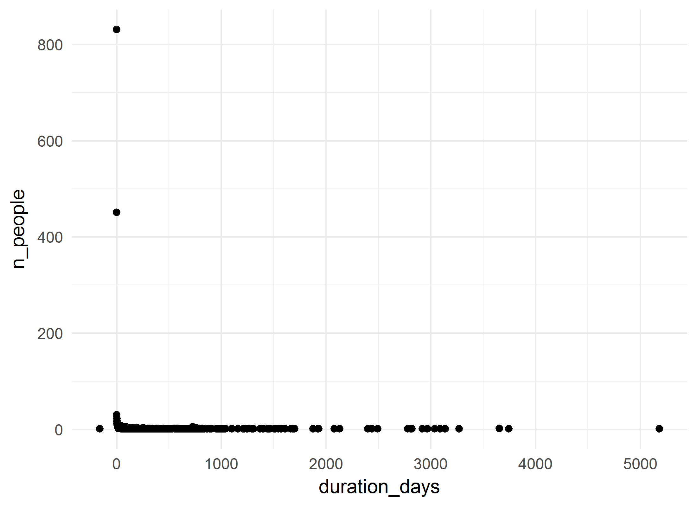
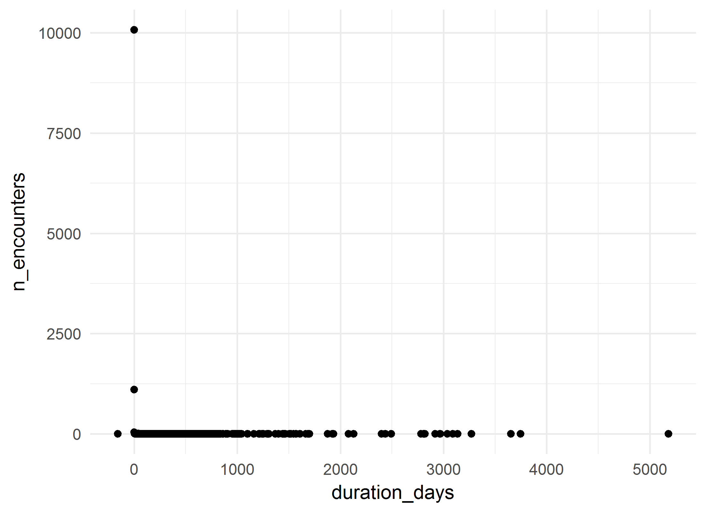
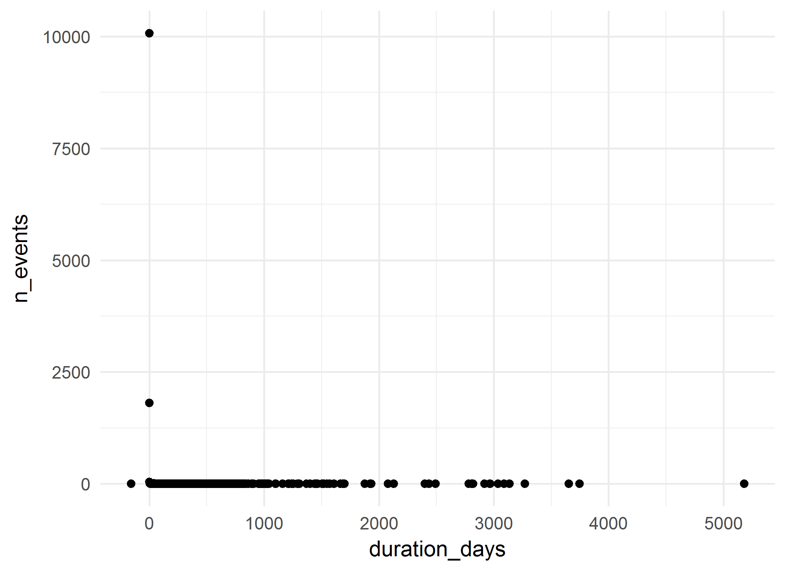

# Gestational Diabetes Cohort: Summative analysis
A.Koval, K.Moselle, S.Robertson  
`r Sys.Date()`  

<!-- These two chunks should be added in the beginning of every .Rmd that you want to source an .R script -->
<!--  The 1st mandatory chunck  -->
<!--  Set the working directory to the repository's base directory -->


<!--  The 2nd mandatory chunck  -->
<!-- Set the report-wide options, and point to the external code file. -->


<!-- Load 'sourced' R files.  Suppress the output when loading packages. --> 


<!-- Load the sources.  Suppress the output when loading sources. --> 

# I. Exposition

## Glossary
Review some of the object definition to help you interpret the report. 
<!-- Load any Global functions and variables declared in the R file.  Suppress the output. --> 

```r
# dto_location_map.rds is products of `./manipulation/0-ellis-location-map.R` 
path_input_location_map   <- "./data-unshared/derived/dto_location_map.rds" 
path_input_patient_events <-  "./data-unshared/derived/dto_patient_events_gestational_diabetes_842.rds" # research cohort
# Make sure the files are located where they supposed to be, in `./data-unshared/` folder
testit::assert("File does not exist", base::file.exists(path_input_location_map))
testit::assert("File does not exist", base::file.exists(path_input_patient_events))
# list variables that constitute patient event table
components_patient_events <- c(
  "id"                           # patient unique key
  ,"gender"                      # biological sex
  ,"age_group"                   # in groups of 5 years
  ,"encounter_id"                # unique identifier for the encounter 
  ,"encounter_class"             # value from the D_Location dimension table in the data warehous
  ,"encounter_type"              # value from the D_Location dimension table in the data warehous
  ,"event_type"                  # high-level classification of the event (encounter itself, diagnosis, procedure, clinical order, laboratory, pharmacy event, etc.).           
  ,"event_title"                 # a shorter, more rolled up category describing the event
  ,"event_detail"                # description of the event, can be long and specific
  ,"event_count"                 # count of the events in the row- each row has a value of 1, and can be summed
  ,"event_year"                  # year in which event occurred 
  ,"event_month"                 # month in which event occured
  ,"event_start_date"            # might be the date of the event itself (e.g. date of diagnosis) or the start date of the encounter that the event is associated with     
  ,"event_end_date"              # might be the end date of the event itself (e.g. end date of prescriptions) or the end date of the encounter that the event is associated with
  ,"start_day"                   # number of days between the first day the patient accessed Island Health services and the start date of this event. This is useful to mask dates, but still provides the relative time between events.
  ,"end_day"                     # number of days between the first day the patient accessed Island Health services and the end date of this event. This is useful to mask dates, but still provides the relative time between events.            
  ,"duration_days"               # number of days between the Start_Day and End_Day (End_Day - Start_Day)
  ,"addiction_location_count"    # patient has accessed services at a location that was used for the selection of the cohort
  ,"location_map_id"             # unique id for VIHA program, connects to location map
  ,"palette_code"                # unique id for colours of this palette
  ,"palette_colour_name"         # labels for clusters of service programs (aka 3T palette colours)
)
# list variables that consitute location map table
components_location_map <- c(
  "location_map_id"              # unique id for VIHA program, connects to patient events
  , "site_name"                  # CERNER address          # EHR address   
  , "facility_name"              # CERNER address          # EHR address   
  , "building_name"              # CERNER address          # EHR address   
  , "unit_name"                  # CERNER address          # EHR address   
  , "location_category"          # Data Warehouse address  # EHR address           
  , "location_type"              # Data Warehouse address  # EHR address           
  , "location_grouping"          # Data Warehouse address  # EHR address            
  , "site_key"                   # Factual counterparts to CERNER address
  , "facility_key"               # Factual counterparts to CERNER address
  , "building_key"               # Factual counterparts to CERNER address
  , "unit_key"                   # Factual counterparts to CERNER address
  , "intensity_type"             # Classifier, Compressor, Lense
  , "intensity_severity_risk"    # Classifier, Compressor, Lense
  , "clinical_focus"             # Classifier, Compressor, Lense
  , "service_type"               # Classifier, Compressor, Lense
  , "service_location"           # Classifier, Compressor, Lense
  , "population_age"             # Classifier, Compressor, Lense
  , "provider_mix"               # Classifier, Compressor, Lense
  , "location_class_code"        # Program Class, identifier
  , "location_class_description" # Porgram Class, Descriptive label
  , "palette_code"               # Palette,  identifier       # cluster specific     
  , "palette_colour_name"        # Palette, descriptive label # cluster specific            
)

# define output format for the report
options(
  knitr.table.format = "html"
  ,tibble.width = 110
  #   ,bootstrap_options = c("striped", "hover", "condensed","responsive")
)
```


<!-- Declare any global functions specific to a Rmd output.  Suppress the output. --> 


## Load Data
<!-- Load the datasets.   -->

```r
ds_patient_events <- readRDS(path_input_patient_events) # %>% as.data.frame()
ds_location_map   <- readRDS(path_input_location_map)

ds_patient_events  %>% glimpse()
ds_location_map %>% glimpse()
```

<!-- Inspect the datasets.   -->


## Data Tweaks
<!-- Tweak the datasets.   -->

```r
# augment the event table with additional columns from location map
ds <- dplyr::left_join(
  ds_patient_events,             # patient event table
  ds_location_map %>%         # location map 
    dplyr::select_(.dots = components_location_map)
  ,by = c("location_map_id","palette_code","palette_colour_name") 
) %>% 
  dplyr::mutate(
    location_class_description_display    = substr(location_class_description,1,42)
    ,palette_colour_name_display = substr(palette_colour_name,1,42)
  )
ds_location_map %>% glimpse()
# from this point on, ds_location_map is needed only for selective reference
ds %>% glimpse()
# ds now contains full coordinates to events of the cohort down to unit level
# ehr_address + location_classifiers + palette_colours
```

# II. Patient Events
The main data set `ds` contains both patient events table and their location map coordinates.

```r
# the data object containing events and location map 
ds %>% glimpse()
```

```
Observations: 12,755
Variables: 43
$ id                                 <chr> "10JP1", "10JP1", "10JP1", "10R21", "10R21", "10R21", "10R21",...
$ gender                             <chr> "Female", "Female", "Female", "Female", "Female", "Female", "F...
$ age_group                          <chr> "40 - 44", "40 - 44", "40 - 44", "50 - 54", "45 - 49", "45 - 4...
$ encounter_id                       <chr> "16E0C894", "19B0564", "7D4EBCA4", "1ED69C44", "370A7524", "57...
$ encounter_class                    <chr> "Outpatient", "Outpatient", "Outpatient", "Outpatient", "Other...
$ encounter_type                     <chr> "Ambulatory", "Ambulatory", "Ambulatory", "Ambulatory", "Speci...
$ event_type                         <chr> "Encounter Only", "Encounter Only", "Encounter Only", "Encount...
$ event_title                        <chr> "Medicine", "Outpatient", "Outpatient", "Outpatient", "Outpati...
$ event_detail                       <chr> "Medicine (Unspecified)", "Medical Imaging", "Medical Imaging"...
$ event_count                        <int> 1, 1, 1, 1, 1, 1, 1, 1, 1, 1, 1, 1, 1, 1, 1, 1, 1, 1, 1, 1, 1,...
$ event_year                         <int> 2015, 2015, 2016, 2015, 2014, 2015, 2012, 2014, 2011, 2013, 20...
$ event_month                        <int> 12, 8, 5, 11, 5, 11, 6, 12, 8, 6, 5, 4, 7, 7, 2, 5, 6, 9, 3, 6...
$ event_start_date                   <date> 2015-12-21, 2015-08-12, 2016-05-06, 2015-11-27, 2014-05-20, 2...
$ event_end_date                     <date> 2015-12-21, 2015-08-12, 2016-05-06, 2015-11-27, 2014-05-20, 2...
$ start_day                          <int> 131, 0, 268, 1261, 705, 1246, 0, 1301, 75, 758, 0, 1797, 419, ...
$ end_day                            <int> 131, 0, 268, 1261, 705, 1246, 0, 1301, 75, 758, 0, 1797, 419, ...
$ duration_days                      <int> 0, 0, 0, 0, 0, 1, 0, 0, 0, 0, 0, 0, 0, 0, 1, 0, 0, 0, 0, 0, 0,...
$ addiction_location_count           <int> 0, 0, 0, 0, 0, 0, 0, 0, 0, 0, 0, 0, 0, 0, 0, 0, 0, 0, 0, 0, 0,...
$ location_map_id                    <int> 174, 671, 637, 483, 807, 1448, 483, 671, 671, 483, 483, 243, 8...
$ palette_code                       <int> 36, 38, 38, 38, 36, 93, 38, 38, 38, 38, 38, 38, 99, 38, 92, 38...
$ palette_colour_name                <chr> "Lab - Island Health - General", "Medical Imaging", "Medical I...
$ site_name                          <chr> "Royal Jubilee Hospital", "Royal Jubilee Hospital", NA, "Victo...
$ facility_name                      <chr> "Royal Jubilee - Acute Care", "Royal Jubilee - Acute Care", "I...
$ building_name                      <chr> "Royal Jubilee Main", "Royal Jubilee Main", "Island Diagnostic...
$ unit_name                          <chr> "PFT Lab", "Medical Imaging Reception", "IDC Medical Imaging",...
$ location_category                  <chr> "Ambulatory", "Medical Imaging", "Medical Imaging", "Medical I...
$ location_type                      <chr> "Laboratory", "Medical Imaging", "Medical Imaging", "Medical I...
$ location_grouping                  <chr> "Ambulatory", "Medical Imaging", NA, "Medical Imaging", "Ambul...
$ site_key                           <chr> NA, NA, NA, NA, NA, NA, NA, NA, NA, NA, NA, NA, NA, NA, NA, NA...
$ facility_key                       <chr> "RJHAC", "RJHAC", "ICS", "VGHAC", "IDC", "VGHAC", "VGHAC", "RJ...
$ building_key                       <chr> "MAIN", "MAIN", "IDC", "VGH-AC", "RefIn", "VGH-AC", "VGH-AC", ...
$ unit_key                           <chr> "PFT Lab-R", "Med Img-R", "IDCMI", "Med Img-V", "REIN", "SDC-V...
$ intensity_type                     <chr> "Laboratory", "Medical Imaging", "Medical Imaging", "Medical I...
$ intensity_severity_risk            <chr> "Lab-General", "Medical Imaging", "Medical Imaging", "Medical ...
$ clinical_focus                     <chr> "Lab", "Medical Imaging", "Medical Imaging", "Medical Imaging"...
$ service_type                       <chr> "Laboratory", "Medical Imaging", "Medical Imaging", "Medical I...
$ service_location                   <chr> "IH Lab", "Medical Imaging", "Medical Imaging", "Medical Imagi...
$ population_age                     <chr> "Mixed Ages", "Mixed Ages", "Mixed Ages", "Mixed Ages", "Mixed...
$ provider_mix                       <chr> "Miscellaneous", "Medical specialist with tech supports", "Med...
$ location_class_code                <int> 146, 148, 148, 148, 146, 140, 148, 148, 148, 148, 148, 148, 13...
$ location_class_description         <chr> "Lab - Island Health - General", "Medical Imaging", "Medical I...
$ location_class_description_display <chr> "Lab - Island Health - General", "Medical Imaging", "Medical I...
$ palette_colour_name_display        <chr> "Lab - Island Health - General", "Medical Imaging", "Medical I...
```

```r
# What variables relate to patient event table?
# What variables relate to locations at which events took place?
# How many unique values does each variable/column contain? 
ds %>% select_(.dots=components_patient_events) %>% summarise_all(dplyr::n_distinct) %>% t() 
```

```
                          [,1]
id                         842
gender                       1
age_group                    8
encounter_id             12053
encounter_class              7
encounter_type              15
event_type                   3
event_title                 52
event_detail               644
event_count                  1
event_year                  13
event_month                 12
event_start_date          2234
event_end_date            2169
start_day                 2502
end_day                   2537
duration_days              447
addiction_location_count     2
location_map_id            662
palette_code                72
palette_colour_name         72
```

```r
ds %>% select_(.dots=components_location_map) %>% summarise_all(dplyr::n_distinct) %>% t() 
```

```
                           [,1]
location_map_id             662
site_name                    44
facility_name                81
building_name               128
unit_name                   493
location_category            10
location_type                32
location_grouping            22
site_key                      1
facility_key                 62
building_key                114
unit_key                    423
intensity_type               14
intensity_severity_risk      33
clinical_focus               37
service_type                 40
service_location             13
population_age                7
provider_mix                 17
location_class_code          88
location_class_description   88
palette_code                 72
palette_colour_name          72
```

```r
# they share / connected by the fields:
intersect(components_patient_events, components_location_map)
```

```
[1] "location_map_id"     "palette_code"        "palette_colour_name"
```

## Overview

```r
# PET - Patient Event Table
# How many patients are in this cohort?
ds %>% distinct(id) %>% count() %>% neat()
```

<?xml version="1.0" encoding="UTF-8"?>
<table class="table table-striped table-hover table-condensed table-responsive" style="width: auto !important; text-align: right;">
 <thead>
  <tr>
   <th style="text-align:right;"> n </th>
  </tr>
 </thead>
<tbody>
  <tr>
   <td style="text-align:right;"> 842 </td>
  </tr>
</tbody>
</table>

```r
# What are basic demographics?
ds %>% unique_sums(c("gender")) %>% arrange(desc(n_people)) %>% neat()
```

<?xml version="1.0" encoding="UTF-8"?>
<table class="table table-striped table-hover table-condensed table-responsive" style="width: auto !important; text-align: right;">
 <thead>
  <tr>
   <th style="text-align:left;"> gender </th>
   <th style="text-align:right;"> n_people </th>
   <th style="text-align:right;"> n_encounters </th>
   <th style="text-align:right;"> n_events </th>
  </tr>
 </thead>
<tbody>
  <tr>
   <td style="text-align:left;"> Female </td>
   <td style="text-align:right;"> 842 </td>
   <td style="text-align:right;"> 12053 </td>
   <td style="text-align:right;"> 12755 </td>
  </tr>
</tbody>
</table>

```r
ds %>% unique_sums(c("age_group"))  %>%  neat()
```

<?xml version="1.0" encoding="UTF-8"?>
<table class="table table-striped table-hover table-condensed table-responsive" style="width: auto !important; text-align: right;">
 <thead>
  <tr>
   <th style="text-align:left;"> age_group </th>
   <th style="text-align:right;"> n_people </th>
   <th style="text-align:right;"> n_encounters </th>
   <th style="text-align:right;"> n_events </th>
  </tr>
 </thead>
<tbody>
  <tr>
   <td style="text-align:left;"> 20 - 24 </td>
   <td style="text-align:right;"> 4 </td>
   <td style="text-align:right;"> 5 </td>
   <td style="text-align:right;"> 5 </td>
  </tr>
  <tr>
   <td style="text-align:left;"> 25 - 29 </td>
   <td style="text-align:right;"> 37 </td>
   <td style="text-align:right;"> 381 </td>
   <td style="text-align:right;"> 400 </td>
  </tr>
  <tr>
   <td style="text-align:left;"> 30 - 34 </td>
   <td style="text-align:right;"> 138 </td>
   <td style="text-align:right;"> 1602 </td>
   <td style="text-align:right;"> 1730 </td>
  </tr>
  <tr>
   <td style="text-align:left;"> 35 - 39 </td>
   <td style="text-align:right;"> 282 </td>
   <td style="text-align:right;"> 2461 </td>
   <td style="text-align:right;"> 2561 </td>
  </tr>
  <tr>
   <td style="text-align:left;"> 40 - 44 </td>
   <td style="text-align:right;"> 463 </td>
   <td style="text-align:right;"> 3194 </td>
   <td style="text-align:right;"> 3354 </td>
  </tr>
  <tr>
   <td style="text-align:left;"> 45 - 49 </td>
   <td style="text-align:right;"> 399 </td>
   <td style="text-align:right;"> 3064 </td>
   <td style="text-align:right;"> 3225 </td>
  </tr>
  <tr>
   <td style="text-align:left;"> 50 - 54 </td>
   <td style="text-align:right;"> 165 </td>
   <td style="text-align:right;"> 1224 </td>
   <td style="text-align:right;"> 1356 </td>
  </tr>
  <tr>
   <td style="text-align:left;"> 55 - 59 </td>
   <td style="text-align:right;"> 29 </td>
   <td style="text-align:right;"> 122 </td>
   <td style="text-align:right;"> 124 </td>
  </tr>
</tbody>
</table>

```r
ds %>% unique_sums(c("gender","age_group")) %>%  neat()
```

<?xml version="1.0" encoding="UTF-8"?>
<table class="table table-striped table-hover table-condensed table-responsive" style="width: auto !important; text-align: right;">
 <thead>
  <tr>
   <th style="text-align:left;"> gender </th>
   <th style="text-align:left;"> age_group </th>
   <th style="text-align:right;"> n_people </th>
   <th style="text-align:right;"> n_encounters </th>
   <th style="text-align:right;"> n_events </th>
  </tr>
 </thead>
<tbody>
  <tr>
   <td style="text-align:left;"> Female </td>
   <td style="text-align:left;"> 20 - 24 </td>
   <td style="text-align:right;"> 4 </td>
   <td style="text-align:right;"> 5 </td>
   <td style="text-align:right;"> 5 </td>
  </tr>
  <tr>
   <td style="text-align:left;"> Female </td>
   <td style="text-align:left;"> 25 - 29 </td>
   <td style="text-align:right;"> 37 </td>
   <td style="text-align:right;"> 381 </td>
   <td style="text-align:right;"> 400 </td>
  </tr>
  <tr>
   <td style="text-align:left;"> Female </td>
   <td style="text-align:left;"> 30 - 34 </td>
   <td style="text-align:right;"> 138 </td>
   <td style="text-align:right;"> 1602 </td>
   <td style="text-align:right;"> 1730 </td>
  </tr>
  <tr>
   <td style="text-align:left;"> Female </td>
   <td style="text-align:left;"> 35 - 39 </td>
   <td style="text-align:right;"> 282 </td>
   <td style="text-align:right;"> 2461 </td>
   <td style="text-align:right;"> 2561 </td>
  </tr>
  <tr>
   <td style="text-align:left;"> Female </td>
   <td style="text-align:left;"> 40 - 44 </td>
   <td style="text-align:right;"> 463 </td>
   <td style="text-align:right;"> 3194 </td>
   <td style="text-align:right;"> 3354 </td>
  </tr>
  <tr>
   <td style="text-align:left;"> Female </td>
   <td style="text-align:left;"> 45 - 49 </td>
   <td style="text-align:right;"> 399 </td>
   <td style="text-align:right;"> 3064 </td>
   <td style="text-align:right;"> 3225 </td>
  </tr>
  <tr>
   <td style="text-align:left;"> Female </td>
   <td style="text-align:left;"> 50 - 54 </td>
   <td style="text-align:right;"> 165 </td>
   <td style="text-align:right;"> 1224 </td>
   <td style="text-align:right;"> 1356 </td>
  </tr>
  <tr>
   <td style="text-align:left;"> Female </td>
   <td style="text-align:left;"> 55 - 59 </td>
   <td style="text-align:right;"> 29 </td>
   <td style="text-align:right;"> 122 </td>
   <td style="text-align:right;"> 124 </td>
  </tr>
</tbody>
</table>

## DW tags

```r
# how may unique encounters are there in this set?
ds %>% distinct(encounter_id) %>% count() %>% neat()
```

<?xml version="1.0" encoding="UTF-8"?>
<table class="table table-striped table-hover table-condensed table-responsive" style="width: auto !important; text-align: right;">
 <thead>
  <tr>
   <th style="text-align:right;"> n </th>
  </tr>
 </thead>
<tbody>
  <tr>
   <td style="text-align:right;"> 12053 </td>
  </tr>
</tbody>
</table>

```r
# tally engagement across encounter classes (as defined by data warehouse)
ds %>% unique_sums("encounter_class")%>% arrange(desc(n_people)) %>% neat()
```

<?xml version="1.0" encoding="UTF-8"?>
<table class="table table-striped table-hover table-condensed table-responsive" style="width: auto !important; text-align: right;">
 <thead>
  <tr>
   <th style="text-align:left;"> encounter_class </th>
   <th style="text-align:right;"> n_people </th>
   <th style="text-align:right;"> n_encounters </th>
   <th style="text-align:right;"> n_events </th>
  </tr>
 </thead>
<tbody>
  <tr>
   <td style="text-align:left;"> Outpatient </td>
   <td style="text-align:right;"> 799 </td>
   <td style="text-align:right;"> 7263 </td>
   <td style="text-align:right;"> 7467 </td>
  </tr>
  <tr>
   <td style="text-align:left;"> Emergency </td>
   <td style="text-align:right;"> 541 </td>
   <td style="text-align:right;"> 2604 </td>
   <td style="text-align:right;"> 2608 </td>
  </tr>
  <tr>
   <td style="text-align:left;"> Other </td>
   <td style="text-align:right;"> 358 </td>
   <td style="text-align:right;"> 918 </td>
   <td style="text-align:right;"> 924 </td>
  </tr>
  <tr>
   <td style="text-align:left;"> Recurring </td>
   <td style="text-align:right;"> 283 </td>
   <td style="text-align:right;"> 801 </td>
   <td style="text-align:right;"> 801 </td>
  </tr>
  <tr>
   <td style="text-align:left;"> Inpatient </td>
   <td style="text-align:right;"> 235 </td>
   <td style="text-align:right;"> 402 </td>
   <td style="text-align:right;"> 890 </td>
  </tr>
  <tr>
   <td style="text-align:left;"> Home Care </td>
   <td style="text-align:right;"> 42 </td>
   <td style="text-align:right;"> 52 </td>
   <td style="text-align:right;"> 52 </td>
  </tr>
  <tr>
   <td style="text-align:left;"> Cancelled Admission </td>
   <td style="text-align:right;"> 8 </td>
   <td style="text-align:right;"> 13 </td>
   <td style="text-align:right;"> 13 </td>
  </tr>
</tbody>
</table>

```r
ds %>% unique_sums("encounter_type") %>% arrange(desc(n_people)) %>% neat()
```

<?xml version="1.0" encoding="UTF-8"?>
<table class="table table-striped table-hover table-condensed table-responsive" style="width: auto !important; text-align: right;">
 <thead>
  <tr>
   <th style="text-align:left;"> encounter_type </th>
   <th style="text-align:right;"> n_people </th>
   <th style="text-align:right;"> n_encounters </th>
   <th style="text-align:right;"> n_events </th>
  </tr>
 </thead>
<tbody>
  <tr>
   <td style="text-align:left;"> Ambulatory </td>
   <td style="text-align:right;"> 791 </td>
   <td style="text-align:right;"> 6773 </td>
   <td style="text-align:right;"> 6773 </td>
  </tr>
  <tr>
   <td style="text-align:left;"> Emergency </td>
   <td style="text-align:right;"> 541 </td>
   <td style="text-align:right;"> 2604 </td>
   <td style="text-align:right;"> 2608 </td>
  </tr>
  <tr>
   <td style="text-align:left;"> Specimen </td>
   <td style="text-align:right;"> 356 </td>
   <td style="text-align:right;"> 908 </td>
   <td style="text-align:right;"> 914 </td>
  </tr>
  <tr>
   <td style="text-align:left;"> Day Care </td>
   <td style="text-align:right;"> 289 </td>
   <td style="text-align:right;"> 487 </td>
   <td style="text-align:right;"> 691 </td>
  </tr>
  <tr>
   <td style="text-align:left;"> Open Encounter </td>
   <td style="text-align:right;"> 258 </td>
   <td style="text-align:right;"> 751 </td>
   <td style="text-align:right;"> 751 </td>
  </tr>
  <tr>
   <td style="text-align:left;"> Inpatient Acute </td>
   <td style="text-align:right;"> 231 </td>
   <td style="text-align:right;"> 380 </td>
   <td style="text-align:right;"> 868 </td>
  </tr>
  <tr>
   <td style="text-align:left;"> Home Care </td>
   <td style="text-align:right;"> 42 </td>
   <td style="text-align:right;"> 52 </td>
   <td style="text-align:right;"> 52 </td>
  </tr>
  <tr>
   <td style="text-align:left;"> Recurring/Series </td>
   <td style="text-align:right;"> 41 </td>
   <td style="text-align:right;"> 50 </td>
   <td style="text-align:right;"> 50 </td>
  </tr>
  <tr>
   <td style="text-align:left;"> Cancelled Admission </td>
   <td style="text-align:right;"> 8 </td>
   <td style="text-align:right;"> 13 </td>
   <td style="text-align:right;"> 13 </td>
  </tr>
  <tr>
   <td style="text-align:left;"> MHAS - Acute Care </td>
   <td style="text-align:right;"> 5 </td>
   <td style="text-align:right;"> 9 </td>
   <td style="text-align:right;"> 9 </td>
  </tr>
  <tr>
   <td style="text-align:left;"> MHAS - Residential </td>
   <td style="text-align:right;"> 5 </td>
   <td style="text-align:right;"> 9 </td>
   <td style="text-align:right;"> 9 </td>
  </tr>
  <tr>
   <td style="text-align:left;"> Lifetime </td>
   <td style="text-align:right;"> 4 </td>
   <td style="text-align:right;"> 4 </td>
   <td style="text-align:right;"> 4 </td>
  </tr>
  <tr>
   <td style="text-align:left;"> Research </td>
   <td style="text-align:right;"> 3 </td>
   <td style="text-align:right;"> 8 </td>
   <td style="text-align:right;"> 8 </td>
  </tr>
  <tr>
   <td style="text-align:left;"> Morgue </td>
   <td style="text-align:right;"> 2 </td>
   <td style="text-align:right;"> 2 </td>
   <td style="text-align:right;"> 2 </td>
  </tr>
  <tr>
   <td style="text-align:left;"> Phone Consult </td>
   <td style="text-align:right;"> 2 </td>
   <td style="text-align:right;"> 3 </td>
   <td style="text-align:right;"> 3 </td>
  </tr>
</tbody>
</table>

```r
ds %>% unique_sums(c("encounter_class","encounter_type"))%>% arrange(desc(encounter_class,n_people)) %>% neat()
```

<?xml version="1.0" encoding="UTF-8"?>
<table class="table table-striped table-hover table-condensed table-responsive" style="width: auto !important; text-align: right;">
 <thead>
  <tr>
   <th style="text-align:left;"> encounter_class </th>
   <th style="text-align:left;"> encounter_type </th>
   <th style="text-align:right;"> n_people </th>
   <th style="text-align:right;"> n_encounters </th>
   <th style="text-align:right;"> n_events </th>
  </tr>
 </thead>
<tbody>
  <tr>
   <td style="text-align:left;"> Recurring </td>
   <td style="text-align:left;"> Open Encounter </td>
   <td style="text-align:right;"> 258 </td>
   <td style="text-align:right;"> 751 </td>
   <td style="text-align:right;"> 751 </td>
  </tr>
  <tr>
   <td style="text-align:left;"> Recurring </td>
   <td style="text-align:left;"> Recurring/Series </td>
   <td style="text-align:right;"> 41 </td>
   <td style="text-align:right;"> 50 </td>
   <td style="text-align:right;"> 50 </td>
  </tr>
  <tr>
   <td style="text-align:left;"> Outpatient </td>
   <td style="text-align:left;"> Ambulatory </td>
   <td style="text-align:right;"> 791 </td>
   <td style="text-align:right;"> 6773 </td>
   <td style="text-align:right;"> 6773 </td>
  </tr>
  <tr>
   <td style="text-align:left;"> Outpatient </td>
   <td style="text-align:left;"> Day Care </td>
   <td style="text-align:right;"> 289 </td>
   <td style="text-align:right;"> 487 </td>
   <td style="text-align:right;"> 691 </td>
  </tr>
  <tr>
   <td style="text-align:left;"> Outpatient </td>
   <td style="text-align:left;"> Phone Consult </td>
   <td style="text-align:right;"> 2 </td>
   <td style="text-align:right;"> 3 </td>
   <td style="text-align:right;"> 3 </td>
  </tr>
  <tr>
   <td style="text-align:left;"> Other </td>
   <td style="text-align:left;"> Morgue </td>
   <td style="text-align:right;"> 2 </td>
   <td style="text-align:right;"> 2 </td>
   <td style="text-align:right;"> 2 </td>
  </tr>
  <tr>
   <td style="text-align:left;"> Other </td>
   <td style="text-align:left;"> Research </td>
   <td style="text-align:right;"> 3 </td>
   <td style="text-align:right;"> 8 </td>
   <td style="text-align:right;"> 8 </td>
  </tr>
  <tr>
   <td style="text-align:left;"> Other </td>
   <td style="text-align:left;"> Specimen </td>
   <td style="text-align:right;"> 356 </td>
   <td style="text-align:right;"> 908 </td>
   <td style="text-align:right;"> 914 </td>
  </tr>
  <tr>
   <td style="text-align:left;"> Inpatient </td>
   <td style="text-align:left;"> Inpatient Acute </td>
   <td style="text-align:right;"> 231 </td>
   <td style="text-align:right;"> 380 </td>
   <td style="text-align:right;"> 868 </td>
  </tr>
  <tr>
   <td style="text-align:left;"> Inpatient </td>
   <td style="text-align:left;"> Lifetime </td>
   <td style="text-align:right;"> 4 </td>
   <td style="text-align:right;"> 4 </td>
   <td style="text-align:right;"> 4 </td>
  </tr>
  <tr>
   <td style="text-align:left;"> Inpatient </td>
   <td style="text-align:left;"> MHAS - Acute Care </td>
   <td style="text-align:right;"> 5 </td>
   <td style="text-align:right;"> 9 </td>
   <td style="text-align:right;"> 9 </td>
  </tr>
  <tr>
   <td style="text-align:left;"> Inpatient </td>
   <td style="text-align:left;"> MHAS - Residential </td>
   <td style="text-align:right;"> 5 </td>
   <td style="text-align:right;"> 9 </td>
   <td style="text-align:right;"> 9 </td>
  </tr>
  <tr>
   <td style="text-align:left;"> Home Care </td>
   <td style="text-align:left;"> Home Care </td>
   <td style="text-align:right;"> 42 </td>
   <td style="text-align:right;"> 52 </td>
   <td style="text-align:right;"> 52 </td>
  </tr>
  <tr>
   <td style="text-align:left;"> Emergency </td>
   <td style="text-align:left;"> Emergency </td>
   <td style="text-align:right;"> 541 </td>
   <td style="text-align:right;"> 2604 </td>
   <td style="text-align:right;"> 2608 </td>
  </tr>
  <tr>
   <td style="text-align:left;"> Cancelled Admission </td>
   <td style="text-align:left;"> Cancelled Admission </td>
   <td style="text-align:right;"> 8 </td>
   <td style="text-align:right;"> 13 </td>
   <td style="text-align:right;"> 13 </td>
  </tr>
</tbody>
</table>

## ACRU tags

```r
# how many event types  were there?
ds %>% unique_sums("event_type") %>% arrange(desc(n_people)) %>% neat()
```

<?xml version="1.0" encoding="UTF-8"?>
<table class="table table-striped table-hover table-condensed table-responsive" style="width: auto !important; text-align: right;">
 <thead>
  <tr>
   <th style="text-align:left;"> event_type </th>
   <th style="text-align:right;"> n_people </th>
   <th style="text-align:right;"> n_encounters </th>
   <th style="text-align:right;"> n_events </th>
  </tr>
 </thead>
<tbody>
  <tr>
   <td style="text-align:left;"> Encounter Only </td>
   <td style="text-align:right;"> 838 </td>
   <td style="text-align:right;"> 11246 </td>
   <td style="text-align:right;"> 11246 </td>
  </tr>
  <tr>
   <td style="text-align:left;"> Diagnosis </td>
   <td style="text-align:right;"> 352 </td>
   <td style="text-align:right;"> 653 </td>
   <td style="text-align:right;"> 1314 </td>
  </tr>
  <tr>
   <td style="text-align:left;"> Organism Identified </td>
   <td style="text-align:right;"> 103 </td>
   <td style="text-align:right;"> 176 </td>
   <td style="text-align:right;"> 195 </td>
  </tr>
</tbody>
</table>

```r
# view event_title and event_details with a dynmaic table 
ds %>% unique_sums(c("event_type","event_title","event_detail"))%>% arrange(desc(n_people)) %>% neat_DT()
```

<!--html_preserve--><div id="htmlwidget-949724d4495a7c718285" style="width:100%;height:auto;" class="datatables html-widget"></div>
<script type="application/json" data-for="htmlwidget-949724d4495a7c718285">{"x":{"filter":"top","filterHTML":"<tr>\n  <td><\/td>\n  <td data-type=\"character\" style=\"vertical-align: top;\">\n    <div class=\"form-group has-feedback\" style=\"margin-bottom: auto;\">\n      <input type=\"search\" placeholder=\"All\" class=\"form-control\" style=\"width: 100%;\"/>\n      <span class=\"glyphicon glyphicon-remove-circle form-control-feedback\"><\/span>\n    <\/div>\n  <\/td>\n  <td data-type=\"character\" style=\"vertical-align: top;\">\n    <div class=\"form-group has-feedback\" style=\"margin-bottom: auto;\">\n      <input type=\"search\" placeholder=\"All\" class=\"form-control\" style=\"width: 100%;\"/>\n      <span class=\"glyphicon glyphicon-remove-circle form-control-feedback\"><\/span>\n    <\/div>\n  <\/td>\n  <td data-type=\"character\" style=\"vertical-align: top;\">\n    <div class=\"form-group has-feedback\" style=\"margin-bottom: auto;\">\n      <input type=\"search\" placeholder=\"All\" class=\"form-control\" style=\"width: 100%;\"/>\n      <span class=\"glyphicon glyphicon-remove-circle form-control-feedback\"><\/span>\n    <\/div>\n  <\/td>\n  <td data-type=\"integer\" style=\"vertical-align: top;\">\n    <div class=\"form-group has-feedback\" style=\"margin-bottom: auto;\">\n      <input type=\"search\" placeholder=\"All\" class=\"form-control\" style=\"width: 100%;\"/>\n      <span class=\"glyphicon glyphicon-remove-circle form-control-feedback\"><\/span>\n    <\/div>\n    <div style=\"display: none; position: absolute; width: 200px;\">\n      <div data-min=\"1\" data-max=\"705\"><\/div>\n      <span style=\"float: left;\"><\/span>\n      <span style=\"float: right;\"><\/span>\n    <\/div>\n  <\/td>\n  <td data-type=\"integer\" style=\"vertical-align: top;\">\n    <div class=\"form-group has-feedback\" style=\"margin-bottom: auto;\">\n      <input type=\"search\" placeholder=\"All\" class=\"form-control\" style=\"width: 100%;\"/>\n      <span class=\"glyphicon glyphicon-remove-circle form-control-feedback\"><\/span>\n    <\/div>\n    <div style=\"display: none; position: absolute; width: 200px;\">\n      <div data-min=\"1\" data-max=\"3249\"><\/div>\n      <span style=\"float: left;\"><\/span>\n      <span style=\"float: right;\"><\/span>\n    <\/div>\n  <\/td>\n  <td data-type=\"integer\" style=\"vertical-align: top;\">\n    <div class=\"form-group has-feedback\" style=\"margin-bottom: auto;\">\n      <input type=\"search\" placeholder=\"All\" class=\"form-control\" style=\"width: 100%;\"/>\n      <span class=\"glyphicon glyphicon-remove-circle form-control-feedback\"><\/span>\n    <\/div>\n    <div style=\"display: none; position: absolute; width: 200px;\">\n      <div data-min=\"1\" data-max=\"3249\"><\/div>\n      <span style=\"float: left;\"><\/span>\n      <span style=\"float: right;\"><\/span>\n    <\/div>\n  <\/td>\n<\/tr>","data":[["1","2","3","4","5","6","7","8","9","10","11","12","13","14","15","16","17","18","19","20","21","22","23","24","25","26","27","28","29","30","31","32","33","34","35","36","37","38","39","40","41","42","43","44","45","46","47","48","49","50","51","52","53","54","55","56","57","58","59","60","61","62","63","64","65","66","67","68","69","70","71","72","73","74","75","76","77","78","79","80","81","82","83","84","85","86","87","88","89","90","91","92","93","94","95","96","97","98","99","100","101","102","103","104","105","106","107","108","109","110","111","112","113","114","115","116","117","118","119","120","121","122","123","124","125","126","127","128","129","130","131","132","133","134","135","136","137","138","139","140","141","142","143","144","145","146","147","148","149","150","151","152","153","154","155","156","157","158","159","160","161","162","163","164","165","166","167","168","169","170","171","172","173","174","175","176","177","178","179","180","181","182","183","184","185","186","187","188","189","190","191","192","193","194","195","196","197","198","199","200","201","202","203","204","205","206","207","208","209","210","211","212","213","214","215","216","217","218","219","220","221","222","223","224","225","226","227","228","229","230","231","232","233","234","235","236","237","238","239","240","241","242","243","244","245","246","247","248","249","250","251","252","253","254","255","256","257","258","259","260","261","262","263","264","265","266","267","268","269","270","271","272","273","274","275","276","277","278","279","280","281","282","283","284","285","286","287","288","289","290","291","292","293","294","295","296","297","298","299","300","301","302","303","304","305","306","307","308","309","310","311","312","313","314","315","316","317","318","319","320","321","322","323","324","325","326","327","328","329","330","331","332","333","334","335","336","337","338","339","340","341","342","343","344","345","346","347","348","349","350","351","352","353","354","355","356","357","358","359","360","361","362","363","364","365","366","367","368","369","370","371","372","373","374","375","376","377","378","379","380","381","382","383","384","385","386","387","388","389","390","391","392","393","394","395","396","397","398","399","400","401","402","403","404","405","406","407","408","409","410","411","412","413","414","415","416","417","418","419","420","421","422","423","424","425","426","427","428","429","430","431","432","433","434","435","436","437","438","439","440","441","442","443","444","445","446","447","448","449","450","451","452","453","454","455","456","457","458","459","460","461","462","463","464","465","466","467","468","469","470","471","472","473","474","475","476","477","478","479","480","481","482","483","484","485","486","487","488","489","490","491","492","493","494","495","496","497","498","499","500","501","502","503","504","505","506","507","508","509","510","511","512","513","514","515","516","517","518","519","520","521","522","523","524","525","526","527","528","529","530","531","532","533","534","535","536","537","538","539","540","541","542","543","544","545","546","547","548","549","550","551","552","553","554","555","556","557","558","559","560","561","562","563","564","565","566","567","568","569","570","571","572","573","574","575","576","577","578","579","580","581","582","583","584","585","586","587","588","589","590","591","592","593","594","595","596","597","598","599","600","601","602","603","604","605","606","607","608","609","610","611","612","613","614","615","616","617","618","619","620","621","622","623","624","625","626","627","628","629","630","631","632","633","634","635","636","637","638","639","640","641","642","643","644","645","646","647","648","649","650","651","652","653","654","655","656","657","658","659","660","661","662","663","664","665"],["Encounter Only","Encounter Only","Encounter Only","Encounter Only","Encounter Only","Encounter Only","Encounter Only","Organism Identified","Encounter Only","Encounter Only","Encounter Only","Encounter Only","Diagnosis","Diagnosis","Encounter Only","Encounter Only","Encounter Only","Encounter Only","Encounter Only","Diagnosis","Diagnosis","Encounter Only","Diagnosis","Encounter Only","Organism Identified","Diagnosis","Diagnosis","Encounter Only","Organism Identified","Encounter Only","Encounter Only","Diagnosis","Diagnosis","Encounter Only","Diagnosis","Diagnosis","Encounter Only","Diagnosis","Diagnosis","Diagnosis","Diagnosis","Diagnosis","Diagnosis","Encounter Only","Diagnosis","Diagnosis","Diagnosis","Diagnosis","Diagnosis","Diagnosis","Diagnosis","Diagnosis","Diagnosis","Diagnosis","Diagnosis","Diagnosis","Diagnosis","Diagnosis","Diagnosis","Diagnosis","Diagnosis","Encounter Only","Encounter Only","Diagnosis","Diagnosis","Diagnosis","Diagnosis","Diagnosis","Diagnosis","Diagnosis","Diagnosis","Diagnosis","Diagnosis","Diagnosis","Diagnosis","Organism Identified","Organism Identified","Diagnosis","Diagnosis","Diagnosis","Diagnosis","Diagnosis","Diagnosis","Diagnosis","Diagnosis","Diagnosis","Diagnosis","Diagnosis","Diagnosis","Diagnosis","Diagnosis","Diagnosis","Diagnosis","Diagnosis","Organism Identified","Organism Identified","Diagnosis","Diagnosis","Diagnosis","Diagnosis","Diagnosis","Diagnosis","Diagnosis","Diagnosis","Diagnosis","Diagnosis","Diagnosis","Diagnosis","Diagnosis","Diagnosis","Diagnosis","Diagnosis","Diagnosis","Diagnosis","Diagnosis","Diagnosis","Diagnosis","Diagnosis","Diagnosis","Diagnosis","Diagnosis","Diagnosis","Diagnosis","Diagnosis","Diagnosis","Diagnosis","Diagnosis","Diagnosis","Diagnosis","Diagnosis","Diagnosis","Diagnosis","Diagnosis","Diagnosis","Diagnosis","Diagnosis","Encounter Only","Encounter Only","Encounter Only","Organism Identified","Organism Identified","Diagnosis","Diagnosis","Diagnosis","Diagnosis","Diagnosis","Diagnosis","Diagnosis","Diagnosis","Diagnosis","Diagnosis","Diagnosis","Diagnosis","Diagnosis","Diagnosis","Diagnosis","Diagnosis","Diagnosis","Diagnosis","Diagnosis","Diagnosis","Diagnosis","Diagnosis","Diagnosis","Diagnosis","Diagnosis","Diagnosis","Diagnosis","Diagnosis","Diagnosis","Diagnosis","Diagnosis","Diagnosis","Diagnosis","Diagnosis","Diagnosis","Diagnosis","Diagnosis","Diagnosis","Diagnosis","Diagnosis","Diagnosis","Diagnosis","Diagnosis","Diagnosis","Diagnosis","Diagnosis","Diagnosis","Diagnosis","Diagnosis","Diagnosis","Diagnosis","Diagnosis","Diagnosis","Diagnosis","Diagnosis","Diagnosis","Diagnosis","Diagnosis","Diagnosis","Diagnosis","Diagnosis","Diagnosis","Diagnosis","Diagnosis","Diagnosis","Diagnosis","Diagnosis","Diagnosis","Diagnosis","Diagnosis","Diagnosis","Diagnosis","Diagnosis","Diagnosis","Diagnosis","Diagnosis","Diagnosis","Diagnosis","Diagnosis","Diagnosis","Diagnosis","Diagnosis","Diagnosis","Diagnosis","Diagnosis","Diagnosis","Diagnosis","Diagnosis","Diagnosis","Encounter Only","Encounter Only","Encounter Only","Encounter Only","Organism Identified","Organism Identified","Organism Identified","Organism Identified","Organism Identified","Organism Identified","Diagnosis","Diagnosis","Diagnosis","Diagnosis","Diagnosis","Diagnosis","Diagnosis","Diagnosis","Diagnosis","Diagnosis","Diagnosis","Diagnosis","Diagnosis","Diagnosis","Diagnosis","Diagnosis","Diagnosis","Diagnosis","Diagnosis","Diagnosis","Diagnosis","Diagnosis","Diagnosis","Diagnosis","Diagnosis","Diagnosis","Diagnosis","Diagnosis","Diagnosis","Diagnosis","Diagnosis","Diagnosis","Diagnosis","Diagnosis","Diagnosis","Diagnosis","Diagnosis","Diagnosis","Diagnosis","Diagnosis","Diagnosis","Diagnosis","Diagnosis","Diagnosis","Diagnosis","Diagnosis","Diagnosis","Diagnosis","Diagnosis","Diagnosis","Diagnosis","Diagnosis","Diagnosis","Diagnosis","Diagnosis","Diagnosis","Diagnosis","Diagnosis","Diagnosis","Diagnosis","Diagnosis","Diagnosis","Diagnosis","Diagnosis","Diagnosis","Diagnosis","Diagnosis","Diagnosis","Diagnosis","Diagnosis","Diagnosis","Diagnosis","Diagnosis","Diagnosis","Diagnosis","Diagnosis","Diagnosis","Diagnosis","Diagnosis","Diagnosis","Diagnosis","Diagnosis","Diagnosis","Diagnosis","Diagnosis","Diagnosis","Diagnosis","Diagnosis","Diagnosis","Diagnosis","Diagnosis","Diagnosis","Diagnosis","Diagnosis","Diagnosis","Diagnosis","Diagnosis","Diagnosis","Diagnosis","Diagnosis","Diagnosis","Diagnosis","Diagnosis","Diagnosis","Diagnosis","Diagnosis","Diagnosis","Diagnosis","Diagnosis","Diagnosis","Diagnosis","Diagnosis","Diagnosis","Diagnosis","Diagnosis","Diagnosis","Diagnosis","Diagnosis","Diagnosis","Diagnosis","Diagnosis","Diagnosis","Diagnosis","Diagnosis","Diagnosis","Diagnosis","Diagnosis","Diagnosis","Diagnosis","Diagnosis","Diagnosis","Diagnosis","Diagnosis","Diagnosis","Diagnosis","Diagnosis","Diagnosis","Diagnosis","Diagnosis","Diagnosis","Diagnosis","Diagnosis","Diagnosis","Diagnosis","Diagnosis","Diagnosis","Diagnosis","Diagnosis","Diagnosis","Diagnosis","Diagnosis","Diagnosis","Diagnosis","Diagnosis","Diagnosis","Diagnosis","Diagnosis","Diagnosis","Diagnosis","Diagnosis","Diagnosis","Diagnosis","Diagnosis","Diagnosis","Diagnosis","Diagnosis","Diagnosis","Diagnosis","Diagnosis","Diagnosis","Diagnosis","Diagnosis","Diagnosis","Diagnosis","Diagnosis","Diagnosis","Diagnosis","Diagnosis","Diagnosis","Diagnosis","Diagnosis","Diagnosis","Diagnosis","Diagnosis","Diagnosis","Diagnosis","Diagnosis","Diagnosis","Diagnosis","Diagnosis","Diagnosis","Diagnosis","Diagnosis","Diagnosis","Diagnosis","Diagnosis","Diagnosis","Diagnosis","Diagnosis","Diagnosis","Diagnosis","Diagnosis","Diagnosis","Diagnosis","Diagnosis","Diagnosis","Diagnosis","Diagnosis","Diagnosis","Diagnosis","Diagnosis","Diagnosis","Diagnosis","Diagnosis","Diagnosis","Diagnosis","Diagnosis","Diagnosis","Diagnosis","Diagnosis","Diagnosis","Diagnosis","Diagnosis","Diagnosis","Diagnosis","Diagnosis","Diagnosis","Diagnosis","Diagnosis","Diagnosis","Diagnosis","Diagnosis","Diagnosis","Diagnosis","Diagnosis","Diagnosis","Diagnosis","Diagnosis","Diagnosis","Diagnosis","Diagnosis","Diagnosis","Diagnosis","Diagnosis","Diagnosis","Diagnosis","Diagnosis","Diagnosis","Diagnosis","Diagnosis","Diagnosis","Diagnosis","Diagnosis","Diagnosis","Diagnosis","Diagnosis","Diagnosis","Diagnosis","Diagnosis","Diagnosis","Diagnosis","Diagnosis","Diagnosis","Diagnosis","Diagnosis","Diagnosis","Diagnosis","Diagnosis","Diagnosis","Diagnosis","Diagnosis","Diagnosis","Diagnosis","Diagnosis","Diagnosis","Diagnosis","Diagnosis","Diagnosis","Diagnosis","Diagnosis","Diagnosis","Diagnosis","Diagnosis","Diagnosis","Diagnosis","Diagnosis","Diagnosis","Diagnosis","Diagnosis","Diagnosis","Diagnosis","Diagnosis","Diagnosis","Diagnosis","Diagnosis","Diagnosis","Diagnosis","Diagnosis","Diagnosis","Diagnosis","Diagnosis","Diagnosis","Diagnosis","Diagnosis","Diagnosis","Diagnosis","Diagnosis","Diagnosis","Diagnosis","Diagnosis","Diagnosis","Diagnosis","Diagnosis","Diagnosis","Diagnosis","Diagnosis","Diagnosis","Diagnosis","Diagnosis","Diagnosis","Diagnosis","Diagnosis","Diagnosis","Diagnosis","Diagnosis","Diagnosis","Diagnosis","Diagnosis","Diagnosis","Diagnosis","Diagnosis","Diagnosis","Diagnosis","Diagnosis","Diagnosis","Diagnosis","Diagnosis","Diagnosis","Diagnosis","Diagnosis","Diagnosis","Diagnosis","Diagnosis","Diagnosis","Diagnosis","Diagnosis","Diagnosis","Diagnosis","Diagnosis","Diagnosis","Diagnosis","Diagnosis","Diagnosis","Diagnosis","Diagnosis","Diagnosis","Diagnosis","Diagnosis","Diagnosis","Diagnosis","Diagnosis","Diagnosis","Diagnosis","Diagnosis","Diagnosis","Diagnosis","Diagnosis","Diagnosis","Diagnosis","Diagnosis","Diagnosis","Diagnosis","Diagnosis","Diagnosis","Diagnosis","Diagnosis","Diagnosis","Diagnosis","Diagnosis","Diagnosis","Diagnosis","Diagnosis","Diagnosis","Diagnosis","Diagnosis","Diagnosis","Diagnosis","Diagnosis","Diagnosis","Encounter Only","Encounter Only","Encounter Only","Encounter Only","Encounter Only","Encounter Only","Encounter Only","Encounter Only","Organism Identified","Organism Identified","Organism Identified","Organism Identified","Organism Identified","Organism Identified","Organism Identified","Organism Identified","Organism Identified","Organism Identified","Organism Identified","Organism Identified","Organism Identified","Organism Identified","Organism Identified","Organism Identified","Organism Identified","Organism Identified","Organism Identified","Organism Identified","Organism Identified","Organism Identified","Organism Identified","Organism Identified","Organism Identified","Organism Identified","Organism Identified","Organism Identified"],["Outpatient",null,"Outpatient","Medicine","Mental Health","Outpatient","Outpatient","Culture Urine","Rehab","Child, Youth &amp; Family","Surgery","Child, Youth &amp; Family","Endocrine, nutritional and metabolic diseases","Diseases of the genitourinary system","Outpatient","Surgery","Other","Surgery","Surgery","Factors influencing health status and contact with health services","Factors influencing health status and contact with health services","Medicine","Diseases of the digestive system","Surgery","Urine Culture","Factors influencing health status and contact with health services","Diseases of the digestive system","Medicine","Culture Wound","Neuro-sciences","Surgery","Certain infectious and parasitic diseases","Pregnancy, childbirth and the puerperium","Outpatient","Diseases of the digestive system","Factors influencing health status and contact with health services","Outpatient","Diseases of the digestive system","Diseases of the genitourinary system","Factors influencing health status and contact with health services","Pregnancy, childbirth and the puerperium","Symptoms, signs and abnormal clinical and laboratory findings, not elsewhere classified","Symptoms, signs and abnormal clinical and laboratory findings, not elsewhere classified","Medicine","Diseases of the genitourinary system","Factors influencing health status and contact with health services","Pregnancy, childbirth and the puerperium","Diseases of the blood and blood-forming organs and certain disorders involving the immune mechanism","Diseases of the genitourinary system","Diseases of the genitourinary system","Diseases of the genitourinary system","Endocrine, nutritional and metabolic diseases","Endocrine, nutritional and metabolic diseases","Neoplasms","Diseases of the digestive system","Diseases of the digestive system","Diseases of the digestive system","Diseases of the genitourinary system","External causes of morbidity and mortality","Factors influencing health status and contact with health services","Neoplasms","ICU","Medicine","Diseases of the circulatory system","Diseases of the digestive system","Diseases of the digestive system","Diseases of the genitourinary system","Diseases of the genitourinary system","Diseases of the genitourinary system","Diseases of the genitourinary system","External causes of morbidity and mortality","Factors influencing health status and contact with health services","Factors influencing health status and contact with health services","Neoplasms","Neoplasms","Culture Wound","Wound Culture","Diseases of the blood and blood-forming organs and certain disorders involving the immune mechanism","Diseases of the digestive system","Diseases of the digestive system","Diseases of the digestive system","Diseases of the digestive system","Diseases of the digestive system","Diseases of the digestive system","Diseases of the eye and adnexa","Diseases of the genitourinary system","Diseases of the genitourinary system","Diseases of the nervous system","External causes of morbidity and mortality","Factors influencing health status and contact with health services","Neoplasms","Pregnancy, childbirth and the puerperium","Symptoms, signs and abnormal clinical and laboratory findings, not elsewhere classified","Symptoms, signs and abnormal clinical and laboratory findings, not elsewhere classified","Culture Blood","Culture Wound","Diseases of the circulatory system","Diseases of the digestive system","Diseases of the digestive system","Diseases of the digestive system","Diseases of the digestive system","Diseases of the digestive system","Diseases of the digestive system","Diseases of the digestive system","Diseases of the digestive system","Diseases of the digestive system","Diseases of the eye and adnexa","Diseases of the genitourinary system","Diseases of the genitourinary system","Diseases of the genitourinary system","Diseases of the genitourinary system","Diseases of the genitourinary system","Diseases of the musculoskeletal system and connective tissue","Diseases of the musculoskeletal system and connective tissue","Diseases of the musculoskeletal system and connective tissue","Endocrine, nutritional and metabolic diseases","Endocrine, nutritional and metabolic diseases","Endocrine, nutritional and metabolic diseases","Endocrine, nutritional and metabolic diseases","Endocrine, nutritional and metabolic diseases","External causes of morbidity and mortality","External causes of morbidity and mortality","External causes of morbidity and mortality","Factors influencing health status and contact with health services","Factors influencing health status and contact with health services","Injury, poisoning and certain other consequences of external causes","Mental and behavioural disorders","Neoplasms","Neoplasms","Pregnancy, childbirth and the puerperium","Pregnancy, childbirth and the puerperium","Pregnancy, childbirth and the puerperium","Symptoms, signs and abnormal clinical and laboratory findings, not elsewhere classified","Symptoms, signs and abnormal clinical and laboratory findings, not elsewhere classified","Symptoms, signs and abnormal clinical and laboratory findings, not elsewhere classified","Symptoms, signs and abnormal clinical and laboratory findings, not elsewhere classified","Medicine","Medicine","Surgery","Culture Urine","Culture Urine","Certain infectious and parasitic diseases","Certain infectious and parasitic diseases","Congenital malformations, deformations and chromosomal abnormalities","Diseases of the blood and blood-forming organs and certain disorders involving the immune mechanism","Diseases of the circulatory system","Diseases of the digestive system","Diseases of the digestive system","Diseases of the digestive system","Diseases of the digestive system","Diseases of the digestive system","Diseases of the digestive system","Diseases of the digestive system","Diseases of the digestive system","Diseases of the digestive system","Diseases of the digestive system","Diseases of the digestive system","Diseases of the digestive system","Diseases of the digestive system","Diseases of the digestive system","Diseases of the eye and adnexa","Diseases of the eye and adnexa","Diseases of the genitourinary system","Diseases of the genitourinary system","Diseases of the genitourinary system","Diseases of the genitourinary system","Diseases of the genitourinary system","Diseases of the genitourinary system","Diseases of the genitourinary system","Diseases of the genitourinary system","Diseases of the genitourinary system","Diseases of the musculoskeletal system and connective tissue","Diseases of the musculoskeletal system and connective tissue","Diseases of the musculoskeletal system and connective tissue","Diseases of the musculoskeletal system and connective tissue","Diseases of the musculoskeletal system and connective tissue","Diseases of the nervous system","Diseases of the respiratory system","Diseases of the respiratory system","Diseases of the respiratory system","Diseases of the respiratory system","Diseases of the respiratory system","Diseases of the skin and subcutaneous tissue","Diseases of the skin and subcutaneous tissue","Diseases of the skin and subcutaneous tissue","Endocrine, nutritional and metabolic diseases","Endocrine, nutritional and metabolic diseases","Endocrine, nutritional and metabolic diseases","Endocrine, nutritional and metabolic diseases","Endocrine, nutritional and metabolic diseases","Endocrine, nutritional and metabolic diseases","External causes of morbidity and mortality","External causes of morbidity and mortality","External causes of morbidity and mortality","External causes of morbidity and mortality","External causes of morbidity and mortality","External causes of morbidity and mortality","Factors influencing health status and contact with health services","Factors influencing health status and contact with health services","Factors influencing health status and contact with health services","Factors influencing health status and contact with health services","Factors influencing health status and contact with health services","Factors influencing health status and contact with health services","Factors influencing health status and contact with health services","Injury, poisoning and certain other consequences of external causes","Injury, poisoning and certain other consequences of external causes","Injury, poisoning and certain other consequences of external causes","Injury, poisoning and certain other consequences of external causes","Injury, poisoning and certain other consequences of external causes","Injury, poisoning and certain other consequences of external causes","Injury, poisoning and certain other consequences of external causes","Mental and behavioural disorders","Mental and behavioural disorders","Mental and behavioural disorders","Mental and behavioural disorders","Neoplasms","Neoplasms","Neoplasms","Neoplasms","Pregnancy, childbirth and the puerperium","Pregnancy, childbirth and the puerperium","Pregnancy, childbirth and the puerperium","Pregnancy, childbirth and the puerperium","Pregnancy, childbirth and the puerperium","Symptoms, signs and abnormal clinical and laboratory findings, not elsewhere classified","Symptoms, signs and abnormal clinical and laboratory findings, not elsewhere classified","Symptoms, signs and abnormal clinical and laboratory findings, not elsewhere classified","Symptoms, signs and abnormal clinical and laboratory findings, not elsewhere classified","Symptoms, signs and abnormal clinical and laboratory findings, not elsewhere classified","Symptoms, signs and abnormal clinical and laboratory findings, not elsewhere classified","Heart Health","Medicine","Medicine","Residential","Culture Deep","Culture Deep","Culture Sputum","Culture Urine","Culture Wound","Urine Culture","Certain infectious and parasitic diseases","Certain infectious and parasitic diseases","Certain infectious and parasitic diseases","Certain infectious and parasitic diseases","Certain infectious and parasitic diseases","Certain infectious and parasitic diseases","Certain infectious and parasitic diseases","Congenital malformations, deformations and chromosomal abnormalities","Congenital malformations, deformations and chromosomal abnormalities","Congenital malformations, deformations and chromosomal abnormalities","Diseases of the blood and blood-forming organs and certain disorders involving the immune mechanism","Diseases of the blood and blood-forming organs and certain disorders involving the immune mechanism","Diseases of the blood and blood-forming organs and certain disorders involving the immune mechanism","Diseases of the blood and blood-forming organs and certain disorders involving the immune mechanism","Diseases of the blood and blood-forming organs and certain disorders involving the immune mechanism","Diseases of the blood and blood-forming organs and certain disorders involving the immune mechanism","Diseases of the circulatory system","Diseases of the circulatory system","Diseases of the circulatory system","Diseases of the circulatory system","Diseases of the circulatory system","Diseases of the circulatory system","Diseases of the circulatory system","Diseases of the circulatory system","Diseases of the circulatory system","Diseases of the circulatory system","Diseases of the circulatory system","Diseases of the circulatory system","Diseases of the circulatory system","Diseases of the circulatory system","Diseases of the circulatory system","Diseases of the digestive system","Diseases of the digestive system","Diseases of the digestive system","Diseases of the digestive system","Diseases of the digestive system","Diseases of the digestive system","Diseases of the digestive system","Diseases of the digestive system","Diseases of the digestive system","Diseases of the digestive system","Diseases of the digestive system","Diseases of the digestive system","Diseases of the digestive system","Diseases of the digestive system","Diseases of the digestive system","Diseases of the digestive system","Diseases of the digestive system","Diseases of the digestive system","Diseases of the digestive system","Diseases of the digestive system","Diseases of the digestive system","Diseases of the digestive system","Diseases of the digestive system","Diseases of the digestive system","Diseases of the digestive system","Diseases of the digestive system","Diseases of the digestive system","Diseases of the digestive system","Diseases of the digestive system","Diseases of the digestive system","Diseases of the digestive system","Diseases of the digestive system","Diseases of the digestive system","Diseases of the digestive system","Diseases of the digestive system","Diseases of the digestive system","Diseases of the digestive system","Diseases of the digestive system","Diseases of the digestive system","Diseases of the digestive system","Diseases of the ear and mastoid process","Diseases of the ear and mastoid process","Diseases of the ear and mastoid process","Diseases of the ear and mastoid process","Diseases of the eye and adnexa","Diseases of the eye and adnexa","Diseases of the eye and adnexa","Diseases of the eye and adnexa","Diseases of the eye and adnexa","Diseases of the eye and adnexa","Diseases of the eye and adnexa","Diseases of the eye and adnexa","Diseases of the genitourinary system","Diseases of the genitourinary system","Diseases of the genitourinary system","Diseases of the genitourinary system","Diseases of the genitourinary system","Diseases of the genitourinary system","Diseases of the genitourinary system","Diseases of the genitourinary system","Diseases of the genitourinary system","Diseases of the genitourinary system","Diseases of the genitourinary system","Diseases of the genitourinary system","Diseases of the genitourinary system","Diseases of the genitourinary system","Diseases of the genitourinary system","Diseases of the genitourinary system","Diseases of the genitourinary system","Diseases of the genitourinary system","Diseases of the genitourinary system","Diseases of the genitourinary system","Diseases of the genitourinary system","Diseases of the genitourinary system","Diseases of the genitourinary system","Diseases of the genitourinary system","Diseases of the genitourinary system","Diseases of the genitourinary system","Diseases of the musculoskeletal system and connective tissue","Diseases of the musculoskeletal system and connective tissue","Diseases of the musculoskeletal system and connective tissue","Diseases of the musculoskeletal system and connective tissue","Diseases of the musculoskeletal system and connective tissue","Diseases of the musculoskeletal system and connective tissue","Diseases of the musculoskeletal system and connective tissue","Diseases of the musculoskeletal system and connective tissue","Diseases of the musculoskeletal system and connective tissue","Diseases of the musculoskeletal system and connective tissue","Diseases of the musculoskeletal system and connective tissue","Diseases of the musculoskeletal system and connective tissue","Diseases of the musculoskeletal system and connective tissue","Diseases of the musculoskeletal system and connective tissue","Diseases of the musculoskeletal system and connective tissue","Diseases of the musculoskeletal system and connective tissue","Diseases of the musculoskeletal system and connective tissue","Diseases of the musculoskeletal system and connective tissue","Diseases of the musculoskeletal system and connective tissue","Diseases of the musculoskeletal system and connective tissue","Diseases of the musculoskeletal system and connective tissue","Diseases of the musculoskeletal system and connective tissue","Diseases of the musculoskeletal system and connective tissue","Diseases of the musculoskeletal system and connective tissue","Diseases of the musculoskeletal system and connective tissue","Diseases of the musculoskeletal system and connective tissue","Diseases of the musculoskeletal system and connective tissue","Diseases of the musculoskeletal system and connective tissue","Diseases of the musculoskeletal system and connective tissue","Diseases of the musculoskeletal system and connective tissue","Diseases of the musculoskeletal system and connective tissue","Diseases of the musculoskeletal system and connective tissue","Diseases of the musculoskeletal system and connective tissue","Diseases of the musculoskeletal system and connective tissue","Diseases of the musculoskeletal system and connective tissue","Diseases of the musculoskeletal system and connective tissue","Diseases of the musculoskeletal system and connective tissue","Diseases of the musculoskeletal system and connective tissue","Diseases of the musculoskeletal system and connective tissue","Diseases of the nervous system","Diseases of the nervous system","Diseases of the nervous system","Diseases of the nervous system","Diseases of the respiratory system","Diseases of the respiratory system","Diseases of the respiratory system","Diseases of the respiratory system","Diseases of the respiratory system","Diseases of the respiratory system","Diseases of the respiratory system","Diseases of the respiratory system","Diseases of the respiratory system","Diseases of the skin and subcutaneous tissue","Diseases of the skin and subcutaneous tissue","Diseases of the skin and subcutaneous tissue","Diseases of the skin and subcutaneous tissue","Diseases of the skin and subcutaneous tissue","Diseases of the skin and subcutaneous tissue","Diseases of the skin and subcutaneous tissue","Diseases of the skin and subcutaneous tissue","Diseases of the skin and subcutaneous tissue","Diseases of the skin and subcutaneous tissue","Endocrine, nutritional and metabolic diseases","Endocrine, nutritional and metabolic diseases","Endocrine, nutritional and metabolic diseases","Endocrine, nutritional and metabolic diseases","Endocrine, nutritional and metabolic diseases","Endocrine, nutritional and metabolic diseases","Endocrine, nutritional and metabolic diseases","Endocrine, nutritional and metabolic diseases","Endocrine, nutritional and metabolic diseases","Endocrine, nutritional and metabolic diseases","Endocrine, nutritional and metabolic diseases","Endocrine, nutritional and metabolic diseases","Endocrine, nutritional and metabolic diseases","Endocrine, nutritional and metabolic diseases","Endocrine, nutritional and metabolic diseases","Endocrine, nutritional and metabolic diseases","Endocrine, nutritional and metabolic diseases","Endocrine, nutritional and metabolic diseases","Endocrine, nutritional and metabolic diseases","Endocrine, nutritional and metabolic diseases","External causes of morbidity and mortality","External causes of morbidity and mortality","External causes of morbidity and mortality","External causes of morbidity and mortality","External causes of morbidity and mortality","External causes of morbidity and mortality","External causes of morbidity and mortality","External causes of morbidity and mortality","External causes of morbidity and mortality","External causes of morbidity and mortality","External causes of morbidity and mortality","External causes of morbidity and mortality","External causes of morbidity and mortality","External causes of morbidity and mortality","External causes of morbidity and mortality","External causes of morbidity and mortality","External causes of morbidity and mortality","External causes of morbidity and mortality","External causes of morbidity and mortality","External causes of morbidity and mortality","External causes of morbidity and mortality","External causes of morbidity and mortality","External causes of morbidity and mortality","External causes of morbidity and mortality","External causes of morbidity and mortality","External causes of morbidity and mortality","External causes of morbidity and mortality","External causes of morbidity and mortality","Factors influencing health status and contact with health services","Factors influencing health status and contact with health services","Factors influencing health status and contact with health services","Factors influencing health status and contact with health services","Factors influencing health status and contact with health services","Factors influencing health status and contact with health services","Factors influencing health status and contact with health services","Factors influencing health status and contact with health services","Factors influencing health status and contact with health services","Factors influencing health status and contact with health services","Factors influencing health status and contact with health services","Factors influencing health status and contact with health services","Factors influencing health status and contact with health services","Factors influencing health status and contact with health services","Factors influencing health status and contact with health services","Factors influencing health status and contact with health services","Factors influencing health status and contact with health services","Factors influencing health status and contact with health services","Factors influencing health status and contact with health services","Factors influencing health status and contact with health services","Injury, poisoning and certain other consequences of external causes","Injury, poisoning and certain other consequences of external causes","Injury, poisoning and certain other consequences of external causes","Injury, poisoning and certain other consequences of external causes","Injury, poisoning and certain other consequences of external causes","Injury, poisoning and certain other consequences of external causes","Injury, poisoning and certain other consequences of external causes","Injury, poisoning and certain other consequences of external causes","Injury, poisoning and certain other consequences of external causes","Injury, poisoning and certain other consequences of external causes","Injury, poisoning and certain other consequences of external causes","Injury, poisoning and certain other consequences of external causes","Injury, poisoning and certain other consequences of external causes","Injury, poisoning and certain other consequences of external causes","Injury, poisoning and certain other consequences of external causes","Injury, poisoning and certain other consequences of external causes","Injury, poisoning and certain other consequences of external causes","Injury, poisoning and certain other consequences of external causes","Injury, poisoning and certain other consequences of external causes","Injury, poisoning and certain other consequences of external causes","Injury, poisoning and certain other consequences of external causes","Injury, poisoning and certain other consequences of external causes","Injury, poisoning and certain other consequences of external causes","Injury, poisoning and certain other consequences of external causes","Injury, poisoning and certain other consequences of external causes","Injury, poisoning and certain other consequences of external causes","Injury, poisoning and certain other consequences of external causes","Injury, poisoning and certain other consequences of external causes","Injury, poisoning and certain other consequences of external causes","Injury, poisoning and certain other consequences of external causes","Injury, poisoning and certain other consequences of external causes","Injury, poisoning and certain other consequences of external causes","Injury, poisoning and certain other consequences of external causes","Injury, poisoning and certain other consequences of external causes","Injury, poisoning and certain other consequences of external causes","Injury, poisoning and certain other consequences of external causes","Injury, poisoning and certain other consequences of external causes","Injury, poisoning and certain other consequences of external causes","Injury, poisoning and certain other consequences of external causes","Injury, poisoning and certain other consequences of external causes","Mental and behavioural disorders","Mental and behavioural disorders","Mental and behavioural disorders","Mental and behavioural disorders","Mental and behavioural disorders","Mental and behavioural disorders","Mental and behavioural disorders","Mental and behavioural disorders","Mental and behavioural disorders","Mental and behavioural disorders","Mental and behavioural disorders","Mental and behavioural disorders","Mental and behavioural disorders","Mental and behavioural disorders","Mental and behavioural disorders","Mental and behavioural disorders","Mental and behavioural disorders","Mental and behavioural disorders","Mental and behavioural disorders","Mental and behavioural disorders","Mental and behavioural disorders","Mental and behavioural disorders","Mental and behavioural disorders","Mental and behavioural disorders","Mental and behavioural disorders","Mental and behavioural disorders","Mental and behavioural disorders","Neoplasms","Neoplasms","Neoplasms","Neoplasms","Neoplasms","Neoplasms","Neoplasms","Neoplasms","Neoplasms","Neoplasms","Neoplasms","Neoplasms","Neoplasms","Neoplasms","Neoplasms","Neoplasms","Neoplasms","Neoplasms","Neoplasms","Neoplasms","Neoplasms","Neoplasms","Neoplasms","Neoplasms","Neoplasms","Neoplasms","Neoplasms","Neoplasms","Neoplasms","Neoplasms","Neoplasms","Neoplasms","Neoplasms","Pregnancy, childbirth and the puerperium","Pregnancy, childbirth and the puerperium","Pregnancy, childbirth and the puerperium","Pregnancy, childbirth and the puerperium","Pregnancy, childbirth and the puerperium","Pregnancy, childbirth and the puerperium","Pregnancy, childbirth and the puerperium","Pregnancy, childbirth and the puerperium","Pregnancy, childbirth and the puerperium","Pregnancy, childbirth and the puerperium","Pregnancy, childbirth and the puerperium","Pregnancy, childbirth and the puerperium","Pregnancy, childbirth and the puerperium","Pregnancy, childbirth and the puerperium","Pregnancy, childbirth and the puerperium","Pregnancy, childbirth and the puerperium","Pregnancy, childbirth and the puerperium","Pregnancy, childbirth and the puerperium","Pregnancy, childbirth and the puerperium","Pregnancy, childbirth and the puerperium","Pregnancy, childbirth and the puerperium","Pregnancy, childbirth and the puerperium","Pregnancy, childbirth and the puerperium","Pregnancy, childbirth and the puerperium","Pregnancy, childbirth and the puerperium","Pregnancy, childbirth and the puerperium","Symptoms, signs and abnormal clinical and laboratory findings, not elsewhere classified","Symptoms, signs and abnormal clinical and laboratory findings, not elsewhere classified","Symptoms, signs and abnormal clinical and laboratory findings, not elsewhere classified","Symptoms, signs and abnormal clinical and laboratory findings, not elsewhere classified","Symptoms, signs and abnormal clinical and laboratory findings, not elsewhere classified","Symptoms, signs and abnormal clinical and laboratory findings, not elsewhere classified","Symptoms, signs and abnormal clinical and laboratory findings, not elsewhere classified","Symptoms, signs and abnormal clinical and laboratory findings, not elsewhere classified","Symptoms, signs and abnormal clinical and laboratory findings, not elsewhere classified","Symptoms, signs and abnormal clinical and laboratory findings, not elsewhere classified","Symptoms, signs and abnormal clinical and laboratory findings, not elsewhere classified","Symptoms, signs and abnormal clinical and laboratory findings, not elsewhere classified","Symptoms, signs and abnormal clinical and laboratory findings, not elsewhere classified","Symptoms, signs and abnormal clinical and laboratory findings, not elsewhere classified","Symptoms, signs and abnormal clinical and laboratory findings, not elsewhere classified","Symptoms, signs and abnormal clinical and laboratory findings, not elsewhere classified","Symptoms, signs and abnormal clinical and laboratory findings, not elsewhere classified","Symptoms, signs and abnormal clinical and laboratory findings, not elsewhere classified","Symptoms, signs and abnormal clinical and laboratory findings, not elsewhere classified","Symptoms, signs and abnormal clinical and laboratory findings, not elsewhere classified","Symptoms, signs and abnormal clinical and laboratory findings, not elsewhere classified","Symptoms, signs and abnormal clinical and laboratory findings, not elsewhere classified","Symptoms, signs and abnormal clinical and laboratory findings, not elsewhere classified","Symptoms, signs and abnormal clinical and laboratory findings, not elsewhere classified","Child, Youth &amp; Family","Emergency","Medicine","Outpatient","Seniors Mental Health","Surgery","Surgery","Surgery","ARO Culture","Blood Culture","Blood Culture","Body Fluid Culture","Culture ARO CPO","Culture Blood","Culture Blood","Culture Blood","Culture Deep","Culture Deep","Culture Deep","Culture Deep","Culture Eye","Culture Eye","Culture Fluid","Culture Fluid","Culture Fluid","Culture Genital","Culture Genital","Culture Stool","Culture Urine","Culture Urine","Culture Wound","Culture Wound","Genital Culture","Sputum Culture","Throat Culture","Urine Culture"],["Medical Imaging",null,"Laboratory","Medicine (Unspecified)","Adult Psychiatry","Pre-Admission Clinic","Outpatient","Escherichia coli","Acute Rehabilitation","Maternity","Gynecology","Obstetrics","E11.9,  Type 2 DM no  comp","N92.0,  Excess freq menstruation w regular cycle","Electrodiagnostic Services","Surgery","Anaesthesia","Orthopedic","Urology","Z30.2,  Sterilization","Z37.000,  Single live birth spont ovul&amp;conc","Respiratory","K80.10,  Calc gallblad w oth chlcyst wo obstrct","Plastic","Escherichia coli","Z12.1,  Specl screen exam neoplasm intest tract","K63.5,  Polyp of colon","Medicine Family Practice","Staphylococcus aureus","Neurology","Enterology","A09.9,  Gastroe &amp; colitis of unspec origin","O24.801,  Gest DM deliv","Diabetes Care","K64.9,  Haemorrhoids unspecified","Z51.2,  Other chemotherapy","PHARM","K21.9,  Gastrooesoph reflux dis w/o oesophagitis","N39.39,  Stress incontinence","Z03.1,  Obs suspected malignant neoplasm","O34.201,  Mat care uterine scar dt Csec/delivered","R10.12,  Epigastric pain","R10.4,  Other and unspecified abdominal pain","Internal","N39.0,  Urinary tract infection site not spec","Z09.0,  Follow up exam after surg for oth cond","O04.9,  Medical abortion complete unspec wo comp","D64.9,  Anaemia unspecified","N62,  Hypertrophy of breast","N84.0,  Polyp of corpus uteri","N93.8,  Oth spec abn uterine vaginal bleeding","E14.9,  Unspec DM no comp","E65,  Localized adiposity","D25.9,  Leiomyoma of uterus unspecified","K29.5,  Chronic gastritis unspecified","K57.3,  Diverticlr dis lrg intest wo perf &amp; abs","K58.9,  Irritable bowel syndrome wo diarrhoea","N92.1,  Excess freq menstruation w irreg cycle","Y83.1,  Imp artf int dev w abn reactn w/o misadv","Z30.5,  Surveillance of IUCD","D12.5,  Benign neoplasm of sigmoid colon","Intensive Care Unit","Medicine Hospitalist","I83.9,  Varicse veins lgs w/o ulcer/inflam/compl","K29.7,  Gastritis unspecified","K62.1,  Rectal polyp","N80.0,  Endometriosis of uterus","N80.3,  Endometriosis of pelvic peritoneum","N93.9,  Abnormal uterine &amp; vaginal bleeding NOS","N94.6,  Dysmenorrhoea unspecified","Y83.6,  Rem other organ w abn reactn w/o misadv","Z30.1,  Insertion of IUCD","Z40.08,  Prophylactic removal of other organ","D25.0,  Submucous leiomyoma of uterus","D25.1,  Intramural leiomyoma of uterus","Streptococcus pyogenes (Group A)","Staphylococcus aureus","D50.9,  Iron deficiency anaemia unspecified","K31.7,  Polyp of stomach and duodenum","K52.9,  Noninfect gastroenteritis &amp; colitis NOS","K58.0,  Irritable bowel syndrome with diarrhoea","K62.5,  Haemorrhage of anus and rectum","K66.0,  Peritoneal adhesions","K80.00,  Calc gallblad w ac cholecyst wo obstrct","H26.9,  Cataract unspecified","N17.9,  Acute renal failure unspecified","N73.6,  Female pelvic peritoneal adhesions","G56.0,  Carpal tunnel syndrome","W01,  Fall same lvl from slip trip &amp; stumble","Z09.2,  F/U exam after chemotherapy for oth cond","D12.8,  Benign neoplasm of rectum","O70.101,  2nd dgr perineal laceration del/deliv","R10.10,  Right upper quadrant pain","R19.4,  Change in bowel habit","Escherichia coli","Staphylococcus aureus MRSA","I26.9,  Pulm embolism wo acute cor pulmonale","K02.9,  Dental caries unspecified","K35.8,  Acute appendcts othr &amp; unspec","K42.9,  Umbilical hernia without obs or gangrene","K43.0,  Incisional hernia with obs w/o gangrene","K43.9,  Oth &amp; unspec vent hern w/o obs/gangr","K44.9,  Diaph hernia without obs or gangrene","K64.8,  Other specified haemorrhoids","K65.0,  Acute peritonitis","K80.20,  Calc gallblad wo cholecyst wo obstruct","H25.8,  Other senile cataract","N12,  Tubulointerstitial nephritis NOS","N20.1,  Calculus of ureter","N75.1,  Abscess of Bartholin's gland","N83.1,  Corpus luteum cyst","N84.1,  Polyp of cervix uteri","M23.22,  Derang post horn mdl meniscus old tear","M54.16,  Radiculopathy lumbar region","M54.5,  Low back pain","E10.9,  Type 1 DM no (mention of) comp","E11.28,  Type 2 DM w oth spec kidney compl","E66.8,  Other obesity","E83.4,  Disorders of magnesium metabolism","E87.1,  Hypo osmolality and hyponatraemia","X60,  Intent self poisn anlgsc antipyr antirhm","X61,  Intent selfpoison antiep sed hyp psytrp","Y83.8,  Oth surg proc w abn reactn w/o misadv","Z22.38,  Carrier of other spec bacterial diseases","Z80.0,  Family h/o malgt neoplm digest org","T39.1,  Poisoning by 4-Aminophenol derivatives","F10.1,  Ment/beh disrd dt harmful alcohol use","D12.6,  Benign neoplasm of colon unspecified","D27,  Benign neoplasm of ovary","O24.601,  Type 2 DM preg deliv","O60.003,  Preterm labour undelivered","O60.101,  Preterm spont lab and delivery","R10.19,  Upper abdominal pain unspecified","R10.2,  Pelvic and perineal pain","R10.30,  Right lower quadrant pain","R52.9,  Pain unspecified","Clinical Decision Unit","Gastro-enterology","Opthamology","Klebsiella pneumoniae","Proteus mirabilis","A08.4,  Viral intestinal infection unspecified","B18.2,  Chronic viral hepatitis C","Q21.1,  Atrial septal defect","D62,  Acute posthaemorrhagic anaemia","I83.8,  Varicose veins legs w oth complctns","K20,  Oesophagitis","K21.0,  Gastrooesoph reflux dis w oesophagitis","K25.9,  Gastric ulcer NOS without haem or perf","K30,  Functional dyspepsia","K35.3,  Acute appendcts w local peritonitis","K50.0,  Crohn's disease of small intestine","K50.9,  Crohn's disease unspecified","K52.8,  Oth spec noninfect gastroenteritis colit","K56.6,  Oth &amp; unspec intestinal obstruction","K61.2,  Anorectal abscess","K64.4,  Residual haemorrhoidal skin tags","K70.3,  Alcoholic cirrhosis of liver","K80.50,  Calc bil dct wo cholang/cholecy wo obst","K92.0,  Haematemesis","H25.0,  Senile incipient cataract","H36.0,  Diabetic retinopathy","N13.2,  Hydronephrosis w renal ureteral calc obs","N20.0,  Calculus of kidney","N39.30,  Mixed incontinence","N73.9,  Female pelvic inflammatory disease NOS","N75.0,  Cyst of Bartholin's gland","N81.1,  Cystocele","N84.2,  Polyp of vagina","N92.6,  Irregular menstruation unspecified","N95.0,  Postmenopausal bleeding","M17.9,  Gonarthrosis unspecified","M20.1,  Hallux valgus (acquired)","M54.2,  Cervicalgia","M67.86,  Oth spec disorder synovium tend low leg","M79.4,  Hypertrophy of (infrapatellar) fat pad","G40.60,  Grand mal seiz unspec not statd intract","J18.1,  Lobar pneumonia unspecified","J18.9,  Pneumonia unspecified","J32.0,  Chronic maxillary sinusitis","J32.9,  Chronic sinusitis unspecified","J34.2,  Deviated nasal septum","L03.2,  Cellulitis of face","L91.8,  Other hypertrophic disorders of skin","L98.7,  Exc &amp; redun skin subcu tissue","E10.10,  Type 1 DM with ketoacidosis","E11.38,  Type 2 DM w oth spec ophthalmic comp","E11.52,  Type 2 DM w certain circ comp","E11.64,  Type 2 DM w poor control","E86.0,  Dehydration","E87.6,  Hypokalaemia","W18.09,  Other unspec fall same level","X50,  Overexertion strenuous rept move","X59.9,  Exposure unspec factor cause injury NEC","X64,  Intent selfpois oth unsp dr med biol sub","Y60.0,  Unintent cut perf haem during surg op","Y84.8,  Med proc w abn reactn wo misadv, oth","Z01.8,  Other specified special examinations","Z29.2,  Other prophylactic chemotherapy","Z41.1,  Oth plastic surg unaccept cosmet appear","Z51.4,  Preparatory care for subsequent Rx NEC","Z51.5,  Palliative care","Z51.801,  Neurogenic pain mgt tx","Z51.808,  Other &amp; unspec pain mgt tx","S82.810,  Trimalleolar fracture of ankle closed","T38.3,  Poisn insulin oral hypoglycaemic drugs","T42.4,  Poisoning by benzodiazepines","T43.6,  Psn psychostimlnts w abuse potential","T81.0,  Haem &amp; haematoma comp a procedure NEC","T81.4,  Infection following a procedure NEC","T84.8,  Oth comp int ortho prosth dev impl gft","F19.1,  Ment/beh dis harmf use mult dr &amp; psyact","F33.2,  Rec depres disrd curr sev wo psych","F39,  Unspecified mood [affective] disorder","F41.9,  Anxiety disorder unspecified","C50.41,  Malgt neoplm upp out quadrt left breast","C50.91,  Malgt neoplasm left breast part unspec","D06.9,  Carcinoma in situ of cervix unspecified","D18.08,  Haemangioma of other sites","O00.1,  Tubal pregnancy","O24.803,  Gest DM antepart comp","O66.001,  Obs lab dt shoulder dystocia/deliv","O68.001,  Lab del complicated FHR anomaly/del","O72.102,  Oth immediate postpartum haem/deliv","R07.3,  Other chest pain","R07.4,  Chest pain unspecified","R11.3,  Nausea with vomiting","R18,  Ascites","R50.9,  Fever unspecified","R52.2,  Other chronic pain","Cardiology","Oncology/ Hematology","Sub-Acute","Activation","Escherichia coli","Staphylococcus aureus","Streptococcus pneumoniae","Enterococcus species NOT VRE","Escherichia coli","Enterococcus faecalis","A41.0,  Sepsis due to Staphylococcus aureus","A41.50,  Sepsis due to E. coli","A49.0,  Staphylococcal infection unspec site","A49.8,  Other bacterial infections of site NOS","B37.1,  Pulmonary candidiasis","B85.2,  Pediculosis unspecified","B96.81,  Enterococcus cause dis class oth chap","Q24.8,  Oth spec congenital malformations heart","Q43.0,  Meckel's diverticulum","Q83.1,  Accessory breast","D50.0,  Iron deficiency anaemia dt blood loss","D50.8,  Other iron deficiency anaemias","D68.9,  Coagulation defect unspecified","D69.6,  Thrombocytopenia unspecified","D72.8,  Other spec disorder white blood cells","D86.9,  Sarcoidosis unspecified","I07.9,  Tricuspid valve disease unspecified","I10.0,  Benign hypertension","I21.4,  Ac subendocardial myocardial infarction","I25.10,  Ath hrt dis native coron art","I42.9,  Cardiomyopathy unspecified","I44.2,  Atrioventricular block complete","I46.0,  Cardiac arrest w success resuscitation","I47.1,  Supraventricular tachycardia","I48.1,  Atrial flutter","I48.4,  Atypical atrial flutter","I48.91,  Atrial flutter unspec","I80.2,  Phleb &amp; thrombophleb oth deep vesl legs","I83.0,  Varicose veins legs w ulcer","I84.2,  Internal haemorrhoids wo complication","I84.8,  Haemorrhoids NOS with other complication","K01.1,  Impacted teeth","K04.7,  Periapical abscess without sinus","K05.6,  Periodontal disease unspecified","K07.12,  Maxillary prognathism","K07.13,  Mandibular retrognathism","K14.9,  Disease of tongue unspecified","K22.19,  Ulcer oesoph unspec w/o haem/perf","K22.2,  Oesophageal obstruction","K22.7,  Barrett's esophagus","K22.8,  Other specified diseases of oesophagus","K26.4,  Chronic or unspec duodenal ulcer w haem","K31.88,  Oth spec diseases stom &amp; duod","K38.8,  Other specified diseases of appendix","K41.3,  Unil/unspec femor hernia w obs wo gangr","K42.0,  Umbilical hernia with obs wo gangrene","K43.2,  Incisional hernia w/o obs or gangr","K50.1,  Crohn's disease of large intestine","K51.8,  Other ulcerative colitis","K51.9,  Ulcerative colitis unspecified","K52.1,  Toxic gastroenteritis and colitis","K56.5,  Intestinal adhesions with obstruction","K57.2,  Diverticlr dis large intest w perf &amp; abs","K59.0,  Constipation","K60.2,  Anal fissure unspecified","K60.5,  Anorectal fistula","K63.88,  Other spec diseases of intestine","K64.0,  First degree haemorrhoids","K64.30,  Fourth degree haemorrhoids uncomplicated","K70.1,  Alcoholic hepatitis","K70.4,  Alcoholic hepatic failure","K80.40,  Calc bile duct w cholecyst wo men obst","K81.0,  Acute cholecystitis","K81.1,  Chronic cholecystitis","K82.4,  Cholesterolosis of gallbladder","K82.8,  Other specified diseases of gallbladder","K85.1,  Biliary acute pancreatitis","K91.3,  Postoperative intestinal obstruction","K91.8,  Oth postproc disrd digestive system NEC","K92.1,  Melaena","K92.2,  Gastrointestinal haemorrhage NOS","H60.9,  Otitis externa unspecified","H65.2,  Chronic serous otitis media","H65.9,  Nonsuppurative otitis media unspecified","H72.9,  Perforation tympanic membrane NOS","H05.0,  Acute inflammation of orbit","H11.0,  Pterygium","H26.0,  Infantile juvenile &amp; presenile cataract","H40.8,  Other glaucoma","H40.9,  Glaucoma unspecified","H42.0,  Glaucoma in endocrine nutrit metab dis","H50.8,  Other specified strabismus","H57.0,  Anomalies of pupillary function","N01.8,  Rapid progress nephritic syndrome other","N05.9,  Unspecified nephritic syndrome NOS","N08.38,  Oth glomerlr disorder in DM","N13.5,  Kinking stricture ureter wo hydroneph","N15.1,  Renal and perinephric abscess","N25.8,  Oth disrd dt impaired renal tubular fn","N30.9,  Cystitis unspecified","N36.2,  Urethral caruncle","N71.1,  Chronic inflammatory disease of uterus","N80.1,  Endometriosis of ovary","N80.6,  Endometriosis in cutaneous scar","N80.9,  Endometriosis unspecified","N81.2,  Incomplete uterovaginal prolapse","N81.3,  Complete uterovaginal prolapse","N81.9,  Female genital prolapse unspecified","N83.0,  Follicular cyst of ovary","N83.50,  Torsion of ovary and ovarian pedicle","N85.1,  Endometrial adenomatous hyperplasia","N85.8,  Oth spec noninflammatory disrd of uterus","N85.9,  Noninflammatory disorder of uterus NOS","N87.1,  Moderate cervical dysplasia","N94.3,  Premenstrual tension syndrome","N94.5,  Secondary dysmenorrhoea","N94.8,  Oth spec cond in femle gen org menst","N99.2,  Postoperative adhesions of vagina","N99.4,  Postproc pelvic peritoneal adhesions","M00.96,  Pyogenic arthritis NOS lower leg","M06.9,  Rheumatoid arthritis unspecified","M16.9,  Coxarthrosis unspecified","M19.1,  Posttraumatic arthrosis of other joints","M19.9,  Arthrosis unspecified","M21.6,  Other acquired deformity ankle &amp; foot","M22.3,  Other derangements of patella","M22.4,  Chondromalacia patellae","M23.23,  Derang oth/unspec mdl meniscus old tear","M23.4,  Loose body in knee","M23.5,  Chronic instability of knee","M23.8,  Other internal derangements of knee","M24.15,  Oth articular cartilage disrd pelv thgh","M24.21,  Disorder of ligament shoulder region","M24.41,  Rec disloc &amp; sublux joint shoulder","M24.66,  Ankylosis of joint lower leg","M25.57,  Pain in a joint ankle and foot","M25.71,  Osteophyte shoulder region","M25.76,  Osteophyte lower leg","M32.8,  Other forms of SLE","M32.9,  Systemic lupus erythematosus NOS","M43.16,  Spondylolisthesis lumbar region","M48.07,  Spinal stenosis lumbosacral region","M54.17,  Radiculopathy lumbosacral region","M54.6,  Pain in thoracic spine","M60.01,  Infective myositis shoulder region","M62.05,  Diastasis of muscle pelvis &amp; thigh","M62.08,  Diastasis of muscle other site","M62.88,  Oth spec disorders muscle other site","M65.3,  Trigger finger","M65.96,  Synovitis &amp; tenosynovitis NOS lower leg","M67.0,  Short Achilles tendon (acquired)","M75.1,  Rotator cuff syndrome","M75.8,  Other shoulder lesions","M87.95,  Unspecified osteonecrosis pelvis thigh","M90.7,  Fracture of bone in neoplastic disease","M93.26,  Osteochondritis dissecans lower leg","M95.0,  Acquired deformity of nose","M96.1,  Postlaminectomy syndrome NEC","G55.3,  Nrv root plexus comprs oth dorsopathy","G59.0,  Diabetic mononeuropathy","G60.0,  Hereditary motor and sensory neuropathy","G63.2,  Diabetic polyneuropathy","J01.9,  Acute sinusitis unspecified","J03.9,  Acute tonsillitis unspecified","J06.9,  Acute URTI unspecified","J35.0,  Chronic tonsillitis","J36,  Peritonsillar abscess","J45.01,  Predom allgry asthma w stat asthma","J45.90,  Asthma unspec w/o st status asthmaticus","J90,  Pleural effusion NEC","J95.80,  Postprocedural pneumothorax","L03.30,  Cellulitis of chest wall","L05.9,  Pilonidal cyst without abscess","L08.9,  Local infection skin &amp; subc tissue NOS","L30.4,  Erythema intertrigo","L57.4,  Cutis laxa senilis","L72.0,  Epidermal cyst","L90.5,  Scar conditions and fibrosis of skin","L93.0,  Discoid lupus erythematosus","L95.8,  Other vasculitis limited to skin","L97,  Ulcer low limb not elsewhere classified","E04.1,  Nontoxic single thyroid nodule","E06.3,  Autoimmune thyroiditis","E10.30,  Type 1 DM with background retinopathy","E10.64,  Type 1 DM w poor control","E11.12,  Type 2 DM w keto &amp; lact acidosis","E11.30,  Type 2 DM w background retinopathy","E11.40,  Type 2 DM w mononeuropathy","E11.41,  Type 2 DM with polyneuropathy","E11.62,  Type 2 DM with periodontal comp","E11.63,  Type 2 DM with hypoglycaemia","E13.64,  Oth spec DM w poor control","E14.36,  Unspec DM w adv ophthalmc disease","E14.38,  Unspec DM w oth spec ophthalmic comp","E28.2,  Polycystic ovarian syndrome","E41,  Nutritional marasmus","E43,  Unspec severe protein energy maln","E46,  Unspecified protein energy malnutrition","E87.7,  Fluid overload","E88.0,  Disorders plasma protein metabolism NEC","E88.1,  Lipodystrophy not elsewhere classified","V43.6,  Car occ vs car trck pass traf accdnt","V47.0,  Car occupant vs fix statnry drvr nontrf","W10,  Fall on and from stairs and steps","W17,  Other fall from one level to another","W19,  Unspecified fall","W22.08,  Struck by/against oth obj non sports","X40,  Acc poison nonopd anlgsc/antipyr/antirhm","X41,  Accid poisn antiep sed hyp psytrp NEC","X42,  Accid poisn narc psychodysleptic NEC","X58,  Exposure to other specified factors","X59.0,  Exposure unspec factor cause fracture","X65,  Intentional selfpoisoning alcohol","X70,  Intent selfharm hanging strangltn suffn","Y04,  Assault by bodily force","Y40.0,  Penicillins adverse effect Rx use","Y43.0,  Antiallergic antiemetic adv eff Rx use","Y44.2,  Anticoagulants adv eff Rx use","Y45.0,  Opioids &amp; rel anlgsc adv effect Rx use","Y45.3,  Other NSAID adv eff Rx use","Y45.5,  4 Aminophenol derivatives adv eff Rx use","Y47.8,  Oth sed hyp antianx dr adv eff Rx use","Y49.4,  Butyroph thioxanth neurlptc adv eff Rx","Y55.1,  Skel musc relaxants adv effect Rx use","Y83.2,  Anast/byp/grft w abn reactn w/o misadv","Y83.4,  Oth reconstr srg w abn reactn w/o misadv","Y83.9,  Surg proc unspec w abn reactn w/o misadv","Y84.4,  Aspiration fluid w abn reactn wo misadv","Y84.6,  Urinary cath w abn reactn/comp wo misadv","Z03.8,  Obs oth suspected disease &amp; condition","Z08.0,  F/U exam after surg for malgt neoplasm","Z09.7,  F/U exam after combined Rx for oth cond","Z09.8,  F/U exam after oth Rx for oth cond","Z09.9,  F/U exam after unspec Rx for oth cond","Z12.0,  Specl screen exam neoplasm of stomach","Z13.8,  Specl screen exam oth spec dis &amp; disrd","Z22.51,  Carrier of viral hepatitis C","Z35.80,  Supervision of elderly multigravida","Z37.200,  Twins livebirth result spont ovul&amp;conc","Z40.01,  Prophylactic removal of ovary","Z43.4,  Attn oth artf openings digestive tract","Z45.2,  Adjust/manage vascular access dev","Z45.8,  Adjust/manage oth implanted dev","Z53.8,  Proc not carried out for oth reasons","Z54.8,  Convalescence following other treatment","Z59.0,  Homelessness","Z85.3,  Persl h/o malgt neoplasm of breast","Z85.4,  Persl h/o malgt neoplm genital org","Z85.7,  Persl h/o oth malgt neoplm lymph haemat","S01.00,  Open wound of scalp uncomplicated","S01.30,  Open wound of ear uncomplicated","S02.100,  Fracture of base of skull closed","S06.25,  Diffuse brain inj w/o open intracran wd","S06.35,  Focal brain injury w/o open intracran wd","S06.6,  Traumatic subarachnoid haemorrhage","S11.90,  Open wound of neck part unspec uncomplic","S12.100,  Fx of second cervical vertebra closed","S22.400,  Multiple fractures of 2  4 ribs closed","S30.1,  Contusion of abdominal wall","S31.190,  Opn wnd unspec site abd wall uncomp","S32.000,  Fx of lumbar vertebra L1 level closed","S36.310,  Lacr of stomach wo open wnd into cavity","S52.590,  Unspec fx of lower end of radius closed","S62.390,  Fx unsp site other metacarpal bone clsd","S82.600,  Fracture of lateral malleolus closed","S82.800,  Bimalleolar fracture of ankle closed","S83.000,  Dislocation of patella closed","S83.411,  Oth sprain/strain med coll ligament knee","S83.500,  Spr/strain ant cruc ligament knee rupt","T19.2,  Foreign body in vulva and vagina","T39.0,  Poisoning by salicylates","T40.3,  Poisoning by methadone","T40.5,  Poisoning by cocaine","T42.6,  Poisn by oth antiepileptic sed hyp drug","T43.0,  Poisn tricyclic &amp; tetracyclic antidprsnt","T43.2,  Poisn by oth and unspecified antidprsnts","T43.5,  Psn oth &amp; NOS antipsychotics &amp; neurolept","T45.0,  Poisn antiallergic and antiemetic drugs","T48.1,  Poisoning by skeletal muscle relaxants","T51.0,  Toxic effect of ethanol","T71,  Asphyxiation","T78.2,  Anaphylactic shock unspecified","T79.6,  Traumatic ischaemia of muscle","T81.2,  Accid puncture lacr during proc NEC","T81.7,  Vascular comp following a procedure NEC","T83.3,  Mech comp intrauterine contraceptive dev","T83.4,  Mech comp oth prosth dev impl gen tr","T83.8,  Oth comp GU prosth dev impl gft","T85.5,  Mech comp GI prosth dev impl gft","F05.9,  Delirium unspecified","F10.2,  Ment/beh disrd dt alcohol use dep syndr","F11.1,  Ment/beh disrd dt harmful opioid use","F11.3,  Ment/beh disrd dt opioid use withdr st","F14.1,  Ment/beh disrd dt harmful use cocaine","F14.2,  Ment/beh disrd dt use cocaine dep syndr","F14.5,  Ment/beh disrd dt cocaine psych disrd","F15.5,  Ment/beh disrd dt stimulants psych disrd","F19.2,  Ment/beh dis mult dr &amp; psyact dep syndr","F20.0,  Paranoid schizophrenia","F25.9,  Schizoaffective disorder unspecified","F29,  Unspecified nonorganic psychosis","F31.0,  Bipolar affective disrd curr hypomanic","F31.6,  Bipolar affective disrd currently mixed","F31.8,  Other bipolar affective disorders","F31.9,  Bipolar affective disorder unspecified","F32.2,  Sev depressive episode wo psych symptoms","F32.9,  Depressive episode unspecified","F33.1,  Rec depressive disrd curr episode mod","F33.3,  Rec depres disrd current sev w psych sym","F34.1,  Dysthymia","F41.8,  Other specified anxiety disorders","F42.9,  Obsessive compulsive disorder NOS","F43.0,  Acute stress reaction","F43.1,  Post traumatic stress disorder","F60.3,  Emotionally unstable personality disrd","F90.0,  Disturbance of activity and attention","C18.7,  Malignant neoplasm of sigmoid colon","C34.11,  Malgt neoplm upper lobe left bronc/lung","C34.99,  Malgt neoplm br/lung unspec, uns side","C50.40,  Malgt neoplm upp out quadrnt right brst","C50.51,  Malgt neoplm low out quadrnt left breast","C50.80,  Overlapping malgt lesion of right breast","C50.81,  Overlapping malgt lesion of left breast","C53.9,  Malignant neoplasm cervix uteri NOS","C64,  Malgt neoplasm kidney ex renal pelvis","C73,  Malignant neoplasm of thyroid gland","C77.1,  Sec/unspec neoplm intrathor lymph n","C77.3,  Sec/unspec neoplm axil upp lmb lymph n","C78.6,  Sec malgt neoplm retperitonm peritoneum","C79.3,  Sec malgt neoplm brain cerebral meninges","C79.5,  Sec malgt neoplasm bone &amp; bone marrow","C81.1,  Nodular sclerosis Hodgkin lymph","C81.9,  Hodgkin lymphoma unspecified","D05.1,  Intraductal carcinoma in situ of breast","D05.91,  Carcinoma in situ left breast unsp","D12.0,  Benign neoplasm of caecum","D12.2,  Benign neoplasm of ascending colon","D12.3,  Benign neoplasm of transverse colon","D17.1,  Ben lipoma neoplm sk &amp; subc tis trunk","D17.2,  Ben lipoma neoplm sk &amp; subc tis limbs","D17.5,  Benign lipomatous neoplm intrabdo organs","D22.5,  Melanocytic naevi of trunk","D24,  Benign neoplasm of breast","D25.2,  Subserosal leiomyoma of uterus","D26.1,  Other benign neoplasms of corpus uteri","D34,  Benign neoplasm of thyroid gland","D35.0,  Benign neoplasm of adrenal gland","D47.0,  Histiocytic mast cell tum uncrt/unk beh","D47.3,  Essential thrombocythaemia","O03.1,  Spont abortion incomp complic by haem","O13.001,  Gest H/T delivered","O24.603,  Type 2 DM preg w antepart comp","O30.001,  Twin pregnancy/delivered","O32.101,  Mat care for breech present/delivered","O32.503,  Mat care mult gest w malpres&gt;=1fet/antep","O36.631,  Mat care exc fet grow 3rd trim/delivered","O36.691,  Mat care exc fet grow unsp trim/deliv","O36.693,  Mat care exc fet grow unspec trim/antepa","O37.031,  Mat care decr fet moves 3rd trim/del","O40.031,  Polyhydramnios 3rd trim/delivered","O40.033,  Polyhydramnios 3rd trim/antepartum","O42.021,  PROM lab 24 hrs/deliv full term","O42.111,  PROM lab aft24 hrs/deliv preterm","O47.003,  False lab &lt;37 comp wks gest/antepart","O60.301,  Preterm del without spont labour","O62.001,  Prim inadequate contractions/deliv","O62.301,  Precipitate labour/delivered","O68.101,  Lab del complic meconium in amnio/deliv","O68.201,  Lab del FHR abn w meconium/deliv","O70.001,  1st dgr perineal laceration del/deliv","O73.002,  Retained placenta wo haem/deliv","O75.601,  Delay del after spont ROM/delivered","O90.002,  Disruption of Csec wound/del w compl","O99.303,  Ment disrd nerv sys preg birth/antepart","O99.601,  Dis digest sys preg birth puerp/deliver","R00.0,  Tachycardia unspecified","R04.8,  Haem from oth sites in resp passages","R09.1,  Pleurisy","R10.11,  Left upper quadrant pain","R10.39,  Lower abdominal pain unspecified","R11.1,  Nausea alone","R11.2,  Vomiting alone","R13.8,  Other and unspecified dysphagia","R19.50,  Positive faecal occult blood test","R29.2,  Abnormal reflex","R31.0,  Gross hematuria","R31.1,  Microscopic hematuria","R35.8,  Other and unspecified polyuria","R41.80,  Transient alteration of awareness","R45.1,  Restlessness and agitation","R51,  Headache","R52.0,  Acute pain","R55,  Syncope and collapse","R59.0,  Localized enlarged lymph nodes","R60.9,  Oedema unspecified","R61.9,  Hyperhidrosis unspecified","R73.9,  Hyperglycaemia unspecified","R74.8,  Abnormal levels of other serum enzymes","R94.31,  Abn cv funct study suggests NSTEMI","Newborn","Emergency","Nephrology","Wound Care","Geriatric Psychiatry","Oral/Dental","Orthopedic Family Practice","Vascular","Staphylococcus aureus","Staphylococcus aureus","Streptococcus equisimilis","Staphylococcus aureus","Escherichia coli","Moraxella osloensis","Staphylococcus aureus","Streptococcus pneumoniae","Escherichia coli ESBL","Staphylococcus aureus MRSA","Staphylococcus capitis","Streptococcus anginosus group","Pseudomonas fluorescens","Streptococcus pneumoniae","Escherichia coli","Pseudomonas aeruginosa","Staphylococcus aureus","Enterococcus species","Escherichia coli","Vibrio parahaemolyticus","Escherichia coli ESBL","Staphylococcus aureus","Enterobacter cloacae","Staphylococcus lugdunensis","Streptococcus agalactiae Group B","Staphylococcus aureus","Staphylococcus aureus","Citrobacter freundii"],[705,605,504,211,142,105,57,53,44,43,43,39,37,35,31,28,25,22,21,20,20,18,17,17,17,16,15,15,15,13,13,12,12,12,11,11,11,9,9,9,9,9,9,9,8,8,8,7,7,7,7,7,7,7,6,6,6,6,6,6,6,6,6,5,5,5,5,5,5,5,5,5,5,5,5,5,5,4,4,4,4,4,4,4,4,4,4,4,4,4,4,4,4,4,4,4,3,3,3,3,3,3,3,3,3,3,3,3,3,3,3,3,3,3,3,3,3,3,3,3,3,3,3,3,3,3,3,3,3,3,3,3,3,3,3,3,3,3,3,3,3,2,2,2,2,2,2,2,2,2,2,2,2,2,2,2,2,2,2,2,2,2,2,2,2,2,2,2,2,2,2,2,2,2,2,2,2,2,2,2,2,2,2,2,2,2,2,2,2,2,2,2,2,2,2,2,2,2,2,2,2,2,2,2,2,2,2,2,2,2,2,2,2,2,2,2,2,2,2,2,2,2,2,2,2,2,2,2,2,2,2,2,2,2,2,2,2,2,2,2,1,1,1,1,1,1,1,1,1,1,1,1,1,1,1,1,1,1,1,1,1,1,1,1,1,1,1,1,1,1,1,1,1,1,1,1,1,1,1,1,1,1,1,1,1,1,1,1,1,1,1,1,1,1,1,1,1,1,1,1,1,1,1,1,1,1,1,1,1,1,1,1,1,1,1,1,1,1,1,1,1,1,1,1,1,1,1,1,1,1,1,1,1,1,1,1,1,1,1,1,1,1,1,1,1,1,1,1,1,1,1,1,1,1,1,1,1,1,1,1,1,1,1,1,1,1,1,1,1,1,1,1,1,1,1,1,1,1,1,1,1,1,1,1,1,1,1,1,1,1,1,1,1,1,1,1,1,1,1,1,1,1,1,1,1,1,1,1,1,1,1,1,1,1,1,1,1,1,1,1,1,1,1,1,1,1,1,1,1,1,1,1,1,1,1,1,1,1,1,1,1,1,1,1,1,1,1,1,1,1,1,1,1,1,1,1,1,1,1,1,1,1,1,1,1,1,1,1,1,1,1,1,1,1,1,1,1,1,1,1,1,1,1,1,1,1,1,1,1,1,1,1,1,1,1,1,1,1,1,1,1,1,1,1,1,1,1,1,1,1,1,1,1,1,1,1,1,1,1,1,1,1,1,1,1,1,1,1,1,1,1,1,1,1,1,1,1,1,1,1,1,1,1,1,1,1,1,1,1,1,1,1,1,1,1,1,1,1,1,1,1,1,1,1,1,1,1,1,1,1,1,1,1,1,1,1,1,1,1,1,1,1,1,1,1,1,1,1,1,1,1,1,1,1,1,1,1,1,1,1,1,1,1,1,1,1,1,1,1,1,1,1,1,1,1,1,1,1,1,1,1,1,1,1,1,1,1,1,1,1,1,1,1,1,1,1,1,1,1,1,1,1,1,1,1,1,1,1,1,1,1,1,1,1,1,1,1,1,1,1,1,1,1,1,1],[3178,3249,2404,531,586,131,451,77,85,96,55,63,46,36,56,31,91,49,23,20,23,23,17,22,17,17,15,16,16,15,13,13,13,12,12,27,11,9,9,9,10,9,10,10,9,9,9,8,7,9,7,10,7,7,6,6,6,6,7,7,6,8,9,6,5,6,5,5,6,5,5,5,5,5,5,6,6,4,4,5,5,5,5,4,5,4,4,7,4,4,4,4,4,4,5,7,4,3,3,3,3,3,3,3,3,3,4,4,4,3,3,3,3,4,4,4,4,4,3,3,3,4,3,3,3,3,3,4,3,3,4,3,3,5,3,4,3,3,3,7,4,2,3,2,3,2,2,2,2,2,2,2,2,2,2,2,2,4,3,3,2,2,2,2,2,2,2,2,2,2,2,3,2,5,2,2,4,2,2,2,2,2,2,2,2,2,2,3,4,2,2,2,2,2,3,2,2,2,2,2,2,2,2,3,2,2,3,2,2,2,2,2,3,2,2,2,2,2,2,2,2,2,2,2,2,2,2,4,2,2,3,2,2,2,3,5,2,2,2,2,1,1,2,1,1,1,1,1,1,1,1,1,1,1,1,1,1,1,2,1,1,1,1,1,1,1,1,1,1,1,1,1,1,1,1,1,1,1,1,2,1,1,1,1,1,1,1,1,1,2,1,1,1,1,1,1,1,1,1,1,2,1,1,1,1,1,1,2,1,1,1,1,1,1,1,1,1,1,1,1,1,1,1,1,1,1,2,1,1,1,1,1,1,1,1,1,1,1,1,1,1,1,1,1,1,1,1,1,1,1,1,1,1,1,1,1,1,1,1,1,1,1,1,1,1,1,1,1,1,1,1,1,1,2,1,1,1,1,1,1,1,1,1,1,1,1,1,3,1,1,1,1,1,1,1,1,1,1,1,2,1,1,1,1,1,1,1,1,1,1,1,1,2,1,1,1,1,1,1,1,1,1,1,1,1,1,1,1,1,1,1,1,1,1,1,1,1,1,1,1,1,1,1,1,1,1,1,1,1,1,1,1,1,1,2,1,1,1,1,1,1,1,1,1,1,1,1,1,1,1,1,1,1,1,1,1,1,1,1,1,1,1,1,1,1,1,1,1,1,1,1,1,1,1,1,1,1,1,1,1,1,1,1,2,1,1,1,1,2,1,1,1,1,1,2,1,1,1,1,1,1,2,1,1,1,1,1,1,1,1,1,1,1,1,1,1,1,1,1,1,1,1,1,1,4,1,2,1,1,1,1,1,1,1,1,2,1,1,1,1,2,2,3,2,1,1,1,1,1,1,1,1,1,1,1,1,1,1,1,1,1,2,1,1,1,1,1,1,1,1,1,1,1,1,1,1,1,1,1,1,1,1,1,1,1,1,1,1,1,1,1,1,1,1,1,2,1,1,1,1,1,1,1,2,1,1,1,1,2,1,1,3,1,1,1,1,1,3,1,1,1,1,1,1,1,1,1,1,1,1,1,1,1,1,1,1,1,1,1,1,1,1,1,1,3],[3178,3249,2404,531,586,131,451,78,85,96,55,63,46,36,56,31,91,49,23,20,23,23,17,22,17,17,15,16,16,15,13,13,13,12,12,27,11,9,9,9,10,9,10,10,9,9,9,8,7,9,7,10,7,7,6,6,6,6,7,7,6,8,9,6,5,6,5,5,6,5,5,5,5,5,5,6,6,4,4,5,5,5,5,4,5,4,4,7,4,4,4,4,4,4,6,7,4,3,3,3,3,3,3,3,3,3,4,4,4,3,3,3,3,4,4,4,4,4,3,3,3,4,3,3,3,3,3,4,3,3,4,3,3,5,3,4,3,3,3,7,4,2,3,2,3,2,2,2,2,2,2,2,2,2,2,2,2,4,3,3,2,2,2,2,2,2,2,2,2,2,2,3,2,5,2,2,4,2,2,2,2,2,2,2,2,2,2,3,4,2,2,2,2,2,3,2,2,2,2,2,2,2,2,3,2,2,3,2,2,2,2,2,3,2,2,2,2,2,2,2,2,2,2,2,2,2,2,4,2,2,3,2,2,2,3,5,2,2,2,2,1,1,2,1,1,1,1,1,1,1,1,1,1,1,1,1,1,1,2,1,1,1,1,1,1,1,1,1,1,1,1,1,1,1,1,1,1,1,1,2,1,1,1,1,1,1,1,1,1,2,1,1,1,1,1,1,1,1,1,1,2,1,1,1,1,1,1,2,1,1,1,1,1,1,1,1,1,1,1,1,1,1,1,1,1,1,2,1,1,1,1,1,1,1,1,1,1,1,1,1,1,1,1,1,1,1,1,1,1,1,1,1,1,1,1,1,1,1,1,1,1,1,1,1,1,1,1,1,1,1,1,1,1,2,1,1,1,1,1,1,1,1,1,1,1,1,1,3,1,1,1,1,1,1,1,1,1,1,1,2,1,1,1,1,1,1,1,1,1,1,1,1,2,1,1,1,1,1,1,1,1,1,1,1,1,1,1,1,1,1,1,1,1,1,1,1,1,1,1,1,1,1,1,1,1,1,1,1,1,1,1,1,1,1,2,1,1,1,1,1,1,1,1,1,1,1,1,1,1,1,1,1,1,1,1,1,1,1,1,1,1,1,1,1,1,1,1,1,1,1,1,1,1,1,1,1,1,1,1,1,1,1,1,2,1,1,1,1,2,1,1,1,1,1,2,1,1,1,1,1,1,2,1,1,1,1,1,1,1,1,1,1,1,1,1,1,1,1,1,1,1,1,1,1,4,1,2,1,1,1,1,1,1,1,1,2,1,1,1,1,2,2,3,2,1,1,1,1,1,1,1,1,1,1,1,1,1,1,1,1,1,2,1,1,1,1,1,1,1,1,1,1,1,1,1,1,1,1,1,1,1,1,1,1,1,1,1,1,1,1,1,1,1,1,1,2,1,1,1,1,1,1,1,2,1,1,1,1,2,1,1,3,1,1,1,1,1,3,1,1,1,1,1,1,1,1,1,1,1,1,1,1,1,1,1,1,1,1,1,1,1,1,1,1,3]],"container":"<table class=\"cell-border stripe\">\n  <thead>\n    <tr>\n      <th> <\/th>\n      <th>event_type<\/th>\n      <th>event_title<\/th>\n      <th>event_detail<\/th>\n      <th>n_people<\/th>\n      <th>n_encounters<\/th>\n      <th>n_events<\/th>\n    <\/tr>\n  <\/thead>\n<\/table>","options":{"pageLength":6,"autoWidth":false,"columnDefs":[{"className":"dt-right","targets":[4,5,6]},{"orderable":false,"targets":0}],"order":[],"orderClasses":false,"orderCellsTop":true,"lengthMenu":[6,10,25,50,100]}},"evals":[],"jsHooks":[]}</script><!--/html_preserve-->

```r
# what is the total number of events recorded for this cohort?
ds %>% summarize(n_event = sum(event_count)) %>% neat()
```

<?xml version="1.0" encoding="UTF-8"?>
<table class="table table-striped table-hover table-condensed table-responsive" style="width: auto !important; text-align: right;">
 <thead>
  <tr>
   <th style="text-align:right;"> n_event </th>
  </tr>
 </thead>
<tbody>
  <tr>
   <td style="text-align:right;"> 12755 </td>
  </tr>
</tbody>
</table>

## Over Time

```r
# what was the pattern of engagement over time?
ds %>% unique_sums(c("event_year")) %>% neat()
```

<?xml version="1.0" encoding="UTF-8"?>
<table class="table table-striped table-hover table-condensed table-responsive" style="width: auto !important; text-align: right;">
 <thead>
  <tr>
   <th style="text-align:right;"> event_year </th>
   <th style="text-align:right;"> n_people </th>
   <th style="text-align:right;"> n_encounters </th>
   <th style="text-align:right;"> n_events </th>
  </tr>
 </thead>
<tbody>
  <tr>
   <td style="text-align:right;"> 2002 </td>
   <td style="text-align:right;"> 1 </td>
   <td style="text-align:right;"> 1 </td>
   <td style="text-align:right;"> 1 </td>
  </tr>
  <tr>
   <td style="text-align:right;"> 2003 </td>
   <td style="text-align:right;"> 1 </td>
   <td style="text-align:right;"> 1 </td>
   <td style="text-align:right;"> 1 </td>
  </tr>
  <tr>
   <td style="text-align:right;"> 2007 </td>
   <td style="text-align:right;"> 3 </td>
   <td style="text-align:right;"> 3 </td>
   <td style="text-align:right;"> 3 </td>
  </tr>
  <tr>
   <td style="text-align:right;"> 2008 </td>
   <td style="text-align:right;"> 6 </td>
   <td style="text-align:right;"> 6 </td>
   <td style="text-align:right;"> 6 </td>
  </tr>
  <tr>
   <td style="text-align:right;"> 2009 </td>
   <td style="text-align:right;"> 16 </td>
   <td style="text-align:right;"> 21 </td>
   <td style="text-align:right;"> 21 </td>
  </tr>
  <tr>
   <td style="text-align:right;"> 2010 </td>
   <td style="text-align:right;"> 28 </td>
   <td style="text-align:right;"> 30 </td>
   <td style="text-align:right;"> 30 </td>
  </tr>
  <tr>
   <td style="text-align:right;"> 2011 </td>
   <td style="text-align:right;"> 430 </td>
   <td style="text-align:right;"> 1427 </td>
   <td style="text-align:right;"> 1501 </td>
  </tr>
  <tr>
   <td style="text-align:right;"> 2012 </td>
   <td style="text-align:right;"> 519 </td>
   <td style="text-align:right;"> 1925 </td>
   <td style="text-align:right;"> 2085 </td>
  </tr>
  <tr>
   <td style="text-align:right;"> 2013 </td>
   <td style="text-align:right;"> 540 </td>
   <td style="text-align:right;"> 2040 </td>
   <td style="text-align:right;"> 2141 </td>
  </tr>
  <tr>
   <td style="text-align:right;"> 2014 </td>
   <td style="text-align:right;"> 520 </td>
   <td style="text-align:right;"> 1865 </td>
   <td style="text-align:right;"> 1938 </td>
  </tr>
  <tr>
   <td style="text-align:right;"> 2015 </td>
   <td style="text-align:right;"> 548 </td>
   <td style="text-align:right;"> 1990 </td>
   <td style="text-align:right;"> 2094 </td>
  </tr>
  <tr>
   <td style="text-align:right;"> 2016 </td>
   <td style="text-align:right;"> 537 </td>
   <td style="text-align:right;"> 1910 </td>
   <td style="text-align:right;"> 2058 </td>
  </tr>
  <tr>
   <td style="text-align:right;"> 2017 </td>
   <td style="text-align:right;"> 355 </td>
   <td style="text-align:right;"> 834 </td>
   <td style="text-align:right;"> 876 </td>
  </tr>
</tbody>
</table>

```r
ds %>% unique_sums(c("event_month")) %>% neat()
```

<?xml version="1.0" encoding="UTF-8"?>
<table class="table table-striped table-hover table-condensed table-responsive" style="width: auto !important; text-align: right;">
 <thead>
  <tr>
   <th style="text-align:right;"> event_month </th>
   <th style="text-align:right;"> n_people </th>
   <th style="text-align:right;"> n_encounters </th>
   <th style="text-align:right;"> n_events </th>
  </tr>
 </thead>
<tbody>
  <tr>
   <td style="text-align:right;"> 1 </td>
   <td style="text-align:right;"> 451 </td>
   <td style="text-align:right;"> 1042 </td>
   <td style="text-align:right;"> 1102 </td>
  </tr>
  <tr>
   <td style="text-align:right;"> 2 </td>
   <td style="text-align:right;"> 424 </td>
   <td style="text-align:right;"> 930 </td>
   <td style="text-align:right;"> 998 </td>
  </tr>
  <tr>
   <td style="text-align:right;"> 3 </td>
   <td style="text-align:right;"> 439 </td>
   <td style="text-align:right;"> 1017 </td>
   <td style="text-align:right;"> 1062 </td>
  </tr>
  <tr>
   <td style="text-align:right;"> 4 </td>
   <td style="text-align:right;"> 440 </td>
   <td style="text-align:right;"> 1059 </td>
   <td style="text-align:right;"> 1095 </td>
  </tr>
  <tr>
   <td style="text-align:right;"> 5 </td>
   <td style="text-align:right;"> 451 </td>
   <td style="text-align:right;"> 1154 </td>
   <td style="text-align:right;"> 1200 </td>
  </tr>
  <tr>
   <td style="text-align:right;"> 6 </td>
   <td style="text-align:right;"> 451 </td>
   <td style="text-align:right;"> 1112 </td>
   <td style="text-align:right;"> 1180 </td>
  </tr>
  <tr>
   <td style="text-align:right;"> 7 </td>
   <td style="text-align:right;"> 411 </td>
   <td style="text-align:right;"> 961 </td>
   <td style="text-align:right;"> 1019 </td>
  </tr>
  <tr>
   <td style="text-align:right;"> 8 </td>
   <td style="text-align:right;"> 400 </td>
   <td style="text-align:right;"> 904 </td>
   <td style="text-align:right;"> 991 </td>
  </tr>
  <tr>
   <td style="text-align:right;"> 9 </td>
   <td style="text-align:right;"> 405 </td>
   <td style="text-align:right;"> 1008 </td>
   <td style="text-align:right;"> 1089 </td>
  </tr>
  <tr>
   <td style="text-align:right;"> 10 </td>
   <td style="text-align:right;"> 422 </td>
   <td style="text-align:right;"> 1037 </td>
   <td style="text-align:right;"> 1101 </td>
  </tr>
  <tr>
   <td style="text-align:right;"> 11 </td>
   <td style="text-align:right;"> 426 </td>
   <td style="text-align:right;"> 964 </td>
   <td style="text-align:right;"> 1016 </td>
  </tr>
  <tr>
   <td style="text-align:right;"> 12 </td>
   <td style="text-align:right;"> 381 </td>
   <td style="text-align:right;"> 872 </td>
   <td style="text-align:right;"> 902 </td>
  </tr>
</tbody>
</table>

## Event Duration

```r
# durations of events vary, what is this distribution?
d <- ds %>% unique_sums("duration_days")
d %>% slice(1:6) %>% neat() # there are 318 possible values, the first 10 shown here
```

<?xml version="1.0" encoding="UTF-8"?>
<table class="table table-striped table-hover table-condensed table-responsive" style="width: auto !important; text-align: right;">
 <thead>
  <tr>
   <th style="text-align:right;"> duration_days </th>
   <th style="text-align:right;"> n_people </th>
   <th style="text-align:right;"> n_encounters </th>
   <th style="text-align:right;"> n_events </th>
  </tr>
 </thead>
<tbody>
  <tr>
   <td style="text-align:right;"> -159 </td>
   <td style="text-align:right;"> 1 </td>
   <td style="text-align:right;"> 1 </td>
   <td style="text-align:right;"> 1 </td>
  </tr>
  <tr>
   <td style="text-align:right;"> 0 </td>
   <td style="text-align:right;"> 831 </td>
   <td style="text-align:right;"> 10070 </td>
   <td style="text-align:right;"> 10070 </td>
  </tr>
  <tr>
   <td style="text-align:right;"> 1 </td>
   <td style="text-align:right;"> 451 </td>
   <td style="text-align:right;"> 1108 </td>
   <td style="text-align:right;"> 1810 </td>
  </tr>
  <tr>
   <td style="text-align:right;"> 2 </td>
   <td style="text-align:right;"> 30 </td>
   <td style="text-align:right;"> 39 </td>
   <td style="text-align:right;"> 39 </td>
  </tr>
  <tr>
   <td style="text-align:right;"> 3 </td>
   <td style="text-align:right;"> 22 </td>
   <td style="text-align:right;"> 25 </td>
   <td style="text-align:right;"> 25 </td>
  </tr>
  <tr>
   <td style="text-align:right;"> 4 </td>
   <td style="text-align:right;"> 16 </td>
   <td style="text-align:right;"> 17 </td>
   <td style="text-align:right;"> 17 </td>
  </tr>
</tbody>
</table>

```r
d %>% tail(5) %>% neat() # the last value exposes a clear data error
```

<?xml version="1.0" encoding="UTF-8"?>
<table class="table table-striped table-hover table-condensed table-responsive" style="width: auto !important; text-align: right;">
 <thead>
  <tr>
   <th style="text-align:right;"> duration_days </th>
   <th style="text-align:right;"> n_people </th>
   <th style="text-align:right;"> n_encounters </th>
   <th style="text-align:right;"> n_events </th>
  </tr>
 </thead>
<tbody>
  <tr>
   <td style="text-align:right;"> 3137 </td>
   <td style="text-align:right;"> 1 </td>
   <td style="text-align:right;"> 1 </td>
   <td style="text-align:right;"> 1 </td>
  </tr>
  <tr>
   <td style="text-align:right;"> 3272 </td>
   <td style="text-align:right;"> 1 </td>
   <td style="text-align:right;"> 1 </td>
   <td style="text-align:right;"> 1 </td>
  </tr>
  <tr>
   <td style="text-align:right;"> 3654 </td>
   <td style="text-align:right;"> 2 </td>
   <td style="text-align:right;"> 2 </td>
   <td style="text-align:right;"> 2 </td>
  </tr>
  <tr>
   <td style="text-align:right;"> 3747 </td>
   <td style="text-align:right;"> 1 </td>
   <td style="text-align:right;"> 1 </td>
   <td style="text-align:right;"> 1 </td>
  </tr>
  <tr>
   <td style="text-align:right;"> 5182 </td>
   <td style="text-align:right;"> 1 </td>
   <td style="text-align:right;"> 1 </td>
   <td style="text-align:right;"> 1 </td>
  </tr>
</tbody>
</table>

```r
d <- d %>% 
  filter(!duration_days==4910527) # remove the impossible value
# durations of events vary, what is this distribution?
d %>% 
  ggplot( aes(x = duration_days, y = n_people) )+
  geom_point()+
  theme_minimal()
```



```r
# durations of events vary, what is this distribution?
d %>% 
  ggplot( aes(x = duration_days, y = n_encounters) )+
  geom_point()+
  theme_minimal()  
```



```r
# durations of events vary, what is this distribution?
d %>% 
  ggplot( aes(x = duration_days, y = n_events) )+
  geom_point()+
  theme_minimal()  
```




# III. Location Map

```r
# count unique values in each column
ds %>% select_(.dots=c("id",components_location_map)) %>% summarise_all(dplyr::n_distinct) %>% t() 
```

```
                           [,1]
id                          842
location_map_id             662
site_name                    44
facility_name                81
building_name               128
unit_name                   493
location_category            10
location_type                32
location_grouping            22
site_key                      1
facility_key                 62
building_key                114
unit_key                    423
intensity_type               14
intensity_severity_risk      33
clinical_focus               37
service_type                 40
service_location             13
population_age                7
provider_mix                 17
location_class_code          88
location_class_description   88
palette_code                 72
palette_colour_name          72
```

```r
# how many unique programs were engaged by the cohort?
ds %>% distinct(location_map_id) %>% count() %>% neat()
```

<?xml version="1.0" encoding="UTF-8"?>
<table class="table table-striped table-hover table-condensed table-responsive" style="width: auto !important; text-align: right;">
 <thead>
  <tr>
   <th style="text-align:right;"> n </th>
  </tr>
 </thead>
<tbody>
  <tr>
   <td style="text-align:right;"> 662 </td>
  </tr>
</tbody>
</table>

```r
# what is the span of this cohort in the ehr_address space?
ds %>% count_unique_addresses() %>% neat()
```

<?xml version="1.0" encoding="UTF-8"?>
<table class="table table-striped table-hover table-condensed table-responsive" style="width: auto !important; text-align: right;">
 <thead>
  <tr>
   <th style="text-align:left;"> system </th>
   <th style="text-align:left;"> source </th>
   <th style="text-align:right;"> source_unique </th>
   <th style="text-align:right;"> system_unique </th>
   <th style="text-align:right;"> unique </th>
  </tr>
 </thead>
<tbody>
  <tr>
   <td style="text-align:left;"> CERNER </td>
   <td style="text-align:left;"> site_name </td>
   <td style="text-align:right;"> 44 </td>
   <td style="text-align:right;"> 640 </td>
   <td style="text-align:right;"> 652 </td>
  </tr>
  <tr>
   <td style="text-align:left;"> CERNER </td>
   <td style="text-align:left;"> facility_name </td>
   <td style="text-align:right;"> 81 </td>
   <td style="text-align:right;"> 640 </td>
   <td style="text-align:right;"> 652 </td>
  </tr>
  <tr>
   <td style="text-align:left;"> CERNER </td>
   <td style="text-align:left;"> building_name </td>
   <td style="text-align:right;"> 128 </td>
   <td style="text-align:right;"> 640 </td>
   <td style="text-align:right;"> 652 </td>
  </tr>
  <tr>
   <td style="text-align:left;"> CERNER </td>
   <td style="text-align:left;"> unit_name </td>
   <td style="text-align:right;"> 493 </td>
   <td style="text-align:right;"> 640 </td>
   <td style="text-align:right;"> 652 </td>
  </tr>
  <tr>
   <td style="text-align:left;"> DW </td>
   <td style="text-align:left;"> location_category </td>
   <td style="text-align:right;"> 10 </td>
   <td style="text-align:right;"> 37 </td>
   <td style="text-align:right;"> 652 </td>
  </tr>
  <tr>
   <td style="text-align:left;"> DW </td>
   <td style="text-align:left;"> location_grouping </td>
   <td style="text-align:right;"> 22 </td>
   <td style="text-align:right;"> 37 </td>
   <td style="text-align:right;"> 652 </td>
  </tr>
  <tr>
   <td style="text-align:left;"> DW </td>
   <td style="text-align:left;"> location_type </td>
   <td style="text-align:right;"> 32 </td>
   <td style="text-align:right;"> 37 </td>
   <td style="text-align:right;"> 652 </td>
  </tr>
</tbody>
</table>

```r
ds %>% count_unique_addresses(keys = T) %>% neat()
```

<?xml version="1.0" encoding="UTF-8"?>
<table class="table table-striped table-hover table-condensed table-responsive" style="width: auto !important; text-align: right;">
 <thead>
  <tr>
   <th style="text-align:left;"> system </th>
   <th style="text-align:left;"> source </th>
   <th style="text-align:right;"> source_unique </th>
   <th style="text-align:right;"> system_unique </th>
   <th style="text-align:right;"> unique </th>
  </tr>
 </thead>
<tbody>
  <tr>
   <td style="text-align:left;"> CERNER </td>
   <td style="text-align:left;"> site_key </td>
   <td style="text-align:right;"> 1 </td>
   <td style="text-align:right;"> 520 </td>
   <td style="text-align:right;"> 550 </td>
  </tr>
  <tr>
   <td style="text-align:left;"> CERNER </td>
   <td style="text-align:left;"> facility_key </td>
   <td style="text-align:right;"> 62 </td>
   <td style="text-align:right;"> 520 </td>
   <td style="text-align:right;"> 550 </td>
  </tr>
  <tr>
   <td style="text-align:left;"> CERNER </td>
   <td style="text-align:left;"> building_key </td>
   <td style="text-align:right;"> 114 </td>
   <td style="text-align:right;"> 520 </td>
   <td style="text-align:right;"> 550 </td>
  </tr>
  <tr>
   <td style="text-align:left;"> CERNER </td>
   <td style="text-align:left;"> unit_key </td>
   <td style="text-align:right;"> 423 </td>
   <td style="text-align:right;"> 520 </td>
   <td style="text-align:right;"> 550 </td>
  </tr>
  <tr>
   <td style="text-align:left;"> DW </td>
   <td style="text-align:left;"> location_category </td>
   <td style="text-align:right;"> 10 </td>
   <td style="text-align:right;"> 37 </td>
   <td style="text-align:right;"> 550 </td>
  </tr>
  <tr>
   <td style="text-align:left;"> DW </td>
   <td style="text-align:left;"> location_grouping </td>
   <td style="text-align:right;"> 22 </td>
   <td style="text-align:right;"> 37 </td>
   <td style="text-align:right;"> 550 </td>
  </tr>
  <tr>
   <td style="text-align:left;"> DW </td>
   <td style="text-align:left;"> location_type </td>
   <td style="text-align:right;"> 32 </td>
   <td style="text-align:right;"> 37 </td>
   <td style="text-align:right;"> 550 </td>
  </tr>
</tbody>
</table>

```r
# what is the span of this cohort int the classification scheme?
# how many unique combination of values on (6) classifiers
ds %>% count_unique_classes() %>% neat()
```

<?xml version="1.0" encoding="UTF-8"?>
<table class="table table-striped table-hover table-condensed table-responsive" style="width: auto !important; text-align: right;">
 <thead>
  <tr>
   <th style="text-align:left;"> compressor </th>
   <th style="text-align:right;"> compressor_unique </th>
   <th style="text-align:right;"> unique </th>
  </tr>
 </thead>
<tbody>
  <tr>
   <td style="text-align:left;"> intensity_type </td>
   <td style="text-align:right;"> 14 </td>
   <td style="text-align:right;"> 88 </td>
  </tr>
  <tr>
   <td style="text-align:left;"> intensity_severity_risk </td>
   <td style="text-align:right;"> 33 </td>
   <td style="text-align:right;"> 88 </td>
  </tr>
  <tr>
   <td style="text-align:left;"> clinical_focus </td>
   <td style="text-align:right;"> 37 </td>
   <td style="text-align:right;"> 88 </td>
  </tr>
  <tr>
   <td style="text-align:left;"> service_type </td>
   <td style="text-align:right;"> 40 </td>
   <td style="text-align:right;"> 88 </td>
  </tr>
  <tr>
   <td style="text-align:left;"> service_location </td>
   <td style="text-align:right;"> 13 </td>
   <td style="text-align:right;"> 88 </td>
  </tr>
  <tr>
   <td style="text-align:left;"> population_age </td>
   <td style="text-align:right;"> 7 </td>
   <td style="text-align:right;"> 88 </td>
  </tr>
</tbody>
</table>

## Classes
<!--html_preserve--><div id="htmlwidget-af7bf1c6b8a7e5b82072" style="width:100%;height:auto;" class="datatables html-widget"></div>
<script type="application/json" data-for="htmlwidget-af7bf1c6b8a7e5b82072">{"x":{"filter":"top","filterHTML":"<tr>\n  <td><\/td>\n  <td data-type=\"integer\" style=\"vertical-align: top;\">\n    <div class=\"form-group has-feedback\" style=\"margin-bottom: auto;\">\n      <input type=\"search\" placeholder=\"All\" class=\"form-control\" style=\"width: 100%;\"/>\n      <span class=\"glyphicon glyphicon-remove-circle form-control-feedback\"><\/span>\n    <\/div>\n    <div style=\"display: none; position: absolute; width: 200px;\">\n      <div data-min=\"1\" data-max=\"692\"><\/div>\n      <span style=\"float: left;\"><\/span>\n      <span style=\"float: right;\"><\/span>\n    <\/div>\n  <\/td>\n  <td data-type=\"integer\" style=\"vertical-align: top;\">\n    <div class=\"form-group has-feedback\" style=\"margin-bottom: auto;\">\n      <input type=\"search\" placeholder=\"All\" class=\"form-control\" style=\"width: 100%;\"/>\n      <span class=\"glyphicon glyphicon-remove-circle form-control-feedback\"><\/span>\n    <\/div>\n    <div style=\"display: none; position: absolute; width: 200px;\">\n      <div data-min=\"1\" data-max=\"3070\"><\/div>\n      <span style=\"float: left;\"><\/span>\n      <span style=\"float: right;\"><\/span>\n    <\/div>\n  <\/td>\n  <td data-type=\"integer\" style=\"vertical-align: top;\">\n    <div class=\"form-group has-feedback\" style=\"margin-bottom: auto;\">\n      <input type=\"search\" placeholder=\"All\" class=\"form-control\" style=\"width: 100%;\"/>\n      <span class=\"glyphicon glyphicon-remove-circle form-control-feedback\"><\/span>\n    <\/div>\n    <div style=\"display: none; position: absolute; width: 200px;\">\n      <div data-min=\"1\" data-max=\"3070\"><\/div>\n      <span style=\"float: left;\"><\/span>\n      <span style=\"float: right;\"><\/span>\n    <\/div>\n  <\/td>\n  <td data-type=\"integer\" style=\"vertical-align: top;\">\n    <div class=\"form-group has-feedback\" style=\"margin-bottom: auto;\">\n      <input type=\"search\" placeholder=\"All\" class=\"form-control\" style=\"width: 100%;\"/>\n      <span class=\"glyphicon glyphicon-remove-circle form-control-feedback\"><\/span>\n    <\/div>\n    <div style=\"display: none; position: absolute; width: 200px;\">\n      <div data-min=\"1\" data-max=\"152\"><\/div>\n      <span style=\"float: left;\"><\/span>\n      <span style=\"float: right;\"><\/span>\n    <\/div>\n  <\/td>\n  <td data-type=\"character\" style=\"vertical-align: top;\">\n    <div class=\"form-group has-feedback\" style=\"margin-bottom: auto;\">\n      <input type=\"search\" placeholder=\"All\" class=\"form-control\" style=\"width: 100%;\"/>\n      <span class=\"glyphicon glyphicon-remove-circle form-control-feedback\"><\/span>\n    <\/div>\n  <\/td>\n  <td data-type=\"character\" style=\"vertical-align: top;\">\n    <div class=\"form-group has-feedback\" style=\"margin-bottom: auto;\">\n      <input type=\"search\" placeholder=\"All\" class=\"form-control\" style=\"width: 100%;\"/>\n      <span class=\"glyphicon glyphicon-remove-circle form-control-feedback\"><\/span>\n    <\/div>\n  <\/td>\n  <td data-type=\"character\" style=\"vertical-align: top;\">\n    <div class=\"form-group has-feedback\" style=\"margin-bottom: auto;\">\n      <input type=\"search\" placeholder=\"All\" class=\"form-control\" style=\"width: 100%;\"/>\n      <span class=\"glyphicon glyphicon-remove-circle form-control-feedback\"><\/span>\n    <\/div>\n  <\/td>\n  <td data-type=\"character\" style=\"vertical-align: top;\">\n    <div class=\"form-group has-feedback\" style=\"margin-bottom: auto;\">\n      <input type=\"search\" placeholder=\"All\" class=\"form-control\" style=\"width: 100%;\"/>\n      <span class=\"glyphicon glyphicon-remove-circle form-control-feedback\"><\/span>\n    <\/div>\n  <\/td>\n  <td data-type=\"character\" style=\"vertical-align: top;\">\n    <div class=\"form-group has-feedback\" style=\"margin-bottom: auto;\">\n      <input type=\"search\" placeholder=\"All\" class=\"form-control\" style=\"width: 100%;\"/>\n      <span class=\"glyphicon glyphicon-remove-circle form-control-feedback\"><\/span>\n    <\/div>\n  <\/td>\n  <td data-type=\"character\" style=\"vertical-align: top;\">\n    <div class=\"form-group has-feedback\" style=\"margin-bottom: auto;\">\n      <input type=\"search\" placeholder=\"All\" class=\"form-control\" style=\"width: 100%;\"/>\n      <span class=\"glyphicon glyphicon-remove-circle form-control-feedback\"><\/span>\n    <\/div>\n  <\/td>\n  <td data-type=\"character\" style=\"vertical-align: top;\">\n    <div class=\"form-group has-feedback\" style=\"margin-bottom: auto;\">\n      <input type=\"search\" placeholder=\"All\" class=\"form-control\" style=\"width: 100%;\"/>\n      <span class=\"glyphicon glyphicon-remove-circle form-control-feedback\"><\/span>\n    <\/div>\n  <\/td>\n  <td data-type=\"character\" style=\"vertical-align: top;\">\n    <div class=\"form-group has-feedback\" style=\"margin-bottom: auto;\">\n      <input type=\"search\" placeholder=\"All\" class=\"form-control\" style=\"width: 100%;\"/>\n      <span class=\"glyphicon glyphicon-remove-circle form-control-feedback\"><\/span>\n    <\/div>\n  <\/td>\n<\/tr>","data":[["1","2","3","4","5","6","7","8","9","10","11","12","13","14","15","16","17","18","19","20","21","22","23","24","25","26","27","28","29","30","31","32","33","34","35","36","37","38","39","40","41","42","43","44","45","46","47","48","49","50","51","52","53","54","55","56","57","58","59","60","61","62","63","64","65","66","67","68","69","70","71","72","73","74","75","76","77","78","79","80","81","82","83","84","85","86","87","88"],[692,560,543,184,115,115,111,93,92,87,75,61,60,55,49,48,46,41,40,33,31,30,30,27,27,25,25,21,20,19,18,17,17,17,16,16,15,14,13,13,13,12,11,11,11,10,8,8,8,7,7,7,6,6,6,5,5,5,4,4,4,4,4,4,3,3,3,3,3,3,3,2,2,2,2,2,2,1,1,1,1,1,1,1,1,1,1,1],[3070,2622,2744,233,152,140,168,157,151,167,478,105,100,135,117,59,59,50,50,51,71,39,48,36,39,58,194,37,76,30,19,41,31,29,30,47,21,15,19,18,13,15,26,12,14,13,11,10,9,9,8,12,6,18,6,7,5,15,4,5,5,4,4,23,3,3,3,4,3,5,4,2,3,2,22,20,2,1,5,1,3,1,1,1,1,1,1,1],[3070,2628,2771,320,236,265,168,157,151,167,478,206,276,135,117,59,59,50,50,51,71,39,48,36,45,58,220,37,76,30,19,41,31,29,30,47,21,15,67,18,13,15,26,22,14,13,11,10,9,11,8,12,6,18,6,7,5,15,4,5,5,4,4,23,3,3,3,4,3,5,4,3,3,2,22,20,2,1,5,1,3,1,4,1,1,1,1,1],[148,146,78,140,91,142,138,88,34,145,135,68,66,108,123,57,16,143,82,43,23,104,130,134,139,95,121,127,80,81,115,3,79,113,12,71,107,103,6,72,149,137,35,70,102,106,46,75,147,67,87,122,1,4,93,2,20,49,24,84,105,109,124,144,14,25,26,31,48,110,120,9,22,73,86,132,150,5,11,15,47,60,61,65,85,114,136,152],["Medical Imaging","Lab - Island Health - General","ED - Med-Surg","Surgery - Same Day - Mixed Ages","Endoscopy","Surgery - Post - Acute Care","Surgery - Prep - Recovery - Mixed Ages","Diabetes Education - Mixed Ages","Clinical Intake - Adult MHSU","Electrodiagnostics","Med-Surg - Ambulatory Mixed Episodic - Chronic - Mixed Ages","Acute Care - Maternity, Perinatal","Acute Care - Med-Surg - Mixed Ages","Orthopedic - Ambulatory Lower Intensity","Obstetrics - Ambulatory","H&amp;CC Services","Time-limited Ambulatory Treatment Services - Mental Health - Adults (secondary level)","Surgery - Misc Ambulatory Services","Ambulatory Episodic - Cardiovascular Assessment - Mixed Ages","Psychiatric [only] Clinic Services - Adults","Addictions - Ambulatory (secondary level)","Neurology - Diagnostic","Rehab - Phys - Cog (Therapies)","Med-Surg - Ambulatory Episodic - Mixed Ages","Surgery - Procedure - Mixed Ages","Colposcopy","Pain","Ambulatory - Child &amp; Youth Physical Disabilities","Ambulatory Episodic - Treatment - Medical Day Care","Ambulatory Episodic - Urgent Assessment","Respiratory - Mixed Ages - Moderate Intensity","Crisis Response Teams - One-time, High-intensity - Emergency Response","Crisis Response - Walk-in","Opthamology","Long-term Community/Clinic-based  Treatment &amp; Support - Adult (secondary level)","Acute Care - Adjunctive Therapies - Nutrition","Neurology - Ambulatory Episodic","Urological - Cystoscopy","Acute Care - Psychiatric - Regular - Adult (secondary level)","Acute Care - Adjunctive Therapies - Respiratory","Pharmacy","Surgery - Anaestesia Consult - Clinic","Clinical Intake - Addictions","Acute Care - Children, Adolescents","Urological - Treatment","Neurology - Urgent Follow-Up","MHSU Specialist Consultation - Acute Care","Acute Care - Intensive - Mixed Ages","Lab - Island Health - Genetics","Acute Care - Med-Surg ED - Mixed Ages","Ambulatory - Breast Health","Sleep",null,"MHSU Adult Outreach (for people who are chronically moderately  high risk in the community) (secondary level)","ENT","Dedicated Psychiatric Emergency Settings - Emergency Response","MHSU Rehab Services - High Intensity (tertiary level???)","Multi-Service - MHSU","Addictions - Detox (secondary level)","Ambulatory Episodic - Cardiovascular Treatment","Neurology - Chronic Care","Orthopedic - Ambulatory High Intensity","Ambulatory - Infants, Toddlers","Primary Care - Island Health","Assertive Community Treatment - High Conformance to ACT Model (tertiary level)","Addictions - Post Withdrawal Stabilization (secondary level)","Residential Care - MHSU - Rental Supplements","Residential Care - MHSU - Crisis Residential (secondary level)","Addictions - C&amp;Y Ambulatory","Oncology - Ambulatory - Adults","Nutrition","Acute Care - Psychiatric Intensive care - Adult","Addictions - Sobering &amp; Assessment Centre (primary care)","Acute Care - Rehab-Phys/Cog (Therapies)","Ambulatory Chronic - Cardiovascular Rehab","Spasticity (Adults)","Morgue","Seniors outreach (secondary level)","Acute Care - Community-based - Adult (tertiary level)","Other high-intensity community treatment teams (tertiary level)","Acute Home Treatment Program","Older Adults - Rehab - Acute Care","Older Adults - Palliative","Perinatal Mental Health","Ambulatory Chronic - Cardiovascular Treatment","Wound Care","Med-Surg - Ambulatory Mixed Episodic - Chronic - Child &amp; Youth","Telehealth - Misc"],["Medical Imaging","Laboratory","ED, Urgent Care, Acute","Surgery","Surgery","Surgery","Surgery","Ambulatory-Episodic","Intake, Assessment","Ambulatory-Episodic","Ambulatory-Mixed","ED, Urgent Care, Acute","ED, Urgent Care, Acute","Ambulatory-Episodic","Ambulatory-Episodic","Community Support","Ambulatory-Episodic","Surgery","Ambulatory-Episodic","Ambulatory-Mixed","Ambulatory-Chronic","Ambulatory-Episodic","Ambulatory-Episodic","Ambulatory-Episodic","Surgery","Ambulatory-Episodic","Ambulatory-Mixed","Ambulatory-Episodic","Ambulatory-Episodic","Ambulatory-Episodic","Ambulatory-Chronic","ED, Urgent Care, Acute","ED, Urgent Care, Acute","Ambulatory-Episodic","Community Support","ED, Urgent Care, Acute","Ambulatory-Episodic","Ambulatory-Episodic","ED, Urgent Care, Acute","ED, Urgent Care, Acute","Pharmacy","Surgery","Intake, Assessment","ED, Urgent Care, Acute","Ambulatory-Episodic","Ambulatory-Episodic","ED, Urgent Care, Acute","ED, Urgent Care, Acute","Laboratory","ED, Urgent Care, Acute","Ambulatory-Episodic","Ambulatory-Episodic",null,"Community Support","Ambulatory-Episodic","ED, Urgent Care, Acute","Ambulatory-Chronic","Community Support","ED, Urgent Care, Acute","Ambulatory-Episodic","Ambulatory-Chronic","Ambulatory-Episodic","Ambulatory-Episodic","Primary Care","Community Support","Residential Care","Residential Care","Residential Care","Ambulatory-Mixed","Ambulatory-Chronic","Ambulatory-Episodic","ED, Urgent Care, Acute","Residential Care","ED, Urgent Care, Acute","Ambulatory-Chronic","Ambulatory-Episodic","Morgue","Ambulatory-Episodic","ED, Urgent Care, Acute","Community Support","ED, Urgent Care, Acute","ED, Urgent Care, Acute","ED, Urgent Care, Acute","Ambulatory-Episodic","Ambulatory-Chronic","Ambulatory-Episodic","Ambulatory-Mixed","Ambulatory-Mixed"],["Medical Imaging","Lab-General","Emergent-Hospital","Surgery-Procecure-Same Day","Surgery-Day Procedure","Surgical-Post-Acute Care","Surgical-Care, Support","Ambulatory Episodic-Low Intensity","Lower-Intensity Assessment, Intake, Referral","Ambulatory Episodic-Moderate Intensity","Ambulatory Mixed-Moderate Intensity","Acute Care","Acute Care","Ambulatory Episodic-Low Intensity","Ambulatory Episodic-Moderate Intensity","Medium-Intensity Community Tx &amp; Support","Ambulatory Episodic-Moderate Intensity","Surgical-Care, Support","Ambulatory Episodic-Moderate Intensity","Ambulatory Mixed-Moderate Intensity","Ambulatory Chronic Care-Moderate Intensity","Ambulatory Episodic-Moderate Intensity","Ambulatory Episodic-Moderate Intensity","Ambulatory Episodic-Moderate Intensity","Surgery-Procedure-Acute Admission","Ambulatory Episodic-Moderate Intensity","Ambulatory Mixed-Moderate Intensity","Ambulatory Episodic-Moderate Intensity","Ambulatory Episodic-High Intensity","Ambulatory Episodic-High Intensity","Ambulatory Chronic Care-Moderate Intensity","Emergent-Community","Emergent-Community","Ambulatory Episodic-Moderate Intensity","Medium-Intensity Community Tx &amp; Support","Lower-Intensity, Time-Delimited","Ambulatory Episodic-Moderate Intensity","Ambulatory Episodic-Moderate Intensity","Acute Care","Acute Care","Pharmacy","Surgery-Anaesthesia","Lower-Intensity Assessment, Intake, Referral","Acute Care","Ambulatory Episodic-Moderate Intensity","Ambulatory Episodic-High Intensity","Acute Care","Intensive Care","Lab-Genetics","Acute Care","Ambulatory Episodic-Moderate Intensity","Ambulatory Episodic-Moderate Intensity",null,"Medium-Intensity Community Tx &amp; Support","Ambulatory Episodic-Moderate Intensity","Emergent-Hospital","Ambulatory Chronic Care-High Intensity","Medium-Intensity Community Tx &amp; Support","Acute Care","Ambulatory Episodic-Moderate Intensity","Ambulatory Chronic Care-Moderate Intensity","Ambulatory Episodic-Moderate Intensity","Ambulatory Chronic Care-Moderate Intensity","Primary Care-IH Clinic","High Intensity Community Tx &amp; Support","Medium Intensity Res Care","Rental Supplement","Medium Intensity Res Care - Bridging, Crisis","Ambulatory Mixed-Moderate Intensity","Ambulatory Chronic Care-Moderate Intensity","Ambulatory Episodic-Moderate Intensity","Intensive Care","High Intensity Res Care","Acute Care","Ambulatory Chronic Care-Moderate Intensity","Ambulatory Episodic-Moderate Intensity","Morgue","High-Intensity Assessment, Intake, Referral","Tertiary Acute","High Intensity Community Tx &amp; Support","Acute Care","Acute Care","Acute Care","Ambulatory Episodic-Moderate Intensity","Ambulatory Chronic Care-Moderate Intensity","Ambulatory Episodic-Low Intensity","Ambulatory Mixed-Moderate Intensity","Ambulatory Mixed-Moderate Intensity"],["Medical Imaging","Lab","Emergency Response","Surgical","Digestive System","Surgical","Surgical","Diabetes","MHSU","Electrodiagnostics","Med-Surg","Maternity, Perinatal","Med-Surg","Orthopedic","Maternity, Perinatal","Frailty-Mainly ADL","MHSU","Surgical","Cardiovascular","MHSU","MHSU-Addictions","Neurological","Physical/Functional Issues","Med-Surg","Surgical","Female Reproductive","Pain","Developmental - Phys,Cog","Med-Surg","Med-Surg","Respiratory","MHSU","MHSU","Ophthamology","MHSU","Nutrition","Neurological","Urological","MHSU","Respiratory","Pharmacy","Surgical","MHSU-Addictions","Med-Surg","Urological","Neurological","MHSU","Medical-Intensive","Lab","Med-Surg","Breast Health","Sleep",null,"MHSU","ENT","MHSU","MHSU","MHSU","MHSU-Addictions","Cardiovascular","Neurological","Orthopedic","Early Childhood Care and Development","Primary Care","MHSU","MHSU-Addictions","MHSU","MHSU","MHSU-Addictions","Oncology","Nutrition","MHSU","MHSU-Addictions","Physical/Functional Issues","Cardiovascular","Physical/Functional Issues","Morgue","Frailty, Non-Specific or Mixed","MHSU","MHSU","MHSU","Frailty, Non-Specific or Mixed","End of Life","MHSU","Cardiovascular","Wound Care","Med-Surg","Misc"],["Medical Imaging","Laboratory","ED-Medical","Surgery-Day Procedure","Diagnostics","Surgical-Post-Acute Care","Surgery-Prep, Recovery","Ambulatory-Episodic","Intake-Clinical","Diagnostics","Ambulatory-Mixed","Maternity","Acute Care","Ambulatory-Episodic","Ambulatory-Episodic","H&amp;CC Nursing, Support","Ambulatory-Episodic","Surgery-Ambulatory Prep, Procedure","Diagnostics","Ambulatory-Mixed","Ambulatory-Chronic","Diagnostics","Rehab-Phys/Cog(Therapies)","Ambulatory-Episodic","Surgery-Procedure","Diagnostics","Ambulatory-Mixed","Rehab-Phys/Cog(Therapies)","Ambulatory-Episodic","Assessment-Intensive","Ambulatory-Chronic","Crisis Response-Community","Crisis Response-Community","Ambulatory-Episodic","Case Management-MHSU","Acute Care-Adjunct Therapies","Ambulatory-Episodic","Diagnostics","Acute Care","Acute Care-Adjunct Therapies","Pharmacy","Surgery-Prep, Recovery","Intake-Clinical","Acute Care","Ambulatory-Episodic","Ambulatory-Intensive","Specialist Consultation","Intensive Care","Laboratory","Acute Care","Ambulatory-Chronic","Diagnostics",null,"Outreach-MHSU","Ambulatory-Episodic","ED-PES or Psychiatric Bed","Rehab-MHSU","Multi-Service","Detox-MHSU","Ambulatory-Episodic","Ambulatory-Chronic","Ambulatory-Episodic","Ambulatory-Episodic","Primary Care","Assertive Community Treatment (ACT)-MHSU","Res Care-MHSU-Post Detox","Rental Supplement-MHSU","Res Care-MHSU-Crisis","Ambulatory-Mixed","Ambulatory-Chronic","Ambulatory-Episodic","Acute Care","Res Care-MHSU-Crisis","Rehab-Phys/Cog(Therapies)","Rehab-Phys/Cog(Therapies)","Rehab-Phys/Cog(Therapies)","Morgue","Assessment-Intensive","Acute Care-Tertiary","Intensive Case Management (MHSU)","Ambulatory-Intensive","Rehab-Phys/Cog(Therapies)","Palliative, End of Life","Ambulatory-Episodic","Ambulatory-Chronic","Ambulatory-Episodic","Ambulatory-Mixed","Ambulatory-Mixed"],["Medical Imaging","IH Lab","Hospital","Hospital","Hospital","Hospital","Hospital","Ambulatory Clinic","Ambulatory Clinic","Ambulatory Clinic","Ambulatory Clinic","Hospital","Hospital","Ambulatory Clinic","Ambulatory Clinic","Home","Ambulatory Clinic","Ambulatory Clinic","Ambulatory Clinic","Ambulatory Clinic","Ambulatory Clinic","Ambulatory Clinic","Ambulatory Clinic","Ambulatory Clinic","Hospital","Ambulatory Clinic","Ambulatory Clinic","Ambulatory Clinic","Ambulatory Clinic","Ambulatory Clinic","Ambulatory Clinic","Community","Ambulatory Clinic","Ambulatory Clinic","Community","Hospital","Ambulatory Clinic","Ambulatory Clinic","Hospital","Hospital","Pharmacy","Ambulatory Clinic","Ambulatory Clinic","Hospital","Ambulatory Clinic","Ambulatory Clinic","Hospital","Hospital","IH Lab","Hospital-ED","Ambulatory Clinic","Ambulatory Clinic",null,"Community","Ambulatory Clinic","Hospital-ED","Ambulatory Clinic","Community","Detox Facility","Ambulatory Clinic","Ambulatory Clinic","Ambulatory Clinic","Ambulatory Clinic","Ambulatory Clinic","Community","Community Facility","Community","Community Facility","Ambulatory Clinic","Ambulatory Clinic","Ambulatory Clinic","Hospital","Community Facility","Hospital","Ambulatory Clinic","Ambulatory Clinic","Morgue","Home","Community Facility","Community","Home","Hospital","Hospital","Ambulatory Clinic","Ambulatory Clinic","Ambulatory Clinic","Ambulatory Clinic","Telehealth"],["Mixed Ages","Mixed Ages","Mixed Ages","Mixed Ages","Mixed Ages","Mixed Ages","Mixed Ages","Mixed Ages","Adults, some adols, older adults","Mixed Ages","Mixed Ages","Mother-Baby","Mixed Ages","Mixed Ages","Mother-Baby","Mixed Ages","Adults, some adols, older adults","Mixed Ages","Mixed Ages","Adults, some adols, older adults","Adults, some adols, older adults","Mixed Ages","Mixed Ages","Mixed Ages","Mixed Ages","Mixed Ages","Mixed Ages","Children, Adolescents","Mixed Ages","Mixed Ages","Mixed Ages","Mixed Ages","Mixed Ages","Mixed Ages","Adults, some adols, older adults","Mixed Ages","Mixed Ages","Mixed Ages","Adults, some adols, older adults","Mixed Ages","Mixed Ages","Mixed Ages","Adults, some adols, older adults","Children, Adolescents","Mixed Ages","Mixed Ages","Mixed Ages","Mixed Ages","Mixed Ages","Mixed Ages","Adults, some adols, older adults","Mixed Ages",null,"Adults, some adols, older adults","Mixed Ages","Mixed Ages","Adults, some adols, older adults","Adults, some adols, older adults","Adults, some adols, older adults","Mixed Ages","Mixed Ages","Mixed Ages","Young Children","Mixed Ages","Adults, some adols, older adults","Adults, some adols, older adults","Adults, some adols, older adults","Adults, some adols, older adults","Children, Adolescents","Mixed Ages","Mixed Ages","Adults, some adols, older adults","Adults, some adols, older adults","Mixed Ages","Mixed Ages","Adults, some adols, older adults","Mixed Ages","Older Adults Exclusively","Adults, some adols, older adults","Adults, some adols, older adults","Mixed Ages","Older Adults Exclusively","Older Adults Exclusively","Mother-Baby","Mixed Ages","Mixed Ages","Children, Adolescents","Mixed Ages"],["Medical specialist with tech supports","Miscellaneous","Physician, nurse delivered","Physician, nurse delivered","Physician, nurse delivered","Physician, nurse delivered","Physician, nurse delivered","Nursing delivered","Nursing and allied health professional ","Medical specialist with tech supports","Medical specialist service","Physician directed, nursing delivered","Physician directed, nursing delivered","Medical specialist","Physician, nurse delivered","Nursing and allied health professional, physician oversight","Physician, nurse, allied health professional - team","Physician, nurse delivered","Medical specialist service","Medical specialist","Nursing and allied health professional, physician oversight","Medical specialist","Allied health","Medical specialist service","Physician, nurse delivered","Physician, nurse delivered","Medical specialist",null,"Physician directed, nursing delivered","Physician directed, nursing delivered","Allied health","Nursing and allied health professional ","Nursing and allied health professional ","Medical specialist","Physician, nurse, allied health professional - team","Allied health","Medical specialist","Medical specialist","Physician, nurse delivered","Allied health","Pharmacist","Physician, nurse delivered","Nursing and allied health professional ","Physician directed, nursing delivered","Medical specialist","Medical specialist","Medical specialist","Physician directed, nursing delivered","Medical specialist","Physician, nurse delivered","Medical specialist service",null,null,"Nursing and allied health professional ","Medical specialist service","Physician, nurse delivered","Nursing and allied health professional ","Nursing and allied health professional, physician oversight","Physician directed, nursing delivered ","Medical specialist service","Medical specialist","Medical specialist",null,"Physician","Nursing and allied health professional, physician oversight","Nursing and allied health professional, physician oversight","Nursing and allied health professional, physician oversight","Nursing and allied health professional ","Medical specialist service","Medical specialist","Allied health","Physician directed, nursing delivered","Nursing and allied health professional, physician oversight","Allied health","Medical specialist service","Allied health","Morgue","Physician, nurse, allied health professional - team","Physician directed, nursing delivered","Nursing and allied health professional ","Nursing managed with physician oversight","Allied health","Physician, nurse delivered","Physician, nurse delivered","Medical specialist service","Medical specialist","Medical specialist service","Medical specialist"]],"container":"<table class=\"display\">\n  <thead>\n    <tr>\n      <th> <\/th>\n      <th>n_people<\/th>\n      <th>n_encounters<\/th>\n      <th>n_events<\/th>\n      <th>location_class_code<\/th>\n      <th>location_class_description<\/th>\n      <th>intensity_type<\/th>\n      <th>intensity_severity_risk<\/th>\n      <th>clinical_focus<\/th>\n      <th>service_type<\/th>\n      <th>service_location<\/th>\n      <th>population_age<\/th>\n      <th>provider_mix<\/th>\n    <\/tr>\n  <\/thead>\n<\/table>","options":{"pageLength":6,"columnDefs":[{"className":"dt-right","targets":[1,2,3,4]},{"orderable":false,"targets":0}],"order":[],"autoWidth":false,"orderClasses":false,"orderCellsTop":true,"lengthMenu":[6,10,25,50,100]}},"evals":[],"jsHooks":[]}</script><!--/html_preserve-->

## Classes + Palette
<!--html_preserve--><div id="htmlwidget-941f86710977f5c18f68" style="width:100%;height:auto;" class="datatables html-widget"></div>
<script type="application/json" data-for="htmlwidget-941f86710977f5c18f68">{"x":{"filter":"top","filterHTML":"<tr>\n  <td><\/td>\n  <td data-type=\"integer\" style=\"vertical-align: top;\">\n    <div class=\"form-group has-feedback\" style=\"margin-bottom: auto;\">\n      <input type=\"search\" placeholder=\"All\" class=\"form-control\" style=\"width: 100%;\"/>\n      <span class=\"glyphicon glyphicon-remove-circle form-control-feedback\"><\/span>\n    <\/div>\n    <div style=\"display: none; position: absolute; width: 200px;\">\n      <div data-min=\"1\" data-max=\"692\"><\/div>\n      <span style=\"float: left;\"><\/span>\n      <span style=\"float: right;\"><\/span>\n    <\/div>\n  <\/td>\n  <td data-type=\"integer\" style=\"vertical-align: top;\">\n    <div class=\"form-group has-feedback\" style=\"margin-bottom: auto;\">\n      <input type=\"search\" placeholder=\"All\" class=\"form-control\" style=\"width: 100%;\"/>\n      <span class=\"glyphicon glyphicon-remove-circle form-control-feedback\"><\/span>\n    <\/div>\n    <div style=\"display: none; position: absolute; width: 200px;\">\n      <div data-min=\"1\" data-max=\"3070\"><\/div>\n      <span style=\"float: left;\"><\/span>\n      <span style=\"float: right;\"><\/span>\n    <\/div>\n  <\/td>\n  <td data-type=\"integer\" style=\"vertical-align: top;\">\n    <div class=\"form-group has-feedback\" style=\"margin-bottom: auto;\">\n      <input type=\"search\" placeholder=\"All\" class=\"form-control\" style=\"width: 100%;\"/>\n      <span class=\"glyphicon glyphicon-remove-circle form-control-feedback\"><\/span>\n    <\/div>\n    <div style=\"display: none; position: absolute; width: 200px;\">\n      <div data-min=\"1\" data-max=\"3070\"><\/div>\n      <span style=\"float: left;\"><\/span>\n      <span style=\"float: right;\"><\/span>\n    <\/div>\n  <\/td>\n  <td data-type=\"character\" style=\"vertical-align: top;\">\n    <div class=\"form-group has-feedback\" style=\"margin-bottom: auto;\">\n      <input type=\"search\" placeholder=\"All\" class=\"form-control\" style=\"width: 100%;\"/>\n      <span class=\"glyphicon glyphicon-remove-circle form-control-feedback\"><\/span>\n    <\/div>\n  <\/td>\n  <td data-type=\"character\" style=\"vertical-align: top;\">\n    <div class=\"form-group has-feedback\" style=\"margin-bottom: auto;\">\n      <input type=\"search\" placeholder=\"All\" class=\"form-control\" style=\"width: 100%;\"/>\n      <span class=\"glyphicon glyphicon-remove-circle form-control-feedback\"><\/span>\n    <\/div>\n  <\/td>\n  <td data-type=\"integer\" style=\"vertical-align: top;\">\n    <div class=\"form-group has-feedback\" style=\"margin-bottom: auto;\">\n      <input type=\"search\" placeholder=\"All\" class=\"form-control\" style=\"width: 100%;\"/>\n      <span class=\"glyphicon glyphicon-remove-circle form-control-feedback\"><\/span>\n    <\/div>\n    <div style=\"display: none; position: absolute; width: 200px;\">\n      <div data-min=\"0\" data-max=\"99\"><\/div>\n      <span style=\"float: left;\"><\/span>\n      <span style=\"float: right;\"><\/span>\n    <\/div>\n  <\/td>\n  <td data-type=\"integer\" style=\"vertical-align: top;\">\n    <div class=\"form-group has-feedback\" style=\"margin-bottom: auto;\">\n      <input type=\"search\" placeholder=\"All\" class=\"form-control\" style=\"width: 100%;\"/>\n      <span class=\"glyphicon glyphicon-remove-circle form-control-feedback\"><\/span>\n    <\/div>\n    <div style=\"display: none; position: absolute; width: 200px;\">\n      <div data-min=\"1\" data-max=\"152\"><\/div>\n      <span style=\"float: left;\"><\/span>\n      <span style=\"float: right;\"><\/span>\n    <\/div>\n  <\/td>\n  <td data-type=\"character\" style=\"vertical-align: top;\">\n    <div class=\"form-group has-feedback\" style=\"margin-bottom: auto;\">\n      <input type=\"search\" placeholder=\"All\" class=\"form-control\" style=\"width: 100%;\"/>\n      <span class=\"glyphicon glyphicon-remove-circle form-control-feedback\"><\/span>\n    <\/div>\n  <\/td>\n  <td data-type=\"character\" style=\"vertical-align: top;\">\n    <div class=\"form-group has-feedback\" style=\"margin-bottom: auto;\">\n      <input type=\"search\" placeholder=\"All\" class=\"form-control\" style=\"width: 100%;\"/>\n      <span class=\"glyphicon glyphicon-remove-circle form-control-feedback\"><\/span>\n    <\/div>\n  <\/td>\n  <td data-type=\"character\" style=\"vertical-align: top;\">\n    <div class=\"form-group has-feedback\" style=\"margin-bottom: auto;\">\n      <input type=\"search\" placeholder=\"All\" class=\"form-control\" style=\"width: 100%;\"/>\n      <span class=\"glyphicon glyphicon-remove-circle form-control-feedback\"><\/span>\n    <\/div>\n  <\/td>\n  <td data-type=\"character\" style=\"vertical-align: top;\">\n    <div class=\"form-group has-feedback\" style=\"margin-bottom: auto;\">\n      <input type=\"search\" placeholder=\"All\" class=\"form-control\" style=\"width: 100%;\"/>\n      <span class=\"glyphicon glyphicon-remove-circle form-control-feedback\"><\/span>\n    <\/div>\n  <\/td>\n  <td data-type=\"character\" style=\"vertical-align: top;\">\n    <div class=\"form-group has-feedback\" style=\"margin-bottom: auto;\">\n      <input type=\"search\" placeholder=\"All\" class=\"form-control\" style=\"width: 100%;\"/>\n      <span class=\"glyphicon glyphicon-remove-circle form-control-feedback\"><\/span>\n    <\/div>\n  <\/td>\n  <td data-type=\"character\" style=\"vertical-align: top;\">\n    <div class=\"form-group has-feedback\" style=\"margin-bottom: auto;\">\n      <input type=\"search\" placeholder=\"All\" class=\"form-control\" style=\"width: 100%;\"/>\n      <span class=\"glyphicon glyphicon-remove-circle form-control-feedback\"><\/span>\n    <\/div>\n  <\/td>\n  <td data-type=\"character\" style=\"vertical-align: top;\">\n    <div class=\"form-group has-feedback\" style=\"margin-bottom: auto;\">\n      <input type=\"search\" placeholder=\"All\" class=\"form-control\" style=\"width: 100%;\"/>\n      <span class=\"glyphicon glyphicon-remove-circle form-control-feedback\"><\/span>\n    <\/div>\n  <\/td>\n<\/tr>","data":[["1","2","3","4","5","6","7","8","9","10","11","12","13","14","15","16","17","18","19","20","21","22","23","24","25","26","27","28","29","30","31","32","33","34","35","36","37","38","39","40","41","42","43","44","45","46","47","48","49","50","51","52","53","54","55","56","57","58","59","60","61","62","63","64","65","66","67","68","69","70","71","72","73","74","75","76","77","78","79","80","81","82","83","84","85","86","87","88"],[692,560,543,184,115,115,111,93,92,87,75,61,60,55,49,48,46,41,40,33,31,30,30,27,27,25,25,21,20,19,18,17,17,17,16,16,15,14,13,13,13,12,11,11,11,10,8,8,8,7,7,7,6,6,6,5,5,5,4,4,4,4,4,4,3,3,3,3,3,3,3,2,2,2,2,2,2,1,1,1,1,1,1,1,1,1,1,1],[3070,2622,2744,233,152,140,168,157,151,167,478,105,100,135,117,59,59,50,50,51,71,39,48,36,39,58,194,37,76,30,19,31,41,29,47,30,21,15,18,19,13,15,12,26,14,13,10,9,11,9,8,12,6,18,6,7,5,15,4,4,5,5,4,23,3,3,3,4,5,4,3,2,2,3,22,2,20,5,3,1,1,1,1,1,1,1,1,1],[3070,2628,2771,320,236,265,168,157,151,167,478,206,276,135,117,59,59,50,50,51,71,39,48,36,45,58,220,37,76,30,19,31,41,29,47,30,21,15,18,67,13,15,22,26,14,13,10,9,11,11,8,12,6,18,6,7,5,15,4,4,5,5,4,23,3,3,3,4,5,4,3,2,3,3,22,2,20,5,3,1,1,4,1,1,1,1,1,1],["Medical Imaging","Lab - Island Health - General","ED - Med-Surg","Surgical - Procedure","Endoscopy","Surgical - Pre, Post","Surgical - Pre, Post","Diabetes Education","Clinical Intake - Adult MHSU","Electrodiagnostics","Med - Surg, Ambulatory","Acute Care - Maternity, Perinatal","Acute Care - Med-Surg","Orthopedic","Obstetrics - Ambulatory","H&amp;CC and Related Supports","MHSU - Urgent  or Short-Term Ambulatory","Surgical - Procedure","Cardiovascular","Psychiatric Consultation Services - Ambulatory","Addictions - Ambulatory (secondary level)","Neurological","Rehab- Physical, Cognitive (non-psych)","Med-Surg - Ambulatory Episodic - Mixed Ages","Surgical - Procedure","Colposcopy","Pain","Ambulatory - Child &amp; Youth - Physical","Ambulatory Episodic - Treatment - Medical Day Care","Ambulatory Episodic - Urgent Assessment","Respiratory","Crisis Response - Walk-in","Crisis Response Teams - One-time, High-intensity - Emergency Response","Opthamology","Acute Care - Adjunctive Therapies","MHSU - Case Management","Neurological","Urological","Acute Care - Adjunctive Therapies","MHSU, Psychogeriatric - Acute Care","Pharmacy","Surgical - Pre, Post","Acute Care - Med-Surg","Clinical Intake - Addictions","Urological","Neurology - Urgent Follow-Up","Acute Care - Intensive - Mixed Ages","Lab-Genetics","MHSU Specialist Consultation - Acute Care","Acute Care - Med-Surg ED - Mixed Ages","Ambulatory - Breast Health","Sleep","ENT","MHSU Adult Outreach (for people who are chronically moderately  high risk in the community) (secondary level)",null,"Dedicated Psychiatric Emergency Settings - Emergency Response","MHSU - Rehab","Multi-Service - MHSU","Addictions - Detox (secondary level)","Ambulatory - Infants, Toddlers","Cardiovascular","Neurological","Orthopedic","Primary Care - Island Health","Addictions - Ambulatory - C&amp;Y","Addictions - Post Withdrawal Stabilization (secondary level)","Assertive Community Treatment - High Conformance to ACT Model (tertiary level)","Nutrition","Oncology","Residential Care - MHSU - Crisis Residential (secondary level)","Residential Care - MHSU - Rental Supplements","Acute Care - Adjunctive Therapies","Acute Care - Psychiatric Intensive care - Adult","Addictions - Sobering &amp; Assessment Centre (primary care)","Cardiovascular","Morgue","Rehab- Physical, Cognitive (non-psych)","Acute Care - Community-based - Adult (tertiary level)","Acute Care - Home Treatment Program","Cardiovascular","Med - Surg, Ambulatory","Older Adults - Palliative","Older Adults - Rehab - Acute Care","Other high-intensity community treatment teams (tertiary level)","Perinatal Mental Health","Seniors outreach (secondary level)","Telehealth - Misc","Wound Care"],["Medical Imaging","Lab - Island Health - General","ED - Med-Surg","Surgery - Same Day - Mixed Ages","Endoscopy","Surgery - Post - Acute Care","Surgery - Prep - Recovery - Mixed Ages","Diabetes Education - Mixed Ages","Clinical Intake - Adult MHSU","Electrodiagnostics","Med-Surg - Ambulatory Mixed Episodic - Chronic - Mixed Ages","Acute Care - Maternity, Perinatal","Acute Care - Med-Surg - Mixed Ages","Orthopedic - Ambulatory Lower Intensity","Obstetrics - Ambulatory","H&amp;CC Services","Time-limited Ambulatory Treatment Services - Mental Health - Adults (secondary level)","Surgery - Misc Ambulatory Services","Ambulatory Episodic - Cardiovascular Assessment - Mixed Ages","Psychiatric [only] Clinic Services - Adults","Addictions - Ambulatory (secondary level)","Neurology - Diagnostic","Rehab - Phys - Cog (Therapies)","Med-Surg - Ambulatory Episodic - Mixed Ages","Surgery - Procedure - Mixed Ages","Colposcopy","Pain","Ambulatory - Child &amp; Youth Physical Disabilities","Ambulatory Episodic - Treatment - Medical Day Care","Ambulatory Episodic - Urgent Assessment","Respiratory - Mixed Ages - Moderate Intensity","Crisis Response - Walk-in","Crisis Response Teams - One-time, High-intensity - Emergency Response","Opthamology","Acute Care - Adjunctive Therapies - Nutrition","Long-term Community/Clinic-based  Treatment &amp; Support - Adult (secondary level)","Neurology - Ambulatory Episodic","Urological - Cystoscopy","Acute Care - Adjunctive Therapies - Respiratory","Acute Care - Psychiatric - Regular - Adult (secondary level)","Pharmacy","Surgery - Anaestesia Consult - Clinic","Acute Care - Children, Adolescents","Clinical Intake - Addictions","Urological - Treatment","Neurology - Urgent Follow-Up","Acute Care - Intensive - Mixed Ages","Lab - Island Health - Genetics","MHSU Specialist Consultation - Acute Care","Acute Care - Med-Surg ED - Mixed Ages","Ambulatory - Breast Health","Sleep","ENT","MHSU Adult Outreach (for people who are chronically moderately  high risk in the community) (secondary level)",null,"Dedicated Psychiatric Emergency Settings - Emergency Response","MHSU Rehab Services - High Intensity (tertiary level???)","Multi-Service - MHSU","Addictions - Detox (secondary level)","Ambulatory - Infants, Toddlers","Ambulatory Episodic - Cardiovascular Treatment","Neurology - Chronic Care","Orthopedic - Ambulatory High Intensity","Primary Care - Island Health","Addictions - C&amp;Y Ambulatory","Addictions - Post Withdrawal Stabilization (secondary level)","Assertive Community Treatment - High Conformance to ACT Model (tertiary level)","Nutrition","Oncology - Ambulatory - Adults","Residential Care - MHSU - Crisis Residential (secondary level)","Residential Care - MHSU - Rental Supplements","Acute Care - Rehab-Phys/Cog (Therapies)","Acute Care - Psychiatric Intensive care - Adult","Addictions - Sobering &amp; Assessment Centre (primary care)","Ambulatory Chronic - Cardiovascular Rehab","Morgue","Spasticity (Adults)","Acute Care - Community-based - Adult (tertiary level)","Acute Home Treatment Program","Ambulatory Chronic - Cardiovascular Treatment","Med-Surg - Ambulatory Mixed Episodic - Chronic - Child &amp; Youth","Older Adults - Palliative","Older Adults - Rehab - Acute Care","Other high-intensity community treatment teams (tertiary level)","Perinatal Mental Health","Seniors outreach (secondary level)","Telehealth - Misc","Wound Care"],[38,36,28,93,31,92,92,26,64,29,40,6,5,78,71,34,62,93,22,84,12,68,88,99,93,23,79,19,17,16,89,63,46,77,7,45,68,96,7,41,81,92,5,65,96,69,2,33,83,3,21,91,32,54,0,47,56,53,13,20,22,68,78,82,8,10,51,70,76,61,57,7,42,11,22,66,88,24,43,22,40,80,75,52,67,90,94,97],[148,146,78,140,91,142,138,88,34,145,135,68,66,108,123,57,16,143,82,43,23,104,130,134,139,95,121,127,80,81,115,79,3,113,71,12,107,103,72,6,149,137,70,35,102,106,75,147,46,67,87,122,93,4,1,2,20,49,24,124,84,105,109,144,48,25,14,120,110,31,26,73,9,22,86,150,132,11,47,85,136,61,60,15,65,5,152,114],["Medical Imaging","Laboratory","ED, Urgent Care, Acute","Surgery","Surgery","Surgery","Surgery","Ambulatory-Episodic","Intake, Assessment","Ambulatory-Episodic","Ambulatory-Mixed","ED, Urgent Care, Acute","ED, Urgent Care, Acute","Ambulatory-Episodic","Ambulatory-Episodic","Community Support","Ambulatory-Episodic","Surgery","Ambulatory-Episodic","Ambulatory-Mixed","Ambulatory-Chronic","Ambulatory-Episodic","Ambulatory-Episodic","Ambulatory-Episodic","Surgery","Ambulatory-Episodic","Ambulatory-Mixed","Ambulatory-Episodic","Ambulatory-Episodic","Ambulatory-Episodic","Ambulatory-Chronic","ED, Urgent Care, Acute","ED, Urgent Care, Acute","Ambulatory-Episodic","ED, Urgent Care, Acute","Community Support","Ambulatory-Episodic","Ambulatory-Episodic","ED, Urgent Care, Acute","ED, Urgent Care, Acute","Pharmacy","Surgery","ED, Urgent Care, Acute","Intake, Assessment","Ambulatory-Episodic","Ambulatory-Episodic","ED, Urgent Care, Acute","Laboratory","ED, Urgent Care, Acute","ED, Urgent Care, Acute","Ambulatory-Episodic","Ambulatory-Episodic","Ambulatory-Episodic","Community Support",null,"ED, Urgent Care, Acute","Ambulatory-Chronic","Community Support","ED, Urgent Care, Acute","Ambulatory-Episodic","Ambulatory-Episodic","Ambulatory-Chronic","Ambulatory-Episodic","Primary Care","Ambulatory-Mixed","Residential Care","Community Support","Ambulatory-Episodic","Ambulatory-Chronic","Residential Care","Residential Care","ED, Urgent Care, Acute","ED, Urgent Care, Acute","Residential Care","Ambulatory-Chronic","Morgue","Ambulatory-Episodic","ED, Urgent Care, Acute","ED, Urgent Care, Acute","Ambulatory-Chronic","Ambulatory-Mixed","ED, Urgent Care, Acute","ED, Urgent Care, Acute","Community Support","Ambulatory-Episodic","Ambulatory-Episodic","Ambulatory-Mixed","Ambulatory-Episodic"],["Medical Imaging","Lab-General","Emergent-Hospital","Surgery-Procecure-Same Day","Surgery-Day Procedure","Surgical-Post-Acute Care","Surgical-Care, Support","Ambulatory Episodic-Low Intensity","Lower-Intensity Assessment, Intake, Referral","Ambulatory Episodic-Moderate Intensity","Ambulatory Mixed-Moderate Intensity","Acute Care","Acute Care","Ambulatory Episodic-Low Intensity","Ambulatory Episodic-Moderate Intensity","Medium-Intensity Community Tx &amp; Support","Ambulatory Episodic-Moderate Intensity","Surgical-Care, Support","Ambulatory Episodic-Moderate Intensity","Ambulatory Mixed-Moderate Intensity","Ambulatory Chronic Care-Moderate Intensity","Ambulatory Episodic-Moderate Intensity","Ambulatory Episodic-Moderate Intensity","Ambulatory Episodic-Moderate Intensity","Surgery-Procedure-Acute Admission","Ambulatory Episodic-Moderate Intensity","Ambulatory Mixed-Moderate Intensity","Ambulatory Episodic-Moderate Intensity","Ambulatory Episodic-High Intensity","Ambulatory Episodic-High Intensity","Ambulatory Chronic Care-Moderate Intensity","Emergent-Community","Emergent-Community","Ambulatory Episodic-Moderate Intensity","Lower-Intensity, Time-Delimited","Medium-Intensity Community Tx &amp; Support","Ambulatory Episodic-Moderate Intensity","Ambulatory Episodic-Moderate Intensity","Acute Care","Acute Care","Pharmacy","Surgery-Anaesthesia","Acute Care","Lower-Intensity Assessment, Intake, Referral","Ambulatory Episodic-Moderate Intensity","Ambulatory Episodic-High Intensity","Intensive Care","Lab-Genetics","Acute Care","Acute Care","Ambulatory Episodic-Moderate Intensity","Ambulatory Episodic-Moderate Intensity","Ambulatory Episodic-Moderate Intensity","Medium-Intensity Community Tx &amp; Support",null,"Emergent-Hospital","Ambulatory Chronic Care-High Intensity","Medium-Intensity Community Tx &amp; Support","Acute Care","Ambulatory Chronic Care-Moderate Intensity","Ambulatory Episodic-Moderate Intensity","Ambulatory Chronic Care-Moderate Intensity","Ambulatory Episodic-Moderate Intensity","Primary Care-IH Clinic","Ambulatory Mixed-Moderate Intensity","Medium Intensity Res Care","High Intensity Community Tx &amp; Support","Ambulatory Episodic-Moderate Intensity","Ambulatory Chronic Care-Moderate Intensity","Medium Intensity Res Care - Bridging, Crisis","Rental Supplement","Acute Care","Intensive Care","High Intensity Res Care","Ambulatory Chronic Care-Moderate Intensity","Morgue","Ambulatory Episodic-Moderate Intensity","Tertiary Acute","Acute Care","Ambulatory Chronic Care-Moderate Intensity","Ambulatory Mixed-Moderate Intensity","Acute Care","Acute Care","High Intensity Community Tx &amp; Support","Ambulatory Episodic-Moderate Intensity","High-Intensity Assessment, Intake, Referral","Ambulatory Mixed-Moderate Intensity","Ambulatory Episodic-Low Intensity"],["Medical Imaging","Lab","Emergency Response","Surgical","Digestive System","Surgical","Surgical","Diabetes","MHSU","Electrodiagnostics","Med-Surg","Maternity, Perinatal","Med-Surg","Orthopedic","Maternity, Perinatal","Frailty-Mainly ADL","MHSU","Surgical","Cardiovascular","MHSU","MHSU-Addictions","Neurological","Physical/Functional Issues","Med-Surg","Surgical","Female Reproductive","Pain","Developmental - Phys,Cog","Med-Surg","Med-Surg","Respiratory","MHSU","MHSU","Ophthamology","Nutrition","MHSU","Neurological","Urological","Respiratory","MHSU","Pharmacy","Surgical","Med-Surg","MHSU-Addictions","Urological","Neurological","Medical-Intensive","Lab","MHSU","Med-Surg","Breast Health","Sleep","ENT","MHSU",null,"MHSU","MHSU","MHSU","MHSU-Addictions","Early Childhood Care and Development","Cardiovascular","Neurological","Orthopedic","Primary Care","MHSU-Addictions","MHSU-Addictions","MHSU","Nutrition","Oncology","MHSU","MHSU","Physical/Functional Issues","MHSU","MHSU-Addictions","Cardiovascular","Morgue","Physical/Functional Issues","MHSU","MHSU","Cardiovascular","Med-Surg","End of Life","Frailty, Non-Specific or Mixed","MHSU","MHSU","Frailty, Non-Specific or Mixed","Misc","Wound Care"],["Medical Imaging","Laboratory","ED-Medical","Surgery-Day Procedure","Diagnostics","Surgical-Post-Acute Care","Surgery-Prep, Recovery","Ambulatory-Episodic","Intake-Clinical","Diagnostics","Ambulatory-Mixed","Maternity","Acute Care","Ambulatory-Episodic","Ambulatory-Episodic","H&amp;CC Nursing, Support","Ambulatory-Episodic","Surgery-Ambulatory Prep, Procedure","Diagnostics","Ambulatory-Mixed","Ambulatory-Chronic","Diagnostics","Rehab-Phys/Cog(Therapies)","Ambulatory-Episodic","Surgery-Procedure","Diagnostics","Ambulatory-Mixed","Rehab-Phys/Cog(Therapies)","Ambulatory-Episodic","Assessment-Intensive","Ambulatory-Chronic","Crisis Response-Community","Crisis Response-Community","Ambulatory-Episodic","Acute Care-Adjunct Therapies","Case Management-MHSU","Ambulatory-Episodic","Diagnostics","Acute Care-Adjunct Therapies","Acute Care","Pharmacy","Surgery-Prep, Recovery","Acute Care","Intake-Clinical","Ambulatory-Episodic","Ambulatory-Intensive","Intensive Care","Laboratory","Specialist Consultation","Acute Care","Ambulatory-Chronic","Diagnostics","Ambulatory-Episodic","Outreach-MHSU",null,"ED-PES or Psychiatric Bed","Rehab-MHSU","Multi-Service","Detox-MHSU","Ambulatory-Episodic","Ambulatory-Episodic","Ambulatory-Chronic","Ambulatory-Episodic","Primary Care","Ambulatory-Mixed","Res Care-MHSU-Post Detox","Assertive Community Treatment (ACT)-MHSU","Ambulatory-Episodic","Ambulatory-Chronic","Res Care-MHSU-Crisis","Rental Supplement-MHSU","Rehab-Phys/Cog(Therapies)","Acute Care","Res Care-MHSU-Crisis","Rehab-Phys/Cog(Therapies)","Morgue","Rehab-Phys/Cog(Therapies)","Acute Care-Tertiary","Ambulatory-Intensive","Ambulatory-Chronic","Ambulatory-Mixed","Palliative, End of Life","Rehab-Phys/Cog(Therapies)","Intensive Case Management (MHSU)","Ambulatory-Episodic","Assessment-Intensive","Ambulatory-Mixed","Ambulatory-Episodic"],["Medical Imaging","IH Lab","Hospital","Hospital","Hospital","Hospital","Hospital","Ambulatory Clinic","Ambulatory Clinic","Ambulatory Clinic","Ambulatory Clinic","Hospital","Hospital","Ambulatory Clinic","Ambulatory Clinic","Home","Ambulatory Clinic","Ambulatory Clinic","Ambulatory Clinic","Ambulatory Clinic","Ambulatory Clinic","Ambulatory Clinic","Ambulatory Clinic","Ambulatory Clinic","Hospital","Ambulatory Clinic","Ambulatory Clinic","Ambulatory Clinic","Ambulatory Clinic","Ambulatory Clinic","Ambulatory Clinic","Ambulatory Clinic","Community","Ambulatory Clinic","Hospital","Community","Ambulatory Clinic","Ambulatory Clinic","Hospital","Hospital","Pharmacy","Ambulatory Clinic","Hospital","Ambulatory Clinic","Ambulatory Clinic","Ambulatory Clinic","Hospital","IH Lab","Hospital","Hospital-ED","Ambulatory Clinic","Ambulatory Clinic","Ambulatory Clinic","Community",null,"Hospital-ED","Ambulatory Clinic","Community","Detox Facility","Ambulatory Clinic","Ambulatory Clinic","Ambulatory Clinic","Ambulatory Clinic","Ambulatory Clinic","Ambulatory Clinic","Community Facility","Community","Ambulatory Clinic","Ambulatory Clinic","Community Facility","Community","Hospital","Hospital","Community Facility","Ambulatory Clinic","Morgue","Ambulatory Clinic","Community Facility","Home","Ambulatory Clinic","Ambulatory Clinic","Hospital","Hospital","Community","Ambulatory Clinic","Home","Telehealth","Ambulatory Clinic"],["Mixed Ages","Mixed Ages","Mixed Ages","Mixed Ages","Mixed Ages","Mixed Ages","Mixed Ages","Mixed Ages","Adults, some adols, older adults","Mixed Ages","Mixed Ages","Mother-Baby","Mixed Ages","Mixed Ages","Mother-Baby","Mixed Ages","Adults, some adols, older adults","Mixed Ages","Mixed Ages","Adults, some adols, older adults","Adults, some adols, older adults","Mixed Ages","Mixed Ages","Mixed Ages","Mixed Ages","Mixed Ages","Mixed Ages","Children, Adolescents","Mixed Ages","Mixed Ages","Mixed Ages","Mixed Ages","Mixed Ages","Mixed Ages","Mixed Ages","Adults, some adols, older adults","Mixed Ages","Mixed Ages","Mixed Ages","Adults, some adols, older adults","Mixed Ages","Mixed Ages","Children, Adolescents","Adults, some adols, older adults","Mixed Ages","Mixed Ages","Mixed Ages","Mixed Ages","Mixed Ages","Mixed Ages","Adults, some adols, older adults","Mixed Ages","Mixed Ages","Adults, some adols, older adults",null,"Mixed Ages","Adults, some adols, older adults","Adults, some adols, older adults","Adults, some adols, older adults","Young Children","Mixed Ages","Mixed Ages","Mixed Ages","Mixed Ages","Children, Adolescents","Adults, some adols, older adults","Adults, some adols, older adults","Mixed Ages","Mixed Ages","Adults, some adols, older adults","Adults, some adols, older adults","Mixed Ages","Adults, some adols, older adults","Adults, some adols, older adults","Mixed Ages","Mixed Ages","Adults, some adols, older adults","Adults, some adols, older adults","Mixed Ages","Mixed Ages","Children, Adolescents","Older Adults Exclusively","Older Adults Exclusively","Adults, some adols, older adults","Mother-Baby","Older Adults Exclusively","Mixed Ages","Mixed Ages"],["Medical specialist with tech supports","Miscellaneous","Physician, nurse delivered","Physician, nurse delivered","Physician, nurse delivered","Physician, nurse delivered","Physician, nurse delivered","Nursing delivered","Nursing and allied health professional ","Medical specialist with tech supports","Medical specialist service","Physician directed, nursing delivered","Physician directed, nursing delivered","Medical specialist","Physician, nurse delivered","Nursing and allied health professional, physician oversight","Physician, nurse, allied health professional - team","Physician, nurse delivered","Medical specialist service","Medical specialist","Nursing and allied health professional, physician oversight","Medical specialist","Allied health","Medical specialist service","Physician, nurse delivered","Physician, nurse delivered","Medical specialist",null,"Physician directed, nursing delivered","Physician directed, nursing delivered","Allied health","Nursing and allied health professional ","Nursing and allied health professional ","Medical specialist","Allied health","Physician, nurse, allied health professional - team","Medical specialist","Medical specialist","Allied health","Physician, nurse delivered","Pharmacist","Physician, nurse delivered","Physician directed, nursing delivered","Nursing and allied health professional ","Medical specialist","Medical specialist","Physician directed, nursing delivered","Medical specialist","Medical specialist","Physician, nurse delivered","Medical specialist service",null,"Medical specialist service","Nursing and allied health professional ",null,"Physician, nurse delivered","Nursing and allied health professional ","Nursing and allied health professional, physician oversight","Physician directed, nursing delivered ",null,"Medical specialist service","Medical specialist","Medical specialist","Physician","Medical specialist service","Nursing and allied health professional, physician oversight","Nursing and allied health professional, physician oversight","Allied health","Medical specialist","Nursing and allied health professional ","Nursing and allied health professional, physician oversight","Allied health","Physician directed, nursing delivered","Nursing and allied health professional, physician oversight","Medical specialist service","Morgue","Allied health","Physician directed, nursing delivered","Nursing managed with physician oversight","Medical specialist service","Medical specialist service","Physician, nurse delivered","Allied health","Nursing and allied health professional ","Physician, nurse delivered","Physician, nurse, allied health professional - team","Medical specialist","Medical specialist"]],"container":"<table class=\"display\">\n  <thead>\n    <tr>\n      <th> <\/th>\n      <th>n_people<\/th>\n      <th>n_encounters<\/th>\n      <th>n_events<\/th>\n      <th>palette_colour_name<\/th>\n      <th>location_class_description<\/th>\n      <th>palette_code<\/th>\n      <th>location_class_code<\/th>\n      <th>intensity_type<\/th>\n      <th>intensity_severity_risk<\/th>\n      <th>clinical_focus<\/th>\n      <th>service_type<\/th>\n      <th>service_location<\/th>\n      <th>population_age<\/th>\n      <th>provider_mix<\/th>\n    <\/tr>\n  <\/thead>\n<\/table>","options":{"pageLength":6,"columnDefs":[{"className":"dt-right","targets":[1,2,3,6,7]},{"orderable":false,"targets":0}],"order":[],"autoWidth":false,"orderClasses":false,"orderCellsTop":true,"lengthMenu":[6,10,25,50,100]}},"evals":[],"jsHooks":[]}</script><!--/html_preserve-->

## Full Map
<!--html_preserve--><div id="htmlwidget-4d41a24d692e8f46935f" style="width:100%;height:auto;" class="datatables html-widget"></div>
<script type="application/json" data-for="htmlwidget-4d41a24d692e8f46935f">{"x":{"filter":"top","filterHTML":"<tr>\n  <td><\/td>\n  <td data-type=\"integer\" style=\"vertical-align: top;\">\n    <div class=\"form-group has-feedback\" style=\"margin-bottom: auto;\">\n      <input type=\"search\" placeholder=\"All\" class=\"form-control\" style=\"width: 100%;\"/>\n      <span class=\"glyphicon glyphicon-remove-circle form-control-feedback\"><\/span>\n    <\/div>\n    <div style=\"display: none; position: absolute; width: 200px;\">\n      <div data-min=\"1\" data-max=\"292\"><\/div>\n      <span style=\"float: left;\"><\/span>\n      <span style=\"float: right;\"><\/span>\n    <\/div>\n  <\/td>\n  <td data-type=\"integer\" style=\"vertical-align: top;\">\n    <div class=\"form-group has-feedback\" style=\"margin-bottom: auto;\">\n      <input type=\"search\" placeholder=\"All\" class=\"form-control\" style=\"width: 100%;\"/>\n      <span class=\"glyphicon glyphicon-remove-circle form-control-feedback\"><\/span>\n    <\/div>\n    <div style=\"display: none; position: absolute; width: 200px;\">\n      <div data-min=\"1\" data-max=\"726\"><\/div>\n      <span style=\"float: left;\"><\/span>\n      <span style=\"float: right;\"><\/span>\n    <\/div>\n  <\/td>\n  <td data-type=\"integer\" style=\"vertical-align: top;\">\n    <div class=\"form-group has-feedback\" style=\"margin-bottom: auto;\">\n      <input type=\"search\" placeholder=\"All\" class=\"form-control\" style=\"width: 100%;\"/>\n      <span class=\"glyphicon glyphicon-remove-circle form-control-feedback\"><\/span>\n    <\/div>\n    <div style=\"display: none; position: absolute; width: 200px;\">\n      <div data-min=\"1\" data-max=\"726\"><\/div>\n      <span style=\"float: left;\"><\/span>\n      <span style=\"float: right;\"><\/span>\n    <\/div>\n  <\/td>\n  <td data-type=\"character\" style=\"vertical-align: top;\">\n    <div class=\"form-group has-feedback\" style=\"margin-bottom: auto;\">\n      <input type=\"search\" placeholder=\"All\" class=\"form-control\" style=\"width: 100%;\"/>\n      <span class=\"glyphicon glyphicon-remove-circle form-control-feedback\"><\/span>\n    <\/div>\n  <\/td>\n  <td data-type=\"character\" style=\"vertical-align: top;\">\n    <div class=\"form-group has-feedback\" style=\"margin-bottom: auto;\">\n      <input type=\"search\" placeholder=\"All\" class=\"form-control\" style=\"width: 100%;\"/>\n      <span class=\"glyphicon glyphicon-remove-circle form-control-feedback\"><\/span>\n    <\/div>\n  <\/td>\n  <td data-type=\"integer\" style=\"vertical-align: top;\">\n    <div class=\"form-group has-feedback\" style=\"margin-bottom: auto;\">\n      <input type=\"search\" placeholder=\"All\" class=\"form-control\" style=\"width: 100%;\"/>\n      <span class=\"glyphicon glyphicon-remove-circle form-control-feedback\"><\/span>\n    <\/div>\n    <div style=\"display: none; position: absolute; width: 200px;\">\n      <div data-min=\"0\" data-max=\"99\"><\/div>\n      <span style=\"float: left;\"><\/span>\n      <span style=\"float: right;\"><\/span>\n    <\/div>\n  <\/td>\n  <td data-type=\"integer\" style=\"vertical-align: top;\">\n    <div class=\"form-group has-feedback\" style=\"margin-bottom: auto;\">\n      <input type=\"search\" placeholder=\"All\" class=\"form-control\" style=\"width: 100%;\"/>\n      <span class=\"glyphicon glyphicon-remove-circle form-control-feedback\"><\/span>\n    <\/div>\n    <div style=\"display: none; position: absolute; width: 200px;\">\n      <div data-min=\"1\" data-max=\"152\"><\/div>\n      <span style=\"float: left;\"><\/span>\n      <span style=\"float: right;\"><\/span>\n    <\/div>\n  <\/td>\n  <td data-type=\"character\" style=\"vertical-align: top;\">\n    <div class=\"form-group has-feedback\" style=\"margin-bottom: auto;\">\n      <input type=\"search\" placeholder=\"All\" class=\"form-control\" style=\"width: 100%;\"/>\n      <span class=\"glyphicon glyphicon-remove-circle form-control-feedback\"><\/span>\n    <\/div>\n  <\/td>\n  <td data-type=\"character\" style=\"vertical-align: top;\">\n    <div class=\"form-group has-feedback\" style=\"margin-bottom: auto;\">\n      <input type=\"search\" placeholder=\"All\" class=\"form-control\" style=\"width: 100%;\"/>\n      <span class=\"glyphicon glyphicon-remove-circle form-control-feedback\"><\/span>\n    <\/div>\n  <\/td>\n  <td data-type=\"character\" style=\"vertical-align: top;\">\n    <div class=\"form-group has-feedback\" style=\"margin-bottom: auto;\">\n      <input type=\"search\" placeholder=\"All\" class=\"form-control\" style=\"width: 100%;\"/>\n      <span class=\"glyphicon glyphicon-remove-circle form-control-feedback\"><\/span>\n    <\/div>\n  <\/td>\n  <td data-type=\"character\" style=\"vertical-align: top;\">\n    <div class=\"form-group has-feedback\" style=\"margin-bottom: auto;\">\n      <input type=\"search\" placeholder=\"All\" class=\"form-control\" style=\"width: 100%;\"/>\n      <span class=\"glyphicon glyphicon-remove-circle form-control-feedback\"><\/span>\n    <\/div>\n  <\/td>\n  <td data-type=\"character\" style=\"vertical-align: top;\">\n    <div class=\"form-group has-feedback\" style=\"margin-bottom: auto;\">\n      <input type=\"search\" placeholder=\"All\" class=\"form-control\" style=\"width: 100%;\"/>\n      <span class=\"glyphicon glyphicon-remove-circle form-control-feedback\"><\/span>\n    <\/div>\n  <\/td>\n  <td data-type=\"character\" style=\"vertical-align: top;\">\n    <div class=\"form-group has-feedback\" style=\"margin-bottom: auto;\">\n      <input type=\"search\" placeholder=\"All\" class=\"form-control\" style=\"width: 100%;\"/>\n      <span class=\"glyphicon glyphicon-remove-circle form-control-feedback\"><\/span>\n    <\/div>\n  <\/td>\n  <td data-type=\"character\" style=\"vertical-align: top;\">\n    <div class=\"form-group has-feedback\" style=\"margin-bottom: auto;\">\n      <input type=\"search\" placeholder=\"All\" class=\"form-control\" style=\"width: 100%;\"/>\n      <span class=\"glyphicon glyphicon-remove-circle form-control-feedback\"><\/span>\n    <\/div>\n  <\/td>\n  <td data-type=\"character\" style=\"vertical-align: top;\">\n    <div class=\"form-group has-feedback\" style=\"margin-bottom: auto;\">\n      <input type=\"search\" placeholder=\"All\" class=\"form-control\" style=\"width: 100%;\"/>\n      <span class=\"glyphicon glyphicon-remove-circle form-control-feedback\"><\/span>\n    <\/div>\n  <\/td>\n  <td data-type=\"character\" style=\"vertical-align: top;\">\n    <div class=\"form-group has-feedback\" style=\"margin-bottom: auto;\">\n      <input type=\"search\" placeholder=\"All\" class=\"form-control\" style=\"width: 100%;\"/>\n      <span class=\"glyphicon glyphicon-remove-circle form-control-feedback\"><\/span>\n    <\/div>\n  <\/td>\n  <td data-type=\"character\" style=\"vertical-align: top;\">\n    <div class=\"form-group has-feedback\" style=\"margin-bottom: auto;\">\n      <input type=\"search\" placeholder=\"All\" class=\"form-control\" style=\"width: 100%;\"/>\n      <span class=\"glyphicon glyphicon-remove-circle form-control-feedback\"><\/span>\n    <\/div>\n  <\/td>\n  <td data-type=\"character\" style=\"vertical-align: top;\">\n    <div class=\"form-group has-feedback\" style=\"margin-bottom: auto;\">\n      <input type=\"search\" placeholder=\"All\" class=\"form-control\" style=\"width: 100%;\"/>\n      <span class=\"glyphicon glyphicon-remove-circle form-control-feedback\"><\/span>\n    <\/div>\n  <\/td>\n  <td data-type=\"character\" style=\"vertical-align: top;\">\n    <div class=\"form-group has-feedback\" style=\"margin-bottom: auto;\">\n      <input type=\"search\" placeholder=\"All\" class=\"form-control\" style=\"width: 100%;\"/>\n      <span class=\"glyphicon glyphicon-remove-circle form-control-feedback\"><\/span>\n    <\/div>\n  <\/td>\n  <td data-type=\"character\" style=\"vertical-align: top;\">\n    <div class=\"form-group has-feedback\" style=\"margin-bottom: auto;\">\n      <input type=\"search\" placeholder=\"All\" class=\"form-control\" style=\"width: 100%;\"/>\n      <span class=\"glyphicon glyphicon-remove-circle form-control-feedback\"><\/span>\n    <\/div>\n  <\/td>\n  <td data-type=\"disabled\" style=\"vertical-align: top;\">\n    <div class=\"form-group has-feedback\" style=\"margin-bottom: auto;\">\n      <input type=\"search\" placeholder=\"All\" class=\"form-control\" style=\"width: 100%;\"/>\n      <span class=\"glyphicon glyphicon-remove-circle form-control-feedback\"><\/span>\n    <\/div>\n  <\/td>\n  <td data-type=\"character\" style=\"vertical-align: top;\">\n    <div class=\"form-group has-feedback\" style=\"margin-bottom: auto;\">\n      <input type=\"search\" placeholder=\"All\" class=\"form-control\" style=\"width: 100%;\"/>\n      <span class=\"glyphicon glyphicon-remove-circle form-control-feedback\"><\/span>\n    <\/div>\n  <\/td>\n  <td data-type=\"character\" style=\"vertical-align: top;\">\n    <div class=\"form-group has-feedback\" style=\"margin-bottom: auto;\">\n      <input type=\"search\" placeholder=\"All\" class=\"form-control\" style=\"width: 100%;\"/>\n      <span class=\"glyphicon glyphicon-remove-circle form-control-feedback\"><\/span>\n    <\/div>\n  <\/td>\n  <td data-type=\"character\" style=\"vertical-align: top;\">\n    <div class=\"form-group has-feedback\" style=\"margin-bottom: auto;\">\n      <input type=\"search\" placeholder=\"All\" class=\"form-control\" style=\"width: 100%;\"/>\n      <span class=\"glyphicon glyphicon-remove-circle form-control-feedback\"><\/span>\n    <\/div>\n  <\/td>\n<\/tr>","data":[["1","2","3","4","5","6","7","8","9","10","11","12","13","14","15","16","17","18","19","20","21","22","23","24","25","26","27","28","29","30","31","32","33","34","35","36","37","38","39","40","41","42","43","44","45","46","47","48","49","50","51","52","53","54","55","56","57","58","59","60","61","62","63","64","65","66","67","68","69","70","71","72","73","74","75","76","77","78","79","80","81","82","83","84","85","86","87","88","89","90","91","92","93","94","95","96","97","98","99","100","101","102","103","104","105","106","107","108","109","110","111","112","113","114","115","116","117","118","119","120","121","122","123","124","125","126","127","128","129","130","131","132","133","134","135","136","137","138","139","140","141","142","143","144","145","146","147","148","149","150","151","152","153","154","155","156","157","158","159","160","161","162","163","164","165","166","167","168","169","170","171","172","173","174","175","176","177","178","179","180","181","182","183","184","185","186","187","188","189","190","191","192","193","194","195","196","197","198","199","200","201","202","203","204","205","206","207","208","209","210","211","212","213","214","215","216","217","218","219","220","221","222","223","224","225","226","227","228","229","230","231","232","233","234","235","236","237","238","239","240","241","242","243","244","245","246","247","248","249","250","251","252","253","254","255","256","257","258","259","260","261","262","263","264","265","266","267","268","269","270","271","272","273","274","275","276","277","278","279","280","281","282","283","284","285","286","287","288","289","290","291","292","293","294","295","296","297","298","299","300","301","302","303","304","305","306","307","308","309","310","311","312","313","314","315","316","317","318","319","320","321","322","323","324","325","326","327","328","329","330","331","332","333","334","335","336","337","338","339","340","341","342","343","344","345","346","347","348","349","350","351","352","353","354","355","356","357","358","359","360","361","362","363","364","365","366","367","368","369","370","371","372","373","374","375","376","377","378","379","380","381","382","383","384","385","386","387","388","389","390","391","392","393","394","395","396","397","398","399","400","401","402","403","404","405","406","407","408","409","410","411","412","413","414","415","416","417","418","419","420","421","422","423","424","425","426","427","428","429","430","431","432","433","434","435","436","437","438","439","440","441","442","443","444","445","446","447","448","449","450","451","452","453","454","455","456","457","458","459","460","461","462","463","464","465","466","467","468","469","470","471","472","473","474","475","476","477","478","479","480","481","482","483","484","485","486","487","488","489","490","491","492","493","494","495","496","497","498","499","500","501","502","503","504","505","506","507","508","509","510","511","512","513","514","515","516","517","518","519","520","521","522","523","524","525","526","527","528","529","530","531","532","533","534","535","536","537","538","539","540","541","542","543","544","545","546","547","548","549","550","551","552","553","554","555","556","557","558","559","560","561","562","563","564","565","566","567","568","569","570","571","572","573","574","575","576","577","578","579","580","581","582","583","584","585","586","587","588","589","590","591","592","593","594","595","596","597","598","599","600","601","602","603","604","605","606","607","608","609","610","611","612","613","614","615","616","617","618","619","620","621","622","623","624","625","626","627","628","629","630","631","632","633","634","635","636","637","638","639","640","641","642","643","644","645","646","647","648","649","650","651","652","653","654","655","656","657","658","659","660","661"],[292,188,172,141,128,107,99,94,84,84,78,72,66,62,60,59,57,56,56,54,51,49,49,48,47,45,45,44,43,42,42,42,41,39,39,38,37,36,35,35,32,31,30,30,29,29,27,27,26,26,26,25,25,25,25,24,24,24,24,24,23,23,22,22,22,21,21,21,21,20,20,20,19,19,19,18,18,18,17,17,17,16,16,15,15,15,15,14,14,14,14,14,13,13,13,13,13,13,12,12,12,12,12,12,12,11,11,11,11,11,11,11,11,11,11,10,10,10,10,10,10,10,10,10,9,9,9,9,9,9,8,8,8,8,8,8,8,8,8,8,8,8,8,8,8,8,8,8,8,7,7,7,7,7,7,7,7,7,7,7,7,7,7,7,6,6,6,6,6,6,6,6,6,6,6,6,6,6,6,6,6,6,6,6,6,5,5,5,5,5,5,5,5,5,5,5,5,5,5,5,5,5,5,5,5,5,5,5,5,5,5,5,5,5,5,5,5,4,4,4,4,4,4,4,4,4,4,4,4,4,4,4,4,4,4,4,4,4,4,4,4,4,4,4,4,4,4,4,4,4,4,4,4,4,4,4,4,4,4,4,4,4,4,4,4,4,4,4,4,4,4,4,4,4,3,3,3,3,3,3,3,3,3,3,3,3,3,3,3,3,3,3,3,3,3,3,3,3,3,3,3,3,3,3,3,3,3,3,3,3,3,3,3,3,3,3,3,3,3,3,3,3,3,3,3,3,3,3,3,3,3,3,3,3,3,3,3,3,3,3,3,3,3,3,3,3,3,3,2,2,2,2,2,2,2,2,2,2,2,2,2,2,2,2,2,2,2,2,2,2,2,2,2,2,2,2,2,2,2,2,2,2,2,2,2,2,2,2,2,2,2,2,2,2,2,2,2,2,2,2,2,2,2,2,2,2,2,2,2,2,2,2,2,2,2,2,2,2,2,2,2,2,2,2,2,2,2,2,2,2,2,2,2,2,2,2,2,2,2,2,2,2,2,2,2,2,2,2,2,2,2,2,2,2,2,2,2,2,2,2,2,2,2,2,1,1,1,1,1,1,1,1,1,1,1,1,1,1,1,1,1,1,1,1,1,1,1,1,1,1,1,1,1,1,1,1,1,1,1,1,1,1,1,1,1,1,1,1,1,1,1,1,1,1,1,1,1,1,1,1,1,1,1,1,1,1,1,1,1,1,1,1,1,1,1,1,1,1,1,1,1,1,1,1,1,1,1,1,1,1,1,1,1,1,1,1,1,1,1,1,1,1,1,1,1,1,1,1,1,1,1,1,1,1,1,1,1,1,1,1,1,1,1,1,1,1,1,1,1,1,1,1,1,1,1,1,1,1,1,1,1,1,1,1,1,1,1,1,1,1,1,1,1,1,1,1,1,1,1,1,1,1,1,1,1,1,1,1,1,1,1,1,1,1,1,1,1,1,1,1,1,1,1,1,1,1,1,1,1,1,1,1,1,1,1,1,1,1,1,1,1],[726,593,338,191,222,254,241,251,220,116,133,121,104,116,201,126,87,82,66,69,86,71,214,193,106,311,119,199,340,249,58,51,85,71,109,42,43,45,40,40,38,60,60,31,60,45,82,148,101,50,30,28,31,54,27,29,37,55,55,29,62,55,27,45,25,40,29,41,45,38,28,39,49,51,23,23,20,23,92,20,18,16,16,41,27,17,15,16,18,18,28,17,18,47,19,26,28,13,13,20,15,37,23,21,13,11,30,20,13,43,37,21,13,82,11,19,11,21,12,17,88,11,13,12,18,20,10,13,26,17,9,13,10,10,15,17,24,8,10,8,13,8,10,12,8,9,8,8,8,8,16,7,14,12,8,9,29,9,10,17,7,10,7,7,6,12,6,11,83,14,6,8,15,26,6,8,6,6,10,7,7,6,7,7,7,9,23,7,7,5,6,6,14,6,7,31,5,5,29,6,5,14,6,16,5,5,6,5,11,16,5,5,5,6,6,7,5,9,6,5,4,4,4,4,8,4,6,4,4,4,5,4,8,4,6,4,6,12,5,12,8,5,4,4,4,4,7,17,53,8,5,7,5,7,11,4,4,16,23,7,5,4,5,5,4,7,4,5,4,10,4,5,4,4,4,4,3,5,3,3,4,3,4,4,4,3,5,3,4,11,3,4,6,5,8,3,3,3,3,3,15,12,12,8,3,5,7,4,7,4,4,4,4,3,4,3,3,5,3,4,3,5,7,4,15,4,7,11,4,4,3,3,4,4,3,3,4,3,3,3,31,4,3,6,3,3,3,3,2,2,4,2,3,3,2,2,2,2,2,2,2,2,2,2,2,2,2,2,3,2,2,2,3,2,4,3,19,3,2,2,2,4,3,2,3,2,2,13,2,2,2,4,5,2,2,3,2,2,2,2,7,3,5,3,2,10,11,3,8,4,2,3,2,17,6,2,6,2,2,3,3,2,2,2,2,2,3,2,9,2,3,2,3,3,3,2,2,2,2,8,2,4,16,2,2,3,5,2,19,5,2,2,2,2,2,2,2,2,2,2,2,2,5,2,1,1,3,1,4,3,1,1,1,1,1,1,1,1,1,1,1,1,1,1,1,1,1,1,1,1,1,1,1,1,1,1,1,5,1,1,1,1,1,1,1,2,1,1,1,1,1,1,1,1,1,1,2,4,2,3,9,1,1,1,1,1,1,1,2,1,1,1,1,1,1,1,1,1,1,1,1,1,1,1,1,1,1,1,3,1,2,1,2,3,1,1,1,1,1,1,1,1,1,1,1,3,1,1,1,1,1,6,1,1,1,1,1,1,1,1,1,1,1,1,1,1,1,1,2,1,2,1,1,1,2,1,2,1,1,2,1,2,2,1,1,1,1,1,1,1,1,1,1,1,1,1,1,1,1,1,1,2,1,1,1,2,1,1,2,1,1,1,1,1,2,1,1,1,1,1,1,2,1,1,1,1,1,1,1,1,1,2,1,1,1,1,1,1,1,1,1],[726,593,338,191,223,254,241,252,221,116,136,121,104,116,201,126,87,82,97,69,86,71,214,193,106,313,119,199,340,249,58,103,85,71,110,42,43,45,40,40,53,60,60,31,60,45,82,148,101,50,30,28,31,54,27,41,37,55,55,34,62,55,27,46,25,40,29,41,45,38,28,39,49,51,23,35,20,23,92,20,18,34,16,41,27,17,22,16,18,18,28,17,18,47,19,26,28,21,13,20,15,37,23,21,16,11,30,20,15,43,37,21,13,97,17,19,11,21,12,17,94,19,13,18,48,20,20,13,26,17,18,13,10,10,15,17,24,8,19,8,13,8,10,12,8,9,20,8,8,8,16,7,14,12,8,9,29,9,10,17,17,10,7,7,22,12,6,11,83,14,12,8,15,26,6,8,6,6,10,9,15,6,16,11,7,9,23,7,11,5,13,9,14,6,7,31,5,5,29,17,8,14,6,16,5,5,6,5,11,17,5,5,5,6,6,11,5,9,6,5,4,4,19,6,15,6,7,7,4,4,5,4,8,4,6,4,6,12,5,12,8,5,5,4,4,4,7,17,53,8,5,7,5,7,11,4,4,16,23,7,5,4,5,5,4,7,7,5,4,10,7,6,5,4,4,4,14,9,8,3,4,15,39,9,4,3,5,3,4,11,3,4,6,5,8,3,11,3,3,3,15,12,12,8,3,5,7,4,7,4,4,4,4,3,4,3,3,5,3,4,3,5,7,4,15,4,7,11,4,4,3,3,4,4,3,3,4,4,3,3,31,4,3,8,3,3,3,3,2,6,6,3,3,3,6,5,11,2,4,5,4,2,11,7,2,2,4,2,3,2,2,2,3,2,4,3,19,3,2,2,2,4,3,2,3,2,2,13,2,3,7,4,5,2,2,3,4,2,2,2,7,3,5,3,2,10,11,3,8,4,2,3,2,17,6,2,6,2,2,3,3,2,2,2,2,2,3,2,9,2,3,5,3,18,6,2,2,2,2,12,2,4,16,2,2,3,5,2,19,5,2,5,4,3,2,2,2,2,2,3,3,3,5,2,1,1,3,1,4,3,1,1,2,4,1,1,2,2,1,1,1,9,9,10,2,2,3,1,11,6,1,1,4,12,1,4,1,10,1,1,2,1,1,1,1,2,1,1,1,1,1,1,1,1,1,1,2,4,2,3,9,1,1,1,1,1,1,1,2,1,1,1,1,1,1,1,4,1,1,3,2,4,1,2,1,1,1,1,3,1,2,1,2,3,1,1,1,1,1,1,1,1,1,1,1,3,1,1,1,1,1,6,1,1,1,1,1,1,1,1,1,1,1,1,1,1,1,1,25,5,2,1,1,1,2,1,2,1,1,2,1,2,2,1,1,4,1,1,1,1,1,1,1,1,1,1,1,1,1,1,1,2,1,1,1,2,1,1,2,1,1,1,1,1,2,1,1,1,1,1,1,2,1,1,4,1,3,1,1,1,1,2,1,1,1,1,1,1,1,1,1],["Medical Imaging","ED - Med-Surg","Medical Imaging","Medical Imaging","Lab - Island Health - General","Medical Imaging","Medical Imaging","ED - Med-Surg","ED - Med-Surg","Lab - Island Health - General","Lab - Island Health - General","Medical Imaging","Medical Imaging","ED - Med-Surg","Medical Imaging","Lab - Island Health - General","Lab - Island Health - General","Medical Imaging","Surgical - Procedure","Diabetes Education","ED - Med-Surg","Lab - Island Health - General","Lab - Island Health - General","ED - Med-Surg","ED - Med-Surg","ED - Med-Surg","Medical Imaging","Medical Imaging","Med - Surg, Ambulatory","Lab - Island Health - General","Medical Imaging","Surgical - Pre, Post","ED - Med-Surg","ED - Med-Surg","Lab - Island Health - General","Surgical - Pre, Post","Electrodiagnostics","Clinical Intake - Adult MHSU","Medical Imaging","Surgical - Procedure","Endoscopy","ED - Med-Surg","Lab - Island Health - General","Obstetrics - Ambulatory","Lab - Island Health - General","Medical Imaging","Lab - Island Health - General","Lab - Island Health - General","Lab - Island Health - General","Medical Imaging","Medical Imaging","Acute Care - Maternity, Perinatal","Cardiovascular","ED - Med-Surg","Lab - Island Health - General","Endoscopy","Lab - Island Health - General","Lab - Island Health - General","Medical Imaging","Surgical - Procedure","ED - Med-Surg","Lab - Island Health - General","ED - Med-Surg","Lab - Island Health - General","Medical Imaging","Lab - Island Health - General","Lab - Island Health - General","Medical Imaging","Medical Imaging","ED - Med-Surg","ED - Med-Surg","Lab - Island Health - General","ED - Med-Surg","Lab - Island Health - General","Med-Surg - Ambulatory Episodic - Mixed Ages","Endoscopy","Lab - Island Health - General","Neurological","ED - Med-Surg","Electrodiagnostics","Respiratory","Surgical - Pre, Post","Surgical - Pre, Post","Colposcopy","Crisis Response - Walk-in","Surgical - Pre, Post","Surgical - Procedure","Diabetes Education","H&amp;CC and Related Supports","H&amp;CC and Related Supports","Orthopedic","Surgical - Pre, Post","Electrodiagnostics","Electrodiagnostics","Lab - Island Health - General","Medical Imaging","Orthopedic","Surgical - Procedure","Ambulatory - Child &amp; Youth - Physical","Ambulatory Episodic - Urgent Assessment","Cardiovascular","ED - Med-Surg","Lab - Island Health - General","Opthamology","Surgical - Procedure","Clinical Intake - Adult MHSU","Diabetes Education","ED - Med-Surg","Endoscopy","Lab - Island Health - General","Lab - Island Health - General","Lab - Island Health - General","Medical Imaging","Pain","Surgical - Procedure","Clinical Intake - Adult MHSU","Clinical Intake - Adult MHSU","ED - Med-Surg","MHSU - Urgent  or Short-Term Ambulatory","Orthopedic","Pain","Surgical - Pre, Post","Surgical - Procedure","Surgical - Procedure","Acute Care - Maternity, Perinatal","Clinical Intake - Addictions","Endoscopy","Lab - Island Health - General","Lab - Island Health - General","Orthopedic","Acute Care - Med-Surg","Addictions - Ambulatory (secondary level)","Ambulatory Episodic - Urgent Assessment","Clinical Intake - Adult MHSU","Clinical Intake - Adult MHSU","ED - Med-Surg","ED - Med-Surg","Electrodiagnostics","Endoscopy","H&amp;CC and Related Supports","Medical Imaging","Medical Imaging","MHSU - Urgent  or Short-Term Ambulatory","Rehab- Physical, Cognitive (non-psych)","Rehab- Physical, Cognitive (non-psych)","Surgical - Pre, Post","Surgical - Pre, Post","Surgical - Pre, Post","Surgical - Procedure","Clinical Intake - Adult MHSU","Diabetes Education","Diabetes Education","ED - Med-Surg","Electrodiagnostics","Lab-Genetics","Lab - Island Health - General","Lab - Island Health - General","Lab - Island Health - General","Neurological","Orthopedic","Surgical - Pre, Post","Surgical - Pre, Post","Surgical - Procedure","Surgical - Procedure","Acute Care - Maternity, Perinatal","Addictions - Ambulatory (secondary level)","Clinical Intake - Adult MHSU","Crisis Response Teams - One-time, High-intensity - Emergency Response","ED - Med-Surg","Electrodiagnostics","Endoscopy","Lab - Island Health - General","Lab - Island Health - General","Lab - Island Health - General","Medical Imaging","MHSU Specialist Consultation - Acute Care","Neurological","Obstetrics - Ambulatory","Sleep","Surgical - Pre, Post","Surgical - Pre, Post","Surgical - Procedure","Surgical - Procedure","Surgical - Procedure","Urological","Acute Care - Adjunctive Therapies","Acute Care - Adjunctive Therapies","Acute Care - Maternity, Perinatal","Acute Care - Med-Surg","Acute Care - Med-Surg","Acute Care - Med-Surg","Acute Care - Med-Surg","Addictions - Ambulatory (secondary level)","Ambulatory - Child &amp; Youth - Physical","Ambulatory - Child &amp; Youth - Physical","Ambulatory Episodic - Treatment - Medical Day Care","Clinical Intake - Adult MHSU","Crisis Response Teams - One-time, High-intensity - Emergency Response","ED - Med-Surg","Endoscopy","Endoscopy","Lab - Island Health - General","Lab - Island Health - General","Med - Surg, Ambulatory","Med - Surg, Ambulatory","MHSU - Urgent  or Short-Term Ambulatory","MHSU - Urgent  or Short-Term Ambulatory","Neurological","Obstetrics - Ambulatory","Pain","Pharmacy","Psychiatric Consultation Services - Ambulatory","Rehab- Physical, Cognitive (non-psych)","Surgical - Pre, Post","Surgical - Procedure","Surgical - Procedure","Urological","Acute Care - Adjunctive Therapies","Acute Care - Adjunctive Therapies","Acute Care - Adjunctive Therapies","Acute Care - Adjunctive Therapies","Acute Care - Intensive - Mixed Ages","Acute Care - Maternity, Perinatal","Acute Care - Maternity, Perinatal","Acute Care - Maternity, Perinatal","Acute Care - Med-Surg","Acute Care - Med-Surg","Acute Care - Med-Surg","Addictions - Ambulatory (secondary level)","Addictions - Ambulatory (secondary level)","Ambulatory - Breast Health","Ambulatory - Infants, Toddlers","Ambulatory Episodic - Treatment - Medical Day Care","Cardiovascular","Clinical Intake - Addictions","Clinical Intake - Adult MHSU","Clinical Intake - Adult MHSU","Crisis Response Teams - One-time, High-intensity - Emergency Response","Dedicated Psychiatric Emergency Settings - Emergency Response","Diabetes Education","ED - Med-Surg","ED - Med-Surg","Endoscopy","ENT","H&amp;CC and Related Supports","H&amp;CC and Related Supports","Lab - Island Health - General","Lab - Island Health - General","Med - Surg, Ambulatory","Med - Surg, Ambulatory","Med - Surg, Ambulatory","Medical Imaging","Medical Imaging","MHSU - Case Management","Multi-Service - MHSU","Neurological","Neurological","Obstetrics - Ambulatory","Obstetrics - Ambulatory","Opthamology","Orthopedic","Pharmacy","Psychiatric Consultation Services - Ambulatory","Psychiatric Consultation Services - Ambulatory","Psychiatric Consultation Services - Ambulatory","Rehab- Physical, Cognitive (non-psych)","Surgical - Pre, Post","Surgical - Pre, Post","Surgical - Procedure","Surgical - Procedure","Surgical - Procedure","Surgical - Procedure","Surgical - Procedure",null,"Acute Care - Adjunctive Therapies","Acute Care - Intensive - Mixed Ages","Acute Care - Maternity, Perinatal","Acute Care - Maternity, Perinatal","Acute Care - Maternity, Perinatal","Acute Care - Maternity, Perinatal","Acute Care - Med-Surg","Acute Care - Med-Surg","Acute Care - Med-Surg","Acute Care - Med-Surg","Acute Care - Med-Surg ED - Mixed Ages","Addictions - Ambulatory (secondary level)","Addictions - Ambulatory (secondary level)","Ambulatory - Breast Health","Ambulatory - Child &amp; Youth - Physical","Ambulatory Episodic - Treatment - Medical Day Care","Ambulatory Episodic - Treatment - Medical Day Care","Colposcopy","Colposcopy","Crisis Response Teams - One-time, High-intensity - Emergency Response","Crisis Response Teams - One-time, High-intensity - Emergency Response","Diabetes Education","ED - Med-Surg","ED - Med-Surg","H&amp;CC and Related Supports","H&amp;CC and Related Supports","Lab - Island Health - General","Lab - Island Health - General","Lab - Island Health - General","Lab - Island Health - General","Lab - Island Health - General","Lab - Island Health - General","Lab - Island Health - General","Med-Surg - Ambulatory Episodic - Mixed Ages","Med - Surg, Ambulatory","Med - Surg, Ambulatory","Med - Surg, Ambulatory","Med - Surg, Ambulatory","Medical Imaging","Medical Imaging","MHSU - Urgent  or Short-Term Ambulatory","MHSU - Urgent  or Short-Term Ambulatory","MHSU - Urgent  or Short-Term Ambulatory","MHSU Adult Outreach (for people who are chronically moderately  high risk in the community) (secondary level)","Neurological","Neurological","Neurological","Neurology - Urgent Follow-Up","Obstetrics - Ambulatory","Obstetrics - Ambulatory","Obstetrics - Ambulatory","Orthopedic","Orthopedic","Orthopedic","Psychiatric Consultation Services - Ambulatory","Psychiatric Consultation Services - Ambulatory","Psychiatric Consultation Services - Ambulatory","Psychiatric Consultation Services - Ambulatory","Rehab- Physical, Cognitive (non-psych)","Rehab- Physical, Cognitive (non-psych)","Surgical - Pre, Post","Surgical - Pre, Post","Surgical - Pre, Post","Surgical - Pre, Post","Surgical - Pre, Post","Surgical - Pre, Post","Surgical - Pre, Post","Surgical - Pre, Post","Surgical - Procedure","Surgical - Procedure","Surgical - Procedure","Urological","Urological","Urological","Acute Care - Adjunctive Therapies","Acute Care - Maternity, Perinatal","Acute Care - Maternity, Perinatal","Acute Care - Maternity, Perinatal","Acute Care - Maternity, Perinatal","Acute Care - Maternity, Perinatal","Acute Care - Med-Surg","Acute Care - Med-Surg","Acute Care - Med-Surg","Acute Care - Med-Surg","Acute Care - Med-Surg","Acute Care - Med-Surg","Acute Care - Med-Surg","Acute Care - Med-Surg","Acute Care - Med-Surg","Acute Care - Med-Surg","Acute Care - Med-Surg","Acute Care - Med-Surg ED - Mixed Ages","Acute Care - Med-Surg ED - Mixed Ages","Addictions - Ambulatory (secondary level)","Addictions - Ambulatory (secondary level)","Addictions - Ambulatory (secondary level)","Addictions - Ambulatory (secondary level)","Addictions - Detox (secondary level)","Ambulatory - Child &amp; Youth - Physical","Ambulatory Episodic - Treatment - Medical Day Care","Ambulatory Episodic - Treatment - Medical Day Care","Ambulatory Episodic - Treatment - Medical Day Care","Cardiovascular","Cardiovascular","Cardiovascular","Cardiovascular","Clinical Intake - Adult MHSU","Clinical Intake - Adult MHSU","Colposcopy","Colposcopy","Crisis Response - Walk-in","Diabetes Education","Diabetes Education","ED - Med-Surg","ED - Med-Surg","ED - Med-Surg","ED - Med-Surg","ED - Med-Surg","ED - Med-Surg","ED - Med-Surg","Electrodiagnostics","Electrodiagnostics","Endoscopy","Endoscopy","Endoscopy","ENT","Lab - Island Health - General","Lab - Island Health - General","Lab - Island Health - General","Lab - Island Health - General","Lab - Island Health - General","Lab - Island Health - General","Lab - Island Health - General","Lab - Island Health - General","Lab - Island Health - General","Med-Surg - Ambulatory Episodic - Mixed Ages","Med-Surg - Ambulatory Episodic - Mixed Ages","Med - Surg, Ambulatory","Med - Surg, Ambulatory","Med - Surg, Ambulatory","Med - Surg, Ambulatory","Medical Imaging","Medical Imaging","Medical Imaging","MHSU - Case Management","MHSU - Case Management","MHSU - Case Management","MHSU - Case Management","MHSU - Rehab","MHSU - Urgent  or Short-Term Ambulatory","MHSU - Urgent  or Short-Term Ambulatory","MHSU - Urgent  or Short-Term Ambulatory","MHSU - Urgent  or Short-Term Ambulatory","MHSU - Urgent  or Short-Term Ambulatory","MHSU Adult Outreach (for people who are chronically moderately  high risk in the community) (secondary level)","MHSU Adult Outreach (for people who are chronically moderately  high risk in the community) (secondary level)","MHSU Specialist Consultation - Acute Care","MHSU, Psychogeriatric - Acute Care","MHSU, Psychogeriatric - Acute Care","MHSU, Psychogeriatric - Acute Care","MHSU, Psychogeriatric - Acute Care","Neurology - Urgent Follow-Up","Neurology - Urgent Follow-Up","Nutrition","Oncology","Pain","Pharmacy","Primary Care - Island Health","Primary Care - Island Health","Psychiatric Consultation Services - Ambulatory","Psychiatric Consultation Services - Ambulatory","Psychiatric Consultation Services - Ambulatory","Psychiatric Consultation Services - Ambulatory","Rehab- Physical, Cognitive (non-psych)","Rehab- Physical, Cognitive (non-psych)","Surgical - Pre, Post","Surgical - Pre, Post","Surgical - Pre, Post","Surgical - Pre, Post","Surgical - Pre, Post","Surgical - Pre, Post","Surgical - Pre, Post","Surgical - Procedure","Surgical - Procedure","Surgical - Procedure","Surgical - Procedure","Surgical - Procedure","Surgical - Procedure","Urological",null,"Acute Care - Adjunctive Therapies","Acute Care - Adjunctive Therapies","Acute Care - Adjunctive Therapies","Acute Care - Community-based - Adult (tertiary level)","Acute Care - Community-based - Adult (tertiary level)","Acute Care - Home Treatment Program","Acute Care - Intensive - Mixed Ages","Acute Care - Intensive - Mixed Ages","Acute Care - Maternity, Perinatal","Acute Care - Maternity, Perinatal","Acute Care - Med-Surg","Acute Care - Med-Surg","Acute Care - Med-Surg","Acute Care - Med-Surg","Acute Care - Med-Surg","Acute Care - Med-Surg","Acute Care - Med-Surg","Acute Care - Med-Surg","Acute Care - Med-Surg","Acute Care - Med-Surg","Acute Care - Med-Surg","Acute Care - Med-Surg","Acute Care - Med-Surg","Acute Care - Med-Surg","Acute Care - Med-Surg","Acute Care - Med-Surg","Acute Care - Med-Surg","Acute Care - Med-Surg","Acute Care - Med-Surg","Acute Care - Med-Surg","Acute Care - Med-Surg","Acute Care - Med-Surg","Acute Care - Med-Surg","Acute Care - Med-Surg","Acute Care - Med-Surg ED - Mixed Ages","Acute Care - Psychiatric Intensive care - Adult","Acute Care - Psychiatric Intensive care - Adult","Addictions - Ambulatory - C&amp;Y","Addictions - Ambulatory - C&amp;Y","Addictions - Ambulatory - C&amp;Y","Addictions - Ambulatory (secondary level)","Addictions - Ambulatory (secondary level)","Addictions - Ambulatory (secondary level)","Addictions - Ambulatory (secondary level)","Addictions - Ambulatory (secondary level)","Addictions - Ambulatory (secondary level)","Addictions - Detox (secondary level)","Addictions - Detox (secondary level)","Addictions - Post Withdrawal Stabilization (secondary level)","Addictions - Post Withdrawal Stabilization (secondary level)","Addictions - Post Withdrawal Stabilization (secondary level)","Addictions - Sobering &amp; Assessment Centre (primary care)","Addictions - Sobering &amp; Assessment Centre (primary care)","Ambulatory - Child &amp; Youth - Physical","Ambulatory Episodic - Treatment - Medical Day Care","Ambulatory Episodic - Treatment - Medical Day Care","Ambulatory Episodic - Treatment - Medical Day Care","Assertive Community Treatment - High Conformance to ACT Model (tertiary level)","Assertive Community Treatment - High Conformance to ACT Model (tertiary level)","Assertive Community Treatment - High Conformance to ACT Model (tertiary level)","Cardiovascular","Cardiovascular","Clinical Intake - Adult MHSU","Clinical Intake - Adult MHSU","Clinical Intake - Adult MHSU","Clinical Intake - Adult MHSU","Colposcopy","Colposcopy","Crisis Response - Walk-in","Dedicated Psychiatric Emergency Settings - Emergency Response","Dedicated Psychiatric Emergency Settings - Emergency Response","ED - Med-Surg","ED - Med-Surg","ED - Med-Surg","ED - Med-Surg","ED - Med-Surg","ED - Med-Surg","ED - Med-Surg","ED - Med-Surg","Endoscopy","Endoscopy","H&amp;CC and Related Supports","Lab-Genetics","Lab - Island Health - General","Lab - Island Health - General","Lab - Island Health - General","Lab - Island Health - General","Lab - Island Health - General","Lab - Island Health - General","Med-Surg - Ambulatory Episodic - Mixed Ages","Med - Surg, Ambulatory","Med - Surg, Ambulatory","Med - Surg, Ambulatory","Med - Surg, Ambulatory","Med - Surg, Ambulatory","Medical Imaging","Medical Imaging","Medical Imaging","Medical Imaging","Medical Imaging","Medical Imaging","Medical Imaging","Medical Imaging","MHSU - Case Management","MHSU - Case Management","MHSU - Case Management","MHSU - Case Management","MHSU - Case Management","MHSU - Case Management","MHSU - Case Management","MHSU - Case Management","MHSU - Rehab","MHSU - Rehab","MHSU - Rehab","MHSU - Urgent  or Short-Term Ambulatory","MHSU - Urgent  or Short-Term Ambulatory","MHSU - Urgent  or Short-Term Ambulatory","MHSU - Urgent  or Short-Term Ambulatory","MHSU - Urgent  or Short-Term Ambulatory","MHSU Adult Outreach (for people who are chronically moderately  high risk in the community) (secondary level)","MHSU Adult Outreach (for people who are chronically moderately  high risk in the community) (secondary level)","MHSU, Psychogeriatric - Acute Care","MHSU, Psychogeriatric - Acute Care","MHSU, Psychogeriatric - Acute Care","MHSU, Psychogeriatric - Acute Care","MHSU, Psychogeriatric - Acute Care","MHSU, Psychogeriatric - Acute Care","Morgue","Morgue","Multi-Service - MHSU","Multi-Service - MHSU","Multi-Service - MHSU","Neurological","Neurological","Neurology - Urgent Follow-Up","Neurology - Urgent Follow-Up","Neurology - Urgent Follow-Up","Nutrition","Obstetrics - Ambulatory","Obstetrics - Ambulatory","Obstetrics - Ambulatory","Older Adults - Palliative","Older Adults - Rehab - Acute Care","Oncology","Oncology","Oncology","Opthamology","Orthopedic","Orthopedic","Orthopedic","Orthopedic","Orthopedic","Other high-intensity community treatment teams (tertiary level)","Perinatal Mental Health","Pharmacy","Pharmacy","Primary Care - Island Health","Primary Care - Island Health","Psychiatric Consultation Services - Ambulatory","Psychiatric Consultation Services - Ambulatory","Psychiatric Consultation Services - Ambulatory","Psychiatric Consultation Services - Ambulatory","Psychiatric Consultation Services - Ambulatory","Rehab- Physical, Cognitive (non-psych)","Rehab- Physical, Cognitive (non-psych)","Rehab- Physical, Cognitive (non-psych)","Rehab- Physical, Cognitive (non-psych)","Rehab- Physical, Cognitive (non-psych)","Rehab- Physical, Cognitive (non-psych)","Residential Care - MHSU - Crisis Residential (secondary level)","Residential Care - MHSU - Crisis Residential (secondary level)","Residential Care - MHSU - Crisis Residential (secondary level)","Residential Care - MHSU - Rental Supplements","Residential Care - MHSU - Rental Supplements","Residential Care - MHSU - Rental Supplements","Respiratory","Seniors outreach (secondary level)","Sleep","Surgical - Pre, Post","Surgical - Pre, Post","Surgical - Pre, Post","Surgical - Pre, Post","Surgical - Pre, Post","Surgical - Pre, Post","Surgical - Pre, Post","Surgical - Pre, Post","Surgical - Pre, Post","Surgical - Pre, Post","Surgical - Procedure","Surgical - Procedure","Surgical - Procedure","Surgical - Procedure","Telehealth - Misc","Urological","Urological","Urological","Wound Care"],["Medical Imaging","ED - Med-Surg","Medical Imaging","Medical Imaging","Lab - Island Health - General","Medical Imaging","Medical Imaging","ED - Med-Surg","ED - Med-Surg","Lab - Island Health - General","Lab - Island Health - General","Medical Imaging","Medical Imaging","ED - Med-Surg","Medical Imaging","Lab - Island Health - General","Lab - Island Health - General","Medical Imaging","Surgery - Same Day - Mixed Ages","Diabetes Education - Mixed Ages","ED - Med-Surg","Lab - Island Health - General","Lab - Island Health - General","ED - Med-Surg","ED - Med-Surg","ED - Med-Surg","Medical Imaging","Medical Imaging","Med-Surg - Ambulatory Mixed Episodic - Chronic - Mixed Ages","Lab - Island Health - General","Medical Imaging","Surgery - Post - Acute Care","ED - Med-Surg","ED - Med-Surg","Lab - Island Health - General","Surgery - Prep - Recovery - Mixed Ages","Electrodiagnostics","Clinical Intake - Adult MHSU","Medical Imaging","Surgery - Same Day - Mixed Ages","Endoscopy","ED - Med-Surg","Lab - Island Health - General","Obstetrics - Ambulatory","Lab - Island Health - General","Medical Imaging","Lab - Island Health - General","Lab - Island Health - General","Lab - Island Health - General","Medical Imaging","Medical Imaging","Acute Care - Maternity, Perinatal","Ambulatory Episodic - Cardiovascular Assessment - Mixed Ages","ED - Med-Surg","Lab - Island Health - General","Endoscopy","Lab - Island Health - General","Lab - Island Health - General","Medical Imaging","Surgery - Same Day - Mixed Ages","ED - Med-Surg","Lab - Island Health - General","ED - Med-Surg","Lab - Island Health - General","Medical Imaging","Lab - Island Health - General","Lab - Island Health - General","Medical Imaging","Medical Imaging","ED - Med-Surg","ED - Med-Surg","Lab - Island Health - General","ED - Med-Surg","Lab - Island Health - General","Med-Surg - Ambulatory Episodic - Mixed Ages","Endoscopy","Lab - Island Health - General","Neurology - Diagnostic","ED - Med-Surg","Electrodiagnostics","Respiratory - Mixed Ages - Moderate Intensity","Surgery - Post - Acute Care","Surgery - Prep - Recovery - Mixed Ages","Colposcopy","Crisis Response - Walk-in","Surgery - Prep - Recovery - Mixed Ages","Surgery - Same Day - Mixed Ages","Diabetes Education - Mixed Ages","H&amp;CC Services","H&amp;CC Services","Orthopedic - Ambulatory Lower Intensity","Surgery - Prep - Recovery - Mixed Ages","Electrodiagnostics","Electrodiagnostics","Lab - Island Health - General","Medical Imaging","Orthopedic - Ambulatory Lower Intensity","Surgery - Same Day - Mixed Ages","Ambulatory - Child &amp; Youth Physical Disabilities","Ambulatory Episodic - Urgent Assessment","Ambulatory Episodic - Cardiovascular Assessment - Mixed Ages","ED - Med-Surg","Lab - Island Health - General","Opthamology","Surgery - Same Day - Mixed Ages","Clinical Intake - Adult MHSU","Diabetes Education - Mixed Ages","ED - Med-Surg","Endoscopy","Lab - Island Health - General","Lab - Island Health - General","Lab - Island Health - General","Medical Imaging","Pain","Surgery - Same Day - Mixed Ages","Clinical Intake - Adult MHSU","Clinical Intake - Adult MHSU","ED - Med-Surg","Time-limited Ambulatory Treatment Services - Mental Health - Adults (secondary level)","Orthopedic - Ambulatory Lower Intensity","Pain","Surgery - Post - Acute Care","Surgery - Procedure - Mixed Ages","Surgery - Same Day - Mixed Ages","Acute Care - Maternity, Perinatal","Clinical Intake - Addictions","Endoscopy","Lab - Island Health - General","Lab - Island Health - General","Orthopedic - Ambulatory Lower Intensity","Acute Care - Children, Adolescents","Addictions - Ambulatory (secondary level)","Ambulatory Episodic - Urgent Assessment","Clinical Intake - Adult MHSU","Clinical Intake - Adult MHSU","ED - Med-Surg","ED - Med-Surg","Electrodiagnostics","Endoscopy","H&amp;CC Services","Medical Imaging","Medical Imaging","Time-limited Ambulatory Treatment Services - Mental Health - Adults (secondary level)","Rehab - Phys - Cog (Therapies)","Rehab - Phys - Cog (Therapies)","Surgery - Post - Acute Care","Surgery - Post - Acute Care","Surgery - Prep - Recovery - Mixed Ages","Surgery - Misc Ambulatory Services","Clinical Intake - Adult MHSU","Diabetes Education - Mixed Ages","Diabetes Education - Mixed Ages","ED - Med-Surg","Electrodiagnostics","Lab - Island Health - Genetics","Lab - Island Health - General","Lab - Island Health - General","Lab - Island Health - General","Neurology - Ambulatory Episodic","Orthopedic - Ambulatory Lower Intensity","Surgery - Post - Acute Care","Surgery - Prep - Recovery - Mixed Ages","Surgery - Misc Ambulatory Services","Surgery - Procedure - Mixed Ages","Acute Care - Maternity, Perinatal","Addictions - Ambulatory (secondary level)","Clinical Intake - Adult MHSU","Crisis Response Teams - One-time, High-intensity - Emergency Response","ED - Med-Surg","Electrodiagnostics","Endoscopy","Lab - Island Health - General","Lab - Island Health - General","Lab - Island Health - General","Medical Imaging","MHSU Specialist Consultation - Acute Care","Neurology - Ambulatory Episodic","Obstetrics - Ambulatory","Sleep","Surgery - Post - Acute Care","Surgery - Post - Acute Care","Surgery - Misc Ambulatory Services","Surgery - Same Day - Mixed Ages","Surgery - Same Day - Mixed Ages","Urological - Cystoscopy","Acute Care - Adjunctive Therapies - Nutrition","Acute Care - Adjunctive Therapies - Nutrition","Acute Care - Maternity, Perinatal","Acute Care - Med-Surg - Mixed Ages","Acute Care - Med-Surg - Mixed Ages","Acute Care - Med-Surg - Mixed Ages","Acute Care - Med-Surg - Mixed Ages","Addictions - Ambulatory (secondary level)","Ambulatory - Child &amp; Youth Physical Disabilities","Ambulatory - Child &amp; Youth Physical Disabilities","Ambulatory Episodic - Treatment - Medical Day Care","Clinical Intake - Adult MHSU","Crisis Response Teams - One-time, High-intensity - Emergency Response","ED - Med-Surg","Endoscopy","Endoscopy","Lab - Island Health - General","Lab - Island Health - General","Med-Surg - Ambulatory Mixed Episodic - Chronic - Mixed Ages","Med-Surg - Ambulatory Mixed Episodic - Chronic - Mixed Ages","Time-limited Ambulatory Treatment Services - Mental Health - Adults (secondary level)","Time-limited Ambulatory Treatment Services - Mental Health - Adults (secondary level)","Neurology - Ambulatory Episodic","Obstetrics - Ambulatory","Pain","Pharmacy","Psychiatric [only] Clinic Services - Adults","Rehab - Phys - Cog (Therapies)","Surgery - Prep - Recovery - Mixed Ages","Surgery - Misc Ambulatory Services","Surgery - Procedure - Mixed Ages","Urological - Cystoscopy","Acute Care - Adjunctive Therapies - Nutrition","Acute Care - Adjunctive Therapies - Respiratory","Acute Care - Adjunctive Therapies - Respiratory","Acute Care - Adjunctive Therapies - Respiratory","Acute Care - Intensive - Mixed Ages","Acute Care - Maternity, Perinatal","Acute Care - Maternity, Perinatal","Acute Care - Maternity, Perinatal","Acute Care - Med-Surg - Mixed Ages","Acute Care - Med-Surg - Mixed Ages","Acute Care - Med-Surg - Mixed Ages","Addictions - Ambulatory (secondary level)","Addictions - Ambulatory (secondary level)","Ambulatory - Breast Health","Ambulatory - Infants, Toddlers","Ambulatory Episodic - Treatment - Medical Day Care","Ambulatory Episodic - Cardiovascular Treatment","Clinical Intake - Addictions","Clinical Intake - Adult MHSU","Clinical Intake - Adult MHSU","Crisis Response Teams - One-time, High-intensity - Emergency Response","Dedicated Psychiatric Emergency Settings - Emergency Response","Diabetes Education - Mixed Ages","ED - Med-Surg","ED - Med-Surg","Endoscopy","ENT","H&amp;CC Services","H&amp;CC Services","Lab - Island Health - General","Lab - Island Health - General","Med-Surg - Ambulatory Mixed Episodic - Chronic - Mixed Ages","Med-Surg - Ambulatory Mixed Episodic - Chronic - Mixed Ages","Med-Surg - Ambulatory Mixed Episodic - Chronic - Mixed Ages","Medical Imaging","Medical Imaging","Long-term Community/Clinic-based  Treatment &amp; Support - Adult (secondary level)","Multi-Service - MHSU","Neurology - Diagnostic","Neurology - Diagnostic","Obstetrics - Ambulatory","Obstetrics - Ambulatory","Opthamology","Orthopedic - Ambulatory Lower Intensity","Pharmacy","Psychiatric [only] Clinic Services - Adults","Psychiatric [only] Clinic Services - Adults","Psychiatric [only] Clinic Services - Adults","Rehab - Phys - Cog (Therapies)","Surgery - Post - Acute Care","Surgery - Prep - Recovery - Mixed Ages","Surgery - Misc Ambulatory Services","Surgery - Misc Ambulatory Services","Surgery - Same Day - Mixed Ages","Surgery - Same Day - Mixed Ages","Surgery - Same Day - Mixed Ages",null,"Acute Care - Adjunctive Therapies - Nutrition","Acute Care - Intensive - Mixed Ages","Acute Care - Maternity, Perinatal","Acute Care - Maternity, Perinatal","Acute Care - Maternity, Perinatal","Acute Care - Maternity, Perinatal","Acute Care - Med-Surg - Mixed Ages","Acute Care - Med-Surg - Mixed Ages","Acute Care - Med-Surg - Mixed Ages","Acute Care - Med-Surg - Mixed Ages","Acute Care - Med-Surg ED - Mixed Ages","Addictions - Ambulatory (secondary level)","Addictions - Ambulatory (secondary level)","Ambulatory - Breast Health","Ambulatory - Child &amp; Youth Physical Disabilities","Ambulatory Episodic - Treatment - Medical Day Care","Ambulatory Episodic - Treatment - Medical Day Care","Colposcopy","Colposcopy","Crisis Response Teams - One-time, High-intensity - Emergency Response","Crisis Response Teams - One-time, High-intensity - Emergency Response","Diabetes Education - Mixed Ages","ED - Med-Surg","ED - Med-Surg","H&amp;CC Services","H&amp;CC Services","Lab - Island Health - General","Lab - Island Health - General","Lab - Island Health - General","Lab - Island Health - General","Lab - Island Health - General","Lab - Island Health - General","Lab - Island Health - General","Med-Surg - Ambulatory Episodic - Mixed Ages","Med-Surg - Ambulatory Mixed Episodic - Chronic - Mixed Ages","Med-Surg - Ambulatory Mixed Episodic - Chronic - Mixed Ages","Med-Surg - Ambulatory Mixed Episodic - Chronic - Mixed Ages","Med-Surg - Ambulatory Mixed Episodic - Chronic - Mixed Ages","Medical Imaging","Medical Imaging","Time-limited Ambulatory Treatment Services - Mental Health - Adults (secondary level)","Time-limited Ambulatory Treatment Services - Mental Health - Adults (secondary level)","Time-limited Ambulatory Treatment Services - Mental Health - Adults (secondary level)","MHSU Adult Outreach (for people who are chronically moderately  high risk in the community) (secondary level)","Neurology - Chronic Care","Neurology - Diagnostic","Neurology - Diagnostic","Neurology - Urgent Follow-Up","Obstetrics - Ambulatory","Obstetrics - Ambulatory","Obstetrics - Ambulatory","Orthopedic - Ambulatory Lower Intensity","Orthopedic - Ambulatory Lower Intensity","Orthopedic - Ambulatory Lower Intensity","Psychiatric [only] Clinic Services - Adults","Psychiatric [only] Clinic Services - Adults","Psychiatric [only] Clinic Services - Adults","Psychiatric [only] Clinic Services - Adults","Rehab - Phys - Cog (Therapies)","Rehab - Phys - Cog (Therapies)","Surgery - Anaestesia Consult - Clinic","Surgery - Anaestesia Consult - Clinic","Surgery - Post - Acute Care","Surgery - Post - Acute Care","Surgery - Prep - Recovery - Mixed Ages","Surgery - Prep - Recovery - Mixed Ages","Surgery - Prep - Recovery - Mixed Ages","Surgery - Prep - Recovery - Mixed Ages","Surgery - Misc Ambulatory Services","Surgery - Procedure - Mixed Ages","Surgery - Procedure - Mixed Ages","Urological - Cystoscopy","Urological - Treatment","Urological - Treatment","Acute Care - Rehab-Phys/Cog (Therapies)","Acute Care - Maternity, Perinatal","Acute Care - Maternity, Perinatal","Acute Care - Maternity, Perinatal","Acute Care - Maternity, Perinatal","Acute Care - Maternity, Perinatal","Acute Care - Med-Surg - Mixed Ages","Acute Care - Med-Surg - Mixed Ages","Acute Care - Med-Surg - Mixed Ages","Acute Care - Med-Surg - Mixed Ages","Acute Care - Med-Surg - Mixed Ages","Acute Care - Med-Surg - Mixed Ages","Acute Care - Med-Surg - Mixed Ages","Acute Care - Med-Surg - Mixed Ages","Acute Care - Med-Surg - Mixed Ages","Acute Care - Med-Surg - Mixed Ages","Acute Care - Med-Surg - Mixed Ages","Acute Care - Med-Surg ED - Mixed Ages","Acute Care - Med-Surg ED - Mixed Ages","Addictions - Ambulatory (secondary level)","Addictions - Ambulatory (secondary level)","Addictions - Ambulatory (secondary level)","Addictions - Ambulatory (secondary level)","Addictions - Detox (secondary level)","Ambulatory - Child &amp; Youth Physical Disabilities","Ambulatory Episodic - Treatment - Medical Day Care","Ambulatory Episodic - Treatment - Medical Day Care","Ambulatory Episodic - Treatment - Medical Day Care","Ambulatory Chronic - Cardiovascular Rehab","Ambulatory Chronic - Cardiovascular Rehab","Ambulatory Episodic - Cardiovascular Assessment - Mixed Ages","Ambulatory Episodic - Cardiovascular Assessment - Mixed Ages","Clinical Intake - Adult MHSU","Clinical Intake - Adult MHSU","Colposcopy","Colposcopy","Crisis Response - Walk-in","Diabetes Education - Mixed Ages","Diabetes Education - Mixed Ages","ED - Med-Surg","ED - Med-Surg","ED - Med-Surg","ED - Med-Surg","ED - Med-Surg","ED - Med-Surg","ED - Med-Surg","Electrodiagnostics","Electrodiagnostics","Endoscopy","Endoscopy","Endoscopy","ENT","Lab - Island Health - General","Lab - Island Health - General","Lab - Island Health - General","Lab - Island Health - General","Lab - Island Health - General","Lab - Island Health - General","Lab - Island Health - General","Lab - Island Health - General","Lab - Island Health - General","Med-Surg - Ambulatory Episodic - Mixed Ages","Med-Surg - Ambulatory Episodic - Mixed Ages","Med-Surg - Ambulatory Mixed Episodic - Chronic - Mixed Ages","Med-Surg - Ambulatory Mixed Episodic - Chronic - Mixed Ages","Med-Surg - Ambulatory Mixed Episodic - Chronic - Mixed Ages","Med-Surg - Ambulatory Mixed Episodic - Chronic - Mixed Ages","Medical Imaging","Medical Imaging","Medical Imaging","Long-term Community/Clinic-based  Treatment &amp; Support - Adult (secondary level)","Long-term Community/Clinic-based  Treatment &amp; Support - Adult (secondary level)","Long-term Community/Clinic-based  Treatment &amp; Support - Adult (secondary level)","Long-term Community/Clinic-based  Treatment &amp; Support - Adult (secondary level)","MHSU Rehab Services - High Intensity (tertiary level???)","Time-limited Ambulatory Treatment Services - Mental Health - Adults (secondary level)","Time-limited Ambulatory Treatment Services - Mental Health - Adults (secondary level)","Time-limited Ambulatory Treatment Services - Mental Health - Adults (secondary level)","Time-limited Ambulatory Treatment Services - Mental Health - Adults (secondary level)","Time-limited Ambulatory Treatment Services - Mental Health - Adults (secondary level)","MHSU Adult Outreach (for people who are chronically moderately  high risk in the community) (secondary level)","MHSU Adult Outreach (for people who are chronically moderately  high risk in the community) (secondary level)","MHSU Specialist Consultation - Acute Care","Acute Care - Psychiatric - Regular - Adult (secondary level)","Acute Care - Psychiatric - Regular - Adult (secondary level)","Acute Care - Psychiatric - Regular - Adult (secondary level)","Acute Care - Psychiatric - Regular - Adult (secondary level)","Neurology - Urgent Follow-Up","Neurology - Urgent Follow-Up","Nutrition","Oncology - Ambulatory - Adults","Pain","Pharmacy","Primary Care - Island Health","Primary Care - Island Health","Psychiatric [only] Clinic Services - Adults","Psychiatric [only] Clinic Services - Adults","Psychiatric [only] Clinic Services - Adults","Psychiatric [only] Clinic Services - Adults","Rehab - Phys - Cog (Therapies)","Spasticity (Adults)","Surgery - Anaestesia Consult - Clinic","Surgery - Anaestesia Consult - Clinic","Surgery - Post - Acute Care","Surgery - Post - Acute Care","Surgery - Post - Acute Care","Surgery - Post - Acute Care","Surgery - Prep - Recovery - Mixed Ages","Surgery - Misc Ambulatory Services","Surgery - Misc Ambulatory Services","Surgery - Procedure - Mixed Ages","Surgery - Same Day - Mixed Ages","Surgery - Same Day - Mixed Ages","Surgery - Same Day - Mixed Ages","Urological - Treatment",null,"Acute Care - Adjunctive Therapies - Nutrition","Acute Care - Adjunctive Therapies - Nutrition","Acute Care - Adjunctive Therapies - Respiratory","Acute Care - Community-based - Adult (tertiary level)","Acute Care - Community-based - Adult (tertiary level)","Acute Home Treatment Program","Acute Care - Intensive - Mixed Ages","Acute Care - Intensive - Mixed Ages","Acute Care - Maternity, Perinatal","Acute Care - Maternity, Perinatal","Acute Care - Children, Adolescents","Acute Care - Children, Adolescents","Acute Care - Children, Adolescents","Acute Care - Med-Surg - Mixed Ages","Acute Care - Med-Surg - Mixed Ages","Acute Care - Med-Surg - Mixed Ages","Acute Care - Med-Surg - Mixed Ages","Acute Care - Med-Surg - Mixed Ages","Acute Care - Med-Surg - Mixed Ages","Acute Care - Med-Surg - Mixed Ages","Acute Care - Med-Surg - Mixed Ages","Acute Care - Med-Surg - Mixed Ages","Acute Care - Med-Surg - Mixed Ages","Acute Care - Med-Surg - Mixed Ages","Acute Care - Med-Surg - Mixed Ages","Acute Care - Med-Surg - Mixed Ages","Acute Care - Med-Surg - Mixed Ages","Acute Care - Med-Surg - Mixed Ages","Acute Care - Med-Surg - Mixed Ages","Acute Care - Med-Surg - Mixed Ages","Acute Care - Med-Surg - Mixed Ages","Acute Care - Med-Surg - Mixed Ages","Acute Care - Med-Surg - Mixed Ages","Acute Care - Med-Surg - Mixed Ages","Acute Care - Med-Surg ED - Mixed Ages","Acute Care - Psychiatric Intensive care - Adult","Acute Care - Psychiatric Intensive care - Adult","Addictions - C&amp;Y Ambulatory","Addictions - C&amp;Y Ambulatory","Addictions - C&amp;Y Ambulatory","Addictions - Ambulatory (secondary level)","Addictions - Ambulatory (secondary level)","Addictions - Ambulatory (secondary level)","Addictions - Ambulatory (secondary level)","Addictions - Ambulatory (secondary level)","Addictions - Ambulatory (secondary level)","Addictions - Detox (secondary level)","Addictions - Detox (secondary level)","Addictions - Post Withdrawal Stabilization (secondary level)","Addictions - Post Withdrawal Stabilization (secondary level)","Addictions - Post Withdrawal Stabilization (secondary level)","Addictions - Sobering &amp; Assessment Centre (primary care)","Addictions - Sobering &amp; Assessment Centre (primary care)","Ambulatory - Child &amp; Youth Physical Disabilities","Ambulatory Episodic - Treatment - Medical Day Care","Ambulatory Episodic - Treatment - Medical Day Care","Ambulatory Episodic - Treatment - Medical Day Care","Assertive Community Treatment - High Conformance to ACT Model (tertiary level)","Assertive Community Treatment - High Conformance to ACT Model (tertiary level)","Assertive Community Treatment - High Conformance to ACT Model (tertiary level)","Ambulatory Chronic - Cardiovascular Treatment","Ambulatory Episodic - Cardiovascular Treatment","Clinical Intake - Adult MHSU","Clinical Intake - Adult MHSU","Clinical Intake - Adult MHSU","Clinical Intake - Adult MHSU","Colposcopy","Colposcopy","Crisis Response - Walk-in","Dedicated Psychiatric Emergency Settings - Emergency Response","Dedicated Psychiatric Emergency Settings - Emergency Response","ED - Med-Surg","ED - Med-Surg","ED - Med-Surg","ED - Med-Surg","ED - Med-Surg","ED - Med-Surg","ED - Med-Surg","ED - Med-Surg","Endoscopy","Endoscopy","H&amp;CC Services","Lab - Island Health - Genetics","Lab - Island Health - General","Lab - Island Health - General","Lab - Island Health - General","Lab - Island Health - General","Lab - Island Health - General","Lab - Island Health - General","Med-Surg - Ambulatory Episodic - Mixed Ages","Med-Surg - Ambulatory Mixed Episodic - Chronic - Child &amp; Youth","Med-Surg - Ambulatory Mixed Episodic - Chronic - Mixed Ages","Med-Surg - Ambulatory Mixed Episodic - Chronic - Mixed Ages","Med-Surg - Ambulatory Mixed Episodic - Chronic - Mixed Ages","Med-Surg - Ambulatory Mixed Episodic - Chronic - Mixed Ages","Medical Imaging","Medical Imaging","Medical Imaging","Medical Imaging","Medical Imaging","Medical Imaging","Medical Imaging","Medical Imaging","Long-term Community/Clinic-based  Treatment &amp; Support - Adult (secondary level)","Long-term Community/Clinic-based  Treatment &amp; Support - Adult (secondary level)","Long-term Community/Clinic-based  Treatment &amp; Support - Adult (secondary level)","Long-term Community/Clinic-based  Treatment &amp; Support - Adult (secondary level)","Long-term Community/Clinic-based  Treatment &amp; Support - Adult (secondary level)","Long-term Community/Clinic-based  Treatment &amp; Support - Adult (secondary level)","Long-term Community/Clinic-based  Treatment &amp; Support - Adult (secondary level)","Long-term Community/Clinic-based  Treatment &amp; Support - Adult (secondary level)","MHSU Rehab Services - High Intensity (tertiary level???)","MHSU Rehab Services - High Intensity (tertiary level???)","MHSU Rehab Services - High Intensity (tertiary level???)","Time-limited Ambulatory Treatment Services - Mental Health - Adults (secondary level)","Time-limited Ambulatory Treatment Services - Mental Health - Adults (secondary level)","Time-limited Ambulatory Treatment Services - Mental Health - Adults (secondary level)","Time-limited Ambulatory Treatment Services - Mental Health - Adults (secondary level)","Time-limited Ambulatory Treatment Services - Mental Health - Adults (secondary level)","MHSU Adult Outreach (for people who are chronically moderately  high risk in the community) (secondary level)","MHSU Adult Outreach (for people who are chronically moderately  high risk in the community) (secondary level)","Acute Care - Psychiatric - Regular - Adult (secondary level)","Acute Care - Psychiatric - Regular - Adult (secondary level)","Acute Care - Psychiatric - Regular - Adult (secondary level)","Acute Care - Psychiatric - Regular - Adult (secondary level)","Acute Care - Psychiatric - Regular - Adult (secondary level)","Acute Care - Psychiatric - Regular - Adult (secondary level)","Morgue","Morgue","Multi-Service - MHSU","Multi-Service - MHSU","Multi-Service - MHSU","Neurology - Chronic Care","Neurology - Diagnostic","Neurology - Urgent Follow-Up","Neurology - Urgent Follow-Up","Neurology - Urgent Follow-Up","Nutrition","Obstetrics - Ambulatory","Obstetrics - Ambulatory","Obstetrics - Ambulatory","Older Adults - Palliative","Older Adults - Rehab - Acute Care","Oncology - Ambulatory - Adults","Oncology - Ambulatory - Adults","Oncology - Ambulatory - Adults","Opthamology","Orthopedic - Ambulatory High Intensity","Orthopedic - Ambulatory High Intensity","Orthopedic - Ambulatory High Intensity","Orthopedic - Ambulatory High Intensity","Orthopedic - Ambulatory Lower Intensity","Other high-intensity community treatment teams (tertiary level)","Perinatal Mental Health","Pharmacy","Pharmacy","Primary Care - Island Health","Primary Care - Island Health","Psychiatric [only] Clinic Services - Adults","Psychiatric [only] Clinic Services - Adults","Psychiatric [only] Clinic Services - Adults","Psychiatric [only] Clinic Services - Adults","Psychiatric [only] Clinic Services - Adults","Rehab - Phys - Cog (Therapies)","Rehab - Phys - Cog (Therapies)","Rehab - Phys - Cog (Therapies)","Rehab - Phys - Cog (Therapies)","Rehab - Phys - Cog (Therapies)","Spasticity (Adults)","Residential Care - MHSU - Crisis Residential (secondary level)","Residential Care - MHSU - Crisis Residential (secondary level)","Residential Care - MHSU - Crisis Residential (secondary level)","Residential Care - MHSU - Rental Supplements","Residential Care - MHSU - Rental Supplements","Residential Care - MHSU - Rental Supplements","Respiratory - Mixed Ages - Moderate Intensity","Seniors outreach (secondary level)","Sleep","Surgery - Anaestesia Consult - Clinic","Surgery - Anaestesia Consult - Clinic","Surgery - Post - Acute Care","Surgery - Post - Acute Care","Surgery - Post - Acute Care","Surgery - Post - Acute Care","Surgery - Post - Acute Care","Surgery - Prep - Recovery - Mixed Ages","Surgery - Prep - Recovery - Mixed Ages","Surgery - Prep - Recovery - Mixed Ages","Surgery - Misc Ambulatory Services","Surgery - Misc Ambulatory Services","Surgery - Procedure - Mixed Ages","Surgery - Same Day - Mixed Ages","Telehealth - Misc","Urological - Treatment","Urological - Treatment","Urological - Treatment","Wound Care"],[38,28,38,38,36,38,38,28,28,36,36,38,38,28,38,36,36,38,93,26,28,36,36,28,28,28,38,38,40,36,38,92,28,28,36,92,29,64,38,93,31,28,36,71,36,38,36,36,36,38,38,6,22,28,36,31,36,36,38,93,28,36,28,36,38,36,36,38,38,28,28,36,28,36,99,31,36,68,28,29,89,92,92,23,63,92,93,26,34,34,78,92,29,29,36,38,78,93,19,16,22,28,36,77,93,64,26,28,31,36,36,36,38,79,93,64,64,28,62,78,79,92,93,93,6,65,31,36,36,78,5,12,16,64,64,28,28,29,31,34,38,38,62,88,88,92,92,92,93,64,26,26,28,29,33,36,36,36,68,78,92,92,93,93,6,12,64,46,28,29,31,36,36,36,38,83,68,71,91,92,92,93,93,93,96,7,7,6,5,5,5,5,12,19,19,17,64,46,28,31,31,36,36,40,40,62,62,68,71,79,81,84,88,92,93,93,96,7,7,7,7,2,6,6,6,5,5,5,12,12,21,20,17,22,65,64,64,46,47,26,28,28,31,32,34,34,36,36,40,40,40,38,38,45,53,68,68,71,71,77,78,81,84,84,84,88,92,92,93,93,93,93,93,0,7,2,6,6,6,6,5,5,5,5,3,12,12,21,19,17,17,23,23,46,46,26,28,28,34,34,36,36,36,36,36,36,36,99,40,40,40,40,38,38,62,62,62,54,68,68,68,69,71,71,71,78,78,78,84,84,84,84,88,88,92,92,92,92,92,92,92,92,93,93,93,96,96,96,7,6,6,6,6,6,5,5,5,5,5,5,5,5,5,5,5,3,3,12,12,12,12,13,19,17,17,17,22,22,22,22,64,64,23,23,63,26,26,28,28,28,28,28,28,28,29,29,31,31,31,32,36,36,36,36,36,36,36,36,36,99,99,40,40,40,40,38,38,38,45,45,45,45,56,62,62,62,62,62,54,54,83,41,41,41,41,69,69,70,76,79,81,82,82,84,84,84,84,88,88,92,92,92,92,92,92,92,93,93,93,93,93,93,96,0,7,7,7,24,24,43,2,2,6,6,5,5,5,5,5,5,5,5,5,5,5,5,5,5,5,5,5,5,5,5,5,5,5,5,3,42,42,8,8,8,12,12,12,12,12,12,13,13,10,10,10,11,11,19,17,17,17,51,51,51,22,22,64,64,64,64,23,23,63,47,47,28,28,28,28,28,28,28,28,31,31,34,33,36,36,36,36,36,36,99,40,40,40,40,40,38,38,38,38,38,38,38,38,45,45,45,45,45,45,45,45,56,56,56,62,62,62,62,62,54,54,41,41,41,41,41,41,66,66,53,53,53,68,68,69,69,69,70,71,71,71,80,75,76,76,76,77,78,78,78,78,78,52,67,81,81,82,82,84,84,84,84,84,88,88,88,88,88,88,61,61,61,57,57,57,89,90,91,92,92,92,92,92,92,92,92,92,92,93,93,93,93,94,96,96,96,97],[148,78,148,148,146,148,148,78,78,146,146,148,148,78,148,146,146,148,140,88,78,146,146,78,78,78,148,148,135,146,148,142,78,78,146,138,145,34,148,140,91,78,146,123,146,148,146,146,146,148,148,68,82,78,146,91,146,146,148,140,78,146,78,146,148,146,146,148,148,78,78,146,78,146,134,91,146,104,78,145,115,142,138,95,79,138,140,88,57,57,108,138,145,145,146,148,108,140,127,81,82,78,146,113,140,34,88,78,91,146,146,146,148,121,140,34,34,78,16,108,121,142,139,140,68,35,91,146,146,108,70,23,81,34,34,78,78,145,91,57,148,148,16,130,130,142,142,138,143,34,88,88,78,145,147,146,146,146,107,108,142,138,143,139,68,23,34,3,78,145,91,146,146,146,148,46,107,123,122,142,142,143,140,140,103,71,71,68,66,66,66,66,23,127,127,80,34,3,78,91,91,146,146,135,135,16,16,107,123,121,149,43,130,138,143,139,103,71,72,72,72,75,68,68,68,66,66,66,23,23,87,124,80,84,35,34,34,3,2,88,78,78,91,93,57,57,146,146,135,135,135,148,148,12,49,104,104,123,123,113,108,149,43,43,43,130,142,138,143,143,140,140,140,1,71,75,68,68,68,68,66,66,66,66,67,23,23,87,127,80,80,95,95,3,3,88,78,78,57,57,146,146,146,146,146,146,146,134,135,135,135,135,148,148,16,16,16,4,105,104,104,106,123,123,123,108,108,108,43,43,43,43,130,130,137,137,142,142,138,138,138,138,143,139,139,103,102,102,73,68,68,68,68,68,66,66,66,66,66,66,66,66,66,66,66,67,67,23,23,23,23,24,127,80,80,80,86,86,82,82,34,34,95,95,79,88,88,78,78,78,78,78,78,78,145,145,91,91,91,93,146,146,146,146,146,146,146,146,146,134,134,135,135,135,135,148,148,148,12,12,12,12,20,16,16,16,16,16,4,4,46,6,6,6,6,106,106,120,110,121,149,144,144,43,43,43,43,130,132,137,137,142,142,142,142,138,143,143,139,140,140,140,102,1,71,71,72,11,11,47,75,75,68,68,70,70,70,66,66,66,66,66,66,66,66,66,66,66,66,66,66,66,66,66,66,66,66,66,67,9,9,48,48,48,23,23,23,23,23,23,24,24,25,25,25,22,22,127,80,80,80,14,14,14,85,84,34,34,34,34,95,95,79,2,2,78,78,78,78,78,78,78,78,91,91,57,147,146,146,146,146,146,146,134,136,135,135,135,135,148,148,148,148,148,148,148,148,12,12,12,12,12,12,12,12,20,20,20,16,16,16,16,16,4,4,6,6,6,6,6,6,150,150,49,49,49,105,104,106,106,106,120,123,123,123,61,60,110,110,110,113,109,109,109,109,108,15,65,149,149,144,144,43,43,43,43,43,130,130,130,130,130,132,31,31,31,26,26,26,115,5,122,137,137,142,142,142,142,142,138,138,138,143,143,139,140,152,102,102,102,114],["Medical Imaging","ED, Urgent Care, Acute","Medical Imaging","Medical Imaging","Laboratory","Medical Imaging","Medical Imaging","ED, Urgent Care, Acute","ED, Urgent Care, Acute","Laboratory","Laboratory","Medical Imaging","Medical Imaging","ED, Urgent Care, Acute","Medical Imaging","Laboratory","Laboratory","Medical Imaging","Surgery","Ambulatory-Episodic","ED, Urgent Care, Acute","Laboratory","Laboratory","ED, Urgent Care, Acute","ED, Urgent Care, Acute","ED, Urgent Care, Acute","Medical Imaging","Medical Imaging","Ambulatory-Mixed","Laboratory","Medical Imaging","Surgery","ED, Urgent Care, Acute","ED, Urgent Care, Acute","Laboratory","Surgery","Ambulatory-Episodic","Intake, Assessment","Medical Imaging","Surgery","Surgery","ED, Urgent Care, Acute","Laboratory","Ambulatory-Episodic","Laboratory","Medical Imaging","Laboratory","Laboratory","Laboratory","Medical Imaging","Medical Imaging","ED, Urgent Care, Acute","Ambulatory-Episodic","ED, Urgent Care, Acute","Laboratory","Surgery","Laboratory","Laboratory","Medical Imaging","Surgery","ED, Urgent Care, Acute","Laboratory","ED, Urgent Care, Acute","Laboratory","Medical Imaging","Laboratory","Laboratory","Medical Imaging","Medical Imaging","ED, Urgent Care, Acute","ED, Urgent Care, Acute","Laboratory","ED, Urgent Care, Acute","Laboratory","Ambulatory-Episodic","Surgery","Laboratory","Ambulatory-Episodic","ED, Urgent Care, Acute","Ambulatory-Episodic","Ambulatory-Chronic","Surgery","Surgery","Ambulatory-Episodic","ED, Urgent Care, Acute","Surgery","Surgery","Ambulatory-Episodic","Community Support","Community Support","Ambulatory-Episodic","Surgery","Ambulatory-Episodic","Ambulatory-Episodic","Laboratory","Medical Imaging","Ambulatory-Episodic","Surgery","Ambulatory-Episodic","Ambulatory-Episodic","Ambulatory-Episodic","ED, Urgent Care, Acute","Laboratory","Ambulatory-Episodic","Surgery","Intake, Assessment","Ambulatory-Episodic","ED, Urgent Care, Acute","Surgery","Laboratory","Laboratory","Laboratory","Medical Imaging","Ambulatory-Mixed","Surgery","Intake, Assessment","Intake, Assessment","ED, Urgent Care, Acute","Ambulatory-Episodic","Ambulatory-Episodic","Ambulatory-Mixed","Surgery","Surgery","Surgery","ED, Urgent Care, Acute","Intake, Assessment","Surgery","Laboratory","Laboratory","Ambulatory-Episodic","ED, Urgent Care, Acute","Ambulatory-Chronic","Ambulatory-Episodic","Intake, Assessment","Intake, Assessment","ED, Urgent Care, Acute","ED, Urgent Care, Acute","Ambulatory-Episodic","Surgery","Community Support","Medical Imaging","Medical Imaging","Ambulatory-Episodic","Ambulatory-Episodic","Ambulatory-Episodic","Surgery","Surgery","Surgery","Surgery","Intake, Assessment","Ambulatory-Episodic","Ambulatory-Episodic","ED, Urgent Care, Acute","Ambulatory-Episodic","Laboratory","Laboratory","Laboratory","Laboratory","Ambulatory-Episodic","Ambulatory-Episodic","Surgery","Surgery","Surgery","Surgery","ED, Urgent Care, Acute","Ambulatory-Chronic","Intake, Assessment","ED, Urgent Care, Acute","ED, Urgent Care, Acute","Ambulatory-Episodic","Surgery","Laboratory","Laboratory","Laboratory","Medical Imaging","ED, Urgent Care, Acute","Ambulatory-Episodic","Ambulatory-Episodic","Ambulatory-Episodic","Surgery","Surgery","Surgery","Surgery","Surgery","Ambulatory-Episodic","ED, Urgent Care, Acute","ED, Urgent Care, Acute","ED, Urgent Care, Acute","ED, Urgent Care, Acute","ED, Urgent Care, Acute","ED, Urgent Care, Acute","ED, Urgent Care, Acute","Ambulatory-Chronic","Ambulatory-Episodic","Ambulatory-Episodic","Ambulatory-Episodic","Intake, Assessment","ED, Urgent Care, Acute","ED, Urgent Care, Acute","Surgery","Surgery","Laboratory","Laboratory","Ambulatory-Mixed","Ambulatory-Mixed","Ambulatory-Episodic","Ambulatory-Episodic","Ambulatory-Episodic","Ambulatory-Episodic","Ambulatory-Mixed","Pharmacy","Ambulatory-Mixed","Ambulatory-Episodic","Surgery","Surgery","Surgery","Ambulatory-Episodic","ED, Urgent Care, Acute","ED, Urgent Care, Acute","ED, Urgent Care, Acute","ED, Urgent Care, Acute","ED, Urgent Care, Acute","ED, Urgent Care, Acute","ED, Urgent Care, Acute","ED, Urgent Care, Acute","ED, Urgent Care, Acute","ED, Urgent Care, Acute","ED, Urgent Care, Acute","Ambulatory-Chronic","Ambulatory-Chronic","Ambulatory-Episodic","Ambulatory-Episodic","Ambulatory-Episodic","Ambulatory-Episodic","Intake, Assessment","Intake, Assessment","Intake, Assessment","ED, Urgent Care, Acute","ED, Urgent Care, Acute","Ambulatory-Episodic","ED, Urgent Care, Acute","ED, Urgent Care, Acute","Surgery","Ambulatory-Episodic","Community Support","Community Support","Laboratory","Laboratory","Ambulatory-Mixed","Ambulatory-Mixed","Ambulatory-Mixed","Medical Imaging","Medical Imaging","Community Support","Community Support","Ambulatory-Episodic","Ambulatory-Episodic","Ambulatory-Episodic","Ambulatory-Episodic","Ambulatory-Episodic","Ambulatory-Episodic","Pharmacy","Ambulatory-Mixed","Ambulatory-Mixed","Ambulatory-Mixed","Ambulatory-Episodic","Surgery","Surgery","Surgery","Surgery","Surgery","Surgery","Surgery",null,"ED, Urgent Care, Acute","ED, Urgent Care, Acute","ED, Urgent Care, Acute","ED, Urgent Care, Acute","ED, Urgent Care, Acute","ED, Urgent Care, Acute","ED, Urgent Care, Acute","ED, Urgent Care, Acute","ED, Urgent Care, Acute","ED, Urgent Care, Acute","ED, Urgent Care, Acute","Ambulatory-Chronic","Ambulatory-Chronic","Ambulatory-Episodic","Ambulatory-Episodic","Ambulatory-Episodic","Ambulatory-Episodic","Ambulatory-Episodic","Ambulatory-Episodic","ED, Urgent Care, Acute","ED, Urgent Care, Acute","Ambulatory-Episodic","ED, Urgent Care, Acute","ED, Urgent Care, Acute","Community Support","Community Support","Laboratory","Laboratory","Laboratory","Laboratory","Laboratory","Laboratory","Laboratory","Ambulatory-Episodic","Ambulatory-Mixed","Ambulatory-Mixed","Ambulatory-Mixed","Ambulatory-Mixed","Medical Imaging","Medical Imaging","Ambulatory-Episodic","Ambulatory-Episodic","Ambulatory-Episodic","Community Support","Ambulatory-Chronic","Ambulatory-Episodic","Ambulatory-Episodic","Ambulatory-Episodic","Ambulatory-Episodic","Ambulatory-Episodic","Ambulatory-Episodic","Ambulatory-Episodic","Ambulatory-Episodic","Ambulatory-Episodic","Ambulatory-Mixed","Ambulatory-Mixed","Ambulatory-Mixed","Ambulatory-Mixed","Ambulatory-Episodic","Ambulatory-Episodic","Surgery","Surgery","Surgery","Surgery","Surgery","Surgery","Surgery","Surgery","Surgery","Surgery","Surgery","Ambulatory-Episodic","Ambulatory-Episodic","Ambulatory-Episodic","ED, Urgent Care, Acute","ED, Urgent Care, Acute","ED, Urgent Care, Acute","ED, Urgent Care, Acute","ED, Urgent Care, Acute","ED, Urgent Care, Acute","ED, Urgent Care, Acute","ED, Urgent Care, Acute","ED, Urgent Care, Acute","ED, Urgent Care, Acute","ED, Urgent Care, Acute","ED, Urgent Care, Acute","ED, Urgent Care, Acute","ED, Urgent Care, Acute","ED, Urgent Care, Acute","ED, Urgent Care, Acute","ED, Urgent Care, Acute","ED, Urgent Care, Acute","ED, Urgent Care, Acute","Ambulatory-Chronic","Ambulatory-Chronic","Ambulatory-Chronic","Ambulatory-Chronic","ED, Urgent Care, Acute","Ambulatory-Episodic","Ambulatory-Episodic","Ambulatory-Episodic","Ambulatory-Episodic","Ambulatory-Chronic","Ambulatory-Chronic","Ambulatory-Episodic","Ambulatory-Episodic","Intake, Assessment","Intake, Assessment","Ambulatory-Episodic","Ambulatory-Episodic","ED, Urgent Care, Acute","Ambulatory-Episodic","Ambulatory-Episodic","ED, Urgent Care, Acute","ED, Urgent Care, Acute","ED, Urgent Care, Acute","ED, Urgent Care, Acute","ED, Urgent Care, Acute","ED, Urgent Care, Acute","ED, Urgent Care, Acute","Ambulatory-Episodic","Ambulatory-Episodic","Surgery","Surgery","Surgery","Ambulatory-Episodic","Laboratory","Laboratory","Laboratory","Laboratory","Laboratory","Laboratory","Laboratory","Laboratory","Laboratory","Ambulatory-Episodic","Ambulatory-Episodic","Ambulatory-Mixed","Ambulatory-Mixed","Ambulatory-Mixed","Ambulatory-Mixed","Medical Imaging","Medical Imaging","Medical Imaging","Community Support","Community Support","Community Support","Community Support","Ambulatory-Chronic","Ambulatory-Episodic","Ambulatory-Episodic","Ambulatory-Episodic","Ambulatory-Episodic","Ambulatory-Episodic","Community Support","Community Support","ED, Urgent Care, Acute","ED, Urgent Care, Acute","ED, Urgent Care, Acute","ED, Urgent Care, Acute","ED, Urgent Care, Acute","Ambulatory-Episodic","Ambulatory-Episodic","Ambulatory-Episodic","Ambulatory-Chronic","Ambulatory-Mixed","Pharmacy","Primary Care","Primary Care","Ambulatory-Mixed","Ambulatory-Mixed","Ambulatory-Mixed","Ambulatory-Mixed","Ambulatory-Episodic","Ambulatory-Episodic","Surgery","Surgery","Surgery","Surgery","Surgery","Surgery","Surgery","Surgery","Surgery","Surgery","Surgery","Surgery","Surgery","Ambulatory-Episodic",null,"ED, Urgent Care, Acute","ED, Urgent Care, Acute","ED, Urgent Care, Acute","ED, Urgent Care, Acute","ED, Urgent Care, Acute","ED, Urgent Care, Acute","ED, Urgent Care, Acute","ED, Urgent Care, Acute","ED, Urgent Care, Acute","ED, Urgent Care, Acute","ED, Urgent Care, Acute","ED, Urgent Care, Acute","ED, Urgent Care, Acute","ED, Urgent Care, Acute","ED, Urgent Care, Acute","ED, Urgent Care, Acute","ED, Urgent Care, Acute","ED, Urgent Care, Acute","ED, Urgent Care, Acute","ED, Urgent Care, Acute","ED, Urgent Care, Acute","ED, Urgent Care, Acute","ED, Urgent Care, Acute","ED, Urgent Care, Acute","ED, Urgent Care, Acute","ED, Urgent Care, Acute","ED, Urgent Care, Acute","ED, Urgent Care, Acute","ED, Urgent Care, Acute","ED, Urgent Care, Acute","ED, Urgent Care, Acute","ED, Urgent Care, Acute","ED, Urgent Care, Acute","ED, Urgent Care, Acute","ED, Urgent Care, Acute","ED, Urgent Care, Acute","ED, Urgent Care, Acute","Ambulatory-Mixed","Ambulatory-Mixed","Ambulatory-Mixed","Ambulatory-Chronic","Ambulatory-Chronic","Ambulatory-Chronic","Ambulatory-Chronic","Ambulatory-Chronic","Ambulatory-Chronic","ED, Urgent Care, Acute","ED, Urgent Care, Acute","Residential Care","Residential Care","Residential Care","Residential Care","Residential Care","Ambulatory-Episodic","Ambulatory-Episodic","Ambulatory-Episodic","Ambulatory-Episodic","Community Support","Community Support","Community Support","Ambulatory-Chronic","Ambulatory-Episodic","Intake, Assessment","Intake, Assessment","Intake, Assessment","Intake, Assessment","Ambulatory-Episodic","Ambulatory-Episodic","ED, Urgent Care, Acute","ED, Urgent Care, Acute","ED, Urgent Care, Acute","ED, Urgent Care, Acute","ED, Urgent Care, Acute","ED, Urgent Care, Acute","ED, Urgent Care, Acute","ED, Urgent Care, Acute","ED, Urgent Care, Acute","ED, Urgent Care, Acute","ED, Urgent Care, Acute","Surgery","Surgery","Community Support","Laboratory","Laboratory","Laboratory","Laboratory","Laboratory","Laboratory","Laboratory","Ambulatory-Episodic","Ambulatory-Mixed","Ambulatory-Mixed","Ambulatory-Mixed","Ambulatory-Mixed","Ambulatory-Mixed","Medical Imaging","Medical Imaging","Medical Imaging","Medical Imaging","Medical Imaging","Medical Imaging","Medical Imaging","Medical Imaging","Community Support","Community Support","Community Support","Community Support","Community Support","Community Support","Community Support","Community Support","Ambulatory-Chronic","Ambulatory-Chronic","Ambulatory-Chronic","Ambulatory-Episodic","Ambulatory-Episodic","Ambulatory-Episodic","Ambulatory-Episodic","Ambulatory-Episodic","Community Support","Community Support","ED, Urgent Care, Acute","ED, Urgent Care, Acute","ED, Urgent Care, Acute","ED, Urgent Care, Acute","ED, Urgent Care, Acute","ED, Urgent Care, Acute","Morgue","Morgue","Community Support","Community Support","Community Support","Ambulatory-Chronic","Ambulatory-Episodic","Ambulatory-Episodic","Ambulatory-Episodic","Ambulatory-Episodic","Ambulatory-Episodic","Ambulatory-Episodic","Ambulatory-Episodic","Ambulatory-Episodic","ED, Urgent Care, Acute","ED, Urgent Care, Acute","Ambulatory-Chronic","Ambulatory-Chronic","Ambulatory-Chronic","Ambulatory-Episodic","Ambulatory-Episodic","Ambulatory-Episodic","Ambulatory-Episodic","Ambulatory-Episodic","Ambulatory-Episodic","Community Support","Ambulatory-Episodic","Pharmacy","Pharmacy","Primary Care","Primary Care","Ambulatory-Mixed","Ambulatory-Mixed","Ambulatory-Mixed","Ambulatory-Mixed","Ambulatory-Mixed","Ambulatory-Episodic","Ambulatory-Episodic","Ambulatory-Episodic","Ambulatory-Episodic","Ambulatory-Episodic","Ambulatory-Episodic","Residential Care","Residential Care","Residential Care","Residential Care","Residential Care","Residential Care","Ambulatory-Chronic","Ambulatory-Episodic","Ambulatory-Episodic","Surgery","Surgery","Surgery","Surgery","Surgery","Surgery","Surgery","Surgery","Surgery","Surgery","Surgery","Surgery","Surgery","Surgery","Ambulatory-Mixed","Ambulatory-Episodic","Ambulatory-Episodic","Ambulatory-Episodic","Ambulatory-Episodic"],["Medical Imaging","Emergent-Hospital","Medical Imaging","Medical Imaging","Lab-General","Medical Imaging","Medical Imaging","Emergent-Hospital","Emergent-Hospital","Lab-General","Lab-General","Medical Imaging","Medical Imaging","Emergent-Hospital","Medical Imaging","Lab-General","Lab-General","Medical Imaging","Surgery-Procecure-Same Day","Ambulatory Episodic-Low Intensity","Emergent-Hospital","Lab-General","Lab-General","Emergent-Hospital","Emergent-Hospital","Emergent-Hospital","Medical Imaging","Medical Imaging","Ambulatory Mixed-Moderate Intensity","Lab-General","Medical Imaging","Surgical-Post-Acute Care","Emergent-Hospital","Emergent-Hospital","Lab-General","Surgical-Care, Support","Ambulatory Episodic-Moderate Intensity","Lower-Intensity Assessment, Intake, Referral","Medical Imaging","Surgery-Procecure-Same Day","Surgery-Day Procedure","Emergent-Hospital","Lab-General","Ambulatory Episodic-Moderate Intensity","Lab-General","Medical Imaging","Lab-General","Lab-General","Lab-General","Medical Imaging","Medical Imaging","Acute Care","Ambulatory Episodic-Moderate Intensity","Emergent-Hospital","Lab-General","Surgery-Day Procedure","Lab-General","Lab-General","Medical Imaging","Surgery-Procecure-Same Day","Emergent-Hospital","Lab-General","Emergent-Hospital","Lab-General","Medical Imaging","Lab-General","Lab-General","Medical Imaging","Medical Imaging","Emergent-Hospital","Emergent-Hospital","Lab-General","Emergent-Hospital","Lab-General","Ambulatory Episodic-Moderate Intensity","Surgery-Day Procedure","Lab-General","Ambulatory Episodic-Moderate Intensity","Emergent-Hospital","Ambulatory Episodic-Moderate Intensity","Ambulatory Chronic Care-Moderate Intensity","Surgical-Post-Acute Care","Surgical-Care, Support","Ambulatory Episodic-Moderate Intensity","Emergent-Community","Surgical-Care, Support","Surgery-Procecure-Same Day","Ambulatory Episodic-Low Intensity","Medium-Intensity Community Tx &amp; Support","Medium-Intensity Community Tx &amp; Support","Ambulatory Episodic-Low Intensity","Surgical-Care, Support","Ambulatory Episodic-Moderate Intensity","Ambulatory Episodic-Moderate Intensity","Lab-General","Medical Imaging","Ambulatory Episodic-Low Intensity","Surgery-Procecure-Same Day","Ambulatory Episodic-Moderate Intensity","Ambulatory Episodic-High Intensity","Ambulatory Episodic-Moderate Intensity","Emergent-Hospital","Lab-General","Ambulatory Episodic-Moderate Intensity","Surgery-Procecure-Same Day","Lower-Intensity Assessment, Intake, Referral","Ambulatory Episodic-Low Intensity","Emergent-Hospital","Surgery-Day Procedure","Lab-General","Lab-General","Lab-General","Medical Imaging","Ambulatory Mixed-Moderate Intensity","Surgery-Procecure-Same Day","Lower-Intensity Assessment, Intake, Referral","Lower-Intensity Assessment, Intake, Referral","Emergent-Hospital","Ambulatory Episodic-Moderate Intensity","Ambulatory Episodic-Low Intensity","Ambulatory Mixed-Moderate Intensity","Surgical-Post-Acute Care","Surgery-Procedure-Acute Admission","Surgery-Procecure-Same Day","Acute Care","Lower-Intensity Assessment, Intake, Referral","Surgery-Day Procedure","Lab-General","Lab-General","Ambulatory Episodic-Low Intensity","Acute Care","Ambulatory Chronic Care-Moderate Intensity","Ambulatory Episodic-High Intensity","Lower-Intensity Assessment, Intake, Referral","Lower-Intensity Assessment, Intake, Referral","Emergent-Hospital","Emergent-Hospital","Ambulatory Episodic-Moderate Intensity","Surgery-Day Procedure","Medium-Intensity Community Tx &amp; Support","Medical Imaging","Medical Imaging","Ambulatory Episodic-Moderate Intensity","Ambulatory Episodic-Moderate Intensity","Ambulatory Episodic-Moderate Intensity","Surgical-Post-Acute Care","Surgical-Post-Acute Care","Surgical-Care, Support","Surgical-Care, Support","Lower-Intensity Assessment, Intake, Referral","Ambulatory Episodic-Low Intensity","Ambulatory Episodic-Low Intensity","Emergent-Hospital","Ambulatory Episodic-Moderate Intensity","Lab-Genetics","Lab-General","Lab-General","Lab-General","Ambulatory Episodic-Moderate Intensity","Ambulatory Episodic-Low Intensity","Surgical-Post-Acute Care","Surgical-Care, Support","Surgical-Care, Support","Surgery-Procedure-Acute Admission","Acute Care","Ambulatory Chronic Care-Moderate Intensity","Lower-Intensity Assessment, Intake, Referral","Emergent-Community","Emergent-Hospital","Ambulatory Episodic-Moderate Intensity","Surgery-Day Procedure","Lab-General","Lab-General","Lab-General","Medical Imaging","Acute Care","Ambulatory Episodic-Moderate Intensity","Ambulatory Episodic-Moderate Intensity","Ambulatory Episodic-Moderate Intensity","Surgical-Post-Acute Care","Surgical-Post-Acute Care","Surgical-Care, Support","Surgery-Procecure-Same Day","Surgery-Procecure-Same Day","Ambulatory Episodic-Moderate Intensity","Lower-Intensity, Time-Delimited","Lower-Intensity, Time-Delimited","Acute Care","Acute Care","Acute Care","Acute Care","Acute Care","Ambulatory Chronic Care-Moderate Intensity","Ambulatory Episodic-Moderate Intensity","Ambulatory Episodic-Moderate Intensity","Ambulatory Episodic-High Intensity","Lower-Intensity Assessment, Intake, Referral","Emergent-Community","Emergent-Hospital","Surgery-Day Procedure","Surgery-Day Procedure","Lab-General","Lab-General","Ambulatory Mixed-Moderate Intensity","Ambulatory Mixed-Moderate Intensity","Ambulatory Episodic-Moderate Intensity","Ambulatory Episodic-Moderate Intensity","Ambulatory Episodic-Moderate Intensity","Ambulatory Episodic-Moderate Intensity","Ambulatory Mixed-Moderate Intensity","Pharmacy","Ambulatory Mixed-Moderate Intensity","Ambulatory Episodic-Moderate Intensity","Surgical-Care, Support","Surgical-Care, Support","Surgery-Procedure-Acute Admission","Ambulatory Episodic-Moderate Intensity","Lower-Intensity, Time-Delimited","Acute Care","Acute Care","Acute Care","Intensive Care","Acute Care","Acute Care","Acute Care","Acute Care","Acute Care","Acute Care","Ambulatory Chronic Care-Moderate Intensity","Ambulatory Chronic Care-Moderate Intensity","Ambulatory Episodic-Moderate Intensity","Ambulatory Chronic Care-Moderate Intensity","Ambulatory Episodic-High Intensity","Ambulatory Episodic-Moderate Intensity","Lower-Intensity Assessment, Intake, Referral","Lower-Intensity Assessment, Intake, Referral","Lower-Intensity Assessment, Intake, Referral","Emergent-Community","Emergent-Hospital","Ambulatory Episodic-Low Intensity","Emergent-Hospital","Emergent-Hospital","Surgery-Day Procedure","Ambulatory Episodic-Moderate Intensity","Medium-Intensity Community Tx &amp; Support","Medium-Intensity Community Tx &amp; Support","Lab-General","Lab-General","Ambulatory Mixed-Moderate Intensity","Ambulatory Mixed-Moderate Intensity","Ambulatory Mixed-Moderate Intensity","Medical Imaging","Medical Imaging","Medium-Intensity Community Tx &amp; Support","Medium-Intensity Community Tx &amp; Support","Ambulatory Episodic-Moderate Intensity","Ambulatory Episodic-Moderate Intensity","Ambulatory Episodic-Moderate Intensity","Ambulatory Episodic-Moderate Intensity","Ambulatory Episodic-Moderate Intensity","Ambulatory Episodic-Low Intensity","Pharmacy","Ambulatory Mixed-Moderate Intensity","Ambulatory Mixed-Moderate Intensity","Ambulatory Mixed-Moderate Intensity","Ambulatory Episodic-Moderate Intensity","Surgical-Post-Acute Care","Surgical-Care, Support","Surgical-Care, Support","Surgical-Care, Support","Surgery-Procecure-Same Day","Surgery-Procecure-Same Day","Surgery-Procecure-Same Day",null,"Lower-Intensity, Time-Delimited","Intensive Care","Acute Care","Acute Care","Acute Care","Acute Care","Acute Care","Acute Care","Acute Care","Acute Care","Acute Care","Ambulatory Chronic Care-Moderate Intensity","Ambulatory Chronic Care-Moderate Intensity","Ambulatory Episodic-Moderate Intensity","Ambulatory Episodic-Moderate Intensity","Ambulatory Episodic-High Intensity","Ambulatory Episodic-High Intensity","Ambulatory Episodic-Moderate Intensity","Ambulatory Episodic-Moderate Intensity","Emergent-Community","Emergent-Community","Ambulatory Episodic-Low Intensity","Emergent-Hospital","Emergent-Hospital","Medium-Intensity Community Tx &amp; Support","Medium-Intensity Community Tx &amp; Support","Lab-General","Lab-General","Lab-General","Lab-General","Lab-General","Lab-General","Lab-General","Ambulatory Episodic-Moderate Intensity","Ambulatory Mixed-Moderate Intensity","Ambulatory Mixed-Moderate Intensity","Ambulatory Mixed-Moderate Intensity","Ambulatory Mixed-Moderate Intensity","Medical Imaging","Medical Imaging","Ambulatory Episodic-Moderate Intensity","Ambulatory Episodic-Moderate Intensity","Ambulatory Episodic-Moderate Intensity","Medium-Intensity Community Tx &amp; Support","Ambulatory Chronic Care-Moderate Intensity","Ambulatory Episodic-Moderate Intensity","Ambulatory Episodic-Moderate Intensity","Ambulatory Episodic-High Intensity","Ambulatory Episodic-Moderate Intensity","Ambulatory Episodic-Moderate Intensity","Ambulatory Episodic-Moderate Intensity","Ambulatory Episodic-Low Intensity","Ambulatory Episodic-Low Intensity","Ambulatory Episodic-Low Intensity","Ambulatory Mixed-Moderate Intensity","Ambulatory Mixed-Moderate Intensity","Ambulatory Mixed-Moderate Intensity","Ambulatory Mixed-Moderate Intensity","Ambulatory Episodic-Moderate Intensity","Ambulatory Episodic-Moderate Intensity","Surgery-Anaesthesia","Surgery-Anaesthesia","Surgical-Post-Acute Care","Surgical-Post-Acute Care","Surgical-Care, Support","Surgical-Care, Support","Surgical-Care, Support","Surgical-Care, Support","Surgical-Care, Support","Surgery-Procedure-Acute Admission","Surgery-Procedure-Acute Admission","Ambulatory Episodic-Moderate Intensity","Ambulatory Episodic-Moderate Intensity","Ambulatory Episodic-Moderate Intensity","Acute Care","Acute Care","Acute Care","Acute Care","Acute Care","Acute Care","Acute Care","Acute Care","Acute Care","Acute Care","Acute Care","Acute Care","Acute Care","Acute Care","Acute Care","Acute Care","Acute Care","Acute Care","Acute Care","Ambulatory Chronic Care-Moderate Intensity","Ambulatory Chronic Care-Moderate Intensity","Ambulatory Chronic Care-Moderate Intensity","Ambulatory Chronic Care-Moderate Intensity","Acute Care","Ambulatory Episodic-Moderate Intensity","Ambulatory Episodic-High Intensity","Ambulatory Episodic-High Intensity","Ambulatory Episodic-High Intensity","Ambulatory Chronic Care-Moderate Intensity","Ambulatory Chronic Care-Moderate Intensity","Ambulatory Episodic-Moderate Intensity","Ambulatory Episodic-Moderate Intensity","Lower-Intensity Assessment, Intake, Referral","Lower-Intensity Assessment, Intake, Referral","Ambulatory Episodic-Moderate Intensity","Ambulatory Episodic-Moderate Intensity","Emergent-Community","Ambulatory Episodic-Low Intensity","Ambulatory Episodic-Low Intensity","Emergent-Hospital","Emergent-Hospital","Emergent-Hospital","Emergent-Hospital","Emergent-Hospital","Emergent-Hospital","Emergent-Hospital","Ambulatory Episodic-Moderate Intensity","Ambulatory Episodic-Moderate Intensity","Surgery-Day Procedure","Surgery-Day Procedure","Surgery-Day Procedure","Ambulatory Episodic-Moderate Intensity","Lab-General","Lab-General","Lab-General","Lab-General","Lab-General","Lab-General","Lab-General","Lab-General","Lab-General","Ambulatory Episodic-Moderate Intensity","Ambulatory Episodic-Moderate Intensity","Ambulatory Mixed-Moderate Intensity","Ambulatory Mixed-Moderate Intensity","Ambulatory Mixed-Moderate Intensity","Ambulatory Mixed-Moderate Intensity","Medical Imaging","Medical Imaging","Medical Imaging","Medium-Intensity Community Tx &amp; Support","Medium-Intensity Community Tx &amp; Support","Medium-Intensity Community Tx &amp; Support","Medium-Intensity Community Tx &amp; Support","Ambulatory Chronic Care-High Intensity","Ambulatory Episodic-Moderate Intensity","Ambulatory Episodic-Moderate Intensity","Ambulatory Episodic-Moderate Intensity","Ambulatory Episodic-Moderate Intensity","Ambulatory Episodic-Moderate Intensity","Medium-Intensity Community Tx &amp; Support","Medium-Intensity Community Tx &amp; Support","Acute Care","Acute Care","Acute Care","Acute Care","Acute Care","Ambulatory Episodic-High Intensity","Ambulatory Episodic-High Intensity","Ambulatory Episodic-Moderate Intensity","Ambulatory Chronic Care-Moderate Intensity","Ambulatory Mixed-Moderate Intensity","Pharmacy","Primary Care-IH Clinic","Primary Care-IH Clinic","Ambulatory Mixed-Moderate Intensity","Ambulatory Mixed-Moderate Intensity","Ambulatory Mixed-Moderate Intensity","Ambulatory Mixed-Moderate Intensity","Ambulatory Episodic-Moderate Intensity","Ambulatory Episodic-Moderate Intensity","Surgery-Anaesthesia","Surgery-Anaesthesia","Surgical-Post-Acute Care","Surgical-Post-Acute Care","Surgical-Post-Acute Care","Surgical-Post-Acute Care","Surgical-Care, Support","Surgical-Care, Support","Surgical-Care, Support","Surgery-Procedure-Acute Admission","Surgery-Procecure-Same Day","Surgery-Procecure-Same Day","Surgery-Procecure-Same Day","Ambulatory Episodic-Moderate Intensity",null,"Lower-Intensity, Time-Delimited","Lower-Intensity, Time-Delimited","Acute Care","Tertiary Acute","Tertiary Acute","Acute Care","Intensive Care","Intensive Care","Acute Care","Acute Care","Acute Care","Acute Care","Acute Care","Acute Care","Acute Care","Acute Care","Acute Care","Acute Care","Acute Care","Acute Care","Acute Care","Acute Care","Acute Care","Acute Care","Acute Care","Acute Care","Acute Care","Acute Care","Acute Care","Acute Care","Acute Care","Acute Care","Acute Care","Acute Care","Acute Care","Intensive Care","Intensive Care","Ambulatory Mixed-Moderate Intensity","Ambulatory Mixed-Moderate Intensity","Ambulatory Mixed-Moderate Intensity","Ambulatory Chronic Care-Moderate Intensity","Ambulatory Chronic Care-Moderate Intensity","Ambulatory Chronic Care-Moderate Intensity","Ambulatory Chronic Care-Moderate Intensity","Ambulatory Chronic Care-Moderate Intensity","Ambulatory Chronic Care-Moderate Intensity","Acute Care","Acute Care","Medium Intensity Res Care","Medium Intensity Res Care","Medium Intensity Res Care","High Intensity Res Care","High Intensity Res Care","Ambulatory Episodic-Moderate Intensity","Ambulatory Episodic-High Intensity","Ambulatory Episodic-High Intensity","Ambulatory Episodic-High Intensity","High Intensity Community Tx &amp; Support","High Intensity Community Tx &amp; Support","High Intensity Community Tx &amp; Support","Ambulatory Chronic Care-Moderate Intensity","Ambulatory Episodic-Moderate Intensity","Lower-Intensity Assessment, Intake, Referral","Lower-Intensity Assessment, Intake, Referral","Lower-Intensity Assessment, Intake, Referral","Lower-Intensity Assessment, Intake, Referral","Ambulatory Episodic-Moderate Intensity","Ambulatory Episodic-Moderate Intensity","Emergent-Community","Emergent-Hospital","Emergent-Hospital","Emergent-Hospital","Emergent-Hospital","Emergent-Hospital","Emergent-Hospital","Emergent-Hospital","Emergent-Hospital","Emergent-Hospital","Emergent-Hospital","Surgery-Day Procedure","Surgery-Day Procedure","Medium-Intensity Community Tx &amp; Support","Lab-Genetics","Lab-General","Lab-General","Lab-General","Lab-General","Lab-General","Lab-General","Ambulatory Episodic-Moderate Intensity","Ambulatory Mixed-Moderate Intensity","Ambulatory Mixed-Moderate Intensity","Ambulatory Mixed-Moderate Intensity","Ambulatory Mixed-Moderate Intensity","Ambulatory Mixed-Moderate Intensity","Medical Imaging","Medical Imaging","Medical Imaging","Medical Imaging","Medical Imaging","Medical Imaging","Medical Imaging","Medical Imaging","Medium-Intensity Community Tx &amp; Support","Medium-Intensity Community Tx &amp; Support","Medium-Intensity Community Tx &amp; Support","Medium-Intensity Community Tx &amp; Support","Medium-Intensity Community Tx &amp; Support","Medium-Intensity Community Tx &amp; Support","Medium-Intensity Community Tx &amp; Support","Medium-Intensity Community Tx &amp; Support","Ambulatory Chronic Care-High Intensity","Ambulatory Chronic Care-High Intensity","Ambulatory Chronic Care-High Intensity","Ambulatory Episodic-Moderate Intensity","Ambulatory Episodic-Moderate Intensity","Ambulatory Episodic-Moderate Intensity","Ambulatory Episodic-Moderate Intensity","Ambulatory Episodic-Moderate Intensity","Medium-Intensity Community Tx &amp; Support","Medium-Intensity Community Tx &amp; Support","Acute Care","Acute Care","Acute Care","Acute Care","Acute Care","Acute Care","Morgue","Morgue","Medium-Intensity Community Tx &amp; Support","Medium-Intensity Community Tx &amp; Support","Medium-Intensity Community Tx &amp; Support","Ambulatory Chronic Care-Moderate Intensity","Ambulatory Episodic-Moderate Intensity","Ambulatory Episodic-High Intensity","Ambulatory Episodic-High Intensity","Ambulatory Episodic-High Intensity","Ambulatory Episodic-Moderate Intensity","Ambulatory Episodic-Moderate Intensity","Ambulatory Episodic-Moderate Intensity","Ambulatory Episodic-Moderate Intensity","Acute Care","Acute Care","Ambulatory Chronic Care-Moderate Intensity","Ambulatory Chronic Care-Moderate Intensity","Ambulatory Chronic Care-Moderate Intensity","Ambulatory Episodic-Moderate Intensity","Ambulatory Episodic-Moderate Intensity","Ambulatory Episodic-Moderate Intensity","Ambulatory Episodic-Moderate Intensity","Ambulatory Episodic-Moderate Intensity","Ambulatory Episodic-Low Intensity","High Intensity Community Tx &amp; Support","Ambulatory Episodic-Moderate Intensity","Pharmacy","Pharmacy","Primary Care-IH Clinic","Primary Care-IH Clinic","Ambulatory Mixed-Moderate Intensity","Ambulatory Mixed-Moderate Intensity","Ambulatory Mixed-Moderate Intensity","Ambulatory Mixed-Moderate Intensity","Ambulatory Mixed-Moderate Intensity","Ambulatory Episodic-Moderate Intensity","Ambulatory Episodic-Moderate Intensity","Ambulatory Episodic-Moderate Intensity","Ambulatory Episodic-Moderate Intensity","Ambulatory Episodic-Moderate Intensity","Ambulatory Episodic-Moderate Intensity","Medium Intensity Res Care - Bridging, Crisis","Medium Intensity Res Care - Bridging, Crisis","Medium Intensity Res Care - Bridging, Crisis","Rental Supplement","Rental Supplement","Rental Supplement","Ambulatory Chronic Care-Moderate Intensity","High-Intensity Assessment, Intake, Referral","Ambulatory Episodic-Moderate Intensity","Surgery-Anaesthesia","Surgery-Anaesthesia","Surgical-Post-Acute Care","Surgical-Post-Acute Care","Surgical-Post-Acute Care","Surgical-Post-Acute Care","Surgical-Post-Acute Care","Surgical-Care, Support","Surgical-Care, Support","Surgical-Care, Support","Surgical-Care, Support","Surgical-Care, Support","Surgery-Procedure-Acute Admission","Surgery-Procecure-Same Day","Ambulatory Mixed-Moderate Intensity","Ambulatory Episodic-Moderate Intensity","Ambulatory Episodic-Moderate Intensity","Ambulatory Episodic-Moderate Intensity","Ambulatory Episodic-Low Intensity"],["Medical Imaging","Emergency Response","Medical Imaging","Medical Imaging","Lab","Medical Imaging","Medical Imaging","Emergency Response","Emergency Response","Lab","Lab","Medical Imaging","Medical Imaging","Emergency Response","Medical Imaging","Lab","Lab","Medical Imaging","Surgical","Diabetes","Emergency Response","Lab","Lab","Emergency Response","Emergency Response","Emergency Response","Medical Imaging","Medical Imaging","Med-Surg","Lab","Medical Imaging","Surgical","Emergency Response","Emergency Response","Lab","Surgical","Electrodiagnostics","MHSU","Medical Imaging","Surgical","Digestive System","Emergency Response","Lab","Maternity, Perinatal","Lab","Medical Imaging","Lab","Lab","Lab","Medical Imaging","Medical Imaging","Maternity, Perinatal","Cardiovascular","Emergency Response","Lab","Digestive System","Lab","Lab","Medical Imaging","Surgical","Emergency Response","Lab","Emergency Response","Lab","Medical Imaging","Lab","Lab","Medical Imaging","Medical Imaging","Emergency Response","Emergency Response","Lab","Emergency Response","Lab","Med-Surg","Digestive System","Lab","Neurological","Emergency Response","Electrodiagnostics","Respiratory","Surgical","Surgical","Female Reproductive","MHSU","Surgical","Surgical","Diabetes","Frailty-Mainly ADL","Frailty-Mainly ADL","Orthopedic","Surgical","Electrodiagnostics","Electrodiagnostics","Lab","Medical Imaging","Orthopedic","Surgical","Developmental - Phys,Cog","Med-Surg","Cardiovascular","Emergency Response","Lab","Ophthamology","Surgical","MHSU","Diabetes","Emergency Response","Digestive System","Lab","Lab","Lab","Medical Imaging","Pain","Surgical","MHSU","MHSU","Emergency Response","MHSU","Orthopedic","Pain","Surgical","Surgical","Surgical","Maternity, Perinatal","MHSU-Addictions","Digestive System","Lab","Lab","Orthopedic","Med-Surg","MHSU-Addictions","Med-Surg","MHSU","MHSU","Emergency Response","Emergency Response","Electrodiagnostics","Digestive System","Frailty-Mainly ADL","Medical Imaging","Medical Imaging","MHSU","Physical/Functional Issues","Physical/Functional Issues","Surgical","Surgical","Surgical","Surgical","MHSU","Diabetes","Diabetes","Emergency Response","Electrodiagnostics","Lab","Lab","Lab","Lab","Neurological","Orthopedic","Surgical","Surgical","Surgical","Surgical","Maternity, Perinatal","MHSU-Addictions","MHSU","MHSU","Emergency Response","Electrodiagnostics","Digestive System","Lab","Lab","Lab","Medical Imaging","MHSU","Neurological","Maternity, Perinatal","Sleep","Surgical","Surgical","Surgical","Surgical","Surgical","Urological","Nutrition","Nutrition","Maternity, Perinatal","Med-Surg","Med-Surg","Med-Surg","Med-Surg","MHSU-Addictions","Developmental - Phys,Cog","Developmental - Phys,Cog","Med-Surg","MHSU","MHSU","Emergency Response","Digestive System","Digestive System","Lab","Lab","Med-Surg","Med-Surg","MHSU","MHSU","Neurological","Maternity, Perinatal","Pain","Pharmacy","MHSU","Physical/Functional Issues","Surgical","Surgical","Surgical","Urological","Nutrition","Respiratory","Respiratory","Respiratory","Medical-Intensive","Maternity, Perinatal","Maternity, Perinatal","Maternity, Perinatal","Med-Surg","Med-Surg","Med-Surg","MHSU-Addictions","MHSU-Addictions","Breast Health","Early Childhood Care and Development","Med-Surg","Cardiovascular","MHSU-Addictions","MHSU","MHSU","MHSU","MHSU","Diabetes","Emergency Response","Emergency Response","Digestive System","ENT","Frailty-Mainly ADL","Frailty-Mainly ADL","Lab","Lab","Med-Surg","Med-Surg","Med-Surg","Medical Imaging","Medical Imaging","MHSU","MHSU","Neurological","Neurological","Maternity, Perinatal","Maternity, Perinatal","Ophthamology","Orthopedic","Pharmacy","MHSU","MHSU","MHSU","Physical/Functional Issues","Surgical","Surgical","Surgical","Surgical","Surgical","Surgical","Surgical",null,"Nutrition","Medical-Intensive","Maternity, Perinatal","Maternity, Perinatal","Maternity, Perinatal","Maternity, Perinatal","Med-Surg","Med-Surg","Med-Surg","Med-Surg","Med-Surg","MHSU-Addictions","MHSU-Addictions","Breast Health","Developmental - Phys,Cog","Med-Surg","Med-Surg","Female Reproductive","Female Reproductive","MHSU","MHSU","Diabetes","Emergency Response","Emergency Response","Frailty-Mainly ADL","Frailty-Mainly ADL","Lab","Lab","Lab","Lab","Lab","Lab","Lab","Med-Surg","Med-Surg","Med-Surg","Med-Surg","Med-Surg","Medical Imaging","Medical Imaging","MHSU","MHSU","MHSU","MHSU","Neurological","Neurological","Neurological","Neurological","Maternity, Perinatal","Maternity, Perinatal","Maternity, Perinatal","Orthopedic","Orthopedic","Orthopedic","MHSU","MHSU","MHSU","MHSU","Physical/Functional Issues","Physical/Functional Issues","Surgical","Surgical","Surgical","Surgical","Surgical","Surgical","Surgical","Surgical","Surgical","Surgical","Surgical","Urological","Urological","Urological","Physical/Functional Issues","Maternity, Perinatal","Maternity, Perinatal","Maternity, Perinatal","Maternity, Perinatal","Maternity, Perinatal","Med-Surg","Med-Surg","Med-Surg","Med-Surg","Med-Surg","Med-Surg","Med-Surg","Med-Surg","Med-Surg","Med-Surg","Med-Surg","Med-Surg","Med-Surg","MHSU-Addictions","MHSU-Addictions","MHSU-Addictions","MHSU-Addictions","MHSU-Addictions","Developmental - Phys,Cog","Med-Surg","Med-Surg","Med-Surg","Cardiovascular","Cardiovascular","Cardiovascular","Cardiovascular","MHSU","MHSU","Female Reproductive","Female Reproductive","MHSU","Diabetes","Diabetes","Emergency Response","Emergency Response","Emergency Response","Emergency Response","Emergency Response","Emergency Response","Emergency Response","Electrodiagnostics","Electrodiagnostics","Digestive System","Digestive System","Digestive System","ENT","Lab","Lab","Lab","Lab","Lab","Lab","Lab","Lab","Lab","Med-Surg","Med-Surg","Med-Surg","Med-Surg","Med-Surg","Med-Surg","Medical Imaging","Medical Imaging","Medical Imaging","MHSU","MHSU","MHSU","MHSU","MHSU","MHSU","MHSU","MHSU","MHSU","MHSU","MHSU","MHSU","MHSU","MHSU","MHSU","MHSU","MHSU","Neurological","Neurological","Nutrition","Oncology","Pain","Pharmacy","Primary Care","Primary Care","MHSU","MHSU","MHSU","MHSU","Physical/Functional Issues","Physical/Functional Issues","Surgical","Surgical","Surgical","Surgical","Surgical","Surgical","Surgical","Surgical","Surgical","Surgical","Surgical","Surgical","Surgical","Urological",null,"Nutrition","Nutrition","Respiratory","MHSU","MHSU","MHSU","Medical-Intensive","Medical-Intensive","Maternity, Perinatal","Maternity, Perinatal","Med-Surg","Med-Surg","Med-Surg","Med-Surg","Med-Surg","Med-Surg","Med-Surg","Med-Surg","Med-Surg","Med-Surg","Med-Surg","Med-Surg","Med-Surg","Med-Surg","Med-Surg","Med-Surg","Med-Surg","Med-Surg","Med-Surg","Med-Surg","Med-Surg","Med-Surg","Med-Surg","Med-Surg","Med-Surg","MHSU","MHSU","MHSU-Addictions","MHSU-Addictions","MHSU-Addictions","MHSU-Addictions","MHSU-Addictions","MHSU-Addictions","MHSU-Addictions","MHSU-Addictions","MHSU-Addictions","MHSU-Addictions","MHSU-Addictions","MHSU-Addictions","MHSU-Addictions","MHSU-Addictions","MHSU-Addictions","MHSU-Addictions","Developmental - Phys,Cog","Med-Surg","Med-Surg","Med-Surg","MHSU","MHSU","MHSU","Cardiovascular","Cardiovascular","MHSU","MHSU","MHSU","MHSU","Female Reproductive","Female Reproductive","MHSU","MHSU","MHSU","Emergency Response","Emergency Response","Emergency Response","Emergency Response","Emergency Response","Emergency Response","Emergency Response","Emergency Response","Digestive System","Digestive System","Frailty-Mainly ADL","Lab","Lab","Lab","Lab","Lab","Lab","Lab","Med-Surg","Med-Surg","Med-Surg","Med-Surg","Med-Surg","Med-Surg","Medical Imaging","Medical Imaging","Medical Imaging","Medical Imaging","Medical Imaging","Medical Imaging","Medical Imaging","Medical Imaging","MHSU","MHSU","MHSU","MHSU","MHSU","MHSU","MHSU","MHSU","MHSU","MHSU","MHSU","MHSU","MHSU","MHSU","MHSU","MHSU","MHSU","MHSU","MHSU","MHSU","MHSU","MHSU","MHSU","MHSU","Morgue","Morgue","MHSU","MHSU","MHSU","Neurological","Neurological","Neurological","Neurological","Neurological","Nutrition","Maternity, Perinatal","Maternity, Perinatal","Maternity, Perinatal","End of Life","Frailty, Non-Specific or Mixed","Oncology","Oncology","Oncology","Ophthamology","Orthopedic","Orthopedic","Orthopedic","Orthopedic","Orthopedic","MHSU","MHSU","Pharmacy","Pharmacy","Primary Care","Primary Care","MHSU","MHSU","MHSU","MHSU","MHSU","Physical/Functional Issues","Physical/Functional Issues","Physical/Functional Issues","Physical/Functional Issues","Physical/Functional Issues","Physical/Functional Issues","MHSU","MHSU","MHSU","MHSU","MHSU","MHSU","Respiratory","Frailty, Non-Specific or Mixed","Sleep","Surgical","Surgical","Surgical","Surgical","Surgical","Surgical","Surgical","Surgical","Surgical","Surgical","Surgical","Surgical","Surgical","Surgical","Misc","Urological","Urological","Urological","Wound Care"],["Medical Imaging","ED-Medical","Medical Imaging","Medical Imaging","Laboratory","Medical Imaging","Medical Imaging","ED-Medical","ED-Medical","Laboratory","Laboratory","Medical Imaging","Medical Imaging","ED-Medical","Medical Imaging","Laboratory","Laboratory","Medical Imaging","Surgery-Day Procedure","Ambulatory-Episodic","ED-Medical","Laboratory","Laboratory","ED-Medical","ED-Medical","ED-Medical","Medical Imaging","Medical Imaging","Ambulatory-Mixed","Laboratory","Medical Imaging","Surgical-Post-Acute Care","ED-Medical","ED-Medical","Laboratory","Surgery-Prep, Recovery","Diagnostics","Intake-Clinical","Medical Imaging","Surgery-Day Procedure","Diagnostics","ED-Medical","Laboratory","Ambulatory-Episodic","Laboratory","Medical Imaging","Laboratory","Laboratory","Laboratory","Medical Imaging","Medical Imaging","Maternity","Diagnostics","ED-Medical","Laboratory","Diagnostics","Laboratory","Laboratory","Medical Imaging","Surgery-Day Procedure","ED-Medical","Laboratory","ED-Medical","Laboratory","Medical Imaging","Laboratory","Laboratory","Medical Imaging","Medical Imaging","ED-Medical","ED-Medical","Laboratory","ED-Medical","Laboratory","Ambulatory-Episodic","Diagnostics","Laboratory","Diagnostics","ED-Medical","Diagnostics","Ambulatory-Chronic","Surgical-Post-Acute Care","Surgery-Prep, Recovery","Diagnostics","Crisis Response-Community","Surgery-Prep, Recovery","Surgery-Day Procedure","Ambulatory-Episodic","H&amp;CC Nursing, Support","H&amp;CC Nursing, Support","Ambulatory-Episodic","Surgery-Prep, Recovery","Diagnostics","Diagnostics","Laboratory","Medical Imaging","Ambulatory-Episodic","Surgery-Day Procedure","Rehab-Phys/Cog(Therapies)","Assessment-Intensive","Diagnostics","ED-Medical","Laboratory","Ambulatory-Episodic","Surgery-Day Procedure","Intake-Clinical","Ambulatory-Episodic","ED-Medical","Diagnostics","Laboratory","Laboratory","Laboratory","Medical Imaging","Ambulatory-Mixed","Surgery-Day Procedure","Intake-Clinical","Intake-Clinical","ED-Medical","Ambulatory-Episodic","Ambulatory-Episodic","Ambulatory-Mixed","Surgical-Post-Acute Care","Surgery-Procedure","Surgery-Day Procedure","Maternity","Intake-Clinical","Diagnostics","Laboratory","Laboratory","Ambulatory-Episodic","Acute Care","Ambulatory-Chronic","Assessment-Intensive","Intake-Clinical","Intake-Clinical","ED-Medical","ED-Medical","Diagnostics","Diagnostics","H&amp;CC Nursing, Support","Medical Imaging","Medical Imaging","Ambulatory-Episodic","Rehab-Phys/Cog(Therapies)","Rehab-Phys/Cog(Therapies)","Surgical-Post-Acute Care","Surgical-Post-Acute Care","Surgery-Prep, Recovery","Surgery-Ambulatory Prep, Procedure","Intake-Clinical","Ambulatory-Episodic","Ambulatory-Episodic","ED-Medical","Diagnostics","Laboratory","Laboratory","Laboratory","Laboratory","Ambulatory-Episodic","Ambulatory-Episodic","Surgical-Post-Acute Care","Surgery-Prep, Recovery","Surgery-Ambulatory Prep, Procedure","Surgery-Procedure","Maternity","Ambulatory-Chronic","Intake-Clinical","Crisis Response-Community","ED-Medical","Diagnostics","Diagnostics","Laboratory","Laboratory","Laboratory","Medical Imaging","Specialist Consultation","Ambulatory-Episodic","Ambulatory-Episodic","Diagnostics","Surgical-Post-Acute Care","Surgical-Post-Acute Care","Surgery-Ambulatory Prep, Procedure","Surgery-Day Procedure","Surgery-Day Procedure","Diagnostics","Acute Care-Adjunct Therapies","Acute Care-Adjunct Therapies","Maternity","Acute Care","Acute Care","Acute Care","Acute Care","Ambulatory-Chronic","Rehab-Phys/Cog(Therapies)","Rehab-Phys/Cog(Therapies)","Ambulatory-Episodic","Intake-Clinical","Crisis Response-Community","ED-Medical","Diagnostics","Diagnostics","Laboratory","Laboratory","Ambulatory-Mixed","Ambulatory-Mixed","Ambulatory-Episodic","Ambulatory-Episodic","Ambulatory-Episodic","Ambulatory-Episodic","Ambulatory-Mixed","Pharmacy","Ambulatory-Mixed","Rehab-Phys/Cog(Therapies)","Surgery-Prep, Recovery","Surgery-Ambulatory Prep, Procedure","Surgery-Procedure","Diagnostics","Acute Care-Adjunct Therapies","Acute Care-Adjunct Therapies","Acute Care-Adjunct Therapies","Acute Care-Adjunct Therapies","Intensive Care","Maternity","Maternity","Maternity","Acute Care","Acute Care","Acute Care","Ambulatory-Chronic","Ambulatory-Chronic","Ambulatory-Chronic","Ambulatory-Episodic","Ambulatory-Episodic","Ambulatory-Episodic","Intake-Clinical","Intake-Clinical","Intake-Clinical","Crisis Response-Community","ED-PES or Psychiatric Bed","Ambulatory-Episodic","ED-Medical","ED-Medical","Diagnostics","Ambulatory-Episodic","H&amp;CC Nursing, Support","H&amp;CC Nursing, Support","Laboratory","Laboratory","Ambulatory-Mixed","Ambulatory-Mixed","Ambulatory-Mixed","Medical Imaging","Medical Imaging","Case Management-MHSU","Multi-Service","Diagnostics","Diagnostics","Ambulatory-Episodic","Ambulatory-Episodic","Ambulatory-Episodic","Ambulatory-Episodic","Pharmacy","Ambulatory-Mixed","Ambulatory-Mixed","Ambulatory-Mixed","Rehab-Phys/Cog(Therapies)","Surgical-Post-Acute Care","Surgery-Prep, Recovery","Surgery-Ambulatory Prep, Procedure","Surgery-Ambulatory Prep, Procedure","Surgery-Day Procedure","Surgery-Day Procedure","Surgery-Day Procedure",null,"Acute Care-Adjunct Therapies","Intensive Care","Maternity","Maternity","Maternity","Maternity","Acute Care","Acute Care","Acute Care","Acute Care","Acute Care","Ambulatory-Chronic","Ambulatory-Chronic","Ambulatory-Chronic","Rehab-Phys/Cog(Therapies)","Ambulatory-Episodic","Ambulatory-Episodic","Diagnostics","Diagnostics","Crisis Response-Community","Crisis Response-Community","Ambulatory-Episodic","ED-Medical","ED-Medical","H&amp;CC Nursing, Support","H&amp;CC Nursing, Support","Laboratory","Laboratory","Laboratory","Laboratory","Laboratory","Laboratory","Laboratory","Ambulatory-Episodic","Ambulatory-Mixed","Ambulatory-Mixed","Ambulatory-Mixed","Ambulatory-Mixed","Medical Imaging","Medical Imaging","Ambulatory-Episodic","Ambulatory-Episodic","Ambulatory-Episodic","Outreach-MHSU","Ambulatory-Chronic","Diagnostics","Diagnostics","Ambulatory-Intensive","Ambulatory-Episodic","Ambulatory-Episodic","Ambulatory-Episodic","Ambulatory-Episodic","Ambulatory-Episodic","Ambulatory-Episodic","Ambulatory-Mixed","Ambulatory-Mixed","Ambulatory-Mixed","Ambulatory-Mixed","Rehab-Phys/Cog(Therapies)","Rehab-Phys/Cog(Therapies)","Surgery-Prep, Recovery","Surgery-Prep, Recovery","Surgical-Post-Acute Care","Surgical-Post-Acute Care","Surgery-Prep, Recovery","Surgery-Prep, Recovery","Surgery-Prep, Recovery","Surgery-Prep, Recovery","Surgery-Ambulatory Prep, Procedure","Surgery-Procedure","Surgery-Procedure","Diagnostics","Ambulatory-Episodic","Ambulatory-Episodic","Rehab-Phys/Cog(Therapies)","Maternity","Maternity","Maternity","Maternity","Maternity","Acute Care","Acute Care","Acute Care","Acute Care","Acute Care","Acute Care","Acute Care","Acute Care","Acute Care","Acute Care","Acute Care","Acute Care","Acute Care","Ambulatory-Chronic","Ambulatory-Chronic","Ambulatory-Chronic","Ambulatory-Chronic","Detox-MHSU","Rehab-Phys/Cog(Therapies)","Ambulatory-Episodic","Ambulatory-Episodic","Ambulatory-Episodic","Rehab-Phys/Cog(Therapies)","Rehab-Phys/Cog(Therapies)","Diagnostics","Diagnostics","Intake-Clinical","Intake-Clinical","Diagnostics","Diagnostics","Crisis Response-Community","Ambulatory-Episodic","Ambulatory-Episodic","ED-Medical","ED-Medical","ED-Medical","ED-Medical","ED-Medical","ED-Medical","ED-Medical","Diagnostics","Diagnostics","Diagnostics","Diagnostics","Diagnostics","Ambulatory-Episodic","Laboratory","Laboratory","Laboratory","Laboratory","Laboratory","Laboratory","Laboratory","Laboratory","Laboratory","Ambulatory-Episodic","Ambulatory-Episodic","Ambulatory-Mixed","Ambulatory-Mixed","Ambulatory-Mixed","Ambulatory-Mixed","Medical Imaging","Medical Imaging","Medical Imaging","Case Management-MHSU","Case Management-MHSU","Case Management-MHSU","Case Management-MHSU","Rehab-MHSU","Ambulatory-Episodic","Ambulatory-Episodic","Ambulatory-Episodic","Ambulatory-Episodic","Ambulatory-Episodic","Outreach-MHSU","Outreach-MHSU","Specialist Consultation","Acute Care","Acute Care","Acute Care","Acute Care","Ambulatory-Intensive","Ambulatory-Intensive","Ambulatory-Episodic","Ambulatory-Chronic","Ambulatory-Mixed","Pharmacy","Primary Care","Primary Care","Ambulatory-Mixed","Ambulatory-Mixed","Ambulatory-Mixed","Ambulatory-Mixed","Rehab-Phys/Cog(Therapies)","Rehab-Phys/Cog(Therapies)","Surgery-Prep, Recovery","Surgery-Prep, Recovery","Surgical-Post-Acute Care","Surgical-Post-Acute Care","Surgical-Post-Acute Care","Surgical-Post-Acute Care","Surgery-Prep, Recovery","Surgery-Ambulatory Prep, Procedure","Surgery-Ambulatory Prep, Procedure","Surgery-Procedure","Surgery-Day Procedure","Surgery-Day Procedure","Surgery-Day Procedure","Ambulatory-Episodic",null,"Acute Care-Adjunct Therapies","Acute Care-Adjunct Therapies","Acute Care-Adjunct Therapies","Acute Care-Tertiary","Acute Care-Tertiary","Ambulatory-Intensive","Intensive Care","Intensive Care","Maternity","Maternity","Acute Care","Acute Care","Acute Care","Acute Care","Acute Care","Acute Care","Acute Care","Acute Care","Acute Care","Acute Care","Acute Care","Acute Care","Acute Care","Acute Care","Acute Care","Acute Care","Acute Care","Acute Care","Acute Care","Acute Care","Acute Care","Acute Care","Acute Care","Acute Care","Acute Care","Acute Care","Acute Care","Ambulatory-Mixed","Ambulatory-Mixed","Ambulatory-Mixed","Ambulatory-Chronic","Ambulatory-Chronic","Ambulatory-Chronic","Ambulatory-Chronic","Ambulatory-Chronic","Ambulatory-Chronic","Detox-MHSU","Detox-MHSU","Res Care-MHSU-Post Detox","Res Care-MHSU-Post Detox","Res Care-MHSU-Post Detox","Res Care-MHSU-Crisis","Res Care-MHSU-Crisis","Rehab-Phys/Cog(Therapies)","Ambulatory-Episodic","Ambulatory-Episodic","Ambulatory-Episodic","Assertive Community Treatment (ACT)-MHSU","Assertive Community Treatment (ACT)-MHSU","Assertive Community Treatment (ACT)-MHSU","Ambulatory-Chronic","Ambulatory-Episodic","Intake-Clinical","Intake-Clinical","Intake-Clinical","Intake-Clinical","Diagnostics","Diagnostics","Crisis Response-Community","ED-PES or Psychiatric Bed","ED-PES or Psychiatric Bed","ED-Medical","ED-Medical","ED-Medical","ED-Medical","ED-Medical","ED-Medical","ED-Medical","ED-Medical","Diagnostics","Diagnostics","H&amp;CC Nursing, Support","Laboratory","Laboratory","Laboratory","Laboratory","Laboratory","Laboratory","Laboratory","Ambulatory-Episodic","Ambulatory-Mixed","Ambulatory-Mixed","Ambulatory-Mixed","Ambulatory-Mixed","Ambulatory-Mixed","Medical Imaging","Medical Imaging","Medical Imaging","Medical Imaging","Medical Imaging","Medical Imaging","Medical Imaging","Medical Imaging","Case Management-MHSU","Case Management-MHSU","Case Management-MHSU","Case Management-MHSU","Case Management-MHSU","Case Management-MHSU","Case Management-MHSU","Case Management-MHSU","Rehab-MHSU","Rehab-MHSU","Rehab-MHSU","Ambulatory-Episodic","Ambulatory-Episodic","Ambulatory-Episodic","Ambulatory-Episodic","Ambulatory-Episodic","Outreach-MHSU","Outreach-MHSU","Acute Care","Acute Care","Acute Care","Acute Care","Acute Care","Acute Care","Morgue","Morgue","Multi-Service","Multi-Service","Multi-Service","Ambulatory-Chronic","Diagnostics","Ambulatory-Intensive","Ambulatory-Intensive","Ambulatory-Intensive","Ambulatory-Episodic","Ambulatory-Episodic","Ambulatory-Episodic","Ambulatory-Episodic","Palliative, End of Life","Rehab-Phys/Cog(Therapies)","Ambulatory-Chronic","Ambulatory-Chronic","Ambulatory-Chronic","Ambulatory-Episodic","Ambulatory-Episodic","Ambulatory-Episodic","Ambulatory-Episodic","Ambulatory-Episodic","Ambulatory-Episodic","Intensive Case Management (MHSU)","Ambulatory-Episodic","Pharmacy","Pharmacy","Primary Care","Primary Care","Ambulatory-Mixed","Ambulatory-Mixed","Ambulatory-Mixed","Ambulatory-Mixed","Ambulatory-Mixed","Rehab-Phys/Cog(Therapies)","Rehab-Phys/Cog(Therapies)","Rehab-Phys/Cog(Therapies)","Rehab-Phys/Cog(Therapies)","Rehab-Phys/Cog(Therapies)","Rehab-Phys/Cog(Therapies)","Res Care-MHSU-Crisis","Res Care-MHSU-Crisis","Res Care-MHSU-Crisis","Rental Supplement-MHSU","Rental Supplement-MHSU","Rental Supplement-MHSU","Ambulatory-Chronic","Assessment-Intensive","Diagnostics","Surgery-Prep, Recovery","Surgery-Prep, Recovery","Surgical-Post-Acute Care","Surgical-Post-Acute Care","Surgical-Post-Acute Care","Surgical-Post-Acute Care","Surgical-Post-Acute Care","Surgery-Prep, Recovery","Surgery-Prep, Recovery","Surgery-Prep, Recovery","Surgery-Ambulatory Prep, Procedure","Surgery-Ambulatory Prep, Procedure","Surgery-Procedure","Surgery-Day Procedure","Ambulatory-Mixed","Ambulatory-Episodic","Ambulatory-Episodic","Ambulatory-Episodic","Ambulatory-Episodic"],["Medical Imaging","Hospital","Medical Imaging","Medical Imaging","IH Lab","Medical Imaging","Medical Imaging","Hospital","Hospital","IH Lab","IH Lab","Medical Imaging","Medical Imaging","Hospital","Medical Imaging","IH Lab","IH Lab","Medical Imaging","Hospital","Ambulatory Clinic","Hospital","IH Lab","IH Lab","Hospital","Hospital","Hospital","Medical Imaging","Medical Imaging","Ambulatory Clinic","IH Lab","Medical Imaging","Hospital","Hospital","Hospital","IH Lab","Hospital","Ambulatory Clinic","Ambulatory Clinic","Medical Imaging","Hospital","Hospital","Hospital","IH Lab","Ambulatory Clinic","IH Lab","Medical Imaging","IH Lab","IH Lab","IH Lab","Medical Imaging","Medical Imaging","Hospital","Ambulatory Clinic","Hospital","IH Lab","Hospital","IH Lab","IH Lab","Medical Imaging","Hospital","Hospital","IH Lab","Hospital","IH Lab","Medical Imaging","IH Lab","IH Lab","Medical Imaging","Medical Imaging","Hospital","Hospital","IH Lab","Hospital","IH Lab","Ambulatory Clinic","Hospital","IH Lab","Ambulatory Clinic","Hospital","Ambulatory Clinic","Ambulatory Clinic","Hospital","Hospital","Ambulatory Clinic","Ambulatory Clinic","Hospital","Hospital","Ambulatory Clinic","Home","Home","Ambulatory Clinic","Hospital","Ambulatory Clinic","Ambulatory Clinic","IH Lab","Medical Imaging","Ambulatory Clinic","Hospital","Ambulatory Clinic","Ambulatory Clinic","Ambulatory Clinic","Hospital","IH Lab","Ambulatory Clinic","Hospital","Ambulatory Clinic","Ambulatory Clinic","Hospital","Hospital","IH Lab","IH Lab","IH Lab","Medical Imaging","Ambulatory Clinic","Hospital","Ambulatory Clinic","Ambulatory Clinic","Hospital","Ambulatory Clinic","Ambulatory Clinic","Ambulatory Clinic","Hospital","Hospital","Hospital","Hospital","Ambulatory Clinic","Hospital","IH Lab","IH Lab","Ambulatory Clinic","Hospital","Ambulatory Clinic","Ambulatory Clinic","Ambulatory Clinic","Ambulatory Clinic","Hospital","Hospital","Ambulatory Clinic","Hospital","Home","Medical Imaging","Medical Imaging","Ambulatory Clinic","Ambulatory Clinic","Ambulatory Clinic","Hospital","Hospital","Hospital","Ambulatory Clinic","Ambulatory Clinic","Ambulatory Clinic","Ambulatory Clinic","Hospital","Ambulatory Clinic","IH Lab","IH Lab","IH Lab","IH Lab","Ambulatory Clinic","Ambulatory Clinic","Hospital","Hospital","Ambulatory Clinic","Hospital","Hospital","Ambulatory Clinic","Ambulatory Clinic","Community","Hospital","Ambulatory Clinic","Hospital","IH Lab","IH Lab","IH Lab","Medical Imaging","Hospital","Ambulatory Clinic","Ambulatory Clinic","Ambulatory Clinic","Hospital","Hospital","Ambulatory Clinic","Hospital","Hospital","Ambulatory Clinic","Hospital","Hospital","Hospital","Hospital","Hospital","Hospital","Hospital","Ambulatory Clinic","Ambulatory Clinic","Ambulatory Clinic","Ambulatory Clinic","Ambulatory Clinic","Community","Hospital","Hospital","Hospital","IH Lab","IH Lab","Ambulatory Clinic","Ambulatory Clinic","Ambulatory Clinic","Ambulatory Clinic","Ambulatory Clinic","Ambulatory Clinic","Ambulatory Clinic","Pharmacy","Ambulatory Clinic","Ambulatory Clinic","Hospital","Ambulatory Clinic","Hospital","Ambulatory Clinic","Hospital","Hospital","Hospital","Hospital","Hospital","Hospital","Hospital","Hospital","Hospital","Hospital","Hospital","Ambulatory Clinic","Ambulatory Clinic","Ambulatory Clinic","Ambulatory Clinic","Ambulatory Clinic","Ambulatory Clinic","Ambulatory Clinic","Ambulatory Clinic","Ambulatory Clinic","Community","Hospital-ED","Ambulatory Clinic","Hospital","Hospital","Hospital","Ambulatory Clinic","Home","Home","IH Lab","IH Lab","Ambulatory Clinic","Ambulatory Clinic","Ambulatory Clinic","Medical Imaging","Medical Imaging","Community","Community","Ambulatory Clinic","Ambulatory Clinic","Ambulatory Clinic","Ambulatory Clinic","Ambulatory Clinic","Ambulatory Clinic","Pharmacy","Ambulatory Clinic","Ambulatory Clinic","Ambulatory Clinic","Ambulatory Clinic","Hospital","Hospital","Ambulatory Clinic","Ambulatory Clinic","Hospital","Hospital","Hospital",null,"Hospital","Hospital","Hospital","Hospital","Hospital","Hospital","Hospital","Hospital","Hospital","Hospital","Hospital-ED","Ambulatory Clinic","Ambulatory Clinic","Ambulatory Clinic","Ambulatory Clinic","Ambulatory Clinic","Ambulatory Clinic","Ambulatory Clinic","Ambulatory Clinic","Community","Community","Ambulatory Clinic","Hospital","Hospital","Home","Home","IH Lab","IH Lab","IH Lab","IH Lab","IH Lab","IH Lab","IH Lab","Ambulatory Clinic","Ambulatory Clinic","Ambulatory Clinic","Ambulatory Clinic","Ambulatory Clinic","Medical Imaging","Medical Imaging","Ambulatory Clinic","Ambulatory Clinic","Ambulatory Clinic","Community","Ambulatory Clinic","Ambulatory Clinic","Ambulatory Clinic","Ambulatory Clinic","Ambulatory Clinic","Ambulatory Clinic","Ambulatory Clinic","Ambulatory Clinic","Ambulatory Clinic","Ambulatory Clinic","Ambulatory Clinic","Ambulatory Clinic","Ambulatory Clinic","Ambulatory Clinic","Ambulatory Clinic","Ambulatory Clinic","Ambulatory Clinic","Ambulatory Clinic","Hospital","Hospital","Hospital","Hospital","Hospital","Hospital","Ambulatory Clinic","Hospital","Hospital","Ambulatory Clinic","Ambulatory Clinic","Ambulatory Clinic","Hospital","Hospital","Hospital","Hospital","Hospital","Hospital","Hospital","Hospital","Hospital","Hospital","Hospital","Hospital","Hospital","Hospital","Hospital","Hospital","Hospital","Hospital-ED","Hospital-ED","Ambulatory Clinic","Ambulatory Clinic","Ambulatory Clinic","Ambulatory Clinic","Detox Facility","Ambulatory Clinic","Ambulatory Clinic","Ambulatory Clinic","Ambulatory Clinic","Ambulatory Clinic","Ambulatory Clinic","Ambulatory Clinic","Ambulatory Clinic","Ambulatory Clinic","Ambulatory Clinic","Ambulatory Clinic","Ambulatory Clinic","Ambulatory Clinic","Ambulatory Clinic","Ambulatory Clinic","Hospital","Hospital","Hospital","Hospital","Hospital","Hospital","Hospital","Ambulatory Clinic","Ambulatory Clinic","Hospital","Hospital","Hospital","Ambulatory Clinic","IH Lab","IH Lab","IH Lab","IH Lab","IH Lab","IH Lab","IH Lab","IH Lab","IH Lab","Ambulatory Clinic","Ambulatory Clinic","Ambulatory Clinic","Ambulatory Clinic","Ambulatory Clinic","Ambulatory Clinic","Medical Imaging","Medical Imaging","Medical Imaging","Community","Community","Community","Community","Ambulatory Clinic","Ambulatory Clinic","Ambulatory Clinic","Ambulatory Clinic","Ambulatory Clinic","Ambulatory Clinic","Community","Community","Hospital","Hospital","Hospital","Hospital","Hospital","Ambulatory Clinic","Ambulatory Clinic","Ambulatory Clinic","Ambulatory Clinic","Ambulatory Clinic","Pharmacy","Ambulatory Clinic","Ambulatory Clinic","Ambulatory Clinic","Ambulatory Clinic","Ambulatory Clinic","Ambulatory Clinic","Ambulatory Clinic","Ambulatory Clinic","Ambulatory Clinic","Ambulatory Clinic","Hospital","Hospital","Hospital","Hospital","Hospital","Ambulatory Clinic","Ambulatory Clinic","Hospital","Hospital","Hospital","Hospital","Ambulatory Clinic",null,"Hospital","Hospital","Hospital","Community Facility","Community Facility","Home","Hospital","Hospital","Hospital","Hospital","Hospital","Hospital","Hospital","Hospital","Hospital","Hospital","Hospital","Hospital","Hospital","Hospital","Hospital","Hospital","Hospital","Hospital","Hospital","Hospital","Hospital","Hospital","Hospital","Hospital","Hospital","Hospital","Hospital","Hospital","Hospital-ED","Hospital","Hospital","Ambulatory Clinic","Ambulatory Clinic","Ambulatory Clinic","Ambulatory Clinic","Ambulatory Clinic","Ambulatory Clinic","Ambulatory Clinic","Ambulatory Clinic","Ambulatory Clinic","Detox Facility","Detox Facility","Community Facility","Community Facility","Community Facility","Community Facility","Community Facility","Ambulatory Clinic","Ambulatory Clinic","Ambulatory Clinic","Ambulatory Clinic","Community","Community","Community","Ambulatory Clinic","Ambulatory Clinic","Ambulatory Clinic","Ambulatory Clinic","Ambulatory Clinic","Ambulatory Clinic","Ambulatory Clinic","Ambulatory Clinic","Ambulatory Clinic","Hospital-ED","Hospital-ED","Hospital","Hospital","Hospital","Hospital","Hospital","Hospital","Hospital","Hospital","Hospital","Hospital","Home","IH Lab","IH Lab","IH Lab","IH Lab","IH Lab","IH Lab","IH Lab","Ambulatory Clinic","Ambulatory Clinic","Ambulatory Clinic","Ambulatory Clinic","Ambulatory Clinic","Ambulatory Clinic","Medical Imaging","Medical Imaging","Medical Imaging","Medical Imaging","Medical Imaging","Medical Imaging","Medical Imaging","Medical Imaging","Community","Community","Community","Community","Community","Community","Community","Community","Ambulatory Clinic","Ambulatory Clinic","Ambulatory Clinic","Ambulatory Clinic","Ambulatory Clinic","Ambulatory Clinic","Ambulatory Clinic","Ambulatory Clinic","Community","Community","Hospital","Hospital","Hospital","Hospital","Hospital","Hospital","Morgue","Morgue","Community","Community","Community","Ambulatory Clinic","Ambulatory Clinic","Ambulatory Clinic","Ambulatory Clinic","Ambulatory Clinic","Ambulatory Clinic","Ambulatory Clinic","Ambulatory Clinic","Ambulatory Clinic","Hospital","Hospital","Ambulatory Clinic","Ambulatory Clinic","Ambulatory Clinic","Ambulatory Clinic","Ambulatory Clinic","Ambulatory Clinic","Ambulatory Clinic","Ambulatory Clinic","Ambulatory Clinic","Community","Ambulatory Clinic","Pharmacy","Pharmacy","Ambulatory Clinic","Ambulatory Clinic","Ambulatory Clinic","Ambulatory Clinic","Ambulatory Clinic","Ambulatory Clinic","Ambulatory Clinic","Ambulatory Clinic","Ambulatory Clinic","Ambulatory Clinic","Ambulatory Clinic","Ambulatory Clinic","Ambulatory Clinic","Community Facility","Community Facility","Community Facility","Community","Community","Community","Ambulatory Clinic","Home","Ambulatory Clinic","Ambulatory Clinic","Ambulatory Clinic","Hospital","Hospital","Hospital","Hospital","Hospital","Hospital","Hospital","Hospital","Ambulatory Clinic","Ambulatory Clinic","Hospital","Hospital","Telehealth","Ambulatory Clinic","Ambulatory Clinic","Ambulatory Clinic","Ambulatory Clinic"],["Mixed Ages","Mixed Ages","Mixed Ages","Mixed Ages","Mixed Ages","Mixed Ages","Mixed Ages","Mixed Ages","Mixed Ages","Mixed Ages","Mixed Ages","Mixed Ages","Mixed Ages","Mixed Ages","Mixed Ages","Mixed Ages","Mixed Ages","Mixed Ages","Mixed Ages","Mixed Ages","Mixed Ages","Mixed Ages","Mixed Ages","Mixed Ages","Mixed Ages","Mixed Ages","Mixed Ages","Mixed Ages","Mixed Ages","Mixed Ages","Mixed Ages","Mixed Ages","Mixed Ages","Mixed Ages","Mixed Ages","Mixed Ages","Mixed Ages","Adults, some adols, older adults","Mixed Ages","Mixed Ages","Mixed Ages","Mixed Ages","Mixed Ages","Mother-Baby","Mixed Ages","Mixed Ages","Mixed Ages","Mixed Ages","Mixed Ages","Mixed Ages","Mixed Ages","Mother-Baby","Mixed Ages","Mixed Ages","Mixed Ages","Mixed Ages","Mixed Ages","Mixed Ages","Mixed Ages","Mixed Ages","Mixed Ages","Mixed Ages","Mixed Ages","Mixed Ages","Mixed Ages","Mixed Ages","Mixed Ages","Mixed Ages","Mixed Ages","Mixed Ages","Mixed Ages","Mixed Ages","Mixed Ages","Mixed Ages","Mixed Ages","Mixed Ages","Mixed Ages","Mixed Ages","Mixed Ages","Mixed Ages","Mixed Ages","Mixed Ages","Mixed Ages","Mixed Ages","Mixed Ages","Mixed Ages","Mixed Ages","Mixed Ages","Mixed Ages","Mixed Ages","Mixed Ages","Mixed Ages","Mixed Ages","Mixed Ages","Mixed Ages","Mixed Ages","Mixed Ages","Mixed Ages","Children, Adolescents","Mixed Ages","Mixed Ages","Mixed Ages","Mixed Ages","Mixed Ages","Mixed Ages","Adults, some adols, older adults","Mixed Ages","Mixed Ages","Mixed Ages","Mixed Ages","Mixed Ages","Mixed Ages","Mixed Ages","Mixed Ages","Mixed Ages","Adults, some adols, older adults","Adults, some adols, older adults","Mixed Ages","Adults, some adols, older adults","Mixed Ages","Mixed Ages","Mixed Ages","Mixed Ages","Mixed Ages","Mother-Baby","Adults, some adols, older adults","Mixed Ages","Mixed Ages","Mixed Ages","Mixed Ages","Children, Adolescents","Adults, some adols, older adults","Mixed Ages","Adults, some adols, older adults","Adults, some adols, older adults","Mixed Ages","Mixed Ages","Mixed Ages","Mixed Ages","Mixed Ages","Mixed Ages","Mixed Ages","Adults, some adols, older adults","Mixed Ages","Mixed Ages","Mixed Ages","Mixed Ages","Mixed Ages","Mixed Ages","Adults, some adols, older adults","Mixed Ages","Mixed Ages","Mixed Ages","Mixed Ages","Mixed Ages","Mixed Ages","Mixed Ages","Mixed Ages","Mixed Ages","Mixed Ages","Mixed Ages","Mixed Ages","Mixed Ages","Mixed Ages","Mother-Baby","Adults, some adols, older adults","Adults, some adols, older adults","Mixed Ages","Mixed Ages","Mixed Ages","Mixed Ages","Mixed Ages","Mixed Ages","Mixed Ages","Mixed Ages","Mixed Ages","Mixed Ages","Mother-Baby","Mixed Ages","Mixed Ages","Mixed Ages","Mixed Ages","Mixed Ages","Mixed Ages","Mixed Ages","Mixed Ages","Mixed Ages","Mother-Baby","Mixed Ages","Mixed Ages","Mixed Ages","Mixed Ages","Adults, some adols, older adults","Children, Adolescents","Children, Adolescents","Mixed Ages","Adults, some adols, older adults","Mixed Ages","Mixed Ages","Mixed Ages","Mixed Ages","Mixed Ages","Mixed Ages","Mixed Ages","Mixed Ages","Adults, some adols, older adults","Adults, some adols, older adults","Mixed Ages","Mother-Baby","Mixed Ages","Mixed Ages","Adults, some adols, older adults","Mixed Ages","Mixed Ages","Mixed Ages","Mixed Ages","Mixed Ages","Mixed Ages","Mixed Ages","Mixed Ages","Mixed Ages","Mixed Ages","Mother-Baby","Mother-Baby","Mother-Baby","Mixed Ages","Mixed Ages","Mixed Ages","Adults, some adols, older adults","Adults, some adols, older adults","Adults, some adols, older adults","Young Children","Mixed Ages","Mixed Ages","Adults, some adols, older adults","Adults, some adols, older adults","Adults, some adols, older adults","Mixed Ages","Mixed Ages","Mixed Ages","Mixed Ages","Mixed Ages","Mixed Ages","Mixed Ages","Mixed Ages","Mixed Ages","Mixed Ages","Mixed Ages","Mixed Ages","Mixed Ages","Mixed Ages","Mixed Ages","Mixed Ages","Adults, some adols, older adults","Adults, some adols, older adults","Mixed Ages","Mixed Ages","Mother-Baby","Mother-Baby","Mixed Ages","Mixed Ages","Mixed Ages","Adults, some adols, older adults","Adults, some adols, older adults","Adults, some adols, older adults","Mixed Ages","Mixed Ages","Mixed Ages","Mixed Ages","Mixed Ages","Mixed Ages","Mixed Ages","Mixed Ages",null,"Mixed Ages","Mixed Ages","Mother-Baby","Mother-Baby","Mother-Baby","Mother-Baby","Mixed Ages","Mixed Ages","Mixed Ages","Mixed Ages","Mixed Ages","Adults, some adols, older adults","Adults, some adols, older adults","Adults, some adols, older adults","Children, Adolescents","Mixed Ages","Mixed Ages","Mixed Ages","Mixed Ages","Mixed Ages","Mixed Ages","Mixed Ages","Mixed Ages","Mixed Ages","Mixed Ages","Mixed Ages","Mixed Ages","Mixed Ages","Mixed Ages","Mixed Ages","Mixed Ages","Mixed Ages","Mixed Ages","Mixed Ages","Mixed Ages","Mixed Ages","Mixed Ages","Mixed Ages","Mixed Ages","Mixed Ages","Adults, some adols, older adults","Adults, some adols, older adults","Adults, some adols, older adults","Adults, some adols, older adults","Mixed Ages","Mixed Ages","Mixed Ages","Mixed Ages","Mother-Baby","Mother-Baby","Mother-Baby","Mixed Ages","Mixed Ages","Mixed Ages","Adults, some adols, older adults","Adults, some adols, older adults","Adults, some adols, older adults","Adults, some adols, older adults","Mixed Ages","Mixed Ages","Mixed Ages","Mixed Ages","Mixed Ages","Mixed Ages","Mixed Ages","Mixed Ages","Mixed Ages","Mixed Ages","Mixed Ages","Mixed Ages","Mixed Ages","Mixed Ages","Mixed Ages","Mixed Ages","Mixed Ages","Mother-Baby","Mother-Baby","Mother-Baby","Mother-Baby","Mother-Baby","Mixed Ages","Mixed Ages","Mixed Ages","Mixed Ages","Mixed Ages","Mixed Ages","Mixed Ages","Mixed Ages","Mixed Ages","Mixed Ages","Mixed Ages","Mixed Ages","Mixed Ages","Adults, some adols, older adults","Adults, some adols, older adults","Adults, some adols, older adults","Adults, some adols, older adults","Adults, some adols, older adults","Children, Adolescents","Mixed Ages","Mixed Ages","Mixed Ages","Mixed Ages","Mixed Ages","Mixed Ages","Mixed Ages","Adults, some adols, older adults","Adults, some adols, older adults","Mixed Ages","Mixed Ages","Mixed Ages","Mixed Ages","Mixed Ages","Mixed Ages","Mixed Ages","Mixed Ages","Mixed Ages","Mixed Ages","Mixed Ages","Mixed Ages","Mixed Ages","Mixed Ages","Mixed Ages","Mixed Ages","Mixed Ages","Mixed Ages","Mixed Ages","Mixed Ages","Mixed Ages","Mixed Ages","Mixed Ages","Mixed Ages","Mixed Ages","Mixed Ages","Mixed Ages","Mixed Ages","Mixed Ages","Mixed Ages","Mixed Ages","Mixed Ages","Mixed Ages","Mixed Ages","Mixed Ages","Mixed Ages","Adults, some adols, older adults","Adults, some adols, older adults","Adults, some adols, older adults","Adults, some adols, older adults","Adults, some adols, older adults","Adults, some adols, older adults","Adults, some adols, older adults","Adults, some adols, older adults","Adults, some adols, older adults","Adults, some adols, older adults","Adults, some adols, older adults","Adults, some adols, older adults","Mixed Ages","Adults, some adols, older adults","Adults, some adols, older adults","Adults, some adols, older adults","Adults, some adols, older adults","Mixed Ages","Mixed Ages","Mixed Ages","Mixed Ages","Mixed Ages","Mixed Ages","Mixed Ages","Mixed Ages","Adults, some adols, older adults","Adults, some adols, older adults","Adults, some adols, older adults","Adults, some adols, older adults","Mixed Ages","Adults, some adols, older adults","Mixed Ages","Mixed Ages","Mixed Ages","Mixed Ages","Mixed Ages","Mixed Ages","Mixed Ages","Mixed Ages","Mixed Ages","Mixed Ages","Mixed Ages","Mixed Ages","Mixed Ages","Mixed Ages",null,"Mixed Ages","Mixed Ages","Mixed Ages","Adults, some adols, older adults","Adults, some adols, older adults","Mixed Ages","Mixed Ages","Mixed Ages","Mother-Baby","Mother-Baby","Children, Adolescents","Children, Adolescents","Children, Adolescents","Mixed Ages","Mixed Ages","Mixed Ages","Mixed Ages","Mixed Ages","Mixed Ages","Mixed Ages","Mixed Ages","Mixed Ages","Mixed Ages","Mixed Ages","Mixed Ages","Mixed Ages","Mixed Ages","Mixed Ages","Mixed Ages","Mixed Ages","Mixed Ages","Mixed Ages","Mixed Ages","Mixed Ages","Mixed Ages","Adults, some adols, older adults","Adults, some adols, older adults","Children, Adolescents","Children, Adolescents","Children, Adolescents","Adults, some adols, older adults","Adults, some adols, older adults","Adults, some adols, older adults","Adults, some adols, older adults","Adults, some adols, older adults","Adults, some adols, older adults","Adults, some adols, older adults","Adults, some adols, older adults","Adults, some adols, older adults","Adults, some adols, older adults","Adults, some adols, older adults","Adults, some adols, older adults","Adults, some adols, older adults","Children, Adolescents","Mixed Ages","Mixed Ages","Mixed Ages","Adults, some adols, older adults","Adults, some adols, older adults","Adults, some adols, older adults","Mixed Ages","Mixed Ages","Adults, some adols, older adults","Adults, some adols, older adults","Adults, some adols, older adults","Adults, some adols, older adults","Mixed Ages","Mixed Ages","Mixed Ages","Mixed Ages","Mixed Ages","Mixed Ages","Mixed Ages","Mixed Ages","Mixed Ages","Mixed Ages","Mixed Ages","Mixed Ages","Mixed Ages","Mixed Ages","Mixed Ages","Mixed Ages","Mixed Ages","Mixed Ages","Mixed Ages","Mixed Ages","Mixed Ages","Mixed Ages","Mixed Ages","Mixed Ages","Children, Adolescents","Mixed Ages","Mixed Ages","Mixed Ages","Mixed Ages","Mixed Ages","Mixed Ages","Mixed Ages","Mixed Ages","Mixed Ages","Mixed Ages","Mixed Ages","Mixed Ages","Adults, some adols, older adults","Adults, some adols, older adults","Adults, some adols, older adults","Adults, some adols, older adults","Adults, some adols, older adults","Adults, some adols, older adults","Adults, some adols, older adults","Adults, some adols, older adults","Adults, some adols, older adults","Adults, some adols, older adults","Adults, some adols, older adults","Adults, some adols, older adults","Adults, some adols, older adults","Adults, some adols, older adults","Adults, some adols, older adults","Adults, some adols, older adults","Adults, some adols, older adults","Adults, some adols, older adults","Adults, some adols, older adults","Adults, some adols, older adults","Adults, some adols, older adults","Adults, some adols, older adults","Adults, some adols, older adults","Adults, some adols, older adults","Mixed Ages","Mixed Ages","Adults, some adols, older adults","Adults, some adols, older adults","Adults, some adols, older adults","Mixed Ages","Mixed Ages","Mixed Ages","Mixed Ages","Mixed Ages","Mixed Ages","Mother-Baby","Mother-Baby","Mother-Baby","Older Adults Exclusively","Older Adults Exclusively","Mixed Ages","Mixed Ages","Mixed Ages","Mixed Ages","Mixed Ages","Mixed Ages","Mixed Ages","Mixed Ages","Mixed Ages","Adults, some adols, older adults","Mother-Baby","Mixed Ages","Mixed Ages","Mixed Ages","Mixed Ages","Adults, some adols, older adults","Adults, some adols, older adults","Adults, some adols, older adults","Adults, some adols, older adults","Adults, some adols, older adults","Mixed Ages","Mixed Ages","Mixed Ages","Mixed Ages","Mixed Ages","Adults, some adols, older adults","Adults, some adols, older adults","Adults, some adols, older adults","Adults, some adols, older adults","Adults, some adols, older adults","Adults, some adols, older adults","Adults, some adols, older adults","Mixed Ages","Older Adults Exclusively","Mixed Ages","Mixed Ages","Mixed Ages","Mixed Ages","Mixed Ages","Mixed Ages","Mixed Ages","Mixed Ages","Mixed Ages","Mixed Ages","Mixed Ages","Mixed Ages","Mixed Ages","Mixed Ages","Mixed Ages","Mixed Ages","Mixed Ages","Mixed Ages","Mixed Ages","Mixed Ages"],["Medical specialist with tech supports","Physician, nurse delivered","Medical specialist with tech supports","Medical specialist with tech supports","Miscellaneous","Medical specialist with tech supports","Medical specialist with tech supports","Physician, nurse delivered","Physician, nurse delivered","Miscellaneous","Miscellaneous","Medical specialist with tech supports","Medical specialist with tech supports","Physician, nurse delivered","Medical specialist with tech supports","Miscellaneous","Miscellaneous","Medical specialist with tech supports","Physician, nurse delivered","Nursing delivered","Physician, nurse delivered","Miscellaneous","Miscellaneous","Physician, nurse delivered","Physician, nurse delivered","Physician, nurse delivered","Medical specialist with tech supports","Medical specialist with tech supports","Medical specialist service","Miscellaneous","Medical specialist with tech supports","Physician, nurse delivered","Physician, nurse delivered","Physician, nurse delivered","Miscellaneous","Physician, nurse delivered","Medical specialist with tech supports","Nursing and allied health professional ","Medical specialist with tech supports","Physician, nurse delivered","Physician, nurse delivered","Physician, nurse delivered","Miscellaneous","Physician, nurse delivered","Miscellaneous","Medical specialist with tech supports","Miscellaneous","Miscellaneous","Miscellaneous","Medical specialist with tech supports","Medical specialist with tech supports","Physician directed, nursing delivered","Medical specialist service","Physician, nurse delivered","Miscellaneous","Physician, nurse delivered","Miscellaneous","Miscellaneous","Medical specialist with tech supports","Physician, nurse delivered","Physician, nurse delivered","Miscellaneous","Physician, nurse delivered","Miscellaneous","Medical specialist with tech supports","Miscellaneous","Miscellaneous","Medical specialist with tech supports","Medical specialist with tech supports","Physician, nurse delivered","Physician, nurse delivered","Miscellaneous","Physician, nurse delivered","Miscellaneous","Medical specialist service","Physician, nurse delivered","Miscellaneous","Medical specialist","Physician, nurse delivered","Medical specialist with tech supports","Allied health","Physician, nurse delivered","Physician, nurse delivered","Physician, nurse delivered","Nursing and allied health professional ","Physician, nurse delivered","Physician, nurse delivered","Nursing delivered","Nursing and allied health professional, physician oversight","Nursing and allied health professional, physician oversight","Medical specialist","Physician, nurse delivered","Medical specialist with tech supports","Medical specialist with tech supports","Miscellaneous","Medical specialist with tech supports","Medical specialist","Physician, nurse delivered",null,"Physician directed, nursing delivered","Medical specialist service","Physician, nurse delivered","Miscellaneous","Medical specialist","Physician, nurse delivered","Nursing and allied health professional ","Nursing delivered","Physician, nurse delivered","Physician, nurse delivered","Miscellaneous","Miscellaneous","Miscellaneous","Medical specialist with tech supports","Medical specialist","Physician, nurse delivered","Nursing and allied health professional ","Nursing and allied health professional ","Physician, nurse delivered","Physician, nurse, allied health professional - team","Medical specialist","Medical specialist","Physician, nurse delivered","Physician, nurse delivered","Physician, nurse delivered","Physician directed, nursing delivered","Nursing and allied health professional ","Physician, nurse delivered","Miscellaneous","Miscellaneous","Medical specialist","Physician directed, nursing delivered","Nursing and allied health professional, physician oversight","Physician directed, nursing delivered","Nursing and allied health professional ","Nursing and allied health professional ","Physician, nurse delivered","Physician, nurse delivered","Medical specialist with tech supports","Physician, nurse delivered","Nursing and allied health professional, physician oversight","Medical specialist with tech supports","Medical specialist with tech supports","Physician, nurse, allied health professional - team","Allied health","Allied health","Physician, nurse delivered","Physician, nurse delivered","Physician, nurse delivered","Physician, nurse delivered","Nursing and allied health professional ","Nursing delivered","Nursing delivered","Physician, nurse delivered","Medical specialist with tech supports","Medical specialist","Miscellaneous","Miscellaneous","Miscellaneous","Medical specialist","Medical specialist","Physician, nurse delivered","Physician, nurse delivered","Physician, nurse delivered","Physician, nurse delivered","Physician directed, nursing delivered","Nursing and allied health professional, physician oversight","Nursing and allied health professional ","Nursing and allied health professional ","Physician, nurse delivered","Medical specialist with tech supports","Physician, nurse delivered","Miscellaneous","Miscellaneous","Miscellaneous","Medical specialist with tech supports","Medical specialist","Medical specialist","Physician, nurse delivered",null,"Physician, nurse delivered","Physician, nurse delivered","Physician, nurse delivered","Physician, nurse delivered","Physician, nurse delivered","Medical specialist","Allied health","Allied health","Physician directed, nursing delivered","Physician directed, nursing delivered","Physician directed, nursing delivered","Physician directed, nursing delivered","Physician directed, nursing delivered","Nursing and allied health professional, physician oversight",null,null,"Physician directed, nursing delivered","Nursing and allied health professional ","Nursing and allied health professional ","Physician, nurse delivered","Physician, nurse delivered","Physician, nurse delivered","Miscellaneous","Miscellaneous","Medical specialist service","Medical specialist service","Physician, nurse, allied health professional - team","Physician, nurse, allied health professional - team","Medical specialist","Physician, nurse delivered","Medical specialist","Pharmacist","Medical specialist","Allied health","Physician, nurse delivered","Physician, nurse delivered","Physician, nurse delivered","Medical specialist","Allied health","Allied health","Allied health","Allied health","Physician directed, nursing delivered","Physician directed, nursing delivered","Physician directed, nursing delivered","Physician directed, nursing delivered","Physician directed, nursing delivered","Physician directed, nursing delivered","Physician directed, nursing delivered","Nursing and allied health professional, physician oversight","Nursing and allied health professional, physician oversight","Medical specialist service",null,"Physician directed, nursing delivered","Medical specialist service","Nursing and allied health professional ","Nursing and allied health professional ","Nursing and allied health professional ","Nursing and allied health professional ","Physician, nurse delivered","Nursing delivered","Physician, nurse delivered","Physician, nurse delivered","Physician, nurse delivered","Medical specialist service","Nursing and allied health professional, physician oversight","Nursing and allied health professional, physician oversight","Miscellaneous","Miscellaneous","Medical specialist service","Medical specialist service","Medical specialist service","Medical specialist with tech supports","Medical specialist with tech supports","Physician, nurse, allied health professional - team","Nursing and allied health professional, physician oversight","Medical specialist","Medical specialist","Physician, nurse delivered","Physician, nurse delivered","Medical specialist","Medical specialist","Pharmacist","Medical specialist","Medical specialist","Medical specialist","Allied health","Physician, nurse delivered","Physician, nurse delivered","Physician, nurse delivered","Physician, nurse delivered","Physician, nurse delivered","Physician, nurse delivered","Physician, nurse delivered",null,"Allied health","Physician directed, nursing delivered","Physician directed, nursing delivered","Physician directed, nursing delivered","Physician directed, nursing delivered","Physician directed, nursing delivered","Physician directed, nursing delivered","Physician directed, nursing delivered","Physician directed, nursing delivered","Physician directed, nursing delivered","Physician, nurse delivered","Nursing and allied health professional, physician oversight","Nursing and allied health professional, physician oversight","Medical specialist service",null,"Physician directed, nursing delivered","Physician directed, nursing delivered","Physician, nurse delivered","Physician, nurse delivered","Nursing and allied health professional ","Nursing and allied health professional ","Nursing delivered","Physician, nurse delivered","Physician, nurse delivered","Nursing and allied health professional, physician oversight","Nursing and allied health professional, physician oversight","Miscellaneous","Miscellaneous","Miscellaneous","Miscellaneous","Miscellaneous","Miscellaneous","Miscellaneous","Medical specialist service","Medical specialist service","Medical specialist service","Medical specialist service","Medical specialist service","Medical specialist with tech supports","Medical specialist with tech supports","Physician, nurse, allied health professional - team","Physician, nurse, allied health professional - team","Physician, nurse, allied health professional - team","Nursing and allied health professional ","Medical specialist","Medical specialist","Medical specialist","Medical specialist","Physician, nurse delivered","Physician, nurse delivered","Physician, nurse delivered","Medical specialist","Medical specialist","Medical specialist","Medical specialist","Medical specialist","Medical specialist","Medical specialist","Allied health","Allied health","Physician, nurse delivered","Physician, nurse delivered","Physician, nurse delivered","Physician, nurse delivered","Physician, nurse delivered","Physician, nurse delivered","Physician, nurse delivered","Physician, nurse delivered","Physician, nurse delivered","Physician, nurse delivered","Physician, nurse delivered","Medical specialist","Medical specialist","Medical specialist","Allied health","Physician directed, nursing delivered","Physician directed, nursing delivered","Physician directed, nursing delivered","Physician directed, nursing delivered","Physician directed, nursing delivered","Physician directed, nursing delivered","Physician directed, nursing delivered","Physician directed, nursing delivered","Physician directed, nursing delivered","Physician directed, nursing delivered","Physician directed, nursing delivered","Physician directed, nursing delivered","Physician directed, nursing delivered","Physician directed, nursing delivered","Physician directed, nursing delivered","Physician directed, nursing delivered","Physician, nurse delivered","Physician, nurse delivered","Nursing and allied health professional, physician oversight","Nursing and allied health professional, physician oversight","Nursing and allied health professional, physician oversight","Nursing and allied health professional, physician oversight","Physician directed, nursing delivered ",null,"Physician directed, nursing delivered","Physician directed, nursing delivered","Physician directed, nursing delivered","Medical specialist service","Medical specialist service","Medical specialist service","Medical specialist service","Nursing and allied health professional ","Nursing and allied health professional ","Physician, nurse delivered","Physician, nurse delivered","Nursing and allied health professional ","Nursing delivered","Nursing delivered","Physician, nurse delivered","Physician, nurse delivered","Physician, nurse delivered","Physician, nurse delivered","Physician, nurse delivered","Physician, nurse delivered","Physician, nurse delivered","Medical specialist with tech supports","Medical specialist with tech supports","Physician, nurse delivered","Physician, nurse delivered","Physician, nurse delivered","Medical specialist service","Miscellaneous","Miscellaneous","Miscellaneous","Miscellaneous","Miscellaneous","Miscellaneous","Miscellaneous","Miscellaneous","Miscellaneous","Medical specialist service","Medical specialist service","Medical specialist service","Medical specialist service","Medical specialist service","Medical specialist service","Medical specialist with tech supports","Medical specialist with tech supports","Medical specialist with tech supports","Physician, nurse, allied health professional - team","Physician, nurse, allied health professional - team","Physician, nurse, allied health professional - team","Physician, nurse, allied health professional - team","Nursing and allied health professional ","Physician, nurse, allied health professional - team","Physician, nurse, allied health professional - team","Physician, nurse, allied health professional - team","Physician, nurse, allied health professional - team","Physician, nurse, allied health professional - team","Nursing and allied health professional ","Nursing and allied health professional ","Medical specialist","Physician, nurse delivered","Physician, nurse delivered","Physician, nurse delivered","Physician, nurse delivered","Medical specialist","Medical specialist","Allied health","Medical specialist","Medical specialist","Pharmacist","Physician","Physician","Medical specialist","Medical specialist","Medical specialist","Medical specialist","Allied health","Allied health","Physician, nurse delivered","Physician, nurse delivered","Physician, nurse delivered","Physician, nurse delivered","Physician, nurse delivered","Physician, nurse delivered","Physician, nurse delivered","Physician, nurse delivered","Physician, nurse delivered","Physician, nurse delivered","Physician, nurse delivered","Physician, nurse delivered","Physician, nurse delivered","Medical specialist",null,"Allied health","Allied health","Allied health","Physician directed, nursing delivered","Physician directed, nursing delivered","Nursing managed with physician oversight","Physician directed, nursing delivered","Physician directed, nursing delivered","Physician directed, nursing delivered","Physician directed, nursing delivered","Physician directed, nursing delivered","Physician directed, nursing delivered","Physician directed, nursing delivered","Physician directed, nursing delivered","Physician directed, nursing delivered","Physician directed, nursing delivered","Physician directed, nursing delivered","Physician directed, nursing delivered","Physician directed, nursing delivered","Physician directed, nursing delivered","Physician directed, nursing delivered","Physician directed, nursing delivered","Physician directed, nursing delivered","Physician directed, nursing delivered","Physician directed, nursing delivered","Physician directed, nursing delivered","Physician directed, nursing delivered","Physician directed, nursing delivered","Physician directed, nursing delivered","Physician directed, nursing delivered","Physician directed, nursing delivered","Physician directed, nursing delivered","Physician directed, nursing delivered","Physician directed, nursing delivered","Physician, nurse delivered","Physician directed, nursing delivered","Physician directed, nursing delivered","Medical specialist service","Medical specialist service","Medical specialist service","Nursing and allied health professional, physician oversight","Nursing and allied health professional, physician oversight","Nursing and allied health professional, physician oversight","Nursing and allied health professional, physician oversight","Nursing and allied health professional, physician oversight","Nursing and allied health professional, physician oversight","Physician directed, nursing delivered ","Physician directed, nursing delivered ","Nursing and allied health professional, physician oversight","Nursing and allied health professional, physician oversight","Nursing and allied health professional, physician oversight","Nursing and allied health professional, physician oversight","Nursing and allied health professional, physician oversight",null,"Physician directed, nursing delivered","Physician directed, nursing delivered","Physician directed, nursing delivered","Nursing and allied health professional, physician oversight","Nursing and allied health professional, physician oversight","Nursing and allied health professional, physician oversight","Medical specialist service","Medical specialist service","Nursing and allied health professional ","Nursing and allied health professional ","Nursing and allied health professional ","Nursing and allied health professional ","Physician, nurse delivered","Physician, nurse delivered","Nursing and allied health professional ","Physician, nurse delivered","Physician, nurse delivered","Physician, nurse delivered","Physician, nurse delivered","Physician, nurse delivered","Physician, nurse delivered","Physician, nurse delivered","Physician, nurse delivered","Physician, nurse delivered","Physician, nurse delivered","Physician, nurse delivered","Physician, nurse delivered","Nursing and allied health professional, physician oversight","Medical specialist","Miscellaneous","Miscellaneous","Miscellaneous","Miscellaneous","Miscellaneous","Miscellaneous","Medical specialist service","Medical specialist service","Medical specialist service","Medical specialist service","Medical specialist service","Medical specialist service","Medical specialist with tech supports","Medical specialist with tech supports","Medical specialist with tech supports","Medical specialist with tech supports","Medical specialist with tech supports","Medical specialist with tech supports","Medical specialist with tech supports","Medical specialist with tech supports","Physician, nurse, allied health professional - team","Physician, nurse, allied health professional - team","Physician, nurse, allied health professional - team","Physician, nurse, allied health professional - team","Physician, nurse, allied health professional - team","Physician, nurse, allied health professional - team","Physician, nurse, allied health professional - team","Physician, nurse, allied health professional - team","Nursing and allied health professional ","Nursing and allied health professional ","Nursing and allied health professional ","Physician, nurse, allied health professional - team","Physician, nurse, allied health professional - team","Physician, nurse, allied health professional - team","Physician, nurse, allied health professional - team","Physician, nurse, allied health professional - team","Nursing and allied health professional ","Nursing and allied health professional ","Physician, nurse delivered","Physician, nurse delivered","Physician, nurse delivered","Physician, nurse delivered","Physician, nurse delivered","Physician, nurse delivered","Morgue","Morgue","Nursing and allied health professional, physician oversight","Nursing and allied health professional, physician oversight","Nursing and allied health professional, physician oversight","Medical specialist","Medical specialist","Medical specialist","Medical specialist","Medical specialist","Allied health","Physician, nurse delivered","Physician, nurse delivered","Physician, nurse delivered","Physician, nurse delivered","Allied health","Medical specialist","Medical specialist","Medical specialist","Medical specialist","Medical specialist","Medical specialist","Medical specialist","Medical specialist","Medical specialist","Nursing and allied health professional ","Physician, nurse delivered","Pharmacist","Pharmacist","Physician","Physician","Medical specialist","Medical specialist","Medical specialist","Medical specialist","Medical specialist","Allied health","Allied health","Allied health","Allied health","Allied health","Allied health","Nursing and allied health professional ","Nursing and allied health professional ","Nursing and allied health professional ","Nursing and allied health professional, physician oversight","Nursing and allied health professional, physician oversight","Nursing and allied health professional, physician oversight","Allied health","Physician, nurse, allied health professional - team",null,"Physician, nurse delivered","Physician, nurse delivered","Physician, nurse delivered","Physician, nurse delivered","Physician, nurse delivered","Physician, nurse delivered","Physician, nurse delivered","Physician, nurse delivered","Physician, nurse delivered","Physician, nurse delivered","Physician, nurse delivered","Physician, nurse delivered","Physician, nurse delivered","Physician, nurse delivered","Medical specialist","Medical specialist","Medical specialist","Medical specialist","Medical specialist"],["Victoria General - Acute Care","Victoria General - Acute Care","Royal Jubilee - Acute Care","Victoria General Hospital","Island Clinical Support Services - SI","Madrona Imaging Inc.","Nanaimo Regional General Hospital - Acute Care","Royal Jubilee - Acute Care","Nanaimo Regional General Hospital - Acute Care","Island Clinical Support Services - SI","Royal Jubilee - Acute Care","Saanich Peninsula - Acute Care","Madrona Imaging Inc.","Victoria General Hospital","Cowichan District Hospital - Acute Care","Victoria General - Acute Care","Island Clinical Support Services","Royal Jubilee Hospital","Victoria General - Acute Care","Royal Jubilee - Acute Care","Nanaimo Regional General Hospital","Nanaimo Regional General Hospital - Acute Care","St. Joseph's General Hospital - Acute Care","Cowichan District Hospital - Acute Care","Saanich Peninsula - Acute Care","West Coast General Hospital - Acute Care","St. Joseph's General Hospital - Acute Care","West Coast General Hospital - Acute Care","Campbell River &amp; District Hospital - Acute Care","West Coast General Hospital - Acute Care","Nanaimo Regional General Hospital","Victoria General - Acute Care","Nanaimo Regional General Hospital - Acute Care","Royal Jubilee Hospital","Island Clinical Support Services - CI","Victoria General - Acute Care","Victoria General - Acute Care","Mental Health &amp; Addictions Services Community Care","Island Clinical Support Services - SI","Nanaimo Regional General Hospital - Acute Care","Royal Jubilee - Acute Care","St. Joseph's General Hospital - Acute Care","Island Clinical Support Services","Victoria General - Acute Care","Island Clinical Support Services-SJH","Cowichan District Hospital","Island Clinical Support Services - NI","Island Clinical Support Services - SI","Cowichan District Hospital - Acute Care","Island Clinical Support Services - CI","Saanich Peninsula Hospital","Victoria General - Acute Care","Royal Jubilee - Acute Care","Oceanside Health Centre","Island Clinical Support Services","Victoria General - Acute Care","Campbell River &amp; District Hospital - Acute Care","Island Clinical Support Services","St. Joseph's General Hospital","Royal Jubilee - Acute Care","Campbell River &amp; District Hospital - Acute Care","Island Clinical Support Services - SI","Saanich Peninsula Hospital","Saanich Peninsula - Acute Care","Island Clinical Support Services","Island Clinical Support Services","Royal Jubilee - Acute Care","Oceanside Health Centre","West Coast General Hospital","Cowichan District Hospital","Oceanside Health Centre","Island Clinical Support Services","West Coast General Hospital","Island Clinical Support Services","Victoria General - Acute Care","Nanaimo Regional General Hospital - Acute Care","Island Clinical Support Services","Royal Jubilee - Acute Care","Ladysmith Hospital","Victoria General Hospital","Royal Jubilee - Acute Care","Nanaimo Regional General Hospital - Acute Care","Nanaimo Regional General Hospital - Acute Care","Royal Jubilee - Acute Care","Mental Health &amp; Addictions Service CI - Community Care","Victoria General Hospital","Victoria General Hospital","Royal Jubilee Hospital","Community Program CI","Community Program SI","Royal Jubilee - Acute Care","Royal Jubilee - Acute Care","Nanaimo Regional General Hospital - Acute Care","Royal Jubilee - Acute Care","Island Clinical Support Services","Campbell River &amp; District Hospital","Victoria General - Acute Care","Cowichan District Hospital - Acute Care","Child, Youth Family Health - Rehab","Victoria General - Acute Care","Royal Jubilee Hospital","Chemainus Health Centre","Island Clinical Support Services-SJH","Royal Jubilee - Acute Care","West Coast General Hospital - Acute Care","Mental Health &amp; Addictions Services Community Care","Nanaimo Regional General Hospital - Acute Care","St. Joseph's General Hospital","Royal Jubilee Hospital","Chemainus Health Centre","Island Clinical Support Services - CI","Island Clinical Support Services - SI","Oceanside Health Centre","Nanaimo Regional General Hospital - Acute Care","Royal Jubilee Hospital","Mental Health &amp; Addictions Service CI - Community Care","MHSU - Community - Intake","Ladysmith Community Health Centre","Mental Health &amp; Addictions Services Community Care","Nanaimo Regional General Hospital - Acute Care","Royal Jubilee - Acute Care","Victoria General Hospital","Nanaimo Regional General Hospital","Saanich Peninsula - Acute Care","St. Joseph's General Hospital - Acute Care","Mental Health &amp; Addictions Services Community Care","Victoria General Hospital","Island Clinical Support Services","Island Clinical Support Services - SI","Saanich Peninsula - Acute Care","Cowichan District Hospital - Acute Care","Mental Health &amp; Addictions Services Community Care","Victoria General Hospital","Mental Health &amp; Addictions Service CI - Community Care","Mental Health &amp; Addictions Service CI - Community Care","Campbell River &amp; District Hospital","Tofino General Hospital - Acute Care","Royal Jubilee Hospital","St. Joseph's General Hospital - Acute Care","Community Program-HomeCare-SI","Island Clinical Support Services - NI","Nanaimo MRI Clinic","Mental Health &amp; Addictions Service CI - Community Care","Nanaimo Regional General Hospital - Acute Care","Nanaimo Regional General Hospital - Acute Care","Nanaimo Regional General Hospital - Acute Care","Victoria General - Acute Care","West Coast General Hospital - Acute Care","Royal Jubilee Hospital","Mental Health &amp; Addictions Service NI - Community Care","Campbell River &amp; District Hospital - Acute Care","Nanaimo Regional General Hospital","Chemainus Health Centre","Cowichan District Hospital","Victoria General - Acute Care","Island Clinical Support Services - SI","Island Clinical Support Services - SI","Royal Jubilee Hospital","Victoria General - Acute Care","Victoria General Hospital","Royal Jubilee - Acute Care","St. Joseph's General Hospital - Acute Care","Nanaimo Regional General Hospital - Acute Care","Royal Jubilee - Acute Care","Nanaimo Regional General Hospital - Acute Care","Mental Health &amp; Addictions Service CI - Community Care","MHSU - Community - Intake","Mental Health &amp; Addictions Services Community Care","Cormorant Island Health Centre","Cowichan District Hospital - Acute Care","Nanaimo Regional General Hospital","Island Clinical Support Services","Island Clinical Support Services","Ladysmith Hospital","Island Clinical Support Services","Mental Health &amp; Addictions Services - Acute Care","Victoria General Hospital","Victoria General Hospital","Royal Jubilee - Acute Care","Royal Jubilee - Acute Care","Royal Jubilee - Acute Care","Royal Jubilee - Acute Care","Cowichan District Hospital","St. Joseph's General Hospital - Acute Care","Royal Jubilee - Acute Care","Royal Jubilee - Acute Care","St. Joseph's General Hospital - Acute Care","Victoria General - Acute Care","Royal Jubilee - Acute Care","Victoria General - Acute Care","Victoria General - Acute Care","West Coast General Hospital - Acute Care","Mental Health &amp; Addictions Service CI - Community Care","Child, Youth Family Health-Rehab","Child, Youth Family Health - Rehab","Campbell River &amp; District Hospital - Acute Care","MHSU - Community - Intake","MHSU - Community - Urgent Episodic","Port Hardy Hospital","Campbell River &amp; District Hospital - Acute Care","West Coast General Hospital - Acute Care","Island Clinical Support Services","Island Clinical Support Services - NI","Port Hardy Hospital","Saanich Peninsula - Acute Care","Mental Health &amp; Addictions Services Community Care","MHSU - Community - Urgent Episodic","Royal Jubilee - Acute Care","St. Joseph's General Hospital - Acute Care","Royal Jubilee Hospital","West Coast General Hospital - Acute Care","MHSU - Community - Case Management","Nanaimo Regional General Hospital","Nanaimo Regional General Hospital","Cowichan District Hospital - Acute Care","Royal Jubilee Hospital","Nanaimo Regional General Hospital - Acute Care","St. Joseph's General Hospital","Cowichan District Hospital - Acute Care","Nanaimo Regional General Hospital-Respiratory Therapy","Nanaimo Regional General Hospital - Acute Care","West Coast General Hospital - Acute Care","Cowichan District Hospital - Acute Care","St. Joseph's General Hospital","West Coast General Hospital - Acute Care","Saanich Peninsula - Acute Care","Victoria General - Acute Care","Victoria General Hospital","MHSU - Community - Substance Use","MHSU - Community - Substance Use","Victoria General - Acute Care","Campbell River &amp; District Hospital - Acute Care","Royal Jubilee Hospital","Royal Jubilee - Acute Care","MHSU - Community - Intake","Mental Health &amp; Addictions Service NI - Community Care","MHSU - Community - Intake","Mental Health &amp; Addictions Service CI - Community Care","Royal Jubilee - Acute Care","West Coast General Hospital - Acute Care","Lady Minto Gulf Islands Hospital","Tofino General Hospital","Cowichan District Hospital - Acute Care","Nanaimo Regional General Hospital - Acute Care","Community Program-HomeCare-CI","Oceanside Health Centre","Island Clinical Support Services","Tofino General Hospital - Acute Care","Cormorant Island Health Centre","Royal Jubilee - Acute Care","Royal Jubilee - Acute Care","Chemainus Health Centre","Comox Valley MRI","Mental Health &amp; Addictions Service CI - Community Care","Mental Health &amp; Addictions Service NI - Community Care","Royal Jubilee Hospital","Saanich Peninsula - Acute Care","Cowichan District Hospital - Acute Care","Nanaimo Regional General Hospital - Acute Care","Royal Jubilee Hospital","Royal Jubilee Hospital","Campbell River &amp; District Hospital - Acute Care","Mental Health &amp; Addictions Service CI - Community Care","Mental Health &amp; Addictions Services Community Care","MHSU - Community - Case Management","Campbell River &amp; District Hospital - Acute Care","Victoria General - Acute Care","Cowichan District Hospital - Acute Care","Royal Jubilee - Acute Care","Royal Jubilee - Acute Care","Campbell River &amp; District Hospital","Campbell River &amp; District Hospital - Acute Care","Saanich Peninsula Hospital","Outside Lab","Victoria General - Acute Care","Cowichan District Hospital","Campbell River &amp; District Hospital - Acute Care","St. Joseph's General Hospital","Victoria General Hospital","Victoria General Hospital","Cowichan District Hospital - Acute Care","Nanaimo Regional General Hospital - Acute Care","Royal Jubilee - Acute Care","West Coast General Hospital - Acute Care","Nanaimo Regional General Hospital - Acute Care","Mental Health &amp; Addictions Service NI - Community Care","MHSU - Community - Substance Use","Victoria General Hospital","Child, Youth Family Health-Rehab","Campbell River &amp; District Hospital","St. Joseph's General Hospital","St. Joseph's General Hospital","St. Joseph's General Hospital - Acute Care","Mental Health &amp; Addictions Service CI - Community Care","MHSU - Community - Urgent Episodic","Campbell River &amp; District Hospital","Cowichan District Hospital - Acute Care","Royal Jubilee Hospital","Community Program NI","Oceanside Health Centre","Cormorant Island Health Centre","Island Clinical Support Services","Island Clinical Support Services","Island Clinical Support Services","Island Clinical Support Services","Island Clinical Support Services - CI","Island Clinical Support Services - NI","Royal Jubilee - Acute Care","Nanaimo Regional General Hospital - Acute Care","Royal Jubilee Hospital","St. Joseph's General Hospital - Acute Care","Victoria General - Acute Care","Cormorant Island Health Centre","Ladysmith Hospital","Mental Health &amp; Addictions Service CI - Community Care","Mental Health &amp; Addictions Service NI - Community Care","MHSU - Community - Urgent Episodic","Mental Health &amp; Addictions Service CI - Community Care","Royal Jubilee Hospital","Nanaimo Regional General Hospital - Acute Care","Saanich Peninsula Hospital","Victoria General Hospital","Campbell River &amp; District Hospital - Acute Care","St. Joseph's General Hospital","West Coast General Hospital - Acute Care","Campbell River &amp; District Hospital - Acute Care","Cowichan District Hospital","Cowichan District Hospital - Acute Care","Mental Health &amp; Addictions Service CI - Community Care","Mental Health &amp; Addictions Service CI - Community Care","MHSU - Community - Case Management","MHSU - Community - Case Management","Victoria General Hospital","West Coast General Hospital - Acute Care","Cowichan District Hospital","West Coast General Hospital - Acute Care","Nanaimo Regional General Hospital","West Coast General Hospital - Acute Care","Cowichan District Hospital","Royal Jubilee Hospital","Royal Jubilee Hospital","St. Joseph's General Hospital","Royal Jubilee - Acute Care","Royal Jubilee - Acute Care","Victoria General - Acute Care","Nanaimo Regional General Hospital","Cowichan District Hospital - Acute Care","St. Joseph's General Hospital - Acute Care","Victoria General Hospital","Campbell River &amp; District Hospital - Acute Care","Nanaimo Regional General Hospital","St. Joseph's General Hospital - Acute Care","Victoria General - Acute Care","Victoria General Hospital","Campbell River &amp; District Hospital - Acute Care","Nanaimo Regional General Hospital - Acute Care","Royal Jubilee - Acute Care","Royal Jubilee - Acute Care","Royal Jubilee - Acute Care","Royal Jubilee Hospital","Saanich Peninsula Hospital","Victoria General - Acute Care","Victoria General Hospital","Victoria General Hospital","Victoria General Hospital","Nanaimo Regional General Hospital","Nanaimo Regional General Hospital - Acute Care","Mental Health &amp; Addictions Service CI - Community Care","MHSU - Community - Substance Use","MHSU - Community - Substance Use","MHSU - Community - Substance Use","Mental Health &amp; Addictions Services Community Care","Child, Youth Family Health-Rehab","Nanaimo Regional General Hospital","Nanaimo Regional General Hospital - Acute Care","St. Joseph's General Hospital - Acute Care","Royal Jubilee - Acute Care","Royal Jubilee Hospital","Nanaimo Regional General Hospital","Nanaimo Regional General Hospital","Mental Health &amp; Addictions Services Community Care","MHSU - Community - Intake","Cowichan District Hospital","Royal Jubilee Hospital","MHSU - Community - Urgent Episodic","St. Joseph's General Hospital","St. Joseph's General Hospital - Acute Care","Cormorant Island Health Centre","Nanaimo Regional General Hospital","Nanaimo Regional General Hospital","Nanaimo Regional General Hospital - Acute Care","Port Alice Hospital","Port McNeill District Hospital - Acute Care","Port McNeill Hospital","Nanaimo Regional General Hospital","Saanich Peninsula - Acute Care","Cowichan District Hospital","Nanaimo Regional General Hospital","St. Joseph's General Hospital","Nanaimo Regional General Hospital","Island Clinical Support Services","Island Clinical Support Services","Island Clinical Support Services","Island Clinical Support Services","Island Clinical Support Services","Island Clinical Support Services - NI","Island Clinical Support Services - SI","Island Clinical Support Services - SI","Lady Minto Gulf Islands Hospital","Royal Jubilee - Acute Care","Royal Jubilee - Acute Care","Cormorant Island Health Centre","Cowichan District Hospital - Acute Care","Port Alice Hospital","Port McNeill District Hospital - Acute Care","Chemainus Health Centre","Lady Minto Gulf Islands Hospital","Port McNeill District Hospital - Acute Care","Mental Health &amp; Addictions Service CI - Community Care","Mental Health &amp; Addictions Services Community Care","MHSU - Community - Case Management","MHSU - Community - Case Management","Mental Health &amp; Addictions Services Community Care","Mental Health &amp; Addictions Service CI - Community Care","Mental Health &amp; Addictions Service CI - Community Care","Mental Health &amp; Addictions Service NI - Community Care","MHSU - Community - Urgent Episodic","MHSU - Community - Urgent Episodic","Mental Health &amp; Addictions Service CI - Community Care","MHSU - Child Youth and Family Acute","Royal Jubilee Hospital-Mental Health","Nanaimo Regional General Hospital","Royal Jubilee - Mental Health","Royal Jubilee - Mental Health","West Coast General Hospital - Acute Care","Royal Jubilee Hospital","Victoria General - Acute Care","Nanaimo Regional General Hospital - Acute Care","Cowichan District Hospital - Acute Care","Nanaimo Regional General Hospital","Campbell River &amp; District Hospital","Oceanside Health Centre","Oceanside Health Centre","Mental Health &amp; Addictions Service CI - Community Care","Mental Health &amp; Addictions Services Community Care","MHSU - Community - Chronic Support","St. Joseph's General Hospital - Mental Health","Royal Jubilee - Acute Care","Child, Youth Family Health - Rehab","Cowichan District Hospital - Acute Care","Nanaimo Regional General Hospital - Acute Care","Nanaimo Regional General Hospital - Acute Care","Royal Jubilee - Acute Care","Royal Jubilee Hospital","Victoria General - Acute Care","Royal Jubilee - Acute Care","Royal Jubilee Hospital","Royal Jubilee Hospital","Royal Jubilee Hospital-Private Surgery","Lady Minto Gulf Islands Hospital","Nanaimo Regional General Hospital - Acute Care","St. Joseph's General Hospital","West Coast General Hospital - Acute Care","Rebalance Clinic","Ladysmith Hospital","Royal Jubilee Hospital","Cowichan District Hospital-Respiratory Therapy","Mental Health &amp; Addictions Services - Residential Care","Mental Health &amp; Addictions Services - Residential Care","Mental Health &amp; Addictions Services - Acute Care","Cowichan District Hospital - Acute Care","St. Joseph's General Hospital - Acute Care","Cowichan District Hospital","West Coast General Hospital","Cowichan District Hospital","Nanaimo Regional General Hospital - Acute Care","Victoria General - Acute Care","Campbell River &amp; District Hospital","Cormorant Island Health Centre","Cowichan District Hospital","Cowichan District Hospital - Acute Care","Nanaimo Regional General Hospital","Nanaimo Regional General Hospital","Nanaimo Regional General Hospital","Nanaimo Regional General Hospital","Port Hardy Hospital","Port McNeill Hospital","Royal Jubilee - Acute Care","Royal Jubilee - Acute Care","Royal Jubilee - Acute Care","Royal Jubilee - Acute Care","Royal Jubilee Hospital","Royal Jubilee Hospital","Victoria General - Acute Care","Victoria General Hospital","West Coast General Hospital","West Coast General Hospital","West Coast General Hospital - Acute Care","Nanaimo Regional General Hospital - Acute Care","Nanaimo Regional General Hospital - Mental Health","Royal Jubilee - Mental Health","MHSU - Child Youth and Family SU","MHSU - Child Youth and Family SU","MHSU - Child Youth and Family SU","Mental Health &amp; Addictions Service CI - Community Care","Mental Health &amp; Addictions Service NI - Community Care","Mental Health &amp; Addictions Service NI - Community Care","Mental Health &amp; Addictions Services Community Care","MHSU - Community - Substance Use","MHSU - Community - Substance Use","MHSU - Residential - Detox","MHSU - Residential - Stabilization / Supportive Recovery","Mental Health &amp; Addictions Service NI - Residential Care","Mental Health &amp; Addictions Service NI - Residential Care","Mental Health &amp; Addictions Services Community Care","Mental Health &amp; Addictions Services Community Care","MHSU - Residential - Stabilization / Supportive Recovery","Child, Youth Family Health - Rehab","Oceanside Health Centre","Royal Jubilee - Acute Care","Royal Jubilee Hospital","Mental Health &amp; Addictions Services Community Care","MHSU - Community - ACT","MHSU - Community - ACT","Royal Jubilee - Acute Care","Royal Jubilee Hospital","Mental Health &amp; Addictions Service CI - Community Care","Mental Health &amp; Addictions Service CI - Community Care","MHSU - Community - Intake","MHSU - Community - Urgent Episodic","Nanaimo Regional General Hospital","Nanaimo Regional General Hospital - Acute Care","Mental Health &amp; Addictions Service CI - Community Care","Nanaimo Regional General Hospital - Acute Care","Royal Jubilee - Acute Care","Lady Minto Gulf Islands Hospital","Nanaimo Regional General Hospital - Acute Care","Port Alice Health Centre","Saanich Peninsula Hospital","St. Joseph's General Hospital","St. Joseph's General Hospital - Acute Care","Victoria General - Acute Care","Victoria General Hospital","Campbell River &amp; District Hospital","West Coast General Hospital","Community Program-HomeCare-NI","Island Clinical Support Services - CI","Island Clinical Support Services","Island Clinical Support Services","Island Clinical Support Services-SJH","Island Clinical Support Services - SI","Port Alice Hospital","Port Hardy Hospital","Royal Jubilee Hospital","Victoria General Hospital","Gold River Health Centre","Royal Jubilee Hospital","Saanich Peninsula Hospital","Victoria General Hospital","Cormorant Island Health Centre","Lady Minto Gulf Islands Hospital","Ladysmith Community Health Centre","Nanaimo Regional General Hospital - Acute Care","Port Hardy Hospital","Port McNeill Hospital","Tofino General Hospital - Acute Care","Victoria General Hospital","Mental Health &amp; Addictions Service CI - Community Care","Mental Health &amp; Addictions Service CI - Community Care","Mental Health &amp; Addictions Service NI - Community Care","Mental Health &amp; Addictions Services Community Care","Mental Health &amp; Addictions Services Community Care","MHSU - Community - Case Management","MHSU - Community - Chronic Support","MHSU - Community - Urgent Episodic","Mental Health &amp; Addictions Service CI - Community Care","MHSU - Community - Day Program","St. Joseph's General Hospital - Mental Health","Mental Health &amp; Addictions Service CI - Community Care","Mental Health &amp; Addictions Services Community Care","MHSU - Community - Urgent Episodic","MHSU - Community - Urgent Episodic","MHSU - Community - Urgent Episodic","Mental Health &amp; Addictions Service NI - Community Care","MHSU - Community - Chronic Support","Cowichan District Hospital-Mental Health","Nanaimo Regional General Hospital-Mental Health","Royal Jubilee - Acute Care","Royal Jubilee Hospital-Mental Health","St. Joseph's General Hospital - Mental Health","West Coast General Hospital","Royal Jubilee Hospital","Victoria General Hospital","Mental Health &amp; Addictions Service NI - Community Care","MHSU - Community - Mt Waddington","MHSU - Community - Mt Waddington","Campbell River &amp; District Hospital - Acute Care","Nanaimo Regional General Hospital","Nanaimo Regional General Hospital","Nanaimo Regional General Hospital - Acute Care","Royal Jubilee - Acute Care","Nanaimo Regional General Hospital-Nutrition Counselling","Cowichan District Hospital","Nanaimo Regional General Hospital - Acute Care","West Coast General Hospital","Royal Jubilee - Acute Care","Victoria General - Acute Care","Cowichan District Hospital","Nanaimo Regional General Hospital - Acute Care","St. Joseph's General Hospital","Cowichan District Hospital - Acute Care","Nanaimo Regional General Hospital - Acute Care","Royal Jubilee - Acute Care","Royal Jubilee - Acute Care","St. Joseph's General Hospital - Acute Care","Nanaimo Regional General Hospital","MHSU - Community - ICMT","Mental Health &amp; Addictions Services Community Care","Cowichan District Hospital","Nanaimo Regional General Hospital - Acute Care","Mental Health &amp; Addictions Service CI - Community Care","MHSU - Community - Urgent Episodic","Mental Health &amp; Addictions Service CI - Community Care","Mental Health &amp; Addictions Service CI - Community Care","Mental Health &amp; Addictions Services Community Care","MHSU - Community - Case Management","St. Joseph's General Hospital-Mental Health","Cowichan District Hospital","Nanaimo Regional General Hospital - Acute Care","Victoria General - Acute Care","Victoria General - Acute Care","West Coast General Hospital","Child, Youth Family Health-Rehab","Mental Health &amp; Addictions Service CI - Residential Care","Mental Health &amp; Addictions Service CI - Residential Care","Mental Health &amp; Addictions Service NI - Residential Care","Mental Health &amp; Addictions Service CI - Community Care","MHSU - Residential - Rent Supplements","MHSU - Residential - Rent Supplements","Royal Jubilee Hospital","Seniors Health - Community - Mental Health Outreach","Royal Jubilee Hospital","Campbell River &amp; District Hospital","Campbell River &amp; District Hospital - Acute Care","Nanaimo Regional General Hospital - Acute Care","Royal Jubilee - Acute Care","Royal Jubilee Hospital","Royal Jubilee Hospital","St. Joseph's General Hospital - Acute Care","Nanaimo Regional General Hospital - Acute Care","Royal Jubilee Hospital","Saanich Peninsula Hospital","Nanaimo Regional General Hospital","Royal Jubilee Hospital","Victoria General Hospital","Lady Minto Gulf Islands Hospital","Nanaimo Regional General Hospital - Acute Care","Royal Jubilee - Acute Care","St. Joseph's General Hospital","West Coast General Hospital","Royal Jubilee - Acute Care"],["Victoria General - Acute Care","Victoria General - Acute Care","Royal Jubilee Main","Victoria General Hospital","Referred In Specimens","Madrona Imaging","Nanaimo Regional General - Acute Care","Royal Jubilee Main","Nanaimo Regional General - Acute Care","Island Diagnostic Centre","Royal Jubilee Main","Saanich Peninsula Acute Care","Madrona Imaging","Victoria General Hospital","Cowichan District Hospital - Acute Care","Victoria General - Acute Care","Royal Jubilee Main Lab","Royal Jubilee Main","Victoria General - Acute Care","Royal Jubilee Main","Nanaimo Regional General Hospital","Nanaimo Regional General - Acute Care","St. Joseph's Hospital - Acute Care","Cowichan District Hospital - Acute Care","Saanich Peninsula Acute Care","West Coast Hospital - Acute Care","St. Joseph's Hospital - Acute Care","West Coast Hospital - Acute Care","Campbell River Hospital","West Coast Hospital - Acute Care","Nanaimo Regional General Hospital","Victoria General - Acute Care","Nanaimo Regional General - Acute Care","Royal Jubilee Main","Nanaimo Sat Lab","Victoria General - Acute Care","Victoria General - Acute Care","Church Street","Island Diagnostic Centre","Nanaimo Regional General - Acute Care","Royal Jubilee Main","St. Joseph's Hospital - Acute Care","Campbell River Hospital Lab","Victoria General - Acute Care","St. Joseph's Hospital","Cowichan District Hospital","Courtenay","Sidney Collection Station","Cowichan District Hospital - Acute Care","Mill Bay Xray Clinic","Saanich Peninsula Hospital","Victoria General - Acute Care","Royal Jubilee Main","Oceanside Health Centre","Nanaimo Regional General Hospital Lab","Victoria General - Acute Care","Campbell River Hospital","Victoria General Hospital Lab","St. Joseph's Hospital","Royal Jubilee Main","Campbell River Hospital","Saanich Rd Collection Station","Saanich Peninsula Hospital","Saanich Peninsula Acute Care","Island Diagnostic Centre","Sidney Collection Station","Royal Jubilee Main","Oceanside Health Centre","West Coast Hospital","Cowichan District Hospital","Oceanside Health Centre","Cowichan District Hospital Lab","West Coast Hospital","West Coast Hospital Lab","Victoria General - Acute Care","Nanaimo Regional General - Acute Care","Referred In Specimens","Royal Jubilee Richmond Pavilion","Ladysmith Hospital","Victoria General Hospital","Royal Jubilee Main","Nanaimo Regional General - Acute Care","Nanaimo Regional General - Acute Care","Royal Jubilee Main","Brooks Landing, Nanaimo - MHAS","Victoria General Hospital","Victoria General Hospital","Royal Jubilee Main","HCC - CI","HCC - SI","Royal Jubilee Main","Royal Jubilee Main","Nanaimo Regional General - Acute Care","Royal Jubilee Main","Saanich Peninsula Hospital Lab","Campbell River Hospital","Victoria General - Acute Care","Cowichan District Hospital - Acute Care","Orthotics Prosthetics &amp; Seating","Victoria General - Acute Care","Royal Jubilee Main","Chemainus Health Centre","Courtenay","Royal Jubilee Main","West Coast Hospital - Acute Care","Church Street","Nanaimo Regional General - Acute Care","St. Joseph's Hospital","Royal Jubilee Main","Chemainus Health Centre","Domiciliary Collections","Keating Collection Station","Oceanside Health Centre","Nanaimo Regional General - Acute Care","Royal Jubilee Main","Brooks Landing, Nanaimo - MHAS","Church Street","Ladysmith Community Health Centre","Pembroke","Nanaimo Regional General - Acute Care","Royal Jubilee Memorial Pavilion","Victoria General Hospital","Nanaimo Regional General Hospital","Saanich Peninsula Acute Care","St. Joseph's Hospital - Acute Care","Withdrawal Management","Victoria General Hospital","Nanaimo Sat Lab","Vancouver Island Cancer Clinic","Saanich Peninsula Acute Care","Cowichan District Hospital - Acute Care","Quadra Street","Victoria General Hospital","Gibbins Road, Duncan - MHAS","Roger Street, Port Alberni","Campbell River Hospital","Tofino Hospital","Royal Jubilee Main","St. Joseph's Hospital - Acute Care","HCC - SI","Courtenay","Nanaimo MRI","Roger Street, Port Alberni","Nanaimo Regional General - Acute Care","Nanaimo Regional General - Acute Care","Nanaimo Regional General - Acute Care","Victoria General - Acute Care","West Coast Hospital - Acute Care","Royal Jubilee Main","England Comox Valley - MHAS","Campbell River Hospital","Nanaimo Regional General Hospital","Chemainus Health Centre","Cowichan District Hospital","Victoria General - Acute Care","Admirals Walk Collection Station","Brentwood Collection Station","Royal Jubilee Main","Victoria General - Acute Care","Victoria General Hospital","Royal Jubilee Patient Care Centre","St. Joseph's Hospital - Acute Care","Nanaimo Regional General - Acute Care","Royal Jubilee Main","Nanaimo Regional General - Acute Care","Gibbins Road, Duncan - MHAS","Roger Street, Port Alberni","Church Street","Cormorant Island Health Center","Cowichan District Hospital - Acute Care","Nanaimo Regional General Hospital","Coleman Lab Collections","Ladysmith Community Health Centre Lab","Ladysmith Hospital","Mill Bay Xray Clinic","Royal Jubilee Eric Martin Pavilion","Victoria General Hospital","Victoria General Hospital","Royal Jubilee Main","Royal Jubilee Main","Royal Jubilee Patient Care Centre","Royal Jubilee Main","Cowichan District Hospital","St. Joseph's Hospital - Acute Care","Royal Jubilee Main","Royal Jubilee Main","St. Joseph's Hospital - Acute Care","Victoria General - Acute Care","Royal Jubilee Main","Victoria General - Acute Care","Victoria General - Acute Care","West Coast Hospital - Acute Care","Barons Road, Nanaimo","Orthotics Prosthetics &amp; Seating","Orthotics Prosthetics &amp; Seating","Campbell River Hospital","England Comox Valley - MHSU","Church Street","Port Hardy Hospital","Campbell River Hospital","West Coast Hospital - Acute Care","Chemainus Health Centre Lab","Domicilary Collections","Port Hardy Hospital","Saanich Peninsula Acute Care","Church Street","Pembroke","Royal Jubilee Main","St. Joseph's Hospital - Acute Care","Royal Jubilee Memorial Pavilion","West Coast Hospital - Acute Care","Roger Street, Port Alberni","Nanaimo Regional General Hospital","Nanaimo Regional General Hospital","Cowichan District Hospital - Acute Care","Royal Jubilee Main","Nanaimo Regional General - Acute Care","St. Joseph's Hospital","Cowichan District Hospital - Acute Care","Nanaimo Regional General Hospital","Nanaimo Regional General - Acute Care","West Coast Hospital - Acute Care","Cowichan District Hospital - Acute Care","St. Joseph's Hospital","West Coast Hospital - Acute Care","Saanich Peninsula Acute Care","Victoria General - Acute Care","Victoria General Hospital","Barons Road, Nanaimo","Quadra Street","Victoria General - Acute Care","Campbell River Hospital","Royal Jubilee Main","Royal Jubilee Main","Withdrawal Management","Campbell River MHAS","Brooks Landing, Nanaimo - MHSU","Brooks Landing, Nanaimo - MHAS","Royal Jubilee Main","West Coast Hospital - Acute Care","Lady Minto Hospital","Tofino General Hospital","Cowichan District Hospital - Acute Care","Nanaimo Regional General - Acute Care","HCC - CI","Oceanside Health Centre","Alder Collection Station","Tofino Hospital","Cormorant Island Health Center","Royal Jubilee Main","Royal Jubilee Memorial Pavilion","Chemainus Health Centre","Comox Valley MRI","Roger Street, Port Alberni","Port Hardy MHAS","Royal Jubilee Richmond Pavilion","Saanich Peninsula Acute Care","Cowichan District Hospital - Acute Care","Nanaimo Regional General - Acute Care","Royal Jubilee Main","Royal Jubilee Main","Campbell River Hospital","Roger Street, Port Alberni","Eric Martin Pavilion","Wentworth, Nanaimo - MHSU","Campbell River Hospital","Victoria General - Acute Care","Cowichan District Hospital - Acute Care","Royal Jubilee Main","Royal Jubilee Memorial Pavilion","Campbell River Hospital","Campbell River Hospital","Saanich Peninsula Hospital","Outside Lab","Victoria General - Acute Care","Cowichan District Hospital","Campbell River Hospital","St. Joseph's Hospital","Victoria General Hospital","Victoria General Hospital","Cowichan District Hospital - Acute Care","Nanaimo Regional General - Acute Care","Royal Jubilee Patient Care Centre","West Coast Hospital - Acute Care","Nanaimo Regional General - Acute Care","England Comox Valley - MHAS","Gibbins Road, Duncan - MHSU","Victoria General Hospital","Orthotics Prosthetics &amp; Seating","Campbell River Hospital","St. Joseph's Hospital","St. Joseph's Hospital","St. Joseph's Hospital - Acute Care","Gibbins Road, Duncan - MHAS","Brooks Landing, Nanaimo - MHSU","Campbell River Hospital","Cowichan District Hospital - Acute Care","Royal Jubilee Main","HCC - NI","Oceanside Health Centre","Cormorant Island Health Center","Cormorant Island Health Centre Lab","Port Hardy Hospital Lab","Saanich Rd Collection Station","Vancouver Island Cancer Clinic","Ucluelet Collection Station","Alder Collection Station","Royal Jubilee Main","Nanaimo Regional General - Acute Care","Royal Jubilee Memorial Pavilion","St. Joseph's Hospital - Acute Care","Victoria General - Acute Care","Cormorant Island Health Centre","Ladysmith Hospital","Gibbins Road, Duncan - MHAS","Campbell River MHAS","Church Street","Balmoral Nanaimo - MHAS","Royal Jubilee Main","Nanaimo Regional General - Acute Care","Saanich Peninsula Hospital","Victoria General Hospital","Campbell River Hospital","St. Joseph's Hospital","West Coast Hospital - Acute Care","Campbell River Hospital","Cowichan District Hospital","Cowichan District Hospital - Acute Care","Gibbins Road, Duncan - MHAS","Wentworth, Nanaimo - MHAS","Brooks Landing, Nanaimo - MHSU","Royal Jubilee Eric Martin Pavilion","Victoria General Hospital","West Coast Hospital - Acute Care","Cowichan District Hospital","West Coast Hospital - Acute Care","Nanaimo Regional General Hospital","West Coast Hospital - Acute Care","Cowichan District Hospital","Royal Jubilee Main","Royal Jubilee Main","St. Joseph's Hospital","Royal Jubilee Main","Royal Jubilee Main","Victoria General - Acute Care","Nanaimo Regional General Hospital","Cowichan District Hospital - Acute Care","St. Joseph's Hospital - Acute Care","Victoria General Hospital","Campbell River Hospital","Nanaimo Regional General Hospital","St. Joseph's Hospital - Acute Care","Victoria General - Acute Care","Victoria General Hospital","Campbell River Hospital","Nanaimo Regional General - Acute Care","Royal Jubilee Patient Care Centre","Royal Jubilee Patient Care Centre","Royal Jubilee Patient Care Centre","Royal Jubilee Patient Care Centre","Saanich Peninsula Hospital","Victoria General - Acute Care","Victoria General Hospital","Victoria General Hospital","Victoria General Hospital","Nanaimo Regional General Hospital","Nanaimo Regional General - Acute Care","Roger Street, Port Alberni","England Comox Valley - MHSU","England Comox Valley - MHSU","Withdrawal Management","Eric Martin Pavilion","Orthotics Prosthetics &amp; Seating","Nanaimo Regional General Hospital","Nanaimo Regional General - Acute Care","St. Joseph's Hospital - Acute Care","Royal Jubilee Main","Royal Jubilee Main","Nanaimo Regional General Hospital","Nanaimo Regional General Hospital","Pandora","Campbell River MHSU","Cowichan District Hospital","Royal Jubilee Main","Brooks Landing, Nanaimo - MHSU","St. Joseph's Hospital","St. Joseph's Hospital - Acute Care","Cormorant Island Health Centre","Nanaimo Regional General Hospital","Nanaimo Regional General Hospital","Nanaimo Regional General - Acute Care","Port Alice","Port McNeill Hospital","Port McNeill Hospital","Nanaimo Regional General Hospital","Saanich Peninsula Acute Care","Cowichan District Hospital","Nanaimo Regional General Hospital","St. Joseph's Hospital","Nanaimo Regional General Hospital","Brentwood Collection Station","Cool Aid Lab Collections","Keating Collection Station","Lady Minto Hospital Lab","Port McNeill Hospital Lab","Quadra Island Collection Station","Domiciliary Collections","SJH Referred In","Lady Minto Hospital","Royal Jubilee Main","Royal Jubilee Memorial Pavilion","Cormorant Island Health Centre","Cowichan District Hospital - Acute Care","Port Alice","Port McNeill Hospital","Chemainus Health Centre","Lady Minto Hospital","Port McNeill Hospital","Brooks Landing, Nanaimo - MHAS","Eric Martin Pavilion","Royal Jubilee Eric Martin Pavilion","Royal Jubilee Eric Martin Pavilion","Eric Martin Pavilion","Barons Road, Nanaimo","Hirst Street, Parksville - MHAS","England Comox Valley - MHAS","Barons Road, Nanaimo","Roger Street, Port Alberni","Balmoral Nanaimo - MHAS","Port Alberni Health Unit - CI","Royal Jubilee Eric Martin Pavilion","Nanaimo Regional General Hospital","Royal Jubilee - Patient Care Centre","Royal Jubilee - Patient Care Centre","West Coast Hospital - Acute Care","Royal Jubilee Main","Victoria General - Acute Care","Nanaimo Regional General - Acute Care","Cowichan District Hospital - Acute Care","Nanaimo Regional General Hospital","Campbell River Hospital","Oceanside Health Centre","Oceanside Health Centre","Brooks Landing, Nanaimo - MHAS","Pembroke","Royal Jubilee Eric Martin Pavilion","St. Joseph's Hospital - Mental Health","Royal Jubilee Memorial Pavilion","Orthotics Prosthetics &amp; Seating","Cowichan District Hospital - Acute Care","Nanaimo Regional General - Acute Care","Nanaimo Regional General - Acute Care","Royal Jubilee Patient Care Centre","Royal Jubilee Patient Care Centre","Victoria General - Acute Care","Royal Jubilee Main","Royal Jubilee Main","Royal Jubilee Memorial Pavilion","Royal Jubilee Main","Lady Minto Hospital","Nanaimo Regional General - Acute Care","St. Joseph's Hospital","West Coast Hospital - Acute Care","Rebalance Clinic","Ladysmith Hospital","Royal Jubilee Main","Cowichan District Hospital","Seven Oaks","Seven Oaks","Royal Jubilee Eric Martin Pavilion","Cowichan District Hospital - Acute Care","St. Joseph's Hospital - Acute Care","Cowichan District Hospital","West Coast Hospital","Cowichan District Hospital","Nanaimo Regional General - Acute Care","Victoria General - Acute Care","Campbell River Hospital","Cormorant Island Health Center","Cowichan District Hospital","Cowichan District Hospital - Acute Care","Nanaimo Regional General Hospital","Nanaimo Regional General Hospital","Nanaimo Regional General Hospital","Nanaimo Regional General Hospital","Port Hardy Hospital","Port McNeill Hospital","Royal Jubilee Main","Royal Jubilee Patient Care Centre","Royal Jubilee Patient Care Centre","Royal Jubilee Patient Care Centre","Royal Jubilee Main","Royal Jubilee Patient Care Centre","Victoria General - Acute Care","Victoria General Hospital","West Coast Hospital","West Coast Hospital","West Coast Hospital - Acute Care","Nanaimo Regional General - Acute Care","Nanaimo Regional General Hospital - Mental Health","Royal Jubilee - Patient Care Centre","Cavan Street, Nanaimo - MHSU","Esquimalt Health Unit, Victoria - MHSU","Parksville Family Place - MHSU","Princess Royal Family Centre, Nanaimo - MHAS","Campbell River MHAS","England Comox Valley - MHAS","Withdrawal Management","Campbell River MHSU","Roger Street, Port Alberni","Clearview Detox, Nanaimo - MHSU","Royal Jubilee Eric Martin Pavilion","Amethyst House - CV","Ann Elmore","Withdrawal Management","Sobering &amp; Assessment Centre","Pembroke","Orthotics Prosthetics &amp; Seating","Oceanside Health Centre","Royal Jubilee Main","Royal Jubilee Main","Pandora","Redford Street - Port Alberni - MHSU","Seven Oaks","Royal Jubilee Main","Royal Jubilee Main","Hirst Street, Parksville - MHAS","Main Street, Ucluelet - MHAS","Gibbins Road, Duncan - MHSU","Church Street","Nanaimo Regional General Hospital","Nanaimo Regional General - Acute Care","Hirst Street, Parksville - MHAS","Nanaimo Regional General - Acute Care","Royal Jubilee Main","Lady Minto Hospital","Nanaimo Regional General - Acute Care","Port Alice Health Centre","Saanich Peninsula Hospital","St. Joseph's Hospital","St. Joseph's Hospital - Acute Care","Victoria General - Acute Care","Victoria General Hospital","Campbell River Hospital","West Coast Hospital","HCC - NI","Genetics","Domiciliary Collections","Port Alice Health Centre Lab","Lab-Cumberland","Pender Collection Station","Port Alice","Port Hardy Hospital","Royal Jubilee Main","Victoria General Hospital","Gold River","Royal Jubilee Main","Saanich Peninsula Hospital","Victoria General Hospital","Cormorant Island Health Center","Lady Minto Hospital","Ladysmith Community Health Centre","Nanaimo Regional General - Acute Care","Port Hardy Hospital","Port McNeill Hospital","Tofino Hospital","Victoria General Hospital","Hirst Street, Parksville - MHAS","Roger Street, Port Alberni","Campbell River MHAS","Eric Martin Pavilion","Eric Martin Pavilion","Brooks Landing, Nanaimo - MHSU","Royal Jubilee Eric Martin Pavilion","Roger Street, Port Alberni","Gibbins Road, Duncan - MHAS","Royal Jubilee Eric Martin Pavilion","St. Joseph's Hospital - Mental Health","4th Street, Ladysmith - MHAS","Eric Martin Pavilion","Campbell River MHSU","Hirst Street, Parksville - MHSU","Roger Street, Port Alberni","Campbell River MHAS","Balmoral Nanaimo - MHSU","Cowichan District Hospital-Mental Health","Nanaimo Regional General Hospital-Mental Health","Royal Jubilee Main","Royal Jubilee Patient Care Centre","St. Joseph's Hospital - Mental Health","West Coast Hospital","Royal Jubilee Main","Victoria General Hospital","Port McNeill MHAS","Port Hardy MHSU","Port McNeill MHSU","Campbell River Hospital","Nanaimo Regional General Hospital","Nanaimo Regional General Hospital","Nanaimo Regional General - Acute Care","Royal Jubilee Main","Nanaimo Regional General Hospital","Cowichan District Hospital","Nanaimo Regional General - Acute Care","West Coast Hospital","Royal Jubilee Richmond Pavilion","Victoria General - Acute Care","Cowichan District Hospital","Nanaimo Regional General - Acute Care","St. Joseph's Hospital","Cowichan District Hospital - Acute Care","Nanaimo Regional General - Acute Care","Victoria Professional Building","Victoria Professional Building","St. Joseph's Hospital - Acute Care","Nanaimo Regional General Hospital","Redford Street - Port Alberni - MHSU","Victoria General Hospital","Cowichan District Hospital","Nanaimo Regional General - Acute Care","Brooks Landing, Nanaimo - MHAS","Fitzgerald Comox Valley - MHSU","4th Street, Ladysmith - MHAS","NRGH, Nanaimo - MHAS","Eric Martin Pavilion","Gibbins Road, Duncan - MHSU","St. Joseph's Hospital - Mental Health","Cowichan District Hospital","Nanaimo Regional General - Acute Care","Victoria General - Acute Care","Victoria General - Acute Care","West Coast Hospital","Orthotics Prosthetics &amp; Seating","Port House, Port Alberni - MHAS","Safe Harbour, Nanaimo - MHAS","Evergreen","Roger Street, Port Alberni","Roger Street, Port Alberni","Royal Jubilee Eric Martin Pavilion","Royal Jubilee Main","Grant Avenue, Nanaimo","Royal Jubilee Main","Campbell River Hospital","Campbell River Hospital","Nanaimo Regional General - Acute Care","Royal Jubilee Patient Care Centre","Royal Jubilee Patient Care Centre","Royal Jubilee Patient Care Centre","St. Joseph's Hospital - Acute Care","Nanaimo Regional General - Acute Care","Royal Jubilee Main","Saanich Peninsula Hospital","Nanaimo Regional General Hospital","Royal Jubilee Main","Victoria General Hospital","Lady Minto Hospital","Nanaimo Regional General - Acute Care","Royal Jubilee Main","St. Joseph's Hospital","West Coast Hospital","Royal Jubilee Main"],["Medical Imaging Reception","VGH - Emergency","Medical Imaging Reception","Medical Imaging Reception-VGH","Lab-Ref In","Madrona Imaging Clinic","Medical Imaging Reception","RJH - Emergency","NRG - Emergency","IDC Outpatient","RJH-Lab Outpatient","Medical Imaging Reception","Madrona Imaging Clinic","VGH - Emergency","Medical Imaging Reception","VGH-Lab Outpatient","Lab Outpatient-RJH","Medical Imaging Reception-RJH","VGH - Surgical Day Care","Diabetic Education Centre","NRG - Emergency","NRG-Lab Outpatient","SJH-Lab Outpatient","CDH - Emergency","SPH - Emergency","WCG - Emergency","Medical Imaging Reception","Medical Imaging Reception","Outpatient-CRH","WCG-Lab Outpatient","Medical Imaging Reception-NRG","VGH - South 7A - Women's General Surgery","NRG - Emergency","RJH - Emergency","Lab-Sat Lab","Pre Admission Clinic","Electrodiagnostic Services","Mental Health Intake - SI","IDC Medical Imaging","NRG - Surgical Day Care","RJH - Endoscopy","SJH - Emergency","Lab Outpatient-CRH","Ante Natal Assessment Unit","Lab Outpatient-SJH","Medical Imaging Reception-CDH","Lab-Courtenay","Lab-Sidney","CDH-Lab Outpatient","Medical Imaging Mill Bay","Medical Imaging Reception-SPH","VGH - South 3AB - Perinatal Services","South 2 - Echo","Urgent Care - Oceanside","Lab Outpatient-NRG","VGH - Endoscopy","CRH-Lab Outpatient","Lab Outpatient-VGH","Medical Imaging Reception-SJH","RJH - Surgical Day Care","CRH - Emergency Unit","LAB-Saanich","SPH - Emergency","SPH-Lab Outpatient","IDC Medical Imaging","Lab-Sidney","PFT Lab","Medical Imaging Reception - Oceanside","Medical Imaging Reception-WCG","CDH - Emergency","Urgent Care-OHC","Lab Outpatient-CDH","WCG - Emergency","Lab Outpatient-WCG","VGH - North 3C - Lumps &amp; Bumps","NRG - Endoscopy","Lab-Ref In","Neurology Lab-RJH","Emergency-LHC","Electrodiagnostic Services-VGH","Home Oxygen Clinic","NRG - Floor 3 - Surgical","Pre Admission Clinic","RJH - Colposcopy Clinic","Walkin Clinic - Nanaimo","Pre-Admission Clinic-VGH","VGH - Surgical Day Care","Diabetic Education Centre-RJH","HomeCare CI","HomeCare SI","Cast Clinic","Pre Admission Clinic","Electrodiagnostic Services","Electrodiagnostic Services","Lab Outpatient-SPH","Medical Imaging Reception-CRH","Cast Clinic","CDH - Surgical Day Care","Splinting","Urgent Medical Assessment Clinic","Echocardiography-RJH","Emergency-CHH","Lab-Courtenay","Ophthalmology Medical Suite","WCG - Surgical Day Care","Intake-Psychiatrist only","Diabetes Education Clinic","SJH - Emergency","RJH - Endoscopy","CHH-Lab Outpatient","Lab-CDH Domiciliary","LAB-Keating","Medical Imaging Reception-OHC","NRG - Pain Clinic","RJH - Surgical Day Care","Intake - Nanaimo","Mental Health Intake - SI","Urgent Care-LHC","Urgent Short Term Assessment &amp; Tx and Group Therapy","Cast Clinic","RJH - PAIN","VGH - South 7A - Women's General Surgery","NRG - Main OR","SPH - Surgical Day Care","SJH - Maternal/Child","Withdrawal Management Intake SI","VGH - Endoscopy","Lab-Sat Lab","Lab-VICC","Cast Clinic - SPH","CDH - Pediatric Unit","Addiction Outpatient Services","Urgent Medical Assessment Clinic-VGH","Intake - Duncan","Intake - Port Alberni","CRH - Emergency Unit","TGH - Emergency","Electrodiagnostic Services-RJH","SJH - Endoscopy","HomeCare-SI","Courtenay Diagnostic Clinic","MRI Clinic-NMC","Adult Short Term Assessment and Treatment - Port Alberni","Hand Clinic","Occupational Therapy Services","NRG - Surgical Short Stay Unit","VGH - South 7B - Surgery/General Thoracic","Pre-Admission Clinic","General Surgery Teaching Clinic-RJH","Intake - Comox Valley","Diabetes Education Centre","Diabetes Education Clinic-NRG","Urgent Care-CHC","Electrodiagnostic Services-CDH","Lab-Genetics-VGH","LAB-Admirals","LAB-Brentwood","PFT Lab-RJH","Neurosciences Clinic","Ortho Clinic-VGH","RJH - 7 South East - General Surgery and Complex Wound Care","Pre-Admission Clinic","Plastics Clinic","RJH - Private Clinic Surgery","NRG - Perinatal Unit","Adult Community Addiction Services - Duncan","Intake - Port Alberni","Integrated Mobile Crisis Response Team","CIH - Emergency","Electrodiagnostic Services","NRG - Endoscopy","Lab-Coleman","Lab Outpatient-LHC","LHC-Lab Outpatient","Medical Imaging Mill Bay","Consultation Liaison","Neurosciences Clinic-VGH","Ante Natal Assessment Unit-VGH","Sleep Lab","RJH - Short Stay Surgery","RJH - 7 South West - General Surgery and Complex Wound Care","Plastic Surgery Urgent Access Teaching Clinic","CDH - Surgical Day Care","SJH - Surgical Day Care","RJH - Cystoscopy","Nutrition Services","Nurtrition Services","VGH - Labour Delivery Room","RJH - Cardiac Short Stay","VGH - South 4B - Acute Medicine: Hospitalist Unit","VGH - South 5A - Orthopedics","WCG - Ambulatory Overflow","Adult Community Addiction Services - Nanaimo","Pedorthics","Orthotic Clinic","Medical Day Care","Intake - Comox Valley","Integrated Mobile Crisis Response Team","PHH - Emergency","CRH - Endoscopy Unit","WCG - Endoscopy","Lab Outpatient-CHC","Lab-CRH Domicilary","Outpatient-PHH","Ambulatory Care Services","Enhanced Collaborative Care-SI","Urgent Short Term Assessment &amp; Tx and Group Therapy","South 1 - Neurology","Obstetrics Outpatient Clinic","RJH - Pain Clinic","WCG Outpatient Pharmacy","Psychiatrist Only-PA","Hand Clinic-NRG","Pre Admission Clinic-NRG","CDH - Ambulatory Minor Surgery","RJH - Ophthalmology Surgical Suite","NRG - Cystoscopy","Nutrition Services-SJH","Respiratory Therapy","Respiratory Therapy Clinic-NRG","Respiratory Therapy Clinic","WCG - Intensive Care Unit","CDH - Maternity","SJH - Maternal/Child","WCG - Labour Delivery","SPH - Acute Care Centre","VGH - South 4A - Acute Medicine: GI &amp; Medical Short Stay","VGH - South 5A - Orthopedics","Adult Community Addiction Services - Nanaimo","Addiction Outpatient Services","Breast Health Centre","Healthy Beginnings","Medical Day Care-RJH","Deep Vein Thrombosis Clinic-RJH","Withdrawal Management Intake SI","Intake","Intake - Nanaimo","Crisis Services - Nanaimo","RJH - Emergency Psych Beds","Diabetic Education","LMH - Emergency","TGH - Emergency","CDH - Endoscopy","ENT Clinic","HomeCare-CI","Community Primary Care-OHC","Lab-Alder","TGH-Lab Outpatient","Outpatient-CIH","RJH - Medical Ambulatory Program","Psoriasis Clinic","Medical Imagaing Reception","Comox Valley MRI Clinic","Community Response Team-Port Alberni","Port Hardy MHAS","Neurology Lab-RJH","Neurology Lab Saanich Peninsula Hospital","Obstetrics Outpatient","Obstetrics Outpatient","Ophthalmology Medical Suite-RJH","Ortho Clinic-RJH","CRH OutPt Pharmacy","Psychiatrist Only","Mood Disorders Psychiatrist only Service","Psychiatrist Only - Wentworth","Rehabilitation Services","VGH - South 6A - Neurosurgery/High Acuity Neuro","Pre-Admission Clinic","Surgical Suture Clinic","Bariatric Unit - RJH","CRH - Surgical Day Care","CRH - Surgical Day Care","SPH - Surgical Day Care","Outside Lab-OHC","Nutrition Services","CDH - Intensive Care Unit","CRH - Labour Delivery","SJH - Labour Delivery","VGH - Antepartum","VGH - Labour Delivery Room","CDH - 3 East","NRG - Floor 1 - Medical","RJH - 3 North East - Clinical Teaching Unit","WCG - Medical-Surgical Unit B","NRG - Emergency","Addiction Services - Comox Valley","Adult Community Addiction Services - Duncan","Breast Health Centre-VGH","Orthotics","Medical Ambulatory Program-CRH","SJH - Medical Ambulatory Program","SJH - Colposcopy Clinic","SJH - Colposcopy Clinic","Crisis Response Team - Duncan","Crisis Services - Nanaimo","Diabetes Education Centre-CRH","CDH - Emergency","RJH - Emergency","HomeCare NI","Community Primary Care - Oceanside","CIH-Lab Outpatient","Lab Outpatient-CIH","Lab Outpatient-PHH","Lab-Saanich","Lab-VI-Cancer Centre","Lab-Ucluelet","Lab-Alder","Outpatient Parenteral Antibiotic Therapy Clinic","Medical Clinics","Psoriasis Clinic-RJH","Outpatient-SJH","VGH - South 4A - Ambulatory Services","Medical Imaging Reception-CIH","Medical Imaging Reception","Adult Short Term Assessment and Treatment - Duncan","Adult Short Term Assessment &amp; Treatment","Enhanced Collaborative Care-SI","Outreach Team","Multiple Sclerosis Clinic-RJH","Neurology Lab","Neurology Lab-SPH","Stroke Rapid Assessment Unit-VGH","Obstetrical Outpatient","Obstetrics Outpatient Clinic-SJH","Obstetrics Outpatient","Cast Clinic-CRH","Ortho Clinic-CDH","Cast Clinic","Psychiatrist Only","Psychiatrist Only - Wentworth","Psychiatrist Only - Brooks Landing","General Psychiatry Psychiatrist only Service","Rehab Outpatient Unit-VGH","Rehabilitiation Outpatient Unit","Anaesthetic Clinic-CDH","Anaesthetic Clinic","NRG - Surgical Short Stay Unit","WCG - Medical-Surgical Unit A","Pre-Admission Clinic-CDH","Pre Admission Clinic-RJH","RJH - Post Anaesthetic Care Unit","Pre-Admission Clinic-SJH","General Surgery Teaching Clinic","RJH - Ophthalmology Surgical Suite","VGH - Main OR","NRG - Cystoscopy","Urology Clinic","SJH - Urology","VGH - North 5 - Neuro &amp; Rehab","CRH - 2 South","NRG - Perinatal Unit","SJH - Labour Delivery","VGH - Antepartum","VGH - South 3AB - Perinatal Services","CRH - 3 South","NRG - Floor 6W - Medical","RJH - 4 South East - General Medicine and Medical Assessment Unit","RJH - 7 North West","RJH - 8 North East - General Medicine and Lung Health","RJH - 3 South East - Heart Health","SPH - Acute Care Centre","VGH - North 6C - Acute Medical/Respiratory","VGH - North 6D - Acute Medicine","VGH - South 4A - Acute Medicine: GI &amp; Medical Short Stay","VGH - South 4B - Acute Medicine: Hospitalist Unit","NRG - Rapid Admission Discharge Unit","NRG - Emergency Psych Beds","Adult Community Addiction Services - Port Alberni","Addiction Services - Comox Valley","Addiction Services Group-CV","Recovery Addictions Support","EMP 5A - Medical Detox","Orthotic Clinic","NRG - Medical Day Care","NRG - Medical Day Care","SJH - Medical Day Care","Cardiac Rehab Program","Cardiac Rehab/Heart Function Clinic-RJH","Antenatal Assessment Unit-NRG","Echocardiography-NRG","ACT Intake - SI","Intake Campbell River","CDH - Colposcopy Clinic","Colposcopy Clinic-RJH","Walkin Clinic - Nanaimo","Diabetes Education Centre-SJH","Diabetes Education Centre","CIH - Emergency","NRG - Emergency","NRG - EMERGENCY OVERFLOW","NRG - Emergency","Emergency-PAH","PMH - Emergency","PMH - Emergency","Electrodiagnostic Services-NRG","Electrodiagnostic Services","CDH - Endoscopy","Colon Screening Program-NRG","SJH - Endoscopy","ENT Clinic-NRG","Lab-Brentwood","Lab-Cool Aid","Lab-Keating","Lab Outpatient-LMH","Lab Outpatient-PMH","Lab-Quadra","LAB-VGH Domiciliary","Lab-SJH Ref In","LMH-Lab Outpatient","Rapid Access Internal Medicine Clinic","Foot &amp; Leg Ulcer Clinic","Outpatient-CIH","Ambulatory Care","Outpatient-PAH","Outpatient-PMH","Medical Imaging Reception-CHC","Medical Imaging","Medical Imaging Reception","Adult Community Support Services - Nanaimo","Mood Disorders Service","General Psychiatry Service","Mood Disorders Service","Day Hospital","Adult Short Term Assessment and Treatment - Nanaimo","Adult Short Term Assessment and Treatment - Parksville","Adult Short Term Assessment &amp; Treatment - CV","Adult Short Term Assessment and Treatment - Nanaimo","Adult Short Term Assessment and Treatment - Port Alberni","Inreach Support","Port Alberni Health Outreach","Consultation Liaison-RJH","NRG - Rapid Admission Discharge Unit","RJH - 1 South West - General Psychiatry/Mood Disorder","RJH - 2 North East - General Psychiatry/Schizophrenia","WCG - MedSurg Psyc","Urgent Neurology Clinic-RJH","Stroke Rapid Assessment Unit","Nutrition Counselling","Chemo Clinic","NRG - Pain Clinic","OutPt Pharmacy-CRH","Primary Care-OHC","Primary Care - Oceanside","Psychiatrist Only - Brooks Landing","Psychiatrist Only","Mood Disorders Psychiatrist only Service","Psychiatrist Only-SJH","Physiotherapy Services","Spasticity Clinic","Anaethetic Clinic","Anaesthetic Clinic","NRG - Floor 6E - Surgical","RJH - 7 North East - General Surgery and Surgical Telemetry","RJH - 7 South West - General Surgery and Complex Wound Care","VGH - South 6B - Neurosurgery/High Acuity Neuro","RJH - Post Anesthetic Recovery","Surgical Suture Clinic-RJH","Bariatric Unit-RJH","RJH - Private Clinic Surgery","LMH - Surgical Day Care","NRG - Same Day Surgical Admit","SJH - Surgical Day Care","Urology Clinic","Rebalance Clinic - VGH","Nutrition-LHC","Nutrition Services-RJH","Respiratory Therapy-CDH","House 1","House 4","Acute Home Treatment Program","CDH - Intensive Care Unit","SJH - Intensive Care Unit","CDH - Maternity","WCG - Labour Delivery","CDH - Pediatric Unit","NRG - Pediatric Unit","VGH - North 4D - Pediatrics","CRH - 3 South","CIH - Acute Care Unit","CDH - 3 East","CDH - 3 North Short Stay Unit","NRG - Floor 1 - Medical","NRG - Floor 4 - Medical","NRG - Floor 5 - Medical","NRG - Floor 6W - Medical","PHH - Acute Care Unit","PMH - Acute Care Unit","ENT - Treatment Room","RJH - 3 North West - Heart Health","RJH - 4 South West - Kidney Care Unit","RJH - 8 South East - General Medicine and Oncology Care","RJH - Cardiac Short Stay","RJH - 3 North East - Clinical Teaching Unit","VGH - North 6D - Acute Medicine","VGH - North 6C - Acute Medical/Respiratory","WCG - Ambulatory Overflow","WCG - Medical-Surgical Unit B","WCG - MedSurg Psyc","NRG - Emergency","NRG - Psychiatric Intensive Care","RJH - 1 North West - Psychiatric Intensive Care Unit","Discovery Youth and Family Substance Use Services-NAN","Discovery Youth and Family Substance Use Services-VIC","Discovery Youth and Family Substance Use Services-PK","Partners in Parenting - Nanaimo","Addiction Services","Addiction Services Group-CV","Recovery Addictions Support","Addiction Services -CR","Adult Community Addiction Services - Port Alberni","Clearview Detox","EMP 5A - Detox Unit-RJH","Amethyst House  -CV","Ann Elmore House - CR","Stabilization Unit","Female Beds","Sobering and Assessment Centre","Orthotics","Medical Daycare - Oceanside","Urgent Medical Access Clinic","Urgent Medical Access Clinic-RJH","Pandora Assertive Community Treatment-Victoria","Assertive Community Treatment-Port Alberni","Seven Oaks ACT","Atrial Fibrillation Clinic","Anticoagulation Therapy Clinic-RJH","Intake - Parksville","Intake - West Coast","Intake - Duncan","Intake-Psychiatrist only","NRG - Colposcopy Clinic","NRG - Colposcopy Clinic","WalkIn - Parksville","NRG - Emergency Psych Beds","RJH - Emergency Psych Beds","LMH - Emergency","NRG - Emergency","Emergency-PAH","SPH - Emergency","SJH - Emergency","SJH - Emergency","VGH - Emergency","VGH - Emergency","CRH - Endoscopy Unit","WCG - Endoscopy","HomeCare-NI","Lab-Genetics-Cowichan","Lab-CDH Domiciliary","Lab Outpatient-PAH","Lab-Cumberland","LAB-Pender","Lab-Port Alice","PHH-Lab Outpatient","Organ Transplant Clinic-RJH","Children and Family Ambulatory Unit-VGH","Outpatient-GRC","RJH - Medical Ambulatory Program","Medical Ambulatory Program-SPH","VGH - South 4A - Ambulatory Services","Medical Imaging Reception","Medical Imaging Reception-LMH","Medical Imaging Reception-LHC","NRG - Surgical Day Care Medical Imaging","Medical Imaging Reception","Medical Imaging Reception-PMH","Medical Imaging Reception","PICC-VGH","Community Response - Parksville","Adult Community Support / Rehab Services - Port Alberni","Adult Community Support Services","General Psychiatry Service","Integrated Care Team - SI","Adult Community Support Services - Nanaimo","Transition Team","Community Response Team-Port Alberni","Day Program - Duncan","Day Hospital","Adult Day Therapy","Adult Short Term Assessment &amp; Treatment","Anxiety Clinic","Adult Short Term Assessment &amp; Treatment","Adult Short Term Assessment and Treatment - Parksville","Adult Short Term Assessment and Treatment Group-Port Alberni","Remote Outreach","Outreach Team","CDH - 4 South","NRG - Psychiatry","RJH - Emergency Psych Short Stay","RJH - 2 North East - General Psychiatry/Schizophrenia","SJH - Psychiatric Unit","WCG - MedSurg Psyc","Morgue-RJH","Morgue-VGH","Port McNeill MHAS","Port Hardy MHSU","Port McNeill MHSU","North Island Stroke Program","Neurology Lab-NRG","Stroke Rapid Assessment Unit-NRG","Stroke Rapid Assessment Unit","Urgent Neurology Clinic","Nutrition Counselling-NRG","Obstetrics Outpatient-CDH","C-Section Preop Visit","Obstetrics Outpatient-WCG","RJH - Richmond Pavilion 3 - Seniors/EOL","VGH - North 7C - Geriatric Rehab","Medical Ambulatory Program-CDH","Chemo Clinic","Cancer Care Clinic-SJH","Ophthalmology Med","Joint Replacement Clinic","Joint Replacement Clinic-SI","Joint Replacement Clinic VGH","Ortho Clinic","Ortho Clinic-NRG","Intensive Case Management Service","Perinatal Mental Health Service","Pharmacy OP-CDH","NRG Outpatient Pharmacy","GP4ME","GP4ME (Collaboration between MHSU &amp; Div. of Family Practice)","Psychiatrist Only-Ladysmith","Psychiatrist Only - NRGH","General Psychiatry Psychitrist only Service","Psychiatrist Only-DUN","Psychiatrist Only-SJH","Rehabilitation Outpatient Unit-CDH","Sports Medicine","Rehab Outpatient Unit","Speech Therapy Services","Rehabilitation Outpatient Unit-WCG","Spasticity Clinic","Port House - Crisis Stabilization","Safe Harbour","Evergreen House CR","Rent Supplement - Port Alberni","Rent Supplement - Port Alberni","Rent Supplement - SI","Home Oxygen Clinic-RJH","Seniors Outreach Team - Nanaimo","Sleep Lab-RJH","Anaesthetic Consult Clinic-CRH","Anaethestic Consult Clinic","NRG - Surgical Step Down Unit","RJH - 6 South East - General Surgery and Bone Health","RJH - 6 South East - General Surgery and Bone Health","RJH - 7 South East - General Surgery and Complex Wound Care","SJH - Surgery","NRG - Post Anesthetic Recovery Room","RJH - Post Anaesthetic Care Unit","Pre Admission Clinic-SPH","Plastics Clinic-NRG","Plastic Surgery Urgent Access Teaching Clinic-RJH","VGH - Main OR","LMH - Surgical Day Care","TeleOther","RJH - Urology","SJH - Urology","Urology Clinic-WCG","Outpatient Burn &amp; Wound Care Clinic"],["Medical Imaging","Emergency Room","Medical Imaging","Medical Imaging","Ambulatory","Medical Imaging","Medical Imaging","Emergency Room","Emergency Room","Ambulatory","Ambulatory","Medical Imaging","Medical Imaging","Emergency Room","Medical Imaging","Ambulatory",null,"Medical Imaging","Inpatient-Acute","Ambulatory","Emergency Room","Ambulatory","Ambulatory","Emergency Room","Emergency Room","Emergency Room","Medical Imaging","Medical Imaging","Ambulatory","Ambulatory","Medical Imaging","Inpatient-Acute","Emergency Room","Emergency Room","Ambulatory","Ambulatory","Ambulatory","Community-MHAS","Medical Imaging","Inpatient-Acute","Ambulatory","Emergency Room",null,"Ambulatory","Ambulatory","Medical Imaging","Ambulatory","Ambulatory","Ambulatory","Medical Imaging","Medical Imaging","Inpatient-Acute","Ambulatory","Emergency Room",null,"Ambulatory","Ambulatory",null,"Medical Imaging","Inpatient-Acute","Emergency Room","Ambulatory","Emergency Room","Ambulatory","Medical Imaging","Ambulatory","Ambulatory","Medical Imaging","Medical Imaging","Emergency Room","Emergency Room",null,"Emergency Room",null,"Ambulatory","Ambulatory","Ambulatory","Ambulatory","Emergency Room","Ambulatory","Ambulatory","Inpatient-Acute","Ambulatory","Ambulatory","Community-MHAS","Ambulatory","Inpatient-Acute","Ambulatory","Community-Home","Community-Home","Ambulatory","Ambulatory","Ambulatory","Ambulatory",null,"Medical Imaging","Ambulatory","Inpatient-Acute","Ambulatory","Ambulatory","Ambulatory","Emergency Room","Ambulatory","Ambulatory","Inpatient-Acute","Community-MHAS","Ambulatory","Emergency Room","Ambulatory","Ambulatory","Ambulatory","Ambulatory","Medical Imaging","Ambulatory","Inpatient-Acute","Community-MHAS","Community-MHAS","Emergency Room","Community-MHAS","Ambulatory","Ambulatory","Inpatient-Acute","Procedure","Ambulatory","Inpatient-Acute","Community-MHAS","Ambulatory","Ambulatory","Ambulatory","Ambulatory","Inpatient-Acute","Community-MHAS","Ambulatory","Community-MHAS","Community-MHAS","Emergency Room","Emergency Room","Ambulatory","Ambulatory","Community-Home","Medical Imaging",null,"Community-MHAS","Ambulatory","Ambulatory","Inpatient-Acute","Inpatient-Acute","Ambulatory","Ambulatory","Community-MHAS","Ambulatory","Ambulatory","Emergency Room","Ambulatory","Ambulatory","Ambulatory","Ambulatory","Ambulatory","Ambulatory","Ambulatory","Inpatient-Acute","Ambulatory","Ambulatory","Procedure","Inpatient-Acute","Community-MHAS","Community-MHAS","Community-MHAS","Emergency Room","Ambulatory","Ambulatory",null,null,"Ambulatory","Medical Imaging","Community-MHAS","Ambulatory","Ambulatory","Ambulatory","Inpatient-Acute","Inpatient-Acute","Ambulatory","Inpatient-Acute","Inpatient-Acute","Ambulatory","Ambulatory","Ambulatory","Inpatient-Acute","Inpatient-Acute","Inpatient-Acute","Inpatient-Acute","Inpatient-Acute","Community-MHAS","Ambulatory","Ambulatory","Ambulatory","Community-MHAS","Community-MHAS","Emergency Room","Ambulatory","Procedure",null,"Ambulatory","Ambulatory","Ambulatory","Community-MHAS","Community-MHAS","Ambulatory","Ambulatory","Ambulatory","Other","Community-MHAS","Ambulatory","Ambulatory","Ambulatory","Procedure","Ambulatory","Ambulatory","Ambulatory","Ambulatory","Ambulatory","Inpatient-Acute","Inpatient-Acute","Inpatient-Acute","Inpatient-Acute","Inpatient-Acute","Inpatient-Acute","Inpatient-Acute","Community-MHAS","Community-MHAS","Ambulatory","Ambulatory","Ambulatory","Ambulatory","Community-MHAS","Community-MHAS","Community-MHAS","Community-MHAS","Emergency Room","Ambulatory","Emergency Room","Emergency Room","Ambulatory","Ambulatory","Community-Home","Community-Home",null,"Ambulatory","Ambulatory","Ambulatory","Ambulatory","Medical Imaging","Medical Imaging","Community-MHAS","Community-MHAS","Ambulatory","Ambulatory","Inpatient-Acute","Inpatient-Acute","Ambulatory","Ambulatory","Other","Community-MHAS","Community-MHAS","Community-MHAS","Ambulatory","Inpatient-Acute","Ambulatory","Ambulatory","Ambulatory","Inpatient-Acute","Inpatient-Acute","Ambulatory",null,"Other","Inpatient-Acute","Inpatient-Acute","Inpatient-Acute","Inpatient-Acute","Inpatient-Acute","Inpatient-Acute","Inpatient-Acute","Inpatient-Acute","Inpatient-Acute","Inpatient-Acute","Community-MHAS","Community-MHAS","Ambulatory","Ambulatory","Ambulatory","Ambulatory","Ambulatory","Ambulatory","Community-MHAS","Community-MHAS","Ambulatory","Emergency Room","Emergency Room","Community-Home","Community-Home","Ambulatory",null,null,"Ambulatory","Ambulatory","Ambulatory","Other","Ambulatory","Ambulatory","Ambulatory","Ambulatory","Ambulatory","Medical Imaging","Medical Imaging","Community-MHAS","Community-MHAS","Community-MHAS","Community-MHAS","Ambulatory","Ambulatory","Ambulatory","Ambulatory","Ambulatory","Ambulatory","Inpatient-Acute","Ambulatory","Ambulatory","Ambulatory","Community-MHAS","Community-MHAS","Community-MHAS","Community-MHAS","Ambulatory","Ambulatory","Ambulatory","Ambulatory","Inpatient-Acute","Inpatient-Acute","Ambulatory","Ambulatory","Procedure","Ambulatory","Ambulatory","Procedure","Procedure","Ambulatory","Ambulatory","Ambulatory","Inpatient-Acute","Inpatient-Acute","Inpatient-Acute","Inpatient-Acute","Inpatient-Acute","Inpatient-Acute","Inpatient-Acute","Inpatient-Acute","Inpatient-Acute","Inpatient-Acute","Inpatient-Acute","Inpatient-Acute","Inpatient-Acute","Inpatient-Acute","Inpatient-Acute","Inpatient-Acute","Inpatient-Acute","Inpatient-Acute","Inpatient-Acute","Community-MHAS","Community-MHAS","Community-MHAS","Community-MHAS","Inpatient-Residential","Ambulatory","Ambulatory","Ambulatory","Ambulatory","Ambulatory","Ambulatory","Ambulatory","Medical Imaging","Community-MHAS","Community-MHAS","Ambulatory","Ambulatory","Community-MHAS","Ambulatory","Ambulatory","Emergency Room","Emergency Room","Inpatient-Acute","Emergency Room","Emergency Room","Emergency Room","Emergency Room","Ambulatory","Ambulatory","Ambulatory",null,"Ambulatory","Ambulatory","Ambulatory",null,"Ambulatory",null,null,"Ambulatory","Ambulatory","Ambulatory","Ambulatory","Ambulatory","Ambulatory","Ambulatory","Ambulatory","Ambulatory","Ambulatory","Medical Imaging","Medical Imaging","Medical Imaging","Community-MHAS","Community-MHAS","Community-MHAS","Community-MHAS","Community-MHAS","Community-MHAS","Community-MHAS","Community-MHAS","Community-MHAS","Community-MHAS","Community-MHAS",null,"Community-MHAS","Inpatient-Acute","Inpatient-Acute","Inpatient-Acute","Inpatient-Acute","Ambulatory","Ambulatory","Ambulatory","Ambulatory","Ambulatory",null,"Ambulatory","Ambulatory","Community-MHAS","Community-MHAS","Community-MHAS","Community-MHAS","Ambulatory","Ambulatory","Ambulatory","Ambulatory","Inpatient-Acute","Inpatient-Acute","Inpatient-Acute","Inpatient-Acute","Procedure","Ambulatory","Ambulatory","Procedure","Ambulatory","Inpatient-Acute","Inpatient-Acute","Ambulatory","Ambulatory","Ambulatory","Ambulatory","Ambulatory","Inpatient-Residential","Inpatient-Residential","Community-MHAS","Inpatient-Acute","Inpatient-Acute","Inpatient-Acute","Inpatient-Acute","Inpatient-Acute","Inpatient-Acute","Inpatient-Acute","Inpatient-Acute","Inpatient-Acute","Inpatient-Acute","Inpatient-Acute","Inpatient-Acute","Inpatient-Acute","Inpatient-Acute","Inpatient-Acute","Inpatient-Acute","Inpatient-Acute","Inpatient-Acute","Inpatient-Acute","Inpatient-Acute","Inpatient-Acute","Inpatient-Acute","Inpatient-Acute","Inpatient-Acute","Inpatient-Acute","Inpatient-Acute","Inpatient-Acute","Inpatient-Acute","Inpatient-Acute","Inpatient-Acute","Inpatient-Acute","Community-MHAS","Community-MHAS","Community-MHAS","Community-MHAS","Community-MHAS","Community-MHAS","Community-MHAS","Community-MHAS","Community-MHAS","Inpatient-Residential","Inpatient-Residential","Inpatient-Residential","Inpatient-Residential","Community-MHAS","Community-MHAS","Inpatient-Residential","Ambulatory","Ambulatory","Ambulatory","Ambulatory","Community-MHAS","Community-MHAS","Community-MHAS","Ambulatory","Ambulatory","Community-MHAS","Community-MHAS","Community-MHAS","Community-MHAS","Ambulatory","Ambulatory","Community-MHAS","Emergency Room","Emergency Room","Emergency Room","Emergency Room","Emergency Room","Emergency Room","Emergency Room","Emergency Room","Emergency Room","Emergency Room","Ambulatory","Procedure","Community-Home","Ambulatory","Ambulatory",null,null,"Ambulatory","Ambulatory","Ambulatory","Ambulatory","Ambulatory","Ambulatory","Ambulatory","Ambulatory","Ambulatory","Medical Imaging","Medical Imaging","Medical Imaging","Ambulatory","Medical Imaging","Medical Imaging","Medical Imaging","Medical Imaging","Community-MHAS","Community-MHAS","Community-MHAS","Community-MHAS","Community-MHAS","Community-MHAS","Community-MHAS","Community-MHAS","Community-MHAS","Community-MHAS","Community-MHAS","Community-MHAS","Community-MHAS","Community-MHAS","Community-MHAS","Community-MHAS","Community-MHAS","Community-MHAS","Inpatient-Acute","Inpatient-Acute","Inpatient-Acute","Inpatient-Acute","Inpatient-Acute","Inpatient-Acute",null,null,"Community-MHAS","Community-MHAS","Community-MHAS","Ambulatory","Ambulatory","Ambulatory","Ambulatory","Ambulatory","Ambulatory","Inpatient-Acute","Inpatient-Acute","Inpatient-Acute","Inpatient-Acute","Inpatient-Acute","Ambulatory","Ambulatory","Ambulatory","Ambulatory","Ambulatory","Ambulatory","Ambulatory","Ambulatory","Ambulatory","Community-MHAS","Community-MHAS",null,null,"Other","Community-MHAS","Community-MHAS","Community-MHAS","Community-MHAS","Community-MHAS",null,"Ambulatory","Ambulatory","Ambulatory","Ambulatory","Ambulatory","Ambulatory","Inpatient-Residential","Inpatient-Residential","Inpatient-Residential","Community-MHAS","Community-MHAS","Community-MHAS","Ambulatory","Community-MHAS","Ambulatory",null,"Other","Inpatient-Acute","Inpatient-Acute","Inpatient-Acute","Inpatient-Acute","Inpatient-Acute","Procedure","Procedure","Ambulatory","Ambulatory","Ambulatory","Procedure","Ambulatory","Ambulatory","Ambulatory","Ambulatory","Ambulatory","Ambulatory"],["Medical Imaging","Emergency-General","Medical Imaging",null,"Ambulatory","Medical Imaging","Medical Imaging","Emergency-General","Emergency-General","Ambulatory","Ambulatory","Medical Imaging",null,"Emergency-General","Medical Imaging","Ambulatory",null,null,"Inpatient-Acute-General","Ambulatory Clinic","Emergency-General","Ambulatory","Ambulatory","Emergency-General","Emergency-General","Emergency-General","Medical Imaging","Medical Imaging","Ambulatory Clinic","Ambulatory",null,"Inpatient-Acute-General","Emergency-General","Emergency-General","Ambulatory","Ambulatory Clinic","Ambulatory Clinic","Mental Health Community Care Services","Medical Imaging","Inpatient-Acute-General","Ambulatory Clinic","Emergency-General",null,"Ambulatory Clinic",null,null,"Ambulatory","Ambulatory","Ambulatory","Medical Imaging",null,"Inpatient-Acute-Maternity","Ambulatory Clinic","Emergency-General",null,"Ambulatory Clinic","Ambulatory",null,null,"Inpatient-Acute-General","Emergency-General","Ambulatory","Emergency-General","Ambulatory",null,null,"Ambulatory","Medical Imaging",null,"Emergency-General","Emergency-General",null,"Emergency-General",null,"Ambulatory Clinic","Ambulatory Clinic",null,"Ambulatory Clinic","Emergency-General","Ambulatory Clinic","Ambulatory Clinic","Inpatient-Acute-General","Ambulatory Clinic","Ambulatory Clinic","Mental Health Community Care Services","Ambulatory Clinic","Inpatient-Acute-General","Ambulatory Clinic","Community-Home","Community-Home","Ambulatory Clinic","Ambulatory Clinic","Ambulatory Clinic","Ambulatory Clinic",null,null,"Ambulatory Clinic","Inpatient-Acute-General","Ambulatory Clinic","Ambulatory Clinic","Ambulatory Clinic","Emergency-Treatment",null,"Ambulatory Clinic","Inpatient-Acute-General","Mental Health Community Care Services","Ambulatory Clinic","Emergency-General","Ambulatory Clinic","Ambulatory","Ambulatory","Ambulatory",null,"Ambulatory Clinic","Inpatient-Acute-General","Mental Health Community Care Services","Mental Health Community Care Services","Emergency-Treatment","Mental Health Community Care Services","Ambulatory Clinic","Ambulatory Clinic","Inpatient-Acute-General","Operating Room","Ambulatory-Day Surgery","Inpatient-Acute-Maternity","Mental Health Community Care Services","Ambulatory Clinic",null,"Ambulatory","Ambulatory Clinic","Inpatient-Acute-Pediatric","Mental Health Community Care Services","Ambulatory Clinic","Mental Health Community Care Services","Mental Health Community Care Services","Emergency-General","Emergency-General","Ambulatory Clinic","Ambulatory","Community-Home","Medical Imaging",null,"Mental Health Community Care Services","Ambulatory Clinic","Therapy","Inpatient-Acute-General","Inpatient-Acute-General","Ambulatory Clinic","Ambulatory Clinic","Mental Health Community Care Services","Ambulatory Clinic","Ambulatory Clinic","Emergency-Treatment","Ambulatory Clinic","Ambulatory","Ambulatory","Ambulatory",null,"Ambulatory Clinic","Ambulatory Clinic","Inpatient-Acute-General","Ambulatory Clinic","Ambulatory Clinic","OR-Contracted Out","Inpatient-Acute-Maternity","Mental Health Community Care Services","Mental Health Community Care Services","Mental Health Community Care Services","Emergency-General","Ambulatory Clinic","Ambulatory Clinic",null,null,"Ambulatory",null,"Mental Health Community Care Services","Ambulatory Clinic","Ambulatory Clinic","Ambulatory Clinic","Inpatient-Acute-General","Inpatient-Acute-General","Ambulatory Clinic","Inpatient-Acute-General","Inpatient-Acute-General","Ambulatory Clinic","Ambulatory Clinic","Ambulatory Clinic","Inpatient-Acute-Maternity","Inpatient-Acute-General","Inpatient-Acute-General","Inpatient-Acute-General","Inpatient-Acute-General","Mental Health Community Care Services","Ambulatory Clinic","Ambulatory Clinic","Ambulatory Clinic","Mental Health Community Care Services","Mental Health Community Care Services","Emergency-General","Ambulatory Clinic","Operating Room",null,"Ambulatory","Ambulatory Clinic","Ambulatory Clinic","Mental Health Community Care Services","Mental Health Community Care Services","Ambulatory Clinic","Ambulatory Clinic","Ambulatory Clinic","Other","Mental Health Community Care Services","Ambulatory Clinic","Ambulatory Clinic","Ambulatory Clinic","Operating Room","Ambulatory Clinic","Ambulatory Clinic","Ambulatory Clinic","Ambulatory Clinic","Ambulatory Clinic","Inpatient Intensive Care Bed","Inpatient-Acute-Maternity","Inpatient-Acute-Maternity","Inpatient-Acute-Maternity","Inpatient-Acute-General","Inpatient-Acute-General","Inpatient-Acute-General","Mental Health Community Care Services","Mental Health Community Care Services","Ambulatory Clinic","Ambulatory Clinic","Ambulatory Clinic","Ambulatory Clinic","Mental Health Community Care Services","Mental Health Community Care Services","Mental Health Community Care Services","Mental Health Community Care Services","Emergency-Treatment","Ambulatory Clinic","Emergency-General","Emergency-General","Ambulatory Clinic","Ambulatory Clinic","Community-Home","Community-Home",null,"Ambulatory","Ambulatory Clinic","Ambulatory Clinic","Ambulatory Clinic","Medical Imaging","Medical Imaging","Mental Health Community Care Services","Mental Health Community Care Services","Ambulatory Clinic","Ambulatory Clinic","Inpatient-Acute-Maternity","Inpatient-Acute-Maternity","Ambulatory Clinic","Ambulatory Clinic","Other","Mental Health Community Care Services","Mental Health Community Care Services","Mental Health Community Care Services","Ambulatory Clinic","Inpatient-Acute-General","Ambulatory Clinic","Ambulatory Clinic","Ambulatory Clinic","Inpatient-Acute-General","Inpatient-Acute-General","Ambulatory-Day Surgery",null,"Other","Inpatient Intensive Care Bed","Inpatient-Acute-Maternity","Inpatient-Acute-Maternity","Inpatient-Acute-Maternity","Inpatient-Acute-Maternity","Inpatient-Acute-General","Inpatient-Acute-General","Inpatient-Acute-General","Inpatient-Acute-General","Inpatient-ER","Mental Health Community Care Services","Mental Health Community Care Services","Ambulatory Clinic","Ambulatory Clinic","Ambulatory Clinic","Ambulatory Clinic","Ambulatory Clinic","Ambulatory Clinic","Mental Health Community Care Services","Mental Health Community Care Services","Ambulatory Clinic","Emergency-Treatment","Emergency-Treatment","Community-Home","Community-Home","Ambulatory",null,null,null,null,"Ambulatory","Other","Ambulatory Clinic","Ambulatory Clinic","Ambulatory Clinic","Ambulatory Clinic","Ambulatory Clinic",null,"Medical Imaging","Mental Health Community Care Services","Mental Health Community Care Services","Mental Health Community Care Services","Mental Health Community Care Services","Ambulatory Clinic","Ambulatory Clinic","Ambulatory Clinic","Ambulatory Clinic","Ambulatory Clinic","Ambulatory Clinic","Inpatient-Acute-Maternity","Ambulatory Clinic","Ambulatory Clinic","Ambulatory Clinic","Mental Health Community Care Services","Mental Health Community Care Services","Mental Health Community Care Services","Mental Health Community Care Services","Ambulatory Clinic","Ambulatory Clinic","Ambulatory Clinic","Ambulatory Clinic","Inpatient-Acute-General","Inpatient-Acute-General","Ambulatory Clinic","Ambulatory Clinic","Operating Room","Ambulatory Clinic","Ambulatory Clinic","Operating Room","Operating Room","Ambulatory Clinic","Ambulatory Clinic","Ambulatory Clinic","Inpatient-Acute","Inpatient-Acute-Maternity","Inpatient-Acute-Maternity","Inpatient-Acute-Maternity","Inpatient-Acute-Maternity","Inpatient-Acute-Maternity","Inpatient-Acute-General","Inpatient-Acute-General","Inpatient-Acute-General","Inpatient-Acute-General","Inpatient-Acute-General","Inpatient-Acute-General","Inpatient-Acute-General","Inpatient-Acute-General","Inpatient-Acute-General","Inpatient-Acute-General","Inpatient-Acute-General","Inpatient-ER","Inpatient-ER","Mental Health Community Care Services","Mental Health Community Care Services","Mental Health Community Care Services","Mental Health Community Care Services","Inpatient-Residential","Ambulatory Clinic","Ambulatory Clinic","Ambulatory Clinic","Ambulatory Clinic","Ambulatory Clinic","Ambulatory Clinic","Ambulatory Clinic",null,"Mental Health Community Care Services","Mental Health Community Care Services","Ambulatory Clinic","Ambulatory Clinic","Mental Health Community Care Services","Ambulatory Clinic","Ambulatory Clinic","Emergency-General","Emergency-General","Inpatient-Acute-General","Emergency-Treatment","Emergency-General","Emergency-General","Emergency-General","Ambulatory Clinic","Ambulatory Clinic","Ambulatory Clinic",null,"Ambulatory","Ambulatory Clinic",null,null,null,null,null,"Ambulatory","Ambulatory","Ambulatory","Ambulatory","Ambulatory Clinic","Ambulatory Clinic","Ambulatory Clinic","Ambulatory Clinic","Ambulatory Clinic","Ambulatory Clinic",null,"Medical Imaging","Medical Imaging","Mental Health Community Care Services","Mental Health Community Care Services","Mental Health Community Care Services","Mental Health Community Care Services","Mental Health Community Care Services","Mental Health Community Care Services","Mental Health Community Care Services","Mental Health Community Care Services","Mental Health Community Care Services","Mental Health Community Care Services","Mental Health Community Care Services",null,"Mental Health Community Care Services","Inpatient-ER","Inpatient-Acute-Mental Health","Inpatient-Acute-Mental Health","Inpatient-Acute-Mental Health","Ambulatory Clinic","Ambulatory Clinic","Ambulatory Clinic","Ambulatory Clinic","Ambulatory Clinic",null,"Ambulatory","Ambulatory","Mental Health Community Care Services","Mental Health Community Care Services","Mental Health Community Care Services","Mental Health Community Care Services","Therapy","Ambulatory Clinic","Ambulatory Clinic","Ambulatory Clinic","Inpatient-Acute-General","Inpatient-Acute-General","Inpatient-Acute-General","Inpatient-Acute-General","Operating Room","Ambulatory Clinic","Ambulatory Clinic","OR-Contracted Out","Ambulatory","Inpatient-Acute-General","Inpatient-Acute-General","Ambulatory Clinic","Ambulatory Clinic","Ambulatory Clinic","Ambulatory Clinic","Ambulatory Clinic","Inpatient-Residential","Inpatient-Residential","Mental Health Community Care Services","Inpatient Intensive Care Bed","Inpatient Intensive Care Bed","Inpatient-Acute-Maternity","Inpatient-Acute-Maternity","Inpatient-Acute-Pediatric","Inpatient-Acute-Pediatric","Inpatient-Acute-Pediatric","Inpatient-Acute-General","Inpatient-Acute-General","Inpatient-Acute-General","Inpatient-Acute-General","Inpatient-Acute-General","Inpatient-Acute-General","Inpatient-Acute-General","Inpatient-Acute-General","Inpatient-Acute-General","Inpatient-Acute-General","Inpatient-Acute-General","Inpatient-Acute-General","Inpatient-Acute-General","Inpatient-Acute-General","Inpatient-Acute-General","Inpatient-Acute-General","Inpatient-Acute-General","Inpatient-Acute-General","Inpatient-Acute-General","Inpatient-Acute-General","Inpatient-Acute-General","Inpatient-ER","Inpatient-Acute-Mental Health","Inpatient-Acute-Mental Health","Mental Health Community Care Services","Mental Health Community Care Services","Mental Health Community Care Services","Mental Health Community Care Services","Mental Health Community Care Services","Mental Health Community Care Services","Mental Health Community Care Services","Mental Health Community Care Services","Mental Health Community Care Services",null,null,"Inpatient-Residential","Inpatient-Residential","Mental Health Community Care Services","Mental Health Community Care Services",null,"Ambulatory Clinic","Ambulatory Clinic","Ambulatory Clinic","Ambulatory Clinic","Mental Health Community Care Services","Mental Health Community Care Services","Mental Health Community Care Services","Ambulatory Clinic","Ambulatory Clinic","Mental Health Community Care Services","Mental Health Community Care Services","Mental Health Community Care Services","Mental Health Community Care Services","Ambulatory Clinic","Ambulatory Clinic","Mental Health Community Care Services","Emergency-Treatment","Emergency-Treatment","Emergency-General","Emergency-Treatment","Emergency-General","Emergency-General","Emergency-General","Emergency-Treatment","Emergency-Treatment","Emergency-Waiting Room","Ambulatory Clinic","Operating Room","Community-Home","Ambulatory",null,null,null,"Ambulatory","Ambulatory","Ambulatory","Ambulatory Clinic","Ambulatory Clinic","Ambulatory Clinic","Ambulatory Clinic","Ambulatory Clinic","Ambulatory Clinic","Medical Imaging",null,null,"Ambulatory-Day Surgery","Medical Imaging",null,"Medical Imaging",null,"Mental Health Community Care Services","Mental Health Community Care Services","Mental Health Community Care Services","Mental Health Community Care Services","Mental Health Community Care Services","Mental Health Community Care Services","Mental Health Community Care Services","Mental Health Community Care Services","Mental Health Community Care Services","Mental Health Community Care Services","Mental Health Community Care Services","Mental Health Community Care Services","Mental Health Community Care Services","Mental Health Community Care Services","Mental Health Community Care Services","Mental Health Community Care Services","Mental Health Community Care Services","Mental Health Community Care Services","Inpatient-Acute-Mental Health","Inpatient-Acute-Mental Health","Inpatient-ER","Inpatient-Acute-Mental Health","Inpatient-Acute-Mental Health","Inpatient-Acute-Mental Health",null,null,"Mental Health Community Care Services","Mental Health Community Care Services","Mental Health Community Care Services","Ambulatory Clinic","Ambulatory Clinic","Ambulatory Clinic","Ambulatory Clinic","Ambulatory Clinic","Ambulatory Clinic","Inpatient-Acute-Maternity","Inpatient-Acute-Maternity","Inpatient-Acute-Maternity","Inpatient-Acute","Inpatient-Acute-General","Ambulatory Clinic","Ambulatory Clinic","Ambulatory Clinic","Ambulatory Clinic","Ambulatory Clinic","Ambulatory Clinic","Ambulatory Clinic","Ambulatory Clinic","Ambulatory Clinic","Mental Health Community Care Services","Mental Health Community Care Services",null,null,"Other","Mental Health Community Care Services","Mental Health Community Care Services","Mental Health Community Care Services","Mental Health Community Care Services","Mental Health Community Care Services",null,"Ambulatory Clinic","Ambulatory Clinic","Ambulatory Clinic","Therapy","Ambulatory Clinic","Ambulatory Clinic","Inpatient-Residential","Inpatient-Residential","Inpatient-Residential","Mental Health Community Care Services","Mental Health Community Care Services","Mental Health Community Care Services","Ambulatory Clinic","Mental Health Community Care Services","Ambulatory Clinic",null,"Other","Inpatient-Acute-General","Inpatient-Acute-General","Inpatient-Acute-General","Inpatient-Acute-General","Inpatient-Acute-General","Operating Room","Operating Room","Ambulatory Clinic","Ambulatory Clinic","Ambulatory Clinic","Operating Room","Ambulatory","Ambulatory","Ambulatory Clinic","Ambulatory Clinic","Ambulatory Clinic","Ambulatory Clinic"],["Medical Imaging","ER-General","Medical Imaging","Medical Imaging","Laboratory","Medical Imaging","Medical Imaging","ER-General","ER-General","Laboratory","Laboratory","Medical Imaging","Medical Imaging","ER-General","Medical Imaging","Laboratory","Unclassified","Medical Imaging","InPt-Acute-General","Ambulatory Clinic","ER-General","Laboratory","Laboratory","ER-General","ER-General","ER-General","Medical Imaging","Medical Imaging","Ambulatory Clinic","Laboratory","Medical Imaging","InPt-Acute-General","ER-General","ER-General","Laboratory","Ambulatory Clinic","Ambulatory Clinic","Community-MHAS","Medical Imaging","InPt-Acute-General","Ambulatory Clinic","ER-General","Unclassified","Ambulatory Clinic","Laboratory","Medical Imaging","Laboratory","Laboratory","Laboratory","Medical Imaging","Medical Imaging","InPt-Acute-Mat","Ambulatory Clinic","ER-General","Unclassified","Ambulatory Clinic","Laboratory","Unclassified","Medical Imaging","InPt-Acute-General","ER-General","Laboratory","ER-General","Laboratory","Medical Imaging","Laboratory","Laboratory","Medical Imaging","Medical Imaging","ER-General","ER-General","Unclassified","ER-General","Unclassified","Ambulatory Clinic","Ambulatory Clinic","Laboratory","Ambulatory Clinic","ER-General","Ambulatory Clinic","Ambulatory Clinic","InPt-Acute-General","Ambulatory Clinic","Ambulatory Clinic","Community-MHAS","Ambulatory Clinic","InPt-Acute-General","Ambulatory Clinic","Community-Home Care","Community-Home Care","Ambulatory Clinic","Ambulatory Clinic","Ambulatory Clinic","Ambulatory Clinic","Unclassified","Medical Imaging","Ambulatory Clinic","InPt-Acute-General","Ambulatory Clinic","Ambulatory Clinic","Ambulatory Clinic","ER-Treatment Bed","Laboratory","Ambulatory Clinic","InPt-Acute-General","Community-MHAS","Ambulatory Clinic","ER-General","Ambulatory Clinic","Laboratory","Laboratory","Laboratory","Medical Imaging","Ambulatory Clinic","InPt-Acute-General","Community-MHAS","Community-MHAS","ER-Treatment Bed","Community-MHAS","Ambulatory Clinic","Ambulatory Clinic","InPt-Acute-General","OR/PARR","Ambulatory-Day Surgery","InPt-Acute-Mat","Community-MHAS","Ambulatory Clinic","Laboratory","Laboratory","Ambulatory Clinic","Inpt-Acute-Pediatric","Community-MHAS","Ambulatory Clinic","Community-MHAS","Community-MHAS","ER-General","ER-General","Ambulatory Clinic","Ambulatory-Endoscopy","Community-Home Care","Medical Imaging","Unclassified","Community-MHAS","Ambulatory Clinic","Therapy","InPt-Acute-General","InPt-Acute-General","Ambulatory Clinic","Ambulatory Clinic","Community-MHAS","Ambulatory Clinic","Ambulatory Clinic","ER-Treatment Bed","Ambulatory Clinic","Laboratory","Laboratory","Laboratory","Laboratory","Ambulatory Clinic","Ambulatory Clinic","InPt-Acute-General","Ambulatory Clinic","Ambulatory Clinic","OR-Contracted","InPt-Acute-Mat","Community-MHAS","Community-MHAS","Community-MHAS","ER-General","Ambulatory Clinic","Ambulatory Clinic","Unclassified","Unclassified","Laboratory","Medical Imaging","Community-MHAS","Ambulatory Clinic","Ambulatory Clinic","Ambulatory Clinic","InPt-Acute-General","InPt-Acute-General","Ambulatory Clinic","InPt-Acute-General","InPt-Acute-General","Ambulatory Clinic","Ambulatory Clinic","Ambulatory Clinic","InPt-Acute-Mat","InPt-Acute-General","InPt-Acute-General","InPt-Acute-General","InPt-Acute-General","Community-MHAS","Ambulatory Clinic","Ambulatory Clinic","Ambulatory Clinic","Community-MHAS","Community-MHAS","ER-General","Ambulatory Clinic","OR/PARR","Unclassified","Laboratory","Ambulatory Clinic","Ambulatory Clinic","Community-MHAS","Community-MHAS","Ambulatory Clinic","Ambulatory Clinic","Ambulatory Clinic","Pharmacy","Community-MHAS","Ambulatory Clinic","Ambulatory Clinic","Ambulatory Clinic","OR/PARR","Ambulatory Clinic","Ambulatory Clinic","Ambulatory Clinic","Ambulatory Clinic","Ambulatory Clinic","InPt-ICU","InPt-Acute-Mat","InPt-Acute-Mat","InPt-Acute-Mat","InPt-Acute-General","InPt-Acute-General","InPt-Acute-General","Community-MHAS","Community-MHAS","Ambulatory Clinic","Ambulatory Clinic","Ambulatory Clinic","Ambulatory Clinic","Community-MHAS","Community-MHAS","Community-MHAS","Community-MHAS","ER-PES Treatment Room","Ambulatory Clinic","ER-General","ER-General","Ambulatory Clinic","Ambulatory Clinic","Community-Home Care","Community-Home Care","Unclassified","Laboratory","Ambulatory Clinic","Ambulatory Clinic","Ambulatory Clinic","Medical Imaging","Medical Imaging","Community-MHAS","Community-MHAS","Ambulatory Clinic","Ambulatory Clinic","InPt-Acute-Mat","InPt-Acute-Mat","Ambulatory Clinic","Ambulatory Clinic","Pharmacy","Community-MHAS","Community-MHAS","Community-MHAS","Ambulatory Clinic","InPt-Acute-General","Ambulatory Clinic","Ambulatory Clinic","Ambulatory Clinic","InPt-Acute-General","InPt-Acute-General","Ambulatory-Day Surgery","Unclassified","Unclassified","InPt-ICU","InPt-Acute-Mat","InPt-Acute-Mat","InPt-Acute-Mat","InPt-Acute-Mat","InPt-Acute-General","InPt-Acute-General","InPt-Acute-General","InPt-Acute-General","InPt-Acute-ER","Community-MHAS","Community-MHAS","Ambulatory Clinic","Ambulatory Clinic","Ambulatory Clinic","Ambulatory Clinic","Ambulatory Clinic","Ambulatory Clinic","Community-MHAS","Community-MHAS","Ambulatory Clinic","ER-Treatment Bed","ER-PES Treatment Room","Community-Home Care","Community-Home Care","Laboratory","Unclassified","Unclassified","Laboratory","Laboratory","Laboratory","Unclassified","Ambulatory Clinic","Ambulatory Clinic","Ambulatory Clinic","Ambulatory Clinic","Ambulatory Clinic","Medical Imaging","Medical Imaging","Community-MHAS","Community-MHAS","Community-MHAS","Community-MHAS","Ambulatory Clinic","Ambulatory Clinic","Ambulatory Clinic","Ambulatory Clinic","Ambulatory Clinic","Ambulatory Clinic","InPt-Acute-Mat","Ambulatory Clinic","Ambulatory Clinic","Ambulatory Clinic","Community-MHAS","Community-MHAS","Community-MHAS","Community-MHAS","Ambulatory Clinic","Ambulatory Clinic","Ambulatory Clinic","Ambulatory Clinic","InPt-Acute-General","InPt-Acute-General","Ambulatory Clinic","Ambulatory Clinic","OR/PARR","Ambulatory Clinic","Ambulatory Clinic","OR/PARR","OR/PARR","Ambulatory Clinic","Ambulatory Clinic","Ambulatory Clinic","InPt-Acute-Rehab","InPt-Acute-Mat","InPt-Acute-Mat","InPt-Acute-Mat","InPt-Acute-Mat","InPt-Acute-Mat","InPt-Acute-General","InPt-Acute-General","InPt-Acute-General","InPt-Acute-General","InPt-Acute-General","InPt-Acute-General","InPt-Acute-General","InPt-Acute-General","InPt-Acute-General","InPt-Acute-General","InPt-Acute-General","InPt-Acute-ER","InPt-Acute-ER","Community-MHAS","Community-MHAS","Community-MHAS","Community-MHAS","Inpt-ResCare-MHAS","Ambulatory Clinic","Ambulatory Clinic","Ambulatory Clinic","Ambulatory Clinic","Ambulatory Clinic","Ambulatory Clinic","Ambulatory Clinic","Medical Imaging","Community-MHAS","Community-MHAS","Ambulatory Clinic","Ambulatory Clinic","Community-MHAS","Ambulatory Clinic","Ambulatory Clinic","ER-General","ER-General","Inpt-Acute-General","ER-Treatment Bed","ER-General","ER-General","ER-General","Ambulatory Clinic","Ambulatory Clinic","Ambulatory Clinic","Unclassified","Ambulatory-Endoscopy","Ambulatory Clinic","Laboratory","Unclassified","Laboratory","Unclassified","Unclassified","Laboratory","Laboratory","Laboratory","Laboratory","Ambulatory Clinic","Ambulatory Clinic","Ambulatory Clinic","Ambulatory Clinic","Ambulatory Clinic","Ambulatory Clinic","Medical Imaging","Medical Imaging","Medical Imaging","Community-MHAS","Community-MHAS","Community-MHAS","Community-MHAS","Community-MHAS","Community-MHAS","Community-MHAS","Community-MHAS","Community-MHAS","Community-MHAS","Community-MHAS","Unclassified","Community-MHAS","InPt-Acute-ER-PES","Inpt-Acute-MHAS","Inpt-Acute-MHAS","Inpt-Acute-MHAS","Ambulatory Clinic","Ambulatory Clinic","Ambulatory Clinic","Ambulatory Clinic","Ambulatory Clinic","Pharmacy","Ambulatory-Primary Care","Ambulatory-Primary Care","Community-MHAS","Community-MHAS","Community-MHAS","Community-MHAS","Therapy","Ambulatory Clinic","Ambulatory Clinic","Ambulatory Clinic","InPt-Acute-General","InPt-Acute-General","InPt-Acute-General","InPt-Acute-General","OR/PARR","Ambulatory Clinic","Ambulatory Clinic","OR-Contracted","Ambulatory-Endoscopy","InPt-Acute-General","InPt-Acute-General","Ambulatory Clinic","Ambulatory Clinic","Ambulatory Clinic","Ambulatory Clinic","Ambulatory Clinic","Inpt-ResCare-MHAS","Inpt-ResCare-MHAS","Community-MHAS","InPt-ICU","InPt-ICU","InPt-Acute-Mat","InPt-Acute-Mat","Inpt-Acute-Pediatric","Inpt-Acute-Pediatric","Inpt-Acute-Pediatric","InPt-Acute-General","InPt-Acute-General","InPt-Acute-General","InPt-Acute-General","InPt-Acute-General","InPt-Acute-General","InPt-Acute-General","InPt-Acute-General","InPt-Acute-General","InPt-Acute-General","InPt-Acute-General","InPt-Acute-General","InPt-Acute-General","InPt-Acute-General","InPt-Acute-General","InPt-Acute-General","InPt-Acute-General","InPt-Acute-General","InPt-Acute-General","InPt-Acute-General","InPt-Acute-General","InPt-Acute-ER","Inpt-Acute-MHAS","Inpt-Acute-MHAS","Community-MHAS","Community-MHAS","Community-MHAS","Community-MHAS","Community-MHAS","Community-MHAS","Community-MHAS","Community-MHAS","Community-MHAS","Inpt-ResCare-MHAS","Inpt-ResCare-MHAS","Inpt-ResCare-MHAS","Inpt-ResCare-MHAS","Community-MHAS","Community-MHAS","Inpt-ResCare-MHAS","Ambulatory Clinic","Ambulatory Clinic","Ambulatory Clinic","Ambulatory Clinic","Community-MHAS","Community-MHAS","Community-MHAS","Ambulatory Clinic","Ambulatory Clinic","Community-MHAS","Community-MHAS","Community-MHAS","Community-MHAS","Ambulatory Clinic","Ambulatory Clinic","Community-MHAS","ER-PES Bed-Seclusion","ER-PES Bed-Seclusion","ER-General","ER-Treatment Bed","ER-General","ER-General","ER-General","ER-Treatment Bed","ER-Treatment Bed","ER-Waiting Room (main)","Ambulatory Clinic","OR/PARR","Community-Home Care","Laboratory","Laboratory","Unclassified","Unclassified","Laboratory","Laboratory","Laboratory","Ambulatory Clinic","Ambulatory Clinic","Ambulatory Clinic","Ambulatory Clinic","Ambulatory Clinic","Ambulatory Clinic","Medical Imaging","Medical Imaging","Medical Imaging","Ambulatory-Day Surgery","Medical Imaging","Medical Imaging","Medical Imaging","Medical Imaging","Community-MHAS","Community-MHAS","Community-MHAS","Community-MHAS","Community-MHAS","Community-MHAS","Community-MHAS","Community-MHAS","Community-MHAS","Community-MHAS","Community-MHAS","Community-MHAS","Community-MHAS","Community-MHAS","Community-MHAS","Community-MHAS","Community-MHAS","Community-MHAS","Inpt-Acute-MHAS","Inpt-Acute-MHAS","Inpt-Acute-ER-PES","Inpt-Acute-MHAS","Inpt-Acute-MHAS","Inpt-Acute-MHAS","Morgue","Morgue","Community-MHAS","Community-MHAS","Community-MHAS","Ambulatory Clinic","Ambulatory Clinic","Ambulatory Clinic","Ambulatory Clinic","Ambulatory Clinic","Ambulatory Clinic","InPt-Acute-Mat","InPt-Acute-Mat","InPt-Acute-Mat","InPt-Acute-Pallative","InPt-Acute-General","Ambulatory Clinic","Ambulatory Clinic","Ambulatory Clinic","Ambulatory Clinic","Ambulatory Clinic","Ambulatory Clinic","Ambulatory Clinic","Ambulatory Clinic","Ambulatory Clinic","Community-MHAS","Community-MHAS","Pharmacy",null,"Unclassified","Community-MHAS","Community-MHAS","Community-MHAS","Community-MHAS","Community-MHAS","Unclassified","Ambulatory Clinic","Ambulatory Clinic","Ambulatory Clinic","Therapy","Ambulatory Clinic","Ambulatory Clinic","Inpt-ResCare-MHAS","Inpt-ResCare-MHAS","Inpt-ResCare-MHAS","Community-MHAS","Community-MHAS","Community-MHAS","Ambulatory Clinic","Community-MHAS","Ambulatory Clinic","Unclassified","Unclassified","InPt-Acute-General","InPt-Acute-General","InPt-Acute-General","InPt-Acute-General","InPt-Acute-General","OR/PARR","OR/PARR","Ambulatory Clinic","Ambulatory Clinic","Ambulatory Clinic","OR/PARR","Ambulatory-Endoscopy","Ambulatory-Primary Care","Ambulatory Clinic","Ambulatory Clinic","Ambulatory Clinic","Ambulatory Clinic"],[null,null,null,null,null,null,null,null,null,null,null,null,null,null,null,null,null,null,null,null,null,null,null,null,null,null,null,null,null,null,null,null,null,null,null,null,null,null,null,null,null,null,null,null,null,null,null,null,null,null,null,null,null,null,null,null,null,null,null,null,null,null,null,null,null,null,null,null,null,null,null,null,null,null,null,null,null,null,null,null,null,null,null,null,null,null,null,null,null,null,null,null,null,null,null,null,null,null,null,null,null,null,null,null,null,null,null,null,null,null,null,null,null,null,null,null,null,null,null,null,null,null,null,null,null,null,null,null,null,null,null,null,null,null,null,null,null,null,null,null,null,null,null,null,null,null,null,null,null,null,null,null,null,null,null,null,null,null,null,null,null,null,null,null,null,null,null,null,null,null,null,null,null,null,null,null,null,null,null,null,null,null,null,null,null,null,null,null,null,null,null,null,null,null,null,null,null,null,null,null,null,null,null,null,null,null,null,null,null,null,null,null,null,null,null,null,null,null,null,null,null,null,null,null,null,null,null,null,null,null,null,null,null,null,null,null,null,null,null,null,null,null,null,null,null,null,null,null,null,null,null,null,null,null,null,null,null,null,null,null,null,null,null,null,null,null,null,null,null,null,null,null,null,null,null,null,null,null,null,null,null,null,null,null,null,null,null,null,null,null,null,null,null,null,null,null,null,null,null,null,null,null,null,null,null,null,null,null,null,null,null,null,null,null,null,null,null,null,null,null,null,null,null,null,null,null,null,null,null,null,null,null,null,null,null,null,null,null,null,null,null,null,null,null,null,null,null,null,null,null,null,null,null,null,null,null,null,null,null,null,null,null,null,null,null,null,null,null,null,null,null,null,null,null,null,null,null,null,null,null,null,null,null,null,null,null,null,null,null,null,null,null,null,null,null,null,null,null,null,null,null,null,null,null,null,null,null,null,null,null,null,null,null,null,null,null,null,null,null,null,null,null,null,null,null,null,null,null,null,null,null,null,null,null,null,null,null,null,null,null,null,null,null,null,null,null,null,null,null,null,null,null,null,null,null,null,null,null,null,null,null,null,null,null,null,null,null,null,null,null,null,null,null,null,null,null,null,null,null,null,null,null,null,null,null,null,null,null,null,null,null,null,null,null,null,null,null,null,null,null,null,null,null,null,null,null,null,null,null,null,null,null,null,null,null,null,null,null,null,null,null,null,null,null,null,null,null,null,null,null,null,null,null,null,null,null,null,null,null,null,null,null,null,null,null,null,null,null,null,null,null,null,null,null,null,null,null,null,null,null,null,null,null,null,null,null,null,null,null,null,null,null,null,null,null,null,null,null,null,null,null,null,null,null,null,null,null,null,null,null,null,null,null,null,null,null,null,null,null,null,null,null,null,null,null,null,null,null,null,null,null,null,null,null,null,null,null,null,null,null,null,null,null,null,null,null,null,null,null,null,null,null,null,null,null,null,null,null,null,null,null,null,null,null,null,null,null,null,null,null,null,null,null,null,null,null,null,null,null,null,null],["VGHAC","VGHAC","RJHAC","VGHAC","IDC","MADRCL","NRG","RJHAC","NRG","IDC","RJHAC","SPHAC","MADRCL","VGHAC","CDH","VGHAC","ICS","RJHAC","VGHAC","RJHAC","NRG","NRG","SJHAC","CDH","SPHAC","WCG","SJHAC","WCG","CRH","WCG","NRG","VGHAC","NRG","RJHAC","ICSC","VGHAC","VGHAC","MHSCC","IDC","NRG","RJHAC","SJHAC","ICS","VGHAC","ICSSJ","CDH","ICSN","IDC","CDH","ICSC","SPHAC","VGHAC","RJHAC","OCEAN","ICS","VGHAC","CRH","ICS","SJHAC","RJHAC","CRH","IDC","SPHAC","SPHAC","ICS","ICS","RJHAC","OCEAN","WCG","CDH","OCEAN","ICS","WCG","ICS","VGHAC","NRG","ICS","RJHAC","LHC","VGHAC","RJHAC","NRG","NRG","RJHAC","MHASCC-CI","VGHAC","VGHAC","RJHAC","CPCI","CC","RJHAC","RJHAC","NRG","RJHAC","ICS","CRH","VGHAC","CDH","CYFHR","VGHAC","RJHAC","CHH","ICSSJ","RJHAC","WCG","MHSCC","NRG","SJHAC","RJHAC","CHH","ICSC","IDC","OCEAN","NRG","RJHAC","MHASCC-CI","MHCIN","LHC","MHSCC","NRG","RJHAC","VGHAC","NRG","SPHAC","SJHAC","MHSCC","VGHAC","ICS","IDC","SPHAC","CDH","MHSCC","VGHAC","MHASCC-CI","MHASCC-CI","CRH","TGH","RJHAC","SJHAC","CC","ICSN","NANMRI","MHASCC-CI","NRG","NRG","NRG","VGHAC","WCG","RJHAC","MCNI","CRH","NRG","CHH","CDH","VGHAC","IDC","IDC","RJHAC","VGHAC","VGHAC","RJHAC","SJHAC","NRG","RJHAC","NRG","MHASCC-CI","MHCIN","MHSCC","CIH","CDH","NRG","ICS","ICS","LHC","ICS","MHSAC","VGHAC","VGHAC","RJHAC","RJHAC","RJHAC","RJHAC","CDH","SJHAC","RJHAC","RJHAC","SJHAC","VGHAC","RJHAC","VGHAC","VGHAC","WCG","MHASCC-CI","CYFHR","CYFHR","CRH","MHCIN","MHCUE","PHH","CRH","WCG","ICS","ICSN","PHH","SPHAC","MHSCC","MHCUE","RJHAC","SJHAC","RJHAC","WCG","MHCCM","NRG","NRG","CDH","RJHAC","NRG","SJHAC","CDH","NRRT","NRG","WCG","CDH","SJHAC","WCG","SPHAC","VGHAC","VGHAC","MHCSU","MHCSU","VGHAC","CRH","RJHAC","RJHAC","MHCIN","MCNI","MHCIN","MHASCC-CI","RJHAC","WCG","LMH","TGH","CDH","NRG","CPCI","OCEAN","ICS","TGH","CIH","RJHAC","RJHAC","CHH","CVMRI","MHASCC-CI","MCNI","RJHAC","SPHAC","CDH","NRG","RJHAC","RJHAC","CRH","MHASCC-CI","MHSCC","MHCCM","CRH","VGHAC","CDH","RJHAC","RJHAC","CRH","CRH","SPHAC","OUTLAB","VGHAC","CDH","CRH","SJHAC","VGHAC","VGHAC","CDH","NRG","RJHAC","WCG","NRG","MCNI","MHCSU","VGHAC","CYFHR","CRH","SJHAC","SJHAC","SJHAC","MHASCC-CI","MHCUE","CRH","CDH","RJHAC","CPNI","OCEAN","CIH","ICS","ICS","ICS","ICS","ICSC","ICSN","RJHAC","NRG","RJHAC","SJHAC","VGHAC","CIH","LHC","MHASCC-CI","MCNI","MHCUE","MHASCC-CI","RJHAC","NRG","SPHAC","VGHAC","CRH","SJHAC","WCG","CRH","CDH","CDH","MHASCC-CI","MHASCC-CI","MHCCM","MHCCM","VGHAC","WCG","CDH","WCG","NRG","WCG","CDH","RJHAC","RJHAC","SJHAC","RJHAC","RJHAC","VGHAC","NRG","CDH","SJHAC","VGHAC","CRH","NRG","SJHAC","VGHAC","VGHAC","CRH","NRG","RJHAC","RJHAC","RJHAC","RJHAC","SPHAC","VGHAC","VGHAC","VGHAC","VGHAC","NRG","NRG","MHASCC-CI","MHCSU","MHCSU","MHCSU","MHSCC","CYFHR","NRG","NRG","SJHAC","RJHAC","RJHAC","NRG","NRG","MHSCC","MHCIN","CDH","RJHAC","MHCUE","SJHAC","SJHAC","CIH","NRG","NRG","NRG","PAH","PMH","PMH","NRG","SPHAC","CDH","NRG","SJHAC","NRG","ICS","ICS","ICS","ICS","ICS","ICSN","IDC","IDC","LMH","RJHAC","RJHAC","CIH","CDH","PAH","PMH","CHH","LMH","PMH","MHASCC-CI","MHSCC","MHCCM","MHCCM","MHSCC","MHASCC-CI","MHASCC-CI","MCNI","MHCUE","MHCUE","MHASCC-CI","CYFHM","RJHMH","NRG","RJHMH","RJHMH","WCG","RJHAC","VGHAC","NRG","CDH","NRG","CRH","OCEAN","OCEAN","MHASCC-CI","MHSCC","MHCCS","SJHMH","RJHAC","CYFHR","CDH","NRG","NRG","RJHAC","RJHAC","VGHAC","RJHAC","RJHAC","RJHAC","RJPS","LMH","NRG","SJHAC","WCG","REBCLIN","LHC","RJHAC","CDRT","MHS-RC","MHS-RC","MHSAC","CDH","SJHAC","CDH","WCG","CDH","NRG","VGHAC","CRH","CIH","CDH","CDH","NRG","NRG","NRG","NRG","PHH","PMH","RJHAC","RJHAC","RJHAC","RJHAC","RJHAC","RJHAC","VGHAC","VGHAC","WCG","WCG","WCG","NRG","NRM","RJHMH","MHCYSU","MHCYSU","MHCYSU","MHASCC-CI","MCNI","MCNI","MHSCC","MHCSU","MHCSU","MHRD","MHRSR","MRNI","MRNI","MHSCC","MHSCC","MHRSR","CYFHR","OCEAN","RJHAC","RJHAC","MHSCC","MHCACT","MHCACT","RJHAC","RJHAC","MHASCC-CI","MHASCC-CI","MHCIN","MHCUE","NRG","NRG","MHASCC-CI","NRG","RJHAC","LMH","NRG","PAH","SPHAC","SJHAC","SJHAC","VGHAC","VGHAC","CRH","WCG","CPNI","ICSC","ICS","ICS","ICSSJ","IDC","PAH","PHH","RJHAC","VGHAC","GRC","RJHAC","SPHAC","VGHAC","CIH","LMH","LHC","NRG","PHH","PMH","TGH","VGHAC","MHASCC-CI","MHASCC-CI","MCNI","MHSCC","MHSCC","MHCCM","MHCCS","MHCUE","MHASCC-CI","MHCDP","SJHMH","MHASCC-CI","MHSCC","MHCUE","MHCUE","MHCUE","MCNI","MHCCS","CDM","NRM","RJHAC","RJHMH","SJHMH","WCG","RJHAC","VGHAC","MCNI","MHCMW","MHCMW","CRH","NRG","NRG","NRG","RJHAC","NRNC","CDH","NRG","WCG","RJHAC","VGHAC","CDH","NRG","SJHAC","CDH","NRG","RJHAC","RJHAC","SJHAC","NRG","MHCICM","MHSCC","CDH","NRG","MHASCC-CI","MHCUE","MHASCC-CI","MHASCC-CI","MHSCC","MHCCM","SJHMH","CDH","NRG","VGHAC","VGHAC","WCG","CYFHR","MHASRC-CI","MHASRC-CI","MRNI","MHASCC-CI","MHRRS","MHRRS","RJHAC","SHOAL","RJHAC","CRH","CRH","NRG","RJHAC","RJHAC","RJHAC","SJHAC","NRG","RJHAC","SPHAC","NRG","RJHAC","VGHAC","LMH","NRG","RJHAC","SJHAC","WCG","RJHAC"],["VGH-AC","VGH-AC","MAIN","VGHA","RefIn","MADR","NRGA","MAIN","NRGA","IDC","MAIN","SPH-AC","MADR","VGHA","CDHA","VGH-AC","RJHL","MAIN","VGH-AC","MAIN","NRGA","NRGA","SJHA","CDHA","SPH-AC","WCGA","SJHA","WCGA","CRHA","WCGA","NRGA","VGH-AC","NRGA","MAIN","SLAB","VGH-AC","VGH-AC","CHUR","IDC","NRGA","MAIN","SJHA","CRHL","VGH-AC","SJHL","CDHA","COUR","Sidney","CDHA","MBAY","SPH-AC","VGH-AC","MAIN","OCEANPK","NRGL","VGH-AC","CRHA","VGH-L","SJHA","MAIN","CRHA","Saanich","SPH-AC","SPH-AC","IDC","Sidney","MAIN","OCEANPK","WCGA","CDHA","OCEANPK","CDHL","WCGA","WCGL","VGH-AC","NRGA","RefIn","RICH PAV","LCHC","VGHA","MAIN","NRGA","NRGA","MAIN","BROO","VGHA","VGHA","MAIN","HCCI","HCSI","MAIN","MAIN","NRGA","MAIN","SPH-L","CRHA","VGH-AC","CDHA","OPS","VGH-AC","MAIN","CHHM","COUR","MAIN","WCGA","CHUR","NRGA","SJHA","MAIN","CHHM","DOCI","Keating","OCEANPK","NRGA","MAIN","BROO","CHUR","LCHC","PEMB","NRGA","MEM PAV","VGHA","NRGA","SPH-AC","SJHA","DWITH","VGHA","SLAB","VICC","SPH-AC","CDHA","QUAD","VGHA","GIBB","ROPA","CRHA","TGHA","MAIN","SJHA","HCSI","COUR","MRINA","ROPA","NRGA","NRGA","NRGA","VGH-AC","WCGA","MAIN","ENCV","CRHA","NRGA","CHHM","CDHA","VGH-AC","Admirals","Brentwood","MAIN","VGH-AC","VGHA","PCC","SJHA","NRGA","MAIN","NRGA","GIBB","ROPA","CHUR","CIHA","CDHA","NRGA","COLLC","LCHL","LCHC","MBAY","EMP","VGHA","VGHA","MAIN","MAIN","PCC","MAIN","CDHA","SJHA","MAIN","MAIN","SJHA","VGH-AC","MAIN","VGH-AC","VGH-AC","WCGA","BARO","OPS","OPS","CRHA","ENCV","CHUR","PHHA","CRHA","WCGA","CHHL","DOMN","PHHA","SPH-AC","CHUR","PEMB","MAIN","SJHA","MEM PAV","WCGA","ROPA","NRGA","NRGA","CDHA","MAIN","NRGA","SJHA","CDHA","NRGA","NRGA","WCGA","CDHA","SJHA","WCGA","SPH-AC","VGH-AC","VGHA","BARO","QUADST","VGH-AC","CRHA","MAIN","MAIN","DWITH","SHOP","BROO","BROO","MAIN","WCGA","LMH","TGHA","CDHA","NRGA","HCCI","OCEANPK","ALDER","TGHA","CIHA","MAIN","MEM PAV","CHHM","MRIC","ROPA","SHOR","RICH PAV","SPH-AC","CDHA","NRGA","MAIN","MAIN","CRHA","ROPA","EMPM","WENT","CRHA","VGH-AC","CDHA","MAIN","MEM PAV","CRHA","CRHA","SPH-AC","OLAB","VGH-AC","CDHA","CRHA","SJHA","VGHA","VGHA","CDHA","NRGA","PCC","WCGA","NRGA","ENCV","GIBBD","VGHA","OPS","CRHA","SJHA","SJHA","SJHA","GIBB","BROO","CRHA","CDHA","MAIN","HCNI","OCEANPK","CIHA","CIHL","PHHL","Saanich","VICLAB","UCL","ALDER","MAIN","NRGA","MEM PAV","SJHA","VGH-AC","CIHA","LCHC","GIBB","SHOP","CHUR","BALN","MAIN","NRGA","SPH-AC","VGHA","CRHA","SJHA","WCGA","CRHA","CDHA","CDHA","GIBB","WENT","BROO","EMP","VGHA","WCGA","CDHA","WCGA","NRGA","WCGA","CDHA","MAIN","MAIN","SJHA","MAIN","MAIN","VGH-AC","NRGA","CDHA","SJHA","VGHA","CRHA","NRGA","SJHA","VGH-AC","VGHA","CRHA","NRGA","PCC","PCC","PCC","PCC","SPH-AC","VGH-AC","VGHA","VGHA","VGHA","NRGA","NRGA","ROPA","ENCV","ENCV","DWITH","EMPM","OPS","NRGA","NRGA","SJHA","MAIN","MAIN","NRGA","NRGA","PARA","SHOP","CDHA","MAIN","BROO","SJHA","SJHA","CIHA","NRGA","NRGA","NRGA","PTAL","PMHA","PMHA","NRGA","SPH-AC","CDHA","NRGA","SJHA","NRGA","Brentwood","LCAID","Keating","LDYL","PMHL","QUAD","Domiciliary","SJRIn","LMH","MAIN","MEM PAV","CIHA","CDHA","PTAL","PMHA","CHHM","LMH","PMHA","BROO","EMPM","EMP","EMP","EMPM","BARO","HIPK","ENCV","BARO","ROPA","BALN","HOPPA","EMP","NRGA","PCC","PCC","WCGA","MAIN","VGH-AC","NRGA","CDHA","NRGA","CRHA","OCEANPK","OCEANPK","BROO","PEMB","EMP","SJHM","MEM PAV","OPS","CDHA","NRGA","NRGA","PCC","PCC","VGH-AC","MAIN","MAIN","MEM PAV","MAIN","LDYM","NRGA","SJHA","WCGA","REBCL","LCHC","MAIN","CDHA","SOAKS","SOAKS","EMP","CDHA","SJHA","CDHA","WCGA","CDHA","NRGA","VGH-AC","CRHA","CIHA","CDHA","CDHA","NRGA","NRGA","NRGA","NRGA","PHHA","PMHA","MAIN","PCC","PCC","PCC","MAIN","PCC","VGH-AC","VGHA","WCGA","WCGA","WCGA","NRGA","NRGM","PCC","CAVD","EHUV","PKSF","PRIR","SHOP","ENCV","DWITH","SHOP","ROPA","CLDE","EMP","AHCV","ANEL","DWITH","SOB","PEMB","OPS","OCEANPK","MAIN","MAIN","PARA","REDPA","SOAKS","MAIN","MAIN","HIPK","MAUC","GIBBD","CHUR","NRGA","NRGA","HIPK","NRGA","MAIN","LDYM","NRGA","PTAL","SPH-AC","SJHA","SJHA","VGH-AC","VGHA","CRHA","WCGA","HCNI","GENCI","DOCI","PAHL","CUMBL","Pender","PTAL","PHHA","MAIN","VGHA","GOLD","MAIN","SPH-AC","VGHA","CIHA","LDYM","LCHC","NRGA","PHHA","PMHA","TGHA","VGHA","HIPK","ROPA","SHOP","EMPM","EMPM","BROO","EMP","ROPA","GIBB","EMP","SJHM","4STL","EMPM","SHOP","HIRST","ROPA","SHOP","BALN","CDHM","NRGM","MAIN","PCC","SJHM","WCGA","MAIN","VGHA","KING","SHOR","KING","CRHA","NRGA","NRGA","NRGA","MAIN","NRGA","CDHA","NRGA","WCGA","RICH PAV","VGH-AC","CDHA","NRGA","SJHA","CDHA","NRGA","VPB","VPB","SJHA","NRGA","REDPA","VGHA","CDHA","NRGA","BROO","FICV","4STL","NRGN","EMPM","GIBBD","SJHM","CDHA","NRGA","VGH-AC","VGH-AC","WCGA","OPS","PORP","SAFN","EVER","ROPA","ROPA","EMP","MAIN","GRAN","MAIN","CRHA","CRHA","NRGA","PCC","PCC","PCC","SJHA","NRGA","MAIN","SPH-AC","NRGA","MAIN","VGHA","LMH","NRGA","MAIN","SJHA","WCGA","MAIN"],["Med Img-V","ER-V","Med Img-R","Med Img-V","REIN","MIMA","MINR","ER-R","EDNRGH","IDC Outpatient","LAB-R","Med Img-S","MIMA","ER-V","MICD","LAB-V","LAB-R","Med Img-R","SDC-V","DEC-R","EDNRGH","LANR","LASH","ERCD","ER-S","ERWC","MISH","MIWC","OPCR","LAWC","MINR","S7A","ERNR","ER-R","LASL","PAC-V","EDS-V","INTA","IDCMI","SDCN","ENDO-R","ERSJ","LACR","AAU","LASH","MICD","LACO","SID","LACD","MIMB","Med Img-S","S3AB","ECHO","UCOH","LANR","ENDO-V","LACR","LAB-V","MISH","SDC-R","ERCR","SRD","ER-S","LAB-S","IDCMI","SID","PFT Lab-R","MEDIOHC","MIWC","ERCD","UCOH","LACD","ERWC","LAWC","N3C","ENDN","REIN","NERJ","ERLH","EDS-V","HOC-R","FL3","PACN","COLP","WCNA","PAC-V","SDC-V","DEC-R","INCI","INSI","CAST-R","PAC-R","EDNR","EDS-R","LAB-S","MICR","CAST-V","SDCD","SPL","UMAC","ECHO","ERCH","LACO","OPHT-Med","SDWC","PINS","DECN","ERSJ","ENDO-R","LACH","DDOM","KXR","MEDIOHC","PANN","SDC-R","INNA","INTA","UCLH","USTP","CASN","PAIN","S7A","NROR","SDC-S","MCSJ","ADIK","ENDO-V","LASL","LVIC","CAST","PECD","ADOU","UMAC","INDU","ACPA","ERCR","ERTG","EDS-R","ENDJ","INSI","CUSC","NMRI","ASTP","HANN","OTNA","SSSN","S7B","PAWC","GSTC","INCV","DECR","DECN","UCCH","EDCD","GEVG","ADM","BRW","PFT Lab-R","NEUR","CAST-V","7SER","PACJ","PLAN","PSUR","PNUN","ACAD","ACPA","EMHS","ERCI","EDCD","ENDN","LCOLM","LALH","LALH","MIMB","CLMH","NEURV","AAU","SLEP","SDCSS-R","7SWR","PUAC","SDCD","SDCJ","CYSTORJH","NUTR-R","NUSJ","LDR","CSS-R","S4B","S5A","AMWC","ACSN","SPL","ADOR","MDCR","INCV","EMHS","ERPH","ENCR","ENWC","LACH","CHDO","OPPH","AMB CARE-S","ECCS","USTP","S1-NEURO","OBSS","PAIN","WCPO","PSPA","HANN","PACN","MRCD","OPHT-Surg","CYSTO","NUSJ","RESD","RESN","RESN","ICWC","MTCD","MCSJ","LDWC","CENT","S4A","S5A","ACSN","ADOU","BHC","HGCR","MDR","DVTR","ADIK","INC","INNA","CSNA","ER-R","DECW","ER-L","ERTG","ENCD","ENTN","INCI","CPOH","ALDLAB","LATG","OPCI","AMB DT","PSOR","MICH","MICV","CRTP","MHPH","NERJ","NESP","OBCD","OBNN","OPHT-Med","CAST-R","CRPH","PSPA","PMDS","PODU","RECR","S6A","PACD","SSC","BARR","SDCR","SDCR","SDC-S","OLABOHC","NUTR-V","ICCD","LDCR","LDRJ","AP","LDR","ESCD","FL1","3NER","MBWC","EDNRGH","ADCV","ACAD","BHC","ORTH","MDCR","MDCJ","COSJ","COSJ","CRTD","CSNA","DECR","ERCD","EHR","INNI","CPOH","LACI","LACI","LAPH","SRD","LVIC","LAUC","ALDLAB","OPAT","MCLN","PSOR","OPSJ","4AAS","MICI","MILH","ASTD","ASC","ECCS","OTBA","MS","NENR","NESP","SRAV","OBCR","OBSS","OBWW","CSCR","CACD","CACD","POGI","PODU","POBL","PGES","REHAB-V","RHWC","ANCD","ANWC","SSSN","MAWC","PACD","PAC-R","PACU-R","PACJ","GSTC","OPHT-Surg","OR-V Patient","CYSTO","URCD","URSJ","N5","2SCR","PNUN","LDRJ","AP","S3AB","3SCR","6WN","4SER","7NWR","8NER","3SER","CENT","N6C","N6D","S4A","S4B","RADU","EDNRGH","ACSP","ADCV","AGCV","DEOU","EM5A","ADOR","MDCN","MDCN","MDCJ","CRPR","CRPR","NSTCNR","ECHON","ACTI","INC","COCD","COLP","WCNA","DESJ","DESJ","ERCI","EHN","EDMEDOF","EDNRGH","ERPA","ERPM","ERPM","EDNR","EDS-S","ENCD","CSPNR","ENDJ","ENTN","BRW","LCOOL","KXR","LAB-L","LAPM","LAQU","VDOM","SJIN","LAB-L","RAIM","FOOT","OPCI","AMCD","OPPA","OPPM","MICH","Med Img-L","MIPM","ACS","MDOS","GENP","MDOS","DAY","ASA","ASPK","ASCV","ASA","ASTP","ISBA","HOP","CLMH","RADU","1SWR","2NER","MSYW","UNEUR","SRAV","NUTN","CHCD","PANN","CRPH","PCOH","PCOH","POBL","PUGS","PMDS","POSJ","PHYSIO-R","SPCY","ANCD","ANAN","6EN","7NER","7SWR","S6B","PARR-R","SSC","BARR","PSUR","SDC-L","SDAN","SDCJ","URWC","REBV","NULH","NUTR-R","RESD","H1","H4","AHTP","ICCD","ICUJ","MTCD","LDWC","PECD","PEDN","P4DN","3SCR","ACCI","ESCD","3NSS","FL1","FL4","FL5","6WN","ACPH","ACPM","ENTR","3NWR","4SWR","8SER","CSS-R","3NER","N6D","N6C","AMWC","MBWC","MSYW","ERNR","PICNR","1NWR","DISC-N","DISC-V","DISC-PK","PPNA","ADC","AGCV","DEOU","ADC","ACSP","CLNA","EMP5A","ACV","AEC","STAB","FBED","SOB","ORTH","MAPOH","UMACR","UMACR","PASI","ACTPA","SEVA","AFIB","ATCR","INPK","INWC","INDU","PINS","COLN","COLN","WALK","EDNRGH","ER-R","ER-L","ERNR","ERPA","EHSP","EHSJ","ERSJ","ER-V","ER-V","ENCR","ENWC","INNI","GECD","DDOM","LAPA","LACU","PND","LAPA","LAPH","TRANSPLANT","CFAU","OPGR","AMB DT","AMB CARE-S","4AAS","MICI","Med Img-L","MILH","SDMI","MIPH","MIPM","MITG","PICC","COMRESP","ACRP","ACC","GENP","ICAS","ACS","TRSI","CRTP","DAYD","DAY","ADSJ","MHLA","ANXC","ASC","ASPK","ASTATG","ROCR","OTBA","STHC","PSYC","ER-R","2NER","PIPJ","MSYW","MORGUE-R","MORGUE-V","MHPM","MHPH","MHPM","NISP","NENR","SRAN","SRAN","UNEUR","NUTN","OBCD","CSPN","OBWW","RP3","N7C","CHCD","CHEN","CCSJ","OPCD","JRCN","JRCS","JRCV","ORCJ","CASN","ICMR","PERM","PHOD","PHON","GP4ME","GP4MCV","POLD","PONR","PGES","POGI","POSJ","RECD","SPRN","REHAB-V","SPEE","RHWC","SPCY","PHCS","SHNA","SAEV","RSPA","RSPA","RSSI","HOC-R","SONA","SLEP","ANCR","ANCR","FL3A","6SER","6SER","7SER","SURGSJ","PARN","PACH-R","PAC-S","PLAN","PUAC","OR-V Patient","SDC-L","THN","URRJ","URSJ","URWC","OBWC"]],"container":"<table class=\"display\">\n  <thead>\n    <tr>\n      <th> <\/th>\n      <th>n_people<\/th>\n      <th>n_encounters<\/th>\n      <th>n_events<\/th>\n      <th>palette_colour_name<\/th>\n      <th>location_class_description<\/th>\n      <th>palette_code<\/th>\n      <th>location_class_code<\/th>\n      <th>intensity_type<\/th>\n      <th>intensity_severity_risk<\/th>\n      <th>clinical_focus<\/th>\n      <th>service_type<\/th>\n      <th>service_location<\/th>\n      <th>population_age<\/th>\n      <th>provider_mix<\/th>\n      <th>facility_name<\/th>\n      <th>building_name<\/th>\n      <th>unit_name<\/th>\n      <th>location_category<\/th>\n      <th>location_grouping<\/th>\n      <th>location_type<\/th>\n      <th>site_key<\/th>\n      <th>facility_key<\/th>\n      <th>building_key<\/th>\n      <th>unit_key<\/th>\n    <\/tr>\n  <\/thead>\n<\/table>","options":{"pageLength":6,"columnDefs":[{"className":"dt-right","targets":[1,2,3,6,7]},{"orderable":false,"targets":0}],"order":[],"autoWidth":false,"orderClasses":false,"orderCellsTop":true,"lengthMenu":[6,10,25,50,100]}},"evals":[],"jsHooks":[]}</script><!--/html_preserve-->

## Tally: Class

```r
ds %>% unique_sums("provider_mix") %>% arrange(desc(n_people)) %>% neat()
```

<?xml version="1.0" encoding="UTF-8"?>
<table class="table table-striped table-hover table-condensed table-responsive" style="width: auto !important; text-align: right;">
 <thead>
  <tr>
   <th style="text-align:left;"> provider_mix </th>
   <th style="text-align:right;"> n_people </th>
   <th style="text-align:right;"> n_encounters </th>
   <th style="text-align:right;"> n_events </th>
  </tr>
 </thead>
<tbody>
  <tr>
   <td style="text-align:left;"> Medical specialist with tech supports </td>
   <td style="text-align:right;"> 701 </td>
   <td style="text-align:right;"> 3237 </td>
   <td style="text-align:right;"> 3237 </td>
  </tr>
  <tr>
   <td style="text-align:left;"> Physician, nurse delivered </td>
   <td style="text-align:right;"> 658 </td>
   <td style="text-align:right;"> 3753 </td>
   <td style="text-align:right;"> 4135 </td>
  </tr>
  <tr>
   <td style="text-align:left;"> Miscellaneous </td>
   <td style="text-align:right;"> 560 </td>
   <td style="text-align:right;"> 2622 </td>
   <td style="text-align:right;"> 2628 </td>
  </tr>
  <tr>
   <td style="text-align:left;"> Medical specialist </td>
   <td style="text-align:right;"> 186 </td>
   <td style="text-align:right;"> 547 </td>
   <td style="text-align:right;"> 573 </td>
  </tr>
  <tr>
   <td style="text-align:left;"> Medical specialist service </td>
   <td style="text-align:right;"> 154 </td>
   <td style="text-align:right;"> 610 </td>
   <td style="text-align:right;"> 610 </td>
  </tr>
  <tr>
   <td style="text-align:left;"> Physician directed, nursing delivered </td>
   <td style="text-align:right;"> 150 </td>
   <td style="text-align:right;"> 340 </td>
   <td style="text-align:right;"> 628 </td>
  </tr>
  <tr>
   <td style="text-align:left;"> Nursing and allied health professional </td>
   <td style="text-align:right;"> 118 </td>
   <td style="text-align:right;"> 277 </td>
   <td style="text-align:right;"> 277 </td>
  </tr>
  <tr>
   <td style="text-align:left;"> Nursing delivered </td>
   <td style="text-align:right;"> 93 </td>
   <td style="text-align:right;"> 157 </td>
   <td style="text-align:right;"> 157 </td>
  </tr>
  <tr>
   <td style="text-align:left;"> Nursing and allied health professional, physician oversight </td>
   <td style="text-align:right;"> 81 </td>
   <td style="text-align:right;"> 157 </td>
   <td style="text-align:right;"> 157 </td>
  </tr>
  <tr>
   <td style="text-align:left;"> Allied health </td>
   <td style="text-align:right;"> 79 </td>
   <td style="text-align:right;"> 159 </td>
   <td style="text-align:right;"> 159 </td>
  </tr>
  <tr>
   <td style="text-align:left;"> Physician, nurse, allied health professional - team </td>
   <td style="text-align:right;"> 54 </td>
   <td style="text-align:right;"> 90 </td>
   <td style="text-align:right;"> 90 </td>
  </tr>
  <tr>
   <td style="text-align:left;"> NA </td>
   <td style="text-align:right;"> 38 </td>
   <td style="text-align:right;"> 59 </td>
   <td style="text-align:right;"> 59 </td>
  </tr>
  <tr>
   <td style="text-align:left;"> Pharmacist </td>
   <td style="text-align:right;"> 13 </td>
   <td style="text-align:right;"> 13 </td>
   <td style="text-align:right;"> 13 </td>
  </tr>
  <tr>
   <td style="text-align:left;"> Physician </td>
   <td style="text-align:right;"> 4 </td>
   <td style="text-align:right;"> 23 </td>
   <td style="text-align:right;"> 23 </td>
  </tr>
  <tr>
   <td style="text-align:left;"> Physician directed, nursing delivered </td>
   <td style="text-align:right;"> 4 </td>
   <td style="text-align:right;"> 4 </td>
   <td style="text-align:right;"> 4 </td>
  </tr>
  <tr>
   <td style="text-align:left;"> Morgue </td>
   <td style="text-align:right;"> 2 </td>
   <td style="text-align:right;"> 2 </td>
   <td style="text-align:right;"> 2 </td>
  </tr>
  <tr>
   <td style="text-align:left;"> Nursing managed with physician oversight </td>
   <td style="text-align:right;"> 1 </td>
   <td style="text-align:right;"> 3 </td>
   <td style="text-align:right;"> 3 </td>
  </tr>
</tbody>
</table>

```r
ds %>% unique_sums("intensity_type") %>% arrange(desc(n_people)) %>%  neat()    
```

<?xml version="1.0" encoding="UTF-8"?>
<table class="table table-striped table-hover table-condensed table-responsive" style="width: auto !important; text-align: right;">
 <thead>
  <tr>
   <th style="text-align:left;"> intensity_type </th>
   <th style="text-align:right;"> n_people </th>
   <th style="text-align:right;"> n_encounters </th>
   <th style="text-align:right;"> n_events </th>
  </tr>
 </thead>
<tbody>
  <tr>
   <td style="text-align:left;"> Medical Imaging </td>
   <td style="text-align:right;"> 692 </td>
   <td style="text-align:right;"> 3070 </td>
   <td style="text-align:right;"> 3070 </td>
  </tr>
  <tr>
   <td style="text-align:left;"> ED, Urgent Care, Acute </td>
   <td style="text-align:right;"> 570 </td>
   <td style="text-align:right;"> 3172 </td>
   <td style="text-align:right;"> 3540 </td>
  </tr>
  <tr>
   <td style="text-align:left;"> Laboratory </td>
   <td style="text-align:right;"> 561 </td>
   <td style="text-align:right;"> 2631 </td>
   <td style="text-align:right;"> 2637 </td>
  </tr>
  <tr>
   <td style="text-align:left;"> Ambulatory-Episodic </td>
   <td style="text-align:right;"> 405 </td>
   <td style="text-align:right;"> 1167 </td>
   <td style="text-align:right;"> 1167 </td>
  </tr>
  <tr>
   <td style="text-align:left;"> Surgery </td>
   <td style="text-align:right;"> 376 </td>
   <td style="text-align:right;"> 797 </td>
   <td style="text-align:right;"> 1099 </td>
  </tr>
  <tr>
   <td style="text-align:left;"> Ambulatory-Mixed </td>
   <td style="text-align:right;"> 131 </td>
   <td style="text-align:right;"> 728 </td>
   <td style="text-align:right;"> 754 </td>
  </tr>
  <tr>
   <td style="text-align:left;"> Intake, Assessment </td>
   <td style="text-align:right;"> 100 </td>
   <td style="text-align:right;"> 177 </td>
   <td style="text-align:right;"> 177 </td>
  </tr>
  <tr>
   <td style="text-align:left;"> Community Support </td>
   <td style="text-align:right;"> 69 </td>
   <td style="text-align:right;"> 126 </td>
   <td style="text-align:right;"> 126 </td>
  </tr>
  <tr>
   <td style="text-align:left;"> Ambulatory-Chronic </td>
   <td style="text-align:right;"> 59 </td>
   <td style="text-align:right;"> 128 </td>
   <td style="text-align:right;"> 128 </td>
  </tr>
  <tr>
   <td style="text-align:left;"> Pharmacy </td>
   <td style="text-align:right;"> 13 </td>
   <td style="text-align:right;"> 13 </td>
   <td style="text-align:right;"> 13 </td>
  </tr>
  <tr>
   <td style="text-align:left;"> Residential Care </td>
   <td style="text-align:right;"> 9 </td>
   <td style="text-align:right;"> 13 </td>
   <td style="text-align:right;"> 13 </td>
  </tr>
  <tr>
   <td style="text-align:left;"> NA </td>
   <td style="text-align:right;"> 6 </td>
   <td style="text-align:right;"> 6 </td>
   <td style="text-align:right;"> 6 </td>
  </tr>
  <tr>
   <td style="text-align:left;"> Primary Care </td>
   <td style="text-align:right;"> 4 </td>
   <td style="text-align:right;"> 23 </td>
   <td style="text-align:right;"> 23 </td>
  </tr>
  <tr>
   <td style="text-align:left;"> Morgue </td>
   <td style="text-align:right;"> 2 </td>
   <td style="text-align:right;"> 2 </td>
   <td style="text-align:right;"> 2 </td>
  </tr>
</tbody>
</table>

```r
ds %>% unique_sums("intensity_severity_risk") %>% arrange(desc(n_people))  %>% neat()
```

<?xml version="1.0" encoding="UTF-8"?>
<table class="table table-striped table-hover table-condensed table-responsive" style="width: auto !important; text-align: right;">
 <thead>
  <tr>
   <th style="text-align:left;"> intensity_severity_risk </th>
   <th style="text-align:right;"> n_people </th>
   <th style="text-align:right;"> n_encounters </th>
   <th style="text-align:right;"> n_events </th>
  </tr>
 </thead>
<tbody>
  <tr>
   <td style="text-align:left;"> Medical Imaging </td>
   <td style="text-align:right;"> 692 </td>
   <td style="text-align:right;"> 3070 </td>
   <td style="text-align:right;"> 3070 </td>
  </tr>
  <tr>
   <td style="text-align:left;"> Lab-General </td>
   <td style="text-align:right;"> 560 </td>
   <td style="text-align:right;"> 2622 </td>
   <td style="text-align:right;"> 2628 </td>
  </tr>
  <tr>
   <td style="text-align:left;"> Emergent-Hospital </td>
   <td style="text-align:right;"> 543 </td>
   <td style="text-align:right;"> 2751 </td>
   <td style="text-align:right;"> 2778 </td>
  </tr>
  <tr>
   <td style="text-align:left;"> Ambulatory Episodic-Moderate Intensity </td>
   <td style="text-align:right;"> 315 </td>
   <td style="text-align:right;"> 750 </td>
   <td style="text-align:right;"> 750 </td>
  </tr>
  <tr>
   <td style="text-align:left;"> Surgery-Procecure-Same Day </td>
   <td style="text-align:right;"> 184 </td>
   <td style="text-align:right;"> 233 </td>
   <td style="text-align:right;"> 320 </td>
  </tr>
  <tr>
   <td style="text-align:left;"> Acute Care </td>
   <td style="text-align:right;"> 153 </td>
   <td style="text-align:right;"> 285 </td>
   <td style="text-align:right;"> 625 </td>
  </tr>
  <tr>
   <td style="text-align:left;"> Ambulatory Episodic-Low Intensity </td>
   <td style="text-align:right;"> 144 </td>
   <td style="text-align:right;"> 293 </td>
   <td style="text-align:right;"> 293 </td>
  </tr>
  <tr>
   <td style="text-align:left;"> Surgical-Care, Support </td>
   <td style="text-align:right;"> 141 </td>
   <td style="text-align:right;"> 218 </td>
   <td style="text-align:right;"> 218 </td>
  </tr>
  <tr>
   <td style="text-align:left;"> Ambulatory Mixed-Moderate Intensity </td>
   <td style="text-align:right;"> 131 </td>
   <td style="text-align:right;"> 728 </td>
   <td style="text-align:right;"> 754 </td>
  </tr>
  <tr>
   <td style="text-align:left;"> Surgery-Day Procedure </td>
   <td style="text-align:right;"> 115 </td>
   <td style="text-align:right;"> 152 </td>
   <td style="text-align:right;"> 236 </td>
  </tr>
  <tr>
   <td style="text-align:left;"> Surgical-Post-Acute Care </td>
   <td style="text-align:right;"> 115 </td>
   <td style="text-align:right;"> 140 </td>
   <td style="text-align:right;"> 265 </td>
  </tr>
  <tr>
   <td style="text-align:left;"> Lower-Intensity Assessment, Intake, Referral </td>
   <td style="text-align:right;"> 100 </td>
   <td style="text-align:right;"> 177 </td>
   <td style="text-align:right;"> 177 </td>
  </tr>
  <tr>
   <td style="text-align:left;"> Medium-Intensity Community Tx &amp; Support </td>
   <td style="text-align:right;"> 68 </td>
   <td style="text-align:right;"> 122 </td>
   <td style="text-align:right;"> 122 </td>
  </tr>
  <tr>
   <td style="text-align:left;"> Ambulatory Chronic Care-Moderate Intensity </td>
   <td style="text-align:right;"> 60 </td>
   <td style="text-align:right;"> 127 </td>
   <td style="text-align:right;"> 127 </td>
  </tr>
  <tr>
   <td style="text-align:left;"> Ambulatory Episodic-High Intensity </td>
   <td style="text-align:right;"> 46 </td>
   <td style="text-align:right;"> 119 </td>
   <td style="text-align:right;"> 119 </td>
  </tr>
  <tr>
   <td style="text-align:left;"> Emergent-Community </td>
   <td style="text-align:right;"> 33 </td>
   <td style="text-align:right;"> 72 </td>
   <td style="text-align:right;"> 72 </td>
  </tr>
  <tr>
   <td style="text-align:left;"> Surgery-Procedure-Acute Admission </td>
   <td style="text-align:right;"> 27 </td>
   <td style="text-align:right;"> 39 </td>
   <td style="text-align:right;"> 45 </td>
  </tr>
  <tr>
   <td style="text-align:left;"> Lower-Intensity, Time-Delimited </td>
   <td style="text-align:right;"> 16 </td>
   <td style="text-align:right;"> 47 </td>
   <td style="text-align:right;"> 47 </td>
  </tr>
  <tr>
   <td style="text-align:left;"> Pharmacy </td>
   <td style="text-align:right;"> 13 </td>
   <td style="text-align:right;"> 13 </td>
   <td style="text-align:right;"> 13 </td>
  </tr>
  <tr>
   <td style="text-align:left;"> Surgery-Anaesthesia </td>
   <td style="text-align:right;"> 12 </td>
   <td style="text-align:right;"> 15 </td>
   <td style="text-align:right;"> 15 </td>
  </tr>
  <tr>
   <td style="text-align:left;"> Intensive Care </td>
   <td style="text-align:right;"> 10 </td>
   <td style="text-align:right;"> 12 </td>
   <td style="text-align:right;"> 13 </td>
  </tr>
  <tr>
   <td style="text-align:left;"> Lab-Genetics </td>
   <td style="text-align:right;"> 8 </td>
   <td style="text-align:right;"> 9 </td>
   <td style="text-align:right;"> 9 </td>
  </tr>
  <tr>
   <td style="text-align:left;"> NA </td>
   <td style="text-align:right;"> 6 </td>
   <td style="text-align:right;"> 6 </td>
   <td style="text-align:right;"> 6 </td>
  </tr>
  <tr>
   <td style="text-align:left;"> Ambulatory Chronic Care-High Intensity </td>
   <td style="text-align:right;"> 5 </td>
   <td style="text-align:right;"> 5 </td>
   <td style="text-align:right;"> 5 </td>
  </tr>
  <tr>
   <td style="text-align:left;"> High Intensity Community Tx &amp; Support </td>
   <td style="text-align:right;"> 4 </td>
   <td style="text-align:right;"> 4 </td>
   <td style="text-align:right;"> 4 </td>
  </tr>
  <tr>
   <td style="text-align:left;"> Primary Care-IH Clinic </td>
   <td style="text-align:right;"> 4 </td>
   <td style="text-align:right;"> 23 </td>
   <td style="text-align:right;"> 23 </td>
  </tr>
  <tr>
   <td style="text-align:left;"> Medium Intensity Res Care </td>
   <td style="text-align:right;"> 3 </td>
   <td style="text-align:right;"> 3 </td>
   <td style="text-align:right;"> 3 </td>
  </tr>
  <tr>
   <td style="text-align:left;"> Medium Intensity Res Care - Bridging, Crisis </td>
   <td style="text-align:right;"> 3 </td>
   <td style="text-align:right;"> 4 </td>
   <td style="text-align:right;"> 4 </td>
  </tr>
  <tr>
   <td style="text-align:left;"> Rental Supplement </td>
   <td style="text-align:right;"> 3 </td>
   <td style="text-align:right;"> 3 </td>
   <td style="text-align:right;"> 3 </td>
  </tr>
  <tr>
   <td style="text-align:left;"> High Intensity Res Care </td>
   <td style="text-align:right;"> 2 </td>
   <td style="text-align:right;"> 3 </td>
   <td style="text-align:right;"> 3 </td>
  </tr>
  <tr>
   <td style="text-align:left;"> Morgue </td>
   <td style="text-align:right;"> 2 </td>
   <td style="text-align:right;"> 2 </td>
   <td style="text-align:right;"> 2 </td>
  </tr>
  <tr>
   <td style="text-align:left;"> High-Intensity Assessment, Intake, Referral </td>
   <td style="text-align:right;"> 1 </td>
   <td style="text-align:right;"> 1 </td>
   <td style="text-align:right;"> 1 </td>
  </tr>
  <tr>
   <td style="text-align:left;"> Tertiary Acute </td>
   <td style="text-align:right;"> 1 </td>
   <td style="text-align:right;"> 5 </td>
   <td style="text-align:right;"> 5 </td>
  </tr>
</tbody>
</table>

```r
ds %>% unique_sums("clinical_focus") %>% arrange(desc(n_people))  %>% neat()
```

<?xml version="1.0" encoding="UTF-8"?>
<table class="table table-striped table-hover table-condensed table-responsive" style="width: auto !important; text-align: right;">
 <thead>
  <tr>
   <th style="text-align:left;"> clinical_focus </th>
   <th style="text-align:right;"> n_people </th>
   <th style="text-align:right;"> n_encounters </th>
   <th style="text-align:right;"> n_events </th>
  </tr>
 </thead>
<tbody>
  <tr>
   <td style="text-align:left;"> Medical Imaging </td>
   <td style="text-align:right;"> 692 </td>
   <td style="text-align:right;"> 3070 </td>
   <td style="text-align:right;"> 3070 </td>
  </tr>
  <tr>
   <td style="text-align:left;"> Lab </td>
   <td style="text-align:right;"> 561 </td>
   <td style="text-align:right;"> 2631 </td>
   <td style="text-align:right;"> 2637 </td>
  </tr>
  <tr>
   <td style="text-align:left;"> Emergency Response </td>
   <td style="text-align:right;"> 543 </td>
   <td style="text-align:right;"> 2744 </td>
   <td style="text-align:right;"> 2771 </td>
  </tr>
  <tr>
   <td style="text-align:left;"> Surgical </td>
   <td style="text-align:right;"> 316 </td>
   <td style="text-align:right;"> 645 </td>
   <td style="text-align:right;"> 863 </td>
  </tr>
  <tr>
   <td style="text-align:left;"> Med-Surg </td>
   <td style="text-align:right;"> 182 </td>
   <td style="text-align:right;"> 742 </td>
   <td style="text-align:right;"> 930 </td>
  </tr>
  <tr>
   <td style="text-align:left;"> MHSU </td>
   <td style="text-align:right;"> 128 </td>
   <td style="text-align:right;"> 460 </td>
   <td style="text-align:right;"> 509 </td>
  </tr>
  <tr>
   <td style="text-align:left;"> Digestive System </td>
   <td style="text-align:right;"> 115 </td>
   <td style="text-align:right;"> 152 </td>
   <td style="text-align:right;"> 236 </td>
  </tr>
  <tr>
   <td style="text-align:left;"> Diabetes </td>
   <td style="text-align:right;"> 93 </td>
   <td style="text-align:right;"> 157 </td>
   <td style="text-align:right;"> 157 </td>
  </tr>
  <tr>
   <td style="text-align:left;"> Electrodiagnostics </td>
   <td style="text-align:right;"> 87 </td>
   <td style="text-align:right;"> 167 </td>
   <td style="text-align:right;"> 167 </td>
  </tr>
  <tr>
   <td style="text-align:left;"> Maternity, Perinatal </td>
   <td style="text-align:right;"> 66 </td>
   <td style="text-align:right;"> 222 </td>
   <td style="text-align:right;"> 323 </td>
  </tr>
  <tr>
   <td style="text-align:left;"> Orthopedic </td>
   <td style="text-align:right;"> 57 </td>
   <td style="text-align:right;"> 139 </td>
   <td style="text-align:right;"> 139 </td>
  </tr>
  <tr>
   <td style="text-align:left;"> Neurological </td>
   <td style="text-align:right;"> 54 </td>
   <td style="text-align:right;"> 78 </td>
   <td style="text-align:right;"> 78 </td>
  </tr>
  <tr>
   <td style="text-align:left;"> Frailty-Mainly ADL </td>
   <td style="text-align:right;"> 48 </td>
   <td style="text-align:right;"> 59 </td>
   <td style="text-align:right;"> 59 </td>
  </tr>
  <tr>
   <td style="text-align:left;"> Cardiovascular </td>
   <td style="text-align:right;"> 44 </td>
   <td style="text-align:right;"> 78 </td>
   <td style="text-align:right;"> 78 </td>
  </tr>
  <tr>
   <td style="text-align:left;"> MHSU-Addictions </td>
   <td style="text-align:right;"> 37 </td>
   <td style="text-align:right;"> 110 </td>
   <td style="text-align:right;"> 110 </td>
  </tr>
  <tr>
   <td style="text-align:left;"> Physical/Functional Issues </td>
   <td style="text-align:right;"> 33 </td>
   <td style="text-align:right;"> 70 </td>
   <td style="text-align:right;"> 70 </td>
  </tr>
  <tr>
   <td style="text-align:left;"> Respiratory </td>
   <td style="text-align:right;"> 31 </td>
   <td style="text-align:right;"> 37 </td>
   <td style="text-align:right;"> 37 </td>
  </tr>
  <tr>
   <td style="text-align:left;"> Female Reproductive </td>
   <td style="text-align:right;"> 25 </td>
   <td style="text-align:right;"> 58 </td>
   <td style="text-align:right;"> 58 </td>
  </tr>
  <tr>
   <td style="text-align:left;"> Pain </td>
   <td style="text-align:right;"> 25 </td>
   <td style="text-align:right;"> 194 </td>
   <td style="text-align:right;"> 220 </td>
  </tr>
  <tr>
   <td style="text-align:left;"> Urological </td>
   <td style="text-align:right;"> 25 </td>
   <td style="text-align:right;"> 29 </td>
   <td style="text-align:right;"> 29 </td>
  </tr>
  <tr>
   <td style="text-align:left;"> Developmental - Phys,Cog </td>
   <td style="text-align:right;"> 21 </td>
   <td style="text-align:right;"> 37 </td>
   <td style="text-align:right;"> 37 </td>
  </tr>
  <tr>
   <td style="text-align:left;"> Nutrition </td>
   <td style="text-align:right;"> 19 </td>
   <td style="text-align:right;"> 51 </td>
   <td style="text-align:right;"> 51 </td>
  </tr>
  <tr>
   <td style="text-align:left;"> Ophthamology </td>
   <td style="text-align:right;"> 17 </td>
   <td style="text-align:right;"> 29 </td>
   <td style="text-align:right;"> 29 </td>
  </tr>
  <tr>
   <td style="text-align:left;"> Pharmacy </td>
   <td style="text-align:right;"> 13 </td>
   <td style="text-align:right;"> 13 </td>
   <td style="text-align:right;"> 13 </td>
  </tr>
  <tr>
   <td style="text-align:left;"> Medical-Intensive </td>
   <td style="text-align:right;"> 8 </td>
   <td style="text-align:right;"> 10 </td>
   <td style="text-align:right;"> 10 </td>
  </tr>
  <tr>
   <td style="text-align:left;"> Breast Health </td>
   <td style="text-align:right;"> 7 </td>
   <td style="text-align:right;"> 8 </td>
   <td style="text-align:right;"> 8 </td>
  </tr>
  <tr>
   <td style="text-align:left;"> Sleep </td>
   <td style="text-align:right;"> 7 </td>
   <td style="text-align:right;"> 12 </td>
   <td style="text-align:right;"> 12 </td>
  </tr>
  <tr>
   <td style="text-align:left;"> ENT </td>
   <td style="text-align:right;"> 6 </td>
   <td style="text-align:right;"> 6 </td>
   <td style="text-align:right;"> 6 </td>
  </tr>
  <tr>
   <td style="text-align:left;"> NA </td>
   <td style="text-align:right;"> 6 </td>
   <td style="text-align:right;"> 6 </td>
   <td style="text-align:right;"> 6 </td>
  </tr>
  <tr>
   <td style="text-align:left;"> Early Childhood Care and Development </td>
   <td style="text-align:right;"> 4 </td>
   <td style="text-align:right;"> 4 </td>
   <td style="text-align:right;"> 4 </td>
  </tr>
  <tr>
   <td style="text-align:left;"> Primary Care </td>
   <td style="text-align:right;"> 4 </td>
   <td style="text-align:right;"> 23 </td>
   <td style="text-align:right;"> 23 </td>
  </tr>
  <tr>
   <td style="text-align:left;"> Oncology </td>
   <td style="text-align:right;"> 3 </td>
   <td style="text-align:right;"> 5 </td>
   <td style="text-align:right;"> 5 </td>
  </tr>
  <tr>
   <td style="text-align:left;"> Frailty, Non-Specific or Mixed </td>
   <td style="text-align:right;"> 2 </td>
   <td style="text-align:right;"> 2 </td>
   <td style="text-align:right;"> 2 </td>
  </tr>
  <tr>
   <td style="text-align:left;"> Morgue </td>
   <td style="text-align:right;"> 2 </td>
   <td style="text-align:right;"> 2 </td>
   <td style="text-align:right;"> 2 </td>
  </tr>
  <tr>
   <td style="text-align:left;"> End of Life </td>
   <td style="text-align:right;"> 1 </td>
   <td style="text-align:right;"> 1 </td>
   <td style="text-align:right;"> 4 </td>
  </tr>
  <tr>
   <td style="text-align:left;"> Misc </td>
   <td style="text-align:right;"> 1 </td>
   <td style="text-align:right;"> 1 </td>
   <td style="text-align:right;"> 1 </td>
  </tr>
  <tr>
   <td style="text-align:left;"> Wound Care </td>
   <td style="text-align:right;"> 1 </td>
   <td style="text-align:right;"> 1 </td>
   <td style="text-align:right;"> 1 </td>
  </tr>
</tbody>
</table>

```r
ds %>% unique_sums("service_type") %>% arrange(desc(n_people))  %>% neat()         
```

<?xml version="1.0" encoding="UTF-8"?>
<table class="table table-striped table-hover table-condensed table-responsive" style="width: auto !important; text-align: right;">
 <thead>
  <tr>
   <th style="text-align:left;"> service_type </th>
   <th style="text-align:right;"> n_people </th>
   <th style="text-align:right;"> n_encounters </th>
   <th style="text-align:right;"> n_events </th>
  </tr>
 </thead>
<tbody>
  <tr>
   <td style="text-align:left;"> Medical Imaging </td>
   <td style="text-align:right;"> 692 </td>
   <td style="text-align:right;"> 3070 </td>
   <td style="text-align:right;"> 3070 </td>
  </tr>
  <tr>
   <td style="text-align:left;"> Laboratory </td>
   <td style="text-align:right;"> 561 </td>
   <td style="text-align:right;"> 2631 </td>
   <td style="text-align:right;"> 2637 </td>
  </tr>
  <tr>
   <td style="text-align:left;"> ED-Medical </td>
   <td style="text-align:right;"> 543 </td>
   <td style="text-align:right;"> 2744 </td>
   <td style="text-align:right;"> 2771 </td>
  </tr>
  <tr>
   <td style="text-align:left;"> Ambulatory-Episodic </td>
   <td style="text-align:right;"> 273 </td>
   <td style="text-align:right;"> 669 </td>
   <td style="text-align:right;"> 669 </td>
  </tr>
  <tr>
   <td style="text-align:left;"> Diagnostics </td>
   <td style="text-align:right;"> 247 </td>
   <td style="text-align:right;"> 493 </td>
   <td style="text-align:right;"> 577 </td>
  </tr>
  <tr>
   <td style="text-align:left;"> Surgery-Day Procedure </td>
   <td style="text-align:right;"> 184 </td>
   <td style="text-align:right;"> 233 </td>
   <td style="text-align:right;"> 320 </td>
  </tr>
  <tr>
   <td style="text-align:left;"> Ambulatory-Mixed </td>
   <td style="text-align:right;"> 131 </td>
   <td style="text-align:right;"> 728 </td>
   <td style="text-align:right;"> 754 </td>
  </tr>
  <tr>
   <td style="text-align:left;"> Surgery-Prep, Recovery </td>
   <td style="text-align:right;"> 118 </td>
   <td style="text-align:right;"> 183 </td>
   <td style="text-align:right;"> 183 </td>
  </tr>
  <tr>
   <td style="text-align:left;"> Surgical-Post-Acute Care </td>
   <td style="text-align:right;"> 115 </td>
   <td style="text-align:right;"> 140 </td>
   <td style="text-align:right;"> 265 </td>
  </tr>
  <tr>
   <td style="text-align:left;"> Intake-Clinical </td>
   <td style="text-align:right;"> 100 </td>
   <td style="text-align:right;"> 177 </td>
   <td style="text-align:right;"> 177 </td>
  </tr>
  <tr>
   <td style="text-align:left;"> Acute Care </td>
   <td style="text-align:right;"> 87 </td>
   <td style="text-align:right;"> 142 </td>
   <td style="text-align:right;"> 379 </td>
  </tr>
  <tr>
   <td style="text-align:left;"> Ambulatory-Chronic </td>
   <td style="text-align:right;"> 63 </td>
   <td style="text-align:right;"> 109 </td>
   <td style="text-align:right;"> 109 </td>
  </tr>
  <tr>
   <td style="text-align:left;"> Maternity </td>
   <td style="text-align:right;"> 61 </td>
   <td style="text-align:right;"> 105 </td>
   <td style="text-align:right;"> 206 </td>
  </tr>
  <tr>
   <td style="text-align:left;"> Rehab-Phys/Cog(Therapies) </td>
   <td style="text-align:right;"> 53 </td>
   <td style="text-align:right;"> 130 </td>
   <td style="text-align:right;"> 130 </td>
  </tr>
  <tr>
   <td style="text-align:left;"> H&amp;CC Nursing, Support </td>
   <td style="text-align:right;"> 48 </td>
   <td style="text-align:right;"> 59 </td>
   <td style="text-align:right;"> 59 </td>
  </tr>
  <tr>
   <td style="text-align:left;"> Surgery-Ambulatory Prep, Procedure </td>
   <td style="text-align:right;"> 41 </td>
   <td style="text-align:right;"> 50 </td>
   <td style="text-align:right;"> 50 </td>
  </tr>
  <tr>
   <td style="text-align:left;"> Crisis Response-Community </td>
   <td style="text-align:right;"> 33 </td>
   <td style="text-align:right;"> 72 </td>
   <td style="text-align:right;"> 72 </td>
  </tr>
  <tr>
   <td style="text-align:left;"> Acute Care-Adjunct Therapies </td>
   <td style="text-align:right;"> 29 </td>
   <td style="text-align:right;"> 65 </td>
   <td style="text-align:right;"> 65 </td>
  </tr>
  <tr>
   <td style="text-align:left;"> Surgery-Procedure </td>
   <td style="text-align:right;"> 27 </td>
   <td style="text-align:right;"> 39 </td>
   <td style="text-align:right;"> 45 </td>
  </tr>
  <tr>
   <td style="text-align:left;"> Assessment-Intensive </td>
   <td style="text-align:right;"> 20 </td>
   <td style="text-align:right;"> 31 </td>
   <td style="text-align:right;"> 31 </td>
  </tr>
  <tr>
   <td style="text-align:left;"> Case Management-MHSU </td>
   <td style="text-align:right;"> 16 </td>
   <td style="text-align:right;"> 30 </td>
   <td style="text-align:right;"> 30 </td>
  </tr>
  <tr>
   <td style="text-align:left;"> Pharmacy </td>
   <td style="text-align:right;"> 13 </td>
   <td style="text-align:right;"> 13 </td>
   <td style="text-align:right;"> 13 </td>
  </tr>
  <tr>
   <td style="text-align:left;"> Ambulatory-Intensive </td>
   <td style="text-align:right;"> 11 </td>
   <td style="text-align:right;"> 16 </td>
   <td style="text-align:right;"> 16 </td>
  </tr>
  <tr>
   <td style="text-align:left;"> Intensive Care </td>
   <td style="text-align:right;"> 8 </td>
   <td style="text-align:right;"> 10 </td>
   <td style="text-align:right;"> 10 </td>
  </tr>
  <tr>
   <td style="text-align:left;"> Specialist Consultation </td>
   <td style="text-align:right;"> 8 </td>
   <td style="text-align:right;"> 11 </td>
   <td style="text-align:right;"> 11 </td>
  </tr>
  <tr>
   <td style="text-align:left;"> Outreach-MHSU </td>
   <td style="text-align:right;"> 6 </td>
   <td style="text-align:right;"> 18 </td>
   <td style="text-align:right;"> 18 </td>
  </tr>
  <tr>
   <td style="text-align:left;"> NA </td>
   <td style="text-align:right;"> 6 </td>
   <td style="text-align:right;"> 6 </td>
   <td style="text-align:right;"> 6 </td>
  </tr>
  <tr>
   <td style="text-align:left;"> ED-PES or Psychiatric Bed </td>
   <td style="text-align:right;"> 5 </td>
   <td style="text-align:right;"> 7 </td>
   <td style="text-align:right;"> 7 </td>
  </tr>
  <tr>
   <td style="text-align:left;"> Multi-Service </td>
   <td style="text-align:right;"> 5 </td>
   <td style="text-align:right;"> 15 </td>
   <td style="text-align:right;"> 15 </td>
  </tr>
  <tr>
   <td style="text-align:left;"> Rehab-MHSU </td>
   <td style="text-align:right;"> 5 </td>
   <td style="text-align:right;"> 5 </td>
   <td style="text-align:right;"> 5 </td>
  </tr>
  <tr>
   <td style="text-align:left;"> Res Care-MHSU-Crisis </td>
   <td style="text-align:right;"> 5 </td>
   <td style="text-align:right;"> 7 </td>
   <td style="text-align:right;"> 7 </td>
  </tr>
  <tr>
   <td style="text-align:left;"> Detox-MHSU </td>
   <td style="text-align:right;"> 4 </td>
   <td style="text-align:right;"> 4 </td>
   <td style="text-align:right;"> 4 </td>
  </tr>
  <tr>
   <td style="text-align:left;"> Primary Care </td>
   <td style="text-align:right;"> 4 </td>
   <td style="text-align:right;"> 23 </td>
   <td style="text-align:right;"> 23 </td>
  </tr>
  <tr>
   <td style="text-align:left;"> Assertive Community Treatment (ACT)-MHSU </td>
   <td style="text-align:right;"> 3 </td>
   <td style="text-align:right;"> 3 </td>
   <td style="text-align:right;"> 3 </td>
  </tr>
  <tr>
   <td style="text-align:left;"> Rental Supplement-MHSU </td>
   <td style="text-align:right;"> 3 </td>
   <td style="text-align:right;"> 3 </td>
   <td style="text-align:right;"> 3 </td>
  </tr>
  <tr>
   <td style="text-align:left;"> Res Care-MHSU-Post Detox </td>
   <td style="text-align:right;"> 3 </td>
   <td style="text-align:right;"> 3 </td>
   <td style="text-align:right;"> 3 </td>
  </tr>
  <tr>
   <td style="text-align:left;"> Morgue </td>
   <td style="text-align:right;"> 2 </td>
   <td style="text-align:right;"> 2 </td>
   <td style="text-align:right;"> 2 </td>
  </tr>
  <tr>
   <td style="text-align:left;"> Acute Care-Tertiary </td>
   <td style="text-align:right;"> 1 </td>
   <td style="text-align:right;"> 5 </td>
   <td style="text-align:right;"> 5 </td>
  </tr>
  <tr>
   <td style="text-align:left;"> Intensive Case Management (MHSU) </td>
   <td style="text-align:right;"> 1 </td>
   <td style="text-align:right;"> 1 </td>
   <td style="text-align:right;"> 1 </td>
  </tr>
  <tr>
   <td style="text-align:left;"> Palliative, End of Life </td>
   <td style="text-align:right;"> 1 </td>
   <td style="text-align:right;"> 1 </td>
   <td style="text-align:right;"> 4 </td>
  </tr>
</tbody>
</table>

```r
ds %>% unique_sums("service_location") %>% arrange(desc(n_people)) %>% neat()       
```

<?xml version="1.0" encoding="UTF-8"?>
<table class="table table-striped table-hover table-condensed table-responsive" style="width: auto !important; text-align: right;">
 <thead>
  <tr>
   <th style="text-align:left;"> service_location </th>
   <th style="text-align:right;"> n_people </th>
   <th style="text-align:right;"> n_encounters </th>
   <th style="text-align:right;"> n_events </th>
  </tr>
 </thead>
<tbody>
  <tr>
   <td style="text-align:left;"> Medical Imaging </td>
   <td style="text-align:right;"> 692 </td>
   <td style="text-align:right;"> 3070 </td>
   <td style="text-align:right;"> 3070 </td>
  </tr>
  <tr>
   <td style="text-align:left;"> Hospital </td>
   <td style="text-align:right;"> 651 </td>
   <td style="text-align:right;"> 3804 </td>
   <td style="text-align:right;"> 4472 </td>
  </tr>
  <tr>
   <td style="text-align:left;"> IH Lab </td>
   <td style="text-align:right;"> 561 </td>
   <td style="text-align:right;"> 2631 </td>
   <td style="text-align:right;"> 2637 </td>
  </tr>
  <tr>
   <td style="text-align:left;"> Ambulatory Clinic </td>
   <td style="text-align:right;"> 495 </td>
   <td style="text-align:right;"> 2317 </td>
   <td style="text-align:right;"> 2343 </td>
  </tr>
  <tr>
   <td style="text-align:left;"> Home </td>
   <td style="text-align:right;"> 50 </td>
   <td style="text-align:right;"> 63 </td>
   <td style="text-align:right;"> 63 </td>
  </tr>
  <tr>
   <td style="text-align:left;"> Community </td>
   <td style="text-align:right;"> 39 </td>
   <td style="text-align:right;"> 111 </td>
   <td style="text-align:right;"> 111 </td>
  </tr>
  <tr>
   <td style="text-align:left;"> Pharmacy </td>
   <td style="text-align:right;"> 13 </td>
   <td style="text-align:right;"> 13 </td>
   <td style="text-align:right;"> 13 </td>
  </tr>
  <tr>
   <td style="text-align:left;"> Hospital-ED </td>
   <td style="text-align:right;"> 12 </td>
   <td style="text-align:right;"> 16 </td>
   <td style="text-align:right;"> 18 </td>
  </tr>
  <tr>
   <td style="text-align:left;"> Community Facility </td>
   <td style="text-align:right;"> 8 </td>
   <td style="text-align:right;"> 15 </td>
   <td style="text-align:right;"> 15 </td>
  </tr>
  <tr>
   <td style="text-align:left;"> NA </td>
   <td style="text-align:right;"> 6 </td>
   <td style="text-align:right;"> 6 </td>
   <td style="text-align:right;"> 6 </td>
  </tr>
  <tr>
   <td style="text-align:left;"> Detox Facility </td>
   <td style="text-align:right;"> 4 </td>
   <td style="text-align:right;"> 4 </td>
   <td style="text-align:right;"> 4 </td>
  </tr>
  <tr>
   <td style="text-align:left;"> Morgue </td>
   <td style="text-align:right;"> 2 </td>
   <td style="text-align:right;"> 2 </td>
   <td style="text-align:right;"> 2 </td>
  </tr>
  <tr>
   <td style="text-align:left;"> Telehealth </td>
   <td style="text-align:right;"> 1 </td>
   <td style="text-align:right;"> 1 </td>
   <td style="text-align:right;"> 1 </td>
  </tr>
</tbody>
</table>

```r
ds %>% unique_sums("population_age") %>% arrange(desc(n_people)) %>% neat()
```

<?xml version="1.0" encoding="UTF-8"?>
<table class="table table-striped table-hover table-condensed table-responsive" style="width: auto !important; text-align: right;">
 <thead>
  <tr>
   <th style="text-align:left;"> population_age </th>
   <th style="text-align:right;"> n_people </th>
   <th style="text-align:right;"> n_encounters </th>
   <th style="text-align:right;"> n_events </th>
  </tr>
 </thead>
<tbody>
  <tr>
   <td style="text-align:left;"> Mixed Ages </td>
   <td style="text-align:right;"> 839 </td>
   <td style="text-align:right;"> 11263 </td>
   <td style="text-align:right;"> 11802 </td>
  </tr>
  <tr>
   <td style="text-align:left;"> Adults, some adols, older adults </td>
   <td style="text-align:right;"> 132 </td>
   <td style="text-align:right;"> 501 </td>
   <td style="text-align:right;"> 550 </td>
  </tr>
  <tr>
   <td style="text-align:left;"> Mother-Baby </td>
   <td style="text-align:right;"> 67 </td>
   <td style="text-align:right;"> 223 </td>
   <td style="text-align:right;"> 324 </td>
  </tr>
  <tr>
   <td style="text-align:left;"> Children, Adolescents </td>
   <td style="text-align:right;"> 36 </td>
   <td style="text-align:right;"> 53 </td>
   <td style="text-align:right;"> 63 </td>
  </tr>
  <tr>
   <td style="text-align:left;"> NA </td>
   <td style="text-align:right;"> 6 </td>
   <td style="text-align:right;"> 6 </td>
   <td style="text-align:right;"> 6 </td>
  </tr>
  <tr>
   <td style="text-align:left;"> Young Children </td>
   <td style="text-align:right;"> 4 </td>
   <td style="text-align:right;"> 4 </td>
   <td style="text-align:right;"> 4 </td>
  </tr>
  <tr>
   <td style="text-align:left;"> Older Adults Exclusively </td>
   <td style="text-align:right;"> 3 </td>
   <td style="text-align:right;"> 3 </td>
   <td style="text-align:right;"> 6 </td>
  </tr>
</tbody>
</table>

## Tally: EHR Address

```r
ds %>% unique_sums("facility_name") %>% arrange(desc(n_people)) %>% dt("none") 
```

<!--html_preserve--><div id="htmlwidget-9e9b0ea4d5938536eb99" style="width:100%;height:auto;" class="datatables html-widget"></div>
<script type="application/json" data-for="htmlwidget-9e9b0ea4d5938536eb99">{"x":{"filter":"none","data":[["1","2","3","4","5","6","7","8","9","10","11","12","13","14","15","16","17","18","19","20","21","22","23","24","25","26","27","28","29","30","31","32","33","34","35","36","37","38","39","40","41","42","43","44","45","46","47","48","49","50","51","52","53","54","55","56","57","58","59","60","61","62","63","64","65","66","67","68","69","70","71","72","73","74","75","76","77","78","79","80","81"],["Victoria General - Acute Care","Royal Jubilee - Acute Care","Island Clinical Support Services - SI","Island Clinical Support Services","Victoria General Hospital","Nanaimo Regional General Hospital - Acute Care","Royal Jubilee Hospital","Madrona Imaging Inc.","Saanich Peninsula - Acute Care","Nanaimo Regional General Hospital","Cowichan District Hospital - Acute Care","Island Clinical Support Services - CI","St. Joseph's General Hospital - Acute Care","West Coast General Hospital - Acute Care","Campbell River &amp; District Hospital - Acute Care","Mental Health &amp; Addictions Service CI - Community Care","Mental Health &amp; Addictions Services Community Care","Saanich Peninsula Hospital","Cowichan District Hospital","Oceanside Health Centre","Island Clinical Support Services - NI","St. Joseph's General Hospital","Island Clinical Support Services-SJH","MHSU - Community - Intake","West Coast General Hospital","MHSU - Community - Urgent Episodic","Campbell River &amp; District Hospital","Ladysmith Hospital","MHSU - Community - Case Management","Mental Health &amp; Addictions Service NI - Community Care","MHSU - Community - Substance Use","Chemainus Health Centre","Child, Youth Family Health - Rehab","Community Program CI","Community Program SI","Ladysmith Community Health Centre","Child, Youth Family Health-Rehab","Tofino General Hospital - Acute Care","Community Program-HomeCare-SI","Nanaimo MRI Clinic","Cormorant Island Health Centre","Lady Minto Gulf Islands Hospital","Mental Health &amp; Addictions Services - Acute Care","Port Hardy Hospital","Community Program-HomeCare-CI","Comox Valley MRI","MHSU - Community - Chronic Support","Nanaimo Regional General Hospital-Respiratory Therapy","Outside Lab","Port McNeill District Hospital - Acute Care","Port McNeill Hospital","Royal Jubilee - Mental Health","Tofino General Hospital","Community Program NI","MHSU - Child Youth and Family SU","St. Joseph's General Hospital - Mental Health","Mental Health &amp; Addictions Service CI - Residential Care","Mental Health &amp; Addictions Service NI - Residential Care","MHSU - Child Youth and Family Acute","MHSU - Community - ACT","MHSU - Community - Mt Waddington","MHSU - Residential - Rent Supplements","MHSU - Residential - Stabilization / Supportive Recovery","Port Alice Hospital","Rebalance Clinic","Royal Jubilee Hospital-Mental Health","Royal Jubilee Hospital-Private Surgery","Community Program-HomeCare-NI","Cowichan District Hospital-Mental Health","Cowichan District Hospital-Respiratory Therapy","Gold River Health Centre","Mental Health &amp; Addictions Services - Residential Care","MHSU - Community - Day Program","MHSU - Community - ICMT","MHSU - Residential - Detox","Nanaimo Regional General Hospital-Mental Health","Nanaimo Regional General Hospital-Nutrition Counselling","Nanaimo Regional General Hospital - Mental Health","Port Alice Health Centre","Seniors Health - Community - Mental Health Outreach","St. Joseph's General Hospital-Mental Health"],[415,347,257,242,215,172,154,131,109,100,81,75,61,54,50,50,50,49,48,42,37,37,33,31,29,25,23,19,18,16,16,15,14,14,14,10,9,9,8,8,6,6,6,6,4,4,4,4,4,4,4,4,4,3,3,3,2,2,2,2,2,2,2,2,2,2,2,1,1,1,1,1,1,1,1,1,1,1,1,1,1],[1891,1380,682,545,459,990,364,358,317,229,605,202,496,862,533,184,147,70,132,165,118,117,84,40,103,37,66,122,23,37,22,103,43,18,18,22,14,44,8,8,173,27,11,49,4,5,5,5,4,13,4,7,5,3,3,7,3,3,2,2,3,2,3,22,2,5,2,1,1,3,1,5,1,1,1,1,2,1,1,1,1],[2024,1502,683,545,506,1084,386,358,326,271,646,203,541,894,564,184,147,73,144,165,118,126,84,40,109,37,71,122,23,37,22,103,43,18,18,22,14,44,8,8,173,28,11,50,4,5,5,5,4,13,6,23,5,3,3,11,3,3,2,2,3,2,3,22,2,28,2,1,1,3,1,5,1,1,1,1,2,1,1,1,1]],"container":"<table class=\"cell-border stripe\">\n  <thead>\n    <tr>\n      <th> <\/th>\n      <th>facility_name<\/th>\n      <th>n_people<\/th>\n      <th>n_encounters<\/th>\n      <th>n_events<\/th>\n    <\/tr>\n  <\/thead>\n<\/table>","options":{"pageLength":6,"autoWidth":false,"columnDefs":[{"className":"dt-right","targets":[2,3,4]},{"orderable":false,"targets":0}],"order":[],"orderClasses":false,"lengthMenu":[6,10,25,50,100]}},"evals":[],"jsHooks":[]}</script><!--/html_preserve-->

```r
ds %>% unique_sums("building_name") %>% arrange(desc(n_people)) %>% dt("none") 
```

<!--html_preserve--><div id="htmlwidget-5464f6cde4d405d77001" style="width:100%;height:auto;" class="datatables html-widget"></div>
<script type="application/json" data-for="htmlwidget-5464f6cde4d405d77001">{"x":{"filter":"none","data":[["1","2","3","4","5","6","7","8","9","10","11","12","13","14","15","16","17","18","19","20","21","22","23","24","25","26","27","28","29","30","31","32","33","34","35","36","37","38","39","40","41","42","43","44","45","46","47","48","49","50","51","52","53","54","55","56","57","58","59","60","61","62","63","64","65","66","67","68","69","70","71","72","73","74","75","76","77","78","79","80","81","82","83","84","85","86","87","88","89","90","91","92","93","94","95","96","97","98","99","100","101","102","103","104","105","106","107","108","109","110","111","112","113","114","115","116","117","118","119","120","121","122","123","124","125","126","127","128"],["Victoria General - Acute Care","Royal Jubilee Main","Victoria General Hospital","Nanaimo Regional General - Acute Care","Referred In Specimens","Madrona Imaging","Island Diagnostic Centre","Saanich Peninsula Acute Care","Nanaimo Regional General Hospital","Cowichan District Hospital - Acute Care","St. Joseph's Hospital - Acute Care","Royal Jubilee Main Lab","West Coast Hospital - Acute Care","Campbell River Hospital","Saanich Peninsula Hospital","Cowichan District Hospital","Church Street","St. Joseph's Hospital","Oceanside Health Centre","Nanaimo Sat Lab","Sidney Collection Station","Campbell River Hospital Lab","Courtenay","Mill Bay Xray Clinic","West Coast Hospital","Royal Jubilee Memorial Pavilion","Royal Jubilee Patient Care Centre","Nanaimo Regional General Hospital Lab","Victoria General Hospital Lab","Brooks Landing, Nanaimo - MHAS","Saanich Rd Collection Station","Royal Jubilee Richmond Pavilion","Orthotics Prosthetics &amp; Seating","Cowichan District Hospital Lab","HCC - SI","Ladysmith Hospital","West Coast Hospital Lab","HCC - CI","Pembroke","Roger Street, Port Alberni","Royal Jubilee Eric Martin Pavilion","Chemainus Health Centre","Domiciliary Collections","Gibbins Road, Duncan - MHAS","Saanich Peninsula Hospital Lab","Keating Collection Station","Withdrawal Management","Quadra Street","Vancouver Island Cancer Clinic","Barons Road, Nanaimo","Brooks Landing, Nanaimo - MHSU","Ladysmith Community Health Centre","Eric Martin Pavilion","Tofino Hospital","Nanaimo MRI","Admirals Walk Collection Station","Alder Collection Station","Brentwood Collection Station","England Comox Valley - MHAS","Port McNeill Hospital","Coleman Lab Collections","Cormorant Island Health Center","England Comox Valley - MHSU","Lady Minto Hospital","Ladysmith Community Health Centre Lab","Port Hardy Hospital","Campbell River MHAS","Chemainus Health Centre Lab","Domicilary Collections","Comox Valley MRI","Gibbins Road, Duncan - MHSU","HCC - NI","Outside Lab","Port Hardy MHAS","Royal Jubilee - Patient Care Centre","Tofino General Hospital","Wentworth, Nanaimo - MHSU","Balmoral Nanaimo - MHAS","Campbell River MHSU","Cormorant Island Health Centre","Cormorant Island Health Centre Lab","Hirst Street, Parksville - MHAS","Pandora","Port Hardy Hospital Lab","St. Joseph's Hospital - Mental Health","Ucluelet Collection Station","Wentworth, Nanaimo - MHAS","4th Street, Ladysmith - MHAS","Cool Aid Lab Collections","Lady Minto Hospital Lab","Port Alberni Health Unit - CI","Port Alice","Port McNeill Hospital Lab","Quadra Island Collection Station","Rebalance Clinic","Redford Street - Port Alberni - MHSU","SJH Referred In","Victoria Professional Building","Amethyst House - CV","Ann Elmore","Balmoral Nanaimo - MHSU","Cavan Street, Nanaimo - MHSU","Clearview Detox, Nanaimo - MHSU","Cowichan District Hospital-Mental Health","Esquimalt Health Unit, Victoria - MHSU","Evergreen","Fitzgerald Comox Valley - MHSU","Genetics","Gold River","Grant Avenue, Nanaimo","Hirst Street, Parksville - MHSU","Lab-Cumberland","Main Street, Ucluelet - MHAS","Nanaimo Regional General Hospital-Mental Health","Nanaimo Regional General Hospital - Mental Health","NRGH, Nanaimo - MHAS","Parksville Family Place - MHSU","Pender Collection Station","Port Alice Health Centre","Port Alice Health Centre Lab","Port Hardy MHSU","Port House, Port Alberni - MHAS","Port McNeill MHAS","Port McNeill MHSU","Princess Royal Family Centre, Nanaimo - MHAS","Safe Harbour, Nanaimo - MHAS","Seven Oaks","Sobering &amp; Assessment Centre"],[415,379,216,172,141,131,122,109,100,81,61,57,54,52,49,48,46,45,42,41,31,30,30,29,29,28,28,25,24,23,23,22,21,20,20,19,19,18,17,17,16,15,13,13,13,12,12,11,11,10,10,10,9,9,8,7,7,7,7,7,6,6,6,6,6,6,5,5,5,4,4,4,4,4,4,4,4,3,3,3,3,3,3,3,3,3,3,2,2,2,2,2,2,2,2,2,2,2,1,1,1,1,1,1,1,1,1,1,1,1,1,1,1,1,1,1,1,1,1,1,1,1,1,1,1,1,1,1],[1891,1550,460,990,242,358,181,317,236,605,496,87,862,599,70,135,92,177,165,122,188,60,118,56,103,129,39,27,55,63,63,28,57,39,26,122,51,22,22,58,29,103,49,36,19,26,30,17,29,23,21,22,21,44,8,9,14,36,14,17,8,153,10,27,15,49,11,14,6,5,9,4,4,11,7,5,4,14,6,20,12,5,3,12,8,5,4,2,3,3,2,22,2,10,2,2,3,2,1,1,1,1,1,1,1,1,2,1,1,1,1,1,1,1,1,1,1,2,1,3,2,1,1,1,1,2,6,1],[2024,1594,507,1084,243,358,181,326,278,646,541,87,894,635,73,147,92,186,165,123,188,60,118,56,109,136,152,27,55,63,63,31,57,39,26,122,51,22,22,58,29,103,49,36,19,26,30,17,29,23,21,22,21,44,8,9,14,36,14,19,8,153,10,28,15,50,11,14,6,5,9,4,4,11,23,5,4,14,6,20,12,5,3,12,12,5,4,2,3,3,2,22,2,10,2,2,3,2,1,1,1,1,1,1,1,1,2,1,1,1,1,1,1,1,1,1,1,2,1,3,2,1,1,1,1,2,6,1]],"container":"<table class=\"cell-border stripe\">\n  <thead>\n    <tr>\n      <th> <\/th>\n      <th>building_name<\/th>\n      <th>n_people<\/th>\n      <th>n_encounters<\/th>\n      <th>n_events<\/th>\n    <\/tr>\n  <\/thead>\n<\/table>","options":{"pageLength":6,"autoWidth":false,"columnDefs":[{"className":"dt-right","targets":[2,3,4]},{"orderable":false,"targets":0}],"order":[],"orderClasses":false,"lengthMenu":[6,10,25,50,100]}},"evals":[],"jsHooks":[]}</script><!--/html_preserve-->

```r
ds %>% unique_sums("unit_name") %>% arrange(desc(n_people)) %>% dt("none") 
```

<!--html_preserve--><div id="htmlwidget-2ba801dbdf76e8d5aa80" style="width:100%;height:auto;" class="datatables html-widget"></div>
<script type="application/json" data-for="htmlwidget-2ba801dbdf76e8d5aa80">{"x":{"filter":"none","data":[["1","2","3","4","5","6","7","8","9","10","11","12","13","14","15","16","17","18","19","20","21","22","23","24","25","26","27","28","29","30","31","32","33","34","35","36","37","38","39","40","41","42","43","44","45","46","47","48","49","50","51","52","53","54","55","56","57","58","59","60","61","62","63","64","65","66","67","68","69","70","71","72","73","74","75","76","77","78","79","80","81","82","83","84","85","86","87","88","89","90","91","92","93","94","95","96","97","98","99","100","101","102","103","104","105","106","107","108","109","110","111","112","113","114","115","116","117","118","119","120","121","122","123","124","125","126","127","128","129","130","131","132","133","134","135","136","137","138","139","140","141","142","143","144","145","146","147","148","149","150","151","152","153","154","155","156","157","158","159","160","161","162","163","164","165","166","167","168","169","170","171","172","173","174","175","176","177","178","179","180","181","182","183","184","185","186","187","188","189","190","191","192","193","194","195","196","197","198","199","200","201","202","203","204","205","206","207","208","209","210","211","212","213","214","215","216","217","218","219","220","221","222","223","224","225","226","227","228","229","230","231","232","233","234","235","236","237","238","239","240","241","242","243","244","245","246","247","248","249","250","251","252","253","254","255","256","257","258","259","260","261","262","263","264","265","266","267","268","269","270","271","272","273","274","275","276","277","278","279","280","281","282","283","284","285","286","287","288","289","290","291","292","293","294","295","296","297","298","299","300","301","302","303","304","305","306","307","308","309","310","311","312","313","314","315","316","317","318","319","320","321","322","323","324","325","326","327","328","329","330","331","332","333","334","335","336","337","338","339","340","341","342","343","344","345","346","347","348","349","350","351","352","353","354","355","356","357","358","359","360","361","362","363","364","365","366","367","368","369","370","371","372","373","374","375","376","377","378","379","380","381","382","383","384","385","386","387","388","389","390","391","392","393","394","395","396","397","398","399","400","401","402","403","404","405","406","407","408","409","410","411","412","413","414","415","416","417","418","419","420","421","422","423","424","425","426","427","428","429","430","431","432","433","434","435","436","437","438","439","440","441","442","443","444","445","446","447","448","449","450","451","452","453","454","455","456","457","458","459","460","461","462","463","464","465","466","467","468","469","470","471","472","473","474","475","476","477","478","479","480","481","482","483","484","485","486","487","488","489","490","491","492","493"],["Medical Imaging Reception","VGH - Emergency","Lab-Ref In","Medical Imaging Reception-VGH","Madrona Imaging Clinic","RJH - Emergency","NRG - Emergency","IDC Outpatient","RJH-Lab Outpatient","Pre Admission Clinic","VGH - Surgical Day Care","Electrodiagnostic Services","SPH - Emergency","VGH-Lab Outpatient","Lab Outpatient-RJH","Medical Imaging Reception-RJH","IDC Medical Imaging","Diabetic Education Centre","CDH - Emergency","VGH - South 7A - Women's General Surgery","NRG-Lab Outpatient","SJH-Lab Outpatient","WCG - Emergency","Outpatient-CRH","Medical Imaging Reception-NRG","RJH - Endoscopy","WCG-Lab Outpatient","Lab-Sat Lab","Mental Health Intake - SI","Cast Clinic","NRG - Surgical Day Care","SJH - Emergency","RJH - Surgical Day Care","Lab-Sidney","Ante Natal Assessment Unit","Lab Outpatient-CRH","Lab Outpatient-SJH","Medical Imaging Mill Bay","Medical Imaging Reception-CDH","VGH - Endoscopy","Lab-Courtenay","CDH-Lab Outpatient","CRH - Emergency Unit","Medical Imaging Reception-SPH","VGH - South 3AB - Perinatal Services","Lab Outpatient-NRG","South 2 - Echo","Urgent Care - Oceanside","CRH-Lab Outpatient","Lab Outpatient-VGH","Medical Imaging Reception-SJH","LAB-Saanich","NRG - Endoscopy","SPH-Lab Outpatient","Medical Imaging Reception-WCG","Medical Imaging Reception - Oceanside","Neurology Lab-RJH","PFT Lab","Lab Outpatient-CDH","Urgent Care-OHC","Lab Outpatient-WCG","Pre-Admission Clinic","VGH - North 3C - Lumps &amp; Bumps","Electrodiagnostic Services-VGH","Emergency-LHC","Home Oxygen Clinic","CDH - Surgical Day Care","NRG - Floor 3 - Surgical","Walkin Clinic - Nanaimo","Pre-Admission Clinic-VGH","RJH - Colposcopy Clinic","Diabetic Education Centre-RJH","HomeCare CI","HomeCare SI","Intake - Port Alberni","Urgent Short Term Assessment &amp; Tx and Group Therapy","Intake - Nanaimo","Lab Outpatient-SPH","Medical Imaging Reception-CRH","SJH - Maternal/Child","SPH - Surgical Day Care","Echocardiography-RJH","Emergency-CHH","Intake-Psychiatrist only","NRG - Pain Clinic","Ophthalmology Medical Suite","Splinting","Urgent Medical Assessment Clinic","WCG - Surgical Day Care","Addiction Outpatient Services","CHH-Lab Outpatient","Diabetes Education Clinic","Lab-CDH Domiciliary","LAB-Keating","Medical Imaging Reception-OHC","NRG - Surgical Short Stay Unit","Obstetrics Outpatient","Withdrawal Management Intake SI","Integrated Mobile Crisis Response Team","NRG - Main OR","RJH - PAIN","SJH - Endoscopy","TGH - Emergency","Urgent Care-LHC","Adult Short Term Assessment and Treatment - Port Alberni","Cast Clinic - SPH","CDH - Pediatric Unit","Diabetes Education Centre","Intake - Duncan","Lab-VICC","Psychiatrist Only","VGH - South 5A - Orthopedics","Courtenay Diagnostic Clinic","CRH - Surgical Day Care","Electrodiagnostic Services-RJH","Enhanced Collaborative Care-SI","General Surgery Teaching Clinic-RJH","Hand Clinic","HomeCare-SI","Intake - Comox Valley","MRI Clinic-NMC","NRG - Cystoscopy","NRG - Perinatal Unit","Nutrition Services","Occupational Therapy Services","RJH - 7 South East - General Surgery and Complex Wound Care","RJH - 7 South West - General Surgery and Complex Wound Care","RJH - Private Clinic Surgery","SJH - Surgical Day Care","Urgent Medical Assessment Clinic-VGH","VGH - South 7B - Surgery/General Thoracic","Adult Community Addiction Services - Duncan","Adult Community Addiction Services - Nanaimo","Diabetes Education Clinic-NRG","Electrodiagnostic Services-CDH","LAB-Admirals","Lab-Alder","LAB-Brentwood","Lab-Genetics-VGH","Neurosciences Clinic","Ortho Clinic-VGH","Orthotic Clinic","PFT Lab-RJH","Plastics Clinic","Urgent Care-CHC","VGH - Labour Delivery Room","Ante Natal Assessment Unit-VGH","CIH - Emergency","Consultation Liaison","CRH - Endoscopy Unit","Lab-Coleman","Lab Outpatient-LHC","LHC-Lab Outpatient","Neurosciences Clinic-VGH","Plastic Surgery Urgent Access Teaching Clinic","RJH - Cardiac Short Stay","RJH - Cystoscopy","RJH - Ophthalmology Surgical Suite","RJH - Short Stay Surgery","Sleep Lab","SPH - Acute Care Centre","VGH - South 4A - Acute Medicine: GI &amp; Medical Short Stay","WCG - Ambulatory Overflow","Adult Short Term Assessment &amp; Treatment","Ambulatory Care Services","Anaesthetic Clinic","CDH - Ambulatory Minor Surgery","CDH - Endoscopy","Crisis Services - Nanaimo","Hand Clinic-NRG","Lab-CRH Domicilary","Lab Outpatient-CHC","Medical Day Care","Mood Disorders Psychiatrist only Service","Nurtrition Services","Obstetrics Outpatient Clinic","Outpatient-PHH","Pedorthics","PHH - Emergency","Pre Admission Clinic-NRG","Psychiatrist Only-PA","Psychiatrist Only - Wentworth","RJH - Medical Ambulatory Program","RJH - Pain Clinic","SJH - Colposcopy Clinic","South 1 - Neurology","Urology Clinic","VGH - Antepartum","VGH - South 4B - Acute Medicine: Hospitalist Unit","WCG - Endoscopy","WCG - Labour Delivery","WCG Outpatient Pharmacy","Addiction Services - Comox Valley","Adult Short Term Assessment and Treatment - Nanaimo","Bariatric Unit - RJH","Breast Health Centre","CDH - 3 East","CDH - Maternity","Community Primary Care-OHC","Community Response Team-Port Alberni","Comox Valley MRI Clinic","CRH OutPt Pharmacy","Deep Vein Thrombosis Clinic-RJH","Diabetic Education","ENT Clinic","Healthy Beginnings","HomeCare-CI","Intake","LMH - Emergency","Medical Day Care-RJH","Medical Imagaing Reception","Mood Disorders Service","Neurology Lab Saanich Peninsula Hospital","NRG - Floor 1 - Medical","NRG - Medical Day Care","NRG - Rapid Admission Discharge Unit","Nutrition Services-SJH","Ophthalmology Medical Suite-RJH","Ortho Clinic-RJH","Orthotics","Outpatient-CIH","Outside Lab-OHC","Port Hardy MHAS","Psoriasis Clinic","Psychiatrist Only - Brooks Landing","Rehabilitation Services","Respiratory Therapy","Respiratory Therapy Clinic","Respiratory Therapy Clinic-NRG","RJH - 3 North East - Clinical Teaching Unit","RJH - Emergency Psych Beds","SJH - Urology","Surgical Suture Clinic","TGH-Lab Outpatient","VGH - Main OR","VGH - South 4A - Ambulatory Services","VGH - South 6A - Neurosurgery/High Acuity Neuro","WCG - Intensive Care Unit","WCG - Medical-Surgical Unit B","Adult Community Addiction Services - Port Alberni","Adult Short Term Assessment and Treatment - Duncan","Adult Short Term Assessment and Treatment - Parksville","Anaesthetic Clinic-CDH","Breast Health Centre-VGH","Cast Clinic-CRH","CDH - Intensive Care Unit","CIH-Lab Outpatient","Community Primary Care - Oceanside","CRH - 3 South","CRH - Labour Delivery","Crisis Response Team - Duncan","Day Hospital","Diabetes Education Centre-CRH","General Psychiatry Psychiatrist only Service","General Psychiatry Service","General Surgery Teaching Clinic","HomeCare NI","Lab-Saanich","Lab-Ucluelet","Lab-VI-Cancer Centre","Lab Outpatient-CIH","Lab Outpatient-PHH","LMH - Surgical Day Care","Medical Ambulatory Program-CRH","Medical Clinics","Medical Imaging Reception-CIH","Multiple Sclerosis Clinic-RJH","Neurology Lab","Neurology Lab-SPH","NRG - Emergency Psych Beds","NRG - Floor 6W - Medical","Obstetrical Outpatient","Obstetrics Outpatient Clinic-SJH","Ortho Clinic-CDH","Outpatient-SJH","Outpatient Parenteral Antibiotic Therapy Clinic","Outreach Team","PMH - Emergency","Pre-Admission Clinic-CDH","Pre-Admission Clinic-SJH","Pre Admission Clinic-RJH","Psoriasis Clinic-RJH","Recovery Addictions Support","Rehab Outpatient Unit-VGH","Rehabilitiation Outpatient Unit","RJH - 2 North East - General Psychiatry/Schizophrenia","RJH - Post Anaesthetic Care Unit","SJH - Labour Delivery","SJH - Medical Ambulatory Program","Stroke Rapid Assessment Unit","Stroke Rapid Assessment Unit-VGH","WCG - Medical-Surgical Unit A","WCG - MedSurg Psyc","ACT Intake - SI","Addiction Services Group-CV","Adult Community Support Services - Nanaimo","Adult Short Term Assessment &amp; Treatment - CV","Ambulatory Care","Anaethetic Clinic","Antenatal Assessment Unit-NRG","Bariatric Unit-RJH","Cardiac Rehab Program","Cardiac Rehab/Heart Function Clinic-RJH","CDH - Colposcopy Clinic","Chemo Clinic","Colon Screening Program-NRG","Colposcopy Clinic-RJH","Consultation Liaison-RJH","CRH - 2 South","Diabetes Education Centre-SJH","Echocardiography-NRG","Electrodiagnostic Services-NRG","Emergency-PAH","EMP 5A - Medical Detox","ENT Clinic-NRG","Foot &amp; Leg Ulcer Clinic","Inreach Support","Intake Campbell River","Lab-Brentwood","Lab-Cool Aid","Lab-Keating","Lab-Quadra","Lab-SJH Ref In","LAB-VGH Domiciliary","Lab Outpatient-LMH","Lab Outpatient-PMH","LMH-Lab Outpatient","Medical Imaging","Medical Imaging Reception-CHC","NRG - Colposcopy Clinic","NRG - EMERGENCY OVERFLOW","NRG - Floor 6E - Surgical","NRG - Same Day Surgical Admit","Nutrition Counselling","Outpatient-PAH","Outpatient-PMH","OutPt Pharmacy-CRH","Physiotherapy Services","Port Alberni Health Outreach","Primary Care-OHC","Primary Care - Oceanside","Psychiatrist Only-SJH","Rapid Access Internal Medicine Clinic","Rebalance Clinic - VGH","Rent Supplement - Port Alberni","RJH - 1 South West - General Psychiatry/Mood Disorder","RJH - 3 South East - Heart Health","RJH - 4 South East - General Medicine and Medical Assessment Unit","RJH - 6 South East - General Surgery and Bone Health","RJH - 7 North East - General Surgery and Surgical Telemetry","RJH - 7 North West","RJH - 8 North East - General Medicine and Lung Health","RJH - Post Anesthetic Recovery","SJH - Medical Day Care","Spasticity Clinic","Surgical Suture Clinic-RJH","Urgent Neurology Clinic-RJH","VGH - North 5 - Neuro &amp; Rehab","VGH - North 6C - Acute Medical/Respiratory","VGH - North 6D - Acute Medicine","VGH - South 6B - Neurosurgery/High Acuity Neuro","Acute Home Treatment Program","Addiction Services","Addiction Services -CR","Adult Community Support / Rehab Services - Port Alberni","Adult Community Support Services","Adult Day Therapy","Adult Short Term Assessment and Treatment Group-Port Alberni","Amethyst House  -CV","Anaesthetic Consult Clinic-CRH","Anaethestic Consult Clinic","Ann Elmore House - CR","Anticoagulation Therapy Clinic-RJH","Anxiety Clinic","Assertive Community Treatment-Port Alberni","Atrial Fibrillation Clinic","C-Section Preop Visit","Cancer Care Clinic-SJH","CDH - 3 North Short Stay Unit","CDH - 4 South","Children and Family Ambulatory Unit-VGH","CIH - Acute Care Unit","Clearview Detox","Community Response - Parksville","Day Program - Duncan","Discovery Youth and Family Substance Use Services-NAN","Discovery Youth and Family Substance Use Services-PK","Discovery Youth and Family Substance Use Services-VIC","EMP 5A - Detox Unit-RJH","ENT - Treatment Room","Evergreen House CR","Female Beds","General Psychiatry Psychitrist only Service","GP4ME","GP4ME (Collaboration between MHSU &amp; Div. of Family Practice)","Home Oxygen Clinic-RJH","HomeCare-NI","House 1","House 4","Intake - Parksville","Intake - West Coast","Integrated Care Team - SI","Intensive Case Management Service","Joint Replacement Clinic","Joint Replacement Clinic-SI","Joint Replacement Clinic VGH","Lab-Cumberland","Lab-Genetics-Cowichan","LAB-Pender","Lab-Port Alice","Lab Outpatient-PAH","Medical Ambulatory Program-CDH","Medical Ambulatory Program-SPH","Medical Daycare - Oceanside","Medical Imaging Reception-LHC","Medical Imaging Reception-LMH","Medical Imaging Reception-PMH","Morgue-RJH","Morgue-VGH","Neurology Lab-NRG","North Island Stroke Program","NRG - Floor 4 - Medical","NRG - Floor 5 - Medical","NRG - Pediatric Unit","NRG - Post Anesthetic Recovery Room","NRG - Psychiatric Intensive Care","NRG - Psychiatry","NRG - Surgical Day Care Medical Imaging","NRG - Surgical Step Down Unit","NRG Outpatient Pharmacy","Nutrition-LHC","Nutrition Counselling-NRG","Nutrition Services-RJH","Obstetrics Outpatient-CDH","Obstetrics Outpatient-WCG","Ophthalmology Med","Organ Transplant Clinic-RJH","Ortho Clinic","Ortho Clinic-NRG","Outpatient-GRC","Outpatient Burn &amp; Wound Care Clinic","Pandora Assertive Community Treatment-Victoria","Partners in Parenting - Nanaimo","Perinatal Mental Health Service","Pharmacy OP-CDH","PHH-Lab Outpatient","PHH - Acute Care Unit","PICC-VGH","Plastic Surgery Urgent Access Teaching Clinic-RJH","Plastics Clinic-NRG","PMH - Acute Care Unit","Port Hardy MHSU","Port House - Crisis Stabilization","Port McNeill MHAS","Port McNeill MHSU","Pre Admission Clinic-SPH","Psychiatrist Only-DUN","Psychiatrist Only-Ladysmith","Psychiatrist Only - NRGH","Rehab Outpatient Unit","Rehabilitation Outpatient Unit-CDH","Rehabilitation Outpatient Unit-WCG","Remote Outreach","Rent Supplement - SI","Respiratory Therapy-CDH","RJH - 1 North West - Psychiatric Intensive Care Unit","RJH - 3 North West - Heart Health","RJH - 4 South West - Kidney Care Unit","RJH - 8 South East - General Medicine and Oncology Care","RJH - Emergency Psych Short Stay","RJH - Richmond Pavilion 3 - Seniors/EOL","RJH - Urology","Safe Harbour","Seniors Outreach Team - Nanaimo","Seven Oaks ACT","SJH - Intensive Care Unit","SJH - Psychiatric Unit","SJH - Surgery","Sleep Lab-RJH","Sobering and Assessment Centre","Speech Therapy Services","Sports Medicine","Stabilization Unit","Stroke Rapid Assessment Unit-NRG","TeleOther","Transition Team","Urgent Medical Access Clinic","Urgent Medical Access Clinic-RJH","Urgent Neurology Clinic","Urology Clinic-WCG","VGH - North 4D - Pediatrics","VGH - North 7C - Geriatric Rehab","WalkIn - Parksville"],[579,207,141,141,131,117,112,84,78,67,67,64,59,59,57,56,55,54,52,51,49,49,46,43,42,42,42,41,41,36,35,35,34,31,30,30,29,29,29,29,28,26,26,26,26,25,25,25,24,24,24,23,22,22,21,21,21,21,20,20,19,19,19,17,17,17,16,16,16,15,15,14,14,14,14,14,13,13,13,13,13,12,12,12,12,12,12,12,12,11,11,11,11,11,11,11,11,11,10,10,10,10,10,10,9,9,9,9,9,9,9,9,8,8,8,8,8,8,8,8,8,8,8,8,8,8,8,8,8,8,8,7,7,7,7,7,7,7,7,7,7,7,7,7,7,7,6,6,6,6,6,6,6,6,6,6,6,6,6,6,6,6,6,5,5,5,5,5,5,5,5,5,5,5,5,5,5,5,5,5,5,5,5,5,5,5,5,5,5,5,5,5,4,4,4,4,4,4,4,4,4,4,4,4,4,4,4,4,4,4,4,4,4,4,4,4,4,4,4,4,4,4,4,4,4,4,4,4,4,4,4,4,4,4,4,4,4,4,4,3,3,3,3,3,3,3,3,3,3,3,3,3,3,3,3,3,3,3,3,3,3,3,3,3,3,3,3,3,3,3,3,3,3,3,3,3,3,3,3,3,3,3,3,3,3,3,3,3,3,3,3,3,3,2,2,2,2,2,2,2,2,2,2,2,2,2,2,2,2,2,2,2,2,2,2,2,2,2,2,2,2,2,2,2,2,2,2,2,2,2,2,2,2,2,2,2,2,2,2,2,2,2,2,2,2,2,2,2,2,2,2,2,2,2,2,2,2,2,2,2,2,1,1,1,1,1,1,1,1,1,1,1,1,1,1,1,1,1,1,1,1,1,1,1,1,1,1,1,1,1,1,1,1,1,1,1,1,1,1,1,1,1,1,1,1,1,1,1,1,1,1,1,1,1,1,1,1,1,1,1,1,1,1,1,1,1,1,1,1,1,1,1,1,1,1,1,1,1,1,1,1,1,1,1,1,1,1,1,1,1,1,1,1,1,1,1,1,1,1,1,1,1,1,1,1,1,1,1,1,1,1,1,1,1,1,1,1,1,1,1,1,1,1,1,1,1,1,1,1,1,1,1,1],[1955,711,242,191,358,325,401,116,133,75,81,125,134,126,87,82,65,69,234,62,71,214,360,340,58,51,249,122,56,84,40,82,40,188,31,60,60,56,45,39,105,101,79,30,31,27,31,54,37,55,55,55,29,45,45,41,27,29,39,28,51,23,23,20,92,18,20,16,30,17,41,16,18,18,21,18,25,19,26,22,16,15,37,12,90,21,13,20,13,17,43,30,38,21,13,13,54,26,16,13,88,12,29,21,12,17,10,18,12,26,11,10,13,9,8,8,8,12,8,13,8,8,10,13,8,8,9,9,9,10,8,17,18,7,12,9,14,29,8,10,17,10,9,7,14,10,6,96,8,7,8,15,26,6,6,8,7,13,7,10,6,8,7,5,5,5,6,6,20,5,6,14,31,8,23,11,16,6,29,6,5,8,9,16,10,5,8,6,7,6,9,5,6,5,10,5,5,5,4,8,5,4,4,12,4,4,4,4,9,8,7,5,4,4,6,4,9,7,5,8,56,4,11,5,5,7,6,4,5,5,6,4,4,17,4,5,4,4,5,3,4,3,3,3,4,5,15,3,3,3,5,3,3,3,4,3,3,8,5,3,12,12,3,11,7,4,3,4,3,3,3,7,4,7,4,4,6,7,3,4,3,4,3,4,4,5,32,7,3,4,5,3,10,2,3,3,2,2,5,2,2,19,3,3,3,2,2,3,2,2,2,2,5,2,2,2,9,4,7,3,5,10,3,11,3,2,8,6,2,2,2,2,2,2,17,6,2,2,2,4,16,6,4,2,2,3,2,2,2,2,2,2,2,3,20,2,2,2,3,3,2,3,2,1,1,1,1,1,1,1,1,1,1,1,1,1,1,1,1,1,1,1,1,1,1,1,1,1,1,1,1,1,1,1,2,1,1,1,4,1,1,6,1,1,1,1,1,1,2,1,3,1,1,2,1,1,1,1,1,1,2,1,1,1,1,1,1,1,1,1,1,2,1,2,1,1,3,1,1,1,1,1,1,1,1,2,1,1,1,1,1,2,1,1,1,2,2,1,1,1,1,1,1,1,3,1,1,1,1,1,1,1,2,1,1,1,1,1,2,2,1,2,1,1,1,1,3,9,1,1,1,1,1],[1955,714,243,191,358,326,410,116,136,75,119,125,134,126,87,82,65,69,242,122,71,214,362,340,58,68,249,123,56,84,40,85,51,188,31,60,60,56,45,61,105,101,79,30,31,27,31,54,37,55,55,55,47,46,45,41,27,29,39,28,51,23,23,20,92,18,37,34,30,17,41,16,18,18,21,18,25,19,26,54,23,15,37,12,109,21,13,20,16,17,43,30,38,21,13,13,54,26,16,13,94,21,29,21,12,17,19,18,12,26,11,20,13,13,8,8,8,12,8,13,8,8,28,13,8,18,18,9,14,10,20,17,18,7,12,9,14,29,8,10,17,10,9,7,14,10,6,96,8,19,8,15,26,6,6,12,7,19,9,10,10,14,13,5,5,5,6,9,20,5,6,14,31,8,23,11,16,6,29,6,5,8,9,17,10,5,8,11,7,9,19,5,6,5,10,5,5,21,4,8,5,4,4,12,4,4,4,4,9,8,7,5,4,24,6,7,9,7,5,8,56,4,11,5,5,7,6,4,5,43,6,4,4,17,4,5,7,4,10,3,4,3,3,3,4,5,15,3,8,14,5,3,3,3,4,3,3,8,5,3,12,12,4,11,7,4,3,4,3,5,7,7,4,7,4,4,6,7,3,4,3,4,3,4,4,43,32,12,3,4,5,4,18,2,3,3,2,2,5,2,2,19,3,3,3,2,2,3,6,2,2,2,5,2,2,2,9,4,7,3,5,10,3,11,3,2,8,6,2,2,3,5,3,2,17,6,2,2,2,4,16,6,4,2,2,3,5,11,4,4,2,4,2,3,20,2,2,2,3,23,2,3,2,1,1,1,1,1,1,1,1,1,1,1,1,1,1,1,1,1,1,1,1,1,1,1,1,1,1,1,1,1,1,1,2,1,1,1,4,1,1,6,1,1,1,1,1,1,2,1,3,1,1,2,1,1,1,1,1,1,2,9,10,1,1,1,1,1,4,1,1,2,1,2,1,1,3,1,1,1,1,1,1,1,1,2,2,1,1,1,3,2,1,1,1,2,2,1,1,1,1,1,1,1,3,2,11,6,1,1,4,1,2,1,1,1,5,1,2,2,1,2,1,1,1,1,3,9,1,1,2,1,1]],"container":"<table class=\"cell-border stripe\">\n  <thead>\n    <tr>\n      <th> <\/th>\n      <th>unit_name<\/th>\n      <th>n_people<\/th>\n      <th>n_encounters<\/th>\n      <th>n_events<\/th>\n    <\/tr>\n  <\/thead>\n<\/table>","options":{"pageLength":6,"autoWidth":false,"columnDefs":[{"className":"dt-right","targets":[2,3,4]},{"orderable":false,"targets":0}],"order":[],"orderClasses":false,"lengthMenu":[6,10,25,50,100]}},"evals":[],"jsHooks":[]}</script><!--/html_preserve-->

```r
ds %>% unique_sums("location_category") %>% arrange(desc(n_people)) %>% dt("none") 
```

<!--html_preserve--><div id="htmlwidget-d5344d625e97fffba31d" style="width:100%;height:auto;" class="datatables html-widget"></div>
<script type="application/json" data-for="htmlwidget-d5344d625e97fffba31d">{"x":{"filter":"none","data":[["1","2","3","4","5","6","7","8","9","10"],["Medical Imaging","Ambulatory","Emergency Room","Inpatient-Acute",null,"Community-MHAS","Community-Home","Procedure","Other","Inpatient-Residential"],[692,686,543,325,203,141,48,37,16,9],[3063,4421,2749,675,442,525,59,80,22,17],[3063,4542,2775,1221,442,525,59,89,22,17]],"container":"<table class=\"cell-border stripe\">\n  <thead>\n    <tr>\n      <th> <\/th>\n      <th>location_category<\/th>\n      <th>n_people<\/th>\n      <th>n_encounters<\/th>\n      <th>n_events<\/th>\n    <\/tr>\n  <\/thead>\n<\/table>","options":{"pageLength":6,"autoWidth":false,"columnDefs":[{"className":"dt-right","targets":[2,3,4]},{"orderable":false,"targets":0}],"order":[],"orderClasses":false,"lengthMenu":[6,10,25,50,100]}},"evals":[],"jsHooks":[]}</script><!--/html_preserve-->

```r
ds %>% unique_sums("location_grouping") %>% arrange(desc(n_people)) %>% dt("none") 
```

<!--html_preserve--><div id="htmlwidget-c43ba3afc053e486ecfe" style="width:100%;height:auto;" class="datatables html-widget"></div>
<script type="application/json" data-for="htmlwidget-c43ba3afc053e486ecfe">{"x":{"filter":"none","data":[["1","2","3","4","5","6","7","8","9","10","11","12","13","14","15","16","17","18","19","20","21","22"],["Medical Imaging","Emergency-General","Ambulatory","Ambulatory Clinic",null,"Inpatient-Acute-General","Mental Health Community Care Services","Inpatient-Acute-Maternity","Community-Home","Emergency-Treatment","Operating Room","Other","Ambulatory-Day Surgery","Inpatient-Acute-Mental Health","Inpatient-Acute-Pediatric","Therapy","Inpatient-ER","Inpatient Intensive Care Bed","OR-Contracted Out","Inpatient-Residential","Inpatient-Acute","Emergency-Waiting Room"],[639,538,516,510,489,270,141,61,48,35,30,16,14,11,11,11,10,8,8,7,3,1],[2371,2658,2053,2151,1327,457,525,163,59,90,71,22,17,18,12,11,12,10,9,13,3,1],[2371,2664,2069,2249,1327,838,525,264,59,110,80,22,24,64,22,11,17,10,9,13,6,1]],"container":"<table class=\"cell-border stripe\">\n  <thead>\n    <tr>\n      <th> <\/th>\n      <th>location_grouping<\/th>\n      <th>n_people<\/th>\n      <th>n_encounters<\/th>\n      <th>n_events<\/th>\n    <\/tr>\n  <\/thead>\n<\/table>","options":{"pageLength":6,"autoWidth":false,"columnDefs":[{"className":"dt-right","targets":[2,3,4]},{"orderable":false,"targets":0}],"order":[],"orderClasses":false,"lengthMenu":[6,10,25,50,100]}},"evals":[],"jsHooks":[]}</script><!--/html_preserve-->

```r
ds %>% unique_sums("location_type")%>% arrange(desc(n_people)) %>% dt("none") 
```

<!--html_preserve--><div id="htmlwidget-a42127ce865f306f7c54" style="width:100%;height:auto;" class="datatables html-widget"></div>
<script type="application/json" data-for="htmlwidget-a42127ce865f306f7c54">{"x":{"filter":"none","data":[["1","2","3","4","5","6","7","8","9","10","11","12","13","14","15","16","17","18","19","20","21","22","23","24","25","26","27","28","29","30","31","32"],["Medical Imaging","ER-General","Laboratory","Ambulatory Clinic","InPt-Acute-General","Unclassified","Community-MHAS","InPt-Acute-Mat","Community-Home Care","OR/PARR","ER-Treatment Bed","Ambulatory-Day Surgery","Ambulatory-Endoscopy","Pharmacy","Inpt-Acute-MHAS","Inpt-Acute-Pediatric","Therapy","Inpt-ResCare-MHAS","InPt-ICU","OR-Contracted","InPt-Acute-ER","ER-PES Treatment Room","Ambulatory-Primary Care","ER-PES Bed-Seclusion","InPt-Acute-ER-PES","Inpt-Acute-General","InPt-Acute-Rehab","Morgue","ER-Waiting Room (main)","Inpt-Acute-ER-PES","InPt-Acute-Pallative",null],[692,538,527,510,269,205,141,61,48,30,28,14,13,12,11,11,11,9,8,8,7,6,3,2,2,2,2,2,1,1,1,1],[3063,2658,2206,2151,455,449,525,163,59,71,80,17,15,12,18,12,11,17,10,9,9,8,21,2,2,2,2,2,1,1,1,1],[3063,2664,2212,2249,835,449,525,264,59,80,100,24,25,12,64,22,11,17,10,9,11,8,21,2,5,3,2,2,1,1,4,1]],"container":"<table class=\"cell-border stripe\">\n  <thead>\n    <tr>\n      <th> <\/th>\n      <th>location_type<\/th>\n      <th>n_people<\/th>\n      <th>n_encounters<\/th>\n      <th>n_events<\/th>\n    <\/tr>\n  <\/thead>\n<\/table>","options":{"pageLength":6,"autoWidth":false,"columnDefs":[{"className":"dt-right","targets":[2,3,4]},{"orderable":false,"targets":0}],"order":[],"orderClasses":false,"lengthMenu":[6,10,25,50,100]}},"evals":[],"jsHooks":[]}</script><!--/html_preserve-->

```r
ds %>% unique_sums("facility_key") %>% arrange(desc(n_people)) %>% dt("none") 
```

<!--html_preserve--><div id="htmlwidget-036235e465751460810c" style="width:100%;height:auto;" class="datatables html-widget"></div>
<script type="application/json" data-for="htmlwidget-036235e465751460810c">{"x":{"filter":"none","data":[["1","2","3","4","5","6","7","8","9","10","11","12","13","14","15","16","17","18","19","20","21","22","23","24","25","26","27","28","29","30","31","32","33","34","35","36","37","38","39","40","41","42","43","44","45","46","47","48","49","50","51","52","53","54","55","56","57","58","59","60","61","62"],["VGHAC","RJHAC","IDC","ICS","NRG","MADRCL","SPHAC","CDH","ICSC","SJHAC","WCG","CRH","MHASCC-CI","MHSCC","OCEAN","ICSN","ICSSJ","MHCIN","MHCUE","LHC","CYFHR","CC","CPCI","MHCCM","MCNI","MHCSU","CHH","TGH","NANMRI","PMH","CIH","LMH","MHSAC","PHH","RJHMH","CPNI","CVMRI","MHCCS","NRRT","OUTLAB","MHCYSU","SJHMH","CYFHM","MHASRC-CI","MHCACT","MHCMW","MHRRS","MHRSR","MRNI","NRM","PAH","REBCLIN","RJPS","CDM","CDRT","GRC","MHCDP","MHCICM","MHRD","MHS-RC","NRNC","SHOAL"],[449,387,257,242,190,131,128,85,75,67,55,52,50,50,42,37,33,31,25,22,21,20,18,18,16,16,15,11,8,7,6,6,6,6,6,4,4,4,4,4,3,3,2,2,2,2,2,2,2,2,2,2,2,1,1,1,1,1,1,1,1,1],[2350,1744,682,545,1219,358,387,737,202,613,965,599,184,147,165,118,84,40,37,144,57,26,22,23,37,22,103,49,8,17,173,27,11,49,12,4,5,5,5,4,3,8,2,3,2,3,2,3,3,2,23,2,2,1,3,1,1,1,1,5,2,1],[2530,1888,683,545,1355,358,399,790,203,667,1003,635,184,147,165,118,84,40,37,144,57,26,22,23,37,22,103,49,8,19,173,28,11,50,51,4,5,5,5,4,3,12,2,3,2,3,2,3,3,2,23,2,2,1,3,1,1,1,1,5,2,1]],"container":"<table class=\"cell-border stripe\">\n  <thead>\n    <tr>\n      <th> <\/th>\n      <th>facility_key<\/th>\n      <th>n_people<\/th>\n      <th>n_encounters<\/th>\n      <th>n_events<\/th>\n    <\/tr>\n  <\/thead>\n<\/table>","options":{"pageLength":6,"autoWidth":false,"columnDefs":[{"className":"dt-right","targets":[2,3,4]},{"orderable":false,"targets":0}],"order":[],"orderClasses":false,"lengthMenu":[6,10,25,50,100]}},"evals":[],"jsHooks":[]}</script><!--/html_preserve-->

```r
ds %>% unique_sums("building_key")%>% arrange(desc(n_people)) %>% dt("none") 
```

<!--html_preserve--><div id="htmlwidget-b6145ca8b3b9b4784975" style="width:100%;height:auto;" class="datatables html-widget"></div>
<script type="application/json" data-for="htmlwidget-b6145ca8b3b9b4784975">{"x":{"filter":"none","data":[["1","2","3","4","5","6","7","8","9","10","11","12","13","14","15","16","17","18","19","20","21","22","23","24","25","26","27","28","29","30","31","32","33","34","35","36","37","38","39","40","41","42","43","44","45","46","47","48","49","50","51","52","53","54","55","56","57","58","59","60","61","62","63","64","65","66","67","68","69","70","71","72","73","74","75","76","77","78","79","80","81","82","83","84","85","86","87","88","89","90","91","92","93","94","95","96","97","98","99","100","101","102","103","104","105","106","107","108","109","110","111","112","113","114"],["VGH-AC","MAIN","VGHA","NRGA","RefIn","MADR","SPH-AC","IDC","CDHA","SJHA","RJHL","WCGA","CRHA","CHUR","OCEANPK","SLAB","PCC","Sidney","COUR","CRHL","MBAY","SJHL","BROO","MEM PAV","NRGL","VGH-L","Saanich","LCHC","RICH PAV","OPS","CDHL","HCSI","WCGL","HCCI","PEMB","ROPA","EMP","CHHM","GIBB","SPH-L","DWITH","Keating","DOCI","TGHA","BARO","QUAD","EMPM","VICC","ENCV","MRINA","Admirals","ALDER","Brentwood","PMHA","SHOP","CIHA","COLLC","LCHL","PHHA","CHHL","DOMN","LMH","WENT","GIBBD","HCNI","MRIC","OLAB","QUADST","SHOR","BALN","CIHL","HIPK","LDYM","PARA","PHHL","SJHM","UCL","VICLAB","4STL","Domiciliary","HOPPA","KING","LCAID","LDYL","NRGM","PMHL","PTAL","REBCL","REDPA","SJRIn","VPB","AHCV","ANEL","CAVD","CDHM","CLDE","CUMBL","EHUV","EVER","FICV","GENCI","GOLD","GRAN","HIRST","MAUC","NRGN","PAHL","Pender","PKSF","PORP","PRIR","SAFN","SOAKS","SOB"],[415,379,216,190,141,131,128,122,85,67,57,55,52,46,42,41,32,31,30,30,29,29,28,28,25,24,23,22,22,21,20,20,19,18,17,17,16,15,13,13,12,12,11,11,10,10,9,9,8,8,7,7,7,7,7,6,6,6,6,5,5,5,5,4,4,4,4,4,4,3,3,3,3,3,3,3,3,3,2,2,2,2,2,2,2,2,2,2,2,2,2,1,1,1,1,1,1,1,1,1,1,1,1,1,1,1,1,1,1,1,1,1,1,1],[1891,1550,460,1226,242,358,387,181,740,613,87,965,599,92,165,122,46,188,118,60,56,60,84,129,27,55,63,144,28,57,39,26,51,22,22,58,29,103,36,19,30,26,38,49,23,23,21,26,24,8,9,14,36,17,17,173,8,15,49,14,6,23,8,9,4,5,4,4,13,15,12,5,4,3,12,8,5,3,2,11,2,2,3,3,2,2,23,2,2,3,2,1,1,1,1,1,1,1,1,2,1,1,1,1,1,1,3,2,1,1,1,2,6,1],[2024,1594,507,1362,243,358,399,181,793,667,87,1003,635,92,165,123,175,188,118,60,56,60,84,136,27,55,63,144,31,57,39,26,51,22,22,58,29,103,36,19,30,26,38,49,23,23,21,26,24,8,9,14,36,19,17,173,8,15,50,14,6,23,8,9,4,5,4,4,13,15,12,5,5,3,12,12,5,3,2,11,2,2,3,3,2,2,23,2,2,3,2,1,1,1,1,1,1,1,1,2,1,1,1,1,1,1,3,2,1,1,1,2,6,1]],"container":"<table class=\"cell-border stripe\">\n  <thead>\n    <tr>\n      <th> <\/th>\n      <th>building_key<\/th>\n      <th>n_people<\/th>\n      <th>n_encounters<\/th>\n      <th>n_events<\/th>\n    <\/tr>\n  <\/thead>\n<\/table>","options":{"pageLength":6,"autoWidth":false,"columnDefs":[{"className":"dt-right","targets":[2,3,4]},{"orderable":false,"targets":0}],"order":[],"orderClasses":false,"lengthMenu":[6,10,25,50,100]}},"evals":[],"jsHooks":[]}</script><!--/html_preserve-->

```r
ds %>% unique_sums("unit_key") %>% arrange(desc(n_people)) %>% dt("none")
```

<!--html_preserve--><div id="htmlwidget-369346257923562023c9" style="width:100%;height:auto;" class="datatables html-widget"></div>
<script type="application/json" data-for="htmlwidget-369346257923562023c9">{"x":{"filter":"none","data":[["1","2","3","4","5","6","7","8","9","10","11","12","13","14","15","16","17","18","19","20","21","22","23","24","25","26","27","28","29","30","31","32","33","34","35","36","37","38","39","40","41","42","43","44","45","46","47","48","49","50","51","52","53","54","55","56","57","58","59","60","61","62","63","64","65","66","67","68","69","70","71","72","73","74","75","76","77","78","79","80","81","82","83","84","85","86","87","88","89","90","91","92","93","94","95","96","97","98","99","100","101","102","103","104","105","106","107","108","109","110","111","112","113","114","115","116","117","118","119","120","121","122","123","124","125","126","127","128","129","130","131","132","133","134","135","136","137","138","139","140","141","142","143","144","145","146","147","148","149","150","151","152","153","154","155","156","157","158","159","160","161","162","163","164","165","166","167","168","169","170","171","172","173","174","175","176","177","178","179","180","181","182","183","184","185","186","187","188","189","190","191","192","193","194","195","196","197","198","199","200","201","202","203","204","205","206","207","208","209","210","211","212","213","214","215","216","217","218","219","220","221","222","223","224","225","226","227","228","229","230","231","232","233","234","235","236","237","238","239","240","241","242","243","244","245","246","247","248","249","250","251","252","253","254","255","256","257","258","259","260","261","262","263","264","265","266","267","268","269","270","271","272","273","274","275","276","277","278","279","280","281","282","283","284","285","286","287","288","289","290","291","292","293","294","295","296","297","298","299","300","301","302","303","304","305","306","307","308","309","310","311","312","313","314","315","316","317","318","319","320","321","322","323","324","325","326","327","328","329","330","331","332","333","334","335","336","337","338","339","340","341","342","343","344","345","346","347","348","349","350","351","352","353","354","355","356","357","358","359","360","361","362","363","364","365","366","367","368","369","370","371","372","373","374","375","376","377","378","379","380","381","382","383","384","385","386","387","388","389","390","391","392","393","394","395","396","397","398","399","400","401","402","403","404","405","406","407","408","409","410","411","412","413","414","415","416","417","418","419","420","421","422","423"],["Med Img-V","ER-V","Med Img-R","REIN","MIMA","LAB-R","ER-R","MINR","EDNRGH","IDC Outpatient","Med Img-S","LAB-V","SDC-V","MICD","LANR","DEC-R","ER-S","IDCMI","EDS-V","LASH","ERCD","MISH","S7A","PAC-V","ERWC","MIWC","LAWC","OPCR","ENDO-R","ERNR","INTA","LASL","LACR","ECHO","ERSJ","SDCN","AAU","SDC-R","LACD","UCOH","SID","ENDO-V","MIMB","LAB-S","LACO","PFT Lab-R","ERCR","S3AB","MEDIOHC","SRD","ENDN","NERJ","EDS-R","INSI","N3C","PACN","UMAC","CAST-R","HOC-R","INCI","CAST-V","ERLH","PAC-R","SPL","COLP","DECN","FL3","OPHT-Med","SDCD","WCNA","ACPA","EDNR","USTP","INNA","MCSJ","MICR","PAIN","SDC-S","ERCH","KXR","PANN","PINS","SDWC","ADIK","ADOU","CASN","DDOM","EDCD","GSTC","HANN","LACH","LVIC","SSSN","EMHS","ENDJ","ERTG","NROR","PACJ","UCLH","ASTP","CAST","INDU","PECD","PSPA","S5A","7SER","7SWR","CLMH","CUSC","CYSTO","DECR","ECCS","INCV","LALH","NMRI","OTNA","PAWC","PLAN","PNUN","PSUR","RESN","S7B","SDCJ","SDCR","ACAD","ACSN","ADM","ADOR","ALDLAB","BHC","BRW","CPOH","GEVG","LDR","MDCR","NEUR","OBSS","PACD","PSOR","PUAC","SLEP","UCCH","AMB CARE-S","AMWC","CACD","CENT","CRPH","CSS-R","CYSTORJH","ENCR","ENTN","ERCI","INC","LCOLM","NESP","NEURV","NUSJ","NUTR-R","OPHT-Surg","S4A","SDCSS-R","SSC","AMB DT","ANCD","AP","CHDO","COSJ","CSNA","ENCD","ENWC","ERPH","LDWC","MICH","MRCD","OPPH","PMDS","PODU","RESD","S1-NEURO","S4B","SRAV","WCPO","3NER","4AAS","ADCV","ASA","ASC","BARR","CRTP","DECW","DESJ","DVTR","ER-L","ESCD","FL1","HGCR","ICWC","INNI","LATG","MBWC","MDCJ","MDCN","MDOS","MDR","MHPH","MICV","MILH","MTCD","NENR","OBCD","OBNN","OBWW","OLABOHC","OPCI","OR-V Patient","ORTH","POBL","POGI","RADU","RECR","REHAB-V","RHWC","S6A","URSJ","2NER","3SCR","6WN","ACSP","ANWC","ASPK","ASTD","CRTD","CSCR","DAY","DEOU","EHR","ERPM","GENP","ICCD","LACI","LAPH","LAUC","LDCR","LDRJ","MAWC","MCLN","MICI","MIPM","MS","MSYW","NUTN","NUTR-V","OBCR","OPAT","OPSJ","OTBA","PACU-R","PGES","SDC-L","UNEUR","URCD","URWC","1SWR","2SCR","3SER","4SER","6EN","6SER","7NER","7NWR","8NER","ACS","ACTI","AGCV","AMCD","ANAN","ANCR","ASCV","CHCD","COCD","COLN","CRPR","CSPNR","ECHON","EDMEDOF","EDS-S","EHN","EM5A","ERPA","FOOT","HOP","ISBA","LAB-L","LAPM","LAQU","LCOOL","Med Img-L","MHPM","N5","N6C","N6D","NSTCNR","OPPA","OPPM","PARR-R","PCOH","PHYSIO-R","POSJ","PUGS","RAIM","REBV","RSPA","S6B","SDAN","SJIN","SPCY","SRAN","VDOM","1NWR","3NSS","3NWR","4SWR","8SER","ACC","ACCI","ACPH","ACPM","ACRP","ACTPA","ACV","ADC","ADSJ","AEC","AFIB","AHTP","ANXC","ASTATG","ATCR","CCSJ","CFAU","CHEN","CLNA","COMRESP","CSPN","DAYD","DISC-N","DISC-PK","DISC-V","EHSJ","EHSP","EMP5A","ENTR","FBED","FL3A","FL4","FL5","GECD","GP4MCV","GP4ME","H1","H4","ICAS","ICMR","ICUJ","INPK","INWC","JRCN","JRCS","JRCV","LACU","LAPA","MAPOH","MHLA","MIPH","MITG","MORGUE-R","MORGUE-V","N7C","NISP","NULH","OBWC","OPCD","OPGR","ORCJ","P4DN","PAC-S","PACH-R","PARN","PASI","PEDN","PERM","PHCS","PHOD","PHON","PICC","PICNR","PIPJ","PND","POLD","PONR","PPNA","PSYC","RECD","ROCR","RP3","RSSI","SAEV","SDMI","SEVA","SHNA","SOB","SONA","SPEE","SPRN","STAB","STHC","SURGSJ","THN","TRANSPLANT","TRSI","UMACR","URRJ","WALK"],[326,207,196,141,131,117,116,116,101,84,81,73,67,64,63,61,59,55,53,53,52,52,51,48,46,46,44,43,42,41,41,41,37,36,35,35,34,34,33,33,31,29,29,28,28,27,26,26,24,23,22,21,20,20,19,19,19,18,18,18,17,17,17,17,16,16,16,16,16,16,14,14,14,13,13,13,13,13,12,12,12,12,12,11,11,11,11,11,11,11,11,11,11,10,10,10,10,10,10,9,9,9,9,9,9,8,8,8,8,8,8,8,8,8,8,8,8,8,8,8,8,8,8,8,7,7,7,7,7,7,7,7,7,7,7,7,7,7,7,7,7,7,6,6,6,6,6,6,6,6,6,6,6,6,6,6,6,6,6,6,6,6,5,5,5,5,5,5,5,5,5,5,5,5,5,5,5,5,5,5,5,5,4,4,4,4,4,4,4,4,4,4,4,4,4,4,4,4,4,4,4,4,4,4,4,4,4,4,4,4,4,4,4,4,4,4,4,4,4,4,4,4,4,4,3,3,3,3,3,3,3,3,3,3,3,3,3,3,3,3,3,3,3,3,3,3,3,3,3,3,3,3,3,3,3,3,3,3,3,3,3,3,2,2,2,2,2,2,2,2,2,2,2,2,2,2,2,2,2,2,2,2,2,2,2,2,2,2,2,2,2,2,2,2,2,2,2,2,2,2,2,2,2,2,2,2,2,2,2,2,2,2,2,2,2,2,2,2,1,1,1,1,1,1,1,1,1,1,1,1,1,1,1,1,1,1,1,1,1,1,1,1,1,1,1,1,1,1,1,1,1,1,1,1,1,1,1,1,1,1,1,1,1,1,1,1,1,1,1,1,1,1,1,1,1,1,1,1,1,1,1,1,1,1,1,1,1,1,1,1,1,1,1,1,1,1,1,1,1,1,1,1,1,1,1,1,1,1,1,1,1,1,1,1,1,1,1,1,1,1,1,1,1],[917,711,420,242,358,220,329,299,315,116,151,181,81,246,98,85,133,65,63,274,234,174,62,59,360,244,300,340,51,87,56,122,97,46,81,40,37,40,140,82,188,39,56,64,105,38,79,31,54,63,29,27,55,26,23,22,30,33,19,22,45,92,20,19,43,37,16,28,20,30,21,20,18,25,22,26,104,16,37,26,90,12,13,26,17,18,38,26,11,17,57,29,13,16,12,29,13,14,21,12,17,12,10,10,10,8,9,11,13,8,19,8,13,41,8,8,8,8,10,9,9,8,9,9,17,18,9,10,14,8,36,7,8,10,42,10,15,8,9,7,12,14,6,7,18,6,6,8,7,7,6,96,8,8,7,6,32,10,13,8,7,6,9,8,6,6,10,20,6,6,29,9,9,6,16,8,8,9,5,7,7,5,5,5,6,5,4,12,8,12,4,4,9,5,4,4,4,4,17,5,6,6,5,8,13,5,4,5,5,18,23,16,4,56,4,8,5,6,4,7,5,5,4,4,5,3,3,3,3,3,4,5,4,3,3,3,7,4,5,27,14,5,3,7,3,7,5,3,3,10,4,4,7,4,4,6,31,4,3,3,3,6,3,2,2,2,2,2,2,2,2,3,2,3,2,2,2,2,3,3,2,22,2,2,2,3,2,2,5,2,2,9,11,2,10,3,7,2,2,3,3,2,17,6,2,20,2,6,2,4,2,2,2,2,3,20,3,11,1,1,1,1,1,1,1,1,1,1,1,1,3,1,1,1,3,1,1,1,1,1,1,1,1,1,1,1,1,1,1,1,1,1,1,1,1,1,1,2,1,1,4,6,1,1,1,1,1,1,1,1,4,2,1,1,3,1,1,1,2,1,1,1,1,1,1,2,1,1,1,1,1,1,1,1,1,1,1,2,1,1,1,1,1,1,1,1,1,1,1,2,2,1,1,2,1,1,1,1,3,1,12,1,1],[917,714,420,243,358,223,330,299,323,116,151,181,119,246,98,85,133,65,63,274,242,174,122,59,362,244,300,340,68,90,56,123,97,46,82,40,37,51,140,82,188,61,56,65,105,38,79,31,54,63,47,27,55,26,23,22,30,33,19,22,45,92,20,19,43,37,34,28,37,30,21,20,18,25,54,26,111,23,37,26,109,12,16,26,17,18,38,26,11,17,57,29,13,16,21,29,13,14,21,12,17,12,19,10,20,18,18,11,13,8,19,8,13,41,8,8,8,8,28,9,9,20,14,13,17,18,9,10,14,8,36,7,8,10,42,10,15,8,9,7,12,14,6,13,18,10,6,12,7,19,6,96,8,8,7,6,32,10,19,14,9,6,9,8,11,6,10,20,9,9,29,19,9,6,16,8,8,9,5,7,7,5,43,5,6,5,4,12,8,12,4,4,9,5,24,4,4,4,17,10,6,6,5,8,13,5,4,21,5,18,23,16,4,56,4,8,5,6,7,7,5,5,7,4,43,8,7,3,3,3,4,5,4,3,3,3,7,4,5,27,14,5,14,12,4,7,5,3,3,18,4,4,7,4,4,6,31,4,4,3,3,6,3,6,5,11,5,4,4,2,4,3,2,3,2,2,2,2,3,3,2,22,2,2,3,3,2,2,5,2,2,9,11,2,10,3,7,2,2,3,23,2,17,6,2,20,2,6,2,4,2,2,2,3,3,20,3,11,2,1,11,6,1,1,1,2,3,1,1,1,3,1,1,1,3,1,1,1,1,1,1,1,1,1,1,1,1,1,3,1,1,1,1,4,9,10,1,2,1,1,4,6,1,1,1,1,1,1,1,1,4,2,1,1,3,1,1,1,2,1,1,1,1,1,2,2,1,1,1,1,1,1,1,1,1,1,5,2,1,1,1,1,1,1,4,1,1,1,1,2,2,1,1,2,1,1,1,1,3,1,12,1,1]],"container":"<table class=\"cell-border stripe\">\n  <thead>\n    <tr>\n      <th> <\/th>\n      <th>unit_key<\/th>\n      <th>n_people<\/th>\n      <th>n_encounters<\/th>\n      <th>n_events<\/th>\n    <\/tr>\n  <\/thead>\n<\/table>","options":{"pageLength":6,"autoWidth":false,"columnDefs":[{"className":"dt-right","targets":[2,3,4]},{"orderable":false,"targets":0}],"order":[],"orderClasses":false,"lengthMenu":[6,10,25,50,100]}},"evals":[],"jsHooks":[]}</script><!--/html_preserve-->


```
Report rendered by AKoval_a at 2017-06-16, 09:30 -0700
```

```
R version 3.3.3 (2017-03-06)
Platform: x86_64-w64-mingw32/x64 (64-bit)
Running under: Windows Server >= 2012 x64 (build 9200)

locale:
[1] LC_COLLATE=English_United States.1252  LC_CTYPE=English_United States.1252    LC_MONETARY=English_United States.1252
[4] LC_NUMERIC=C                           LC_TIME=English_United States.1252    

attached base packages:
[1] grid      stats     graphics  grDevices utils     datasets  methods   base     

other attached packages:
 [1] kableExtra_0.1.0     rmarkdown_1.4.0.9000 dplyr_0.5.0          knitr_1.15.1         magrittr_1.5        
 [6] RColorBrewer_1.1-2   dichromat_2.0-0      ggplot2_2.2.1        extrafont_0.17       RevoUtilsMath_10.0.0

loaded via a namespace (and not attached):
 [1] Rcpp_0.12.9      plyr_1.8.4       highr_0.6        tools_3.3.3      digest_0.6.12    jsonlite_1.3    
 [7] evaluate_0.10    tibble_1.2       gtable_0.2.0     DBI_0.6          yaml_2.1.14      Rttf2pt1_1.3.4  
[13] stringr_1.2.0    httr_1.2.1       xml2_1.1.1       RevoUtils_10.0.3 htmlwidgets_0.8  rprojroot_1.2   
[19] DT_0.2           R6_2.2.0         readr_1.0.0      extrafontdb_1.0  selectr_0.3-1    scales_0.4.1    
[25] backports_1.0.5  htmltools_0.3.5  assertthat_0.1   testit_0.6       rvest_0.3.2      colorspace_1.3-2
[31] labeling_0.3     stringi_1.1.2    lazyeval_0.2.0   munsell_0.4.3   
```


