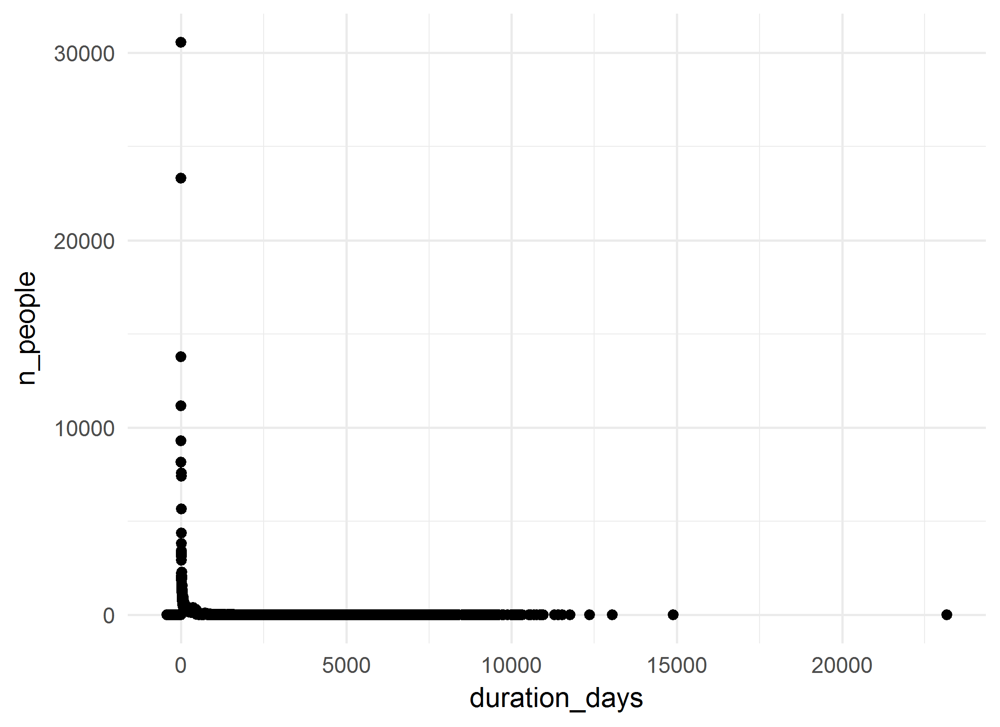
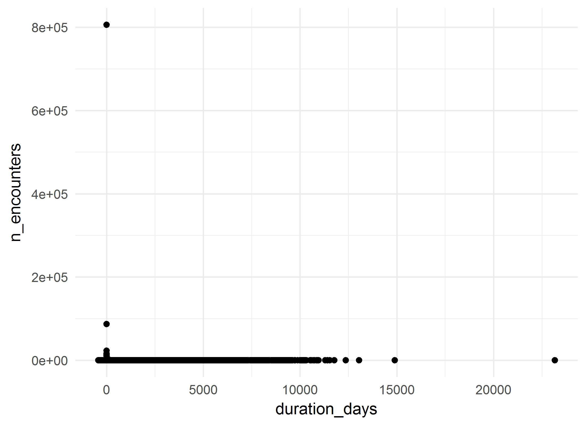
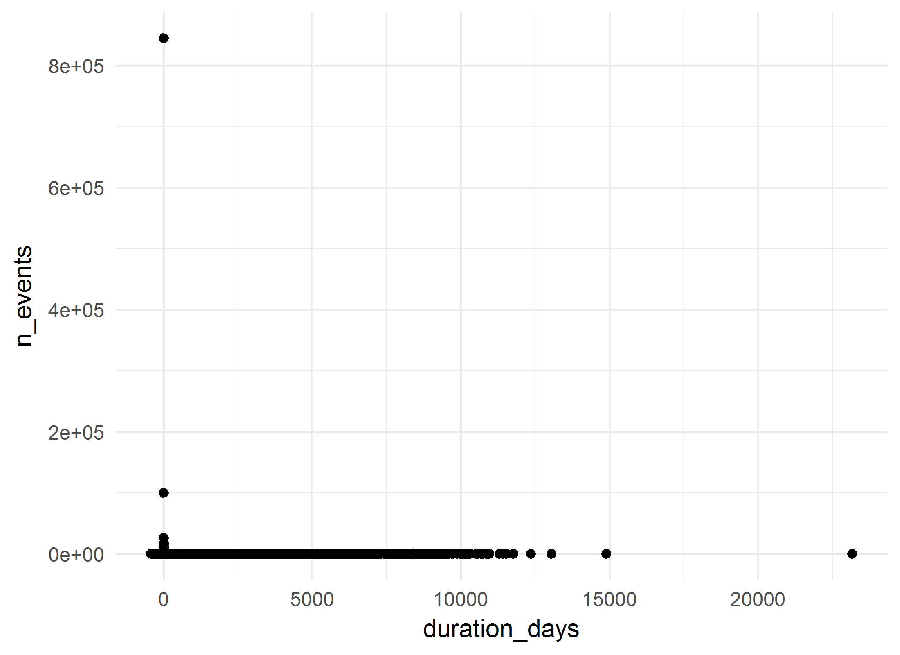

# Mental Health Cohort: Summative analysis
A.Koval, K.Moselle, S.Robertson  
`r Sys.Date()`  

<!-- These two chunks should be added in the beginning of every .Rmd that you want to source an .R script -->
<!--  The 1st mandatory chunck  -->
<!--  Set the working directory to the repository's base directory -->


<!--  The 2nd mandatory chunck  -->
<!-- Set the report-wide options, and point to the external code file. -->


<!-- Load 'sourced' R files.  Suppress the output when loading packages. --> 


<!-- Load the sources.  Suppress the output when loading sources. --> 

# I. Exposition

## Glossary
Review some of the object definition to help you interpret the report. 
<!-- Load any Global functions and variables declared in the R file.  Suppress the output. --> 

```r
# dto_location_map.rds is products of `./manipulation/0-ellis-location-map.R` 
path_input_location_map   <- "./data-unshared/derived/dto_location_map.rds" 
path_input_patient_events <-  "./data-unshared/derived/dto_patient_events_mh_30662.rds" # research cohort
# Make sure the files are located where they supposed to be, in `./data-unshared/` folder
testit::assert("File does not exist", base::file.exists(path_input_location_map))
testit::assert("File does not exist", base::file.exists(path_input_patient_events))
# list variables that constitute patient event table
components_patient_events <- c(
  "id"                           # patient unique key
  ,"gender"                      # biological sex
  ,"age_group"                   # in groups of 5 years
  ,"encounter_id"                # unique identifier for the encounter 
  ,"encounter_class"             # value from the D_Location dimension table in the data warehous
  ,"encounter_type"              # value from the D_Location dimension table in the data warehous
  ,"event_type"                  # high-level classification of the event (encounter itself, diagnosis, procedure, clinical order, laboratory, pharmacy event, etc.).           
  ,"event_title"                 # a shorter, more rolled up category describing the event
  ,"event_detail"                # description of the event, can be long and specific
  ,"event_count"                 # count of the events in the row- each row has a value of 1, and can be summed
  ,"event_year"                  # year in which event occurred 
  ,"event_month"                 # month in which event occured
  ,"event_start_date"            # might be the date of the event itself (e.g. date of diagnosis) or the start date of the encounter that the event is associated with     
  ,"event_end_date"              # might be the end date of the event itself (e.g. end date of prescriptions) or the end date of the encounter that the event is associated with
  ,"start_day"                   # number of days between the first day the patient accessed Island Health services and the start date of this event. This is useful to mask dates, but still provides the relative time between events.
  ,"end_day"                     # number of days between the first day the patient accessed Island Health services and the end date of this event. This is useful to mask dates, but still provides the relative time between events.            
  ,"duration_days"               # number of days between the Start_Day and End_Day (End_Day - Start_Day)
  ,"addiction_location_count"    # patient has accessed services at a location that was used for the selection of the cohort
  ,"location_map_id"             # unique id for VIHA program, connects to location map
  ,"palette_code"                # unique id for colours of this palette
  ,"palette_colour_name"         # labels for clusters of service programs (aka 3T palette colours)
)
# list variables that consitute location map table
components_location_map <- c(
  "location_map_id"              # unique id for VIHA program, connects to patient events
  , "site_name"                  # CERNER address          # EHR address   
  , "facility_name"              # CERNER address          # EHR address   
  , "building_name"              # CERNER address          # EHR address   
  , "unit_name"                  # CERNER address          # EHR address   
  , "location_category"          # Data Warehouse address  # EHR address           
  , "location_type"              # Data Warehouse address  # EHR address           
  , "location_grouping"          # Data Warehouse address  # EHR address            
  , "site_key"                   # Factual counterparts to CERNER address
  , "facility_key"               # Factual counterparts to CERNER address
  , "building_key"               # Factual counterparts to CERNER address
  , "unit_key"                   # Factual counterparts to CERNER address
  , "intensity_type"             # Classifier, Compressor, Lense
  , "intensity_severity_risk"    # Classifier, Compressor, Lense
  , "clinical_focus"             # Classifier, Compressor, Lense
  , "service_type"               # Classifier, Compressor, Lense
  , "service_location"           # Classifier, Compressor, Lense
  , "population_age"             # Classifier, Compressor, Lense
  , "provider_mix"               # Classifier, Compressor, Lense
  , "location_class_code"        # Program Class, identifier
  , "location_class_description" # Porgram Class, Descriptive label
  , "palette_code"               # Palette,  identifier       # cluster specific     
  , "palette_colour_name"        # Palette, descriptive label # cluster specific            
)

# define output format for the report
options(
  knitr.table.format = "html"
  ,tibble.width = 110
  #   ,bootstrap_options = c("striped", "hover", "condensed","responsive")
)
```


<!-- Declare any global functions specific to a Rmd output.  Suppress the output. --> 


## Load Data
<!-- Load the datasets.   -->

```r
ds_patient_events <- readRDS(path_input_patient_events) # %>% as.data.frame()
ds_location_map   <- readRDS(path_input_location_map)

ds_patient_events  %>% glimpse()
ds_location_map %>% glimpse()
```

<!-- Inspect the datasets.   -->


## Data Tweaks
<!-- Tweak the datasets.   -->

```r
# augment the event table with additional columns from location map
ds <- dplyr::left_join(
  ds_patient_events,             # patient event table
  ds_location_map %>%         # location map 
    dplyr::select_(.dots = components_location_map)
  ,by = c("location_map_id","palette_code","palette_colour_name") 
) %>% 
  dplyr::mutate(
    location_class_description_display    = substr(location_class_description,1,42)
    ,palette_colour_name_display = substr(palette_colour_name,1,42)
  )
ds_location_map %>% glimpse()
# from this point on, ds_location_map is needed only for selective reference
ds %>% glimpse()
# ds now contains full coordinates to events of the cohort down to unit level
# ehr_address + location_classifiers + palette_colours
```

# II. Patient Events
The main data set `ds` contains both patient events table and their location map coordinates.

```r
# the data object containing events and location map 
ds %>% glimpse()
```

```
Observations: 1,316,505
Variables: 43
$ id                                 <chr> "1000J2", "1000J2", "1000J2", "1000J2", "1000J2", "1000J2", "1...
$ gender                             <chr> "Female", "Female", "Female", "Female", "Female", "Female", "F...
$ age_group                          <chr> "85 - 89", "80 - 84", "85 - 89", "85 - 89", "85 - 89", "85 - 8...
$ encounter_id                       <chr> "111CD724", "1A746554", "1ACC8134", "1D974A84", "1EC0E2D4", "2...
$ encounter_class                    <chr> "Recurring", "Inpatient", "Outpatient", "Inpatient", "Recurrin...
$ encounter_type                     <chr> "Open Encounter", "Inpatient Acute", "Ambulatory", "Inpatient ...
$ event_type                         <chr> "Encounter Only", "Encounter Only", "Encounter Only", "Encount...
$ event_title                        <chr> "Seniors", "ALC", "Outpatient", "Medicine", "Seniors Mental He...
$ event_detail                       <chr> "Geriatric", "ALC: Awaiting Assessment", "Laboratory", "Medici...
$ event_count                        <int> 1, 1, 1, 1, 1, 1, 1, 1, 1, 1, 1, 1, 1, 1, 1, 1, 1, 1, 1, 1, 1,...
$ event_year                         <int> 2013, 2012, 2013, 2014, 2014, 2014, 2013, 2012, 2011, 2014, 20...
$ event_month                        <int> 1, 4, 7, 3, 2, 9, 10, 1, 7, 9, 9, 6, 8, 3, 7, 12, 1, 2, 2, 10,...
$ event_start_date                   <date> 2013-01-17, 2012-04-26, 2013-07-15, 2014-03-15, 2014-02-03, 2...
$ event_end_date                     <date> 2013-04-24, 2012-06-15, 2013-07-15, 2014-03-20, 2014-02-05, 2...
$ start_day                          <int> 758, 492, 937, 1180, 1140, 1373, 1017, 405, 196, 1352, 257, 12...
$ end_day                            <int> 855, 542, 937, 1185, 1142, 1396, 1017, 728, 196, 1352, 257, 12...
$ duration_days                      <int> 97, 50, 0, 5, 2, 23, 0, 323, 0, 0, 0, 0, 0, 77, 19, 7, 0, 806,...
$ addiction_location_count           <int> 0, 0, 0, 0, 0, 0, 0, 0, 0, 0, 0, 0, 0, 0, 0, 0, 0, 0, 0, 0, 0,...
$ location_map_id                    <int> 1986, 787, 2145, 272, 1118, 2080, 1442, 605, 1442, 2145, 861, ...
$ palette_code                       <int> 14, 92, 36, 5, 73, 5, 28, 90, 28, 36, 28, 28, 28, 90, 73, 34, ...
$ palette_colour_name                <chr> "Ambulatory - Geriatric", "Surgical - Pre, Post", "Lab - Islan...
$ site_name                          <chr> "Seniors Health Services - Central Island", "Cowichan District...
$ facility_name                      <chr> "Seniors Health CI", "Cowichan District Hospital - Acute Care"...
$ building_name                      <chr> "Dufferin Place, SH-Nanaimo", "Cowichan District Hospital - Ac...
$ unit_name                          <chr> "Seniors Outpatient-Med - Nanaimo", "CDH - 3 West - Surgical",...
$ location_category                  <chr> "Ambulatory", "Inpatient-Acute", "Ambulatory", "Inpatient-Acut...
$ location_type                      <chr> "Ambulatory Clinic", "InPt-Acute-General", "Laboratory", "Inpt...
$ location_grouping                  <chr> "Ambulatory Clinic", "Inpatient-Acute-General", "Ambulatory", ...
$ site_key                           <chr> NA, NA, NA, NA, NA, NA, NA, NA, NA, NA, NA, NA, NA, NA, NA, NA...
$ facility_key                       <chr> "SHCI", "CDH", "LHC", "CDH", "SHSI", "CDH", "CHH", "SHCI", "CH...
$ building_key                       <chr> "DUFF", "CDHA", "LCHC", "CDHA", "MP", "CDHA", "CHHM", "GIBB", ...
$ unit_key                           <chr> "OMNA", "WSCD", "LALH", "PECD", "ITVI", "2ECD", "ERCH", "SODU"...
$ intensity_type                     <chr> "Ambulatory-Mixed", "Surgery", "Laboratory", "ED, Urgent Care,...
$ intensity_severity_risk            <chr> "Ambulatory Mixed-Moderate Intensity", "Surgical-Post-Acute Ca...
$ clinical_focus                     <chr> "Frailty, Non-Specific or Mixed", "Surgical", "Lab", "Med-Surg...
$ service_type                       <chr> "Ambulatory-Mixed", "Surgical-Post-Acute Care", "Laboratory", ...
$ service_location                   <chr> "Ambulatory Clinic", "Hospital", "IH Lab", "Hospital", "Ambula...
$ population_age                     <chr> "Older Adults Exclusively", "Mixed Ages", "Mixed Ages", "Child...
$ provider_mix                       <chr> "Medical specialist service", "Physician, nurse delivered", "M...
$ location_class_code                <int> 18, 142, 146, 70, 37, 66, 78, 5, 78, 146, 78, 78, 78, 5, 36, 5...
$ location_class_description         <chr> "Ambulatory Treatment Services - Geriatric (secondary level)",...
$ location_class_description_display <chr> "Ambulatory Treatment Services - Geriatric ", "Surgery - Post ...
$ palette_colour_name_display        <chr> "Ambulatory - Geriatric", "Surgical - Pre, Post", "Lab - Islan...
```

```r
# What variables relate to patient event table?
# What variables relate to locations at which events took place?
# How many unique values does each variable/column contain? 
ds %>% select_(.dots=components_patient_events) %>% summarise_all(dplyr::n_distinct) %>% t() 
```

```
                            [,1]
id                         30659
gender                         3
age_group                     21
encounter_id             1136375
encounter_class                8
encounter_type                20
event_type                     9
event_title                  117
event_detail                5190
event_count                    1
event_year                    40
event_month                   13
event_start_date            4502
event_end_date              2246
start_day                  11149
end_day                    11087
duration_days               3994
addiction_location_count       2
location_map_id             2131
palette_code                  97
palette_colour_name           97
```

```r
ds %>% select_(.dots=components_location_map) %>% summarise_all(dplyr::n_distinct) %>% t() 
```

```
                           [,1]
location_map_id            2131
site_name                   100
facility_name               215
building_name               442
unit_name                  1418
location_category            10
location_type                53
location_grouping            23
site_key                      1
facility_key                190
building_key                384
unit_key                   1176
intensity_type               15
intensity_severity_risk      37
clinical_focus               47
service_type                 57
service_location             15
population_age                9
provider_mix                 18
location_class_code         150
location_class_description  150
palette_code                 97
palette_colour_name          97
```

```r
# they share / connected by the fields:
intersect(components_patient_events, components_location_map)
```

```
[1] "location_map_id"     "palette_code"        "palette_colour_name"
```

## Overview

```r
# PET - Patient Event Table
# How many patients are in this cohort?
ds %>% distinct(id) %>% count() %>% neat()
```

<?xml version="1.0" encoding="UTF-8"?>
<table class="table table-striped table-hover table-condensed table-responsive" style="width: auto !important; text-align: right;">
 <thead>
  <tr>
   <th style="text-align:right;"> n </th>
  </tr>
 </thead>
<tbody>
  <tr>
   <td style="text-align:right;"> 30659 </td>
  </tr>
</tbody>
</table>

```r
# What are basic demographics?
ds %>% unique_sums(c("gender")) %>% arrange(desc(n_people)) %>% neat()
```

<?xml version="1.0" encoding="UTF-8"?>
<table class="table table-striped table-hover table-condensed table-responsive" style="width: auto !important; text-align: right;">
 <thead>
  <tr>
   <th style="text-align:left;"> gender </th>
   <th style="text-align:right;"> n_people </th>
   <th style="text-align:right;"> n_encounters </th>
   <th style="text-align:right;"> n_events </th>
  </tr>
 </thead>
<tbody>
  <tr>
   <td style="text-align:left;"> Female </td>
   <td style="text-align:right;"> 15567 </td>
   <td style="text-align:right;"> 590114 </td>
   <td style="text-align:right;"> 683796 </td>
  </tr>
  <tr>
   <td style="text-align:left;"> Male </td>
   <td style="text-align:right;"> 15092 </td>
   <td style="text-align:right;"> 546233 </td>
   <td style="text-align:right;"> 632681 </td>
  </tr>
  <tr>
   <td style="text-align:left;"> Unknown </td>
   <td style="text-align:right;"> 1 </td>
   <td style="text-align:right;"> 28 </td>
   <td style="text-align:right;"> 28 </td>
  </tr>
</tbody>
</table>

```r
ds %>% unique_sums(c("age_group"))  %>%  neat()
```

<?xml version="1.0" encoding="UTF-8"?>
<table class="table table-striped table-hover table-condensed table-responsive" style="width: auto !important; text-align: right;">
 <thead>
  <tr>
   <th style="text-align:left;"> age_group </th>
   <th style="text-align:right;"> n_people </th>
   <th style="text-align:right;"> n_encounters </th>
   <th style="text-align:right;"> n_events </th>
  </tr>
 </thead>
<tbody>
  <tr>
   <td style="text-align:left;"> &lt;1 </td>
   <td style="text-align:right;"> 22 </td>
   <td style="text-align:right;"> 112 </td>
   <td style="text-align:right;"> 112 </td>
  </tr>
  <tr>
   <td style="text-align:left;"> 01 - 04 </td>
   <td style="text-align:right;"> 63 </td>
   <td style="text-align:right;"> 753 </td>
   <td style="text-align:right;"> 791 </td>
  </tr>
  <tr>
   <td style="text-align:left;"> 05 - 09 </td>
   <td style="text-align:right;"> 230 </td>
   <td style="text-align:right;"> 1547 </td>
   <td style="text-align:right;"> 1641 </td>
  </tr>
  <tr>
   <td style="text-align:left;"> 10 - 14 </td>
   <td style="text-align:right;"> 1024 </td>
   <td style="text-align:right;"> 8621 </td>
   <td style="text-align:right;"> 8924 </td>
  </tr>
  <tr>
   <td style="text-align:left;"> 15 - 19 </td>
   <td style="text-align:right;"> 2164 </td>
   <td style="text-align:right;"> 30332 </td>
   <td style="text-align:right;"> 32065 </td>
  </tr>
  <tr>
   <td style="text-align:left;"> 20 - 24 </td>
   <td style="text-align:right;"> 2504 </td>
   <td style="text-align:right;"> 41325 </td>
   <td style="text-align:right;"> 44072 </td>
  </tr>
  <tr>
   <td style="text-align:left;"> 25 - 29 </td>
   <td style="text-align:right;"> 2482 </td>
   <td style="text-align:right;"> 46288 </td>
   <td style="text-align:right;"> 49858 </td>
  </tr>
  <tr>
   <td style="text-align:left;"> 30 - 34 </td>
   <td style="text-align:right;"> 2456 </td>
   <td style="text-align:right;"> 47568 </td>
   <td style="text-align:right;"> 51536 </td>
  </tr>
  <tr>
   <td style="text-align:left;"> 35 - 39 </td>
   <td style="text-align:right;"> 2461 </td>
   <td style="text-align:right;"> 47042 </td>
   <td style="text-align:right;"> 50725 </td>
  </tr>
  <tr>
   <td style="text-align:left;"> 40 - 44 </td>
   <td style="text-align:right;"> 2608 </td>
   <td style="text-align:right;"> 49946 </td>
   <td style="text-align:right;"> 55435 </td>
  </tr>
  <tr>
   <td style="text-align:left;"> 45 - 49 </td>
   <td style="text-align:right;"> 3269 </td>
   <td style="text-align:right;"> 63640 </td>
   <td style="text-align:right;"> 71736 </td>
  </tr>
  <tr>
   <td style="text-align:left;"> 50 - 54 </td>
   <td style="text-align:right;"> 3791 </td>
   <td style="text-align:right;"> 81844 </td>
   <td style="text-align:right;"> 91760 </td>
  </tr>
  <tr>
   <td style="text-align:left;"> 55 - 59 </td>
   <td style="text-align:right;"> 3993 </td>
   <td style="text-align:right;"> 81295 </td>
   <td style="text-align:right;"> 93245 </td>
  </tr>
  <tr>
   <td style="text-align:left;"> 60 - 64 </td>
   <td style="text-align:right;"> 4018 </td>
   <td style="text-align:right;"> 80817 </td>
   <td style="text-align:right;"> 94968 </td>
  </tr>
  <tr>
   <td style="text-align:left;"> 65 - 69 </td>
   <td style="text-align:right;"> 4034 </td>
   <td style="text-align:right;"> 83668 </td>
   <td style="text-align:right;"> 100568 </td>
  </tr>
  <tr>
   <td style="text-align:left;"> 70 - 74 </td>
   <td style="text-align:right;"> 4112 </td>
   <td style="text-align:right;"> 83067 </td>
   <td style="text-align:right;"> 100138 </td>
  </tr>
  <tr>
   <td style="text-align:left;"> 75 - 79 </td>
   <td style="text-align:right;"> 4943 </td>
   <td style="text-align:right;"> 96925 </td>
   <td style="text-align:right;"> 113593 </td>
  </tr>
  <tr>
   <td style="text-align:left;"> 80 - 84 </td>
   <td style="text-align:right;"> 6056 </td>
   <td style="text-align:right;"> 114776 </td>
   <td style="text-align:right;"> 135908 </td>
  </tr>
  <tr>
   <td style="text-align:left;"> 85 - 89 </td>
   <td style="text-align:right;"> 5847 </td>
   <td style="text-align:right;"> 104277 </td>
   <td style="text-align:right;"> 126858 </td>
  </tr>
  <tr>
   <td style="text-align:left;"> 90+ </td>
   <td style="text-align:right;"> 3725 </td>
   <td style="text-align:right;"> 71887 </td>
   <td style="text-align:right;"> 91924 </td>
  </tr>
  <tr>
   <td style="text-align:left;"> No value </td>
   <td style="text-align:right;"> 587 </td>
   <td style="text-align:right;"> 645 </td>
   <td style="text-align:right;"> 648 </td>
  </tr>
</tbody>
</table>

```r
ds %>% unique_sums(c("gender","age_group")) %>%  neat()
```

<?xml version="1.0" encoding="UTF-8"?>
<table class="table table-striped table-hover table-condensed table-responsive" style="width: auto !important; text-align: right;">
 <thead>
  <tr>
   <th style="text-align:left;"> gender </th>
   <th style="text-align:left;"> age_group </th>
   <th style="text-align:right;"> n_people </th>
   <th style="text-align:right;"> n_encounters </th>
   <th style="text-align:right;"> n_events </th>
  </tr>
 </thead>
<tbody>
  <tr>
   <td style="text-align:left;"> Female </td>
   <td style="text-align:left;"> &lt;1 </td>
   <td style="text-align:right;"> 11 </td>
   <td style="text-align:right;"> 36 </td>
   <td style="text-align:right;"> 36 </td>
  </tr>
  <tr>
   <td style="text-align:left;"> Female </td>
   <td style="text-align:left;"> 01 - 04 </td>
   <td style="text-align:right;"> 15 </td>
   <td style="text-align:right;"> 333 </td>
   <td style="text-align:right;"> 355 </td>
  </tr>
  <tr>
   <td style="text-align:left;"> Female </td>
   <td style="text-align:left;"> 05 - 09 </td>
   <td style="text-align:right;"> 97 </td>
   <td style="text-align:right;"> 482 </td>
   <td style="text-align:right;"> 525 </td>
  </tr>
  <tr>
   <td style="text-align:left;"> Female </td>
   <td style="text-align:left;"> 10 - 14 </td>
   <td style="text-align:right;"> 646 </td>
   <td style="text-align:right;"> 5753 </td>
   <td style="text-align:right;"> 5965 </td>
  </tr>
  <tr>
   <td style="text-align:left;"> Female </td>
   <td style="text-align:left;"> 15 - 19 </td>
   <td style="text-align:right;"> 1265 </td>
   <td style="text-align:right;"> 19932 </td>
   <td style="text-align:right;"> 21116 </td>
  </tr>
  <tr>
   <td style="text-align:left;"> Female </td>
   <td style="text-align:left;"> 20 - 24 </td>
   <td style="text-align:right;"> 1324 </td>
   <td style="text-align:right;"> 24869 </td>
   <td style="text-align:right;"> 26365 </td>
  </tr>
  <tr>
   <td style="text-align:left;"> Female </td>
   <td style="text-align:left;"> 25 - 29 </td>
   <td style="text-align:right;"> 1306 </td>
   <td style="text-align:right;"> 27269 </td>
   <td style="text-align:right;"> 29160 </td>
  </tr>
  <tr>
   <td style="text-align:left;"> Female </td>
   <td style="text-align:left;"> 30 - 34 </td>
   <td style="text-align:right;"> 1303 </td>
   <td style="text-align:right;"> 26753 </td>
   <td style="text-align:right;"> 28943 </td>
  </tr>
  <tr>
   <td style="text-align:left;"> Female </td>
   <td style="text-align:left;"> 35 - 39 </td>
   <td style="text-align:right;"> 1298 </td>
   <td style="text-align:right;"> 26172 </td>
   <td style="text-align:right;"> 28239 </td>
  </tr>
  <tr>
   <td style="text-align:left;"> Female </td>
   <td style="text-align:left;"> 40 - 44 </td>
   <td style="text-align:right;"> 1356 </td>
   <td style="text-align:right;"> 26791 </td>
   <td style="text-align:right;"> 29878 </td>
  </tr>
  <tr>
   <td style="text-align:left;"> Female </td>
   <td style="text-align:left;"> 45 - 49 </td>
   <td style="text-align:right;"> 1639 </td>
   <td style="text-align:right;"> 31933 </td>
   <td style="text-align:right;"> 36375 </td>
  </tr>
  <tr>
   <td style="text-align:left;"> Female </td>
   <td style="text-align:left;"> 50 - 54 </td>
   <td style="text-align:right;"> 1885 </td>
   <td style="text-align:right;"> 40695 </td>
   <td style="text-align:right;"> 45976 </td>
  </tr>
  <tr>
   <td style="text-align:left;"> Female </td>
   <td style="text-align:left;"> 55 - 59 </td>
   <td style="text-align:right;"> 1880 </td>
   <td style="text-align:right;"> 39471 </td>
   <td style="text-align:right;"> 45024 </td>
  </tr>
  <tr>
   <td style="text-align:left;"> Female </td>
   <td style="text-align:left;"> 60 - 64 </td>
   <td style="text-align:right;"> 1826 </td>
   <td style="text-align:right;"> 37672 </td>
   <td style="text-align:right;"> 43840 </td>
  </tr>
  <tr>
   <td style="text-align:left;"> Female </td>
   <td style="text-align:left;"> 65 - 69 </td>
   <td style="text-align:right;"> 1817 </td>
   <td style="text-align:right;"> 39121 </td>
   <td style="text-align:right;"> 46792 </td>
  </tr>
  <tr>
   <td style="text-align:left;"> Female </td>
   <td style="text-align:left;"> 70 - 74 </td>
   <td style="text-align:right;"> 1839 </td>
   <td style="text-align:right;"> 37714 </td>
   <td style="text-align:right;"> 45754 </td>
  </tr>
  <tr>
   <td style="text-align:left;"> Female </td>
   <td style="text-align:left;"> 75 - 79 </td>
   <td style="text-align:right;"> 2306 </td>
   <td style="text-align:right;"> 44185 </td>
   <td style="text-align:right;"> 52176 </td>
  </tr>
  <tr>
   <td style="text-align:left;"> Female </td>
   <td style="text-align:left;"> 80 - 84 </td>
   <td style="text-align:right;"> 3111 </td>
   <td style="text-align:right;"> 55332 </td>
   <td style="text-align:right;"> 65075 </td>
  </tr>
  <tr>
   <td style="text-align:left;"> Female </td>
   <td style="text-align:left;"> 85 - 89 </td>
   <td style="text-align:right;"> 3387 </td>
   <td style="text-align:right;"> 59220 </td>
   <td style="text-align:right;"> 72078 </td>
  </tr>
  <tr>
   <td style="text-align:left;"> Female </td>
   <td style="text-align:left;"> 90+ </td>
   <td style="text-align:right;"> 2392 </td>
   <td style="text-align:right;"> 46030 </td>
   <td style="text-align:right;"> 59770 </td>
  </tr>
  <tr>
   <td style="text-align:left;"> Female </td>
   <td style="text-align:left;"> No value </td>
   <td style="text-align:right;"> 318 </td>
   <td style="text-align:right;"> 351 </td>
   <td style="text-align:right;"> 354 </td>
  </tr>
  <tr>
   <td style="text-align:left;"> Male </td>
   <td style="text-align:left;"> &lt;1 </td>
   <td style="text-align:right;"> 11 </td>
   <td style="text-align:right;"> 76 </td>
   <td style="text-align:right;"> 76 </td>
  </tr>
  <tr>
   <td style="text-align:left;"> Male </td>
   <td style="text-align:left;"> 01 - 04 </td>
   <td style="text-align:right;"> 48 </td>
   <td style="text-align:right;"> 420 </td>
   <td style="text-align:right;"> 436 </td>
  </tr>
  <tr>
   <td style="text-align:left;"> Male </td>
   <td style="text-align:left;"> 05 - 09 </td>
   <td style="text-align:right;"> 133 </td>
   <td style="text-align:right;"> 1065 </td>
   <td style="text-align:right;"> 1116 </td>
  </tr>
  <tr>
   <td style="text-align:left;"> Male </td>
   <td style="text-align:left;"> 10 - 14 </td>
   <td style="text-align:right;"> 378 </td>
   <td style="text-align:right;"> 2868 </td>
   <td style="text-align:right;"> 2959 </td>
  </tr>
  <tr>
   <td style="text-align:left;"> Male </td>
   <td style="text-align:left;"> 15 - 19 </td>
   <td style="text-align:right;"> 899 </td>
   <td style="text-align:right;"> 10400 </td>
   <td style="text-align:right;"> 10949 </td>
  </tr>
  <tr>
   <td style="text-align:left;"> Male </td>
   <td style="text-align:left;"> 20 - 24 </td>
   <td style="text-align:right;"> 1180 </td>
   <td style="text-align:right;"> 16456 </td>
   <td style="text-align:right;"> 17707 </td>
  </tr>
  <tr>
   <td style="text-align:left;"> Male </td>
   <td style="text-align:left;"> 25 - 29 </td>
   <td style="text-align:right;"> 1176 </td>
   <td style="text-align:right;"> 19019 </td>
   <td style="text-align:right;"> 20698 </td>
  </tr>
  <tr>
   <td style="text-align:left;"> Male </td>
   <td style="text-align:left;"> 30 - 34 </td>
   <td style="text-align:right;"> 1152 </td>
   <td style="text-align:right;"> 20812 </td>
   <td style="text-align:right;"> 22590 </td>
  </tr>
  <tr>
   <td style="text-align:left;"> Male </td>
   <td style="text-align:left;"> 35 - 39 </td>
   <td style="text-align:right;"> 1162 </td>
   <td style="text-align:right;"> 20846 </td>
   <td style="text-align:right;"> 22462 </td>
  </tr>
  <tr>
   <td style="text-align:left;"> Male </td>
   <td style="text-align:left;"> 40 - 44 </td>
   <td style="text-align:right;"> 1252 </td>
   <td style="text-align:right;"> 23154 </td>
   <td style="text-align:right;"> 25556 </td>
  </tr>
  <tr>
   <td style="text-align:left;"> Male </td>
   <td style="text-align:left;"> 45 - 49 </td>
   <td style="text-align:right;"> 1630 </td>
   <td style="text-align:right;"> 31707 </td>
   <td style="text-align:right;"> 35361 </td>
  </tr>
  <tr>
   <td style="text-align:left;"> Male </td>
   <td style="text-align:left;"> 50 - 54 </td>
   <td style="text-align:right;"> 1906 </td>
   <td style="text-align:right;"> 41149 </td>
   <td style="text-align:right;"> 45784 </td>
  </tr>
  <tr>
   <td style="text-align:left;"> Male </td>
   <td style="text-align:left;"> 55 - 59 </td>
   <td style="text-align:right;"> 2113 </td>
   <td style="text-align:right;"> 41824 </td>
   <td style="text-align:right;"> 48221 </td>
  </tr>
  <tr>
   <td style="text-align:left;"> Male </td>
   <td style="text-align:left;"> 60 - 64 </td>
   <td style="text-align:right;"> 2192 </td>
   <td style="text-align:right;"> 43145 </td>
   <td style="text-align:right;"> 51128 </td>
  </tr>
  <tr>
   <td style="text-align:left;"> Male </td>
   <td style="text-align:left;"> 65 - 69 </td>
   <td style="text-align:right;"> 2217 </td>
   <td style="text-align:right;"> 44547 </td>
   <td style="text-align:right;"> 53776 </td>
  </tr>
  <tr>
   <td style="text-align:left;"> Male </td>
   <td style="text-align:left;"> 70 - 74 </td>
   <td style="text-align:right;"> 2273 </td>
   <td style="text-align:right;"> 45353 </td>
   <td style="text-align:right;"> 54384 </td>
  </tr>
  <tr>
   <td style="text-align:left;"> Male </td>
   <td style="text-align:left;"> 75 - 79 </td>
   <td style="text-align:right;"> 2637 </td>
   <td style="text-align:right;"> 52740 </td>
   <td style="text-align:right;"> 61417 </td>
  </tr>
  <tr>
   <td style="text-align:left;"> Male </td>
   <td style="text-align:left;"> 80 - 84 </td>
   <td style="text-align:right;"> 2945 </td>
   <td style="text-align:right;"> 59444 </td>
   <td style="text-align:right;"> 70833 </td>
  </tr>
  <tr>
   <td style="text-align:left;"> Male </td>
   <td style="text-align:left;"> 85 - 89 </td>
   <td style="text-align:right;"> 2460 </td>
   <td style="text-align:right;"> 45057 </td>
   <td style="text-align:right;"> 54780 </td>
  </tr>
  <tr>
   <td style="text-align:left;"> Male </td>
   <td style="text-align:left;"> 90+ </td>
   <td style="text-align:right;"> 1333 </td>
   <td style="text-align:right;"> 25857 </td>
   <td style="text-align:right;"> 32154 </td>
  </tr>
  <tr>
   <td style="text-align:left;"> Male </td>
   <td style="text-align:left;"> No value </td>
   <td style="text-align:right;"> 269 </td>
   <td style="text-align:right;"> 294 </td>
   <td style="text-align:right;"> 294 </td>
  </tr>
  <tr>
   <td style="text-align:left;"> Unknown </td>
   <td style="text-align:left;"> 30 - 34 </td>
   <td style="text-align:right;"> 1 </td>
   <td style="text-align:right;"> 3 </td>
   <td style="text-align:right;"> 3 </td>
  </tr>
  <tr>
   <td style="text-align:left;"> Unknown </td>
   <td style="text-align:left;"> 35 - 39 </td>
   <td style="text-align:right;"> 1 </td>
   <td style="text-align:right;"> 24 </td>
   <td style="text-align:right;"> 24 </td>
  </tr>
  <tr>
   <td style="text-align:left;"> Unknown </td>
   <td style="text-align:left;"> 40 - 44 </td>
   <td style="text-align:right;"> 1 </td>
   <td style="text-align:right;"> 1 </td>
   <td style="text-align:right;"> 1 </td>
  </tr>
</tbody>
</table>

## DW tags

```r
# how may unique encounters are there in this set?
ds %>% distinct(encounter_id) %>% count() %>% neat()
```

<?xml version="1.0" encoding="UTF-8"?>
<table class="table table-striped table-hover table-condensed table-responsive" style="width: auto !important; text-align: right;">
 <thead>
  <tr>
   <th style="text-align:right;"> n </th>
  </tr>
 </thead>
<tbody>
  <tr>
   <td style="text-align:right;"> 1136375 </td>
  </tr>
</tbody>
</table>

```r
# tally engagement across encounter classes (as defined by data warehouse)
ds %>% unique_sums("encounter_class")%>% arrange(desc(n_people)) %>% neat()
```

<?xml version="1.0" encoding="UTF-8"?>
<table class="table table-striped table-hover table-condensed table-responsive" style="width: auto !important; text-align: right;">
 <thead>
  <tr>
   <th style="text-align:left;"> encounter_class </th>
   <th style="text-align:right;"> n_people </th>
   <th style="text-align:right;"> n_encounters </th>
   <th style="text-align:right;"> n_events </th>
  </tr>
 </thead>
<tbody>
  <tr>
   <td style="text-align:left;"> Inpatient </td>
   <td style="text-align:right;"> 29651 </td>
   <td style="text-align:right;"> 145117 </td>
   <td style="text-align:right;"> 291470 </td>
  </tr>
  <tr>
   <td style="text-align:left;"> Emergency </td>
   <td style="text-align:right;"> 29649 </td>
   <td style="text-align:right;"> 284958 </td>
   <td style="text-align:right;"> 298863 </td>
  </tr>
  <tr>
   <td style="text-align:left;"> Outpatient </td>
   <td style="text-align:right;"> 29332 </td>
   <td style="text-align:right;"> 487907 </td>
   <td style="text-align:right;"> 503734 </td>
  </tr>
  <tr>
   <td style="text-align:left;"> Recurring </td>
   <td style="text-align:right;"> 25125 </td>
   <td style="text-align:right;"> 119354 </td>
   <td style="text-align:right;"> 122134 </td>
  </tr>
  <tr>
   <td style="text-align:left;"> Other </td>
   <td style="text-align:right;"> 18111 </td>
   <td style="text-align:right;"> 66495 </td>
   <td style="text-align:right;"> 67100 </td>
  </tr>
  <tr>
   <td style="text-align:left;"> Home Care </td>
   <td style="text-align:right;"> 17202 </td>
   <td style="text-align:right;"> 31751 </td>
   <td style="text-align:right;"> 32390 </td>
  </tr>
  <tr>
   <td style="text-align:left;"> Cancelled Admission </td>
   <td style="text-align:right;"> 703 </td>
   <td style="text-align:right;"> 786 </td>
   <td style="text-align:right;"> 806 </td>
  </tr>
  <tr>
   <td style="text-align:left;"> Not defined </td>
   <td style="text-align:right;"> 7 </td>
   <td style="text-align:right;"> 7 </td>
   <td style="text-align:right;"> 8 </td>
  </tr>
</tbody>
</table>

```r
ds %>% unique_sums("encounter_type") %>% arrange(desc(n_people)) %>% neat()
```

<?xml version="1.0" encoding="UTF-8"?>
<table class="table table-striped table-hover table-condensed table-responsive" style="width: auto !important; text-align: right;">
 <thead>
  <tr>
   <th style="text-align:left;"> encounter_type </th>
   <th style="text-align:right;"> n_people </th>
   <th style="text-align:right;"> n_encounters </th>
   <th style="text-align:right;"> n_events </th>
  </tr>
 </thead>
<tbody>
  <tr>
   <td style="text-align:left;"> Emergency </td>
   <td style="text-align:right;"> 29649 </td>
   <td style="text-align:right;"> 284958 </td>
   <td style="text-align:right;"> 298863 </td>
  </tr>
  <tr>
   <td style="text-align:left;"> Inpatient Acute </td>
   <td style="text-align:right;"> 29549 </td>
   <td style="text-align:right;"> 103174 </td>
   <td style="text-align:right;"> 237056 </td>
  </tr>
  <tr>
   <td style="text-align:left;"> Ambulatory </td>
   <td style="text-align:right;"> 29091 </td>
   <td style="text-align:right;"> 456606 </td>
   <td style="text-align:right;"> 468671 </td>
  </tr>
  <tr>
   <td style="text-align:left;"> Open Encounter </td>
   <td style="text-align:right;"> 24888 </td>
   <td style="text-align:right;"> 115258 </td>
   <td style="text-align:right;"> 117895 </td>
  </tr>
  <tr>
   <td style="text-align:left;"> Home Care </td>
   <td style="text-align:right;"> 17202 </td>
   <td style="text-align:right;"> 31751 </td>
   <td style="text-align:right;"> 32390 </td>
  </tr>
  <tr>
   <td style="text-align:left;"> Specimen </td>
   <td style="text-align:right;"> 15961 </td>
   <td style="text-align:right;"> 61530 </td>
   <td style="text-align:right;"> 62078 </td>
  </tr>
  <tr>
   <td style="text-align:left;"> Day Care </td>
   <td style="text-align:right;"> 13772 </td>
   <td style="text-align:right;"> 31190 </td>
   <td style="text-align:right;"> 34950 </td>
  </tr>
  <tr>
   <td style="text-align:left;"> Residential Care </td>
   <td style="text-align:right;"> 7021 </td>
   <td style="text-align:right;"> 11173 </td>
   <td style="text-align:right;"> 22968 </td>
  </tr>
  <tr>
   <td style="text-align:left;"> Morgue </td>
   <td style="text-align:right;"> 3813 </td>
   <td style="text-align:right;"> 3880 </td>
   <td style="text-align:right;"> 3927 </td>
  </tr>
  <tr>
   <td style="text-align:left;"> MHAS - Residential </td>
   <td style="text-align:right;"> 3050 </td>
   <td style="text-align:right;"> 12814 </td>
   <td style="text-align:right;"> 13336 </td>
  </tr>
  <tr>
   <td style="text-align:left;"> Recurring/Series </td>
   <td style="text-align:right;"> 1967 </td>
   <td style="text-align:right;"> 4096 </td>
   <td style="text-align:right;"> 4239 </td>
  </tr>
  <tr>
   <td style="text-align:left;"> MHAS - Acute Care </td>
   <td style="text-align:right;"> 1137 </td>
   <td style="text-align:right;"> 17834 </td>
   <td style="text-align:right;"> 17970 </td>
  </tr>
  <tr>
   <td style="text-align:left;"> Cancelled Admission </td>
   <td style="text-align:right;"> 703 </td>
   <td style="text-align:right;"> 786 </td>
   <td style="text-align:right;"> 806 </td>
  </tr>
  <tr>
   <td style="text-align:left;"> Waitlist </td>
   <td style="text-align:right;"> 413 </td>
   <td style="text-align:right;"> 468 </td>
   <td style="text-align:right;"> 471 </td>
  </tr>
  <tr>
   <td style="text-align:left;"> Research </td>
   <td style="text-align:right;"> 317 </td>
   <td style="text-align:right;"> 616 </td>
   <td style="text-align:right;"> 623 </td>
  </tr>
  <tr>
   <td style="text-align:left;"> Lifetime </td>
   <td style="text-align:right;"> 112 </td>
   <td style="text-align:right;"> 112 </td>
   <td style="text-align:right;"> 130 </td>
  </tr>
  <tr>
   <td style="text-align:left;"> Phone Consult </td>
   <td style="text-align:right;"> 43 </td>
   <td style="text-align:right;"> 111 </td>
   <td style="text-align:right;"> 113 </td>
  </tr>
  <tr>
   <td style="text-align:left;"> Newborn </td>
   <td style="text-align:right;"> 10 </td>
   <td style="text-align:right;"> 10 </td>
   <td style="text-align:right;"> 10 </td>
  </tr>
  <tr>
   <td style="text-align:left;"> Not defined </td>
   <td style="text-align:right;"> 7 </td>
   <td style="text-align:right;"> 7 </td>
   <td style="text-align:right;"> 8 </td>
  </tr>
  <tr>
   <td style="text-align:left;"> Stillborn </td>
   <td style="text-align:right;"> 1 </td>
   <td style="text-align:right;"> 1 </td>
   <td style="text-align:right;"> 1 </td>
  </tr>
</tbody>
</table>

```r
ds %>% unique_sums(c("encounter_class","encounter_type"))%>% arrange(desc(encounter_class,n_people)) %>% neat()
```

<?xml version="1.0" encoding="UTF-8"?>
<table class="table table-striped table-hover table-condensed table-responsive" style="width: auto !important; text-align: right;">
 <thead>
  <tr>
   <th style="text-align:left;"> encounter_class </th>
   <th style="text-align:left;"> encounter_type </th>
   <th style="text-align:right;"> n_people </th>
   <th style="text-align:right;"> n_encounters </th>
   <th style="text-align:right;"> n_events </th>
  </tr>
 </thead>
<tbody>
  <tr>
   <td style="text-align:left;"> Recurring </td>
   <td style="text-align:left;"> Open Encounter </td>
   <td style="text-align:right;"> 24888 </td>
   <td style="text-align:right;"> 115258 </td>
   <td style="text-align:right;"> 117895 </td>
  </tr>
  <tr>
   <td style="text-align:left;"> Recurring </td>
   <td style="text-align:left;"> Recurring/Series </td>
   <td style="text-align:right;"> 1967 </td>
   <td style="text-align:right;"> 4096 </td>
   <td style="text-align:right;"> 4239 </td>
  </tr>
  <tr>
   <td style="text-align:left;"> Outpatient </td>
   <td style="text-align:left;"> Ambulatory </td>
   <td style="text-align:right;"> 29091 </td>
   <td style="text-align:right;"> 456606 </td>
   <td style="text-align:right;"> 468671 </td>
  </tr>
  <tr>
   <td style="text-align:left;"> Outpatient </td>
   <td style="text-align:left;"> Day Care </td>
   <td style="text-align:right;"> 13772 </td>
   <td style="text-align:right;"> 31190 </td>
   <td style="text-align:right;"> 34950 </td>
  </tr>
  <tr>
   <td style="text-align:left;"> Outpatient </td>
   <td style="text-align:left;"> Phone Consult </td>
   <td style="text-align:right;"> 43 </td>
   <td style="text-align:right;"> 111 </td>
   <td style="text-align:right;"> 113 </td>
  </tr>
  <tr>
   <td style="text-align:left;"> Other </td>
   <td style="text-align:left;"> Morgue </td>
   <td style="text-align:right;"> 3813 </td>
   <td style="text-align:right;"> 3880 </td>
   <td style="text-align:right;"> 3927 </td>
  </tr>
  <tr>
   <td style="text-align:left;"> Other </td>
   <td style="text-align:left;"> Research </td>
   <td style="text-align:right;"> 317 </td>
   <td style="text-align:right;"> 616 </td>
   <td style="text-align:right;"> 623 </td>
  </tr>
  <tr>
   <td style="text-align:left;"> Other </td>
   <td style="text-align:left;"> Specimen </td>
   <td style="text-align:right;"> 15961 </td>
   <td style="text-align:right;"> 61530 </td>
   <td style="text-align:right;"> 62078 </td>
  </tr>
  <tr>
   <td style="text-align:left;"> Other </td>
   <td style="text-align:left;"> Stillborn </td>
   <td style="text-align:right;"> 1 </td>
   <td style="text-align:right;"> 1 </td>
   <td style="text-align:right;"> 1 </td>
  </tr>
  <tr>
   <td style="text-align:left;"> Other </td>
   <td style="text-align:left;"> Waitlist </td>
   <td style="text-align:right;"> 413 </td>
   <td style="text-align:right;"> 468 </td>
   <td style="text-align:right;"> 471 </td>
  </tr>
  <tr>
   <td style="text-align:left;"> Not defined </td>
   <td style="text-align:left;"> Not defined </td>
   <td style="text-align:right;"> 7 </td>
   <td style="text-align:right;"> 7 </td>
   <td style="text-align:right;"> 8 </td>
  </tr>
  <tr>
   <td style="text-align:left;"> Inpatient </td>
   <td style="text-align:left;"> Inpatient Acute </td>
   <td style="text-align:right;"> 29549 </td>
   <td style="text-align:right;"> 103174 </td>
   <td style="text-align:right;"> 237056 </td>
  </tr>
  <tr>
   <td style="text-align:left;"> Inpatient </td>
   <td style="text-align:left;"> Lifetime </td>
   <td style="text-align:right;"> 112 </td>
   <td style="text-align:right;"> 112 </td>
   <td style="text-align:right;"> 130 </td>
  </tr>
  <tr>
   <td style="text-align:left;"> Inpatient </td>
   <td style="text-align:left;"> MHAS - Acute Care </td>
   <td style="text-align:right;"> 1137 </td>
   <td style="text-align:right;"> 17834 </td>
   <td style="text-align:right;"> 17970 </td>
  </tr>
  <tr>
   <td style="text-align:left;"> Inpatient </td>
   <td style="text-align:left;"> MHAS - Residential </td>
   <td style="text-align:right;"> 3050 </td>
   <td style="text-align:right;"> 12814 </td>
   <td style="text-align:right;"> 13336 </td>
  </tr>
  <tr>
   <td style="text-align:left;"> Inpatient </td>
   <td style="text-align:left;"> Newborn </td>
   <td style="text-align:right;"> 10 </td>
   <td style="text-align:right;"> 10 </td>
   <td style="text-align:right;"> 10 </td>
  </tr>
  <tr>
   <td style="text-align:left;"> Inpatient </td>
   <td style="text-align:left;"> Residential Care </td>
   <td style="text-align:right;"> 7021 </td>
   <td style="text-align:right;"> 11173 </td>
   <td style="text-align:right;"> 22968 </td>
  </tr>
  <tr>
   <td style="text-align:left;"> Home Care </td>
   <td style="text-align:left;"> Home Care </td>
   <td style="text-align:right;"> 17202 </td>
   <td style="text-align:right;"> 31751 </td>
   <td style="text-align:right;"> 32390 </td>
  </tr>
  <tr>
   <td style="text-align:left;"> Emergency </td>
   <td style="text-align:left;"> Emergency </td>
   <td style="text-align:right;"> 29649 </td>
   <td style="text-align:right;"> 284958 </td>
   <td style="text-align:right;"> 298863 </td>
  </tr>
  <tr>
   <td style="text-align:left;"> Cancelled Admission </td>
   <td style="text-align:left;"> Cancelled Admission </td>
   <td style="text-align:right;"> 703 </td>
   <td style="text-align:right;"> 786 </td>
   <td style="text-align:right;"> 806 </td>
  </tr>
</tbody>
</table>

## ACRU tags

```r
# how many event types  were there?
ds %>% unique_sums("event_type") %>% arrange(desc(n_people)) %>% neat()
```

<?xml version="1.0" encoding="UTF-8"?>
<table class="table table-striped table-hover table-condensed table-responsive" style="width: auto !important; text-align: right;">
 <thead>
  <tr>
   <th style="text-align:left;"> event_type </th>
   <th style="text-align:right;"> n_people </th>
   <th style="text-align:right;"> n_encounters </th>
   <th style="text-align:right;"> n_events </th>
  </tr>
 </thead>
<tbody>
  <tr>
   <td style="text-align:left;"> Encounter Only </td>
   <td style="text-align:right;"> 30616 </td>
   <td style="text-align:right;"> 1057939 </td>
   <td style="text-align:right;"> 1057939 </td>
  </tr>
  <tr>
   <td style="text-align:left;"> Radiology </td>
   <td style="text-align:right;"> 17237 </td>
   <td style="text-align:right;"> 67004 </td>
   <td style="text-align:right;"> 131014 </td>
  </tr>
  <tr>
   <td style="text-align:left;"> Pharmacy </td>
   <td style="text-align:right;"> 10673 </td>
   <td style="text-align:right;"> 20332 </td>
   <td style="text-align:right;"> 85287 </td>
  </tr>
  <tr>
   <td style="text-align:left;"> Diagnosis </td>
   <td style="text-align:right;"> 3350 </td>
   <td style="text-align:right;"> 3902 </td>
   <td style="text-align:right;"> 10707 </td>
  </tr>
  <tr>
   <td style="text-align:left;"> Nursing - Evaluation and Management </td>
   <td style="text-align:right;"> 3128 </td>
   <td style="text-align:right;"> 4846 </td>
   <td style="text-align:right;"> 21883 </td>
  </tr>
  <tr>
   <td style="text-align:left;"> Procedure </td>
   <td style="text-align:right;"> 2622 </td>
   <td style="text-align:right;"> 2923 </td>
   <td style="text-align:right;"> 5426 </td>
  </tr>
  <tr>
   <td style="text-align:left;"> Procedures - Surgery </td>
   <td style="text-align:right;"> 1806 </td>
   <td style="text-align:right;"> 2705 </td>
   <td style="text-align:right;"> 3210 </td>
  </tr>
  <tr>
   <td style="text-align:left;"> Laboratory - General Lab </td>
   <td style="text-align:right;"> 919 </td>
   <td style="text-align:right;"> 960 </td>
   <td style="text-align:right;"> 1006 </td>
  </tr>
  <tr>
   <td style="text-align:left;"> Laboratory - Micro </td>
   <td style="text-align:right;"> 33 </td>
   <td style="text-align:right;"> 33 </td>
   <td style="text-align:right;"> 33 </td>
  </tr>
</tbody>
</table>

```r
# view event_title and event_details with a dynmaic table 
ds %>% unique_sums(c("event_type","event_title","event_detail"))%>% arrange(desc(n_people)) %>% neat_DT()
```

<!--html_preserve--><div id="htmlwidget-9506a91de17a8fb4ae55" style="width:100%;height:auto;" class="datatables html-widget"></div>
<script type="application/json" data-for="htmlwidget-9506a91de17a8fb4ae55">{"x":{"filter":"top","filterHTML":"<tr>\n  <td><\/td>\n  <td data-type=\"character\" style=\"vertical-align: top;\">\n    <div class=\"form-group has-feedback\" style=\"margin-bottom: auto;\">\n      <input type=\"search\" placeholder=\"All\" class=\"form-control\" style=\"width: 100%;\"/>\n      <span class=\"glyphicon glyphicon-remove-circle form-control-feedback\"><\/span>\n    <\/div>\n  <\/td>\n  <td data-type=\"character\" style=\"vertical-align: top;\">\n    <div class=\"form-group has-feedback\" style=\"margin-bottom: auto;\">\n      <input type=\"search\" placeholder=\"All\" class=\"form-control\" style=\"width: 100%;\"/>\n      <span class=\"glyphicon glyphicon-remove-circle form-control-feedback\"><\/span>\n    <\/div>\n  <\/td>\n  <td data-type=\"character\" style=\"vertical-align: top;\">\n    <div class=\"form-group has-feedback\" style=\"margin-bottom: auto;\">\n      <input type=\"search\" placeholder=\"All\" class=\"form-control\" style=\"width: 100%;\"/>\n      <span class=\"glyphicon glyphicon-remove-circle form-control-feedback\"><\/span>\n    <\/div>\n  <\/td>\n  <td data-type=\"integer\" style=\"vertical-align: top;\">\n    <div class=\"form-group has-feedback\" style=\"margin-bottom: auto;\">\n      <input type=\"search\" placeholder=\"All\" class=\"form-control\" style=\"width: 100%;\"/>\n      <span class=\"glyphicon glyphicon-remove-circle form-control-feedback\"><\/span>\n    <\/div>\n    <div style=\"display: none; position: absolute; width: 200px;\">\n      <div data-min=\"1\" data-max=\"30116\"><\/div>\n      <span style=\"float: left;\"><\/span>\n      <span style=\"float: right;\"><\/span>\n    <\/div>\n  <\/td>\n  <td data-type=\"integer\" style=\"vertical-align: top;\">\n    <div class=\"form-group has-feedback\" style=\"margin-bottom: auto;\">\n      <input type=\"search\" placeholder=\"All\" class=\"form-control\" style=\"width: 100%;\"/>\n      <span class=\"glyphicon glyphicon-remove-circle form-control-feedback\"><\/span>\n    <\/div>\n    <div style=\"display: none; position: absolute; width: 200px;\">\n      <div data-min=\"1\" data-max=\"356365\"><\/div>\n      <span style=\"float: left;\"><\/span>\n      <span style=\"float: right;\"><\/span>\n    <\/div>\n  <\/td>\n  <td data-type=\"integer\" style=\"vertical-align: top;\">\n    <div class=\"form-group has-feedback\" style=\"margin-bottom: auto;\">\n      <input type=\"search\" placeholder=\"All\" class=\"form-control\" style=\"width: 100%;\"/>\n      <span class=\"glyphicon glyphicon-remove-circle form-control-feedback\"><\/span>\n    <\/div>\n    <div style=\"display: none; position: absolute; width: 200px;\">\n      <div data-min=\"1\" data-max=\"356365\"><\/div>\n      <span style=\"float: left;\"><\/span>\n      <span style=\"float: right;\"><\/span>\n    <\/div>\n  <\/td>\n<\/tr>","data":[["1","2","3","4","5","6","7","8","9","10","11","12","13","14","15","16","17","18","19","20","21","22","23","24","25","26","27","28","29","30","31","32","33","34","35","36","37","38","39","40","41","42","43","44","45","46","47","48","49","50","51","52","53","54","55","56","57","58","59","60","61","62","63","64","65","66","67","68","69","70","71","72","73","74","75","76","77","78","79","80","81","82","83","84","85","86","87","88","89","90","91","92","93","94","95","96","97","98","99","100","101","102","103","104","105","106","107","108","109","110","111","112","113","114","115","116","117","118","119","120","121","122","123","124","125","126","127","128","129","130","131","132","133","134","135","136","137","138","139","140","141","142","143","144","145","146","147","148","149","150","151","152","153","154","155","156","157","158","159","160","161","162","163","164","165","166","167","168","169","170","171","172","173","174","175","176","177","178","179","180","181","182","183","184","185","186","187","188","189","190","191","192","193","194","195","196","197","198","199","200","201","202","203","204","205","206","207","208","209","210","211","212","213","214","215","216","217","218","219","220","221","222","223","224","225","226","227","228","229","230","231","232","233","234","235","236","237","238","239","240","241","242","243","244","245","246","247","248","249","250","251","252","253","254","255","256","257","258","259","260","261","262","263","264","265","266","267","268","269","270","271","272","273","274","275","276","277","278","279","280","281","282","283","284","285","286","287","288","289","290","291","292","293","294","295","296","297","298","299","300","301","302","303","304","305","306","307","308","309","310","311","312","313","314","315","316","317","318","319","320","321","322","323","324","325","326","327","328","329","330","331","332","333","334","335","336","337","338","339","340","341","342","343","344","345","346","347","348","349","350","351","352","353","354","355","356","357","358","359","360","361","362","363","364","365","366","367","368","369","370","371","372","373","374","375","376","377","378","379","380","381","382","383","384","385","386","387","388","389","390","391","392","393","394","395","396","397","398","399","400","401","402","403","404","405","406","407","408","409","410","411","412","413","414","415","416","417","418","419","420","421","422","423","424","425","426","427","428","429","430","431","432","433","434","435","436","437","438","439","440","441","442","443","444","445","446","447","448","449","450","451","452","453","454","455","456","457","458","459","460","461","462","463","464","465","466","467","468","469","470","471","472","473","474","475","476","477","478","479","480","481","482","483","484","485","486","487","488","489","490","491","492","493","494","495","496","497","498","499","500","501","502","503","504","505","506","507","508","509","510","511","512","513","514","515","516","517","518","519","520","521","522","523","524","525","526","527","528","529","530","531","532","533","534","535","536","537","538","539","540","541","542","543","544","545","546","547","548","549","550","551","552","553","554","555","556","557","558","559","560","561","562","563","564","565","566","567","568","569","570","571","572","573","574","575","576","577","578","579","580","581","582","583","584","585","586","587","588","589","590","591","592","593","594","595","596","597","598","599","600","601","602","603","604","605","606","607","608","609","610","611","612","613","614","615","616","617","618","619","620","621","622","623","624","625","626","627","628","629","630","631","632","633","634","635","636","637","638","639","640","641","642","643","644","645","646","647","648","649","650","651","652","653","654","655","656","657","658","659","660","661","662","663","664","665","666","667","668","669","670","671","672","673","674","675","676","677","678","679","680","681","682","683","684","685","686","687","688","689","690","691","692","693","694","695","696","697","698","699","700","701","702","703","704","705","706","707","708","709","710","711","712","713","714","715","716","717","718","719","720","721","722","723","724","725","726","727","728","729","730","731","732","733","734","735","736","737","738","739","740","741","742","743","744","745","746","747","748","749","750","751","752","753","754","755","756","757","758","759","760","761","762","763","764","765","766","767","768","769","770","771","772","773","774","775","776","777","778","779","780","781","782","783","784","785","786","787","788","789","790","791","792","793","794","795","796","797","798","799","800","801","802","803","804","805","806","807","808","809","810","811","812","813","814","815","816","817","818","819","820","821","822","823","824","825","826","827","828","829","830","831","832","833","834","835","836","837","838","839","840","841","842","843","844","845","846","847","848","849","850","851","852","853","854","855","856","857","858","859","860","861","862","863","864","865","866","867","868","869","870","871","872","873","874","875","876","877","878","879","880","881","882","883","884","885","886","887","888","889","890","891","892","893","894","895","896","897","898","899","900","901","902","903","904","905","906","907","908","909","910","911","912","913","914","915","916","917","918","919","920","921","922","923","924","925","926","927","928","929","930","931","932","933","934","935","936","937","938","939","940","941","942","943","944","945","946","947","948","949","950","951","952","953","954","955","956","957","958","959","960","961","962","963","964","965","966","967","968","969","970","971","972","973","974","975","976","977","978","979","980","981","982","983","984","985","986","987","988","989","990","991","992","993","994","995","996","997","998","999","1000","1001","1002","1003","1004","1005","1006","1007","1008","1009","1010","1011","1012","1013","1014","1015","1016","1017","1018","1019","1020","1021","1022","1023","1024","1025","1026","1027","1028","1029","1030","1031","1032","1033","1034","1035","1036","1037","1038","1039","1040","1041","1042","1043","1044","1045","1046","1047","1048","1049","1050","1051","1052","1053","1054","1055","1056","1057","1058","1059","1060","1061","1062","1063","1064","1065","1066","1067","1068","1069","1070","1071","1072","1073","1074","1075","1076","1077","1078","1079","1080","1081","1082","1083","1084","1085","1086","1087","1088","1089","1090","1091","1092","1093","1094","1095","1096","1097","1098","1099","1100","1101","1102","1103","1104","1105","1106","1107","1108","1109","1110","1111","1112","1113","1114","1115","1116","1117","1118","1119","1120","1121","1122","1123","1124","1125","1126","1127","1128","1129","1130","1131","1132","1133","1134","1135","1136","1137","1138","1139","1140","1141","1142","1143","1144","1145","1146","1147","1148","1149","1150","1151","1152","1153","1154","1155","1156","1157","1158","1159","1160","1161","1162","1163","1164","1165","1166","1167","1168","1169","1170","1171","1172","1173","1174","1175","1176","1177","1178","1179","1180","1181","1182","1183","1184","1185","1186","1187","1188","1189","1190","1191","1192","1193","1194","1195","1196","1197","1198","1199","1200","1201","1202","1203","1204","1205","1206","1207","1208","1209","1210","1211","1212","1213","1214","1215","1216","1217","1218","1219","1220","1221","1222","1223","1224","1225","1226","1227","1228","1229","1230","1231","1232","1233","1234","1235","1236","1237","1238","1239","1240","1241","1242","1243","1244","1245","1246","1247","1248","1249","1250","1251","1252","1253","1254","1255","1256","1257","1258","1259","1260","1261","1262","1263","1264","1265","1266","1267","1268","1269","1270","1271","1272","1273","1274","1275","1276","1277","1278","1279","1280","1281","1282","1283","1284","1285","1286","1287","1288","1289","1290","1291","1292","1293","1294","1295","1296","1297","1298","1299","1300","1301","1302","1303","1304","1305","1306","1307","1308","1309","1310","1311","1312","1313","1314","1315","1316","1317","1318","1319","1320","1321","1322","1323","1324","1325","1326","1327","1328","1329","1330","1331","1332","1333","1334","1335","1336","1337","1338","1339","1340","1341","1342","1343","1344","1345","1346","1347","1348","1349","1350","1351","1352","1353","1354","1355","1356","1357","1358","1359","1360","1361","1362","1363","1364","1365","1366","1367","1368","1369","1370","1371","1372","1373","1374","1375","1376","1377","1378","1379","1380","1381","1382","1383","1384","1385","1386","1387","1388","1389","1390","1391","1392","1393","1394","1395","1396","1397","1398","1399","1400","1401","1402","1403","1404","1405","1406","1407","1408","1409","1410","1411","1412","1413","1414","1415","1416","1417","1418","1419","1420","1421","1422","1423","1424","1425","1426","1427","1428","1429","1430","1431","1432","1433","1434","1435","1436","1437","1438","1439","1440","1441","1442","1443","1444","1445","1446","1447","1448","1449","1450","1451","1452","1453","1454","1455","1456","1457","1458","1459","1460","1461","1462","1463","1464","1465","1466","1467","1468","1469","1470","1471","1472","1473","1474","1475","1476","1477","1478","1479","1480","1481","1482","1483","1484","1485","1486","1487","1488","1489","1490","1491","1492","1493","1494","1495","1496","1497","1498","1499","1500","1501","1502","1503","1504","1505","1506","1507","1508","1509","1510","1511","1512","1513","1514","1515","1516","1517","1518","1519","1520","1521","1522","1523","1524","1525","1526","1527","1528","1529","1530","1531","1532","1533","1534","1535","1536","1537","1538","1539","1540","1541","1542","1543","1544","1545","1546","1547","1548","1549","1550","1551","1552","1553","1554","1555","1556","1557","1558","1559","1560","1561","1562","1563","1564","1565","1566","1567","1568","1569","1570","1571","1572","1573","1574","1575","1576","1577","1578","1579","1580","1581","1582","1583","1584","1585","1586","1587","1588","1589","1590","1591","1592","1593","1594","1595","1596","1597","1598","1599","1600","1601","1602","1603","1604","1605","1606","1607","1608","1609","1610","1611","1612","1613","1614","1615","1616","1617","1618","1619","1620","1621","1622","1623","1624","1625","1626","1627","1628","1629","1630","1631","1632","1633","1634","1635","1636","1637","1638","1639","1640","1641","1642","1643","1644","1645","1646","1647","1648","1649","1650","1651","1652","1653","1654","1655","1656","1657","1658","1659","1660","1661","1662","1663","1664","1665","1666","1667","1668","1669","1670","1671","1672","1673","1674","1675","1676","1677","1678","1679","1680","1681","1682","1683","1684","1685","1686","1687","1688","1689","1690","1691","1692","1693","1694","1695","1696","1697","1698","1699","1700","1701","1702","1703","1704","1705","1706","1707","1708","1709","1710","1711","1712","1713","1714","1715","1716","1717","1718","1719","1720","1721","1722","1723","1724","1725","1726","1727","1728","1729","1730","1731","1732","1733","1734","1735","1736","1737","1738","1739","1740","1741","1742","1743","1744","1745","1746","1747","1748","1749","1750","1751","1752","1753","1754","1755","1756","1757","1758","1759","1760","1761","1762","1763","1764","1765","1766","1767","1768","1769","1770","1771","1772","1773","1774","1775","1776","1777","1778","1779","1780","1781","1782","1783","1784","1785","1786","1787","1788","1789","1790","1791","1792","1793","1794","1795","1796","1797","1798","1799","1800","1801","1802","1803","1804","1805","1806","1807","1808","1809","1810","1811","1812","1813","1814","1815","1816","1817","1818","1819","1820","1821","1822","1823","1824","1825","1826","1827","1828","1829","1830","1831","1832","1833","1834","1835","1836","1837","1838","1839","1840","1841","1842","1843","1844","1845","1846","1847","1848","1849","1850","1851","1852","1853","1854","1855","1856","1857","1858","1859","1860","1861","1862","1863","1864","1865","1866","1867","1868","1869","1870","1871","1872","1873","1874","1875","1876","1877","1878","1879","1880","1881","1882","1883","1884","1885","1886","1887","1888","1889","1890","1891","1892","1893","1894","1895","1896","1897","1898","1899","1900","1901","1902","1903","1904","1905","1906","1907","1908","1909","1910","1911","1912","1913","1914","1915","1916","1917","1918","1919","1920","1921","1922","1923","1924","1925","1926","1927","1928","1929","1930","1931","1932","1933","1934","1935","1936","1937","1938","1939","1940","1941","1942","1943","1944","1945","1946","1947","1948","1949","1950","1951","1952","1953","1954","1955","1956","1957","1958","1959","1960","1961","1962","1963","1964","1965","1966","1967","1968","1969","1970","1971","1972","1973","1974","1975","1976","1977","1978","1979","1980","1981","1982","1983","1984","1985","1986","1987","1988","1989","1990","1991","1992","1993","1994","1995","1996","1997","1998","1999","2000","2001","2002","2003","2004","2005","2006","2007","2008","2009","2010","2011","2012","2013","2014","2015","2016","2017","2018","2019","2020","2021","2022","2023","2024","2025","2026","2027","2028","2029","2030","2031","2032","2033","2034","2035","2036","2037","2038","2039","2040","2041","2042","2043","2044","2045","2046","2047","2048","2049","2050","2051","2052","2053","2054","2055","2056","2057","2058","2059","2060","2061","2062","2063","2064","2065","2066","2067","2068","2069","2070","2071","2072","2073","2074","2075","2076","2077","2078","2079","2080","2081","2082","2083","2084","2085","2086","2087","2088","2089","2090","2091","2092","2093","2094","2095","2096","2097","2098","2099","2100","2101","2102","2103","2104","2105","2106","2107","2108","2109","2110","2111","2112","2113","2114","2115","2116","2117","2118","2119","2120","2121","2122","2123","2124","2125","2126","2127","2128","2129","2130","2131","2132","2133","2134","2135","2136","2137","2138","2139","2140","2141","2142","2143","2144","2145","2146","2147","2148","2149","2150","2151","2152","2153","2154","2155","2156","2157","2158","2159","2160","2161","2162","2163","2164","2165","2166","2167","2168","2169","2170","2171","2172","2173","2174","2175","2176","2177","2178","2179","2180","2181","2182","2183","2184","2185","2186","2187","2188","2189","2190","2191","2192","2193","2194","2195","2196","2197","2198","2199","2200","2201","2202","2203","2204","2205","2206","2207","2208","2209","2210","2211","2212","2213","2214","2215","2216","2217","2218","2219","2220","2221","2222","2223","2224","2225","2226","2227","2228","2229","2230","2231","2232","2233","2234","2235","2236","2237","2238","2239","2240","2241","2242","2243","2244","2245","2246","2247","2248","2249","2250","2251","2252","2253","2254","2255","2256","2257","2258","2259","2260","2261","2262","2263","2264","2265","2266","2267","2268","2269","2270","2271","2272","2273","2274","2275","2276","2277","2278","2279","2280","2281","2282","2283","2284","2285","2286","2287","2288","2289","2290","2291","2292","2293","2294","2295","2296","2297","2298","2299","2300","2301","2302","2303","2304","2305","2306","2307","2308","2309","2310","2311","2312","2313","2314","2315","2316","2317","2318","2319","2320","2321","2322","2323","2324","2325","2326","2327","2328","2329","2330","2331","2332","2333","2334","2335","2336","2337","2338","2339","2340","2341","2342","2343","2344","2345","2346","2347","2348","2349","2350","2351","2352","2353","2354","2355","2356","2357","2358","2359","2360","2361","2362","2363","2364","2365","2366","2367","2368","2369","2370","2371","2372","2373","2374","2375","2376","2377","2378","2379","2380","2381","2382","2383","2384","2385","2386","2387","2388","2389","2390","2391","2392","2393","2394","2395","2396","2397","2398","2399","2400","2401","2402","2403","2404","2405","2406","2407","2408","2409","2410","2411","2412","2413","2414","2415","2416","2417","2418","2419","2420","2421","2422","2423","2424","2425","2426","2427","2428","2429","2430","2431","2432","2433","2434","2435","2436","2437","2438","2439","2440","2441","2442","2443","2444","2445","2446","2447","2448","2449","2450","2451","2452","2453","2454","2455","2456","2457","2458","2459","2460","2461","2462","2463","2464","2465","2466","2467","2468","2469","2470","2471","2472","2473","2474","2475","2476","2477","2478","2479","2480","2481","2482","2483","2484","2485","2486","2487","2488","2489","2490","2491","2492","2493","2494","2495","2496","2497","2498","2499","2500","2501","2502","2503","2504","2505","2506","2507","2508","2509","2510","2511","2512","2513","2514","2515","2516","2517","2518","2519","2520","2521","2522","2523","2524","2525","2526","2527","2528","2529","2530","2531","2532","2533","2534","2535","2536","2537","2538","2539","2540","2541","2542","2543","2544","2545","2546","2547","2548","2549","2550","2551","2552","2553","2554","2555","2556","2557","2558","2559","2560","2561","2562","2563","2564","2565","2566","2567","2568","2569","2570","2571","2572","2573","2574","2575","2576","2577","2578","2579","2580","2581","2582","2583","2584","2585","2586","2587","2588","2589","2590","2591","2592","2593","2594","2595","2596","2597","2598","2599","2600","2601","2602","2603","2604","2605","2606","2607","2608","2609","2610","2611","2612","2613","2614","2615","2616","2617","2618","2619","2620","2621","2622","2623","2624","2625","2626","2627","2628","2629","2630","2631","2632","2633","2634","2635","2636","2637","2638","2639","2640","2641","2642","2643","2644","2645","2646","2647","2648","2649","2650","2651","2652","2653","2654","2655","2656","2657","2658","2659","2660","2661","2662","2663","2664","2665","2666","2667","2668","2669","2670","2671","2672","2673","2674","2675","2676","2677","2678","2679","2680","2681","2682","2683","2684","2685","2686","2687","2688","2689","2690","2691","2692","2693","2694","2695","2696","2697","2698","2699","2700","2701","2702","2703","2704","2705","2706","2707","2708","2709","2710","2711","2712","2713","2714","2715","2716","2717","2718","2719","2720","2721","2722","2723","2724","2725","2726","2727","2728","2729","2730","2731","2732","2733","2734","2735","2736","2737","2738","2739","2740","2741","2742","2743","2744","2745","2746","2747","2748","2749","2750","2751","2752","2753","2754","2755","2756","2757","2758","2759","2760","2761","2762","2763","2764","2765","2766","2767","2768","2769","2770","2771","2772","2773","2774","2775","2776","2777","2778","2779","2780","2781","2782","2783","2784","2785","2786","2787","2788","2789","2790","2791","2792","2793","2794","2795","2796","2797","2798","2799","2800","2801","2802","2803","2804","2805","2806","2807","2808","2809","2810","2811","2812","2813","2814","2815","2816","2817","2818","2819","2820","2821","2822","2823","2824","2825","2826","2827","2828","2829","2830","2831","2832","2833","2834","2835","2836","2837","2838","2839","2840","2841","2842","2843","2844","2845","2846","2847","2848","2849","2850","2851","2852","2853","2854","2855","2856","2857","2858","2859","2860","2861","2862","2863","2864","2865","2866","2867","2868","2869","2870","2871","2872","2873","2874","2875","2876","2877","2878","2879","2880","2881","2882","2883","2884","2885","2886","2887","2888","2889","2890","2891","2892","2893","2894","2895","2896","2897","2898","2899","2900","2901","2902","2903","2904","2905","2906","2907","2908","2909","2910","2911","2912","2913","2914","2915","2916","2917","2918","2919","2920","2921","2922","2923","2924","2925","2926","2927","2928","2929","2930","2931","2932","2933","2934","2935","2936","2937","2938","2939","2940","2941","2942","2943","2944","2945","2946","2947","2948","2949","2950","2951","2952","2953","2954","2955","2956","2957","2958","2959","2960","2961","2962","2963","2964","2965","2966","2967","2968","2969","2970","2971","2972","2973","2974","2975","2976","2977","2978","2979","2980","2981","2982","2983","2984","2985","2986","2987","2988","2989","2990","2991","2992","2993","2994","2995","2996","2997","2998","2999","3000","3001","3002","3003","3004","3005","3006","3007","3008","3009","3010","3011","3012","3013","3014","3015","3016","3017","3018","3019","3020","3021","3022","3023","3024","3025","3026","3027","3028","3029","3030","3031","3032","3033","3034","3035","3036","3037","3038","3039","3040","3041","3042","3043","3044","3045","3046","3047","3048","3049","3050","3051","3052","3053","3054","3055","3056","3057","3058","3059","3060","3061","3062","3063","3064","3065","3066","3067","3068","3069","3070","3071","3072","3073","3074","3075","3076","3077","3078","3079","3080","3081","3082","3083","3084","3085","3086","3087","3088","3089","3090","3091","3092","3093","3094","3095","3096","3097","3098","3099","3100","3101","3102","3103","3104","3105","3106","3107","3108","3109","3110","3111","3112","3113","3114","3115","3116","3117","3118","3119","3120","3121","3122","3123","3124","3125","3126","3127","3128","3129","3130","3131","3132","3133","3134","3135","3136","3137","3138","3139","3140","3141","3142","3143","3144","3145","3146","3147","3148","3149","3150","3151","3152","3153","3154","3155","3156","3157","3158","3159","3160","3161","3162","3163","3164","3165","3166","3167","3168","3169","3170","3171","3172","3173","3174","3175","3176","3177","3178","3179","3180","3181","3182","3183","3184","3185","3186","3187","3188","3189","3190","3191","3192","3193","3194","3195","3196","3197","3198","3199","3200","3201","3202","3203","3204","3205","3206","3207","3208","3209","3210","3211","3212","3213","3214","3215","3216","3217","3218","3219","3220","3221","3222","3223","3224","3225","3226","3227","3228","3229","3230","3231","3232","3233","3234","3235","3236","3237","3238","3239","3240","3241","3242","3243","3244","3245","3246","3247","3248","3249","3250","3251","3252","3253","3254","3255","3256","3257","3258","3259","3260","3261","3262","3263","3264","3265","3266","3267","3268","3269","3270","3271","3272","3273","3274","3275","3276","3277","3278","3279","3280","3281","3282","3283","3284","3285","3286","3287","3288","3289","3290","3291","3292","3293","3294","3295","3296","3297","3298","3299","3300","3301","3302","3303","3304","3305","3306","3307","3308","3309","3310","3311","3312","3313","3314","3315","3316","3317","3318","3319","3320","3321","3322","3323","3324","3325","3326","3327","3328","3329","3330","3331","3332","3333","3334","3335","3336","3337","3338","3339","3340","3341","3342","3343","3344","3345","3346","3347","3348","3349","3350","3351","3352","3353","3354","3355","3356","3357","3358","3359","3360","3361","3362","3363","3364","3365","3366","3367","3368","3369","3370","3371","3372","3373","3374","3375","3376","3377","3378","3379","3380","3381","3382","3383","3384","3385","3386","3387","3388","3389","3390","3391","3392","3393","3394","3395","3396","3397","3398","3399","3400","3401","3402","3403","3404","3405","3406","3407","3408","3409","3410","3411","3412","3413","3414","3415","3416","3417","3418","3419","3420","3421","3422","3423","3424","3425","3426","3427","3428","3429","3430","3431","3432","3433","3434","3435","3436","3437","3438","3439","3440","3441","3442","3443","3444","3445","3446","3447","3448","3449","3450","3451","3452","3453","3454","3455","3456","3457","3458","3459","3460","3461","3462","3463","3464","3465","3466","3467","3468","3469","3470","3471","3472","3473","3474","3475","3476","3477","3478","3479","3480","3481","3482","3483","3484","3485","3486","3487","3488","3489","3490","3491","3492","3493","3494","3495","3496","3497","3498","3499","3500","3501","3502","3503","3504","3505","3506","3507","3508","3509","3510","3511","3512","3513","3514","3515","3516","3517","3518","3519","3520","3521","3522","3523","3524","3525","3526","3527","3528","3529","3530","3531","3532","3533","3534","3535","3536","3537","3538","3539","3540","3541","3542","3543","3544","3545","3546","3547","3548","3549","3550","3551","3552","3553","3554","3555","3556","3557","3558","3559","3560","3561","3562","3563","3564","3565","3566","3567","3568","3569","3570","3571","3572","3573","3574","3575","3576","3577","3578","3579","3580","3581","3582","3583","3584","3585","3586","3587","3588","3589","3590","3591","3592","3593","3594","3595","3596","3597","3598","3599","3600","3601","3602","3603","3604","3605","3606","3607","3608","3609","3610","3611","3612","3613","3614","3615","3616","3617","3618","3619","3620","3621","3622","3623","3624","3625","3626","3627","3628","3629","3630","3631","3632","3633","3634","3635","3636","3637","3638","3639","3640","3641","3642","3643","3644","3645","3646","3647","3648","3649","3650","3651","3652","3653","3654","3655","3656","3657","3658","3659","3660","3661","3662","3663","3664","3665","3666","3667","3668","3669","3670","3671","3672","3673","3674","3675","3676","3677","3678","3679","3680","3681","3682","3683","3684","3685","3686","3687","3688","3689","3690","3691","3692","3693","3694","3695","3696","3697","3698","3699","3700","3701","3702","3703","3704","3705","3706","3707","3708","3709","3710","3711","3712","3713","3714","3715","3716","3717","3718","3719","3720","3721","3722","3723","3724","3725","3726","3727","3728","3729","3730","3731","3732","3733","3734","3735","3736","3737","3738","3739","3740","3741","3742","3743","3744","3745","3746","3747","3748","3749","3750","3751","3752","3753","3754","3755","3756","3757","3758","3759","3760","3761","3762","3763","3764","3765","3766","3767","3768","3769","3770","3771","3772","3773","3774","3775","3776","3777","3778","3779","3780","3781","3782","3783","3784","3785","3786","3787","3788","3789","3790","3791","3792","3793","3794","3795","3796","3797","3798","3799","3800","3801","3802","3803","3804","3805","3806","3807","3808","3809","3810","3811","3812","3813","3814","3815","3816","3817","3818","3819","3820","3821","3822","3823","3824","3825","3826","3827","3828","3829","3830","3831","3832","3833","3834","3835","3836","3837","3838","3839","3840","3841","3842","3843","3844","3845","3846","3847","3848","3849","3850","3851","3852","3853","3854","3855","3856","3857","3858","3859","3860","3861","3862","3863","3864","3865","3866","3867","3868","3869","3870","3871","3872","3873","3874","3875","3876","3877","3878","3879","3880","3881","3882","3883","3884","3885","3886","3887","3888","3889","3890","3891","3892","3893","3894","3895","3896","3897","3898","3899","3900","3901","3902","3903","3904","3905","3906","3907","3908","3909","3910","3911","3912","3913","3914","3915","3916","3917","3918","3919","3920","3921","3922","3923","3924","3925","3926","3927","3928","3929","3930","3931","3932","3933","3934","3935","3936","3937","3938","3939","3940","3941","3942","3943","3944","3945","3946","3947","3948","3949","3950","3951","3952","3953","3954","3955","3956","3957","3958","3959","3960","3961","3962","3963","3964","3965","3966","3967","3968","3969","3970","3971","3972","3973","3974","3975","3976","3977","3978","3979","3980","3981","3982","3983","3984","3985","3986","3987","3988","3989","3990","3991","3992","3993","3994","3995","3996","3997","3998","3999","4000","4001","4002","4003","4004","4005","4006","4007","4008","4009","4010","4011","4012","4013","4014","4015","4016","4017","4018","4019","4020","4021","4022","4023","4024","4025","4026","4027","4028","4029","4030","4031","4032","4033","4034","4035","4036","4037","4038","4039","4040","4041","4042","4043","4044","4045","4046","4047","4048","4049","4050","4051","4052","4053","4054","4055","4056","4057","4058","4059","4060","4061","4062","4063","4064","4065","4066","4067","4068","4069","4070","4071","4072","4073","4074","4075","4076","4077","4078","4079","4080","4081","4082","4083","4084","4085","4086","4087","4088","4089","4090","4091","4092","4093","4094","4095","4096","4097","4098","4099","4100","4101","4102","4103","4104","4105","4106","4107","4108","4109","4110","4111","4112","4113","4114","4115","4116","4117","4118","4119","4120","4121","4122","4123","4124","4125","4126","4127","4128","4129","4130","4131","4132","4133","4134","4135","4136","4137","4138","4139","4140","4141","4142","4143","4144","4145","4146","4147","4148","4149","4150","4151","4152","4153","4154","4155","4156","4157","4158","4159","4160","4161","4162","4163","4164","4165","4166","4167","4168","4169","4170","4171","4172","4173","4174","4175","4176","4177","4178","4179","4180","4181","4182","4183","4184","4185","4186","4187","4188","4189","4190","4191","4192","4193","4194","4195","4196","4197","4198","4199","4200","4201","4202","4203","4204","4205","4206","4207","4208","4209","4210","4211","4212","4213","4214","4215","4216","4217","4218","4219","4220","4221","4222","4223","4224","4225","4226","4227","4228","4229","4230","4231","4232","4233","4234","4235","4236","4237","4238","4239","4240","4241","4242","4243","4244","4245","4246","4247","4248","4249","4250","4251","4252","4253","4254","4255","4256","4257","4258","4259","4260","4261","4262","4263","4264","4265","4266","4267","4268","4269","4270","4271","4272","4273","4274","4275","4276","4277","4278","4279","4280","4281","4282","4283","4284","4285","4286","4287","4288","4289","4290","4291","4292","4293","4294","4295","4296","4297","4298","4299","4300","4301","4302","4303","4304","4305","4306","4307","4308","4309","4310","4311","4312","4313","4314","4315","4316","4317","4318","4319","4320","4321","4322","4323","4324","4325","4326","4327","4328","4329","4330","4331","4332","4333","4334","4335","4336","4337","4338","4339","4340","4341","4342","4343","4344","4345","4346","4347","4348","4349","4350","4351","4352","4353","4354","4355","4356","4357","4358","4359","4360","4361","4362","4363","4364","4365","4366","4367","4368","4369","4370","4371","4372","4373","4374","4375","4376","4377","4378","4379","4380","4381","4382","4383","4384","4385","4386","4387","4388","4389","4390","4391","4392","4393","4394","4395","4396","4397","4398","4399","4400","4401","4402","4403","4404","4405","4406","4407","4408","4409","4410","4411","4412","4413","4414","4415","4416","4417","4418","4419","4420","4421","4422","4423","4424","4425","4426","4427","4428","4429","4430","4431","4432","4433","4434","4435","4436","4437","4438","4439","4440","4441","4442","4443","4444","4445","4446","4447","4448","4449","4450","4451","4452","4453","4454","4455","4456","4457","4458","4459","4460","4461","4462","4463","4464","4465","4466","4467","4468","4469","4470","4471","4472","4473","4474","4475","4476","4477","4478","4479","4480","4481","4482","4483","4484","4485","4486","4487","4488","4489","4490","4491","4492","4493","4494","4495","4496","4497","4498","4499","4500","4501","4502","4503","4504","4505","4506","4507","4508","4509","4510","4511","4512","4513","4514","4515","4516","4517","4518","4519","4520","4521","4522","4523","4524","4525","4526","4527","4528","4529","4530","4531","4532","4533","4534","4535","4536","4537","4538","4539","4540","4541","4542","4543","4544","4545","4546","4547","4548","4549","4550","4551","4552","4553","4554","4555","4556","4557","4558","4559","4560","4561","4562","4563","4564","4565","4566","4567","4568","4569","4570","4571","4572","4573","4574","4575","4576","4577","4578","4579","4580","4581","4582","4583","4584","4585","4586","4587","4588","4589","4590","4591","4592","4593","4594","4595","4596","4597","4598","4599","4600","4601","4602","4603","4604","4605","4606","4607","4608","4609","4610","4611","4612","4613","4614","4615","4616","4617","4618","4619","4620","4621","4622","4623","4624","4625","4626","4627","4628","4629","4630","4631","4632","4633","4634","4635","4636","4637","4638","4639","4640","4641","4642","4643","4644","4645","4646","4647","4648","4649","4650","4651","4652","4653","4654","4655","4656","4657","4658","4659","4660","4661","4662","4663","4664","4665","4666","4667","4668","4669","4670","4671","4672","4673","4674","4675","4676","4677","4678","4679","4680","4681","4682","4683","4684","4685","4686","4687","4688","4689","4690","4691","4692","4693","4694","4695","4696","4697","4698","4699","4700","4701","4702","4703","4704","4705","4706","4707","4708","4709","4710","4711","4712","4713","4714","4715","4716","4717","4718","4719","4720","4721","4722","4723","4724","4725","4726","4727","4728","4729","4730","4731","4732","4733","4734","4735","4736","4737","4738","4739","4740","4741","4742","4743","4744","4745","4746","4747","4748","4749","4750","4751","4752","4753","4754","4755","4756","4757","4758","4759","4760","4761","4762","4763","4764","4765","4766","4767","4768","4769","4770","4771","4772","4773","4774","4775","4776","4777","4778","4779","4780","4781","4782","4783","4784","4785","4786","4787","4788","4789","4790","4791","4792","4793","4794","4795","4796","4797","4798","4799","4800","4801","4802","4803","4804","4805","4806","4807","4808","4809","4810","4811","4812","4813","4814","4815","4816","4817","4818","4819","4820","4821","4822","4823","4824","4825","4826","4827","4828","4829","4830","4831","4832","4833","4834","4835","4836","4837","4838","4839","4840","4841","4842","4843","4844","4845","4846","4847","4848","4849","4850","4851","4852","4853","4854","4855","4856","4857","4858","4859","4860","4861","4862","4863","4864","4865","4866","4867","4868","4869","4870","4871","4872","4873","4874","4875","4876","4877","4878","4879","4880","4881","4882","4883","4884","4885","4886","4887","4888","4889","4890","4891","4892","4893","4894","4895","4896","4897","4898","4899","4900","4901","4902","4903","4904","4905","4906","4907","4908","4909","4910","4911","4912","4913","4914","4915","4916","4917","4918","4919","4920","4921","4922","4923","4924","4925","4926","4927","4928","4929","4930","4931","4932","4933","4934","4935","4936","4937","4938","4939","4940","4941","4942","4943","4944","4945","4946","4947","4948","4949","4950","4951","4952","4953","4954","4955","4956","4957","4958","4959","4960","4961","4962","4963","4964","4965","4966","4967","4968","4969","4970","4971","4972","4973","4974","4975","4976","4977","4978","4979","4980","4981","4982","4983","4984","4985","4986","4987","4988","4989","4990","4991","4992","4993","4994","4995","4996","4997","4998","4999","5000","5001","5002","5003","5004","5005","5006","5007","5008","5009","5010","5011","5012","5013","5014","5015","5016","5017","5018","5019","5020","5021","5022","5023","5024","5025","5026","5027","5028","5029","5030","5031","5032","5033","5034","5035","5036","5037","5038","5039","5040","5041","5042","5043","5044","5045","5046","5047","5048","5049","5050","5051","5052","5053","5054","5055","5056","5057","5058","5059","5060","5061","5062","5063","5064","5065","5066","5067","5068","5069","5070","5071","5072","5073","5074","5075","5076","5077","5078","5079","5080","5081","5082","5083","5084","5085","5086","5087","5088","5089","5090","5091","5092","5093","5094","5095","5096","5097","5098","5099","5100","5101","5102","5103","5104","5105","5106","5107","5108","5109","5110","5111","5112","5113","5114","5115","5116","5117","5118","5119","5120","5121","5122","5123","5124","5125","5126","5127","5128","5129","5130","5131","5132","5133","5134","5135","5136","5137","5138","5139","5140","5141","5142","5143","5144","5145","5146","5147","5148","5149","5150","5151","5152","5153","5154","5155","5156","5157","5158","5159","5160","5161","5162","5163","5164","5165","5166","5167","5168","5169","5170","5171","5172","5173","5174","5175","5176","5177","5178","5179","5180","5181","5182","5183","5184","5185","5186","5187","5188","5189","5190","5191","5192","5193","5194","5195","5196","5197","5198","5199","5200","5201","5202","5203","5204","5205","5206","5207","5208","5209","5210","5211","5212","5213","5214","5215","5216","5217","5218","5219","5220","5221","5222","5223","5224","5225","5226","5227","5228","5229","5230","5231","5232","5233","5234","5235","5236","5237","5238","5239","5240","5241","5242","5243","5244","5245","5246","5247","5248","5249","5250","5251","5252","5253","5254","5255","5256","5257","5258","5259","5260","5261","5262","5263","5264","5265","5266","5267","5268","5269","5270","5271","5272","5273","5274","5275","5276","5277","5278","5279","5280","5281","5282","5283"],["Encounter Only","Encounter Only","Encounter Only","Encounter Only","Encounter Only","Radiology","Radiology","Encounter Only","Encounter Only","Encounter Only","Encounter Only","Encounter Only","Encounter Only","Encounter Only","Encounter Only","Encounter Only","Radiology","Pharmacy","Encounter Only","Radiology","Encounter Only","Encounter Only","Encounter Only","Encounter Only","Encounter Only","Encounter Only","Radiology","Encounter Only","Pharmacy","Pharmacy","Nursing - Evaluation and Management","Encounter Only","Encounter Only","Encounter Only","Encounter Only","Radiology","Encounter Only","Radiology","Radiology","Pharmacy","Pharmacy","Pharmacy","Pharmacy","Encounter Only","Encounter Only","Radiology","Radiology","Encounter Only","Pharmacy","Pharmacy","Encounter Only","Encounter Only","Pharmacy","Encounter Only","Pharmacy","Encounter Only","Pharmacy","Pharmacy","Pharmacy","Pharmacy","Radiology","Pharmacy","Encounter Only","Encounter Only","Nursing - Evaluation and Management","Radiology","Encounter Only","Radiology","Pharmacy","Radiology","Radiology","Encounter Only","Encounter Only","Encounter Only","Radiology","Encounter Only","Radiology","Pharmacy","Pharmacy","Pharmacy","Radiology","Encounter Only","Nursing - Evaluation and Management","Pharmacy","Radiology","Encounter Only","Radiology","Radiology","Pharmacy","Radiology","Nursing - Evaluation and Management","Encounter Only","Encounter Only","Radiology","Pharmacy","Radiology","Pharmacy","Radiology","Encounter Only","Radiology","Radiology","Pharmacy","Radiology","Radiology","Pharmacy","Radiology","Radiology","Pharmacy","Pharmacy","Radiology","Pharmacy","Radiology","Radiology","Radiology","Pharmacy","Procedures - Surgery","Pharmacy","Pharmacy","Radiology","Radiology","Encounter Only","Pharmacy","Encounter Only","Radiology","Pharmacy","Encounter Only","Pharmacy","Pharmacy","Radiology","Radiology","Pharmacy","Pharmacy","Pharmacy","Radiology","Nursing - Evaluation and Management","Pharmacy","Pharmacy","Pharmacy","Pharmacy","Pharmacy","Radiology","Pharmacy","Pharmacy","Pharmacy","Radiology","Radiology","Pharmacy","Pharmacy","Pharmacy","Radiology","Pharmacy","Radiology","Procedure","Pharmacy","Pharmacy","Pharmacy","Pharmacy","Encounter Only","Radiology","Encounter Only","Radiology","Encounter Only","Radiology","Pharmacy","Radiology","Radiology","Radiology","Radiology","Radiology","Pharmacy","Radiology","Encounter Only","Pharmacy","Radiology","Pharmacy","Radiology","Pharmacy","Procedure","Nursing - Evaluation and Management","Radiology","Pharmacy","Radiology","Radiology","Radiology","Pharmacy","Pharmacy","Pharmacy","Pharmacy","Radiology","Pharmacy","Pharmacy","Radiology","Radiology","Pharmacy","Pharmacy","Radiology","Pharmacy","Radiology","Nursing - Evaluation and Management","Pharmacy","Pharmacy","Radiology","Pharmacy","Radiology","Pharmacy","Procedure","Pharmacy","Radiology","Pharmacy","Pharmacy","Pharmacy","Radiology","Pharmacy","Radiology","Procedures - Surgery","Diagnosis","Pharmacy","Pharmacy","Pharmacy","Radiology","Encounter Only","Pharmacy","Pharmacy","Pharmacy","Pharmacy","Radiology","Pharmacy","Radiology","Radiology","Pharmacy","Radiology","Encounter Only","Pharmacy","Pharmacy","Radiology","Radiology","Radiology","Pharmacy","Pharmacy","Encounter Only","Pharmacy","Radiology","Pharmacy","Pharmacy","Radiology","Radiology","Radiology","Radiology","Radiology","Pharmacy","Pharmacy","Radiology","Pharmacy","Pharmacy","Radiology","Diagnosis","Pharmacy","Encounter Only","Pharmacy","Pharmacy","Radiology","Procedures - Surgery","Pharmacy","Pharmacy","Radiology","Radiology","Radiology","Encounter Only","Nursing - Evaluation and Management","Diagnosis","Diagnosis","Pharmacy","Encounter Only","Pharmacy","Radiology","Pharmacy","Pharmacy","Radiology","Radiology","Radiology","Diagnosis","Pharmacy","Pharmacy","Procedure","Procedures - Surgery","Procedure","Pharmacy","Radiology","Diagnosis","Pharmacy","Pharmacy","Pharmacy","Pharmacy","Radiology","Pharmacy","Pharmacy","Pharmacy","Pharmacy","Radiology","Radiology","Pharmacy","Pharmacy","Pharmacy","Pharmacy","Pharmacy","Procedures - Surgery","Radiology","Pharmacy","Radiology","Radiology","Radiology","Pharmacy","Radiology","Radiology","Encounter Only","Pharmacy","Pharmacy","Radiology","Radiology","Pharmacy","Pharmacy","Pharmacy","Pharmacy","Radiology","Pharmacy","Pharmacy","Pharmacy","Pharmacy","Procedure","Procedures - Surgery","Nursing - Evaluation and Management","Radiology","Radiology","Procedure","Radiology","Radiology","Radiology","Pharmacy","Radiology","Radiology","Pharmacy","Pharmacy","Radiology","Radiology","Radiology","Radiology","Encounter Only","Pharmacy","Pharmacy","Pharmacy","Radiology","Pharmacy","Procedure","Diagnosis","Pharmacy","Pharmacy","Diagnosis","Pharmacy","Radiology","Radiology","Nursing - Evaluation and Management","Pharmacy","Pharmacy","Radiology","Pharmacy","Pharmacy","Radiology","Radiology","Diagnosis","Procedure","Radiology","Encounter Only","Pharmacy","Radiology","Diagnosis","Pharmacy","Pharmacy","Pharmacy","Pharmacy","Pharmacy","Radiology","Radiology","Pharmacy","Encounter Only","Pharmacy","Pharmacy","Nursing - Evaluation and Management","Pharmacy","Radiology","Radiology","Encounter Only","Pharmacy","Radiology","Radiology","Diagnosis","Pharmacy","Procedure","Radiology","Diagnosis","Diagnosis","Pharmacy","Pharmacy","Pharmacy","Radiology","Radiology","Radiology","Pharmacy","Diagnosis","Radiology","Radiology","Radiology","Diagnosis","Radiology","Radiology","Laboratory - General Lab","Pharmacy","Pharmacy","Pharmacy","Procedure","Diagnosis","Encounter Only","Pharmacy","Procedure","Radiology","Radiology","Radiology","Pharmacy","Pharmacy","Pharmacy","Procedure","Procedure","Radiology","Radiology","Radiology","Radiology","Encounter Only","Radiology","Radiology","Radiology","Pharmacy","Pharmacy","Pharmacy","Pharmacy","Pharmacy","Procedure","Radiology","Pharmacy","Pharmacy","Pharmacy","Pharmacy","Radiology","Pharmacy","Pharmacy","Radiology","Radiology","Nursing - Evaluation and Management","Pharmacy","Pharmacy","Radiology","Diagnosis","Pharmacy","Procedures - Surgery","Radiology","Radiology","Radiology","Radiology","Radiology","Radiology","Pharmacy","Radiology","Radiology","Radiology","Radiology","Diagnosis","Pharmacy","Pharmacy","Procedure","Radiology","Encounter Only","Pharmacy","Pharmacy","Radiology","Radiology","Diagnosis","Pharmacy","Pharmacy","Procedures - Surgery","Radiology","Diagnosis","Pharmacy","Radiology","Radiology","Pharmacy","Pharmacy","Radiology","Laboratory - General Lab","Nursing - Evaluation and Management","Radiology","Radiology","Radiology","Pharmacy","Radiology","Radiology","Radiology","Radiology","Radiology","Radiology","Encounter Only","Pharmacy","Pharmacy","Procedures - Surgery","Radiology","Radiology","Radiology","Radiology","Pharmacy","Pharmacy","Procedure","Pharmacy","Pharmacy","Procedures - Surgery","Radiology","Pharmacy","Radiology","Diagnosis","Pharmacy","Pharmacy","Pharmacy","Pharmacy","Radiology","Pharmacy","Radiology","Radiology","Pharmacy","Pharmacy","Pharmacy","Radiology","Diagnosis","Diagnosis","Diagnosis","Pharmacy","Radiology","Diagnosis","Diagnosis","Pharmacy","Pharmacy","Pharmacy","Radiology","Radiology","Radiology","Diagnosis","Diagnosis","Diagnosis","Diagnosis","Diagnosis","Pharmacy","Procedure","Procedures - Surgery","Radiology","Radiology","Pharmacy","Pharmacy","Pharmacy","Radiology","Encounter Only","Encounter Only","Pharmacy","Pharmacy","Radiology","Radiology","Diagnosis","Diagnosis","Diagnosis","Diagnosis","Diagnosis","Pharmacy","Pharmacy","Pharmacy","Radiology","Radiology","Radiology","Radiology","Radiology","Radiology","Diagnosis","Diagnosis","Diagnosis","Pharmacy","Radiology","Diagnosis","Diagnosis","Encounter Only","Pharmacy","Pharmacy","Procedure","Procedure","Radiology","Radiology","Radiology","Encounter Only","Pharmacy","Procedure","Radiology","Diagnosis","Diagnosis","Diagnosis","Diagnosis","Pharmacy","Pharmacy","Procedure","Radiology","Radiology","Diagnosis","Diagnosis","Diagnosis","Pharmacy","Pharmacy","Pharmacy","Radiology","Radiology","Radiology","Radiology","Radiology","Diagnosis","Diagnosis","Pharmacy","Pharmacy","Pharmacy","Procedure","Radiology","Radiology","Radiology","Radiology","Diagnosis","Diagnosis","Diagnosis","Pharmacy","Radiology","Radiology","Radiology","Radiology","Radiology","Radiology","Radiology","Diagnosis","Pharmacy","Pharmacy","Procedure","Pharmacy","Procedure","Procedures - Surgery","Procedures - Surgery","Radiology","Radiology","Radiology","Radiology","Diagnosis","Pharmacy","Pharmacy","Pharmacy","Pharmacy","Pharmacy","Pharmacy","Radiology","Radiology","Radiology","Radiology","Pharmacy","Pharmacy","Pharmacy","Pharmacy","Radiology","Radiology","Radiology","Radiology","Radiology","Diagnosis","Diagnosis","Diagnosis","Pharmacy","Pharmacy","Radiology","Radiology","Radiology","Radiology","Radiology","Radiology","Diagnosis","Diagnosis","Diagnosis","Pharmacy","Pharmacy","Pharmacy","Pharmacy","Radiology","Radiology","Radiology","Diagnosis","Diagnosis","Diagnosis","Pharmacy","Pharmacy","Procedures - Surgery","Radiology","Radiology","Radiology","Diagnosis","Diagnosis","Diagnosis","Diagnosis","Diagnosis","Encounter Only","Pharmacy","Pharmacy","Pharmacy","Pharmacy","Pharmacy","Pharmacy","Procedure","Radiology","Radiology","Radiology","Radiology","Radiology","Radiology","Diagnosis","Diagnosis","Diagnosis","Diagnosis","Diagnosis","Pharmacy","Pharmacy","Pharmacy","Pharmacy","Procedure","Radiology","Radiology","Radiology","Radiology","Radiology","Radiology","Radiology","Pharmacy","Pharmacy","Pharmacy","Pharmacy","Procedure","Radiology","Radiology","Radiology","Radiology","Radiology","Diagnosis","Encounter Only","Pharmacy","Pharmacy","Pharmacy","Pharmacy","Pharmacy","Pharmacy","Pharmacy","Pharmacy","Procedure","Procedure","Procedures - Surgery","Radiology","Radiology","Radiology","Radiology","Radiology","Radiology","Diagnosis","Pharmacy","Pharmacy","Pharmacy","Pharmacy","Procedure","Radiology","Radiology","Radiology","Radiology","Diagnosis","Diagnosis","Diagnosis","Diagnosis","Diagnosis","Diagnosis","Diagnosis","Diagnosis","Nursing - Evaluation and Management","Nursing - Evaluation and Management","Pharmacy","Pharmacy","Pharmacy","Pharmacy","Pharmacy","Pharmacy","Procedure","Procedure","Procedures - Surgery","Procedures - Surgery","Radiology","Radiology","Radiology","Radiology","Diagnosis","Diagnosis","Pharmacy","Pharmacy","Pharmacy","Pharmacy","Pharmacy","Procedure","Radiology","Radiology","Radiology","Radiology","Radiology","Radiology","Radiology","Diagnosis","Diagnosis","Diagnosis","Laboratory - General Lab","Laboratory - General Lab","Nursing - Evaluation and Management","Pharmacy","Pharmacy","Pharmacy","Pharmacy","Procedure","Procedure","Procedure","Procedure","Procedures - Surgery","Procedures - Surgery","Radiology","Radiology","Radiology","Radiology","Radiology","Diagnosis","Diagnosis","Diagnosis","Diagnosis","Diagnosis","Encounter Only","Laboratory - General Lab","Pharmacy","Pharmacy","Pharmacy","Pharmacy","Pharmacy","Pharmacy","Procedure","Procedures - Surgery","Radiology","Radiology","Diagnosis","Diagnosis","Diagnosis","Diagnosis","Nursing - Evaluation and Management","Pharmacy","Pharmacy","Radiology","Radiology","Radiology","Diagnosis","Diagnosis","Diagnosis","Diagnosis","Encounter Only","Pharmacy","Pharmacy","Pharmacy","Pharmacy","Pharmacy","Pharmacy","Pharmacy","Pharmacy","Procedure","Procedure","Radiology","Radiology","Radiology","Radiology","Radiology","Radiology","Radiology","Radiology","Radiology","Diagnosis","Diagnosis","Diagnosis","Diagnosis","Diagnosis","Diagnosis","Diagnosis","Diagnosis","Diagnosis","Diagnosis","Diagnosis","Diagnosis","Diagnosis","Encounter Only","Laboratory - General Lab","Pharmacy","Pharmacy","Pharmacy","Pharmacy","Pharmacy","Pharmacy","Procedure","Procedure","Radiology","Radiology","Radiology","Radiology","Radiology","Diagnosis","Diagnosis","Diagnosis","Diagnosis","Diagnosis","Diagnosis","Encounter Only","Laboratory - General Lab","Pharmacy","Pharmacy","Pharmacy","Pharmacy","Pharmacy","Pharmacy","Procedure","Procedure","Procedure","Procedures - Surgery","Radiology","Radiology","Radiology","Diagnosis","Diagnosis","Diagnosis","Diagnosis","Diagnosis","Encounter Only","Laboratory - General Lab","Laboratory - General Lab","Laboratory - General Lab","Laboratory - General Lab","Nursing - Evaluation and Management","Pharmacy","Pharmacy","Pharmacy","Pharmacy","Pharmacy","Pharmacy","Pharmacy","Pharmacy","Pharmacy","Pharmacy","Pharmacy","Procedure","Procedure","Procedure","Procedure","Procedure","Procedures - Surgery","Procedures - Surgery","Radiology","Radiology","Radiology","Radiology","Radiology","Radiology","Radiology","Radiology","Radiology","Diagnosis","Diagnosis","Diagnosis","Diagnosis","Diagnosis","Diagnosis","Diagnosis","Diagnosis","Diagnosis","Diagnosis","Diagnosis","Laboratory - General Lab","Laboratory - General Lab","Laboratory - General Lab","Nursing - Evaluation and Management","Pharmacy","Pharmacy","Pharmacy","Pharmacy","Pharmacy","Pharmacy","Pharmacy","Pharmacy","Procedure","Procedure","Procedure","Procedure","Procedures - Surgery","Procedures - Surgery","Procedures - Surgery","Procedures - Surgery","Procedures - Surgery","Radiology","Radiology","Radiology","Radiology","Radiology","Radiology","Radiology","Radiology","Radiology","Radiology","Radiology","Radiology","Radiology","Diagnosis","Diagnosis","Diagnosis","Diagnosis","Diagnosis","Diagnosis","Diagnosis","Diagnosis","Diagnosis","Diagnosis","Encounter Only","Laboratory - General Lab","Laboratory - General Lab","Pharmacy","Pharmacy","Pharmacy","Pharmacy","Pharmacy","Pharmacy","Procedure","Procedure","Procedures - Surgery","Radiology","Radiology","Radiology","Radiology","Radiology","Radiology","Radiology","Radiology","Radiology","Radiology","Radiology","Radiology","Radiology","Radiology","Diagnosis","Diagnosis","Diagnosis","Diagnosis","Diagnosis","Diagnosis","Diagnosis","Diagnosis","Diagnosis","Laboratory - General Lab","Laboratory - Micro","Nursing - Evaluation and Management","Pharmacy","Pharmacy","Pharmacy","Pharmacy","Pharmacy","Pharmacy","Pharmacy","Pharmacy","Pharmacy","Procedure","Procedure","Procedure","Procedure","Procedures - Surgery","Procedures - Surgery","Radiology","Radiology","Radiology","Radiology","Radiology","Radiology","Radiology","Radiology","Radiology","Radiology","Diagnosis","Diagnosis","Diagnosis","Diagnosis","Diagnosis","Diagnosis","Diagnosis","Diagnosis","Diagnosis","Diagnosis","Diagnosis","Encounter Only","Laboratory - General Lab","Laboratory - General Lab","Laboratory - General Lab","Pharmacy","Pharmacy","Pharmacy","Pharmacy","Pharmacy","Pharmacy","Pharmacy","Pharmacy","Pharmacy","Procedure","Procedure","Procedure","Procedures - Surgery","Radiology","Radiology","Radiology","Radiology","Radiology","Radiology","Radiology","Radiology","Radiology","Radiology","Diagnosis","Diagnosis","Diagnosis","Diagnosis","Diagnosis","Diagnosis","Diagnosis","Diagnosis","Diagnosis","Diagnosis","Diagnosis","Diagnosis","Diagnosis","Diagnosis","Diagnosis","Diagnosis","Diagnosis","Diagnosis","Encounter Only","Laboratory - General Lab","Laboratory - General Lab","Laboratory - General Lab","Laboratory - General Lab","Laboratory - General Lab","Pharmacy","Pharmacy","Pharmacy","Pharmacy","Pharmacy","Pharmacy","Pharmacy","Pharmacy","Pharmacy","Procedure","Procedure","Procedure","Procedure","Procedure","Procedure","Procedure","Procedure","Procedures - Surgery","Radiology","Radiology","Radiology","Radiology","Radiology","Radiology","Radiology","Radiology","Diagnosis","Diagnosis","Diagnosis","Diagnosis","Diagnosis","Diagnosis","Diagnosis","Diagnosis","Diagnosis","Diagnosis","Diagnosis","Diagnosis","Diagnosis","Diagnosis","Diagnosis","Diagnosis","Diagnosis","Diagnosis","Diagnosis","Diagnosis","Diagnosis","Diagnosis","Diagnosis","Diagnosis","Encounter Only","Laboratory - General Lab","Nursing - Evaluation and Management","Nursing - Evaluation and Management","Pharmacy","Pharmacy","Pharmacy","Pharmacy","Pharmacy","Pharmacy","Pharmacy","Pharmacy","Procedure","Procedure","Procedure","Procedure","Procedure","Procedure","Procedure","Procedures - Surgery","Procedures - Surgery","Procedures - Surgery","Radiology","Radiology","Radiology","Radiology","Radiology","Radiology","Radiology","Radiology","Radiology","Radiology","Radiology","Radiology","Radiology","Radiology","Radiology","Radiology","Radiology","Radiology","Radiology","Radiology","Radiology","Radiology","Radiology","Diagnosis","Diagnosis","Diagnosis","Diagnosis","Diagnosis","Diagnosis","Diagnosis","Diagnosis","Diagnosis","Diagnosis","Diagnosis","Diagnosis","Diagnosis","Diagnosis","Diagnosis","Diagnosis","Diagnosis","Diagnosis","Diagnosis","Diagnosis","Diagnosis","Diagnosis","Diagnosis","Encounter Only","Laboratory - General Lab","Laboratory - General Lab","Laboratory - General Lab","Laboratory - General Lab","Laboratory - General Lab","Nursing - Evaluation and Management","Nursing - Evaluation and Management","Pharmacy","Pharmacy","Pharmacy","Pharmacy","Pharmacy","Pharmacy","Pharmacy","Pharmacy","Pharmacy","Pharmacy","Pharmacy","Pharmacy","Procedure","Procedure","Procedure","Procedure","Procedure","Procedure","Procedure","Radiology","Radiology","Radiology","Radiology","Radiology","Radiology","Radiology","Radiology","Radiology","Radiology","Radiology","Radiology","Radiology","Radiology","Radiology","Radiology","Diagnosis","Diagnosis","Diagnosis","Diagnosis","Diagnosis","Diagnosis","Diagnosis","Diagnosis","Diagnosis","Diagnosis","Diagnosis","Diagnosis","Diagnosis","Diagnosis","Diagnosis","Diagnosis","Diagnosis","Diagnosis","Diagnosis","Diagnosis","Diagnosis","Diagnosis","Diagnosis","Diagnosis","Diagnosis","Diagnosis","Diagnosis","Diagnosis","Diagnosis","Encounter Only","Encounter Only","Encounter Only","Encounter Only","Laboratory - General Lab","Laboratory - General Lab","Laboratory - General Lab","Nursing - Evaluation and Management","Nursing - Evaluation and Management","Pharmacy","Pharmacy","Pharmacy","Pharmacy","Pharmacy","Pharmacy","Pharmacy","Pharmacy","Pharmacy","Pharmacy","Pharmacy","Pharmacy","Pharmacy","Procedure","Procedure","Procedure","Procedure","Procedure","Procedure","Procedure","Procedure","Procedures - Surgery","Procedures - Surgery","Procedures - Surgery","Procedures - Surgery","Radiology","Radiology","Radiology","Radiology","Radiology","Radiology","Radiology","Radiology","Radiology","Radiology","Radiology","Radiology","Diagnosis","Diagnosis","Diagnosis","Diagnosis","Diagnosis","Diagnosis","Diagnosis","Diagnosis","Diagnosis","Diagnosis","Diagnosis","Diagnosis","Diagnosis","Diagnosis","Diagnosis","Diagnosis","Diagnosis","Diagnosis","Diagnosis","Diagnosis","Diagnosis","Diagnosis","Diagnosis","Diagnosis","Diagnosis","Diagnosis","Diagnosis","Diagnosis","Diagnosis","Diagnosis","Diagnosis","Diagnosis","Diagnosis","Diagnosis","Diagnosis","Diagnosis","Diagnosis","Laboratory - General Lab","Laboratory - General Lab","Laboratory - General Lab","Laboratory - General Lab","Laboratory - General Lab","Laboratory - General Lab","Laboratory - General Lab","Laboratory - General Lab","Nursing - Evaluation and Management","Pharmacy","Pharmacy","Pharmacy","Pharmacy","Pharmacy","Pharmacy","Pharmacy","Pharmacy","Pharmacy","Pharmacy","Pharmacy","Pharmacy","Pharmacy","Pharmacy","Procedure","Procedure","Procedure","Procedure","Procedure","Procedure","Procedure","Procedure","Procedure","Procedure","Procedure","Procedure","Procedure","Procedure","Procedure","Procedure","Procedure","Procedures - Surgery","Procedures - Surgery","Procedures - Surgery","Procedures - Surgery","Procedures - Surgery","Radiology","Radiology","Radiology","Radiology","Radiology","Radiology","Radiology","Radiology","Radiology","Radiology","Radiology","Radiology","Radiology","Radiology","Radiology","Radiology","Radiology","Radiology","Radiology","Radiology","Radiology","Radiology","Radiology","Radiology","Radiology","Radiology","Diagnosis","Diagnosis","Diagnosis","Diagnosis","Diagnosis","Diagnosis","Diagnosis","Diagnosis","Diagnosis","Diagnosis","Diagnosis","Diagnosis","Diagnosis","Diagnosis","Diagnosis","Diagnosis","Diagnosis","Diagnosis","Diagnosis","Diagnosis","Diagnosis","Diagnosis","Diagnosis","Diagnosis","Diagnosis","Diagnosis","Diagnosis","Diagnosis","Diagnosis","Diagnosis","Diagnosis","Diagnosis","Diagnosis","Diagnosis","Diagnosis","Diagnosis","Diagnosis","Diagnosis","Diagnosis","Diagnosis","Diagnosis","Diagnosis","Diagnosis","Diagnosis","Diagnosis","Diagnosis","Diagnosis","Diagnosis","Diagnosis","Diagnosis","Diagnosis","Encounter Only","Laboratory - General Lab","Laboratory - General Lab","Laboratory - General Lab","Laboratory - General Lab","Laboratory - General Lab","Laboratory - General Lab","Nursing - Evaluation and Management","Nursing - Evaluation and Management","Pharmacy","Pharmacy","Pharmacy","Pharmacy","Pharmacy","Pharmacy","Pharmacy","Pharmacy","Pharmacy","Pharmacy","Pharmacy","Pharmacy","Pharmacy","Procedure","Procedure","Procedure","Procedure","Procedure","Procedure","Procedure","Procedure","Procedure","Procedure","Procedure","Procedure","Procedure","Procedure","Procedure","Procedure","Procedures - Surgery","Procedures - Surgery","Procedures - Surgery","Procedures - Surgery","Procedures - Surgery","Procedures - Surgery","Procedures - Surgery","Procedures - Surgery","Procedures - Surgery","Procedures - Surgery","Radiology","Radiology","Radiology","Radiology","Radiology","Radiology","Radiology","Radiology","Radiology","Radiology","Radiology","Radiology","Radiology","Radiology","Radiology","Radiology","Radiology","Radiology","Radiology","Radiology","Radiology","Radiology","Diagnosis","Diagnosis","Diagnosis","Diagnosis","Diagnosis","Diagnosis","Diagnosis","Diagnosis","Diagnosis","Diagnosis","Diagnosis","Diagnosis","Diagnosis","Diagnosis","Diagnosis","Diagnosis","Diagnosis","Diagnosis","Diagnosis","Diagnosis","Diagnosis","Diagnosis","Diagnosis","Diagnosis","Diagnosis","Diagnosis","Diagnosis","Diagnosis","Diagnosis","Diagnosis","Diagnosis","Diagnosis","Diagnosis","Diagnosis","Diagnosis","Diagnosis","Diagnosis","Diagnosis","Diagnosis","Diagnosis","Diagnosis","Diagnosis","Laboratory - General Lab","Laboratory - General Lab","Laboratory - Micro","Nursing - Evaluation and Management","Nursing - Evaluation and Management","Nursing - Evaluation and Management","Nursing - Evaluation and Management","Pharmacy","Pharmacy","Pharmacy","Pharmacy","Pharmacy","Pharmacy","Pharmacy","Pharmacy","Pharmacy","Pharmacy","Pharmacy","Pharmacy","Pharmacy","Pharmacy","Pharmacy","Pharmacy","Pharmacy","Pharmacy","Pharmacy","Pharmacy","Pharmacy","Pharmacy","Pharmacy","Pharmacy","Pharmacy","Pharmacy","Pharmacy","Pharmacy","Procedure","Procedure","Procedure","Procedure","Procedure","Procedure","Procedure","Procedure","Procedure","Procedure","Procedure","Procedure","Procedure","Procedure","Procedure","Procedure","Procedure","Procedure","Procedure","Procedure","Procedure","Procedure","Procedure","Procedure","Procedures - Surgery","Procedures - Surgery","Procedures - Surgery","Procedures - Surgery","Radiology","Radiology","Radiology","Radiology","Radiology","Radiology","Radiology","Radiology","Radiology","Radiology","Radiology","Radiology","Radiology","Radiology","Radiology","Radiology","Radiology","Radiology","Radiology","Radiology","Radiology","Radiology","Diagnosis","Diagnosis","Diagnosis","Diagnosis","Diagnosis","Diagnosis","Diagnosis","Diagnosis","Diagnosis","Diagnosis","Diagnosis","Diagnosis","Diagnosis","Diagnosis","Diagnosis","Diagnosis","Diagnosis","Diagnosis","Diagnosis","Diagnosis","Diagnosis","Diagnosis","Diagnosis","Diagnosis","Diagnosis","Diagnosis","Diagnosis","Diagnosis","Diagnosis","Diagnosis","Diagnosis","Diagnosis","Diagnosis","Diagnosis","Diagnosis","Diagnosis","Diagnosis","Diagnosis","Diagnosis","Diagnosis","Diagnosis","Diagnosis","Diagnosis","Diagnosis","Diagnosis","Diagnosis","Diagnosis","Diagnosis","Diagnosis","Diagnosis","Diagnosis","Diagnosis","Diagnosis","Diagnosis","Diagnosis","Diagnosis","Diagnosis","Diagnosis","Diagnosis","Diagnosis","Diagnosis","Diagnosis","Diagnosis","Diagnosis","Diagnosis","Diagnosis","Diagnosis","Diagnosis","Encounter Only","Laboratory - General Lab","Laboratory - General Lab","Laboratory - General Lab","Laboratory - General Lab","Laboratory - General Lab","Laboratory - General Lab","Laboratory - General Lab","Laboratory - General Lab","Nursing - Evaluation and Management","Nursing - Evaluation and Management","Nursing - Evaluation and Management","Pharmacy","Pharmacy","Pharmacy","Pharmacy","Pharmacy","Pharmacy","Pharmacy","Pharmacy","Pharmacy","Pharmacy","Pharmacy","Pharmacy","Pharmacy","Pharmacy","Pharmacy","Pharmacy","Pharmacy","Pharmacy","Pharmacy","Pharmacy","Pharmacy","Pharmacy","Pharmacy","Pharmacy","Pharmacy","Pharmacy","Pharmacy","Pharmacy","Pharmacy","Pharmacy","Procedure","Procedure","Procedure","Procedure","Procedure","Procedure","Procedure","Procedure","Procedure","Procedure","Procedure","Procedure","Procedure","Procedure","Procedure","Procedure","Procedure","Procedure","Procedure","Procedure","Procedure","Procedure","Procedure","Procedure","Procedure","Procedure","Procedure","Procedure","Procedure","Procedures - Surgery","Procedures - Surgery","Procedures - Surgery","Procedures - Surgery","Procedures - Surgery","Procedures - Surgery","Radiology","Radiology","Radiology","Radiology","Radiology","Radiology","Radiology","Radiology","Radiology","Radiology","Radiology","Radiology","Radiology","Radiology","Radiology","Radiology","Radiology","Radiology","Radiology","Radiology","Radiology","Radiology","Radiology","Radiology","Radiology","Radiology","Radiology","Radiology","Radiology","Radiology","Radiology","Radiology","Radiology","Radiology","Diagnosis","Diagnosis","Diagnosis","Diagnosis","Diagnosis","Diagnosis","Diagnosis","Diagnosis","Diagnosis","Diagnosis","Diagnosis","Diagnosis","Diagnosis","Diagnosis","Diagnosis","Diagnosis","Diagnosis","Diagnosis","Diagnosis","Diagnosis","Diagnosis","Diagnosis","Diagnosis","Diagnosis","Diagnosis","Diagnosis","Diagnosis","Diagnosis","Diagnosis","Diagnosis","Diagnosis","Diagnosis","Diagnosis","Diagnosis","Diagnosis","Diagnosis","Diagnosis","Diagnosis","Diagnosis","Diagnosis","Diagnosis","Diagnosis","Diagnosis","Diagnosis","Diagnosis","Diagnosis","Diagnosis","Diagnosis","Diagnosis","Diagnosis","Diagnosis","Diagnosis","Diagnosis","Diagnosis","Diagnosis","Diagnosis","Diagnosis","Diagnosis","Diagnosis","Diagnosis","Diagnosis","Diagnosis","Diagnosis","Diagnosis","Diagnosis","Diagnosis","Diagnosis","Diagnosis","Diagnosis","Diagnosis","Diagnosis","Diagnosis","Diagnosis","Diagnosis","Diagnosis","Diagnosis","Diagnosis","Diagnosis","Diagnosis","Diagnosis","Diagnosis","Diagnosis","Diagnosis","Diagnosis","Diagnosis","Diagnosis","Diagnosis","Diagnosis","Diagnosis","Diagnosis","Diagnosis","Diagnosis","Diagnosis","Diagnosis","Diagnosis","Diagnosis","Diagnosis","Diagnosis","Diagnosis","Diagnosis","Diagnosis","Diagnosis","Diagnosis","Encounter Only","Encounter Only","Encounter Only","Laboratory - General Lab","Laboratory - General Lab","Laboratory - General Lab","Laboratory - General Lab","Laboratory - General Lab","Laboratory - General Lab","Laboratory - General Lab","Laboratory - General Lab","Laboratory - General Lab","Laboratory - General Lab","Laboratory - General Lab","Laboratory - General Lab","Laboratory - General Lab","Laboratory - General Lab","Laboratory - General Lab","Laboratory - General Lab","Laboratory - General Lab","Laboratory - General Lab","Laboratory - Micro","Nursing - Evaluation and Management","Nursing - Evaluation and Management","Nursing - Evaluation and Management","Pharmacy","Pharmacy","Pharmacy","Pharmacy","Pharmacy","Pharmacy","Pharmacy","Pharmacy","Pharmacy","Pharmacy","Pharmacy","Pharmacy","Pharmacy","Pharmacy","Pharmacy","Pharmacy","Pharmacy","Pharmacy","Pharmacy","Pharmacy","Pharmacy","Pharmacy","Pharmacy","Pharmacy","Pharmacy","Pharmacy","Pharmacy","Pharmacy","Pharmacy","Pharmacy","Pharmacy","Procedure","Procedure","Procedure","Procedure","Procedure","Procedure","Procedure","Procedure","Procedure","Procedure","Procedure","Procedure","Procedure","Procedure","Procedure","Procedure","Procedure","Procedure","Procedure","Procedure","Procedure","Procedure","Procedure","Procedure","Procedure","Procedure","Procedure","Procedure","Procedure","Procedure","Procedure","Procedure","Procedure","Procedure","Procedure","Procedure","Procedure","Procedure","Procedure","Procedure","Procedure","Procedure","Procedure","Procedure","Procedure","Procedure","Procedure","Procedure","Procedure","Procedure","Procedure","Procedure","Procedures - Surgery","Procedures - Surgery","Procedures - Surgery","Procedures - Surgery","Procedures - Surgery","Procedures - Surgery","Procedures - Surgery","Procedures - Surgery","Procedures - Surgery","Radiology","Radiology","Radiology","Radiology","Radiology","Radiology","Radiology","Radiology","Radiology","Radiology","Radiology","Radiology","Radiology","Radiology","Radiology","Radiology","Radiology","Radiology","Radiology","Radiology","Radiology","Radiology","Radiology","Radiology","Radiology","Radiology","Radiology","Radiology","Radiology","Radiology","Radiology","Radiology","Radiology","Radiology","Radiology","Radiology","Radiology","Radiology","Radiology","Radiology","Radiology","Radiology","Radiology","Diagnosis","Diagnosis","Diagnosis","Diagnosis","Diagnosis","Diagnosis","Diagnosis","Diagnosis","Diagnosis","Diagnosis","Diagnosis","Diagnosis","Diagnosis","Diagnosis","Diagnosis","Diagnosis","Diagnosis","Diagnosis","Diagnosis","Diagnosis","Diagnosis","Diagnosis","Diagnosis","Diagnosis","Diagnosis","Diagnosis","Diagnosis","Diagnosis","Diagnosis","Diagnosis","Diagnosis","Diagnosis","Diagnosis","Diagnosis","Diagnosis","Diagnosis","Diagnosis","Diagnosis","Diagnosis","Diagnosis","Diagnosis","Diagnosis","Diagnosis","Diagnosis","Diagnosis","Diagnosis","Diagnosis","Diagnosis","Diagnosis","Diagnosis","Diagnosis","Diagnosis","Diagnosis","Diagnosis","Diagnosis","Diagnosis","Diagnosis","Diagnosis","Diagnosis","Diagnosis","Diagnosis","Diagnosis","Diagnosis","Diagnosis","Diagnosis","Diagnosis","Diagnosis","Diagnosis","Diagnosis","Diagnosis","Diagnosis","Diagnosis","Diagnosis","Diagnosis","Diagnosis","Diagnosis","Diagnosis","Diagnosis","Diagnosis","Diagnosis","Diagnosis","Diagnosis","Diagnosis","Diagnosis","Diagnosis","Diagnosis","Diagnosis","Diagnosis","Diagnosis","Diagnosis","Diagnosis","Diagnosis","Diagnosis","Diagnosis","Diagnosis","Diagnosis","Diagnosis","Diagnosis","Diagnosis","Diagnosis","Diagnosis","Diagnosis","Diagnosis","Diagnosis","Diagnosis","Diagnosis","Diagnosis","Diagnosis","Diagnosis","Diagnosis","Diagnosis","Diagnosis","Diagnosis","Diagnosis","Diagnosis","Diagnosis","Diagnosis","Diagnosis","Diagnosis","Diagnosis","Diagnosis","Diagnosis","Diagnosis","Diagnosis","Diagnosis","Diagnosis","Diagnosis","Diagnosis","Diagnosis","Diagnosis","Diagnosis","Diagnosis","Diagnosis","Diagnosis","Diagnosis","Diagnosis","Diagnosis","Diagnosis","Diagnosis","Diagnosis","Diagnosis","Diagnosis","Diagnosis","Diagnosis","Diagnosis","Diagnosis","Diagnosis","Diagnosis","Diagnosis","Diagnosis","Diagnosis","Diagnosis","Diagnosis","Diagnosis","Diagnosis","Diagnosis","Diagnosis","Encounter Only","Encounter Only","Laboratory - General Lab","Laboratory - General Lab","Laboratory - General Lab","Laboratory - General Lab","Laboratory - General Lab","Laboratory - General Lab","Laboratory - General Lab","Laboratory - General Lab","Nursing - Evaluation and Management","Nursing - Evaluation and Management","Nursing - Evaluation and Management","Nursing - Evaluation and Management","Pharmacy","Pharmacy","Pharmacy","Pharmacy","Pharmacy","Pharmacy","Pharmacy","Pharmacy","Pharmacy","Pharmacy","Pharmacy","Pharmacy","Pharmacy","Pharmacy","Pharmacy","Pharmacy","Pharmacy","Pharmacy","Pharmacy","Pharmacy","Pharmacy","Pharmacy","Pharmacy","Pharmacy","Pharmacy","Pharmacy","Pharmacy","Pharmacy","Pharmacy","Pharmacy","Pharmacy","Pharmacy","Pharmacy","Pharmacy","Pharmacy","Pharmacy","Pharmacy","Pharmacy","Pharmacy","Pharmacy","Pharmacy","Pharmacy","Pharmacy","Pharmacy","Pharmacy","Pharmacy","Pharmacy","Pharmacy","Pharmacy","Pharmacy","Procedure","Procedure","Procedure","Procedure","Procedure","Procedure","Procedure","Procedure","Procedure","Procedure","Procedure","Procedure","Procedure","Procedure","Procedure","Procedure","Procedure","Procedure","Procedure","Procedure","Procedure","Procedure","Procedure","Procedure","Procedure","Procedure","Procedure","Procedure","Procedure","Procedure","Procedure","Procedure","Procedure","Procedure","Procedure","Procedure","Procedure","Procedure","Procedure","Procedure","Procedure","Procedure","Procedure","Procedure","Procedure","Procedure","Procedure","Procedure","Procedure","Procedure","Procedure","Procedure","Procedure","Procedure","Procedure","Procedure","Procedure","Procedure","Procedure","Procedure","Procedure","Procedure","Procedure","Procedure","Procedure","Procedure","Procedure","Procedure","Procedure","Procedure","Procedure","Procedure","Procedure","Procedure","Procedure","Procedures - Surgery","Procedures - Surgery","Procedures - Surgery","Procedures - Surgery","Procedures - Surgery","Procedures - Surgery","Procedures - Surgery","Procedures - Surgery","Procedures - Surgery","Procedures - Surgery","Procedures - Surgery","Procedures - Surgery","Procedures - Surgery","Procedures - Surgery","Procedures - Surgery","Procedures - Surgery","Procedures - Surgery","Procedures - Surgery","Procedures - Surgery","Procedures - Surgery","Procedures - Surgery","Procedures - Surgery","Procedures - Surgery","Procedures - Surgery","Procedures - Surgery","Procedures - Surgery","Procedures - Surgery","Procedures - Surgery","Procedures - Surgery","Procedures - Surgery","Radiology","Radiology","Radiology","Radiology","Radiology","Radiology","Radiology","Radiology","Radiology","Radiology","Radiology","Radiology","Radiology","Radiology","Radiology","Radiology","Radiology","Radiology","Radiology","Radiology","Radiology","Radiology","Radiology","Radiology","Radiology","Radiology","Radiology","Radiology","Radiology","Radiology","Radiology","Radiology","Radiology","Radiology","Radiology","Radiology","Radiology","Radiology","Radiology","Radiology","Radiology","Radiology","Radiology","Diagnosis","Diagnosis","Diagnosis","Diagnosis","Diagnosis","Diagnosis","Diagnosis","Diagnosis","Diagnosis","Diagnosis","Diagnosis","Diagnosis","Diagnosis","Diagnosis","Diagnosis","Diagnosis","Diagnosis","Diagnosis","Diagnosis","Diagnosis","Diagnosis","Diagnosis","Diagnosis","Diagnosis","Diagnosis","Diagnosis","Diagnosis","Diagnosis","Diagnosis","Diagnosis","Diagnosis","Diagnosis","Diagnosis","Diagnosis","Diagnosis","Diagnosis","Diagnosis","Diagnosis","Diagnosis","Diagnosis","Diagnosis","Diagnosis","Diagnosis","Diagnosis","Diagnosis","Diagnosis","Diagnosis","Diagnosis","Diagnosis","Diagnosis","Diagnosis","Diagnosis","Diagnosis","Diagnosis","Diagnosis","Diagnosis","Diagnosis","Diagnosis","Diagnosis","Diagnosis","Diagnosis","Diagnosis","Diagnosis","Diagnosis","Diagnosis","Diagnosis","Diagnosis","Diagnosis","Diagnosis","Diagnosis","Diagnosis","Diagnosis","Diagnosis","Diagnosis","Diagnosis","Diagnosis","Diagnosis","Diagnosis","Diagnosis","Diagnosis","Diagnosis","Diagnosis","Diagnosis","Diagnosis","Diagnosis","Diagnosis","Diagnosis","Diagnosis","Diagnosis","Diagnosis","Diagnosis","Diagnosis","Diagnosis","Diagnosis","Diagnosis","Diagnosis","Diagnosis","Diagnosis","Diagnosis","Diagnosis","Diagnosis","Diagnosis","Diagnosis","Diagnosis","Diagnosis","Diagnosis","Diagnosis","Diagnosis","Diagnosis","Diagnosis","Diagnosis","Diagnosis","Diagnosis","Diagnosis","Diagnosis","Diagnosis","Diagnosis","Diagnosis","Diagnosis","Diagnosis","Diagnosis","Diagnosis","Diagnosis","Diagnosis","Diagnosis","Diagnosis","Diagnosis","Diagnosis","Diagnosis","Diagnosis","Diagnosis","Diagnosis","Diagnosis","Diagnosis","Diagnosis","Diagnosis","Diagnosis","Diagnosis","Diagnosis","Diagnosis","Diagnosis","Diagnosis","Diagnosis","Diagnosis","Diagnosis","Diagnosis","Diagnosis","Diagnosis","Diagnosis","Diagnosis","Diagnosis","Diagnosis","Diagnosis","Diagnosis","Diagnosis","Diagnosis","Diagnosis","Diagnosis","Diagnosis","Diagnosis","Diagnosis","Diagnosis","Diagnosis","Diagnosis","Diagnosis","Diagnosis","Diagnosis","Diagnosis","Diagnosis","Diagnosis","Diagnosis","Diagnosis","Diagnosis","Diagnosis","Diagnosis","Diagnosis","Diagnosis","Diagnosis","Diagnosis","Diagnosis","Diagnosis","Diagnosis","Diagnosis","Diagnosis","Diagnosis","Diagnosis","Diagnosis","Diagnosis","Diagnosis","Diagnosis","Diagnosis","Diagnosis","Diagnosis","Diagnosis","Diagnosis","Diagnosis","Diagnosis","Diagnosis","Diagnosis","Diagnosis","Diagnosis","Diagnosis","Diagnosis","Diagnosis","Diagnosis","Diagnosis","Diagnosis","Diagnosis","Diagnosis","Diagnosis","Diagnosis","Diagnosis","Diagnosis","Diagnosis","Diagnosis","Diagnosis","Diagnosis","Diagnosis","Diagnosis","Diagnosis","Diagnosis","Diagnosis","Diagnosis","Diagnosis","Diagnosis","Diagnosis","Diagnosis","Diagnosis","Diagnosis","Diagnosis","Diagnosis","Diagnosis","Diagnosis","Diagnosis","Diagnosis","Diagnosis","Diagnosis","Diagnosis","Diagnosis","Diagnosis","Diagnosis","Diagnosis","Diagnosis","Diagnosis","Diagnosis","Diagnosis","Diagnosis","Diagnosis","Diagnosis","Diagnosis","Diagnosis","Diagnosis","Diagnosis","Diagnosis","Diagnosis","Diagnosis","Diagnosis","Diagnosis","Diagnosis","Diagnosis","Diagnosis","Diagnosis","Diagnosis","Diagnosis","Diagnosis","Diagnosis","Diagnosis","Diagnosis","Diagnosis","Diagnosis","Diagnosis","Diagnosis","Diagnosis","Diagnosis","Diagnosis","Diagnosis","Diagnosis","Diagnosis","Diagnosis","Diagnosis","Diagnosis","Diagnosis","Diagnosis","Diagnosis","Diagnosis","Diagnosis","Diagnosis","Diagnosis","Diagnosis","Diagnosis","Diagnosis","Diagnosis","Diagnosis","Diagnosis","Diagnosis","Diagnosis","Diagnosis","Diagnosis","Diagnosis","Diagnosis","Diagnosis","Diagnosis","Diagnosis","Diagnosis","Diagnosis","Diagnosis","Diagnosis","Diagnosis","Diagnosis","Diagnosis","Diagnosis","Diagnosis","Diagnosis","Diagnosis","Diagnosis","Diagnosis","Diagnosis","Diagnosis","Diagnosis","Diagnosis","Encounter Only","Encounter Only","Encounter Only","Encounter Only","Laboratory - General Lab","Laboratory - General Lab","Laboratory - General Lab","Laboratory - General Lab","Laboratory - General Lab","Laboratory - General Lab","Laboratory - General Lab","Laboratory - General Lab","Laboratory - General Lab","Laboratory - General Lab","Laboratory - General Lab","Laboratory - General Lab","Laboratory - General Lab","Laboratory - General Lab","Laboratory - General Lab","Laboratory - General Lab","Laboratory - General Lab","Laboratory - General Lab","Laboratory - General Lab","Laboratory - General Lab","Laboratory - General Lab","Laboratory - General Lab","Laboratory - General Lab","Laboratory - General Lab","Laboratory - General Lab","Laboratory - General Lab","Laboratory - General Lab","Laboratory - General Lab","Laboratory - General Lab","Laboratory - General Lab","Laboratory - General Lab","Laboratory - Micro","Nursing - Evaluation and Management","Nursing - Evaluation and Management","Nursing - Evaluation and Management","Nursing - Evaluation and Management","Nursing - Evaluation and Management","Nursing - Evaluation and Management","Nursing - Evaluation and Management","Pharmacy","Pharmacy","Pharmacy","Pharmacy","Pharmacy","Pharmacy","Pharmacy","Pharmacy","Pharmacy","Pharmacy","Pharmacy","Pharmacy","Pharmacy","Pharmacy","Pharmacy","Pharmacy","Pharmacy","Pharmacy","Pharmacy","Pharmacy","Pharmacy","Pharmacy","Pharmacy","Pharmacy","Pharmacy","Pharmacy","Pharmacy","Pharmacy","Pharmacy","Pharmacy","Pharmacy","Pharmacy","Pharmacy","Pharmacy","Pharmacy","Pharmacy","Pharmacy","Pharmacy","Pharmacy","Pharmacy","Pharmacy","Pharmacy","Pharmacy","Pharmacy","Pharmacy","Pharmacy","Pharmacy","Pharmacy","Pharmacy","Pharmacy","Pharmacy","Pharmacy","Pharmacy","Pharmacy","Pharmacy","Pharmacy","Pharmacy","Pharmacy","Pharmacy","Pharmacy","Pharmacy","Pharmacy","Pharmacy","Pharmacy","Pharmacy","Pharmacy","Pharmacy","Pharmacy","Pharmacy","Pharmacy","Procedure","Procedure","Procedure","Procedure","Procedure","Procedure","Procedure","Procedure","Procedure","Procedure","Procedure","Procedure","Procedure","Procedure","Procedure","Procedure","Procedure","Procedure","Procedure","Procedure","Procedure","Procedure","Procedure","Procedure","Procedure","Procedure","Procedure","Procedure","Procedure","Procedure","Procedure","Procedure","Procedure","Procedure","Procedure","Procedure","Procedure","Procedure","Procedure","Procedure","Procedure","Procedure","Procedure","Procedure","Procedure","Procedure","Procedure","Procedure","Procedure","Procedure","Procedure","Procedure","Procedure","Procedure","Procedure","Procedure","Procedure","Procedure","Procedure","Procedure","Procedure","Procedure","Procedure","Procedure","Procedure","Procedure","Procedure","Procedure","Procedure","Procedure","Procedure","Procedure","Procedure","Procedure","Procedure","Procedure","Procedure","Procedure","Procedure","Procedure","Procedure","Procedure","Procedure","Procedure","Procedure","Procedure","Procedure","Procedure","Procedure","Procedure","Procedure","Procedure","Procedure","Procedure","Procedure","Procedure","Procedure","Procedure","Procedure","Procedure","Procedure","Procedure","Procedure","Procedure","Procedure","Procedure","Procedure","Procedure","Procedure","Procedure","Procedure","Procedure","Procedure","Procedure","Procedure","Procedure","Procedure","Procedure","Procedure","Procedure","Procedure","Procedure","Procedure","Procedure","Procedure","Procedure","Procedure","Procedure","Procedure","Procedure","Procedure","Procedure","Procedure","Procedure","Procedure","Procedure","Procedure","Procedure","Procedure","Procedure","Procedure","Procedure","Procedure","Procedure","Procedure","Procedure","Procedure","Procedure","Procedure","Procedure","Procedure","Procedure","Procedure","Procedure","Procedures - Surgery","Procedures - Surgery","Procedures - Surgery","Procedures - Surgery","Procedures - Surgery","Procedures - Surgery","Procedures - Surgery","Procedures - Surgery","Procedures - Surgery","Procedures - Surgery","Procedures - Surgery","Procedures - Surgery","Procedures - Surgery","Procedures - Surgery","Procedures - Surgery","Procedures - Surgery","Procedures - Surgery","Procedures - Surgery","Procedures - Surgery","Procedures - Surgery","Procedures - Surgery","Procedures - Surgery","Procedures - Surgery","Procedures - Surgery","Procedures - Surgery","Procedures - Surgery","Procedures - Surgery","Procedures - Surgery","Procedures - Surgery","Procedures - Surgery","Procedures - Surgery","Procedures - Surgery","Radiology","Radiology","Radiology","Radiology","Radiology","Radiology","Radiology","Radiology","Radiology","Radiology","Radiology","Radiology","Radiology","Radiology","Radiology","Radiology","Radiology","Radiology","Radiology","Radiology","Radiology","Radiology","Radiology","Radiology","Radiology","Radiology","Radiology","Radiology","Radiology","Radiology","Radiology","Radiology","Radiology","Radiology","Radiology","Radiology","Radiology","Radiology","Radiology","Radiology","Radiology","Radiology","Radiology","Radiology","Radiology","Radiology","Radiology","Radiology","Radiology","Radiology","Radiology","Radiology","Radiology","Radiology","Radiology","Radiology","Radiology","Radiology","Radiology","Radiology","Radiology","Radiology","Radiology","Radiology","Radiology","Radiology","Radiology","Radiology","Radiology","Radiology","Radiology","Radiology","Radiology","Radiology","Radiology","Radiology","Radiology","Radiology","Radiology","Radiology","Radiology","Radiology","Radiology","Radiology","Radiology","Radiology","Diagnosis","Diagnosis","Diagnosis","Diagnosis","Diagnosis","Diagnosis","Diagnosis","Diagnosis","Diagnosis","Diagnosis","Diagnosis","Diagnosis","Diagnosis","Diagnosis","Diagnosis","Diagnosis","Diagnosis","Diagnosis","Diagnosis","Diagnosis","Diagnosis","Diagnosis","Diagnosis","Diagnosis","Diagnosis","Diagnosis","Diagnosis","Diagnosis","Diagnosis","Diagnosis","Diagnosis","Diagnosis","Diagnosis","Diagnosis","Diagnosis","Diagnosis","Diagnosis","Diagnosis","Diagnosis","Diagnosis","Diagnosis","Diagnosis","Diagnosis","Diagnosis","Diagnosis","Diagnosis","Diagnosis","Diagnosis","Diagnosis","Diagnosis","Diagnosis","Diagnosis","Diagnosis","Diagnosis","Diagnosis","Diagnosis","Diagnosis","Diagnosis","Diagnosis","Diagnosis","Diagnosis","Diagnosis","Diagnosis","Diagnosis","Diagnosis","Diagnosis","Diagnosis","Diagnosis","Diagnosis","Diagnosis","Diagnosis","Diagnosis","Diagnosis","Diagnosis","Diagnosis","Diagnosis","Diagnosis","Diagnosis","Diagnosis","Diagnosis","Diagnosis","Diagnosis","Diagnosis","Diagnosis","Diagnosis","Diagnosis","Diagnosis","Diagnosis","Diagnosis","Diagnosis","Diagnosis","Diagnosis","Diagnosis","Diagnosis","Diagnosis","Diagnosis","Diagnosis","Diagnosis","Diagnosis","Diagnosis","Diagnosis","Diagnosis","Diagnosis","Diagnosis","Diagnosis","Diagnosis","Diagnosis","Diagnosis","Diagnosis","Diagnosis","Diagnosis","Diagnosis","Diagnosis","Diagnosis","Diagnosis","Diagnosis","Diagnosis","Diagnosis","Diagnosis","Diagnosis","Diagnosis","Diagnosis","Diagnosis","Diagnosis","Diagnosis","Diagnosis","Diagnosis","Diagnosis","Diagnosis","Diagnosis","Diagnosis","Diagnosis","Diagnosis","Diagnosis","Diagnosis","Diagnosis","Diagnosis","Diagnosis","Diagnosis","Diagnosis","Diagnosis","Diagnosis","Diagnosis","Diagnosis","Diagnosis","Diagnosis","Diagnosis","Diagnosis","Diagnosis","Diagnosis","Diagnosis","Diagnosis","Diagnosis","Diagnosis","Diagnosis","Diagnosis","Diagnosis","Diagnosis","Diagnosis","Diagnosis","Diagnosis","Diagnosis","Diagnosis","Diagnosis","Diagnosis","Diagnosis","Diagnosis","Diagnosis","Diagnosis","Diagnosis","Diagnosis","Diagnosis","Diagnosis","Diagnosis","Diagnosis","Diagnosis","Diagnosis","Diagnosis","Diagnosis","Diagnosis","Diagnosis","Diagnosis","Diagnosis","Diagnosis","Diagnosis","Diagnosis","Diagnosis","Diagnosis","Diagnosis","Diagnosis","Diagnosis","Diagnosis","Diagnosis","Diagnosis","Diagnosis","Diagnosis","Diagnosis","Diagnosis","Diagnosis","Diagnosis","Diagnosis","Diagnosis","Diagnosis","Diagnosis","Diagnosis","Diagnosis","Diagnosis","Diagnosis","Diagnosis","Diagnosis","Diagnosis","Diagnosis","Diagnosis","Diagnosis","Diagnosis","Diagnosis","Diagnosis","Diagnosis","Diagnosis","Diagnosis","Diagnosis","Diagnosis","Diagnosis","Diagnosis","Diagnosis","Diagnosis","Diagnosis","Diagnosis","Diagnosis","Diagnosis","Diagnosis","Diagnosis","Diagnosis","Diagnosis","Diagnosis","Diagnosis","Diagnosis","Diagnosis","Diagnosis","Diagnosis","Diagnosis","Diagnosis","Diagnosis","Diagnosis","Diagnosis","Diagnosis","Diagnosis","Diagnosis","Diagnosis","Diagnosis","Diagnosis","Diagnosis","Diagnosis","Diagnosis","Diagnosis","Diagnosis","Diagnosis","Diagnosis","Diagnosis","Diagnosis","Diagnosis","Diagnosis","Diagnosis","Diagnosis","Diagnosis","Diagnosis","Diagnosis","Diagnosis","Diagnosis","Diagnosis","Diagnosis","Diagnosis","Diagnosis","Diagnosis","Diagnosis","Diagnosis","Diagnosis","Diagnosis","Diagnosis","Diagnosis","Diagnosis","Diagnosis","Diagnosis","Diagnosis","Diagnosis","Diagnosis","Diagnosis","Diagnosis","Diagnosis","Diagnosis","Diagnosis","Diagnosis","Diagnosis","Diagnosis","Diagnosis","Diagnosis","Diagnosis","Diagnosis","Diagnosis","Diagnosis","Diagnosis","Diagnosis","Diagnosis","Diagnosis","Diagnosis","Diagnosis","Diagnosis","Diagnosis","Diagnosis","Diagnosis","Diagnosis","Diagnosis","Diagnosis","Diagnosis","Diagnosis","Diagnosis","Diagnosis","Diagnosis","Diagnosis","Diagnosis","Diagnosis","Diagnosis","Diagnosis","Diagnosis","Diagnosis","Diagnosis","Diagnosis","Diagnosis","Diagnosis","Diagnosis","Diagnosis","Diagnosis","Diagnosis","Diagnosis","Diagnosis","Diagnosis","Diagnosis","Diagnosis","Diagnosis","Diagnosis","Diagnosis","Diagnosis","Diagnosis","Diagnosis","Diagnosis","Diagnosis","Diagnosis","Diagnosis","Diagnosis","Diagnosis","Diagnosis","Diagnosis","Diagnosis","Diagnosis","Diagnosis","Diagnosis","Diagnosis","Diagnosis","Diagnosis","Diagnosis","Diagnosis","Diagnosis","Diagnosis","Diagnosis","Diagnosis","Diagnosis","Diagnosis","Diagnosis","Diagnosis","Diagnosis","Diagnosis","Diagnosis","Diagnosis","Diagnosis","Diagnosis","Diagnosis","Diagnosis","Diagnosis","Diagnosis","Diagnosis","Diagnosis","Diagnosis","Diagnosis","Diagnosis","Diagnosis","Diagnosis","Diagnosis","Diagnosis","Diagnosis","Diagnosis","Diagnosis","Diagnosis","Diagnosis","Diagnosis","Diagnosis","Diagnosis","Diagnosis","Diagnosis","Diagnosis","Diagnosis","Diagnosis","Diagnosis","Diagnosis","Diagnosis","Diagnosis","Diagnosis","Diagnosis","Diagnosis","Diagnosis","Diagnosis","Diagnosis","Diagnosis","Diagnosis","Diagnosis","Diagnosis","Diagnosis","Diagnosis","Diagnosis","Diagnosis","Diagnosis","Diagnosis","Diagnosis","Diagnosis","Diagnosis","Diagnosis","Diagnosis","Diagnosis","Diagnosis","Diagnosis","Diagnosis","Diagnosis","Diagnosis","Diagnosis","Diagnosis","Diagnosis","Diagnosis","Diagnosis","Diagnosis","Diagnosis","Diagnosis","Diagnosis","Diagnosis","Diagnosis","Diagnosis","Diagnosis","Diagnosis","Diagnosis","Diagnosis","Diagnosis","Diagnosis","Diagnosis","Diagnosis","Diagnosis","Diagnosis","Diagnosis","Diagnosis","Diagnosis","Diagnosis","Diagnosis","Diagnosis","Diagnosis","Diagnosis","Diagnosis","Diagnosis","Diagnosis","Diagnosis","Diagnosis","Diagnosis","Diagnosis","Diagnosis","Diagnosis","Diagnosis","Diagnosis","Diagnosis","Diagnosis","Diagnosis","Diagnosis","Diagnosis","Diagnosis","Diagnosis","Diagnosis","Diagnosis","Diagnosis","Diagnosis","Diagnosis","Diagnosis","Diagnosis","Diagnosis","Diagnosis","Diagnosis","Diagnosis","Diagnosis","Diagnosis","Diagnosis","Diagnosis","Diagnosis","Diagnosis","Diagnosis","Diagnosis","Diagnosis","Diagnosis","Diagnosis","Diagnosis","Diagnosis","Diagnosis","Diagnosis","Diagnosis","Diagnosis","Diagnosis","Diagnosis","Diagnosis","Diagnosis","Diagnosis","Diagnosis","Diagnosis","Diagnosis","Diagnosis","Diagnosis","Diagnosis","Diagnosis","Diagnosis","Diagnosis","Diagnosis","Diagnosis","Diagnosis","Diagnosis","Diagnosis","Diagnosis","Diagnosis","Diagnosis","Diagnosis","Diagnosis","Diagnosis","Diagnosis","Diagnosis","Diagnosis","Diagnosis","Diagnosis","Diagnosis","Diagnosis","Diagnosis","Diagnosis","Diagnosis","Diagnosis","Diagnosis","Diagnosis","Diagnosis","Diagnosis","Diagnosis","Diagnosis","Diagnosis","Diagnosis","Diagnosis","Diagnosis","Diagnosis","Diagnosis","Diagnosis","Diagnosis","Diagnosis","Diagnosis","Diagnosis","Diagnosis","Diagnosis","Diagnosis","Diagnosis","Diagnosis","Diagnosis","Diagnosis","Diagnosis","Diagnosis","Diagnosis","Diagnosis","Diagnosis","Diagnosis","Diagnosis","Diagnosis","Diagnosis","Diagnosis","Diagnosis","Diagnosis","Diagnosis","Diagnosis","Diagnosis","Diagnosis","Diagnosis","Diagnosis","Diagnosis","Diagnosis","Diagnosis","Diagnosis","Diagnosis","Diagnosis","Diagnosis","Diagnosis","Diagnosis","Diagnosis","Diagnosis","Diagnosis","Diagnosis","Diagnosis","Diagnosis","Diagnosis","Diagnosis","Diagnosis","Diagnosis","Diagnosis","Diagnosis","Diagnosis","Diagnosis","Diagnosis","Diagnosis","Diagnosis","Diagnosis","Diagnosis","Diagnosis","Diagnosis","Diagnosis","Diagnosis","Diagnosis","Diagnosis","Diagnosis","Diagnosis","Diagnosis","Diagnosis","Diagnosis","Diagnosis","Diagnosis","Diagnosis","Diagnosis","Diagnosis","Diagnosis","Diagnosis","Diagnosis","Diagnosis","Diagnosis","Diagnosis","Diagnosis","Diagnosis","Diagnosis","Diagnosis","Diagnosis","Diagnosis","Diagnosis","Diagnosis","Diagnosis","Diagnosis","Diagnosis","Diagnosis","Diagnosis","Diagnosis","Diagnosis","Diagnosis","Diagnosis","Diagnosis","Diagnosis","Diagnosis","Diagnosis","Diagnosis","Diagnosis","Diagnosis","Diagnosis","Diagnosis","Diagnosis","Diagnosis","Diagnosis","Diagnosis","Diagnosis","Diagnosis","Diagnosis","Diagnosis","Diagnosis","Diagnosis","Diagnosis","Diagnosis","Diagnosis","Diagnosis","Diagnosis","Diagnosis","Diagnosis","Diagnosis","Diagnosis","Diagnosis","Diagnosis","Diagnosis","Diagnosis","Diagnosis","Diagnosis","Diagnosis","Diagnosis","Diagnosis","Diagnosis","Diagnosis","Diagnosis","Diagnosis","Diagnosis","Diagnosis","Diagnosis","Diagnosis","Diagnosis","Diagnosis","Diagnosis","Diagnosis","Diagnosis","Diagnosis","Diagnosis","Diagnosis","Diagnosis","Diagnosis","Diagnosis","Diagnosis","Diagnosis","Diagnosis","Diagnosis","Diagnosis","Diagnosis","Diagnosis","Diagnosis","Diagnosis","Diagnosis","Diagnosis","Diagnosis","Diagnosis","Diagnosis","Diagnosis","Diagnosis","Diagnosis","Diagnosis","Diagnosis","Diagnosis","Diagnosis","Diagnosis","Diagnosis","Diagnosis","Diagnosis","Diagnosis","Diagnosis","Diagnosis","Diagnosis","Diagnosis","Diagnosis","Diagnosis","Diagnosis","Diagnosis","Diagnosis","Diagnosis","Diagnosis","Diagnosis","Diagnosis","Diagnosis","Diagnosis","Diagnosis","Diagnosis","Diagnosis","Diagnosis","Diagnosis","Diagnosis","Diagnosis","Diagnosis","Diagnosis","Diagnosis","Diagnosis","Diagnosis","Diagnosis","Diagnosis","Diagnosis","Diagnosis","Diagnosis","Diagnosis","Diagnosis","Diagnosis","Diagnosis","Diagnosis","Diagnosis","Diagnosis","Diagnosis","Diagnosis","Diagnosis","Diagnosis","Diagnosis","Diagnosis","Diagnosis","Diagnosis","Diagnosis","Diagnosis","Diagnosis","Diagnosis","Diagnosis","Diagnosis","Diagnosis","Diagnosis","Diagnosis","Diagnosis","Diagnosis","Diagnosis","Diagnosis","Diagnosis","Diagnosis","Diagnosis","Diagnosis","Diagnosis","Diagnosis","Diagnosis","Diagnosis","Diagnosis","Diagnosis","Diagnosis","Diagnosis","Diagnosis","Diagnosis","Diagnosis","Diagnosis","Diagnosis","Diagnosis","Diagnosis","Diagnosis","Diagnosis","Diagnosis","Diagnosis","Diagnosis","Diagnosis","Diagnosis","Diagnosis","Diagnosis","Diagnosis","Diagnosis","Diagnosis","Diagnosis","Diagnosis","Diagnosis","Diagnosis","Diagnosis","Diagnosis","Diagnosis","Diagnosis","Diagnosis","Diagnosis","Diagnosis","Diagnosis","Diagnosis","Diagnosis","Diagnosis","Diagnosis","Diagnosis","Diagnosis","Diagnosis","Diagnosis","Diagnosis","Diagnosis","Diagnosis","Diagnosis","Diagnosis","Diagnosis","Diagnosis","Diagnosis","Diagnosis","Diagnosis","Diagnosis","Diagnosis","Diagnosis","Diagnosis","Diagnosis","Diagnosis","Diagnosis","Diagnosis","Diagnosis","Diagnosis","Diagnosis","Diagnosis","Diagnosis","Diagnosis","Diagnosis","Diagnosis","Diagnosis","Diagnosis","Diagnosis","Diagnosis","Diagnosis","Diagnosis","Diagnosis","Diagnosis","Diagnosis","Diagnosis","Diagnosis","Diagnosis","Diagnosis","Diagnosis","Diagnosis","Diagnosis","Diagnosis","Diagnosis","Diagnosis","Diagnosis","Diagnosis","Diagnosis","Diagnosis","Diagnosis","Diagnosis","Diagnosis","Diagnosis","Diagnosis","Diagnosis","Diagnosis","Diagnosis","Diagnosis","Diagnosis","Diagnosis","Diagnosis","Diagnosis","Diagnosis","Diagnosis","Diagnosis","Diagnosis","Diagnosis","Diagnosis","Diagnosis","Diagnosis","Diagnosis","Diagnosis","Diagnosis","Diagnosis","Diagnosis","Diagnosis","Diagnosis","Diagnosis","Diagnosis","Diagnosis","Diagnosis","Diagnosis","Diagnosis","Diagnosis","Diagnosis","Diagnosis","Diagnosis","Diagnosis","Diagnosis","Diagnosis","Diagnosis","Diagnosis","Diagnosis","Diagnosis","Diagnosis","Diagnosis","Diagnosis","Diagnosis","Diagnosis","Diagnosis","Diagnosis","Diagnosis","Diagnosis","Diagnosis","Diagnosis","Diagnosis","Diagnosis","Diagnosis","Diagnosis","Diagnosis","Diagnosis","Diagnosis","Diagnosis","Diagnosis","Diagnosis","Diagnosis","Diagnosis","Diagnosis","Diagnosis","Diagnosis","Diagnosis","Diagnosis","Diagnosis","Diagnosis","Diagnosis","Diagnosis","Diagnosis","Encounter Only","Encounter Only","Encounter Only","Laboratory - General Lab","Laboratory - General Lab","Laboratory - General Lab","Laboratory - General Lab","Laboratory - General Lab","Laboratory - General Lab","Laboratory - General Lab","Laboratory - General Lab","Laboratory - General Lab","Laboratory - General Lab","Laboratory - General Lab","Laboratory - General Lab","Laboratory - General Lab","Laboratory - General Lab","Laboratory - General Lab","Laboratory - General Lab","Laboratory - General Lab","Laboratory - General Lab","Laboratory - General Lab","Laboratory - General Lab","Laboratory - General Lab","Laboratory - General Lab","Laboratory - General Lab","Laboratory - General Lab","Laboratory - General Lab","Laboratory - General Lab","Laboratory - General Lab","Laboratory - General Lab","Laboratory - General Lab","Laboratory - General Lab","Laboratory - General Lab","Laboratory - General Lab","Laboratory - General Lab","Laboratory - General Lab","Laboratory - General Lab","Laboratory - General Lab","Laboratory - General Lab","Laboratory - General Lab","Laboratory - General Lab","Laboratory - General Lab","Laboratory - General Lab","Laboratory - General Lab","Laboratory - General Lab","Laboratory - General Lab","Laboratory - General Lab","Laboratory - General Lab","Laboratory - General Lab","Laboratory - General Lab","Laboratory - General Lab","Laboratory - General Lab","Laboratory - General Lab","Laboratory - General Lab","Laboratory - General Lab","Laboratory - General Lab","Laboratory - General Lab","Laboratory - General Lab","Laboratory - General Lab","Laboratory - General Lab","Laboratory - General Lab","Laboratory - General Lab","Laboratory - General Lab","Laboratory - General Lab","Laboratory - General Lab","Laboratory - General Lab","Laboratory - General Lab","Laboratory - General Lab","Laboratory - General Lab","Laboratory - General Lab","Laboratory - General Lab","Laboratory - General Lab","Laboratory - General Lab","Laboratory - General Lab","Laboratory - General Lab","Laboratory - General Lab","Laboratory - General Lab","Laboratory - General Lab","Laboratory - General Lab","Laboratory - General Lab","Laboratory - General Lab","Laboratory - General Lab","Laboratory - General Lab","Laboratory - General Lab","Laboratory - General Lab","Laboratory - General Lab","Laboratory - General Lab","Laboratory - General Lab","Laboratory - General Lab","Laboratory - General Lab","Laboratory - General Lab","Laboratory - General Lab","Laboratory - General Lab","Laboratory - Micro","Laboratory - Micro","Laboratory - Micro","Laboratory - Micro","Laboratory - Micro","Laboratory - Micro","Laboratory - Micro","Nursing - Evaluation and Management","Nursing - Evaluation and Management","Nursing - Evaluation and Management","Nursing - Evaluation and Management","Nursing - Evaluation and Management","Nursing - Evaluation and Management","Nursing - Evaluation and Management","Nursing - Evaluation and Management","Nursing - Evaluation and Management","Nursing - Evaluation and Management","Nursing - Evaluation and Management","Nursing - Evaluation and Management","Nursing - Evaluation and Management","Nursing - Evaluation and Management","Nursing - Evaluation and Management","Pharmacy","Pharmacy","Pharmacy","Pharmacy","Pharmacy","Pharmacy","Pharmacy","Pharmacy","Pharmacy","Pharmacy","Pharmacy","Pharmacy","Pharmacy","Pharmacy","Pharmacy","Pharmacy","Pharmacy","Pharmacy","Pharmacy","Pharmacy","Pharmacy","Pharmacy","Pharmacy","Pharmacy","Pharmacy","Pharmacy","Pharmacy","Pharmacy","Pharmacy","Pharmacy","Pharmacy","Pharmacy","Pharmacy","Pharmacy","Pharmacy","Pharmacy","Pharmacy","Pharmacy","Pharmacy","Pharmacy","Pharmacy","Pharmacy","Pharmacy","Pharmacy","Pharmacy","Pharmacy","Pharmacy","Pharmacy","Pharmacy","Pharmacy","Pharmacy","Pharmacy","Pharmacy","Pharmacy","Pharmacy","Pharmacy","Pharmacy","Pharmacy","Pharmacy","Pharmacy","Pharmacy","Pharmacy","Pharmacy","Pharmacy","Pharmacy","Pharmacy","Pharmacy","Pharmacy","Pharmacy","Pharmacy","Pharmacy","Pharmacy","Pharmacy","Pharmacy","Pharmacy","Pharmacy","Pharmacy","Pharmacy","Pharmacy","Pharmacy","Pharmacy","Pharmacy","Pharmacy","Pharmacy","Pharmacy","Pharmacy","Pharmacy","Pharmacy","Pharmacy","Pharmacy","Pharmacy","Pharmacy","Pharmacy","Pharmacy","Pharmacy","Pharmacy","Pharmacy","Pharmacy","Pharmacy","Pharmacy","Pharmacy","Pharmacy","Pharmacy","Pharmacy","Pharmacy","Pharmacy","Pharmacy","Pharmacy","Pharmacy","Pharmacy","Pharmacy","Pharmacy","Pharmacy","Pharmacy","Pharmacy","Pharmacy","Pharmacy","Pharmacy","Pharmacy","Pharmacy","Pharmacy","Pharmacy","Pharmacy","Pharmacy","Pharmacy","Pharmacy","Pharmacy","Pharmacy","Pharmacy","Pharmacy","Pharmacy","Pharmacy","Pharmacy","Pharmacy","Pharmacy","Pharmacy","Pharmacy","Pharmacy","Pharmacy","Pharmacy","Pharmacy","Pharmacy","Pharmacy","Pharmacy","Pharmacy","Pharmacy","Pharmacy","Pharmacy","Pharmacy","Pharmacy","Pharmacy","Pharmacy","Pharmacy","Pharmacy","Pharmacy","Pharmacy","Pharmacy","Procedure","Procedure","Procedure","Procedure","Procedure","Procedure","Procedure","Procedure","Procedure","Procedure","Procedure","Procedure","Procedure","Procedure","Procedure","Procedure","Procedure","Procedure","Procedure","Procedure","Procedure","Procedure","Procedure","Procedure","Procedure","Procedure","Procedure","Procedure","Procedure","Procedure","Procedure","Procedure","Procedure","Procedure","Procedure","Procedure","Procedure","Procedure","Procedure","Procedure","Procedure","Procedure","Procedure","Procedure","Procedure","Procedure","Procedure","Procedure","Procedure","Procedure","Procedure","Procedure","Procedure","Procedure","Procedure","Procedure","Procedure","Procedure","Procedure","Procedure","Procedure","Procedure","Procedure","Procedure","Procedure","Procedure","Procedure","Procedure","Procedure","Procedure","Procedure","Procedure","Procedure","Procedure","Procedure","Procedure","Procedure","Procedure","Procedure","Procedure","Procedure","Procedure","Procedure","Procedure","Procedure","Procedure","Procedure","Procedure","Procedure","Procedure","Procedure","Procedure","Procedure","Procedure","Procedure","Procedure","Procedure","Procedure","Procedure","Procedure","Procedure","Procedure","Procedure","Procedure","Procedure","Procedure","Procedure","Procedure","Procedure","Procedure","Procedure","Procedure","Procedure","Procedure","Procedure","Procedure","Procedure","Procedure","Procedure","Procedure","Procedure","Procedure","Procedure","Procedure","Procedure","Procedure","Procedure","Procedure","Procedure","Procedure","Procedure","Procedure","Procedure","Procedure","Procedure","Procedure","Procedure","Procedure","Procedure","Procedure","Procedure","Procedure","Procedure","Procedure","Procedure","Procedure","Procedure","Procedure","Procedure","Procedure","Procedure","Procedure","Procedure","Procedure","Procedure","Procedure","Procedure","Procedure","Procedure","Procedure","Procedure","Procedure","Procedure","Procedure","Procedure","Procedure","Procedure","Procedure","Procedure","Procedure","Procedure","Procedure","Procedure","Procedure","Procedure","Procedure","Procedure","Procedure","Procedure","Procedure","Procedure","Procedure","Procedure","Procedure","Procedure","Procedure","Procedure","Procedure","Procedure","Procedure","Procedure","Procedure","Procedure","Procedure","Procedure","Procedure","Procedure","Procedure","Procedure","Procedure","Procedure","Procedure","Procedure","Procedure","Procedure","Procedure","Procedure","Procedure","Procedure","Procedure","Procedure","Procedure","Procedure","Procedure","Procedure","Procedure","Procedure","Procedure","Procedure","Procedure","Procedure","Procedure","Procedure","Procedure","Procedure","Procedure","Procedure","Procedure","Procedure","Procedure","Procedure","Procedure","Procedure","Procedure","Procedure","Procedure","Procedure","Procedure","Procedure","Procedure","Procedure","Procedure","Procedure","Procedure","Procedure","Procedure","Procedure","Procedure","Procedure","Procedure","Procedure","Procedure","Procedure","Procedure","Procedure","Procedure","Procedure","Procedure","Procedure","Procedure","Procedure","Procedure","Procedure","Procedure","Procedure","Procedure","Procedure","Procedure","Procedure","Procedure","Procedure","Procedure","Procedure","Procedure","Procedure","Procedure","Procedure","Procedure","Procedure","Procedure","Procedure","Procedure","Procedure","Procedure","Procedure","Procedure","Procedure","Procedure","Procedure","Procedure","Procedure","Procedure","Procedure","Procedure","Procedure","Procedure","Procedure","Procedure","Procedure","Procedure","Procedure","Procedure","Procedure","Procedure","Procedure","Procedure","Procedure","Procedure","Procedure","Procedure","Procedure","Procedure","Procedure","Procedure","Procedure","Procedure","Procedure","Procedure","Procedure","Procedure","Procedure","Procedure","Procedure","Procedure","Procedure","Procedure","Procedure","Procedure","Procedure","Procedure","Procedure","Procedure","Procedure","Procedure","Procedure","Procedure","Procedure","Procedure","Procedure","Procedure","Procedure","Procedure","Procedure","Procedure","Procedure","Procedure","Procedure","Procedure","Procedure","Procedure","Procedure","Procedure","Procedure","Procedure","Procedure","Procedure","Procedure","Procedure","Procedure","Procedure","Procedure","Procedure","Procedure","Procedure","Procedure","Procedure","Procedure","Procedure","Procedure","Procedure","Procedure","Procedure","Procedure","Procedure","Procedure","Procedure","Procedure","Procedure","Procedure","Procedure","Procedure","Procedure","Procedure","Procedure","Procedure","Procedure","Procedure","Procedure","Procedure","Procedure","Procedure","Procedure","Procedure","Procedure","Procedure","Procedure","Procedure","Procedure","Procedure","Procedure","Procedure","Procedure","Procedure","Procedure","Procedure","Procedure","Procedure","Procedure","Procedure","Procedure","Procedure","Procedure","Procedure","Procedure","Procedure","Procedure","Procedure","Procedure","Procedure","Procedure","Procedure","Procedure","Procedure","Procedure","Procedure","Procedure","Procedure","Procedure","Procedure","Procedure","Procedure","Procedure","Procedure","Procedure","Procedure","Procedure","Procedure","Procedure","Procedure","Procedure","Procedure","Procedure","Procedure","Procedure","Procedure","Procedure","Procedure","Procedure","Procedure","Procedure","Procedure","Procedure","Procedure","Procedure","Procedure","Procedure","Procedure","Procedure","Procedure","Procedure","Procedure","Procedure","Procedure","Procedure","Procedure","Procedure","Procedure","Procedure","Procedure","Procedure","Procedure","Procedure","Procedure","Procedure","Procedure","Procedure","Procedure","Procedure","Procedure","Procedure","Procedure","Procedure","Procedure","Procedure","Procedure","Procedure","Procedure","Procedure","Procedure","Procedure","Procedure","Procedure","Procedure","Procedure","Procedure","Procedure","Procedure","Procedure","Procedure","Procedure","Procedure","Procedure","Procedure","Procedure","Procedure","Procedure","Procedure","Procedure","Procedure","Procedure","Procedure","Procedure","Procedure","Procedure","Procedure","Procedure","Procedure","Procedure","Procedure","Procedure","Procedure","Procedure","Procedure","Procedure","Procedure","Procedure","Procedure","Procedure","Procedure","Procedure","Procedure","Procedure","Procedure","Procedure","Procedure","Procedure","Procedure","Procedure","Procedure","Procedure","Procedure","Procedure","Procedure","Procedure","Procedures - Surgery","Procedures - Surgery","Procedures - Surgery","Procedures - Surgery","Procedures - Surgery","Procedures - Surgery","Procedures - Surgery","Procedures - Surgery","Procedures - Surgery","Procedures - Surgery","Procedures - Surgery","Procedures - Surgery","Procedures - Surgery","Procedures - Surgery","Procedures - Surgery","Procedures - Surgery","Procedures - Surgery","Procedures - Surgery","Procedures - Surgery","Procedures - Surgery","Procedures - Surgery","Procedures - Surgery","Procedures - Surgery","Procedures - Surgery","Procedures - Surgery","Procedures - Surgery","Procedures - Surgery","Procedures - Surgery","Procedures - Surgery","Procedures - Surgery","Procedures - Surgery","Procedures - Surgery","Procedures - Surgery","Procedures - Surgery","Procedures - Surgery","Procedures - Surgery","Procedures - Surgery","Procedures - Surgery","Procedures - Surgery","Procedures - Surgery","Procedures - Surgery","Procedures - Surgery","Procedures - Surgery","Procedures - Surgery","Procedures - Surgery","Procedures - Surgery","Procedures - Surgery","Procedures - Surgery","Procedures - Surgery","Procedures - Surgery","Procedures - Surgery","Procedures - Surgery","Procedures - Surgery","Procedures - Surgery","Procedures - Surgery","Procedures - Surgery","Procedures - Surgery","Procedures - Surgery","Procedures - Surgery","Procedures - Surgery","Procedures - Surgery","Procedures - Surgery","Procedures - Surgery","Procedures - Surgery","Procedures - Surgery","Procedures - Surgery","Procedures - Surgery","Procedures - Surgery","Procedures - Surgery","Procedures - Surgery","Procedures - Surgery","Procedures - Surgery","Procedures - Surgery","Procedures - Surgery","Procedures - Surgery","Procedures - Surgery","Procedures - Surgery","Procedures - Surgery","Procedures - Surgery","Procedures - Surgery","Procedures - Surgery","Procedures - Surgery","Procedures - Surgery","Procedures - Surgery","Procedures - Surgery","Procedures - Surgery","Procedures - Surgery","Procedures - Surgery","Procedures - Surgery","Procedures - Surgery","Procedures - Surgery","Procedures - Surgery","Procedures - Surgery","Procedures - Surgery","Procedures - Surgery","Procedures - Surgery","Procedures - Surgery","Procedures - Surgery","Procedures - Surgery","Procedures - Surgery","Procedures - Surgery","Procedures - Surgery","Procedures - Surgery","Procedures - Surgery","Procedures - Surgery","Procedures - Surgery","Procedures - Surgery","Procedures - Surgery","Procedures - Surgery","Procedures - Surgery","Procedures - Surgery","Radiology","Radiology","Radiology","Radiology","Radiology","Radiology","Radiology","Radiology","Radiology","Radiology","Radiology","Radiology","Radiology","Radiology","Radiology","Radiology","Radiology","Radiology","Radiology","Radiology","Radiology","Radiology","Radiology","Radiology","Radiology","Radiology","Radiology","Radiology","Radiology","Radiology","Radiology","Radiology","Radiology","Radiology","Radiology","Radiology","Radiology","Radiology","Radiology","Radiology","Radiology","Radiology","Radiology","Radiology","Radiology","Radiology","Radiology","Radiology","Radiology","Radiology","Radiology","Radiology","Radiology","Radiology","Radiology","Radiology","Radiology","Radiology","Radiology","Radiology","Radiology","Radiology","Radiology","Radiology","Radiology","Radiology","Radiology","Radiology","Radiology","Radiology","Radiology","Radiology","Radiology","Radiology","Radiology","Radiology","Radiology","Radiology","Radiology","Radiology","Radiology","Radiology","Radiology","Radiology","Radiology","Radiology","Radiology","Radiology","Radiology","Radiology","Radiology","Radiology","Radiology","Radiology","Radiology","Radiology","Radiology","Radiology","Radiology","Radiology","Radiology","Radiology","Radiology","Radiology","Radiology","Radiology","Radiology","Radiology","Radiology","Radiology","Radiology","Radiology","Radiology","Radiology","Radiology"],[null,"Outpatient","Outpatient","Mental Health","Medicine","Diagnostic Imaging","Diagnostic Imaging","Medicine","Medicine","Surgery","Seniors Mental Health","Seniors","Rehab","Residential","Outpatient","Outpatient","Diagnostic Imaging","Medications","Surgery","Diagnostic Imaging","Outpatient","ALC","Medicine","Surgery","Medicine","Surgery","Diagnostic Imaging","Heart Health","Medications","Medications","Special","Medicine","Other","Surgery","Medicine","Diagnostic Imaging","Medicine","Diagnostic Imaging","Diagnostic Imaging","Medications","Medications","Medications","Medications","Surgery","End of Life","Diagnostic Imaging","Diagnostic Imaging","Child, Youth &amp; Family","Medications","Medications","Medicine","Child, Youth &amp; Family","Medications","Residential","Medications","Residential","Medications","Medications","Medications","Medications","Diagnostic Imaging","Continuous Infusions","Seniors","ICU","Special","Diagnostic Imaging","Residential","Diagnostic Imaging","Medications","Diagnostic Imaging","Diagnostic Imaging","Medicine","Surgery","Surgery","Diagnostic Imaging","ALC","Diagnostic Imaging","Medications","Medications","Medications","Diagnostic Imaging","Outpatient","Special","Medications","Diagnostic Imaging","Child, Youth &amp; Family","Diagnostic Imaging","Diagnostic Imaging","Medications","Diagnostic Imaging","Special","ALC","Surgery","Diagnostic Imaging","Medications","Diagnostic Imaging","Medications","Diagnostic Imaging","Heart Health","Diagnostic Imaging","Diagnostic Imaging","Medications","Diagnostic Imaging","Diagnostic Imaging","Medications","Diagnostic Imaging","Diagnostic Imaging","Medications","Medications","Diagnostic Imaging","Medications","Diagnostic Imaging","Diagnostic Imaging","Diagnostic Imaging","Medications","Individually ordered","Medications","Medications","Diagnostic Imaging","Diagnostic Imaging","Medicine","Medications","Neuro-sciences","Diagnostic Imaging","Medications","Neuro-sciences","Medications","Medications","Diagnostic Imaging","Diagnostic Imaging","Medications","Medications","Medications","Diagnostic Imaging","Special","Medications","Medications","Medications","Medications","Medications","Diagnostic Imaging","Medications","Medications","Medications","Diagnostic Imaging","Diagnostic Imaging","Medications","Medications","Medications","Diagnostic Imaging","Medications","Diagnostic Imaging","Therapeutic Interventions on the Eye and Ocular Adnexa","Medications","Medications","Medications","Medications","ALC","Diagnostic Imaging","ALC","Diagnostic Imaging","ALC","Diagnostic Imaging","Medications","Diagnostic Imaging","Diagnostic Imaging","Diagnostic Imaging","Diagnostic Imaging","Diagnostic Imaging","Medications","Diagnostic Imaging","Medicine","Medications","Diagnostic Imaging","Medications","Diagnostic Imaging","Medications","Diagnostic Interventions on the Digestive and Hepatobiliary Tracts and Other Sites within the Abdominal Cavity NEC","Special","Diagnostic Imaging","Medications","Diagnostic Imaging","Diagnostic Imaging","Diagnostic Imaging","Medications","Medications","Medications","Medications","Diagnostic Imaging","Medications","Medications","Diagnostic Imaging","Diagnostic Imaging","Medications","Medications","Diagnostic Imaging","Medications","Diagnostic Imaging","Special","Medications","Medications","Diagnostic Imaging","Medications","Diagnostic Imaging","Medications","Therapeutic Interventions on the Digestive and Hepatobiliary Tracts and Other Sites within the Abdominal Cavity NEC","Medications","Diagnostic Imaging","Medications","Medications","Medications","Diagnostic Imaging","Medications","Diagnostic Imaging","Individually ordered","Factors influencing health status and contact with health services","Medications","Medications","Medications","Diagnostic Imaging","Surgery","Medications","Medications","Medications","Medications","Diagnostic Imaging","Medications","Diagnostic Imaging","Diagnostic Imaging","Medications","Diagnostic Imaging","Surgery","Medications","Medications","Diagnostic Imaging","Diagnostic Imaging","Diagnostic Imaging","Medications","Medications","Neuro-sciences","Medications","Diagnostic Imaging","Medications","Medications","Diagnostic Imaging","Diagnostic Imaging","Diagnostic Imaging","Diagnostic Imaging","Diagnostic Imaging","Medications","Medications","Diagnostic Imaging","Medications","Continuous Infusions","Diagnostic Imaging","Diseases of the circulatory system","Medications","Surgery","Medications","Medications","Diagnostic Imaging","Individually ordered","Medications","Medications","Diagnostic Imaging","Diagnostic Imaging","Diagnostic Imaging","ALC","Special","Diseases of the circulatory system","Endocrine, nutritional and metabolic diseases","Medications","Outpatient","Medications","Diagnostic Imaging","Medications","Medications","Diagnostic Imaging","Diagnostic Imaging","Diagnostic Imaging","Endocrine, nutritional and metabolic diseases","Medications","Medications","Diagnostic Interventions on the Digestive and Hepatobiliary Tracts and Other Sites within the Abdominal Cavity NEC","Individually ordered","Diagnostic Interventions on the Digestive and Hepatobiliary Tracts and Other Sites within the Abdominal Cavity NEC","Medications","Diagnostic Imaging","Diseases of the genitourinary system","Medications","Medications","Medications","Medications","Diagnostic Imaging","Medications","Medications","Medications","Medications","Diagnostic Imaging","Diagnostic Imaging","Medications","Medications","Medications","Medications","Medications","Individually ordered","Diagnostic Imaging","Medications","Diagnostic Imaging","Diagnostic Imaging","Diagnostic Imaging","Medications","Diagnostic Imaging","Diagnostic Imaging","Heart Health","Medications","Medications","Diagnostic Imaging","Diagnostic Imaging","Medications","Medications","Medications","Medications","Diagnostic Imaging","Medications","Medications","Medications","Medications","Diagnostic Imaging Interventions on the Cardiovascular System","Individually ordered","Special","Diagnostic Imaging","Diagnostic Imaging","Diagnostic Imaging Interventions on the Nervous System","Diagnostic Imaging","Diagnostic Imaging","Diagnostic Imaging","Medications","Diagnostic Imaging","Diagnostic Imaging","Medications","Medications","Diagnostic Imaging","Diagnostic Imaging","Diagnostic Imaging","Diagnostic Imaging","Surgery","Medications","Medications","Medications","Diagnostic Imaging","Medications","Diagnostic Interventions on the Digestive and Hepatobiliary Tracts and Other Sites within the Abdominal Cavity NEC","Diseases of the genitourinary system","Medications","Medications","Diseases of the respiratory system","Medications","Diagnostic Imaging","Diagnostic Imaging","Special","Medications","Medications","Diagnostic Imaging","Medications","Medications","Diagnostic Imaging","Diagnostic Imaging","Factors influencing health status and contact with health services","Diagnostic Interventions on the Digestive and Hepatobiliary Tracts and Other Sites within the Abdominal Cavity NEC","Diagnostic Imaging","Surgery","Medications","Diagnostic Imaging","Diseases of the circulatory system","Medications","Medications","Medications","Medications","Medications","Diagnostic Imaging","Diagnostic Imaging","Medications","Surgery","Medications","Medications","Special","Medications","Diagnostic Imaging","Diagnostic Imaging","Outpatient","Medications","Diagnostic Imaging","Diagnostic Imaging","Diseases of the eye and adnexa","Medications","Therapeutic Interventions on the Nervous System","Diagnostic Imaging","Diseases of the eye and adnexa","External causes of morbidity and mortality","Medications","Medications","Medications","Diagnostic Imaging","Diagnostic Imaging","Diagnostic Imaging","Medications","Diseases of the circulatory system","Diagnostic Imaging","Diagnostic Imaging","Diagnostic Imaging","Factors influencing health status and contact with health services","Diagnostic Imaging","Diagnostic Imaging","Individually ordered","Medications","Medications","Medications","Therapeutic Interventions on the Cardiovascular System","Diseases of the eye and adnexa","Neuro-sciences","Medications","Therapeutic Interventions on the Nervous System","Diagnostic Imaging","Diagnostic Imaging","Diagnostic Imaging","Medications","Medications","Medications","Diagnostic Interventions on the Digestive and Hepatobiliary Tracts and Other Sites within the Abdominal Cavity NEC","Therapeutic Interventions on the Digestive and Hepatobiliary Tracts and Other Sites within the Abdominal Cavity NEC","Diagnostic Imaging","Diagnostic Imaging","Diagnostic Imaging","Diagnostic Imaging","Residential","Diagnostic Imaging","Diagnostic Imaging","Diagnostic Imaging","Medications","Medications","Medications","Continuous Infusions","Medications","Diagnostic Interventions on the Digestive and Hepatobiliary Tracts and Other Sites within the Abdominal Cavity NEC","Diagnostic Imaging","Medications","Medications","Medications","Medications","Diagnostic Imaging","Medications","Medications","Diagnostic Imaging","Diagnostic Imaging","Special","Medications","Medications","Diagnostic Imaging","Diseases of the digestive system","Medications","Individually ordered","Diagnostic Imaging","Diagnostic Imaging","Diagnostic Imaging","Diagnostic Imaging","Diagnostic Imaging","Diagnostic Imaging","Medications","Diagnostic Imaging","Diagnostic Imaging","Diagnostic Imaging","Diagnostic Imaging","Endocrine, nutritional and metabolic diseases","Medications","Medications","Therapeutic Interventions on the Respiratory System","Diagnostic Imaging","Surgery","Medications","Medications","Diagnostic Imaging","Diagnostic Imaging","Mental and behavioural disorders","Medications","Medications","Individually ordered","Diagnostic Imaging","Diseases of the respiratory system","Medications","Diagnostic Imaging","Diagnostic Imaging","Medications","Medications","Diagnostic Imaging","Individually ordered","Special","Diagnostic Imaging","Diagnostic Imaging","Diagnostic Imaging","Medications","Diagnostic Imaging","Diagnostic Imaging","Diagnostic Imaging","Diagnostic Imaging","Diagnostic Imaging","Diagnostic Imaging","Surgery","Medications","Medications","Individually ordered","Diagnostic Imaging","Diagnostic Imaging","Diagnostic Imaging","Diagnostic Imaging","Medications","Medications","Diagnostic Interventions on the Genitourinary System","Medications","Medications","Individually ordered","Diagnostic Imaging","Medications","Diagnostic Imaging","Neoplasms","Medications","Medications","Medications","Medications","Diagnostic Imaging","Medications","Diagnostic Imaging","Diagnostic Imaging","Medications","Medications","Medications","Diagnostic Imaging","Diseases of the blood and blood-forming organs and certain disorders involving the immune mechanism","Diseases of the respiratory system","Mental and behavioural disorders","Medications","Diagnostic Imaging","Factors influencing health status and contact with health services","Neoplasms","Medications","Medications","Medications","Diagnostic Imaging","Diagnostic Imaging","Diagnostic Imaging","Diseases of the digestive system","Endocrine, nutritional and metabolic diseases","Endocrine, nutritional and metabolic diseases","External causes of morbidity and mortality","Symptoms, signs and abnormal clinical and laboratory findings, not elsewhere classified","Medications","Therapeutic Interventions on the Cardiovascular System","Individually ordered","Diagnostic Imaging","Diagnostic Imaging","Medications","Medications","Medications","Diagnostic Imaging","Neuro-sciences","Surgery","Medications","Medications","Diagnostic Imaging","Diagnostic Imaging","External causes of morbidity and mortality","External causes of morbidity and mortality","Factors influencing health status and contact with health services","Mental and behavioural disorders","Neoplasms","Medications","Medications","Medications","Diagnostic Imaging","Diagnostic Imaging","Diagnostic Imaging","Diagnostic Imaging","Diagnostic Imaging","Diagnostic Imaging","Diseases of the musculoskeletal system and connective tissue","Mental and behavioural disorders","Symptoms, signs and abnormal clinical and laboratory findings, not elsewhere classified","Medications","Diagnostic Imaging","Diseases of the skin and subcutaneous tissue","Neoplasms","Surgery","Medications","Medications","Diagnostic Interventions on the Digestive and Hepatobiliary Tracts and Other Sites within the Abdominal Cavity NEC","Therapeutic Interventions on the Genitourinary System","Diagnostic Imaging","Diagnostic Imaging","Diagnostic Imaging","n/d","Medications","Therapeutic Interventions on the Cardiovascular System","Diagnostic Imaging","Diseases of the circulatory system","Endocrine, nutritional and metabolic diseases","Factors influencing health status and contact with health services","Symptoms, signs and abnormal clinical and laboratory findings, not elsewhere classified","Medications","Medications","Diagnostic Interventions on the Digestive and Hepatobiliary Tracts and Other Sites within the Abdominal Cavity NEC","Diagnostic Imaging","Diagnostic Imaging","Diseases of the genitourinary system","Neoplasms","Symptoms, signs and abnormal clinical and laboratory findings, not elsewhere classified","Medications","Medications","Medications","Diagnostic Imaging","Diagnostic Imaging","Diagnostic Imaging","Diagnostic Imaging","Diagnostic Imaging","Endocrine, nutritional and metabolic diseases","Mental and behavioural disorders","Medications","Medications","Medications","Therapeutic Interventions on the Musculoskeletal System","Diagnostic Imaging","Diagnostic Imaging","Diagnostic Imaging","Diagnostic Imaging","Certain infectious and parasitic diseases","Diseases of the genitourinary system","Endocrine, nutritional and metabolic diseases","Medications","Diagnostic Imaging","Diagnostic Imaging","Diagnostic Imaging","Diagnostic Imaging","Diagnostic Imaging","Diagnostic Imaging","Diagnostic Imaging","Diseases of the digestive system","Medications","Medications","Interventions During Labour and Delivery","Medications","Therapeutic Interventions on the Musculoskeletal System","Individually ordered","Individually ordered","Diagnostic Imaging","Diagnostic Imaging","Diagnostic Imaging","Diagnostic Imaging","Mental and behavioural disorders","Medications","Medications","Medications","Medications","Medications","Medications","Diagnostic Imaging","Diagnostic Imaging","Diagnostic Imaging","Diagnostic Imaging","Medications","Medications","Medications","Medications","Diagnostic Imaging","Diagnostic Imaging","Diagnostic Imaging","Diagnostic Imaging","Diagnostic Imaging","Factors influencing health status and contact with health services","Symptoms, signs and abnormal clinical and laboratory findings, not elsewhere classified","Symptoms, signs and abnormal clinical and laboratory findings, not elsewhere classified","Medications","Medications","Diagnostic Imaging","Diagnostic Imaging","Diagnostic Imaging","Diagnostic Imaging","Diagnostic Imaging","Diagnostic Imaging","Diseases of the genitourinary system","External causes of morbidity and mortality","Neoplasms","Medications","Medications","Medications","Medications","Diagnostic Imaging","Diagnostic Imaging","Diagnostic Imaging","Diseases of the respiratory system","Mental and behavioural disorders","Neoplasms","Medications","Medications","Individually ordered","Diagnostic Imaging","Diagnostic Imaging","Diagnostic Imaging","Diseases of the digestive system","Endocrine, nutritional and metabolic diseases","External causes of morbidity and mortality","Symptoms, signs and abnormal clinical and laboratory findings, not elsewhere classified","Symptoms, signs and abnormal clinical and laboratory findings, not elsewhere classified","Surgery","Medications","Medications","Medications","Medications","Medications","Medications","Therapeutic Interventions on the Musculoskeletal System","Diagnostic Imaging","Diagnostic Imaging","Diagnostic Imaging","Diagnostic Imaging","Diagnostic Imaging","Diagnostic Imaging","Diseases of the blood and blood-forming organs and certain disorders involving the immune mechanism","Diseases of the digestive system","Injury, poisoning and certain other consequences of external causes","Neoplasms","Symptoms, signs and abnormal clinical and laboratory findings, not elsewhere classified","Medications","Medications","Medications","Medications","Diagnostic Interventions on the Digestive and Hepatobiliary Tracts and Other Sites within the Abdominal Cavity NEC","Diagnostic Imaging","Diagnostic Imaging","Diagnostic Imaging","Diagnostic Imaging","Diagnostic Imaging","Diagnostic Imaging","Diagnostic Imaging","Medications","Medications","Medications","Medications","Therapeutic Interventions on the Cardiovascular System","Diagnostic Imaging","Diagnostic Imaging","Diagnostic Imaging","Diagnostic Imaging","Diagnostic Imaging","Certain infectious and parasitic diseases","Residential","Medications","Medications","Medications","Medications","Medications","Medications","Medications","Medications","Therapeutic Interventions on the Genitourinary System","Therapeutic Interventions on the Musculoskeletal System","Individually ordered","Diagnostic Imaging","Diagnostic Imaging","Diagnostic Imaging","Diagnostic Imaging","Diagnostic Imaging","Diagnostic Imaging","Mental and behavioural disorders","Medications","Medications","Medications","Medications","Diagnostic Imaging Interventions on the Genitourinary System","Diagnostic Imaging","Diagnostic Imaging","Diagnostic Imaging","Diagnostic Imaging","Diseases of the digestive system","Diseases of the musculoskeletal system and connective tissue","Factors influencing health status and contact with health services","Factors influencing health status and contact with health services","Factors influencing health status and contact with health services","Injury, poisoning and certain other consequences of external causes","Neoplasms","Symptoms, signs and abnormal clinical and laboratory findings, not elsewhere classified","Special","Special","Medications","Medications","Medications","Medications","Medications","Medications","Interventions During Labour and Delivery","Therapeutic Interventions on the Respiratory System","Individually ordered","Individually ordered","Diagnostic Imaging","Diagnostic Imaging","Diagnostic Imaging","Diagnostic Imaging","Diseases of the circulatory system","Symptoms, signs and abnormal clinical and laboratory findings, not elsewhere classified","Medications","Medications","Medications","Medications","Medications","Therapeutic Interventions on the Genitourinary System","Diagnostic Imaging","Diagnostic Imaging","Diagnostic Imaging","Diagnostic Imaging","Diagnostic Imaging","Diagnostic Imaging","Diagnostic Imaging","Endocrine, nutritional and metabolic diseases","Factors influencing health status and contact with health services","Neoplasms","Chem 6 Careset","Individually ordered","Special","Medications","Medications","Medications","Medications","Postpartum Interventions","Therapeutic Interventions on the Cardiovascular System","Therapeutic Interventions on the Genitourinary System","Therapeutic Interventions on the Musculoskeletal System","Individually ordered","Individually ordered","Diagnostic Imaging","Diagnostic Imaging","Diagnostic Imaging","Diagnostic Imaging","Diagnostic Imaging","Diseases of the digestive system","Endocrine, nutritional and metabolic diseases","Mental and behavioural disorders","Neoplasms","Symptoms, signs and abnormal clinical and laboratory findings, not elsewhere classified","Outpatient","Chem 6 Careset","Medications","Medications","Medications","Medications","Medications","Medications","Therapeutic Interventions on the Digestive and Hepatobiliary Tracts and Other Sites within the Abdominal Cavity NEC","Individually ordered","Diagnostic Imaging","Diagnostic Imaging","Diseases of the circulatory system","Diseases of the digestive system","Diseases of the genitourinary system","Injury, poisoning and certain other consequences of external causes","Special","Continuous Infusions","Medications","Diagnostic Imaging","Diagnostic Imaging","Diagnostic Imaging","Diseases of the respiratory system","Injury, poisoning and certain other consequences of external causes","Symptoms, signs and abnormal clinical and laboratory findings, not elsewhere classified","Symptoms, signs and abnormal clinical and laboratory findings, not elsewhere classified","Surgery","Continuous Infusions","Medications","Medications","Medications","Medications","Medications","Medications","Medications","Therapeutic Interventions on the Cardiovascular System","Therapeutic Interventions on the Musculoskeletal System","Diagnostic Imaging","Diagnostic Imaging","Diagnostic Imaging","Diagnostic Imaging","Diagnostic Imaging","Diagnostic Imaging","Diagnostic Imaging","Diagnostic Imaging","Diagnostic Imaging","Diseases of the circulatory system","Diseases of the digestive system","Diseases of the digestive system","Diseases of the digestive system","Diseases of the genitourinary system","Diseases of the musculoskeletal system and connective tissue","Diseases of the musculoskeletal system and connective tissue","Diseases of the respiratory system","Factors influencing health status and contact with health services","Mental and behavioural disorders","Mental and behavioural disorders","Mental and behavioural disorders","Pregnancy, childbirth and the puerperium","Residential","Chem 6 Careset","Medications","Medications","Medications","Medications","Medications","Medications","Interventions During Labour and Delivery","Therapeutic Interventions on the Digestive and Hepatobiliary Tracts and Other Sites within the Abdominal Cavity NEC","Diagnostic Imaging","Diagnostic Imaging","Diagnostic Imaging","Diagnostic Imaging","Diagnostic Imaging","Diseases of the circulatory system","Diseases of the digestive system","Diseases of the respiratory system","External causes of morbidity and mortality","Mental and behavioural disorders","Neoplasms","Emergency","Chem 6 Careset","Medications","Medications","Medications","Medications","Medications","Medications","Therapeutic Interventions on the Musculoskeletal System","Therapeutic Interventions on the Musculoskeletal System","Therapeutic Interventions on the Nervous System","Individually ordered","Diagnostic Imaging","Diagnostic Imaging","Diagnostic Imaging","Diseases of the digestive system","Diseases of the genitourinary system","Diseases of the respiratory system","External causes of morbidity and mortality","Injury, poisoning and certain other consequences of external causes","Child, Youth &amp; Family","Chem 7 Hem Careset","Individually ordered","Individually ordered","Individually ordered","Special","Medications","Medications","Medications","Medications","Medications","Medications","Medications","Medications","Medications","Medications","Medications","Antepartum Interventions","Diagnostic Imaging Interventions on the Cardiovascular System","Diagnostic Interventions on the Respiratory System","Diagnostic Interventions on the Respiratory System","Therapeutic Interventions on the Orocraniofacial Region","Individually ordered","Individually ordered","Diagnostic Imaging","Diagnostic Imaging","Diagnostic Imaging","Diagnostic Imaging","Diagnostic Imaging","Diagnostic Imaging","Diagnostic Imaging","Diagnostic Imaging","Diagnostic Imaging","Diseases of the digestive system","Diseases of the nervous system","Endocrine, nutritional and metabolic diseases","Factors influencing health status and contact with health services","Factors influencing health status and contact with health services","Mental and behavioural disorders","Neoplasms","Neoplasms","Neoplasms","Neoplasms","Symptoms, signs and abnormal clinical and laboratory findings, not elsewhere classified","Chem 6 Careset","Individually ordered","Individually ordered","Special","Medications","Medications","Medications","Medications","Medications","Medications","Medications","Medications","Therapeutic Interventions on the Cardiovascular System","Therapeutic Interventions on the Cardiovascular System","Therapeutic Interventions on the Digestive and Hepatobiliary Tracts and Other Sites within the Abdominal Cavity NEC","Therapeutic Interventions on the Genitourinary System","Individually ordered","Individually ordered","Individually ordered","Individually ordered","Individually ordered","Diagnostic Imaging","Diagnostic Imaging","Diagnostic Imaging","Diagnostic Imaging","Diagnostic Imaging","Diagnostic Imaging","Diagnostic Imaging","Diagnostic Imaging","Diagnostic Imaging","Diagnostic Imaging","Diagnostic Imaging","Diagnostic Imaging","Diagnostic Imaging","Diseases of the circulatory system","Diseases of the circulatory system","Diseases of the circulatory system","Diseases of the digestive system","Diseases of the musculoskeletal system and connective tissue","Endocrine, nutritional and metabolic diseases","External causes of morbidity and mortality","External causes of morbidity and mortality","Mental and behavioural disorders","Symptoms, signs and abnormal clinical and laboratory findings, not elsewhere classified","Surgery","Individually ordered","Individually ordered","Medications","Medications","Medications","Medications","Medications","Medications","Therapeutic Interventions on the Digestive and Hepatobiliary Tracts and Other Sites within the Abdominal Cavity NEC","Therapeutic Interventions on the Musculoskeletal System","Individually ordered","Diagnostic Imaging","Diagnostic Imaging","Diagnostic Imaging","Diagnostic Imaging","Diagnostic Imaging","Diagnostic Imaging","Diagnostic Imaging","Diagnostic Imaging","Diagnostic Imaging","Diagnostic Imaging","Diagnostic Imaging","Diagnostic Imaging","Diagnostic Imaging","Diagnostic Imaging","Diseases of the circulatory system","Diseases of the digestive system","Diseases of the digestive system","Diseases of the digestive system","Diseases of the nervous system","External causes of morbidity and mortality","Mental and behavioural disorders","Neoplasms","Symptoms, signs and abnormal clinical and laboratory findings, not elsewhere classified","Individually ordered","Individually ordered","Special","Medications","Medications","Medications","Medications","Medications","Medications","Medications","Medications","Medications","Antepartum Interventions","Diagnostic Interventions on the Genitourinary System","Therapeutic Interventions on the Digestive and Hepatobiliary Tracts and Other Sites within the Abdominal Cavity NEC","Therapeutic Interventions on the Musculoskeletal System","Individually ordered","Individually ordered","Diagnostic Imaging","Diagnostic Imaging","Diagnostic Imaging","Diagnostic Imaging","Diagnostic Imaging","Diagnostic Imaging","Diagnostic Imaging","Diagnostic Imaging","Diagnostic Imaging","Diagnostic Imaging","Diseases of the digestive system","Diseases of the digestive system","Endocrine, nutritional and metabolic diseases","Endocrine, nutritional and metabolic diseases","External causes of morbidity and mortality","External causes of morbidity and mortality","Mental and behavioural disorders","Mental and behavioural disorders","Neoplasms","Symptoms, signs and abnormal clinical and laboratory findings, not elsewhere classified","Symptoms, signs and abnormal clinical and laboratory findings, not elsewhere classified","Outpatient","Individually ordered","Individually ordered","Individually ordered","Continuous Infusions","Medications","Medications","Medications","Medications","Medications","Medications","Medications","Medications","Therapeutic Interventions on the Eye and Ocular Adnexa","Therapeutic Interventions on the Genitourinary System","Therapeutic Interventions on the Orocraniofacial Region","Individually ordered","Diagnostic Imaging","Diagnostic Imaging","Diagnostic Imaging","Diagnostic Imaging","Diagnostic Imaging","Diagnostic Imaging","Diagnostic Imaging","Diagnostic Imaging","Diagnostic Imaging","Diagnostic Imaging","Diseases of the circulatory system","Diseases of the digestive system","Diseases of the digestive system","Diseases of the digestive system","Diseases of the genitourinary system","Diseases of the respiratory system","Endocrine, nutritional and metabolic diseases","External causes of morbidity and mortality","Factors influencing health status and contact with health services","Factors influencing health status and contact with health services","Mental and behavioural disorders","Mental and behavioural disorders","Mental and behavioural disorders","Neoplasms","Symptoms, signs and abnormal clinical and laboratory findings, not elsewhere classified","Symptoms, signs and abnormal clinical and laboratory findings, not elsewhere classified","Symptoms, signs and abnormal clinical and laboratory findings, not elsewhere classified","Symptoms, signs and abnormal clinical and laboratory findings, not elsewhere classified","Residential","Elect Careset","Elect Careset","Elect Careset","Individually ordered","Individually ordered","Continuous Infusions","Medications","Medications","Medications","Medications","Medications","Medications","Medications","Medications","Diagnostic Imaging Interventions on the Genitourinary System","Diagnostic Imaging Interventions on the Respiratory System","Diagnostic Interventions on the Lymphatic System","Diagnostic Interventions on the Respiratory System","Therapeutic Interventions on the Digestive and Hepatobiliary Tracts and Other Sites within the Abdominal Cavity NEC","Therapeutic Interventions on the Genitourinary System","Therapeutic Interventions on the Genitourinary System","Therapeutic Interventions on the Orocraniofacial Region","Individually ordered","Diagnostic Imaging","Diagnostic Imaging","Diagnostic Imaging","Diagnostic Imaging","Diagnostic Imaging","Diagnostic Imaging","Diagnostic Imaging","Diagnostic Imaging","Certain infectious and parasitic diseases","Diseases of the circulatory system","Diseases of the digestive system","Diseases of the digestive system","Diseases of the digestive system","Diseases of the digestive system","Diseases of the digestive system","Diseases of the genitourinary system","Diseases of the genitourinary system","Diseases of the musculoskeletal system and connective tissue","Diseases of the nervous system","External causes of morbidity and mortality","Factors influencing health status and contact with health services","Factors influencing health status and contact with health services","Factors influencing health status and contact with health services","Factors influencing health status and contact with health services","Injury, poisoning and certain other consequences of external causes","Injury, poisoning and certain other consequences of external causes","Injury, poisoning and certain other consequences of external causes","Mental and behavioural disorders","Neoplasms","Neoplasms","Symptoms, signs and abnormal clinical and laboratory findings, not elsewhere classified","Symptoms, signs and abnormal clinical and laboratory findings, not elsewhere classified","Surgery","Individually ordered","Special","Special","Continuous Infusions","Medications","Medications","Medications","Medications","Medications","Medications","Medications","Diagnostic Imaging Interventions on the Musculoskeletal System","Therapeutic Interventions on the Cardiovascular System","Therapeutic Interventions on the Digestive and Hepatobiliary Tracts and Other Sites within the Abdominal Cavity NEC","Therapeutic Interventions on the Digestive and Hepatobiliary Tracts and Other Sites within the Abdominal Cavity NEC","Therapeutic Interventions on the Musculoskeletal System","Therapeutic Interventions on the Musculoskeletal System","Therapeutic Interventions on the Orocraniofacial Region","Individually ordered","Individually ordered","Individually ordered","Diagnostic Imaging","Diagnostic Imaging","Diagnostic Imaging","Diagnostic Imaging","Diagnostic Imaging","Diagnostic Imaging","Diagnostic Imaging","Diagnostic Imaging","Diagnostic Imaging","Diagnostic Imaging","Diagnostic Imaging","Diagnostic Imaging","Diagnostic Imaging","Diagnostic Imaging","Diagnostic Imaging","Diagnostic Imaging","Diagnostic Imaging","Diagnostic Imaging","Diagnostic Imaging","Diagnostic Imaging","Diagnostic Imaging","Diagnostic Imaging","Diagnostic Imaging","Certain infectious and parasitic diseases","Diseases of the circulatory system","Diseases of the circulatory system","Diseases of the circulatory system","Diseases of the digestive system","Diseases of the digestive system","Diseases of the musculoskeletal system and connective tissue","Diseases of the musculoskeletal system and connective tissue","Diseases of the musculoskeletal system and connective tissue","Diseases of the musculoskeletal system and connective tissue","Diseases of the nervous system","Diseases of the skin and subcutaneous tissue","Endocrine, nutritional and metabolic diseases","External causes of morbidity and mortality","Mental and behavioural disorders","Mental and behavioural disorders","Mental and behavioural disorders","Mental and behavioural disorders","Mental and behavioural disorders","Mental and behavioural disorders","Neoplasms","Neoplasms","Symptoms, signs and abnormal clinical and laboratory findings, not elsewhere classified","Surgery","Chem 6 Careset","Chem 7 Hem Careset","Chem 7 Hem Careset","Chem 7 Hem Careset","Elect Careset","Special","Special","Medications","Medications","Medications","Medications","Medications","Medications","Medications","Medications","Medications","Medications","Medications","Medications","Diagnostic Imaging Interventions on the Digestive and Hepatobiliary Tracts and Other Sites within the Abdominal Cavity NEC","Diagnostic Interventions on the Genitourinary System","Therapeutic Interventions on the Digestive and Hepatobiliary Tracts and Other Sites within the Abdominal Cavity NEC","Therapeutic Interventions on the Ear and Mastoid (process)","Therapeutic Interventions on the Genitourinary System","Therapeutic Interventions on the Genitourinary System","Therapeutic Interventions on the Genitourinary System","Diagnostic Imaging","Diagnostic Imaging","Diagnostic Imaging","Diagnostic Imaging","Diagnostic Imaging","Diagnostic Imaging","Diagnostic Imaging","Diagnostic Imaging","Diagnostic Imaging","Diagnostic Imaging","Diagnostic Imaging","Diagnostic Imaging","Diagnostic Imaging","Diagnostic Imaging","Diagnostic Imaging","Diagnostic Imaging","Diseases of the circulatory system","Diseases of the circulatory system","Diseases of the digestive system","Diseases of the digestive system","Diseases of the digestive system","Diseases of the digestive system","Diseases of the digestive system","Diseases of the genitourinary system","Diseases of the genitourinary system","Diseases of the musculoskeletal system and connective tissue","Diseases of the musculoskeletal system and connective tissue","Diseases of the nervous system","Diseases of the nervous system","Diseases of the respiratory system","Endocrine, nutritional and metabolic diseases","Endocrine, nutritional and metabolic diseases","Endocrine, nutritional and metabolic diseases","Endocrine, nutritional and metabolic diseases","External causes of morbidity and mortality","External causes of morbidity and mortality","Factors influencing health status and contact with health services","Injury, poisoning and certain other consequences of external causes","Mental and behavioural disorders","Mental and behavioural disorders","Neoplasms","Neoplasms","Neoplasms","Neoplasms","Symptoms, signs and abnormal clinical and laboratory findings, not elsewhere classified","Neuro-sciences","Nutrition","Residential","Surgery","Chem 6 Careset","Chem 7 Hem Careset","Elect Careset","Special","Special","Medications","Medications","Medications","Medications","Medications","Medications","Medications","Medications","Medications","Medications","Medications","Medications","Medications","Diagnostic Interventions on the Digestive and Hepatobiliary Tracts and Other Sites within the Abdominal Cavity NEC","Diagnostic Interventions on the Digestive and Hepatobiliary Tracts and Other Sites within the Abdominal Cavity NEC","Interventions During Labour and Delivery","Therapeutic Interventions on the Genitourinary System","Therapeutic Interventions on the Genitourinary System","Therapeutic Interventions on the Genitourinary System","Therapeutic Interventions on the Musculoskeletal System","Therapeutic Interventions on the Orocraniofacial Region","Individually ordered","Individually ordered","Individually ordered","Individually ordered","Diagnostic Imaging","Diagnostic Imaging","Diagnostic Imaging","Diagnostic Imaging","Diagnostic Imaging","Diagnostic Imaging","Diagnostic Imaging","Diagnostic Imaging","Diagnostic Imaging","Diagnostic Imaging","Diagnostic Imaging","Diagnostic Imaging","Certain infectious and parasitic diseases","Certain infectious and parasitic diseases","Diseases of the circulatory system","Diseases of the digestive system","Diseases of the digestive system","Diseases of the digestive system","Diseases of the nervous system","Diseases of the respiratory system","Diseases of the respiratory system","Diseases of the respiratory system","Endocrine, nutritional and metabolic diseases","External causes of morbidity and mortality","External causes of morbidity and mortality","External causes of morbidity and mortality","External causes of morbidity and mortality","External causes of morbidity and mortality","External causes of morbidity and mortality","Factors influencing health status and contact with health services","Factors influencing health status and contact with health services","Factors influencing health status and contact with health services","Factors influencing health status and contact with health services","Factors influencing health status and contact with health services","Factors influencing health status and contact with health services","Factors influencing health status and contact with health services","Injury, poisoning and certain other consequences of external causes","Injury, poisoning and certain other consequences of external causes","Injury, poisoning and certain other consequences of external causes","Injury, poisoning and certain other consequences of external causes","Injury, poisoning and certain other consequences of external causes","Mental and behavioural disorders","Neoplasms","Neoplasms","Pregnancy, childbirth and the puerperium","Symptoms, signs and abnormal clinical and laboratory findings, not elsewhere classified","Symptoms, signs and abnormal clinical and laboratory findings, not elsewhere classified","Symptoms, signs and abnormal clinical and laboratory findings, not elsewhere classified","Symptoms, signs and abnormal clinical and laboratory findings, not elsewhere classified","Chem 7 Hem Careset","Chem 7 Hem Careset","Chem 7 Hem Careset","Chem 7 Hem Careset","Individually ordered","Individually ordered","Individually ordered","Individually ordered","Special","Medications","Medications","Medications","Medications","Medications","Medications","Medications","Medications","Medications","Medications","Medications","Medications","Medications","Medications","Antepartum Interventions","Diagnostic Imaging Interventions on the Orocraniofacial Region","Diagnostic Interventions on the Cardiovascular System","Therapeutic Interventions on the Cardiovascular System","Therapeutic Interventions on the Digestive and Hepatobiliary Tracts and Other Sites within the Abdominal Cavity NEC","Therapeutic Interventions on the Digestive and Hepatobiliary Tracts and Other Sites within the Abdominal Cavity NEC","Therapeutic Interventions on the Eye and Ocular Adnexa","Therapeutic Interventions on the Eye and Ocular Adnexa","Therapeutic Interventions on the Genitourinary System","Therapeutic Interventions on the Genitourinary System","Therapeutic Interventions on the Musculoskeletal System","Therapeutic Interventions on the Musculoskeletal System","Therapeutic Interventions on the Musculoskeletal System","Therapeutic Interventions on the Nervous System","Therapeutic Interventions on the Orocraniofacial Region","Therapeutic Interventions on the Orocraniofacial Region","Therapeutic Interventions on the Orocraniofacial Region","Individually ordered","Individually ordered","Individually ordered","Individually ordered","Individually ordered","Diagnostic Imaging","Diagnostic Imaging","Diagnostic Imaging","Diagnostic Imaging","Diagnostic Imaging","Diagnostic Imaging","Diagnostic Imaging","Diagnostic Imaging","Diagnostic Imaging","Diagnostic Imaging","Diagnostic Imaging","Diagnostic Imaging","Diagnostic Imaging","Diagnostic Imaging","Diagnostic Imaging","Diagnostic Imaging","Diagnostic Imaging","Diagnostic Imaging","Diagnostic Imaging","Diagnostic Imaging","Diagnostic Imaging","Diagnostic Imaging","Diagnostic Imaging","Diagnostic Imaging","Diagnostic Imaging","Diagnostic Imaging","Certain infectious and parasitic diseases","Certain infectious and parasitic diseases","Certain infectious and parasitic diseases","Diseases of the blood and blood-forming organs and certain disorders involving the immune mechanism","Diseases of the blood and blood-forming organs and certain disorders involving the immune mechanism","Diseases of the circulatory system","Diseases of the digestive system","Diseases of the digestive system","Diseases of the digestive system","Diseases of the digestive system","Diseases of the digestive system","Diseases of the genitourinary system","Diseases of the genitourinary system","Diseases of the genitourinary system","Diseases of the musculoskeletal system and connective tissue","Diseases of the musculoskeletal system and connective tissue","Diseases of the respiratory system","Diseases of the skin and subcutaneous tissue","Endocrine, nutritional and metabolic diseases","External causes of morbidity and mortality","External causes of morbidity and mortality","External causes of morbidity and mortality","Factors influencing health status and contact with health services","Factors influencing health status and contact with health services","Factors influencing health status and contact with health services","Factors influencing health status and contact with health services","Injury, poisoning and certain other consequences of external causes","Injury, poisoning and certain other consequences of external causes","Injury, poisoning and certain other consequences of external causes","Injury, poisoning and certain other consequences of external causes","Injury, poisoning and certain other consequences of external causes","Mental and behavioural disorders","Mental and behavioural disorders","Mental and behavioural disorders","Neoplasms","Neoplasms","Neoplasms","Neoplasms","Neoplasms","Pregnancy, childbirth and the puerperium","Pregnancy, childbirth and the puerperium","Pregnancy, childbirth and the puerperium","Symptoms, signs and abnormal clinical and laboratory findings, not elsewhere classified","Symptoms, signs and abnormal clinical and laboratory findings, not elsewhere classified","Symptoms, signs and abnormal clinical and laboratory findings, not elsewhere classified","Symptoms, signs and abnormal clinical and laboratory findings, not elsewhere classified","Symptoms, signs and abnormal clinical and laboratory findings, not elsewhere classified","Symptoms, signs and abnormal clinical and laboratory findings, not elsewhere classified","Symptoms, signs and abnormal clinical and laboratory findings, not elsewhere classified","Symptoms, signs and abnormal clinical and laboratory findings, not elsewhere classified","Symptoms, signs and abnormal clinical and laboratory findings, not elsewhere classified","Surgery","Coag Panel Careset","Individually ordered","Individually ordered","Individually ordered","Individually ordered","SI ED Basic Careset","Special","Special","Continuous Infusions","Continuous Infusions","Medications","Medications","Medications","Medications","Medications","Medications","Medications","Medications","Medications","Medications","Medications","Diagnostic Imaging Interventions on the Digestive and Hepatobiliary Tracts and Other Sites within the Abdominal Cavity NEC","Diagnostic Imaging Interventions on the Musculoskeletal System","Therapeutic Interventions on the Cardiovascular System","Therapeutic Interventions on the Cardiovascular System","Therapeutic Interventions on the Cardiovascular System","Therapeutic Interventions on the Cardiovascular System","Therapeutic Interventions on the Digestive and Hepatobiliary Tracts and Other Sites within the Abdominal Cavity NEC","Therapeutic Interventions on the Digestive and Hepatobiliary Tracts and Other Sites within the Abdominal Cavity NEC","Therapeutic Interventions on the Digestive and Hepatobiliary Tracts and Other Sites within the Abdominal Cavity NEC","Therapeutic Interventions on the Genitourinary System","Therapeutic Interventions on the Nervous System","Therapeutic Interventions on the Nervous System","Therapeutic Interventions on the Orocraniofacial Region","Therapeutic Interventions on the Orocraniofacial Region","Therapeutic Interventions on the Skin, Subcutaneous Tissue and Breast","Therapeutic Interventions on the Skin, Subcutaneous Tissue and Breast","Individually ordered","Individually ordered","Individually ordered","Individually ordered","Individually ordered","Individually ordered","Individually ordered","Individually ordered","Individually ordered","Individually ordered","Diagnostic Imaging","Diagnostic Imaging","Diagnostic Imaging","Diagnostic Imaging","Diagnostic Imaging","Diagnostic Imaging","Diagnostic Imaging","Diagnostic Imaging","Diagnostic Imaging","Diagnostic Imaging","Diagnostic Imaging","Diagnostic Imaging","Diagnostic Imaging","Diagnostic Imaging","Diagnostic Imaging","Diagnostic Imaging","Diagnostic Imaging","Diagnostic Imaging","Diagnostic Imaging","Diagnostic Imaging","Diagnostic Imaging","Diagnostic Imaging","Certain infectious and parasitic diseases","Diseases of the circulatory system","Diseases of the circulatory system","Diseases of the circulatory system","Diseases of the digestive system","Diseases of the digestive system","Diseases of the digestive system","Diseases of the eye and adnexa","Diseases of the genitourinary system","Diseases of the genitourinary system","Diseases of the genitourinary system","Diseases of the musculoskeletal system and connective tissue","Diseases of the musculoskeletal system and connective tissue","Diseases of the nervous system","Diseases of the respiratory system","Endocrine, nutritional and metabolic diseases","Endocrine, nutritional and metabolic diseases","Endocrine, nutritional and metabolic diseases","Endocrine, nutritional and metabolic diseases","Factors influencing health status and contact with health services","Factors influencing health status and contact with health services","Factors influencing health status and contact with health services","Injury, poisoning and certain other consequences of external causes","Injury, poisoning and certain other consequences of external causes","Injury, poisoning and certain other consequences of external causes","Injury, poisoning and certain other consequences of external causes","Injury, poisoning and certain other consequences of external causes","Injury, poisoning and certain other consequences of external causes","Mental and behavioural disorders","Mental and behavioural disorders","Mental and behavioural disorders","Mental and behavioural disorders","Neoplasms","Neoplasms","Neoplasms","Neoplasms","Neoplasms","Neoplasms","Pregnancy, childbirth and the puerperium","Symptoms, signs and abnormal clinical and laboratory findings, not elsewhere classified","Symptoms, signs and abnormal clinical and laboratory findings, not elsewhere classified","Symptoms, signs and abnormal clinical and laboratory findings, not elsewhere classified","Individually ordered","Individually ordered","Individually ordered","Special","Special","Special","Special","Continuous Infusions","Medications","Medications","Medications","Medications","Medications","Medications","Medications","Medications","Medications","Medications","Medications","Medications","Medications","Medications","Medications","Medications","Medications","Medications","Medications","Medications","Medications","Medications","Medications","Medications","Medications","Medications","Medications","Antepartum Interventions","Antepartum Interventions","Antepartum Interventions","Diagnostic Imaging Interventions on the Cardiovascular System","Diagnostic Imaging Interventions on the Digestive and Hepatobiliary Tracts and Other Sites within the Abdominal Cavity NEC","Diagnostic Imaging Interventions on the Musculoskeletal System","Diagnostic Interventions on the Digestive and Hepatobiliary Tracts and Other Sites within the Abdominal Cavity NEC","Diagnostic Interventions on the Lymphatic System","Diagnostic Interventions on the Respiratory System","Diagnostic Interventions on the Respiratory System","Interventions During Labour and Delivery","Therapeutic Interventions on the Cardiovascular System","Therapeutic Interventions on the Cardiovascular System","Therapeutic Interventions on the Digestive and Hepatobiliary Tracts and Other Sites within the Abdominal Cavity NEC","Therapeutic Interventions on the Digestive and Hepatobiliary Tracts and Other Sites within the Abdominal Cavity NEC","Therapeutic Interventions on the Digestive and Hepatobiliary Tracts and Other Sites within the Abdominal Cavity NEC","Therapeutic Interventions on the Eye and Ocular Adnexa","Therapeutic Interventions on the Musculoskeletal System","Therapeutic Interventions on the Musculoskeletal System","Therapeutic Interventions on the Musculoskeletal System","Therapeutic Interventions on the Musculoskeletal System","Therapeutic Interventions on the Skin, Subcutaneous Tissue and Breast","Therapeutic Interventions on the Skin, Subcutaneous Tissue and Breast","Therapeutic Interventions on the Skin, Subcutaneous Tissue and Breast","Individually ordered","Individually ordered","Individually ordered","Individually ordered","Diagnostic Imaging","Diagnostic Imaging","Diagnostic Imaging","Diagnostic Imaging","Diagnostic Imaging","Diagnostic Imaging","Diagnostic Imaging","Diagnostic Imaging","Diagnostic Imaging","Diagnostic Imaging","Diagnostic Imaging","Diagnostic Imaging","Diagnostic Imaging","Diagnostic Imaging","Diagnostic Imaging","Diagnostic Imaging","Diagnostic Imaging","Diagnostic Imaging","Diagnostic Imaging","Diagnostic Imaging","Diagnostic Imaging","Diagnostic Imaging","Certain infectious and parasitic diseases","Certain infectious and parasitic diseases","Certain infectious and parasitic diseases","Diseases of the blood and blood-forming organs and certain disorders involving the immune mechanism","Diseases of the blood and blood-forming organs and certain disorders involving the immune mechanism","Diseases of the blood and blood-forming organs and certain disorders involving the immune mechanism","Diseases of the blood and blood-forming organs and certain disorders involving the immune mechanism","Diseases of the circulatory system","Diseases of the circulatory system","Diseases of the circulatory system","Diseases of the circulatory system","Diseases of the circulatory system","Diseases of the circulatory system","Diseases of the digestive system","Diseases of the digestive system","Diseases of the digestive system","Diseases of the digestive system","Diseases of the digestive system","Diseases of the digestive system","Diseases of the digestive system","Diseases of the digestive system","Diseases of the digestive system","Diseases of the eye and adnexa","Diseases of the eye and adnexa","Diseases of the eye and adnexa","Diseases of the genitourinary system","Diseases of the genitourinary system","Diseases of the musculoskeletal system and connective tissue","Diseases of the musculoskeletal system and connective tissue","Diseases of the musculoskeletal system and connective tissue","Diseases of the musculoskeletal system and connective tissue","Diseases of the musculoskeletal system and connective tissue","Diseases of the nervous system","Diseases of the respiratory system","Endocrine, nutritional and metabolic diseases","Endocrine, nutritional and metabolic diseases","Endocrine, nutritional and metabolic diseases","External causes of morbidity and mortality","External causes of morbidity and mortality","External causes of morbidity and mortality","External causes of morbidity and mortality","External causes of morbidity and mortality","External causes of morbidity and mortality","External causes of morbidity and mortality","Factors influencing health status and contact with health services","Injury, poisoning and certain other consequences of external causes","Injury, poisoning and certain other consequences of external causes","Injury, poisoning and certain other consequences of external causes","Injury, poisoning and certain other consequences of external causes","Injury, poisoning and certain other consequences of external causes","Injury, poisoning and certain other consequences of external causes","Injury, poisoning and certain other consequences of external causes","Mental and behavioural disorders","Mental and behavioural disorders","Mental and behavioural disorders","Mental and behavioural disorders","Neoplasms","Neoplasms","Neoplasms","Neoplasms","Pregnancy, childbirth and the puerperium","Pregnancy, childbirth and the puerperium","Pregnancy, childbirth and the puerperium","Symptoms, signs and abnormal clinical and laboratory findings, not elsewhere classified","Symptoms, signs and abnormal clinical and laboratory findings, not elsewhere classified","Symptoms, signs and abnormal clinical and laboratory findings, not elsewhere classified","Symptoms, signs and abnormal clinical and laboratory findings, not elsewhere classified","Symptoms, signs and abnormal clinical and laboratory findings, not elsewhere classified","Surgery","Individually ordered","Individually ordered","Individually ordered","Individually ordered","Individually ordered","Individually ordered","Individually ordered","SI ED Basic Careset","Special","Special","Special","Continuous Infusions","Medications","Medications","Medications","Medications","Medications","Medications","Medications","Medications","Medications","Medications","Medications","Medications","Medications","Medications","Medications","Medications","Medications","Medications","Medications","Medications","Medications","Medications","Medications","Medications","Medications","Medications","Medications","Medications","Medications","Antepartum Interventions","Diagnostic Imaging Interventions on the Cardiovascular System","Diagnostic Imaging Interventions on the Cardiovascular System","Diagnostic Imaging Interventions on the Musculoskeletal System","Diagnostic Imaging Interventions on the Musculoskeletal System","Diagnostic Imaging Interventions on the Skin, Subcutaneous Tissue and Breast","Therapeutic Interventions on the Cardiovascular System","Therapeutic Interventions on the Cardiovascular System","Therapeutic Interventions on the Cardiovascular System","Therapeutic Interventions on the Digestive and Hepatobiliary Tracts and Other Sites within the Abdominal Cavity NEC","Therapeutic Interventions on the Digestive and Hepatobiliary Tracts and Other Sites within the Abdominal Cavity NEC","Therapeutic Interventions on the Digestive and Hepatobiliary Tracts and Other Sites within the Abdominal Cavity NEC","Therapeutic Interventions on the Digestive and Hepatobiliary Tracts and Other Sites within the Abdominal Cavity NEC","Therapeutic Interventions on the Digestive and Hepatobiliary Tracts and Other Sites within the Abdominal Cavity NEC","Therapeutic Interventions on the Genitourinary System","Therapeutic Interventions on the Genitourinary System","Therapeutic Interventions on the Genitourinary System","Therapeutic Interventions on the Musculoskeletal System","Therapeutic Interventions on the Musculoskeletal System","Therapeutic Interventions on the Musculoskeletal System","Therapeutic Interventions on the Musculoskeletal System","Therapeutic Interventions on the Musculoskeletal System","Therapeutic Interventions on the Musculoskeletal System","Therapeutic Interventions on the Musculoskeletal System","Therapeutic Interventions on the Musculoskeletal System","Therapeutic Interventions on the Nervous System","Therapeutic Interventions on the Nervous System","Therapeutic Interventions on the Orocraniofacial Region","Therapeutic Interventions on the Skin, Subcutaneous Tissue and Breast","Individually ordered","Individually ordered","Individually ordered","Individually ordered","Individually ordered","Individually ordered","Diagnostic Imaging","Diagnostic Imaging","Diagnostic Imaging","Diagnostic Imaging","Diagnostic Imaging","Diagnostic Imaging","Diagnostic Imaging","Diagnostic Imaging","Diagnostic Imaging","Diagnostic Imaging","Diagnostic Imaging","Diagnostic Imaging","Diagnostic Imaging","Diagnostic Imaging","Diagnostic Imaging","Diagnostic Imaging","Diagnostic Imaging","Diagnostic Imaging","Diagnostic Imaging","Diagnostic Imaging","Diagnostic Imaging","Diagnostic Imaging","Diagnostic Imaging","Diagnostic Imaging","Diagnostic Imaging","Diagnostic Imaging","Diagnostic Imaging","Diagnostic Imaging","Diagnostic Imaging","Diagnostic Imaging","Diagnostic Imaging","Diagnostic Imaging","Diagnostic Imaging","Diagnostic Imaging","Certain infectious and parasitic diseases","Diseases of the blood and blood-forming organs and certain disorders involving the immune mechanism","Diseases of the circulatory system","Diseases of the circulatory system","Diseases of the circulatory system","Diseases of the circulatory system","Diseases of the circulatory system","Diseases of the circulatory system","Diseases of the circulatory system","Diseases of the digestive system","Diseases of the digestive system","Diseases of the digestive system","Diseases of the digestive system","Diseases of the digestive system","Diseases of the digestive system","Diseases of the digestive system","Diseases of the digestive system","Diseases of the digestive system","Diseases of the digestive system","Diseases of the digestive system","Diseases of the digestive system","Diseases of the genitourinary system","Diseases of the genitourinary system","Diseases of the genitourinary system","Diseases of the genitourinary system","Diseases of the genitourinary system","Diseases of the genitourinary system","Diseases of the genitourinary system","Diseases of the genitourinary system","Diseases of the genitourinary system","Diseases of the genitourinary system","Diseases of the genitourinary system","Diseases of the musculoskeletal system and connective tissue","Diseases of the musculoskeletal system and connective tissue","Diseases of the musculoskeletal system and connective tissue","Diseases of the musculoskeletal system and connective tissue","Diseases of the musculoskeletal system and connective tissue","Diseases of the musculoskeletal system and connective tissue","Diseases of the musculoskeletal system and connective tissue","Diseases of the musculoskeletal system and connective tissue","Diseases of the musculoskeletal system and connective tissue","Diseases of the musculoskeletal system and connective tissue","Diseases of the respiratory system","Diseases of the respiratory system","Diseases of the respiratory system","Diseases of the respiratory system","Diseases of the respiratory system","Diseases of the skin and subcutaneous tissue","Endocrine, nutritional and metabolic diseases","Endocrine, nutritional and metabolic diseases","Endocrine, nutritional and metabolic diseases","Endocrine, nutritional and metabolic diseases","Endocrine, nutritional and metabolic diseases","External causes of morbidity and mortality","External causes of morbidity and mortality","External causes of morbidity and mortality","External causes of morbidity and mortality","External causes of morbidity and mortality","External causes of morbidity and mortality","External causes of morbidity and mortality","Factors influencing health status and contact with health services","Factors influencing health status and contact with health services","Factors influencing health status and contact with health services","Factors influencing health status and contact with health services","Factors influencing health status and contact with health services","Factors influencing health status and contact with health services","Factors influencing health status and contact with health services","Injury, poisoning and certain other consequences of external causes","Injury, poisoning and certain other consequences of external causes","Injury, poisoning and certain other consequences of external causes","Injury, poisoning and certain other consequences of external causes","Injury, poisoning and certain other consequences of external causes","Injury, poisoning and certain other consequences of external causes","Injury, poisoning and certain other consequences of external causes","Injury, poisoning and certain other consequences of external causes","Injury, poisoning and certain other consequences of external causes","Injury, poisoning and certain other consequences of external causes","Mental and behavioural disorders","Mental and behavioural disorders","Mental and behavioural disorders","Mental and behavioural disorders","Mental and behavioural disorders","Mental and behavioural disorders","Mental and behavioural disorders","Mental and behavioural disorders","Neoplasms","Neoplasms","Neoplasms","Neoplasms","Neoplasms","Neoplasms","Neoplasms","Neoplasms","Neoplasms","Pregnancy, childbirth and the puerperium","Pregnancy, childbirth and the puerperium","Pregnancy, childbirth and the puerperium","Pregnancy, childbirth and the puerperium","Pregnancy, childbirth and the puerperium","Pregnancy, childbirth and the puerperium","Symptoms, signs and abnormal clinical and laboratory findings, not elsewhere classified","Symptoms, signs and abnormal clinical and laboratory findings, not elsewhere classified","Symptoms, signs and abnormal clinical and laboratory findings, not elsewhere classified","Outpatient","Outpatient","Seniors","Chem 4 OP Careset","Chem 4 OP Careset","Electrolytes Out Patient Careset","Electrolytes Out Patient Careset","Individually ordered","Individually ordered","Individually ordered","Individually ordered","Individually ordered","Individually ordered","SI ED Basic Careset","SI ED Basic Careset","SI ED Basic Careset","SI ED Basic Careset","SI ED Basic Careset","SI ED Basic Careset","SI ED Basic Careset","SI ED Basic Careset","Individually ordered","Special","Special","Special","Medications","Medications","Medications","Medications","Medications","Medications","Medications","Medications","Medications","Medications","Medications","Medications","Medications","Medications","Medications","Medications","Medications","Medications","Medications","Medications","Medications","Medications","Medications","Medications","Medications","Medications","Medications","Medications","Medications","Medications","Other","Antepartum Interventions","Diagnostic Imaging Interventions on the Genitourinary System","Diagnostic Imaging Interventions on the Musculoskeletal System","Diagnostic Imaging Interventions on the Musculoskeletal System","Diagnostic Imaging Interventions on the Orocraniofacial Region","Diagnostic Imaging Interventions on the Skin, Subcutaneous Tissue and Breast","Diagnostic Interventions on the Digestive and Hepatobiliary Tracts and Other Sites within the Abdominal Cavity NEC","Diagnostic Interventions on the Digestive and Hepatobiliary Tracts and Other Sites within the Abdominal Cavity NEC","Diagnostic Interventions on the Digestive and Hepatobiliary Tracts and Other Sites within the Abdominal Cavity NEC","Diagnostic Interventions on the Genitourinary System","Diagnostic Interventions on the Lymphatic System","Postpartum Interventions","Therapeutic Interventions on the Cardiovascular System","Therapeutic Interventions on the Cardiovascular System","Therapeutic Interventions on the Cardiovascular System","Therapeutic Interventions on the Cardiovascular System","Therapeutic Interventions on the Cardiovascular System","Therapeutic Interventions on the Cardiovascular System","Therapeutic Interventions on the Cardiovascular System","Therapeutic Interventions on the Digestive and Hepatobiliary Tracts and Other Sites within the Abdominal Cavity NEC","Therapeutic Interventions on the Digestive and Hepatobiliary Tracts and Other Sites within the Abdominal Cavity NEC","Therapeutic Interventions on the Digestive and Hepatobiliary Tracts and Other Sites within the Abdominal Cavity NEC","Therapeutic Interventions on the Digestive and Hepatobiliary Tracts and Other Sites within the Abdominal Cavity NEC","Therapeutic Interventions on the Digestive and Hepatobiliary Tracts and Other Sites within the Abdominal Cavity NEC","Therapeutic Interventions on the Digestive and Hepatobiliary Tracts and Other Sites within the Abdominal Cavity NEC","Therapeutic Interventions on the Digestive and Hepatobiliary Tracts and Other Sites within the Abdominal Cavity NEC","Therapeutic Interventions on the Digestive and Hepatobiliary Tracts and Other Sites within the Abdominal Cavity NEC","Therapeutic Interventions on the Eye and Ocular Adnexa","Therapeutic Interventions on the Eye and Ocular Adnexa","Therapeutic Interventions on the Genitourinary System","Therapeutic Interventions on the Genitourinary System","Therapeutic Interventions on the Genitourinary System","Therapeutic Interventions on the Genitourinary System","Therapeutic Interventions on the Genitourinary System","Therapeutic Interventions on the Genitourinary System","Therapeutic Interventions on the Lymphatic System","Therapeutic Interventions on the Musculoskeletal System","Therapeutic Interventions on the Musculoskeletal System","Therapeutic Interventions on the Musculoskeletal System","Therapeutic Interventions on the Musculoskeletal System","Therapeutic Interventions on the Nervous System","Therapeutic Interventions on the Orocraniofacial Region","Therapeutic Interventions on the Orocraniofacial Region","Therapeutic Interventions on the Orocraniofacial Region","Therapeutic Interventions on the Orocraniofacial Region","Therapeutic Interventions on the Respiratory System","Therapeutic Interventions on the Respiratory System","Therapeutic Interventions on the Respiratory System","Therapeutic Interventions on the Skin, Subcutaneous Tissue and Breast","Therapeutic Interventions on the Skin, Subcutaneous Tissue and Breast","Therapeutic Interventions on the Skin, Subcutaneous Tissue and Breast","Therapeutic Interventions on the Skin, Subcutaneous Tissue and Breast","Individually ordered","Individually ordered","Individually ordered","Individually ordered","Individually ordered","Individually ordered","Individually ordered","Individually ordered","Individually ordered","Diagnostic Imaging","Diagnostic Imaging","Diagnostic Imaging","Diagnostic Imaging","Diagnostic Imaging","Diagnostic Imaging","Diagnostic Imaging","Diagnostic Imaging","Diagnostic Imaging","Diagnostic Imaging","Diagnostic Imaging","Diagnostic Imaging","Diagnostic Imaging","Diagnostic Imaging","Diagnostic Imaging","Diagnostic Imaging","Diagnostic Imaging","Diagnostic Imaging","Diagnostic Imaging","Diagnostic Imaging","Diagnostic Imaging","Diagnostic Imaging","Diagnostic Imaging","Diagnostic Imaging","Diagnostic Imaging","Diagnostic Imaging","Diagnostic Imaging","Diagnostic Imaging","Diagnostic Imaging","Diagnostic Imaging","Diagnostic Imaging","Diagnostic Imaging","Diagnostic Imaging","Diagnostic Imaging","Diagnostic Imaging","Diagnostic Imaging","Diagnostic Imaging","Diagnostic Imaging","Diagnostic Imaging","Diagnostic Imaging","Diagnostic Imaging","Diagnostic Imaging","Diagnostic Imaging","Certain infectious and parasitic diseases","Certain infectious and parasitic diseases","Certain infectious and parasitic diseases","Diseases of the blood and blood-forming organs and certain disorders involving the immune mechanism","Diseases of the circulatory system","Diseases of the circulatory system","Diseases of the circulatory system","Diseases of the circulatory system","Diseases of the circulatory system","Diseases of the circulatory system","Diseases of the circulatory system","Diseases of the circulatory system","Diseases of the circulatory system","Diseases of the circulatory system","Diseases of the circulatory system","Diseases of the circulatory system","Diseases of the digestive system","Diseases of the digestive system","Diseases of the digestive system","Diseases of the digestive system","Diseases of the digestive system","Diseases of the digestive system","Diseases of the digestive system","Diseases of the digestive system","Diseases of the digestive system","Diseases of the digestive system","Diseases of the digestive system","Diseases of the digestive system","Diseases of the digestive system","Diseases of the digestive system","Diseases of the digestive system","Diseases of the digestive system","Diseases of the ear and mastoid process","Diseases of the eye and adnexa","Diseases of the eye and adnexa","Diseases of the eye and adnexa","Diseases of the genitourinary system","Diseases of the genitourinary system","Diseases of the genitourinary system","Diseases of the genitourinary system","Diseases of the genitourinary system","Diseases of the musculoskeletal system and connective tissue","Diseases of the musculoskeletal system and connective tissue","Diseases of the musculoskeletal system and connective tissue","Diseases of the musculoskeletal system and connective tissue","Diseases of the musculoskeletal system and connective tissue","Diseases of the musculoskeletal system and connective tissue","Diseases of the musculoskeletal system and connective tissue","Diseases of the musculoskeletal system and connective tissue","Diseases of the musculoskeletal system and connective tissue","Diseases of the musculoskeletal system and connective tissue","Diseases of the nervous system","Diseases of the nervous system","Diseases of the nervous system","Diseases of the nervous system","Diseases of the nervous system","Diseases of the nervous system","Diseases of the nervous system","Diseases of the nervous system","Diseases of the respiratory system","Diseases of the respiratory system","Diseases of the respiratory system","Diseases of the respiratory system","Diseases of the respiratory system","Diseases of the respiratory system","Diseases of the respiratory system","Diseases of the respiratory system","Diseases of the respiratory system","Diseases of the respiratory system","Diseases of the skin and subcutaneous tissue","Diseases of the skin and subcutaneous tissue","Diseases of the skin and subcutaneous tissue","Diseases of the skin and subcutaneous tissue","Endocrine, nutritional and metabolic diseases","Endocrine, nutritional and metabolic diseases","Endocrine, nutritional and metabolic diseases","Endocrine, nutritional and metabolic diseases","Endocrine, nutritional and metabolic diseases","Endocrine, nutritional and metabolic diseases","Endocrine, nutritional and metabolic diseases","Endocrine, nutritional and metabolic diseases","Endocrine, nutritional and metabolic diseases","Endocrine, nutritional and metabolic diseases","Endocrine, nutritional and metabolic diseases","External causes of morbidity and mortality","External causes of morbidity and mortality","External causes of morbidity and mortality","External causes of morbidity and mortality","External causes of morbidity and mortality","External causes of morbidity and mortality","External causes of morbidity and mortality","Factors influencing health status and contact with health services","Factors influencing health status and contact with health services","Factors influencing health status and contact with health services","Factors influencing health status and contact with health services","Factors influencing health status and contact with health services","Factors influencing health status and contact with health services","Factors influencing health status and contact with health services","Factors influencing health status and contact with health services","Injury, poisoning and certain other consequences of external causes","Injury, poisoning and certain other consequences of external causes","Injury, poisoning and certain other consequences of external causes","Injury, poisoning and certain other consequences of external causes","Injury, poisoning and certain other consequences of external causes","Injury, poisoning and certain other consequences of external causes","Injury, poisoning and certain other consequences of external causes","Injury, poisoning and certain other consequences of external causes","Injury, poisoning and certain other consequences of external causes","Injury, poisoning and certain other consequences of external causes","Injury, poisoning and certain other consequences of external causes","Injury, poisoning and certain other consequences of external causes","Injury, poisoning and certain other consequences of external causes","Injury, poisoning and certain other consequences of external causes","Injury, poisoning and certain other consequences of external causes","Injury, poisoning and certain other consequences of external causes","Injury, poisoning and certain other consequences of external causes","Injury, poisoning and certain other consequences of external causes","Injury, poisoning and certain other consequences of external causes","Injury, poisoning and certain other consequences of external causes","Mental and behavioural disorders","Mental and behavioural disorders","Mental and behavioural disorders","Mental and behavioural disorders","Mental and behavioural disorders","Mental and behavioural disorders","Mental and behavioural disorders","Mental and behavioural disorders","Mental and behavioural disorders","Mental and behavioural disorders","Mental and behavioural disorders","Mental and behavioural disorders","Mental and behavioural disorders","Mental and behavioural disorders","Neoplasms","Neoplasms","Neoplasms","Neoplasms","Neoplasms","Neoplasms","Neoplasms","Neoplasms","Neoplasms","Neoplasms","Neoplasms","Pregnancy, childbirth and the puerperium","Pregnancy, childbirth and the puerperium","Pregnancy, childbirth and the puerperium","Pregnancy, childbirth and the puerperium","Pregnancy, childbirth and the puerperium","Pregnancy, childbirth and the puerperium","Symptoms, signs and abnormal clinical and laboratory findings, not elsewhere classified","Symptoms, signs and abnormal clinical and laboratory findings, not elsewhere classified","Symptoms, signs and abnormal clinical and laboratory findings, not elsewhere classified","Symptoms, signs and abnormal clinical and laboratory findings, not elsewhere classified","Symptoms, signs and abnormal clinical and laboratory findings, not elsewhere classified","Symptoms, signs and abnormal clinical and laboratory findings, not elsewhere classified","Symptoms, signs and abnormal clinical and laboratory findings, not elsewhere classified","Mental Health","Outpatient","Chem 4 OP Careset","Individually ordered","Individually ordered","Individually ordered","Individually ordered","Individually ordered","Individually ordered","Renal Unit Monthly Careset","Special","Special","Special","Special","Continuous Infusions","Continuous Infusions","Continuous Infusions","Continuous Infusions","Medications","Medications","Medications","Medications","Medications","Medications","Medications","Medications","Medications","Medications","Medications","Medications","Medications","Medications","Medications","Medications","Medications","Medications","Medications","Medications","Medications","Medications","Medications","Medications","Medications","Medications","Medications","Medications","Medications","Medications","Medications","Medications","Medications","Medications","Medications","Medications","Medications","Medications","Medications","Medications","Medications","Medications","Medications","Medications","Medications","Other","Antepartum Interventions","Antepartum Interventions","Diagnostic Imaging Interventions on the Musculoskeletal System","Diagnostic Imaging Interventions on the Musculoskeletal System","Diagnostic Imaging Interventions on the Nervous System","Diagnostic Interventions on the Cardiovascular System","Diagnostic Interventions on the Digestive and Hepatobiliary Tracts and Other Sites within the Abdominal Cavity NEC","Diagnostic Interventions on the Digestive and Hepatobiliary Tracts and Other Sites within the Abdominal Cavity NEC","Diagnostic Interventions on the Digestive and Hepatobiliary Tracts and Other Sites within the Abdominal Cavity NEC","Diagnostic Interventions on the Genitourinary System","Diagnostic Interventions on the Lymphatic System","Diagnostic Interventions on the Musculoskeletal System","Interventions During Labour and Delivery","Interventions During Labour and Delivery","Therapeutic Interventions on the Body NEC","Therapeutic Interventions on the Cardiovascular System","Therapeutic Interventions on the Cardiovascular System","Therapeutic Interventions on the Cardiovascular System","Therapeutic Interventions on the Digestive and Hepatobiliary Tracts and Other Sites within the Abdominal Cavity NEC","Therapeutic Interventions on the Digestive and Hepatobiliary Tracts and Other Sites within the Abdominal Cavity NEC","Therapeutic Interventions on the Digestive and Hepatobiliary Tracts and Other Sites within the Abdominal Cavity NEC","Therapeutic Interventions on the Digestive and Hepatobiliary Tracts and Other Sites within the Abdominal Cavity NEC","Therapeutic Interventions on the Digestive and Hepatobiliary Tracts and Other Sites within the Abdominal Cavity NEC","Therapeutic Interventions on the Digestive and Hepatobiliary Tracts and Other Sites within the Abdominal Cavity NEC","Therapeutic Interventions on the Digestive and Hepatobiliary Tracts and Other Sites within the Abdominal Cavity NEC","Therapeutic Interventions on the Digestive and Hepatobiliary Tracts and Other Sites within the Abdominal Cavity NEC","Therapeutic Interventions on the Digestive and Hepatobiliary Tracts and Other Sites within the Abdominal Cavity NEC","Therapeutic Interventions on the Digestive and Hepatobiliary Tracts and Other Sites within the Abdominal Cavity NEC","Therapeutic Interventions on the Digestive and Hepatobiliary Tracts and Other Sites within the Abdominal Cavity NEC","Therapeutic Interventions on the Digestive and Hepatobiliary Tracts and Other Sites within the Abdominal Cavity NEC","Therapeutic Interventions on the Digestive and Hepatobiliary Tracts and Other Sites within the Abdominal Cavity NEC","Therapeutic Interventions on the Digestive and Hepatobiliary Tracts and Other Sites within the Abdominal Cavity NEC","Therapeutic Interventions on the Eye and Ocular Adnexa","Therapeutic Interventions on the Eye and Ocular Adnexa","Therapeutic Interventions on the Genitourinary System","Therapeutic Interventions on the Genitourinary System","Therapeutic Interventions on the Genitourinary System","Therapeutic Interventions on the Genitourinary System","Therapeutic Interventions on the Genitourinary System","Therapeutic Interventions on the Genitourinary System","Therapeutic Interventions on the Genitourinary System","Therapeutic Interventions on the Genitourinary System","Therapeutic Interventions on the Genitourinary System","Therapeutic Interventions on the Genitourinary System","Therapeutic Interventions on the Musculoskeletal System","Therapeutic Interventions on the Musculoskeletal System","Therapeutic Interventions on the Musculoskeletal System","Therapeutic Interventions on the Musculoskeletal System","Therapeutic Interventions on the Musculoskeletal System","Therapeutic Interventions on the Musculoskeletal System","Therapeutic Interventions on the Musculoskeletal System","Therapeutic Interventions on the Musculoskeletal System","Therapeutic Interventions on the Musculoskeletal System","Therapeutic Interventions on the Musculoskeletal System","Therapeutic Interventions on the Musculoskeletal System","Therapeutic Interventions on the Musculoskeletal System","Therapeutic Interventions on the Musculoskeletal System","Therapeutic Interventions on the Musculoskeletal System","Therapeutic Interventions on the Musculoskeletal System","Therapeutic Interventions on the Musculoskeletal System","Therapeutic Interventions on the Musculoskeletal System","Therapeutic Interventions on the Musculoskeletal System","Therapeutic Interventions on the Musculoskeletal System","Therapeutic Interventions on the Musculoskeletal System","Therapeutic Interventions on the Musculoskeletal System","Therapeutic Interventions on the Musculoskeletal System","Therapeutic Interventions on the Musculoskeletal System","Therapeutic Interventions on the Musculoskeletal System","Therapeutic Interventions on the Musculoskeletal System","Therapeutic Interventions on the Orocraniofacial Region","Therapeutic Interventions on the Orocraniofacial Region","Therapeutic Interventions on the Orocraniofacial Region","Therapeutic Interventions on the Orocraniofacial Region","Therapeutic Interventions on the Respiratory System","Therapeutic Interventions on the Respiratory System","Individually ordered","Individually ordered","Individually ordered","Individually ordered","Individually ordered","Individually ordered","Individually ordered","Individually ordered","Individually ordered","Individually ordered","Individually ordered","Individually ordered","Individually ordered","Individually ordered","Individually ordered","Individually ordered","Individually ordered","Individually ordered","Individually ordered","Individually ordered","Individually ordered","Individually ordered","Individually ordered","Individually ordered","Individually ordered","Individually ordered","Individually ordered","Individually ordered","Individually ordered","Individually ordered","Diagnostic Imaging","Diagnostic Imaging","Diagnostic Imaging","Diagnostic Imaging","Diagnostic Imaging","Diagnostic Imaging","Diagnostic Imaging","Diagnostic Imaging","Diagnostic Imaging","Diagnostic Imaging","Diagnostic Imaging","Diagnostic Imaging","Diagnostic Imaging","Diagnostic Imaging","Diagnostic Imaging","Diagnostic Imaging","Diagnostic Imaging","Diagnostic Imaging","Diagnostic Imaging","Diagnostic Imaging","Diagnostic Imaging","Diagnostic Imaging","Diagnostic Imaging","Diagnostic Imaging","Diagnostic Imaging","Diagnostic Imaging","Diagnostic Imaging","Diagnostic Imaging","Diagnostic Imaging","Diagnostic Imaging","Diagnostic Imaging","Diagnostic Imaging","Diagnostic Imaging","Diagnostic Imaging","Diagnostic Imaging","Diagnostic Imaging","Diagnostic Imaging","Diagnostic Imaging","Diagnostic Imaging","Diagnostic Imaging","Diagnostic Imaging","Diagnostic Imaging","Diagnostic Imaging","Certain infectious and parasitic diseases","Certain infectious and parasitic diseases","Certain infectious and parasitic diseases","Certain infectious and parasitic diseases","Certain infectious and parasitic diseases","Certain infectious and parasitic diseases","Certain infectious and parasitic diseases","Congenital malformations, deformations and chromosomal abnormalities","Congenital malformations, deformations and chromosomal abnormalities","Congenital malformations, deformations and chromosomal abnormalities","Congenital malformations, deformations and chromosomal abnormalities","Congenital malformations, deformations and chromosomal abnormalities","Diseases of the blood and blood-forming organs and certain disorders involving the immune mechanism","Diseases of the circulatory system","Diseases of the circulatory system","Diseases of the circulatory system","Diseases of the circulatory system","Diseases of the circulatory system","Diseases of the circulatory system","Diseases of the circulatory system","Diseases of the circulatory system","Diseases of the circulatory system","Diseases of the circulatory system","Diseases of the circulatory system","Diseases of the circulatory system","Diseases of the circulatory system","Diseases of the circulatory system","Diseases of the circulatory system","Diseases of the circulatory system","Diseases of the circulatory system","Diseases of the circulatory system","Diseases of the circulatory system","Diseases of the circulatory system","Diseases of the digestive system","Diseases of the digestive system","Diseases of the digestive system","Diseases of the digestive system","Diseases of the digestive system","Diseases of the digestive system","Diseases of the digestive system","Diseases of the digestive system","Diseases of the digestive system","Diseases of the digestive system","Diseases of the digestive system","Diseases of the digestive system","Diseases of the digestive system","Diseases of the digestive system","Diseases of the digestive system","Diseases of the digestive system","Diseases of the digestive system","Diseases of the digestive system","Diseases of the digestive system","Diseases of the digestive system","Diseases of the digestive system","Diseases of the digestive system","Diseases of the digestive system","Diseases of the digestive system","Diseases of the digestive system","Diseases of the digestive system","Diseases of the digestive system","Diseases of the digestive system","Diseases of the digestive system","Diseases of the digestive system","Diseases of the digestive system","Diseases of the digestive system","Diseases of the ear and mastoid process","Diseases of the ear and mastoid process","Diseases of the eye and adnexa","Diseases of the eye and adnexa","Diseases of the eye and adnexa","Diseases of the genitourinary system","Diseases of the genitourinary system","Diseases of the genitourinary system","Diseases of the genitourinary system","Diseases of the genitourinary system","Diseases of the genitourinary system","Diseases of the genitourinary system","Diseases of the genitourinary system","Diseases of the genitourinary system","Diseases of the genitourinary system","Diseases of the genitourinary system","Diseases of the genitourinary system","Diseases of the genitourinary system","Diseases of the genitourinary system","Diseases of the genitourinary system","Diseases of the genitourinary system","Diseases of the genitourinary system","Diseases of the genitourinary system","Diseases of the genitourinary system","Diseases of the genitourinary system","Diseases of the genitourinary system","Diseases of the genitourinary system","Diseases of the genitourinary system","Diseases of the genitourinary system","Diseases of the musculoskeletal system and connective tissue","Diseases of the musculoskeletal system and connective tissue","Diseases of the musculoskeletal system and connective tissue","Diseases of the musculoskeletal system and connective tissue","Diseases of the musculoskeletal system and connective tissue","Diseases of the musculoskeletal system and connective tissue","Diseases of the musculoskeletal system and connective tissue","Diseases of the musculoskeletal system and connective tissue","Diseases of the musculoskeletal system and connective tissue","Diseases of the musculoskeletal system and connective tissue","Diseases of the musculoskeletal system and connective tissue","Diseases of the musculoskeletal system and connective tissue","Diseases of the musculoskeletal system and connective tissue","Diseases of the musculoskeletal system and connective tissue","Diseases of the musculoskeletal system and connective tissue","Diseases of the musculoskeletal system and connective tissue","Diseases of the musculoskeletal system and connective tissue","Diseases of the musculoskeletal system and connective tissue","Diseases of the musculoskeletal system and connective tissue","Diseases of the musculoskeletal system and connective tissue","Diseases of the musculoskeletal system and connective tissue","Diseases of the musculoskeletal system and connective tissue","Diseases of the musculoskeletal system and connective tissue","Diseases of the musculoskeletal system and connective tissue","Diseases of the musculoskeletal system and connective tissue","Diseases of the musculoskeletal system and connective tissue","Diseases of the nervous system","Diseases of the nervous system","Diseases of the nervous system","Diseases of the nervous system","Diseases of the nervous system","Diseases of the nervous system","Diseases of the nervous system","Diseases of the respiratory system","Diseases of the respiratory system","Diseases of the respiratory system","Diseases of the respiratory system","Diseases of the respiratory system","Diseases of the respiratory system","Diseases of the respiratory system","Diseases of the respiratory system","Diseases of the respiratory system","Diseases of the respiratory system","Diseases of the respiratory system","Diseases of the respiratory system","Diseases of the respiratory system","Diseases of the respiratory system","Diseases of the respiratory system","Diseases of the respiratory system","Diseases of the skin and subcutaneous tissue","Diseases of the skin and subcutaneous tissue","Diseases of the skin and subcutaneous tissue","Diseases of the skin and subcutaneous tissue","Diseases of the skin and subcutaneous tissue","Diseases of the skin and subcutaneous tissue","Endocrine, nutritional and metabolic diseases","Endocrine, nutritional and metabolic diseases","Endocrine, nutritional and metabolic diseases","Endocrine, nutritional and metabolic diseases","Endocrine, nutritional and metabolic diseases","Endocrine, nutritional and metabolic diseases","Endocrine, nutritional and metabolic diseases","Endocrine, nutritional and metabolic diseases","Endocrine, nutritional and metabolic diseases","Endocrine, nutritional and metabolic diseases","External causes of morbidity and mortality","External causes of morbidity and mortality","External causes of morbidity and mortality","External causes of morbidity and mortality","External causes of morbidity and mortality","External causes of morbidity and mortality","External causes of morbidity and mortality","External causes of morbidity and mortality","External causes of morbidity and mortality","External causes of morbidity and mortality","External causes of morbidity and mortality","External causes of morbidity and mortality","External causes of morbidity and mortality","External causes of morbidity and mortality","External causes of morbidity and mortality","External causes of morbidity and mortality","External causes of morbidity and mortality","External causes of morbidity and mortality","External causes of morbidity and mortality","External causes of morbidity and mortality","Factors influencing health status and contact with health services","Factors influencing health status and contact with health services","Factors influencing health status and contact with health services","Factors influencing health status and contact with health services","Factors influencing health status and contact with health services","Factors influencing health status and contact with health services","Factors influencing health status and contact with health services","Factors influencing health status and contact with health services","Factors influencing health status and contact with health services","Factors influencing health status and contact with health services","Factors influencing health status and contact with health services","Factors influencing health status and contact with health services","Factors influencing health status and contact with health services","Factors influencing health status and contact with health services","Factors influencing health status and contact with health services","Factors influencing health status and contact with health services","Factors influencing health status and contact with health services","Factors influencing health status and contact with health services","Injury, poisoning and certain other consequences of external causes","Injury, poisoning and certain other consequences of external causes","Injury, poisoning and certain other consequences of external causes","Injury, poisoning and certain other consequences of external causes","Injury, poisoning and certain other consequences of external causes","Injury, poisoning and certain other consequences of external causes","Injury, poisoning and certain other consequences of external causes","Injury, poisoning and certain other consequences of external causes","Injury, poisoning and certain other consequences of external causes","Injury, poisoning and certain other consequences of external causes","Injury, poisoning and certain other consequences of external causes","Injury, poisoning and certain other consequences of external causes","Injury, poisoning and certain other consequences of external causes","Injury, poisoning and certain other consequences of external causes","Injury, poisoning and certain other consequences of external causes","Injury, poisoning and certain other consequences of external causes","Injury, poisoning and certain other consequences of external causes","Injury, poisoning and certain other consequences of external causes","Injury, poisoning and certain other consequences of external causes","Injury, poisoning and certain other consequences of external causes","Injury, poisoning and certain other consequences of external causes","Injury, poisoning and certain other consequences of external causes","Injury, poisoning and certain other consequences of external causes","Injury, poisoning and certain other consequences of external causes","Injury, poisoning and certain other consequences of external causes","Injury, poisoning and certain other consequences of external causes","Injury, poisoning and certain other consequences of external causes","Injury, poisoning and certain other consequences of external causes","Injury, poisoning and certain other consequences of external causes","Injury, poisoning and certain other consequences of external causes","Injury, poisoning and certain other consequences of external causes","Injury, poisoning and certain other consequences of external causes","Injury, poisoning and certain other consequences of external causes","Injury, poisoning and certain other consequences of external causes","Injury, poisoning and certain other consequences of external causes","Injury, poisoning and certain other consequences of external causes","Injury, poisoning and certain other consequences of external causes","Injury, poisoning and certain other consequences of external causes","Injury, poisoning and certain other consequences of external causes","Injury, poisoning and certain other consequences of external causes","Injury, poisoning and certain other consequences of external causes","Injury, poisoning and certain other consequences of external causes","Injury, poisoning and certain other consequences of external causes","Injury, poisoning and certain other consequences of external causes","Injury, poisoning and certain other consequences of external causes","Injury, poisoning and certain other consequences of external causes","Injury, poisoning and certain other consequences of external causes","Injury, poisoning and certain other consequences of external causes","Injury, poisoning and certain other consequences of external causes","Mental and behavioural disorders","Mental and behavioural disorders","Mental and behavioural disorders","Mental and behavioural disorders","Mental and behavioural disorders","Mental and behavioural disorders","Mental and behavioural disorders","Mental and behavioural disorders","Mental and behavioural disorders","Mental and behavioural disorders","Mental and behavioural disorders","Mental and behavioural disorders","Mental and behavioural disorders","Mental and behavioural disorders","Mental and behavioural disorders","Mental and behavioural disorders","Neoplasms","Neoplasms","Neoplasms","Neoplasms","Neoplasms","Neoplasms","Neoplasms","Neoplasms","Neoplasms","Neoplasms","Neoplasms","Neoplasms","Neoplasms","Neoplasms","Neoplasms","Neoplasms","Neoplasms","Neoplasms","Neoplasms","Neoplasms","Neoplasms","Neoplasms","Neoplasms","Neoplasms","Neoplasms","Neoplasms","Neoplasms","Neoplasms","Neoplasms","Neoplasms","Neoplasms","Neoplasms","Neoplasms","Pregnancy, childbirth and the puerperium","Pregnancy, childbirth and the puerperium","Pregnancy, childbirth and the puerperium","Pregnancy, childbirth and the puerperium","Pregnancy, childbirth and the puerperium","Pregnancy, childbirth and the puerperium","Pregnancy, childbirth and the puerperium","Pregnancy, childbirth and the puerperium","Pregnancy, childbirth and the puerperium","Pregnancy, childbirth and the puerperium","Pregnancy, childbirth and the puerperium","Symptoms, signs and abnormal clinical and laboratory findings, not elsewhere classified","Symptoms, signs and abnormal clinical and laboratory findings, not elsewhere classified","Symptoms, signs and abnormal clinical and laboratory findings, not elsewhere classified","Symptoms, signs and abnormal clinical and laboratory findings, not elsewhere classified","Symptoms, signs and abnormal clinical and laboratory findings, not elsewhere classified","Symptoms, signs and abnormal clinical and laboratory findings, not elsewhere classified","Symptoms, signs and abnormal clinical and laboratory findings, not elsewhere classified","Symptoms, signs and abnormal clinical and laboratory findings, not elsewhere classified","Symptoms, signs and abnormal clinical and laboratory findings, not elsewhere classified","Symptoms, signs and abnormal clinical and laboratory findings, not elsewhere classified","Symptoms, signs and abnormal clinical and laboratory findings, not elsewhere classified","Symptoms, signs and abnormal clinical and laboratory findings, not elsewhere classified","Symptoms, signs and abnormal clinical and laboratory findings, not elsewhere classified","Symptoms, signs and abnormal clinical and laboratory findings, not elsewhere classified","ALC","Outpatient","Residential","Surgery","Bl Chem 7 Careset","Bl Chem 7 Careset","Bl Chem 7 Careset","Bl Chem 8 Hem iSTAT Careset","Chem 4 OP Careset","Coag Panel Careset","ED Nurse Protocol Chest Pain","ED Nurse Protocol Chest Pain","Individually ordered","Individually ordered","Individually ordered","Individually ordered","Individually ordered","Individually ordered","Individually ordered","Individually ordered","Individually ordered","Individually ordered","Individually ordered","Individually ordered","Individually ordered","Mono Careset","Protein Electrophoresis Careset","Renal Unit Monthly Careset","Renal Unit Monthly Careset","Renal Unit Monthly Careset","Renal Unit Monthly Careset","SI ED Basic Careset","SI ED Cardiac Careset","VBG Acute Careset","Venous Blood Gas (VBG) Acute ASAP (Mini-Set)","Individually ordered","Special","Special","Special","Special","Special","Special","Special","Continuous Infusions","Continuous Infusions","Medications","Medications","Medications","Medications","Medications","Medications","Medications","Medications","Medications","Medications","Medications","Medications","Medications","Medications","Medications","Medications","Medications","Medications","Medications","Medications","Medications","Medications","Medications","Medications","Medications","Medications","Medications","Medications","Medications","Medications","Medications","Medications","Medications","Medications","Medications","Medications","Medications","Medications","Medications","Medications","Medications","Medications","Medications","Medications","Medications","Medications","Medications","Medications","Medications","Medications","Medications","Medications","Medications","Medications","Medications","Medications","Medications","Medications","Medications","Medications","Medications","Medications","Medications","Medications","Medications","Medications","Medications","Medications","Diagnostic Imaging Interventions on the Cardiovascular System","Diagnostic Imaging Interventions on the Cardiovascular System","Diagnostic Imaging Interventions on the Cardiovascular System","Diagnostic Imaging Interventions on the Digestive and Hepatobiliary Tracts and Other Sites within the Abdominal Cavity NEC","Diagnostic Imaging Interventions on the Digestive and Hepatobiliary Tracts and Other Sites within the Abdominal Cavity NEC","Diagnostic Imaging Interventions on the Lymphatic System","Diagnostic Imaging Interventions on the Musculoskeletal System","Diagnostic Imaging Interventions on the Musculoskeletal System","Diagnostic Imaging Interventions on the Respiratory System","Diagnostic Imaging Interventions on the Respiratory System","Diagnostic Interventions on the Cardiovascular System","Diagnostic Interventions on the Cardiovascular System","Diagnostic Interventions on the Digestive and Hepatobiliary Tracts and Other Sites within the Abdominal Cavity NEC","Diagnostic Interventions on the Digestive and Hepatobiliary Tracts and Other Sites within the Abdominal Cavity NEC","Diagnostic Interventions on the Eyes and Ocular Adnexa","Diagnostic Interventions on the Genitourinary System","Diagnostic Interventions on the Genitourinary System","Diagnostic Interventions on the Genitourinary System","Diagnostic Interventions on the Genitourinary System","Diagnostic Interventions on the Lymphatic System","Diagnostic Interventions on the Nervous System","Diagnostic Interventions on the Respiratory System","Interventions During Labour and Delivery","Interventions During Labour and Delivery","Interventions During Labour and Delivery","Postpartum Interventions","Postpartum Interventions","Therapeutic Interventions on the Cardiovascular System","Therapeutic Interventions on the Cardiovascular System","Therapeutic Interventions on the Cardiovascular System","Therapeutic Interventions on the Cardiovascular System","Therapeutic Interventions on the Cardiovascular System","Therapeutic Interventions on the Cardiovascular System","Therapeutic Interventions on the Cardiovascular System","Therapeutic Interventions on the Cardiovascular System","Therapeutic Interventions on the Cardiovascular System","Therapeutic Interventions on the Cardiovascular System","Therapeutic Interventions on the Cardiovascular System","Therapeutic Interventions on the Cardiovascular System","Therapeutic Interventions on the Cardiovascular System","Therapeutic Interventions on the Cardiovascular System","Therapeutic Interventions on the Cardiovascular System","Therapeutic Interventions on the Cardiovascular System","Therapeutic Interventions on the Cardiovascular System","Therapeutic Interventions on the Cardiovascular System","Therapeutic Interventions on the Digestive and Hepatobiliary Tracts and Other Sites within the Abdominal Cavity NEC","Therapeutic Interventions on the Digestive and Hepatobiliary Tracts and Other Sites within the Abdominal Cavity NEC","Therapeutic Interventions on the Digestive and Hepatobiliary Tracts and Other Sites within the Abdominal Cavity NEC","Therapeutic Interventions on the Digestive and Hepatobiliary Tracts and Other Sites within the Abdominal Cavity NEC","Therapeutic Interventions on the Digestive and Hepatobiliary Tracts and Other Sites within the Abdominal Cavity NEC","Therapeutic Interventions on the Digestive and Hepatobiliary Tracts and Other Sites within the Abdominal Cavity NEC","Therapeutic Interventions on the Digestive and Hepatobiliary Tracts and Other Sites within the Abdominal Cavity NEC","Therapeutic Interventions on the Digestive and Hepatobiliary Tracts and Other Sites within the Abdominal Cavity NEC","Therapeutic Interventions on the Digestive and Hepatobiliary Tracts and Other Sites within the Abdominal Cavity NEC","Therapeutic Interventions on the Digestive and Hepatobiliary Tracts and Other Sites within the Abdominal Cavity NEC","Therapeutic Interventions on the Digestive and Hepatobiliary Tracts and Other Sites within the Abdominal Cavity NEC","Therapeutic Interventions on the Digestive and Hepatobiliary Tracts and Other Sites within the Abdominal Cavity NEC","Therapeutic Interventions on the Digestive and Hepatobiliary Tracts and Other Sites within the Abdominal Cavity NEC","Therapeutic Interventions on the Digestive and Hepatobiliary Tracts and Other Sites within the Abdominal Cavity NEC","Therapeutic Interventions on the Digestive and Hepatobiliary Tracts and Other Sites within the Abdominal Cavity NEC","Therapeutic Interventions on the Digestive and Hepatobiliary Tracts and Other Sites within the Abdominal Cavity NEC","Therapeutic Interventions on the Digestive and Hepatobiliary Tracts and Other Sites within the Abdominal Cavity NEC","Therapeutic Interventions on the Digestive and Hepatobiliary Tracts and Other Sites within the Abdominal Cavity NEC","Therapeutic Interventions on the Digestive and Hepatobiliary Tracts and Other Sites within the Abdominal Cavity NEC","Therapeutic Interventions on the Digestive and Hepatobiliary Tracts and Other Sites within the Abdominal Cavity NEC","Therapeutic Interventions on the Digestive and Hepatobiliary Tracts and Other Sites within the Abdominal Cavity NEC","Therapeutic Interventions on the Digestive and Hepatobiliary Tracts and Other Sites within the Abdominal Cavity NEC","Therapeutic Interventions on the Ear and Mastoid (process)","Therapeutic Interventions on the Eye and Ocular Adnexa","Therapeutic Interventions on the Eye and Ocular Adnexa","Therapeutic Interventions on the Eye and Ocular Adnexa","Therapeutic Interventions on the Eye and Ocular Adnexa","Therapeutic Interventions on the Genitourinary System","Therapeutic Interventions on the Genitourinary System","Therapeutic Interventions on the Genitourinary System","Therapeutic Interventions on the Genitourinary System","Therapeutic Interventions on the Genitourinary System","Therapeutic Interventions on the Genitourinary System","Therapeutic Interventions on the Genitourinary System","Therapeutic Interventions on the Genitourinary System","Therapeutic Interventions on the Genitourinary System","Therapeutic Interventions on the Genitourinary System","Therapeutic Interventions on the Genitourinary System","Therapeutic Interventions on the Genitourinary System","Therapeutic Interventions on the Genitourinary System","Therapeutic Interventions on the Genitourinary System","Therapeutic Interventions on the Genitourinary System","Therapeutic Interventions on the Genitourinary System","Therapeutic Interventions on the Genitourinary System","Therapeutic Interventions on the Genitourinary System","Therapeutic Interventions on the Genitourinary System","Therapeutic Interventions on the Genitourinary System","Therapeutic Interventions on the Genitourinary System","Therapeutic Interventions on the Musculoskeletal System","Therapeutic Interventions on the Musculoskeletal System","Therapeutic Interventions on the Musculoskeletal System","Therapeutic Interventions on the Musculoskeletal System","Therapeutic Interventions on the Musculoskeletal System","Therapeutic Interventions on the Musculoskeletal System","Therapeutic Interventions on the Musculoskeletal System","Therapeutic Interventions on the Musculoskeletal System","Therapeutic Interventions on the Musculoskeletal System","Therapeutic Interventions on the Musculoskeletal System","Therapeutic Interventions on the Musculoskeletal System","Therapeutic Interventions on the Musculoskeletal System","Therapeutic Interventions on the Musculoskeletal System","Therapeutic Interventions on the Musculoskeletal System","Therapeutic Interventions on the Musculoskeletal System","Therapeutic Interventions on the Musculoskeletal System","Therapeutic Interventions on the Musculoskeletal System","Therapeutic Interventions on the Musculoskeletal System","Therapeutic Interventions on the Musculoskeletal System","Therapeutic Interventions on the Musculoskeletal System","Therapeutic Interventions on the Musculoskeletal System","Therapeutic Interventions on the Musculoskeletal System","Therapeutic Interventions on the Musculoskeletal System","Therapeutic Interventions on the Musculoskeletal System","Therapeutic Interventions on the Musculoskeletal System","Therapeutic Interventions on the Musculoskeletal System","Therapeutic Interventions on the Musculoskeletal System","Therapeutic Interventions on the Musculoskeletal System","Therapeutic Interventions on the Musculoskeletal System","Therapeutic Interventions on the Musculoskeletal System","Therapeutic Interventions on the Musculoskeletal System","Therapeutic Interventions on the Musculoskeletal System","Therapeutic Interventions on the Musculoskeletal System","Therapeutic Interventions on the Musculoskeletal System","Therapeutic Interventions on the Musculoskeletal System","Therapeutic Interventions on the Musculoskeletal System","Therapeutic Interventions on the Musculoskeletal System","Therapeutic Interventions on the Nervous System","Therapeutic Interventions on the Nervous System","Therapeutic Interventions on the Nervous System","Therapeutic Interventions on the Nervous System","Therapeutic Interventions on the Nervous System","Therapeutic Interventions on the Orocraniofacial Region","Therapeutic Interventions on the Orocraniofacial Region","Therapeutic Interventions on the Orocraniofacial Region","Therapeutic Interventions on the Orocraniofacial Region","Therapeutic Interventions on the Respiratory System","Therapeutic Interventions on the Respiratory System","Therapeutic Interventions on the Skin, Subcutaneous Tissue and Breast","Therapeutic Interventions on the Skin, Subcutaneous Tissue and Breast","Therapeutic Interventions on the Skin, Subcutaneous Tissue and Breast","Therapeutic Interventions on the Skin, Subcutaneous Tissue and Breast","Therapeutic Interventions on the Skin, Subcutaneous Tissue and Breast","Therapeutic Interventions on the Skin, Subcutaneous Tissue and Breast","Therapeutic Interventions on the Skin, Subcutaneous Tissue and Breast","Therapeutic Interventions on the Skin, Subcutaneous Tissue and Breast","Therapeutic Interventions on the Skin, Subcutaneous Tissue and Breast","Therapeutic Interventions on the Skin, Subcutaneous Tissue and Breast","Therapeutic Interventions on the Skin, Subcutaneous Tissue and Breast","Therapeutic Interventions on the Skin, Subcutaneous Tissue and Breast","Therapeutic Interventions on the Skin, Subcutaneous Tissue and Breast","Individually ordered","Individually ordered","Individually ordered","Individually ordered","Individually ordered","Individually ordered","Individually ordered","Individually ordered","Individually ordered","Individually ordered","Individually ordered","Individually ordered","Individually ordered","Individually ordered","Individually ordered","Individually ordered","Individually ordered","Individually ordered","Individually ordered","Individually ordered","Individually ordered","Individually ordered","Individually ordered","Individually ordered","Individually ordered","Individually ordered","Individually ordered","Individually ordered","Individually ordered","Individually ordered","Individually ordered","Individually ordered","Diagnostic Imaging","Diagnostic Imaging","Diagnostic Imaging","Diagnostic Imaging","Diagnostic Imaging","Diagnostic Imaging","Diagnostic Imaging","Diagnostic Imaging","Diagnostic Imaging","Diagnostic Imaging","Diagnostic Imaging","Diagnostic Imaging","Diagnostic Imaging","Diagnostic Imaging","Diagnostic Imaging","Diagnostic Imaging","Diagnostic Imaging","Diagnostic Imaging","Diagnostic Imaging","Diagnostic Imaging","Diagnostic Imaging","Diagnostic Imaging","Diagnostic Imaging","Diagnostic Imaging","Diagnostic Imaging","Diagnostic Imaging","Diagnostic Imaging","Diagnostic Imaging","Diagnostic Imaging","Diagnostic Imaging","Diagnostic Imaging","Diagnostic Imaging","Diagnostic Imaging","Diagnostic Imaging","Diagnostic Imaging","Diagnostic Imaging","Diagnostic Imaging","Diagnostic Imaging","Diagnostic Imaging","Diagnostic Imaging","Diagnostic Imaging","Diagnostic Imaging","Diagnostic Imaging","Diagnostic Imaging","Diagnostic Imaging","Diagnostic Imaging","Diagnostic Imaging","Diagnostic Imaging","Diagnostic Imaging","Diagnostic Imaging","Diagnostic Imaging","Diagnostic Imaging","Diagnostic Imaging","Diagnostic Imaging","Diagnostic Imaging","Diagnostic Imaging","Diagnostic Imaging","Diagnostic Imaging","Diagnostic Imaging","Diagnostic Imaging","Diagnostic Imaging","Diagnostic Imaging","Diagnostic Imaging","Diagnostic Imaging","Diagnostic Imaging","Diagnostic Imaging","Diagnostic Imaging","Diagnostic Imaging","Diagnostic Imaging","Diagnostic Imaging","Diagnostic Imaging","Diagnostic Imaging","Diagnostic Imaging","Diagnostic Imaging","Diagnostic Imaging","Diagnostic Imaging","Diagnostic Imaging","Diagnostic Imaging","Diagnostic Imaging","Diagnostic Imaging","Diagnostic Imaging","Diagnostic Imaging","Diagnostic Imaging","Diagnostic Imaging","Diagnostic Imaging","Diagnostic Imaging","Certain conditions originating in the perinatal period","Certain conditions originating in the perinatal period","Certain infectious and parasitic diseases","Certain infectious and parasitic diseases","Certain infectious and parasitic diseases","Certain infectious and parasitic diseases","Certain infectious and parasitic diseases","Certain infectious and parasitic diseases","Certain infectious and parasitic diseases","Certain infectious and parasitic diseases","Certain infectious and parasitic diseases","Certain infectious and parasitic diseases","Certain infectious and parasitic diseases","Certain infectious and parasitic diseases","Certain infectious and parasitic diseases","Certain infectious and parasitic diseases","Certain infectious and parasitic diseases","Certain infectious and parasitic diseases","Certain infectious and parasitic diseases","Certain infectious and parasitic diseases","Certain infectious and parasitic diseases","Certain infectious and parasitic diseases","Certain infectious and parasitic diseases","Certain infectious and parasitic diseases","Certain infectious and parasitic diseases","Certain infectious and parasitic diseases","Certain infectious and parasitic diseases","Certain infectious and parasitic diseases","Congenital malformations, deformations and chromosomal abnormalities","Congenital malformations, deformations and chromosomal abnormalities","Congenital malformations, deformations and chromosomal abnormalities","Congenital malformations, deformations and chromosomal abnormalities","Congenital malformations, deformations and chromosomal abnormalities","Congenital malformations, deformations and chromosomal abnormalities","Congenital malformations, deformations and chromosomal abnormalities","Congenital malformations, deformations and chromosomal abnormalities","Diseases of the blood and blood-forming organs and certain disorders involving the immune mechanism","Diseases of the blood and blood-forming organs and certain disorders involving the immune mechanism","Diseases of the blood and blood-forming organs and certain disorders involving the immune mechanism","Diseases of the blood and blood-forming organs and certain disorders involving the immune mechanism","Diseases of the blood and blood-forming organs and certain disorders involving the immune mechanism","Diseases of the blood and blood-forming organs and certain disorders involving the immune mechanism","Diseases of the blood and blood-forming organs and certain disorders involving the immune mechanism","Diseases of the blood and blood-forming organs and certain disorders involving the immune mechanism","Diseases of the blood and blood-forming organs and certain disorders involving the immune mechanism","Diseases of the blood and blood-forming organs and certain disorders involving the immune mechanism","Diseases of the circulatory system","Diseases of the circulatory system","Diseases of the circulatory system","Diseases of the circulatory system","Diseases of the circulatory system","Diseases of the circulatory system","Diseases of the circulatory system","Diseases of the circulatory system","Diseases of the circulatory system","Diseases of the circulatory system","Diseases of the circulatory system","Diseases of the circulatory system","Diseases of the circulatory system","Diseases of the circulatory system","Diseases of the circulatory system","Diseases of the circulatory system","Diseases of the circulatory system","Diseases of the circulatory system","Diseases of the circulatory system","Diseases of the circulatory system","Diseases of the circulatory system","Diseases of the circulatory system","Diseases of the circulatory system","Diseases of the circulatory system","Diseases of the circulatory system","Diseases of the circulatory system","Diseases of the circulatory system","Diseases of the circulatory system","Diseases of the circulatory system","Diseases of the circulatory system","Diseases of the circulatory system","Diseases of the circulatory system","Diseases of the circulatory system","Diseases of the circulatory system","Diseases of the circulatory system","Diseases of the circulatory system","Diseases of the circulatory system","Diseases of the circulatory system","Diseases of the circulatory system","Diseases of the circulatory system","Diseases of the circulatory system","Diseases of the circulatory system","Diseases of the circulatory system","Diseases of the circulatory system","Diseases of the circulatory system","Diseases of the circulatory system","Diseases of the circulatory system","Diseases of the circulatory system","Diseases of the circulatory system","Diseases of the circulatory system","Diseases of the circulatory system","Diseases of the circulatory system","Diseases of the circulatory system","Diseases of the circulatory system","Diseases of the circulatory system","Diseases of the circulatory system","Diseases of the circulatory system","Diseases of the circulatory system","Diseases of the circulatory system","Diseases of the circulatory system","Diseases of the circulatory system","Diseases of the circulatory system","Diseases of the circulatory system","Diseases of the circulatory system","Diseases of the circulatory system","Diseases of the circulatory system","Diseases of the circulatory system","Diseases of the digestive system","Diseases of the digestive system","Diseases of the digestive system","Diseases of the digestive system","Diseases of the digestive system","Diseases of the digestive system","Diseases of the digestive system","Diseases of the digestive system","Diseases of the digestive system","Diseases of the digestive system","Diseases of the digestive system","Diseases of the digestive system","Diseases of the digestive system","Diseases of the digestive system","Diseases of the digestive system","Diseases of the digestive system","Diseases of the digestive system","Diseases of the digestive system","Diseases of the digestive system","Diseases of the digestive system","Diseases of the digestive system","Diseases of the digestive system","Diseases of the digestive system","Diseases of the digestive system","Diseases of the digestive system","Diseases of the digestive system","Diseases of the digestive system","Diseases of the digestive system","Diseases of the digestive system","Diseases of the digestive system","Diseases of the digestive system","Diseases of the digestive system","Diseases of the digestive system","Diseases of the digestive system","Diseases of the digestive system","Diseases of the digestive system","Diseases of the digestive system","Diseases of the digestive system","Diseases of the digestive system","Diseases of the digestive system","Diseases of the digestive system","Diseases of the digestive system","Diseases of the digestive system","Diseases of the digestive system","Diseases of the digestive system","Diseases of the digestive system","Diseases of the digestive system","Diseases of the digestive system","Diseases of the digestive system","Diseases of the digestive system","Diseases of the digestive system","Diseases of the digestive system","Diseases of the digestive system","Diseases of the digestive system","Diseases of the digestive system","Diseases of the digestive system","Diseases of the digestive system","Diseases of the digestive system","Diseases of the digestive system","Diseases of the digestive system","Diseases of the digestive system","Diseases of the digestive system","Diseases of the digestive system","Diseases of the digestive system","Diseases of the digestive system","Diseases of the ear and mastoid process","Diseases of the ear and mastoid process","Diseases of the ear and mastoid process","Diseases of the ear and mastoid process","Diseases of the ear and mastoid process","Diseases of the ear and mastoid process","Diseases of the ear and mastoid process","Diseases of the ear and mastoid process","Diseases of the eye and adnexa","Diseases of the eye and adnexa","Diseases of the eye and adnexa","Diseases of the eye and adnexa","Diseases of the eye and adnexa","Diseases of the eye and adnexa","Diseases of the eye and adnexa","Diseases of the eye and adnexa","Diseases of the eye and adnexa","Diseases of the eye and adnexa","Diseases of the eye and adnexa","Diseases of the eye and adnexa","Diseases of the eye and adnexa","Diseases of the eye and adnexa","Diseases of the eye and adnexa","Diseases of the eye and adnexa","Diseases of the eye and adnexa","Diseases of the eye and adnexa","Diseases of the eye and adnexa","Diseases of the eye and adnexa","Diseases of the genitourinary system","Diseases of the genitourinary system","Diseases of the genitourinary system","Diseases of the genitourinary system","Diseases of the genitourinary system","Diseases of the genitourinary system","Diseases of the genitourinary system","Diseases of the genitourinary system","Diseases of the genitourinary system","Diseases of the genitourinary system","Diseases of the genitourinary system","Diseases of the genitourinary system","Diseases of the genitourinary system","Diseases of the genitourinary system","Diseases of the genitourinary system","Diseases of the genitourinary system","Diseases of the genitourinary system","Diseases of the genitourinary system","Diseases of the genitourinary system","Diseases of the genitourinary system","Diseases of the genitourinary system","Diseases of the genitourinary system","Diseases of the genitourinary system","Diseases of the genitourinary system","Diseases of the genitourinary system","Diseases of the genitourinary system","Diseases of the genitourinary system","Diseases of the genitourinary system","Diseases of the genitourinary system","Diseases of the genitourinary system","Diseases of the genitourinary system","Diseases of the genitourinary system","Diseases of the genitourinary system","Diseases of the genitourinary system","Diseases of the genitourinary system","Diseases of the genitourinary system","Diseases of the genitourinary system","Diseases of the genitourinary system","Diseases of the genitourinary system","Diseases of the genitourinary system","Diseases of the genitourinary system","Diseases of the genitourinary system","Diseases of the genitourinary system","Diseases of the genitourinary system","Diseases of the genitourinary system","Diseases of the genitourinary system","Diseases of the genitourinary system","Diseases of the genitourinary system","Diseases of the genitourinary system","Diseases of the genitourinary system","Diseases of the genitourinary system","Diseases of the genitourinary system","Diseases of the genitourinary system","Diseases of the musculoskeletal system and connective tissue","Diseases of the musculoskeletal system and connective tissue","Diseases of the musculoskeletal system and connective tissue","Diseases of the musculoskeletal system and connective tissue","Diseases of the musculoskeletal system and connective tissue","Diseases of the musculoskeletal system and connective tissue","Diseases of the musculoskeletal system and connective tissue","Diseases of the musculoskeletal system and connective tissue","Diseases of the musculoskeletal system and connective tissue","Diseases of the musculoskeletal system and connective tissue","Diseases of the musculoskeletal system and connective tissue","Diseases of the musculoskeletal system and connective tissue","Diseases of the musculoskeletal system and connective tissue","Diseases of the musculoskeletal system and connective tissue","Diseases of the musculoskeletal system and connective tissue","Diseases of the musculoskeletal system and connective tissue","Diseases of the musculoskeletal system and connective tissue","Diseases of the musculoskeletal system and connective tissue","Diseases of the musculoskeletal system and connective tissue","Diseases of the musculoskeletal system and connective tissue","Diseases of the musculoskeletal system and connective tissue","Diseases of the musculoskeletal system and connective tissue","Diseases of the musculoskeletal system and connective tissue","Diseases of the musculoskeletal system and connective tissue","Diseases of the musculoskeletal system and connective tissue","Diseases of the musculoskeletal system and connective tissue","Diseases of the musculoskeletal system and connective tissue","Diseases of the musculoskeletal system and connective tissue","Diseases of the musculoskeletal system and connective tissue","Diseases of the musculoskeletal system and connective tissue","Diseases of the musculoskeletal system and connective tissue","Diseases of the musculoskeletal system and connective tissue","Diseases of the musculoskeletal system and connective tissue","Diseases of the musculoskeletal system and connective tissue","Diseases of the musculoskeletal system and connective tissue","Diseases of the musculoskeletal system and connective tissue","Diseases of the musculoskeletal system and connective tissue","Diseases of the musculoskeletal system and connective tissue","Diseases of the musculoskeletal system and connective tissue","Diseases of the musculoskeletal system and connective tissue","Diseases of the musculoskeletal system and connective tissue","Diseases of the musculoskeletal system and connective tissue","Diseases of the musculoskeletal system and connective tissue","Diseases of the musculoskeletal system and connective tissue","Diseases of the musculoskeletal system and connective tissue","Diseases of the musculoskeletal system and connective tissue","Diseases of the musculoskeletal system and connective tissue","Diseases of the musculoskeletal system and connective tissue","Diseases of the musculoskeletal system and connective tissue","Diseases of the musculoskeletal system and connective tissue","Diseases of the musculoskeletal system and connective tissue","Diseases of the musculoskeletal system and connective tissue","Diseases of the musculoskeletal system and connective tissue","Diseases of the musculoskeletal system and connective tissue","Diseases of the musculoskeletal system and connective tissue","Diseases of the musculoskeletal system and connective tissue","Diseases of the musculoskeletal system and connective tissue","Diseases of the musculoskeletal system and connective tissue","Diseases of the musculoskeletal system and connective tissue","Diseases of the musculoskeletal system and connective tissue","Diseases of the musculoskeletal system and connective tissue","Diseases of the musculoskeletal system and connective tissue","Diseases of the musculoskeletal system and connective tissue","Diseases of the musculoskeletal system and connective tissue","Diseases of the musculoskeletal system and connective tissue","Diseases of the musculoskeletal system and connective tissue","Diseases of the musculoskeletal system and connective tissue","Diseases of the musculoskeletal system and connective tissue","Diseases of the musculoskeletal system and connective tissue","Diseases of the musculoskeletal system and connective tissue","Diseases of the musculoskeletal system and connective tissue","Diseases of the musculoskeletal system and connective tissue","Diseases of the musculoskeletal system and connective tissue","Diseases of the musculoskeletal system and connective tissue","Diseases of the musculoskeletal system and connective tissue","Diseases of the musculoskeletal system and connective tissue","Diseases of the musculoskeletal system and connective tissue","Diseases of the musculoskeletal system and connective tissue","Diseases of the musculoskeletal system and connective tissue","Diseases of the musculoskeletal system and connective tissue","Diseases of the musculoskeletal system and connective tissue","Diseases of the musculoskeletal system and connective tissue","Diseases of the musculoskeletal system and connective tissue","Diseases of the musculoskeletal system and connective tissue","Diseases of the musculoskeletal system and connective tissue","Diseases of the musculoskeletal system and connective tissue","Diseases of the musculoskeletal system and connective tissue","Diseases of the musculoskeletal system and connective tissue","Diseases of the nervous system","Diseases of the nervous system","Diseases of the nervous system","Diseases of the nervous system","Diseases of the nervous system","Diseases of the nervous system","Diseases of the nervous system","Diseases of the nervous system","Diseases of the nervous system","Diseases of the nervous system","Diseases of the nervous system","Diseases of the nervous system","Diseases of the nervous system","Diseases of the nervous system","Diseases of the nervous system","Diseases of the nervous system","Diseases of the nervous system","Diseases of the nervous system","Diseases of the nervous system","Diseases of the nervous system","Diseases of the nervous system","Diseases of the nervous system","Diseases of the nervous system","Diseases of the nervous system","Diseases of the nervous system","Diseases of the nervous system","Diseases of the nervous system","Diseases of the nervous system","Diseases of the nervous system","Diseases of the nervous system","Diseases of the nervous system","Diseases of the nervous system","Diseases of the nervous system","Diseases of the nervous system","Diseases of the nervous system","Diseases of the nervous system","Diseases of the nervous system","Diseases of the nervous system","Diseases of the nervous system","Diseases of the nervous system","Diseases of the nervous system","Diseases of the nervous system","Diseases of the nervous system","Diseases of the nervous system","Diseases of the nervous system","Diseases of the nervous system","Diseases of the nervous system","Diseases of the nervous system","Diseases of the nervous system","Diseases of the respiratory system","Diseases of the respiratory system","Diseases of the respiratory system","Diseases of the respiratory system","Diseases of the respiratory system","Diseases of the respiratory system","Diseases of the respiratory system","Diseases of the respiratory system","Diseases of the respiratory system","Diseases of the respiratory system","Diseases of the respiratory system","Diseases of the respiratory system","Diseases of the respiratory system","Diseases of the respiratory system","Diseases of the respiratory system","Diseases of the respiratory system","Diseases of the respiratory system","Diseases of the respiratory system","Diseases of the respiratory system","Diseases of the respiratory system","Diseases of the respiratory system","Diseases of the respiratory system","Diseases of the respiratory system","Diseases of the respiratory system","Diseases of the respiratory system","Diseases of the respiratory system","Diseases of the respiratory system","Diseases of the respiratory system","Diseases of the respiratory system","Diseases of the respiratory system","Diseases of the respiratory system","Diseases of the respiratory system","Diseases of the respiratory system","Diseases of the skin and subcutaneous tissue","Diseases of the skin and subcutaneous tissue","Diseases of the skin and subcutaneous tissue","Diseases of the skin and subcutaneous tissue","Diseases of the skin and subcutaneous tissue","Diseases of the skin and subcutaneous tissue","Diseases of the skin and subcutaneous tissue","Diseases of the skin and subcutaneous tissue","Diseases of the skin and subcutaneous tissue","Diseases of the skin and subcutaneous tissue","Diseases of the skin and subcutaneous tissue","Diseases of the skin and subcutaneous tissue","Diseases of the skin and subcutaneous tissue","Diseases of the skin and subcutaneous tissue","Diseases of the skin and subcutaneous tissue","Diseases of the skin and subcutaneous tissue","Diseases of the skin and subcutaneous tissue","Diseases of the skin and subcutaneous tissue","Diseases of the skin and subcutaneous tissue","Diseases of the skin and subcutaneous tissue","Diseases of the skin and subcutaneous tissue","Diseases of the skin and subcutaneous tissue","Diseases of the skin and subcutaneous tissue","Diseases of the skin and subcutaneous tissue","Diseases of the skin and subcutaneous tissue","Endocrine, nutritional and metabolic diseases","Endocrine, nutritional and metabolic diseases","Endocrine, nutritional and metabolic diseases","Endocrine, nutritional and metabolic diseases","Endocrine, nutritional and metabolic diseases","Endocrine, nutritional and metabolic diseases","Endocrine, nutritional and metabolic diseases","Endocrine, nutritional and metabolic diseases","Endocrine, nutritional and metabolic diseases","Endocrine, nutritional and metabolic diseases","Endocrine, nutritional and metabolic diseases","Endocrine, nutritional and metabolic diseases","Endocrine, nutritional and metabolic diseases","Endocrine, nutritional and metabolic diseases","Endocrine, nutritional and metabolic diseases","Endocrine, nutritional and metabolic diseases","Endocrine, nutritional and metabolic diseases","Endocrine, nutritional and metabolic diseases","Endocrine, nutritional and metabolic diseases","Endocrine, nutritional and metabolic diseases","Endocrine, nutritional and metabolic diseases","Endocrine, nutritional and metabolic diseases","Endocrine, nutritional and metabolic diseases","Endocrine, nutritional and metabolic diseases","Endocrine, nutritional and metabolic diseases","Endocrine, nutritional and metabolic diseases","Endocrine, nutritional and metabolic diseases","Endocrine, nutritional and metabolic diseases","Endocrine, nutritional and metabolic diseases","Endocrine, nutritional and metabolic diseases","Endocrine, nutritional and metabolic diseases","Endocrine, nutritional and metabolic diseases","Endocrine, nutritional and metabolic diseases","Endocrine, nutritional and metabolic diseases","Endocrine, nutritional and metabolic diseases","Endocrine, nutritional and metabolic diseases","Endocrine, nutritional and metabolic diseases","Endocrine, nutritional and metabolic diseases","Endocrine, nutritional and metabolic diseases","Endocrine, nutritional and metabolic diseases","Endocrine, nutritional and metabolic diseases","External causes of morbidity and mortality","External causes of morbidity and mortality","External causes of morbidity and mortality","External causes of morbidity and mortality","External causes of morbidity and mortality","External causes of morbidity and mortality","External causes of morbidity and mortality","External causes of morbidity and mortality","External causes of morbidity and mortality","External causes of morbidity and mortality","External causes of morbidity and mortality","External causes of morbidity and mortality","External causes of morbidity and mortality","External causes of morbidity and mortality","External causes of morbidity and mortality","External causes of morbidity and mortality","External causes of morbidity and mortality","External causes of morbidity and mortality","External causes of morbidity and mortality","External causes of morbidity and mortality","External causes of morbidity and mortality","External causes of morbidity and mortality","External causes of morbidity and mortality","External causes of morbidity and mortality","External causes of morbidity and mortality","External causes of morbidity and mortality","External causes of morbidity and mortality","External causes of morbidity and mortality","External causes of morbidity and mortality","External causes of morbidity and mortality","External causes of morbidity and mortality","External causes of morbidity and mortality","External causes of morbidity and mortality","External causes of morbidity and mortality","External causes of morbidity and mortality","External causes of morbidity and mortality","External causes of morbidity and mortality","External causes of morbidity and mortality","External causes of morbidity and mortality","External causes of morbidity and mortality","External causes of morbidity and mortality","External causes of morbidity and mortality","External causes of morbidity and mortality","External causes of morbidity and mortality","External causes of morbidity and mortality","External causes of morbidity and mortality","External causes of morbidity and mortality","External causes of morbidity and mortality","External causes of morbidity and mortality","External causes of morbidity and mortality","Factors influencing health status and contact with health services","Factors influencing health status and contact with health services","Factors influencing health status and contact with health services","Factors influencing health status and contact with health services","Factors influencing health status and contact with health services","Factors influencing health status and contact with health services","Factors influencing health status and contact with health services","Factors influencing health status and contact with health services","Factors influencing health status and contact with health services","Factors influencing health status and contact with health services","Factors influencing health status and contact with health services","Factors influencing health status and contact with health services","Factors influencing health status and contact with health services","Factors influencing health status and contact with health services","Factors influencing health status and contact with health services","Factors influencing health status and contact with health services","Factors influencing health status and contact with health services","Factors influencing health status and contact with health services","Factors influencing health status and contact with health services","Factors influencing health status and contact with health services","Factors influencing health status and contact with health services","Factors influencing health status and contact with health services","Factors influencing health status and contact with health services","Factors influencing health status and contact with health services","Factors influencing health status and contact with health services","Factors influencing health status and contact with health services","Factors influencing health status and contact with health services","Factors influencing health status and contact with health services","Factors influencing health status and contact with health services","Factors influencing health status and contact with health services","Factors influencing health status and contact with health services","Factors influencing health status and contact with health services","Factors influencing health status and contact with health services","Factors influencing health status and contact with health services","Factors influencing health status and contact with health services","Factors influencing health status and contact with health services","Factors influencing health status and contact with health services","Factors influencing health status and contact with health services","Factors influencing health status and contact with health services","Factors influencing health status and contact with health services","Factors influencing health status and contact with health services","Factors influencing health status and contact with health services","Factors influencing health status and contact with health services","Factors influencing health status and contact with health services","Factors influencing health status and contact with health services","Factors influencing health status and contact with health services","Factors influencing health status and contact with health services","Factors influencing health status and contact with health services","Factors influencing health status and contact with health services","Factors influencing health status and contact with health services","Factors influencing health status and contact with health services","Factors influencing health status and contact with health services","Factors influencing health status and contact with health services","Factors influencing health status and contact with health services","Injury, poisoning and certain other consequences of external causes","Injury, poisoning and certain other consequences of external causes","Injury, poisoning and certain other consequences of external causes","Injury, poisoning and certain other consequences of external causes","Injury, poisoning and certain other consequences of external causes","Injury, poisoning and certain other consequences of external causes","Injury, poisoning and certain other consequences of external causes","Injury, poisoning and certain other consequences of external causes","Injury, poisoning and certain other consequences of external causes","Injury, poisoning and certain other consequences of external causes","Injury, poisoning and certain other consequences of external causes","Injury, poisoning and certain other consequences of external causes","Injury, poisoning and certain other consequences of external causes","Injury, poisoning and certain other consequences of external causes","Injury, poisoning and certain other consequences of external causes","Injury, poisoning and certain other consequences of external causes","Injury, poisoning and certain other consequences of external causes","Injury, poisoning and certain other consequences of external causes","Injury, poisoning and certain other consequences of external causes","Injury, poisoning and certain other consequences of external causes","Injury, poisoning and certain other consequences of external causes","Injury, poisoning and certain other consequences of external causes","Injury, poisoning and certain other consequences of external causes","Injury, poisoning and certain other consequences of external causes","Injury, poisoning and certain other consequences of external causes","Injury, poisoning and certain other consequences of external causes","Injury, poisoning and certain other consequences of external causes","Injury, poisoning and certain other consequences of external causes","Injury, poisoning and certain other consequences of external causes","Injury, poisoning and certain other consequences of external causes","Injury, poisoning and certain other consequences of external causes","Injury, poisoning and certain other consequences of external causes","Injury, poisoning and certain other consequences of external causes","Injury, poisoning and certain other consequences of external causes","Injury, poisoning and certain other consequences of external causes","Injury, poisoning and certain other consequences of external causes","Injury, poisoning and certain other consequences of external causes","Injury, poisoning and certain other consequences of external causes","Injury, poisoning and certain other consequences of external causes","Injury, poisoning and certain other consequences of external causes","Injury, poisoning and certain other consequences of external causes","Injury, poisoning and certain other consequences of external causes","Injury, poisoning and certain other consequences of external causes","Injury, poisoning and certain other consequences of external causes","Injury, poisoning and certain other consequences of external causes","Injury, poisoning and certain other consequences of external causes","Injury, poisoning and certain other consequences of external causes","Injury, poisoning and certain other consequences of external causes","Injury, poisoning and certain other consequences of external causes","Injury, poisoning and certain other consequences of external causes","Injury, poisoning and certain other consequences of external causes","Injury, poisoning and certain other consequences of external causes","Injury, poisoning and certain other consequences of external causes","Injury, poisoning and certain other consequences of external causes","Injury, poisoning and certain other consequences of external causes","Injury, poisoning and certain other consequences of external causes","Injury, poisoning and certain other consequences of external causes","Injury, poisoning and certain other consequences of external causes","Injury, poisoning and certain other consequences of external causes","Injury, poisoning and certain other consequences of external causes","Injury, poisoning and certain other consequences of external causes","Injury, poisoning and certain other consequences of external causes","Injury, poisoning and certain other consequences of external causes","Injury, poisoning and certain other consequences of external causes","Injury, poisoning and certain other consequences of external causes","Injury, poisoning and certain other consequences of external causes","Injury, poisoning and certain other consequences of external causes","Injury, poisoning and certain other consequences of external causes","Injury, poisoning and certain other consequences of external causes","Injury, poisoning and certain other consequences of external causes","Injury, poisoning and certain other consequences of external causes","Injury, poisoning and certain other consequences of external causes","Injury, poisoning and certain other consequences of external causes","Injury, poisoning and certain other consequences of external causes","Injury, poisoning and certain other consequences of external causes","Injury, poisoning and certain other consequences of external causes","Injury, poisoning and certain other consequences of external causes","Injury, poisoning and certain other consequences of external causes","Injury, poisoning and certain other consequences of external causes","Injury, poisoning and certain other consequences of external causes","Injury, poisoning and certain other consequences of external causes","Injury, poisoning and certain other consequences of external causes","Injury, poisoning and certain other consequences of external causes","Injury, poisoning and certain other consequences of external causes","Injury, poisoning and certain other consequences of external causes","Injury, poisoning and certain other consequences of external causes","Injury, poisoning and certain other consequences of external causes","Injury, poisoning and certain other consequences of external causes","Injury, poisoning and certain other consequences of external causes","Injury, poisoning and certain other consequences of external causes","Injury, poisoning and certain other consequences of external causes","Injury, poisoning and certain other consequences of external causes","Injury, poisoning and certain other consequences of external causes","Injury, poisoning and certain other consequences of external causes","Injury, poisoning and certain other consequences of external causes","Injury, poisoning and certain other consequences of external causes","Injury, poisoning and certain other consequences of external causes","Injury, poisoning and certain other consequences of external causes","Injury, poisoning and certain other consequences of external causes","Injury, poisoning and certain other consequences of external causes","Injury, poisoning and certain other consequences of external causes","Injury, poisoning and certain other consequences of external causes","Injury, poisoning and certain other consequences of external causes","Injury, poisoning and certain other consequences of external causes","Injury, poisoning and certain other consequences of external causes","Injury, poisoning and certain other consequences of external causes","Injury, poisoning and certain other consequences of external causes","Injury, poisoning and certain other consequences of external causes","Injury, poisoning and certain other consequences of external causes","Injury, poisoning and certain other consequences of external causes","Injury, poisoning and certain other consequences of external causes","Injury, poisoning and certain other consequences of external causes","Injury, poisoning and certain other consequences of external causes","Injury, poisoning and certain other consequences of external causes","Injury, poisoning and certain other consequences of external causes","Injury, poisoning and certain other consequences of external causes","Injury, poisoning and certain other consequences of external causes","Injury, poisoning and certain other consequences of external causes","Injury, poisoning and certain other consequences of external causes","Injury, poisoning and certain other consequences of external causes","Injury, poisoning and certain other consequences of external causes","Injury, poisoning and certain other consequences of external causes","Injury, poisoning and certain other consequences of external causes","Injury, poisoning and certain other consequences of external causes","Injury, poisoning and certain other consequences of external causes","Injury, poisoning and certain other consequences of external causes","Injury, poisoning and certain other consequences of external causes","Injury, poisoning and certain other consequences of external causes","Injury, poisoning and certain other consequences of external causes","Injury, poisoning and certain other consequences of external causes","Injury, poisoning and certain other consequences of external causes","Injury, poisoning and certain other consequences of external causes","Injury, poisoning and certain other consequences of external causes","Injury, poisoning and certain other consequences of external causes","Injury, poisoning and certain other consequences of external causes","Mental and behavioural disorders","Mental and behavioural disorders","Mental and behavioural disorders","Mental and behavioural disorders","Mental and behavioural disorders","Mental and behavioural disorders","Mental and behavioural disorders","Mental and behavioural disorders","Mental and behavioural disorders","Mental and behavioural disorders","Mental and behavioural disorders","Mental and behavioural disorders","Mental and behavioural disorders","Mental and behavioural disorders","Mental and behavioural disorders","Mental and behavioural disorders","Mental and behavioural disorders","Mental and behavioural disorders","Mental and behavioural disorders","Mental and behavioural disorders","Mental and behavioural disorders","Mental and behavioural disorders","Mental and behavioural disorders","Mental and behavioural disorders","Mental and behavioural disorders","Mental and behavioural disorders","Mental and behavioural disorders","Mental and behavioural disorders","Mental and behavioural disorders","Mental and behavioural disorders","Mental and behavioural disorders","Mental and behavioural disorders","Mental and behavioural disorders","Mental and behavioural disorders","Mental and behavioural disorders","Mental and behavioural disorders","Mental and behavioural disorders","Mental and behavioural disorders","Mental and behavioural disorders","Mental and behavioural disorders","Mental and behavioural disorders","Mental and behavioural disorders","Mental and behavioural disorders","Mental and behavioural disorders","Mental and behavioural disorders","Mental and behavioural disorders","Mental and behavioural disorders","Mental and behavioural disorders","Neoplasms","Neoplasms","Neoplasms","Neoplasms","Neoplasms","Neoplasms","Neoplasms","Neoplasms","Neoplasms","Neoplasms","Neoplasms","Neoplasms","Neoplasms","Neoplasms","Neoplasms","Neoplasms","Neoplasms","Neoplasms","Neoplasms","Neoplasms","Neoplasms","Neoplasms","Neoplasms","Neoplasms","Neoplasms","Neoplasms","Neoplasms","Neoplasms","Neoplasms","Neoplasms","Neoplasms","Neoplasms","Neoplasms","Neoplasms","Neoplasms","Neoplasms","Neoplasms","Neoplasms","Neoplasms","Neoplasms","Neoplasms","Neoplasms","Neoplasms","Neoplasms","Neoplasms","Neoplasms","Neoplasms","Neoplasms","Neoplasms","Neoplasms","Neoplasms","Neoplasms","Neoplasms","Neoplasms","Neoplasms","Neoplasms","Neoplasms","Neoplasms","Neoplasms","Neoplasms","Neoplasms","Neoplasms","Neoplasms","Neoplasms","Neoplasms","Neoplasms","Neoplasms","Neoplasms","Neoplasms","Neoplasms","Neoplasms","Neoplasms","Neoplasms","Neoplasms","Neoplasms","Neoplasms","Neoplasms","Neoplasms","Neoplasms","Neoplasms","Neoplasms","Neoplasms","Neoplasms","Neoplasms","Neoplasms","Neoplasms","Neoplasms","Pregnancy, childbirth and the puerperium","Pregnancy, childbirth and the puerperium","Pregnancy, childbirth and the puerperium","Pregnancy, childbirth and the puerperium","Pregnancy, childbirth and the puerperium","Pregnancy, childbirth and the puerperium","Pregnancy, childbirth and the puerperium","Pregnancy, childbirth and the puerperium","Pregnancy, childbirth and the puerperium","Pregnancy, childbirth and the puerperium","Pregnancy, childbirth and the puerperium","Pregnancy, childbirth and the puerperium","Pregnancy, childbirth and the puerperium","Pregnancy, childbirth and the puerperium","Pregnancy, childbirth and the puerperium","Pregnancy, childbirth and the puerperium","Pregnancy, childbirth and the puerperium","Pregnancy, childbirth and the puerperium","Pregnancy, childbirth and the puerperium","Pregnancy, childbirth and the puerperium","Pregnancy, childbirth and the puerperium","Pregnancy, childbirth and the puerperium","Pregnancy, childbirth and the puerperium","Pregnancy, childbirth and the puerperium","Pregnancy, childbirth and the puerperium","Pregnancy, childbirth and the puerperium","Pregnancy, childbirth and the puerperium","Pregnancy, childbirth and the puerperium","Pregnancy, childbirth and the puerperium","Pregnancy, childbirth and the puerperium","Pregnancy, childbirth and the puerperium","Pregnancy, childbirth and the puerperium","Pregnancy, childbirth and the puerperium","Pregnancy, childbirth and the puerperium","Pregnancy, childbirth and the puerperium","Pregnancy, childbirth and the puerperium","Pregnancy, childbirth and the puerperium","Pregnancy, childbirth and the puerperium","Pregnancy, childbirth and the puerperium","Pregnancy, childbirth and the puerperium","Pregnancy, childbirth and the puerperium","Pregnancy, childbirth and the puerperium","Pregnancy, childbirth and the puerperium","Pregnancy, childbirth and the puerperium","Pregnancy, childbirth and the puerperium","Pregnancy, childbirth and the puerperium","Pregnancy, childbirth and the puerperium","Pregnancy, childbirth and the puerperium","Pregnancy, childbirth and the puerperium","Pregnancy, childbirth and the puerperium","Pregnancy, childbirth and the puerperium","Pregnancy, childbirth and the puerperium","Pregnancy, childbirth and the puerperium","Symptoms, signs and abnormal clinical and laboratory findings, not elsewhere classified","Symptoms, signs and abnormal clinical and laboratory findings, not elsewhere classified","Symptoms, signs and abnormal clinical and laboratory findings, not elsewhere classified","Symptoms, signs and abnormal clinical and laboratory findings, not elsewhere classified","Symptoms, signs and abnormal clinical and laboratory findings, not elsewhere classified","Symptoms, signs and abnormal clinical and laboratory findings, not elsewhere classified","Symptoms, signs and abnormal clinical and laboratory findings, not elsewhere classified","Symptoms, signs and abnormal clinical and laboratory findings, not elsewhere classified","Symptoms, signs and abnormal clinical and laboratory findings, not elsewhere classified","Symptoms, signs and abnormal clinical and laboratory findings, not elsewhere classified","Symptoms, signs and abnormal clinical and laboratory findings, not elsewhere classified","Symptoms, signs and abnormal clinical and laboratory findings, not elsewhere classified","Symptoms, signs and abnormal clinical and laboratory findings, not elsewhere classified","Symptoms, signs and abnormal clinical and laboratory findings, not elsewhere classified","Symptoms, signs and abnormal clinical and laboratory findings, not elsewhere classified","Symptoms, signs and abnormal clinical and laboratory findings, not elsewhere classified","Symptoms, signs and abnormal clinical and laboratory findings, not elsewhere classified","Symptoms, signs and abnormal clinical and laboratory findings, not elsewhere classified","Symptoms, signs and abnormal clinical and laboratory findings, not elsewhere classified","Symptoms, signs and abnormal clinical and laboratory findings, not elsewhere classified","Symptoms, signs and abnormal clinical and laboratory findings, not elsewhere classified","Symptoms, signs and abnormal clinical and laboratory findings, not elsewhere classified","Symptoms, signs and abnormal clinical and laboratory findings, not elsewhere classified","Symptoms, signs and abnormal clinical and laboratory findings, not elsewhere classified","Symptoms, signs and abnormal clinical and laboratory findings, not elsewhere classified","Symptoms, signs and abnormal clinical and laboratory findings, not elsewhere classified","Symptoms, signs and abnormal clinical and laboratory findings, not elsewhere classified","Symptoms, signs and abnormal clinical and laboratory findings, not elsewhere classified","Symptoms, signs and abnormal clinical and laboratory findings, not elsewhere classified","Symptoms, signs and abnormal clinical and laboratory findings, not elsewhere classified","Symptoms, signs and abnormal clinical and laboratory findings, not elsewhere classified","Symptoms, signs and abnormal clinical and laboratory findings, not elsewhere classified","Symptoms, signs and abnormal clinical and laboratory findings, not elsewhere classified","Symptoms, signs and abnormal clinical and laboratory findings, not elsewhere classified","Symptoms, signs and abnormal clinical and laboratory findings, not elsewhere classified","Symptoms, signs and abnormal clinical and laboratory findings, not elsewhere classified","Symptoms, signs and abnormal clinical and laboratory findings, not elsewhere classified","Symptoms, signs and abnormal clinical and laboratory findings, not elsewhere classified","Symptoms, signs and abnormal clinical and laboratory findings, not elsewhere classified","Symptoms, signs and abnormal clinical and laboratory findings, not elsewhere classified","Symptoms, signs and abnormal clinical and laboratory findings, not elsewhere classified","Symptoms, signs and abnormal clinical and laboratory findings, not elsewhere classified","Symptoms, signs and abnormal clinical and laboratory findings, not elsewhere classified","Symptoms, signs and abnormal clinical and laboratory findings, not elsewhere classified","Symptoms, signs and abnormal clinical and laboratory findings, not elsewhere classified","Symptoms, signs and abnormal clinical and laboratory findings, not elsewhere classified","Symptoms, signs and abnormal clinical and laboratory findings, not elsewhere classified","Symptoms, signs and abnormal clinical and laboratory findings, not elsewhere classified","Symptoms, signs and abnormal clinical and laboratory findings, not elsewhere classified","Symptoms, signs and abnormal clinical and laboratory findings, not elsewhere classified","Symptoms, signs and abnormal clinical and laboratory findings, not elsewhere classified","ALC","Outpatient","Surgery","ABG Acute Careset","ABG Acute Careset","Bl Chem 7 Careset","Bl Chem 8 Hem iSTAT Careset","Bl Chem 8 Hem iSTAT Careset","CD4 Careset","Chronic Hepatitis Careset","Complete Liver Function (LFT) Early AM Collection (Mini-Set)","CSF Careset","Drug Screen Careset","ED Nurse Protocol Abdominal Pain","ED Nurse Protocol Abdominal Pain","ED Nurse Protocol Abdominal Pain","ED Nurse Protocol Acute or Worsening Confusion","ED Nurse Protocol Acute or Worsening Confusion","ED Nurse Protocol Chest Pain","ED Nurse Protocol Chest Pain","ED Nurse Protocol Chest Pain","ED Nurse Protocol Suspected Sepsis","ED Nurse Protocol Suspected Sepsis","ED Nurse Protocol Suspected Sepsis","Individually ordered","Individually ordered","Individually ordered","Individually ordered","Individually ordered","Individually ordered","Individually ordered","Individually ordered","Individually ordered","Individually ordered","Individually ordered","Individually ordered","Individually ordered","Individually ordered","Individually ordered","Individually ordered","Individually ordered","Individually ordered","Individually ordered","Individually ordered","Individually ordered","Individually ordered","Individually ordered","Individually ordered","Individually ordered","Individually ordered","Individually ordered","Individually ordered","Individually ordered","Individually ordered","Individually ordered","Individually ordered","Individually ordered","Individually ordered","Individually ordered","Individually ordered","Individually ordered","Individually ordered","Individually ordered","Individually ordered","Individually ordered","Individually ordered","Individually ordered","Liver Function (Mini-Set)","Liver Function Emergency (Mini-Set)","Liver Function Emergency (Mini-Set)","Macroscopic and Microscopic Urinalysis S","MED Hospitalist Admission","NEPH Admission","ORTHO Hip and Knee Arthroplasty Post-Op (Multiphase)","PTH Careset","RADU Psychiatry Evaluation and Short Term Stabilization","Renal Unit Monthly Careset","Renal Unit Monthly Careset","Renal Unit Monthly Careset","SI ED Cardiac Careset","SI ED Cardiac Careset","SI ED Cardiac Careset","SI ED Cardiac Careset","SI ED Sepsis Careset","SI ED Sepsis Careset","SI ED Sepsis Careset","SI ED Sepsis Careset","SI ED Sepsis Careset","SI ED Sepsis Careset","SI ED Sepsis Careset","SI ED Sepsis Careset","Urine Electrolytes (Mini-Set)","VBG Acute Careset","VBG Acute Careset","ED Nurse Protocol Suspected Sepsis","Individually ordered","Individually ordered","Individually ordered","Individually ordered","MED Hospitalist Admission","Stool C&amp;S O&amp;P C Diff (Mini-Set)","Special","Special","Special","Special","Special","Special","Special","Special","Special","Special","Special","Special","Special","Special","Special","Continuous Infusions","Continuous Infusions","Continuous Infusions","Continuous Infusions","Continuous Infusions","Continuous Infusions","Medications","Medications","Medications","Medications","Medications","Medications","Medications","Medications","Medications","Medications","Medications","Medications","Medications","Medications","Medications","Medications","Medications","Medications","Medications","Medications","Medications","Medications","Medications","Medications","Medications","Medications","Medications","Medications","Medications","Medications","Medications","Medications","Medications","Medications","Medications","Medications","Medications","Medications","Medications","Medications","Medications","Medications","Medications","Medications","Medications","Medications","Medications","Medications","Medications","Medications","Medications","Medications","Medications","Medications","Medications","Medications","Medications","Medications","Medications","Medications","Medications","Medications","Medications","Medications","Medications","Medications","Medications","Medications","Medications","Medications","Medications","Medications","Medications","Medications","Medications","Medications","Medications","Medications","Medications","Medications","Medications","Medications","Medications","Medications","Medications","Medications","Medications","Medications","Medications","Medications","Medications","Medications","Medications","Medications","Medications","Medications","Medications","Medications","Medications","Medications","Medications","Medications","Medications","Medications","Medications","Medications","Medications","Medications","Medications","Medications","Medications","Medications","Medications","Medications","Medications","Medications","Medications","Medications","Medications","Medications","Medications","Medications","Medications","Medications","Medications","Medications","Medications","Medications","Medications","Medications","Medications","Medications","Medications","Medications","Medications","Medications","Medications","Medications","Medications","Medications","Medications","Medications","Medications","Medications","Medications","Medications","Medications","Medications","Medications","Other","Other","Antepartum Interventions","Antepartum Interventions","Antepartum Interventions","Diagnostic Imaging Interventions on the Cardiovascular System","Diagnostic Imaging Interventions on the Cardiovascular System","Diagnostic Imaging Interventions on the Cardiovascular System","Diagnostic Imaging Interventions on the Cardiovascular System","Diagnostic Imaging Interventions on the Cardiovascular System","Diagnostic Imaging Interventions on the Cardiovascular System","Diagnostic Imaging Interventions on the Digestive and Hepatobiliary Tracts and Other Sites within the Abdominal Cavity NEC","Diagnostic Imaging Interventions on the Digestive and Hepatobiliary Tracts and Other Sites within the Abdominal Cavity NEC","Diagnostic Imaging Interventions on the Digestive and Hepatobiliary Tracts and Other Sites within the Abdominal Cavity NEC","Diagnostic Imaging Interventions on the Digestive and Hepatobiliary Tracts and Other Sites within the Abdominal Cavity NEC","Diagnostic Imaging Interventions on the Digestive and Hepatobiliary Tracts and Other Sites within the Abdominal Cavity NEC","Diagnostic Imaging Interventions on the Digestive and Hepatobiliary Tracts and Other Sites within the Abdominal Cavity NEC","Diagnostic Imaging Interventions on the Eyes and Ocular Adnexa","Diagnostic Imaging Interventions on the Genitourinary System","Diagnostic Imaging Interventions on the Genitourinary System","Diagnostic Imaging Interventions on the Genitourinary System","Diagnostic Imaging Interventions on the Genitourinary System","Diagnostic Imaging Interventions on the Genitourinary System","Diagnostic Imaging Interventions on the Lymphatic System","Diagnostic Imaging Interventions on the Musculoskeletal System","Diagnostic Imaging Interventions on the Musculoskeletal System","Diagnostic Imaging Interventions on the Musculoskeletal System","Diagnostic Imaging Interventions on the Musculoskeletal System","Diagnostic Imaging Interventions on the Musculoskeletal System","Diagnostic Imaging Interventions on the Musculoskeletal System","Diagnostic Imaging Interventions on the Musculoskeletal System","Diagnostic Imaging Interventions on the Musculoskeletal System","Diagnostic Imaging Interventions on the Musculoskeletal System","Diagnostic Imaging Interventions on the Musculoskeletal System","Diagnostic Imaging Interventions on the Nervous System","Diagnostic Imaging Interventions on the Nervous System","Diagnostic Imaging Interventions on the Respiratory System","Diagnostic Imaging Interventions on the Respiratory System","Diagnostic Imaging Interventions on the Respiratory System","Diagnostic Imaging Interventions on the Respiratory System","Diagnostic Imaging Interventions on the Skin, Subcutaneous Tissue and Breast","Diagnostic Imaging Interventions on the Skin, Subcutaneous Tissue and Breast","Diagnostic Interventions on the Body System NEC","Diagnostic Interventions on the Body System NEC","Diagnostic Interventions on the Cardiovascular System","Diagnostic Interventions on the Cardiovascular System","Diagnostic Interventions on the Cardiovascular System","Diagnostic Interventions on the Cardiovascular System","Diagnostic Interventions on the Digestive and Hepatobiliary Tracts and Other Sites within the Abdominal Cavity NEC","Diagnostic Interventions on the Digestive and Hepatobiliary Tracts and Other Sites within the Abdominal Cavity NEC","Diagnostic Interventions on the Digestive and Hepatobiliary Tracts and Other Sites within the Abdominal Cavity NEC","Diagnostic Interventions on the Digestive and Hepatobiliary Tracts and Other Sites within the Abdominal Cavity NEC","Diagnostic Interventions on the Eyes and Ocular Adnexa","Diagnostic Interventions on the Genitourinary System","Diagnostic Interventions on the Genitourinary System","Diagnostic Interventions on the Genitourinary System","Diagnostic Interventions on the Genitourinary System","Diagnostic Interventions on the Genitourinary System","Diagnostic Interventions on the Genitourinary System","Diagnostic Interventions on the Genitourinary System","Diagnostic Interventions on the Genitourinary System","Diagnostic Interventions on the Genitourinary System","Diagnostic Interventions on the Genitourinary System","Diagnostic Interventions on the Genitourinary System","Diagnostic Interventions on the Genitourinary System","Diagnostic Interventions on the Genitourinary System","Diagnostic Interventions on the Lymphatic System","Diagnostic Interventions on the Lymphatic System","Diagnostic Interventions on the Lymphatic System","Diagnostic Interventions on the Lymphatic System","Diagnostic Interventions on the Lymphatic System","Diagnostic Interventions on the Musculoskeletal System","Diagnostic Interventions on the Musculoskeletal System","Diagnostic Interventions on the Musculoskeletal System","Diagnostic Interventions on the Musculoskeletal System","Diagnostic Interventions on the Musculoskeletal System","Diagnostic Interventions on the Musculoskeletal System","Diagnostic Interventions on the Musculoskeletal System","Diagnostic Interventions on the Musculoskeletal System","Diagnostic Interventions on the Orocraniofacial Region","Diagnostic Interventions on the Orocraniofacial Region","Diagnostic Interventions on the Orocraniofacial Region","Diagnostic Interventions on the Orocraniofacial Region","Diagnostic Interventions on the Orocraniofacial Region","Diagnostic Interventions on the Orocraniofacial Region","Diagnostic Interventions on the Respiratory System","Diagnostic Interventions on the Respiratory System","Diagnostic Interventions on the Respiratory System","Diagnostic Interventions on the Respiratory System","Diagnostic Interventions on the Skin, Subcutaneous Tissue and Breast","Interventions During Labour and Delivery","Interventions During Labour and Delivery","Interventions During Labour and Delivery","Interventions During Labour and Delivery","Interventions During Labour and Delivery","Postpartum Interventions","Postpartum Interventions","Postpartum Interventions","Postpartum Interventions","Therapeutic Interventions on the Body NEC","Therapeutic Interventions on the Body NEC","Therapeutic Interventions on the Cardiovascular System","Therapeutic Interventions on the Cardiovascular System","Therapeutic Interventions on the Cardiovascular System","Therapeutic Interventions on the Cardiovascular System","Therapeutic Interventions on the Cardiovascular System","Therapeutic Interventions on the Cardiovascular System","Therapeutic Interventions on the Cardiovascular System","Therapeutic Interventions on the Cardiovascular System","Therapeutic Interventions on the Cardiovascular System","Therapeutic Interventions on the Cardiovascular System","Therapeutic Interventions on the Cardiovascular System","Therapeutic Interventions on the Cardiovascular System","Therapeutic Interventions on the Cardiovascular System","Therapeutic Interventions on the Cardiovascular System","Therapeutic Interventions on the Cardiovascular System","Therapeutic Interventions on the Cardiovascular System","Therapeutic Interventions on the Cardiovascular System","Therapeutic Interventions on the Cardiovascular System","Therapeutic Interventions on the Cardiovascular System","Therapeutic Interventions on the Cardiovascular System","Therapeutic Interventions on the Cardiovascular System","Therapeutic Interventions on the Cardiovascular System","Therapeutic Interventions on the Cardiovascular System","Therapeutic Interventions on the Cardiovascular System","Therapeutic Interventions on the Cardiovascular System","Therapeutic Interventions on the Cardiovascular System","Therapeutic Interventions on the Cardiovascular System","Therapeutic Interventions on the Cardiovascular System","Therapeutic Interventions on the Cardiovascular System","Therapeutic Interventions on the Cardiovascular System","Therapeutic Interventions on the Cardiovascular System","Therapeutic Interventions on the Cardiovascular System","Therapeutic Interventions on the Cardiovascular System","Therapeutic Interventions on the Cardiovascular System","Therapeutic Interventions on the Cardiovascular System","Therapeutic Interventions on the Cardiovascular System","Therapeutic Interventions on the Cardiovascular System","Therapeutic Interventions on the Cardiovascular System","Therapeutic Interventions on the Cardiovascular System","Therapeutic Interventions on the Cardiovascular System","Therapeutic Interventions on the Digestive and Hepatobiliary Tracts and Other Sites within the Abdominal Cavity NEC","Therapeutic Interventions on the Digestive and Hepatobiliary Tracts and Other Sites within the Abdominal Cavity NEC","Therapeutic Interventions on the Digestive and Hepatobiliary Tracts and Other Sites within the Abdominal Cavity NEC","Therapeutic Interventions on the Digestive and Hepatobiliary Tracts and Other Sites within the Abdominal Cavity NEC","Therapeutic Interventions on the Digestive and Hepatobiliary Tracts and Other Sites within the Abdominal Cavity NEC","Therapeutic Interventions on the Digestive and Hepatobiliary Tracts and Other Sites within the Abdominal Cavity NEC","Therapeutic Interventions on the Digestive and Hepatobiliary Tracts and Other Sites within the Abdominal Cavity NEC","Therapeutic Interventions on the Digestive and Hepatobiliary Tracts and Other Sites within the Abdominal Cavity NEC","Therapeutic Interventions on the Digestive and Hepatobiliary Tracts and Other Sites within the Abdominal Cavity NEC","Therapeutic Interventions on the Digestive and Hepatobiliary Tracts and Other Sites within the Abdominal Cavity NEC","Therapeutic Interventions on the Digestive and Hepatobiliary Tracts and Other Sites within the Abdominal Cavity NEC","Therapeutic Interventions on the Digestive and Hepatobiliary Tracts and Other Sites within the Abdominal Cavity NEC","Therapeutic Interventions on the Digestive and Hepatobiliary Tracts and Other Sites within the Abdominal Cavity NEC","Therapeutic Interventions on the Digestive and Hepatobiliary Tracts and Other Sites within the Abdominal Cavity NEC","Therapeutic Interventions on the Digestive and Hepatobiliary Tracts and Other Sites within the Abdominal Cavity NEC","Therapeutic Interventions on the Digestive and Hepatobiliary Tracts and Other Sites within the Abdominal Cavity NEC","Therapeutic Interventions on the Digestive and Hepatobiliary Tracts and Other Sites within the Abdominal Cavity NEC","Therapeutic Interventions on the Digestive and Hepatobiliary Tracts and Other Sites within the Abdominal Cavity NEC","Therapeutic Interventions on the Digestive and Hepatobiliary Tracts and Other Sites within the Abdominal Cavity NEC","Therapeutic Interventions on the Digestive and Hepatobiliary Tracts and Other Sites within the Abdominal Cavity NEC","Therapeutic Interventions on the Digestive and Hepatobiliary Tracts and Other Sites within the Abdominal Cavity NEC","Therapeutic Interventions on the Digestive and Hepatobiliary Tracts and Other Sites within the Abdominal Cavity NEC","Therapeutic Interventions on the Digestive and Hepatobiliary Tracts and Other Sites within the Abdominal Cavity NEC","Therapeutic Interventions on the Digestive and Hepatobiliary Tracts and Other Sites within the Abdominal Cavity NEC","Therapeutic Interventions on the Digestive and Hepatobiliary Tracts and Other Sites within the Abdominal Cavity NEC","Therapeutic Interventions on the Digestive and Hepatobiliary Tracts and Other Sites within the Abdominal Cavity NEC","Therapeutic Interventions on the Digestive and Hepatobiliary Tracts and Other Sites within the Abdominal Cavity NEC","Therapeutic Interventions on the Digestive and Hepatobiliary Tracts and Other Sites within the Abdominal Cavity NEC","Therapeutic Interventions on the Digestive and Hepatobiliary Tracts and Other Sites within the Abdominal Cavity NEC","Therapeutic Interventions on the Digestive and Hepatobiliary Tracts and Other Sites within the Abdominal Cavity NEC","Therapeutic Interventions on the Digestive and Hepatobiliary Tracts and Other Sites within the Abdominal Cavity NEC","Therapeutic Interventions on the Digestive and Hepatobiliary Tracts and Other Sites within the Abdominal Cavity NEC","Therapeutic Interventions on the Digestive and Hepatobiliary Tracts and Other Sites within the Abdominal Cavity NEC","Therapeutic Interventions on the Digestive and Hepatobiliary Tracts and Other Sites within the Abdominal Cavity NEC","Therapeutic Interventions on the Digestive and Hepatobiliary Tracts and Other Sites within the Abdominal Cavity NEC","Therapeutic Interventions on the Digestive and Hepatobiliary Tracts and Other Sites within the Abdominal Cavity NEC","Therapeutic Interventions on the Digestive and Hepatobiliary Tracts and Other Sites within the Abdominal Cavity NEC","Therapeutic Interventions on the Digestive and Hepatobiliary Tracts and Other Sites within the Abdominal Cavity NEC","Therapeutic Interventions on the Digestive and Hepatobiliary Tracts and Other Sites within the Abdominal Cavity NEC","Therapeutic Interventions on the Digestive and Hepatobiliary Tracts and Other Sites within the Abdominal Cavity NEC","Therapeutic Interventions on the Digestive and Hepatobiliary Tracts and Other Sites within the Abdominal Cavity NEC","Therapeutic Interventions on the Digestive and Hepatobiliary Tracts and Other Sites within the Abdominal Cavity NEC","Therapeutic Interventions on the Digestive and Hepatobiliary Tracts and Other Sites within the Abdominal Cavity NEC","Therapeutic Interventions on the Digestive and Hepatobiliary Tracts and Other Sites within the Abdominal Cavity NEC","Therapeutic Interventions on the Digestive and Hepatobiliary Tracts and Other Sites within the Abdominal Cavity NEC","Therapeutic Interventions on the Digestive and Hepatobiliary Tracts and Other Sites within the Abdominal Cavity NEC","Therapeutic Interventions on the Digestive and Hepatobiliary Tracts and Other Sites within the Abdominal Cavity NEC","Therapeutic Interventions on the Digestive and Hepatobiliary Tracts and Other Sites within the Abdominal Cavity NEC","Therapeutic Interventions on the Digestive and Hepatobiliary Tracts and Other Sites within the Abdominal Cavity NEC","Therapeutic Interventions on the Digestive and Hepatobiliary Tracts and Other Sites within the Abdominal Cavity NEC","Therapeutic Interventions on the Digestive and Hepatobiliary Tracts and Other Sites within the Abdominal Cavity NEC","Therapeutic Interventions on the Digestive and Hepatobiliary Tracts and Other Sites within the Abdominal Cavity NEC","Therapeutic Interventions on the Digestive and Hepatobiliary Tracts and Other Sites within the Abdominal Cavity NEC","Therapeutic Interventions on the Digestive and Hepatobiliary Tracts and Other Sites within the Abdominal Cavity NEC","Therapeutic Interventions on the Digestive and Hepatobiliary Tracts and Other Sites within the Abdominal Cavity NEC","Therapeutic Interventions on the Digestive and Hepatobiliary Tracts and Other Sites within the Abdominal Cavity NEC","Therapeutic Interventions on the Digestive and Hepatobiliary Tracts and Other Sites within the Abdominal Cavity NEC","Therapeutic Interventions on the Digestive and Hepatobiliary Tracts and Other Sites within the Abdominal Cavity NEC","Therapeutic Interventions on the Digestive and Hepatobiliary Tracts and Other Sites within the Abdominal Cavity NEC","Therapeutic Interventions on the Digestive and Hepatobiliary Tracts and Other Sites within the Abdominal Cavity NEC","Therapeutic Interventions on the Digestive and Hepatobiliary Tracts and Other Sites within the Abdominal Cavity NEC","Therapeutic Interventions on the Digestive and Hepatobiliary Tracts and Other Sites within the Abdominal Cavity NEC","Therapeutic Interventions on the Digestive and Hepatobiliary Tracts and Other Sites within the Abdominal Cavity NEC","Therapeutic Interventions on the Digestive and Hepatobiliary Tracts and Other Sites within the Abdominal Cavity NEC","Therapeutic Interventions on the Digestive and Hepatobiliary Tracts and Other Sites within the Abdominal Cavity NEC","Therapeutic Interventions on the Digestive and Hepatobiliary Tracts and Other Sites within the Abdominal Cavity NEC","Therapeutic Interventions on the Digestive and Hepatobiliary Tracts and Other Sites within the Abdominal Cavity NEC","Therapeutic Interventions on the Digestive and Hepatobiliary Tracts and Other Sites within the Abdominal Cavity NEC","Therapeutic Interventions on the Digestive and Hepatobiliary Tracts and Other Sites within the Abdominal Cavity NEC","Therapeutic Interventions on the Digestive and Hepatobiliary Tracts and Other Sites within the Abdominal Cavity NEC","Therapeutic Interventions on the Digestive and Hepatobiliary Tracts and Other Sites within the Abdominal Cavity NEC","Therapeutic Interventions on the Digestive and Hepatobiliary Tracts and Other Sites within the Abdominal Cavity NEC","Therapeutic Interventions on the Digestive and Hepatobiliary Tracts and Other Sites within the Abdominal Cavity NEC","Therapeutic Interventions on the Digestive and Hepatobiliary Tracts and Other Sites within the Abdominal Cavity NEC","Therapeutic Interventions on the Digestive and Hepatobiliary Tracts and Other Sites within the Abdominal Cavity NEC","Therapeutic Interventions on the Digestive and Hepatobiliary Tracts and Other Sites within the Abdominal Cavity NEC","Therapeutic Interventions on the Digestive and Hepatobiliary Tracts and Other Sites within the Abdominal Cavity NEC","Therapeutic Interventions on the Digestive and Hepatobiliary Tracts and Other Sites within the Abdominal Cavity NEC","Therapeutic Interventions on the Digestive and Hepatobiliary Tracts and Other Sites within the Abdominal Cavity NEC","Therapeutic Interventions on the Digestive and Hepatobiliary Tracts and Other Sites within the Abdominal Cavity NEC","Therapeutic Interventions on the Digestive and Hepatobiliary Tracts and Other Sites within the Abdominal Cavity NEC","Therapeutic Interventions on the Digestive and Hepatobiliary Tracts and Other Sites within the Abdominal Cavity NEC","Therapeutic Interventions on the Ear and Mastoid (process)","Therapeutic Interventions on the Ear and Mastoid (process)","Therapeutic Interventions on the Ear and Mastoid (process)","Therapeutic Interventions on the Ear and Mastoid (process)","Therapeutic Interventions on the Eye and Ocular Adnexa","Therapeutic Interventions on the Eye and Ocular Adnexa","Therapeutic Interventions on the Eye and Ocular Adnexa","Therapeutic Interventions on the Eye and Ocular Adnexa","Therapeutic Interventions on the Eye and Ocular Adnexa","Therapeutic Interventions on the Eye and Ocular Adnexa","Therapeutic Interventions on the Eye and Ocular Adnexa","Therapeutic Interventions on the Eye and Ocular Adnexa","Therapeutic Interventions on the Eye and Ocular Adnexa","Therapeutic Interventions on the Eye and Ocular Adnexa","Therapeutic Interventions on the Eye and Ocular Adnexa","Therapeutic Interventions on the Eye and Ocular Adnexa","Therapeutic Interventions on the Eye and Ocular Adnexa","Therapeutic Interventions on the Eye and Ocular Adnexa","Therapeutic Interventions on the Eye and Ocular Adnexa","Therapeutic Interventions on the Eye and Ocular Adnexa","Therapeutic Interventions on the Eye and Ocular Adnexa","Therapeutic Interventions on the Eye and Ocular Adnexa","Therapeutic Interventions on the Eye and Ocular Adnexa","Therapeutic Interventions on the Eye and Ocular Adnexa","Therapeutic Interventions on the Genitourinary System","Therapeutic Interventions on the Genitourinary System","Therapeutic Interventions on the Genitourinary System","Therapeutic Interventions on the Genitourinary System","Therapeutic Interventions on the Genitourinary System","Therapeutic Interventions on the Genitourinary System","Therapeutic Interventions on the Genitourinary System","Therapeutic Interventions on the Genitourinary System","Therapeutic Interventions on the Genitourinary System","Therapeutic Interventions on the Genitourinary System","Therapeutic Interventions on the Genitourinary System","Therapeutic Interventions on the Genitourinary System","Therapeutic Interventions on the Genitourinary System","Therapeutic Interventions on the Genitourinary System","Therapeutic Interventions on the Genitourinary System","Therapeutic Interventions on the Genitourinary System","Therapeutic Interventions on the Genitourinary System","Therapeutic Interventions on the Genitourinary System","Therapeutic Interventions on the Genitourinary System","Therapeutic Interventions on the Genitourinary System","Therapeutic Interventions on the Genitourinary System","Therapeutic Interventions on the Genitourinary System","Therapeutic Interventions on the Genitourinary System","Therapeutic Interventions on the Genitourinary System","Therapeutic Interventions on the Genitourinary System","Therapeutic Interventions on the Genitourinary System","Therapeutic Interventions on the Genitourinary System","Therapeutic Interventions on the Genitourinary System","Therapeutic Interventions on the Genitourinary System","Therapeutic Interventions on the Genitourinary System","Therapeutic Interventions on the Genitourinary System","Therapeutic Interventions on the Genitourinary System","Therapeutic Interventions on the Genitourinary System","Therapeutic Interventions on the Genitourinary System","Therapeutic Interventions on the Genitourinary System","Therapeutic Interventions on the Genitourinary System","Therapeutic Interventions on the Genitourinary System","Therapeutic Interventions on the Genitourinary System","Therapeutic Interventions on the Genitourinary System","Therapeutic Interventions on the Genitourinary System","Therapeutic Interventions on the Genitourinary System","Therapeutic Interventions on the Genitourinary System","Therapeutic Interventions on the Genitourinary System","Therapeutic Interventions on the Genitourinary System","Therapeutic Interventions on the Genitourinary System","Therapeutic Interventions on the Genitourinary System","Therapeutic Interventions on the Genitourinary System","Therapeutic Interventions on the Genitourinary System","Therapeutic Interventions on the Genitourinary System","Therapeutic Interventions on the Genitourinary System","Therapeutic Interventions on the Genitourinary System","Therapeutic Interventions on the Genitourinary System","Therapeutic Interventions on the Genitourinary System","Therapeutic Interventions on the Genitourinary System","Therapeutic Interventions on the Genitourinary System","Therapeutic Interventions on the Genitourinary System","Therapeutic Interventions on the Genitourinary System","Therapeutic Interventions on the Genitourinary System","Therapeutic Interventions on the Genitourinary System","Therapeutic Interventions on the Genitourinary System","Therapeutic Interventions on the Genitourinary System","Therapeutic Interventions on the Genitourinary System","Therapeutic Interventions on the Genitourinary System","Therapeutic Interventions on the Lymphatic System","Therapeutic Interventions on the Lymphatic System","Therapeutic Interventions on the Lymphatic System","Therapeutic Interventions on the Lymphatic System","Therapeutic Interventions on the Lymphatic System","Therapeutic Interventions on the Lymphatic System","Therapeutic Interventions on the Lymphatic System","Therapeutic Interventions on the Lymphatic System","Therapeutic Interventions on the Lymphatic System","Therapeutic Interventions on the Musculoskeletal System","Therapeutic Interventions on the Musculoskeletal System","Therapeutic Interventions on the Musculoskeletal System","Therapeutic Interventions on the Musculoskeletal System","Therapeutic Interventions on the Musculoskeletal System","Therapeutic Interventions on the Musculoskeletal System","Therapeutic Interventions on the Musculoskeletal System","Therapeutic Interventions on the Musculoskeletal System","Therapeutic Interventions on the Musculoskeletal System","Therapeutic Interventions on the Musculoskeletal System","Therapeutic Interventions on the Musculoskeletal System","Therapeutic Interventions on the Musculoskeletal System","Therapeutic Interventions on the Musculoskeletal System","Therapeutic Interventions on the Musculoskeletal System","Therapeutic Interventions on the Musculoskeletal System","Therapeutic Interventions on the Musculoskeletal System","Therapeutic Interventions on the Musculoskeletal System","Therapeutic Interventions on the Musculoskeletal System","Therapeutic Interventions on the Musculoskeletal System","Therapeutic Interventions on the Musculoskeletal System","Therapeutic Interventions on the Musculoskeletal System","Therapeutic Interventions on the Musculoskeletal System","Therapeutic Interventions on the Musculoskeletal System","Therapeutic Interventions on the Musculoskeletal System","Therapeutic Interventions on the Musculoskeletal System","Therapeutic Interventions on the Musculoskeletal System","Therapeutic Interventions on the Musculoskeletal System","Therapeutic Interventions on the Musculoskeletal System","Therapeutic Interventions on the Musculoskeletal System","Therapeutic Interventions on the Musculoskeletal System","Therapeutic Interventions on the Musculoskeletal System","Therapeutic Interventions on the Musculoskeletal System","Therapeutic Interventions on the Musculoskeletal System","Therapeutic Interventions on the Musculoskeletal System","Therapeutic Interventions on the Musculoskeletal System","Therapeutic Interventions on the Musculoskeletal System","Therapeutic Interventions on the Musculoskeletal System","Therapeutic Interventions on the Musculoskeletal System","Therapeutic Interventions on the Musculoskeletal System","Therapeutic Interventions on the Musculoskeletal System","Therapeutic Interventions on the Musculoskeletal System","Therapeutic Interventions on the Musculoskeletal System","Therapeutic Interventions on the Musculoskeletal System","Therapeutic Interventions on the Musculoskeletal System","Therapeutic Interventions on the Musculoskeletal System","Therapeutic Interventions on the Musculoskeletal System","Therapeutic Interventions on the Musculoskeletal System","Therapeutic Interventions on the Musculoskeletal System","Therapeutic Interventions on the Musculoskeletal System","Therapeutic Interventions on the Musculoskeletal System","Therapeutic Interventions on the Musculoskeletal System","Therapeutic Interventions on the Musculoskeletal System","Therapeutic Interventions on the Musculoskeletal System","Therapeutic Interventions on the Musculoskeletal System","Therapeutic Interventions on the Musculoskeletal System","Therapeutic Interventions on the Musculoskeletal System","Therapeutic Interventions on the Musculoskeletal System","Therapeutic Interventions on the Musculoskeletal System","Therapeutic Interventions on the Musculoskeletal System","Therapeutic Interventions on the Musculoskeletal System","Therapeutic Interventions on the Musculoskeletal System","Therapeutic Interventions on the Musculoskeletal System","Therapeutic Interventions on the Musculoskeletal System","Therapeutic Interventions on the Musculoskeletal System","Therapeutic Interventions on the Musculoskeletal System","Therapeutic Interventions on the Musculoskeletal System","Therapeutic Interventions on the Musculoskeletal System","Therapeutic Interventions on the Musculoskeletal System","Therapeutic Interventions on the Musculoskeletal System","Therapeutic Interventions on the Musculoskeletal System","Therapeutic Interventions on the Musculoskeletal System","Therapeutic Interventions on the Musculoskeletal System","Therapeutic Interventions on the Musculoskeletal System","Therapeutic Interventions on the Musculoskeletal System","Therapeutic Interventions on the Musculoskeletal System","Therapeutic Interventions on the Musculoskeletal System","Therapeutic Interventions on the Musculoskeletal System","Therapeutic Interventions on the Musculoskeletal System","Therapeutic Interventions on the Musculoskeletal System","Therapeutic Interventions on the Musculoskeletal System","Therapeutic Interventions on the Musculoskeletal System","Therapeutic Interventions on the Musculoskeletal System","Therapeutic Interventions on the Musculoskeletal System","Therapeutic Interventions on the Musculoskeletal System","Therapeutic Interventions on the Musculoskeletal System","Therapeutic Interventions on the Musculoskeletal System","Therapeutic Interventions on the Musculoskeletal System","Therapeutic Interventions on the Musculoskeletal System","Therapeutic Interventions on the Musculoskeletal System","Therapeutic Interventions on the Musculoskeletal System","Therapeutic Interventions on the Musculoskeletal System","Therapeutic Interventions on the Musculoskeletal System","Therapeutic Interventions on the Musculoskeletal System","Therapeutic Interventions on the Musculoskeletal System","Therapeutic Interventions on the Musculoskeletal System","Therapeutic Interventions on the Musculoskeletal System","Therapeutic Interventions on the Musculoskeletal System","Therapeutic Interventions on the Musculoskeletal System","Therapeutic Interventions on the Musculoskeletal System","Therapeutic Interventions on the Musculoskeletal System","Therapeutic Interventions on the Musculoskeletal System","Therapeutic Interventions on the Musculoskeletal System","Therapeutic Interventions on the Musculoskeletal System","Therapeutic Interventions on the Musculoskeletal System","Therapeutic Interventions on the Musculoskeletal System","Therapeutic Interventions on the Musculoskeletal System","Therapeutic Interventions on the Musculoskeletal System","Therapeutic Interventions on the Musculoskeletal System","Therapeutic Interventions on the Musculoskeletal System","Therapeutic Interventions on the Musculoskeletal System","Therapeutic Interventions on the Musculoskeletal System","Therapeutic Interventions on the Musculoskeletal System","Therapeutic Interventions on the Musculoskeletal System","Therapeutic Interventions on the Musculoskeletal System","Therapeutic Interventions on the Musculoskeletal System","Therapeutic Interventions on the Musculoskeletal System","Therapeutic Interventions on the Musculoskeletal System","Therapeutic Interventions on the Musculoskeletal System","Therapeutic Interventions on the Musculoskeletal System","Therapeutic Interventions on the Musculoskeletal System","Therapeutic Interventions on the Musculoskeletal System","Therapeutic Interventions on the Musculoskeletal System","Therapeutic Interventions on the Musculoskeletal System","Therapeutic Interventions on the Musculoskeletal System","Therapeutic Interventions on the Musculoskeletal System","Therapeutic Interventions on the Musculoskeletal System","Therapeutic Interventions on the Nervous System","Therapeutic Interventions on the Nervous System","Therapeutic Interventions on the Nervous System","Therapeutic Interventions on the Nervous System","Therapeutic Interventions on the Nervous System","Therapeutic Interventions on the Nervous System","Therapeutic Interventions on the Nervous System","Therapeutic Interventions on the Nervous System","Therapeutic Interventions on the Nervous System","Therapeutic Interventions on the Nervous System","Therapeutic Interventions on the Nervous System","Therapeutic Interventions on the Nervous System","Therapeutic Interventions on the Nervous System","Therapeutic Interventions on the Nervous System","Therapeutic Interventions on the Nervous System","Therapeutic Interventions on the Nervous System","Therapeutic Interventions on the Nervous System","Therapeutic Interventions on the Nervous System","Therapeutic Interventions on the Nervous System","Therapeutic Interventions on the Nervous System","Therapeutic Interventions on the Orocraniofacial Region","Therapeutic Interventions on the Orocraniofacial Region","Therapeutic Interventions on the Orocraniofacial Region","Therapeutic Interventions on the Orocraniofacial Region","Therapeutic Interventions on the Orocraniofacial Region","Therapeutic Interventions on the Orocraniofacial Region","Therapeutic Interventions on the Orocraniofacial Region","Therapeutic Interventions on the Orocraniofacial Region","Therapeutic Interventions on the Orocraniofacial Region","Therapeutic Interventions on the Orocraniofacial Region","Therapeutic Interventions on the Orocraniofacial Region","Therapeutic Interventions on the Orocraniofacial Region","Therapeutic Interventions on the Orocraniofacial Region","Therapeutic Interventions on the Orocraniofacial Region","Therapeutic Interventions on the Orocraniofacial Region","Therapeutic Interventions on the Orocraniofacial Region","Therapeutic Interventions on the Orocraniofacial Region","Therapeutic Interventions on the Orocraniofacial Region","Therapeutic Interventions on the Orocraniofacial Region","Therapeutic Interventions on the Orocraniofacial Region","Therapeutic Interventions on the Orocraniofacial Region","Therapeutic Interventions on the Orocraniofacial Region","Therapeutic Interventions on the Orocraniofacial Region","Therapeutic Interventions on the Orocraniofacial Region","Therapeutic Interventions on the Orocraniofacial Region","Therapeutic Interventions on the Orocraniofacial Region","Therapeutic Interventions on the Orocraniofacial Region","Therapeutic Interventions on the Orocraniofacial Region","Therapeutic Interventions on the Orocraniofacial Region","Therapeutic Interventions on the Orocraniofacial Region","Therapeutic Interventions on the Orocraniofacial Region","Therapeutic Interventions on the Orocraniofacial Region","Therapeutic Interventions on the Orocraniofacial Region","Therapeutic Interventions on the Orocraniofacial Region","Therapeutic Interventions on the Orocraniofacial Region","Therapeutic Interventions on the Orocraniofacial Region","Therapeutic Interventions on the Respiratory System","Therapeutic Interventions on the Respiratory System","Therapeutic Interventions on the Respiratory System","Therapeutic Interventions on the Respiratory System","Therapeutic Interventions on the Respiratory System","Therapeutic Interventions on the Respiratory System","Therapeutic Interventions on the Respiratory System","Therapeutic Interventions on the Respiratory System","Therapeutic Interventions on the Respiratory System","Therapeutic Interventions on the Respiratory System","Therapeutic Interventions on the Respiratory System","Therapeutic Interventions on the Respiratory System","Therapeutic Interventions on the Respiratory System","Therapeutic Interventions on the Respiratory System","Therapeutic Interventions on the Skin, Subcutaneous Tissue and Breast","Therapeutic Interventions on the Skin, Subcutaneous Tissue and Breast","Therapeutic Interventions on the Skin, Subcutaneous Tissue and Breast","Therapeutic Interventions on the Skin, Subcutaneous Tissue and Breast","Therapeutic Interventions on the Skin, Subcutaneous Tissue and Breast","Therapeutic Interventions on the Skin, Subcutaneous Tissue and Breast","Therapeutic Interventions on the Skin, Subcutaneous Tissue and Breast","Therapeutic Interventions on the Skin, Subcutaneous Tissue and Breast","Therapeutic Interventions on the Skin, Subcutaneous Tissue and Breast","Therapeutic Interventions on the Skin, Subcutaneous Tissue and Breast","Therapeutic Interventions on the Skin, Subcutaneous Tissue and Breast","Therapeutic Interventions on the Skin, Subcutaneous Tissue and Breast","Therapeutic Interventions on the Skin, Subcutaneous Tissue and Breast","Therapeutic Interventions on the Skin, Subcutaneous Tissue and Breast","Therapeutic Interventions on the Skin, Subcutaneous Tissue and Breast","Therapeutic Interventions on the Skin, Subcutaneous Tissue and Breast","Therapeutic Interventions on the Skin, Subcutaneous Tissue and Breast","Therapeutic Interventions on the Skin, Subcutaneous Tissue and Breast","Therapeutic Interventions on the Skin, Subcutaneous Tissue and Breast","Therapeutic Interventions on the Skin, Subcutaneous Tissue and Breast","Therapeutic Interventions on the Skin, Subcutaneous Tissue and Breast","Therapeutic Interventions on the Skin, Subcutaneous Tissue and Breast","Therapeutic Interventions on the Skin, Subcutaneous Tissue and Breast","Therapeutic Interventions on the Skin, Subcutaneous Tissue and Breast","Therapeutic Interventions on the Skin, Subcutaneous Tissue and Breast","Therapeutic Interventions on the Skin, Subcutaneous Tissue and Breast","Therapeutic Interventions on the Skin, Subcutaneous Tissue and Breast","Therapeutic Interventions on the Skin, Subcutaneous Tissue and Breast","Therapeutic Interventions on the Skin, Subcutaneous Tissue and Breast","Therapeutic Interventions on the Skin, Subcutaneous Tissue and Breast","Therapeutic Interventions on the Skin, Subcutaneous Tissue and Breast","Individually ordered","Individually ordered","Individually ordered","Individually ordered","Individually ordered","Individually ordered","Individually ordered","Individually ordered","Individually ordered","Individually ordered","Individually ordered","Individually ordered","Individually ordered","Individually ordered","Individually ordered","Individually ordered","Individually ordered","Individually ordered","Individually ordered","Individually ordered","Individually ordered","Individually ordered","Individually ordered","Individually ordered","Individually ordered","Individually ordered","Individually ordered","Individually ordered","Individually ordered","Individually ordered","Individually ordered","Individually ordered","Individually ordered","Individually ordered","Individually ordered","Individually ordered","Individually ordered","Individually ordered","Individually ordered","Individually ordered","Individually ordered","Individually ordered","Individually ordered","Individually ordered","Individually ordered","Individually ordered","Individually ordered","Individually ordered","Individually ordered","Individually ordered","Individually ordered","Individually ordered","Individually ordered","Individually ordered","Individually ordered","Individually ordered","Individually ordered","Individually ordered","Individually ordered","Individually ordered","Individually ordered","Individually ordered","Individually ordered","Individually ordered","Individually ordered","Individually ordered","Individually ordered","Individually ordered","Individually ordered","Individually ordered","Individually ordered","Individually ordered","Individually ordered","Individually ordered","Individually ordered","Individually ordered","Individually ordered","Individually ordered","Individually ordered","Individually ordered","Individually ordered","Individually ordered","Individually ordered","Individually ordered","Individually ordered","Individually ordered","Individually ordered","Individually ordered","Individually ordered","Individually ordered","Individually ordered","Individually ordered","Individually ordered","Individually ordered","Individually ordered","Individually ordered","Individually ordered","Individually ordered","Individually ordered","Individually ordered","Individually ordered","Individually ordered","Individually ordered","Individually ordered","Individually ordered","Individually ordered","Individually ordered","Individually ordered","Individually ordered","Individually ordered","Individually ordered","Diagnostic Imaging","Diagnostic Imaging","Diagnostic Imaging","Diagnostic Imaging","Diagnostic Imaging","Diagnostic Imaging","Diagnostic Imaging","Diagnostic Imaging","Diagnostic Imaging","Diagnostic Imaging","Diagnostic Imaging","Diagnostic Imaging","Diagnostic Imaging","Diagnostic Imaging","Diagnostic Imaging","Diagnostic Imaging","Diagnostic Imaging","Diagnostic Imaging","Diagnostic Imaging","Diagnostic Imaging","Diagnostic Imaging","Diagnostic Imaging","Diagnostic Imaging","Diagnostic Imaging","Diagnostic Imaging","Diagnostic Imaging","Diagnostic Imaging","Diagnostic Imaging","Diagnostic Imaging","Diagnostic Imaging","Diagnostic Imaging","Diagnostic Imaging","Diagnostic Imaging","Diagnostic Imaging","Diagnostic Imaging","Diagnostic Imaging","Diagnostic Imaging","Diagnostic Imaging","Diagnostic Imaging","Diagnostic Imaging","Diagnostic Imaging","Diagnostic Imaging","Diagnostic Imaging","Diagnostic Imaging","Diagnostic Imaging","Diagnostic Imaging","Diagnostic Imaging","Diagnostic Imaging","Diagnostic Imaging","Diagnostic Imaging","Diagnostic Imaging","Diagnostic Imaging","Diagnostic Imaging","Diagnostic Imaging","Diagnostic Imaging","Diagnostic Imaging","Diagnostic Imaging","Diagnostic Imaging","Diagnostic Imaging","Diagnostic Imaging","Diagnostic Imaging","Diagnostic Imaging","Diagnostic Imaging","Diagnostic Imaging","Diagnostic Imaging","Diagnostic Imaging","Diagnostic Imaging","Diagnostic Imaging","Diagnostic Imaging","Diagnostic Imaging","Diagnostic Imaging","Diagnostic Imaging","Diagnostic Imaging","Diagnostic Imaging","Diagnostic Imaging","Diagnostic Imaging","Diagnostic Imaging","Diagnostic Imaging","Diagnostic Imaging","Diagnostic Imaging","Diagnostic Imaging","Diagnostic Imaging","Diagnostic Imaging","Diagnostic Imaging","Diagnostic Imaging","Diagnostic Imaging","Diagnostic Imaging","Diagnostic Imaging","Diagnostic Imaging","Diagnostic Imaging","Diagnostic Imaging","Diagnostic Imaging","Diagnostic Imaging","Diagnostic Imaging","Diagnostic Imaging","Diagnostic Imaging","Diagnostic Imaging","Diagnostic Imaging","Diagnostic Imaging","Diagnostic Imaging","Diagnostic Imaging","Diagnostic Imaging","Diagnostic Imaging","Diagnostic Imaging","Diagnostic Imaging","Diagnostic Imaging","Diagnostic Imaging","Diagnostic Imaging","Diagnostic Imaging","Diagnostic Imaging","Diagnostic Imaging","Diagnostic Imaging","Diagnostic Imaging","Diagnostic Imaging","Diagnostic Imaging"],[null,"Medical Imaging","Laboratory","Adult Psychiatry","Medicine (Unspecified)","HH ECG Electrocardiogram","XR Chest 2 Views","Medicine Family Practice","Medicine Hospitalist","Surgery","Geriatric Psychiatry","Geriatric","Acute Rehabilitation","Complex Care","Outpatient","Pre-Admission Clinic","CT Head w/o Contrast","iohexol","Orthopedic","XR Chest AP/PA 1 View","Electrodiagnostic Services","ALC: Awaiting Placement","Clinical Decision Unit","Urology","Gastro-enterology","Opthamology","Echocardiogram","Cardiology","HYDROmorphone","acetaminophen","IMC: 00108 Hospital Visit","Internal","Anaesthesia","Plastic","Respiratory","CT Abdomen Pelvis w/ Contrast","Medical Assessment","US Abdomen Complete","XR Spine Lumbar","potassium chloride","ondansetron","ceFAZolin","magnesium sulfate","Gynecology","Palliative","HH Holter Monitor","HH Holter Monitor Scanning","Maternity","furosemide","morphine","Clinical Teaching Unit","Pediatrics","dimenhyDRINATE","Respite","cefTRIAXone","Assisted Living","LORazepam","thiamine","ciprofloxacin","zopiclone","XR Abdomen 3 Views Include Chest PA","Normal Saline","Seniors at Risk","Intensive Care Unit","IMC: xx210 Consultation - Out of office","XR Abdomen Multiple Views","Activation","XR Pelvis and Hip Right","pantoprazole","XR Pelvis and Hip Left","BI Mammogram Screening Program","Nephrology","Enterology","Vascular","CT Chest for PE w/ Contrast","ALC: H/E/S","XR Hip Left","fentaNYL","Lactated Ringers","propofol","XR Spine Thoracic","PHARM","IMC: xx200 Visit - Out of Office","predniSONE","XR Hip Right","Obstetrics","XR Spine Cervical up to 4 Views","US Pelvis","gadobutrol","MRI Brain w/o Contrast","IMC: 00116 Consult - Special","ALC: Activation","Oral/Dental","CT Spine Lumbar w/o Contrast","iron sucrose","XR Pelvis","iopamidol","CT Chest Abdomen Pelvis w/ Contrast","Cardiac Surgery","NT EEG Awake","XR Knee 2 Views Left","QUEtiapine","US Renal","CT Chest w/ Contrast","oseltamivir","XR Knee 2 Views Right","US Abdomen Specific Area(s)","acetylsalicylic acid","warfarin","US Renal and Bladder","cyanocobalamin","XR Shoulder 3 or More Views Right","NM Bone Scan Wholebody","XR Shoulder 3 or More Views Left","cholecalciferol","Esophagogastroduodenoscopy","vancomycin","clotrimazole topical","CT Head and Spine Cervical","XR Abdomen 1 View","Oncology/ Hematology","dexamethasone","Neurosurgery","US Carotid Doppler Bilateral","haloperidol","Neurology","ketorolac","salbutamol","CT Abdomen Pelvis w/o Contrast","RT Detailed Pulmonary Function Study","azithromycin","nitrofurantoin","piperacillin-tazobactam","CT Kidneys Ureters Bladder w/o Contrast","IMC: 00109 First Hospital Visit (admission/no consult)","cephalexin","dalteparin","potassium phosphate","senna","polyethylene glycol 3350","XR Bone Mineral Density Scan",".residential services discretionary orders","metoprolol",".Resident Medication Review","CT Chest w/o Contrast","HH Pacemaker Check Dual Chamber","moxifloxacin",".residential services - prevention and treatment of constipation","lidocaine","CTA Carotid/COW+Head w/o Contrast","multivitamin","RT Spirometry Pre/Post Bronchodilator","1.CL.89.VR-LM,  Excise tot lens phakoemulsfctn w fold post chamb lens","amoxicillin","lactulose","gabapentin","sulfamethoxazole-trimethoprim","ALC: Home &amp; Community Care","US Leg Veins Doppler Left","ALC: Community","RT Respiratory Assessment","ALC: Awaiting Assessment","US Leg Veins Doppler Right","dipyridamole","XR Ankle 3 or More Views Right","XR Foot 3 or More Views Right","XR Ankle 3 or More Views Left","BI Mammogram Bilateral","XR Ribs Left w/ Chest 1 View","levothyroxine","NM Myocardial Perfusion Scan Pharmacolog","Sub-Acute","rocuronium","RT Overnight Oximetry","aminophylline","XR Foot 3 or More Views Left","risperiDONE","2.NM.70.BA-BJ,  Inspect lg intest EPO app &amp; colonoscope","IMC: xx220 Counselling - Out of office","XR Hand 3 or More Views Right","nystatin","HH Pacemaker Check Single Chamber","CT Head w/ Contrast","XR Chest Line Position Placement",".Medications Reordered","OLANZapine","remifentanil","tetanus-diphth toxoids (Td) adult/adol","US Obstetrical Scan Over 14 Weeks","influenza virus vaccine, inactivated","midazolam","CT Pelvis w/o Contrast","CT Spine Cervical w/o Contrast","ramipril","doxycycline","XR Knee 3 or More Views Right","glycerin","US Arterial Doppler Resting","IMC: 01207 Emergency Calls - Continuing care non-operative (weekends/stats)","metroNIDAZOLE","sodium citrate-sorbitol","US Obstetrical Scan Less than 14 Weeks","nitroglycerin","XR Wrist 3 or More Views Left","ipratropium-salbutamol","1.NM.87.BA,  Excis prt lg intest EPO","phytonadione","MRI Spine Lumbar w/o Contrast","amLODIPine","Non Formulary","SUFentanil","XR Ribs Right w/ Chest 1 View","sodium biphosphate-sodium phosphate","XR Knee 2 Views Bilateral","Colonoscopy (Symptoms and Findings) SN","Z51.5,  Palliative care","amoxicillin-clavulanate","diclofenac topical","metoclopramide","XR Pelvis and Hips Bilateral","Opthamology Family Practice","paliperidone","venlafaxine","citalopram","traZODone","HC Coronary Angiogram - Diagnostic","barium sulfate","MRI Brain w/ Contrast","NM Bone Scan - Site Specific","clopidogrel","US Abdomen and Pelvis","Thoracic","atorvastatin","ipratropium","US Leg Veins Doppler Bilateral","XR Knee 3 or More Views Left","XR Wrist 3 or More Views Right","mineral oil","cefixime","Neurology Hospitalist","diphenhydrAMINE","XR Femur Right","fluconazole","pneumococcal 23-polyvalent vaccine","FL Esophagus Stomach Duodenum","HH Treadmill Cardiac","XR Hand 3 or More Views Left","FL Injection not by a Radiologist","XR Shoulder Limited 2 Views Right","escitalopram","ibuprofen","XR Shoulder Limited 2 Views Left","lidocaine topical","Normal Saline KCl 20 mmol/L","CTA Abd Aorta and Femoral Runoff","I50.0,  Congestive heart failure","mirtazapine","Orthopedic Hospitalist","hydrocortisone-clotrimazole topical","diazepam","CT Abdomen Upper Bi/Triphasic","Endoscopy Consultation (SN)","hydrocortisone topical","nicotine","NT Nerve Conduction Study","XR Tibia/Fibula Right","HH MIBI Cardiolite Treadmill","ALC: Private","IMC: xx201 Complete Exam - Out of office","I10.0,  Benign hypertension","E11.9,  Type 2 DM no  comp","loxapine","Diabetes Care","multivitamin with minerals","XR Femur Left","clindamycin","methylPREDNISolone","XR Tibia/Fibula Left","XR Elbow 3 or More Views Right","XR Humerus Left","E11.52,  Type 2 DM w certain circ comp","digoxin","ranitidine","2.NK.70.BA-BL,  Inspect sm intest EPO app &amp; gastroscope","PAC Visit","2.NF.71.BA,  Biopsy stomach EPO app","glycopyrrolate","XR Elbow 3 or More Views Left","N39.0,  Urinary tract infection site not spec","ePHEDrine","cefuroxime","sodium polystyrene sulfonate","melatonin","CTA Carotid and Circle of Willis","clonazePAM","insulin lispro","bupivacaine","tetracaine ophthalmic","XR Foot/Ankle 3 or More Views Right","XR NG Tube Insertion Confirmation","tranexamic acid","cyclopentolate ophthalmic","povidone ophthalmic","calcium carbonate","cyclopentolate/phenylephrine/tropicamide in lidocaine","EYE EXTRACT CATARACT IOL W/PHACO","XR Foot/Ankle 3 or More Views Left","mupirocin topical","BI Breast US Left","CT Chest/High Resolution","XR Humerus Right","bisoprolol","CT Soft Tissue Neck w/ Contrast","CT Head and Facial Bones","Cardiac","aluminum hydroxide-magnesium hydroxide","ARIPiprazole","CT Hip w/o Contrast Left","HC Coronary Angiogram and Angioplasty","methadone","acetaminophen/caffeine/codeine","sertraline","nitroglycerin Patch Removal","US Drainage Chest","ferrous fumarate","sodium phosphate","metFORMIN","magnesium elemental","3.IP.10.VX,  Xray heart w cor art lt hrt struc PTA retro","MEDICAL ENDO GASTROSCOPY","IMC: 00127 Hospital Visit - Terminal Care","US Shoulder Right","US Thyroid","3.AW.12.VA,  Fluoro sp cord without contrast","RT Spirometry no drug","US Extremity Right","FL Videofluoroscopic Swallowing Study","traMADol-acetaminophen","US Scrotum","CT Hip w/o Contrast Right","bacitracin-polymyxin B topical","neostigmine","BI Breast US Right","CT Abdomen/Pelvis Bi/Triphasic","XR Knee 3 or More Views Bilateral","XR Wrist Limited 2 Views Left","Orthopedic Family Practice","fusidic acid topical","betamethasone topical","colchicine","US Non Extremity Soft Tissue","succinylcholine","2.NK.70.BA-BJ,  Inspect sm intest EPO app &amp; colonoscope","N17.9,  Acute renal failure unspecified","bisacodyl","insulin glargine","J18.9,  Pneumonia unspecified","tamsulosin","MRI Spine Cervical w/o Contrast","XR Forearm 2 Views Left","IMC: 01205 Emergency Calls - Continuing care non-operative (evening)","hydrocortisone","phenylephrine","XR Sacroiliac Joints","hyoscine (scopolamine)","spironolactone","XR Sacrum","NT Electromyogram","Z51.2,  Other chemotherapy","2.NK.71.BA-BL,  Biopsy sm intest EPO app &amp; gastroscope","CT Chest Abdomen Upper w/ Contrast","Surgery Family Practice","levodopa-carbidopa","XR Forearm 2 Views Right","I48.90,  Atrial fib unspec",".Please send patient's med(s) to Rx:","codeine","diltiazem","heparin","ocular lubricant","CT Head w/ + w/o Contrast","XR Wrist Limited 2 Views Right","loperamide","Surgery Hospitalist","calcium gluconate","insulin regular","IMC: xxxxx Other Service","cloZAPine","NT EEG Sleep","US Extremity Left","Palliative Outpatient","benztropine","XR Feed Tube Placement","XR Finger 3 or More Views Right","H25.1,  Senile nuclear cataract","phenytoin","1.AX.35.HA-P1,  Pharm tx sp can &amp; mening inject &amp;anesth agnt","Echocardiogram Trans Esophageal","H26.9,  Cataract unspecified","Y83.1,  Imp artf int dev w abn reactn w/o misadv","ketamine","ketoconazole topical","naloxone","HH ECG Electrocardiogram Pre Persantine","US Abdomen Doppler","US Shoulder Left","oxyCODONE","I25.10,  Ath hrt dis native coron art","FL Hip Pinning in OR Right","IR Venous Access PICC","XR Hand/Wrist 3 or More Views Right","Z03.1,  Obs suspected malignant neoplasm","XR Foot 3 or More Views Bilateral","XR Foot Limited 2 Views Left","xxAutomated Diff","apixaban","buPROPion","meropenem","1.IS.53.GR-LF,  Implant int dev v cava PTA non tun CVC","H25.8,  Other senile cataract","Sub-acute","magnesium hydroxide","1.AX.35.HA-J2,  Pharm tx sp can &amp; mening PA &amp; corticstrd agnt","FL Lower Extremity not by a Rad Left","US Obstetrical Scan Over 14 wks Limited","XR Finger 3 or More Views Left","divalproex sodium","nystatin topical","pamidronate","2.NA.71.BA,  Biopsy esoph EPO app","1.NQ.87.BA,  Excis prt rectum EPO","CT Chest Abdomen Pelvis w/o Contrast","MRI Knee w/o Contrast Left","MRI Knee w/o Contrast Right","US Arm Veins Doppler Right","Licensed Dementia Care","CT Facial Bones w/o Contrast","XR Mandible","XR Wrist and Scaphoid Right","tiotropium","bupivacaine-EPINEPHrine","polyethylene glycol 3350 with electrolytes","Normal Saline KCl 40 mmol/L","valACYclovir","2.NM.71.BA-BJ,  Biopsy lg intest EPO app &amp; colonoscope","MRI Abdomen w/ Contrast","celecoxib","hydrALAZINE","lamoTRIgine",".Complex Care Bowel Maintenance Protocol","US Drainage Paracentesis","erythromycin ophthalmic","terbinafine topical","MRI Heart w/ Contrast","XR Paranasal Sinus","IMC: 00128 Supportive Care","alteplase","docusate","XR Facial Bones","K63.5,  Polyp of colon","oxytocin","Colonoscopy (FIT Positive Yes CSP) SN","CT Sinus w/o Contrast","XR Ankle Limited 2 Views Left","CT Spine Thoracic and Lumbar","FL Hip Pinning in OR Left","XR Foot Limited 2 Views Right","XR Hand 3 or More Views Bilateral","cloNIDine","CT Pelvis w/ Contrast","FL ERCP","FL Lower Extremity not by a Rad Right","XR Spine Cervical Flexion + Extension","E86.0,  Dehydration","methotrimeprazine","naproxen","1.GZ.31.CA-ND,  Ventilation invasive  PO &amp; pos pressure","XR Elbow Limited 2 Views Right","Gynecology Family Practice","amiodarone","donepezil","FL Pacemaker Permanent Insertion","XR Ankle Limited 2 Views Right","F03,  Unspecified dementia","permethrin topical","sunscreen topical","MEDICAL ENDO COLONOSCOPY (SYMPTOMS AND FINDINGS)","RT Arterial Blood Gases","J44.1,  COPD with acute exacerbation unspecified","lithium","BI Mammogram Right","US Head/Neck Soft Tissue","rivaroxaban","trandolapril","FL Intramedullary Nail in OR Left","Complete Blood Count and Differential","IMC: 00082 Critical Care - Patient monitoring/30 min","HH ICD Check Dual Chamber","IR Venous Access Tunnelled Dialysis Cath","MRI Spine Lumbar w/ Contrast","sodium bicarbonate","BI Mammogram Left","XR Hand/Wrist 3 or More Views Left","XR Elbow Limited 2 Views Left","XR Nasopharynx","XR Wrist and Scaphoid Left","XR Kidneys Ureters Bladder","Urology Family Practice","nabilone","oxazepam","Colonoscopy (Surveillance No CSP) SN","CTA Abdominal Aorta","FL Intramedullary Nail in OR Right","HH Cardiac Consult Outpatient","XR Hand Limited 2 Views Right","pregabalin","zuclopenthixol","2.PM.70.BA,  Inspect bladder EPO app","diclofenac","insulin isophane (NPH)","Sigmoidoscopy, Flexible","FL Spine","fruit laxative","HH ICD Check Single Chamber","D12.2,  Benign neoplasm of ascending colon","acetaZOLAMIDE","candesartan","ferrous gluconate","folic acid","US Arm Veins Doppler Left","buprenorphine-naloxone","FL Upper Extremity not by a Rad Right","MRI MRCP and Abdomen w/o Contrast","carBAMazepine","FLUoxetine","fluticasone-salmeterol","CTA Circle of Willis","D64.9,  Anaemia unspecified","J44.0,  COPD with acute lower resp infection","F10.3,  Ment/beh disrd dt alco use withdrawal st","beclomethasone nasal","CT Intravenous Pyelogram","Z37.000,  Single live birth spont ovul&amp;conc","C79.5,  Sec malgt neoplasm bone &amp; bone marrow","amitriptyline","latanoprost ophthalmic","valproic acid","CT Spine Thoracic w/o Contrast","MRI MRCP w/o Contrast","XR Hand Limited 2 Views Left","K57.3,  Diverticlr dis lrg intest wo perf &amp; abs","E11.23,  Type 2 DM w establish adv renal disease","E14.9,  Unspec DM no comp","W19,  Unspecified fall","R10.4,  Other and unspecified abdominal pain","clarithromycin","1.IL.35.HZ-M8,  Pharm tx ves heart elutn implant dev &amp;immunsuppr","ANAESTHETIC ECT","MRI Brain and Spine Cervical w/o Cont","RT Six Minute Walk Test","budesonide","fondaparinux","sodium picosulfate/Mg oxide/citric acid","XR Clavicle Left","Neurosurgery Hospitalist","Oral/Dental Family Practice","esomeprazole","hydrochlorothiazide","CT Knee w/o Contrast Left","US Renal w/ Post Void Views","W01,  Fall same lvl from slip trip &amp; stumble","Y83.2,  Anast/byp/grft w abn reactn w/o misadv","Z09.0,  Follow up exam after surg for oth cond","F05.9,  Delirium unspecified","D12.3,  Benign neoplasm of transverse colon","levETIRAcetam","metolazone","nalbuphine","CT Wrist w/o Contrast Right","CTA Cardiac Imaging","CTA Thoracic Aorta","FL Upper Extremity not by a Rad Left","NM Ejection Fraction Resting","NM Lung Aerosol and Perfusion","M54.5,  Low back pain","F10.2,  Ment/beh disrd dt alcohol use dep syndr","R53,  Malaise and fatigue","gliclazide","CT Knee w/o Contrast Right","L03.11,  Cellulitis of lower limb","D12.5,  Benign neoplasm of sigmoid colon","Plastic/Burn Family Practice","acetylcysteine","imipenem-cilastatin","2.NM.70.BA-BH,  Inspect lg intest EPO app short flex scope","1.PE.50.BA-BJ,  Dilate ren pelvis EPO &amp;flex dilat","FL Shoulder Injection Right","MRI Pelvis w/o Contrast","XR Finger Limited 2 Views Right","n/d","captopril","1.IJ.50.GQ-OA,  Dilate cor art PTA balloon w stent","CT Small Bowel Enterography","I21.4,  Ac subendocardial myocardial infarction","E11.78,  Type 2 DM with other mult comp","Z50.9,  Care inv use of rehab procedure NOS","R94.31,  Abn cv funct study suggests NSTEMI","inhaler device","loratadine","2.NQ.71.BA,  Biopsy rectum EPO app","CT Wrist w/o Contrast Left","XR Sternum","N18.9,  Chronic kidney disease unspecified","C78.7,  Sec malgt neoplm livr &amp;intrahep bile dct","R29.6,  Tendency to fall NEC","allopurinol","botulinum toxin type A","magnesium glucoheptonate","CT Abdomen Upper w/ Contrast","US Biopsy Other","XR Clavicle Right","XR Orbits Pre MRI Views","XR Ribs Bilateral w/ Chest 1 View","E87.1,  Hypo osmolality and hyponatraemia","F05.8,  Other delirium","baclofen","chlorhexidine topical","hepatitis B adult vaccine","1.VG.53.LA-PP-N,  Implant tri comp prosth knee OA &amp;synth mat","CT Abdomen Upper w/o Contrast","CT Shoulder w/o Contrast Right","CT Spine Lumbar w/ Contrast","HH ICD Remote Monitor Bi/Dual Chamber","A09.9,  Gastroe &amp; colitis of unspec origin","N08.39,  Unspec glomer disor in DM","E87.6,  Hypokalaemia","ertapenem","CT Foot w/o Contrast Right","CT Neck and Chest w/ Contrast","CTA Thoracic and Abdominal Aorta","FL Shoulder Injection Left","MRI IAC/CP Angle w/o Contrast","NM Brain Cerebral Perfusion Scan","XR Toes 3 or More Views Right","K62.1,  Rectal polyp","cosyntropin","tiotropium handihaler","5.MD.50.AA,  Manual delivery assistance NEC","oxyCODONE-acetaminophen","1.VA.53.LA-PN,  Implant dev hip OA &amp;uncemt dual comp prosth","CYSTO LOCAL","FEMUR IM NAIL GAMMA LONG","CT Shoulder w/o Contrast Left","MRA Brain w/o Contrast","NM Myocardial Perfusion Scan Treadmill","XR Chest Lateral View","F10.1,  Ment/beh disrd dt harmful alcohol use","DAPTOmycin","desmopressin","emollients, topical","polymyxin B-gramicidin ophthalmic","propranolol","sodium chloride","CT Colonography Diagnostic","MRI Pituitary w/ Contrast","MRI Shoulder w/o Contrast Right","XR Finger Limited 2 Views Left","enoxaparin","fluticasone","insulin regular-insulin isophane","psyllium","CT Biopsy Lung","CT Extremity Other w/ Contrast","CTA Aortic Dissection","FL Abdomen not by a Radiologist","XR Chest Inspiration/Expiration Views","Z75.1,  Pers waiting admssn facility elsewhere","R52.9,  Pain unspecified","R55,  Syncope and collapse","lidocaine-EPINEPHrine","penicillin G sodium","CT Unsuccessful Attempt","FL Retrograde Pyelogram Right","MRI Pelvis w/ Contrast","US Abdominal Aortic Aneurysm","US Leg Arteries Doppler Right","XR Shoulder and Clavicle Right","N40,  Hyperplasia of prostate","W18.09,  Other and unspecified fall on same level","C61,  Malignant neoplasm of prostate","budesonide-formoterol","carvedilol","ferrous sulfate","hydrocortisone-zinc sulfate topical","HH Blood Pressure 24 hour Monitor Amb","XR Chest Pediatric","XR Foot Limited 2 Views Bilateral","J69.0,  Pneumonitis due to food and vomit","F41.9,  Anxiety disorder unspecified","D12.8,  Benign neoplasm of rectum","ampicillin","Dextrose 50% in Water","HIP PINNING OMEGA","BI Breast US Bilateral","FL Exam Set Up","FL Retrograde Pyelogram Left","K02.9,  Dental caries unspecified","E11.38,  Type 2 DM w oth spec ophthalmic comp","Y83.6,  Rem other organ w abn reactn w/o misadv","R11.3,  Nausea with vomiting","R33,  Retention of urine","Urology Hospitalist","cloxacillin","darbepoetin alfa","fusidic acid ophthalmic","losartan","octreotide","sodium ferric gluconate complex","1.SY.80.LA-XX-N,  Repair m chest &amp; abd OA synth mesh","CT Foot w/o Contrast Left","CT Neck Chest Abd Pelvis w/ Contrast","HH Cardiac Event Monitor","MRI Unsuccessful Attempt","US Drainage Abscess or Cyst","XR Skull","D50.9,  Iron deficiency anaemia unspecified","K56.6,  Oth &amp; unspec intestinal obstruction","S72.100,  Intertrochanteric fracture closed","D12.0,  Benign neoplasm of caecum","R45.8,  Oth symptoms signs inv emotional state","amylmetacresol-dichlorobenzyl alcohol topical","ascorbic acid","PARoxetine","tobramycin-dexamethasone ophthalmic","2.NK.71.BA-BJ,  Biopsy sm intest EPO app &amp; colonoscope","CT Chest for PE and Abdomen Pelvis","CT Lower Extremity Dual Energy","HH ICD Check Bi-ventricular","HH ICD Remote Monitor Single Chamber","XR Bone Survey Adult","XR Calcaneus 2 Views Left","XR Sacrum and Coccyx","cyclophosphamide","indomethacin","nortriptyline","tobramycin ophthalmic","1.LZ.37.LA-GB,  Install cardiopulm bypass OA (chest)","Echocardiogram Exercise Stress","MRI Spine Cerv/Thor/Lumbar w/o Contrast","RT Polysomnography, standard","US Parotid or Submandibular Glands","XR Foot/Ankle Limited 2 Views Left","A41.9,  Sepsis unspec","Group Home","alendronate","cyclobenzaprine","HC Inj/diphen.Lq/nystatin Susp in SW for irrigation","hydrOXYzine","iodixanol","pancrelipase","probenecid","timolol ophthalmic","1.PZ.21.HQ-BR,  Hemodialysis","1.SC.35.HA-J2,  Pharm tx sp vert injct corticosteroid","HIP ARTHROPLASTY HEMI UNIPOLAR","BI Biopsy Breast US Right","FL Lower Extremity","FL Spine Lumbar/Inj Multiple","XR Full Leg Standing Views","XR Hand Limited 2 Views Bilateral","XR Toes 3 or More Views Left","F32.9,  Depressive episode unspecified","ciprofloxacin ophthalmic","domperidone","lactobacillus acidophilus","ticagrelor","3.PH.10.XJ,  Xray kidwureter after retrograde inject contrast","FL Lumbar Puncture","FL Retrograde Pyelogram Bilateral","FL Spine Lumbar/Inj Single","XR Coccyx","K59.0,  Constipation","M17.9,  Gonarthrosis unspecified","Z08.0,  F/U exam after surg for malgt neoplasm","Z12.1,  Specl screen exam neoplasm intest tract","Z85.0,  Persl h/o malgt neoplm digestive org","T81.4,  Infection following a procedure NEC","D12.4,  Benign neoplasm of descending colon","R41.88,  Oth/NOS symptom inv cogn fn &amp; awareness","IMC: 13611 Superficial - Minor Wound/FB (with anesthesia)","IMC: NP - 3642(3)x Visit in Primary Location, Level 2",".acute care: bowel care - adult non-ICU","atenolol","goserelin","iothalamate","memantine","triamcinolone/nystat/neomy/gramicidin top","5.LD.31.AP,  Augment act labor, ARM","1.GV.52.HA-HE,  Drain pleura perc app &amp;clos drain w seal H2O","Bronchoscopy Flexible (SN)","Colonoscopy (Screening) SN","Cardiac Stress with Echo Protocol","US Chest","XR Hand/Wrist 3 or More Views Bilateral","XR Shoulder and Clavicle Left","I48.00,  Paroxysmal atrial fibrillation","R64,  Cachexia","clotrimazole-betamethasone topical","fludrocortisone","HC/framycet/cinchocain/aesculin topical","leuprolide","penicillin V potassium","1.RM.87.CA-AE,  Excise prt uterus PO &amp;curette","CTA Limited Carotid Arteries","FL Hip Injection Right","IR AV Fistula/Graft Venogram","MRI Spine Cerv and Thoracic w/o Contrast","US Leg Arteries Doppler Left","XR Nasal Bones","XR Scoliosis Series","E11.64,  Type 2 DM w poor control","Z51.88,  Other specified medical care NEC","C78.6,  Sec malgt neoplm retperitonm peritoneum","Potassium Level","Magnesium Level","IMC: NP - 3642(4)x Visit in Primary Location, Level 1","fosfomycin","medroxyPROGESTERone","valsartan","Warfarin (Coumadin) Physician Managed","5.PC.80.JP,  Postpartum repair lacerat pelv flr/perin/vag/vulva","1.KR.58.LA,  Procure vn leg OA","1.PM.87.BA,  Excise prt bladder EPO","1.SC.35.HA-P1,  Pharm tx sp vert perc app &amp;anesth agnt","Endoscopic Retrograde Cholangiopancreatogram  (Endo)","MEDICAL ENDO COLONOSCOPY (SURVEILLANCE NO CSP)","CT Ankle w/o Contrast Right","EDS Cystometry","EDS Voiding Flow","MRI Spine Thoracic w/o Contrast","US Biopsy Thyroid","K29.7,  Gastritis unspecified","E11.28,  Type 2 DM w oth spec kidney compl","F32.2,  Sev depressive episode wo psych symptoms","C34.99,  Malgt neoplm br/lung unspec, uns side","R18,  Ascites","IV Therapy","Anion Gap","calcium chloride","diatrizoate","gentamicin","measles/mumps/rubella virus vaccine","prednisoLONE ophthalmic","propofol-remifentanil 2.5 mcg/mL","1.NA.50.BA-BD,  Dilate esoph EPO w balloon","CAESAREAN SECTION PRIMARY","CT IAC w/o Contrast","MRI Spine Thor and Lumbar w/o Contrast","I24.9,  Acute ischaemic heart disease NOS","K29.5,  Chronic gastritis unspecified","N18.5,  Chronic kidney disease stage 5","S72.080,  Other fracture of femoral neck closed","IMC: 01202 Emergency Call Out - Weekends/Stats (0800-2300)","Dextrose 5% Saline 0.45%","PHENobarbital","IR AV Fistula/Graft Venoplasty","IR Other","MRI Soft Tissue Neck w/ Contrast","J10.1,  Influenza w oth resp manif id virus","T81.0,  Haem &amp; haematoma comp a procedure NEC","R13.8,  Other and unspecified dysphagia","R94.30,  ECG suggests STEMI","Enterology Family Practice","Dextrose 5% in Water","alfacalcidol","meperidine","methotrexate","midodrine","pramipexole","tuberculin purified protein derivative","vasopressin","1.HZ.09.JA-JF,  Stimulat heart electrd w DC shock","1.VG.80.FY,  Repair knee EA w exc/repr meniscus","BI Biopsy Breast US Left","CTA TAVI","FL Esophagus Stomach Duod Water Sol Cont","Gastroscopy Med Img","MRI Spine Cerv/Thor/Lumbar w/ Contrast","NM White Blood Cell Scan-Site Specific","US Arterial Doppler Resting/Tiptoe Test","XR Knee Patella/Tunnel/Oblique Right","XR Shoulder and Scapula Left","I48.91,  Atrial flutter unspec","K22.2,  Oesophageal obstruction","K64.9,  Haemorrhoids unspecified","K91.3,  Postoperative intestinal obstruction","N08.35,  Glomer dis in diabetes chron kid stage 5","M16.9,  Coxarthrosis unspecified","M81.9,  Osteoporosis unspecified","J90,  Pleural effusion NEC","Z74.2,  Need asst hme no house member to care","F10.0,  Ment/beh disrd dt alcohol use ac intox","F19.1,  Ment/beh dis harmf use mult dr &amp; psyact","F43.2,  Adjustment disorders","O04.9,  Medical abortion complete unspec wo comp","Functional Enhancement Program","Creatinine",".acute care: bowel care - adult","atropine","labetalol","metroNIDAZOLE topical","silver sulfADIAZINE topical","topiramate","5.MD.60.AA,  C section lwr seg transv inc","1.OT.52.HA-TS,  Drain abd cav perc app &amp;tube NOS","CT Ankle w/o Contrast Left","CT Chest Abdomen Upper Bi/Triphasic","CTA Circle of Willis+Head w/o Contr","MRI Shoulder w/o Contrast Left","MRI Spine Thor and Lumbar w/ Contrast","I79.2,  Peripheral angiopathy in diseases cl/e","K92.1,  Melaena","J18.0,  Bronchopneumonia unspecified","W80,  Inhale/ingest oth obj causing obstr resp","F29,  Unspecified nonorganic psychosis","C20,  Malignant neoplasm of rectum","Emergency","Urea Level","betamethasone","cefTAZidime","DULoxetine","magnesium citrate","perindopril","triamcinolone","1.SY.80.LA,  Repair m chest &amp; abd OA apposition","1.WA.74.LA-NW,  Fix ankle OA &amp;plate/scrw","1.AN.09.JA-DV,  Stimulat brain ext elec stim dv","KNEE ARTHROPLASTY TOTAL","FL Abdomen","NM Gastric Emptying Solid","US Exam Set Up","K70.3,  Alcoholic cirrhosis of liver","N20.0,  Calculus of kidney","J44.9,  COPD unspecified","W10,  Fall on and from stairs and steps","S32.500,  Fracture of pubis closed","Newborn","Creatinine","ALT","Electrolytes and Creatinine Panel","GGT","IMC: NP - 3643(4)x Visit in Primary Location, Level 3",".bowel management - adult ICU","bicalutamide","calcitonin","ciprofloxacin-dexamethasone otic","clobazam","dexmedetomidine","oxybutynin","polymyxin B-gramicidin topical","riTUXimab","tamoxifen","zinc elemental","5.AC.30.HA-I2,  Induce labor perc needl oxytocic agnt","3.IP.30.HD,  EUS heart w cor art w col flw &amp; Doppler","2.GM.71.BA,  Biopsy bronchus EPO app","2.GM.71.BR,  Biopsy bronchus EPO w br/wsh/scrape","1.FE.57.JA,  Extract tooth forceps","MEDICAL ENDO BRONCHOSCOPY","MEDICAL ENDO COLONOSCOPY (FIT POSITIVE YES CSP)","CT Femur w/o Contrast Left","Echocardiogram Pediatric","FL Chest not by a Radiologist","FL Sinogram","FL Unsuccessful Attempt","MRI Spine Thoracic w/ Contrast","NM Myocardial Perfusion Scan Pharm Only","XR Calcaneus 2 Views Right","XR Hand/Wrist Limited 2 Views Bilateral","K92.2,  Gastrointestinal haemorrhage NOS","G30.9,  Alzheimer's disease unspecified","E14.52,  Unspec DM w circultory compl","Z51.4,  Preparatory care for subsequent Rx NEC","Z54.0,  Convalescence following surgery","F20.9,  Schizophrenia unspecified","C34.10,  Malgt neoplm upper lobe right bronc/lung","C77.2,  Sec/unspec neoplm intrabdo lymph n","C78.09,  Secondary malignant neoplasm of lung, un","C79.3,  Sec malgt neoplm brain cerebral meninges","R54,  Senility","Sodium Level","Bilirubin Total","Creatinine","IMC: 00081 Critical Care - Emergency bedside care (continuous/30 min)","2/3 Dextrose 1/3 NS KCl 20 mmol/L","acyclovir topical","fentaNYL Patch Removal","filgrastim","lidocaine-prilocaine topical","methylphenidate","ofloxacin ophthalmic","pneumococcal 13-valent conjugate vaccine","1.IJ.76.LA-XX-Q,  Bypass cor art OA combo tis","1.LZ.35.HH-C6,  Pharm tx circ sys infusion paren nutrit soln","1.NV.89.DA,  Excise tot appendix EA","1.RM.53.CA-BH,  Implant int dev uterus vag app contracptv dev","ANKLE ORIF BIMALLEOLAR","HIP ARTHROPLASTY HEMI BIPOLAR UNCEMENTED","HIP ARTHROPLASTY TOTAL UNCEMENTED SECUR-FIT","PROSTATE TRANSURETHRAL RESECTION","URETEROSCOPY FLEXIBLE","Colonoscopy Med Img","CT Drainage Abdomen Pelvis","CT Exam Set Up","CT Spine Thoracic w/ Contrast","CTA Renal Arteries","FL Catheter or Tube Check w/ Contrast","FL Gadolinium Injection Pre MRI","HH Pacemaker Check Bi-ventricular","MRI Exam Set Up","MRI Hip w/o Contrast Left","US Biopsy Liver","US Extremity Bilateral","XR Knee Patella/Tunnel/Oblique Left","I26.9,  Pulm embolism wo acute cor pulmonale","I63.9,  Cerebral infarction unspecified","I95.9,  Hypotension unspecified","K21.0,  Gastrooesoph reflux dis w oesophagitis","M17.0,  Primary gonarthrosis bilateral","E83.4,  Disorders of magnesium metabolism","X60,  Intent self poisn anlgsc antipyr antirhm","Y83.3,  Form ext stoma w abn reactn w/o misadv","F05.1,  Delirium superimposed on dementia","R07.4,  Chest pain unspecified","Plastic/Burn Hospitalist","Calcium Level","Chem 6 Careset","acyclovir","chlorproMAZINE","clobetasol topical","dabigatran","erythromycin","rivastigmine","1.OT.72.LA,  Release abd cav OA","1.VC.74.HA-LQ,  Fix femur perc app &amp;intramed nail","TEETH EXTRACT","CT Chest Abdomen Upper w/o Contrast","CT Hand w/o Contrast Right","CT Sacrum and Coccyx","FL Bursa Injection","FL Esophagus Study","FL Hip Injection Left","MRI Brain and Spine Cervical w/ Contrast","MRI Sacrum and/or SI Joints w/o Contrast","MRI Spine Cervical w/ Contrast","NM Hepatobiliary w/ Ejection Fraction","US Arm AV Fistula/Graft Mapping Bilat","US Biopsy Renal","XR Chest Decubitus View","XR Scapula Left","I35.0,  Aortic (valve) stenosis","K21.9,  Gastrooesoph reflux dis w/o oesophagitis","K62.5,  Haemorrhage of anus and rectum","K80.50,  Calc bil dct wo cholang/cholecy wo obst","G20,  Parkinson's disease","X42,  Accid poisn narc psychodysleptic NEC","F12.1,  Ment/beh disrd dt cannab use harmf use","C67.9,  Malignant neoplasm of  bladder unspec","R91,  Abn findings on diagnostic imaging lung","Slide Scan","Urine Culture","IMC: 01200 Emergency Call Out - Evening (1800-2300)","conjugated estrogens topical","DOBUTamine","galantamine","guaiFENesin","hepatitis A adult vaccine","hydrocortisone-nystatin topical","sincalide","zinc oxide topical","zinc sulfate topical","5.CA.89.GC,  Sx  terminat pregnancy  asp &amp; curet vag app","2.RM.70.BA,  Inspect uterus EPO app","1.OD.89.DA,  Excise tot gall bl EA","1.VA.53.LA-PN-N,  Implant dev hip OA &amp;dual comp prosth synth mat","HERNIA REPAIR FEMORAL/INGUINAL","LIMB I&amp;D","CT Elbow w/o Contrast Right","CT Femur w/o Contrast Right","CT Soft Tissue Neck w/o Contrast","IR AV Fistula/Graft Thrombolysis","IR Radiologist Consult","NM Renal Scan w/ Diuretic","NM Renal Scan w/o Diuretic","NT Electronystagmogram","US OB for Nuchal Translucency","US Pelvis Specific Endovaginal","K31.7,  Polyp of stomach and duodenum","K56.5,  Intestinal adhesions with obstruction","E14.23,  Unspec DM w adv kidny disease","E14.38,  Unspec DM w oth spec ophthalmic comp","X61,  Intent selfpoison antiep sed hyp psytrp","Y83.9,  Surg proc unspec w abn reactn w/o misadv","F00.9,  Alzheimers dementia NOS","F43.1,  Post traumatic stress disorder","D12.6,  Benign neoplasm of colon unspecified","R07.3,  Other chest pain","R42,  Dizziness and giddiness","Wound Care","C Reactive Protein High Sensitivity","INR","Phosphorus Level","Saline 3%",".pharmanet profile sent","ALPRAZolam","betahistine","fluvoxaMINE","rosuvastatin","SUMAtriptan","tolterodine","Warfarin (Coumadin) Pharmacist to Manage","1.CM.89.PF,  Excise tot vitreous post app &amp; BSS","1.RD.89.LA,  Excise tot ovary w fallop OA","1.FE.89.LA,  Excise tot tooth OA incision","PACER REVISION GENERATOR REPLACEMENT","CT Spine Cervical and Thoracic","HC Coronary Artery Intervention","NM Gallium Scan - Site Specific","US Varicose Veins Bilateral","XR Foot/Ankle Limited 2 Views Right","XR Orbits","XR Pelvis and Judet Views","XR Shoulder and AC Joint Right","XR Toes Limited 2 Views Left","XR Toes Limited 2 Views Right","I95.1,  Orthostatic hypotension","K20,  Oesophagitis","K57.2,  Diverticlr dis large intest w perf &amp; abs","K74.6,  Other and unspecified cirrhosis of liver","N13.3,  Other and unspecified hydronephrosis","J18.1,  Lobar pneumonia unspecified","E11.50,  Type 2 DM with periph angiopathy","Y84.8,  Med proc w abn reactn wo misadv, oth","Z59.0,  Homelessness","Z75.8,  Oth probs med faclty &amp; oth health care","F01.9,  Vascular dementia unspecified","F11.2,  Ment/beh disrd dt opioid use dep syndr","F60.3,  Emotionally unstable personality disrd","C79.88,  Secondary malgt neoplm other spec sites","R00.1,  Bradycardia unspecified","R06.0,  Dyspnoea","R52.2,  Other chronic pain","R56.88,  Other &amp; unspec convulsions","Family Care Home","Anion Gap","Potassium Level","Sodium Level","Albumin Level","AST","Dextrose 5% Saline 0.45% KCl 20mmol/L","5-aminosalicylic acid","dextromethorphan","dorzolamide ophthalmic","gadobenate dimeglumine","linagliptin","potassium bicarbonate-potassium citrate","tobramycin","urea topical","3.QT.30.DG,  U/S prostate trans rectal app","3.GY.10.VA,  Xray thor cav without contrast","2.MD.71.LA,  Biopsy axil lymph nd OA","2.GM.70.BA,  Inspect bronchus EPO app","1.OE.57.BA-BD,  Extract bile dct retro EPO &amp; balloon","1.PG.59.BA-AG,  Destruct ureter EPO &amp;lasr","1.QT.87.BA-GX,  Excise prt prostate EPO &amp;dev NEC","1.FE.29.JA-RI,  Restore tooth acid etch/resin bond/col plast fill","CHOLECYSTECTOMY MIS W/CHOLANGIOGRAM","CT Extremity Other w/o Contrast","CTA Circle of Willis+Head w/ Contra","MRI Breast w/ Contrast Bilateral","US Obstetrical by Perinatologist","XR Hand/Wrist Limited 2 Views Left","XR Pelvis and Hips Frog Leg Bilateral","XR Scaphoid Right","XR Shoulder and AC Joint Left","A04.7,  Enterocolitis dt Clostridium difficile","I47.2,  Ventricular tachycardia","K40.9,  Unil/unspec ing hernia wo obs or gangr","K52.9,  Noninfect gastroenteritis &amp; colitis NOS","K56.7,  Ileus unspecified","K64.8,  Other specified haemorrhoids","K66.0,  Peritoneal adhesions","N20.1,  Calculus of ureter","N92.0,  Excess freq menstruation w regular cycle","M54.2,  Cervicalgia","G47.30,  Sleep apnoea obstructed","Y60.0,  Unintent cut perf haem during surg op","Z01.8,  Other specified special examinations","Z45.8,  Adjust/manage oth implanted dev","Z50.1,  Other physical therapy","Z85.5,  Persl h/o malgt neoplm urinary tract","S06.5,  Traumatic subdural haemorrhage","S22.400,  Multiple fractures of 2  4 ribs closed","T39.1,  Poisoning by 4-Aminophenol derivatives","F41.1,  Generalized anxiety disorder","C34.11,  Malgt neoplm upper lobe left bronc/lung","C80.0,  Malgt neoplm unknown primary site","R41.0,  Disorientation unspecified","R50.9,  Fever unspecified","Vascular Hospitalist","Alkaline Phosphatase","IMC: Insurance Corporation of BC (ICBC)","IMC: NP - 363(4)xx Initial Visit/Complete Exam","TPN - Amino Acids 5% with Dextrose 10% bag","brimonidine ophthalmic","CARBOplatin","clomiPRAMINE","dinoprostone topical","EPINEPHrine","flupentixol","moxifloxacin ophthalmic","3.SC.12.VA,  Fluoro sp vert without contrast","1.IS.53.LA-LF,  Implant int dev v cava OA implnt  CVC w injctn port","1.NA.13.BA-FA,  Contr bleed esoph EPO encirclage (band)","1.OE.50.BA-NR,  Dilate bile dct EPO retro &amp;stent","1.VK.87.DA,  Excise prt menisc knee EA","1.VP.80.DA,  Repair patella EA","1.FE.29.JA-RB,  Restore tooth met crown","HIP PINNING PERC CANNULATED SCREW","MEDICAL ENDO COLONOSCOPY (FIT POSITIVE NO CSP)","PACER INSERTION BIVENTRICULAR","CT Elbow w/o Contrast Left","CT Head and Orbits w/ Contrast","CT Hip w/ Contrast Right","CT Orbit Sella etc. w/ Contrast","CTA Abdomen post EVAR","EP Cardioversion","EP Pacemaker Implant Dual Chamber","FL Biopsy US Guided","FL Hip Aspiration Left","FL Peripheral Arteriogram OR Unilateral","IR Nephrostomy Tube Change Bilateral","IR Vertebroplasty","MRI MRCP and Abdomen w/ Contrast","MRI Orbits w/ Contrast","NM Thyroid Uptake and Scan","US Biopsy Prostate","US Fetal Echo 2D","US Leg Arteries Doppler Bilateral","US Shoulder Bilateral","US Unsuccessful Attempt","XR Hand/Wrist Limited 2 Views Right","XR Shoulder and Scapula Right","XR Unsuccessful Attempt","B18.2,  Chronic viral hepatitis C","I12,  Hypertensive renal disease","I65.2,  Occlusion and stenosis of carotid artery","I98.2,  Oesophageal varices w/o bled dis cl/e","K44.9,  Diaph hernia without obs or gangrene","K83.1,  Obstruction of bile duct","M16.0,  Primary coxarthrosis bilateral","M62.80,  Oth spec disorder muscle multiple sites","M62.89,  Oth spec disorders muscle site NOS site","M79.61,  Pain in lower limb","G45.9,  Transient cerebral ischaemic attack NOS","L89.9,  Decub ulcer &amp; press area unspec","E14.78,  Unspec DM w oth spec mult comp","Y83.8,  Oth surg proc w abn reactn w/o misadv","F14.1,  Ment/beh disrd dt harmful use cocaine","F15.1,  Ment/beh disrd dt harmf use stimulants","F19.5,  Ment/beh dis mult dr &amp; psyact psych dis","F31.9,  Bipolar affective disorder unspecified","F32.3,  Sev depressive episode w psych symptoms","F43.0,  Acute stress reaction","C18.9,  Malgt neoplasm colon unspecified part","C79.9,  Sec malgt neoplm unspec site","R31.0,  Gross hematuria","Enterology Hospitalist","Carbon Dioxide Total","Carbon Dioxide Total","Glucose Random","Potassium Level","Carbon Dioxide Total","03333: No Charge Referrral","33310: Consultation","charcoal","DOXOrubicin","finasteride","hydroxyurea","linezolid","primidone","quiNINE","saliva substitutes","TPN - Amino Acids 5% with  Dextrose 16.6% bag","verapamil","xylometazoline nasal","zzmagnesium glucoheptonate","3.OE.10.WZ,  Xray bile dct after endo retrograde injct contr","2.QT.71.HA,  Biopsy prostate perc ndle app","1.NP.13.BA-GX,  Contr bleed sm &amp; lg intest EPO &amp; dev NEC","1.DF.53.JA-TS,  Implant vent tube tymp memb","1.PE.59.BA-AG,  Destruct ren pelvis EPO &amp;lasr","1.RM.89.LA,  Excise tot uterus OA","1.RS.80.CR,  Repair vagina PO &amp; incisn","CT Biopsy Other","CT Facial Bones w/ Contrast","CT Spine Cervical w/ Contrast","Echocardiogram Pharmacological Stress","FL Small Bowel Follow Through","IR Arterial Angioplasty Femoral","MI Radiologist Telephone Consult","MRI Small Bowel w/ Contrast","NM Lymph Node Scan Breast Left","NM Shunt Patency","NM White Blood Cell Scan Wholebody","RT Methacholine Challenge Test","US Varicose Veins Left","XR Pelvis and Inlet/Outlet Views","XR Scaphoid Left","XR Scapula Right","I21.0,  Acute transmural MI of ant wall","I25.5,  Ischaemic cardiomyopathy","K22.7,  Barrett's esophagus","K29.8,  Duodenitis","K65.0,  Acute peritonitis","K85.2,  Alcohol induced acute pancreatitis","K92.0,  Haematemesis","N13.2,  Hydronephrosis w renal ureteral calc obs","N84.0,  Polyp of corpus uteri","M22.4,  Chondromalacia patellae","M54.16,  Radiculopathy lumbar region","G30.88,  Oth Alzheimer's disease","G99.0,  Autonomic neuropathy endocrine metab dis","J96.09,  Acute resp failure type unspecified","E46,  Unspecified protein energy malnutrition","E66.8,  Other obesity","E87.2,  Acidosis","E87.5,  Hyperkalaemia","Y44.2,  Anticoagulants adv eff Rx use","Y45.0,  Opioids &amp; rel anlgsc adv effect Rx use","Z09.2,  F/U exam after chemotherapy for oth cond","S52.590,  Unspec fx of lower end of radius closed","F22.0,  Delusional disorder","F25.9,  Schizoaffective disorder unspecified","C25.9,  Malignant neoplasm pancreas part unspec","C54.1,  Malignant neoplasm of endometrium","C56.9,  Malgt neoplm ovary u/bilateral not spec","C78.00,  Secondary malignant neoplasm of right lu","R19.50,  Positive faecal occult blood test","Neurology Family Practice","Nutrition Services","Complex Neuro Care","Oral/Dental Hospitalist","Chloride Level","Urea Level","Chloride Level","IMC: 14018 Conference - GP urgent telephone consult with Specialist","IMC: NP - 36630 Mental Health (annually)",".PROBLEM ORDER:",".SJGH Palliative/Opioid Bowel Protocol","calcitriol","epoetin alfa","hydroxychloroquine","inFLIXimab","methyl salicylate topical","mitoMYcin","ritonavir","telmisartan","terazosin","traMADol","vitamin E","2.NF.70.BA,  Inspect stomach EPO app","2.NM.71.BA-BH,  Biopsy lg intest EPO app short flex scope","5.LD.31.HA-I2,  Augment act labor, perc inject, oxytocic","1.PE.52.HH,  Drain ren pelvis perc transcath app","1.QT.59.BA-AG,  Destruct prostate EPO &amp;lasr","1.RW.87.LA,  Excise prt vulva OA","1.SC.80.HA-AW,  Repair sp vert perc app &amp;radiofreq","1.FR.89.LA,  Excise tot tonsil OA","BLADDER TRANSURETHRAL RESECTION TUMOR","DILATION AND CURETTAGE SUCTION","TEETH EXTRACT ALVEOPLASTY","WRIST/DISTAL RADIUS/ULNA ORIF","CT Orbit Sella etc. w/o Contrast","EDS Esophageal Motility","FL Gastric Tube Insertion","FL Pacemaker Temporary Insertion","IR Percutaneous Gastrostomy Tube","IR Venous Access Port-a-Cath","NM Lymph Node Scan Breast Right","NM Parathyroid Scan","US Cyst Aspiration","US Varicose Veins Right","US Venous Doppler","XR Calcaneus 3 or More Views Left","B34.9,  Viral infection unspecified","B37.0,  Candidal stomatitis","I21.1,  Acute transmural MI of inf wall","K42.9,  Umbilical hernia without obs or gangrene","K51.9,  Ulcerative colitis unspecified","K85.9,  Acute pancreatitis unspecified","G55.1,  Nrv root plexus comprs I/V disc disrd","J06.9,  Acute URTI unspecified","J22,  Unspec acute lower respiratory infection","J84.1,  Oth interstitial pulm dis w fibrosis","E83.5,  Disorders of calcium metabolism","W17,  Other fall from one level to another","W18,  Other fall on same level","W22.08,  Struck by/against oth obj non sports","W44,  FB into/through eye or natural orifice","X50,  Overexertion strenuous rept move","Y84.6,  Urinary cath w abn reactn/comp wo misadv","Z13.8,  Specl screen exam oth spec dis &amp; disrd","Z30.1,  Insertion of IUCD","Z30.2,  Sterilization","Z54.4,  Convalescence foll treatment of fracture","Z63.8,  Oth spec probs rel to prim support grp","Z73.1,  Accentuation of personality traits","Z85.4,  Persl h/o malgt neoplm genital org","S42.200,  Fx of surgical neck of humerus closed","T42.4,  Poisoning by benzodiazepines","T81.2,  Accid puncture lacr during proc NEC","T81.3,  Disruption of operation wound NEC","T84.8,  Oth comp int ortho prosth dev impl gft","F00.2,  Alzheimers dementia atypic/ mixed","C64,  Malgt neoplasm kidney ex renal pelvis","C77.1,  Sec/unspec neoplm intrathor lymph n","O24.801,  Gest DM deliv","R04.2,  Haemoptysis","R10.19,  Upper abdominal pain unspecified","R57.2,  Septic shock","R63.4,  Abnormal weight loss","Anion Gap","Chloride Level","Complete Blood Count and Differential","Sodium Level","Chem 7 Hem Careset","Electrolytes Out Patient Careset","Macroscopic Urinalysis","Urea Level","IMC: NP - 36281 Tele-management visit","aprepitant","caffeine","capecitabine","cisatracurium","diphenoxylate-atropine","dutasteride","enzalutamide","hydrocortisone-ketoconazole topical","irbesartan","leucovorin","micafungin","triamterene-hydrochlorothiazide","vinCRIStine","zzthroat lozenge","5.AB.03.JA,  Obs u/s NEC","3.FE.10.AQ,  Xray tooth part set/series","2.HZ.24.GP-KM,  Cardiac mapping (tachycardia) PTL app","1.HZ.53.GR-NK,  Implant int dev PTA dual chamb rr pacer","1.NF.87.BA,  Excis prt stomach EPO","1.NP.35.BA-X4,  Pharm tx sm &amp; lg intest EPO &amp; tatoo dye","1.CM.89.PF-V0,  Excise tot vitreous post app &amp; gas","1.CN.72.LA,  Release retina OA","1.RD.89.DA,  Excise tot ovary w fallop EA","1.RM.89.AA,  Excise tot uterus combo EA w vag app","1.VA.53.LA-PM,  Implant dev hip OA &amp;uncemt sing comp prosth","1.VA.74.HA-NW,  Fix hip perc app &amp;plate/scrw","1.VC.74.LA-NW,  Fix femur OA &amp;plate/scrw","1.AW.59.HA-AW,  Destruct sp cord perc app &amp;radiofreq","1.EM.80.LA,  Repair max alv ridge OA","1.EN.80.LA,  Repair mand alv ridge OA","1.FE.29.JA-RG,  Restore tooth amalg fillng","BOWEL LAPAROSCOPY DIAGNOSTIC/RELEASE ADHESIONS","BOWEL MIS RESECTION SUPINE","CHOLECYSTECTOMY MIS","Endoscopic Ultrasound-Upper Radial","MEDICAL ENDO SIGMOIDOSCOPY FLEXIBLE","CT Biopsy Abdomen","CT Brain Venogram","CT Chest for PE and Abdomen Upper","CT Hip w/ Contrast Left","CT Sinogram","CT TM Joints","CTA Subclavian Artery/Vein","EP ICD Implant Bi-Ventricular","FL Cholangiogram Laproscopic in OR","FL Colon Water Soluble Contrast","FL Drainage Chest US Guided","FL Hip Aspiration Right","IR Exam Set Up","IR Nephrostomy Tube Change Right","IR Venogram Upper Extremity Left","MRI Abdomen w/o Contrast","MRI Hip w/o Contrast Bilateral","MRI IAC/CP Angle w/ Contrast","MRI Prostate w/ Contrast","MRI Spine Cerv and Lumbar w/o Contrast","MRI Stealth Localization for OR","NT EEG Ambulatory 24 HR","RT Four channel home polysomnography","US Arterial Pseudoaneurysm Doppler","US Guided Injection","US Localization","A41.0,  Sepsis due to Staphylococcus aureus","A41.50,  Sepsis due to E. coli","B96.2,  E coli causing disease in other chptr","D62,  Acute posthaemorrhagic anaemia","D63.0,  Anaemia in neoplastic disease","I80.2,  Phleb &amp; thrombophleb oth deep vesl legs","K05.3,  Chronic periodontitis","K05.6,  Periodontal disease unspecified","K76.6,  Portal hypertension","K80.10,  Calc gallblad w oth chlcyst wo obstrct","K91.45,  Enterostomy malfunction NEC","N12,  Tubulointerstitial nephritis NOS","N17.0,  Acute renal failure w tubular necrosis","N18.4,  Chronic kidney disease stage 4","M23.23,  Derang oth/unspec mdl meniscus old tear","M51.1,  Lumbar &amp; oth I/V disc disrd w radiclpth","J45.90,  Asthma unspec w/o st status asthmaticus","L03.10,  Cellulitis of upper limb","E87.7,  Fluid overload","W05.00,  Fall involving wheelchair","Y43.3,  Oth antineoplastic dr adv effect Rx use","Y84.2,  Radiol proc R/T w abn reactn wo misadv","Z21,  Asymptomatic HIV infection status","Z22.300,  Carrier of drug resistant staph","Z45.00,  Adjustment and management of cardiac pac","Z50.2,  Alcohol rehabilitation","S72.090,  Unspec fracture of neck of femur closed","T39.3,  Poisn oth nonsteroid antiinf dg [NSAID]","T40.2,  Poisoning by other opioids","T51.0,  Toxic effect of ethanol","T85.5,  Mech comp GI prosth dev impl gft","F10.4,  Ment/beh disrd dt alco use withdr w del","F11.3,  Ment/beh disrd dt opioid use withdr st","F31.2,  Bipol aff disrd curr manic w psych sym","C34.30,  Malgt neoplm lower lobe right bronc/lung","C34.31,  Malgt neoplm lower lobe left bronc/lung","C50.91,  Malgt neoplasm left breast part unspec","C67.8,  Overlapping malignant lesion of bladder","C80.9,  Malgt neoplm primary site unspec","O68.001,  Lab del complicated FHR anomaly/del","O70.001,  1st dgr perineal laceration del/deliv","O70.101,  2nd dgr perineal laceration del/deliv","R10.10,  Right upper quadrant pain","R10.2,  Pelvic and perineal pain","R10.30,  Right lower quadrant pain","R11.2,  Vomiting alone","R19.4,  Change in bowel habit","R45.1,  Restlessness and agitation","R46.88,  Oth sym signs inv appearance behaviour","R47.0,  Dysphasia and aphasia","R51,  Headache","Thoracic Hospitalist","PTT","AP Surgical","Glucose Random","Lipase Level","xxMicroscopic Urinalysis","Chloride Level","33307: Subsequent Office Visit","IMC: NP - 36280 Telephone contact with provider","Dextrose 5% Normal Saline","Dextrose 5% Normal Saline KCl 20 mmol/L","busPIRone","cholestyramine","degarelix","dornase alfa","fat emulsion, intravenous","flumazenil","fluorouracil","gemcitabine","glucose","parenteral nutrition solution","tolnaftate topical","3.OG.10.WZ,  Xray b dct w pancr w endo retrograde injct contr","3.WA.12.VA,  Fluoro ankle without contrast","1.HH.59.GP-AW,  Destruct card cond sys PTA &amp;radiofreq","1.HZ.53.GR-NM,  Implant int dev heart  PTA sing cham rr pacer","1.IS.53.HN-LF,  Implant  int dev v cava perc tun tech tun CVC","1.KR.87.WM,  Excise prt vn leg OA stripping tx","1.NM.87.RE,  Excis prt lg intest OA w entercolstmy anast","1.NQ.87.BA-FA,  Excise prt rectum EPO &amp;encirclage","1.OT.87.LA,  Excise prt abd cav OA","1.RF.89.DA,  Excise tot fallop EA","1.AX.35.HA-T9,  Pharm tx sp can &amp; mening injct px agnt NEC","1.BF.35.HA-P1,  Pharm tx sympath nv perc app &amp;anesth agnt","1.FE.89.WL,  Excise tot tooth bn split tech","1.FE.94.JA,  Tx intervnt NEC tooth EA","1.YM.87.LA,  Excise prt breast OA","1.YY.54.LA-NM,  Manage in dev sk surg const site OA &amp;pacer","APPLICATION VAC DRESSING","BOWEL RESECTION SUPINE","Feeding Device (non-endoscopic)","HYSTEROSCOPY DIAGNOSTIC/BIOPSY ENDOMETRIUM","LAPAROTOMY DIAGNOSTIC","LIMB AMPUTATION MAJOR","LIMB AMPUTATION MINOR/RAY","LIMB SOFT TISSUE EXCISE/REPAIR","MANDIBLE ORIF","SALPINGECTOMY MIS","CT IAC w/ Contrast","CT Spine Lumbar and SI Joints","CT Therapeutic Injection","CT Tibia/Fibula w/o Contrast Left","CTA Femoral Arteries","EP ICD Generator Replacement","FL Drainage Paracentesis US Guided","FL Morphological Cystogram","Gastroscopy and Colonoscopy Med Img","HC Rt Heart Cath and Coronary Angiogram","IR Nephrostomy Right","IR Nephrostomy Tube Change Left","IR Venous Access Central Line","MRI Hip w/o Contrast Right","MRI Spine Cerv and Thoracic w/ Contrast","MRI Wrist w/o Contrast Right","NM Myocardial Perfusion Scan Resting","RT Maximum Inspired/ Expired Pressures","US Renal Doppler","XR AC Joint Left","XR AC Joint Right","XR Calcaneus 3 or More Views Right","B37.80,  Candidal esophagitis","I46.0,  Cardiac arrest w success resuscitation","I47.1,  Supraventricular tachycardia","I70.20,  Atheroscler of art of extrem w/o gangr","K31.88,  Oth spec diseases stom &amp; duod","K50.0,  Crohn's disease of small intestine","K72.9,  Hepatic failure unspecified","H25.0,  Senile incipient cataract","N19,  Unspecified kidney failure","N39.39,  Stress incontinence","N95.0,  Postmenopausal bleeding","M25.55,  Pain in a joint pelvic region and thigh","M48.06,  Spinal stenosis lumbar region","G81.99,  Hemiplegia unspec type unspec [unilat)]","J96.01,  Acute resp failure type 2 [hypercapnic]","E11.42,  Type 2 DM with autonomic neuropathy","E11.70,  Type 2 DM with foot ulcer","E14.28,  Unspec DM w othr spec kidny comp","E86.8,  Other volume depletion","Z41.8,  Oth proc purpose oth than remedy health","Z74.8,  Oth probs care provider dependency","Z85.30,  Personal history of malignant neoplasm o","S01.00,  Open wound of scalp uncomplicated","S32.000,  Fx of lumbar vertebra L1 level closed","S82.600,  Fracture of lateral malleolus closed","S82.800,  Bimalleolar fracture of ankle closed","T82.8,  Oth comp card vasc prosth dev impl gft","T85.7,  Infectn inf dt oth int prosth dev impl","F11.1,  Ment/beh disrd dt harmful opioid use","F31.1,  Bipol aff disrd curr manic wo psych sym","F33.2,  Rec depres disrd curr sev wo psych","F42.9,  Obsessive compulsive disorder NOS","C18.7,  Malignant neoplasm of sigmoid colon","C19,  Malignant neoplasm rectosigmoid junction","C34.91,  Malgt neoplasm left bronc/lung unspec","C77.0,  Sec/unspec neoplm lymph n head fce neck","C77.3,  Sec/unspec neoplm axil upp lmb lymph n","C90.0,  Multiple myeloma","O47.003,  False lab &lt;37 comp wks gest/antepart","R00.0,  Tachycardia unspecified","R56.80,  Seizure disorder so described","R60.0,  Localized oedema","Elect Careset","Lipid Panel","Blood Culture","IMC: 00083 Critical Care - Crisis intervention (individual or family/30 min)","IMC: 01201 Emergency Call Out - Night (2300-0800)","IMC: 13612 Superficial - Extensive wound over 6 cm","IMC: Worksafe BC (WCB)","Dextrose 5% Saline 0.45% KCl 40 mmol/L",".Nicotine Replacement of Choice","azaTHIOprine","betamethasone/camphor/menthol topical","bortezomib","cefotaxime","chlorobutanol otic","conjugated estrogens","darunavir","emtricitabine-tenofovir","esmolol","fluorescein","minocycline","nepafenac ophthalmic","norepinephrine","phenylephrine ophthalmic","prochlorperazine","rOPINIRole","selenium sulfide topical","sodium chloride nasal","sodium citrate-citric acid","temazepam","tetracycline","trimethoprim","trolamine salicylate topical","tropicamide ophthalmic","ursodiol","zoledronic acid","5.AC.30.AP,  Induce labor ARM","5.AC.30.CK-I2,  Induce labor PO &amp; oxytocic agnt","5.CA.89.GD,  Surg terminate preg  D &amp; E","3.ID.10.VX,  Xray aorta after intra arterial inject contrast","3.OT.30.HA,  EUS abd cav NEC","3.UZ.12.VA,  Fluoro hand NEC without contrast","2.OW.70.BA,  Inspect surg site digest sys &amp;bil tract EPO app","2.ME.71.BP,  Biopsy mediast lymph nd EPO w needl asp","2.GT.71.BP,  Biopsy lung EPO w needl asp","2.GT.71.HA,  Biopsy lung perc ndle app","5.MD.60.JW,  Low segment C section w forceps","1.HV.90.LA-XX-L,  Exc tot w reconstr aort val OA &amp; xenogr","1.LZ.37.LA-FP,  Install blood salvage circ dev","1.NV.89.LA,  Excise tot appendix OA","1.OT.52.HA,  Drain abd cav perc app","1.OT.72.DA,  Release abd cav EA","1.CN.59.LA-AD,  Destruct retina cryoprob","1.TA.74.LA-NW,  Fix shoulder OA &amp;plate/scrw","1.TB.80.DA,  Repair ac &amp; sc jnt EA","1.TV.74.LA-NW,  Fix rad &amp; ulna OA &amp;plate/scrw","1.VA.53.LA-PM-N,  Implant hip OA &amp;sing comp prosth synth mat","1.YM.87.UT,  Excise prt breast loc needl/guidewr tx","1.YM.89.LA,  Excise tot breast","1.YV.58.LA-XX-B,  Procure sk leg OA splt gr","HYST MIS POSSIBLE OPEN LAPAROTOMY","Ileoscopy (SN)","MEDICAL ENDO COLONOSCOPY (SURVEILLANCE YES CSP)","VAG HYST MIS ASSIST POSS LAPAROTOMY","CT Head and Sinuses","CT Nasopharynx w/ Contrast","CT Shoulder w/ Contrast Right","CT Sinus w/ Contrast","EP Atrial Ventricular Node Ablation","EP VT/VF Study","FL Chest Tube Insertion","FL Colon Barium Adult","FL Endovascular Aortic Aneurysm Repair","FL Esophagus Water Sol Contrast","FL Hysterosalpingogram","FL Knee Injection Right","HC Transcatheter Aortic Valve Implant","IR Arterial Angioplasty Iliac","IR Arterial Thrombolysis Cerebral","IR Arteriogram Lower Extremity Left","IR Arteriogram Lower Extremity Right","IR Nephrostomy Left","MRI Foot w/o Contrast Right","MRI Shoulder Arthrogram w/ Contrast Rt","MRI TM Joints w/o Contrast","US Radiologist Consult","A08.4,  Viral intestinal infection unspecified","A49.8,  Other bacterial infections of site NOS","B95.6,  Staph aureus causing dis in other chptr","D50.0,  Iron deficiency anaemia dt blood loss","D50.8,  Other iron deficiency anaemias","D61.9,  Aplastic anaemia unspecified","D70.0,  Neutropenia","I20.0,  Unstable angina","I34.0,  Mitral (valve) insufficiency","I42.9,  Cardiomyopathy unspecified","I44.2,  Atrioventricular block complete","I48.01,  Persistent atrial fibrillation","I63.5,  Cereb infarct dt occlusion cereb art NOS","K04.7,  Periapical abscess without sinus","K25.9,  Gastric ulcer NOS without haem or perf","K29.2,  Alcoholic gastritis","K35.8,  Acute appendcts othr &amp; unspec","K43.2,  Incisional hernia w/o obs or gangr","K60.3,  Anal fistula","K63.1,  Perforation of intestine (nontraumatic)","K70.4,  Alcoholic hepatic failure","K80.00,  Calc gallblad w ac cholecyst wo obstrct","H33.0,  Retinal detachment with retinal break","H35.3,  Degeneration macula &amp; posterior pole","H36.0,  Diabetic retinopathy","N32.1,  Vesicointestinal fistula","N93.9,  Abnormal uterine &amp; vaginal bleeding NOS","M06.9,  Rheumatoid arthritis unspecified","M25.51,  Pain in a joint shoulder region","M25.56,  Pain in a joint lower leg","M80.98,  Osteoporosis NOS w path fx other site","M84.48,  Pathological fracture NEC other site","G43.9,  Migraine unspecified","J96.00,  Acute resp failure type 1 [hypoxic]","E03.9,  Hypothyroidism unspecified","E10.9,  Type 1 DM no (mention of) comp","E14.64,  Unspec DM w poor control","W06,  Fall involving bed","W07,  Fall involving chair","W11,  Fall on and from ladder","W18.02,  Fall on same level from or off toilet","X59.9,  Exposure unspec factor cause injury NEC","X65,  Intentional selfpoisoning alcohol","Y04,  Assault by bodily force","Z49.0,  Preparatory care for dialysis","S02.200,  Fracture of nasal bones closed","S32.100,  Fracture of sacrum closed","S72.300,  Fracture of shaft of femur closed","T42.6,  Poisn by oth antiepileptic sed hyp drug","T43.2,  Poisn by oth and unspecified antidprsnts","T81.83,  Postoperative leak","T84.53,  Infect &amp; infl reaction dt to hip prosth","F02.3,  Dementia in Parkinson's disease","F14.2,  Ment/beh disrd dt use cocaine dep syndr","F19.2,  Ment/beh dis mult dr &amp; psyact dep syndr","F64.0,  Transsexualism","C15.9,  Malignant lesion oesophagus unspecified","C78.01,  Secondary malignant neoplasm of left lun","C78.2,  Secondary malignant neoplasm of pleura","C85.1,  B cell lymphoma unspecified","O34.201,  Mat care uterine scar dt Csec/delivered","O62.301,  Precipitate labour/delivered","O99.803,  Oth spec dis comp preg birth/antepartum","R05,  Cough","R10.12,  Epigastric pain","R11.1,  Nausea alone","R41.80,  Transient alteration of awareness","R52.0,  Acute pain","Gynecology Hospitalist","Chem 4 OP Careset","Coag Panel Careset","Macroscopic Urinalysis IP (U Cul)","Procalcitonin Level","SI ED Basic Careset","Thyroid Stimulating Hormone","Vitamin B12 Level","Potassium Level","IMC: 00065 Certificates - Investigation (with Mental Health Act forms 3/4/6)","IMC: 07059 Abscess - Deep abscess (with local anaethesia)","IMC: NP - 36646 Complex (2+ chronic conditions) Care Plan (annually)","Saline 0.45% KCl 20 mmol/L",".cardiac arrest / arrhythmia protocols",".CTU Patient",".Palliative Care","amantadine","anastrozole","benzocaine topical","bismuth subsalicylate","buprenorphine","CISplatin","doxepin","etoposide","glucagon","insulin pen","lactase","letrozole","levofloxacin","misoprostol","nadolol","PACLitaxel","pinaverium","prazosin","rifampin","ropivacaine","sucralfate","tacrolimus","tetanus/diphtheria/poliovirus, inactivated","tinzaparin","voriconazole","ziprasidone","5.CA.88.CK-A2,  Med terminate preg  PO  &amp; antacids","3.HZ.12.VA,  Fluoro heart without contrast","3.IJ.30.GP,  U/S cor art PTA w card cath insp","3.UB.12.VA,  Fluoro wrist without contrast","3.WG.12.VA,  Fluoro foot without contrast","3.YM.10.SZ,  Xray breast place needle locat wire","1.HS.80.LA-FE,  Repair tricusp val OA &amp;prosth dev","1.JE.57.LA-GX-A,  Extract carot art OA &amp;dev NEC autogr","1.KG.76.MI-XX-A,  Bypass art leg to art leg autogr","1.NA.50.BA-BJ,  Dilate esoph EPO w  flex dilator","1.NA.56.BA,  Remov for bdy esoph EPO","1.NK.77.RR,  Bypass extz sm intest OA ent/ilestmy","1.NM.87.TF,  Excis prt lg intest OA w stoma &amp; dist close","1.OE.55.BA-NR,  Remove dev bile dct EPO &amp; stent","1.PL.74.AL-XX-N,  Fix blad nck comb perc &amp; vag app w syn mat","1.QT.91.PK,  Excise rad prostate retropubic OA","1.RM.89.CA,  Excise tot uterus PO","1.SI.35.HA-J2,  Pharm tx sacroiliac jnt perc app &amp; corticsterd","1.SI.35.HA-P1,  Pharm tx sacroiliac jnt perc app &amp; anesth agnt","1.SQ.58.LA-XX-A,  Procure pelvis OA autogr","1.SY.80.DA-XX-N,  Repair m chest &amp; abd EA synth mesh","1.TA.87.DA,  Excise prt shoulder EA","1.TB.52.GB,  Drain ac &amp; sc jnt EA w bursectomy","1.VA.55.LA-NW,  Remove dev hip OA &amp;plate/scrw","1.VC.74.LA-LQ,  Fix femur OA &amp;intramed nail","1.AA.52.SE,  Drain mening brn burr hole app","1.BF.35.HA-J2,  Pharm tx sympath nv perc app &amp; cortcstrd agnt","1.ES.87.LA,  Excise prt nas cart OA","1.YS.87.LA,  Excise prt sk abd &amp; trunk","BLADDER INJECTION BOTOX","Colonoscopy (Surveillance Yes CSP) SN","DILATION AND CURETTAGE","Endoscopic Ultrasound-Upper Linear","HERNIA REPAIR UMBILICAL","PERINEUM INCISE DRAIN ABSCESS","BI Biopsy Breast Fine Needle US Left","CT Abdomen Pelvis w/ + w/o Contrast","CT Neck Chest Abdomen Upper w/ Contrast","CT Soft Tissue Neck w/ + w/o Contrast","CT Upper Extremity Dual Energy","CTA Upper Extremity Left","CTA Upper Extremity Right","FL Chest","FL Cholangiogram","FL Cholangiogram in OR","FL Sacroiliac Joint Injection Right","FL Voiding Cystogram","HC Biopsy Cardiac - Endocardium","IR Arterial Angioplasty Popliteal","IR Arterial Stent Iliac","IR Cholecystostomy Drain","IR Nephrostogram Existing Catheter Bilat","IR Venous Access Other","MRA Brain w/ Contrast","MRA Carotid/Vert Art w/ Contrast","MRA Renal Arteries w/ Contrast","MRI Ankle w/o Contrast Right","MRI Foot w/ Contrast Right","MRI Shoulder Arthrogram w/ Contrast Left","MRI Spine Thoracolumbar w/ Contrast","NM Gallium Scan Wholebody","NM Hepatobiliary Scan","NM Lymph Node Scan Melanoma","NM Octreotide Scan","NM Octreotide Scan Delayed Image 24 Hrs","NM Therapy for Bone Pain","US Arm Arteries Doppler Right","XR Spine Lumbar Flexion + Extension","XR Temporomandibular Joints","A49.0,  Staphylococcal infection unspec site","D63.8,  Anaemia in oth chr dis class elsewhere","I08.1,  Disorders both mitral &amp; tricuspid valves","I44.1,  Atrioventricular block second degree","I46.9,  Cardiac arrest unspecified","I50.1,  Left ventricular failure","I50.9,  Heart failure unspecified","I60.9,  Subarachnoid haemorrhage unspecified","I70.21,  Atheroscler of art of extrem with gangr","K22.19,  Ulcer oesoph unspec w/o haem/perf","K26.4,  Chronic or unspec duodenal ulcer w haem","K36,  Other appendicitis","K40.2,  Bil inguinal hernia without obs or gangr","K42.0,  Umbilical hernia with obs wo gangrene","K50.9,  Crohn's disease unspecified","K51.2,  Ulcerative (chronic) proctitis","K52.8,  Oth spec noninfect gastroenteritis colit","K55.0,  Acute vascular disorders of intestine","K56.4,  Other impaction of intestine","K58.0,  Irritable bowel syndrome with diarrhoea","K91.8,  Oth postproc disrd digestive system NEC","N13.1,  Hydronephrosis w ureteral stricture NEC","N13.6,  Pyonephrosis","N18.3,  Chronic kidney disease stage 3","N32.0,  Bladder neck obstruction","N73.6,  Female pelvic peritoneal adhesions","N73.9,  Female pelvic inflammatory disease NOS","N81.1,  Cystocele","N81.6,  Rectocele","N82.3,  Fistula of vagina to large intestine","N90.6,  Hypertrophy of vulva","N94.6,  Dysmenorrhoea unspecified","M19.9,  Arthrosis unspecified","M35.3,  Polymyalgia rheumatica","M47.86,  Other spondylosis lumbar region","M51.2,  Oth spec intervertebral disc displacemnt","M54.9,  Dorsalgia unspecified site","M65.96,  Synovitis &amp; tenosynovitis NOS lower leg","M67.86,  Oth spec disorder synovium tend low leg","M86.97,  Unspecified osteomyelitis ankle &amp; foot","M87.95,  Unspecified osteonecrosis pelvis thigh","M96.60,  Fracture of bone following insertion of","J12.9,  Viral pneumonia unspecified","J35.0,  Chronic tonsillitis","J45.00,  Predom allgry asthma wo stat asthma","J96.99,  Resp failure unspec type unspecified","J98.8,  Other specified respiratory disorders","L97,  Ulcer low limb not elsewhere classified","E10.52,  Type 1 DM w certain circ comp","E10.64,  Type 1 DM w poor control","E11.33,  Type 2 DM with other retinopathy","E22.2,  SIADH","E66.9,  Obesity unspecified","W05.01,  Fall involving adult walker","W13,  Fall out of/through building structure","X41,  Accid poisn antiep sed hyp psytrp NEC","X64,  Intent selfpois oth unsp dr med biol sub","Y51.7,  Beta adrenrcp antagonists adv eff Rx use","Y83.4,  Oth reconstr srg w abn reactn w/o misadv","Y83.5,  Amptn of limb(s) w abn reactn w/o misadv","Z08.7,  F/U exam after cmb Rx malgt neoplasm","Z33,  Pregnant state incidental","Z47.0,  F/U care r/o fx plate oth int fix dev","Z53.8,  Proc not carried out for oth reasons","Z54.8,  Convalescence following other treatment","Z59.8,  Oth probs housing &amp; economic circumst","Z85.31,  Personal history of malignant neoplasm o","S09.9,  Unspecified injury of head","S27.000,  Traum pneuothor wo opn wnd into thor cav","S32.020,  Fx of lumbar vertebra L3 level closed","S32.800,  Fx oth/unspec part lmbr spn/pelvis clsd","S92.000,  Fracture of calcaneus closed","S92.300,  Fracture of metatarsal bone closed","T18.1,  Foreign body in oesophagus","T40.7,  Poisoning by cannabis (derivatives)","T79.6,  Traumatic ischaemia of muscle","T83.8,  Oth comp GU prosth dev impl gft","F05.0,  Delirium not superimposed on dementia","F10.5,  Ment/beh disrd dt alco use psych disrd","F12.2,  Ment/beh disrd dt cannab use dep syndr","F20.0,  Paranoid schizophrenia","F31.4,  Bipol aff disrd sev depres wo psych sym","F32.1,  Moderate depressive episode","F33.3,  Rec depres disrd current sev w psych sym","F33.9,  Recurrent depressive disorder NOS","C16.9,  Malignant neoplasm stomach unspecified","C18.2,  Malignant neoplasm of ascending colon","C25.0,  Malignant neoplasm of head of pancreas","C50.40,  Malgt neoplm upp out quadrnt right brst","C53.9,  Malignant neoplasm cervix uteri NOS","C77.5,  Sec/unspec neoplm intrapelvic lymph n","C77.9,  Sec/unspec neoplm unspec lymph nodes","C79.7,  Sec malignant neoplasm adrenal gland","C91.1,  Chronic lymphocyt leukaemia B cell type","O42.021,  PROM lab 24 hrs/deliv full term","O62.101,  Secondary uterine inertia/deliv","O64.001,  Obs lab incomp rotatn fet head/deliv","O99.201,  Endocrine dis comp preg birth/delivered","O99.301,  Ment disrd nerv sys preg birth/deliver","O99.303,  Ment disrd nerv sys preg birth/antepart","R04.0,  Epistaxis","R10.31,  Left lower quadrant pain","R63.0,  Anorexia","Ostomies-Urinary Management","Primary Care","Primary Health","Potassium Level","Sodium Level","Potassium Level","Sodium Level","Ferritin","Hemoglobin A1c","Iron IBC Panel","NT proBNP","Thyroxine Free","xxBlood Gases Arterial Resp","ALT","Anion Gap","Carbon Dioxide Total","Complete Blood Count and Differential","GGT","Glucose Random","Sodium Level","xxCoagulation Hold Tube","Sputum Culture","IMC: 03333 No Charge Referral","IMC: 13605 Abscess - Superficial abscess opening","IMC: NP - 36200 Request advice from GP",".res services warfarin monitoring-Atrial Fibrillation","adenosine","alginic acid-aluminum hydroxide","atomoxetine","belladonna-opium","calcium lactate gluconate","chlorthalidone","ciclopirox topical","denosumab","diatrizoate-iodipamide","dihydroergotamine","dimethicone topical","dorzolamide-timolol ophthalmic","entacapone","exemestane","fluorouracil topical","glyBURIDE","haemophilus b conjugate (PRP-T) vaccine","irinotecan","meningococcal conjugate vaccine","methimazole","methylcobalamin","montelukast","multivitamin with iron","naltrexone","sodium acid phosphate","sodium thiosulfate","trifluoperazine","vortioxetine","zinc sulfate","Dental Protectant Ointment","5.CA.88.CA-A2,  Px terminat preg, oral route, antacids","3.PH.12.XJ,  Fluoro kidwureter after retrograde inject contrast","3.SE.12.VA,  Fluoro vert disc without contrast","3.TV.12.VA,  Fluoro rad &amp; ulna without contrast","3.FE.10.AR,  Xray tooth full set/series","3.YN.10.VA,  Xray surg rem breast without contrast","2.OT.70.DA,  Inspect abd cav endo app","2.OT.71.DA,  Biopsy abd cav endo app","2.OT.71.LA,  Biopsy abd cav OA","2.PG.70.BA,  Inspect ureter EPO app","2.ME.71.DA,  Biopsy mediast lymph nd endo app","5.PC.91.HN,  Manual removal placenta post delivery/abort","1.HH.59.LA-AW,  Destruct card cond sys OA &amp;radiofreq","1.IJ.50.GU-OA,  Dilate cor art PTA w asp tech balloon &amp; stent","1.JM.58.LA,  Procure art arm OA","1.KA.80.GQ-NR-N,  Repair abd aorta art PTA  insert stent &amp; synth graft","1.KG.50.GQ-BD,  Dilate art leg art PTA &amp;balloon","1.KR.59.HA-X7,  Destruct vn leg PA &amp;chem caut agnt","1.KY.76.LA,  Bypass art to vn AV fistula","1.NA.50.CA-BJ,  Dilate esoph PO w flex dilat","1.NK.87.RF,  Excise prt sm intest OA w enterentrstmy anast","1.NM.77.EP,  Bypass exterior lg intest EA non cont stoma","1.NT.87.LA,  Excise prt anus","1.OE.50.BT-NR,  Dilation, bile ducts endoscopic [retrograde] per orifice app","1.OE.57.BA-GX,  Extract bile dct retro EPO &amp; dev","1.OT.52.LA,  Drain abd cav OA","1.OT.87.DA,  Excise prt abd cav EA","1.CL.89.NP-LM,  Excise tot lens EC  extr w  fold post chamb lens","1.CN.59.LA-AG,  Destruct retina lasr","1.PG.57.BA-AM,  Extract ureter EPO &amp;basket","1.PM.52.HH-TS,  Drain bladder perc transcath app &amp;tube NOS","1.PZ.21.HP-D4,  Peritoneal dialysis","1.QD.89.LA,  Excise tot prepuce OA","1.QT.87.BA-AK,  Excise prt prostate EPO (TURP) &amp;elec loop","1.RM.59.CA-EA,  Destruct uterus PO &amp;conduct heat","1.MD.87.LA,  Excise prt axil lymph nd OA","1.SC.80.PF,  Repair sp vert post OA","1.UY.72.WJ,  Release s t wr &amp; hnd fasciectomy","1.VG.52.HA,  Drain knee perc app","1.WE.74.LA-NW,  Fix tarsal bn &amp; jnt OA &amp;plate/scrw","1.AN.87.SZ-GX,  Excise prt brain cranial flap OA &amp;dev NEC","1.ET.73.JA,  Reduce nose manual EA","1.FE.35.JA-SB,  Pharm tx tooth gpercha w synth resin seal","1.FG.72.LA,  Release oral muc OA incision tx","1.FU.87.NZ,  Excise prt thyr gl lat neck OA","1.GR.87.DA,  Excise prt lobe lung EA","1.GV.52.HA-TK,  Drain pleura perc app &amp;mech suction","1.GZ.31.CR-ND,  Ventilation  PO invasive by tracheostomy &amp; pos pressure","1.YM.78.LA-XX-E,  Repair decr sz breast loc flp","1.YM.89.LA-XX-A,  Excise tot breast w autogr","1.YS.80.LA-XX-E,  Repair sk abd &amp; trunk OA loc flp","1.YS.80.LA,  Repair sk abd &amp; trunk OA","CLAVICLE ORIF","Colonoscopy (Family History No CSP) SN","Endoscopic Ultrasound-Rectal Radial","HAND REDUCTION CLOSED","HERNIA REPAIR ABD WALL/INCISIONAL/VENTRAL MAJOR","MEDICAL EXCISION/BIOPSY","PACER INSERTION PERMANENT","TEETH RESTORATION PAED","TIBIA/FIBULA ORIF DISTAL","BI Biopsy Breast Stereotaxis Right","CT Biopsy Bone","CT Cardiac Calcium Score w/o Contrast","CT Neck and Chest w/o Contrast","CT Spine Lumbar Injection","EDS pH Monitoring Gastric","EP Electrophysiology Study","EP ICD Implant Single Chamber","EP Pacemaker Implant Bi-Ventricular","EP Pacemaker Implant Single Chamber","EP Typical A-Flutter Ablation","FL Chest US Guided","FL Defecogram","FL Joint Injection Other","FL Nephrostogram Bilateral","FL Peripheral Arteriogram OR Bilateral","FL Shoulder Aspiration Right","FL Upper Extremity","FL Urethrogram","FL Wrist Injection Left","HC Cardiac Valvuloplasty","HH Cardiac Event Monitor Additional Strips","HH Pacemaker Remote Monitor Single Chamber","IR Arteriogram Aorta w/ Bilat Run-Off","IR IVC Filter Placement","IR Nephrostomy Bilateral","IR Permanent Peritoneal Drain","IR Ureteric Stent Bilateral","IR Venogram Upper Extremity Bilateral","IR Venous Angioplasty Superior Vena Cava","MRI Extremity Other w/o Contrast","MRI Foot w/ Contrast Left","MRI Heart w/o Contrast","MRI Sacrum and/or SI Joints w/ Contrast","MRI Wrist w/o Contrast Left","NM Bone Marrow Scan","NM Thyroid Therapy Hyperthyroidism","NM Unsuccessful Attempt","NT Visual Evoked Response","US Arm Arteries Doppler Left","US Biopsy Liver Fine Needle","XR Clavicle and AC Joint Left","XR Pelvis Inlet/Outlet View","A09.0,  Oth &amp; unsp gastroe &amp; colitis inf origin","A41.80,  Sepsis due to Enterococcus","B96.81,  Enterococcus cause dis class oth chap","D68.3,  Haemorrhagic disrd dt circ anticoagulant","I25.11,  Ath hrt dis autolg vein byp grft","I25.9,  Chronic IHD unspecified","I27.2,  Other secondary pulmonary hypertension","I33.0,  Acute &amp; subacute infective endocarditis","I42.0,  Dilated cardiomyopathy","I49.00,  Ventricular fibrillation","I61.0,  Intracerebral haem in hemisphere subcort","I64,  Stroke not spec haemorrhage or infarct","I71.0,  Dissection of aorta","I71.4,  Abdo aortic aneurysm wo rupture","I83.0,  Varicose veins legs w ulcer","I98.3,  Oesophageal varic in dis cl/els bleed","K22.8,  Other specified diseases of oesophagus","K31.80,  Angiodysplasia stom &amp; duod w bleed","K35.3,  Acute appendcts w local peritonitis","K40.3,  Unil/unspec ing hernia w obs wo gangr","K43.0,  Incisional hernia with obs w/o gangrene","K43.6,  Oth &amp; unspec vent hern w obs w/o gang","K50.1,  Crohn's disease of large intestine","K51.4,  Inflammatory polyps","K61.0,  Anal abscess","K62.3,  Rectal prolapse","K62.8,  Other specified diseases anus &amp; rectum","K63.88,  Other spec diseases of intestine","K70.9,  Alcoholic liver disease unspecified","K80.30,  Calc bile duct w cholangitis wo obstruct","K81.0,  Acute cholecystitis","K86.1,  Other chronic pancreatitis","H65.9,  Nonsuppurative otitis media unspecified","H02.4,  Ptosis of eyelid","H40.1,  Primary open angle glaucoma","H42.0,  Glaucoma in endocrine nutrit metab dis","N13.8,  Other obstructive and reflux uropathy","N17.8,  Other acute renal failure","N31.9,  Neuromuscular dysfunction of bladder NOS","N35.8,  Other urethral stricture","N99.0,  Postprocedural renal failure","M23.22,  Derang post horn mdl meniscus old tear","M23.4,  Loose body in knee","M53.3,  Sacrococcygeal disorders NEC","M60.08,  Infective myositis other","M72.0,  Palmar fascial fibromatosis [Dupuytren]","M82.1,  Osteoporosis in endocrine disorders","M84.16,  Nonunion fx [pseudarthrosis] lower leg","M86.98,  Unspecified osteomyelitis other site","M89.00,  Compl reg pain syndr 1[CRPS 1] uppr lim","M90.7,  Fracture of bone in neoplastic disease","G40.60,  Grand mal seiz unspec not statd intract","G40.61,  Grand mal seiz unspec intract","G40.90,  Epilepsy unspecified n intr","G55.2,  Nerve root &amp; plexus comprs spondylosis","G63.2,  Diabetic polyneuropathy","G71.1,  Myotonic disorders","G93.1,  Anoxic brain damage NEC","G99.2,  Myelopathy in diseases class elsewhere","J11.1,  Influenza w oth resp manif virus not id","J34.2,  Deviated nasal septum","J35.1,  Hypertrophy of tonsils","J40,  Bronchitis not spec as acute or chronic","J47,  Bronchiectasis","J81,  Pulmonary oedema","J84.9,  Interstitial pulmonary disease NOS","J86.9,  Pyothorax without fistula","J96.91,  Resp failure unspec type 2 [hypercapnic]","J98.10,  Atelectasis","L02.2,  Cutan abscess furuncle &amp; carbuncle trunk","L02.4,  Cutan abscess furuncle &amp; carbuncle limb","L03.35,  Cellulitis of buttock","L89.2,  Stage 3 decub ulcer","E10.10,  Type 1 DM with ketoacidosis","E10.23,  Type 1 DM w establish adv renal disease","E10.63,  Type 1 DM w hypoglycaemia","E11.10,  Type 2 DM with ketoacidosis","E11.36,  Type 2 DM with adv opht disease","E11.60,  Type 2 DM w msk/connective tis comp","E11.63,  Type 2 DM with hypoglycaemia","E11.68,  Type 2 DM with other spec complication","E11.71,  Type 2 DM w foot ulcer w gangrene","E53.8,  Deficiency other spec B group vitamins","E87.0,  Hyperosmolality and hypernatraemia","V03.1,  Ped vs car truck ped traf accident","W26.0,  Contact with knife, sword or dagger","W78,  Inhalation of gastric contents","X45,  Accid poisoning by &amp; exposure to alcohol","X59.0,  Exposure unspec factor cause fracture","X62,  Intent selfpoison narc psychdyslpt NEC","Y42.0,  Glucocorticoids adv effect Rx use","Z03.8,  Obs oth suspected disease &amp; condition","Z09.9,  F/U exam after unspec Rx for oth cond","Z59.1,  Inadequate housing","Z60.2,  Living alone","Z74.0,  Need for assist due to reduced mobility","Z74.3,  Need for continuous supervision","Z75.0,  Medical services not available in home","Z75.3,  Unavail &amp; inaccess health facilities","S06.0,  Concussion","S06.35,  Focal brain injury w/o open intracran wd","S06.6,  Traumatic subarachnoid haemorrhage","S12.210,  Fracture of C5 C7 vertebra closed","S22.010,  Fx of thoracic vertebra T7 T12 closed","S22.490,  Mult fx of unspec number of ribs closed","S27.100,  Traum haemothor wo opn wnd thor cav","S42.010,  Fracture of shaft of clavicle closed","S42.220,  Fx greater tuberosity of humerus closed","S62.310,  Fx of shaft of oth metacarpal bone close","S66.10,  Lacr flexor musc/ten finger wr/hand lvl","S72.200,  Subtrochanteric fracture closed","S82.100,  Fx upp end tibia w or w/o fibula clsd","S82.500,  Fracture of medial malleolus closed","T31.00,  Burn inv&lt;10%bdy surf 0%or unspec 3rd deg","T40.5,  Poisoning by cocaine","T43.5,  Psn oth &amp; NOS antipsychotics &amp; neurolept","T82.5,  Mech comp oth cardiac vasc device impl","T84.041,  Mechanical complication of knee prosthes","T84.54,  Infect &amp; infl reaction dt knee prosth","F06.7,  Mild cognitive disorder","F15.2,  Ment/beh disrd dt stimulants dep syndr","F17.2,  Ment/beh disrd dt use tobacco dep syndr","F25.2,  Schizoaffective disorder mixed type","F31.7,  Bipolar aff disrd curr in remission","F32.8,  Other depressive episodes","F33.1,  Rec depressive disrd curr episode mod","F34.1,  Dysthymia","F41.0,  Panic disrd [ep paroxysmal anxiety]","F41.2,  Mixed anxiety and depressive disorder","F44.5,  Dissociative convulsions","F45.8,  Other somatoform disorders","F50.9,  Eating disorder unspecified","F90.0,  Disturbance of activity and attention","C16.0,  Malignant neoplasm of cardia","C22.0,  Liver cell carcinoma","C34.90,  Malgt neoplasm right bronc/lung unspec","C44.3,  Malgt neoplm skin oth/unspec parts face","C50.90,  Malgt neoplm right breast part unspec","C67.3,  Malignant neoplasm anterior wall bladder","C79.6,  Secondary malignant neoplasm of ovary","C83.1,  Mantle cell lymphoma","D12.7,  Benign neoplasm of rectosigmoid junction","D25.0,  Submucous leiomyoma of uterus","D25.1,  Intramural leiomyoma of uterus","O30.001,  Twin pregnancy/delivered","O60.101,  Preterm spont lab and delivery","O60.301,  Preterm del without spont labour","O61.001,  Failed med inductn of labour/deliv","O68.201,  Lab del FHR abn w meconium/deliv","O75.601,  Delay del after spont ROM/delivered","R06.8,  Other and unspec breathing abnormalities","R13.2,  Esophageal dysphagia","R15,  Faecal incontinence","R31.8,  Other and unspecified hematuria","R44.1,  Visual hallucinations","R44.3,  Hallucinations unspecified","R94.38,  Oth abnormal result cv funct study","Psychiatric Intensive Care","Child Life","Urea Level","Blood Gases Venous","Drug Screen Urine Qualitative","Glucose Fasting","Reticulocyte Count","Troponin I","xxRBC Morphology","Iron IBC Panel","IMC: 00761 Injection/Aspiration - Cyst/bursa aspiration","IMC: 51016 Casts - Short arm (elbow to hand)","IMC: NP - 36288 Completion of Forms","IMC: NP - 36411 Procedure (minor)","2/3 Dextrose 1/3 Normal Saline","bupivacaine 0.1% with fentaNYL 2 mcg/mL","Lactated Ringers KCl 20 mmol/L","Saline 0.45% KCl 40 mmol/L",".critical care electrolyte replacement",".VIHA residential services bowel care protocol","aluminum hydrox/magnesium hydrox/lidocaine susp","Amino Acids 10% (Travasol)","atazanavir","brinzolamide ophthalmic","calamine topical","calcipotriol topical","chloral hydrate","chlordiazePOXIDE","cinacalcet","clindamycin topical","collagenase topical","cyproheptadine","desvenlafaxine","dexamethasone ophthalmic","dextroamphetamine","enalapril","ergocalciferol","ergonovine","etidronate","fenofibrate","fluPHENAZine","fusidic acid-hydrocortisone topical","gadopentetate dimeglumine","gatifloxacin ophthalmic","heparin NO INITIAL BOLUS","isosorbide dinitrate","ketorolac ophthalmic","levonorgestrel","liothyronine","methylnaltrexone","mexiletine","NIFEdipine","OXcarbazepine","petrolatum topical","pravastatin","procyclidine","protamine","pyridostigmine","simethicone","sodium citrate","testosterone","tetrabenazine","tryptophan","lactobacillus acidophilus (super strain)","5.AB.03.CK,  Obs U/S  transvag","5.CA.93.GB,  Sx remov extrauter preg EA tot salpingectomy","3.SF.12.VA,  Fluoro sacr&amp;coccyx without contrast","3.VA.12.VA,  Fluoro hip without contrast","3.AN.94.ZB,  Imaging NEC brain computer with or without stereotaxis","2.IJ.57.GQ,  Flow study cor art PTL art app","2.NA.70.BA,  Inspect esoph EPO app","2.OA.71.HA,  Biopsy liver perc ndle app","2.OT.71.HA,  Biopsy abd cav perc ndle app","2.RN.71.CG,  Biopsy cervix per orif w suc/curet","2.ME.71.LA,  Biopsy mediast lymph nd OA","2.WY.71.HA,  Biopsy bone marrow perc ndle app","5.MD.53.KK,  Deliv by low forceps tract/rotat","5.MD.54.NE,  Deliv by vacuum tract NOS","1.ZZ.35.HA-1C,  Pharm tx NEC perc app &amp;thromb agnt","1.HV.90.GP-XX-L,  Exc tot w reconstr aort val PTA &amp; xenogr","1.IJ.50.GQ-BD,  Dilate cor art  PTA balloon","1.IL.35.H2-M3,  Pharmacotherapy (local), vessels of heart elution from other","1.NF.13.BA-GX,  Contr bleed stomach EPO &amp; dev  NEC","1.NF.13.BA-KK,  Contr bleed stomach EPO &amp;spec electr heat dev","1.NF.53.BT-TS,  Implant int dev stomch EPO incsn &amp;tube","1.NK.53.LA-TS,  Implant int dev sm intest OA &amp; fd tube","1.NK.82.RR,  Reattach/takedwn sm intest OA ilestmy","1.NK.87.DP,  Excise prt sm intest EA enterentrostmy anast","1.NM.87.DN,  Excis prt lg intest EA w entercolstmy anast","1.NT.86.MB-FA,  Close fistula anus OA term at skin &amp;encirclage","1.NT.86.MB,  Close fistula anus OA at skin","1.OA.52.HA-TS,  Drain liver perc app &amp;tube NOS","1.OE.50.BT,  Dilation, bile ducts endoscopic [retrograde] per orifice app","1.OE.52.BA-TS,  Drain bile dct EPO &amp;tube NOS","1.OT.52.DA-TS,  Drain abd cav EA &amp;tube NOS","1.OT.52.LA-TS,  Drain abd cav OA &amp;tube NOS","1.CQ.78.LA,  Repair decr sz ocular m &amp; t excision tx","1.CV.80.UP,  Repair up eylid OA w levator m advnc","1.PE.57.BA-AM,  Extract ren pelvis EPO &amp;basket","1.PE.57.BA-GX,  Extract ren pelvis EPO retro &amp;dev NEC","1.PE.57.DT-GX,  Extract ren pelvis EA w calc extract &amp;dev NEC","1.PG.72.LA,  Release ureter OA","1.PQ.50.BA,  Dilate urethra EPO","1.QM.91.LB,  Excise rad testis abd OA","1.RF.89.RA,  Excise tot fallop vaginal OA","1.RM.53.CA-EM,  Implant int dev uterus vag app  brachytx dev","1.RM.87.BA-AK,  Excise prt uterus EPO &amp;elec loop","1.RS.74.CR,  Fix vagina PO &amp; incisn","1.SE.87.PF,  Excise prt vert disc post OA","1.SZ.52.HA-TS,  Drain s t chest &amp; abd perc app &amp;tube NOS","1.TA.53.LA-PN-N,  Implant dual comp prosth shoulder &amp;synth mat","1.TC.80.GC-FH,  Repair rot cuff EA w tenodesis &amp;bioabsorb bindng","1.TC.80.WU,  Repair rot cuff OA w tenodesis","1.TX.59.LA-GX,  Destruct s t arm OA &amp;dev NEC","1.UB.74.LA-NW,  Fix wrist OA &amp;plate/scrw","1.UC.74.HA-NV,  Fix carpal &amp; raduln jnt perc app &amp;pin/nail","1.UF.74.HA-NV,  Fix other metacarp bn perc app &amp;pin/nail","1.VA.35.HA-J2,  Pharm tx hip injct corticosteroid","1.VC.93.LA-XX-E,  Amputate femur loc flp","1.VG.53.LA-PM,  Implant sing comp prosth knee OA","1.VG.87.DA,  Excise prt knee EA","1.VQ.55.LA-NW,  Remove dev tib &amp; fib OA &amp;plate/scrw","1.VQ.74.HA-LQ,  Fix tib &amp; fib perc app &amp;intramed nail","1.VQ.93.LA-XX-E,  Amputate tib &amp; fib OA loc flp","1.VQ.93.LA,  Amputate tib &amp; fib OA","1.VR.72.WK,  Release m low leg fasciotomy/myotomy","1.VX.52.LA,  Drain s t leg OA incision","1.VX.59.LA-GX,  Destruct s t leg OA &amp;dev NEC","1.WA.55.LA-NW,  Remove dev ankle OA &amp;plate/scrw","1.WA.75.LA-NW-A,  Fuse ankle OA &amp;plate/scrw autogr","1.WI.87.LA,  Excise prt 1st metatar bn &amp; 1st metatarphal jnt  OA","1.WJ.74.LA-NW,  Fix tarsmetat jt oth metat bn oth MTP jt OA &amp;scrw/plate","1.WV.87.LA,  Excise prt s t ankle &amp; ft OA","1.EU.87.BA,  Excise prt ethm sin EPO","1.FE.29.JA-RW,  Restore tooth ext app crown acid etch/resin/plastic","1.FR.89.WJ-AK,  Excise tot tonsil w adenoid OA &amp;elec loop","1.FR.89.WJ,  Excise tot tonsil w adenoid OA","1.GJ.77.LA,  Bypass exterior trachea OA","1.GV.52.LA-TS,  Drain pleura OA &amp;tube NOS","APPENDECTOMY MIS","BLADDER SUSPENSION SLING/TAPE","BOWEL MIS RESECTION W/EEA LITH","BREAST LUMP/PARTIAL MAST W/SENTINEL NODE BX","BREAST MASTECTOMY SIMPLE GENL","Colonoscopy (FIT Positive No CSP) SN","ELBOW/PROXIMAL RADIUS/ULNA ORIF","FINGER ORIF","FLAP ROTATION","FOOT/TOE ORIF","HAND ORIF","INSERT PERITONEAL DIALYSIS CATHETER","KNEE ARTHROSCOPY","KNEE ARTHROSCOPY REPAIR ACL/MCL","KNEE ORIF PATELLA","LAPAROSCOPY DIAGNOSTIC","LAPAROSCOPY ENDOMETRIAL BIOPSY","MAXILLA/MANDIBLE OSTEOTOMY BILAT","MEDICAL ENDO COLONOSCOPY (SCREENING)","MOUTH INCISION DRAINAGE ABSCESS","PARATHYROIDECTOMY","RECTUM HEMORRHOIDECTOMY LITHOTOMY","SHOULDER/HUMERUS ORIF PROXIMAL","SKIN GRAFT SPLIT THICKNESS NOT A BURN MAJOR","TIBIA IM NAIL","TOE ARTHRODESIS","TORSO SOFT TISSUE EXCISE/REPAIR","TRACHEOSTOMY","ULCER DECUBITIS DEBRIDEMENT","URETER CHANGE STENT","BI Localization Breast US Left","BI Specimen Breast XR Left","BI Specimen Breast XR Right","CT Ankle w/ Contrast Right","CT Drainage Chest","CT Drainage Other","CT Humerus w/o Contrast Left","CT Nasopharynx and Neck w/ Contrast","CT Stealth Localization for OR","CT Tibia/Fibula w/o Contrast Right","EP ICD Implant Dual Chamber","EP VT Ablation","FL Cholangiogram T Tube","FL Colon Air Contrast Adult","FL Foot Injection Left","FL Pacemaker w/ Defibrillator Insertion","Flexible Sigmoidoscopy Med Img","HH ECG Under 2 Yrs","IR Arterial Embolization Other","IR Arteriogram Upper Extremity Left","IR Biliary Drain Exchange","IR Nephrostogram Existing Catheter Right","IR Percutaneous Gastrojejunostomy","IR Thrombolysis Recheck","IR Transarterial Chemoembolization(TACE)","IR Unsuccessful Attempt","MRI Ankle w/o Contrast Left","MRI Brachial Plexus w/o Contrast Right","MRI Elbow w/o Contrast Right","MRI Extremity Other w/ Contrast","MRI Foot w/o Contrast Left","MRI Hip w/ Contrast Right","MRI Orbits w/o Contrast","NM Dacryocystography","NM Gallium Scan Repeat","NM Radiologist Consult","NT Electro Retinogram","US Arm Veins Doppler Bilateral","US Guided Amniocentesis","US Prostate w/ Post Void Bladder","US Temporal Arteries","XR Bone Age Studies","XR Thoracic/Inlet","A05.9,  Bacterial foodborne intoxication NOS","A31.0,  Pulmonary mycobacterial infection","A40.3,  Sepsis dt Streptococcus pneumoniae","A41.1,  Sepsis due to othr spec staphylococcus","A41.58,  Sepsis dt other Gram neg organisms","B02.9,  Zoster without complication","B96.1,  K. pneumoniae causing dis in oth chptr","Q21.1,  Atrial septal defect","Q23.1,  Congenital insufficiency of aortic valve","Q53.1,  Undescended testicle unilateral","Q55.2,  Other congen malform of testis &amp; scrotum","Q86.0,  Fetal alcohol syndrome (dysmorphic)","D51.9,  Vitamin B12 deficiency anaemia unspec","I08.0,  Disorders both mitral &amp; aortic valves","I13,  Hypertensive heart and renal disease","I20.9,  Angina pectoris unspecified","I21.9,  Acute myocardial infarction unspecified","I26.0,  Pulm embolism w acute cor pulmonale","I27.0,  Primary pulmonary hypertension","I31.3,  Pericardial effusion (noninflammatory)","I44.7,  Left bundle-branch block unspecified","I49.5,  Sick sinus syndrome","I61.9,  Intracerebral haemorrhage unspecified","I63.3,  Cereb infarction dt thrombosis cereb art","I67.1,  Cerebral aneurysm nonruptured","I67.9,  Cerebrovascular disease unspecified","I70.8,  Atherosclerosis of other arteries","I77.6,  Arteritis unspecified","I82.8,  Embolism &amp; thrombosis other spec veins","I83.9,  Varicse veins lgs w/o ulcer/inflam/compl","I87.2,  Venous insufficiency (chronic)(perph)","I95.2,  Hypotension due to drugs","I97.1,  Oth fn disturbances foll cardiac surgery","K07.3,  Anomalies of tooth position","K07.4,  Malocclusion unspecified","K22.6,  Gastrooesophageal laceration haem syndr","K25.4,  Chronic or unspec gastric ulcer w haem","K27.4,  Chronic or unspec peptic ulcer w haem","K29.1,  Other acute gastritis","K41.9,  Unil/unspec femor hernia wo obs or gangr","K43.5,  Parastomal hernia w/o obst or gangr","K45.0,  Other spec abdo hernia w obs wo gangrene","K51.0,  Ulcerative (chronic) pancolitis","K51.3,  Ulcerative (chronic) rectosigmoiditis","K52.0,  Gastroenteritis &amp; colitis dt radiation","K57.9,  Diverticlr dis intest NOS wo perf or abs","K58.9,  Irritable bowel syndrome wo diarrhoea","K59.1,  Functional diarrhoea","K59.8,  Other spec functional intestinal disrd","K64.0,  First degree haemorrhoids","K66.1,  Haemoperitoneum","K72.0,  Acute and subacute hepatic failure","K74.3,  Primary biliary cirrhosis","K75.8,  Other spec inflammatory liver diseases","K75.9,  Inflammatory liver disease unspecified","K76.8,  Other specified diseases of liver","K80.20,  Calc gallblad wo cholecyst wo obstruct","K80.40,  Calc bile duct w cholecyst wo men obst","K81.1,  Chronic cholecystitis","K83.8,  Other spec diseases biliary tract","K85.1,  Biliary acute pancreatitis","K85.8,  Other acute pancreatitis","K86.8,  Other specified diseases of pancreas","K90.0,  Coeliac disease","K90.8,  Other intestinal malabsorption","H66.9,  Otitis media unspecified","H83.0,  Labyrinthitis","H04.5,  Stenosis &amp; insuff lacrimal passages","H16.0,  Corneal ulcer","H43.1,  Vitreous haemorrhage","N08.31,  Glomer dis in diabetes chron kid stage 1","N08.33,  Glomer dis in diabetes chron kid stage 3","N08.34,  Glomer dis in diabetes chron kid stage 4","N10,  Acute tubulointerstitial nephritis","N13.5,  Kinking stricture ureter wo hydroneph","N13.9,  Obstructive &amp; reflux uropathy NOS","N21.0,  Calculus in bladder","N23,  Unspecified renal colic","N30.1,  Interstitial cystitis (chronic)","N30.2,  Other chronic cystitis","N30.8,  Other cystitis","N30.9,  Cystitis unspecified","N35.9,  Urethral stricture unspecified","N39.4,  Other specified urinary incontinence","N41.1,  Chronic prostatitis","N43.3,  Hydrocele unspecified","N47.0,  Phimosis","N49.2,  Inflammatory disorders of scrotum","N62,  Hypertrophy of breast","N76.4,  Abscess of vulva","N83.2,  Other and unspecified ovarian cysts","N83.8,  Oth noninf disrd ovry fall tbe brd ligmt","N89.8,  Oth spec noninflammatory disrd of vagina","N92.1,  Excess freq menstruation w irreg cycle","M00.96,  Pyogenic arthritis NOS lower leg","M10.97,  Gout unspecified ankle and foot","M14.8,  Arthropathies in oth spec diseases cl/e","M15.9,  Polyarthrosis unspecified","M23.26,  Derang oth/unspec lat meniscus old tear","M23.32,  Other derang post horn medial meniscus","M23.61,  Oth spont disrupt ant cruciate ligament","M24.11,  Oth articular cartilage disrd shoulder","M24.25,  Disorder of ligament pelvis &amp; thigh","M25.57,  Pain in a joint ankle and foot","M47.27,  Oth spondylosis w radiclpth lumbosacral","M48.02,  Spinal stenosis cervical region","M48.07,  Spinal stenosis lumbosacral region","M54.4,  Lumbago with sciatica","M65.3,  Trigger finger","M67.43,  Ganglion forearm","M75.1,  Rotator cuff syndrome","M75.4,  Impingement syndrome of shoulder","M79.4,  Hypertrophy of (infrapatellar) fat pad","M79.86,  Oth spec soft tissue disorder lower leg","M84.02,  Malunion of fracture upper arm","M84.13,  Nonunion fx [pseudarthrosis] forearm","M84.15,  Nonunion fx [pseudarthrosis] pelvis thgh","M86.17,  Other acute osteomyelitis ankle &amp; foot","M89.01,  Compl reg pain syndr 1[CRPS 1] low lim","M96.0,  Pseudarthrosis after fusion arthrodesis","G21.0,  Malignant neuroleptic syndrome","G31.02,  Frontal lobe dementia","G35,  Multiple sclerosis","G40.30,  Genl idiopath epilepsy epil syndr n intr","G47.38,  Other sleep apnoea","G56.2,  Lesion of ulnar nerve","G90.3,  Multi system degeneration","J01.9,  Acute sinusitis unspecified","J10.0,  Influenza w pneumonia identified virus","J12.1,  Respiratory syncytial virus pneumonia","J15.8,  Other bacterial pneumonia","J15.9,  Bacterial pneumonia unspecified","J17.0,  Pneumonia in bact dis class elsewhere","J34.88,  Oth spec disorders nose &amp; nasal sinuses","J35.3,  Hypertrophy tonsils and adenoids","J43.9,  Emphysema unspecified","J44.8,  Other specified COPD","J84.8,  Oth spec interstitial pulmonary diseases","J93.1,  Other spontaneous pneumothorax","J95.08,  Oth tracheostomy complication","J95.80,  Postprocedural pneumothorax","J95.88,  Oth postprocedural respiratory disorders","J98.4,  Other disorders of lung","L03.31,  Cellulitis of abdominal wall","L05.0,  Pilonidal cyst with abscess","L05.9,  Pilonidal cyst without abscess","L72.0,  Epidermal cyst","L73.2,  Hidradenitis suppurativa","L82,  Seborrhoeic keratosis","E04.2,  Nontoxic multinodular goitre","E10.42,  Type 1 DM with autonomic neuropathy","E10.50,  Type 1 DM with peripheral angiopathy","E10.70,  Type 1 DM with foot ulcer","E11.51,  Type 2 DM w periph angiopathy gangr","E55.9,  Vitamin D deficiency unspecified","E65,  Localized adiposity","E66.2,  Extreme obesity w alveolar hypoventilatn","E84.0,  Cystic fibrosis with pulmonary manif","E90,  Nutritional &amp; metab disorder in dis cl/e","V23.4,  Mtrcyc rdr vs car trck drvr traf accdnt","V43.5,  Car occ vs car trck drvr traf accdnt","W00,  Fall on same level inv ice and snow","W14,  Fall from tree","W18.00,  Fall on same level in or from bathtub","W20,  Struck by thrown or falling object","W49,  Exp oth/unspec inanimate mech forces","W54,  Bitten or struck by dog","W79,  Inhale/ingest food cause obstr resp tr","X31,  Exposure to excessive natural cold","Y00,  Assault by blunt object","Y11,  Poisoning sed hyp psytrp undet intent","Y45.3,  Other NSAID adv eff Rx use","Y45.5,  4 Aminophenol derivatives adv eff Rx use","Y49.5,  Oth antpsych neurlptc adv eff Rx use","Y52.1,  Calcium channel blockers adv eff Rx use","Y54.4,  Loop diuretics adverse effect Rx use","Y65.8,  Oth spec misadventures surg med care","Y79.2,  Ortho dev w adv incdt prosth oth impl","Y83.0,  trnspl org w abn reactn/comp w/o misadv","Z09.8,  F/U exam after oth Rx for oth cond","Z35.3,  Supervsn preg w h/o insuff A/N care","Z37.201,  Twins livebirth reslt frm ART","Z42.0,  F/U care inv plastic surg of head &amp; neck","Z43.2,  Attention to ileostomy","Z43.3,  Attention to colostomy","Z43.4,  Attn oth artf openings digestive tract","Z45.0,  Adjust/manage cardiac pacemaker","Z51.0,  Radiotherapy session","Z52.5,  Cornea donor","Z60.8,  Other problems rel to social environment","Z63.9,  Prob rel to primary support group NOS","Z74.1,  Need for assistance with personal care","Z85.111,  Personal history of malignant neoplasm o","Z85.39,  Personal history of malignant neoplasm o","Z85.7,  Persl h/o oth malgt neoplm lymph haemat","Z85.80,  Persl h/o prim malgt neoplm oth org syst","Z86.01,  Personal history of benign neoplasms","S01.70,  Multiple open wounds head uncomplicated","S01.80,  Open wounds oth parts head uncomplicate","S02.100,  Fracture of base of skull closed","S02.300,  Fracture of orbital floor closed","S02.480,  Oth fx of malar &amp; maxillary bones closed","S10.9,  Superficial injury of neck part NOS","S20.2,  Contusion of thorax","S22.200,  Fracture of sternum closed","S22.300,  Fracture of rib closed","S22.410,  Mult fractures of 5 or more ribs closed","S22.500,  Flail chest closed","S27.200,  Traum haempneuothor wo opn wnd thor cav","S30.9,  Superfic inj abdo low back pelv part NOS","S31.001,  Open wnd of low back &amp; pelvis complic","S32.300,  Fracture of ilium closed","S42.090,  Fx of unspec part of clavicle closed","S42.210,  Fx of anatomical neck of humerus closed","S42.300,  Fracture of shaft of humerus closed","S51.00,  Open wound of elbow uncomplicated","S52.500,  Colles' fracture closed","S52.600,  Fx low end of both ulna &amp; radius closed","S61.01,  Opn wnd finger w/o damage to nail comp","S62.200,  Fx base first metacarpal bone closed","S62.400,  Mult fx bas oth metacarpl bone closed","S64.40,  Lacr of digital nerve of other finger","S71.10,  Open wound of thigh uncomplicated","S72.190,  Unspecified trochanteric fracture closed","S80.9,  Superficial injury of lower leg NOS","S82.200,  Fx shaft tibia w or w/o fibula clsd","S82.400,  Fracture of fibula alone closed","S82.801,  Bimalleolar fracture of ankle open","S82.810,  Trimalleolar fracture of ankle closed","S92.290,  Fracture of unspec tarsal bone closed","T18.5,  Foreign body in anus and rectum","T40.1,  Poisoning by heroin","T40.3,  Poisoning by methadone","T43.6,  Psn psychostimlnts w abuse potential","T68,  Hypothermia","T81.88,  Other complications of procedures NEC","T82.1,  Mech comp cardiac electronic device","T82.701,  Bloodstream infection and inflammatory r","T83.0,  Mech comp urinary (indwelling) catheter","T83.1,  Mechanical comp oth urinary dev impl","T83.5,  Infectn inf dt prosth dev impl urin sys","T84.040,  Mechanical complication of knee prosthes","T84.13,  Mech comp of int fix device of femur","T84.23,  Mech comp int fix dev spinal vertebrae","T84.28,  Mech comp of int fix device of oth bones","T85.8,  Oth comp int prosth dev impl gft NEC","F01.1,  Multi infarct dementia","F12.0,  Ment/beh disrd dt cannab use ac intox","F12.5,  Ment/beh disrd dt cannab use psych disrd","F14.0,  Ment/beh disrd dt use cocaine ac intox","F15.5,  Ment/beh disrd dt stimulants psych disrd","F19.3,  Ment/beh dis mult dr &amp; psyact withdr st","F31.5,  Bipol aff disrd sev depres w psych sym","F39,  Unspecified mood [affective] disorder","F41.8,  Other specified anxiety disorders","F43.9,  Reaction to severe stress unspecified","F50.0,  Anorexia nervosa","F55,  Harmful use non dependence substances","F60.2,  Dissocial personality disorder","F60.8,  Other specific personality disorders","F84.0,  Childhood autism","F84.8,  Other pervasive developmental disorders","C15.5,  Malgt neoplasm lower third oesophagus","C18.0,  Malignant neoplasm of caecum","C18.3,  Malignant neoplasm of hepatic flexure","C18.4,  Malignant neoplasm of transverse colon","C18.8,  Overlapping malignant lesion of colon","C49.5,  Malgt neoplasm con &amp; soft tissue pelvis","C50.41,  Malgt neoplm upp out quadrt left breast","C50.51,  Malgt neoplm low out quadrnt left breast","C50.81,  Overlapping malgt lesion of left breast","C50.99,  Malgt neoplm breast part/side unspec","C57.00,  Malgt neoplm fallopian tube unilateral","C65,  Malignant neoplasm of renal pelvis","C66,  Malignant neoplasm of ureter","C67.2,  Malignant neoplasm lateral wall bladder","C67.4,  Malgt neoplasm of posterior wall bladder","C67.5,  Malignant neoplasm of bladder neck","C67.6,  Malignant neoplasm of ureteric orifice","C71.2,  Malignant neoplasm of temporal lobe","C71.9,  Malignant neoplasm of brain unspecified","C73,  Malignant neoplasm of thyroid gland","C77.8,  Sec/unspec neoplm lymph n mult region","C78.1,  Sec malignant neoplasm mediastinum","C78.5,  Sec malgt neoplm lrg intestine &amp; rectum","C83.3,  Diffuse large B cell lymphoma","C85.9,  NHL unspecified","C90.1,  Plasma cell leukaemia","C91.0,  Acute lymphoblastic leukaemia [ALL]","C92.1,  Chr myeloid leukaemia BCR/ABL pos","D09.0,  Carcinoma in situ of bladder","D13.4,  Benign neoplasm of liver","D25.2,  Subserosal leiomyoma of uterus","D27,  Benign neoplasm of ovary","D45,  Polycythaemia vera","O00.1,  Tubal pregnancy","O14.901,  Preeclampsia unspec delivered","O26.803,  Oth spec preg relat condition/antepartum","O32.101,  Mat care for breech present/delivered","O32.501,  Mat care mult gest w malpres&gt;=1fet/deliv","O34.301,  Mat care for cerv incompetence/deliv","O36.591,  Mat care restrict fet grow unsp trim/del","O46.903,  Antepartum haem unspecified/antepart","O66.001,  Obs lab dt shoulder dystocia/deliv","O74.502,  Spn epid headdache lab&amp;del/deliv w compl","O99.001,  Anaem comp preg birth puerp/deliver","R02,  Gangrene not elsewhere classified","R09.0,  Asphyxia unspecified","R19.0,  Intraabdominal pelv swelling/mass/lump","R21,  Rash and other nonspecific skin eruption","R25.2,  Cramp and spasm","R27.0,  Ataxia unspecified","R31.1,  Microscopic hematuria","R44.0,  Auditory hallucinations","R45.3,  Demoralization and apathy","R47.1,  Dysarthria and anarthria","R50.2,  Drug induced fever","R59.1,  Generalized enlarged lymph nodes","R78.8,  Oth spec subs not normally in blood","R93.3,  Abn finding dx image oth part digest tr","ALC: Awaiting Diagnostics","Cast","Post Activation Awaiting Placement","Opthamology Hospitalist","Carbon Dioxide Blood","Glucose Blood","Potassium Blood","Hematocrit Blood","Creatinine","INR","Glucose Random","INR","Blood Gases Arterial","CK Total","Lactate Dehydrogenase","Lithium Level","Potassium Level","Prostate Specific Antigen","Protein Electrophoresis Careset","Protein Total","PTT","Sodium Level","Uric Acid","Valproic Acid Level","xxPathology Review Hematology","Slide Scan","Albumin Level","ALT","Anion Gap","Magnesium Level","Phosphorus Level","Creatinine","Potassium Level","Sodium Blood","Hemoglobin Blood","Wound Culture","IMC: 01206 Emergency Calls - Continuing care non-operative (night)","IMC: 06075 Wound - Complex Lip or Eyelid","IMC: NP - 36243 Procedure (anticoagulation therapy)","IMC: NP - 36285 On-call telephone contact","IMC: NP - 36366 Procedure (routine pelvic exam)","IMC: NP - 36643 Chronic Disease (annually) Hypertension","IMC: NP - 36645 Health Risk Assessment (annually)","Dextrose 5% in Water KCl 40 mmol/L","Dextrose 5% Normal Saline KCl 40 mmol/L","1/2 Normal Saline","abacavir/dolutegravir/lamiVUDine","abciximab","acebutolol","acetaminophen-codeine","Al hydroxide/Mg hydroxide/simethicone","aluminum hydroxide","atropine ophthalmic","bacitracin topical","BCG","buserelin","cabergoline","caspofungin","cefOXitin","cortisone","cycloSPORINE","cyproterone","dacarbazine","dantrolene","Dextrose 5% in Water KCl 20 mmol/L","diclofenac ophthalmic","DOCEtaxel","doxazosin","fludarabine","fomepizole","framycetin/gramicedin/dexamethasone","gadoxetate","heparin flush","HepaSphere","hepatitis A-hepatitis B vaccine","hydrocortisone-urea topical","insulin aspart","ioxitalamate","KY Jelly","lacosamide","lamiVUDine","lax/supp/enema","lidocaine/morphine/ketamine topical spray","lurasidone","mannitol","mebendazole","methylene blue","metroNIDAZOLE-nystatin topical","minoxidil","moclobemide","naphazoline ophthalmic","nevirapine","Non Formulary Diabetic Med","olmesartan","PEMEtrexed","penicillin G benzathine","pentamidine","pentosan polysulfate sodium","perphenazine","pilocarpine ophthalmic","prednisoLONE","procainamide","proparacaine ophthalmic","risedronate","solifenacin","sulfacetamide sodium-prednisoLONE ophthalmic","tenecteplase","theophylline","thyroid desiccated","tiZANidine","triamcinolone topical","vinBLAStine","warfarin protocol","3.IP.30.DD,  U/S heart w cor art u/s &amp; color flw &amp; Doppler","3.IS.12.VA,  Fluoro v cava without contrast","3.KR.30.DA,  U/S vn leg alone","3.OT.12.VA,  Fluoro abd cav without contrast","3.OT.30.DA,  U/S abd cav alone","3.MZ.70.CA,  Nuclear study lymph sys scintigraphy","3.SE.12.VK,  Fluoro vert disc after intradiscal inject contrast","3.UL.10.VA,  Xray jnt fing &amp; hnd without contrast","3.GY.12.VA,  Fluoro thor cav without contrast","3.GY.30.HJ,  U/S thor cav trans esophag app","2.HZ.07.NR,  Eval/analysis heart card defibrillator","2.HZ.08.EK,  Test heart eval w prolong exp agnts","2.OE.71.BA,  Biopsy bile dct EPO app","2.OJ.71.HA,  Biopsy pancreas perc ndle app","2.CZ.02.ZZ,  Assess eye app/tech","2.PC.70.BA,  Inspect kidney EPO app","2.PG.71.BA,  Biopsy ureter EPO app","2.RM.71.BA,  Biopsy uterus EPO app","2.RM.71.CR,  Biopsy uterus per orif w br/wsh/scrape","2.MJ.71.LA,  Biopsy ing lymph nd OA","2.AN.71.SE,  Biopsy brn burr hole app","2.GY.70.DA,  Inspect thor cav endo app","5.MD.40.JC,  Manual rotation fetal head dur delivery","5.MD.53.KM,  Deliv by mid forceps tract/rotat","5.MD.54.KK,  Deliv by low vacuum tract","5.PC.91.GC,  Aspirat &amp; curet post delivery/abort","5.PC.91.GD,  D&amp;E uterus post delivery/abort","1.HD.54.GR-JA,  Manage leads endocard vn PTA","1.HU.90.LA-CF,  Exc tot w reconstr mitral val OA &amp;mech valve","1.HU.90.LA-XX-L,  Exc tot w reconstr mitral val OA &amp;xenogr","1.HV.90.LA-CF,  Exc tot w reconstr aort val &amp; mech OA no tis","1.HZ.09.JA-FS,  Stimulat heart cardiovert/defib","1.HZ.30.JN,  Resusc heart com/pressure tx w/wt ventil","1.HZ.53.GR-FS,  Implant int dev heart  PTA cardiovert/defib","1.HZ.53.GR-FU,  Implantation of internal device, heart NEC percutaneous tran","1.HZ.53.GR-NN,  Implant int dev heart PTA temp pacer","1.IS.55.GR-LF,  Remove dev v cava cvc PTA","1.JU.58.LA,  Procure vn arm OA","1.KA.80.LA-XX-N,  Repair abd aorta OA synth mater","1.KE.50.GQ-OA,  Dilate abd art PTA balloon &amp; stent","1.KG.57.LA-GX-A,  Extract art leg OA &amp;dev &amp;autogr","1.KG.57.LA-GX,  Extract art leg OA &amp;dev","1.KG.76.MI-XX-N,  Bypass art leg to art leg syn mat","1.KT.50.GQ-OA,  Dilate ves pelv perin &amp; glut PTA balloon &amp;stent","1.KY.50.GP-BD,  Dilate art &amp; vn PTA &amp;balloon","1.NA.87.BA,  Excis prt esoph EPO pull through appr","1.NF.53.HA-TS,  Implant int dev stomch PA &amp;tube","1.NF.53.LA-TS,  Implant int dev stomch OA &amp;tube","1.NF.78.GB,  Repair decr sz stomach EA w excision","1.NK.58.LA-XX-G,  Procure sm intest OA  ped flp","1.NK.80.LA-XX-E,  Repair sm intest OA loc flp","1.NM.59.BA-GX,  Destruct lg intest EPO &amp;dev NEC","1.NM.80.LA,  Repair lg intest OA &amp; appstn","1.NM.82.EP,  Reattach/takedwn lg intest EA term colstmy","1.NM.87.DE,  Excis prt lg intest EA w colorect anast","1.NM.87.RD,  Excis prt lg intest OA w colrec anast","1.NM.87.RN,  Excis prt lg intest OA w colocolstmy anast","1.NQ.57.CJ,  Extract rectum PO w manual tx","1.NQ.59.BA-GX,  Destruct rectum EPO &amp;dev NEC","1.NQ.87.CA,  Excise prt rectum perineal app","1.NQ.87.RD,  Excis prt rectum OA w colorectal anast","1.NQ.89.AB,  Exc tot rect open &amp; endo w stma &amp; dis clsr","1.NT.52.LA,  Drain anus OA","1.OD.52.HA-TS,  Drain gall bl perc app &amp;tube NOS","1.OE.50.BA-BD,  Dilate bile dct EPO retro &amp;mech balloon dilat","1.OK.87.LA,  Excis prt pancr w duod OA","1.OT.52.DA,  Drain abd cav EA","1.DG.84.LA-AH,  Re/construct ossic chain OA &amp;lasr w prosthes","1.CC.85.LA-XX-K,  Transplant cornea OA homogr","1.CJ.52.WJ,  Drain ant cham eye excision tx","1.CN.59.LA-GY,  Destruct retina OA &amp;multi dev","1.CU.72.LA,  Release lacr excret sys OA","1.PE.50.DA-BJ,  Dilate ren pelvis EA &amp;flex dilat","1.PE.55.BA-NR,  Remove stent ren pelvis EPO","1.PG.57.BA-GX,  Extract ureter EPO &amp;dev","1.PL.50.BT-GX,  Dilation, bladder neck endoscopic per orifice (transurethral","1.PL.74.CR-XX-N,  Fix blad neck PO &amp; incisn  synth mater","1.PM.35.CA-T9,  Pharm tx blad  PO &amp; px agnt","1.PM.52.CA-TS,  Drain bladder PO &amp;tube NOS","1.PM.59.BA-GX,  Destruct bladder EPO &amp;dev NEC","1.PM.91.RR-XX-G,  Excision radical, bladder open approach with creation of con","1.PM.91.RR,  Excision radical, bladder open approach with non continent u","1.PZ.21.HQ-BS,  Dialysis urin sys contin venovenous hemodial","1.QM.74.LA,  Fix testis OA","1.QT.26.HA,  Brachythx prostate perc app","1.QT.53.HA-EM,  Implant int dev prost perc app &amp; brachytx dev","1.RD.72.DA-GX,  Release ovary w fallop EA &amp;dev NEC","1.RF.51.DA-AL,  Occlude fallop EA &amp;elec dev","1.RF.89.LA,  Excise tot fallop OA","1.RM.26.CA,  Brachythx uterus PO","1.RM.55.CA-BH,  Remove dev uterus PO contracptv dev","1.RM.59.DA-GX,  Destruct uterus EA &amp; dev","1.RW.52.LA,  Drain vulva OA","1.SC.27.JA,  Radiatn sp vert ext beam","1.SC.35.HA-T9,  Pharm tx sp vert perc app &amp; px agnt NEC","1.SC.80.HA-XX-N,  Repair sp vert perc injct synth mater","1.SF.74.HA-NW,  Fix sacr &amp; coccyx perc app &amp;plate/scrw","1.SM.74.LA-NW,  Fix clavicle OA &amp;plate/scrw","1.SQ.27.JA,  Radiatn pelvis ext beam","1.SZ.55.JA-FF,  Remove closure dev s t chest &amp; abd ext app","1.SZ.59.LA,  Destruct s t chest &amp; abd OA","1.SZ.87.LA,  Excise prt s t chest &amp; abd OA","1.TA.35.HA-J2,  Pharm tx shoulder injct corticosteroid","1.TA.35.HA-P1,  Pharm tx shoulder perc app &amp;anesth agnt","1.TH.80.WU,  Repair tend up arm OA w tenodesis","1.TK.74.LA-NW,  Fix humerus OA &amp;plate/scrw","1.TS.80.WU,  Repair tend forearm OA w tenodesis","1.TV.74.HA-NV,  Fix rad &amp; ulna perc app &amp;pin/nail","1.UC.87.WJ,  Excise prt carpal &amp; raduln jnt synovectomy OA","1.US.80.LA,  Repair ext tend fing apposition","1.UT.72.LA,  Release flex tend finger OA","1.UT.80.LA,  Repair flex tend fing apposition","1.UU.72.LA,  Release tendthmb OA","1.UU.80.LA,  Repair tend thmb apposition","1.UY.72.WJ-XX-E,  Release s t wr &amp; hand fasciectomy loc flp","1.UY.80.LA,  Repair s t wr &amp; hnd OA","1.VA.35.HA-P1,  Pharm tx hip perc app &amp;anesth agnt","1.VA.55.LA-SL-N,  Removal of device, hip joint of cement spacer [temporary, im","1.VC.74.HA-NW,  Fix femur perc app &amp;plate/scrw","1.VG.35.HA-J2,  Pharm tx knee injct corticosteroid","1.VG.35.HA-P1,  Pharm tx knee perc app &amp;anesth agnt","1.VG.53.LA-PN-N,  Implant dual comp prosth knee OA &amp;synth mat","1.VL.80.DA-KD-A,  Repair cruc lig knee EA &amp;endobut/stpl autogr","1.VS.58.LA-XX-A,  Procure tend low leg OA autogr","1.VS.80.WU,  Repair tend low leg w tenodesis","1.VX.87.LA,  Excise prt s t leg OA","1.WI.55.LA-NW,  Remov dev 1st metatar bn &amp; 1st metatarphal jnt  OA&amp;plt&amp;scrw","1.WT.72.LA,  Release tend ankle &amp; ft OA","1.WT.80.LA,  Repair tend ankle/ft apposition","1.WV.59.LA-GX,  Destruct s t ankle &amp; ft OA &amp;dev NEC","1.AC.52.ME-SJ,  Drain ventric brn OA term site abd cav &amp;shunt","1.AX.35.HA-P0,  Pharm tx sp can &amp; mening injct nerv sys agnt","1.AX.35.HH-J2,  Pharm tx sp can &amp; mening PTA corticstrd agnt","1.AX.35.HH-P1,  Pharm tx sp can &amp; mening perc transcath app &amp;anesth agnt","1.BN.72.LA,  Release nv forearm OA","1.EE.80.LA-NW,  Repair mandible OA &amp; plate/scrw no tiss","1.ET.59.BA-GX,  Destruct nose EPO &amp;dev NEC","1.ET.87.BA-GX,  Excise prt nose EPO &amp;dev NEC","1.FD.80.LA-XX-E,  Repair gingiva OA loc flp","1.GM.52.BA-TJ,  Drain bronchus EPO &amp;manual suction","1.GY.13.LA,  Contr bleed thor cav OA","1.YC.87.LA,  Excise prt sk ear","1.YF.87.LA,  Excise prt sk face","1.YG.58.LA-XX-A,  Procure sk neck OA autogr","1.YM.52.LA,  Drain breast OA","1.YM.89.LA-XX-E,  Excise tot breast OA  loc flp","1.YM.91.LA,  Exc rad breast modified","1.YS.14.JA-NC-N,  Dress sk abd &amp; trunk ext app &amp; neg pressure synth mater","1.YS.87.LA-XX-E,  Excise prt sk abd &amp; trunk &amp;loc flp","1.YV.80.LA-XX-B,  Repair sk leg OA splt gr","1.YV.87.LA-XX-B,  Excise prt sk leg &amp;splt gr","1.YV.87.LA,  Excise prt sk leg","1.YW.80.LA-XX-B,  Repair sk foot OA splt gr","1.YW.87.LA,  Excise prt sk foot","BOWEL OSTOMY/ILEOSTOMY/COLOSTOMY","BOWEL RECTOPEXY","BOWEL RESECTION ABDOMINAL PERINEAL","BOWEL RESECTION ABDOMINAL PERINEAL PROVIDER 2","BREAST LUMPECTOMY/PARTIAL MASTECTOMY","CYSTO REMOVE SUPRAPUBIC CATHETER LOCAL","ECTOPIC PREGNANCY REMOVE MIS POSS LAPAROTOMY","ENDOSCOPY PHARYNX/BRONCH/LARYNX/ESOPHAGUS RIGID","FACE REPAIR SUPERFICIAL SKIN 45 MINS","FINGER REDUCTION PERC","GASTROJEJUNOSTOMY","HAND REPAIR TENDON FLEXOR","HIP ARTHROPLASTY TOTAL REVISION","INSERT CHEMOPORT/PORTOCATH","JOINT EUA INJECTION MEDICATION","LABIA BIOPSY","LABIA INCISION MARSUPIALIZATION BARTHOLIN CYST","LARYNGOSCOPY MICRO","LIMB FASCIOTOMY","MELANOMA EXCISE WIDE","NODE/SOFT TISSUE BIOPSY/EXCISE SUPINE","REMOVE PERITONEAL DIALYSIS CATHETER","REMOVE PLATE/SCREW/WIRE/PIN","SHOULDER ARTHROSCOPY DIAG/ACROMIOPLASTY","SPLENECTOMY","TEETH EXTRACT 3RD MOLAR","TENDON REPAIR QUADRICEPS","TONSILLECTOMY","URETER REMOVE STENT","VAGINA REPAIR","VOCAL CORD EXCISION LESION","VULVA BIOPSY","BI Biopsy Breast Fine Needle US Right","BI Biopsy Breast Stereotaxis Left","BI Localization Breast US Right","CT Ankle w/ Contrast Left","CT Biopsy Renal","CT Body Dual Energy","CT Dental","CT Elbow w/ Contrast Right","CT Forearm w/o Contrast Right","CT Hand w/o Contrast Left","CT Humerus w/o Contrast Right","CT Knee w/ Contrast Left","CT Nasopharynx w/o Contrast","CT Neck Chest Abd Pelvis w/o Contrast","CT Radiologist Consult","CT Sternoclavicular Joints","CTA Carotid/Thoracic and Abd Aorta","EP AV Nodal Modification","EP Pacemaker Generator Replacement","EP Pulmonary Vein Ablation","FL Abdomen US Guided","FL Ankle Aspiration Left","FL Ankle Aspiration Right","FL Ankle Injection Left","FL Biopsy Other","FL Drainage Abscess US Guided","FL Esophageal Stent Placement","FL Hysterosalpingogram by Gynecologist","FL Knee Aspiration Left","FL Knee Injection Left","FL Lumbar Myelogram","FL Nephrostogram Left","FL Nephrostogram Right","FL Pacemaker Lead Extraction","FL Radiologist Consult","FL Shoulder Arthrogram Right","FL Shoulder Aspiration Left","FL Small Bowel Water Soluble Contrast","FL Wrist Injection Right","HH Treadmill Cardiac Rehab","HH Treadmill Under 19 Years","IR Arterial Angioplasty Other","IR Arterial Thrombolysis Lower Extremity","IR Arteriogram Cerebral 4 Vessel","IR Arteriogram Cerebral Limited","IR Arteriogram Iliac Left","IR Arteriogram Upper Extremity Right","IR IVC Filter Removal","IR Permanent Pleural Drain","IR Radiofrequency Ablation","IR TIPS","IR Transhepatic Biliary Drain","IR Ureteric Stent Left","IR Ureteric Stent Right","IR Venacavogram Inferior","IR Venacavogram Superior","IR Venogram Other","MRA Abdomen w/ Contrast","MRI Ankle w/ Contrast Right","MRI Brachial Plexus w/o Contrast Left","MRI Chest w/ Contrast","MRI Femur w/o Contrast Right","MRI Lumbar Plexis w/o Contrast","MRI Shoulder w/ Contrast Left","MRI Spine Cerv and Brach Plexus w/o Cont","MRI Spine Thoracolumbar w/o Contrast","MRI Wrist Arthrogram w/ Contrast Right","NM GI Bleed Scan","NM Hemangioma Scan","NM Lung Quantitative Aerosol","NM Lung Quantitative Perfusion","NM MIBG Scan for Adrenals","NT Electro Oculogram","US Biopsy Paracentesis","US Finger/Toe PPG","US Percutaneous Cholecystostomy","US Thoracic Outlet Compression","XR AC Joints Bilateral w/ + w/o wts","XR Chest Pediatric w/ Abd 1 View","XR Clavicle and AC Joint Right","XR Exam Set Up","XR Knee Patella/Tunnel/Oblq Bilateral","XR Pelvis Judet View","XR Shoulder and Clavicle/AC Joint Right","XR Sternoclavicular Joint Left","XR Sternum and Sternoclavicular Joint","P22.8,  Other respiratory distress of newborn","P59.9,  Neonatal jaundice unspecified","A02.0,  Salmonella enteritis","A18.0,  Tuberculosis of bones and joints","A40.0,  Sepsis dt streptococcus group A","A40.8,  Other streptococcal sepsis","A41.4,  Sepsis due to anaerobes","A41.51,  Sepsis due to Pseudomonas","A41.88,  Other specified sepsis","A48.3,  Toxic shock syndrome","A49.9,  Bacterial infection unspecified","A63.0,  Anogenital (venereal) warts","B00.4,  Herpesviral encephalitis","B00.9,  Herpesviral infection unspecified","B02.2,  Zoster w oth nervous system involvement","B24,  HIV disease","B35.4,  Tinea corporis","B35.6,  Tinea cruris","B37.1,  Pulmonary candidiasis","B37.3,  Candidiasis of vulva and vagina","B37.7,  Candidal sepsis","B37.88,  Candidiasis of other sites","B49,  Unspecified mycosis","B85.0,  Pediculosis dt Pediculus humanus capitis","B86,  Scabies","B95.8,  Staph NOS causing disease in other chptr","B96.5,  Pseudomonas causing disease in oth chptr","B99,  Other &amp; unspecified infectious diseases","Q05.9,  Spina bifida unspecified","Q17.5,  Prominent ear","Q38.1,  Ankyloglossia","Q39.4,  Oesophageal web","Q42.3,  Congen absence atrs stenos anus wo fist","Q64.32,  Congenital stricture of urinary meatus","Q65.8,  Other congenital deformities of hip","Q66.8,  Other congenital deformities of feet","D53.9,  Nutritional anaemia unspecified","D55.2,  Anaemia dt disorders gylcolytic enzymes","D59.4,  Oth nonautoimmune haemolytic anaemias","D60.9,  Acquired pure red cell aplasia unspec","D68.5,  Primary Thrombophilia","D68.9,  Coagulation defect unspecified","D69.6,  Thrombocytopenia unspecified","D72.8,  Other spec disorder white blood cells","D75.88,  Oth spec dis blood &amp; blood forming organ","D86.8,  Sarcoidosis of other and combined sites","I07.1,  Tricuspid insufficiency","I07.8,  Other tricuspid valve diseases","I08.2,  Disorders both aortic &amp; tricuspid valves","I10.1,  Malignant hypertension","I11,  Hypertensive heart disease","I20.80,  Atypical angina","I20.88,  Other forms of angina pectoris","I21.2,  Acute transmural MI of oth site","I21.3,  Acute transmural MI of uns site","I24.8,  Other forms of acute IHD","I25.0,  Atherosclerotic C V disease so described","I25.19,  Ath hrt dis unspec ves native/gft","I25.8,  Other forms of chronic IHD","I30.9,  Acute pericarditis unspecified","I31.9,  Disease of pericardium unspecified","I32.8,  Pericarditis in other diseases cl/e","I33.9,  Acute endocarditis unspecified","I34.1,  Mitral (valve) prolapse","I35.1,  Aortic (valve) insufficiency","I35.2,  Aortic (valve) stenosis w insufficiency","I35.8,  Other aortic valve disorders","I40.0,  Infective myocarditis","I42.2,  Other hypertrophic cardiomyopathy","I42.5,  Other restrictive cardiomyopathy","I42.8,  Other cardiomyopathies","I45.1,  Other &amp; unspec R bundle branch block","I45.8,  Other specified conduction disorders","I45.9,  Conduction disorder unspecified","I47.9,  Paroxysmal tachycardia unspecified","I48.4,  Atypical atrial flutter","I49.3,  Ventricular premature depolarization","I49.9,  Cardiac arrhythmia unspecified","I60.7,  Subarach haem intracranial artery NOS","I60.8,  Other subarachnoid haemorrhage","I61.3,  Intracerebral haemorrhage in brain stem","I61.5,  Intracerebral haem intraventricular","I61.8,  Other intracerebral haemorrhage","I62.1,  Nontraumatic extradural haemorrhage","I62.9,  Intracranial haem (nontraumatic) NOS","I63.4,  Cereb infarct dt embolism cerebral art","I63.6,  Cereb infarct dt cntrl ven thromb nonpyo","I63.8,  Other cerebral infarction","I65.1,  Occlusion and stenosis of basilar artery","I65.3,  Occlus stenos mult &amp; bil precereb artery","I67.2,  Cerebral atherosclerosis","I67.4,  Hypertensive encephalopathy","I70.1,  Atherosclerosis of renal artery","I71.2,  Thoracic aortic aneurysm wo rupture","I71.3,  Abdominal aortic aneurysm ruptured","I72.4,  Aneurysm &amp; dissectn artry lower extrem","I73.9,  Peripheral vascular disease unspecified","I74.0,  Embolism &amp; thrombosis abdominal aorta","I74.1,  Embolism &amp; thrombosis oth/unspec aorta","I74.5,  Embolism and thrombosis of iliac artery","I74.8,  Embolism &amp; thrombosis other arteries","I77.0,  Arteriovenous fistula acquired","I77.1,  Stricture of artery","I77.8,  Other spec disrd arteries &amp; arterioles","I80.8,  Phlebitis &amp; thrombophlebitis other sites","I81,  Portal vein thrombosis","I82.3,  Embolism and thrombosis of renal vein","I83.2,  Varicose veins legs w ulcer &amp; inflam","I85.9,  Oesophageal varices without bleeding","I86.4,  Gastric varices","I87.8,  Other specified disorders of veins","I88.0,  Nonspecific mesenteric lymphadenitis","I89.0,  Lymphoedema not elsewhere classified","K00.7,  Teething syndrome","K01.1,  Impacted teeth","K02.8,  Other dental caries","K05.1,  Chronic gingivitis","K11.2,  Sialoadenitis","K11.9,  Disease of salivary gland unspecified","K14.8,  Other diseases of tongue","K22.0,  Achalasia of cardia","K22.3,  Perforation of oesophagus","K22.5,  Diverticulum of oesophagus acquired","K25.0,  Gastric ulcer acute with haemorrhage","K26.1,  Duodenal ulcer acute with perforation","K26.2,  Acute duodenal ulcer w haem &amp; perf","K26.5,  Chronic or unspec duodenal ulcer w perf","K26.7,  Chronic duodenal ulcer wo haem or perf","K26.9,  Duodenal ulcer NOS wo haem or perf","K27.9,  Peptic ulcer NOS wo haem or perf","K29.6,  Other gastritis","K31.1,  Adult hypertrophic pyloric stenosis","K31.3,  Pylorospasm not elsewhere classified","K31.5,  Obstruction of duodenum","K31.6,  Fistula of stomach and duodenum","K31.81,  Angiodysplasia stom &amp; duod w/o bleed","K31.9,  Disease of stomach &amp; duodenum NOS","K38.2,  Diverticulum of appendix","K43.3,  Parastomal hernia w obs w/o gangr","K43.9,  Oth &amp; unspec vent hern w/o obs/gangr","K44.0,  Diaph hernia with obs wo gangrene","K51.5,  Left sided colitis","K51.8,  Other ulcerative colitis","K52.1,  Toxic gastroenteritis and colitis","K55.1,  Chronic vascular disorders of intestine","K55.20,  Angiodysplasia colon w bleed","K55.21,  Angiodysplasia colon w/o bleed","K55.9,  Vascular disorder of intestine NOS","K56.2,  Volvulus","K56.3,  Gallstone ileus","K59.4,  Anal spasm","K60.2,  Anal fissure unspecified","K62.6,  Ulcer of anus and rectum","K62.7,  Radiation proctitis","K62.9,  Disease of anus and rectum unspecified","K63.2,  Fistula of intestine","K63.3,  Ulcer of intestine","K64.4,  Residual haemorrhoidal skin tags","K70.1,  Alcoholic hepatitis","K71.8,  Toxic liver disease w oth disrd of liver","K73.2,  Chronic active hepatitis NEC","K74.0,  Hepatic fibrosis","K75.0,  Abscess of liver","K76.0,  Fatty (change of) liver NEC","K76.1,  Chronic passive congestion of liver","K76.7,  Hepatorenal syndrome","K76.9,  Liver disease unspecified","K80.11,  Calc gallblad w oth chlcyst w obstrct","K80.21,  Calc gallblad wo cholecyst w obstruct","K80.51,  Calc bil dct wo cholang/cholecy w obst","K80.80,  Other cholelithiasis wo obst","K81.9,  Cholecystitis unspecified","K82.2,  Perforation of gallbladder","K83.02,  Ascending cholangitis","K86.0,  Alcohol induced chronic pancreatitis","K86.3,  Pseudocyst of pancreas","K91.2,  Postsurgical malabsorption NEC","K91.61,  Infection gastrostomy stoma","H61.2,  Impacted cerumen","H65.2,  Chronic serous otitis media","H65.3,  Chronic mucoid otitis media","H80.8,  Other otosclerosis","H81.1,  Benign paroxysmal vertigo","H81.2,  Vestibular neuronitis","H81.3,  Other peripheral vertigo","H90.8,  Mix conduct &amp; senorineur hear loss NOS","H02.0,  Entropion and trichiasis of eyelid","H02.3,  Blepharochalasis","H04.2,  Epiphora","H10.1,  Acute atopic conjunctivitis","H10.9,  Conjunctivitis unspecified","H11.0,  Pterygium","H11.4,  Oth conjunctival vascular disrd &amp; cysts","H20.1,  Chronic iridocyclitis","H20.9,  Iridocyclitis unspecified","H21.8,  Other spec disorders iris &amp; ciliary body","H25.2,  Senile cataract morgagnian type","H40.9,  Glaucoma unspecified","H50.0,  Convergent concomitant strabismus","H50.2,  Vertical strabismus","H50.9,  Strabismus unspecified","H51.8,  Other specified disrd binocular movement","H53.1,  Subjective visual disturbances","H53.2,  Diplopia","H53.8,  Other visual disturbances","H59.0,  Keratopathy (bullous aphakic) surgery","N00.1,  Ac neph syndr focal segment glom lesion","N08.38,  Oth glomerlr disorder in DM","N13.0,  Hydronephrosis w ureteropelvic jnct obs","N13.4,  Hydroureter","N14.1,  Nephropathy ind by oth drugs substances","N20.2,  Calculus of kidney w calculus of ureter","N26,  Unspecified contracted kidney","N30.4,  Irradiation cystitis","N32.3,  Diverticulum of bladder","N32.8,  Other specified disorders of bladder","N32.9,  Bladder disorder unspecified","N34.2,  Other urethritis","N39.1,  Persistent proteinuria unspecified","N39.9,  Disorder of urinary system unspecified","N41.2,  Abscess of prostate","N43.4,  Spermatocele","N47.8,  Other disorders of prepuce","N48.48,  Male erectile dysf due to oth cause","N49.1,  Inf disrd sperm cd tunica vaginalis vas","N50.8,  Oth spec disorder of male genital organs","N61,  Inflammatory disorders of breast","N63,  Unspecified lump in breast","N64.8,  Other specified disorders of breast","N71.0,  Acute inflammatory disease of uterus","N71.1,  Chronic inflammatory disease of uterus","N76.6,  Ulceration of vulva","N77.1,  Vaginits vulvits infect parasit dis cl/e","N80.1,  Endometriosis of ovary","N80.2,  Endometriosis of fallopian tube","N80.3,  Endometriosis of pelvic peritoneum","N80.5,  Endometriosis of intestine","N81.2,  Incomplete uterovaginal prolapse","N81.3,  Complete uterovaginal prolapse","N81.5,  Vaginal enterocele","N81.8,  Other female genital prolapse","N82.0,  Vesicovaginal fistula","N83.50,  Torsion of ovary and ovarian pedicle","N83.52,  Tors of ova &amp; ova pedi w tors of f t","N85.8,  Oth spec noninflammatory disrd of uterus","N87.1,  Moderate cervical dysplasia","N89.5,  Stricture and atresia of vagina","N90.0,  Mild vulvar dysplasia","N90.4,  Leukoplakia of vulva","N91.0,  Primary amenorrhoea","N93.8,  Oth spec abn uterine vaginal bleeding","N94.1,  Dyspareunia","N94.8,  Oth spec cond in femle gen org menst","N95.2,  Postmenopausal atrophic vaginitis","N99.3,  Prolapse vag vault after hysterectomy","N99.4,  Postproc pelvic peritoneal adhesions","N99.50,  Haem from extl stoma of urinary tract","N99.52,  Oth malf of extl stoma of urin tract NEC","N99.8,  Oth postproc disrd genitourinary system","M00.25,  Oth strep arthritis polyarthr pelv thigh","M00.92,  Pyogenic arthritis NOS upper arm","M00.98,  Pyogenic arthritis unspecified other sit","M03.25,  Oth postinf arthrpthy dis cl/e pelv thgh","M07.3,  Other psoriatic arthropathies","M10.00,  Idiopathic gout multiple sites","M10.90,  Gout unspecified multiple sites","M10.92,  Gout unspecified upper arm","M10.99,  Gout unspecified site unspecified","M11.26,  Other chondrocalcinosis lower leg","M17.1,  Other primary gonarthrosis","M19.8,  Other specified arthrosis","M20.1,  Hallux valgus (acquired)","M20.2,  Hallux rigidus","M21.2,  Flexion deformity","M21.3,  Wrist or foot drop (acquired)","M21.7,  Unequal limb length (acquired)","M22.8,  Other disorders of patella","M23.20,  Derang meniscus old tear/inj mult sites","M23.21,  Derang ant horn mdl meniscus old tear","M23.25,  Derang post horn lat meniscus old tear","M23.35,  Oth derang post horn lateral meniscus","M23.36,  Oth derang oth/unspec lateral meniscus","M23.39,  Other derangements meniscus NOS","M23.8,  Other internal derangements of knee","M24.45,  Rec disloc &amp; sublux joint pelvis thigh","M24.84,  Oth specific joint derangement NEC hand","M25.47,  Effusion of joint ankle and foot","M25.49,  Effusion of joint site unspecified","M25.50,  Pain in a joint multiple sites","M25.64,  Stiffness of joint NEC hand","M33.1,  Other dermatomyositis","M35.9,  Systemic inv connective tissue NOS","M41.90,  Scoliosis NOS multiple sites in spine","M46.1,  Sacroiliitis not elsewhere classified","M46.25,  Vertebral osteomyelitis thoracolumbar","M46.36,  Infection intervertebral disc lumbar","M46.46,  Unspecified discitis lumbar region","M46.97,  Inf spondylopathy NOS lumbosacral rgn","M47.12,  Oth spondylosis w myelopathy cervical","M47.22,  Oth spondylosis w radiculopathy cervical","M47.92,  Unspecified spondylosis cervical region","M47.96,  Unspecified spondylosis lumbar region","M48.09,  Spinal stenosis unspecified site","M49.0,  Tuberculosis of spine","M50.0,  Cervical disc disrd w myelopathy","M50.1,  Cervical disc disorder w radiculopathy","M50.3,  Other cervical disc degeneration","M51.3,  Oth spec intervertebral disc degen","M51.9,  Intervertebral disc disorder NOS","M54.12,  Radiculopathy cervical region","M54.13,  Radiculopathy cervicothoracic region","M54.17,  Radiculopathy lumbosacral region","M54.19,  Radiculopathy unspecified site","M54.6,  Pain in thoracic spine","M54.8,  Other dorsalgia","M60.05,  Infective myositis pelvic region thigh","M62.81,  Oth spec disorders muscle shoulder rgn","M62.82,  Oth spec disorders muscle upper arm","M62.86,  Oth spec disorders muscle lower leg","M65.4,  Radial styloid tenosynovitis","M65.94,  Synovitis &amp; tenosynovitis NOS hand","M70.2,  Olecranon bursitis","M71.38,  Other bursal cyst other site","M75.0,  Adhesive capsulitis of shoulder","M75.3,  Calcific tendinitis of shoulder","M75.8,  Other shoulder lesions","M77.1,  Lateral epicondylitis","M77.5,  Other enthesopathy of foot","M79.10,  Myalgia multiple sites","M79.25,  Neuralgia &amp; neuritis NOS pelvis &amp; thigh","M79.28,  Neuralgia &amp; neuritis NOS other site","M79.7,  Fibromyalgia","M80.95,  Osteoporosis NOS w path fx pelvis thigh","M84.12,  Nonunion fx [pseudarthrosis] upper arm","M84.14,  Nonunion fx [pseudarthrosis] hand","M84.36,  Stress fracture NEC lower leg","M84.41,  Pathological fracture NEC shoulder","M84.45,  Pathological fracture NEC pelvis thigh","M86.14,  Other acute osteomyelitis hand","M86.65,  Other chronic osteomyelitis pelvis thgh","M86.68,  Other chronic osteomyelitis other site","M86.94,  Unspecified osteomyelitis hand","M86.96,  Unspecified osteomyelitis lower leg","M86.99,  Unspecified osteomyelitis site NOS","M87.96,  Unspecified osteonecrosis lower leg","M89.57,  Osteolysis ankle and foot","M96.6,  Bone fx foll ins orthopaedic implant","G00.2,  Streptococcal meningitis","G00.3,  Staphylococcal meningitis","G00.8,  Other bacterial meningitis","G00.9,  Bacterial meningitis unspecified","G04.9,  Encephalit myelitis encephalomyelit NOS","G05.1,  Encephalit &amp;/or myelitis viral dis cl/e","G10,  Huntington's disease","G11.1,  Early onset cerebellar ataxia","G12.20,  Amyotrophic lateral sclerosis","G13.0,  Paraneoplastic neuromyopathy neuropathy","G23.0,  Hallervorden Spatz disease","G24.0,  Drug induced dystonia","G25.9,  Extrapyramidal &amp; movement disorder NOS","G31.8,  Oth spec degenerative dis nervous system","G36.0,  Neuromyelitis optica [Devic]","G40.00,  Loc rel idiop epil w sz loc n/s intract","G40.40,  Oth genl epilepsy &amp; epilept synd n intr","G40.50,  Special epileptic syndromes n intr","G40.91,  Epilepsy unspecified intr","G41.9,  Status epilepticus unspecified","G47.0,  Disorders initiating &amp; maintaining sleep","G47.9,  Sleep disorder unspecified","G50.0,  Trigeminal neuralgia","G52.7,  Disorders of multiple cranial nerves","G52.8,  Disorders other specified cranial nerves","G53.0,  Postzoster neuralgia","G54.6,  Phantom limb syndrome with pain","G56.0,  Carpal tunnel syndrome","G57.6,  Lesion of plantar nerve","G57.8,  Other mononeuropathies of lower limb","G59.0,  Diabetic mononeuropathy","G60.9,  Hereditary &amp; idiopathic neuropathy NOS","G61.0,  Guillain Barré syndrome","G61.8,  Other inflammatory polyneuropathies","G62.9,  Polyneuropathy unspecified","G70.0,  Myasthenia gravis","G71.0,  Muscular dystrophy","G71.3,  Mitochondrial myopathy NEC","G73.0,  Myasthenic syndr in endocrine diseases","G82.292,  Paraplg unspec ty unspec thoracic level","G82.591,  Quad unspec unspec cervic spin C5 C7","G90.4,  Autonomic dysreflexia","G91.0,  Communicating hydrocephalus","G91.1,  Obstructive hydrocephalus","G91.2,  Normal pressure hydrocephalus","G91.9,  Hydrocephalus unspecified","G93.4,  Encephalopathy unspecified","G96.01,  Cerebrospinal fluid otorrhea (leak)","G96.02,  Cerebrospinal fluid leak within cranium","J02.0,  Streptococcal pharyngitis","J09,  Influenza dt cert ident influenza virus","J11.0,  Influenza w pneum virus not identified","J14,  Pneumonia due to Haemophilus influenzae","J15.0,  Pneumonia due to Klebsiella pneumoniae","J15.1,  Pneumonia due to Pseudomonas","J15.2,  Pneumonia due to Staphylococcus","J15.4,  Pneumonia due to other streptococci","J15.5,  Pneumonia due to Escherichia coli","J18.8,  Other pneumonia organism unspecified","J20.5,  Ac bronchitis dt resp syncytial virus","J20.88,  Acute bronchitis dt other spec organisms","J20.9,  Acute bronchitis unspecified","J21.0,  Ac bronchiolitis dt resp syncytial virus","J31.0,  Chronic rhinitis","J32.0,  Chronic maxillary sinusitis","J32.9,  Chronic sinusitis unspecified","J33.0,  Polyp of nasal cavity","J34.3,  Hypertrophy of nasal turbinates","J35.2,  Hypertrophy of adenoids","J37.0,  Chronic laryngitis","J38.01,  Paralysis of vocal cords &amp; larynx unil","J38.3,  Other diseases of vocal cords","J39.0,  Retropharyngeal &amp; parapharyngeal abscess","J39.2,  Other diseases of pharynx","J68.0,  Bronchitis pneumonitis dt chemical gases","J80,  Adult respiratory distress syndrome","J91,  Pleural effusion in conditions cl/e","J94.8,  Other specified pleural conditions","J95.02,  Malfunction of tracheostomy stoma","J96.11,  Chronic resp failure typ 2 [hypercapnic]","J96.90,  Resp failure unspec type 1 [hypoxic]","J98.0,  Diseases of bronchus NEC","L01.0,  Impetigo [any organism] [any site]","L02.0,  Cutan abscess furuncle &amp; carbuncle face","L02.3,  Cutan abscess furuncle carbuncle buttock","L03.00,  Cellulitis of finger","L03.01,  Cellulitis of toe","L03.30,  Cellulitis of chest wall","L03.33,  Cellulitis of groin","L03.34,  Cellulitis of back [except buttock]","L03.9,  Cellulitis unspecified","L04.8,  Acute lymphadenitis of other sites","L12.0,  Bullous pemphigoid","L28.0,  Lichen simplex chronicus","L28.1,  Prurigo nodularis","L29.8,  Other pruritus","L30.4,  Erythema intertrigo","L40.5,  Arthropathic psoriasis","L40.8,  Other psoriasis","L43.9,  Lichen planus unspecified","L50.9,  Urticaria unspecified","L57.0,  Actinic keratosis","L73.9,  Follicular disorder unspecified","L89.0,  Stage 1 decub ulc &amp; press area","L89.3,  Stage 4 decub ulc","L98.0,  Pyogenic granuloma","L98.8,  Oth spec disrd skin &amp; subcutaneous tis","E04.1,  Nontoxic single thyroid nodule","E05.0,  Thyrotoxicosis with diffuse goitre","E10.28,  Type 1 DM with oth spec kidney comp","E10.38,  Type 1 DM w oth spec ophthalmic comp","E10.40,  Type 1 DM with mononeuropathy","E10.41,  Type 1 DM with polyneuropathy","E10.68,  Type 1 DM w other spec comp","E10.78,  Type 1 DM w mult other comp","E11.20,  Type 2 DM w incipient diab nephropathy","E11.30,  Type 2 DM w background retinopathy","E11.40,  Type 2 DM w mononeuropathy","E11.41,  Type 2 DM with polyneuropathy","E13.28,  Oth spec DM w oth spec kidney comp","E13.64,  Oth spec DM w poor control","E13.9,  Other specified DM no comp","E14.41,  Unspec DM w polyneuropathy","E14.42,  Unspec DM w autonomic neuropathy","E14.50,  Unspec DM w periph angiopathy","E14.51,  Unspec DM w periph angiopthy w gangr","E14.68,  Unspec DM w oth comp NEC","E14.70,  Unspec DM w foot ulcer","E16.2,  Hypoglycaemia unspecified","E21.1,  Secondary hyperparathyroidism NEC","E21.3,  Hyperparathyroidism unspecified","E26.9,  Hyperaldosteronism unspecified","E27.2,  Addisonian crisis","E28.2,  Polycystic ovarian syndrome","E34.8,  Other specified endocrine disorders","E41,  Nutritional marasmus","E43,  Unspec severe protein energy maln","E51.9,  Thiamine deficiency unspecified","E61.1,  Iron deficiency","E63.9,  Nutritional deficiency unspecified","E78.0,  Pure hypercholesterolaemia","E78.5,  Hyperlipidaemia unspecified","E83.10,  Haemochromatosis","E83.3,  Disord of phosphrus metab &amp; phosphatases","E84.9,  Cystic fibrosis unspecified","E87.3,  Alkalosis","E87.8,  Oth disorder electrolyte &amp; fluid bal NEC","E88.88,  Other specified metabolic disorders","V04.1,  Ped vs trnspt veh bus ped traffic","V13.4,  Cycl vs car truck drvr traffic accident","V14.4,  Cycl vs trnspt veh bus drvr traffic","V18.0,  Cycl noncol trnspt drvr nontrf","V18.4,  Cycl noncol trnspt drvr traffic accdnt","V28.0,  Mtrcyc rdr noncol trnspt drvr nontrf","V28.4,  Mtrcyc rdr noncol trnspt drvr traff acc","V43.6,  Car occ vs car trck pass traf accdnt","V47.5,  Car occupant vs statnry drvr traf accdnt","V48.4,  Car occupant noncol trnspt board/algt","V48.5,  Car occ noncol trnspt drvr traf accdnt","V58.5,  Occ trck noncol trnspt drvr traf accdnt","V83.4,  Person board/algt from specl indst veh","V86.08,  Drvr ATV/off rd MV inj in traff accdnt","W08,  Fall involving other furniture","W18.01,  Fall on same level in or from shower sta","W23,  Caught crush jam or pinch bw objects","W25,  Contact with sharp glass","W26.8,  Contact with other sharp object(s), not","W31,  Contact w oth and unspecified machinery","W34.09,  Discharge from unspecified firearm","W39,  Discharge of firework","W45.09,  Foreign body or obj enter skin","W51.02,  Struck against/bumped into in hockey","W51.08,  Struck against/bumped into in non sports","W55,  Bitten or struck by other mammals","W57,  Bite sting nonvenomous insect/arthropod","X12,  Contact with other hot fluids","X15.00,  Contact with stove","X58,  Exposure to other specified factors","X69,  Intent selfpois oth/unsp chem nox subst","X78,  Intentional selfharm by sharp object","Y05,  Sexual assault by bodily force","Y07.0,  Oth maltreatment by spouse/partner","Y15,  Poisoning alcohol undetermined intent","Y40.0,  Penicillins adverse effect Rx use","Y40.1,  Cefalosporin adv effect Rx use","Y40.4,  Tetracyclines adverse effect Rx use","Y42.6,  Antigonad/estrgn/andrgn adv eff Rx use","Y43.4,  Immunosuppressive agent adv eff Rx use","Y44.4,  Antithrombotic dr adv eff Rx use","Y47.9,  Sed hyp antianx dr NOS adv eff Rx use","Y49.0,  Tri/tetracyclic antidprst adv eff Rx use","Y49.2,  Oth/unspec antidprst adv eff Rx use","Y51.6,  Alp adrenrcp antgnst NEC adv eff Rx use","Y52.0,  Card stimt glycoside/simlr dr adv eff Rx","Y52.2,  Oth antidysrhythmic adv effect Rx use","Y54.5,  Oth diuretics adverse effect Rx use","Y71.0,  Cardiovas dev ass w adv incdt dx mon dev","Y84.1,  Kidney dialysis w abn reactn wo misadv","Z03.0,  Observation for suspected tuberculosis","Z03.5,  Obs oth suspected cardiovascular dis","Z12.8,  Specl screen exam neoplasms of oth sites","Z22.38,  Carrier of other spec bacterial diseases","Z22.50,  Carrier of viral hepatitis B","Z22.51,  Carrier of viral hepatitis C","Z35.2,  Supervsn preg w oth poor obst history","Z35.7,  Supervsn high risk preg dt social probs","Z35.88,  Supvsn  other high risk pregnancy unspec","Z37.100,  Single stillbirth spont ovulat&amp;conc","Z38.000,  Single born hosp spont ovul/conc del vag","Z39.0,  Postpartum care &amp; exam after delivery","Z40.00,  Prophylactic removal of breast","Z41.1,  Oth plastic surg unaccept cosmet appear","Z43.0,  Attention to tracheostomy","Z43.1,  Attention to gastrostomy","Z43.5,  Attention to cystostomy","Z45.01,  Adjustment and management of cardioverte","Z45.2,  Adjust/manage vascular access dev","Z46.6,  Fitting and adjustment of urinary device","Z48.0,  Attention to surg dressings &amp; sutures","Z48.8,  Other specified surgical follow up care","Z50.3,  Drug rehabilitation","Z51.80,  Pain management planning","Z53.9,  Procedure not carried out unspec reason","Z54.7,  Convalescence foll combined treatment","Z54.9,  Convalescence following unspec treatment","Z59.3,  Problems rel to living in resd inst","Z59.6,  Low income","Z63.0,  Probs relationship w spouse or partner","Z63.4,  Disappearance and death of family member","Z63.7,  Oth stress life event aff family","Z73.3,  Stress not elsewhere classified","Z73.8,  Oth probs rel life management difficulty","Z75.2,  Oth waiting period for investgtn &amp; Rx","Z75.4,  Unavail &amp; inaccess oth helping agencies","Z75.5,  Holiday relief care","Z76.5,  Malingerer [conscious simulation]","Z80.0,  Family h/o malgt neoplm digest org","Z85.3,  Persl h/o malgt neoplasm of breast","Z87.18,  Personal h/o oth dis of digestive system","Z91.1,  Persl h/o noncompliance med Rx regimen","Z92.1,  Persl h/o long term use anticoagulants","Z92.28,  Persl h/o long term use of oth drug ther","Z94.0,  Kidney transplant status","Z95.00,  Presence of cardiac pacemaker","Z95.01,  Presence of cardioverter/defibrillator","Z95.08,  Presence of other and unspecified electr","Z95.1,  Presence of aortocoronary bypass graft","Z95.5,  Presnc coronary angioplasty impl gft","Z96.60,  Presence of artificial hip","Z98.8,  Other specified postsurgical states","Z99.1,  Dependence on respirator","Z99.8,  Dep on oth enabling machines &amp; dev","S00.0,  Superficial injury of scalp","S00.1,  Contusion of eyelid and periocular area","S00.8,  Superficial injury of oth parts of head","S01.10,  Open wound eyelid &amp; periocular area unco","S02.000,  Fracture of vault of skull closed","S02.101,  Fracture of base of skull open","S02.5,  Fracture of tooth","S02.601,  Fracture of mandible open","S02.620,  Fx of temporomandibular joint closed","S02.890,  Fx oth &amp; unspec skl &amp; facial bone clsd","S05.8,  Other injuries of eye and orbit","S06.4,  Epidural haemorrhage","S06.85,  Other intracran inju w/o opn intracr wd","S09.2,  Traumatic rupture of ear drum","S11.90,  Open wound of neck part unspec uncomplic","S12.700,  Multiple fx of cervical spine closed","S14.38,  Other &amp; unspec injury of brachial plexus","S20.8,  Superfic injury oth/unspec thorax","S22.000,  Fx of  thoracic vertebra T1 T6 closed","S22.501,  Flail chest open","S27.201,  Traum haempneuothor w opn wnd thor cav","S27.300,  Cont &amp; haemat lung wo opn wnd thor cav","S27.310,  Lacr &amp; punct lung wo opn wnd thor cav","S27.380,  Oth inj lung wo opn wnd into thor cav","S27.611,  Lacr &amp; punct pleur w opn wnd thor cav","S27.801,  lacr diaphrgm w opn wnd int thor cav","S29.8,  Other specified injuries of thorax","S30.0,  Contusion of lower back and pelvis","S30.1,  Contusion of abdominal wall","S30.28,  Contusion  other external genital organs","S31.801,  Opn wnd oth/unspec part abdomen comp","S32.010,  Fx of lumbar vertebra L2  level closed","S32.200,  Fracture of coccyx closed","S32.700,  Mult fx of lumbar spine &amp; pelvis closed","S33.1,  Dislocation of lumbar vertebra","S34.18,  Other injuries of lumbar spinal cord","S36.090,  Hema/lacr/inj NOS spleen w/o opn wnd cav","S36.091,  Haemat/lacr/inj NOS spleen w opn wnd cav","S36.150,  Liver hemat/lacr/inj NOS w/o opn wnd cav","S36.151,  Liver hemat/lacr/inj NOS w opn wnd cav","S36.461,  Lacr sm bowel excl duod w opn wnd cav","S36.490,  Inj NOS small bowel w/o opn wnd cav","S36.491,  Injury NOS small bowel w opn wnd cav","S36.590,  Injury NOS of colon wo open wnd into cav","S36.591,  Inj NOS of colon w open wound into cav","S36.601,  Haematoma of rectum w open wnd of cav","S36.611,  Laceration of rectum w open wnd into cav","S36.900,  Hemat unsp intraabd org w/o opn wnd cav","S37.000,  Haematoma of kidney wo open wnd into cav","S37.310,  Lacr of urethra wo open wound into cav","S37.390,  Injury NOS urethra wo open wnd into cav","S39.9,  NOS injury abdomen lower back &amp; pelvis","S40.0,  Contusion of shoulder and upper arm","S42.180,  Fx of other part of scapula closed","S42.280,  Fx oth part of upp end of humerus closed","S42.290,  Fx unspec part of upp end humerus closed","S42.490,  Fx unspec part low end of humerus close","S43.000,  Anterior dislocation of shoulder closed","S45.1,  Injury of brachial artery","S46.00,  Lacr mus/tend rotator cuff should","S46.18,  Oth &amp; unspec inj of musc &amp; tendon bicep","S46.28,  Oth/unspec inj musc/tend oth part bicep","S52.000,  Fx of olecranon process of ulna closed","S52.020,  Monteggia's fracture closed","S52.580,  Other fx of lower end of radius closed","S55.1,  Injury of radial artery at forearm level","S59.7,  Multiple injuries of forearm","S60.9,  Unspec superficial injury wrist &amp; hand","S62.300,  Fx of base of oth metacarpal bone closed","S62.311,  Fx of shaft of oth metacarpal bone open","S62.500,  Fracture of proximal phalanx closed","S62.600,  Fx mid/proximal phalanx finger clsd","S63.101,  Disloc metacarpophal jt of finger open","S66.00,  Lacr flexor musc/ten thumb wr/hand lvl","S66.20,  Lacr extensor musc/ten thumb wr/hand lvl","S66.70,  Lacr mult extensor musc/ten wr/hnd lvl","S70.0,  Contusion of hip","S70.1,  Contusion of thigh","S72.010,  Fx bas fem neck/cervicotrochanteric clsd","S72.490,  Unspec fx low (distal) end of femur clsd","S76.08,  Oth &amp; unspec inj  muscle &amp; tendon of hip","S76.18,  Oth/unspec inj quadricep muscle/tendon","S79.9,  Unspecified injury of hip and thigh","S80.0,  Contusion of knee","S81.01,  Open wound of knee complicated","S82.000,  Fracture of patella closed","S82.820,  Tibial plafond fracture closed","S82.890,  Fracture of ankle NOS closed","S83.20,  Tear med meniscus knee current","S83.21,  Tear lat meniscus knee current","S86.20,  Lacr oth ant musc/tend grp lwr leg lvl","S86.28,  Oth/unsp inj ant musc grp lwr leg lvl","S90.8,  Oth superficial injuries of ankle &amp; foot","S90.9,  Superficial injury of ankle &amp; foot NOS","S91.30,  Opn wnd oth parts foot uncompl","S92.220,  Fracture of cuneiform bone closed","T11.1,  Open wound of upper limb level NOS","T17.9,  FB in respiratory tract part NOS","T18.9,  FB in alimentary tract part NOS","T19.1,  Foreign body in bladder","T21.2,  Burn of second degree of trunk","T23.2,  Burn of second degree of wrist and hand","T25.0,  Burn of NOS thickness of ankle and foot","T28.5,  Corrosion of mouth and pharynx","T28.6,  Corrosion of oesophagus","T39.0,  Poisoning by salicylates","T43.0,  Poisn tricyclic &amp; tetracyclic antidprsnt","T43.8,  Poisn by other psychotropic drugs NEC","T43.9,  Poisn by psychotropic drug unspecified","T45.0,  Poisn antiallergic and antiemetic drugs","T46.5,  Poisn other antihypertensive drugs NEC","T47.0,  Poisn histamine H2 receptor antagonists","T48.1,  Poisoning by skeletal muscle relaxants","T51.9,  Toxic effect of alcohol unspecified","T74.1,  Physical abuse","T81.1,  Shock during or due to a procedure NEC","T81.81,  Emphysema (subc) resulting from a proc","T81.82,  Persistent postoperative fistula","T82.9,  NOS comp card vasc prosth dev impl gft","T83.6,  Infectn inf dt prosth dev impl gen tr","T84.03,  Mech complication of hip prosthesis","T84.031,  Mechanical complication of hip prosthesi","T84.039,  Mechanical complication of hip prosthesi","T84.04,  Mech complication of knee prosthesis","T84.049,  Mechanical complication of knee prosthes","T84.05,  Mech comp of ankle &amp; tarsal prosthesis","T84.11,  Mech comp int fix dev of radius and ulna","T84.19,  Mech comp int fix dev bone of limb NOS","T84.4,  Mech comp oth int ortho dev impl gft","T85.0,  Mech comp ventricular intrcran shunt","T85.2,  Mechanical complication intraocular lens","T85.4,  Mechanical comp breast prosth implant","T87.36,  Neuroma of above knee amputation stump","T87.57,  Necrosis of below knee amputation stump","T88.5,  Other complications of anaesthesia","F01.3,  Mix cortical &amp; subcortical vasc dementia","F02.0,  Dementia in Pick's disease","F02.8,  Dementia in oth spec dis class elsewhere","F06.8,  Oth ment disrd dt brain dam dysf &amp; dis","F07.2,  Postconcussional syndrome","F07.9,  Orgnc person/beh disrd dt brain dis NOS","F09,  Unspec orgnc or symptomatic mental disrd","F10.6,  Ment/beh disrd dt alcohol use amnesic","F10.9,  Ment/beh disrd dt alco ment/beh dis NOS","F11.0,  Ment/beh disrd dt opioid use ac intox","F12.3,  Ment/beh disrd dt cannab use withdr st","F13.0,  Ment/beh disrd dt use sed hypn ac intox","F13.2,  Ment/beh disrd dt use sed hypn dep syndr","F13.4,  Ment/beh dis dt sed hypn withdr st w del","F15.0,  Ment/beh disrd dt stimulants ac intox","F15.3,  Ment/beh disrd dt stimulants withdr st","F19.0,  Ment/beh disrd mult dr &amp; psyact ac intox","F19.4,  Ment/beh dis mult dr psyact withdr w del","F20.1,  Hebephrenic schizophrenia","F20.5,  Residual schizophrenia","F20.8,  Other schizophrenia","F25.0,  Schizoaffective disorder manic type","F25.1,  Schizoaffective disrd depressive type","F25.8,  Other schizoaffective disorders","F28,  Other nonorganic psychotic disorders","F30.2,  Mania with psychotic symptoms","F30.9,  Manic episode unspecified","F31.8,  Other bipolar affective disorders","F40.0,  Agoraphobia","F44.3,  Trance and possession disorders","F45.9,  Somatoform disorder unspecified","F50.2,  Bulimia nervosa","F50.8,  Other eating disorders","F51.5,  Nightmares","F52.0,  Lack or loss of sexual desire","F60.4,  Histrionic personality disorder","F60.9,  Personality disorder unspecified","F61,  Mixed and other personality disorders","F64.9,  Gender identity disorder unspecified","F70.9,  Mild mental retard wo impaired beh","F82,  Spec development disorder motor function","F84.1,  Atypical autism","F89,  Disorder psychological development NOS","F91.3,  Oppositional defiant disorder","F91.9,  Conduct disorder unspecified","F93.2,  Social anxiety disorder of childhood","F94.1,  Reactive attachment disorder childhood","F94.9,  Childhood disrd social functioning NOS","C01,  Malignant neoplasm of base of tongue","C02.9,  Malignant neoplasm tongue unspecified","C05.2,  Malignant neoplasm of uvula","C06.0,  Malignant neoplasm of cheek mucosa","C10.3,  Malignant neoplasm post wall oropharynx","C11.9,  Malignant neoplasm nasopharynx unspec","C15.3,  Malgt neoplasm upper third oesophagus","C16.5,  Malgt neoplasm lesser curve stomach NOS","C17.0,  Malignant neoplasm of duodenum","C18.1,  Malignant neoplasm of appendix","C18.6,  Malignant neoplasm of descending colon","C22.1,  Intrahepatic bile duct carcinoma","C22.9,  Malignant neoplasm of liver unspecified","C24.0,  Malignant neoplm extrahepatic bile duct","C24.1,  Malignant neoplasm of ampulla of Vater","C25.1,  Malignant neoplasm of body of pancreas","C32.8,  Overlapping malignant lesion of larynx","C34.00,  Malignant neoplasm right main bronchus","C34.01,  Malignant neoplasm of left main bronchus","C34.80,  Overlap malgt lsn right bronchus/lung","C38.4,  Malignant neoplasm of pleura","C43.3,  Malgt melanoma other &amp; unspec parts face","C43.5,  Malignant melanoma of trunk","C43.7,  Malignant melanoma lower limb incl hip","C44.1,  Malgt neoplasm skin eyelid incl canthus","C44.2,  Malgt neoplm skin ear &amp; ext auric canal","C44.4,  Malignant neoplasm skin of scalp &amp; neck","C44.6,  Malgt neoplm skin upp lmb incl shoulder","C44.7,  Malgt neoplasm skin lower limb incl hip","C48.2,  Malignant neoplasm peritoneum NOS","C49.2,  Malgt neoplm con/sft tis lower limb hip","C50.20,  Malgn neoplm upp inn qudrnt right breast","C50.50,  Malgt neoplm low out quadrnt rt breast","C50.80,  Overlapping malgt lesion of right breast","C51.9,  Malignant neoplasm of vulva unspecified","C53.0,  Malignant neoplasm of endocervix","C54.2,  Malignant neoplasm of myometrium","C55,  Malignant neoplasm uterus part unspec","C56.0,  Malignant neoplasm of ovary unilateral","C56.1,  Malignant neoplasm of ovary bilateral","C57.9,  Malgt neoplasm female genital organ NOS","C62.11,  Malignant neoplasm descended left testis","C67.0,  Malignant neoplasm of trigone of bladder","C67.1,  Malignant neoplasm of dome of bladder","C68.0,  Malignant neoplasm of urethra","C68.8,  Overlap malignant lesion urinary organs","C71.1,  Malignant neoplasm of frontal lobe","C71.8,  Overlapping malignant lesion of brain","C76.8,  Overlap malgt lesion oth &amp; ill def sites","C77.4,  Sec/unspec neoplm ing &amp; low limb lymph n","C78.0,  Secondary malignant neoplasm of lung","C78.4,  Sec malignant neoplasm small intestine","C78.8,  Sec malgt neoplm oth/unspec digest org","C79.2,  Secondary malignant neoplasm of skin","C82.1,  Follicular lymphoma grade II","C83.0,  Small cell B cell lymphoma","C88.4,  Extranodal marg zone Bcell lymphoma MALT","C90.3,  Solitary plasmacytoma","C92.0,  Acute myeloblastic leukaemia","C93.1,  Chronic myelomonocytic leukaemia","C95.9,  Leukaemia unspecified","D05.00,  Lobular carcinoma in situ of right breas","D05.10,  Intraductal carcinoma in situ of right b","D07.1,  Carcinoma in situ of vulva","D07.5,  Carcinoma in situ of prostate","D09.1,  Ca in situ other &amp; unspec urinary organs","D10.5,  Benign neoplasm other parts oropharynx","D12.1,  Benign neoplasm of appendix","D13.0,  Benign neoplasm of oesophagus","D14.1,  Benign neoplasm of larynx","D14.2,  Benign neoplasm of trachea","D14.3,  Benign neoplasm of bronchus and lung","D16.3,  Benign neoplasm short bones lower limb","D17.1,  Ben lipoma neoplm sk &amp; subc tis trunk","D17.2,  Ben lipoma neoplm sk &amp; subc tis limbs","D18.04,  Haemangioma ear nose mouth and throat","D18.1,  Lymphangioma any site","D22.5,  Melanocytic naevi of trunk","D25.9,  Leiomyoma of uterus unspecified","D28.1,  Benign neoplasm of vagina","D32.9,  Benign neoplasm of meninges unspecified","D37.1,  Neoplm uncertain or unknown beh stomach","D37.5,  Neoplasm uncertain or unknown beh rectum","D41.4,  Neoplm uncertain or unknown beh bladder","D43.4,  Neoplasm uncrt/unk beh spinal cord","D46.4,  Refractory anaemia unspecified","D46.9,  Myelodysplastic syndrome unspecified","O01.0,  Classical hydatidiform mole","O02.1,  Missed abortion","O03.1,  Spont abortion incomp complic by haem","O04.0,  Medical abortn incomp w pelv infectn","O08.03,  Gen tract &amp; pelv inf follw medic abort","O10.001,  Px essent H/T preg bir puer/delivered","O12.101,  Gestational proteinuria/delivered","O13.001,  Gest H/T delivered","O14.003,  Mild/moderate preeclampsia/antepartum","O21.003,  Mild hyperemesis gravidarum/antepartum","O21.103,  Hyperemesis grav metab disturb/antepart","O22.301,  Deep phleb/thromb in pregnancy/delivered","O24.603,  Type 2 DM preg w antepart comp","O28.303,  Abn ultrason  A/N scrn mother/antepartum","O31.113,  Cont preg af spont ab &gt;=1 fetus/antepart","O32.103,  Mat care for breech present/antepartum","O32.303,  Mat care face/brow/chin present/antepart","O32.401,  Mat care for high head at term/delivered","O32.601,  Mat care for compound present/delivered","O32.801,  Mat care for oth malpresent fet/delivere","O33.501,  Mat care disprop dt  large fetus/deliv","O34.303,  Mat care for cerv incompetence/antepartu","O36.421,  Mat care IU death 2nd trim/delivered","O36.531,  Mat care restrict  fet grow 3rd trim/del","O36.533,  Mat care restrict fet grow 3rd trim/ante","O36.631,  Mat care exc fet grow 3rd trim/delivered","O40.091,  Polyhydramnios unspec trim/deliv","O41.031,  Oligohydramnios 3rd trim/deliv","O41.033,  Oligohydramnios 3rd trim/antepart","O42.011,  PROM lab 24 hr/delivered preterm","O42.121,  PROM lab aft 24 hrs/deliv full term","O42.901,  Premature rupture of membranes, unspecif","O45.901,  Prem sep of placenta NOS/delivered","O46.901,  Antepartum haemorrhage unspecified/del","O48.001,  Prolonged pregnancy/delivered","O60.003,  Preterm labour undelivered","O62.201,  Other uterine inertia/delivered","O62.801,  Oth abnorm of forces of labour/deliv","O63.001,  Prolonged 1st stage (of lab)/deliv","O65.201,  Obs lab dt pelv inlet contraction/deliv","O65.501,  Obs lab dt abn mat pelv organ/deliv","O66.501,  Fail appl vac extr &amp; forc NOS/delivered","O67.801,  Oth intrapartum haemorrhage/delivered","O69.101,  Lab del comp cord compression/del","O69.801,  Lab&amp;del complic cord complic/deliv","O70.201,  3rd dgr perineal laceration del/deliv","O72.104,  Oth immediate postpartum haem/postpartum","O73.002,  Retained placenta wo haem/deliv","O75.701,  Vag del following previous Csec/delivere","O75.881,  Oth spec comp lab&amp;del/delivered","O86.002,  Infection of obs surg wound/del w compl","O98.401,  Viral hepatitis preg birth puerp/deliver","O99.601,  Dis digest sys preg birth puerp/deliver","R06.4,  Hyperventilation","R09.2,  Respiratory arrest","R10.0,  Acute abdomen","R10.11,  Left upper quadrant pain","R10.32,  Periumbilical pain","R10.39,  Lower abdominal pain unspecified","R12,  Heartburn","R13.0,  Oropharyngeal dysphagia","R14,  Flatulence and related conditions","R16.0,  Hepatomegaly not elsewhere classified","R16.1,  Splenomegaly not elsewhere classified","R17,  Unspecified jaundice","R19.2,  Visible peristalsis","R20.2,  Paraesthesia of skin","R22.0,  Localized swelling mass and lump head","R22.1,  Localized swelling mass and lump neck","R25.1,  Tremor unspecified","R25.8,  Oth &amp; NOS abnormal involuntary movements","R26.0,  Ataxic gait","R26.82,  Unsteadiness on feet","R26.88,  Oth &amp; unspec abn of gait &amp; mobility","R27.8,  Other &amp; unspec lack of coordination","R29.8,  Oth/unspec sym/signs inv nrvs &amp; M/S sys","R30.0,  Dysuria","R32,  Unspecified urinary incontinence","R35.0,  Nocturia","R35.8,  Other and unspecified polyuria","R39.11,  Poor urinary stream","R39.13,  Urgency of micturition","R39.18,  Oth &amp; unspec difficulties of micturition","R39.8,  Oth unspec symptoms sign inv urinary sys","R40.0,  Somnolence","R41.1,  Anterograde amnesia","R45.2,  Unhappiness","R45.4,  Irritability and anger","R46.0,  Very low level of personal hygiene","R46.2,  Strange and inexplicable behaviour","R46.80,  Obsessive compulsive behaviour","R48.2,  Apraxia","R50.8,  Other specified fever","R57.0,  Cardiogenic shock","R58,  Haemorrhage not elsewhere classified","R59.0,  Localized enlarged lymph nodes","R60.9,  Oedema unspecified","R61.9,  Hyperhidrosis unspecified","R72,  Abnormality of white blood cells NEC","R74.8,  Abnormal levels of other serum enzymes","R79.8,  Oth spec abn findings blood chemistry","R82.8,  Abn find cytological histo exam urine","R85.9,  Unspec abn find fm digest org abdo","R94.6,  Abnormal results of thyroid fn studies","ALC: Companion Well Baby","Medication","Burn","Hemoglobin Blood","Potassium Blood","Sodium Blood","Carbon Dioxide Blood","Creatinine Blood","Complete Blood Count and Differential","Hepatitis B Surface Antigen","Bilirubin Total","Protein CSF","Salicylate Level","Complete Blood Count and Differential","GGT","Glucose Random","ALT","Bilirubin Total","Complete Blood Count and Differential","Electrolytes and Creatinine Panel","Troponin I","ALT","Calcium Ionized Blood","Lactate Blood","ABG Acute Careset","Acute Hepatitis Careset","Albumin Urine","Ammonia Level","Amylase Level","Anion Gap","Bl Chem 7 Careset","Calcium Ionized Level","CEA","Chlamydia and GC","Chloride Blood","Chloride Level","Chronic Hepatitis Careset","Creatinine Fluid","Creatinine Urine","Drug Screen Careset","Drug Study","Eosinophils Urine","Fluid Type","hCG Quantitative for Pregnancy","Hepatic Panel Advance","Hepatitis A Antibody IgG","HFE Hemochromatosis Careset","HIV Ag/Ab Combination Assay","Immunofixation","Lactate Level","Macroscopic and Microscopic Urinalysis Special Case Carese","Macroscopic Urinalysis (UCul)","Mono Careset","Occult Blood Immunoassay","Occult Blood Stool","Osmolality Calculated Careset","Oxalate Urine 24 h","Parathyroid Hormone Renal","Phenytoin Level","PTH Careset","Rejected Specimen","Sodium Blood","Sodium Urine","Syphilis Serology","Tacrolimus Level","VBG Acute Careset","xxCoagulation Hold Tube","GGT","ALT","GGT","xxMicroscopic Urinalysis","Electrolytes and Creatinine Panel","Phosphorus Level","Complete Blood Count and Differential","xxParathyroid Hormone","HIV Ag/Ab Combination Assay","Calcium Level","Reticulocyte Count","Urea Level","Chloride Level","Complete Blood Count and Differential","Creatinine","Glucose Random","ALT","Anion Gap","Chloride Level","Complete Blood Count and Differential","Creatinine","Glucose Random","Lipase Level","Potassium Level","Creatinine Urine","Calcium Ionized Blood","Chloride Blood","Blood Culture","ARO Culture","Body Fluid Culture","Genital Culture","Ova and Parasites","Urine Culture","Stool Culture","33312: Repeat or Limited Consultation","99999: Patient/Third Party Payable Service","IMC: 00015 Injection/Aspiration - Tendons/bursae/joints (except intra-articular hip)","IMC: 00112 Emergency Call Out - Emergency Visit (0800-1800 hours weekdays)","IMC: 19940 WCB Follow-Up E-Form - within 3 days","IMC: 51019 Casts - Below Knee","IMC: 54702 Reductions (closed) - Radius (with GA)","IMC: NP - 1181953 WSBC Form 11 - Subsequent","IMC: NP - 36210 Procedure (injections except HPV)","IMC: NP - 36361 Prenatal Visit - Subsequent Exam","IMC: NP - 36374 Case Management (multiple calls)","IMC: NP - 36516 Urinalysis, chemical or any part of","IMC: NP - 36620 Reassessment Visit","IMC: NP - 36641 Chronic Disease (annually) Diabetes Mellitus","IMC: NP - 36642 Chronic Disease (annually) Heart Failure","2/3 Dextrose 1/3 NS KCl 40 mmol/L","Amino Acids 5% with 5% Dextrose (Travasol)","bupivacaine 0.1% with morphine 50 mcg/mL","bupivacaine 0.1%+HYDROmorphone 10 mcg/mL","Dextrose 5% Premix","Sterile Water Premix",".acute care: bowel intervention - adult",".End of Life - Residential Services",".WCGH ALC PRN Orders","abacavir-lamiVUDine","acamprosate","Aerochamber-Adult","alginic acid/Al hydroxide/Mg carbonate","aluminum potassium sulfate","aMILoride","aMILoride-hydrochlorothiazide","amphotericin B liposomal","anagrelide","arginine","asenapine","azaCITIDine","bacitracin","benzydamine topical","betaxolol ophthalmic","bismuth subsalicylate-calcium carbonate","brentuximab vedotin","bromocriptine","bumetanide","butorphanol","calcium acetate","calcium citrate","calcium polystyrene sulfonate","canagliflozin","capsaicin topical","carboprost","chlorpheniramine","coal tar topical","colistin (as colistimethate)","colloidal oatmeal topical","cranberry","crizotinib","cytarabine","dapsone","daratumumab","darifenacin","dasatinib","deferoxamine","dexa/tetracycline/lido/nyst/diphenhydramine","dextroamphetamine-amphetamine","Dextrose 10% in Water","diclofenac-Glaxal topical","diphenhydrAMINE topical","diphtheria/tetanus/pertussis,acel/polio","disopyramide","dolutegravir","DOPamine","DOXOrubicin liposomal","doxylamine-pyridoxine","dronedarone","eculizumab","efavirenz/emtricitabine/tenofovir","electrolyte replacement solutions, oral","eptifibatide","estradiol","ethacrynic acid","ethanol","etidronate-calcium carbonate","etomidate","everolimus","ezetimibe","febuxostat","felodipine","fluorescein ophthalmic","fluorometholone ophthalmic","gadoteridol","gefitinib","gentian violet topical","golimumab","Guar Gum","hepatitis B pediatric vaccine","histamine phosphate","human papillomavirus vaccine","hydrocortisone-Glaxal topical","hydrocortisone-petrolatum topical","hydrocortisone-terbinafine topical","hydrocortisone/camphor/menthol/petrolatum topical","ibrutinib","indapamide","insulin detemir","insulin glulisine","iodine topical","ipratropium nasal","iron dextran","isoniazid","itraconazole","ketotifen","lamiVUDine-zidovudine","lansoprazole","leflunomide","levodopa-benserazide","lidocaine visc./Maalox/diphenhydramine","lidocaine/epinephrine/tetracaine","LJPC-501 vs Placebo","megestrol","melphalan","mesna","methenamine","methocarbamol","milrinone","mirabegron","modafinil","mometasone topical","mycophenolate mofetil","niMODipine","nystatin/polymyxin/gramicidin/zinc oxide topical","olopatadine ophthalmic","oxaliplatin","PACLitaxel protein-bound","panitumumab","PAZOPanib","pentoxifylline","pertuzumab","phenelzine","phenol-glycerin-sterile water","phenol topical","propofol-remifentanil 5 mcg/mL","pseudoephedrine","pyridoxine","rasburicase","riboflavin","salmeterol","selegiline","silver nitrate topical","sitaGLIPtin","sodium cromoglycate ophthalmic","sterile talc","sulfaSALAzine","tenofovir","terbinafine","tetanus/diphth/pertuss (Tdap) adult/adol","tigecycline","trace elements with selenium and iodide","trastuzumab","trastuzumab emtansine","travoprost-timolol ophthalmic","trifluridine ophthalmic","trimebutine","Tucks topical solution","ubiquinone","urea","varenicline","varicella virus vaccine","zidovudine","zzmelatonin oral solution","zzzDextrose 5% Normal Saline Bolus","Emulsion Premix","hydrophilic wound dressing","5.AC.80.CK,  Sutur int cerv os PO","5.CA.89.GA,  Sx terminat pregnancy by d&amp;c","5.CA.93.ED,  Sx remov extrauter preg EA salpingostomy","3.JW.10.VA,  Xray in cran ves without contrast","3.JY.12.VA,  Fluoro thor ves without contrast","3.JY.30.DA,  U/S thor ves u/s only","3.KE.40.WC,  MRI abd art with contrast","3.KG.10.VX,  Xray art leg after intra arterial inject contrast","3.KX.30.DA,  U/S vn NEC alone","3.NA.12.VA,  Fluoro esoph without contrast","3.OE.10.WX,  Xray bile dct after T tube/cath inject contrast","3.OJ.10.WZ,  Xray pancreas w endo retrograde injct contr","3.OT.10.VA,  Xray abd cav without contrast","3.OT.20.VA,  Computerized tomography [CT], abdominal cavity without contr","3.OT.30.DG,  U/S abd cav transrectal","3.CA.30.FD,  U/S orbit eye biometric study","3.PC.10.VC,  Xray kidney after IV inject contrast","3.PC.12.VC,  Fluoro kidney after IV inject contrast","3.PZ.10.XJ,  Xray urin sys after retrograde inject contrast","3.PZ.12.VA,  Fluoro urin sys without contrast","3.RZ.30.LA,  U/S female gen abd &amp; trans vag u/s alone","3.MZ.70.CC,  Nuclear study lymph sys SPECT","3.SF.10.VA,  Xray sacr&amp;coccyx without contrast","3.SM.12.VA,  Fluoro clavicle without contrast","3.TA.12.VA,  Fluoro shoulder without contrast","3.TK.10.VA,  Xray humerus without contrast","3.TZ.12.VA,  Fluoro arm without contrast","3.VG.12.VA,  Fluoro knee without contrast","3.VQ.12.VA,  Fluoro tib &amp; fib without contrast","3.VZ.12.VA,  Fluoro leg without contrast","3.WA.10.VA,  Xray ankle without contrast","3.WG.10.VA,  Xray foot without contrast","3.AN.40.VA,  MRI brain without contrast","3.AW.10.VM,  Xray sp cord after epid inject contrast","3.GT.12.VA,  Fluoro lung without contrast","3.GT.20.VA,  Computerized tomography [CT], lung NEC without contrast","3.GT.20.WA,  CT lung without enhancement","3.GY.30.DA,  U/S thor cav u/s only","3.YM.10.VA,  Xray breast without contrast","3.YM.30.SZ,  U/S breast place needle locat wire","2.ZZ.13.RB,  Specimen collect NEC fem vn catheter","2.ZZ.13.RC,  Specimen collect NEC vn catheter","2.HZ.21.UC,  Capacity measur heart O2 consumption","2.HZ.24.GP-KL,  ECG by card cath insert stim pace &amp; rec electrode","2.IM.28.GP-PL,  Pressr measur pulm art PTL app pressur meas dev","2.KG.70.LA,  Inspect art leg NEC OA","2.NQ.71.HA,  Biopsy rectum perc ndle app","2.NT.70.BA,  Inspect anus EPO app","2.NT.71.BA,  Biopsy anus EPO app","2.OE.70.BA,  Inspect bile dct EPO app","2.CC.70.FB,  Inspect cornea keratomtr","2.PC.71.HA,  Biopsy kidney perc ndle app","2.PE.70.BA,  Inspect ren plvs EPO app","2.PE.70.DA,  Inspect ren plvs endo app","2.PE.71.BA,  Biopsy ren plvs EPO app","2.PG.70.DA,  Inspect ureter endo app","2.PM.71.LA,  Biopsy bladder OA","2.PV.70.BA,  Inspect surg site urin sys EPO app","2.QT.70.CA,  Inspect prostate per orif","2.QZ.02.JA,  Assess male gen trct ext app","2.RM.70.CA,  Inspect uterus per orif","2.RM.71.BR,  Biopsy uterus EPO w br/wsh/scrape","2.RM.71.CG,  Biopsy uterus per orif w suc/curet","2.RS.70.CA,  Inspect vagina per orif","2.MD.71.HA,  Biopsy axil lymph nd perc ndle app","2.ME.71.HA,  Biopsy mediast lymph nd perc ndle app","2.MG.71.HA,  Biopsy in abd lymph nd perc ndle app","2.MG.71.LA,  Biopsy in abd lymph nd OA","2.MJ.71.HA,  Biopsy ing lymph nd perc ndle app","2.SF.71.HA,  Biopsy sacr &amp; coccyx perc ndle app","2.SK.71.HA,  Biopsy sternum perc ndle app","2.UB.70.DA,  Inspect wrist endo app","2.VA.70.LA,  Inspect hip OA","2.VC.71.LA,  Biopsy femur OA","2.VG.70.DA,  Inspect knee endo app","2.VX.70.LA,  Inspect s t leg OA","2.WL.71.LA,  Biopsy phalynx foot OA","2.EQ.71.LA,  Biopsy s t head &amp; neck OA","2.ET.70.BA,  Inspect nose EPO app","2.ET.71.BA,  Biopsy nose EPO app","2.FA.70.BA,  Inspect nasophrnx EPO app","2.FR.71.LA,  Biopsy t &amp; a OA","2.FX.70.BA,  Inspect orophrnx EPO app","2.GE.70.BA,  Inspect larynx EPO app","2.GE.71.BA,  Biopsy larynx EPO app","2.GT.71.BA,  Biopsy lung EPO app","2.GZ.21.EA,  Capacity measur resp sys tot cap determ only","2.YM.71.LA,  Biopsy breast OA","5.MD.50.GH,  Manual delivery with episiotomy","5.MD.53.KN,  Deliv by mid forceps tract/rotat w episiotomy","5.MD.54.NF,  Deliv by vacuum tract NOS w episiotomy","5.MD.56.AA,  Spontaneous breech delivery","5.MD.60.JX,  Low segment C section w  vacuum","5.PC.80.JJ,  Postpartum repair lacerat cervix, post vag del","5.PC.80.JQ,  Postpartum repair lacerat rectum &amp; sphinct ani","5.PC.91.GA,  D &amp; C post delivery/abort","5.PC.91.HU,  Manual compress/massage uterus post delivery/abort","1.ZZ.35.CA-M7,  Pharm tx NEC PO &amp;immunostimul","1.ZZ.35.HA-M9,  Pharm tx NEC perc app &amp;multi antineoplastic","1.HA.52.HA-TS,  Drain pericard perc app &amp; tube NOS","1.HD.53.GR-JA,  Implant leads endocard vn PTA","1.HH.59.GP-AD,  Destruct card cond sys PTA &amp;cryoprob","1.HH.59.GR-AW,  Destruct card cond sys transsept PTA &amp;radiofreq","1.HH.59.LA-GX,  Destruct card cond sys OA &amp;dev NEC","1.HM.78.LA,  Repair decr sz atrium OA","1.HU.80.LA-FE,  Repair mitral val OA &amp;prosth dev","1.HV.90.WJ-CF-N,  Exc tot w reconstr aort val excn tx OA mech dev syn mat","1.HZ.80.LA-XX-K,  Repair heart OA homogr","1.IA.80.LA-XX-A,  Repair asc aorta OA autogr","1.IJ.50.GQ-BF,  Dilate cor art  PTA  baloon  w lasr","1.IJ.50.GT-OA,  Dilate cor art PTA w exc tech balloon &amp; stent","1.IJ.76.LA-XX-A,  Bypass cor art OA autogr","1.IJ.76.LA-XX-G,  Bypass cor art OA ped flp","1.IM.87.LA,  Excise prt pulm art OA","1.IN.84.LA-XX-A,  Re/construct pulm vn OA autogr","1.IS.51.GR-KA,  Occlude v cava PTA &amp; filter","1.IS.54.JA-LF,  Manage int dev v cava ext app &amp; cvc","1.IS.55.GR-KA,  Remove dev v cava PTA &amp; filter","1.JE.51.LA,  Occlude carot art OA","1.JE.57.LA-GX-L,  Extract carot art OA &amp;dev NEC xenogr","1.JK.50.GQ-OA,  Dilate subclav art PTA balloon w stent","1.JM.51.LA,  Occlude art arm OA","1.JM.80.LA-XX-A,  Repair art arm OA autogr","1.JM.80.LA,  Repair art arm OA","1.JM.87.LA-XX-A,  Excise prt art arm OA autogr","1.JW.51.SZ-FF,  Occlude in cran ves cranl flp OA &amp;closr dev","1.JX.51.BA-GX,  Occlude ves head &amp; neck EPO &amp;dev NEC","1.JX.51.LA-GX,  Occlude ves head &amp; neck OA &amp;dev NEC","1.KA.57.LA-GX,  Extract abd aorta OA &amp;dev","1.KE.51.GQ-M0,  Occlude abd art PTA &amp;antineoplsm agnt","1.KE.57.LA-GX-A,  Extract abd art OA &amp;dev &amp;autogr","1.KG.35.HH-1C,  Pharm tx art leg perc transcath app &amp;thromb agnt","1.KG.50.GQ-OA,  Dilate art leg PTA balloon &amp;stent","1.KG.57.LA-GX-L,  Extract art leg OA &amp;dev &amp;xenogr","1.KG.80.LA-XX-A,  Repair art leg OA autogr","1.KT.57.LA-GX-N,  Extract ves pelv perin &amp; glut OA &amp;dev NEC synth mater","1.KX.53.HA-FT,  Implant int dev  vn NEC PA iv cath","1.KY.76.LA-XX-N,  Bypass art to vn interpstn gr syn mat","1.KY.80.LA,  Repair art &amp; vn OA","1.NA.13.BA-GX,  Contr bleed esoph EPO &amp; dev NEC","1.NA.27.JA,  Radiatn esoph ext beam","1.NA.35.BA-L7,  Pharm tx esoph EPO &amp;bact vaccn","1.NA.50.BA-NR,  Dilate esoph EPO w stent","1.NA.54.JA-NR,  Manage int dev esoph stent","1.NA.59.BA-GX,  Destruct esoph EPO &amp;dev NEC","1.NA.74.BA,  Fix esoph EPO","1.NA.80.QB,  Repair esoph thor OA","1.NA.89.FA,  Excise tot esoph combo thoracoabd EA w anast","1.NE.35.BA-L7,  Pharm tx pylorus EPO &amp;bact vaccn","1.NF.13.BA-X7,  Contr bleed stomach EPO &amp;chem agnt","1.NF.52.CA-TL,  Drain stomach PO &amp;syringe","1.NF.54.HA-TS,  Manage int dev stomch PA &amp;tube","1.NF.55.BA-TS,  Remove dev stomch EPO &amp;tube","1.NF.76.RJ,  Bypass stomch OA w gastroentrstmy","1.NF.86.MB,  Close fstula stomach term at skin","1.NK.53.CA-TS,  Implant int dev sm intest PO &amp; fd tube","1.NK.54.HA-TS,  Manage in dev sm intest perc app &amp;tube","1.NK.76.DQ,  Bypass sm intest EA w gastrentrstmy","1.NK.77.EN,  Bypass extz sm intest EA ent/ilestmy","1.NK.77.RQ,  Bypass extz sm intest OA fd ent/jejnstmy","1.NK.80.DA-XX-E,  Repair sm intest EA loc flp","1.NK.80.DA,  Repair sm intest EA","1.NK.80.LA,  Repair sm intest OA","1.NK.82.RE,  Reattach/takedwn sm intest OA entercolstmy","1.NK.87.TF,  Excise prt sm intest OA w stoma &amp; dist close","1.NK.87.TG,  Excise prt sm intest OA w stoma &amp; muc fistla","1.NM.50.BA-BD,  Dilate lg intest EPO &amp; balloon","1.NM.52.CA,  Drain lg intest PO","1.NM.77.RS-XX-G,  Bypass exterior lg intest OA cont stoma &amp;ped flp","1.NM.77.TG,  Bypass with exteriorization, large intestine open approach n","1.NM.82.RS,  Reattach/takedwn lg intest OA term colstmy","1.NM.87.DA,  Excise prt lg intest EA","1.NM.87.DX,  Excis prt lg intest EA w stoma &amp; dist close","1.NM.87.LA,  Excis prt lg intest OA","1.NM.89.TF,  Excis tot lg intest OA w stoma form &amp; dist close","1.NP.13.BA-C2,  Contr bleed sm &amp; lg intest EPO &amp;antihemrgc","1.NP.13.BA-KK,  Contr bleed sm &amp; lg intest EPO &amp;electr heat","1.NP.13.BA-X7,  Contr bleed sm &amp; lg intest EPO &amp;chem caut agnt","1.NP.72.LA,  Release sm &amp; lg intest OA","1.NP.73.DA,  Reduce sm &amp; lg intest EA","1.NP.86.MR,  Clos fstula sm &amp; lg intes term in urin trct","1.NP.86.MT,  Clos fstula sm &amp; lg intest term in mult cav","1.NQ.35.BA-X4,  Pharm tx rect EPO &amp;dye","1.NQ.56.BA,  Remov for bdy rectum EPO","1.NQ.59.BA-AG,  Destruct rectum EPO &amp;lasr","1.NQ.73.CJ,  Reduce rectum PO w manual tx","1.NQ.87.DE,  Excise prt rectum EA w colorec lvl anast","1.NQ.87.DX,  Excis prt rectum EA w stoma &amp; dist closr","1.NQ.87.LA,  Excise prt rectum OA","1.NQ.87.TF,  Excis prt rectum OA w stoma &amp; dist closr","1.NQ.89.LH,  Exc tot rect abdperin OA w stoma &amp; dis clsr","1.NQ.89.SF-XX-G,  Excise tot rectum abd app pouch formation","1.NQ.89.SF,  Exc tot rect abd OA w coloanal anast","1.NT.59.CA-AG,  Destruct anus PO &amp;lasr","1.NT.86.ME-XX-G,  Close fstula anus ped flp in abd cav &amp;ped flp","1.OA.13.DA-GX,  Contr bleed liver EA dev NEC","1.OA.13.LA-W3,  Contr bleed liver OA fibrin","1.OA.52.HA,  Drain liver perc app","1.OA.52.LA,  Drain liver OA","1.OA.52.QV,  Drain liver transpleural OA","1.OA.54.JA-TS,  Manage int dev liver tube","1.OA.59.HA-AW,  Destruct liver perc app &amp;radiofreq","1.OA.59.HA-X7,  Destruct liver perc app &amp;chem caut agnt","1.OA.87.DA,  Excise prt liver EA","1.OA.87.LA,  Excise prt liver OA","1.OB.13.LA-GX,  Contr bleed spleen OA &amp;dev NEC","1.OD.89.EC,  Excis tot gall bl EA w explore dcts","1.OD.89.LA,  Excise tot gall bl OA","1.OE.50.BT-BD,  Dilation, bile ducts endoscopic [retrograde] per orifice app","1.OE.50.LA-NR,  Dilate bile dct OA &amp;stent","1.OE.52.GP-TS,  Drain bile dct PTA &amp;tube NOS","1.OE.54.JA-NR,  Manage int dev bile dct stent/tube","1.OJ.52.BA-TS,  Drain pancreas EPO &amp;tube NOS","1.OJ.52.LA,  Drain pancreas OA","1.OT.53.HA-TS,  Implant int dev abd cav perc app &amp; tube","1.OT.53.LA-TS,  Implant int dev abd cav OA &amp; tube","1.OT.54.JA-TS,  Manage int dev abd cav tube","1.OT.80.LA,  Repair abd cav OA","1.OW.50.BA-BD,  Dilate surg site dig &amp;bil tract EPO &amp; balln dilat","1.OW.52.CA,  Drain surg site dig sys &amp;bil tract PO","1.OW.89.LA,  Excise tot surg site digest sys &amp;bil tract OA","1.DA.58.LA,  Procure ext ear OA","1.DA.80.LA,  Repair ext ear OA","1.DA.87.LA-XX-A,  Excise prt ext ear autogr","1.DF.55.JA-TS,  Remove vent tube tymp memb","1.CC.80.LA,  Repair cornea OA","1.CC.87.LA-XX-A,  Excise prt cornea OA autogr","1.CD.55.LA-KT,  Remove dev sclera OA &amp;scler buckle","1.CF.52.LA,  Drain choroid OA","1.CH.87.LA,  Excise prt iris OA","1.CJ.52.LA-LP,  Drain ant cham eye insert aq shunt w/o res","1.CJ.52.LA-SJ,  Drain ant cham eye insert aq shunt","1.CL.53.LA-LP,  Implant int dev lens OA &amp; ant chamb lens","1.CL.55.LA-LM,  Remove dev lens OA &amp;fold post chamb lens","1.CL.89.VR,  Excise tot lens phakoemulsificatn","1.CQ.83.LA,  Transfer ocular m &amp; t OA","1.CQ.83.RC,  Transfer ocular m &amp; t OA w adjust suture","1.CX.74.UO,  Fix eyelid OA w ectrop repr","1.CX.74.UX,  Fix eyelid OA w entrop repr","1.CX.74.WQ,  Fix eyelid OA w suture","1.CX.84.LA-XX-E,  Re/construct eyelid OA loc flp","1.CX.84.LA-XX-Q,  Re/construct eyelid OA combo tis","1.CX.87.LA,  Excise part (simple) eyelid","1.CX.87.UD,  Excise prt eyelid full thick excisn","1.CX.88.VP-XX-E,  Exc prt w reconstruct eyelid prt thick excis loc flp","1.PC.87.DA,  Excise prt kidney EA","1.PC.87.LA,  Excise prt kidney OA","1.PC.89.DA,  Excise tot kidney EA","1.PC.91.DA,  Excise rad kidney EA","1.PE.50.LA-BJ,  Dilate ren pelvis OA &amp;flex dilat","1.PE.55.CA-TS,  Remove dev ren pelvis PO &amp; drain catheter","1.PE.55.JA-TS,  Remove drain tube ren pelvis EA","1.PE.59.BA-GX,  Destruct ren pelvis EPO &amp;dev NEC","1.PE.59.DA-AG,  Destruct ren pelvis EA &amp;lasr","1.PE.59.DA-AS,  Destruct ren pelvis EA &amp;electhydraulic","1.PE.59.DA-AZ,  Destruct ren pelvis EA &amp; u/s dev","1.PE.59.DA-GX,  Destruct ren pelvis EA &amp;dev NEC","1.PG.52.BA,  Drain ureter EPO","1.PG.59.BA-GX,  Destruct ureter EPO &amp;dev NEC","1.PG.72.DA,  Release ureter EA","1.PG.80.LA-XX-G,  Repair, ureter open approach using pedicled distant flap [e.","1.PL.35.BA-T9,  Pharm tx blad neck EPO &amp; px agnt","1.PL.50.BA-AG,  Dilate blad neck EPO &amp;lasr","1.PL.55.CA-XX-N,  Remove dev blad neck PO  syn mat","1.PL.59.BA-GX,  Destruct blad neck EPO &amp;dev NEC","1.PL.74.CR,  Fix blad neck PO &amp; incisn","1.PL.74.LA,  Fix blad neck OA &amp; suture","1.PL.87.BA,  Excise prt blad neck EPO","1.PM.35.CA-M4,  Pharm tx blad PO &amp; cytotoxc antibiot","1.PM.35.HA-L7,  Pharm tx bladder injct &amp;bact toxin","1.PM.50.BA-D2,  Dilate bladder EPO &amp;salt irrigat","1.PM.52.BA-TS,  Drain bladder EPO &amp;tube NOS","1.PM.56.BA,  Remov for bdy bladder EPO","1.PM.57.BA-GX,  Extract bladder EPO &amp;dev NEC","1.PM.80.FJ,  Repair bladder transvag EA","1.PM.86.MH,  Close fistula bladder OA term site gen trct","1.PM.92.LA-XX-G,  Exc rad w reconstr bladder OA ped flp","1.PQ.50.BA-BJ,  Dilate urethra EPO &amp;flex dilator","1.PQ.50.BA-BP,  Dilate urethra EPO &amp;rig dilator","1.PQ.50.CA-BP,  Dilate urethra PO &amp;rig dilator","1.PV.59.BA-AG,  Destruct surg site urin sys EPO &amp;lasr","1.QD.72.LA,  Release prepuce OA","1.QE.53.LA-PX,  Implant int dev penis OA &amp; infl hydralc prosth","1.QG.52.LA,  Drain scrotum OA","1.QH.87.LA,  Excise prt tunica vag OA","1.QH.87.LB,  Excise prt tunica vag abd OA","1.QJ.87.LA,  Excise prt epididymis OA","1.QM.89.LA,  Excise tot testis OA","1.QN.51.LA,  Occlude vas def OA","1.QN.51.WK,  Occlude vas def incision tx","1.QT.59.BA-GX,  Destruct prostate EPO &amp;dev NEC","1.QT.87.BA-AG,  Excise prt prostate EPO &amp;lasr","1.RB.87.DA,  Excise prt ovary EA","1.RB.89.DA,  Excise tot ovary EA","1.RB.89.LA,  Excise tot ovary OA","1.RD.89.RA,  Excise tot ovary w fallop vaginal OA","1.RF.87.RA,  Excise prt fallop vaginal OA","1.RM.27.JA,  Radiatn uterus ext beam","1.RM.59.BA-GX,  Destruct uterus EPO &amp; dev","1.RM.87.BA-GX,  Excise prt uterus EPO &amp;dev NEC","1.RM.87.LA-GX,  Excise prt uterus OA &amp;dev NEC","1.RN.87.CR-AK,  Excise prt cervix PO &amp; incisn &amp;elec loop","1.RS.50.CA-BP,  Dilate vagina PO &amp;rig dilator","1.RS.87.CR,  Excise prt vagina PO &amp; incisn","1.RW.59.JA-AG,  Destruct vulva EA lasr","1.RW.80.LA,  Repair vulva OA","1.RY.56.LA,  Remov for bdy perineum OA","1.RY.87.LA,  Excise prt perineum OA","1.MC.87.LA-XX-E,  Excise prt lymph nd cervical OA loc flp","1.MC.87.LA,  Excise prt lymph nd cervical OA","1.MC.89.LA,  Excise tot lymph nd cervical OA","1.MC.91.VB,  Excise rad lymph nd cerv OA w mod rad excisn","1.ME.87.DA,  Excise prt medias lymph nd EA","1.MG.27.JA,  Radiatn in abd lymph nd ext beam","1.MH.87.LA,  Excise prt pelv lymph nd OA","1.MH.89.LA,  Excise tot pelv lymph nd OA","1.MJ.87.LA,  Excise prt ing lymph nd OA","1.SC.55.PF-NW,  Remove plate/scrw sp vert post OA","1.SC.74.LL-NW,  Fix sp vert ant OA &amp;plate/scrw","1.SC.75.LL-NW-A,  Fuse sp vert ant OA &amp;plate/scrw autogr","1.SC.75.PF-NW-A,  Fuse sp vert post OA &amp;plate/scrw autogr","1.SC.75.PF-NW-K,  Fuse sp vert post OA &amp;plate/scrw homogr","1.SE.53.LL-SL-K,  Implant spacer vert disc ant OA &amp;homogr","1.SE.53.PF-SL-K,  Implant spacer vert disc post OA &amp;homogr","1.SE.53.PF-SL-N,  Implant spacer vert disc post OA &amp;synth mat","1.SH.35.HA-P2,  Pharm tx s t back injct &amp; analg agnt","1.SI.75.PF-NW-A,  Fuse sacroiliac jnt post OA &amp;plate/scrw autogr","1.SK.55.LA-KD,  Remove dev sternum OA &amp;fix dev NEC","1.SK.87.LA,  Excise prt sternum OA","1.SL.27.JA,  Radiatn ribs ext beam","1.SM.55.LA-NW,  Remove dev clavicle OA &amp;plate/scrw","1.SQ.74.LA-NW,  Fix pelvis OA &amp;plate/scrw","1.SY.55.LA-FT,  Remove dial catheter m chest &amp; abd","1.SZ.27.JA,  Radiatn s t chest &amp; abd ext beam","1.TA.05.JH,  Manipulate shoulder manual tx","1.TA.35.HA-N1,  Pharm tx shoulder injct antinflam/rheumatic","1.TA.53.LA-PM-N,  Implant sing comp prosth shoulder OA &amp;synth mat","1.TA.80.DA-FH,  Repair shoulder EA &amp;bioabsorb bindng","1.TB.80.LA,  Repair ac &amp; sc jnt OA","1.TF.72.WK,  Release m up arm fasciotomy/myotomy","1.TH.80.LA,  Repair tend up arm OA","1.TK.74.LA-LQ-A,  Fix humerus OA &amp;intramed nail autogr","1.TK.74.LA-NV,  Fix humerus OA &amp;pin/nail","1.TK.74.LA-NW-A,  Fix humerus OA &amp;plate/scrw autogr","1.TK.74.LA-NW-Q,  Fix humerus OA &amp;plate/scrw combo tis","1.TM.52.WJ,  Drain elbow bursectomy","1.TM.74.LA-NV,  Fix elbow OA &amp;pin/nail","1.TM.80.LA,  Repair elbow OA apposition","1.TM.87.LA,  Excise prt elbow OA","1.TV.55.LA-LQ,  Remove dev rad &amp; ulna OA &amp;intramed nail","1.TV.73.JA,  Reduce rad &amp; ulna EA","1.TV.74.HA-KD,  Fix rad &amp; ulna perc app &amp;fix dev NEC","1.TV.74.LA-NW-N,  Fix rad &amp; ulna OA &amp;plate/scrw synth mater","1.TX.52.HA-TS,  Drain s t arm perc app &amp;tube NOS","1.TX.59.LA,  Destruct s t arm OA","1.UB.03.JA-FQ,  Immobiliz wrist cast","1.UB.53.LA-PN,  Implant dual comp prosth wrist OA","1.UB.55.LA-NW,  Remove dev wrist OA &amp;plate/scrw","1.UB.73.JA,  Reduce wrist EA","1.UB.74.LA-NV,  Fix wrist OA &amp;pin/nail","1.UB.75.LA-NW,  Fuse wrist OA &amp;plate/scrw","1.UB.80.LA-XX-E,  Repair wrist OA loc flp","1.UC.74.LA-KD,  Fix carpal &amp; raduln jnt OA &amp;fix dev NEC","1.UC.80.LA-NW,  Repair carpal &amp; raduln jnt OA &amp;plate/scrw","1.UC.87.LA,  Excise prt carpal &amp; raduln jnt OA","1.UC.89.LA,  Excise tot carpal &amp; raduln jnt OA","1.UF.55.LA-NW,  Remove dev other metacarp bn OA &amp;plate/scrw","1.UF.74.HA-KD,  Fix other metacarp bn perc app &amp;fix dev NEC","1.UF.74.LA-NV,  Fix other metacarp bn OA &amp;pin/nail","1.UF.74.LA-NW,  Fix other metacarp bn OA &amp;plate/scrw","1.UG.72.LA,  Release other mcp jnt OA","1.UJ.74.HA-KD,  Fix other phalanx hand perc app &amp;wire/stpl","1.UJ.74.HA-NV,  Fix other phalanx hand perc app &amp;pin/nail","1.UJ.87.LA,  Excise prt other phalanx hand OA","1.UJ.93.LA,  Amputate other phalanx hand w simpl appos","1.UK.93.LA,  Amputate other ip jnt hand OA","1.UM.72.LA,  Release 1st IP jnt hand OA","1.UM.74.LA-NV,  Fix 1st IP jnt hand OA &amp;pin/nail","1.UM.75.LA-NW,  Fuse 1st IP jnt hand OA &amp;plate/scrw","1.UU.80.LA-XX-E,  Repair tend thmb w loc flp","1.UV.72.LA,  Release tend wr &amp; hnd OA","1.UY.52.LA,  Drain s t wr &amp; hnd OA","1.VA.35.HA-T9,  Pharm tx hip injct px agnt NEC","1.VA.35.LA-D3,  Pharm tx hip OA &amp;irrigat soln NEC","1.VA.52.HA,  Drain hip perc app","1.VA.52.WK,  Drain hip bursotomy","1.VA.53.LL-SL-N,  Implantation of internal device, hip joint open anterior (mu","1.VA.55.JA-GX,  Remove dev hip ext app &amp;dev NEC","1.VA.55.LA-PM,  Remove dev hip OA &amp;prosthesis","1.VA.73.JA,  Reduce hip EA","1.VA.74.LA-NW,  Fix hip OA &amp;plate/scrw","1.VA.87.LA,  Excise prt hip OA","1.VC.55.LA-LQ,  Remove dev femur OA &amp;intramed nail","1.VC.74.HA-NV,  Fix femur perc app &amp;pin/nail","1.VC.87.LA,  Excise prt femur OA","1.VG.03.JA-SR,  Immobiliz knee ext applic splint","1.VG.35.LA-D2,  Pharm tx knee OA &amp;salt irrigat","1.VG.52.WK,  Drain knee bursotomy","1.VG.53.LA-PP,  Implant tri comp prosth knee OA","1.VG.55.LA-NW,  Remove dev knee OA &amp;plate/scrw","1.VG.55.LA-PM,  Remove dev knee OA &amp;prosthesis","1.VG.55.LA-PN-N,  Remove dev knee OA &amp;dual comp prosth synth mater","1.VG.73.DA,  Reduce knee EA","1.VG.74.HA-LQ,  Fix knee perc app &amp;intramed nail","1.VG.74.LA-NW,  Fix knee OA &amp;plate/scrw","1.VG.80.DA,  Repair knee EA","1.VG.87.LA,  Excise prt knee OA","1.VG.87.WJ,  Excise prt knee synovectomy OA","1.VL.80.FY-FH-A,  Rpr cruc lig knee EA w menisc &amp;bioabsorb bindng autogr","1.VL.80.UY-KD-K,  Repair cruc lig knee OA w menisc &amp;endobut/stpl homogr","1.VL.87.DA,  Excise prt cruc lig knee EA","1.VP.72.DA,  Release patella EA","1.VP.74.LA-NW,  Fix patella OA &amp;plate/scrw","1.VP.87.DA,  Excise prt patella EA","1.VQ.55.LA-LQ,  Remove dev tib &amp; fib OA &amp;intramed nail","1.VQ.74.HA-KD,  Fix tib &amp; fib perc app &amp;wire","1.VQ.74.LA-LQ-A,  Fix tib &amp; fib OA &amp;intramed nail autogr","1.VQ.74.LA-LQ,  Fix tib &amp; fib OA &amp;intramed nail","1.VQ.74.LA-NW-A,  Fix tib &amp; fib OA &amp;plate/scrw autogr","1.VR.80.LA-XX-E,  Repair m low leg OA loc flp","1.VS.80.WU-NW,  Repair tend low leg w tenodesis scrw fix","1.VX.35.HA-L7,  Pharm tx s t leg perc app &amp;bact vaccn","1.WA.53.LA-PM-A,  Implantation of internal device, ankle joint with bone autog","1.WA.53.LA-PP,  Implantation of internal device, ankle joint uncemented tri","1.WA.73.JA,  Reduce ankle EA","1.WA.87.DA,  Excise prt ankle EA","1.WE.74.LA-NW-A,  Fix tarsal bn jnt OA &amp;plate/scrw autogr","1.WE.87.DA,  Excise prt tarsal bn jnt EA","1.WE.93.LA-XX-E,  Amputate tarsal bn &amp; jnt loc flp","1.WI.52.WJ,  Drain 1st metatar bn &amp;1st metatarphal jnt  excision tx","1.WI.75.LA-NW,  Fuse 1st metatar bn &amp;1st  metatarphal jnt  &amp;plate/scrw","1.WI.75.VJ-NW,  Fuse 1st metatar bn &amp;1st metatarphal jnt ostmy &amp;plate/scrw","1.WI.80.LA-NW,  Repair 1st metatar bn &amp;1st  MTP jnt ostmy &amp;plate/scrw","1.WI.93.LA,  Amputate 1st metatar bn &amp; 1st metatarphal jnt  OA","1.WJ.80.LA,  Repair tarsmet jnt oth metat bn oth MTP jnt ostmy","1.WJ.80.RV-NV,  Repair tarsmet jt oth metat bn oth MTP jt arthrplty &amp;pin","1.WJ.93.LA-XX-E,  Amputate othr metatarsal othr MTP bn jnt level &amp;loc flp","1.WK.80.LA,  Repair 1st phalanx of foot OA","1.WM.75.LA-NV,  Fuse other ip jnt toe &amp;pin/nail","1.WN.75.LA-NW,  Fuse 1st ip jnt toe OA &amp;plate/scrw","1.WT.79.WK,  Repair incr sz tend ankle &amp; spec incis tx","1.WV.52.LA,  Drain s t ankle &amp; ft OA","1.WV.72.WK,  Release s t ankle &amp; ft fasciotomy","1.AA.80.SZ-XX-N,  Repair mening brn cranial flap OA synth mat","1.AA.87.SZ-XX-L,  Excise prt mening brn cranial flap OA  xenogr","1.AC.52.MB-SJ,  Drain ventric brn to skin w cath in situ","1.AC.55.SZ-SJ,  Remove dev ventric brn cranial flap OA &amp;shunt","1.AG.87.SZ-GX,  Excise prt pineal craniotomy flap &amp;dev NEC","1.AJ.87.SZ-GX,  Excise prt cerebellum craniotomy flap OA &amp;dev NEC","1.AN.87.SZ-AZ,  Excise prt brain cranial flap OA &amp; u/s dev","1.AX.35.HH-T9,  Pharm tx sp can &amp; mening transcath drug NEC","1.AX.53.LA-DV,  Implant elec stim dev sp can &amp; mening OA","1.AX.80.HA-U9,  Repair sp can &amp; mening injct bld patch","1.AX.80.LA-W3,  Repair sp can &amp; mening OA &amp;fibrin","1.BM.87.LA-XX-E,  Excise prt nv up arm OA transposition rejoin","1.BN.87.LA-XX-E,  Excise prt nv forearm OA transposition rejoin","1.BN.87.WF,  Excise prt nv forearm OA w nv end buried","1.BQ.80.LA,  Repair nv finger OA","1.BS.35.HA-J2,  Pharm tx nv pelv &amp; hip perc app &amp; corticstrd","1.BS.35.HA-P1,  Pharm tx nv pelv &amp; hip perc app &amp; anesth agnt","1.BS.87.WF,  Excise prt nv pelv &amp; hip w end buried","1.BX.35.HA-J2,  Pharm tx periph nv perc app &amp; corticstrd agnt","1.BX.35.HA-P1,  Pharm tx periph nv perc app &amp; anesth agnt","1.EA.80.LA-NW-A,  Repair cranium OA w autogr &amp; plate/scrw/clamp","1.EA.80.LA-NW,  Repair cranium OA &amp; plate/scrw/clamp no tis","1.EE.55.LA-NW,  Remove dev mandible OA &amp; plate/scrw","1.EE.74.LA-NW,  Fix mandible OA &amp;plate/scrw","1.EE.79.LA-NW,  Repair incr sz mandible &amp; plate/scrw","1.EM.73.JA,  Reduce max alv ridge EA","1.EM.80.LA-NW-A,  Repair max alv ridge OA &amp;plate/scrw autogr","1.EP.80.LA-XX-E,  Repair m head &amp; neck OA loc flp","1.EP.87.LA,  Excise prt m head &amp; neck OA","1.EQ.52.LA,  Drain sft tis head &amp; neck OA","1.ET.13.CA-BC,  Contr bleed nose PO  balloon dilat","1.ET.13.GQ-W0,  Contr bleed nose art PTA &amp;oth synthetic","1.ET.80.LA,  Repair nose intranasal app","1.ET.80.WK-XX-A,  Repair nose columellar  app autogr","1.ET.87.LA-GX-E,  Excise prt nose OA &amp;dev NEC loc flp","1.EW.52.BA,  Drain max sin EPO","1.EY.87.BA,  Excise prt paranas sin EPO","1.FA.87.BA,  Excise prt nasophrnx EPO","1.FB.87.LA,  Excise prt h palate OA","1.FD.80.LA,  Repair gingiva OA","1.FD.87.LA,  Excise prt gingiva OA","1.FE.29.JA-RD,  Restore tooth non etch col/plast crown","1.FE.29.JA-RJ,  Restore tooth plast fillng","1.FE.29.JA-RU,  Restore tooth acid etch/ceramic onlay fillng","1.FE.35.JA-A1,  Pharm tx tooth top stomatol agnt","1.FE.80.WJ,  Repair tooth excision tx","1.FG.80.LA,  Repair oral muc OA","1.FJ.80.LA-XX-G,  Repair tongue OA ped flp","1.FJ.87.LA-XX-A,  Excise prt tongue OA autogr","1.FQ.78.LA,  Repair decr sz uvula OA","1.FQ.87.LA,  Excise prt uvula OA","1.FR.87.LA,  Excise prt tonsil/adenoid","1.FR.89.LA-AK,  Excise tot tonsil OA &amp;elec loop","1.FU.89.NZ,  Excise tot thyr gl lat neck OA","1.FU.89.PZ,  Excise tot thyr gl substernal OA","1.FX.86.ME-XX-G,  Close fistula orophrnx, term in abd cav ped flp","1.GE.59.BA-AG,  Destruct larynx EPO &amp;lasr","1.GJ.50.CA-NG,  Dilate trachea PO &amp;vent tube","1.GJ.55.CA-NG,  Remove dev trachea tube PO","1.GJ.59.BA-AG,  Destruct trachea EPO &amp;lasr","1.GJ.77.HA,  Bypass exterior trachea perc app","1.GJ.77.LA-LG,  Bypass exterior trachea OA &amp;temp implnt NEC","1.GR.89.DA,  Excise tot lobe lung EA","1.GR.89.QB,  Excise tot lobe lung thor OA","1.GT.27.JA,  Radiatn lung ext beam","1.GV.35.HH-1C,  Pharm tx pleura perc transcath app &amp;thromb agnt","1.GV.52.HA,  Drain pleura perc app","1.GV.59.DA-GX,  Destruct pleura EA &amp;dev NEC","1.GX.80.DA,  Repair diaphrgm EA","1.GX.80.QF,  Repair diaphrgm thor/abd OA","1.YB.80.JA-FF,  Repair sk forehead ext app &amp;closure dev","1.YB.87.LA-XX-E,  Excise prt sk forehead w loc flp","1.YD.80.JA-FF,  Repair sk nose ext app &amp;closure dev","1.YD.80.LA-XX-E,  Repair sk nose OA loc flp","1.YD.87.LA-XX-A,  Excise prt sk nose w autogr","1.YD.87.LA,  Excise prt sk nose","1.YE.87.LA,  Excise prt lip OA no tissue","1.YF.52.LA,  Drain sk face OA","1.YF.78.HA-AZ,  Repair decr sz sk face perc u/s asp","1.YF.80.LA,  Repair sk face suture","1.YG.52.LA,  Drain sk neck OA","1.YG.78.HA-AZ,  Repair decr sz sk neck perc app &amp; u/s dev","1.YM.79.LA-PM,  Augment breast OA w prosth","1.YM.80.LA-PM,  Repair breast OA w prosth","1.YM.80.LA-TP,  Repair breast OA w tiss expandr","1.YM.87.LA-XX-E,  Excise prt breast OA  loc flp","1.YS.52.HA-TS,  Drain sk abd &amp; trunk perc app &amp;tube NOS","1.YS.52.LA,  Drain sk abd &amp; trunk OA","1.YS.58.LA-XX-A,  Procure sk abd &amp; trunk OA autogr","1.YS.59.JA-GX,  Destruct sk abd &amp; trunk dev NEC","1.YS.78.LA,  Repair decr sz sk abd &amp; trunk OA","1.YT.78.LA,  Repair decr sz sk arm OA","1.YT.80.LA,  Repair sk arm OA","1.YT.87.LA-XX-E,  Excise prt sk arm &amp;loc flp","1.YT.87.LA,  Excise prt sk arm","1.YV.14.JA-NC-N,  Dress sk leg ext app &amp; neg pressure synth mater","1.YV.80.LA,  Repair sk leg OA","1.YW.80.LA-XX-F,  Repair sk foot OA  free flp","1.YY.54.LA-FS,  Manage in dev sk surg const site OA &amp;cardiovert/defib","1.YY.55.LA-NM,  Remove dev sk surg const site OA &amp;pacer","1.YZ.12.JA-DQ,  Therapy skin NOS UVB light","ABDOMEN CLOSURE WOUND","ABDOMINAL PANNICULECTOMY","ADENOIDECTOMY","ANAESTHESIA COMMENCED NO SURGERY","BLADDER CYSTECTOMY W/ILEOCONDUIT","BLADDER CYSTOTOMY/CYSTOLITHOTOMY","BONE GRAFT FROM ILIAC CREST","BOWEL RESECTION W/EEA LITHOTOMY","BREAST BIOPSY","BREAST MASTECTOMY TOTAL W/SENTINEL NODE BX GENL","BREAST REDUCTION MAMMOPLASTY BILAT 150 MINS","BREAST REMOVE IMPLANT","BRONCH FLEX","CAESAREAN SECTION PRIMARY W/FALLOP TUBE LIGATION","CERVIX BIOPSY CONE LLETZ/LEEP","CERVIX BIOPSY/CONE BIOPSY/REPAIR LACERATION","CERVIX SUTURING SHIRODKAR","CHOLECYSTECTOMY","CYSTO BIOPSY BLADDER/FULGURATION","CYSTO HYDRODISTEND BLADDER/MARSHALL TEST","CYSTO RESECT/INCISE BLADDER NECK","CYSTO URETER REMOVE STENT LOCAL","EAR EUA/MYRINGOTOMY","ELBOW/DISTAL HUMERUS ORIF","Enteroscopy  (Endo)","ESOPHAGEAL DILATION","EYE ADJUST SUTURE RECTUS MUSCLE","EYE INSERT IOL IRIS SUTURE FIXATION","EYE KERATOPLASTY ENDOTHELIAL","EYE PHACO CATARACT IOL BILAT","EYE RECESSION/RESECT RECTUS MUSCLE SIMPLE","FACE RECONSTRUCTION CRANIOFACIAL","FEMUR IM NAIL GAMMA SHORT","FEMUR IM NAIL RETROGRADE/SUPRACONDYLAR","FEMUR ORIF","FEMUR ORIF DISTAL CONDYLAR/DCS","FEMUR REMOVE IM NAIL/LOCKING SCREW","FINGER AMPUTATION","FINGER FUSION/ARTHRODESIS MCP","FOOT/CALCANEUS ORIF","GASTRECTOMY TOTAL","HAND EUA","HAND RELEASE CARPAL TUNNEL","HAND REPAIR NERVE ARTERY","HAND REPAIR TENDON EXTENSOR","HERNIA REPAIR MIS INGUINAL","HERNIA REPAIR MIS NISSEN FUNDOPLICATION MOD LITH","HIP BIOPSY/IRRIGATE/DEBRIDE","HIP REMOVE DHS PLATE/SCREW","HYST VAGINAL","HYST VAGINAL/PELVIC FLOOR REP/URETHROPEXY","HYST/USL LIGAMENT SUSP/BURCH RECTO&amp;CYSTOCELE MIS","HYST/UTEROSACRAL LIGAMENT SUSP MIS","HYSTEROSCOPY ABLATION/RESECTION ENDOMETRIUM","KIDNEY NEPHRECTOMY MIS POSS OPEN","KIDNEY NEPHRECTOMY PARTIAL/BIOPSY","KNEE ARTHROPLASTY TOTAL REVISION","KNEE ARTHROPLASTY TOTAL REVISION POLY","KNEE ARTHROSCOPY MENISCAL REPAIR","KNEE ARTHROSCOPY REPAIR ACL","KNEE ARTHROTOMY","LACERATION/TENDON REPAIR LIMB (GREEN CARD)","LAPAROSCOPY HYSTEROSCOPY/BIOPSY ENDOMETRIUM","LAPAROTOMY LIGATION FALLOP TUBE","LARYNGOSCOPY MICRO W/LASER CO2","LASER CO2 ANOGENITAL AREA","LID BLEPHAROPLASTY UPPER BILAT","LID REPAIR ECTROPION COMPLEX/COMPLICATED","MANDIBLE GENIOPLASTY","MANDIBLE REMOVE INTRAOSSEOUS LESION","MEDICAL ENDO COLONOSCOPY (FAMILY HISTORY NO CSP)","MEDICAL ENDO COLONOSCOPY (FAMILY HISTORY YES CSP)","MOUTH CLOSURE ANTRAL FISTULA","MOUTH EXCISION LESION INTRAORAL","NECK EXCISE SUBMANDIBULAR SALIVARY GLAND","NODE DISSECTION/EXCISE MASS AXILLA","NODE DISSECTION/EXCISE MASS GROIN","NOSE INFERIOR TURBINATE RESECTION SUBMUCOSAL","NOSE SEPTOPLASTY","Outpatient Clinic Miscellaneous (SN)","OVARIAN SURGERY MIS POSSIBLE LAPAROTOMY","PACER REVISION GENERATOR/LEAD REPLACEMENT","PEG GASTROSCOPIC PLACEMENT FEEDING TUBE","RECTOSIGMOIDECTOMY PERINEAL","RECTUM EUA/BIOPSY/DILATION","RECTUM EXCISE POLYP LITHOTOMY","RECTUM FISTULOTOMY/FISSURECTOMY/SETON","RECTUM MIS TRANSANAL EXCISION LITH","RECTUM REPAIR PROLAPSE MINOR LITHOTOMY","REMOVE BROVIAC/HICKMAN/CHEMPORT/PORTOCATH","SALPINGO-OOPHORECTOMY MIS","SHOULDER ARTHROPLASTY HEMI CEMENTED","SHOULDER ARTHROPLASTY HEMI UNCEMENTED","SHOULDER ARTHROPLASTY TOTAL UNCEMENTED","SHOULDER ARTHROSCOPY REPAIR ROTATOR CUFF LATERAL","SHOULDER REPAIR ROTATOR CUFF","SINUS DACRYOCYSTORHINOSTOMY","SPINE REVISION STIMULATOR IMPLANT","SPLENECTOMY MIS","TEETH RESTORATION","TESTIS ORCHIDECTOMY","TIBIA ORIF PROXIMAL PLATEAU","TIBIA REMOVE IM NAIL/LOCKING SCREW","TOE IP FUSION","TOE OSTEOTOMY","URETER INSERT STENT","URETER INSERT STENT BILAT","URETHRA URETHROTOMY","URETHROPEXY SLING W/IMPLANT","VASECTOMY BILAT","ZYGOMA ORIF","BI Exam Set Up","BI Localization Mammo Left","BI Localization Mammo Right","BI Localization w/ Sentinel Node US Lt","BI Localization w/ Sentinel Node US Rt","Bronchoscopy Med Img","CT Abdomen Upper w/ + w/o Contrast","CT Biopsy Liver","CT Biopsy Pancreas","CT Chest w/ + w/o Contrast","CT Cystogram","CT Extremity Other w/ + w/o Contrast","CT Forearm w/o Contrast Left","CT Knee w/ Contrast Right","CT Leg Length Scanogram","CT Pelvis Venogram","CT Pituitary Fossa","CT Pulmonary Venogram","CT SI Joints","CT Small Bowel Bi/Triphasic","CT Tumour Ablation","CT Vertebroplasty","EP Intracardiac Defibrillator Test","EP Loop Recorder Removal","EP Pacemaker Lead Reposition","EP RVOT Ablation","FL AC Joint Injection Right","FL Ankle Injection Right","FL Biopsy Spine","FL Foot Injection Right","FL Gastric Button","FL Hip Arthrogram Right","FL Joint Aspiration Other","FL Knee Aspiration Right","FL Loopogram","FL Rhizotomy","FL Sacroiliac Joint Injection Left","FL Spine Cerv/Inj Multiple","FL Spine Cerv/Inj Single","FL Spine Thoracic/Injection Single","FL Voiding Cystogram Pediatric","FL Wrist Aspiration Left","FL Wrist Aspiration Right","HC Heart Catheterization Rt","HH Pacemaker Remote Monitor Bi/Dual Chamber","IR Aortogram Abdominal","IR Arterial Angioplasty Brachiocephalic","IR Arterial Embolization Epistaxis","IR Arterial Embolization Mesenteric","IR Arterial Embolization Splenic","IR Arterial Stent Femoral","IR Arterial Thrombolysis Iliac","IR Arterial Thrombolysis Other","IR Arteriogram Iliac Bilateral","IR Arteriogram Lower Extremity Bilateral","IR Arteriogram Mesenteric","IR Arteriogram Renal Right","IR Fallopian Tube Recanalization Left","IR Percutaneous Stone Tract in OR","IR Transjugular Liver Biopsy","IR Tumour Embolization","IR Venogram Upper Extremity Right","IR Venous Access Port-a-Cath Removal","IR Venous Sampling Adrenal","MRA Aortic Arch/Branches w/ Cont","MRA Femoral Arteries w/ Contrast","MRI Brachial Plexus w/ Contrast Left","MRI Brachial Plexus w/ Contrast Right","MRI Breast w/o Contrast Bilateral","MRI Consultation Outside Film","MRI Elbow w/o Contrast Left","MRI Femur w/ Contrast Left","MRI Femur w/ Contrast Right","MRI Femur w/o Contrast Left","MRI Forearm w/ Contrast Left","MRI Forearm w/o Contrast Left","MRI Forearm w/o Contrast Right","MRI Hand w/ Contrast Right","MRI Hand w/o Contrast Left","MRI Hand w/o Contrast Right","MRI Hand/Wrist w/o Contrast Right","MRI Hip Arthrogram w/ Contrast Right","MRI Radiologist Consult","MRI Soft Tissue Neck w/o Contrast","MRI Spine Cerv and Lumbar w/ Contrast","MRI Tibia/Fibula w/ Contrast Left","NM Bone Scan Repeat 24 Hours","NM Esophageal Motility","NM Gastroesophageal Reflux Scan","NM GI Reflux Scan Delayed Image 24 Hrs","NM Hepatobiliary Scan w/ Pharmaceutical","NM Lung Perfusion Only","NM Lung Ventilation Aerosol","NM Parathyroid Scan for OR","NM Renal Scan w/ Captopril Stimulation","NM Thyroid Scan Only","NT Brain Stem Auditory Evoked Response","NT SSEP Upper Limbs","US Arm AV Fistula/Graft Mapping Left","US Arm AV Fistula/Graft Mapping Right","US Biopsy Other not by a Rad","US Biopsy Renal Fine Needle","US Needle Aspiration Chest","US Ophthalmic","US Penile Blood Flow Doppler","US Prostate w/ Volume","US Vertebral/Subclavian Doppler","XR Ankle Forced Inversion Left","XR Bone Mineral Density Scan Whole Body","XR Chest Immigration/Emigration","XR Colon Transit Study","XR Dental","XR Orbits for Foreign Body","XR Shoulder and Clavicle/AC Joint Left","zFL Tube Change"],[30116,22320,22136,16881,11841,11612,8391,7608,7502,6716,6503,5816,5579,5052,4416,4215,4147,3748,3746,3451,3295,3044,3040,2863,2760,2701,2513,2478,2313,2219,2132,2090,2024,1719,1717,1659,1630,1616,1585,1450,1440,1413,1339,1266,1258,1112,1069,1027,1027,978,970,949,934,923,884,846,834,830,820,793,790,778,755,750,726,717,709,704,683,670,668,667,664,661,649,619,611,608,606,606,599,597,596,595,594,588,583,566,565,556,552,551,547,543,541,539,538,536,518,515,506,490,488,485,481,480,475,467,462,460,454,454,452,449,446,442,438,437,431,421,420,420,413,412,408,405,405,396,392,392,391,388,386,377,372,371,370,369,364,363,359,358,346,345,345,341,339,337,337,334,328,326,325,322,322,321,317,314,314,313,312,310,307,306,301,299,297,296,296,295,295,294,294,294,290,290,288,285,282,281,280,279,277,277,276,274,272,272,272,267,264,263,263,254,253,251,250,250,243,243,240,239,234,234,233,230,229,225,224,223,223,223,222,219,218,217,217,217,217,216,215,215,215,214,214,213,212,212,210,208,207,206,204,204,203,203,203,201,200,199,199,199,198,197,197,197,196,194,194,190,188,188,185,184,181,178,177,175,175,174,174,171,170,170,169,169,168,164,164,163,163,162,161,160,159,157,157,157,155,152,150,150,150,149,148,147,146,146,145,144,143,143,142,142,141,141,140,140,139,139,138,137,136,135,135,134,133,132,131,130,129,128,128,127,126,126,126,126,126,125,124,124,123,123,122,122,121,120,119,118,116,116,116,115,115,115,114,113,113,112,110,110,110,110,110,110,109,109,108,108,108,107,107,106,106,106,105,105,105,105,104,104,104,104,103,103,101,100,99,99,98,97,97,96,95,95,95,95,95,93,93,93,92,91,91,91,90,90,90,90,89,89,89,89,88,88,88,88,86,86,86,86,86,86,86,86,85,82,82,82,82,81,81,81,80,80,80,80,80,79,79,79,79,79,79,79,78,78,78,78,78,78,78,78,78,77,77,77,77,76,75,75,74,74,74,74,73,73,73,72,72,71,71,71,71,70,70,70,70,69,69,69,69,69,68,68,68,68,67,67,67,67,67,66,66,66,66,66,65,65,65,65,65,64,64,64,64,64,63,63,63,63,62,62,62,61,61,61,61,61,60,60,60,59,59,59,58,57,57,57,57,57,57,57,57,56,56,56,55,55,55,55,54,54,53,53,53,53,53,53,52,52,52,51,51,51,51,50,50,50,50,50,49,49,49,49,49,49,49,49,48,48,48,48,48,48,48,48,48,48,47,47,47,47,46,46,46,46,46,46,45,45,45,45,45,45,45,45,45,45,45,45,45,45,44,44,44,44,44,43,43,43,43,43,43,43,43,43,43,42,42,42,42,41,41,41,41,41,41,41,41,41,40,40,40,40,40,40,40,40,40,40,40,39,39,39,39,39,39,39,39,39,39,38,38,38,38,38,38,38,38,38,38,38,37,37,37,37,36,36,36,36,36,36,36,36,35,35,35,35,35,35,35,35,35,35,35,34,34,34,34,34,34,34,34,34,33,33,33,33,33,33,33,33,33,33,33,32,32,32,32,32,32,32,32,32,32,31,31,31,31,31,31,31,31,31,30,30,30,30,30,30,30,30,30,30,30,30,30,30,30,30,30,30,30,29,29,29,29,29,29,29,29,29,29,29,29,29,29,29,29,29,28,28,28,28,28,28,28,28,28,28,27,27,27,27,27,27,27,27,27,27,27,27,27,27,27,27,27,27,27,26,26,26,26,26,26,26,26,26,26,25,25,25,25,25,25,25,25,25,25,25,25,25,25,25,25,25,25,25,25,25,25,25,25,24,24,24,24,24,24,24,24,24,24,24,24,24,24,24,23,23,23,23,23,23,23,23,23,23,23,23,23,23,23,23,23,23,23,23,23,22,22,22,22,22,22,22,22,22,22,22,22,22,22,22,22,22,21,21,21,21,21,21,21,21,21,21,20,20,20,20,20,20,20,20,20,20,20,20,20,20,20,20,20,20,20,20,20,20,20,20,19,19,19,19,19,19,19,19,19,19,19,19,19,19,19,19,19,19,19,19,19,19,19,19,19,19,19,19,18,18,18,18,18,18,18,18,18,18,18,18,18,18,18,18,18,18,18,18,18,17,17,17,17,17,17,17,17,17,17,17,17,17,17,17,17,17,17,17,17,17,17,17,17,17,17,17,17,17,17,17,17,17,17,17,17,17,17,16,16,16,16,16,16,16,16,16,16,16,16,16,16,16,16,16,16,16,16,16,16,16,16,16,16,16,16,16,16,16,16,16,16,16,16,16,16,16,16,16,16,16,16,16,15,15,15,15,15,15,15,15,15,15,15,15,15,15,15,15,15,15,15,15,15,15,15,15,15,15,15,15,15,15,15,15,15,15,15,15,14,14,14,14,14,14,14,14,14,14,14,14,14,14,14,14,14,14,14,14,14,14,14,14,14,14,14,14,14,14,14,14,14,14,14,14,14,13,13,13,13,13,13,13,13,13,13,13,13,13,13,13,13,13,13,13,13,13,13,13,13,13,13,13,13,13,13,13,13,13,13,13,13,13,13,12,12,12,12,12,12,12,12,12,12,12,12,12,12,12,12,12,12,12,12,12,12,12,12,12,12,12,12,12,12,12,12,12,12,12,12,12,12,12,12,12,12,12,12,12,12,12,12,12,12,11,11,11,11,11,11,11,11,11,11,11,11,11,11,11,11,11,11,11,11,11,11,11,11,11,11,11,11,11,11,11,11,11,11,11,11,11,11,11,11,11,11,11,11,11,11,11,11,11,11,11,11,11,11,11,11,11,11,11,11,11,11,11,11,11,11,11,11,11,10,10,10,10,10,10,10,10,10,10,10,10,10,10,10,10,10,10,10,10,10,10,10,10,10,10,10,10,10,10,10,10,10,10,10,10,10,10,10,10,10,10,10,10,10,10,10,10,10,10,10,10,10,10,10,10,10,10,10,10,10,10,10,10,10,10,9,9,9,9,9,9,9,9,9,9,9,9,9,9,9,9,9,9,9,9,9,9,9,9,9,9,9,9,9,9,9,9,9,9,9,9,9,9,9,9,9,9,9,9,9,9,9,9,9,9,9,9,9,9,9,9,9,9,9,9,9,9,9,9,9,9,9,9,9,9,9,9,9,9,9,8,8,8,8,8,8,8,8,8,8,8,8,8,8,8,8,8,8,8,8,8,8,8,8,8,8,8,8,8,8,8,8,8,8,8,8,8,8,8,8,8,8,8,8,8,8,8,8,8,8,8,8,8,8,8,8,8,8,8,8,8,8,8,8,8,8,8,8,8,8,8,8,8,8,8,8,8,8,8,8,8,8,8,8,8,8,8,8,8,8,8,8,8,8,8,8,8,8,8,8,8,8,8,8,8,8,8,8,7,7,7,7,7,7,7,7,7,7,7,7,7,7,7,7,7,7,7,7,7,7,7,7,7,7,7,7,7,7,7,7,7,7,7,7,7,7,7,7,7,7,7,7,7,7,7,7,7,7,7,7,7,7,7,7,7,7,7,7,7,7,7,7,7,7,7,7,7,7,7,7,7,7,7,7,7,7,7,7,7,7,7,7,7,7,7,7,7,7,7,7,7,7,7,7,7,7,7,7,7,7,7,7,7,7,7,7,7,7,7,7,7,7,7,7,7,7,7,7,7,6,6,6,6,6,6,6,6,6,6,6,6,6,6,6,6,6,6,6,6,6,6,6,6,6,6,6,6,6,6,6,6,6,6,6,6,6,6,6,6,6,6,6,6,6,6,6,6,6,6,6,6,6,6,6,6,6,6,6,6,6,6,6,6,6,6,6,6,6,6,6,6,6,6,6,6,6,6,6,6,6,6,6,6,6,6,6,6,6,6,6,6,6,6,6,6,6,6,6,6,6,6,6,6,6,6,6,6,6,6,6,6,6,6,6,6,6,6,6,6,6,6,6,6,6,6,6,5,5,5,5,5,5,5,5,5,5,5,5,5,5,5,5,5,5,5,5,5,5,5,5,5,5,5,5,5,5,5,5,5,5,5,5,5,5,5,5,5,5,5,5,5,5,5,5,5,5,5,5,5,5,5,5,5,5,5,5,5,5,5,5,5,5,5,5,5,5,5,5,5,5,5,5,5,5,5,5,5,5,5,5,5,5,5,5,5,5,5,5,5,5,5,5,5,5,5,5,5,5,5,5,5,5,5,5,5,5,5,5,5,5,5,5,5,5,5,5,5,5,5,5,5,5,5,5,5,5,5,5,5,5,5,5,5,5,5,5,5,5,5,5,5,5,5,5,5,5,5,5,5,5,5,5,5,5,5,5,5,5,5,5,5,5,5,5,5,5,5,5,5,5,5,5,5,5,5,4,4,4,4,4,4,4,4,4,4,4,4,4,4,4,4,4,4,4,4,4,4,4,4,4,4,4,4,4,4,4,4,4,4,4,4,4,4,4,4,4,4,4,4,4,4,4,4,4,4,4,4,4,4,4,4,4,4,4,4,4,4,4,4,4,4,4,4,4,4,4,4,4,4,4,4,4,4,4,4,4,4,4,4,4,4,4,4,4,4,4,4,4,4,4,4,4,4,4,4,4,4,4,4,4,4,4,4,4,4,4,4,4,4,4,4,4,4,4,4,4,4,4,4,4,4,4,4,4,4,4,4,4,4,4,4,4,4,4,4,4,4,4,4,4,4,4,4,4,4,4,4,4,4,4,4,4,4,4,4,4,4,4,4,4,4,4,4,4,4,4,4,4,4,4,4,4,4,4,4,4,4,4,4,4,4,4,4,4,4,4,4,4,4,4,4,4,4,4,4,4,4,4,4,4,4,4,4,4,4,4,4,4,4,4,4,4,4,4,4,4,4,4,4,4,4,4,4,4,4,4,4,4,4,4,4,4,4,4,4,4,4,4,4,4,4,4,4,4,4,4,4,4,4,4,4,4,4,4,4,4,4,4,3,3,3,3,3,3,3,3,3,3,3,3,3,3,3,3,3,3,3,3,3,3,3,3,3,3,3,3,3,3,3,3,3,3,3,3,3,3,3,3,3,3,3,3,3,3,3,3,3,3,3,3,3,3,3,3,3,3,3,3,3,3,3,3,3,3,3,3,3,3,3,3,3,3,3,3,3,3,3,3,3,3,3,3,3,3,3,3,3,3,3,3,3,3,3,3,3,3,3,3,3,3,3,3,3,3,3,3,3,3,3,3,3,3,3,3,3,3,3,3,3,3,3,3,3,3,3,3,3,3,3,3,3,3,3,3,3,3,3,3,3,3,3,3,3,3,3,3,3,3,3,3,3,3,3,3,3,3,3,3,3,3,3,3,3,3,3,3,3,3,3,3,3,3,3,3,3,3,3,3,3,3,3,3,3,3,3,3,3,3,3,3,3,3,3,3,3,3,3,3,3,3,3,3,3,3,3,3,3,3,3,3,3,3,3,3,3,3,3,3,3,3,3,3,3,3,3,3,3,3,3,3,3,3,3,3,3,3,3,3,3,3,3,3,3,3,3,3,3,3,3,3,3,3,3,3,3,3,3,3,3,3,3,3,3,3,3,3,3,3,3,3,3,3,3,3,3,3,3,3,3,3,3,3,3,3,3,3,3,3,3,3,3,3,3,3,3,3,3,3,3,3,3,3,3,3,3,3,3,3,3,3,3,3,3,3,3,3,3,3,3,3,3,3,3,3,3,3,3,3,3,3,3,3,3,3,3,3,3,3,3,3,3,3,3,3,3,3,3,3,3,3,3,3,3,3,3,3,3,3,3,3,3,3,3,3,3,3,3,2,2,2,2,2,2,2,2,2,2,2,2,2,2,2,2,2,2,2,2,2,2,2,2,2,2,2,2,2,2,2,2,2,2,2,2,2,2,2,2,2,2,2,2,2,2,2,2,2,2,2,2,2,2,2,2,2,2,2,2,2,2,2,2,2,2,2,2,2,2,2,2,2,2,2,2,2,2,2,2,2,2,2,2,2,2,2,2,2,2,2,2,2,2,2,2,2,2,2,2,2,2,2,2,2,2,2,2,2,2,2,2,2,2,2,2,2,2,2,2,2,2,2,2,2,2,2,2,2,2,2,2,2,2,2,2,2,2,2,2,2,2,2,2,2,2,2,2,2,2,2,2,2,2,2,2,2,2,2,2,2,2,2,2,2,2,2,2,2,2,2,2,2,2,2,2,2,2,2,2,2,2,2,2,2,2,2,2,2,2,2,2,2,2,2,2,2,2,2,2,2,2,2,2,2,2,2,2,2,2,2,2,2,2,2,2,2,2,2,2,2,2,2,2,2,2,2,2,2,2,2,2,2,2,2,2,2,2,2,2,2,2,2,2,2,2,2,2,2,2,2,2,2,2,2,2,2,2,2,2,2,2,2,2,2,2,2,2,2,2,2,2,2,2,2,2,2,2,2,2,2,2,2,2,2,2,2,2,2,2,2,2,2,2,2,2,2,2,2,2,2,2,2,2,2,2,2,2,2,2,2,2,2,2,2,2,2,2,2,2,2,2,2,2,2,2,2,2,2,2,2,2,2,2,2,2,2,2,2,2,2,2,2,2,2,2,2,2,2,2,2,2,2,2,2,2,2,2,2,2,2,2,2,2,2,2,2,2,2,2,2,2,2,2,2,2,2,2,2,2,2,2,2,2,2,2,2,2,2,2,2,2,2,2,2,2,2,2,2,2,2,2,2,2,2,2,2,2,2,2,2,2,2,2,2,2,2,2,2,2,2,2,2,2,2,2,2,2,2,2,2,2,2,2,2,2,2,2,2,2,2,2,2,2,2,2,2,2,2,2,2,2,2,2,2,2,2,2,2,2,2,2,2,2,2,2,2,2,2,2,2,2,2,2,2,2,2,2,2,2,2,2,2,2,2,2,2,2,2,2,2,2,2,2,2,2,2,2,2,2,2,2,2,2,2,2,2,2,2,2,2,2,2,2,2,2,2,2,2,2,2,2,2,2,2,2,2,2,2,2,2,2,2,2,2,2,2,2,2,2,2,2,2,2,2,2,2,2,2,2,2,2,2,2,2,2,2,2,2,2,2,2,2,2,2,2,2,2,2,2,2,2,2,2,2,2,2,2,2,2,2,2,2,2,2,2,2,2,2,2,2,2,2,2,2,2,2,2,2,2,2,2,2,2,2,2,2,2,2,2,2,2,2,2,2,2,2,2,2,2,2,2,2,2,2,2,2,2,2,2,2,2,2,2,2,2,2,2,2,2,2,2,2,2,2,2,2,2,2,2,2,2,2,2,2,2,2,2,2,2,2,2,2,2,2,2,2,2,2,2,2,2,2,2,2,2,2,2,2,2,2,2,2,2,2,2,2,2,2,2,2,2,2,2,2,2,2,2,2,2,2,2,2,2,2,1,1,1,1,1,1,1,1,1,1,1,1,1,1,1,1,1,1,1,1,1,1,1,1,1,1,1,1,1,1,1,1,1,1,1,1,1,1,1,1,1,1,1,1,1,1,1,1,1,1,1,1,1,1,1,1,1,1,1,1,1,1,1,1,1,1,1,1,1,1,1,1,1,1,1,1,1,1,1,1,1,1,1,1,1,1,1,1,1,1,1,1,1,1,1,1,1,1,1,1,1,1,1,1,1,1,1,1,1,1,1,1,1,1,1,1,1,1,1,1,1,1,1,1,1,1,1,1,1,1,1,1,1,1,1,1,1,1,1,1,1,1,1,1,1,1,1,1,1,1,1,1,1,1,1,1,1,1,1,1,1,1,1,1,1,1,1,1,1,1,1,1,1,1,1,1,1,1,1,1,1,1,1,1,1,1,1,1,1,1,1,1,1,1,1,1,1,1,1,1,1,1,1,1,1,1,1,1,1,1,1,1,1,1,1,1,1,1,1,1,1,1,1,1,1,1,1,1,1,1,1,1,1,1,1,1,1,1,1,1,1,1,1,1,1,1,1,1,1,1,1,1,1,1,1,1,1,1,1,1,1,1,1,1,1,1,1,1,1,1,1,1,1,1,1,1,1,1,1,1,1,1,1,1,1,1,1,1,1,1,1,1,1,1,1,1,1,1,1,1,1,1,1,1,1,1,1,1,1,1,1,1,1,1,1,1,1,1,1,1,1,1,1,1,1,1,1,1,1,1,1,1,1,1,1,1,1,1,1,1,1,1,1,1,1,1,1,1,1,1,1,1,1,1,1,1,1,1,1,1,1,1,1,1,1,1,1,1,1,1,1,1,1,1,1,1,1,1,1,1,1,1,1,1,1,1,1,1,1,1,1,1,1,1,1,1,1,1,1,1,1,1,1,1,1,1,1,1,1,1,1,1,1,1,1,1,1,1,1,1,1,1,1,1,1,1,1,1,1,1,1,1,1,1,1,1,1,1,1,1,1,1,1,1,1,1,1,1,1,1,1,1,1,1,1,1,1,1,1,1,1,1,1,1,1,1,1,1,1,1,1,1,1,1,1,1,1,1,1,1,1,1,1,1,1,1,1,1,1,1,1,1,1,1,1,1,1,1,1,1,1,1,1,1,1,1,1,1,1,1,1,1,1,1,1,1,1,1,1,1,1,1,1,1,1,1,1,1,1,1,1,1,1,1,1,1,1,1,1,1,1,1,1,1,1,1,1,1,1,1,1,1,1,1,1,1,1,1,1,1,1,1,1,1,1,1,1,1,1,1,1,1,1,1,1,1,1,1,1,1,1,1,1,1,1,1,1,1,1,1,1,1,1,1,1,1,1,1,1,1,1,1,1,1,1,1,1,1,1,1,1,1,1,1,1,1,1,1,1,1,1,1,1,1,1,1,1,1,1,1,1,1,1,1,1,1,1,1,1,1,1,1,1,1,1,1,1,1,1,1,1,1,1,1,1,1,1,1,1,1,1,1,1,1,1,1,1,1,1,1,1,1,1,1,1,1,1,1,1,1,1,1,1,1,1,1,1,1,1,1,1,1,1,1,1,1,1,1,1,1,1,1,1,1,1,1,1,1,1,1,1,1,1,1,1,1,1,1,1,1,1,1,1,1,1,1,1,1,1,1,1,1,1,1,1,1,1,1,1,1,1,1,1,1,1,1,1,1,1,1,1,1,1,1,1,1,1,1,1,1,1,1,1,1,1,1,1,1,1,1,1,1,1,1,1,1,1,1,1,1,1,1,1,1,1,1,1,1,1,1,1,1,1,1,1,1,1,1,1,1,1,1,1,1,1,1,1,1,1,1,1,1,1,1,1,1,1,1,1,1,1,1,1,1,1,1,1,1,1,1,1,1,1,1,1,1,1,1,1,1,1,1,1,1,1,1,1,1,1,1,1,1,1,1,1,1,1,1,1,1,1,1,1,1,1,1,1,1,1,1,1,1,1,1,1,1,1,1,1,1,1,1,1,1,1,1,1,1,1,1,1,1,1,1,1,1,1,1,1,1,1,1,1,1,1,1,1,1,1,1,1,1,1,1,1,1,1,1,1,1,1,1,1,1,1,1,1,1,1,1,1,1,1,1,1,1,1,1,1,1,1,1,1,1,1,1,1,1,1,1,1,1,1,1,1,1,1,1,1,1,1,1,1,1,1,1,1,1,1,1,1,1,1,1,1,1,1,1,1,1,1,1,1,1,1,1,1,1,1,1,1,1,1,1,1,1,1,1,1,1,1,1,1,1,1,1,1,1,1,1,1,1,1,1,1,1,1,1,1,1,1,1,1,1,1,1,1,1,1,1,1,1,1,1,1,1,1,1,1,1,1,1,1,1,1,1,1,1,1,1,1,1,1,1,1,1,1,1,1,1,1,1,1,1,1,1,1,1,1,1,1,1,1,1,1,1,1,1,1,1,1,1,1,1,1,1,1,1,1,1,1,1,1,1,1,1,1,1,1,1,1,1,1,1,1,1,1,1,1,1,1,1,1,1,1,1,1,1,1,1,1,1,1,1,1,1,1,1,1,1,1,1,1,1,1,1,1,1,1,1,1,1,1,1,1,1,1,1,1,1,1,1,1,1,1,1,1,1,1,1,1,1,1,1,1,1,1,1,1,1,1,1,1,1,1,1,1,1,1,1,1,1,1,1,1,1,1,1,1,1,1,1,1,1,1,1,1,1,1,1,1,1,1,1,1,1,1,1,1,1,1,1,1,1,1,1,1,1,1,1,1,1,1,1,1,1,1,1,1,1,1,1,1,1,1,1,1,1,1,1,1,1,1,1,1,1,1,1,1,1,1,1,1,1,1,1,1,1,1,1,1,1,1,1,1,1,1,1,1,1,1,1,1,1,1,1,1,1,1,1,1,1,1,1,1,1,1,1,1,1,1,1,1,1,1,1,1,1,1,1,1,1,1,1,1,1,1,1,1,1,1,1,1,1,1,1,1,1,1,1,1,1,1,1,1,1,1,1,1,1,1,1,1,1,1,1,1,1,1,1,1,1,1,1,1,1,1,1,1,1,1,1,1,1,1,1,1,1,1,1,1,1,1,1,1,1,1,1,1,1,1,1,1,1,1,1,1,1,1,1,1,1,1,1,1,1,1,1,1,1,1,1,1,1,1,1,1,1,1,1,1,1,1,1,1,1,1,1,1,1,1,1,1,1,1,1,1,1,1,1,1,1,1,1,1,1,1,1,1,1,1,1,1,1,1,1,1,1,1,1,1,1,1,1,1,1,1,1,1,1,1,1,1,1,1,1,1,1,1,1,1,1,1,1,1,1,1,1,1,1,1,1,1,1,1,1,1,1,1,1,1,1,1,1,1,1,1,1,1,1,1,1,1,1,1,1,1,1,1,1,1,1,1,1,1,1,1,1,1,1,1,1,1,1,1,1,1,1,1,1,1,1,1,1,1,1,1,1,1,1,1,1,1,1,1,1,1,1,1,1,1,1,1,1,1,1,1,1,1,1,1,1,1,1,1,1,1,1,1,1,1,1,1,1,1,1,1,1,1,1,1,1,1,1,1,1,1,1,1,1,1,1,1,1,1,1,1,1,1,1,1,1,1,1,1,1,1,1,1,1,1,1,1,1,1,1,1,1,1,1,1,1,1,1,1,1,1,1,1,1,1,1,1,1,1,1,1,1,1,1,1,1,1,1,1,1,1,1,1,1,1,1,1,1,1,1,1,1,1,1,1,1,1,1,1,1,1,1,1,1,1,1,1,1,1,1,1,1,1,1,1,1,1,1,1,1,1,1,1,1,1,1,1,1,1,1,1,1,1,1,1,1,1,1,1,1,1,1,1,1,1,1,1,1,1,1,1,1,1,1,1,1,1,1,1,1,1,1,1,1,1,1,1,1,1,1,1,1,1,1,1,1,1,1,1,1,1,1,1,1,1,1,1,1,1,1,1,1,1,1,1,1,1,1,1,1,1,1,1,1,1,1,1,1,1,1,1,1,1,1,1,1,1,1,1,1,1,1,1,1,1,1,1,1,1,1,1,1,1,1,1,1,1,1,1,1,1,1,1,1,1,1,1,1,1,1,1,1,1,1,1,1,1,1,1,1,1,1,1,1,1,1,1,1,1,1,1,1,1,1,1,1,1,1,1,1,1,1,1,1,1,1,1,1,1,1,1,1,1,1,1,1,1,1,1,1,1,1,1,1,1,1,1,1,1,1,1,1,1,1,1,1,1,1,1,1,1,1,1,1,1,1,1,1,1,1,1,1,1,1,1,1,1,1,1,1,1,1,1,1,1,1,1,1,1,1,1,1,1,1,1,1,1,1,1,1,1,1,1,1,1,1,1,1,1,1,1,1,1,1,1,1,1,1,1,1,1,1,1,1,1,1,1,1,1,1,1,1,1,1,1,1,1,1,1,1,1,1,1,1,1,1,1,1,1,1,1,1,1,1,1,1,1,1,1,1,1,1,1,1,1,1,1,1,1,1,1,1,1,1,1,1,1,1,1,1,1,1,1,1,1,1,1,1,1,1,1,1,1,1,1,1,1,1,1,1],[356365,107877,190516,136532,45224,25882,15309,16562,14189,10920,16540,11700,10810,5951,39303,6011,5131,5412,7202,4400,7742,3127,5145,6100,4451,4460,3124,4166,2866,2562,2745,2849,6497,2504,2464,2023,2259,1833,1779,1698,1668,1544,1662,1870,1469,1276,1241,3260,1184,1101,1258,2481,1130,2371,983,879,930,962,869,859,967,965,782,894,788,900,809,874,758,864,684,2040,977,857,719,672,728,645,669,665,644,639,1165,758,749,1299,669,631,695,574,605,610,641,566,619,592,665,670,595,561,585,526,515,548,486,569,524,499,622,487,473,530,487,549,455,549,514,471,460,453,991,457,526,421,443,470,465,456,431,406,418,413,418,426,389,378,389,396,368,369,359,360,385,345,405,631,351,339,361,355,354,351,331,328,324,340,332,318,349,344,457,320,335,311,419,354,416,307,302,320,299,317,313,322,294,339,302,291,291,337,296,467,320,298,276,295,297,275,491,267,273,275,279,267,265,281,250,268,320,253,241,315,250,337,253,232,253,226,242,226,234,237,227,226,229,218,221,219,239,221,320,236,235,237,217,214,219,271,215,227,212,253,224,239,211,220,290,206,205,206,210,265,212,198,202,201,218,397,226,207,194,226,209,193,193,180,197,178,182,197,186,182,176,184,176,205,172,169,192,163,164,173,194,169,193,166,171,191,174,193,150,164,154,150,177,149,153,165,146,149,144,151,143,149,150,180,143,164,146,142,144,161,160,141,157,158,140,140,136,137,152,140,143,130,135,136,136,131,130,141,138,137,133,178,124,124,129,124,121,133,117,117,121,115,130,122,119,113,124,113,113,115,118,116,115,168,122,111,111,115,111,109,107,107,106,115,105,108,107,110,115,121,104,105,111,110,102,105,99,100,111,105,107,105,95,100,102,107,100,93,96,144,97,95,91,103,91,106,93,96,150,91,93,101,88,99,88,91,86,87,89,91,86,88,97,88,93,83,82,93,85,82,85,101,81,89,85,90,81,79,81,80,79,83,119,93,83,79,116,78,80,84,78,80,88,77,79,77,85,87,76,75,78,77,74,93,75,78,75,72,149,73,76,76,75,70,72,71,71,70,69,69,69,78,72,69,73,68,71,72,109,68,67,66,66,67,66,88,82,70,71,67,72,65,68,64,66,68,63,74,72,66,66,67,62,62,62,129,85,74,66,66,61,74,59,67,62,91,64,57,64,60,57,58,59,62,62,56,55,61,58,57,54,108,54,53,56,53,55,55,57,54,53,53,57,53,51,50,50,50,50,50,49,49,53,49,53,49,53,58,48,48,48,48,48,49,48,351,49,52,48,47,47,70,46,54,46,47,47,47,45,45,45,45,45,55,48,45,51,45,48,47,50,48,44,44,44,47,46,43,43,49,44,44,43,43,48,46,45,42,44,42,42,41,41,41,41,49,42,41,44,41,40,40,40,42,49,42,42,42,46,42,40,39,39,41,39,40,39,39,40,41,85,38,38,38,44,39,40,39,39,38,40,40,37,37,38,37,40,36,38,36,36,37,36,36,35,39,35,35,35,38,36,36,40,35,36,34,34,38,34,36,36,36,40,38,33,33,33,33,33,33,40,35,34,41,35,32,32,32,32,36,32,32,39,37,37,31,31,31,33,33,32,33,31,39,30,30,30,30,31,30,31,35,30,35,30,30,30,31,43,30,31,37,37,29,29,29,29,29,29,31,30,29,29,29,29,64,49,33,31,30,35,29,30,28,28,29,28,29,29,32,27,27,29,29,27,28,27,27,30,28,27,27,27,28,27,33,31,27,28,26,27,30,26,28,26,27,32,30,27,25,25,25,25,25,25,25,25,27,64,25,28,27,27,27,26,25,25,27,27,26,27,26,25,24,24,24,24,24,24,26,24,24,27,32,25,30,24,28,23,23,23,23,23,70,24,24,25,23,24,23,23,23,34,23,24,23,23,23,28,23,22,22,22,22,42,22,22,24,27,22,23,22,22,22,22,22,21,21,21,21,21,21,22,42,24,25,20,20,20,20,24,20,21,27,24,20,22,21,20,20,20,23,20,21,20,24,20,20,20,20,19,19,19,19,19,19,19,19,19,19,19,19,19,20,19,19,19,21,20,19,22,19,19,19,19,20,19,19,18,18,18,18,18,18,18,18,19,19,20,18,18,20,18,18,18,19,19,18,18,17,17,17,17,17,18,17,17,17,17,34,17,18,20,19,17,17,21,17,19,17,17,17,17,17,17,17,17,17,18,18,17,21,17,18,17,17,17,16,16,16,16,16,16,16,16,16,16,16,16,16,16,16,16,18,16,17,17,18,17,16,16,16,16,16,17,16,16,16,25,16,17,16,16,16,20,16,30,16,16,19,17,16,15,15,15,15,15,15,15,15,15,15,15,15,15,15,16,15,16,16,15,15,15,15,15,17,15,17,15,16,17,15,17,15,17,15,16,16,14,14,14,14,14,14,14,14,14,14,14,14,15,14,14,14,14,14,14,14,14,14,14,14,14,14,15,15,14,14,22,14,14,14,14,14,14,13,13,13,13,13,13,13,13,13,13,13,21,13,13,13,13,13,14,14,15,13,15,16,13,13,13,13,13,13,14,13,13,13,13,17,13,14,13,12,12,12,12,12,12,12,12,12,12,12,12,12,12,12,12,12,12,12,12,13,12,12,12,12,12,12,13,12,15,12,13,12,12,12,12,12,12,12,12,12,12,12,12,12,12,12,12,13,12,11,11,11,11,11,11,11,11,11,11,11,11,11,11,11,11,11,11,11,11,11,11,11,12,11,11,11,14,12,11,13,12,11,11,13,13,11,11,11,11,11,11,11,11,12,11,11,12,11,11,14,11,11,11,14,11,62,11,11,12,11,11,11,13,11,11,11,11,11,10,10,10,10,10,10,11,10,10,10,10,10,10,10,10,10,10,10,10,10,10,10,10,10,10,10,10,10,10,11,10,10,13,10,10,10,10,12,10,10,11,10,10,10,10,10,10,10,10,10,13,10,11,10,10,10,10,10,10,10,10,10,10,10,11,10,9,9,9,9,9,9,9,9,9,9,9,9,9,9,9,9,9,9,9,9,9,9,9,9,9,9,9,9,9,9,9,10,10,9,9,9,9,11,9,9,9,11,9,9,9,12,9,11,10,9,9,9,9,9,9,9,9,9,9,11,9,9,9,9,9,11,10,12,9,9,9,9,9,9,10,8,8,8,8,8,8,8,8,8,8,8,8,8,8,8,8,8,8,8,8,8,8,8,8,8,8,8,8,8,8,8,8,8,8,8,8,8,8,8,8,8,8,8,8,8,12,12,13,8,8,8,8,9,8,9,9,8,8,9,8,8,8,8,8,8,8,8,8,8,8,8,8,8,8,8,8,8,8,8,9,8,9,8,8,8,8,8,8,8,8,8,9,17,8,8,19,9,8,8,9,8,8,8,9,10,8,8,8,7,7,7,7,7,7,7,7,7,7,7,7,7,7,7,7,7,7,7,7,7,7,7,7,7,7,7,7,7,7,7,7,7,7,7,7,7,7,7,7,7,7,7,7,7,7,7,7,7,7,7,7,7,7,7,7,8,7,14,11,7,7,7,7,7,7,7,8,7,8,7,7,7,7,7,7,7,7,7,7,7,7,7,7,7,7,7,7,7,8,7,8,7,7,8,9,7,7,7,7,7,12,9,7,7,32,8,7,7,9,13,7,7,8,7,7,7,7,7,7,9,6,6,6,6,6,6,6,6,6,6,6,6,6,6,6,6,6,6,6,6,6,6,6,6,6,6,6,6,6,6,6,6,6,6,6,6,6,6,6,6,6,6,6,6,6,6,6,6,7,6,6,6,6,7,6,6,6,6,6,6,7,7,6,6,6,9,6,6,6,6,6,6,6,6,6,6,7,6,6,6,6,6,6,6,6,6,6,6,6,6,6,6,6,6,6,6,6,6,6,6,6,7,7,6,7,7,6,7,6,6,6,6,6,6,6,6,6,6,6,6,6,6,6,6,6,7,6,5,5,5,5,5,5,5,5,5,5,5,5,5,5,5,5,5,5,5,5,5,5,5,5,5,5,5,5,5,5,5,5,5,5,5,5,5,5,5,5,5,5,5,5,5,5,5,5,5,5,5,5,5,5,5,5,5,5,5,5,5,5,5,5,5,5,5,5,5,5,5,5,5,5,5,5,5,5,6,5,6,5,5,5,5,5,5,5,7,8,5,5,5,5,5,5,5,5,5,6,5,5,6,5,5,5,5,6,7,5,5,5,5,5,5,5,5,5,5,5,5,5,5,5,5,5,5,5,5,5,5,5,5,5,5,5,5,5,5,6,5,5,5,5,9,5,5,5,5,5,5,6,5,5,5,9,5,5,5,5,5,5,6,5,5,5,5,5,5,5,5,5,5,5,5,12,6,5,5,4,4,4,4,4,4,4,4,4,4,4,4,4,4,4,4,4,4,4,4,4,4,4,4,4,4,4,4,4,4,4,4,4,4,4,4,4,4,4,4,4,4,4,4,4,4,4,4,4,4,4,4,4,4,4,4,4,4,4,4,4,4,4,4,4,4,4,4,4,4,4,4,4,4,4,4,4,4,4,4,4,4,4,4,4,4,4,4,4,4,4,4,4,4,4,4,4,4,4,4,4,4,4,11,4,4,4,4,4,4,4,4,4,4,4,4,4,4,4,4,4,4,4,4,4,5,4,6,4,4,4,4,4,4,4,4,4,4,5,4,4,4,4,4,5,4,4,4,4,4,6,4,4,4,4,4,4,4,4,4,4,4,4,4,4,4,4,4,4,4,4,4,4,4,4,4,4,4,4,4,4,4,4,4,4,4,4,4,4,4,4,4,4,4,4,4,4,4,4,4,4,4,4,4,4,4,4,4,4,4,4,4,4,5,4,4,6,4,4,4,4,4,4,4,4,4,4,4,4,4,4,4,4,4,4,4,4,4,4,5,4,4,10,4,4,4,4,5,4,5,5,4,4,4,4,4,4,4,4,4,4,4,5,3,3,3,3,3,3,3,3,3,3,3,3,3,3,3,3,3,3,3,3,3,3,3,3,3,3,3,3,3,3,3,3,3,3,3,3,3,3,3,3,3,3,3,3,3,3,3,3,3,3,3,3,3,3,3,3,3,3,3,3,3,3,3,3,3,3,3,3,3,3,3,3,3,3,3,3,3,3,3,3,3,3,3,3,3,3,3,3,3,3,3,3,3,3,3,3,3,3,3,3,3,3,3,3,3,3,3,3,3,3,3,3,3,3,3,3,3,3,3,3,3,3,3,3,3,3,3,3,3,3,3,3,3,3,3,3,3,3,3,3,3,3,3,3,3,3,3,3,3,3,3,3,3,3,3,3,3,3,3,3,3,3,3,3,3,3,3,3,3,3,3,3,3,3,3,3,3,3,3,3,3,3,3,3,4,3,3,3,3,3,3,3,3,3,3,3,4,3,3,3,3,3,3,3,3,3,3,3,3,3,3,3,4,3,4,3,3,3,3,3,3,3,3,3,3,3,3,3,3,3,3,3,3,3,3,3,3,3,3,3,3,3,3,3,3,3,3,3,3,3,3,3,3,3,3,3,3,3,3,3,3,3,3,3,3,3,3,3,3,3,3,3,3,3,3,3,3,3,3,3,3,3,3,3,3,3,3,3,3,3,3,3,3,3,3,3,3,4,3,3,3,3,3,5,3,3,3,3,3,3,3,4,3,3,3,3,3,3,3,3,3,3,3,3,3,3,3,3,4,3,3,3,3,3,3,3,3,3,3,3,4,3,3,3,3,3,3,4,7,3,5,3,3,3,3,3,3,3,3,3,3,3,3,4,3,3,3,3,3,2,2,2,2,2,2,2,2,2,2,2,2,2,2,2,2,2,2,2,2,2,2,2,2,2,2,2,2,2,2,2,2,2,2,2,2,2,2,2,2,2,2,2,2,2,2,2,2,2,2,2,2,2,2,2,2,2,2,2,2,2,2,2,2,2,2,2,2,2,2,2,2,2,2,2,2,2,2,2,2,2,2,2,2,2,2,2,2,2,2,2,2,2,2,2,2,2,2,2,2,2,2,2,2,2,2,2,2,2,2,2,2,2,2,2,2,2,2,2,2,2,2,2,2,2,2,2,2,2,2,2,2,2,2,2,2,2,2,2,2,2,2,2,2,2,2,2,2,2,2,2,2,2,2,2,2,2,2,2,2,2,2,2,2,2,2,2,2,2,2,2,2,2,2,2,2,2,2,2,2,2,2,2,2,2,2,2,2,2,2,2,2,2,2,2,2,2,2,2,2,2,2,2,2,2,2,2,2,2,2,2,2,2,2,2,2,2,2,2,2,2,2,2,2,2,2,2,2,2,2,2,2,2,2,2,2,2,2,2,2,2,2,2,2,2,2,2,2,2,2,2,2,2,2,2,2,2,2,2,2,2,2,2,2,2,2,2,2,2,2,2,2,2,2,2,2,2,2,2,2,2,2,2,2,2,2,2,2,2,2,2,2,2,2,2,2,2,2,2,2,2,2,2,2,2,2,2,2,2,2,2,2,2,2,2,2,2,2,2,2,3,2,2,2,2,2,2,2,2,2,2,2,2,2,2,2,2,2,2,2,2,2,2,2,2,2,2,2,2,2,2,2,2,2,2,2,2,2,3,3,2,3,2,2,2,2,2,2,2,2,2,2,2,2,2,2,2,2,4,4,2,2,2,2,2,2,2,2,2,2,2,2,2,2,2,2,2,2,2,3,2,2,2,2,2,2,2,2,2,2,2,2,2,2,2,2,2,2,3,2,2,2,2,2,2,2,2,2,2,2,2,2,2,2,2,2,2,2,2,2,2,2,2,2,2,2,2,2,2,2,2,2,2,2,2,2,2,2,2,2,2,2,2,2,2,2,2,2,2,2,2,2,2,2,2,2,2,2,2,2,2,2,2,2,2,2,2,2,2,2,2,2,2,2,2,2,2,2,2,2,2,2,2,2,2,2,2,2,2,2,2,2,2,2,2,2,2,2,2,2,2,2,2,2,2,2,2,2,2,2,2,2,2,2,2,2,2,2,2,2,2,2,2,2,2,2,2,2,2,2,2,2,2,2,2,2,2,2,2,2,2,2,2,2,2,2,2,2,2,2,2,2,2,2,2,2,2,2,2,2,2,2,2,2,2,2,2,2,2,2,2,2,2,2,2,2,2,2,2,2,2,2,3,2,2,2,2,3,2,2,2,2,2,2,2,2,2,2,2,2,2,2,2,2,2,2,2,2,2,2,2,2,2,2,2,2,2,2,2,3,2,2,2,2,2,2,2,3,2,2,2,2,2,2,2,2,2,2,2,2,2,2,2,2,2,2,2,2,2,2,2,2,7,2,2,2,2,2,2,2,2,2,2,2,2,2,2,2,2,2,2,2,2,2,2,2,2,2,2,2,2,2,2,2,2,1,1,1,1,1,1,1,1,1,1,1,1,1,1,1,1,1,1,1,1,1,1,1,1,1,1,1,1,1,1,1,1,1,1,1,1,1,1,1,1,1,1,1,1,1,1,1,1,1,1,1,1,1,1,1,1,1,1,1,1,1,1,1,1,1,1,1,1,1,1,1,1,1,1,1,1,1,1,1,1,1,1,1,1,1,1,1,1,1,1,1,1,1,1,1,1,1,1,1,1,1,1,1,1,1,1,1,1,1,1,1,1,1,1,1,1,1,1,1,1,1,1,1,1,1,1,1,1,1,1,1,1,1,1,1,1,1,1,1,1,1,1,1,1,1,1,1,1,1,1,1,1,1,1,1,1,1,1,1,1,1,1,1,1,1,1,1,1,1,1,1,1,1,1,1,1,1,1,1,1,1,1,1,1,1,1,1,1,1,1,1,1,1,1,1,1,1,1,1,1,1,1,1,1,1,1,1,1,1,1,1,1,1,1,1,1,1,1,1,1,1,1,1,1,1,1,1,1,1,1,1,1,1,1,1,1,1,1,1,1,1,1,1,1,1,1,1,1,1,1,1,1,1,1,1,1,1,1,1,1,1,1,1,1,1,1,1,1,1,1,1,1,1,1,1,1,1,1,1,1,1,1,1,1,1,1,1,1,1,1,1,1,1,1,1,1,1,1,1,1,1,1,1,1,1,1,1,1,1,1,1,1,1,1,1,1,1,1,1,1,1,1,1,1,1,1,1,1,1,1,1,1,1,1,1,1,1,1,1,1,1,1,1,1,1,1,1,1,1,1,1,1,1,1,1,1,1,1,1,1,1,1,1,1,1,1,1,1,1,1,1,1,1,1,1,1,1,1,1,1,1,1,1,1,1,1,1,1,1,1,1,1,1,1,1,1,1,1,1,1,1,1,1,1,1,1,1,1,1,1,1,1,1,1,1,1,1,1,1,1,1,1,1,1,1,1,1,1,1,1,1,1,1,1,1,1,1,1,1,1,1,1,1,1,1,1,1,1,1,1,1,1,1,1,1,1,1,1,1,1,1,1,1,1,1,1,1,1,1,1,1,1,1,1,1,1,1,1,1,1,1,1,1,1,1,1,1,1,1,1,1,1,1,1,1,1,1,1,1,1,1,1,1,1,1,1,1,1,1,1,1,1,1,1,1,1,1,1,1,1,1,1,1,1,1,1,1,1,1,1,1,1,1,1,1,1,1,1,1,1,1,1,1,1,1,1,1,1,1,1,1,1,1,1,1,1,1,1,1,1,1,1,1,1,1,1,1,1,1,1,1,1,1,1,1,1,1,1,1,1,1,1,1,1,1,1,1,1,1,1,1,1,1,1,1,1,1,1,1,1,1,1,1,1,1,1,1,1,1,1,1,1,1,1,1,1,1,1,1,1,1,1,1,1,1,1,1,1,1,1,1,1,1,1,1,1,1,1,1,1,1,1,1,1,1,1,1,1,1,1,1,1,1,1,1,1,1,1,1,1,1,1,1,1,1,1,1,1,1,1,1,1,1,1,1,1,1,1,1,1,1,1,1,1,1,1,1,1,1,1,1,1,1,1,1,1,1,1,1,1,1,1,1,1,1,1,1,1,1,1,1,1,1,1,1,1,1,1,1,1,1,1,1,1,1,1,1,1,1,1,1,1,1,1,1,1,1,1,1,1,1,1,1,1,1,1,1,1,1,1,1,1,1,1,1,1,1,1,1,1,1,1,1,1,1,1,1,1,1,1,1,1,1,1,1,1,1,1,1,1,1,1,1,1,1,1,1,1,1,1,1,1,1,1,1,1,1,1,1,1,1,1,1,1,1,1,1,1,1,1,1,1,1,1,1,1,1,1,1,1,1,1,1,1,1,1,1,1,1,1,1,1,1,1,1,1,1,1,1,1,1,1,1,1,1,1,1,1,1,1,1,1,1,1,1,1,1,1,1,1,1,1,1,1,1,1,1,1,1,1,1,1,1,1,1,1,1,1,1,1,1,1,1,1,1,1,1,1,1,1,1,1,1,1,1,1,1,1,1,1,1,1,1,1,1,1,1,1,1,1,1,1,1,1,1,1,1,1,1,1,1,1,1,1,1,1,1,1,1,1,1,1,1,1,1,1,1,1,1,1,1,1,1,1,1,1,1,1,1,1,1,1,1,1,1,1,1,1,1,1,1,1,1,1,1,1,1,1,1,1,1,1,1,1,1,1,1,1,1,1,1,1,1,1,1,1,1,1,1,1,1,1,1,1,1,1,1,1,1,1,1,1,1,1,1,1,1,1,1,1,1,1,1,1,1,1,1,1,1,1,1,1,1,1,1,1,1,1,1,1,1,1,1,1,1,1,1,1,1,1,1,1,1,1,1,1,1,1,1,1,1,1,1,1,1,1,1,1,1,1,1,1,1,1,1,1,1,1,1,1,1,1,1,1,2,12,1,1,1,1,1,1,1,1,1,1,1,1,1,1,1,1,1,1,1,1,1,1,1,1,1,1,1,1,1,1,1,1,1,1,1,1,1,1,1,1,1,1,1,1,1,1,1,1,1,1,1,1,1,1,1,1,1,1,1,2,1,1,1,1,1,1,1,1,1,1,1,1,1,1,1,1,1,1,1,1,1,1,1,1,1,1,1,1,1,1,1,1,1,2,1,1,1,1,1,1,1,1,1,1,1,1,2,1,1,1,2,1,1,1,1,1,1,1,2,1,1,1,1,1,1,1,1,1,1,1,1,1,1,1,1,1,1,1,1,1,1,1,1,1,1,1,1,1,1,2,1,1,1,1,1,1,1,1,1,1,1,1,1,1,1,1,1,1,1,1,1,1,1,1,1,1,1,1,1,1,1,1,1,1,1,1,1,1,1,1,1,1,1,1,1,1,1,1,1,1,1,1,1,1,1,1,1,1,1,1,1,1,1,1,1,1,1,1,1,1,1,1,1,1,1,1,1,1,1,1,1,1,1,1,1,1,1,1,1,1,1,1,1,1,1,1,1,1,1,1,1,1,1,1,1,1,1,1,1,1,1,1,1,1,1,1,1,1,1,1,1,1,1,1,1,1,1,1,1,1,1,1,1,1,1,1,1,1,1,1,1,1,1,1,1,1,1,1,1,1,1,1,1,1,1,1,1,1,1,1,1,1,1,1,1,1,1,1,1,1,1,1,1,1,1,1,1,1,1,1,1,1,1,1,1,1,1,1,1,1,1,1,1,1,1,1,1,1,1,1,1,1,1,1,1,1,1,1,1,1,1,1,1,1,1,1,1,1,1,1,1,1,1,1,1,1,1,1,1,1,1,1,1,1,1,1,1,1,1,1,1,1,1,1,1,1,1,1,1,1,1,1,1,1,1,1,1,1,1,1,1,1,1,1,1,1,1,1,1,1,1,1,1,1,1,1,1,1,1,1,1,1,1,1,1,1,1,1,1,1,1,1,1,1,1,1,1,1,1,1,1,1,1,1,1,1,1,1,1,1,1,1,1,1,1,1,1,1,1,1,1,1,1,1,1,1,1,1,1,1,1,1,1,1,1,1,1,1,1,1,1,1,1,1,1,1,1,1,1,1,1,1,1,1,1,1,1,1,1,1,1,1,1,1,1,1,1,1,1,1,1,1,1,1,1,1,1,1,1,1,1,1,1,1,1,1,1,1,1,1,1,1,1,1,1,1,1,1,1,1,1,1,1,1,1,1,1,1,1,1,1,1,1,1,1,1,1,1,1,1,1,1,1,1,1,1,1,1,1,1,1,1,1,1,1,1,1,1,1,1,1,1,1,1,1,1,1,1,1,1,1,1,1,1,1,1,1,1,1,1,1,1,1,1,1,1,1,1,1,1,1,1,1,1,1,1,1,1,1,1,1,1,1,1,1,1,1,1,1,1,1,1,1,1,1,1,1,1,1,1,1,1,1,1,1,1,1,1,1,1,1,1,1,1,1,1,1,1,1,1,1,1,1,1,1,1,1,1,1,1,1,1,1,1,1,1,1,1,1,1,1,1,1,1,1,1,1,1,1,1,1,1,1,1,1,1,1,1,1,1,1,1,1,1,1,1,1,1,1,1,1,1,2,1,1,1,1,1,1,1,1,1,1,1,1,1,1,1,1,3,1,1,1,1,1,1,1,1,1,1,1,1,2,1,1,1,1,1,1,1,1,1,1,1,1,1,1,1,1,1,1,1,1,1,1,1,1,1,1,1,1,1,1,1,1,1,1,1,1,1,1,1,1,1,1,1,1,1,1,1,2,1,1,1,1,2,1,1,1,1,1,1,1,1,1,1,1,1,1,1,1,1,1,1,1,1,1,1,1,1,1,1,1,1,1,1,1,1,1,1,1,1,1,1,1,1,1,1,1,1,1,1,1,1,1,1,1,1,1,1,1,2,5,1,1,1,1,1,1,1,1,1,1,1,1,1,1,1,1,1,1,1,1,1,1,1,1,1,1,1,1,1,1,1,1,1,1,1,1,1,1,1,1,1,1,1,1,1,1,1,1,1,1,1,1,1,1,1,1,1,1,1,1,1,2,1,1,1,1,1,1,1,1,1,1,1,1,1,1,1],[356365,107877,190516,136532,45224,34873,18200,16562,14189,10920,16540,11700,10810,5951,39303,6011,5523,5970,7202,7874,7742,3127,5145,6100,4451,4460,3230,4166,4407,2769,16900,2849,6497,2504,2464,2176,2259,1848,1791,2349,1719,1712,2619,1870,1469,1316,1254,3260,1544,1453,1258,2481,1200,2371,1068,879,1014,1012,991,884,1005,1167,782,894,823,944,809,990,791,1002,684,2040,977,857,736,672,774,712,801,689,647,639,1166,947,787,1299,696,633,733,584,611,610,641,570,695,620,692,675,595,579,610,640,518,566,562,586,540,513,1799,488,495,554,488,581,461,586,655,605,464,502,991,522,526,421,471,470,478,480,452,407,442,477,475,433,399,429,422,605,399,405,359,366,417,359,414,651,389,340,386,356,360,354,331,354,352,361,365,318,356,344,457,320,349,317,452,361,430,308,302,328,300,317,333,358,301,341,358,291,327,342,330,479,326,332,283,339,302,278,525,295,292,282,289,275,284,282,255,272,320,273,244,316,272,352,291,232,293,227,246,276,284,237,260,227,232,218,252,249,248,223,320,311,260,243,240,215,220,280,216,230,212,253,227,250,218,222,304,252,224,206,227,299,241,203,202,201,224,397,231,213,207,231,211,196,198,180,207,178,243,226,186,182,203,201,178,220,172,169,193,163,164,186,194,171,223,190,188,202,175,206,150,180,163,150,203,149,159,169,146,152,154,187,149,149,161,295,147,164,146,214,148,161,160,148,158,158,141,164,137,138,159,142,144,130,135,145,160,132,131,201,143,150,135,214,125,158,131,128,121,139,303,118,123,115,148,125,125,127,127,116,130,119,118,117,115,172,122,132,135,145,114,110,107,107,107,135,105,110,107,113,115,136,106,105,115,113,102,107,99,100,111,105,125,106,95,100,142,116,112,104,96,154,102,95,117,121,93,221,97,98,150,93,124,102,88,116,88,93,86,87,94,112,91,88,97,88,122,83,82,103,85,82,88,102,82,90,87,111,81,79,81,80,79,83,126,93,91,99,142,78,80,84,78,80,92,77,82,77,85,106,77,88,79,85,74,93,76,84,82,72,172,84,89,76,75,97,102,74,71,70,69,69,69,79,72,69,73,68,79,76,122,71,67,66,80,74,66,91,82,78,75,68,74,65,78,65,66,69,63,78,72,66,67,68,62,62,63,135,87,83,73,66,61,76,59,67,63,91,88,61,64,60,57,58,59,69,80,56,56,70,59,60,54,115,54,67,57,54,55,60,76,56,53,58,61,55,51,50,50,50,53,50,49,49,55,49,54,49,53,58,48,48,48,48,48,50,48,378,49,52,50,49,51,72,46,54,46,48,47,47,45,45,45,45,45,56,58,45,52,45,48,47,50,48,44,44,44,50,46,43,43,49,45,51,43,43,48,46,46,42,48,42,42,41,41,41,41,50,47,41,44,42,40,40,40,43,65,46,45,44,46,42,40,39,39,43,43,42,39,39,40,41,98,38,38,38,55,39,40,39,39,38,40,40,37,41,38,37,71,36,39,38,37,37,36,36,35,45,40,36,37,41,42,36,41,35,36,38,35,43,36,36,39,37,40,40,33,33,33,33,36,33,42,35,34,41,35,32,32,32,32,38,32,34,39,39,37,31,31,31,37,36,33,33,31,40,30,30,30,30,31,30,43,40,38,37,32,36,30,31,43,30,31,41,38,29,29,29,29,29,29,31,31,36,29,29,31,64,59,33,31,30,50,31,38,30,28,29,28,29,29,32,27,27,29,29,32,39,28,31,36,28,27,27,27,28,27,33,31,27,28,26,31,33,28,28,26,27,32,31,27,25,25,25,25,25,25,25,25,27,64,25,30,33,29,32,30,25,25,28,27,26,27,26,25,24,24,30,27,25,27,29,24,24,27,32,25,30,24,28,23,23,23,23,23,70,27,25,25,24,24,23,23,23,34,23,24,23,23,23,28,23,22,22,22,22,42,22,26,27,37,23,27,22,22,22,22,22,21,21,21,21,21,26,27,42,24,25,20,20,20,20,24,24,23,27,28,22,25,21,22,20,20,23,20,27,20,29,20,20,20,20,19,19,19,19,19,19,19,19,19,19,19,19,19,20,19,19,20,22,25,25,22,19,19,19,19,20,19,20,18,18,18,18,18,18,18,18,20,21,20,18,18,26,18,18,18,19,20,18,18,17,17,17,17,17,18,17,17,17,17,34,17,20,23,19,18,17,22,17,22,26,17,17,17,17,17,17,17,17,18,18,17,25,17,21,17,17,17,16,16,16,16,16,16,16,16,16,16,16,16,16,16,17,16,19,18,22,17,21,19,18,16,16,16,16,18,17,16,16,25,16,19,16,16,16,20,16,31,17,16,19,18,16,15,15,15,15,15,15,15,15,15,15,15,15,15,15,19,18,16,18,17,15,15,15,15,17,15,17,15,17,17,15,18,15,17,15,18,16,14,14,14,14,14,14,14,14,14,14,14,14,17,15,16,16,15,19,14,15,15,14,14,14,14,14,16,15,14,14,22,14,14,14,14,14,14,13,13,13,13,13,13,13,13,13,13,13,21,13,14,13,17,14,15,14,16,13,17,16,13,13,13,13,13,14,16,14,13,13,13,21,14,14,13,12,12,12,12,12,12,12,12,12,12,12,12,12,12,12,12,12,12,12,12,13,12,12,12,12,12,13,13,12,15,19,16,13,12,12,12,12,12,12,12,12,12,12,12,12,27,12,12,13,12,11,11,11,11,11,11,11,11,11,11,11,11,11,11,11,11,11,11,11,11,11,11,11,12,11,11,18,14,17,11,22,17,13,11,14,14,11,11,11,11,11,11,11,11,12,11,11,12,12,11,14,11,11,11,14,13,64,11,11,12,11,11,12,13,11,11,11,11,11,10,10,10,10,10,10,11,10,10,10,10,10,10,10,10,10,10,10,10,10,10,10,10,10,10,10,10,10,10,11,10,10,16,11,16,11,12,13,10,29,12,10,11,10,10,10,10,10,10,10,13,10,12,10,10,10,11,10,10,10,10,10,10,12,11,10,9,9,9,9,9,9,9,9,9,9,9,9,9,9,9,9,9,9,9,9,9,9,9,9,9,9,9,9,9,9,9,10,10,9,9,9,9,11,9,9,9,13,9,9,11,12,14,11,10,10,9,9,9,9,9,9,9,9,9,11,9,9,9,10,9,11,10,13,9,9,9,9,9,9,10,8,8,8,8,8,8,8,8,8,8,8,8,8,8,8,8,8,8,8,8,8,8,8,8,8,8,8,8,8,8,8,8,8,8,8,8,8,8,8,8,8,8,8,8,8,14,12,29,17,8,9,8,16,11,9,16,10,8,10,8,8,8,8,8,8,8,8,8,8,8,8,8,8,8,8,8,8,8,8,9,8,9,8,8,8,8,13,8,8,8,8,10,17,8,8,19,9,8,8,9,8,8,8,9,10,11,8,9,7,7,7,7,7,7,7,7,7,7,7,7,7,7,7,7,7,7,7,7,7,7,7,7,7,7,7,7,7,7,7,7,7,7,7,7,7,7,7,7,7,7,7,7,7,7,7,7,7,7,7,7,7,7,7,7,8,7,14,11,7,7,7,7,12,10,12,8,14,13,9,8,12,7,7,7,7,7,7,7,7,7,7,7,7,7,7,7,7,14,8,8,7,9,9,12,7,7,7,7,7,12,9,7,7,32,8,7,7,9,13,7,7,10,7,7,7,8,7,7,9,6,6,6,6,6,6,6,6,6,6,6,6,6,6,6,6,6,6,6,6,6,6,6,6,6,6,6,6,6,6,6,6,6,6,6,6,6,6,6,6,6,6,6,6,6,6,6,6,7,6,6,6,6,17,6,7,6,10,11,6,7,7,8,9,6,10,7,7,6,6,6,8,8,6,6,6,7,6,6,6,6,6,6,6,6,6,6,6,6,6,6,6,6,6,6,6,6,6,6,6,6,7,8,6,7,7,6,9,6,6,6,6,6,7,6,6,7,6,6,6,6,6,7,6,6,7,6,5,5,5,5,5,5,5,5,5,5,5,5,5,5,5,5,5,5,5,5,5,5,5,5,5,5,5,5,5,5,5,5,5,5,5,5,5,5,5,5,5,5,5,5,5,5,5,5,5,5,5,5,5,5,5,5,5,5,5,5,5,5,5,5,5,5,5,5,5,5,5,5,5,5,5,5,5,5,6,5,6,5,5,5,5,5,5,5,9,8,5,7,6,5,5,8,5,6,6,14,5,5,6,5,5,5,5,7,8,5,5,5,5,5,5,5,5,5,5,5,5,5,5,5,5,5,5,5,5,5,5,5,5,5,5,5,5,5,5,6,5,5,5,5,10,5,5,5,5,5,5,6,5,5,5,9,5,5,5,5,5,5,7,5,5,5,5,5,5,5,5,5,5,5,5,12,6,5,5,4,4,4,4,4,4,4,4,4,4,4,4,4,4,4,4,4,4,4,4,4,4,4,4,4,4,4,4,4,4,4,4,4,4,4,4,4,4,4,4,4,4,4,4,4,4,4,4,4,4,4,4,4,4,4,4,4,4,4,4,4,4,4,4,4,4,4,4,4,4,4,4,4,4,4,4,4,4,4,4,4,4,4,4,4,4,4,4,4,4,4,4,4,4,4,4,4,4,4,4,4,4,4,11,4,4,4,4,4,4,4,4,4,4,4,4,4,4,4,4,4,4,4,4,4,5,4,6,4,4,4,4,5,4,4,5,4,4,6,4,4,4,8,4,5,5,8,5,4,4,6,4,4,4,5,5,5,4,4,4,4,4,4,4,4,4,4,4,4,4,4,4,4,4,4,4,4,4,4,4,4,4,4,4,4,4,4,4,4,4,4,4,4,4,4,4,4,4,4,4,4,4,4,4,4,4,4,4,4,4,4,4,4,5,4,4,6,4,4,4,4,4,4,4,4,4,4,4,4,4,4,4,4,4,4,4,5,4,4,5,4,4,10,4,4,4,4,5,4,5,5,4,4,4,4,4,4,4,4,4,4,4,6,3,3,3,3,3,3,3,3,3,3,3,3,3,3,3,3,3,3,3,3,3,3,3,3,3,3,3,3,3,3,3,3,3,3,3,3,3,3,3,3,3,3,3,3,3,3,3,3,3,3,3,3,3,3,3,3,3,3,3,3,3,3,3,3,3,3,3,3,3,3,3,3,3,3,3,3,3,3,3,3,3,3,3,3,3,3,3,3,3,3,3,3,3,3,3,3,3,3,3,3,3,3,3,3,3,3,3,3,3,3,3,3,3,3,3,3,3,3,3,3,3,3,3,3,3,3,3,3,3,3,3,3,3,3,3,3,3,3,3,3,3,3,3,3,3,3,3,3,3,3,3,3,3,3,3,3,3,3,3,3,3,3,3,3,3,3,3,3,3,3,3,3,3,3,3,3,3,3,9,4,3,3,3,3,6,4,3,4,3,4,3,3,3,3,3,3,4,4,4,3,5,3,3,4,3,4,3,3,3,4,3,3,4,3,4,4,3,3,7,3,3,3,3,3,3,3,3,3,3,3,3,3,3,3,3,3,3,3,3,3,3,3,3,3,3,3,3,3,3,3,3,3,3,3,3,3,3,3,3,3,3,3,3,3,3,3,3,3,3,3,3,3,3,3,3,3,3,3,3,3,3,3,3,3,3,3,3,3,3,3,3,3,3,3,3,3,3,4,3,3,3,3,3,5,3,3,3,3,3,3,3,4,3,3,3,3,3,3,3,3,3,3,3,4,5,3,3,3,4,3,3,3,3,3,3,3,3,3,3,3,4,3,3,3,3,3,3,5,7,5,5,3,3,3,3,3,3,3,3,3,3,3,3,5,3,3,3,3,3,2,2,2,2,2,2,2,2,2,2,2,2,2,2,2,2,2,2,2,2,2,2,2,2,2,2,2,2,2,2,2,2,2,2,2,2,2,2,2,2,2,2,2,2,2,2,2,2,2,2,2,2,2,2,2,2,2,2,2,2,2,2,2,2,2,2,2,2,2,2,2,2,2,2,2,2,2,2,2,2,2,2,2,2,2,2,2,2,2,2,2,2,2,2,2,2,2,2,2,2,2,2,2,2,2,2,2,2,2,2,2,2,2,2,2,2,2,2,2,2,2,2,2,2,2,2,2,2,2,2,2,2,2,2,2,2,2,2,2,2,2,2,2,2,2,2,2,2,2,2,2,2,2,2,2,2,2,2,2,2,2,2,2,2,2,2,2,2,2,2,2,2,2,2,2,2,2,2,2,2,2,2,2,2,2,2,2,2,2,2,2,2,2,2,2,2,2,2,2,2,2,2,2,2,2,2,2,2,2,2,2,2,2,2,2,2,2,2,2,2,2,2,2,2,2,2,2,2,2,2,2,2,2,2,2,2,2,2,2,2,2,2,2,2,2,2,2,2,2,2,2,2,2,2,2,2,2,2,2,2,2,2,2,2,2,2,2,2,2,2,2,2,2,2,2,2,2,2,2,2,2,2,2,2,2,2,2,2,2,2,2,2,2,2,2,2,2,2,2,2,2,2,2,2,2,2,2,2,2,2,2,2,2,2,2,2,2,2,2,2,3,2,2,2,2,2,2,2,2,2,2,2,2,2,2,2,2,2,2,2,2,2,2,2,2,2,2,2,2,2,2,2,2,2,2,2,2,2,3,3,2,3,2,2,2,2,4,2,2,2,2,2,2,2,2,3,3,2,4,4,3,2,5,3,2,3,4,2,2,2,2,2,2,2,3,2,2,2,2,3,2,2,2,2,2,2,2,2,2,2,2,2,2,2,2,2,2,2,3,2,3,2,2,2,2,2,2,2,2,2,2,5,2,2,2,2,2,2,2,2,2,2,2,2,2,2,2,2,2,2,2,2,2,2,2,2,2,2,2,2,2,2,2,2,2,2,2,2,2,2,2,2,2,2,2,2,2,2,2,2,2,2,2,2,2,2,2,2,2,2,2,2,2,2,2,2,2,2,2,2,2,2,2,2,2,2,2,2,2,2,2,2,2,2,2,2,2,2,2,2,2,2,2,2,2,2,2,2,2,2,2,2,2,2,2,2,2,2,2,2,2,2,2,2,2,2,2,2,2,2,2,2,2,2,2,2,2,2,2,2,2,2,2,2,2,2,2,2,2,2,2,2,2,2,2,2,2,2,2,2,2,2,2,2,2,2,2,2,2,2,2,2,2,2,2,2,2,2,2,2,2,2,3,2,2,2,2,3,2,2,2,2,2,3,2,2,2,2,2,2,2,2,2,2,2,2,2,2,2,2,2,2,2,2,2,2,2,2,2,3,2,2,2,2,2,2,2,3,2,2,3,2,2,2,2,2,2,2,2,2,2,3,2,2,2,2,2,2,2,2,2,2,7,2,2,2,2,2,2,2,2,2,2,2,2,2,2,2,2,2,2,2,2,2,3,2,2,2,2,2,2,2,2,2,2,1,1,1,1,1,1,1,1,1,1,1,1,1,1,1,1,1,1,1,1,1,1,1,1,1,1,1,1,1,1,1,1,1,1,1,1,1,1,1,1,1,1,1,1,1,1,1,1,1,1,1,1,1,1,1,1,1,1,1,1,1,1,1,1,1,1,1,1,1,1,1,1,1,1,1,1,1,1,1,1,1,1,1,1,1,1,1,1,1,1,1,1,1,1,1,1,1,1,1,1,1,1,1,1,1,1,1,1,1,1,1,1,1,1,1,1,1,1,1,1,1,1,1,1,1,1,1,1,1,1,1,1,1,1,1,1,1,1,1,1,1,1,1,1,1,1,1,1,1,1,1,1,1,1,1,1,1,1,1,1,1,1,1,1,1,1,1,1,1,1,1,1,1,1,1,1,1,1,1,1,1,1,1,1,1,1,1,1,1,1,1,1,1,1,1,1,1,1,1,1,1,1,1,1,1,1,1,1,1,1,1,1,1,1,1,1,1,1,1,1,1,1,1,1,1,1,1,1,1,1,1,1,1,1,1,1,1,1,1,1,1,1,1,1,1,1,1,1,1,1,1,1,1,1,1,1,1,1,1,1,1,1,1,1,1,1,1,1,1,1,1,1,1,1,1,1,1,1,1,1,1,1,1,1,1,1,1,1,1,1,1,1,1,1,1,1,1,1,1,1,1,1,1,1,1,1,1,1,1,1,1,1,1,1,1,1,1,1,1,1,1,1,1,1,1,1,1,1,1,1,1,1,1,1,1,1,1,1,1,1,1,1,1,1,1,1,1,1,1,1,1,1,1,1,1,1,1,1,1,1,1,1,1,1,1,1,1,1,1,1,1,1,1,1,1,1,1,1,1,1,1,1,1,1,1,1,1,1,1,1,1,1,1,1,1,1,1,1,1,1,1,1,1,1,1,1,1,1,1,1,1,1,1,1,1,1,1,1,1,1,1,1,1,1,1,1,1,1,1,1,1,1,1,1,1,1,1,1,1,1,1,1,1,1,1,1,1,1,1,1,1,1,1,1,1,1,1,1,1,1,1,1,1,1,1,1,1,1,1,1,1,1,1,1,1,1,1,1,1,1,1,1,1,1,1,1,1,1,1,1,1,1,1,1,1,1,1,1,1,1,1,1,1,1,1,1,1,1,1,1,1,1,1,1,1,1,1,1,1,1,1,1,1,1,1,1,1,1,1,1,1,1,1,1,1,1,1,1,1,1,1,1,1,1,1,1,1,1,1,1,1,1,1,1,1,1,1,1,1,1,1,1,1,1,1,1,1,1,1,1,1,1,1,1,1,1,1,1,1,1,1,1,1,1,1,1,1,1,1,1,1,1,1,1,1,1,1,1,1,1,1,1,1,1,1,1,1,1,1,1,1,1,1,1,1,1,1,1,1,1,1,1,1,1,1,1,1,1,1,1,1,1,1,1,1,1,1,1,1,1,1,1,1,1,1,1,1,1,1,1,1,1,1,1,1,1,1,1,1,1,1,1,1,1,1,1,1,1,1,1,1,1,1,1,1,1,1,1,1,1,1,1,1,1,1,1,1,1,1,1,1,1,1,1,1,1,1,1,1,1,1,1,1,1,1,1,1,1,1,1,1,1,1,1,1,1,1,1,1,1,1,1,1,1,1,1,1,1,1,1,1,1,1,1,1,1,1,1,1,1,1,1,1,1,1,1,1,1,1,1,1,1,1,1,1,1,1,1,1,1,1,1,1,1,1,1,1,1,1,1,1,1,1,1,1,1,1,1,1,1,1,1,1,1,1,1,1,1,1,1,1,1,1,1,1,1,1,1,1,1,1,1,1,1,1,1,1,1,1,1,1,1,1,1,1,1,1,1,1,1,1,1,1,1,1,1,1,1,1,1,1,1,1,1,1,1,1,1,1,1,1,1,1,1,1,1,1,1,1,1,1,1,1,1,1,1,1,1,1,1,1,1,1,1,1,1,1,1,1,1,1,1,1,1,1,1,1,1,1,1,1,1,1,1,1,1,1,1,1,1,1,1,1,1,1,1,1,1,1,1,1,1,1,1,1,1,1,1,1,1,1,1,1,1,1,1,1,1,1,1,1,1,1,1,1,1,1,1,1,1,1,1,1,1,1,1,1,1,1,1,1,1,1,1,1,1,1,1,1,1,1,1,1,1,1,1,1,1,1,1,1,1,1,1,1,1,1,1,1,1,1,1,1,1,1,1,1,1,1,1,1,1,1,1,1,1,1,1,1,1,1,1,1,1,1,1,1,1,1,1,1,1,1,1,1,1,1,1,1,1,1,1,1,1,1,1,1,1,1,1,1,1,1,1,1,1,1,1,1,1,1,1,1,1,1,1,1,1,1,1,1,1,1,1,1,1,1,1,1,1,1,1,1,1,1,1,1,1,1,1,1,1,1,1,1,1,1,1,1,1,1,1,1,1,2,14,1,1,1,1,1,1,1,1,1,1,1,1,1,1,1,1,1,1,1,1,1,1,1,1,1,1,1,1,1,2,2,1,1,1,1,1,1,1,1,1,1,1,1,1,1,1,1,1,1,2,2,1,1,2,1,2,1,1,4,2,1,1,1,1,2,1,1,1,1,1,1,1,1,2,1,1,1,1,1,1,1,1,1,1,1,1,1,1,1,1,1,1,1,2,1,1,1,1,1,1,1,1,1,1,1,1,3,1,1,1,2,1,2,1,1,1,1,1,3,1,1,1,1,1,1,1,1,1,1,4,1,2,3,1,2,2,1,2,1,1,1,2,1,1,1,1,1,1,1,4,1,1,1,2,1,2,1,1,2,1,1,1,1,1,1,1,1,1,1,1,1,1,1,1,1,1,1,1,1,1,1,1,1,1,1,1,1,1,1,1,1,1,1,1,1,1,1,1,1,1,1,1,1,1,1,1,1,1,1,1,1,1,1,1,1,1,1,1,1,1,1,1,1,1,1,1,1,1,1,1,1,1,1,1,1,1,1,1,1,1,1,1,1,1,1,1,1,1,1,1,1,1,1,1,1,1,1,1,1,1,1,1,1,1,1,1,1,1,1,1,1,1,1,1,1,1,1,1,1,1,1,1,1,1,1,1,1,1,1,1,1,1,1,1,1,1,1,1,1,1,1,1,1,1,1,1,1,1,1,1,1,1,1,1,1,1,1,1,1,1,1,1,1,1,1,1,1,1,1,1,1,1,1,1,1,1,1,1,1,1,1,1,1,1,1,1,1,1,1,1,1,1,1,1,1,1,1,1,1,1,1,1,1,1,1,1,1,1,1,1,1,1,1,1,1,1,1,1,1,1,1,1,1,1,1,1,1,1,1,1,1,1,1,1,1,1,1,1,1,1,1,1,1,1,1,1,1,1,1,1,1,1,1,1,1,1,1,1,1,1,1,1,1,1,1,1,1,1,1,1,1,1,1,1,1,1,1,1,1,1,1,1,1,1,1,1,1,1,1,1,1,1,1,1,1,1,1,1,1,1,1,1,1,1,1,1,1,1,1,1,1,1,1,1,1,1,1,1,1,1,1,1,1,1,1,1,1,1,1,1,1,1,1,1,1,1,1,1,1,1,1,1,1,1,1,1,1,1,1,1,1,1,1,1,1,1,1,1,1,1,1,1,1,1,1,1,1,1,1,1,1,1,1,1,1,1,1,1,1,1,1,1,1,1,1,1,1,1,1,1,1,1,1,1,1,1,1,1,1,1,1,1,1,1,1,1,1,1,1,1,1,1,1,1,1,1,1,1,1,1,1,1,1,1,1,1,1,1,1,1,1,1,1,1,1,1,1,1,1,1,1,1,1,1,1,1,1,1,1,1,1,1,1,1,1,1,1,1,1,1,1,1,1,1,1,1,1,1,1,1,1,1,1,1,1,1,1,1,1,1,1,1,1,1,1,1,1,1,1,1,1,1,1,1,1,1,1,1,1,1,1,1,1,1,1,1,1,1,1,1,1,1,1,1,1,1,1,1,1,1,1,1,1,1,1,1,1,1,1,1,1,1,1,1,1,1,1,1,1,1,1,1,1,1,1,1,1,1,1,1,1,1,1,1,1,1,1,1,1,1,1,1,2,1,1,1,1,1,1,1,1,1,1,1,1,1,1,1,1,3,1,1,1,1,1,1,1,1,2,1,1,1,2,1,1,1,1,1,1,1,2,1,1,1,1,1,1,1,1,1,1,1,1,1,1,1,1,1,1,1,1,1,1,1,1,1,1,1,1,1,1,1,1,1,1,1,1,1,1,1,2,1,1,1,1,2,1,1,1,1,1,1,1,1,1,1,1,1,1,1,1,1,1,1,1,1,1,1,1,1,1,1,1,1,1,1,1,1,1,1,1,1,1,1,1,1,1,1,1,1,1,1,1,1,1,1,1,1,1,2,1,2,5,1,1,1,1,1,1,1,1,1,1,1,1,1,1,1,1,1,1,1,1,1,1,1,1,1,1,1,1,1,1,1,1,1,1,1,1,1,1,1,1,1,1,1,1,1,1,1,1,1,1,1,1,1,1,1,1,1,1,1,1,1,2,1,1,1,1,1,1,1,1,1,1,1,1,1,1,1]],"container":"<table class=\"cell-border stripe\">\n  <thead>\n    <tr>\n      <th> <\/th>\n      <th>event_type<\/th>\n      <th>event_title<\/th>\n      <th>event_detail<\/th>\n      <th>n_people<\/th>\n      <th>n_encounters<\/th>\n      <th>n_events<\/th>\n    <\/tr>\n  <\/thead>\n<\/table>","options":{"pageLength":6,"autoWidth":false,"columnDefs":[{"className":"dt-right","targets":[4,5,6]},{"orderable":false,"targets":0}],"order":[],"orderClasses":false,"orderCellsTop":true,"lengthMenu":[6,10,25,50,100]}},"evals":[],"jsHooks":[]}</script><!--/html_preserve-->

```r
# what is the total number of events recorded for this cohort?
ds %>% summarize(n_event = sum(event_count)) %>% neat()
```

<?xml version="1.0" encoding="UTF-8"?>
<table class="table table-striped table-hover table-condensed table-responsive" style="width: auto !important; text-align: right;">
 <thead>
  <tr>
   <th style="text-align:right;"> n_event </th>
  </tr>
 </thead>
<tbody>
  <tr>
   <td style="text-align:right;"> 1316505 </td>
  </tr>
</tbody>
</table>

## Over Time

```r
# what was the pattern of engagement over time?
ds %>% unique_sums(c("event_year")) %>% neat()
```

<?xml version="1.0" encoding="UTF-8"?>
<table class="table table-striped table-hover table-condensed table-responsive" style="width: auto !important; text-align: right;">
 <thead>
  <tr>
   <th style="text-align:right;"> event_year </th>
   <th style="text-align:right;"> n_people </th>
   <th style="text-align:right;"> n_encounters </th>
   <th style="text-align:right;"> n_events </th>
  </tr>
 </thead>
<tbody>
  <tr>
   <td style="text-align:right;"> 0 </td>
   <td style="text-align:right;"> 582 </td>
   <td style="text-align:right;"> 639 </td>
   <td style="text-align:right;"> 639 </td>
  </tr>
  <tr>
   <td style="text-align:right;"> 1949 </td>
   <td style="text-align:right;"> 1 </td>
   <td style="text-align:right;"> 1 </td>
   <td style="text-align:right;"> 1 </td>
  </tr>
  <tr>
   <td style="text-align:right;"> 1971 </td>
   <td style="text-align:right;"> 1 </td>
   <td style="text-align:right;"> 1 </td>
   <td style="text-align:right;"> 1 </td>
  </tr>
  <tr>
   <td style="text-align:right;"> 1979 </td>
   <td style="text-align:right;"> 2 </td>
   <td style="text-align:right;"> 2 </td>
   <td style="text-align:right;"> 2 </td>
  </tr>
  <tr>
   <td style="text-align:right;"> 1982 </td>
   <td style="text-align:right;"> 2 </td>
   <td style="text-align:right;"> 2 </td>
   <td style="text-align:right;"> 2 </td>
  </tr>
  <tr>
   <td style="text-align:right;"> 1983 </td>
   <td style="text-align:right;"> 2 </td>
   <td style="text-align:right;"> 2 </td>
   <td style="text-align:right;"> 2 </td>
  </tr>
  <tr>
   <td style="text-align:right;"> 1984 </td>
   <td style="text-align:right;"> 3 </td>
   <td style="text-align:right;"> 3 </td>
   <td style="text-align:right;"> 3 </td>
  </tr>
  <tr>
   <td style="text-align:right;"> 1985 </td>
   <td style="text-align:right;"> 9 </td>
   <td style="text-align:right;"> 9 </td>
   <td style="text-align:right;"> 9 </td>
  </tr>
  <tr>
   <td style="text-align:right;"> 1986 </td>
   <td style="text-align:right;"> 4 </td>
   <td style="text-align:right;"> 4 </td>
   <td style="text-align:right;"> 4 </td>
  </tr>
  <tr>
   <td style="text-align:right;"> 1987 </td>
   <td style="text-align:right;"> 8 </td>
   <td style="text-align:right;"> 8 </td>
   <td style="text-align:right;"> 8 </td>
  </tr>
  <tr>
   <td style="text-align:right;"> 1988 </td>
   <td style="text-align:right;"> 14 </td>
   <td style="text-align:right;"> 15 </td>
   <td style="text-align:right;"> 15 </td>
  </tr>
  <tr>
   <td style="text-align:right;"> 1989 </td>
   <td style="text-align:right;"> 14 </td>
   <td style="text-align:right;"> 14 </td>
   <td style="text-align:right;"> 14 </td>
  </tr>
  <tr>
   <td style="text-align:right;"> 1990 </td>
   <td style="text-align:right;"> 21 </td>
   <td style="text-align:right;"> 21 </td>
   <td style="text-align:right;"> 21 </td>
  </tr>
  <tr>
   <td style="text-align:right;"> 1991 </td>
   <td style="text-align:right;"> 20 </td>
   <td style="text-align:right;"> 20 </td>
   <td style="text-align:right;"> 20 </td>
  </tr>
  <tr>
   <td style="text-align:right;"> 1992 </td>
   <td style="text-align:right;"> 17 </td>
   <td style="text-align:right;"> 18 </td>
   <td style="text-align:right;"> 18 </td>
  </tr>
  <tr>
   <td style="text-align:right;"> 1993 </td>
   <td style="text-align:right;"> 21 </td>
   <td style="text-align:right;"> 21 </td>
   <td style="text-align:right;"> 21 </td>
  </tr>
  <tr>
   <td style="text-align:right;"> 1994 </td>
   <td style="text-align:right;"> 14 </td>
   <td style="text-align:right;"> 14 </td>
   <td style="text-align:right;"> 14 </td>
  </tr>
  <tr>
   <td style="text-align:right;"> 1995 </td>
   <td style="text-align:right;"> 22 </td>
   <td style="text-align:right;"> 22 </td>
   <td style="text-align:right;"> 22 </td>
  </tr>
  <tr>
   <td style="text-align:right;"> 1996 </td>
   <td style="text-align:right;"> 40 </td>
   <td style="text-align:right;"> 41 </td>
   <td style="text-align:right;"> 41 </td>
  </tr>
  <tr>
   <td style="text-align:right;"> 1997 </td>
   <td style="text-align:right;"> 38 </td>
   <td style="text-align:right;"> 38 </td>
   <td style="text-align:right;"> 38 </td>
  </tr>
  <tr>
   <td style="text-align:right;"> 1998 </td>
   <td style="text-align:right;"> 51 </td>
   <td style="text-align:right;"> 51 </td>
   <td style="text-align:right;"> 51 </td>
  </tr>
  <tr>
   <td style="text-align:right;"> 1999 </td>
   <td style="text-align:right;"> 79 </td>
   <td style="text-align:right;"> 80 </td>
   <td style="text-align:right;"> 80 </td>
  </tr>
  <tr>
   <td style="text-align:right;"> 2000 </td>
   <td style="text-align:right;"> 63 </td>
   <td style="text-align:right;"> 66 </td>
   <td style="text-align:right;"> 66 </td>
  </tr>
  <tr>
   <td style="text-align:right;"> 2001 </td>
   <td style="text-align:right;"> 59 </td>
   <td style="text-align:right;"> 61 </td>
   <td style="text-align:right;"> 61 </td>
  </tr>
  <tr>
   <td style="text-align:right;"> 2002 </td>
   <td style="text-align:right;"> 63 </td>
   <td style="text-align:right;"> 64 </td>
   <td style="text-align:right;"> 64 </td>
  </tr>
  <tr>
   <td style="text-align:right;"> 2003 </td>
   <td style="text-align:right;"> 80 </td>
   <td style="text-align:right;"> 83 </td>
   <td style="text-align:right;"> 83 </td>
  </tr>
  <tr>
   <td style="text-align:right;"> 2004 </td>
   <td style="text-align:right;"> 117 </td>
   <td style="text-align:right;"> 122 </td>
   <td style="text-align:right;"> 122 </td>
  </tr>
  <tr>
   <td style="text-align:right;"> 2005 </td>
   <td style="text-align:right;"> 149 </td>
   <td style="text-align:right;"> 154 </td>
   <td style="text-align:right;"> 154 </td>
  </tr>
  <tr>
   <td style="text-align:right;"> 2006 </td>
   <td style="text-align:right;"> 279 </td>
   <td style="text-align:right;"> 293 </td>
   <td style="text-align:right;"> 293 </td>
  </tr>
  <tr>
   <td style="text-align:right;"> 2007 </td>
   <td style="text-align:right;"> 476 </td>
   <td style="text-align:right;"> 510 </td>
   <td style="text-align:right;"> 510 </td>
  </tr>
  <tr>
   <td style="text-align:right;"> 2008 </td>
   <td style="text-align:right;"> 1365 </td>
   <td style="text-align:right;"> 1529 </td>
   <td style="text-align:right;"> 1529 </td>
  </tr>
  <tr>
   <td style="text-align:right;"> 2009 </td>
   <td style="text-align:right;"> 2677 </td>
   <td style="text-align:right;"> 3055 </td>
   <td style="text-align:right;"> 3057 </td>
  </tr>
  <tr>
   <td style="text-align:right;"> 2010 </td>
   <td style="text-align:right;"> 4289 </td>
   <td style="text-align:right;"> 5409 </td>
   <td style="text-align:right;"> 5409 </td>
  </tr>
  <tr>
   <td style="text-align:right;"> 2011 </td>
   <td style="text-align:right;"> 20574 </td>
   <td style="text-align:right;"> 115081 </td>
   <td style="text-align:right;"> 115081 </td>
  </tr>
  <tr>
   <td style="text-align:right;"> 2012 </td>
   <td style="text-align:right;"> 24042 </td>
   <td style="text-align:right;"> 186805 </td>
   <td style="text-align:right;"> 186805 </td>
  </tr>
  <tr>
   <td style="text-align:right;"> 2013 </td>
   <td style="text-align:right;"> 24818 </td>
   <td style="text-align:right;"> 201757 </td>
   <td style="text-align:right;"> 201757 </td>
  </tr>
  <tr>
   <td style="text-align:right;"> 2014 </td>
   <td style="text-align:right;"> 24179 </td>
   <td style="text-align:right;"> 201798 </td>
   <td style="text-align:right;"> 202590 </td>
  </tr>
  <tr>
   <td style="text-align:right;"> 2015 </td>
   <td style="text-align:right;"> 22787 </td>
   <td style="text-align:right;"> 194786 </td>
   <td style="text-align:right;"> 200399 </td>
  </tr>
  <tr>
   <td style="text-align:right;"> 2016 </td>
   <td style="text-align:right;"> 21417 </td>
   <td style="text-align:right;"> 172578 </td>
   <td style="text-align:right;"> 299235 </td>
  </tr>
  <tr>
   <td style="text-align:right;"> 2017 </td>
   <td style="text-align:right;"> 13757 </td>
   <td style="text-align:right;"> 52524 </td>
   <td style="text-align:right;"> 98264 </td>
  </tr>
</tbody>
</table>

```r
ds %>% unique_sums(c("event_month")) %>% neat()
```

<?xml version="1.0" encoding="UTF-8"?>
<table class="table table-striped table-hover table-condensed table-responsive" style="width: auto !important; text-align: right;">
 <thead>
  <tr>
   <th style="text-align:right;"> event_month </th>
   <th style="text-align:right;"> n_people </th>
   <th style="text-align:right;"> n_encounters </th>
   <th style="text-align:right;"> n_events </th>
  </tr>
 </thead>
<tbody>
  <tr>
   <td style="text-align:right;"> 0 </td>
   <td style="text-align:right;"> 582 </td>
   <td style="text-align:right;"> 639 </td>
   <td style="text-align:right;"> 639 </td>
  </tr>
  <tr>
   <td style="text-align:right;"> 1 </td>
   <td style="text-align:right;"> 23749 </td>
   <td style="text-align:right;"> 100066 </td>
   <td style="text-align:right;"> 111811 </td>
  </tr>
  <tr>
   <td style="text-align:right;"> 2 </td>
   <td style="text-align:right;"> 23184 </td>
   <td style="text-align:right;"> 92531 </td>
   <td style="text-align:right;"> 106247 </td>
  </tr>
  <tr>
   <td style="text-align:right;"> 3 </td>
   <td style="text-align:right;"> 23423 </td>
   <td style="text-align:right;"> 96222 </td>
   <td style="text-align:right;"> 117337 </td>
  </tr>
  <tr>
   <td style="text-align:right;"> 4 </td>
   <td style="text-align:right;"> 23958 </td>
   <td style="text-align:right;"> 103067 </td>
   <td style="text-align:right;"> 123797 </td>
  </tr>
  <tr>
   <td style="text-align:right;"> 5 </td>
   <td style="text-align:right;"> 23962 </td>
   <td style="text-align:right;"> 102467 </td>
   <td style="text-align:right;"> 122864 </td>
  </tr>
  <tr>
   <td style="text-align:right;"> 6 </td>
   <td style="text-align:right;"> 23143 </td>
   <td style="text-align:right;"> 94370 </td>
   <td style="text-align:right;"> 105814 </td>
  </tr>
  <tr>
   <td style="text-align:right;"> 7 </td>
   <td style="text-align:right;"> 23128 </td>
   <td style="text-align:right;"> 94102 </td>
   <td style="text-align:right;"> 105319 </td>
  </tr>
  <tr>
   <td style="text-align:right;"> 8 </td>
   <td style="text-align:right;"> 22937 </td>
   <td style="text-align:right;"> 92736 </td>
   <td style="text-align:right;"> 103823 </td>
  </tr>
  <tr>
   <td style="text-align:right;"> 9 </td>
   <td style="text-align:right;"> 23201 </td>
   <td style="text-align:right;"> 93672 </td>
   <td style="text-align:right;"> 104753 </td>
  </tr>
  <tr>
   <td style="text-align:right;"> 10 </td>
   <td style="text-align:right;"> 23484 </td>
   <td style="text-align:right;"> 96691 </td>
   <td style="text-align:right;"> 108117 </td>
  </tr>
  <tr>
   <td style="text-align:right;"> 11 </td>
   <td style="text-align:right;"> 23276 </td>
   <td style="text-align:right;"> 93176 </td>
   <td style="text-align:right;"> 104948 </td>
  </tr>
  <tr>
   <td style="text-align:right;"> 12 </td>
   <td style="text-align:right;"> 22779 </td>
   <td style="text-align:right;"> 88583 </td>
   <td style="text-align:right;"> 101036 </td>
  </tr>
</tbody>
</table>

## Event Duration

```r
# durations of events vary, what is this distribution?
d <- ds %>% unique_sums("duration_days")
d %>% slice(1:6) %>% neat() # there are 318 possible values, the first 10 shown here
```

<?xml version="1.0" encoding="UTF-8"?>
<table class="table table-striped table-hover table-condensed table-responsive" style="width: auto !important; text-align: right;">
 <thead>
  <tr>
   <th style="text-align:right;"> duration_days </th>
   <th style="text-align:right;"> n_people </th>
   <th style="text-align:right;"> n_encounters </th>
   <th style="text-align:right;"> n_events </th>
  </tr>
 </thead>
<tbody>
  <tr>
   <td style="text-align:right;"> -433 </td>
   <td style="text-align:right;"> 1 </td>
   <td style="text-align:right;"> 1 </td>
   <td style="text-align:right;"> 1 </td>
  </tr>
  <tr>
   <td style="text-align:right;"> -407 </td>
   <td style="text-align:right;"> 1 </td>
   <td style="text-align:right;"> 1 </td>
   <td style="text-align:right;"> 1 </td>
  </tr>
  <tr>
   <td style="text-align:right;"> -357 </td>
   <td style="text-align:right;"> 1 </td>
   <td style="text-align:right;"> 1 </td>
   <td style="text-align:right;"> 1 </td>
  </tr>
  <tr>
   <td style="text-align:right;"> -353 </td>
   <td style="text-align:right;"> 1 </td>
   <td style="text-align:right;"> 1 </td>
   <td style="text-align:right;"> 1 </td>
  </tr>
  <tr>
   <td style="text-align:right;"> -351 </td>
   <td style="text-align:right;"> 1 </td>
   <td style="text-align:right;"> 1 </td>
   <td style="text-align:right;"> 1 </td>
  </tr>
  <tr>
   <td style="text-align:right;"> -344 </td>
   <td style="text-align:right;"> 1 </td>
   <td style="text-align:right;"> 1 </td>
   <td style="text-align:right;"> 1 </td>
  </tr>
</tbody>
</table>

```r
d %>% tail(5) %>% neat() # the last value exposes a clear data error
```

<?xml version="1.0" encoding="UTF-8"?>
<table class="table table-striped table-hover table-condensed table-responsive" style="width: auto !important; text-align: right;">
 <thead>
  <tr>
   <th style="text-align:right;"> duration_days </th>
   <th style="text-align:right;"> n_people </th>
   <th style="text-align:right;"> n_encounters </th>
   <th style="text-align:right;"> n_events </th>
  </tr>
 </thead>
<tbody>
  <tr>
   <td style="text-align:right;"> 11770 </td>
   <td style="text-align:right;"> 1 </td>
   <td style="text-align:right;"> 1 </td>
   <td style="text-align:right;"> 1 </td>
  </tr>
  <tr>
   <td style="text-align:right;"> 12364 </td>
   <td style="text-align:right;"> 1 </td>
   <td style="text-align:right;"> 1 </td>
   <td style="text-align:right;"> 1 </td>
  </tr>
  <tr>
   <td style="text-align:right;"> 13045 </td>
   <td style="text-align:right;"> 1 </td>
   <td style="text-align:right;"> 1 </td>
   <td style="text-align:right;"> 1 </td>
  </tr>
  <tr>
   <td style="text-align:right;"> 14896 </td>
   <td style="text-align:right;"> 1 </td>
   <td style="text-align:right;"> 1 </td>
   <td style="text-align:right;"> 1 </td>
  </tr>
  <tr>
   <td style="text-align:right;"> 23172 </td>
   <td style="text-align:right;"> 1 </td>
   <td style="text-align:right;"> 1 </td>
   <td style="text-align:right;"> 1 </td>
  </tr>
</tbody>
</table>

```r
d <- d %>% 
  filter(!duration_days==4910527) # remove the impossible value
# durations of events vary, what is this distribution?
d %>% 
  ggplot( aes(x = duration_days, y = n_people) )+
  geom_point()+
  theme_minimal()
```



```r
# durations of events vary, what is this distribution?
d %>% 
  ggplot( aes(x = duration_days, y = n_encounters) )+
  geom_point()+
  theme_minimal()  
```



```r
# durations of events vary, what is this distribution?
d %>% 
  ggplot( aes(x = duration_days, y = n_events) )+
  geom_point()+
  theme_minimal()  
```




# III. Location Map

```r
# count unique values in each column
ds %>% select_(.dots=c("id",components_location_map)) %>% summarise_all(dplyr::n_distinct) %>% t() 
```

```
                            [,1]
id                         30659
location_map_id             2131
site_name                    100
facility_name                215
building_name                442
unit_name                   1418
location_category             10
location_type                 53
location_grouping             23
site_key                       1
facility_key                 190
building_key                 384
unit_key                    1176
intensity_type                15
intensity_severity_risk       37
clinical_focus                47
service_type                  57
service_location              15
population_age                 9
provider_mix                  18
location_class_code          150
location_class_description   150
palette_code                  97
palette_colour_name           97
```

```r
# how many unique programs were engaged by the cohort?
ds %>% distinct(location_map_id) %>% count() %>% neat()
```

<?xml version="1.0" encoding="UTF-8"?>
<table class="table table-striped table-hover table-condensed table-responsive" style="width: auto !important; text-align: right;">
 <thead>
  <tr>
   <th style="text-align:right;"> n </th>
  </tr>
 </thead>
<tbody>
  <tr>
   <td style="text-align:right;"> 2131 </td>
  </tr>
</tbody>
</table>

```r
# what is the span of this cohort in the ehr_address space?
ds %>% count_unique_addresses() %>% neat()
```

<?xml version="1.0" encoding="UTF-8"?>
<table class="table table-striped table-hover table-condensed table-responsive" style="width: auto !important; text-align: right;">
 <thead>
  <tr>
   <th style="text-align:left;"> system </th>
   <th style="text-align:left;"> source </th>
   <th style="text-align:right;"> source_unique </th>
   <th style="text-align:right;"> system_unique </th>
   <th style="text-align:right;"> unique </th>
  </tr>
 </thead>
<tbody>
  <tr>
   <td style="text-align:left;"> CERNER </td>
   <td style="text-align:left;"> site_name </td>
   <td style="text-align:right;"> 100 </td>
   <td style="text-align:right;"> 1948 </td>
   <td style="text-align:right;"> 2094 </td>
  </tr>
  <tr>
   <td style="text-align:left;"> CERNER </td>
   <td style="text-align:left;"> facility_name </td>
   <td style="text-align:right;"> 215 </td>
   <td style="text-align:right;"> 1948 </td>
   <td style="text-align:right;"> 2094 </td>
  </tr>
  <tr>
   <td style="text-align:left;"> CERNER </td>
   <td style="text-align:left;"> building_name </td>
   <td style="text-align:right;"> 442 </td>
   <td style="text-align:right;"> 1948 </td>
   <td style="text-align:right;"> 2094 </td>
  </tr>
  <tr>
   <td style="text-align:left;"> CERNER </td>
   <td style="text-align:left;"> unit_name </td>
   <td style="text-align:right;"> 1418 </td>
   <td style="text-align:right;"> 1948 </td>
   <td style="text-align:right;"> 2094 </td>
  </tr>
  <tr>
   <td style="text-align:left;"> DW </td>
   <td style="text-align:left;"> location_category </td>
   <td style="text-align:right;"> 10 </td>
   <td style="text-align:right;"> 60 </td>
   <td style="text-align:right;"> 2094 </td>
  </tr>
  <tr>
   <td style="text-align:left;"> DW </td>
   <td style="text-align:left;"> location_grouping </td>
   <td style="text-align:right;"> 23 </td>
   <td style="text-align:right;"> 60 </td>
   <td style="text-align:right;"> 2094 </td>
  </tr>
  <tr>
   <td style="text-align:left;"> DW </td>
   <td style="text-align:left;"> location_type </td>
   <td style="text-align:right;"> 53 </td>
   <td style="text-align:right;"> 60 </td>
   <td style="text-align:right;"> 2094 </td>
  </tr>
</tbody>
</table>

```r
ds %>% count_unique_addresses(keys = T) %>% neat()
```

<?xml version="1.0" encoding="UTF-8"?>
<table class="table table-striped table-hover table-condensed table-responsive" style="width: auto !important; text-align: right;">
 <thead>
  <tr>
   <th style="text-align:left;"> system </th>
   <th style="text-align:left;"> source </th>
   <th style="text-align:right;"> source_unique </th>
   <th style="text-align:right;"> system_unique </th>
   <th style="text-align:right;"> unique </th>
  </tr>
 </thead>
<tbody>
  <tr>
   <td style="text-align:left;"> CERNER </td>
   <td style="text-align:left;"> site_key </td>
   <td style="text-align:right;"> 1 </td>
   <td style="text-align:right;"> 1600 </td>
   <td style="text-align:right;"> 1842 </td>
  </tr>
  <tr>
   <td style="text-align:left;"> CERNER </td>
   <td style="text-align:left;"> facility_key </td>
   <td style="text-align:right;"> 190 </td>
   <td style="text-align:right;"> 1600 </td>
   <td style="text-align:right;"> 1842 </td>
  </tr>
  <tr>
   <td style="text-align:left;"> CERNER </td>
   <td style="text-align:left;"> building_key </td>
   <td style="text-align:right;"> 384 </td>
   <td style="text-align:right;"> 1600 </td>
   <td style="text-align:right;"> 1842 </td>
  </tr>
  <tr>
   <td style="text-align:left;"> CERNER </td>
   <td style="text-align:left;"> unit_key </td>
   <td style="text-align:right;"> 1176 </td>
   <td style="text-align:right;"> 1600 </td>
   <td style="text-align:right;"> 1842 </td>
  </tr>
  <tr>
   <td style="text-align:left;"> DW </td>
   <td style="text-align:left;"> location_category </td>
   <td style="text-align:right;"> 10 </td>
   <td style="text-align:right;"> 60 </td>
   <td style="text-align:right;"> 1842 </td>
  </tr>
  <tr>
   <td style="text-align:left;"> DW </td>
   <td style="text-align:left;"> location_grouping </td>
   <td style="text-align:right;"> 23 </td>
   <td style="text-align:right;"> 60 </td>
   <td style="text-align:right;"> 1842 </td>
  </tr>
  <tr>
   <td style="text-align:left;"> DW </td>
   <td style="text-align:left;"> location_type </td>
   <td style="text-align:right;"> 53 </td>
   <td style="text-align:right;"> 60 </td>
   <td style="text-align:right;"> 1842 </td>
  </tr>
</tbody>
</table>

```r
# what is the span of this cohort int the classification scheme?
# how many unique combination of values on (6) classifiers
ds %>% count_unique_classes() %>% neat()
```

<?xml version="1.0" encoding="UTF-8"?>
<table class="table table-striped table-hover table-condensed table-responsive" style="width: auto !important; text-align: right;">
 <thead>
  <tr>
   <th style="text-align:left;"> compressor </th>
   <th style="text-align:right;"> compressor_unique </th>
   <th style="text-align:right;"> unique </th>
  </tr>
 </thead>
<tbody>
  <tr>
   <td style="text-align:left;"> intensity_type </td>
   <td style="text-align:right;"> 15 </td>
   <td style="text-align:right;"> 148 </td>
  </tr>
  <tr>
   <td style="text-align:left;"> intensity_severity_risk </td>
   <td style="text-align:right;"> 37 </td>
   <td style="text-align:right;"> 148 </td>
  </tr>
  <tr>
   <td style="text-align:left;"> clinical_focus </td>
   <td style="text-align:right;"> 47 </td>
   <td style="text-align:right;"> 148 </td>
  </tr>
  <tr>
   <td style="text-align:left;"> service_type </td>
   <td style="text-align:right;"> 57 </td>
   <td style="text-align:right;"> 148 </td>
  </tr>
  <tr>
   <td style="text-align:left;"> service_location </td>
   <td style="text-align:right;"> 15 </td>
   <td style="text-align:right;"> 148 </td>
  </tr>
  <tr>
   <td style="text-align:left;"> population_age </td>
   <td style="text-align:right;"> 9 </td>
   <td style="text-align:right;"> 148 </td>
  </tr>
</tbody>
</table>

## Classes
<!--html_preserve--><div id="htmlwidget-b68746191bc9ec05568e" style="width:100%;height:auto;" class="datatables html-widget"></div>
<script type="application/json" data-for="htmlwidget-b68746191bc9ec05568e">{"x":{"filter":"top","filterHTML":"<tr>\n  <td><\/td>\n  <td data-type=\"integer\" style=\"vertical-align: top;\">\n    <div class=\"form-group has-feedback\" style=\"margin-bottom: auto;\">\n      <input type=\"search\" placeholder=\"All\" class=\"form-control\" style=\"width: 100%;\"/>\n      <span class=\"glyphicon glyphicon-remove-circle form-control-feedback\"><\/span>\n    <\/div>\n    <div style=\"display: none; position: absolute; width: 200px;\">\n      <div data-min=\"1\" data-max=\"29724\"><\/div>\n      <span style=\"float: left;\"><\/span>\n      <span style=\"float: right;\"><\/span>\n    <\/div>\n  <\/td>\n  <td data-type=\"integer\" style=\"vertical-align: top;\">\n    <div class=\"form-group has-feedback\" style=\"margin-bottom: auto;\">\n      <input type=\"search\" placeholder=\"All\" class=\"form-control\" style=\"width: 100%;\"/>\n      <span class=\"glyphicon glyphicon-remove-circle form-control-feedback\"><\/span>\n    <\/div>\n    <div style=\"display: none; position: absolute; width: 200px;\">\n      <div data-min=\"1\" data-max=\"304594\"><\/div>\n      <span style=\"float: left;\"><\/span>\n      <span style=\"float: right;\"><\/span>\n    <\/div>\n  <\/td>\n  <td data-type=\"integer\" style=\"vertical-align: top;\">\n    <div class=\"form-group has-feedback\" style=\"margin-bottom: auto;\">\n      <input type=\"search\" placeholder=\"All\" class=\"form-control\" style=\"width: 100%;\"/>\n      <span class=\"glyphicon glyphicon-remove-circle form-control-feedback\"><\/span>\n    <\/div>\n    <div style=\"display: none; position: absolute; width: 200px;\">\n      <div data-min=\"1\" data-max=\"322409\"><\/div>\n      <span style=\"float: left;\"><\/span>\n      <span style=\"float: right;\"><\/span>\n    <\/div>\n  <\/td>\n  <td data-type=\"integer\" style=\"vertical-align: top;\">\n    <div class=\"form-group has-feedback\" style=\"margin-bottom: auto;\">\n      <input type=\"search\" placeholder=\"All\" class=\"form-control\" style=\"width: 100%;\"/>\n      <span class=\"glyphicon glyphicon-remove-circle form-control-feedback\"><\/span>\n    <\/div>\n    <div style=\"display: none; position: absolute; width: 200px;\">\n      <div data-min=\"1\" data-max=\"154\"><\/div>\n      <span style=\"float: left;\"><\/span>\n      <span style=\"float: right;\"><\/span>\n    <\/div>\n  <\/td>\n  <td data-type=\"character\" style=\"vertical-align: top;\">\n    <div class=\"form-group has-feedback\" style=\"margin-bottom: auto;\">\n      <input type=\"search\" placeholder=\"All\" class=\"form-control\" style=\"width: 100%;\"/>\n      <span class=\"glyphicon glyphicon-remove-circle form-control-feedback\"><\/span>\n    <\/div>\n  <\/td>\n  <td data-type=\"character\" style=\"vertical-align: top;\">\n    <div class=\"form-group has-feedback\" style=\"margin-bottom: auto;\">\n      <input type=\"search\" placeholder=\"All\" class=\"form-control\" style=\"width: 100%;\"/>\n      <span class=\"glyphicon glyphicon-remove-circle form-control-feedback\"><\/span>\n    <\/div>\n  <\/td>\n  <td data-type=\"character\" style=\"vertical-align: top;\">\n    <div class=\"form-group has-feedback\" style=\"margin-bottom: auto;\">\n      <input type=\"search\" placeholder=\"All\" class=\"form-control\" style=\"width: 100%;\"/>\n      <span class=\"glyphicon glyphicon-remove-circle form-control-feedback\"><\/span>\n    <\/div>\n  <\/td>\n  <td data-type=\"character\" style=\"vertical-align: top;\">\n    <div class=\"form-group has-feedback\" style=\"margin-bottom: auto;\">\n      <input type=\"search\" placeholder=\"All\" class=\"form-control\" style=\"width: 100%;\"/>\n      <span class=\"glyphicon glyphicon-remove-circle form-control-feedback\"><\/span>\n    <\/div>\n  <\/td>\n  <td data-type=\"character\" style=\"vertical-align: top;\">\n    <div class=\"form-group has-feedback\" style=\"margin-bottom: auto;\">\n      <input type=\"search\" placeholder=\"All\" class=\"form-control\" style=\"width: 100%;\"/>\n      <span class=\"glyphicon glyphicon-remove-circle form-control-feedback\"><\/span>\n    <\/div>\n  <\/td>\n  <td data-type=\"character\" style=\"vertical-align: top;\">\n    <div class=\"form-group has-feedback\" style=\"margin-bottom: auto;\">\n      <input type=\"search\" placeholder=\"All\" class=\"form-control\" style=\"width: 100%;\"/>\n      <span class=\"glyphicon glyphicon-remove-circle form-control-feedback\"><\/span>\n    <\/div>\n  <\/td>\n  <td data-type=\"character\" style=\"vertical-align: top;\">\n    <div class=\"form-group has-feedback\" style=\"margin-bottom: auto;\">\n      <input type=\"search\" placeholder=\"All\" class=\"form-control\" style=\"width: 100%;\"/>\n      <span class=\"glyphicon glyphicon-remove-circle form-control-feedback\"><\/span>\n    <\/div>\n  <\/td>\n  <td data-type=\"character\" style=\"vertical-align: top;\">\n    <div class=\"form-group has-feedback\" style=\"margin-bottom: auto;\">\n      <input type=\"search\" placeholder=\"All\" class=\"form-control\" style=\"width: 100%;\"/>\n      <span class=\"glyphicon glyphicon-remove-circle form-control-feedback\"><\/span>\n    <\/div>\n  <\/td>\n<\/tr>","data":[["1","2","3","4","5","6","7","8","9","10","11","12","13","14","15","16","17","18","19","20","21","22","23","24","25","26","27","28","29","30","31","32","33","34","35","36","37","38","39","40","41","42","43","44","45","46","47","48","49","50","51","52","53","54","55","56","57","58","59","60","61","62","63","64","65","66","67","68","69","70","71","72","73","74","75","76","77","78","79","80","81","82","83","84","85","86","87","88","89","90","91","92","93","94","95","96","97","98","99","100","101","102","103","104","105","106","107","108","109","110","111","112","113","114","115","116","117","118","119","120","121","122","123","124","125","126","127","128","129","130","131","132","133","134","135","136","137","138","139","140","141","142","143","144","145","146","147","148","149","150"],[29724,23631,22770,19684,17288,9447,8781,8003,7764,6465,6369,5768,5641,5380,5209,5195,5142,4843,4722,3851,3823,3793,3452,3285,3243,3043,2625,2368,2281,2166,1986,1908,1872,1871,1777,1773,1724,1710,1702,1696,1652,1651,1420,1374,1373,1360,1354,1238,1226,1181,1180,1154,1081,1066,1053,1049,1032,978,976,874,845,828,740,717,702,696,691,680,644,592,567,563,560,559,536,532,525,517,514,505,488,487,474,462,411,392,356,345,330,296,294,286,269,265,264,248,246,237,215,214,213,195,190,169,163,150,144,142,142,129,126,126,123,123,115,105,104,103,102,79,71,66,52,46,41,40,38,37,32,28,27,26,26,24,23,20,18,12,12,10,10,8,8,6,4,4,3,3,3,1],[304594,129657,197584,53714,33397,14248,18435,23512,12995,12706,10119,10347,8504,40804,18590,7944,9057,8374,12739,5464,3927,8770,5775,4883,5081,5254,5212,3785,3054,6147,2540,3954,2876,5031,2085,2691,5266,2496,3344,5143,2136,2735,2039,10976,1960,2286,3518,2856,2841,2171,1418,1264,1765,1275,2516,1464,1071,1331,1944,2675,934,6151,2386,901,2787,895,20567,1457,668,758,1676,652,889,804,1072,699,641,848,619,885,638,505,633,580,1479,496,1305,1540,438,360,823,718,359,398,337,318,318,370,339,286,932,204,289,330,237,178,181,310,156,175,211,1145,133,153,271,987,182,152,115,80,160,77,91,48,42,43,40,60,37,28,32,27,62,24,71,37,20,14,44,71,12,8,10,6,4,4,3,3,7,1],[322409,137395,199590,132184,34066,36186,18718,23928,13452,12779,21940,16952,8996,41266,18760,8041,9169,8796,13019,5507,3998,8913,5822,4939,5164,5332,6112,3878,3098,6370,2932,5736,4646,5060,10482,3355,5317,2518,3399,5178,6077,2743,2079,11087,2034,2914,3547,2910,2862,2205,1434,1618,1789,1344,2549,1558,1106,1374,1968,2754,2173,6159,2416,921,2809,895,20795,1492,673,789,1735,2977,900,827,1081,1535,650,854,3149,913,1157,512,644,606,1493,583,1379,1840,438,637,858,738,370,398,337,323,319,392,340,305,945,214,289,338,244,181,181,313,157,179,211,1250,133,153,277,990,184,152,115,80,170,77,91,48,42,43,41,60,37,36,32,32,62,24,103,37,20,14,44,82,12,8,10,6,4,4,3,3,7,1],[78,148,146,66,57,142,37,145,140,34,53,6,91,135,3,5,43,138,108,18,150,23,82,16,130,12,143,2,46,80,1,68,139,79,73,67,24,19,134,35,75,113,20,121,72,70,88,127,115,102,137,149,103,104,81,106,55,107,109,123,74,4,49,27,86,36,22,25,64,14,110,60,97,15,31,61,26,71,8,29,9,40,21,84,85,7,136,98,56,30,112,95,114,47,45,44,93,48,122,105,100,10,154,39,42,17,147,11,38,152,120,144,87,128,116,132,129,131,65,13,99,124,101,63,151,50,52,125,28,153,96,41,92,32,77,33,141,62,90,119,126,59,133,54,69,76,111,117,118,83],["ED - Med-Surg","Medical Imaging","Lab - Island Health - General","Acute Care - Med-Surg - Mixed Ages","H&amp;CC Services","Surgery - Post - Acute Care","Clerical Intake - Older Adults","Electrodiagnostics","Surgery - Same Day - Mixed Ages","Clinical Intake - Adult MHSU","Residential Care - CHS - Licensed","Acute Care - Psychiatric - Regular - Adult (secondary level)","Endoscopy","Med-Surg - Ambulatory Mixed Episodic - Chronic - Mixed Ages","Crisis Response Teams - One-time, High-intensity - Emergency Response","Seniors outreach (secondary level)","Psychiatric [only] Clinic Services - Adults","Surgery - Prep - Recovery - Mixed Ages","Orthopedic - Ambulatory Lower Intensity","Ambulatory Treatment Services - Geriatric (secondary level)","Morgue","Addictions - Ambulatory (secondary level)","Ambulatory Episodic - Cardiovascular Assessment - Mixed Ages","Time-limited Ambulatory Treatment Services - Mental Health - Adults (secondary level)","Rehab - Phys - Cog (Therapies)","Long-term Community/Clinic-based  Treatment &amp; Support - Adult (secondary level)","Surgery - Misc Ambulatory Services","Dedicated Psychiatric Emergency Settings - Emergency Response","MHSU Specialist Consultation - Acute Care","Ambulatory Episodic - Treatment - Medical Day Care",null,"Acute Care - Maternity, Perinatal","Surgery - Procedure - Mixed Ages","Crisis Response - Walk-in","Acute Care - Rehab-Phys/Cog (Therapies)","Acute Care - Med-Surg ED - Mixed Ages","Addictions - Detox (secondary level)","Ambulatory Treatment Services - Psychogeriatric (secondary level)","Med-Surg - Ambulatory Episodic - Mixed Ages","Clinical Intake - Addictions","Acute Care - Intensive - Mixed Ages","Opthamology","MHSU Rehab Services - High Intensity (tertiary level???)","Pain","Acute Care - Adjunctive Therapies - Respiratory","Acute Care - Children, Adolescents","Diabetes Education - Mixed Ages","Ambulatory - Child &amp; Youth Physical Disabilities","Respiratory - Mixed Ages - Moderate Intensity","Urological - Treatment","Surgery - Anaestesia Consult - Clinic","Pharmacy","Urological - Cystoscopy","Neurology - Diagnostic","Ambulatory Episodic - Urgent Assessment","Neurology - Urgent Follow-Up","Residential Care - CHS - Assisted Living","Neurology - Ambulatory Episodic","Orthopedic - Ambulatory High Intensity","Obstetrics - Ambulatory","Acute Care - Palliative","MHSU Adult Outreach (for people who are chronically moderately  high risk in the community) (secondary level)","Multi-Service - MHSU","Residential Care - MHSU - Lower Support (secondary level)","Ambulatory Chronic - Cardiovascular Rehab","Clinical Intake - Older Adults","Addictions - Sobering &amp; Assessment Centre (primary care)","Addictions - Post Withdrawal Stabilization (secondary level)","Older Adults at Risk - Home Support","Assertive Community Treatment - High Conformance to ACT Model (tertiary level)","Oncology - Ambulatory - Adults","Older Adults - Rehab - Acute Care","Kidney Care","Other high-intensity community treatment teams (tertiary level)","Residential Care - MHSU - Crisis Residential (secondary level)","Older Adults - Palliative","Residential Care - MHSU - Rental Supplements","Acute Care - Adjunctive Therapies - Nutrition","Acute Care - Psychogeriatric - Regular (secondary level)","Residential Care - MHSU -  Daily support - Unlicensed Moderate Support (secondary level)","Acute Care - Psychiatric Intensive care - Adult","Psychology - Adults","MHSU Rehab services - Moderate Intensity (secondary level)","Ambulatory Episodic - Cardiovascular Treatment","Ambulatory Chronic - Cardiovascular Treatment","Acute Care - Psychiatric - Regular - Child &amp; Youth (secondary level)","Med-Surg - Ambulatory Mixed Episodic - Chronic - Child &amp; Youth","Dialysis","Older Adults - Transition","Residential Care - MHSU - Daily Support - Licensed (secondary level)","Oncology - Telehealth","Colposcopy","Wound Care","Acute Home Treatment Program","Early Psychosis Intervention (EPI)","Psychiatric [only] Clinic Services - Child &amp; Youth","ENT","Addictions - C&amp;Y Ambulatory","Sleep","Neurology - Chronic Care","Liver - Behavioural","Acute Care - Community-based - Psychogeriatric (tertiary level)","Med-Surg - Ambulatory Episodic - Palliative","Psychology - Developmental Disabilities","Electro-Convulsive Therapy","Time-limited Ambulatory Treatment Services - Mental Health - Child &amp; Youth (secondary level)","Lab - Island Health - Genetics","Acute Care - Community-based - Adult (tertiary level)","Psychology -Neuropsychology - C&amp;Y","Telehealth - Misc","Nutrition","Primary Care - Island Health","Ambulatory - Breast Health","Chronic - Child &amp; Youth Developmental - Community","Respiratory Ambulatory - Adults - Moderate Intensity","Spasticity (Adults)","Chronic - Child &amp; Youth Physical - Developmental-Clinic","Rehab - Physical - Intensive Ambulatory","Perinatal Mental Health","Long-term Community/Clinic-based  Treatment &amp; Support - Child &amp; Youth (secondary level)","Home Dialysis","Ambulatory - Infants, Toddlers","Telehealth - Thoracic","Telehealth - Homecare","Administrative","Misc - MHSU","MHSU Adults - Mixed Ambulatory-Group","Ambulatory - Young Children - Developmental","Residential Care - MHSU - Family Care Homes (secondary level)","Ambulatory Care Palliative","Genetics - Telehealth","Personality Disorder (DBT)","Endocrine - Pediatric","Residential Care - Brain Injury - Intellectual Disability","Acute Care - Intensive - Pediatric","Telepsychiatry - Adults","Surgery - Same Day - Child &amp; Youth","Residential Care - MHSU - Older Adults","Diabetes Education - Pediatric","Respiratory Ambulatory - Chronic - Adults - High Intensity","Ambulatory - Child &amp; Youth Developmental","Telehealth - Seniors - Psych","Social Work Therapy","Residential Care - CHS - Family Care Home","Acute Care - Infants","Acute Care - Intensive - Neo-Natal","Oncology - Child &amp; Youth","Respiratory Ambulatory - Child &amp; Youth - Moderate Intensity","Respiratory Ambulatory - Chronic - C&amp;Y - High Intensity","Ambulatory Episodic - Cardiovascular Assessment - Cath"],["ED, Urgent Care, Acute","Medical Imaging","Laboratory","ED, Urgent Care, Acute","Community Support","Surgery","Intake, Assessment","Ambulatory-Episodic","Surgery","Intake, Assessment","Residential Care","ED, Urgent Care, Acute","Surgery","Ambulatory-Mixed","ED, Urgent Care, Acute","Ambulatory-Episodic","Ambulatory-Mixed","Surgery","Ambulatory-Episodic","Ambulatory-Mixed","Morgue","Ambulatory-Chronic","Ambulatory-Episodic","Ambulatory-Episodic","Ambulatory-Episodic","Community Support","Surgery","ED, Urgent Care, Acute","ED, Urgent Care, Acute","Ambulatory-Episodic",null,"ED, Urgent Care, Acute","Surgery","ED, Urgent Care, Acute","ED, Urgent Care, Acute","ED, Urgent Care, Acute","ED, Urgent Care, Acute","Ambulatory-Mixed","Ambulatory-Episodic","Intake, Assessment","ED, Urgent Care, Acute","Ambulatory-Episodic","Ambulatory-Chronic","Ambulatory-Mixed","ED, Urgent Care, Acute","ED, Urgent Care, Acute","Ambulatory-Episodic","Ambulatory-Episodic","Ambulatory-Chronic","Ambulatory-Episodic","Surgery","Pharmacy","Ambulatory-Episodic","Ambulatory-Episodic","Ambulatory-Episodic","Ambulatory-Episodic","Residential Care","Ambulatory-Episodic","Ambulatory-Episodic","Ambulatory-Episodic","ED, Urgent Care, Acute","Community Support","Community Support","Residential Care","Ambulatory-Chronic","Intake, Assessment","Residential Care","Residential Care","Community Support","Community Support","Ambulatory-Chronic","ED, Urgent Care, Acute","Ambulatory-Chronic","Community Support","Residential Care","ED, Urgent Care, Acute","Residential Care","ED, Urgent Care, Acute","ED, Urgent Care, Acute","Residential Care","ED, Urgent Care, Acute","Ambulatory-Episodic","Community Support","Ambulatory-Episodic","Ambulatory-Chronic","ED, Urgent Care, Acute","Ambulatory-Mixed","Ambulatory-Chronic","Ambulatory-Episodic","Residential Care","Ambulatory-Chronic","Ambulatory-Episodic","Ambulatory-Episodic","ED, Urgent Care, Acute","Community Support","Ambulatory-Mixed","Ambulatory-Episodic","Ambulatory-Mixed","Ambulatory-Episodic","Ambulatory-Chronic","Ambulatory-Chronic","ED, Urgent Care, Acute","Ambulatory-Episodic","Ambulatory-Chronic","Ambulatory-Episodic","Ambulatory-Mixed","Laboratory","ED, Urgent Care, Acute","Ambulatory-Episodic","Ambulatory-Mixed","Ambulatory-Episodic","Primary Care","Ambulatory-Episodic","Ambulatory-Chronic","Ambulatory-Chronic","Ambulatory-Episodic","Ambulatory-Chronic","Ambulatory-Episodic","Ambulatory-Episodic",null,"Ambulatory-Chronic","Ambulatory-Episodic","Ambulatory-Episodic","Community Support","Administrative","Ambulatory-Episodic","Ambulatory-Mixed","Ambulatory-Chronic","Residential Care","Ambulatory-Episodic","Ambulatory-Episodic","Ambulatory-Chronic","Ambulatory-Mixed","Residential Care","ED, Urgent Care, Acute","Ambulatory-Mixed","Surgery","Residential Care","Ambulatory-Episodic","Ambulatory-Chronic","Ambulatory-Episodic","Ambulatory-Mixed","Ambulatory-Episodic","Residential Care","ED, Urgent Care, Acute","ED, Urgent Care, Acute","Ambulatory-Chronic","Ambulatory-Chronic","Ambulatory-Chronic","Ambulatory-Episodic"],["Emergent-Hospital","Medical Imaging","Lab-General","Acute Care","Medium-Intensity Community Tx &amp; Support","Surgical-Post-Acute Care","Clerical Intake","Ambulatory Episodic-Moderate Intensity","Surgery-Procecure-Same Day","Lower-Intensity Assessment, Intake, Referral","Licensed Residential Care","Acute Care","Surgery-Day Procedure","Ambulatory Mixed-Moderate Intensity","Emergent-Community","High-Intensity Assessment, Intake, Referral","Ambulatory Mixed-Moderate Intensity","Surgical-Care, Support","Ambulatory Episodic-Low Intensity","Ambulatory Mixed-Moderate Intensity","Morgue","Ambulatory Chronic Care-Moderate Intensity","Ambulatory Episodic-Moderate Intensity","Ambulatory Episodic-Moderate Intensity","Ambulatory Episodic-Moderate Intensity","Medium-Intensity Community Tx &amp; Support","Surgical-Care, Support","Emergent-Hospital","Acute Care","Ambulatory Episodic-High Intensity",null,"Acute Care","Surgery-Procedure-Acute Admission","Emergent-Community","Acute Care","Acute Care","Acute Care","Ambulatory Mixed-Moderate Intensity","Ambulatory Episodic-Moderate Intensity","Lower-Intensity Assessment, Intake, Referral","Intensive Care","Ambulatory Episodic-Moderate Intensity","Ambulatory Chronic Care-High Intensity","Ambulatory Mixed-Moderate Intensity","Acute Care","Acute Care","Ambulatory Episodic-Low Intensity","Ambulatory Episodic-Moderate Intensity","Ambulatory Chronic Care-Moderate Intensity","Ambulatory Episodic-Moderate Intensity","Surgery-Anaesthesia","Pharmacy","Ambulatory Episodic-Moderate Intensity","Ambulatory Episodic-Moderate Intensity","Ambulatory Episodic-High Intensity","Ambulatory Episodic-High Intensity","Medium Intensity Res Care","Ambulatory Episodic-Moderate Intensity","Ambulatory Episodic-Moderate Intensity","Ambulatory Episodic-Moderate Intensity","Acute Care","Medium-Intensity Community Tx &amp; Support","Medium-Intensity Community Tx &amp; Support","Lower Intensity Res Care","Ambulatory Chronic Care-Moderate Intensity","Lower-Intensity Assessment, Intake, Referral","High Intensity Res Care","Medium Intensity Res Care","Medium-Intensity Community Tx &amp; Support","High Intensity Community Tx &amp; Support","Ambulatory Chronic Care-Moderate Intensity","Acute Care","Ambulatory Chronic Care-Moderate Intensity","High Intensity Community Tx &amp; Support","Medium Intensity Res Care - Bridging, Crisis","Acute Care","Rental Supplement","Lower-Intensity, Time-Delimited","Acute Care","Medium Intensity Res Care","Intensive Care","Ambulatory Episodic-High Intensity","Medium-Intensity Community Tx &amp; Support","Ambulatory Episodic-Moderate Intensity","Ambulatory Chronic Care-Moderate Intensity","Acute Care","Ambulatory Mixed-Moderate Intensity","Ambulatory Chronic Care-High Intensity","Ambulatory Episodic-Moderate Intensity","Licensed Residential Care","Ambulatory Chronic Care-Moderate Intensity","Ambulatory Episodic-Moderate Intensity","Ambulatory Episodic-Low Intensity","Acute Care","Medium-Intensity Community Tx &amp; Support","Ambulatory Mixed-Moderate Intensity","Ambulatory Episodic-Moderate Intensity","Ambulatory Mixed-Moderate Intensity","Ambulatory Episodic-Moderate Intensity","Ambulatory Chronic Care-Moderate Intensity","Ambulatory Chronic Care-Moderate Intensity","Tertiary Acute","Ambulatory Episodic-Moderate Intensity","Ambulatory Chronic Care-High Intensity","Ambulatory Episodic-High Intensity","Ambulatory Mixed-Moderate Intensity","Lab-Genetics","Tertiary Acute","Ambulatory Episodic-High Intensity","Ambulatory Mixed-Moderate Intensity","Ambulatory Episodic-Moderate Intensity","Primary Care-IH Clinic","Ambulatory Episodic-Moderate Intensity","Ambulatory Chronic Care-Moderate Intensity","Ambulatory Chronic Care-Moderate Intensity","Ambulatory Episodic-Moderate Intensity","Ambulatory Chronic Care-Moderate Intensity","Ambulatory Episodic-High Intensity","Ambulatory Episodic-Moderate Intensity",null,"Ambulatory Chronic Care-High Intensity","Ambulatory Chronic Care-Moderate Intensity","Ambulatory Episodic-Moderate Intensity","Medium-Intensity Community Tx &amp; Support","Administrative","Ambulatory Episodic-Low Intensity","Ambulatory Mixed-Moderate Intensity","Ambulatory Chronic Care-Moderate Intensity","Medium Intensity Res Care","Ambulatory Episodic-Moderate Intensity","Ambulatory Episodic-Moderate Intensity","Ambulatory Episodic-High Intensity","Ambulatory Mixed-Moderate Intensity","High Intensity Res Care","Intensive Care","Ambulatory Mixed-Moderate Intensity","Surgical-Care, Support","Medium Intensity Res Care","Ambulatory Episodic-Low Intensity","Ambulatory Chronic Care-High Intensity","Ambulatory Episodic-Moderate Intensity","Ambulatory Mixed-Moderate Intensity","Ambulatory Episodic-Moderate Intensity","Medium Intensity Res Care","Acute Care","Intensive Care","Ambulatory Chronic Care-Moderate Intensity","Ambulatory Chronic Care-Moderate Intensity","Ambulatory Chronic Care-High Intensity","Ambulatory Episodic-High Intensity"],["Emergency Response","Medical Imaging","Lab","Med-Surg","Frailty-Mainly ADL","Surgical","Frailty, Non-Specific or Mixed","Electrodiagnostics","Surgical","MHSU","Frailty, Non-Specific or Mixed","MHSU","Digestive System","Med-Surg","MHSU","Frailty, Non-Specific or Mixed","MHSU","Surgical","Orthopedic","Frailty, Non-Specific or Mixed","Morgue","MHSU-Addictions","Cardiovascular","MHSU","Physical/Functional Issues","MHSU","Surgical","MHSU","MHSU","Med-Surg",null,"Maternity, Perinatal","Surgical","MHSU","Physical/Functional Issues","Med-Surg","MHSU-Addictions","Frailty-Neurocog, Psychiatric","Med-Surg","MHSU-Addictions","Medical-Intensive","Ophthamology","MHSU","Pain","Respiratory","Med-Surg","Diabetes","Developmental - Phys,Cog","Respiratory","Urological","Surgical","Pharmacy","Urological","Neurological","Med-Surg","Neurological","Frailty-Mainly ADL","Neurological","Orthopedic","Maternity, Perinatal","End of Life","MHSU","MHSU","MHSU","Cardiovascular","Frailty, Non-Specific or Mixed","MHSU-Addictions","MHSU-Addictions","Frailty, Non-Specific or Mixed","MHSU","Oncology","Frailty, Non-Specific or Mixed","Kidneys","MHSU","MHSU","End of Life","MHSU","Nutrition","Psychogeriatrics","MHSU","MHSU","MHSU","MHSU","Cardiovascular","Cardiovascular","MHSU","Med-Surg","Kidneys","Frailty, Non-Specific or Mixed","MHSU","Oncology","Female Reproductive","Wound Care","MHSU","MHSU","MHSU","ENT","MHSU-Addictions","Sleep","Neurological","Liver","Psychogeriatrics","End of Life","Developmental - Phys,Cog,Psych","MHSU","MHSU","Lab","MHSU","Developmental - Phys,Cog,Psych","Misc","Nutrition","Primary Care","Breast Health","Developmental - Phys,Cog","Respiratory","Physical/Functional Issues","Developmental - Phys,Cog","Physical/Functional Issues","MHSU",null,"Kidneys","Early Childhood Care and Development","Thoracic","Frailty-Mainly ADL","Administrative","MHSU","MHSU","Developmental - Phys,Cog","MHSU","End of Life","Genetics","MHSU","Endocrine","Brain Injury or Intellectual Disability","Medical-Intensive","MHSU","Surgical","Frailty-Neurocog, Psychiatric","Diabetes","Respiratory","Developmental - Phys,Cog","Frailty-Neurocog, Psychiatric","Physical/Functional Issues","Frailty, Non-Specific or Mixed","Med-Surg","Medical-Intensive","Oncology","Respiratory","Respiratory","Cardiovascular"],["ED-Medical","Medical Imaging","Laboratory","Acute Care","H&amp;CC Nursing, Support","Surgical-Post-Acute Care","Intake-Clerical","Diagnostics","Surgery-Day Procedure","Intake-Clinical","Residential Care-CHS-Licensed","Acute Care","Diagnostics","Ambulatory-Mixed","Crisis Response-Community","Assessment-Intensive","Ambulatory-Mixed","Surgery-Prep, Recovery","Ambulatory-Episodic","Ambulatory-Mixed","Morgue","Ambulatory-Chronic","Diagnostics","Ambulatory-Episodic","Rehab-Phys/Cog(Therapies)","Case Management-MHSU","Surgery-Ambulatory Prep, Procedure","ED-PES or Psychiatric Bed","Specialist Consultation","Ambulatory-Episodic",null,"Maternity","Surgery-Procedure","Crisis Response-Community","Rehab-Phys/Cog(Therapies)","Acute Care","Detox-MHSU","Ambulatory-Mixed","Ambulatory-Episodic","Intake-Clinical","Intensive Care","Ambulatory-Episodic","Rehab-MHSU","Ambulatory-Mixed","Acute Care-Adjunct Therapies","Acute Care","Ambulatory-Episodic","Rehab-Phys/Cog(Therapies)","Ambulatory-Chronic","Ambulatory-Episodic","Surgery-Prep, Recovery","Pharmacy","Diagnostics","Diagnostics","Assessment-Intensive","Ambulatory-Intensive","Residential Care-CHS-Assisted Living","Ambulatory-Episodic","Ambulatory-Episodic","Ambulatory-Episodic","Palliative, End of Life","Outreach-MHSU","Multi-Service","Res Care-MHSU -- Supported Independent Living","Rehab-Phys/Cog(Therapies)","Intake-Clinical","Res Care-MHSU-Crisis","Res Care-MHSU-Post Detox","Case Management-SARIN","Assertive Community Treatment (ACT)-MHSU","Ambulatory-Chronic","Rehab-Phys/Cog(Therapies)","Ambulatory-Chronic","Intensive Case Management (MHSU)","Res Care-MHSU-Crisis","Palliative, End of Life","Rental Supplement-MHSU","Acute Care-Adjunct Therapies","Acute Care","Res Care-MHSU-Group Home, Apartment Cluster","Acute Care","Ambulatory-Clinical Psychology","Rehab-MHSU","Ambulatory-Episodic","Ambulatory-Chronic","Acute Care","Ambulatory-Mixed","Dialysis","Ambulatory-Episodic","Res Care-MHSU-Licensed","Ambulatory-Chronic","Diagnostics","Ambulatory-Episodic","Ambulatory-Intensive","EPI Protocol","Ambulatory-Mixed","Ambulatory-Episodic","Ambulatory-Mixed","Diagnostics","Ambulatory-Chronic","Ambulatory-Chronic","Acute Care-Tertiary","Palliative, End of Life","Assessment-Intensive","ECT","Ambulatory-Mixed","Laboratory","Acute Care-Tertiary","Assessment-Intensive","Ambulatory-Mixed","Ambulatory-Episodic","Primary Care","Ambulatory-Chronic","Rehab-Phys/Cog(Therapies)","Ambulatory-Chronic","Rehab-Phys/Cog(Therapies)","Rehab-Phys/Cog(Therapies)","Rehab-Phys/Cog(Therapies)","Ambulatory-Episodic",null,"Dialysis","Ambulatory-Episodic","Ambulatory-Episodic","H&amp;CC Nursing, Support","Administrative","Ambulatory-Episodic","Ambulatory-Mixed-Group","Rehab-Phys/Cog(Therapies)","Res Care-MHSU-Family Care Home","Palliative, End of Life","Diagnostics","Ambulatory-Chronic","Ambulatory-Mixed","Residential Care-CHS-Brain Injury, Int-Dis","Intensive Care","Ambulatory-Mixed","Surgery-Day Procedure","Res Care-MHSU-Group Home, Apartment Cluster","Ambulatory-Episodic","Ambulatory-Chronic","Rehab-Phys/Cog(Therapies)","Ambulatory-Mixed","Social Work","Residential Care-CHS-Family Care Home","Acute Care","Intensive Care","Ambulatory-Chronic","Ambulatory-Chronic","Ambulatory-Chronic","Diagnostics"],["Hospital","Medical Imaging","IH Lab","Hospital","Home","Hospital","Ambulatory Clinic","Ambulatory Clinic","Hospital","Ambulatory Clinic","Community Facility","Hospital","Hospital","Ambulatory Clinic","Community","Home","Ambulatory Clinic","Hospital","Ambulatory Clinic","Ambulatory Clinic","Morgue","Ambulatory Clinic","Ambulatory Clinic","Ambulatory Clinic","Ambulatory Clinic","Community","Ambulatory Clinic","Hospital-ED","Hospital","Ambulatory Clinic",null,"Hospital","Hospital","Ambulatory Clinic","Hospital","Hospital-ED","Detox Facility","Ambulatory Clinic","Ambulatory Clinic","Ambulatory Clinic","Hospital","Ambulatory Clinic","Ambulatory Clinic","Ambulatory Clinic","Hospital","Hospital","Ambulatory Clinic","Ambulatory Clinic","Ambulatory Clinic","Ambulatory Clinic","Ambulatory Clinic","Pharmacy","Ambulatory Clinic","Ambulatory Clinic","Ambulatory Clinic","Ambulatory Clinic","Community Facility","Ambulatory Clinic","Ambulatory Clinic","Ambulatory Clinic","Hospital","Community","Community","Community Facility","Ambulatory Clinic","Ambulatory Clinic","Community Facility","Community Facility","Home","Community","Ambulatory Clinic","Hospital","Ambulatory Clinic","Community","Community Facility","Hospital","Community","Hospital","Hospital","Community Facility","Hospital","Ambulatory Clinic","Community","Ambulatory Clinic","Ambulatory Clinic","Hospital","Ambulatory Clinic","Ambulatory Clinic","Ambulatory Clinic","Community Facility","Telehealth","Ambulatory Clinic","Ambulatory Clinic","Home","Community","Ambulatory Clinic","Ambulatory Clinic","Ambulatory Clinic","Ambulatory Clinic","Ambulatory Clinic","Community","Community Facility","Hospital","Community","Ambulatory Clinic","Ambulatory Clinic","IH Lab","Community Facility","Ambulatory Clinic","Telehealth","Ambulatory Clinic","Ambulatory Clinic","Ambulatory Clinic","Community","Ambulatory Clinic","Ambulatory Clinic","Ambulatory Clinic","Ambulatory Clinic","Ambulatory Clinic",null,"Home","Ambulatory Clinic","Telehealth","Telehealth","Administrative","Ambulatory Clinic","Ambulatory Clinic","Community","Family Care Home","Community Facility","Telehealth","Ambulatory Clinic","Ambulatory Clinic","Community Facility","Hospital","Telehealth","Hospital","Community Facility","Ambulatory Clinic","Ambulatory Clinic","Community","Telehealth","Ambulatory Clinic","Family Care Home","Hospital","Hospital","Ambulatory Clinic","Ambulatory Clinic","Ambulatory Clinic","Ambulatory Clinic"],["Mixed Ages","Mixed Ages","Mixed Ages","Mixed Ages","Mixed Ages","Mixed Ages","Older Adults Exclusively","Mixed Ages","Mixed Ages","Adults, some adols, older adults","Older Adults Exclusively","Adults, some adols, older adults","Mixed Ages","Mixed Ages","Mixed Ages","Older Adults Exclusively","Adults, some adols, older adults","Mixed Ages","Mixed Ages","Older Adults Exclusively","Mixed Ages","Adults, some adols, older adults","Mixed Ages","Adults, some adols, older adults","Mixed Ages","Adults, some adols, older adults","Mixed Ages","Mixed Ages","Mixed Ages","Mixed Ages",null,"Mother-Baby","Mixed Ages","Mixed Ages","Mixed Ages","Mixed Ages","Adults, some adols, older adults","Older Adults Exclusively","Mixed Ages","Adults, some adols, older adults","Mixed Ages","Mixed Ages","Adults, some adols, older adults","Mixed Ages","Mixed Ages","Children, Adolescents","Mixed Ages","Children, Adolescents","Mixed Ages","Mixed Ages","Mixed Ages","Mixed Ages","Mixed Ages","Mixed Ages","Mixed Ages","Mixed Ages","Older Adults Exclusively","Mixed Ages","Mixed Ages","Mother-Baby","Mixed Ages","Adults, some adols, older adults","Adults, some adols, older adults","Adults, some adols, older adults","Mixed Ages","Older Adults Exclusively","Adults, some adols, older adults","Adults, some adols, older adults","Older Adults Exclusively","Adults, some adols, older adults","Mixed Ages","Older Adults Exclusively","Mixed Ages","Adults, some adols, older adults","Adults, some adols, older adults","Older Adults Exclusively","Adults, some adols, older adults","Mixed Ages","Older Adults Exclusively","Adults, some adols, older adults","Adults, some adols, older adults","Adults, some adols, older adults","Adults, some adols, older adults","Mixed Ages","Mixed Ages","Children, Adolescents","Children, Adolescents","Mixed Ages","Older Adults Exclusively","Adults, some adols, older adults","Mixed Ages","Mixed Ages","Mixed Ages","Mixed Ages","Adults, some adols, older adults","Children, Adolescents","Mixed Ages","Children, Adolescents","Mixed Ages","Mixed Ages","Adults, some adols, older adults","Older Adults Exclusively","Mixed Ages","Mixed Ages","Mixed Ages","Children, Adolescents","Mixed Ages","Adults, some adols, older adults","Children, Adolescents","Mixed Ages","Mixed Ages","Mixed Ages","Adults, some adols, older adults","Children, Adolescents","Adults, some adols, older adults","Adults, some adols, older adults","Children, Adolescents","Mixed Ages","Mother-Baby",null,"Mixed Ages","Young Children","Mixed Ages","Mixed Ages","Administrative","Children, Adolescents","Adults, some adols, older adults","Young Children","Adults, some adols, older adults","Mixed Ages","Mixed Ages","Adults, some adols, older adults","Children, Adolescents","Adults, some adols, older adults","Children, Adolescents","Adults, some adols, older adults","Children, Adolescents","Older Adults Exclusively","Children, Adolescents","Adults, some adols, older adults","Children, Adolescents","Older Adults Exclusively","Mixed Ages","Older Adults Exclusively","Infants","Infants","Children, Adolescents","Children, Adolescents","Children, Adolescents","Mixed Ages"],["Physician, nurse delivered","Medical specialist with tech supports","Miscellaneous","Physician directed, nursing delivered","Nursing and allied health professional, physician oversight","Physician, nurse delivered","Nursing and allied health professional ","Medical specialist with tech supports","Physician, nurse delivered","Nursing and allied health professional ","Nursing and allied health professional, physician oversight","Physician, nurse delivered","Physician, nurse delivered","Medical specialist service","Nursing and allied health professional ","Physician, nurse, allied health professional - team","Medical specialist","Physician, nurse delivered","Medical specialist","Medical specialist service","Morgue","Nursing and allied health professional, physician oversight","Medical specialist service","Physician, nurse, allied health professional - team","Allied health","Physician, nurse, allied health professional - team","Physician, nurse delivered","Physician, nurse delivered","Medical specialist","Physician directed, nursing delivered",null,"Physician directed, nursing delivered","Physician, nurse delivered","Nursing and allied health professional ","Allied health","Physician, nurse delivered","Physician directed, nursing delivered ","Medical specialist service","Medical specialist service","Nursing and allied health professional ","Physician directed, nursing delivered","Medical specialist","Nursing and allied health professional ","Medical specialist","Allied health","Physician directed, nursing delivered","Nursing delivered",null,"Allied health","Medical specialist","Physician, nurse delivered","Pharmacist","Medical specialist","Medical specialist","Physician directed, nursing delivered","Medical specialist",null,"Medical specialist","Medical specialist","Physician, nurse delivered","Physician directed, nursing delivered","Nursing and allied health professional ","Nursing and allied health professional, physician oversight","Nursing and allied health professional, physician oversight","Medical specialist service","Nursing and allied health professional ","Nursing and allied health professional, physician oversight","Nursing and allied health professional, physician oversight","Nursing and allied health professional, physician oversight","Nursing and allied health professional, physician oversight","Medical specialist","Allied health","Physician, nurse delivered","Nursing and allied health professional ","Nursing and allied health professional ","Physician, nurse delivered","Nursing and allied health professional, physician oversight","Allied health","Physician, nurse delivered","Nursing and allied health professional, physician oversight","Physician directed, nursing delivered","Psychologist","Nursing and allied health professional ","Medical specialist service","Medical specialist service","Physician, nurse delivered","Medical specialist service","Physician, nurse delivered","Nursing and allied health professional, physician oversight","Nursing and allied health professional, physician oversight","Medical specialist","Physician, nurse delivered","Medical specialist","Nursing managed with physician oversight","Physician, nurse, allied health professional - team","Medical specialist","Medical specialist service","Medical specialist service",null,"Medical specialist","Nursing and allied health professional ","Physician directed, nursing delivered","Medical specialist service","Psychologist","Physician, nurse delivered","Physician, nurse, allied health professional - team","Medical specialist","Physician directed, nursing delivered","Psychologist","Medical specialist","Allied health","Physician","Medical specialist service",null,"Allied health","Allied health",null,"Allied health","Physician, nurse delivered","Physician, nurse, allied health professional - team","Physician, nurse delivered",null,"Medical specialist","Nursing and allied health professional, physician oversight",null,"Miscellaneous","Physician, nurse, allied health professional - team",null,null,"Physician, nurse delivered","Medical specialist","Physician, nurse, allied health professional - team","Medical specialist service","Nursing and allied health professional, physician oversight","Physician directed, nursing delivered","Medical specialist","Physician, nurse delivered","Nursing and allied health professional, physician oversight","Nursing delivered","Allied health",null,"Medical specialist service","Allied health",null,"Physician directed, nursing delivered","Physician directed, nursing delivered","Medical specialist","Allied health","Allied health","Medical specialist service"]],"container":"<table class=\"display\">\n  <thead>\n    <tr>\n      <th> <\/th>\n      <th>n_people<\/th>\n      <th>n_encounters<\/th>\n      <th>n_events<\/th>\n      <th>location_class_code<\/th>\n      <th>location_class_description<\/th>\n      <th>intensity_type<\/th>\n      <th>intensity_severity_risk<\/th>\n      <th>clinical_focus<\/th>\n      <th>service_type<\/th>\n      <th>service_location<\/th>\n      <th>population_age<\/th>\n      <th>provider_mix<\/th>\n    <\/tr>\n  <\/thead>\n<\/table>","options":{"pageLength":6,"columnDefs":[{"className":"dt-right","targets":[1,2,3,4]},{"orderable":false,"targets":0}],"order":[],"autoWidth":false,"orderClasses":false,"orderCellsTop":true,"lengthMenu":[6,10,25,50,100]}},"evals":[],"jsHooks":[]}</script><!--/html_preserve-->

## Classes + Palette
<!--html_preserve--><div id="htmlwidget-bb49128a0652db278f29" style="width:100%;height:auto;" class="datatables html-widget"></div>
<script type="application/json" data-for="htmlwidget-bb49128a0652db278f29">{"x":{"filter":"top","filterHTML":"<tr>\n  <td><\/td>\n  <td data-type=\"integer\" style=\"vertical-align: top;\">\n    <div class=\"form-group has-feedback\" style=\"margin-bottom: auto;\">\n      <input type=\"search\" placeholder=\"All\" class=\"form-control\" style=\"width: 100%;\"/>\n      <span class=\"glyphicon glyphicon-remove-circle form-control-feedback\"><\/span>\n    <\/div>\n    <div style=\"display: none; position: absolute; width: 200px;\">\n      <div data-min=\"1\" data-max=\"29724\"><\/div>\n      <span style=\"float: left;\"><\/span>\n      <span style=\"float: right;\"><\/span>\n    <\/div>\n  <\/td>\n  <td data-type=\"integer\" style=\"vertical-align: top;\">\n    <div class=\"form-group has-feedback\" style=\"margin-bottom: auto;\">\n      <input type=\"search\" placeholder=\"All\" class=\"form-control\" style=\"width: 100%;\"/>\n      <span class=\"glyphicon glyphicon-remove-circle form-control-feedback\"><\/span>\n    <\/div>\n    <div style=\"display: none; position: absolute; width: 200px;\">\n      <div data-min=\"1\" data-max=\"304594\"><\/div>\n      <span style=\"float: left;\"><\/span>\n      <span style=\"float: right;\"><\/span>\n    <\/div>\n  <\/td>\n  <td data-type=\"integer\" style=\"vertical-align: top;\">\n    <div class=\"form-group has-feedback\" style=\"margin-bottom: auto;\">\n      <input type=\"search\" placeholder=\"All\" class=\"form-control\" style=\"width: 100%;\"/>\n      <span class=\"glyphicon glyphicon-remove-circle form-control-feedback\"><\/span>\n    <\/div>\n    <div style=\"display: none; position: absolute; width: 200px;\">\n      <div data-min=\"1\" data-max=\"322409\"><\/div>\n      <span style=\"float: left;\"><\/span>\n      <span style=\"float: right;\"><\/span>\n    <\/div>\n  <\/td>\n  <td data-type=\"character\" style=\"vertical-align: top;\">\n    <div class=\"form-group has-feedback\" style=\"margin-bottom: auto;\">\n      <input type=\"search\" placeholder=\"All\" class=\"form-control\" style=\"width: 100%;\"/>\n      <span class=\"glyphicon glyphicon-remove-circle form-control-feedback\"><\/span>\n    <\/div>\n  <\/td>\n  <td data-type=\"character\" style=\"vertical-align: top;\">\n    <div class=\"form-group has-feedback\" style=\"margin-bottom: auto;\">\n      <input type=\"search\" placeholder=\"All\" class=\"form-control\" style=\"width: 100%;\"/>\n      <span class=\"glyphicon glyphicon-remove-circle form-control-feedback\"><\/span>\n    <\/div>\n  <\/td>\n  <td data-type=\"integer\" style=\"vertical-align: top;\">\n    <div class=\"form-group has-feedback\" style=\"margin-bottom: auto;\">\n      <input type=\"search\" placeholder=\"All\" class=\"form-control\" style=\"width: 100%;\"/>\n      <span class=\"glyphicon glyphicon-remove-circle form-control-feedback\"><\/span>\n    <\/div>\n    <div style=\"display: none; position: absolute; width: 200px;\">\n      <div data-min=\"0\" data-max=\"999\"><\/div>\n      <span style=\"float: left;\"><\/span>\n      <span style=\"float: right;\"><\/span>\n    <\/div>\n  <\/td>\n  <td data-type=\"integer\" style=\"vertical-align: top;\">\n    <div class=\"form-group has-feedback\" style=\"margin-bottom: auto;\">\n      <input type=\"search\" placeholder=\"All\" class=\"form-control\" style=\"width: 100%;\"/>\n      <span class=\"glyphicon glyphicon-remove-circle form-control-feedback\"><\/span>\n    <\/div>\n    <div style=\"display: none; position: absolute; width: 200px;\">\n      <div data-min=\"1\" data-max=\"154\"><\/div>\n      <span style=\"float: left;\"><\/span>\n      <span style=\"float: right;\"><\/span>\n    <\/div>\n  <\/td>\n  <td data-type=\"character\" style=\"vertical-align: top;\">\n    <div class=\"form-group has-feedback\" style=\"margin-bottom: auto;\">\n      <input type=\"search\" placeholder=\"All\" class=\"form-control\" style=\"width: 100%;\"/>\n      <span class=\"glyphicon glyphicon-remove-circle form-control-feedback\"><\/span>\n    <\/div>\n  <\/td>\n  <td data-type=\"character\" style=\"vertical-align: top;\">\n    <div class=\"form-group has-feedback\" style=\"margin-bottom: auto;\">\n      <input type=\"search\" placeholder=\"All\" class=\"form-control\" style=\"width: 100%;\"/>\n      <span class=\"glyphicon glyphicon-remove-circle form-control-feedback\"><\/span>\n    <\/div>\n  <\/td>\n  <td data-type=\"character\" style=\"vertical-align: top;\">\n    <div class=\"form-group has-feedback\" style=\"margin-bottom: auto;\">\n      <input type=\"search\" placeholder=\"All\" class=\"form-control\" style=\"width: 100%;\"/>\n      <span class=\"glyphicon glyphicon-remove-circle form-control-feedback\"><\/span>\n    <\/div>\n  <\/td>\n  <td data-type=\"character\" style=\"vertical-align: top;\">\n    <div class=\"form-group has-feedback\" style=\"margin-bottom: auto;\">\n      <input type=\"search\" placeholder=\"All\" class=\"form-control\" style=\"width: 100%;\"/>\n      <span class=\"glyphicon glyphicon-remove-circle form-control-feedback\"><\/span>\n    <\/div>\n  <\/td>\n  <td data-type=\"character\" style=\"vertical-align: top;\">\n    <div class=\"form-group has-feedback\" style=\"margin-bottom: auto;\">\n      <input type=\"search\" placeholder=\"All\" class=\"form-control\" style=\"width: 100%;\"/>\n      <span class=\"glyphicon glyphicon-remove-circle form-control-feedback\"><\/span>\n    <\/div>\n  <\/td>\n  <td data-type=\"character\" style=\"vertical-align: top;\">\n    <div class=\"form-group has-feedback\" style=\"margin-bottom: auto;\">\n      <input type=\"search\" placeholder=\"All\" class=\"form-control\" style=\"width: 100%;\"/>\n      <span class=\"glyphicon glyphicon-remove-circle form-control-feedback\"><\/span>\n    <\/div>\n  <\/td>\n  <td data-type=\"character\" style=\"vertical-align: top;\">\n    <div class=\"form-group has-feedback\" style=\"margin-bottom: auto;\">\n      <input type=\"search\" placeholder=\"All\" class=\"form-control\" style=\"width: 100%;\"/>\n      <span class=\"glyphicon glyphicon-remove-circle form-control-feedback\"><\/span>\n    <\/div>\n  <\/td>\n<\/tr>","data":[["1","2","3","4","5","6","7","8","9","10","11","12","13","14","15","16","17","18","19","20","21","22","23","24","25","26","27","28","29","30","31","32","33","34","35","36","37","38","39","40","41","42","43","44","45","46","47","48","49","50","51","52","53","54","55","56","57","58","59","60","61","62","63","64","65","66","67","68","69","70","71","72","73","74","75","76","77","78","79","80","81","82","83","84","85","86","87","88","89","90","91","92","93","94","95","96","97","98","99","100","101","102","103","104","105","106","107","108","109","110","111","112","113","114","115","116","117","118","119","120","121","122","123","124","125","126","127","128","129","130","131","132","133","134","135","136","137","138","139","140","141","142","143","144","145","146","147","148","149","150"],[29724,23631,22770,19684,17288,9447,8781,8003,7764,6465,6369,5768,5641,5380,5209,5195,5142,4843,4722,3851,3823,3793,3452,3285,3243,3043,2625,2368,2281,2166,1986,1908,1872,1871,1777,1773,1724,1710,1702,1696,1652,1651,1420,1374,1373,1360,1354,1238,1226,1181,1180,1154,1081,1066,1053,1049,1032,978,976,874,845,828,740,717,702,696,691,680,644,592,567,563,560,559,536,532,525,517,514,505,488,487,474,462,411,392,356,345,330,296,294,286,269,265,264,248,246,237,215,214,213,195,190,169,163,150,144,142,142,129,126,126,123,123,115,105,104,103,102,79,71,66,52,46,41,40,38,37,32,28,27,26,26,24,23,20,18,12,12,10,10,8,8,6,4,4,3,3,3,1],[304594,129657,197584,53714,33397,14248,18435,23512,12995,12706,10119,10347,8504,40804,18590,7944,9057,8374,12739,5464,3927,8770,5775,4883,5081,5254,5212,3785,3054,6147,2540,3954,2876,5031,2085,2691,5266,2496,3344,5143,2136,2735,2039,10976,1960,2286,3518,2856,2841,2171,1418,1264,1765,1275,2516,1464,1071,1331,1944,2675,934,6151,2386,901,2787,895,20567,1457,668,758,1676,652,889,804,1072,699,641,848,619,885,638,505,633,580,1479,496,1305,1540,438,360,823,718,359,398,337,318,318,370,339,286,932,204,289,330,237,178,181,310,156,175,211,1145,133,153,271,987,182,152,115,80,160,77,91,48,42,43,40,60,37,28,32,62,27,24,71,37,20,44,14,12,71,8,10,6,4,4,3,3,7,1],[322409,137395,199590,132184,34066,36186,18718,23928,13452,12779,21940,16952,8996,41266,18760,8041,9169,8796,13019,5507,3998,8913,5822,4939,5164,5332,6112,3878,3098,6370,2932,5736,4646,5060,10482,3355,5317,2518,3399,5178,6077,2743,2079,11087,2034,2914,3547,2910,2862,2205,1434,1618,1789,1344,2549,1558,1106,1374,1968,2754,2173,6159,2416,921,2809,895,20795,1492,673,789,1735,2977,900,827,1081,1535,650,854,3149,913,1157,512,644,606,1493,583,1379,1840,438,637,858,738,370,398,337,323,319,392,340,305,945,214,289,338,244,181,181,313,157,179,211,1250,133,153,277,990,184,152,115,80,170,77,91,48,42,43,41,60,37,36,32,62,32,24,103,37,20,44,14,12,82,8,10,6,4,4,3,3,7,1],["ED - Med-Surg","Medical Imaging","Lab - Island Health - General","Acute Care - Med-Surg","H&amp;CC and Related Supports","Surgical - Pre, Post","Older Adults - Intake","Electrodiagnostics","Surgical - Procedure","Clinical Intake - Adult MHSU","Residential Care - CHS - Licensed","MHSU, Psychogeriatric - Acute Care","Endoscopy","Med - Surg, Ambulatory","Crisis Response Teams - One-time, High-intensity - Emergency Response","Seniors outreach (secondary level)","Psychiatric Consultation Services - Ambulatory","Surgical - Pre, Post","Orthopedic","Ambulatory - Geriatric","Morgue","Addictions - Ambulatory (secondary level)","Cardiovascular","MHSU - Urgent  or Short-Term Ambulatory","Rehab- Physical, Cognitive (non-psych)","MHSU - Case Management","Surgical - Procedure","Dedicated Psychiatric Emergency Settings - Emergency Response","MHSU Specialist Consultation - Acute Care","Ambulatory Episodic - Treatment - Medical Day Care",null,"Acute Care - Maternity, Perinatal","Surgical - Procedure","Crisis Response - Walk-in","Acute Care - Adjunctive Therapies","Acute Care - Med-Surg ED - Mixed Ages","Addictions - Detox (secondary level)","Ambulatory - Psychogeriatric","Med-Surg - Ambulatory Episodic - Mixed Ages","Clinical Intake - Addictions","Acute Care - Intensive - Mixed Ages","Opthamology","MHSU - Rehab","Pain","Acute Care - Adjunctive Therapies","Acute Care - Med-Surg","Diabetes Education","Ambulatory - Child &amp; Youth - Physical","Respiratory","Urological","Surgical - Pre, Post","Pharmacy","Urological","Neurological","Ambulatory Episodic - Urgent Assessment","Neurology - Urgent Follow-Up","Residential Care - CHS - Family Care Homes, Assisted Living","Neurological","Orthopedic","Obstetrics - Ambulatory","Acute Care - Palliative","MHSU Adult Outreach (for people who are chronically moderately  high risk in the community) (secondary level)","Multi-Service - MHSU","Residential Care - MHSU - Lower Support (secondary level)","Cardiovascular","Older Adults - Intake","Addictions - Sobering &amp; Assessment Centre (primary care)","Addictions - Post Withdrawal Stabilization (secondary level)","H&amp;CC and Related Supports","Assertive Community Treatment - High Conformance to ACT Model (tertiary level)","Oncology","Older Adults - Rehab - Acute Care","Kidney Care, Dialysis","Other high-intensity community treatment teams (tertiary level)","Residential Care - MHSU - Crisis Residential (secondary level)","Older Adults - Palliative","Residential Care - MHSU - Rental Supplements","Acute Care - Adjunctive Therapies","MHSU, Psychogeriatric - Acute Care","MHSU - Residential Care, High Support","Acute Care - Psychiatric Intensive care - Adult","Psychology - Adults","MHSU - Rehab","Cardiovascular","Cardiovascular","MHSU, Psychogeriatric - Acute Care","Med - Surg, Ambulatory","Kidney Care, Dialysis","H&amp;CC and Related Supports","Residential Care - MHSU - Daily Support - Licensed (secondary level)","Oncology","Colposcopy","Wound Care","Acute Care - Home Treatment Program","Early Psychosis Intervention (EPI)","Psychiatric Consultation Services - Ambulatory","ENT","Addictions - Ambulatory - C&amp;Y","Sleep","Neurological","Liver - Behavioural","Acute Care - Community-based - Psychogeriatric (tertiary level)","Med-Surg - Ambulatory Episodic - Mixed Ages","Psychology - Developmental Disabilities","Electro-Convulsive Therapy","MHSU - Urgent  or Short-Term Ambulatory","Lab-Genetics","Acute Care - Community-based - Adult (tertiary level)","Psychology -Neuropsychology - C&amp;Y","Telehealth - Misc","Nutrition","Primary Care - Island Health","Ambulatory - Breast Health","Ambulatory - Child &amp; Youth - Developmental","Respiratory","Rehab- Physical, Cognitive (non-psych)","Ambulatory - Child &amp; Youth - Physical","Rehab- Physical, Cognitive (non-psych)","Perinatal Mental Health","MHSU - Case Management","Kidney Care, Dialysis","Ambulatory - Infants, Toddlers","Telehealth - Thoracic","H&amp;CC and Related Supports","Administrative","Misc - MHSU","MHSU - Urgent  or Short-Term Ambulatory","Ambulatory - Child &amp; Youth - Developmental","Residential Care - MHSU - Family Care Homes (secondary level)","Older Adults - Palliative","Lab-Genetics","Endocrine - Pediatric","MHSU - Urgent  or Short-Term Ambulatory","MHSU - Residential Care, High Support","Acute Care - Intensive - Neo-Natal, Pediatric","Psychiatric Consultation Services - Ambulatory","Surgical - Procedure","Diabetes Education","MHSU - Residential Care, High Support","Ambulatory - Child &amp; Youth - Developmental","Respiratory","Ambulatory - Psychogeriatric","Social Work Therapy","Residential Care - CHS - Family Care Homes, Assisted Living","Acute Care - Intensive - Neo-Natal, Pediatric","Acute Care - Med-Surg","Oncology","Respiratory","Respiratory","Cardiovascular"],["ED - Med-Surg","Medical Imaging","Lab - Island Health - General","Acute Care - Med-Surg - Mixed Ages","H&amp;CC Services","Surgery - Post - Acute Care","Clerical Intake - Older Adults","Electrodiagnostics","Surgery - Same Day - Mixed Ages","Clinical Intake - Adult MHSU","Residential Care - CHS - Licensed","Acute Care - Psychiatric - Regular - Adult (secondary level)","Endoscopy","Med-Surg - Ambulatory Mixed Episodic - Chronic - Mixed Ages","Crisis Response Teams - One-time, High-intensity - Emergency Response","Seniors outreach (secondary level)","Psychiatric [only] Clinic Services - Adults","Surgery - Prep - Recovery - Mixed Ages","Orthopedic - Ambulatory Lower Intensity","Ambulatory Treatment Services - Geriatric (secondary level)","Morgue","Addictions - Ambulatory (secondary level)","Ambulatory Episodic - Cardiovascular Assessment - Mixed Ages","Time-limited Ambulatory Treatment Services - Mental Health - Adults (secondary level)","Rehab - Phys - Cog (Therapies)","Long-term Community/Clinic-based  Treatment &amp; Support - Adult (secondary level)","Surgery - Misc Ambulatory Services","Dedicated Psychiatric Emergency Settings - Emergency Response","MHSU Specialist Consultation - Acute Care","Ambulatory Episodic - Treatment - Medical Day Care",null,"Acute Care - Maternity, Perinatal","Surgery - Procedure - Mixed Ages","Crisis Response - Walk-in","Acute Care - Rehab-Phys/Cog (Therapies)","Acute Care - Med-Surg ED - Mixed Ages","Addictions - Detox (secondary level)","Ambulatory Treatment Services - Psychogeriatric (secondary level)","Med-Surg - Ambulatory Episodic - Mixed Ages","Clinical Intake - Addictions","Acute Care - Intensive - Mixed Ages","Opthamology","MHSU Rehab Services - High Intensity (tertiary level???)","Pain","Acute Care - Adjunctive Therapies - Respiratory","Acute Care - Children, Adolescents","Diabetes Education - Mixed Ages","Ambulatory - Child &amp; Youth Physical Disabilities","Respiratory - Mixed Ages - Moderate Intensity","Urological - Treatment","Surgery - Anaestesia Consult - Clinic","Pharmacy","Urological - Cystoscopy","Neurology - Diagnostic","Ambulatory Episodic - Urgent Assessment","Neurology - Urgent Follow-Up","Residential Care - CHS - Assisted Living","Neurology - Ambulatory Episodic","Orthopedic - Ambulatory High Intensity","Obstetrics - Ambulatory","Acute Care - Palliative","MHSU Adult Outreach (for people who are chronically moderately  high risk in the community) (secondary level)","Multi-Service - MHSU","Residential Care - MHSU - Lower Support (secondary level)","Ambulatory Chronic - Cardiovascular Rehab","Clinical Intake - Older Adults","Addictions - Sobering &amp; Assessment Centre (primary care)","Addictions - Post Withdrawal Stabilization (secondary level)","Older Adults at Risk - Home Support","Assertive Community Treatment - High Conformance to ACT Model (tertiary level)","Oncology - Ambulatory - Adults","Older Adults - Rehab - Acute Care","Kidney Care","Other high-intensity community treatment teams (tertiary level)","Residential Care - MHSU - Crisis Residential (secondary level)","Older Adults - Palliative","Residential Care - MHSU - Rental Supplements","Acute Care - Adjunctive Therapies - Nutrition","Acute Care - Psychogeriatric - Regular (secondary level)","Residential Care - MHSU -  Daily support - Unlicensed Moderate Support (secondary level)","Acute Care - Psychiatric Intensive care - Adult","Psychology - Adults","MHSU Rehab services - Moderate Intensity (secondary level)","Ambulatory Episodic - Cardiovascular Treatment","Ambulatory Chronic - Cardiovascular Treatment","Acute Care - Psychiatric - Regular - Child &amp; Youth (secondary level)","Med-Surg - Ambulatory Mixed Episodic - Chronic - Child &amp; Youth","Dialysis","Older Adults - Transition","Residential Care - MHSU - Daily Support - Licensed (secondary level)","Oncology - Telehealth","Colposcopy","Wound Care","Acute Home Treatment Program","Early Psychosis Intervention (EPI)","Psychiatric [only] Clinic Services - Child &amp; Youth","ENT","Addictions - C&amp;Y Ambulatory","Sleep","Neurology - Chronic Care","Liver - Behavioural","Acute Care - Community-based - Psychogeriatric (tertiary level)","Med-Surg - Ambulatory Episodic - Palliative","Psychology - Developmental Disabilities","Electro-Convulsive Therapy","Time-limited Ambulatory Treatment Services - Mental Health - Child &amp; Youth (secondary level)","Lab - Island Health - Genetics","Acute Care - Community-based - Adult (tertiary level)","Psychology -Neuropsychology - C&amp;Y","Telehealth - Misc","Nutrition","Primary Care - Island Health","Ambulatory - Breast Health","Chronic - Child &amp; Youth Developmental - Community","Respiratory Ambulatory - Adults - Moderate Intensity","Spasticity (Adults)","Chronic - Child &amp; Youth Physical - Developmental-Clinic","Rehab - Physical - Intensive Ambulatory","Perinatal Mental Health","Long-term Community/Clinic-based  Treatment &amp; Support - Child &amp; Youth (secondary level)","Home Dialysis","Ambulatory - Infants, Toddlers","Telehealth - Thoracic","Telehealth - Homecare","Administrative","Misc - MHSU","MHSU Adults - Mixed Ambulatory-Group","Ambulatory - Young Children - Developmental","Residential Care - MHSU - Family Care Homes (secondary level)","Ambulatory Care Palliative","Genetics - Telehealth","Endocrine - Pediatric","Personality Disorder (DBT)","Residential Care - Brain Injury - Intellectual Disability","Acute Care - Intensive - Pediatric","Telepsychiatry - Adults","Surgery - Same Day - Child &amp; Youth","Diabetes Education - Pediatric","Residential Care - MHSU - Older Adults","Ambulatory - Child &amp; Youth Developmental","Respiratory Ambulatory - Chronic - Adults - High Intensity","Telehealth - Seniors - Psych","Social Work Therapy","Residential Care - CHS - Family Care Home","Acute Care - Intensive - Neo-Natal","Acute Care - Infants","Oncology - Child &amp; Youth","Respiratory Ambulatory - Child &amp; Youth - Moderate Intensity","Respiratory Ambulatory - Chronic - C&amp;Y - High Intensity","Ambulatory Episodic - Cardiovascular Assessment - Cath"],[28,38,36,5,34,92,73,29,93,64,74,41,31,40,46,90,84,92,78,14,66,12,22,62,88,45,93,47,83,17,0,6,93,63,7,3,13,15,99,65,2,77,56,79,7,5,26,19,89,96,92,81,96,68,16,69,72,68,78,71,4,54,53,58,22,73,11,10,34,51,76,75,35,52,61,80,57,7,41,59,42,87,56,22,22,41,40,35,34,60,76,23,97,43,48,84,32,8,91,68,37,25,99,86,27,62,33,24,85,94,70,82,21,18,89,88,19,88,67,45,35,20,95,34,999,997,62,18,49,80,33,30,62,59,1,84,93,26,59,18,89,15,996,72,1,5,76,89,89,22],[78,148,146,66,57,142,37,145,140,34,53,6,91,135,3,5,43,138,108,18,150,23,82,16,130,12,143,2,46,80,1,68,139,79,73,67,24,19,134,35,75,113,20,121,72,70,88,127,115,102,137,149,103,104,81,106,55,107,109,123,74,4,49,27,86,36,22,25,64,14,110,60,97,15,31,61,26,71,8,29,9,40,21,84,85,7,136,98,56,30,112,95,114,47,45,44,93,48,122,105,100,10,154,39,42,17,147,11,38,152,120,144,87,128,116,132,129,131,65,13,99,124,101,63,151,50,52,125,28,153,96,92,41,32,77,33,141,90,62,126,119,59,133,54,76,69,111,117,118,83],["ED, Urgent Care, Acute","Medical Imaging","Laboratory","ED, Urgent Care, Acute","Community Support","Surgery","Intake, Assessment","Ambulatory-Episodic","Surgery","Intake, Assessment","Residential Care","ED, Urgent Care, Acute","Surgery","Ambulatory-Mixed","ED, Urgent Care, Acute","Ambulatory-Episodic","Ambulatory-Mixed","Surgery","Ambulatory-Episodic","Ambulatory-Mixed","Morgue","Ambulatory-Chronic","Ambulatory-Episodic","Ambulatory-Episodic","Ambulatory-Episodic","Community Support","Surgery","ED, Urgent Care, Acute","ED, Urgent Care, Acute","Ambulatory-Episodic",null,"ED, Urgent Care, Acute","Surgery","ED, Urgent Care, Acute","ED, Urgent Care, Acute","ED, Urgent Care, Acute","ED, Urgent Care, Acute","Ambulatory-Mixed","Ambulatory-Episodic","Intake, Assessment","ED, Urgent Care, Acute","Ambulatory-Episodic","Ambulatory-Chronic","Ambulatory-Mixed","ED, Urgent Care, Acute","ED, Urgent Care, Acute","Ambulatory-Episodic","Ambulatory-Episodic","Ambulatory-Chronic","Ambulatory-Episodic","Surgery","Pharmacy","Ambulatory-Episodic","Ambulatory-Episodic","Ambulatory-Episodic","Ambulatory-Episodic","Residential Care","Ambulatory-Episodic","Ambulatory-Episodic","Ambulatory-Episodic","ED, Urgent Care, Acute","Community Support","Community Support","Residential Care","Ambulatory-Chronic","Intake, Assessment","Residential Care","Residential Care","Community Support","Community Support","Ambulatory-Chronic","ED, Urgent Care, Acute","Ambulatory-Chronic","Community Support","Residential Care","ED, Urgent Care, Acute","Residential Care","ED, Urgent Care, Acute","ED, Urgent Care, Acute","Residential Care","ED, Urgent Care, Acute","Ambulatory-Episodic","Community Support","Ambulatory-Episodic","Ambulatory-Chronic","ED, Urgent Care, Acute","Ambulatory-Mixed","Ambulatory-Chronic","Ambulatory-Episodic","Residential Care","Ambulatory-Chronic","Ambulatory-Episodic","Ambulatory-Episodic","ED, Urgent Care, Acute","Community Support","Ambulatory-Mixed","Ambulatory-Episodic","Ambulatory-Mixed","Ambulatory-Episodic","Ambulatory-Chronic","Ambulatory-Chronic","ED, Urgent Care, Acute","Ambulatory-Episodic","Ambulatory-Chronic","Ambulatory-Episodic","Ambulatory-Mixed","Laboratory","ED, Urgent Care, Acute","Ambulatory-Episodic","Ambulatory-Mixed","Ambulatory-Episodic","Primary Care","Ambulatory-Episodic","Ambulatory-Chronic","Ambulatory-Chronic","Ambulatory-Episodic","Ambulatory-Chronic","Ambulatory-Episodic","Ambulatory-Episodic",null,"Ambulatory-Chronic","Ambulatory-Episodic","Ambulatory-Episodic","Community Support","Administrative","Ambulatory-Episodic","Ambulatory-Mixed","Ambulatory-Chronic","Residential Care","Ambulatory-Episodic","Ambulatory-Episodic","Ambulatory-Mixed","Ambulatory-Chronic","Residential Care","ED, Urgent Care, Acute","Ambulatory-Mixed","Surgery","Ambulatory-Episodic","Residential Care","Ambulatory-Episodic","Ambulatory-Chronic","Ambulatory-Mixed","Ambulatory-Episodic","Residential Care","ED, Urgent Care, Acute","ED, Urgent Care, Acute","Ambulatory-Chronic","Ambulatory-Chronic","Ambulatory-Chronic","Ambulatory-Episodic"],["Emergent-Hospital","Medical Imaging","Lab-General","Acute Care","Medium-Intensity Community Tx &amp; Support","Surgical-Post-Acute Care","Clerical Intake","Ambulatory Episodic-Moderate Intensity","Surgery-Procecure-Same Day","Lower-Intensity Assessment, Intake, Referral","Licensed Residential Care","Acute Care","Surgery-Day Procedure","Ambulatory Mixed-Moderate Intensity","Emergent-Community","High-Intensity Assessment, Intake, Referral","Ambulatory Mixed-Moderate Intensity","Surgical-Care, Support","Ambulatory Episodic-Low Intensity","Ambulatory Mixed-Moderate Intensity","Morgue","Ambulatory Chronic Care-Moderate Intensity","Ambulatory Episodic-Moderate Intensity","Ambulatory Episodic-Moderate Intensity","Ambulatory Episodic-Moderate Intensity","Medium-Intensity Community Tx &amp; Support","Surgical-Care, Support","Emergent-Hospital","Acute Care","Ambulatory Episodic-High Intensity",null,"Acute Care","Surgery-Procedure-Acute Admission","Emergent-Community","Acute Care","Acute Care","Acute Care","Ambulatory Mixed-Moderate Intensity","Ambulatory Episodic-Moderate Intensity","Lower-Intensity Assessment, Intake, Referral","Intensive Care","Ambulatory Episodic-Moderate Intensity","Ambulatory Chronic Care-High Intensity","Ambulatory Mixed-Moderate Intensity","Acute Care","Acute Care","Ambulatory Episodic-Low Intensity","Ambulatory Episodic-Moderate Intensity","Ambulatory Chronic Care-Moderate Intensity","Ambulatory Episodic-Moderate Intensity","Surgery-Anaesthesia","Pharmacy","Ambulatory Episodic-Moderate Intensity","Ambulatory Episodic-Moderate Intensity","Ambulatory Episodic-High Intensity","Ambulatory Episodic-High Intensity","Medium Intensity Res Care","Ambulatory Episodic-Moderate Intensity","Ambulatory Episodic-Moderate Intensity","Ambulatory Episodic-Moderate Intensity","Acute Care","Medium-Intensity Community Tx &amp; Support","Medium-Intensity Community Tx &amp; Support","Lower Intensity Res Care","Ambulatory Chronic Care-Moderate Intensity","Lower-Intensity Assessment, Intake, Referral","High Intensity Res Care","Medium Intensity Res Care","Medium-Intensity Community Tx &amp; Support","High Intensity Community Tx &amp; Support","Ambulatory Chronic Care-Moderate Intensity","Acute Care","Ambulatory Chronic Care-Moderate Intensity","High Intensity Community Tx &amp; Support","Medium Intensity Res Care - Bridging, Crisis","Acute Care","Rental Supplement","Lower-Intensity, Time-Delimited","Acute Care","Medium Intensity Res Care","Intensive Care","Ambulatory Episodic-High Intensity","Medium-Intensity Community Tx &amp; Support","Ambulatory Episodic-Moderate Intensity","Ambulatory Chronic Care-Moderate Intensity","Acute Care","Ambulatory Mixed-Moderate Intensity","Ambulatory Chronic Care-High Intensity","Ambulatory Episodic-Moderate Intensity","Licensed Residential Care","Ambulatory Chronic Care-Moderate Intensity","Ambulatory Episodic-Moderate Intensity","Ambulatory Episodic-Low Intensity","Acute Care","Medium-Intensity Community Tx &amp; Support","Ambulatory Mixed-Moderate Intensity","Ambulatory Episodic-Moderate Intensity","Ambulatory Mixed-Moderate Intensity","Ambulatory Episodic-Moderate Intensity","Ambulatory Chronic Care-Moderate Intensity","Ambulatory Chronic Care-Moderate Intensity","Tertiary Acute","Ambulatory Episodic-Moderate Intensity","Ambulatory Chronic Care-High Intensity","Ambulatory Episodic-High Intensity","Ambulatory Mixed-Moderate Intensity","Lab-Genetics","Tertiary Acute","Ambulatory Episodic-High Intensity","Ambulatory Mixed-Moderate Intensity","Ambulatory Episodic-Moderate Intensity","Primary Care-IH Clinic","Ambulatory Episodic-Moderate Intensity","Ambulatory Chronic Care-Moderate Intensity","Ambulatory Chronic Care-Moderate Intensity","Ambulatory Episodic-Moderate Intensity","Ambulatory Chronic Care-Moderate Intensity","Ambulatory Episodic-High Intensity","Ambulatory Episodic-Moderate Intensity",null,"Ambulatory Chronic Care-High Intensity","Ambulatory Chronic Care-Moderate Intensity","Ambulatory Episodic-Moderate Intensity","Medium-Intensity Community Tx &amp; Support","Administrative","Ambulatory Episodic-Low Intensity","Ambulatory Mixed-Moderate Intensity","Ambulatory Chronic Care-Moderate Intensity","Medium Intensity Res Care","Ambulatory Episodic-Moderate Intensity","Ambulatory Episodic-Moderate Intensity","Ambulatory Mixed-Moderate Intensity","Ambulatory Episodic-High Intensity","High Intensity Res Care","Intensive Care","Ambulatory Mixed-Moderate Intensity","Surgical-Care, Support","Ambulatory Episodic-Low Intensity","Medium Intensity Res Care","Ambulatory Episodic-Moderate Intensity","Ambulatory Chronic Care-High Intensity","Ambulatory Mixed-Moderate Intensity","Ambulatory Episodic-Moderate Intensity","Medium Intensity Res Care","Intensive Care","Acute Care","Ambulatory Chronic Care-Moderate Intensity","Ambulatory Chronic Care-Moderate Intensity","Ambulatory Chronic Care-High Intensity","Ambulatory Episodic-High Intensity"],["Emergency Response","Medical Imaging","Lab","Med-Surg","Frailty-Mainly ADL","Surgical","Frailty, Non-Specific or Mixed","Electrodiagnostics","Surgical","MHSU","Frailty, Non-Specific or Mixed","MHSU","Digestive System","Med-Surg","MHSU","Frailty, Non-Specific or Mixed","MHSU","Surgical","Orthopedic","Frailty, Non-Specific or Mixed","Morgue","MHSU-Addictions","Cardiovascular","MHSU","Physical/Functional Issues","MHSU","Surgical","MHSU","MHSU","Med-Surg",null,"Maternity, Perinatal","Surgical","MHSU","Physical/Functional Issues","Med-Surg","MHSU-Addictions","Frailty-Neurocog, Psychiatric","Med-Surg","MHSU-Addictions","Medical-Intensive","Ophthamology","MHSU","Pain","Respiratory","Med-Surg","Diabetes","Developmental - Phys,Cog","Respiratory","Urological","Surgical","Pharmacy","Urological","Neurological","Med-Surg","Neurological","Frailty-Mainly ADL","Neurological","Orthopedic","Maternity, Perinatal","End of Life","MHSU","MHSU","MHSU","Cardiovascular","Frailty, Non-Specific or Mixed","MHSU-Addictions","MHSU-Addictions","Frailty, Non-Specific or Mixed","MHSU","Oncology","Frailty, Non-Specific or Mixed","Kidneys","MHSU","MHSU","End of Life","MHSU","Nutrition","Psychogeriatrics","MHSU","MHSU","MHSU","MHSU","Cardiovascular","Cardiovascular","MHSU","Med-Surg","Kidneys","Frailty, Non-Specific or Mixed","MHSU","Oncology","Female Reproductive","Wound Care","MHSU","MHSU","MHSU","ENT","MHSU-Addictions","Sleep","Neurological","Liver","Psychogeriatrics","End of Life","Developmental - Phys,Cog,Psych","MHSU","MHSU","Lab","MHSU","Developmental - Phys,Cog,Psych","Misc","Nutrition","Primary Care","Breast Health","Developmental - Phys,Cog","Respiratory","Physical/Functional Issues","Developmental - Phys,Cog","Physical/Functional Issues","MHSU",null,"Kidneys","Early Childhood Care and Development","Thoracic","Frailty-Mainly ADL","Administrative","MHSU","MHSU","Developmental - Phys,Cog","MHSU","End of Life","Genetics","Endocrine","MHSU","Brain Injury or Intellectual Disability","Medical-Intensive","MHSU","Surgical","Diabetes","Frailty-Neurocog, Psychiatric","Developmental - Phys,Cog","Respiratory","Frailty-Neurocog, Psychiatric","Physical/Functional Issues","Frailty, Non-Specific or Mixed","Medical-Intensive","Med-Surg","Oncology","Respiratory","Respiratory","Cardiovascular"],["ED-Medical","Medical Imaging","Laboratory","Acute Care","H&amp;CC Nursing, Support","Surgical-Post-Acute Care","Intake-Clerical","Diagnostics","Surgery-Day Procedure","Intake-Clinical","Residential Care-CHS-Licensed","Acute Care","Diagnostics","Ambulatory-Mixed","Crisis Response-Community","Assessment-Intensive","Ambulatory-Mixed","Surgery-Prep, Recovery","Ambulatory-Episodic","Ambulatory-Mixed","Morgue","Ambulatory-Chronic","Diagnostics","Ambulatory-Episodic","Rehab-Phys/Cog(Therapies)","Case Management-MHSU","Surgery-Ambulatory Prep, Procedure","ED-PES or Psychiatric Bed","Specialist Consultation","Ambulatory-Episodic",null,"Maternity","Surgery-Procedure","Crisis Response-Community","Rehab-Phys/Cog(Therapies)","Acute Care","Detox-MHSU","Ambulatory-Mixed","Ambulatory-Episodic","Intake-Clinical","Intensive Care","Ambulatory-Episodic","Rehab-MHSU","Ambulatory-Mixed","Acute Care-Adjunct Therapies","Acute Care","Ambulatory-Episodic","Rehab-Phys/Cog(Therapies)","Ambulatory-Chronic","Ambulatory-Episodic","Surgery-Prep, Recovery","Pharmacy","Diagnostics","Diagnostics","Assessment-Intensive","Ambulatory-Intensive","Residential Care-CHS-Assisted Living","Ambulatory-Episodic","Ambulatory-Episodic","Ambulatory-Episodic","Palliative, End of Life","Outreach-MHSU","Multi-Service","Res Care-MHSU -- Supported Independent Living","Rehab-Phys/Cog(Therapies)","Intake-Clinical","Res Care-MHSU-Crisis","Res Care-MHSU-Post Detox","Case Management-SARIN","Assertive Community Treatment (ACT)-MHSU","Ambulatory-Chronic","Rehab-Phys/Cog(Therapies)","Ambulatory-Chronic","Intensive Case Management (MHSU)","Res Care-MHSU-Crisis","Palliative, End of Life","Rental Supplement-MHSU","Acute Care-Adjunct Therapies","Acute Care","Res Care-MHSU-Group Home, Apartment Cluster","Acute Care","Ambulatory-Clinical Psychology","Rehab-MHSU","Ambulatory-Episodic","Ambulatory-Chronic","Acute Care","Ambulatory-Mixed","Dialysis","Ambulatory-Episodic","Res Care-MHSU-Licensed","Ambulatory-Chronic","Diagnostics","Ambulatory-Episodic","Ambulatory-Intensive","EPI Protocol","Ambulatory-Mixed","Ambulatory-Episodic","Ambulatory-Mixed","Diagnostics","Ambulatory-Chronic","Ambulatory-Chronic","Acute Care-Tertiary","Palliative, End of Life","Assessment-Intensive","ECT","Ambulatory-Mixed","Laboratory","Acute Care-Tertiary","Assessment-Intensive","Ambulatory-Mixed","Ambulatory-Episodic","Primary Care","Ambulatory-Chronic","Rehab-Phys/Cog(Therapies)","Ambulatory-Chronic","Rehab-Phys/Cog(Therapies)","Rehab-Phys/Cog(Therapies)","Rehab-Phys/Cog(Therapies)","Ambulatory-Episodic",null,"Dialysis","Ambulatory-Episodic","Ambulatory-Episodic","H&amp;CC Nursing, Support","Administrative","Ambulatory-Episodic","Ambulatory-Mixed-Group","Rehab-Phys/Cog(Therapies)","Res Care-MHSU-Family Care Home","Palliative, End of Life","Diagnostics","Ambulatory-Mixed","Ambulatory-Chronic","Residential Care-CHS-Brain Injury, Int-Dis","Intensive Care","Ambulatory-Mixed","Surgery-Day Procedure","Ambulatory-Episodic","Res Care-MHSU-Group Home, Apartment Cluster","Rehab-Phys/Cog(Therapies)","Ambulatory-Chronic","Ambulatory-Mixed","Social Work","Residential Care-CHS-Family Care Home","Intensive Care","Acute Care","Ambulatory-Chronic","Ambulatory-Chronic","Ambulatory-Chronic","Diagnostics"],["Hospital","Medical Imaging","IH Lab","Hospital","Home","Hospital","Ambulatory Clinic","Ambulatory Clinic","Hospital","Ambulatory Clinic","Community Facility","Hospital","Hospital","Ambulatory Clinic","Community","Home","Ambulatory Clinic","Hospital","Ambulatory Clinic","Ambulatory Clinic","Morgue","Ambulatory Clinic","Ambulatory Clinic","Ambulatory Clinic","Ambulatory Clinic","Community","Ambulatory Clinic","Hospital-ED","Hospital","Ambulatory Clinic",null,"Hospital","Hospital","Ambulatory Clinic","Hospital","Hospital-ED","Detox Facility","Ambulatory Clinic","Ambulatory Clinic","Ambulatory Clinic","Hospital","Ambulatory Clinic","Ambulatory Clinic","Ambulatory Clinic","Hospital","Hospital","Ambulatory Clinic","Ambulatory Clinic","Ambulatory Clinic","Ambulatory Clinic","Ambulatory Clinic","Pharmacy","Ambulatory Clinic","Ambulatory Clinic","Ambulatory Clinic","Ambulatory Clinic","Community Facility","Ambulatory Clinic","Ambulatory Clinic","Ambulatory Clinic","Hospital","Community","Community","Community Facility","Ambulatory Clinic","Ambulatory Clinic","Community Facility","Community Facility","Home","Community","Ambulatory Clinic","Hospital","Ambulatory Clinic","Community","Community Facility","Hospital","Community","Hospital","Hospital","Community Facility","Hospital","Ambulatory Clinic","Community","Ambulatory Clinic","Ambulatory Clinic","Hospital","Ambulatory Clinic","Ambulatory Clinic","Ambulatory Clinic","Community Facility","Telehealth","Ambulatory Clinic","Ambulatory Clinic","Home","Community","Ambulatory Clinic","Ambulatory Clinic","Ambulatory Clinic","Ambulatory Clinic","Ambulatory Clinic","Community","Community Facility","Hospital","Community","Ambulatory Clinic","Ambulatory Clinic","IH Lab","Community Facility","Ambulatory Clinic","Telehealth","Ambulatory Clinic","Ambulatory Clinic","Ambulatory Clinic","Community","Ambulatory Clinic","Ambulatory Clinic","Ambulatory Clinic","Ambulatory Clinic","Ambulatory Clinic",null,"Home","Ambulatory Clinic","Telehealth","Telehealth","Administrative","Ambulatory Clinic","Ambulatory Clinic","Community","Family Care Home","Community Facility","Telehealth","Ambulatory Clinic","Ambulatory Clinic","Community Facility","Hospital","Telehealth","Hospital","Ambulatory Clinic","Community Facility","Community","Ambulatory Clinic","Telehealth","Ambulatory Clinic","Family Care Home","Hospital","Hospital","Ambulatory Clinic","Ambulatory Clinic","Ambulatory Clinic","Ambulatory Clinic"],["Mixed Ages","Mixed Ages","Mixed Ages","Mixed Ages","Mixed Ages","Mixed Ages","Older Adults Exclusively","Mixed Ages","Mixed Ages","Adults, some adols, older adults","Older Adults Exclusively","Adults, some adols, older adults","Mixed Ages","Mixed Ages","Mixed Ages","Older Adults Exclusively","Adults, some adols, older adults","Mixed Ages","Mixed Ages","Older Adults Exclusively","Mixed Ages","Adults, some adols, older adults","Mixed Ages","Adults, some adols, older adults","Mixed Ages","Adults, some adols, older adults","Mixed Ages","Mixed Ages","Mixed Ages","Mixed Ages",null,"Mother-Baby","Mixed Ages","Mixed Ages","Mixed Ages","Mixed Ages","Adults, some adols, older adults","Older Adults Exclusively","Mixed Ages","Adults, some adols, older adults","Mixed Ages","Mixed Ages","Adults, some adols, older adults","Mixed Ages","Mixed Ages","Children, Adolescents","Mixed Ages","Children, Adolescents","Mixed Ages","Mixed Ages","Mixed Ages","Mixed Ages","Mixed Ages","Mixed Ages","Mixed Ages","Mixed Ages","Older Adults Exclusively","Mixed Ages","Mixed Ages","Mother-Baby","Mixed Ages","Adults, some adols, older adults","Adults, some adols, older adults","Adults, some adols, older adults","Mixed Ages","Older Adults Exclusively","Adults, some adols, older adults","Adults, some adols, older adults","Older Adults Exclusively","Adults, some adols, older adults","Mixed Ages","Older Adults Exclusively","Mixed Ages","Adults, some adols, older adults","Adults, some adols, older adults","Older Adults Exclusively","Adults, some adols, older adults","Mixed Ages","Older Adults Exclusively","Adults, some adols, older adults","Adults, some adols, older adults","Adults, some adols, older adults","Adults, some adols, older adults","Mixed Ages","Mixed Ages","Children, Adolescents","Children, Adolescents","Mixed Ages","Older Adults Exclusively","Adults, some adols, older adults","Mixed Ages","Mixed Ages","Mixed Ages","Mixed Ages","Adults, some adols, older adults","Children, Adolescents","Mixed Ages","Children, Adolescents","Mixed Ages","Mixed Ages","Adults, some adols, older adults","Older Adults Exclusively","Mixed Ages","Mixed Ages","Mixed Ages","Children, Adolescents","Mixed Ages","Adults, some adols, older adults","Children, Adolescents","Mixed Ages","Mixed Ages","Mixed Ages","Adults, some adols, older adults","Children, Adolescents","Adults, some adols, older adults","Adults, some adols, older adults","Children, Adolescents","Mixed Ages","Mother-Baby",null,"Mixed Ages","Young Children","Mixed Ages","Mixed Ages","Administrative","Children, Adolescents","Adults, some adols, older adults","Young Children","Adults, some adols, older adults","Mixed Ages","Mixed Ages","Children, Adolescents","Adults, some adols, older adults","Adults, some adols, older adults","Children, Adolescents","Adults, some adols, older adults","Children, Adolescents","Children, Adolescents","Older Adults Exclusively","Children, Adolescents","Adults, some adols, older adults","Older Adults Exclusively","Mixed Ages","Older Adults Exclusively","Infants","Infants","Children, Adolescents","Children, Adolescents","Children, Adolescents","Mixed Ages"],["Physician, nurse delivered","Medical specialist with tech supports","Miscellaneous","Physician directed, nursing delivered","Nursing and allied health professional, physician oversight","Physician, nurse delivered","Nursing and allied health professional ","Medical specialist with tech supports","Physician, nurse delivered","Nursing and allied health professional ","Nursing and allied health professional, physician oversight","Physician, nurse delivered","Physician, nurse delivered","Medical specialist service","Nursing and allied health professional ","Physician, nurse, allied health professional - team","Medical specialist","Physician, nurse delivered","Medical specialist","Medical specialist service","Morgue","Nursing and allied health professional, physician oversight","Medical specialist service","Physician, nurse, allied health professional - team","Allied health","Physician, nurse, allied health professional - team","Physician, nurse delivered","Physician, nurse delivered","Medical specialist","Physician directed, nursing delivered",null,"Physician directed, nursing delivered","Physician, nurse delivered","Nursing and allied health professional ","Allied health","Physician, nurse delivered","Physician directed, nursing delivered ","Medical specialist service","Medical specialist service","Nursing and allied health professional ","Physician directed, nursing delivered","Medical specialist","Nursing and allied health professional ","Medical specialist","Allied health","Physician directed, nursing delivered","Nursing delivered",null,"Allied health","Medical specialist","Physician, nurse delivered","Pharmacist","Medical specialist","Medical specialist","Physician directed, nursing delivered","Medical specialist",null,"Medical specialist","Medical specialist","Physician, nurse delivered","Physician directed, nursing delivered","Nursing and allied health professional ","Nursing and allied health professional, physician oversight","Nursing and allied health professional, physician oversight","Medical specialist service","Nursing and allied health professional ","Nursing and allied health professional, physician oversight","Nursing and allied health professional, physician oversight","Nursing and allied health professional, physician oversight","Nursing and allied health professional, physician oversight","Medical specialist","Allied health","Physician, nurse delivered","Nursing and allied health professional ","Nursing and allied health professional ","Physician, nurse delivered","Nursing and allied health professional, physician oversight","Allied health","Physician, nurse delivered","Nursing and allied health professional, physician oversight","Physician directed, nursing delivered","Psychologist","Nursing and allied health professional ","Medical specialist service","Medical specialist service","Physician, nurse delivered","Medical specialist service","Physician, nurse delivered","Nursing and allied health professional, physician oversight","Nursing and allied health professional, physician oversight","Medical specialist","Physician, nurse delivered","Medical specialist","Nursing managed with physician oversight","Physician, nurse, allied health professional - team","Medical specialist","Medical specialist service","Medical specialist service",null,"Medical specialist","Nursing and allied health professional ","Physician directed, nursing delivered","Medical specialist service","Psychologist","Physician, nurse delivered","Physician, nurse, allied health professional - team","Medical specialist","Physician directed, nursing delivered","Psychologist","Medical specialist","Allied health","Physician","Medical specialist service",null,"Allied health","Allied health",null,"Allied health","Physician, nurse delivered","Physician, nurse, allied health professional - team","Physician, nurse delivered",null,"Medical specialist","Nursing and allied health professional, physician oversight",null,"Miscellaneous","Physician, nurse, allied health professional - team",null,null,"Physician, nurse delivered","Medical specialist","Medical specialist service","Physician, nurse, allied health professional - team","Nursing and allied health professional, physician oversight","Physician directed, nursing delivered","Medical specialist","Physician, nurse delivered","Nursing delivered","Nursing and allied health professional, physician oversight",null,"Allied health","Medical specialist service","Allied health",null,"Physician directed, nursing delivered","Physician directed, nursing delivered","Medical specialist","Allied health","Allied health","Medical specialist service"]],"container":"<table class=\"display\">\n  <thead>\n    <tr>\n      <th> <\/th>\n      <th>n_people<\/th>\n      <th>n_encounters<\/th>\n      <th>n_events<\/th>\n      <th>palette_colour_name<\/th>\n      <th>location_class_description<\/th>\n      <th>palette_code<\/th>\n      <th>location_class_code<\/th>\n      <th>intensity_type<\/th>\n      <th>intensity_severity_risk<\/th>\n      <th>clinical_focus<\/th>\n      <th>service_type<\/th>\n      <th>service_location<\/th>\n      <th>population_age<\/th>\n      <th>provider_mix<\/th>\n    <\/tr>\n  <\/thead>\n<\/table>","options":{"pageLength":6,"columnDefs":[{"className":"dt-right","targets":[1,2,3,6,7]},{"orderable":false,"targets":0}],"order":[],"autoWidth":false,"orderClasses":false,"orderCellsTop":true,"lengthMenu":[6,10,25,50,100]}},"evals":[],"jsHooks":[]}</script><!--/html_preserve-->

## Full Map
<!--html_preserve--><div id="htmlwidget-383aacd73c721d65a6a2" style="width:100%;height:auto;" class="datatables html-widget"></div>
<script type="application/json" data-for="htmlwidget-383aacd73c721d65a6a2">{"x":{"filter":"top","filterHTML":"<tr>\n  <td><\/td>\n  <td data-type=\"integer\" style=\"vertical-align: top;\">\n    <div class=\"form-group has-feedback\" style=\"margin-bottom: auto;\">\n      <input type=\"search\" placeholder=\"All\" class=\"form-control\" style=\"width: 100%;\"/>\n      <span class=\"glyphicon glyphicon-remove-circle form-control-feedback\"><\/span>\n    <\/div>\n    <div style=\"display: none; position: absolute; width: 200px;\">\n      <div data-min=\"1\" data-max=\"10421\"><\/div>\n      <span style=\"float: left;\"><\/span>\n      <span style=\"float: right;\"><\/span>\n    <\/div>\n  <\/td>\n  <td data-type=\"integer\" style=\"vertical-align: top;\">\n    <div class=\"form-group has-feedback\" style=\"margin-bottom: auto;\">\n      <input type=\"search\" placeholder=\"All\" class=\"form-control\" style=\"width: 100%;\"/>\n      <span class=\"glyphicon glyphicon-remove-circle form-control-feedback\"><\/span>\n    <\/div>\n    <div style=\"display: none; position: absolute; width: 200px;\">\n      <div data-min=\"1\" data-max=\"55848\"><\/div>\n      <span style=\"float: left;\"><\/span>\n      <span style=\"float: right;\"><\/span>\n    <\/div>\n  <\/td>\n  <td data-type=\"integer\" style=\"vertical-align: top;\">\n    <div class=\"form-group has-feedback\" style=\"margin-bottom: auto;\">\n      <input type=\"search\" placeholder=\"All\" class=\"form-control\" style=\"width: 100%;\"/>\n      <span class=\"glyphicon glyphicon-remove-circle form-control-feedback\"><\/span>\n    <\/div>\n    <div style=\"display: none; position: absolute; width: 200px;\">\n      <div data-min=\"1\" data-max=\"56481\"><\/div>\n      <span style=\"float: left;\"><\/span>\n      <span style=\"float: right;\"><\/span>\n    <\/div>\n  <\/td>\n  <td data-type=\"character\" style=\"vertical-align: top;\">\n    <div class=\"form-group has-feedback\" style=\"margin-bottom: auto;\">\n      <input type=\"search\" placeholder=\"All\" class=\"form-control\" style=\"width: 100%;\"/>\n      <span class=\"glyphicon glyphicon-remove-circle form-control-feedback\"><\/span>\n    <\/div>\n  <\/td>\n  <td data-type=\"character\" style=\"vertical-align: top;\">\n    <div class=\"form-group has-feedback\" style=\"margin-bottom: auto;\">\n      <input type=\"search\" placeholder=\"All\" class=\"form-control\" style=\"width: 100%;\"/>\n      <span class=\"glyphicon glyphicon-remove-circle form-control-feedback\"><\/span>\n    <\/div>\n  <\/td>\n  <td data-type=\"integer\" style=\"vertical-align: top;\">\n    <div class=\"form-group has-feedback\" style=\"margin-bottom: auto;\">\n      <input type=\"search\" placeholder=\"All\" class=\"form-control\" style=\"width: 100%;\"/>\n      <span class=\"glyphicon glyphicon-remove-circle form-control-feedback\"><\/span>\n    <\/div>\n    <div style=\"display: none; position: absolute; width: 200px;\">\n      <div data-min=\"0\" data-max=\"999\"><\/div>\n      <span style=\"float: left;\"><\/span>\n      <span style=\"float: right;\"><\/span>\n    <\/div>\n  <\/td>\n  <td data-type=\"integer\" style=\"vertical-align: top;\">\n    <div class=\"form-group has-feedback\" style=\"margin-bottom: auto;\">\n      <input type=\"search\" placeholder=\"All\" class=\"form-control\" style=\"width: 100%;\"/>\n      <span class=\"glyphicon glyphicon-remove-circle form-control-feedback\"><\/span>\n    <\/div>\n    <div style=\"display: none; position: absolute; width: 200px;\">\n      <div data-min=\"1\" data-max=\"154\"><\/div>\n      <span style=\"float: left;\"><\/span>\n      <span style=\"float: right;\"><\/span>\n    <\/div>\n  <\/td>\n  <td data-type=\"character\" style=\"vertical-align: top;\">\n    <div class=\"form-group has-feedback\" style=\"margin-bottom: auto;\">\n      <input type=\"search\" placeholder=\"All\" class=\"form-control\" style=\"width: 100%;\"/>\n      <span class=\"glyphicon glyphicon-remove-circle form-control-feedback\"><\/span>\n    <\/div>\n  <\/td>\n  <td data-type=\"character\" style=\"vertical-align: top;\">\n    <div class=\"form-group has-feedback\" style=\"margin-bottom: auto;\">\n      <input type=\"search\" placeholder=\"All\" class=\"form-control\" style=\"width: 100%;\"/>\n      <span class=\"glyphicon glyphicon-remove-circle form-control-feedback\"><\/span>\n    <\/div>\n  <\/td>\n  <td data-type=\"character\" style=\"vertical-align: top;\">\n    <div class=\"form-group has-feedback\" style=\"margin-bottom: auto;\">\n      <input type=\"search\" placeholder=\"All\" class=\"form-control\" style=\"width: 100%;\"/>\n      <span class=\"glyphicon glyphicon-remove-circle form-control-feedback\"><\/span>\n    <\/div>\n  <\/td>\n  <td data-type=\"character\" style=\"vertical-align: top;\">\n    <div class=\"form-group has-feedback\" style=\"margin-bottom: auto;\">\n      <input type=\"search\" placeholder=\"All\" class=\"form-control\" style=\"width: 100%;\"/>\n      <span class=\"glyphicon glyphicon-remove-circle form-control-feedback\"><\/span>\n    <\/div>\n  <\/td>\n  <td data-type=\"character\" style=\"vertical-align: top;\">\n    <div class=\"form-group has-feedback\" style=\"margin-bottom: auto;\">\n      <input type=\"search\" placeholder=\"All\" class=\"form-control\" style=\"width: 100%;\"/>\n      <span class=\"glyphicon glyphicon-remove-circle form-control-feedback\"><\/span>\n    <\/div>\n  <\/td>\n  <td data-type=\"character\" style=\"vertical-align: top;\">\n    <div class=\"form-group has-feedback\" style=\"margin-bottom: auto;\">\n      <input type=\"search\" placeholder=\"All\" class=\"form-control\" style=\"width: 100%;\"/>\n      <span class=\"glyphicon glyphicon-remove-circle form-control-feedback\"><\/span>\n    <\/div>\n  <\/td>\n  <td data-type=\"character\" style=\"vertical-align: top;\">\n    <div class=\"form-group has-feedback\" style=\"margin-bottom: auto;\">\n      <input type=\"search\" placeholder=\"All\" class=\"form-control\" style=\"width: 100%;\"/>\n      <span class=\"glyphicon glyphicon-remove-circle form-control-feedback\"><\/span>\n    <\/div>\n  <\/td>\n  <td data-type=\"character\" style=\"vertical-align: top;\">\n    <div class=\"form-group has-feedback\" style=\"margin-bottom: auto;\">\n      <input type=\"search\" placeholder=\"All\" class=\"form-control\" style=\"width: 100%;\"/>\n      <span class=\"glyphicon glyphicon-remove-circle form-control-feedback\"><\/span>\n    <\/div>\n  <\/td>\n  <td data-type=\"character\" style=\"vertical-align: top;\">\n    <div class=\"form-group has-feedback\" style=\"margin-bottom: auto;\">\n      <input type=\"search\" placeholder=\"All\" class=\"form-control\" style=\"width: 100%;\"/>\n      <span class=\"glyphicon glyphicon-remove-circle form-control-feedback\"><\/span>\n    <\/div>\n  <\/td>\n  <td data-type=\"character\" style=\"vertical-align: top;\">\n    <div class=\"form-group has-feedback\" style=\"margin-bottom: auto;\">\n      <input type=\"search\" placeholder=\"All\" class=\"form-control\" style=\"width: 100%;\"/>\n      <span class=\"glyphicon glyphicon-remove-circle form-control-feedback\"><\/span>\n    <\/div>\n  <\/td>\n  <td data-type=\"character\" style=\"vertical-align: top;\">\n    <div class=\"form-group has-feedback\" style=\"margin-bottom: auto;\">\n      <input type=\"search\" placeholder=\"All\" class=\"form-control\" style=\"width: 100%;\"/>\n      <span class=\"glyphicon glyphicon-remove-circle form-control-feedback\"><\/span>\n    <\/div>\n  <\/td>\n  <td data-type=\"character\" style=\"vertical-align: top;\">\n    <div class=\"form-group has-feedback\" style=\"margin-bottom: auto;\">\n      <input type=\"search\" placeholder=\"All\" class=\"form-control\" style=\"width: 100%;\"/>\n      <span class=\"glyphicon glyphicon-remove-circle form-control-feedback\"><\/span>\n    <\/div>\n  <\/td>\n  <td data-type=\"character\" style=\"vertical-align: top;\">\n    <div class=\"form-group has-feedback\" style=\"margin-bottom: auto;\">\n      <input type=\"search\" placeholder=\"All\" class=\"form-control\" style=\"width: 100%;\"/>\n      <span class=\"glyphicon glyphicon-remove-circle form-control-feedback\"><\/span>\n    <\/div>\n  <\/td>\n  <td data-type=\"disabled\" style=\"vertical-align: top;\">\n    <div class=\"form-group has-feedback\" style=\"margin-bottom: auto;\">\n      <input type=\"search\" placeholder=\"All\" class=\"form-control\" style=\"width: 100%;\"/>\n      <span class=\"glyphicon glyphicon-remove-circle form-control-feedback\"><\/span>\n    <\/div>\n  <\/td>\n  <td data-type=\"character\" style=\"vertical-align: top;\">\n    <div class=\"form-group has-feedback\" style=\"margin-bottom: auto;\">\n      <input type=\"search\" placeholder=\"All\" class=\"form-control\" style=\"width: 100%;\"/>\n      <span class=\"glyphicon glyphicon-remove-circle form-control-feedback\"><\/span>\n    <\/div>\n  <\/td>\n  <td data-type=\"character\" style=\"vertical-align: top;\">\n    <div class=\"form-group has-feedback\" style=\"margin-bottom: auto;\">\n      <input type=\"search\" placeholder=\"All\" class=\"form-control\" style=\"width: 100%;\"/>\n      <span class=\"glyphicon glyphicon-remove-circle form-control-feedback\"><\/span>\n    <\/div>\n  <\/td>\n  <td data-type=\"character\" style=\"vertical-align: top;\">\n    <div class=\"form-group has-feedback\" style=\"margin-bottom: auto;\">\n      <input type=\"search\" placeholder=\"All\" class=\"form-control\" style=\"width: 100%;\"/>\n      <span class=\"glyphicon glyphicon-remove-circle form-control-feedback\"><\/span>\n    <\/div>\n  <\/td>\n<\/tr>","data":[["1","2","3","4","5","6","7","8","9","10","11","12","13","14","15","16","17","18","19","20","21","22","23","24","25","26","27","28","29","30","31","32","33","34","35","36","37","38","39","40","41","42","43","44","45","46","47","48","49","50","51","52","53","54","55","56","57","58","59","60","61","62","63","64","65","66","67","68","69","70","71","72","73","74","75","76","77","78","79","80","81","82","83","84","85","86","87","88","89","90","91","92","93","94","95","96","97","98","99","100","101","102","103","104","105","106","107","108","109","110","111","112","113","114","115","116","117","118","119","120","121","122","123","124","125","126","127","128","129","130","131","132","133","134","135","136","137","138","139","140","141","142","143","144","145","146","147","148","149","150","151","152","153","154","155","156","157","158","159","160","161","162","163","164","165","166","167","168","169","170","171","172","173","174","175","176","177","178","179","180","181","182","183","184","185","186","187","188","189","190","191","192","193","194","195","196","197","198","199","200","201","202","203","204","205","206","207","208","209","210","211","212","213","214","215","216","217","218","219","220","221","222","223","224","225","226","227","228","229","230","231","232","233","234","235","236","237","238","239","240","241","242","243","244","245","246","247","248","249","250","251","252","253","254","255","256","257","258","259","260","261","262","263","264","265","266","267","268","269","270","271","272","273","274","275","276","277","278","279","280","281","282","283","284","285","286","287","288","289","290","291","292","293","294","295","296","297","298","299","300","301","302","303","304","305","306","307","308","309","310","311","312","313","314","315","316","317","318","319","320","321","322","323","324","325","326","327","328","329","330","331","332","333","334","335","336","337","338","339","340","341","342","343","344","345","346","347","348","349","350","351","352","353","354","355","356","357","358","359","360","361","362","363","364","365","366","367","368","369","370","371","372","373","374","375","376","377","378","379","380","381","382","383","384","385","386","387","388","389","390","391","392","393","394","395","396","397","398","399","400","401","402","403","404","405","406","407","408","409","410","411","412","413","414","415","416","417","418","419","420","421","422","423","424","425","426","427","428","429","430","431","432","433","434","435","436","437","438","439","440","441","442","443","444","445","446","447","448","449","450","451","452","453","454","455","456","457","458","459","460","461","462","463","464","465","466","467","468","469","470","471","472","473","474","475","476","477","478","479","480","481","482","483","484","485","486","487","488","489","490","491","492","493","494","495","496","497","498","499","500","501","502","503","504","505","506","507","508","509","510","511","512","513","514","515","516","517","518","519","520","521","522","523","524","525","526","527","528","529","530","531","532","533","534","535","536","537","538","539","540","541","542","543","544","545","546","547","548","549","550","551","552","553","554","555","556","557","558","559","560","561","562","563","564","565","566","567","568","569","570","571","572","573","574","575","576","577","578","579","580","581","582","583","584","585","586","587","588","589","590","591","592","593","594","595","596","597","598","599","600","601","602","603","604","605","606","607","608","609","610","611","612","613","614","615","616","617","618","619","620","621","622","623","624","625","626","627","628","629","630","631","632","633","634","635","636","637","638","639","640","641","642","643","644","645","646","647","648","649","650","651","652","653","654","655","656","657","658","659","660","661","662","663","664","665","666","667","668","669","670","671","672","673","674","675","676","677","678","679","680","681","682","683","684","685","686","687","688","689","690","691","692","693","694","695","696","697","698","699","700","701","702","703","704","705","706","707","708","709","710","711","712","713","714","715","716","717","718","719","720","721","722","723","724","725","726","727","728","729","730","731","732","733","734","735","736","737","738","739","740","741","742","743","744","745","746","747","748","749","750","751","752","753","754","755","756","757","758","759","760","761","762","763","764","765","766","767","768","769","770","771","772","773","774","775","776","777","778","779","780","781","782","783","784","785","786","787","788","789","790","791","792","793","794","795","796","797","798","799","800","801","802","803","804","805","806","807","808","809","810","811","812","813","814","815","816","817","818","819","820","821","822","823","824","825","826","827","828","829","830","831","832","833","834","835","836","837","838","839","840","841","842","843","844","845","846","847","848","849","850","851","852","853","854","855","856","857","858","859","860","861","862","863","864","865","866","867","868","869","870","871","872","873","874","875","876","877","878","879","880","881","882","883","884","885","886","887","888","889","890","891","892","893","894","895","896","897","898","899","900","901","902","903","904","905","906","907","908","909","910","911","912","913","914","915","916","917","918","919","920","921","922","923","924","925","926","927","928","929","930","931","932","933","934","935","936","937","938","939","940","941","942","943","944","945","946","947","948","949","950","951","952","953","954","955","956","957","958","959","960","961","962","963","964","965","966","967","968","969","970","971","972","973","974","975","976","977","978","979","980","981","982","983","984","985","986","987","988","989","990","991","992","993","994","995","996","997","998","999","1000","1001","1002","1003","1004","1005","1006","1007","1008","1009","1010","1011","1012","1013","1014","1015","1016","1017","1018","1019","1020","1021","1022","1023","1024","1025","1026","1027","1028","1029","1030","1031","1032","1033","1034","1035","1036","1037","1038","1039","1040","1041","1042","1043","1044","1045","1046","1047","1048","1049","1050","1051","1052","1053","1054","1055","1056","1057","1058","1059","1060","1061","1062","1063","1064","1065","1066","1067","1068","1069","1070","1071","1072","1073","1074","1075","1076","1077","1078","1079","1080","1081","1082","1083","1084","1085","1086","1087","1088","1089","1090","1091","1092","1093","1094","1095","1096","1097","1098","1099","1100","1101","1102","1103","1104","1105","1106","1107","1108","1109","1110","1111","1112","1113","1114","1115","1116","1117","1118","1119","1120","1121","1122","1123","1124","1125","1126","1127","1128","1129","1130","1131","1132","1133","1134","1135","1136","1137","1138","1139","1140","1141","1142","1143","1144","1145","1146","1147","1148","1149","1150","1151","1152","1153","1154","1155","1156","1157","1158","1159","1160","1161","1162","1163","1164","1165","1166","1167","1168","1169","1170","1171","1172","1173","1174","1175","1176","1177","1178","1179","1180","1181","1182","1183","1184","1185","1186","1187","1188","1189","1190","1191","1192","1193","1194","1195","1196","1197","1198","1199","1200","1201","1202","1203","1204","1205","1206","1207","1208","1209","1210","1211","1212","1213","1214","1215","1216","1217","1218","1219","1220","1221","1222","1223","1224","1225","1226","1227","1228","1229","1230","1231","1232","1233","1234","1235","1236","1237","1238","1239","1240","1241","1242","1243","1244","1245","1246","1247","1248","1249","1250","1251","1252","1253","1254","1255","1256","1257","1258","1259","1260","1261","1262","1263","1264","1265","1266","1267","1268","1269","1270","1271","1272","1273","1274","1275","1276","1277","1278","1279","1280","1281","1282","1283","1284","1285","1286","1287","1288","1289","1290","1291","1292","1293","1294","1295","1296","1297","1298","1299","1300","1301","1302","1303","1304","1305","1306","1307","1308","1309","1310","1311","1312","1313","1314","1315","1316","1317","1318","1319","1320","1321","1322","1323","1324","1325","1326","1327","1328","1329","1330","1331","1332","1333","1334","1335","1336","1337","1338","1339","1340","1341","1342","1343","1344","1345","1346","1347","1348","1349","1350","1351","1352","1353","1354","1355","1356","1357","1358","1359","1360","1361","1362","1363","1364","1365","1366","1367","1368","1369","1370","1371","1372","1373","1374","1375","1376","1377","1378","1379","1380","1381","1382","1383","1384","1385","1386","1387","1388","1389","1390","1391","1392","1393","1394","1395","1396","1397","1398","1399","1400","1401","1402","1403","1404","1405","1406","1407","1408","1409","1410","1411","1412","1413","1414","1415","1416","1417","1418","1419","1420","1421","1422","1423","1424","1425","1426","1427","1428","1429","1430","1431","1432","1433","1434","1435","1436","1437","1438","1439","1440","1441","1442","1443","1444","1445","1446","1447","1448","1449","1450","1451","1452","1453","1454","1455","1456","1457","1458","1459","1460","1461","1462","1463","1464","1465","1466","1467","1468","1469","1470","1471","1472","1473","1474","1475","1476","1477","1478","1479","1480","1481","1482","1483","1484","1485","1486","1487","1488","1489","1490","1491","1492","1493","1494","1495","1496","1497","1498","1499","1500","1501","1502","1503","1504","1505","1506","1507","1508","1509","1510","1511","1512","1513","1514","1515","1516","1517","1518","1519","1520","1521","1522","1523","1524","1525","1526","1527","1528","1529","1530","1531","1532","1533","1534","1535","1536","1537","1538","1539","1540","1541","1542","1543","1544","1545","1546","1547","1548","1549","1550","1551","1552","1553","1554","1555","1556","1557","1558","1559","1560","1561","1562","1563","1564","1565","1566","1567","1568","1569","1570","1571","1572","1573","1574","1575","1576","1577","1578","1579","1580","1581","1582","1583","1584","1585","1586","1587","1588","1589","1590","1591","1592","1593","1594","1595","1596","1597","1598","1599","1600","1601","1602","1603","1604","1605","1606","1607","1608","1609","1610","1611","1612","1613","1614","1615","1616","1617","1618","1619","1620","1621","1622","1623","1624","1625","1626","1627","1628","1629","1630","1631","1632","1633","1634","1635","1636","1637","1638","1639","1640","1641","1642","1643","1644","1645","1646","1647","1648","1649","1650","1651","1652","1653","1654","1655","1656","1657","1658","1659","1660","1661","1662","1663","1664","1665","1666","1667","1668","1669","1670","1671","1672","1673","1674","1675","1676","1677","1678","1679","1680","1681","1682","1683","1684","1685","1686","1687","1688","1689","1690","1691","1692","1693","1694","1695","1696","1697","1698","1699","1700","1701","1702","1703","1704","1705","1706","1707","1708","1709","1710","1711","1712","1713","1714","1715","1716","1717","1718","1719","1720","1721","1722","1723","1724","1725","1726","1727","1728","1729","1730","1731","1732","1733","1734","1735","1736","1737","1738","1739","1740","1741","1742","1743","1744","1745","1746","1747","1748","1749","1750","1751","1752","1753","1754","1755","1756","1757","1758","1759","1760","1761","1762","1763","1764","1765","1766","1767","1768","1769","1770","1771","1772","1773","1774","1775","1776","1777","1778","1779","1780","1781","1782","1783","1784","1785","1786","1787","1788","1789","1790","1791","1792","1793","1794","1795","1796","1797","1798","1799","1800","1801","1802","1803","1804","1805","1806","1807","1808","1809","1810","1811","1812","1813","1814","1815","1816","1817","1818","1819","1820","1821","1822","1823","1824","1825","1826","1827","1828","1829","1830","1831","1832","1833","1834","1835","1836","1837","1838","1839","1840","1841","1842","1843","1844","1845","1846","1847","1848","1849","1850","1851","1852","1853","1854","1855","1856","1857","1858","1859","1860","1861","1862","1863","1864","1865","1866","1867","1868","1869","1870","1871","1872","1873","1874","1875","1876","1877","1878","1879","1880","1881","1882","1883","1884","1885","1886","1887","1888","1889","1890","1891","1892","1893","1894","1895","1896","1897","1898","1899","1900","1901","1902","1903","1904","1905","1906","1907","1908","1909","1910","1911","1912","1913","1914","1915","1916","1917","1918","1919","1920","1921","1922","1923","1924","1925","1926","1927","1928","1929","1930","1931","1932","1933","1934","1935","1936","1937","1938","1939","1940","1941","1942","1943","1944","1945","1946","1947","1948","1949","1950","1951","1952","1953","1954","1955","1956","1957","1958","1959","1960","1961","1962","1963","1964","1965","1966","1967","1968","1969","1970","1971","1972","1973","1974","1975","1976","1977","1978","1979","1980","1981","1982","1983","1984","1985","1986","1987","1988","1989","1990","1991","1992","1993","1994","1995","1996","1997","1998","1999","2000","2001","2002","2003","2004","2005","2006","2007","2008","2009","2010","2011","2012","2013","2014","2015","2016","2017","2018","2019","2020","2021","2022","2023","2024","2025","2026","2027","2028","2029","2030","2031","2032","2033","2034","2035","2036","2037","2038","2039","2040","2041","2042","2043","2044","2045","2046","2047","2048","2049","2050","2051","2052","2053","2054","2055","2056","2057","2058","2059","2060","2061","2062","2063","2064","2065","2066","2067","2068","2069","2070","2071","2072","2073","2074","2075","2076","2077","2078","2079","2080","2081","2082","2083","2084","2085","2086","2087","2088","2089","2090","2091","2092","2093","2094","2095","2096","2097","2098","2099","2100","2101","2102","2103","2104","2105","2106","2107","2108","2109","2110","2111","2112","2113","2114","2115","2116","2117","2118","2119","2120","2121","2122","2123","2124","2125","2126","2127","2128","2129"],[10421,7801,7421,7356,7347,5972,5519,5391,5159,5101,4518,4189,3617,3537,3534,3097,2990,2974,2824,2792,2753,2684,2677,2629,2583,2440,2437,2428,2415,2373,2368,2345,2333,2283,2267,2258,2162,1851,1807,1803,1776,1768,1768,1752,1730,1728,1725,1692,1684,1683,1639,1629,1628,1612,1540,1482,1466,1438,1401,1400,1399,1394,1363,1345,1326,1313,1305,1304,1294,1274,1228,1226,1223,1220,1207,1190,1186,1167,1117,1102,1100,1087,1068,1050,1047,1040,1037,1036,1036,1022,998,997,992,988,988,985,967,958,943,935,932,930,928,904,901,893,881,878,872,866,854,827,826,824,824,818,814,791,790,787,786,786,780,780,777,775,770,769,766,765,763,762,758,756,755,752,751,743,736,732,729,729,729,725,721,720,719,717,715,712,711,710,710,705,703,696,695,684,683,671,668,666,662,660,658,658,655,650,648,648,645,645,640,636,632,629,620,614,611,607,607,602,600,595,591,587,584,577,572,570,564,563,560,560,552,547,546,545,545,544,542,539,536,534,534,534,532,528,528,526,523,523,522,521,520,518,517,517,516,513,506,504,499,499,497,493,493,491,487,485,481,479,475,475,470,468,467,462,462,461,460,458,453,451,451,451,449,441,434,429,429,428,424,424,423,420,420,420,418,417,413,412,410,410,410,408,408,406,405,404,404,403,402,401,400,399,395,395,394,393,391,390,388,385,383,382,379,379,378,377,373,373,373,373,372,371,368,365,363,363,363,362,361,360,356,355,349,349,347,347,346,344,344,344,343,341,340,339,338,338,337,337,337,337,332,330,330,330,329,329,329,326,326,321,317,316,316,315,313,313,313,313,311,309,309,308,307,306,304,303,303,303,303,302,301,300,299,297,295,294,294,292,291,291,291,289,287,286,285,285,285,285,284,283,283,278,277,276,274,273,273,271,270,269,269,267,266,266,265,265,265,264,264,264,262,261,261,261,260,256,256,256,256,255,253,251,251,251,250,250,249,249,249,248,248,247,247,247,245,244,244,242,241,240,240,240,239,238,237,237,235,235,234,234,234,232,232,232,232,231,231,230,230,229,229,228,228,227,227,227,227,227,224,224,222,221,221,221,220,220,219,217,217,216,213,212,212,212,212,211,210,210,210,209,209,209,209,206,206,205,204,204,202,202,201,201,201,200,199,199,198,198,197,196,196,196,195,194,193,192,192,192,191,191,191,190,190,188,188,188,187,187,187,187,186,186,185,185,183,183,182,182,182,182,182,182,181,180,180,179,178,176,175,173,173,172,172,172,172,171,171,170,170,170,169,169,168,168,168,166,166,166,166,164,163,163,163,162,161,161,161,161,160,159,158,158,158,158,157,157,157,156,154,153,153,153,152,152,152,151,151,150,150,150,150,150,150,149,149,149,149,149,148,148,148,148,147,146,146,146,145,143,143,142,142,142,142,141,141,141,141,141,141,139,139,139,137,137,137,137,136,136,135,135,135,134,133,133,133,133,133,133,132,132,132,131,131,131,131,130,130,130,130,130,130,129,129,129,128,128,128,128,128,128,127,127,127,126,126,126,126,126,126,126,126,126,125,124,124,123,123,123,123,123,123,122,121,121,121,120,120,120,120,119,119,119,119,119,118,118,117,117,117,116,115,115,115,114,114,112,112,112,111,111,111,109,109,109,108,107,107,107,107,106,106,106,106,106,106,106,105,105,105,104,104,104,104,104,104,103,103,103,103,102,102,102,102,102,101,101,100,100,100,98,98,97,97,97,97,96,96,96,95,95,95,95,95,94,94,94,94,94,93,93,93,93,93,92,92,92,92,92,92,92,92,91,90,90,90,89,89,89,89,89,89,88,88,88,88,88,87,87,87,87,87,85,85,85,85,85,84,83,82,82,82,82,82,81,81,81,81,80,80,80,80,80,80,79,79,79,79,79,78,78,78,78,78,77,77,77,77,77,77,76,76,76,75,75,75,75,75,75,75,75,75,75,75,74,74,74,74,74,74,74,74,73,73,73,73,73,72,72,72,72,72,72,72,72,71,71,71,70,70,70,70,69,69,69,69,69,69,69,69,69,68,68,68,68,68,68,67,67,67,67,66,66,66,66,66,66,66,66,66,66,65,65,65,65,65,65,65,65,65,65,65,65,65,64,64,64,64,64,64,64,64,63,63,63,63,63,63,63,63,62,62,62,62,62,62,62,62,62,62,62,61,61,61,61,61,61,61,60,60,60,60,60,60,59,59,59,59,59,59,58,58,58,58,58,57,57,57,57,57,57,57,56,56,56,55,55,55,55,55,55,55,55,54,54,54,54,54,54,54,53,53,53,53,53,53,53,53,53,52,52,52,52,52,52,52,52,52,52,52,52,52,51,51,51,51,51,51,51,51,51,51,50,50,50,50,50,50,50,49,49,49,49,49,49,49,48,48,48,48,48,48,48,48,47,47,47,47,47,47,47,47,46,46,46,46,46,46,46,46,46,46,46,46,46,45,45,45,45,45,45,45,45,45,45,44,44,44,44,44,44,44,43,43,43,43,43,43,43,43,43,43,43,42,42,42,42,42,42,42,42,42,42,42,41,41,41,41,41,41,41,41,41,41,41,41,41,41,41,41,41,41,40,40,40,40,40,40,40,40,40,40,40,40,40,40,40,39,39,39,39,39,39,39,39,38,38,38,38,37,37,37,37,37,37,37,37,37,37,37,37,36,36,36,36,36,36,36,36,36,36,36,36,36,36,36,36,36,35,35,35,35,35,35,35,35,34,34,34,34,34,34,34,34,34,34,34,33,33,33,33,33,33,33,33,33,33,33,33,33,33,32,32,32,32,32,32,32,32,32,32,32,31,31,31,31,31,31,31,31,30,30,30,30,30,30,30,30,30,30,30,30,30,29,29,29,29,29,29,29,29,29,29,29,29,29,29,29,28,28,28,28,28,28,28,28,28,28,28,28,28,28,28,28,27,27,27,27,27,27,27,27,27,27,27,27,27,27,27,27,27,27,27,26,26,26,26,26,26,26,26,26,25,25,25,25,25,25,25,25,25,25,25,25,25,24,24,24,24,24,24,24,24,24,24,24,23,23,23,23,23,23,23,23,23,23,23,23,23,23,23,22,22,22,22,22,22,22,22,22,22,22,22,22,22,22,22,22,21,21,21,21,21,21,21,21,21,21,21,21,21,21,21,21,21,21,20,20,20,20,20,20,20,20,20,20,20,20,20,20,20,20,20,20,19,19,19,19,19,19,19,19,19,19,19,19,19,19,19,19,19,19,18,18,18,18,18,18,18,18,18,18,18,18,18,18,18,18,18,18,18,18,18,17,17,17,17,17,17,17,17,17,17,17,17,17,17,17,17,17,16,16,16,16,16,16,16,16,16,16,16,16,16,16,16,16,16,16,16,16,15,15,15,15,15,15,15,15,15,15,15,15,15,15,15,15,15,15,15,15,15,15,15,15,14,14,14,14,14,14,14,14,14,14,14,14,14,14,14,14,14,14,14,14,14,14,14,14,14,13,13,13,13,13,13,13,13,13,13,13,13,13,13,13,13,13,13,13,13,13,13,13,13,13,13,13,13,13,13,13,13,13,13,13,13,13,13,13,12,12,12,12,12,12,12,12,12,12,12,12,12,12,12,12,12,12,12,12,12,12,12,12,12,11,11,11,11,11,11,11,11,11,11,11,11,11,11,11,11,11,11,11,11,11,11,11,11,11,11,11,11,11,11,11,11,11,10,10,10,10,10,10,10,10,10,10,10,10,10,10,10,10,10,10,10,10,10,10,10,10,10,10,10,10,9,9,9,9,9,9,9,9,9,9,9,9,9,9,9,9,9,9,9,9,9,9,9,9,9,9,9,9,9,9,9,9,9,9,9,8,8,8,8,8,8,8,8,8,8,8,8,8,8,8,8,8,8,8,8,8,8,8,8,8,8,8,8,8,8,8,8,8,8,8,8,8,8,8,8,8,8,7,7,7,7,7,7,7,7,7,7,7,7,7,7,7,7,7,7,7,7,7,7,7,7,7,7,7,7,7,7,7,7,7,7,6,6,6,6,6,6,6,6,6,6,6,6,6,6,6,6,6,6,6,6,6,6,6,6,6,6,6,6,6,6,6,6,6,6,6,6,6,6,6,6,5,5,5,5,5,5,5,5,5,5,5,5,5,5,5,5,5,5,5,5,5,5,5,5,4,4,4,4,4,4,4,4,4,4,4,4,4,4,4,4,4,4,4,4,4,4,4,4,4,4,4,4,4,4,4,4,4,4,4,4,4,4,4,4,4,4,4,4,4,4,3,3,3,3,3,3,3,3,3,3,3,3,3,3,3,3,3,3,3,3,3,3,3,3,3,3,3,3,3,3,3,3,3,3,3,3,3,3,3,3,3,3,3,3,3,3,3,3,3,3,2,2,2,2,2,2,2,2,2,2,2,2,2,2,2,2,2,2,2,2,2,2,2,2,2,2,2,2,2,2,2,2,2,2,2,2,2,2,2,2,2,2,2,2,2,2,2,2,2,2,2,2,2,2,2,2,2,2,2,2,2,2,2,2,2,2,2,2,2,2,1,1,1,1,1,1,1,1,1,1,1,1,1,1,1,1,1,1,1,1,1,1,1,1,1,1,1,1,1,1,1,1,1,1,1,1,1,1,1,1,1,1,1,1,1,1,1,1,1,1,1,1,1,1,1,1,1,1,1,1,1,1,1,1,1,1,1,1,1,1,1,1,1,1,1,1,1,1,1,1,1,1,1,1,1,1,1,1,1,1,1,1,1,1,1,1,1,1,1,1,1,1,1,1,1,1,1,1,1,1,1,1,1,1,1,1,1,1,1,1,1,1,1,1,1,1,1,1,1,1,1,1,1,1,1,1,1,1,1,1,1],[55848,29045,36256,19876,12069,17489,12902,11106,7860,11075,12537,13154,9749,23025,9283,4213,9060,13793,7651,4508,7462,7169,4374,9588,22897,10240,4808,19635,10624,3972,14899,20037,5523,2885,3291,4564,3513,7729,2717,7829,3867,2660,8000,2268,2313,2303,8554,3709,2909,10217,12563,2056,1954,2241,2054,4320,3708,1921,1765,3814,2622,2256,1839,2251,1671,1615,7031,1843,2940,1902,1568,3409,4697,1540,1600,1664,2017,7338,1830,2487,2699,3955,1899,1261,2041,4037,2240,1556,2313,1382,2501,2189,1194,1696,1405,1298,1204,3085,1635,1209,3353,935,1150,1583,2041,1976,1364,2100,1018,1253,1156,1639,926,1018,1627,1069,1097,990,1000,1215,1375,2486,4307,1156,5981,1027,2307,1616,927,897,1794,2164,1620,1038,1341,901,1356,823,828,843,1030,1129,844,837,925,832,1111,2365,782,886,1704,752,895,1523,1543,963,854,1299,748,913,786,1524,9789,5643,5702,1034,693,736,964,722,2437,751,770,884,873,903,840,806,760,1207,1017,658,827,757,966,1387,928,3930,602,606,823,608,612,688,554,612,593,3712,701,714,854,776,669,1473,4363,874,649,806,830,714,658,575,563,1692,881,636,576,4763,597,1755,576,652,560,587,624,608,592,607,543,2365,1413,786,1195,569,594,502,616,544,522,3820,1070,717,556,643,452,520,508,635,718,1733,656,430,552,1082,1564,866,587,542,662,798,466,1090,1317,496,751,638,515,490,2663,1595,487,3030,434,2321,527,478,1211,471,529,455,1275,417,432,806,2032,451,419,482,396,409,416,1038,705,528,1092,425,394,400,535,518,701,482,427,537,509,1880,534,732,3015,583,624,579,492,535,381,9825,481,1944,358,367,401,5132,420,391,612,1079,418,357,402,502,394,545,341,364,2070,352,344,424,471,349,392,382,355,345,1119,335,382,674,347,390,338,374,334,328,328,392,352,330,331,405,444,547,370,962,416,327,313,943,393,318,354,345,331,324,1138,445,711,315,308,489,318,281,493,302,1006,295,289,305,1538,293,303,294,305,1005,391,285,347,288,291,279,283,294,383,295,298,314,295,253,386,318,416,266,289,326,321,276,291,393,743,252,277,417,652,265,275,452,251,263,290,542,681,245,3443,245,582,470,257,327,442,506,292,282,238,304,278,1047,257,237,242,257,397,227,278,389,331,326,421,331,693,291,233,287,243,313,230,234,302,570,603,254,292,1563,314,228,473,797,220,232,226,645,228,217,225,242,331,318,257,247,306,351,268,273,216,238,214,216,213,249,457,195,283,219,204,250,205,204,1047,199,243,263,323,247,241,296,952,216,2208,217,189,196,209,194,193,194,211,222,373,334,466,224,2408,182,211,209,186,216,187,235,190,313,192,223,481,363,200,170,176,297,291,446,194,213,218,338,216,170,347,170,1667,163,161,165,178,163,178,610,1422,179,246,194,217,335,175,165,161,192,166,255,169,187,153,169,291,555,287,162,155,173,154,514,236,179,219,168,738,152,156,155,332,159,163,162,157,193,149,304,161,186,277,150,171,147,167,235,1652,157,153,357,828,213,157,148,152,188,169,171,181,156,177,188,142,189,151,144,196,284,414,175,140,160,198,258,152,173,144,150,142,129,181,444,138,128,136,136,164,128,156,130,186,225,305,164,216,373,762,141,134,136,217,261,145,132,147,231,123,128,131,128,225,140,141,124,160,311,154,122,134,133,150,199,141,129,134,159,295,141,138,199,124,118,113,113,117,112,113,119,142,116,127,120,107,107,213,106,148,139,115,121,126,112,146,414,170,219,113,114,131,175,105,114,523,110,168,120,112,106,376,217,104,208,141,235,166,100,147,98,106,105,801,162,139,101,101,226,112,135,97,137,212,106,135,94,114,464,99,129,111,95,101,352,151,108,93,92,94,104,150,224,93,89,94,104,96,93,89,94,100,92,484,178,95,96,117,813,87,917,128,318,98,92,109,115,82,87,93,89,93,83,91,92,81,98,228,264,83,216,88,104,283,80,170,79,127,493,114,103,86,89,313,370,437,86,82,81,80,79,106,85,718,459,79,87,75,87,76,82,80,110,410,84,74,76,74,82,169,114,98,180,103,77,87,75,288,375,76,88,165,73,74,104,71,77,70,70,72,70,85,74,208,343,73,69,78,84,1022,191,80,73,99,74,70,121,74,97,80,680,521,181,68,68,72,72,71,73,74,72,75,68,67,65,78,74,71,74,65,65,70,77,356,70,64,71,67,64,65,73,69,96,95,863,66,73,76,67,108,65,66,192,67,62,62,63,65,68,74,81,62,151,186,81,78,70,92,61,60,66,61,309,71,60,60,65,64,60,58,58,65,96,67,59,230,65,575,76,69,58,63,69,146,65,57,70,59,55,55,55,59,54,75,93,58,57,68,62,267,78,94,55,55,58,57,107,107,53,477,56,76,53,53,77,62,52,83,54,54,63,59,54,53,68,55,52,51,51,61,56,84,269,51,74,51,98,124,208,71,76,49,70,54,50,151,98,56,48,53,48,56,100,72,49,48,50,47,49,54,48,47,102,92,467,75,49,65,66,46,53,47,53,71,47,46,54,57,47,47,91,45,54,44,133,102,44,44,45,51,48,81,49,43,49,64,45,43,44,57,46,46,43,75,46,44,95,46,42,49,42,42,41,43,53,68,68,65,46,90,76,46,51,174,60,41,46,42,58,69,128,42,75,41,252,119,43,40,48,40,40,40,43,45,43,40,39,73,45,445,39,44,42,38,228,38,38,50,42,37,39,37,38,109,73,38,41,40,38,39,37,45,44,46,68,37,38,37,36,36,37,48,69,44,43,36,53,41,39,207,36,35,71,482,36,75,46,42,34,34,36,35,47,65,47,33,58,109,66,33,65,36,34,42,40,34,37,34,37,76,140,32,34,32,34,32,32,32,41,39,66,40,83,66,92,31,41,33,39,31,72,30,117,155,40,38,32,43,33,49,31,31,34,29,29,30,54,54,33,29,29,29,31,29,29,30,28,33,39,44,29,122,54,75,215,30,30,28,28,28,29,30,31,33,28,27,28,56,392,364,31,28,28,30,32,27,27,31,27,28,27,26,67,31,26,29,26,26,26,29,25,27,25,42,60,25,36,30,28,53,25,28,25,86,24,24,47,49,29,25,29,26,25,31,23,26,44,25,25,24,23,23,23,23,27,28,24,43,24,28,23,37,23,22,43,23,23,25,22,27,32,25,22,30,22,51,25,22,23,24,22,21,120,21,24,21,23,21,21,21,21,22,21,22,22,58,20,20,20,20,39,41,30,28,23,20,20,20,20,21,20,47,30,19,21,32,26,19,19,19,48,157,19,19,19,30,19,19,28,22,33,27,21,18,21,18,22,23,18,18,20,18,48,21,18,18,18,21,18,27,20,19,17,20,97,17,20,29,26,40,17,17,17,17,19,17,19,17,19,17,37,17,19,16,18,18,16,16,16,23,18,17,17,16,16,16,23,16,15,23,17,15,20,16,15,22,15,15,16,15,16,18,16,15,15,15,15,15,21,34,15,22,15,14,14,14,14,15,14,29,14,17,14,14,14,14,14,14,15,14,15,15,24,14,17,27,14,14,15,15,18,13,20,27,21,65,13,24,22,13,18,13,13,13,13,13,22,13,17,14,13,13,13,13,13,13,14,13,17,13,22,13,13,14,20,37,13,15,15,15,44,32,14,12,18,19,13,13,12,12,12,12,13,12,13,13,12,12,13,14,12,17,27,11,12,11,20,11,11,12,11,12,11,12,11,17,11,12,11,16,11,11,12,11,11,11,12,11,11,11,68,12,17,11,10,11,12,10,11,24,14,10,11,10,13,10,11,10,10,10,10,10,10,10,10,12,10,10,10,11,10,13,9,9,11,18,9,9,16,9,12,9,9,9,13,9,9,9,10,14,9,9,9,9,9,9,9,9,9,9,11,10,9,9,56,15,9,8,10,9,8,8,10,8,8,8,44,9,14,8,10,8,8,8,10,8,12,21,9,9,11,8,8,8,8,8,8,8,8,8,9,8,8,8,8,9,11,8,9,7,8,8,7,7,8,7,7,7,7,11,7,9,7,7,7,7,7,13,7,7,7,7,7,7,7,7,10,8,7,7,7,10,8,6,7,7,7,7,6,6,6,9,6,6,11,8,6,6,6,9,6,6,6,6,6,6,6,7,6,6,6,6,7,6,8,6,6,7,6,16,6,9,6,8,5,10,5,5,5,6,9,10,5,5,5,6,11,5,6,5,6,6,5,5,5,5,5,4,4,5,4,4,4,4,4,4,4,7,6,4,9,4,4,5,4,4,4,4,4,5,4,4,6,4,4,4,4,4,4,4,4,4,4,4,4,4,29,4,4,4,6,10,12,3,3,4,4,3,3,3,3,3,3,3,3,3,7,3,3,3,3,3,7,10,3,3,3,8,3,3,3,3,3,3,3,3,3,3,3,3,3,3,7,3,3,4,3,3,3,3,3,3,3,3,2,3,2,2,2,3,2,2,2,2,2,2,2,2,2,2,2,2,2,2,2,2,2,2,2,2,2,2,2,2,2,2,2,2,2,4,2,2,2,2,2,2,2,12,2,2,2,2,2,2,2,2,2,2,2,2,2,2,2,2,2,2,2,2,4,2,2,2,2,1,1,1,1,1,1,1,1,1,1,1,1,1,1,1,1,1,1,1,1,1,1,1,1,1,1,1,1,1,1,1,1,1,1,1,1,1,1,1,1,1,1,1,1,1,1,1,1,1,1,1,1,1,1,1,1,5,1,1,2,1,1,1,1,1,1,1,2,1,1,1,1,1,1,1,1,1,1,1,1,1,1,1,1,1,1,1,1,1,1,1,1,1,1,1,1,1,1,1,1,1,1,1,1,1,1,1,1,1,1,1,1,1,1,1,1,1,1,1,1,2,1,1,1,1,1,1,1,1,1,1,1,1,1,1,1,1,1,1,1,1],[56481,29373,36836,20073,12263,17637,13012,11282,7968,11233,12637,13154,9858,23301,11364,4337,9151,13961,9975,4615,7523,7214,4394,9703,23124,10325,6216,19794,10722,5300,15112,20244,5559,2944,3312,4579,3610,7814,2717,7946,3919,3677,8048,2298,2365,2313,8645,3740,3943,10351,12677,2079,1970,2254,2065,4355,3735,1952,1786,4695,2631,2586,1862,2259,1690,1625,7103,1858,2956,1945,1582,3463,4743,1550,1621,1688,2061,7421,1852,2530,2721,4099,1906,1262,2606,4418,2285,1571,2315,1431,3082,2696,1206,1783,1432,1314,1262,3086,1650,1242,4005,950,1162,1632,2053,2601,1374,2133,1042,1255,1167,1653,936,1018,1633,1075,1113,999,1014,1236,1389,2487,4368,1164,6056,1035,2312,2117,947,922,1798,2201,1975,1057,1341,906,1365,830,834,849,1041,1142,875,862,939,849,1122,2378,783,889,1715,770,900,3632,1560,981,859,1312,751,923,800,1530,9992,5720,5724,1295,714,765,968,731,2437,759,772,1164,900,918,871,815,760,1231,1017,670,831,785,978,1403,936,3959,613,613,823,608,612,692,562,616,593,3738,708,714,861,784,669,1476,4417,887,653,813,936,724,658,583,574,1703,1036,688,590,4852,603,1771,576,652,564,607,632,611,593,630,568,2380,1425,786,1213,571,597,504,621,544,532,3885,1075,717,569,650,462,532,521,636,737,1748,668,433,560,1085,1574,876,593,551,682,803,466,1097,1650,1132,751,653,524,648,2688,1596,497,3055,446,2357,536,486,1227,549,538,455,1294,419,440,814,2087,464,425,483,419,478,421,1063,708,547,1094,434,394,415,550,518,701,489,3769,543,509,1895,569,749,3029,583,654,579,492,546,385,9890,481,1958,412,389,401,5132,1285,490,683,1128,1224,415,3993,519,398,548,341,366,2114,3967,350,2457,482,364,396,382,2701,346,1123,344,518,675,347,390,3179,643,338,333,328,392,2099,3083,2966,412,445,555,370,968,427,332,316,1020,402,326,354,2461,335,1127,1140,459,714,319,328,489,318,286,536,309,1013,302,289,374,1549,296,303,2759,323,1005,391,3402,1494,289,300,3449,283,301,401,295,298,314,297,256,388,318,416,268,289,326,321,3761,291,395,753,252,287,449,652,277,275,452,251,264,292,546,684,245,3443,247,590,474,260,327,465,512,292,288,240,383,282,1055,261,244,677,257,399,227,2456,403,331,327,421,331,694,308,3146,287,1483,313,230,2931,304,609,611,259,758,1578,326,2759,473,812,220,237,226,722,228,2167,352,243,333,393,651,250,306,356,274,279,220,1121,532,1877,1389,249,474,199,368,272,204,250,1342,2627,1060,2729,247,270,754,248,241,297,955,217,2247,1273,191,2301,209,1625,894,194,211,1076,384,334,473,224,2533,182,252,213,188,1632,191,244,191,319,196,228,524,363,200,174,3343,317,291,449,194,213,218,351,219,2036,347,170,1686,167,163,165,915,2036,179,610,1439,185,246,197,219,336,177,1995,164,194,166,255,176,187,153,170,310,563,342,162,1963,1363,635,514,239,316,445,1030,743,165,172,155,333,277,163,167,157,540,734,304,170,678,278,150,1371,147,174,235,1670,974,153,357,828,213,157,1736,152,188,996,188,194,170,185,257,148,189,858,144,196,292,421,213,140,160,198,258,156,173,144,822,1338,137,217,450,139,130,136,1646,164,130,162,2230,190,225,305,165,216,373,776,2286,2367,136,221,274,145,133,147,255,124,972,132,129,474,140,145,826,161,311,154,172,134,133,338,199,142,159,150,159,821,150,138,199,1362,154,113,131,129,112,120,2191,142,1269,127,120,108,126,218,107,156,150,127,123,131,112,175,414,172,221,113,114,131,233,105,117,537,117,168,197,563,259,381,232,1098,209,141,235,169,100,147,2501,345,105,801,322,155,1101,101,228,112,145,97,141,218,106,135,98,116,464,167,129,111,98,102,352,178,580,94,100,94,104,150,228,93,2745,97,104,96,94,93,94,100,474,484,178,97,97,125,816,89,925,130,318,98,92,109,115,82,897,93,89,96,2144,91,95,81,101,230,266,83,226,88,104,283,87,170,79,127,493,114,103,587,89,318,374,446,86,83,81,80,79,106,85,718,459,79,90,75,87,76,82,80,117,410,91,76,76,75,82,169,119,123,180,105,77,540,428,288,393,86,88,165,73,85,387,71,79,70,70,72,810,85,75,208,343,73,70,308,85,1039,191,80,74,99,74,70,121,74,97,80,694,521,181,68,134,72,1010,578,73,470,72,75,112,67,65,78,78,71,74,65,65,72,77,356,71,64,71,67,66,496,73,75,96,95,898,67,73,78,390,115,65,79,200,77,64,62,63,65,71,74,81,62,151,186,81,78,70,92,61,65,66,61,314,77,65,63,65,70,73,793,58,65,96,67,190,230,65,583,79,69,898,69,69,146,65,66,70,59,55,55,58,59,61,79,116,58,57,68,67,267,82,94,677,389,58,57,107,107,53,477,56,76,59,57,79,65,52,83,54,54,63,399,54,73,68,55,52,52,707,61,147,84,269,97,77,51,98,124,209,75,79,49,70,324,253,157,136,56,78,53,49,701,103,185,49,48,50,47,472,54,57,47,102,92,472,129,51,67,69,48,54,486,53,77,47,46,68,57,113,47,91,47,630,709,133,103,61,80,56,430,48,81,56,43,49,64,45,48,44,57,47,355,406,75,46,46,102,70,42,49,42,514,41,43,53,70,68,65,46,90,77,49,74,174,60,41,430,688,58,69,128,42,75,41,260,121,43,40,49,40,40,40,43,45,43,43,543,73,45,449,39,44,65,235,297,38,847,88,42,37,39,37,55,113,75,38,41,43,38,262,37,45,45,46,73,37,38,37,36,42,37,49,69,44,43,36,86,110,39,207,36,37,71,489,124,75,46,42,34,34,37,35,215,70,49,33,58,109,68,33,66,37,34,42,298,34,37,34,37,76,141,32,34,32,34,33,38,202,41,40,116,90,83,66,92,31,41,33,39,31,72,30,117,155,40,38,32,43,33,50,31,32,37,29,29,30,54,54,33,29,29,29,470,29,30,30,33,33,39,44,29,122,54,80,218,30,30,32,28,28,29,30,40,33,28,27,53,56,396,369,31,28,482,30,33,27,27,244,32,28,27,28,67,31,26,32,26,63,30,29,25,27,25,42,60,25,37,30,28,53,25,28,33,86,24,32,47,49,29,25,29,26,25,31,23,26,44,26,39,24,23,23,23,23,27,28,24,45,24,28,23,37,23,22,43,23,28,25,22,27,283,25,239,30,23,51,25,22,23,32,22,21,120,21,24,21,23,21,24,21,21,22,21,22,22,58,20,20,22,20,39,41,30,28,23,20,236,20,20,21,20,62,30,19,21,36,26,19,19,19,48,158,19,19,19,30,19,74,28,22,33,33,21,18,21,18,22,26,18,18,20,18,50,22,18,18,18,21,43,27,20,19,17,20,97,17,28,38,26,40,17,17,276,17,19,17,19,17,19,17,37,17,19,16,18,18,16,16,16,23,18,17,24,16,16,16,23,16,15,23,17,15,30,16,16,22,15,15,16,15,16,18,16,15,15,15,15,15,21,34,15,22,15,16,25,14,14,15,14,29,14,17,14,14,14,14,14,14,15,14,15,15,24,14,19,27,14,14,15,17,18,16,22,27,21,65,13,26,22,13,18,13,18,13,14,13,35,13,17,14,13,13,21,15,13,13,172,159,17,13,22,13,17,274,20,51,13,15,15,16,44,32,14,12,18,19,13,13,12,12,12,12,13,12,13,13,12,12,13,14,127,17,27,11,12,11,20,14,11,12,11,12,26,13,11,17,11,12,11,16,11,11,12,11,11,11,12,11,11,11,71,12,17,154,10,11,12,10,11,24,14,10,11,10,13,10,11,10,10,10,10,10,10,126,10,12,10,10,10,11,10,13,9,9,11,18,9,9,16,9,12,9,9,9,13,9,9,9,10,14,9,9,15,10,9,9,9,9,9,9,11,10,9,9,56,26,9,8,10,9,8,8,10,8,8,8,44,9,21,8,10,8,8,8,11,180,12,21,9,9,11,8,10,8,8,8,8,8,8,10,9,8,8,8,8,9,11,8,9,7,8,8,7,7,8,7,8,22,7,11,7,9,7,7,7,7,7,13,7,7,7,7,7,7,7,105,10,8,7,7,7,12,8,6,7,7,7,7,6,6,6,9,6,6,11,8,6,6,6,9,6,6,6,6,6,6,6,7,6,6,6,6,7,6,8,6,6,7,6,16,6,9,6,8,5,42,5,5,5,6,9,10,5,5,5,6,11,5,6,5,6,6,5,5,5,5,5,4,4,5,4,6,4,10,4,9,6,7,6,4,9,4,4,5,4,12,6,4,4,5,4,4,6,4,4,4,4,4,6,4,4,4,4,4,4,4,29,4,4,4,6,10,12,3,3,4,4,5,6,3,3,3,3,3,3,3,7,3,3,3,3,3,7,17,5,3,5,8,3,3,3,3,3,3,3,3,5,3,3,3,3,3,7,3,3,4,3,3,8,3,3,3,3,3,2,5,30,2,2,3,2,2,2,2,2,2,2,11,3,2,2,2,2,2,2,2,2,2,2,2,4,2,2,2,2,2,2,2,2,4,2,2,2,2,2,2,2,12,2,2,2,2,2,2,2,2,2,2,2,2,16,2,2,2,2,2,2,2,4,2,2,2,2,1,1,1,1,1,1,1,1,1,1,1,1,1,1,1,1,1,1,1,1,1,1,1,1,2,1,1,1,2,1,1,1,1,1,1,1,1,1,1,1,1,1,1,1,1,1,1,1,1,1,1,10,1,1,1,1,5,1,1,2,1,1,1,1,1,1,1,2,1,1,1,1,1,1,1,1,1,1,1,1,1,1,1,1,1,1,1,1,1,1,1,1,1,1,1,1,1,1,1,1,1,1,1,1,1,1,1,1,1,1,1,8,1,1,1,1,1,1,1,1,2,1,1,1,1,1,1,1,1,1,1,1,1,1,1,1,1,1,1,1,1],["ED - Med-Surg","ED - Med-Surg","ED - Med-Surg","Medical Imaging","H&amp;CC and Related Supports","Medical Imaging","Medical Imaging","Older Adults - Intake","H&amp;CC and Related Supports","Lab - Island Health - General","Lab - Island Health - General","ED - Med-Surg","Medical Imaging","ED - Med-Surg","ED - Med-Surg","H&amp;CC and Related Supports","Electrodiagnostics","ED - Med-Surg","ED - Med-Surg","Older Adults - Intake","Lab - Island Health - General","Medical Imaging","Cardiovascular","Medical Imaging","Med - Surg, Ambulatory","Medical Imaging","ED - Med-Surg","Lab - Island Health - General","ED - Med-Surg","Medical Imaging","ED - Med-Surg","ED - Med-Surg","Electrodiagnostics","H&amp;CC and Related Supports","Electrodiagnostics","Lab - Island Health - General","H&amp;CC and Related Supports","Lab - Island Health - General","Older Adults - Intake","Crisis Response Teams - One-time, High-intensity - Emergency Response","Lab - Island Health - General","Medical Imaging","Medical Imaging","MHSU Specialist Consultation - Acute Care","Surgical - Procedure","Acute Care - Med-Surg","Lab - Island Health - General","Crisis Response Teams - One-time, High-intensity - Emergency Response","Medical Imaging","Lab - Island Health - General","Lab - Island Health - General","Surgical - Pre, Post","Ambulatory - Geriatric","Clinical Intake - Adult MHSU","Acute Care - Med-Surg","Clinical Intake - Addictions","Crisis Response - Walk-in","Acute Care - Med-Surg","Surgical - Procedure","ED - Med-Surg","Clinical Intake - Adult MHSU","Medical Imaging","Lab - Island Health - General","Opthamology","Seniors outreach (secondary level)","Surgical - Pre, Post","Lab - Island Health - General","Acute Care - Med-Surg","Orthopedic","Endoscopy","Surgical - Pre, Post","ED - Med-Surg","Lab - Island Health - General","Lab - Island Health - General","Acute Care - Med-Surg","Acute Care - Med-Surg","Surgical - Procedure","Lab - Island Health - General","Surgical - Procedure","Medical Imaging","Crisis Response Teams - One-time, High-intensity - Emergency Response","Lab - Island Health - General","Lab - Island Health - General","Acute Care - Med-Surg","Medical Imaging","ED - Med-Surg","Orthopedic","MHSU, Psychogeriatric - Acute Care","Respiratory","Endoscopy","ED - Med-Surg","Medical Imaging","Endoscopy","Electrodiagnostics","MHSU, Psychogeriatric - Acute Care","Dedicated Psychiatric Emergency Settings - Emergency Response","H&amp;CC and Related Supports","Lab - Island Health - General","Acute Care - Med-Surg","Acute Care - Med-Surg","ED - Med-Surg","Morgue","Ambulatory - Psychogeriatric","Surgical - Procedure","Orthopedic","Medical Imaging","Dedicated Psychiatric Emergency Settings - Emergency Response","Ambulatory Episodic - Urgent Assessment","Acute Care - Med-Surg","ED - Med-Surg","Acute Care - Med-Surg","Lab - Island Health - General","Acute Care - Med-Surg","Ambulatory - Geriatric","Med - Surg, Ambulatory","Addictions - Ambulatory (secondary level)","H&amp;CC and Related Supports","Surgical - Pre, Post","Acute Care - Med-Surg","MHSU, Psychogeriatric - Acute Care","Acute Care - Med-Surg","Lab - Island Health - General","Lab - Island Health - General","Surgical - Procedure","ED - Med-Surg","Lab - Island Health - General","Addictions - Detox (secondary level)","Medical Imaging","Acute Care - Med-Surg","Acute Care - Med-Surg","Lab - Island Health - General","Lab - Island Health - General","ED - Med-Surg","Surgical - Pre, Post","Lab - Island Health - General","MHSU - Urgent  or Short-Term Ambulatory","Ambulatory Episodic - Treatment - Medical Day Care","Acute Care - Med-Surg","Acute Care - Med-Surg","ED - Med-Surg","Acute Care - Adjunctive Therapies","Clinical Intake - Adult MHSU","Surgical - Pre, Post","Seniors outreach (secondary level)","Neurology - Urgent Follow-Up","Cardiovascular","Addictions - Ambulatory (secondary level)","Surgical - Procedure","Acute Care - Med-Surg","Surgical - Pre, Post","Addictions - Detox (secondary level)","Ambulatory - Geriatric","Seniors outreach (secondary level)","ED - Med-Surg","Diabetes Education","Surgical - Procedure","MHSU, Psychogeriatric - Acute Care","Med - Surg, Ambulatory","Acute Care - Med-Surg","MHSU - Rehab","MHSU Specialist Consultation - Acute Care","Medical Imaging","ED - Med-Surg","Pain","ED - Med-Surg","Medical Imaging","Psychiatric Consultation Services - Ambulatory",null,"Acute Care - Med-Surg","Surgical - Pre, Post","Crisis Response Teams - One-time, High-intensity - Emergency Response","Neurological","Acute Care - Med-Surg","MHSU, Psychogeriatric - Acute Care","MHSU - Urgent  or Short-Term Ambulatory","Surgical - Pre, Post","Neurological","Acute Care - Med-Surg","Acute Care - Med-Surg ED - Mixed Ages","Addictions - Ambulatory (secondary level)","Crisis Response Teams - One-time, High-intensity - Emergency Response","Surgical - Pre, Post","Psychiatric Consultation Services - Ambulatory","Acute Care - Med-Surg ED - Mixed Ages","Clinical Intake - Adult MHSU","Electrodiagnostics","Clinical Intake - Adult MHSU","ED - Med-Surg","Surgical - Pre, Post","Surgical - Pre, Post","Clinical Intake - Addictions","Acute Care - Med-Surg","Psychiatric Consultation Services - Ambulatory","Surgical - Procedure","Morgue","Acute Care - Med-Surg","Psychiatric Consultation Services - Ambulatory","Pain","Seniors outreach (secondary level)","Acute Care - Med-Surg","Acute Care - Med-Surg","Acute Care - Med-Surg","Med-Surg - Ambulatory Episodic - Mixed Ages","Lab - Island Health - General","Med - Surg, Ambulatory","Urological","Surgical - Pre, Post","Acute Care - Med-Surg","Electrodiagnostics","Ambulatory - Psychogeriatric","Acute Care - Med-Surg ED - Mixed Ages","Seniors outreach (secondary level)","Psychiatric Consultation Services - Ambulatory","Med - Surg, Ambulatory","Medical Imaging","Electrodiagnostics","Acute Care - Med-Surg","Lab - Island Health - General","Seniors outreach (secondary level)","Lab - Island Health - General","Clinical Intake - Adult MHSU","Older Adults - Intake","Acute Care - Adjunctive Therapies","Medical Imaging","MHSU - Case Management","Acute Care - Med-Surg","MHSU, Psychogeriatric - Acute Care","Endoscopy","Acute Care - Med-Surg","ED - Med-Surg","Orthopedic","Clinical Intake - Adult MHSU","Acute Care - Med-Surg","Acute Care - Med-Surg","Endoscopy","Acute Care - Med-Surg","Endoscopy","Ambulatory - Geriatric","Surgical - Pre, Post","Lab - Island Health - General","Lab - Island Health - General","Clinical Intake - Adult MHSU","H&amp;CC and Related Supports","Acute Care - Maternity, Perinatal","Morgue","Surgical - Pre, Post","Addictions - Ambulatory (secondary level)","Surgical - Procedure","Ambulatory - Child &amp; Youth - Physical","Medical Imaging","MHSU, Psychogeriatric - Acute Care","H&amp;CC and Related Supports","Ambulatory - Geriatric","Lab - Island Health - General","Cardiovascular","Addictions - Ambulatory (secondary level)","MHSU, Psychogeriatric - Acute Care","MHSU, Psychogeriatric - Acute Care","Ambulatory - Child &amp; Youth - Physical","Surgical - Pre, Post","Surgical - Pre, Post","Medical Imaging","Acute Care - Med-Surg","Acute Care - Med-Surg ED - Mixed Ages","Crisis Response Teams - One-time, High-intensity - Emergency Response","Clinical Intake - Adult MHSU","Dedicated Psychiatric Emergency Settings - Emergency Response","Endoscopy","ED - Med-Surg","Lab - Island Health - General","Med-Surg - Ambulatory Episodic - Mixed Ages","Med - Surg, Ambulatory","Seniors outreach (secondary level)","Ambulatory Episodic - Treatment - Medical Day Care","Older Adults - Palliative","Surgical - Procedure","Orthopedic","Surgical - Procedure","Acute Care - Adjunctive Therapies","Psychiatric Consultation Services - Ambulatory","Multi-Service - MHSU","Acute Care - Adjunctive Therapies","Older Adults - Rehab - Acute Care","Lab - Island Health - General","Lab - Island Health - General","Psychiatric Consultation Services - Ambulatory","Acute Care - Palliative","Surgical - Procedure","Psychiatric Consultation Services - Ambulatory","Pharmacy","ED - Med-Surg","Medical Imaging","Orthopedic","Respiratory","Orthopedic","Acute Care - Med-Surg","Morgue","Acute Care - Adjunctive Therapies","Acute Care - Med-Surg","Acute Care - Med-Surg","Crisis Response - Walk-in","Acute Care - Med-Surg","Acute Care - Med-Surg","Lab - Island Health - General","Acute Care - Med-Surg","Lab - Island Health - General","Acute Care - Maternity, Perinatal","Acute Care - Med-Surg","Addictions - Sobering &amp; Assessment Centre (primary care)","Lab - Island Health - General","Addictions - Detox (secondary level)","MHSU - Case Management","Psychiatric Consultation Services - Ambulatory","Rehab- Physical, Cognitive (non-psych)","Acute Care - Med-Surg","Addictions - Sobering &amp; Assessment Centre (primary care)","MHSU Adult Outreach (for people who are chronically moderately  high risk in the community) (secondary level)","Lab - Island Health - General","Pharmacy","Surgical - Procedure","ED - Med-Surg","MHSU Adult Outreach (for people who are chronically moderately  high risk in the community) (secondary level)","MHSU, Psychogeriatric - Acute Care","Surgical - Pre, Post","Orthopedic","ED - Med-Surg","MHSU, Psychogeriatric - Acute Care","Surgical - Pre, Post","Acute Care - Med-Surg","Addictions - Ambulatory (secondary level)","MHSU, Psychogeriatric - Acute Care","Ambulatory Episodic - Treatment - Medical Day Care","Psychiatric Consultation Services - Ambulatory","Surgical - Pre, Post","Lab - Island Health - General","Surgical - Pre, Post",null,"Acute Care - Med-Surg","Addictions - Post Withdrawal Stabilization (secondary level)","Lab - Island Health - General","Seniors outreach (secondary level)","Surgical - Pre, Post","Acute Care - Med-Surg","ED - Med-Surg","Lab - Island Health - General","Cardiovascular","ED - Med-Surg","Electrodiagnostics","Rehab- Physical, Cognitive (non-psych)","Acute Care - Maternity, Perinatal","Acute Care - Med-Surg","ED - Med-Surg","Surgical - Pre, Post","MHSU - Urgent  or Short-Term Ambulatory","Surgical - Pre, Post","Endoscopy","Surgical - Procedure","Acute Care - Med-Surg","Acute Care - Med-Surg","Acute Care - Med-Surg","Addictions - Ambulatory (secondary level)","Med - Surg, Ambulatory","Clinical Intake - Adult MHSU","Lab - Island Health - General","Urological","Rehab- Physical, Cognitive (non-psych)","Rehab- Physical, Cognitive (non-psych)","ED - Med-Surg","Acute Care - Maternity, Perinatal","Acute Care - Med-Surg","Acute Care - Med-Surg","Surgical - Pre, Post","MHSU - Urgent  or Short-Term Ambulatory","ED - Med-Surg","Lab - Island Health - General","Urological","Medical Imaging","Rehab- Physical, Cognitive (non-psych)","MHSU - Rehab","Ambulatory - Child &amp; Youth - Physical","H&amp;CC and Related Supports","Acute Care - Adjunctive Therapies","Orthopedic","Medical Imaging","Obstetrics - Ambulatory","Acute Care - Palliative","Clinical Intake - Adult MHSU","Endoscopy","Lab - Island Health - General","MHSU - Case Management","Orthopedic","Acute Care - Med-Surg","Addictions - Ambulatory (secondary level)","Pain","Addictions - Detox (secondary level)","Acute Care - Med-Surg","Acute Care - Med-Surg","ED - Med-Surg",null,"Acute Care - Med-Surg","Ambulatory - Geriatric","Seniors outreach (secondary level)","Surgical - Procedure","Med-Surg - Ambulatory Episodic - Mixed Ages","Obstetrics - Ambulatory","Addictions - Ambulatory (secondary level)","Psychiatric Consultation Services - Ambulatory","Psychology - Adults","Surgical - Procedure","Surgical - Procedure","Ambulatory Episodic - Urgent Assessment","MHSU - Case Management","Residential Care - CHS - Licensed","Kidney Care, Dialysis","MHSU - Urgent  or Short-Term Ambulatory","Acute Care - Med-Surg","Residential Care - CHS - Licensed","Residential Care - MHSU - Crisis Residential (secondary level)","Diabetes Education","Ambulatory - Psychogeriatric","Rehab- Physical, Cognitive (non-psych)","MHSU - Case Management","Lab - Island Health - General","Neurological","Psychiatric Consultation Services - Ambulatory","Rehab- Physical, Cognitive (non-psych)","Seniors outreach (secondary level)","Acute Care - Med-Surg","Acute Care - Intensive - Mixed Ages","Medical Imaging","Residential Care - CHS - Licensed","Seniors outreach (secondary level)","Addictions - Sobering &amp; Assessment Centre (primary care)","MHSU - Case Management","Urological","Med - Surg, Ambulatory","MHSU - Case Management","Opthamology","Orthopedic","Kidney Care, Dialysis","Urological","Acute Care - Med-Surg","Morgue","Ambulatory Episodic - Treatment - Medical Day Care","Surgical - Pre, Post","Lab - Island Health - General","Psychiatric Consultation Services - Ambulatory","Acute Care - Med-Surg","Acute Care - Med-Surg","Acute Care - Med-Surg","Crisis Response - Walk-in","Morgue","Acute Care - Med-Surg","Addictions - Ambulatory (secondary level)","Surgical - Procedure","MHSU - Urgent  or Short-Term Ambulatory","Multi-Service - MHSU","Urological","Medical Imaging","Oncology","Acute Care - Med-Surg","MHSU - Rehab","Surgical - Pre, Post","Acute Care - Home Treatment Program","ED - Med-Surg","Acute Care - Med-Surg","Addictions - Ambulatory (secondary level)","ED - Med-Surg","Pain","Surgical - Pre, Post","MHSU, Psychogeriatric - Acute Care","Psychiatric Consultation Services - Ambulatory","Urological","Acute Care - Med-Surg","Lab - Island Health - General","Med-Surg - Ambulatory Episodic - Mixed Ages","Surgical - Pre, Post","Acute Care - Med-Surg","Neurological","ED - Med-Surg","Acute Care - Intensive - Mixed Ages","Acute Care - Med-Surg","Endoscopy","MHSU - Urgent  or Short-Term Ambulatory","Med - Surg, Ambulatory","Medical Imaging","MHSU, Psychogeriatric - Acute Care","Clinical Intake - Adult MHSU","Acute Care - Med-Surg","Addictions - Ambulatory (secondary level)","Psychiatric Consultation Services - Ambulatory","Surgical - Procedure","MHSU - Urgent  or Short-Term Ambulatory","Acute Care - Med-Surg","ED - Med-Surg","MHSU, Psychogeriatric - Acute Care","Surgical - Pre, Post","Kidney Care, Dialysis","Lab - Island Health - General","Acute Care - Intensive - Mixed Ages","Medical Imaging",null,"Acute Care - Intensive - Mixed Ages","Clinical Intake - Adult MHSU","Surgical - Pre, Post","Acute Care - Med-Surg","Cardiovascular","Acute Care - Med-Surg","Acute Care - Psychiatric Intensive care - Adult","Residential Care - CHS - Licensed","Acute Care - Med-Surg","Addictions - Ambulatory (secondary level)","Rehab- Physical, Cognitive (non-psych)","Sleep","Lab - Island Health - General","MHSU - Rehab","ED - Med-Surg","Surgical - Pre, Post","ED - Med-Surg","Surgical - Pre, Post","Acute Care - Intensive - Mixed Ages","Acute Care - Med-Surg","ED - Med-Surg","Endoscopy","Surgical - Pre, Post","Surgical - Procedure","Multi-Service - MHSU","Diabetes Education","Lab - Island Health - General","Clinical Intake - Adult MHSU","Addictions - Sobering &amp; Assessment Centre (primary care)","Cardiovascular","Acute Care - Adjunctive Therapies","Acute Care - Intensive - Mixed Ages","Surgical - Pre, Post","Acute Care - Med-Surg","ED - Med-Surg","MHSU - Rehab","Surgical - Pre, Post","Electrodiagnostics","Seniors outreach (secondary level)","Addictions - Detox (secondary level)","ED - Med-Surg","Oncology","Addictions - Ambulatory (secondary level)","Morgue","Acute Care - Adjunctive Therapies","Ambulatory Episodic - Treatment - Medical Day Care","Clinical Intake - Adult MHSU","Acute Care - Med-Surg","MHSU - Case Management","Rehab- Physical, Cognitive (non-psych)","Residential Care - MHSU - Lower Support (secondary level)","Orthopedic","Acute Care - Adjunctive Therapies","Acute Care - Med-Surg","Lab - Island Health - General","Ambulatory - Geriatric","Med - Surg, Ambulatory","Morgue","Morgue","Seniors outreach (secondary level)","Acute Care - Med-Surg","Acute Care - Med-Surg","Dedicated Psychiatric Emergency Settings - Emergency Response","Lab - Island Health - General","Lab - Island Health - General","Wound Care","Lab - Island Health - General","MHSU - Rehab","Rehab- Physical, Cognitive (non-psych)","Acute Care - Maternity, Perinatal","Neurological","Acute Care - Med-Surg","MHSU, Psychogeriatric - Acute Care","Rehab- Physical, Cognitive (non-psych)","Cardiovascular","Med - Surg, Ambulatory","Psychiatric Consultation Services - Ambulatory","Ambulatory - Child &amp; Youth - Physical","Residential Care - CHS - Licensed","Endoscopy","Lab - Island Health - General","Liver - Behavioural","Medical Imaging","Seniors outreach (secondary level)","Surgical - Pre, Post","Acute Care - Med-Surg","ED - Med-Surg","Lab - Island Health - General","MHSU - Case Management","Surgical - Pre, Post","Acute Care - Med-Surg","Acute Care - Med-Surg","Lab - Island Health - General","Pharmacy","MHSU - Case Management","Ambulatory - Psychogeriatric","Lab - Island Health - General","Surgical - Procedure","Orthopedic","Addictions - Ambulatory (secondary level)","MHSU - Case Management","Acute Care - Med-Surg","ED - Med-Surg","Lab - Island Health - General","Med-Surg - Ambulatory Episodic - Mixed Ages","Acute Care - Med-Surg","Cardiovascular","ED - Med-Surg","MHSU, Psychogeriatric - Acute Care","Older Adults - Intake","Surgical - Procedure","Acute Care - Maternity, Perinatal","Addictions - Sobering &amp; Assessment Centre (primary care)","MHSU, Psychogeriatric - Acute Care","Acute Care - Intensive - Mixed Ages","Lab - Island Health - General","Lab - Island Health - General","Psychology - Developmental Disabilities","Endoscopy","Surgical - Pre, Post","Clinical Intake - Adult MHSU","Electro-Convulsive Therapy","Older Adults - Palliative","Addictions - Post Withdrawal Stabilization (secondary level)","Ambulatory Episodic - Treatment - Medical Day Care","Cardiovascular","MHSU - Rehab","Neurology - Urgent Follow-Up","Rehab- Physical, Cognitive (non-psych)","Urological","Acute Care - Maternity, Perinatal","ED - Med-Surg","MHSU - Case Management","Lab - Island Health - General","Med-Surg - Ambulatory Episodic - Mixed Ages","Medical Imaging","Surgical - Pre, Post","Ambulatory - Child &amp; Youth - Physical","Ambulatory - Child &amp; Youth - Physical","Ambulatory Episodic - Treatment - Medical Day Care","Cardiovascular","MHSU - Case Management","MHSU - Urgent  or Short-Term Ambulatory","Acute Care - Med-Surg","Acute Care - Med-Surg","Residential Care - CHS - Licensed","Ambulatory Episodic - Treatment - Medical Day Care","Cardiovascular","MHSU - Urgent  or Short-Term Ambulatory","Residential Care - CHS - Family Care Homes, Assisted Living","Seniors outreach (secondary level)","Surgical - Pre, Post","Acute Care - Maternity, Perinatal","Morgue","Surgical - Procedure","Acute Care - Med-Surg","Addictions - Ambulatory (secondary level)","Crisis Response - Walk-in","Diabetes Education","ENT","Lab - Island Health - General","Lab - Island Health - General","Med - Surg, Ambulatory","Older Adults - Rehab - Acute Care","Acute Care - Med-Surg","Ambulatory - Psychogeriatric","Residential Care - MHSU - Crisis Residential (secondary level)","Colposcopy","MHSU - Case Management","MHSU - Case Management","MHSU Adult Outreach (for people who are chronically moderately  high risk in the community) (secondary level)","Orthopedic","Residential Care - CHS - Licensed","Acute Care - Palliative","Ambulatory - Geriatric","Endoscopy","Kidney Care, Dialysis","Medical Imaging","Rehab- Physical, Cognitive (non-psych)","Surgical - Pre, Post","Surgical - Procedure","Lab - Island Health - General","MHSU Adult Outreach (for people who are chronically moderately  high risk in the community) (secondary level)","Pharmacy","Residential Care - CHS - Licensed","Seniors outreach (secondary level)","Acute Care - Med-Surg","MHSU - Case Management","MHSU - Urgent  or Short-Term Ambulatory","Neurological","Rehab- Physical, Cognitive (non-psych)","MHSU - Case Management","Acute Care - Maternity, Perinatal","Ambulatory - Child &amp; Youth - Physical","Medical Imaging","Acute Care - Adjunctive Therapies","Acute Care - Med-Surg","Dedicated Psychiatric Emergency Settings - Emergency Response","Residential Care - CHS - Licensed",null,"Other high-intensity community treatment teams (tertiary level)","Residential Care - CHS - Licensed","Residential Care - CHS - Licensed","MHSU, Psychogeriatric - Acute Care","Residential Care - CHS - Licensed","Surgical - Pre, Post","Dedicated Psychiatric Emergency Settings - Emergency Response","H&amp;CC and Related Supports","H&amp;CC and Related Supports","Residential Care - CHS - Licensed","Residential Care - CHS - Licensed","H&amp;CC and Related Supports","Kidney Care, Dialysis","Lab - Island Health - General","Neurological","Residential Care - MHSU - Lower Support (secondary level)","Residential Care - MHSU - Rental Supplements","Seniors outreach (secondary level)","Medical Imaging","Psychiatric Consultation Services - Ambulatory","Surgical - Pre, Post","Addictions - Post Withdrawal Stabilization (secondary level)","Ambulatory - Breast Health","Dedicated Psychiatric Emergency Settings - Emergency Response","Lab-Genetics","Medical Imaging","Morgue","Acute Care - Psychiatric Intensive care - Adult","ED - Med-Surg","Medical Imaging","Nutrition","Acute Care - Maternity, Perinatal","Acute Care - Med-Surg","ED - Med-Surg","Lab - Island Health - General","Orthopedic","Acute Care - Med-Surg","Cardiovascular","Acute Care - Adjunctive Therapies","Kidney Care, Dialysis","Kidney Care, Dialysis","Acute Care - Med-Surg","Residential Care - CHS - Licensed","Acute Care - Adjunctive Therapies","Acute Care - Med-Surg","Cardiovascular","Surgical - Pre, Post","Acute Care - Med-Surg","Med - Surg, Ambulatory","Surgical - Pre, Post","Acute Care - Med-Surg","Diabetes Education","MHSU - Urgent  or Short-Term Ambulatory","Neurology - Urgent Follow-Up","Residential Care - CHS - Licensed","Acute Care - Maternity, Perinatal","Lab - Island Health - General","MHSU - Case Management","Multi-Service - MHSU","Psychology - Adults","Acute Care - Psychiatric Intensive care - Adult","Ambulatory Episodic - Treatment - Medical Day Care","Obstetrics - Ambulatory","Psychiatric Consultation Services - Ambulatory","Urological","Acute Care - Intensive - Mixed Ages","Endoscopy","Lab - Island Health - General","Medical Imaging","Residential Care - CHS - Licensed","Residential Care - CHS - Licensed","Residential Care - CHS - Licensed","Urological","MHSU, Psychogeriatric - Acute Care","Neurological","Respiratory","Surgical - Procedure","Acute Care - Med-Surg","Addictions - Ambulatory (secondary level)","Clinical Intake - Adult MHSU","Older Adults - Intake","Residential Care - CHS - Licensed","Residential Care - CHS - Licensed","Acute Care - Med-Surg","Acute Care - Med-Surg","Acute Care - Palliative","Lab - Island Health - General","Liver - Behavioural","Addictions - Ambulatory (secondary level)","Lab - Island Health - General","Psychology - Developmental Disabilities","Rehab- Physical, Cognitive (non-psych)","Residential Care - CHS - Licensed","ED - Med-Surg","MHSU - Urgent  or Short-Term Ambulatory","Obstetrics - Ambulatory","Other high-intensity community treatment teams (tertiary level)","Rehab- Physical, Cognitive (non-psych)","MHSU - Urgent  or Short-Term Ambulatory","Acute Care - Med-Surg","Acute Care - Intensive - Mixed Ages","Acute Care - Med-Surg","ENT","MHSU - Case Management","Surgical - Procedure","Acute Care - Adjunctive Therapies","MHSU - Rehab","MHSU - Urgent  or Short-Term Ambulatory","Psychology - Adults","Acute Care - Maternity, Perinatal","Acute Care - Med-Surg","Obstetrics - Ambulatory","Older Adults - Intake","Oncology","Psychiatric Consultation Services - Ambulatory","Addictions - Ambulatory (secondary level)","Obstetrics - Ambulatory","Residential Care - CHS - Licensed","Residential Care - CHS - Licensed","Residential Care - CHS - Licensed","Addictions - Ambulatory (secondary level)","Lab - Island Health - General","Multi-Service - MHSU","Residential Care - CHS - Licensed","Surgical - Pre, Post","Ambulatory - Psychogeriatric","Lab - Island Health - General","Lab - Island Health - General","Med - Surg, Ambulatory","MHSU - Case Management","Surgical - Pre, Post","MHSU - Rehab","Residential Care - MHSU - Lower Support (secondary level)","Surgical - Procedure","Crisis Response Teams - One-time, High-intensity - Emergency Response","Early Psychosis Intervention (EPI)","Lab - Island Health - General","Lab - Island Health - General","MHSU Adult Outreach (for people who are chronically moderately  high risk in the community) (secondary level)","MHSU, Psychogeriatric - Acute Care","Orthopedic","Residential Care - CHS - Licensed","Residential Care - CHS - Licensed","Residential Care - CHS - Licensed","Surgical - Procedure","Addictions - Ambulatory (secondary level)","Lab - Island Health - General","Med - Surg, Ambulatory","Neurological","Other high-intensity community treatment teams (tertiary level)","Residential Care - CHS - Licensed","Surgical - Procedure",null,"Addictions - Post Withdrawal Stabilization (secondary level)","Ambulatory Episodic - Treatment - Medical Day Care","Colposcopy","Med - Surg, Ambulatory","Perinatal Mental Health","Acute Care - Intensive - Mixed Ages","Acute Care - Psychiatric Intensive care - Adult","Lab - Island Health - General","Med - Surg, Ambulatory","Med - Surg, Ambulatory","MHSU - Residential Care, High Support","MHSU - Residential Care, High Support","Morgue","Acute Care - Adjunctive Therapies","Acute Care - Maternity, Perinatal","Older Adults - Rehab - Acute Care","MHSU - Case Management","Residential Care - CHS - Licensed","Residential Care - CHS - Licensed","Residential Care - CHS - Licensed","Acute Care - Adjunctive Therapies","Acute Care - Home Treatment Program","Assertive Community Treatment - High Conformance to ACT Model (tertiary level)","Lab - Island Health - General","Lab - Island Health - General","Psychiatric Consultation Services - Ambulatory","Residential Care - CHS - Family Care Homes, Assisted Living","Residential Care - CHS - Licensed","Residential Care - CHS - Licensed","Lab - Island Health - General","Med-Surg - Ambulatory Episodic - Mixed Ages","MHSU - Rehab","MHSU - Urgent  or Short-Term Ambulatory","Residential Care - MHSU - Crisis Residential (secondary level)",null,"Early Psychosis Intervention (EPI)","Lab - Island Health - General","Med - Surg, Ambulatory","Residential Care - CHS - Licensed","Acute Care - Adjunctive Therapies","ED - Med-Surg","Lab - Island Health - General","Lab - Island Health - General","MHSU, Psychogeriatric - Acute Care","Pharmacy","Rehab- Physical, Cognitive (non-psych)","Residential Care - CHS - Licensed","Residential Care - CHS - Licensed","Surgical - Pre, Post","Acute Care - Med-Surg","Ambulatory - Child &amp; Youth - Physical","Cardiovascular","MHSU, Psychogeriatric - Acute Care","Neurological","Neurology - Urgent Follow-Up","Psychiatric Consultation Services - Ambulatory","Rehab- Physical, Cognitive (non-psych)","Residential Care - CHS - Licensed","Residential Care - CHS - Licensed","Residential Care - CHS - Licensed","Residential Care - CHS - Licensed","Residential Care - MHSU - Lower Support (secondary level)","Addictions - Post Withdrawal Stabilization (secondary level)","Lab - Island Health - General","Medical Imaging","MHSU - Urgent  or Short-Term Ambulatory","Opthamology","Rehab- Physical, Cognitive (non-psych)","Residential Care - CHS - Licensed","Residential Care - CHS - Licensed","Ambulatory - Child &amp; Youth - Developmental","Assertive Community Treatment - High Conformance to ACT Model (tertiary level)","Lab - Island Health - General","Medical Imaging","Primary Care - Island Health","Psychology -Neuropsychology - C&amp;Y","Residential Care - MHSU - Rental Supplements","Surgical - Procedure","Acute Care - Med-Surg","Med - Surg, Ambulatory","MHSU - Case Management","MHSU - Residential Care, High Support","Oncology","Rehab- Physical, Cognitive (non-psych)","Residential Care - CHS - Licensed","Residential Care - CHS - Licensed","Residential Care - CHS - Licensed","Surgical - Procedure","Wound Care","Ambulatory Episodic - Treatment - Medical Day Care","Clinical Intake - Adult MHSU","Clinical Intake - Adult MHSU","Diabetes Education","Obstetrics - Ambulatory","Other high-intensity community treatment teams (tertiary level)","Residential Care - MHSU - Crisis Residential (secondary level)","Rehab- Physical, Cognitive (non-psych)","Rehab- Physical, Cognitive (non-psych)","Residential Care - CHS - Licensed","Residential Care - CHS - Licensed","Residential Care - CHS - Licensed","Surgical - Procedure","Cardiovascular","Med-Surg - Ambulatory Episodic - Mixed Ages","Psychiatric Consultation Services - Ambulatory","Residential Care - MHSU - Rental Supplements","Seniors outreach (secondary level)","Surgical - Procedure","Addictions - Ambulatory - C&amp;Y","Residential Care - CHS - Licensed","Residential Care - CHS - Licensed","Residential Care - CHS - Licensed","Urological","Addictions - Ambulatory (secondary level)","ED - Med-Surg","Lab - Island Health - General","Med-Surg - Ambulatory Episodic - Mixed Ages","Med - Surg, Ambulatory","Residential Care - CHS - Licensed","Residential Care - MHSU - Daily Support - Licensed (secondary level)","Acute Care - Intensive - Mixed Ages","Lab - Island Health - General","Rehab- Physical, Cognitive (non-psych)","Lab - Island Health - General","Med-Surg - Ambulatory Episodic - Mixed Ages","Morgue","Oncology","Other high-intensity community treatment teams (tertiary level)","Residential Care - CHS - Licensed","Residential Care - CHS - Licensed","Residential Care - CHS - Licensed","Ambulatory - Infants, Toddlers","Assertive Community Treatment - High Conformance to ACT Model (tertiary level)","Lab - Island Health - General","Medical Imaging","MHSU - Urgent  or Short-Term Ambulatory","Morgue","Neurology - Urgent Follow-Up","Assertive Community Treatment - High Conformance to ACT Model (tertiary level)","Lab - Island Health - General","MHSU - Case Management","MHSU - Urgent  or Short-Term Ambulatory","Residential Care - CHS - Licensed","Residential Care - CHS - Licensed","Residential Care - CHS - Licensed","Urological",null,"Cardiovascular","ED - Med-Surg","Med - Surg, Ambulatory","MHSU - Residential Care, High Support","MHSU - Residential Care, High Support","Morgue","Other high-intensity community treatment teams (tertiary level)","Rehab- Physical, Cognitive (non-psych)","Rehab- Physical, Cognitive (non-psych)","Residential Care - CHS - Licensed","Residential Care - CHS - Licensed","Residential Care - CHS - Licensed","Surgical - Pre, Post","Acute Care - Adjunctive Therapies","Acute Care - Intensive - Mixed Ages","Addictions - Ambulatory - C&amp;Y","MHSU, Psychogeriatric - Acute Care","Multi-Service - MHSU","Opthamology","Residential Care - CHS - Licensed","Residential Care - CHS - Licensed","Residential Care - CHS - Licensed",null,"Acute Care - Med-Surg","Diabetes Education","Oncology","Pharmacy","Residential Care - CHS - Licensed","Residential Care - CHS - Licensed",null,"Lab - Island Health - General","Lab - Island Health - General","Med - Surg, Ambulatory","Other high-intensity community treatment teams (tertiary level)","Residential Care - CHS - Licensed","Residential Care - CHS - Licensed","Residential Care - MHSU - Daily Support - Licensed (secondary level)","Acute Care - Intensive - Mixed Ages","Addictions - Sobering &amp; Assessment Centre (primary care)","Kidney Care, Dialysis","MHSU - Rehab","Pharmacy","Rehab- Physical, Cognitive (non-psych)","Residential Care - CHS - Licensed","Residential Care - CHS - Licensed","Acute Care - Adjunctive Therapies","Acute Care - Med-Surg","Ambulatory - Geriatric","Orthopedic","Other high-intensity community treatment teams (tertiary level)","Residential Care - CHS - Licensed","Residential Care - CHS - Licensed","Residential Care - MHSU - Rental Supplements","Assertive Community Treatment - High Conformance to ACT Model (tertiary level)","ED - Med-Surg","Electrodiagnostics","Kidney Care, Dialysis","Lab - Island Health - General","Med - Surg, Ambulatory","MHSU - Case Management","MHSU - Urgent  or Short-Term Ambulatory","Other high-intensity community treatment teams (tertiary level)","Psychiatric Consultation Services - Ambulatory","Residential Care - CHS - Licensed","Surgical - Pre, Post","Urological","Ambulatory - Child &amp; Youth - Physical","Assertive Community Treatment - High Conformance to ACT Model (tertiary level)","Cardiovascular","Dedicated Psychiatric Emergency Settings - Emergency Response","Early Psychosis Intervention (EPI)","ED - Med-Surg","H&amp;CC and Related Supports","Kidney Care, Dialysis","Residential Care - CHS - Licensed","Residential Care - CHS - Licensed","Acute Care - Intensive - Mixed Ages","Lab - Island Health - General","Liver - Behavioural","Neurological","Oncology","Residential Care - CHS - Licensed","Surgical - Pre, Post","Addictions - Post Withdrawal Stabilization (secondary level)","Addictions - Post Withdrawal Stabilization (secondary level)","Electro-Convulsive Therapy","MHSU - Case Management","Other high-intensity community treatment teams (tertiary level)","Rehab- Physical, Cognitive (non-psych)","Rehab- Physical, Cognitive (non-psych)","Residential Care - CHS - Licensed","Residential Care - CHS - Licensed","Residential Care - MHSU - Crisis Residential (secondary level)","Residential Care - MHSU - Rental Supplements","Acute Care - Intensive - Mixed Ages","Acute Care - Intensive - Mixed Ages","Addictions - Post Withdrawal Stabilization (secondary level)","Assertive Community Treatment - High Conformance to ACT Model (tertiary level)","Assertive Community Treatment - High Conformance to ACT Model (tertiary level)","Colposcopy","Pharmacy","Psychology -Neuropsychology - C&amp;Y","Residential Care - CHS - Licensed","Residential Care - CHS - Licensed","Residential Care - CHS - Licensed","Acute Care - Community-based - Psychogeriatric (tertiary level)","Acute Care - Community-based - Psychogeriatric (tertiary level)","Addictions - Ambulatory - C&amp;Y","Ambulatory Episodic - Treatment - Medical Day Care","Assertive Community Treatment - High Conformance to ACT Model (tertiary level)","Colposcopy","Endoscopy","Kidney Care, Dialysis","Med - Surg, Ambulatory","Medical Imaging","MHSU, Psychogeriatric - Acute Care","Rehab- Physical, Cognitive (non-psych)","Residential Care - CHS - Licensed","Residential Care - CHS - Licensed","Residential Care - CHS - Licensed","Residential Care - CHS - Licensed","Residential Care - MHSU - Lower Support (secondary level)","Surgical - Procedure","Acute Care - Community-based - Adult (tertiary level)","Acute Care - Community-based - Adult (tertiary level)","Acute Care - Maternity, Perinatal","Assertive Community Treatment - High Conformance to ACT Model (tertiary level)","ED - Med-Surg","Lab - Island Health - General","MHSU - Urgent  or Short-Term Ambulatory","Morgue","Rehab- Physical, Cognitive (non-psych)","Residential Care - CHS - Family Care Homes, Assisted Living","Residential Care - CHS - Licensed","Residential Care - CHS - Licensed","Residential Care - MHSU - Daily Support - Licensed (secondary level)","Residential Care - MHSU - Rental Supplements",null,"Acute Care - Community-based - Psychogeriatric (tertiary level)","Acute Care - Intensive - Mixed Ages","Addictions - Post Withdrawal Stabilization (secondary level)","Assertive Community Treatment - High Conformance to ACT Model (tertiary level)","Oncology","Residential Care - CHS - Licensed","Seniors outreach (secondary level)","Surgical - Pre, Post","Acute Care - Med-Surg","Primary Care - Island Health","Psychiatric Consultation Services - Ambulatory","Residential Care - CHS - Licensed","Acute Care - Maternity, Perinatal","Assertive Community Treatment - High Conformance to ACT Model (tertiary level)","ED - Med-Surg","Med - Surg, Ambulatory","MHSU - Case Management","Neurological","Oncology","Orthopedic","Perinatal Mental Health","Residential Care - MHSU - Lower Support (secondary level)","Surgical - Pre, Post","Surgical - Procedure","Acute Care - Intensive - Mixed Ages","Administrative","Ambulatory - Child &amp; Youth - Physical","Cardiovascular","ENT","Kidney Care, Dialysis","MHSU - Case Management","MHSU - Residential Care, High Support","Morgue","Orthopedic","Residential Care - CHS - Licensed","Residential Care - CHS - Licensed","Residential Care - CHS - Licensed","Residential Care - CHS - Licensed","Residential Care - MHSU - Rental Supplements","Sleep","Surgical - Pre, Post","Acute Care - Maternity, Perinatal","Acute Care - Psychiatric Intensive care - Adult","Early Psychosis Intervention (EPI)","Lab - Island Health - General","MHSU, Psychogeriatric - Acute Care","Residential Care - CHS - Family Care Homes, Assisted Living","Residential Care - CHS - Licensed","Surgical - Pre, Post","Acute Care - Psychiatric Intensive care - Adult","Lab - Island Health - General","MHSU - Urgent  or Short-Term Ambulatory","Neurology - Urgent Follow-Up","Residential Care - CHS - Family Care Homes, Assisted Living","Residential Care - CHS - Licensed","Residential Care - CHS - Licensed","Residential Care - CHS - Licensed","Residential Care - CHS - Licensed","Residential Care - CHS - Licensed","Respiratory","ED - Med-Surg","Kidney Care, Dialysis","Lab - Island Health - General","Lab - Island Health - General","MHSU, Psychogeriatric - Acute Care","Other high-intensity community treatment teams (tertiary level)","Psychiatric Consultation Services - Ambulatory","Psychology - Adults","Rehab- Physical, Cognitive (non-psych)","Residential Care - CHS - Licensed","Residential Care - CHS - Licensed","Residential Care - CHS - Licensed","Surgical - Pre, Post","Surgical - Procedure","Diabetes Education","Lab - Island Health - General","Med-Surg - Ambulatory Episodic - Mixed Ages","MHSU - Rehab","MHSU - Residential Care, High Support","MHSU - Urgent  or Short-Term Ambulatory","Psychiatric Consultation Services - Ambulatory","Residential Care - CHS - Family Care Homes, Assisted Living","Residential Care - CHS - Licensed","Residential Care - CHS - Licensed","Residential Care - MHSU - Crisis Residential (secondary level)","Acute Care - Maternity, Perinatal","Acute Care - Med-Surg","Lab - Island Health - General","Med-Surg - Ambulatory Episodic - Mixed Ages","Obstetrics - Ambulatory","Residential Care - CHS - Family Care Homes, Assisted Living","Residential Care - CHS - Licensed","Surgical - Pre, Post","Acute Care - Adjunctive Therapies","Addictions - Post Withdrawal Stabilization (secondary level)","Ambulatory - Child &amp; Youth - Physical","ED - Med-Surg","Lab - Island Health - General","Lab - Island Health - General","Medical Imaging","MHSU - Case Management","MHSU - Urgent  or Short-Term Ambulatory","Nutrition","Rehab- Physical, Cognitive (non-psych)","Surgical - Procedure","Surgical - Procedure","Acute Care - Community-based - Adult (tertiary level)","Addictions - Ambulatory - C&amp;Y","ED - Med-Surg","ED - Med-Surg","ED - Med-Surg","Med - Surg, Ambulatory","Oncology","Psychiatric Consultation Services - Ambulatory","Residential Care - CHS - Licensed","Residential Care - CHS - Licensed","Residential Care - CHS - Licensed","Residential Care - CHS - Licensed","Residential Care - CHS - Licensed","Residential Care - MHSU - Lower Support (secondary level)",null,"Acute Care - Community-based - Psychogeriatric (tertiary level)","Assertive Community Treatment - High Conformance to ACT Model (tertiary level)","Colposcopy","Diabetes Education","ED - Med-Surg","ED - Med-Surg","Lab - Island Health - General","Med-Surg - Ambulatory Episodic - Mixed Ages","Med - Surg, Ambulatory","MHSU Adult Outreach (for people who are chronically moderately  high risk in the community) (secondary level)","Rehab- Physical, Cognitive (non-psych)","Residential Care - CHS - Family Care Homes, Assisted Living","Residential Care - CHS - Family Care Homes, Assisted Living","Residential Care - CHS - Licensed","Residential Care - CHS - Licensed","Residential Care - MHSU - Rental Supplements","Acute Care - Maternity, Perinatal","Ambulatory - Child &amp; Youth - Physical","ED - Med-Surg","ED - Med-Surg","ED - Med-Surg","Kidney Care, Dialysis","Lab - Island Health - General","Lab - Island Health - General","MHSU - Case Management","MHSU - Residential Care, High Support","MHSU, Psychogeriatric - Acute Care","Misc - MHSU","Oncology","Rehab- Physical, Cognitive (non-psych)","Rehab- Physical, Cognitive (non-psych)","Residential Care - CHS - Licensed","Residential Care - CHS - Licensed","Residential Care - CHS - Licensed","Residential Care - MHSU - Lower Support (secondary level)","Acute Care - Community-based - Psychogeriatric (tertiary level)","Addictions - Ambulatory - C&amp;Y","Crisis Response Teams - One-time, High-intensity - Emergency Response","Early Psychosis Intervention (EPI)","MHSU Adult Outreach (for people who are chronically moderately  high risk in the community) (secondary level)","Residential Care - CHS - Licensed","Residential Care - CHS - Licensed","Residential Care - CHS - Licensed","Seniors outreach (secondary level)","Acute Care - Med-Surg","Assertive Community Treatment - High Conformance to ACT Model (tertiary level)","Cardiovascular","Colposcopy","Endocrine - Pediatric","H&amp;CC and Related Supports","Med-Surg - Ambulatory Episodic - Mixed Ages","Medical Imaging","MHSU - Case Management","Oncology","Psychiatric Consultation Services - Ambulatory","Residential Care - MHSU - Daily Support - Licensed (secondary level)","Residential Care - MHSU - Lower Support (secondary level)","Cardiovascular","ED - Med-Surg","Older Adults - Palliative","Oncology","Rehab- Physical, Cognitive (non-psych)","Rehab- Physical, Cognitive (non-psych)","Residential Care - CHS - Family Care Homes, Assisted Living","Residential Care - MHSU - Crisis Residential (secondary level)","Residential Care - MHSU - Rental Supplements","Residential Care - MHSU - Rental Supplements",null,"Acute Care - Community-based - Psychogeriatric (tertiary level)","Ambulatory - Child &amp; Youth - Developmental","Kidney Care, Dialysis","MHSU - Urgent  or Short-Term Ambulatory","MHSU, Psychogeriatric - Acute Care","Psychology -Neuropsychology - C&amp;Y","Residential Care - CHS - Family Care Homes, Assisted Living","Residential Care - CHS - Licensed","Residential Care - CHS - Licensed","Residential Care - CHS - Licensed","Residential Care - MHSU - Crisis Residential (secondary level)","Residential Care - MHSU - Rental Supplements","Residential Care - MHSU - Rental Supplements","Wound Care",null,"Acute Care - Maternity, Perinatal","Addictions - Post Withdrawal Stabilization (secondary level)","Addictions - Sobering &amp; Assessment Centre (primary care)","Early Psychosis Intervention (EPI)","ED - Med-Surg","Liver - Behavioural","MHSU - Residential Care, High Support","MHSU Adult Outreach (for people who are chronically moderately  high risk in the community) (secondary level)","Rehab- Physical, Cognitive (non-psych)","Residential Care - CHS - Family Care Homes, Assisted Living","Residential Care - CHS - Licensed","Residential Care - CHS - Licensed","Residential Care - CHS - Licensed","Residential Care - CHS - Licensed","Residential Care - CHS - Licensed","Residential Care - MHSU - Lower Support (secondary level)","Urological","Acute Care - Adjunctive Therapies","Ambulatory - Child &amp; Youth - Developmental","Assertive Community Treatment - High Conformance to ACT Model (tertiary level)","Cardiovascular","Clinical Intake - Adult MHSU","Lab-Genetics","Med - Surg, Ambulatory","MHSU - Case Management","MHSU Adult Outreach (for people who are chronically moderately  high risk in the community) (secondary level)","Older Adults - Intake","Psychology - Adults","Residential Care - CHS - Family Care Homes, Assisted Living","Residential Care - CHS - Family Care Homes, Assisted Living","Residential Care - CHS - Family Care Homes, Assisted Living","Residential Care - CHS - Licensed","Residential Care - CHS - Licensed","Residential Care - CHS - Licensed","Residential Care - MHSU - Lower Support (secondary level)","Acute Care - Community-based - Adult (tertiary level)","Acute Care - Intensive - Neo-Natal, Pediatric","Acute Care - Med-Surg ED - Mixed Ages","Ambulatory - Breast Health","ED - Med-Surg","ED - Med-Surg","Med-Surg - Ambulatory Episodic - Mixed Ages","Med-Surg - Ambulatory Episodic - Mixed Ages","Medical Imaging","MHSU - Residential Care, High Support","Rehab- Physical, Cognitive (non-psych)","Residential Care - CHS - Family Care Homes, Assisted Living","Residential Care - CHS - Licensed","Residential Care - CHS - Licensed","Residential Care - CHS - Licensed","Residential Care - CHS - Licensed","Surgical - Pre, Post","Surgical - Procedure","Addictions - Post Withdrawal Stabilization (secondary level)","Ambulatory - Child &amp; Youth - Developmental","Kidney Care, Dialysis","Liver - Behavioural","Med-Surg - Ambulatory Episodic - Mixed Ages","MHSU - Residential Care, High Support","MHSU - Residential Care, High Support","MHSU - Residential Care, High Support","Obstetrics - Ambulatory","Oncology","Residential Care - CHS - Family Care Homes, Assisted Living","Residential Care - CHS - Family Care Homes, Assisted Living","Residential Care - CHS - Licensed","Residential Care - CHS - Licensed","Residential Care - CHS - Licensed","Residential Care - CHS - Licensed","Residential Care - CHS - Licensed",null,"Acute Care - Adjunctive Therapies","Addictions - Ambulatory - C&amp;Y","Addictions - Ambulatory - C&amp;Y","Addictions - Post Withdrawal Stabilization (secondary level)","Ambulatory - Child &amp; Youth - Physical","Ambulatory - Infants, Toddlers","Liver - Behavioural","Med - Surg, Ambulatory","MHSU - Residential Care, High Support","MHSU - Urgent  or Short-Term Ambulatory","MHSU Adult Outreach (for people who are chronically moderately  high risk in the community) (secondary level)","Morgue","Obstetrics - Ambulatory","Primary Care - Island Health","Residential Care - CHS - Family Care Homes, Assisted Living","Residential Care - CHS - Family Care Homes, Assisted Living","Residential Care - CHS - Licensed","Residential Care - MHSU - Daily Support - Licensed (secondary level)","Surgical - Pre, Post","Surgical - Procedure","Surgical - Procedure","Acute Care - Maternity, Perinatal","Cardiovascular","Early Psychosis Intervention (EPI)","Lab - Island Health - General","Med-Surg - Ambulatory Episodic - Mixed Ages","Med - Surg, Ambulatory","Medical Imaging","MHSU - Urgent  or Short-Term Ambulatory","Rehab- Physical, Cognitive (non-psych)","Residential Care - CHS - Family Care Homes, Assisted Living","Residential Care - CHS - Family Care Homes, Assisted Living","Residential Care - CHS - Licensed","Residential Care - CHS - Licensed","Residential Care - MHSU - Lower Support (secondary level)","Residential Care - MHSU - Lower Support (secondary level)","Residential Care - MHSU - Rental Supplements",null,"Acute Care - Adjunctive Therapies","Addictions - Post Withdrawal Stabilization (secondary level)","Ambulatory - Child &amp; Youth - Physical","Lab-Genetics","Lab - Island Health - General","Medical Imaging","MHSU - Urgent  or Short-Term Ambulatory","MHSU Adult Outreach (for people who are chronically moderately  high risk in the community) (secondary level)","Morgue","Primary Care - Island Health","Residential Care - CHS - Licensed","Residential Care - CHS - Licensed","Residential Care - MHSU - Crisis Residential (secondary level)","Residential Care - MHSU - Daily Support - Licensed (secondary level)","Residential Care - MHSU - Daily Support - Licensed (secondary level)","Residential Care - MHSU - Lower Support (secondary level)","Surgical - Pre, Post","Surgical - Pre, Post","Telehealth - Misc",null,"Acute Care - Community-based - Adult (tertiary level)","Acute Care - Maternity, Perinatal","Early Psychosis Intervention (EPI)","ENT","Kidney Care, Dialysis","Med-Surg - Ambulatory Episodic - Mixed Ages","Med - Surg, Ambulatory","MHSU - Case Management","MHSU - Urgent  or Short-Term Ambulatory","Morgue","Psychiatric Consultation Services - Ambulatory","Residential Care - CHS - Family Care Homes, Assisted Living","Residential Care - CHS - Family Care Homes, Assisted Living","Residential Care - CHS - Family Care Homes, Assisted Living","Residential Care - CHS - Family Care Homes, Assisted Living","Residential Care - CHS - Family Care Homes, Assisted Living","Residential Care - CHS - Family Care Homes, Assisted Living","Residential Care - CHS - Licensed","Residential Care - CHS - Licensed","Residential Care - CHS - Licensed","Telehealth - Misc","Telehealth - Thoracic","Urological","Wound Care","Acute Care - Med-Surg","Ambulatory - Child &amp; Youth - Physical","ED - Med-Surg","MHSU - Case Management","MHSU - Case Management","MHSU - Urgent  or Short-Term Ambulatory","MHSU - Urgent  or Short-Term Ambulatory","Oncology","Other high-intensity community treatment teams (tertiary level)","Rehab- Physical, Cognitive (non-psych)","Residential Care - CHS - Family Care Homes, Assisted Living","Residential Care - CHS - Family Care Homes, Assisted Living","Residential Care - CHS - Licensed","Residential Care - CHS - Licensed","Residential Care - CHS - Licensed","Residential Care - CHS - Licensed","Residential Care - CHS - Licensed","Residential Care - CHS - Licensed","Residential Care - CHS - Licensed","Residential Care - CHS - Licensed","Residential Care - MHSU - Crisis Residential (secondary level)","Residential Care - MHSU - Crisis Residential (secondary level)","Telehealth - Misc","Wound Care",null,"Acute Care - Adjunctive Therapies","Acute Care - Community-based - Adult (tertiary level)","Acute Care - Community-based - Adult (tertiary level)","Addictions - Sobering &amp; Assessment Centre (primary care)","ED - Med-Surg","Kidney Care, Dialysis","Kidney Care, Dialysis","Lab - Island Health - General","Lab - Island Health - General","Lab - Island Health - General","Med-Surg - Ambulatory Episodic - Mixed Ages","MHSU - Case Management","MHSU - Residential Care, High Support","MHSU - Residential Care, High Support","MHSU - Urgent  or Short-Term Ambulatory","MHSU - Urgent  or Short-Term Ambulatory","MHSU - Urgent  or Short-Term Ambulatory","MHSU - Urgent  or Short-Term Ambulatory","Morgue","Oncology","Opthamology","Rehab- Physical, Cognitive (non-psych)","Rehab- Physical, Cognitive (non-psych)","Residential Care - CHS - Family Care Homes, Assisted Living","Residential Care - CHS - Family Care Homes, Assisted Living","Residential Care - CHS - Family Care Homes, Assisted Living","Residential Care - CHS - Licensed","Residential Care - CHS - Licensed","Residential Care - CHS - Licensed","Residential Care - CHS - Licensed","Residential Care - CHS - Licensed","Residential Care - CHS - Licensed","Residential Care - CHS - Licensed","Residential Care - MHSU - Crisis Residential (secondary level)","Residential Care - MHSU - Daily Support - Licensed (secondary level)","Residential Care - MHSU - Lower Support (secondary level)","Surgical - Pre, Post","Wound Care",null,"Acute Care - Community-based - Adult (tertiary level)","Ambulatory - Child &amp; Youth - Developmental","Ambulatory - Child &amp; Youth - Physical","Assertive Community Treatment - High Conformance to ACT Model (tertiary level)","Diabetes Education","Lab - Island Health - General","MHSU - Case Management","MHSU - Residential Care, High Support","Neurological","Obstetrics - Ambulatory","Obstetrics - Ambulatory","Residential Care - CHS - Family Care Homes, Assisted Living","Residential Care - CHS - Family Care Homes, Assisted Living","Residential Care - CHS - Family Care Homes, Assisted Living","Residential Care - CHS - Licensed","Residential Care - CHS - Licensed","Residential Care - CHS - Licensed","Residential Care - CHS - Licensed","Residential Care - CHS - Licensed","Residential Care - MHSU - Daily Support - Licensed (secondary level)","Residential Care - MHSU - Lower Support (secondary level)","Residential Care - MHSU - Rental Supplements","Surgical - Procedure","Surgical - Procedure",null,"Addictions - Detox (secondary level)","Ambulatory - Child &amp; Youth - Physical","Ambulatory - Geriatric","Cardiovascular","Clinical Intake - Adult MHSU","Colposcopy","ED - Med-Surg","Kidney Care, Dialysis","MHSU - Case Management","MHSU - Case Management","MHSU - Residential Care, High Support","MHSU - Residential Care, High Support","MHSU - Urgent  or Short-Term Ambulatory","Neurology - Urgent Follow-Up","Oncology","Primary Care - Island Health","Psychiatric Consultation Services - Ambulatory","Psychiatric Consultation Services - Ambulatory","Rehab- Physical, Cognitive (non-psych)","Residential Care - CHS - Family Care Homes, Assisted Living","Residential Care - CHS - Family Care Homes, Assisted Living","Residential Care - CHS - Family Care Homes, Assisted Living","Residential Care - CHS - Licensed","Residential Care - CHS - Licensed","Residential Care - CHS - Licensed","Residential Care - MHSU - Crisis Residential (secondary level)","Residential Care - MHSU - Daily Support - Licensed (secondary level)","Residential Care - MHSU - Daily Support - Licensed (secondary level)","Residential Care - MHSU - Lower Support (secondary level)","Surgical - Pre, Post","Surgical - Procedure","Telehealth - Misc",null,"Acute Care - Adjunctive Therapies","Acute Care - Community-based - Adult (tertiary level)","Ambulatory - Child &amp; Youth - Physical","Cardiovascular","Kidney Care, Dialysis","Med-Surg - Ambulatory Episodic - Mixed Ages","MHSU - Residential Care, High Support","MHSU - Residential Care, High Support","MHSU - Residential Care, High Support","MHSU - Residential Care, High Support","Pain","Psychiatric Consultation Services - Ambulatory","Psychology - Adults","Rehab- Physical, Cognitive (non-psych)","Residential Care - CHS - Family Care Homes, Assisted Living","Residential Care - CHS - Licensed","Residential Care - CHS - Licensed","Residential Care - CHS - Licensed","Residential Care - CHS - Licensed","Residential Care - CHS - Licensed","Residential Care - CHS - Licensed","Residential Care - MHSU - Crisis Residential (secondary level)","Residential Care - MHSU - Daily Support - Licensed (secondary level)","Residential Care - MHSU - Lower Support (secondary level)","Residential Care - MHSU - Lower Support (secondary level)","Surgical - Pre, Post","Telehealth - Misc",null,"Acute Care - Adjunctive Therapies","Addictions - Ambulatory - C&amp;Y","Addictions - Ambulatory - C&amp;Y","Addictions - Sobering &amp; Assessment Centre (primary care)","Ambulatory - Child &amp; Youth - Developmental","Ambulatory - Child &amp; Youth - Physical","Colposcopy","Crisis Response Teams - One-time, High-intensity - Emergency Response","Diabetes Education","Kidney Care, Dialysis","Medical Imaging","MHSU - Case Management","MHSU - Residential Care, High Support","MHSU - Residential Care, High Support","MHSU - Residential Care, High Support","MHSU - Urgent  or Short-Term Ambulatory","MHSU Adult Outreach (for people who are chronically moderately  high risk in the community) (secondary level)","Neurology - Urgent Follow-Up","Opthamology","Residential Care - CHS - Family Care Homes, Assisted Living","Residential Care - CHS - Family Care Homes, Assisted Living","Residential Care - CHS - Family Care Homes, Assisted Living","Residential Care - CHS - Family Care Homes, Assisted Living","Residential Care - CHS - Licensed","Residential Care - CHS - Licensed","Residential Care - CHS - Licensed","Residential Care - CHS - Licensed","Residential Care - CHS - Licensed","Residential Care - MHSU - Crisis Residential (secondary level)","Residential Care - MHSU - Family Care Homes (secondary level)","Residential Care - MHSU - Lower Support (secondary level)","Residential Care - MHSU - Rental Supplements","Respiratory","Respiratory","Seniors outreach (secondary level)","Acute Care - Psychiatric Intensive care - Adult","Addictions - Ambulatory - C&amp;Y","Addictions - Ambulatory - C&amp;Y","Addictions - Ambulatory (secondary level)","Addictions - Post Withdrawal Stabilization (secondary level)","Ambulatory - Child &amp; Youth - Physical","Ambulatory - Psychogeriatric","ED - Med-Surg","Lab-Genetics","Lab - Island Health - General","Med - Surg, Ambulatory","Medical Imaging","MHSU - Residential Care, High Support","MHSU - Residential Care, High Support","MHSU - Urgent  or Short-Term Ambulatory","Misc - MHSU","Morgue","Neurology - Urgent Follow-Up","Older Adults - Rehab - Acute Care","Oncology","Oncology","Opthamology","Psychiatric Consultation Services - Ambulatory","Rehab- Physical, Cognitive (non-psych)","Residential Care - CHS - Family Care Homes, Assisted Living","Residential Care - CHS - Family Care Homes, Assisted Living","Residential Care - CHS - Family Care Homes, Assisted Living","Residential Care - CHS - Family Care Homes, Assisted Living","Residential Care - CHS - Licensed","Residential Care - CHS - Licensed","Residential Care - CHS - Licensed","Residential Care - CHS - Licensed","Residential Care - CHS - Licensed","Residential Care - MHSU - Daily Support - Licensed (secondary level)","Residential Care - MHSU - Daily Support - Licensed (secondary level)","Residential Care - MHSU - Lower Support (secondary level)","Residential Care - MHSU - Lower Support (secondary level)","Residential Care - MHSU - Lower Support (secondary level)","Telehealth - Misc","Telehealth - Misc","Telehealth - Misc","Telehealth - Thoracic","Acute Care - Community-based - Adult (tertiary level)","Acute Care - Maternity, Perinatal","Ambulatory - Child &amp; Youth - Developmental","Ambulatory - Child &amp; Youth - Developmental","Ambulatory - Child &amp; Youth - Developmental","Cardiovascular","ED - Med-Surg","ED - Med-Surg","ED - Med-Surg","ED - Med-Surg","Lab-Genetics","MHSU - Residential Care, High Support","MHSU - Residential Care, High Support","MHSU - Residential Care, High Support","MHSU - Residential Care, High Support","MHSU - Residential Care, High Support","MHSU - Residential Care, High Support","MHSU, Psychogeriatric - Acute Care","Oncology","Psychology -Neuropsychology - C&amp;Y","Psychology -Neuropsychology - C&amp;Y","Residential Care - CHS - Family Care Homes, Assisted Living","Residential Care - CHS - Family Care Homes, Assisted Living","Residential Care - CHS - Family Care Homes, Assisted Living","Residential Care - CHS - Family Care Homes, Assisted Living","Residential Care - CHS - Licensed","Residential Care - CHS - Licensed","Residential Care - MHSU - Crisis Residential (secondary level)","Residential Care - MHSU - Family Care Homes (secondary level)","Residential Care - MHSU - Lower Support (secondary level)","Residential Care - MHSU - Lower Support (secondary level)","Residential Care - MHSU - Rental Supplements","Telehealth - Misc",null,"Acute Care - Community-based - Adult (tertiary level)","Acute Care - Psychiatric Intensive care - Adult","Addictions - Ambulatory - C&amp;Y","Addictions - Ambulatory - C&amp;Y","Ambulatory - Child &amp; Youth - Developmental","Ambulatory - Child &amp; Youth - Developmental","Ambulatory - Child &amp; Youth - Physical","Assertive Community Treatment - High Conformance to ACT Model (tertiary level)","Assertive Community Treatment - High Conformance to ACT Model (tertiary level)","Cardiovascular","Dedicated Psychiatric Emergency Settings - Emergency Response","Kidney Care, Dialysis","Lab - Island Health - General","MHSU - Residential Care, High Support","MHSU - Residential Care, High Support","Morgue","Oncology","Primary Care - Island Health","Psychiatric Consultation Services - Ambulatory","Psychology -Neuropsychology - C&amp;Y","Rehab- Physical, Cognitive (non-psych)","Residential Care - CHS - Family Care Homes, Assisted Living","Residential Care - CHS - Family Care Homes, Assisted Living","Residential Care - CHS - Family Care Homes, Assisted Living","Residential Care - CHS - Licensed","Residential Care - CHS - Licensed","Residential Care - MHSU - Crisis Residential (secondary level)","Residential Care - MHSU - Daily Support - Licensed (secondary level)","Residential Care - MHSU - Rental Supplements","Social Work Therapy","Surgical - Procedure","Telehealth - Misc","Telehealth - Misc","Telehealth - Misc","Telehealth - Misc","Telehealth - Thoracic","Telehealth - Thoracic","Urological","Urological",null,"Acute Care - Adjunctive Therapies","Acute Care - Community-based - Adult (tertiary level)","Acute Care - Intensive - Neo-Natal, Pediatric","Ambulatory - Child &amp; Youth - Developmental","Ambulatory - Child &amp; Youth - Developmental","Ambulatory - Child &amp; Youth - Physical","Ambulatory - Child &amp; Youth - Physical","Ambulatory - Child &amp; Youth - Physical","Ambulatory - Child &amp; Youth - Physical","Assertive Community Treatment - High Conformance to ACT Model (tertiary level)","ED - Med-Surg","Lab-Genetics","Lab-Genetics","Lab - Island Health - General","Misc - MHSU","Neurology - Urgent Follow-Up","Psychiatric Consultation Services - Ambulatory","Psychiatric Consultation Services - Ambulatory","Rehab- Physical, Cognitive (non-psych)","Residential Care - CHS - Family Care Homes, Assisted Living","Residential Care - CHS - Family Care Homes, Assisted Living","Residential Care - CHS - Licensed","Residential Care - MHSU - Daily Support - Licensed (secondary level)","Seniors outreach (secondary level)","Acute Care - Intensive - Mixed Ages","Ambulatory - Child &amp; Youth - Developmental","Ambulatory - Child &amp; Youth - Developmental","Cardiovascular","Dedicated Psychiatric Emergency Settings - Emergency Response","ED - Med-Surg","ED - Med-Surg","ED - Med-Surg","ED - Med-Surg","ED - Med-Surg","Kidney Care, Dialysis","Lab - Island Health - General","Lab - Island Health - General","Lab - Island Health - General","Lab - Island Health - General","Med-Surg - Ambulatory Episodic - Mixed Ages","Med-Surg - Ambulatory Episodic - Mixed Ages","Med-Surg - Ambulatory Episodic - Mixed Ages","Medical Imaging","Medical Imaging","MHSU - Residential Care, High Support","MHSU - Residential Care, High Support","MHSU - Urgent  or Short-Term Ambulatory","Morgue","Older Adults - Palliative","Oncology","Psychology - Adults","Psychology - Adults","Residential Care - CHS - Family Care Homes, Assisted Living","Residential Care - CHS - Licensed","Residential Care - CHS - Licensed","Residential Care - MHSU - Crisis Residential (secondary level)","Residential Care - MHSU - Daily Support - Licensed (secondary level)","Residential Care - MHSU - Daily Support - Licensed (secondary level)","Residential Care - MHSU - Daily Support - Licensed (secondary level)","Residential Care - MHSU - Daily Support - Licensed (secondary level)","Residential Care - MHSU - Lower Support (secondary level)","Residential Care - MHSU - Lower Support (secondary level)","Residential Care - MHSU - Lower Support (secondary level)","Surgical - Pre, Post","Surgical - Pre, Post","Surgical - Procedure","Surgical - Procedure","Telehealth - Misc","Telehealth - Thoracic",null,"Acute Care - Community-based - Psychogeriatric (tertiary level)","Ambulatory - Child &amp; Youth - Developmental","Ambulatory - Child &amp; Youth - Physical","Cardiovascular","Dedicated Psychiatric Emergency Settings - Emergency Response","Dedicated Psychiatric Emergency Settings - Emergency Response","ED - Med-Surg","ED - Med-Surg","ED - Med-Surg","ED - Med-Surg","Lab-Genetics","Lab-Genetics","Lab - Island Health - General","Lab - Island Health - General","Med-Surg - Ambulatory Episodic - Mixed Ages","MHSU - Residential Care, High Support","MHSU, Psychogeriatric - Acute Care","Older Adults - Palliative","Oncology","Oncology","Orthopedic","Pharmacy","Pharmacy","Psychiatric Consultation Services - Ambulatory","Psychiatric Consultation Services - Ambulatory","Psychology -Neuropsychology - C&amp;Y","Rehab- Physical, Cognitive (non-psych)","Rehab- Physical, Cognitive (non-psych)","Residential Care - CHS - Family Care Homes, Assisted Living","Residential Care - CHS - Family Care Homes, Assisted Living","Residential Care - CHS - Family Care Homes, Assisted Living","Residential Care - MHSU - Daily Support - Licensed (secondary level)","Residential Care - MHSU - Daily Support - Licensed (secondary level)","Residential Care - MHSU - Lower Support (secondary level)","Residential Care - MHSU - Lower Support (secondary level)","Residential Care - MHSU - Lower Support (secondary level)","Residential Care - MHSU - Lower Support (secondary level)","Residential Care - MHSU - Lower Support (secondary level)","Respiratory","Respiratory","Social Work Therapy","Surgical - Procedure","Telehealth - Misc","Telehealth - Thoracic","Telehealth - Thoracic",null,null,null,null,null,"Acute Care - Adjunctive Therapies","Acute Care - Adjunctive Therapies","Acute Care - Adjunctive Therapies","Acute Care - Intensive - Mixed Ages","Acute Care - Intensive - Neo-Natal, Pediatric","Acute Care - Intensive - Neo-Natal, Pediatric","Acute Care - Intensive - Neo-Natal, Pediatric","Acute Care - Maternity, Perinatal","Acute Care - Med-Surg","Acute Care - Med-Surg","Acute Care - Med-Surg","Addictions - Ambulatory (secondary level)","Administrative","Ambulatory - Child &amp; Youth - Physical","ED - Med-Surg","ED - Med-Surg","ED - Med-Surg","ED - Med-Surg","ED - Med-Surg","Endoscopy","Lab-Genetics","Lab-Genetics","Lab - Island Health - General","Lab - Island Health - General","Med-Surg - Ambulatory Episodic - Mixed Ages","Med-Surg - Ambulatory Episodic - Mixed Ages","Med-Surg - Ambulatory Episodic - Mixed Ages","Med - Surg, Ambulatory","MHSU - Case Management","MHSU - Residential Care, High Support","MHSU - Residential Care, High Support","MHSU - Residential Care, High Support","MHSU - Residential Care, High Support","MHSU - Residential Care, High Support","MHSU - Residential Care, High Support","MHSU - Residential Care, High Support","MHSU Adult Outreach (for people who are chronically moderately  high risk in the community) (secondary level)","MHSU, Psychogeriatric - Acute Care","Morgue","Oncology","Oncology","Oncology","Oncology","Psychiatric Consultation Services - Ambulatory","Psychiatric Consultation Services - Ambulatory","Psychiatric Consultation Services - Ambulatory","Psychiatric Consultation Services - Ambulatory","Psychiatric Consultation Services - Ambulatory","Rehab- Physical, Cognitive (non-psych)","Residential Care - CHS - Licensed","Residential Care - MHSU - Daily Support - Licensed (secondary level)","Residential Care - MHSU - Family Care Homes (secondary level)","Residential Care - MHSU - Lower Support (secondary level)","Residential Care - MHSU - Rental Supplements","Residential Care - MHSU - Rental Supplements","Residential Care - MHSU - Rental Supplements","Surgical - Pre, Post","Surgical - Pre, Post","Surgical - Procedure","Surgical - Procedure","Surgical - Procedure","Surgical - Procedure","Surgical - Procedure","Surgical - Procedure","Telehealth - Misc","Telehealth - Misc","Telehealth - Thoracic","Telehealth - Thoracic",null,null,"Acute Care - Med-Surg","Acute Care - Med-Surg","Addictions - Ambulatory - C&amp;Y","Addictions - Post Withdrawal Stabilization (secondary level)","Administrative","Administrative","Administrative","Ambulatory - Child &amp; Youth - Developmental","Ambulatory - Child &amp; Youth - Developmental","Ambulatory - Child &amp; Youth - Developmental","Ambulatory - Child &amp; Youth - Developmental","Ambulatory - Child &amp; Youth - Physical","Ambulatory - Child &amp; Youth - Physical","Ambulatory - Child &amp; Youth - Physical","Cardiovascular","Cardiovascular","Cardiovascular","Crisis Response Teams - One-time, High-intensity - Emergency Response","Crisis Response Teams - One-time, High-intensity - Emergency Response","Dedicated Psychiatric Emergency Settings - Emergency Response","ED - Med-Surg","ED - Med-Surg","ED - Med-Surg","ED - Med-Surg","ED - Med-Surg","ED - Med-Surg","ED - Med-Surg","ED - Med-Surg","ED - Med-Surg","Endocrine - Pediatric","Endocrine - Pediatric","H&amp;CC and Related Supports","Lab-Genetics","Lab-Genetics","Lab-Genetics","Lab-Genetics","Lab - Island Health - General","Lab - Island Health - General","Lab - Island Health - General","Lab - Island Health - General","Med - Surg, Ambulatory","Med - Surg, Ambulatory","MHSU - Case Management","MHSU - Residential Care, High Support","MHSU - Residential Care, High Support","MHSU - Residential Care, High Support","MHSU - Residential Care, High Support","MHSU - Residential Care, High Support","MHSU - Residential Care, High Support","MHSU - Residential Care, High Support","MHSU, Psychogeriatric - Acute Care","Morgue","Obstetrics - Ambulatory","Oncology","Oncology","Oncology","Oncology","Oncology","Oncology","Oncology","Oncology","Pharmacy","Pharmacy","Pharmacy","Pharmacy","Psychiatric Consultation Services - Ambulatory","Psychiatric Consultation Services - Ambulatory","Psychiatric Consultation Services - Ambulatory","Psychology - Adults","Psychology -Neuropsychology - C&amp;Y","Rehab- Physical, Cognitive (non-psych)","Rehab- Physical, Cognitive (non-psych)","Rehab- Physical, Cognitive (non-psych)","Rehab- Physical, Cognitive (non-psych)","Rehab- Physical, Cognitive (non-psych)","Residential Care - CHS - Family Care Homes, Assisted Living","Residential Care - CHS - Family Care Homes, Assisted Living","Residential Care - CHS - Family Care Homes, Assisted Living","Residential Care - CHS - Family Care Homes, Assisted Living","Residential Care - CHS - Family Care Homes, Assisted Living","Residential Care - CHS - Family Care Homes, Assisted Living","Residential Care - CHS - Family Care Homes, Assisted Living","Residential Care - CHS - Family Care Homes, Assisted Living","Residential Care - CHS - Family Care Homes, Assisted Living","Residential Care - CHS - Family Care Homes, Assisted Living","Residential Care - CHS - Family Care Homes, Assisted Living","Residential Care - CHS - Licensed","Residential Care - CHS - Licensed","Residential Care - MHSU - Daily Support - Licensed (secondary level)","Residential Care - MHSU - Family Care Homes (secondary level)","Residential Care - MHSU - Family Care Homes (secondary level)","Residential Care - MHSU - Family Care Homes (secondary level)","Residential Care - MHSU - Family Care Homes (secondary level)","Residential Care - MHSU - Family Care Homes (secondary level)","Residential Care - MHSU - Family Care Homes (secondary level)","Residential Care - MHSU - Family Care Homes (secondary level)","Residential Care - MHSU - Family Care Homes (secondary level)","Residential Care - MHSU - Family Care Homes (secondary level)","Residential Care - MHSU - Family Care Homes (secondary level)","Residential Care - MHSU - Family Care Homes (secondary level)","Residential Care - MHSU - Family Care Homes (secondary level)","Residential Care - MHSU - Family Care Homes (secondary level)","Residential Care - MHSU - Family Care Homes (secondary level)","Residential Care - MHSU - Family Care Homes (secondary level)","Residential Care - MHSU - Family Care Homes (secondary level)","Residential Care - MHSU - Family Care Homes (secondary level)","Residential Care - MHSU - Lower Support (secondary level)","Residential Care - MHSU - Lower Support (secondary level)","Residential Care - MHSU - Lower Support (secondary level)","Residential Care - MHSU - Lower Support (secondary level)","Residential Care - MHSU - Rental Supplements","Surgical - Pre, Post","Surgical - Procedure","Surgical - Procedure","Surgical - Procedure","Surgical - Procedure","Telehealth - Misc","Telehealth - Misc","Telehealth - Misc","Telehealth - Misc","Telehealth - Misc","Telehealth - Thoracic","Telehealth - Thoracic","Telehealth - Thoracic","Telehealth - Thoracic","Telehealth - Thoracic","Telehealth - Thoracic","Urological",null,null,null,null,null,null,null,null,null,null,null,null,null],["ED - Med-Surg","ED - Med-Surg","ED - Med-Surg","Medical Imaging","H&amp;CC Services","Medical Imaging","Medical Imaging","Clerical Intake - Older Adults","H&amp;CC Services","Lab - Island Health - General","Lab - Island Health - General","ED - Med-Surg","Medical Imaging","ED - Med-Surg","ED - Med-Surg","H&amp;CC Services","Electrodiagnostics","ED - Med-Surg","ED - Med-Surg","Clerical Intake - Older Adults","Lab - Island Health - General","Medical Imaging","Ambulatory Episodic - Cardiovascular Assessment - Mixed Ages","Medical Imaging","Med-Surg - Ambulatory Mixed Episodic - Chronic - Mixed Ages","Medical Imaging","ED - Med-Surg","Lab - Island Health - General","ED - Med-Surg","Medical Imaging","ED - Med-Surg","ED - Med-Surg","Electrodiagnostics","H&amp;CC Services","Electrodiagnostics","Lab - Island Health - General","H&amp;CC Services","Lab - Island Health - General","Clerical Intake - Older Adults","Crisis Response Teams - One-time, High-intensity - Emergency Response","Lab - Island Health - General","Medical Imaging","Medical Imaging","MHSU Specialist Consultation - Acute Care","Surgery - Same Day - Mixed Ages","Acute Care - Med-Surg - Mixed Ages","Lab - Island Health - General","Crisis Response Teams - One-time, High-intensity - Emergency Response","Medical Imaging","Lab - Island Health - General","Lab - Island Health - General","Surgery - Prep - Recovery - Mixed Ages","Ambulatory Treatment Services - Geriatric (secondary level)","Clinical Intake - Adult MHSU","Acute Care - Med-Surg - Mixed Ages","Clinical Intake - Addictions","Crisis Response - Walk-in","Acute Care - Med-Surg - Mixed Ages","Surgery - Same Day - Mixed Ages","ED - Med-Surg","Clinical Intake - Adult MHSU","Medical Imaging","Lab - Island Health - General","Opthamology","Seniors outreach (secondary level)","Surgery - Prep - Recovery - Mixed Ages","Lab - Island Health - General","Acute Care - Med-Surg - Mixed Ages","Orthopedic - Ambulatory Lower Intensity","Endoscopy","Surgery - Post - Acute Care","ED - Med-Surg","Lab - Island Health - General","Lab - Island Health - General","Acute Care - Med-Surg - Mixed Ages","Acute Care - Med-Surg - Mixed Ages","Surgery - Same Day - Mixed Ages","Lab - Island Health - General","Surgery - Procedure - Mixed Ages","Medical Imaging","Crisis Response Teams - One-time, High-intensity - Emergency Response","Lab - Island Health - General","Lab - Island Health - General","Acute Care - Med-Surg - Mixed Ages","Medical Imaging","ED - Med-Surg","Orthopedic - Ambulatory Lower Intensity","Acute Care - Psychiatric - Regular - Adult (secondary level)","Respiratory - Mixed Ages - Moderate Intensity","Endoscopy","ED - Med-Surg","Medical Imaging","Endoscopy","Electrodiagnostics","Acute Care - Psychiatric - Regular - Adult (secondary level)","Dedicated Psychiatric Emergency Settings - Emergency Response","H&amp;CC Services","Lab - Island Health - General","Acute Care - Med-Surg - Mixed Ages","Acute Care - Med-Surg - Mixed Ages","ED - Med-Surg","Morgue","Ambulatory Treatment Services - Psychogeriatric (secondary level)","Surgery - Same Day - Mixed Ages","Orthopedic - Ambulatory Lower Intensity","Medical Imaging","Dedicated Psychiatric Emergency Settings - Emergency Response","Ambulatory Episodic - Urgent Assessment","Acute Care - Med-Surg - Mixed Ages","ED - Med-Surg","Acute Care - Med-Surg - Mixed Ages","Lab - Island Health - General","Acute Care - Med-Surg - Mixed Ages","Ambulatory Treatment Services - Geriatric (secondary level)","Med-Surg - Ambulatory Mixed Episodic - Chronic - Mixed Ages","Addictions - Ambulatory (secondary level)","H&amp;CC Services","Surgery - Post - Acute Care","Acute Care - Med-Surg - Mixed Ages","Acute Care - Psychiatric - Regular - Adult (secondary level)","Acute Care - Med-Surg - Mixed Ages","Lab - Island Health - General","Lab - Island Health - General","Surgery - Same Day - Mixed Ages","ED - Med-Surg","Lab - Island Health - General","Addictions - Detox (secondary level)","Medical Imaging","Acute Care - Med-Surg - Mixed Ages","Acute Care - Med-Surg - Mixed Ages","Lab - Island Health - General","Lab - Island Health - General","ED - Med-Surg","Surgery - Post - Acute Care","Lab - Island Health - General","Time-limited Ambulatory Treatment Services - Mental Health - Adults (secondary level)","Ambulatory Episodic - Treatment - Medical Day Care","Acute Care - Med-Surg - Mixed Ages","Acute Care - Med-Surg - Mixed Ages","ED - Med-Surg","Acute Care - Adjunctive Therapies - Respiratory","Clinical Intake - Adult MHSU","Surgery - Post - Acute Care","Seniors outreach (secondary level)","Neurology - Urgent Follow-Up","Ambulatory Episodic - Cardiovascular Assessment - Mixed Ages","Addictions - Ambulatory (secondary level)","Surgery - Misc Ambulatory Services","Acute Care - Med-Surg - Mixed Ages","Surgery - Post - Acute Care","Addictions - Detox (secondary level)","Ambulatory Treatment Services - Geriatric (secondary level)","Seniors outreach (secondary level)","ED - Med-Surg","Diabetes Education - Mixed Ages","Surgery - Same Day - Mixed Ages","Acute Care - Psychiatric - Regular - Adult (secondary level)","Med-Surg - Ambulatory Mixed Episodic - Chronic - Mixed Ages","Acute Care - Med-Surg - Mixed Ages","MHSU Rehab Services - High Intensity (tertiary level???)","MHSU Specialist Consultation - Acute Care","Medical Imaging","ED - Med-Surg","Pain","ED - Med-Surg","Medical Imaging","Psychiatric [only] Clinic Services - Adults",null,"Acute Care - Med-Surg - Mixed Ages","Surgery - Post - Acute Care","Crisis Response Teams - One-time, High-intensity - Emergency Response","Neurology - Diagnostic","Acute Care - Med-Surg - Mixed Ages","Acute Care - Psychiatric - Regular - Adult (secondary level)","Time-limited Ambulatory Treatment Services - Mental Health - Adults (secondary level)","Surgery - Post - Acute Care","Neurology - Ambulatory Episodic","Acute Care - Med-Surg - Mixed Ages","Acute Care - Med-Surg ED - Mixed Ages","Addictions - Ambulatory (secondary level)","Crisis Response Teams - One-time, High-intensity - Emergency Response","Surgery - Post - Acute Care","Psychiatric [only] Clinic Services - Adults","Acute Care - Med-Surg ED - Mixed Ages","Clinical Intake - Adult MHSU","Electrodiagnostics","Clinical Intake - Adult MHSU","ED - Med-Surg","Surgery - Post - Acute Care","Surgery - Post - Acute Care","Clinical Intake - Addictions","Acute Care - Med-Surg - Mixed Ages","Psychiatric [only] Clinic Services - Adults","Surgery - Same Day - Mixed Ages","Morgue","Acute Care - Med-Surg - Mixed Ages","Psychiatric [only] Clinic Services - Adults","Pain","Seniors outreach (secondary level)","Acute Care - Med-Surg - Mixed Ages","Acute Care - Med-Surg - Mixed Ages","Acute Care - Med-Surg - Mixed Ages","Med-Surg - Ambulatory Episodic - Mixed Ages","Lab - Island Health - General","Med-Surg - Ambulatory Mixed Episodic - Chronic - Mixed Ages","Urological - Cystoscopy","Surgery - Prep - Recovery - Mixed Ages","Acute Care - Med-Surg - Mixed Ages","Electrodiagnostics","Ambulatory Treatment Services - Psychogeriatric (secondary level)","Acute Care - Med-Surg ED - Mixed Ages","Seniors outreach (secondary level)","Psychiatric [only] Clinic Services - Adults","Med-Surg - Ambulatory Mixed Episodic - Chronic - Mixed Ages","Medical Imaging","Electrodiagnostics","Acute Care - Med-Surg - Mixed Ages","Lab - Island Health - General","Seniors outreach (secondary level)","Lab - Island Health - General","Clinical Intake - Adult MHSU","Clinical Intake - Older Adults","Acute Care - Rehab-Phys/Cog (Therapies)","Medical Imaging","Long-term Community/Clinic-based  Treatment &amp; Support - Adult (secondary level)","Acute Care - Med-Surg - Mixed Ages","Acute Care - Psychiatric - Regular - Adult (secondary level)","Endoscopy","Acute Care - Med-Surg - Mixed Ages","ED - Med-Surg","Orthopedic - Ambulatory Lower Intensity","Clinical Intake - Adult MHSU","Acute Care - Med-Surg - Mixed Ages","Acute Care - Med-Surg - Mixed Ages","Endoscopy","Acute Care - Med-Surg - Mixed Ages","Endoscopy","Ambulatory Treatment Services - Geriatric (secondary level)","Surgery - Post - Acute Care","Lab - Island Health - General","Lab - Island Health - General","Clinical Intake - Adult MHSU","H&amp;CC Services","Acute Care - Maternity, Perinatal","Morgue","Surgery - Post - Acute Care","Addictions - Ambulatory (secondary level)","Surgery - Misc Ambulatory Services","Ambulatory - Child &amp; Youth Physical Disabilities","Medical Imaging","Acute Care - Psychiatric - Regular - Adult (secondary level)","Older Adults at Risk - Home Support","Ambulatory Treatment Services - Geriatric (secondary level)","Lab - Island Health - General","Ambulatory Chronic - Cardiovascular Rehab","Addictions - Ambulatory (secondary level)","Acute Care - Psychiatric - Regular - Adult (secondary level)","Acute Care - Psychiatric - Regular - Adult (secondary level)","Ambulatory - Child &amp; Youth Physical Disabilities","Surgery - Prep - Recovery - Mixed Ages","Surgery - Post - Acute Care","Medical Imaging","Acute Care - Med-Surg - Mixed Ages","Acute Care - Med-Surg ED - Mixed Ages","Crisis Response Teams - One-time, High-intensity - Emergency Response","Clinical Intake - Adult MHSU","Dedicated Psychiatric Emergency Settings - Emergency Response","Endoscopy","ED - Med-Surg","Lab - Island Health - General","Med-Surg - Ambulatory Episodic - Mixed Ages","Med-Surg - Ambulatory Mixed Episodic - Chronic - Mixed Ages","Seniors outreach (secondary level)","Ambulatory Episodic - Treatment - Medical Day Care","Older Adults - Palliative","Surgery - Misc Ambulatory Services","Orthopedic - Ambulatory Lower Intensity","Surgery - Same Day - Mixed Ages","Acute Care - Adjunctive Therapies - Respiratory","Psychiatric [only] Clinic Services - Adults","Multi-Service - MHSU","Acute Care - Rehab-Phys/Cog (Therapies)","Older Adults - Rehab - Acute Care","Lab - Island Health - General","Lab - Island Health - General","Psychiatric [only] Clinic Services - Adults","Acute Care - Palliative","Surgery - Misc Ambulatory Services","Psychiatric [only] Clinic Services - Adults","Pharmacy","ED - Med-Surg","Medical Imaging","Orthopedic - Ambulatory Lower Intensity","Respiratory - Mixed Ages - Moderate Intensity","Orthopedic - Ambulatory High Intensity","Acute Care - Med-Surg - Mixed Ages","Morgue","Acute Care - Rehab-Phys/Cog (Therapies)","Acute Care - Children, Adolescents","Acute Care - Children, Adolescents","Crisis Response - Walk-in","Acute Care - Med-Surg - Mixed Ages","Acute Care - Med-Surg - Mixed Ages","Lab - Island Health - General","Acute Care - Med-Surg - Mixed Ages","Lab - Island Health - General","Acute Care - Maternity, Perinatal","Acute Care - Med-Surg - Mixed Ages","Addictions - Sobering &amp; Assessment Centre (primary care)","Lab - Island Health - General","Addictions - Detox (secondary level)","Long-term Community/Clinic-based  Treatment &amp; Support - Adult (secondary level)","Psychiatric [only] Clinic Services - Adults","Rehab - Phys - Cog (Therapies)","Acute Care - Med-Surg - Mixed Ages","Addictions - Sobering &amp; Assessment Centre (primary care)","MHSU Adult Outreach (for people who are chronically moderately  high risk in the community) (secondary level)","Lab - Island Health - General","Pharmacy","Surgery - Same Day - Mixed Ages","ED - Med-Surg","MHSU Adult Outreach (for people who are chronically moderately  high risk in the community) (secondary level)","Acute Care - Psychiatric - Regular - Adult (secondary level)","Surgery - Prep - Recovery - Mixed Ages","Orthopedic - Ambulatory Lower Intensity","ED - Med-Surg","Acute Care - Psychiatric - Regular - Adult (secondary level)","Surgery - Prep - Recovery - Mixed Ages","Acute Care - Med-Surg - Mixed Ages","Addictions - Ambulatory (secondary level)","Acute Care - Psychogeriatric - Regular (secondary level)","Ambulatory Episodic - Treatment - Medical Day Care","Psychiatric [only] Clinic Services - Adults","Surgery - Anaestesia Consult - Clinic","Lab - Island Health - General","Surgery - Post - Acute Care",null,"Acute Care - Med-Surg - Mixed Ages","Addictions - Post Withdrawal Stabilization (secondary level)","Lab - Island Health - General","Seniors outreach (secondary level)","Surgery - Post - Acute Care","Acute Care - Med-Surg - Mixed Ages","ED - Med-Surg","Lab - Island Health - General","Ambulatory Episodic - Cardiovascular Assessment - Mixed Ages","ED - Med-Surg","Electrodiagnostics","Rehab - Phys - Cog (Therapies)","Acute Care - Maternity, Perinatal","Acute Care - Med-Surg - Mixed Ages","ED - Med-Surg","Surgery - Anaestesia Consult - Clinic","Time-limited Ambulatory Treatment Services - Mental Health - Adults (secondary level)","Surgery - Post - Acute Care","Endoscopy","Surgery - Procedure - Mixed Ages","Acute Care - Med-Surg - Mixed Ages","Acute Care - Med-Surg - Mixed Ages","Acute Care - Children, Adolescents","Addictions - Ambulatory (secondary level)","Med-Surg - Ambulatory Mixed Episodic - Chronic - Mixed Ages","Clinical Intake - Adult MHSU","Lab - Island Health - General","Urological - Cystoscopy","Rehab - Phys - Cog (Therapies)","Rehab - Phys - Cog (Therapies)","ED - Med-Surg","Acute Care - Maternity, Perinatal","Acute Care - Med-Surg - Mixed Ages","Acute Care - Med-Surg - Mixed Ages","Surgery - Post - Acute Care","Time-limited Ambulatory Treatment Services - Mental Health - Adults (secondary level)","ED - Med-Surg","Lab - Island Health - General","Urological - Treatment","Medical Imaging","Rehab - Phys - Cog (Therapies)","MHSU Rehab Services - High Intensity (tertiary level???)","Ambulatory - Child &amp; Youth Physical Disabilities","Older Adults - Transition","Acute Care - Rehab-Phys/Cog (Therapies)","Orthopedic - Ambulatory Lower Intensity","Medical Imaging","Obstetrics - Ambulatory","Acute Care - Palliative","Clinical Intake - Adult MHSU","Endoscopy","Lab - Island Health - General","Long-term Community/Clinic-based  Treatment &amp; Support - Adult (secondary level)","Orthopedic - Ambulatory High Intensity","Acute Care - Med-Surg - Mixed Ages","Addictions - Ambulatory (secondary level)","Pain","Addictions - Detox (secondary level)","Acute Care - Med-Surg - Mixed Ages","Acute Care - Med-Surg - Mixed Ages","ED - Med-Surg",null,"Acute Care - Med-Surg - Mixed Ages","Ambulatory Treatment Services - Geriatric (secondary level)","Seniors outreach (secondary level)","Surgery - Same Day - Mixed Ages","Med-Surg - Ambulatory Episodic - Mixed Ages","Obstetrics - Ambulatory","Addictions - Ambulatory (secondary level)","Psychiatric [only] Clinic Services - Adults","Psychology - Adults","Surgery - Misc Ambulatory Services","Surgery - Same Day - Mixed Ages","Ambulatory Episodic - Urgent Assessment","Long-term Community/Clinic-based  Treatment &amp; Support - Adult (secondary level)","Residential Care - CHS - Licensed","Kidney Care","Time-limited Ambulatory Treatment Services - Mental Health - Adults (secondary level)","Acute Care - Med-Surg - Mixed Ages","Residential Care - CHS - Licensed","Residential Care - MHSU - Crisis Residential (secondary level)","Diabetes Education - Mixed Ages","Ambulatory Treatment Services - Psychogeriatric (secondary level)","Rehab - Phys - Cog (Therapies)","Long-term Community/Clinic-based  Treatment &amp; Support - Adult (secondary level)","Lab - Island Health - General","Neurology - Ambulatory Episodic","Psychiatric [only] Clinic Services - Adults","Rehab - Phys - Cog (Therapies)","Seniors outreach (secondary level)","Acute Care - Med-Surg - Mixed Ages","Acute Care - Intensive - Mixed Ages","Medical Imaging","Residential Care - CHS - Licensed","Seniors outreach (secondary level)","Addictions - Sobering &amp; Assessment Centre (primary care)","Long-term Community/Clinic-based  Treatment &amp; Support - Adult (secondary level)","Urological - Treatment","Med-Surg - Ambulatory Mixed Episodic - Chronic - Mixed Ages","Long-term Community/Clinic-based  Treatment &amp; Support - Adult (secondary level)","Opthamology","Orthopedic - Ambulatory Lower Intensity","Dialysis","Urological - Cystoscopy","Acute Care - Med-Surg - Mixed Ages","Morgue","Ambulatory Episodic - Treatment - Medical Day Care","Surgery - Anaestesia Consult - Clinic","Lab - Island Health - General","Psychiatric [only] Clinic Services - Adults","Acute Care - Med-Surg - Mixed Ages","Acute Care - Med-Surg - Mixed Ages","Acute Care - Med-Surg - Mixed Ages","Crisis Response - Walk-in","Morgue","Acute Care - Med-Surg - Mixed Ages","Addictions - Ambulatory (secondary level)","Surgery - Procedure - Mixed Ages","Time-limited Ambulatory Treatment Services - Mental Health - Adults (secondary level)","Multi-Service - MHSU","Urological - Treatment","Medical Imaging","Oncology - Ambulatory - Adults","Acute Care - Med-Surg - Mixed Ages","MHSU Rehab Services - High Intensity (tertiary level???)","Surgery - Post - Acute Care","Acute Home Treatment Program","ED - Med-Surg","Acute Care - Med-Surg - Mixed Ages","Addictions - Ambulatory (secondary level)","ED - Med-Surg","Pain","Surgery - Anaestesia Consult - Clinic","Acute Care - Psychiatric - Regular - Adult (secondary level)","Psychiatric [only] Clinic Services - Adults","Urological - Treatment","Acute Care - Med-Surg - Mixed Ages","Lab - Island Health - General","Med-Surg - Ambulatory Episodic - Mixed Ages","Surgery - Post - Acute Care","Acute Care - Med-Surg - Mixed Ages","Neurology - Ambulatory Episodic","ED - Med-Surg","Acute Care - Intensive - Mixed Ages","Acute Care - Med-Surg - Mixed Ages","Endoscopy","Time-limited Ambulatory Treatment Services - Mental Health - Adults (secondary level)","Med-Surg - Ambulatory Mixed Episodic - Chronic - Mixed Ages","Medical Imaging","Acute Care - Psychiatric - Regular - Adult (secondary level)","Clinical Intake - Adult MHSU","Acute Care - Children, Adolescents","Addictions - Ambulatory (secondary level)","Psychiatric [only] Clinic Services - Adults","Surgery - Same Day - Mixed Ages","Time-limited Ambulatory Treatment Services - Mental Health - Adults (secondary level)","Acute Care - Med-Surg - Mixed Ages","ED - Med-Surg","Acute Care - Psychiatric - Regular - Adult (secondary level)","Surgery - Post - Acute Care","Kidney Care","Lab - Island Health - General","Acute Care - Intensive - Mixed Ages","Medical Imaging",null,"Acute Care - Intensive - Mixed Ages","Clinical Intake - Adult MHSU","Surgery - Post - Acute Care","Acute Care - Med-Surg - Mixed Ages","Ambulatory Chronic - Cardiovascular Treatment","Acute Care - Med-Surg - Mixed Ages","Acute Care - Psychiatric Intensive care - Adult","Residential Care - CHS - Licensed","Acute Care - Med-Surg - Mixed Ages","Addictions - Ambulatory (secondary level)","Rehab - Phys - Cog (Therapies)","Sleep","Lab - Island Health - General","MHSU Rehab Services - High Intensity (tertiary level???)","ED - Med-Surg","Surgery - Post - Acute Care","ED - Med-Surg","Surgery - Post - Acute Care","Acute Care - Intensive - Mixed Ages","Acute Care - Med-Surg - Mixed Ages","ED - Med-Surg","Endoscopy","Surgery - Prep - Recovery - Mixed Ages","Surgery - Misc Ambulatory Services","Multi-Service - MHSU","Diabetes Education - Mixed Ages","Lab - Island Health - General","Clinical Intake - Adult MHSU","Addictions - Sobering &amp; Assessment Centre (primary care)","Ambulatory Chronic - Cardiovascular Treatment","Acute Care - Adjunctive Therapies - Respiratory","Acute Care - Intensive - Mixed Ages","Surgery - Prep - Recovery - Mixed Ages","Acute Care - Med-Surg - Mixed Ages","ED - Med-Surg","MHSU Rehab Services - High Intensity (tertiary level???)","Surgery - Post - Acute Care","Electrodiagnostics","Seniors outreach (secondary level)","Addictions - Detox (secondary level)","ED - Med-Surg","Oncology - Ambulatory - Adults","Addictions - Ambulatory (secondary level)","Morgue","Acute Care - Rehab-Phys/Cog (Therapies)","Ambulatory Episodic - Treatment - Medical Day Care","Clinical Intake - Adult MHSU","Acute Care - Med-Surg - Mixed Ages","Long-term Community/Clinic-based  Treatment &amp; Support - Adult (secondary level)","Rehab - Phys - Cog (Therapies)","Residential Care - MHSU - Lower Support (secondary level)","Orthopedic - Ambulatory Lower Intensity","Acute Care - Adjunctive Therapies - Nutrition","Acute Care - Med-Surg - Mixed Ages","Lab - Island Health - General","Ambulatory Treatment Services - Geriatric (secondary level)","Med-Surg - Ambulatory Mixed Episodic - Chronic - Mixed Ages","Morgue","Morgue","Seniors outreach (secondary level)","Acute Care - Med-Surg - Mixed Ages","Acute Care - Med-Surg - Mixed Ages","Dedicated Psychiatric Emergency Settings - Emergency Response","Lab - Island Health - General","Lab - Island Health - General","Wound Care","Lab - Island Health - General","MHSU Rehab services - Moderate Intensity (secondary level)","Rehab - Phys - Cog (Therapies)","Acute Care - Maternity, Perinatal","Neurology - Diagnostic","Acute Care - Med-Surg - Mixed Ages","Acute Care - Psychiatric - Regular - Child &amp; Youth (secondary level)","Rehab - Phys - Cog (Therapies)","Ambulatory Episodic - Cardiovascular Treatment","Med-Surg - Ambulatory Mixed Episodic - Chronic - Child &amp; Youth","Psychiatric [only] Clinic Services - Adults","Ambulatory - Child &amp; Youth Physical Disabilities","Residential Care - CHS - Licensed","Endoscopy","Lab - Island Health - General","Liver - Behavioural","Medical Imaging","Seniors outreach (secondary level)","Surgery - Post - Acute Care","Acute Care - Med-Surg - Mixed Ages","ED - Med-Surg","Lab - Island Health - General","Long-term Community/Clinic-based  Treatment &amp; Support - Adult (secondary level)","Surgery - Prep - Recovery - Mixed Ages","Acute Care - Children, Adolescents","Acute Care - Med-Surg - Mixed Ages","Lab - Island Health - General","Pharmacy","Long-term Community/Clinic-based  Treatment &amp; Support - Adult (secondary level)","Ambulatory Treatment Services - Psychogeriatric (secondary level)","Lab - Island Health - General","Surgery - Same Day - Mixed Ages","Orthopedic - Ambulatory High Intensity","Addictions - Ambulatory (secondary level)","Long-term Community/Clinic-based  Treatment &amp; Support - Adult (secondary level)","Acute Care - Med-Surg - Mixed Ages","ED - Med-Surg","Lab - Island Health - General","Med-Surg - Ambulatory Episodic - Mixed Ages","Acute Care - Med-Surg - Mixed Ages","Ambulatory Chronic - Cardiovascular Rehab","ED - Med-Surg","Acute Care - Psychiatric - Regular - Adult (secondary level)","Clinical Intake - Older Adults","Surgery - Same Day - Mixed Ages","Acute Care - Maternity, Perinatal","Addictions - Sobering &amp; Assessment Centre (primary care)","Acute Care - Psychiatric - Regular - Adult (secondary level)","Acute Care - Intensive - Mixed Ages","Lab - Island Health - General","Lab - Island Health - General","Psychology - Developmental Disabilities","Endoscopy","Surgery - Post - Acute Care","Clinical Intake - Adult MHSU","Electro-Convulsive Therapy","Older Adults - Palliative","Addictions - Post Withdrawal Stabilization (secondary level)","Ambulatory Episodic - Treatment - Medical Day Care","Ambulatory Episodic - Cardiovascular Treatment","MHSU Rehab services - Moderate Intensity (secondary level)","Neurology - Urgent Follow-Up","Rehab - Phys - Cog (Therapies)","Urological - Treatment","Acute Care - Maternity, Perinatal","ED - Med-Surg","Long-term Community/Clinic-based  Treatment &amp; Support - Adult (secondary level)","Lab - Island Health - General","Med-Surg - Ambulatory Episodic - Mixed Ages","Medical Imaging","Surgery - Prep - Recovery - Mixed Ages","Ambulatory - Child &amp; Youth Physical Disabilities","Ambulatory - Child &amp; Youth Physical Disabilities","Ambulatory Episodic - Treatment - Medical Day Care","Ambulatory Episodic - Cardiovascular Treatment","Long-term Community/Clinic-based  Treatment &amp; Support - Adult (secondary level)","Time-limited Ambulatory Treatment Services - Mental Health - Adults (secondary level)","Acute Care - Med-Surg - Mixed Ages","Acute Care - Med-Surg - Mixed Ages","Residential Care - CHS - Licensed","Ambulatory Episodic - Treatment - Medical Day Care","Ambulatory Chronic - Cardiovascular Rehab","Time-limited Ambulatory Treatment Services - Mental Health - Adults (secondary level)","Residential Care - CHS - Assisted Living","Seniors outreach (secondary level)","Surgery - Post - Acute Care","Acute Care - Maternity, Perinatal","Morgue","Surgery - Same Day - Mixed Ages","Acute Care - Med-Surg - Mixed Ages","Addictions - Ambulatory (secondary level)","Crisis Response - Walk-in","Diabetes Education - Mixed Ages","ENT","Lab - Island Health - General","Lab - Island Health - General","Med-Surg - Ambulatory Mixed Episodic - Chronic - Child &amp; Youth","Older Adults - Rehab - Acute Care","Acute Care - Med-Surg - Mixed Ages","Ambulatory Treatment Services - Psychogeriatric (secondary level)","Residential Care - MHSU - Crisis Residential (secondary level)","Colposcopy","Long-term Community/Clinic-based  Treatment &amp; Support - Adult (secondary level)","Long-term Community/Clinic-based  Treatment &amp; Support - Adult (secondary level)","MHSU Adult Outreach (for people who are chronically moderately  high risk in the community) (secondary level)","Orthopedic - Ambulatory Lower Intensity","Residential Care - CHS - Licensed","Acute Care - Palliative","Ambulatory Treatment Services - Geriatric (secondary level)","Endoscopy","Dialysis","Medical Imaging","Rehab - Phys - Cog (Therapies)","Surgery - Post - Acute Care","Surgery - Procedure - Mixed Ages","Lab - Island Health - General","MHSU Adult Outreach (for people who are chronically moderately  high risk in the community) (secondary level)","Pharmacy","Residential Care - CHS - Licensed","Seniors outreach (secondary level)","Acute Care - Med-Surg - Mixed Ages","Long-term Community/Clinic-based  Treatment &amp; Support - Adult (secondary level)","Time-limited Ambulatory Treatment Services - Mental Health - Adults (secondary level)","Neurology - Diagnostic","Rehab - Phys - Cog (Therapies)","Long-term Community/Clinic-based  Treatment &amp; Support - Adult (secondary level)","Acute Care - Maternity, Perinatal","Ambulatory - Child &amp; Youth Physical Disabilities","Medical Imaging","Acute Care - Adjunctive Therapies - Nutrition","Acute Care - Med-Surg - Mixed Ages","Dedicated Psychiatric Emergency Settings - Emergency Response","Residential Care - CHS - Licensed",null,"Other high-intensity community treatment teams (tertiary level)","Residential Care - CHS - Licensed","Residential Care - CHS - Licensed","Acute Care - Psychogeriatric - Regular (secondary level)","Residential Care - CHS - Licensed","Surgery - Post - Acute Care","Dedicated Psychiatric Emergency Settings - Emergency Response","Older Adults - Transition","Older Adults at Risk - Home Support","Residential Care - CHS - Licensed","Residential Care - CHS - Licensed","Older Adults at Risk - Home Support","Kidney Care","Lab - Island Health - General","Neurology - Diagnostic","Residential Care - MHSU - Lower Support (secondary level)","Residential Care - MHSU - Rental Supplements","Seniors outreach (secondary level)","Medical Imaging","Psychiatric [only] Clinic Services - Adults","Surgery - Prep - Recovery - Mixed Ages","Addictions - Post Withdrawal Stabilization (secondary level)","Ambulatory - Breast Health","Dedicated Psychiatric Emergency Settings - Emergency Response","Lab - Island Health - Genetics","Medical Imaging","Morgue","Acute Care - Psychiatric Intensive care - Adult","ED - Med-Surg","Medical Imaging","Nutrition","Acute Care - Maternity, Perinatal","Acute Care - Med-Surg - Mixed Ages","ED - Med-Surg","Lab - Island Health - General","Orthopedic - Ambulatory High Intensity","Acute Care - Med-Surg - Mixed Ages","Ambulatory Chronic - Cardiovascular Treatment","Acute Care - Adjunctive Therapies - Nutrition","Dialysis","Kidney Care","Acute Care - Med-Surg - Mixed Ages","Residential Care - CHS - Licensed","Acute Care - Rehab-Phys/Cog (Therapies)","Acute Care - Children, Adolescents","Ambulatory Episodic - Cardiovascular Assessment - Mixed Ages","Surgery - Prep - Recovery - Mixed Ages","Acute Care - Med-Surg - Mixed Ages","Med-Surg - Ambulatory Mixed Episodic - Chronic - Mixed Ages","Surgery - Post - Acute Care","Acute Care - Children, Adolescents","Diabetes Education - Mixed Ages","Time-limited Ambulatory Treatment Services - Mental Health - Adults (secondary level)","Neurology - Urgent Follow-Up","Residential Care - CHS - Licensed","Acute Care - Maternity, Perinatal","Lab - Island Health - General","Long-term Community/Clinic-based  Treatment &amp; Support - Adult (secondary level)","Multi-Service - MHSU","Psychology - Adults","Acute Care - Psychiatric Intensive care - Adult","Ambulatory Episodic - Treatment - Medical Day Care","Obstetrics - Ambulatory","Psychiatric [only] Clinic Services - Child &amp; Youth","Urological - Cystoscopy","Acute Care - Intensive - Mixed Ages","Endoscopy","Lab - Island Health - General","Medical Imaging","Residential Care - CHS - Licensed","Residential Care - CHS - Licensed","Residential Care - CHS - Licensed","Urological - Treatment","Acute Care - Psychiatric - Regular - Child &amp; Youth (secondary level)","Neurology - Chronic Care","Respiratory Ambulatory - Adults - Moderate Intensity","Surgery - Misc Ambulatory Services","Acute Care - Med-Surg - Mixed Ages","Addictions - Ambulatory (secondary level)","Clinical Intake - Adult MHSU","Clinical Intake - Older Adults","Residential Care - CHS - Licensed","Residential Care - CHS - Licensed","Acute Care - Med-Surg - Mixed Ages","Acute Care - Med-Surg - Mixed Ages","Acute Care - Palliative","Lab - Island Health - General","Liver - Behavioural","Addictions - Ambulatory (secondary level)","Lab - Island Health - General","Psychology - Developmental Disabilities","Spasticity (Adults)","Residential Care - CHS - Licensed","ED - Med-Surg","Time-limited Ambulatory Treatment Services - Mental Health - Adults (secondary level)","Obstetrics - Ambulatory","Other high-intensity community treatment teams (tertiary level)","Rehab - Phys - Cog (Therapies)","Time-limited Ambulatory Treatment Services - Mental Health - Adults (secondary level)","Acute Care - Med-Surg - Mixed Ages","Acute Care - Intensive - Mixed Ages","Acute Care - Med-Surg - Mixed Ages","ENT","Long-term Community/Clinic-based  Treatment &amp; Support - Adult (secondary level)","Surgery - Misc Ambulatory Services","Acute Care - Rehab-Phys/Cog (Therapies)","MHSU Rehab services - Moderate Intensity (secondary level)","Time-limited Ambulatory Treatment Services - Mental Health - Adults (secondary level)","Psychology - Adults","Acute Care - Maternity, Perinatal","Acute Care - Med-Surg - Mixed Ages","Obstetrics - Ambulatory","Clerical Intake - Older Adults","Oncology - Telehealth","Psychiatric [only] Clinic Services - Adults","Addictions - Ambulatory (secondary level)","Obstetrics - Ambulatory","Residential Care - CHS - Licensed","Residential Care - CHS - Licensed","Residential Care - CHS - Licensed","Addictions - Ambulatory (secondary level)","Lab - Island Health - General","Multi-Service - MHSU","Residential Care - CHS - Licensed","Surgery - Post - Acute Care","Ambulatory Treatment Services - Psychogeriatric (secondary level)","Lab - Island Health - General","Lab - Island Health - General","Med-Surg - Ambulatory Mixed Episodic - Chronic - Mixed Ages","Long-term Community/Clinic-based  Treatment &amp; Support - Adult (secondary level)","Surgery - Anaestesia Consult - Clinic","MHSU Rehab services - Moderate Intensity (secondary level)","Residential Care - MHSU - Lower Support (secondary level)","Surgery - Misc Ambulatory Services","Crisis Response Teams - One-time, High-intensity - Emergency Response","Early Psychosis Intervention (EPI)","Lab - Island Health - General","Lab - Island Health - General","MHSU Adult Outreach (for people who are chronically moderately  high risk in the community) (secondary level)","Acute Care - Psychiatric - Regular - Child &amp; Youth (secondary level)","Orthopedic - Ambulatory High Intensity","Residential Care - CHS - Licensed","Residential Care - CHS - Licensed","Residential Care - CHS - Licensed","Surgery - Misc Ambulatory Services","Addictions - Ambulatory (secondary level)","Lab - Island Health - General","Med-Surg - Ambulatory Mixed Episodic - Chronic - Mixed Ages","Neurology - Chronic Care","Other high-intensity community treatment teams (tertiary level)","Residential Care - CHS - Licensed","Surgery - Misc Ambulatory Services",null,"Addictions - Post Withdrawal Stabilization (secondary level)","Ambulatory Episodic - Treatment - Medical Day Care","Colposcopy","Med-Surg - Ambulatory Mixed Episodic - Chronic - Child &amp; Youth","Perinatal Mental Health","Acute Care - Intensive - Mixed Ages","Acute Care - Psychiatric Intensive care - Adult","Lab - Island Health - General","Med-Surg - Ambulatory Mixed Episodic - Chronic - Mixed Ages","Med-Surg - Ambulatory Mixed Episodic - Chronic - Mixed Ages","Residential Care - MHSU -  Daily support - Unlicensed Moderate Support (secondary level)","Residential Care - MHSU -  Daily support - Unlicensed Moderate Support (secondary level)","Morgue","Acute Care - Adjunctive Therapies - Respiratory","Acute Care - Maternity, Perinatal","Older Adults - Rehab - Acute Care","Long-term Community/Clinic-based  Treatment &amp; Support - Adult (secondary level)","Residential Care - CHS - Licensed","Residential Care - CHS - Licensed","Residential Care - CHS - Licensed","Acute Care - Rehab-Phys/Cog (Therapies)","Acute Home Treatment Program","Assertive Community Treatment - High Conformance to ACT Model (tertiary level)","Lab - Island Health - General","Lab - Island Health - General","Psychiatric [only] Clinic Services - Adults","Residential Care - CHS - Assisted Living","Residential Care - CHS - Licensed","Residential Care - CHS - Licensed","Lab - Island Health - General","Med-Surg - Ambulatory Episodic - Mixed Ages","MHSU Rehab Services - High Intensity (tertiary level???)","Time-limited Ambulatory Treatment Services - Mental Health - Adults (secondary level)","Residential Care - MHSU - Crisis Residential (secondary level)",null,"Early Psychosis Intervention (EPI)","Lab - Island Health - General","Med-Surg - Ambulatory Mixed Episodic - Chronic - Mixed Ages","Residential Care - CHS - Licensed","Acute Care - Adjunctive Therapies - Respiratory","ED - Med-Surg","Lab - Island Health - General","Lab - Island Health - General","Acute Care - Psychogeriatric - Regular (secondary level)","Pharmacy","Rehab - Phys - Cog (Therapies)","Residential Care - CHS - Licensed","Residential Care - CHS - Licensed","Surgery - Anaestesia Consult - Clinic","Acute Care - Med-Surg - Mixed Ages","Chronic - Child &amp; Youth Physical - Developmental-Clinic","Ambulatory Episodic - Cardiovascular Treatment","Acute Care - Psychiatric - Regular - Child &amp; Youth (secondary level)","Neurology - Diagnostic","Neurology - Urgent Follow-Up","Psychiatric [only] Clinic Services - Child &amp; Youth","Rehab - Phys - Cog (Therapies)","Residential Care - CHS - Licensed","Residential Care - CHS - Licensed","Residential Care - CHS - Licensed","Residential Care - CHS - Licensed","Residential Care - MHSU - Lower Support (secondary level)","Addictions - Post Withdrawal Stabilization (secondary level)","Lab - Island Health - General","Medical Imaging","Time-limited Ambulatory Treatment Services - Mental Health - Child &amp; Youth (secondary level)","Opthamology","Rehab - Phys - Cog (Therapies)","Residential Care - CHS - Licensed","Residential Care - CHS - Licensed","Chronic - Child &amp; Youth Developmental - Community","Assertive Community Treatment - High Conformance to ACT Model (tertiary level)","Lab - Island Health - General","Medical Imaging","Primary Care - Island Health","Psychology -Neuropsychology - C&amp;Y","Residential Care - MHSU - Rental Supplements","Surgery - Misc Ambulatory Services","Acute Care - Med-Surg - Mixed Ages","Med-Surg - Ambulatory Mixed Episodic - Chronic - Mixed Ages","Long-term Community/Clinic-based  Treatment &amp; Support - Adult (secondary level)","Residential Care - MHSU -  Daily support - Unlicensed Moderate Support (secondary level)","Oncology - Telehealth","Rehab - Phys - Cog (Therapies)","Residential Care - CHS - Licensed","Residential Care - CHS - Licensed","Residential Care - CHS - Licensed","Surgery - Procedure - Mixed Ages","Wound Care","Ambulatory Episodic - Treatment - Medical Day Care","Clinical Intake - Adult MHSU","Clinical Intake - Adult MHSU","Diabetes Education - Mixed Ages","Obstetrics - Ambulatory","Other high-intensity community treatment teams (tertiary level)","Residential Care - MHSU - Crisis Residential (secondary level)","Rehab - Phys - Cog (Therapies)","Rehab - Physical - Intensive Ambulatory","Residential Care - CHS - Licensed","Residential Care - CHS - Licensed","Residential Care - CHS - Licensed","Surgery - Procedure - Mixed Ages","Ambulatory Chronic - Cardiovascular Rehab","Med-Surg - Ambulatory Episodic - Mixed Ages","Psychiatric [only] Clinic Services - Child &amp; Youth","Residential Care - MHSU - Rental Supplements","Seniors outreach (secondary level)","Surgery - Same Day - Mixed Ages","Addictions - C&amp;Y Ambulatory","Residential Care - CHS - Licensed","Residential Care - CHS - Licensed","Residential Care - CHS - Licensed","Urological - Treatment","Addictions - Ambulatory (secondary level)","ED - Med-Surg","Lab - Island Health - General","Med-Surg - Ambulatory Episodic - Palliative","Med-Surg - Ambulatory Mixed Episodic - Chronic - Mixed Ages","Residential Care - CHS - Licensed","Residential Care - MHSU - Daily Support - Licensed (secondary level)","Acute Care - Intensive - Mixed Ages","Lab - Island Health - General","Rehab - Phys - Cog (Therapies)","Lab - Island Health - General","Med-Surg - Ambulatory Episodic - Palliative","Morgue","Oncology - Ambulatory - Adults","Other high-intensity community treatment teams (tertiary level)","Residential Care - CHS - Licensed","Residential Care - CHS - Licensed","Residential Care - CHS - Licensed","Ambulatory - Infants, Toddlers","Assertive Community Treatment - High Conformance to ACT Model (tertiary level)","Lab - Island Health - General","Medical Imaging","Time-limited Ambulatory Treatment Services - Mental Health - Adults (secondary level)","Morgue","Neurology - Urgent Follow-Up","Assertive Community Treatment - High Conformance to ACT Model (tertiary level)","Lab - Island Health - General","Long-term Community/Clinic-based  Treatment &amp; Support - Adult (secondary level)","Time-limited Ambulatory Treatment Services - Mental Health - Adults (secondary level)","Residential Care - CHS - Licensed","Residential Care - CHS - Licensed","Residential Care - CHS - Licensed","Urological - Cystoscopy",null,"Ambulatory Chronic - Cardiovascular Rehab","ED - Med-Surg","Med-Surg - Ambulatory Mixed Episodic - Chronic - Mixed Ages","Residential Care - MHSU -  Daily support - Unlicensed Moderate Support (secondary level)","Residential Care - MHSU -  Daily support - Unlicensed Moderate Support (secondary level)","Morgue","Other high-intensity community treatment teams (tertiary level)","Rehab - Phys - Cog (Therapies)","Rehab - Phys - Cog (Therapies)","Residential Care - CHS - Licensed","Residential Care - CHS - Licensed","Residential Care - CHS - Licensed","Surgery - Post - Acute Care","Acute Care - Adjunctive Therapies - Nutrition","Acute Care - Intensive - Mixed Ages","Addictions - C&amp;Y Ambulatory","Acute Care - Psychiatric - Regular - Adult (secondary level)","Multi-Service - MHSU","Opthamology","Residential Care - CHS - Licensed","Residential Care - CHS - Licensed","Residential Care - CHS - Licensed",null,"Acute Care - Children, Adolescents","Diabetes Education - Mixed Ages","Oncology - Ambulatory - Adults","Pharmacy","Residential Care - CHS - Licensed","Residential Care - CHS - Licensed",null,"Lab - Island Health - General","Lab - Island Health - General","Med-Surg - Ambulatory Mixed Episodic - Chronic - Child &amp; Youth","Other high-intensity community treatment teams (tertiary level)","Residential Care - CHS - Licensed","Residential Care - CHS - Licensed","Residential Care - MHSU - Daily Support - Licensed (secondary level)","Acute Care - Intensive - Mixed Ages","Addictions - Sobering &amp; Assessment Centre (primary care)","Dialysis","MHSU Rehab services - Moderate Intensity (secondary level)","Pharmacy","Rehab - Phys - Cog (Therapies)","Residential Care - CHS - Licensed","Residential Care - CHS - Licensed","Acute Care - Adjunctive Therapies - Nutrition","Acute Care - Med-Surg - Mixed Ages","Ambulatory Treatment Services - Geriatric (secondary level)","Orthopedic - Ambulatory High Intensity","Other high-intensity community treatment teams (tertiary level)","Residential Care - CHS - Licensed","Residential Care - CHS - Licensed","Residential Care - MHSU - Rental Supplements","Assertive Community Treatment - High Conformance to ACT Model (tertiary level)","ED - Med-Surg","Electrodiagnostics","Dialysis","Lab - Island Health - General","Med-Surg - Ambulatory Mixed Episodic - Chronic - Child &amp; Youth","Long-term Community/Clinic-based  Treatment &amp; Support - Adult (secondary level)","Time-limited Ambulatory Treatment Services - Mental Health - Child &amp; Youth (secondary level)","Other high-intensity community treatment teams (tertiary level)","Psychiatric [only] Clinic Services - Adults","Residential Care - CHS - Licensed","Surgery - Post - Acute Care","Urological - Treatment","Ambulatory - Child &amp; Youth Physical Disabilities","Assertive Community Treatment - High Conformance to ACT Model (tertiary level)","Ambulatory Episodic - Cardiovascular Assessment - Mixed Ages","Dedicated Psychiatric Emergency Settings - Emergency Response","Early Psychosis Intervention (EPI)","ED - Med-Surg","Telehealth - Homecare","Dialysis","Residential Care - CHS - Licensed","Residential Care - CHS - Licensed","Acute Care - Intensive - Mixed Ages","Lab - Island Health - General","Liver - Behavioural","Neurology - Chronic Care","Oncology - Ambulatory - Adults","Residential Care - CHS - Licensed","Surgery - Post - Acute Care","Addictions - Post Withdrawal Stabilization (secondary level)","Addictions - Post Withdrawal Stabilization (secondary level)","Electro-Convulsive Therapy","Long-term Community/Clinic-based  Treatment &amp; Support - Child &amp; Youth (secondary level)","Other high-intensity community treatment teams (tertiary level)","Rehab - Phys - Cog (Therapies)","Rehab - Phys - Cog (Therapies)","Residential Care - CHS - Licensed","Residential Care - CHS - Licensed","Residential Care - MHSU - Crisis Residential (secondary level)","Residential Care - MHSU - Rental Supplements","Acute Care - Intensive - Mixed Ages","Acute Care - Intensive - Mixed Ages","Addictions - Post Withdrawal Stabilization (secondary level)","Assertive Community Treatment - High Conformance to ACT Model (tertiary level)","Assertive Community Treatment - High Conformance to ACT Model (tertiary level)","Colposcopy","Pharmacy","Psychology -Neuropsychology - C&amp;Y","Residential Care - CHS - Licensed","Residential Care - CHS - Licensed","Residential Care - CHS - Licensed","Acute Care - Community-based - Psychogeriatric (tertiary level)","Acute Care - Community-based - Psychogeriatric (tertiary level)","Addictions - C&amp;Y Ambulatory","Ambulatory Episodic - Treatment - Medical Day Care","Assertive Community Treatment - High Conformance to ACT Model (tertiary level)","Colposcopy","Endoscopy","Home Dialysis","Med-Surg - Ambulatory Mixed Episodic - Chronic - Mixed Ages","Medical Imaging","Acute Care - Psychiatric - Regular - Child &amp; Youth (secondary level)","Spasticity (Adults)","Residential Care - CHS - Licensed","Residential Care - CHS - Licensed","Residential Care - CHS - Licensed","Residential Care - CHS - Licensed","Residential Care - MHSU - Lower Support (secondary level)","Surgery - Same Day - Mixed Ages","Acute Care - Community-based - Adult (tertiary level)","Acute Care - Community-based - Adult (tertiary level)","Acute Care - Maternity, Perinatal","Assertive Community Treatment - High Conformance to ACT Model (tertiary level)","ED - Med-Surg","Lab - Island Health - General","Time-limited Ambulatory Treatment Services - Mental Health - Adults (secondary level)","Morgue","Rehab - Phys - Cog (Therapies)","Residential Care - CHS - Assisted Living","Residential Care - CHS - Licensed","Residential Care - CHS - Licensed","Residential Care - MHSU - Daily Support - Licensed (secondary level)","Residential Care - MHSU - Rental Supplements",null,"Acute Care - Community-based - Psychogeriatric (tertiary level)","Acute Care - Intensive - Mixed Ages","Addictions - Post Withdrawal Stabilization (secondary level)","Assertive Community Treatment - High Conformance to ACT Model (tertiary level)","Oncology - Ambulatory - Adults","Residential Care - CHS - Licensed","Seniors outreach (secondary level)","Surgery - Prep - Recovery - Mixed Ages","Acute Care - Med-Surg - Mixed Ages","Primary Care - Island Health","Psychiatric [only] Clinic Services - Adults","Residential Care - CHS - Licensed","Acute Care - Maternity, Perinatal","Assertive Community Treatment - High Conformance to ACT Model (tertiary level)","ED - Med-Surg","Med-Surg - Ambulatory Mixed Episodic - Chronic - Child &amp; Youth","Long-term Community/Clinic-based  Treatment &amp; Support - Adult (secondary level)","Neurology - Diagnostic","Oncology - Telehealth","Orthopedic - Ambulatory Lower Intensity","Perinatal Mental Health","Residential Care - MHSU - Lower Support (secondary level)","Surgery - Prep - Recovery - Mixed Ages","Surgery - Procedure - Mixed Ages","Acute Care - Intensive - Mixed Ages","Administrative","Ambulatory - Child &amp; Youth Physical Disabilities","Ambulatory Episodic - Cardiovascular Assessment - Mixed Ages","ENT","Dialysis","Long-term Community/Clinic-based  Treatment &amp; Support - Child &amp; Youth (secondary level)","Residential Care - MHSU -  Daily support - Unlicensed Moderate Support (secondary level)","Morgue","Orthopedic - Ambulatory High Intensity","Residential Care - CHS - Licensed","Residential Care - CHS - Licensed","Residential Care - CHS - Licensed","Residential Care - CHS - Licensed","Residential Care - MHSU - Rental Supplements","Sleep","Surgery - Prep - Recovery - Mixed Ages","Acute Care - Maternity, Perinatal","Acute Care - Psychiatric Intensive care - Adult","Early Psychosis Intervention (EPI)","Lab - Island Health - General","Acute Care - Psychiatric - Regular - Adult (secondary level)","Residential Care - CHS - Assisted Living","Residential Care - CHS - Licensed","Surgery - Prep - Recovery - Mixed Ages","Acute Care - Psychiatric Intensive care - Adult","Lab - Island Health - General","Time-limited Ambulatory Treatment Services - Mental Health - Adults (secondary level)","Neurology - Urgent Follow-Up","Residential Care - CHS - Assisted Living","Residential Care - CHS - Licensed","Residential Care - CHS - Licensed","Residential Care - CHS - Licensed","Residential Care - CHS - Licensed","Residential Care - CHS - Licensed","Respiratory Ambulatory - Adults - Moderate Intensity","ED - Med-Surg","Dialysis","Lab - Island Health - General","Lab - Island Health - General","Acute Care - Psychiatric - Regular - Adult (secondary level)","Other high-intensity community treatment teams (tertiary level)","Psychiatric [only] Clinic Services - Adults","Psychology - Adults","Rehab - Phys - Cog (Therapies)","Residential Care - CHS - Licensed","Residential Care - CHS - Licensed","Residential Care - CHS - Licensed","Surgery - Prep - Recovery - Mixed Ages","Surgery - Same Day - Mixed Ages","Diabetes Education - Mixed Ages","Lab - Island Health - General","Med-Surg - Ambulatory Episodic - Mixed Ages","MHSU Rehab services - Moderate Intensity (secondary level)","Residential Care - MHSU -  Daily support - Unlicensed Moderate Support (secondary level)","Time-limited Ambulatory Treatment Services - Mental Health - Adults (secondary level)","Psychiatric [only] Clinic Services - Adults","Residential Care - CHS - Assisted Living","Residential Care - CHS - Licensed","Residential Care - CHS - Licensed","Residential Care - MHSU - Crisis Residential (secondary level)","Acute Care - Maternity, Perinatal","Acute Care - Children, Adolescents","Lab - Island Health - General","Med-Surg - Ambulatory Episodic - Palliative","Obstetrics - Ambulatory","Residential Care - CHS - Assisted Living","Residential Care - CHS - Licensed","Surgery - Anaestesia Consult - Clinic","Acute Care - Adjunctive Therapies - Nutrition","Addictions - Post Withdrawal Stabilization (secondary level)","Ambulatory - Child &amp; Youth Physical Disabilities","ED - Med-Surg","Lab - Island Health - General","Lab - Island Health - General","Medical Imaging","Long-term Community/Clinic-based  Treatment &amp; Support - Adult (secondary level)","Time-limited Ambulatory Treatment Services - Mental Health - Adults (secondary level)","Nutrition","Rehab - Phys - Cog (Therapies)","Surgery - Misc Ambulatory Services","Surgery - Same Day - Mixed Ages","Acute Care - Community-based - Adult (tertiary level)","Addictions - C&amp;Y Ambulatory","ED - Med-Surg","ED - Med-Surg","ED - Med-Surg","Med-Surg - Ambulatory Mixed Episodic - Chronic - Mixed Ages","Oncology - Telehealth","Psychiatric [only] Clinic Services - Adults","Residential Care - CHS - Licensed","Residential Care - CHS - Licensed","Residential Care - CHS - Licensed","Residential Care - CHS - Licensed","Residential Care - CHS - Licensed","Residential Care - MHSU - Lower Support (secondary level)",null,"Acute Care - Community-based - Psychogeriatric (tertiary level)","Assertive Community Treatment - High Conformance to ACT Model (tertiary level)","Colposcopy","Diabetes Education - Mixed Ages","ED - Med-Surg","ED - Med-Surg","Lab - Island Health - General","Med-Surg - Ambulatory Episodic - Mixed Ages","Med-Surg - Ambulatory Mixed Episodic - Chronic - Mixed Ages","MHSU Adult Outreach (for people who are chronically moderately  high risk in the community) (secondary level)","Rehab - Phys - Cog (Therapies)","Residential Care - CHS - Assisted Living","Residential Care - CHS - Assisted Living","Residential Care - CHS - Licensed","Residential Care - CHS - Licensed","Residential Care - MHSU - Rental Supplements","Acute Care - Maternity, Perinatal","Ambulatory - Child &amp; Youth Physical Disabilities","ED - Med-Surg","ED - Med-Surg","ED - Med-Surg","Dialysis","Lab - Island Health - General","Lab - Island Health - General","Long-term Community/Clinic-based  Treatment &amp; Support - Adult (secondary level)","Residential Care - MHSU -  Daily support - Unlicensed Moderate Support (secondary level)","Acute Care - Psychogeriatric - Regular (secondary level)","Misc - MHSU","Oncology - Ambulatory - Adults","Rehab - Phys - Cog (Therapies)","Rehab - Phys - Cog (Therapies)","Residential Care - CHS - Licensed","Residential Care - CHS - Licensed","Residential Care - CHS - Licensed","Residential Care - MHSU - Lower Support (secondary level)","Acute Care - Community-based - Psychogeriatric (tertiary level)","Addictions - C&amp;Y Ambulatory","Crisis Response Teams - One-time, High-intensity - Emergency Response","Early Psychosis Intervention (EPI)","MHSU Adult Outreach (for people who are chronically moderately  high risk in the community) (secondary level)","Residential Care - CHS - Licensed","Residential Care - CHS - Licensed","Residential Care - CHS - Licensed","Seniors outreach (secondary level)","Acute Care - Med-Surg - Mixed Ages","Assertive Community Treatment - High Conformance to ACT Model (tertiary level)","Ambulatory Chronic - Cardiovascular Treatment","Colposcopy","Endocrine - Pediatric","Older Adults at Risk - Home Support","Med-Surg - Ambulatory Episodic - Mixed Ages","Medical Imaging","Long-term Community/Clinic-based  Treatment &amp; Support - Adult (secondary level)","Oncology - Telehealth","Psychiatric [only] Clinic Services - Child &amp; Youth","Residential Care - MHSU - Daily Support - Licensed (secondary level)","Residential Care - MHSU - Lower Support (secondary level)","Ambulatory Chronic - Cardiovascular Rehab","ED - Med-Surg","Ambulatory Care Palliative","Oncology - Telehealth","Rehab - Phys - Cog (Therapies)","Rehab - Physical - Intensive Ambulatory","Residential Care - CHS - Assisted Living","Residential Care - MHSU - Crisis Residential (secondary level)","Residential Care - MHSU - Rental Supplements","Residential Care - MHSU - Rental Supplements",null,"Acute Care - Community-based - Psychogeriatric (tertiary level)","Ambulatory - Young Children - Developmental","Dialysis","Time-limited Ambulatory Treatment Services - Mental Health - Adults (secondary level)","Acute Care - Psychiatric - Regular - Child &amp; Youth (secondary level)","Psychology -Neuropsychology - C&amp;Y","Residential Care - CHS - Assisted Living","Residential Care - CHS - Licensed","Residential Care - CHS - Licensed","Residential Care - CHS - Licensed","Residential Care - MHSU - Crisis Residential (secondary level)","Residential Care - MHSU - Rental Supplements","Residential Care - MHSU - Rental Supplements","Wound Care",null,"Acute Care - Maternity, Perinatal","Addictions - Post Withdrawal Stabilization (secondary level)","Addictions - Sobering &amp; Assessment Centre (primary care)","Early Psychosis Intervention (EPI)","ED - Med-Surg","Liver - Behavioural","Residential Care - MHSU -  Daily support - Unlicensed Moderate Support (secondary level)","MHSU Adult Outreach (for people who are chronically moderately  high risk in the community) (secondary level)","Rehab - Physical - Intensive Ambulatory","Residential Care - CHS - Assisted Living","Residential Care - CHS - Licensed","Residential Care - CHS - Licensed","Residential Care - CHS - Licensed","Residential Care - CHS - Licensed","Residential Care - CHS - Licensed","Residential Care - MHSU - Lower Support (secondary level)","Urological - Treatment","Acute Care - Adjunctive Therapies - Nutrition","Chronic - Child &amp; Youth Developmental - Community","Assertive Community Treatment - High Conformance to ACT Model (tertiary level)","Ambulatory Episodic - Cardiovascular Treatment","Clinical Intake - Adult MHSU","Lab - Island Health - Genetics","Med-Surg - Ambulatory Mixed Episodic - Chronic - Mixed Ages","Long-term Community/Clinic-based  Treatment &amp; Support - Adult (secondary level)","MHSU Adult Outreach (for people who are chronically moderately  high risk in the community) (secondary level)","Clerical Intake - Older Adults","Psychology - Adults","Residential Care - CHS - Assisted Living","Residential Care - CHS - Assisted Living","Residential Care - CHS - Assisted Living","Residential Care - CHS - Licensed","Residential Care - CHS - Licensed","Residential Care - CHS - Licensed","Residential Care - MHSU - Lower Support (secondary level)","Acute Care - Community-based - Adult (tertiary level)","Acute Care - Intensive - Pediatric","Acute Care - Med-Surg ED - Mixed Ages","Ambulatory - Breast Health","ED - Med-Surg","ED - Med-Surg","Med-Surg - Ambulatory Episodic - Mixed Ages","Med-Surg - Ambulatory Episodic - Palliative","Medical Imaging","Residential Care - MHSU -  Daily support - Unlicensed Moderate Support (secondary level)","Rehab - Phys - Cog (Therapies)","Residential Care - CHS - Assisted Living","Residential Care - CHS - Licensed","Residential Care - CHS - Licensed","Residential Care - CHS - Licensed","Residential Care - CHS - Licensed","Surgery - Prep - Recovery - Mixed Ages","Surgery - Misc Ambulatory Services","Addictions - Post Withdrawal Stabilization (secondary level)","Chronic - Child &amp; Youth Developmental - Community","Home Dialysis","Liver - Behavioural","Med-Surg - Ambulatory Episodic - Mixed Ages","Residential Care - MHSU -  Daily support - Unlicensed Moderate Support (secondary level)","Residential Care - MHSU -  Daily support - Unlicensed Moderate Support (secondary level)","Residential Care - MHSU -  Daily support - Unlicensed Moderate Support (secondary level)","Obstetrics - Ambulatory","Oncology - Ambulatory - Adults","Residential Care - CHS - Assisted Living","Residential Care - CHS - Assisted Living","Residential Care - CHS - Licensed","Residential Care - CHS - Licensed","Residential Care - CHS - Licensed","Residential Care - CHS - Licensed","Residential Care - CHS - Licensed",null,"Acute Care - Adjunctive Therapies - Nutrition","Addictions - C&amp;Y Ambulatory","Addictions - C&amp;Y Ambulatory","Addictions - Post Withdrawal Stabilization (secondary level)","Ambulatory - Child &amp; Youth Physical Disabilities","Ambulatory - Infants, Toddlers","Liver - Behavioural","Med-Surg - Ambulatory Mixed Episodic - Chronic - Mixed Ages","Residential Care - MHSU -  Daily support - Unlicensed Moderate Support (secondary level)","Time-limited Ambulatory Treatment Services - Mental Health - Adults (secondary level)","MHSU Adult Outreach (for people who are chronically moderately  high risk in the community) (secondary level)","Morgue","Obstetrics - Ambulatory","Primary Care - Island Health","Residential Care - CHS - Assisted Living","Residential Care - CHS - Assisted Living","Residential Care - CHS - Licensed","Residential Care - MHSU - Daily Support - Licensed (secondary level)","Surgery - Prep - Recovery - Mixed Ages","Surgery - Misc Ambulatory Services","Surgery - Same Day - Child &amp; Youth","Acute Care - Maternity, Perinatal","Ambulatory Chronic - Cardiovascular Treatment","Early Psychosis Intervention (EPI)","Lab - Island Health - General","Med-Surg - Ambulatory Episodic - Palliative","Med-Surg - Ambulatory Mixed Episodic - Chronic - Mixed Ages","Medical Imaging","Time-limited Ambulatory Treatment Services - Mental Health - Adults (secondary level)","Rehab - Phys - Cog (Therapies)","Residential Care - CHS - Assisted Living","Residential Care - CHS - Assisted Living","Residential Care - CHS - Licensed","Residential Care - CHS - Licensed","Residential Care - MHSU - Lower Support (secondary level)","Residential Care - MHSU - Lower Support (secondary level)","Residential Care - MHSU - Rental Supplements",null,"Acute Care - Adjunctive Therapies - Respiratory","Addictions - Post Withdrawal Stabilization (secondary level)","Chronic - Child &amp; Youth Physical - Developmental-Clinic","Lab - Island Health - Genetics","Lab - Island Health - General","Medical Imaging","Time-limited Ambulatory Treatment Services - Mental Health - Child &amp; Youth (secondary level)","MHSU Adult Outreach (for people who are chronically moderately  high risk in the community) (secondary level)","Morgue","Primary Care - Island Health","Residential Care - CHS - Licensed","Residential Care - CHS - Licensed","Residential Care - MHSU - Crisis Residential (secondary level)","Residential Care - MHSU - Daily Support - Licensed (secondary level)","Residential Care - MHSU - Daily Support - Licensed (secondary level)","Residential Care - MHSU - Lower Support (secondary level)","Surgery - Prep - Recovery - Mixed Ages","Surgery - Prep - Recovery - Mixed Ages","Telehealth - Misc",null,"Acute Care - Community-based - Adult (tertiary level)","Acute Care - Maternity, Perinatal","Early Psychosis Intervention (EPI)","ENT","Home Dialysis","Med-Surg - Ambulatory Episodic - Mixed Ages","Med-Surg - Ambulatory Mixed Episodic - Chronic - Mixed Ages","Long-term Community/Clinic-based  Treatment &amp; Support - Adult (secondary level)","Time-limited Ambulatory Treatment Services - Mental Health - Adults (secondary level)","Morgue","Psychiatric [only] Clinic Services - Adults","Residential Care - CHS - Assisted Living","Residential Care - CHS - Assisted Living","Residential Care - CHS - Assisted Living","Residential Care - CHS - Assisted Living","Residential Care - CHS - Assisted Living","Residential Care - CHS - Assisted Living","Residential Care - CHS - Licensed","Residential Care - CHS - Licensed","Residential Care - CHS - Licensed","Telehealth - Misc","Telehealth - Thoracic","Urological - Cystoscopy","Wound Care","Acute Care - Med-Surg - Mixed Ages","Chronic - Child &amp; Youth Physical - Developmental-Clinic","ED - Med-Surg","Long-term Community/Clinic-based  Treatment &amp; Support - Adult (secondary level)","Long-term Community/Clinic-based  Treatment &amp; Support - Adult (secondary level)","MHSU Adults - Mixed Ambulatory-Group","Personality Disorder (DBT)","Oncology - Telehealth","Other high-intensity community treatment teams (tertiary level)","Rehab - Phys - Cog (Therapies)","Residential Care - CHS - Assisted Living","Residential Care - CHS - Assisted Living","Residential Care - CHS - Licensed","Residential Care - CHS - Licensed","Residential Care - CHS - Licensed","Residential Care - CHS - Licensed","Residential Care - CHS - Licensed","Residential Care - CHS - Licensed","Residential Care - CHS - Licensed","Residential Care - CHS - Licensed","Residential Care - MHSU - Crisis Residential (secondary level)","Residential Care - MHSU - Crisis Residential (secondary level)","Telehealth - Misc","Wound Care",null,"Acute Care - Adjunctive Therapies - Respiratory","Acute Care - Community-based - Adult (tertiary level)","Acute Care - Community-based - Adult (tertiary level)","Addictions - Sobering &amp; Assessment Centre (primary care)","ED - Med-Surg","Dialysis","Dialysis","Lab - Island Health - General","Lab - Island Health - General","Lab - Island Health - General","Med-Surg - Ambulatory Episodic - Mixed Ages","Long-term Community/Clinic-based  Treatment &amp; Support - Adult (secondary level)","Residential Care - MHSU -  Daily support - Unlicensed Moderate Support (secondary level)","Residential Care - MHSU -  Daily support - Unlicensed Moderate Support (secondary level)","MHSU Adults - Mixed Ambulatory-Group","Personality Disorder (DBT)","Time-limited Ambulatory Treatment Services - Mental Health - Child &amp; Youth (secondary level)","Time-limited Ambulatory Treatment Services - Mental Health - Child &amp; Youth (secondary level)","Morgue","Oncology - Telehealth","Opthamology","Rehab - Phys - Cog (Therapies)","Rehab - Phys - Cog (Therapies)","Residential Care - CHS - Assisted Living","Residential Care - CHS - Assisted Living","Residential Care - CHS - Assisted Living","Residential Care - CHS - Licensed","Residential Care - CHS - Licensed","Residential Care - CHS - Licensed","Residential Care - CHS - Licensed","Residential Care - CHS - Licensed","Residential Care - CHS - Licensed","Residential Care - CHS - Licensed","Residential Care - MHSU - Crisis Residential (secondary level)","Residential Care - MHSU - Daily Support - Licensed (secondary level)","Residential Care - MHSU - Lower Support (secondary level)","Surgery - Post - Acute Care","Wound Care",null,"Acute Care - Community-based - Adult (tertiary level)","Chronic - Child &amp; Youth Developmental - Community","Ambulatory - Child &amp; Youth Physical Disabilities","Assertive Community Treatment - High Conformance to ACT Model (tertiary level)","Diabetes Education - Pediatric","Lab - Island Health - General","Long-term Community/Clinic-based  Treatment &amp; Support - Adult (secondary level)","Residential Care - MHSU -  Daily support - Unlicensed Moderate Support (secondary level)","Neurology - Chronic Care","Obstetrics - Ambulatory","Obstetrics - Ambulatory","Residential Care - CHS - Assisted Living","Residential Care - CHS - Assisted Living","Residential Care - CHS - Assisted Living","Residential Care - CHS - Licensed","Residential Care - CHS - Licensed","Residential Care - CHS - Licensed","Residential Care - CHS - Licensed","Residential Care - CHS - Licensed","Residential Care - MHSU - Daily Support - Licensed (secondary level)","Residential Care - MHSU - Lower Support (secondary level)","Residential Care - MHSU - Rental Supplements","Surgery - Misc Ambulatory Services","Surgery - Procedure - Mixed Ages",null,"Addictions - Detox (secondary level)","Chronic - Child &amp; Youth Physical - Developmental-Clinic","Ambulatory Treatment Services - Geriatric (secondary level)","Ambulatory Episodic - Cardiovascular Assessment - Mixed Ages","Clinical Intake - Adult MHSU","Colposcopy","ED - Med-Surg","Dialysis","Long-term Community/Clinic-based  Treatment &amp; Support - Adult (secondary level)","Long-term Community/Clinic-based  Treatment &amp; Support - Adult (secondary level)","Residential Care - MHSU -  Daily support - Unlicensed Moderate Support (secondary level)","Residential Care - MHSU -  Daily support - Unlicensed Moderate Support (secondary level)","MHSU Adults - Mixed Ambulatory-Group","Neurology - Urgent Follow-Up","Oncology - Telehealth","Primary Care - Island Health","Psychiatric [only] Clinic Services - Adults","Psychiatric [only] Clinic Services - Child &amp; Youth","Rehab - Phys - Cog (Therapies)","Residential Care - CHS - Assisted Living","Residential Care - CHS - Assisted Living","Residential Care - CHS - Assisted Living","Residential Care - CHS - Licensed","Residential Care - CHS - Licensed","Residential Care - CHS - Licensed","Residential Care - MHSU - Crisis Residential (secondary level)","Residential Care - MHSU - Daily Support - Licensed (secondary level)","Residential Care - MHSU - Daily Support - Licensed (secondary level)","Residential Care - MHSU - Lower Support (secondary level)","Surgery - Prep - Recovery - Mixed Ages","Surgery - Procedure - Mixed Ages","Telehealth - Misc",null,"Acute Care - Adjunctive Therapies - Nutrition","Acute Care - Community-based - Adult (tertiary level)","Chronic - Child &amp; Youth Physical - Developmental-Clinic","Ambulatory Episodic - Cardiovascular Assessment - Mixed Ages","Home Dialysis","Med-Surg - Ambulatory Episodic - Palliative","Residential Care - MHSU -  Daily support - Unlicensed Moderate Support (secondary level)","Residential Care - MHSU -  Daily support - Unlicensed Moderate Support (secondary level)","Residential Care - MHSU -  Daily support - Unlicensed Moderate Support (secondary level)","Residential Care - MHSU -  Daily support - Unlicensed Moderate Support (secondary level)","Pain","Psychiatric [only] Clinic Services - Adults","Psychology - Adults","Rehab - Phys - Cog (Therapies)","Residential Care - CHS - Assisted Living","Residential Care - CHS - Licensed","Residential Care - CHS - Licensed","Residential Care - CHS - Licensed","Residential Care - CHS - Licensed","Residential Care - CHS - Licensed","Residential Care - CHS - Licensed","Residential Care - MHSU - Crisis Residential (secondary level)","Residential Care - MHSU - Daily Support - Licensed (secondary level)","Residential Care - MHSU - Lower Support (secondary level)","Residential Care - MHSU - Lower Support (secondary level)","Surgery - Prep - Recovery - Mixed Ages","Telehealth - Misc",null,"Acute Care - Adjunctive Therapies - Nutrition","Addictions - C&amp;Y Ambulatory","Addictions - C&amp;Y Ambulatory","Addictions - Sobering &amp; Assessment Centre (primary care)","Chronic - Child &amp; Youth Developmental - Community","Ambulatory - Child &amp; Youth Physical Disabilities","Colposcopy","Crisis Response Teams - One-time, High-intensity - Emergency Response","Diabetes Education - Mixed Ages","Dialysis","Medical Imaging","Long-term Community/Clinic-based  Treatment &amp; Support - Adult (secondary level)","Residential Care - MHSU -  Daily support - Unlicensed Moderate Support (secondary level)","Residential Care - MHSU -  Daily support - Unlicensed Moderate Support (secondary level)","Residential Care - MHSU -  Daily support - Unlicensed Moderate Support (secondary level)","Time-limited Ambulatory Treatment Services - Mental Health - Adults (secondary level)","MHSU Adult Outreach (for people who are chronically moderately  high risk in the community) (secondary level)","Neurology - Urgent Follow-Up","Opthamology","Residential Care - CHS - Assisted Living","Residential Care - CHS - Assisted Living","Residential Care - CHS - Assisted Living","Residential Care - CHS - Assisted Living","Residential Care - CHS - Licensed","Residential Care - CHS - Licensed","Residential Care - CHS - Licensed","Residential Care - CHS - Licensed","Residential Care - CHS - Licensed","Residential Care - MHSU - Crisis Residential (secondary level)","Residential Care - MHSU - Family Care Homes (secondary level)","Residential Care - MHSU - Lower Support (secondary level)","Residential Care - MHSU - Rental Supplements","Respiratory Ambulatory - Chronic - Adults - High Intensity","Respiratory Ambulatory - Chronic - Adults - High Intensity","Seniors outreach (secondary level)","Acute Care - Psychiatric Intensive care - Adult","Addictions - C&amp;Y Ambulatory","Addictions - C&amp;Y Ambulatory","Addictions - Ambulatory (secondary level)","Addictions - Post Withdrawal Stabilization (secondary level)","Ambulatory - Child &amp; Youth Physical Disabilities","Telehealth - Seniors - Psych","ED - Med-Surg","Genetics - Telehealth","Lab - Island Health - General","Med-Surg - Ambulatory Mixed Episodic - Chronic - Mixed Ages","Medical Imaging","Residential Care - Brain Injury - Intellectual Disability","Residential Care - MHSU - Older Adults","Time-limited Ambulatory Treatment Services - Mental Health - Adults (secondary level)","Misc - MHSU","Morgue","Neurology - Urgent Follow-Up","Older Adults - Rehab - Acute Care","Oncology - Telehealth","Oncology - Telehealth","Opthamology","Psychiatric [only] Clinic Services - Child &amp; Youth","Rehab - Phys - Cog (Therapies)","Residential Care - CHS - Assisted Living","Residential Care - CHS - Assisted Living","Residential Care - CHS - Assisted Living","Residential Care - CHS - Assisted Living","Residential Care - CHS - Licensed","Residential Care - CHS - Licensed","Residential Care - CHS - Licensed","Residential Care - CHS - Licensed","Residential Care - CHS - Licensed","Residential Care - MHSU - Daily Support - Licensed (secondary level)","Residential Care - MHSU - Daily Support - Licensed (secondary level)","Residential Care - MHSU - Lower Support (secondary level)","Residential Care - MHSU - Lower Support (secondary level)","Residential Care - MHSU - Lower Support (secondary level)","Telehealth - Misc","Telehealth - Misc","Telehealth - Misc","Telehealth - Thoracic","Acute Care - Community-based - Adult (tertiary level)","Acute Care - Maternity, Perinatal","Ambulatory - Child &amp; Youth Developmental","Ambulatory - Young Children - Developmental","Ambulatory - Young Children - Developmental","Ambulatory Episodic - Cardiovascular Assessment - Mixed Ages","ED - Med-Surg","ED - Med-Surg","ED - Med-Surg","ED - Med-Surg","Genetics - Telehealth","Residential Care - Brain Injury - Intellectual Disability","Residential Care - MHSU -  Daily support - Unlicensed Moderate Support (secondary level)","Residential Care - MHSU -  Daily support - Unlicensed Moderate Support (secondary level)","Residential Care - MHSU -  Daily support - Unlicensed Moderate Support (secondary level)","Residential Care - MHSU -  Daily support - Unlicensed Moderate Support (secondary level)","Residential Care - MHSU -  Daily support - Unlicensed Moderate Support (secondary level)","Acute Care - Psychogeriatric - Regular (secondary level)","Oncology - Telehealth","Psychology -Neuropsychology - C&amp;Y","Psychology -Neuropsychology - C&amp;Y","Residential Care - CHS - Assisted Living","Residential Care - CHS - Assisted Living","Residential Care - CHS - Assisted Living","Residential Care - CHS - Assisted Living","Residential Care - CHS - Licensed","Residential Care - CHS - Licensed","Residential Care - MHSU - Crisis Residential (secondary level)","Residential Care - MHSU - Family Care Homes (secondary level)","Residential Care - MHSU - Lower Support (secondary level)","Residential Care - MHSU - Lower Support (secondary level)","Residential Care - MHSU - Rental Supplements","Telehealth - Misc",null,"Acute Care - Community-based - Adult (tertiary level)","Acute Care - Psychiatric Intensive care - Adult","Addictions - C&amp;Y Ambulatory","Addictions - C&amp;Y Ambulatory","Ambulatory - Young Children - Developmental","Chronic - Child &amp; Youth Developmental - Community","Ambulatory - Child &amp; Youth Physical Disabilities","Assertive Community Treatment - High Conformance to ACT Model (tertiary level)","Assertive Community Treatment - High Conformance to ACT Model (tertiary level)","Ambulatory Episodic - Cardiovascular Treatment","Dedicated Psychiatric Emergency Settings - Emergency Response","Home Dialysis","Lab - Island Health - General","Residential Care - MHSU -  Daily support - Unlicensed Moderate Support (secondary level)","Residential Care - MHSU -  Daily support - Unlicensed Moderate Support (secondary level)","Morgue","Oncology - Telehealth","Primary Care - Island Health","Psychiatric [only] Clinic Services - Child &amp; Youth","Psychology -Neuropsychology - C&amp;Y","Rehab - Phys - Cog (Therapies)","Residential Care - CHS - Assisted Living","Residential Care - CHS - Assisted Living","Residential Care - CHS - Assisted Living","Residential Care - CHS - Licensed","Residential Care - CHS - Licensed","Residential Care - MHSU - Crisis Residential (secondary level)","Residential Care - MHSU - Daily Support - Licensed (secondary level)","Residential Care - MHSU - Rental Supplements","Social Work Therapy","Surgery - Same Day - Mixed Ages","Telehealth - Misc","Telehealth - Misc","Telehealth - Misc","Telehealth - Misc","Telehealth - Thoracic","Telehealth - Thoracic","Urological - Treatment","Urological - Treatment",null,"Acute Care - Adjunctive Therapies - Nutrition","Acute Care - Community-based - Adult (tertiary level)","Acute Care - Intensive - Pediatric","Ambulatory - Young Children - Developmental","Chronic - Child &amp; Youth Developmental - Community","Ambulatory - Child &amp; Youth Physical Disabilities","Ambulatory - Child &amp; Youth Physical Disabilities","Chronic - Child &amp; Youth Physical - Developmental-Clinic","Chronic - Child &amp; Youth Physical - Developmental-Clinic","Assertive Community Treatment - High Conformance to ACT Model (tertiary level)","ED - Med-Surg","Genetics - Telehealth","Lab - Island Health - Genetics","Lab - Island Health - General","Misc - MHSU","Neurology - Urgent Follow-Up","Psychiatric [only] Clinic Services - Adults","Telepsychiatry - Adults","Rehab - Physical - Intensive Ambulatory","Residential Care - CHS - Assisted Living","Residential Care - CHS - Assisted Living","Residential Care - CHS - Licensed","Residential Care - MHSU - Daily Support - Licensed (secondary level)","Seniors outreach (secondary level)","Acute Care - Intensive - Mixed Ages","Ambulatory - Child &amp; Youth Developmental","Ambulatory - Young Children - Developmental","Ambulatory Episodic - Cardiovascular Assessment - Mixed Ages","Dedicated Psychiatric Emergency Settings - Emergency Response","ED - Med-Surg","ED - Med-Surg","ED - Med-Surg","ED - Med-Surg","ED - Med-Surg","Home Dialysis","Lab - Island Health - General","Lab - Island Health - General","Lab - Island Health - General","Lab - Island Health - General","Med-Surg - Ambulatory Episodic - Mixed Ages","Med-Surg - Ambulatory Episodic - Palliative","Med-Surg - Ambulatory Episodic - Palliative","Medical Imaging","Medical Imaging","Residential Care - MHSU -  Daily support - Unlicensed Moderate Support (secondary level)","Residential Care - MHSU -  Daily support - Unlicensed Moderate Support (secondary level)","Time-limited Ambulatory Treatment Services - Mental Health - Child &amp; Youth (secondary level)","Morgue","Ambulatory Care Palliative","Oncology - Telehealth","Psychology - Adults","Psychology - Adults","Residential Care - CHS - Assisted Living","Residential Care - CHS - Licensed","Residential Care - CHS - Licensed","Residential Care - MHSU - Crisis Residential (secondary level)","Residential Care - MHSU - Daily Support - Licensed (secondary level)","Residential Care - MHSU - Daily Support - Licensed (secondary level)","Residential Care - MHSU - Daily Support - Licensed (secondary level)","Residential Care - MHSU - Daily Support - Licensed (secondary level)","Residential Care - MHSU - Lower Support (secondary level)","Residential Care - MHSU - Lower Support (secondary level)","Residential Care - MHSU - Lower Support (secondary level)","Surgery - Prep - Recovery - Mixed Ages","Surgery - Prep - Recovery - Mixed Ages","Surgery - Procedure - Mixed Ages","Surgery - Same Day - Mixed Ages","Telehealth - Misc","Telehealth - Thoracic",null,"Acute Care - Community-based - Psychogeriatric (tertiary level)","Chronic - Child &amp; Youth Developmental - Community","Ambulatory - Child &amp; Youth Physical Disabilities","Ambulatory Episodic - Cardiovascular Assessment - Mixed Ages","Dedicated Psychiatric Emergency Settings - Emergency Response","Dedicated Psychiatric Emergency Settings - Emergency Response","ED - Med-Surg","ED - Med-Surg","ED - Med-Surg","ED - Med-Surg","Genetics - Telehealth","Lab - Island Health - Genetics","Lab - Island Health - General","Lab - Island Health - General","Med-Surg - Ambulatory Episodic - Mixed Ages","Residential Care - Brain Injury - Intellectual Disability","Acute Care - Psychiatric - Regular - Adult (secondary level)","Older Adults - Palliative","Oncology - Child &amp; Youth","Oncology - Telehealth","Orthopedic - Ambulatory High Intensity","Pharmacy","Pharmacy","Psychiatric [only] Clinic Services - Adults","Telepsychiatry - Adults","Psychology -Neuropsychology - C&amp;Y","Rehab - Phys - Cog (Therapies)","Rehab - Phys - Cog (Therapies)","Residential Care - CHS - Assisted Living","Residential Care - CHS - Assisted Living","Residential Care - CHS - Assisted Living","Residential Care - MHSU - Daily Support - Licensed (secondary level)","Residential Care - MHSU - Daily Support - Licensed (secondary level)","Residential Care - MHSU - Lower Support (secondary level)","Residential Care - MHSU - Lower Support (secondary level)","Residential Care - MHSU - Lower Support (secondary level)","Residential Care - MHSU - Lower Support (secondary level)","Residential Care - MHSU - Lower Support (secondary level)","Respiratory Ambulatory - Child &amp; Youth - Moderate Intensity","Respiratory Ambulatory - Chronic - C&amp;Y - High Intensity","Social Work Therapy","Surgery - Procedure - Mixed Ages","Telehealth - Misc","Telehealth - Thoracic","Telehealth - Thoracic",null,null,null,null,null,"Acute Care - Adjunctive Therapies - Nutrition","Acute Care - Adjunctive Therapies - Nutrition","Acute Care - Adjunctive Therapies - Respiratory","Acute Care - Intensive - Mixed Ages","Acute Care - Intensive - Neo-Natal","Acute Care - Intensive - Neo-Natal","Acute Care - Intensive - Pediatric","Acute Care - Maternity, Perinatal","Acute Care - Infants","Acute Care - Med-Surg - Mixed Ages","Acute Care - Med-Surg - Mixed Ages","Addictions - Ambulatory (secondary level)","Administrative","Ambulatory - Child &amp; Youth Physical Disabilities","ED - Med-Surg","ED - Med-Surg","ED - Med-Surg","ED - Med-Surg","ED - Med-Surg","Endoscopy","Genetics - Telehealth","Lab - Island Health - Genetics","Lab - Island Health - General","Lab - Island Health - General","Med-Surg - Ambulatory Episodic - Mixed Ages","Med-Surg - Ambulatory Episodic - Mixed Ages","Med-Surg - Ambulatory Episodic - Palliative","Med-Surg - Ambulatory Mixed Episodic - Chronic - Mixed Ages","Long-term Community/Clinic-based  Treatment &amp; Support - Adult (secondary level)","Residential Care - Brain Injury - Intellectual Disability","Residential Care - MHSU -  Daily support - Unlicensed Moderate Support (secondary level)","Residential Care - MHSU -  Daily support - Unlicensed Moderate Support (secondary level)","Residential Care - MHSU -  Daily support - Unlicensed Moderate Support (secondary level)","Residential Care - MHSU -  Daily support - Unlicensed Moderate Support (secondary level)","Residential Care - MHSU - Older Adults","Residential Care - MHSU - Older Adults","MHSU Adult Outreach (for people who are chronically moderately  high risk in the community) (secondary level)","Acute Care - Psychogeriatric - Regular (secondary level)","Morgue","Oncology - Ambulatory - Adults","Oncology - Ambulatory - Adults","Oncology - Telehealth","Oncology - Telehealth","Telepsychiatry - Adults","Telepsychiatry - Adults","Telepsychiatry - Adults","Telepsychiatry - Adults","Telepsychiatry - Adults","Rehab - Phys - Cog (Therapies)","Residential Care - CHS - Licensed","Residential Care - MHSU - Daily Support - Licensed (secondary level)","Residential Care - MHSU - Family Care Homes (secondary level)","Residential Care - MHSU - Lower Support (secondary level)","Residential Care - MHSU - Rental Supplements","Residential Care - MHSU - Rental Supplements","Residential Care - MHSU - Rental Supplements","Surgery - Prep - Recovery - Mixed Ages","Surgery - Prep - Recovery - Mixed Ages","Surgery - Misc Ambulatory Services","Surgery - Misc Ambulatory Services","Surgery - Procedure - Mixed Ages","Surgery - Procedure - Mixed Ages","Surgery - Same Day - Mixed Ages","Surgery - Same Day - Mixed Ages","Telehealth - Misc","Telehealth - Misc","Telehealth - Thoracic","Telehealth - Thoracic",null,null,"Acute Care - Infants","Acute Care - Infants","Addictions - C&amp;Y Ambulatory","Addictions - Post Withdrawal Stabilization (secondary level)","Administrative","Administrative","Administrative","Ambulatory - Young Children - Developmental","Ambulatory - Young Children - Developmental","Ambulatory - Young Children - Developmental","Chronic - Child &amp; Youth Developmental - Community","Ambulatory - Child &amp; Youth Physical Disabilities","Ambulatory - Child &amp; Youth Physical Disabilities","Chronic - Child &amp; Youth Physical - Developmental-Clinic","Ambulatory Episodic - Cardiovascular Assessment - Cath","Ambulatory Episodic - Cardiovascular Assessment - Mixed Ages","Ambulatory Episodic - Cardiovascular Treatment","Crisis Response Teams - One-time, High-intensity - Emergency Response","Crisis Response Teams - One-time, High-intensity - Emergency Response","Dedicated Psychiatric Emergency Settings - Emergency Response","ED - Med-Surg","ED - Med-Surg","ED - Med-Surg","ED - Med-Surg","ED - Med-Surg","ED - Med-Surg","ED - Med-Surg","ED - Med-Surg","ED - Med-Surg","Endocrine - Pediatric","Endocrine - Pediatric","Telehealth - Homecare","Genetics - Telehealth","Genetics - Telehealth","Genetics - Telehealth","Lab - Island Health - Genetics","Lab - Island Health - General","Lab - Island Health - General","Lab - Island Health - General","Lab - Island Health - General","Med-Surg - Ambulatory Mixed Episodic - Chronic - Mixed Ages","Med-Surg - Ambulatory Mixed Episodic - Chronic - Mixed Ages","Long-term Community/Clinic-based  Treatment &amp; Support - Adult (secondary level)","Residential Care - Brain Injury - Intellectual Disability","Residential Care - Brain Injury - Intellectual Disability","Residential Care - Brain Injury - Intellectual Disability","Residential Care - Brain Injury - Intellectual Disability","Residential Care - MHSU -  Daily support - Unlicensed Moderate Support (secondary level)","Residential Care - MHSU -  Daily support - Unlicensed Moderate Support (secondary level)","Residential Care - MHSU -  Daily support - Unlicensed Moderate Support (secondary level)","Acute Care - Psychogeriatric - Regular (secondary level)","Morgue","Obstetrics - Ambulatory","Oncology - Ambulatory - Adults","Oncology - Telehealth","Oncology - Telehealth","Oncology - Telehealth","Oncology - Telehealth","Oncology - Telehealth","Oncology - Telehealth","Oncology - Telehealth","Pharmacy","Pharmacy","Pharmacy","Pharmacy","Psychiatric [only] Clinic Services - Adults","Telepsychiatry - Adults","Telepsychiatry - Adults","Psychology - Adults","Psychology -Neuropsychology - C&amp;Y","Rehab - Phys - Cog (Therapies)","Rehab - Phys - Cog (Therapies)","Rehab - Phys - Cog (Therapies)","Rehab - Phys - Cog (Therapies)","Rehab - Phys - Cog (Therapies)","Residential Care - CHS - Assisted Living","Residential Care - CHS - Assisted Living","Residential Care - CHS - Assisted Living","Residential Care - CHS - Assisted Living","Residential Care - CHS - Assisted Living","Residential Care - CHS - Family Care Home","Residential Care - CHS - Family Care Home","Residential Care - CHS - Family Care Home","Residential Care - CHS - Family Care Home","Residential Care - CHS - Family Care Home","Residential Care - CHS - Family Care Home","Residential Care - CHS - Licensed","Residential Care - CHS - Licensed","Residential Care - MHSU - Daily Support - Licensed (secondary level)","Residential Care - MHSU - Family Care Homes (secondary level)","Residential Care - MHSU - Family Care Homes (secondary level)","Residential Care - MHSU - Family Care Homes (secondary level)","Residential Care - MHSU - Family Care Homes (secondary level)","Residential Care - MHSU - Family Care Homes (secondary level)","Residential Care - MHSU - Family Care Homes (secondary level)","Residential Care - MHSU - Family Care Homes (secondary level)","Residential Care - MHSU - Family Care Homes (secondary level)","Residential Care - MHSU - Family Care Homes (secondary level)","Residential Care - MHSU - Family Care Homes (secondary level)","Residential Care - MHSU - Family Care Homes (secondary level)","Residential Care - MHSU - Family Care Homes (secondary level)","Residential Care - MHSU - Family Care Homes (secondary level)","Residential Care - MHSU - Family Care Homes (secondary level)","Residential Care - MHSU - Family Care Homes (secondary level)","Residential Care - MHSU - Family Care Homes (secondary level)","Residential Care - MHSU - Family Care Homes (secondary level)","Residential Care - MHSU - Lower Support (secondary level)","Residential Care - MHSU - Lower Support (secondary level)","Residential Care - MHSU - Lower Support (secondary level)","Residential Care - MHSU - Lower Support (secondary level)","Residential Care - MHSU - Rental Supplements","Surgery - Prep - Recovery - Mixed Ages","Surgery - Misc Ambulatory Services","Surgery - Procedure - Mixed Ages","Surgery - Procedure - Mixed Ages","Surgery - Same Day - Mixed Ages","Telehealth - Misc","Telehealth - Misc","Telehealth - Misc","Telehealth - Misc","Telehealth - Misc","Telehealth - Thoracic","Telehealth - Thoracic","Telehealth - Thoracic","Telehealth - Thoracic","Telehealth - Thoracic","Telehealth - Thoracic","Urological - Treatment",null,null,null,null,null,null,null,null,null,null,null,null,null],[28,28,28,38,34,38,38,73,34,36,36,28,38,28,28,34,29,28,28,73,36,38,22,38,40,38,28,36,28,38,28,28,29,34,29,36,34,36,73,46,36,38,38,83,93,5,36,46,38,36,36,92,14,64,5,65,63,5,93,28,64,38,36,77,90,92,36,5,78,31,92,28,36,36,5,5,93,36,93,38,46,36,36,5,38,28,78,41,89,31,28,38,31,29,41,47,34,36,5,5,28,66,15,93,78,38,47,16,5,28,5,36,5,14,40,12,34,92,5,41,5,36,36,93,28,36,13,38,5,5,36,36,28,92,36,62,17,5,5,28,7,64,92,90,69,22,12,93,5,92,13,14,90,28,26,93,41,40,5,56,83,38,28,79,28,38,84,0,5,92,46,68,5,41,62,92,68,5,3,12,46,92,84,3,64,29,64,28,92,92,65,5,84,93,66,5,84,79,90,5,5,5,99,36,40,96,92,5,29,15,3,90,84,40,38,29,5,36,90,36,64,73,7,38,45,5,41,31,5,28,78,64,5,5,31,5,31,14,92,36,36,64,34,6,66,92,12,93,19,38,41,34,14,36,22,12,41,41,19,92,92,38,5,3,46,64,47,31,28,36,99,40,90,17,80,93,78,93,7,84,53,7,75,36,36,84,4,93,84,81,28,38,78,89,78,5,66,7,5,5,63,5,5,36,5,36,6,5,11,36,13,45,84,88,5,11,54,36,81,93,28,54,41,92,78,28,41,92,5,12,41,17,84,92,36,92,0,5,10,36,90,92,5,28,36,22,28,29,88,6,5,28,92,62,92,31,93,5,5,5,12,40,64,36,96,88,88,28,6,5,5,92,62,28,36,96,38,88,56,19,34,7,78,38,71,4,64,31,36,45,78,5,12,79,13,5,5,28,0,5,14,90,93,99,71,12,84,87,93,93,16,45,74,35,62,5,74,61,26,15,88,45,36,68,84,88,90,5,2,38,74,90,11,45,96,40,45,77,78,35,96,5,66,17,92,36,84,5,5,5,63,66,5,12,93,62,53,96,38,76,5,56,92,43,28,5,12,28,79,92,41,84,96,5,36,99,92,5,68,28,2,5,31,62,40,38,41,64,5,12,84,93,62,5,28,41,92,35,36,2,38,0,2,64,92,5,22,5,42,74,5,12,88,91,36,56,28,92,28,92,2,5,28,31,92,93,53,26,36,64,11,22,7,2,92,5,28,56,92,29,90,13,28,76,12,66,7,17,64,5,45,88,58,78,7,5,36,14,40,66,66,90,5,5,47,36,36,97,36,56,88,6,68,5,41,88,22,40,84,19,74,31,36,37,38,90,92,5,28,36,45,92,5,5,36,81,45,15,36,93,78,12,45,5,28,36,99,5,22,28,41,73,93,6,11,41,2,36,36,86,31,92,64,27,80,10,17,22,56,69,88,96,6,28,45,36,99,38,92,19,19,17,22,45,62,5,5,74,17,22,62,72,90,92,6,66,93,5,12,63,26,32,36,36,40,75,5,15,61,23,45,45,54,78,74,4,14,31,35,38,88,92,93,36,54,81,74,90,5,45,62,68,88,45,6,19,38,7,5,47,74,0,52,74,74,41,74,92,47,34,34,74,74,34,35,36,68,58,57,90,38,84,92,10,21,47,33,38,66,42,28,38,70,6,5,28,36,78,5,22,7,35,35,5,74,7,5,22,92,5,40,92,5,26,62,69,74,6,36,45,53,87,42,17,71,84,96,2,31,36,38,74,74,74,96,41,68,89,93,5,12,64,73,74,74,5,5,4,36,37,12,36,86,88,74,28,62,71,52,88,62,5,2,5,32,45,93,7,56,62,87,6,5,71,73,76,84,12,71,74,74,74,12,36,53,74,92,15,36,36,40,45,92,56,58,93,46,48,36,36,54,41,78,74,74,74,93,12,36,40,68,52,74,93,0,10,17,23,40,67,2,42,36,40,40,59,59,66,7,6,75,45,74,74,74,7,43,51,36,36,84,72,74,74,36,99,56,62,61,0,48,36,40,74,7,28,36,36,41,81,88,74,74,92,5,19,22,41,68,69,84,88,74,74,74,74,58,10,36,38,62,77,88,74,74,18,51,36,38,82,85,57,93,5,40,45,59,76,88,74,74,74,93,97,17,64,64,26,71,52,61,88,88,74,74,74,93,22,99,84,57,90,93,8,74,74,74,96,12,28,36,99,40,74,60,2,36,88,36,99,66,76,52,74,74,74,20,51,36,38,62,66,69,51,36,45,62,74,74,74,96,0,22,28,40,59,59,66,52,88,88,74,74,74,92,7,2,8,41,53,77,74,74,74,0,5,26,76,81,74,74,0,36,36,40,52,74,74,60,2,11,35,56,81,88,74,74,7,5,14,78,52,74,74,57,51,28,29,35,36,40,45,62,52,84,74,92,96,19,51,22,47,48,28,34,35,74,74,2,36,37,68,76,74,92,10,10,27,45,52,88,88,74,74,61,57,2,2,10,51,51,23,81,85,74,74,74,25,25,8,17,51,23,31,35,40,38,41,88,74,74,74,74,58,93,24,24,6,51,28,36,62,66,88,72,74,74,60,57,0,25,2,10,51,76,74,90,92,5,82,84,74,6,51,28,40,45,68,76,78,67,58,92,93,2,999,19,22,32,35,45,59,66,78,74,74,74,74,57,91,92,6,42,48,36,41,72,74,92,42,36,62,69,72,74,74,74,74,74,89,28,35,36,36,41,52,84,87,88,74,74,74,92,93,26,36,99,56,59,62,84,72,74,74,61,6,5,36,99,71,72,74,92,7,10,19,28,36,36,38,45,62,70,88,93,93,24,8,28,28,28,40,76,84,74,74,74,74,74,58,0,25,51,23,26,28,28,36,99,40,54,88,72,72,74,74,57,6,19,28,28,28,35,36,36,45,59,41,997,76,88,88,74,74,74,58,25,8,46,48,54,74,74,74,90,5,51,22,23,30,34,99,38,45,76,84,60,58,22,28,80,76,88,88,72,61,57,57,0,25,18,35,62,41,85,72,74,74,74,61,57,57,97,0,6,10,11,48,28,37,59,54,88,72,74,74,74,74,74,58,96,7,18,51,22,64,33,40,45,54,73,87,72,72,72,74,74,74,58,24,1,3,21,28,28,99,99,38,59,88,72,74,74,74,74,92,93,10,18,35,37,99,59,59,59,71,76,72,72,74,74,74,74,74,0,7,8,8,10,19,20,37,40,59,62,54,66,71,82,72,72,74,60,92,93,93,6,22,48,36,99,40,38,62,88,72,72,74,74,58,58,57,0,7,10,19,33,36,38,62,54,66,82,74,74,61,60,60,58,92,92,94,0,24,6,48,32,35,99,40,45,62,66,84,72,72,72,72,72,72,74,74,74,94,95,96,97,5,19,28,45,45,62,62,76,52,88,72,72,74,74,74,74,74,74,74,74,61,61,94,97,0,7,24,24,11,28,35,35,36,36,36,99,45,59,59,62,62,62,62,66,76,77,88,88,72,72,72,74,74,74,74,74,74,74,61,60,58,92,97,0,24,18,19,51,26,36,45,59,68,71,71,72,72,72,74,74,74,74,74,60,58,57,93,93,0,13,19,14,22,64,23,28,35,45,45,59,59,62,69,76,82,84,84,88,72,72,72,74,74,74,61,60,60,58,92,93,94,0,7,24,19,22,35,99,59,59,59,59,79,84,87,88,72,74,74,74,74,74,74,61,60,58,58,92,94,0,7,8,8,11,18,19,23,46,26,35,38,45,59,59,59,62,54,69,77,72,72,72,72,74,74,74,74,74,61,49,58,57,89,89,90,42,8,8,12,10,19,15,28,33,36,40,38,59,59,62,997,66,69,75,76,76,77,84,88,72,72,72,72,74,74,74,74,74,60,60,58,58,58,94,94,94,95,24,6,18,18,18,22,28,28,28,28,33,59,59,59,59,59,59,41,76,85,85,72,72,72,72,74,74,61,49,58,58,57,94,0,24,42,8,8,18,18,19,51,51,22,47,35,36,59,59,66,76,82,84,85,88,72,72,72,74,74,61,60,57,996,93,94,94,94,94,95,95,96,96,0,7,24,1,18,18,19,19,19,19,51,28,33,33,36,997,69,84,84,88,72,72,74,60,90,2,18,18,22,47,28,28,28,28,28,35,36,36,36,36,99,99,99,38,38,59,59,62,66,80,76,87,87,72,74,74,61,60,60,60,60,58,58,58,92,92,93,93,94,95,0,25,18,19,22,47,47,28,28,28,28,33,33,36,36,99,59,41,80,76,76,78,81,81,84,84,85,88,88,72,72,72,60,60,58,58,58,58,58,89,89,996,93,94,95,95,0,0,0,0,0,7,7,7,2,1,1,1,6,5,5,5,12,999,19,28,28,28,28,28,31,33,33,36,36,99,99,99,40,45,59,59,59,59,59,59,59,54,41,66,76,76,76,76,84,84,84,84,84,88,74,60,49,58,57,57,57,92,92,93,93,93,93,93,93,94,94,95,95,0,0,5,5,8,10,999,999,999,18,18,18,18,19,19,19,22,22,22,46,46,47,28,28,28,28,28,28,28,28,28,30,30,34,33,33,33,33,36,36,36,36,40,40,45,59,59,59,59,59,59,59,41,66,71,76,76,76,76,76,76,76,76,81,81,81,81,84,84,84,87,85,88,88,88,88,88,72,72,72,72,72,72,72,72,72,72,72,74,74,60,49,49,49,49,49,49,49,49,49,49,49,49,49,49,49,49,49,58,58,58,58,57,92,93,93,93,93,94,94,94,94,94,95,95,95,95,95,95,96,0,0,0,0,0,0,0,0,0,0,0,0,0],[78,78,78,148,57,148,148,37,57,146,146,78,148,78,78,57,145,78,78,37,146,148,82,148,135,148,78,146,78,148,78,78,145,57,145,146,57,146,37,3,146,148,148,46,140,66,146,3,148,146,146,138,18,34,66,35,79,66,140,78,34,148,146,113,5,138,146,66,108,91,142,78,146,146,66,66,140,146,139,148,3,146,146,66,148,78,108,6,115,91,78,148,91,145,6,2,57,146,66,66,78,150,19,140,108,148,2,81,66,78,66,146,66,18,135,23,57,142,66,6,66,146,146,140,78,146,24,148,66,66,146,146,78,142,146,16,80,66,66,78,72,34,142,5,106,82,23,143,66,142,24,18,5,78,88,140,6,135,66,20,46,148,78,121,78,148,43,1,66,142,3,104,66,6,16,142,107,66,67,23,3,142,43,67,34,145,34,78,142,142,35,66,43,140,150,66,43,121,5,66,66,66,134,146,135,103,138,66,145,19,67,5,43,135,148,145,66,146,5,146,34,36,73,148,12,66,6,91,66,78,108,34,66,66,91,66,91,18,142,146,146,34,57,68,150,142,23,143,127,148,6,64,18,146,86,23,6,6,127,138,142,148,66,67,3,34,2,91,78,146,134,135,5,80,61,143,108,140,72,43,49,73,60,146,146,43,74,143,43,149,78,148,108,115,109,66,150,73,70,70,79,66,66,146,66,146,68,66,22,146,24,12,43,130,66,22,4,146,149,140,78,4,6,138,108,78,6,138,66,23,8,80,43,137,146,142,1,66,25,146,5,142,66,78,146,82,78,145,130,68,66,78,137,16,142,91,139,66,66,70,23,135,34,146,103,130,130,78,68,66,66,142,16,78,146,102,148,130,20,127,56,73,108,148,123,74,34,91,146,12,109,66,23,121,24,66,66,78,1,66,18,5,140,134,123,23,43,40,143,140,81,12,53,97,16,66,53,31,88,19,130,12,146,107,43,130,5,66,75,148,53,5,22,12,102,135,12,113,108,98,103,66,150,80,137,146,43,66,66,66,79,150,66,23,139,16,49,102,148,110,66,20,142,47,78,66,23,78,121,137,6,43,102,66,146,134,142,66,107,78,75,66,91,16,135,148,6,34,70,23,43,140,16,66,78,6,142,97,146,75,148,1,75,34,142,66,85,66,9,53,66,23,130,122,146,20,78,142,78,142,75,66,78,91,138,143,49,88,146,34,22,85,72,75,138,66,78,20,142,145,5,24,78,110,23,150,73,80,34,66,12,130,27,108,71,66,146,18,135,150,150,5,66,66,2,146,146,114,146,21,130,68,104,66,7,130,84,136,43,127,53,91,146,100,148,5,142,66,78,146,12,138,70,66,146,149,12,19,146,140,109,23,12,66,78,146,134,66,86,78,6,36,140,68,22,6,75,146,146,39,91,142,34,42,61,25,80,84,21,106,130,102,68,78,12,146,134,148,138,127,127,80,84,12,16,66,66,53,80,86,16,55,5,142,68,150,140,66,23,79,88,93,146,146,136,60,66,19,31,95,12,12,4,108,53,74,18,91,98,148,130,142,139,146,4,149,53,5,66,12,16,104,130,12,68,127,148,71,66,2,53,1,15,53,53,8,53,142,2,56,64,53,53,64,97,146,104,27,26,5,148,43,138,25,87,2,147,148,150,9,78,148,120,68,66,78,146,109,66,85,71,98,97,66,53,73,70,82,138,66,135,142,70,88,16,106,53,68,146,12,49,40,9,80,123,44,103,75,91,146,148,53,53,53,102,7,105,116,143,66,23,34,36,53,53,66,66,74,146,100,23,146,39,132,53,78,16,123,15,130,16,66,75,66,93,12,143,73,21,16,40,68,66,123,37,112,43,23,123,53,53,53,23,146,49,53,142,19,146,146,135,12,137,21,27,143,3,45,146,146,4,7,109,53,53,53,143,23,146,135,105,15,53,143,1,25,80,95,136,65,75,9,146,135,135,29,29,150,72,68,60,12,53,53,53,73,47,14,146,146,43,55,53,53,146,134,20,16,31,1,45,146,135,53,72,78,146,146,8,149,130,53,53,137,66,129,84,7,104,106,44,130,53,53,53,53,27,25,146,148,17,113,130,53,53,128,14,146,148,144,38,26,143,66,135,12,29,112,130,53,53,53,139,114,80,34,34,88,123,15,31,130,131,53,53,53,139,86,134,44,26,5,140,48,53,53,53,102,23,78,146,154,135,53,30,75,146,130,146,154,150,110,15,53,53,53,124,14,146,148,16,150,106,14,146,12,16,53,53,53,103,1,86,78,135,29,29,150,15,130,130,53,53,53,142,71,75,48,6,49,113,53,53,53,1,70,88,110,149,53,53,1,146,146,136,15,53,53,30,75,22,98,21,149,130,53,53,71,66,18,109,15,53,53,26,14,78,145,98,146,136,12,17,15,43,53,142,102,127,14,82,2,45,78,63,98,53,53,75,146,100,105,110,53,142,25,25,42,13,15,130,130,53,53,31,26,75,75,25,14,14,95,149,38,53,53,53,10,10,48,80,14,95,91,99,135,148,7,132,53,53,53,53,27,140,11,11,68,14,78,146,16,150,130,55,53,53,30,26,1,10,75,25,14,110,53,5,138,66,144,43,53,68,14,78,136,12,104,112,108,65,27,138,139,75,151,127,82,93,98,13,29,150,109,53,53,53,53,26,122,138,68,9,45,146,6,55,53,138,9,146,16,106,55,53,53,53,53,53,116,78,98,146,146,6,15,43,40,130,53,53,53,138,140,88,146,134,21,29,16,43,55,53,53,31,68,70,146,154,123,55,53,137,71,25,127,78,146,146,148,12,16,120,130,143,140,11,48,78,78,78,135,112,43,53,53,53,53,53,27,1,10,14,95,88,78,78,146,134,135,4,130,55,55,53,53,26,68,127,78,78,78,98,146,146,12,29,8,50,110,130,130,53,53,53,27,10,48,3,45,4,53,53,53,5,66,14,85,95,92,64,134,148,12,112,44,30,27,86,78,153,112,130,131,55,31,26,26,1,10,125,98,16,7,38,55,53,53,53,31,26,26,114,1,68,25,22,45,78,100,29,4,131,55,53,53,53,53,53,27,102,71,128,14,84,34,147,135,12,4,37,40,55,55,55,53,53,53,27,11,77,67,87,78,78,134,154,148,29,130,55,53,53,53,53,138,143,25,128,99,100,134,29,29,29,123,110,55,55,53,53,53,53,53,1,71,48,48,25,127,124,100,135,29,16,4,150,123,144,55,55,53,30,138,143,141,68,85,45,146,154,135,148,16,130,55,55,53,53,27,27,26,1,72,25,129,147,146,148,17,4,150,144,53,53,31,30,30,27,138,138,152,1,11,68,45,93,99,134,135,12,16,150,43,55,55,55,55,55,55,53,53,53,152,101,103,114,66,129,78,12,12,52,41,112,15,130,55,55,53,53,53,53,53,53,53,53,31,31,152,114,1,72,11,11,22,78,98,98,146,146,146,134,12,29,29,52,41,17,17,150,112,113,130,130,55,55,55,53,53,53,53,53,53,53,31,30,27,142,114,1,11,128,127,14,90,146,12,29,105,123,123,55,55,55,53,53,53,53,53,30,27,26,143,139,1,24,129,18,82,34,95,78,98,12,12,29,29,52,106,112,144,43,44,130,55,55,55,53,53,53,31,30,30,27,138,139,152,1,71,11,129,82,99,154,29,29,29,29,121,43,40,130,55,53,53,53,53,53,53,31,30,27,27,138,152,1,71,48,48,22,128,127,95,3,88,98,148,12,29,29,29,16,4,106,113,55,55,55,55,53,53,53,53,53,31,28,27,26,119,119,5,9,48,48,23,25,127,59,78,96,146,135,148,32,62,16,50,150,106,60,112,112,113,44,130,55,55,55,55,53,53,53,53,53,30,30,27,27,27,152,152,152,101,11,68,126,125,125,82,78,78,78,78,96,32,29,29,29,29,29,8,112,38,38,55,55,55,55,53,53,31,28,27,27,26,152,1,11,9,48,48,125,128,127,14,14,84,2,99,146,29,29,150,112,144,44,38,130,55,55,55,53,53,31,30,26,133,140,152,152,152,152,101,101,102,102,1,71,11,77,125,128,127,127,129,129,14,78,96,147,146,50,106,43,33,131,55,55,53,30,5,75,126,125,82,2,78,78,78,78,78,99,146,146,146,146,134,154,154,148,148,29,29,17,150,153,112,40,40,55,53,53,31,30,30,30,30,27,27,27,138,138,139,140,152,101,1,10,128,127,82,2,2,78,78,78,78,96,147,146,146,134,32,6,61,111,112,109,149,149,43,33,38,130,130,55,55,55,30,30,27,27,27,27,27,117,118,133,139,152,101,101,1,1,1,1,1,71,71,72,75,76,76,77,68,69,66,66,23,151,127,78,78,78,78,78,91,96,147,146,146,134,134,154,135,12,32,29,29,29,29,62,62,4,8,150,110,110,112,112,33,33,33,33,33,130,53,30,28,27,26,26,26,138,138,143,143,139,139,140,140,152,152,101,101,1,1,69,69,48,25,151,151,151,125,125,125,128,127,127,129,83,82,84,3,3,2,78,78,78,78,78,78,78,78,78,92,92,63,96,96,96,147,146,146,146,146,135,135,12,32,32,32,32,29,29,29,8,150,123,110,112,112,112,112,112,112,112,149,149,149,149,43,33,33,40,38,130,130,130,130,130,55,55,55,55,55,54,54,54,54,54,54,53,53,30,28,28,28,28,28,28,28,28,28,28,28,28,28,28,28,28,28,27,27,27,27,26,138,143,139,139,140,152,152,152,152,152,101,101,101,101,101,101,102,1,1,1,1,1,1,1,1,1,1,1,1,1],["ED, Urgent Care, Acute","ED, Urgent Care, Acute","ED, Urgent Care, Acute","Medical Imaging","Community Support","Medical Imaging","Medical Imaging","Intake, Assessment","Community Support","Laboratory","Laboratory","ED, Urgent Care, Acute","Medical Imaging","ED, Urgent Care, Acute","ED, Urgent Care, Acute","Community Support","Ambulatory-Episodic","ED, Urgent Care, Acute","ED, Urgent Care, Acute","Intake, Assessment","Laboratory","Medical Imaging","Ambulatory-Episodic","Medical Imaging","Ambulatory-Mixed","Medical Imaging","ED, Urgent Care, Acute","Laboratory","ED, Urgent Care, Acute","Medical Imaging","ED, Urgent Care, Acute","ED, Urgent Care, Acute","Ambulatory-Episodic","Community Support","Ambulatory-Episodic","Laboratory","Community Support","Laboratory","Intake, Assessment","ED, Urgent Care, Acute","Laboratory","Medical Imaging","Medical Imaging","ED, Urgent Care, Acute","Surgery","ED, Urgent Care, Acute","Laboratory","ED, Urgent Care, Acute","Medical Imaging","Laboratory","Laboratory","Surgery","Ambulatory-Mixed","Intake, Assessment","ED, Urgent Care, Acute","Intake, Assessment","ED, Urgent Care, Acute","ED, Urgent Care, Acute","Surgery","ED, Urgent Care, Acute","Intake, Assessment","Medical Imaging","Laboratory","Ambulatory-Episodic","Ambulatory-Episodic","Surgery","Laboratory","ED, Urgent Care, Acute","Ambulatory-Episodic","Surgery","Surgery","ED, Urgent Care, Acute","Laboratory","Laboratory","ED, Urgent Care, Acute","ED, Urgent Care, Acute","Surgery","Laboratory","Surgery","Medical Imaging","ED, Urgent Care, Acute","Laboratory","Laboratory","ED, Urgent Care, Acute","Medical Imaging","ED, Urgent Care, Acute","Ambulatory-Episodic","ED, Urgent Care, Acute","Ambulatory-Chronic","Surgery","ED, Urgent Care, Acute","Medical Imaging","Surgery","Ambulatory-Episodic","ED, Urgent Care, Acute","ED, Urgent Care, Acute","Community Support","Laboratory","ED, Urgent Care, Acute","ED, Urgent Care, Acute","ED, Urgent Care, Acute","Morgue","Ambulatory-Mixed","Surgery","Ambulatory-Episodic","Medical Imaging","ED, Urgent Care, Acute","Ambulatory-Episodic","ED, Urgent Care, Acute","ED, Urgent Care, Acute","ED, Urgent Care, Acute","Laboratory","ED, Urgent Care, Acute","Ambulatory-Mixed","Ambulatory-Mixed","Ambulatory-Chronic","Community Support","Surgery","ED, Urgent Care, Acute","ED, Urgent Care, Acute","ED, Urgent Care, Acute","Laboratory","Laboratory","Surgery","ED, Urgent Care, Acute","Laboratory","ED, Urgent Care, Acute","Medical Imaging","ED, Urgent Care, Acute","ED, Urgent Care, Acute","Laboratory","Laboratory","ED, Urgent Care, Acute","Surgery","Laboratory","Ambulatory-Episodic","Ambulatory-Episodic","ED, Urgent Care, Acute","ED, Urgent Care, Acute","ED, Urgent Care, Acute","ED, Urgent Care, Acute","Intake, Assessment","Surgery","Ambulatory-Episodic","Ambulatory-Episodic","Ambulatory-Episodic","Ambulatory-Chronic","Surgery","ED, Urgent Care, Acute","Surgery","ED, Urgent Care, Acute","Ambulatory-Mixed","Ambulatory-Episodic","ED, Urgent Care, Acute","Ambulatory-Episodic","Surgery","ED, Urgent Care, Acute","Ambulatory-Mixed","ED, Urgent Care, Acute","Ambulatory-Chronic","ED, Urgent Care, Acute","Medical Imaging","ED, Urgent Care, Acute","Ambulatory-Mixed","ED, Urgent Care, Acute","Medical Imaging","Ambulatory-Mixed",null,"ED, Urgent Care, Acute","Surgery","ED, Urgent Care, Acute","Ambulatory-Episodic","ED, Urgent Care, Acute","ED, Urgent Care, Acute","Ambulatory-Episodic","Surgery","Ambulatory-Episodic","ED, Urgent Care, Acute","ED, Urgent Care, Acute","Ambulatory-Chronic","ED, Urgent Care, Acute","Surgery","Ambulatory-Mixed","ED, Urgent Care, Acute","Intake, Assessment","Ambulatory-Episodic","Intake, Assessment","ED, Urgent Care, Acute","Surgery","Surgery","Intake, Assessment","ED, Urgent Care, Acute","Ambulatory-Mixed","Surgery","Morgue","ED, Urgent Care, Acute","Ambulatory-Mixed","Ambulatory-Mixed","Ambulatory-Episodic","ED, Urgent Care, Acute","ED, Urgent Care, Acute","ED, Urgent Care, Acute","Ambulatory-Episodic","Laboratory","Ambulatory-Mixed","Ambulatory-Episodic","Surgery","ED, Urgent Care, Acute","Ambulatory-Episodic","Ambulatory-Mixed","ED, Urgent Care, Acute","Ambulatory-Episodic","Ambulatory-Mixed","Ambulatory-Mixed","Medical Imaging","Ambulatory-Episodic","ED, Urgent Care, Acute","Laboratory","Ambulatory-Episodic","Laboratory","Intake, Assessment","Intake, Assessment","ED, Urgent Care, Acute","Medical Imaging","Community Support","ED, Urgent Care, Acute","ED, Urgent Care, Acute","Surgery","ED, Urgent Care, Acute","ED, Urgent Care, Acute","Ambulatory-Episodic","Intake, Assessment","ED, Urgent Care, Acute","ED, Urgent Care, Acute","Surgery","ED, Urgent Care, Acute","Surgery","Ambulatory-Mixed","Surgery","Laboratory","Laboratory","Intake, Assessment","Community Support","ED, Urgent Care, Acute","Morgue","Surgery","Ambulatory-Chronic","Surgery","Ambulatory-Episodic","Medical Imaging","ED, Urgent Care, Acute","Community Support","Ambulatory-Mixed","Laboratory","Ambulatory-Chronic","Ambulatory-Chronic","ED, Urgent Care, Acute","ED, Urgent Care, Acute","Ambulatory-Episodic","Surgery","Surgery","Medical Imaging","ED, Urgent Care, Acute","ED, Urgent Care, Acute","ED, Urgent Care, Acute","Intake, Assessment","ED, Urgent Care, Acute","Surgery","ED, Urgent Care, Acute","Laboratory","Ambulatory-Episodic","Ambulatory-Mixed","Ambulatory-Episodic","Ambulatory-Episodic","ED, Urgent Care, Acute","Surgery","Ambulatory-Episodic","Surgery","ED, Urgent Care, Acute","Ambulatory-Mixed","Community Support","ED, Urgent Care, Acute","ED, Urgent Care, Acute","Laboratory","Laboratory","Ambulatory-Mixed","ED, Urgent Care, Acute","Surgery","Ambulatory-Mixed","Pharmacy","ED, Urgent Care, Acute","Medical Imaging","Ambulatory-Episodic","Ambulatory-Chronic","Ambulatory-Episodic","ED, Urgent Care, Acute","Morgue","ED, Urgent Care, Acute","ED, Urgent Care, Acute","ED, Urgent Care, Acute","ED, Urgent Care, Acute","ED, Urgent Care, Acute","ED, Urgent Care, Acute","Laboratory","ED, Urgent Care, Acute","Laboratory","ED, Urgent Care, Acute","ED, Urgent Care, Acute","Residential Care","Laboratory","ED, Urgent Care, Acute","Community Support","Ambulatory-Mixed","Ambulatory-Episodic","ED, Urgent Care, Acute","Residential Care","Community Support","Laboratory","Pharmacy","Surgery","ED, Urgent Care, Acute","Community Support","ED, Urgent Care, Acute","Surgery","Ambulatory-Episodic","ED, Urgent Care, Acute","ED, Urgent Care, Acute","Surgery","ED, Urgent Care, Acute","Ambulatory-Chronic","ED, Urgent Care, Acute","Ambulatory-Episodic","Ambulatory-Mixed","Surgery","Laboratory","Surgery",null,"ED, Urgent Care, Acute","Residential Care","Laboratory","Ambulatory-Episodic","Surgery","ED, Urgent Care, Acute","ED, Urgent Care, Acute","Laboratory","Ambulatory-Episodic","ED, Urgent Care, Acute","Ambulatory-Episodic","Ambulatory-Episodic","ED, Urgent Care, Acute","ED, Urgent Care, Acute","ED, Urgent Care, Acute","Surgery","Ambulatory-Episodic","Surgery","Surgery","Surgery","ED, Urgent Care, Acute","ED, Urgent Care, Acute","ED, Urgent Care, Acute","Ambulatory-Chronic","Ambulatory-Mixed","Intake, Assessment","Laboratory","Ambulatory-Episodic","Ambulatory-Episodic","Ambulatory-Episodic","ED, Urgent Care, Acute","ED, Urgent Care, Acute","ED, Urgent Care, Acute","ED, Urgent Care, Acute","Surgery","Ambulatory-Episodic","ED, Urgent Care, Acute","Laboratory","Ambulatory-Episodic","Medical Imaging","Ambulatory-Episodic","Ambulatory-Chronic","Ambulatory-Episodic","Ambulatory-Episodic","ED, Urgent Care, Acute","Ambulatory-Episodic","Medical Imaging","Ambulatory-Episodic","ED, Urgent Care, Acute","Intake, Assessment","Surgery","Laboratory","Community Support","Ambulatory-Episodic","ED, Urgent Care, Acute","Ambulatory-Chronic","Ambulatory-Mixed","ED, Urgent Care, Acute","ED, Urgent Care, Acute","ED, Urgent Care, Acute","ED, Urgent Care, Acute",null,"ED, Urgent Care, Acute","Ambulatory-Mixed","Ambulatory-Episodic","Surgery","Ambulatory-Episodic","Ambulatory-Episodic","Ambulatory-Chronic","Ambulatory-Mixed","Ambulatory-Episodic","Surgery","Surgery","Ambulatory-Episodic","Community Support","Residential Care","Ambulatory-Chronic","Ambulatory-Episodic","ED, Urgent Care, Acute","Residential Care","Residential Care","Ambulatory-Episodic","Ambulatory-Mixed","Ambulatory-Episodic","Community Support","Laboratory","Ambulatory-Episodic","Ambulatory-Mixed","Ambulatory-Episodic","Ambulatory-Episodic","ED, Urgent Care, Acute","ED, Urgent Care, Acute","Medical Imaging","Residential Care","Ambulatory-Episodic","Residential Care","Community Support","Ambulatory-Episodic","Ambulatory-Mixed","Community Support","Ambulatory-Episodic","Ambulatory-Episodic","Ambulatory-Chronic","Ambulatory-Episodic","ED, Urgent Care, Acute","Morgue","Ambulatory-Episodic","Surgery","Laboratory","Ambulatory-Mixed","ED, Urgent Care, Acute","ED, Urgent Care, Acute","ED, Urgent Care, Acute","ED, Urgent Care, Acute","Morgue","ED, Urgent Care, Acute","Ambulatory-Chronic","Surgery","Ambulatory-Episodic","Community Support","Ambulatory-Episodic","Medical Imaging","Ambulatory-Chronic","ED, Urgent Care, Acute","Ambulatory-Chronic","Surgery","ED, Urgent Care, Acute","ED, Urgent Care, Acute","ED, Urgent Care, Acute","Ambulatory-Chronic","ED, Urgent Care, Acute","Ambulatory-Mixed","Surgery","ED, Urgent Care, Acute","Ambulatory-Mixed","Ambulatory-Episodic","ED, Urgent Care, Acute","Laboratory","Ambulatory-Episodic","Surgery","ED, Urgent Care, Acute","Ambulatory-Episodic","ED, Urgent Care, Acute","ED, Urgent Care, Acute","ED, Urgent Care, Acute","Surgery","Ambulatory-Episodic","Ambulatory-Mixed","Medical Imaging","ED, Urgent Care, Acute","Intake, Assessment","ED, Urgent Care, Acute","Ambulatory-Chronic","Ambulatory-Mixed","Surgery","Ambulatory-Episodic","ED, Urgent Care, Acute","ED, Urgent Care, Acute","ED, Urgent Care, Acute","Surgery","Ambulatory-Chronic","Laboratory","ED, Urgent Care, Acute","Medical Imaging",null,"ED, Urgent Care, Acute","Intake, Assessment","Surgery","ED, Urgent Care, Acute","Ambulatory-Chronic","ED, Urgent Care, Acute","ED, Urgent Care, Acute","Residential Care","ED, Urgent Care, Acute","Ambulatory-Chronic","Ambulatory-Episodic","Ambulatory-Episodic","Laboratory","Ambulatory-Chronic","ED, Urgent Care, Acute","Surgery","ED, Urgent Care, Acute","Surgery","ED, Urgent Care, Acute","ED, Urgent Care, Acute","ED, Urgent Care, Acute","Surgery","Surgery","Surgery","Community Support","Ambulatory-Episodic","Laboratory","Intake, Assessment","Residential Care","Ambulatory-Chronic","ED, Urgent Care, Acute","ED, Urgent Care, Acute","Surgery","ED, Urgent Care, Acute","ED, Urgent Care, Acute","Ambulatory-Chronic","Surgery","Ambulatory-Episodic","Ambulatory-Episodic","ED, Urgent Care, Acute","ED, Urgent Care, Acute","Ambulatory-Chronic","Ambulatory-Chronic","Morgue","ED, Urgent Care, Acute","Ambulatory-Episodic","Intake, Assessment","ED, Urgent Care, Acute","Community Support","Ambulatory-Episodic","Residential Care","Ambulatory-Episodic","ED, Urgent Care, Acute","ED, Urgent Care, Acute","Laboratory","Ambulatory-Mixed","Ambulatory-Mixed","Morgue","Morgue","Ambulatory-Episodic","ED, Urgent Care, Acute","ED, Urgent Care, Acute","ED, Urgent Care, Acute","Laboratory","Laboratory","Ambulatory-Episodic","Laboratory","Community Support","Ambulatory-Episodic","ED, Urgent Care, Acute","Ambulatory-Episodic","ED, Urgent Care, Acute","ED, Urgent Care, Acute","Ambulatory-Episodic","Ambulatory-Episodic","Ambulatory-Mixed","Ambulatory-Mixed","Ambulatory-Episodic","Residential Care","Surgery","Laboratory","Ambulatory-Chronic","Medical Imaging","Ambulatory-Episodic","Surgery","ED, Urgent Care, Acute","ED, Urgent Care, Acute","Laboratory","Community Support","Surgery","ED, Urgent Care, Acute","ED, Urgent Care, Acute","Laboratory","Pharmacy","Community Support","Ambulatory-Mixed","Laboratory","Surgery","Ambulatory-Episodic","Ambulatory-Chronic","Community Support","ED, Urgent Care, Acute","ED, Urgent Care, Acute","Laboratory","Ambulatory-Episodic","ED, Urgent Care, Acute","Ambulatory-Chronic","ED, Urgent Care, Acute","ED, Urgent Care, Acute","Intake, Assessment","Surgery","ED, Urgent Care, Acute","Residential Care","ED, Urgent Care, Acute","ED, Urgent Care, Acute","Laboratory","Laboratory","Ambulatory-Chronic","Surgery","Surgery","Intake, Assessment","Ambulatory-Episodic","ED, Urgent Care, Acute","Residential Care","Ambulatory-Episodic","Ambulatory-Episodic","Community Support","Ambulatory-Episodic","Ambulatory-Episodic","Ambulatory-Episodic","ED, Urgent Care, Acute","ED, Urgent Care, Acute","Community Support","Laboratory","Ambulatory-Episodic","Medical Imaging","Surgery","Ambulatory-Episodic","Ambulatory-Episodic","Ambulatory-Episodic","Ambulatory-Episodic","Community Support","Ambulatory-Episodic","ED, Urgent Care, Acute","ED, Urgent Care, Acute","Residential Care","Ambulatory-Episodic","Ambulatory-Chronic","Ambulatory-Episodic","Residential Care","Ambulatory-Episodic","Surgery","ED, Urgent Care, Acute","Morgue","Surgery","ED, Urgent Care, Acute","Ambulatory-Chronic","ED, Urgent Care, Acute","Ambulatory-Episodic","Ambulatory-Episodic","Laboratory","Laboratory","Ambulatory-Mixed","ED, Urgent Care, Acute","ED, Urgent Care, Acute","Ambulatory-Mixed","Residential Care","Ambulatory-Episodic","Community Support","Community Support","Community Support","Ambulatory-Episodic","Residential Care","ED, Urgent Care, Acute","Ambulatory-Mixed","Surgery","Ambulatory-Chronic","Medical Imaging","Ambulatory-Episodic","Surgery","Surgery","Laboratory","Community Support","Pharmacy","Residential Care","Ambulatory-Episodic","ED, Urgent Care, Acute","Community Support","Ambulatory-Episodic","Ambulatory-Episodic","Ambulatory-Episodic","Community Support","ED, Urgent Care, Acute","Ambulatory-Episodic","Medical Imaging","ED, Urgent Care, Acute","ED, Urgent Care, Acute","ED, Urgent Care, Acute","Residential Care",null,"Community Support","Residential Care","Residential Care","ED, Urgent Care, Acute","Residential Care","Surgery","ED, Urgent Care, Acute","Ambulatory-Episodic","Community Support","Residential Care","Residential Care","Community Support","Ambulatory-Chronic","Laboratory","Ambulatory-Episodic","Residential Care","Residential Care","Ambulatory-Episodic","Medical Imaging","Ambulatory-Mixed","Surgery","Residential Care","Ambulatory-Episodic","ED, Urgent Care, Acute","Laboratory","Medical Imaging","Morgue","ED, Urgent Care, Acute","ED, Urgent Care, Acute","Medical Imaging","Ambulatory-Episodic","ED, Urgent Care, Acute","ED, Urgent Care, Acute","ED, Urgent Care, Acute","Laboratory","Ambulatory-Episodic","ED, Urgent Care, Acute","Ambulatory-Chronic","ED, Urgent Care, Acute","Ambulatory-Chronic","Ambulatory-Chronic","ED, Urgent Care, Acute","Residential Care","ED, Urgent Care, Acute","ED, Urgent Care, Acute","Ambulatory-Episodic","Surgery","ED, Urgent Care, Acute","Ambulatory-Mixed","Surgery","ED, Urgent Care, Acute","Ambulatory-Episodic","Ambulatory-Episodic","Ambulatory-Episodic","Residential Care","ED, Urgent Care, Acute","Laboratory","Community Support","Community Support","Ambulatory-Episodic","ED, Urgent Care, Acute","Ambulatory-Episodic","Ambulatory-Episodic","Ambulatory-Mixed","Ambulatory-Episodic","ED, Urgent Care, Acute","Surgery","Laboratory","Medical Imaging","Residential Care","Residential Care","Residential Care","Ambulatory-Episodic","ED, Urgent Care, Acute","Ambulatory-Chronic","Ambulatory-Chronic","Surgery","ED, Urgent Care, Acute","Ambulatory-Chronic","Intake, Assessment","Intake, Assessment","Residential Care","Residential Care","ED, Urgent Care, Acute","ED, Urgent Care, Acute","ED, Urgent Care, Acute","Laboratory","Ambulatory-Chronic","Ambulatory-Chronic","Laboratory","Ambulatory-Chronic","Ambulatory-Episodic","Residential Care","ED, Urgent Care, Acute","Ambulatory-Episodic","Ambulatory-Episodic","Community Support","Ambulatory-Episodic","Ambulatory-Episodic","ED, Urgent Care, Acute","ED, Urgent Care, Acute","ED, Urgent Care, Acute","Ambulatory-Episodic","Community Support","Surgery","ED, Urgent Care, Acute","Community Support","Ambulatory-Episodic","Ambulatory-Episodic","ED, Urgent Care, Acute","ED, Urgent Care, Acute","Ambulatory-Episodic","Intake, Assessment","Ambulatory-Chronic","Ambulatory-Mixed","Ambulatory-Chronic","Ambulatory-Episodic","Residential Care","Residential Care","Residential Care","Ambulatory-Chronic","Laboratory","Community Support","Residential Care","Surgery","Ambulatory-Mixed","Laboratory","Laboratory","Ambulatory-Mixed","Community Support","Surgery","Community Support","Residential Care","Surgery","ED, Urgent Care, Acute","Community Support","Laboratory","Laboratory","Community Support","ED, Urgent Care, Acute","Ambulatory-Episodic","Residential Care","Residential Care","Residential Care","Surgery","Ambulatory-Chronic","Laboratory","Ambulatory-Mixed","Ambulatory-Chronic","Community Support","Residential Care","Surgery",null,"Residential Care","Ambulatory-Episodic","Ambulatory-Episodic","Ambulatory-Mixed","Ambulatory-Episodic","ED, Urgent Care, Acute","ED, Urgent Care, Acute","Laboratory","Ambulatory-Mixed","Ambulatory-Mixed","Residential Care","Residential Care","Morgue","ED, Urgent Care, Acute","ED, Urgent Care, Acute","ED, Urgent Care, Acute","Community Support","Residential Care","Residential Care","Residential Care","ED, Urgent Care, Acute","ED, Urgent Care, Acute","Community Support","Laboratory","Laboratory","Ambulatory-Mixed","Residential Care","Residential Care","Residential Care","Laboratory","Ambulatory-Episodic","Ambulatory-Chronic","Ambulatory-Episodic","Residential Care",null,"Community Support","Laboratory","Ambulatory-Mixed","Residential Care","ED, Urgent Care, Acute","ED, Urgent Care, Acute","Laboratory","Laboratory","ED, Urgent Care, Acute","Pharmacy","Ambulatory-Episodic","Residential Care","Residential Care","Surgery","ED, Urgent Care, Acute","Ambulatory-Chronic","Ambulatory-Episodic","ED, Urgent Care, Acute","Ambulatory-Episodic","Ambulatory-Episodic","Ambulatory-Mixed","Ambulatory-Episodic","Residential Care","Residential Care","Residential Care","Residential Care","Residential Care","Residential Care","Laboratory","Medical Imaging","Ambulatory-Mixed","Ambulatory-Episodic","Ambulatory-Episodic","Residential Care","Residential Care","Ambulatory-Chronic","Community Support","Laboratory","Medical Imaging","Primary Care","Ambulatory-Episodic","Residential Care","Surgery","ED, Urgent Care, Acute","Ambulatory-Mixed","Community Support","Residential Care","Ambulatory-Chronic","Ambulatory-Episodic","Residential Care","Residential Care","Residential Care","Surgery","Ambulatory-Episodic","Ambulatory-Episodic","Intake, Assessment","Intake, Assessment","Ambulatory-Episodic","Ambulatory-Episodic","Community Support","Residential Care","Ambulatory-Episodic","Ambulatory-Episodic","Residential Care","Residential Care","Residential Care","Surgery","Ambulatory-Chronic","Ambulatory-Episodic","Ambulatory-Mixed","Residential Care","Ambulatory-Episodic","Surgery","Ambulatory-Mixed","Residential Care","Residential Care","Residential Care","Ambulatory-Episodic","Ambulatory-Chronic","ED, Urgent Care, Acute","Laboratory","Ambulatory-Episodic","Ambulatory-Mixed","Residential Care","Residential Care","ED, Urgent Care, Acute","Laboratory","Ambulatory-Episodic","Laboratory","Ambulatory-Episodic","Morgue","Ambulatory-Chronic","Community Support","Residential Care","Residential Care","Residential Care","Ambulatory-Episodic","Community Support","Laboratory","Medical Imaging","Ambulatory-Episodic","Morgue","Ambulatory-Episodic","Community Support","Laboratory","Community Support","Ambulatory-Episodic","Residential Care","Residential Care","Residential Care","Ambulatory-Episodic",null,"Ambulatory-Chronic","ED, Urgent Care, Acute","Ambulatory-Mixed","Residential Care","Residential Care","Morgue","Community Support","Ambulatory-Episodic","Ambulatory-Episodic","Residential Care","Residential Care","Residential Care","Surgery","ED, Urgent Care, Acute","ED, Urgent Care, Acute","Ambulatory-Mixed","ED, Urgent Care, Acute","Community Support","Ambulatory-Episodic","Residential Care","Residential Care","Residential Care",null,"ED, Urgent Care, Acute","Ambulatory-Episodic","Ambulatory-Chronic","Pharmacy","Residential Care","Residential Care",null,"Laboratory","Laboratory","Ambulatory-Mixed","Community Support","Residential Care","Residential Care","Residential Care","ED, Urgent Care, Acute","Residential Care","Ambulatory-Chronic","Community Support","Pharmacy","Ambulatory-Episodic","Residential Care","Residential Care","ED, Urgent Care, Acute","ED, Urgent Care, Acute","Ambulatory-Mixed","Ambulatory-Episodic","Community Support","Residential Care","Residential Care","Residential Care","Community Support","ED, Urgent Care, Acute","Ambulatory-Episodic","Ambulatory-Chronic","Laboratory","Ambulatory-Mixed","Community Support","Ambulatory-Mixed","Community Support","Ambulatory-Mixed","Residential Care","Surgery","Ambulatory-Episodic","Ambulatory-Episodic","Community Support","Ambulatory-Episodic","ED, Urgent Care, Acute","Community Support","ED, Urgent Care, Acute","Community Support","Ambulatory-Chronic","Residential Care","Residential Care","ED, Urgent Care, Acute","Laboratory","Ambulatory-Chronic","Ambulatory-Chronic","Ambulatory-Chronic","Residential Care","Surgery","Residential Care","Residential Care","Ambulatory-Episodic",null,"Community Support","Ambulatory-Episodic","Ambulatory-Episodic","Residential Care","Residential Care","Residential Care","Residential Care","ED, Urgent Care, Acute","ED, Urgent Care, Acute","Residential Care","Community Support","Community Support","Ambulatory-Episodic","Pharmacy","Ambulatory-Episodic","Residential Care","Residential Care","Residential Care","ED, Urgent Care, Acute","ED, Urgent Care, Acute","Ambulatory-Mixed","Ambulatory-Episodic","Community Support","Ambulatory-Episodic","Surgery","Ambulatory-Chronic","Ambulatory-Mixed","Medical Imaging","ED, Urgent Care, Acute","Ambulatory-Episodic","Residential Care","Residential Care","Residential Care","Residential Care","Residential Care","Surgery","ED, Urgent Care, Acute","ED, Urgent Care, Acute","ED, Urgent Care, Acute","Community Support","ED, Urgent Care, Acute","Laboratory","Ambulatory-Episodic","Morgue","Ambulatory-Episodic","Residential Care","Residential Care","Residential Care","Residential Care","Residential Care",null,"ED, Urgent Care, Acute","ED, Urgent Care, Acute","Residential Care","Community Support","Ambulatory-Chronic","Residential Care","Ambulatory-Episodic","Surgery","ED, Urgent Care, Acute","Primary Care","Ambulatory-Mixed","Residential Care","ED, Urgent Care, Acute","Community Support","ED, Urgent Care, Acute","Ambulatory-Mixed","Community Support","Ambulatory-Episodic","Ambulatory-Chronic","Ambulatory-Episodic","Ambulatory-Episodic","Residential Care","Surgery","Surgery","ED, Urgent Care, Acute","Administrative","Ambulatory-Episodic","Ambulatory-Episodic","Ambulatory-Episodic","Ambulatory-Chronic",null,"Residential Care","Morgue","Ambulatory-Episodic","Residential Care","Residential Care","Residential Care","Residential Care","Residential Care","Ambulatory-Episodic","Surgery","ED, Urgent Care, Acute","ED, Urgent Care, Acute","Community Support","Laboratory","ED, Urgent Care, Acute","Residential Care","Residential Care","Surgery","ED, Urgent Care, Acute","Laboratory","Ambulatory-Episodic","Ambulatory-Episodic","Residential Care","Residential Care","Residential Care","Residential Care","Residential Care","Residential Care","Ambulatory-Chronic","ED, Urgent Care, Acute","Ambulatory-Chronic","Laboratory","Laboratory","ED, Urgent Care, Acute","Community Support","Ambulatory-Mixed","Ambulatory-Episodic","Ambulatory-Episodic","Residential Care","Residential Care","Residential Care","Surgery","Surgery","Ambulatory-Episodic","Laboratory","Ambulatory-Episodic","Community Support","Residential Care","Ambulatory-Episodic","Ambulatory-Mixed","Residential Care","Residential Care","Residential Care","Residential Care","ED, Urgent Care, Acute","ED, Urgent Care, Acute","Laboratory","Ambulatory-Episodic","Ambulatory-Episodic","Residential Care","Residential Care","Surgery","ED, Urgent Care, Acute","Residential Care","Ambulatory-Episodic","ED, Urgent Care, Acute","Laboratory","Laboratory","Medical Imaging","Community Support","Ambulatory-Episodic","Ambulatory-Episodic","Ambulatory-Episodic","Surgery","Surgery","ED, Urgent Care, Acute","Ambulatory-Mixed","ED, Urgent Care, Acute","ED, Urgent Care, Acute","ED, Urgent Care, Acute","Ambulatory-Mixed","Ambulatory-Chronic","Ambulatory-Mixed","Residential Care","Residential Care","Residential Care","Residential Care","Residential Care","Residential Care",null,"ED, Urgent Care, Acute","Community Support","Ambulatory-Episodic","Ambulatory-Episodic","ED, Urgent Care, Acute","ED, Urgent Care, Acute","Laboratory","Ambulatory-Episodic","Ambulatory-Mixed","Community Support","Ambulatory-Episodic","Residential Care","Residential Care","Residential Care","Residential Care","Residential Care","ED, Urgent Care, Acute","Ambulatory-Episodic","ED, Urgent Care, Acute","ED, Urgent Care, Acute","ED, Urgent Care, Acute","Ambulatory-Chronic","Laboratory","Laboratory","Community Support","Residential Care","ED, Urgent Care, Acute","Ambulatory-Episodic","Ambulatory-Chronic","Ambulatory-Episodic","Ambulatory-Episodic","Residential Care","Residential Care","Residential Care","Residential Care","ED, Urgent Care, Acute","Ambulatory-Mixed","ED, Urgent Care, Acute","Community Support","Community Support","Residential Care","Residential Care","Residential Care","Ambulatory-Episodic","ED, Urgent Care, Acute","Community Support","Ambulatory-Chronic","Ambulatory-Episodic","Ambulatory-Mixed","Community Support","Ambulatory-Episodic","Medical Imaging","Community Support","Ambulatory-Chronic","Ambulatory-Mixed","Residential Care","Residential Care","Ambulatory-Chronic","ED, Urgent Care, Acute","Ambulatory-Episodic","Ambulatory-Chronic","Ambulatory-Episodic","Ambulatory-Episodic","Residential Care","Residential Care","Residential Care","Residential Care",null,"ED, Urgent Care, Acute","Ambulatory-Chronic","Ambulatory-Chronic","Ambulatory-Episodic","ED, Urgent Care, Acute","Ambulatory-Episodic","Residential Care","Residential Care","Residential Care","Residential Care","Residential Care","Residential Care","Residential Care","Ambulatory-Episodic",null,"ED, Urgent Care, Acute","Residential Care","Residential Care","Community Support","ED, Urgent Care, Acute","Ambulatory-Chronic","Residential Care","Community Support","Ambulatory-Episodic","Residential Care","Residential Care","Residential Care","Residential Care","Residential Care","Residential Care","Residential Care","Ambulatory-Episodic","ED, Urgent Care, Acute","Ambulatory-Chronic","Community Support","Ambulatory-Episodic","Intake, Assessment","Laboratory","Ambulatory-Mixed","Community Support","Community Support","Intake, Assessment","Ambulatory-Episodic","Residential Care","Residential Care","Residential Care","Residential Care","Residential Care","Residential Care","Residential Care","ED, Urgent Care, Acute","ED, Urgent Care, Acute","ED, Urgent Care, Acute","Ambulatory-Episodic","ED, Urgent Care, Acute","ED, Urgent Care, Acute","Ambulatory-Episodic","Ambulatory-Episodic","Medical Imaging","Residential Care","Ambulatory-Episodic","Residential Care","Residential Care","Residential Care","Residential Care","Residential Care","Surgery","Surgery","Residential Care","Ambulatory-Chronic","Ambulatory-Chronic","Ambulatory-Chronic","Ambulatory-Episodic","Residential Care","Residential Care","Residential Care","Ambulatory-Episodic","Ambulatory-Chronic","Residential Care","Residential Care","Residential Care","Residential Care","Residential Care","Residential Care","Residential Care",null,"ED, Urgent Care, Acute","Ambulatory-Mixed","Ambulatory-Mixed","Residential Care","Ambulatory-Episodic","Ambulatory-Episodic","Ambulatory-Chronic","Ambulatory-Mixed","Residential Care","Ambulatory-Episodic","Community Support","Morgue","Ambulatory-Episodic","Primary Care","Residential Care","Residential Care","Residential Care","Residential Care","Surgery","Surgery","Surgery","ED, Urgent Care, Acute","Ambulatory-Chronic","Community Support","Laboratory","Ambulatory-Episodic","Ambulatory-Mixed","Medical Imaging","Ambulatory-Episodic","Ambulatory-Episodic","Residential Care","Residential Care","Residential Care","Residential Care","Residential Care","Residential Care","Residential Care",null,"ED, Urgent Care, Acute","Residential Care","Ambulatory-Chronic","Laboratory","Laboratory","Medical Imaging","Ambulatory-Mixed","Community Support","Morgue","Primary Care","Residential Care","Residential Care","Residential Care","Residential Care","Residential Care","Residential Care","Surgery","Surgery","Ambulatory-Mixed",null,"ED, Urgent Care, Acute","ED, Urgent Care, Acute","Community Support","Ambulatory-Episodic","Ambulatory-Chronic","Ambulatory-Episodic","Ambulatory-Mixed","Community Support","Ambulatory-Episodic","Morgue","Ambulatory-Mixed","Residential Care","Residential Care","Residential Care","Residential Care","Residential Care","Residential Care","Residential Care","Residential Care","Residential Care","Ambulatory-Mixed","Ambulatory-Episodic","Ambulatory-Episodic","Ambulatory-Episodic","ED, Urgent Care, Acute","Ambulatory-Chronic","ED, Urgent Care, Acute","Community Support","Community Support","Ambulatory-Mixed","Ambulatory-Chronic","Ambulatory-Chronic","Community Support","Ambulatory-Episodic","Residential Care","Residential Care","Residential Care","Residential Care","Residential Care","Residential Care","Residential Care","Residential Care","Residential Care","Residential Care","Residential Care","Residential Care","Ambulatory-Mixed","Ambulatory-Episodic",null,"ED, Urgent Care, Acute","ED, Urgent Care, Acute","ED, Urgent Care, Acute","Residential Care","ED, Urgent Care, Acute","Ambulatory-Chronic","Ambulatory-Chronic","Laboratory","Laboratory","Laboratory","Ambulatory-Episodic","Community Support","Residential Care","Residential Care","Ambulatory-Mixed","Ambulatory-Chronic","Ambulatory-Mixed","Ambulatory-Mixed","Morgue","Ambulatory-Chronic","Ambulatory-Episodic","Ambulatory-Episodic","Ambulatory-Episodic","Residential Care","Residential Care","Residential Care","Residential Care","Residential Care","Residential Care","Residential Care","Residential Care","Residential Care","Residential Care","Residential Care","Residential Care","Residential Care","Surgery","Ambulatory-Episodic",null,"ED, Urgent Care, Acute","Ambulatory-Chronic","Ambulatory-Episodic","Community Support","Ambulatory-Episodic","Laboratory","Community Support","Residential Care","Ambulatory-Chronic","Ambulatory-Episodic","Ambulatory-Episodic","Residential Care","Residential Care","Residential Care","Residential Care","Residential Care","Residential Care","Residential Care","Residential Care","Residential Care","Residential Care","Residential Care","Surgery","Surgery",null,"ED, Urgent Care, Acute","Ambulatory-Chronic","Ambulatory-Mixed","Ambulatory-Episodic","Intake, Assessment","Ambulatory-Episodic","ED, Urgent Care, Acute","Ambulatory-Chronic","Community Support","Community Support","Residential Care","Residential Care","Ambulatory-Mixed","Ambulatory-Episodic","Ambulatory-Chronic","Primary Care","Ambulatory-Mixed","Ambulatory-Mixed","Ambulatory-Episodic","Residential Care","Residential Care","Residential Care","Residential Care","Residential Care","Residential Care","Residential Care","Residential Care","Residential Care","Residential Care","Surgery","Surgery","Ambulatory-Mixed",null,"ED, Urgent Care, Acute","ED, Urgent Care, Acute","Ambulatory-Chronic","Ambulatory-Episodic","Ambulatory-Chronic","Ambulatory-Episodic","Residential Care","Residential Care","Residential Care","Residential Care","Ambulatory-Mixed","Ambulatory-Mixed","Ambulatory-Episodic","Ambulatory-Episodic","Residential Care","Residential Care","Residential Care","Residential Care","Residential Care","Residential Care","Residential Care","Residential Care","Residential Care","Residential Care","Residential Care","Surgery","Ambulatory-Mixed",null,"ED, Urgent Care, Acute","Ambulatory-Mixed","Ambulatory-Mixed","Residential Care","Ambulatory-Chronic","Ambulatory-Episodic","Ambulatory-Episodic","ED, Urgent Care, Acute","Ambulatory-Episodic","Ambulatory-Chronic","Medical Imaging","Community Support","Residential Care","Residential Care","Residential Care","Ambulatory-Episodic","Community Support","Ambulatory-Episodic","Ambulatory-Episodic","Residential Care","Residential Care","Residential Care","Residential Care","Residential Care","Residential Care","Residential Care","Residential Care","Residential Care","Residential Care","Residential Care","Residential Care","Residential Care","Ambulatory-Chronic","Ambulatory-Chronic","Ambulatory-Episodic","ED, Urgent Care, Acute","Ambulatory-Mixed","Ambulatory-Mixed","Ambulatory-Chronic","Residential Care","Ambulatory-Episodic","Ambulatory-Mixed","ED, Urgent Care, Acute","Ambulatory-Episodic","Laboratory","Ambulatory-Mixed","Medical Imaging","Residential Care","Residential Care","Ambulatory-Episodic","Ambulatory-Episodic","Morgue","Ambulatory-Episodic","ED, Urgent Care, Acute","Ambulatory-Chronic","Ambulatory-Chronic","Ambulatory-Episodic","Ambulatory-Mixed","Ambulatory-Episodic","Residential Care","Residential Care","Residential Care","Residential Care","Residential Care","Residential Care","Residential Care","Residential Care","Residential Care","Residential Care","Residential Care","Residential Care","Residential Care","Residential Care","Ambulatory-Mixed","Ambulatory-Mixed","Ambulatory-Mixed","Ambulatory-Episodic","ED, Urgent Care, Acute","ED, Urgent Care, Acute","Ambulatory-Episodic","Ambulatory-Chronic","Ambulatory-Chronic","Ambulatory-Episodic","ED, Urgent Care, Acute","ED, Urgent Care, Acute","ED, Urgent Care, Acute","ED, Urgent Care, Acute","Ambulatory-Episodic","Residential Care","Residential Care","Residential Care","Residential Care","Residential Care","Residential Care","ED, Urgent Care, Acute","Ambulatory-Chronic","Ambulatory-Episodic","Ambulatory-Episodic","Residential Care","Residential Care","Residential Care","Residential Care","Residential Care","Residential Care","Residential Care","Residential Care","Residential Care","Residential Care","Residential Care","Ambulatory-Mixed",null,"ED, Urgent Care, Acute","ED, Urgent Care, Acute","Ambulatory-Mixed","Ambulatory-Mixed","Ambulatory-Chronic","Ambulatory-Chronic","Ambulatory-Episodic","Community Support","Community Support","Ambulatory-Episodic","ED, Urgent Care, Acute","Ambulatory-Chronic","Laboratory","Residential Care","Residential Care","Morgue","Ambulatory-Chronic","Primary Care","Ambulatory-Mixed","Ambulatory-Episodic","Ambulatory-Episodic","Residential Care","Residential Care","Residential Care","Residential Care","Residential Care","Residential Care","Residential Care","Residential Care","Ambulatory-Episodic","Surgery","Ambulatory-Mixed","Ambulatory-Mixed","Ambulatory-Mixed","Ambulatory-Mixed","Ambulatory-Episodic","Ambulatory-Episodic","Ambulatory-Episodic","Ambulatory-Episodic",null,"ED, Urgent Care, Acute","ED, Urgent Care, Acute","ED, Urgent Care, Acute","Ambulatory-Chronic","Ambulatory-Chronic","Ambulatory-Episodic","Ambulatory-Episodic","Ambulatory-Chronic","Ambulatory-Chronic","Community Support","ED, Urgent Care, Acute","Ambulatory-Episodic","Laboratory","Laboratory","Ambulatory-Episodic","Ambulatory-Episodic","Ambulatory-Mixed","Ambulatory-Mixed","Ambulatory-Episodic","Residential Care","Residential Care","Residential Care","Residential Care","Ambulatory-Episodic","ED, Urgent Care, Acute","Ambulatory-Episodic","Ambulatory-Chronic","Ambulatory-Episodic","ED, Urgent Care, Acute","ED, Urgent Care, Acute","ED, Urgent Care, Acute","ED, Urgent Care, Acute","ED, Urgent Care, Acute","ED, Urgent Care, Acute","Ambulatory-Chronic","Laboratory","Laboratory","Laboratory","Laboratory","Ambulatory-Episodic","Ambulatory-Episodic","Ambulatory-Episodic","Medical Imaging","Medical Imaging","Residential Care","Residential Care","Ambulatory-Mixed","Morgue","Ambulatory-Episodic","Ambulatory-Chronic","Ambulatory-Episodic","Ambulatory-Episodic","Residential Care","Residential Care","Residential Care","Residential Care","Residential Care","Residential Care","Residential Care","Residential Care","Residential Care","Residential Care","Residential Care","Surgery","Surgery","Surgery","Surgery","Ambulatory-Mixed","Ambulatory-Episodic",null,"ED, Urgent Care, Acute","Ambulatory-Chronic","Ambulatory-Episodic","Ambulatory-Episodic","ED, Urgent Care, Acute","ED, Urgent Care, Acute","ED, Urgent Care, Acute","ED, Urgent Care, Acute","ED, Urgent Care, Acute","ED, Urgent Care, Acute","Ambulatory-Episodic","Laboratory","Laboratory","Laboratory","Ambulatory-Episodic","Residential Care","ED, Urgent Care, Acute","ED, Urgent Care, Acute","Ambulatory-Chronic","Ambulatory-Chronic","Ambulatory-Episodic","Pharmacy","Pharmacy","Ambulatory-Mixed","Ambulatory-Mixed","Ambulatory-Episodic","Ambulatory-Episodic","Ambulatory-Episodic","Residential Care","Residential Care","Residential Care","Residential Care","Residential Care","Residential Care","Residential Care","Residential Care","Residential Care","Residential Care","Ambulatory-Chronic","Ambulatory-Chronic","Ambulatory-Episodic","Surgery","Ambulatory-Mixed","Ambulatory-Episodic","Ambulatory-Episodic",null,null,null,null,null,"ED, Urgent Care, Acute","ED, Urgent Care, Acute","ED, Urgent Care, Acute","ED, Urgent Care, Acute","ED, Urgent Care, Acute","ED, Urgent Care, Acute","ED, Urgent Care, Acute","ED, Urgent Care, Acute","ED, Urgent Care, Acute","ED, Urgent Care, Acute","ED, Urgent Care, Acute","Ambulatory-Chronic","Administrative","Ambulatory-Episodic","ED, Urgent Care, Acute","ED, Urgent Care, Acute","ED, Urgent Care, Acute","ED, Urgent Care, Acute","ED, Urgent Care, Acute","Surgery","Ambulatory-Episodic","Laboratory","Laboratory","Laboratory","Ambulatory-Episodic","Ambulatory-Episodic","Ambulatory-Episodic","Ambulatory-Mixed","Community Support","Residential Care","Residential Care","Residential Care","Residential Care","Residential Care","Residential Care","Residential Care","Community Support","ED, Urgent Care, Acute","Morgue","Ambulatory-Chronic","Ambulatory-Chronic","Ambulatory-Chronic","Ambulatory-Chronic","Ambulatory-Mixed","Ambulatory-Mixed","Ambulatory-Mixed","Ambulatory-Mixed","Ambulatory-Mixed","Ambulatory-Episodic","Residential Care","Residential Care","Residential Care","Residential Care","Residential Care","Residential Care","Residential Care","Surgery","Surgery","Surgery","Surgery","Surgery","Surgery","Surgery","Surgery","Ambulatory-Mixed","Ambulatory-Mixed","Ambulatory-Episodic","Ambulatory-Episodic",null,null,"ED, Urgent Care, Acute","ED, Urgent Care, Acute","Ambulatory-Mixed","Residential Care","Administrative","Administrative","Administrative","Ambulatory-Chronic","Ambulatory-Chronic","Ambulatory-Chronic","Ambulatory-Chronic","Ambulatory-Episodic","Ambulatory-Episodic","Ambulatory-Chronic","Ambulatory-Episodic","Ambulatory-Episodic","Ambulatory-Episodic","ED, Urgent Care, Acute","ED, Urgent Care, Acute","ED, Urgent Care, Acute","ED, Urgent Care, Acute","ED, Urgent Care, Acute","ED, Urgent Care, Acute","ED, Urgent Care, Acute","ED, Urgent Care, Acute","ED, Urgent Care, Acute","ED, Urgent Care, Acute","ED, Urgent Care, Acute","ED, Urgent Care, Acute","Ambulatory-Mixed","Ambulatory-Mixed","Community Support","Ambulatory-Episodic","Ambulatory-Episodic","Ambulatory-Episodic","Laboratory","Laboratory","Laboratory","Laboratory","Laboratory","Ambulatory-Mixed","Ambulatory-Mixed","Community Support","Residential Care","Residential Care","Residential Care","Residential Care","Residential Care","Residential Care","Residential Care","ED, Urgent Care, Acute","Morgue","Ambulatory-Episodic","Ambulatory-Chronic","Ambulatory-Chronic","Ambulatory-Chronic","Ambulatory-Chronic","Ambulatory-Chronic","Ambulatory-Chronic","Ambulatory-Chronic","Ambulatory-Chronic","Pharmacy","Pharmacy","Pharmacy","Pharmacy","Ambulatory-Mixed","Ambulatory-Mixed","Ambulatory-Mixed","Ambulatory-Episodic","Ambulatory-Episodic","Ambulatory-Episodic","Ambulatory-Episodic","Ambulatory-Episodic","Ambulatory-Episodic","Ambulatory-Episodic","Residential Care","Residential Care","Residential Care","Residential Care","Residential Care","Residential Care","Residential Care","Residential Care","Residential Care","Residential Care","Residential Care","Residential Care","Residential Care","Residential Care","Residential Care","Residential Care","Residential Care","Residential Care","Residential Care","Residential Care","Residential Care","Residential Care","Residential Care","Residential Care","Residential Care","Residential Care","Residential Care","Residential Care","Residential Care","Residential Care","Residential Care","Residential Care","Residential Care","Residential Care","Residential Care","Residential Care","Surgery","Surgery","Surgery","Surgery","Surgery","Ambulatory-Mixed","Ambulatory-Mixed","Ambulatory-Mixed","Ambulatory-Mixed","Ambulatory-Mixed","Ambulatory-Episodic","Ambulatory-Episodic","Ambulatory-Episodic","Ambulatory-Episodic","Ambulatory-Episodic","Ambulatory-Episodic","Ambulatory-Episodic",null,null,null,null,null,null,null,null,null,null,null,null,null],["Emergent-Hospital","Emergent-Hospital","Emergent-Hospital","Medical Imaging","Medium-Intensity Community Tx &amp; Support","Medical Imaging","Medical Imaging","Clerical Intake","Medium-Intensity Community Tx &amp; Support","Lab-General","Lab-General","Emergent-Hospital","Medical Imaging","Emergent-Hospital","Emergent-Hospital","Medium-Intensity Community Tx &amp; Support","Ambulatory Episodic-Moderate Intensity","Emergent-Hospital","Emergent-Hospital","Clerical Intake","Lab-General","Medical Imaging","Ambulatory Episodic-Moderate Intensity","Medical Imaging","Ambulatory Mixed-Moderate Intensity","Medical Imaging","Emergent-Hospital","Lab-General","Emergent-Hospital","Medical Imaging","Emergent-Hospital","Emergent-Hospital","Ambulatory Episodic-Moderate Intensity","Medium-Intensity Community Tx &amp; Support","Ambulatory Episodic-Moderate Intensity","Lab-General","Medium-Intensity Community Tx &amp; Support","Lab-General","Clerical Intake","Emergent-Community","Lab-General","Medical Imaging","Medical Imaging","Acute Care","Surgery-Procecure-Same Day","Acute Care","Lab-General","Emergent-Community","Medical Imaging","Lab-General","Lab-General","Surgical-Care, Support","Ambulatory Mixed-Moderate Intensity","Lower-Intensity Assessment, Intake, Referral","Acute Care","Lower-Intensity Assessment, Intake, Referral","Emergent-Community","Acute Care","Surgery-Procecure-Same Day","Emergent-Hospital","Lower-Intensity Assessment, Intake, Referral","Medical Imaging","Lab-General","Ambulatory Episodic-Moderate Intensity","High-Intensity Assessment, Intake, Referral","Surgical-Care, Support","Lab-General","Acute Care","Ambulatory Episodic-Low Intensity","Surgery-Day Procedure","Surgical-Post-Acute Care","Emergent-Hospital","Lab-General","Lab-General","Acute Care","Acute Care","Surgery-Procecure-Same Day","Lab-General","Surgery-Procedure-Acute Admission","Medical Imaging","Emergent-Community","Lab-General","Lab-General","Acute Care","Medical Imaging","Emergent-Hospital","Ambulatory Episodic-Low Intensity","Acute Care","Ambulatory Chronic Care-Moderate Intensity","Surgery-Day Procedure","Emergent-Hospital","Medical Imaging","Surgery-Day Procedure","Ambulatory Episodic-Moderate Intensity","Acute Care","Emergent-Hospital","Medium-Intensity Community Tx &amp; Support","Lab-General","Acute Care","Acute Care","Emergent-Hospital","Morgue","Ambulatory Mixed-Moderate Intensity","Surgery-Procecure-Same Day","Ambulatory Episodic-Low Intensity","Medical Imaging","Emergent-Hospital","Ambulatory Episodic-High Intensity","Acute Care","Emergent-Hospital","Acute Care","Lab-General","Acute Care","Ambulatory Mixed-Moderate Intensity","Ambulatory Mixed-Moderate Intensity","Ambulatory Chronic Care-Moderate Intensity","Medium-Intensity Community Tx &amp; Support","Surgical-Post-Acute Care","Acute Care","Acute Care","Acute Care","Lab-General","Lab-General","Surgery-Procecure-Same Day","Emergent-Hospital","Lab-General","Acute Care","Medical Imaging","Acute Care","Acute Care","Lab-General","Lab-General","Emergent-Hospital","Surgical-Post-Acute Care","Lab-General","Ambulatory Episodic-Moderate Intensity","Ambulatory Episodic-High Intensity","Acute Care","Acute Care","Emergent-Hospital","Acute Care","Lower-Intensity Assessment, Intake, Referral","Surgical-Post-Acute Care","High-Intensity Assessment, Intake, Referral","Ambulatory Episodic-High Intensity","Ambulatory Episodic-Moderate Intensity","Ambulatory Chronic Care-Moderate Intensity","Surgical-Care, Support","Acute Care","Surgical-Post-Acute Care","Acute Care","Ambulatory Mixed-Moderate Intensity","High-Intensity Assessment, Intake, Referral","Emergent-Hospital","Ambulatory Episodic-Low Intensity","Surgery-Procecure-Same Day","Acute Care","Ambulatory Mixed-Moderate Intensity","Acute Care","Ambulatory Chronic Care-High Intensity","Acute Care","Medical Imaging","Emergent-Hospital","Ambulatory Mixed-Moderate Intensity","Emergent-Hospital","Medical Imaging","Ambulatory Mixed-Moderate Intensity",null,"Acute Care","Surgical-Post-Acute Care","Emergent-Community","Ambulatory Episodic-Moderate Intensity","Acute Care","Acute Care","Ambulatory Episodic-Moderate Intensity","Surgical-Post-Acute Care","Ambulatory Episodic-Moderate Intensity","Acute Care","Acute Care","Ambulatory Chronic Care-Moderate Intensity","Emergent-Community","Surgical-Post-Acute Care","Ambulatory Mixed-Moderate Intensity","Acute Care","Lower-Intensity Assessment, Intake, Referral","Ambulatory Episodic-Moderate Intensity","Lower-Intensity Assessment, Intake, Referral","Emergent-Hospital","Surgical-Post-Acute Care","Surgical-Post-Acute Care","Lower-Intensity Assessment, Intake, Referral","Acute Care","Ambulatory Mixed-Moderate Intensity","Surgery-Procecure-Same Day","Morgue","Acute Care","Ambulatory Mixed-Moderate Intensity","Ambulatory Mixed-Moderate Intensity","High-Intensity Assessment, Intake, Referral","Acute Care","Acute Care","Acute Care","Ambulatory Episodic-Moderate Intensity","Lab-General","Ambulatory Mixed-Moderate Intensity","Ambulatory Episodic-Moderate Intensity","Surgical-Care, Support","Acute Care","Ambulatory Episodic-Moderate Intensity","Ambulatory Mixed-Moderate Intensity","Acute Care","High-Intensity Assessment, Intake, Referral","Ambulatory Mixed-Moderate Intensity","Ambulatory Mixed-Moderate Intensity","Medical Imaging","Ambulatory Episodic-Moderate Intensity","Acute Care","Lab-General","High-Intensity Assessment, Intake, Referral","Lab-General","Lower-Intensity Assessment, Intake, Referral","Lower-Intensity Assessment, Intake, Referral","Acute Care","Medical Imaging","Medium-Intensity Community Tx &amp; Support","Acute Care","Acute Care","Surgery-Day Procedure","Acute Care","Emergent-Hospital","Ambulatory Episodic-Low Intensity","Lower-Intensity Assessment, Intake, Referral","Acute Care","Acute Care","Surgery-Day Procedure","Acute Care","Surgery-Day Procedure","Ambulatory Mixed-Moderate Intensity","Surgical-Post-Acute Care","Lab-General","Lab-General","Lower-Intensity Assessment, Intake, Referral","Medium-Intensity Community Tx &amp; Support","Acute Care","Morgue","Surgical-Post-Acute Care","Ambulatory Chronic Care-Moderate Intensity","Surgical-Care, Support","Ambulatory Episodic-Moderate Intensity","Medical Imaging","Acute Care","Medium-Intensity Community Tx &amp; Support","Ambulatory Mixed-Moderate Intensity","Lab-General","Ambulatory Chronic Care-Moderate Intensity","Ambulatory Chronic Care-Moderate Intensity","Acute Care","Acute Care","Ambulatory Episodic-Moderate Intensity","Surgical-Care, Support","Surgical-Post-Acute Care","Medical Imaging","Acute Care","Acute Care","Emergent-Community","Lower-Intensity Assessment, Intake, Referral","Emergent-Hospital","Surgery-Day Procedure","Emergent-Hospital","Lab-General","Ambulatory Episodic-Moderate Intensity","Ambulatory Mixed-Moderate Intensity","High-Intensity Assessment, Intake, Referral","Ambulatory Episodic-High Intensity","Acute Care","Surgical-Care, Support","Ambulatory Episodic-Low Intensity","Surgery-Procecure-Same Day","Acute Care","Ambulatory Mixed-Moderate Intensity","Medium-Intensity Community Tx &amp; Support","Acute Care","Acute Care","Lab-General","Lab-General","Ambulatory Mixed-Moderate Intensity","Acute Care","Surgical-Care, Support","Ambulatory Mixed-Moderate Intensity","Pharmacy","Emergent-Hospital","Medical Imaging","Ambulatory Episodic-Low Intensity","Ambulatory Chronic Care-Moderate Intensity","Ambulatory Episodic-Moderate Intensity","Acute Care","Morgue","Acute Care","Acute Care","Acute Care","Emergent-Community","Acute Care","Acute Care","Lab-General","Acute Care","Lab-General","Acute Care","Acute Care","High Intensity Res Care","Lab-General","Acute Care","Medium-Intensity Community Tx &amp; Support","Ambulatory Mixed-Moderate Intensity","Ambulatory Episodic-Moderate Intensity","Acute Care","High Intensity Res Care","Medium-Intensity Community Tx &amp; Support","Lab-General","Pharmacy","Surgery-Procecure-Same Day","Emergent-Hospital","Medium-Intensity Community Tx &amp; Support","Acute Care","Surgical-Care, Support","Ambulatory Episodic-Low Intensity","Emergent-Hospital","Acute Care","Surgical-Care, Support","Acute Care","Ambulatory Chronic Care-Moderate Intensity","Acute Care","Ambulatory Episodic-High Intensity","Ambulatory Mixed-Moderate Intensity","Surgery-Anaesthesia","Lab-General","Surgical-Post-Acute Care",null,"Acute Care","Medium Intensity Res Care","Lab-General","High-Intensity Assessment, Intake, Referral","Surgical-Post-Acute Care","Acute Care","Emergent-Hospital","Lab-General","Ambulatory Episodic-Moderate Intensity","Emergent-Hospital","Ambulatory Episodic-Moderate Intensity","Ambulatory Episodic-Moderate Intensity","Acute Care","Acute Care","Emergent-Hospital","Surgery-Anaesthesia","Ambulatory Episodic-Moderate Intensity","Surgical-Post-Acute Care","Surgery-Day Procedure","Surgery-Procedure-Acute Admission","Acute Care","Acute Care","Acute Care","Ambulatory Chronic Care-Moderate Intensity","Ambulatory Mixed-Moderate Intensity","Lower-Intensity Assessment, Intake, Referral","Lab-General","Ambulatory Episodic-Moderate Intensity","Ambulatory Episodic-Moderate Intensity","Ambulatory Episodic-Moderate Intensity","Emergent-Hospital","Acute Care","Acute Care","Acute Care","Surgical-Post-Acute Care","Ambulatory Episodic-Moderate Intensity","Emergent-Hospital","Lab-General","Ambulatory Episodic-Moderate Intensity","Medical Imaging","Ambulatory Episodic-Moderate Intensity","Ambulatory Chronic Care-High Intensity","Ambulatory Episodic-Moderate Intensity","Ambulatory Episodic-Moderate Intensity","Acute Care","Ambulatory Episodic-Low Intensity","Medical Imaging","Ambulatory Episodic-Moderate Intensity","Acute Care","Lower-Intensity Assessment, Intake, Referral","Surgery-Day Procedure","Lab-General","Medium-Intensity Community Tx &amp; Support","Ambulatory Episodic-Moderate Intensity","Acute Care","Ambulatory Chronic Care-Moderate Intensity","Ambulatory Mixed-Moderate Intensity","Acute Care","Acute Care","Acute Care","Emergent-Hospital",null,"Acute Care","Ambulatory Mixed-Moderate Intensity","High-Intensity Assessment, Intake, Referral","Surgery-Procecure-Same Day","Ambulatory Episodic-Moderate Intensity","Ambulatory Episodic-Moderate Intensity","Ambulatory Chronic Care-Moderate Intensity","Ambulatory Mixed-Moderate Intensity","Ambulatory Episodic-High Intensity","Surgical-Care, Support","Surgery-Procecure-Same Day","Ambulatory Episodic-High Intensity","Medium-Intensity Community Tx &amp; Support","Licensed Residential Care","Ambulatory Chronic Care-Moderate Intensity","Ambulatory Episodic-Moderate Intensity","Acute Care","Licensed Residential Care","Medium Intensity Res Care - Bridging, Crisis","Ambulatory Episodic-Low Intensity","Ambulatory Mixed-Moderate Intensity","Ambulatory Episodic-Moderate Intensity","Medium-Intensity Community Tx &amp; Support","Lab-General","Ambulatory Episodic-Moderate Intensity","Ambulatory Mixed-Moderate Intensity","Ambulatory Episodic-Moderate Intensity","High-Intensity Assessment, Intake, Referral","Acute Care","Intensive Care","Medical Imaging","Licensed Residential Care","High-Intensity Assessment, Intake, Referral","High Intensity Res Care","Medium-Intensity Community Tx &amp; Support","Ambulatory Episodic-Moderate Intensity","Ambulatory Mixed-Moderate Intensity","Medium-Intensity Community Tx &amp; Support","Ambulatory Episodic-Moderate Intensity","Ambulatory Episodic-Low Intensity","Ambulatory Chronic Care-High Intensity","Ambulatory Episodic-Moderate Intensity","Acute Care","Morgue","Ambulatory Episodic-High Intensity","Surgery-Anaesthesia","Lab-General","Ambulatory Mixed-Moderate Intensity","Acute Care","Acute Care","Acute Care","Emergent-Community","Morgue","Acute Care","Ambulatory Chronic Care-Moderate Intensity","Surgery-Procedure-Acute Admission","Ambulatory Episodic-Moderate Intensity","Medium-Intensity Community Tx &amp; Support","Ambulatory Episodic-Moderate Intensity","Medical Imaging","Ambulatory Chronic Care-Moderate Intensity","Acute Care","Ambulatory Chronic Care-High Intensity","Surgical-Post-Acute Care","Acute Care","Emergent-Hospital","Acute Care","Ambulatory Chronic Care-Moderate Intensity","Emergent-Hospital","Ambulatory Mixed-Moderate Intensity","Surgery-Anaesthesia","Acute Care","Ambulatory Mixed-Moderate Intensity","Ambulatory Episodic-Moderate Intensity","Acute Care","Lab-General","Ambulatory Episodic-Moderate Intensity","Surgical-Post-Acute Care","Acute Care","Ambulatory Episodic-Moderate Intensity","Emergent-Hospital","Intensive Care","Acute Care","Surgery-Day Procedure","Ambulatory Episodic-Moderate Intensity","Ambulatory Mixed-Moderate Intensity","Medical Imaging","Acute Care","Lower-Intensity Assessment, Intake, Referral","Acute Care","Ambulatory Chronic Care-Moderate Intensity","Ambulatory Mixed-Moderate Intensity","Surgery-Procecure-Same Day","Ambulatory Episodic-Moderate Intensity","Acute Care","Emergent-Hospital","Acute Care","Surgical-Post-Acute Care","Ambulatory Chronic Care-Moderate Intensity","Lab-General","Intensive Care","Medical Imaging",null,"Intensive Care","Lower-Intensity Assessment, Intake, Referral","Surgical-Post-Acute Care","Acute Care","Ambulatory Chronic Care-Moderate Intensity","Acute Care","Intensive Care","Licensed Residential Care","Acute Care","Ambulatory Chronic Care-Moderate Intensity","Ambulatory Episodic-Moderate Intensity","Ambulatory Episodic-Moderate Intensity","Lab-General","Ambulatory Chronic Care-High Intensity","Emergent-Hospital","Surgical-Post-Acute Care","Emergent-Hospital","Surgical-Post-Acute Care","Intensive Care","Acute Care","Emergent-Hospital","Surgery-Day Procedure","Surgical-Care, Support","Surgical-Care, Support","Medium-Intensity Community Tx &amp; Support","Ambulatory Episodic-Low Intensity","Lab-General","Lower-Intensity Assessment, Intake, Referral","High Intensity Res Care","Ambulatory Chronic Care-Moderate Intensity","Acute Care","Intensive Care","Surgical-Care, Support","Acute Care","Emergent-Hospital","Ambulatory Chronic Care-High Intensity","Surgical-Post-Acute Care","Ambulatory Episodic-Moderate Intensity","High-Intensity Assessment, Intake, Referral","Acute Care","Emergent-Hospital","Ambulatory Chronic Care-Moderate Intensity","Ambulatory Chronic Care-Moderate Intensity","Morgue","Acute Care","Ambulatory Episodic-High Intensity","Lower-Intensity Assessment, Intake, Referral","Acute Care","Medium-Intensity Community Tx &amp; Support","Ambulatory Episodic-Moderate Intensity","Lower Intensity Res Care","Ambulatory Episodic-Low Intensity","Lower-Intensity, Time-Delimited","Acute Care","Lab-General","Ambulatory Mixed-Moderate Intensity","Ambulatory Mixed-Moderate Intensity","Morgue","Morgue","High-Intensity Assessment, Intake, Referral","Acute Care","Acute Care","Emergent-Hospital","Lab-General","Lab-General","Ambulatory Episodic-Low Intensity","Lab-General","Medium-Intensity Community Tx &amp; Support","Ambulatory Episodic-Moderate Intensity","Acute Care","Ambulatory Episodic-Moderate Intensity","Acute Care","Acute Care","Ambulatory Episodic-Moderate Intensity","Ambulatory Episodic-Moderate Intensity","Ambulatory Mixed-Moderate Intensity","Ambulatory Mixed-Moderate Intensity","Ambulatory Episodic-Moderate Intensity","Licensed Residential Care","Surgery-Day Procedure","Lab-General","Ambulatory Chronic Care-Moderate Intensity","Medical Imaging","High-Intensity Assessment, Intake, Referral","Surgical-Post-Acute Care","Acute Care","Emergent-Hospital","Lab-General","Medium-Intensity Community Tx &amp; Support","Surgical-Care, Support","Acute Care","Acute Care","Lab-General","Pharmacy","Medium-Intensity Community Tx &amp; Support","Ambulatory Mixed-Moderate Intensity","Lab-General","Surgery-Procecure-Same Day","Ambulatory Episodic-Moderate Intensity","Ambulatory Chronic Care-Moderate Intensity","Medium-Intensity Community Tx &amp; Support","Acute Care","Emergent-Hospital","Lab-General","Ambulatory Episodic-Moderate Intensity","Acute Care","Ambulatory Chronic Care-Moderate Intensity","Emergent-Hospital","Acute Care","Lower-Intensity Assessment, Intake, Referral","Surgery-Procecure-Same Day","Acute Care","High Intensity Res Care","Acute Care","Intensive Care","Lab-General","Lab-General","Ambulatory Chronic Care-High Intensity","Surgery-Day Procedure","Surgical-Post-Acute Care","Lower-Intensity Assessment, Intake, Referral","Ambulatory Episodic-High Intensity","Acute Care","Medium Intensity Res Care","Ambulatory Episodic-High Intensity","Ambulatory Episodic-Moderate Intensity","Medium-Intensity Community Tx &amp; Support","Ambulatory Episodic-High Intensity","Ambulatory Episodic-Moderate Intensity","Ambulatory Episodic-Moderate Intensity","Acute Care","Emergent-Hospital","Medium-Intensity Community Tx &amp; Support","Lab-General","Ambulatory Episodic-Moderate Intensity","Medical Imaging","Surgical-Care, Support","Ambulatory Episodic-Moderate Intensity","Ambulatory Episodic-Moderate Intensity","Ambulatory Episodic-High Intensity","Ambulatory Episodic-Moderate Intensity","Medium-Intensity Community Tx &amp; Support","Ambulatory Episodic-Moderate Intensity","Acute Care","Acute Care","Licensed Residential Care","Ambulatory Episodic-High Intensity","Ambulatory Chronic Care-Moderate Intensity","Ambulatory Episodic-Moderate Intensity","Medium Intensity Res Care","High-Intensity Assessment, Intake, Referral","Surgical-Post-Acute Care","Acute Care","Morgue","Surgery-Procecure-Same Day","Acute Care","Ambulatory Chronic Care-Moderate Intensity","Emergent-Community","Ambulatory Episodic-Low Intensity","Ambulatory Episodic-Moderate Intensity","Lab-General","Lab-General","Ambulatory Mixed-Moderate Intensity","Acute Care","Acute Care","Ambulatory Mixed-Moderate Intensity","Medium Intensity Res Care - Bridging, Crisis","Ambulatory Episodic-Moderate Intensity","Medium-Intensity Community Tx &amp; Support","Medium-Intensity Community Tx &amp; Support","Medium-Intensity Community Tx &amp; Support","Ambulatory Episodic-Low Intensity","Licensed Residential Care","Acute Care","Ambulatory Mixed-Moderate Intensity","Surgery-Day Procedure","Ambulatory Chronic Care-High Intensity","Medical Imaging","Ambulatory Episodic-Moderate Intensity","Surgical-Post-Acute Care","Surgery-Procedure-Acute Admission","Lab-General","Medium-Intensity Community Tx &amp; Support","Pharmacy","Licensed Residential Care","High-Intensity Assessment, Intake, Referral","Acute Care","Medium-Intensity Community Tx &amp; Support","Ambulatory Episodic-Moderate Intensity","Ambulatory Episodic-Moderate Intensity","Ambulatory Episodic-Moderate Intensity","Medium-Intensity Community Tx &amp; Support","Acute Care","Ambulatory Episodic-Moderate Intensity","Medical Imaging","Lower-Intensity, Time-Delimited","Acute Care","Emergent-Hospital","Licensed Residential Care",null,"High Intensity Community Tx &amp; Support","Licensed Residential Care","Licensed Residential Care","Acute Care","Licensed Residential Care","Surgical-Post-Acute Care","Emergent-Hospital","Ambulatory Episodic-Moderate Intensity","Medium-Intensity Community Tx &amp; Support","Licensed Residential Care","Licensed Residential Care","Medium-Intensity Community Tx &amp; Support","Ambulatory Chronic Care-Moderate Intensity","Lab-General","Ambulatory Episodic-Moderate Intensity","Lower Intensity Res Care","Rental Supplement","High-Intensity Assessment, Intake, Referral","Medical Imaging","Ambulatory Mixed-Moderate Intensity","Surgical-Care, Support","Medium Intensity Res Care","Ambulatory Episodic-Moderate Intensity","Emergent-Hospital","Lab-Genetics","Medical Imaging","Morgue","Intensive Care","Emergent-Hospital","Medical Imaging","Ambulatory Episodic-Moderate Intensity","Acute Care","Acute Care","Emergent-Hospital","Lab-General","Ambulatory Episodic-Moderate Intensity","Acute Care","Ambulatory Chronic Care-Moderate Intensity","Lower-Intensity, Time-Delimited","Ambulatory Chronic Care-High Intensity","Ambulatory Chronic Care-Moderate Intensity","Acute Care","Licensed Residential Care","Acute Care","Acute Care","Ambulatory Episodic-Moderate Intensity","Surgical-Care, Support","Acute Care","Ambulatory Mixed-Moderate Intensity","Surgical-Post-Acute Care","Acute Care","Ambulatory Episodic-Low Intensity","Ambulatory Episodic-Moderate Intensity","Ambulatory Episodic-High Intensity","Licensed Residential Care","Acute Care","Lab-General","Medium-Intensity Community Tx &amp; Support","Medium-Intensity Community Tx &amp; Support","Ambulatory Episodic-High Intensity","Intensive Care","Ambulatory Episodic-High Intensity","Ambulatory Episodic-Moderate Intensity","Ambulatory Mixed-Moderate Intensity","Ambulatory Episodic-Moderate Intensity","Intensive Care","Surgery-Day Procedure","Lab-General","Medical Imaging","Licensed Residential Care","Licensed Residential Care","Licensed Residential Care","Ambulatory Episodic-Moderate Intensity","Acute Care","Ambulatory Chronic Care-Moderate Intensity","Ambulatory Chronic Care-Moderate Intensity","Surgical-Care, Support","Acute Care","Ambulatory Chronic Care-Moderate Intensity","Lower-Intensity Assessment, Intake, Referral","Lower-Intensity Assessment, Intake, Referral","Licensed Residential Care","Licensed Residential Care","Acute Care","Acute Care","Acute Care","Lab-General","Ambulatory Chronic Care-Moderate Intensity","Ambulatory Chronic Care-Moderate Intensity","Lab-General","Ambulatory Chronic Care-High Intensity","Ambulatory Episodic-Moderate Intensity","Licensed Residential Care","Emergent-Hospital","Ambulatory Episodic-Moderate Intensity","Ambulatory Episodic-Moderate Intensity","High Intensity Community Tx &amp; Support","Ambulatory Episodic-Moderate Intensity","Ambulatory Episodic-Moderate Intensity","Acute Care","Intensive Care","Acute Care","Ambulatory Episodic-Moderate Intensity","Medium-Intensity Community Tx &amp; Support","Surgical-Care, Support","Acute Care","Medium-Intensity Community Tx &amp; Support","Ambulatory Episodic-Moderate Intensity","Ambulatory Episodic-High Intensity","Acute Care","Acute Care","Ambulatory Episodic-Moderate Intensity","Clerical Intake","Ambulatory Chronic Care-Moderate Intensity","Ambulatory Mixed-Moderate Intensity","Ambulatory Chronic Care-Moderate Intensity","Ambulatory Episodic-Moderate Intensity","Licensed Residential Care","Licensed Residential Care","Licensed Residential Care","Ambulatory Chronic Care-Moderate Intensity","Lab-General","Medium-Intensity Community Tx &amp; Support","Licensed Residential Care","Surgical-Post-Acute Care","Ambulatory Mixed-Moderate Intensity","Lab-General","Lab-General","Ambulatory Mixed-Moderate Intensity","Medium-Intensity Community Tx &amp; Support","Surgery-Anaesthesia","Medium-Intensity Community Tx &amp; Support","Lower Intensity Res Care","Surgical-Care, Support","Emergent-Community","Medium-Intensity Community Tx &amp; Support","Lab-General","Lab-General","Medium-Intensity Community Tx &amp; Support","Acute Care","Ambulatory Episodic-Moderate Intensity","Licensed Residential Care","Licensed Residential Care","Licensed Residential Care","Surgical-Care, Support","Ambulatory Chronic Care-Moderate Intensity","Lab-General","Ambulatory Mixed-Moderate Intensity","Ambulatory Chronic Care-Moderate Intensity","High Intensity Community Tx &amp; Support","Licensed Residential Care","Surgical-Care, Support",null,"Medium Intensity Res Care","Ambulatory Episodic-High Intensity","Ambulatory Episodic-Moderate Intensity","Ambulatory Mixed-Moderate Intensity","Ambulatory Episodic-Moderate Intensity","Intensive Care","Intensive Care","Lab-General","Ambulatory Mixed-Moderate Intensity","Ambulatory Mixed-Moderate Intensity","Medium Intensity Res Care","Medium Intensity Res Care","Morgue","Acute Care","Acute Care","Acute Care","Medium-Intensity Community Tx &amp; Support","Licensed Residential Care","Licensed Residential Care","Licensed Residential Care","Acute Care","Acute Care","High Intensity Community Tx &amp; Support","Lab-General","Lab-General","Ambulatory Mixed-Moderate Intensity","Medium Intensity Res Care","Licensed Residential Care","Licensed Residential Care","Lab-General","Ambulatory Episodic-Moderate Intensity","Ambulatory Chronic Care-High Intensity","Ambulatory Episodic-Moderate Intensity","Medium Intensity Res Care - Bridging, Crisis",null,"Medium-Intensity Community Tx &amp; Support","Lab-General","Ambulatory Mixed-Moderate Intensity","Licensed Residential Care","Acute Care","Emergent-Hospital","Lab-General","Lab-General","Acute Care","Pharmacy","Ambulatory Episodic-Moderate Intensity","Licensed Residential Care","Licensed Residential Care","Surgery-Anaesthesia","Acute Care","Ambulatory Chronic Care-Moderate Intensity","Ambulatory Episodic-Moderate Intensity","Acute Care","Ambulatory Episodic-Moderate Intensity","Ambulatory Episodic-High Intensity","Ambulatory Mixed-Moderate Intensity","Ambulatory Episodic-Moderate Intensity","Licensed Residential Care","Licensed Residential Care","Licensed Residential Care","Licensed Residential Care","Lower Intensity Res Care","Medium Intensity Res Care","Lab-General","Medical Imaging","Ambulatory Mixed-Moderate Intensity","Ambulatory Episodic-Moderate Intensity","Ambulatory Episodic-Moderate Intensity","Licensed Residential Care","Licensed Residential Care","Ambulatory Chronic Care-Moderate Intensity","High Intensity Community Tx &amp; Support","Lab-General","Medical Imaging","Primary Care-IH Clinic","Ambulatory Episodic-High Intensity","Rental Supplement","Surgical-Care, Support","Acute Care","Ambulatory Mixed-Moderate Intensity","Medium-Intensity Community Tx &amp; Support","Medium Intensity Res Care","Ambulatory Chronic Care-Moderate Intensity","Ambulatory Episodic-Moderate Intensity","Licensed Residential Care","Licensed Residential Care","Licensed Residential Care","Surgery-Procedure-Acute Admission","Ambulatory Episodic-Low Intensity","Ambulatory Episodic-High Intensity","Lower-Intensity Assessment, Intake, Referral","Lower-Intensity Assessment, Intake, Referral","Ambulatory Episodic-Low Intensity","Ambulatory Episodic-Moderate Intensity","High Intensity Community Tx &amp; Support","Medium Intensity Res Care - Bridging, Crisis","Ambulatory Episodic-Moderate Intensity","Ambulatory Episodic-High Intensity","Licensed Residential Care","Licensed Residential Care","Licensed Residential Care","Surgery-Procedure-Acute Admission","Ambulatory Chronic Care-Moderate Intensity","Ambulatory Episodic-Moderate Intensity","Ambulatory Mixed-Moderate Intensity","Rental Supplement","High-Intensity Assessment, Intake, Referral","Surgery-Procecure-Same Day","Ambulatory Mixed-Moderate Intensity","Licensed Residential Care","Licensed Residential Care","Licensed Residential Care","Ambulatory Episodic-Moderate Intensity","Ambulatory Chronic Care-Moderate Intensity","Emergent-Hospital","Lab-General","Ambulatory Episodic-Moderate Intensity","Ambulatory Mixed-Moderate Intensity","Licensed Residential Care","Licensed Residential Care","Intensive Care","Lab-General","Ambulatory Episodic-Moderate Intensity","Lab-General","Ambulatory Episodic-Moderate Intensity","Morgue","Ambulatory Chronic Care-Moderate Intensity","High Intensity Community Tx &amp; Support","Licensed Residential Care","Licensed Residential Care","Licensed Residential Care","Ambulatory Chronic Care-Moderate Intensity","High Intensity Community Tx &amp; Support","Lab-General","Medical Imaging","Ambulatory Episodic-Moderate Intensity","Morgue","Ambulatory Episodic-High Intensity","High Intensity Community Tx &amp; Support","Lab-General","Medium-Intensity Community Tx &amp; Support","Ambulatory Episodic-Moderate Intensity","Licensed Residential Care","Licensed Residential Care","Licensed Residential Care","Ambulatory Episodic-Moderate Intensity",null,"Ambulatory Chronic Care-Moderate Intensity","Emergent-Hospital","Ambulatory Mixed-Moderate Intensity","Medium Intensity Res Care","Medium Intensity Res Care","Morgue","High Intensity Community Tx &amp; Support","Ambulatory Episodic-Moderate Intensity","Ambulatory Episodic-Moderate Intensity","Licensed Residential Care","Licensed Residential Care","Licensed Residential Care","Surgical-Post-Acute Care","Lower-Intensity, Time-Delimited","Intensive Care","Ambulatory Mixed-Moderate Intensity","Acute Care","Medium-Intensity Community Tx &amp; Support","Ambulatory Episodic-Moderate Intensity","Licensed Residential Care","Licensed Residential Care","Licensed Residential Care",null,"Acute Care","Ambulatory Episodic-Low Intensity","Ambulatory Chronic Care-Moderate Intensity","Pharmacy","Licensed Residential Care","Licensed Residential Care",null,"Lab-General","Lab-General","Ambulatory Mixed-Moderate Intensity","High Intensity Community Tx &amp; Support","Licensed Residential Care","Licensed Residential Care","Licensed Residential Care","Intensive Care","High Intensity Res Care","Ambulatory Chronic Care-High Intensity","Medium-Intensity Community Tx &amp; Support","Pharmacy","Ambulatory Episodic-Moderate Intensity","Licensed Residential Care","Licensed Residential Care","Lower-Intensity, Time-Delimited","Acute Care","Ambulatory Mixed-Moderate Intensity","Ambulatory Episodic-Moderate Intensity","High Intensity Community Tx &amp; Support","Licensed Residential Care","Licensed Residential Care","Rental Supplement","High Intensity Community Tx &amp; Support","Emergent-Hospital","Ambulatory Episodic-Moderate Intensity","Ambulatory Chronic Care-High Intensity","Lab-General","Ambulatory Mixed-Moderate Intensity","Medium-Intensity Community Tx &amp; Support","Ambulatory Mixed-Moderate Intensity","High Intensity Community Tx &amp; Support","Ambulatory Mixed-Moderate Intensity","Licensed Residential Care","Surgical-Post-Acute Care","Ambulatory Episodic-Moderate Intensity","Ambulatory Episodic-Moderate Intensity","High Intensity Community Tx &amp; Support","Ambulatory Episodic-Moderate Intensity","Emergent-Hospital","Medium-Intensity Community Tx &amp; Support","Emergent-Hospital","Medium-Intensity Community Tx &amp; Support","Ambulatory Chronic Care-High Intensity","Licensed Residential Care","Licensed Residential Care","Intensive Care","Lab-General","Ambulatory Chronic Care-Moderate Intensity","Ambulatory Chronic Care-Moderate Intensity","Ambulatory Chronic Care-Moderate Intensity","Licensed Residential Care","Surgical-Post-Acute Care","Medium Intensity Res Care","Medium Intensity Res Care","Ambulatory Episodic-High Intensity",null,"High Intensity Community Tx &amp; Support","Ambulatory Episodic-Moderate Intensity","Ambulatory Episodic-Moderate Intensity","Licensed Residential Care","Licensed Residential Care","Medium Intensity Res Care - Bridging, Crisis","Rental Supplement","Intensive Care","Intensive Care","Medium Intensity Res Care","High Intensity Community Tx &amp; Support","High Intensity Community Tx &amp; Support","Ambulatory Episodic-Moderate Intensity","Pharmacy","Ambulatory Episodic-High Intensity","Licensed Residential Care","Licensed Residential Care","Licensed Residential Care","Tertiary Acute","Tertiary Acute","Ambulatory Mixed-Moderate Intensity","Ambulatory Episodic-High Intensity","High Intensity Community Tx &amp; Support","Ambulatory Episodic-Moderate Intensity","Surgery-Day Procedure","Ambulatory Chronic Care-High Intensity","Ambulatory Mixed-Moderate Intensity","Medical Imaging","Acute Care","Ambulatory Episodic-Moderate Intensity","Licensed Residential Care","Licensed Residential Care","Licensed Residential Care","Licensed Residential Care","Lower Intensity Res Care","Surgery-Procecure-Same Day","Tertiary Acute","Tertiary Acute","Acute Care","High Intensity Community Tx &amp; Support","Emergent-Hospital","Lab-General","Ambulatory Episodic-Moderate Intensity","Morgue","Ambulatory Episodic-Moderate Intensity","Medium Intensity Res Care","Licensed Residential Care","Licensed Residential Care","Licensed Residential Care","Rental Supplement",null,"Tertiary Acute","Intensive Care","Medium Intensity Res Care","High Intensity Community Tx &amp; Support","Ambulatory Chronic Care-Moderate Intensity","Licensed Residential Care","High-Intensity Assessment, Intake, Referral","Surgical-Care, Support","Acute Care","Primary Care-IH Clinic","Ambulatory Mixed-Moderate Intensity","Licensed Residential Care","Acute Care","High Intensity Community Tx &amp; Support","Emergent-Hospital","Ambulatory Mixed-Moderate Intensity","Medium-Intensity Community Tx &amp; Support","Ambulatory Episodic-Moderate Intensity","Ambulatory Chronic Care-Moderate Intensity","Ambulatory Episodic-Low Intensity","Ambulatory Episodic-Moderate Intensity","Lower Intensity Res Care","Surgical-Care, Support","Surgery-Procedure-Acute Admission","Intensive Care","Administrative","Ambulatory Episodic-Moderate Intensity","Ambulatory Episodic-Moderate Intensity","Ambulatory Episodic-Moderate Intensity","Ambulatory Chronic Care-High Intensity",null,"Medium Intensity Res Care","Morgue","Ambulatory Episodic-Moderate Intensity","Licensed Residential Care","Licensed Residential Care","Licensed Residential Care","Licensed Residential Care","Rental Supplement","Ambulatory Episodic-Moderate Intensity","Surgical-Care, Support","Acute Care","Intensive Care","Medium-Intensity Community Tx &amp; Support","Lab-General","Acute Care","Medium Intensity Res Care","Licensed Residential Care","Surgical-Care, Support","Intensive Care","Lab-General","Ambulatory Episodic-Moderate Intensity","Ambulatory Episodic-High Intensity","Medium Intensity Res Care","Licensed Residential Care","Licensed Residential Care","Licensed Residential Care","Licensed Residential Care","Licensed Residential Care","Ambulatory Chronic Care-Moderate Intensity","Emergent-Hospital","Ambulatory Chronic Care-High Intensity","Lab-General","Lab-General","Acute Care","High Intensity Community Tx &amp; Support","Ambulatory Mixed-Moderate Intensity","Ambulatory Episodic-High Intensity","Ambulatory Episodic-Moderate Intensity","Licensed Residential Care","Licensed Residential Care","Licensed Residential Care","Surgical-Care, Support","Surgery-Procecure-Same Day","Ambulatory Episodic-Low Intensity","Lab-General","Ambulatory Episodic-Moderate Intensity","Medium-Intensity Community Tx &amp; Support","Medium Intensity Res Care","Ambulatory Episodic-Moderate Intensity","Ambulatory Mixed-Moderate Intensity","Medium Intensity Res Care","Licensed Residential Care","Licensed Residential Care","Medium Intensity Res Care - Bridging, Crisis","Acute Care","Acute Care","Lab-General","Ambulatory Episodic-Moderate Intensity","Ambulatory Episodic-Moderate Intensity","Medium Intensity Res Care","Licensed Residential Care","Surgery-Anaesthesia","Lower-Intensity, Time-Delimited","Medium Intensity Res Care","Ambulatory Episodic-Moderate Intensity","Emergent-Hospital","Lab-General","Lab-General","Medical Imaging","Medium-Intensity Community Tx &amp; Support","Ambulatory Episodic-Moderate Intensity","Ambulatory Episodic-Moderate Intensity","Ambulatory Episodic-Moderate Intensity","Surgical-Care, Support","Surgery-Procecure-Same Day","Tertiary Acute","Ambulatory Mixed-Moderate Intensity","Emergent-Hospital","Emergent-Hospital","Emergent-Hospital","Ambulatory Mixed-Moderate Intensity","Ambulatory Chronic Care-Moderate Intensity","Ambulatory Mixed-Moderate Intensity","Licensed Residential Care","Licensed Residential Care","Licensed Residential Care","Licensed Residential Care","Licensed Residential Care","Lower Intensity Res Care",null,"Tertiary Acute","High Intensity Community Tx &amp; Support","Ambulatory Episodic-Moderate Intensity","Ambulatory Episodic-Low Intensity","Emergent-Hospital","Emergent-Hospital","Lab-General","Ambulatory Episodic-Moderate Intensity","Ambulatory Mixed-Moderate Intensity","Medium-Intensity Community Tx &amp; Support","Ambulatory Episodic-Moderate Intensity","Medium Intensity Res Care","Medium Intensity Res Care","Licensed Residential Care","Licensed Residential Care","Rental Supplement","Acute Care","Ambulatory Episodic-Moderate Intensity","Emergent-Hospital","Emergent-Hospital","Emergent-Hospital","Ambulatory Chronic Care-High Intensity","Lab-General","Lab-General","Medium-Intensity Community Tx &amp; Support","Medium Intensity Res Care","Acute Care","Ambulatory Episodic-Low Intensity","Ambulatory Chronic Care-Moderate Intensity","Ambulatory Episodic-Moderate Intensity","Ambulatory Episodic-Moderate Intensity","Licensed Residential Care","Licensed Residential Care","Licensed Residential Care","Lower Intensity Res Care","Tertiary Acute","Ambulatory Mixed-Moderate Intensity","Emergent-Community","Medium-Intensity Community Tx &amp; Support","Medium-Intensity Community Tx &amp; Support","Licensed Residential Care","Licensed Residential Care","Licensed Residential Care","High-Intensity Assessment, Intake, Referral","Acute Care","High Intensity Community Tx &amp; Support","Ambulatory Chronic Care-Moderate Intensity","Ambulatory Episodic-Moderate Intensity","Ambulatory Mixed-Moderate Intensity","Medium-Intensity Community Tx &amp; Support","Ambulatory Episodic-Moderate Intensity","Medical Imaging","Medium-Intensity Community Tx &amp; Support","Ambulatory Chronic Care-Moderate Intensity","Ambulatory Mixed-Moderate Intensity","Licensed Residential Care","Lower Intensity Res Care","Ambulatory Chronic Care-Moderate Intensity","Emergent-Hospital","Ambulatory Episodic-Moderate Intensity","Ambulatory Chronic Care-Moderate Intensity","Ambulatory Episodic-Moderate Intensity","Ambulatory Episodic-High Intensity","Medium Intensity Res Care","Medium Intensity Res Care - Bridging, Crisis","Rental Supplement","Rental Supplement",null,"Tertiary Acute","Ambulatory Chronic Care-Moderate Intensity","Ambulatory Chronic Care-High Intensity","Ambulatory Episodic-Moderate Intensity","Acute Care","Ambulatory Episodic-High Intensity","Medium Intensity Res Care","Licensed Residential Care","Licensed Residential Care","Licensed Residential Care","Medium Intensity Res Care - Bridging, Crisis","Rental Supplement","Rental Supplement","Ambulatory Episodic-Low Intensity",null,"Acute Care","Medium Intensity Res Care","High Intensity Res Care","Medium-Intensity Community Tx &amp; Support","Emergent-Hospital","Ambulatory Chronic Care-Moderate Intensity","Medium Intensity Res Care","Medium-Intensity Community Tx &amp; Support","Ambulatory Episodic-High Intensity","Medium Intensity Res Care","Licensed Residential Care","Licensed Residential Care","Licensed Residential Care","Licensed Residential Care","Licensed Residential Care","Lower Intensity Res Care","Ambulatory Episodic-Moderate Intensity","Lower-Intensity, Time-Delimited","Ambulatory Chronic Care-Moderate Intensity","High Intensity Community Tx &amp; Support","Ambulatory Episodic-Moderate Intensity","Lower-Intensity Assessment, Intake, Referral","Lab-Genetics","Ambulatory Mixed-Moderate Intensity","Medium-Intensity Community Tx &amp; Support","Medium-Intensity Community Tx &amp; Support","Clerical Intake","Ambulatory Episodic-High Intensity","Medium Intensity Res Care","Medium Intensity Res Care","Medium Intensity Res Care","Licensed Residential Care","Licensed Residential Care","Licensed Residential Care","Lower Intensity Res Care","Tertiary Acute","Intensive Care","Acute Care","Ambulatory Episodic-Moderate Intensity","Emergent-Hospital","Emergent-Hospital","Ambulatory Episodic-Moderate Intensity","Ambulatory Episodic-Moderate Intensity","Medical Imaging","Medium Intensity Res Care","Ambulatory Episodic-Moderate Intensity","Medium Intensity Res Care","Licensed Residential Care","Licensed Residential Care","Licensed Residential Care","Licensed Residential Care","Surgical-Care, Support","Surgical-Care, Support","Medium Intensity Res Care","Ambulatory Chronic Care-Moderate Intensity","Ambulatory Chronic Care-High Intensity","Ambulatory Chronic Care-Moderate Intensity","Ambulatory Episodic-Moderate Intensity","Medium Intensity Res Care","Medium Intensity Res Care","Medium Intensity Res Care","Ambulatory Episodic-Moderate Intensity","Ambulatory Chronic Care-Moderate Intensity","Medium Intensity Res Care","Medium Intensity Res Care","Licensed Residential Care","Licensed Residential Care","Licensed Residential Care","Licensed Residential Care","Licensed Residential Care",null,"Lower-Intensity, Time-Delimited","Ambulatory Mixed-Moderate Intensity","Ambulatory Mixed-Moderate Intensity","Medium Intensity Res Care","Ambulatory Episodic-Moderate Intensity","Ambulatory Chronic Care-Moderate Intensity","Ambulatory Chronic Care-Moderate Intensity","Ambulatory Mixed-Moderate Intensity","Medium Intensity Res Care","Ambulatory Episodic-Moderate Intensity","Medium-Intensity Community Tx &amp; Support","Morgue","Ambulatory Episodic-Moderate Intensity","Primary Care-IH Clinic","Medium Intensity Res Care","Medium Intensity Res Care","Licensed Residential Care","Licensed Residential Care","Surgical-Care, Support","Surgical-Care, Support","Surgical-Care, Support","Acute Care","Ambulatory Chronic Care-Moderate Intensity","Medium-Intensity Community Tx &amp; Support","Lab-General","Ambulatory Episodic-Moderate Intensity","Ambulatory Mixed-Moderate Intensity","Medical Imaging","Ambulatory Episodic-Moderate Intensity","Ambulatory Episodic-Moderate Intensity","Medium Intensity Res Care","Medium Intensity Res Care","Licensed Residential Care","Licensed Residential Care","Lower Intensity Res Care","Lower Intensity Res Care","Rental Supplement",null,"Acute Care","Medium Intensity Res Care","Ambulatory Chronic Care-Moderate Intensity","Lab-Genetics","Lab-General","Medical Imaging","Ambulatory Mixed-Moderate Intensity","Medium-Intensity Community Tx &amp; Support","Morgue","Primary Care-IH Clinic","Licensed Residential Care","Licensed Residential Care","Medium Intensity Res Care - Bridging, Crisis","Licensed Residential Care","Licensed Residential Care","Lower Intensity Res Care","Surgical-Care, Support","Surgical-Care, Support","Ambulatory Mixed-Moderate Intensity",null,"Tertiary Acute","Acute Care","Medium-Intensity Community Tx &amp; Support","Ambulatory Episodic-Moderate Intensity","Ambulatory Chronic Care-High Intensity","Ambulatory Episodic-Moderate Intensity","Ambulatory Mixed-Moderate Intensity","Medium-Intensity Community Tx &amp; Support","Ambulatory Episodic-Moderate Intensity","Morgue","Ambulatory Mixed-Moderate Intensity","Medium Intensity Res Care","Medium Intensity Res Care","Medium Intensity Res Care","Medium Intensity Res Care","Medium Intensity Res Care","Medium Intensity Res Care","Licensed Residential Care","Licensed Residential Care","Licensed Residential Care","Ambulatory Mixed-Moderate Intensity","Ambulatory Episodic-Moderate Intensity","Ambulatory Episodic-Moderate Intensity","Ambulatory Episodic-Low Intensity","Acute Care","Ambulatory Chronic Care-Moderate Intensity","Emergent-Hospital","Medium-Intensity Community Tx &amp; Support","Medium-Intensity Community Tx &amp; Support","Ambulatory Mixed-Moderate Intensity","Ambulatory Episodic-High Intensity","Ambulatory Chronic Care-Moderate Intensity","High Intensity Community Tx &amp; Support","Ambulatory Episodic-Moderate Intensity","Medium Intensity Res Care","Medium Intensity Res Care","Licensed Residential Care","Licensed Residential Care","Licensed Residential Care","Licensed Residential Care","Licensed Residential Care","Licensed Residential Care","Licensed Residential Care","Licensed Residential Care","Medium Intensity Res Care - Bridging, Crisis","Medium Intensity Res Care - Bridging, Crisis","Ambulatory Mixed-Moderate Intensity","Ambulatory Episodic-Low Intensity",null,"Acute Care","Tertiary Acute","Tertiary Acute","High Intensity Res Care","Emergent-Hospital","Ambulatory Chronic Care-High Intensity","Ambulatory Chronic Care-High Intensity","Lab-General","Lab-General","Lab-General","Ambulatory Episodic-Moderate Intensity","Medium-Intensity Community Tx &amp; Support","Medium Intensity Res Care","Medium Intensity Res Care","Ambulatory Mixed-Moderate Intensity","Ambulatory Episodic-High Intensity","Ambulatory Mixed-Moderate Intensity","Ambulatory Mixed-Moderate Intensity","Morgue","Ambulatory Chronic Care-Moderate Intensity","Ambulatory Episodic-Moderate Intensity","Ambulatory Episodic-Moderate Intensity","Ambulatory Episodic-Moderate Intensity","Medium Intensity Res Care","Medium Intensity Res Care","Medium Intensity Res Care","Licensed Residential Care","Licensed Residential Care","Licensed Residential Care","Licensed Residential Care","Licensed Residential Care","Licensed Residential Care","Licensed Residential Care","Medium Intensity Res Care - Bridging, Crisis","Licensed Residential Care","Lower Intensity Res Care","Surgical-Post-Acute Care","Ambulatory Episodic-Low Intensity",null,"Tertiary Acute","Ambulatory Chronic Care-Moderate Intensity","Ambulatory Episodic-Moderate Intensity","High Intensity Community Tx &amp; Support","Ambulatory Episodic-Low Intensity","Lab-General","Medium-Intensity Community Tx &amp; Support","Medium Intensity Res Care","Ambulatory Chronic Care-Moderate Intensity","Ambulatory Episodic-Moderate Intensity","Ambulatory Episodic-Moderate Intensity","Medium Intensity Res Care","Medium Intensity Res Care","Medium Intensity Res Care","Licensed Residential Care","Licensed Residential Care","Licensed Residential Care","Licensed Residential Care","Licensed Residential Care","Licensed Residential Care","Lower Intensity Res Care","Rental Supplement","Surgical-Care, Support","Surgery-Procedure-Acute Admission",null,"Acute Care","Ambulatory Chronic Care-Moderate Intensity","Ambulatory Mixed-Moderate Intensity","Ambulatory Episodic-Moderate Intensity","Lower-Intensity Assessment, Intake, Referral","Ambulatory Episodic-Moderate Intensity","Emergent-Hospital","Ambulatory Chronic Care-High Intensity","Medium-Intensity Community Tx &amp; Support","Medium-Intensity Community Tx &amp; Support","Medium Intensity Res Care","Medium Intensity Res Care","Ambulatory Mixed-Moderate Intensity","Ambulatory Episodic-High Intensity","Ambulatory Chronic Care-Moderate Intensity","Primary Care-IH Clinic","Ambulatory Mixed-Moderate Intensity","Ambulatory Mixed-Moderate Intensity","Ambulatory Episodic-Moderate Intensity","Medium Intensity Res Care","Medium Intensity Res Care","Medium Intensity Res Care","Licensed Residential Care","Licensed Residential Care","Licensed Residential Care","Medium Intensity Res Care - Bridging, Crisis","Licensed Residential Care","Licensed Residential Care","Lower Intensity Res Care","Surgical-Care, Support","Surgery-Procedure-Acute Admission","Ambulatory Mixed-Moderate Intensity",null,"Lower-Intensity, Time-Delimited","Tertiary Acute","Ambulatory Chronic Care-Moderate Intensity","Ambulatory Episodic-Moderate Intensity","Ambulatory Chronic Care-High Intensity","Ambulatory Episodic-Moderate Intensity","Medium Intensity Res Care","Medium Intensity Res Care","Medium Intensity Res Care","Medium Intensity Res Care","Ambulatory Mixed-Moderate Intensity","Ambulatory Mixed-Moderate Intensity","Ambulatory Episodic-High Intensity","Ambulatory Episodic-Moderate Intensity","Medium Intensity Res Care","Licensed Residential Care","Licensed Residential Care","Licensed Residential Care","Licensed Residential Care","Licensed Residential Care","Licensed Residential Care","Medium Intensity Res Care - Bridging, Crisis","Licensed Residential Care","Lower Intensity Res Care","Lower Intensity Res Care","Surgical-Care, Support","Ambulatory Mixed-Moderate Intensity",null,"Lower-Intensity, Time-Delimited","Ambulatory Mixed-Moderate Intensity","Ambulatory Mixed-Moderate Intensity","High Intensity Res Care","Ambulatory Chronic Care-Moderate Intensity","Ambulatory Episodic-Moderate Intensity","Ambulatory Episodic-Moderate Intensity","Emergent-Community","Ambulatory Episodic-Low Intensity","Ambulatory Chronic Care-High Intensity","Medical Imaging","Medium-Intensity Community Tx &amp; Support","Medium Intensity Res Care","Medium Intensity Res Care","Medium Intensity Res Care","Ambulatory Episodic-Moderate Intensity","Medium-Intensity Community Tx &amp; Support","Ambulatory Episodic-High Intensity","Ambulatory Episodic-Moderate Intensity","Medium Intensity Res Care","Medium Intensity Res Care","Medium Intensity Res Care","Medium Intensity Res Care","Licensed Residential Care","Licensed Residential Care","Licensed Residential Care","Licensed Residential Care","Licensed Residential Care","Medium Intensity Res Care - Bridging, Crisis","Medium Intensity Res Care","Lower Intensity Res Care","Rental Supplement","Ambulatory Chronic Care-High Intensity","Ambulatory Chronic Care-High Intensity","High-Intensity Assessment, Intake, Referral","Intensive Care","Ambulatory Mixed-Moderate Intensity","Ambulatory Mixed-Moderate Intensity","Ambulatory Chronic Care-Moderate Intensity","Medium Intensity Res Care","Ambulatory Episodic-Moderate Intensity","Ambulatory Mixed-Moderate Intensity","Emergent-Hospital","Ambulatory Episodic-Moderate Intensity","Lab-General","Ambulatory Mixed-Moderate Intensity","Medical Imaging","High Intensity Res Care","Medium Intensity Res Care","Ambulatory Episodic-Moderate Intensity","Ambulatory Episodic-Low Intensity","Morgue","Ambulatory Episodic-High Intensity","Acute Care","Ambulatory Chronic Care-Moderate Intensity","Ambulatory Chronic Care-Moderate Intensity","Ambulatory Episodic-Moderate Intensity","Ambulatory Mixed-Moderate Intensity","Ambulatory Episodic-Moderate Intensity","Medium Intensity Res Care","Medium Intensity Res Care","Medium Intensity Res Care","Medium Intensity Res Care","Licensed Residential Care","Licensed Residential Care","Licensed Residential Care","Licensed Residential Care","Licensed Residential Care","Licensed Residential Care","Licensed Residential Care","Lower Intensity Res Care","Lower Intensity Res Care","Lower Intensity Res Care","Ambulatory Mixed-Moderate Intensity","Ambulatory Mixed-Moderate Intensity","Ambulatory Mixed-Moderate Intensity","Ambulatory Episodic-Moderate Intensity","Tertiary Acute","Acute Care","Ambulatory Episodic-Moderate Intensity","Ambulatory Chronic Care-Moderate Intensity","Ambulatory Chronic Care-Moderate Intensity","Ambulatory Episodic-Moderate Intensity","Emergent-Hospital","Emergent-Hospital","Emergent-Hospital","Emergent-Hospital","Ambulatory Episodic-Moderate Intensity","High Intensity Res Care","Medium Intensity Res Care","Medium Intensity Res Care","Medium Intensity Res Care","Medium Intensity Res Care","Medium Intensity Res Care","Acute Care","Ambulatory Chronic Care-Moderate Intensity","Ambulatory Episodic-High Intensity","Ambulatory Episodic-High Intensity","Medium Intensity Res Care","Medium Intensity Res Care","Medium Intensity Res Care","Medium Intensity Res Care","Licensed Residential Care","Licensed Residential Care","Medium Intensity Res Care - Bridging, Crisis","Medium Intensity Res Care","Lower Intensity Res Care","Lower Intensity Res Care","Rental Supplement","Ambulatory Mixed-Moderate Intensity",null,"Tertiary Acute","Intensive Care","Ambulatory Mixed-Moderate Intensity","Ambulatory Mixed-Moderate Intensity","Ambulatory Chronic Care-Moderate Intensity","Ambulatory Chronic Care-Moderate Intensity","Ambulatory Episodic-Moderate Intensity","High Intensity Community Tx &amp; Support","High Intensity Community Tx &amp; Support","Ambulatory Episodic-Moderate Intensity","Emergent-Hospital","Ambulatory Chronic Care-High Intensity","Lab-General","Medium Intensity Res Care","Medium Intensity Res Care","Morgue","Ambulatory Chronic Care-Moderate Intensity","Primary Care-IH Clinic","Ambulatory Mixed-Moderate Intensity","Ambulatory Episodic-High Intensity","Ambulatory Episodic-Moderate Intensity","Medium Intensity Res Care","Medium Intensity Res Care","Medium Intensity Res Care","Licensed Residential Care","Licensed Residential Care","Medium Intensity Res Care - Bridging, Crisis","Licensed Residential Care","Rental Supplement","Ambulatory Episodic-Moderate Intensity","Surgery-Procecure-Same Day","Ambulatory Mixed-Moderate Intensity","Ambulatory Mixed-Moderate Intensity","Ambulatory Mixed-Moderate Intensity","Ambulatory Mixed-Moderate Intensity","Ambulatory Episodic-Moderate Intensity","Ambulatory Episodic-Moderate Intensity","Ambulatory Episodic-Moderate Intensity","Ambulatory Episodic-Moderate Intensity",null,"Lower-Intensity, Time-Delimited","Tertiary Acute","Intensive Care","Ambulatory Chronic Care-Moderate Intensity","Ambulatory Chronic Care-Moderate Intensity","Ambulatory Episodic-Moderate Intensity","Ambulatory Episodic-Moderate Intensity","Ambulatory Chronic Care-Moderate Intensity","Ambulatory Chronic Care-Moderate Intensity","High Intensity Community Tx &amp; Support","Emergent-Hospital","Ambulatory Episodic-Moderate Intensity","Lab-Genetics","Lab-General","Ambulatory Episodic-Low Intensity","Ambulatory Episodic-High Intensity","Ambulatory Mixed-Moderate Intensity","Ambulatory Mixed-Moderate Intensity","Ambulatory Episodic-High Intensity","Medium Intensity Res Care","Medium Intensity Res Care","Licensed Residential Care","Licensed Residential Care","High-Intensity Assessment, Intake, Referral","Intensive Care","Ambulatory Episodic-Moderate Intensity","Ambulatory Chronic Care-Moderate Intensity","Ambulatory Episodic-Moderate Intensity","Emergent-Hospital","Emergent-Hospital","Emergent-Hospital","Emergent-Hospital","Emergent-Hospital","Emergent-Hospital","Ambulatory Chronic Care-High Intensity","Lab-General","Lab-General","Lab-General","Lab-General","Ambulatory Episodic-Moderate Intensity","Ambulatory Episodic-Moderate Intensity","Ambulatory Episodic-Moderate Intensity","Medical Imaging","Medical Imaging","Medium Intensity Res Care","Medium Intensity Res Care","Ambulatory Mixed-Moderate Intensity","Morgue","Ambulatory Episodic-Moderate Intensity","Ambulatory Chronic Care-Moderate Intensity","Ambulatory Episodic-High Intensity","Ambulatory Episodic-High Intensity","Medium Intensity Res Care","Licensed Residential Care","Licensed Residential Care","Medium Intensity Res Care - Bridging, Crisis","Licensed Residential Care","Licensed Residential Care","Licensed Residential Care","Licensed Residential Care","Lower Intensity Res Care","Lower Intensity Res Care","Lower Intensity Res Care","Surgical-Care, Support","Surgical-Care, Support","Surgery-Procedure-Acute Admission","Surgery-Procecure-Same Day","Ambulatory Mixed-Moderate Intensity","Ambulatory Episodic-Moderate Intensity",null,"Tertiary Acute","Ambulatory Chronic Care-Moderate Intensity","Ambulatory Episodic-Moderate Intensity","Ambulatory Episodic-Moderate Intensity","Emergent-Hospital","Emergent-Hospital","Emergent-Hospital","Emergent-Hospital","Emergent-Hospital","Emergent-Hospital","Ambulatory Episodic-Moderate Intensity","Lab-Genetics","Lab-General","Lab-General","Ambulatory Episodic-Moderate Intensity","High Intensity Res Care","Acute Care","Acute Care","Ambulatory Chronic Care-Moderate Intensity","Ambulatory Chronic Care-Moderate Intensity","Ambulatory Episodic-Moderate Intensity","Pharmacy","Pharmacy","Ambulatory Mixed-Moderate Intensity","Ambulatory Mixed-Moderate Intensity","Ambulatory Episodic-High Intensity","Ambulatory Episodic-Moderate Intensity","Ambulatory Episodic-Moderate Intensity","Medium Intensity Res Care","Medium Intensity Res Care","Medium Intensity Res Care","Licensed Residential Care","Licensed Residential Care","Lower Intensity Res Care","Lower Intensity Res Care","Lower Intensity Res Care","Lower Intensity Res Care","Lower Intensity Res Care","Ambulatory Chronic Care-Moderate Intensity","Ambulatory Chronic Care-High Intensity","Ambulatory Episodic-Moderate Intensity","Surgery-Procedure-Acute Admission","Ambulatory Mixed-Moderate Intensity","Ambulatory Episodic-Moderate Intensity","Ambulatory Episodic-Moderate Intensity",null,null,null,null,null,"Lower-Intensity, Time-Delimited","Lower-Intensity, Time-Delimited","Acute Care","Intensive Care","Intensive Care","Intensive Care","Intensive Care","Acute Care","Acute Care","Acute Care","Acute Care","Ambulatory Chronic Care-Moderate Intensity","Administrative","Ambulatory Episodic-Moderate Intensity","Emergent-Hospital","Emergent-Hospital","Emergent-Hospital","Emergent-Hospital","Emergent-Hospital","Surgery-Day Procedure","Ambulatory Episodic-Moderate Intensity","Lab-Genetics","Lab-General","Lab-General","Ambulatory Episodic-Moderate Intensity","Ambulatory Episodic-Moderate Intensity","Ambulatory Episodic-Moderate Intensity","Ambulatory Mixed-Moderate Intensity","Medium-Intensity Community Tx &amp; Support","High Intensity Res Care","Medium Intensity Res Care","Medium Intensity Res Care","Medium Intensity Res Care","Medium Intensity Res Care","Medium Intensity Res Care","Medium Intensity Res Care","Medium-Intensity Community Tx &amp; Support","Acute Care","Morgue","Ambulatory Chronic Care-Moderate Intensity","Ambulatory Chronic Care-Moderate Intensity","Ambulatory Chronic Care-Moderate Intensity","Ambulatory Chronic Care-Moderate Intensity","Ambulatory Mixed-Moderate Intensity","Ambulatory Mixed-Moderate Intensity","Ambulatory Mixed-Moderate Intensity","Ambulatory Mixed-Moderate Intensity","Ambulatory Mixed-Moderate Intensity","Ambulatory Episodic-Moderate Intensity","Licensed Residential Care","Licensed Residential Care","Medium Intensity Res Care","Lower Intensity Res Care","Rental Supplement","Rental Supplement","Rental Supplement","Surgical-Care, Support","Surgical-Care, Support","Surgical-Care, Support","Surgical-Care, Support","Surgery-Procedure-Acute Admission","Surgery-Procedure-Acute Admission","Surgery-Procecure-Same Day","Surgery-Procecure-Same Day","Ambulatory Mixed-Moderate Intensity","Ambulatory Mixed-Moderate Intensity","Ambulatory Episodic-Moderate Intensity","Ambulatory Episodic-Moderate Intensity",null,null,"Acute Care","Acute Care","Ambulatory Mixed-Moderate Intensity","Medium Intensity Res Care","Administrative","Administrative","Administrative","Ambulatory Chronic Care-Moderate Intensity","Ambulatory Chronic Care-Moderate Intensity","Ambulatory Chronic Care-Moderate Intensity","Ambulatory Chronic Care-Moderate Intensity","Ambulatory Episodic-Moderate Intensity","Ambulatory Episodic-Moderate Intensity","Ambulatory Chronic Care-Moderate Intensity","Ambulatory Episodic-High Intensity","Ambulatory Episodic-Moderate Intensity","Ambulatory Episodic-Moderate Intensity","Emergent-Community","Emergent-Community","Emergent-Hospital","Emergent-Hospital","Emergent-Hospital","Emergent-Hospital","Emergent-Hospital","Emergent-Hospital","Emergent-Hospital","Emergent-Hospital","Emergent-Hospital","Emergent-Hospital","Ambulatory Mixed-Moderate Intensity","Ambulatory Mixed-Moderate Intensity","Medium-Intensity Community Tx &amp; Support","Ambulatory Episodic-Moderate Intensity","Ambulatory Episodic-Moderate Intensity","Ambulatory Episodic-Moderate Intensity","Lab-Genetics","Lab-General","Lab-General","Lab-General","Lab-General","Ambulatory Mixed-Moderate Intensity","Ambulatory Mixed-Moderate Intensity","Medium-Intensity Community Tx &amp; Support","High Intensity Res Care","High Intensity Res Care","High Intensity Res Care","High Intensity Res Care","Medium Intensity Res Care","Medium Intensity Res Care","Medium Intensity Res Care","Acute Care","Morgue","Ambulatory Episodic-Moderate Intensity","Ambulatory Chronic Care-Moderate Intensity","Ambulatory Chronic Care-Moderate Intensity","Ambulatory Chronic Care-Moderate Intensity","Ambulatory Chronic Care-Moderate Intensity","Ambulatory Chronic Care-Moderate Intensity","Ambulatory Chronic Care-Moderate Intensity","Ambulatory Chronic Care-Moderate Intensity","Ambulatory Chronic Care-Moderate Intensity","Pharmacy","Pharmacy","Pharmacy","Pharmacy","Ambulatory Mixed-Moderate Intensity","Ambulatory Mixed-Moderate Intensity","Ambulatory Mixed-Moderate Intensity","Ambulatory Episodic-High Intensity","Ambulatory Episodic-High Intensity","Ambulatory Episodic-Moderate Intensity","Ambulatory Episodic-Moderate Intensity","Ambulatory Episodic-Moderate Intensity","Ambulatory Episodic-Moderate Intensity","Ambulatory Episodic-Moderate Intensity","Medium Intensity Res Care","Medium Intensity Res Care","Medium Intensity Res Care","Medium Intensity Res Care","Medium Intensity Res Care","Medium Intensity Res Care","Medium Intensity Res Care","Medium Intensity Res Care","Medium Intensity Res Care","Medium Intensity Res Care","Medium Intensity Res Care","Licensed Residential Care","Licensed Residential Care","Licensed Residential Care","Medium Intensity Res Care","Medium Intensity Res Care","Medium Intensity Res Care","Medium Intensity Res Care","Medium Intensity Res Care","Medium Intensity Res Care","Medium Intensity Res Care","Medium Intensity Res Care","Medium Intensity Res Care","Medium Intensity Res Care","Medium Intensity Res Care","Medium Intensity Res Care","Medium Intensity Res Care","Medium Intensity Res Care","Medium Intensity Res Care","Medium Intensity Res Care","Medium Intensity Res Care","Lower Intensity Res Care","Lower Intensity Res Care","Lower Intensity Res Care","Lower Intensity Res Care","Rental Supplement","Surgical-Care, Support","Surgical-Care, Support","Surgery-Procedure-Acute Admission","Surgery-Procedure-Acute Admission","Surgery-Procecure-Same Day","Ambulatory Mixed-Moderate Intensity","Ambulatory Mixed-Moderate Intensity","Ambulatory Mixed-Moderate Intensity","Ambulatory Mixed-Moderate Intensity","Ambulatory Mixed-Moderate Intensity","Ambulatory Episodic-Moderate Intensity","Ambulatory Episodic-Moderate Intensity","Ambulatory Episodic-Moderate Intensity","Ambulatory Episodic-Moderate Intensity","Ambulatory Episodic-Moderate Intensity","Ambulatory Episodic-Moderate Intensity","Ambulatory Episodic-Moderate Intensity",null,null,null,null,null,null,null,null,null,null,null,null,null],["Emergency Response","Emergency Response","Emergency Response","Medical Imaging","Frailty-Mainly ADL","Medical Imaging","Medical Imaging","Frailty, Non-Specific or Mixed","Frailty-Mainly ADL","Lab","Lab","Emergency Response","Medical Imaging","Emergency Response","Emergency Response","Frailty-Mainly ADL","Electrodiagnostics","Emergency Response","Emergency Response","Frailty, Non-Specific or Mixed","Lab","Medical Imaging","Cardiovascular","Medical Imaging","Med-Surg","Medical Imaging","Emergency Response","Lab","Emergency Response","Medical Imaging","Emergency Response","Emergency Response","Electrodiagnostics","Frailty-Mainly ADL","Electrodiagnostics","Lab","Frailty-Mainly ADL","Lab","Frailty, Non-Specific or Mixed","MHSU","Lab","Medical Imaging","Medical Imaging","MHSU","Surgical","Med-Surg","Lab","MHSU","Medical Imaging","Lab","Lab","Surgical","Frailty, Non-Specific or Mixed","MHSU","Med-Surg","MHSU-Addictions","MHSU","Med-Surg","Surgical","Emergency Response","MHSU","Medical Imaging","Lab","Ophthamology","Frailty, Non-Specific or Mixed","Surgical","Lab","Med-Surg","Orthopedic","Digestive System","Surgical","Emergency Response","Lab","Lab","Med-Surg","Med-Surg","Surgical","Lab","Surgical","Medical Imaging","MHSU","Lab","Lab","Med-Surg","Medical Imaging","Emergency Response","Orthopedic","MHSU","Respiratory","Digestive System","Emergency Response","Medical Imaging","Digestive System","Electrodiagnostics","MHSU","MHSU","Frailty-Mainly ADL","Lab","Med-Surg","Med-Surg","Emergency Response","Morgue","Frailty-Neurocog, Psychiatric","Surgical","Orthopedic","Medical Imaging","MHSU","Med-Surg","Med-Surg","Emergency Response","Med-Surg","Lab","Med-Surg","Frailty, Non-Specific or Mixed","Med-Surg","MHSU-Addictions","Frailty-Mainly ADL","Surgical","Med-Surg","MHSU","Med-Surg","Lab","Lab","Surgical","Emergency Response","Lab","MHSU-Addictions","Medical Imaging","Med-Surg","Med-Surg","Lab","Lab","Emergency Response","Surgical","Lab","MHSU","Med-Surg","Med-Surg","Med-Surg","Emergency Response","Respiratory","MHSU","Surgical","Frailty, Non-Specific or Mixed","Neurological","Cardiovascular","MHSU-Addictions","Surgical","Med-Surg","Surgical","MHSU-Addictions","Frailty, Non-Specific or Mixed","Frailty, Non-Specific or Mixed","Emergency Response","Diabetes","Surgical","MHSU","Med-Surg","Med-Surg","MHSU","MHSU","Medical Imaging","Emergency Response","Pain","Emergency Response","Medical Imaging","MHSU",null,"Med-Surg","Surgical","MHSU","Neurological","Med-Surg","MHSU","MHSU","Surgical","Neurological","Med-Surg","Med-Surg","MHSU-Addictions","MHSU","Surgical","MHSU","Med-Surg","MHSU","Electrodiagnostics","MHSU","Emergency Response","Surgical","Surgical","MHSU-Addictions","Med-Surg","MHSU","Surgical","Morgue","Med-Surg","MHSU","Pain","Frailty, Non-Specific or Mixed","Med-Surg","Med-Surg","Med-Surg","Med-Surg","Lab","Med-Surg","Urological","Surgical","Med-Surg","Electrodiagnostics","Frailty-Neurocog, Psychiatric","Med-Surg","Frailty, Non-Specific or Mixed","MHSU","Med-Surg","Medical Imaging","Electrodiagnostics","Med-Surg","Lab","Frailty, Non-Specific or Mixed","Lab","MHSU","Frailty, Non-Specific or Mixed","Physical/Functional Issues","Medical Imaging","MHSU","Med-Surg","MHSU","Digestive System","Med-Surg","Emergency Response","Orthopedic","MHSU","Med-Surg","Med-Surg","Digestive System","Med-Surg","Digestive System","Frailty, Non-Specific or Mixed","Surgical","Lab","Lab","MHSU","Frailty-Mainly ADL","Maternity, Perinatal","Morgue","Surgical","MHSU-Addictions","Surgical","Developmental - Phys,Cog","Medical Imaging","MHSU","Frailty, Non-Specific or Mixed","Frailty, Non-Specific or Mixed","Lab","Cardiovascular","MHSU-Addictions","MHSU","MHSU","Developmental - Phys,Cog","Surgical","Surgical","Medical Imaging","Med-Surg","Med-Surg","MHSU","MHSU","MHSU","Digestive System","Emergency Response","Lab","Med-Surg","Med-Surg","Frailty, Non-Specific or Mixed","Med-Surg","End of Life","Surgical","Orthopedic","Surgical","Respiratory","MHSU","MHSU","Physical/Functional Issues","Frailty, Non-Specific or Mixed","Lab","Lab","MHSU","End of Life","Surgical","MHSU","Pharmacy","Emergency Response","Medical Imaging","Orthopedic","Respiratory","Orthopedic","Med-Surg","Morgue","Physical/Functional Issues","Med-Surg","Med-Surg","MHSU","Med-Surg","Med-Surg","Lab","Med-Surg","Lab","Maternity, Perinatal","Med-Surg","MHSU-Addictions","Lab","MHSU-Addictions","MHSU","MHSU","Physical/Functional Issues","Med-Surg","MHSU-Addictions","MHSU","Lab","Pharmacy","Surgical","Emergency Response","MHSU","MHSU","Surgical","Orthopedic","Emergency Response","MHSU","Surgical","Med-Surg","MHSU-Addictions","Psychogeriatrics","Med-Surg","MHSU","Surgical","Lab","Surgical",null,"Med-Surg","MHSU-Addictions","Lab","Frailty, Non-Specific or Mixed","Surgical","Med-Surg","Emergency Response","Lab","Cardiovascular","Emergency Response","Electrodiagnostics","Physical/Functional Issues","Maternity, Perinatal","Med-Surg","Emergency Response","Surgical","MHSU","Surgical","Digestive System","Surgical","Med-Surg","Med-Surg","Med-Surg","MHSU-Addictions","Med-Surg","MHSU","Lab","Urological","Physical/Functional Issues","Physical/Functional Issues","Emergency Response","Maternity, Perinatal","Med-Surg","Med-Surg","Surgical","MHSU","Emergency Response","Lab","Urological","Medical Imaging","Physical/Functional Issues","MHSU","Developmental - Phys,Cog","Frailty, Non-Specific or Mixed","Physical/Functional Issues","Orthopedic","Medical Imaging","Maternity, Perinatal","End of Life","MHSU","Digestive System","Lab","MHSU","Orthopedic","Med-Surg","MHSU-Addictions","Pain","MHSU-Addictions","Med-Surg","Med-Surg","Emergency Response",null,"Med-Surg","Frailty, Non-Specific or Mixed","Frailty, Non-Specific or Mixed","Surgical","Med-Surg","Maternity, Perinatal","MHSU-Addictions","MHSU","MHSU","Surgical","Surgical","Med-Surg","MHSU","Frailty, Non-Specific or Mixed","Kidneys","MHSU","Med-Surg","Frailty, Non-Specific or Mixed","MHSU","Diabetes","Frailty-Neurocog, Psychiatric","Physical/Functional Issues","MHSU","Lab","Neurological","MHSU","Physical/Functional Issues","Frailty, Non-Specific or Mixed","Med-Surg","Medical-Intensive","Medical Imaging","Frailty, Non-Specific or Mixed","Frailty, Non-Specific or Mixed","MHSU-Addictions","MHSU","Urological","Med-Surg","MHSU","Ophthamology","Orthopedic","Kidneys","Urological","Med-Surg","Morgue","Med-Surg","Surgical","Lab","MHSU","Med-Surg","Med-Surg","Med-Surg","MHSU","Morgue","Med-Surg","MHSU-Addictions","Surgical","MHSU","MHSU","Urological","Medical Imaging","Oncology","Med-Surg","MHSU","Surgical","MHSU","Emergency Response","Med-Surg","MHSU-Addictions","Emergency Response","Pain","Surgical","MHSU","MHSU","Urological","Med-Surg","Lab","Med-Surg","Surgical","Med-Surg","Neurological","Emergency Response","Medical-Intensive","Med-Surg","Digestive System","MHSU","Med-Surg","Medical Imaging","MHSU","MHSU","Med-Surg","MHSU-Addictions","MHSU","Surgical","MHSU","Med-Surg","Emergency Response","MHSU","Surgical","Kidneys","Lab","Medical-Intensive","Medical Imaging",null,"Medical-Intensive","MHSU","Surgical","Med-Surg","Cardiovascular","Med-Surg","MHSU","Frailty, Non-Specific or Mixed","Med-Surg","MHSU-Addictions","Physical/Functional Issues","Sleep","Lab","MHSU","Emergency Response","Surgical","Emergency Response","Surgical","Medical-Intensive","Med-Surg","Emergency Response","Digestive System","Surgical","Surgical","MHSU","Diabetes","Lab","MHSU","MHSU-Addictions","Cardiovascular","Respiratory","Medical-Intensive","Surgical","Med-Surg","Emergency Response","MHSU","Surgical","Electrodiagnostics","Frailty, Non-Specific or Mixed","MHSU-Addictions","Emergency Response","Oncology","MHSU-Addictions","Morgue","Physical/Functional Issues","Med-Surg","MHSU","Med-Surg","MHSU","Physical/Functional Issues","MHSU","Orthopedic","Nutrition","Med-Surg","Lab","Frailty, Non-Specific or Mixed","Med-Surg","Morgue","Morgue","Frailty, Non-Specific or Mixed","Med-Surg","Med-Surg","MHSU","Lab","Lab","Wound Care","Lab","MHSU","Physical/Functional Issues","Maternity, Perinatal","Neurological","Med-Surg","MHSU","Physical/Functional Issues","Cardiovascular","Med-Surg","MHSU","Developmental - Phys,Cog","Frailty, Non-Specific or Mixed","Digestive System","Lab","Liver","Medical Imaging","Frailty, Non-Specific or Mixed","Surgical","Med-Surg","Emergency Response","Lab","MHSU","Surgical","Med-Surg","Med-Surg","Lab","Pharmacy","MHSU","Frailty-Neurocog, Psychiatric","Lab","Surgical","Orthopedic","MHSU-Addictions","MHSU","Med-Surg","Emergency Response","Lab","Med-Surg","Med-Surg","Cardiovascular","Emergency Response","MHSU","Frailty, Non-Specific or Mixed","Surgical","Maternity, Perinatal","MHSU-Addictions","MHSU","Medical-Intensive","Lab","Lab","Developmental - Phys,Cog,Psych","Digestive System","Surgical","MHSU","MHSU","End of Life","MHSU-Addictions","Med-Surg","Cardiovascular","MHSU","Neurological","Physical/Functional Issues","Urological","Maternity, Perinatal","Emergency Response","MHSU","Lab","Med-Surg","Medical Imaging","Surgical","Developmental - Phys,Cog","Developmental - Phys,Cog","Med-Surg","Cardiovascular","MHSU","MHSU","Med-Surg","Med-Surg","Frailty, Non-Specific or Mixed","Med-Surg","Cardiovascular","MHSU","Frailty-Mainly ADL","Frailty, Non-Specific or Mixed","Surgical","Maternity, Perinatal","Morgue","Surgical","Med-Surg","MHSU-Addictions","MHSU","Diabetes","ENT","Lab","Lab","Med-Surg","Frailty, Non-Specific or Mixed","Med-Surg","Frailty-Neurocog, Psychiatric","MHSU","Female Reproductive","MHSU","MHSU","MHSU","Orthopedic","Frailty, Non-Specific or Mixed","End of Life","Frailty, Non-Specific or Mixed","Digestive System","Kidneys","Medical Imaging","Physical/Functional Issues","Surgical","Surgical","Lab","MHSU","Pharmacy","Frailty, Non-Specific or Mixed","Frailty, Non-Specific or Mixed","Med-Surg","MHSU","MHSU","Neurological","Physical/Functional Issues","MHSU","Maternity, Perinatal","Developmental - Phys,Cog","Medical Imaging","Nutrition","Med-Surg","MHSU","Frailty, Non-Specific or Mixed",null,"MHSU","Frailty, Non-Specific or Mixed","Frailty, Non-Specific or Mixed","Psychogeriatrics","Frailty, Non-Specific or Mixed","Surgical","MHSU","Frailty, Non-Specific or Mixed","Frailty, Non-Specific or Mixed","Frailty, Non-Specific or Mixed","Frailty, Non-Specific or Mixed","Frailty, Non-Specific or Mixed","Kidneys","Lab","Neurological","MHSU","MHSU","Frailty, Non-Specific or Mixed","Medical Imaging","MHSU","Surgical","MHSU-Addictions","Breast Health","MHSU","Lab","Medical Imaging","Morgue","MHSU","Emergency Response","Medical Imaging","Nutrition","Maternity, Perinatal","Med-Surg","Emergency Response","Lab","Orthopedic","Med-Surg","Cardiovascular","Nutrition","Kidneys","Kidneys","Med-Surg","Frailty, Non-Specific or Mixed","Physical/Functional Issues","Med-Surg","Cardiovascular","Surgical","Med-Surg","Med-Surg","Surgical","Med-Surg","Diabetes","MHSU","Neurological","Frailty, Non-Specific or Mixed","Maternity, Perinatal","Lab","MHSU","MHSU","MHSU","MHSU","Med-Surg","Maternity, Perinatal","MHSU","Urological","Medical-Intensive","Digestive System","Lab","Medical Imaging","Frailty, Non-Specific or Mixed","Frailty, Non-Specific or Mixed","Frailty, Non-Specific or Mixed","Urological","MHSU","Neurological","Respiratory","Surgical","Med-Surg","MHSU-Addictions","MHSU","Frailty, Non-Specific or Mixed","Frailty, Non-Specific or Mixed","Frailty, Non-Specific or Mixed","Med-Surg","Med-Surg","End of Life","Lab","Liver","MHSU-Addictions","Lab","Developmental - Phys,Cog,Psych","Physical/Functional Issues","Frailty, Non-Specific or Mixed","Emergency Response","MHSU","Maternity, Perinatal","MHSU","Physical/Functional Issues","MHSU","Med-Surg","Medical-Intensive","Med-Surg","ENT","MHSU","Surgical","Physical/Functional Issues","MHSU","MHSU","MHSU","Maternity, Perinatal","Med-Surg","Maternity, Perinatal","Frailty, Non-Specific or Mixed","Oncology","MHSU","MHSU-Addictions","Maternity, Perinatal","Frailty, Non-Specific or Mixed","Frailty, Non-Specific or Mixed","Frailty, Non-Specific or Mixed","MHSU-Addictions","Lab","MHSU","Frailty, Non-Specific or Mixed","Surgical","Frailty-Neurocog, Psychiatric","Lab","Lab","Med-Surg","MHSU","Surgical","MHSU","MHSU","Surgical","MHSU","MHSU","Lab","Lab","MHSU","MHSU","Orthopedic","Frailty, Non-Specific or Mixed","Frailty, Non-Specific or Mixed","Frailty, Non-Specific or Mixed","Surgical","MHSU-Addictions","Lab","Med-Surg","Neurological","MHSU","Frailty, Non-Specific or Mixed","Surgical",null,"MHSU-Addictions","Med-Surg","Female Reproductive","Med-Surg","MHSU","Medical-Intensive","MHSU","Lab","Med-Surg","Med-Surg","MHSU","MHSU","Morgue","Respiratory","Maternity, Perinatal","Frailty, Non-Specific or Mixed","MHSU","Frailty, Non-Specific or Mixed","Frailty, Non-Specific or Mixed","Frailty, Non-Specific or Mixed","Physical/Functional Issues","MHSU","MHSU","Lab","Lab","MHSU","Frailty-Mainly ADL","Frailty, Non-Specific or Mixed","Frailty, Non-Specific or Mixed","Lab","Med-Surg","MHSU","MHSU","MHSU",null,"MHSU","Lab","Med-Surg","Frailty, Non-Specific or Mixed","Respiratory","Emergency Response","Lab","Lab","Psychogeriatrics","Pharmacy","Physical/Functional Issues","Frailty, Non-Specific or Mixed","Frailty, Non-Specific or Mixed","Surgical","Med-Surg","Developmental - Phys,Cog","Cardiovascular","MHSU","Neurological","Neurological","MHSU","Physical/Functional Issues","Frailty, Non-Specific or Mixed","Frailty, Non-Specific or Mixed","Frailty, Non-Specific or Mixed","Frailty, Non-Specific or Mixed","MHSU","MHSU-Addictions","Lab","Medical Imaging","MHSU","Ophthamology","Physical/Functional Issues","Frailty, Non-Specific or Mixed","Frailty, Non-Specific or Mixed","Developmental - Phys,Cog","MHSU","Lab","Medical Imaging","Primary Care","Developmental - Phys,Cog,Psych","MHSU","Surgical","Med-Surg","Med-Surg","MHSU","MHSU","Oncology","Physical/Functional Issues","Frailty, Non-Specific or Mixed","Frailty, Non-Specific or Mixed","Frailty, Non-Specific or Mixed","Surgical","Wound Care","Med-Surg","MHSU","MHSU","Diabetes","Maternity, Perinatal","MHSU","MHSU","Physical/Functional Issues","Physical/Functional Issues","Frailty, Non-Specific or Mixed","Frailty, Non-Specific or Mixed","Frailty, Non-Specific or Mixed","Surgical","Cardiovascular","Med-Surg","MHSU","MHSU","Frailty, Non-Specific or Mixed","Surgical","MHSU-Addictions","Frailty, Non-Specific or Mixed","Frailty, Non-Specific or Mixed","Frailty, Non-Specific or Mixed","Urological","MHSU-Addictions","Emergency Response","Lab","End of Life","Med-Surg","Frailty, Non-Specific or Mixed","MHSU","Medical-Intensive","Lab","Physical/Functional Issues","Lab","End of Life","Morgue","Oncology","MHSU","Frailty, Non-Specific or Mixed","Frailty, Non-Specific or Mixed","Frailty, Non-Specific or Mixed","Early Childhood Care and Development","MHSU","Lab","Medical Imaging","MHSU","Morgue","Neurological","MHSU","Lab","MHSU","MHSU","Frailty, Non-Specific or Mixed","Frailty, Non-Specific or Mixed","Frailty, Non-Specific or Mixed","Urological",null,"Cardiovascular","Emergency Response","Med-Surg","MHSU","MHSU","Morgue","MHSU","Physical/Functional Issues","Physical/Functional Issues","Frailty, Non-Specific or Mixed","Frailty, Non-Specific or Mixed","Frailty, Non-Specific or Mixed","Surgical","Nutrition","Medical-Intensive","MHSU-Addictions","MHSU","MHSU","Ophthamology","Frailty, Non-Specific or Mixed","Frailty, Non-Specific or Mixed","Frailty, Non-Specific or Mixed",null,"Med-Surg","Diabetes","Oncology","Pharmacy","Frailty, Non-Specific or Mixed","Frailty, Non-Specific or Mixed",null,"Lab","Lab","Med-Surg","MHSU","Frailty, Non-Specific or Mixed","Frailty, Non-Specific or Mixed","MHSU","Medical-Intensive","MHSU-Addictions","Kidneys","MHSU","Pharmacy","Physical/Functional Issues","Frailty, Non-Specific or Mixed","Frailty, Non-Specific or Mixed","Nutrition","Med-Surg","Frailty, Non-Specific or Mixed","Orthopedic","MHSU","Frailty, Non-Specific or Mixed","Frailty, Non-Specific or Mixed","MHSU","MHSU","Emergency Response","Electrodiagnostics","Kidneys","Lab","Med-Surg","MHSU","MHSU","MHSU","MHSU","Frailty, Non-Specific or Mixed","Surgical","Urological","Developmental - Phys,Cog","MHSU","Cardiovascular","MHSU","MHSU","Emergency Response","Frailty-Mainly ADL","Kidneys","Frailty, Non-Specific or Mixed","Frailty, Non-Specific or Mixed","Medical-Intensive","Lab","Liver","Neurological","Oncology","Frailty, Non-Specific or Mixed","Surgical","MHSU-Addictions","MHSU-Addictions","MHSU",null,"MHSU","Physical/Functional Issues","Physical/Functional Issues","Frailty, Non-Specific or Mixed","Frailty, Non-Specific or Mixed","MHSU","MHSU","Medical-Intensive","Medical-Intensive","MHSU-Addictions","MHSU","MHSU","Female Reproductive","Pharmacy","Developmental - Phys,Cog,Psych","Frailty, Non-Specific or Mixed","Frailty, Non-Specific or Mixed","Frailty, Non-Specific or Mixed","Psychogeriatrics","Psychogeriatrics","MHSU-Addictions","Med-Surg","MHSU","Female Reproductive","Digestive System","Kidneys","Med-Surg","Medical Imaging","MHSU","Physical/Functional Issues","Frailty, Non-Specific or Mixed","Frailty, Non-Specific or Mixed","Frailty, Non-Specific or Mixed","Frailty, Non-Specific or Mixed","MHSU","Surgical","MHSU","MHSU","Maternity, Perinatal","MHSU","Emergency Response","Lab","MHSU","Morgue","Physical/Functional Issues","Frailty-Mainly ADL","Frailty, Non-Specific or Mixed","Frailty, Non-Specific or Mixed","MHSU","MHSU",null,"Psychogeriatrics","Medical-Intensive","MHSU-Addictions","MHSU","Oncology","Frailty, Non-Specific or Mixed","Frailty, Non-Specific or Mixed","Surgical","Med-Surg","Primary Care","MHSU","Frailty, Non-Specific or Mixed","Maternity, Perinatal","MHSU","Emergency Response","Med-Surg","MHSU","Neurological","Oncology","Orthopedic","MHSU","MHSU","Surgical","Surgical","Medical-Intensive","Administrative","Developmental - Phys,Cog","Cardiovascular","ENT","Kidneys",null,"MHSU","Morgue","Orthopedic","Frailty, Non-Specific or Mixed","Frailty, Non-Specific or Mixed","Frailty, Non-Specific or Mixed","Frailty, Non-Specific or Mixed","MHSU","Sleep","Surgical","Maternity, Perinatal","MHSU","MHSU","Lab","MHSU","Frailty-Mainly ADL","Frailty, Non-Specific or Mixed","Surgical","MHSU","Lab","MHSU","Neurological","Frailty-Mainly ADL","Frailty, Non-Specific or Mixed","Frailty, Non-Specific or Mixed","Frailty, Non-Specific or Mixed","Frailty, Non-Specific or Mixed","Frailty, Non-Specific or Mixed","Respiratory","Emergency Response","Kidneys","Lab","Lab","MHSU","MHSU","MHSU","MHSU","Physical/Functional Issues","Frailty, Non-Specific or Mixed","Frailty, Non-Specific or Mixed","Frailty, Non-Specific or Mixed","Surgical","Surgical","Diabetes","Lab","Med-Surg","MHSU","MHSU","MHSU","MHSU","Frailty-Mainly ADL","Frailty, Non-Specific or Mixed","Frailty, Non-Specific or Mixed","MHSU","Maternity, Perinatal","Med-Surg","Lab","End of Life","Maternity, Perinatal","Frailty-Mainly ADL","Frailty, Non-Specific or Mixed","Surgical","Nutrition","MHSU-Addictions","Developmental - Phys,Cog","Emergency Response","Lab","Lab","Medical Imaging","MHSU","MHSU","Nutrition","Physical/Functional Issues","Surgical","Surgical","MHSU","MHSU-Addictions","Emergency Response","Emergency Response","Emergency Response","Med-Surg","Oncology","MHSU","Frailty, Non-Specific or Mixed","Frailty, Non-Specific or Mixed","Frailty, Non-Specific or Mixed","Frailty, Non-Specific or Mixed","Frailty, Non-Specific or Mixed","MHSU",null,"Psychogeriatrics","MHSU","Female Reproductive","Diabetes","Emergency Response","Emergency Response","Lab","Med-Surg","Med-Surg","MHSU","Physical/Functional Issues","Frailty-Mainly ADL","Frailty-Mainly ADL","Frailty, Non-Specific or Mixed","Frailty, Non-Specific or Mixed","MHSU","Maternity, Perinatal","Developmental - Phys,Cog","Emergency Response","Emergency Response","Emergency Response","Kidneys","Lab","Lab","MHSU","MHSU","Psychogeriatrics","MHSU","Oncology","Physical/Functional Issues","Physical/Functional Issues","Frailty, Non-Specific or Mixed","Frailty, Non-Specific or Mixed","Frailty, Non-Specific or Mixed","MHSU","Psychogeriatrics","MHSU-Addictions","MHSU","MHSU","MHSU","Frailty, Non-Specific or Mixed","Frailty, Non-Specific or Mixed","Frailty, Non-Specific or Mixed","Frailty, Non-Specific or Mixed","Med-Surg","MHSU","Cardiovascular","Female Reproductive","Endocrine","Frailty, Non-Specific or Mixed","Med-Surg","Medical Imaging","MHSU","Oncology","MHSU","MHSU","MHSU","Cardiovascular","Emergency Response","End of Life","Oncology","Physical/Functional Issues","Physical/Functional Issues","Frailty-Mainly ADL","MHSU","MHSU","MHSU",null,"Psychogeriatrics","Developmental - Phys,Cog","Kidneys","MHSU","MHSU","Developmental - Phys,Cog,Psych","Frailty-Mainly ADL","Frailty, Non-Specific or Mixed","Frailty, Non-Specific or Mixed","Frailty, Non-Specific or Mixed","MHSU","MHSU","MHSU","Wound Care",null,"Maternity, Perinatal","MHSU-Addictions","MHSU-Addictions","MHSU","Emergency Response","Liver","MHSU","MHSU","Physical/Functional Issues","Frailty-Mainly ADL","Frailty, Non-Specific or Mixed","Frailty, Non-Specific or Mixed","Frailty, Non-Specific or Mixed","Frailty, Non-Specific or Mixed","Frailty, Non-Specific or Mixed","MHSU","Urological","Nutrition","Developmental - Phys,Cog","MHSU","Cardiovascular","MHSU","Lab","Med-Surg","MHSU","MHSU","Frailty, Non-Specific or Mixed","MHSU","Frailty-Mainly ADL","Frailty-Mainly ADL","Frailty-Mainly ADL","Frailty, Non-Specific or Mixed","Frailty, Non-Specific or Mixed","Frailty, Non-Specific or Mixed","MHSU","MHSU","Medical-Intensive","Med-Surg","Breast Health","Emergency Response","Emergency Response","Med-Surg","End of Life","Medical Imaging","MHSU","Physical/Functional Issues","Frailty-Mainly ADL","Frailty, Non-Specific or Mixed","Frailty, Non-Specific or Mixed","Frailty, Non-Specific or Mixed","Frailty, Non-Specific or Mixed","Surgical","Surgical","MHSU-Addictions","Developmental - Phys,Cog","Kidneys","Liver","Med-Surg","MHSU","MHSU","MHSU","Maternity, Perinatal","Oncology","Frailty-Mainly ADL","Frailty-Mainly ADL","Frailty, Non-Specific or Mixed","Frailty, Non-Specific or Mixed","Frailty, Non-Specific or Mixed","Frailty, Non-Specific or Mixed","Frailty, Non-Specific or Mixed",null,"Nutrition","MHSU-Addictions","MHSU-Addictions","MHSU-Addictions","Developmental - Phys,Cog","Early Childhood Care and Development","Liver","Med-Surg","MHSU","MHSU","MHSU","Morgue","Maternity, Perinatal","Primary Care","Frailty-Mainly ADL","Frailty-Mainly ADL","Frailty, Non-Specific or Mixed","MHSU","Surgical","Surgical","Surgical","Maternity, Perinatal","Cardiovascular","MHSU","Lab","End of Life","Med-Surg","Medical Imaging","MHSU","Physical/Functional Issues","Frailty-Mainly ADL","Frailty-Mainly ADL","Frailty, Non-Specific or Mixed","Frailty, Non-Specific or Mixed","MHSU","MHSU","MHSU",null,"Respiratory","MHSU-Addictions","Developmental - Phys,Cog","Lab","Lab","Medical Imaging","MHSU","MHSU","Morgue","Primary Care","Frailty, Non-Specific or Mixed","Frailty, Non-Specific or Mixed","MHSU","MHSU","MHSU","MHSU","Surgical","Surgical","Misc",null,"MHSU","Maternity, Perinatal","MHSU","ENT","Kidneys","Med-Surg","Med-Surg","MHSU","MHSU","Morgue","MHSU","Frailty-Mainly ADL","Frailty-Mainly ADL","Frailty-Mainly ADL","Frailty-Mainly ADL","Frailty-Mainly ADL","Frailty-Mainly ADL","Frailty, Non-Specific or Mixed","Frailty, Non-Specific or Mixed","Frailty, Non-Specific or Mixed","Misc","Thoracic","Urological","Wound Care","Med-Surg","Developmental - Phys,Cog","Emergency Response","MHSU","MHSU","MHSU","MHSU","Oncology","MHSU","Physical/Functional Issues","Frailty-Mainly ADL","Frailty-Mainly ADL","Frailty, Non-Specific or Mixed","Frailty, Non-Specific or Mixed","Frailty, Non-Specific or Mixed","Frailty, Non-Specific or Mixed","Frailty, Non-Specific or Mixed","Frailty, Non-Specific or Mixed","Frailty, Non-Specific or Mixed","Frailty, Non-Specific or Mixed","MHSU","MHSU","Misc","Wound Care",null,"Respiratory","MHSU","MHSU","MHSU-Addictions","Emergency Response","Kidneys","Kidneys","Lab","Lab","Lab","Med-Surg","MHSU","MHSU","MHSU","MHSU","MHSU","MHSU","MHSU","Morgue","Oncology","Ophthamology","Physical/Functional Issues","Physical/Functional Issues","Frailty-Mainly ADL","Frailty-Mainly ADL","Frailty-Mainly ADL","Frailty, Non-Specific or Mixed","Frailty, Non-Specific or Mixed","Frailty, Non-Specific or Mixed","Frailty, Non-Specific or Mixed","Frailty, Non-Specific or Mixed","Frailty, Non-Specific or Mixed","Frailty, Non-Specific or Mixed","MHSU","MHSU","MHSU","Surgical","Wound Care",null,"MHSU","Developmental - Phys,Cog","Developmental - Phys,Cog","MHSU","Diabetes","Lab","MHSU","MHSU","Neurological","Maternity, Perinatal","Maternity, Perinatal","Frailty-Mainly ADL","Frailty-Mainly ADL","Frailty-Mainly ADL","Frailty, Non-Specific or Mixed","Frailty, Non-Specific or Mixed","Frailty, Non-Specific or Mixed","Frailty, Non-Specific or Mixed","Frailty, Non-Specific or Mixed","MHSU","MHSU","MHSU","Surgical","Surgical",null,"MHSU-Addictions","Developmental - Phys,Cog","Frailty, Non-Specific or Mixed","Cardiovascular","MHSU","Female Reproductive","Emergency Response","Kidneys","MHSU","MHSU","MHSU","MHSU","MHSU","Neurological","Oncology","Primary Care","MHSU","MHSU","Physical/Functional Issues","Frailty-Mainly ADL","Frailty-Mainly ADL","Frailty-Mainly ADL","Frailty, Non-Specific or Mixed","Frailty, Non-Specific or Mixed","Frailty, Non-Specific or Mixed","MHSU","MHSU","MHSU","MHSU","Surgical","Surgical","Misc",null,"Nutrition","MHSU","Developmental - Phys,Cog","Cardiovascular","Kidneys","End of Life","MHSU","MHSU","MHSU","MHSU","Pain","MHSU","MHSU","Physical/Functional Issues","Frailty-Mainly ADL","Frailty, Non-Specific or Mixed","Frailty, Non-Specific or Mixed","Frailty, Non-Specific or Mixed","Frailty, Non-Specific or Mixed","Frailty, Non-Specific or Mixed","Frailty, Non-Specific or Mixed","MHSU","MHSU","MHSU","MHSU","Surgical","Misc",null,"Nutrition","MHSU-Addictions","MHSU-Addictions","MHSU-Addictions","Developmental - Phys,Cog","Developmental - Phys,Cog","Female Reproductive","MHSU","Diabetes","Kidneys","Medical Imaging","MHSU","MHSU","MHSU","MHSU","MHSU","MHSU","Neurological","Ophthamology","Frailty-Mainly ADL","Frailty-Mainly ADL","Frailty-Mainly ADL","Frailty-Mainly ADL","Frailty, Non-Specific or Mixed","Frailty, Non-Specific or Mixed","Frailty, Non-Specific or Mixed","Frailty, Non-Specific or Mixed","Frailty, Non-Specific or Mixed","MHSU","MHSU","MHSU","MHSU","Respiratory","Respiratory","Frailty, Non-Specific or Mixed","MHSU","MHSU-Addictions","MHSU-Addictions","MHSU-Addictions","MHSU-Addictions","Developmental - Phys,Cog","Frailty-Neurocog, Psychiatric","Emergency Response","Genetics","Lab","Med-Surg","Medical Imaging","Brain Injury or Intellectual Disability","Frailty-Neurocog, Psychiatric","MHSU","MHSU","Morgue","Neurological","Frailty, Non-Specific or Mixed","Oncology","Oncology","Ophthamology","MHSU","Physical/Functional Issues","Frailty-Mainly ADL","Frailty-Mainly ADL","Frailty-Mainly ADL","Frailty-Mainly ADL","Frailty, Non-Specific or Mixed","Frailty, Non-Specific or Mixed","Frailty, Non-Specific or Mixed","Frailty, Non-Specific or Mixed","Frailty, Non-Specific or Mixed","MHSU","MHSU","MHSU","MHSU","MHSU","Misc","Misc","Misc","Thoracic","MHSU","Maternity, Perinatal","Developmental - Phys,Cog","Developmental - Phys,Cog","Developmental - Phys,Cog","Cardiovascular","Emergency Response","Emergency Response","Emergency Response","Emergency Response","Genetics","Brain Injury or Intellectual Disability","MHSU","MHSU","MHSU","MHSU","MHSU","Psychogeriatrics","Oncology","Developmental - Phys,Cog,Psych","Developmental - Phys,Cog,Psych","Frailty-Mainly ADL","Frailty-Mainly ADL","Frailty-Mainly ADL","Frailty-Mainly ADL","Frailty, Non-Specific or Mixed","Frailty, Non-Specific or Mixed","MHSU","MHSU","MHSU","MHSU","MHSU","Misc",null,"MHSU","MHSU","MHSU-Addictions","MHSU-Addictions","Developmental - Phys,Cog","Developmental - Phys,Cog","Developmental - Phys,Cog","MHSU","MHSU","Cardiovascular","MHSU","Kidneys","Lab","MHSU","MHSU","Morgue","Oncology","Primary Care","MHSU","Developmental - Phys,Cog,Psych","Physical/Functional Issues","Frailty-Mainly ADL","Frailty-Mainly ADL","Frailty-Mainly ADL","Frailty, Non-Specific or Mixed","Frailty, Non-Specific or Mixed","MHSU","MHSU","MHSU","Physical/Functional Issues","Surgical","Misc","Misc","Misc","Misc","Thoracic","Thoracic","Urological","Urological",null,"Nutrition","MHSU","Medical-Intensive","Developmental - Phys,Cog","Developmental - Phys,Cog","Developmental - Phys,Cog","Developmental - Phys,Cog","Developmental - Phys,Cog","Developmental - Phys,Cog","MHSU","Emergency Response","Genetics","Lab","Lab","MHSU","Neurological","MHSU","MHSU","Physical/Functional Issues","Frailty-Mainly ADL","Frailty-Mainly ADL","Frailty, Non-Specific or Mixed","MHSU","Frailty, Non-Specific or Mixed","Medical-Intensive","Developmental - Phys,Cog","Developmental - Phys,Cog","Cardiovascular","MHSU","Emergency Response","Emergency Response","Emergency Response","Emergency Response","Emergency Response","Kidneys","Lab","Lab","Lab","Lab","Med-Surg","End of Life","End of Life","Medical Imaging","Medical Imaging","MHSU","MHSU","MHSU","Morgue","End of Life","Oncology","MHSU","MHSU","Frailty-Mainly ADL","Frailty, Non-Specific or Mixed","Frailty, Non-Specific or Mixed","MHSU","MHSU","MHSU","MHSU","MHSU","MHSU","MHSU","MHSU","Surgical","Surgical","Surgical","Surgical","Misc","Thoracic",null,"Psychogeriatrics","Developmental - Phys,Cog","Developmental - Phys,Cog","Cardiovascular","MHSU","MHSU","Emergency Response","Emergency Response","Emergency Response","Emergency Response","Genetics","Lab","Lab","Lab","Med-Surg","Brain Injury or Intellectual Disability","MHSU","End of Life","Oncology","Oncology","Orthopedic","Pharmacy","Pharmacy","MHSU","MHSU","Developmental - Phys,Cog,Psych","Physical/Functional Issues","Physical/Functional Issues","Frailty-Mainly ADL","Frailty-Mainly ADL","Frailty-Mainly ADL","MHSU","MHSU","MHSU","MHSU","MHSU","MHSU","MHSU","Respiratory","Respiratory","Physical/Functional Issues","Surgical","Misc","Thoracic","Thoracic",null,null,null,null,null,"Nutrition","Nutrition","Respiratory","Medical-Intensive","Medical-Intensive","Medical-Intensive","Medical-Intensive","Maternity, Perinatal","Med-Surg","Med-Surg","Med-Surg","MHSU-Addictions","Administrative","Developmental - Phys,Cog","Emergency Response","Emergency Response","Emergency Response","Emergency Response","Emergency Response","Digestive System","Genetics","Lab","Lab","Lab","Med-Surg","Med-Surg","End of Life","Med-Surg","MHSU","Brain Injury or Intellectual Disability","MHSU","MHSU","MHSU","MHSU","Frailty-Neurocog, Psychiatric","Frailty-Neurocog, Psychiatric","MHSU","Psychogeriatrics","Morgue","Oncology","Oncology","Oncology","Oncology","MHSU","MHSU","MHSU","MHSU","MHSU","Physical/Functional Issues","Frailty, Non-Specific or Mixed","MHSU","MHSU","MHSU","MHSU","MHSU","MHSU","Surgical","Surgical","Surgical","Surgical","Surgical","Surgical","Surgical","Surgical","Misc","Misc","Thoracic","Thoracic",null,null,"Med-Surg","Med-Surg","MHSU-Addictions","MHSU-Addictions","Administrative","Administrative","Administrative","Developmental - Phys,Cog","Developmental - Phys,Cog","Developmental - Phys,Cog","Developmental - Phys,Cog","Developmental - Phys,Cog","Developmental - Phys,Cog","Developmental - Phys,Cog","Cardiovascular","Cardiovascular","Cardiovascular","MHSU","MHSU","MHSU","Emergency Response","Emergency Response","Emergency Response","Emergency Response","Emergency Response","Emergency Response","Emergency Response","Emergency Response","Emergency Response","Endocrine","Endocrine","Frailty-Mainly ADL","Genetics","Genetics","Genetics","Lab","Lab","Lab","Lab","Lab","Med-Surg","Med-Surg","MHSU","Brain Injury or Intellectual Disability","Brain Injury or Intellectual Disability","Brain Injury or Intellectual Disability","Brain Injury or Intellectual Disability","MHSU","MHSU","MHSU","Psychogeriatrics","Morgue","Maternity, Perinatal","Oncology","Oncology","Oncology","Oncology","Oncology","Oncology","Oncology","Oncology","Pharmacy","Pharmacy","Pharmacy","Pharmacy","MHSU","MHSU","MHSU","MHSU","Developmental - Phys,Cog,Psych","Physical/Functional Issues","Physical/Functional Issues","Physical/Functional Issues","Physical/Functional Issues","Physical/Functional Issues","Frailty-Mainly ADL","Frailty-Mainly ADL","Frailty-Mainly ADL","Frailty-Mainly ADL","Frailty-Mainly ADL","Frailty, Non-Specific or Mixed","Frailty, Non-Specific or Mixed","Frailty, Non-Specific or Mixed","Frailty, Non-Specific or Mixed","Frailty, Non-Specific or Mixed","Frailty, Non-Specific or Mixed","Frailty, Non-Specific or Mixed","Frailty, Non-Specific or Mixed","MHSU","MHSU","MHSU","MHSU","MHSU","MHSU","MHSU","MHSU","MHSU","MHSU","MHSU","MHSU","MHSU","MHSU","MHSU","MHSU","MHSU","MHSU","MHSU","MHSU","MHSU","MHSU","MHSU","Surgical","Surgical","Surgical","Surgical","Surgical","Misc","Misc","Misc","Misc","Misc","Thoracic","Thoracic","Thoracic","Thoracic","Thoracic","Thoracic","Urological",null,null,null,null,null,null,null,null,null,null,null,null,null],["ED-Medical","ED-Medical","ED-Medical","Medical Imaging","H&amp;CC Nursing, Support","Medical Imaging","Medical Imaging","Intake-Clerical","H&amp;CC Nursing, Support","Laboratory","Laboratory","ED-Medical","Medical Imaging","ED-Medical","ED-Medical","H&amp;CC Nursing, Support","Diagnostics","ED-Medical","ED-Medical","Intake-Clerical","Laboratory","Medical Imaging","Diagnostics","Medical Imaging","Ambulatory-Mixed","Medical Imaging","ED-Medical","Laboratory","ED-Medical","Medical Imaging","ED-Medical","ED-Medical","Diagnostics","H&amp;CC Nursing, Support","Diagnostics","Laboratory","H&amp;CC Nursing, Support","Laboratory","Intake-Clerical","Crisis Response-Community","Laboratory","Medical Imaging","Medical Imaging","Specialist Consultation","Surgery-Day Procedure","Acute Care","Laboratory","Crisis Response-Community","Medical Imaging","Laboratory","Laboratory","Surgery-Prep, Recovery","Ambulatory-Mixed","Intake-Clinical","Acute Care","Intake-Clinical","Crisis Response-Community","Acute Care","Surgery-Day Procedure","ED-Medical","Intake-Clinical","Medical Imaging","Laboratory","Ambulatory-Episodic","Assessment-Intensive","Surgery-Prep, Recovery","Laboratory","Acute Care","Ambulatory-Episodic","Diagnostics","Surgical-Post-Acute Care","ED-Medical","Laboratory","Laboratory","Acute Care","Acute Care","Surgery-Day Procedure","Laboratory","Surgery-Procedure","Medical Imaging","Crisis Response-Community","Laboratory","Laboratory","Acute Care","Medical Imaging","ED-Medical","Ambulatory-Episodic","Acute Care","Ambulatory-Chronic","Diagnostics","ED-Medical","Medical Imaging","Diagnostics","Diagnostics","Acute Care","ED-PES or Psychiatric Bed","H&amp;CC Nursing, Support","Laboratory","Acute Care","Acute Care","ED-Medical","Morgue","Ambulatory-Mixed","Surgery-Day Procedure","Ambulatory-Episodic","Medical Imaging","ED-PES or Psychiatric Bed","Assessment-Intensive","Acute Care","ED-Medical","Acute Care","Laboratory","Acute Care","Ambulatory-Mixed","Ambulatory-Mixed","Ambulatory-Chronic","H&amp;CC Nursing, Support","Surgical-Post-Acute Care","Acute Care","Acute Care","Acute Care","Laboratory","Laboratory","Surgery-Day Procedure","ED-Medical","Laboratory","Detox-MHSU","Medical Imaging","Acute Care","Acute Care","Laboratory","Laboratory","ED-Medical","Surgical-Post-Acute Care","Laboratory","Ambulatory-Episodic","Ambulatory-Episodic","Acute Care","Acute Care","ED-Medical","Acute Care-Adjunct Therapies","Intake-Clinical","Surgical-Post-Acute Care","Assessment-Intensive","Ambulatory-Intensive","Diagnostics","Ambulatory-Chronic","Surgery-Ambulatory Prep, Procedure","Acute Care","Surgical-Post-Acute Care","Detox-MHSU","Ambulatory-Mixed","Assessment-Intensive","ED-Medical","Ambulatory-Episodic","Surgery-Day Procedure","Acute Care","Ambulatory-Mixed","Acute Care","Rehab-MHSU","Specialist Consultation","Medical Imaging","ED-Medical","Ambulatory-Mixed","ED-Medical","Medical Imaging","Ambulatory-Mixed",null,"Acute Care","Surgical-Post-Acute Care","Crisis Response-Community","Diagnostics","Acute Care","Acute Care","Ambulatory-Episodic","Surgical-Post-Acute Care","Ambulatory-Episodic","Acute Care","Acute Care","Ambulatory-Chronic","Crisis Response-Community","Surgical-Post-Acute Care","Ambulatory-Mixed","Acute Care","Intake-Clinical","Diagnostics","Intake-Clinical","ED-Medical","Surgical-Post-Acute Care","Surgical-Post-Acute Care","Intake-Clinical","Acute Care","Ambulatory-Mixed","Surgery-Day Procedure","Morgue","Acute Care","Ambulatory-Mixed","Ambulatory-Mixed","Assessment-Intensive","Acute Care","Acute Care","Acute Care","Ambulatory-Episodic","Laboratory","Ambulatory-Mixed","Diagnostics","Surgery-Prep, Recovery","Acute Care","Diagnostics","Ambulatory-Mixed","Acute Care","Assessment-Intensive","Ambulatory-Mixed","Ambulatory-Mixed","Medical Imaging","Diagnostics","Acute Care","Laboratory","Assessment-Intensive","Laboratory","Intake-Clinical","Intake-Clinical","Rehab-Phys/Cog(Therapies)","Medical Imaging","Case Management-MHSU","Acute Care","Acute Care","Diagnostics","Acute Care","ED-Medical","Ambulatory-Episodic","Intake-Clinical","Acute Care","Acute Care","Diagnostics","Acute Care","Diagnostics","Ambulatory-Mixed","Surgical-Post-Acute Care","Laboratory","Laboratory","Intake-Clinical","H&amp;CC Nursing, Support","Maternity","Morgue","Surgical-Post-Acute Care","Ambulatory-Chronic","Surgery-Ambulatory Prep, Procedure","Rehab-Phys/Cog(Therapies)","Medical Imaging","Acute Care","Case Management-SARIN","Ambulatory-Mixed","Laboratory","Rehab-Phys/Cog(Therapies)","Ambulatory-Chronic","Acute Care","Acute Care","Rehab-Phys/Cog(Therapies)","Surgery-Prep, Recovery","Surgical-Post-Acute Care","Medical Imaging","Acute Care","Acute Care","Crisis Response-Community","Intake-Clinical","ED-PES or Psychiatric Bed","Diagnostics","ED-Medical","Laboratory","Ambulatory-Episodic","Ambulatory-Mixed","Assessment-Intensive","Ambulatory-Episodic","Palliative, End of Life","Surgery-Ambulatory Prep, Procedure","Ambulatory-Episodic","Surgery-Day Procedure","Acute Care-Adjunct Therapies","Ambulatory-Mixed","Multi-Service","Rehab-Phys/Cog(Therapies)","Rehab-Phys/Cog(Therapies)","Laboratory","Laboratory","Ambulatory-Mixed","Palliative, End of Life","Surgery-Ambulatory Prep, Procedure","Ambulatory-Mixed","Pharmacy","ED-Medical","Medical Imaging","Ambulatory-Episodic","Ambulatory-Chronic","Ambulatory-Episodic","Acute Care","Morgue","Rehab-Phys/Cog(Therapies)","Acute Care","Acute Care","Crisis Response-Community","Acute Care","Acute Care","Laboratory","Acute Care","Laboratory","Maternity","Acute Care","Res Care-MHSU-Crisis","Laboratory","Detox-MHSU","Case Management-MHSU","Ambulatory-Mixed","Rehab-Phys/Cog(Therapies)","Acute Care","Res Care-MHSU-Crisis","Outreach-MHSU","Laboratory","Pharmacy","Surgery-Day Procedure","ED-Medical","Outreach-MHSU","Acute Care","Surgery-Prep, Recovery","Ambulatory-Episodic","ED-Medical","Acute Care","Surgery-Prep, Recovery","Acute Care","Ambulatory-Chronic","Acute Care","Ambulatory-Episodic","Ambulatory-Mixed","Surgery-Prep, Recovery","Laboratory","Surgical-Post-Acute Care",null,"Acute Care","Res Care-MHSU-Post Detox","Laboratory","Assessment-Intensive","Surgical-Post-Acute Care","Acute Care","ED-Medical","Laboratory","Diagnostics","ED-Medical","Diagnostics","Rehab-Phys/Cog(Therapies)","Maternity","Acute Care","ED-Medical","Surgery-Prep, Recovery","Ambulatory-Episodic","Surgical-Post-Acute Care","Diagnostics","Surgery-Procedure","Acute Care","Acute Care","Acute Care","Ambulatory-Chronic","Ambulatory-Mixed","Intake-Clinical","Laboratory","Diagnostics","Rehab-Phys/Cog(Therapies)","Rehab-Phys/Cog(Therapies)","ED-Medical","Maternity","Acute Care","Acute Care","Surgical-Post-Acute Care","Ambulatory-Episodic","ED-Medical","Laboratory","Ambulatory-Episodic","Medical Imaging","Rehab-Phys/Cog(Therapies)","Rehab-MHSU","Rehab-Phys/Cog(Therapies)","Ambulatory-Episodic","Rehab-Phys/Cog(Therapies)","Ambulatory-Episodic","Medical Imaging","Ambulatory-Episodic","Palliative, End of Life","Intake-Clinical","Diagnostics","Laboratory","Case Management-MHSU","Ambulatory-Episodic","Acute Care","Ambulatory-Chronic","Ambulatory-Mixed","Detox-MHSU","Acute Care","Acute Care","ED-Medical",null,"Acute Care","Ambulatory-Mixed","Assessment-Intensive","Surgery-Day Procedure","Ambulatory-Episodic","Ambulatory-Episodic","Ambulatory-Chronic","Ambulatory-Mixed","Ambulatory-Clinical Psychology","Surgery-Ambulatory Prep, Procedure","Surgery-Day Procedure","Assessment-Intensive","Case Management-MHSU","Residential Care-CHS-Licensed","Ambulatory-Chronic","Ambulatory-Episodic","Acute Care","Residential Care-CHS-Licensed","Res Care-MHSU-Crisis","Ambulatory-Episodic","Ambulatory-Mixed","Rehab-Phys/Cog(Therapies)","Case Management-MHSU","Laboratory","Ambulatory-Episodic","Ambulatory-Mixed","Rehab-Phys/Cog(Therapies)","Assessment-Intensive","Acute Care","Intensive Care","Medical Imaging","Residential Care-CHS-Licensed","Assessment-Intensive","Res Care-MHSU-Crisis","Case Management-MHSU","Ambulatory-Episodic","Ambulatory-Mixed","Case Management-MHSU","Ambulatory-Episodic","Ambulatory-Episodic","Dialysis","Diagnostics","Acute Care","Morgue","Ambulatory-Episodic","Surgery-Prep, Recovery","Laboratory","Ambulatory-Mixed","Acute Care","Acute Care","Acute Care","Crisis Response-Community","Morgue","Acute Care","Ambulatory-Chronic","Surgery-Procedure","Ambulatory-Episodic","Multi-Service","Ambulatory-Episodic","Medical Imaging","Ambulatory-Chronic","Acute Care","Rehab-MHSU","Surgical-Post-Acute Care","Ambulatory-Intensive","ED-Medical","Acute Care","Ambulatory-Chronic","ED-Medical","Ambulatory-Mixed","Surgery-Prep, Recovery","Acute Care","Ambulatory-Mixed","Ambulatory-Episodic","Acute Care","Laboratory","Ambulatory-Episodic","Surgical-Post-Acute Care","Acute Care","Ambulatory-Episodic","ED-Medical","Intensive Care","Acute Care","Diagnostics","Ambulatory-Episodic","Ambulatory-Mixed","Medical Imaging","Acute Care","Intake-Clinical","Acute Care","Ambulatory-Chronic","Ambulatory-Mixed","Surgery-Day Procedure","Ambulatory-Episodic","Acute Care","ED-Medical","Acute Care","Surgical-Post-Acute Care","Ambulatory-Chronic","Laboratory","Intensive Care","Medical Imaging",null,"Intensive Care","Intake-Clinical","Surgical-Post-Acute Care","Acute Care","Ambulatory-Chronic","Acute Care","Acute Care","Residential Care-CHS-Licensed","Acute Care","Ambulatory-Chronic","Rehab-Phys/Cog(Therapies)","Diagnostics","Laboratory","Rehab-MHSU","ED-Medical","Surgical-Post-Acute Care","ED-Medical","Surgical-Post-Acute Care","Intensive Care","Acute Care","ED-Medical","Diagnostics","Surgery-Prep, Recovery","Surgery-Ambulatory Prep, Procedure","Multi-Service","Ambulatory-Episodic","Laboratory","Intake-Clinical","Res Care-MHSU-Crisis","Ambulatory-Chronic","Acute Care-Adjunct Therapies","Intensive Care","Surgery-Prep, Recovery","Acute Care","ED-Medical","Rehab-MHSU","Surgical-Post-Acute Care","Diagnostics","Assessment-Intensive","Detox-MHSU","ED-Medical","Ambulatory-Chronic","Ambulatory-Chronic","Morgue","Rehab-Phys/Cog(Therapies)","Ambulatory-Episodic","Intake-Clinical","Acute Care","Case Management-MHSU","Rehab-Phys/Cog(Therapies)","Res Care-MHSU -- Supported Independent Living","Ambulatory-Episodic","Acute Care-Adjunct Therapies","Acute Care","Laboratory","Ambulatory-Mixed","Ambulatory-Mixed","Morgue","Morgue","Assessment-Intensive","Acute Care","Acute Care","ED-PES or Psychiatric Bed","Laboratory","Laboratory","Ambulatory-Episodic","Laboratory","Rehab-MHSU","Rehab-Phys/Cog(Therapies)","Maternity","Diagnostics","Acute Care","Acute Care","Rehab-Phys/Cog(Therapies)","Ambulatory-Episodic","Ambulatory-Mixed","Ambulatory-Mixed","Rehab-Phys/Cog(Therapies)","Residential Care-CHS-Licensed","Diagnostics","Laboratory","Ambulatory-Chronic","Medical Imaging","Assessment-Intensive","Surgical-Post-Acute Care","Acute Care","ED-Medical","Laboratory","Case Management-MHSU","Surgery-Prep, Recovery","Acute Care","Acute Care","Laboratory","Pharmacy","Case Management-MHSU","Ambulatory-Mixed","Laboratory","Surgery-Day Procedure","Ambulatory-Episodic","Ambulatory-Chronic","Case Management-MHSU","Acute Care","ED-Medical","Laboratory","Ambulatory-Episodic","Acute Care","Rehab-Phys/Cog(Therapies)","ED-Medical","Acute Care","Intake-Clinical","Surgery-Day Procedure","Maternity","Res Care-MHSU-Crisis","Acute Care","Intensive Care","Laboratory","Laboratory","Assessment-Intensive","Diagnostics","Surgical-Post-Acute Care","Intake-Clinical","ECT","Palliative, End of Life","Res Care-MHSU-Post Detox","Ambulatory-Episodic","Ambulatory-Episodic","Rehab-MHSU","Ambulatory-Intensive","Rehab-Phys/Cog(Therapies)","Ambulatory-Episodic","Maternity","ED-Medical","Case Management-MHSU","Laboratory","Ambulatory-Episodic","Medical Imaging","Surgery-Prep, Recovery","Rehab-Phys/Cog(Therapies)","Rehab-Phys/Cog(Therapies)","Ambulatory-Episodic","Ambulatory-Episodic","Case Management-MHSU","Ambulatory-Episodic","Acute Care","Acute Care","Residential Care-CHS-Licensed","Ambulatory-Episodic","Rehab-Phys/Cog(Therapies)","Ambulatory-Episodic","Residential Care-CHS-Assisted Living","Assessment-Intensive","Surgical-Post-Acute Care","Maternity","Morgue","Surgery-Day Procedure","Acute Care","Ambulatory-Chronic","Crisis Response-Community","Ambulatory-Episodic","Ambulatory-Episodic","Laboratory","Laboratory","Ambulatory-Mixed","Rehab-Phys/Cog(Therapies)","Acute Care","Ambulatory-Mixed","Res Care-MHSU-Crisis","Diagnostics","Case Management-MHSU","Case Management-MHSU","Outreach-MHSU","Ambulatory-Episodic","Residential Care-CHS-Licensed","Palliative, End of Life","Ambulatory-Mixed","Diagnostics","Dialysis","Medical Imaging","Rehab-Phys/Cog(Therapies)","Surgical-Post-Acute Care","Surgery-Procedure","Laboratory","Outreach-MHSU","Pharmacy","Residential Care-CHS-Licensed","Assessment-Intensive","Acute Care","Case Management-MHSU","Ambulatory-Episodic","Diagnostics","Rehab-Phys/Cog(Therapies)","Case Management-MHSU","Maternity","Rehab-Phys/Cog(Therapies)","Medical Imaging","Acute Care-Adjunct Therapies","Acute Care","ED-PES or Psychiatric Bed","Residential Care-CHS-Licensed",null,"Intensive Case Management (MHSU)","Residential Care-CHS-Licensed","Residential Care-CHS-Licensed","Acute Care","Residential Care-CHS-Licensed","Surgical-Post-Acute Care","ED-PES or Psychiatric Bed","Ambulatory-Episodic","Case Management-SARIN","Residential Care-CHS-Licensed","Residential Care-CHS-Licensed","Case Management-SARIN","Ambulatory-Chronic","Laboratory","Diagnostics","Res Care-MHSU -- Supported Independent Living","Rental Supplement-MHSU","Assessment-Intensive","Medical Imaging","Ambulatory-Mixed","Surgery-Prep, Recovery","Res Care-MHSU-Post Detox","Ambulatory-Chronic","ED-PES or Psychiatric Bed","Laboratory","Medical Imaging","Morgue","Acute Care","ED-Medical","Medical Imaging","Ambulatory-Episodic","Maternity","Acute Care","ED-Medical","Laboratory","Ambulatory-Episodic","Acute Care","Ambulatory-Chronic","Acute Care-Adjunct Therapies","Dialysis","Ambulatory-Chronic","Acute Care","Residential Care-CHS-Licensed","Rehab-Phys/Cog(Therapies)","Acute Care","Diagnostics","Surgery-Prep, Recovery","Acute Care","Ambulatory-Mixed","Surgical-Post-Acute Care","Acute Care","Ambulatory-Episodic","Ambulatory-Episodic","Ambulatory-Intensive","Residential Care-CHS-Licensed","Maternity","Laboratory","Case Management-MHSU","Multi-Service","Ambulatory-Clinical Psychology","Acute Care","Ambulatory-Episodic","Ambulatory-Episodic","Ambulatory-Mixed","Diagnostics","Intensive Care","Diagnostics","Laboratory","Medical Imaging","Residential Care-CHS-Licensed","Residential Care-CHS-Licensed","Residential Care-CHS-Licensed","Ambulatory-Episodic","Acute Care","Ambulatory-Chronic","Ambulatory-Chronic","Surgery-Ambulatory Prep, Procedure","Acute Care","Ambulatory-Chronic","Intake-Clinical","Intake-Clinical","Residential Care-CHS-Licensed","Residential Care-CHS-Licensed","Acute Care","Acute Care","Palliative, End of Life","Laboratory","Ambulatory-Chronic","Ambulatory-Chronic","Laboratory","Assessment-Intensive","Rehab-Phys/Cog(Therapies)","Residential Care-CHS-Licensed","ED-Medical","Ambulatory-Episodic","Ambulatory-Episodic","Intensive Case Management (MHSU)","Rehab-Phys/Cog(Therapies)","Ambulatory-Episodic","Acute Care","Intensive Care","Acute Care","Ambulatory-Episodic","Case Management-MHSU","Surgery-Ambulatory Prep, Procedure","Rehab-Phys/Cog(Therapies)","Rehab-MHSU","Ambulatory-Episodic","Ambulatory-Clinical Psychology","Maternity","Acute Care","Ambulatory-Episodic","Intake-Clerical","Ambulatory-Chronic","Ambulatory-Mixed","Ambulatory-Chronic","Ambulatory-Episodic","Residential Care-CHS-Licensed","Residential Care-CHS-Licensed","Residential Care-CHS-Licensed","Ambulatory-Chronic","Laboratory","Multi-Service","Residential Care-CHS-Licensed","Surgical-Post-Acute Care","Ambulatory-Mixed","Laboratory","Laboratory","Ambulatory-Mixed","Case Management-MHSU","Surgery-Prep, Recovery","Rehab-MHSU","Res Care-MHSU -- Supported Independent Living","Surgery-Ambulatory Prep, Procedure","Crisis Response-Community","EPI Protocol","Laboratory","Laboratory","Outreach-MHSU","Acute Care","Ambulatory-Episodic","Residential Care-CHS-Licensed","Residential Care-CHS-Licensed","Residential Care-CHS-Licensed","Surgery-Ambulatory Prep, Procedure","Ambulatory-Chronic","Laboratory","Ambulatory-Mixed","Ambulatory-Chronic","Intensive Case Management (MHSU)","Residential Care-CHS-Licensed","Surgery-Ambulatory Prep, Procedure",null,"Res Care-MHSU-Post Detox","Ambulatory-Episodic","Diagnostics","Ambulatory-Mixed","Ambulatory-Episodic","Intensive Care","Acute Care","Laboratory","Ambulatory-Mixed","Ambulatory-Mixed","Res Care-MHSU-Group Home, Apartment Cluster","Res Care-MHSU-Group Home, Apartment Cluster","Morgue","Acute Care-Adjunct Therapies","Maternity","Rehab-Phys/Cog(Therapies)","Case Management-MHSU","Residential Care-CHS-Licensed","Residential Care-CHS-Licensed","Residential Care-CHS-Licensed","Rehab-Phys/Cog(Therapies)","Ambulatory-Intensive","Assertive Community Treatment (ACT)-MHSU","Laboratory","Laboratory","Ambulatory-Mixed","Residential Care-CHS-Assisted Living","Residential Care-CHS-Licensed","Residential Care-CHS-Licensed","Laboratory","Ambulatory-Episodic","Rehab-MHSU","Ambulatory-Episodic","Res Care-MHSU-Crisis",null,"EPI Protocol","Laboratory","Ambulatory-Mixed","Residential Care-CHS-Licensed","Acute Care-Adjunct Therapies","ED-Medical","Laboratory","Laboratory","Acute Care","Pharmacy","Rehab-Phys/Cog(Therapies)","Residential Care-CHS-Licensed","Residential Care-CHS-Licensed","Surgery-Prep, Recovery","Acute Care","Rehab-Phys/Cog(Therapies)","Ambulatory-Episodic","Acute Care","Diagnostics","Ambulatory-Intensive","Ambulatory-Mixed","Rehab-Phys/Cog(Therapies)","Residential Care-CHS-Licensed","Residential Care-CHS-Licensed","Residential Care-CHS-Licensed","Residential Care-CHS-Licensed","Res Care-MHSU -- Supported Independent Living","Res Care-MHSU-Post Detox","Laboratory","Medical Imaging","Ambulatory-Mixed","Ambulatory-Episodic","Rehab-Phys/Cog(Therapies)","Residential Care-CHS-Licensed","Residential Care-CHS-Licensed","Rehab-Phys/Cog(Therapies)","Assertive Community Treatment (ACT)-MHSU","Laboratory","Medical Imaging","Primary Care","Assessment-Intensive","Rental Supplement-MHSU","Surgery-Ambulatory Prep, Procedure","Acute Care","Ambulatory-Mixed","Case Management-MHSU","Res Care-MHSU-Group Home, Apartment Cluster","Ambulatory-Chronic","Rehab-Phys/Cog(Therapies)","Residential Care-CHS-Licensed","Residential Care-CHS-Licensed","Residential Care-CHS-Licensed","Surgery-Procedure","Ambulatory-Episodic","Ambulatory-Episodic","Intake-Clinical","Intake-Clinical","Ambulatory-Episodic","Ambulatory-Episodic","Intensive Case Management (MHSU)","Res Care-MHSU-Crisis","Rehab-Phys/Cog(Therapies)","Rehab-Phys/Cog(Therapies)","Residential Care-CHS-Licensed","Residential Care-CHS-Licensed","Residential Care-CHS-Licensed","Surgery-Procedure","Rehab-Phys/Cog(Therapies)","Ambulatory-Episodic","Ambulatory-Mixed","Rental Supplement-MHSU","Assessment-Intensive","Surgery-Day Procedure","Ambulatory-Mixed","Residential Care-CHS-Licensed","Residential Care-CHS-Licensed","Residential Care-CHS-Licensed","Ambulatory-Episodic","Ambulatory-Chronic","ED-Medical","Laboratory","Palliative, End of Life","Ambulatory-Mixed","Residential Care-CHS-Licensed","Res Care-MHSU-Licensed","Intensive Care","Laboratory","Rehab-Phys/Cog(Therapies)","Laboratory","Palliative, End of Life","Morgue","Ambulatory-Chronic","Intensive Case Management (MHSU)","Residential Care-CHS-Licensed","Residential Care-CHS-Licensed","Residential Care-CHS-Licensed","Ambulatory-Episodic","Assertive Community Treatment (ACT)-MHSU","Laboratory","Medical Imaging","Ambulatory-Episodic","Morgue","Ambulatory-Intensive","Assertive Community Treatment (ACT)-MHSU","Laboratory","Case Management-MHSU","Ambulatory-Episodic","Residential Care-CHS-Licensed","Residential Care-CHS-Licensed","Residential Care-CHS-Licensed","Diagnostics",null,"Rehab-Phys/Cog(Therapies)","ED-Medical","Ambulatory-Mixed","Res Care-MHSU-Group Home, Apartment Cluster","Res Care-MHSU-Group Home, Apartment Cluster","Morgue","Intensive Case Management (MHSU)","Rehab-Phys/Cog(Therapies)","Rehab-Phys/Cog(Therapies)","Residential Care-CHS-Licensed","Residential Care-CHS-Licensed","Residential Care-CHS-Licensed","Surgical-Post-Acute Care","Acute Care-Adjunct Therapies","Intensive Care","Ambulatory-Mixed","Acute Care","Multi-Service","Ambulatory-Episodic","Residential Care-CHS-Licensed","Residential Care-CHS-Licensed","Residential Care-CHS-Licensed",null,"Acute Care","Ambulatory-Episodic","Ambulatory-Chronic","Pharmacy","Residential Care-CHS-Licensed","Residential Care-CHS-Licensed",null,"Laboratory","Laboratory","Ambulatory-Mixed","Intensive Case Management (MHSU)","Residential Care-CHS-Licensed","Residential Care-CHS-Licensed","Res Care-MHSU-Licensed","Intensive Care","Res Care-MHSU-Crisis","Dialysis","Rehab-MHSU","Pharmacy","Rehab-Phys/Cog(Therapies)","Residential Care-CHS-Licensed","Residential Care-CHS-Licensed","Acute Care-Adjunct Therapies","Acute Care","Ambulatory-Mixed","Ambulatory-Episodic","Intensive Case Management (MHSU)","Residential Care-CHS-Licensed","Residential Care-CHS-Licensed","Rental Supplement-MHSU","Assertive Community Treatment (ACT)-MHSU","ED-Medical","Diagnostics","Dialysis","Laboratory","Ambulatory-Mixed","Case Management-MHSU","Ambulatory-Mixed","Intensive Case Management (MHSU)","Ambulatory-Mixed","Residential Care-CHS-Licensed","Surgical-Post-Acute Care","Ambulatory-Episodic","Rehab-Phys/Cog(Therapies)","Assertive Community Treatment (ACT)-MHSU","Diagnostics","ED-PES or Psychiatric Bed","EPI Protocol","ED-Medical","H&amp;CC Nursing, Support","Dialysis","Residential Care-CHS-Licensed","Residential Care-CHS-Licensed","Intensive Care","Laboratory","Ambulatory-Chronic","Ambulatory-Chronic","Ambulatory-Chronic","Residential Care-CHS-Licensed","Surgical-Post-Acute Care","Res Care-MHSU-Post Detox","Res Care-MHSU-Post Detox","ECT",null,"Intensive Case Management (MHSU)","Rehab-Phys/Cog(Therapies)","Rehab-Phys/Cog(Therapies)","Residential Care-CHS-Licensed","Residential Care-CHS-Licensed","Res Care-MHSU-Crisis","Rental Supplement-MHSU","Intensive Care","Intensive Care","Res Care-MHSU-Post Detox","Assertive Community Treatment (ACT)-MHSU","Assertive Community Treatment (ACT)-MHSU","Diagnostics","Pharmacy","Assessment-Intensive","Residential Care-CHS-Licensed","Residential Care-CHS-Licensed","Residential Care-CHS-Licensed","Acute Care-Tertiary","Acute Care-Tertiary","Ambulatory-Mixed","Ambulatory-Episodic","Assertive Community Treatment (ACT)-MHSU","Diagnostics","Diagnostics","Dialysis","Ambulatory-Mixed","Medical Imaging","Acute Care","Rehab-Phys/Cog(Therapies)","Residential Care-CHS-Licensed","Residential Care-CHS-Licensed","Residential Care-CHS-Licensed","Residential Care-CHS-Licensed","Res Care-MHSU -- Supported Independent Living","Surgery-Day Procedure","Acute Care-Tertiary","Acute Care-Tertiary","Maternity","Assertive Community Treatment (ACT)-MHSU","ED-Medical","Laboratory","Ambulatory-Episodic","Morgue","Rehab-Phys/Cog(Therapies)","Residential Care-CHS-Assisted Living","Residential Care-CHS-Licensed","Residential Care-CHS-Licensed","Res Care-MHSU-Licensed","Rental Supplement-MHSU",null,"Acute Care-Tertiary","Intensive Care","Res Care-MHSU-Post Detox","Assertive Community Treatment (ACT)-MHSU","Ambulatory-Chronic","Residential Care-CHS-Licensed","Assessment-Intensive","Surgery-Prep, Recovery","Acute Care","Primary Care","Ambulatory-Mixed","Residential Care-CHS-Licensed","Maternity","Assertive Community Treatment (ACT)-MHSU","ED-Medical","Ambulatory-Mixed","Case Management-MHSU","Diagnostics","Ambulatory-Chronic","Ambulatory-Episodic","Ambulatory-Episodic","Res Care-MHSU -- Supported Independent Living","Surgery-Prep, Recovery","Surgery-Procedure","Intensive Care","Administrative","Rehab-Phys/Cog(Therapies)","Diagnostics","Ambulatory-Episodic","Dialysis",null,"Res Care-MHSU-Group Home, Apartment Cluster","Morgue","Ambulatory-Episodic","Residential Care-CHS-Licensed","Residential Care-CHS-Licensed","Residential Care-CHS-Licensed","Residential Care-CHS-Licensed","Rental Supplement-MHSU","Diagnostics","Surgery-Prep, Recovery","Maternity","Acute Care","EPI Protocol","Laboratory","Acute Care","Residential Care-CHS-Assisted Living","Residential Care-CHS-Licensed","Surgery-Prep, Recovery","Acute Care","Laboratory","Ambulatory-Episodic","Ambulatory-Intensive","Residential Care-CHS-Assisted Living","Residential Care-CHS-Licensed","Residential Care-CHS-Licensed","Residential Care-CHS-Licensed","Residential Care-CHS-Licensed","Residential Care-CHS-Licensed","Ambulatory-Chronic","ED-Medical","Dialysis","Laboratory","Laboratory","Acute Care","Intensive Case Management (MHSU)","Ambulatory-Mixed","Ambulatory-Clinical Psychology","Rehab-Phys/Cog(Therapies)","Residential Care-CHS-Licensed","Residential Care-CHS-Licensed","Residential Care-CHS-Licensed","Surgery-Prep, Recovery","Surgery-Day Procedure","Ambulatory-Episodic","Laboratory","Ambulatory-Episodic","Rehab-MHSU","Res Care-MHSU-Group Home, Apartment Cluster","Ambulatory-Episodic","Ambulatory-Mixed","Residential Care-CHS-Assisted Living","Residential Care-CHS-Licensed","Residential Care-CHS-Licensed","Res Care-MHSU-Crisis","Maternity","Acute Care","Laboratory","Palliative, End of Life","Ambulatory-Episodic","Residential Care-CHS-Assisted Living","Residential Care-CHS-Licensed","Surgery-Prep, Recovery","Acute Care-Adjunct Therapies","Res Care-MHSU-Post Detox","Rehab-Phys/Cog(Therapies)","ED-Medical","Laboratory","Laboratory","Medical Imaging","Case Management-MHSU","Ambulatory-Episodic","Ambulatory-Episodic","Rehab-Phys/Cog(Therapies)","Surgery-Ambulatory Prep, Procedure","Surgery-Day Procedure","Acute Care-Tertiary","Ambulatory-Mixed","ED-Medical","ED-Medical","ED-Medical","Ambulatory-Mixed","Ambulatory-Chronic","Ambulatory-Mixed","Residential Care-CHS-Licensed","Residential Care-CHS-Licensed","Residential Care-CHS-Licensed","Residential Care-CHS-Licensed","Residential Care-CHS-Licensed","Res Care-MHSU -- Supported Independent Living",null,"Acute Care-Tertiary","Assertive Community Treatment (ACT)-MHSU","Diagnostics","Ambulatory-Episodic","ED-Medical","ED-Medical","Laboratory","Ambulatory-Episodic","Ambulatory-Mixed","Outreach-MHSU","Rehab-Phys/Cog(Therapies)","Residential Care-CHS-Assisted Living","Residential Care-CHS-Assisted Living","Residential Care-CHS-Licensed","Residential Care-CHS-Licensed","Rental Supplement-MHSU","Maternity","Rehab-Phys/Cog(Therapies)","ED-Medical","ED-Medical","ED-Medical","Dialysis","Laboratory","Laboratory","Case Management-MHSU","Res Care-MHSU-Group Home, Apartment Cluster","Acute Care","Ambulatory-Episodic","Ambulatory-Chronic","Rehab-Phys/Cog(Therapies)","Rehab-Phys/Cog(Therapies)","Residential Care-CHS-Licensed","Residential Care-CHS-Licensed","Residential Care-CHS-Licensed","Res Care-MHSU -- Supported Independent Living","Acute Care-Tertiary","Ambulatory-Mixed","Crisis Response-Community","EPI Protocol","Outreach-MHSU","Residential Care-CHS-Licensed","Residential Care-CHS-Licensed","Residential Care-CHS-Licensed","Assessment-Intensive","Acute Care","Assertive Community Treatment (ACT)-MHSU","Ambulatory-Chronic","Diagnostics","Ambulatory-Mixed","Case Management-SARIN","Ambulatory-Episodic","Medical Imaging","Case Management-MHSU","Ambulatory-Chronic","Ambulatory-Mixed","Res Care-MHSU-Licensed","Res Care-MHSU -- Supported Independent Living","Rehab-Phys/Cog(Therapies)","ED-Medical","Palliative, End of Life","Ambulatory-Chronic","Rehab-Phys/Cog(Therapies)","Rehab-Phys/Cog(Therapies)","Residential Care-CHS-Assisted Living","Res Care-MHSU-Crisis","Rental Supplement-MHSU","Rental Supplement-MHSU",null,"Acute Care-Tertiary","Rehab-Phys/Cog(Therapies)","Dialysis","Ambulatory-Episodic","Acute Care","Assessment-Intensive","Residential Care-CHS-Assisted Living","Residential Care-CHS-Licensed","Residential Care-CHS-Licensed","Residential Care-CHS-Licensed","Res Care-MHSU-Crisis","Rental Supplement-MHSU","Rental Supplement-MHSU","Ambulatory-Episodic",null,"Maternity","Res Care-MHSU-Post Detox","Res Care-MHSU-Crisis","EPI Protocol","ED-Medical","Ambulatory-Chronic","Res Care-MHSU-Group Home, Apartment Cluster","Outreach-MHSU","Rehab-Phys/Cog(Therapies)","Residential Care-CHS-Assisted Living","Residential Care-CHS-Licensed","Residential Care-CHS-Licensed","Residential Care-CHS-Licensed","Residential Care-CHS-Licensed","Residential Care-CHS-Licensed","Res Care-MHSU -- Supported Independent Living","Ambulatory-Episodic","Acute Care-Adjunct Therapies","Rehab-Phys/Cog(Therapies)","Assertive Community Treatment (ACT)-MHSU","Ambulatory-Episodic","Intake-Clinical","Laboratory","Ambulatory-Mixed","Case Management-MHSU","Outreach-MHSU","Intake-Clerical","Ambulatory-Clinical Psychology","Residential Care-CHS-Assisted Living","Residential Care-CHS-Assisted Living","Residential Care-CHS-Assisted Living","Residential Care-CHS-Licensed","Residential Care-CHS-Licensed","Residential Care-CHS-Licensed","Res Care-MHSU -- Supported Independent Living","Acute Care-Tertiary","Intensive Care","Acute Care","Ambulatory-Chronic","ED-Medical","ED-Medical","Ambulatory-Episodic","Palliative, End of Life","Medical Imaging","Res Care-MHSU-Group Home, Apartment Cluster","Rehab-Phys/Cog(Therapies)","Residential Care-CHS-Assisted Living","Residential Care-CHS-Licensed","Residential Care-CHS-Licensed","Residential Care-CHS-Licensed","Residential Care-CHS-Licensed","Surgery-Prep, Recovery","Surgery-Ambulatory Prep, Procedure","Res Care-MHSU-Post Detox","Rehab-Phys/Cog(Therapies)","Dialysis","Ambulatory-Chronic","Ambulatory-Episodic","Res Care-MHSU-Group Home, Apartment Cluster","Res Care-MHSU-Group Home, Apartment Cluster","Res Care-MHSU-Group Home, Apartment Cluster","Ambulatory-Episodic","Ambulatory-Chronic","Residential Care-CHS-Assisted Living","Residential Care-CHS-Assisted Living","Residential Care-CHS-Licensed","Residential Care-CHS-Licensed","Residential Care-CHS-Licensed","Residential Care-CHS-Licensed","Residential Care-CHS-Licensed",null,"Acute Care-Adjunct Therapies","Ambulatory-Mixed","Ambulatory-Mixed","Res Care-MHSU-Post Detox","Rehab-Phys/Cog(Therapies)","Ambulatory-Episodic","Ambulatory-Chronic","Ambulatory-Mixed","Res Care-MHSU-Group Home, Apartment Cluster","Ambulatory-Episodic","Outreach-MHSU","Morgue","Ambulatory-Episodic","Primary Care","Residential Care-CHS-Assisted Living","Residential Care-CHS-Assisted Living","Residential Care-CHS-Licensed","Res Care-MHSU-Licensed","Surgery-Prep, Recovery","Surgery-Ambulatory Prep, Procedure","Surgery-Day Procedure","Maternity","Ambulatory-Chronic","EPI Protocol","Laboratory","Palliative, End of Life","Ambulatory-Mixed","Medical Imaging","Ambulatory-Episodic","Rehab-Phys/Cog(Therapies)","Residential Care-CHS-Assisted Living","Residential Care-CHS-Assisted Living","Residential Care-CHS-Licensed","Residential Care-CHS-Licensed","Res Care-MHSU -- Supported Independent Living","Res Care-MHSU -- Supported Independent Living","Rental Supplement-MHSU",null,"Acute Care-Adjunct Therapies","Res Care-MHSU-Post Detox","Rehab-Phys/Cog(Therapies)","Laboratory","Laboratory","Medical Imaging","Ambulatory-Mixed","Outreach-MHSU","Morgue","Primary Care","Residential Care-CHS-Licensed","Residential Care-CHS-Licensed","Res Care-MHSU-Crisis","Res Care-MHSU-Licensed","Res Care-MHSU-Licensed","Res Care-MHSU -- Supported Independent Living","Surgery-Prep, Recovery","Surgery-Prep, Recovery","Ambulatory-Mixed",null,"Acute Care-Tertiary","Maternity","EPI Protocol","Ambulatory-Episodic","Dialysis","Ambulatory-Episodic","Ambulatory-Mixed","Case Management-MHSU","Ambulatory-Episodic","Morgue","Ambulatory-Mixed","Residential Care-CHS-Assisted Living","Residential Care-CHS-Assisted Living","Residential Care-CHS-Assisted Living","Residential Care-CHS-Assisted Living","Residential Care-CHS-Assisted Living","Residential Care-CHS-Assisted Living","Residential Care-CHS-Licensed","Residential Care-CHS-Licensed","Residential Care-CHS-Licensed","Ambulatory-Mixed","Ambulatory-Episodic","Diagnostics","Ambulatory-Episodic","Acute Care","Rehab-Phys/Cog(Therapies)","ED-Medical","Case Management-MHSU","Case Management-MHSU","Ambulatory-Mixed-Group","Ambulatory-Chronic","Ambulatory-Chronic","Intensive Case Management (MHSU)","Rehab-Phys/Cog(Therapies)","Residential Care-CHS-Assisted Living","Residential Care-CHS-Assisted Living","Residential Care-CHS-Licensed","Residential Care-CHS-Licensed","Residential Care-CHS-Licensed","Residential Care-CHS-Licensed","Residential Care-CHS-Licensed","Residential Care-CHS-Licensed","Residential Care-CHS-Licensed","Residential Care-CHS-Licensed","Res Care-MHSU-Crisis","Res Care-MHSU-Crisis","Ambulatory-Mixed","Ambulatory-Episodic",null,"Acute Care-Adjunct Therapies","Acute Care-Tertiary","Acute Care-Tertiary","Res Care-MHSU-Crisis","ED-Medical","Dialysis","Dialysis","Laboratory","Laboratory","Laboratory","Ambulatory-Episodic","Case Management-MHSU","Res Care-MHSU-Group Home, Apartment Cluster","Res Care-MHSU-Group Home, Apartment Cluster","Ambulatory-Mixed-Group","Ambulatory-Chronic","Ambulatory-Mixed","Ambulatory-Mixed","Morgue","Ambulatory-Chronic","Ambulatory-Episodic","Rehab-Phys/Cog(Therapies)","Rehab-Phys/Cog(Therapies)","Residential Care-CHS-Assisted Living","Residential Care-CHS-Assisted Living","Residential Care-CHS-Assisted Living","Residential Care-CHS-Licensed","Residential Care-CHS-Licensed","Residential Care-CHS-Licensed","Residential Care-CHS-Licensed","Residential Care-CHS-Licensed","Residential Care-CHS-Licensed","Residential Care-CHS-Licensed","Res Care-MHSU-Crisis","Res Care-MHSU-Licensed","Res Care-MHSU -- Supported Independent Living","Surgical-Post-Acute Care","Ambulatory-Episodic",null,"Acute Care-Tertiary","Rehab-Phys/Cog(Therapies)","Rehab-Phys/Cog(Therapies)","Assertive Community Treatment (ACT)-MHSU","Ambulatory-Episodic","Laboratory","Case Management-MHSU","Res Care-MHSU-Group Home, Apartment Cluster","Ambulatory-Chronic","Ambulatory-Episodic","Ambulatory-Episodic","Residential Care-CHS-Assisted Living","Residential Care-CHS-Assisted Living","Residential Care-CHS-Assisted Living","Residential Care-CHS-Licensed","Residential Care-CHS-Licensed","Residential Care-CHS-Licensed","Residential Care-CHS-Licensed","Residential Care-CHS-Licensed","Res Care-MHSU-Licensed","Res Care-MHSU -- Supported Independent Living","Rental Supplement-MHSU","Surgery-Ambulatory Prep, Procedure","Surgery-Procedure",null,"Detox-MHSU","Rehab-Phys/Cog(Therapies)","Ambulatory-Mixed","Diagnostics","Intake-Clinical","Diagnostics","ED-Medical","Dialysis","Case Management-MHSU","Case Management-MHSU","Res Care-MHSU-Group Home, Apartment Cluster","Res Care-MHSU-Group Home, Apartment Cluster","Ambulatory-Mixed-Group","Ambulatory-Intensive","Ambulatory-Chronic","Primary Care","Ambulatory-Mixed","Ambulatory-Mixed","Rehab-Phys/Cog(Therapies)","Residential Care-CHS-Assisted Living","Residential Care-CHS-Assisted Living","Residential Care-CHS-Assisted Living","Residential Care-CHS-Licensed","Residential Care-CHS-Licensed","Residential Care-CHS-Licensed","Res Care-MHSU-Crisis","Res Care-MHSU-Licensed","Res Care-MHSU-Licensed","Res Care-MHSU -- Supported Independent Living","Surgery-Prep, Recovery","Surgery-Procedure","Ambulatory-Mixed",null,"Acute Care-Adjunct Therapies","Acute Care-Tertiary","Rehab-Phys/Cog(Therapies)","Diagnostics","Dialysis","Palliative, End of Life","Res Care-MHSU-Group Home, Apartment Cluster","Res Care-MHSU-Group Home, Apartment Cluster","Res Care-MHSU-Group Home, Apartment Cluster","Res Care-MHSU-Group Home, Apartment Cluster","Ambulatory-Mixed","Ambulatory-Mixed","Ambulatory-Clinical Psychology","Rehab-Phys/Cog(Therapies)","Residential Care-CHS-Assisted Living","Residential Care-CHS-Licensed","Residential Care-CHS-Licensed","Residential Care-CHS-Licensed","Residential Care-CHS-Licensed","Residential Care-CHS-Licensed","Residential Care-CHS-Licensed","Res Care-MHSU-Crisis","Res Care-MHSU-Licensed","Res Care-MHSU -- Supported Independent Living","Res Care-MHSU -- Supported Independent Living","Surgery-Prep, Recovery","Ambulatory-Mixed",null,"Acute Care-Adjunct Therapies","Ambulatory-Mixed","Ambulatory-Mixed","Res Care-MHSU-Crisis","Rehab-Phys/Cog(Therapies)","Rehab-Phys/Cog(Therapies)","Diagnostics","Crisis Response-Community","Ambulatory-Episodic","Dialysis","Medical Imaging","Case Management-MHSU","Res Care-MHSU-Group Home, Apartment Cluster","Res Care-MHSU-Group Home, Apartment Cluster","Res Care-MHSU-Group Home, Apartment Cluster","Ambulatory-Episodic","Outreach-MHSU","Ambulatory-Intensive","Ambulatory-Episodic","Residential Care-CHS-Assisted Living","Residential Care-CHS-Assisted Living","Residential Care-CHS-Assisted Living","Residential Care-CHS-Assisted Living","Residential Care-CHS-Licensed","Residential Care-CHS-Licensed","Residential Care-CHS-Licensed","Residential Care-CHS-Licensed","Residential Care-CHS-Licensed","Res Care-MHSU-Crisis","Res Care-MHSU-Family Care Home","Res Care-MHSU -- Supported Independent Living","Rental Supplement-MHSU","Ambulatory-Chronic","Ambulatory-Chronic","Assessment-Intensive","Acute Care","Ambulatory-Mixed","Ambulatory-Mixed","Ambulatory-Chronic","Res Care-MHSU-Post Detox","Rehab-Phys/Cog(Therapies)","Ambulatory-Mixed","ED-Medical","Diagnostics","Laboratory","Ambulatory-Mixed","Medical Imaging","Residential Care-CHS-Brain Injury, Int-Dis","Res Care-MHSU-Group Home, Apartment Cluster","Ambulatory-Episodic","Ambulatory-Episodic","Morgue","Ambulatory-Intensive","Rehab-Phys/Cog(Therapies)","Ambulatory-Chronic","Ambulatory-Chronic","Ambulatory-Episodic","Ambulatory-Mixed","Rehab-Phys/Cog(Therapies)","Residential Care-CHS-Assisted Living","Residential Care-CHS-Assisted Living","Residential Care-CHS-Assisted Living","Residential Care-CHS-Assisted Living","Residential Care-CHS-Licensed","Residential Care-CHS-Licensed","Residential Care-CHS-Licensed","Residential Care-CHS-Licensed","Residential Care-CHS-Licensed","Res Care-MHSU-Licensed","Res Care-MHSU-Licensed","Res Care-MHSU -- Supported Independent Living","Res Care-MHSU -- Supported Independent Living","Res Care-MHSU -- Supported Independent Living","Ambulatory-Mixed","Ambulatory-Mixed","Ambulatory-Mixed","Ambulatory-Episodic","Acute Care-Tertiary","Maternity","Rehab-Phys/Cog(Therapies)","Rehab-Phys/Cog(Therapies)","Rehab-Phys/Cog(Therapies)","Diagnostics","ED-Medical","ED-Medical","ED-Medical","ED-Medical","Diagnostics","Residential Care-CHS-Brain Injury, Int-Dis","Res Care-MHSU-Group Home, Apartment Cluster","Res Care-MHSU-Group Home, Apartment Cluster","Res Care-MHSU-Group Home, Apartment Cluster","Res Care-MHSU-Group Home, Apartment Cluster","Res Care-MHSU-Group Home, Apartment Cluster","Acute Care","Ambulatory-Chronic","Assessment-Intensive","Assessment-Intensive","Residential Care-CHS-Assisted Living","Residential Care-CHS-Assisted Living","Residential Care-CHS-Assisted Living","Residential Care-CHS-Assisted Living","Residential Care-CHS-Licensed","Residential Care-CHS-Licensed","Res Care-MHSU-Crisis","Res Care-MHSU-Family Care Home","Res Care-MHSU -- Supported Independent Living","Res Care-MHSU -- Supported Independent Living","Rental Supplement-MHSU","Ambulatory-Mixed",null,"Acute Care-Tertiary","Acute Care","Ambulatory-Mixed","Ambulatory-Mixed","Rehab-Phys/Cog(Therapies)","Rehab-Phys/Cog(Therapies)","Rehab-Phys/Cog(Therapies)","Assertive Community Treatment (ACT)-MHSU","Assertive Community Treatment (ACT)-MHSU","Ambulatory-Episodic","ED-PES or Psychiatric Bed","Dialysis","Laboratory","Res Care-MHSU-Group Home, Apartment Cluster","Res Care-MHSU-Group Home, Apartment Cluster","Morgue","Ambulatory-Chronic","Primary Care","Ambulatory-Mixed","Assessment-Intensive","Rehab-Phys/Cog(Therapies)","Residential Care-CHS-Assisted Living","Residential Care-CHS-Assisted Living","Residential Care-CHS-Assisted Living","Residential Care-CHS-Licensed","Residential Care-CHS-Licensed","Res Care-MHSU-Crisis","Res Care-MHSU-Licensed","Rental Supplement-MHSU","Social Work","Surgery-Day Procedure","Ambulatory-Mixed","Ambulatory-Mixed","Ambulatory-Mixed","Ambulatory-Mixed","Ambulatory-Episodic","Ambulatory-Episodic","Ambulatory-Episodic","Ambulatory-Episodic",null,"Acute Care-Adjunct Therapies","Acute Care-Tertiary","Intensive Care","Rehab-Phys/Cog(Therapies)","Rehab-Phys/Cog(Therapies)","Rehab-Phys/Cog(Therapies)","Rehab-Phys/Cog(Therapies)","Rehab-Phys/Cog(Therapies)","Rehab-Phys/Cog(Therapies)","Assertive Community Treatment (ACT)-MHSU","ED-Medical","Diagnostics","Laboratory","Laboratory","Ambulatory-Episodic","Ambulatory-Intensive","Ambulatory-Mixed","Ambulatory-Mixed","Rehab-Phys/Cog(Therapies)","Residential Care-CHS-Assisted Living","Residential Care-CHS-Assisted Living","Residential Care-CHS-Licensed","Res Care-MHSU-Licensed","Assessment-Intensive","Intensive Care","Rehab-Phys/Cog(Therapies)","Rehab-Phys/Cog(Therapies)","Diagnostics","ED-PES or Psychiatric Bed","ED-Medical","ED-Medical","ED-Medical","ED-Medical","ED-Medical","Dialysis","Laboratory","Laboratory","Laboratory","Laboratory","Ambulatory-Episodic","Palliative, End of Life","Palliative, End of Life","Medical Imaging","Medical Imaging","Res Care-MHSU-Group Home, Apartment Cluster","Res Care-MHSU-Group Home, Apartment Cluster","Ambulatory-Mixed","Morgue","Palliative, End of Life","Ambulatory-Chronic","Ambulatory-Clinical Psychology","Ambulatory-Clinical Psychology","Residential Care-CHS-Assisted Living","Residential Care-CHS-Licensed","Residential Care-CHS-Licensed","Res Care-MHSU-Crisis","Res Care-MHSU-Licensed","Res Care-MHSU-Licensed","Res Care-MHSU-Licensed","Res Care-MHSU-Licensed","Res Care-MHSU -- Supported Independent Living","Res Care-MHSU -- Supported Independent Living","Res Care-MHSU -- Supported Independent Living","Surgery-Prep, Recovery","Surgery-Prep, Recovery","Surgery-Procedure","Surgery-Day Procedure","Ambulatory-Mixed","Ambulatory-Episodic",null,"Acute Care-Tertiary","Rehab-Phys/Cog(Therapies)","Rehab-Phys/Cog(Therapies)","Diagnostics","ED-PES or Psychiatric Bed","ED-PES or Psychiatric Bed","ED-Medical","ED-Medical","ED-Medical","ED-Medical","Diagnostics","Laboratory","Laboratory","Laboratory","Ambulatory-Episodic","Residential Care-CHS-Brain Injury, Int-Dis","Acute Care","Palliative, End of Life","Ambulatory-Chronic","Ambulatory-Chronic","Ambulatory-Episodic","Pharmacy","Pharmacy","Ambulatory-Mixed","Ambulatory-Mixed","Assessment-Intensive","Rehab-Phys/Cog(Therapies)","Rehab-Phys/Cog(Therapies)","Residential Care-CHS-Assisted Living","Residential Care-CHS-Assisted Living","Residential Care-CHS-Assisted Living","Res Care-MHSU-Licensed","Res Care-MHSU-Licensed","Res Care-MHSU -- Supported Independent Living","Res Care-MHSU -- Supported Independent Living","Res Care-MHSU -- Supported Independent Living","Res Care-MHSU -- Supported Independent Living","Res Care-MHSU -- Supported Independent Living","Ambulatory-Chronic","Ambulatory-Chronic","Social Work","Surgery-Procedure","Ambulatory-Mixed","Ambulatory-Episodic","Ambulatory-Episodic",null,null,null,null,null,"Acute Care-Adjunct Therapies","Acute Care-Adjunct Therapies","Acute Care-Adjunct Therapies","Intensive Care","Intensive Care","Intensive Care","Intensive Care","Maternity","Acute Care","Acute Care","Acute Care","Ambulatory-Chronic","Administrative","Rehab-Phys/Cog(Therapies)","ED-Medical","ED-Medical","ED-Medical","ED-Medical","ED-Medical","Diagnostics","Diagnostics","Laboratory","Laboratory","Laboratory","Ambulatory-Episodic","Ambulatory-Episodic","Palliative, End of Life","Ambulatory-Mixed","Case Management-MHSU","Residential Care-CHS-Brain Injury, Int-Dis","Res Care-MHSU-Group Home, Apartment Cluster","Res Care-MHSU-Group Home, Apartment Cluster","Res Care-MHSU-Group Home, Apartment Cluster","Res Care-MHSU-Group Home, Apartment Cluster","Res Care-MHSU-Group Home, Apartment Cluster","Res Care-MHSU-Group Home, Apartment Cluster","Outreach-MHSU","Acute Care","Morgue","Ambulatory-Chronic","Ambulatory-Chronic","Ambulatory-Chronic","Ambulatory-Chronic","Ambulatory-Mixed","Ambulatory-Mixed","Ambulatory-Mixed","Ambulatory-Mixed","Ambulatory-Mixed","Rehab-Phys/Cog(Therapies)","Residential Care-CHS-Licensed","Res Care-MHSU-Licensed","Res Care-MHSU-Family Care Home","Res Care-MHSU -- Supported Independent Living","Rental Supplement-MHSU","Rental Supplement-MHSU","Rental Supplement-MHSU","Surgery-Prep, Recovery","Surgery-Prep, Recovery","Surgery-Ambulatory Prep, Procedure","Surgery-Ambulatory Prep, Procedure","Surgery-Procedure","Surgery-Procedure","Surgery-Day Procedure","Surgery-Day Procedure","Ambulatory-Mixed","Ambulatory-Mixed","Ambulatory-Episodic","Ambulatory-Episodic",null,null,"Acute Care","Acute Care","Ambulatory-Mixed","Res Care-MHSU-Post Detox","Administrative","Administrative","Administrative","Rehab-Phys/Cog(Therapies)","Rehab-Phys/Cog(Therapies)","Rehab-Phys/Cog(Therapies)","Rehab-Phys/Cog(Therapies)","Rehab-Phys/Cog(Therapies)","Rehab-Phys/Cog(Therapies)","Rehab-Phys/Cog(Therapies)","Diagnostics","Diagnostics","Ambulatory-Episodic","Crisis Response-Community","Crisis Response-Community","ED-PES or Psychiatric Bed","ED-Medical","ED-Medical","ED-Medical","ED-Medical","ED-Medical","ED-Medical","ED-Medical","ED-Medical","ED-Medical","Ambulatory-Mixed","Ambulatory-Mixed","H&amp;CC Nursing, Support","Diagnostics","Diagnostics","Diagnostics","Laboratory","Laboratory","Laboratory","Laboratory","Laboratory","Ambulatory-Mixed","Ambulatory-Mixed","Case Management-MHSU","Residential Care-CHS-Brain Injury, Int-Dis","Residential Care-CHS-Brain Injury, Int-Dis","Residential Care-CHS-Brain Injury, Int-Dis","Residential Care-CHS-Brain Injury, Int-Dis","Res Care-MHSU-Group Home, Apartment Cluster","Res Care-MHSU-Group Home, Apartment Cluster","Res Care-MHSU-Group Home, Apartment Cluster","Acute Care","Morgue","Ambulatory-Episodic","Ambulatory-Chronic","Ambulatory-Chronic","Ambulatory-Chronic","Ambulatory-Chronic","Ambulatory-Chronic","Ambulatory-Chronic","Ambulatory-Chronic","Ambulatory-Chronic","Pharmacy","Pharmacy","Pharmacy","Pharmacy","Ambulatory-Mixed","Ambulatory-Mixed","Ambulatory-Mixed","Ambulatory-Clinical Psychology","Assessment-Intensive","Rehab-Phys/Cog(Therapies)","Rehab-Phys/Cog(Therapies)","Rehab-Phys/Cog(Therapies)","Rehab-Phys/Cog(Therapies)","Rehab-Phys/Cog(Therapies)","Residential Care-CHS-Assisted Living","Residential Care-CHS-Assisted Living","Residential Care-CHS-Assisted Living","Residential Care-CHS-Assisted Living","Residential Care-CHS-Assisted Living","Residential Care-CHS-Family Care Home","Residential Care-CHS-Family Care Home","Residential Care-CHS-Family Care Home","Residential Care-CHS-Family Care Home","Residential Care-CHS-Family Care Home","Residential Care-CHS-Family Care Home","Residential Care-CHS-Licensed","Residential Care-CHS-Licensed","Res Care-MHSU-Licensed","Res Care-MHSU-Family Care Home","Res Care-MHSU-Family Care Home","Res Care-MHSU-Family Care Home","Res Care-MHSU-Family Care Home","Res Care-MHSU-Family Care Home","Res Care-MHSU-Family Care Home","Res Care-MHSU-Family Care Home","Res Care-MHSU-Family Care Home","Res Care-MHSU-Family Care Home","Res Care-MHSU-Family Care Home","Res Care-MHSU-Family Care Home","Res Care-MHSU-Family Care Home","Res Care-MHSU-Family Care Home","Res Care-MHSU-Family Care Home","Res Care-MHSU-Family Care Home","Res Care-MHSU-Family Care Home","Res Care-MHSU-Family Care Home","Res Care-MHSU -- Supported Independent Living","Res Care-MHSU -- Supported Independent Living","Res Care-MHSU -- Supported Independent Living","Res Care-MHSU -- Supported Independent Living","Rental Supplement-MHSU","Surgery-Prep, Recovery","Surgery-Ambulatory Prep, Procedure","Surgery-Procedure","Surgery-Procedure","Surgery-Day Procedure","Ambulatory-Mixed","Ambulatory-Mixed","Ambulatory-Mixed","Ambulatory-Mixed","Ambulatory-Mixed","Ambulatory-Episodic","Ambulatory-Episodic","Ambulatory-Episodic","Ambulatory-Episodic","Ambulatory-Episodic","Ambulatory-Episodic","Ambulatory-Episodic",null,null,null,null,null,null,null,null,null,null,null,null,null],["Hospital","Hospital","Hospital","Medical Imaging","Home","Medical Imaging","Medical Imaging","Ambulatory Clinic","Home","IH Lab","IH Lab","Hospital","Medical Imaging","Hospital","Hospital","Home","Ambulatory Clinic","Hospital","Hospital","Ambulatory Clinic","IH Lab","Medical Imaging","Ambulatory Clinic","Medical Imaging","Ambulatory Clinic","Medical Imaging","Hospital","IH Lab","Hospital","Medical Imaging","Hospital","Hospital","Ambulatory Clinic","Home","Ambulatory Clinic","IH Lab","Home","IH Lab","Ambulatory Clinic","Community","IH Lab","Medical Imaging","Medical Imaging","Hospital","Hospital","Hospital","IH Lab","Community","Medical Imaging","IH Lab","IH Lab","Hospital","Ambulatory Clinic","Ambulatory Clinic","Hospital","Ambulatory Clinic","Ambulatory Clinic","Hospital","Hospital","Hospital","Ambulatory Clinic","Medical Imaging","IH Lab","Ambulatory Clinic","Home","Hospital","IH Lab","Hospital","Ambulatory Clinic","Hospital","Hospital","Hospital","IH Lab","IH Lab","Hospital","Hospital","Hospital","IH Lab","Hospital","Medical Imaging","Community","IH Lab","IH Lab","Hospital","Medical Imaging","Hospital","Ambulatory Clinic","Hospital","Ambulatory Clinic","Hospital","Hospital","Medical Imaging","Hospital","Ambulatory Clinic","Hospital","Hospital-ED","Home","IH Lab","Hospital","Hospital","Hospital","Morgue","Ambulatory Clinic","Hospital","Ambulatory Clinic","Medical Imaging","Hospital-ED","Ambulatory Clinic","Hospital","Hospital","Hospital","IH Lab","Hospital","Ambulatory Clinic","Ambulatory Clinic","Ambulatory Clinic","Home","Hospital","Hospital","Hospital","Hospital","IH Lab","IH Lab","Hospital","Hospital","IH Lab","Detox Facility","Medical Imaging","Hospital","Hospital","IH Lab","IH Lab","Hospital","Hospital","IH Lab","Ambulatory Clinic","Ambulatory Clinic","Hospital","Hospital","Hospital","Hospital","Ambulatory Clinic","Hospital","Home","Ambulatory Clinic","Ambulatory Clinic","Ambulatory Clinic","Ambulatory Clinic","Hospital","Hospital","Detox Facility","Ambulatory Clinic","Home","Hospital","Ambulatory Clinic","Hospital","Hospital","Ambulatory Clinic","Hospital","Ambulatory Clinic","Hospital","Medical Imaging","Hospital","Ambulatory Clinic","Hospital","Medical Imaging","Ambulatory Clinic",null,"Hospital","Hospital","Community","Ambulatory Clinic","Hospital","Hospital","Ambulatory Clinic","Hospital","Ambulatory Clinic","Hospital","Hospital-ED","Ambulatory Clinic","Community","Hospital","Ambulatory Clinic","Hospital-ED","Ambulatory Clinic","Ambulatory Clinic","Ambulatory Clinic","Hospital","Hospital","Hospital","Ambulatory Clinic","Hospital","Ambulatory Clinic","Hospital","Morgue","Hospital","Ambulatory Clinic","Ambulatory Clinic","Home","Hospital","Hospital","Hospital","Ambulatory Clinic","IH Lab","Ambulatory Clinic","Ambulatory Clinic","Hospital","Hospital","Ambulatory Clinic","Ambulatory Clinic","Hospital-ED","Home","Ambulatory Clinic","Ambulatory Clinic","Medical Imaging","Ambulatory Clinic","Hospital","IH Lab","Home","IH Lab","Ambulatory Clinic","Ambulatory Clinic","Hospital","Medical Imaging","Community","Hospital","Hospital","Hospital","Hospital","Hospital","Ambulatory Clinic","Ambulatory Clinic","Hospital","Hospital","Hospital","Hospital","Hospital","Ambulatory Clinic","Hospital","IH Lab","IH Lab","Ambulatory Clinic","Home","Hospital","Morgue","Hospital","Ambulatory Clinic","Ambulatory Clinic","Ambulatory Clinic","Medical Imaging","Hospital","Home","Ambulatory Clinic","IH Lab","Ambulatory Clinic","Ambulatory Clinic","Hospital","Hospital","Ambulatory Clinic","Hospital","Hospital","Medical Imaging","Hospital","Hospital-ED","Community","Ambulatory Clinic","Hospital-ED","Hospital","Hospital","IH Lab","Ambulatory Clinic","Ambulatory Clinic","Home","Ambulatory Clinic","Hospital","Ambulatory Clinic","Ambulatory Clinic","Hospital","Hospital","Ambulatory Clinic","Community","Hospital","Hospital","IH Lab","IH Lab","Ambulatory Clinic","Hospital","Ambulatory Clinic","Ambulatory Clinic","Pharmacy","Hospital","Medical Imaging","Ambulatory Clinic","Ambulatory Clinic","Ambulatory Clinic","Hospital","Morgue","Hospital","Hospital","Hospital","Ambulatory Clinic","Hospital","Hospital","IH Lab","Hospital","IH Lab","Hospital","Hospital","Community Facility","IH Lab","Detox Facility","Community","Ambulatory Clinic","Ambulatory Clinic","Hospital","Community Facility","Community","IH Lab","Pharmacy","Hospital","Hospital","Community","Hospital","Hospital","Ambulatory Clinic","Hospital","Hospital","Hospital","Hospital","Ambulatory Clinic","Hospital","Ambulatory Clinic","Ambulatory Clinic","Ambulatory Clinic","IH Lab","Hospital",null,"Hospital","Community Facility","IH Lab","Home","Hospital","Hospital","Hospital","IH Lab","Ambulatory Clinic","Hospital","Ambulatory Clinic","Ambulatory Clinic","Hospital","Hospital","Hospital","Ambulatory Clinic","Ambulatory Clinic","Hospital","Hospital","Hospital","Hospital","Hospital","Hospital","Ambulatory Clinic","Ambulatory Clinic","Ambulatory Clinic","IH Lab","Ambulatory Clinic","Ambulatory Clinic","Ambulatory Clinic","Hospital","Hospital","Hospital","Hospital","Hospital","Ambulatory Clinic","Hospital","IH Lab","Ambulatory Clinic","Medical Imaging","Ambulatory Clinic","Ambulatory Clinic","Ambulatory Clinic","Ambulatory Clinic","Hospital","Ambulatory Clinic","Medical Imaging","Ambulatory Clinic","Hospital","Ambulatory Clinic","Hospital","IH Lab","Community","Ambulatory Clinic","Hospital","Ambulatory Clinic","Ambulatory Clinic","Detox Facility","Hospital","Hospital","Hospital",null,"Hospital","Ambulatory Clinic","Home","Hospital","Ambulatory Clinic","Ambulatory Clinic","Ambulatory Clinic","Ambulatory Clinic","Ambulatory Clinic","Ambulatory Clinic","Hospital","Ambulatory Clinic","Community","Community Facility","Ambulatory Clinic","Ambulatory Clinic","Hospital","Community Facility","Community Facility","Ambulatory Clinic","Ambulatory Clinic","Ambulatory Clinic","Community","IH Lab","Ambulatory Clinic","Ambulatory Clinic","Ambulatory Clinic","Home","Hospital","Hospital","Medical Imaging","Community Facility","Home","Community Facility","Community","Ambulatory Clinic","Ambulatory Clinic","Community","Ambulatory Clinic","Ambulatory Clinic","Ambulatory Clinic","Ambulatory Clinic","Hospital","Morgue","Ambulatory Clinic","Ambulatory Clinic","IH Lab","Ambulatory Clinic","Hospital","Hospital","Hospital","Ambulatory Clinic","Morgue","Hospital","Ambulatory Clinic","Hospital","Ambulatory Clinic","Community","Ambulatory Clinic","Medical Imaging","Ambulatory Clinic","Hospital","Ambulatory Clinic","Hospital","Home","Hospital","Hospital","Ambulatory Clinic","Hospital","Ambulatory Clinic","Ambulatory Clinic","Hospital","Ambulatory Clinic","Ambulatory Clinic","Hospital","IH Lab","Ambulatory Clinic","Hospital","Hospital","Ambulatory Clinic","Hospital","Hospital","Hospital","Hospital","Ambulatory Clinic","Ambulatory Clinic","Medical Imaging","Hospital","Ambulatory Clinic","Hospital","Ambulatory Clinic","Ambulatory Clinic","Hospital","Ambulatory Clinic","Hospital","Hospital","Hospital","Hospital","Ambulatory Clinic","IH Lab","Hospital","Medical Imaging",null,"Hospital","Ambulatory Clinic","Hospital","Hospital","Ambulatory Clinic","Hospital","Hospital","Community Facility","Hospital","Ambulatory Clinic","Ambulatory Clinic","Ambulatory Clinic","IH Lab","Ambulatory Clinic","Hospital","Hospital","Hospital","Hospital","Hospital","Hospital","Hospital","Hospital","Hospital","Ambulatory Clinic","Community","Ambulatory Clinic","IH Lab","Ambulatory Clinic","Community Facility","Ambulatory Clinic","Hospital","Hospital","Hospital","Hospital","Hospital","Ambulatory Clinic","Hospital","Ambulatory Clinic","Home","Detox Facility","Hospital","Ambulatory Clinic","Ambulatory Clinic","Morgue","Hospital","Ambulatory Clinic","Ambulatory Clinic","Hospital","Community","Ambulatory Clinic","Community Facility","Ambulatory Clinic","Hospital","Hospital","IH Lab","Ambulatory Clinic","Ambulatory Clinic","Morgue","Morgue","Home","Hospital","Hospital","Hospital-ED","IH Lab","IH Lab","Ambulatory Clinic","IH Lab","Community","Ambulatory Clinic","Hospital","Ambulatory Clinic","Hospital","Hospital","Ambulatory Clinic","Ambulatory Clinic","Ambulatory Clinic","Ambulatory Clinic","Ambulatory Clinic","Community Facility","Hospital","IH Lab","Community","Medical Imaging","Home","Hospital","Hospital","Hospital","IH Lab","Community","Hospital","Hospital","Hospital","IH Lab","Pharmacy","Community","Ambulatory Clinic","IH Lab","Hospital","Ambulatory Clinic","Ambulatory Clinic","Community","Hospital","Hospital","IH Lab","Ambulatory Clinic","Hospital","Ambulatory Clinic","Hospital","Hospital","Ambulatory Clinic","Hospital","Hospital","Community Facility","Hospital","Hospital","IH Lab","IH Lab","Community","Hospital","Hospital","Ambulatory Clinic","Ambulatory Clinic","Hospital","Community Facility","Ambulatory Clinic","Ambulatory Clinic","Community","Ambulatory Clinic","Ambulatory Clinic","Ambulatory Clinic","Hospital","Hospital","Community","IH Lab","Ambulatory Clinic","Medical Imaging","Hospital","Ambulatory Clinic","Ambulatory Clinic","Ambulatory Clinic","Ambulatory Clinic","Community","Ambulatory Clinic","Hospital","Hospital","Community Facility","Ambulatory Clinic","Ambulatory Clinic","Ambulatory Clinic","Community Facility","Home","Hospital","Hospital","Morgue","Hospital","Hospital","Ambulatory Clinic","Ambulatory Clinic","Ambulatory Clinic","Ambulatory Clinic","IH Lab","IH Lab","Ambulatory Clinic","Hospital","Hospital","Ambulatory Clinic","Community Facility","Ambulatory Clinic","Community","Community","Community","Ambulatory Clinic","Community Facility","Hospital","Ambulatory Clinic","Hospital","Ambulatory Clinic","Medical Imaging","Ambulatory Clinic","Hospital","Hospital","IH Lab","Community","Pharmacy","Community Facility","Home","Hospital","Community","Ambulatory Clinic","Ambulatory Clinic","Ambulatory Clinic","Community","Hospital","Ambulatory Clinic","Medical Imaging","Hospital","Hospital","Hospital-ED","Community Facility",null,"Community","Community Facility","Community Facility","Hospital","Community Facility","Hospital","Hospital-ED","Ambulatory Clinic","Home","Community Facility","Community Facility","Home","Ambulatory Clinic","IH Lab","Ambulatory Clinic","Community Facility","Community","Home","Medical Imaging","Ambulatory Clinic","Hospital","Community Facility","Ambulatory Clinic","Hospital-ED","IH Lab","Medical Imaging","Morgue","Hospital","Hospital","Medical Imaging","Ambulatory Clinic","Hospital","Hospital","Hospital","IH Lab","Ambulatory Clinic","Hospital","Ambulatory Clinic","Hospital","Ambulatory Clinic","Ambulatory Clinic","Hospital","Community Facility","Hospital","Hospital","Ambulatory Clinic","Hospital","Hospital","Ambulatory Clinic","Hospital","Hospital","Ambulatory Clinic","Ambulatory Clinic","Ambulatory Clinic","Community Facility","Hospital","IH Lab","Community","Community","Ambulatory Clinic","Hospital","Ambulatory Clinic","Ambulatory Clinic","Ambulatory Clinic","Ambulatory Clinic","Hospital","Hospital","IH Lab","Medical Imaging","Community Facility","Community Facility","Community Facility","Ambulatory Clinic","Hospital","Ambulatory Clinic","Ambulatory Clinic","Ambulatory Clinic","Hospital","Ambulatory Clinic","Ambulatory Clinic","Ambulatory Clinic","Community Facility","Community Facility","Hospital","Hospital","Hospital","IH Lab","Community","Ambulatory Clinic","IH Lab","Community","Ambulatory Clinic","Community Facility","Hospital","Ambulatory Clinic","Ambulatory Clinic","Community","Ambulatory Clinic","Ambulatory Clinic","Hospital","Hospital","Hospital","Ambulatory Clinic","Community","Ambulatory Clinic","Hospital","Community","Ambulatory Clinic","Ambulatory Clinic","Hospital","Hospital","Ambulatory Clinic","Ambulatory Clinic","Telehealth","Ambulatory Clinic","Ambulatory Clinic","Ambulatory Clinic","Community Facility","Community Facility","Community Facility","Ambulatory Clinic","IH Lab","Community","Community Facility","Hospital","Ambulatory Clinic","IH Lab","IH Lab","Ambulatory Clinic","Community","Ambulatory Clinic","Community","Community Facility","Ambulatory Clinic","Community","Community","IH Lab","IH Lab","Community","Hospital","Ambulatory Clinic","Community Facility","Community Facility","Community Facility","Ambulatory Clinic","Ambulatory Clinic","IH Lab","Ambulatory Clinic","Ambulatory Clinic","Community","Community Facility","Ambulatory Clinic",null,"Community Facility","Ambulatory Clinic","Ambulatory Clinic","Ambulatory Clinic","Ambulatory Clinic","Hospital","Hospital","IH Lab","Ambulatory Clinic","Ambulatory Clinic","Community Facility","Community Facility","Morgue","Hospital","Hospital","Hospital","Community","Community Facility","Community Facility","Community Facility","Hospital","Home","Community","IH Lab","IH Lab","Ambulatory Clinic","Community Facility","Community Facility","Community Facility","IH Lab","Ambulatory Clinic","Ambulatory Clinic","Ambulatory Clinic","Community Facility",null,"Community","IH Lab","Ambulatory Clinic","Community Facility","Hospital","Hospital","IH Lab","IH Lab","Hospital","Pharmacy","Ambulatory Clinic","Community Facility","Community Facility","Ambulatory Clinic","Hospital","Ambulatory Clinic","Ambulatory Clinic","Hospital","Ambulatory Clinic","Ambulatory Clinic","Ambulatory Clinic","Ambulatory Clinic","Community Facility","Community Facility","Community Facility","Community Facility","Community Facility","Community Facility","IH Lab","Medical Imaging","Ambulatory Clinic","Ambulatory Clinic","Ambulatory Clinic","Community Facility","Community Facility","Community","Community","IH Lab","Medical Imaging","Ambulatory Clinic","Ambulatory Clinic","Community","Ambulatory Clinic","Hospital","Ambulatory Clinic","Community","Community Facility","Telehealth","Ambulatory Clinic","Community Facility","Community Facility","Community Facility","Hospital","Ambulatory Clinic","Ambulatory Clinic","Ambulatory Clinic","Ambulatory Clinic","Ambulatory Clinic","Ambulatory Clinic","Community","Community Facility","Ambulatory Clinic","Ambulatory Clinic","Community Facility","Community Facility","Community Facility","Hospital","Ambulatory Clinic","Ambulatory Clinic","Ambulatory Clinic","Community","Home","Hospital","Ambulatory Clinic","Community Facility","Community Facility","Community Facility","Ambulatory Clinic","Ambulatory Clinic","Hospital","IH Lab","Hospital","Ambulatory Clinic","Community Facility","Community Facility","Hospital","IH Lab","Ambulatory Clinic","IH Lab","Hospital","Morgue","Ambulatory Clinic","Community","Community Facility","Community Facility","Community Facility","Ambulatory Clinic","Community","IH Lab","Medical Imaging","Ambulatory Clinic","Morgue","Ambulatory Clinic","Community","IH Lab","Community","Ambulatory Clinic","Community Facility","Community Facility","Community Facility","Ambulatory Clinic",null,"Ambulatory Clinic","Hospital","Ambulatory Clinic","Community Facility","Community Facility","Morgue","Community","Ambulatory Clinic","Ambulatory Clinic","Community Facility","Community Facility","Community Facility","Hospital","Hospital","Hospital","Ambulatory Clinic","Hospital","Community","Ambulatory Clinic","Community Facility","Community Facility","Community Facility",null,"Hospital","Ambulatory Clinic","Ambulatory Clinic","Pharmacy","Community Facility","Community Facility",null,"IH Lab","IH Lab","Ambulatory Clinic","Community","Community Facility","Community Facility","Community Facility","Hospital","Community Facility","Ambulatory Clinic","Community","Pharmacy","Ambulatory Clinic","Community Facility","Community Facility","Hospital","Hospital","Ambulatory Clinic","Ambulatory Clinic","Community","Community Facility","Community Facility","Community","Community","Hospital","Ambulatory Clinic","Ambulatory Clinic","IH Lab","Ambulatory Clinic","Community","Ambulatory Clinic","Community","Ambulatory Clinic","Community Facility","Hospital","Ambulatory Clinic","Ambulatory Clinic","Community","Ambulatory Clinic","Hospital-ED","Community","Hospital","Telehealth","Ambulatory Clinic","Community Facility","Community Facility","Hospital","IH Lab","Community","Ambulatory Clinic","Ambulatory Clinic","Community Facility","Hospital","Community Facility","Community Facility","Ambulatory Clinic",null,"Community","Ambulatory Clinic","Ambulatory Clinic","Community Facility","Community Facility","Community Facility","Community","Hospital","Hospital","Community Facility","Community","Community","Ambulatory Clinic","Pharmacy","Ambulatory Clinic","Community Facility","Community Facility","Community Facility","Community Facility","Community Facility","Ambulatory Clinic","Ambulatory Clinic","Community","Ambulatory Clinic","Hospital","Home","Ambulatory Clinic","Medical Imaging","Hospital","Ambulatory Clinic","Community Facility","Community Facility","Community Facility","Community Facility","Community Facility","Hospital","Community Facility","Community Facility","Hospital","Community","Hospital","IH Lab","Ambulatory Clinic","Morgue","Ambulatory Clinic","Community Facility","Community Facility","Community Facility","Community Facility","Community",null,"Community Facility","Hospital","Community Facility","Community","Ambulatory Clinic","Community Facility","Home","Hospital","Hospital","Ambulatory Clinic","Ambulatory Clinic","Community Facility","Hospital","Community","Hospital","Ambulatory Clinic","Community","Ambulatory Clinic","Telehealth","Ambulatory Clinic","Ambulatory Clinic","Community Facility","Hospital","Hospital","Hospital","Administrative","Ambulatory Clinic","Ambulatory Clinic","Ambulatory Clinic","Ambulatory Clinic",null,"Community Facility","Morgue","Ambulatory Clinic","Community Facility","Community Facility","Community Facility","Community Facility","Community","Ambulatory Clinic","Hospital","Hospital","Hospital","Community","IH Lab","Hospital","Community Facility","Community Facility","Hospital","Hospital","IH Lab","Ambulatory Clinic","Ambulatory Clinic","Community Facility","Community Facility","Community Facility","Community Facility","Community Facility","Community Facility","Ambulatory Clinic","Hospital","Ambulatory Clinic","IH Lab","IH Lab","Hospital","Community","Ambulatory Clinic","Ambulatory Clinic","Ambulatory Clinic","Community Facility","Community Facility","Community Facility","Hospital","Hospital","Ambulatory Clinic","IH Lab","Ambulatory Clinic","Community","Community Facility","Ambulatory Clinic","Ambulatory Clinic","Community Facility","Community Facility","Community Facility","Community Facility","Hospital","Hospital","IH Lab","Hospital","Ambulatory Clinic","Community Facility","Community Facility","Ambulatory Clinic","Hospital","Community Facility","Ambulatory Clinic","Hospital","IH Lab","IH Lab","Medical Imaging","Community","Ambulatory Clinic","Ambulatory Clinic","Ambulatory Clinic","Ambulatory Clinic","Hospital","Community Facility","Ambulatory Clinic","Hospital","Hospital","Hospital","Ambulatory Clinic","Telehealth","Ambulatory Clinic","Community Facility","Community Facility","Community Facility","Community Facility","Community Facility","Community Facility",null,"Community Facility","Community","Ambulatory Clinic","Ambulatory Clinic","Hospital","Hospital","IH Lab","Ambulatory Clinic","Ambulatory Clinic","Community","Ambulatory Clinic","Community Facility","Community Facility","Community Facility","Community Facility","Community","Hospital","Ambulatory Clinic","Hospital","Hospital","Hospital","Ambulatory Clinic","IH Lab","IH Lab","Community","Community Facility","Hospital","Ambulatory Clinic","Ambulatory Clinic","Ambulatory Clinic","Ambulatory Clinic","Community Facility","Community Facility","Community Facility","Community Facility","Community Facility","Ambulatory Clinic","Community","Community","Community","Community Facility","Community Facility","Community Facility","Home","Hospital","Community","Ambulatory Clinic","Ambulatory Clinic","Ambulatory Clinic","Home","Ambulatory Clinic","Medical Imaging","Community","Telehealth","Ambulatory Clinic","Community Facility","Community Facility","Ambulatory Clinic","Hospital","Community Facility","Telehealth","Ambulatory Clinic","Ambulatory Clinic","Community Facility","Community Facility","Community","Community",null,"Community Facility","Community","Ambulatory Clinic","Ambulatory Clinic","Hospital","Ambulatory Clinic","Community Facility","Community Facility","Community Facility","Community Facility","Community Facility","Community","Community","Ambulatory Clinic",null,"Hospital","Community Facility","Community Facility","Community","Hospital","Community","Community Facility","Community","Ambulatory Clinic","Community Facility","Community Facility","Community Facility","Community Facility","Community Facility","Community Facility","Community Facility","Ambulatory Clinic","Hospital","Community","Community","Ambulatory Clinic","Ambulatory Clinic","IH Lab","Ambulatory Clinic","Community","Community","Ambulatory Clinic","Ambulatory Clinic","Community Facility","Community Facility","Community Facility","Community Facility","Community Facility","Community Facility","Community Facility","Community Facility","Hospital","Hospital-ED","Ambulatory Clinic","Hospital","Hospital","Ambulatory Clinic","Hospital","Medical Imaging","Community Facility","Ambulatory Clinic","Community Facility","Community Facility","Community Facility","Community Facility","Community Facility","Hospital","Ambulatory Clinic","Community Facility","Community","Home","Community","Ambulatory Clinic","Community Facility","Community Facility","Community Facility","Ambulatory Clinic","Ambulatory Clinic","Community Facility","Community Facility","Community Facility","Community Facility","Community Facility","Community Facility","Community Facility",null,"Hospital","Ambulatory Clinic","Ambulatory Clinic","Community Facility","Ambulatory Clinic","Ambulatory Clinic","Community","Ambulatory Clinic","Community Facility","Ambulatory Clinic","Community","Morgue","Ambulatory Clinic","Ambulatory Clinic","Community Facility","Community Facility","Community Facility","Community Facility","Hospital","Ambulatory Clinic","Hospital","Hospital","Ambulatory Clinic","Community","IH Lab","Hospital","Ambulatory Clinic","Medical Imaging","Ambulatory Clinic","Ambulatory Clinic","Community Facility","Community Facility","Community Facility","Community Facility","Community Facility","Community Facility","Community",null,"Hospital","Community Facility","Ambulatory Clinic","IH Lab","IH Lab","Medical Imaging","Ambulatory Clinic","Community","Morgue","Ambulatory Clinic","Community Facility","Community Facility","Community Facility","Community Facility","Community Facility","Community Facility","Hospital","Hospital","Telehealth",null,"Community Facility","Hospital","Community","Ambulatory Clinic","Home","Ambulatory Clinic","Ambulatory Clinic","Community","Ambulatory Clinic","Morgue","Ambulatory Clinic","Community Facility","Community Facility","Community Facility","Community Facility","Community Facility","Community Facility","Community Facility","Community Facility","Community Facility","Telehealth","Telehealth","Ambulatory Clinic","Ambulatory Clinic","Hospital","Ambulatory Clinic","Hospital","Community","Community","Ambulatory Clinic","Ambulatory Clinic","Telehealth","Community","Ambulatory Clinic","Community Facility","Community Facility","Community Facility","Community Facility","Community Facility","Community Facility","Community Facility","Community Facility","Community Facility","Community Facility","Community Facility","Community Facility","Telehealth","Ambulatory Clinic",null,"Hospital","Community Facility","Community Facility","Community Facility","Hospital","Ambulatory Clinic","Ambulatory Clinic","IH Lab","IH Lab","IH Lab","Ambulatory Clinic","Community","Community Facility","Community Facility","Ambulatory Clinic","Ambulatory Clinic","Ambulatory Clinic","Ambulatory Clinic","Morgue","Telehealth","Ambulatory Clinic","Ambulatory Clinic","Ambulatory Clinic","Community Facility","Community Facility","Community Facility","Community Facility","Community Facility","Community Facility","Community Facility","Community Facility","Community Facility","Community Facility","Community Facility","Community Facility","Community Facility","Hospital","Ambulatory Clinic",null,"Community Facility","Community","Ambulatory Clinic","Community","Ambulatory Clinic","IH Lab","Community","Community Facility","Ambulatory Clinic","Ambulatory Clinic","Ambulatory Clinic","Community Facility","Community Facility","Community Facility","Community Facility","Community Facility","Community Facility","Community Facility","Community Facility","Community Facility","Community Facility","Community","Ambulatory Clinic","Hospital",null,"Detox Facility","Ambulatory Clinic","Ambulatory Clinic","Ambulatory Clinic","Ambulatory Clinic","Ambulatory Clinic","Hospital","Ambulatory Clinic","Community","Community","Community Facility","Community Facility","Ambulatory Clinic","Ambulatory Clinic","Telehealth","Ambulatory Clinic","Ambulatory Clinic","Ambulatory Clinic","Ambulatory Clinic","Community Facility","Community Facility","Community Facility","Community Facility","Community Facility","Community Facility","Community Facility","Community Facility","Community Facility","Community Facility","Hospital","Hospital","Telehealth",null,"Hospital","Community Facility","Ambulatory Clinic","Ambulatory Clinic","Home","Hospital","Community Facility","Community Facility","Community Facility","Community Facility","Ambulatory Clinic","Ambulatory Clinic","Ambulatory Clinic","Ambulatory Clinic","Community Facility","Community Facility","Community Facility","Community Facility","Community Facility","Community Facility","Community Facility","Community Facility","Community Facility","Community Facility","Community Facility","Hospital","Telehealth",null,"Hospital","Ambulatory Clinic","Ambulatory Clinic","Community Facility","Community","Ambulatory Clinic","Ambulatory Clinic","Community","Ambulatory Clinic","Ambulatory Clinic","Medical Imaging","Community","Community Facility","Community Facility","Community Facility","Ambulatory Clinic","Community","Ambulatory Clinic","Ambulatory Clinic","Community Facility","Community Facility","Community Facility","Community Facility","Community Facility","Community Facility","Community Facility","Community Facility","Community Facility","Community Facility","Family Care Home","Community Facility","Community","Ambulatory Clinic","Ambulatory Clinic","Home","Hospital","Ambulatory Clinic","Ambulatory Clinic","Ambulatory Clinic","Community Facility","Ambulatory Clinic","Telehealth","Hospital","Telehealth","IH Lab","Ambulatory Clinic","Medical Imaging","Community Facility","Community Facility","Ambulatory Clinic","Ambulatory Clinic","Morgue","Ambulatory Clinic","Hospital","Telehealth","Telehealth","Ambulatory Clinic","Ambulatory Clinic","Ambulatory Clinic","Community Facility","Community Facility","Community Facility","Community Facility","Community Facility","Community Facility","Community Facility","Community Facility","Community Facility","Community Facility","Community Facility","Community Facility","Community Facility","Community Facility","Telehealth","Telehealth","Telehealth","Telehealth","Community Facility","Hospital","Community","Community","Community","Ambulatory Clinic","Hospital","Hospital","Hospital","Hospital","Telehealth","Community Facility","Community Facility","Community Facility","Community Facility","Community Facility","Community Facility","Hospital","Telehealth","Ambulatory Clinic","Ambulatory Clinic","Community Facility","Community Facility","Community Facility","Community Facility","Community Facility","Community Facility","Community Facility","Family Care Home","Community Facility","Community Facility","Community","Telehealth",null,"Community Facility","Hospital","Ambulatory Clinic","Ambulatory Clinic","Community","Community","Ambulatory Clinic","Community","Community","Ambulatory Clinic","Hospital-ED","Home","IH Lab","Community Facility","Community Facility","Morgue","Telehealth","Ambulatory Clinic","Ambulatory Clinic","Ambulatory Clinic","Ambulatory Clinic","Community Facility","Community Facility","Community Facility","Community Facility","Community Facility","Community Facility","Community Facility","Community","Ambulatory Clinic","Hospital","Telehealth","Telehealth","Telehealth","Telehealth","Telehealth","Telehealth","Ambulatory Clinic","Ambulatory Clinic",null,"Hospital","Community Facility","Hospital","Community","Community","Ambulatory Clinic","Ambulatory Clinic","Ambulatory Clinic","Ambulatory Clinic","Community","Hospital","Telehealth","IH Lab","IH Lab","Ambulatory Clinic","Ambulatory Clinic","Ambulatory Clinic","Telehealth","Ambulatory Clinic","Community Facility","Community Facility","Community Facility","Community Facility","Home","Hospital","Community","Community","Ambulatory Clinic","Hospital-ED","Hospital","Hospital","Hospital","Hospital","Hospital","Home","IH Lab","IH Lab","IH Lab","IH Lab","Ambulatory Clinic","Hospital","Hospital","Medical Imaging","Medical Imaging","Community Facility","Community Facility","Ambulatory Clinic","Morgue","Community Facility","Telehealth","Ambulatory Clinic","Ambulatory Clinic","Community Facility","Community Facility","Community Facility","Community Facility","Community Facility","Community Facility","Community Facility","Community Facility","Community Facility","Community Facility","Community Facility","Hospital","Hospital","Hospital","Hospital","Telehealth","Telehealth",null,"Community Facility","Community","Ambulatory Clinic","Ambulatory Clinic","Hospital-ED","Hospital-ED","Hospital","Hospital","Hospital","Hospital","Telehealth","IH Lab","IH Lab","IH Lab","Ambulatory Clinic","Community Facility","Hospital","Hospital","Ambulatory Clinic","Telehealth","Ambulatory Clinic","Pharmacy","Pharmacy","Ambulatory Clinic","Telehealth","Ambulatory Clinic","Ambulatory Clinic","Ambulatory Clinic","Community Facility","Community Facility","Community Facility","Community Facility","Community Facility","Community Facility","Community Facility","Community Facility","Community Facility","Community Facility","Ambulatory Clinic","Ambulatory Clinic","Ambulatory Clinic","Hospital","Telehealth","Telehealth","Telehealth",null,null,null,null,null,"Hospital","Hospital","Hospital","Hospital","Hospital","Hospital","Hospital","Hospital","Hospital","Hospital","Hospital","Ambulatory Clinic","Administrative","Ambulatory Clinic","Hospital","Hospital","Hospital","Hospital","Hospital","Hospital","Telehealth","IH Lab","IH Lab","IH Lab","Ambulatory Clinic","Ambulatory Clinic","Hospital","Ambulatory Clinic","Community","Community Facility","Community Facility","Community Facility","Community Facility","Community Facility","Community Facility","Community Facility","Community","Hospital","Morgue","Ambulatory Clinic","Ambulatory Clinic","Telehealth","Telehealth","Telehealth","Telehealth","Telehealth","Telehealth","Telehealth","Ambulatory Clinic","Community Facility","Community Facility","Family Care Home","Community Facility","Community","Community","Community","Hospital","Hospital","Ambulatory Clinic","Ambulatory Clinic","Hospital","Hospital","Hospital","Hospital","Telehealth","Telehealth","Telehealth","Telehealth",null,null,"Hospital","Hospital","Ambulatory Clinic","Community Facility","Administrative","Administrative","Administrative","Community","Community","Community","Community","Ambulatory Clinic","Ambulatory Clinic","Ambulatory Clinic","Ambulatory Clinic","Ambulatory Clinic","Ambulatory Clinic","Community","Community","Hospital-ED","Hospital","Hospital","Hospital","Hospital","Hospital","Hospital","Hospital","Hospital","Hospital","Ambulatory Clinic","Ambulatory Clinic","Telehealth","Telehealth","Telehealth","Telehealth","IH Lab","IH Lab","IH Lab","IH Lab","IH Lab","Ambulatory Clinic","Ambulatory Clinic","Community","Community Facility","Community Facility","Community Facility","Community Facility","Community Facility","Community Facility","Community Facility","Hospital","Morgue","Ambulatory Clinic","Ambulatory Clinic","Telehealth","Telehealth","Telehealth","Telehealth","Telehealth","Telehealth","Telehealth","Pharmacy","Pharmacy","Pharmacy","Pharmacy","Ambulatory Clinic","Telehealth","Telehealth","Ambulatory Clinic","Ambulatory Clinic","Ambulatory Clinic","Ambulatory Clinic","Ambulatory Clinic","Ambulatory Clinic","Ambulatory Clinic","Community Facility","Community Facility","Community Facility","Community Facility","Community Facility","Family Care Home","Family Care Home","Family Care Home","Family Care Home","Family Care Home","Family Care Home","Community Facility","Community Facility","Community Facility","Family Care Home","Family Care Home","Family Care Home","Family Care Home","Family Care Home","Family Care Home","Family Care Home","Family Care Home","Family Care Home","Family Care Home","Family Care Home","Family Care Home","Family Care Home","Family Care Home","Family Care Home","Family Care Home","Family Care Home","Community Facility","Community Facility","Community Facility","Community Facility","Community","Hospital","Ambulatory Clinic","Hospital","Hospital","Hospital","Telehealth","Telehealth","Telehealth","Telehealth","Telehealth","Telehealth","Telehealth","Telehealth","Telehealth","Telehealth","Telehealth","Ambulatory Clinic",null,null,null,null,null,null,null,null,null,null,null,null,null],["Mixed Ages","Mixed Ages","Mixed Ages","Mixed Ages","Mixed Ages","Mixed Ages","Mixed Ages","Older Adults Exclusively","Mixed Ages","Mixed Ages","Mixed Ages","Mixed Ages","Mixed Ages","Mixed Ages","Mixed Ages","Mixed Ages","Mixed Ages","Mixed Ages","Mixed Ages","Older Adults Exclusively","Mixed Ages","Mixed Ages","Mixed Ages","Mixed Ages","Mixed Ages","Mixed Ages","Mixed Ages","Mixed Ages","Mixed Ages","Mixed Ages","Mixed Ages","Mixed Ages","Mixed Ages","Mixed Ages","Mixed Ages","Mixed Ages","Mixed Ages","Mixed Ages","Older Adults Exclusively","Mixed Ages","Mixed Ages","Mixed Ages","Mixed Ages","Mixed Ages","Mixed Ages","Mixed Ages","Mixed Ages","Mixed Ages","Mixed Ages","Mixed Ages","Mixed Ages","Mixed Ages","Older Adults Exclusively","Adults, some adols, older adults","Mixed Ages","Adults, some adols, older adults","Mixed Ages","Mixed Ages","Mixed Ages","Mixed Ages","Adults, some adols, older adults","Mixed Ages","Mixed Ages","Mixed Ages","Older Adults Exclusively","Mixed Ages","Mixed Ages","Mixed Ages","Mixed Ages","Mixed Ages","Mixed Ages","Mixed Ages","Mixed Ages","Mixed Ages","Mixed Ages","Mixed Ages","Mixed Ages","Mixed Ages","Mixed Ages","Mixed Ages","Mixed Ages","Mixed Ages","Mixed Ages","Mixed Ages","Mixed Ages","Mixed Ages","Mixed Ages","Adults, some adols, older adults","Mixed Ages","Mixed Ages","Mixed Ages","Mixed Ages","Mixed Ages","Mixed Ages","Adults, some adols, older adults","Mixed Ages","Mixed Ages","Mixed Ages","Mixed Ages","Mixed Ages","Mixed Ages","Mixed Ages","Older Adults Exclusively","Mixed Ages","Mixed Ages","Mixed Ages","Mixed Ages","Mixed Ages","Mixed Ages","Mixed Ages","Mixed Ages","Mixed Ages","Mixed Ages","Older Adults Exclusively","Mixed Ages","Adults, some adols, older adults","Mixed Ages","Mixed Ages","Mixed Ages","Adults, some adols, older adults","Mixed Ages","Mixed Ages","Mixed Ages","Mixed Ages","Mixed Ages","Mixed Ages","Adults, some adols, older adults","Mixed Ages","Mixed Ages","Mixed Ages","Mixed Ages","Mixed Ages","Mixed Ages","Mixed Ages","Mixed Ages","Adults, some adols, older adults","Mixed Ages","Mixed Ages","Mixed Ages","Mixed Ages","Mixed Ages","Adults, some adols, older adults","Mixed Ages","Older Adults Exclusively","Mixed Ages","Mixed Ages","Adults, some adols, older adults","Mixed Ages","Mixed Ages","Mixed Ages","Adults, some adols, older adults","Older Adults Exclusively","Older Adults Exclusively","Mixed Ages","Mixed Ages","Mixed Ages","Adults, some adols, older adults","Mixed Ages","Mixed Ages","Adults, some adols, older adults","Mixed Ages","Mixed Ages","Mixed Ages","Mixed Ages","Mixed Ages","Mixed Ages","Adults, some adols, older adults",null,"Mixed Ages","Mixed Ages","Mixed Ages","Mixed Ages","Mixed Ages","Adults, some adols, older adults","Adults, some adols, older adults","Mixed Ages","Mixed Ages","Mixed Ages","Mixed Ages","Adults, some adols, older adults","Mixed Ages","Mixed Ages","Adults, some adols, older adults","Mixed Ages","Adults, some adols, older adults","Mixed Ages","Adults, some adols, older adults","Mixed Ages","Mixed Ages","Mixed Ages","Adults, some adols, older adults","Mixed Ages","Adults, some adols, older adults","Mixed Ages","Mixed Ages","Mixed Ages","Adults, some adols, older adults","Mixed Ages","Older Adults Exclusively","Mixed Ages","Mixed Ages","Mixed Ages","Mixed Ages","Mixed Ages","Mixed Ages","Mixed Ages","Mixed Ages","Mixed Ages","Mixed Ages","Older Adults Exclusively","Mixed Ages","Older Adults Exclusively","Adults, some adols, older adults","Mixed Ages","Mixed Ages","Mixed Ages","Mixed Ages","Mixed Ages","Older Adults Exclusively","Mixed Ages","Adults, some adols, older adults","Older Adults Exclusively","Mixed Ages","Mixed Ages","Adults, some adols, older adults","Mixed Ages","Adults, some adols, older adults","Mixed Ages","Mixed Ages","Mixed Ages","Mixed Ages","Adults, some adols, older adults","Mixed Ages","Mixed Ages","Mixed Ages","Mixed Ages","Mixed Ages","Older Adults Exclusively","Mixed Ages","Mixed Ages","Mixed Ages","Adults, some adols, older adults","Mixed Ages","Mother-Baby","Mixed Ages","Mixed Ages","Adults, some adols, older adults","Mixed Ages","Children, Adolescents","Mixed Ages","Adults, some adols, older adults","Older Adults Exclusively","Older Adults Exclusively","Mixed Ages","Mixed Ages","Adults, some adols, older adults","Adults, some adols, older adults","Adults, some adols, older adults","Children, Adolescents","Mixed Ages","Mixed Ages","Mixed Ages","Mixed Ages","Mixed Ages","Mixed Ages","Adults, some adols, older adults","Mixed Ages","Mixed Ages","Mixed Ages","Mixed Ages","Mixed Ages","Mixed Ages","Older Adults Exclusively","Mixed Ages","Older Adults Exclusively","Mixed Ages","Mixed Ages","Mixed Ages","Mixed Ages","Adults, some adols, older adults","Adults, some adols, older adults","Mixed Ages","Older Adults Exclusively","Mixed Ages","Mixed Ages","Adults, some adols, older adults","Mixed Ages","Mixed Ages","Adults, some adols, older adults","Mixed Ages","Mixed Ages","Mixed Ages","Mixed Ages","Mixed Ages","Mixed Ages","Mixed Ages","Mixed Ages","Mixed Ages","Children, Adolescents","Children, Adolescents","Mixed Ages","Mixed Ages","Mixed Ages","Mixed Ages","Mixed Ages","Mixed Ages","Mother-Baby","Mixed Ages","Adults, some adols, older adults","Mixed Ages","Adults, some adols, older adults","Adults, some adols, older adults","Adults, some adols, older adults","Mixed Ages","Mixed Ages","Adults, some adols, older adults","Adults, some adols, older adults","Mixed Ages","Mixed Ages","Mixed Ages","Mixed Ages","Adults, some adols, older adults","Adults, some adols, older adults","Mixed Ages","Mixed Ages","Mixed Ages","Adults, some adols, older adults","Mixed Ages","Mixed Ages","Adults, some adols, older adults","Older Adults Exclusively","Mixed Ages","Adults, some adols, older adults","Mixed Ages","Mixed Ages","Mixed Ages",null,"Mixed Ages","Adults, some adols, older adults","Mixed Ages","Older Adults Exclusively","Mixed Ages","Mixed Ages","Mixed Ages","Mixed Ages","Mixed Ages","Mixed Ages","Mixed Ages","Mixed Ages","Mother-Baby","Mixed Ages","Mixed Ages","Mixed Ages","Adults, some adols, older adults","Mixed Ages","Mixed Ages","Mixed Ages","Mixed Ages","Mixed Ages","Children, Adolescents","Adults, some adols, older adults","Mixed Ages","Adults, some adols, older adults","Mixed Ages","Mixed Ages","Mixed Ages","Mixed Ages","Mixed Ages","Mother-Baby","Mixed Ages","Mixed Ages","Mixed Ages","Adults, some adols, older adults","Mixed Ages","Mixed Ages","Mixed Ages","Mixed Ages","Mixed Ages","Adults, some adols, older adults","Children, Adolescents","Older Adults Exclusively","Mixed Ages","Mixed Ages","Mixed Ages","Mother-Baby","Mixed Ages","Adults, some adols, older adults","Mixed Ages","Mixed Ages","Adults, some adols, older adults","Mixed Ages","Mixed Ages","Adults, some adols, older adults","Mixed Ages","Adults, some adols, older adults","Mixed Ages","Mixed Ages","Mixed Ages",null,"Mixed Ages","Older Adults Exclusively","Older Adults Exclusively","Mixed Ages","Mixed Ages","Mother-Baby","Adults, some adols, older adults","Adults, some adols, older adults","Adults, some adols, older adults","Mixed Ages","Mixed Ages","Mixed Ages","Adults, some adols, older adults","Older Adults Exclusively","Mixed Ages","Adults, some adols, older adults","Mixed Ages","Older Adults Exclusively","Adults, some adols, older adults","Mixed Ages","Older Adults Exclusively","Mixed Ages","Adults, some adols, older adults","Mixed Ages","Mixed Ages","Adults, some adols, older adults","Mixed Ages","Older Adults Exclusively","Mixed Ages","Mixed Ages","Mixed Ages","Older Adults Exclusively","Older Adults Exclusively","Adults, some adols, older adults","Adults, some adols, older adults","Mixed Ages","Mixed Ages","Adults, some adols, older adults","Mixed Ages","Mixed Ages","Mixed Ages","Mixed Ages","Mixed Ages","Mixed Ages","Mixed Ages","Mixed Ages","Mixed Ages","Adults, some adols, older adults","Mixed Ages","Mixed Ages","Mixed Ages","Mixed Ages","Mixed Ages","Mixed Ages","Adults, some adols, older adults","Mixed Ages","Adults, some adols, older adults","Adults, some adols, older adults","Mixed Ages","Mixed Ages","Mixed Ages","Mixed Ages","Adults, some adols, older adults","Mixed Ages","Mixed Ages","Mixed Ages","Mixed Ages","Adults, some adols, older adults","Mixed Ages","Mixed Ages","Mixed Ages","Adults, some adols, older adults","Adults, some adols, older adults","Mixed Ages","Mixed Ages","Mixed Ages","Mixed Ages","Mixed Ages","Mixed Ages","Mixed Ages","Mixed Ages","Mixed Ages","Mixed Ages","Mixed Ages","Adults, some adols, older adults","Mixed Ages","Mixed Ages","Adults, some adols, older adults","Adults, some adols, older adults","Children, Adolescents","Adults, some adols, older adults","Adults, some adols, older adults","Mixed Ages","Adults, some adols, older adults","Mixed Ages","Mixed Ages","Adults, some adols, older adults","Mixed Ages","Mixed Ages","Mixed Ages","Mixed Ages","Mixed Ages",null,"Mixed Ages","Adults, some adols, older adults","Mixed Ages","Mixed Ages","Mixed Ages","Mixed Ages","Adults, some adols, older adults","Older Adults Exclusively","Mixed Ages","Adults, some adols, older adults","Mixed Ages","Mixed Ages","Mixed Ages","Adults, some adols, older adults","Mixed Ages","Mixed Ages","Mixed Ages","Mixed Ages","Mixed Ages","Mixed Ages","Mixed Ages","Mixed Ages","Mixed Ages","Mixed Ages","Adults, some adols, older adults","Mixed Ages","Mixed Ages","Adults, some adols, older adults","Adults, some adols, older adults","Mixed Ages","Mixed Ages","Mixed Ages","Mixed Ages","Mixed Ages","Mixed Ages","Adults, some adols, older adults","Mixed Ages","Mixed Ages","Older Adults Exclusively","Adults, some adols, older adults","Mixed Ages","Mixed Ages","Adults, some adols, older adults","Mixed Ages","Mixed Ages","Mixed Ages","Adults, some adols, older adults","Mixed Ages","Adults, some adols, older adults","Mixed Ages","Adults, some adols, older adults","Mixed Ages","Mixed Ages","Mixed Ages","Mixed Ages","Older Adults Exclusively","Mixed Ages","Mixed Ages","Mixed Ages","Older Adults Exclusively","Mixed Ages","Mixed Ages","Mixed Ages","Mixed Ages","Mixed Ages","Mixed Ages","Mixed Ages","Adults, some adols, older adults","Mixed Ages","Mother-Baby","Mixed Ages","Mixed Ages","Children, Adolescents","Mixed Ages","Mixed Ages","Children, Adolescents","Adults, some adols, older adults","Children, Adolescents","Older Adults Exclusively","Mixed Ages","Mixed Ages","Adults, some adols, older adults","Mixed Ages","Older Adults Exclusively","Mixed Ages","Mixed Ages","Mixed Ages","Mixed Ages","Adults, some adols, older adults","Mixed Ages","Children, Adolescents","Mixed Ages","Mixed Ages","Mixed Ages","Adults, some adols, older adults","Older Adults Exclusively","Mixed Ages","Mixed Ages","Mixed Ages","Adults, some adols, older adults","Adults, some adols, older adults","Mixed Ages","Mixed Ages","Mixed Ages","Mixed Ages","Mixed Ages","Mixed Ages","Mixed Ages","Adults, some adols, older adults","Older Adults Exclusively","Mixed Ages","Mother-Baby","Adults, some adols, older adults","Adults, some adols, older adults","Mixed Ages","Mixed Ages","Mixed Ages","Mixed Ages","Mixed Ages","Mixed Ages","Adults, some adols, older adults","Mixed Ages","Older Adults Exclusively","Adults, some adols, older adults","Mixed Ages","Mixed Ages","Adults, some adols, older adults","Mixed Ages","Mixed Ages","Mixed Ages","Mother-Baby","Mixed Ages","Adults, some adols, older adults","Mixed Ages","Mixed Ages","Mixed Ages","Mixed Ages","Children, Adolescents","Children, Adolescents","Mixed Ages","Mixed Ages","Adults, some adols, older adults","Adults, some adols, older adults","Mixed Ages","Mixed Ages","Older Adults Exclusively","Mixed Ages","Mixed Ages","Adults, some adols, older adults","Older Adults Exclusively","Older Adults Exclusively","Mixed Ages","Mother-Baby","Mixed Ages","Mixed Ages","Mixed Ages","Adults, some adols, older adults","Mixed Ages","Mixed Ages","Mixed Ages","Mixed Ages","Mixed Ages","Children, Adolescents","Older Adults Exclusively","Mixed Ages","Older Adults Exclusively","Adults, some adols, older adults","Mixed Ages","Adults, some adols, older adults","Adults, some adols, older adults","Adults, some adols, older adults","Mixed Ages","Older Adults Exclusively","Mixed Ages","Older Adults Exclusively","Mixed Ages","Mixed Ages","Mixed Ages","Mixed Ages","Mixed Ages","Mixed Ages","Mixed Ages","Adults, some adols, older adults","Mixed Ages","Older Adults Exclusively","Older Adults Exclusively","Mixed Ages","Adults, some adols, older adults","Adults, some adols, older adults","Mixed Ages","Mixed Ages","Adults, some adols, older adults","Mother-Baby","Children, Adolescents","Mixed Ages","Mixed Ages","Mixed Ages","Mixed Ages","Older Adults Exclusively",null,"Adults, some adols, older adults","Older Adults Exclusively","Older Adults Exclusively","Older Adults Exclusively","Older Adults Exclusively","Mixed Ages","Mixed Ages","Older Adults Exclusively","Older Adults Exclusively","Older Adults Exclusively","Older Adults Exclusively","Older Adults Exclusively","Mixed Ages","Mixed Ages","Mixed Ages","Adults, some adols, older adults","Adults, some adols, older adults","Older Adults Exclusively","Mixed Ages","Adults, some adols, older adults","Mixed Ages","Adults, some adols, older adults","Adults, some adols, older adults","Mixed Ages","Mixed Ages","Mixed Ages","Mixed Ages","Adults, some adols, older adults","Mixed Ages","Mixed Ages","Mixed Ages","Mother-Baby","Mixed Ages","Mixed Ages","Mixed Ages","Mixed Ages","Mixed Ages","Mixed Ages","Mixed Ages","Mixed Ages","Mixed Ages","Mixed Ages","Older Adults Exclusively","Mixed Ages","Children, Adolescents","Mixed Ages","Mixed Ages","Mixed Ages","Mixed Ages","Mixed Ages","Children, Adolescents","Mixed Ages","Adults, some adols, older adults","Mixed Ages","Older Adults Exclusively","Mother-Baby","Mixed Ages","Adults, some adols, older adults","Adults, some adols, older adults","Adults, some adols, older adults","Adults, some adols, older adults","Mixed Ages","Mother-Baby","Children, Adolescents","Mixed Ages","Mixed Ages","Mixed Ages","Mixed Ages","Mixed Ages","Older Adults Exclusively","Older Adults Exclusively","Older Adults Exclusively","Mixed Ages","Children, Adolescents","Mixed Ages","Adults, some adols, older adults","Mixed Ages","Mixed Ages","Adults, some adols, older adults","Adults, some adols, older adults","Older Adults Exclusively","Older Adults Exclusively","Older Adults Exclusively","Mixed Ages","Mixed Ages","Mixed Ages","Mixed Ages","Adults, some adols, older adults","Adults, some adols, older adults","Mixed Ages","Mixed Ages","Adults, some adols, older adults","Older Adults Exclusively","Mixed Ages","Adults, some adols, older adults","Mother-Baby","Adults, some adols, older adults","Mixed Ages","Adults, some adols, older adults","Mixed Ages","Mixed Ages","Mixed Ages","Mixed Ages","Adults, some adols, older adults","Mixed Ages","Mixed Ages","Adults, some adols, older adults","Adults, some adols, older adults","Adults, some adols, older adults","Mother-Baby","Mixed Ages","Mother-Baby","Older Adults Exclusively","Mixed Ages","Adults, some adols, older adults","Adults, some adols, older adults","Mother-Baby","Older Adults Exclusively","Older Adults Exclusively","Older Adults Exclusively","Adults, some adols, older adults","Mixed Ages","Adults, some adols, older adults","Older Adults Exclusively","Mixed Ages","Older Adults Exclusively","Mixed Ages","Mixed Ages","Mixed Ages","Adults, some adols, older adults","Mixed Ages","Adults, some adols, older adults","Adults, some adols, older adults","Mixed Ages","Mixed Ages","Adults, some adols, older adults","Mixed Ages","Mixed Ages","Adults, some adols, older adults","Children, Adolescents","Mixed Ages","Older Adults Exclusively","Older Adults Exclusively","Older Adults Exclusively","Mixed Ages","Adults, some adols, older adults","Mixed Ages","Mixed Ages","Mixed Ages","Adults, some adols, older adults","Older Adults Exclusively","Mixed Ages",null,"Adults, some adols, older adults","Mixed Ages","Mixed Ages","Children, Adolescents","Mother-Baby","Mixed Ages","Adults, some adols, older adults","Mixed Ages","Mixed Ages","Mixed Ages","Adults, some adols, older adults","Adults, some adols, older adults","Mixed Ages","Mixed Ages","Mother-Baby","Older Adults Exclusively","Adults, some adols, older adults","Older Adults Exclusively","Older Adults Exclusively","Older Adults Exclusively","Mixed Ages","Mixed Ages","Adults, some adols, older adults","Mixed Ages","Mixed Ages","Adults, some adols, older adults","Older Adults Exclusively","Older Adults Exclusively","Older Adults Exclusively","Mixed Ages","Mixed Ages","Adults, some adols, older adults","Adults, some adols, older adults","Adults, some adols, older adults",null,"Adults, some adols, older adults","Mixed Ages","Mixed Ages","Older Adults Exclusively","Mixed Ages","Mixed Ages","Mixed Ages","Mixed Ages","Older Adults Exclusively","Mixed Ages","Mixed Ages","Older Adults Exclusively","Older Adults Exclusively","Mixed Ages","Mixed Ages","Children, Adolescents","Mixed Ages","Children, Adolescents","Mixed Ages","Mixed Ages","Children, Adolescents","Mixed Ages","Older Adults Exclusively","Older Adults Exclusively","Older Adults Exclusively","Older Adults Exclusively","Adults, some adols, older adults","Adults, some adols, older adults","Mixed Ages","Mixed Ages","Children, Adolescents","Mixed Ages","Mixed Ages","Older Adults Exclusively","Older Adults Exclusively","Children, Adolescents","Adults, some adols, older adults","Mixed Ages","Mixed Ages","Mixed Ages","Children, Adolescents","Adults, some adols, older adults","Mixed Ages","Mixed Ages","Mixed Ages","Adults, some adols, older adults","Adults, some adols, older adults","Mixed Ages","Mixed Ages","Older Adults Exclusively","Older Adults Exclusively","Older Adults Exclusively","Mixed Ages","Mixed Ages","Mixed Ages","Adults, some adols, older adults","Adults, some adols, older adults","Mixed Ages","Mother-Baby","Adults, some adols, older adults","Adults, some adols, older adults","Mixed Ages","Mixed Ages","Older Adults Exclusively","Older Adults Exclusively","Older Adults Exclusively","Mixed Ages","Mixed Ages","Mixed Ages","Children, Adolescents","Adults, some adols, older adults","Older Adults Exclusively","Mixed Ages","Children, Adolescents","Older Adults Exclusively","Older Adults Exclusively","Older Adults Exclusively","Mixed Ages","Adults, some adols, older adults","Mixed Ages","Mixed Ages","Mixed Ages","Mixed Ages","Older Adults Exclusively","Adults, some adols, older adults","Mixed Ages","Mixed Ages","Mixed Ages","Mixed Ages","Mixed Ages","Mixed Ages","Mixed Ages","Adults, some adols, older adults","Older Adults Exclusively","Older Adults Exclusively","Older Adults Exclusively","Young Children","Adults, some adols, older adults","Mixed Ages","Mixed Ages","Adults, some adols, older adults","Mixed Ages","Mixed Ages","Adults, some adols, older adults","Mixed Ages","Adults, some adols, older adults","Adults, some adols, older adults","Older Adults Exclusively","Older Adults Exclusively","Older Adults Exclusively","Mixed Ages",null,"Mixed Ages","Mixed Ages","Mixed Ages","Adults, some adols, older adults","Adults, some adols, older adults","Mixed Ages","Adults, some adols, older adults","Mixed Ages","Mixed Ages","Older Adults Exclusively","Older Adults Exclusively","Older Adults Exclusively","Mixed Ages","Mixed Ages","Mixed Ages","Children, Adolescents","Adults, some adols, older adults","Adults, some adols, older adults","Mixed Ages","Older Adults Exclusively","Older Adults Exclusively","Older Adults Exclusively",null,"Children, Adolescents","Mixed Ages","Mixed Ages","Mixed Ages","Older Adults Exclusively","Older Adults Exclusively",null,"Mixed Ages","Mixed Ages","Children, Adolescents","Adults, some adols, older adults","Older Adults Exclusively","Older Adults Exclusively","Adults, some adols, older adults","Mixed Ages","Adults, some adols, older adults","Mixed Ages","Adults, some adols, older adults","Mixed Ages","Mixed Ages","Older Adults Exclusively","Older Adults Exclusively","Mixed Ages","Mixed Ages","Older Adults Exclusively","Mixed Ages","Adults, some adols, older adults","Older Adults Exclusively","Older Adults Exclusively","Adults, some adols, older adults","Adults, some adols, older adults","Mixed Ages","Mixed Ages","Mixed Ages","Mixed Ages","Children, Adolescents","Adults, some adols, older adults","Children, Adolescents","Adults, some adols, older adults","Adults, some adols, older adults","Older Adults Exclusively","Mixed Ages","Mixed Ages","Children, Adolescents","Adults, some adols, older adults","Mixed Ages","Mixed Ages","Adults, some adols, older adults","Mixed Ages","Mixed Ages","Mixed Ages","Older Adults Exclusively","Older Adults Exclusively","Mixed Ages","Mixed Ages","Adults, some adols, older adults","Mixed Ages","Mixed Ages","Older Adults Exclusively","Mixed Ages","Adults, some adols, older adults","Adults, some adols, older adults","Mixed Ages",null,"Adults, some adols, older adults","Mixed Ages","Mixed Ages","Older Adults Exclusively","Older Adults Exclusively","Adults, some adols, older adults","Adults, some adols, older adults","Mixed Ages","Mixed Ages","Adults, some adols, older adults","Adults, some adols, older adults","Adults, some adols, older adults","Mixed Ages","Mixed Ages","Children, Adolescents","Older Adults Exclusively","Older Adults Exclusively","Older Adults Exclusively","Older Adults Exclusively","Older Adults Exclusively","Children, Adolescents","Mixed Ages","Adults, some adols, older adults","Mixed Ages","Mixed Ages","Mixed Ages","Mixed Ages","Mixed Ages","Children, Adolescents","Adults, some adols, older adults","Older Adults Exclusively","Older Adults Exclusively","Older Adults Exclusively","Older Adults Exclusively","Adults, some adols, older adults","Mixed Ages","Adults, some adols, older adults","Adults, some adols, older adults","Mother-Baby","Adults, some adols, older adults","Mixed Ages","Mixed Ages","Adults, some adols, older adults","Mixed Ages","Mixed Ages","Older Adults Exclusively","Older Adults Exclusively","Older Adults Exclusively","Adults, some adols, older adults","Adults, some adols, older adults",null,"Older Adults Exclusively","Mixed Ages","Adults, some adols, older adults","Adults, some adols, older adults","Mixed Ages","Older Adults Exclusively","Older Adults Exclusively","Mixed Ages","Mixed Ages","Mixed Ages","Adults, some adols, older adults","Older Adults Exclusively","Mother-Baby","Adults, some adols, older adults","Mixed Ages","Children, Adolescents","Adults, some adols, older adults","Mixed Ages","Mixed Ages","Mixed Ages","Mother-Baby","Adults, some adols, older adults","Mixed Ages","Mixed Ages","Mixed Ages","Administrative","Children, Adolescents","Mixed Ages","Mixed Ages","Mixed Ages",null,"Adults, some adols, older adults","Mixed Ages","Mixed Ages","Older Adults Exclusively","Older Adults Exclusively","Older Adults Exclusively","Older Adults Exclusively","Adults, some adols, older adults","Mixed Ages","Mixed Ages","Mother-Baby","Adults, some adols, older adults","Adults, some adols, older adults","Mixed Ages","Adults, some adols, older adults","Older Adults Exclusively","Older Adults Exclusively","Mixed Ages","Adults, some adols, older adults","Mixed Ages","Adults, some adols, older adults","Mixed Ages","Older Adults Exclusively","Older Adults Exclusively","Older Adults Exclusively","Older Adults Exclusively","Older Adults Exclusively","Older Adults Exclusively","Adults, some adols, older adults","Mixed Ages","Mixed Ages","Mixed Ages","Mixed Ages","Adults, some adols, older adults","Adults, some adols, older adults","Adults, some adols, older adults","Adults, some adols, older adults","Mixed Ages","Older Adults Exclusively","Older Adults Exclusively","Older Adults Exclusively","Mixed Ages","Mixed Ages","Mixed Ages","Mixed Ages","Mixed Ages","Adults, some adols, older adults","Adults, some adols, older adults","Adults, some adols, older adults","Adults, some adols, older adults","Older Adults Exclusively","Older Adults Exclusively","Older Adults Exclusively","Adults, some adols, older adults","Mother-Baby","Children, Adolescents","Mixed Ages","Mixed Ages","Mother-Baby","Older Adults Exclusively","Older Adults Exclusively","Mixed Ages","Mixed Ages","Adults, some adols, older adults","Children, Adolescents","Mixed Ages","Mixed Ages","Mixed Ages","Mixed Ages","Adults, some adols, older adults","Adults, some adols, older adults","Mixed Ages","Mixed Ages","Mixed Ages","Mixed Ages","Adults, some adols, older adults","Children, Adolescents","Mixed Ages","Mixed Ages","Mixed Ages","Mixed Ages","Mixed Ages","Adults, some adols, older adults","Older Adults Exclusively","Older Adults Exclusively","Older Adults Exclusively","Older Adults Exclusively","Older Adults Exclusively","Adults, some adols, older adults",null,"Older Adults Exclusively","Adults, some adols, older adults","Mixed Ages","Mixed Ages","Mixed Ages","Mixed Ages","Mixed Ages","Mixed Ages","Mixed Ages","Adults, some adols, older adults","Mixed Ages","Older Adults Exclusively","Older Adults Exclusively","Older Adults Exclusively","Older Adults Exclusively","Adults, some adols, older adults","Mother-Baby","Children, Adolescents","Mixed Ages","Mixed Ages","Mixed Ages","Mixed Ages","Mixed Ages","Mixed Ages","Adults, some adols, older adults","Adults, some adols, older adults","Older Adults Exclusively","Children, Adolescents","Mixed Ages","Mixed Ages","Mixed Ages","Older Adults Exclusively","Older Adults Exclusively","Older Adults Exclusively","Adults, some adols, older adults","Older Adults Exclusively","Children, Adolescents","Mixed Ages","Adults, some adols, older adults","Adults, some adols, older adults","Older Adults Exclusively","Older Adults Exclusively","Older Adults Exclusively","Older Adults Exclusively","Mixed Ages","Adults, some adols, older adults","Mixed Ages","Mixed Ages","Children, Adolescents","Older Adults Exclusively","Mixed Ages","Mixed Ages","Adults, some adols, older adults","Mixed Ages","Children, Adolescents","Adults, some adols, older adults","Adults, some adols, older adults","Mixed Ages","Mixed Ages","Mixed Ages","Mixed Ages","Mixed Ages","Mixed Ages","Older Adults Exclusively","Adults, some adols, older adults","Adults, some adols, older adults","Adults, some adols, older adults",null,"Older Adults Exclusively","Young Children","Mixed Ages","Adults, some adols, older adults","Children, Adolescents","Children, Adolescents","Older Adults Exclusively","Older Adults Exclusively","Older Adults Exclusively","Older Adults Exclusively","Adults, some adols, older adults","Adults, some adols, older adults","Adults, some adols, older adults","Mixed Ages",null,"Mother-Baby","Adults, some adols, older adults","Adults, some adols, older adults","Adults, some adols, older adults","Mixed Ages","Adults, some adols, older adults","Adults, some adols, older adults","Adults, some adols, older adults","Mixed Ages","Older Adults Exclusively","Older Adults Exclusively","Older Adults Exclusively","Older Adults Exclusively","Older Adults Exclusively","Older Adults Exclusively","Adults, some adols, older adults","Mixed Ages","Mixed Ages","Children, Adolescents","Adults, some adols, older adults","Mixed Ages","Adults, some adols, older adults","Mixed Ages","Mixed Ages","Adults, some adols, older adults","Adults, some adols, older adults","Older Adults Exclusively","Adults, some adols, older adults","Older Adults Exclusively","Older Adults Exclusively","Older Adults Exclusively","Older Adults Exclusively","Older Adults Exclusively","Older Adults Exclusively","Adults, some adols, older adults","Adults, some adols, older adults","Children, Adolescents","Mixed Ages","Adults, some adols, older adults","Mixed Ages","Mixed Ages","Mixed Ages","Mixed Ages","Mixed Ages","Adults, some adols, older adults","Mixed Ages","Older Adults Exclusively","Older Adults Exclusively","Older Adults Exclusively","Older Adults Exclusively","Older Adults Exclusively","Mixed Ages","Mixed Ages","Adults, some adols, older adults","Children, Adolescents","Mixed Ages","Adults, some adols, older adults","Mixed Ages","Adults, some adols, older adults","Adults, some adols, older adults","Adults, some adols, older adults","Mother-Baby","Mixed Ages","Older Adults Exclusively","Older Adults Exclusively","Older Adults Exclusively","Older Adults Exclusively","Older Adults Exclusively","Older Adults Exclusively","Older Adults Exclusively",null,"Mixed Ages","Children, Adolescents","Children, Adolescents","Adults, some adols, older adults","Children, Adolescents","Young Children","Adults, some adols, older adults","Mixed Ages","Adults, some adols, older adults","Adults, some adols, older adults","Adults, some adols, older adults","Mixed Ages","Mother-Baby","Mixed Ages","Older Adults Exclusively","Older Adults Exclusively","Older Adults Exclusively","Adults, some adols, older adults","Mixed Ages","Mixed Ages","Children, Adolescents","Mother-Baby","Mixed Ages","Adults, some adols, older adults","Mixed Ages","Mixed Ages","Mixed Ages","Mixed Ages","Adults, some adols, older adults","Mixed Ages","Older Adults Exclusively","Older Adults Exclusively","Older Adults Exclusively","Older Adults Exclusively","Adults, some adols, older adults","Adults, some adols, older adults","Adults, some adols, older adults",null,"Mixed Ages","Adults, some adols, older adults","Children, Adolescents","Mixed Ages","Mixed Ages","Mixed Ages","Children, Adolescents","Adults, some adols, older adults","Mixed Ages","Mixed Ages","Older Adults Exclusively","Older Adults Exclusively","Adults, some adols, older adults","Adults, some adols, older adults","Adults, some adols, older adults","Adults, some adols, older adults","Mixed Ages","Mixed Ages","Mixed Ages",null,"Adults, some adols, older adults","Mother-Baby","Adults, some adols, older adults","Mixed Ages","Mixed Ages","Mixed Ages","Mixed Ages","Adults, some adols, older adults","Adults, some adols, older adults","Mixed Ages","Adults, some adols, older adults","Older Adults Exclusively","Older Adults Exclusively","Older Adults Exclusively","Older Adults Exclusively","Older Adults Exclusively","Older Adults Exclusively","Older Adults Exclusively","Older Adults Exclusively","Older Adults Exclusively","Mixed Ages","Mixed Ages","Mixed Ages","Mixed Ages","Mixed Ages","Children, Adolescents","Mixed Ages","Adults, some adols, older adults","Adults, some adols, older adults","Adults, some adols, older adults","Adults, some adols, older adults","Mixed Ages","Adults, some adols, older adults","Mixed Ages","Older Adults Exclusively","Older Adults Exclusively","Older Adults Exclusively","Older Adults Exclusively","Older Adults Exclusively","Older Adults Exclusively","Older Adults Exclusively","Older Adults Exclusively","Older Adults Exclusively","Older Adults Exclusively","Adults, some adols, older adults","Adults, some adols, older adults","Mixed Ages","Mixed Ages",null,"Mixed Ages","Adults, some adols, older adults","Adults, some adols, older adults","Adults, some adols, older adults","Mixed Ages","Mixed Ages","Mixed Ages","Mixed Ages","Mixed Ages","Mixed Ages","Mixed Ages","Adults, some adols, older adults","Adults, some adols, older adults","Adults, some adols, older adults","Adults, some adols, older adults","Adults, some adols, older adults","Children, Adolescents","Children, Adolescents","Mixed Ages","Mixed Ages","Mixed Ages","Mixed Ages","Mixed Ages","Older Adults Exclusively","Older Adults Exclusively","Older Adults Exclusively","Older Adults Exclusively","Older Adults Exclusively","Older Adults Exclusively","Older Adults Exclusively","Older Adults Exclusively","Older Adults Exclusively","Older Adults Exclusively","Adults, some adols, older adults","Adults, some adols, older adults","Adults, some adols, older adults","Mixed Ages","Mixed Ages",null,"Adults, some adols, older adults","Children, Adolescents","Children, Adolescents","Adults, some adols, older adults","Children, Adolescents","Mixed Ages","Adults, some adols, older adults","Adults, some adols, older adults","Mixed Ages","Mother-Baby","Mother-Baby","Older Adults Exclusively","Older Adults Exclusively","Older Adults Exclusively","Older Adults Exclusively","Older Adults Exclusively","Older Adults Exclusively","Older Adults Exclusively","Older Adults Exclusively","Adults, some adols, older adults","Adults, some adols, older adults","Adults, some adols, older adults","Mixed Ages","Mixed Ages",null,"Adults, some adols, older adults","Children, Adolescents","Older Adults Exclusively","Mixed Ages","Adults, some adols, older adults","Mixed Ages","Mixed Ages","Mixed Ages","Adults, some adols, older adults","Adults, some adols, older adults","Adults, some adols, older adults","Adults, some adols, older adults","Adults, some adols, older adults","Mixed Ages","Mixed Ages","Mixed Ages","Adults, some adols, older adults","Children, Adolescents","Mixed Ages","Older Adults Exclusively","Older Adults Exclusively","Older Adults Exclusively","Older Adults Exclusively","Older Adults Exclusively","Older Adults Exclusively","Adults, some adols, older adults","Adults, some adols, older adults","Adults, some adols, older adults","Adults, some adols, older adults","Mixed Ages","Mixed Ages","Mixed Ages",null,"Mixed Ages","Adults, some adols, older adults","Children, Adolescents","Mixed Ages","Mixed Ages","Mixed Ages","Adults, some adols, older adults","Adults, some adols, older adults","Adults, some adols, older adults","Adults, some adols, older adults","Mixed Ages","Adults, some adols, older adults","Adults, some adols, older adults","Mixed Ages","Older Adults Exclusively","Older Adults Exclusively","Older Adults Exclusively","Older Adults Exclusively","Older Adults Exclusively","Older Adults Exclusively","Older Adults Exclusively","Adults, some adols, older adults","Adults, some adols, older adults","Adults, some adols, older adults","Adults, some adols, older adults","Mixed Ages","Mixed Ages",null,"Mixed Ages","Children, Adolescents","Children, Adolescents","Adults, some adols, older adults","Children, Adolescents","Children, Adolescents","Mixed Ages","Mixed Ages","Mixed Ages","Mixed Ages","Mixed Ages","Adults, some adols, older adults","Adults, some adols, older adults","Adults, some adols, older adults","Adults, some adols, older adults","Adults, some adols, older adults","Adults, some adols, older adults","Mixed Ages","Mixed Ages","Older Adults Exclusively","Older Adults Exclusively","Older Adults Exclusively","Older Adults Exclusively","Older Adults Exclusively","Older Adults Exclusively","Older Adults Exclusively","Older Adults Exclusively","Older Adults Exclusively","Adults, some adols, older adults","Adults, some adols, older adults","Adults, some adols, older adults","Adults, some adols, older adults","Adults, some adols, older adults","Adults, some adols, older adults","Older Adults Exclusively","Adults, some adols, older adults","Children, Adolescents","Children, Adolescents","Adults, some adols, older adults","Adults, some adols, older adults","Children, Adolescents","Older Adults Exclusively","Mixed Ages","Mixed Ages","Mixed Ages","Mixed Ages","Mixed Ages","Adults, some adols, older adults","Older Adults Exclusively","Adults, some adols, older adults","Children, Adolescents","Mixed Ages","Mixed Ages","Older Adults Exclusively","Mixed Ages","Mixed Ages","Mixed Ages","Children, Adolescents","Mixed Ages","Older Adults Exclusively","Older Adults Exclusively","Older Adults Exclusively","Older Adults Exclusively","Older Adults Exclusively","Older Adults Exclusively","Older Adults Exclusively","Older Adults Exclusively","Older Adults Exclusively","Adults, some adols, older adults","Adults, some adols, older adults","Adults, some adols, older adults","Adults, some adols, older adults","Adults, some adols, older adults","Mixed Ages","Mixed Ages","Mixed Ages","Mixed Ages","Adults, some adols, older adults","Mother-Baby","Children, Adolescents","Young Children","Young Children","Mixed Ages","Mixed Ages","Mixed Ages","Mixed Ages","Mixed Ages","Mixed Ages","Adults, some adols, older adults","Adults, some adols, older adults","Adults, some adols, older adults","Adults, some adols, older adults","Adults, some adols, older adults","Adults, some adols, older adults","Older Adults Exclusively","Mixed Ages","Children, Adolescents","Children, Adolescents","Older Adults Exclusively","Older Adults Exclusively","Older Adults Exclusively","Older Adults Exclusively","Older Adults Exclusively","Older Adults Exclusively","Adults, some adols, older adults","Adults, some adols, older adults","Adults, some adols, older adults","Adults, some adols, older adults","Adults, some adols, older adults","Mixed Ages",null,"Adults, some adols, older adults","Adults, some adols, older adults","Children, Adolescents","Children, Adolescents","Young Children","Children, Adolescents","Children, Adolescents","Adults, some adols, older adults","Adults, some adols, older adults","Mixed Ages","Mixed Ages","Mixed Ages","Mixed Ages","Adults, some adols, older adults","Adults, some adols, older adults","Mixed Ages","Mixed Ages","Mixed Ages","Children, Adolescents","Children, Adolescents","Mixed Ages","Older Adults Exclusively","Older Adults Exclusively","Older Adults Exclusively","Older Adults Exclusively","Older Adults Exclusively","Adults, some adols, older adults","Adults, some adols, older adults","Adults, some adols, older adults","Mixed Ages","Mixed Ages","Mixed Ages","Mixed Ages","Mixed Ages","Mixed Ages","Mixed Ages","Mixed Ages","Mixed Ages","Mixed Ages",null,"Mixed Ages","Adults, some adols, older adults","Children, Adolescents","Young Children","Children, Adolescents","Children, Adolescents","Children, Adolescents","Children, Adolescents","Children, Adolescents","Adults, some adols, older adults","Mixed Ages","Mixed Ages","Mixed Ages","Mixed Ages","Children, Adolescents","Mixed Ages","Adults, some adols, older adults","Adults, some adols, older adults","Mixed Ages","Older Adults Exclusively","Older Adults Exclusively","Older Adults Exclusively","Adults, some adols, older adults","Older Adults Exclusively","Mixed Ages","Children, Adolescents","Young Children","Mixed Ages","Mixed Ages","Mixed Ages","Mixed Ages","Mixed Ages","Mixed Ages","Mixed Ages","Mixed Ages","Mixed Ages","Mixed Ages","Mixed Ages","Mixed Ages","Mixed Ages","Mixed Ages","Mixed Ages","Mixed Ages","Mixed Ages","Adults, some adols, older adults","Adults, some adols, older adults","Children, Adolescents","Mixed Ages","Mixed Ages","Mixed Ages","Adults, some adols, older adults","Adults, some adols, older adults","Older Adults Exclusively","Older Adults Exclusively","Older Adults Exclusively","Adults, some adols, older adults","Adults, some adols, older adults","Adults, some adols, older adults","Adults, some adols, older adults","Adults, some adols, older adults","Adults, some adols, older adults","Adults, some adols, older adults","Adults, some adols, older adults","Mixed Ages","Mixed Ages","Mixed Ages","Mixed Ages","Mixed Ages","Mixed Ages",null,"Older Adults Exclusively","Children, Adolescents","Children, Adolescents","Mixed Ages","Mixed Ages","Mixed Ages","Mixed Ages","Mixed Ages","Mixed Ages","Mixed Ages","Mixed Ages","Mixed Ages","Mixed Ages","Mixed Ages","Mixed Ages","Adults, some adols, older adults","Adults, some adols, older adults","Older Adults Exclusively","Children, Adolescents","Mixed Ages","Mixed Ages","Mixed Ages","Mixed Ages","Adults, some adols, older adults","Adults, some adols, older adults","Children, Adolescents","Mixed Ages","Mixed Ages","Older Adults Exclusively","Older Adults Exclusively","Older Adults Exclusively","Adults, some adols, older adults","Adults, some adols, older adults","Adults, some adols, older adults","Adults, some adols, older adults","Adults, some adols, older adults","Adults, some adols, older adults","Adults, some adols, older adults","Children, Adolescents","Children, Adolescents","Mixed Ages","Mixed Ages","Mixed Ages","Mixed Ages","Mixed Ages",null,null,null,null,null,"Mixed Ages","Mixed Ages","Mixed Ages","Mixed Ages","Infants","Infants","Children, Adolescents","Mother-Baby","Infants","Mixed Ages","Mixed Ages","Adults, some adols, older adults","Administrative","Children, Adolescents","Mixed Ages","Mixed Ages","Mixed Ages","Mixed Ages","Mixed Ages","Mixed Ages","Mixed Ages","Mixed Ages","Mixed Ages","Mixed Ages","Mixed Ages","Mixed Ages","Mixed Ages","Mixed Ages","Adults, some adols, older adults","Adults, some adols, older adults","Adults, some adols, older adults","Adults, some adols, older adults","Adults, some adols, older adults","Adults, some adols, older adults","Older Adults Exclusively","Older Adults Exclusively","Adults, some adols, older adults","Older Adults Exclusively","Mixed Ages","Mixed Ages","Mixed Ages","Mixed Ages","Mixed Ages","Adults, some adols, older adults","Adults, some adols, older adults","Adults, some adols, older adults","Adults, some adols, older adults","Adults, some adols, older adults","Mixed Ages","Older Adults Exclusively","Adults, some adols, older adults","Adults, some adols, older adults","Adults, some adols, older adults","Adults, some adols, older adults","Adults, some adols, older adults","Adults, some adols, older adults","Mixed Ages","Mixed Ages","Mixed Ages","Mixed Ages","Mixed Ages","Mixed Ages","Mixed Ages","Mixed Ages","Mixed Ages","Mixed Ages","Mixed Ages","Mixed Ages",null,null,"Infants","Infants","Children, Adolescents","Adults, some adols, older adults","Administrative","Administrative","Administrative","Young Children","Young Children","Young Children","Children, Adolescents","Children, Adolescents","Children, Adolescents","Children, Adolescents","Mixed Ages","Mixed Ages","Mixed Ages","Mixed Ages","Mixed Ages","Mixed Ages","Mixed Ages","Mixed Ages","Mixed Ages","Mixed Ages","Mixed Ages","Mixed Ages","Mixed Ages","Mixed Ages","Mixed Ages","Children, Adolescents","Children, Adolescents","Mixed Ages","Mixed Ages","Mixed Ages","Mixed Ages","Mixed Ages","Mixed Ages","Mixed Ages","Mixed Ages","Mixed Ages","Mixed Ages","Mixed Ages","Adults, some adols, older adults","Adults, some adols, older adults","Adults, some adols, older adults","Adults, some adols, older adults","Adults, some adols, older adults","Adults, some adols, older adults","Adults, some adols, older adults","Adults, some adols, older adults","Older Adults Exclusively","Mixed Ages","Mother-Baby","Mixed Ages","Mixed Ages","Mixed Ages","Mixed Ages","Mixed Ages","Mixed Ages","Mixed Ages","Mixed Ages","Mixed Ages","Mixed Ages","Mixed Ages","Mixed Ages","Adults, some adols, older adults","Adults, some adols, older adults","Adults, some adols, older adults","Adults, some adols, older adults","Children, Adolescents","Mixed Ages","Mixed Ages","Mixed Ages","Mixed Ages","Mixed Ages","Older Adults Exclusively","Older Adults Exclusively","Older Adults Exclusively","Older Adults Exclusively","Older Adults Exclusively","Older Adults Exclusively","Older Adults Exclusively","Older Adults Exclusively","Older Adults Exclusively","Older Adults Exclusively","Older Adults Exclusively","Older Adults Exclusively","Older Adults Exclusively","Adults, some adols, older adults","Adults, some adols, older adults","Adults, some adols, older adults","Adults, some adols, older adults","Adults, some adols, older adults","Adults, some adols, older adults","Adults, some adols, older adults","Adults, some adols, older adults","Adults, some adols, older adults","Adults, some adols, older adults","Adults, some adols, older adults","Adults, some adols, older adults","Adults, some adols, older adults","Adults, some adols, older adults","Adults, some adols, older adults","Adults, some adols, older adults","Adults, some adols, older adults","Adults, some adols, older adults","Adults, some adols, older adults","Adults, some adols, older adults","Adults, some adols, older adults","Adults, some adols, older adults","Adults, some adols, older adults","Mixed Ages","Mixed Ages","Mixed Ages","Mixed Ages","Mixed Ages","Mixed Ages","Mixed Ages","Mixed Ages","Mixed Ages","Mixed Ages","Mixed Ages","Mixed Ages","Mixed Ages","Mixed Ages","Mixed Ages","Mixed Ages","Mixed Ages",null,null,null,null,null,null,null,null,null,null,null,null,null],["Physician, nurse delivered","Physician, nurse delivered","Physician, nurse delivered","Medical specialist with tech supports","Nursing and allied health professional, physician oversight","Medical specialist with tech supports","Medical specialist with tech supports","Nursing and allied health professional ","Nursing and allied health professional, physician oversight","Miscellaneous","Miscellaneous","Physician, nurse delivered","Medical specialist with tech supports","Physician, nurse delivered","Physician, nurse delivered","Nursing and allied health professional, physician oversight","Medical specialist with tech supports","Physician, nurse delivered","Physician, nurse delivered","Nursing and allied health professional ","Miscellaneous","Medical specialist with tech supports","Medical specialist service","Medical specialist with tech supports","Medical specialist service","Medical specialist with tech supports","Physician, nurse delivered","Miscellaneous","Physician, nurse delivered","Medical specialist with tech supports","Physician, nurse delivered","Physician, nurse delivered","Medical specialist with tech supports","Nursing and allied health professional, physician oversight","Medical specialist with tech supports","Miscellaneous","Nursing and allied health professional, physician oversight","Miscellaneous","Nursing and allied health professional ","Nursing and allied health professional ","Miscellaneous","Medical specialist with tech supports","Medical specialist with tech supports","Medical specialist","Physician, nurse delivered","Physician directed, nursing delivered","Miscellaneous","Nursing and allied health professional ","Medical specialist with tech supports","Miscellaneous","Miscellaneous","Physician, nurse delivered","Medical specialist service","Nursing and allied health professional ","Physician directed, nursing delivered","Nursing and allied health professional ","Nursing and allied health professional ","Physician directed, nursing delivered","Physician, nurse delivered","Physician, nurse delivered","Nursing and allied health professional ","Medical specialist with tech supports","Miscellaneous","Medical specialist","Physician, nurse, allied health professional - team","Physician, nurse delivered","Miscellaneous","Physician directed, nursing delivered","Medical specialist","Physician, nurse delivered","Physician, nurse delivered","Physician, nurse delivered","Miscellaneous","Miscellaneous","Physician directed, nursing delivered","Physician directed, nursing delivered","Physician, nurse delivered","Miscellaneous","Physician, nurse delivered","Medical specialist with tech supports","Nursing and allied health professional ","Miscellaneous","Miscellaneous","Physician directed, nursing delivered","Medical specialist with tech supports","Physician, nurse delivered","Medical specialist","Physician, nurse delivered","Allied health","Physician, nurse delivered","Physician, nurse delivered","Medical specialist with tech supports","Physician, nurse delivered","Medical specialist with tech supports","Physician, nurse delivered","Physician, nurse delivered","Nursing and allied health professional, physician oversight","Miscellaneous","Physician directed, nursing delivered","Physician directed, nursing delivered","Physician, nurse delivered","Morgue","Medical specialist service","Physician, nurse delivered","Medical specialist","Medical specialist with tech supports","Physician, nurse delivered","Physician directed, nursing delivered","Physician directed, nursing delivered","Physician, nurse delivered","Physician directed, nursing delivered","Miscellaneous","Physician directed, nursing delivered","Medical specialist service","Medical specialist service","Nursing and allied health professional, physician oversight","Nursing and allied health professional, physician oversight","Physician, nurse delivered","Physician directed, nursing delivered","Physician, nurse delivered","Physician directed, nursing delivered","Miscellaneous","Miscellaneous","Physician, nurse delivered","Physician, nurse delivered","Miscellaneous","Physician directed, nursing delivered ","Medical specialist with tech supports","Physician directed, nursing delivered","Physician directed, nursing delivered","Miscellaneous","Miscellaneous","Physician, nurse delivered","Physician, nurse delivered","Miscellaneous","Physician, nurse, allied health professional - team","Physician directed, nursing delivered","Physician directed, nursing delivered","Physician directed, nursing delivered","Physician, nurse delivered","Allied health","Nursing and allied health professional ","Physician, nurse delivered","Physician, nurse, allied health professional - team","Medical specialist","Medical specialist service","Nursing and allied health professional, physician oversight","Physician, nurse delivered","Physician directed, nursing delivered","Physician, nurse delivered","Physician directed, nursing delivered ","Medical specialist service","Physician, nurse, allied health professional - team","Physician, nurse delivered","Nursing delivered","Physician, nurse delivered","Physician, nurse delivered","Medical specialist service","Physician directed, nursing delivered","Nursing and allied health professional ","Medical specialist","Medical specialist with tech supports","Physician, nurse delivered","Medical specialist","Physician, nurse delivered","Medical specialist with tech supports","Medical specialist",null,"Physician directed, nursing delivered","Physician, nurse delivered","Nursing and allied health professional ","Medical specialist","Physician directed, nursing delivered","Physician, nurse delivered","Physician, nurse, allied health professional - team","Physician, nurse delivered","Medical specialist","Physician directed, nursing delivered","Physician, nurse delivered","Nursing and allied health professional, physician oversight","Nursing and allied health professional ","Physician, nurse delivered","Medical specialist","Physician, nurse delivered","Nursing and allied health professional ","Medical specialist with tech supports","Nursing and allied health professional ","Physician, nurse delivered","Physician, nurse delivered","Physician, nurse delivered","Nursing and allied health professional ","Physician directed, nursing delivered","Medical specialist","Physician, nurse delivered","Morgue","Physician directed, nursing delivered","Medical specialist","Medical specialist","Physician, nurse, allied health professional - team","Physician directed, nursing delivered","Physician directed, nursing delivered","Physician directed, nursing delivered","Medical specialist service","Miscellaneous","Medical specialist service","Medical specialist","Physician, nurse delivered","Physician directed, nursing delivered","Medical specialist with tech supports","Medical specialist service","Physician, nurse delivered","Physician, nurse, allied health professional - team","Medical specialist","Medical specialist service","Medical specialist with tech supports","Medical specialist with tech supports","Physician directed, nursing delivered","Miscellaneous","Physician, nurse, allied health professional - team","Miscellaneous","Nursing and allied health professional ","Nursing and allied health professional ","Allied health","Medical specialist with tech supports","Physician, nurse, allied health professional - team","Physician directed, nursing delivered","Physician, nurse delivered","Physician, nurse delivered","Physician directed, nursing delivered","Physician, nurse delivered","Medical specialist","Nursing and allied health professional ","Physician directed, nursing delivered","Physician directed, nursing delivered","Physician, nurse delivered","Physician directed, nursing delivered","Physician, nurse delivered","Medical specialist service","Physician, nurse delivered","Miscellaneous","Miscellaneous","Nursing and allied health professional ","Nursing and allied health professional, physician oversight","Physician directed, nursing delivered","Morgue","Physician, nurse delivered","Nursing and allied health professional, physician oversight","Physician, nurse delivered",null,"Medical specialist with tech supports","Physician, nurse delivered","Nursing and allied health professional, physician oversight","Medical specialist service","Miscellaneous","Medical specialist service","Nursing and allied health professional, physician oversight","Physician, nurse delivered","Physician, nurse delivered",null,"Physician, nurse delivered","Physician, nurse delivered","Medical specialist with tech supports","Physician directed, nursing delivered","Physician, nurse delivered","Nursing and allied health professional ","Nursing and allied health professional ","Physician, nurse delivered","Physician, nurse delivered","Physician, nurse delivered","Miscellaneous","Medical specialist service","Medical specialist service","Physician, nurse, allied health professional - team","Physician directed, nursing delivered","Physician, nurse delivered","Physician, nurse delivered","Medical specialist","Physician, nurse delivered","Allied health","Medical specialist","Nursing and allied health professional, physician oversight","Allied health","Allied health","Miscellaneous","Miscellaneous","Medical specialist","Physician directed, nursing delivered","Physician, nurse delivered","Medical specialist","Pharmacist","Physician, nurse delivered","Medical specialist with tech supports","Medical specialist","Allied health","Medical specialist","Physician directed, nursing delivered","Morgue","Allied health","Physician directed, nursing delivered","Physician directed, nursing delivered","Nursing and allied health professional ","Physician directed, nursing delivered","Physician directed, nursing delivered","Miscellaneous","Physician directed, nursing delivered","Miscellaneous","Physician directed, nursing delivered","Physician directed, nursing delivered","Nursing and allied health professional, physician oversight","Miscellaneous","Physician directed, nursing delivered ","Physician, nurse, allied health professional - team","Medical specialist","Allied health","Physician directed, nursing delivered","Nursing and allied health professional, physician oversight","Nursing and allied health professional ","Miscellaneous","Pharmacist","Physician, nurse delivered","Physician, nurse delivered","Nursing and allied health professional ","Physician, nurse delivered","Physician, nurse delivered","Medical specialist","Physician, nurse delivered","Physician, nurse delivered","Physician, nurse delivered","Physician directed, nursing delivered","Nursing and allied health professional, physician oversight","Physician, nurse delivered","Physician directed, nursing delivered","Medical specialist","Physician, nurse delivered","Miscellaneous","Physician, nurse delivered",null,"Physician directed, nursing delivered","Nursing and allied health professional, physician oversight","Miscellaneous","Physician, nurse, allied health professional - team","Physician, nurse delivered","Physician directed, nursing delivered","Physician, nurse delivered","Miscellaneous","Medical specialist service","Physician, nurse delivered","Medical specialist with tech supports","Allied health","Physician directed, nursing delivered","Physician directed, nursing delivered","Physician, nurse delivered","Physician, nurse delivered","Physician, nurse, allied health professional - team","Physician, nurse delivered","Physician, nurse delivered","Physician, nurse delivered","Physician directed, nursing delivered","Physician directed, nursing delivered","Physician directed, nursing delivered","Nursing and allied health professional, physician oversight","Medical specialist service","Nursing and allied health professional ","Miscellaneous","Medical specialist","Allied health","Allied health","Physician, nurse delivered","Physician directed, nursing delivered","Physician directed, nursing delivered","Physician directed, nursing delivered","Physician, nurse delivered","Physician, nurse, allied health professional - team","Physician, nurse delivered","Miscellaneous","Medical specialist","Medical specialist with tech supports","Allied health","Nursing and allied health professional ",null,"Nursing and allied health professional, physician oversight","Allied health","Medical specialist","Medical specialist with tech supports","Physician, nurse delivered","Physician directed, nursing delivered","Nursing and allied health professional ","Physician, nurse delivered","Miscellaneous","Physician, nurse, allied health professional - team","Medical specialist","Physician directed, nursing delivered","Nursing and allied health professional, physician oversight","Medical specialist","Physician directed, nursing delivered ","Physician directed, nursing delivered","Physician directed, nursing delivered","Physician, nurse delivered",null,"Physician directed, nursing delivered","Medical specialist service","Physician, nurse, allied health professional - team","Physician, nurse delivered","Medical specialist service","Physician, nurse delivered","Nursing and allied health professional, physician oversight","Medical specialist","Psychologist","Physician, nurse delivered","Physician, nurse delivered","Physician directed, nursing delivered","Physician, nurse, allied health professional - team","Nursing and allied health professional, physician oversight","Physician, nurse delivered","Physician, nurse, allied health professional - team","Physician directed, nursing delivered","Nursing and allied health professional, physician oversight","Nursing and allied health professional ","Nursing delivered","Medical specialist service","Allied health","Physician, nurse, allied health professional - team","Miscellaneous","Medical specialist","Medical specialist","Allied health","Physician, nurse, allied health professional - team","Physician directed, nursing delivered","Physician directed, nursing delivered","Medical specialist with tech supports","Nursing and allied health professional, physician oversight","Physician, nurse, allied health professional - team","Nursing and allied health professional, physician oversight","Physician, nurse, allied health professional - team","Medical specialist","Medical specialist service","Physician, nurse, allied health professional - team","Medical specialist","Medical specialist","Physician, nurse delivered","Medical specialist","Physician directed, nursing delivered","Morgue","Physician directed, nursing delivered","Physician, nurse delivered","Miscellaneous","Medical specialist","Physician directed, nursing delivered","Physician directed, nursing delivered","Physician directed, nursing delivered","Nursing and allied health professional ","Morgue","Physician directed, nursing delivered","Nursing and allied health professional, physician oversight","Physician, nurse delivered","Physician, nurse, allied health professional - team","Nursing and allied health professional, physician oversight","Medical specialist","Medical specialist with tech supports","Medical specialist","Physician directed, nursing delivered","Nursing and allied health professional ","Physician, nurse delivered","Nursing managed with physician oversight","Physician, nurse delivered","Physician directed, nursing delivered","Nursing and allied health professional, physician oversight","Physician, nurse delivered","Medical specialist","Physician, nurse delivered","Physician, nurse delivered","Medical specialist","Medical specialist","Physician directed, nursing delivered","Miscellaneous","Medical specialist service","Physician, nurse delivered","Physician directed, nursing delivered","Medical specialist","Physician, nurse delivered","Physician directed, nursing delivered","Physician directed, nursing delivered","Physician, nurse delivered","Physician, nurse, allied health professional - team","Medical specialist service","Medical specialist with tech supports","Physician, nurse delivered","Nursing and allied health professional ","Physician directed, nursing delivered","Nursing and allied health professional, physician oversight","Medical specialist","Physician, nurse delivered","Physician, nurse, allied health professional - team","Physician directed, nursing delivered","Physician, nurse delivered","Physician, nurse delivered","Physician, nurse delivered","Physician, nurse delivered","Miscellaneous","Physician directed, nursing delivered","Medical specialist with tech supports",null,"Physician directed, nursing delivered","Nursing and allied health professional ","Physician, nurse delivered","Physician directed, nursing delivered","Medical specialist service","Physician directed, nursing delivered","Physician directed, nursing delivered","Nursing and allied health professional, physician oversight","Physician directed, nursing delivered","Nursing and allied health professional, physician oversight","Allied health",null,"Miscellaneous","Nursing and allied health professional ","Physician, nurse delivered","Physician, nurse delivered","Physician, nurse delivered","Physician, nurse delivered","Physician directed, nursing delivered","Physician directed, nursing delivered","Physician, nurse delivered","Physician, nurse delivered","Physician, nurse delivered","Physician, nurse delivered","Nursing and allied health professional, physician oversight","Nursing delivered","Miscellaneous","Nursing and allied health professional ","Nursing and allied health professional, physician oversight","Medical specialist service","Allied health","Physician directed, nursing delivered","Physician, nurse delivered","Physician directed, nursing delivered","Physician, nurse delivered","Nursing and allied health professional ","Physician, nurse delivered","Medical specialist with tech supports","Physician, nurse, allied health professional - team","Physician directed, nursing delivered ","Physician, nurse delivered","Medical specialist","Nursing and allied health professional, physician oversight","Morgue","Allied health","Physician directed, nursing delivered","Nursing and allied health professional ","Physician directed, nursing delivered","Physician, nurse, allied health professional - team","Allied health","Nursing and allied health professional, physician oversight","Medical specialist","Allied health","Physician directed, nursing delivered","Miscellaneous","Medical specialist service","Medical specialist service","Morgue","Morgue","Physician, nurse, allied health professional - team","Physician directed, nursing delivered","Physician directed, nursing delivered","Physician, nurse delivered","Miscellaneous","Miscellaneous","Medical specialist","Miscellaneous","Nursing and allied health professional ","Allied health","Physician directed, nursing delivered","Medical specialist","Physician directed, nursing delivered","Physician, nurse delivered","Allied health","Medical specialist service","Medical specialist service","Medical specialist",null,"Nursing and allied health professional, physician oversight","Physician, nurse delivered","Miscellaneous","Nursing and allied health professional ","Medical specialist with tech supports","Physician, nurse, allied health professional - team","Physician, nurse delivered","Physician directed, nursing delivered","Physician, nurse delivered","Miscellaneous","Physician, nurse, allied health professional - team","Physician, nurse delivered","Physician directed, nursing delivered","Physician directed, nursing delivered","Miscellaneous","Pharmacist","Physician, nurse, allied health professional - team","Medical specialist service","Miscellaneous","Physician, nurse delivered","Medical specialist","Nursing and allied health professional, physician oversight","Physician, nurse, allied health professional - team","Physician directed, nursing delivered","Physician, nurse delivered","Miscellaneous","Medical specialist service","Physician directed, nursing delivered","Medical specialist service","Physician, nurse delivered","Physician, nurse delivered","Nursing and allied health professional ","Physician, nurse delivered","Physician directed, nursing delivered","Nursing and allied health professional, physician oversight","Physician, nurse delivered","Physician directed, nursing delivered","Miscellaneous","Miscellaneous","Psychologist","Physician, nurse delivered","Physician, nurse delivered","Nursing and allied health professional ","Physician, nurse delivered","Physician, nurse delivered","Nursing and allied health professional, physician oversight","Physician directed, nursing delivered","Medical specialist service","Nursing and allied health professional ","Medical specialist","Allied health","Medical specialist","Physician directed, nursing delivered","Physician, nurse delivered","Physician, nurse, allied health professional - team","Miscellaneous","Medical specialist service","Medical specialist with tech supports","Physician, nurse delivered",null,null,"Physician directed, nursing delivered","Medical specialist service","Physician, nurse, allied health professional - team","Physician, nurse, allied health professional - team","Physician directed, nursing delivered","Physician directed, nursing delivered","Nursing and allied health professional, physician oversight","Physician directed, nursing delivered","Medical specialist service","Physician, nurse, allied health professional - team",null,"Physician, nurse, allied health professional - team","Physician, nurse delivered","Physician directed, nursing delivered","Morgue","Physician, nurse delivered","Physician directed, nursing delivered","Nursing and allied health professional, physician oversight","Nursing and allied health professional ","Nursing delivered","Medical specialist service","Miscellaneous","Miscellaneous","Medical specialist service","Allied health","Physician directed, nursing delivered","Medical specialist service","Nursing and allied health professional ","Physician, nurse delivered","Physician, nurse, allied health professional - team","Physician, nurse, allied health professional - team","Nursing and allied health professional ","Medical specialist","Nursing and allied health professional, physician oversight","Physician directed, nursing delivered","Medical specialist service","Physician, nurse delivered","Physician, nurse delivered","Medical specialist with tech supports","Allied health","Physician, nurse delivered","Physician, nurse delivered","Miscellaneous","Nursing and allied health professional ","Pharmacist","Nursing and allied health professional, physician oversight","Physician, nurse, allied health professional - team","Physician directed, nursing delivered","Physician, nurse, allied health professional - team","Physician, nurse, allied health professional - team","Medical specialist","Allied health","Physician, nurse, allied health professional - team","Physician directed, nursing delivered",null,"Medical specialist with tech supports","Allied health","Physician directed, nursing delivered","Physician, nurse delivered","Nursing and allied health professional, physician oversight",null,"Nursing and allied health professional ","Nursing and allied health professional, physician oversight","Nursing and allied health professional, physician oversight","Physician, nurse delivered","Nursing and allied health professional, physician oversight","Physician, nurse delivered","Physician, nurse delivered","Nursing and allied health professional, physician oversight","Nursing and allied health professional, physician oversight","Nursing and allied health professional, physician oversight","Nursing and allied health professional, physician oversight","Nursing and allied health professional, physician oversight","Physician, nurse delivered","Miscellaneous","Medical specialist","Nursing and allied health professional, physician oversight","Nursing and allied health professional, physician oversight","Physician, nurse, allied health professional - team","Medical specialist with tech supports","Medical specialist","Physician, nurse delivered","Nursing and allied health professional, physician oversight","Medical specialist service","Physician, nurse delivered","Medical specialist","Medical specialist with tech supports","Morgue","Physician directed, nursing delivered","Physician, nurse delivered","Medical specialist with tech supports","Allied health","Physician directed, nursing delivered","Physician directed, nursing delivered","Physician, nurse delivered","Miscellaneous","Medical specialist","Physician directed, nursing delivered","Medical specialist service","Allied health","Physician, nurse delivered","Physician, nurse delivered","Physician directed, nursing delivered","Nursing and allied health professional, physician oversight","Allied health","Physician directed, nursing delivered","Medical specialist service","Physician, nurse delivered","Physician directed, nursing delivered","Medical specialist service","Physician, nurse delivered","Physician directed, nursing delivered","Nursing delivered","Physician, nurse, allied health professional - team","Medical specialist","Nursing and allied health professional, physician oversight","Physician directed, nursing delivered","Miscellaneous","Physician, nurse, allied health professional - team","Nursing and allied health professional, physician oversight","Psychologist","Physician directed, nursing delivered","Physician directed, nursing delivered","Physician, nurse delivered","Medical specialist","Medical specialist","Physician directed, nursing delivered","Physician, nurse delivered","Miscellaneous","Medical specialist with tech supports","Nursing and allied health professional, physician oversight","Nursing and allied health professional, physician oversight","Nursing and allied health professional, physician oversight","Medical specialist","Physician, nurse delivered","Medical specialist","Allied health","Physician, nurse delivered","Physician directed, nursing delivered","Nursing and allied health professional, physician oversight","Nursing and allied health professional ","Nursing and allied health professional ","Nursing and allied health professional, physician oversight","Nursing and allied health professional, physician oversight","Physician directed, nursing delivered","Physician directed, nursing delivered","Physician directed, nursing delivered","Miscellaneous","Nursing and allied health professional ","Nursing and allied health professional, physician oversight","Miscellaneous","Psychologist","Allied health","Nursing and allied health professional, physician oversight","Physician, nurse delivered","Physician, nurse, allied health professional - team","Physician, nurse delivered","Nursing and allied health professional ","Allied health","Physician, nurse, allied health professional - team","Physician directed, nursing delivered","Physician directed, nursing delivered","Physician directed, nursing delivered","Medical specialist service","Physician, nurse, allied health professional - team","Physician, nurse delivered","Allied health","Nursing and allied health professional ","Physician, nurse, allied health professional - team","Psychologist","Physician directed, nursing delivered","Physician directed, nursing delivered","Physician, nurse delivered","Nursing and allied health professional ","Medical specialist","Medical specialist","Nursing and allied health professional, physician oversight","Physician, nurse delivered","Nursing and allied health professional, physician oversight","Nursing and allied health professional, physician oversight","Nursing and allied health professional, physician oversight","Nursing and allied health professional, physician oversight","Miscellaneous","Nursing and allied health professional, physician oversight","Nursing and allied health professional, physician oversight","Physician, nurse delivered","Medical specialist service","Miscellaneous","Miscellaneous","Medical specialist service","Physician, nurse, allied health professional - team","Physician, nurse delivered","Nursing and allied health professional ","Nursing and allied health professional, physician oversight","Physician, nurse delivered","Nursing and allied health professional ","Physician, nurse, allied health professional - team","Miscellaneous","Miscellaneous","Nursing and allied health professional ","Physician, nurse delivered","Medical specialist","Nursing and allied health professional, physician oversight","Nursing and allied health professional, physician oversight","Nursing and allied health professional, physician oversight","Physician, nurse delivered","Nursing and allied health professional, physician oversight","Miscellaneous","Medical specialist service","Medical specialist","Nursing and allied health professional ","Nursing and allied health professional, physician oversight","Physician, nurse delivered",null,"Nursing and allied health professional, physician oversight","Physician directed, nursing delivered","Physician, nurse delivered","Medical specialist service","Physician, nurse delivered","Physician directed, nursing delivered","Physician directed, nursing delivered","Miscellaneous","Medical specialist service","Medical specialist service","Nursing and allied health professional, physician oversight","Nursing and allied health professional, physician oversight","Morgue","Allied health","Physician directed, nursing delivered","Allied health","Physician, nurse, allied health professional - team","Nursing and allied health professional, physician oversight","Nursing and allied health professional, physician oversight","Nursing and allied health professional, physician oversight","Allied health","Nursing managed with physician oversight","Nursing and allied health professional, physician oversight","Miscellaneous","Miscellaneous","Medical specialist",null,"Nursing and allied health professional, physician oversight","Nursing and allied health professional, physician oversight","Miscellaneous","Medical specialist service","Nursing and allied health professional ","Physician, nurse, allied health professional - team","Nursing and allied health professional ",null,"Physician, nurse, allied health professional - team","Miscellaneous","Medical specialist service","Nursing and allied health professional, physician oversight","Allied health","Physician, nurse delivered","Miscellaneous","Miscellaneous","Physician, nurse delivered","Pharmacist","Allied health","Nursing and allied health professional, physician oversight","Nursing and allied health professional, physician oversight","Physician, nurse delivered","Physician directed, nursing delivered",null,"Medical specialist service","Physician, nurse delivered","Medical specialist","Medical specialist","Medical specialist","Allied health","Nursing and allied health professional, physician oversight","Nursing and allied health professional, physician oversight","Nursing and allied health professional, physician oversight","Nursing and allied health professional, physician oversight","Nursing and allied health professional, physician oversight","Nursing and allied health professional, physician oversight","Miscellaneous","Medical specialist with tech supports","Physician, nurse, allied health professional - team","Medical specialist","Allied health","Nursing and allied health professional, physician oversight","Nursing and allied health professional, physician oversight",null,"Nursing and allied health professional, physician oversight","Miscellaneous","Medical specialist with tech supports","Physician","Psychologist","Nursing and allied health professional, physician oversight","Physician, nurse delivered","Physician directed, nursing delivered","Medical specialist service","Physician, nurse, allied health professional - team","Nursing and allied health professional, physician oversight","Medical specialist","Allied health","Nursing and allied health professional, physician oversight","Nursing and allied health professional, physician oversight","Nursing and allied health professional, physician oversight","Physician, nurse delivered","Medical specialist","Physician directed, nursing delivered","Nursing and allied health professional ","Nursing and allied health professional ","Nursing delivered","Physician, nurse delivered","Nursing and allied health professional ","Nursing and allied health professional ","Allied health","Allied health","Nursing and allied health professional, physician oversight","Nursing and allied health professional, physician oversight","Nursing and allied health professional, physician oversight","Physician, nurse delivered","Medical specialist service","Medical specialist service","Medical specialist","Nursing and allied health professional, physician oversight","Physician, nurse, allied health professional - team","Physician, nurse delivered","Medical specialist service","Nursing and allied health professional, physician oversight","Nursing and allied health professional, physician oversight","Nursing and allied health professional, physician oversight","Medical specialist","Nursing and allied health professional, physician oversight","Physician, nurse delivered","Miscellaneous","Medical specialist service","Medical specialist service","Nursing and allied health professional, physician oversight","Nursing and allied health professional, physician oversight","Physician directed, nursing delivered","Miscellaneous","Allied health","Miscellaneous","Medical specialist service","Morgue","Medical specialist","Nursing and allied health professional ","Nursing and allied health professional, physician oversight","Nursing and allied health professional, physician oversight","Nursing and allied health professional, physician oversight",null,"Nursing and allied health professional, physician oversight","Miscellaneous","Medical specialist with tech supports","Physician, nurse, allied health professional - team","Morgue","Medical specialist","Nursing and allied health professional, physician oversight","Miscellaneous","Physician, nurse, allied health professional - team","Physician, nurse, allied health professional - team","Nursing and allied health professional, physician oversight","Nursing and allied health professional, physician oversight","Nursing and allied health professional, physician oversight","Medical specialist",null,"Medical specialist service","Physician, nurse delivered","Medical specialist service","Nursing and allied health professional, physician oversight","Nursing and allied health professional, physician oversight","Morgue","Nursing and allied health professional ","Allied health","Allied health","Nursing and allied health professional, physician oversight","Nursing and allied health professional, physician oversight","Nursing and allied health professional, physician oversight","Physician, nurse delivered","Allied health","Physician directed, nursing delivered","Medical specialist service","Physician, nurse delivered","Nursing and allied health professional, physician oversight","Medical specialist","Nursing and allied health professional, physician oversight","Nursing and allied health professional, physician oversight","Nursing and allied health professional, physician oversight",null,"Physician directed, nursing delivered","Nursing delivered","Medical specialist","Pharmacist","Nursing and allied health professional, physician oversight","Nursing and allied health professional, physician oversight",null,"Miscellaneous","Miscellaneous","Medical specialist service","Nursing and allied health professional ","Nursing and allied health professional, physician oversight","Nursing and allied health professional, physician oversight","Nursing and allied health professional, physician oversight","Physician directed, nursing delivered","Nursing and allied health professional, physician oversight","Physician, nurse delivered","Nursing and allied health professional ","Pharmacist","Allied health","Nursing and allied health professional, physician oversight","Nursing and allied health professional, physician oversight","Allied health","Physician directed, nursing delivered","Medical specialist service","Medical specialist","Nursing and allied health professional ","Nursing and allied health professional, physician oversight","Nursing and allied health professional, physician oversight","Nursing and allied health professional, physician oversight","Nursing and allied health professional, physician oversight","Physician, nurse delivered","Medical specialist with tech supports","Physician, nurse delivered","Miscellaneous","Medical specialist service","Physician, nurse, allied health professional - team","Physician, nurse, allied health professional - team","Nursing and allied health professional ","Medical specialist","Nursing and allied health professional, physician oversight","Physician, nurse delivered","Medical specialist",null,"Nursing and allied health professional, physician oversight","Medical specialist service","Physician, nurse delivered","Physician, nurse, allied health professional - team","Physician, nurse delivered","Nursing and allied health professional, physician oversight","Physician, nurse delivered","Nursing and allied health professional, physician oversight","Nursing and allied health professional, physician oversight","Physician directed, nursing delivered","Miscellaneous","Nursing and allied health professional ","Medical specialist","Medical specialist","Nursing and allied health professional, physician oversight","Physician, nurse delivered","Nursing and allied health professional, physician oversight","Nursing and allied health professional, physician oversight","Physician, nurse delivered","Physician, nurse, allied health professional - team","Nursing and allied health professional ","Allied health","Allied health","Nursing and allied health professional, physician oversight","Nursing and allied health professional, physician oversight","Nursing and allied health professional ","Nursing and allied health professional, physician oversight","Physician directed, nursing delivered","Physician directed, nursing delivered","Nursing and allied health professional, physician oversight","Nursing and allied health professional, physician oversight","Nursing and allied health professional, physician oversight","Physician, nurse delivered","Pharmacist","Psychologist","Nursing and allied health professional, physician oversight","Nursing and allied health professional, physician oversight","Nursing and allied health professional, physician oversight","Physician directed, nursing delivered","Physician directed, nursing delivered","Medical specialist service","Physician directed, nursing delivered","Nursing and allied health professional, physician oversight","Physician, nurse delivered","Physician, nurse delivered","Physician, nurse delivered","Medical specialist service","Medical specialist with tech supports","Physician, nurse delivered","Allied health","Nursing and allied health professional, physician oversight","Nursing and allied health professional, physician oversight","Nursing and allied health professional, physician oversight","Nursing and allied health professional, physician oversight","Nursing and allied health professional, physician oversight","Physician, nurse delivered","Physician directed, nursing delivered","Physician directed, nursing delivered","Physician directed, nursing delivered","Nursing and allied health professional, physician oversight","Physician, nurse delivered","Miscellaneous","Physician, nurse, allied health professional - team","Morgue","Allied health",null,"Nursing and allied health professional, physician oversight","Nursing and allied health professional, physician oversight","Nursing and allied health professional, physician oversight","Nursing and allied health professional, physician oversight",null,"Physician directed, nursing delivered","Physician directed, nursing delivered","Nursing and allied health professional, physician oversight","Nursing and allied health professional, physician oversight","Medical specialist","Nursing and allied health professional, physician oversight","Physician, nurse, allied health professional - team","Physician, nurse delivered","Physician directed, nursing delivered","Physician","Medical specialist","Nursing and allied health professional, physician oversight","Physician directed, nursing delivered","Nursing and allied health professional, physician oversight","Physician, nurse delivered","Medical specialist service","Physician, nurse, allied health professional - team","Medical specialist","Medical specialist","Medical specialist","Physician, nurse delivered","Nursing and allied health professional, physician oversight","Physician, nurse delivered","Physician, nurse delivered","Physician directed, nursing delivered",null,null,"Medical specialist service","Medical specialist service","Physician, nurse delivered","Physician, nurse, allied health professional - team","Nursing and allied health professional, physician oversight","Morgue","Medical specialist","Nursing and allied health professional, physician oversight","Nursing and allied health professional, physician oversight","Nursing and allied health professional, physician oversight","Nursing and allied health professional, physician oversight","Nursing and allied health professional, physician oversight",null,"Physician, nurse delivered","Physician directed, nursing delivered","Physician directed, nursing delivered","Physician, nurse, allied health professional - team","Miscellaneous","Physician, nurse delivered",null,"Nursing and allied health professional, physician oversight","Physician, nurse delivered","Physician directed, nursing delivered","Miscellaneous","Physician, nurse, allied health professional - team","Medical specialist",null,"Nursing and allied health professional, physician oversight","Nursing and allied health professional, physician oversight","Nursing and allied health professional, physician oversight","Nursing and allied health professional, physician oversight","Nursing and allied health professional, physician oversight","Allied health","Physician, nurse delivered","Physician, nurse delivered","Miscellaneous","Miscellaneous","Physician, nurse delivered","Nursing and allied health professional ","Medical specialist","Psychologist","Allied health","Nursing and allied health professional, physician oversight","Nursing and allied health professional, physician oversight","Nursing and allied health professional, physician oversight","Physician, nurse delivered","Physician, nurse delivered","Nursing delivered","Miscellaneous","Medical specialist service","Nursing and allied health professional ","Nursing and allied health professional, physician oversight","Physician, nurse, allied health professional - team","Medical specialist",null,"Nursing and allied health professional, physician oversight","Nursing and allied health professional, physician oversight","Nursing and allied health professional ","Physician directed, nursing delivered","Physician directed, nursing delivered","Miscellaneous","Medical specialist service","Physician, nurse delivered",null,"Nursing and allied health professional, physician oversight","Physician, nurse delivered","Allied health","Nursing and allied health professional, physician oversight",null,"Physician, nurse delivered","Miscellaneous","Miscellaneous","Medical specialist with tech supports","Physician, nurse, allied health professional - team","Physician, nurse, allied health professional - team","Allied health","Allied health","Physician, nurse delivered","Physician, nurse delivered","Physician directed, nursing delivered","Medical specialist service","Physician, nurse delivered","Physician, nurse delivered","Physician, nurse delivered","Medical specialist service","Medical specialist","Medical specialist","Nursing and allied health professional, physician oversight","Nursing and allied health professional, physician oversight","Nursing and allied health professional, physician oversight","Nursing and allied health professional, physician oversight","Nursing and allied health professional, physician oversight","Nursing and allied health professional, physician oversight",null,"Physician directed, nursing delivered","Nursing and allied health professional, physician oversight","Physician, nurse delivered","Nursing delivered","Physician, nurse delivered","Physician, nurse delivered","Miscellaneous","Medical specialist service","Medical specialist service","Nursing and allied health professional ","Allied health",null,null,"Nursing and allied health professional, physician oversight","Nursing and allied health professional, physician oversight","Nursing and allied health professional, physician oversight","Physician directed, nursing delivered",null,"Physician, nurse delivered","Physician, nurse delivered","Physician, nurse delivered","Physician, nurse delivered","Miscellaneous","Miscellaneous","Physician, nurse, allied health professional - team","Nursing and allied health professional, physician oversight","Physician, nurse delivered","Miscellaneous","Medical specialist","Allied health","Allied health","Nursing and allied health professional, physician oversight","Nursing and allied health professional, physician oversight","Nursing and allied health professional, physician oversight","Nursing and allied health professional, physician oversight","Physician directed, nursing delivered","Medical specialist service","Nursing and allied health professional ","Physician, nurse, allied health professional - team","Nursing and allied health professional ","Nursing and allied health professional, physician oversight","Nursing and allied health professional, physician oversight","Nursing and allied health professional, physician oversight","Physician, nurse, allied health professional - team","Physician directed, nursing delivered","Nursing and allied health professional, physician oversight","Medical specialist service","Physician, nurse delivered","Medical specialist service","Nursing and allied health professional, physician oversight","Medical specialist service","Medical specialist with tech supports","Physician, nurse, allied health professional - team","Medical specialist","Medical specialist","Nursing and allied health professional, physician oversight","Nursing and allied health professional, physician oversight","Medical specialist service","Physician, nurse delivered","Physician, nurse delivered","Medical specialist","Allied health","Allied health",null,"Nursing and allied health professional ","Nursing and allied health professional, physician oversight","Nursing and allied health professional, physician oversight",null,"Physician directed, nursing delivered",null,"Physician, nurse delivered","Physician, nurse, allied health professional - team","Physician, nurse delivered","Psychologist",null,"Nursing and allied health professional, physician oversight","Nursing and allied health professional, physician oversight","Nursing and allied health professional, physician oversight","Nursing and allied health professional ","Nursing and allied health professional, physician oversight","Nursing and allied health professional, physician oversight","Medical specialist",null,"Physician directed, nursing delivered","Nursing and allied health professional, physician oversight","Nursing and allied health professional, physician oversight","Physician, nurse, allied health professional - team","Physician, nurse delivered","Nursing and allied health professional ","Nursing and allied health professional, physician oversight","Nursing and allied health professional ","Allied health",null,"Nursing and allied health professional, physician oversight","Nursing and allied health professional, physician oversight","Nursing and allied health professional, physician oversight","Nursing and allied health professional, physician oversight","Nursing and allied health professional, physician oversight","Nursing and allied health professional, physician oversight","Medical specialist","Allied health",null,"Nursing and allied health professional, physician oversight","Medical specialist service","Nursing and allied health professional ","Medical specialist","Medical specialist service","Physician, nurse, allied health professional - team","Nursing and allied health professional ","Nursing and allied health professional ","Psychologist",null,null,null,"Nursing and allied health professional, physician oversight","Nursing and allied health professional, physician oversight","Nursing and allied health professional, physician oversight","Nursing and allied health professional, physician oversight","Physician directed, nursing delivered","Physician directed, nursing delivered","Physician, nurse delivered","Medical specialist service","Physician, nurse delivered","Physician, nurse delivered","Medical specialist service","Medical specialist service","Medical specialist with tech supports","Nursing and allied health professional, physician oversight","Allied health",null,"Nursing and allied health professional, physician oversight","Nursing and allied health professional, physician oversight","Nursing and allied health professional, physician oversight","Nursing and allied health professional, physician oversight","Physician, nurse delivered","Physician, nurse delivered","Nursing and allied health professional, physician oversight",null,"Physician, nurse delivered","Nursing and allied health professional ","Medical specialist service","Nursing and allied health professional, physician oversight","Nursing and allied health professional, physician oversight","Nursing and allied health professional, physician oversight","Physician, nurse delivered","Medical specialist",null,null,"Nursing and allied health professional, physician oversight","Nursing and allied health professional, physician oversight","Nursing and allied health professional, physician oversight","Nursing and allied health professional, physician oversight","Nursing and allied health professional, physician oversight",null,"Allied health","Medical specialist service","Medical specialist service","Nursing and allied health professional, physician oversight",null,null,"Nursing and allied health professional ","Medical specialist service","Nursing and allied health professional, physician oversight","Physician, nurse, allied health professional - team","Nursing and allied health professional ","Morgue","Physician, nurse delivered","Physician",null,null,"Nursing and allied health professional, physician oversight","Nursing and allied health professional, physician oversight","Physician, nurse delivered","Physician, nurse delivered","Physician, nurse delivered","Physician directed, nursing delivered","Medical specialist service","Physician, nurse, allied health professional - team","Miscellaneous","Medical specialist service","Medical specialist service","Medical specialist with tech supports","Physician, nurse, allied health professional - team","Allied health",null,null,"Nursing and allied health professional, physician oversight","Nursing and allied health professional, physician oversight","Nursing and allied health professional, physician oversight","Nursing and allied health professional, physician oversight","Nursing and allied health professional, physician oversight",null,"Allied health","Nursing and allied health professional, physician oversight",null,"Medical specialist","Miscellaneous","Medical specialist with tech supports","Physician, nurse, allied health professional - team","Nursing and allied health professional ","Morgue","Physician","Nursing and allied health professional, physician oversight","Nursing and allied health professional, physician oversight","Nursing and allied health professional ","Nursing and allied health professional, physician oversight","Nursing and allied health professional, physician oversight","Nursing and allied health professional, physician oversight","Physician, nurse delivered","Physician, nurse delivered","Medical specialist",null,"Physician directed, nursing delivered","Physician directed, nursing delivered","Physician, nurse, allied health professional - team","Medical specialist service","Physician, nurse delivered","Medical specialist service","Medical specialist service","Physician, nurse, allied health professional - team","Physician, nurse, allied health professional - team","Morgue","Medical specialist",null,null,null,null,null,null,"Nursing and allied health professional, physician oversight","Nursing and allied health professional, physician oversight","Nursing and allied health professional, physician oversight","Medical specialist","Medical specialist","Medical specialist","Medical specialist","Physician directed, nursing delivered",null,"Physician, nurse delivered","Physician, nurse, allied health professional - team","Physician, nurse, allied health professional - team","Physician, nurse, allied health professional - team","Physician, nurse, allied health professional - team","Medical specialist","Nursing and allied health professional ","Allied health",null,null,"Nursing and allied health professional, physician oversight","Nursing and allied health professional, physician oversight","Nursing and allied health professional, physician oversight","Nursing and allied health professional, physician oversight","Nursing and allied health professional, physician oversight","Nursing and allied health professional, physician oversight","Nursing and allied health professional, physician oversight","Nursing and allied health professional, physician oversight","Nursing and allied health professional ","Nursing and allied health professional ","Medical specialist","Medical specialist",null,"Allied health","Physician directed, nursing delivered","Physician directed, nursing delivered","Nursing and allied health professional, physician oversight","Physician, nurse delivered","Physician, nurse delivered","Physician, nurse delivered","Miscellaneous","Miscellaneous","Miscellaneous","Medical specialist service","Physician, nurse, allied health professional - team","Nursing and allied health professional, physician oversight","Nursing and allied health professional, physician oversight","Physician, nurse, allied health professional - team","Physician, nurse, allied health professional - team","Physician, nurse, allied health professional - team","Physician, nurse, allied health professional - team","Morgue","Medical specialist","Medical specialist","Allied health","Allied health",null,null,null,"Nursing and allied health professional, physician oversight","Nursing and allied health professional, physician oversight","Nursing and allied health professional, physician oversight","Nursing and allied health professional, physician oversight","Nursing and allied health professional, physician oversight","Nursing and allied health professional, physician oversight","Nursing and allied health professional, physician oversight","Nursing and allied health professional ","Nursing and allied health professional, physician oversight","Nursing and allied health professional, physician oversight","Physician, nurse delivered","Medical specialist",null,"Physician directed, nursing delivered",null,null,"Nursing and allied health professional, physician oversight","Nursing delivered","Miscellaneous","Physician, nurse, allied health professional - team","Nursing and allied health professional, physician oversight","Medical specialist","Physician, nurse delivered","Physician, nurse delivered",null,null,null,"Nursing and allied health professional, physician oversight","Nursing and allied health professional, physician oversight","Nursing and allied health professional, physician oversight","Nursing and allied health professional, physician oversight","Nursing and allied health professional, physician oversight","Nursing and allied health professional, physician oversight","Nursing and allied health professional, physician oversight","Nursing and allied health professional, physician oversight","Physician, nurse delivered","Physician, nurse delivered",null,"Physician directed, nursing delivered ",null,"Medical specialist service","Medical specialist service","Nursing and allied health professional ","Physician, nurse delivered","Physician, nurse delivered","Physician, nurse delivered","Physician, nurse, allied health professional - team","Physician, nurse, allied health professional - team","Nursing and allied health professional, physician oversight","Nursing and allied health professional, physician oversight","Physician, nurse, allied health professional - team","Medical specialist","Medical specialist","Physician","Medical specialist","Medical specialist","Allied health",null,null,null,"Nursing and allied health professional, physician oversight","Nursing and allied health professional, physician oversight","Nursing and allied health professional, physician oversight","Nursing and allied health professional ","Nursing and allied health professional, physician oversight","Nursing and allied health professional, physician oversight","Nursing and allied health professional, physician oversight","Physician, nurse delivered","Physician, nurse delivered","Medical specialist",null,"Allied health","Physician directed, nursing delivered",null,"Medical specialist service","Physician, nurse delivered","Medical specialist service","Nursing and allied health professional, physician oversight","Nursing and allied health professional, physician oversight","Nursing and allied health professional, physician oversight","Nursing and allied health professional, physician oversight","Medical specialist","Medical specialist","Psychologist","Allied health",null,"Nursing and allied health professional, physician oversight","Nursing and allied health professional, physician oversight","Nursing and allied health professional, physician oversight","Nursing and allied health professional, physician oversight","Nursing and allied health professional, physician oversight","Nursing and allied health professional, physician oversight","Nursing and allied health professional ","Nursing and allied health professional, physician oversight","Nursing and allied health professional, physician oversight","Nursing and allied health professional, physician oversight","Physician, nurse delivered","Medical specialist",null,"Allied health","Medical specialist service","Medical specialist service","Nursing and allied health professional, physician oversight",null,null,"Physician, nurse delivered","Nursing and allied health professional ","Nursing delivered","Physician, nurse delivered","Medical specialist with tech supports","Physician, nurse, allied health professional - team","Nursing and allied health professional, physician oversight","Nursing and allied health professional, physician oversight","Nursing and allied health professional, physician oversight","Physician, nurse, allied health professional - team","Nursing and allied health professional ","Medical specialist","Medical specialist",null,null,null,null,"Nursing and allied health professional, physician oversight","Nursing and allied health professional, physician oversight","Nursing and allied health professional, physician oversight","Nursing and allied health professional, physician oversight","Nursing and allied health professional, physician oversight","Nursing and allied health professional ",null,"Nursing and allied health professional, physician oversight","Nursing and allied health professional, physician oversight","Allied health","Allied health","Physician, nurse, allied health professional - team","Physician directed, nursing delivered","Medical specialist service","Medical specialist service","Nursing and allied health professional, physician oversight","Nursing and allied health professional, physician oversight",null,"Medical specialist service","Physician, nurse delivered","Medical specialist","Miscellaneous","Medical specialist service","Medical specialist with tech supports","Nursing and allied health professional, physician oversight","Nursing and allied health professional, physician oversight","Physician, nurse, allied health professional - team","Miscellaneous","Morgue","Medical specialist","Allied health","Medical specialist","Medical specialist","Medical specialist","Medical specialist","Allied health",null,null,null,null,"Nursing and allied health professional, physician oversight","Nursing and allied health professional, physician oversight","Nursing and allied health professional, physician oversight","Nursing and allied health professional, physician oversight","Nursing and allied health professional, physician oversight","Nursing and allied health professional, physician oversight","Nursing and allied health professional, physician oversight","Nursing and allied health professional, physician oversight","Nursing and allied health professional, physician oversight","Nursing and allied health professional, physician oversight","Medical specialist","Medical specialist","Medical specialist","Medical specialist","Physician directed, nursing delivered","Physician directed, nursing delivered",null,null,null,"Medical specialist service","Physician, nurse delivered","Physician, nurse delivered","Physician, nurse delivered","Physician, nurse delivered","Medical specialist","Nursing and allied health professional, physician oversight","Nursing and allied health professional, physician oversight","Nursing and allied health professional, physician oversight","Nursing and allied health professional, physician oversight","Nursing and allied health professional, physician oversight","Nursing and allied health professional, physician oversight","Physician, nurse delivered","Medical specialist","Psychologist","Psychologist",null,null,null,null,"Nursing and allied health professional, physician oversight","Nursing and allied health professional, physician oversight","Nursing and allied health professional ",null,"Nursing and allied health professional, physician oversight","Nursing and allied health professional, physician oversight","Nursing and allied health professional, physician oversight","Medical specialist",null,"Physician directed, nursing delivered","Physician directed, nursing delivered","Medical specialist service","Medical specialist service",null,null,null,"Nursing and allied health professional, physician oversight","Nursing and allied health professional, physician oversight","Medical specialist service","Physician, nurse delivered","Physician, nurse delivered","Miscellaneous","Nursing and allied health professional, physician oversight","Nursing and allied health professional, physician oversight","Morgue","Medical specialist","Physician","Medical specialist","Psychologist","Allied health",null,null,null,"Nursing and allied health professional, physician oversight","Nursing and allied health professional, physician oversight","Nursing and allied health professional ","Nursing and allied health professional, physician oversight","Nursing and allied health professional, physician oversight","Allied health","Physician, nurse delivered","Medical specialist","Medical specialist","Medical specialist","Medical specialist","Medical specialist","Medical specialist","Medical specialist","Medical specialist",null,"Allied health","Physician directed, nursing delivered","Physician directed, nursing delivered",null,null,null,null,null,null,"Nursing and allied health professional, physician oversight","Physician, nurse delivered","Medical specialist","Medical specialist","Miscellaneous","Miscellaneous","Medical specialist","Medical specialist","Medical specialist","Allied health",null,null,"Nursing and allied health professional, physician oversight","Nursing and allied health professional, physician oversight","Physician, nurse, allied health professional - team","Physician directed, nursing delivered",null,null,"Medical specialist service","Physician, nurse delivered","Physician, nurse delivered","Physician, nurse delivered","Physician, nurse delivered","Physician, nurse delivered","Physician, nurse delivered","Physician, nurse delivered","Miscellaneous","Miscellaneous","Miscellaneous","Miscellaneous","Medical specialist service","Medical specialist service","Medical specialist service","Medical specialist with tech supports","Medical specialist with tech supports","Nursing and allied health professional, physician oversight","Nursing and allied health professional, physician oversight","Physician, nurse, allied health professional - team","Morgue","Physician, nurse delivered","Medical specialist","Psychologist","Psychologist",null,"Nursing and allied health professional, physician oversight","Nursing and allied health professional, physician oversight","Nursing and allied health professional ","Nursing and allied health professional, physician oversight","Nursing and allied health professional, physician oversight","Nursing and allied health professional, physician oversight","Nursing and allied health professional, physician oversight","Nursing and allied health professional, physician oversight","Nursing and allied health professional, physician oversight","Nursing and allied health professional, physician oversight","Physician, nurse delivered","Physician, nurse delivered","Physician, nurse delivered","Physician, nurse delivered","Medical specialist","Medical specialist",null,"Physician directed, nursing delivered",null,null,"Medical specialist service","Physician, nurse delivered","Physician, nurse delivered","Physician, nurse delivered","Physician, nurse delivered","Physician, nurse delivered","Physician, nurse delivered","Medical specialist","Medical specialist","Miscellaneous","Miscellaneous","Medical specialist service","Nursing and allied health professional, physician oversight","Physician, nurse delivered","Physician, nurse delivered","Medical specialist","Medical specialist","Medical specialist","Pharmacist","Pharmacist","Medical specialist","Medical specialist","Psychologist","Allied health","Allied health",null,null,null,"Nursing and allied health professional, physician oversight","Nursing and allied health professional, physician oversight","Nursing and allied health professional, physician oversight","Nursing and allied health professional, physician oversight","Nursing and allied health professional, physician oversight","Nursing and allied health professional, physician oversight","Nursing and allied health professional, physician oversight","Allied health","Allied health","Allied health","Physician, nurse delivered","Medical specialist","Medical specialist","Medical specialist",null,null,null,null,null,"Allied health","Allied health","Allied health","Physician directed, nursing delivered","Physician directed, nursing delivered","Physician directed, nursing delivered","Physician directed, nursing delivered","Physician directed, nursing delivered","Physician directed, nursing delivered","Physician directed, nursing delivered","Physician directed, nursing delivered","Nursing and allied health professional, physician oversight",null,null,"Physician, nurse delivered","Physician, nurse delivered","Physician, nurse delivered","Physician, nurse delivered","Physician, nurse delivered","Physician, nurse delivered","Medical specialist","Medical specialist","Miscellaneous","Miscellaneous","Medical specialist service","Medical specialist service","Medical specialist service","Medical specialist service","Physician, nurse, allied health professional - team","Nursing and allied health professional, physician oversight","Nursing and allied health professional, physician oversight","Nursing and allied health professional, physician oversight","Nursing and allied health professional, physician oversight","Nursing and allied health professional, physician oversight","Nursing and allied health professional, physician oversight","Nursing and allied health professional, physician oversight","Nursing and allied health professional ","Physician, nurse delivered","Morgue","Medical specialist","Medical specialist","Medical specialist","Medical specialist","Medical specialist","Medical specialist","Medical specialist","Medical specialist","Medical specialist","Allied health","Nursing and allied health professional, physician oversight","Nursing and allied health professional, physician oversight",null,"Nursing and allied health professional, physician oversight","Nursing and allied health professional, physician oversight","Nursing and allied health professional, physician oversight","Nursing and allied health professional, physician oversight","Physician, nurse delivered","Physician, nurse delivered","Physician, nurse delivered","Physician, nurse delivered","Physician, nurse delivered","Physician, nurse delivered","Physician, nurse delivered","Physician, nurse delivered","Medical specialist","Medical specialist","Medical specialist","Medical specialist",null,null,"Physician directed, nursing delivered","Physician directed, nursing delivered","Medical specialist service","Nursing and allied health professional, physician oversight",null,null,null,null,null,null,null,null,null,null,"Medical specialist service","Medical specialist service","Medical specialist service","Nursing and allied health professional ","Nursing and allied health professional ","Physician, nurse delivered","Physician, nurse delivered","Physician, nurse delivered","Physician, nurse delivered","Physician, nurse delivered","Physician, nurse delivered","Physician, nurse delivered","Physician, nurse delivered","Physician, nurse delivered","Physician, nurse delivered","Medical specialist service","Medical specialist service","Nursing and allied health professional, physician oversight","Medical specialist","Medical specialist","Medical specialist","Medical specialist","Miscellaneous","Miscellaneous","Miscellaneous","Miscellaneous","Medical specialist service","Medical specialist service","Physician, nurse, allied health professional - team","Nursing and allied health professional, physician oversight","Nursing and allied health professional, physician oversight","Nursing and allied health professional, physician oversight","Nursing and allied health professional, physician oversight","Nursing and allied health professional, physician oversight","Nursing and allied health professional, physician oversight","Nursing and allied health professional, physician oversight","Physician, nurse delivered","Morgue","Physician, nurse delivered","Medical specialist","Medical specialist","Medical specialist","Medical specialist","Medical specialist","Medical specialist","Medical specialist","Medical specialist","Pharmacist","Pharmacist","Pharmacist","Pharmacist","Medical specialist","Medical specialist","Medical specialist","Psychologist","Psychologist","Allied health","Allied health","Allied health","Allied health","Allied health",null,null,null,null,null,null,null,null,null,null,null,"Nursing and allied health professional, physician oversight","Nursing and allied health professional, physician oversight","Nursing and allied health professional, physician oversight",null,null,null,null,null,null,null,null,null,null,null,null,null,null,null,null,null,"Nursing and allied health professional, physician oversight","Nursing and allied health professional, physician oversight","Nursing and allied health professional, physician oversight","Nursing and allied health professional, physician oversight","Nursing and allied health professional, physician oversight","Physician, nurse delivered","Physician, nurse delivered","Physician, nurse delivered","Physician, nurse delivered","Physician, nurse delivered","Medical specialist","Medical specialist","Medical specialist","Medical specialist","Medical specialist","Medical specialist","Medical specialist","Medical specialist","Medical specialist","Medical specialist","Medical specialist","Medical specialist",null,null,null,null,null,null,null,null,null,null,null,null,null],["Royal Jubilee - Acute Care","Victoria General - Acute Care","Nanaimo Regional General Hospital - Acute Care","Royal Jubilee - Acute Care","Community Program SI","Nanaimo Regional General Hospital - Acute Care","Victoria General - Acute Care","Seniors Health SI","Community Program CI","Island Clinical Support Services - SI","Royal Jubilee - Acute Care","Nanaimo Regional General Hospital - Acute Care","Madrona Imaging Inc.","Cowichan District Hospital - Acute Care","Royal Jubilee Hospital","Community Program-HomeCare-SI","Royal Jubilee - Acute Care","St. Joseph's General Hospital - Acute Care","Nanaimo Regional General Hospital","Seniors Health CI","Nanaimo Regional General Hospital - Acute Care","Saanich Peninsula - Acute Care","Royal Jubilee - Acute Care","Cowichan District Hospital - Acute Care","Campbell River &amp; District Hospital - Acute Care","St. Joseph's General Hospital - Acute Care","Victoria General Hospital","St. Joseph's General Hospital - Acute Care","Saanich Peninsula - Acute Care","Royal Jubilee Hospital","Campbell River &amp; District Hospital - Acute Care","West Coast General Hospital - Acute Care","Nanaimo Regional General Hospital - Acute Care","Community Program-HomeCare-CI","Victoria General - Acute Care","Island Clinical Support Services","Community Program NI","Island Clinical Support Services - CI","Seniors Health - Intake and Screening","Mental Health &amp; Addictions Service CI - Community Care","Victoria General - Acute Care","Victoria General Hospital","West Coast General Hospital - Acute Care","Mental Health &amp; Addictions Services - Acute Care","Royal Jubilee - Acute Care","Royal Jubilee - Acute Care","Island Clinical Support Services - SI","Mental Health &amp; Addictions Services Community Care","Nanaimo Regional General Hospital","Cowichan District Hospital - Acute Care","West Coast General Hospital - Acute Care","Royal Jubilee - Acute Care","Seniors Health SI","Mental Health &amp; Addictions Services Community Care","Nanaimo Regional General Hospital - Acute Care","Mental Health &amp; Addictions Services Community Care","Mental Health &amp; Addictions Service CI - Community Care","Nanaimo Regional General Hospital - Acute Care","Victoria General - Acute Care","Cowichan District Hospital","Mental Health &amp; Addictions Service CI - Community Care","Madrona Imaging Inc.","Royal Jubilee - Acute Care","Royal Jubilee - Acute Care","Seniors Health SI","Victoria General - Acute Care","Island Clinical Support Services - NI","Nanaimo Regional General Hospital - Acute Care","Royal Jubilee - Acute Care","Royal Jubilee - Acute Care","Nanaimo Regional General Hospital - Acute Care","Oceanside Health Centre","Saanich Peninsula - Acute Care","Island Clinical Support Services - SI","Victoria General - Acute Care","Royal Jubilee - Acute Care","Nanaimo Regional General Hospital - Acute Care","Island Clinical Support Services - SI","Royal Jubilee - Acute Care","Oceanside Health Centre","Mental Health &amp; Addictions Service CI - Community Care","Island Clinical Support Services-SJH","Island Clinical Support Services","Victoria General - Acute Care","Cowichan District Hospital","West Coast General Hospital","Victoria General - Acute Care","Nanaimo Regional General Hospital - Mental Health","Royal Jubilee - Acute Care","Victoria General - Acute Care","St. Joseph's General Hospital","St. Joseph's General Hospital","Nanaimo Regional General Hospital - Acute Care","Royal Jubilee Hospital","St. Joseph's General Hospital - Mental Health","Nanaimo Regional General Hospital - Acute Care","Community Program-HomeCare-NI","Island Clinical Support Services","Saanich Peninsula - Acute Care","Victoria General - Acute Care","Campbell River &amp; District Hospital","Royal Jubilee - Acute Care","Seniors Health SI","St. Joseph's General Hospital - Acute Care","Nanaimo Regional General Hospital - Acute Care","Campbell River &amp; District Hospital","Royal Jubilee - Acute Care","Victoria General - Acute Care","Royal Jubilee - Acute Care","Cowichan District Hospital - Acute Care","Royal Jubilee - Acute Care","Campbell River &amp; District Hospital - Acute Care","Nanaimo Regional General Hospital - Acute Care","Royal Jubilee - Acute Care","Royal Jubilee - Acute Care","Mental Health &amp; Addictions Services Community Care","Oceanside Health Centre","Victoria General - Acute Care","Victoria General - Acute Care","Cowichan District Hospital - Mental Health","West Coast General Hospital - Acute Care","Island Clinical Support Services","Island Clinical Support Services - SI","Cowichan District Hospital - Acute Care","Ladysmith Hospital","Island Clinical Support Services","Mental Health &amp; Addictions Services Community Care","West Coast General Hospital","Royal Jubilee - Acute Care","Royal Jubilee - Acute Care","Island Clinical Support Services","Island Clinical Support Services - SI","Saanich Peninsula Hospital","St. Joseph's General Hospital - Acute Care","Island Clinical Support Services","Mental Health &amp; Addictions Services Community Care","Nanaimo Regional General Hospital - Acute Care","Royal Jubilee - Acute Care","Victoria General - Acute Care","Nanaimo Regional General Hospital - Acute Care","Nanaimo Regional General Hospital - Acute Care","Mental Health &amp; Addictions Service CI - Community Care","Royal Jubilee - Acute Care","Seniors Health - Community - Mental Health Outreach","Victoria General - Acute Care","Royal Jubilee Hospital","Mental Health &amp; Addictions Service CI - Community Care","Nanaimo Regional General Hospital - Acute Care","Royal Jubilee - Acute Care","Victoria General - Acute Care","Mental Health &amp; Addictions Service CI - Residential Care","Seniors Health - Clinic - Seniors Outpatient Clinic","Seniors Health CI","Oceanside Health Centre","Royal Jubilee - Acute Care","Saanich Peninsula - Acute Care","Royal Jubilee - Mental Health","St. Joseph's General Hospital - Acute Care","Royal Jubilee - Acute Care","Mental Health &amp; Addictions Services Community Care","Royal Jubilee Hospital-Mental Health","Island Clinical Support Services - CI","Port Hardy Hospital","Royal Jubilee - Acute Care","Lady Minto Gulf Islands Hospital","Saanich Peninsula Hospital","MHSU - Community - Case Management","Seniors Health - Clinic - Seniors Outpatient Clinic","Cowichan District Hospital - Acute Care","Nanaimo Regional General Hospital - Acute Care","MHSU - Community - Urgent Episodic","Royal Jubilee - Acute Care","Royal Jubilee - Acute Care","Nanaimo Regional General Hospital","Mental Health &amp; Addictions Service CI - Community Care","Cowichan District Hospital - Acute Care","Victoria General - Acute Care","Cowichan District Hospital - Acute Care","Nanaimo Regional General Hospital - Acute Care","Mental Health &amp; Addictions Service CI - Community Care","MHSU - Community - Urgent Episodic","Royal Jubilee - Acute Care","Mental Health &amp; Addictions Service CI - Community Care","Nanaimo Regional General Hospital - Acute Care","Mental Health &amp; Addictions Service NI - Community Care","Cowichan District Hospital - Acute Care","Mental Health &amp; Addictions Service CI - Community Care","Port McNeill District Hospital - Acute Care","Royal Jubilee - Acute Care","Royal Jubilee - Acute Care","MHSU - Community - Intake","Royal Jubilee - Acute Care","Mental Health &amp; Addictions Services Community Care","Campbell River &amp; District Hospital - Acute Care","Nanaimo Regional General Hospital - Acute Care","Victoria General - Acute Care","Mental Health &amp; Addictions Service CI - Community Care","Nanaimo Regional General Hospital - Acute Care","Seniors Health CI","St. Joseph's General Hospital - Acute Care","Campbell River &amp; District Hospital - Acute Care","Cowichan District Hospital - Acute Care","Royal Jubilee - Acute Care","Island Clinical Support Services-SJH","Port Hardy Hospital","Royal Jubilee - Acute Care","Nanaimo Regional General Hospital - Acute Care","West Coast General Hospital - Acute Care","Nanaimo Regional General Hospital","Seniors Health NI","Nanaimo Regional General Hospital - Acute Care","Seniors Health - Community - Mental Health Outreach","Mental Health &amp; Addictions Service CI - Community Care","Nanaimo Regional General Hospital - Acute Care","Oceanside Health Centre","Victoria General Hospital","Royal Jubilee - Acute Care","Lady Minto Gulf Islands Hospital","Seniors Health CI","Island Clinical Support Services - SI","MHSU - Community - Intake","Mental Health &amp; Addictions Services Community Care","Royal Jubilee - Acute Care","Island Clinical Support Services - SI","Mental Health &amp; Addictions Service CI - Community Care","Campbell River &amp; District Hospital - Acute Care","Royal Jubilee - Acute Care","Cowichan District Hospital - Acute Care","Royal Jubilee - Acute Care","Chemainus Health Centre","Cowichan District Hospital - Acute Care","MHSU - Community - Intake","Lady Minto Gulf Islands Hospital","Nanaimo Regional General Hospital - Acute Care","St. Joseph's General Hospital - Acute Care","Royal Jubilee - Acute Care","Campbell River &amp; District Hospital - Acute Care","Seniors Health CI","Victoria General - Acute Care","Ladysmith Hospital","Island Clinical Support Services","Mental Health &amp; Addictions Service NI - Community Care","Oceanside Health Centre","Campbell River &amp; District Hospital - Acute Care","Victoria General - Acute Care","Victoria General - Acute Care","MHSU - Community - Substance Use","Nanaimo Regional General Hospital - Acute Care","Child, Youth Family Health - Rehab","Lady Minto Gulf Islands Hospital","West Coast General Hospital - Acute Care","Royal Jubilee - Acute Care","Seniors Health NI","Island Clinical Support Services","Royal Jubilee - Acute Care","St. Joseph's General Hospital - Mental Health","Royal Jubilee - Mental Health","Royal Jubilee - Mental Health","Child, Youth Family Health - Rehab","St. Joseph's General Hospital - Acute Care","Royal Jubilee - Acute Care","Port Hardy Hospital","Port Hardy Hospital","Nanaimo Regional General Hospital","MHSU - Community - Urgent Episodic","Mental Health &amp; Addictions Service CI - Community Care","Nanaimo Regional General Hospital - Acute Care","Royal Jubilee Hospital","Tofino General Hospital - Acute Care","Island Clinical Support Services - SI","Royal Jubilee - Acute Care","Port McNeill District Hospital - Acute Care","Seniors Health - Community - Mental Health Outreach","Campbell River &amp; District Hospital - Acute Care","Royal Jubilee - Acute Care","Royal Jubilee - Acute Care","Campbell River &amp; District Hospital - Acute Care","Royal Jubilee Hospital","Cowichan District Hospital - Acute Care","Mental Health &amp; Addictions Service CI - Community Care","Mental Health &amp; Addictions Service NI - Community Care","Royal Jubilee - Acute Care","Victoria General - Acute Care","Island Clinical Support Services","Island Clinical Support Services - NI","Mental Health &amp; Addictions Service CI - Community Care","Nanaimo Regional General Hospital - Acute Care","Royal Jubilee - Acute Care","MHSU - Community - Case Management","Nanaimo Regional General Hospital - Acute Care","Royal Jubilee - Acute Care","Ladysmith Hospital","Saanich Peninsula - Acute Care","Royal Jubilee Hospital","St. Joseph's General Hospital - Acute Care","St. Joseph's General Hospital - Acute Care","Royal Jubilee Hospital","Nanaimo Regional General Hospital - Acute Care","Cowichan District Hospital - Acute Care","Victoria General - Acute Care","MHSU - Community - Urgent Episodic","Campbell River &amp; District Hospital - Acute Care","Nanaimo Regional General Hospital","Island Clinical Support Services","West Coast General Hospital - Acute Care","Island Clinical Support Services - SI","Nanaimo Regional General Hospital - Acute Care","Port McNeill District Hospital - Acute Care","Mental Health &amp; Addictions Services Community Care","Island Clinical Support Services - SI","MHSU - Residential - Stabilization / Supportive Recovery","Mental Health &amp; Addictions Service CI - Community Care","Mental Health &amp; Addictions Service CI - Community Care","Campbell River &amp; District Hospital - Acute Care","Royal Jubilee - Acute Care","Mental Health &amp; Addictions Services Community Care","Mental Health &amp; Addictions Service CI - Community Care","Chemainus Health Centre","Campbell River &amp; District Hospital - Acute Care","Victoria General Hospital","Saanich Peninsula - Acute Care","Mental Health &amp; Addictions Service CI - Community Care","Nanaimo Regional General Hospital-Mental Health","Royal Jubilee Hospital","Royal Jubilee Hospital","Ladysmith Community Health Centre","St. Joseph's General Hospital-Mental Health","Victoria General Hospital","Nanaimo Regional General Hospital","MHSU - Community - Substance Use","Royal Jubilee - Geriatric Psychiatry","St. Joseph's General Hospital - Acute Care","MHSU - Community - Case Management","Cowichan District Hospital - Acute Care","Island Clinical Support Services - CI","Nanaimo Regional General Hospital","Unassigned","Saanich Peninsula Hospital","Mental Health &amp; Addictions Services Community Care","Royal Jubilee Hospital","Seniors Health CI","West Coast General Hospital - Acute Care","Victoria General Hospital","St. Joseph's General Hospital - Acute Care","Island Clinical Support Services","Nanaimo Regional General Hospital","Royal Jubilee Hospital","Saanich Peninsula - Acute Care","Nanaimo Regional General Hospital - Acute Care","Victoria General - Acute Care","Nanaimo Regional General Hospital","Cowichan District Hospital","Nanaimo Regional General Hospital - Acute Care","MHSU - Community - Urgent Episodic","Royal Jubilee - Acute Care","West Coast General Hospital - Acute Care","Nanaimo Regional General Hospital","Victoria General Hospital","Victoria General Hospital","Victoria General - Acute Care","Mental Health &amp; Addictions Service CI - Community Care","Saanich Peninsula - Acute Care","MHSU - Community - Intake","Island Clinical Support Services","Nanaimo Regional General Hospital - Acute Care","Nanaimo Regional General Hospital - Acute Care","Royal Jubilee - Acute Care","Lady Minto Gulf Islands Hospital","St. Joseph's General Hospital - Acute Care","Saanich Peninsula - Acute Care","St. Joseph's General Hospital - Acute Care","St. Joseph's General Hospital","MHSU - Community - Urgent Episodic","Royal Jubilee Hospital","Island Clinical Support Services - SI","St. Joseph's General Hospital - Acute Care","Port McNeill District Hospital - Acute Care","Nanaimo Regional General Hospital - Acute Care","MHSU - Community - Day Program","Child, Youth Family Health - Rehab","Seniors Health SI","Victoria General - Acute Care","Victoria General Hospital","Island Clinical Support Services","Nanaimo Regional General Hospital - Acute Care","Saanich Peninsula - Residential Care","Mental Health &amp; Addictions Services Community Care","Victoria General Hospital","Tofino General Hospital - Acute Care","MHSU - Community - Case Management","Royal Jubilee - Acute Care","Victoria General Hospital","MHSU - Community - Substance Use","Royal Jubilee Hospital","MHSU - Residential - Detox","Royal Jubilee Hospital","West Coast General Hospital","Royal Jubilee - Acute Care","Royal Jubilee Hospital","Royal Jubilee Hospital","Nanaimo Regional General Hospital - Acute Care","Seniors Health - Community - Mental Health Outreach","St. Joseph's General Hospital","Victoria General - Acute Care","Victoria General - Acute Care","Mental Health &amp; Addictions Services Community Care","MHSU - Community - Case Management","Mental Health &amp; Addictions Services Community Care","Cowichan District Hospital - Acute Care","West Coast General Hospital - Acute Care","Victoria General Hospital","Mental Health &amp; Addictions Services Community Care","Juan de Fuca","Royal Jubilee - Acute Care","Mental Health &amp; Addictions Service CI - Community Care","Royal Jubilee Hospital","Dufferin Place","Mental Health &amp; Addictions Service CI - Residential Care","Nanaimo Regional General Hospital - Acute Care","Mental Health &amp; Addictions Services Community Care","Victoria General Hospital","Mental Health &amp; Addictions Service CI - Community Care","Island Clinical Support Services","Victoria General Hospital","MHSU - Community - Case Management","Nanaimo Regional General Hospital - Acute Care","Mental Health &amp; Addictions Services Community Care","Nanaimo Regional General Hospital - Acute Care","Cowichan District Hospital - Acute Care","Chemainus Health Centre","Continuing Health Services - SI","Mental Health &amp; Addictions Service CI - Community Care","MHSU - Residential - Stabilization / Supportive Recovery","MHSU - Community - Case Management","West Coast General Hospital - Acute Care","Victoria General - Acute Care","Mental Health &amp; Addictions Services Community Care","Royal Jubilee Hospital","Nanaimo Regional General Hospital","Royal Jubilee - Acute Care","Royal Jubilee Hospital","Campbell River &amp; District Hospital - Acute Care","Nanaimo Regional General Hospital","Nanaimo Regional General Hospital","Campbell River &amp; District Hospital - Acute Care","Island Clinical Support Services - SI","Mental Health &amp; Addictions Services Community Care","Royal Jubilee - Acute Care","Royal Jubilee Hospital","St. Joseph's General Hospital - Acute Care","Mental Health &amp; Addictions Service CI - Community Care","Victoria General Hospital","St. Joseph's General Hospital","Mental Health &amp; Addictions Service NI - Community Care","Royal Jubilee Hospital","Mental Health &amp; Addictions Service CI - Community Care","Mental Health &amp; Addictions Service NI - Community Care","Cowichan District Hospital - Acute Care","Tofino General Hospital - Acute Care","Nanaimo Regional General Hospital - Acute Care","Royal Jubilee Hospital","Mental Health &amp; Addictions Service CI - Community Care","Victoria General Hospital","Mental Health &amp; Addictions Services - Acute Care","Nanaimo Regional General Hospital - Acute Care","Royal Jubilee Hospital","Mental Health &amp; Addictions Service NI - Community Care","Chemainus Health Centre","Nanaimo Regional General Hospital","West Coast General Hospital - Acute Care","West Coast General Hospital","St. Joseph's General Hospital - Mental Health","Nanaimo Regional General Hospital - Acute Care","Royal Jubilee Hospital","Island Clinical Support Services","Royal Jubilee - Acute Care","Nanaimo Regional General Hospital - Acute Care","Cowichan District Hospital - Acute Care","Royal Jubilee - Acute Care","Port McNeill Hospital","St. Joseph's General Hospital - Acute Care","Victoria General Hospital","Nanaimo Regional General Hospital","Mental Health &amp; Addictions Service CI - Community Care","St. Joseph's General Hospital","Port Hardy Hospital","Cowichan District Hospital-Mental Health","MHSU - Community - Intake","Nanaimo Regional General Hospital - Acute Care","Mental Health &amp; Addictions Service CI - Community Care","MHSU - Community - Case Management","Cowichan District Hospital","Mental Health &amp; Addictions Services Community Care","Cowichan District Hospital","Nanaimo Regional General Hospital","Royal Jubilee Hospital-Mental Health","Royal Jubilee Hospital","Community Program CI","Island Clinical Support Services","Royal Jubilee - Acute Care","Island Clinical Support Services","Rebalance Clinic","Nanaimo Regional General Hospital - Acute Care","MHSU - Community - Intake","Victoria General Hospital","Royal Jubilee Hospital","Campbell River &amp; District Hospital - Acute Care","Nanaimo Regional General Hospital","Royal Jubilee - Mental Health","Cairnsmore Place","Lady Minto Gulf Islands Hospital","Mental Health &amp; Addictions Service NI - Community Care","Campbell River &amp; District Hospital-Rehab Services","Royal Jubilee - Acute Care","Island Clinical Support Services","MHSU - Community - Day Program","Cormorant Island Health Centre","Cowichan District Hospital","Victoria General - Acute Care","Royal Jubilee Hospital","Campbell River &amp; District Hospital - Acute Care","Royal Jubilee Hospital","Royal Jubilee Hospital","Nanaimo Regional General Hospital","West Coast General Hospital - Acute Care","Nanaimo Regional General Hospital","MHSU - Community - Mt Waddington","Royal Jubilee Hospital","Island Clinical Support Services","MHSU - Community - Intake","Mental Health &amp; Addictions Services - Residential Care","Royal Jubilee - Acute Care","Nanaimo Regional General Hospital-Respiratory Therapy","St. Joseph's General Hospital - Acute Care","Cowichan District Hospital - Acute Care","Campbell River &amp; District Hospital","Cowichan District Hospital - Acute Care","St. Joseph's General Hospital - Mental Health","West Coast General Hospital - Acute Care","Cowichan District Hospital","Seniors Health - Community - Mental Health Outreach","Mental Health &amp; Addictions Services - Residential Care","Tofino General Hospital","Cowichan District Hospital - Acute Care","MHSU - Community - Substance Use","Cowichan District Hospital - Acute Care","Royal Jubilee Hospital","Royal Jubilee Hospital","Mental Health &amp; Addictions Service CI - Community Care","Tofino General Hospital - Acute Care","Mental Health &amp; Addictions Services Community Care","Cowichan District Hospital - Acute Care","Mental Health &amp; Addictions Service CI - Community Care","Cowichan District Hospital","Royal Jubilee - Acute Care","Royal Jubilee Hospital","Island Clinical Support Services","Seniors Health - Clinic - Seniors Outpatient Clinic","Cormorant Island Health Centre","Campbell River &amp; District Hospital - Acute Care","West Coast General Hospital - Acute Care","Mental Health &amp; Addictions Service CI - Community Care","Campbell River &amp; District Hospital","Royal Jubilee Hospital","Nanaimo Regional General Hospital - Acute Care","Island Clinical Support Services","Island Clinical Support Services - NI","Royal Jubilee - Acute Care","Port Hardy Hospital","Mental Health &amp; Addictions Service NI - Community Care","St. Joseph's General Hospital - Acute Care","Victoria General - Acute Care","Saanich Peninsula - Acute Care","Nanaimo Regional General Hospital","Child, Youth Family Health - Mental Health","West Coast General Hospital - Acute Care","Royal Jubilee - Acute Care","Victoria General - Acute Care","MHSU - Community - Chronic Support","Child, Youth Family Health-Rehab","Continuing Health Services - SI","St. Joseph's General Hospital","Island Clinical Support Services - NI","Campbell River &amp; District Hospital - Acute Care","Lady Minto Gulf Islands Hospital","Mental Health &amp; Addictions Service CI - Community Care","Royal Jubilee Hospital","Campbell River &amp; District Hospital","Nanaimo Regional General Hospital","Island Clinical Support Services","Mental Health &amp; Addictions Service NI - Community Care","Nanaimo Regional General Hospital","Victoria General Hospital","Cowichan District Hospital","Island Clinical Support Services - NI","West Coast General Hospital - Acute Care","MHSU - Community - Chronic Support","Seniors Health - Community - Mental Health Outreach","Island Clinical Support Services","Campbell River &amp; District Hospital","Nanaimo Regional General Hospital - Acute Care","MHSU - Community - Substance Use","Mental Health &amp; Addictions Services Community Care","West Coast General Hospital","St. Joseph's General Hospital","Island Clinical Support Services","Royal Jubilee Hospital","Cowichan District Hospital","Royal Jubilee Hospital","St. Joseph's General Hospital - Acute Care","Royal Jubilee Hospital-Mental Health","Mental Health &amp; Addictions Service CI - Community Care","Saanich Peninsula Hospital","West Coast General Hospital - Acute Care","Mental Health &amp; Addictions Services Community Care","Royal Jubilee Hospital-Mental Health","West Coast General Hospital - Acute Care","Island Clinical Support Services","Island Clinical Support Services","Mental Health &amp; Addictions Services Community Care","Campbell River &amp; District Hospital","Victoria General Hospital","Mental Health &amp; Addictions Services Community Care","Mental Health &amp; Addictions Service CI - Community Care","Royal Jubilee Hospital","MHSU - Residential - Stabilization / Supportive Recovery","Oceanside Health Centre","Royal Jubilee Hospital","Mental Health &amp; Addictions Service NI - Community Care","Victoria General Hospital","Victoria General - Acute Care","St. Joseph's General Hospital","Campbell River &amp; District Hospital","Campbell River &amp; District Hospital - Acute Care","MHSU - Community - Urgent Episodic","Island Clinical Support Services","Royal Jubilee - Acute Care","Ladysmith Community Health Centre","Royal Jubilee - Acute Care","Child, Youth Family Health-Rehab","Child, Youth Family Health - Rehab","Royal Jubilee Hospital","Royal Jubilee - Acute Care","Mental Health &amp; Addictions Service CI - Community Care","Mental Health &amp; Addictions Services Community Care","Cowichan District Hospital","St. Joseph's General Hospital","Continuing Health Services - CI","St. Joseph's General Hospital","Nanaimo Regional General Hospital - Acute Care","MHSU - Community - Urgent Episodic","Continuing Health Services - CI","Seniors Health NI","Nanaimo Regional General Hospital","Victoria General - Acute Care","St. Joseph's General Hospital - Acute Care","Lady Minto Gulf Islands Hospital","Victoria General Hospital","Mental Health &amp; Addictions Service CI - Community Care","MHSU - Community - Urgent Episodic","Campbell River &amp; District Hospital - Acute Care","Royal Jubilee - Acute Care","Island Clinical Support Services","Island Clinical Support Services","Nanaimo Regional General Hospital - Acute Care","Victoria General Hospital","Royal Jubilee Hospital","Mental Health &amp; Addictions Service NI - Community Care","Mental Health &amp; Addictions Service CI - Residential Care","Royal Jubilee - Acute Care","Mental Health &amp; Addictions Service CI - Community Care","MHSU - Community - Case Management","MHSU - Community - Chronic Support","Campbell River &amp; District Hospital","Continuing Health Services - SI","Nanaimo Regional General Hospital","Seniors Health - Clinic - Seniors Outpatient Clinic","Cowichan District Hospital","Royal Jubilee Hospital","Island Clinical Support Services - NI","Victoria General - Acute Care","Victoria General Hospital","Victoria General - Acute Care","Island Clinical Support Services","MHSU - Child Youth and Family Acute","Cowichan District Hospital - Acute Care","Continuing Health Services - SI","Seniors Health - Community - Mental Health Outreach","Port McNeill Hospital","MHSU - Community - Urgent Episodic","Mental Health &amp; Addictions Service NI - Community Care","Royal Jubilee Hospital","Saanich Peninsula - Acute Care","Mental Health &amp; Addictions Service NI - Community Care","Nanaimo Regional General Hospital","Child, Youth Family Health-Rehab","Nanaimo Regional General Hospital - Acute Care","St. Joseph's General Hospital - Acute Care","Royal Jubilee Hospital","Royal Jubilee Hospital","Continuing Health Services - SI","Outside Lab","MHSU - Community - ICMT","Continuing Health Services - CI","Continuing Health Services - CI","Royal Jubilee Hospital-Geriatric Psychiatry","Gorge Road - Residential Care","Royal Jubilee Hospital","Royal Jubilee - Acute Care","Mental Health &amp; Addictions Services Community Care","Seniors Health SI","Continuing Health Services - SI","Westhaven","Royal Jubilee - Acute Care","Royal Jubilee Hospital","Island Clinical Support Services","Nanaimo Regional General Hospital","MHSU - Residential - Supported Appts","Mental Health &amp; Addictions Service CI - Community Care","Mental Health &amp; Addictions Service CI - Community Care","Chemainus Health Centre","St. Joseph's General Hospital-Mental Health","St. Joseph's General Hospital","Mental Health &amp; Addictions Service NI - Residential Care","Victoria General - Acute Care","Nanaimo Regional General Hospital - Acute Care","Victoria General - Acute Care","Port McNeill Hospital","Saanich Peninsula - Acute Care","St. Joseph's General Hospital - Mental Health","Cormorant Island Health Centre","Nanaimo MRI Clinic","Nanaimo Regional General Hospital - Acute Care","Victoria General Hospital","Nanaimo Regional General Hospital","Victoria General Hospital","Island Clinical Support Services","St. Joseph's General Hospital","Saanich Peninsula Hospital","Campbell River &amp; District Hospital","Victoria General - Acute Care","Nanaimo Regional General Hospital - Acute Care","Community Program-Kidney Care Clinic","Nanaimo Regional General Hospital - Acute Care","Trillium Lodge","Royal Jubilee Hospital","Cowichan District Hospital","Cowichan District Hospital","Royal Jubilee Hospital","Tofino General Hospital","Victoria General Hospital","Royal Jubilee Hospital","Cowichan District Hospital - Acute Care","West Coast General Hospital - Acute Care","Mental Health &amp; Addictions Service NI - Community Care","Nanaimo Regional General Hospital","Continuing Health Services - CI","Cowichan District Hospital - Acute Care","Cormorant Island Health Centre","MHSU - Community - Case Management","MHSU - Community - Mt Waddington","MHSU - Community - Clinical Psychology","Nanaimo Regional General Hospital - Mental Health","Campbell River &amp; District Hospital","Victoria General Hospital","Child Youth and Family Health - Mental Health-CI","Nanaimo Regional General Hospital","Royal Jubilee - Acute Care","West Coast General Hospital","Island Clinical Support Services-SJH","Tofino General Hospital","Aberdeen","Continuing Health Services - CI","Continuing Health Services - NI","Royal Jubilee - Acute Care","Child, Youth Family Health - Mental Health","Campbell River &amp; District Hospital - Acute Care","Royal Jubilee - Acute Care","Royal Jubilee - Acute Care","Royal Jubilee Hospital","MHSU - Community - Substance Use","MHSU - Community - Intake","Mental Health &amp; Addictions Services Community Care","Continuing Health Services - SI","Continuing Health Services - SI","Cowichan District Hospital - Acute Care","St. Joseph's General Hospital - Acute Care","Saanich Peninsula Hospital","Island Clinical Support Services","Campbell River &amp; District Hospital","MHSU - Community - Substance Use","Campbell River &amp; District Hospital","MHSU - Community - DDMHT","Child, Youth Family Health - Rehab","Continuing Health Services - SI","Gold River Health Centre","Mental Health &amp; Addictions Service CI - Community Care","Cowichan District Hospital - Acute Care","MHSU - Community - ICMT","Nanaimo Regional General Hospital-Occupational Therapy","MHSU - Community - Urgent Episodic","Royal Jubilee - Acute Care","Victoria General - Acute Care","St. Joseph's General Hospital","Nanaimo Regional General Hospital - Acute Care","MHSU - Community - Chronic Support","Royal Jubilee Hospital","Victoria General Hospital","MHSU - Community - Chronic Support","MHSU - Community - Urgent Episodic","Mental Health &amp; Addictions Service CI - Community Care","Campbell River &amp; District Hospital - Acute Care","Cormorant Island Health Centre","Campbell River &amp; District Hospital - Acute Care","Seniors Health - Intake and Screening","Nanaimo Regional General Hospital - Acute Care","MHSU - Community - Case Management","MHSU - Community - Substance Use","West Coast General Hospital - Acute Care","Continuing Health Services - SI","Continuing Health Services - SI","Continuing Health Services - SI","St. Joseph's General Hospital-Mental Health","Island Clinical Support Services - SI","Mental Health &amp; Addictions Service CI - Community Care","Continuing Health Services - NI","West Coast General Hospital","Mental Health &amp; Addictions Service NI - Community Care","Island Clinical Support Services - CI","Island Clinical Support Services - NI","Gold River Health Centre","Mental Health &amp; Addictions Services Community Care","Cowichan District Hospital","Mental Health &amp; Addictions Service CI - Community Care","Mental Health &amp; Addictions Services - Residential Care","Royal Jubilee Hospital","MHSU - Community - Urgent Episodic","Mental Health &amp; Addictions Services Community Care","Island Clinical Support Services","Island Clinical Support Services","Child Youth and Family Health - Mental Health-CI","Child, Youth Family Health - Mental Health","Royal Jubilee - Acute Care","Continuing Health Services - CI","Continuing Health Services - SI","Dufferin Place","Royal Jubilee Hospital","MHSU - Community - Substance Use","Island Clinical Support Services","Royal Jubilee - Acute Care","Royal Jubilee Hospital","MHSU - Community - Case Mgmt Cross Jurisdictional","Continuing Health Services - SI","Nanaimo Regional General Hospital","Nanaimo Regional General Hospital","Mental Health &amp; Addictions Service NI - Residential Care","Oceanside Health Centre","Nanaimo Regional General Hospital - Acute Care","Victoria General - Acute Care","Mental Health &amp; Addictions Services Community Care","Cowichan District Hospital","Royal Jubilee Hospital-Mental Health","Island Clinical Support Services","Campbell River &amp; District Hospital - Acute Care","Royal Jubilee Hospital","Mental Health &amp; Addictions Service CI - Residential Care","Mental Health &amp; Addictions Service NI - Residential Care","Cowichan District Hospital","Cowichan District Hospital-Respiratory Therapy","St. Joseph's General Hospital","Victoria General - Acute Care","MHSU - Community - Case Management","Continuing Health Services - CI","Continuing Health Services - NI","Gorge Road - Residential Care","Nanaimo Regional General Hospital","Royal Jubilee Hospital-Mental Health","MHSU - Community - ACT","Island Clinical Support Services","Island Clinical Support Services-SJH","Mental Health &amp; Addictions Services Community Care","Continuing Health Services - CI","Cairnsmore Place","Continuing Health Services - CI","Island Clinical Support Services - SI","Royal Jubilee Hospital","St. Joseph's General Hospital-Mental Health","MHSU - Community - Urgent Episodic","MHSU - Residential - Crisis","Rebalance Clinic","MHSU - Community - EPI","Island Clinical Support Services","Cowichan District Hospital - Acute Care","St. Joseph's General Hospital - Residential Care","Royal Jubilee - Acute Care","Port Alice Hospital","Island Clinical Support Services","Island Clinical Support Services","Royal Jubilee - Geriatric Psychiatry","Campbell River &amp; District Hospital","Nanaimo Regional General Hospital-Physio","Dufferin Place","Gorge Road - Residential Care","Campbell River &amp; District Hospital","St. Joseph's General Hospital","Child, Youth Family Health - Rehab","Royal Jubilee Hospital","MHSU - Child Youth and Family Acute","Nanaimo Regional General Hospital - Acute Care","Nanaimo Regional General Hospital - Acute Care","MHSU - Child Youth and Family Acute","Port Hardy Hospital-Physio","Continuing Health Services - NI","Continuing Health Services - SI","Continuing Health Services - SI","Continuing Health Services - SI","Mental Health &amp; Addictions Service CI - Residential Care","Mental Health &amp; Addictions Services - Residential Care","Island Clinical Support Services","Comox Valley MRI","Child, Youth Family Health - Mental Health","Nanaimo Regional General Hospital - Acute Care","Royal Jubilee Hospital-Physio","Continuing Health Services - SI","Gorge Road - Residential Care","Child, Youth Family Health - Rehab","MHSU - Community - ACT","Island Clinical Support Services","Cormorant Island Health Centre","Oceanside Health Centre","Child, Youth Family Health - Rehab","Mental Health &amp; Addictions Service CI - Community Care","Cowichan District Hospital","Campbell River &amp; District Hospital","Oceanside Health Centre","MHSU - Community - Case Management","Mental Health &amp; Addictions Services - Residential Care","St. Joseph's General Hospital - Acute Care","Cowichan District Hospital","Continuing Health Services - CI","Continuing Health Services - CI","Continuing Health Services - CI","Nanaimo Regional General Hospital - Acute Care","Royal Jubilee Hospital","Royal Jubilee - Acute Care","MHSU - Community - Intake","MHSU - Community - Urgent Episodic","Nanaimo Regional General Hospital","St. Joseph's General Hospital - Acute Care","MHSU - Community - ICMT","MHSU - Residential - Crisis","St. Joseph's General Hospital-Physio","Royal Jubilee - Acute Care","Continuing Health Services - CI","Continuing Health Services - CI","Dufferin Place","Royal Jubilee Hospital-Private Surgery","Campbell River &amp; District Hospital - Acute Care","Victoria General Hospital","Child, Youth Family Health - Mental Health","MHSU - Residential - Rent Supplements","Seniors Health NI","West Coast General Hospital","Mental Health &amp; Addictions Services Community Care","Mt. Tolmie","Oak Bay Lodge","Trillium Lodge","West Coast General Hospital","MHSU - Community - Chronic Support","Saanich Peninsula Hospital","Island Clinical Support Services","Royal Jubilee Hospital","Port Alice Hospital","Continuing Health Services - SI","Mental Health &amp; Addictions Service CI - Residential Care","Nanaimo Regional General Hospital","Island Clinical Support Services","Ladysmith Hospital","Island Clinical Support Services","Royal Jubilee - Acute Care","St. Joseph's General Hospital","Cowichan District Hospital","Mental Health &amp; Addictions Services Community Care","Continuing Health Services - NI","Continuing Health Services - SI","Juan de Fuca","Campbell River &amp; District Hospital - Acute Care","MHSU - Community - ACT Cross Jurisdictional","Port McNeill District Hospital - Acute Care","Cormorant Island Health Centre","MHSU - Community - Urgent Episodic","Campbell River &amp; District Hospital","Nanaimo Regional General Hospital - Acute Care","MHSU - Community - ACT","Island Clinical Support Services","MHSU - Community - Case Management","MHSU - Community - Urgent Episodic","Saanich Peninsula Hospital-Residential Care","St. Joseph's General Hospital-Residential Care","St. Joseph's General Hospital - Residential Care","Nanaimo Regional General Hospital - Acute Care","MHSU - Residential - Mt Waddington","Nanaimo Regional General Hospital","Royal Jubilee - Acute Care","Campbell River &amp; District Hospital","Mental Health &amp; Addictions Services - Residential Care","MHSU - Residential - Mt Waddington","West Coast General Hospital","Mental Health &amp; Addictions Services Community Care","Nanaimo Regional General Hospital - Acute Care","Port Hardy Hospital","Continuing Health Services - SI","Cumberland Lodge","Juan de Fuca","Nanaimo Regional General Hospital - Acute Care","St. Joseph's General Hospital","St. Joseph's General Hospital","MHSU - Child Youth and Family SU","Royal Jubilee Hospital","MHSU - Community - Case Management","Cowichan District Hospital - Acute Care","Continuing Health Services - CI","Continuing Health Services - NI","Dufferin Place","Nanaimo Regional General Hospital","Victoria General Hospital","St. Joseph's General Hospital - Acute Care","St. Joseph's General Hospital - Acute Care","Cowichan District Hospital","Cairnsmore Place","Continuing Health Services - CI","MHSU - Community - Mt Waddington","Island Clinical Support Services","Island Clinical Support Services","Victoria General Hospital","MHSU - Community - ICMT","Continuing Health Services - SI","Saanich Peninsula - Residential Care","MHSU - Residential - Stabilization / Supportive Recovery","West Coast General Hospital","MHSU - Community - Sobering Assessment","Nanaimo Regional General Hospital","MHSU - Community - Chronic Support","Nanaimo Regional General Hospital","Nanaimo Regional General Hospital-Speech Therapy","Continuing Health Services - CI","Priory","Campbell River &amp; District Hospital - Acute Care","Cormorant Island Health Centre","Seniors Health - Clinic - Seniors Outpatient Clinic","Royal Jubilee - Acute Care","MHSU - Community - ICMT","Continuing Health Services - SI","St. Joseph's General Hospital-Residential Care","Mental Health &amp; Addictions Service CI - Community Care","Mental Health &amp; Addictions Services Community Care","Victoria General - Acute Care","Saanich Peninsula Hospital","Community Program SI","Island Clinical Support Services - SI","Nanaimo Regional General Hospital","MHSU - Community - Case Management","St. Joseph's General Hospital - Mental Health","Mental Health &amp; Addictions Service NI - Community Care","Mental Health &amp; Addictions Services Community Care","Continuing Health Services - CI","Nanaimo Regional General Hospital","Cowichan District Hospital","Child, Youth Family Health - Rehab","MHSU - Community - ACT","Nanaimo Regional General Hospital - Acute Care","Royal Jubilee Hospital","Mental Health &amp; Addictions Service CI - Community Care","Campbell River &amp; District Hospital","Royal Jubilee - Acute Care","Community Program CI","Continuing Health Services - SI","Saanich Peninsula Hospital-Residential Care","Royal Jubilee Hospital","Island Clinical Support Services","Mental Health &amp; Addictions Service NI - Community Care","Royal Jubilee - Acute Care","Nanaimo Regional General Hospital","Continuing Health Services - CI","West Coast General Hospital","Mental Health &amp; Addictions Services - Residential Care","MHSU - Residential - Stabilization / Supportive Recovery","Nanaimo Regional General Hospital-Mental Health","MHSU - Child Youth and Family Outpatient","Mental Health &amp; Addictions Service CI - Community Care","Nanaimo Regional General Hospital","Victoria General Hospital-Speech Therapy","Continuing Health Services - CI","Trillium Lodge","Mental Health &amp; Addictions Service NI - Residential Care","Mental Health &amp; Addictions Services Community Care","Campbell River &amp; District Hospital","Royal Jubilee Hospital","MHSU - Residential - Stabilization / Supportive Recovery","MHSU - Community - ACT","MHSU - Community - ACT","St. Joseph's General Hospital - Acute Care","West Coast General Hospital","Child, Youth Family Health - Rehab","Cairnsmore Place","Continuing Health Services - SI","Glengarry","Seniors Health - Tertiary Mental Health Rehabilitation","Seniors Health CI-Residential","Mental Health &amp; Addictions Service CI - Community Care","Royal Jubilee - Acute Care","Mental Health &amp; Addictions Service NI - Community Care","Royal Jubilee Hospital","Saanich Peninsula - Acute Care","Royal Jubilee - Acute Care","Saanich Peninsula Hospital","Victoria General - Acute Care","MHSU - Child Youth and Family Acute","Child, Youth Family Health-Rehab","Chemainus Health Centre","Continuing Health Services - CI","Glengarry","Priory","Mental Health &amp; Addictions Service CI - Residential Care","Nanaimo Regional General Hospital","Mental Health &amp; Addictions Services - Residential Care","MHSU - Residential - Tertiary","Victoria General Hospital","MHSU - Community - ACT","Gold River Health Centre","Island Clinical Support Services","MHSU - Community - Urgent Episodic","Saanich Peninsula Hospital","West Coast General Hospital","Continuing Health Services - CI","Continuing Health Services - CI","Trillium Lodge","Mental Health &amp; Addictions Service CI - Residential Care","Mental Health &amp; Addictions Service NI - Community Care","MHSU - Community - Substance Use","Seniors Health SI-Residential","Victoria General Hospital","MHSU - Residential - Stabilization / Supportive Recovery","Mental Health &amp; Addictions Services Community Care","Campbell River &amp; District Hospital - Acute Care","Continuing Health Services - SI","Seniors Health - Community - Mental Health Outreach","Cowichan District Hospital","Cowichan District Hospital","Oceanside Health Centre","Mental Health &amp; Addictions Services Community Care","Dufferin Place","Victoria General Hospital","Mental Health &amp; Addictions Service CI - Community Care","Royal Jubilee - Acute Care","Victoria General Hospital","Mental Health &amp; Addictions Service CI - Community Care","Saanich Peninsula Hospital","West Coast General Hospital - Acute Care","Saanich Peninsula Hospital","MHSU - Community - Urgent Episodic","MHSU - Residential - Supported Appts","Royal Jubilee - Acute Care","Royal Jubilee - Acute Care","St. Joseph's General Hospital","Saanich Peninsula - Acute Care","Child, Youth Family Health-Rehab","Nanaimo Regional General Hospital","Royal Jubilee Hospital","Community Program-VCDF Clinic","Child, Youth Family Health - Mental Health","Mental Health &amp; Addictions Services - Residential Care","Port Hardy Hospital","Nanaimo Regional General Hospital-Joint Replacement Clinic","Continuing Health Services - CI","Continuing Health Services - SI","Juan de Fuca","Yucalta Lodge","Mental Health &amp; Addictions Service NI - Community Care","Royal Jubilee Hospital","Nanaimo Regional General Hospital - Acute Care","West Coast General Hospital","St. Joseph's General Hospital-Mental Health","Child, Youth Family Health - Mental Health","Island Clinical Support Services","Mental Health &amp; Addictions Services - Acute Care","Continuing Health Services - SI","Juan de Fuca","Nanaimo Regional General Hospital","Nanaimo Regional General Hospital-Mental Health","Island Clinical Support Services","MHSU - Community - Urgent Episodic","Royal Jubilee Hospital","Continuing Health Services - NI","Continuing Health Services - SI","Cumberland Lodge","Juan de Fuca","Westhaven","Yucalta Lodge","Royal Jubilee Hospital","Saanich Peninsula - Acute Care","Community Program NI","Island Clinical Support Services","Island Clinical Support Services","Mental Health &amp; Addictions Services - Acute Care","Mental Health &amp; Addictions Service NI - Community Care","MHSU - Community - Urgent Episodic","MHSU - Community - Clinical Psychology","Port McNeill District Hospital - Acute Care","Cairnsmore Place","Chemainus Health Centre","Lady Minto Gulf Islands Hospital","West Coast General Hospital","Lady Minto Gulf Islands Hospital","Campbell River &amp; District Hospital","Island Clinical Support Services","Royal Jubilee - Acute Care","MHSU - Community - Substance Use","MHSU - Residential - Psycho Social Rehab","Mental Health &amp; Addictions Services Community Care","MHSU - Community - Chronic Support","Continuing Health Services - SI","Chemainus Health Centre","Saanich Peninsula - Residential Care","Mental Health &amp; Addictions Service CI - Residential Care","Campbell River &amp; District Hospital","Nanaimo Regional General Hospital","Island Clinical Support Services","Nanaimo Regional General Hospital","Cowichan District Hospital","Continuing Health Services - SI","Continuing Health Services - SI","West Coast General Hospital","Royal Jubilee Hospital","Mental Health &amp; Addictions Services - Residential Care","Child, Youth Family Health - Rehab","Nanaimo Regional General Hospital - Acute Care","Island Clinical Support Services","Island Clinical Support Services","Nanaimo Regional General Hospital - Acute Care","Mental Health &amp; Addictions Service NI - Community Care","MHSU - Community - Urgent Episodic","Nanaimo Regional General Hospital-Nutrition Counselling","Ladysmith Community Health Centre-Physio","Royal Jubilee - Acute Care","Nanaimo Regional General Hospital - Acute Care","Mental Health &amp; Addictions Service CI - Residential Care","MHSU - Child Youth and Family SU","Nanaimo Regional General Hospital - Acute Care","Royal Jubilee - Acute Care","Victoria General - Acute Care","Oceanside Health Centre","St. Joseph's General Hospital-TeleOncology","Mental Health &amp; Addictions Service CI - Community Care","Continuing Health Services - CI","Continuing Health Services - SI","Continuing Health Services - SI","Glengarry","Oak Bay Lodge","Mental Health &amp; Addictions Services - Residential Care","Mental Health &amp; Addictions Services Community Care","Seniors Health - Tertiary Mental Health Rehabilitation","Mental Health &amp; Addictions Services Community Care","Nanaimo Regional General Hospital","St. Joseph's General Hospital","Nanaimo Regional General Hospital - Acute Care","Port Alice Health Centre","Island Clinical Support Services","Royal Jubilee Hospital","Community Program NI","MHSU - Community - Chronic Support","Tofino General Hospital - Acute Care","Continuing Health Services - SI","Continuing Health Services - SI","Continuing Health Services - CI","Oak Bay Lodge","Mental Health &amp; Addictions Service CI - Community Care","Cowichan District Hospital","Child, Youth Family Health-Rehab","Cowichan District Hospital - Acute Care","Victoria General - Acute Care","West Coast General Hospital","Community Program CI","Island Clinical Support Services - CI","Island Clinical Support Services - SI","Mental Health &amp; Addictions Services Community Care","Mental Health &amp; Addictions Service CI - Residential Care","Royal Jubilee Hospital-Geriatric Psychiatry","MHSU - Child Youth and Family Outpatient","St. Joseph's General Hospital","Saanich Peninsula Hospital-Physio","St. Joseph's General Hospital - Acute Care","Chemainus Health Centre","Gorge Road - Residential Care","Juan de Fuca","MHSU - Residential - Supported Appts","Seniors Health SI-Residential","Child Youth and Family Health - Mental Health-CI","St. Joseph's General Hospital - Mental Health","MHSU - Child Youth and Family Outpatient","Mental Health &amp; Addictions Service CI - Community Care","Continuing Health Services - NI","Echo Village","Oak Bay Lodge","Seniors Health CI","Royal Jubilee - Acute Care","Mental Health &amp; Addictions Service CI - Community Care","Royal Jubilee Hospital","St. Joseph's General Hospital","Victoria General - Acute Care","Mental Health &amp; Addictions Services Community Care","Saanich Peninsula - Acute Care","Comox Valley MRI","Mental Health &amp; Addictions Service CI - Community Care","Nanaimo Regional General Hospital-TeleOncology","MHSU - Child Youth and Family Outpatient","Mental Health &amp; Addictions Service CI - Residential Care","Mental Health &amp; Addictions Services - Residential Care","Campbell River &amp; District Hospital","Nanaimo Regional General Hospital - Acute Care","St. Joseph's General Hospital-Residential Care","Campbell River &amp; District Hospital - Acute Care","Nanaimo Regional General Hospital - Acute Care","Royal Jubilee Hospital","Continuing Health Services - CI","Mental Health &amp; Addictions Service CI - Residential Care","MHSU - Residential - Rent Supplements","MHSU - Residential - Rent Supplements","Schwarz Niels E. Provider Practice","Seniors Health - Tertiary Mental Health Residential","Child, Youth Family Health - Rehab","Community Program CI","Mental Health &amp; Addictions Services Community Care","MHSU - Child Youth and Family Acute","Child, Youth Family Health-Rehab","Continuing Health Services - SI","Continuing Health Services - CI","Continuing Health Services - SI","Oak Bay Lodge","Mental Health &amp; Addictions Service CI - Residential Care","Mental Health &amp; Addictions Service NI - Community Care","MHSU - Residential - Rent Supplements","Nanaimo Regional General Hospital - Acute Care","Undefined","St. Joseph's General Hospital - Acute Care","MHSU - Residential - Stabilization / Supportive Recovery","MHSU - Community - Sobering Assessment","MHSU - Community - EPI","Victoria General - Acute Care","MHSU - Community - Case Management","Mental Health &amp; Addictions Service CI - Residential Care","Mental Health &amp; Addictions Service NI - Community Care","Nanaimo Regional General Hospital - Acute Care","Continuing Health Services - SI","Eagle Ridge Manor","Eagle Ridge Manor","Juan de Fuca","Lady Minto Gulf Islands Hospital","MHSU - Residential - Stabilization / Supportive Recovery","MHSU - Residential - Supported Appts","Tofino General Hospital - Acute Care","Lady Minto Gulf Islands Hospital","Child, Youth Family Health - Rehab","Mental Health &amp; Addictions Services Community Care","Royal Jubilee - Acute Care","Mental Health &amp; Addictions Service CI - Community Care","Victoria General Hospital-Lab Genetics","Community Program-Sointula Clinic","MHSU - Community - Case Management","Mental Health &amp; Addictions Service CI - Community Care","Seniors Health - Intake and Screening","Mental Health &amp; Addictions Service CI - Community Care","Continuing Health Services - NI","Continuing Health Services - SI","Continuing Health Services - SI","Continuing Health Services - CI","Continuing Health Services - SI","Eagle Park Health","Mental Health &amp; Addictions Services - Residential Care","MHSU - Residential - Tertiary","Victoria General - Acute Care","Royal Jubilee - Acute Care","Victoria General Hospital","Cowichan District Hospital - Acute Care","Nanaimo Regional General Hospital - Acute Care","Saanich Peninsula Hospital","Nanaimo Regional General Hospital - Acute Care","Port Alice Hospital","Mental Health &amp; Addictions Service CI - Residential Care","Tofino General Hospital-Physio","Continuing Health Services - CI","Cairnsmore Place","Eagle Park Health","Eagle Park Health","Seniors Health CI-Residential","Royal Jubilee - Acute Care","Royal Jubilee - Acute Care","Mental Health &amp; Addictions Service NI - Residential Care","CYFH Rehab SP District 61","Nanaimo Regional General Hospital - Acute Care","MHSU - Community - Case Management","Nanaimo Regional General Hospital","Mental Health &amp; Addictions Services - Residential Care","MHSU - Residential - Group Homes Unlicensed","MHSU - Residential - Psycho Social Rehab","West Coast General Hospital","Campbell River &amp; District Hospital","Continuing Health Services - CI","Continuing Health Services - SI","Continuing Health Services - CI","Dufferin Place","Eagle Park Health","Echo Village","Yucalta Lodge","MHSU - Community - Substance Use","Victoria General Hospital","Mental Health &amp; Addictions Service CI - Community Care","MHSU - Child Youth and Family SU","Mental Health &amp; Addictions Services - Residential Care","Child, Youth Family Health - Rehab","Campbell River &amp; District Hospital","Mental Health &amp; Addictions Service NI - Community Care","Cormorant Island Health Centre","MHSU - Residential - Group Homes Unlicensed","Mental Health &amp; Addictions Service NI - Community Care","Mental Health &amp; Addictions Service NI - Community Care","Port McNeill District Hospital - Acute Care","St. Joseph's General Hospital","MHSU - Community - Urgent Episodic","Continuing Health Services - CI","Continuing Health Services - NI","Continuing Health Services - CI","Mental Health &amp; Addictions Services - Residential Care","Royal Jubilee Hospital","Royal Jubilee Hospital","Nanaimo Regional General Hospital - Acute Care","Cowichan District Hospital - Acute Care","Nanaimo Regional General Hospital - Acute Care","Mental Health &amp; Addictions Service CI - Community Care","Island Clinical Support Services","Oceanside Health Centre","Royal Jubilee Hospital","Port Alice Health Centre","MHSU - Community - Urgent Episodic","Nanaimo Regional General Hospital-Rehab Outpatient Clinic","Continuing Health Services - SI","Continuing Health Services - SI","Aberdeen","Seniors Health - Tertiary Mental Health Residential","MHSU - Residential - Supported Appts","MHSU - Residential - Supported Appts","MHSU - Residential - Rent Supplements","MHSU - Community - Mt Waddington","Victoria General - Acute Care","MHSU - Residential - Stabilization / Supportive Recovery","Child, Youth Family Health - Rehab","Island Clinical Support Services - CI","Island Clinical Support Services","Campbell River &amp; District Hospital - Acute Care","MHSU - Child Youth and Family Outpatient","MHSU - Community - Chronic Support","Cormorant Island Health Centre","MHSU - Community - Urgent Episodic","Oak Bay Lodge","Yucalta Lodge","Mental Health &amp; Addictions Service CI - Residential Care","MHSU - Residential - Group Homes Licensed","MHSU - Residential - Group Homes Licensed","Mental Health &amp; Addictions Services - Residential Care","Royal Jubilee - Acute Care","Saanich Peninsula - Acute Care","Nanaimo Regional General Hospital - Acute Care","MHSU - Community - Intake","Mental Health &amp; Addictions Services - Residential Care","St. Joseph's General Hospital","Mental Health &amp; Addictions Service CI - Community Care","Nanaimo Regional General Hospital","Royal Jubilee Hospital","Royal Jubilee - Acute Care","Cowichan District Hospital","MHSU - Community - Case Management","MHSU - Community - Urgent Episodic","Port Hardy Hospital","Mental Health &amp; Addictions Service CI - Community Care","Continuing Health Services - CI","Continuing Health Services - CI","Continuing Health Services - CI","Continuing Health Services - NI","Continuing Health Services - SI","Continuing Health Services - SI","Continuing Health Services - CI","Echo Village","Seniors Health NI-Residential","Port Hardy Hospital","Nanaimo Regional General Hospital - Acute Care","Nanaimo Regional General Hospital","Nanaimo Regional General Hospital - Acute Care","Saanich Peninsula - Acute Care","MHSU - Child Youth and Family Outpatient","Royal Jubilee Hospital","Mental Health &amp; Addictions Service CI - Community Care","Mental Health &amp; Addictions Services Community Care","MHSU - Community - Case Management","MHSU - Community - Urgent Episodic","West Coast General Hospital-TeleOncology","Mental Health &amp; Addictions Service CI - Community Care","Port McNeill Hospital-Physio","Continuing Health Services - CI","Continuing Health Services - NI","Continuing Health Services - CI","Continuing Health Services - NI","Continuing Health Services - SI","Continuing Health Services - SI","Cumberland Lodge","Eagle Park Health","Echo Village","Oak Bay Lodge","MHSU - Residential - Crisis","MHSU - Residential - Crisis","West Coast General Hospital - Acute Care","Nanaimo Regional General Hospital","Royal Jubilee Hospital","Royal Jubilee Hospital","Mental Health &amp; Addictions Services - Residential Care","MHSU - Residential - Tertiary","MHSU - Community - Sobering Assessment","Royal Jubilee Hospital","Community Program-DCDF Clinic","Community Program-NCDF Clinic","Island Clinical Support Services","Island Clinical Support Services","Island Clinical Support Services - SI","Community Program-Organ Transplant","Mental Health &amp; Addictions Services Community Care","Mental Health &amp; Addictions Service CI - Residential Care","Mental Health &amp; Addictions Service NI - Community Care","MHSU - Community - Urgent Episodic","Mental Health &amp; Addictions Services Community Care","Child, Youth Family Health - Mental Health","St. Joseph's General Hospital-Mental Health","Cormorant Island Health Centre","Cowichan District Hospital - Acute Care","Campbell River &amp; District Hospital - Acute Care","Chemainus Health Centre","Cormorant Island Health Centre","Continuing Health Services - CI","Continuing Health Services - CI","Continuing Health Services - SI","Continuing Health Services - SI","Continuing Health Services - SI","Oak Bay Lodge","Rainbow Gardens","Westhaven","Yucalta Lodge","Yucalta Lodge","Mental Health &amp; Addictions Service NI - Residential Care","MHSU - Residential - Group Homes Licensed","Mental Health &amp; Addictions Services - Residential Care","Nanaimo Regional General Hospital","Nanaimo Regional General Hospital","Holland Stephen G. Provider Practice","Mental Health &amp; Addictions Services - Residential Care","Child, Youth Family Health - Rehab","Child, Youth Family Health - Rehab","MHSU - Community - ACT","Victoria General - Acute Care","Island Clinical Support Services","MHSU - Community - Case Management","Mental Health &amp; Addictions Service CI - Residential Care","Campbell River &amp; District Hospital","Campbell River &amp; District Hospital","Nanaimo Regional General Hospital - Acute Care","Continuing Health Services - CI","Continuing Health Services - SI","Continuing Health Services - SI","Continuing Health Services - SI","Cormorant Island Health Centre","Cumberland Lodge","Cumberland Lodge","Yucalta Lodge","Mental Health &amp; Addictions Services - Residential Care","Mental Health &amp; Addictions Services - Residential Care","MHSU - Residential - Rent Supplements","Royal Jubilee Hospital","Victoria General Hospital","Royal Jubilee Hospital","Mental Health &amp; Addictions Service NI - Community Care","Child, Youth Family Health - Rehab","Seniors Health CI","West Coast General Hospital","MHSU - Community - Intake","Cowichan District Hospital","Cowichan District Hospital","Community Program-CCDF Clinic","Mental Health &amp; Addictions Services Community Care","MHSU - Community - ACT","Mental Health &amp; Addictions Services - Residential Care","MHSU - Residential - Psycho Social Rehab","Mental Health &amp; Addictions Service NI - Community Care","Nanaimo Regional General Hospital","Campbell River &amp; District Hospital-TeleOncology","Mental Health &amp; Addictions Service CI - Community Care","MHSU - Community - Urgent Episodic","Child, Youth Family Health - Mental Health","Nanaimo Regional General Hospital - Acute Care","Continuing Health Services - CI","Continuing Health Services - SI","Continuing Health Services - SI","Continuing Health Services - SI","Eagle Park Health","Yucalta Lodge","MHSU - Community - Urgent Episodic","Mental Health &amp; Addictions Services - Residential Care","MHSU - Residential - Group Homes Licensed","MHSU - Residential - Supported Appts","Campbell River &amp; District Hospital - Acute Care","St. Joseph's General Hospital - Acute Care","Nanaimo Regional General Hospital-TeleOther","Royal Jubilee Hospital","Saanich Peninsula - Acute Care","Mental Health &amp; Addictions Services - Residential Care","Child, Youth Family Health-Rehab","Cowichan District Hospital - Acute Care","Nanaimo Regional General Hospital","Cowichan District Hospital","Mental Health &amp; Addictions Service CI - Residential Care","Mental Health &amp; Addictions Services - Residential Care","MHSU - Residential - Group Homes Unlicensed","MHSU - Residential - Psycho Social Rehab","Royal Jubilee - Acute Care","MHSU - Community - Urgent Episodic","Mental Health &amp; Addictions Service CI - Community Care","Nanaimo Regional General Hospital - Acute Care","Continuing Health Services - SI","Continuing Health Services - CI","Continuing Health Services - CI","Continuing Health Services - CI","Continuing Health Services - SI","Rainbow Gardens","Yucalta Lodge","Mental Health &amp; Addictions Service NI - Community Care","Mental Health &amp; Addictions Services - Residential Care","Mental Health &amp; Addictions Service NI - Residential Care","MHSU - Residential - Supported Appts","Saanich Peninsula Hospital","Campbell River &amp; District Hospital - Acute Care","Royal Jubilee Hospital","Ladysmith Hospital","Mental Health &amp; Addictions Service CI - Community Care","Mental Health &amp; Addictions Service NI - Community Care","Mental Health &amp; Addictions Services Community Care","Child, Youth Family Health - Rehab","Child, Youth Family Health - Rehab","Cowichan District Hospital - Acute Care","St. Joseph's General Hospital-Mental Health","West Coast General Hospital","Community Program-PCDF Clinic","Victoria General Hospital","MHSU - Community - Chronic Support","Mental Health &amp; Addictions Service NI - Residential Care","Mental Health &amp; Addictions Services - Residential Care","Mental Health &amp; Addictions Services - Residential Care","MHSU - Community - Urgent Episodic","MHSU - Community - Chronic Support","Nanaimo Regional General Hospital","Cowichan District Hospital","Continuing Health Services - CI","Continuing Health Services - CI","Continuing Health Services - CI","Continuing Health Services - SI","Continuing Health Services - CI","Continuing Health Services - CI","Rainbow Gardens","Westhaven","Yucalta Lodge","Mental Health &amp; Addictions Service CI - Residential Care","Mental Health &amp; Addictions Services - Residential Care","Mental Health &amp; Addictions Service CI - Residential Care","MHSU - Residential - Rent Supplements","Royal Jubilee - Acute Care","Royal Jubilee Hospital","Seniors Health - Community - Mental Health Outreach","Mental Health &amp; Addictions Services - Acute Care","Mental Health &amp; Addictions Service CI - Community Care","MHSU - Child Youth and Family SU","MHSU - Community - Substance Use","MHSU - Residential - Stabilization / Supportive Recovery","Child, Youth Family Health - Rehab","West Coast General Hospital - Acute Care","Nanaimo Regional General Hospital","Campbell River &amp; District Hospital - Acute Care","Island Clinical Support Services","Tofino General Hospital","Gold River Health Centre","Continuing Health Services - SI","Seniors Health - Tertiary Mental Health Residential","MHSU - Community - Case Management","Child, Youth Family Health - Mental Health","Tofino General Hospital - Acute Care","Royal Jubilee - Acute Care","Victoria General Hospital","Cowichan District Hospital-TeleOncology","Port Hardy Hospital","Nanaimo Regional General Hospital","MHSU - Child Youth and Family Outpatient","Nanaimo Regional General Hospital","Continuing Health Services - NI","Continuing Health Services - SI","Continuing Health Services - SI","Continuing Health Services - SI","Continuing Health Services - SI","Echo Village","Oak Bay Lodge","Oak Bay Lodge","Oak Bay Lodge","Mental Health &amp; Addictions Services - Residential Care","MHSU - Residential - Group Homes Licensed","Mental Health &amp; Addictions Service CI - Residential Care","Mental Health &amp; Addictions Services - Residential Care","Mental Health &amp; Addictions Services Community Care","Campbell River &amp; District Hospital-TeleOther","Port McNeill Hospital-TeleOther","Tofino General Hospital - Acute Care","Campbell River &amp; District Hospital - Acute Care","MHSU - Residential - Tertiary","Cowichan District Hospital","Child, Youth Family Health - Rehab","Child, Youth Family Health-Rehab","Child, Youth Family Health - Rehab","Royal Jubilee - Acute Care","Campbell River &amp; District Hospital - Acute Care","Cowichan District Hospital","Cowichan District Hospital","Royal Jubilee Hospital","Cowichan District Hospital - Acute Care","Continuing Health Services - SI","Mental Health &amp; Addictions Service CI - Residential Care","Mental Health &amp; Addictions Services - Residential Care","MHSU - Residential - ALC","MHSU - Residential - Psycho Social Rehab","MHSU - Residential - Psycho Social Rehab","Royal Jubilee - Residential Care","Lady Minto Gulf Islands Hospital","MHSU - Child Youth and Family Outpatient","MHSU - Child Youth and Family Outpatient","Continuing Health Services - CI","Continuing Health Services - SI","Continuing Health Services - SI","Continuing Health Services - SI","Continuing Health Services - SI","Cormorant Island Health Centre","MHSU - Residential - Crisis","Mental Health &amp; Addictions Service NI - Residential Care","Mental Health &amp; Addictions Service CI - Residential Care","Mental Health &amp; Addictions Services - Residential Care","Mental Health &amp; Addictions Service NI - Community Care","Port McNeill District Hospital - Acute Care","MHSU - Community - Substance Use","MHSU - Residential - Tertiary","Mental Health &amp; Addictions Services - Acute Care","MHSU - Child Youth and Family SU","MHSU - Child Youth and Family SU","Child, Youth Family Health - Rehab","CYFH Rehab SP Independent Schools","Child, Youth Family Health-Rehab","Mental Health &amp; Addictions Service CI - Community Care","Mental Health &amp; Addictions Service NI - Community Care","Royal Jubilee Hospital","Royal Jubilee Hospital","Royal Jubilee - Acute Care","Island Clinical Support Services-SJH","Mental Health &amp; Addictions Services - Residential Care","Mental Health &amp; Addictions Services - Residential Care","Tofino General Hospital","Ladysmith Hospital","Mental Health &amp; Addictions Service NI - Community Care","MHSU - Child Youth and Family Outpatient","Child, Youth Family Health - Rehab","St. Joseph's General Hospital-Occupational Therapy","Continuing Health Services - CI","Continuing Health Services - SI","Continuing Health Services - SI","Cumberland Lodge","Yucalta Lodge","MHSU - Residential - Crisis","MHSU - Residential - Group Homes Licensed","MHSU - Residential - Rent Supplements","Nanaimo Regional General Hospital - Acute Care","West Coast General Hospital","Cowichan District Hospital-TeleOther","St. Joseph's General Hospital-TeleOther","St. Joseph's General Hospital - Acute Care","West Coast General Hospital-TeleOther","St. Joseph's General Hospital-TeleThoracic","West Coast General Hospital - Acute Care","Royal Jubilee Hospital","Tofino General Hospital","Victoria General Hospital","Campbell River &amp; District Hospital","MHSU - Residential - Tertiary","Victoria General Hospital","Child, Youth Family Health - Rehab","CYFH Rehab SP District 63","Child, Youth Family Health-Rehab","Child, Youth Family Health-Rehab","Child, Youth Family Health-Rehab","Child, Youth Family Health - Rehab","Mental Health &amp; Addictions Service CI - Community Care","Nanaimo Regional General Hospital - Acute Care","Nanaimo Regional General Hospital - Acute Care","Island Clinical Support Services - NI","Island Clinical Support Services","Child, Youth Family Health - Consultation","Nanaimo Regional General Hospital - Acute Care","Mental Health &amp; Addictions Service CI - Community Care","Cormorant Island Health Centre","Nanaimo Regional General Hospital","Continuing Health Services - CI","Continuing Health Services - SI","Rainbow Gardens","MHSU - Residential - Group Homes Licensed","Seniors Health CI","Royal Jubilee - Acute Care","Child, Youth Family Health-Rehab","Child, Youth Family Health - Rehab","West Coast General Hospital - Acute Care","Nanaimo Regional General Hospital","Campbell River &amp; District Hospital","Lady Minto Gulf Islands Hospital","Nanaimo Regional General Hospital","St. Joseph's General Hospital","Victoria General Hospital","Royal Jubilee Hospital","Island Clinical Support Services","Island Clinical Support Services - CI","Port Alice Hospital","Royal Jubilee - Acute Care","Royal Jubilee Hospital","Campbell River &amp; District Hospital - Acute Care","Saanich Peninsula Hospital","Nanaimo Regional General Hospital","Nanaimo Regional General Hospital","MHSU - Residential - Group Homes Unlicensed","MHSU - Residential - Psycho Social Rehab","Child Youth and Family Health - Mental Health-CI","Port McNeill Hospital","St. Joseph's General Hospital - Residential Care","Port McNeill District Hospital - Acute Care","Mental Health &amp; Addictions Service CI - Community Care","MHSU - Community - Clinical Psychology","Continuing Health Services - SI","Gorge Road - Residential Care","Seniors Health NI-Residential","MHSU - Residential - Crisis","Mental Health &amp; Addictions Services - Residential Care","Mental Health &amp; Addictions Services - Residential Care","Mental Health &amp; Addictions Services - Residential Care","MHSU - Residential - Group Homes Licensed","Mental Health &amp; Addictions Service CI - Residential Care","Mental Health &amp; Addictions Services - Residential Care","MHSU - Residential - Supported Appts","Campbell River &amp; District Hospital","Victoria General - Acute Care","Nanaimo Regional General Hospital-Private Surgery","Cowichan District Hospital","Cowichan District Hospital - Acute Care","St. Joseph's General Hospital - Acute Care","Primary Care - Nurse Practitioner-LMH","Mental Health &amp; Addictions Services - Residential Care","CYFH Rehab SP District 62","Child, Youth Family Health-Rehab","Cowichan District Hospital - Acute Care","Campbell River &amp; District Hospital","Nanaimo Regional General Hospital","Campbell River &amp; District Hospital","Campbell River &amp; District Hospital - Acute Care","Nanaimo Regional General Hospital - Acute Care","Saanich Peninsula - Acute Care","West Coast General Hospital - Acute Care","Island Clinical Support Services - NI","Campbell River &amp; District Hospital - Acute Care","Island Clinical Support Services","Victoria General - Acute Care","Continuing Health Services - CI","Royal Jubilee Hospital","Saanich Peninsula Hospital-Residential Care","Victoria General - Acute Care","Lady Minto Gulf Islands Hospital-TeleOncology","Nanaimo Regional General Hospital - Acute Care","Nanaimo Regional General Hospital - Acute Care","Victoria General - Acute Care","MHSU - Community - Case Management","West Coast General Hospital - Acute Care","Child Youth and Family Health - Consultation-CI","Chemainus Health Centre-Physio","Nanaimo Regional General Hospital","Continuing Health Services - CI","Continuing Health Services - SI","Continuing Health Services - SI","Mental Health &amp; Addictions Services - Residential Care","MHSU - Residential - Group Homes Licensed","Mental Health &amp; Addictions Services - Residential Care","MHSU - Residential - Supported Appts","MHSU - Residential - Supported Appts","MHSU - Residential - Supported Appts","MHSU - Residential - Supported Appts","Victoria General - Acute Care","Victoria General - Acute Care","Nanaimo Regional General Hospital-Social Work Therapy","St. Joseph's General Hospital - Acute Care","Cormorant Island Health Centre","Campbell River &amp; District Hospital-TeleThoracic","Cowichan District Hospital-TeleThoracic","Campbell River &amp; District Hospital","Mental Health &amp; Addictions Services Community Care","MHSU - Residential - Stabilization / Supportive Recovery","Royal Jubilee Hospital","Seniors Health - Community - Mental Health Outreach","Lady Minto Gulf Islands Hospital","Ladysmith Community Health Centre","Victoria General Hospital","Royal Jubilee Hospital","Nanaimo Regional General Hospital - Acute Care","Victoria General - Acute Care","Victoria General - Acute Care","Nanaimo Regional General Hospital - Acute Care","Cowichan District Hospital - Acute Care","Nanaimo Regional General Hospital - Acute Care","Royal Jubilee - Acute Care","Mental Health &amp; Addictions Service NI - Community Care","Port Alice Hospital","Child, Youth Family Health-Rehab","Nanaimo Regional General Hospital","Port Hardy Hospital","St. Joseph's General Hospital","Victoria General - Acute Care","Victoria General Hospital","Saanich Peninsula Hospital","Cormorant Island Health Centre","Island Clinical Support Services - CI","Gold River Health Centre","Island Clinical Support Services","Community Program CI","Royal Jubilee Hospital","Oceanside Health Centre","Cowichan District Hospital","MHSU - Community - Chronic Support","Continuing Health Services - CI","Mental Health &amp; Addictions Services - Residential Care","Mental Health &amp; Addictions Services - Residential Care","Mental Health &amp; Addictions Services - Residential Care","MHSU - Residential - Mt Waddington","Mental Health &amp; Addictions Service CI - Residential Care","Mental Health &amp; Addictions Service NI - Residential Care","MHSU - Community - Chronic Support","Royal Jubilee - Residential Care","Royal Jubilee - Acute Care","Cowichan District Hospital - Acute Care","Royal Jubilee - Acute Care","Gold River Health Centre-TeleOncology","Ladysmith Community Health Centre-TeleOncology","Cowichan District Hospital-TeleMental Health","Lady Minto Gulf Islands Hospital","Port Alice Hospital","St. Joseph's General Hospital - Acute Care","West Coast General Hospital-TeleMental Health","Victoria General - Acute Care","Oak Bay Lodge","MHSU - Residential - Group Homes Licensed","Mental Health &amp; Addictions Service CI - Residential Care","MHSU - Residential - Supported Appts","Mental Health &amp; Addictions Service CI - Community Care","MHSU - Residential - Rent Supplements","MHSU - Residential - Rent Supplements","Campbell River &amp; District Hospital - Acute Care","Victoria General Hospital","Nanaimo Regional General Hospital","Nanaimo Regional General Hospital - Acute Care","Campbell River &amp; District Hospital","St. Joseph's General Hospital","Cowichan District Hospital - Acute Care","West Coast General Hospital - Acute Care","Cormorant Island Health Centre-TeleOther","Ladysmith Hospital","Nanaimo Regional General Hospital-TeleThoracic","West Coast General Hospital-TeleThoracic","MHSU - Community - Urgent Episodic","Royal Jubilee Hospital","Lady Minto Gulf Islands Hospital","Tofino General Hospital","MHSU - Child Youth and Family SU","MHSU - Residential - Stabilization / Supportive Recovery","Cormorant Island Health Centre","Lady Minto Gulf Islands Hospital","Victoria General - Acute Care","Child, Youth Family Health-Rehab","Child, Youth Family Health-Rehab","Child, Youth Family Health - Rehab","Child, Youth Family Health - Rehab","Child, Youth Family Health - Rehab","Child, Youth Family Health - Rehab","MHSU - Child Youth and Family Outpatient","Royal Jubilee Hospital","Campbell River &amp; District Hospital","Royal Jubilee Hospital","Child, Youth Family Health - Mental Health","Mental Health &amp; Addictions Services Community Care","Royal Jubilee Hospital","Campbell River &amp; District Hospital","Campbell River &amp; District Hospital - Acute Care","Campbell River &amp; District Hospital - Acute Care","Cowichan District Hospital","Royal Jubilee Hospital","Royal Jubilee Hospital","Tofino General Hospital","Victoria General Hospital","Victoria General Hospital","Victoria General Hospital","Victoria General Hospital","Royal Jubilee Hospital-Telehomecare","Lady Minto Gulf Islands Hospital","Ladysmith Hospital","Port McNeill District Hospital - Acute Care","Nanaimo Regional General Hospital-Lab Genetics","Island Clinical Support Services","Island Clinical Support Services","Island Clinical Support Services - NI","Island Clinical Support Services - NI","Victoria General - Acute Care","Victoria General Hospital","Mental Health &amp; Addictions Service CI - Community Care","Continuing Health Services - CI","Continuing Health Services - SI","Continuing Health Services - SI","Continuing Health Services - SI","Mental Health &amp; Addictions Services - Residential Care","Mental Health &amp; Addictions Services - Residential Care","MHSU - Residential - Psycho Social Rehab","Seniors Health - Clinic - Seniors Outpatient Clinic","Royal Jubilee Hospital","Nanaimo Regional General Hospital - Acute Care","Cowichan District Hospital","Cormorant Island Health Centre-TeleOncology","Gold River Health Centre","Port Alice Health Centre-TeleOncology","Port Alice Hospital","Port McNeill Hospital-TeleOncology","Tofino General Hospital-TeleOncology","Tofino General Hospital - Acute Care","Saanich Peninsula - Residential Care","Tofino General Hospital","Tofino General Hospital - Acute Care","Victoria General Hospital","MHSU - Community - Case Management","Port Hardy Hospital","Port McNeill District Hospital - Acute Care","MHSU - Community - Clinical Psychology","Victoria General Hospital","Cormorant Island Health Centre-Physio","Nanaimo Regional General Hospital","Royal Jubilee - Acute Care","Royal Jubilee Hospital","Victoria General - Acute Care","Continuing Health Services - CI","Continuing Health Services - CI","Continuing Health Services - SI","Continuing Health Services - SI","Continuing Health Services - SI","Continuing Health Services - CI","Continuing Health Services - CI","Continuing Health Services - CI","Continuing Health Services - SI","Continuing Health Services - SI","Continuing Health Services - SI","Continuing Health Services - SI","Yucalta Lodge","Mental Health &amp; Addictions Services - Residential Care","Mental Health &amp; Addictions Service CI - Residential Care","Mental Health &amp; Addictions Service CI - Residential Care","Mental Health &amp; Addictions Service CI - Residential Care","Mental Health &amp; Addictions Service CI - Residential Care","Mental Health &amp; Addictions Service NI - Residential Care","Mental Health &amp; Addictions Service NI - Residential Care","Mental Health &amp; Addictions Service NI - Residential Care","Mental Health &amp; Addictions Service NI - Residential Care","Mental Health &amp; Addictions Service NI - Residential Care","MHSU - Residential - Family Care Home","MHSU - Residential - Family Care Home","MHSU - Residential - Family Care Home","MHSU - Residential - Family Care Home","MHSU - Residential - Family Care Home","MHSU - Residential - Family Care Home","MHSU - Residential - Family Care Home","MHSU - Residential - Family Care Home","MHSU - Residential - Supported Appts","MHSU - Residential - Supported Appts","MHSU - Residential - Supported Appts","MHSU - Residential - Supported Appts","Mental Health &amp; Addictions Services Community Care","St. Joseph's General Hospital","Saanich Peninsula Hospital","Royal Jubilee - Acute Care","West Coast General Hospital","Nanaimo Regional General Hospital","Gold River Health Centre-TeleOther","Lady Minto Gulf Islands Hospital","Lady Minto Gulf Islands Hospital-TeleOther","Ladysmith Community Health Centre-TeleOther","Port Alice Hospital","Cormorant Island Health Centre","Cormorant Island Health Centre-TeleThoracic","Ladysmith Community Health Centre-TeleThoracic","Ladysmith Hospital","Port Hardy Hospital","Tofino General Hospital - Acute Care","Nanaimo Regional General Hospital","Community Program - CAP","Continuing Health Services - CI","Continuing Health Services - SI","Juan de Fuca","Lady Minto Gulf Islands Hospital","Ladysmith Community Health Centre","Port Hardy Hospital-TeleMental Health","Port Hardy Primary Health Care Centre","Primary Care - Nurse Practitioner-PHU","Seniors Health - Clinic - Seniors Outpatient Clinic","Seniors Health - Clinic - Seniors Outpatient Clinic","Unassigned-Inpt","View Royal Surgical Centre"],["Royal Jubilee Main","Victoria General - Acute Care","Nanaimo Regional General - Acute Care","Royal Jubilee Main","HCC - SI","Nanaimo Regional General - Acute Care","Victoria General - Acute Care","Memorial Pavillion, SH-Victoria","HCC - CI","Referred In Specimens","Royal Jubilee Main","Nanaimo Regional General - Acute Care","Madrona Imaging","Cowichan District Hospital - Acute Care","Royal Jubilee Main","HCC - SI","Royal Jubilee Main","St. Joseph's Hospital - Acute Care","Nanaimo Regional General Hospital","Grant Avenue, SH-Nanaimo","Nanaimo Regional General - Acute Care","Saanich Peninsula Acute Care","Royal Jubilee Main","Cowichan District Hospital - Acute Care","Campbell River Hospital","St. Joseph's Hospital - Acute Care","Victoria General Hospital","St. Joseph's Hospital - Acute Care","Saanich Peninsula Acute Care","Royal Jubilee Main","Campbell River Hospital","West Coast Hospital - Acute Care","Nanaimo Regional General - Acute Care","HCC - CI","Victoria General - Acute Care","Royal Jubilee Main Lab","HCC - NI","Nanaimo Sat Lab","Royal Jubilee Memorial Pavilion","Brooks Landing, Nanaimo - MHAS","Victoria General - Acute Care","Victoria General Hospital","West Coast Hospital - Acute Care","Royal Jubilee Eric Martin Pavilion","Royal Jubilee Main","Royal Jubilee Patient Care Centre","Domiciliary Collections","Church Street","Nanaimo Regional General Hospital","Cowichan District Hospital - Acute Care","West Coast Hospital - Acute Care","Royal Jubilee Main","Memorial Pavillion, SH-Victoria","Church Street","Nanaimo Regional General - Acute Care","Withdrawal Management","Brooks Landing, Nanaimo - MHAS","Nanaimo Regional General - Acute Care","Victoria General - Acute Care","Cowichan District Hospital","Brooks Landing, Nanaimo - MHAS","Madrona Imaging","Royal Jubilee Main","Royal Jubilee Main","Nanaimo Street, SH-Vic","Victoria General - Acute Care","Courtenay","Nanaimo Regional General - Acute Care","Royal Jubilee Main","Royal Jubilee Main","Nanaimo Regional General - Acute Care","Oceanside Health Centre","Saanich Peninsula Acute Care","Island Diagnostic Centre","Victoria General - Acute Care","Royal Jubilee Main","Nanaimo Regional General - Acute Care","Sidney Collection Station","Royal Jubilee Main","Oceanside Health Centre","Gibbins Road, Duncan - MHAS","St. Joseph's Hospital","Nanaimo Regional General Hospital Lab","Victoria General - Acute Care","Cowichan District Hospital","West Coast Hospital","Victoria General - Acute Care","Nanaimo Regional General Hospital - Mental Health","Royal Jubilee Main","Victoria General - Acute Care","St. Joseph's Hospital","St. Joseph's Hospital","Nanaimo Regional General - Acute Care","Royal Jubilee Main","St. Joseph's Hospital - Mental Health","Nanaimo Regional General - Acute Care","HCC - NI","Campbell River Hospital Lab","Saanich Peninsula Acute Care","Victoria General - Acute Care","Campbell River Hospital","Royal Jubilee Main","Memorial Pavillion, SH-Victoria","St. Joseph's Hospital - Acute Care","Nanaimo Regional General - Acute Care","Campbell River Hospital","Royal Jubilee Main","Victoria General - Acute Care","Royal Jubilee Patient Care Centre","Cowichan District Hospital - Acute Care","Royal Jubilee Patient Care Centre","Campbell River Hospital","Nanaimo Regional General - Acute Care","Royal Jubilee Memorial Pavilion","Royal Jubilee Main","Quadra Street","Oceanside Health Centre","Victoria General - Acute Care","Victoria General - Acute Care","Cowichan District Hospital - Mental Health","West Coast Hospital - Acute Care","West Coast Hospital Lab","Domiciliary Collections","Cowichan District Hospital - Acute Care","Ladysmith Hospital","Referred In Specimens","Eric Martin Pavilion","West Coast Hospital","Royal Jubilee Patient Care Centre","Royal Jubilee Patient Care Centre","Cowichan District Hospital Lab","Vancouver Island Cancer Clinic","Saanich Peninsula Hospital","St. Joseph's Hospital - Acute Care","Victoria General Hospital Lab","Pembroke","Nanaimo Regional General - Acute Care","Royal Jubilee Patient Care Centre","Victoria General - Acute Care","Nanaimo Regional General - Acute Care","Nanaimo Regional General - Acute Care","Gibbins Road, Duncan - MHAS","Royal Jubilee Patient Care Centre","Grant Avenue, Nanaimo","Victoria General - Acute Care","Royal Jubilee Main","Barons Road, Nanaimo","Nanaimo Regional General - Acute Care","Royal Jubilee Patient Care Centre","Victoria General - Acute Care","Clearview Detox, Nanaimo - MHAS","Royal Jubilee Memorial Pavilion","Grant Avenue, SH-Nanaimo","Oceanside Health Centre","Royal Jubilee Main","Saanich Peninsula Acute Care","Royal Jubilee - Patient Care Centre","St. Joseph's Hospital - Acute Care","Royal Jubilee Patient Care Centre","Eric Martin Pavilion","Royal Jubilee Eric Martin Pavilion","Mill Bay Xray Clinic","Port Hardy Hospital","Royal Jubilee Memorial Pavilion","Lady Minto Hospital","Saanich Peninsula Hospital","Brooks Landing, Nanaimo - MHSU","Royal Jubilee Memorial Pavilion","Cowichan District Hospital - Acute Care","Nanaimo Regional General - Acute Care","Brooks Landing, Nanaimo - MHSU","Royal Jubilee Richmond Pavilion","Royal Jubilee Patient Care Centre","Nanaimo Regional General Hospital","Barons Road, Nanaimo","Cowichan District Hospital - Acute Care","Victoria General - Acute Care","Cowichan District Hospital - Acute Care","Nanaimo Regional General - Acute Care","Gibbins Road, Duncan - MHAS","Church Street","Royal Jubilee Patient Care Centre","Gibbins Road, Duncan - MHAS","Nanaimo Regional General - Acute Care","England Comox Valley - MHAS","Cowichan District Hospital - Acute Care","Roger Street, Port Alberni","Port McNeill Hospital","Royal Jubilee Patient Care Centre","Royal Jubilee Patient Care Centre","Withdrawal Management","Royal Jubilee Patient Care Centre","Eric Martin Pavilion","Campbell River Hospital","Nanaimo Regional General - Acute Care","Victoria General - Acute Care","NRGH, Nanaimo - MHAS","Nanaimo Regional General - Acute Care","Gibbons Road, SH-Duncan","St. Joseph's Hospital - Acute Care","Campbell River Hospital","Cowichan District Hospital - Acute Care","Royal Jubilee Memorial Pavilion","Courtenay","Port Hardy Hospital","Royal Jubilee Main","Nanaimo Regional General - Acute Care","West Coast Hospital - Acute Care","Nanaimo Regional General Hospital","St. Joseph's Hospital, SH-Comox","Nanaimo Regional General - Acute Care","Nanaimo Street, SH-Vic","Brooks Landing, Nanaimo - MHAS","Nanaimo Regional General - Acute Care","Oceanside Health Centre","Victoria General Hospital","Royal Jubilee Main","Lady Minto Hospital","McCarter Street, SH-Parksville","Saanich Rd Collection Station","Church Street","Memorial Pavilion","Royal Jubilee Patient Care Centre","Island Diagnostic Centre","Brooks Landing, Nanaimo - MHAS","Campbell River Hospital","Royal Jubilee Main","Cowichan District Hospital - Acute Care","Royal Jubilee Patient Care Centre","Chemainus Health Centre","Cowichan District Hospital - Acute Care","Brooks Landing, Nanaimo - MHSU","Lady Minto Hospital","Nanaimo Regional General - Acute Care","St. Joseph's Hospital - Acute Care","Royal Jubilee Patient Care Centre","Campbell River Hospital","Dufferin Place, SH-Nanaimo","Victoria General - Acute Care","Ladysmith Hospital","Nanaimo Sat Lab","Campbell River MHAS","Oceanside Health Centre","Campbell River Hospital","Victoria General - Acute Care","Victoria General - Acute Care","Quadra Street","Nanaimo Regional General - Acute Care","Orthotics Prosthetics &amp; Seating","Lady Minto Hospital","West Coast Hospital - Acute Care","Royal Jubilee Memorial Pavilion","St. Joseph's Hospital, SH-Comox","Sidney Collection Station","Royal Jubilee Main","St. Joseph's Hospital - Mental Health","Royal Jubilee - Patient Care Centre","Royal Jubilee - Patient Care Centre","Orthotics Prosthetics &amp; Seating","St. Joseph's Hospital - Acute Care","Royal Jubilee Patient Care Centre","Port Hardy Hospital","Port Hardy Hospital","Nanaimo Regional General Hospital","Gibbins Road, Duncan - MHSU","Hirst Street, Parksville - MHAS","Nanaimo Regional General - Acute Care","Royal Jubilee Main","Tofino Hospital","Admirals Walk Collection Station","Royal Jubilee Main","Port McNeill Hospital","McCarter Street, Parksville","Campbell River Hospital","Royal Jubilee Richmond Pavilion","Royal Jubilee Main","Campbell River Hospital","Royal Jubilee Main","Cowichan District Hospital - Acute Care","Wentworth, Nanaimo - MHAS","Port Hardy MHAS","Royal Jubilee Patient Care Centre","Victoria General - Acute Care","Saanich Peninsula Hospital Lab","Domicilary Collections","Roger Street, Port Alberni","Nanaimo Regional General - Acute Care","Royal Jubilee Main","Royal Jubilee Eric Martin Pavilion","Nanaimo Regional General - Acute Care","Royal Jubilee Main","Ladysmith Hospital","Saanich Peninsula Acute Care","Royal Jubilee Main","St. Joseph's Hospital - Acute Care","St. Joseph's Hospital - Acute Care","Royal Jubilee Main","Nanaimo Regional General - Acute Care","Cowichan District Hospital - Acute Care","Victoria General - Acute Care","Brooks Landing, Nanaimo - MHSU","Campbell River Hospital","Nanaimo Regional General Hospital","Vancouver Island Cancer Clinic","West Coast Hospital - Acute Care","Brentwood Collection Station","Nanaimo Regional General - Acute Care","Port McNeill Hospital","Sobering &amp; Assessment Centre","SJH Referred In","Royal Jubilee Eric Martin Pavilion","Roger Street, Port Alberni","Hirst Street, Parksville - MHAS","Campbell River Hospital","Royal Jubilee Patient Care Centre","Sobering &amp; Assessment Centre","Balmoral Nanaimo - MHAS","Chemainus Health Centre","Campbell River Hospital","Victoria General Hospital","Saanich Peninsula Acute Care","Balmoral Nanaimo - MHAS","Nanaimo Regional General Hospital-Mental Health","Royal Jubilee Main","Royal Jubilee Main","Ladysmith Community Health Centre","St. Joseph's Hospital - Mental Health","Victoria General Hospital","Nanaimo Regional General Hospital","Gibbins Road, Duncan - MHSU","Royal Jubilee - Patient Care Centre","St. Joseph's Hospital - Acute Care","Wentworth, Nanaimo - MHSU","Cowichan District Hospital - Acute Care","Domiciliary Collections","Nanaimo Regional General Hospital","Unassigned","Saanich Peninsula Hospital","Withdrawal Management","Royal Jubilee Main","Roger Street, SH-Port Alberni","West Coast Hospital - Acute Care","Victoria General Hospital","St. Joseph's Hospital - Acute Care","Port Hardy Hospital Lab","Nanaimo Regional General Hospital","Royal Jubilee Main","Saanich Peninsula Acute Care","Nanaimo Regional General - Acute Care","Victoria General - Acute Care","Nanaimo Regional General Hospital","Cowichan District Hospital","Nanaimo Regional General - Acute Care","Pembroke","Royal Jubilee Main","West Coast Hospital - Acute Care","Nanaimo Regional General Hospital","Victoria General Hospital","Victoria General Hospital","Victoria General - Acute Care","Roger Street, Port Alberni","Saanich Peninsula Acute Care","Gibbins Road, Duncan - MHSU","Lady Minto Hospital Lab","Nanaimo Regional General - Acute Care","Nanaimo Regional General - Acute Care","Royal Jubilee Memorial Pavilion","Lady Minto Hospital","St. Joseph's Hospital - Acute Care","Saanich Peninsula Acute Care","St. Joseph's Hospital - Acute Care","St. Joseph's Hospital","Barons Road, Nanaimo","Royal Jubilee Main","Domiciliary Collections","St. Joseph's Hospital - Acute Care","Port McNeill Hospital","Nanaimo Regional General - Acute Care","Royal Jubilee Eric Martin Pavilion","Orthotics Prosthetics &amp; Seating","Memorial Pavillion, SH-Victoria","Victoria General - Acute Care","Victoria General Hospital","Island Diagnostic Centre","Nanaimo Regional General - Acute Care","Saanich Peninsula - Residential Care","Church Street","Victoria General Hospital","Tofino Hospital","Brooks Landing, Nanaimo - MHSU","Victoria Professional Building","Victoria General Hospital","Barons Road, Nanaimo","Royal Jubilee Memorial Pavilion","Clearview Detox, Nanaimo - MHSU","Royal Jubilee Patient Care Centre","West Coast Hospital","Royal Jubilee Main","Royal Jubilee Memorial Pavilion","Royal Jubilee Patient Care Centre","Nanaimo Regional General - Acute Care","Gibbons Road, SH-Duncan","St. Joseph's Hospital","Victoria General - Acute Care","Victoria General - Acute Care","Withdrawal Management","Gibbins Road, Duncan - MHSU","Eric Martin Pavilion","Cowichan District Hospital - Acute Care","West Coast Hospital - Acute Care","Victoria General Hospital","Eric Martin Pavilion","Aberdeen","Royal Jubilee Main","Roger Street, Port Alberni","Royal Jubilee Patient Care Centre","Dufferin Place","Safe Harbour, Nanaimo - MHAS","Nanaimo Regional General - Acute Care","Memorial Pavilion","Victoria General Hospital","Hirst Street, Parksville - MHAS","Cool Aid Lab Collections","Victoria General Hospital","Roger Street, Port Alberni","Nanaimo Regional General - Acute Care","Elderly Outreach Service","Nanaimo Regional General - Acute Care","Cowichan District Hospital - Acute Care","Chemainus Health Centre","Piercy Respite Hotel-Victoria","Grant Avenue, Nanaimo - MHAS","Pembroke","Royal Jubilee Eric Martin Pavilion","West Coast Hospital - Acute Care","Victoria General - Acute Care","Eric Martin Pavilion","Royal Jubilee Main","Nanaimo Regional General Hospital","Royal Jubilee Main","Royal Jubilee Main","Campbell River Hospital","Nanaimo Regional General Hospital","Nanaimo Regional General Hospital","Campbell River Hospital","Keating Collection Station","Eric Martin Pavilion","Royal Jubilee Main","Royal Jubilee Main","St. Joseph's Hospital - Acute Care","Hirst Street, Parksville - MHAS","Victoria General Hospital","St. Joseph's Hospital","England Comox Valley - MHAS","Royal Jubilee Main","Hirst Street, Parksville - MHAS","Port McNeill MHAS","Cowichan District Hospital - Acute Care","Tofino Hospital","Nanaimo Regional General - Acute Care","Royal Jubilee Patient Care Centre","Gibbins Road, Duncan - MHAS","Victoria General Hospital","Royal Jubilee Eric Martin Pavilion","Nanaimo Regional General - Acute Care","Royal Jubilee Patient Care Centre","England Comox Valley - MHAS","Chemainus Health Centre","Nanaimo Regional General Hospital","West Coast Hospital - Acute Care","West Coast Hospital","St. Joseph's Hospital - Mental Health","Nanaimo Regional General - Acute Care","Royal Jubilee Patient Care Centre","Alder Collection Station","Royal Jubilee Main","Nanaimo Regional General - Acute Care","Cowichan District Hospital - Acute Care","Royal Jubilee Main","Port McNeill Hospital","St. Joseph's Hospital - Acute Care","Victoria General Hospital","Nanaimo Regional General Hospital","Gibbins Road, Duncan - MHAS","St. Joseph's Hospital","Port Hardy Hospital","Cowichan District Hospital-Mental Health","England Comox Valley - MHSU","Nanaimo Regional General - Acute Care","Hirst Street, Parksville - MHAS","Hirst Street, Parksville - MHSU","Cowichan District Hospital","Church Street","Cowichan District Hospital","Nanaimo Regional General Hospital","Royal Jubilee Patient Care Centre","Royal Jubilee Patient Care Centre","Beaufort Centre","Ladysmith Community Health Centre Lab","Royal Jubilee Main","Mill Bay Xray Clinic","Rebalance Clinic","Nanaimo Regional General - Acute Care","Campbell River MHSU","Victoria General Hospital","Royal Jubilee Patient Care Centre","Campbell River Hospital","Nanaimo Regional General Hospital","Royal Jubilee - Patient Care Centre","Cairnsmore Place","Lady Minto Hospital","Campbell River MHAS","Campbell River Hospital","Royal Jubilee Main","Oak Bay Lodge Lab Colllections","Gibbins Road, Duncan - MHSU","Cormorant Island Health Center","Cowichan District Hospital","Victoria General - Acute Care","Royal Jubilee Patient Care Centre","Campbell River Hospital","Royal Jubilee Patient Care Centre","Royal Jubilee Main","Nanaimo Regional General Hospital","West Coast Hospital - Acute Care","Nanaimo Regional General Hospital","Port Hardy MHSU","Royal Jubilee Main","Chemainus Health Centre Lab","Roger Street, Port Alberni","Pembroke","Royal Jubilee Main","Nanaimo Regional General Hospital","St. Joseph's Hospital - Acute Care","Cowichan District Hospital - Acute Care","Campbell River Hospital","Cowichan District Hospital - Acute Care","St. Joseph's Hospital - Mental Health","West Coast Hospital - Acute Care","Cowichan District Hospital","Roger Street, Port Alberni","Eric Martin Pavilion","Tofino General Hospital","Cowichan District Hospital - Acute Care","Roger Street, Port Alberni","Cowichan District Hospital - Acute Care","Royal Jubilee Patient Care Centre","Royal Jubilee Main","Main Street, Ucluelet - MHAS","Tofino Hospital","Eric Martin Pavilion","Cowichan District Hospital - Acute Care","McCarter Street, Parksville - MHAS","Cowichan District Hospital","Royal Jubilee Main","Royal Jubilee Patient Care Centre","Saanich Rd Collection Station","Nanaimo Regional General Hospital","Cormorant Island Health Center","Campbell River Hospital","West Coast Hospital - Acute Care","Gibbins Road, Duncan - MHAS","Campbell River Hospital","Royal Jubilee Patient Care Centre","Nanaimo Regional General - Acute Care","Port McNeill Hospital Lab","Domicilary Collections","Royal Jubilee Main","Port Hardy Hospital","Fitzgerald Comox Valley - MHAS","St. Joseph's Hospital - Acute Care","Victoria General - Acute Care","Saanich Peninsula Acute Care","Nanaimo Regional General Hospital","Ledger","West Coast Hospital - Acute Care","Royal Jubilee Main","Victoria General - Acute Care","Royal Jubilee Eric Martin Pavilion","Orthotics Prosthetics &amp; Seating","Selkirk Place-Victoria","St. Joseph's Hospital","Alder Collection Station","Campbell River Hospital","Lady Minto Hospital","McCarter Street, Parksville - MHAS","Royal Jubilee Patient Care Centre","Campbell River Hospital","Nanaimo Regional General Hospital","Broadmead Lodge Lab Collections","Fitzgerald Comox Valley - MHAS","Nanaimo Regional General Hospital","Victoria General Hospital","Cowichan District Hospital","Cumberland Collection Station","West Coast Hospital - Acute Care","Royal Jubilee Eric Martin Pavilion","St. Joseph's Hospital","Brentwood Collection Station","Campbell River Hospital","Nanaimo Regional General - Acute Care","Withdrawal Management","Eric Martin Pavilion","West Coast Hospital","St. Joseph's Hospital","VI Correctional Centre Lab Collections","Royal Jubilee Main","Cowichan District Hospital","Royal Jubilee Main","St. Joseph's Hospital - Acute Care","Royal Jubilee Patient Care Centre","Grant Avenue, Nanaimo - MHAS","Saanich Peninsula Hospital","West Coast Hospital - Acute Care","Sobering &amp; Assessment Centre","Royal Jubilee Patient Care Centre","West Coast Hospital - Acute Care","Coleman Lab Collections","Selkirk Lab Collections","Island Mental Health","Campbell River Hospital","Victoria General Hospital","Pandora","NRGH, Nanaimo - MHAS","Royal Jubilee Richmond Pavilion","Royal Jubilee Eric Martin Pavilion","Oceanside Health Centre","Royal Jubilee Main","Campbell River MHAS","Victoria General Hospital","Victoria General - Acute Care","St. Joseph's Hospital","Campbell River Hospital","Campbell River Hospital","Roger Street, Port Alberni","Admirals Walk Collection Station","Royal Jubilee Main","Ladysmith Community Health Centre","Royal Jubilee Main","Orthotics Prosthetics &amp; Seating","Orthotics Prosthetics &amp; Seating","Royal Jubilee Main","Royal Jubilee Main","Gibbins Road, Duncan - MHAS","Eric Martin Pavilion","Cowichan District Hospital","St. Joseph's Hospital","Nanaimo Seniors Village","St. Joseph's Hospital","Nanaimo Regional General - Acute Care","Church Street","Malaspina Gardens-Nanaimo","Fitzgerald Ave, SH-Courtenay","Nanaimo Regional General Hospital","Victoria General - Acute Care","St. Joseph's Hospital - Acute Care","Lady Minto Hospital","Victoria General Hospital","Princess Royal Family Centre, Nanaimo - MHAS","Hirst Street, Parksville - MHSU","Campbell River Hospital","Royal Jubilee Main","Domiciliary Collections","Tofino General Hospital Lab","Nanaimo Regional General - Acute Care","Victoria General Hospital","Royal Jubilee Patient Care Centre","Fitzgerald Comox Valley - MHAS","Crescent House, Nanaimo - MHAS","Royal Jubilee Main","Roger Street, Port Alberni","Royal Jubilee Eric Martin Pavilion","Balmoral Nanaimo - MHSU","Campbell River Hospital","Lodge at Broadmead-Victoria","Nanaimo Regional General Hospital","St. Joseph's Hospital","Cowichan District Hospital","Royal Jubilee Main","Courtenay","Victoria General - Acute Care","Victoria General Hospital","Victoria General - Acute Care","Stanford Lab Collections","Port Alberni Health Unit - CI","Cowichan District Hospital - Acute Care","Oak Bay Lodge-Victoria","Fitzgerald Ave, SH-Courtenay","Port McNeill Hospital","Hirst Street, Parksville - MHSU","England Comox Valley - MHAS","Royal Jubilee Richmond Pavilion","Saanich Peninsula Acute Care","Campbell River MHAS","Nanaimo Regional General Hospital","Orthotics Prosthetics &amp; Seating","Nanaimo Regional General - Acute Care","St. Joseph's Hospital - Acute Care","Royal Jubilee Patient Care Centre","Royal Jubilee Main","Lodge at Broadmead-Victoria","Outside Lab","Redford Street - Port Alberni - MHSU","Stanford Place-Parksville","Sunridge Place-Duncan","Royal Jubilee Patient Care Centre","Gorge Road - Residential Care","Royal Jubilee Patient Care Centre","Royal Jubilee Main","Memorial Pavilion","Memorial Pavillion, SH-Victoria","The Heights at Mount View-Saanich","Westhaven","Royal Jubilee Memorial Pavilion","Royal Jubilee Main","Domiciliary Collections","Nanaimo Regional General Hospital","McCarter Street, Parksville","Grant Avenue, Nanaimo - MHAS","Roger Street, Port Alberni","Chemainus Health Centre","St. Joseph's Hospital - Mental Health","St. Joseph's Hospital","Second Chance","Victoria General - Acute Care","Nanaimo Regional General - Acute Care","Victoria General - Acute Care","Port McNeill Hospital","Saanich Peninsula Acute Care","St. Joseph's Hospital - Mental Health","Cormorant Island Health Centre","Nanaimo MRI","Nanaimo Regional General - Acute Care","Victoria General Hospital","Nanaimo Regional General Hospital","Victoria General Hospital","Cormorant Island Health Centre Lab","St. Joseph's Hospital","Saanich Peninsula Hospital","Campbell River Hospital","Victoria General - Acute Care","Nanaimo Regional General - Acute Care","Beaufort Centre","Nanaimo Regional General - Acute Care","Trillium Lodge","Royal Jubilee Patient Care Centre","Cowichan District Hospital","Cowichan District Hospital","Royal Jubilee Main","Tofino General Hospital","Victoria General Hospital","Royal Jubilee Patient Care Centre","Cowichan District Hospital - Acute Care","West Coast Hospital - Acute Care","Campbell River MHAS","Nanaimo Regional General Hospital","Stanford Place-Parksville","Cowichan District Hospital - Acute Care","Cormorant Island Health Center","Fitzgerald Comox Valley - MHSU","Port McNeill MHSU","Royal Jubilee Eric Martin Pavilion","Nanaimo Regional General Hospital - Mental Health","Campbell River Hospital","Victoria General Hospital","CYFH-Mental Health OutPatient-CI","Nanaimo Regional General Hospital","Royal Jubilee Main","West Coast Hospital","Lab-Cumberland","Tofino General Hospital","Aberdeen","Wexford Creek-Nanaimo","Comox Valley Seniors Village-Courtenay","Royal Jubilee Main","Ledger","Campbell River Hospital","Royal Jubilee Main","Royal Jubilee Main","Royal Jubilee Patient Care Centre","Campbell River MHSU","Hirst Street, Parksville - MHSU","Elderly Outreach Service","Glenwarren Private Hospital-Victoria","James Bay Care Centre-Victoria","Cowichan District Hospital - Acute Care","St. Joseph's Hospital - Acute Care","Saanich Peninsula Hospital","Sunridge Lab Collections","Campbell River Hospital","England Comox Valley - MHSU","Campbell River Hospital","Island Mental Health","Orthotics Prosthetics &amp; Seating","The Heights at Mount View-Saanich","Gold River","4th Street, Ladysmith - MHAS","Cowichan District Hospital - Acute Care","Royal Jubilee Main","Nanaimo Regional General Hospital","Gibbins Road, Duncan - MHSU","Royal Jubilee Main","Victoria General - Acute Care","St. Joseph's Hospital","Nanaimo Regional General - Acute Care","Royal Jubilee Eric Martin Pavilion","Royal Jubilee Main","Victoria General Hospital","Fitzgerald Comox Valley - MHSU","Salt Spring Island Community Services","Wentworth, Nanaimo - MHAS","Campbell River Hospital","Cormorant Island Health Center","Campbell River Hospital","Grant Avenue, Nanaimo","Nanaimo Regional General - Acute Care","Salt Spring island Community Services","England Comox Valley - MHSU","West Coast Hospital - Acute Care","Kiwanis Pavillion-Victoria","Piercy Respite Hotel-Victoria","Selkirk Place-Victoria","St. Joseph's Hospital - Mental Health","Domiciliary Collections","Main Street, Ucluelet - MHAS","Glacier View Lodge-Comox","West Coast Hospital","Campbell River MHAS","Ucluelet Collection Station","Quadra Island Collection Station","Gold River","Eric Martin Pavilion","Cowichan District Hospital","Open Door - Duncan - MHAS","Our Place","Royal Jubilee Main","Salt Spring Island Community Services","Eric Martin Pavilion","Cowichan Lab Collections","New Horizons Lab Collections","Port Alberni Health Unit - CI","Ledger","Victoria Professional Building","Lodge on 4th-Ladysmith","Sunset Lodge-Victoria","Dufferin Place","Royal Jubilee Main","Hirst Street, Parksville - MHSU","James Bay Centre Lab Collections","Royal Jubilee Memorial Pavilion","Royal Jubilee Main","Johnson Street","Mount St. Mary-Victoria","Nanaimo Regional General Hospital","Nanaimo Regional General Hospital","Ann Elmore","Oceanside Health Centre","Nanaimo Regional General - Acute Care","Victoria General - Acute Care","Victoria General Hospital","Cowichan District Hospital","Royal Jubilee Patient Care Centre","Sunset Lodge Home Lab Collections","Campbell River Hospital","Royal Jubilee Main","Gateway, Nanaimo - MHAS","New Beginnings","Cowichan District Hospital","Cowichan District Hospital","St. Joseph's Hospital","Victoria General - Acute Care","Gibbins Road, Duncan - MHSU","Sunridge Place-Duncan","Comox Valley Seniors Village-Courtenay","Gorge Road - Residential Care","Nanaimo Regional General Hospital","Royal Jubilee Eric Martin Pavilion","Redford Street - Port Alberni - MHSU","Mount St. Mary's Lab Collections","Glacier View Lab Collections","Eric Martin Pavilion","Malaspina Gardens-Nanaimo","Cairnsmore Place","Arrowsmith Lodge-Parksville","Pender Collection Station","Royal Jubilee Main","St. Joseph's Hospital - Mental Health","Roger Street, Port Alberni","Crescent House, Nanaimo - MHSU","Rebalance Clinic","Royal Jubilee Eric Martin Pavilion","Trillium Lab Collections","Cowichan District Hospital - Acute Care","St. Joseph's  Hospital - Residential Care","Royal Jubilee Main","Port Alice","Cairnsmore Lab Collections","Lodge 4th Lab Collections","Royal Jubilee - Patient Care Centre","Campbell River Hospital","Nanaimo Regional General Hospital","Dufferin Place","Gorge Road - Residential Care","Campbell River Hospital","St. Joseph's Hospital","Cross Program Services","Royal Jubilee Main","Ledger","Nanaimo Regional General - Acute Care","Nanaimo Regional General - Acute Care","CYFH-Mental Health OutPatient-CI","Port Hardy Hospital","Glacier View Lodge-Comox","Beckley Farm Lodge-Victoria","Kiwanis Pavillion-Victoria","Sunset Lodge-Victoria","Caulfield Place-Duncan-MHAS","Grove","Sandringham Lab Collections","Comox Valley MRI","Mental Health Outpatient","Nanaimo Regional General - Acute Care","Royal Jubilee Memorial Pavilion","Glenwarren Private Hospital-Victoria","Gorge Road - Residential Care","School Aged Therapy Program","Wentworth, Nanaimo - MHSU","Youth Clinic Lab Collections","Cormorant Island Health Center","Oceanside Health Centre","Cross Program Services","Roger Street, Port Alberni","Cowichan District Hospital","Campbell River Hospital","Oceanside Health Centre","Salt Spring island Community Services","ALC Transition","St. Joseph's Hospital - Acute Care","Cowichan District Hospital","Nanaimo Seniors Village","Nanaimo Traveller's Lodge","The Gardens at Qualicum Beach","Nanaimo Regional General - Acute Care","Royal Jubilee Main","Royal Jubilee Main","Main Street, Ucluelet - MHSU","Church Street","Nanaimo Regional General Hospital","St. Joseph's Hospital - Acute Care","ICMT, Mt. Waddington - MHSU","Safe Harbour, Nanaimo - MHSU","St. Joseph's Hospital","Royal Jubilee Memorial Pavilion","Fir Park Village-Port Alberni","Kiwanis Village Lodge-Nanaimo","Dufferin Place","Royal Jubilee Main","Campbell River Hospital","Victoria General Hospital","Mental Health Outpatient","Royal Jubilee Eric Martin Pavilion","Shoppers Row, SH-Campbell River","West Coast Hospital","Esquimalt Health Unit, Victoria - MHAS","Mt. Tolmie","Oak Bay Lodge","Trillium Lodge","West Coast Hospital","Princess Royal Family Centre, Nanaimo - MHSU","Saanich Peninsula Hospital","Yucalta Lab Collections","Royal Jubilee Richmond Pavilion","Port Alice","Greenwoods-Salt Spring","Wisteria House, Duncan - MHAS","Nanaimo Regional General Hospital","Domiciliary Collections","Ladysmith Hospital","Keating Collection Station","Royal Jubilee Richmond Pavilion","St. Joseph's Hospital","Cowichan District Hospital","Johnson Street","New Horizons-Campbell River","Central Care Home-Victoria","Mt. Tolmie","Campbell River Hospital","Pandora","Port McNeill Hospital","Cormorant Island Health Centre","Royal Jubilee Eric Martin Pavilion","Campbell River Hospital","Nanaimo Regional General - Acute Care","12th Avenue, Campbell River- MHSU","Resthaven Lab Collections","Campbell River MHSU","Hirst Street, Parksville - MHSU","Saanich Peninsula Hospital-Residential Care","St. Joseph's  Hospital - Residential Care","St. Joseph's  Hospital - Residential Care","Nanaimo Regional General - Acute Care","New Beginnings","Nanaimo Regional General Hospital","Royal Jubilee Main","Campbell River Hospital","Assessment/Transition","New Beginnings","West Coast Hospital","RJH Main","Nanaimo Regional General - Acute Care","Port Hardy Hospital","Beacon Hill Villa-Victoria","Cumberland Lodge","Glengarry","Nanaimo Regional General - Acute Care","St. Joseph's Hospital","St. Joseph's Hospital","Esquimalt Health Unit, Victoria - MHSU","Royal Jubilee Main","Main Street, Ucluelet - MHSU","Cowichan District Hospital - Acute Care","Wexford Creek-Nanaimo","New Horizons-Campbell River","Dufferin Place","Nanaimo Regional General Hospital","Victoria General Hospital","St. Joseph's Hospital - Acute Care","St. Joseph's Hospital - Acute Care","Cowichan District Hospital","Cairnsmore Place","Arrowsmith Lodge-Parksville","Port Hardy MHSU","Eagle Park Lab Collections","Seven Oaks Lab Collections","Victoria General Hospital","ICMT, Comox Valley - MHSU","James Bay Care Centre-Victoria","Saanich Peninsula - Residential Care","Glengarry","West Coast Hospital","Sobering &amp; Assessment Centre","Nanaimo Regional General Hospital","Campbell River MHSU","Nanaimo Regional General Hospital","Nanaimo Regional General Hospital","Echo Village-Port Alberni","The Priory","Campbell River Hospital","Cormorant Island Health Centre","Roger Street, Port Alberni","Victoria Professional Building","Brooks Landing, Nanaimo - MHSU","Mount St. Mary-Victoria","St. Joseph's  Hospital - Residential Care","Gibbins Road, Duncan - MHAS","Pandora","Victoria General - Acute Care","Saanich Peninsula Hospital","Victoria Community Dialysis Facility","Galiano Collection Station","Nanaimo Regional General Hospital","Royal Jubilee Eric Martin Pavilion","St. Joseph's Hospital - Mental Health","ICMT, Mt. Waddington - MHAS","Salt Spring Island Community Services","Lodge on 4th-Ladysmith","Nanaimo Regional General Hospital","Cowichan District Hospital","Orthotics Prosthetics &amp; Seating","Pandora","Nanaimo Regional General - Acute Care","Royal Jubilee Main","Gibbins Road, Duncan - MHAS","Campbell River Hospital","Royal Jubilee Memorial Pavilion","Nanaimo Community Dialysis Facility","Beacon Hill Villa-Victoria","Saanich Peninsula Hospital-Residential Care","Royal Jubilee Main","Luther Court Lab Collections","England Comox Valley - MHAS","Royal Jubilee Main","Nanaimo Regional General Hospital","Echo Village-Port Alberni","West Coast Hospital","Lilac","Amethyst House","Nanaimo Regional General Hospital-Mental Health","Mental Health Outpatient","Redford Street - Port Alberni - MHAS","Nanaimo Regional General Hospital","Victoria General Hospital","The Gardens at Qualicum Beach","Trillium Lodge","Evergreen","Eric Martin Pavilion","Campbell River Hospital","Royal Jubilee Main","Ann Elmore","ACT, Duncan - MHSU","Pandora","St. Joseph's Hospital - Acute Care","West Coast Hospital","Cross Program Services","Cairnsmore Place","Rest Haven Lodge-Sidney","Glengarry","Cowichan Lodge - Duncan","Cowichan Lodge - Duncan","Cavan Street, Nanaimo - MHAS","Royal Jubilee Main","12th Avenue, Campbell River- MHAS","Royal Jubilee Main","Saanich Peninsula Acute Care","Royal Jubilee Main","Saanich Peninsula Hospital","Victoria General - Acute Care","Ledger","Orthotics Prosthetics &amp; Seating","Chemainus Health Centre","Kiwanis Village Lodge-Nanaimo","Glengarry","The Priory","Garnet House, Port Alberni - MHAS","Nanaimo Regional General Hospital","Seven Oaks","Cowichan Lodge - Duncan","Victoria General Hospital","Seven Oaks","Gold River Health Centre","Domiciliary Collections","England Comox Valley - MHSU","Saanich Peninsula Hospital","West Coast Hospital","Kiwanis House-Nanaimo","Nanaimo EDEN GARDENS","Trillium Lodge","Wicks Road, Duncan - MHAS","Fitzgerald Comox Valley - MHAS","Roger Street, Port Alberni","Sandringham, SH-Victoria","Victoria General Hospital","Second Chance","Seven Oaks","Campbell River Hospital","Luther Court-Saanich","Shoppers Row, SH-Campbell River","Cowichan District Hospital","Cowichan District Hospital","Oceanside Health Centre","Pembroke","Dufferin Place","Victoria General Hospital","Wentworth, Nanaimo - MHAS","Royal Jubilee Main","Victoria General Hospital","Redford Street - Port Alberni - MHAS","Saanich Peninsula Hospital","West Coast Hospital - Acute Care","Saanich Peninsula Hospital","Victoria General Hospital","Caulfield Place-Duncan-MHSU","Royal Jubilee Main","Royal Jubilee Main","St. Joseph's Hospital","Saanich Peninsula Acute Care","Orthotics Prosthetics &amp; Seating","Nanaimo Regional General Hospital","Royal Jubilee Main","Victoria Community Dialysis Facility","Mental Health Outpatient","Tillicum Apts","Port Hardy Hospital","Nanaimo Regional General Hospital","Fir Park Village-Port Alberni","Rest Haven Lodge-Sidney","The Priory","Yucalta Lodge","Campbell River MHAS","Royal Jubilee Main","Nanaimo Regional General - Acute Care","West Coast Hospital","St. Joseph's Hospital - Mental Health","Mental Health Outpatient","Beckley Farm Collections","Royal Jubilee Eric Martin Pavilion","Hillside Terrace-Victoria","Aberdeen","Nanaimo Regional General Hospital","Nanaimo Regional General Hospital-Mental Health","Queen Alexandra Lab Collections","Campbell River MHSU","Royal Jubilee Main","Comox Valley Seniors Village-Courtenay","Luther Court-Saanich","Cumberland Lodge","Glengarry","Westhaven","Yucalta Lodge","Royal Jubilee Main","Saanich Peninsula Acute Care","Cumberland Community Dialysis Facility","Rainbow Lab Collections","Ucluelet Collection Station Lab","Royal Jubilee Eric Martin Pavilion","ICMT, Comox Valley - MHAS","Pembroke","Wentworth, Nanaimo - MHSU","Port McNeill Hospital","Cairnsmore Place","Chemainus Health Centre","Lady Minto Hospital","West Coast Hospital","Lady Minto Hospital","Campbell River Hospital","Port Alice Health Centre Lab","Royal Jubilee Main","Open Door - Duncan - MHSU","Comeford Apts, SI-MHSU","Eric Martin Pavilion","Royal Jubilee Eric Martin Pavilion","Ross Place-Victoria","Chemainus Health Centre","Saanich Peninsula - Residential Care","Hirst House - Parksville - MHAS","Campbell River Hospital","Nanaimo Regional General Hospital","Gold River Health Centre Lab","Nanaimo Regional General Hospital","Cowichan District Hospital","Marrion Gardens-Victoria","Greenwoods-Salt Spring","West Coast Hospital","Royal Jubilee Main","Eric Martin Pavilion","Orthotics Prosthetics &amp; Seating","Nanaimo Regional General - Acute Care","Pender Collection Station","Sidney Care Home Lab Collections","Nanaimo Regional General - Acute Care","Integrated Care Team - MHAS - Campbell River","Roger Street, Port Alberni","Nanaimo Regional General Hospital","Ladysmith Community Health Centre","Royal Jubilee Main","Nanaimo Regional General - Acute Care","Cowichan Lodge- Duncan","Cavan Street, Nanaimo - MHSU","Nanaimo Regional General - Acute Care","Royal Jubilee Main","Victoria General - Acute Care","Oceanside Health Centre","St. Joseph's Hospital","4th Street, Ladysmith - MHAS","Nanaimo Traveller's Lodge","Mount Edward Court-Victoria","Sidney Care Home-Sidney","Glengarry","Oak Bay Lodge","Fairway Woods","Elderly Outreach Service","Sandringham, SH-Victoria","Pandora","Nanaimo Regional General Hospital","St. Joseph's Hospital","Nanaimo Regional General - Acute Care","Port Alice Health Centre","Quadra Island Collection Station","Royal Jubilee Main","Sointula Health Centre","Brooks Landing, Nanaimo - MHSU","Tofino Hospital","Jesken Aerie-Langford","Luther Court-Saanich","Woodgrove Manor-Nanaimo","Oak Bay Lodge","Hirst Street, Parksville - MHAS","Cowichan District Hospital","Orthotics Prosthetics &amp; Seating","Cowichan District Hospital - Acute Care","Victoria General - Acute Care","West Coast Hospital","Duncan Community Dialysis Facility","Domiciliary Collections","Mayne Collection Station","Johnson Street","Bob Currie House, Nanaimo - MHAS","Royal Jubilee Patient Care Centre","Mental Health Outpatient","St. Joseph's Hospital","Saanich Peninsula Hospital","St. Joseph's Hospital - Acute Care","Chemainus Health Centre","Gorge Road - Residential Care","The Priory","Our Place","Sandringham, SH-Victoria","CYFH-Mental Health OutPatient-CI","St. Joseph's Hospital - Mental Health","Mental Health Outpatient","Roger Street, Port Alberni","Evergreen Seniors-Campbell River","Echo Village","Oak Bay Lodge","Tofino Ambulatory, TGH","Royal Jubilee Main","Redford Street - Port Alberni - MHAS","Royal Jubilee Main","St. Joseph's Hospital","Victoria General - Acute Care","Elderly Outreach Service","Saanich Peninsula Acute Care","Comox Valley MRI","Gibbins Road, Duncan - MHAS","Nanaimo Regional General Hospital","Mental Health Outpatient","Littleford-Nanaimo-MHAS","Cedar Grove","Campbell River Hospital","Nanaimo Regional General - Acute Care","St. Joseph's  Hospital - Residential Care","Campbell River Hospital","Nanaimo Regional General - Acute Care","Royal Jubilee Memorial Pavilion","Tsltsuwatullelum-Asst Living","Port House, Port Alberni - MHAS","Gibbins Road, Duncan - MHSU","Port Hardy MHSU","Schwarz, Neil E.-PP-CI","Sandringham, SH-Victoria","Cross Program Services","Port Alberni Community Dialysis Facility","Salt Spring Island Community Services","Ledger","Cross Program Services","Cridge Village Senions Centre-Victoria","Cerwydden-Duncan","Beckley Farm Lodge-Victoria","Oak Bay Lodge","Crescent House, Nanaimo - MHAS","Port Hardy MHAS","Roger Street, Port Alberni","Nanaimo Regional General - Acute Care","Undefined","St. Joseph's Hospital - Acute Care","Grove","Sobering &amp; Assessment Centre","Gibbins Road, Duncan - MHSU","Victoria General - Acute Care","Campbell River MHSU","KC House, Nanaimo - MHAS","Campbell River MHAS","Nanaimo Regional General - Acute Care","The Wellesley-Victoria","Eagle Ridge Manor","Eagle Ridge Manor","Glengarry","Lady Minto Hospital","Bute Street","Serenity - Nanaimo","Tofino Hospital","Lady Minto Hospital","School Aged Therapy Program","Pandora","Royal Jubilee Main","Wentworth, Nanaimo - MHAS","Victoria General Hospital","Sointula Health Centre","Integrated Care Team - MHSU - Campbell River","Brooks Landing, Nanaimo - MHAS","Royal Jubilee Memorial Pavilion","Gibbins Road, Duncan - MHAS","Ironwood Place-Campbell River","Braehaven-Salt Spring","Ross Place-Victoria","Rainbow Gardens Tsawaayuus-Port Alberni","Sidney Care Home-Sidney","Eagle Park Health","Burdett","Seven Oaks","Victoria General - Acute Care","Royal Jubilee Main","Victoria General Hospital","Cowichan District Hospital - Acute Care","Nanaimo Regional General - Acute Care","Saanich Peninsula Hospital","Nanaimo Regional General - Acute Care","Port Alice","Sophia House, Nanaimo-MHAS","Tofino General Hospital","Sunridge Place-Duncan","Cairnsmore Place","Eagle Park Health","Eagle Park Health","Lodge on 4th, SH-Ladysmith","Royal Jubilee Main","Royal Jubilee Memorial Pavilion","Amethyst House - CV","School Aged Therapy Program","Nanaimo Regional General - Acute Care","England Comox Valley - MHSU","Nanaimo Regional General Hospital","1471 Rockland Apts","Gateway, Nanaimo - MHSU","Tillicum Apts","West Coast Hospital","Campbell River Hospital","Stanford Place-Parksville","Shoal Centre-Sidney","Woodgrove Manor-Nanaimo","Dufferin Place","Eagle Park Health","Echo Village","Yucalta Lodge","Pembroke","Victoria General Hospital","Duncan Street, Duncan - MHAS","Duncan Street, Duncan - MHSU","Holly Place","Cross Program Services","Campbell River Hospital","Campbell River MHAS","Cormorant Island Health Centre","Bob Currie House, Nanaimo - MHSU","Campbell River MHAS","England Comox Valley - MHAS","Port McNeill Hospital","St. Joseph's Hospital","Fitzgerald Comox Valley - MHSU","Kiwanis House-Nanaimo","Comox Valley Seniors Village-Courtenay","Acacia Ty Mawr-Shawnigan Lake","Glengarry","Royal Jubilee Main","Royal Jubilee Memorial Pavilion","Nanaimo Regional General - Acute Care","Cowichan District Hospital - Acute Care","Nanaimo Regional General - Acute Care","Roger Street, Port Alberni","Galiano Collection Station","Oceanside Health Centre","Royal Jubilee Memorial Pavilion","Port Alice Health Centre","4th Street, Ladysmith - MHSU","Nanaimo Regional General Hospital","Jesken Aerie-Langford","Selkirk Place-Victoria","Aberdeen","Lodge on 4th, SH-Ladysmith","Garnet House, Port Alberni - MHSU","Mike Gidora Place","Campbell River MHSU","Port Hardy MHSU","Victoria General - Acute Care","Lilac","Cross Program Services","Genetics","Domiciliary Collections","Campbell River Hospital","Mental Health Outpatient","Campbell River MHSU","Cormorant Island Health Center","Brooks Landing, Nanaimo - MHSU","Oak Bay Lodge","Yucalta Lodge","Safe Harbour, Nanaimo - MHAS","Wicks Road, Duncan - MHSU","Wisteria House, Duncan - MHSU","Mike Gidora Place","Royal Jubilee Main","Saanich Peninsula Acute Care","Nanaimo Regional General - Acute Care","Wentworth, Nanaimo - MHSU","Seven Oaks","St. Joseph's Hospital","Redford Street - Port Alberni - MHAS","Nanaimo Regional General Hospital","Royal Jubilee Main","Royal Jubilee Main","Cowichan District Hospital","Royal Jubilee Eric Martin Pavilion","Campbell River MHSU","Port Hardy Hospital","Main Street, Ucluelet - MHAS","Sunridge Place-Duncan","The Gardens at Qualicum Beach","Tsltsuwatullelum-Asst Living","Ironwood Place-Campbell River","Legion Manor-Saanichton","The Wellesley-Victoria","Acacia Ty Mawr-Shawnigan Lake","Echo Village","New Horizons, SH-Campbell River","Port Hardy Hospital","Nanaimo Regional General - Acute Care","Nanaimo Regional General Hospital","Nanaimo Regional General - Acute Care","Saanich Peninsula Acute Care","Cross Program Services","Royal Jubilee Main","Redford Street - Port Alberni - MHAS","Eric Martin Pavilion","England Comox Valley - MHSU","Pembroke","West Coast Hospital","Brooks Landing, Nanaimo - MHAS","Port McNeill Hospital","Heritage Place-Port Alberni","Casa Loma-Courtenay","Cerwydden-Duncan","Evergreen Seniors-Campbell River","Ayre Manor-Sooke","Sluggett House-Central Saanich","Cumberland Lodge","Eagle Park Health","Echo Village","Oak Bay Lodge","Hirst House - Parksville - MHSU","Safe Harbour, Nanaimo - MHSU","West Coast Hospital - Acute Care","Nanaimo Regional General Hospital","Royal Jubilee Main","Royal Jubilee Main","Seven Oaks","Seven Oaks","Sobering &amp; Assessment Centre","Royal Jubilee Main","Duncan Community Dialysis Facility","Nanaimo Community Dialysis Facility","Domiciliary Collections","Mayne Collection Station","Saturna Collection Station","Beaufort Centre","Eric Martin Pavilion","Gwladys Brewster House, Nanaimo - MHAS","Lilli House","Campbell River MHSU","Pembroke","Mental Health Outpatient","St. Joseph's Hospital - Mental Health","Cormorant Island Health Centre","Cowichan District Hospital - Acute Care","Campbell River Hospital","Chemainus Health Centre","Cormorant Island Health Center","Cokely Manor-Parksville","Heritage Place-Port Alberni","Hillside Terrace-Victoria","Nigel House-Victoria","Victoria Chinatown Care Centre-Victoria","Oak Bay Lodge","Rainbow Gardens","Westhaven","Yucalta Lodge","Yucalta Lodge","Lilli House -CV","Littleford-Nanaimo-MHSU","Pandora","Nanaimo Regional General Hospital","Nanaimo Regional General Hospital","Holland, Stephen G.-PP-SI","Seven Oaks","School Aged Therapy Program","Clinics","Port Hardy MHSU","Victoria General - Acute Care","Chinatown Care Lab Collections","Salt Spring island Community Services","Kendall Apartments, Port Alberni - MHAS","Campbell River Hospital","Campbell River Hospital","Nanaimo Regional General - Acute Care","La Rosa Gardens-Ladysmith","Heritage Abbeyfield-Victoria","Marrion Gardens-Victoria","Brentwood House-Central Saanich","Cormorant Island Health Center","Cumberland Lodge","Cumberland Lodge","Yucalta Lodge","Styles Apts","Medewiwin","Hirst Street, Parksville - MHSU","Royal Jubilee Main","Victoria General Hospital","Royal Jubilee Patient Care Centre","Lilli House","Clinics","Roger Street, SH-Port Alberni","West Coast Hospital","Pandora","Cowichan District Hospital","Cowichan District Hospital","Cumberland Community Dialysis Facility","Pandora","Pandora","Blackwood Apts","1471 Rockland Apts","England Comox Valley - MHAS","Nanaimo Regional General Hospital","Campbell River Hospital","Brooks Landing, Nanaimo - MHAS","4th Street, Ladysmith - MHSU","Mental Health Outpatient","Nanaimo Regional General - Acute Care","Rainbow Gardens Tsawaayuus-Port Alberni","Cridge Village Senions Centre-Victoria","Shoal Centre-Sidney","Brentwood House-Central Saanich","Eagle Park Health","Yucalta Lodge","Comox Valley Recovery Centre","Shellmarie","Styles Apts","Burdett","Campbell River Hospital","St. Joseph's Hospital - Acute Care","Nanaimo Regional General Hospital","Royal Jubilee Patient Care Centre","Saanich Peninsula Acute Care","Seven Oaks","Clinics","Cowichan District Hospital - Acute Care","Nanaimo Regional General Hospital","Cowichan District Hospital","Government Street, Duncan-MHAS","Cook","KC House, Nanaimo - MHSU","Assessment/Transition","Royal Jubilee Memorial Pavilion","England Comox Valley - MHSU","Roger Street, Port Alberni","Nanaimo Regional General - Acute Care","Luther Court-Saanich","Nanaimo Seniors Village","Qualicum Manor","Qualicum Manor","Ayre Manor-Sooke","Rainbow Gardens","Yucalta Lodge","Comox Valley Recovery Center","Greenridge","Eagle Manor","Cedar Grove","Saanich Peninsula Hospital","Campbell River Hospital","Royal Jubilee Main","Ladysmith Hospital","Parksville Family Place - MHAS","Market Street, Port Hardy - MHAS","Sobering &amp; Assessment Centre","School Aged Therapy Program","Cross Program Services","Cowichan District Hospital - Acute Care","St. Joseph's Hospital - Mental Health","West Coast Hospital","Port Alberni Community Dialysis Facility","Victoria General Hospital","Royal Jubilee Eric Martin Pavilion","New Beginnings","Empress Apts","Empress Apts","Salt Spring Island Community Services","England Comox Valley - MHSU","Nanaimo Regional General Hospital","Cowichan District Hospital","Stanford Place-Parksville","Steeples-Chemainus","The Gardens at Qualicum Beach","Parry Place-Victoria","Nanaimo Seniors Village","Rainbow Gardens Tsawaayuus-Port Alberni","Rainbow Gardens","Westhaven","Yucalta Lodge","Port House, Port Alberni - MHAS","Galiano Island","Wallace, Nanaimo - MHAS","Fitzgerald Comox Valley - MHSU","Royal Jubilee Main","Royal Jubilee Main","Tofino General Hospital","Royal Jubilee Eric Martin Pavilion","Ladysmith Community Health Centre, Nanaimo - MHAS","Parksville Family Place - MHSU","Campbell River MHSU","Holly Place","Clinics","West Coast Hospital - Acute Care","Nanaimo Regional General Hospital","Campbell River Hospital","Island View Lab Collections","Tofino General Hospital","Gold River Health Centre","MacDonald House-Group Home","New Horizons, SH-Campbell River","Royal Jubilee Eric Martin Pavilion","Mental Health Outpatient","Tofino Hospital","Royal Jubilee Main","Victoria General Hospital","Cowichan District Hospital","Port Hardy Hospital","Nanaimo Regional General Hospital","Mental Health Outpatient","Nanaimo Regional General Hospital","Casa Loma-Courtenay","Ayre Manor-Sooke","Braehaven-Salt Spring","Grafton Lodge-Esquimalt","Sluggett House-Central Saanich","Echo Village","Oak Bay Lodge","Oak Bay Lodge","Oak Bay Lodge","McCauley Lodge","Shellmarie","Dogwood Apartments, Duncan - MHAS","Meerstille","McCauley Lodge","Campbell River Hospital","Port McNeill Hospital","Tofino Hospital","Campbell River Hospital","Seven Oaks","Cowichan District Hospital","Cross Program Services","Cross Program Services","Early Intervention Program","Royal Jubilee Patient Care Centre","Campbell River Hospital","Cowichan District Hospital","Cowichan District Hospital","Royal Jubilee Main","Cowichan District Hospital - Acute Care","Pacifica-Fisgard-Group Home","Hirst House - Parksville - MHAS","Caribbean Apts","ALC Transition","Blackwood Apts","Caribbean Apts","Royal Jubilee Memorial Pavilion","Lady Minto Hospital","Cross Program Services","Cross Program Services","La Rosa Gardens-Ladysmith","Grafton Lodge-Esquimalt","Lion's Cove-Victoria","Parry Place-Victoria","Victoria Chinatown Care Centre-Victoria","Cormorant Island Health Centre","Port House, Port Alberni - MHSU","Family Care","Serenity - Nanaimo","Swift","Port McNeill MHAS","Port McNeill Hospital","Campbell River MHSU","Seven Oaks","Royal Jubilee Eric Martin Pavilion","Ladysmith Community Health Centre","Market Street, Port Hardy - MHSU","Early Intervention Program","School Aged Therapy Program","Cross Program Services","Assertive Community Treatment - MHAS - Port Alberni","Port Hardy MHAS","Royal Jubilee Main","Royal Jubilee Main","Royal Jubilee Main","Domiciliary Collections","Comerford Apts, SI-MHAS","Hampton House","Tofino General Hospital","Ladysmith Hospital","Fitzgerald Comox Valley - MHAS","Mental Health Outpatient","Cross Program Services","St. Joseph's Hospital","Forest Glen-Ucluelet","Cedars-Victoria","Legion Manor-Saanichton","Cumberland Lodge","Yucalta Lodge","Crescent House, Nanaimo - MHSU","Wascana House","Port McNeill MHSU","Nanaimo Regional General - Acute Care","West Coast Hospital","Cowichan District Hospital","St. Joseph's Hospital","St. Joseph's Hospital - Acute Care","West Coast Hospital","St. Joseph's Hospital","West Coast Hospital - Acute Care","Royal Jubilee Main","Tofino General Hospital","Victoria General Hospital","Campbell River Hospital","Seven Oaks","Victoria General Hospital","Early Intervention Program","School Aged Therapy Program","Clinics","Orthotics Prosthetics &amp; Seating","Clinics","Clinics","ACT, Duncan - MHAS","Nanaimo Regional General - Acute Care","Nanaimo Regional General - Acute Care","Genetics","Penelakut Lab Collections","Adoption","Nanaimo Regional General - Acute Care","McCarter Street, Parksville - MHAS","Cormorant Island Health Center","Nanaimo Regional General Hospital","Cokely Manor-Parksville","Ayre Manor-Sooke","Rainbow Gardens","Adanac House","McCarter Street, SH-Parksville","Royal Jubilee Main","Cross Program Services","Early Intervention Program","West Coast Hospital - Acute Care","Nanaimo Regional General Hospital","Campbell River Hospital","Lady Minto Hospital","Nanaimo Regional General Hospital","St. Joseph's Hospital","Victoria General Hospital","Royal Jubilee Main","William Head Lab Collections","Domiciliary Collections","Port Alice","Royal Jubilee Main","Royal Jubilee Main","Campbell River Hospital","Saanich Peninsula Hospital","Nanaimo Regional General Hospital","Nanaimo Regional General Hospital","Gwladys Brewster House, Nanaimo - MHSU","Kendall Apartments, Port Alberni - MHSU","CYFH-Mental Health OutPatient-CI","Port McNeill Hospital","St. Joseph's  Hospital - Residential Care","Port McNeill Hospital","Hirst Street, Parksville - MHAS","Hirst Street, Parksville - MHSU","Selkirk Place-Victoria","Gorge Road - Residential Care","Plas Melica, SH-Comox Valley","Port House, Port Alberni - MHSU","Adanac House","Panama House","Wascana House","Eaglerock Heights","Prideaux, Nanaimo - MHAS","Desmond","Dogwood Apartments, Duncan - MHSU","Campbell River Hospital","Victoria General - Acute Care","Nanaimo Regional General Hospital","Cowichan District Hospital","Cowichan District Hospital - Acute Care","St. Joseph's Hospital - Acute Care","Saltspring Island NP Clinic","Sandringham","School Aged Therapy Program","Clinics","Cowichan District Hospital - Acute Care","Campbell River Hospital","Nanaimo Regional General Hospital","Campbell River Hospital","Campbell River Hospital","Nanaimo Regional General - Acute Care","Saanich Peninsula Acute Care","West Coast Hospital - Acute Care","Genetics","Campbell River Hospital","Kwakiuti District Lab Collections","Victoria General - Acute Care","Bill's Place-Group Home","Royal Jubilee Main","Saanich Peninsula Hospital-Residential Care","Victoria General - Acute Care","Lady Minto Hospital","Nanaimo Regional General - Acute Care","Nanaimo Regional General - Acute Care","Victoria General - Acute Care","Main Street, Ucluelet - MHSU","West Coast Hospital - Acute Care","CYFH Consultation-CI","Chemainus Health Centre","Nanaimo Regional General Hospital","Rainbow Gardens Tsawaayuus-Port Alberni","Highgate Lodge-Victoria","West Shore Lodge-Colwood","Eaglerock Heights","McCauley Lodge","Newbridge","Eagle Manor","Fairway Woods","Pandora","Swift","Victoria General - Acute Care","Victoria General - Acute Care","Nanaimo Regional General Hospital","St. Joseph's Hospital - Acute Care","Cormorant Island Health Center","Campbell River Hospital","Cowichan District Hospital","Campbell River Hospital","Eric Martin Pavilion","Serenity - Nanaimo","Royal Jubilee Main","Island Highway, SH-Campbell River","Lady Minto Hospital","Ladysmith Community Health Centre","Victoria General Hospital","Royal Jubilee Main","Nanaimo Regional General - Acute Care","Victoria General - Acute Care","Victoria General - Acute Care","Nanaimo Regional General - Acute Care","Cowichan District Hospital - Acute Care","Nanaimo Regional General - Acute Care","Royal Jubilee Richmond Pavilion","Campbell River MHAS","Port Alice","Clinics","Nanaimo Regional General Hospital","Port Hardy Hospital","St. Joseph's Hospital","Victoria General - Acute Care","Victoria General Hospital","Saanich Peninsula Hospital","Cormorant Island Health Center","Genetics","Gold River","Royal Jubilee Main Lab PAC Collection Station","Beaufort Centre","Royal Jubilee Main","Oceanside Health Centre","Cowichan District Hospital","Johnson Street","Harmony House-Group Home","Camosun Heights","Johnson Manor","Litehouse","New Beginnings","Lodge on 4th, Duncan - MHAS","New Horizons","Balmoral Nanaimo - MHSU","Royal Jubilee Memorial Pavilion","Royal Jubilee Main","Cowichan District Hospital - Acute Care","Royal Jubilee Main","Gold River Health Centre","Ladysmith Community Health Centre","Cowichan District Hospital","Lady Minto Hospital","Port Alice","St. Joseph's Hospital - Acute Care","West Coast Hospital","Victoria General - Acute Care","Oak Bay Lodge","Panama House","Family Care Home, Nanaimo - MHAS","Meerstille","Main Street, Ucluelet - MHAS","Grant Avenue, Nanaimo","Main Street, Ucluelet - MHSU","Campbell River Hospital","Victoria General Hospital","Nanaimo Regional General Hospital","Nanaimo Regional General - Acute Care","Campbell River Hospital","St. Joseph's Hospital","Cowichan District Hospital - Acute Care","West Coast Hospital - Acute Care","Cormorant Island Health Centre","Ladysmith Hospital","Nanaimo Regional General Hospital","West Coast Hospital","Campbell River MHSU","Royal Jubilee Main","Lady Minto Hospital","Tofino General Hospital","Main Street, Ucluelet - MHSU","Withdrawal Management","Cormorant Island Health Centre","Lady Minto Hospital","Victoria General - Acute Care","Early Intervention Program","Early Intervention Program","Early Intervention Program","Clinics","Clinics","Orthotics Prosthetics &amp; Seating","Cross Program Services","Royal Jubilee Main","Campbell River Hospital","Royal Jubilee Main","Mental Health Outpatient","Salt Spring Island Community Services","Royal Jubilee Main","Campbell River Hospital","Campbell River Hospital","Campbell River Hospital","Cowichan District Hospital","Royal Jubilee Main","Royal Jubilee Main","Tofino General Hospital","Victoria General Hospital","Victoria General Hospital","Victoria General Hospital","Victoria General Hospital","Royal Jubilee Memorial Pavilion","Lady Minto Hospital","Ladysmith Hospital","Port McNeill Hospital","Nanaimo Regional General Hospital","Ahousaht Lab Collections","Pacheedaht Lab Collections","Domicilary Collections","Referred In Specimens-SJH","Victoria General - Acute Care","Victoria General Hospital","Balmoral Nanaimo - MHAS","Bill's Place-Group Home","Harriet House-Group Home","Harriet House-Group Home","Pacifica-Fisgard-Group Home","Assessment/Transition","Assessment/Transition","Litehouse","Grant Avenue, Nanaimo","Royal Jubilee Main","Nanaimo Regional General - Acute Care","Cowichan District Hospital","Cormorant Island Health Centre","Gold River","Port Alice Health Centre","Port Alice","Port McNeill Hospital","Tofino General Hospital","Tofino Hospital","Saanich Peninsula - Residential Care","Tofino General Hospital","Tofino Hospital","Victoria General Hospital","McCarter Street, Parksville","Port Hardy Hospital","Port McNeill Hospital","Roger Street, Port Alberni","Victoria General Hospital","Cormorant Island Health Centre","Nanaimo Regional General Hospital","Royal Jubilee Memorial Pavilion","Royal Jubilee Main","Victoria General - Acute Care","Forest Glen-Ucluelet","Steeples-Chemainus","Cedars-Victoria","Lion's Cove-Victoria","West Shore Lodge-Colwood","Family Care Home-Centre Island","Family Care Home-Centre Island","Family Care Home-Centre Island","Family Care Home-South Island","Family Care Home-South Island","Family Care Home-South Island","Nigel House-Victoria","Yucalta Lodge","Saanich House","Family Care Home, Duncan - MHAS","Family Care Home, Nanaimo - MHAS","Family Care Home, Nanaimo - MHAS","Family Care Home, Nanaimo - MHAS","Family Care Home, Comox Valley - MHAS","Family Care Home, Comox Valley - MHAS","Family Care Home, Comox Valley - MHAS","Family Care Home, Comox Valley - MHAS","Family Care Home, Comox Valley - MHAS","Family Care","Family Care Home, Comox Valley - MHSU","Family Care Home, Comox Valley - MHSU","Family Care Home, Comox Valley - MHSU","Family Care Home, Comox Valley - MHSU","Family Care Home, Comox Valley - MHSU","Family Care Home, Duncan - MHSU","Family Care Home, Duncan - MHSU","Desmond","Medewiwin","Newbridge","Prideaux, Nanaimo - MHSU","Victoria Mental Health","St. Joseph's Hospital","Saanich Peninsula Hospital","Royal Jubilee Main","West Coast Hospital","Nanaimo Regional General Hospital","Gold River Health Centre","Lady Minto Hospital","Lady Minto Hospital","Ladysmith Community Health Centre","Port Alice","Cormorant Island Health Center","Cormorant Island Health Centre","Ladysmith Community Health Centre","Ladysmith Hospital","Port Hardy Hospital","Tofino Hospital","Nanaimo Regional General Hospital","Campbell River Community Care","Family Care Home-Centre Island","The Gardens-Group Home","Aberdeen","Lady Minto Hospital","Ladysmith Community Health Centre","Port Hardy Hospital","Port Hardy primary Health Care Centre","Peninsula Health Unit NP Clinic","Island Highway","Peninsula Health Unit - SP","Unassigned-Inpt","View Royal Surgical Centre"],["RJH - Emergency","VGH - Emergency","NRG - Emergency","Medical Imaging Reception","HomeCare SI","Medical Imaging Reception","Medical Imaging Reception","Seniors intake-Victoria","HomeCare CI","Lab-Ref In","RJH-Lab Outpatient","NRG - Emergency","Madrona Imaging Clinic","CDH - Emergency","RJH - Emergency","HomeCare-SI","Electrodiagnostic Services","SJH - Emergency","NRG - Emergency","Seniors intake - Nanaimo","NRG-Lab Outpatient","Medical Imaging Reception","South 2 - Echo","Medical Imaging Reception","Outpatient-CRH","Medical Imaging Reception","VGH - Emergency","SJH-Lab Outpatient","SPH - Emergency","Medical Imaging Reception-RJH","CRH - Emergency Unit","WCG - Emergency","Electrodiagnostic Services","HomeCare-CI","Electrodiagnostic Services","Lab Outpatient-RJH","HomeCare NI","Lab-Sat Lab","Seniors Intake-Victoria","Crisis Services - Nanaimo","VGH-Lab Outpatient","Medical Imaging Reception-VGH","Medical Imaging Reception","Consultation Liaison","RJH - Surgical Day Care","RJH - 4 South East - General Medicine and Medical Assessment Unit","LAB-VGH Domiciliary","Integrated Mobile Crisis Response Team","Medical Imaging Reception-NRG","CDH-Lab Outpatient","WCG-Lab Outpatient","Pre Admission Clinic","Seniors Outpatient Clinic-Med-Victoria","Mental Health Intake - SI","NRG - Floor 5 - Medical","Withdrawal Management Intake SI","Walkin Clinic - Nanaimo","NRG - Floor 4 - Medical","VGH - Surgical Day Care","CDH - Emergency","Intake - Nanaimo","Madrona Imaging Clinic","PFT Lab","Ophthalmology Medical Suite","Seniors Outreach Team - Victoria","Pre Admission Clinic","Lab-Courtenay","NRG - Floor 1 - Medical","Cast Clinic","RJH - Endoscopy","NRG - Floor 3 - Surgical","Urgent Care - Oceanside","SPH-Lab Outpatient","IDC Outpatient","VGH - South 4A - Acute Medicine: GI &amp; Medical Short Stay","RJH - Cardiac Short Stay","NRG - Surgical Day Care","Lab-Sidney","RJH - Ophthalmology Surgical Suite","Medical Imaging Reception - Oceanside","Crisis Response Team - Duncan","Lab Outpatient-SJH","Lab Outpatient-NRG","VGH - North 6D - Acute Medicine","Medical Imaging Reception-CDH","WCG - Emergency","Cast Clinic","NRG - Psychiatry","Home Oxygen Clinic","VGH - Endoscopy","SJH - Emergency","Medical Imaging Reception-SJH","NRG - Endoscopy","Electrodiagnostic Services-RJH","SJH - Psychiatric Unit","NRG - Emergency Psych Short Stay","HomeCare-NI","Lab Outpatient-CRH","SPH - Acute Care Centre","VGH - South 4B - Acute Medicine: Hospitalist Unit","CRH - Emergency Unit","Morgue","Seniors Outpatient Clinic-Psyc-Victoria","SJH - Surgical Day Care","Cast Clinic","Medical Imaging Reception-CRH","RJH - Emergency Psych Beds","Urgent Medical Assessment Clinic","RJH - 3 North East - Clinical Teaching Unit","CDH - Emergency","RJH - 4 South West - Kidney Care Unit","CRH-Lab Outpatient","NRG - Floor 6W - Medical","Geriatric Ambulatory Services","RJH - Medical Ambulatory Program","Addiction Outpatient Services","Community Primary Care - Oceanside","VGH - South 7B - Surgery/General Thoracic","VGH - North 6C - Acute Medical/Respiratory","CDH - 4 South","WCG - Medical-Surgical Unit B","Lab Outpatient-WCG","LAB-RJH Domiciliary","CDH - Surgical Day Care","Emergency-LHC","Lab-Ref In","EMP 5A - Medical Detox","Medical Imaging Reception-WCG","RJH - 8 North East - General Medicine and Lung Health","RJH - 4 North West","Lab Outpatient-CDH","Lab-VICC","SPH - Emergency","SJH - Surgery","Lab Outpatient-VGH","Urgent Short Term Assessment &amp; Tx and Group Therapy","NRG - Medical Day Care","RJH - 8 South West - General Medicine and Oncology Care","VGH - South 5A - Orthopedics","NRG - Emergency","Respiratory Therapy Clinic","Intake - Duncan","RJH - 7 South East - General Surgery and Complex Wound Care","Seniors Outreach Team - Nanaimo","Stroke Rapid Assessment Unit","Echocardiography-RJH","Adult Community Addiction Services - Nanaimo","NRG - Surgical Day Care Ambulatory","RJH - 3 South East - Heart Health","VGH - South 7A - Women's General Surgery","Clearview Detox","Seniors Outpatient Clinic-Med-Victoria","Seniors Outreach Team - Nanaimo","Urgent Care-OHC","Diabetic Education Centre","SPH - Surgical Day Care","RJH - 2 North East - General Psychiatry/Schizophrenia","Outpatient-SJH","RJH - 3 South West - Heart Health","Day Hospital","Consultation Liaison-RJH","Medical Imaging Mill Bay","PHH - Emergency","RJH - PAIN","LMH - Emergency","Medical Imaging Reception-SPH","Psychiatrist Only - Brooks Landing","Seniors Outpatient Clinic-Psyc-Victoria","CDH - 2 East - Medical","NRG - Floor 6E - Surgical","Crisis Services - Nanaimo","Neurology Lab-RJH","RJH - 8 North West - General Medicine and Lung Health","NRG - Rapid Admission Discharge Unit","Adult Short Term Assessment and Treatment - Nanaimo","CDH - 3 West - Surgical","Neurosciences Clinic","CDH - 3 East","NRG - Emergency","Adult Community Addiction Services - Duncan","Integrated Mobile Crisis Response Team","RJH - 7 North East - General Surgery and Surgical Telemetry","Psychiatrist Only","NRG - Emergency Psych Beds","Intake - Comox Valley","Electrodiagnostic Services","Intake - Port Alberni","PMH - Emergency","RJH - 6 South East - General Surgery and Bone Health","RJH - 6 South West - General Surgery and Bone Health","Withdrawal Management Intake SI","RJH - 3 North West - Heart Health","General Psychiatry Psychitrist only Service","CRH - Surgical Day Care","Morgue","VGH - South 5B - Neurosubacute/Medsubacute","Psychiatrist Only - NRGH","NRG - Pain Clinic","Seniors Outreach Team - Duncan","SJH - Medical","CRH - 3 North","CDH - 2 West - Medical","Foot &amp; Leg Ulcer Clinic","Lab-Courtenay","Outpatient-PHH","RJH - Cystoscopy","Pre Admission Clinic","WCG - Ambulatory Overflow","Electrodiagnostic Services-NRG","Seniors Health Team-PSYC - North Island","NRG - Emergency","Seniors Outreach Team - Victoria","Psychiatrist Only - Brooks Landing","Medical Clinics","Medical Imaging Reception-OHC","Electrodiagnostic Services-VGH","RJH - AREA C","LMH-Lab Outpatient","Seniors Outreach Team - Oceanside","LAB-Saanich","Mental Health Intake - SI","OAMHAS Intake - SI","RJH - 6 North West - Rehabilitation and Activation Care","IDC Medical Imaging","Adult Community Support Services - Nanaimo","CRH - 3 South","RJH - Emergency Psych Short Stay","CDH - Endoscopy","RJH - 8 South East - General Medicine and Oncology Care","Emergency-CHH","Cast Clinic","Intake - Nanaimo","LMH - Acute Care Unit","NRG - Transitions","SJH - Endoscopy","RJH - 4 North East - General Medicine and Digestive Health","CRH - Endoscopy Unit","Seniors Outpatient-Med - Nanaimo","VGH - South 6B - Neurosurgery/High Acuity Neuro","LHC-Lab Outpatient","Lab-Sat Lab","Intake","Community Primary Care-OHC","CRH - 2 South","Morgue","VGH - South 6A - Neurosurgery/High Acuity Neuro","Addiction Outpatient Services","Plastics Clinic","Splinting","Medical Imaging","WCG - MedSurg Psyc","Seniors at Risk D","Seniors Health Team-MED - North Island","Lab-Sidney","Cardiac Rehab Program","Substance Abuse","RJH - 1 South West - General Psychiatry/Mood Disorder","RJH - 2 North West - General Psychiatry/Schizophrenia","Orthotics","Pre-Admission Clinic","RJH - 7 South West - General Surgery and Complex Wound Care","Medical Imaging Reception","PHH - Acute Care Unit","NRG - Rapid Admission Discharge Unit","Crisis Response Team - Duncan","Intake - Parksville","NRG - Emergency Psych Beds","RJH - Endoscopy","TGH - Emergency","LAB-Admirals","Outpatient Parenteral Antibiotic Therapy Clinic","Outpatient-PMH","Seniors Outreach Team - Oceanside","Medical Day Care","RJH - Richmond Pavilion 3 - Seniors/EOL","Plastic Surgery Urgent Access Teaching Clinic","Cast Clinic-CRH","RJH - Surgical Day Care","Respiratory Therapy","Psychiatrist Only - Wentworth","Port Hardy MHAS","RJH - 6 North East - Rehabilitation and Activation Care","VGH - North 7C - Geriatric Rehab","Lab Outpatient-SPH","Lab-CRH Domicilary","Psychiatrist Only","NRG - Palliative Care Unit","Surgical Suture Clinic","General Psychiatry Psychiatrist only Service","NRG Outpatient Pharmacy","RJH - Emergency","Medical Imaging Reception","Cast Clinic - SPH","Home Oxygen Clinic-RJH","Ortho Clinic","SJH - Transitional Care Unit","Morgue-RJH","NRG - Rehabilitation Unit","CDH - Pediatric Unit","VGH - North 4C - Pediatrics","Walkin Clinic - Nanaimo","CRH - 2 North","NRG - Floor 5 - Medical","Lab-VI-Cancer Centre","WCG - MedSurg Psyc","LAB-Brentwood","NRG - Perinatal Unit","PMH - Acute Care Unit","Single Rooms","Lab-SJH Ref In","EMP 5A - Detox Unit-RJH","Community Response Team-Port Alberni","Psychiatrist Only - Hirst","Rehabilitation Services","RJH - 7 North West","Male Beds","Outreach Team","CHH-Lab Outpatient","CRH OutPt Pharmacy","VGH - Surgical Day Care","SPH - Emergency","Inreach Support","NRG - Psychiatry","Pre Admission Clinic-RJH","Ortho Clinic-RJH","Urgent Care-LHC","SJH - Psychiatric Unit","Pre-Admission Clinic-VGH","NRG - Floor 1 - Medical","Adult Community Addiction Services - Duncan","RJH - 2 South East - Geriatric Psychiatry","SJH - Medical Day Care","Psychiatrist Only - Wentworth","Anaethetic Clinic","Lab-CDH Domiciliary","NRG - Floor 3 - Surgical","Unassigned","SPH - Acute Care Centre","Stabilization Unit","PFT Lab-RJH","Seniors Outreach Team - Port Alberni","WCG - Medical-Surgical Unit A","VGH - South 4A - Acute Medicine: GI &amp; Medical Short Stay","SJH - Emergency","Lab Outpatient-PHH","Echocardiography-NRG","RJH - Emergency","Electrodiagnostic Services","Occupational Therapy Services","VGH - South 3AB - Perinatal Services","NRG - Floor 4 - Medical","CDH - Emergency","Anaesthetic Clinic","Urgent Short Term Assessment &amp; Tx and Group Therapy","RJH - Short Stay Surgery","WCG - Endoscopy","NRG - Main OR","VGH - South 4B - Acute Medicine: Hospitalist Unit","VGH - North 6D - Acute Medicine","VGH - North 4D - Pediatrics","Adult Community Addiction Services - Port Alberni","Ambulatory Care Services","Intake - Duncan","Lab Outpatient-LMH","NRG - Cystoscopy","Physiotherapy Services","Physiotherapy Services","LMH - Emergency","SJH - Maternal/Child","SPH - Acute Care South","SJH - Med/Surg","SJH - Surgery","Adult Short Term Assessment and Treatment - Nanaimo","RJH - Emergency","LAB-SPH Domiciliary","SJH - Urology","Medical Imaging Reception","Speech Therapy Services","Day Hospital","Orthotic Clinic","Seniors Transition Team-Victoria","VGH - North 5 - Neuro &amp; Rehab","Ortho Clinic-VGH","IDC Medical Imaging","Obstetrics Outpatient","SPH - Palliative Care Unit","Intake-Psychiatrist only","VGH - Endoscopy","TGH-Lab Outpatient","Adult Community Support Services - Nanaimo","Joint Replacement Clinic-SI","VGH - North 6C - Acute Medical/Respiratory","Adult Community Addiction Services - Nanaimo","RJH - Pain Clinic","Clearview Detox","RJH - 4 South East - General Medicine and Medical Assessment Unit","WCG - Medical-Surgical Unit B","RJH - Emergency","Foot &amp; Leg Ulcer Clinic-RJH","RJH - 3 North East - Clinical Teaching Unit","Geriatric Outpatient Clinic","Seniors Outreach Team - Duncan","SJH - Surgical Day Care","VGH - North 3C - Lumps &amp; Bumps","Ante Natal Assessment Unit","Recovery Addictions Support","Psychiatrist Only-DUN","Clinical Psychology-SI","CDH - Ambulatory Minor Surgery","WCG - Surgical Day Care","Urgent Medical Assessment Clinic-VGH","General Psychiatry Service","Lansdowne Unit","Kidney Care Clinic","Adult Short Term Assessment and Treatment - Port Alberni","RJH - 4 South West - Kidney Care Unit","Activation","Safe Harbour","Diabetes Education Clinic","OAMHAS Outpatient Services SI","Rehab Outpatient Unit-VGH","Community Response - Parksville","Lab-Cool Aid","Neurosciences Clinic-VGH","Psychiatrist Only-PA","Hand Clinic","Elderly Outreach","NRG - Access Response Unit","CDH - Intensive Care Unit","Medical Imagaing Reception","Piercy Respite Hotel-Res Care","Older Adult Outreach Team - Nanaimo","Sobering and Assessment Centre","General Psychiatry Service","Urology Clinic","VGH - South 4A - Ambulatory Services","Partnership Medication Clinic","Ophthalmology Medical Suite-RJH","Ortho Clinic-NRG","Ambulatory Dialysis Services","RJH - Cystoscopy","CRH - Telemetry Unit","Morgue-NRG","NRG - Medical Day Care","Anaethestic Consult Clinic","LAB-Keating","Mood Disorders Psychiatrist only Service","RJH - AREA B","RJH - Cardiac Short Stay","SJH - First Floor Inpatient Unit","WalkIn - Parksville","Morgue-VGH","SJH - Medical","Addiction Services - Comox Valley","RJH - Ophthalmology Surgical Suite","Adult Short Term Assessment and Treatment - Parksville","Port McNeill MHAS","Urology Clinic","Medical Imaging Reception","Chemo Clinic","RJH - 4 North West","Day Program - Duncan","VGH - South 7A - Women's General Surgery","Acute Home Treatment Program","NRG - Emergency","RJH - 8 North East - General Medicine and Lung Health","Addiction Services Group-CV","Urgent Care-CHC","NRG - Pain Clinic","Anaesthetic Clinic","WCG - MedSurg Psyc","Psychiatrist Only-SJH","Urology Clinic","RJH - 8 South West - General Medicine and Oncology Care","Lab-Alder","Enterostomal Therapy Centre","NRG - Surgical Short Stay Unit","CDH - 3 North Short Stay Unit","South 1 - Neurology","PMH - Emergency","SJH - Intensive Care Unit","VGH - South 5A - Orthopedics","NRG - Endoscopy","Adult Short Term Assessment and Treatment - Duncan","Outpatient-SJH","Medical Imaging Reception-PHH","CDH - 4 South","Intake - Comox Valley","NRG - Pediatric Unit","Adult Community Addiction Services - Parksville","Psychiatrist Only - Hirst","CDH - Surgical Day Care","Enhanced Collaborative Care-SI","CDH - 2 East - Medical","NRG - Emergency","RJH - 2 North East - General Psychiatry/Schizophrenia","RJH - 7 South East - General Surgery and Complex Wound Care","Kidney Care Clinic-Nanaimo","Lab Outpatient-LHC","RJH - Cardiac Intensive Care Unit","Medical Imaging Mill Bay","Rebalance Clinic - RJH","NRG - Intensive Care Unit","Intake Campbell River","VGH - South 7B - Surgery/General Thoracic","RJH - 8 North West - General Medicine and Lung Health","Pace Maker Clinic","NRG - Floor 6W - Medical","RJH - 1 North West - Psychiatric Intensive Care Unit","South","LMH - Acute Care Unit","Addiction Services","Rehabilitation Services-CRH","Sleep Lab","Lab-Oak Bay Lodge","Day Program - Duncan","CIH - Emergency","CDH - 3 West - Surgical","VGH - Emergency","RJH - 6 South West - General Surgery and Bone Health","CRH - Intensive Care Unit","RJH - 3 South East - Heart Health","RJH - Emergency","Colon Screening Program-NRG","Pre-Admission Clinic","NRG - Surgical Day Care Ambulatory","Port Hardy MHSU","Diabetic Education Centre-RJH","Lab Outpatient-CHC","Intake - Port Alberni","Sobering and Assessment Centre","Atrial Fibrillation Clinic","Respiratory Therapy Clinic-NRG","SJH - Telemetry Unit","Pre-Admission Clinic","CRH - 3 North","CDH - Emergency","Adult Day Therapy","WCG - Medical-Surgical ALC","Electrodiagnostic Services-CDH","Seniors Outreach Team - Port Alberni","EMP 5A - Detox Unit","TGH - Emergency","Chemo Clinic","Adult Community Addiction Services - Port Alberni","Morgue","RJH - 6 North West - Rehabilitation and Activation Care","Medical Day Care-RJH","Intake - West Coast","TGH - Acute Care Unit","Transition Team","Rehabiliitation Outpatient Unit","Supported Independent Living/Outreach - Parksville","Ortho Clinic-CDH","Nutrition Services","RJH - 8 South East - General Medicine and Oncology Care","Lab-Saanich","Seniors Outpatient-Med - Nanaimo","Outpatient-CIH","Morgue","Morgue","Older Adult Outreach Team - Duncan","CRH - 3 South","RJH - 3 South West - Heart Health","NRG - Emergency Psych Beds","Lab Outpatient-PMH","Lab-SJH Domicilary","Outpatient Burn &amp; Wound Care Clinic","PHH-Lab Outpatient","Rehabilitation Services - Comox Valley","Physiotherapy","VGH - Labour Delivery Room","Neurology Lab Saanich Peninsula Hospital","NRG - Transitions","QAC - Youth Unit","Rehabilitiation Outpatient Unit","Deep Vein Thrombosis Clinic-RJH","VGH - Pediatric Ambulatory Services","Mood Disorders Psychiatrist only Service","Orthotics","Selkirk Place-Res Care","SJH - Endoscopy","Lab-Alder","NI Liver Services","Medical Imaging Reception-LMH","Older Adult Outreach Team - Parksville","RJH - 6 South East - General Surgery and Bone Health","CRH - 2 North","NRG - EMERGENCY OVERFLOW","Lab-Broadmead Lodge","Adult Community Support Services - Comox Valley","Pre Admission Clinic-NRG","VGH - North 4D - Paediatric Unit","CDH - 3 East","Lab-Cumberland","WCG Outpatient Pharmacy","Partnership Medication Clinic","Seniors Health Team-PSYC - North Island","Lab-Brentwood","CRH - Surgical Day Care","Joint Replacement Clinic","Recovery Addictions Support","Mood Disorders Service","WCG - Ambulatory Overflow","SJH - Emergency","Lab-VI Correctional Centre","Outpatient Parenteral Antibiotic Therapy Clinic-RJH","CDH - 3 North Short Stay Unit","Cardiac Rehab/Heart Function Clinic-RJH","SJH - Emergency","RJH - 1 South West - General Psychiatry/Mood Disorder","Intake Older Adult Outreach Team - Nanaimo","SPH - Surgical Day Care","WCG - Labour Delivery","Female Beds","RJH - 2 North West - General Psychiatry/Schizophrenia","WCG - Intensive Care Unit","Lab-Coleman","Lab-Selkirk","Developmental Disability Mental Health  Team","CRH - Endoscopy Unit","VGH - South 6B - Neurosurgery/High Acuity Neuro","ACT Intake - SI","Electroconvulsive Therapy - Nanaimo","RJH - Richmond Pavilion 3 - Seniors/EOL","EMP 5B - Stabilization Unit-RJH","Medical Daycare - Oceanside","Vascular Access Clinic-RJH","Rehabilitation Services - Campbell River","Stroke Rapid Assessment Unit-VGH","Rehab Outpatient Unit","SJH - Urology","CRH - 2 South","CRH - Emergency Unit","Community Response Team-Port Alberni","Lab-Admirals","Rapid Access Internal Medicine Clinic","Medical Imaging Reception-LHC","RJH - Post Anesthetic Recovery","Pedorthics","Seating","Urgent Medical Access Clinic-RJH","Vascular Access Clinic","Adult Community Support Services - Duncan","Anxiety Clinic","CDH - 2 West - Medical","SJH - Transitional Care Unit","Nanaimo Seniors Village-Res Care","SJH - Medical Ambulatory Program","Cardiac Rehab Program","Enhanced Collaborative Care-SI","Malaspina-Res Care","Seniors Outreach Team-Comox Valley","NRG - Floor 6E - Surgical","VGH - Antepartum","Morgue","LMH - Surgical Day Care","VGH - South 5B - Neurosubacute/Medsubacute","Partners in Parenting - Nanaimo","WalkIn - Parksville","Diabetes Education Centre","ENT - Treatment Room","Lab-VGH Domiciliary","Lab Outpatient-TGH","NRG - Paediatric Ambulatory Health Clinic","VGH - North 7D - Geriatric Rehab","RJH - 3 North West - Heart Health","Older Adults - Comox Valley","Crescent House - ICMS","RJH - Colposcopy Clinic","Adult Community Support / Rehab Services - Port Alberni","Mood Disorders Service","Outreach Team","Ortho Clinic-CRH","Lodge at Broadmead-Res Care","NRG - Palliative Care Unit","Seniors Health Team-MED - North Island","CDH - Endoscopy","Ambulatory Dialysis Services-RJH","Courtenay Diagnostic Clinic","Speech Therapy Services","VGH - South 6A - Neurosurgery/High Acuity Neuro","VGH - Main OR","Lab-Stanford","Port Alberni Health Outreach","Pharmacy OP CDH","Oak Bay Lodge-Res Care","Seniors Outreach Team-Comox Valley","PMH - Acute Care Unit","Community Response - Parksville","Adult Short Term Assessment &amp; Treatment - CV","Neurology Lab-RJH","Physiotherapy Services","Adult Community Support Services","NRG - Perinatal Unit","Seating","Fluorescein Clinic","Nurtrition Services","RJH - 7 North West","RJH - Emergency","Lodge at Broadmead-Res Care","Outside Lab-OHC","Intensive Case Management Service","Stanford Place-Res Care","Arbours-Res Care","RJH - 2 South East - Geriatric Psychiatry","Waterview Unit - 1st Floor GRH","RJH - 7 North East - General Surgery and Surgical Telemetry","RJH - Emergency Psych Beds","OAMHAS Transition Team SI","Seniors at Risk IHN","The Heights at Mt View","B Unit","Seniors at Risk C","Kidney Care Clinic-RJH","Lab-RJH Domiciliary","Neurology Lab-NRG","Supported Independent Living/Outreach - Parksville","Rent Supplement - Nanaimo","Older Adult Outreach Team - Port Alberni","Medical Imaging Reception-CHC","Psychiatrist Only-SJH","Pre-Admission Clinic-SJH","Second Chance-CR","Breast Health Centre","NRG - Emergency","Lab-Genetics-VGH","Medical Imaging Reception-PMH","Morgue","SJH - Psychiatric Intensive Care","CIH - Emergency","MRI Clinic-NMC","Nutrition Counselling","VGH - South 3AB - Perinatal Services","NRG - Access Response Unit","VGH - Emergency","Lab Outpatient-CIH","Ortho Clinic-SJH","SPH - Acute Care South","Pace Maker Clinic-CRH","Nutrition Services","Ambulatory Dialysis Services-Nanaimo","Kidney Care Clinic-NRG","NRG - Transitions","Westwood","RJH - 6 North East - Rehabilitation and Activation Care","CDH - Pediatric Unit","Echocardiography-CDH","RJH - Post Anaesthetic Care Unit","TGH - Acute Care Unit","VGH - South 4A - Ambulatory Services","RJH - 7 South West - General Surgery and Complex Wound Care","CDH - Pediatric Overflow Unit","Diabetic Education","Adult Short Term Assessment &amp; Treatment","Stroke Rapid Assessment Unit-NRG","Stanford Place-Res Care","CDH - Maternity","CIH-Lab Outpatient","Adult Community Support Services - Comox Valley","Port McNeill MHSU","Clinical Psychology-SI","NRG - Psychiatric Intensive Care","Medical Ambulatory Program-CRH","Ante Natal Assessment Unit-VGH","Adolescent Psychiatry Program","NRG - Cystoscopy","RJH - Intensive Care Unit","WCG - Endoscopy","Lab-Cumberland","Medical Imaging Reception-TGH","Lansdowne Unit-AB","Wexford Creek-Res Care","Comox Valley Seniors Village-Res Care","RJH - Urology","QAC - Psychiatric Special Care","North Island Stroke Program","Adult Asthma Clinic","General Surgery Teaching Clinic","RJH - 4 North East - General Medicine and Digestive Health","Addiction Services -CR","Intake - Parksville","OAMHAS Intake - SI","Glenwarren-Res Care","James Bay Care Centre-Res Care","CDH - 2 Central","SJH - Inpatient Overflow Unit","SPH - Palliative Care Unit","Lab-Sunridge","Positive Health Wellness-CRH","Addiction Services Group-CV","Pulmonary Function Lab-CRH","Developmental Disability Mental Health  Team","Spasticity Clinic","The Heights at Mt View","Emergency-GRC","Adult Short Term Assessment &amp; Treatment","Obstetrics Outpatient","Intensive Case Management Team - PES","Occupational Therapy Services-NRG","Adult Short Term Assessment and Treatment - Duncan","ENT - Treatment Room","VGH - Intensive Care Unit ","SJH - First Floor Inpatient Unit","ENT Clinic","Transition Team","Plastic Surgery Urgent Access Teaching Clinic-RJH","VGH - North 5 - Neuro &amp; Rehab","Rehabilitation Services - Comox Valley","Adult Short Term Assessment and Treatment-SSI","Psychology - Nanaimo","CRH - Labour Delivery","CIH - Acute Care Unit","Obstetrical Outpatient","Seniors Intake - Nanaimo","TeleOncology","Psych Only - Salt Spring Island","Addiction Services - Comox Valley","Obstetrics Outpatient","Kiwanis Pavillion-Res Care","Piercy Respite Hotel-Res Care","Selkirk Place-Res Care","Substance Abuse-SJH","LAB-LMH Domiciliary","Mental Health and Addiction Service - West Coast","Glacier View lodge-Res Care","WCG - Medical-Surgical Unit A","Older Adults","Lab-Ucluelet","Lab-Quadra","Outpatient-GRC","Schizophrenia Service","Anaesthetic Clinic-CDH","Open Door Rehab and Recover - Duncan","OUR PLACE","General Surgery Teaching Clinic-RJH","Access and Crisis Response-SSI","Early Psychosis Intervention - Victoria","Lab-Cowichan","Lab-New Horizons","Port Alberni Health Outreach","QAC - Child Unit","Joint Replacement clinic RJH","Lodge on 4th-Res Care","Sunset Lodge-Res Care","Arbutus","Surgical Suture Clinic-RJH","Adult Community Addiction Services - Parksville","Lab-James Bay Centre","Psoriasis Clinic","Multiple Sclerosis Clinic-RJH","ICMT-Intensive Case Management Team","Mt St Mary-Res Care","Plastics Clinic-NRG","Infectious Disease-NRG","Ann Elmore House - CR","Medical Ambulatory Program-OHC","NRG - Colposcopy Clinic","Children and Family Ambulatory Unit","Perinatal Mental Health Service","CDH - Intensive Care Unit","RJH - 1 North West - Psychiatric Intensive Care Unit","Lab-Sunset Lodge","Nurse Practitioner Clinic","RJH - Medical Ambulatory Program","Gateway","New Beginnings - PH","Morgue-CDH","Respiratory Therapy-CDH","SJH - Maternal/Child","VGH - North 7C - Geriatric Rehab","Adult Community Support Services - Duncan","Arbours-Res Care","Comox Valley Seniors Village-Res Care","GRH - Arbutus View Unit","NRG - Rehabilitation Unit","Acute Home Treatment Program-RJH","Assertive Community Treatment-Port Alberni","Lab-Mount St. Mary's","Lab-Glacier View","Schizophrenia Psychiatrist only Service","Malaspina-Res Care","South-CP","Arrowsmith Lodge-Res Care","LAB-Pender","Enterostomal Therapy Centre-RJH","Adult Day Therapy-SJH","Adult Short Term Assessment and Treatment - Port Alberni","Crescent House - ICMS","Rebalance Clinic - VGH","Early Psychosis Intervention - Victoria","Lab-Trillium","Ambulatory Care","Oceanview","Respiratory Services","Emergency-PAH","Lab-Cairnsmore","Lab-Lodge 4th","RJH - 2 South West - Geriatric Psychiatry","OutPt Pharmacy-CRH","Physiotherapy Services-NRG","Arbutus-DP","Waterview Unit - 1st Floor-GRH","Anaesthetic Consult Clinic-CRH","SJH - Inpatient Overflow Unit","Complex Developmental Behaviour Conditions","Anticoagulation Therapy Clinic-RJH","QAC - Youth Unit","Neurology Lab","Intensive Outpatient Neuro","Adolescent Psychiatry Program","Physiotherapy-PHH","Glacier View lodge-Res Care","Beckley Farm Lodge-Res Care","Kiwanis Pavillion-Res Care","Sunset Lodge-Res Care","Caulfield Place Dun","Grove","Lab-Sandringham","Comox Valley MRI Clinic","Central Island Adolescent Psychiatry Program","Ophthalmology Med","Physiotherapy Services-RJH","Glenwarren-Res Care","Arbutus View Unit - 2nd Floor-GRH","SP District 61","Assertive Community Treatment-Nanaimo","Lab-Youth Clinic","Medical Imaging Reception","Primary Care - Oceanside","Autism Diagnosis","Rent Supplement - Port Alberni","CDH - Ambulatory Minor Surgery","CRH - Telemetry Unit","Speciality Care - Oceanside","Adult Community Support Service-SSI","ALC","TeleOncology","Rehabilitation Outpatient Unit-CDH","Nanaimo Seniors Village-Res Care","Nanaimo Traveller's Lodge-Res Care","Gardens at Qualicum Beach- Res Care","NRG - Private Surgery","Outpatient Burn &amp; Wound Care Clinic-RJH","Medical Day Care","Intake - West Coast","Intake-Psychiatrist only","Diabetes Education Clinic-NRG","Obstetrics Outpatient Clinic","Intensive Case Management Team-Mt. Waddington","Safe Harbour","Physiotherapy-SJH","Intensive Outpatient Amp-R","Fir Park Village-Res Care","Kiwanis Village-Res Care","Birch","RJH - Private Clinic Surgery","Cardiac Rehab/Heart Function Clinic","VGH - North 3C - Lumps &amp; Bumps","Urgent Psychiatric Consultation","Rent Supplement - SI","Seniors Outreach Team-Campbell River","WCG - Surgical Day Care","Discovery Youth and Family Substance Use Services","Mt. Tolmie Unit-MT","2nd Floor Maple Wing","Westwood-TR","Urology Clinic-WCG","Partners in Parenting - Nanaimo","SPH - Emergency","Lab-Yucalta","Palliative Symptom Control Clinic-RJH","Outpatient-PAH","Greenwoods-Res Care","Wisteria House Group Home","NRG - Intensive Care Unit","Lab-CDH Domiciliary","Physio-LHC","Lab-Keating","Palliative Symptom Control Clinic-RJH","Morgue-SJH","Medical Ambulatory Program-CDH","Intensive Case Management Team","New Horizons-Res Care","Central Care Home-Res Care","Mt. Tolmie Unit","Healthy Beginnings","Victoria Integrated Community Outreach Team","PMH-Lab Outpatient","Medical Imaging Reception-CIH","Anxiety Clinic","Morgue-CRH","Stroke Rapid Assessment Unit","Assertive Community Treatment - CR","Lab-Resthaven","Adult Community Support Services","Adult Short Term Assessment and Treatment - Parksville","SPH - Extended Care Unit 1","Oceanview-SJH","Eagleview","Urodynamic Clinic","Mount Waddington Outpatient Detox","Cardiac Rehab/Heart Function Clinic-NRG","RJH - Emergency","Nurse Practitioner Clinic-CRH","1475 Suites","New Beginnings - PH","Morgue-WCG","Intensive Case Management Team - PES","Rehabilitiation Outpatient Unit","Physio Therapy-PHH","Beacon Hill Villa-Res Care","Beaufort - 300Block","Chandler Unit","NRG - Surgical Step Down Unit","Nutrition Services-SJH","SJH - Intensive Care Unit","Discovery Youth and Family Substance Use Services-VIC","RJH - Emergency","Mental Health and Substance Use - West Coast","Ophthalmology Med","Wexford Creek-Res Care","New Horizons-Res Care","Activation-DP","Positive Health Wellness-NRG","VGH - North 4C - Pediatrics","Diabetes Education Centre","Cancer Care Clinic","Pharmacy OP-CDH","North","Arrowsmith Lodge-Res Care","Rapid Response Mount Waddington","Lab-Eagle Park","Lab-Seven Oaks","VGH - Pediatric Ambulatory Services","Intensive Case Management Team-Courtney","James Bay Care Centre-Res Care","SPH - Extended Care Unit 2","Glengarry-TCU","WCG - Intensive Care Unit","Male Beds","Ambulatory Dialysis Services-NRG","Rehabilitation Services - Campbell River","Outpatient Pharmacy-NRG","Speech Therapy Services-NRG","Echo Village-Res Care","Heritage Woods Unit-PRI","Nutrition Services","CIH - Acute Care Unit","Seniors Outpatient Clinic-Med - Port Alberni","Joint Replacement Clinic VGH","Intensive Case Management Services","Mt St Mary-Res Care","Eagleview-SJH","Rent Supplement - Duncan","Pandora Assertive Community Treatment-Victoria","VGH - Emergency","Electrodiagnostic Services-SPH","Community Dialysis-Victoria","LAB-Galiano","NRG - Paediatric Ambulatory Health Clinic","Schizophrenia Service","Adolescent Outpatient Services","Intensive Case Management Team-Mt. Waddington","Psych Only - Salt Spring Island","Lodge on 4th-Res Care","NRG - Surgical Short Stay Unit","Urology Clinic-CDH","Prosthetics","Downtown Assertive Community Treatment","Non Stress Test Clinic","RJH - Emergency","Early Psychos Intervention (EPI)","CRH - Emergency Unit","Telehomecare","Community Dialysis-Nanaimo","Beacon Hill Villa-Res Care","SPH - Extended Care Unit 2","RJH - Intensive Care Unit","Lab-Luther Court","Liver Service - Comox Valley","Multiple Sclerosis Clinic","Chemo Clinic-NRG","Echo Village-Res Care","WCG - Medical-Surgical ALC","LILAC","Amethyst House-CV","Electroconvulsive Therapy - NRG","Mood, Anxiety &amp; Psychosis","Intensive Case Management Service","Hand Clinic-NRG","Speech Therapy Services-VGH","Gardens at Qualicum Beach- Res Care","Eastwood-TR","Evergreen House CR","Rental Supplements - SI","CRH - Intensive Care Unit","RJH - Cardiac Intensive Care Unit","Ann Elmore House - CR","Assertive Community Treatment-Duncan","Pandora Assertive Community Treatment-Victoria","SJH - Colposcopy Clinic","Outpatient Pharmacy-WCG","Neuropsychology","East","Rest Haven-Rest Care","Fairfield Unit-GLE","C Wing - Cowichan Seniors Mental Health Tertiary Rehab","CWING - Cowichan","Discovery Youth and Family Substance Use Services","Urgent Medical Access Clinic","Assertive Community Treatment - CR","Colposcopy Clinic-RJH","SPH - Endoscopy","Home Dialysis - PD","Medical Ambulatory Program-SPH","PICC","QAC - Psychiatric Special Care","Spasticity Clinic","Ocean  Point","Kiwanis Village-Res Care","Chandler Unit-GLE","Hiscock Unit-PRI","Garnet House","NRG - Surgical Day Care","House 4","A Wing-Cowichan","VGH - Labour Delivery Room","Seven Oaks ACT","Emergency-GRC","Lab-LMH Domiciliary","Adult Short Term Assessment &amp; Treatment - CV","Morgue-SPH","Rehabilitation Outpatient Unit-WCG","Kiwanis-Asst Living","Nanaimo EDEN GARDENS- Res Care","Eastwood","Wicks Road Group Home","Rental Supplements - Comox Valley","Substance Use Group - Port Alberni","Sandringham Community Residential","VGH - Intensive Care Unit ","Second Chance-CR","Seven Oaks ACT","Cancer Care Clinic","Luther Court-Res Care","Seniors Outreach Team-Campbell River","Pre-Admission Clinic-CDH","CDH - 2 Central","Primary Care-OHC","Psychiatrist Only","Birch-DP","VGH - Antepartum","Assertive Community Treatment-Nan","RJH - Emergency","Children and Family Ambulatory Unit-VGH","Adult Community Support/Rehab Service","Neurology Lab-SPH","TeleOncology","Ortho Clinic-SPH","Perinatal Mental Health Service","Caulfield Place Dun","RJH - Post Anaesthetic Care Unit","RJH - Private Clinic Surgery","SJH - Telemetry Unit","Record Conversion (ICS)","Orthotic Clinic","Antenatal Assessment Unit-NRG","ENT-Treatment Room-RJH","VCDF Clinic","Mood,Anxiety &amp; Psychosis","TILL","Morgue","Joint Replacement Clinic-NRG","Fir Park Village-Res Care","Rest Haven-Rest Care","Heritage Woods Unit","Coastal East","Rental Supplements - Campbell River","Sleep Lab-RJH","NRG - Post Anesthetic Recovery Room","WCG - Labour Delivery","SJH - Psychiatric Intensive Care","Early Psychosis Intervention","Lab-Beckley Farm","RJH - Eric Martin 3B - Psychiatry","Hillside Terrace-Asst Living","Hillside Unit","NRG - Post Anesthetic Recovery Room","NRG - Psychiatric Intensive Care","Lab-Queen Alexandra","Adult Short Term Assessment &amp; Treatment","Urgent Neurology Clinic-RJH","Comox Valley Seniors Village-Asst Living","Luther Court-Res Care","Beaufort - 300Block-CL","Fairfield Unit","B Unit-WH","Woodland South","Adult Asthma Clinic-RJH","SPH - Emergency","Community Dialysis-Cumberland","Lab-Rainbow","Lab-Ucluelet","RJH - Eric Martin 4B - Psychiatry","Intensive Case Management Team-Courtenay","Psychiatrist Only-SI","Psychology - Nanaimo","Physio Therapy","North-CP","Harbourside","Extended Care Unit","Pre-Admission Clinic-WCG","LMH - Surgical Day Care","Diabetes Education Centre-CRH","Lab Outpatient-PAH","Organ Transplant Clinic","Open Door Rehab and Recover - Duncan","Comerford Apartments","Eating Disorders, Outpatients-SI","Schizophrenia Psychiatrist only Service","Ross Place-Asst Living","Harbourside-CHC","SPH - Extended Care Unit 1","Hirst House - Crisis","CRH - Labour Delivery","NRG - Pediatric Unit","Lab Outpatient-GRC","Palliative Symptom Control Clinic-NRG","Obstetrics Outpatient-CDH","Marrion Gardens-Asst Living","Greenwoods-Res Care","Anaesthetic Clinic-WCG","Nutrition Services-RJH","EMP 5B- Stabilization Unit","Amputee Clinic","NRG - Emergency","Lab-Pender","Lab-Sidney Care Home","NRG - Surgical Day Care Medical Imaging","Integrated Care Team - MHAS - Campbell River","Adult Short Term Assessment and Treatment Group-Port Alberni","Nutrition Counselling-NRG","Physio-LHC","Transcatheter Aortic Valve Implantation Clinic","NRG - Same Day Surgical Admit","A Wing-Cowichan","Discovery Youth and Family Substance Use Services-NAN","NRG - Emergency","RJH - Emergency","VGH - Emergency","Speciality Care-OHC","TeleOncology-SJH","Psychiatrist Only-Ladysmith","Nanaimo Traveller's Lodge-Res Care","Mount Edward-Res Care","Sidney Care Home-Res Care","Richmond Unit-GLE","1st Floor Dogwood Wing","FWAY","Victoria Innovative Seniors Tx Approach","Sandringham Seniors Mental Health Tertiary Rehab","Downtown Assertive Community Treatment","NRG - Colposcopy Clinic","Diabetes Education Centre-SJH","NRG - Emergency","Emergency-PAH","Lab-Quadra Island","Organ Transplant Clinic-RJH","Sointula Clinic","Gabriola Island Outreach-Brooks Landing","Physio Therapy - TG","Jesken Aerie-Asst Living","Luther Court-Asst Living","Woodgrove Manor-Res Care","3rd Floor Maple Wing - Special Care Unit","Rent Supplement - Parksville","CDH - Maternity","Prosthetics","CDH - Emergency","VGH - Emergency","WCG - Emergency","Community Dialysis-Duncan","Lab-WCH Domiciliary","LAB-Mayne","Community Support Service","Bob Currie House","RJH - 2 South West - Geriatric Psychiatry","Mental Health Navigators","Cancer Care Clinic-SJH","Physiotherapy Services -SPH","Occupational Therapy","Ocean  Point-CHC","Bridgeview Unit - 3rd Floor GRH","Hiscock Unit","OUR PLACE","Sandringham Rehabilitation","Substance Use Consults-CI","Crisis Intervention Outpatient","Early Psychosis Intervention","Outreach Team - MHAS Port Alberni","Evergreen Seniors Home-Res Care","Echo Blue-EV","2nd Floor Maple Wing","Seniors Outreach-Tofino Ucluelet","RJH - Royal 1 - ALC Unit","Assertive Community Treatment-PA","Atrial Fibrillation Clinic-RJH","SJH - Colposcopy Clinic","CYFH-Endocrine","MHAS Sarin Services","Internal Medicine Clinic-SPH","Comox Valley MRI Clinic","Integrated Care Team - Duncan","TeleOncology-NRG","Neurodevelopmental Psychiatry","Littleford-Nanaimo","CEDA","Cardiac Rehab/Heart Function Clinic-CRH","NRG - Emergency","Hospice-SJH","TeleOncology","Amputation Clinic","Intensive Outpatient Amp-RJH","Tsltsuwatullelum","Port House - Crisis Stabilization","Rent Supplement - Duncan","Rental Supplements - Port Hardy","Schwarz-NE-PP","Sandringham Seniors Mental Health Tertiary Residential","Supported Child Development","Community Dialysis-Port Alberni","Adult Short Term Assessment and Treatment","QAC - Child Unit","Autism Diagnosis","Cridge Village-Asst Living","Cerwydden-Res Care","Beckley Farm Lodge-Res Care","3rd Floor Dogwood Wing - Special Care Unit","Crescent House - Crisis","Rental Supplements - Port Hardy","Rent Supplement - Port Alberni","Wound Care Clinic","Undefined","SJH - Labour Delivery","Grove","Single Rooms","Early Psychosis Intervention (EPI)","VGH - Emergency","North Island Liver Services","K.C. House","Remote Outreach","Intensive Outpatient Amp","The Wellesely-Asst Living","Multi Level Care","Multi Level Care-ERM","Richmond Unit","Extended Care Unit-LMH","New Leaf Supportive Recovery - Port Alberni","Serenity-Nan","Urology Clinic","Nutrition Services","SP District 62","Victoria Integrated Community Outreach Team","Anticoagulation Therapy Clinic","Ter-Cent-Access-Nanaimo","Genetics-VGH","Sointula Clinic-CRH","Integrated Care Team - MHSU - Campbell River","Gabriola Island Outreach","Seniors at Risk IHN","Clinical Psychology-DUN","Ironwood Place-Asst Living","Braehaven-Asst Living","Ross Place-Asst Living","Tsawaayuus-Res Care","Sidney Care Home-Res Care","Pink Unit-EP","Burdett","House 4","VGH - Pediatric Intensive Care","RJH - AREA C","Breast Health Centre-VGH","CDH - Emergency","NRG - Emergency","Internal Medicine Clinic-SPH","Palliative Symptom Control Clinic-NRGH","Medical Imaging Reception","Sophia House-Nanaimo","Physiotherapy-TGH","Meadows-Asst Living","East-CP","Green Unit-EP","Pink Unit","Lodge on 4th","RJH - Post Anesthetic Recovery Holding","Bariatric Unit - RJH","Amethyst House  -CV","SP District 61","Home Dialysis PD-Nanaimo","Liver Service - Comox Valley","Internal Medicine Clinic-NRG","1471 Suites","Gateway","TILL","Obstetrics Outpatient-WCG","Cancer Care Clinic-CRH","Stanford Place-Asst Living","Shoal Centre-Asst Living","Woodgrove Manor-Res Care","Cedar","Blue Unit","Echo Green-EV","Homestead South","Rapid Access Addiction Clinic","Nutrition Services-VGH","Discovery Youth and Family Substance Use Services","Discovery Youth and Family Substance Use Services-DUN","Holly Place","Paed Feeding &amp; Swallowing","Healthy Beginnings-CRH","North Island Liver Services","Outpatient-CIH","Bob Currie House","Enhanced Collaborative Care-CR","Remote Outreach - Comox Valley","Morgue","Obstetrics Outpatient Clinic-SJH","GP4ME (Collaboration between MHSU &amp; Div. of Family Practice)","Kiwanis-Asst Living","Comox Valley Seniors Village-Asst Living","Acacia Ty Mawar-Res Care","Glengarry-TCU","RJH - Post Anaesthetic Care Unit","Bariatric Unit-RJH","NRG - Pediatric Surgical Day Care","CDH - Labour Delivery","NRG - Pacemaker Clinic","Early Psychosis Intervention (EPI)-Port Alberni","Lab-Galiano","Palliative Symptom Control Clinic-OHC","Psoriasis Clinic-RJH","Medical Imaging Reception-PAH","Adult Short Term Assessment &amp; Treatment Ladysmith","Rehabilitation Outpatient Unit-NRG","Jesken Aerie-Asst Living","Selkirk Place-Asst Living","Hillside Unit-AB","Lodge on 4th Seniors Mental Health Tertiary","Garnet House","MIKE","Rental Supplements - Campbell River","Positive Wellness Mount Waddington","Respiratory Services","LILAC","Developmental Behavioral Paediatrics","Lab-Genetics-Nanamio","Lab-CRH Domiciliary","Medical Imaging Reception","Connect","Remote Outreach","Morgue","GP4ME-Brooks Landing","3rd Floor Maple Wing - Special Care Unit","Coastal West-YL","Safe Harbour Bridge","Wicks Road Group Home","Wisteria House Group Home","MIKE","RJH - Post Anaesthetic Care Unit","Pre Admission Clinic","TeleOther","Ter-Cent-Access-Nanaimo","House 1","SJH - Labour Delivery","Early Psychosis Intervention","ENT Clinic-NRG","Home Dialysis-PD-RJH","Burn - OT/PT","CDH - Ambulatory Care Unit","Integrated Care Team - SI","Enhanced Collaborative Care-CR","Morgue-PHH","Psychiatrist Only - Westcoast","Meadows-Asst Living","Gardens at Qualicum Beach-Asst Living","Tsltsuwatullelum","Ironwood Place-Asst Living","Legion Manor-Asst Living","The Wellesely-Asst Living","Acacia Ty Mawar-Res Care","Echo Green","NEWH-SH-CR","TeleOther","TeleThoracic","Urodynamic Clinic-NRG","Dressing Change Clinic","SPH - Emergency","Complex Developmental Behaviour Conditions","RJH - Emergency","Integrated Care Team-PA","Medication Mornitoring","Mental Health Services Group-CV","Dialectical Behavioral Therapy","TeleOncology-WCG","Intensive Case Management Services","Physiotherapy-PMH","Heritage Place-Asst Living","Casa Loma-Asst Living","Cerwydden-Res Care","Evergreen Seniors Home-Res Care","Ayre Manor-Res Care","Sluggett House-Res Care","Ambleside - 200Block-CL","Blue Unit-EP","Echo Blue","1st Floor Dogwood Wing","Hirst House - Crisis","Safe Harbour Bridge","TeleOther","Wound Care Clinic-NRG","Lower Leg Wound Clinic","Respiratory Services-RJH","House 2","House 1","Female Beds","RJH - Emergency","DCDF Clinic-CDH","NCDF Clinic-NRG","Lab-WCH Domiciliary","Lab-Mayne","LAB-Saturna","Organ Transplant Clinic-NAN","Integrated Care Team - SI","Gwladys Brewster House","Lilli House - Comox Valley","Mental Health Services Group-CR","Dialectical Behavioral Therapy","Connect","Adolescent Outpatient Services-SJH","Morgue-CIH","TeleOncology","Opthamology - CRH","Physio-CHH","Physiotherapy Services","Cokely Manor-Asst Living","Heritage Place-Asst Living","Hillside Terrace-Asst Living","Nigel-Res Care","Chinatown Care Centre-Res Care","2nd Floor Dogwood Wing - Licensed Dementia Care","One-RG","A Unit-WH","Coastal West","Homestead North-YL","Crisis Stabilization and Supportive Recovery - CV","Littleford-Nanaimo","PAND","NRG - Surgical Step Down Unit","Enterostomal Therapy Clinic-NRG","Holland, SG-PP","Mt. Doug Apts","SP District 63","Pediatric Feeding and Swallowing Clinic","Assertive Community Treatment-PH","CYFH-Diabetes Education Centre","Lab-Chinatown Care","Nurse Practitioner-SSI","Kendall Apartments","North Island Stroke Program-CRH","Obstetrical Outpatient-CRH","C-Section Preop Visit","La Rosa-Asst Living","Heritage Abbeyfield-Asst Living","Marrion Gardens-Asst Living","Brentwood House-Res Care","CIH - Multi Level Care Unit","Ambleside - 200Block","Union - 100Block-CL","Coastal East-YL","Styles","MEDE","Rent Supplement - Parksville","Transcatheter Aortic Valve Implantation Clinic-RJH","VGH - Main OR","RJH - 5 North East","Lilli House Detox - Comox Valley","Neuromuscular","Seniors Outpatient Clinic-Med - Port Alberni","Non Stress Test Clinic-WCG","ACT Intake - SI","CDH - Colposcopy Clinic","CDH - Emergency","CCDF Clinic-CRH","STEP Team","STEP Team","Blackwood Street","1471 Suites","Mental Health Services Group-CV","Intensive Outpatient Neuro-NRG","TeleOncology-CRH","GP4ME","Psychiatrist Only-Ladysmith","Neurodevelopmental Psychiatry","Registered Nurse-Therapy - Nanaimo","Tsawaayuus-Asst Living","Cridge Village-Asst Living","Shoal Centre-Asst Living","Brentwood House-Res Care","Green Unit","Woodland South-YL","Crisis Stabilization - Comox Valley","SHEL","Styles","Burdett","Pre-Admission Clinic","SJH - Private Surgery","TeleOther-NRG","RJH - 5 North West","Nutrition Services","House 3","Neuromuscular","Echocardiography-CDH","Home Dialysis PD-NRG","Palliative Symptom Control Clinic-CDH","Centennial Place-Dun","COOK","K.C. House","1475 Suites","Acupuncture Clinic","Psychiatrist - CV","Clinical Psychology","Sports Medicine","Luther Court-Asst Living","Nanaimo Seniors Village-AL","Qualicum Manor-Res Care","Qualicum Manor-Res Care","Ayre Manor-Res Care","Two-RG","Woodland North-YL","Crisis Stabilization - Comox Valley","GREE","Eagle Manor-CR","CEDA","Pre Admission Clinic-SPH","TeleOther","repetitive Transcranial Magnetic Stimulation-RJH","Nutrition-LHC","Discovery Youth and Family Substance Use Services","Discovery Youth and Family Substance Use Services","Swing Beds","SP Private/Home","Cleft Lip &amp; Palate Service","CDH - Colposcopy Clinic","Crisis Intervention Outpatient-SJH","Diabetic Education-WCG","PCDF Clinic-WCG","PICC-VGH","Medication Monitoring","New Beginnings - PM","Bay Street","Empress Street","GP4ME-SSI","Remote Outreach - Comox Valley","Urgent Neurology Clinic-NRG","Ophthalmology Med-CDH","Stanford Place-Asst Living","Steeples-Asst Living","Gardens at Qualicum Beach-Asst Living","Parry-Asst Living","Nanaimo Seniors Village-AL","Tsawaayuus-Res Care","Rainbow One","A Unit","Homestead South-YL","Port House - Transitional/Rehab","Woodstone Residence","Nanaimo Affordable Housing - Wallace","Rental Supplements - Comox Valley","Adult Cystic Fibrosis","Adult Cystic Fibrosis-RJH","Seniors Outreach-Tofino Ucluelet","RJH - Eric Martin 3A - Psychiatry","Discovery Youth and Family Substance Use Services","Discovery Youth and Family Substance Use Services-PK","Addiction Services Group-CR","Holly Place","Cleft lip &amp; Palate","Telehealth Seniors Psyc","NRG - Emergency Psych Beds","TeleGenetics","Lab-Island View","Ambulatory-TGH","Medical Imaging Reception-GRC","MacDonald-Group Home","New Horizons Seniors Mental Health Tertiary Residential","Eating Disorders, Outpatients-SI","Mental Health Navigators","Morgue","Urgent Neurology Clinic","VGH - North 7C - Geriatric Rehab","TeleOncology-CDH","TeleOncology","Ophthalmology Med-NRG","Consults-Psychiatrist Only","Registered Nurse-Therapy-NRG","Casa Loma-Asst Living","Ayre Manor-Asst Living","Braehaven-Asst Living","Graft Lodge-Asst Living","Sluggett House-Res Care","Echo Pink","2nd Floor Dogwood Wing - Licensed Dementia Care","3rd Floor Dogwood Wing - Special Care Unit","3rd Floor Maple Wing","MACC","SHEL","Dogwood Apartments","MEER","McCauley Bridging","TeleOther-CRH","TeleOther-PMH","TeleOther","TeleThoracic","House 3","CDH - Labour Delivery","Rehab Support","Supported Child Development","Saanich, Sidney &amp; Gulf Islands Team","Cardiac Assessment, Review and Evaluation Clinic","CRH - Emergency Unit","CDH - Emergency","CDH - Emergency","RJH - Emergency","TeleGentics","Pacifica-Fisgard-Group Home","Hirst House - Transistion Beds","CARB","ALC","Blackwood Street","CARB","RJH - Kenning 2 - Geriatric Psychology","TeleOncology","Neuropsych MH","Neuropsychology","La Rosa-Asst Living","Graft Lodge-Asst Living","Lion's Cove-Asst Living","Parry-Asst Living","Chinatown Care Centre-Res Care","CIH - Multi Level Care Unit","Port House - Crisis Stabilization","Family Care Home - CR","Serenity-Nan","SWIF","Rental Supplements - Port McNeill","TeleOther","Sobering and Assessment Program - CR","House 2","RJH - Psychiatric Intensive Care","Discovery Youth and Family Substance Use Services-LSMITH","Discovery Youth and Family Substance Use Services-PH","Vic East Team","SP Independent Schools","Paed Feeding &amp; Swallowing","Assertive Community Treatment-PA","Assertive Community Treatment-PH","Deep Vein Thrombosis Clinic-RJH","RJH - Emergency","Home Dialysis - Hemo","Lab-SJH Domiciliary","Comerford Apartments","HAMP","Morgue-TGH","TeleOncology","GP4ME","Urgent Psychiatric Consultation","Neuropsych MH","Occupational Therapy-SJH","Forest Glen-Asst Living","The Cedars-Asst Living","Legion Manor-Asst Living","Union - 100Block","Homestead North","Crescent House - Crisis","WH","Rental Supplements - Port McNeill","Social Work - Therapy - Nanaimo","WCG - Same Day Surgical Admit","TeleOther-CDH","TeleOther-SJH","TeleOther","TeleOther-WCG","TeleThoracic-SJH","TeleThoracic","RJH - Urology","Urology Clinic-TGH","VGH - Minor Surgical Procedure Clinic","Nutrition Services-CRH","Mt. Doug Apts","VGH - Pediatric Intensive Care","Vic West Team","SP District 63","Cleft lip &amp; Palate","Amputee Clinic","Spinal","Spinal Deformity","Assertive Community Treatment - Duncan","NRG - Emergency","TeleGenetics","Lab-Genetics-Campbell River","Lab-Penelakut","Support","Urgent Neurology Clinic  - NRGH","Psychiatrist Only - McCarter","TeleMental Health","Intensive Outpatient Amp-NRG","Cokely Manor-Asst Living","Ayre Manor-Asst Living","Rainbow Two","Adanac Street","Seniors Outpatient Clinic - Oceanside","RJH - Post Op Openheart Surgery &amp; Major Vascular Surgery","Rehab Support","Westshore Team","Non Stress Test Clinic","NRG - Emergency Psych Beds","CRH - Emergency Unit","LMH - Emergency","NRG - Emergency","SJH - Emergency","VGH - Emergency","Home Dialysis-Hemo-RJH","Lab-William Head","Lab-NRG Domiciliary","Lab-Port Alice","Lab PAC Collection Station","Burn-OT/PT-RJH","Palliative Symptom Control Clinic-CRH","Palliative Symptom Control Clinic-SPH","Fluorescein Clinic-NRG","NRG - Surgical Day Care Medical Imaging","Gwladys Brewster House","Kendall Apartments","Oceanside-CI","Morgue-PMH","Hospice","TeleOncology","Clinical Psychology","Clinical Psychology Parksville","Selkirk Place-Asst Living","Bridgeview Unit - 3rd Floor-GRH","Plas Melica-Comox Valley","Port House - Transitional/Rehab","Adanac Street","Panama Unit","WH","Eaglerock","Nanaimo Affordable Housing - Prideaux","DESMOND","Dogwood Apartments","Pre-Admission Clinic-CRH","VGH - Post Anesthetic Recovery Room","NRG - Private Surgery","CDH - Same Day Surgical Admit","TeleOther","TeleThoracic","Saltspring-Island-Nurse-Practitioner-Clinic","Sandringham Rehabilitiation","SP District 62","Paediatric Feeding and Swallowing Clinic","Non Stress Test Clinic","CRH - Emergency Unit","NRG - Emergency Psych Beds","CRH - Emergency Unit","CRH - Emergency Unit","NRG - Emergency","SPH - Emergency","TeleGenetics","Lab-Genetics-Courtney","Pulmonary Function Lab","Lab-Kwakiuti District","South 4B Ambulatory Services","Bill's Place-GH","RJH - Emergency","SPH - Palliative Care Unit","CYFH-Oncology","TeleOncology-LMH","Osteoporosis Clinic","NRG Outpatient Pharmacy","VGH Outpatient Pharmacy","Psychiatrist Only - Westcoast","TeleMental Health","VI-SCAN","Physio-CHC","Amputation Clinic-NRG","Tsawaayuus-Asst Living","Highgate-Asst Living","West Shore Lodge-Asst Living","Eaglerock","MACC","NEWB","Eagle Manor-CR","FWAY","PAND","SWIF","Paeds Asthma Program","CYFH-Cystic Fibrosis","Social Work - Therapy-NRG","Main OR-Patient","TeleOther","TeleThoracic-CRH","TeleThorasic-CDH","CRH - Sunshine Wellness Centre","Centralized Access to Supported Housing Residential Prog SI","SerenitySU-Nan","Pressure Injury Access Clinic","Seniors Outreach Team-Campbell River","Nutrition Services-LMH","Nutrition-LHC","Respiratory Services-VGH","RJH - Post Op Openheart Surgery &amp; Major Vascular Surgery","NRG - Neonatal Intensive Care Unit-Level II","VGH - Neonatal Intensive Care Unit","VGH - Pediatric Intensive Care","NRG - Maternity Same Day Admit","CDH - Nursery","NRG - Floor 5 - ALC","RJH - Richmond Pavilion 1 - Oncology/General Medicine","Addiction Services Group-CR","Health Record Conversion","Paediatric Vision Clinic","NRG - Emergency","PHH - Emergency","SJH - Emergency","VGH - Emergency","VGH - Emergency","SPH - Endoscopy","TeleGenetics","Lab-Genetics-Cowichan","Lab-Gold River","Lab PAC Collection Station-RJH","Nanaimo Organ Transplant Clinic","Rapid Access Internal Medicine Clinic-RJH","Palliative Symptom Control Clinic-Oceanside","Ambulatory Care Unit-CDH","Community Support Service","Harmony House-GH","CAMO","JOHN","LH","New Beginnings - PM","Lodge on 4th","New Horizons","Inreach Support","RJH - Watson 2 - Geriatric Psychology","RJH - Emergency","Oncology Clinic","Vancouver Island Cancer Centre","TeleOncology-GRC","TeleOncology-LHC","TeleMental Health-CDH","TeleMental Health","TeleMentalHealth","TeleMental Health","TeleMental Health-WCG","Physiotherapy Services","3rd Floor Maple Wing","Panama Unit","Scholer Family Care Home","MEER","Rent Supplement - West Coast","Rent Supplement - Nanaimo","Rent Supplement - West Coast","CRH - Post Anaesthetic Recovery Room","VGH - Post Anesthetic Recovery Room","NRG - Ambulatory Minor Surgery","NRG - Ambulatory Minor Surgery","CRH - Main OR","SJH - Private Surgery","CDH - Same Day Surgical Admit","WCG - Same Day Surgical Admit","TeleOther-CIH","TeleOther","TeleThoracic-NRG","TeleThoracic-WCG","Health Consultant - CR","repetitive Transcranial Magnetic Stimulation Intake-RJH","LMH - Nursery","TGH - Nursery","Discovery Youth and Family Substance Use Services-UCL","Stabilization Unit","Health Record Conversion-CIH","History Location","Disaster Location - VGH","Vic East Team","Vic West Team","Ages &amp; Stages Montoring","School Clinic","Pediatric Vision Clinic","Foot Orthotics","Developmental Behavioral Paediatrics","Cath &amp; EP Lab-RJH","Non Stress Test Clinic-CRH","Anticoagulation Clinic-RJH","MH Crisis Service","Access and Crisis Response","RJH - Emergency","CRH - Emergency Unit","CRH - Emergency Unit","CRH - Emergency Unit","CDH - Emergency","RJH - Emergency","RJH - Emergency","TGH - Emergency","VGH - Emergency","VGH - Emergency","CYFH-Diabetes Education Centre-VGH","CYFH-Endocrine-VGH","Telehomecare-RJH","TeleGenetics","TeleGentics","TeleGenetics","Lab-Genetics-NRG","Lab-Ahousaht","Pacheedaht Lab Collections","Lab-PHH Domicilary","Lab-Ref In SJH","South 7B Ambulatory Services","South 7B Ambulatory Services-VGH","Tenant Support","Bill's Place-GH","Harriet House-Group Home","Harriet House-Group Home","Pacifica-Fisgard-Group Home","BL","ST","LH","Seniors Psychiatry Clinic - Nanaimo","RJH - Emergency","Amniocentesis Clinic","Oncology Clinic-CDH","TeleOncology-CIH","TeleOncology","TeleOncology-PAH","TeleOncology","TeleOncology-PMH","TeleOncology-TGH","TeleOncology","SPH Outpatient Pharmacy","Outpatient Pharmacy-TGH","TGH Outpatient Pharmacy","Outpatient Pharmacy-VGH","Psychiatrist Only - McCarter","TeleMental Health","TeleMental Health","Clinical Psychology Port Alberni","Pediatric Psychology-VGH","Physiotherapy Services-CIH","Sports Medicine-NRG","Rehab Outpatient Unit","Speech Therapy - RJH","Occupational Therapy Services","Forest Glen-Asst Living","Steeples-Asst Living","The Cedars-Asst Living","Lion's Cove-Asst Living","West Shore Lodge-Asst Living","Mayhew-FCH","Webowey-FCH","Webowey-FCH","Carveiro-FCH","Den Otter-FCH","Pryce-FCH","Nigel-Res Care","Woodland North","SAAN","Donna Mattin","Asselin Family Care Home","Dixon Family Care Home","Smith Family Care Home","K Thompson Family Care Home-Comox Valley","Parker Family Care Home","Powell Family Care Home-Comox Valley","Tennant Family Care Home - Comox Valley","Tobacco Family Care Home - Comox Valley","Mariella Hubelit, Family Care Home","Klooster Family Care Home - Comox Valley","Parker Family Care Home","Quilty Family Care Home - Comox Valley","Tobacco Family Care Home - Comox Valley","Walsh Care Home - Comox Valley","Pakulak Family Care Home","Stubbs Family Care Home","DESMOND","MEDE","NEWB","Nanaimo Affordable Housing - Prideaux","Rental Supplements - SI","SJH - Post Anaesthetic Recovery Room","SPH - Acute Daycare Centre","RJH - MAIN OR","WCG - Main OR","NRG - Same Day Surgical Admit","TeleOther-GRC","TeleOther","TeleOther-LMH","TeleOther-LHC","TeleOther","TeleThoracic","TeleThoracic-CIH","TeleThoracis-LHC","TeleThoracis","TeleThoracic","TeleThoracic","Urology Clinic-NRG","Community Ambulatory Program","Pennwood Group Services Ltd","The Gardens-Group Home","JDF Outpatient Pharmacy","Primary Care-Nurse Practitioner-LMH","Substuse","TeleMental Health-PHH","TeleGenetics","Peninsula-Health-Unit-Nurse-Practitioner-Clinic","Seniors Health Team-MED-CR","Outpatient Clinic Psychiatry Consult -Geriatric Services","Unassigned-Inpt","View Royal Surgical DayCare Unit"],["Emergency Room","Emergency Room","Emergency Room","Medical Imaging","Community-Home","Medical Imaging","Medical Imaging","Other","Community-Home","Ambulatory","Ambulatory","Emergency Room","Medical Imaging","Emergency Room","Emergency Room","Community-Home","Ambulatory","Emergency Room","Emergency Room","Other","Ambulatory","Medical Imaging","Ambulatory","Medical Imaging","Ambulatory","Medical Imaging","Emergency Room","Ambulatory","Emergency Room","Medical Imaging","Emergency Room","Emergency Room","Ambulatory","Community-Home","Ambulatory",null,"Community-Home","Ambulatory",null,"Community-MHAS","Ambulatory","Medical Imaging","Medical Imaging","Community-MHAS","Inpatient-Acute","Inpatient-Acute","Ambulatory","Community-MHAS","Medical Imaging","Ambulatory","Ambulatory","Ambulatory","Ambulatory","Community-MHAS","Inpatient-Acute","Community-MHAS","Community-MHAS","Inpatient-Acute","Inpatient-Acute","Emergency Room","Community-MHAS","Medical Imaging","Ambulatory","Ambulatory","Community-MHAS","Ambulatory","Ambulatory","Inpatient-Acute","Ambulatory","Ambulatory","Inpatient-Acute","Emergency Room","Ambulatory","Ambulatory","Inpatient-Acute","Inpatient-Acute","Inpatient-Acute","Ambulatory","Procedure","Medical Imaging","Community-MHAS","Ambulatory",null,"Inpatient-Acute","Medical Imaging","Emergency Room","Ambulatory","Inpatient-Acute","Ambulatory","Ambulatory","Emergency Room","Medical Imaging","Ambulatory","Ambulatory","Inpatient-Acute","Inpatient-Acute","Community-Home",null,"Inpatient-Acute","Inpatient-Acute","Emergency Room","Other","Community-MHAS","Inpatient-Acute","Ambulatory","Medical Imaging","Emergency Room","Ambulatory","Inpatient-Acute","Emergency Room","Inpatient-Acute","Ambulatory","Inpatient-Acute","Ambulatory","Ambulatory","Community-MHAS","Community-Home","Inpatient-Acute","Inpatient-Acute","Inpatient-Acute","Inpatient-Acute",null,"Ambulatory","Inpatient-Acute","Emergency Room","Ambulatory","Inpatient-Residential","Medical Imaging","Inpatient-Acute","Inpatient-Acute",null,"Ambulatory","Emergency Room","Inpatient-Acute",null,"Community-MHAS","Ambulatory","Inpatient-Acute","Inpatient-Acute","Emergency Room","Ambulatory","Community-MHAS","Inpatient-Acute","Community-MHAS","Ambulatory","Ambulatory","Community-MHAS","Ambulatory","Inpatient-Acute","Inpatient-Acute","Inpatient-Residential",null,"Other","Emergency Room","Ambulatory","Ambulatory","Inpatient-Acute","Ambulatory","Inpatient-Acute","Community-MHAS","Community-MHAS","Medical Imaging","Emergency Room","Ambulatory","Emergency Room","Medical Imaging","Community-MHAS","Ambulatory","Inpatient-Acute","Inpatient-Acute","Community-MHAS","Ambulatory","Inpatient-Acute","Inpatient-Acute","Community-MHAS","Inpatient-Acute","Ambulatory","Inpatient-Acute","Inpatient-Acute","Community-MHAS","Community-MHAS","Inpatient-Acute","Community-MHAS","Inpatient-Acute","Community-MHAS","Ambulatory","Community-MHAS","Emergency Room","Inpatient-Acute","Inpatient-Acute","Community-MHAS","Inpatient-Acute","Community-MHAS","Inpatient-Acute","Other","Inpatient-Acute","Community-MHAS","Ambulatory","Other","Inpatient-Acute","Inpatient-Acute","Inpatient-Acute","Ambulatory","Ambulatory","Ambulatory","Ambulatory","Ambulatory","Inpatient-Acute","Ambulatory","Other","Inpatient-Acute","Community-MHAS","Community-MHAS","Ambulatory","Medical Imaging","Ambulatory","Inpatient-Acute","Ambulatory","Other","Ambulatory","Community-MHAS","Community-MHAS","Inpatient-Acute","Medical Imaging","Community-MHAS","Inpatient-Acute","Inpatient-Acute","Ambulatory","Inpatient-Acute","Emergency Room","Ambulatory","Community-MHAS","Inpatient-Acute","Inpatient-Acute","Ambulatory","Inpatient-Acute","Ambulatory","Ambulatory","Inpatient-Acute","Ambulatory","Ambulatory","Community-MHAS","Community-Home","Inpatient-Acute","Other","Inpatient-Acute","Community-MHAS","Ambulatory","Ambulatory","Medical Imaging","Inpatient-Acute","Ambulatory","Other","Ambulatory","Ambulatory","Community-MHAS","Inpatient-Acute","Inpatient-Acute","Ambulatory","Ambulatory","Inpatient-Acute","Medical Imaging","Inpatient-Acute","Inpatient-Acute","Community-MHAS","Community-MHAS","Emergency Room","Ambulatory","Emergency Room","Ambulatory","Ambulatory","Ambulatory","Community-MHAS","Ambulatory","Inpatient-Acute","Ambulatory","Ambulatory","Inpatient-Acute","Ambulatory","Community-MHAS","Community-MHAS","Inpatient-Acute","Inpatient-Acute",null,"Ambulatory","Community-MHAS","Inpatient-Acute","Ambulatory","Community-MHAS",null,"Emergency Room","Medical Imaging","Ambulatory","Ambulatory","Ambulatory","Inpatient-Acute",null,"Inpatient-Acute","Inpatient-Acute","Inpatient-Acute","Community-MHAS","Inpatient-Acute","Inpatient-Acute","Ambulatory","Inpatient-Acute","Ambulatory","Inpatient-Acute","Inpatient-Acute","Community-MHAS","Ambulatory","Inpatient-Residential","Community-MHAS","Community-MHAS","Ambulatory","Inpatient-Acute","Community-MHAS","Community-MHAS","Ambulatory","Other","Inpatient-Acute","Emergency Room","Community-MHAS","Inpatient-Acute","Ambulatory","Ambulatory","Emergency Room","Inpatient-Acute","Ambulatory","Inpatient-Acute","Community-MHAS","Inpatient-Acute","Ambulatory","Community-MHAS","Ambulatory","Ambulatory","Inpatient-Acute",null,"Inpatient-Acute","Community-MHAS","Ambulatory","Other","Inpatient-Acute","Inpatient-Acute","Emergency Room",null,"Medical Imaging","Emergency Room","Ambulatory","Ambulatory","Inpatient-Acute","Inpatient-Acute","Emergency Room","Ambulatory","Community-MHAS","Inpatient-Acute","Procedure","Procedure","Inpatient-Acute","Inpatient-Acute","Inpatient-Acute","Community-MHAS","Ambulatory","Community-MHAS",null,"Ambulatory","Ambulatory","Ambulatory","Emergency Room","Inpatient-Acute","Inpatient-Acute","Inpatient-Acute","Inpatient-Acute","Community-MHAS","Emergency Room","Ambulatory","Ambulatory","Medical Imaging","Ambulatory","Community-MHAS","Ambulatory","Community-MHAS","Inpatient-Acute","Ambulatory","Medical Imaging","Inpatient-Acute","Inpatient-Acute","Community-MHAS","Ambulatory","Ambulatory","Community-MHAS","Ambulatory","Inpatient-Acute","Community-MHAS","Ambulatory","Inpatient-Residential","Inpatient-Acute","Inpatient-Acute","Emergency Room",null,"Inpatient-Acute","Ambulatory","Community-MHAS","Inpatient-Acute","Ambulatory","Ambulatory","Community-MHAS","Community-MHAS","Community-MHAS","Ambulatory","Inpatient-Acute","Ambulatory","Community-MHAS","Inpatient-Residential","Ambulatory","Community-MHAS","Inpatient-Acute","Inpatient-Residential","Inpatient-Residential","Ambulatory","Community-MHAS","Ambulatory","Community-MHAS",null,"Ambulatory","Community-MHAS","Ambulatory","Community-MHAS","Inpatient-Acute","Inpatient-Acute","Medical Imaging","Inpatient-Residential","Community-MHAS","Inpatient-Residential","Community-MHAS","Ambulatory","Ambulatory","Community-MHAS","Ambulatory","Ambulatory","Ambulatory","Ambulatory","Inpatient-Acute",null,"Ambulatory","Other","Ambulatory","Community-MHAS","Inpatient-Acute","Inpatient-Acute","Inpatient-Acute","Community-MHAS",null,"Inpatient-Acute","Community-MHAS","Procedure","Community-MHAS","Community-MHAS","Ambulatory","Medical Imaging","Ambulatory","Inpatient-Acute","Community-MHAS","Inpatient-Acute","Community-MHAS","Emergency Room","Inpatient-Acute","Community-MHAS","Emergency Room","Ambulatory","Ambulatory","Inpatient-Acute","Community-MHAS","Ambulatory","Inpatient-Acute",null,"Ambulatory","Inpatient-Acute","Inpatient-Acute","Ambulatory","Emergency Room","Inpatient-Acute","Inpatient-Acute","Ambulatory","Community-MHAS","Ambulatory","Medical Imaging","Inpatient-Acute","Community-MHAS","Inpatient-Acute","Community-MHAS","Community-MHAS","Inpatient-Acute","Community-MHAS","Inpatient-Acute","Emergency Room","Inpatient-Acute","Inpatient-Acute","Ambulatory",null,"Inpatient-Acute","Medical Imaging","Ambulatory","Inpatient-Acute","Community-MHAS","Inpatient-Acute","Inpatient-Acute","Ambulatory","Inpatient-Acute","Inpatient-Acute","Inpatient-Residential","Inpatient-Acute","Community-MHAS","Ambulatory","Ambulatory",null,"Community-MHAS","Emergency Room","Inpatient-Acute","Emergency Room","Inpatient-Acute","Inpatient-Acute","Inpatient-Acute","Inpatient-Acute",null,"Ambulatory","Ambulatory","Community-MHAS","Ambulatory",null,"Community-MHAS","Inpatient-Residential","Ambulatory","Ambulatory","Inpatient-Acute","Ambulatory","Inpatient-Acute","Emergency Room","Community-MHAS","Inpatient-Acute","Ambulatory","Community-MHAS","Inpatient-Residential","Emergency Room","Ambulatory","Community-MHAS","Other","Inpatient-Acute","Ambulatory","Community-MHAS","Inpatient-Acute","Community-MHAS","Ambulatory","Community-MHAS","Ambulatory","Ambulatory","Inpatient-Acute","Ambulatory","Ambulatory","Ambulatory","Other","Other","Community-MHAS","Inpatient-Acute","Inpatient-Acute","Emergency Room",null,"Ambulatory","Ambulatory","Ambulatory","Community-MHAS","Ambulatory","Inpatient-Acute","Ambulatory","Inpatient-Acute","Inpatient-Acute","Ambulatory","Ambulatory","Ambulatory","Community-MHAS","Ambulatory","Inpatient-Residential","Ambulatory","Other","Ambulatory","Medical Imaging","Community-MHAS","Inpatient-Acute","Inpatient-Acute","Inpatient-Acute",null,"Community-MHAS","Ambulatory","Inpatient-Acute","Inpatient-Acute","Ambulatory","Other","Community-MHAS",null,"Ambulatory","Inpatient-Acute","Ambulatory","Community-MHAS","Community-MHAS","Inpatient-Acute","Emergency Room",null,"Ambulatory","Inpatient-Acute","Ambulatory","Emergency Room","Inpatient-Acute","Community-MHAS","Ambulatory","Inpatient-Acute","Community-MHAS","Inpatient-Acute","Inpatient-Acute",null,null,"Community-MHAS","Ambulatory","Inpatient-Acute","Community-MHAS","Community-MHAS","Inpatient-Acute","Inpatient-Residential","Ambulatory","Ambulatory","Community-MHAS","Ambulatory","Ambulatory","Ambulatory","Inpatient-Acute","Emergency Room","Community-MHAS","Ambulatory","Ambulatory","Medical Imaging","Procedure","Ambulatory","Ambulatory","Ambulatory","Ambulatory","Community-MHAS","Community-MHAS","Inpatient-Acute","Inpatient-Acute","Inpatient-Residential","Ambulatory","Ambulatory","Community-MHAS","Inpatient-Residential","Other","Inpatient-Acute","Inpatient-Acute","Other","Ambulatory","Inpatient-Acute","Community-MHAS","Community-MHAS","Ambulatory","Ambulatory","Ambulatory",null,"Ambulatory","Inpatient-Acute","Inpatient-Acute","Community-MHAS","Inpatient-Residential","Ambulatory","Community-MHAS","Community-MHAS","Community-MHAS","Ambulatory","Inpatient-Residential","Inpatient-Acute",null,"Ambulatory","Ambulatory","Medical Imaging","Ambulatory","Inpatient-Acute","Procedure",null,null,"Other","Inpatient-Residential",null,"Inpatient-Acute","Community-MHAS","Community-MHAS","Ambulatory","Ambulatory","Community-MHAS","Inpatient-Acute","Ambulatory","Ambulatory","Ambulatory","Inpatient-Acute","Emergency Room","Inpatient-Residential",null,"Community-MHAS","Inpatient-Residential","Inpatient-Residential","Inpatient-Acute","Inpatient-Residential","Inpatient-Acute","Emergency Room","Community-MHAS","Community-MHAS","Inpatient-Residential","Inpatient-Residential","Ambulatory","Ambulatory","Ambulatory","Ambulatory","Community-MHAS","Community-MHAS","Community-MHAS","Medical Imaging",null,"Ambulatory","Inpatient-Residential","Ambulatory","Emergency Room","Ambulatory","Medical Imaging","Other","Inpatient-Acute","Emergency Room",null,"Ambulatory","Inpatient-Acute","Inpatient-Acute","Emergency Room",null,"Ambulatory","Inpatient-Acute","Ambulatory","Other","Ambulatory","Ambulatory","Inpatient-Acute","Inpatient-Residential","Inpatient-Acute","Inpatient-Acute",null,"Procedure","Inpatient-Acute","Ambulatory","Inpatient-Acute","Inpatient-Acute","Ambulatory","Community-MHAS","Ambulatory","Inpatient-Residential","Inpatient-Acute","Ambulatory","Community-MHAS","Community-MHAS","Community-MHAS","Inpatient-Acute","Ambulatory","Ambulatory","Community-MHAS","Ambulatory","Inpatient-Acute","Procedure",null,"Medical Imaging","Inpatient-Residential","Inpatient-Residential","Inpatient-Residential","Ambulatory","Inpatient-Acute","Ambulatory","Ambulatory","Ambulatory","Inpatient-Acute","Community-MHAS","Community-MHAS","Community-MHAS","Inpatient-Residential","Inpatient-Residential","Inpatient-Acute","Inpatient-Acute","Inpatient-Acute",null,"Ambulatory","Community-MHAS","Ambulatory","Community-MHAS","Ambulatory","Inpatient-Residential","Emergency Room","Community-MHAS","Inpatient-Acute",null,"Ambulatory","Community-MHAS","Inpatient-Acute","Inpatient-Acute","Inpatient-Acute","Ambulatory","Community-MHAS","Ambulatory","Inpatient-Acute","Community-MHAS","Community-MHAS","Community-MHAS","Inpatient-Acute","Inpatient-Acute","Ambulatory",null,"Ambulatory","Community-MHAS","Community-MHAS","Inpatient-Acute","Inpatient-Residential","Inpatient-Residential","Inpatient-Residential","Community-MHAS","Ambulatory","Community-MHAS","Inpatient-Residential","Inpatient-Acute","Community-MHAS","Ambulatory","Ambulatory","Ambulatory","Community-MHAS","Ambulatory","Community-MHAS","Inpatient-Residential","Ambulatory","Community-MHAS","Community-MHAS",null,null,"Community-MHAS","Inpatient-Acute","Ambulatory","Inpatient-Residential","Inpatient-Residential","Inpatient-Residential","Ambulatory","Community-MHAS",null,"Ambulatory","Ambulatory","Community-MHAS","Inpatient-Residential","Ambulatory",null,"Inpatient-Residential","Ambulatory","Ambulatory","Ambulatory","Community-MHAS","Inpatient-Acute","Inpatient-Acute",null,"Other","Ambulatory","Inpatient-Residential","Inpatient-Residential",null,"Ambulatory","Inpatient-Acute","Inpatient-Acute","Community-MHAS","Inpatient-Residential","Inpatient-Residential","Inpatient-Residential","Inpatient-Acute","Community-MHAS","Community-MHAS",null,null,"Community-MHAS","Inpatient-Residential","Inpatient-Residential","Inpatient-Residential","Ambulatory","Ambulatory","Community-MHAS","Community-MHAS","Inpatient-Residential","Ambulatory","Community-MHAS",null,"Ambulatory","Inpatient-Residential","Ambulatory","Emergency Room",null,null,"Inpatient-Acute",null,"Ambulatory","Inpatient-Residential","Inpatient-Residential",null,"Inpatient-Acute","Ambulatory","Ambulatory","Inpatient-Acute","Ambulatory","Other",null,"Ambulatory","Inpatient-Residential","Inpatient-Residential","Inpatient-Residential","Inpatient-Residential","Inpatient-Residential","Inpatient-Residential",null,"Medical Imaging","Community-MHAS","Ambulatory","Ambulatory","Inpatient-Residential","Inpatient-Residential","Other","Community-MHAS",null,"Medical Imaging","Ambulatory","Ambulatory","Community-MHAS","Ambulatory","Inpatient-Acute","Ambulatory","Community-MHAS","Inpatient-Residential","Ambulatory","Ambulatory","Inpatient-Residential","Inpatient-Residential","Inpatient-Residential","Procedure","Ambulatory","Ambulatory","Community-MHAS","Community-MHAS","Ambulatory","Ambulatory","Community-MHAS","Inpatient-Residential","Ambulatory","Inpatient-Acute","Inpatient-Residential","Inpatient-Residential","Inpatient-Residential","Procedure","Ambulatory","Ambulatory","Community-MHAS","Community-MHAS","Other","Inpatient-Acute","Community-MHAS","Inpatient-Residential","Inpatient-Residential","Inpatient-Residential","Ambulatory","Community-MHAS","Emergency Room",null,null,"Ambulatory","Inpatient-Residential","Inpatient-Residential","Inpatient-Acute","Ambulatory","Ambulatory","Ambulatory","Other",null,"Ambulatory","Community-MHAS","Inpatient-Residential","Inpatient-Residential","Inpatient-Residential","Ambulatory","Community-MHAS","Ambulatory","Medical Imaging","Community-MHAS",null,"Ambulatory","Community-MHAS",null,"Community-MHAS","Community-MHAS","Inpatient-Residential","Inpatient-Residential","Inpatient-Residential","Ambulatory","Community-MHAS","Ambulatory","Emergency Room",null,"Inpatient-Residential","Inpatient-Residential",null,"Other","Ambulatory","Ambulatory","Inpatient-Residential","Inpatient-Residential","Inpatient-Residential","Inpatient-Acute","Ambulatory","Inpatient-Acute","Community-MHAS","Inpatient-Acute","Community-MHAS","Ambulatory","Inpatient-Residential","Inpatient-Residential","Inpatient-Residential",null,"Inpatient-Acute","Ambulatory","Ambulatory",null,"Inpatient-Residential","Inpatient-Residential","Community-MHAS",null,null,"Ambulatory","Community-MHAS","Inpatient-Residential","Inpatient-Residential","Inpatient-Residential","Inpatient-Acute","Community-MHAS","Ambulatory","Community-MHAS",null,"Ambulatory","Inpatient-Residential","Inpatient-Residential","Ambulatory","Inpatient-Acute","Ambulatory","Ambulatory","Community-MHAS","Inpatient-Residential","Inpatient-Residential","Community-MHAS","Community-MHAS","Emergency Room","Ambulatory","Ambulatory","Ambulatory","Ambulatory","Community-MHAS","Community-MHAS","Community-MHAS","Community-MHAS","Inpatient-Residential","Inpatient-Acute","Ambulatory","Ambulatory","Community-MHAS","Ambulatory","Emergency Room","Community-MHAS","Emergency Room","Community-Home","Ambulatory","Inpatient-Residential","Inpatient-Residential","Inpatient-Acute",null,"Community-MHAS","Ambulatory","Ambulatory","Inpatient-Residential","Inpatient-Acute","Inpatient-Residential","Inpatient-Residential","Community-MHAS",null,"Community-MHAS","Ambulatory","Ambulatory","Inpatient-Residential","Inpatient-Residential","Inpatient-Residential","Community-MHAS","Inpatient-Acute","Inpatient-Acute","Inpatient-Residential","Community-MHAS","Community-MHAS","Ambulatory",null,"Other","Inpatient-Residential","Inpatient-Residential","Inpatient-Residential","Inpatient-Residential","Inpatient-Residential","Community-MHAS","Ambulatory","Community-MHAS","Ambulatory","Procedure","Ambulatory","Ambulatory","Medical Imaging","Inpatient-Acute","Ambulatory","Inpatient-Residential","Inpatient-Residential","Inpatient-Residential","Inpatient-Residential","Inpatient-Residential","Inpatient-Acute","Inpatient-Residential","Inpatient-Residential","Inpatient-Acute","Community-MHAS","Emergency Room","Ambulatory","Community-MHAS",null,"Ambulatory","Inpatient-Residential","Inpatient-Residential","Inpatient-Residential","Inpatient-Residential","Community-MHAS","Community-MHAS","Inpatient-Residential","Inpatient-Acute","Inpatient-Residential","Community-MHAS","Ambulatory","Inpatient-Residential","Community-MHAS","Ambulatory","Inpatient-Acute","Ambulatory","Community-MHAS","Inpatient-Residential","Inpatient-Acute","Community-MHAS","Emergency Room","Ambulatory","Community-MHAS","Ambulatory","Ambulatory","Ambulatory",null,"Inpatient-Residential","Procedure","Procedure","Inpatient-Acute","Other","Ambulatory","Ambulatory","Ambulatory","Ambulatory","Community-MHAS","Inpatient-Residential","Other","Ambulatory","Inpatient-Residential","Inpatient-Residential","Inpatient-Residential","Inpatient-Residential","Community-MHAS","Ambulatory","Procedure","Inpatient-Acute","Inpatient-Acute","Community-MHAS",null,"Inpatient-Acute","Inpatient-Residential","Inpatient-Residential","Procedure","Inpatient-Acute",null,"Community-MHAS","Ambulatory","Inpatient-Residential","Inpatient-Residential","Inpatient-Residential","Inpatient-Residential","Inpatient-Residential","Inpatient-Residential","Ambulatory","Emergency Room","Ambulatory",null,"Ambulatory","Inpatient-Acute","Community-MHAS","Community-MHAS","Community-MHAS","Ambulatory","Inpatient-Residential","Inpatient-Residential","Inpatient-Residential","Ambulatory","Ambulatory","Ambulatory",null,"Ambulatory","Community-MHAS","Inpatient-Residential","Community-MHAS","Community-MHAS","Inpatient-Residential","Inpatient-Residential","Inpatient-Residential","Inpatient-Residential","Inpatient-Acute","Inpatient-Acute",null,null,"Inpatient-Acute","Inpatient-Residential","Inpatient-Residential","Ambulatory","Ambulatory","Inpatient-Residential","Ambulatory","Emergency Room","Ambulatory",null,"Ambulatory","Community-MHAS","Community-MHAS","Ambulatory","Ambulatory","Ambulatory","Inpatient-Acute","Inpatient-Residential","Community-MHAS","Emergency Room","Emergency Room","Emergency Room","Ambulatory","Ambulatory","Community-MHAS","Inpatient-Residential","Inpatient-Residential","Inpatient-Residential","Inpatient-Residential","Inpatient-Residential","Inpatient-Residential",null,"Inpatient-Residential","Community-MHAS","Ambulatory","Ambulatory","Emergency Room","Emergency Room","Ambulatory","Ambulatory","Other","Community-MHAS","Ambulatory","Inpatient-Residential","Inpatient-Residential","Inpatient-Residential","Inpatient-Residential","Community-MHAS","Inpatient-Acute","Ambulatory","Emergency Room","Emergency Room","Emergency Room","Ambulatory","Ambulatory","Ambulatory","Community-MHAS","Inpatient-Residential","Inpatient-Acute",null,"Ambulatory","Ambulatory","Ambulatory","Inpatient-Residential","Inpatient-Residential","Inpatient-Residential","Inpatient-Residential","Inpatient-Residential","Community-MHAS","Community-MHAS",null,"Community-MHAS","Inpatient-Residential","Inpatient-Residential","Inpatient-Residential","Other","Inpatient-Acute","Community-MHAS","Ambulatory","Ambulatory","Ambulatory","Community-MHAS","Other","Medical Imaging","Community-MHAS","Ambulatory",null,"Inpatient-Residential","Inpatient-Residential","Ambulatory","Emergency Room","Inpatient-Residential","Ambulatory","Ambulatory","Inpatient-Acute","Inpatient-Residential","Inpatient-Residential","Community-MHAS","Community-MHAS","Ambulatory","Inpatient-Residential","Ambulatory","Ambulatory","Community-MHAS","Inpatient-Acute","Ambulatory","Inpatient-Residential","Inpatient-Residential","Inpatient-Residential","Inpatient-Residential","Inpatient-Residential","Community-MHAS","Community-MHAS","Ambulatory",null,"Inpatient-Acute","Inpatient-Residential","Community-MHAS","Community-MHAS","Emergency Room","Community-MHAS","Inpatient-Residential","Community-MHAS","Other","Inpatient-Residential","Inpatient-Residential","Inpatient-Residential","Inpatient-Residential","Inpatient-Residential","Inpatient-Residential","Inpatient-Residential","Ambulatory","Other","Other","Community-MHAS","Other","Community-MHAS","Ambulatory",null,"Community-MHAS","Other",null,"Other","Inpatient-Residential","Inpatient-Residential","Inpatient-Residential","Inpatient-Residential","Inpatient-Residential","Inpatient-Residential","Inpatient-Residential","Inpatient-Residential","Inpatient-Acute","Inpatient-Acute","Ambulatory","Emergency Room","Emergency Room",null,"Other","Medical Imaging","Inpatient-Residential","Ambulatory","Inpatient-Residential","Inpatient-Residential","Inpatient-Residential","Inpatient-Residential","Inpatient-Residential","Procedure","Ambulatory","Inpatient-Residential",null,"Ambulatory","Community-MHAS",null,"Inpatient-Residential","Inpatient-Residential","Inpatient-Residential","Inpatient-Acute","Ambulatory","Inpatient-Residential","Inpatient-Residential","Inpatient-Residential","Inpatient-Residential","Inpatient-Residential","Inpatient-Residential","Inpatient-Residential","Community-MHAS",null,"Community-MHAS","Community-MHAS","Inpatient-Residential","Ambulatory","Ambulatory","Community-MHAS","Ambulatory","Inpatient-Residential","Community-MHAS","Community-MHAS","Other","Ambulatory","Community-MHAS","Inpatient-Residential","Inpatient-Residential","Inpatient-Residential","Inpatient-Residential","Procedure","Ambulatory","Ambulatory","Inpatient-Acute","Ambulatory","Community-MHAS","Ambulatory",null,"Ambulatory","Medical Imaging","Community-MHAS","Ambulatory","Inpatient-Residential","Inpatient-Residential","Inpatient-Residential","Inpatient-Residential","Inpatient-Residential","Inpatient-Residential","Community-MHAS","Community-MHAS","Ambulatory","Inpatient-Residential","Ambulatory","Ambulatory","Ambulatory","Medical Imaging",null,"Community-MHAS","Other","Community-MHAS","Inpatient-Residential","Inpatient-Residential","Inpatient-Residential","Inpatient-Residential","Inpatient-Residential","Inpatient-Residential","Procedure","Ambulatory","Ambulatory","Community-MHAS","Inpatient-Residential","Inpatient-Acute","Community-MHAS","Ambulatory","Ambulatory","Ambulatory","Ambulatory","Community-MHAS","Community-MHAS",null,"Community-MHAS","Inpatient-Residential","Inpatient-Residential","Inpatient-Residential","Inpatient-Residential","Inpatient-Residential","Inpatient-Residential","Inpatient-Residential","Inpatient-Residential","Inpatient-Residential","Ambulatory","Ambulatory","Ambulatory","Ambulatory","Inpatient-Acute",null,"Emergency Room","Community-MHAS","Community-MHAS","Community-MHAS","Community-MHAS","Ambulatory","Community-MHAS","Ambulatory","Inpatient-Residential","Inpatient-Residential","Inpatient-Residential","Inpatient-Residential","Inpatient-Residential","Inpatient-Residential","Inpatient-Residential","Inpatient-Residential","Inpatient-Residential","Inpatient-Residential","Inpatient-Residential","Inpatient-Residential","Ambulatory","Ambulatory",null,"Ambulatory","Inpatient-Residential","Inpatient-Residential","Community-MHAS","Emergency Room","Ambulatory","Ambulatory","Ambulatory","Ambulatory","Ambulatory",null,"Community-MHAS","Inpatient-Residential","Inpatient-Residential","Community-MHAS","Community-MHAS","Other","Community-MHAS",null,"Ambulatory","Ambulatory","Ambulatory","Ambulatory","Inpatient-Residential","Inpatient-Residential","Inpatient-Residential","Inpatient-Residential","Inpatient-Residential","Inpatient-Residential","Inpatient-Residential","Inpatient-Residential","Inpatient-Residential","Inpatient-Residential","Inpatient-Residential","Inpatient-Residential","Inpatient-Residential","Inpatient-Acute","Ambulatory",null,"Inpatient-Residential","Other","Ambulatory","Community-MHAS","Ambulatory",null,"Community-MHAS","Inpatient-Residential","Ambulatory","Ambulatory","Inpatient-Acute","Inpatient-Residential","Inpatient-Residential","Inpatient-Residential","Inpatient-Residential","Inpatient-Residential","Inpatient-Residential","Inpatient-Residential","Inpatient-Residential","Inpatient-Residential","Inpatient-Residential","Community-MHAS","Ambulatory","Procedure","Inpatient-Acute","Inpatient-Residential","Ambulatory","Ambulatory","Ambulatory","Community-MHAS","Ambulatory","Emergency Room","Ambulatory","Community-MHAS","Community-MHAS","Inpatient-Residential","Inpatient-Residential","Community-MHAS",null,"Ambulatory","Other","Community-MHAS","Community-MHAS","Ambulatory","Inpatient-Residential","Inpatient-Residential","Inpatient-Residential","Inpatient-Residential","Inpatient-Residential","Inpatient-Residential","Inpatient-Residential","Inpatient-Residential","Inpatient-Residential","Inpatient-Residential","Ambulatory","Procedure","Ambulatory","Inpatient-Acute","Ambulatory","Inpatient-Residential","Ambulatory","Medical Imaging","Ambulatory",null,"Inpatient-Residential","Inpatient-Residential","Inpatient-Residential","Inpatient-Residential","Ambulatory",null,"Community-MHAS","Ambulatory","Inpatient-Residential","Inpatient-Residential","Inpatient-Residential","Inpatient-Residential","Inpatient-Residential","Inpatient-Residential","Inpatient-Residential","Inpatient-Residential","Inpatient-Residential","Inpatient-Residential","Inpatient-Residential","Ambulatory","Ambulatory","Ambulatory","Ambulatory","Community-MHAS","Other","Community-MHAS","Community-Home","Ambulatory","Ambulatory","Community-MHAS","Ambulatory","Ambulatory","Medical Imaging","Community-MHAS","Inpatient-Residential","Inpatient-Residential","Inpatient-Residential","Community-MHAS","Community-MHAS","Ambulatory","Ambulatory","Inpatient-Residential","Inpatient-Residential","Inpatient-Residential","Inpatient-Residential","Inpatient-Residential","Inpatient-Residential","Inpatient-Residential","Inpatient-Residential","Inpatient-Residential","Inpatient-Residential","Inpatient-Residential","Inpatient-Residential","Community-MHAS","Ambulatory","Ambulatory","Community-MHAS","Inpatient-Acute","Other","Community-MHAS","Community-MHAS","Inpatient-Residential","Ambulatory","Ambulatory","Emergency Room","Ambulatory",null,"Ambulatory","Medical Imaging","Inpatient-Residential","Inpatient-Residential","Community-MHAS","Other","Other","Ambulatory","Inpatient-Acute","Ambulatory","Ambulatory","Ambulatory",null,"Ambulatory","Inpatient-Residential","Inpatient-Residential","Inpatient-Residential","Inpatient-Residential","Inpatient-Residential","Inpatient-Residential","Inpatient-Residential","Inpatient-Residential","Inpatient-Residential","Inpatient-Residential","Inpatient-Residential","Inpatient-Residential","Inpatient-Residential","Community-MHAS","Ambulatory","Ambulatory","Ambulatory","Ambulatory","Inpatient-Residential","Inpatient-Acute","Ambulatory","Ambulatory","Other","Ambulatory","Emergency Room","Emergency Room","Emergency Room","Emergency Room","Ambulatory","Inpatient-Residential","Inpatient-Residential","Inpatient-Residential","Inpatient-Residential","Inpatient-Residential","Inpatient-Residential","Inpatient-Acute","Ambulatory",null,null,"Inpatient-Residential","Inpatient-Residential","Inpatient-Residential","Inpatient-Residential","Inpatient-Residential","Inpatient-Residential","Inpatient-Residential","Inpatient-Residential","Inpatient-Residential","Inpatient-Residential","Community-MHAS","Ambulatory","Inpatient-Residential","Inpatient-Residential","Inpatient-Acute","Community-MHAS","Community-MHAS","Other","Community-Home","Ambulatory","Community-MHAS","Community-MHAS","Ambulatory","Emergency Room","Ambulatory",null,"Inpatient-Residential","Inpatient-Residential",null,"Ambulatory","Other",null,"Other","Ambulatory","Inpatient-Residential","Inpatient-Residential","Inpatient-Residential","Inpatient-Residential","Inpatient-Residential","Inpatient-Residential","Inpatient-Residential","Community-MHAS","Ambulatory","Inpatient-Acute","Ambulatory","Ambulatory","Ambulatory","Ambulatory","Ambulatory","Ambulatory","Ambulatory","Ambulatory","Ambulatory","Ambulatory","Inpatient-Residential","Inpatient-Acute","Other",null,"Ambulatory","Ambulatory","Ambulatory","Ambulatory","Other","Emergency Room","Ambulatory","Ambulatory",null,"Ambulatory","Ambulatory","Community-MHAS","Ambulatory",null,"Inpatient-Residential","Inpatient-Residential","Inpatient-Residential","Inpatient-Residential","Ambulatory","Inpatient-Acute","Ambulatory","Other","Ambulatory","Emergency Room","Emergency Room","Emergency Room","Emergency Room","Emergency Room","Emergency Room","Ambulatory",null,"Ambulatory","Ambulatory","Ambulatory","Ambulatory","Other","Ambulatory","Ambulatory","Ambulatory","Inpatient-Residential","Inpatient-Residential","Community-MHAS",null,"Inpatient-Residential","Ambulatory","Community-MHAS","Community-MHAS","Inpatient-Residential","Inpatient-Residential","Inpatient-Residential","Inpatient-Residential","Inpatient-Residential","Inpatient-Residential","Inpatient-Residential","Inpatient-Residential","Inpatient-Residential","Inpatient-Residential","Inpatient-Residential","Ambulatory","Procedure","Procedure","Inpatient-Acute","Ambulatory","Ambulatory",null,"Inpatient-Residential",null,"Ambulatory","Ambulatory","Emergency Room","Emergency Room","Emergency Room","Emergency Room","Emergency Room","Emergency Room","Ambulatory","Ambulatory","Ambulatory",null,"Inpatient-Acute","Inpatient-Residential","Inpatient-Acute","Inpatient-Acute","Ambulatory","Ambulatory","Ambulatory","Other","Other","Community-MHAS","Ambulatory","Ambulatory","Ambulatory","Ambulatory","Inpatient-Residential","Inpatient-Residential","Inpatient-Residential","Inpatient-Residential","Inpatient-Residential","Inpatient-Residential","Inpatient-Residential","Inpatient-Residential","Inpatient-Residential","Inpatient-Residential","Ambulatory","Ambulatory","Ambulatory","Procedure","Ambulatory","Ambulatory",null,"Inpatient-Acute","Community-MHAS","Inpatient-Residential","Ambulatory",null,null,"Ambulatory","Ambulatory","Inpatient-Acute","Inpatient-Acute","Inpatient-Acute","Inpatient-Acute","Inpatient-Acute","Inpatient-Acute","Inpatient-Acute","Inpatient-Acute","Community-MHAS","Other","Ambulatory","Emergency Room","Emergency Room","Emergency Room","Emergency Room","Emergency Room","Procedure","Ambulatory","Ambulatory","Ambulatory",null,"Ambulatory","Ambulatory","Other","Inpatient-Acute","Community-MHAS","Inpatient-Residential","Inpatient-Residential","Inpatient-Residential","Inpatient-Residential","Inpatient-Residential","Inpatient-Residential","Inpatient-Residential","Community-MHAS","Inpatient-Acute","Other","Ambulatory","Ambulatory","Ambulatory","Ambulatory",null,"Ambulatory","Ambulatory","Ambulatory","Ambulatory","Ambulatory","Inpatient-Residential","Inpatient-Residential","Inpatient-Residential","Inpatient-Residential","Community-MHAS","Community-MHAS","Community-MHAS","Procedure","Procedure","Ambulatory","Ambulatory","Procedure","Procedure","Inpatient-Acute","Inpatient-Acute","Ambulatory","Ambulatory","Ambulatory","Ambulatory",null,"Ambulatory","Inpatient-Acute","Inpatient-Acute","Community-MHAS",null,null,"Other","Other",null,null,"Ambulatory","Ambulatory","Ambulatory","Ambulatory",null,"Ambulatory","Ambulatory","Ambulatory","Community-MHAS","Other","Emergency Room","Emergency Room","Emergency Room","Emergency Room","Emergency Room","Emergency Room","Emergency Room","Emergency Room","Emergency Room","Emergency Room","Ambulatory","Ambulatory","Community-Home","Ambulatory","Ambulatory","Ambulatory",null,null,null,"Ambulatory","Ambulatory","Ambulatory","Ambulatory","Community-MHAS","Inpatient-Residential","Inpatient-Residential","Inpatient-Residential","Inpatient-Residential","Inpatient-Residential","Inpatient-Residential","Inpatient-Residential",null,null,"Inpatient-Acute","Ambulatory","Ambulatory","Ambulatory","Ambulatory","Ambulatory","Ambulatory","Ambulatory","Ambulatory","Other",null,"Other",null,"Community-MHAS","Ambulatory","Ambulatory","Community-MHAS","Community-MHAS","Ambulatory","Ambulatory","Ambulatory","Ambulatory","Ambulatory","Inpatient-Residential","Inpatient-Residential","Inpatient-Residential","Inpatient-Residential","Inpatient-Residential","Inpatient-Residential","Inpatient-Residential","Inpatient-Residential","Inpatient-Residential","Inpatient-Residential","Inpatient-Residential","Inpatient-Residential","Inpatient-Residential","Inpatient-Residential","Inpatient-Residential","Inpatient-Residential","Inpatient-Residential","Inpatient-Residential","Inpatient-Residential","Inpatient-Residential","Inpatient-Residential","Inpatient-Residential","Inpatient-Residential","Inpatient-Residential","Inpatient-Residential","Inpatient-Residential","Inpatient-Residential","Inpatient-Residential","Inpatient-Residential","Inpatient-Residential","Inpatient-Residential","Inpatient-Residential","Inpatient-Residential","Inpatient-Residential","Inpatient-Residential","Community-MHAS","Procedure","Ambulatory","Procedure","Procedure","Inpatient-Acute","Ambulatory","Ambulatory","Ambulatory","Ambulatory","Ambulatory","Ambulatory","Ambulatory",null,"Other","Ambulatory","Ambulatory","Ambulatory",null,"Inpatient-Residential","Inpatient-Residential","Other","Ambulatory","Community-MHAS","Ambulatory","Other",null,null,null,"Inpatient-Acute","Procedure"],["Emergency-General","Emergency-General","Emergency-General","Medical Imaging","Community-Home","Medical Imaging","Medical Imaging","Other","Community-Home","Ambulatory","Ambulatory","Emergency-General","Medical Imaging","Emergency-General","Emergency-General","Community-Home","Ambulatory Clinic","Emergency-General","Emergency-General","Other","Ambulatory","Medical Imaging","Ambulatory Clinic","Medical Imaging","Ambulatory Clinic","Medical Imaging","Emergency-General","Ambulatory","Emergency-General",null,"Emergency-General","Emergency-General","Ambulatory Clinic","Community-Home","Ambulatory Clinic",null,"Community-Home","Ambulatory",null,"Mental Health Community Care Services","Ambulatory",null,"Medical Imaging","Mental Health Community Care Services","Inpatient-Acute-General","Inpatient-Acute-General","Ambulatory","Mental Health Community Care Services",null,"Ambulatory","Ambulatory","Ambulatory Clinic","Ambulatory Clinic","Mental Health Community Care Services","Inpatient-Acute-General","Mental Health Community Care Services","Mental Health Community Care Services","Inpatient-Acute-General","Inpatient-Acute-General","Emergency-General","Mental Health Community Care Services",null,"Ambulatory","Ambulatory Clinic","Mental Health Community Care Services","Ambulatory Clinic","Ambulatory","Inpatient-Acute-General","Ambulatory Clinic","Ambulatory Clinic","Inpatient-Acute-General","Emergency-General","Ambulatory","Ambulatory","Inpatient-Acute-General","Inpatient-Acute-General","Inpatient-Acute-General","Ambulatory","Operating Room","Medical Imaging","Mental Health Community Care Services",null,null,"Inpatient-Acute-General",null,"Emergency-General","Ambulatory Clinic","Inpatient-Acute-Mental Health","Ambulatory Clinic","Ambulatory Clinic","Emergency-General",null,"Ambulatory Clinic","Ambulatory Clinic","Inpatient-Acute-Mental Health","Inpatient-ER","Community-Home",null,"Inpatient-Acute-General","Inpatient-Acute-General","Emergency-General","Other","Mental Health Community Care Services","Inpatient-Acute-General","Ambulatory Clinic",null,"Emergency-Treatment","Ambulatory Clinic","Inpatient-Acute-General","Emergency-Treatment","Inpatient-Acute-General","Ambulatory","Inpatient-Acute-General","Ambulatory Clinic","Ambulatory Clinic","Mental Health Community Care Services","Community-Home","Inpatient-Acute-General","Inpatient-Acute-General","Inpatient-Acute-Mental Health","Inpatient-Acute-General",null,"Ambulatory","Inpatient-Acute-General","Emergency-General",null,"Inpatient-Residential",null,"Inpatient-Acute-General","Inpatient-Acute-General",null,"Ambulatory","Emergency-General","Inpatient-Acute-General",null,"Mental Health Community Care Services","Ambulatory Clinic","Inpatient-Acute-General","Inpatient-Acute-General","Emergency-Treatment","Ambulatory Clinic","Mental Health Community Care Services","Inpatient-Acute-General","Mental Health Community Care Services","Ambulatory Clinic","Ambulatory Clinic","Mental Health Community Care Services","Ambulatory Clinic","Inpatient-Acute-General","Inpatient-Acute-General","Inpatient-Residential",null,"Other","Emergency-General","Ambulatory Clinic","Ambulatory-Day Surgery","Inpatient-Acute-Mental Health","Ambulatory Clinic","Inpatient-Acute-General","Mental Health Community Care Services","Mental Health Community Care Services","Medical Imaging","Emergency-General","Ambulatory Clinic","Emergency-General",null,"Mental Health Community Care Services","Ambulatory Clinic","Inpatient-Acute-General","Inpatient-Acute-General","Mental Health Community Care Services","Ambulatory Clinic","Inpatient-Acute-General","Inpatient-ER","Mental Health Community Care Services","Inpatient-Acute-General","Ambulatory Clinic","Inpatient-Acute-General","Inpatient-ER","Mental Health Community Care Services","Mental Health Community Care Services","Inpatient-Acute-General","Mental Health Community Care Services","Inpatient-ER","Mental Health Community Care Services","Ambulatory Clinic","Mental Health Community Care Services","Emergency-General","Inpatient-Acute-General","Inpatient-Acute-General","Mental Health Community Care Services","Inpatient-Acute-General","Mental Health Community Care Services","Inpatient-Acute-General","Other","Inpatient-Acute-General","Mental Health Community Care Services","Ambulatory Clinic","Other","Inpatient-Acute-General","Inpatient-Acute-General","Inpatient-Acute-General","Ambulatory Clinic",null,"Ambulatory Clinic","Ambulatory Clinic","Ambulatory Clinic","Inpatient-Acute-General","Ambulatory Clinic","Other","Inpatient-ER","Mental Health Community Care Services","Mental Health Community Care Services","Ambulatory Clinic",null,"Ambulatory Clinic","Inpatient-Acute-General","Ambulatory","Other","Ambulatory","Mental Health Community Care Services","Mental Health Community Care Services","Inpatient-Acute","Medical Imaging","Mental Health Community Care Services","Inpatient-Acute-General","Inpatient-ER","Ambulatory Clinic","Inpatient-Acute-General","Emergency-Treatment","Ambulatory Clinic","Mental Health Community Care Services","Inpatient-Acute-General","Inpatient-Acute-General","Ambulatory","Inpatient-Acute-General","Ambulatory Clinic","Ambulatory Clinic","Inpatient-Acute-General","Ambulatory",null,"Mental Health Community Care Services","Community-Home","Inpatient-Acute-Maternity","Other","Inpatient-Acute-General","Mental Health Community Care Services","Ambulatory Clinic","Ambulatory Clinic","Medical Imaging","Inpatient-Acute-Mental Health","Ambulatory Clinic","Other",null,"Ambulatory Clinic","Mental Health Community Care Services","Inpatient-Acute-Mental Health","Inpatient-Acute-Mental Health","Ambulatory Clinic","Ambulatory Clinic","Inpatient-Acute-General","Medical Imaging","Inpatient-Acute-General","Inpatient-ER","Mental Health Community Care Services","Mental Health Community Care Services","Emergency-Treatment","Ambulatory Clinic","Emergency-General","Ambulatory","Ambulatory Clinic","Ambulatory Clinic","Mental Health Community Care Services","Ambulatory Clinic","Inpatient-Acute","Ambulatory Clinic","Ambulatory Clinic","Inpatient-Acute-General","Ambulatory Clinic","Mental Health Community Care Services","Mental Health Community Care Services","Inpatient-Acute","Inpatient-Acute-General",null,"Ambulatory","Mental Health Community Care Services","Inpatient-Acute","Ambulatory Clinic","Mental Health Community Care Services",null,"Emergency-Treatment","Medical Imaging","Ambulatory Clinic","Ambulatory Clinic","Ambulatory Clinic","Inpatient-Acute-General",null,"Inpatient-Acute","Inpatient-Acute-Pediatric","Inpatient-Acute-Pediatric","Mental Health Community Care Services","Inpatient-Acute-General","Inpatient-Acute-General",null,"Inpatient-Acute-General","Ambulatory","Inpatient-Acute-Maternity","Inpatient-Acute-General","Mental Health Community Care Services","Ambulatory",null,"Mental Health Community Care Services","Mental Health Community Care Services","Ambulatory Clinic","Inpatient-Acute-General","Mental Health Community Care Services","Mental Health Community Care Services","Ambulatory","Other","Inpatient-Acute-General","Emergency-Treatment","Mental Health Community Care Services","Inpatient-Acute-Mental Health","Ambulatory Clinic","Ambulatory Clinic","Emergency-Treatment","Inpatient-Acute-Mental Health","Ambulatory Clinic","Inpatient-Acute-General","Mental Health Community Care Services","Inpatient-Acute-Mental Health","Ambulatory Clinic","Mental Health Community Care Services","Ambulatory Clinic","Ambulatory","Inpatient-Acute-General",null,"Inpatient-Acute-General","Mental Health Community Care Services",null,"Other","Inpatient-Acute-General","Inpatient-Acute-General","Emergency-Treatment",null,null,"Emergency-Treatment","Ambulatory Clinic","Therapy","Inpatient-Acute-Maternity","Inpatient-Acute-General","Emergency-General","Ambulatory Clinic","Mental Health Community Care Services","Inpatient-Acute-General","Operating Room","Operating Room","Inpatient-Acute-General","Inpatient-Acute-General","Inpatient-Acute-Pediatric","Mental Health Community Care Services","Ambulatory Clinic","Mental Health Community Care Services",null,"Ambulatory Clinic","Therapy","Therapy","Emergency-General","Inpatient-Acute-Maternity","Inpatient-Acute-General","Inpatient-Acute-General","Inpatient-Acute-General","Mental Health Community Care Services","Emergency-General","Ambulatory","Ambulatory Clinic","Medical Imaging","Therapy","Mental Health Community Care Services","Ambulatory Clinic","Mental Health Community Care Services","Inpatient-Acute","Ambulatory Clinic",null,"Inpatient-Acute-Maternity","Inpatient-Acute","Mental Health Community Care Services","Ambulatory Clinic","Ambulatory","Mental Health Community Care Services","Ambulatory Clinic","Inpatient-Acute-General","Mental Health Community Care Services","Ambulatory Clinic",null,"Inpatient-Acute-General","Inpatient-Acute-General","Emergency-Treatment",null,"Inpatient-Acute-General","Ambulatory Clinic","Mental Health Community Care Services","Inpatient-Acute-General","Ambulatory Clinic","Ambulatory Clinic","Mental Health Community Care Services","Mental Health Community Care Services","Mental Health Community Care Services","Ambulatory Clinic","Inpatient-Acute-General","Ambulatory Clinic","Mental Health Community Care Services","Inpatient-Residential","Ambulatory Clinic","Mental Health Community Care Services","Inpatient-Acute-General","Inpatient-Residential","Inpatient-Residential","Ambulatory Clinic","Mental Health Community Care Services","Ambulatory Clinic","Mental Health Community Care Services",null,"Ambulatory Clinic","Mental Health Community Care Services","Ambulatory Clinic","Mental Health Community Care Services","Inpatient-Acute-General","Inpatient Intensive Care Bed","Medical Imaging","Inpatient-Residential","Mental Health Community Care Services",null,"Mental Health Community Care Services","Ambulatory Clinic","Ambulatory Clinic","Mental Health Community Care Services","Ambulatory Clinic","Ambulatory Clinic","Ambulatory Clinic","Ambulatory Clinic","Inpatient-Acute-General",null,"Ambulatory Clinic","Other","Ambulatory","Mental Health Community Care Services","Inpatient-Acute-General","Inpatient-Acute-General","Inpatient-Acute-General","Mental Health Community Care Services",null,"Inpatient-Acute-General","Mental Health Community Care Services","Operating Room","Mental Health Community Care Services","Mental Health Community Care Services","Ambulatory Clinic","Medical Imaging","Ambulatory Clinic","Inpatient-Acute-General","Mental Health Community Care Services","Inpatient-Acute-General","Mental Health Community Care Services","Emergency-Treatment","Inpatient-Acute-General","Mental Health Community Care Services","Emergency-Treatment","Ambulatory Clinic","Ambulatory Clinic","Inpatient-Acute-Mental Health","Mental Health Community Care Services","Ambulatory Clinic","Inpatient-Acute-General",null,"Ambulatory Clinic","Inpatient-Acute-General","Inpatient-Acute-General","Ambulatory Clinic","Emergency-General","Inpatient Intensive Care Bed","Inpatient-Acute-General","Ambulatory Clinic","Mental Health Community Care Services","Ambulatory Clinic",null,"Inpatient-Acute-Mental Health","Mental Health Community Care Services","Inpatient-Acute-Pediatric","Mental Health Community Care Services","Mental Health Community Care Services","Inpatient-Acute-General","Mental Health Community Care Services","Inpatient-Acute-General","Emergency-General","Inpatient-Acute-Mental Health","Inpatient-Acute-General","Ambulatory Clinic",null,"Inpatient Intensive Care Bed",null,"Ambulatory Clinic","Inpatient Intensive Care Bed","Mental Health Community Care Services","Inpatient-Acute-General","Inpatient-Acute-General","Ambulatory Clinic","Inpatient-Acute-General","Inpatient-Acute-Mental Health","Inpatient-Residential","Inpatient-Acute-General","Mental Health Community Care Services","Ambulatory Clinic","Ambulatory Clinic",null,"Mental Health Community Care Services","Emergency-General","Inpatient-Acute-General","Emergency-Treatment","Inpatient-Acute-General","Inpatient Intensive Care Bed","Inpatient-Acute-General","Inpatient-Acute-General",null,"Ambulatory Clinic","Ambulatory Clinic","Mental Health Community Care Services","Ambulatory Clinic",null,"Mental Health Community Care Services","Inpatient-Residential","Ambulatory Clinic","Ambulatory Clinic","Inpatient Intensive Care Bed","Ambulatory Clinic","Inpatient-Acute-General","Emergency-Treatment","Mental Health Community Care Services","Inpatient-Acute-General","Ambulatory Clinic","Mental Health Community Care Services","Inpatient-Residential","Emergency-General","Ambulatory Clinic","Mental Health Community Care Services","Other","Inpatient-Acute","Ambulatory Clinic","Mental Health Community Care Services","Inpatient-Acute-General","Mental Health Community Care Services","Ambulatory Clinic","Mental Health Community Care Services","Ambulatory Clinic","Ambulatory Clinic","Inpatient-Acute-General",null,"Ambulatory Clinic","Ambulatory Clinic","Other","Other","Mental Health Community Care Services","Inpatient-Acute-General","Inpatient-Acute-General","Emergency-Treatment",null,"Ambulatory","Ambulatory Clinic","Ambulatory","Mental Health Community Care Services","Therapy","Inpatient-Acute-Maternity","Ambulatory Clinic","Inpatient-Acute-General","Inpatient-Acute-Mental Health","Ambulatory Clinic","Ambulatory Clinic","Ambulatory Clinic","Mental Health Community Care Services","Ambulatory Clinic","Inpatient-Residential","Ambulatory","Other","Ambulatory Clinic",null,"Mental Health Community Care Services","Inpatient-Acute-General","Inpatient-Acute-General","Inpatient-Acute-General",null,"Mental Health Community Care Services","Ambulatory Clinic","Inpatient-Acute-Pediatric","Inpatient-Acute-General","Ambulatory","Other","Mental Health Community Care Services",null,null,"Inpatient-Acute-General","Ambulatory Clinic","Mental Health Community Care Services","Mental Health Community Care Services","Inpatient-Acute-General","Emergency-General",null,"Ambulatory Clinic","Inpatient-Acute-General","Ambulatory Clinic","Emergency-Treatment","Inpatient-Acute-Mental Health","Mental Health Community Care Services","Ambulatory-Day Surgery","Inpatient-Acute-Maternity","Mental Health Community Care Services","Inpatient-Acute-Mental Health","Inpatient Intensive Care Bed",null,null,"Mental Health Community Care Services","Ambulatory Clinic","Inpatient-Acute-General","Mental Health Community Care Services","Mental Health Community Care Services","Inpatient-Acute",null,"Ambulatory Clinic","Ambulatory Clinic","Mental Health Community Care Services","Ambulatory Clinic","Ambulatory Clinic","Ambulatory Clinic","Inpatient-Acute-Maternity","Emergency-Treatment","Mental Health Community Care Services",null,"Ambulatory Clinic",null,"Operating Room","Ambulatory Clinic","Ambulatory Clinic","Ambulatory Clinic","Ambulatory Clinic","Mental Health Community Care Services","Mental Health Community Care Services","Inpatient-Acute-General","Inpatient-Acute-General","Inpatient-Residential","Ambulatory Clinic","Ambulatory Clinic","Mental Health Community Care Services","Inpatient-Residential","Other","Inpatient-Acute-General","Inpatient-Acute-Maternity","Other","Ambulatory","Inpatient-Acute-General","Mental Health Community Care Services","Mental Health Community Care Services","Ambulatory Clinic","Ambulatory Clinic",null,null,"Ambulatory Clinic","Inpatient-Acute-General","Inpatient-Acute-General","Mental Health Community Care Services","Inpatient-Residential","Ambulatory Clinic","Mental Health Community Care Services","Mental Health Community Care Services","Mental Health Community Care Services","Ambulatory Clinic","Inpatient-Residential","Inpatient-Acute",null,"Ambulatory Clinic","Ambulatory Clinic","Medical Imaging","Therapy","Inpatient-Acute-General","Operating Room",null,null,"Other","Inpatient-Residential",null,"Inpatient-Acute-General","Mental Health Community Care Services","Mental Health Community Care Services","Ambulatory Clinic","Therapy","Mental Health Community Care Services","Inpatient-Acute-Maternity","Ambulatory Clinic","Ambulatory Clinic","Ambulatory Clinic","Inpatient-Acute-General","Emergency-Waiting Room",null,null,"Mental Health Community Care Services","Inpatient-Residential","Inpatient-Residential","Inpatient-Acute-Mental Health","Inpatient-Residential","Inpatient-Acute-General","Emergency-Treatment","Mental Health Community Care Services","Mental Health Community Care Services","Inpatient-Residential","Inpatient-Residential","Ambulatory Clinic","Ambulatory Clinic",null,"Ambulatory Clinic","Mental Health Community Care Services","Mental Health Community Care Services","Mental Health Community Care Services",null,null,"Ambulatory Clinic","Inpatient-Residential","Ambulatory Clinic","Emergency-Treatment","Ambulatory",null,"Other","Inpatient-Acute-Mental Health","Emergency-General",null,"Ambulatory Clinic","Inpatient-Acute-Maternity","Inpatient-Acute-General","Emergency-General",null,"Ambulatory Clinic","Inpatient-Acute-General","Ambulatory Clinic","Other","Ambulatory Clinic","Ambulatory Clinic","Inpatient-Acute-General","Inpatient-Residential","Inpatient-Acute","Inpatient-Acute-Pediatric",null,"Operating Room","Inpatient-Acute-General","Ambulatory Clinic","Inpatient-Acute-General","Inpatient-Acute-Pediatric","Ambulatory Clinic","Mental Health Community Care Services","Ambulatory Clinic",null,"Inpatient-Acute-Maternity","Ambulatory","Mental Health Community Care Services","Mental Health Community Care Services","Mental Health Community Care Services","Inpatient-Acute-Mental Health","Ambulatory Clinic","Ambulatory Clinic","Mental Health Community Care Services","Ambulatory Clinic","Inpatient Intensive Care Bed","Operating Room",null,null,null,"Inpatient-Residential","Inpatient-Residential","Ambulatory Clinic","Inpatient-Acute-Mental Health","Ambulatory Clinic","Ambulatory Clinic","Ambulatory Clinic","Inpatient-Acute-General","Mental Health Community Care Services","Mental Health Community Care Services","Mental Health Community Care Services","Inpatient-Residential","Inpatient-Residential","Inpatient-Acute-General","Inpatient-Acute-General","Inpatient-Acute",null,"Ambulatory Clinic","Mental Health Community Care Services","Ambulatory","Mental Health Community Care Services","Ambulatory Clinic",null,"Emergency-General","Mental Health Community Care Services","Inpatient-Acute-Maternity",null,"Therapy","Mental Health Community Care Services","Inpatient-Acute-General","Inpatient Intensive Care Bed","Inpatient-Acute-General","Ambulatory Clinic","Mental Health Community Care Services","Ambulatory Clinic","Inpatient-Acute","Mental Health Community Care Services","Mental Health Community Care Services","Mental Health Community Care Services","Inpatient-Acute-Maternity","Inpatient-Acute-General","Ambulatory Clinic",null,"Ambulatory","Mental Health Community Care Services","Mental Health Community Care Services","Inpatient-Acute-Maternity","Inpatient-Residential",null,null,"Mental Health Community Care Services","Ambulatory","Mental Health Community Care Services","Inpatient-Residential","Inpatient-Acute-General","Mental Health Community Care Services","Ambulatory","Ambulatory","Ambulatory Clinic","Mental Health Community Care Services","Ambulatory Clinic","Mental Health Community Care Services","Inpatient-Residential","Ambulatory Clinic","Mental Health Community Care Services","Mental Health Community Care Services",null,null,"Mental Health Community Care Services","Inpatient-Acute-Mental Health","Ambulatory Clinic","Inpatient-Residential","Inpatient-Residential","Inpatient-Residential","Ambulatory Clinic","Mental Health Community Care Services",null,"Ambulatory Clinic","Ambulatory Clinic","Mental Health Community Care Services","Inpatient-Residential","Ambulatory Clinic",null,"Inpatient-Residential","Ambulatory Clinic","Ambulatory Clinic","Ambulatory Clinic","Mental Health Community Care Services","Inpatient Intensive Care Bed","Inpatient-Acute-Mental Health",null,"Other","Ambulatory Clinic","Inpatient-Residential","Inpatient-Residential",null,"Ambulatory Clinic","Inpatient-Acute-Maternity","Inpatient-Acute-General","Mental Health Community Care Services",null,null,"Inpatient-Residential","Inpatient-Acute","Mental Health Community Care Services","Mental Health Community Care Services",null,null,"Mental Health Community Care Services",null,null,"Inpatient-Residential","Ambulatory","Ambulatory Clinic","Mental Health Community Care Services","Mental Health Community Care Services",null,"Ambulatory Clinic","Mental Health Community Care Services",null,"Ambulatory Clinic","Inpatient-Residential","Ambulatory Clinic","Emergency-General",null,null,"Inpatient-Acute-Mental Health",null,"Therapy",null,null,null,"Inpatient-Acute-General","Ambulatory Clinic","Ambulatory Clinic","Inpatient-Acute-Mental Health","Ambulatory Clinic","Other",null,"Therapy",null,"Inpatient-Residential",null,null,"Inpatient-Residential","Inpatient-Residential",null,"Medical Imaging","Mental Health Community Care Services","Ambulatory Clinic","Therapy",null,null,"Other","Mental Health Community Care Services",null,"Medical Imaging","Ambulatory","Ambulatory Clinic","Mental Health Community Care Services","Ambulatory Clinic","Inpatient-Acute-General","Ambulatory Clinic","Mental Health Community Care Services","Inpatient-Residential","Ambulatory","Ambulatory Clinic",null,"Inpatient-Residential","Inpatient-Residential","OR-Contracted Out","Ambulatory Clinic","Ambulatory Clinic","Mental Health Community Care Services","Mental Health Community Care Services","Ambulatory Clinic","Ambulatory Clinic","Mental Health Community Care Services",null,"Therapy","Inpatient-Acute-General","Inpatient-Residential","Inpatient-Residential","Inpatient-Residential","OR-Contracted Out","Ambulatory Clinic","Ambulatory Clinic","Mental Health Community Care Services","Mental Health Community Care Services","Other","Inpatient-Acute-General","Mental Health Community Care Services",null,null,null,"Ambulatory Clinic","Mental Health Community Care Services","Emergency-General",null,null,"Ambulatory Clinic","Inpatient-Residential","Inpatient-Residential","Inpatient Intensive Care Bed",null,"Therapy",null,"Other",null,"Ambulatory Clinic","Mental Health Community Care Services","Inpatient-Residential","Inpatient-Residential","Inpatient-Residential","Ambulatory Clinic","Mental Health Community Care Services","Ambulatory",null,"Mental Health Community Care Services",null,"Ambulatory Clinic","Mental Health Community Care Services",null,"Mental Health Community Care Services","Mental Health Community Care Services",null,null,"Inpatient-Residential","Ambulatory Clinic","Mental Health Community Care Services","Ambulatory Clinic","Emergency-Treatment",null,"Inpatient-Residential",null,null,"Other","Ambulatory Clinic","Therapy","Inpatient-Residential","Inpatient-Residential","Inpatient-Residential","Inpatient-Acute-General","Ambulatory Clinic","Inpatient Intensive Care Bed","Mental Health Community Care Services","Inpatient-ER","Mental Health Community Care Services","Ambulatory Clinic",null,null,null,null,"Inpatient-Acute-Pediatric","Ambulatory Clinic","Ambulatory Clinic",null,"Inpatient-Residential",null,"Mental Health Community Care Services",null,null,"Ambulatory Clinic","Mental Health Community Care Services",null,"Inpatient-Residential",null,"Inpatient Intensive Care Bed","Mental Health Community Care Services","Ambulatory Clinic","Mental Health Community Care Services",null,"Therapy","Inpatient-Residential",null,"Ambulatory Clinic","Inpatient-Acute-General","Ambulatory Clinic","Ambulatory Clinic","Mental Health Community Care Services",null,null,"Mental Health Community Care Services","Mental Health Community Care Services","Emergency-Treatment","Ambulatory Clinic","Ambulatory Clinic","Ambulatory","Ambulatory Clinic","Mental Health Community Care Services","Mental Health Community Care Services","Mental Health Community Care Services","Mental Health Community Care Services",null,"Inpatient-Acute-General","Ambulatory Clinic","Ambulatory Clinic","Mental Health Community Care Services","Ambulatory Clinic","Emergency-Treatment","Mental Health Community Care Services","Emergency-General","Community-Home","Ambulatory Clinic",null,null,"Inpatient Intensive Care Bed",null,"Mental Health Community Care Services","Ambulatory Clinic","Ambulatory Clinic",null,"Inpatient-Acute-General","Inpatient-Residential",null,"Mental Health Community Care Services",null,"Mental Health Community Care Services","Ambulatory Clinic","Therapy",null,null,"Inpatient-Residential","Mental Health Community Care Services","Inpatient Intensive Care Bed","Inpatient Intensive Care Bed",null,"Mental Health Community Care Services","Mental Health Community Care Services","Ambulatory Clinic",null,"Other","Inpatient-Residential","Inpatient-Residential",null,null,"Inpatient-Residential","Mental Health Community Care Services","Ambulatory Clinic","Mental Health Community Care Services","Ambulatory Clinic","Operating Room","Ambulatory Clinic","Ambulatory Clinic","Medical Imaging","Inpatient-Acute-Mental Health","Ambulatory Clinic","Inpatient-Residential",null,null,null,"Inpatient-Residential","Inpatient-Acute-General","Inpatient-Residential",null,"Inpatient-Acute-Maternity","Mental Health Community Care Services","Emergency-General",null,"Mental Health Community Care Services",null,"Ambulatory Clinic","Inpatient-Residential",null,"Inpatient-Residential","Inpatient-Residential","Mental Health Community Care Services","Mental Health Community Care Services","Inpatient-Residential","Inpatient Intensive Care Bed",null,"Mental Health Community Care Services","Ambulatory Clinic",null,"Mental Health Community Care Services","Ambulatory Clinic","Inpatient-Acute-General","Ambulatory","Mental Health Community Care Services",null,"Inpatient-Acute-Maternity","Mental Health Community Care Services","Emergency-Treatment","Ambulatory Clinic","Mental Health Community Care Services","Ambulatory Clinic","Ambulatory","Ambulatory Clinic",null,null,"Operating Room","OR-Contracted Out","Inpatient Intensive Care Bed","Other","Ambulatory Clinic","Ambulatory Clinic","Ambulatory Clinic","Ambulatory Clinic","Mental Health Community Care Services","Inpatient-Residential","Other","Ambulatory Clinic",null,null,"Inpatient-Residential","Inpatient-Residential","Mental Health Community Care Services","Ambulatory Clinic","Operating Room","Inpatient-Acute-Maternity","Inpatient-Acute-Mental Health","Mental Health Community Care Services",null,"Inpatient-Acute-Mental Health","Inpatient-Residential","Inpatient-Residential","Operating Room","Inpatient-Acute-Mental Health",null,"Mental Health Community Care Services","Ambulatory Clinic","Inpatient-Residential","Inpatient-Residential",null,"Inpatient-Residential",null,"Inpatient-Residential","Ambulatory Clinic","Emergency-Treatment","Ambulatory Clinic",null,null,"Inpatient-Acute-Mental Health","Mental Health Community Care Services","Mental Health Community Care Services","Mental Health Community Care Services","Therapy",null,"Inpatient-Residential","Inpatient-Residential","Ambulatory Clinic","Ambulatory","Ambulatory Clinic",null,"Ambulatory Clinic","Mental Health Community Care Services",null,"Mental Health Community Care Services","Mental Health Community Care Services","Inpatient-Residential",null,"Inpatient-Residential","Inpatient-Residential","Inpatient-Acute-Maternity","Inpatient-Acute-Pediatric",null,null,"Inpatient-Acute-Maternity","Inpatient-Residential",null,"Ambulatory Clinic","Ambulatory Clinic","Inpatient-Residential","Ambulatory Clinic","Emergency-Treatment",null,null,"Ambulatory-Day Surgery","Mental Health Community Care Services","Mental Health Community Care Services","Ambulatory Clinic","Therapy","Ambulatory Clinic","Inpatient-Acute-General","Inpatient-Residential","Mental Health Community Care Services","Emergency-Treatment","Emergency-Treatment","Emergency-Treatment","Ambulatory Clinic","Ambulatory","Mental Health Community Care Services",null,"Inpatient-Residential","Inpatient-Residential",null,null,"Inpatient-Residential",null,null,"Mental Health Community Care Services","Ambulatory Clinic","Ambulatory Clinic","Emergency-Treatment","Emergency-General",null,"Ambulatory Clinic","Other","Mental Health Community Care Services","Therapy","Inpatient-Residential","Inpatient-Residential","Inpatient-Residential",null,"Mental Health Community Care Services","Inpatient-Acute-Maternity","Ambulatory Clinic","Emergency-Treatment","Emergency-Treatment","Emergency-General","Ambulatory Clinic","Ambulatory","Ambulatory","Mental Health Community Care Services","Inpatient-Residential","Inpatient-Acute-Mental Health",null,"Ambulatory Clinic","Therapy","Therapy",null,"Inpatient-Residential","Inpatient-Residential",null,"Inpatient-Residential","Mental Health Community Care Services","Mental Health Community Care Services",null,"Mental Health Community Care Services",null,null,"Inpatient-Residential","Other","Inpatient-Acute-General","Mental Health Community Care Services","Ambulatory Clinic","Ambulatory Clinic","Ambulatory Clinic","Mental Health Community Care Services","Other",null,"Mental Health Community Care Services","Ambulatory",null,"Inpatient-Residential","Inpatient-Residential","Ambulatory Clinic","Emergency-Treatment",null,"Ambulatory","Ambulatory Clinic","Inpatient-Acute-General","Inpatient-Residential","Inpatient-Residential","Mental Health Community Care Services","Mental Health Community Care Services","Ambulatory",null,"Ambulatory Clinic","Ambulatory Clinic","Mental Health Community Care Services","Inpatient-Acute-Mental Health","Ambulatory Clinic","Inpatient-Residential","Inpatient-Residential",null,null,"Inpatient-Residential","Mental Health Community Care Services","Mental Health Community Care Services","Ambulatory Clinic",null,"Inpatient-Acute-Maternity",null,"Mental Health Community Care Services","Mental Health Community Care Services","Emergency-Treatment","Mental Health Community Care Services","Inpatient-Residential","Mental Health Community Care Services","Other","Inpatient-Residential","Inpatient-Residential",null,"Inpatient-Residential",null,null,null,"Ambulatory Clinic","Other","Other","Mental Health Community Care Services","Other","Mental Health Community Care Services",null,null,"Mental Health Community Care Services","Other",null,"Other","Inpatient-Residential","Inpatient-Residential",null,null,null,null,"Inpatient-Residential",null,"Inpatient Intensive Care Bed","Inpatient-ER","Ambulatory Clinic","Emergency-Treatment","Emergency-Treatment",null,"Other","Medical Imaging","Inpatient-Residential","Therapy","Inpatient-Residential",null,null,"Inpatient-Residential","Inpatient-Residential","Operating Room","Ambulatory Clinic","Inpatient-Residential",null,"Ambulatory Clinic","Mental Health Community Care Services",null,"Inpatient-Residential",null,null,"Inpatient-Acute-Maternity","Ambulatory Clinic","Inpatient-Residential","Inpatient-Residential",null,"Inpatient-Residential","Inpatient-Residential",null,"Inpatient-Residential","Mental Health Community Care Services",null,"Mental Health Community Care Services","Mental Health Community Care Services","Inpatient-Residential","Ambulatory Clinic","Ambulatory Clinic","Mental Health Community Care Services","Ambulatory Clinic",null,"Mental Health Community Care Services","Mental Health Community Care Services","Other","Ambulatory Clinic","Mental Health Community Care Services",null,null,"Inpatient-Residential","Inpatient-Residential","Operating Room","Ambulatory Clinic","Ambulatory-Day Surgery","Inpatient-Acute-Maternity","Ambulatory Clinic","Mental Health Community Care Services",null,null,"Ambulatory Clinic",null,"Mental Health Community Care Services","Ambulatory Clinic",null,"Inpatient-Residential",null,null,null,null,"Mental Health Community Care Services","Mental Health Community Care Services","Ambulatory Clinic",null,"Ambulatory Clinic","Ambulatory",null,"Medical Imaging",null,"Mental Health Community Care Services","Other","Mental Health Community Care Services","Inpatient-Residential",null,"Inpatient-Residential",null,null,"Inpatient-Residential","Operating Room","Ambulatory Clinic","Ambulatory","Mental Health Community Care Services","Inpatient-Residential","Inpatient-Acute-Maternity","Mental Health Community Care Services","Ambulatory Clinic","Ambulatory Clinic","Ambulatory Clinic","Ambulatory Clinic","Mental Health Community Care Services","Mental Health Community Care Services",null,"Mental Health Community Care Services",null,"Inpatient-Residential",null,null,"Inpatient-Residential",null,null,"Inpatient-Residential","Inpatient-Residential","Ambulatory","Ambulatory Clinic","Ambulatory Clinic","Ambulatory Clinic","Inpatient-Acute-General",null,"Emergency-Waiting Room","Mental Health Community Care Services","Mental Health Community Care Services","Mental Health Community Care Services","Mental Health Community Care Services","Ambulatory","Mental Health Community Care Services","Therapy","Inpatient-Residential","Inpatient-Residential",null,"Inpatient-Residential",null,"Inpatient-Residential",null,null,"Inpatient-Residential","Inpatient-Residential",null,null,"Ambulatory","Ambulatory Clinic",null,"Ambulatory Clinic","Inpatient-Residential",null,"Mental Health Community Care Services","Emergency-Waiting Room","Ambulatory Clinic","Ambulatory Clinic",null,null,"Ambulatory",null,"Mental Health Community Care Services","Inpatient-Residential","Inpatient-Residential","Mental Health Community Care Services","Mental Health Community Care Services","Other","Mental Health Community Care Services",null,"Ambulatory","Ambulatory Clinic","Therapy","Therapy","Inpatient-Residential",null,null,"Inpatient-Residential","Inpatient-Residential",null,null,null,"Inpatient-Residential",null,"Inpatient-Residential",null,"Inpatient-Residential","Inpatient-Acute-General","Ambulatory Clinic",null,"Inpatient-Residential","Other","Ambulatory Clinic","Mental Health Community Care Services","Ambulatory Clinic",null,"Mental Health Community Care Services","Inpatient-Residential","Ambulatory Clinic","Ambulatory Clinic","Inpatient-Acute-Maternity","Inpatient-Residential","Inpatient-Residential",null,null,"Inpatient-Residential","Inpatient-Residential",null,null,"Inpatient-Residential","Inpatient-Residential","Mental Health Community Care Services","Ambulatory Clinic","Operating Room","Inpatient-Acute-General","Inpatient-Residential","Ambulatory Clinic","Ambulatory Clinic","Ambulatory Clinic","Mental Health Community Care Services","Ambulatory Clinic","Emergency-Treatment","Ambulatory Clinic","Mental Health Community Care Services","Mental Health Community Care Services","Inpatient-Residential",null,"Mental Health Community Care Services",null,"Ambulatory","Other","Mental Health Community Care Services","Mental Health Community Care Services","Therapy","Inpatient-Residential",null,null,"Inpatient-Residential","Inpatient-Residential",null,null,"Inpatient-Residential",null,null,"Ambulatory Clinic","OR-Contracted Out","Ambulatory","Inpatient-Acute-General","Ambulatory Clinic","Inpatient-Residential","Ambulatory Clinic","Medical Imaging","Ambulatory Clinic",null,"Inpatient-Residential","Inpatient-Residential",null,null,"Ambulatory Clinic",null,"Mental Health Community Care Services","Ambulatory Clinic",null,null,"Inpatient-Residential",null,"Inpatient-Residential",null,null,"Inpatient-Residential","Inpatient-Residential","Inpatient-Residential",null,"Ambulatory Clinic","Ambulatory","Ambulatory Clinic","Ambulatory Clinic","Mental Health Community Care Services","Other","Mental Health Community Care Services","Community-Home","Ambulatory Clinic","Ambulatory Clinic","Mental Health Community Care Services","Ambulatory Clinic","Ambulatory Clinic",null,"Mental Health Community Care Services","Inpatient-Residential","Inpatient-Residential","Inpatient-Residential","Mental Health Community Care Services","Mental Health Community Care Services","Ambulatory Clinic","Ambulatory Clinic",null,"Inpatient-Residential",null,"Inpatient-Residential","Inpatient-Residential","Inpatient-Residential","Inpatient-Residential","Inpatient-Residential",null,"Inpatient-Residential","Inpatient-Residential","Inpatient-Residential","Mental Health Community Care Services","Ambulatory Clinic","Ambulatory Clinic","Mental Health Community Care Services","Inpatient-Acute-Mental Health","Other","Mental Health Community Care Services","Mental Health Community Care Services",null,"Ambulatory Clinic","Ambulatory","Emergency-Treatment","Ambulatory",null,"Ambulatory Clinic",null,"Inpatient-Residential",null,"Mental Health Community Care Services","Other","Other","Ambulatory Clinic","Inpatient-Acute-General","Ambulatory","Ambulatory","Ambulatory Clinic",null,"Therapy",null,"Inpatient-Residential",null,null,null,"Inpatient-Residential","Inpatient-Residential","Inpatient-Residential",null,"Inpatient-Residential",null,"Inpatient-Residential","Inpatient-Residential","Mental Health Community Care Services","Ambulatory","Ambulatory","Ambulatory","Ambulatory",null,"Inpatient-Acute-Maternity","Ambulatory Clinic","Ambulatory Clinic","Other","Ambulatory","Emergency-Treatment","Emergency-Treatment","Emergency-Treatment","Emergency-Waiting Room","Ambulatory","Inpatient-Residential","Inpatient-Residential","Inpatient-Residential",null,null,null,"Inpatient-Acute-Mental Health","Ambulatory",null,null,null,"Inpatient-Residential","Inpatient-Residential",null,null,null,null,"Inpatient-Residential","Inpatient-Residential","Inpatient-Residential","Mental Health Community Care Services","Ambulatory",null,null,"Inpatient-Acute-Mental Health","Mental Health Community Care Services","Mental Health Community Care Services","Other","Community-Home","Ambulatory Clinic","Mental Health Community Care Services","Mental Health Community Care Services","Ambulatory Clinic","Emergency-Treatment","Ambulatory Clinic",null,"Inpatient-Residential","Inpatient-Residential",null,"Ambulatory","Other",null,"Other","Therapy","Inpatient-Residential","Inpatient-Residential",null,"Inpatient-Residential","Inpatient-Residential",null,null,"Mental Health Community Care Services","Therapy","Inpatient-Acute-General","Ambulatory","Ambulatory","Ambulatory","Ambulatory","Ambulatory","Ambulatory Clinic","Ambulatory Clinic","Ambulatory Clinic","Ambulatory Clinic","Ambulatory Clinic",null,"Inpatient Intensive Care Bed","Other",null,"Ambulatory Clinic","Ambulatory Clinic","Ambulatory Clinic","Ambulatory Clinic","Other","Emergency-Treatment","Ambulatory Clinic","Ambulatory",null,"Ambulatory Clinic","Ambulatory Clinic","Mental Health Community Care Services","Ambulatory",null,null,null,"Inpatient-Residential",null,"Ambulatory Clinic","Inpatient Intensive Care Bed","Ambulatory Clinic","Other","Ambulatory Clinic","Emergency-Treatment","Emergency-Waiting Room","Emergency-General","Emergency-Waiting Room","Emergency-Treatment","Emergency-Waiting Room","Ambulatory Clinic",null,"Ambulatory","Ambulatory","Ambulatory","Ambulatory Clinic","Other","Ambulatory Clinic","Ambulatory Clinic","Ambulatory-Day Surgery",null,null,"Mental Health Community Care Services",null,"Inpatient-Residential","Ambulatory","Mental Health Community Care Services","Mental Health Community Care Services",null,null,"Inpatient-Residential",null,"Inpatient-Residential","Inpatient-Residential","Inpatient-Residential",null,"Inpatient-Residential","Inpatient-Residential",null,"Ambulatory Clinic","Operating Room","OR-Contracted Out","Inpatient-Acute-General","Ambulatory","Ambulatory",null,"Inpatient-Residential",null,"Ambulatory Clinic","Ambulatory Clinic","Emergency-Treatment","Emergency-Treatment","Emergency-Waiting Room","Emergency-Treatment","Emergency-Treatment","Emergency-Treatment","Ambulatory","Ambulatory","Ambulatory",null,"Inpatient-Acute-General",null,"Inpatient-ER","Inpatient-Acute","Ambulatory Clinic","Ambulatory","Ambulatory Clinic","Other","Other","Mental Health Community Care Services","Ambulatory","Ambulatory Clinic","Therapy","Ambulatory Clinic",null,"Inpatient-Residential","Inpatient-Residential","Inpatient-Residential",null,"Inpatient-Residential",null,null,null,null,"Ambulatory Clinic","Ambulatory Clinic","Therapy","Operating Room","Ambulatory","Ambulatory",null,"Inpatient-Acute-General","Mental Health Community Care Services",null,"Ambulatory Clinic",null,null,"Ambulatory Clinic","Ambulatory Clinic","Inpatient Intensive Care Bed","Inpatient Intensive Care Bed","Inpatient Intensive Care Bed","Inpatient Intensive Care Bed","Inpatient-Acute-Maternity","Inpatient-Acute-Bassinet","Inpatient-Acute-General","Inpatient-Acute-General","Mental Health Community Care Services","Other","Ambulatory Clinic","Emergency-Treatment","Emergency-General","Emergency-Waiting Room","Emergency-Treatment","Emergency-Treatment","Operating Room","Ambulatory","Ambulatory","Ambulatory",null,"Ambulatory Clinic","Ambulatory Clinic","Other","Inpatient-Acute-General","Mental Health Community Care Services",null,"Inpatient-Residential","Inpatient-Residential","Inpatient-Residential",null,"Inpatient-Residential","Inpatient-Residential","Mental Health Community Care Services","Inpatient-Acute-Mental Health","Other","Ambulatory Clinic","Ambulatory Clinic","Ambulatory","Ambulatory",null,"Ambulatory","Ambulatory","Ambulatory","Ambulatory","Therapy","Inpatient-Residential",null,"Inpatient-Residential",null,"Mental Health Community Care Services","Mental Health Community Care Services","Mental Health Community Care Services","Operating Room","Operating Room","Ambulatory Clinic","Ambulatory Clinic","Operating Room","OR-Contracted Out","Inpatient-Acute-General","Inpatient-Acute-General","Ambulatory","Ambulatory","Ambulatory Clinic","Ambulatory Clinic",null,"Ambulatory Clinic","Inpatient-Acute-General","Inpatient-Acute-Bassinet","Mental Health Community Care Services",null,null,"Other","Other",null,null,"Ambulatory Clinic","Ambulatory Clinic","Ambulatory Clinic","Ambulatory Clinic",null,"Ambulatory Clinic","Ambulatory Clinic","Ambulatory Clinic","Mental Health Community Care Services","Other","Emergency-Treatment","Emergency-Treatment","Emergency-Treatment","Emergency-Treatment","Emergency-Waiting Room","Emergency-Treatment","Emergency-Waiting Room","Emergency-General","Emergency-Treatment","Emergency-Waiting Room","Ambulatory Clinic","Ambulatory Clinic","Community-Home","Ambulatory","Ambulatory","Ambulatory",null,null,null,"Ambulatory","Ambulatory","Ambulatory Clinic","Ambulatory Clinic","Mental Health Community Care Services","Inpatient-Residential","Inpatient-Residential",null,null,"Inpatient-Residential","Inpatient-Residential",null,null,null,"Inpatient-Acute-Maternity","Ambulatory Clinic","Ambulatory","Ambulatory","Ambulatory","Ambulatory","Ambulatory","Ambulatory","Ambulatory","Other",null,"Other",null,"Mental Health Community Care Services","Ambulatory","Ambulatory","Mental Health Community Care Services","Mental Health Community Care Services","Therapy","Ambulatory Clinic","Ambulatory Clinic","Therapy","Therapy",null,null,null,null,null,"Inpatient-Residential","Inpatient-Residential",null,null,null,"Inpatient-Residential",null,"Inpatient-Residential","Inpatient-Residential","Inpatient-Residential","Inpatient-Residential","Inpatient-Residential","Inpatient-Residential","Inpatient-Residential","Inpatient-Residential","Inpatient-Residential","Inpatient-Residential","Inpatient-Residential",null,null,null,null,null,null,null,null,null,null,null,null,"Mental Health Community Care Services","Operating Room","Ambulatory-Day Surgery","Operating Room","Operating Room","Inpatient-Acute-General","Ambulatory","Ambulatory","Ambulatory","Ambulatory","Ambulatory","Ambulatory","Ambulatory",null,"Other","Ambulatory","Ambulatory","Ambulatory Clinic",null,null,"Inpatient-Residential","Other","Ambulatory","Mental Health Community Care Services","Ambulatory","Other",null,null,null,"Inpatient-Acute-General","OR-Contracted Out"],["ER-General","ER-General","ER-General","Medical Imaging","Community-Home Care","Medical Imaging","Medical Imaging","Unclassified","Community-Home Care","Laboratory","Laboratory","ER-General","Medical Imaging","ER-General","ER-General","Community-Home Care","Ambulatory Clinic","ER-General","ER-General","Unclassified","Laboratory","Medical Imaging","Ambulatory Clinic","Medical Imaging","Ambulatory Clinic","Medical Imaging","ER-General","Laboratory","ER-General","Medical Imaging","ER-General","ER-General","Ambulatory Clinic","Community-Home Care","Ambulatory Clinic","Unclassified","Community-Home Care","Laboratory","Unclassified","Community-MHAS","Laboratory","Medical Imaging","Medical Imaging","Community-MHAS","InPt-Acute-General","InPt-Acute-General","Laboratory","Community-MHAS","Medical Imaging","Laboratory","Laboratory","Ambulatory Clinic","Ambulatory Clinic","Community-MHAS","InPt-Acute-General","Community-MHAS","Community-MHAS","InPt-Acute-General","InPt-Acute-General","ER-General","Community-MHAS","Medical Imaging","Laboratory","Ambulatory Clinic","Community-MHAS","Ambulatory Clinic","Laboratory","InPt-Acute-General","Ambulatory Clinic","Ambulatory Clinic","InPt-Acute-General","ER-General","Laboratory","Laboratory","InPt-Acute-General","InPt-Acute-General","InPt-Acute-General","Laboratory","OR/PARR","Medical Imaging","Community-MHAS","Laboratory","Unclassified","InPt-Acute-General","Medical Imaging","ER-General","Ambulatory Clinic","Inpt-Acute-MHAS","Ambulatory Clinic","Ambulatory Clinic","ER-General","Medical Imaging","Ambulatory Clinic","Ambulatory Clinic","Inpt-Acute-MHAS","Inpt-Acute-ER-PES","Community-Home Care","Unclassified","InPt-Acute-General","InPt-Acute-General","ER-General","Morgue","Community-MHAS","InPt-Acute-General","Ambulatory Clinic","Medical Imaging","ER-PES Treatment Room","Ambulatory Clinic","InPt-Acute-General","ER-Treatment Bed","InPt-Acute-General","Laboratory","InPt-Acute-General","Ambulatory Clinic","Ambulatory Clinic","Community-MHAS","Community-Home Care","InPt-Acute-General","InPt-Acute-General","Inpt-Acute-MHAS","InPt-Acute-General","Unclassified","Laboratory","InPt-Acute-General","ER-General","Laboratory","Inpt-ResCare-MHAS","Medical Imaging","InPt-Acute-General","InPt-Acute-General","Unclassified","Laboratory","ER-General","InPt-Acute-General","Unclassified","Community-MHAS","Ambulatory Clinic","InPt-Acute-General","InPt-Acute-General","ER-Treatment Bed","Ambulatory Clinic","Community-MHAS","InPt-Acute-General","Community-MHAS","Ambulatory Clinic","Ambulatory Clinic","Community-MHAS","Ambulatory Clinic","InPt-Acute-General","InPt-Acute-General","Inpt-ResCare-MHAS","Unclassified","Unclassified","ER-General","Ambulatory Clinic","Ambulatory-Day Surgery","Inpt-Acute-MHAS","Ambulatory Clinic","InPt-Acute-General","Community-MHAS","Community-MHAS","Medical Imaging","ER-General","Ambulatory Clinic","ER-General","Medical Imaging","Community-MHAS","Ambulatory Clinic","InPt-Acute-General","InPt-Acute-General","Community-MHAS","Ambulatory Clinic","InPt-Acute-General","InPt-Acute-ER-PES","Community-MHAS","InPt-Acute-General","Ambulatory Clinic","InPt-Acute-General","InPt-Acute-ER","Community-MHAS","Community-MHAS","InPt-Acute-General","Community-MHAS","InPt-Acute-ER","Community-MHAS","Ambulatory Clinic","Community-MHAS","ER-General","InPt-Acute-General","InPt-Acute-General","Community-MHAS","InPt-Acute-General","Community-MHAS","InPt-Acute-General","Morgue","InPt-Acute-General","Community-MHAS","Ambulatory Clinic","Unclassified","InPt-Acute-General","InPt-Acute-General","InPt-Acute-General","Ambulatory Clinic","Laboratory","Ambulatory Clinic","Ambulatory Clinic","Ambulatory Clinic","InPt-Acute-General","Ambulatory Clinic","Unclassified","InPt-Acute-ER","Community-MHAS","Community-MHAS","Ambulatory Clinic","Medical Imaging","Ambulatory Clinic","InPt-Acute-General","Laboratory","Unclassified","Laboratory","Community-MHAS","Community-MHAS","InPt-Acute-Rehab","Medical Imaging","Community-MHAS","InPt-Acute-General","Inpt-Acute-ER-PES","Ambulatory Clinic","InPt-Acute-General","ER-Treatment Bed","Ambulatory Clinic","Community-MHAS","InPt-Acute-General","InPt-Acute-General","Ambulatory-Endoscopy","InPt-Acute-General","Ambulatory Clinic","Ambulatory Clinic","InPt-Acute-General","Laboratory","Laboratory","Community-MHAS","Community-Home Care","InPt-Acute-Mat","Morgue","InPt-Acute-General","Community-MHAS","Ambulatory Clinic","Ambulatory Clinic","Medical Imaging","Inpt-Acute-MHAS","Ambulatory Clinic","Unclassified","Laboratory","Ambulatory Clinic","Community-MHAS","Inpt-Acute-MHAS","Inpt-Acute-MHAS","Ambulatory Clinic","Ambulatory Clinic","InPt-Acute-General","Medical Imaging","InPt-Acute-General","InPt-Acute-ER","Community-MHAS","Community-MHAS","ER-PES Treatment Room","Ambulatory Clinic","ER-General","Laboratory","Ambulatory Clinic","Ambulatory Clinic","Community-MHAS","Ambulatory Clinic","InPt-Acute-Pallative","Ambulatory Clinic","Ambulatory Clinic","InPt-Acute-General","Ambulatory Clinic","Community-MHAS","Community-MHAS","InPt-Acute-Rehab","InPt-Acute-General","Unclassified","Laboratory","Community-MHAS","InPt-Acute-Pallative","Ambulatory Clinic","Community-MHAS",null,"ER-Treatment Bed","Medical Imaging","Ambulatory Clinic","Ambulatory Clinic","Ambulatory Clinic","InPt-Acute-General","Morgue","InPt-Acute-Rehab","Inpt-Acute-Pediatric","Inpt-Acute-Pediatric","Community-MHAS","InPt-Acute-General","InPt-Acute-General","Laboratory","InPt-Acute-General","Laboratory","InPt-Acute-Mat","InPt-Acute-General","Community-MHAS","Laboratory","Inpt-ResCare-MHAS","Community-MHAS","Community-MHAS","Ambulatory Clinic","InPt-Acute-General","Community-MHAS","Community-MHAS","Laboratory","Pharmacy","InPt-Acute-General","ER-Treatment Bed","Community-MHAS","Inpt-Acute-MHAS","Ambulatory Clinic","Ambulatory Clinic","ER-Treatment Bed","Inpt-Acute-MHAS","Ambulatory Clinic","InPt-Acute-General","Community-MHAS","Inpt-Acute-MHAS","Ambulatory Clinic","Community-MHAS","Ambulatory Clinic","Laboratory","InPt-Acute-General","","InPt-Acute-General","Community-MHAS","Laboratory","Unclassified","InPt-Acute-General","InPt-Acute-General","ER-Treatment Bed","Unclassified","Medical Imaging","ER-PES Treatment Room","Ambulatory Clinic","Therapy","InPt-Acute-Mat","InPt-Acute-General","ER-General","Ambulatory Clinic","Community-MHAS","InPt-Acute-General","OR/PARR","OR/PARR","InPt-Acute-General","InPt-Acute-General","Inpt-Acute-Pediatric","Community-MHAS","Ambulatory Clinic","Community-MHAS","Unclassified","Ambulatory Clinic","Therapy","Therapy","ER-General","InPt-Acute-Mat","InPt-Acute-General","InPt-Acute-General","InPt-Acute-General","Community-MHAS","ER-General","Laboratory","Ambulatory Clinic","Medical Imaging","Therapy","Community-MHAS","Ambulatory Clinic","Community-MHAS","InPt-Acute-Rehab","Ambulatory Clinic","Medical Imaging","InPt-Acute-Mat","InPt-Acute-Pallative","Community-MHAS","Ambulatory Clinic","Laboratory","Community-MHAS","Ambulatory Clinic","InPt-Acute-General","Community-MHAS","Ambulatory Clinic","Inpt-ResCare-MHAS","InPt-Acute-General","InPt-Acute-General","ER-Treatment Bed-Overflow","Unclassified","InPt-Acute-General","Ambulatory Clinic","Community-MHAS","InPt-Acute-General","Ambulatory Clinic","Ambulatory Clinic","Community-MHAS","Community-MHAS","Community-MHAS","Ambulatory Clinic","InPt-Acute-General","Ambulatory Clinic","Community-MHAS","Inpt-ResCare","Ambulatory Clinic","Community-MHAS","InPt-Acute-General","Inpt-ResCare","Inpt-ResCare-MHAS","Ambulatory Clinic","Community-MHAS","Ambulatory Clinic","Community-MHAS","Unclassified","Ambulatory Clinic","Community-MHAS","Ambulatory Clinic","Community-MHAS","InPt-Acute-General","InPt-ICU","Medical Imaging","Inpt-ResCare","Community-MHAS","Inpt-ResCare-MHAS","Community-MHAS","Ambulatory Clinic","Ambulatory Clinic","Community-MHAS","Ambulatory Clinic","Ambulatory Clinic","Ambulatory Clinic","Ambulatory Clinic","InPt-Acute-General","Morgue","Ambulatory Clinic","Unclassified","Laboratory","Community-MHAS","InPt-Acute-General","InPt-Acute-General","InPt-Acute-General","Community-MHAS","Morgue","InPt-Acute-General","Community-MHAS","OR/PARR","Community-MHAS","Community-MHAS","Ambulatory Clinic","Medical Imaging","Ambulatory Clinic","InPt-Acute-General","Community-MHAS","InPt-Acute-General","Community-MHAS","ER-Treatment Bed","InPt-Acute-General","Community-MHAS","ER-Treatment Bed","Ambulatory Clinic","Ambulatory Clinic","Inpt-Acute-MHAS","Community-MHAS","Ambulatory Clinic","InPt-Acute-General","Unclassified","Ambulatory Clinic","InPt-Acute-General","InPt-Acute-General","Ambulatory Clinic","ER-General","InPt-ICU","InPt-Acute-General","Ambulatory Clinic","Community-MHAS","Ambulatory Clinic","Medical Imaging","Inpt-Acute-MHAS","Community-MHAS","Inpt-Acute-Pediatric","Community-MHAS","Community-MHAS","InPt-Acute-General","Community-MHAS","InPt-Acute-General","ER-General","Inpt-Acute-MHAS","InPt-Acute-General","Ambulatory Clinic","Unclassified","InPt-ICU","Medical Imaging","Ambulatory Clinic","InPt-ICU","Community-MHAS","InPt-Acute-General","InPt-Acute-General","Ambulatory Clinic","InPt-Acute-General","Inpt-Acute-MHAS","Inpt-ResCare","InPt-Acute-General","Community-MHAS","Ambulatory Clinic","Ambulatory Clinic","Unclassified","Community-MHAS","ER-General","InPt-Acute-General","ER-Treatment Bed","InPt-Acute-General","InPt-ICU","InPt-Acute-General","InPt-Acute-General","Unclassified","Ambulatory Clinic","Ambulatory Clinic","Community-MHAS","Ambulatory Clinic","Unclassified","Community-MHAS","Inpt-ResCare-MHAS","Ambulatory Clinic","Ambulatory Clinic","InPt-ICU","Ambulatory Clinic","InPt-Acute-General","ER-Treatment Bed-Overflow","Community-MHAS","InPt-Acute-General","Ambulatory Clinic","Community-MHAS","Inpt-ResCare-MHAS","ER-General","Ambulatory Clinic","Community-MHAS","Morgue","InPt-Acute-Rehab","Ambulatory Clinic","Community-MHAS","InPt-Acute-General","Community-MHAS","Ambulatory Clinic","Community-MHAS","Ambulatory Clinic","Ambulatory Clinic","InPt-Acute-General","Laboratory","Ambulatory Clinic","Ambulatory Clinic","Morgue","Morgue","Community-MHAS","InPt-Acute-General","InPt-Acute-General","ER-PES Bed-Seclusion","Unclassified","Laboratory","Ambulatory Clinic","Laboratory","Community-MHAS","Therapy","InPt-Acute-Mat","Ambulatory Clinic","InPt-Acute-General","Inpt-Acute-MHAS","Ambulatory Clinic","Ambulatory Clinic","Ambulatory Clinic","Community-MHAS","Ambulatory Clinic","Inpt-ResCare","Ambulatory-Endoscopy","Unclassified","Ambulatory Clinic","Medical Imaging","Community-MHAS","InPt-Acute-General","InPt-Acute-General","Inpt-Acute-General","Unclassified","Community-MHAS","Ambulatory Clinic","Inpt-Acute-Pediatric","InPt-Acute-General","Laboratory","Pharmacy","Community-MHAS","Unclassified","Laboratory","InPt-Acute-General","Ambulatory Clinic","Community-MHAS","Community-MHAS","InPt-Acute-General","ER-General","Unclassified","Ambulatory Clinic","InPt-Acute-General","Ambulatory Clinic","ER-Treatment Bed-Overflow","Inpt-Acute-MHAS","Community-MHAS","Ambulatory-Day Surgery","InPt-Acute-Mat","Community-MHAS","Inpt-Acute-MHAS","InPt-ICU","Unclassified","Unclassified","Community-MHAS","Ambulatory Clinic","InPt-Acute-General","Community-MHAS","MHAS-Other","InPt-Acute-Pallative","Inpt-ResCare-MHAS","Ambulatory Clinic","Ambulatory Clinic","Community-MHAS","Ambulatory Clinic","Ambulatory Clinic","Ambulatory Clinic","InPt-Acute-Mat","ER-Treatment Bed","Community-MHAS","Laboratory","Ambulatory Clinic","Medical Imaging","OR/PARR","Ambulatory Clinic","Ambulatory Clinic","Ambulatory Clinic","Ambulatory Clinic","Community-MHAS","Community-MHAS","InPt-Acute-General","InPt-Acute-General","Inpt-ResCare","Ambulatory Clinic","Ambulatory Clinic","Community-MHAS","Inpt-ResCare","Unclassified","InPt-Acute-General","InPt-Acute-Mat","Morgue","Ambulatory-Endoscopy","InPt-Acute-General","Community-MHAS","Community-MHAS","Ambulatory Clinic","Ambulatory Clinic","Laboratory","Unclassified","Ambulatory Clinic","InPt-Acute-General","InPt-Acute-General","Community-MHAS","Inpt-ResCare-MHAS","Ambulatory Clinic","Community-MHAS","Community-MHAS","Community-MHAS","Ambulatory Clinic","Inpt-ResCare","InPt-Acute-Pallative","Unclassified","Ambulatory Clinic","Ambulatory Clinic","Medical Imaging","Therapy","InPt-Acute-General","OR/PARR","Unclassified","Unclassified","Pharmacy","Inpt-ResCare","Unclassified","InPt-Acute-General","Community-MHAS","Community-MHAS","Ambulatory Clinic","Therapy","Community-MHAS","InPt-Acute-Mat","Ambulatory Clinic","Ambulatory Clinic","Ambulatory Clinic","InPt-Acute-General","ER-Waiting Room (PES)","Inpt-ResCare","Unclassified","Community-MHAS","Inpt-ResCare","Inpt-ResCare","Inpt-Acute-MHAS","Inpt-ResCare","InPt-Acute-General","ER-PES Bed-Seclusion","Community-MHAS","Community-MHAS","Inpt-ResCare","Inpt-ResCare","Ambulatory Clinic","Ambulatory Clinic","Laboratory","Ambulatory Clinic","Community-MHAS","Community-MHAS","Community-MHAS","Medical Imaging","Unclassified","Ambulatory Clinic","Inpt-ResCare-MHAS","Ambulatory Clinic","ER-Treatment Bed-Psychiatry","Laboratory","Medical Imaging","Morgue","Inpt-Acute-MHAS","ER-General","Unclassified","Ambulatory Clinic","InPt-Acute-Mat","InPt-Acute-General","ER-General","Unclassified","Ambulatory Clinic","InPt-Acute-General","Ambulatory Clinic","Unclassified","Ambulatory Clinic","Ambulatory Clinic","InPt-Acute-General","Inpt-ResCare","InPt-Acute-Rehab","Inpt-Acute-Pediatric","Unclassified","OR/PARR","InPt-Acute-General","Ambulatory Clinic","InPt-Acute-General","Inpt-Acute-Pediatric","Ambulatory Clinic","Community-MHAS","Ambulatory Clinic","Inpt-ResCare","InPt-Acute-Mat","Laboratory","Community-MHAS","Community-MHAS","Community-MHAS","Inpt-Acute-MHAS","Ambulatory Clinic","Ambulatory Clinic","Community-MHAS","Ambulatory Clinic","InPt-ICU","OR/PARR","Unclassified","Medical Imaging","Inpt-ResCare","Inpt-ResCare","Inpt-ResCare","Ambulatory Clinic","Inpt-Acute-MHAS","Ambulatory Clinic","Ambulatory Clinic","Ambulatory Clinic","InPt-Acute-General","Community-MHAS","Community-MHAS","Community-MHAS","Inpt-ResCare","Inpt-ResCare","InPt-Acute-General","InPt-Acute-General","InPt-Acute-Pallative","Unclassified","Ambulatory Clinic","Community-MHAS","Ambulatory-Lung Health","Community-MHAS","Ambulatory Clinic","Inpt-ResCare","ER-General","Community-MHAS","InPt-Acute-Mat","Unclassified","Therapy","Community-MHAS","InPt-Acute-General","InPt-ICU","InPt-Acute-General","Ambulatory Clinic","Community-MHAS","Ambulatory Clinic","InPt-Acute-Rehab","Community-MHAS","Community-MHAS","Community-MHAS","InPt-Acute-Mat","InPt-Acute-General","Ambulatory Clinic","Unclassified","Ambulatory-Primary Care","Community-MHAS","Community-MHAS","InPt-Acute-Mat","Inpt-ResCare","Inpt-ResCare","Inpt-ResCare","Community-MHAS","Laboratory","Community-MHAS","Inpt-ResCare","InPt-Acute-General","Community-MHAS","Laboratory","Laboratory","Ambulatory Clinic","Community-MHAS","Ambulatory Clinic","Community-MHAS","Inpt-ResCare-MHAS","Ambulatory Clinic","Community-MHAS","Community-MHAS","Unclassified","Unclassified","Community-MHAS","Inpt-Acute-MHAS","Ambulatory Clinic","Inpt-ResCare","Inpt-ResCare","Inpt-ResCare","Ambulatory Clinic","Community-MHAS","Unclassified","Ambulatory Clinic","Ambulatory Clinic","Community-MHAS","Inpt-ResCare","Ambulatory Clinic","Unclassified","Inpt-ResCare-MHAS","Ambulatory Clinic","Ambulatory Clinic","Ambulatory Clinic","Community-MHAS","InPt-ICU","Inpt-Acute-MHAS","Unclassified","Unclassified","Ambulatory Clinic","Inpt-ResCare-MHAS","Inpt-ResCare-MHAS","Morgue","Ambulatory Clinic","InPt-Acute-Mat","InPt-Acute-General","Community-MHAS","Inpt-ResCare","Inpt-ResCare","Inpt-ResCare","InPt-Acute-Rehab","Community-MHAS","Community-MHAS","Unclassified","Unclassified","Community-MHAS","Inpt-ResCare","Inpt-ResCare","Inpt-ResCare","Laboratory","Ambulatory Clinic","Community-MHAS","Community-MHAS","Inpt-ResCare-MHAS","Ambulatory Clinic","Community-MHAS","Unclassified","Ambulatory Clinic","Inpt-ResCare","Ambulatory Clinic","ER-General","Unclassified","Unclassified","Inpt-Acute-MHAS","Pharmacy","Therapy","Inpt-ResCare","Inpt-ResCare","Unclassified","InPt-Acute-General","Ambulatory Clinic","Ambulatory Clinic","Inpt-Acute-MHAS","Ambulatory Clinic","Unclassified","Unclassified","Therapy","Inpt-ResCare","Inpt-ResCare","Inpt-ResCare","Inpt-ResCare","Inpt-ResCare-MHAS","Inpt-ResCare-MHAS","Unclassified","Medical Imaging","MHAS-Other","Ambulatory Clinic","Therapy","Inpt-ResCare","Inpt-ResCare","Unclassified","Community-MHAS","Unclassified","Medical Imaging","Ambulatory-Primary Care","Ambulatory Clinic","Community-MHAS","Ambulatory Clinic","InPt-Acute-General","Ambulatory Clinic","Community-MHAS","Inpt-ResCare-MHAS","Ambulatory-Primary Care","Ambulatory Clinic","Inpt-ResCare","Inpt-ResCare","Inpt-ResCare","OR-Contracted","Ambulatory Clinic","Ambulatory Clinic","Community-MHAS","Community-MHAS","Ambulatory Clinic","Ambulatory Clinic","Community-MHAS","Inpt-ResCare-MHAS","Therapy","InPt-Acute-General","Inpt-ResCare","Inpt-ResCare","Inpt-ResCare","OR-Contracted","Ambulatory Clinic","Ambulatory Clinic","MHAS-Other","Community-MHAS","Unclassified","InPt-Acute-General","Community-MHAS","Inpt-ResCare","Inpt-ResCare","Inpt-ResCare","Ambulatory Clinic","Community-MHAS","ER-General","Unclassified","Unclassified","Ambulatory Clinic","Inpt-ResCare","Inpt-ResCare-MHAS","InPt-ICU","Laboratory","Therapy","Laboratory","Unclassified","Morgue","Ambulatory Clinic","Community-MHAS","Inpt-ResCare","Inpt-ResCare","Inpt-ResCare","Ambulatory Clinic","Community-MHAS","Laboratory","Medical Imaging","Community-MHAS","Morgue","Ambulatory Clinic","Community-MHAS","Unclassified","Community-MHAS","Community-MHAS","Inpt-ResCare","Inpt-ResCare","Inpt-ResCare","Ambulatory Clinic","Community-MHAS","Ambulatory Clinic","ER-Ambulatory Treatment Area","Unclassified","Inpt-ResCare-MHAS","Inpt-ResCare-MHAS","Morgue","Unclassified","Ambulatory Clinic","Therapy","Inpt-ResCare","Inpt-ResCare","Inpt-ResCare","InPt-Acute-General","Ambulatory Clinic","InPt-ICU","Community-MHAS","Inpt-Acute-ER-PES","Community-MHAS","Ambulatory Clinic","Inpt-ResCare","Inpt-ResCare","Inpt-ResCare","Unclassified","Inpt-Acute-Pediatric","Ambulatory Clinic","Ambulatory Clinic","Pharmacy","Inpt-ResCare","Inpt-ResCare","Community-MHAS","Unclassified","Unclassified","Ambulatory Clinic","Community-MHAS","Inpt-ResCare","Inpt-ResCare","Inpt-ResCare-MHAS","InPt-ICU","Community-MHAS","Ambulatory Clinic","Community-MHAS","Unclassified","Therapy","Inpt-ResCare","Inpt-ResCare","Ambulatory Clinic","InPt-Acute-General","Ambulatory Clinic","Ambulatory Clinic","Community-MHAS","Inpt-ResCare","Inpt-ResCare","Community-MHAS","Community-MHAS","ER-Treatment Bed-Pediatric","Ambulatory Clinic","Ambulatory Clinic","Laboratory","Ambulatory Clinic","Community-MHAS","Community-MHAS","Community-MHAS","Community-MHAS","Inpt-ResCare","InPt-Acute-General","Ambulatory Clinic","Ambulatory Clinic","Community-MHAS","Ambulatory Clinic","ER-PES Bed-Seclusion","Community-MHAS","ER-General","Community-Home Care","Ambulatory Clinic","Inpt-ResCare","Inpt-ResCare","InPt-ICU","Unclassified","Community-MHAS","Ambulatory Clinic","Ambulatory Clinic","Inpt-ResCare","InPt-Acute-General","Inpt-ResCare-MHAS","Inpt-ResCare-MHAS","MHAS-Other","Unclassified","Community-MHAS","Ambulatory Clinic","Therapy","Inpt-ResCare","Inpt-ResCare","Inpt-ResCare-MHAS","Community-MHAS","InPt-ICU","InPt-ICU","Inpt-ResCare-MHAS","Community-MHAS","Community-MHAS","Ambulatory Clinic","Pharmacy","Unclassified","Inpt-ResCare","Inpt-ResCare","Inpt-ResCare","Inpt-ResCare-MHAS","Inpt-ResCare-MHAS","Community-MHAS","Ambulatory Clinic","Community-MHAS","Ambulatory Clinic","OR/PARR","Ambulatory Clinic","Ambulatory Clinic","Medical Imaging","Inpt-Acute-MHAS","Ambulatory Clinic","Inpt-ResCare","Inpt-ResCare","Inpt-ResCare","Inpt-ResCare","Inpt-ResCare-MHAS","InPt-Acute-General","Inpt-ResCare-MHAS","Inpt-ResCare-MHAS","InPt-Acute-Mat","Community-MHAS","ER-General","Laboratory","Community-MHAS","Morgue","Ambulatory Clinic","Inpt-ResCare","Inpt-ResCare","Inpt-ResCare","Inpt-ResCare-MHAS","Community-MHAS","Community-MHAS","Inpt-ResCare-MHAS","InPt-ICU","Inpt-ResCare-MHAS","Community-MHAS","Ambulatory Clinic","Inpt-ResCare","Community-MHAS","Ambulatory Clinic","InPt-Acute-General","Ambulatory-Primary Care","Community-MHAS","Inpt-ResCare","InPt-Acute-Mat","Community-MHAS","ER-Treatment Bed-Isolation","Ambulatory Clinic","Community-MHAS","Ambulatory Clinic","Ambulatory-Primary Care","Ambulatory Clinic","Unclassified","Inpt-ResCare-MHAS","OR/PARR","OR-Contracted","InPt-ICU","Unclassified","Ambulatory Clinic","Ambulatory Clinic","Ambulatory Clinic","Ambulatory Clinic","MHAS-Other","Inpt-ResCare-MHAS","Morgue","Ambulatory Clinic","Inpt-ResCare","Inpt-ResCare","Inpt-ResCare","Inpt-ResCare","Community-MHAS","Ambulatory Clinic","OR/PARR","InPt-Acute-Mat","Inpt-Acute-MHAS","MHAS-Other","Unclassified","Inpt-Acute-MHAS","Inpt-ResCare","Inpt-ResCare","OR/PARR","Inpt-Acute-MHAS","Unclassified","Community-MHAS","Ambulatory Clinic","Inpt-ResCare","Inpt-ResCare","Inpt-ResCare","Inpt-ResCare","Inpt-ResCare","Inpt-ResCare","Ambulatory Clinic","ER-Treatment Bed-Overflow","Ambulatory Clinic","Unclassified","Laboratory","Inpt-Acute-MHAS","Community-MHAS","Community-MHAS","Community-MHAS","Therapy","Inpt-ResCare","Inpt-ResCare","Inpt-ResCare","Ambulatory Clinic","Ambulatory-Endoscopy","Ambulatory Clinic","Unclassified","Ambulatory Clinic","Community-MHAS","Inpt-ResCare-MHAS","Community-MHAS","Community-MHAS","Inpt-ResCare","Inpt-ResCare","Inpt-ResCare","Inpt-ResCare-MHAS","InPt-Acute-Mat","Inpt-Acute-Pediatric","Unclassified","Unclassified","InPt-Acute-Mat","Inpt-ResCare","Inpt-ResCare","Ambulatory Clinic","Ambulatory Clinic","Inpt-ResCare-MHAS","Ambulatory Clinic","ER-Trauma Bay","Laboratory","Unclassified","Ambulatory-Day Surgery","Community-MHAS","Community-MHAS","Ambulatory Clinic","Therapy","Ambulatory Clinic","InPt-Acute-General","Inpt-ResCare-MHAS","Community-MHAS","ER-Treatment Bed-Overflow","ER-Trauma Bay","ER-Treatment Bed-Isolation","Ambulatory Clinic","Ambulatory-Primary Care","Community-MHAS","Inpt-ResCare","Inpt-ResCare","Inpt-ResCare","Inpt-ResCare","Inpt-ResCare","Inpt-ResCare-MHAS",null,"Inpt-ResCare-MHAS","Community-MHAS","Ambulatory Clinic","Ambulatory Clinic","ER-Ambulatory Treatment Area","ER-General","Laboratory","Ambulatory Clinic","Unclassified","Community-MHAS","Therapy","Inpt-ResCare","Inpt-ResCare","Inpt-ResCare","Inpt-ResCare","Community-MHAS","InPt-Acute-Mat","Ambulatory Clinic","ER-Ambulatory Treatment Area","ER-Ambulatory Treatment Area","ER-General","Ambulatory Clinic","Laboratory","Laboratory","Community-MHAS","Inpt-ResCare-MHAS","Inpt-Acute-MHAS","Unclassified","Ambulatory Clinic","Therapy","Therapy","Inpt-ResCare","Inpt-ResCare","Inpt-ResCare","Inpt-ResCare-MHAS","Inpt-ResCare-MHAS","Community-MHAS","Community-MHAS","Unclassified","Community-MHAS","Inpt-ResCare","Inpt-ResCare","Inpt-ResCare","Unclassified","InPt-Acute-General","Community-MHAS","Ambulatory Clinic","Ambulatory Clinic","Ambulatory Clinic","Community-MHAS","Unclassified","Medical Imaging","Community-MHAS","Ambulatory-Primary Care","Unclassified","Inpt-ResCare-MHAS","Inpt-ResCare-MHAS","Ambulatory Clinic","ER-Ambulatory Treatment Area","Inpt-ResCare","Ambulatory-Primary Care","Ambulatory Clinic","InPt-Acute-General","Inpt-ResCare","Inpt-ResCare-MHAS","Community-MHAS","Community-MHAS","Ambulatory-Primary Care","Inpt-ResCare-MHAS","Ambulatory Clinic","Ambulatory Clinic","Community-MHAS","Inpt-Acute-MHAS","Ambulatory Clinic","Inpt-ResCare","Inpt-ResCare","Inpt-ResCare","Inpt-ResCare","Inpt-ResCare-MHAS","Community-MHAS","Community-MHAS","Ambulatory Clinic",null,"InPt-Acute-Mat","Inpt-ResCare-MHAS","Community-MHAS","Community-MHAS","ER-Treatment Bed-Overflow","Community-MHAS","Inpt-ResCare-MHAS","Community-MHAS","Unclassified","Inpt-ResCare","Inpt-ResCare","Inpt-ResCare","Inpt-ResCare","Inpt-ResCare","Inpt-ResCare-MHAS","Inpt-ResCare-MHAS","Ambulatory Clinic","Unclassified","Unclassified","Community-MHAS","Unclassified","Community-MHAS","Laboratory","Unclassified","Community-MHAS","Unclassified","Unclassified","Unclassified","Inpt-ResCare","Inpt-ResCare","Inpt-ResCare","Inpt-ResCare","Inpt-ResCare","Inpt-ResCare","Inpt-ResCare-MHAS","Inpt-ResCare-MHAS","InPt-ICU-Pediatric","InPt-Acute-ER","Ambulatory Clinic","ER-Trauma Bay","ER-Treatment Bed-Isolation","Unclassified","Unclassified","Medical Imaging","Inpt-ResCare-MHAS","Therapy","Inpt-ResCare","Inpt-ResCare","Inpt-ResCare","Inpt-ResCare","Inpt-ResCare-MHAS","OR/PARR","Ambulatory Clinic","Inpt-ResCare-MHAS","Unclassified","Ambulatory Clinic","Community-MHAS","Unclassified","Inpt-ResCare-MHAS","Inpt-ResCare-MHAS","Inpt-ResCare-MHAS","InPt-Acute-Mat","Ambulatory Clinic","Inpt-ResCare","Inpt-ResCare","Inpt-ResCare","Inpt-ResCare","Inpt-ResCare","Inpt-ResCare","Inpt-ResCare","Community-MHAS","Unclassified","Community-MHAS","Community-MHAS","Inpt-ResCare-MHAS","Ambulatory Clinic","Ambulatory Clinic","Community-MHAS","Ambulatory Clinic","Inpt-ResCare-MHAS","Community-MHAS","Community-MHAS","Morgue","Ambulatory Clinic","Community-MHAS","Inpt-ResCare","Inpt-ResCare","Inpt-ResCare","Inpt-ResCare-MHAS","OR/PARR","Ambulatory Clinic","Ambulatory-Day Surgery","InPt-Acute-Mat","Ambulatory Clinic","Community-MHAS","Laboratory","Unclassified","Ambulatory Clinic","Medical Imaging","Community-MHAS","Ambulatory Clinic","Inpt-ResCare","Inpt-ResCare","Inpt-ResCare","Inpt-ResCare-MHAS","Inpt-ResCare-MHAS","Inpt-ResCare-MHAS","Community-MHAS","Community-MHAS","Ambulatory Clinic","Inpt-Rescare-MHAS","Ambulatory Clinic","Laboratory","Laboratory","Medical Imaging","Unclassified","Community-MHAS","Morgue","Community-MHAS","Inpt-ResCare","Inpt-ResCare","Inpt-ResCare-MHAS","Inpt-ResCare-MHAS","Inpt-ResCare-MHAS","Inpt-ResCare-MHAS","OR/PARR","Ambulatory Clinic","Ambulatory-Primary Care","Community-MHAS","Inpt-ResCare-MHAS","InPt-Acute-Mat","Community-MHAS","Ambulatory Clinic","Ambulatory Clinic","Ambulatory Clinic","Ambulatory Clinic","Community-MHAS","Community-MHAS","Morgue","Community-MHAS","Inpt-ResCare","Inpt-ResCare","Inpt-ResCare","Inpt-ResCare","Inpt-ResCare","Inpt-ResCare","Inpt-ResCare","Inpt-ResCare","Inpt-ResCare-MHAS","Ambulatory-Primary Care","Ambulatory Clinic","Ambulatory Clinic","Ambulatory Clinic","InPt-Acute-General","Unclassified","ER-Waiting Room (main)","Community-MHAS","Community-MHAS","Community-MHAS","Community-MHAS","Ambulatory-Primary Care","Community-MHAS","Therapy","Inpt-ResCare","Inpt-ResCare","Inpt-ResCare","Inpt-ResCare","Inpt-ResCare","Inpt-ResCare","Inpt-ResCare","Inpt-ResCare","Inpt-ResCare","Inpt-ResCare","Inpt-ResCare-MHAS","Inpt-ResCare-MHAS","Ambulatory-Primary Care","Ambulatory Clinic","Unclassified","Ambulatory Clinic","Inpt-ResCare-MHAS","Inpt-ResCare-MHAS","Community-MHAS","ER-Waiting Room (main)","Ambulatory Clinic","Ambulatory Clinic","Laboratory","Laboratory","Laboratory","Unclassified","Community-MHAS","Inpt-ResCare-MHAS","Inpt-ResCare-MHAS","Community-MHAS","Community-MHAS","Unclassified","Community-MHAS","Morgue","Ambulatory-Primary Care","Ambulatory Clinic","Therapy","Therapy","Inpt-ResCare","Inpt-ResCare","Inpt-ResCare","Inpt-ResCare","Inpt-ResCare","Inpt-ResCare","Inpt-ResCare","Inpt-ResCare","Inpt-ResCare","Inpt-ResCare","Inpt-ResCare-MHAS","Inpt-ResCare-MHAS","Inpt-ResCare-MHAS","InPt-Acute-General","Ambulatory Clinic","Unclassified","Inpt-ResCare-MHAS","Unclassified","Ambulatory Clinic","Community-MHAS","Ambulatory Clinic","Unclassified","Community-MHAS","Inpt-ResCare-MHAS","Ambulatory Clinic","Ambulatory Clinic","InPt-Acute-Mat","Inpt-ResCare","Inpt-ResCare","Inpt-ResCare","Inpt-ResCare","Inpt-ResCare","Inpt-ResCare","Inpt-ResCare","Inpt-ResCare","Inpt-ResCare-MHAS","Inpt-ResCare-MHAS","Community-MHAS","Ambulatory Clinic","OR/PARR","InPt-Acute-General","Inpt-ResCare-MHAS","Ambulatory Clinic","Ambulatory Clinic","Ambulatory Clinic","Community-MHAS","Ambulatory Clinic","ER-Ambulatory Treatment Area","Ambulatory Clinic","Community-MHAS","Community-MHAS","Inpt-ResCare-MHAS","Inpt-ResCare-MHAS","Community-MHAS","Unclassified","Ambulatory-Primary Care","Unclassified","Community-MHAS","MHAS-Other","Therapy","Inpt-ResCare","Inpt-ResCare","Inpt-ResCare","Inpt-ResCare","Inpt-ResCare","Inpt-ResCare","Inpt-ResCare-MHAS","Inpt-ResCare-MHAS","Inpt-ResCare-MHAS","Inpt-ResCare-MHAS","Ambulatory Clinic","OR-Contracted","Ambulatory-Primary Care","InPt-Acute-General","Ambulatory Clinic","Inpt-ResCare-MHAS","Ambulatory Clinic","Medical Imaging","Ambulatory Clinic","Unclassified","Inpt-ResCare-MHAS","Inpt-ResCare-MHAS","Inpt-ResCare-MHAS","Inpt-ResCare-MHAS","Ambulatory Clinic","Unclassified","Community-MHAS","Ambulatory Clinic","Inpt-ResCare","Inpt-ResCare","Inpt-ResCare","Inpt-ResCare","Inpt-ResCare","Inpt-ResCare","Inpt-ResCare","Inpt-ResCare-MHAS","Inpt-ResCare-MHAS","Inpt-ResCare-MHAS","Inpt-ResCare-MHAS","Ambulatory Clinic","Ambulatory-Primary Care","Ambulatory Clinic","Ambulatory Clinic","Community-MHAS","Unclassified","Community-MHAS","Community-Home Care","Ambulatory Clinic","Ambulatory Clinic","Community-MHAS","Ambulatory Clinic","Ambulatory Clinic","Medical Imaging","Community-MHAS","Inpt-ResCare-MHAS","Inpt-ResCare-MHAS","Inpt-ResCare-MHAS","Community-MHAS","Community-MHAS","Ambulatory Clinic","Ambulatory Clinic","Inpt-ResCare","Inpt-ResCare","Inpt-ResCare","Inpt-ResCare","Inpt-ResCare","Inpt-ResCare","Inpt-ResCare","Inpt-ResCare","Inpt-ResCare","Inpt-ResCare-MHAS","Inpt-ResCare-MHAS","Inpt-ResCare-MHAS","Community-MHAS","Ambulatory Clinic","Ambulatory Clinic","Community-MHAS","Inpt-Acute-MHAS","Unclassified","Community-MHAS","Community-MHAS","Inpt-ResCare-MHAS","Ambulatory Clinic","Ambulatory-Primary Care","ER-PES Treatment Room","Ambulatory-Primary Care","Unclassified","Ambulatory Clinic","Medical Imaging","Inpt-ResCare","Inpt-ResCare-MHAS","Community-MHAS","Unclassified","Morgue","Ambulatory Clinic","InPt-Acute-General","Ambulatory-Primary Care","Ambulatory-Primary Care","Ambulatory Clinic","Unclassified","Therapy","Inpt-ResCare","Inpt-ResCare","Inpt-ResCare","Inpt-ResCare","Inpt-ResCare","Inpt-ResCare","Inpt-ResCare","Inpt-ResCare","Inpt-ResCare","Inpt-ResCare-MHAS","Inpt-ResCare-MHAS","Inpt-ResCare-MHAS","Inpt-ResCare-MHAS","Community-MHAS","Ambulatory-Primary Care","Ambulatory-Primary Care","Ambulatory-Primary Care","Ambulatory-Primary Care","Inpt-ResCare-MHAS","InPt-Acute-Mat","Ambulatory Clinic","Ambulatory Clinic","Unclassified","Ambulatory-Heart Health","ER-Treatment Bed-Isolation","ER-Ambulatory Treatment Area","ER-Treatment Bed-Overflow","ER-Waiting Room (isolation)","Ambulatory-Primary Care","Inpt-ResCare","Inpt-ResCare-MHAS","Inpt-ResCare-MHAS","Inpt-ResCare-MHAS","Inpt-ResCare-MHAS","Inpt-ResCare-MHAS","Inpt-Acute-MHAS","Ambulatory-Primary Care","Unclassified","Unclassified","Inpt-ResCare","Inpt-ResCare","Inpt-ResCare","Inpt-ResCare","Inpt-ResCare","Inpt-ResCare","Inpt-ResCare-MHAS","Inpt-ResCare-MHAS","Inpt-ResCare-MHAS","Inpt-ResCare-MHAS","Community-MHAS","Ambulatory-Primary Care","Inpt-ResCare-MHAS","Inpt-ResCare-MHAS","Inpt-Acute-MHAS","Community-MHAS","Community-MHAS","Unclassified","Community-Home Care","Ambulatory Clinic","Community-MHAS","Community-MHAS","Ambulatory Clinic","ER-PES Treatment Room","Ambulatory Clinic","Unclassified","Inpt-ResCare-MHAS","Inpt-ResCare-MHAS","Morgue","Ambulatory-Primary Care","Unclassified","Unclassified","Unclassified","Therapy","Inpt-ResCare","Inpt-ResCare","Inpt-ResCare","Inpt-ResCare","Inpt-ResCare","Inpt-ResCare-MHAS","Inpt-ResCare-MHAS","Community-MHAS","Therapy","InPt-Acute-General","Ambulatory-Primary Care","Ambulatory-Primary Care","Ambulatory-Primary Care","Ambulatory-Primary Care","Ambulatory-Primary Care","Ambulatory Clinic","Ambulatory Clinic","Ambulatory Clinic","Ambulatory Clinic","Ambulatory Clinic","Inpt-ResCare-MHAS","InPt-ICU-Pediatric","Unclassified","Unclassified","Ambulatory Clinic","Ambulatory Clinic","Ambulatory Clinic","Ambulatory Clinic","Unclassified","ER-Treatment-Fast-track","Ambulatory Clinic","Laboratory","Unclassified","Ambulatory Clinic","Ambulatory Clinic","Community-MHAS","Ambulatory-Primary Care","Unclassified","Inpt-ResCare","Inpt-ResCare","Inpt-ResCare","Inpt-ResCare-MHAS","Ambulatory Clinic","InPt-ICU","Ambulatory Clinic","Unclassified","Ambulatory Clinic","ER-PES Treatment Room","ER-Waiting Room (main)","ER-General","ER-Waiting Room (main)","ER-Treatment Bed","ER-Waiting Room (main)","Ambulatory Clinic","Unclassified","Laboratory","Laboratory","Laboratory","Ambulatory Clinic","Unclassified","Ambulatory Clinic","Ambulatory Clinic","Ambulatory-Day Surgery","Inpt-ResCare-MHAS","Inpt-ResCare-MHAS","Community-MHAS","Morgue","Inpt-ResCare","Ambulatory-Primary Care","Community-MHAS","Community-MHAS","Inpt-ResCare","Inpt-ResCare","Inpt-ResCare-MHAS","Inpt-ResCare-MHAS","Inpt-ResCare-MHAS","Inpt-ResCare-MHAS","Inpt-ResCare-MHAS","Inpt-ResCare-MHAS","Inpt-ResCare-MHAS","Inpt-ResCare-MHAS","Inpt-ResCare-MHAS","Ambulatory Clinic","OR/PARR","OR-Contracted","InPt-Acute-General","Ambulatory-Primary Care","Ambulatory-Primary Care","Unclassified","Inpt-ResCare-MHAS","Unclassified","Ambulatory Clinic","Ambulatory Clinic","ER-Treatment Bed-Psychiatry","ER-PES Bed-Seclusion","ER-Waiting Room (main)","ER-Treatment Bed-Overflow","ER-Trauma Bay","ER-Trauma Bay","Ambulatory-Primary Care","Laboratory","Ambulatory-Lung Health","Unclassified","InPt-Acute-General","Inpt-ResCare","Inpt-Acute-ER-PES","Inpt-Acute-Pallative","Ambulatory Clinic","Ambulatory-Primary Care","Ambulatory Clinic","Pharmacy","Pharmacy","Community-MHAS","Ambulatory-Primary Care","Ambulatory Clinic","Therapy","Ambulatory Clinic","Inpt-ResCare","Inpt-ResCare","Inpt-ResCare","Inpt-ResCare-MHAS","Inpt-ResCare-MHAS","Inpt-ResCare-MHAS","Inpt-ResCare-MHAS","Inpt-ResCare-MHAS","Inpt-ResCare-MHAS","Inpt-ResCare-MHAS","Ambulatory Clinic","Ambulatory Clinic","Therapy","OR/PARR","Ambulatory-Primary Care","Ambulatory-Primary Care","Unclassified","InPt-Acute-General","Community-MHAS","Inpt-ResCare-MHAS","Ambulatory Clinic","Unclassified","Unclassified","Ambulatory Clinic","Ambulatory Clinic","InPt-ICU","InPt-ICU-Neonatal","InPt-ICU-Neonatal","InPt-ICU-Pediatric","InPt-Acute-Mat","InPt-Acute-NB","InPt-Acute-General","InPt-Acute-General","Community-MHAS","Unclassified-Service Area","Ambulatory Clinic","ER-Trauma Bay","ER-General","ER-Waiting Room (main)","ER-Trauma Bay","ER-Treatment Bed","OR/PARR","Ambulatory-Primary Care","Laboratory","Laboratory","Unclassified","Ambulatory Clinic","Ambulatory Clinic","Unclassified","InPt-Acute-General","Community-MHAS","Inpt-ResCare","Inpt-ResCare-MHAS","Inpt-ResCare-MHAS","Inpt-ResCare-MHAS","Inpt-ResCare-MHAS","Inpt-ResCare-MHAS","Inpt-ResCare-MHAS","Community-MHAS","Inpt-Acute-MHAS","Morgue","Ambulatory Clinic","Ambulatory Clinic","Ambulatory-Primary Care","Ambulatory-Primary Care","Unclassified","Ambulatory-Primary Care","Ambulatory-Primary Care","Ambulatory-Primary Care","Ambulatory-Primary Care","Therapy","Inpt-ResCare","Inpt-ResCare-MHAS","Inpt-ResCare-MHAS","Inpt-ResCare-MHAS","Community-MHAS","Community-MHAS","Community-MHAS","OR/PARR","OR/PARR","Ambulatory Clinic","Ambulatory Clinic","OR/PARR","OR-Contracted","InPt-Acute-General","InPt-Acute-General","Ambulatory-Primary Care","Ambulatory-Primary Care","Ambulatory Clinic","Ambulatory Clinic","Unclassified","Ambulatory Clinic","InPt-Acute-General","InPt-Acute-NB","Community-MHAS","Unclassified","Unclassified","Unclassified","Unclassified (was blank)","Unclassified","Unclassified","Ambulatory Clinic","Ambulatory Clinic","Ambulatory Clinic","Ambulatory Clinic","Unclassified","Ambulatory Clinic","Ambulatory Clinic","Ambulatory Clinic","MHAS-Other","Unclassified","ER-PES Bed-Seclusion","ER-Treatment Bed-Psychiatry","ER-Ambulatory Treatment Area","ER-Trauma Bay","ER-Waiting Room (main)","ER-Treatment Bed","ER-Waiting Room (isolation)","ER-General","ER-Treatment Bed","ER-Waiting Room (main)","Ambulatory Clinic","Ambulatory Clinic","Community-Home Care","Ambulatory-Primary Care","Ambulatory-Primary Care","Ambulatory-Primary Care","Unclassified","Unclassified","Unclassified","Laboratory","Laboratory","Ambulatory Clinic","Ambulatory Clinic","Community-MHAS","Inpt-ResCare","Inpt-ResCare","Inpt-ResCare","Inpt-ResCare","Inpt-ResCare-MHAS","Inpt-ResCare-MHAS","Inpt-ResCare-MHAS","Unclassified","Morgue","InPt-Acute-Mat","Ambulatory Clinic","Ambulatory-Primary Care","Ambulatory-Primary Care","Ambulatory-Primary Care","Ambulatory-Primary Care","Ambulatory-Primary Care","Ambulatory-Primary Care","Ambulatory-Primary Care","Pharmacy","Unclassified","Unclassified","Pharmacy","Community-MHAS","Ambulatory-Primary Care","Ambulatory-Primary Care","Community-MHAS","MHAS-Other","Therapy","Ambulatory Clinic","Ambulatory Clinic","Therapy","Therapy","Inpt-ResCare","Inpt-ResCare","Inpt-ResCare","Inpt-ResCare","Inpt-ResCare","Inpt-ResCare","Inpt-ResCare","Inpt-ResCare","Inpt-ResCare","Inpt-ResCare","Inpt-ResCare","Inpt-ResCare","Inpt-ResCare","Inpt-ResCare-MHAS","Inpt-ResCare-MHAS","Inpt-ResCare-MHAS","Inpt-ResCare-MHAS","Inpt-ResCare-MHAS","Inpt-ResCare-MHAS","Inpt-ResCare-MHAS","Inpt-ResCare-MHAS","Inpt-ResCare-MHAS","Inpt-ResCare-MHAS","Inpt-ResCare-MHAS","Inpt-ResCare-MHAS","Inpt-ResCare-MHAS","Inpt-ResCare-MHAS","Inpt-ResCare-MHAS","Inpt-ResCare-MHAS","Inpt-ResCare-MHAS","Inpt-ResCare-MHAS","Inpt-ResCare-MHAS","Inpt-ResCare-MHAS","Inpt-ResCare-MHAS","Inpt-ResCare-MHAS","Community-MHAS","OR/PARR","Ambulatory-Day Surgery","OR/PARR","OR/PARR","InPt-Acute-General","Ambulatory-Primary Care","Ambulatory-Primary Care","Ambulatory-Primary Care","Ambulatory-Primary Care","Ambulatory-Primary Care","Ambulatory-Primary Care","Ambulatory-Primary Care","Unclassified","Unclassified","Ambulatory-Primary Care","Ambulatory-Primary Care","Ambulatory Clinic","Unclassified","Inpt-ResCare","Inpt-ResCare","Pharmacy","Ambulatory-Primary Care","Community-MHAS","Ambulatory-Primary Care","Unclassified","Unclassified","Unclassified","Unclassified","InPt-Acute-General","OR-Contracted"],[null,null,null,null,null,null,null,null,null,null,null,null,null,null,null,null,null,null,null,null,null,null,null,null,null,null,null,null,null,null,null,null,null,null,null,null,null,null,null,null,null,null,null,null,null,null,null,null,null,null,null,null,null,null,null,null,null,null,null,null,null,null,null,null,null,null,null,null,null,null,null,null,null,null,null,null,null,null,null,null,null,null,null,null,null,null,null,null,null,null,null,null,null,null,null,null,null,null,null,null,null,null,null,null,null,null,null,null,null,null,null,null,null,null,null,null,null,null,null,null,null,null,null,null,null,null,null,null,null,null,null,null,null,null,null,null,null,null,null,null,null,null,null,null,null,null,null,null,null,null,null,null,null,null,null,null,null,null,null,null,null,null,null,null,null,null,null,null,null,null,null,null,null,null,null,null,null,null,null,null,null,null,null,null,null,null,null,null,null,null,null,null,null,null,null,null,null,null,null,null,null,null,null,null,null,null,null,null,null,null,null,null,null,null,null,null,null,null,null,null,null,null,null,null,null,null,null,null,null,null,null,null,null,null,null,null,null,null,null,null,null,null,null,null,null,null,null,null,null,null,null,null,null,null,null,null,null,null,null,null,null,null,null,null,null,null,null,null,null,null,null,null,null,null,null,null,null,null,null,null,null,null,null,null,null,null,null,null,null,null,null,null,null,null,null,null,null,null,null,null,null,null,null,null,null,null,null,null,null,null,null,null,null,null,null,null,null,null,null,null,null,null,null,null,null,null,null,null,null,null,null,null,null,null,null,null,null,null,null,null,null,null,null,null,null,null,null,null,null,null,null,null,null,null,null,null,null,null,null,null,null,null,null,null,null,null,null,null,null,null,null,null,null,null,null,null,null,null,null,null,null,null,null,null,null,null,null,null,null,null,null,null,null,null,null,null,null,null,null,null,null,null,null,null,null,null,null,null,null,null,null,null,null,null,null,null,null,null,null,null,null,null,null,null,null,null,null,null,null,null,null,null,null,null,null,null,null,null,null,null,null,null,null,null,null,null,null,null,null,null,null,null,null,null,null,null,null,null,null,null,null,null,null,null,null,null,null,null,null,null,null,null,null,null,null,null,null,null,null,null,null,null,null,null,null,null,null,null,null,null,null,null,null,null,null,null,null,null,null,null,null,null,null,null,null,null,null,null,null,null,null,null,null,null,null,null,null,null,null,null,null,null,null,null,null,null,null,null,null,null,null,null,null,null,null,null,null,null,null,null,null,null,null,null,null,null,null,null,null,null,null,null,null,null,null,null,null,null,null,null,null,null,null,null,null,null,null,null,null,null,null,null,null,null,null,null,null,null,null,null,null,null,null,null,null,null,null,null,null,null,null,null,null,null,null,null,null,null,null,null,null,null,null,null,null,null,null,null,null,null,null,null,null,null,null,null,null,null,null,null,null,null,null,null,null,null,null,null,null,null,null,null,null,null,null,null,null,null,null,null,null,null,null,null,null,null,null,null,null,null,null,null,null,null,null,null,null,null,null,null,null,null,null,null,null,null,null,null,null,null,null,null,null,null,null,null,null,null,null,null,null,null,null,null,null,null,null,null,null,null,null,null,null,null,null,null,null,null,null,null,null,null,null,null,null,null,null,null,null,null,null,null,null,null,null,null,null,null,null,null,null,null,null,null,null,null,null,null,null,null,null,null,null,null,null,null,null,null,null,null,null,null,null,null,null,null,null,null,null,null,null,null,null,null,null,null,null,null,null,null,null,null,null,null,null,null,null,null,null,null,null,null,null,null,null,null,null,null,null,null,null,null,null,null,null,null,null,null,null,null,null,null,null,null,null,null,null,null,null,null,null,null,null,null,null,null,null,null,null,null,null,null,null,null,null,null,null,null,null,null,null,null,null,null,null,null,null,null,null,null,null,null,null,null,null,null,null,null,null,null,null,null,null,null,null,null,null,null,null,null,null,null,null,null,null,null,null,null,null,null,null,null,null,null,null,null,null,null,null,null,null,null,null,null,null,null,null,null,null,null,null,null,null,null,null,null,null,null,null,null,null,null,null,null,null,null,null,null,null,null,null,null,null,null,null,null,null,null,null,null,null,null,null,null,null,null,null,null,null,null,null,null,null,null,null,null,null,null,null,null,null,null,null,null,null,null,null,null,null,null,null,null,null,null,null,null,null,null,null,null,null,null,null,null,null,null,null,null,null,null,null,null,null,null,null,null,null,null,null,null,null,null,null,null,null,null,null,null,null,null,null,null,null,null,null,null,null,null,null,null,null,null,null,null,null,null,null,null,null,null,null,null,null,null,null,null,null,null,null,null,null,null,null,null,null,null,null,null,null,null,null,null,null,null,null,null,null,null,null,null,null,null,null,null,null,null,null,null,null,null,null,null,null,null,null,null,null,null,null,null,null,null,null,null,null,null,null,null,null,null,null,null,null,null,null,null,null,null,null,null,null,null,null,null,null,null,null,null,null,null,null,null,null,null,null,null,null,null,null,null,null,null,null,null,null,null,null,null,null,null,null,null,null,null,null,null,null,null,null,null,null,null,null,null,null,null,null,null,null,null,null,null,null,null,null,null,null,null,null,null,null,null,null,null,null,null,null,null,null,null,null,null,null,null,null,null,null,null,null,null,null,null,null,null,null,null,null,null,null,null,null,null,null,null,null,null,null,null,null,null,null,null,null,null,null,null,null,null,null,null,null,null,null,null,null,null,null,null,null,null,null,null,null,null,null,null,null,null,null,null,null,null,null,null,null,null,null,null,null,null,null,null,null,null,null,null,null,null,null,null,null,null,null,null,null,null,null,null,null,null,null,null,null,null,null,null,null,null,null,null,null,null,null,null,null,null,null,null,null,null,null,null,null,null,null,null,null,null,null,null,null,null,null,null,null,null,null,null,null,null,null,null,null,null,null,null,null,null,null,null,null,null,null,null,null,null,null,null,null,null,null,null,null,null,null,null,null,null,null,null,null,null,null,null,null,null,null,null,null,null,null,null,null,null,null,null,null,null,null,null,null,null,null,null,null,null,null,null,null,null,null,null,null,null,null,null,null,null,null,null,null,null,null,null,null,null,null,null,null,null,null,null,null,null,null,null,null,null,null,null,null,null,null,null,null,null,null,null,null,null,null,null,null,null,null,null,null,null,null,null,null,null,null,null,null,null,null,null,null,null,null,null,null,null,null,null,null,null,null,null,null,null,null,null,null,null,null,null,null,null,null,null,null,null,null,null,null,null,null,null,null,null,null,null,null,null,null,null,null,null,null,null,null,null,null,null,null,null,null,null,null,null,null,null,null,null,null,null,null,null,null,null,null,null,null,null,null,null,null,null,null,null,null,null,null,null,null,null,null,null,null,null,null,null,null,null,null,null,null,null,null,null,null,null,null,null,null,null,null,null,null,null,null,null,null,null,null,null,null,null,null,null,null,null,null,null,null,null,null,null,null,null,null,null,null,null,null,null,null,null,null,null,null,null,null,null,null,null,null,null,null,null,null,null,null,null,null,null,null,null,null,null,null,null,null,null,null,null,null,null,null,null,null,null,null,null,null,null,null,null,null,null,null,null,null,null,null,null,null,null,null,null,null,null,null,null,null,null,null,null,null,null,null,null,null,null,null,null,null,null,null,null,null,null,null,null,null,null,null,null,null,null,null,null,null,null,null,null,null,null,null,null,null,null,null,null,null,null,null,null,null,null,null,null,null,null,null,null,null,null,null,null,null,null,null,null,null,null,null,null,null,null,null,null,null,null,null,null,null,null,null,null,null,null,null,null,null,null,null,null,null,null,null,null,null,null,null,null,null,null,null,null,null,null,null,null,null,null,null,null,null,null,null,null,null,null,null,null,null,null,null,null,null,null,null,null,null,null,null,null,null,null,null,null,null,null,null,null,null,null,null,null,null,null,null,null,null,null,null,null,null,null,null,null,null,null,null,null,null,null,null,null,null,null,null,null,null,null,null,null,null,null,null,null,null,null,null,null,null,null,null,null,null,null,null,null,null,null,null,null,null,null,null,null,null,null,null,null,null,null,null,null,null,null,null,null,null,null,null,null,null,null,null,null,null,null,null,null,null,null,null,null,null,null,null,null,null,null,null,null,null,null,null,null,null,null,null,null,null,null,null,null,null,null,null,null,null,null,null,null,null,null,null,null,null,null,null,null,null,null,null,null,null,null,null,null,null,null,null,null,null,null,null,null,null,null,null,null,null,null,null,null,null,null,null,null,null,null,null,null,null,null,null,null,null,null,null,null,null,null,null,null,null,null,null,null,null,null,null,null,null,null,null,null,null,null,null,null,null,null,null,null,null,null,null,null,null,null,null,null,null,null,null,null,null,null,null,null,null,null,null,null,null,null,null,null,null,null,null,null,null,null,null,null,null,null,null,null,null,null,null,null,null,null,null,null,null,null,null,null,null,null,null,null,null,null,null,null,null,null,null,null,null,null,null,null,null,null,null,null,null,null,null,null,null,null,null,null,null,null,null,null,null,null,null,null,null,null,null,null,null,null,null,null,null,null,null,null,null,null,null,null,null,null,null,null,null,null,null,null,null,null,null,null,null,null,null,null,null,null,null,null,null,null,null,null,null,null,null,null,null,null,null,null,null,null,null,null,null,null,null,null,null,null,null,null,null,null,null,null,null,null,null,null,null,null,null,null,null,null,null,null,null,null,null,null,null,null,null,null,null,null,null,null,null,null,null,null,null,null,null,null,null,null,null,null,null,null,null,null,null,null,null,null,null,null,null,null,null,null,null,null,null,null,null,null,null,null,null,null,null,null,null,null,null,null,null,null,null,null,null,null,null,null,null,null,null,null,null,null,null,null,null,null,null,null,null,null,null],["RJHAC","VGHAC","NRG","RJHAC","CC","NRG","VGHAC","SHSI","CPCI","IDC","RJHAC","NRG","MADRCL","CDH","RJHAC","CC","RJHAC","SJHAC","NRG","SHCI","NRG","SPHAC","RJHAC","CDH","CRH","SJHAC","VGHAC","SJHAC","SPHAC","RJHAC","CRH","WCG","NRG","CPCI","VGHAC","ICS","CPNI","ICSC","SHICSR","MHASCC-CI","VGHAC","VGHAC","WCG","MHSAC","RJHAC","RJHAC","IDC","MHSCC","NRG","CDH","WCG","RJHAC","SHSI","MHSCC","NRG","MHSCC","MHASCC-CI","NRG","VGHAC","CDH","MHASCC-CI","MADRCL","RJHAC","RJHAC","SHSI","VGHAC","ICSN","NRG","RJHAC","RJHAC","NRG","OCEAN","SPHAC","IDC","VGHAC","RJHAC","NRG","IDC","RJHAC","OCEAN","MHASCC-CI","ICSSJ","ICS","VGHAC","CDH","WCG","VGHAC","NRM","RJHAC","VGHAC","SJHAC","SJHAC","NRG","RJHAC","SJHMH","NRG","CPNI","ICS","SPHAC","VGHAC","CRH","RJHAC","SHSI","SJHAC","NRG","CRH","RJHAC","VGHAC","RJHAC","CDH","RJHAC","CRH","NRG","RJHAC","RJHAC","MHSCC","OCEAN","VGHAC","VGHAC","CDM","WCG","ICS","IDC","CDH","LHC","ICS","MHSCC","WCG","RJHAC","RJHAC","ICS","IDC","SPHAC","SJHAC","ICS","MHSCC","NRG","RJHAC","VGHAC","NRG","NRG","MHASCC-CI","RJHAC","SHOAL","VGHAC","RJHAC","MHASCC-CI","NRG","RJHAC","VGHAC","MHASRC-CI","SHARR","SHCI","OCEAN","RJHAC","SPHAC","RJHMH","SJHAC","RJHAC","MHSCC","RJHMH","ICSC","PHH","RJHAC","LMH","SPHAC","MHCCM","SHARR","CDH","NRG","MHCUE","RJHAC","RJHAC","NRG","MHASCC-CI","CDH","VGHAC","CDH","NRG","MHASCC-CI","MHCUE","RJHAC","MHASCC-CI","NRG","MCNI","CDH","MHASCC-CI","PMH","RJHAC","RJHAC","MHCIN","RJHAC","MHSCC","CRH","NRG","VGHAC","MHASCC-CI","NRG","SHCI","SJHAC","CRH","CDH","RJHAC","ICSSJ","PHH","RJHAC","NRG","WCG","NRG","SHNI","NRG","SHOAL","MHASCC-CI","NRG","OCEAN","VGHAC","RJHAC","LMH","SHCI","IDC","MHCIN","MHSCC","RJHAC","IDC","MHASCC-CI","CRH","RJHAC","CDH","RJHAC","CHH","CDH","MHCIN","LMH","NRG","SJHAC","RJHAC","CRH","SHCI","VGHAC","LHC","ICS","MCNI","OCEAN","CRH","VGHAC","VGHAC","MHCSU","NRG","CYFHR","LMH","WCG","RJHAC","SHNI","ICS","RJHAC","SJHMH","RJHMH","RJHMH","CYFHR","SJHAC","RJHAC","PHH","PHH","NRG","MHCUE","MHASCC-CI","NRG","RJHAC","TGH","IDC","RJHAC","PMH","SHOAL","CRH","RJHAC","RJHAC","CRH","RJHAC","CDH","MHASCC-CI","MCNI","RJHAC","VGHAC","ICS","ICSN","MHASCC-CI","NRG","RJHAC","MHCCM","NRG","RJHAC","LHC","SPHAC","RJHAC","SJHAC","SJHAC","RJHAC","NRG","CDH","VGHAC","MHCUE","CRH","NRG","ICS","WCG","IDC","NRG","PMH","MHSCC","IDC","MHRSR","MHASCC-CI","MHASCC-CI","CRH","RJHAC","MHSCC","MHASCC-CI","CHH","CRH","VGHAC","SPHAC","MHASCC-CI","NRM","RJHAC","RJHAC","LHC","SJHMH","VGHAC","NRG","MHCSU","RJHGP","SJHAC","MHCCM","CDH","ICSC","NRG",null,"SPHAC","MHSCC","RJHAC","SHCI","WCG","VGHAC","SJHAC","ICS","NRG","RJHAC","SPHAC","NRG","VGHAC","NRG","CDH","NRG","MHCUE","RJHAC","WCG","NRG","VGHAC","VGHAC","VGHAC","MHASCC-CI","SPHAC","MHCIN","ICS","NRG","NRG","RJHAC","LMH","SJHAC","SPHAC","SJHAC","SJHAC","MHCUE","RJHAC","IDC","SJHAC","PMH","NRG","MHCDP","CYFHR","SHSI","VGHAC","VGHAC","ICS","NRG","SPHRC","MHSCC","VGHAC","TGH","MHCCM","RJHAC","VGHAC","MHCSU","RJHAC","MHRD","RJHAC","WCG","RJHAC","RJHAC","RJHAC","NRG","SHOAL","SJHAC","VGHAC","VGHAC","MHSCC","MHCCM","MHSCC","CDH","WCG","VGHAC","MHSCC","JDF","RJHAC","MHASCC-CI","RJHAC","DUF","MHASRC-CI","NRG","MHSCC","VGHAC","MHASCC-CI","ICS","VGHAC","MHCCM","NRG","MHSCC","NRG","CDH","CHH","CHSSI","MHASCC-CI","MHRSR","MHCCM","WCG","VGHAC","MHSCC","RJHAC","NRG","RJHAC","RJHAC","CRH","NRG","NRG","CRH","IDC","MHSCC","RJHAC","RJHAC","SJHAC","MHASCC-CI","VGHAC","SJHAC","MCNI","RJHAC","MHASCC-CI","MCNI","CDH","TGH","NRG","RJHAC","MHASCC-CI","VGHAC","MHSAC","NRG","RJHAC","MCNI","CHH","NRG","WCG","WCG","SJHMH","NRG","RJHAC","ICS","RJHAC","NRG","CDH","RJHAC","PMH","SJHAC","VGHAC","NRG","MHASCC-CI","SJHAC","PHH","CDM","MHCIN","NRG","MHASCC-CI","MHCCM","CDH","MHSCC","CDH","NRG","RJHMH","RJHAC","CPCI","ICS","RJHAC","ICS","REBCLIN","NRG","MHCIN","VGHAC","RJHAC","CRH","NRG","RJHMH","CAR","LMH","MCNI","CRRH","RJHAC","ICS","MHCDP","CIH","CDH","VGHAC","RJHAC","CRH","RJHAC","RJHAC","NRG","WCG","NRG","MHCMW","RJHAC","ICS","MHCIN","MHS-RC","RJHAC","NRRT","SJHAC","CDH","CRH","CDH","SJHMH","WCG","CDH","SHOAL","MHS-RC","TGH","CDH","MHCSU","CDH","RJHAC","RJHAC","MHASCC-CI","TGH","MHSCC","CDH","MHASCC-CI","CDH","RJHAC","RJHAC","ICS","SHARR","CIH","CRH","WCG","MHASCC-CI","CRH","RJHAC","NRG","ICS","ICSN","RJHAC","PHH","MCNI","SJHAC","VGHAC","SPHAC","NRG","CYFHM","WCG","RJHAC","VGHAC","MHCCS","CYFHR","CHSSI","SJHAC","ICSN","CRH","LMH","MHASCC-CI","RJHAC","CRH","NRG","ICS","MCNI","NRG","VGHAC","CDH","ICSN","WCG","MHCCS","SHOAL","ICS","CRH","NRG","MHCSU","MHSCC","WCG","SJHAC","ICS","RJHAC","CDH","RJHAC","SJHAC","RJHMH","MHASCC-CI","SPHAC","WCG","MHSCC","RJHMH","WCG","ICS","ICS","MHSCC","CRH","VGHAC","MHSCC","MHASCC-CI","RJHAC","MHRSR","OCEAN","RJHAC","MCNI","VGHAC","VGHAC","SJHAC","CRH","CRH","MHCUE","ICS","RJHAC","LHC","RJHAC","CYFHR","CYFHR","RJHAC","RJHAC","MHASCC-CI","MHSCC","CDH","SJHAC","CHSCI","SJHAC","NRG","MHCUE","CHSCI","SHNI","NRG","VGHAC","SJHAC","LMH","VGHAC","MHASCC-CI","MHCUE","CRH","RJHAC","ICS","ICS","NRG","VGHAC","RJHAC","MCNI","MHASRC-CI","RJHAC","MHASCC-CI","MHCCM","MHCCS","CRH","CHSSI","NRG","SHARR","CDH","RJHAC","ICSN","VGHAC","VGHAC","VGHAC","ICS","CYFHM","CDH","CHSSI","SHOAL","PMH","MHCUE","MCNI","RJHAC","SPHAC","MCNI","NRG","CYFHR","NRG","SJHAC","RJHAC","RJHAC","CHSSI","OUTLAB","MHCICM","CHSCI","CHSCI","RJHGP","GRHRC","RJHAC","RJHAC","MHSCC","SHSI","CHSSI","WEH","RJHAC","RJHAC","ICS","NRG","MHRSA","MHASCC-CI","MHASCC-CI","CHH","SJHMH","SJHAC","MRNI","VGHAC","NRG","VGHAC","PMH","SPHAC","SJHMH","CIH","NANMRI","NRG","VGHAC","NRG","VGHAC","ICS","SJHAC","SPHAC","CRH","VGHAC","NRG","CPKCC","NRG","TRI","RJHAC","CDH","CDH","RJHAC","TGH","VGHAC","RJHAC","CDH","WCG","MCNI","NRG","CHSCI","CDH","CIH","MHCCM","MHCMW","MHCCP","NRM","CRH","VGHAC","CYFHMCI","NRG","RJHAC","WCG","ICSSJ","TGH","ABER","CHSCI","CHSNI","RJHAC","CYFHM","CRH","RJHAC","RJHAC","RJHAC","MHCSU","MHCIN","MHSCC","CHSSI","CHSSI","CDH","SJHAC","SPHAC","ICS","CRH","MHCSU","CRH","MHCDD","CYFHR","CHSSI","GRC","MHASCC-CI","CDH","MHCICM","NROT","MHCUE","RJHAC","VGHAC","SJHAC","NRG","MHCCS","RJHAC","VGHAC","MHCCS","MHCUE","MHASCC-CI","CRH","CIH","CRH","SHICSR","NRG","MHCCM","MHCSU","WCG","CHSSI","CHSSI","CHSSI","SJHMH","IDC","MHASCC-CI","CHSNI","WCG","MCNI","ICSC","ICSN","GRC","MHSCC","CDH","MHASCC-CI","MHS-RC","RJHAC","MHCUE","MHSCC","ICS","ICS","CYFHMCI","CYFHM","RJHAC","CHSCI","CHSSI","DUF","RJHAC","MHCSU","ICS","RJHAC","RJHAC","MHCCMC","CHSSI","NRG","NRG","MRNI","OCEAN","NRG","VGHAC","MHSCC","CDH","RJHMH","ICS","CRH","RJHAC","MHASRC-CI","MRNI","CDH","CDRT","SJHAC","VGHAC","MHCCM","CHSCI","CHSNI","GRHRC","NRG","RJHMH","MHCACT","ICS","ICSSJ","MHSCC","CHSCI","CAR","CHSCI","IDC","RJHAC","SJHMH","MHCUE","MHRCR","REBCLIN","MHCEPI","ICS","CDH","SJHRC","RJHAC","PAH","ICS","ICS","RJHGP","CRH","NRPH","DUF","GRHRC","CRH","SJHAC","CYFHR","RJHAC","CYFHM","NRG","NRG","CYFHM","PHPH","CHSNI","CHSSI","CHSSI","CHSSI","MHASRC-CI","MHS-RC","ICS","CVMRI","CYFHM","NRG","RJPH","CHSSI","GRHRC","CYFHR","MHCACT","ICS","CIH","OCEAN","CYFHR","MHASCC-CI","CDH","CRH","OCEAN","MHCCM","MHS-RC","SJHAC","CDH","CHSCI","CHSCI","CHSCI","NRG","RJHAC","RJHAC","MHCIN","MHCUE","NRG","SJHAC","MHCICM","MHRCR","SJPH","RJHAC","CHSCI","CHSCI","DUF","RJPS","CRH","VGHAC","CYFHM","MHRRS","SHNI","WCG","MHSCC","TOLMI","OBLRC","TRI","WCG","MHCCS","SPHAC","ICS","RJHAC","PAH","CHSSI","MHASRC-CI","NRG","ICS","LHC","ICS","RJHAC","SJHAC","CDH","MHSCC","CHSNI","CHSSI","JDF","CRH","MHCACJ","PMH","CIH","MHCUE","CRH","NRG","MHCACT","ICS","MHCCM","MHCUE","SPHRC","SJHRC","SJHRC","NRG","MHRMW","NRG","RJHAC","CRH","MHS-RC","MHRMW","WCG","MHSCC","NRG","PHH","CHSSI","CUM","JDF","NRG","SJHAC","SJHAC","MHCYSU","RJHAC","MHCCM","CDH","CHSCI","CHSNI","DUF","NRG","VGHAC","SJHAC","SJHAC","CDH","CAR","CHSCI","MHCMW","ICS","ICS","VGHAC","MHCICM","CHSSI","SPHRC","MHRSR","WCG","MHCSA","NRG","MHCCS","NRG","NRSPT","CHSCI","PRIO","CRH","CIH","SHARR","RJHAC","MHCICM","CHSSI","SJHRC","MHASCC-CI","MHSCC","VGHAC","SPHAC","CC","IDC","NRG","MHCCM","SJHMH","MCNI","MHSCC","CHSCI","NRG","CDH","CYFHR","MHCACT","NRG","RJHAC","MHASCC-CI","CRH","RJHAC","CPCI","CHSSI","SPHRC","RJHAC","ICS","MCNI","RJHAC","NRG","CHSCI","WCG","MHS-RC","MHRSR","NRM","MHCYO","MHASCC-CI","NRG","VGHST","CHSCI","TRI","MRNI","MHSCC","CRH","RJHAC","MHRSR","MHCACT","MHCACT","SJHAC","WCG","CYFHR","CAR","CHSSI","GLEN","SHTMRH","SHRCI","MHASCC-CI","RJHAC","MCNI","RJHAC","SPHAC","RJHAC","SPHAC","VGHAC","CYFHM","CYFHR","CHH","CHSCI","GLEN","PRIO","MHASRC-CI","NRG","MHS-RC","MHRTER","VGHAC","MHCACT","GRC","ICS","MHCUE","SPHAC","WCG","CHSCI","CHSCI","TRI","MHASRC-CI","MCNI","MHCSU","SHRSI","VGHAC","MHRSR","MHSCC","CRH","CHSSI","SHOAL","CDH","CDH","OCEAN","MHSCC","DUF","VGHAC","MHASCC-CI","RJHAC","VGHAC","MHASCC-CI","SPHAC","WCG","SPHAC","MHCUE","MHRSA","RJHAC","RJHAC","SJHAC","SPHAC","CYFHR","NRG","RJHAC","CPVCD","CYFHM","MHS-RC","PHH","NRJRC","CHSCI","CHSSI","JDF","YUC","MCNI","RJHAC","NRG","WCG","SJHMH","CYFHM","ICS","MHSAC","CHSSI","JDF","NRG","NRM","ICS","MHCUE","RJHAC","CHSNI","CHSSI","CUM","JDF","WEH","YUC","RJHAC","SPHAC","CPNI","ICS","ICS","MHSAC","MCNI","MHCUE","MHCCP","PMH","CAR","CHH","LMH","WCG","LMH","CRH","ICS","RJHAC","MHCSU","MHRPSR","MHSCC","MHCCS","CHSSI","CHH","SPHRC","MHASRC-CI","CRH","NRG","ICS","NRG","CDH","CHSSI","CHSSI","WCG","RJHAC","MHS-RC","CYFHR","NRG","ICS","ICS","NRG","MCNI","MHCUE","NRNC","LSPH","RJHAC","NRG","MHASRC-CI","MHCYSU","NRG","RJHAC","VGHAC","OCEAN","SJTO","MHASCC-CI","CHSCI","CHSSI","CHSSI","GLEN","OBLRC","MHS-RC","MHSCC","SHTMRH","MHSCC","NRG","SJHAC","NRG","PAH","ICS","RJHAC","CPNI","MHCCS","TGH","CHSSI","CHSSI","CHSCI","OBLRC","MHASCC-CI","CDH","CYFHR","CDH","VGHAC","WCG","CPCI","ICSC","IDC","MHSCC","MHASRC-CI","RJHGP","MHCYO","SJHAC","SPTH","SJHAC","CHH","GRHRC","JDF","MHRSA","SHRSI","CYFHMCI","SJHMH","MHCYO","MHASCC-CI","CHSNI","ECV","OBLRC","SHCI","RJHAC","MHASCC-CI","RJHAC","SJHAC","VGHAC","MHSCC","SPHAC","CVMRI","MHASCC-CI","NRTO","MHCYO","MHASRC-CI","MHS-RC","CRH","NRG","SJHRC","CRH","NRG","RJHAC","CHSCI","MHASRC-CI","MHRRS","MHRRS","PPSCH","SHTMRE","CYFHR","CPCI","MHSCC","CYFHM","CYFHR","CHSSI","CHSCI","CHSSI","OBLRC","MHASRC-CI","MCNI","MHRRS","NRG","--","SJHAC","MHRSR","MHCSA","MHCEPI","VGHAC","MHCCM","MHASRC-CI","MCNI","NRG","CHSSI","ERM","ERM","JDF","LMH","MHRSR","MHRSA","TGH","LMH","CYFHR","MHSCC","RJHAC","MHASCC-CI","VGHLG","CPSC","MHCCM","MHASCC-CI","SHICSR","MHASCC-CI","CHSNI","CHSSI","CHSSI","CHSCI","CHSSI","EAP","MHS-RC","MHRTER","VGHAC","RJHAC","VGHAC","CDH","NRG","SPHAC","NRG","PAH","MHASRC-CI","TPHY","CHSCI","CAR","EAP","EAP","SHRCI","RJHAC","RJHAC","MRNI","CY61","NRG","MHCCM","NRG","MHS-RC","MHRGRU","MHRPSR","WCG","CRH","CHSCI","CHSSI","CHSCI","DUF","EAP","ECV","YUC","MHCSU","VGHAC","MHASCC-CI","MHCYSU","MHS-RC","CYFHR","CRH","MCNI","CIH","MHRGRU","MCNI","MCNI","PMH","SJHAC","MHCUE","CHSCI","CHSNI","CHSCI","MHS-RC","RJHAC","RJHAC","NRG","CDH","NRG","MHASCC-CI","ICS","OCEAN","RJHAC","PAH","MHCUE","NRRO","CHSSI","CHSSI","ABER","SHTMRE","MHRSA","MHRSA","MHRRS","MHCMW","VGHAC","MHRSR","CYFHR","ICSC","ICS","CRH","MHCYO","MHCCS","CIH","MHCUE","OBLRC","YUC","MHASRC-CI","MHRGHL","MHRGHL","MHS-RC","RJHAC","SPHAC","NRG","MHCIN","MHS-RC","SJHAC","MHASCC-CI","NRG","RJHAC","RJHAC","CDH","MHCCM","MHCUE","PHH","MHASCC-CI","CHSCI","CHSCI","CHSCI","CHSNI","CHSSI","CHSSI","CHSCI","ECV","SHRNI","PHH","NRG","NRG","NRG","SPHAC","MHCYO","RJHAC","MHASCC-CI","MHSCC","MHCCM","MHCUE","WCTON","MHASCC-CI","PMPH","CHSCI","CHSNI","CHSCI","CHSNI","CHSSI","CHSSI","CUM","EAP","ECV","OBLRC","MHRCR","MHRCR","WCG","NRG","RJHAC","RJHAC","MHS-RC","MHRTER","MHCSA","RJHAC","CPDCD","CPNCD","ICS","ICS","IDC","CPOTC","MHSCC","MHASRC-CI","MCNI","MHCUE","MHSCC","CYFHM","SJHMH","CIH","CDH","CRH","CHH","CIH","CHSCI","CHSCI","CHSSI","CHSSI","CHSSI","OBLRC","RAI","WEH","YUC","YUC","MRNI","MHRGHL","MHS-RC","NRG","NRG","PPHOL","MHS-RC","CYFHR","CYFHR","MHCACT","VGHAC","ICS","MHCCM","MHASRC-CI","CRH","CRH","NRG","CHSCI","CHSSI","CHSSI","CHSSI","CIH","CUM","CUM","YUC","MHS-RC","MHS-RC","MHRRS","RJHAC","VGHAC","RJHAC","MCNI","CYFHR","SHCI","WCG","MHCIN","CDH","CDH","CPCCD","MHSCC","MHCACT","MHS-RC","MHRPSR","MCNI","NRG","CRTO","MHASCC-CI","MHCUE","CYFHM","NRG","CHSCI","CHSSI","CHSSI","CHSSI","EAP","YUC","MHCUE","MHS-RC","MHRGHL","MHRSA","CRH","SJHAC","NRTH","RJHAC","SPHAC","MHS-RC","CYFHR","CDH","NRG","CDH","MHASRC-CI","MHS-RC","MHRGRU","MHRPSR","RJHAC","MHCUE","MHASCC-CI","NRG","CHSSI","CHSCI","CHSCI","CHSCI","CHSSI","RAI","YUC","MCNI","MHS-RC","MRNI","MHRSA","SPHAC","CRH","RJHAC","LHC","MHASCC-CI","MCNI","MHSCC","CYFHR","CYFHR","CDH","SJHMH","WCG","CPPCD","VGHAC","MHCCS","MRNI","MHS-RC","MHS-RC","MHCUE","MHCCS","NRG","CDH","CHSCI","CHSCI","CHSCI","CHSSI","CHSCI","CHSCI","RAI","WEH","YUC","MHASRC-CI","MHS-RC","MHASRC-CI","MHRRS","RJHAC","RJHAC","SHOAL","MHSAC","MHASCC-CI","MHCYSU","MHCSU","MHRSR","CYFHR","WCG","NRG","CRH","ICS","TGH","GRC","CHSSI","SHTMRE","MHCCM","CYFHM","TGH","RJHAC","VGHAC","CDTO","PHH","NRG","MHCYO","NRG","CHSNI","CHSSI","CHSSI","CHSSI","CHSSI","ECV","OBLRC","OBLRC","OBLRC","MHS-RC","MHRGHL","MHASRC-CI","MHS-RC","MHSCC","CRTH","PMTH","TGH","CRH","MHRTER","CDH","CYFHR","CYFHR","CYFHR","RJHAC","CRH","CDH","CDH","RJHAC","CDH","CHSSI","MHASRC-CI","MHS-RC","MHRALC","MHRPSR","MHRPSR","RJHRC","LMH","MHCYO","MHCYO","CHSCI","CHSSI","CHSSI","CHSSI","CHSSI","CIH","MHRCR","MRNI","MHASRC-CI","MHS-RC","MCNI","PMH","MHCSU","MHRTER","MHSAC","MHCYSU","MHCYSU","CYFHR","CYIN","CYFHR","MHASCC-CI","MCNI","RJHAC","RJHAC","RJHAC","ICSSJ","MHS-RC","MHS-RC","TGH","LHC","MCNI","MHCYO","CYFHR","SJOT","CHSCI","CHSSI","CHSSI","CUM","YUC","MHRCR","MHRGHL","MHRRS","NRG","WCG","CDTH","SJTH","SJHAC","WCTH","SJTT","WCG","RJHAC","TGH","VGHAC","CRH","MHRTER","VGHAC","CYFHR","CY63","CYFHR","CYFHR","CYFHR","CYFHR","MHASCC-CI","NRG","NRG","ICSN","ICS","CYFHC","NRG","MHASCC-CI","CIH","NRG","CHSCI","CHSSI","RAI","MHRGHL","SHCI","RJHAC","CYFHR","CYFHR","WCG","NRG","CRH","LMH","NRG","SJHAC","VGHAC","RJHAC","ICS","ICSC","PAH","RJHAC","RJHAC","CRH","SPHAC","NRG","NRG","MHRGRU","MHRPSR","CYFHMCI","PMH","SJHRC","PMH","MHASCC-CI","MHCCP","CHSSI","GRHRC","SHRNI","MHRCR","MHS-RC","MHS-RC","MHS-RC","MHRGHL","MHASRC-CI","MHS-RC","MHRSA","CRH","VGHAC","NRPS","CDH","CDH","SJHAC","PRIMARYCARENPLMH","MHS-RC","CY62","CYFHR","CDH","CRH","NRG","CRH","CRH","NRG","SPHAC","WCG","ICSN","CRH","ICS","VGHAC","CHSCI","RJHAC","SPHRC","VGHAC","LMTO","NRG","NRG","VGHAC","MHCCM","WCG","CYFHCCI","CHPH","NRG","CHSCI","CHSSI","CHSSI","MHS-RC","MHRGHL","MHS-RC","MHRSA","MHRSA","MHRSA","MHRSA","VGHAC","VGHAC","NRSWT","SJHAC","CIH","CRTT","CDTT","CRH","MHSCC","MHRSR","RJHAC","SHOAL","LMH","LHC","VGHAC","RJHAC","NRG","VGHAC","VGHAC","NRG","CDH","NRG","RJHAC","MCNI","PAH","CYFHR","NRG","PHH","SJHAC","VGHAC","VGHAC","SPHAC","CIH","ICSC","GRC","ICS","CPCI","RJHAC","OCEAN","CDH","MHCCS","CHSCI","MHS-RC","MHS-RC","MHS-RC","MHRMW","MHASRC-CI","MRNI","MHCCS","RJHRC","RJHAC","CDH","RJHAC","GRTO","LSTO","CDTM","LMH","PAH","SJHAC","WCTM","VGHAC","OBLRC","MHRGHL","MHASRC-CI","MHRSA","MHASCC-CI","MHRRS","MHRRS","CRH","VGHAC","NRG","NRG","CRH","SJHAC","CDH","WCG","CITH","LHC","NRTT","WCTT","MHCUE","RJHAC","LMH","TGH","MHCYSU","MHRSR","CIH","LMH","VGHAC","CYFHR","CYFHR","CYFHR","CYFHR","CYFHR","CYFHR","MHCYO","RJHAC","CRH","RJHAC","CYFHM","MHSCC","RJHAC","CRH","CRH","CRH","CDH","RJHAC","RJHAC","TGH","VGHAC","VGHAC","VGHAC","VGHAC","RJTHC","LMH","LHC","PMH","NRGLG","ICS","ICS","ICSN","ICSN","VGHAC","VGHAC","MHASCC-CI","CHSCI","CHSSI","CHSSI","CHSSI","MHS-RC","MHS-RC","MHRPSR","SHARR","RJHAC","NRG","CDH","CITO","GRC","PATO","PAH","PMTO","TGON","TGH","SPHRC","TGH","TGH","VGHAC","MHCCM","PHH","PMH","MHCCP","VGHAC","CIPH","NRG","RJHAC","RJHAC","VGHAC","CHSCI","CHSCI","CHSSI","CHSSI","CHSSI","CHSCI","CHSCI","CHSCI","CHSSI","CHSSI","CHSSI","CHSSI","YUC","MHS-RC","MHASRC-CI","MHASRC-CI","MHASRC-CI","MHASRC-CI","MRNI","MRNI","MRNI","MRNI","MRNI","MHRFCH","MHRFCH","MHRFCH","MHRFCH","MHRFCH","MHRFCH","MHRFCH","MHRFCH","MHRSA","MHRSA","MHRSA","MHRSA","MHSCC","SJHAC","SPHAC","RJHAC","WCG","NRG","GRTH","LMH","LMTH","LSTH","PAH","CIH","CITT","LSTT","LHC","PHH","TGH","NRG","CPCAP","CHSCI","CHSSI","JDF","LMH","LHC","PHTM","PHPHCC","PRIMARYCARENPPHU","SHARR","SHARR",null,"VRSC"],["MAIN","VGH-AC","NRGA","MAIN","HCSI","NRGA","VGH-AC","MP","HCCI","RefIn","MAIN","NRGA","MADR","CDHA","MAIN","HCSI","MAIN","SJHA","NRGA","GRAN","NRGA","SPH-AC","MAIN","CDHA","CRHA","SJHA","VGHA","SJHA","SPH-AC","MAIN","CRHA","WCGA","NRGA","HCCI","VGH-AC","RJHL","HCNI","SLAB","MP","BROO","VGH-AC","VGHA","WCGA","EMP","MAIN","PCC","Domiciliary","CHUR","NRGA","CDHA","WCGA","MAIN","MP","CHUR","NRGA","DWITH","BROO","NRGA","VGH-AC","CDHA","BROO","MADR","MAIN","MAIN","NANA","VGH-AC","COUR","NRGA","MAIN","MAIN","NRGA","OCEANPK","SPH-AC","IDC","VGH-AC","MAIN","NRGA","Sidney","MAIN","OCEANPK","GIBB","SJHL","NRGL","VGH-AC","CDHA","WCGA","VGH-AC","NRGM","MAIN","VGH-AC","SJHA","SJHA","NRGA","MAIN","SJHM","NRGA","HCNI","CRHL","SPH-AC","VGH-AC","CRHA","MAIN","MP","SJHA","NRGA","CRHA","MAIN","VGH-AC","PCC","CDHA","PCC","CRHA","NRGA","MEM PAV","MAIN","QUAD","OCEANPK","VGH-AC","VGH-AC","CDHM","WCGA","WCGL","Domiciliary","CDHA","LCHC","RefIn","EMPM","WCGA","PCC","PCC","CDHL","VICC","SPH-AC","SJHA","VGH-L","PEMB","NRGA","PCC","VGH-AC","NRGA","NRGA","GIBB","PCC","GRAN","VGH-AC","MAIN","BARO","NRGA","PCC","VGH-AC","CLDE","MP","GRAN","OCEANPK","MAIN","SPH-AC","PCC","SJHA","PCC","EMPM","EMP","MBAY","PHHA","MEM PAV","LMH","SPH-AC","BROO","MP","CDHA","NRGA","BROO","RICH PAV","PCC","NRGA","BARO","CDHA","VGH-AC","CDHA","NRGA","GIBB","CHUR","PCC","GIBB","NRGA","ENCV","CDHA","ROPA","PMHA","PCC","PCC","DWITH","PCC","EMPM","CRHA","NRGA","VGH-AC","NRGN","NRGA","GIBB","SJHA","CRHA","CDHA","MEM PAV","COUR","PHHA","MAIN","NRGA","WCGA","NRGA","SJHA","NRGA","NANA","BROO","NRGA","OCEANPK","VGHA","MAIN","LMH","MCPK","Saanich","CHUR","MP","PCC","IDC","BROO","CRHA","MAIN","CDHA","PCC","CHHM","CDHA","BROO","LMH","NRGA","SJHA","PCC","CRHA","DUFF","VGH-AC","LCHC","SLAB","SHOP","OCEANPK","CRHA","VGH-AC","VGH-AC","QUADST","NRGA","OPS","LMH","WCGA","MEM PAV","SJHA","Sidney","MAIN","SJHM","PCC","PCC","OPS","SJHA","PCC","PHHA","PHHA","NRGA","GIBBD","HIPK","NRGA","MAIN","TGHA","Admirals","MAIN","PMHA","MCPK","CRHA","RICH PAV","MAIN","CRHA","MAIN","CDHA","WENT","SHOR","PCC","VGH-AC","SPH-L","DOMN","ROPA","NRGA","MAIN","EMP","NRGA","MAIN","LCHC","SPH-AC","MAIN","SJHA","SJHA","MAIN","NRGA","CDHA","VGH-AC","BROO","CRHA","NRGA","VICLAB","WCGA","Brentwood","NRGA","PMHA","SOB","SJRIn","EMP","ROPA","HIPK","CRHA","PCC","SOB","BALN","CHHM","CRHA","VGHA","SPH-AC","BALN","NRGM","MAIN","MAIN","LCHC","SJHM","VGHA","NRGA","GIBBD","PCC","SJHA","WENT","CDHA","DOCI","NRGA",null,"SPH-AC","DWITH","MAIN","ROPA","WCGA","VGHA","SJHA","PHHL","NRGA","MAIN","SPH-AC","NRGA","VGH-AC","NRGA","CDHA","NRGA","PEMB","MAIN","WCGA","NRGA","VGHA","VGHA","VGH-AC","ROPA","SPH-AC","GIBBD","LDYL","NRGA","NRGA","MEM PAV","LDYM","SJHA","SPH-AC","SJHA","SJHA","BARO","MAIN","Domiciliary","SJHA","PMHA","NRGA","EMP","OPS","MP","VGH-AC","VGHA","IDC","NRGA","SPH-RC","CHUR","VGHA","TGHA","BROO","VPB","VGHA","BARO","MEM PAV","CLDE","PCC","WCGA","MAIN","MEM PAV","PCC","NRGA","GIBB","SJHA","VGH-AC","VGH-AC","DWITH","GIBBD","EMPM","CDHA","WCGA","VGHA","EMPM","Aberdeen","MAIN","ROPA","PCC","DUFF","SAFN","NRGA","MP","VGHA","HIPK","LCAID","VGHA","ROPA","NRGA","EO","NRGA","CDHA","CHHM","Piercy","GRAN","PEMB","EMP","WCGA","VGH-AC","EMPM","MAIN","NRGA","MAIN","MAIN","CRHA","NRGA","NRGA","CRHA","Keating","EMPM","MAIN","MAIN","SJHA","HIPK","VGHA","SJHA","ENCV","MAIN","HIPK","KING","CDHA","TGHA","NRGA","PCC","GIBB","VGHA","EMP","NRGA","PCC","ENCV","CHHM","NRGA","WCGA","WCGA","SJHM","NRGA","PCC","ALDER","MAIN","NRGA","CDHA","MAIN","PMHA","SJHA","VGHA","NRGA","GIBB","SJHA","PHHA","CDHM","ENCV","NRGA","HIPK","HIRST","CDHA","CHUR","CDHA","NRGA","PCC","PCC","BEAU","LCHL","MAIN","MBAY","REBCL","NRGA","SHOP","VGHA","PCC","CRHA","NRGA","PCC","CARP","LDYM","SHOP","CRHA","MAIN","OBLL","GIBBD","CIHA","CDHA","VGH-AC","PCC","CRHA","PCC","MAIN","NRGA","WCGA","NRGA","SHOR","MAIN","CHHL","ROPA","PEMB","MAIN","NRGA","SJHA","CDHA","CRHA","CDHA","SJHM","WCGA","CDHA","ROPA","EMP","TGHA","CDHA","ROPA","CDHA","PCC","MAIN","MAUC","TGHA","EMPM","CDHA","MCPK","CDHA","MAIN","PCC","Saanich","NRGA","CIHA","CRHA","WCGA","GIBB","CRHA","PCC","NRGA","PMHL","DOMN","MAIN","PHHA","FICV","SJHA","VGH-AC","SPH-AC","NRGA","LEDG","WCGA","MAIN","VGH-AC","EMP","OPS","Selkirk","SJHA","ALDER","CRHA","LDYM","MCPK","PCC","CRHA","NRGA","BLLC","FICV","NRGA","VGHA","CDHA","CUMB","WCGA","EMP","SJHA","Brentwood","CRHA","NRGA","DWITH","EMPM","WCGA","SJHA","VICCL","MAIN","CDHA","MAIN","SJHA","PCC","GRAN","SPH-AC","WCGA","SOB","PCC","WCGA","COLLC","SELC","IMH","CRHA","VGHA","PARA","NRGN","RICH PAV","EMP","OCEANPK","MAIN","SHOP","VGHA","VGH-AC","SJHA","CRHA","CRHA","ROPA","ADMIRALS","MAIN","LCHC","MAIN","OPS","OPS","MAIN","MAIN","GIBB","EMPM","CDHA","SJHA","Nanaimosv","SJHA","NRGA","CHUR","Malaspina","FICO","NRGA","VGH-AC","SJHA","LMH","VGHA","PRIR","HIRST","CRHA","MAIN","DOCI","TGHL","NRGA","VGHA","PCC","FICV","CRES","MAIN","ROPA","EMP","BALN","CRHA","Broadmead","NRGA","SJHA","CDHA","MAIN","COUR","VGH-AC","VGHA","VGH-AC","SFLC","HOPPA","CDHA","Oakbay","FICO","PMHA","HIRST","ENCV","RICH PAV","SPH-AC","SHOP","NRGA","OPS","NRGA","SJHA","PCC","MAIN","Broadmead","OLAB","REDPA","Stanford","Sunridge","PCC","GRH-RC","PCC","MAIN","MP","MP","HEIGHTS","WEHA","MEM PAV","MAIN","DOCI","NRGA","MCPK","GRAN","ROPA","CHHM","SJHM","SJHA","SECH","VGH-AC","NRGA","VGH-AC","PMHA","SPH-AC","SJHM","CIHA","MRINA","NRGA","VGHA","NRGA","VGHA","CIHL","SJHA","SPH-AC","CRHA","VGH-AC","NRGA","BEAU","NRGA","TRIL","PCC","CDHA","CDHA","MAIN","TGHA","VGHA","PCC","CDHA","WCGA","SHOP","NRGA","Stanford","CDHA","CIHA","FICV","KING","EMP","NRGM","CRHA","VGHA","CYMHCI","NRGA","MAIN","WCGA","CUMBL","TGHA","Aberdeen","Wexford","ComoxValley","MAIN","LEDG","CRHA","MAIN","MAIN","PCC","SHOP","HIRST","EO","Glenwarren","JamesBay","CDHA","SJHA","SPH-AC","SRLC","CRHA","ENCV","CRHA","IMH","OPS","HEIGHTS","GOLD","4STL","CDHA","MAIN","NRGA","GIBBD","MAIN","VGH-AC","SJHA","NRGA","EMP","MAIN","VGHA","FICV","SSICS","WENT","CRHA","CIHA","CRHA","GRAN","NRGA","SSICS","ENCV","WCGA","Kiwanisp","Piercy","Selkirk","SJHM","Domiciliary","MAUC","GlacierView","WCGA","SHOP","UCL","QUAD","GOLD","EMPM","CDHA","ODDU","OURP","MAIN","SSICS","EMPM","COLC","NHLC","HOPPA","LEDG","VPB","Lodge4","Sunset","DUFF","MAIN","HIRST","JBCL","MEM PAV","MAIN","CUBB","Mtstmary","NRGA","NRGA","ANEL","OCEANPK","NRGA","VGH-AC","VGHA","CDHA","PCC","SLHL","CRHA","MAIN","COLU","NEWB","CDHA","CDHA","SJHA","VGH-AC","GIBBD","Sunridge","ComoxValley","GRH-RC","NRGA","EMP","REDPA","MSML","GVLC","EMPM","Malaspina","CARP","Arrowsmith","Pender","MAIN","SJHM","ROPA","CRES","REBCL","EMP","TILC","CDHA","SJHR","MAIN","PTAL","CALC","L4LC","PCC","CRHA","NRGA","DUFF","GRH-RC","CRHA","SJHA","CPS","MAIN","LEDG","NRGA","NRGA","CYMHCI","PHHA","GlacierView","Beckley","Kiwanisp","Sunset","CAUL","GROVE","SALC","MRIC","MHOP","NRGA","MEM PAV","Glenwarren","GRH-RC","SCHB","WENT","YCLLC","CIHA","OCEANPK","CPS","ROPA","CDHA","CRHA","OCEANPK","SSICS","GARD","SJHA","CDHA","Nanaimosv","Nanaimotl","Gardens","NRGA","MAIN","MAIN","MAUC","CHUR","NRGA","SJHA","ICMTMW","SAFN","SJHA","MEM PAV","Fir","KiwanisL","DUFF","MAIN","CRHA","VGHA","MHOP","EMP","SHCR","WCGA","EHUV","Mt. Tolmie","OBLRES","TRIL","WCGA","PRIR","SPH-AC","YCLC","RICH PAV","PTAL","Greenwoods","WISD","NRGA","DOCI","LCHC","Keating","RICH PAV","SJHA","CDHA","CUBB","NewHorizons","Central","Mt. Tolmie","CRHA","PARA","PMHA","CIHA","EMP","CRHA","NRGA","ACTMCR","RHLC","SHOP","HIRST","SPH-RC","SJHR","SJHR","NRGA","NEWB","NRGA","MAIN","CRHA","1475","NEWB","WCGA","RJHM","NRGA","PHHA","Beacon","CUMB","Glengarry","NRGA","SJHA","SJHA","EHUV","MAIN","MAUC","CDHA","Wexford","NewHorizons","DUFF","NRGA","VGHA","SJHA","SJHA","CDHA","CARP","Arrowsmith","SHOR","EPLC","SOLC","VGHA","ICMTCV","JamesBay","SPH-RC","Glengarry","WCGA","SOB","NRGA","SHOP","NRGA","NRGA","Echo","The Priory","CRHA","CIHA","ROPA","VPB","BROO","Mtstmary","SJHR","GIBB","PARA","VGH-AC","SPH-AC","VCDF","Galiano","NRGA","EMP","SJHM","ICMTMW","SSICS","Lodge4","NRGA","CDHA","OPS","PARA","NRGA","MAIN","GIBB","CRHA","MEM PAV","NCDF","Beacon","SPH-RC","MAIN","LUCRT","ENCV","MAIN","NRGA","EchoVIL","WCGA","LILA","AHCV","NRGM","MHOP","REDPA","NRGA","VGHA","Gardens","TRIL","EVER","EMPM","CRHA","MAIN","ANEL","ACTD","PARA","SJHA","WCGA","CPS","CARP","Resthaven","Glengarry","COWS","COWS","CAVD","MAIN","ACTMCR","MAIN","SPH-AC","MAIN","SPH-AC","VGH-AC","LEDG","OPS","CHHM","KiwanisL","Glengarry","The Priory","GAPA","NRGA","SOAKS","COW","VGHA","SOAKS","GOLD","DOCI","ENCV","SPH-AC","WCGA","Kiwanish","NANAIMOEG","TRIL","WICD","FICV","ROPA","SHAM","VGHA","SECH","SOAKS","CRHA","Luther","SHCR","CDHA","CDHA","OCEANPK","PEMB","DUFF","VGHA","WENT","MAIN","VGHA","REDPA","SPH-AC","WCGA","SPH-AC","VGH-AC","CAUL","MAIN","MAIN","SJHA","SPH-AC","OPS","NRGA","MAIN","VCDF","MHOP","TILL","PHHA","NRGA","Fir","Resthaven","The Priory","YUCA","SHOP","MAIN","NRGA","WCGA","SJHM","MHOP","BECK","EMP","Hillside","Aberdeen","NRGA","NRGM","QALC","SHOP","MAIN","ComoxValley","Luther","CUMB","Glengarry","WEHA","YUCA","MAIN","SPH-AC","CCDF","RALC","UCL","EMP","ICMTCV","PEMB","WENT","PMHA","CARP","CHHM","LMH","WCGA","LDYM","CRHA","PAHL","MAIN","ODDU","COMER","EMPM","EMP","Rossp","CHHM","SPH-RC","HIPK","CRHA","NRGA","GOLDL","NRGA","CDHA","Marrion","Greenwoods","WCGA","MAIN","EMP","OPS","NRGA","Pender","SCHL","NRGA","ICTMCT","ROPA","NRGA","LCHC","MAIN","NRGA","COW","CAVD","NRGA","MAIN","VGH-AC","OCEANPK","SJHA","4STL","Nanaimotl","Mtedward","Sidney","Glengarry","OBLRES","FAIR","EO","SHAM","PARA","NRGA","SJHA","NRGA","PTAL","QUAD","MAIN","SOINHC","BROO","TGHA","Jesken","Luther","Woodgrove","OBLRES","HIPK","CDHA","OPS","CDHA","VGH-AC","WCGA","DCDF","DOCI","Mayne","CUBB","BOBC","PCC","MHOP","SJHA","SPH-AC","SJHA","CHHM","GRH-RC","The Priory","OURP","SHAM","CYMHCI","SJHM","MHOP","ROPA","Evergreen","ECV","OBLRES","ATGH","MAIN","REDPA","MAIN","SJHA","VGH-AC","EO","SPH-AC","MRIC","GIBB","NRGA","MHOP","Littleford","CEDA","CRHA","NRGA","SJHR","CRHA","NRGA","MEM PAV","TSLTS","PORP","GIBBD","SHOR","SCHPP","SHAM","CPS","PCDF","SSICS","LEDG","CPS","Cridge","Cerwydden","Beckley","OBLRES","CRES","SHOR","ROPA","NRGA","--","SJHA","GROVE","SOB","GIBBD","VGH-AC","SHOP","KDHO","SHOP","NRGA","Wellesley","ERMA","ERMA","Glengarry","LDYM","BUTE","SEREN","TGHA","LMH","SCHB","PARA","MAIN","WENT","VGHA","SOINHC","ICTMCT","BROO","MP","GIBB","Ironwood","Braehaven","Rossp","Rainbowg","SIDCARE","EAPH","BUSI","SOAKS","VGH-AC","MAIN","VGHA","CDHA","NRGA","SPH-AC","NRGA","PTAL","SophiaHouse","TGHA","Sunridge","CARP","EAPH","EAPH","LOD4","MAIN","MEM PAV","AHCV","SCHB","NRGA","ENCV","NRGA","1471","COLU","TILLAP","WCGA","CRHA","Stanford","Shoal","Woodgrove","DUFF","EAPH","ECV","YUCA","RAACMHSI","VGHA","COWW","COWW","HOLLY","CPS","CRHA","SHOP","CIHA","BOBC","SHOP","ENCV","PMHA","SJHA","FICV","Kiwanish","ComoxValley","Acacia","GLENGARRY","MAIN","MEM PAV","NRGA","CDHA","NRGA","ROPA","Galiano","OCEANPK","MEM PAV","PTAL","4STL","NRGA","Jesken","Selkirk","Aberdeen","LOD4","GAPA","MIKEGP","SHOP","SHOR","VGH-AC","LILA","CPS","GENCI","DOCI","CRHA","MHOP","SHOP","CIHA","BROO","OBLRES","YUCA","SAFN","WICD","WISD","MIKE","MAIN","SPH-AC","NRGA","WENT","SOAKS","SJHA","REDPA","NRGA","MAIN","MAIN","CDHA","EMP","SHOP","PHHA","MAUC","Sunridge","Gardens","TSLTS","Ironwood","Legion","Wellesley","Acacia","ECVI","NEHS","PHHA","NRGA","NRGA","NRGA","SPH-AC","CPS","MAIN","REDPA","EMPM","ENCV","PEMB","WCGA","BROO","PMHA","Heritagep","Casaloma","Cerwydden","Evergreen","Ayre","Sluggett","CUMB","EAPH","ECVI","OBLRES","HIPK","SAFN","WCGA","NRGA","MAIN","MAIN","SOAKS","SOAKS","SOB","MAIN","DCDF","NCDF","DOCI","Mayne","Saturna","BEAU","EMPM","GWBR","LICV","SHOP","PEMB","MHOP","SJHM","CIHA","CDHA","CRHA","CHHM","CIHA","Cokely","Heritagep","Hillside","Nigel","Chinatown","OBLRES","RAIN","WEHA","YUCA","YUCA","LICV","Littleford","PAND","NRGA","NRGA","HOLPP","SOAKS","SCHB","CLIN","SHOR","VGH-AC","CCLC","SSICS","KAPA","CRHA","CRHA","NRGA","LaRosa","Heritagea","Marrion","BWHouse","CIHA","CUMB","CUMB","YUCA","STYLE","MEDE","HIRST","MAIN","VGHA","PCC","LICV","CLIN","ROPA","WCGA","PARA","CDHA","CDHA","CCDF","PARA","PARA","BLACK","1471","ENCV","NRGA","CRHA","BROO","4STL","MHOP","NRGA","Rainbowg","Cridge","ShoalC","Brentwood","EAPH","YUCA","CVRC","SHEL","STYLE","BUSI","CRHA","SJHA","NRGA","PCC","SPH-AC","SOAKS","CLIN","CDHA","NRGA","CDHA","GODU","COOK","KDHO","1475","MEM PAV","ENCV","ROPA","NRGA","Luther","Nanaimosv","Qualicum","Qualicum","Ayre","RAIN","YUCA","CVRC","GREE","EAMA","CEDA","SPH-AC","CRHA","MAIN","LCHC","PKSF","MARKPH","SOB","SCHB","CPS","CDHA","SJHM","WCGA","PCDF","VGHA","EMP","NEWB","EMPRE","EMPRE","SSICS","ENCV","NRGA","CDHA","Stanford","Steeples","Gardens","Parry","Nanaimosv","Rainbowg","RAIN","WEHA","YUCA","PORP","GALI","WANA","FICV","MAIN","MAIN","ATGH","EMP","LCHD","PKSF","SHOP","HOLLY","CLIN","WCGA","NRGA","CRHA","LISV","TGHA","GOLD","MacDonald","NEHS","EMP","MHOP","TGHA","MAIN","VGHA","CDHA","PHHA","NRGA","MHOP","NRGA","Casaloma","Ayre","Braehaven","Grafton","Sluggett","ECVI","OBLRES","OBLRES","OBLRES","MACC","SHELM","DOGA","MEER","MCCL","CRHA","PMHA","TGHA","CRHA","SOAKS","CDHA","CPS","CPS","EIP","PCC","CRHA","CDHA","CDHA","MAIN","CDHA","Pacifica","HIPK","CARB","GARD","BLACK","CARBA","MEM PAV","LMH","CPS","CPS","LaRosa","Grafton","Lions","Parry","Chinatown","CIHA","PORP","FACA","SEREN","SWIF","KING","PMHA","SHOP","SOAKS","EMP","LCHD","MARKPH","EIP","SCHB","CPS","ACTMPA","SHOR","MAIN","MAIN","MAIN","DOMN","COMER","HAMP","TGHA","LCHC","FICV","MHOP","CPS","SJHA","Forest","Cedars","Legion","CUMB","YUCA","CRES","WASCAN","KING","NRGA","WCGA","CDHA","SJHA","SJHA","WCGA","SJHA","WCGA","MAIN","TGHA","VGHA","CRHA","SOAKS","VGHA","EIP","SCHB","CLIN","OPS","CLIN","CLIN","ACTD","NRGA","NRGA","GENNI","PELC","AS","NRGA","MCPK","CIHA","NRGA","Cokely","Ayre","RAIN","ADAN","MCPK","MAIN","CPS","EIP","WCGA","NRGA","CRHA","LDYM","NRGA","SJHA","VGHA","MAIN","WHLC","DOCI","PTAL","MAIN","MAIN","CRHA","SPH-AC","NRGA","NRGA","GWBR","KAPA","CYMHCI","PMHA","SJHR","PMHA","HIPK","HIRST","Selkirk","GRH-RC","PMCV","PORP","ADAN","PANAMA","WASCAN","EAG","PRNA","DESD","DOGA","CRHA","VGH-AC","NRGA","CDHA","CDHA","SJHA","SSINP","SHAM","SCHB","CLIN","CDHA","CRHA","NRGA","CRHA","CRHA","NRGA","SPH-AC","WCGA","GENNI","CRHA","KDLC","VGH-AC","Billsplc","MAIN","SPH-RC","VGH-AC","LDYM","NRGA","NRGA","VGH-AC","MAUC","WCGA","CYCONCI","CHHM","NRGA","Rainbowg","Highgate","WestShore","EAG","MACC","NEWB","EAMA","FAIRWY","PARA","SWIFT","VGH-AC","VGH-AC","NRGA","SJHA","CIHA","CRHA","CDHA","CRHA","EMPM","SEREN","MAIN","IHWYCR","LDYM","LCHC","VGHA","MAIN","NRGA","VGH-AC","VGH-AC","NRGA","CDHA","NRGA","RICH PAV","SHOP","PTAL","CLIN","NRGA","PHHA","SJHA","VGH-AC","VGHA","SPH-AC","CIHA","GENCI","GOLD","LABP","BEAU","MAIN","OCEANPK","CDHA","CUBB","HARMONY","CAMO","JOHN","LITE","NEWB","LOD4","NEHS","BALN","MEM PAV","MAIN","CDHA","MAIN","GOLD","LCHC","CDHA","LMH","PTAL","SJHA","WCGA","VGH-AC","OBLRES","PANAMA","FCNA","MEERS","MAUC","GRAN","MAUC","CRHA","VGHA","NRGA","NRGA","CRHA","SJHA","CDHA","WCGA","CIHA","LCHC","NRGA","WCGA","SHOP","MAIN","LDYM","TGHA","MAUC","DWITH","CIHA","LMH","VGH-AC","EIP","EIP","EIP","CLIN","CLIN","OPS","CPS","MAIN","CRHA","MAIN","MHOP","SSICS","MAIN","CRHA","CRHA","CRHA","CDHA","MAIN","MAIN","TGHA","VGHA","VGHA","VGHA","VGHA","MEM PAV","LMH","LCHC","PMHA","NRGA","AHLC","PALC","DOMN","REFS","VGH-AC","VGHA","BALN","Billsplc","Harrieth","Harrieth","Pacifica","1475","1475","LITE","GRAN","MAIN","NRGA","CDHA","CIHA","GOLD","PTAL","PTAL","PMHA","TGHA","TGHA","SPH-RC","TGHA","TGHA","VGHA","MCPK","PHHA","PMHA","ROPA","VGHA","CIHA","NRGA","MEM PAV","MAIN","VGH-AC","Forest","Steeples","Cedars","Lions","WestShore","Famcareci","Famcareci","Famcareci","Famcaresi","Famcaresi","Famcaresi","Nigel","YUCA","SAAN","FCDU","FCNA","FCNA","FCNA","FCCV","FCCV","FCCV","FCCV","FCCV","FACA","FCCV","FCCV","FCCV","FCCV","FCCV","FCDU","FCDU","DESD","MEDEW","NBRGE","PRNA","VMH","SJHA","SPH-AC","MAIN","WCGA","NRGA","GOLD","LMH","LDYM","LCHC","PTAL","CIHA","CIHA","LCHC","LCHC","PHHA","TGHA","NRGA","CRCC","Famcareci","Gardens","Aberdeen","LDYM","LCHC","PHHA","PHPHC","PHUNP","IHWYCR","PHUSP",null,"SCVR"],["ER-R","ER-V","EDNRGH","Med Img-R","INSI","MINR","Med Img-V","ITVI","INCI","REIN","LAB-R","ERNR","MIMA","ERCD","ER-R","INSI","EDS-R","ERSJ","EDNRGH","ITNA","LANR","Med Img-S","ECHO","MICD","OPCR","MISH","ER-V","LASH","ER-S","Med Img-R","ERCR","ERWC","EDNR","INCI","EDS-V","LAB-R","INNI","LASL","ITVI","CSNA","LAB-V","Med Img-V","MIWC","CLMH","SDC-R","4SER","VDOM","EMHS","MINR","LACD","LAWC","PAC-R","OMVI","INTA","FL5","ADIK","WCNA","FL4","SDC-V","ERCD","INNA","MIMA","PFT Lab-R","OPHT-Med","SOVI","PAC-V","LACO","FL1","CAST-R","ENDO-R","FL3","UCOH","LAB-S","IDC Outpatient","S4A","CSS-R","SDCN","SID","OPHT-Surg","MEDIOHC","CRTD","LASH","LANR","N6D","MICD","ERWC","CAST-V","PSYC","HOC-R","ENDO-V","ERSJ","MISH","ENDN","EDS-R","PIPJ","EDNRGH","INNI","LACR","CENT","S4B","ERCR","MORGUE-R","OPVI","SDCJ","CASN","MICR","ER-R","UMAC","3NER","ERCD","4SWR","LACR","6WN","GERI","AMB DT","ADOU","CPOH","S7B","N6C","STHC","MBWC","LAWC","RDOM","SDCD","ERLH","REIN","EM5A","MIWC","8NER","4NWR","LACD","LVIC","ER-S","SURGSJ","LAB-V","USTP","MDCN","8SWR","S5A","EDNRGH","RESN","INDU","7SER","SONA","SRAV","ECHO","ACSN","SCCN","3SER","S7A","CLNA","OMVI","SONA","UCOH","DEC-R","SDC-S","2NER","OPSJ","3SWR","DAY","CLMH","MIMB","ERPH","PAIN","ER-L","Med Img-S","POBL","OPVI","2ECD","6EN","CSNA","NERJ","8NWR","RADU","ASA","WSCD","NEUR","ESCD","EDNRGH","ACAD","EMHS","7NER","POGI","EDNRGH","INCV","EDCD","ACPA","ERPM","6SER","6SWR","ADIK","3NWR","PGES","SDCR","MORN","S5B","PONR","PANN","SODU","MEDSJ","3NCR","2WCD","FOOT","LACO","OPPH","CYSTORJH","PACN","AMWC","EDNR","SHPN","ERNR","SOVI","POBL","MCLN","MEDIOHC","EDS-V","ER-R","LAB-L","SOPK","SRD","INTA","IOMS","6NWR","IDCMI","ACS","3SCR","ER-R","ENCD","8SER","ERCH","CACD","INNA","ACU-L","TRANN","ENDJ","4NER","ENCR","OMNA","S6B","LALH","LASL","INC","CPOH","2SCR","MORGUE-V","S6A","ADOU","PLAN","SPL","Med Img-L","MSYW","SARD","SHMN","SID","CRPR","SASJ","1SWR","2NWR","ORTH","PACJ","7SWR","MIPH","ACPH","RADU","CRTD","INPK","EDNRGH","ENDO-R","ERTG","ADM","OPAT","OPPM","SOPK","MDCR","RP3","PUAC","CSCR","SDC-R","RESD","PODU","MHPH","6NER","N7D","LAB-S","CHDO","PSPA","PALN","SSC","PGES","PHON","ER-R","MILH","CAST","HOC-R","ORCJ","TCUJ","MORGUE-R","REHN","PECD","P4CN","WCNA","2NCR","FL5","LVIC","MSYW","BRW","PNUN","ACPM","SROOM","SJIN","EMP5A","CRTP","PSHI","RECR","7NWR","MBED","OTBA","LACH","CRPH","SDC-V","ER-S","ISBA","PSYC","PAC-R","CAST-R","UCLH","PIPJ","PAC-V","FL1","ACAD","2SER","MDCJ","PODU","ANCD","DDOM","FL3",null,"CENT","STAB","PFT Lab-R","SOPA","MAWC","S4A","ERSJ","LAPH","ECHON","EHR","EDS-S","OTNA","S3AB","FL4","EHCD","ANAN","USTP","SDCSS-R","ENWC","NROR","S4B","N6D","P4DN","ACSP","AMB CARE-S","INDU","LAB-L","CYSTO","PTNA","PHYSIO-R","ER-L","MCSJ","SOUT","MSUJ","SURGSJ","ASA","EHR","SDOM","URSJ","MIPM","SPNA","DAY","ADOR","TRANS","N5","CAST-V","IDCMI","OBNN","PCU","PINS","ENDO-V","LATG","ACS","JRCS","N6C","ACSN","PAIN","CLNA","4SER","MBWC","ER-R","LLWCR","3NER","GOCN","SODU","SDCJ","N3C","AAU","DEOU","POGI","CPSI","MRCD","SDWC","UMAC","GENP","LANS","KCC","ASTP","4SWR","TRDU","SHNA","DECN","OOMS","REHAB-V","COMRESP","LCOOL","NEURV","PSPA","HANN","EOS","ACUNR","ICCD","MICH","PIERCYRC","AOTN","SOB","GENP","URWC","4AAS","PMC","OPHT-Med","CASN","DIALYSIS-R","CYSTORJH","TECR","MORN","MDCN","ANCR","KXR","PMDS","ER-R","CSS-R","FFIJ","WALK","MORGUE-V","MEDSJ","ADCV","OPHT-Surg","ASPK","MHPM","URCD","MITG","CHEN","4NWR","DAYD","S7A","AHTP","ERNR","8NER","AGCV","UCCH","PANN","ANWC","MSYW","POSJ","URON","8SWR","ALDLAB","ETC","SSSN","3NSS","S1-NEURO","ERPM","ICUJ","S5A","ENDN","ASTD","OPSJ","MIPH","STHC","INCV","PEDN","ACAP","PSHI","SDCD","ECCS","2ECD","EHN","2NER","7SER","KCCN","LALH","CCU-R","MIMB","REBR","ICUN","INC","S7B","8NWR","PMCR","6WN","1NWR","SOCP","ACU-L","ADC","RECR","SLEP","LOBL","DAYD","ERCI","WSCD","ER-V","6SWR","ICCR","3SER","EHR","CSPNR","PAWC","SCCN","MHPH","DEC-R","LACH","ACPA","SOB","AFIB","RESN","TELJ","PACD","3NCR","ERCD","ADSJ","ALCW","EDCD","SOPA","EM5A","ERTG","CHCD","ACSP","MOCD","6NWR","MDR","INWC","ACTG","TRSI","RECD","SIPK","CACD","NUTR-R","8SER","SRD","OMNA","OPCI","MOCR","MORW","AOTD","3SCR","3SWR","EDNRGH","LAPM","SJDO","OBWC","LAPH","RECV","PHSJ","LDR","NESP","TRANN","YU","RHWC","DVTR","PAED-AS","PMDS","ORTH","SELKIRKRC","ENDJ","ALDLAB","LSCR","Med Img-L","AOPK","6SER","2NCR","EDMEDOF","LBML","ACCV","PACN","P4DN","ESCD","LACU","WCPO","PMC","SHPN","BRW","SDCR","JRCN","DEOU","MDOS","AMWC","EHSJ","LWKRD","OPAT","3NSS","CRPR","ERSJ","1SWR","IOAN","SDC-S","LDWC","FBED","2NWR","ICWC","LCOLM","LSELK","IMST","ENCR","S6B","ACTI","ECTN","RP3","EM5B","MAPOH","VACR","REHC","SRAV","REHAB-V","URSJ","2SCR","ERCR","CRTP","ADM","RAIM","MILH","PARR-R","SPL","SEAT","UMACR","VACR","ACSD","ANXC","2WCD","TCUJ","NANIASVRC","MDCJ","CRPN","ECCS","MALASPINARC","SOCV","6EN","AP","MOSJ","SDC-L","S5B","PPNA","WALK","DECR","ENTR","VDOM","LATG","PENN","N7D","3NWR","OACV","CHN","COLP","ACRP","MDOS","OTBA","CSCR","BROADMEADRC","PALN","SHMN","ENCD","DIALYSIS-R","CUSC","SPEE","S6A","OR-V Patient","LSTPL","HOP","PHOD","OAKBAYRC","SOCV","ACPM","COMRESP","ASCV","NERJ","PHYSIO-S","ACC","PNUN","SEAT","FLUN","NUSJ","7NWR","EHR","BROADMEADRC","OLABOHC","ICMR","STANFORDRC","ARBOURSRC","2SER","WVIEW","7NER","ER-R","TOMS","SAVI","HEIGHTSMV","BUWH","SARC","KCC","RDOM","NENR","SIPK","RSNA","AOTP","MICH","POSJ","PACJ","SEC","BHC","ERNR","GEVG","MIPM","MORGUE-S","PICJ","ERCI","NMRI","NUTN","S3AB","acunr","EHV","LACI","ORCJ","SOUT","PMCR","NUTR-V","DIAN","KCCN","MEOV","WETR","6NER","PECD","ECCD","PACU-R","ACTG","4AAS","7SWR","PEDOF","DECW","ASC","SRAN","STANFORDRC","MTCD","LACI","ACCV","MHPM","CPSI","PICNR","MDCR","AAU","APP","CYSTO","ICU-R","ENWC","LACU","MITG","LANS","WEXFORDRC","COMOXVALLEYRC","URRJ","PSC","NISP","AAC-R","GSTC","4NER","ADC","INPK","INIK","GLENWARRENRC","JAMESBAYRC","2CENCD","INPOF","PCU","LSUNR","LSCR","AGCV","PFCR","IMST","SPCY","HEIGHTSMV","ERGR","MHLA","OBCD","ICMTP","OTNA","ASTD","ENTR","ICU-V","FFIJ","ENTN","TRSI","PUAC","N5","RECV","SSIASTAT","PWNA","LDCR","ACCI","OBCR","ITNA","TON","POSSI","ADCV","OBWW","KIWANISPRC","PIERCYRC","SELKIRKRC","SASJ","LDOM","MHUC","GLACIERVIEWRC","MAWC","OAC","LAUC","LAQU","OPGR","SCZS","ANCD","ODRD","OUPL","GSTC","SSIAC","EPIV","LCOWL","LNEW","HOP","CU","JRCR","LODGE4RC","SUNSETRC","ARDU","SSC","ACAP","LJBC","PSOR","MS","INMT","MTSTMARYRC","PLAN","IDN","AEC","MAPOH","COLN","CFAU","PERM","ICCD","1NWR","LSSL","NPCC","AMB DT","CONA","SAPH","MOCD","RESD","MCSJ","N7C","ACSD","ARBOURSRC","COMOXVALLEYRC","ADUG","REHN","AHTP","ACTPA","LMSM","LGLAC","PSCS","MALASPINARC","SOCP","ARROWSMITHRC","PND","ETC","ADSJ","ASTP","CHN","REBV","EPIV","LTRML","AMCD","OCVI","RESP-R","ERPA","LCMPL","LLOD4","2SWR","CRPH","PTNA","ARDU","WVIEW","ANCR","INPOF","CDBC","ATCR","YU","NENR","IONN","APP","PTPH","GLACIERVIEWRC","BECKLEYRC","KIWANISPRC","SUNSETRC","CADU","GR","LSAND","MICV","CIAP","OPHN","PHYSIO-R","GLENWARRENRC","ADUG","DT61","ACNA","LTC","MICI","PCOH","AD","RSPA","MRCD","TECR","SCOH","SSIADC","ALC","TTSJ","RECD","NANIASVRC","NANIATLRC","GARDENSRC","PSUN","OBWC","MDR","INWC","PINS","DECN","OBSS","ICMTM","SHNA","PHSJ","IOAR","FIRPARKRC","KIWANISRC","BIDU","PSUR","CRPC","N3C","UPC","RSSI","SOCR","SDWC","DISC-V","TOLM","MW2F","WETR","URWC","PPNA","EHSP","LYUCL","PSCCR","OPPA","GREENWOODSRC","WSDU","ICUN","DDOM","PTLH","KXR","PSCCR","MOSJ","CHCD","INMT","NEWHORIZONSRC","CENTRALRC","TOLM","HGCR","VICO","LAPM","MICI","ANXC","MOCR","SRAN","ACTCR","LRHL","ACC","ASPK","ECU1-S","OCVI","EAVI","URDN","DETMW","CRPN","ER-R","NPCC","SUTE","SAPH","MORW","ICMTP","REBN","PTPH","BEACONRC","BECL","CHAN","FL3A","NUSJ","ICUJ","DISC-V","EHR","MHUC","OPCD","WEXFORDRC","NEWHORIZONSRC","TRDU","PWNR","P4CN","DESJ","CCSJ","PHOD","NOCP","ARROWSMITHRC","RRMW","LEPH","LSVO","PAED-AS","ICMTC","JAMESBAYRC","ECU2-S","TCUGL","ICWC","MBED","DIAN","REHC","PHON","SPNA","ECHORC","HERI","NUCR","ACCI","OMPA","JRCV","ICMB","MTSTMARYRC","EAVI","RSDU","PASI","ER-V","EDS-S","VCD","GAL","PENN","SCZS","AOSJ","ICMTM","POSSI","LODGE4RC","SSSN","URCD","PROS","DOSM","NSTCNR","EHR","EPID","EHCR","THRJ","NCD","BEACONRC","ECU2-S","ICU-R","LLTHC","NICV","MS","CHEN","ECHORC","ALCW","LILI","ACV","ECTN","MOAX","ICMR","HANN","SPEE","GARDENSRC","EATR","SAEV","RSSI","ICCR","CCU-R","AEC","ACTDUN","PASI","COSJ","WCPO","NEPS","EACP","RESTHAVENRC","FAIR","CWICO","CWICO","DISC-N","UMACR","ACTCR","COLP","ENDS","HDPD","AMB CARE-S","PICC","PSC","SPCY","OCCH","KIWANISRC","CHAN","HISC","GHPA","SDCN","H4","AWICO","LDR","SEVA","ERGR","LDOM","ASCV","MORGUE-S","RHWC","KIWANISAL","NANAIMOEDRC","EATR","WIDU","RSCV","SUG","SANC","ICU-V","SEC","SEVA","CCCR","LUTHERRC","SOCR","PACD","2CENCD","PCOH","PUGS","BIDU","AP","ACNA","ER-R","CFAU","ACRP","NESP","TOWC","CAST","PERM","CADU","PACU-R","PSUR","TELJ","CONV","ADOR","NSTCNR","ENTR","VCD","MOAX","TILL","MOPH","JRCN","FIRPARKRC","RESTHAVENRC","HERI","CEAY","RSC","SLEP","PARN","LDWC","PICJ","EPI","LBFL","EM3B","HILLSIDEAL","HILL","PARN","PICNR","LQAH","ASC","UNEUR","COMOXVALLEYAL","LUTHERRC","BECL","FAIR","BUWH","WSOY","AAC-R","ER-S","CCD","LRAIN","LAUC","EM4B","ICMTC","PUGS","PWNA","PTPM","NOCP","HACH","ECU-L","PAWC","SDC-L","DECR","LAPA","TRANSPLANT","ODRD","COME","EDOS","PSCS","ROSSAL","HACH","ECU1-S","KCPK","LDCR","PEDN","LAGR","PSCCN","OBCD","MARRIONAL","GREENWOODSRC","ANWC","NUTR-R","EM5B","AMP","ERNR","PND","LSCH","SDMI","ICTCR","ASTATG","NUTN","PTLH","TAV","SDAN","AWICO","DISC-N","ERNR","ER-R","ER-V","SCOH","TTSJ","POLD","NANIATLRC","MTEDWARDRC","SIDNEYRC","RICH","DW1F","FWAY","VIST","SANR","DOSM","COLN","DESJ","ERNR","ERPA","LAQU","TRANSPLANT","SOINC","GION","PTTG","JESKENAL","LUTHERAL","WOODGROVERC","MW3FSC","RSPK","MTCD","PROS","ERCD","ER-V","EHWC","DCD","WDOM","MYN","CSMS","BCNA","2SWR","NAVMH","CCSJ","PHYSIO-S","OTSJ","OCCH","BVIEW","HISC","OUPL","SANR","SUB","CISJ","EPI","OTPA","EVERGREENRC","ECBL","MW2F","SOTOF","R1","ACTPA","AFIB","COSJ","CYEN","MSAR","INTMS","MICV","ICAD","TON","NPS","LITT","CEDA","CRPC","EDNRGH","HOSPSJ","TOCR","AMPN","IOAR","TSLTSU","PHCS","RSDU","RSPH","SCHNE","SANC","SCD","PCD","SSIASTAT","CU","AD","CRIDGEAL","CERWYDDENRC","BECKLEYRC","DW3FSC","CRNA","RSPH","RSPA","WOUDN","--","LDRJ","GR","SROOM","EPID","ER-V","MNIL","KCNA","ROCR","IOAN","WELLESLEYAL","MLC","MLC","RICH","ECU-L","NLEAF","BWING","URTG","NUTL","DT62","VICO","ATCR","TCAN","GEVG","SOINC","ICTCR","GION","SARIN","CPDUN","IRONWOODAL","BRAEHAVENAL","ROSSAL","TSAWAAYUUSRC","SIDNEYRC","PINK","BURD","H4","P4CC","ER-R","BHC","ERCD","ERNR","INTMS","PSCCN","MIPA","SOPH","PTTG","MEADOWSAL","EACP","GREN","PINK","LODU","PARH","BARR","ACV","DT61","HDPN","NICV","IMCN","SUIT","CONA","TILL","OBWW","CCCR","STANFORDAL","SHOALAL","WOODGROVERC","CEDU","BLUE","ECGR","HSOY","RAACMHSI","NUTR-V","DISC-D","DISC-D","HOL","PFS","HGCR","MNIL","OPCI","BCNA","ECCC","ROCV","MOPM","OBSS","GP4MCV","KIWANISAL","COMOXVALLEYAL","ACACIARC","TCUGL","PACH-R","BARR","PSDC","LRCD","PACE","EPPA","GAL","PSCCO","PSOR","MIPA","MHLA","REBN","JESKENAL","SELKIRKAL","HILL","LODU","GHPA","MIKE","RSC","PWMW","RESP-V","LILI","DBP","GENA","CHDO","MICR","CONN","ROCR","MOCI","GP4ME","MW3FSC","CWEY","SHBN","WIDU","WSDU","MIKE","PACH-R","PAC-S","THN","TCAN","H1","LDRJ","EPPA","ENTN","HDPD","BOTP","AMCD","ICAS","ECCC","MOPH","PMUC","MEADOWSAL","GARDENSAL","TSLTSU","IRONWOODAL","LEGIONAL","WELLESLEYAL","ACACIARC","ECGR","NEHO","THPH","TTN","URDN","DSGN","ER-S","CDBC","EHR","ICTPA","MEDMON","MHCV","DBT","TOWC","ICMB","PTPM","HERITAGEPAL","CASALOMAAL","CERWYDDENRC","EVERGREENRC","AYRERC","SLUGGETTRC","AMCL","BLUE","ECBL","DW1F","KCPK","SHBN","THWC","WOUDN","LLWCR","RESP-R","H2","H1","FBED","ER-R","DCD","NCD","WDOM","MYN","SAT","NOTC","ICAS","GBNA","LSCV","MHCR","DBT","CONN","AOSJ","MOCI","TOCD","OPTHC","PTCH","PHCI","COKELYAL","HERITAGEPAL","HILLSIDEAL","NIGELRC","CHINATOWNRC","DW2FLD","RAIO","AUWH","CWEY","HNOY","CSSRCV","LITT","PAND","FL3A","DSGN","HOLSG","H5","DT63","SWAL","ACTPH","CYDE","LVCTC","SSINP","KEPA","NISP","OBCR","CSPN","LAROSAAL","HERITGEAAL","MARRIONAL","BRENTWOODRC","MLCI","AMCL","UNCL","CEAY","ST","MEDE","RSPK","TAV","OR-V Patient","5NER","LDCV","NEUR","OMPA","NSTWC","ACTI","COCD","EHCD","CCD","STSI","STSI","BWOOD","SUIT","MHCV","IONN","TOCR","GP4ME","POLD","NPS","RNTN","TSAWAAYUUSAL","CRIDGEAL","SHOALAL","BRENTWOODRC","GREN","WSOY","CRCV","SHEL","ST","BURD","PCCR","PSSJ","THN","5NWR","NUTR-S","H3","NEUR","ECCD","HDPN","PSCCCD","CEND","COOK","KCNA","SUTE","ACUP","PMHCV","CPPA","SPRN","LUTHERAL","NANIASAL","QUALICUMRC","QUALICUMRC","AYRERC","RAIT","WNOY","CRCV","GREE","EMC","CEDA","PAC-S","THCR","RTMSR","NULH","DISC-PK","DISC-PH","SBED","PRHO","CLP","COCD","CISJ","DECW","PCD","PICC","MEDMON","SAPM","BAY","ESTR","SSIGP","ROCV","UNEU-N","OPCD","STANFORDAL","STEEPLESAL","GARDENSAL","PARRYAL","NANIASAL","TSAWAAYUUSRC","RAIO","AUWH","HSOY","PHTR","WOOD","NAHW","RSCV","ACF","ACF","SOTOF","EM3A","DISC-L","DISC-PK","AGCR","HOL","CLLP","TSMW","EHN","TGCR","LIVPC","AMTG","MIGR","MACDONALDGH","NEHO","EDOS","NAVMH","MORT","UNEUR","N7C","TOCD","TOPH","OPHN","PCON","RNTN","CASALOMAAL","AYREAL","BRAEHAVENAL","GRAFTONAL","SLUGGETTRC","ECPI","DW2FLD","DW3FSC","MW3F","MACC","SHEL","DADU","MEER","MCBR","THCR","THPM","THTG","TTCR","H3","LRCD","RSUP","SCD","SSGI","CARE","ERCR","ERCD","EHCD","EHR","TGCD","PACIFICAGH","HTPK","CARB","ALC","BWOOD","CARB","KEN2","TOLH","NEMH","NEPS","LAROSAAL","GRAFTONAL","LIONSAL","PARRYAL","CHINATOWNRC","MLCI","PHCS","FCC","BWING","SWIF","RSPM","THPM","SAMHCR","H2","PIC","DISC-L","DISC-PH","VET","PRHO","PFS","ACTPA","ACTPH","DVTR","ER-R","HDH","SJDO","COME","HAMP","MORT","TOLHC","GP4MCV","UPC","NEMH","OTSJ","FORESTAL","CEDARSAL","LEGIONAL","UNCL","HNOY","CRNA","WH","RSPM","SWTN","SDAW","THCD","THSJ","THSJ","THWC","TOSJ","TTWC","URRJ","URTG","MSPCVGH","NUCR","H5","P4CC","VWT","DT63","CLLP","AMP","SPIN","SPIN","ACTDUN","ERNR","TGNR","GECR","LPEN","ASUP","UNEU-N","POMC","TMCI","IOAN","COKELYAL","AYREAL","RAIT","ADA","OMPK","CVU","RSUP","WEST","NSTWC","EDNRGH","EHCR","EHLM","EDNRGH","EHSJ","ER-V","HDH","LWHI","NDOM","LAPA","LPAC","BOTP","PSCCCR","PSCCSP","FLUN","SDMI","GBNA","KEPA","OCNC","MOPM","HOSPSJ","TOPM","CPPK","CPPK","SELKIRKAL","BVIEW","PLCV","PHTR","ADA","PUNIT","WH","EAGL","NAHP","DESM","DADU","PCCR","PARR-V","PSUN","SDAD","THCD","TOSJ","SSINPC","SANR","DT62","SWAL","NSTCD","EHCR","EHN","ERCR","ERCR","EDNRGH","ER-S","TGWC","GECO","PFCR","LKWAK","S4B-AS","BILLSPLCGH","ER-R","PCUCU","CYON","TOLH","OSTN","PHON","PHARM OP V","PMUC","TMWC","VISC","PTCH","AMPN","TSAWAAYUUSAL","HIGHGATEAL","WESTSHOREAL","EAGL","MACC","NEWB","EMC","FWAY","PAND","SWIF","PAAE","CYCF","SWTN","SJOR","THCI","TTCR","TTCDH","SWCCR","CASH","SERSU","PIACRJ","SOTMCR","NUTL","NULH","RESP-V","CVU","NIC2","NICU","P4CN","MSDN","NRCD","FL5A","RP1","AGCR","VPAH","VIM","EHN","EHPH","ERSJ","ER-V","ER-V","ENDS","TGCI","GECD","LAGR","LPAC","TRANSN","RAIM","PSCCO","ACUCD","CSMS","HarmonyGH","CAMO","JOHN","LH","SAPM","LODU","NEHO","ISBA","WAT2","ER-R","ONCD","VICC","TOGR","TOLHC","TMCD","TMLM","TMPA","TMSJ","TMWC","PHYSIO-V","MW3F","PUNIT","SFNA","MEER","RSWC","RSNA","RSWC","PRCR","PARR-V","MRSG","MRSG","CROR","PSSJ","SDAD","SDAW","THCI","THLHC","TTN","TTWC","HCMHCR","RTMSIR","NURS-L","NRTG","DISC-UC","STAB","VCIH","HISTORY-L","DIS-V","VET","VWT","AGST","SC","VIM","FOOR","DBP","CATH/EP-R","NSTCR","ANTIR","MHCS","SSIAC","ER-R","ERCR","ERCR","ERCR","ERCD","EHR","ER-R","EHTG","EHV","EHV","CYDE","CYEN","THRJ","TGLM","TGLHC","TGPM","GENA","LAHST","LPCHT","PHDO","LRIN","S7B-AS","S7B-AS","TSBA","BILLSPLCGH","HARRIETGH","HARRIETGH","PACIFICAGH","BL","ST","LH","SOPNM","EHR","AMNN","ONCD","TOCI","TOGR","TOPA","TOPA","TOPM","TOTG","TOTG","POPS","TPO","TPO","PHARM OP V","POMC","TMPH","TMPM","CPPA","PSOL","PHCI","SPRN","REHAB-R","SPTR","OT","FORESTAL","STEEPLESAL","CEDARSAL","LIONSAL","WESTSHOREAL","MAYHEWFCH","WEBOWEYFCH","WEBOWEYFCH","CARVEIROFCH","DENOTTERFCH","PRYCEFCH","NIGELRC","WNOY","SAAN","DMDU","AFNA","DFNA","SMNA","KTCV","PKCV","PWLL","TNCV","TOBA","HUCR","KLCV","PKCV","QLCV","TOBA","WALSH","PFDU","STDU","DESM","MEDE","NEWBR","NAHP","RSSI","PARJ","ADAYS","OR-R Patient","WCOR","SDAN","THGR","THLM","THLM","THLHC","THPA","TTCI","TTCI","TTLHC","TTLHC","TTPH","TTTG","URON","CAPCR","PENNWOODFCH","GARDENSGH","PHARM OP JDF","PCLMH","SUBLHC","TMPH","TGPHPHC","PHUNPC","SHMDCR","OPTCLNPS","n/a Inpt","SDVRSC"]],"container":"<table class=\"display\">\n  <thead>\n    <tr>\n      <th> <\/th>\n      <th>n_people<\/th>\n      <th>n_encounters<\/th>\n      <th>n_events<\/th>\n      <th>palette_colour_name<\/th>\n      <th>location_class_description<\/th>\n      <th>palette_code<\/th>\n      <th>location_class_code<\/th>\n      <th>intensity_type<\/th>\n      <th>intensity_severity_risk<\/th>\n      <th>clinical_focus<\/th>\n      <th>service_type<\/th>\n      <th>service_location<\/th>\n      <th>population_age<\/th>\n      <th>provider_mix<\/th>\n      <th>facility_name<\/th>\n      <th>building_name<\/th>\n      <th>unit_name<\/th>\n      <th>location_category<\/th>\n      <th>location_grouping<\/th>\n      <th>location_type<\/th>\n      <th>site_key<\/th>\n      <th>facility_key<\/th>\n      <th>building_key<\/th>\n      <th>unit_key<\/th>\n    <\/tr>\n  <\/thead>\n<\/table>","options":{"pageLength":6,"columnDefs":[{"className":"dt-right","targets":[1,2,3,6,7]},{"orderable":false,"targets":0}],"order":[],"autoWidth":false,"orderClasses":false,"orderCellsTop":true,"lengthMenu":[6,10,25,50,100]}},"evals":[],"jsHooks":[]}</script><!--/html_preserve-->

## Tally: Class

```r
ds %>% unique_sums("provider_mix") %>% arrange(desc(n_people)) %>% neat()
```

<?xml version="1.0" encoding="UTF-8"?>
<table class="table table-striped table-hover table-condensed table-responsive" style="width: auto !important; text-align: right;">
 <thead>
  <tr>
   <th style="text-align:left;"> provider_mix </th>
   <th style="text-align:right;"> n_people </th>
   <th style="text-align:right;"> n_encounters </th>
   <th style="text-align:right;"> n_events </th>
  </tr>
 </thead>
<tbody>
  <tr>
   <td style="text-align:left;"> Physician, nurse delivered </td>
   <td style="text-align:right;"> 30467 </td>
   <td style="text-align:right;"> 383240 </td>
   <td style="text-align:right;"> 438300 </td>
  </tr>
  <tr>
   <td style="text-align:left;"> Medical specialist with tech supports </td>
   <td style="text-align:right;"> 24450 </td>
   <td style="text-align:right;"> 153169 </td>
   <td style="text-align:right;"> 161323 </td>
  </tr>
  <tr>
   <td style="text-align:left;"> Physician directed, nursing delivered </td>
   <td style="text-align:right;"> 23048 </td>
   <td style="text-align:right;"> 72918 </td>
   <td style="text-align:right;"> 159798 </td>
  </tr>
  <tr>
   <td style="text-align:left;"> Miscellaneous </td>
   <td style="text-align:right;"> 22780 </td>
   <td style="text-align:right;"> 197627 </td>
   <td style="text-align:right;"> 199633 </td>
  </tr>
  <tr>
   <td style="text-align:left;"> Nursing and allied health professional, physician oversight </td>
   <td style="text-align:right;"> 21818 </td>
   <td style="text-align:right;"> 81433 </td>
   <td style="text-align:right;"> 94729 </td>
  </tr>
  <tr>
   <td style="text-align:left;"> Nursing and allied health professional </td>
   <td style="text-align:right;"> 19108 </td>
   <td style="text-align:right;"> 72431 </td>
   <td style="text-align:right;"> 73125 </td>
  </tr>
  <tr>
   <td style="text-align:left;"> Medical specialist </td>
   <td style="text-align:right;"> 15942 </td>
   <td style="text-align:right;"> 52492 </td>
   <td style="text-align:right;"> 53468 </td>
  </tr>
  <tr>
   <td style="text-align:left;"> Medical specialist service </td>
   <td style="text-align:right;"> 13184 </td>
   <td style="text-align:right;"> 65215 </td>
   <td style="text-align:right;"> 66003 </td>
  </tr>
  <tr>
   <td style="text-align:left;"> Physician, nurse, allied health professional - team </td>
   <td style="text-align:right;"> 10644 </td>
   <td style="text-align:right;"> 18743 </td>
   <td style="text-align:right;"> 18983 </td>
  </tr>
  <tr>
   <td style="text-align:left;"> Allied health </td>
   <td style="text-align:right;"> 7342 </td>
   <td style="text-align:right;"> 15179 </td>
   <td style="text-align:right;"> 26105 </td>
  </tr>
  <tr>
   <td style="text-align:left;"> NA </td>
   <td style="text-align:right;"> 4270 </td>
   <td style="text-align:right;"> 7375 </td>
   <td style="text-align:right;"> 7859 </td>
  </tr>
  <tr>
   <td style="text-align:left;"> Morgue </td>
   <td style="text-align:right;"> 3823 </td>
   <td style="text-align:right;"> 3927 </td>
   <td style="text-align:right;"> 3998 </td>
  </tr>
  <tr>
   <td style="text-align:left;"> Physician directed, nursing delivered </td>
   <td style="text-align:right;"> 1724 </td>
   <td style="text-align:right;"> 5266 </td>
   <td style="text-align:right;"> 5317 </td>
  </tr>
  <tr>
   <td style="text-align:left;"> Nursing delivered </td>
   <td style="text-align:right;"> 1363 </td>
   <td style="text-align:right;"> 3562 </td>
   <td style="text-align:right;"> 3591 </td>
  </tr>
  <tr>
   <td style="text-align:left;"> Pharmacist </td>
   <td style="text-align:right;"> 1154 </td>
   <td style="text-align:right;"> 1264 </td>
   <td style="text-align:right;"> 1618 </td>
  </tr>
  <tr>
   <td style="text-align:left;"> Psychologist </td>
   <td style="text-align:right;"> 784 </td>
   <td style="text-align:right;"> 991 </td>
   <td style="text-align:right;"> 1007 </td>
  </tr>
  <tr>
   <td style="text-align:left;"> Nursing managed with physician oversight </td>
   <td style="text-align:right;"> 265 </td>
   <td style="text-align:right;"> 398 </td>
   <td style="text-align:right;"> 398 </td>
  </tr>
  <tr>
   <td style="text-align:left;"> Physician </td>
   <td style="text-align:right;"> 126 </td>
   <td style="text-align:right;"> 1145 </td>
   <td style="text-align:right;"> 1250 </td>
  </tr>
</tbody>
</table>

```r
ds %>% unique_sums("intensity_type") %>% arrange(desc(n_people)) %>%  neat()    
```

<?xml version="1.0" encoding="UTF-8"?>
<table class="table table-striped table-hover table-condensed table-responsive" style="width: auto !important; text-align: right;">
 <thead>
  <tr>
   <th style="text-align:left;"> intensity_type </th>
   <th style="text-align:right;"> n_people </th>
   <th style="text-align:right;"> n_encounters </th>
   <th style="text-align:right;"> n_events </th>
  </tr>
 </thead>
<tbody>
  <tr>
   <td style="text-align:left;"> ED, Urgent Care, Acute </td>
   <td style="text-align:right;"> 30294 </td>
   <td style="text-align:right;"> 425370 </td>
   <td style="text-align:right;"> 551720 </td>
  </tr>
  <tr>
   <td style="text-align:left;"> Medical Imaging </td>
   <td style="text-align:right;"> 23631 </td>
   <td style="text-align:right;"> 129657 </td>
   <td style="text-align:right;"> 137395 </td>
  </tr>
  <tr>
   <td style="text-align:left;"> Laboratory </td>
   <td style="text-align:right;"> 22785 </td>
   <td style="text-align:right;"> 197765 </td>
   <td style="text-align:right;"> 199771 </td>
  </tr>
  <tr>
   <td style="text-align:left;"> Ambulatory-Episodic </td>
   <td style="text-align:right;"> 22026 </td>
   <td style="text-align:right;"> 99550 </td>
   <td style="text-align:right;"> 101383 </td>
  </tr>
  <tr>
   <td style="text-align:left;"> Community Support </td>
   <td style="text-align:right;"> 20709 </td>
   <td style="text-align:right;"> 50436 </td>
   <td style="text-align:right;"> 51291 </td>
  </tr>
  <tr>
   <td style="text-align:left;"> Surgery </td>
   <td style="text-align:right;"> 18608 </td>
   <td style="text-align:right;"> 53647 </td>
   <td style="text-align:right;"> 79642 </td>
  </tr>
  <tr>
   <td style="text-align:left;"> Intake, Assessment </td>
   <td style="text-align:right;"> 15973 </td>
   <td style="text-align:right;"> 37179 </td>
   <td style="text-align:right;"> 37570 </td>
  </tr>
  <tr>
   <td style="text-align:left;"> Ambulatory-Mixed </td>
   <td style="text-align:right;"> 15085 </td>
   <td style="text-align:right;"> 71290 </td>
   <td style="text-align:right;"> 72149 </td>
  </tr>
  <tr>
   <td style="text-align:left;"> Residential Care </td>
   <td style="text-align:right;"> 9603 </td>
   <td style="text-align:right;"> 37154 </td>
   <td style="text-align:right;"> 49616 </td>
  </tr>
  <tr>
   <td style="text-align:left;"> Ambulatory-Chronic </td>
   <td style="text-align:right;"> 8693 </td>
   <td style="text-align:right;"> 25329 </td>
   <td style="text-align:right;"> 26048 </td>
  </tr>
  <tr>
   <td style="text-align:left;"> Morgue </td>
   <td style="text-align:right;"> 3823 </td>
   <td style="text-align:right;"> 3927 </td>
   <td style="text-align:right;"> 3998 </td>
  </tr>
  <tr>
   <td style="text-align:left;"> NA </td>
   <td style="text-align:right;"> 2042 </td>
   <td style="text-align:right;"> 2620 </td>
   <td style="text-align:right;"> 3012 </td>
  </tr>
  <tr>
   <td style="text-align:left;"> Pharmacy </td>
   <td style="text-align:right;"> 1154 </td>
   <td style="text-align:right;"> 1264 </td>
   <td style="text-align:right;"> 1618 </td>
  </tr>
  <tr>
   <td style="text-align:left;"> Primary Care </td>
   <td style="text-align:right;"> 126 </td>
   <td style="text-align:right;"> 1145 </td>
   <td style="text-align:right;"> 1250 </td>
  </tr>
  <tr>
   <td style="text-align:left;"> Administrative </td>
   <td style="text-align:right;"> 41 </td>
   <td style="text-align:right;"> 42 </td>
   <td style="text-align:right;"> 42 </td>
  </tr>
</tbody>
</table>

```r
ds %>% unique_sums("intensity_severity_risk") %>% arrange(desc(n_people))  %>% neat()
```

<?xml version="1.0" encoding="UTF-8"?>
<table class="table table-striped table-hover table-condensed table-responsive" style="width: auto !important; text-align: right;">
 <thead>
  <tr>
   <th style="text-align:left;"> intensity_severity_risk </th>
   <th style="text-align:right;"> n_people </th>
   <th style="text-align:right;"> n_encounters </th>
   <th style="text-align:right;"> n_events </th>
  </tr>
 </thead>
<tbody>
  <tr>
   <td style="text-align:left;"> Emergent-Hospital </td>
   <td style="text-align:right;"> 29727 </td>
   <td style="text-align:right;"> 308379 </td>
   <td style="text-align:right;"> 326287 </td>
  </tr>
  <tr>
   <td style="text-align:left;"> Acute Care </td>
   <td style="text-align:right;"> 27106 </td>
   <td style="text-align:right;"> 89159 </td>
   <td style="text-align:right;"> 192891 </td>
  </tr>
  <tr>
   <td style="text-align:left;"> Medical Imaging </td>
   <td style="text-align:right;"> 23631 </td>
   <td style="text-align:right;"> 129657 </td>
   <td style="text-align:right;"> 137395 </td>
  </tr>
  <tr>
   <td style="text-align:left;"> Lab-General </td>
   <td style="text-align:right;"> 22770 </td>
   <td style="text-align:right;"> 197584 </td>
   <td style="text-align:right;"> 199590 </td>
  </tr>
  <tr>
   <td style="text-align:left;"> Medium-Intensity Community Tx &amp; Support </td>
   <td style="text-align:right;"> 20451 </td>
   <td style="text-align:right;"> 48874 </td>
   <td style="text-align:right;"> 49675 </td>
  </tr>
  <tr>
   <td style="text-align:left;"> Ambulatory Episodic-Moderate Intensity </td>
   <td style="text-align:right;"> 17480 </td>
   <td style="text-align:right;"> 63648 </td>
   <td style="text-align:right;"> 64699 </td>
  </tr>
  <tr>
   <td style="text-align:left;"> Ambulatory Mixed-Moderate Intensity </td>
   <td style="text-align:right;"> 15085 </td>
   <td style="text-align:right;"> 71290 </td>
   <td style="text-align:right;"> 72149 </td>
  </tr>
  <tr>
   <td style="text-align:left;"> Surgical-Post-Acute Care </td>
   <td style="text-align:right;"> 9447 </td>
   <td style="text-align:right;"> 14248 </td>
   <td style="text-align:right;"> 36186 </td>
  </tr>
  <tr>
   <td style="text-align:left;"> Clerical Intake </td>
   <td style="text-align:right;"> 8781 </td>
   <td style="text-align:right;"> 18435 </td>
   <td style="text-align:right;"> 18718 </td>
  </tr>
  <tr>
   <td style="text-align:left;"> Lower-Intensity Assessment, Intake, Referral </td>
   <td style="text-align:right;"> 8105 </td>
   <td style="text-align:right;"> 18744 </td>
   <td style="text-align:right;"> 18852 </td>
  </tr>
  <tr>
   <td style="text-align:left;"> Surgery-Procecure-Same Day </td>
   <td style="text-align:right;"> 7764 </td>
   <td style="text-align:right;"> 12995 </td>
   <td style="text-align:right;"> 13452 </td>
  </tr>
  <tr>
   <td style="text-align:left;"> Ambulatory Chronic Care-Moderate Intensity </td>
   <td style="text-align:right;"> 7470 </td>
   <td style="text-align:right;"> 21232 </td>
   <td style="text-align:right;"> 21577 </td>
  </tr>
  <tr>
   <td style="text-align:left;"> Surgical-Care, Support </td>
   <td style="text-align:right;"> 6800 </td>
   <td style="text-align:right;"> 13606 </td>
   <td style="text-align:right;"> 14928 </td>
  </tr>
  <tr>
   <td style="text-align:left;"> Licensed Residential Care </td>
   <td style="text-align:right;"> 6622 </td>
   <td style="text-align:right;"> 10479 </td>
   <td style="text-align:right;"> 22577 </td>
  </tr>
  <tr>
   <td style="text-align:left;"> Ambulatory Episodic-Low Intensity </td>
   <td style="text-align:right;"> 6020 </td>
   <td style="text-align:right;"> 16703 </td>
   <td style="text-align:right;"> 17023 </td>
  </tr>
  <tr>
   <td style="text-align:left;"> Emergent-Community </td>
   <td style="text-align:right;"> 5991 </td>
   <td style="text-align:right;"> 23621 </td>
   <td style="text-align:right;"> 23820 </td>
  </tr>
  <tr>
   <td style="text-align:left;"> Surgery-Day Procedure </td>
   <td style="text-align:right;"> 5641 </td>
   <td style="text-align:right;"> 8504 </td>
   <td style="text-align:right;"> 8996 </td>
  </tr>
  <tr>
   <td style="text-align:left;"> High-Intensity Assessment, Intake, Referral </td>
   <td style="text-align:right;"> 5195 </td>
   <td style="text-align:right;"> 7944 </td>
   <td style="text-align:right;"> 8041 </td>
  </tr>
  <tr>
   <td style="text-align:left;"> Ambulatory Episodic-High Intensity </td>
   <td style="text-align:right;"> 4810 </td>
   <td style="text-align:right;"> 11205 </td>
   <td style="text-align:right;"> 11575 </td>
  </tr>
  <tr>
   <td style="text-align:left;"> Morgue </td>
   <td style="text-align:right;"> 3823 </td>
   <td style="text-align:right;"> 3927 </td>
   <td style="text-align:right;"> 3998 </td>
  </tr>
  <tr>
   <td style="text-align:left;"> Medium Intensity Res Care </td>
   <td style="text-align:right;"> 2177 </td>
   <td style="text-align:right;"> 3470 </td>
   <td style="text-align:right;"> 3568 </td>
  </tr>
  <tr>
   <td style="text-align:left;"> Intensive Care </td>
   <td style="text-align:right;"> 2150 </td>
   <td style="text-align:right;"> 2849 </td>
   <td style="text-align:right;"> 7341 </td>
  </tr>
  <tr>
   <td style="text-align:left;"> NA </td>
   <td style="text-align:right;"> 2042 </td>
   <td style="text-align:right;"> 2620 </td>
   <td style="text-align:right;"> 3012 </td>
  </tr>
  <tr>
   <td style="text-align:left;"> Ambulatory Chronic Care-High Intensity </td>
   <td style="text-align:right;"> 1940 </td>
   <td style="text-align:right;"> 4147 </td>
   <td style="text-align:right;"> 4516 </td>
  </tr>
  <tr>
   <td style="text-align:left;"> Surgery-Procedure-Acute Admission </td>
   <td style="text-align:right;"> 1872 </td>
   <td style="text-align:right;"> 2876 </td>
   <td style="text-align:right;"> 4646 </td>
  </tr>
  <tr>
   <td style="text-align:left;"> Surgery-Anaesthesia </td>
   <td style="text-align:right;"> 1180 </td>
   <td style="text-align:right;"> 1418 </td>
   <td style="text-align:right;"> 1434 </td>
  </tr>
  <tr>
   <td style="text-align:left;"> Pharmacy </td>
   <td style="text-align:right;"> 1154 </td>
   <td style="text-align:right;"> 1264 </td>
   <td style="text-align:right;"> 1618 </td>
  </tr>
  <tr>
   <td style="text-align:left;"> High Intensity Community Tx &amp; Support </td>
   <td style="text-align:right;"> 1088 </td>
   <td style="text-align:right;"> 1562 </td>
   <td style="text-align:right;"> 1616 </td>
  </tr>
  <tr>
   <td style="text-align:left;"> Lower Intensity Res Care </td>
   <td style="text-align:right;"> 717 </td>
   <td style="text-align:right;"> 901 </td>
   <td style="text-align:right;"> 921 </td>
  </tr>
  <tr>
   <td style="text-align:left;"> High Intensity Res Care </td>
   <td style="text-align:right;"> 713 </td>
   <td style="text-align:right;"> 20591 </td>
   <td style="text-align:right;"> 20819 </td>
  </tr>
  <tr>
   <td style="text-align:left;"> Medium Intensity Res Care - Bridging, Crisis </td>
   <td style="text-align:right;"> 536 </td>
   <td style="text-align:right;"> 1072 </td>
   <td style="text-align:right;"> 1081 </td>
  </tr>
  <tr>
   <td style="text-align:left;"> Rental Supplement </td>
   <td style="text-align:right;"> 525 </td>
   <td style="text-align:right;"> 641 </td>
   <td style="text-align:right;"> 650 </td>
  </tr>
  <tr>
   <td style="text-align:left;"> Lower-Intensity, Time-Delimited </td>
   <td style="text-align:right;"> 517 </td>
   <td style="text-align:right;"> 848 </td>
   <td style="text-align:right;"> 854 </td>
  </tr>
  <tr>
   <td style="text-align:left;"> Tertiary Acute </td>
   <td style="text-align:right;"> 337 </td>
   <td style="text-align:right;"> 514 </td>
   <td style="text-align:right;"> 527 </td>
  </tr>
  <tr>
   <td style="text-align:left;"> Lab-Genetics </td>
   <td style="text-align:right;"> 144 </td>
   <td style="text-align:right;"> 181 </td>
   <td style="text-align:right;"> 181 </td>
  </tr>
  <tr>
   <td style="text-align:left;"> Primary Care-IH Clinic </td>
   <td style="text-align:right;"> 126 </td>
   <td style="text-align:right;"> 1145 </td>
   <td style="text-align:right;"> 1250 </td>
  </tr>
  <tr>
   <td style="text-align:left;"> Administrative </td>
   <td style="text-align:right;"> 41 </td>
   <td style="text-align:right;"> 42 </td>
   <td style="text-align:right;"> 42 </td>
  </tr>
</tbody>
</table>

```r
ds %>% unique_sums("clinical_focus") %>% arrange(desc(n_people))  %>% neat()
```

<?xml version="1.0" encoding="UTF-8"?>
<table class="table table-striped table-hover table-condensed table-responsive" style="width: auto !important; text-align: right;">
 <thead>
  <tr>
   <th style="text-align:left;"> clinical_focus </th>
   <th style="text-align:right;"> n_people </th>
   <th style="text-align:right;"> n_encounters </th>
   <th style="text-align:right;"> n_events </th>
  </tr>
 </thead>
<tbody>
  <tr>
   <td style="text-align:left;"> Emergency Response </td>
   <td style="text-align:right;"> 29724 </td>
   <td style="text-align:right;"> 304594 </td>
   <td style="text-align:right;"> 322409 </td>
  </tr>
  <tr>
   <td style="text-align:left;"> Medical Imaging </td>
   <td style="text-align:right;"> 23631 </td>
   <td style="text-align:right;"> 129657 </td>
   <td style="text-align:right;"> 137395 </td>
  </tr>
  <tr>
   <td style="text-align:left;"> Med-Surg </td>
   <td style="text-align:right;"> 23204 </td>
   <td style="text-align:right;"> 112811 </td>
   <td style="text-align:right;"> 193420 </td>
  </tr>
  <tr>
   <td style="text-align:left;"> Lab </td>
   <td style="text-align:right;"> 22785 </td>
   <td style="text-align:right;"> 197765 </td>
   <td style="text-align:right;"> 199771 </td>
  </tr>
  <tr>
   <td style="text-align:left;"> Frailty-Mainly ADL </td>
   <td style="text-align:right;"> 17332 </td>
   <td style="text-align:right;"> 34516 </td>
   <td style="text-align:right;"> 35220 </td>
  </tr>
  <tr>
   <td style="text-align:left;"> Surgical </td>
   <td style="text-align:right;"> 16739 </td>
   <td style="text-align:right;"> 45143 </td>
   <td style="text-align:right;"> 70646 </td>
  </tr>
  <tr>
   <td style="text-align:left;"> MHSU </td>
   <td style="text-align:right;"> 14433 </td>
   <td style="text-align:right;"> 93053 </td>
   <td style="text-align:right;"> 101436 </td>
  </tr>
  <tr>
   <td style="text-align:left;"> Frailty, Non-Specific or Mixed </td>
   <td style="text-align:right;"> 12111 </td>
   <td style="text-align:right;"> 44621 </td>
   <td style="text-align:right;"> 59195 </td>
  </tr>
  <tr>
   <td style="text-align:left;"> Electrodiagnostics </td>
   <td style="text-align:right;"> 8003 </td>
   <td style="text-align:right;"> 23512 </td>
   <td style="text-align:right;"> 23928 </td>
  </tr>
  <tr>
   <td style="text-align:left;"> Digestive System </td>
   <td style="text-align:right;"> 5641 </td>
   <td style="text-align:right;"> 8504 </td>
   <td style="text-align:right;"> 8996 </td>
  </tr>
  <tr>
   <td style="text-align:left;"> Orthopedic </td>
   <td style="text-align:right;"> 5323 </td>
   <td style="text-align:right;"> 14683 </td>
   <td style="text-align:right;"> 14987 </td>
  </tr>
  <tr>
   <td style="text-align:left;"> MHSU-Addictions </td>
   <td style="text-align:right;"> 4923 </td>
   <td style="text-align:right;"> 41573 </td>
   <td style="text-align:right;"> 42087 </td>
  </tr>
  <tr>
   <td style="text-align:left;"> Physical/Functional Issues </td>
   <td style="text-align:right;"> 4562 </td>
   <td style="text-align:right;"> 8315 </td>
   <td style="text-align:right;"> 16798 </td>
  </tr>
  <tr>
   <td style="text-align:left;"> Cardiovascular </td>
   <td style="text-align:right;"> 4225 </td>
   <td style="text-align:right;"> 10622 </td>
   <td style="text-align:right;"> 10731 </td>
  </tr>
  <tr>
   <td style="text-align:left;"> Morgue </td>
   <td style="text-align:right;"> 3823 </td>
   <td style="text-align:right;"> 3927 </td>
   <td style="text-align:right;"> 3998 </td>
  </tr>
  <tr>
   <td style="text-align:left;"> Neurological </td>
   <td style="text-align:right;"> 2907 </td>
   <td style="text-align:right;"> 4356 </td>
   <td style="text-align:right;"> 4581 </td>
  </tr>
  <tr>
   <td style="text-align:left;"> Respiratory </td>
   <td style="text-align:right;"> 2499 </td>
   <td style="text-align:right;"> 5153 </td>
   <td style="text-align:right;"> 5265 </td>
  </tr>
  <tr>
   <td style="text-align:left;"> Urological </td>
   <td style="text-align:right;"> 2122 </td>
   <td style="text-align:right;"> 3936 </td>
   <td style="text-align:right;"> 3994 </td>
  </tr>
  <tr>
   <td style="text-align:left;"> NA </td>
   <td style="text-align:right;"> 2042 </td>
   <td style="text-align:right;"> 2620 </td>
   <td style="text-align:right;"> 3012 </td>
  </tr>
  <tr>
   <td style="text-align:left;"> Maternity, Perinatal </td>
   <td style="text-align:right;"> 1939 </td>
   <td style="text-align:right;"> 6629 </td>
   <td style="text-align:right;"> 8490 </td>
  </tr>
  <tr>
   <td style="text-align:left;"> Frailty-Neurocog, Psychiatric </td>
   <td style="text-align:right;"> 1721 </td>
   <td style="text-align:right;"> 2518 </td>
   <td style="text-align:right;"> 2540 </td>
  </tr>
  <tr>
   <td style="text-align:left;"> Medical-Intensive </td>
   <td style="text-align:right;"> 1676 </td>
   <td style="text-align:right;"> 2211 </td>
   <td style="text-align:right;"> 6184 </td>
  </tr>
  <tr>
   <td style="text-align:left;"> Ophthamology </td>
   <td style="text-align:right;"> 1651 </td>
   <td style="text-align:right;"> 2735 </td>
   <td style="text-align:right;"> 2743 </td>
  </tr>
  <tr>
   <td style="text-align:left;"> End of Life </td>
   <td style="text-align:right;"> 1497 </td>
   <td style="text-align:right;"> 1950 </td>
   <td style="text-align:right;"> 4033 </td>
  </tr>
  <tr>
   <td style="text-align:left;"> Developmental - Phys,Cog </td>
   <td style="text-align:right;"> 1403 </td>
   <td style="text-align:right;"> 3263 </td>
   <td style="text-align:right;"> 3319 </td>
  </tr>
  <tr>
   <td style="text-align:left;"> Pain </td>
   <td style="text-align:right;"> 1374 </td>
   <td style="text-align:right;"> 10976 </td>
   <td style="text-align:right;"> 11087 </td>
  </tr>
  <tr>
   <td style="text-align:left;"> Diabetes </td>
   <td style="text-align:right;"> 1363 </td>
   <td style="text-align:right;"> 3562 </td>
   <td style="text-align:right;"> 3591 </td>
  </tr>
  <tr>
   <td style="text-align:left;"> Pharmacy </td>
   <td style="text-align:right;"> 1154 </td>
   <td style="text-align:right;"> 1264 </td>
   <td style="text-align:right;"> 1618 </td>
  </tr>
  <tr>
   <td style="text-align:left;"> Kidneys </td>
   <td style="text-align:right;"> 789 </td>
   <td style="text-align:right;"> 2589 </td>
   <td style="text-align:right;"> 2910 </td>
  </tr>
  <tr>
   <td style="text-align:left;"> Oncology </td>
   <td style="text-align:right;"> 725 </td>
   <td style="text-align:right;"> 2502 </td>
   <td style="text-align:right;"> 2596 </td>
  </tr>
  <tr>
   <td style="text-align:left;"> Nutrition </td>
   <td style="text-align:right;"> 642 </td>
   <td style="text-align:right;"> 1059 </td>
   <td style="text-align:right;"> 1065 </td>
  </tr>
  <tr>
   <td style="text-align:left;"> Psychogeriatrics </td>
   <td style="text-align:right;"> 599 </td>
   <td style="text-align:right;"> 823 </td>
   <td style="text-align:right;"> 3363 </td>
  </tr>
  <tr>
   <td style="text-align:left;"> Developmental - Phys,Cog,Psych </td>
   <td style="text-align:right;"> 304 </td>
   <td style="text-align:right;"> 486 </td>
   <td style="text-align:right;"> 495 </td>
  </tr>
  <tr>
   <td style="text-align:left;"> Female Reproductive </td>
   <td style="text-align:right;"> 286 </td>
   <td style="text-align:right;"> 718 </td>
   <td style="text-align:right;"> 738 </td>
  </tr>
  <tr>
   <td style="text-align:left;"> Wound Care </td>
   <td style="text-align:right;"> 269 </td>
   <td style="text-align:right;"> 359 </td>
   <td style="text-align:right;"> 370 </td>
  </tr>
  <tr>
   <td style="text-align:left;"> ENT </td>
   <td style="text-align:right;"> 246 </td>
   <td style="text-align:right;"> 318 </td>
   <td style="text-align:right;"> 319 </td>
  </tr>
  <tr>
   <td style="text-align:left;"> Sleep </td>
   <td style="text-align:right;"> 215 </td>
   <td style="text-align:right;"> 339 </td>
   <td style="text-align:right;"> 340 </td>
  </tr>
  <tr>
   <td style="text-align:left;"> Liver </td>
   <td style="text-align:right;"> 213 </td>
   <td style="text-align:right;"> 932 </td>
   <td style="text-align:right;"> 945 </td>
  </tr>
  <tr>
   <td style="text-align:left;"> Misc </td>
   <td style="text-align:right;"> 129 </td>
   <td style="text-align:right;"> 175 </td>
   <td style="text-align:right;"> 179 </td>
  </tr>
  <tr>
   <td style="text-align:left;"> Primary Care </td>
   <td style="text-align:right;"> 126 </td>
   <td style="text-align:right;"> 1145 </td>
   <td style="text-align:right;"> 1250 </td>
  </tr>
  <tr>
   <td style="text-align:left;"> Breast Health </td>
   <td style="text-align:right;"> 123 </td>
   <td style="text-align:right;"> 133 </td>
   <td style="text-align:right;"> 133 </td>
  </tr>
  <tr>
   <td style="text-align:left;"> Early Childhood Care and Development </td>
   <td style="text-align:right;"> 66 </td>
   <td style="text-align:right;"> 77 </td>
   <td style="text-align:right;"> 77 </td>
  </tr>
  <tr>
   <td style="text-align:left;"> Thoracic </td>
   <td style="text-align:right;"> 52 </td>
   <td style="text-align:right;"> 91 </td>
   <td style="text-align:right;"> 91 </td>
  </tr>
  <tr>
   <td style="text-align:left;"> Administrative </td>
   <td style="text-align:right;"> 41 </td>
   <td style="text-align:right;"> 42 </td>
   <td style="text-align:right;"> 42 </td>
  </tr>
  <tr>
   <td style="text-align:left;"> Genetics </td>
   <td style="text-align:right;"> 27 </td>
   <td style="text-align:right;"> 32 </td>
   <td style="text-align:right;"> 32 </td>
  </tr>
  <tr>
   <td style="text-align:left;"> Endocrine </td>
   <td style="text-align:right;"> 26 </td>
   <td style="text-align:right;"> 62 </td>
   <td style="text-align:right;"> 62 </td>
  </tr>
  <tr>
   <td style="text-align:left;"> Brain Injury or Intellectual Disability </td>
   <td style="text-align:right;"> 24 </td>
   <td style="text-align:right;"> 24 </td>
   <td style="text-align:right;"> 24 </td>
  </tr>
</tbody>
</table>

```r
ds %>% unique_sums("service_type") %>% arrange(desc(n_people))  %>% neat()         
```

<?xml version="1.0" encoding="UTF-8"?>
<table class="table table-striped table-hover table-condensed table-responsive" style="width: auto !important; text-align: right;">
 <thead>
  <tr>
   <th style="text-align:left;"> service_type </th>
   <th style="text-align:right;"> n_people </th>
   <th style="text-align:right;"> n_encounters </th>
   <th style="text-align:right;"> n_events </th>
  </tr>
 </thead>
<tbody>
  <tr>
   <td style="text-align:left;"> ED-Medical </td>
   <td style="text-align:right;"> 29724 </td>
   <td style="text-align:right;"> 304594 </td>
   <td style="text-align:right;"> 322409 </td>
  </tr>
  <tr>
   <td style="text-align:left;"> Acute Care </td>
   <td style="text-align:right;"> 25371 </td>
   <td style="text-align:right;"> 70795 </td>
   <td style="text-align:right;"> 160298 </td>
  </tr>
  <tr>
   <td style="text-align:left;"> Medical Imaging </td>
   <td style="text-align:right;"> 23631 </td>
   <td style="text-align:right;"> 129657 </td>
   <td style="text-align:right;"> 137395 </td>
  </tr>
  <tr>
   <td style="text-align:left;"> Laboratory </td>
   <td style="text-align:right;"> 22785 </td>
   <td style="text-align:right;"> 197765 </td>
   <td style="text-align:right;"> 199771 </td>
  </tr>
  <tr>
   <td style="text-align:left;"> H&amp;CC Nursing, Support </td>
   <td style="text-align:right;"> 17289 </td>
   <td style="text-align:right;"> 33445 </td>
   <td style="text-align:right;"> 34114 </td>
  </tr>
  <tr>
   <td style="text-align:left;"> Ambulatory-Mixed </td>
   <td style="text-align:right;"> 15072 </td>
   <td style="text-align:right;"> 71250 </td>
   <td style="text-align:right;"> 72108 </td>
  </tr>
  <tr>
   <td style="text-align:left;"> Ambulatory-Episodic </td>
   <td style="text-align:right;"> 14434 </td>
   <td style="text-align:right;"> 43763 </td>
   <td style="text-align:right;"> 44632 </td>
  </tr>
  <tr>
   <td style="text-align:left;"> Diagnostics </td>
   <td style="text-align:right;"> 13543 </td>
   <td style="text-align:right;"> 41921 </td>
   <td style="text-align:right;"> 42990 </td>
  </tr>
  <tr>
   <td style="text-align:left;"> Surgical-Post-Acute Care </td>
   <td style="text-align:right;"> 9447 </td>
   <td style="text-align:right;"> 14248 </td>
   <td style="text-align:right;"> 36186 </td>
  </tr>
  <tr>
   <td style="text-align:left;"> Intake-Clerical </td>
   <td style="text-align:right;"> 8781 </td>
   <td style="text-align:right;"> 18435 </td>
   <td style="text-align:right;"> 18718 </td>
  </tr>
  <tr>
   <td style="text-align:left;"> Intake-Clinical </td>
   <td style="text-align:right;"> 8105 </td>
   <td style="text-align:right;"> 18744 </td>
   <td style="text-align:right;"> 18852 </td>
  </tr>
  <tr>
   <td style="text-align:left;"> Surgery-Day Procedure </td>
   <td style="text-align:right;"> 7777 </td>
   <td style="text-align:right;"> 13015 </td>
   <td style="text-align:right;"> 13472 </td>
  </tr>
  <tr>
   <td style="text-align:left;"> Ambulatory-Chronic </td>
   <td style="text-align:right;"> 6881 </td>
   <td style="text-align:right;"> 18211 </td>
   <td style="text-align:right;"> 18548 </td>
  </tr>
  <tr>
   <td style="text-align:left;"> Rehab-Phys/Cog(Therapies) </td>
   <td style="text-align:right;"> 6446 </td>
   <td style="text-align:right;"> 15007 </td>
   <td style="text-align:right;"> 25893 </td>
  </tr>
  <tr>
   <td style="text-align:left;"> Assessment-Intensive </td>
   <td style="text-align:right;"> 6420 </td>
   <td style="text-align:right;"> 10946 </td>
   <td style="text-align:right;"> 11085 </td>
  </tr>
  <tr>
   <td style="text-align:left;"> Residential Care-CHS-Licensed </td>
   <td style="text-align:right;"> 6369 </td>
   <td style="text-align:right;"> 10119 </td>
   <td style="text-align:right;"> 21940 </td>
  </tr>
  <tr>
   <td style="text-align:left;"> Crisis Response-Community </td>
   <td style="text-align:right;"> 5991 </td>
   <td style="text-align:right;"> 23621 </td>
   <td style="text-align:right;"> 23820 </td>
  </tr>
  <tr>
   <td style="text-align:left;"> Surgery-Prep, Recovery </td>
   <td style="text-align:right;"> 5426 </td>
   <td style="text-align:right;"> 9792 </td>
   <td style="text-align:right;"> 10230 </td>
  </tr>
  <tr>
   <td style="text-align:left;"> Morgue </td>
   <td style="text-align:right;"> 3823 </td>
   <td style="text-align:right;"> 3927 </td>
   <td style="text-align:right;"> 3998 </td>
  </tr>
  <tr>
   <td style="text-align:left;"> Case Management-MHSU </td>
   <td style="text-align:right;"> 3043 </td>
   <td style="text-align:right;"> 5254 </td>
   <td style="text-align:right;"> 5332 </td>
  </tr>
  <tr>
   <td style="text-align:left;"> Surgery-Ambulatory Prep, Procedure </td>
   <td style="text-align:right;"> 2625 </td>
   <td style="text-align:right;"> 5212 </td>
   <td style="text-align:right;"> 6112 </td>
  </tr>
  <tr>
   <td style="text-align:left;"> ED-PES or Psychiatric Bed </td>
   <td style="text-align:right;"> 2368 </td>
   <td style="text-align:right;"> 3785 </td>
   <td style="text-align:right;"> 3878 </td>
  </tr>
  <tr>
   <td style="text-align:left;"> Specialist Consultation </td>
   <td style="text-align:right;"> 2281 </td>
   <td style="text-align:right;"> 3054 </td>
   <td style="text-align:right;"> 3098 </td>
  </tr>
  <tr>
   <td style="text-align:left;"> NA </td>
   <td style="text-align:right;"> 2042 </td>
   <td style="text-align:right;"> 2620 </td>
   <td style="text-align:right;"> 3012 </td>
  </tr>
  <tr>
   <td style="text-align:left;"> Maternity </td>
   <td style="text-align:right;"> 1908 </td>
   <td style="text-align:right;"> 3954 </td>
   <td style="text-align:right;"> 5736 </td>
  </tr>
  <tr>
   <td style="text-align:left;"> Acute Care-Adjunct Therapies </td>
   <td style="text-align:right;"> 1872 </td>
   <td style="text-align:right;"> 2808 </td>
   <td style="text-align:right;"> 2888 </td>
  </tr>
  <tr>
   <td style="text-align:left;"> Surgery-Procedure </td>
   <td style="text-align:right;"> 1872 </td>
   <td style="text-align:right;"> 2876 </td>
   <td style="text-align:right;"> 4646 </td>
  </tr>
  <tr>
   <td style="text-align:left;"> Rehab-MHSU </td>
   <td style="text-align:right;"> 1812 </td>
   <td style="text-align:right;"> 2672 </td>
   <td style="text-align:right;"> 2723 </td>
  </tr>
  <tr>
   <td style="text-align:left;"> Detox-MHSU </td>
   <td style="text-align:right;"> 1724 </td>
   <td style="text-align:right;"> 5266 </td>
   <td style="text-align:right;"> 5317 </td>
  </tr>
  <tr>
   <td style="text-align:left;"> Intensive Care </td>
   <td style="text-align:right;"> 1676 </td>
   <td style="text-align:right;"> 2211 </td>
   <td style="text-align:right;"> 6184 </td>
  </tr>
  <tr>
   <td style="text-align:left;"> Palliative, End of Life </td>
   <td style="text-align:right;"> 1497 </td>
   <td style="text-align:right;"> 1950 </td>
   <td style="text-align:right;"> 4033 </td>
  </tr>
  <tr>
   <td style="text-align:left;"> Ambulatory-Intensive </td>
   <td style="text-align:right;"> 1303 </td>
   <td style="text-align:right;"> 1862 </td>
   <td style="text-align:right;"> 1956 </td>
  </tr>
  <tr>
   <td style="text-align:left;"> Res Care-MHSU-Crisis </td>
   <td style="text-align:right;"> 1205 </td>
   <td style="text-align:right;"> 21639 </td>
   <td style="text-align:right;"> 21876 </td>
  </tr>
  <tr>
   <td style="text-align:left;"> Pharmacy </td>
   <td style="text-align:right;"> 1154 </td>
   <td style="text-align:right;"> 1264 </td>
   <td style="text-align:right;"> 1618 </td>
  </tr>
  <tr>
   <td style="text-align:left;"> Residential Care-CHS-Assisted Living </td>
   <td style="text-align:right;"> 1032 </td>
   <td style="text-align:right;"> 1071 </td>
   <td style="text-align:right;"> 1106 </td>
  </tr>
  <tr>
   <td style="text-align:left;"> Outreach-MHSU </td>
   <td style="text-align:right;"> 828 </td>
   <td style="text-align:right;"> 6151 </td>
   <td style="text-align:right;"> 6159 </td>
  </tr>
  <tr>
   <td style="text-align:left;"> Multi-Service </td>
   <td style="text-align:right;"> 740 </td>
   <td style="text-align:right;"> 2386 </td>
   <td style="text-align:right;"> 2416 </td>
  </tr>
  <tr>
   <td style="text-align:left;"> Res Care-MHSU -- Supported Independent Living </td>
   <td style="text-align:right;"> 717 </td>
   <td style="text-align:right;"> 901 </td>
   <td style="text-align:right;"> 921 </td>
  </tr>
  <tr>
   <td style="text-align:left;"> Res Care-MHSU-Post Detox </td>
   <td style="text-align:right;"> 680 </td>
   <td style="text-align:right;"> 1457 </td>
   <td style="text-align:right;"> 1492 </td>
  </tr>
  <tr>
   <td style="text-align:left;"> Case Management-SARIN </td>
   <td style="text-align:right;"> 644 </td>
   <td style="text-align:right;"> 668 </td>
   <td style="text-align:right;"> 673 </td>
  </tr>
  <tr>
   <td style="text-align:left;"> Assertive Community Treatment (ACT)-MHSU </td>
   <td style="text-align:right;"> 592 </td>
   <td style="text-align:right;"> 758 </td>
   <td style="text-align:right;"> 789 </td>
  </tr>
  <tr>
   <td style="text-align:left;"> Intensive Case Management (MHSU) </td>
   <td style="text-align:right;"> 559 </td>
   <td style="text-align:right;"> 804 </td>
   <td style="text-align:right;"> 827 </td>
  </tr>
  <tr>
   <td style="text-align:left;"> Rental Supplement-MHSU </td>
   <td style="text-align:right;"> 525 </td>
   <td style="text-align:right;"> 641 </td>
   <td style="text-align:right;"> 650 </td>
  </tr>
  <tr>
   <td style="text-align:left;"> Res Care-MHSU-Group Home, Apartment Cluster </td>
   <td style="text-align:right;"> 517 </td>
   <td style="text-align:right;"> 899 </td>
   <td style="text-align:right;"> 927 </td>
  </tr>
  <tr>
   <td style="text-align:left;"> Ambulatory-Clinical Psychology </td>
   <td style="text-align:right;"> 487 </td>
   <td style="text-align:right;"> 505 </td>
   <td style="text-align:right;"> 512 </td>
  </tr>
  <tr>
   <td style="text-align:left;"> Dialysis </td>
   <td style="text-align:right;"> 362 </td>
   <td style="text-align:right;"> 1700 </td>
   <td style="text-align:right;"> 2010 </td>
  </tr>
  <tr>
   <td style="text-align:left;"> Acute Care-Tertiary </td>
   <td style="text-align:right;"> 337 </td>
   <td style="text-align:right;"> 514 </td>
   <td style="text-align:right;"> 527 </td>
  </tr>
  <tr>
   <td style="text-align:left;"> Res Care-MHSU-Licensed </td>
   <td style="text-align:right;"> 296 </td>
   <td style="text-align:right;"> 360 </td>
   <td style="text-align:right;"> 637 </td>
  </tr>
  <tr>
   <td style="text-align:left;"> EPI Protocol </td>
   <td style="text-align:right;"> 264 </td>
   <td style="text-align:right;"> 337 </td>
   <td style="text-align:right;"> 337 </td>
  </tr>
  <tr>
   <td style="text-align:left;"> ECT </td>
   <td style="text-align:right;"> 163 </td>
   <td style="text-align:right;"> 237 </td>
   <td style="text-align:right;"> 244 </td>
  </tr>
  <tr>
   <td style="text-align:left;"> Primary Care </td>
   <td style="text-align:right;"> 126 </td>
   <td style="text-align:right;"> 1145 </td>
   <td style="text-align:right;"> 1250 </td>
  </tr>
  <tr>
   <td style="text-align:left;"> Administrative </td>
   <td style="text-align:right;"> 41 </td>
   <td style="text-align:right;"> 42 </td>
   <td style="text-align:right;"> 42 </td>
  </tr>
  <tr>
   <td style="text-align:left;"> Ambulatory-Mixed-Group </td>
   <td style="text-align:right;"> 38 </td>
   <td style="text-align:right;"> 40 </td>
   <td style="text-align:right;"> 41 </td>
  </tr>
  <tr>
   <td style="text-align:left;"> Res Care-MHSU-Family Care Home </td>
   <td style="text-align:right;"> 32 </td>
   <td style="text-align:right;"> 37 </td>
   <td style="text-align:right;"> 37 </td>
  </tr>
  <tr>
   <td style="text-align:left;"> Residential Care-CHS-Brain Injury, Int-Dis </td>
   <td style="text-align:right;"> 24 </td>
   <td style="text-align:right;"> 24 </td>
   <td style="text-align:right;"> 24 </td>
  </tr>
  <tr>
   <td style="text-align:left;"> Social Work </td>
   <td style="text-align:right;"> 8 </td>
   <td style="text-align:right;"> 10 </td>
   <td style="text-align:right;"> 10 </td>
  </tr>
  <tr>
   <td style="text-align:left;"> Residential Care-CHS-Family Care Home </td>
   <td style="text-align:right;"> 6 </td>
   <td style="text-align:right;"> 6 </td>
   <td style="text-align:right;"> 6 </td>
  </tr>
</tbody>
</table>

```r
ds %>% unique_sums("service_location") %>% arrange(desc(n_people)) %>% neat()       
```

<?xml version="1.0" encoding="UTF-8"?>
<table class="table table-striped table-hover table-condensed table-responsive" style="width: auto !important; text-align: right;">
 <thead>
  <tr>
   <th style="text-align:left;"> service_location </th>
   <th style="text-align:right;"> n_people </th>
   <th style="text-align:right;"> n_encounters </th>
   <th style="text-align:right;"> n_events </th>
  </tr>
 </thead>
<tbody>
  <tr>
   <td style="text-align:left;"> Hospital </td>
   <td style="text-align:right;"> 30637 </td>
   <td style="text-align:right;"> 436401 </td>
   <td style="text-align:right;"> 586810 </td>
  </tr>
  <tr>
   <td style="text-align:left;"> Ambulatory Clinic </td>
   <td style="text-align:right;"> 27694 </td>
   <td style="text-align:right;"> 235080 </td>
   <td style="text-align:right;"> 239757 </td>
  </tr>
  <tr>
   <td style="text-align:left;"> Medical Imaging </td>
   <td style="text-align:right;"> 23631 </td>
   <td style="text-align:right;"> 129657 </td>
   <td style="text-align:right;"> 137395 </td>
  </tr>
  <tr>
   <td style="text-align:left;"> IH Lab </td>
   <td style="text-align:right;"> 22785 </td>
   <td style="text-align:right;"> 197765 </td>
   <td style="text-align:right;"> 199771 </td>
  </tr>
  <tr>
   <td style="text-align:left;"> Home </td>
   <td style="text-align:right;"> 17819 </td>
   <td style="text-align:right;"> 42567 </td>
   <td style="text-align:right;"> 43348 </td>
  </tr>
  <tr>
   <td style="text-align:left;"> Community Facility </td>
   <td style="text-align:right;"> 9488 </td>
   <td style="text-align:right;"> 37012 </td>
   <td style="text-align:right;"> 49486 </td>
  </tr>
  <tr>
   <td style="text-align:left;"> Community </td>
   <td style="text-align:right;"> 8548 </td>
   <td style="text-align:right;"> 37041 </td>
   <td style="text-align:right;"> 37422 </td>
  </tr>
  <tr>
   <td style="text-align:left;"> Hospital-ED </td>
   <td style="text-align:right;"> 3861 </td>
   <td style="text-align:right;"> 6476 </td>
   <td style="text-align:right;"> 7233 </td>
  </tr>
  <tr>
   <td style="text-align:left;"> Morgue </td>
   <td style="text-align:right;"> 3823 </td>
   <td style="text-align:right;"> 3927 </td>
   <td style="text-align:right;"> 3998 </td>
  </tr>
  <tr>
   <td style="text-align:left;"> NA </td>
   <td style="text-align:right;"> 2042 </td>
   <td style="text-align:right;"> 2620 </td>
   <td style="text-align:right;"> 3012 </td>
  </tr>
  <tr>
   <td style="text-align:left;"> Detox Facility </td>
   <td style="text-align:right;"> 1724 </td>
   <td style="text-align:right;"> 5266 </td>
   <td style="text-align:right;"> 5317 </td>
  </tr>
  <tr>
   <td style="text-align:left;"> Pharmacy </td>
   <td style="text-align:right;"> 1154 </td>
   <td style="text-align:right;"> 1264 </td>
   <td style="text-align:right;"> 1618 </td>
  </tr>
  <tr>
   <td style="text-align:left;"> Telehealth </td>
   <td style="text-align:right;"> 535 </td>
   <td style="text-align:right;"> 1214 </td>
   <td style="text-align:right;"> 1253 </td>
  </tr>
  <tr>
   <td style="text-align:left;"> Administrative </td>
   <td style="text-align:right;"> 41 </td>
   <td style="text-align:right;"> 42 </td>
   <td style="text-align:right;"> 42 </td>
  </tr>
  <tr>
   <td style="text-align:left;"> Family Care Home </td>
   <td style="text-align:right;"> 38 </td>
   <td style="text-align:right;"> 43 </td>
   <td style="text-align:right;"> 43 </td>
  </tr>
</tbody>
</table>

```r
ds %>% unique_sums("population_age") %>% arrange(desc(n_people)) %>% neat()
```

<?xml version="1.0" encoding="UTF-8"?>
<table class="table table-striped table-hover table-condensed table-responsive" style="width: auto !important; text-align: right;">
 <thead>
  <tr>
   <th style="text-align:left;"> population_age </th>
   <th style="text-align:right;"> n_people </th>
   <th style="text-align:right;"> n_encounters </th>
   <th style="text-align:right;"> n_events </th>
  </tr>
 </thead>
<tbody>
  <tr>
   <td style="text-align:left;"> Mixed Ages </td>
   <td style="text-align:right;"> 30620 </td>
   <td style="text-align:right;"> 964098 </td>
   <td style="text-align:right;"> 1114590 </td>
  </tr>
  <tr>
   <td style="text-align:left;"> Adults, some adols, older adults </td>
   <td style="text-align:right;"> 13376 </td>
   <td style="text-align:right;"> 104429 </td>
   <td style="text-align:right;"> 112899 </td>
  </tr>
  <tr>
   <td style="text-align:left;"> Older Adults Exclusively </td>
   <td style="text-align:right;"> 12600 </td>
   <td style="text-align:right;"> 49732 </td>
   <td style="text-align:right;"> 67739 </td>
  </tr>
  <tr>
   <td style="text-align:left;"> Children, Adolescents </td>
   <td style="text-align:right;"> 2975 </td>
   <td style="text-align:right;"> 8565 </td>
   <td style="text-align:right;"> 9473 </td>
  </tr>
  <tr>
   <td style="text-align:left;"> NA </td>
   <td style="text-align:right;"> 2042 </td>
   <td style="text-align:right;"> 2620 </td>
   <td style="text-align:right;"> 3012 </td>
  </tr>
  <tr>
   <td style="text-align:left;"> Mother-Baby </td>
   <td style="text-align:right;"> 1954 </td>
   <td style="text-align:right;"> 6744 </td>
   <td style="text-align:right;"> 8605 </td>
  </tr>
  <tr>
   <td style="text-align:left;"> Young Children </td>
   <td style="text-align:right;"> 103 </td>
   <td style="text-align:right;"> 137 </td>
   <td style="text-align:right;"> 137 </td>
  </tr>
  <tr>
   <td style="text-align:left;"> Administrative </td>
   <td style="text-align:right;"> 41 </td>
   <td style="text-align:right;"> 42 </td>
   <td style="text-align:right;"> 42 </td>
  </tr>
  <tr>
   <td style="text-align:left;"> Infants </td>
   <td style="text-align:right;"> 7 </td>
   <td style="text-align:right;"> 8 </td>
   <td style="text-align:right;"> 8 </td>
  </tr>
</tbody>
</table>

## Tally: EHR Address

```r
ds %>% unique_sums("facility_name") %>% arrange(desc(n_people)) %>% dt("none") 
```

<!--html_preserve--><div id="htmlwidget-5926e095a0e78bfb63f9" style="width:100%;height:auto;" class="datatables html-widget"></div>
<script type="application/json" data-for="htmlwidget-5926e095a0e78bfb63f9">{"x":{"filter":"none","data":[["1","2","3","4","5","6","7","8","9","10","11","12","13","14","15","16","17","18","19","20","21","22","23","24","25","26","27","28","29","30","31","32","33","34","35","36","37","38","39","40","41","42","43","44","45","46","47","48","49","50","51","52","53","54","55","56","57","58","59","60","61","62","63","64","65","66","67","68","69","70","71","72","73","74","75","76","77","78","79","80","81","82","83","84","85","86","87","88","89","90","91","92","93","94","95","96","97","98","99","100","101","102","103","104","105","106","107","108","109","110","111","112","113","114","115","116","117","118","119","120","121","122","123","124","125","126","127","128","129","130","131","132","133","134","135","136","137","138","139","140","141","142","143","144","145","146","147","148","149","150","151","152","153","154","155","156","157","158","159","160","161","162","163","164","165","166","167","168","169","170","171","172","173","174","175","176","177","178","179","180","181","182","183","184","185","186","187","188","189","190","191","192","193","194","195","196","197","198","199","200","201","202","203","204","205","206","207","208","209","210","211","212","213","214","215"],["Royal Jubilee - Acute Care","Victoria General - Acute Care","Nanaimo Regional General Hospital - Acute Care","Island Clinical Support Services","Island Clinical Support Services - SI","Royal Jubilee Hospital","Community Program SI","Mental Health &amp; Addictions Service CI - Community Care","Seniors Health SI","Victoria General Hospital","Mental Health &amp; Addictions Services Community Care","Nanaimo Regional General Hospital","Community Program CI","Cowichan District Hospital - Acute Care","Saanich Peninsula - Acute Care","St. Joseph's General Hospital - Acute Care","Seniors Health CI","Madrona Imaging Inc.","Campbell River &amp; District Hospital - Acute Care","Community Program-HomeCare-SI","MHSU - Community - Urgent Episodic","Island Clinical Support Services - CI","MHSU - Community - Case Management","West Coast General Hospital - Acute Care","Continuing Health Services - SI","MHSU - Community - Intake","Seniors Health - Community - Mental Health Outreach","Community Program-HomeCare-CI","Cowichan District Hospital","Community Program NI","Oceanside Health Centre","St. Joseph's General Hospital","Mental Health &amp; Addictions Service NI - Community Care","Island Clinical Support Services - NI","Mental Health &amp; Addictions Services - Acute Care","Seniors Health - Intake and Screening","Continuing Health Services - CI","Campbell River &amp; District Hospital","Seniors Health - Clinic - Seniors Outpatient Clinic","MHSU - Community - Substance Use","St. Joseph's General Hospital - Mental Health","Saanich Peninsula Hospital","West Coast General Hospital","Royal Jubilee - Mental Health","Island Clinical Support Services-SJH","Child, Youth Family Health - Rehab","Mental Health &amp; Addictions Service CI - Residential Care","Royal Jubilee Hospital-Mental Health","Nanaimo Regional General Hospital - Mental Health","Community Program-HomeCare-NI","Seniors Health NI","Ladysmith Hospital","Port Hardy Hospital","Cowichan District Hospital - Mental Health","Mental Health &amp; Addictions Services - Residential Care","Lady Minto Gulf Islands Hospital","MHSU - Community - Chronic Support","Chemainus Health Centre","Port McNeill District Hospital - Acute Care","MHSU - Residential - Stabilization / Supportive Recovery","St. Joseph's General Hospital-Mental Health","Continuing Health Services - NI","Dufferin Place","Juan de Fuca","MHSU - Community - Day Program","Child, Youth Family Health-Rehab","Tofino General Hospital - Acute Care","Child, Youth Family Health - Mental Health","Nanaimo Regional General Hospital-Mental Health","Royal Jubilee - Geriatric Psychiatry","Ladysmith Community Health Centre","MHSU - Community - ACT","MHSU - Community - ICMT","Saanich Peninsula - Residential Care","Cairnsmore Place","Gorge Road - Residential Care","Unassigned","Mental Health &amp; Addictions Service NI - Residential Care","MHSU - Child Youth and Family Acute","Port McNeill Hospital","MHSU - Community - Mt Waddington","MHSU - Residential - Detox","MHSU - Residential - Supported Appts","Rebalance Clinic","Cormorant Island Health Centre","Oak Bay Lodge","Trillium Lodge","Tofino General Hospital","Cowichan District Hospital-Mental Health","Child Youth and Family Health - Mental Health-CI","Campbell River &amp; District Hospital-Rehab Services","MHSU - Residential - Rent Supplements","Nanaimo Regional General Hospital-Respiratory Therapy","MHSU - Child Youth and Family Outpatient","Westhaven","MHSU - Residential - Crisis","Royal Jubilee Hospital-Geriatric Psychiatry","Yucalta Lodge","MHSU - Community - Clinical Psychology","Cumberland Lodge","Gold River Health Centre","St. Joseph's General Hospital-Residential Care","St. Joseph's General Hospital - Residential Care","MHSU - Child Youth and Family SU","Outside Lab","Glengarry","Aberdeen","Eagle Park Health","Nanaimo MRI Clinic","Community Program-Kidney Care Clinic","Saanich Peninsula Hospital-Residential Care","Priory","Comox Valley MRI","MHSU - Community - DDMHT","MHSU - Community - EPI","MHSU - Residential - Psycho Social Rehab","Nanaimo Regional General Hospital-Occupational Therapy","MHSU - Residential - Mt Waddington","MHSU - Residential - Tertiary","Echo Village","MHSU - Residential - Group Homes Licensed","MHSU - Community - Case Mgmt Cross Jurisdictional","MHSU - Community - Sobering Assessment","Cowichan District Hospital-Respiratory Therapy","Port Alice Hospital","Seniors Health - Tertiary Mental Health Rehabilitation","Nanaimo Regional General Hospital-Physio","Port Hardy Hospital-Physio","Royal Jubilee Hospital-Physio","Seniors Health SI-Residential","Royal Jubilee Hospital-Private Surgery","St. Joseph's General Hospital-Physio","Mt. Tolmie","Seniors Health CI-Residential","MHSU - Community - ACT Cross Jurisdictional","Nanaimo Regional General Hospital-Speech Therapy","Seniors Health - Tertiary Mental Health Residential","Victoria General Hospital-Speech Therapy","Eagle Ridge Manor","Community Program-VCDF Clinic","MHSU - Residential - Group Homes Unlicensed","Nanaimo Regional General Hospital-Joint Replacement Clinic","Rainbow Gardens","Port Alice Health Centre","Ladysmith Community Health Centre-Physio","Nanaimo Regional General Hospital-Nutrition Counselling","St. Joseph's General Hospital-TeleOncology","Saanich Peninsula Hospital-Physio","Nanaimo Regional General Hospital-TeleOncology","Schwarz Niels E. Provider Practice","Undefined","Community Program-Sointula Clinic","Victoria General Hospital-Lab Genetics","Tofino General Hospital-Physio","CYFH Rehab SP District 61","Seniors Health NI-Residential","Nanaimo Regional General Hospital-Rehab Outpatient Clinic","Port McNeill Hospital-Physio","West Coast General Hospital-TeleOncology","Community Program-DCDF Clinic","Community Program-NCDF Clinic","Community Program-Organ Transplant","Holland Stephen G. Provider Practice","Campbell River &amp; District Hospital-TeleOncology","Community Program-CCDF Clinic","Nanaimo Regional General Hospital-TeleOther","Community Program-PCDF Clinic","Royal Jubilee - Residential Care","Campbell River &amp; District Hospital-TeleOther","Cowichan District Hospital-TeleOncology","Port McNeill Hospital-TeleOther","MHSU - Residential - ALC","MHSU - Residential - Family Care Home","Cowichan District Hospital-TeleOther","CYFH Rehab SP Independent Schools","St. Joseph's General Hospital-Occupational Therapy","St. Joseph's General Hospital-TeleOther","St. Joseph's General Hospital-TeleThoracic","West Coast General Hospital-TeleOther","Child, Youth Family Health - Consultation","CYFH Rehab SP District 63","Nanaimo Regional General Hospital-Private Surgery","Primary Care - Nurse Practitioner-LMH","Campbell River &amp; District Hospital-TeleThoracic","Chemainus Health Centre-Physio","Child Youth and Family Health - Consultation-CI","Cowichan District Hospital-TeleThoracic","CYFH Rehab SP District 62","Lady Minto Gulf Islands Hospital-TeleOncology","Nanaimo Regional General Hospital-Social Work Therapy","Cormorant Island Health Centre-TeleOther","Cowichan District Hospital-TeleMental Health","Gold River Health Centre-TeleOncology","Ladysmith Community Health Centre-TeleOncology","Nanaimo Regional General Hospital-TeleThoracic","West Coast General Hospital-TeleMental Health","West Coast General Hospital-TeleThoracic","Community Program - CAP","Cormorant Island Health Centre-Physio","Cormorant Island Health Centre-TeleOncology","Cormorant Island Health Centre-TeleThoracic","Gold River Health Centre-TeleOther","Lady Minto Gulf Islands Hospital-TeleOther","Ladysmith Community Health Centre-TeleOther","Ladysmith Community Health Centre-TeleThoracic","Nanaimo Regional General Hospital-Lab Genetics","Port Alice Health Centre-TeleOncology","Port Hardy Hospital-TeleMental Health","Port Hardy Primary Health Care Centre","Port McNeill Hospital-TeleOncology","Primary Care - Nurse Practitioner-PHU","Royal Jubilee Hospital-Telehomecare","Tofino General Hospital-TeleOncology","Unassigned-Inpt","View Royal Surgical Centre"],[16592,12689,10824,10218,9488,7994,7367,6631,5624,5566,5544,5343,5247,4289,4110,4095,4023,3996,3438,3097,3081,2893,2686,2634,2443,2412,2308,2283,2269,2190,2137,2030,2020,1978,1938,1901,1872,1738,1584,1531,1485,1468,1430,1399,1350,1246,1244,1119,1098,967,946,912,803,787,780,760,735,695,694,682,534,520,511,485,460,457,443,431,390,384,371,366,347,339,329,321,316,312,300,291,283,262,262,255,250,233,226,212,201,194,187,175,175,150,143,141,135,133,132,123,123,123,119,114,112,111,108,105,103,100,100,88,87,87,87,87,85,82,82,80,80,74,74,71,71,69,66,65,64,64,60,60,58,56,54,48,48,43,37,36,36,36,35,31,30,30,29,27,25,24,23,21,21,20,19,18,17,14,14,13,13,13,13,11,11,11,9,9,8,8,8,7,7,6,6,6,6,6,6,5,5,4,4,3,3,3,3,3,3,3,2,2,2,2,2,2,2,1,1,1,1,1,1,1,1,1,1,1,1,1,1,1,1,1,1],[164260,75356,123358,36792,45922,30811,12161,39041,16306,14802,36127,21177,8302,56924,28343,55695,7682,12005,52727,4213,7262,12051,3628,47844,3550,3488,2676,2885,9322,3786,11504,7925,6194,12035,2665,2821,2209,8869,1841,2195,4279,3886,7307,2226,6131,3519,2988,1490,1670,1204,1467,10932,17283,1215,3545,15260,880,5741,8557,4603,1102,593,630,606,524,821,5440,585,505,462,1257,409,422,407,524,381,344,645,376,974,623,391,290,293,5197,235,296,821,257,280,241,185,211,186,282,235,147,265,133,166,1623,128,159,133,113,119,125,105,110,166,112,98,100,117,93,91,92,185,97,83,86,76,206,74,1301,69,72,74,67,66,61,70,58,64,54,53,50,45,59,68,52,36,38,151,33,43,54,27,53,31,24,120,21,23,19,19,40,17,29,20,27,24,37,17,11,17,9,9,9,12,11,7,8,8,6,6,6,6,7,5,5,4,12,3,3,3,3,3,7,3,2,2,2,2,2,2,2,1,1,1,1,1,1,1,1,1,5,1,1,1,1,1,2,1,1],[166055,76236,124725,37016,46451,83938,12355,39412,16530,42090,36391,52963,8410,57660,28604,56257,7811,12444,53404,4337,7278,12195,3700,48285,3622,3491,2732,2944,16030,3886,14043,17238,6268,12207,2695,2821,2267,15162,1889,2260,4345,8069,11328,2250,6278,3568,3009,5535,1687,1262,1485,11097,17959,1236,3703,16196,904,6225,8637,4920,1978,602,3033,610,545,830,5480,596,1465,466,1344,424,437,414,1238,1324,350,652,457,1297,634,391,293,346,5514,241,296,1051,651,280,241,188,252,188,601,237,2673,270,137,167,1655,893,159,136,131,1414,856,105,117,169,1310,1389,101,125,93,106,92,185,99,175,93,76,212,85,1323,74,72,78,67,71,61,70,793,64,61,53,50,45,310,73,52,36,312,160,33,43,54,27,53,31,24,120,21,23,19,19,40,17,29,22,27,26,51,17,11,17,9,9,9,12,11,7,8,8,6,6,6,6,7,5,5,4,12,3,3,3,3,3,7,3,2,2,2,2,2,2,2,1,1,1,1,1,1,1,1,1,5,1,1,1,1,1,2,1,1]],"container":"<table class=\"cell-border stripe\">\n  <thead>\n    <tr>\n      <th> <\/th>\n      <th>facility_name<\/th>\n      <th>n_people<\/th>\n      <th>n_encounters<\/th>\n      <th>n_events<\/th>\n    <\/tr>\n  <\/thead>\n<\/table>","options":{"pageLength":6,"autoWidth":false,"columnDefs":[{"className":"dt-right","targets":[2,3,4]},{"orderable":false,"targets":0}],"order":[],"orderClasses":false,"lengthMenu":[6,10,25,50,100]}},"evals":[],"jsHooks":[]}</script><!--/html_preserve-->

```r
ds %>% unique_sums("building_name") %>% arrange(desc(n_people)) %>% dt("none") 
```

<!--html_preserve--><div id="htmlwidget-78e2e4f37249ef1110f3" style="width:100%;height:auto;" class="datatables html-widget"></div>
<script type="application/json" data-for="htmlwidget-78e2e4f37249ef1110f3">{"x":{"filter":"none","data":[["1","2","3","4","5","6","7","8","9","10","11","12","13","14","15","16","17","18","19","20","21","22","23","24","25","26","27","28","29","30","31","32","33","34","35","36","37","38","39","40","41","42","43","44","45","46","47","48","49","50","51","52","53","54","55","56","57","58","59","60","61","62","63","64","65","66","67","68","69","70","71","72","73","74","75","76","77","78","79","80","81","82","83","84","85","86","87","88","89","90","91","92","93","94","95","96","97","98","99","100","101","102","103","104","105","106","107","108","109","110","111","112","113","114","115","116","117","118","119","120","121","122","123","124","125","126","127","128","129","130","131","132","133","134","135","136","137","138","139","140","141","142","143","144","145","146","147","148","149","150","151","152","153","154","155","156","157","158","159","160","161","162","163","164","165","166","167","168","169","170","171","172","173","174","175","176","177","178","179","180","181","182","183","184","185","186","187","188","189","190","191","192","193","194","195","196","197","198","199","200","201","202","203","204","205","206","207","208","209","210","211","212","213","214","215","216","217","218","219","220","221","222","223","224","225","226","227","228","229","230","231","232","233","234","235","236","237","238","239","240","241","242","243","244","245","246","247","248","249","250","251","252","253","254","255","256","257","258","259","260","261","262","263","264","265","266","267","268","269","270","271","272","273","274","275","276","277","278","279","280","281","282","283","284","285","286","287","288","289","290","291","292","293","294","295","296","297","298","299","300","301","302","303","304","305","306","307","308","309","310","311","312","313","314","315","316","317","318","319","320","321","322","323","324","325","326","327","328","329","330","331","332","333","334","335","336","337","338","339","340","341","342","343","344","345","346","347","348","349","350","351","352","353","354","355","356","357","358","359","360","361","362","363","364","365","366","367","368","369","370","371","372","373","374","375","376","377","378","379","380","381","382","383","384","385","386","387","388","389","390","391","392","393","394","395","396","397","398","399","400","401","402","403","404","405","406","407","408","409","410","411","412","413","414","415","416","417","418","419","420","421","422","423","424","425","426","427","428","429","430","431","432","433","434","435","436","437","438","439","440","441","442"],["Royal Jubilee Main","Victoria General - Acute Care","Nanaimo Regional General - Acute Care","Royal Jubilee Patient Care Centre","HCC - SI","HCC - CI","Victoria General Hospital","Memorial Pavillion, SH-Victoria","Referred In Specimens","Nanaimo Regional General Hospital","Royal Jubilee Memorial Pavilion","Cowichan District Hospital - Acute Care","Saanich Peninsula Acute Care","St. Joseph's Hospital - Acute Care","Madrona Imaging","Campbell River Hospital","Royal Jubilee Eric Martin Pavilion","Church Street","Grant Avenue, SH-Nanaimo","Brooks Landing, Nanaimo - MHAS","Domiciliary Collections","HCC - NI","West Coast Hospital - Acute Care","Eric Martin Pavilion","St. Joseph's Hospital","Cowichan District Hospital","Royal Jubilee Main Lab","Oceanside Health Centre","Nanaimo Sat Lab","Gibbins Road, Duncan - MHAS","Royal Jubilee - Patient Care Centre","Island Diagnostic Centre","St. Joseph's Hospital - Mental Health","Withdrawal Management","Nanaimo Street, SH-Vic","Brooks Landing, Nanaimo - MHSU","Saanich Peninsula Hospital","Courtenay","West Coast Hospital","Barons Road, Nanaimo","Pembroke","Royal Jubilee Richmond Pavilion","Orthotics Prosthetics &amp; Seating","Sidney Collection Station","Roger Street, Port Alberni","Nanaimo Regional General Hospital - Mental Health","Quadra Street","Nanaimo Regional General Hospital Lab","Campbell River Hospital Lab","Ladysmith Hospital","Gibbins Road, Duncan - MHSU","Vancouver Island Cancer Clinic","St. Joseph's Hospital, SH-Comox","Port Hardy Hospital","Cowichan District Hospital - Mental Health","West Coast Hospital Lab","Port McNeill Hospital","Cowichan District Hospital Lab","Grant Avenue, Nanaimo","Lady Minto Hospital","Victoria General Hospital Lab","Mill Bay Xray Clinic","Clearview Detox, Nanaimo - MHAS","Gibbons Road, SH-Duncan","England Comox Valley - MHAS","Hirst Street, Parksville - MHAS","Chemainus Health Centre","Campbell River MHAS","NRGH, Nanaimo - MHAS","Memorial Pavilion","Saanich Rd Collection Station","Sobering &amp; Assessment Centre","Domicilary Collections","McCarter Street, SH-Parksville","Dufferin Place","McCarter Street, Parksville","Balmoral Nanaimo - MHAS","Wentworth, Nanaimo - MHAS","Dufferin Place, SH-Nanaimo","Tofino Hospital","Admirals Walk Collection Station","Wentworth, Nanaimo - MHSU","Port Hardy MHAS","Brentwood Collection Station","Ledger","Nanaimo Regional General Hospital-Mental Health","Ladysmith Community Health Centre","Saanich Peninsula Hospital Lab","Aberdeen","Victoria Professional Building","Grant Avenue, Nanaimo - MHAS","Fitzgerald Comox Valley - MHAS","Pandora","SJH Referred In","Campbell River MHSU","Saanich Peninsula - Residential Care","Hirst Street, Parksville - MHSU","Elderly Outreach Service","Cairnsmore Place","Gorge Road - Residential Care","Roger Street, SH-Port Alberni","McCarter Street, Parksville - MHAS","Unassigned","England Comox Valley - MHSU","Port Hardy Hospital Lab","Mental Health Outpatient","Lady Minto Hospital Lab","Piercy Respite Hotel-Victoria","Alder Collection Station","Glengarry","Beaufort Centre","Clearview Detox, Nanaimo - MHSU","Rebalance Clinic","Safe Harbour, Nanaimo - MHAS","Selkirk Place-Victoria","Keating Collection Station","Cool Aid Lab Collections","Lodge at Broadmead-Victoria","Oak Bay Lodge","St. Joseph's  Hospital - Residential Care","Fitzgerald Ave, SH-Courtenay","Cross Program Services","Stanford Place-Parksville","Cormorant Island Health Center","Trillium Lodge","Port McNeill MHAS","Port Hardy MHSU","Tofino General Hospital","Sunridge Place-Duncan","Comox Valley Seniors Village-Courtenay","Cowichan District Hospital-Mental Health","Nanaimo Seniors Village","Malaspina Gardens-Nanaimo","The Heights at Mount View-Saanich","Ladysmith Community Health Centre Lab","Oak Bay Lodge Lab Colllections","Chemainus Health Centre Lab","Main Street, Ucluelet - MHAS","Port Alberni Health Unit - CI","Redford Street - Port Alberni - MHSU","Island Mental Health","CYFH-Mental Health OutPatient-CI","Fitzgerald Comox Valley - MHSU","Port McNeill Hospital Lab","Salt Spring Island Community Services","Glenwarren Private Hospital-Victoria","Johnson Street","Broadmead Lodge Lab Collections","Cumberland Collection Station","The Priory","Kiwanis Pavillion-Victoria","Westhaven","Wexford Creek-Nanaimo","VI Correctional Centre Lab Collections","Glacier View Lodge-Comox","Sunset Lodge-Victoria","Seven Oaks","James Bay Care Centre-Victoria","New Beginnings","Coleman Lab Collections","Crescent House, Nanaimo - MHAS","Selkirk Lab Collections","Yucalta Lodge","Princess Royal Family Centre, Nanaimo - MHAS","Second Chance","Tofino General Hospital Lab","The Gardens at Qualicum Beach","Balmoral Nanaimo - MHSU","Cormorant Island Health Centre","Cumberland Lodge","School Aged Therapy Program","Cowichan Lodge - Duncan","Mount St. Mary-Victoria","Lodge on 4th-Ladysmith","Oak Bay Lodge-Victoria","Stanford Lab Collections","Arrowsmith Lodge-Parksville","Salt Spring island Community Services","Redford Street - Port Alberni - MHAS","Sandringham, SH-Victoria","Mt. Tolmie","Outside Lab","Gold River","New Horizons-Campbell River","Eagle Park Health","Nanaimo MRI","Ann Elmore","Cormorant Island Health Centre Lab","Our Place","Kiwanis Village Lodge-Nanaimo","Saanich Peninsula Hospital-Residential Care","Luther Court-Saanich","Beacon Hill Villa-Victoria","Fir Park Village-Port Alberni","Port McNeill MHSU","4th Street, Ladysmith - MHAS","Shoppers Row, SH-Campbell River","Echo Village-Port Alberni","Lab-Cumberland","Nanaimo Traveller's Lodge","Beckley Farm Lodge-Victoria","Sunridge Lab Collections","Comox Valley MRI","Greenwoods-Salt Spring","Main Street, Ucluelet - MHSU","Quadra Island Collection Station","Echo Village","Grove","Rest Haven Lodge-Sidney","Ucluelet Collection Station","Open Door - Duncan - MHAS","Cowichan Lab Collections","New Horizons Lab Collections","James Bay Centre Lab Collections","Gateway, Nanaimo - MHAS","Pender Collection Station","Sunset Lodge Home Lab Collections","Port Alice","Crescent House, Nanaimo - MHSU","Glacier View Lab Collections","Mount St. Mary's Lab Collections","Safe Harbour, Nanaimo - MHSU","ALC Transition","Victoria Community Dialysis Facility","Trillium Lab Collections","Cairnsmore Lab Collections","Lodge 4th Lab Collections","Caulfield Place-Duncan-MHAS","Sandringham Lab Collections","Assessment/Transition","Youth Clinic Lab Collections","ICMT, Mt. Waddington - MHSU","Esquimalt Health Unit, Victoria - MHAS","Kiwanis House-Nanaimo","Lilac","Princess Royal Family Centre, Nanaimo - MHSU","Wisteria House, Duncan - MHAS","Yucalta Lab Collections","Central Care Home-Victoria","Nanaimo Community Dialysis Facility","12th Avenue, Campbell River- MHSU","Resthaven Lab Collections","Ross Place-Victoria","Tillicum Apts","RJH Main","Esquimalt Health Unit, Victoria - MHSU","Sidney Care Home-Sidney","Eagle Park Lab Collections","ICMT, Comox Valley - MHSU","Seven Oaks Lab Collections","Hillside Terrace-Victoria","Woodgrove Manor-Nanaimo","Galiano Collection Station","ICMT, Mt. Waddington - MHAS","Jesken Aerie-Langford","Luther Court Lab Collections","Amethyst House","Evergreen","Marrion Gardens-Victoria","Rainbow Gardens Tsawaayuus-Port Alberni","ACT, Duncan - MHSU","Clinics","12th Avenue, Campbell River- MHAS","Cavan Street, Nanaimo - MHAS","Garnet House, Port Alberni - MHAS","Gold River Health Centre","Evergreen Seniors-Campbell River","Nanaimo EDEN GARDENS","Wicks Road, Duncan - MHAS","Cumberland Community Dialysis Facility","Tsltsuwatullelum-Asst Living","Caulfield Place-Duncan-MHSU","Cerwydden-Duncan","Eagle Ridge Manor","Lodge on 4th, SH-Ladysmith","The Wellesley-Victoria","Hirst House - Parksville - MHAS","Ironwood Place-Campbell River","Beckley Farm Collections","Rainbow Gardens","Cedar Grove","Cridge Village Senions Centre-Victoria","Queen Alexandra Lab Collections","Acacia Ty Mawr-Shawnigan Lake","Ayre Manor-Sooke","Duncan Community Dialysis Facility","ICMT, Comox Valley - MHAS","Rainbow Lab Collections","Ucluelet Collection Station Lab","Burdett","Comeford Apts, SI-MHSU","Fairway Woods","Mike Gidora Place","Open Door - Duncan - MHSU","Port Alice Health Centre Lab","Port House, Port Alberni - MHAS","Sointula Health Centre","Gold River Health Centre Lab","Port Alice Health Centre","Serenity - Nanaimo","1471 Rockland Apts","Integrated Care Team - MHAS - Campbell River","Mayne Collection Station","Shoal Centre-Sidney","Sidney Care Home Lab Collections","Cavan Street, Nanaimo - MHSU","Cowichan Lodge- Duncan","Mount Edward Court-Victoria","Braehaven-Salt Spring","Bob Currie House, Nanaimo - MHAS","Heritage Place-Port Alberni","Port Alberni Community Dialysis Facility","Tofino Ambulatory, TGH","Genetics","Holly Place","Littleford-Nanaimo-MHAS","Schwarz, Neil E.-PP-CI","4th Street, Ladysmith - MHSU","Brentwood House-Central Saanich","New Horizons, SH-Campbell River","Styles Apts","Undefined","Bute Street","Casa Loma-Courtenay","KC House, Nanaimo - MHAS","Sluggett House-Central Saanich","Integrated Care Team - MHSU - Campbell River","Legion Manor-Saanichton","Early Intervention Program","Qualicum Manor","Sophia House, Nanaimo-MHAS","Victoria Chinatown Care Centre-Victoria","Amethyst House - CV","Gateway, Nanaimo - MHSU","La Rosa Gardens-Ladysmith","Shellmarie","Blackwood Apts","Bob Currie House, Nanaimo - MHSU","Cokely Manor-Parksville","Duncan Street, Duncan - MHAS","Duncan Street, Duncan - MHSU","Empress Apts","Garnet House, Port Alberni - MHSU","Lilli House","McCauley Lodge","Parry Place-Victoria","Wicks Road, Duncan - MHSU","Wisteria House, Duncan - MHSU","Grafton Lodge-Esquimalt","Hirst House - Parksville - MHSU","Nigel House-Victoria","Caribbean Apts","Eagle Manor","Gwladys Brewster House, Nanaimo - MHAS","Holland, Stephen G.-PP-SI","Lilli House -CV","Littleford-Nanaimo-MHSU","Medewiwin","Saturna Collection Station","Chinatown Care Lab Collections","Heritage Abbeyfield-Victoria","Kendall Apartments, Port Alberni - MHAS","Comox Valley Recovery Centre","Comox Valley Recovery Center","Cook","Government Street, Duncan-MHAS","Greenridge","KC House, Nanaimo - MHSU","Meerstille","Port House, Port Alberni - MHSU","Steeples-Chemainus","Swift","Wascana House","Adanac House","Galiano Island","Market Street, Port Hardy - MHAS","Parksville Family Place - MHAS","Wallace, Nanaimo - MHAS","Dogwood Apartments, Duncan - MHAS","Family Care","Island View Lab Collections","Ladysmith Community Health Centre, Nanaimo - MHAS","Lion's Cove-Victoria","MacDonald House-Group Home","Pacifica-Fisgard-Group Home","Parksville Family Place - MHSU","Cedars-Victoria","Eaglerock Heights","Forest Glen-Ucluelet","Assertive Community Treatment - MHAS - Port Alberni","Comerford Apts, SI-MHAS","Hampton House","Market Street, Port Hardy - MHSU","Panama House","ACT, Duncan - MHAS","Adoption","Desmond","Family Care Home, Comox Valley - MHAS","Family Care Home, Nanaimo - MHAS","Penelakut Lab Collections","Bill's Place-Group Home","Dogwood Apartments, Duncan - MHSU","Family Care Home-Centre Island","Family Care Home, Comox Valley - MHSU","Gwladys Brewster House, Nanaimo - MHSU","Kendall Apartments, Port Alberni - MHSU","Newbridge","Plas Melica, SH-Comox Valley","Prideaux, Nanaimo - MHAS","Saltspring Island NP Clinic","West Shore Lodge-Colwood","William Head Lab Collections","CYFH Consultation-CI","Family Care Home-South Island","Highgate Lodge-Victoria","Island Highway, SH-Campbell River","Kwakiuti District Lab Collections","Litehouse","Sandringham","Camosun Heights","Family Care Home, Duncan - MHSU","Harmony House-Group Home","Harriet House-Group Home","Johnson Manor","Lodge on 4th, Duncan - MHAS","New Horizons","Royal Jubilee Main Lab PAC Collection Station","Ahousaht Lab Collections","Campbell River Community Care","Family Care Home, Duncan - MHAS","Island Highway","Pacheedaht Lab Collections","Peninsula Health Unit - SP","Peninsula Health Unit NP Clinic","Port Hardy primary Health Care Centre","Prideaux, Nanaimo - MHSU","Referred In Specimens-SJH","Saanich House","The Gardens-Group Home","Unassigned-Inpt","Victoria Mental Health","View Royal Surgical Centre"],[16994,12689,10824,9169,8799,6378,5619,5580,5456,5424,4592,4289,4110,4095,3996,3700,3376,3374,2885,2868,2700,2645,2634,2354,2291,2283,2258,2137,2007,1789,1777,1758,1751,1738,1692,1507,1473,1461,1430,1388,1354,1305,1246,1245,1210,1098,1087,1068,958,912,897,885,844,805,787,786,766,763,762,760,755,732,711,710,705,699,696,688,645,613,583,568,535,518,511,497,496,495,462,443,436,424,398,393,392,390,389,385,368,364,362,361,359,347,345,339,336,334,329,321,318,317,316,312,309,305,291,283,281,271,265,262,255,251,248,242,241,235,233,233,232,231,228,226,226,224,221,216,210,207,201,201,195,194,193,186,180,178,178,170,169,166,166,158,158,153,153,149,148,148,144,143,143,142,140,140,139,138,138,137,137,137,133,126,126,126,125,124,123,123,122,121,121,119,119,119,118,118,115,114,113,112,109,106,105,103,102,102,102,101,100,98,97,96,96,94,94,92,92,91,88,88,87,84,84,84,80,80,78,77,76,75,75,74,72,72,72,71,70,69,69,69,68,68,67,66,66,65,64,63,63,61,58,58,57,57,57,57,55,54,53,53,53,53,52,51,50,49,49,49,48,47,46,46,45,44,43,43,43,43,42,42,41,41,41,41,40,40,40,39,38,37,37,37,37,37,36,36,35,35,34,34,34,33,33,33,33,33,33,32,32,32,32,32,32,32,32,31,31,31,30,30,30,30,30,29,29,29,28,27,27,26,26,25,25,25,24,23,23,23,23,23,22,22,22,22,21,21,20,20,20,20,19,19,19,19,18,18,18,18,18,17,17,17,16,16,16,16,14,14,14,13,13,13,13,13,13,13,13,12,12,12,11,10,10,10,10,10,10,10,10,10,10,9,9,9,9,9,8,8,8,8,8,8,8,8,7,7,7,6,6,6,6,6,5,5,5,5,5,5,4,4,4,4,4,4,4,4,4,4,4,4,3,3,3,3,3,3,3,2,2,2,2,2,2,2,2,1,1,1,1,1,1,1,1,1,1,1,1,1,1,1],[163951,75356,123358,20076,16282,10745,14983,14635,12102,21974,14138,56924,28343,55695,12005,61866,6228,8248,5403,15395,17543,4717,47844,5977,12308,9421,4564,11504,8799,6891,2688,2429,5381,6091,2246,5006,3913,8644,7347,2620,7203,1708,3770,8420,4422,1670,1577,1899,3085,10932,2369,2701,1266,17358,1215,2486,9560,1794,923,15268,1341,1807,1704,995,1932,2655,5744,1610,781,1024,2102,14716,3455,602,630,556,5614,600,544,5440,1879,460,1312,2212,496,505,1301,806,486,426,518,617,451,583,650,407,1016,402,524,381,403,385,344,556,1119,390,962,851,764,308,441,391,293,411,253,1193,652,236,235,287,269,357,237,4465,296,428,528,855,218,214,257,210,197,194,457,952,466,423,233,191,330,279,227,610,279,157,168,514,738,174,145,282,145,304,174,141,323,138,363,357,244,828,265,186,292,373,131,151,737,166,152,126,121,140,134,311,135,167,144,117,113,113,1357,106,105,110,189,376,107,101,112,111,97,97,141,161,109,93,352,91,97,484,100,117,155,424,83,100,79,313,81,718,459,410,88,1139,288,1301,105,343,208,92,73,160,121,521,181,70,356,68,96,81,60,58,65,67,69,230,55,118,62,267,53,57,53,54,51,124,76,208,48,47,564,66,45,133,81,57,43,44,46,96,68,53,58,269,40,40,43,69,43,41,37,59,38,37,48,37,207,38,35,34,75,33,37,76,65,109,66,33,32,32,33,34,140,40,335,83,156,32,30,38,429,31,155,34,31,29,29,28,27,53,29,28,26,28,31,38,23,25,24,24,30,22,23,22,21,21,27,20,28,20,30,19,20,19,19,18,18,27,21,18,19,35,20,16,17,17,15,24,14,14,13,13,37,22,13,13,13,32,12,12,12,12,10,14,10,11,10,14,10,10,10,9,10,11,9,9,8,9,44,10,8,8,8,9,7,7,7,6,6,6,7,6,5,5,5,5,5,11,4,4,4,5,4,4,4,4,4,12,4,6,3,3,3,3,7,3,3,2,2,2,2,2,2,2,2,1,1,1,1,1,1,1,1,1,1,1,1,1,1,1],[172972,76236,124725,71537,16600,10912,42271,14840,12268,53801,14308,57660,28604,56257,12444,68836,6398,8297,5515,15567,17764,4872,48285,6010,21766,16140,4579,14043,8889,6955,2716,2466,6323,6142,2273,5030,8096,8719,11368,2680,7344,2582,3827,8506,4452,1687,1596,1906,3086,11097,2391,2744,1284,18038,1236,2487,9963,1798,948,16204,1341,1898,1715,1009,1963,2710,6228,1624,781,1024,2118,14819,3527,608,3033,570,5614,600,544,5480,1888,466,1331,2228,583,1465,1388,814,1217,426,523,623,473,583,657,414,1029,402,1238,1324,407,385,350,565,1123,395,968,854,783,1873,446,391,346,413,253,1201,652,237,241,1052,269,360,237,4531,296,428,540,1085,225,222,651,220,200,215,474,955,473,423,233,204,338,279,228,610,285,160,168,514,743,1466,152,601,146,304,174,141,325,142,363,357,248,828,270,190,294,373,137,151,988,167,152,126,122,141,134,311,136,167,144,127,851,131,1374,107,105,117,194,381,107,106,1310,111,99,103,141,163,109,105,352,91,97,484,101,120,157,428,175,100,79,318,81,718,459,410,88,1156,288,1323,105,343,208,92,86,165,121,521,181,72,356,68,96,81,73,58,65,67,69,230,55,118,67,267,59,57,57,54,51,124,79,209,58,47,569,69,49,133,81,57,43,44,46,96,68,53,58,284,40,40,43,69,43,41,37,310,38,37,49,37,207,312,43,34,75,33,39,78,66,109,68,33,32,33,33,34,141,40,338,83,165,33,45,38,434,31,155,37,32,29,32,28,27,53,29,28,26,28,31,38,23,25,24,24,30,22,23,22,21,21,27,20,28,20,30,19,20,19,19,18,18,33,21,18,19,35,20,16,17,24,15,24,16,14,13,13,51,22,13,13,13,32,12,12,12,12,10,14,10,11,10,16,16,10,10,9,10,11,9,9,8,9,44,10,8,8,8,9,7,7,7,6,6,6,7,6,5,5,5,5,5,11,4,4,4,5,4,4,6,4,4,12,4,6,3,3,3,3,7,3,3,2,2,2,2,2,2,2,2,1,1,1,1,1,1,1,1,1,1,1,1,1,1,1]],"container":"<table class=\"cell-border stripe\">\n  <thead>\n    <tr>\n      <th> <\/th>\n      <th>building_name<\/th>\n      <th>n_people<\/th>\n      <th>n_encounters<\/th>\n      <th>n_events<\/th>\n    <\/tr>\n  <\/thead>\n<\/table>","options":{"pageLength":6,"autoWidth":false,"columnDefs":[{"className":"dt-right","targets":[2,3,4]},{"orderable":false,"targets":0}],"order":[],"orderClasses":false,"lengthMenu":[6,10,25,50,100]}},"evals":[],"jsHooks":[]}</script><!--/html_preserve-->

```r
ds %>% unique_sums("unit_name") %>% arrange(desc(n_people)) %>% dt("none") 
```

<!--html_preserve--><div id="htmlwidget-bd46741bcda73e8aab47" style="width:100%;height:auto;" class="datatables html-widget"></div>
<script type="application/json" data-for="htmlwidget-bd46741bcda73e8aab47">{"x":{"filter":"none","data":[["1","2","3","4","5","6","7","8","9","10","11","12","13","14","15","16","17","18","19","20","21","22","23","24","25","26","27","28","29","30","31","32","33","34","35","36","37","38","39","40","41","42","43","44","45","46","47","48","49","50","51","52","53","54","55","56","57","58","59","60","61","62","63","64","65","66","67","68","69","70","71","72","73","74","75","76","77","78","79","80","81","82","83","84","85","86","87","88","89","90","91","92","93","94","95","96","97","98","99","100","101","102","103","104","105","106","107","108","109","110","111","112","113","114","115","116","117","118","119","120","121","122","123","124","125","126","127","128","129","130","131","132","133","134","135","136","137","138","139","140","141","142","143","144","145","146","147","148","149","150","151","152","153","154","155","156","157","158","159","160","161","162","163","164","165","166","167","168","169","170","171","172","173","174","175","176","177","178","179","180","181","182","183","184","185","186","187","188","189","190","191","192","193","194","195","196","197","198","199","200","201","202","203","204","205","206","207","208","209","210","211","212","213","214","215","216","217","218","219","220","221","222","223","224","225","226","227","228","229","230","231","232","233","234","235","236","237","238","239","240","241","242","243","244","245","246","247","248","249","250","251","252","253","254","255","256","257","258","259","260","261","262","263","264","265","266","267","268","269","270","271","272","273","274","275","276","277","278","279","280","281","282","283","284","285","286","287","288","289","290","291","292","293","294","295","296","297","298","299","300","301","302","303","304","305","306","307","308","309","310","311","312","313","314","315","316","317","318","319","320","321","322","323","324","325","326","327","328","329","330","331","332","333","334","335","336","337","338","339","340","341","342","343","344","345","346","347","348","349","350","351","352","353","354","355","356","357","358","359","360","361","362","363","364","365","366","367","368","369","370","371","372","373","374","375","376","377","378","379","380","381","382","383","384","385","386","387","388","389","390","391","392","393","394","395","396","397","398","399","400","401","402","403","404","405","406","407","408","409","410","411","412","413","414","415","416","417","418","419","420","421","422","423","424","425","426","427","428","429","430","431","432","433","434","435","436","437","438","439","440","441","442","443","444","445","446","447","448","449","450","451","452","453","454","455","456","457","458","459","460","461","462","463","464","465","466","467","468","469","470","471","472","473","474","475","476","477","478","479","480","481","482","483","484","485","486","487","488","489","490","491","492","493","494","495","496","497","498","499","500","501","502","503","504","505","506","507","508","509","510","511","512","513","514","515","516","517","518","519","520","521","522","523","524","525","526","527","528","529","530","531","532","533","534","535","536","537","538","539","540","541","542","543","544","545","546","547","548","549","550","551","552","553","554","555","556","557","558","559","560","561","562","563","564","565","566","567","568","569","570","571","572","573","574","575","576","577","578","579","580","581","582","583","584","585","586","587","588","589","590","591","592","593","594","595","596","597","598","599","600","601","602","603","604","605","606","607","608","609","610","611","612","613","614","615","616","617","618","619","620","621","622","623","624","625","626","627","628","629","630","631","632","633","634","635","636","637","638","639","640","641","642","643","644","645","646","647","648","649","650","651","652","653","654","655","656","657","658","659","660","661","662","663","664","665","666","667","668","669","670","671","672","673","674","675","676","677","678","679","680","681","682","683","684","685","686","687","688","689","690","691","692","693","694","695","696","697","698","699","700","701","702","703","704","705","706","707","708","709","710","711","712","713","714","715","716","717","718","719","720","721","722","723","724","725","726","727","728","729","730","731","732","733","734","735","736","737","738","739","740","741","742","743","744","745","746","747","748","749","750","751","752","753","754","755","756","757","758","759","760","761","762","763","764","765","766","767","768","769","770","771","772","773","774","775","776","777","778","779","780","781","782","783","784","785","786","787","788","789","790","791","792","793","794","795","796","797","798","799","800","801","802","803","804","805","806","807","808","809","810","811","812","813","814","815","816","817","818","819","820","821","822","823","824","825","826","827","828","829","830","831","832","833","834","835","836","837","838","839","840","841","842","843","844","845","846","847","848","849","850","851","852","853","854","855","856","857","858","859","860","861","862","863","864","865","866","867","868","869","870","871","872","873","874","875","876","877","878","879","880","881","882","883","884","885","886","887","888","889","890","891","892","893","894","895","896","897","898","899","900","901","902","903","904","905","906","907","908","909","910","911","912","913","914","915","916","917","918","919","920","921","922","923","924","925","926","927","928","929","930","931","932","933","934","935","936","937","938","939","940","941","942","943","944","945","946","947","948","949","950","951","952","953","954","955","956","957","958","959","960","961","962","963","964","965","966","967","968","969","970","971","972","973","974","975","976","977","978","979","980","981","982","983","984","985","986","987","988","989","990","991","992","993","994","995","996","997","998","999","1000","1001","1002","1003","1004","1005","1006","1007","1008","1009","1010","1011","1012","1013","1014","1015","1016","1017","1018","1019","1020","1021","1022","1023","1024","1025","1026","1027","1028","1029","1030","1031","1032","1033","1034","1035","1036","1037","1038","1039","1040","1041","1042","1043","1044","1045","1046","1047","1048","1049","1050","1051","1052","1053","1054","1055","1056","1057","1058","1059","1060","1061","1062","1063","1064","1065","1066","1067","1068","1069","1070","1071","1072","1073","1074","1075","1076","1077","1078","1079","1080","1081","1082","1083","1084","1085","1086","1087","1088","1089","1090","1091","1092","1093","1094","1095","1096","1097","1098","1099","1100","1101","1102","1103","1104","1105","1106","1107","1108","1109","1110","1111","1112","1113","1114","1115","1116","1117","1118","1119","1120","1121","1122","1123","1124","1125","1126","1127","1128","1129","1130","1131","1132","1133","1134","1135","1136","1137","1138","1139","1140","1141","1142","1143","1144","1145","1146","1147","1148","1149","1150","1151","1152","1153","1154","1155","1156","1157","1158","1159","1160","1161","1162","1163","1164","1165","1166","1167","1168","1169","1170","1171","1172","1173","1174","1175","1176","1177","1178","1179","1180","1181","1182","1183","1184","1185","1186","1187","1188","1189","1190","1191","1192","1193","1194","1195","1196","1197","1198","1199","1200","1201","1202","1203","1204","1205","1206","1207","1208","1209","1210","1211","1212","1213","1214","1215","1216","1217","1218","1219","1220","1221","1222","1223","1224","1225","1226","1227","1228","1229","1230","1231","1232","1233","1234","1235","1236","1237","1238","1239","1240","1241","1242","1243","1244","1245","1246","1247","1248","1249","1250","1251","1252","1253","1254","1255","1256","1257","1258","1259","1260","1261","1262","1263","1264","1265","1266","1267","1268","1269","1270","1271","1272","1273","1274","1275","1276","1277","1278","1279","1280","1281","1282","1283","1284","1285","1286","1287","1288","1289","1290","1291","1292","1293","1294","1295","1296","1297","1298","1299","1300","1301","1302","1303","1304","1305","1306","1307","1308","1309","1310","1311","1312","1313","1314","1315","1316","1317","1318","1319","1320","1321","1322","1323","1324","1325","1326","1327","1328","1329","1330","1331","1332","1333","1334","1335","1336","1337","1338","1339","1340","1341","1342","1343","1344","1345","1346","1347","1348","1349","1350","1351","1352","1353","1354","1355","1356","1357","1358","1359","1360","1361","1362","1363","1364","1365","1366","1367","1368","1369","1370","1371","1372","1373","1374","1375","1376","1377","1378","1379","1380","1381","1382","1383","1384","1385","1386","1387","1388","1389","1390","1391","1392","1393","1394","1395","1396","1397","1398","1399","1400","1401","1402","1403","1404","1405","1406","1407","1408","1409","1410","1411","1412","1413","1414","1415","1416","1417","1418"],["Medical Imaging Reception","RJH - Emergency","NRG - Emergency","VGH - Emergency","HomeCare SI","Electrodiagnostic Services","Lab-Ref In","Seniors intake-Victoria","HomeCare CI","RJH-Lab Outpatient","Madrona Imaging Clinic","CDH - Emergency","Cast Clinic","Pre Admission Clinic","SJH - Emergency","HomeCare-SI","Seniors intake - Nanaimo","NRG-Lab Outpatient","Morgue","South 2 - Echo","SPH - Emergency","Outpatient-CRH","CRH - Emergency Unit","WCG - Emergency","SJH-Lab Outpatient","Medical Imaging Reception-RJH","HomeCare-CI","Lab Outpatient-RJH","Seniors Outpatient Clinic-Med-Victoria","HomeCare NI","Crisis Services - Nanaimo","RJH - Surgical Day Care","Integrated Mobile Crisis Response Team","Lab-Sat Lab","RJH - 4 South East - General Medicine and Medical Assessment Unit","Mental Health Intake - SI","NRG - Floor 5 - Medical","Seniors Intake-Victoria","VGH-Lab Outpatient","Medical Imaging Reception-VGH","Consultation Liaison","LAB-VGH Domiciliary","Withdrawal Management Intake SI","Seniors Outreach Team - Victoria","Medical Imaging Reception-NRG","CDH-Lab Outpatient","VGH - Surgical Day Care","NRG - Floor 4 - Medical","Intake - Nanaimo","WCG-Lab Outpatient","Walkin Clinic - Nanaimo","RJH - Endoscopy","NRG - Floor 1 - Medical","VGH - South 4A - Acute Medicine: GI &amp; Medical Short Stay","NRG - Floor 3 - Surgical","Seniors Outpatient Clinic-Psyc-Victoria","Lab-Courtenay","RJH - Cardiac Short Stay","PFT Lab","Ophthalmology Medical Suite","Crisis Response Team - Duncan","RJH - Ophthalmology Surgical Suite","VGH - North 6D - Acute Medicine","NRG - Psychiatry","Seniors Outreach Team - Nanaimo","Lab-Sidney","Urgent Care - Oceanside","SPH-Lab Outpatient","IDC Outpatient","SJH - Psychiatric Unit","VGH - Endoscopy","NRG - Surgical Day Care","VGH - South 4B - Acute Medicine: Hospitalist Unit","NRG - Endoscopy","SPH - Acute Care Centre","Medical Imaging Reception - Oceanside","Psychiatrist Only - Brooks Landing","Addiction Outpatient Services","Lab Outpatient-SJH","RJH - 3 North East - Clinical Teaching Unit","NRG - Emergency Psych Beds","Lab Outpatient-NRG","RJH - 4 South West - Kidney Care Unit","SJH - Surgical Day Care","Medical Imaging Reception-CDH","Home Oxygen Clinic","Psychiatrist Only","VGH - North 6C - Acute Medical/Respiratory","NRG - Rapid Admission Discharge Unit","Medical Imaging Reception-SJH","NRG - Floor 6W - Medical","Electrodiagnostic Services-RJH","Urgent Short Term Assessment &amp; Tx and Group Therapy","NRG - Emergency Psych Short Stay","SJH - Surgery","HomeCare-NI","Lab Outpatient-CRH","RJH - 4 North West","VGH - South 7B - Surgery/General Thoracic","RJH - 8 North East - General Medicine and Lung Health","RJH - Emergency Psych Beds","RJH - 8 South West - General Medicine and Oncology Care","CDH - Surgical Day Care","WCG - Medical-Surgical Unit B","VGH - South 5A - Orthopedics","CDH - 4 South","RJH - 7 South East - General Surgery and Complex Wound Care","Medical Imaging Reception-CRH","NRG - Medical Day Care","VGH - South 7A - Women's General Surgery","Intake - Duncan","Urgent Medical Assessment Clinic","RJH - 3 South East - Heart Health","RJH - Medical Ambulatory Program","NRG - Surgical Day Care Ambulatory","RJH - 2 North East - General Psychiatry/Schizophrenia","Day Hospital","Adult Community Addiction Services - Nanaimo","RJH - 3 South West - Heart Health","Clearview Detox","CRH-Lab Outpatient","WCG - MedSurg Psyc","Seniors Outreach Team - Oceanside","Geriatric Ambulatory Services","Outpatient-SJH","Community Primary Care - Oceanside","RJH - 8 North West - General Medicine and Lung Health","SPH - Surgical Day Care","Adult Short Term Assessment and Treatment - Nanaimo","Lab Outpatient-WCG","Pre-Admission Clinic","CDH - 2 East - Medical","LAB-RJH Domiciliary","Emergency-LHC","EMP 5A - Medical Detox","Medical Imaging Reception-WCG","Stroke Rapid Assessment Unit","CDH - 3 West - Surgical","NRG - Floor 6E - Surgical","Lab Outpatient-CDH","Lab-VICC","Lab Outpatient-VGH","Adult Community Addiction Services - Duncan","RJH - 6 South West - General Surgery and Bone Health","Neurology Lab-RJH","Medical Imaging Mill Bay","Respiratory Therapy Clinic","Echocardiography-RJH","CDH - 3 East","IDC Medical Imaging","RJH - 6 South East - General Surgery and Bone Health","SJH - Medical","Seniors Outreach Team - Duncan","Urgent Care-OHC","Physiotherapy Services","Diabetic Education Centre","RJH - 7 North East - General Surgery and Surgical Telemetry","Intake - Comox Valley","LMH - Emergency","RJH - Cystoscopy","NRG - Transitions","RJH - 3 North West - Heart Health","Adult Community Support Services - Nanaimo","Urology Clinic","CRH - Surgical Day Care","Consultation Liaison-RJH","Intake - Port Alberni","PHH - Emergency","RJH - PAIN","VGH - South 5B - Neurosubacute/Medsubacute","Medical Imaging Reception-SPH","Psychiatrist Only - Wentworth","RJH - 6 North West - Rehabilitation and Activation Care","NRG - Pain Clinic","CRH - 3 North","RJH - 8 South East - General Medicine and Oncology Care","PMH - Emergency","CDH - 2 West - Medical","CRH - 3 South","Neurosciences Clinic","Seniors Health Team-PSYC - North Island","WCG - Ambulatory Overflow","VGH - South 6B - Neurosurgery/High Acuity Neuro","Seniors Outpatient-Med - Nanaimo","CDH - Endoscopy","General Psychiatry Psychitrist only Service","VGH - South 6A - Neurosurgery/High Acuity Neuro","RJH - 4 North East - General Medicine and Digestive Health","CRH - Endoscopy Unit","OAMHAS Intake - SI","SJH - Endoscopy","LMH - Acute Care Unit","Psychiatrist Only - NRGH","CRH - 2 South","Cardiac Rehab Program","Foot &amp; Leg Ulcer Clinic","RJH - AREA C","Outpatient-PHH","RJH - Richmond Pavilion 3 - Seniors/EOL","Electrodiagnostic Services-NRG","Orthotics","Medical Clinics","Medical Imaging Reception-OHC","RJH - 1 South West - General Psychiatry/Mood Disorder","RJH - 2 North West - General Psychiatry/Schizophrenia","Electrodiagnostic Services-VGH","LMH-Lab Outpatient","LAB-Saanich","Anaesthetic Clinic","RJH - 7 South West - General Surgery and Complex Wound Care","NRG - Palliative Care Unit","RJH - Emergency Psych Short Stay","SJH - Transitional Care Unit","Emergency-CHH","Seniors Health Team-MED - North Island","RJH - 6 North East - Rehabilitation and Activation Care","CRH - 2 North","Medical Day Care","LHC-Lab Outpatient","VGH - North 7C - Geriatric Rehab","Intake","Community Primary Care-OHC","Psychiatrist Only - Hirst","Intake - Parksville","RJH - 7 North West","General Psychiatry Service","TGH - Emergency","Plastics Clinic","CDH - Pediatric Unit","Splinting","Community Response Team-Port Alberni","Medical Imaging","Seniors at Risk D","Seniors Outreach Team - Port Alberni","RJH - 2 South East - Geriatric Psychiatry","NRG - Rehabilitation Unit","Substance Abuse","Obstetrics Outpatient","PMH - Acute Care Unit","NRG - Perinatal Unit","Outreach Team","PHH - Acute Care Unit","LAB-Admirals","Outpatient Parenteral Antibiotic Therapy Clinic","Outpatient-PMH","Plastic Surgery Urgent Access Teaching Clinic","VGH - North 4C - Pediatrics","Cast Clinic-CRH","Speech Therapy Services","Respiratory Therapy","Port Hardy MHAS","Chemo Clinic","Lab Outpatient-SPH","Adult Community Addiction Services - Port Alberni","Lab-CRH Domicilary","NRG Outpatient Pharmacy","Surgical Suture Clinic","General Psychiatry Psychiatrist only Service","WCG - Medical-Surgical Unit A","VGH - South 3AB - Perinatal Services","Cast Clinic - SPH","Home Oxygen Clinic-RJH","Ortho Clinic","SPH - Acute Care South","Morgue-RJH","WCG - Endoscopy","SJH - Urology","Lab-VI-Cancer Centre","Partnership Medication Clinic","NRG - Cystoscopy","Day Program - Duncan","LAB-Brentwood","Single Rooms","Mood Disorders Psychiatrist only Service","Recovery Addictions Support","VGH - North 5 - Neuro &amp; Rehab","SPH - Palliative Care Unit","Male Beds","Lab-SJH Ref In","EMP 5A - Detox Unit-RJH","Rehabilitation Services","CHH-Lab Outpatient","Clinical Psychology-SI","Inreach Support","CRH OutPt Pharmacy","Pre Admission Clinic-RJH","Community Response - Parksville","NRG - Access Response Unit","Ortho Clinic-RJH","SJH - Maternal/Child","Pre-Admission Clinic-VGH","Urgent Care-LHC","Nutrition Services","SJH - Medical Day Care","Anaethetic Clinic","Sobering and Assessment Centre","CDH - 3 North Short Stay Unit","Lab-CDH Domiciliary","Intake-Psychiatrist only","Unassigned","PFT Lab-RJH","Stabilization Unit","WalkIn - Parksville","Enhanced Collaborative Care-SI","Lab Outpatient-PHH","Echocardiography-NRG","VGH - North 3C - Lumps &amp; Bumps","Occupational Therapy Services","Orthotic Clinic","VGH - South 4A - Ambulatory Services","CDH - Ambulatory Minor Surgery","RJH - Short Stay Surgery","NRG - Main OR","SJH - First Floor Inpatient Unit","CDH - Intensive Care Unit","WCG - Surgical Day Care","VGH - North 4D - Pediatrics","Ambulatory Care Services","Lab Outpatient-LMH","Adult Short Term Assessment and Treatment - Port Alberni","SJH - Med/Surg","LAB-SPH Domiciliary","Piercy Respite Hotel-Res Care","CRH - Telemetry Unit","Safe Harbour","Lab-Alder","Seniors Transition Team-Victoria","Ortho Clinic-VGH","Addiction Services Group-CV","Joint Replacement Clinic-SI","TGH-Lab Outpatient","RJH - Pain Clinic","Addiction Services - Comox Valley","Adult Short Term Assessment and Treatment - Duncan","Foot &amp; Leg Ulcer Clinic-RJH","Geriatric Outpatient Clinic","Ante Natal Assessment Unit","Mood Disorders Service","NRG - Surgical Short Stay Unit","Psychiatrist Only-DUN","Adult Short Term Assessment and Treatment - Parksville","Lansdowne Unit","Urgent Medical Assessment Clinic-VGH","Kidney Care Clinic","SJH - Intensive Care Unit","Activation","Diabetes Education Clinic","RJH - 1 North West - Psychiatric Intensive Care Unit","OAMHAS Outpatient Services SI","Rehab Outpatient Unit-VGH","NRG - Intensive Care Unit","Lab-Cool Aid","Hand Clinic","Neurosciences Clinic-VGH","Psychiatrist Only-PA","Supported Independent Living/Outreach - Parksville","TeleOncology","Elderly Outreach","Psychiatrist Only-SJH","Medical Imagaing Reception","Adult Community Addiction Services - Parksville","Lodge at Broadmead-Res Care","Older Adult Outreach Team - Nanaimo","Transition Team","Ophthalmology Medical Suite-RJH","Ortho Clinic-NRG","RJH - Cardiac Intensive Care Unit","Seniors Outreach Team-Comox Valley","Ambulatory Dialysis Services","Morgue-NRG","Selkirk Place-Res Care","Anaethestic Consult Clinic","LAB-Keating","Morgue-VGH","RJH - AREA B","NRG - Pediatric Unit","Port McNeill MHAS","Adult Community Support Services - Comox Valley","Rehabilitation Services - Comox Valley","Acute Home Treatment Program","CRH - Intensive Care Unit","QAC - Youth Unit","TGH - Acute Care Unit","Urgent Care-CHC","WCG - Medical-Surgical ALC","CIH - Emergency","Enterostomal Therapy Centre","Adult Short Term Assessment &amp; Treatment","South 1 - Neurology","Stanford Place-Res Care","Rehabilitiation Outpatient Unit","Seating","SJH - Telemetry Unit","Medical Imaging Reception-PHH","Intake - West Coast","Lab-Cumberland","Malaspina-Res Care","ENT - Treatment Room","Kidney Care Clinic-Nanaimo","The Heights at Mt View","Lab Outpatient-LHC","Rebalance Clinic - RJH","Intake Campbell River","Nanaimo Seniors Village-Res Care","Pace Maker Clinic","South","Addiction Services","Rehabilitation Services-CRH","Sleep Lab","Lab-Oak Bay Lodge","VGH - Labour Delivery Room","Colon Screening Program-NRG","Arbours-Res Care","Port Hardy MHSU","Diabetic Education Centre-RJH","Lab Outpatient-CHC","VGH - Pediatric Ambulatory Services","Port Alberni Health Outreach","WCG - Intensive Care Unit","Anxiety Clinic","Atrial Fibrillation Clinic","Adult Community Support Services - Duncan","Diabetes Education Centre","Respiratory Therapy Clinic-NRG","Adult Day Therapy","Electrodiagnostic Services-CDH","Crescent House - ICMS","EMP 5A - Detox Unit","Developmental Disability Mental Health  Team","Medical Day Care-RJH","Rehabiliitation Outpatient Unit","Ortho Clinic-CDH","Rehabilitation Services - Campbell River","Lab-Saanich","WCG - Labour Delivery","Comox Valley Seniors Village-Res Care","Outpatient-CIH","Older Adult Outreach Team - Duncan","Partners in Parenting - Nanaimo","Lab-SJH Domicilary","Lab Outpatient-PMH","Outpatient Burn &amp; Wound Care Clinic","PHH-Lab Outpatient","Physiotherapy","Deep Vein Thrombosis Clinic-RJH","VGH - Antepartum","Neurology Lab Saanich Peninsula Hospital","Glenwarren-Res Care","Medical Imaging Reception-LMH","NI Liver Services","Older Adult Outreach Team - Parksville","RJH - Post Anaesthetic Care Unit","Adult Community Support Services","Lab-Broadmead Lodge","NRG - EMERGENCY OVERFLOW","Pre Admission Clinic-NRG","SJH - Inpatient Overflow Unit","VGH - North 4D - Paediatric Unit","WCG Outpatient Pharmacy","Adult Short Term Assessment &amp; Treatment - CV","Lab-Brentwood","LMH - Surgical Day Care","Joint Replacement Clinic","Kiwanis Pavillion-Res Care","NRG - Paediatric Ambulatory Health Clinic","Wexford Creek-Res Care","Adolescent Psychiatry Program","Lab-VI Correctional Centre","Outpatient Parenteral Antibiotic Therapy Clinic-RJH","ACT Intake - SI","Cardiac Rehab/Heart Function Clinic-RJH","Female Beds","Intake Older Adult Outreach Team - Nanaimo","Glacier View lodge-Res Care","Sunset Lodge-Res Care","Early Psychosis Intervention - Victoria","James Bay Care Centre-Res Care","Intensive Case Management Service","Lab-Coleman","Lab-Selkirk","RJH - Intensive Care Unit","Discovery Youth and Family Substance Use Services","Electroconvulsive Therapy - Nanaimo","SJH - Psychiatric Intensive Care","EMP 5B - Stabilization Unit-RJH","Rehab Outpatient Unit","Medical Daycare - Oceanside","Stroke Rapid Assessment Unit-VGH","Vascular Access Clinic-RJH","Lab-Admirals","Medical Imaging Reception-LHC","Rapid Access Internal Medicine Clinic","RJH - Post Anesthetic Recovery","Pedorthics","Urgent Medical Access Clinic-RJH","Vascular Access Clinic","VGH - Main OR","Seniors at Risk IHN","SJH - Medical Ambulatory Program","QAC - Psychiatric Special Care","Lab-VGH Domiciliary","Lab Outpatient-TGH","Second Chance-CR","VGH - North 7D - Geriatric Rehab","CDH - 2 Central","Older Adults - Comox Valley","Adult Community Support / Rehab Services - Port Alberni","Intensive Case Management Team - PES","Ortho Clinic-CRH","RJH - Colposcopy Clinic","Ambulatory Dialysis Services-RJH","Mt St Mary-Res Care","Psych Only - Salt Spring Island","Courtenay Diagnostic Clinic","VGH - Intensive Care Unit ","Lab-Stanford","Lodge on 4th-Res Care","NRG - Psychiatric Intensive Care","Oak Bay Lodge-Res Care","Pharmacy OP CDH","Arrowsmith Lodge-Res Care","Schizophrenia Service","CDH - Maternity","Fluorescein Clinic","Ophthalmology Med","Nurtrition Services","Outside Lab-OHC","Psychology - Nanaimo","New Beginnings - PH","Waterview Unit - 1st Floor GRH","Palliative Symptom Control Clinic-RJH","B Unit","Echocardiography-CDH","OAMHAS Transition Team SI","Rent Supplement - Nanaimo","Kidney Care Clinic-RJH","Lab-RJH Domiciliary","Neurology Lab-NRG","New Horizons-Res Care","Older Adult Outreach Team - Port Alberni","Seniors at Risk C","Gardens at Qualicum Beach- Res Care","Medical Imaging Reception-CHC","Pre-Admission Clinic-SJH","Spasticity Clinic","Breast Health Centre","Lab-Genetics-VGH","Medical Imaging Reception-PMH","Open Door Rehab and Recover - Duncan","MRI Clinic-NMC","Nutrition Counselling","Ann Elmore House - CR","Lab Outpatient-CIH","Ortho Clinic-SJH","OUR PLACE","Perinatal Mental Health Service","Emergency-GRC","Kiwanis Village-Res Care","Pace Maker Clinic-CRH","Ambulatory Dialysis Services-Nanaimo","Kidney Care Clinic-NRG","CIH - Acute Care Unit","CRH - Labour Delivery","RJH - Urology","Westwood","Beacon Hill Villa-Res Care","Caulfield Place Dun","Fir Park Village-Res Care","RJH - Private Clinic Surgery","CDH - Pediatric Overflow Unit","Diabetic Education","Schizophrenia Psychiatrist only Service","Seniors Outreach Team-Campbell River","Stroke Rapid Assessment Unit-NRG","CIH-Lab Outpatient","Port McNeill MHSU","QAC - Child Unit","Ante Natal Assessment Unit-VGH","Medical Ambulatory Program-CRH","RJH - 2 South West - Geriatric Psychiatry","Echo Village-Res Care","Lansdowne Unit-AB","Medical Imaging Reception-TGH","Nanaimo Traveller's Lodge-Res Care","Adult Asthma Clinic","General Surgery Teaching Clinic","North Island Stroke Program","Addiction Services -CR","Lab-Ucluelet","SPH - Extended Care Unit 2","Beckley Farm Lodge-Res Care","Lab-Sunridge","Positive Health Wellness-CRH","Comox Valley MRI Clinic","Pulmonary Function Lab-CRH","Cancer Care Clinic","Gateway","NRG - Colposcopy Clinic","TeleOther","Intensive Case Management Team-Mt. Waddington","Occupational Therapy Services-NRG","2nd Floor Maple Wing","Autism Diagnosis","Greenwoods-Res Care","Pandora Assertive Community Treatment-Victoria","ENT Clinic","Plastic Surgery Urgent Access Teaching Clinic-RJH","SPH - Extended Care Unit 1","Adult Short Term Assessment and Treatment-SSI","Assertive Community Treatment - CR","Grove","Obstetrical Outpatient","Respiratory Services","Seniors Intake - Nanaimo","SP District 61","LAB-LMH Domiciliary","Mental Health and Addiction Service - West Coast","Rent Supplement - Port Alberni","Rest Haven-Rest Care","Substance Abuse-SJH","Anaesthetic Clinic-CDH","Complex Developmental Behaviour Conditions","Lab-Quadra","Older Adults","Outpatient-GRC","Physio-LHC","General Surgery Teaching Clinic-RJH","Access and Crisis Response-SSI","Arbutus","Joint Replacement clinic RJH","Lab-Cowichan","Lab-New Horizons","Surgical Suture Clinic-RJH","Early Psychosis Intervention","ICMT-Intensive Case Management Team","Infectious Disease-NRG","Lab-James Bay Centre","Multiple Sclerosis Clinic-RJH","Plastics Clinic-NRG","Psoriasis Clinic","Children and Family Ambulatory Unit","Luther Court-Res Care","Medical Ambulatory Program-OHC","Lab-Sunset Lodge","Morgue-CDH","Nurse Practitioner Clinic","Seven Oaks ACT","Emergency-PAH","NRG - Post Anesthetic Recovery Room","Respiratory Therapy-CDH","Downtown Assertive Community Treatment","GRH - Arbutus View Unit","Victoria Integrated Community Outreach Team","Acute Home Treatment Program-RJH","Assertive Community Treatment-Port Alberni","Lab-Glacier View","Lab-Mount St. Mary's","South-CP","Adult Day Therapy-SJH","ALC","Enterostomal Therapy Centre-RJH","LAB-Pender","Rebalance Clinic - VGH","Rent Supplement - Duncan","Ambulatory Care","Lab-Trillium","Oceanview","Anaesthetic Consult Clinic-CRH","Arbutus-DP","Lab-Cairnsmore","Lab-Lodge 4th","OutPt Pharmacy-CRH","Physiotherapy Services-NRG","Waterview Unit - 1st Floor-GRH","Wisteria House Group Home","Anticoagulation Therapy Clinic-RJH","Intensive Outpatient Neuro","Neurology Lab","NRG - Private Surgery","NRG - Surgical Step Down Unit","Physiotherapy-PHH","Arbutus View Unit - 2nd Floor-GRH","Central Island Adolescent Psychiatry Program","Glengarry-TCU","Lab-Sandringham","Physiotherapy Services-RJH","Urgent Psychiatric Consultation","Assertive Community Treatment-Nanaimo","Lab-Youth Clinic","Primary Care - Oceanside","1475 Suites","Adult Community Support Service-SSI","Outpatient Burn &amp; Wound Care Clinic-RJH","Rehabilitation Outpatient Unit-CDH","Speciality Care - Oceanside","A Wing-Cowichan","Diabetes Education Clinic-NRG","Obstetrics Outpatient Clinic","Birch","Intensive Case Management Services","Intensive Outpatient Amp-R","Physiotherapy-SJH","Prosthetics","Cardiac Rehab/Heart Function Clinic","Rent Supplement - SI","Kiwanis-Asst Living","Mt. Tolmie Unit-MT","Urology Clinic-WCG","Westwood-TR","Lab-Yucalta","LILAC","Outpatient-PAH","Garnet House","Central Care Home-Res Care","Intensive Case Management Team","Lab-Keating","Medical Ambulatory Program-CDH","Morgue-SJH","Mt. Tolmie Unit","Seniors Outpatient Clinic-Med - Port Alberni","Healthy Beginnings","Medical Imaging Reception-CIH","Morgue-CRH","PMH-Lab Outpatient","Eagleview","Lab-Resthaven","Liver Service - Comox Valley","Mount Waddington Outpatient Detox","Oceanview-SJH","Ross Place-Asst Living","TILL","Urodynamic Clinic","Wicks Road Group Home","Beaufort - 300Block","Cardiac Rehab/Heart Function Clinic-NRG","Chandler Unit","Comox Valley Seniors Village-Asst Living","House 4","Morgue-WCG","Non Stress Test Clinic","Nurse Practitioner Clinic-CRH","Physio Therapy-PHH","Rental Supplements - Campbell River","Activation-DP","Discovery Youth and Family Substance Use Services-VIC","Mental Health and Substance Use - West Coast","Nutrition Services-SJH","Positive Health Wellness-NRG","North","Pharmacy OP-CDH","Rapid Response Mount Waddington","Sidney Care Home-Res Care","SJH - Colposcopy Clinic","Intensive Case Management Team-Courtney","Lab-Eagle Park","Lab-Seven Oaks","Ambulatory Dialysis Services-NRG","Heritage Woods Unit-PRI","Hillside Terrace-Asst Living","Neuropsychology","Outpatient Pharmacy-NRG","Rental Supplements - Comox Valley","Speech Therapy Services-NRG","Eagleview-SJH","Joint Replacement Clinic VGH","Woodgrove Manor-Res Care","Adolescent Outpatient Services","Community Dialysis-Victoria","Electrodiagnostic Services-SPH","LAB-Galiano","Urology Clinic-CDH","Community Dialysis-Nanaimo","Early Psychos Intervention (EPI)","Jesken Aerie-Asst Living","Telehomecare","3rd Floor Maple Wing - Special Care Unit","Chemo Clinic-NRG","Lab-Luther Court","Multiple Sclerosis Clinic","Rental Supplements - SI","1st Floor Dogwood Wing","Amethyst House-CV","Bob Currie House","Eastwood-TR","Electroconvulsive Therapy - NRG","Evergreen House CR","Hand Clinic-NRG","Marrion Gardens-Asst Living","Mood, Anxiety &amp; Psychosis","Rental Supplements - Port Hardy","Speech Therapy Services-VGH","SPH - Endoscopy","Assertive Community Treatment-Duncan","East","Fairfield Unit-GLE","Hirst House - Crisis","Outpatient Pharmacy-WCG","C Wing - Cowichan Seniors Mental Health Tertiary Rehab","Chandler Unit-GLE","Colposcopy Clinic-RJH","CWING - Cowichan","Hiscock Unit-PRI","Home Dialysis - PD","Medical Ambulatory Program-SPH","Ocean  Point","PICC","Urgent Medical Access Clinic","Eastwood","Evergreen Seniors Home-Res Care","Internal Medicine Clinic-SPH","Lab-LMH Domiciliary","Morgue-SPH","Nanaimo EDEN GARDENS- Res Care","Rehabilitation Outpatient Unit-WCG","Substance Use Group - Port Alberni","Pre-Admission Clinic-CDH","Sandringham Community Residential","Birch-DP","Eating Disorders, Outpatients-SI","Luther Court-Asst Living","Primary Care-OHC","Tsltsuwatullelum","Adult Community Support/Rehab Service","Assertive Community Treatment-Nan","Cerwydden-Res Care","Children and Family Ambulatory Unit-VGH","Comerford Apartments","Neurology Lab-SPH","North Island Liver Services","Ortho Clinic-SPH","Rent Supplement - Parksville","The Wellesely-Asst Living","Antenatal Assessment Unit-NRG","Coastal East","ENT-Treatment Room-RJH","Heritage Woods Unit","Ironwood Place-Asst Living","Joint Replacement Clinic-NRG","Littleford-Nanaimo","Mood,Anxiety &amp; Psychosis","Neurodevelopmental Psychiatry","Record Conversion (ICS)","Sleep Lab-RJH","TeleThoracic","VCDF Clinic","Hillside Unit","Lab-Beckley Farm","Meadows-Asst Living","Mental Health Navigators","Psychiatrist Only-Ladysmith","RJH - Eric Martin 3B - Psychiatry","SJH - Labour Delivery","Ter-Cent-Access-Nanaimo","Adult Asthma Clinic-RJH","B Unit-WH","Beaufort - 300Block-CL","CEDA","Cridge Village-Asst Living","Fairfield Unit","Lab-Queen Alexandra","NRG - Surgical Day Care Medical Imaging","Urgent Neurology Clinic-RJH","Woodland South","Acacia Ty Mawar-Res Care","Community Dialysis-Cumberland","Enhanced Collaborative Care-CR","Extended Care Unit","Harbourside","Intensive Case Management Team-Courtenay","Lab-Rainbow","Lab-WCH Domiciliary","North-CP","Physio Therapy","Pre-Admission Clinic-WCG","Psychiatrist Only-SI","Remote Outreach","RJH - Eric Martin 4B - Psychiatry","Seniors Outreach-Tofino Ucluelet","Burdett","Diabetes Education Centre-CRH","FWAY","Harbourside-CHC","K.C. House","Lab Outpatient-PAH","MIKE","Organ Transplant Clinic","3rd Floor Dogwood Wing - Special Care Unit","Amputee Clinic","Anaesthetic Clinic-WCG","Assertive Community Treatment-PA","Lab Outpatient-GRC","NRG - Same Day Surgical Admit","Obstetrics Outpatient-CDH","Palliative Symptom Control Clinic-NRG","1471 Suites","Adult Short Term Assessment and Treatment Group-Port Alberni","EMP 5B- Stabilization Unit","Integrated Care Team - MHAS - Campbell River","Lab-Pender","Lab-Sidney Care Home","Nutrition Counselling-NRG","Nutrition Services-RJH","Port House - Crisis Stabilization","Shoal Centre-Asst Living","Transcatheter Aortic Valve Implantation Clinic","Tsawaayuus-Res Care","Community Support Service","Crescent House - Crisis","Discovery Youth and Family Substance Use Services-NAN","Mount Edward-Res Care","Richmond Unit-GLE","Safe Harbour Bridge","Speciality Care-OHC","Supported Child Development","TeleOncology-SJH","Victoria Innovative Seniors Tx Approach","Braehaven-Asst Living","Connect","Diabetes Education Centre-SJH","Gabriola Island Outreach-Brooks Landing","Lab-Quadra Island","Organ Transplant Clinic-RJH","Physio Therapy - TG","Sandringham Seniors Mental Health Tertiary Rehab","Serenity-Nan","Sointula Clinic","Stanford Place-Asst Living","Bridgeview Unit - 3rd Floor GRH","Cancer Care Clinic-SJH","Community Dialysis-Duncan","Heritage Place-Asst Living","Hiscock Unit","LAB-Mayne","Occupational Therapy","Ocean  Point-CHC","Physiotherapy Services -SPH","Crisis Intervention Outpatient","Dialectical Behavioral Therapy","Echo Blue-EV","House 1","Outreach Team - MHAS Port Alberni","Sandringham Rehabilitation","Substance Use Consults-CI","Atrial Fibrillation Clinic-RJH","CYFH-Endocrine","Holly Place","Integrated Care Team - Duncan","Integrated Care Team - SI","Mental Health Services Group-CV","MHAS Sarin Services","RJH - Royal 1 - ALC Unit","TeleOncology-NRG","Amputation Clinic","Ayre Manor-Res Care","Cardiac Rehab/Heart Function Clinic-CRH","Gardens at Qualicum Beach-Asst Living","Hospice-SJH","Intensive Outpatient Amp-RJH","Schwarz-NE-PP","Adult Short Term Assessment and Treatment","Brentwood House-Res Care","CDH - Labour Delivery","Community Dialysis-Port Alberni","Sandringham Seniors Mental Health Tertiary Residential","Styles","Undefined","VGH - Pediatric Intensive Care","Wound Care Clinic","Casa Loma-Asst Living","Early Psychosis Intervention (EPI)","Extended Care Unit-LMH","Intensive Outpatient Amp","Lodge on 4th","Multi Level Care","Multi Level Care-ERM","New Leaf Supportive Recovery - Port Alberni","Paed Feeding &amp; Swallowing","Remote Outreach - Comox Valley","Richmond Unit","Sluggett House-Res Care","SP District 62","STEP Team","2nd Floor Dogwood Wing - Licensed Dementia Care","Anticoagulation Therapy Clinic","Clinical Psychology-DUN","Gabriola Island Outreach","Genetics-VGH","Integrated Care Team - MHSU - Campbell River","Legion Manor-Asst Living","Pink Unit-EP","Selkirk Place-Asst Living","Sointula Clinic-CRH","TeleGenetics","Bariatric Unit - RJH","Breast Health Centre-VGH","Chinatown Care Centre-Res Care","East-CP","Green Unit-EP","Palliative Symptom Control Clinic-NRGH","Physiotherapy-TGH","Pink Unit","Qualicum Manor-Res Care","RJH - Post Anesthetic Recovery Holding","Sophia House-Nanaimo","Amethyst House  -CV","Blue Unit","Cancer Care Clinic-CRH","Cedar","CIH - Multi Level Care Unit","Crisis Stabilization - Comox Valley","Echo Green-EV","Home Dialysis PD-Nanaimo","Homestead South","Internal Medicine Clinic-NRG","La Rosa-Asst Living","Nanaimo Seniors Village-AL","Obstetrics Outpatient-WCG","Rapid Access Addiction Clinic","SHEL","Bariatric Unit-RJH","Blackwood Street","Cokely Manor-Asst Living","Discovery Youth and Family Substance Use Services-DUN","GP4ME (Collaboration between MHSU &amp; Div. of Family Practice)","Healthy Beginnings-CRH","NRG - Pediatric Surgical Day Care","Nutrition Services-VGH","Obstetrics Outpatient Clinic-SJH","Adult Short Term Assessment &amp; Treatment Ladysmith","Assertive Community Treatment-PH","CDH - Colposcopy Clinic","Early Psychosis Intervention (EPI)-Port Alberni","GP4ME","Gwladys Brewster House","Hillside Unit-AB","Lab-Galiano","Lodge on 4th Seniors Mental Health Tertiary","Medical Imaging Reception-PAH","Mt. Doug Apts","NRG - Pacemaker Clinic","Palliative Symptom Control Clinic-OHC","Positive Wellness Mount Waddington","Psoriasis Clinic-RJH","Psychiatrist Only - Westcoast","Rehabilitation Outpatient Unit-NRG","SP District 63","Coastal West-YL","Developmental Behavioral Paediatrics","GP4ME-Brooks Landing","House 2","House 3","Kendall Apartments","Lab-CRH Domiciliary","Lab-Genetics-Nanamio","Neuromuscular","PAND","Parry-Asst Living","Burn - OT/PT","CDH - Ambulatory Care Unit","Dressing Change Clinic","Echo Green","ENT Clinic-NRG","Home Dialysis-PD-RJH","Morgue-PHH","NEWH-SH-CR","Urodynamic Clinic-NRG","Ambleside - 200Block-CL","Blue Unit-EP","Clinical Psychology","Echo Blue","Graft Lodge-Asst Living","Integrated Care Team-PA","Lower Leg Wound Clinic","Medication Mornitoring","Nigel-Res Care","Physiotherapy-PMH","TeleMental Health","TeleOncology-WCG","Tsawaayuus-Asst Living","Wound Care Clinic-NRG","A Unit-WH","Adolescent Outpatient Services-SJH","Ayre Manor-Asst Living","CARB","Coastal West","Crisis Stabilization and Supportive Recovery - CV","DCDF Clinic-CDH","Eagle Manor-CR","Enterostomal Therapy Clinic-NRG","Holland, SG-PP","Homestead North-YL","Lab-Mayne","LAB-Saturna","Lilli House - Comox Valley","MEDE","Mental Health Services Group-CR","Morgue-CIH","NCDF Clinic-NRG","Neuropsych MH","One-RG","Opthamology - CRH","Organ Transplant Clinic-NAN","Physio-CHH","Port House - Transitional/Rehab","Rental Supplements - Port McNeill","Respiratory Services-RJH","SJH - Private Surgery","Ambleside - 200Block","C-Section Preop Visit","Coastal East-YL","CYFH-Diabetes Education Centre","Heritage Abbeyfield-Asst Living","Lab-Chinatown Care","North Island Stroke Program-CRH","Nurse Practitioner-SSI","Obstetrical Outpatient-CRH","Pediatric Feeding and Swallowing Clinic","RJH - 5 North East","Transcatheter Aortic Valve Implantation Clinic-RJH","Union - 100Block-CL","CCDF Clinic-CRH","Dogwood Apartments","Green Unit","Intensive Outpatient Neuro-NRG","Lilli House Detox - Comox Valley","MACC","New Beginnings - PM","Non Stress Test Clinic-WCG","Nutrition-LHC","Registered Nurse-Therapy - Nanaimo","RJH - 5 North West","TeleOncology-CRH","TeleOther-NRG","Woodland South-YL","3rd Floor Maple Wing","Acupuncture Clinic","Addiction Services Group-CR","Centennial Place-Dun","Cleft lip &amp; Palate","COOK","GREE","Home Dialysis PD-NRG","MEER","Palliative Symptom Control Clinic-CDH","Pre Admission Clinic-SPH","Psychiatrist - CV","Rehab Support","repetitive Transcranial Magnetic Stimulation-RJH","Sports Medicine","Steeples-Asst Living","SWIF","Two-RG","WH","Woodland North-YL","A Unit","Adanac Street","Adult Cystic Fibrosis","Adult Cystic Fibrosis-RJH","Bay Street","Cleft Lip &amp; Palate Service","Crisis Intervention Outpatient-SJH","Diabetic Education-WCG","Empress Street","GP4ME-SSI","Homestead South-YL","Medication Monitoring","Nanaimo Affordable Housing - Wallace","Ophthalmology Med-CDH","PCDF Clinic-WCG","PICC-VGH","Rainbow One","SP Private/Home","Swing Beds","Urgent Neurology Clinic-NRG","Woodstone Residence","Ambulatory-TGH","Consults-Psychiatrist Only","Discovery Youth and Family Substance Use Services-PK","Echo Pink","Lab-Island View","Lion's Cove-Asst Living","MacDonald-Group Home","McCauley Bridging","Medical Imaging Reception-GRC","New Horizons Seniors Mental Health Tertiary Residential","Ophthalmology Med-NRG","Pacifica-Fisgard-Group Home","Registered Nurse-Therapy-NRG","RJH - Eric Martin 3A - Psychiatry","TeleGentics","Telehealth Seniors Psyc","TeleOncology-CDH","TeleOther-CRH","TeleOther-PMH","Urgent Neurology Clinic","WCG - Same Day Surgical Admit","Cardiac Assessment, Review and Evaluation Clinic","Eaglerock","Family Care Home - CR","Forest Glen-Asst Living","Hirst House - Transistion Beds","RJH - Kenning 2 - Geriatric Psychology","Saanich, Sidney &amp; Gulf Islands Team","Sobering and Assessment Program - CR","The Cedars-Asst Living","Vic East Team","CDH - Same Day Surgical Admit","Discovery Youth and Family Substance Use Services-LSMITH","Discovery Youth and Family Substance Use Services-PH","HAMP","Home Dialysis - Hemo","Homestead North","Lab-SJH Domiciliary","Morgue-TGH","Occupational Therapy-SJH","Panama Unit","Psychiatrist Only - McCarter","RJH - Post Op Openheart Surgery &amp; Major Vascular Surgery","RJH - Psychiatric Intensive Care","Social Work - Therapy - Nanaimo","SP Independent Schools","TeleOther-CDH","TeleOther-SJH","TeleOther-WCG","TeleThoracic-SJH","Union - 100Block","Urology Clinic-TGH","VGH - Minor Surgical Procedure Clinic","VGH - Post Anesthetic Recovery Room","Vic West Team","Assertive Community Treatment - Duncan","DESMOND","Intensive Outpatient Amp-NRG","Lab-Genetics-Campbell River","Lab-Penelakut","Nanaimo Affordable Housing - Prideaux","Nutrition Services-CRH","Rainbow Two","Seniors Outpatient Clinic - Oceanside","Spinal","Spinal Deformity","Support","Urgent Neurology Clinic  - NRGH","Bill's Place-GH","Bridgeview Unit - 3rd Floor-GRH","Burn-OT/PT-RJH","Clinical Psychology Parksville","Fluorescein Clinic-NRG","Home Dialysis-Hemo-RJH","Hospice","Lab-NRG Domiciliary","Lab-Port Alice","Lab-William Head","Lab PAC Collection Station","Morgue-PMH","NEWB","NRG - Ambulatory Minor Surgery","Oceanside-CI","Palliative Symptom Control Clinic-CRH","Palliative Symptom Control Clinic-SPH","Plas Melica-Comox Valley","Pre-Admission Clinic-CRH","Rent Supplement - West Coast","Saltspring-Island-Nurse-Practitioner-Clinic","West Shore Lodge-Asst Living","Westshore Team","Amputation Clinic-NRG","Centralized Access to Supported Housing Residential Prog SI","CRH - Sunshine Wellness Centre","CYFH-Cystic Fibrosis","CYFH-Oncology","Highgate-Asst Living","Lab-Genetics-Courtney","Lab-Kwakiuti District","LH","Main OR-Patient","Osteoporosis Clinic","Paediatric Feeding and Swallowing Clinic","Paeds Asthma Program","Physio-CHC","Pressure Injury Access Clinic","Pulmonary Function Lab","Sandringham Rehabilitiation","SerenitySU-Nan","Social Work - Therapy-NRG","South 4B Ambulatory Services","TeleOncology-LMH","TeleThoracic-CRH","TeleThorasic-CDH","VGH Outpatient Pharmacy","VI-SCAN","Ambulatory Care Unit-CDH","CAMO","CDH - Nursery","CRH - Main OR","CRH - Post Anaesthetic Recovery Room","Harmony House-GH","Harriet House-Group Home","Health Consultant - CR","Health Record Conversion","JOHN","Lab-Genetics-Cowichan","Lab-Gold River","Lab PAC Collection Station-RJH","Nanaimo Organ Transplant Clinic","New Horizons","NRG - Floor 5 - ALC","NRG - Maternity Same Day Admit","NRG - Neonatal Intensive Care Unit-Level II","Nutrition Services-LMH","Oncology Clinic","Paediatric Vision Clinic","Palliative Symptom Control Clinic-Oceanside","Parker Family Care Home","Rapid Access Internal Medicine Clinic-RJH","repetitive Transcranial Magnetic Stimulation Intake-RJH","Respiratory Services-VGH","RJH - Richmond Pavilion 1 - Oncology/General Medicine","RJH - Watson 2 - Geriatric Psychology","Scholer Family Care Home","TeleMental Health-CDH","TeleMental Health-WCG","TeleMentalHealth","TeleOncology-GRC","TeleOncology-LHC","TeleOther-CIH","TeleThoracic-NRG","TeleThoracic-WCG","Vancouver Island Cancer Centre","VGH - Neonatal Intensive Care Unit","Webowey-FCH","Access and Crisis Response","Ages &amp; Stages Montoring","Amniocentesis Clinic","Anticoagulation Clinic-RJH","Asselin Family Care Home","BL","Carveiro-FCH","Cath &amp; EP Lab-RJH","Clinical Psychology Port Alberni","Community Ambulatory Program","CYFH-Diabetes Education Centre-VGH","CYFH-Endocrine-VGH","Den Otter-FCH","Disaster Location - VGH","Discovery Youth and Family Substance Use Services-UCL","Dixon Family Care Home","Donna Mattin","Foot Orthotics","Health Record Conversion-CIH","History Location","JDF Outpatient Pharmacy","K Thompson Family Care Home-Comox Valley","Klooster Family Care Home - Comox Valley","Lab-Ahousaht","Lab-Genetics-NRG","Lab-PHH Domicilary","Lab-Ref In SJH","LMH - Nursery","Mariella Hubelit, Family Care Home","Mayhew-FCH","MH Crisis Service","Non Stress Test Clinic-CRH","Oncology Clinic-CDH","Outpatient Clinic Psychiatry Consult -Geriatric Services","Outpatient Pharmacy-TGH","Outpatient Pharmacy-VGH","Pacheedaht Lab Collections","Pakulak Family Care Home","Pediatric Psychology-VGH","Pediatric Vision Clinic","Peninsula-Health-Unit-Nurse-Practitioner-Clinic","Pennwood Group Services Ltd","Physiotherapy Services-CIH","Powell Family Care Home-Comox Valley","Primary Care-Nurse Practitioner-LMH","Pryce-FCH","Quilty Family Care Home - Comox Valley","RJH - MAIN OR","SAAN","School Clinic","Seniors Health Team-MED-CR","Seniors Psychiatry Clinic - Nanaimo","SJH - Post Anaesthetic Recovery Room","Smith Family Care Home","South 7B Ambulatory Services","South 7B Ambulatory Services-VGH","Speech Therapy - RJH","SPH - Acute Daycare Centre","SPH Outpatient Pharmacy","Sports Medicine-NRG","ST","Stubbs Family Care Home","Substuse","Telehomecare-RJH","TeleMental Health-PHH","TeleOncology-CIH","TeleOncology-PAH","TeleOncology-PMH","TeleOncology-TGH","TeleOther-GRC","TeleOther-LHC","TeleOther-LMH","TeleThoracic-CIH","TeleThoracis","TeleThoracis-LHC","Tenant Support","Tennant Family Care Home - Comox Valley","TGH - Nursery","TGH Outpatient Pharmacy","The Gardens-Group Home","Tobacco Family Care Home - Comox Valley","Unassigned-Inpt","Urology Clinic-NRG","View Royal Surgical DayCare Unit","Walsh Care Home - Comox Valley","WCG - Main OR","Woodland North"],[20650,11153,8452,8427,7347,7138,5456,5391,5159,4518,3996,3804,3424,3207,3172,3097,2792,2753,2708,2677,2632,2583,2574,2454,2428,2373,2283,2258,2170,2162,2100,2036,2028,2007,1934,1919,1807,1807,1776,1768,1752,1725,1696,1692,1684,1683,1655,1653,1644,1639,1625,1566,1527,1474,1473,1430,1415,1368,1363,1345,1298,1291,1289,1256,1256,1245,1226,1223,1220,1212,1204,1203,1162,1138,1121,1102,1094,1087,1087,1086,1075,1068,1056,1056,1047,1036,1017,1011,1001,997,991,988,986,985,969,967,958,955,950,943,939,934,926,926,917,915,898,893,892,890,888,878,876,870,856,852,843,838,832,829,827,827,825,824,819,814,800,795,794,786,781,780,780,777,770,769,768,767,764,763,762,755,749,741,736,732,729,720,719,717,713,711,710,705,704,703,702,689,688,688,683,682,678,670,669,668,663,662,660,660,658,656,654,645,642,632,631,628,626,620,613,612,594,593,570,560,559,557,556,556,556,554,546,543,538,536,535,534,529,528,528,521,520,520,519,518,517,513,509,498,497,493,490,485,480,479,475,462,461,461,458,453,451,450,448,443,443,441,438,434,429,429,428,427,426,423,420,417,416,413,410,410,404,404,403,399,399,395,395,394,391,387,385,384,383,380,379,378,378,374,373,373,372,372,368,364,363,360,360,357,356,355,355,354,354,351,350,349,347,346,344,339,339,339,338,337,333,332,332,331,330,330,329,326,321,321,319,318,316,316,313,313,311,309,309,308,307,305,302,302,301,301,299,299,298,296,294,292,291,288,285,283,283,282,282,281,273,270,268,265,265,264,260,260,260,256,253,251,251,251,249,249,249,248,248,247,245,245,244,244,242,241,240,240,240,240,240,239,238,237,236,235,235,233,232,232,232,232,231,230,230,229,228,227,227,222,221,220,218,216,216,216,213,212,210,209,209,208,206,206,205,204,202,201,199,199,195,194,194,194,193,192,191,191,190,188,187,187,187,186,184,182,181,181,180,180,180,178,177,176,176,175,175,175,172,171,170,170,169,168,166,164,164,163,163,162,162,161,161,158,158,158,157,157,156,156,154,153,150,150,150,150,149,149,149,149,148,148,148,146,146,146,145,144,143,143,142,142,142,141,141,141,141,140,140,138,138,137,137,137,136,135,135,135,134,134,133,133,133,131,131,131,131,130,130,130,129,128,128,127,126,126,126,126,124,124,123,123,123,123,121,121,121,120,120,119,119,119,119,119,118,118,117,115,115,114,112,111,110,109,108,107,107,107,107,106,106,106,106,106,106,105,105,105,105,104,104,104,104,103,103,102,102,102,102,102,101,101,101,100,100,99,99,98,98,97,97,96,96,95,95,95,95,95,94,94,94,93,93,93,92,92,92,91,90,90,90,89,89,89,88,88,88,87,87,86,86,86,86,85,85,84,84,84,84,82,82,82,81,81,80,80,80,80,80,78,78,78,78,78,77,77,77,77,77,77,76,75,75,75,75,75,75,74,74,74,74,74,74,74,73,73,73,72,72,72,72,71,71,71,70,70,70,69,69,69,69,69,68,68,68,68,68,68,67,67,67,66,66,66,66,66,66,66,66,65,65,65,65,65,65,64,64,64,64,64,64,63,63,63,62,62,62,62,62,61,61,61,60,60,60,60,60,59,59,58,58,58,58,57,57,57,56,55,55,55,55,55,55,55,54,54,54,54,53,53,53,53,53,53,53,53,53,52,52,52,52,52,52,52,52,52,52,51,51,51,51,51,50,50,50,50,50,49,49,49,48,48,48,48,48,48,48,47,47,47,46,46,46,46,46,45,45,45,45,44,44,44,44,44,43,43,43,43,43,43,43,43,43,43,43,43,42,42,42,42,42,41,41,41,41,41,41,41,41,41,41,40,40,40,40,40,40,40,40,39,39,38,38,38,38,38,37,37,37,37,37,37,37,37,37,37,36,36,36,36,36,36,36,36,36,36,36,36,36,35,35,35,35,35,35,35,35,34,34,34,34,34,34,34,34,34,34,33,33,33,33,33,33,33,33,33,33,33,33,33,33,33,32,32,32,32,32,32,32,32,31,31,31,31,31,31,31,31,30,30,30,30,30,30,30,30,30,30,30,30,29,29,29,29,29,29,29,29,29,29,28,28,28,28,28,28,28,28,28,28,28,27,27,27,27,27,27,27,27,27,26,26,26,26,26,26,26,25,25,25,25,25,25,25,25,25,24,24,24,24,24,24,24,23,23,23,23,23,23,23,23,23,22,22,22,22,22,22,22,22,22,22,22,22,22,22,21,21,21,21,21,21,21,21,21,21,21,20,20,20,20,20,20,20,20,20,20,20,19,19,19,19,19,19,19,19,19,19,19,19,19,19,19,18,18,18,18,18,18,18,18,18,17,17,17,17,17,17,17,17,17,17,17,17,17,17,17,17,17,17,16,16,16,16,16,16,16,16,16,16,16,15,15,15,15,15,15,15,15,15,14,14,14,14,14,14,14,14,14,14,14,14,14,14,13,13,13,13,13,13,13,13,13,13,13,13,13,13,13,13,13,13,13,13,13,13,13,13,13,13,13,12,12,12,12,12,12,12,12,12,12,12,12,12,11,11,11,11,11,11,11,11,11,11,11,11,11,11,10,10,10,10,10,10,10,10,10,10,10,10,10,10,10,10,10,10,10,10,9,9,9,9,9,9,9,9,9,9,9,9,9,9,9,9,9,9,9,9,9,8,8,8,8,8,8,8,8,8,8,8,8,8,8,8,8,8,8,8,8,8,7,7,7,7,7,7,7,7,7,7,6,6,6,6,6,6,6,6,6,6,6,6,6,6,6,6,6,6,6,6,6,6,6,6,5,5,5,5,5,5,5,5,5,5,5,5,5,4,4,4,4,4,4,4,4,4,4,4,4,4,4,4,4,4,4,4,4,4,4,4,3,3,3,3,3,3,3,3,3,3,3,3,3,3,3,3,3,3,3,3,3,3,3,3,3,2,2,2,2,2,2,2,2,2,2,2,2,2,2,2,2,2,2,2,2,2,2,2,2,2,2,2,2,2,2,2,2,2,2,2,2,2,2,2,2,1,1,1,1,1,1,1,1,1,1,1,1,1,1,1,1,1,1,1,1,1,1,1,1,1,1,1,1,1,1,1,1,1,1,1,1,1,1,1,1,1,1,1,1,1,1,1,1,1,1,1,1,1,1,1,1,1,1,1,1,1,1,1,1,1,1,1,1,1,1,1,1,1,1,1,1,1,1,1,1,1,1,1,1,1,1,1],[88937,67127,60026,34284,12069,19935,12102,11106,7860,12537,12005,28727,8634,4336,16944,4213,4508,7462,2747,4374,12755,22897,18466,24102,19635,3972,2885,4564,2706,3513,10266,2784,4726,8799,2588,2817,2481,2717,3867,2660,2268,8554,5143,2246,2909,10217,2132,2259,3408,12563,4409,2392,2245,1955,1920,1886,8504,1906,1839,2251,3450,2161,1592,1976,1732,8420,3409,4697,1540,1823,1687,2086,1539,1419,2059,2487,1256,1577,3955,1297,1465,1899,1432,1966,2041,2313,1316,1294,1380,2189,1125,1696,1229,1298,1383,1204,3085,1130,1195,1161,1491,1051,1429,1722,1045,1472,1057,1976,1660,1129,1499,2100,976,1703,2587,1070,1221,1416,911,2095,1639,1457,1031,1018,1630,1097,974,1130,1204,2486,1263,1202,4307,5981,2307,1616,993,1120,858,1794,2164,1341,1709,802,880,1807,1030,832,974,889,757,992,995,1523,790,1543,774,1213,6649,1166,834,742,917,1278,847,786,1152,9791,5643,742,1034,796,736,4315,1070,713,4575,926,786,840,869,999,670,714,735,612,644,591,773,748,763,1518,593,794,2008,669,596,4363,696,830,849,1692,881,758,699,636,4763,1755,588,567,547,592,567,2365,683,515,655,2395,3820,511,717,556,760,742,505,511,3145,635,641,718,775,1733,430,584,513,470,866,1607,882,829,628,1317,1595,487,3030,478,574,1211,456,529,1275,654,806,644,2032,412,482,396,468,510,705,528,1092,422,394,493,634,537,413,527,503,1880,3052,426,476,364,390,9976,583,624,535,1944,347,5136,358,391,616,375,612,497,357,1079,492,545,364,5851,418,2133,351,344,349,472,622,354,1119,335,366,348,534,609,462,328,352,344,377,382,405,547,962,394,354,1138,851,349,471,764,318,493,397,303,1538,1005,493,351,291,283,298,289,267,295,420,289,416,326,287,291,743,318,252,277,262,652,452,265,275,339,638,251,1977,542,461,236,245,283,327,442,238,269,506,238,232,278,1047,227,237,346,421,342,285,313,255,229,608,570,241,2731,797,286,226,209,269,339,248,318,372,1090,197,279,249,194,457,219,250,191,1047,263,247,241,296,952,410,194,183,373,334,466,326,233,203,202,182,250,389,211,235,313,316,223,330,297,213,338,233,347,288,162,1690,165,253,1422,610,179,246,217,172,214,175,157,287,555,162,875,237,514,154,179,174,219,152,184,332,193,163,145,837,145,207,304,161,163,277,1670,147,174,141,155,138,166,357,828,139,170,188,155,171,143,181,188,156,284,175,414,140,160,258,152,174,128,181,155,216,373,292,141,132,136,145,151,231,261,225,121,134,140,121,311,140,150,134,122,135,135,168,138,126,199,113,115,241,142,130,213,115,120,128,148,139,115,106,112,106,106,146,170,987,113,131,175,115,110,168,189,376,217,107,115,1169,101,208,235,166,300,164,100,147,97,111,97,99,101,226,105,112,135,212,135,112,99,464,96,93,108,151,91,224,93,150,94,379,124,97,484,178,100,96,714,107,219,112,147,92,84,90,117,92,93,93,96,92,130,100,264,99,83,92,493,114,97,79,127,82,86,370,89,437,102,79,106,82,75,718,459,80,82,76,169,410,74,82,84,103,73,98,288,73,375,86,802,518,74,80,72,77,85,74,343,208,78,80,73,191,1022,74,80,74,121,97,73,72,521,181,68,72,71,86,75,65,67,69,68,74,65,64,75,356,67,66,69,96,863,66,65,68,67,108,73,151,186,66,64,92,70,104,309,60,58,58,96,65,230,65,575,77,55,59,146,70,57,55,60,59,93,57,75,58,267,134,107,55,53,57,57,60,83,107,54,52,150,53,54,477,62,63,51,54,68,63,61,74,51,98,51,137,76,124,208,98,56,48,49,48,54,53,49,48,47,65,92,102,467,53,91,57,45,47,45,44,133,44,47,44,81,46,44,49,57,64,43,43,53,45,48,46,49,42,63,46,41,46,65,43,42,90,76,60,46,68,40,40,75,119,40,40,48,43,42,40,38,42,38,228,43,37,42,37,39,38,38,65,73,42,37,44,69,46,48,37,36,41,37,36,37,43,72,68,71,207,35,38,45,36,51,38,47,47,36,35,34,35,75,44,42,65,33,58,33,37,34,65,109,413,40,42,34,36,41,33,38,33,76,32,32,34,140,33,32,31,78,33,33,83,32,92,66,30,32,31,38,117,155,43,39,39,31,49,30,33,33,34,29,31,32,54,33,54,30,29,31,44,30,54,75,30,28,29,215,28,27,32,56,27,28,364,27,31,27,31,27,26,30,29,26,67,25,60,26,28,44,27,25,25,53,49,24,86,25,24,29,31,25,23,27,44,23,24,24,71,43,22,23,22,25,23,27,32,30,27,30,25,22,25,23,21,24,23,24,21,21,21,21,21,120,21,47,20,20,20,20,41,23,20,20,20,28,30,19,157,30,19,24,19,21,28,26,20,19,48,22,19,27,19,18,21,21,18,20,33,48,26,24,36,20,17,17,17,97,17,29,18,17,17,17,20,19,40,20,23,38,16,21,18,16,19,17,39,16,16,16,15,22,15,15,20,15,15,15,15,14,15,15,15,14,14,14,14,17,31,29,14,27,13,13,13,14,17,22,20,13,20,37,13,65,13,18,13,13,13,27,13,14,13,24,17,15,13,14,14,13,13,13,44,12,32,18,14,19,15,12,13,12,11,12,11,11,17,12,15,12,11,16,11,17,17,11,10,13,10,14,15,10,10,11,10,24,11,10,12,13,10,10,10,10,10,10,9,9,56,15,9,9,9,12,9,9,9,9,9,9,9,9,9,9,18,14,10,9,9,9,8,44,8,8,8,14,10,9,8,11,8,12,8,12,9,11,10,8,8,7,8,7,9,7,7,8,7,8,6,7,7,6,11,6,8,6,6,6,6,6,7,7,6,8,6,7,6,7,9,6,6,6,5,5,6,6,11,5,8,5,5,9,10,5,6,4,4,4,4,4,7,4,4,9,6,4,4,4,4,5,5,4,4,29,4,12,4,5,3,3,3,7,3,3,3,7,3,3,10,4,3,3,3,3,3,3,3,3,7,3,3,3,3,2,2,2,2,2,2,2,2,2,2,2,2,2,2,2,2,2,2,3,2,2,2,2,2,2,3,2,2,2,2,2,2,2,2,2,2,2,2,2,2,1,1,1,1,1,1,1,1,1,1,1,1,1,1,1,1,1,1,1,1,1,1,1,1,1,1,1,1,1,1,1,1,1,1,1,1,1,1,1,1,1,1,1,1,1,1,1,1,1,1,1,1,1,1,1,1,1,1,1,1,1,1,1,1,1,1,5,1,2,1,1,1,1,1,1,1,1,1,1,1,2,1,1,1,1,1,1],[89721,71581,63263,36178,12263,20100,12268,11282,7968,12637,12444,30180,8719,4373,18284,4337,4615,7523,2792,4394,13339,23124,19399,24715,19794,5300,2944,4579,2740,3610,10383,2914,4757,8889,5715,2830,5834,2717,3919,3677,2298,8645,5178,2273,3943,10351,2175,5131,3417,12677,4436,2593,5851,4322,5549,1927,8579,2365,1862,2259,3472,2183,4228,2856,1762,8506,3463,4743,1550,2656,1805,2130,4325,1558,4107,2530,1288,1596,4099,4491,1508,1906,4928,2033,2606,2315,1333,3773,2296,2696,3665,1783,1239,1314,3518,1262,3086,4068,2341,3878,1501,3589,1443,2883,3001,1887,2264,2601,1748,2372,1512,2133,2408,1719,3454,2736,1251,1445,2787,2106,1653,1935,1049,1018,1645,1113,3399,1155,1235,2487,1273,2089,4368,6056,2312,2117,1007,2191,2377,1798,2201,1341,1750,2914,918,1898,1041,849,1845,916,2576,3170,1009,3632,814,1560,1939,1228,6754,1179,2666,2975,928,1298,969,800,1160,9995,5720,2846,1295,796,3907,4349,2493,2604,4681,1606,1526,871,879,1353,2268,714,759,612,1358,3249,778,748,767,1967,593,1508,2024,669,610,4417,1532,936,869,1703,1036,1964,1525,688,4852,1771,597,1567,1397,593,1772,2380,692,2920,1852,2431,3885,691,717,569,766,757,1747,515,3213,636,895,737,775,1748,433,592,2589,1225,876,1614,1087,1390,628,1650,1596,497,3055,486,665,1227,464,538,1294,671,814,645,2087,483,483,419,969,587,708,547,1094,1424,394,494,648,543,432,538,504,1895,3066,437,481,2430,779,10047,583,654,546,1958,354,5136,412,490,648,827,683,789,415,1128,498,548,366,5976,915,2183,351,350,364,483,624,359,1123,344,372,348,534,629,466,328,2099,1154,832,388,412,555,968,395,354,1140,854,678,473,783,318,536,401,303,1549,1005,507,352,300,283,298,290,706,297,421,289,416,326,627,291,753,675,252,287,1102,652,452,277,275,341,673,251,1992,546,473,237,245,283,327,465,605,269,512,240,232,282,1055,227,244,396,421,345,288,313,564,276,771,609,621,2784,812,288,226,209,273,348,475,393,372,1095,200,280,249,215,474,272,250,201,1060,270,248,241,297,955,411,194,190,384,334,473,330,233,406,202,182,252,389,252,244,319,320,228,338,317,213,351,241,347,321,170,1712,165,257,1439,610,185,246,219,172,252,177,160,342,563,162,903,241,514,635,316,570,445,165,185,333,199,163,152,905,146,207,304,170,163,278,1688,147,174,141,155,142,178,357,828,807,189,188,227,188,149,194,257,170,292,213,421,140,160,258,156,175,129,217,178,216,373,294,2286,329,136,145,155,255,274,474,122,136,140,625,311,141,240,134,172,136,137,181,138,126,199,131,115,241,142,130,218,115,120,133,156,150,127,107,112,107,111,175,172,990,113,131,233,115,117,168,194,381,232,107,115,1185,106,209,235,169,415,217,100,147,99,113,103,99,101,228,106,112,145,218,135,129,167,464,550,105,580,178,91,228,93,150,97,386,700,97,484,178,101,97,718,107,219,116,150,92,88,91,120,103,93,96,718,95,135,100,266,99,83,92,493,114,97,79,127,83,88,374,89,446,102,79,106,82,75,718,459,80,82,76,169,410,76,82,91,105,73,123,288,73,393,86,816,525,85,80,72,84,85,75,343,208,308,80,86,191,1039,74,80,74,121,97,73,1010,521,181,134,72,578,93,75,65,67,69,328,78,496,64,345,356,67,71,75,96,898,66,65,71,77,115,74,151,186,66,64,92,70,110,314,63,58,793,96,65,230,65,583,77,55,59,146,70,66,58,60,59,116,57,79,58,267,139,107,389,59,57,57,60,83,107,54,52,150,59,54,477,65,63,707,54,68,63,61,77,97,98,51,144,79,124,209,136,701,58,49,78,54,53,472,48,47,67,92,102,472,53,91,57,49,47,45,80,133,61,48,44,81,46,44,56,57,64,43,43,53,45,48,46,49,514,64,70,41,430,65,43,688,90,77,60,49,70,40,40,76,121,40,40,49,43,65,43,847,42,38,297,43,37,42,37,39,38,55,65,75,42,37,45,69,46,49,37,36,41,37,36,37,43,72,73,71,207,35,38,45,36,51,38,49,215,37,43,34,35,75,46,42,70,33,58,33,37,34,66,109,417,298,42,34,37,46,33,38,33,76,33,202,34,141,33,32,31,78,33,33,83,32,92,66,45,32,31,38,117,155,43,39,39,31,50,30,33,33,37,29,470,32,54,33,54,30,32,31,44,30,54,80,30,33,30,218,28,32,33,56,27,28,369,27,244,27,31,32,63,32,32,28,67,25,60,26,28,44,28,25,25,53,49,24,86,26,32,29,31,26,23,27,44,23,24,24,103,45,22,23,239,25,23,27,283,30,27,30,25,22,25,23,21,32,23,24,21,21,21,21,21,120,21,62,20,20,236,20,41,23,20,20,20,28,30,19,158,30,117,24,74,21,28,26,20,19,48,22,19,27,19,18,21,22,18,20,33,50,26,25,36,20,17,17,276,97,17,38,18,17,17,17,28,21,40,20,23,38,16,21,18,16,19,17,39,20,16,16,16,22,15,15,30,15,15,15,15,14,15,15,15,14,14,14,16,17,31,29,14,27,159,14,15,14,17,22,22,13,20,51,13,65,13,18,13,13,13,27,13,172,13,26,17,17,13,14,14,13,13,13,44,12,32,18,14,19,15,127,13,12,11,12,11,11,17,12,15,12,11,16,154,17,17,11,12,13,10,14,15,10,10,11,10,24,11,10,12,13,10,16,10,126,10,10,9,9,56,26,9,9,9,12,9,9,9,9,9,9,9,9,9,9,18,14,10,9,9,9,8,44,8,8,8,21,10,9,8,11,8,12,8,12,9,11,11,8,8,7,8,7,9,7,7,8,7,8,6,7,7,6,11,6,8,6,6,6,6,34,7,7,6,8,6,7,6,7,9,6,20,6,5,5,6,6,11,5,8,5,5,9,10,5,6,4,4,4,4,12,7,4,4,9,6,4,4,6,4,5,5,4,4,29,4,12,4,5,3,3,8,7,3,3,3,7,3,3,17,4,3,3,3,3,3,3,3,3,7,3,3,3,3,4,2,2,2,2,2,2,2,2,2,2,2,2,2,2,2,2,2,3,2,2,2,2,2,2,5,2,2,2,2,2,2,2,2,2,2,2,2,2,2,1,1,1,1,1,1,1,1,1,1,1,1,1,1,1,1,1,1,1,1,1,1,1,1,1,1,1,1,1,1,1,1,1,1,1,1,1,1,1,1,1,1,1,1,1,1,1,1,1,1,1,1,8,1,1,1,1,1,1,1,1,1,1,1,1,1,5,1,2,1,1,1,1,1,1,1,1,1,1,1,2,1,1,1,1,1,1]],"container":"<table class=\"cell-border stripe\">\n  <thead>\n    <tr>\n      <th> <\/th>\n      <th>unit_name<\/th>\n      <th>n_people<\/th>\n      <th>n_encounters<\/th>\n      <th>n_events<\/th>\n    <\/tr>\n  <\/thead>\n<\/table>","options":{"pageLength":6,"autoWidth":false,"columnDefs":[{"className":"dt-right","targets":[2,3,4]},{"orderable":false,"targets":0}],"order":[],"orderClasses":false,"lengthMenu":[6,10,25,50,100]}},"evals":[],"jsHooks":[]}</script><!--/html_preserve-->

```r
ds %>% unique_sums("location_category") %>% arrange(desc(n_people)) %>% dt("none") 
```

<!--html_preserve--><div id="htmlwidget-a7f81942e2116b600bfe" style="width:100%;height:auto;" class="datatables html-widget"></div>
<script type="application/json" data-for="htmlwidget-a7f81942e2116b600bfe">{"x":{"filter":"none","data":[["1","2","3","4","5","6","7","8","9","10"],["Emergency Room","Inpatient-Acute","Ambulatory","Medical Imaging","Community-MHAS","Community-Home",null,"Other","Inpatient-Residential","Procedure"],[29721,29479,27083,23633,17835,17301,12136,11506,10071,2556],[306734,110808,346471,129706,111937,33460,40417,25063,26799,4980],[323444,242697,353249,137436,113093,34129,40835,25607,39208,6807]],"container":"<table class=\"cell-border stripe\">\n  <thead>\n    <tr>\n      <th> <\/th>\n      <th>location_category<\/th>\n      <th>n_people<\/th>\n      <th>n_encounters<\/th>\n      <th>n_events<\/th>\n    <\/tr>\n  <\/thead>\n<\/table>","options":{"pageLength":6,"autoWidth":false,"columnDefs":[{"className":"dt-right","targets":[2,3,4]},{"orderable":false,"targets":0}],"order":[],"orderClasses":false,"lengthMenu":[6,10,25,50,100]}},"evals":[],"jsHooks":[]}</script><!--/html_preserve-->

```r
ds %>% unique_sums("location_grouping") %>% arrange(desc(n_people)) %>% dt("none") 
```

<!--html_preserve--><div id="htmlwidget-773ee2400758c20346fa" style="width:100%;height:auto;" class="datatables html-widget"></div>
<script type="application/json" data-for="htmlwidget-773ee2400758c20346fa">{"x":{"filter":"none","data":[["1","2","3","4","5","6","7","8","9","10","11","12","13","14","15","16","17","18","19","20","21","22","23"],["Emergency-General","Inpatient-Acute-General","Ambulatory Clinic","Medical Imaging","Ambulatory",null,"Mental Health Community Care Services","Community-Home","Other","Inpatient-Residential","Inpatient-Acute-Mental Health","Emergency-Treatment","Inpatient-ER","Inpatient-Acute","Operating Room","Therapy","Inpatient-Acute-Maternity","Inpatient Intensive Care Bed","Inpatient-Acute-Pediatric","Ambulatory-Day Surgery","OR-Contracted Out","Emergency-Waiting Room","Inpatient-Acute-Bassinet"],[29678,24324,23043,22090,20790,18515,17835,17301,11506,7101,6042,5838,3545,3041,2392,2075,1919,1676,1360,848,175,166,3],[294824,80787,173045,105825,157953,85934,111937,33460,25063,16762,10567,11738,5521,3718,4797,2679,5715,2211,2286,1195,183,172,3],[311144,185393,177695,106810,159799,105394,113093,34129,25607,17088,20007,12075,6502,14190,6624,2720,7504,6184,2914,1222,183,225,3]],"container":"<table class=\"cell-border stripe\">\n  <thead>\n    <tr>\n      <th> <\/th>\n      <th>location_grouping<\/th>\n      <th>n_people<\/th>\n      <th>n_encounters<\/th>\n      <th>n_events<\/th>\n    <\/tr>\n  <\/thead>\n<\/table>","options":{"pageLength":6,"autoWidth":false,"columnDefs":[{"className":"dt-right","targets":[2,3,4]},{"orderable":false,"targets":0}],"order":[],"orderClasses":false,"lengthMenu":[6,10,25,50,100]}},"evals":[],"jsHooks":[]}</script><!--/html_preserve-->

```r
ds %>% unique_sums("location_type")%>% arrange(desc(n_people)) %>% dt("none") 
```

<!--html_preserve--><div id="htmlwidget-a508373ef3e92ad117d7" style="width:100%;height:auto;" class="datatables html-widget"></div>
<script type="application/json" data-for="htmlwidget-a508373ef3e92ad117d7">{"x":{"filter":"none","data":[["1","2","3","4","5","6","7","8","9","10","11","12","13","14","15","16","17","18","19","20","21","22","23","24","25","26","27","28","29","30","31","32","33","34","35","36","37","38","39","40","41","42","43","44","45","46","47","48","49","50","51","52","53"],["ER-General","InPt-Acute-General","Medical Imaging","Ambulatory Clinic","Laboratory","Community-MHAS","Community-Home Care","Unclassified","Inpt-ResCare","Inpt-Acute-MHAS","Morgue","ER-Treatment Bed","Inpt-ResCare-MHAS","OR/PARR","Therapy","InPt-Acute-Mat","InPt-Acute-Rehab","InPt-Acute-ER","InPt-ICU","Inpt-Acute-ER-PES","ER-PES Treatment Room","InPt-Acute-Pallative","Inpt-Acute-Pediatric","Ambulatory-Day Surgery","Pharmacy","Ambulatory-Endoscopy","ER-Treatment Bed-Overflow","InPt-Acute-ER-PES","Ambulatory-Primary Care",null,"MHAS-Other","","ER-PES Bed-Seclusion","ER-Ambulatory Treatment Area","OR-Contracted","Inpt-Acute-General","ER-Waiting Room (PES)","ER-Treatment Bed-Psychiatry","ER-Treatment Bed-Isolation","Ambulatory-Lung Health","ER-Trauma Bay","ER-Treatment Bed-Pediatric","ER-Waiting Room (main)","InPt-ICU-Pediatric","Inpt-Rescare-MHAS","ER-Waiting Room (isolation)","Ambulatory-Heart Health","ER-Treatment-Fast-track","InPt-ICU-Neonatal","InPt-Acute-NB","Inpt-Acute-Pallative","Unclassified-Service Area","Unclassified (was blank)"],[29678,24310,23633,23043,21139,17817,17301,17048,6905,6042,3823,3677,3460,2392,2075,1919,1777,1773,1652,1514,1503,1363,1360,848,751,702,663,636,565,429,356,316,307,176,175,149,112,108,92,90,90,46,46,23,16,8,7,5,4,3,3,2,1],[294824,80633,129706,173045,166265,111487,33460,59937,11163,10567,3927,7843,15619,4797,2679,5715,2085,2691,2136,1946,2279,1630,2286,1195,806,956,719,884,2224,463,450,344,363,180,183,154,118,118,94,99,90,47,46,71,17,8,8,5,4,3,3,2,1],[311144,184758,137436,177695,168171,112631,34129,60498,23027,20007,3998,7968,16164,6624,2720,7504,10482,3355,6077,1983,2436,3705,2914,1222,1061,966,739,1164,2367,532,462,350,381,184,183,635,154,120,94,100,101,47,63,103,17,8,8,5,4,3,3,2,1]],"container":"<table class=\"cell-border stripe\">\n  <thead>\n    <tr>\n      <th> <\/th>\n      <th>location_type<\/th>\n      <th>n_people<\/th>\n      <th>n_encounters<\/th>\n      <th>n_events<\/th>\n    <\/tr>\n  <\/thead>\n<\/table>","options":{"pageLength":6,"autoWidth":false,"columnDefs":[{"className":"dt-right","targets":[2,3,4]},{"orderable":false,"targets":0}],"order":[],"orderClasses":false,"lengthMenu":[6,10,25,50,100]}},"evals":[],"jsHooks":[]}</script><!--/html_preserve-->

```r
ds %>% unique_sums("facility_key") %>% arrange(desc(n_people)) %>% dt("none") 
```

<!--html_preserve--><div id="htmlwidget-c6695df9c1711410addd" style="width:100%;height:auto;" class="datatables html-widget"></div>
<script type="application/json" data-for="htmlwidget-c6695df9c1711410addd">{"x":{"filter":"none","data":[["1","2","3","4","5","6","7","8","9","10","11","12","13","14","15","16","17","18","19","20","21","22","23","24","25","26","27","28","29","30","31","32","33","34","35","36","37","38","39","40","41","42","43","44","45","46","47","48","49","50","51","52","53","54","55","56","57","58","59","60","61","62","63","64","65","66","67","68","69","70","71","72","73","74","75","76","77","78","79","80","81","82","83","84","85","86","87","88","89","90","91","92","93","94","95","96","97","98","99","100","101","102","103","104","105","106","107","108","109","110","111","112","113","114","115","116","117","118","119","120","121","122","123","124","125","126","127","128","129","130","131","132","133","134","135","136","137","138","139","140","141","142","143","144","145","146","147","148","149","150","151","152","153","154","155","156","157","158","159","160","161","162","163","164","165","166","167","168","169","170","171","172","173","174","175","176","177","178","179","180","181","182","183","184","185","186","187","188","189","190"],["RJHAC","VGHAC","NRG","ICS","IDC","CC","MHASCC-CI","CPCI","SHSI","MHSCC","CDH","SPHAC","SJHAC","SHCI","MADRCL","CRH","MHCUE","ICSC","WCG","MHCCM","CPNI","CHSSI","MHCIN","SHOAL","RJHMH","OCEAN","MCNI","ICSN","MHSAC","SHICSR","CHSCI","SJHMH","SHARR","MHCSU","CYFHR","ICSSJ","NRM","MHASRC-CI","LHC","SHNI","CDM","PHH","MHS-RC","PMH","LMH","MHCCS","CHH","CYFHM","MHRSR","CHSNI","DUF","RJHGP","JDF","TGH","MHCDP","SPHRC","MHCACT","MHCICM","CAR","GRHRC",null,"MRNI","MHCMW","MHRD","MHRSA","REBCLIN","CIH","OBLRC","SJHRC","TRI","CYFHMCI","CRRH","MHRRS","NRRT","MHCYO","WEH","MHRCR","YUC","MHCCP","CUM","GRC","MHCYSU","OUTLAB","GLEN","ABER","EAP","NANMRI","CPKCC","PRIO","CVMRI","MHCDD","MHCEPI","MHRPSR","NROT","MHRMW","MHRTER","ECV","MHRGHL","PAH","MHCCMC","MHCSA","CDRT","SHTMRH","NRPH","PHPH","RJPH","SHRSI","RJPS","SJPH","TOLMI","SHRCI","MHCACJ","NRSPT","SHTMRE","VGHST","ERM","CPVCD","MHRGRU","NRJRC","RAI","LSPH","NRNC","SJTO","SPTH","NRTO","PPSCH","--","CPSC","VGHLG","TPHY","CY61","SHRNI","NRRO","PMPH","WCTON","CPDCD","CPNCD","CPOTC","PPHOL","CPCCD","CRTO","NRTH","CPPCD","RJHRC","CDTO","CRTH","PMTH","MHRALC","MHRFCH","CDTH","CYIN","SJOT","SJTH","SJTT","WCTH","CY63","CYFHC","NRPS","PRIMARYCARENPLMH","CDTT","CHPH","CRTT","CY62","CYFHCCI","LMTO","NRSWT","CDTM","CITH","GRTO","LSTO","NRTT","WCTM","WCTT","CIPH","CITO","CITT","CPCAP","GRTH","LMTH","LSTH","LSTT","NRGLG","PATO","PHPHCC","PHTM","PMTO","PRIMARYCARENPPHU","RJTHC","TGON","VRSC"],[17595,13830,11559,10218,9488,8812,6631,6446,5624,5544,4592,4456,4399,4023,3996,3683,3081,2893,2772,2686,2670,2443,2412,2308,2221,2137,2020,1978,1938,1901,1872,1751,1584,1531,1484,1350,1349,1244,1007,946,915,803,780,765,760,735,695,685,682,520,511,507,485,478,460,427,366,347,329,321,317,312,283,262,262,255,250,233,233,226,194,187,175,175,150,143,141,133,132,123,123,114,112,111,108,105,103,100,88,87,87,87,87,85,82,82,80,80,76,74,74,71,69,66,65,64,64,60,60,58,56,54,48,48,43,37,36,36,36,35,30,30,29,27,25,24,23,21,21,20,19,18,17,14,14,13,13,13,13,11,11,11,9,9,8,8,8,7,7,6,6,6,6,6,6,5,5,4,4,3,3,3,3,3,3,3,2,2,2,2,2,2,2,1,1,1,1,1,1,1,1,1,1,1,1,1,1,1,1,1],[195071,90158,144535,36792,45922,16374,39041,11187,16306,36127,66246,32229,63620,7682,12005,61596,7262,12051,55151,3628,4990,3550,3488,2676,3716,11504,6194,12035,2665,2821,2209,5381,1841,2195,4340,6131,2175,2988,12189,1467,1472,17283,3545,9531,15260,880,5741,961,4603,593,630,609,606,6261,524,519,409,422,524,381,345,645,623,391,290,293,5197,235,287,296,280,241,185,211,186,282,235,265,133,166,1623,133,113,119,125,105,110,166,98,100,117,93,91,92,185,97,83,86,1452,76,206,74,69,72,74,67,66,61,70,58,64,54,53,50,45,59,68,52,36,38,33,43,54,27,53,31,24,120,21,23,19,19,40,17,29,20,27,24,37,11,17,17,9,9,12,9,11,7,8,8,6,6,6,6,7,5,5,4,12,3,3,3,3,3,7,3,2,2,2,2,2,2,2,1,1,1,1,1,1,1,1,1,5,1,1,1,1,1,2,1],[249993,118326,177688,37016,46451,16692,39412,11354,16530,36391,73690,36673,73495,7811,12444,68566,7278,12195,59613,3700,5148,3622,3491,2732,7785,14043,6268,12207,2695,2821,2267,6323,1889,2260,4398,6278,3152,3009,12441,1485,1887,17959,3703,9934,16196,904,6225,1053,4920,602,3033,3139,610,6531,545,1724,424,437,1238,1324,351,652,634,391,293,346,5514,241,1052,296,280,241,188,252,188,601,237,270,137,167,1655,136,131,1414,856,105,117,169,1389,101,125,93,106,92,185,99,175,93,1483,76,212,85,74,72,78,67,71,61,70,793,64,61,53,50,45,310,73,52,36,312,33,43,54,27,53,31,24,120,21,23,19,19,40,17,29,22,27,26,51,11,17,17,9,9,12,9,11,7,8,8,6,6,6,6,7,5,5,4,12,3,3,3,3,3,7,3,2,2,2,2,2,2,2,1,1,1,1,1,1,1,1,1,5,1,1,1,1,1,2,1]],"container":"<table class=\"cell-border stripe\">\n  <thead>\n    <tr>\n      <th> <\/th>\n      <th>facility_key<\/th>\n      <th>n_people<\/th>\n      <th>n_encounters<\/th>\n      <th>n_events<\/th>\n    <\/tr>\n  <\/thead>\n<\/table>","options":{"pageLength":6,"autoWidth":false,"columnDefs":[{"className":"dt-right","targets":[2,3,4]},{"orderable":false,"targets":0}],"order":[],"orderClasses":false,"lengthMenu":[6,10,25,50,100]}},"evals":[],"jsHooks":[]}</script><!--/html_preserve-->

```r
ds %>% unique_sums("building_key")%>% arrange(desc(n_people)) %>% dt("none") 
```

<!--html_preserve--><div id="htmlwidget-05e337a4075096b81135" style="width:100%;height:auto;" class="datatables html-widget"></div>
<script type="application/json" data-for="htmlwidget-05e337a4075096b81135">{"x":{"filter":"none","data":[["1","2","3","4","5","6","7","8","9","10","11","12","13","14","15","16","17","18","19","20","21","22","23","24","25","26","27","28","29","30","31","32","33","34","35","36","37","38","39","40","41","42","43","44","45","46","47","48","49","50","51","52","53","54","55","56","57","58","59","60","61","62","63","64","65","66","67","68","69","70","71","72","73","74","75","76","77","78","79","80","81","82","83","84","85","86","87","88","89","90","91","92","93","94","95","96","97","98","99","100","101","102","103","104","105","106","107","108","109","110","111","112","113","114","115","116","117","118","119","120","121","122","123","124","125","126","127","128","129","130","131","132","133","134","135","136","137","138","139","140","141","142","143","144","145","146","147","148","149","150","151","152","153","154","155","156","157","158","159","160","161","162","163","164","165","166","167","168","169","170","171","172","173","174","175","176","177","178","179","180","181","182","183","184","185","186","187","188","189","190","191","192","193","194","195","196","197","198","199","200","201","202","203","204","205","206","207","208","209","210","211","212","213","214","215","216","217","218","219","220","221","222","223","224","225","226","227","228","229","230","231","232","233","234","235","236","237","238","239","240","241","242","243","244","245","246","247","248","249","250","251","252","253","254","255","256","257","258","259","260","261","262","263","264","265","266","267","268","269","270","271","272","273","274","275","276","277","278","279","280","281","282","283","284","285","286","287","288","289","290","291","292","293","294","295","296","297","298","299","300","301","302","303","304","305","306","307","308","309","310","311","312","313","314","315","316","317","318","319","320","321","322","323","324","325","326","327","328","329","330","331","332","333","334","335","336","337","338","339","340","341","342","343","344","345","346","347","348","349","350","351","352","353","354","355","356","357","358","359","360","361","362","363","364","365","366","367","368","369","370","371","372","373","374","375","376","377","378","379","380","381","382","383","384"],["MAIN","VGH-AC","NRGA","PCC","HCSI","MP","HCCI","VGHA","RefIn","CDHA","SJHA","SPH-AC","MADR","CRHA","EMP","CHUR","BROO","GRAN","MEM PAV","WCGA","HCNI","EMPM","GIBB","Domiciliary","RJHL","OCEANPK","SLAB","IDC","SJHM","DWITH","NANA","COUR","BARO","ROPA","NRGM","PEMB","RICH PAV","Sidney","OPS","SJHL","NRGL","MCPK","LCHC","CRHL","CDHM","QUAD","GIBBD","DUFF","CLDE","SHOP","ENCV","WENT","PHHA","WCGL","PMHA","CDHL","VICC","VGH-L","MBAY","LMH","HIPK","CHHM","NRGN","DOCI","Saanich","SOB","BALN","DOMN","TGHA","FICV","SHOR","QUADST","SPH-RC","Admirals","Brentwood","LEDG","SPH-L","LDYM","Aberdeen","VPB","VICLAB","PARA","SJRIn","HIRST","EO","CARP","GRH-RC",null,"PHHL","MHOP","LDYL","SAFN","Piercy","ALDER","KING","BEAU","Glengarry","REBCL","CIHA","Selkirk","Keating","LCAID","CUMB","Broadmead","OBLRES","SJHR","FICO","CPS","Stanford","TRIL","REDPA","MAUC","Sunridge","ComoxValley","SSICS","Nanaimosv","Malaspina","HEIGHTS","LCHL","OBLL","CRES","CHHL","HOPPA","IMH","CYMHCI","PRIR","PMHL","CUBB","Glenwarren","BLLC","The Priory","Kiwanisp","WEHA","Wexford","VICCL","NEWB","GlacierView","Sunset","SOAKS","JamesBay","COLLC","SELC","YUCA","ADMIRALS","Gardens","SECH","TGHL","GOLD","SCHB","Mtstmary","Lodge4","Oakbay","SFLC","Arrowsmith","SHAM","Mt. Tolmie","OLAB","EHUV","NewHorizons","EAPH","ODDU","4STL","MRINA","ANEL","CIHL","OURP","KiwanisL","Luther","Beacon","CAUL","Fir","SHCR","CUMBL","Nanaimotl","UCL","Beckley","SRLC","MRIC","COLU","ICMTMW","Greenwoods","ACTMCR","COWS","GROVE","Resthaven","PTAL","COLC","NHLC","JBCL","Pender","SLHL","GVLC","ICMTCV","MSML","GARD","VCDF","TILC","CALC","L4LC","WISD","SALC","1475","YCLLC","CAVD","COW","Kiwanish","LILA","YCLC","GAPA","AHCV","Central","NCDF","RHLC","Rossp","WICD","RJHM","EPLC","SOLC","Echo","Hillside","Woodgrove","ACTD","Galiano","ICTMCT","ECV","Jesken","EchoVIL","LUCRT","BOBC","EVER","Marrion","Rainbowg","CLIN","Evergreen","NANAIMOEG","CCDF","LOD4","PORP","TSLTS","Cerwydden","COMER","ERMA","Wellesley","ECVI","Ironwood","Littleford","TILL","BECK","RAIN","CEDA","Cridge","QALC","Acacia","ATGH","Ayre","DCDF","RALC","BUSI","KDHO","PAHL","SOINHC","GOLDL","SEREN","1471","Mayne","SCHL","COWW","FAIR","Mtedward","Braehaven","Heritagep","LICV","PCDF","HOLLY","NEHS","SCHPP","--","STYLE","BUTE","Casaloma","Sluggett","Legion","SIDCARE","Chinatown","EIP","Qualicum","SophiaHouse","CVRC","LaRosa","RAACMHSI","Shoal","TILLAP","BLACK","Cokely","GLENGARRY","EMPRE","GENCI","GWBR","MIKEGP","KAPA","MIKE","Parry","PKSF","Grafton","MARKPH","Nigel","EAMA","HOLPP","PAND","Saturna","BWHouse","CCLC","Heritagea","LCHD","MEDE","DOGA","MACC","SHEL","ShoalC","COOK","GODU","GREE","Steeples","WASCAN","ADAN","GALI","WANA","FACA","GENNI","Lions","LISV","MacDonald","MCCL","MEER","Pacifica","SHELM","CARB","CARBA","Cedars","EAG","FCCV","Forest","SWIF","ACTMPA","HAMP","PANAMA","AS","DESD","FCNA","PELC","PRNA","Billsplc","Famcareci","IHWYCR","PMCV","SSINP","WestShore","WHLC","CYCONCI","FAIRWY","Famcaresi","FCDU","Highgate","KDLC","LITE","SWIFT","CAMO","HARMONY","Harrieth","JOHN","LABP","MEERS","AHLC","CRCC","MEDEW","NBRGE","PALC","PHPHC","PHUNP","PHUSP","REFS","SAAN","SCVR","VMH"],[16994,12693,11576,10282,8799,6453,6378,5610,5456,4597,4565,4458,3996,3700,3435,3374,3291,3228,2931,2772,2645,2298,2267,2264,2258,2137,2007,1758,1751,1738,1692,1461,1388,1373,1349,1339,1305,1250,1246,1087,1068,1053,1012,958,915,902,897,869,829,822,817,813,805,786,766,763,762,755,732,721,703,696,645,631,583,568,563,538,478,463,462,449,427,404,396,392,385,384,368,364,360,350,347,336,334,329,321,317,309,305,291,291,283,281,274,265,256,255,250,248,242,241,237,235,233,233,232,231,228,226,217,211,210,207,205,201,195,194,193,186,185,180,178,169,166,161,158,153,153,149,148,144,143,143,142,141,140,140,139,138,137,137,133,131,126,126,126,123,122,121,119,119,119,118,116,113,112,108,106,105,104,103,103,102,102,102,101,98,97,97,96,94,92,91,89,88,88,87,86,85,84,81,81,80,78,76,75,75,74,72,72,69,69,69,68,68,67,66,66,66,64,63,63,61,61,58,57,57,56,55,55,54,53,53,53,52,49,49,48,48,47,46,46,46,45,45,44,44,43,43,43,43,42,40,40,39,39,39,38,37,37,37,37,36,36,36,36,35,35,34,34,34,33,33,33,33,33,32,32,32,32,31,31,30,30,30,29,29,29,28,27,26,26,25,25,24,23,23,22,22,22,21,21,20,20,20,20,19,19,19,19,19,18,18,18,17,17,17,17,16,16,16,15,14,14,14,13,13,13,13,12,12,12,12,12,11,11,11,11,10,10,10,10,10,9,9,9,8,8,8,8,8,8,8,8,8,7,7,7,7,7,7,7,6,6,6,5,5,5,5,5,4,4,4,4,4,4,4,3,3,3,3,3,3,3,3,2,2,2,2,2,2,1,1,1,1,1,1,1,1,1,1,1,1],[163951,75394,145332,22764,16282,19885,10745,14945,12102,66345,65314,32256,12005,61866,6482,8248,20401,6844,9912,55191,4717,5723,7886,14492,4564,11504,8799,2429,5381,6091,2246,8644,2620,4825,2175,7181,1708,8449,3770,3955,1899,1543,12226,3085,1472,1493,2369,1174,2095,2260,2488,1060,17358,2486,9560,1794,2164,1341,1807,13639,2727,5744,781,3043,2102,14716,5765,3463,6286,844,1840,508,519,1595,2223,496,806,1629,486,426,537,438,583,1016,402,524,381,345,1119,390,962,503,851,764,569,441,287,293,5202,253,1193,652,904,236,235,287,269,357,237,296,335,578,218,214,446,210,197,194,457,952,349,466,233,330,279,253,610,168,157,514,174,145,282,145,304,366,174,141,323,138,357,828,265,284,132,292,373,1626,152,121,140,134,311,135,120,113,113,114,106,105,115,199,110,189,376,107,101,111,97,111,97,109,352,91,379,97,484,100,107,147,117,130,84,100,79,1457,718,459,410,1139,288,343,141,208,73,160,121,521,181,86,356,68,96,87,73,58,65,230,77,111,55,118,267,53,60,53,124,208,48,48,47,51,564,59,45,45,45,133,46,57,43,44,96,40,40,69,40,54,43,37,38,59,37,38,37,41,38,207,38,35,34,75,33,38,37,76,109,33,34,140,335,83,32,30,429,155,48,29,29,29,27,57,53,26,27,31,24,24,30,22,22,21,22,20,27,20,28,24,20,22,19,19,19,18,21,18,19,17,17,16,16,16,18,15,18,14,13,37,13,13,12,32,12,17,12,12,12,11,12,10,14,10,10,10,9,10,9,9,9,8,44,8,8,8,8,8,7,7,7,7,10,7,7,6,6,6,5,5,5,11,5,4,4,4,4,12,4,6,3,3,3,3,3,7,3,3,2,2,2,2,2,2,1,1,1,1,1,1,1,1,1,1,1,1],[172972,76274,178526,74253,16600,20137,10912,42233,12268,73800,75208,36700,12444,68836,6657,8297,20597,6986,10035,59653,4872,5751,7964,14646,4579,14043,8889,2466,6323,6142,2273,8719,2680,4859,3152,7322,2582,8535,3827,4099,1906,1563,12478,3086,1887,1503,2391,3577,2106,2281,2528,1066,18038,2487,9963,1798,2201,1341,1898,13789,2783,6228,781,3110,2118,14819,5765,3535,6556,851,1871,521,1724,1596,2239,583,814,2415,1217,426,543,456,583,1029,402,1238,1324,351,1123,395,968,505,854,783,569,446,1852,346,5519,253,1201,652,910,237,241,1052,269,360,237,296,348,580,225,222,452,220,200,215,474,955,353,473,233,338,279,257,610,168,160,514,1466,152,601,146,304,368,174,141,325,142,357,828,270,292,138,294,373,1658,152,122,141,134,311,136,130,851,131,127,107,105,115,201,117,194,381,107,106,111,99,113,103,109,352,91,386,97,484,101,107,150,120,135,84,100,79,1488,718,459,410,1156,288,343,145,208,86,165,121,521,181,93,356,68,96,90,74,58,65,230,77,111,55,118,267,59,60,57,124,209,49,58,47,51,569,59,137,49,56,133,46,57,43,44,96,40,40,69,40,56,43,37,38,310,37,38,37,41,38,207,312,43,34,75,33,38,39,78,109,33,34,141,338,83,33,45,434,155,54,30,29,32,27,57,53,26,27,31,24,24,30,22,22,21,22,20,27,20,28,24,20,22,19,19,19,18,21,18,19,17,17,16,16,16,18,15,18,16,13,51,17,13,12,32,12,17,12,12,12,11,12,10,14,10,16,10,9,10,9,9,9,8,44,8,8,8,8,8,7,7,7,7,10,7,7,6,6,6,5,5,5,11,5,4,4,4,4,12,4,6,3,3,3,3,3,7,3,3,2,2,2,2,2,2,1,1,1,1,1,1,1,1,1,1,1,1]],"container":"<table class=\"cell-border stripe\">\n  <thead>\n    <tr>\n      <th> <\/th>\n      <th>building_key<\/th>\n      <th>n_people<\/th>\n      <th>n_encounters<\/th>\n      <th>n_events<\/th>\n    <\/tr>\n  <\/thead>\n<\/table>","options":{"pageLength":6,"autoWidth":false,"columnDefs":[{"className":"dt-right","targets":[2,3,4]},{"orderable":false,"targets":0}],"order":[],"orderClasses":false,"lengthMenu":[6,10,25,50,100]}},"evals":[],"jsHooks":[]}</script><!--/html_preserve-->

```r
ds %>% unique_sums("unit_key") %>% arrange(desc(n_people)) %>% dt("none")
```

<!--html_preserve--><div id="htmlwidget-db82d4c6b0b4a1775341" style="width:100%;height:auto;" class="datatables html-widget"></div>
<script type="application/json" data-for="htmlwidget-db82d4c6b0b4a1775341">{"x":{"filter":"none","data":[["1","2","3","4","5","6","7","8","9","10","11","12","13","14","15","16","17","18","19","20","21","22","23","24","25","26","27","28","29","30","31","32","33","34","35","36","37","38","39","40","41","42","43","44","45","46","47","48","49","50","51","52","53","54","55","56","57","58","59","60","61","62","63","64","65","66","67","68","69","70","71","72","73","74","75","76","77","78","79","80","81","82","83","84","85","86","87","88","89","90","91","92","93","94","95","96","97","98","99","100","101","102","103","104","105","106","107","108","109","110","111","112","113","114","115","116","117","118","119","120","121","122","123","124","125","126","127","128","129","130","131","132","133","134","135","136","137","138","139","140","141","142","143","144","145","146","147","148","149","150","151","152","153","154","155","156","157","158","159","160","161","162","163","164","165","166","167","168","169","170","171","172","173","174","175","176","177","178","179","180","181","182","183","184","185","186","187","188","189","190","191","192","193","194","195","196","197","198","199","200","201","202","203","204","205","206","207","208","209","210","211","212","213","214","215","216","217","218","219","220","221","222","223","224","225","226","227","228","229","230","231","232","233","234","235","236","237","238","239","240","241","242","243","244","245","246","247","248","249","250","251","252","253","254","255","256","257","258","259","260","261","262","263","264","265","266","267","268","269","270","271","272","273","274","275","276","277","278","279","280","281","282","283","284","285","286","287","288","289","290","291","292","293","294","295","296","297","298","299","300","301","302","303","304","305","306","307","308","309","310","311","312","313","314","315","316","317","318","319","320","321","322","323","324","325","326","327","328","329","330","331","332","333","334","335","336","337","338","339","340","341","342","343","344","345","346","347","348","349","350","351","352","353","354","355","356","357","358","359","360","361","362","363","364","365","366","367","368","369","370","371","372","373","374","375","376","377","378","379","380","381","382","383","384","385","386","387","388","389","390","391","392","393","394","395","396","397","398","399","400","401","402","403","404","405","406","407","408","409","410","411","412","413","414","415","416","417","418","419","420","421","422","423","424","425","426","427","428","429","430","431","432","433","434","435","436","437","438","439","440","441","442","443","444","445","446","447","448","449","450","451","452","453","454","455","456","457","458","459","460","461","462","463","464","465","466","467","468","469","470","471","472","473","474","475","476","477","478","479","480","481","482","483","484","485","486","487","488","489","490","491","492","493","494","495","496","497","498","499","500","501","502","503","504","505","506","507","508","509","510","511","512","513","514","515","516","517","518","519","520","521","522","523","524","525","526","527","528","529","530","531","532","533","534","535","536","537","538","539","540","541","542","543","544","545","546","547","548","549","550","551","552","553","554","555","556","557","558","559","560","561","562","563","564","565","566","567","568","569","570","571","572","573","574","575","576","577","578","579","580","581","582","583","584","585","586","587","588","589","590","591","592","593","594","595","596","597","598","599","600","601","602","603","604","605","606","607","608","609","610","611","612","613","614","615","616","617","618","619","620","621","622","623","624","625","626","627","628","629","630","631","632","633","634","635","636","637","638","639","640","641","642","643","644","645","646","647","648","649","650","651","652","653","654","655","656","657","658","659","660","661","662","663","664","665","666","667","668","669","670","671","672","673","674","675","676","677","678","679","680","681","682","683","684","685","686","687","688","689","690","691","692","693","694","695","696","697","698","699","700","701","702","703","704","705","706","707","708","709","710","711","712","713","714","715","716","717","718","719","720","721","722","723","724","725","726","727","728","729","730","731","732","733","734","735","736","737","738","739","740","741","742","743","744","745","746","747","748","749","750","751","752","753","754","755","756","757","758","759","760","761","762","763","764","765","766","767","768","769","770","771","772","773","774","775","776","777","778","779","780","781","782","783","784","785","786","787","788","789","790","791","792","793","794","795","796","797","798","799","800","801","802","803","804","805","806","807","808","809","810","811","812","813","814","815","816","817","818","819","820","821","822","823","824","825","826","827","828","829","830","831","832","833","834","835","836","837","838","839","840","841","842","843","844","845","846","847","848","849","850","851","852","853","854","855","856","857","858","859","860","861","862","863","864","865","866","867","868","869","870","871","872","873","874","875","876","877","878","879","880","881","882","883","884","885","886","887","888","889","890","891","892","893","894","895","896","897","898","899","900","901","902","903","904","905","906","907","908","909","910","911","912","913","914","915","916","917","918","919","920","921","922","923","924","925","926","927","928","929","930","931","932","933","934","935","936","937","938","939","940","941","942","943","944","945","946","947","948","949","950","951","952","953","954","955","956","957","958","959","960","961","962","963","964","965","966","967","968","969","970","971","972","973","974","975","976","977","978","979","980","981","982","983","984","985","986","987","988","989","990","991","992","993","994","995","996","997","998","999","1000","1001","1002","1003","1004","1005","1006","1007","1008","1009","1010","1011","1012","1013","1014","1015","1016","1017","1018","1019","1020","1021","1022","1023","1024","1025","1026","1027","1028","1029","1030","1031","1032","1033","1034","1035","1036","1037","1038","1039","1040","1041","1042","1043","1044","1045","1046","1047","1048","1049","1050","1051","1052","1053","1054","1055","1056","1057","1058","1059","1060","1061","1062","1063","1064","1065","1066","1067","1068","1069","1070","1071","1072","1073","1074","1075","1076","1077","1078","1079","1080","1081","1082","1083","1084","1085","1086","1087","1088","1089","1090","1091","1092","1093","1094","1095","1096","1097","1098","1099","1100","1101","1102","1103","1104","1105","1106","1107","1108","1109","1110","1111","1112","1113","1114","1115","1116","1117","1118","1119","1120","1121","1122","1123","1124","1125","1126","1127","1128","1129","1130","1131","1132","1133","1134","1135","1136","1137","1138","1139","1140","1141","1142","1143","1144","1145","1146","1147","1148","1149","1150","1151","1152","1153","1154","1155","1156","1157","1158","1159","1160","1161","1162","1163","1164","1165","1166","1167","1168","1169","1170","1171","1172","1173","1174","1175","1176"],["ER-R","INSI","ER-V","Med Img-R","EDNRGH","MINR","INCI","Med Img-V","ITVI","LAB-R","REIN","ERNR","MIMA","ERCD","EDS-R","LANR","ERSJ","ECHO","Med Img-S","MICD","ITNA","MISH","INNI","LASH","ER-S","EDS-V","OPCR","ERCR","EDNR","ERWC","LAB-V","CLMH","OMVI","CSNA","SDC-R","EMHS","LASL","4SER","LACD","INTA","PAC-R","MIWC","FL5","VDOM","LAWC","ADIK","SOVI","SDC-V","FL4","INNA","WCNA","PAC-V","PFT Lab-R","ENDO-R","CAST-R","FL1","OPHT-Med","S4A","FL3","UCOH","OPVI","LACO","LACR","CSS-R","LAB-S","CRTD","MORGUE-R","OPHT-Surg","N6D","MEDIOHC","PSYC","SONA","SID","CAST-V","HOC-R","IDC Outpatient","PIPJ","ENDO-V","SDCN","S4B","ENDN","CENT","POBL","ADOU","3NER","CPOH","CASN","4SWR","SDCJ","UMAC","N6C","RADU","6WN","USTP","SURGSJ","4NWR","S7B","8NER","8SWR","MBWC","SDCD","S5A","STHC","MICR","7SER","MDCN","S7A","INDU","LVIC","3SER","EHR","PGES","AMB DT","SCCN","RESN","2NER","DAY","ACSN","3SWR","CLNA","EM5A","SRAV","MSYW","SOPK","GERI","OPSJ","RDOM","8NWR","SDC-S","ASA","DEC-R","MORN","2ECD","ERLH","WSCD","6EN","POGI","ACAD","PAIN","6SWR","NERJ","MIMB","ESCD","IDCMI","6SER","MEDSJ","SODU","7NER","EDCD","INCV","CYSTORJH","ER-L","3NWR","ACS","MORGUE-V","SDCR","ACPA","ERPH","S5B","PACN","PODU","6NWR","PANN","3NCR","NEUR","8SER","ERPM","2WCD","3SCR","SHPN","AMWC","TRANN","S6B","OMNA","SRD","CACD","ENCD","INC","S6A","4NER","ENCR","ENDJ","ACU-L","PSPA","LAB-L","PONR","2SCR","FOOT","OPPH","RP3","ORTH","MCLN","1SWR","2NWR","LALH","SPL","OPAT","IOMS","7SWR","PACJ","PALN","CRPR","N7D","PLAN","TCUJ","ERCH","SHMN","6NER","MIPH","RECR","PUAC","2NCR","CSCR","SASJ","Med Img-L","MHPH","PSHI","INPK","MDCR","7NWR","SSC","ERTG","GENP","RESD","ORCJ","PECD","ADM","CRTP","SARD","SOPA","2SER","REHN","MILH","PHON","ACPM","P4DN","PNUN","ACPH","OTBA","OPPM","P4CN","CRPH","MDCJ","CAST","BRW","CHDO","ACSP","ANCD","MAWC","LACH","OTNA","LAPH","S3AB","SOUT","ENWC","URSJ","PMC","CYSTO","REHAB-V","DAYD","SROOM","DEOU","PMDS","N5","MBED","PCU","SJIN","EMP5A","PHYSIO-R","PTNA","CPSI","EDS-S","ISBA","COMRESP","MCSJ","UCLH","AAU","LANS","KCC","SOB","3NSS","DDOM","EHCD","PINS",null,"AMB CARE-S","SPNA","STAB","WALK","MIPM","ECCS","ECHON","N3C","ANAN","4AAS","ADOR","MRCD","SDCSS-R","FFIJ","NROR","ICCD","SDWC","TRDU","ASTP","MSUJ","MICH","PIERCYRC","SDOM","ANCR","LATG","SHNA","TECR","ALDLAB","HANN","DECN","TRANS","DIALYSIS-R","MHPM","LLWCR","OBNN","AGCV","AHTP","JRCS","URWC","CHEN","ADCV","ASTD","GOCN","KCCN","URCD","MDOS","SSSN","ASPK","ICUJ","SOCP","1NWR","OOMS","ICUN","KXR","LCOOL","MOCD","NEURV","SIPK","EOS","ACUNR","POSJ","VACR","ACAP","AOTN","BROADMEADRC","ETC","ADC","TRSI","CCU-R","MITG","SOCV","ADSJ","SELKIRKRC","ANWC","PEDN","ACCV","ENTR","RECV","ICCR","YU","MOCR","SLEP","ACTG","MORW","OBWC","UCCH","ALCW","URON","ERCI","RECD","EHN","PACD","S1-NEURO","STANFORDRC","PAWC","SEAT","PMCR","MDR","PHSJ","TELJ","AFIB","INWC","LACU","CHCD","MALASPINARC","HEIGHTSMV","LSCR","REBR","NANIASVRC","NUTR-R","LOBL","NESP","MAPOH","RHWC","LDR","WCPO","CSPNR","MOSJ","ARBOURSRC","LAPM","PAED-AS","HOP","ICWC","ANXC","ACSD","JRCN","WVIEW","CHN","IMST","NENR","IOAN","GSTC","PHOD","REHC","ECTN","LDWC","COMOXVALLEYRC","OPCI","AOTD","PPNA","SJDO","SPEE","CRPN","EM5B","AP","DVTR","UMACR","GLENWARRENRC","WETR","AOPK","ACC","EDMEDOF","LBML","INPOF","ASCV","EHSJ","SDC-L","DECR","KIWANISPRC","LACI","MORGUE-S","PENN","WEXFORDRC","APP","COLP","LWKRD","PHYSIO-S","ACTI","FBED","GLACIERVIEWRC","SUNSETRC","ARDU","SRAN","EPIV","JAMESBAYRC","ICMR","LCOLM","LSELK","ICU-R","PICJ","NUSJ","RAIM","PARR-R","ADUG","OR-V Patient","PACU-R","BUWH","ACRP","PSC","NUTN","SEC","2CENCD","INMT","OACV","ASC","BHC","ICMTP","MTSTMARYRC","POSSI","CUSC","ICU-V","GEVG","LODGE4RC","LSTPL","OAKBAYRC","PICNR","ARROWSMITHRC","DIAN","FLUN","SCZS","MTCD","NUTR-V","AAC-R","OCVI","TOLM","MS","OLABOHC","MHUC","PWNA","SAPH","DISC-V","PSCCR","PTPH","ECCD","OBCD","RSNA","SAVI","TOMS","AOTP","NEWHORIZONSRC","SARC","GARDENSRC","SPCY","EHV","ODRD","NMRI","acunr","AEC","NISP","OUPL","PERM","ERGR","KIWANISRC","RSSI","ACCI","DECW","EAVI","LDCR","MEOV","URRJ","BEACONRC","BIDU","CADU","NPCC","SSIASTAT","FIRPARKRC","PSUR","ENTN","LDOM","MHLA","PEDOF","PSCS","ACTPA","CU","SOCR","TON","2SWR","ACNA","CHAN","ECHORC","CFAU","NANIATLRC","PFCR","ECU2-S","INIK","LAUC","OBWW","BECKLEYRC","LSUNR","PSOR","MICV","ATCR","COLN","CONA","ICMTM","MICI","OBCR","AD","GREENWOODSRC","LAQU","MW2F","PASI","HERI","EATR","ECU1-S","SCOH","ACTCR","BECL","CWICO","AMCD","DT61","GR","MOAX","N7C","NOCP","RESP-R","RESTHAVENRC","RSPA","CDBC","IOAR","NSTCNR","OAC","OPGR","PTLH","FAIR","SSIAC","JRCR","LCOWL","LNEW","PCOH","IDN","IONN","LJBC","OBSS","LUTHERRC","TTSJ","CCSJ","DESJ","LSSL","OPHN","PND","SEVA","ERPA","PARN","CRPC","DOSM","VICO","ICMTC","LGLAC","LMSM","ALC","HISC","PUGS","REBV","RSDU","VCD","LTRML","URDN","HGCR","LCMPL","LLOD4","WSDU","FL3A","HACH","PSUN","CIAP","LSAND","OCCH","TCUGL","UPC","LTC","REBN","SSIADC","SUTE","AWICO","DISC-N","SANC","EPID","ICMB","PROS","EACP","EPI","OPCD","TRANSPLANT","KIWANISAL","EHSP","LILI","LYUCL","OPPA","AOSJ","GHPA","SANR","ACV","CENTRALRC","OMPA","NCD","DETMW","ECU-L","LRHL","NICV","ROSSAL","TILL","WIDU","COMOXVALLEYAL","EHCR","H4","RSC","CCCR","PWNR","COSJ","MOPH","NUCR","PICC","RICH","RRMW","SIDNEYRC","HILL","LEPH","LSVO","CEAY","HILLSIDEAL","NEPS","PSCCN","RSCV","JRCV","WOODGROVERC","ACTDUN","GAL","HDPD","ICTCR","PTTG","THRJ","JESKENAL","PTPM","LLTHC","MW3FSC","TOWC","WSOY","BCNA","DW1F","ENDS","MARRIONAL","RSPH","SAEV","KCPK","PINK","TAV","UNEUR","ECBL","EVERGREENRC","INTMS","NANAIMOEDRC","SUG","CCD","GION","LODU","EDOS","LUTHERAL","TSLTSU","CERWYDDENRC","COME","MLC","MNIL","RSPK","WELLESLEYAL","CONV","IRONWOODAL","LITT","NPS","CISJ","EM3B","LBFL","LDRJ","MEADOWSAL","NAVMH","POLD","TCAN","CEDA","CRIDGEAL","ECGR","LAPA","LQAH","PACH-R","SDMI","WOUDN","ACACIARC","BLUE","DCD","ECCC","EM4B","LRAIN","ROCR","SOTOF","WDOM","BURD","FWAY","KCNA","MIKE","MIPA","OTSJ","SOINC","AMP","BVIEW","DW3FSC","GREN","LAGR","SDAN","ASTATG","BARR","LSCH","MYN","PHCS","SHOALAL","SUIT","TOCR","TSAWAAYUUSRC","CRNA","CSMS","DISC-D","MOCI","MTEDWARDRC","SCD","SHBN","VIST","BRAEHAVENAL","BWING","CONN","CWEY","HOSPSJ","STANFORDAL","EHWC","GP4ME","HERITAGEPAL","HSOY","AMCL","DBT","DSGN","H1","OTPA","PAC-S","PCD","SUB","AMPN","CYEN","HDPN","HOL","ICAD","ICAS","MHCV","MSAR","NEHO","R1","URTG","AYRERC","GARDENSAL","GP4MCV","SCHNE","THN","--","BRENTWOODRC","LRCD","NUTL","P4CC","ST","AUWH","CASALOMAAL","DT62","MEDMON","MOPM","NLEAF","PFS","RAIO","ROCV","SLUGGETTRC","STSI","CPDUN","DW2FLD","LEGIONAL","SARIN","SELKIRKAL","CHINATOWNRC","EPPA","PARH","QUALICUMRC","SOPH","TOCD","BOTP","CEDU","CRCV","IMCN","LAROSAAL","MLCI","NANIASAL","PSCCO","RAACMHSI","SHEL","BWOOD","COKELYAL","HNOY","PSDC","RESP-V","RNTN","THCR","THWC","UNCL","ACTPH","COCD","DT63","GBNA","GENA","H5","PACE","PMUC","PWMW","TTN","DBP","H2","H3","KEPA","PAND","PARRYAL","PTCH","DISC-PK","PCCR","RAIT","THPH","DISC-PH","GRAFTONAL","ICTPA","MORT","NIGELRC","NSTWC","PHCI","PRHO","SWAL","THPM","TSAWAAYUUSAL","UNEU-N","AYREAL","CARB","CSSRCV","CYDE","EMC","HOLSG","LSCV","MEDE","MHCR","NEMH","NOTC","OPTHC","PHTR","PSSJ","RSPM","SAT","5NER","CSPN","DISC-L","HERITGEAAL","LVCTC","SSINP","THSJ","5NWR","CPPA","DADU","LDCV","MACC","NULH","SAPM","SPRN","TTCR","WNOY","ACF","ACUP","AGCR","CEND","CLLP","COOK","GREE","MEER","MW3F","NUTR-S","PMHCV","PSCCCD","RSUP","RTMSR","STEEPLESAL","SWIF","THCD","WH","ADA","BAY","CLP","ESTR","NAHW","SBED","SSIGP","TOLH","TOSJ","WOOD","AMTG","CPPK","ECPI","EM3A","HDH","LIONSAL","LIVPC","MACDONALDGH","MCBR","MIGR","PACIFICAGH","PCON","SDAW","SWTN","TGCR","THTG","TOLHC","TOPH","TSMW","TTWC","CARE","CEDARSAL","EAGL","FCC","FORESTAL","HTPK","KEN2","SAMHCR","SPIN","SSGI","TGCD","VET","CVU","HAMP","LPAC","MSPCVGH","PARR-V","PIC","POMC","PUNIT","SDAD","VWT","ASUP","DESM","GECR","LPEN","NAHP","OMPK","TGNR","THCI","TMCI","TMWC","BILLSPLCGH","EHLM","LWHI","MRSG","NDOM","OCNC","PHARM OP V","PLCV","PSCCCR","PSCCSP","RSWC","SSINPC","TOPM","WEST","WESTSHOREAL","CASH","CYCF","CYON","GECO","HIGHGATEAL","LH","LKWAK","NEWB","NSTCD","OSTN","PAAE","PCUCU","PIACRJ","S4B-AS","SERSU","SJOR","SOTMCR","SWCCR","TGWC","TOGR","TTCDH","VISC","ACUCD","CAMO","CROR","EHPH","FL5A","GECD","HarmonyGH","HARRIETGH","HCMHCR","JOHN","MSDN","NIC2","NICU","NRCD","ONCD","PHYSIO-V","PKCV","PRCR","RP1","RTMSIR","S7B-AS","SFNA","TGCI","THLHC","THLM","TMCD","TMLM","TMPA","TMPH","TMSJ","TOPA","TOTG","TPO","TRANSN","VICC","VIM","VPAH","WAT2","WEBOWEYFCH","ADAYS","AFNA","AGST","AMNN","ANTIR","BL","CAPCR","CARVEIROFCH","CATH/EP-R","DENOTTERFCH","DFNA","DIS-V","DISC-UC","DMDU","EHTG","FOOR","GARDENSGH","HISTORY-L","HUCR","KLCV","KTCV","LAHST","LPCHT","LRIN","MAYHEWFCH","MHCS","n/a Inpt","NEWBR","NRTG","NSTCR","NURS-L","OPTCLNPS","OR-R Patient","OT","PARJ","PCLMH","PENNWOODFCH","PFDU","PHARM OP JDF","PHDO","PHUNPC","POPS","PRYCEFCH","PSOL","PWLL","QLCV","REHAB-R","SAAN","SC","SDVRSC","SHMDCR","SMNA","SOPNM","SPTR","STDU","SUBLHC","TGLHC","TGLM","TGPHPHC","TGPM","THGR","THPA","TMPM","TNCV","TOBA","TOCI","TSBA","TTCI","TTLHC","TTPH","TTTG","VCIH","WALSH","WCOR"],[11053,8799,8411,8120,7863,6470,6378,6185,6146,5746,5456,4189,3996,3770,3428,3326,3153,3025,2890,2844,2834,2672,2645,2628,2622,2611,2583,2568,2567,2452,2321,2281,2170,2100,2036,2028,2007,1934,1922,1919,1883,1877,1807,1769,1752,1696,1692,1655,1653,1644,1625,1580,1579,1566,1534,1527,1510,1474,1473,1461,1430,1415,1384,1368,1354,1298,1298,1291,1289,1275,1256,1256,1245,1231,1226,1220,1212,1204,1203,1162,1138,1121,1094,1087,1086,1078,1061,1056,1056,1053,1011,1001,991,986,969,955,950,943,934,926,926,917,915,899,898,892,890,888,885,876,875,875,870,856,855,852,843,838,832,829,828,828,827,825,824,819,814,800,795,794,782,781,780,777,767,764,756,749,742,741,736,732,719,717,713,711,710,702,702,689,688,688,682,678,678,669,663,662,660,657,656,654,645,642,635,632,631,628,626,613,612,599,594,593,583,578,570,565,559,557,556,556,554,553,548,546,543,536,534,529,528,521,520,519,519,519,513,504,498,497,497,495,492,490,490,485,480,479,478,478,477,475,474,457,452,451,451,450,450,448,444,443,443,443,439,438,436,429,428,427,426,423,422,420,416,415,413,410,410,403,401,397,396,394,393,387,384,381,378,376,375,374,374,372,364,363,360,357,357,356,355,354,354,351,349,348,347,346,344,341,339,339,339,333,331,330,324,322,321,321,319,318,316,316,316,315,314,313,311,310,309,308,307,303,302,302,301,301,299,299,298,296,291,288,285,284,283,283,282,282,282,282,281,276,273,273,272,271,270,269,268,265,265,263,261,260,260,256,252,252,251,251,249,248,246,245,244,242,242,241,241,240,240,239,238,238,237,236,235,235,235,234,233,232,232,232,230,230,226,222,220,220,218,216,216,215,215,213,213,213,212,210,210,209,209,208,206,206,206,205,204,203,202,202,202,199,199,199,198,195,194,192,192,191,189,186,186,185,185,184,184,182,182,181,181,180,178,177,176,175,174,171,170,169,169,168,166,165,164,163,163,162,162,161,161,161,160,157,157,156,156,155,153,151,150,149,149,149,148,146,146,146,144,144,144,144,143,143,142,142,142,142,141,141,140,140,139,139,138,138,137,137,137,136,135,132,132,131,130,129,129,128,127,127,126,126,124,124,124,123,123,123,121,121,120,120,119,119,119,119,119,118,118,118,118,117,117,115,114,113,112,112,111,111,110,108,108,108,107,107,107,107,107,106,106,106,105,105,104,104,103,102,102,102,102,102,101,101,100,99,99,99,99,98,98,97,97,97,97,97,96,96,95,95,95,95,95,94,94,94,94,93,93,93,92,91,91,90,89,89,89,89,88,88,88,87,86,86,86,85,85,85,84,84,84,84,84,83,82,82,82,81,81,81,80,80,80,79,79,79,78,78,78,77,77,77,77,77,77,76,76,75,75,75,75,74,74,74,74,73,73,72,72,72,72,72,72,71,71,70,70,70,69,69,69,68,68,68,68,68,68,67,67,66,66,66,66,65,65,65,64,64,64,64,64,63,63,62,62,61,61,61,60,60,60,59,59,59,59,58,57,57,57,57,56,56,56,55,55,55,54,53,53,53,53,53,53,53,52,52,52,52,51,51,50,50,50,50,50,50,50,49,49,49,48,48,48,48,48,47,47,46,46,46,46,46,46,45,45,44,44,44,44,43,43,43,43,43,43,42,41,41,41,40,40,40,40,40,39,39,39,38,38,38,37,37,37,37,37,37,36,36,36,36,35,35,35,35,35,35,35,35,34,34,34,34,34,34,34,34,33,33,33,33,33,33,33,33,33,32,32,32,32,32,32,32,31,31,31,31,31,31,30,30,30,30,30,30,30,30,30,29,29,29,29,29,29,29,29,28,28,28,28,28,28,27,27,27,27,26,26,26,26,26,26,26,26,25,25,25,25,25,25,25,25,25,25,25,24,24,24,24,24,23,23,23,23,23,23,22,22,22,22,22,22,22,22,22,22,22,21,21,21,21,21,20,20,20,20,20,20,19,19,19,19,19,19,19,19,19,19,18,18,18,18,18,18,18,18,18,17,17,17,17,17,17,17,17,17,17,16,16,16,16,16,16,16,15,15,15,15,14,14,14,14,14,14,14,14,14,14,14,14,13,13,13,13,13,13,13,13,13,13,13,13,13,13,13,13,12,12,12,12,12,12,12,11,11,11,11,11,11,11,11,11,11,10,10,10,10,10,10,10,10,10,10,10,10,10,10,10,10,10,10,9,9,9,9,9,9,9,9,9,9,8,8,8,8,8,8,8,8,8,8,8,8,8,8,8,8,8,8,8,8,7,7,7,7,7,7,7,7,7,7,7,7,6,6,6,6,6,6,6,6,6,6,5,5,5,5,5,5,5,5,5,5,4,4,4,4,4,4,4,4,4,4,4,4,4,4,4,3,3,3,3,3,3,3,3,3,3,3,3,3,3,3,3,3,3,3,3,3,3,2,2,2,2,2,2,2,2,2,2,2,2,2,2,2,2,2,2,2,2,2,2,2,2,2,2,2,2,2,2,2,2,2,2,2,2,2,2,2,1,1,1,1,1,1,1,1,1,1,1,1,1,1,1,1,1,1,1,1,1,1,1,1,1,1,1,1,1,1,1,1,1,1,1,1,1,1,1,1,1,1,1,1,1,1,1,1,1,1,1,1,1,1,1,1,1,1,1,1,1,1,1,1,1,1,1,1,1,1,1,1,1,1],[68896,16282,34176,23848,48293,20398,10745,15562,13823,17101,12102,14269,12005,28335,10756,9361,16791,5206,8203,11629,4591,12429,4717,23590,12696,3927,22897,18412,6353,24074,5208,3054,2706,10266,2784,4726,8799,2588,12011,2817,2447,9616,2481,8770,15049,5143,2246,2132,2259,3408,4409,1972,2188,2392,3552,2245,2578,1955,1920,4932,1886,8504,4724,1906,5503,3450,1329,2161,1592,3368,1976,1732,8420,2733,2841,1540,1823,1687,2086,1539,1419,2059,1256,1577,1297,1653,2483,1432,1966,2516,1294,1380,1125,1229,1383,1130,1195,1161,1051,1722,1429,1045,1472,1992,1057,1660,1129,1499,2701,976,1147,1008,1703,2587,1241,1070,1221,1416,911,2095,2530,1113,1457,1031,1018,1630,4446,974,1130,1204,1877,792,1202,5981,1120,858,1122,1709,6648,802,880,1807,974,889,757,992,995,774,1700,1213,1166,6645,742,917,679,847,1152,9789,742,828,796,736,4315,1070,879,713,4575,926,786,869,999,734,670,714,2102,1751,735,967,644,591,773,763,1518,726,5725,593,794,669,4363,696,849,1692,758,699,4277,878,648,652,567,968,547,1841,573,717,567,2365,683,515,1408,776,571,655,1442,993,2020,1648,760,742,2785,505,562,3144,511,603,1309,641,1879,775,430,584,513,470,1213,460,882,624,829,1317,628,3030,577,426,726,778,2212,2051,644,446,468,2410,439,1365,510,422,493,634,413,527,419,503,3052,476,426,364,9976,387,583,624,380,399,347,776,5136,616,497,1079,397,397,474,5851,418,2133,392,351,344,623,368,472,622,886,354,335,366,334,609,534,462,328,344,352,377,382,342,394,354,688,851,1138,351,1911,471,349,764,516,894,318,731,556,305,1006,397,398,303,678,335,493,351,283,415,384,289,267,420,287,341,318,252,262,1193,652,243,265,339,251,263,1977,308,461,245,236,988,341,283,238,844,269,315,232,287,346,342,325,285,255,229,220,339,608,214,247,570,241,315,2731,280,227,228,226,209,245,339,1255,371,287,248,207,372,1090,433,197,194,733,219,191,255,952,213,279,240,410,198,194,185,183,685,326,233,203,202,250,199,213,316,330,182,178,172,173,233,237,288,162,1690,165,253,1430,186,551,202,214,172,326,157,212,162,237,154,514,174,184,153,193,381,145,588,145,837,145,207,326,304,161,163,1670,174,141,154,203,155,138,166,357,828,139,155,262,416,140,137,174,841,260,182,155,211,292,132,135,136,158,133,151,121,134,140,121,152,140,311,134,150,135,333,142,135,168,174,271,152,113,118,113,182,115,241,114,130,136,115,410,128,107,120,112,106,106,106,987,108,115,110,112,189,168,107,115,1169,101,107,300,238,107,164,100,100,97,104,111,852,117,97,99,108,612,154,101,105,107,112,109,269,96,111,100,93,142,91,99,124,96,379,331,97,484,104,100,99,219,107,147,188,283,90,117,424,84,92,104,84,96,162,130,119,84,89,92,100,80,79,114,94,79,97,86,121,90,89,437,102,77,107,75,718,459,1091,169,76,410,234,73,246,301,128,288,80,1139,86,802,518,395,80,77,141,343,208,73,70,74,74,80,160,121,72,77,521,181,86,68,66,69,64,356,91,75,66,96,117,65,66,73,87,63,80,64,104,69,65,64,107,58,59,65,230,575,78,77,57,111,55,60,118,107,59,267,134,53,57,60,52,54,150,63,602,61,137,52,108,55,56,98,51,88,124,208,82,48,49,107,54,48,47,51,564,110,59,53,48,45,59,133,45,138,76,46,44,48,43,53,57,63,41,62,52,41,40,75,40,43,69,54,40,42,38,43,37,38,59,65,42,37,37,37,41,36,40,36,207,51,35,38,45,38,35,34,34,149,75,34,44,70,33,33,76,33,33,109,41,38,413,33,32,34,33,59,33,335,78,31,31,31,85,32,32,74,155,429,39,31,30,64,30,33,33,48,29,29,33,32,30,29,29,31,40,28,28,28,27,27,37,28,27,42,30,29,27,53,67,52,61,32,26,28,44,27,25,27,25,60,24,25,27,31,40,24,23,27,28,68,25,22,22,25,23,22,30,27,23,30,22,23,23,21,21,21,21,20,37,20,20,28,34,20,30,24,26,20,19,19,19,22,19,19,18,19,20,22,27,19,24,19,24,36,20,17,18,18,17,19,17,36,38,21,18,16,16,16,20,18,97,15,21,18,15,14,14,14,16,15,15,19,21,14,20,13,14,22,45,13,37,18,13,13,13,24,13,15,14,13,13,12,13,17,12,32,14,12,11,12,12,17,12,11,15,11,12,11,71,13,10,14,15,10,10,10,10,10,10,24,12,13,10,10,14,10,9,9,9,9,9,18,9,20,16,10,9,8,8,8,18,8,44,8,8,14,8,9,8,10,8,8,11,21,8,18,8,7,7,8,7,9,7,8,19,7,11,8,6,6,6,6,6,7,6,6,6,6,5,5,6,11,5,5,5,6,6,10,4,4,6,4,4,5,4,4,5,4,4,12,7,5,4,3,7,3,3,3,3,7,3,4,10,3,3,3,3,3,3,3,3,3,3,3,3,2,2,2,2,2,2,2,2,2,2,2,2,2,2,3,2,2,2,2,2,2,2,2,5,2,2,12,2,2,2,6,3,2,2,2,3,2,2,2,1,1,1,1,1,1,1,1,1,1,1,1,1,1,1,1,1,1,1,1,1,1,1,1,1,1,1,1,1,1,1,1,1,1,1,1,1,1,1,1,1,1,1,1,1,1,1,1,1,1,1,1,1,1,1,1,1,1,1,1,1,2,2,1,2,1,1,2,2,1,1,1,1,1],[71651,16600,35916,25373,51259,21580,10912,16689,13999,17216,12268,14269,12444,29501,10934,9429,17541,5243,8509,12309,4698,13021,4872,23893,13149,4000,23124,19277,6495,24662,5260,3098,2740,10383,2914,4757,8889,5715,12149,2830,2569,10165,5834,8861,15164,5178,2273,2175,5131,3417,4436,2040,2226,2593,3639,5851,2586,4322,5549,7095,1927,8579,4739,2365,5557,3472,1344,2183,4228,3566,2856,1762,8506,2821,2862,1550,2656,1805,2130,4325,1558,4107,1288,1596,4491,1682,2518,4928,2033,2549,3773,2296,3665,1239,3518,4068,2341,3878,3589,2883,1443,3001,1887,2617,2264,1748,2372,1512,2744,2408,2878,1031,1719,3454,1293,2736,1251,1445,2787,2106,2540,1196,1935,1049,1018,1645,4518,3399,1155,1235,1894,802,2089,6056,2191,2377,1128,1750,6725,2914,918,1898,1845,916,2576,3170,1009,1939,1722,1228,1179,6744,2975,928,689,969,1160,9992,2846,969,796,3907,4349,2493,910,2604,4681,1606,1526,879,1353,2566,2268,714,2118,1776,759,967,1358,3249,778,767,1967,739,5820,593,1508,669,4417,1532,869,1703,1964,1525,4359,897,667,652,1567,975,1397,1852,2726,718,1772,2380,692,2920,1490,787,582,1852,1482,1003,2090,1678,766,757,2821,1747,563,3212,515,623,1326,895,1888,775,433,592,2589,1225,1276,561,1087,857,1390,1650,628,3055,668,546,765,783,2228,2106,645,449,969,2431,439,1369,587,1424,494,648,432,538,435,504,3066,481,437,2430,10047,776,583,654,383,404,354,777,5136,648,789,1128,465,869,482,5976,915,2183,679,351,350,632,372,483,624,947,359,344,372,338,629,534,466,328,1154,2099,832,388,998,395,354,721,854,1140,355,1922,473,678,783,516,904,318,986,556,314,1013,401,398,303,686,388,507,352,283,418,384,290,706,421,627,578,675,252,1102,1201,652,247,277,341,251,264,1992,326,473,245,237,1003,345,283,605,872,269,324,232,292,396,345,326,288,564,276,224,340,771,222,256,609,621,327,2784,290,557,253,226,209,245,348,1269,391,289,475,207,372,1095,433,200,215,741,272,201,258,955,232,317,243,411,235,194,196,190,689,330,233,406,202,252,199,720,320,338,194,178,172,269,241,244,321,170,1712,165,257,1447,190,557,219,252,172,328,160,212,162,241,635,514,570,185,743,199,381,152,599,145,905,146,207,339,304,177,163,1688,174,141,1092,213,155,142,178,357,828,807,227,262,423,140,568,175,844,433,182,178,211,294,329,135,136,158,133,155,122,136,140,625,152,141,311,134,240,136,371,150,137,181,174,277,486,851,137,131,182,115,241,127,130,143,115,410,133,108,120,112,107,107,111,990,262,115,117,563,194,168,107,115,1185,106,111,415,240,530,217,100,100,99,913,113,870,121,103,99,108,614,156,101,106,108,129,109,279,550,117,484,105,144,91,100,700,96,386,331,97,484,119,101,107,219,107,150,211,285,91,120,428,88,103,750,84,718,169,135,120,84,90,92,100,80,251,375,94,79,97,88,121,91,89,446,102,549,107,75,718,459,1195,169,76,410,236,73,254,302,128,288,80,1156,86,816,525,400,80,84,145,343,208,86,716,75,74,80,165,121,72,77,521,181,93,328,236,69,64,356,304,345,71,96,119,65,66,74,90,66,80,64,110,285,65,64,112,58,190,65,230,583,81,77,64,111,55,60,118,107,276,267,139,59,57,60,52,122,150,63,607,61,144,52,111,58,495,98,51,347,124,209,82,58,49,107,54,48,47,51,569,120,59,53,48,49,59,133,45,142,81,46,44,48,43,53,57,64,41,63,53,78,40,76,40,43,69,54,40,42,38,43,37,38,310,65,42,37,37,37,41,36,40,36,207,51,35,38,45,38,43,34,89,150,75,59,46,72,33,33,78,33,33,109,46,38,417,33,33,34,33,68,33,338,78,36,31,31,85,32,32,89,155,434,39,31,45,64,30,33,33,54,29,29,33,32,30,32,30,31,40,36,28,53,27,27,37,28,32,42,32,32,27,53,67,52,61,32,26,28,44,28,25,27,25,60,24,26,28,31,40,24,23,27,28,100,25,168,22,25,23,22,30,27,181,30,22,23,23,21,21,21,21,20,37,20,20,28,47,20,30,24,26,20,117,19,19,22,19,19,18,19,20,24,27,19,26,19,25,36,20,17,18,18,17,21,17,36,38,21,18,16,20,16,20,18,100,131,21,18,15,14,14,16,16,15,15,19,23,14,20,15,14,22,45,13,51,18,13,13,13,26,13,17,14,13,13,127,13,17,12,32,14,12,154,12,12,17,12,11,15,11,12,11,82,13,10,14,15,10,10,10,12,10,10,24,12,13,16,10,14,10,9,9,9,9,9,18,9,20,16,10,9,8,8,8,18,8,44,8,8,21,8,9,8,10,8,8,11,21,8,18,8,7,7,8,7,9,7,8,19,7,11,8,34,6,6,6,20,7,6,6,6,6,5,5,6,11,5,5,5,6,6,10,4,10,6,4,4,5,4,4,5,4,4,12,7,5,4,3,7,3,3,3,3,7,5,4,17,3,3,3,3,3,3,3,8,3,3,3,3,4,2,2,3,2,2,2,2,2,2,2,2,2,2,3,2,2,2,2,2,2,2,2,5,2,2,12,2,2,2,6,3,2,2,2,3,2,2,2,1,1,1,1,1,1,1,1,1,1,1,1,1,1,1,1,1,1,1,1,1,1,1,1,1,1,1,1,1,1,1,1,1,1,8,1,1,1,1,1,1,1,1,1,1,1,1,1,1,1,1,1,1,1,1,1,1,1,1,1,1,2,2,1,2,1,1,2,2,1,1,1,1,1]],"container":"<table class=\"cell-border stripe\">\n  <thead>\n    <tr>\n      <th> <\/th>\n      <th>unit_key<\/th>\n      <th>n_people<\/th>\n      <th>n_encounters<\/th>\n      <th>n_events<\/th>\n    <\/tr>\n  <\/thead>\n<\/table>","options":{"pageLength":6,"autoWidth":false,"columnDefs":[{"className":"dt-right","targets":[2,3,4]},{"orderable":false,"targets":0}],"order":[],"orderClasses":false,"lengthMenu":[6,10,25,50,100]}},"evals":[],"jsHooks":[]}</script><!--/html_preserve-->


```
Report rendered by AKoval_a at 2017-06-09, 09:14 -0700
```

```
R version 3.3.3 (2017-03-06)
Platform: x86_64-w64-mingw32/x64 (64-bit)
Running under: Windows Server >= 2012 x64 (build 9200)

locale:
[1] LC_COLLATE=English_United States.1252  LC_CTYPE=English_United States.1252    LC_MONETARY=English_United States.1252
[4] LC_NUMERIC=C                           LC_TIME=English_United States.1252    

attached base packages:
[1] grid      stats     graphics  grDevices utils     datasets  methods   base     

other attached packages:
 [1] kableExtra_0.1.0     rmarkdown_1.4.0.9000 dplyr_0.5.0          knitr_1.15.1         magrittr_1.5        
 [6] RColorBrewer_1.1-2   dichromat_2.0-0      ggplot2_2.2.1        extrafont_0.17       RevoUtilsMath_10.0.0

loaded via a namespace (and not attached):
 [1] Rcpp_0.12.9      plyr_1.8.4       highr_0.6        tools_3.3.3      digest_0.6.12    jsonlite_1.3    
 [7] evaluate_0.10    tibble_1.2       gtable_0.2.0     DBI_0.6          yaml_2.1.14      Rttf2pt1_1.3.4  
[13] stringr_1.2.0    httr_1.2.1       xml2_1.1.1       RevoUtils_10.0.3 htmlwidgets_0.8  rprojroot_1.2   
[19] DT_0.2           R6_2.2.0         readr_1.0.0      extrafontdb_1.0  selectr_0.3-1    scales_0.4.1    
[25] backports_1.0.5  htmltools_0.3.5  assertthat_0.1   testit_0.6       rvest_0.3.2      colorspace_1.3-2
[31] labeling_0.3     stringi_1.1.2    lazyeval_0.2.0   munsell_0.4.3   
```


