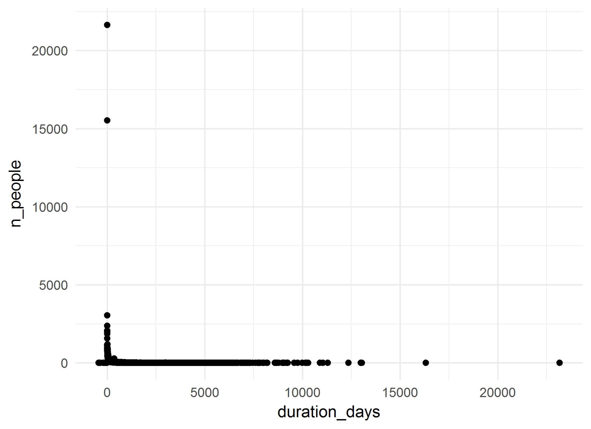
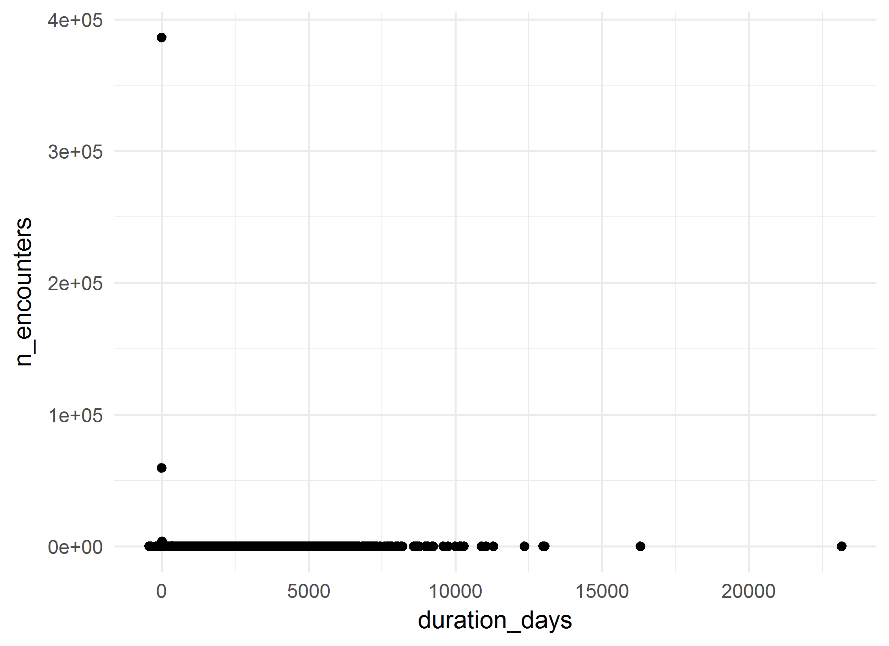
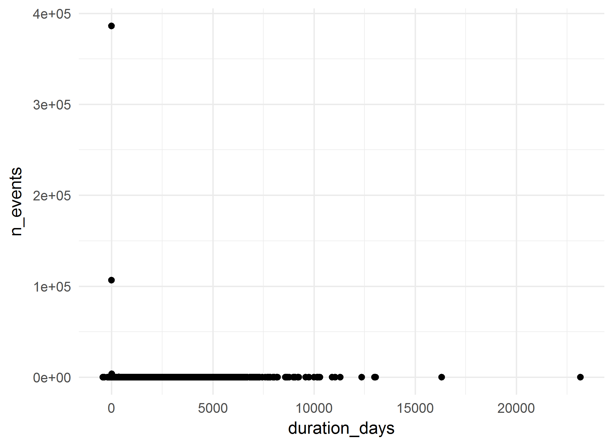

# MHSU Counsel Cohort: Summative analysis
A.Koval, K.Moselle, S.Robertson  
`r Sys.Date()`  

<!-- These two chunks should be added in the beginning of every .Rmd that you want to source an .R script -->
<!--  The 1st mandatory chunck  -->
<!--  Set the working directory to the repository's base directory -->


<!--  The 2nd mandatory chunck  -->
<!-- Set the report-wide options, and point to the external code file. -->


<!-- Load 'sourced' R files.  Suppress the output when loading packages. --> 


<!-- Load the sources.  Suppress the output when loading sources. --> 

# I. Exposition

## Glossary
Review some of the object definition to help you interpret the report. 
<!-- Load any Global functions and variables declared in the R file.  Suppress the output. --> 

```r
# dto_location_map.rds is products of `./manipulation/0-ellis-location-map.R` 
path_input_location_map   <- "./data-unshared/derived/dto_location_map.rds" 
path_input_patient_events <-  "./data-unshared/derived/dto_patient_events_mhsu_counsel_22634.rds" # research cohort
# Make sure the files are located where they supposed to be, in `./data-unshared/` folder
testit::assert("File does not exist", base::file.exists(path_input_location_map))
testit::assert("File does not exist", base::file.exists(path_input_patient_events))
# list variables that constitute patient event table
components_patient_events <- c(
  "id"                           # patient unique key
  ,"gender"                      # biological sex
  ,"age_group"                   # in groups of 5 years
  ,"encounter_id"                # unique identifier for the encounter 
  ,"encounter_class"             # value from the D_Location dimension table in the data warehous
  ,"encounter_type"              # value from the D_Location dimension table in the data warehous
  ,"event_type"                  # high-level classification of the event (encounter itself, diagnosis, procedure, clinical order, laboratory, pharmacy event, etc.).           
  ,"event_title"                 # a shorter, more rolled up category describing the event
  ,"event_detail"                # description of the event, can be long and specific
  ,"event_count"                 # count of the events in the row- each row has a value of 1, and can be summed
  ,"event_year"                  # year in which event occurred 
  ,"event_month"                 # month in which event occured
  ,"event_start_date"            # might be the date of the event itself (e.g. date of diagnosis) or the start date of the encounter that the event is associated with     
  ,"event_end_date"              # might be the end date of the event itself (e.g. end date of prescriptions) or the end date of the encounter that the event is associated with
  ,"start_day"                   # number of days between the first day the patient accessed Island Health services and the start date of this event. This is useful to mask dates, but still provides the relative time between events.
  ,"end_day"                     # number of days between the first day the patient accessed Island Health services and the end date of this event. This is useful to mask dates, but still provides the relative time between events.            
  ,"duration_days"               # number of days between the Start_Day and End_Day (End_Day - Start_Day)
  ,"addiction_location_count"    # patient has accessed services at a location that was used for the selection of the cohort
  ,"location_map_id"             # unique id for VIHA program, connects to location map
  ,"palette_code"                # unique id for colours of this palette
  ,"palette_colour_name"         # labels for clusters of service programs (aka 3T palette colours)
)
# list variables that consitute location map table
components_location_map <- c(
  "location_map_id"              # unique id for VIHA program, connects to patient events
  , "site_name"                  # CERNER address          # EHR address   
  , "facility_name"              # CERNER address          # EHR address   
  , "building_name"              # CERNER address          # EHR address   
  , "unit_name"                  # CERNER address          # EHR address   
  , "location_category"          # Data Warehouse address  # EHR address           
  , "location_type"              # Data Warehouse address  # EHR address           
  , "location_grouping"          # Data Warehouse address  # EHR address            
  , "site_key"                   # Factual counterparts to CERNER address
  , "facility_key"               # Factual counterparts to CERNER address
  , "building_key"               # Factual counterparts to CERNER address
  , "unit_key"                   # Factual counterparts to CERNER address
  , "intensity_type"             # Classifier, Compressor, Lense
  , "intensity_severity_risk"    # Classifier, Compressor, Lense
  , "clinical_focus"             # Classifier, Compressor, Lense
  , "service_type"               # Classifier, Compressor, Lense
  , "service_location"           # Classifier, Compressor, Lense
  , "population_age"             # Classifier, Compressor, Lense
  , "provider_mix"               # Classifier, Compressor, Lense
  , "location_class_code"        # Program Class, identifier
  , "location_class_description" # Porgram Class, Descriptive label
  , "palette_code"               # Palette,  identifier       # cluster specific     
  , "palette_colour_name"        # Palette, descriptive label # cluster specific            
)

# define output format for the report
options(
  knitr.table.format = "html"
  ,tibble.width = 110
  #   ,bootstrap_options = c("striped", "hover", "condensed","responsive")
)
```


<!-- Declare any global functions specific to a Rmd output.  Suppress the output. --> 


## Load Data
<!-- Load the datasets.   -->

```r
ds_patient_events <- readRDS(path_input_patient_events) # %>% as.data.frame()
ds_location_map   <- readRDS(path_input_location_map)

ds_patient_events  %>% glimpse()
ds_location_map %>% glimpse()
```

<!-- Inspect the datasets.   -->


## Data Tweaks
<!-- Tweak the datasets.   -->

```r
# augment the event table with additional columns from location map
ds <- dplyr::left_join(
  ds_patient_events,             # patient event table
  ds_location_map %>%         # location map 
    dplyr::select_(.dots = components_location_map)
  ,by = c("location_map_id","palette_code","palette_colour_name") 
) %>% 
  dplyr::mutate(
    location_class_description_display    = substr(location_class_description,1,42)
    ,palette_colour_name_display = substr(palette_colour_name,1,42)
  )
ds_location_map %>% glimpse()
# from this point on, ds_location_map is needed only for selective reference
ds %>% glimpse()
# ds now contains full coordinates to events of the cohort down to unit level
# ehr_address + location_classifiers + palette_colours
```

# II. Patient Events
The main data set `ds` contains both patient events table and their location map coordinates.

```r
# the data object containing events and location map 
ds %>% glimpse()
```

```
Observations: 603,892
Variables: 43
$ id                                 <chr> "1002E2", "1002E2", "1002E2", "1002E2", "1002E2", "1002E2", "1...
$ gender                             <chr> "Female", "Female", "Female", "Female", "Female", "Female", "F...
$ age_group                          <chr> "60 - 64", "60 - 64", "55 - 59", "60 - 64", "60 - 64", "60 - 6...
$ encounter_id                       <chr> "11232C94", "1193EC04", "15C5104", "172D43B4", "190E0544", "1A...
$ encounter_class                    <chr> "Recurring", "Emergency", "Other", "Emergency", "Outpatient", ...
$ encounter_type                     <chr> "Open Encounter", "Emergency", "Specimen", "Emergency", "Ambul...
$ event_type                         <chr> "Encounter Only", "Encounter Only", "Encounter Only", "Encount...
$ event_title                        <chr> "Mental Health", NA, "Outpatient", NA, "Outpatient", "Other", ...
$ event_detail                       <chr> "Adult Psychiatry", NA, "Laboratory", NA, "Laboratory", "Anaes...
$ event_count                        <int> 1, 1, 1, 1, 1, 1, 1, 1, 1, 1, 1, 1, 1, 1, 1, 1, 1, 1, 1, 1, 1,...
$ event_year                         <int> 2015, 2017, 2013, 2015, 2015, 2016, 2012, 2017, 2014, 2013, 20...
$ event_month                        <int> 10, 2, 4, 6, 6, 9, 1, 2, 12, 5, 3, 11, 5, 3, 1, 1, 3, 10, 2, 5...
$ event_start_date                   <date> 2015-10-26, 2017-02-05, 2013-04-16, 2015-06-16, 2015-06-16, 2...
$ event_end_date                     <date> 2016-05-31, 2017-02-05, 2013-04-16, 2015-06-16, 2015-06-16, 2...
$ start_day                          <int> 1638, 2106, 715, 1506, 1506, 1957, 260, 2111, 1310, 743, 1049,...
$ end_day                            <int> 1856, 2106, 715, 1506, 1506, 1957, 260, 2111, 1310, 743, 1049,...
$ duration_days                      <int> 218, 0, 0, 0, 0, 0, 0, 1, 0, 0, 0, 0, 0, 0, 0, 0, 0, 0, 0, 380...
$ addiction_location_count           <int> 0, 0, 0, 0, 0, 0, 0, 0, 0, 0, 0, 0, 0, 0, 0, 0, 0, 0, 0, 0, 0,...
$ location_map_id                    <int> 1873, 520, 766, 1429, 766, 620, 1809, 349, 1429, 1429, 1429, 1...
$ palette_code                       <int> 84, 28, 36, 28, 36, 79, 68, 5, 28, 28, 28, 26, 36, 79, 79, 36,...
$ palette_colour_name                <chr> "Psychiatric Consultation Services - Ambulatory", "ED - Med-Su...
$ site_name                          <chr> NA, "Royal Jubilee Hospital", "Royal Jubilee Hospital", "Royal...
$ facility_name                      <chr> "MHSU - Community - Case Management", "Royal Jubilee Hospital"...
$ building_name                      <chr> "Royal Jubilee Eric Martin Pavilion", "Royal Jubilee Main", "R...
$ unit_name                          <chr> "General Psychiatry Psychiatrist only Service", "RJH - Emergen...
$ location_category                  <chr> "Community-MHAS", "Emergency Room", "Ambulatory", "Emergency R...
$ location_type                      <chr> "Community-MHAS", "ER-General", "Laboratory", "ER-General", "L...
$ location_grouping                  <chr> "Mental Health Community Care Services", "Emergency-General", ...
$ site_key                           <chr> NA, NA, NA, NA, NA, NA, NA, NA, NA, NA, NA, NA, NA, NA, NA, NA...
$ facility_key                       <chr> "MHCCM", "RJHAC", "RJHAC", "RJHAC", "RJHAC", "RJHAC", "RJHAC",...
$ building_key                       <chr> "EMP", "MAIN", "MAIN", "MAIN", "MAIN", "MEM PAV", "RICH PAV", ...
$ unit_key                           <chr> "PGES", "ER-R", "LAB-R", "ER-R", "LAB-R", "PAIN", "NERJ", "8NE...
$ intensity_type                     <chr> "Ambulatory-Mixed", "ED, Urgent Care, Acute", "Laboratory", "E...
$ intensity_severity_risk            <chr> "Ambulatory Mixed-Moderate Intensity", "Emergent-Hospital", "L...
$ clinical_focus                     <chr> "MHSU", "Emergency Response", "Lab", "Emergency Response", "La...
$ service_type                       <chr> "Ambulatory-Mixed", "ED-Medical", "Laboratory", "ED-Medical", ...
$ service_location                   <chr> "Ambulatory Clinic", "Hospital", "IH Lab", "Hospital", "IH Lab...
$ population_age                     <chr> "Adults, some adols, older adults", "Mixed Ages", "Mixed Ages"...
$ provider_mix                       <chr> "Medical specialist", "Physician, nurse delivered", "Miscellan...
$ location_class_code                <int> 43, 78, 146, 78, 146, 121, 104, 66, 78, 78, 78, 88, 146, 121, ...
$ location_class_description         <chr> "Psychiatric [only] Clinic Services - Adults", "ED - Med-Surg"...
$ location_class_description_display <chr> "Psychiatric [only] Clinic Services - Adult", "ED - Med-Surg",...
$ palette_colour_name_display        <chr> "Psychiatric Consultation Services - Ambula", "ED - Med-Surg",...
```

```r
# What variables relate to patient event table?
# What variables relate to locations at which events took place?
# How many unique values does each variable/column contain? 
ds %>% select_(.dots=components_patient_events) %>% summarise_all(dplyr::n_distinct) %>% t() 
```

```
                           [,1]
id                        22632
gender                        3
age_group                    21
encounter_id             556481
encounter_class               8
encounter_type               19
event_type                    3
event_title                  90
event_detail               4607
event_count                   1
event_year                   39
event_month                  13
event_start_date           4194
event_end_date             2302
start_day                  8876
end_day                    8985
duration_days              3702
addiction_location_count      2
location_map_id            1898
palette_code                 97
palette_colour_name          97
```

```r
ds %>% select_(.dots=components_location_map) %>% summarise_all(dplyr::n_distinct) %>% t() 
```

```
                           [,1]
location_map_id            1898
site_name                    96
facility_name               204
building_name               406
unit_name                  1279
location_category            10
location_type                50
location_grouping            23
site_key                      1
facility_key                180
building_key                355
unit_key                   1076
intensity_type               15
intensity_severity_risk      37
clinical_focus               47
service_type                 56
service_location             15
population_age                9
provider_mix                 18
location_class_code         146
location_class_description  146
palette_code                 97
palette_colour_name          97
```

```r
# they share / connected by the fields:
intersect(components_patient_events, components_location_map)
```

```
[1] "location_map_id"     "palette_code"        "palette_colour_name"
```

## Overview

```r
# PET - Patient Event Table
# How many patients are in this cohort?
ds %>% distinct(id) %>% count() %>% neat()
```

<?xml version="1.0" encoding="UTF-8"?>
<table class="table table-striped table-hover table-condensed table-responsive" style="width: auto !important; text-align: right;">
 <thead>
  <tr>
   <th style="text-align:right;"> n </th>
  </tr>
 </thead>
<tbody>
  <tr>
   <td style="text-align:right;"> 22632 </td>
  </tr>
</tbody>
</table>

```r
# What are basic demographics?
ds %>% unique_sums(c("gender")) %>% arrange(desc(n_people)) %>% neat()
```

<?xml version="1.0" encoding="UTF-8"?>
<table class="table table-striped table-hover table-condensed table-responsive" style="width: auto !important; text-align: right;">
 <thead>
  <tr>
   <th style="text-align:left;"> gender </th>
   <th style="text-align:right;"> n_people </th>
   <th style="text-align:right;"> n_encounters </th>
   <th style="text-align:right;"> n_events </th>
  </tr>
 </thead>
<tbody>
  <tr>
   <td style="text-align:left;"> Female </td>
   <td style="text-align:right;"> 12543 </td>
   <td style="text-align:right;"> 342295 </td>
   <td style="text-align:right;"> 370512 </td>
  </tr>
  <tr>
   <td style="text-align:left;"> Male </td>
   <td style="text-align:right;"> 10091 </td>
   <td style="text-align:right;"> 214158 </td>
   <td style="text-align:right;"> 233350 </td>
  </tr>
  <tr>
   <td style="text-align:left;"> Unknown </td>
   <td style="text-align:right;"> 1 </td>
   <td style="text-align:right;"> 28 </td>
   <td style="text-align:right;"> 30 </td>
  </tr>
</tbody>
</table>

```r
ds %>% unique_sums(c("age_group"))  %>%  neat()
```

<?xml version="1.0" encoding="UTF-8"?>
<table class="table table-striped table-hover table-condensed table-responsive" style="width: auto !important; text-align: right;">
 <thead>
  <tr>
   <th style="text-align:left;"> age_group </th>
   <th style="text-align:right;"> n_people </th>
   <th style="text-align:right;"> n_encounters </th>
   <th style="text-align:right;"> n_events </th>
  </tr>
 </thead>
<tbody>
  <tr>
   <td style="text-align:left;"> &lt;1 </td>
   <td style="text-align:right;"> 19 </td>
   <td style="text-align:right;"> 41 </td>
   <td style="text-align:right;"> 44 </td>
  </tr>
  <tr>
   <td style="text-align:left;"> 01 - 04 </td>
   <td style="text-align:right;"> 139 </td>
   <td style="text-align:right;"> 583 </td>
   <td style="text-align:right;"> 597 </td>
  </tr>
  <tr>
   <td style="text-align:left;"> 05 - 09 </td>
   <td style="text-align:right;"> 654 </td>
   <td style="text-align:right;"> 3657 </td>
   <td style="text-align:right;"> 3764 </td>
  </tr>
  <tr>
   <td style="text-align:left;"> 10 - 14 </td>
   <td style="text-align:right;"> 1561 </td>
   <td style="text-align:right;"> 10237 </td>
   <td style="text-align:right;"> 10785 </td>
  </tr>
  <tr>
   <td style="text-align:left;"> 15 - 19 </td>
   <td style="text-align:right;"> 2901 </td>
   <td style="text-align:right;"> 30605 </td>
   <td style="text-align:right;"> 32576 </td>
  </tr>
  <tr>
   <td style="text-align:left;"> 20 - 24 </td>
   <td style="text-align:right;"> 3583 </td>
   <td style="text-align:right;"> 40377 </td>
   <td style="text-align:right;"> 42991 </td>
  </tr>
  <tr>
   <td style="text-align:left;"> 25 - 29 </td>
   <td style="text-align:right;"> 3522 </td>
   <td style="text-align:right;"> 44335 </td>
   <td style="text-align:right;"> 47634 </td>
  </tr>
  <tr>
   <td style="text-align:left;"> 30 - 34 </td>
   <td style="text-align:right;"> 3505 </td>
   <td style="text-align:right;"> 43897 </td>
   <td style="text-align:right;"> 47075 </td>
  </tr>
  <tr>
   <td style="text-align:left;"> 35 - 39 </td>
   <td style="text-align:right;"> 3479 </td>
   <td style="text-align:right;"> 41877 </td>
   <td style="text-align:right;"> 44655 </td>
  </tr>
  <tr>
   <td style="text-align:left;"> 40 - 44 </td>
   <td style="text-align:right;"> 3678 </td>
   <td style="text-align:right;"> 44356 </td>
   <td style="text-align:right;"> 47057 </td>
  </tr>
  <tr>
   <td style="text-align:left;"> 45 - 49 </td>
   <td style="text-align:right;"> 4005 </td>
   <td style="text-align:right;"> 48844 </td>
   <td style="text-align:right;"> 52594 </td>
  </tr>
  <tr>
   <td style="text-align:left;"> 50 - 54 </td>
   <td style="text-align:right;"> 4281 </td>
   <td style="text-align:right;"> 59090 </td>
   <td style="text-align:right;"> 64268 </td>
  </tr>
  <tr>
   <td style="text-align:left;"> 55 - 59 </td>
   <td style="text-align:right;"> 4171 </td>
   <td style="text-align:right;"> 58355 </td>
   <td style="text-align:right;"> 63274 </td>
  </tr>
  <tr>
   <td style="text-align:left;"> 60 - 64 </td>
   <td style="text-align:right;"> 3342 </td>
   <td style="text-align:right;"> 47748 </td>
   <td style="text-align:right;"> 52791 </td>
  </tr>
  <tr>
   <td style="text-align:left;"> 65 - 69 </td>
   <td style="text-align:right;"> 2244 </td>
   <td style="text-align:right;"> 36942 </td>
   <td style="text-align:right;"> 41312 </td>
  </tr>
  <tr>
   <td style="text-align:left;"> 70 - 74 </td>
   <td style="text-align:right;"> 1269 </td>
   <td style="text-align:right;"> 19599 </td>
   <td style="text-align:right;"> 22161 </td>
  </tr>
  <tr>
   <td style="text-align:left;"> 75 - 79 </td>
   <td style="text-align:right;"> 706 </td>
   <td style="text-align:right;"> 10572 </td>
   <td style="text-align:right;"> 11997 </td>
  </tr>
  <tr>
   <td style="text-align:left;"> 80 - 84 </td>
   <td style="text-align:right;"> 554 </td>
   <td style="text-align:right;"> 7389 </td>
   <td style="text-align:right;"> 8594 </td>
  </tr>
  <tr>
   <td style="text-align:left;"> 85 - 89 </td>
   <td style="text-align:right;"> 442 </td>
   <td style="text-align:right;"> 4917 </td>
   <td style="text-align:right;"> 6029 </td>
  </tr>
  <tr>
   <td style="text-align:left;"> 90+ </td>
   <td style="text-align:right;"> 249 </td>
   <td style="text-align:right;"> 2544 </td>
   <td style="text-align:right;"> 3178 </td>
  </tr>
  <tr>
   <td style="text-align:left;"> No value </td>
   <td style="text-align:right;"> 471 </td>
   <td style="text-align:right;"> 516 </td>
   <td style="text-align:right;"> 516 </td>
  </tr>
</tbody>
</table>

```r
ds %>% unique_sums(c("gender","age_group")) %>%  neat()
```

<?xml version="1.0" encoding="UTF-8"?>
<table class="table table-striped table-hover table-condensed table-responsive" style="width: auto !important; text-align: right;">
 <thead>
  <tr>
   <th style="text-align:left;"> gender </th>
   <th style="text-align:left;"> age_group </th>
   <th style="text-align:right;"> n_people </th>
   <th style="text-align:right;"> n_encounters </th>
   <th style="text-align:right;"> n_events </th>
  </tr>
 </thead>
<tbody>
  <tr>
   <td style="text-align:left;"> Female </td>
   <td style="text-align:left;"> &lt;1 </td>
   <td style="text-align:right;"> 6 </td>
   <td style="text-align:right;"> 10 </td>
   <td style="text-align:right;"> 10 </td>
  </tr>
  <tr>
   <td style="text-align:left;"> Female </td>
   <td style="text-align:left;"> 01 - 04 </td>
   <td style="text-align:right;"> 38 </td>
   <td style="text-align:right;"> 171 </td>
   <td style="text-align:right;"> 178 </td>
  </tr>
  <tr>
   <td style="text-align:left;"> Female </td>
   <td style="text-align:left;"> 05 - 09 </td>
   <td style="text-align:right;"> 229 </td>
   <td style="text-align:right;"> 1244 </td>
   <td style="text-align:right;"> 1280 </td>
  </tr>
  <tr>
   <td style="text-align:left;"> Female </td>
   <td style="text-align:left;"> 10 - 14 </td>
   <td style="text-align:right;"> 806 </td>
   <td style="text-align:right;"> 5624 </td>
   <td style="text-align:right;"> 5989 </td>
  </tr>
  <tr>
   <td style="text-align:left;"> Female </td>
   <td style="text-align:left;"> 15 - 19 </td>
   <td style="text-align:right;"> 1579 </td>
   <td style="text-align:right;"> 19101 </td>
   <td style="text-align:right;"> 20253 </td>
  </tr>
  <tr>
   <td style="text-align:left;"> Female </td>
   <td style="text-align:left;"> 20 - 24 </td>
   <td style="text-align:right;"> 1872 </td>
   <td style="text-align:right;"> 23922 </td>
   <td style="text-align:right;"> 25569 </td>
  </tr>
  <tr>
   <td style="text-align:left;"> Female </td>
   <td style="text-align:left;"> 25 - 29 </td>
   <td style="text-align:right;"> 1881 </td>
   <td style="text-align:right;"> 27488 </td>
   <td style="text-align:right;"> 29514 </td>
  </tr>
  <tr>
   <td style="text-align:left;"> Female </td>
   <td style="text-align:left;"> 30 - 34 </td>
   <td style="text-align:right;"> 1945 </td>
   <td style="text-align:right;"> 27496 </td>
   <td style="text-align:right;"> 29638 </td>
  </tr>
  <tr>
   <td style="text-align:left;"> Female </td>
   <td style="text-align:left;"> 35 - 39 </td>
   <td style="text-align:right;"> 1981 </td>
   <td style="text-align:right;"> 26703 </td>
   <td style="text-align:right;"> 28621 </td>
  </tr>
  <tr>
   <td style="text-align:left;"> Female </td>
   <td style="text-align:left;"> 40 - 44 </td>
   <td style="text-align:right;"> 2084 </td>
   <td style="text-align:right;"> 27258 </td>
   <td style="text-align:right;"> 28826 </td>
  </tr>
  <tr>
   <td style="text-align:left;"> Female </td>
   <td style="text-align:left;"> 45 - 49 </td>
   <td style="text-align:right;"> 2273 </td>
   <td style="text-align:right;"> 29455 </td>
   <td style="text-align:right;"> 31667 </td>
  </tr>
  <tr>
   <td style="text-align:left;"> Female </td>
   <td style="text-align:left;"> 50 - 54 </td>
   <td style="text-align:right;"> 2501 </td>
   <td style="text-align:right;"> 37604 </td>
   <td style="text-align:right;"> 40784 </td>
  </tr>
  <tr>
   <td style="text-align:left;"> Female </td>
   <td style="text-align:left;"> 55 - 59 </td>
   <td style="text-align:right;"> 2503 </td>
   <td style="text-align:right;"> 36536 </td>
   <td style="text-align:right;"> 39419 </td>
  </tr>
  <tr>
   <td style="text-align:left;"> Female </td>
   <td style="text-align:left;"> 60 - 64 </td>
   <td style="text-align:right;"> 2004 </td>
   <td style="text-align:right;"> 29949 </td>
   <td style="text-align:right;"> 32722 </td>
  </tr>
  <tr>
   <td style="text-align:left;"> Female </td>
   <td style="text-align:left;"> 65 - 69 </td>
   <td style="text-align:right;"> 1327 </td>
   <td style="text-align:right;"> 22292 </td>
   <td style="text-align:right;"> 24502 </td>
  </tr>
  <tr>
   <td style="text-align:left;"> Female </td>
   <td style="text-align:left;"> 70 - 74 </td>
   <td style="text-align:right;"> 752 </td>
   <td style="text-align:right;"> 11769 </td>
   <td style="text-align:right;"> 13200 </td>
  </tr>
  <tr>
   <td style="text-align:left;"> Female </td>
   <td style="text-align:left;"> 75 - 79 </td>
   <td style="text-align:right;"> 417 </td>
   <td style="text-align:right;"> 6267 </td>
   <td style="text-align:right;"> 7099 </td>
  </tr>
  <tr>
   <td style="text-align:left;"> Female </td>
   <td style="text-align:left;"> 80 - 84 </td>
   <td style="text-align:right;"> 326 </td>
   <td style="text-align:right;"> 4323 </td>
   <td style="text-align:right;"> 5043 </td>
  </tr>
  <tr>
   <td style="text-align:left;"> Female </td>
   <td style="text-align:left;"> 85 - 89 </td>
   <td style="text-align:right;"> 274 </td>
   <td style="text-align:right;"> 2974 </td>
   <td style="text-align:right;"> 3638 </td>
  </tr>
  <tr>
   <td style="text-align:left;"> Female </td>
   <td style="text-align:left;"> 90+ </td>
   <td style="text-align:right;"> 177 </td>
   <td style="text-align:right;"> 1825 </td>
   <td style="text-align:right;"> 2276 </td>
  </tr>
  <tr>
   <td style="text-align:left;"> Female </td>
   <td style="text-align:left;"> No value </td>
   <td style="text-align:right;"> 260 </td>
   <td style="text-align:right;"> 284 </td>
   <td style="text-align:right;"> 284 </td>
  </tr>
  <tr>
   <td style="text-align:left;"> Male </td>
   <td style="text-align:left;"> &lt;1 </td>
   <td style="text-align:right;"> 13 </td>
   <td style="text-align:right;"> 31 </td>
   <td style="text-align:right;"> 34 </td>
  </tr>
  <tr>
   <td style="text-align:left;"> Male </td>
   <td style="text-align:left;"> 01 - 04 </td>
   <td style="text-align:right;"> 101 </td>
   <td style="text-align:right;"> 412 </td>
   <td style="text-align:right;"> 419 </td>
  </tr>
  <tr>
   <td style="text-align:left;"> Male </td>
   <td style="text-align:left;"> 05 - 09 </td>
   <td style="text-align:right;"> 425 </td>
   <td style="text-align:right;"> 2413 </td>
   <td style="text-align:right;"> 2484 </td>
  </tr>
  <tr>
   <td style="text-align:left;"> Male </td>
   <td style="text-align:left;"> 10 - 14 </td>
   <td style="text-align:right;"> 755 </td>
   <td style="text-align:right;"> 4613 </td>
   <td style="text-align:right;"> 4796 </td>
  </tr>
  <tr>
   <td style="text-align:left;"> Male </td>
   <td style="text-align:left;"> 15 - 19 </td>
   <td style="text-align:right;"> 1323 </td>
   <td style="text-align:right;"> 11504 </td>
   <td style="text-align:right;"> 12323 </td>
  </tr>
  <tr>
   <td style="text-align:left;"> Male </td>
   <td style="text-align:left;"> 20 - 24 </td>
   <td style="text-align:right;"> 1711 </td>
   <td style="text-align:right;"> 16455 </td>
   <td style="text-align:right;"> 17422 </td>
  </tr>
  <tr>
   <td style="text-align:left;"> Male </td>
   <td style="text-align:left;"> 25 - 29 </td>
   <td style="text-align:right;"> 1641 </td>
   <td style="text-align:right;"> 16847 </td>
   <td style="text-align:right;"> 18120 </td>
  </tr>
  <tr>
   <td style="text-align:left;"> Male </td>
   <td style="text-align:left;"> 30 - 34 </td>
   <td style="text-align:right;"> 1560 </td>
   <td style="text-align:right;"> 16398 </td>
   <td style="text-align:right;"> 17434 </td>
  </tr>
  <tr>
   <td style="text-align:left;"> Male </td>
   <td style="text-align:left;"> 35 - 39 </td>
   <td style="text-align:right;"> 1497 </td>
   <td style="text-align:right;"> 15150 </td>
   <td style="text-align:right;"> 16008 </td>
  </tr>
  <tr>
   <td style="text-align:left;"> Male </td>
   <td style="text-align:left;"> 40 - 44 </td>
   <td style="text-align:right;"> 1594 </td>
   <td style="text-align:right;"> 17097 </td>
   <td style="text-align:right;"> 18230 </td>
  </tr>
  <tr>
   <td style="text-align:left;"> Male </td>
   <td style="text-align:left;"> 45 - 49 </td>
   <td style="text-align:right;"> 1732 </td>
   <td style="text-align:right;"> 19389 </td>
   <td style="text-align:right;"> 20927 </td>
  </tr>
  <tr>
   <td style="text-align:left;"> Male </td>
   <td style="text-align:left;"> 50 - 54 </td>
   <td style="text-align:right;"> 1780 </td>
   <td style="text-align:right;"> 21486 </td>
   <td style="text-align:right;"> 23484 </td>
  </tr>
  <tr>
   <td style="text-align:left;"> Male </td>
   <td style="text-align:left;"> 55 - 59 </td>
   <td style="text-align:right;"> 1668 </td>
   <td style="text-align:right;"> 21819 </td>
   <td style="text-align:right;"> 23855 </td>
  </tr>
  <tr>
   <td style="text-align:left;"> Male </td>
   <td style="text-align:left;"> 60 - 64 </td>
   <td style="text-align:right;"> 1338 </td>
   <td style="text-align:right;"> 17799 </td>
   <td style="text-align:right;"> 20069 </td>
  </tr>
  <tr>
   <td style="text-align:left;"> Male </td>
   <td style="text-align:left;"> 65 - 69 </td>
   <td style="text-align:right;"> 917 </td>
   <td style="text-align:right;"> 14650 </td>
   <td style="text-align:right;"> 16810 </td>
  </tr>
  <tr>
   <td style="text-align:left;"> Male </td>
   <td style="text-align:left;"> 70 - 74 </td>
   <td style="text-align:right;"> 517 </td>
   <td style="text-align:right;"> 7830 </td>
   <td style="text-align:right;"> 8961 </td>
  </tr>
  <tr>
   <td style="text-align:left;"> Male </td>
   <td style="text-align:left;"> 75 - 79 </td>
   <td style="text-align:right;"> 289 </td>
   <td style="text-align:right;"> 4305 </td>
   <td style="text-align:right;"> 4898 </td>
  </tr>
  <tr>
   <td style="text-align:left;"> Male </td>
   <td style="text-align:left;"> 80 - 84 </td>
   <td style="text-align:right;"> 228 </td>
   <td style="text-align:right;"> 3066 </td>
   <td style="text-align:right;"> 3551 </td>
  </tr>
  <tr>
   <td style="text-align:left;"> Male </td>
   <td style="text-align:left;"> 85 - 89 </td>
   <td style="text-align:right;"> 168 </td>
   <td style="text-align:right;"> 1943 </td>
   <td style="text-align:right;"> 2391 </td>
  </tr>
  <tr>
   <td style="text-align:left;"> Male </td>
   <td style="text-align:left;"> 90+ </td>
   <td style="text-align:right;"> 72 </td>
   <td style="text-align:right;"> 719 </td>
   <td style="text-align:right;"> 902 </td>
  </tr>
  <tr>
   <td style="text-align:left;"> Male </td>
   <td style="text-align:left;"> No value </td>
   <td style="text-align:right;"> 211 </td>
   <td style="text-align:right;"> 232 </td>
   <td style="text-align:right;"> 232 </td>
  </tr>
  <tr>
   <td style="text-align:left;"> Unknown </td>
   <td style="text-align:left;"> 30 - 34 </td>
   <td style="text-align:right;"> 1 </td>
   <td style="text-align:right;"> 3 </td>
   <td style="text-align:right;"> 3 </td>
  </tr>
  <tr>
   <td style="text-align:left;"> Unknown </td>
   <td style="text-align:left;"> 35 - 39 </td>
   <td style="text-align:right;"> 1 </td>
   <td style="text-align:right;"> 24 </td>
   <td style="text-align:right;"> 26 </td>
  </tr>
  <tr>
   <td style="text-align:left;"> Unknown </td>
   <td style="text-align:left;"> 40 - 44 </td>
   <td style="text-align:right;"> 1 </td>
   <td style="text-align:right;"> 1 </td>
   <td style="text-align:right;"> 1 </td>
  </tr>
</tbody>
</table>

## DW tags

```r
# how may unique encounters are there in this set?
ds %>% distinct(encounter_id) %>% count() %>% neat()
```

<?xml version="1.0" encoding="UTF-8"?>
<table class="table table-striped table-hover table-condensed table-responsive" style="width: auto !important; text-align: right;">
 <thead>
  <tr>
   <th style="text-align:right;"> n </th>
  </tr>
 </thead>
<tbody>
  <tr>
   <td style="text-align:right;"> 556481 </td>
  </tr>
</tbody>
</table>

```r
# tally engagement across encounter classes (as defined by data warehouse)
ds %>% unique_sums("encounter_class")%>% arrange(desc(n_people)) %>% neat()
```

<?xml version="1.0" encoding="UTF-8"?>
<table class="table table-striped table-hover table-condensed table-responsive" style="width: auto !important; text-align: right;">
 <thead>
  <tr>
   <th style="text-align:left;"> encounter_class </th>
   <th style="text-align:right;"> n_people </th>
   <th style="text-align:right;"> n_encounters </th>
   <th style="text-align:right;"> n_events </th>
  </tr>
 </thead>
<tbody>
  <tr>
   <td style="text-align:left;"> Recurring </td>
   <td style="text-align:right;"> 21703 </td>
   <td style="text-align:right;"> 102575 </td>
   <td style="text-align:right;"> 102774 </td>
  </tr>
  <tr>
   <td style="text-align:left;"> Outpatient </td>
   <td style="text-align:right;"> 20337 </td>
   <td style="text-align:right;"> 256396 </td>
   <td style="text-align:right;"> 264776 </td>
  </tr>
  <tr>
   <td style="text-align:left;"> Emergency </td>
   <td style="text-align:right;"> 18695 </td>
   <td style="text-align:right;"> 130252 </td>
   <td style="text-align:right;"> 130547 </td>
  </tr>
  <tr>
   <td style="text-align:left;"> Inpatient </td>
   <td style="text-align:right;"> 11381 </td>
   <td style="text-align:right;"> 36164 </td>
   <td style="text-align:right;"> 74589 </td>
  </tr>
  <tr>
   <td style="text-align:left;"> Other </td>
   <td style="text-align:right;"> 9173 </td>
   <td style="text-align:right;"> 25158 </td>
   <td style="text-align:right;"> 25269 </td>
  </tr>
  <tr>
   <td style="text-align:left;"> Home Care </td>
   <td style="text-align:right;"> 3610 </td>
   <td style="text-align:right;"> 5678 </td>
   <td style="text-align:right;"> 5678 </td>
  </tr>
  <tr>
   <td style="text-align:left;"> Cancelled Admission </td>
   <td style="text-align:right;"> 225 </td>
   <td style="text-align:right;"> 250 </td>
   <td style="text-align:right;"> 251 </td>
  </tr>
  <tr>
   <td style="text-align:left;"> Not defined </td>
   <td style="text-align:right;"> 7 </td>
   <td style="text-align:right;"> 8 </td>
   <td style="text-align:right;"> 8 </td>
  </tr>
</tbody>
</table>

```r
ds %>% unique_sums("encounter_type") %>% arrange(desc(n_people)) %>% neat()
```

<?xml version="1.0" encoding="UTF-8"?>
<table class="table table-striped table-hover table-condensed table-responsive" style="width: auto !important; text-align: right;">
 <thead>
  <tr>
   <th style="text-align:left;"> encounter_type </th>
   <th style="text-align:right;"> n_people </th>
   <th style="text-align:right;"> n_encounters </th>
   <th style="text-align:right;"> n_events </th>
  </tr>
 </thead>
<tbody>
  <tr>
   <td style="text-align:left;"> Open Encounter </td>
   <td style="text-align:right;"> 21689 </td>
   <td style="text-align:right;"> 101147 </td>
   <td style="text-align:right;"> 101316 </td>
  </tr>
  <tr>
   <td style="text-align:left;"> Ambulatory </td>
   <td style="text-align:right;"> 20198 </td>
   <td style="text-align:right;"> 239416 </td>
   <td style="text-align:right;"> 239516 </td>
  </tr>
  <tr>
   <td style="text-align:left;"> Emergency </td>
   <td style="text-align:right;"> 18695 </td>
   <td style="text-align:right;"> 130252 </td>
   <td style="text-align:right;"> 130547 </td>
  </tr>
  <tr>
   <td style="text-align:left;"> Inpatient Acute </td>
   <td style="text-align:right;"> 10750 </td>
   <td style="text-align:right;"> 29059 </td>
   <td style="text-align:right;"> 67372 </td>
  </tr>
  <tr>
   <td style="text-align:left;"> Specimen </td>
   <td style="text-align:right;"> 8588 </td>
   <td style="text-align:right;"> 23919 </td>
   <td style="text-align:right;"> 24030 </td>
  </tr>
  <tr>
   <td style="text-align:left;"> Day Care </td>
   <td style="text-align:right;"> 7369 </td>
   <td style="text-align:right;"> 16824 </td>
   <td style="text-align:right;"> 25104 </td>
  </tr>
  <tr>
   <td style="text-align:left;"> Home Care </td>
   <td style="text-align:right;"> 3610 </td>
   <td style="text-align:right;"> 5678 </td>
   <td style="text-align:right;"> 5678 </td>
  </tr>
  <tr>
   <td style="text-align:left;"> MHAS - Residential </td>
   <td style="text-align:right;"> 1664 </td>
   <td style="text-align:right;"> 4142 </td>
   <td style="text-align:right;"> 4142 </td>
  </tr>
  <tr>
   <td style="text-align:left;"> Residential Care </td>
   <td style="text-align:right;"> 901 </td>
   <td style="text-align:right;"> 1308 </td>
   <td style="text-align:right;"> 1417 </td>
  </tr>
  <tr>
   <td style="text-align:left;"> Recurring/Series </td>
   <td style="text-align:right;"> 840 </td>
   <td style="text-align:right;"> 1428 </td>
   <td style="text-align:right;"> 1458 </td>
  </tr>
  <tr>
   <td style="text-align:left;"> Morgue </td>
   <td style="text-align:right;"> 519 </td>
   <td style="text-align:right;"> 533 </td>
   <td style="text-align:right;"> 533 </td>
  </tr>
  <tr>
   <td style="text-align:left;"> Waitlist </td>
   <td style="text-align:right;"> 425 </td>
   <td style="text-align:right;"> 471 </td>
   <td style="text-align:right;"> 471 </td>
  </tr>
  <tr>
   <td style="text-align:left;"> MHAS - Acute Care </td>
   <td style="text-align:right;"> 295 </td>
   <td style="text-align:right;"> 1496 </td>
   <td style="text-align:right;"> 1496 </td>
  </tr>
  <tr>
   <td style="text-align:left;"> Cancelled Admission </td>
   <td style="text-align:right;"> 225 </td>
   <td style="text-align:right;"> 250 </td>
   <td style="text-align:right;"> 251 </td>
  </tr>
  <tr>
   <td style="text-align:left;"> Lifetime </td>
   <td style="text-align:right;"> 149 </td>
   <td style="text-align:right;"> 149 </td>
   <td style="text-align:right;"> 149 </td>
  </tr>
  <tr>
   <td style="text-align:left;"> Research </td>
   <td style="text-align:right;"> 95 </td>
   <td style="text-align:right;"> 235 </td>
   <td style="text-align:right;"> 235 </td>
  </tr>
  <tr>
   <td style="text-align:left;"> Phone Consult </td>
   <td style="text-align:right;"> 62 </td>
   <td style="text-align:right;"> 156 </td>
   <td style="text-align:right;"> 156 </td>
  </tr>
  <tr>
   <td style="text-align:left;"> Not defined </td>
   <td style="text-align:right;"> 7 </td>
   <td style="text-align:right;"> 8 </td>
   <td style="text-align:right;"> 8 </td>
  </tr>
  <tr>
   <td style="text-align:left;"> Newborn </td>
   <td style="text-align:right;"> 6 </td>
   <td style="text-align:right;"> 10 </td>
   <td style="text-align:right;"> 13 </td>
  </tr>
</tbody>
</table>

```r
ds %>% unique_sums(c("encounter_class","encounter_type"))%>% arrange(desc(encounter_class,n_people)) %>% neat()
```

<?xml version="1.0" encoding="UTF-8"?>
<table class="table table-striped table-hover table-condensed table-responsive" style="width: auto !important; text-align: right;">
 <thead>
  <tr>
   <th style="text-align:left;"> encounter_class </th>
   <th style="text-align:left;"> encounter_type </th>
   <th style="text-align:right;"> n_people </th>
   <th style="text-align:right;"> n_encounters </th>
   <th style="text-align:right;"> n_events </th>
  </tr>
 </thead>
<tbody>
  <tr>
   <td style="text-align:left;"> Recurring </td>
   <td style="text-align:left;"> Open Encounter </td>
   <td style="text-align:right;"> 21689 </td>
   <td style="text-align:right;"> 101147 </td>
   <td style="text-align:right;"> 101316 </td>
  </tr>
  <tr>
   <td style="text-align:left;"> Recurring </td>
   <td style="text-align:left;"> Recurring/Series </td>
   <td style="text-align:right;"> 840 </td>
   <td style="text-align:right;"> 1428 </td>
   <td style="text-align:right;"> 1458 </td>
  </tr>
  <tr>
   <td style="text-align:left;"> Outpatient </td>
   <td style="text-align:left;"> Ambulatory </td>
   <td style="text-align:right;"> 20198 </td>
   <td style="text-align:right;"> 239416 </td>
   <td style="text-align:right;"> 239516 </td>
  </tr>
  <tr>
   <td style="text-align:left;"> Outpatient </td>
   <td style="text-align:left;"> Day Care </td>
   <td style="text-align:right;"> 7369 </td>
   <td style="text-align:right;"> 16824 </td>
   <td style="text-align:right;"> 25104 </td>
  </tr>
  <tr>
   <td style="text-align:left;"> Outpatient </td>
   <td style="text-align:left;"> Phone Consult </td>
   <td style="text-align:right;"> 62 </td>
   <td style="text-align:right;"> 156 </td>
   <td style="text-align:right;"> 156 </td>
  </tr>
  <tr>
   <td style="text-align:left;"> Other </td>
   <td style="text-align:left;"> Morgue </td>
   <td style="text-align:right;"> 519 </td>
   <td style="text-align:right;"> 533 </td>
   <td style="text-align:right;"> 533 </td>
  </tr>
  <tr>
   <td style="text-align:left;"> Other </td>
   <td style="text-align:left;"> Research </td>
   <td style="text-align:right;"> 95 </td>
   <td style="text-align:right;"> 235 </td>
   <td style="text-align:right;"> 235 </td>
  </tr>
  <tr>
   <td style="text-align:left;"> Other </td>
   <td style="text-align:left;"> Specimen </td>
   <td style="text-align:right;"> 8588 </td>
   <td style="text-align:right;"> 23919 </td>
   <td style="text-align:right;"> 24030 </td>
  </tr>
  <tr>
   <td style="text-align:left;"> Other </td>
   <td style="text-align:left;"> Waitlist </td>
   <td style="text-align:right;"> 425 </td>
   <td style="text-align:right;"> 471 </td>
   <td style="text-align:right;"> 471 </td>
  </tr>
  <tr>
   <td style="text-align:left;"> Not defined </td>
   <td style="text-align:left;"> Not defined </td>
   <td style="text-align:right;"> 7 </td>
   <td style="text-align:right;"> 8 </td>
   <td style="text-align:right;"> 8 </td>
  </tr>
  <tr>
   <td style="text-align:left;"> Inpatient </td>
   <td style="text-align:left;"> Inpatient Acute </td>
   <td style="text-align:right;"> 10750 </td>
   <td style="text-align:right;"> 29059 </td>
   <td style="text-align:right;"> 67372 </td>
  </tr>
  <tr>
   <td style="text-align:left;"> Inpatient </td>
   <td style="text-align:left;"> Lifetime </td>
   <td style="text-align:right;"> 149 </td>
   <td style="text-align:right;"> 149 </td>
   <td style="text-align:right;"> 149 </td>
  </tr>
  <tr>
   <td style="text-align:left;"> Inpatient </td>
   <td style="text-align:left;"> MHAS - Acute Care </td>
   <td style="text-align:right;"> 295 </td>
   <td style="text-align:right;"> 1496 </td>
   <td style="text-align:right;"> 1496 </td>
  </tr>
  <tr>
   <td style="text-align:left;"> Inpatient </td>
   <td style="text-align:left;"> MHAS - Residential </td>
   <td style="text-align:right;"> 1664 </td>
   <td style="text-align:right;"> 4142 </td>
   <td style="text-align:right;"> 4142 </td>
  </tr>
  <tr>
   <td style="text-align:left;"> Inpatient </td>
   <td style="text-align:left;"> Newborn </td>
   <td style="text-align:right;"> 6 </td>
   <td style="text-align:right;"> 10 </td>
   <td style="text-align:right;"> 13 </td>
  </tr>
  <tr>
   <td style="text-align:left;"> Inpatient </td>
   <td style="text-align:left;"> Residential Care </td>
   <td style="text-align:right;"> 901 </td>
   <td style="text-align:right;"> 1308 </td>
   <td style="text-align:right;"> 1417 </td>
  </tr>
  <tr>
   <td style="text-align:left;"> Home Care </td>
   <td style="text-align:left;"> Home Care </td>
   <td style="text-align:right;"> 3610 </td>
   <td style="text-align:right;"> 5678 </td>
   <td style="text-align:right;"> 5678 </td>
  </tr>
  <tr>
   <td style="text-align:left;"> Emergency </td>
   <td style="text-align:left;"> Emergency </td>
   <td style="text-align:right;"> 18695 </td>
   <td style="text-align:right;"> 130252 </td>
   <td style="text-align:right;"> 130547 </td>
  </tr>
  <tr>
   <td style="text-align:left;"> Cancelled Admission </td>
   <td style="text-align:left;"> Cancelled Admission </td>
   <td style="text-align:right;"> 225 </td>
   <td style="text-align:right;"> 250 </td>
   <td style="text-align:right;"> 251 </td>
  </tr>
</tbody>
</table>

## ACRU tags

```r
# how many event types  were there?
ds %>% unique_sums("event_type") %>% arrange(desc(n_people)) %>% neat()
```

<?xml version="1.0" encoding="UTF-8"?>
<table class="table table-striped table-hover table-condensed table-responsive" style="width: auto !important; text-align: right;">
 <thead>
  <tr>
   <th style="text-align:left;"> event_type </th>
   <th style="text-align:right;"> n_people </th>
   <th style="text-align:right;"> n_encounters </th>
   <th style="text-align:right;"> n_events </th>
  </tr>
 </thead>
<tbody>
  <tr>
   <td style="text-align:left;"> Encounter Only </td>
   <td style="text-align:right;"> 22632 </td>
   <td style="text-align:right;"> 518149 </td>
   <td style="text-align:right;"> 518149 </td>
  </tr>
  <tr>
   <td style="text-align:left;"> Diagnosis </td>
   <td style="text-align:right;"> 11898 </td>
   <td style="text-align:right;"> 32871 </td>
   <td style="text-align:right;"> 76936 </td>
  </tr>
  <tr>
   <td style="text-align:left;"> Organism Identified </td>
   <td style="text-align:right;"> 3403 </td>
   <td style="text-align:right;"> 6737 </td>
   <td style="text-align:right;"> 8807 </td>
  </tr>
</tbody>
</table>

```r
# view event_title and event_details with a dynmaic table 
ds %>% unique_sums(c("event_type","event_title","event_detail"))%>% arrange(desc(n_people)) %>% neat_DT()
```

<!--html_preserve--><div id="htmlwidget-eb6a0a1fee3f5c2805bf" style="width:100%;height:auto;" class="datatables html-widget"></div>
<script type="application/json" data-for="htmlwidget-eb6a0a1fee3f5c2805bf">{"x":{"filter":"top","filterHTML":"<tr>\n  <td><\/td>\n  <td data-type=\"character\" style=\"vertical-align: top;\">\n    <div class=\"form-group has-feedback\" style=\"margin-bottom: auto;\">\n      <input type=\"search\" placeholder=\"All\" class=\"form-control\" style=\"width: 100%;\"/>\n      <span class=\"glyphicon glyphicon-remove-circle form-control-feedback\"><\/span>\n    <\/div>\n  <\/td>\n  <td data-type=\"character\" style=\"vertical-align: top;\">\n    <div class=\"form-group has-feedback\" style=\"margin-bottom: auto;\">\n      <input type=\"search\" placeholder=\"All\" class=\"form-control\" style=\"width: 100%;\"/>\n      <span class=\"glyphicon glyphicon-remove-circle form-control-feedback\"><\/span>\n    <\/div>\n  <\/td>\n  <td data-type=\"character\" style=\"vertical-align: top;\">\n    <div class=\"form-group has-feedback\" style=\"margin-bottom: auto;\">\n      <input type=\"search\" placeholder=\"All\" class=\"form-control\" style=\"width: 100%;\"/>\n      <span class=\"glyphicon glyphicon-remove-circle form-control-feedback\"><\/span>\n    <\/div>\n  <\/td>\n  <td data-type=\"integer\" style=\"vertical-align: top;\">\n    <div class=\"form-group has-feedback\" style=\"margin-bottom: auto;\">\n      <input type=\"search\" placeholder=\"All\" class=\"form-control\" style=\"width: 100%;\"/>\n      <span class=\"glyphicon glyphicon-remove-circle form-control-feedback\"><\/span>\n    <\/div>\n    <div style=\"display: none; position: absolute; width: 200px;\">\n      <div data-min=\"1\" data-max=\"21840\"><\/div>\n      <span style=\"float: left;\"><\/span>\n      <span style=\"float: right;\"><\/span>\n    <\/div>\n  <\/td>\n  <td data-type=\"integer\" style=\"vertical-align: top;\">\n    <div class=\"form-group has-feedback\" style=\"margin-bottom: auto;\">\n      <input type=\"search\" placeholder=\"All\" class=\"form-control\" style=\"width: 100%;\"/>\n      <span class=\"glyphicon glyphicon-remove-circle form-control-feedback\"><\/span>\n    <\/div>\n    <div style=\"display: none; position: absolute; width: 200px;\">\n      <div data-min=\"1\" data-max=\"163031\"><\/div>\n      <span style=\"float: left;\"><\/span>\n      <span style=\"float: right;\"><\/span>\n    <\/div>\n  <\/td>\n  <td data-type=\"integer\" style=\"vertical-align: top;\">\n    <div class=\"form-group has-feedback\" style=\"margin-bottom: auto;\">\n      <input type=\"search\" placeholder=\"All\" class=\"form-control\" style=\"width: 100%;\"/>\n      <span class=\"glyphicon glyphicon-remove-circle form-control-feedback\"><\/span>\n    <\/div>\n    <div style=\"display: none; position: absolute; width: 200px;\">\n      <div data-min=\"1\" data-max=\"163031\"><\/div>\n      <span style=\"float: left;\"><\/span>\n      <span style=\"float: right;\"><\/span>\n    <\/div>\n  <\/td>\n<\/tr>","data":[["1","2","3","4","5","6","7","8","9","10","11","12","13","14","15","16","17","18","19","20","21","22","23","24","25","26","27","28","29","30","31","32","33","34","35","36","37","38","39","40","41","42","43","44","45","46","47","48","49","50","51","52","53","54","55","56","57","58","59","60","61","62","63","64","65","66","67","68","69","70","71","72","73","74","75","76","77","78","79","80","81","82","83","84","85","86","87","88","89","90","91","92","93","94","95","96","97","98","99","100","101","102","103","104","105","106","107","108","109","110","111","112","113","114","115","116","117","118","119","120","121","122","123","124","125","126","127","128","129","130","131","132","133","134","135","136","137","138","139","140","141","142","143","144","145","146","147","148","149","150","151","152","153","154","155","156","157","158","159","160","161","162","163","164","165","166","167","168","169","170","171","172","173","174","175","176","177","178","179","180","181","182","183","184","185","186","187","188","189","190","191","192","193","194","195","196","197","198","199","200","201","202","203","204","205","206","207","208","209","210","211","212","213","214","215","216","217","218","219","220","221","222","223","224","225","226","227","228","229","230","231","232","233","234","235","236","237","238","239","240","241","242","243","244","245","246","247","248","249","250","251","252","253","254","255","256","257","258","259","260","261","262","263","264","265","266","267","268","269","270","271","272","273","274","275","276","277","278","279","280","281","282","283","284","285","286","287","288","289","290","291","292","293","294","295","296","297","298","299","300","301","302","303","304","305","306","307","308","309","310","311","312","313","314","315","316","317","318","319","320","321","322","323","324","325","326","327","328","329","330","331","332","333","334","335","336","337","338","339","340","341","342","343","344","345","346","347","348","349","350","351","352","353","354","355","356","357","358","359","360","361","362","363","364","365","366","367","368","369","370","371","372","373","374","375","376","377","378","379","380","381","382","383","384","385","386","387","388","389","390","391","392","393","394","395","396","397","398","399","400","401","402","403","404","405","406","407","408","409","410","411","412","413","414","415","416","417","418","419","420","421","422","423","424","425","426","427","428","429","430","431","432","433","434","435","436","437","438","439","440","441","442","443","444","445","446","447","448","449","450","451","452","453","454","455","456","457","458","459","460","461","462","463","464","465","466","467","468","469","470","471","472","473","474","475","476","477","478","479","480","481","482","483","484","485","486","487","488","489","490","491","492","493","494","495","496","497","498","499","500","501","502","503","504","505","506","507","508","509","510","511","512","513","514","515","516","517","518","519","520","521","522","523","524","525","526","527","528","529","530","531","532","533","534","535","536","537","538","539","540","541","542","543","544","545","546","547","548","549","550","551","552","553","554","555","556","557","558","559","560","561","562","563","564","565","566","567","568","569","570","571","572","573","574","575","576","577","578","579","580","581","582","583","584","585","586","587","588","589","590","591","592","593","594","595","596","597","598","599","600","601","602","603","604","605","606","607","608","609","610","611","612","613","614","615","616","617","618","619","620","621","622","623","624","625","626","627","628","629","630","631","632","633","634","635","636","637","638","639","640","641","642","643","644","645","646","647","648","649","650","651","652","653","654","655","656","657","658","659","660","661","662","663","664","665","666","667","668","669","670","671","672","673","674","675","676","677","678","679","680","681","682","683","684","685","686","687","688","689","690","691","692","693","694","695","696","697","698","699","700","701","702","703","704","705","706","707","708","709","710","711","712","713","714","715","716","717","718","719","720","721","722","723","724","725","726","727","728","729","730","731","732","733","734","735","736","737","738","739","740","741","742","743","744","745","746","747","748","749","750","751","752","753","754","755","756","757","758","759","760","761","762","763","764","765","766","767","768","769","770","771","772","773","774","775","776","777","778","779","780","781","782","783","784","785","786","787","788","789","790","791","792","793","794","795","796","797","798","799","800","801","802","803","804","805","806","807","808","809","810","811","812","813","814","815","816","817","818","819","820","821","822","823","824","825","826","827","828","829","830","831","832","833","834","835","836","837","838","839","840","841","842","843","844","845","846","847","848","849","850","851","852","853","854","855","856","857","858","859","860","861","862","863","864","865","866","867","868","869","870","871","872","873","874","875","876","877","878","879","880","881","882","883","884","885","886","887","888","889","890","891","892","893","894","895","896","897","898","899","900","901","902","903","904","905","906","907","908","909","910","911","912","913","914","915","916","917","918","919","920","921","922","923","924","925","926","927","928","929","930","931","932","933","934","935","936","937","938","939","940","941","942","943","944","945","946","947","948","949","950","951","952","953","954","955","956","957","958","959","960","961","962","963","964","965","966","967","968","969","970","971","972","973","974","975","976","977","978","979","980","981","982","983","984","985","986","987","988","989","990","991","992","993","994","995","996","997","998","999","1000","1001","1002","1003","1004","1005","1006","1007","1008","1009","1010","1011","1012","1013","1014","1015","1016","1017","1018","1019","1020","1021","1022","1023","1024","1025","1026","1027","1028","1029","1030","1031","1032","1033","1034","1035","1036","1037","1038","1039","1040","1041","1042","1043","1044","1045","1046","1047","1048","1049","1050","1051","1052","1053","1054","1055","1056","1057","1058","1059","1060","1061","1062","1063","1064","1065","1066","1067","1068","1069","1070","1071","1072","1073","1074","1075","1076","1077","1078","1079","1080","1081","1082","1083","1084","1085","1086","1087","1088","1089","1090","1091","1092","1093","1094","1095","1096","1097","1098","1099","1100","1101","1102","1103","1104","1105","1106","1107","1108","1109","1110","1111","1112","1113","1114","1115","1116","1117","1118","1119","1120","1121","1122","1123","1124","1125","1126","1127","1128","1129","1130","1131","1132","1133","1134","1135","1136","1137","1138","1139","1140","1141","1142","1143","1144","1145","1146","1147","1148","1149","1150","1151","1152","1153","1154","1155","1156","1157","1158","1159","1160","1161","1162","1163","1164","1165","1166","1167","1168","1169","1170","1171","1172","1173","1174","1175","1176","1177","1178","1179","1180","1181","1182","1183","1184","1185","1186","1187","1188","1189","1190","1191","1192","1193","1194","1195","1196","1197","1198","1199","1200","1201","1202","1203","1204","1205","1206","1207","1208","1209","1210","1211","1212","1213","1214","1215","1216","1217","1218","1219","1220","1221","1222","1223","1224","1225","1226","1227","1228","1229","1230","1231","1232","1233","1234","1235","1236","1237","1238","1239","1240","1241","1242","1243","1244","1245","1246","1247","1248","1249","1250","1251","1252","1253","1254","1255","1256","1257","1258","1259","1260","1261","1262","1263","1264","1265","1266","1267","1268","1269","1270","1271","1272","1273","1274","1275","1276","1277","1278","1279","1280","1281","1282","1283","1284","1285","1286","1287","1288","1289","1290","1291","1292","1293","1294","1295","1296","1297","1298","1299","1300","1301","1302","1303","1304","1305","1306","1307","1308","1309","1310","1311","1312","1313","1314","1315","1316","1317","1318","1319","1320","1321","1322","1323","1324","1325","1326","1327","1328","1329","1330","1331","1332","1333","1334","1335","1336","1337","1338","1339","1340","1341","1342","1343","1344","1345","1346","1347","1348","1349","1350","1351","1352","1353","1354","1355","1356","1357","1358","1359","1360","1361","1362","1363","1364","1365","1366","1367","1368","1369","1370","1371","1372","1373","1374","1375","1376","1377","1378","1379","1380","1381","1382","1383","1384","1385","1386","1387","1388","1389","1390","1391","1392","1393","1394","1395","1396","1397","1398","1399","1400","1401","1402","1403","1404","1405","1406","1407","1408","1409","1410","1411","1412","1413","1414","1415","1416","1417","1418","1419","1420","1421","1422","1423","1424","1425","1426","1427","1428","1429","1430","1431","1432","1433","1434","1435","1436","1437","1438","1439","1440","1441","1442","1443","1444","1445","1446","1447","1448","1449","1450","1451","1452","1453","1454","1455","1456","1457","1458","1459","1460","1461","1462","1463","1464","1465","1466","1467","1468","1469","1470","1471","1472","1473","1474","1475","1476","1477","1478","1479","1480","1481","1482","1483","1484","1485","1486","1487","1488","1489","1490","1491","1492","1493","1494","1495","1496","1497","1498","1499","1500","1501","1502","1503","1504","1505","1506","1507","1508","1509","1510","1511","1512","1513","1514","1515","1516","1517","1518","1519","1520","1521","1522","1523","1524","1525","1526","1527","1528","1529","1530","1531","1532","1533","1534","1535","1536","1537","1538","1539","1540","1541","1542","1543","1544","1545","1546","1547","1548","1549","1550","1551","1552","1553","1554","1555","1556","1557","1558","1559","1560","1561","1562","1563","1564","1565","1566","1567","1568","1569","1570","1571","1572","1573","1574","1575","1576","1577","1578","1579","1580","1581","1582","1583","1584","1585","1586","1587","1588","1589","1590","1591","1592","1593","1594","1595","1596","1597","1598","1599","1600","1601","1602","1603","1604","1605","1606","1607","1608","1609","1610","1611","1612","1613","1614","1615","1616","1617","1618","1619","1620","1621","1622","1623","1624","1625","1626","1627","1628","1629","1630","1631","1632","1633","1634","1635","1636","1637","1638","1639","1640","1641","1642","1643","1644","1645","1646","1647","1648","1649","1650","1651","1652","1653","1654","1655","1656","1657","1658","1659","1660","1661","1662","1663","1664","1665","1666","1667","1668","1669","1670","1671","1672","1673","1674","1675","1676","1677","1678","1679","1680","1681","1682","1683","1684","1685","1686","1687","1688","1689","1690","1691","1692","1693","1694","1695","1696","1697","1698","1699","1700","1701","1702","1703","1704","1705","1706","1707","1708","1709","1710","1711","1712","1713","1714","1715","1716","1717","1718","1719","1720","1721","1722","1723","1724","1725","1726","1727","1728","1729","1730","1731","1732","1733","1734","1735","1736","1737","1738","1739","1740","1741","1742","1743","1744","1745","1746","1747","1748","1749","1750","1751","1752","1753","1754","1755","1756","1757","1758","1759","1760","1761","1762","1763","1764","1765","1766","1767","1768","1769","1770","1771","1772","1773","1774","1775","1776","1777","1778","1779","1780","1781","1782","1783","1784","1785","1786","1787","1788","1789","1790","1791","1792","1793","1794","1795","1796","1797","1798","1799","1800","1801","1802","1803","1804","1805","1806","1807","1808","1809","1810","1811","1812","1813","1814","1815","1816","1817","1818","1819","1820","1821","1822","1823","1824","1825","1826","1827","1828","1829","1830","1831","1832","1833","1834","1835","1836","1837","1838","1839","1840","1841","1842","1843","1844","1845","1846","1847","1848","1849","1850","1851","1852","1853","1854","1855","1856","1857","1858","1859","1860","1861","1862","1863","1864","1865","1866","1867","1868","1869","1870","1871","1872","1873","1874","1875","1876","1877","1878","1879","1880","1881","1882","1883","1884","1885","1886","1887","1888","1889","1890","1891","1892","1893","1894","1895","1896","1897","1898","1899","1900","1901","1902","1903","1904","1905","1906","1907","1908","1909","1910","1911","1912","1913","1914","1915","1916","1917","1918","1919","1920","1921","1922","1923","1924","1925","1926","1927","1928","1929","1930","1931","1932","1933","1934","1935","1936","1937","1938","1939","1940","1941","1942","1943","1944","1945","1946","1947","1948","1949","1950","1951","1952","1953","1954","1955","1956","1957","1958","1959","1960","1961","1962","1963","1964","1965","1966","1967","1968","1969","1970","1971","1972","1973","1974","1975","1976","1977","1978","1979","1980","1981","1982","1983","1984","1985","1986","1987","1988","1989","1990","1991","1992","1993","1994","1995","1996","1997","1998","1999","2000","2001","2002","2003","2004","2005","2006","2007","2008","2009","2010","2011","2012","2013","2014","2015","2016","2017","2018","2019","2020","2021","2022","2023","2024","2025","2026","2027","2028","2029","2030","2031","2032","2033","2034","2035","2036","2037","2038","2039","2040","2041","2042","2043","2044","2045","2046","2047","2048","2049","2050","2051","2052","2053","2054","2055","2056","2057","2058","2059","2060","2061","2062","2063","2064","2065","2066","2067","2068","2069","2070","2071","2072","2073","2074","2075","2076","2077","2078","2079","2080","2081","2082","2083","2084","2085","2086","2087","2088","2089","2090","2091","2092","2093","2094","2095","2096","2097","2098","2099","2100","2101","2102","2103","2104","2105","2106","2107","2108","2109","2110","2111","2112","2113","2114","2115","2116","2117","2118","2119","2120","2121","2122","2123","2124","2125","2126","2127","2128","2129","2130","2131","2132","2133","2134","2135","2136","2137","2138","2139","2140","2141","2142","2143","2144","2145","2146","2147","2148","2149","2150","2151","2152","2153","2154","2155","2156","2157","2158","2159","2160","2161","2162","2163","2164","2165","2166","2167","2168","2169","2170","2171","2172","2173","2174","2175","2176","2177","2178","2179","2180","2181","2182","2183","2184","2185","2186","2187","2188","2189","2190","2191","2192","2193","2194","2195","2196","2197","2198","2199","2200","2201","2202","2203","2204","2205","2206","2207","2208","2209","2210","2211","2212","2213","2214","2215","2216","2217","2218","2219","2220","2221","2222","2223","2224","2225","2226","2227","2228","2229","2230","2231","2232","2233","2234","2235","2236","2237","2238","2239","2240","2241","2242","2243","2244","2245","2246","2247","2248","2249","2250","2251","2252","2253","2254","2255","2256","2257","2258","2259","2260","2261","2262","2263","2264","2265","2266","2267","2268","2269","2270","2271","2272","2273","2274","2275","2276","2277","2278","2279","2280","2281","2282","2283","2284","2285","2286","2287","2288","2289","2290","2291","2292","2293","2294","2295","2296","2297","2298","2299","2300","2301","2302","2303","2304","2305","2306","2307","2308","2309","2310","2311","2312","2313","2314","2315","2316","2317","2318","2319","2320","2321","2322","2323","2324","2325","2326","2327","2328","2329","2330","2331","2332","2333","2334","2335","2336","2337","2338","2339","2340","2341","2342","2343","2344","2345","2346","2347","2348","2349","2350","2351","2352","2353","2354","2355","2356","2357","2358","2359","2360","2361","2362","2363","2364","2365","2366","2367","2368","2369","2370","2371","2372","2373","2374","2375","2376","2377","2378","2379","2380","2381","2382","2383","2384","2385","2386","2387","2388","2389","2390","2391","2392","2393","2394","2395","2396","2397","2398","2399","2400","2401","2402","2403","2404","2405","2406","2407","2408","2409","2410","2411","2412","2413","2414","2415","2416","2417","2418","2419","2420","2421","2422","2423","2424","2425","2426","2427","2428","2429","2430","2431","2432","2433","2434","2435","2436","2437","2438","2439","2440","2441","2442","2443","2444","2445","2446","2447","2448","2449","2450","2451","2452","2453","2454","2455","2456","2457","2458","2459","2460","2461","2462","2463","2464","2465","2466","2467","2468","2469","2470","2471","2472","2473","2474","2475","2476","2477","2478","2479","2480","2481","2482","2483","2484","2485","2486","2487","2488","2489","2490","2491","2492","2493","2494","2495","2496","2497","2498","2499","2500","2501","2502","2503","2504","2505","2506","2507","2508","2509","2510","2511","2512","2513","2514","2515","2516","2517","2518","2519","2520","2521","2522","2523","2524","2525","2526","2527","2528","2529","2530","2531","2532","2533","2534","2535","2536","2537","2538","2539","2540","2541","2542","2543","2544","2545","2546","2547","2548","2549","2550","2551","2552","2553","2554","2555","2556","2557","2558","2559","2560","2561","2562","2563","2564","2565","2566","2567","2568","2569","2570","2571","2572","2573","2574","2575","2576","2577","2578","2579","2580","2581","2582","2583","2584","2585","2586","2587","2588","2589","2590","2591","2592","2593","2594","2595","2596","2597","2598","2599","2600","2601","2602","2603","2604","2605","2606","2607","2608","2609","2610","2611","2612","2613","2614","2615","2616","2617","2618","2619","2620","2621","2622","2623","2624","2625","2626","2627","2628","2629","2630","2631","2632","2633","2634","2635","2636","2637","2638","2639","2640","2641","2642","2643","2644","2645","2646","2647","2648","2649","2650","2651","2652","2653","2654","2655","2656","2657","2658","2659","2660","2661","2662","2663","2664","2665","2666","2667","2668","2669","2670","2671","2672","2673","2674","2675","2676","2677","2678","2679","2680","2681","2682","2683","2684","2685","2686","2687","2688","2689","2690","2691","2692","2693","2694","2695","2696","2697","2698","2699","2700","2701","2702","2703","2704","2705","2706","2707","2708","2709","2710","2711","2712","2713","2714","2715","2716","2717","2718","2719","2720","2721","2722","2723","2724","2725","2726","2727","2728","2729","2730","2731","2732","2733","2734","2735","2736","2737","2738","2739","2740","2741","2742","2743","2744","2745","2746","2747","2748","2749","2750","2751","2752","2753","2754","2755","2756","2757","2758","2759","2760","2761","2762","2763","2764","2765","2766","2767","2768","2769","2770","2771","2772","2773","2774","2775","2776","2777","2778","2779","2780","2781","2782","2783","2784","2785","2786","2787","2788","2789","2790","2791","2792","2793","2794","2795","2796","2797","2798","2799","2800","2801","2802","2803","2804","2805","2806","2807","2808","2809","2810","2811","2812","2813","2814","2815","2816","2817","2818","2819","2820","2821","2822","2823","2824","2825","2826","2827","2828","2829","2830","2831","2832","2833","2834","2835","2836","2837","2838","2839","2840","2841","2842","2843","2844","2845","2846","2847","2848","2849","2850","2851","2852","2853","2854","2855","2856","2857","2858","2859","2860","2861","2862","2863","2864","2865","2866","2867","2868","2869","2870","2871","2872","2873","2874","2875","2876","2877","2878","2879","2880","2881","2882","2883","2884","2885","2886","2887","2888","2889","2890","2891","2892","2893","2894","2895","2896","2897","2898","2899","2900","2901","2902","2903","2904","2905","2906","2907","2908","2909","2910","2911","2912","2913","2914","2915","2916","2917","2918","2919","2920","2921","2922","2923","2924","2925","2926","2927","2928","2929","2930","2931","2932","2933","2934","2935","2936","2937","2938","2939","2940","2941","2942","2943","2944","2945","2946","2947","2948","2949","2950","2951","2952","2953","2954","2955","2956","2957","2958","2959","2960","2961","2962","2963","2964","2965","2966","2967","2968","2969","2970","2971","2972","2973","2974","2975","2976","2977","2978","2979","2980","2981","2982","2983","2984","2985","2986","2987","2988","2989","2990","2991","2992","2993","2994","2995","2996","2997","2998","2999","3000","3001","3002","3003","3004","3005","3006","3007","3008","3009","3010","3011","3012","3013","3014","3015","3016","3017","3018","3019","3020","3021","3022","3023","3024","3025","3026","3027","3028","3029","3030","3031","3032","3033","3034","3035","3036","3037","3038","3039","3040","3041","3042","3043","3044","3045","3046","3047","3048","3049","3050","3051","3052","3053","3054","3055","3056","3057","3058","3059","3060","3061","3062","3063","3064","3065","3066","3067","3068","3069","3070","3071","3072","3073","3074","3075","3076","3077","3078","3079","3080","3081","3082","3083","3084","3085","3086","3087","3088","3089","3090","3091","3092","3093","3094","3095","3096","3097","3098","3099","3100","3101","3102","3103","3104","3105","3106","3107","3108","3109","3110","3111","3112","3113","3114","3115","3116","3117","3118","3119","3120","3121","3122","3123","3124","3125","3126","3127","3128","3129","3130","3131","3132","3133","3134","3135","3136","3137","3138","3139","3140","3141","3142","3143","3144","3145","3146","3147","3148","3149","3150","3151","3152","3153","3154","3155","3156","3157","3158","3159","3160","3161","3162","3163","3164","3165","3166","3167","3168","3169","3170","3171","3172","3173","3174","3175","3176","3177","3178","3179","3180","3181","3182","3183","3184","3185","3186","3187","3188","3189","3190","3191","3192","3193","3194","3195","3196","3197","3198","3199","3200","3201","3202","3203","3204","3205","3206","3207","3208","3209","3210","3211","3212","3213","3214","3215","3216","3217","3218","3219","3220","3221","3222","3223","3224","3225","3226","3227","3228","3229","3230","3231","3232","3233","3234","3235","3236","3237","3238","3239","3240","3241","3242","3243","3244","3245","3246","3247","3248","3249","3250","3251","3252","3253","3254","3255","3256","3257","3258","3259","3260","3261","3262","3263","3264","3265","3266","3267","3268","3269","3270","3271","3272","3273","3274","3275","3276","3277","3278","3279","3280","3281","3282","3283","3284","3285","3286","3287","3288","3289","3290","3291","3292","3293","3294","3295","3296","3297","3298","3299","3300","3301","3302","3303","3304","3305","3306","3307","3308","3309","3310","3311","3312","3313","3314","3315","3316","3317","3318","3319","3320","3321","3322","3323","3324","3325","3326","3327","3328","3329","3330","3331","3332","3333","3334","3335","3336","3337","3338","3339","3340","3341","3342","3343","3344","3345","3346","3347","3348","3349","3350","3351","3352","3353","3354","3355","3356","3357","3358","3359","3360","3361","3362","3363","3364","3365","3366","3367","3368","3369","3370","3371","3372","3373","3374","3375","3376","3377","3378","3379","3380","3381","3382","3383","3384","3385","3386","3387","3388","3389","3390","3391","3392","3393","3394","3395","3396","3397","3398","3399","3400","3401","3402","3403","3404","3405","3406","3407","3408","3409","3410","3411","3412","3413","3414","3415","3416","3417","3418","3419","3420","3421","3422","3423","3424","3425","3426","3427","3428","3429","3430","3431","3432","3433","3434","3435","3436","3437","3438","3439","3440","3441","3442","3443","3444","3445","3446","3447","3448","3449","3450","3451","3452","3453","3454","3455","3456","3457","3458","3459","3460","3461","3462","3463","3464","3465","3466","3467","3468","3469","3470","3471","3472","3473","3474","3475","3476","3477","3478","3479","3480","3481","3482","3483","3484","3485","3486","3487","3488","3489","3490","3491","3492","3493","3494","3495","3496","3497","3498","3499","3500","3501","3502","3503","3504","3505","3506","3507","3508","3509","3510","3511","3512","3513","3514","3515","3516","3517","3518","3519","3520","3521","3522","3523","3524","3525","3526","3527","3528","3529","3530","3531","3532","3533","3534","3535","3536","3537","3538","3539","3540","3541","3542","3543","3544","3545","3546","3547","3548","3549","3550","3551","3552","3553","3554","3555","3556","3557","3558","3559","3560","3561","3562","3563","3564","3565","3566","3567","3568","3569","3570","3571","3572","3573","3574","3575","3576","3577","3578","3579","3580","3581","3582","3583","3584","3585","3586","3587","3588","3589","3590","3591","3592","3593","3594","3595","3596","3597","3598","3599","3600","3601","3602","3603","3604","3605","3606","3607","3608","3609","3610","3611","3612","3613","3614","3615","3616","3617","3618","3619","3620","3621","3622","3623","3624","3625","3626","3627","3628","3629","3630","3631","3632","3633","3634","3635","3636","3637","3638","3639","3640","3641","3642","3643","3644","3645","3646","3647","3648","3649","3650","3651","3652","3653","3654","3655","3656","3657","3658","3659","3660","3661","3662","3663","3664","3665","3666","3667","3668","3669","3670","3671","3672","3673","3674","3675","3676","3677","3678","3679","3680","3681","3682","3683","3684","3685","3686","3687","3688","3689","3690","3691","3692","3693","3694","3695","3696","3697","3698","3699","3700","3701","3702","3703","3704","3705","3706","3707","3708","3709","3710","3711","3712","3713","3714","3715","3716","3717","3718","3719","3720","3721","3722","3723","3724","3725","3726","3727","3728","3729","3730","3731","3732","3733","3734","3735","3736","3737","3738","3739","3740","3741","3742","3743","3744","3745","3746","3747","3748","3749","3750","3751","3752","3753","3754","3755","3756","3757","3758","3759","3760","3761","3762","3763","3764","3765","3766","3767","3768","3769","3770","3771","3772","3773","3774","3775","3776","3777","3778","3779","3780","3781","3782","3783","3784","3785","3786","3787","3788","3789","3790","3791","3792","3793","3794","3795","3796","3797","3798","3799","3800","3801","3802","3803","3804","3805","3806","3807","3808","3809","3810","3811","3812","3813","3814","3815","3816","3817","3818","3819","3820","3821","3822","3823","3824","3825","3826","3827","3828","3829","3830","3831","3832","3833","3834","3835","3836","3837","3838","3839","3840","3841","3842","3843","3844","3845","3846","3847","3848","3849","3850","3851","3852","3853","3854","3855","3856","3857","3858","3859","3860","3861","3862","3863","3864","3865","3866","3867","3868","3869","3870","3871","3872","3873","3874","3875","3876","3877","3878","3879","3880","3881","3882","3883","3884","3885","3886","3887","3888","3889","3890","3891","3892","3893","3894","3895","3896","3897","3898","3899","3900","3901","3902","3903","3904","3905","3906","3907","3908","3909","3910","3911","3912","3913","3914","3915","3916","3917","3918","3919","3920","3921","3922","3923","3924","3925","3926","3927","3928","3929","3930","3931","3932","3933","3934","3935","3936","3937","3938","3939","3940","3941","3942","3943","3944","3945","3946","3947","3948","3949","3950","3951","3952","3953","3954","3955","3956","3957","3958","3959","3960","3961","3962","3963","3964","3965","3966","3967","3968","3969","3970","3971","3972","3973","3974","3975","3976","3977","3978","3979","3980","3981","3982","3983","3984","3985","3986","3987","3988","3989","3990","3991","3992","3993","3994","3995","3996","3997","3998","3999","4000","4001","4002","4003","4004","4005","4006","4007","4008","4009","4010","4011","4012","4013","4014","4015","4016","4017","4018","4019","4020","4021","4022","4023","4024","4025","4026","4027","4028","4029","4030","4031","4032","4033","4034","4035","4036","4037","4038","4039","4040","4041","4042","4043","4044","4045","4046","4047","4048","4049","4050","4051","4052","4053","4054","4055","4056","4057","4058","4059","4060","4061","4062","4063","4064","4065","4066","4067","4068","4069","4070","4071","4072","4073","4074","4075","4076","4077","4078","4079","4080","4081","4082","4083","4084","4085","4086","4087","4088","4089","4090","4091","4092","4093","4094","4095","4096","4097","4098","4099","4100","4101","4102","4103","4104","4105","4106","4107","4108","4109","4110","4111","4112","4113","4114","4115","4116","4117","4118","4119","4120","4121","4122","4123","4124","4125","4126","4127","4128","4129","4130","4131","4132","4133","4134","4135","4136","4137","4138","4139","4140","4141","4142","4143","4144","4145","4146","4147","4148","4149","4150","4151","4152","4153","4154","4155","4156","4157","4158","4159","4160","4161","4162","4163","4164","4165","4166","4167","4168","4169","4170","4171","4172","4173","4174","4175","4176","4177","4178","4179","4180","4181","4182","4183","4184","4185","4186","4187","4188","4189","4190","4191","4192","4193","4194","4195","4196","4197","4198","4199","4200","4201","4202","4203","4204","4205","4206","4207","4208","4209","4210","4211","4212","4213","4214","4215","4216","4217","4218","4219","4220","4221","4222","4223","4224","4225","4226","4227","4228","4229","4230","4231","4232","4233","4234","4235","4236","4237","4238","4239","4240","4241","4242","4243","4244","4245","4246","4247","4248","4249","4250","4251","4252","4253","4254","4255","4256","4257","4258","4259","4260","4261","4262","4263","4264","4265","4266","4267","4268","4269","4270","4271","4272","4273","4274","4275","4276","4277","4278","4279","4280","4281","4282","4283","4284","4285","4286","4287","4288","4289","4290","4291","4292","4293","4294","4295","4296","4297","4298","4299","4300","4301","4302","4303","4304","4305","4306","4307","4308","4309","4310","4311","4312","4313","4314","4315","4316","4317","4318","4319","4320","4321","4322","4323","4324","4325","4326","4327","4328","4329","4330","4331","4332","4333","4334","4335","4336","4337","4338","4339","4340","4341","4342","4343","4344","4345","4346","4347","4348","4349","4350","4351","4352","4353","4354","4355","4356","4357","4358","4359","4360","4361","4362","4363","4364","4365","4366","4367","4368","4369","4370","4371","4372","4373","4374","4375","4376","4377","4378","4379","4380","4381","4382","4383","4384","4385","4386","4387","4388","4389","4390","4391","4392","4393","4394","4395","4396","4397","4398","4399","4400","4401","4402","4403","4404","4405","4406","4407","4408","4409","4410","4411","4412","4413","4414","4415","4416","4417","4418","4419","4420","4421","4422","4423","4424","4425","4426","4427","4428","4429","4430","4431","4432","4433","4434","4435","4436","4437","4438","4439","4440","4441","4442","4443","4444","4445","4446","4447","4448","4449","4450","4451","4452","4453","4454","4455","4456","4457","4458","4459","4460","4461","4462","4463","4464","4465","4466","4467","4468","4469","4470","4471","4472","4473","4474","4475","4476","4477","4478","4479","4480","4481","4482","4483","4484","4485","4486","4487","4488","4489","4490","4491","4492","4493","4494","4495","4496","4497","4498","4499","4500","4501","4502","4503","4504","4505","4506","4507","4508","4509","4510","4511","4512","4513","4514","4515","4516","4517","4518","4519","4520","4521","4522","4523","4524","4525","4526","4527","4528","4529","4530","4531","4532","4533","4534","4535","4536","4537","4538","4539","4540","4541","4542","4543","4544","4545","4546","4547","4548","4549","4550","4551","4552","4553","4554","4555","4556","4557","4558","4559","4560","4561","4562","4563","4564","4565","4566","4567","4568","4569","4570","4571","4572","4573","4574","4575","4576","4577","4578","4579","4580","4581","4582","4583","4584","4585","4586","4587","4588","4589","4590","4591","4592","4593","4594","4595","4596","4597","4598","4599","4600","4601","4602","4603","4604","4605","4606","4607","4608","4609","4610","4611","4612","4613","4614","4615","4616","4617","4618","4619","4620","4621","4622","4623","4624","4625","4626","4627","4628","4629","4630","4631","4632","4633","4634","4635","4636","4637","4638","4639","4640","4641","4642","4643","4644","4645","4646","4647","4648","4649","4650","4651","4652","4653","4654","4655","4656","4657","4658","4659","4660","4661","4662","4663","4664","4665","4666","4667","4668","4669","4670","4671","4672","4673","4674","4675","4676","4677","4678","4679","4680","4681","4682","4683","4684","4685","4686","4687","4688","4689","4690","4691","4692","4693","4694","4695","4696","4697","4698","4699","4700","4701","4702","4703","4704","4705","4706","4707","4708","4709","4710","4711","4712","4713","4714","4715","4716","4717","4718","4719","4720","4721","4722","4723","4724","4725","4726","4727","4728","4729","4730","4731","4732","4733","4734","4735","4736","4737","4738","4739","4740","4741","4742","4743","4744","4745","4746","4747","4748","4749","4750","4751","4752","4753","4754","4755","4756","4757","4758","4759","4760","4761","4762","4763","4764","4765","4766","4767","4768","4769","4770","4771","4772","4773","4774","4775","4776","4777","4778","4779","4780","4781","4782","4783","4784","4785","4786","4787","4788","4789","4790","4791","4792","4793","4794","4795","4796","4797","4798","4799","4800","4801","4802","4803","4804","4805","4806","4807","4808","4809","4810","4811","4812","4813","4814","4815","4816","4817","4818","4819","4820","4821","4822","4823","4824","4825","4826","4827","4828","4829","4830","4831","4832","4833","4834","4835","4836","4837","4838","4839","4840","4841","4842","4843","4844","4845","4846","4847","4848","4849","4850","4851","4852","4853","4854","4855","4856","4857","4858","4859","4860","4861","4862","4863","4864","4865","4866","4867","4868","4869","4870","4871","4872","4873","4874","4875","4876","4877","4878","4879","4880","4881","4882","4883","4884","4885","4886","4887","4888","4889","4890","4891","4892","4893","4894","4895","4896","4897","4898","4899","4900","4901","4902","4903","4904","4905","4906","4907","4908","4909","4910","4911","4912","4913","4914","4915","4916","4917","4918","4919","4920","4921","4922","4923","4924","4925","4926","4927","4928","4929","4930","4931","4932","4933","4934","4935","4936","4937","4938","4939","4940","4941","4942","4943","4944","4945","4946","4947","4948","4949","4950","4951","4952","4953","4954","4955","4956","4957","4958","4959","4960","4961","4962","4963","4964","4965","4966","4967","4968","4969","4970","4971","4972","4973","4974","4975","4976","4977","4978","4979","4980","4981","4982","4983","4984","4985","4986","4987","4988","4989","4990","4991","4992","4993","4994","4995","4996","4997","4998","4999","5000","5001","5002","5003","5004","5005","5006","5007","5008","5009","5010","5011","5012","5013","5014","5015","5016","5017","5018","5019","5020","5021","5022","5023","5024","5025","5026","5027","5028","5029","5030","5031","5032","5033","5034","5035","5036","5037","5038","5039","5040","5041","5042","5043","5044","5045","5046","5047","5048","5049","5050","5051","5052","5053","5054","5055","5056","5057","5058","5059","5060","5061","5062","5063","5064","5065","5066","5067","5068","5069","5070","5071","5072","5073","5074","5075","5076","5077","5078","5079","5080","5081","5082","5083","5084","5085","5086","5087","5088","5089","5090","5091","5092","5093","5094","5095","5096","5097","5098","5099","5100","5101","5102","5103","5104","5105","5106","5107","5108","5109","5110","5111","5112","5113","5114","5115","5116","5117","5118","5119","5120","5121","5122","5123","5124","5125","5126","5127","5128","5129","5130","5131","5132","5133","5134","5135","5136","5137","5138","5139","5140","5141","5142","5143","5144","5145","5146","5147","5148","5149","5150","5151","5152","5153","5154","5155","5156","5157","5158","5159","5160","5161","5162","5163","5164","5165","5166","5167","5168"],["Encounter Only","Encounter Only","Encounter Only","Encounter Only","Encounter Only","Encounter Only","Encounter Only","Encounter Only","Encounter Only","Organism Identified","Encounter Only","Encounter Only","Encounter Only","Encounter Only","Encounter Only","Encounter Only","Encounter Only","Encounter Only","Encounter Only","Encounter Only","Encounter Only","Diagnosis","Diagnosis","Diagnosis","Encounter Only","Diagnosis","Diagnosis","Diagnosis","Diagnosis","Diagnosis","Organism Identified","Diagnosis","Diagnosis","Diagnosis","Encounter Only","Diagnosis","Encounter Only","Organism Identified","Diagnosis","Diagnosis","Diagnosis","Diagnosis","Encounter Only","Diagnosis","Encounter Only","Diagnosis","Diagnosis","Diagnosis","Diagnosis","Diagnosis","Diagnosis","Diagnosis","Encounter Only","Diagnosis","Diagnosis","Diagnosis","Diagnosis","Diagnosis","Diagnosis","Diagnosis","Encounter Only","Diagnosis","Diagnosis","Diagnosis","Encounter Only","Diagnosis","Diagnosis","Diagnosis","Diagnosis","Diagnosis","Diagnosis","Diagnosis","Diagnosis","Diagnosis","Diagnosis","Diagnosis","Diagnosis","Diagnosis","Diagnosis","Diagnosis","Diagnosis","Encounter Only","Organism Identified","Diagnosis","Encounter Only","Diagnosis","Diagnosis","Diagnosis","Diagnosis","Diagnosis","Diagnosis","Diagnosis","Encounter Only","Organism Identified","Diagnosis","Diagnosis","Encounter Only","Diagnosis","Diagnosis","Diagnosis","Diagnosis","Diagnosis","Diagnosis","Diagnosis","Diagnosis","Encounter Only","Diagnosis","Diagnosis","Diagnosis","Diagnosis","Encounter Only","Diagnosis","Diagnosis","Diagnosis","Diagnosis","Diagnosis","Diagnosis","Diagnosis","Organism Identified","Diagnosis","Diagnosis","Diagnosis","Diagnosis","Diagnosis","Diagnosis","Encounter Only","Diagnosis","Diagnosis","Diagnosis","Diagnosis","Organism Identified","Diagnosis","Diagnosis","Diagnosis","Diagnosis","Diagnosis","Diagnosis","Diagnosis","Diagnosis","Diagnosis","Diagnosis","Diagnosis","Diagnosis","Encounter Only","Encounter Only","Diagnosis","Diagnosis","Diagnosis","Diagnosis","Diagnosis","Diagnosis","Diagnosis","Diagnosis","Diagnosis","Diagnosis","Diagnosis","Diagnosis","Diagnosis","Diagnosis","Diagnosis","Diagnosis","Diagnosis","Diagnosis","Diagnosis","Diagnosis","Diagnosis","Diagnosis","Diagnosis","Diagnosis","Diagnosis","Diagnosis","Diagnosis","Diagnosis","Diagnosis","Diagnosis","Diagnosis","Diagnosis","Diagnosis","Diagnosis","Diagnosis","Diagnosis","Diagnosis","Diagnosis","Diagnosis","Diagnosis","Diagnosis","Encounter Only","Diagnosis","Diagnosis","Diagnosis","Diagnosis","Diagnosis","Diagnosis","Diagnosis","Diagnosis","Diagnosis","Encounter Only","Diagnosis","Encounter Only","Diagnosis","Diagnosis","Diagnosis","Diagnosis","Diagnosis","Diagnosis","Diagnosis","Diagnosis","Diagnosis","Encounter Only","Diagnosis","Diagnosis","Diagnosis","Diagnosis","Organism Identified","Diagnosis","Diagnosis","Diagnosis","Organism Identified","Diagnosis","Diagnosis","Diagnosis","Diagnosis","Diagnosis","Organism Identified","Diagnosis","Diagnosis","Diagnosis","Diagnosis","Diagnosis","Diagnosis","Diagnosis","Diagnosis","Diagnosis","Organism Identified","Diagnosis","Diagnosis","Diagnosis","Diagnosis","Diagnosis","Diagnosis","Encounter Only","Diagnosis","Diagnosis","Diagnosis","Diagnosis","Organism Identified","Diagnosis","Diagnosis","Diagnosis","Diagnosis","Diagnosis","Diagnosis","Encounter Only","Diagnosis","Diagnosis","Organism Identified","Diagnosis","Diagnosis","Diagnosis","Diagnosis","Diagnosis","Diagnosis","Diagnosis","Diagnosis","Diagnosis","Diagnosis","Organism Identified","Diagnosis","Diagnosis","Diagnosis","Diagnosis","Diagnosis","Diagnosis","Diagnosis","Diagnosis","Diagnosis","Diagnosis","Diagnosis","Diagnosis","Diagnosis","Diagnosis","Diagnosis","Diagnosis","Diagnosis","Diagnosis","Diagnosis","Diagnosis","Diagnosis","Diagnosis","Diagnosis","Diagnosis","Diagnosis","Diagnosis","Diagnosis","Diagnosis","Diagnosis","Diagnosis","Diagnosis","Diagnosis","Diagnosis","Diagnosis","Organism Identified","Diagnosis","Diagnosis","Diagnosis","Diagnosis","Diagnosis","Diagnosis","Encounter Only","Diagnosis","Diagnosis","Diagnosis","Organism Identified","Diagnosis","Diagnosis","Diagnosis","Diagnosis","Diagnosis","Diagnosis","Diagnosis","Diagnosis","Diagnosis","Diagnosis","Organism Identified","Diagnosis","Organism Identified","Diagnosis","Diagnosis","Diagnosis","Diagnosis","Diagnosis","Diagnosis","Diagnosis","Diagnosis","Diagnosis","Diagnosis","Diagnosis","Diagnosis","Diagnosis","Organism Identified","Organism Identified","Diagnosis","Diagnosis","Diagnosis","Diagnosis","Diagnosis","Diagnosis","Diagnosis","Diagnosis","Diagnosis","Diagnosis","Diagnosis","Diagnosis","Diagnosis","Organism Identified","Diagnosis","Diagnosis","Diagnosis","Encounter Only","Diagnosis","Diagnosis","Diagnosis","Diagnosis","Diagnosis","Diagnosis","Diagnosis","Encounter Only","Organism Identified","Diagnosis","Diagnosis","Diagnosis","Diagnosis","Diagnosis","Diagnosis","Diagnosis","Diagnosis","Diagnosis","Diagnosis","Diagnosis","Diagnosis","Diagnosis","Diagnosis","Diagnosis","Diagnosis","Diagnosis","Diagnosis","Diagnosis","Diagnosis","Diagnosis","Diagnosis","Diagnosis","Diagnosis","Diagnosis","Diagnosis","Diagnosis","Organism Identified","Diagnosis","Diagnosis","Diagnosis","Diagnosis","Diagnosis","Diagnosis","Diagnosis","Encounter Only","Diagnosis","Diagnosis","Diagnosis","Diagnosis","Diagnosis","Diagnosis","Diagnosis","Diagnosis","Diagnosis","Diagnosis","Encounter Only","Diagnosis","Diagnosis","Diagnosis","Diagnosis","Diagnosis","Diagnosis","Diagnosis","Diagnosis","Organism Identified","Diagnosis","Diagnosis","Diagnosis","Diagnosis","Diagnosis","Diagnosis","Diagnosis","Diagnosis","Diagnosis","Diagnosis","Organism Identified","Diagnosis","Diagnosis","Diagnosis","Diagnosis","Diagnosis","Diagnosis","Diagnosis","Diagnosis","Diagnosis","Diagnosis","Diagnosis","Diagnosis","Diagnosis","Diagnosis","Diagnosis","Diagnosis","Diagnosis","Diagnosis","Diagnosis","Diagnosis","Diagnosis","Diagnosis","Organism Identified","Diagnosis","Diagnosis","Diagnosis","Diagnosis","Diagnosis","Diagnosis","Diagnosis","Diagnosis","Diagnosis","Diagnosis","Diagnosis","Diagnosis","Organism Identified","Diagnosis","Diagnosis","Diagnosis","Diagnosis","Diagnosis","Diagnosis","Diagnosis","Diagnosis","Diagnosis","Diagnosis","Diagnosis","Diagnosis","Diagnosis","Diagnosis","Diagnosis","Diagnosis","Diagnosis","Diagnosis","Diagnosis","Diagnosis","Diagnosis","Diagnosis","Diagnosis","Diagnosis","Diagnosis","Diagnosis","Diagnosis","Organism Identified","Organism Identified","Diagnosis","Diagnosis","Diagnosis","Diagnosis","Diagnosis","Diagnosis","Diagnosis","Diagnosis","Diagnosis","Diagnosis","Diagnosis","Diagnosis","Organism Identified","Diagnosis","Diagnosis","Diagnosis","Diagnosis","Diagnosis","Diagnosis","Diagnosis","Diagnosis","Diagnosis","Diagnosis","Diagnosis","Diagnosis","Diagnosis","Diagnosis","Diagnosis","Diagnosis","Diagnosis","Diagnosis","Diagnosis","Diagnosis","Diagnosis","Diagnosis","Diagnosis","Diagnosis","Diagnosis","Diagnosis","Diagnosis","Diagnosis","Diagnosis","Diagnosis","Diagnosis","Diagnosis","Diagnosis","Diagnosis","Diagnosis","Diagnosis","Diagnosis","Diagnosis","Diagnosis","Diagnosis","Encounter Only","Organism Identified","Diagnosis","Diagnosis","Diagnosis","Diagnosis","Diagnosis","Diagnosis","Diagnosis","Diagnosis","Diagnosis","Diagnosis","Diagnosis","Organism Identified","Organism Identified","Diagnosis","Diagnosis","Diagnosis","Diagnosis","Diagnosis","Diagnosis","Diagnosis","Diagnosis","Diagnosis","Diagnosis","Diagnosis","Diagnosis","Diagnosis","Diagnosis","Diagnosis","Diagnosis","Diagnosis","Organism Identified","Diagnosis","Diagnosis","Diagnosis","Diagnosis","Diagnosis","Diagnosis","Diagnosis","Diagnosis","Diagnosis","Diagnosis","Diagnosis","Diagnosis","Diagnosis","Diagnosis","Diagnosis","Diagnosis","Diagnosis","Diagnosis","Diagnosis","Diagnosis","Diagnosis","Diagnosis","Diagnosis","Diagnosis","Diagnosis","Diagnosis","Diagnosis","Diagnosis","Diagnosis","Diagnosis","Diagnosis","Organism Identified","Organism Identified","Diagnosis","Diagnosis","Diagnosis","Diagnosis","Diagnosis","Diagnosis","Diagnosis","Diagnosis","Diagnosis","Diagnosis","Diagnosis","Diagnosis","Diagnosis","Diagnosis","Diagnosis","Diagnosis","Diagnosis","Diagnosis","Diagnosis","Diagnosis","Diagnosis","Diagnosis","Diagnosis","Organism Identified","Diagnosis","Diagnosis","Diagnosis","Diagnosis","Diagnosis","Diagnosis","Diagnosis","Diagnosis","Diagnosis","Diagnosis","Diagnosis","Diagnosis","Diagnosis","Diagnosis","Diagnosis","Diagnosis","Diagnosis","Diagnosis","Diagnosis","Diagnosis","Diagnosis","Diagnosis","Diagnosis","Diagnosis","Diagnosis","Diagnosis","Diagnosis","Diagnosis","Diagnosis","Diagnosis","Diagnosis","Diagnosis","Diagnosis","Diagnosis","Diagnosis","Diagnosis","Diagnosis","Diagnosis","Diagnosis","Diagnosis","Diagnosis","Diagnosis","Diagnosis","Diagnosis","Organism Identified","Diagnosis","Diagnosis","Diagnosis","Diagnosis","Diagnosis","Diagnosis","Diagnosis","Diagnosis","Diagnosis","Diagnosis","Diagnosis","Diagnosis","Diagnosis","Diagnosis","Diagnosis","Diagnosis","Diagnosis","Diagnosis","Diagnosis","Diagnosis","Diagnosis","Diagnosis","Diagnosis","Diagnosis","Diagnosis","Organism Identified","Organism Identified","Diagnosis","Diagnosis","Diagnosis","Diagnosis","Diagnosis","Diagnosis","Diagnosis","Diagnosis","Diagnosis","Diagnosis","Diagnosis","Diagnosis","Diagnosis","Diagnosis","Diagnosis","Diagnosis","Diagnosis","Diagnosis","Diagnosis","Diagnosis","Diagnosis","Diagnosis","Diagnosis","Diagnosis","Diagnosis","Diagnosis","Diagnosis","Diagnosis","Diagnosis","Diagnosis","Diagnosis","Diagnosis","Encounter Only","Organism Identified","Organism Identified","Organism Identified","Organism Identified","Diagnosis","Diagnosis","Diagnosis","Diagnosis","Diagnosis","Diagnosis","Diagnosis","Diagnosis","Diagnosis","Diagnosis","Diagnosis","Diagnosis","Diagnosis","Diagnosis","Diagnosis","Diagnosis","Diagnosis","Diagnosis","Diagnosis","Diagnosis","Diagnosis","Diagnosis","Diagnosis","Diagnosis","Diagnosis","Diagnosis","Diagnosis","Diagnosis","Diagnosis","Diagnosis","Diagnosis","Diagnosis","Diagnosis","Diagnosis","Organism Identified","Organism Identified","Organism Identified","Organism Identified","Diagnosis","Diagnosis","Diagnosis","Diagnosis","Diagnosis","Diagnosis","Diagnosis","Diagnosis","Diagnosis","Diagnosis","Diagnosis","Diagnosis","Diagnosis","Diagnosis","Diagnosis","Diagnosis","Diagnosis","Diagnosis","Diagnosis","Diagnosis","Diagnosis","Diagnosis","Diagnosis","Diagnosis","Diagnosis","Diagnosis","Diagnosis","Diagnosis","Diagnosis","Diagnosis","Diagnosis","Diagnosis","Diagnosis","Diagnosis","Diagnosis","Organism Identified","Organism Identified","Organism Identified","Organism Identified","Organism Identified","Diagnosis","Diagnosis","Diagnosis","Diagnosis","Diagnosis","Diagnosis","Diagnosis","Diagnosis","Diagnosis","Diagnosis","Diagnosis","Diagnosis","Diagnosis","Diagnosis","Diagnosis","Diagnosis","Diagnosis","Diagnosis","Diagnosis","Diagnosis","Diagnosis","Diagnosis","Diagnosis","Diagnosis","Diagnosis","Diagnosis","Diagnosis","Diagnosis","Diagnosis","Diagnosis","Diagnosis","Diagnosis","Diagnosis","Diagnosis","Diagnosis","Diagnosis","Diagnosis","Diagnosis","Diagnosis","Diagnosis","Encounter Only","Organism Identified","Organism Identified","Organism Identified","Organism Identified","Organism Identified","Organism Identified","Organism Identified","Diagnosis","Diagnosis","Diagnosis","Diagnosis","Diagnosis","Diagnosis","Diagnosis","Diagnosis","Diagnosis","Diagnosis","Diagnosis","Diagnosis","Diagnosis","Diagnosis","Diagnosis","Diagnosis","Diagnosis","Diagnosis","Diagnosis","Diagnosis","Diagnosis","Diagnosis","Diagnosis","Diagnosis","Diagnosis","Diagnosis","Diagnosis","Diagnosis","Diagnosis","Diagnosis","Diagnosis","Diagnosis","Diagnosis","Diagnosis","Diagnosis","Diagnosis","Diagnosis","Encounter Only","Encounter Only","Encounter Only","Organism Identified","Organism Identified","Organism Identified","Organism Identified","Organism Identified","Organism Identified","Diagnosis","Diagnosis","Diagnosis","Diagnosis","Diagnosis","Diagnosis","Diagnosis","Diagnosis","Diagnosis","Diagnosis","Diagnosis","Diagnosis","Diagnosis","Diagnosis","Diagnosis","Diagnosis","Diagnosis","Diagnosis","Diagnosis","Diagnosis","Diagnosis","Diagnosis","Diagnosis","Diagnosis","Diagnosis","Diagnosis","Diagnosis","Diagnosis","Diagnosis","Diagnosis","Diagnosis","Diagnosis","Diagnosis","Diagnosis","Diagnosis","Diagnosis","Diagnosis","Diagnosis","Diagnosis","Diagnosis","Diagnosis","Diagnosis","Diagnosis","Diagnosis","Diagnosis","Diagnosis","Diagnosis","Diagnosis","Diagnosis","Diagnosis","Diagnosis","Diagnosis","Organism Identified","Organism Identified","Diagnosis","Diagnosis","Diagnosis","Diagnosis","Diagnosis","Diagnosis","Diagnosis","Diagnosis","Diagnosis","Diagnosis","Diagnosis","Diagnosis","Diagnosis","Diagnosis","Diagnosis","Diagnosis","Diagnosis","Diagnosis","Diagnosis","Diagnosis","Diagnosis","Diagnosis","Diagnosis","Diagnosis","Diagnosis","Diagnosis","Diagnosis","Diagnosis","Diagnosis","Diagnosis","Diagnosis","Diagnosis","Diagnosis","Diagnosis","Diagnosis","Diagnosis","Diagnosis","Diagnosis","Diagnosis","Diagnosis","Diagnosis","Diagnosis","Diagnosis","Diagnosis","Diagnosis","Diagnosis","Diagnosis","Diagnosis","Diagnosis","Diagnosis","Diagnosis","Diagnosis","Diagnosis","Diagnosis","Diagnosis","Diagnosis","Organism Identified","Organism Identified","Organism Identified","Diagnosis","Diagnosis","Diagnosis","Diagnosis","Diagnosis","Diagnosis","Diagnosis","Diagnosis","Diagnosis","Diagnosis","Diagnosis","Diagnosis","Diagnosis","Diagnosis","Diagnosis","Diagnosis","Diagnosis","Diagnosis","Diagnosis","Diagnosis","Diagnosis","Diagnosis","Diagnosis","Diagnosis","Diagnosis","Diagnosis","Diagnosis","Diagnosis","Diagnosis","Diagnosis","Diagnosis","Diagnosis","Diagnosis","Diagnosis","Diagnosis","Diagnosis","Diagnosis","Diagnosis","Diagnosis","Diagnosis","Diagnosis","Diagnosis","Diagnosis","Diagnosis","Diagnosis","Diagnosis","Diagnosis","Diagnosis","Diagnosis","Diagnosis","Diagnosis","Diagnosis","Diagnosis","Diagnosis","Diagnosis","Diagnosis","Diagnosis","Diagnosis","Diagnosis","Diagnosis","Diagnosis","Diagnosis","Diagnosis","Diagnosis","Diagnosis","Diagnosis","Diagnosis","Diagnosis","Encounter Only","Encounter Only","Encounter Only","Encounter Only","Encounter Only","Organism Identified","Organism Identified","Organism Identified","Organism Identified","Organism Identified","Organism Identified","Organism Identified","Organism Identified","Diagnosis","Diagnosis","Diagnosis","Diagnosis","Diagnosis","Diagnosis","Diagnosis","Diagnosis","Diagnosis","Diagnosis","Diagnosis","Diagnosis","Diagnosis","Diagnosis","Diagnosis","Diagnosis","Diagnosis","Diagnosis","Diagnosis","Diagnosis","Diagnosis","Diagnosis","Diagnosis","Diagnosis","Diagnosis","Diagnosis","Diagnosis","Diagnosis","Diagnosis","Diagnosis","Diagnosis","Diagnosis","Diagnosis","Diagnosis","Diagnosis","Diagnosis","Diagnosis","Diagnosis","Diagnosis","Diagnosis","Diagnosis","Diagnosis","Diagnosis","Diagnosis","Diagnosis","Diagnosis","Diagnosis","Diagnosis","Diagnosis","Diagnosis","Diagnosis","Diagnosis","Diagnosis","Diagnosis","Diagnosis","Diagnosis","Diagnosis","Diagnosis","Diagnosis","Diagnosis","Diagnosis","Diagnosis","Diagnosis","Diagnosis","Diagnosis","Diagnosis","Diagnosis","Diagnosis","Diagnosis","Diagnosis","Diagnosis","Diagnosis","Diagnosis","Diagnosis","Diagnosis","Diagnosis","Diagnosis","Diagnosis","Encounter Only","Encounter Only","Organism Identified","Organism Identified","Organism Identified","Organism Identified","Organism Identified","Organism Identified","Organism Identified","Organism Identified","Diagnosis","Diagnosis","Diagnosis","Diagnosis","Diagnosis","Diagnosis","Diagnosis","Diagnosis","Diagnosis","Diagnosis","Diagnosis","Diagnosis","Diagnosis","Diagnosis","Diagnosis","Diagnosis","Diagnosis","Diagnosis","Diagnosis","Diagnosis","Diagnosis","Diagnosis","Diagnosis","Diagnosis","Diagnosis","Diagnosis","Diagnosis","Diagnosis","Diagnosis","Diagnosis","Diagnosis","Diagnosis","Diagnosis","Diagnosis","Diagnosis","Diagnosis","Diagnosis","Diagnosis","Diagnosis","Diagnosis","Diagnosis","Diagnosis","Diagnosis","Diagnosis","Diagnosis","Diagnosis","Diagnosis","Diagnosis","Diagnosis","Diagnosis","Diagnosis","Diagnosis","Diagnosis","Diagnosis","Diagnosis","Diagnosis","Diagnosis","Diagnosis","Diagnosis","Diagnosis","Diagnosis","Diagnosis","Diagnosis","Diagnosis","Diagnosis","Diagnosis","Diagnosis","Diagnosis","Diagnosis","Diagnosis","Diagnosis","Diagnosis","Diagnosis","Diagnosis","Diagnosis","Diagnosis","Diagnosis","Diagnosis","Diagnosis","Diagnosis","Diagnosis","Diagnosis","Diagnosis","Encounter Only","Organism Identified","Organism Identified","Organism Identified","Organism Identified","Organism Identified","Organism Identified","Organism Identified","Organism Identified","Organism Identified","Organism Identified","Organism Identified","Organism Identified","Organism Identified","Diagnosis","Diagnosis","Diagnosis","Diagnosis","Diagnosis","Diagnosis","Diagnosis","Diagnosis","Diagnosis","Diagnosis","Diagnosis","Diagnosis","Diagnosis","Diagnosis","Diagnosis","Diagnosis","Diagnosis","Diagnosis","Diagnosis","Diagnosis","Diagnosis","Diagnosis","Diagnosis","Diagnosis","Diagnosis","Diagnosis","Diagnosis","Diagnosis","Diagnosis","Diagnosis","Diagnosis","Diagnosis","Diagnosis","Diagnosis","Diagnosis","Diagnosis","Diagnosis","Diagnosis","Diagnosis","Diagnosis","Diagnosis","Diagnosis","Diagnosis","Diagnosis","Diagnosis","Diagnosis","Diagnosis","Diagnosis","Diagnosis","Diagnosis","Diagnosis","Diagnosis","Diagnosis","Diagnosis","Diagnosis","Diagnosis","Diagnosis","Diagnosis","Diagnosis","Diagnosis","Diagnosis","Diagnosis","Diagnosis","Diagnosis","Diagnosis","Diagnosis","Diagnosis","Diagnosis","Diagnosis","Diagnosis","Diagnosis","Diagnosis","Diagnosis","Diagnosis","Diagnosis","Diagnosis","Diagnosis","Diagnosis","Diagnosis","Diagnosis","Diagnosis","Diagnosis","Diagnosis","Diagnosis","Diagnosis","Diagnosis","Diagnosis","Diagnosis","Diagnosis","Diagnosis","Diagnosis","Diagnosis","Diagnosis","Diagnosis","Diagnosis","Diagnosis","Diagnosis","Diagnosis","Diagnosis","Diagnosis","Diagnosis","Diagnosis","Diagnosis","Diagnosis","Encounter Only","Organism Identified","Organism Identified","Organism Identified","Organism Identified","Organism Identified","Organism Identified","Diagnosis","Diagnosis","Diagnosis","Diagnosis","Diagnosis","Diagnosis","Diagnosis","Diagnosis","Diagnosis","Diagnosis","Diagnosis","Diagnosis","Diagnosis","Diagnosis","Diagnosis","Diagnosis","Diagnosis","Diagnosis","Diagnosis","Diagnosis","Diagnosis","Diagnosis","Diagnosis","Diagnosis","Diagnosis","Diagnosis","Diagnosis","Diagnosis","Diagnosis","Diagnosis","Diagnosis","Diagnosis","Diagnosis","Diagnosis","Diagnosis","Diagnosis","Diagnosis","Diagnosis","Diagnosis","Diagnosis","Diagnosis","Diagnosis","Diagnosis","Diagnosis","Diagnosis","Diagnosis","Diagnosis","Diagnosis","Diagnosis","Diagnosis","Diagnosis","Diagnosis","Diagnosis","Diagnosis","Diagnosis","Diagnosis","Diagnosis","Diagnosis","Diagnosis","Diagnosis","Diagnosis","Diagnosis","Diagnosis","Diagnosis","Diagnosis","Diagnosis","Diagnosis","Diagnosis","Diagnosis","Diagnosis","Diagnosis","Diagnosis","Diagnosis","Diagnosis","Diagnosis","Diagnosis","Diagnosis","Diagnosis","Diagnosis","Diagnosis","Diagnosis","Diagnosis","Diagnosis","Diagnosis","Diagnosis","Diagnosis","Diagnosis","Diagnosis","Diagnosis","Diagnosis","Diagnosis","Diagnosis","Diagnosis","Diagnosis","Diagnosis","Diagnosis","Diagnosis","Diagnosis","Diagnosis","Diagnosis","Diagnosis","Diagnosis","Diagnosis","Diagnosis","Diagnosis","Diagnosis","Diagnosis","Diagnosis","Diagnosis","Diagnosis","Diagnosis","Diagnosis","Diagnosis","Diagnosis","Diagnosis","Diagnosis","Diagnosis","Diagnosis","Diagnosis","Diagnosis","Diagnosis","Diagnosis","Diagnosis","Diagnosis","Diagnosis","Diagnosis","Diagnosis","Diagnosis","Diagnosis","Diagnosis","Diagnosis","Diagnosis","Diagnosis","Diagnosis","Encounter Only","Encounter Only","Encounter Only","Organism Identified","Organism Identified","Organism Identified","Organism Identified","Organism Identified","Organism Identified","Organism Identified","Organism Identified","Organism Identified","Organism Identified","Organism Identified","Organism Identified","Organism Identified","Diagnosis","Diagnosis","Diagnosis","Diagnosis","Diagnosis","Diagnosis","Diagnosis","Diagnosis","Diagnosis","Diagnosis","Diagnosis","Diagnosis","Diagnosis","Diagnosis","Diagnosis","Diagnosis","Diagnosis","Diagnosis","Diagnosis","Diagnosis","Diagnosis","Diagnosis","Diagnosis","Diagnosis","Diagnosis","Diagnosis","Diagnosis","Diagnosis","Diagnosis","Diagnosis","Diagnosis","Diagnosis","Diagnosis","Diagnosis","Diagnosis","Diagnosis","Diagnosis","Diagnosis","Diagnosis","Diagnosis","Diagnosis","Diagnosis","Diagnosis","Diagnosis","Diagnosis","Diagnosis","Diagnosis","Diagnosis","Diagnosis","Diagnosis","Diagnosis","Diagnosis","Diagnosis","Diagnosis","Diagnosis","Diagnosis","Diagnosis","Diagnosis","Diagnosis","Diagnosis","Diagnosis","Diagnosis","Diagnosis","Diagnosis","Diagnosis","Diagnosis","Diagnosis","Diagnosis","Diagnosis","Diagnosis","Diagnosis","Diagnosis","Diagnosis","Diagnosis","Diagnosis","Diagnosis","Diagnosis","Diagnosis","Diagnosis","Diagnosis","Diagnosis","Diagnosis","Diagnosis","Diagnosis","Diagnosis","Diagnosis","Diagnosis","Diagnosis","Diagnosis","Diagnosis","Diagnosis","Diagnosis","Diagnosis","Diagnosis","Diagnosis","Diagnosis","Diagnosis","Diagnosis","Diagnosis","Diagnosis","Diagnosis","Diagnosis","Diagnosis","Diagnosis","Diagnosis","Diagnosis","Diagnosis","Diagnosis","Diagnosis","Diagnosis","Diagnosis","Diagnosis","Diagnosis","Diagnosis","Diagnosis","Diagnosis","Diagnosis","Diagnosis","Diagnosis","Diagnosis","Diagnosis","Diagnosis","Diagnosis","Diagnosis","Diagnosis","Diagnosis","Diagnosis","Diagnosis","Diagnosis","Diagnosis","Diagnosis","Diagnosis","Diagnosis","Diagnosis","Diagnosis","Diagnosis","Diagnosis","Diagnosis","Diagnosis","Diagnosis","Diagnosis","Diagnosis","Diagnosis","Diagnosis","Diagnosis","Diagnosis","Diagnosis","Diagnosis","Diagnosis","Diagnosis","Diagnosis","Diagnosis","Diagnosis","Diagnosis","Diagnosis","Diagnosis","Diagnosis","Diagnosis","Diagnosis","Diagnosis","Diagnosis","Diagnosis","Diagnosis","Diagnosis","Diagnosis","Diagnosis","Diagnosis","Diagnosis","Diagnosis","Diagnosis","Diagnosis","Diagnosis","Diagnosis","Diagnosis","Diagnosis","Diagnosis","Diagnosis","Encounter Only","Organism Identified","Organism Identified","Organism Identified","Organism Identified","Organism Identified","Organism Identified","Organism Identified","Organism Identified","Organism Identified","Organism Identified","Organism Identified","Organism Identified","Organism Identified","Organism Identified","Organism Identified","Organism Identified","Organism Identified","Organism Identified","Organism Identified","Diagnosis","Diagnosis","Diagnosis","Diagnosis","Diagnosis","Diagnosis","Diagnosis","Diagnosis","Diagnosis","Diagnosis","Diagnosis","Diagnosis","Diagnosis","Diagnosis","Diagnosis","Diagnosis","Diagnosis","Diagnosis","Diagnosis","Diagnosis","Diagnosis","Diagnosis","Diagnosis","Diagnosis","Diagnosis","Diagnosis","Diagnosis","Diagnosis","Diagnosis","Diagnosis","Diagnosis","Diagnosis","Diagnosis","Diagnosis","Diagnosis","Diagnosis","Diagnosis","Diagnosis","Diagnosis","Diagnosis","Diagnosis","Diagnosis","Diagnosis","Diagnosis","Diagnosis","Diagnosis","Diagnosis","Diagnosis","Diagnosis","Diagnosis","Diagnosis","Diagnosis","Diagnosis","Diagnosis","Diagnosis","Diagnosis","Diagnosis","Diagnosis","Diagnosis","Diagnosis","Diagnosis","Diagnosis","Diagnosis","Diagnosis","Diagnosis","Diagnosis","Diagnosis","Diagnosis","Diagnosis","Diagnosis","Diagnosis","Diagnosis","Diagnosis","Diagnosis","Diagnosis","Diagnosis","Diagnosis","Diagnosis","Diagnosis","Diagnosis","Diagnosis","Diagnosis","Diagnosis","Diagnosis","Diagnosis","Diagnosis","Diagnosis","Diagnosis","Diagnosis","Diagnosis","Diagnosis","Diagnosis","Diagnosis","Diagnosis","Diagnosis","Diagnosis","Diagnosis","Diagnosis","Diagnosis","Diagnosis","Diagnosis","Diagnosis","Diagnosis","Diagnosis","Diagnosis","Diagnosis","Diagnosis","Diagnosis","Diagnosis","Diagnosis","Diagnosis","Diagnosis","Diagnosis","Diagnosis","Diagnosis","Diagnosis","Diagnosis","Diagnosis","Diagnosis","Diagnosis","Diagnosis","Diagnosis","Diagnosis","Diagnosis","Diagnosis","Diagnosis","Diagnosis","Diagnosis","Diagnosis","Diagnosis","Diagnosis","Diagnosis","Diagnosis","Diagnosis","Diagnosis","Diagnosis","Diagnosis","Diagnosis","Diagnosis","Diagnosis","Diagnosis","Diagnosis","Diagnosis","Diagnosis","Diagnosis","Diagnosis","Diagnosis","Diagnosis","Diagnosis","Diagnosis","Diagnosis","Diagnosis","Diagnosis","Diagnosis","Diagnosis","Diagnosis","Diagnosis","Diagnosis","Diagnosis","Diagnosis","Diagnosis","Diagnosis","Diagnosis","Diagnosis","Diagnosis","Diagnosis","Diagnosis","Diagnosis","Diagnosis","Diagnosis","Diagnosis","Diagnosis","Diagnosis","Diagnosis","Diagnosis","Diagnosis","Diagnosis","Diagnosis","Diagnosis","Diagnosis","Diagnosis","Diagnosis","Diagnosis","Diagnosis","Diagnosis","Diagnosis","Diagnosis","Diagnosis","Diagnosis","Diagnosis","Diagnosis","Diagnosis","Diagnosis","Diagnosis","Diagnosis","Diagnosis","Diagnosis","Diagnosis","Diagnosis","Diagnosis","Diagnosis","Diagnosis","Diagnosis","Diagnosis","Diagnosis","Diagnosis","Diagnosis","Diagnosis","Diagnosis","Diagnosis","Diagnosis","Diagnosis","Diagnosis","Diagnosis","Diagnosis","Diagnosis","Diagnosis","Diagnosis","Diagnosis","Diagnosis","Diagnosis","Diagnosis","Diagnosis","Diagnosis","Diagnosis","Diagnosis","Diagnosis","Diagnosis","Diagnosis","Diagnosis","Diagnosis","Diagnosis","Diagnosis","Diagnosis","Diagnosis","Diagnosis","Diagnosis","Diagnosis","Diagnosis","Diagnosis","Diagnosis","Diagnosis","Diagnosis","Diagnosis","Diagnosis","Diagnosis","Diagnosis","Diagnosis","Diagnosis","Diagnosis","Diagnosis","Diagnosis","Diagnosis","Diagnosis","Diagnosis","Encounter Only","Encounter Only","Encounter Only","Encounter Only","Encounter Only","Organism Identified","Organism Identified","Organism Identified","Organism Identified","Organism Identified","Organism Identified","Organism Identified","Organism Identified","Organism Identified","Organism Identified","Organism Identified","Organism Identified","Organism Identified","Organism Identified","Organism Identified","Organism Identified","Organism Identified","Organism Identified","Organism Identified","Organism Identified","Organism Identified","Organism Identified","Organism Identified","Organism Identified","Organism Identified","Organism Identified","Organism Identified","Organism Identified","Organism Identified","Organism Identified","Organism Identified","Organism Identified","Organism Identified","Organism Identified","Diagnosis","Diagnosis","Diagnosis","Diagnosis","Diagnosis","Diagnosis","Diagnosis","Diagnosis","Diagnosis","Diagnosis","Diagnosis","Diagnosis","Diagnosis","Diagnosis","Diagnosis","Diagnosis","Diagnosis","Diagnosis","Diagnosis","Diagnosis","Diagnosis","Diagnosis","Diagnosis","Diagnosis","Diagnosis","Diagnosis","Diagnosis","Diagnosis","Diagnosis","Diagnosis","Diagnosis","Diagnosis","Diagnosis","Diagnosis","Diagnosis","Diagnosis","Diagnosis","Diagnosis","Diagnosis","Diagnosis","Diagnosis","Diagnosis","Diagnosis","Diagnosis","Diagnosis","Diagnosis","Diagnosis","Diagnosis","Diagnosis","Diagnosis","Diagnosis","Diagnosis","Diagnosis","Diagnosis","Diagnosis","Diagnosis","Diagnosis","Diagnosis","Diagnosis","Diagnosis","Diagnosis","Diagnosis","Diagnosis","Diagnosis","Diagnosis","Diagnosis","Diagnosis","Diagnosis","Diagnosis","Diagnosis","Diagnosis","Diagnosis","Diagnosis","Diagnosis","Diagnosis","Diagnosis","Diagnosis","Diagnosis","Diagnosis","Diagnosis","Diagnosis","Diagnosis","Diagnosis","Diagnosis","Diagnosis","Diagnosis","Diagnosis","Diagnosis","Diagnosis","Diagnosis","Diagnosis","Diagnosis","Diagnosis","Diagnosis","Diagnosis","Diagnosis","Diagnosis","Diagnosis","Diagnosis","Diagnosis","Diagnosis","Diagnosis","Diagnosis","Diagnosis","Diagnosis","Diagnosis","Diagnosis","Diagnosis","Diagnosis","Diagnosis","Diagnosis","Diagnosis","Diagnosis","Diagnosis","Diagnosis","Diagnosis","Diagnosis","Diagnosis","Diagnosis","Diagnosis","Diagnosis","Diagnosis","Diagnosis","Diagnosis","Diagnosis","Diagnosis","Diagnosis","Diagnosis","Diagnosis","Diagnosis","Diagnosis","Diagnosis","Diagnosis","Diagnosis","Diagnosis","Diagnosis","Diagnosis","Diagnosis","Diagnosis","Diagnosis","Diagnosis","Diagnosis","Diagnosis","Diagnosis","Diagnosis","Diagnosis","Diagnosis","Diagnosis","Diagnosis","Diagnosis","Diagnosis","Diagnosis","Diagnosis","Diagnosis","Diagnosis","Diagnosis","Diagnosis","Diagnosis","Diagnosis","Diagnosis","Diagnosis","Diagnosis","Diagnosis","Diagnosis","Diagnosis","Diagnosis","Diagnosis","Diagnosis","Diagnosis","Diagnosis","Diagnosis","Diagnosis","Diagnosis","Diagnosis","Diagnosis","Diagnosis","Diagnosis","Diagnosis","Diagnosis","Diagnosis","Diagnosis","Diagnosis","Diagnosis","Diagnosis","Diagnosis","Diagnosis","Diagnosis","Diagnosis","Diagnosis","Diagnosis","Diagnosis","Diagnosis","Diagnosis","Diagnosis","Diagnosis","Diagnosis","Diagnosis","Diagnosis","Diagnosis","Diagnosis","Diagnosis","Diagnosis","Diagnosis","Diagnosis","Diagnosis","Diagnosis","Diagnosis","Diagnosis","Diagnosis","Diagnosis","Diagnosis","Diagnosis","Diagnosis","Diagnosis","Diagnosis","Diagnosis","Diagnosis","Diagnosis","Diagnosis","Diagnosis","Diagnosis","Diagnosis","Diagnosis","Diagnosis","Diagnosis","Diagnosis","Diagnosis","Diagnosis","Diagnosis","Diagnosis","Diagnosis","Diagnosis","Diagnosis","Diagnosis","Diagnosis","Diagnosis","Diagnosis","Diagnosis","Diagnosis","Diagnosis","Diagnosis","Diagnosis","Diagnosis","Diagnosis","Diagnosis","Diagnosis","Diagnosis","Diagnosis","Diagnosis","Diagnosis","Diagnosis","Diagnosis","Diagnosis","Diagnosis","Diagnosis","Diagnosis","Diagnosis","Diagnosis","Diagnosis","Diagnosis","Diagnosis","Diagnosis","Diagnosis","Diagnosis","Diagnosis","Diagnosis","Diagnosis","Diagnosis","Diagnosis","Diagnosis","Diagnosis","Diagnosis","Diagnosis","Diagnosis","Diagnosis","Diagnosis","Diagnosis","Diagnosis","Diagnosis","Diagnosis","Diagnosis","Diagnosis","Diagnosis","Diagnosis","Diagnosis","Diagnosis","Diagnosis","Diagnosis","Diagnosis","Diagnosis","Diagnosis","Diagnosis","Diagnosis","Diagnosis","Diagnosis","Diagnosis","Diagnosis","Diagnosis","Diagnosis","Diagnosis","Diagnosis","Diagnosis","Diagnosis","Diagnosis","Diagnosis","Diagnosis","Diagnosis","Diagnosis","Diagnosis","Diagnosis","Diagnosis","Diagnosis","Diagnosis","Diagnosis","Diagnosis","Diagnosis","Diagnosis","Diagnosis","Diagnosis","Diagnosis","Diagnosis","Diagnosis","Diagnosis","Diagnosis","Diagnosis","Diagnosis","Diagnosis","Diagnosis","Diagnosis","Diagnosis","Diagnosis","Diagnosis","Diagnosis","Diagnosis","Diagnosis","Diagnosis","Diagnosis","Diagnosis","Diagnosis","Diagnosis","Diagnosis","Diagnosis","Diagnosis","Diagnosis","Diagnosis","Diagnosis","Diagnosis","Diagnosis","Diagnosis","Diagnosis","Diagnosis","Diagnosis","Diagnosis","Diagnosis","Diagnosis","Diagnosis","Diagnosis","Diagnosis","Diagnosis","Diagnosis","Diagnosis","Diagnosis","Diagnosis","Diagnosis","Diagnosis","Diagnosis","Diagnosis","Diagnosis","Diagnosis","Diagnosis","Diagnosis","Diagnosis","Diagnosis","Diagnosis","Diagnosis","Diagnosis","Diagnosis","Diagnosis","Diagnosis","Diagnosis","Diagnosis","Diagnosis","Diagnosis","Diagnosis","Diagnosis","Diagnosis","Diagnosis","Diagnosis","Diagnosis","Diagnosis","Diagnosis","Diagnosis","Diagnosis","Encounter Only","Encounter Only","Organism Identified","Organism Identified","Organism Identified","Organism Identified","Organism Identified","Organism Identified","Organism Identified","Organism Identified","Organism Identified","Organism Identified","Organism Identified","Organism Identified","Organism Identified","Organism Identified","Organism Identified","Organism Identified","Organism Identified","Organism Identified","Organism Identified","Organism Identified","Organism Identified","Organism Identified","Organism Identified","Organism Identified","Organism Identified","Organism Identified","Organism Identified","Organism Identified","Organism Identified","Organism Identified","Organism Identified","Organism Identified","Organism Identified","Organism Identified","Organism Identified","Organism Identified","Organism Identified","Organism Identified","Organism Identified","Organism Identified","Organism Identified","Organism Identified","Organism Identified","Organism Identified","Organism Identified","Organism Identified","Organism Identified","Organism Identified","Organism Identified","Organism Identified","Organism Identified","Organism Identified","Organism Identified","Organism Identified","Organism Identified","Organism Identified","Organism Identified","Organism Identified","Organism Identified","Organism Identified","Organism Identified","Organism Identified","Organism Identified","Organism Identified","Diagnosis","Diagnosis","Diagnosis","Diagnosis","Diagnosis","Diagnosis","Diagnosis","Diagnosis","Diagnosis","Diagnosis","Diagnosis","Diagnosis","Diagnosis","Diagnosis","Diagnosis","Diagnosis","Diagnosis","Diagnosis","Diagnosis","Diagnosis","Diagnosis","Diagnosis","Diagnosis","Diagnosis","Diagnosis","Diagnosis","Diagnosis","Diagnosis","Diagnosis","Diagnosis","Diagnosis","Diagnosis","Diagnosis","Diagnosis","Diagnosis","Diagnosis","Diagnosis","Diagnosis","Diagnosis","Diagnosis","Diagnosis","Diagnosis","Diagnosis","Diagnosis","Diagnosis","Diagnosis","Diagnosis","Diagnosis","Diagnosis","Diagnosis","Diagnosis","Diagnosis","Diagnosis","Diagnosis","Diagnosis","Diagnosis","Diagnosis","Diagnosis","Diagnosis","Diagnosis","Diagnosis","Diagnosis","Diagnosis","Diagnosis","Diagnosis","Diagnosis","Diagnosis","Diagnosis","Diagnosis","Diagnosis","Diagnosis","Diagnosis","Diagnosis","Diagnosis","Diagnosis","Diagnosis","Diagnosis","Diagnosis","Diagnosis","Diagnosis","Diagnosis","Diagnosis","Diagnosis","Diagnosis","Diagnosis","Diagnosis","Diagnosis","Diagnosis","Diagnosis","Diagnosis","Diagnosis","Diagnosis","Diagnosis","Diagnosis","Diagnosis","Diagnosis","Diagnosis","Diagnosis","Diagnosis","Diagnosis","Diagnosis","Diagnosis","Diagnosis","Diagnosis","Diagnosis","Diagnosis","Diagnosis","Diagnosis","Diagnosis","Diagnosis","Diagnosis","Diagnosis","Diagnosis","Diagnosis","Diagnosis","Diagnosis","Diagnosis","Diagnosis","Diagnosis","Diagnosis","Diagnosis","Diagnosis","Diagnosis","Diagnosis","Diagnosis","Diagnosis","Diagnosis","Diagnosis","Diagnosis","Diagnosis","Diagnosis","Diagnosis","Diagnosis","Diagnosis","Diagnosis","Diagnosis","Diagnosis","Diagnosis","Diagnosis","Diagnosis","Diagnosis","Diagnosis","Diagnosis","Diagnosis","Diagnosis","Diagnosis","Diagnosis","Diagnosis","Diagnosis","Diagnosis","Diagnosis","Diagnosis","Diagnosis","Diagnosis","Diagnosis","Diagnosis","Diagnosis","Diagnosis","Diagnosis","Diagnosis","Diagnosis","Diagnosis","Diagnosis","Diagnosis","Diagnosis","Diagnosis","Diagnosis","Diagnosis","Diagnosis","Diagnosis","Diagnosis","Diagnosis","Diagnosis","Diagnosis","Diagnosis","Diagnosis","Diagnosis","Diagnosis","Diagnosis","Diagnosis","Diagnosis","Diagnosis","Diagnosis","Diagnosis","Diagnosis","Diagnosis","Diagnosis","Diagnosis","Diagnosis","Diagnosis","Diagnosis","Diagnosis","Diagnosis","Diagnosis","Diagnosis","Diagnosis","Diagnosis","Diagnosis","Diagnosis","Diagnosis","Diagnosis","Diagnosis","Diagnosis","Diagnosis","Diagnosis","Diagnosis","Diagnosis","Diagnosis","Diagnosis","Diagnosis","Diagnosis","Diagnosis","Diagnosis","Diagnosis","Diagnosis","Diagnosis","Diagnosis","Diagnosis","Diagnosis","Diagnosis","Diagnosis","Diagnosis","Diagnosis","Diagnosis","Diagnosis","Diagnosis","Diagnosis","Diagnosis","Diagnosis","Diagnosis","Diagnosis","Diagnosis","Diagnosis","Diagnosis","Diagnosis","Diagnosis","Diagnosis","Diagnosis","Diagnosis","Diagnosis","Diagnosis","Diagnosis","Diagnosis","Diagnosis","Diagnosis","Diagnosis","Diagnosis","Diagnosis","Diagnosis","Diagnosis","Diagnosis","Diagnosis","Diagnosis","Diagnosis","Diagnosis","Diagnosis","Diagnosis","Diagnosis","Diagnosis","Diagnosis","Diagnosis","Diagnosis","Diagnosis","Diagnosis","Diagnosis","Diagnosis","Diagnosis","Diagnosis","Diagnosis","Diagnosis","Diagnosis","Diagnosis","Diagnosis","Diagnosis","Diagnosis","Diagnosis","Diagnosis","Diagnosis","Diagnosis","Diagnosis","Diagnosis","Diagnosis","Diagnosis","Diagnosis","Diagnosis","Diagnosis","Diagnosis","Diagnosis","Diagnosis","Diagnosis","Diagnosis","Diagnosis","Diagnosis","Diagnosis","Diagnosis","Diagnosis","Diagnosis","Diagnosis","Diagnosis","Diagnosis","Diagnosis","Diagnosis","Diagnosis","Diagnosis","Diagnosis","Diagnosis","Diagnosis","Diagnosis","Diagnosis","Diagnosis","Diagnosis","Diagnosis","Diagnosis","Diagnosis","Diagnosis","Diagnosis","Diagnosis","Diagnosis","Diagnosis","Diagnosis","Diagnosis","Diagnosis","Diagnosis","Diagnosis","Diagnosis","Diagnosis","Diagnosis","Diagnosis","Diagnosis","Diagnosis","Diagnosis","Diagnosis","Diagnosis","Diagnosis","Diagnosis","Diagnosis","Diagnosis","Diagnosis","Diagnosis","Diagnosis","Diagnosis","Diagnosis","Diagnosis","Diagnosis","Diagnosis","Diagnosis","Diagnosis","Diagnosis","Diagnosis","Diagnosis","Diagnosis","Diagnosis","Diagnosis","Diagnosis","Diagnosis","Diagnosis","Diagnosis","Diagnosis","Diagnosis","Diagnosis","Diagnosis","Diagnosis","Diagnosis","Diagnosis","Diagnosis","Diagnosis","Diagnosis","Diagnosis","Diagnosis","Diagnosis","Diagnosis","Diagnosis","Diagnosis","Diagnosis","Diagnosis","Diagnosis","Diagnosis","Diagnosis","Diagnosis","Diagnosis","Diagnosis","Diagnosis","Diagnosis","Diagnosis","Diagnosis","Diagnosis","Diagnosis","Diagnosis","Diagnosis","Diagnosis","Diagnosis","Diagnosis","Diagnosis","Diagnosis","Diagnosis","Diagnosis","Diagnosis","Diagnosis","Diagnosis","Diagnosis","Diagnosis","Diagnosis","Diagnosis","Diagnosis","Diagnosis","Diagnosis","Diagnosis","Diagnosis","Diagnosis","Diagnosis","Diagnosis","Diagnosis","Diagnosis","Diagnosis","Diagnosis","Diagnosis","Diagnosis","Diagnosis","Diagnosis","Diagnosis","Diagnosis","Diagnosis","Diagnosis","Diagnosis","Diagnosis","Diagnosis","Diagnosis","Diagnosis","Diagnosis","Diagnosis","Diagnosis","Diagnosis","Diagnosis","Diagnosis","Diagnosis","Diagnosis","Diagnosis","Diagnosis","Diagnosis","Diagnosis","Diagnosis","Diagnosis","Diagnosis","Diagnosis","Diagnosis","Diagnosis","Diagnosis","Diagnosis","Diagnosis","Diagnosis","Diagnosis","Diagnosis","Diagnosis","Diagnosis","Diagnosis","Diagnosis","Diagnosis","Diagnosis","Diagnosis","Diagnosis","Diagnosis","Diagnosis","Diagnosis","Diagnosis","Diagnosis","Diagnosis","Diagnosis","Diagnosis","Diagnosis","Diagnosis","Diagnosis","Diagnosis","Diagnosis","Diagnosis","Diagnosis","Diagnosis","Diagnosis","Diagnosis","Diagnosis","Diagnosis","Diagnosis","Diagnosis","Diagnosis","Diagnosis","Diagnosis","Diagnosis","Diagnosis","Diagnosis","Diagnosis","Diagnosis","Diagnosis","Diagnosis","Diagnosis","Diagnosis","Diagnosis","Diagnosis","Diagnosis","Diagnosis","Diagnosis","Diagnosis","Diagnosis","Diagnosis","Diagnosis","Diagnosis","Diagnosis","Diagnosis","Diagnosis","Diagnosis","Diagnosis","Diagnosis","Diagnosis","Diagnosis","Diagnosis","Diagnosis","Diagnosis","Diagnosis","Diagnosis","Diagnosis","Diagnosis","Diagnosis","Diagnosis","Diagnosis","Diagnosis","Diagnosis","Diagnosis","Diagnosis","Diagnosis","Diagnosis","Diagnosis","Diagnosis","Diagnosis","Diagnosis","Diagnosis","Diagnosis","Diagnosis","Diagnosis","Diagnosis","Diagnosis","Diagnosis","Diagnosis","Diagnosis","Diagnosis","Diagnosis","Diagnosis","Diagnosis","Diagnosis","Diagnosis","Diagnosis","Diagnosis","Diagnosis","Diagnosis","Diagnosis","Diagnosis","Diagnosis","Diagnosis","Diagnosis","Diagnosis","Diagnosis","Diagnosis","Diagnosis","Diagnosis","Diagnosis","Diagnosis","Diagnosis","Diagnosis","Diagnosis","Diagnosis","Diagnosis","Diagnosis","Diagnosis","Diagnosis","Diagnosis","Diagnosis","Diagnosis","Diagnosis","Diagnosis","Diagnosis","Diagnosis","Diagnosis","Diagnosis","Diagnosis","Diagnosis","Diagnosis","Diagnosis","Diagnosis","Diagnosis","Diagnosis","Diagnosis","Diagnosis","Diagnosis","Diagnosis","Diagnosis","Diagnosis","Diagnosis","Diagnosis","Diagnosis","Diagnosis","Diagnosis","Diagnosis","Diagnosis","Diagnosis","Diagnosis","Diagnosis","Diagnosis","Diagnosis","Diagnosis","Diagnosis","Diagnosis","Diagnosis","Diagnosis","Diagnosis","Diagnosis","Diagnosis","Diagnosis","Diagnosis","Diagnosis","Diagnosis","Diagnosis","Diagnosis","Diagnosis","Diagnosis","Diagnosis","Diagnosis","Diagnosis","Diagnosis","Diagnosis","Diagnosis","Diagnosis","Diagnosis","Diagnosis","Diagnosis","Diagnosis","Diagnosis","Diagnosis","Diagnosis","Diagnosis","Diagnosis","Diagnosis","Diagnosis","Diagnosis","Diagnosis","Diagnosis","Diagnosis","Diagnosis","Diagnosis","Diagnosis","Diagnosis","Diagnosis","Diagnosis","Diagnosis","Diagnosis","Diagnosis","Diagnosis","Diagnosis","Diagnosis","Diagnosis","Diagnosis","Diagnosis","Diagnosis","Diagnosis","Diagnosis","Diagnosis","Diagnosis","Diagnosis","Diagnosis","Encounter Only","Encounter Only","Encounter Only","Organism Identified","Organism Identified","Organism Identified","Organism Identified","Organism Identified","Organism Identified","Organism Identified","Organism Identified","Organism Identified","Organism Identified","Organism Identified","Organism Identified","Organism Identified","Organism Identified","Organism Identified","Organism Identified","Organism Identified","Organism Identified","Organism Identified","Organism Identified","Organism Identified","Organism Identified","Organism Identified","Organism Identified","Organism Identified","Organism Identified","Organism Identified","Organism Identified","Organism Identified","Organism Identified","Organism Identified","Organism Identified","Organism Identified","Organism Identified","Organism Identified","Organism Identified","Organism Identified","Organism Identified","Organism Identified","Organism Identified","Organism Identified","Organism Identified","Organism Identified","Organism Identified","Organism Identified","Organism Identified","Organism Identified","Organism Identified","Organism Identified","Organism Identified","Organism Identified","Organism Identified","Organism Identified","Organism Identified","Organism Identified","Organism Identified","Organism Identified","Organism Identified","Organism Identified","Organism Identified","Organism Identified","Organism Identified","Organism Identified","Organism Identified","Organism Identified","Organism Identified","Organism Identified","Organism Identified","Organism Identified","Organism Identified","Organism Identified","Organism Identified","Organism Identified","Organism Identified","Organism Identified","Organism Identified","Organism Identified","Organism Identified","Organism Identified","Organism Identified","Organism Identified","Organism Identified","Organism Identified","Organism Identified","Organism Identified","Organism Identified","Organism Identified","Organism Identified","Organism Identified","Organism Identified","Organism Identified","Organism Identified","Organism Identified","Organism Identified","Organism Identified","Organism Identified","Organism Identified","Organism Identified","Organism Identified","Organism Identified","Organism Identified","Organism Identified","Organism Identified","Organism Identified","Organism Identified","Organism Identified","Organism Identified","Organism Identified","Diagnosis","Diagnosis","Diagnosis","Diagnosis","Diagnosis","Diagnosis","Diagnosis","Diagnosis","Diagnosis","Diagnosis","Diagnosis","Diagnosis","Diagnosis","Diagnosis","Diagnosis","Diagnosis","Diagnosis","Diagnosis","Diagnosis","Diagnosis","Diagnosis","Diagnosis","Diagnosis","Diagnosis","Diagnosis","Diagnosis","Diagnosis","Diagnosis","Diagnosis","Diagnosis","Diagnosis","Diagnosis","Diagnosis","Diagnosis","Diagnosis","Diagnosis","Diagnosis","Diagnosis","Diagnosis","Diagnosis","Diagnosis","Diagnosis","Diagnosis","Diagnosis","Diagnosis","Diagnosis","Diagnosis","Diagnosis","Diagnosis","Diagnosis","Diagnosis","Diagnosis","Diagnosis","Diagnosis","Diagnosis","Diagnosis","Diagnosis","Diagnosis","Diagnosis","Diagnosis","Diagnosis","Diagnosis","Diagnosis","Diagnosis","Diagnosis","Diagnosis","Diagnosis","Diagnosis","Diagnosis","Diagnosis","Diagnosis","Diagnosis","Diagnosis","Diagnosis","Diagnosis","Diagnosis","Diagnosis","Diagnosis","Diagnosis","Diagnosis","Diagnosis","Diagnosis","Diagnosis","Diagnosis","Diagnosis","Diagnosis","Diagnosis","Diagnosis","Diagnosis","Diagnosis","Diagnosis","Diagnosis","Diagnosis","Diagnosis","Diagnosis","Diagnosis","Diagnosis","Diagnosis","Diagnosis","Diagnosis","Diagnosis","Diagnosis","Diagnosis","Diagnosis","Diagnosis","Diagnosis","Diagnosis","Diagnosis","Diagnosis","Diagnosis","Diagnosis","Diagnosis","Diagnosis","Diagnosis","Diagnosis","Diagnosis","Diagnosis","Diagnosis","Diagnosis","Diagnosis","Diagnosis","Diagnosis","Diagnosis","Diagnosis","Diagnosis","Diagnosis","Diagnosis","Diagnosis","Diagnosis","Diagnosis","Diagnosis","Diagnosis","Diagnosis","Diagnosis","Diagnosis","Diagnosis","Diagnosis","Diagnosis","Diagnosis","Diagnosis","Diagnosis","Diagnosis","Diagnosis","Diagnosis","Diagnosis","Diagnosis","Diagnosis","Diagnosis","Diagnosis","Diagnosis","Diagnosis","Diagnosis","Diagnosis","Diagnosis","Diagnosis","Diagnosis","Diagnosis","Diagnosis","Diagnosis","Diagnosis","Diagnosis","Diagnosis","Diagnosis","Diagnosis","Diagnosis","Diagnosis","Diagnosis","Diagnosis","Diagnosis","Diagnosis","Diagnosis","Diagnosis","Diagnosis","Diagnosis","Diagnosis","Diagnosis","Diagnosis","Diagnosis","Diagnosis","Diagnosis","Diagnosis","Diagnosis","Diagnosis","Diagnosis","Diagnosis","Diagnosis","Diagnosis","Diagnosis","Diagnosis","Diagnosis","Diagnosis","Diagnosis","Diagnosis","Diagnosis","Diagnosis","Diagnosis","Diagnosis","Diagnosis","Diagnosis","Diagnosis","Diagnosis","Diagnosis","Diagnosis","Diagnosis","Diagnosis","Diagnosis","Diagnosis","Diagnosis","Diagnosis","Diagnosis","Diagnosis","Diagnosis","Diagnosis","Diagnosis","Diagnosis","Diagnosis","Diagnosis","Diagnosis","Diagnosis","Diagnosis","Diagnosis","Diagnosis","Diagnosis","Diagnosis","Diagnosis","Diagnosis","Diagnosis","Diagnosis","Diagnosis","Diagnosis","Diagnosis","Diagnosis","Diagnosis","Diagnosis","Diagnosis","Diagnosis","Diagnosis","Diagnosis","Diagnosis","Diagnosis","Diagnosis","Diagnosis","Diagnosis","Diagnosis","Diagnosis","Diagnosis","Diagnosis","Diagnosis","Diagnosis","Diagnosis","Diagnosis","Diagnosis","Diagnosis","Diagnosis","Diagnosis","Diagnosis","Diagnosis","Diagnosis","Diagnosis","Diagnosis","Diagnosis","Diagnosis","Diagnosis","Diagnosis","Diagnosis","Diagnosis","Diagnosis","Diagnosis","Diagnosis","Diagnosis","Diagnosis","Diagnosis","Diagnosis","Diagnosis","Diagnosis","Diagnosis","Diagnosis","Diagnosis","Diagnosis","Diagnosis","Diagnosis","Diagnosis","Diagnosis","Diagnosis","Diagnosis","Diagnosis","Diagnosis","Diagnosis","Diagnosis","Diagnosis","Diagnosis","Diagnosis","Diagnosis","Diagnosis","Diagnosis","Diagnosis","Diagnosis","Diagnosis","Diagnosis","Diagnosis","Diagnosis","Diagnosis","Diagnosis","Diagnosis","Diagnosis","Diagnosis","Diagnosis","Diagnosis","Diagnosis","Diagnosis","Diagnosis","Diagnosis","Diagnosis","Diagnosis","Diagnosis","Diagnosis","Diagnosis","Diagnosis","Diagnosis","Diagnosis","Diagnosis","Diagnosis","Diagnosis","Diagnosis","Diagnosis","Diagnosis","Diagnosis","Diagnosis","Diagnosis","Diagnosis","Diagnosis","Diagnosis","Diagnosis","Diagnosis","Diagnosis","Diagnosis","Diagnosis","Diagnosis","Diagnosis","Diagnosis","Diagnosis","Diagnosis","Diagnosis","Diagnosis","Diagnosis","Diagnosis","Diagnosis","Diagnosis","Diagnosis","Diagnosis","Diagnosis","Diagnosis","Diagnosis","Diagnosis","Diagnosis","Diagnosis","Diagnosis","Diagnosis","Diagnosis","Diagnosis","Diagnosis","Diagnosis","Diagnosis","Diagnosis","Diagnosis","Diagnosis","Diagnosis","Diagnosis","Diagnosis","Diagnosis","Diagnosis","Diagnosis","Diagnosis","Diagnosis","Diagnosis","Diagnosis","Diagnosis","Diagnosis","Diagnosis","Diagnosis","Diagnosis","Diagnosis","Diagnosis","Diagnosis","Diagnosis","Diagnosis","Diagnosis","Diagnosis","Diagnosis","Diagnosis","Diagnosis","Diagnosis","Diagnosis","Diagnosis","Diagnosis","Diagnosis","Diagnosis","Diagnosis","Diagnosis","Diagnosis","Diagnosis","Diagnosis","Diagnosis","Diagnosis","Diagnosis","Diagnosis","Diagnosis","Diagnosis","Diagnosis","Diagnosis","Diagnosis","Diagnosis","Diagnosis","Diagnosis","Diagnosis","Diagnosis","Diagnosis","Diagnosis","Diagnosis","Diagnosis","Diagnosis","Diagnosis","Diagnosis","Diagnosis","Diagnosis","Diagnosis","Diagnosis","Diagnosis","Diagnosis","Diagnosis","Diagnosis","Diagnosis","Diagnosis","Diagnosis","Diagnosis","Diagnosis","Diagnosis","Diagnosis","Diagnosis","Diagnosis","Diagnosis","Diagnosis","Diagnosis","Diagnosis","Diagnosis","Diagnosis","Diagnosis","Diagnosis","Diagnosis","Diagnosis","Diagnosis","Diagnosis","Diagnosis","Diagnosis","Diagnosis","Diagnosis","Diagnosis","Diagnosis","Diagnosis","Diagnosis","Diagnosis","Diagnosis","Diagnosis","Diagnosis","Diagnosis","Diagnosis","Diagnosis","Diagnosis","Diagnosis","Diagnosis","Diagnosis","Diagnosis","Diagnosis","Diagnosis","Diagnosis","Diagnosis","Diagnosis","Diagnosis","Diagnosis","Diagnosis","Diagnosis","Diagnosis","Diagnosis","Diagnosis","Diagnosis","Diagnosis","Diagnosis","Diagnosis","Diagnosis","Diagnosis","Diagnosis","Diagnosis","Diagnosis","Diagnosis","Diagnosis","Diagnosis","Diagnosis","Diagnosis","Diagnosis","Diagnosis","Diagnosis","Diagnosis","Diagnosis","Diagnosis","Diagnosis","Diagnosis","Diagnosis","Diagnosis","Diagnosis","Diagnosis","Diagnosis","Diagnosis","Diagnosis","Diagnosis","Diagnosis","Diagnosis","Diagnosis","Diagnosis","Diagnosis","Diagnosis","Diagnosis","Diagnosis","Diagnosis","Diagnosis","Diagnosis","Diagnosis","Diagnosis","Diagnosis","Diagnosis","Diagnosis","Diagnosis","Diagnosis","Diagnosis","Diagnosis","Diagnosis","Diagnosis","Diagnosis","Diagnosis","Diagnosis","Diagnosis","Diagnosis","Diagnosis","Diagnosis","Diagnosis","Diagnosis","Diagnosis","Diagnosis","Diagnosis","Diagnosis","Diagnosis","Diagnosis","Diagnosis","Diagnosis","Diagnosis","Diagnosis","Diagnosis","Diagnosis","Diagnosis","Diagnosis","Diagnosis","Diagnosis","Diagnosis","Diagnosis","Diagnosis","Diagnosis","Diagnosis","Diagnosis","Diagnosis","Diagnosis","Diagnosis","Diagnosis","Diagnosis","Diagnosis","Diagnosis","Diagnosis","Diagnosis","Diagnosis","Diagnosis","Diagnosis","Diagnosis","Diagnosis","Diagnosis","Diagnosis","Diagnosis","Diagnosis","Diagnosis","Diagnosis","Diagnosis","Diagnosis","Diagnosis","Diagnosis","Diagnosis","Diagnosis","Diagnosis","Diagnosis","Diagnosis","Diagnosis","Diagnosis","Diagnosis","Diagnosis","Diagnosis","Diagnosis","Diagnosis","Diagnosis","Diagnosis","Diagnosis","Diagnosis","Diagnosis","Diagnosis","Diagnosis","Diagnosis","Diagnosis","Diagnosis","Diagnosis","Diagnosis","Diagnosis","Diagnosis","Diagnosis","Diagnosis","Diagnosis","Diagnosis","Diagnosis","Diagnosis","Diagnosis","Diagnosis","Diagnosis","Diagnosis","Diagnosis","Diagnosis","Diagnosis","Diagnosis","Diagnosis","Diagnosis","Diagnosis","Diagnosis","Diagnosis","Diagnosis","Diagnosis","Diagnosis","Diagnosis","Diagnosis","Diagnosis","Diagnosis","Diagnosis","Diagnosis","Diagnosis","Diagnosis","Diagnosis","Diagnosis","Diagnosis","Diagnosis","Diagnosis","Diagnosis","Diagnosis","Diagnosis","Diagnosis","Diagnosis","Diagnosis","Diagnosis","Diagnosis","Diagnosis","Diagnosis","Diagnosis","Diagnosis","Diagnosis","Diagnosis","Diagnosis","Diagnosis","Diagnosis","Diagnosis","Diagnosis","Diagnosis","Diagnosis","Diagnosis","Diagnosis","Diagnosis","Diagnosis","Diagnosis","Diagnosis","Diagnosis","Diagnosis","Diagnosis","Diagnosis","Diagnosis","Diagnosis","Diagnosis","Diagnosis","Diagnosis","Diagnosis","Diagnosis","Diagnosis","Diagnosis","Diagnosis","Diagnosis","Diagnosis","Diagnosis","Diagnosis","Diagnosis","Diagnosis","Diagnosis","Diagnosis","Diagnosis","Diagnosis","Diagnosis","Diagnosis","Diagnosis","Diagnosis","Diagnosis","Diagnosis","Diagnosis","Diagnosis","Diagnosis","Diagnosis","Diagnosis","Diagnosis","Diagnosis","Diagnosis","Diagnosis","Diagnosis","Diagnosis","Diagnosis","Diagnosis","Diagnosis","Diagnosis","Diagnosis","Diagnosis","Diagnosis","Diagnosis","Diagnosis","Diagnosis","Diagnosis","Diagnosis","Diagnosis","Diagnosis","Diagnosis","Diagnosis","Diagnosis","Diagnosis","Diagnosis","Diagnosis","Diagnosis","Diagnosis","Diagnosis","Diagnosis","Diagnosis","Diagnosis","Diagnosis","Diagnosis","Diagnosis","Diagnosis","Diagnosis","Diagnosis","Diagnosis","Diagnosis","Diagnosis","Diagnosis","Diagnosis","Diagnosis","Diagnosis","Diagnosis","Diagnosis","Diagnosis","Diagnosis","Diagnosis","Diagnosis","Diagnosis","Diagnosis","Diagnosis","Diagnosis","Diagnosis","Diagnosis","Diagnosis","Diagnosis","Diagnosis","Diagnosis","Diagnosis","Diagnosis","Diagnosis","Diagnosis","Diagnosis","Diagnosis","Diagnosis","Diagnosis","Diagnosis","Diagnosis","Diagnosis","Diagnosis","Diagnosis","Diagnosis","Diagnosis","Diagnosis","Diagnosis","Diagnosis","Diagnosis","Diagnosis","Diagnosis","Diagnosis","Diagnosis","Diagnosis","Diagnosis","Diagnosis","Diagnosis","Diagnosis","Diagnosis","Diagnosis","Diagnosis","Diagnosis","Diagnosis","Diagnosis","Diagnosis","Diagnosis","Diagnosis","Diagnosis","Diagnosis","Diagnosis","Diagnosis","Diagnosis","Diagnosis","Diagnosis","Diagnosis","Diagnosis","Diagnosis","Diagnosis","Diagnosis","Diagnosis","Diagnosis","Diagnosis","Diagnosis","Diagnosis","Diagnosis","Diagnosis","Diagnosis","Diagnosis","Diagnosis","Diagnosis","Diagnosis","Diagnosis","Diagnosis","Diagnosis","Diagnosis","Diagnosis","Diagnosis","Diagnosis","Diagnosis","Diagnosis","Diagnosis","Diagnosis","Diagnosis","Diagnosis","Diagnosis","Diagnosis","Diagnosis","Diagnosis","Diagnosis","Diagnosis","Diagnosis","Diagnosis","Diagnosis","Diagnosis","Diagnosis","Diagnosis","Diagnosis","Diagnosis","Diagnosis","Diagnosis","Diagnosis","Diagnosis","Diagnosis","Diagnosis","Diagnosis","Diagnosis","Diagnosis","Diagnosis","Diagnosis","Diagnosis","Diagnosis","Diagnosis","Diagnosis","Diagnosis","Diagnosis","Diagnosis","Diagnosis","Diagnosis","Diagnosis","Diagnosis","Diagnosis","Diagnosis","Diagnosis","Diagnosis","Diagnosis","Diagnosis","Diagnosis","Diagnosis","Diagnosis","Diagnosis","Diagnosis","Diagnosis","Diagnosis","Diagnosis","Diagnosis","Diagnosis","Diagnosis","Diagnosis","Diagnosis","Diagnosis","Diagnosis","Diagnosis","Diagnosis","Diagnosis","Diagnosis","Diagnosis","Diagnosis","Diagnosis","Diagnosis","Diagnosis","Diagnosis","Diagnosis","Diagnosis","Diagnosis","Diagnosis","Diagnosis","Diagnosis","Diagnosis","Diagnosis","Diagnosis","Diagnosis","Diagnosis","Diagnosis","Diagnosis","Diagnosis","Diagnosis","Diagnosis","Diagnosis","Diagnosis","Diagnosis","Diagnosis","Diagnosis","Diagnosis","Diagnosis","Diagnosis","Diagnosis","Diagnosis","Diagnosis","Diagnosis","Diagnosis","Diagnosis","Diagnosis","Diagnosis","Diagnosis","Diagnosis","Diagnosis","Diagnosis","Diagnosis","Diagnosis","Diagnosis","Diagnosis","Diagnosis","Diagnosis","Diagnosis","Diagnosis","Diagnosis","Diagnosis","Diagnosis","Diagnosis","Diagnosis","Diagnosis","Diagnosis","Diagnosis","Diagnosis","Diagnosis","Diagnosis","Diagnosis","Diagnosis","Diagnosis","Diagnosis","Diagnosis","Diagnosis","Diagnosis","Diagnosis","Diagnosis","Diagnosis","Diagnosis","Diagnosis","Diagnosis","Diagnosis","Diagnosis","Diagnosis","Diagnosis","Diagnosis","Diagnosis","Diagnosis","Diagnosis","Diagnosis","Diagnosis","Diagnosis","Diagnosis","Diagnosis","Diagnosis","Diagnosis","Diagnosis","Diagnosis","Diagnosis","Diagnosis","Diagnosis","Diagnosis","Diagnosis","Diagnosis","Diagnosis","Diagnosis","Diagnosis","Diagnosis","Diagnosis","Diagnosis","Diagnosis","Diagnosis","Diagnosis","Diagnosis","Diagnosis","Diagnosis","Diagnosis","Diagnosis","Diagnosis","Diagnosis","Diagnosis","Diagnosis","Diagnosis","Diagnosis","Diagnosis","Diagnosis","Diagnosis","Diagnosis","Diagnosis","Diagnosis","Diagnosis","Diagnosis","Diagnosis","Diagnosis","Diagnosis","Diagnosis","Diagnosis","Diagnosis","Diagnosis","Diagnosis","Diagnosis","Diagnosis","Diagnosis","Diagnosis","Diagnosis","Diagnosis","Diagnosis","Diagnosis","Diagnosis","Diagnosis","Diagnosis","Diagnosis","Diagnosis","Diagnosis","Diagnosis","Diagnosis","Diagnosis","Diagnosis","Diagnosis","Diagnosis","Diagnosis","Diagnosis","Diagnosis","Diagnosis","Diagnosis","Diagnosis","Diagnosis","Diagnosis","Diagnosis","Diagnosis","Diagnosis","Diagnosis","Diagnosis","Diagnosis","Diagnosis","Diagnosis","Diagnosis","Diagnosis","Diagnosis","Diagnosis","Diagnosis","Diagnosis","Diagnosis","Diagnosis","Diagnosis","Diagnosis","Diagnosis","Diagnosis","Diagnosis","Diagnosis","Diagnosis","Diagnosis","Diagnosis","Diagnosis","Diagnosis","Diagnosis","Diagnosis","Diagnosis","Diagnosis","Diagnosis","Diagnosis","Diagnosis","Diagnosis","Diagnosis","Diagnosis","Diagnosis","Diagnosis","Diagnosis","Diagnosis","Diagnosis","Diagnosis","Diagnosis","Diagnosis","Diagnosis","Diagnosis","Diagnosis","Diagnosis","Diagnosis","Diagnosis","Diagnosis","Diagnosis","Diagnosis","Diagnosis","Diagnosis","Diagnosis","Diagnosis","Diagnosis","Diagnosis","Diagnosis","Diagnosis","Diagnosis","Diagnosis","Diagnosis","Diagnosis","Diagnosis","Diagnosis","Diagnosis","Diagnosis","Diagnosis","Diagnosis","Diagnosis","Diagnosis","Diagnosis","Diagnosis","Diagnosis","Diagnosis","Diagnosis","Diagnosis","Diagnosis","Diagnosis","Diagnosis","Diagnosis","Diagnosis","Diagnosis","Diagnosis","Diagnosis","Diagnosis","Diagnosis","Diagnosis","Diagnosis","Diagnosis","Diagnosis","Diagnosis","Diagnosis","Diagnosis","Diagnosis","Diagnosis","Diagnosis","Diagnosis","Diagnosis","Diagnosis","Diagnosis","Diagnosis","Diagnosis","Diagnosis","Diagnosis","Diagnosis","Diagnosis","Diagnosis","Diagnosis","Diagnosis","Diagnosis","Diagnosis","Diagnosis","Diagnosis","Diagnosis","Diagnosis","Diagnosis","Diagnosis","Diagnosis","Diagnosis","Diagnosis","Diagnosis","Diagnosis","Diagnosis","Diagnosis","Diagnosis","Diagnosis","Diagnosis","Diagnosis","Diagnosis","Diagnosis","Diagnosis","Diagnosis","Diagnosis","Diagnosis","Diagnosis","Diagnosis","Diagnosis","Diagnosis","Diagnosis","Diagnosis","Diagnosis","Diagnosis","Diagnosis","Diagnosis","Diagnosis","Diagnosis","Diagnosis","Diagnosis","Diagnosis","Diagnosis","Diagnosis","Diagnosis","Diagnosis","Diagnosis","Diagnosis","Diagnosis","Diagnosis","Diagnosis","Diagnosis","Diagnosis","Diagnosis","Diagnosis","Diagnosis","Diagnosis","Diagnosis","Diagnosis","Diagnosis","Diagnosis","Diagnosis","Diagnosis","Diagnosis","Diagnosis","Diagnosis","Diagnosis","Diagnosis","Diagnosis","Diagnosis","Diagnosis","Diagnosis","Diagnosis","Diagnosis","Diagnosis","Diagnosis","Diagnosis","Diagnosis","Diagnosis","Diagnosis","Diagnosis","Diagnosis","Diagnosis","Diagnosis","Diagnosis","Diagnosis","Diagnosis","Diagnosis","Diagnosis","Diagnosis","Diagnosis","Diagnosis","Diagnosis","Diagnosis","Diagnosis","Diagnosis","Diagnosis","Diagnosis","Diagnosis","Diagnosis","Diagnosis","Diagnosis","Diagnosis","Diagnosis","Diagnosis","Diagnosis","Diagnosis","Diagnosis","Diagnosis","Diagnosis","Diagnosis","Diagnosis","Diagnosis","Diagnosis","Diagnosis","Diagnosis","Diagnosis","Diagnosis","Diagnosis","Diagnosis","Diagnosis","Diagnosis","Diagnosis","Diagnosis","Diagnosis","Diagnosis","Diagnosis","Diagnosis","Diagnosis","Diagnosis","Diagnosis","Diagnosis","Diagnosis","Diagnosis","Diagnosis","Diagnosis","Diagnosis","Diagnosis","Diagnosis","Diagnosis","Diagnosis","Diagnosis","Diagnosis","Diagnosis","Diagnosis","Diagnosis","Diagnosis","Diagnosis","Diagnosis","Diagnosis","Diagnosis","Diagnosis","Diagnosis","Diagnosis","Diagnosis","Diagnosis","Diagnosis","Diagnosis","Diagnosis","Diagnosis","Diagnosis","Diagnosis","Diagnosis","Diagnosis","Diagnosis","Diagnosis","Diagnosis","Diagnosis","Diagnosis","Diagnosis","Diagnosis","Diagnosis","Diagnosis","Diagnosis","Diagnosis","Diagnosis","Diagnosis","Diagnosis","Diagnosis","Diagnosis","Diagnosis","Diagnosis","Diagnosis","Diagnosis","Diagnosis","Diagnosis","Diagnosis","Diagnosis","Diagnosis","Diagnosis","Diagnosis","Diagnosis","Diagnosis","Diagnosis","Diagnosis","Diagnosis","Diagnosis","Diagnosis","Diagnosis","Diagnosis","Diagnosis","Diagnosis","Diagnosis","Diagnosis","Diagnosis","Diagnosis","Diagnosis","Diagnosis","Diagnosis","Diagnosis","Diagnosis","Diagnosis","Diagnosis","Diagnosis","Diagnosis","Diagnosis","Diagnosis","Diagnosis","Diagnosis","Diagnosis","Diagnosis","Diagnosis","Diagnosis","Diagnosis","Diagnosis","Diagnosis","Diagnosis","Diagnosis","Diagnosis","Diagnosis","Diagnosis","Diagnosis","Diagnosis","Diagnosis","Diagnosis","Diagnosis","Diagnosis","Diagnosis","Diagnosis","Diagnosis","Diagnosis","Diagnosis","Diagnosis","Diagnosis","Diagnosis","Diagnosis","Diagnosis","Diagnosis","Diagnosis","Diagnosis","Diagnosis","Diagnosis","Diagnosis","Diagnosis","Diagnosis","Diagnosis","Diagnosis","Encounter Only","Encounter Only","Encounter Only","Encounter Only","Encounter Only","Encounter Only","Encounter Only","Encounter Only","Encounter Only","Encounter Only","Organism Identified","Organism Identified","Organism Identified","Organism Identified","Organism Identified","Organism Identified","Organism Identified","Organism Identified","Organism Identified","Organism Identified","Organism Identified","Organism Identified","Organism Identified","Organism Identified","Organism Identified","Organism Identified","Organism Identified","Organism Identified","Organism Identified","Organism Identified","Organism Identified","Organism Identified","Organism Identified","Organism Identified","Organism Identified","Organism Identified","Organism Identified","Organism Identified","Organism Identified","Organism Identified","Organism Identified","Organism Identified","Organism Identified","Organism Identified","Organism Identified","Organism Identified","Organism Identified","Organism Identified","Organism Identified","Organism Identified","Organism Identified","Organism Identified","Organism Identified","Organism Identified","Organism Identified","Organism Identified","Organism Identified","Organism Identified","Organism Identified","Organism Identified","Organism Identified","Organism Identified","Organism Identified","Organism Identified","Organism Identified","Organism Identified","Organism Identified","Organism Identified","Organism Identified","Organism Identified","Organism Identified","Organism Identified","Organism Identified","Organism Identified","Organism Identified","Organism Identified","Organism Identified","Organism Identified","Organism Identified","Organism Identified","Organism Identified","Organism Identified","Organism Identified","Organism Identified","Organism Identified","Organism Identified","Organism Identified","Organism Identified","Organism Identified","Organism Identified","Organism Identified","Organism Identified","Organism Identified","Organism Identified","Organism Identified","Organism Identified","Organism Identified","Organism Identified","Organism Identified","Organism Identified","Organism Identified","Organism Identified","Organism Identified","Organism Identified","Organism Identified","Organism Identified","Organism Identified","Organism Identified","Organism Identified","Organism Identified","Organism Identified","Organism Identified","Organism Identified","Organism Identified","Organism Identified","Organism Identified","Organism Identified","Organism Identified","Organism Identified","Organism Identified","Organism Identified","Organism Identified","Organism Identified","Organism Identified","Organism Identified","Organism Identified","Organism Identified","Organism Identified","Organism Identified","Organism Identified","Organism Identified","Organism Identified","Organism Identified","Organism Identified","Organism Identified","Organism Identified","Organism Identified","Organism Identified","Organism Identified","Organism Identified","Organism Identified","Organism Identified","Organism Identified","Organism Identified","Organism Identified","Organism Identified","Organism Identified","Organism Identified","Organism Identified","Organism Identified","Organism Identified","Organism Identified","Organism Identified","Organism Identified","Organism Identified","Organism Identified","Organism Identified","Organism Identified","Organism Identified","Organism Identified","Organism Identified","Organism Identified","Organism Identified","Organism Identified","Organism Identified","Organism Identified","Organism Identified","Organism Identified","Organism Identified","Organism Identified","Organism Identified","Organism Identified","Organism Identified","Organism Identified","Organism Identified","Organism Identified","Organism Identified","Organism Identified","Organism Identified","Organism Identified","Organism Identified","Organism Identified","Organism Identified","Organism Identified","Organism Identified","Organism Identified","Organism Identified","Organism Identified","Organism Identified","Organism Identified","Organism Identified","Organism Identified","Organism Identified","Organism Identified","Organism Identified","Organism Identified","Organism Identified","Organism Identified","Organism Identified","Organism Identified","Organism Identified","Organism Identified","Organism Identified","Organism Identified","Organism Identified","Organism Identified","Organism Identified","Organism Identified","Organism Identified","Organism Identified","Organism Identified","Organism Identified","Organism Identified","Organism Identified","Organism Identified","Organism Identified","Organism Identified","Organism Identified","Organism Identified","Organism Identified","Organism Identified","Organism Identified","Organism Identified","Organism Identified","Organism Identified","Organism Identified","Organism Identified","Organism Identified","Organism Identified","Organism Identified","Organism Identified","Organism Identified","Organism Identified","Organism Identified","Organism Identified","Organism Identified","Organism Identified","Organism Identified","Organism Identified","Organism Identified","Organism Identified","Organism Identified","Organism Identified","Organism Identified","Organism Identified","Organism Identified","Organism Identified","Organism Identified","Organism Identified","Organism Identified","Organism Identified","Organism Identified","Organism Identified","Organism Identified","Organism Identified","Organism Identified","Organism Identified","Organism Identified","Organism Identified","Organism Identified","Organism Identified","Organism Identified","Organism Identified","Organism Identified","Organism Identified","Organism Identified","Organism Identified","Organism Identified","Organism Identified","Organism Identified","Organism Identified","Organism Identified","Organism Identified","Organism Identified","Organism Identified","Organism Identified","Organism Identified","Organism Identified","Organism Identified","Organism Identified","Organism Identified","Organism Identified","Organism Identified","Organism Identified","Organism Identified","Organism Identified","Organism Identified","Organism Identified","Organism Identified","Organism Identified","Organism Identified","Organism Identified","Organism Identified","Organism Identified","Organism Identified","Organism Identified","Organism Identified","Organism Identified","Organism Identified","Organism Identified","Organism Identified","Organism Identified","Organism Identified","Organism Identified","Organism Identified","Organism Identified","Organism Identified","Organism Identified","Organism Identified","Organism Identified","Organism Identified","Organism Identified","Organism Identified","Organism Identified","Organism Identified","Organism Identified","Organism Identified","Organism Identified","Organism Identified","Organism Identified","Organism Identified","Organism Identified","Organism Identified","Organism Identified","Organism Identified","Organism Identified","Organism Identified","Organism Identified","Organism Identified","Organism Identified","Organism Identified","Organism Identified","Organism Identified","Organism Identified","Organism Identified","Organism Identified","Organism Identified","Organism Identified","Organism Identified","Organism Identified","Organism Identified","Organism Identified","Organism Identified","Organism Identified","Organism Identified","Organism Identified","Organism Identified","Organism Identified","Organism Identified","Organism Identified","Organism Identified","Organism Identified","Organism Identified","Organism Identified","Organism Identified","Organism Identified","Organism Identified","Organism Identified","Organism Identified","Organism Identified","Organism Identified","Organism Identified","Organism Identified","Organism Identified","Organism Identified","Organism Identified","Organism Identified","Organism Identified","Organism Identified","Organism Identified","Organism Identified","Organism Identified","Organism Identified","Organism Identified","Organism Identified","Organism Identified","Organism Identified","Organism Identified","Organism Identified","Organism Identified","Organism Identified","Organism Identified","Organism Identified","Organism Identified","Organism Identified","Organism Identified","Organism Identified","Organism Identified","Organism Identified","Organism Identified","Organism Identified","Organism Identified","Organism Identified","Organism Identified","Organism Identified","Organism Identified","Organism Identified","Organism Identified","Organism Identified","Organism Identified","Organism Identified","Organism Identified","Organism Identified","Organism Identified","Organism Identified","Organism Identified","Organism Identified","Organism Identified","Organism Identified","Organism Identified","Organism Identified","Organism Identified","Organism Identified","Organism Identified","Organism Identified","Organism Identified","Organism Identified","Organism Identified","Organism Identified","Organism Identified","Organism Identified","Organism Identified","Organism Identified","Organism Identified","Organism Identified","Organism Identified","Organism Identified","Organism Identified","Organism Identified","Organism Identified","Organism Identified","Organism Identified","Organism Identified","Organism Identified","Organism Identified","Organism Identified","Organism Identified","Organism Identified","Organism Identified"],["Mental Health",null,"Outpatient","Outpatient","Medicine","Outpatient","Rehab","Outpatient","Outpatient","Culture Urine","Surgery","Medicine","Other","Surgery","Surgery","Seniors Mental Health","Surgery","Medicine","Surgery","Residential","Child, Youth &amp; Family","Factors influencing health status and contact with health services","Mental and behavioural disorders","Endocrine, nutritional and metabolic diseases","Child, Youth &amp; Family","Mental and behavioural disorders","Mental and behavioural disorders","Mental and behavioural disorders","External causes of morbidity and mortality","Diseases of the genitourinary system","Urine Culture","Factors influencing health status and contact with health services","Mental and behavioural disorders","Diseases of the digestive system","Medicine","Factors influencing health status and contact with health services","Medicine","Culture Wound","Symptoms, signs and abnormal clinical and laboratory findings, not elsewhere classified","Diseases of the circulatory system","Mental and behavioural disorders","Symptoms, signs and abnormal clinical and laboratory findings, not elsewhere classified","Child, Youth &amp; Family","Diseases of the respiratory system","Seniors","Diseases of the eye and adnexa","Mental and behavioural disorders","Mental and behavioural disorders","Factors influencing health status and contact with health services","Mental and behavioural disorders","Mental and behavioural disorders","Certain infectious and parasitic diseases","Surgery","Mental and behavioural disorders","Endocrine, nutritional and metabolic diseases","External causes of morbidity and mortality","Mental and behavioural disorders","Diseases of the blood and blood-forming organs and certain disorders involving the immune mechanism","Factors influencing health status and contact with health services","Mental and behavioural disorders","Neuro-sciences","Diseases of the digestive system","Factors influencing health status and contact with health services","Mental and behavioural disorders","Medicine","Diseases of the genitourinary system","Neoplasms","Neoplasms","Neoplasms","Endocrine, nutritional and metabolic diseases","Mental and behavioural disorders","Endocrine, nutritional and metabolic diseases","Diseases of the circulatory system","Diseases of the digestive system","Pregnancy, childbirth and the puerperium","Diseases of the musculoskeletal system and connective tissue","Diseases of the digestive system","Mental and behavioural disorders","Mental and behavioural disorders","Diseases of the eye and adnexa","Endocrine, nutritional and metabolic diseases","Surgery","Culture Urine","External causes of morbidity and mortality","Outpatient","Injury, poisoning and certain other consequences of external causes","Mental and behavioural disorders","External causes of morbidity and mortality","Injury, poisoning and certain other consequences of external causes","Injury, poisoning and certain other consequences of external causes","Mental and behavioural disorders","Factors influencing health status and contact with health services","ICU","Culture Urine","Diseases of the circulatory system","Diseases of the digestive system","Medicine","Diseases of the digestive system","Diseases of the digestive system","Mental and behavioural disorders","Mental and behavioural disorders","Mental and behavioural disorders","Symptoms, signs and abnormal clinical and laboratory findings, not elsewhere classified","Diseases of the digestive system","Mental and behavioural disorders","Surgery","Diseases of the digestive system","Injury, poisoning and certain other consequences of external causes","Mental and behavioural disorders","Neoplasms","Heart Health","Injury, poisoning and certain other consequences of external causes","External causes of morbidity and mortality","Mental and behavioural disorders","Neoplasms","Diseases of the digestive system","Diseases of the digestive system","Mental and behavioural disorders","Wound Culture","Diseases of the genitourinary system","Injury, poisoning and certain other consequences of external causes","Factors influencing health status and contact with health services","External causes of morbidity and mortality","Endocrine, nutritional and metabolic diseases","Mental and behavioural disorders","Outpatient","Diseases of the blood and blood-forming organs and certain disorders involving the immune mechanism","Mental and behavioural disorders","Symptoms, signs and abnormal clinical and laboratory findings, not elsewhere classified","Symptoms, signs and abnormal clinical and laboratory findings, not elsewhere classified","Culture Wound","Factors influencing health status and contact with health services","Mental and behavioural disorders","External causes of morbidity and mortality","Mental and behavioural disorders","Diseases of the eye and adnexa","Diseases of the respiratory system","External causes of morbidity and mortality","External causes of morbidity and mortality","Mental and behavioural disorders","Symptoms, signs and abnormal clinical and laboratory findings, not elsewhere classified","Diseases of the musculoskeletal system and connective tissue","Mental and behavioural disorders","Medicine","Medicine","Factors influencing health status and contact with health services","Neoplasms","Pregnancy, childbirth and the puerperium","Mental and behavioural disorders","Diseases of the respiratory system","External causes of morbidity and mortality","Pregnancy, childbirth and the puerperium","Symptoms, signs and abnormal clinical and laboratory findings, not elsewhere classified","Symptoms, signs and abnormal clinical and laboratory findings, not elsewhere classified","Symptoms, signs and abnormal clinical and laboratory findings, not elsewhere classified","Mental and behavioural disorders","Diseases of the circulatory system","Diseases of the skin and subcutaneous tissue","Mental and behavioural disorders","Mental and behavioural disorders","Symptoms, signs and abnormal clinical and laboratory findings, not elsewhere classified","External causes of morbidity and mortality","Diseases of the respiratory system","External causes of morbidity and mortality","Mental and behavioural disorders","Symptoms, signs and abnormal clinical and laboratory findings, not elsewhere classified","Mental and behavioural disorders","Diseases of the digestive system","Factors influencing health status and contact with health services","Mental and behavioural disorders","Factors influencing health status and contact with health services","Factors influencing health status and contact with health services","Injury, poisoning and certain other consequences of external causes","External causes of morbidity and mortality","Mental and behavioural disorders","Symptoms, signs and abnormal clinical and laboratory findings, not elsewhere classified","Diseases of the circulatory system","Diseases of the digestive system","Injury, poisoning and certain other consequences of external causes","Symptoms, signs and abnormal clinical and laboratory findings, not elsewhere classified","Diseases of the digestive system","Factors influencing health status and contact with health services","Symptoms, signs and abnormal clinical and laboratory findings, not elsewhere classified","Symptoms, signs and abnormal clinical and laboratory findings, not elsewhere classified","Symptoms, signs and abnormal clinical and laboratory findings, not elsewhere classified","Symptoms, signs and abnormal clinical and laboratory findings, not elsewhere classified","ALC","Mental and behavioural disorders","Mental and behavioural disorders","Endocrine, nutritional and metabolic diseases","Mental and behavioural disorders","Pregnancy, childbirth and the puerperium","Certain infectious and parasitic diseases","Diseases of the digestive system","Injury, poisoning and certain other consequences of external causes","Symptoms, signs and abnormal clinical and laboratory findings, not elsewhere classified","Residential","Pregnancy, childbirth and the puerperium","Residential","Neoplasms","Symptoms, signs and abnormal clinical and laboratory findings, not elsewhere classified","Symptoms, signs and abnormal clinical and laboratory findings, not elsewhere classified","Mental and behavioural disorders","External causes of morbidity and mortality","Mental and behavioural disorders","Pregnancy, childbirth and the puerperium","Symptoms, signs and abnormal clinical and laboratory findings, not elsewhere classified","Symptoms, signs and abnormal clinical and laboratory findings, not elsewhere classified","Residential","Diseases of the musculoskeletal system and connective tissue","Symptoms, signs and abnormal clinical and laboratory findings, not elsewhere classified","External causes of morbidity and mortality","Symptoms, signs and abnormal clinical and laboratory findings, not elsewhere classified","Culture Blood","Diseases of the digestive system","Mental and behavioural disorders","Pregnancy, childbirth and the puerperium","Culture ARO MRSA Only","Diseases of the genitourinary system","Endocrine, nutritional and metabolic diseases","Diseases of the digestive system","Diseases of the digestive system","Symptoms, signs and abnormal clinical and laboratory findings, not elsewhere classified","Culture Urine","Diseases of the digestive system","Diseases of the nervous system","Mental and behavioural disorders","Mental and behavioural disorders","External causes of morbidity and mortality","Factors influencing health status and contact with health services","Injury, poisoning and certain other consequences of external causes","Mental and behavioural disorders","Pregnancy, childbirth and the puerperium","Culture Urine","Diseases of the digestive system","Mental and behavioural disorders","Pregnancy, childbirth and the puerperium","Factors influencing health status and contact with health services","Mental and behavioural disorders","Symptoms, signs and abnormal clinical and laboratory findings, not elsewhere classified","ALC","Diseases of the respiratory system","Mental and behavioural disorders","Mental and behavioural disorders","Mental and behavioural disorders","Urine Culture","Diseases of the respiratory system","Endocrine, nutritional and metabolic diseases","Mental and behavioural disorders","Diseases of the genitourinary system","Endocrine, nutritional and metabolic diseases","Mental and behavioural disorders","Seniors","Diseases of the digestive system","Pregnancy, childbirth and the puerperium","Culture Urine","Diseases of the digestive system","Diseases of the musculoskeletal system and connective tissue","Factors influencing health status and contact with health services","Diseases of the circulatory system","Factors influencing health status and contact with health services","Symptoms, signs and abnormal clinical and laboratory findings, not elsewhere classified","Endocrine, nutritional and metabolic diseases","Diseases of the musculoskeletal system and connective tissue","External causes of morbidity and mortality","External causes of morbidity and mortality","Culture Sputum","Diseases of the genitourinary system","Diseases of the circulatory system","Diseases of the digestive system","Mental and behavioural disorders","Diseases of the digestive system","Endocrine, nutritional and metabolic diseases","External causes of morbidity and mortality","Diseases of the musculoskeletal system and connective tissue","Endocrine, nutritional and metabolic diseases","Mental and behavioural disorders","Mental and behavioural disorders","Diseases of the digestive system","Diseases of the digestive system","Diseases of the respiratory system","Factors influencing health status and contact with health services","Pregnancy, childbirth and the puerperium","Diseases of the genitourinary system","External causes of morbidity and mortality","Factors influencing health status and contact with health services","Injury, poisoning and certain other consequences of external causes","Diseases of the digestive system","Injury, poisoning and certain other consequences of external causes","Symptoms, signs and abnormal clinical and laboratory findings, not elsewhere classified","Symptoms, signs and abnormal clinical and laboratory findings, not elsewhere classified","Symptoms, signs and abnormal clinical and laboratory findings, not elsewhere classified","Diseases of the digestive system","Diseases of the digestive system","Diseases of the genitourinary system","Mental and behavioural disorders","Diseases of the circulatory system","Diseases of the digestive system","Diseases of the musculoskeletal system and connective tissue","Diseases of the respiratory system","Symptoms, signs and abnormal clinical and laboratory findings, not elsewhere classified","Culture Wound","Endocrine, nutritional and metabolic diseases","Factors influencing health status and contact with health services","Mental and behavioural disorders","Symptoms, signs and abnormal clinical and laboratory findings, not elsewhere classified","Symptoms, signs and abnormal clinical and laboratory findings, not elsewhere classified","Symptoms, signs and abnormal clinical and laboratory findings, not elsewhere classified","ALC","Certain infectious and parasitic diseases","Diseases of the circulatory system","Symptoms, signs and abnormal clinical and laboratory findings, not elsewhere classified","Culture Sputum","Diseases of the digestive system","Factors influencing health status and contact with health services","Neoplasms","Pregnancy, childbirth and the puerperium","Diseases of the digestive system","Diseases of the eye and adnexa","Endocrine, nutritional and metabolic diseases","Injury, poisoning and certain other consequences of external causes","Mental and behavioural disorders","Symptoms, signs and abnormal clinical and laboratory findings, not elsewhere classified","Culture Urine","External causes of morbidity and mortality","Culture Urine","Diseases of the genitourinary system","Diseases of the genitourinary system","Diseases of the nervous system","Symptoms, signs and abnormal clinical and laboratory findings, not elsewhere classified","Diseases of the digestive system","Diseases of the digestive system","Diseases of the musculoskeletal system and connective tissue","Diseases of the respiratory system","Injury, poisoning and certain other consequences of external causes","Diseases of the digestive system","Injury, poisoning and certain other consequences of external causes","Injury, poisoning and certain other consequences of external causes","Symptoms, signs and abnormal clinical and laboratory findings, not elsewhere classified","Culture Urine","Urine Culture","Diseases of the genitourinary system","Diseases of the nervous system","Endocrine, nutritional and metabolic diseases","Injury, poisoning and certain other consequences of external causes","Mental and behavioural disorders","Diseases of the digestive system","Diseases of the genitourinary system","Diseases of the genitourinary system","Diseases of the genitourinary system","Diseases of the nervous system","Endocrine, nutritional and metabolic diseases","Injury, poisoning and certain other consequences of external causes","Mental and behavioural disorders","Culture Urine","Factors influencing health status and contact with health services","Mental and behavioural disorders","Pregnancy, childbirth and the puerperium","End of Life","Diseases of the digestive system","Diseases of the genitourinary system","Factors influencing health status and contact with health services","Factors influencing health status and contact with health services","Pregnancy, childbirth and the puerperium","Symptoms, signs and abnormal clinical and laboratory findings, not elsewhere classified","Symptoms, signs and abnormal clinical and laboratory findings, not elsewhere classified","Neuro-sciences","Culture Deep","Certain infectious and parasitic diseases","Certain infectious and parasitic diseases","Diseases of the circulatory system","Diseases of the digestive system","Diseases of the genitourinary system","Diseases of the musculoskeletal system and connective tissue","Diseases of the nervous system","Diseases of the respiratory system","Mental and behavioural disorders","Mental and behavioural disorders","Symptoms, signs and abnormal clinical and laboratory findings, not elsewhere classified","Diseases of the blood and blood-forming organs and certain disorders involving the immune mechanism","Diseases of the digestive system","Diseases of the musculoskeletal system and connective tissue","Endocrine, nutritional and metabolic diseases","External causes of morbidity and mortality","Mental and behavioural disorders","Pregnancy, childbirth and the puerperium","Diseases of the digestive system","Diseases of the musculoskeletal system and connective tissue","Pregnancy, childbirth and the puerperium","Symptoms, signs and abnormal clinical and laboratory findings, not elsewhere classified","Diseases of the musculoskeletal system and connective tissue","Diseases of the musculoskeletal system and connective tissue","External causes of morbidity and mortality","Factors influencing health status and contact with health services","Factors influencing health status and contact with health services","Culture Blood","Diseases of the digestive system","Diseases of the digestive system","Diseases of the genitourinary system","Diseases of the nervous system","External causes of morbidity and mortality","Injury, poisoning and certain other consequences of external causes","Pregnancy, childbirth and the puerperium","Medicine","Diseases of the digestive system","Diseases of the genitourinary system","Diseases of the genitourinary system","Diseases of the musculoskeletal system and connective tissue","Diseases of the musculoskeletal system and connective tissue","External causes of morbidity and mortality","External causes of morbidity and mortality","Mental and behavioural disorders","Neoplasms","Symptoms, signs and abnormal clinical and laboratory findings, not elsewhere classified","Surgery","Diseases of the digestive system","Diseases of the digestive system","Diseases of the genitourinary system","Diseases of the respiratory system","External causes of morbidity and mortality","Factors influencing health status and contact with health services","Factors influencing health status and contact with health services","Neoplasms","Culture Urine","Diseases of the digestive system","Diseases of the musculoskeletal system and connective tissue","Diseases of the nervous system","Diseases of the skin and subcutaneous tissue","Endocrine, nutritional and metabolic diseases","External causes of morbidity and mortality","External causes of morbidity and mortality","Factors influencing health status and contact with health services","Factors influencing health status and contact with health services","Injury, poisoning and certain other consequences of external causes","ARO Culture","Certain infectious and parasitic diseases","Diseases of the blood and blood-forming organs and certain disorders involving the immune mechanism","Diseases of the digestive system","Diseases of the musculoskeletal system and connective tissue","Endocrine, nutritional and metabolic diseases","External causes of morbidity and mortality","Injury, poisoning and certain other consequences of external causes","Mental and behavioural disorders","Pregnancy, childbirth and the puerperium","Certain infectious and parasitic diseases","Diseases of the circulatory system","Diseases of the digestive system","Diseases of the digestive system","External causes of morbidity and mortality","Factors influencing health status and contact with health services","Factors influencing health status and contact with health services","Factors influencing health status and contact with health services","Factors influencing health status and contact with health services","Injury, poisoning and certain other consequences of external causes","Mental and behavioural disorders","Neoplasms","Symptoms, signs and abnormal clinical and laboratory findings, not elsewhere classified","Culture Urine","Congenital malformations, deformations and chromosomal abnormalities","Diseases of the circulatory system","Diseases of the digestive system","Diseases of the digestive system","Diseases of the digestive system","Diseases of the digestive system","Diseases of the digestive system","Diseases of the genitourinary system","Diseases of the nervous system","Endocrine, nutritional and metabolic diseases","Endocrine, nutritional and metabolic diseases","Pregnancy, childbirth and the puerperium","Culture Wound","Diseases of the circulatory system","Diseases of the digestive system","Diseases of the digestive system","Diseases of the digestive system","Diseases of the genitourinary system","Diseases of the musculoskeletal system and connective tissue","Factors influencing health status and contact with health services","Factors influencing health status and contact with health services","Mental and behavioural disorders","Mental and behavioural disorders","Neoplasms","Symptoms, signs and abnormal clinical and laboratory findings, not elsewhere classified","Diseases of the circulatory system","Diseases of the digestive system","Diseases of the digestive system","Diseases of the musculoskeletal system and connective tissue","Diseases of the respiratory system","Endocrine, nutritional and metabolic diseases","External causes of morbidity and mortality","External causes of morbidity and mortality","Factors influencing health status and contact with health services","Injury, poisoning and certain other consequences of external causes","Injury, poisoning and certain other consequences of external causes","Mental and behavioural disorders","Mental and behavioural disorders","Mental and behavioural disorders","Mental and behavioural disorders","Culture Fluid","Culture Urine","Diseases of the digestive system","Diseases of the digestive system","Diseases of the genitourinary system","Diseases of the genitourinary system","Diseases of the musculoskeletal system and connective tissue","External causes of morbidity and mortality","Factors influencing health status and contact with health services","Factors influencing health status and contact with health services","Injury, poisoning and certain other consequences of external causes","Injury, poisoning and certain other consequences of external causes","Mental and behavioural disorders","Symptoms, signs and abnormal clinical and laboratory findings, not elsewhere classified","Culture Sputum","Certain infectious and parasitic diseases","Certain infectious and parasitic diseases","Endocrine, nutritional and metabolic diseases","External causes of morbidity and mortality","External causes of morbidity and mortality","Factors influencing health status and contact with health services","Injury, poisoning and certain other consequences of external causes","Injury, poisoning and certain other consequences of external causes","Pregnancy, childbirth and the puerperium","Diseases of the circulatory system","Diseases of the digestive system","Diseases of the digestive system","Diseases of the genitourinary system","Diseases of the musculoskeletal system and connective tissue","Diseases of the musculoskeletal system and connective tissue","Diseases of the musculoskeletal system and connective tissue","Diseases of the respiratory system","External causes of morbidity and mortality","Injury, poisoning and certain other consequences of external causes","Mental and behavioural disorders","Mental and behavioural disorders","Neoplasms","Diseases of the circulatory system","Diseases of the digestive system","Endocrine, nutritional and metabolic diseases","Factors influencing health status and contact with health services","Factors influencing health status and contact with health services","Injury, poisoning and certain other consequences of external causes","Injury, poisoning and certain other consequences of external causes","Pregnancy, childbirth and the puerperium","Certain infectious and parasitic diseases","Diseases of the digestive system","Diseases of the genitourinary system","Diseases of the musculoskeletal system and connective tissue","Diseases of the respiratory system","Diseases of the respiratory system","Factors influencing health status and contact with health services","Pregnancy, childbirth and the puerperium","Symptoms, signs and abnormal clinical and laboratory findings, not elsewhere classified","Symptoms, signs and abnormal clinical and laboratory findings, not elsewhere classified","Medicine","Culture Wound","Diseases of the circulatory system","Diseases of the circulatory system","Diseases of the genitourinary system","Diseases of the musculoskeletal system and connective tissue","Diseases of the skin and subcutaneous tissue","External causes of morbidity and mortality","Factors influencing health status and contact with health services","Injury, poisoning and certain other consequences of external causes","Injury, poisoning and certain other consequences of external causes","Injury, poisoning and certain other consequences of external causes","Pregnancy, childbirth and the puerperium","Culture Wound","Wound Culture","Certain infectious and parasitic diseases","Diseases of the circulatory system","Diseases of the digestive system","Diseases of the digestive system","Diseases of the genitourinary system","Diseases of the musculoskeletal system and connective tissue","Diseases of the nervous system","Diseases of the respiratory system","External causes of morbidity and mortality","Factors influencing health status and contact with health services","Factors influencing health status and contact with health services","Factors influencing health status and contact with health services","Factors influencing health status and contact with health services","Injury, poisoning and certain other consequences of external causes","Mental and behavioural disorders","Mental and behavioural disorders","Pregnancy, childbirth and the puerperium","Culture Nasal","Diseases of the circulatory system","Diseases of the digestive system","Diseases of the digestive system","Diseases of the digestive system","Diseases of the digestive system","Diseases of the nervous system","Factors influencing health status and contact with health services","Injury, poisoning and certain other consequences of external causes","Injury, poisoning and certain other consequences of external causes","Mental and behavioural disorders","Mental and behavioural disorders","Pregnancy, childbirth and the puerperium","Diseases of the genitourinary system","Diseases of the genitourinary system","Diseases of the nervous system","Diseases of the nervous system","Diseases of the respiratory system","Endocrine, nutritional and metabolic diseases","Endocrine, nutritional and metabolic diseases","External causes of morbidity and mortality","External causes of morbidity and mortality","External causes of morbidity and mortality","External causes of morbidity and mortality","Factors influencing health status and contact with health services","Factors influencing health status and contact with health services","Injury, poisoning and certain other consequences of external causes","Injury, poisoning and certain other consequences of external causes","Neoplasms","Pregnancy, childbirth and the puerperium","Pregnancy, childbirth and the puerperium","Symptoms, signs and abnormal clinical and laboratory findings, not elsewhere classified","Blood Culture","Culture Blood","Certain infectious and parasitic diseases","Certain infectious and parasitic diseases","Diseases of the blood and blood-forming organs and certain disorders involving the immune mechanism","Diseases of the circulatory system","Diseases of the digestive system","Diseases of the digestive system","Diseases of the digestive system","Diseases of the ear and mastoid process","Diseases of the musculoskeletal system and connective tissue","Diseases of the musculoskeletal system and connective tissue","Diseases of the musculoskeletal system and connective tissue","Diseases of the nervous system","Diseases of the nervous system","Diseases of the respiratory system","Endocrine, nutritional and metabolic diseases","External causes of morbidity and mortality","Factors influencing health status and contact with health services","Injury, poisoning and certain other consequences of external causes","Mental and behavioural disorders","Mental and behavioural disorders","Pregnancy, childbirth and the puerperium","Symptoms, signs and abnormal clinical and laboratory findings, not elsewhere classified","Symptoms, signs and abnormal clinical and laboratory findings, not elsewhere classified","Sputum Culture","Diseases of the circulatory system","Diseases of the digestive system","Diseases of the musculoskeletal system and connective tissue","Diseases of the nervous system","Diseases of the respiratory system","Endocrine, nutritional and metabolic diseases","Endocrine, nutritional and metabolic diseases","External causes of morbidity and mortality","External causes of morbidity and mortality","Injury, poisoning and certain other consequences of external causes","Injury, poisoning and certain other consequences of external causes","Mental and behavioural disorders","Mental and behavioural disorders","Mental and behavioural disorders","Mental and behavioural disorders","Mental and behavioural disorders","Mental and behavioural disorders","Neoplasms","Neoplasms","Neoplasms","Neoplasms","Pregnancy, childbirth and the puerperium","Pregnancy, childbirth and the puerperium","Pregnancy, childbirth and the puerperium","Symptoms, signs and abnormal clinical and laboratory findings, not elsewhere classified","Symptoms, signs and abnormal clinical and laboratory findings, not elsewhere classified","Diseases of the digestive system","Diseases of the digestive system","Diseases of the genitourinary system","Diseases of the genitourinary system","Diseases of the genitourinary system","Diseases of the respiratory system","Diseases of the skin and subcutaneous tissue","Endocrine, nutritional and metabolic diseases","Injury, poisoning and certain other consequences of external causes","Injury, poisoning and certain other consequences of external causes","Injury, poisoning and certain other consequences of external causes","Mental and behavioural disorders","Mental and behavioural disorders","Mental and behavioural disorders","Neoplasms","Pregnancy, childbirth and the puerperium","Symptoms, signs and abnormal clinical and laboratory findings, not elsewhere classified","Symptoms, signs and abnormal clinical and laboratory findings, not elsewhere classified","Culture Sputum","Certain infectious and parasitic diseases","Certain infectious and parasitic diseases","Diseases of the circulatory system","Diseases of the circulatory system","Diseases of the circulatory system","Diseases of the genitourinary system","Diseases of the genitourinary system","Diseases of the musculoskeletal system and connective tissue","Diseases of the respiratory system","Diseases of the respiratory system","Diseases of the respiratory system","Endocrine, nutritional and metabolic diseases","Endocrine, nutritional and metabolic diseases","External causes of morbidity and mortality","Factors influencing health status and contact with health services","Injury, poisoning and certain other consequences of external causes","Injury, poisoning and certain other consequences of external causes","Mental and behavioural disorders","Mental and behavioural disorders","Mental and behavioural disorders","Mental and behavioural disorders","Mental and behavioural disorders","Neoplasms","Pregnancy, childbirth and the puerperium","Symptoms, signs and abnormal clinical and laboratory findings, not elsewhere classified","Blood Culture","Urine Culture","Diseases of the blood and blood-forming organs and certain disorders involving the immune mechanism","Diseases of the blood and blood-forming organs and certain disorders involving the immune mechanism","Diseases of the circulatory system","Diseases of the circulatory system","Diseases of the circulatory system","Diseases of the digestive system","Diseases of the digestive system","Diseases of the digestive system","Diseases of the digestive system","Diseases of the musculoskeletal system and connective tissue","Diseases of the nervous system","Diseases of the respiratory system","Diseases of the skin and subcutaneous tissue","Diseases of the skin and subcutaneous tissue","Endocrine, nutritional and metabolic diseases","Endocrine, nutritional and metabolic diseases","Factors influencing health status and contact with health services","Factors influencing health status and contact with health services","Injury, poisoning and certain other consequences of external causes","Injury, poisoning and certain other consequences of external causes","Injury, poisoning and certain other consequences of external causes","Injury, poisoning and certain other consequences of external causes","Injury, poisoning and certain other consequences of external causes","Injury, poisoning and certain other consequences of external causes","Injury, poisoning and certain other consequences of external causes","Injury, poisoning and certain other consequences of external causes","Mental and behavioural disorders","Mental and behavioural disorders","Pregnancy, childbirth and the puerperium","Pregnancy, childbirth and the puerperium","Symptoms, signs and abnormal clinical and laboratory findings, not elsewhere classified","Symptoms, signs and abnormal clinical and laboratory findings, not elsewhere classified","Surgery","Culture Stool","Culture Urine","Culture Wound","Urine Culture","Certain infectious and parasitic diseases","Diseases of the blood and blood-forming organs and certain disorders involving the immune mechanism","Diseases of the circulatory system","Diseases of the circulatory system","Diseases of the circulatory system","Diseases of the circulatory system","Diseases of the digestive system","Diseases of the digestive system","Diseases of the digestive system","Diseases of the genitourinary system","Diseases of the genitourinary system","Diseases of the musculoskeletal system and connective tissue","Diseases of the musculoskeletal system and connective tissue","Diseases of the nervous system","Diseases of the respiratory system","Endocrine, nutritional and metabolic diseases","External causes of morbidity and mortality","External causes of morbidity and mortality","Factors influencing health status and contact with health services","Factors influencing health status and contact with health services","Injury, poisoning and certain other consequences of external causes","Injury, poisoning and certain other consequences of external causes","Injury, poisoning and certain other consequences of external causes","Mental and behavioural disorders","Mental and behavioural disorders","Mental and behavioural disorders","Mental and behavioural disorders","Neoplasms","Neoplasms","Neoplasms","Neoplasms","Pregnancy, childbirth and the puerperium","Pregnancy, childbirth and the puerperium","Symptoms, signs and abnormal clinical and laboratory findings, not elsewhere classified","Culture Urine","Culture Urine","Sputum Culture","Urine Culture","Diseases of the blood and blood-forming organs and certain disorders involving the immune mechanism","Diseases of the circulatory system","Diseases of the circulatory system","Diseases of the digestive system","Diseases of the genitourinary system","Diseases of the musculoskeletal system and connective tissue","Diseases of the musculoskeletal system and connective tissue","Diseases of the musculoskeletal system and connective tissue","Diseases of the respiratory system","Diseases of the respiratory system","Diseases of the skin and subcutaneous tissue","Endocrine, nutritional and metabolic diseases","Endocrine, nutritional and metabolic diseases","External causes of morbidity and mortality","External causes of morbidity and mortality","Factors influencing health status and contact with health services","Factors influencing health status and contact with health services","Injury, poisoning and certain other consequences of external causes","Injury, poisoning and certain other consequences of external causes","Injury, poisoning and certain other consequences of external causes","Injury, poisoning and certain other consequences of external causes","Injury, poisoning and certain other consequences of external causes","Injury, poisoning and certain other consequences of external causes","Injury, poisoning and certain other consequences of external causes","Injury, poisoning and certain other consequences of external causes","Injury, poisoning and certain other consequences of external causes","Mental and behavioural disorders","Mental and behavioural disorders","Mental and behavioural disorders","Mental and behavioural disorders","Neoplasms","Neoplasms","Neoplasms","Pregnancy, childbirth and the puerperium","Symptoms, signs and abnormal clinical and laboratory findings, not elsewhere classified","Culture Deep","Culture Stool","Culture Urine","Urine Culture","Wound Culture","Certain infectious and parasitic diseases","Diseases of the circulatory system","Diseases of the circulatory system","Diseases of the digestive system","Diseases of the digestive system","Diseases of the digestive system","Diseases of the digestive system","Diseases of the digestive system","Diseases of the digestive system","Diseases of the eye and adnexa","Diseases of the eye and adnexa","Diseases of the genitourinary system","Diseases of the genitourinary system","Diseases of the genitourinary system","Diseases of the musculoskeletal system and connective tissue","Diseases of the musculoskeletal system and connective tissue","Diseases of the musculoskeletal system and connective tissue","Diseases of the nervous system","Diseases of the respiratory system","Diseases of the respiratory system","Diseases of the skin and subcutaneous tissue","Endocrine, nutritional and metabolic diseases","External causes of morbidity and mortality","External causes of morbidity and mortality","External causes of morbidity and mortality","Factors influencing health status and contact with health services","Injury, poisoning and certain other consequences of external causes","Mental and behavioural disorders","Mental and behavioural disorders","Mental and behavioural disorders","Mental and behavioural disorders","Neoplasms","Neoplasms","Pregnancy, childbirth and the puerperium","Pregnancy, childbirth and the puerperium","Pregnancy, childbirth and the puerperium","Pregnancy, childbirth and the puerperium","Symptoms, signs and abnormal clinical and laboratory findings, not elsewhere classified","Symptoms, signs and abnormal clinical and laboratory findings, not elsewhere classified","Symptoms, signs and abnormal clinical and laboratory findings, not elsewhere classified","n/d","Culture Deep","Culture Fluid","Culture Sputum","Culture Urine","Culture Wound","Deep Swab Culture","Urine Culture","Certain infectious and parasitic diseases","Diseases of the circulatory system","Diseases of the circulatory system","Diseases of the circulatory system","Diseases of the digestive system","Diseases of the digestive system","Diseases of the digestive system","Diseases of the digestive system","Diseases of the genitourinary system","Diseases of the genitourinary system","Diseases of the genitourinary system","Diseases of the genitourinary system","Diseases of the musculoskeletal system and connective tissue","Diseases of the nervous system","Diseases of the nervous system","Diseases of the respiratory system","Diseases of the respiratory system","Diseases of the skin and subcutaneous tissue","External causes of morbidity and mortality","Factors influencing health status and contact with health services","Injury, poisoning and certain other consequences of external causes","Injury, poisoning and certain other consequences of external causes","Injury, poisoning and certain other consequences of external causes","Injury, poisoning and certain other consequences of external causes","Injury, poisoning and certain other consequences of external causes","Injury, poisoning and certain other consequences of external causes","Injury, poisoning and certain other consequences of external causes","Mental and behavioural disorders","Mental and behavioural disorders","Mental and behavioural disorders","Neoplasms","Pregnancy, childbirth and the puerperium","Pregnancy, childbirth and the puerperium","Pregnancy, childbirth and the puerperium","Pregnancy, childbirth and the puerperium","Pregnancy, childbirth and the puerperium","Symptoms, signs and abnormal clinical and laboratory findings, not elsewhere classified","Emergency","Nutrition","Outpatient","Culture Genital","Culture Sputum","Culture Urine","Culture Urine","Sputum Culture","Urine Culture","Diseases of the blood and blood-forming organs and certain disorders involving the immune mechanism","Diseases of the circulatory system","Diseases of the circulatory system","Diseases of the circulatory system","Diseases of the circulatory system","Diseases of the circulatory system","Diseases of the circulatory system","Diseases of the digestive system","Diseases of the digestive system","Diseases of the digestive system","Diseases of the genitourinary system","Diseases of the genitourinary system","Diseases of the genitourinary system","Diseases of the genitourinary system","Diseases of the musculoskeletal system and connective tissue","Diseases of the musculoskeletal system and connective tissue","Diseases of the musculoskeletal system and connective tissue","Diseases of the nervous system","Diseases of the nervous system","Diseases of the nervous system","Endocrine, nutritional and metabolic diseases","External causes of morbidity and mortality","External causes of morbidity and mortality","External causes of morbidity and mortality","External causes of morbidity and mortality","External causes of morbidity and mortality","External causes of morbidity and mortality","External causes of morbidity and mortality","Factors influencing health status and contact with health services","Factors influencing health status and contact with health services","Factors influencing health status and contact with health services","Factors influencing health status and contact with health services","Injury, poisoning and certain other consequences of external causes","Injury, poisoning and certain other consequences of external causes","Injury, poisoning and certain other consequences of external causes","Injury, poisoning and certain other consequences of external causes","Injury, poisoning and certain other consequences of external causes","Injury, poisoning and certain other consequences of external causes","Injury, poisoning and certain other consequences of external causes","Injury, poisoning and certain other consequences of external causes","Mental and behavioural disorders","Mental and behavioural disorders","Mental and behavioural disorders","Neoplasms","Neoplasms","Neoplasms","Pregnancy, childbirth and the puerperium","Pregnancy, childbirth and the puerperium","Symptoms, signs and abnormal clinical and laboratory findings, not elsewhere classified","Symptoms, signs and abnormal clinical and laboratory findings, not elsewhere classified","Symptoms, signs and abnormal clinical and laboratory findings, not elsewhere classified","Symptoms, signs and abnormal clinical and laboratory findings, not elsewhere classified","Culture Blood","zzCulture ARO ESBL","Certain infectious and parasitic diseases","Diseases of the blood and blood-forming organs and certain disorders involving the immune mechanism","Diseases of the circulatory system","Diseases of the circulatory system","Diseases of the circulatory system","Diseases of the circulatory system","Diseases of the digestive system","Diseases of the digestive system","Diseases of the digestive system","Diseases of the digestive system","Diseases of the digestive system","Diseases of the genitourinary system","Diseases of the genitourinary system","Diseases of the genitourinary system","Diseases of the musculoskeletal system and connective tissue","Diseases of the musculoskeletal system and connective tissue","Diseases of the musculoskeletal system and connective tissue","Diseases of the musculoskeletal system and connective tissue","Diseases of the nervous system","Diseases of the nervous system","Diseases of the nervous system","Endocrine, nutritional and metabolic diseases","Endocrine, nutritional and metabolic diseases","External causes of morbidity and mortality","External causes of morbidity and mortality","External causes of morbidity and mortality","External causes of morbidity and mortality","External causes of morbidity and mortality","External causes of morbidity and mortality","External causes of morbidity and mortality","Factors influencing health status and contact with health services","Factors influencing health status and contact with health services","Factors influencing health status and contact with health services","Factors influencing health status and contact with health services","Injury, poisoning and certain other consequences of external causes","Injury, poisoning and certain other consequences of external causes","Injury, poisoning and certain other consequences of external causes","Injury, poisoning and certain other consequences of external causes","Injury, poisoning and certain other consequences of external causes","Injury, poisoning and certain other consequences of external causes","Injury, poisoning and certain other consequences of external causes","Injury, poisoning and certain other consequences of external causes","Injury, poisoning and certain other consequences of external causes","Injury, poisoning and certain other consequences of external causes","Injury, poisoning and certain other consequences of external causes","Mental and behavioural disorders","Mental and behavioural disorders","Neoplasms","Neoplasms","Neoplasms","Pregnancy, childbirth and the puerperium","Pregnancy, childbirth and the puerperium","Pregnancy, childbirth and the puerperium","Pregnancy, childbirth and the puerperium","Symptoms, signs and abnormal clinical and laboratory findings, not elsewhere classified","Symptoms, signs and abnormal clinical and laboratory findings, not elsewhere classified","Culture Deep","Urine Culture","Urine Culture","Certain infectious and parasitic diseases","Diseases of the blood and blood-forming organs and certain disorders involving the immune mechanism","Diseases of the blood and blood-forming organs and certain disorders involving the immune mechanism","Diseases of the circulatory system","Diseases of the circulatory system","Diseases of the circulatory system","Diseases of the circulatory system","Diseases of the digestive system","Diseases of the digestive system","Diseases of the digestive system","Diseases of the eye and adnexa","Diseases of the genitourinary system","Diseases of the genitourinary system","Diseases of the musculoskeletal system and connective tissue","Diseases of the musculoskeletal system and connective tissue","Diseases of the musculoskeletal system and connective tissue","Diseases of the musculoskeletal system and connective tissue","Diseases of the nervous system","Diseases of the respiratory system","Diseases of the respiratory system","Diseases of the respiratory system","Diseases of the respiratory system","Diseases of the skin and subcutaneous tissue","Diseases of the skin and subcutaneous tissue","Diseases of the skin and subcutaneous tissue","Endocrine, nutritional and metabolic diseases","Endocrine, nutritional and metabolic diseases","Endocrine, nutritional and metabolic diseases","Endocrine, nutritional and metabolic diseases","External causes of morbidity and mortality","External causes of morbidity and mortality","External causes of morbidity and mortality","External causes of morbidity and mortality","Factors influencing health status and contact with health services","Factors influencing health status and contact with health services","Factors influencing health status and contact with health services","Factors influencing health status and contact with health services","Injury, poisoning and certain other consequences of external causes","Injury, poisoning and certain other consequences of external causes","Injury, poisoning and certain other consequences of external causes","Injury, poisoning and certain other consequences of external causes","Injury, poisoning and certain other consequences of external causes","Injury, poisoning and certain other consequences of external causes","Injury, poisoning and certain other consequences of external causes","Injury, poisoning and certain other consequences of external causes","Injury, poisoning and certain other consequences of external causes","Injury, poisoning and certain other consequences of external causes","Mental and behavioural disorders","Mental and behavioural disorders","Mental and behavioural disorders","Mental and behavioural disorders","Mental and behavioural disorders","Mental and behavioural disorders","Mental and behavioural disorders","Mental and behavioural disorders","Mental and behavioural disorders","Neoplasms","Neoplasms","Neoplasms","Neoplasms","Neoplasms","Neoplasms","Pregnancy, childbirth and the puerperium","Symptoms, signs and abnormal clinical and laboratory findings, not elsewhere classified","Symptoms, signs and abnormal clinical and laboratory findings, not elsewhere classified","Symptoms, signs and abnormal clinical and laboratory findings, not elsewhere classified","Symptoms, signs and abnormal clinical and laboratory findings, not elsewhere classified","Symptoms, signs and abnormal clinical and laboratory findings, not elsewhere classified","ALC","Neuro-sciences","Outpatient","Outpatient","Residential","Culture Cystic Fibrosis","Culture Cystic Fibrosis","Culture Sputum","Culture Urine","Culture Urine","Sputum Culture","Urine Culture","Wound Culture","Certain infectious and parasitic diseases","Diseases of the blood and blood-forming organs and certain disorders involving the immune mechanism","Diseases of the circulatory system","Diseases of the circulatory system","Diseases of the digestive system","Diseases of the digestive system","Diseases of the digestive system","Diseases of the digestive system","Diseases of the digestive system","Diseases of the digestive system","Diseases of the digestive system","Diseases of the digestive system","Diseases of the digestive system","Diseases of the digestive system","Diseases of the digestive system","Diseases of the digestive system","Diseases of the digestive system","Diseases of the eye and adnexa","Diseases of the genitourinary system","Diseases of the genitourinary system","Diseases of the genitourinary system","Diseases of the genitourinary system","Diseases of the musculoskeletal system and connective tissue","Diseases of the musculoskeletal system and connective tissue","Diseases of the musculoskeletal system and connective tissue","Diseases of the musculoskeletal system and connective tissue","Diseases of the musculoskeletal system and connective tissue","Diseases of the musculoskeletal system and connective tissue","Diseases of the nervous system","Diseases of the nervous system","Diseases of the respiratory system","Diseases of the respiratory system","Diseases of the respiratory system","Diseases of the respiratory system","Diseases of the respiratory system","Diseases of the skin and subcutaneous tissue","Endocrine, nutritional and metabolic diseases","Endocrine, nutritional and metabolic diseases","Endocrine, nutritional and metabolic diseases","External causes of morbidity and mortality","External causes of morbidity and mortality","External causes of morbidity and mortality","Factors influencing health status and contact with health services","Factors influencing health status and contact with health services","Factors influencing health status and contact with health services","Injury, poisoning and certain other consequences of external causes","Injury, poisoning and certain other consequences of external causes","Injury, poisoning and certain other consequences of external causes","Injury, poisoning and certain other consequences of external causes","Injury, poisoning and certain other consequences of external causes","Injury, poisoning and certain other consequences of external causes","Injury, poisoning and certain other consequences of external causes","Injury, poisoning and certain other consequences of external causes","Injury, poisoning and certain other consequences of external causes","Injury, poisoning and certain other consequences of external causes","Mental and behavioural disorders","Mental and behavioural disorders","Mental and behavioural disorders","Mental and behavioural disorders","Mental and behavioural disorders","Mental and behavioural disorders","Mental and behavioural disorders","Neoplasms","Neoplasms","Neoplasms","Neoplasms","Neoplasms","Neoplasms","Neoplasms","Neoplasms","Pregnancy, childbirth and the puerperium","Pregnancy, childbirth and the puerperium","Pregnancy, childbirth and the puerperium","Pregnancy, childbirth and the puerperium","Pregnancy, childbirth and the puerperium","Pregnancy, childbirth and the puerperium","Symptoms, signs and abnormal clinical and laboratory findings, not elsewhere classified","Symptoms, signs and abnormal clinical and laboratory findings, not elsewhere classified","Medicine","Outpatient","Culture Blood","Culture Blood","Culture Blood","Culture Genital","Culture Sputum","Culture Sputum","Culture Wound","zzCulture ARO ESBL","Certain infectious and parasitic diseases","Certain infectious and parasitic diseases","Diseases of the circulatory system","Diseases of the circulatory system","Diseases of the circulatory system","Diseases of the digestive system","Diseases of the digestive system","Diseases of the digestive system","Diseases of the digestive system","Diseases of the digestive system","Diseases of the digestive system","Diseases of the digestive system","Diseases of the digestive system","Diseases of the eye and adnexa","Diseases of the genitourinary system","Diseases of the genitourinary system","Diseases of the genitourinary system","Diseases of the genitourinary system","Diseases of the musculoskeletal system and connective tissue","Diseases of the musculoskeletal system and connective tissue","Diseases of the musculoskeletal system and connective tissue","Diseases of the musculoskeletal system and connective tissue","Diseases of the musculoskeletal system and connective tissue","Diseases of the musculoskeletal system and connective tissue","Diseases of the musculoskeletal system and connective tissue","Diseases of the musculoskeletal system and connective tissue","Diseases of the musculoskeletal system and connective tissue","Diseases of the nervous system","Diseases of the nervous system","Diseases of the nervous system","Diseases of the nervous system","Diseases of the nervous system","Diseases of the respiratory system","Diseases of the respiratory system","Diseases of the respiratory system","Diseases of the respiratory system","Diseases of the skin and subcutaneous tissue","Diseases of the skin and subcutaneous tissue","Diseases of the skin and subcutaneous tissue","Diseases of the skin and subcutaneous tissue","Endocrine, nutritional and metabolic diseases","Endocrine, nutritional and metabolic diseases","Endocrine, nutritional and metabolic diseases","External causes of morbidity and mortality","External causes of morbidity and mortality","External causes of morbidity and mortality","External causes of morbidity and mortality","External causes of morbidity and mortality","External causes of morbidity and mortality","External causes of morbidity and mortality","External causes of morbidity and mortality","External causes of morbidity and mortality","Factors influencing health status and contact with health services","Factors influencing health status and contact with health services","Injury, poisoning and certain other consequences of external causes","Injury, poisoning and certain other consequences of external causes","Injury, poisoning and certain other consequences of external causes","Injury, poisoning and certain other consequences of external causes","Injury, poisoning and certain other consequences of external causes","Injury, poisoning and certain other consequences of external causes","Injury, poisoning and certain other consequences of external causes","Injury, poisoning and certain other consequences of external causes","Injury, poisoning and certain other consequences of external causes","Injury, poisoning and certain other consequences of external causes","Mental and behavioural disorders","Mental and behavioural disorders","Mental and behavioural disorders","Mental and behavioural disorders","Neoplasms","Neoplasms","Neoplasms","Neoplasms","Neoplasms","Pregnancy, childbirth and the puerperium","Pregnancy, childbirth and the puerperium","Symptoms, signs and abnormal clinical and laboratory findings, not elsewhere classified","Symptoms, signs and abnormal clinical and laboratory findings, not elsewhere classified","Symptoms, signs and abnormal clinical and laboratory findings, not elsewhere classified","Symptoms, signs and abnormal clinical and laboratory findings, not elsewhere classified","Symptoms, signs and abnormal clinical and laboratory findings, not elsewhere classified","Symptoms, signs and abnormal clinical and laboratory findings, not elsewhere classified","Symptoms, signs and abnormal clinical and laboratory findings, not elsewhere classified","Symptoms, signs and abnormal clinical and laboratory findings, not elsewhere classified","ALC","Blood Culture","Culture ARO VRE Only","Culture Blood","Culture Deep","Culture Deep","Culture Deep","Culture Fluid","Culture Genital","Culture Tissue","Culture Urine","Culture Urine","Ear Culture","Wound Culture","Certain infectious and parasitic diseases","Certain infectious and parasitic diseases","Diseases of the circulatory system","Diseases of the circulatory system","Diseases of the circulatory system","Diseases of the circulatory system","Diseases of the circulatory system","Diseases of the circulatory system","Diseases of the digestive system","Diseases of the digestive system","Diseases of the digestive system","Diseases of the digestive system","Diseases of the digestive system","Diseases of the digestive system","Diseases of the ear and mastoid process","Diseases of the ear and mastoid process","Diseases of the eye and adnexa","Diseases of the eye and adnexa","Diseases of the eye and adnexa","Diseases of the genitourinary system","Diseases of the genitourinary system","Diseases of the genitourinary system","Diseases of the genitourinary system","Diseases of the genitourinary system","Diseases of the genitourinary system","Diseases of the musculoskeletal system and connective tissue","Diseases of the musculoskeletal system and connective tissue","Diseases of the musculoskeletal system and connective tissue","Diseases of the musculoskeletal system and connective tissue","Diseases of the musculoskeletal system and connective tissue","Diseases of the musculoskeletal system and connective tissue","Diseases of the musculoskeletal system and connective tissue","Diseases of the musculoskeletal system and connective tissue","Diseases of the musculoskeletal system and connective tissue","Diseases of the musculoskeletal system and connective tissue","Diseases of the musculoskeletal system and connective tissue","Diseases of the nervous system","Diseases of the nervous system","Diseases of the nervous system","Diseases of the respiratory system","Diseases of the respiratory system","Diseases of the respiratory system","Diseases of the respiratory system","Diseases of the respiratory system","Diseases of the skin and subcutaneous tissue","Endocrine, nutritional and metabolic diseases","Endocrine, nutritional and metabolic diseases","Endocrine, nutritional and metabolic diseases","Endocrine, nutritional and metabolic diseases","External causes of morbidity and mortality","External causes of morbidity and mortality","External causes of morbidity and mortality","External causes of morbidity and mortality","External causes of morbidity and mortality","External causes of morbidity and mortality","External causes of morbidity and mortality","External causes of morbidity and mortality","External causes of morbidity and mortality","External causes of morbidity and mortality","External causes of morbidity and mortality","Factors influencing health status and contact with health services","Factors influencing health status and contact with health services","Factors influencing health status and contact with health services","Factors influencing health status and contact with health services","Factors influencing health status and contact with health services","Factors influencing health status and contact with health services","Factors influencing health status and contact with health services","Injury, poisoning and certain other consequences of external causes","Injury, poisoning and certain other consequences of external causes","Injury, poisoning and certain other consequences of external causes","Injury, poisoning and certain other consequences of external causes","Injury, poisoning and certain other consequences of external causes","Injury, poisoning and certain other consequences of external causes","Injury, poisoning and certain other consequences of external causes","Injury, poisoning and certain other consequences of external causes","Injury, poisoning and certain other consequences of external causes","Injury, poisoning and certain other consequences of external causes","Injury, poisoning and certain other consequences of external causes","Injury, poisoning and certain other consequences of external causes","Injury, poisoning and certain other consequences of external causes","Injury, poisoning and certain other consequences of external causes","Mental and behavioural disorders","Mental and behavioural disorders","Mental and behavioural disorders","Mental and behavioural disorders","Mental and behavioural disorders","Mental and behavioural disorders","Neoplasms","Neoplasms","Neoplasms","Neoplasms","Neoplasms","Neoplasms","Pregnancy, childbirth and the puerperium","Pregnancy, childbirth and the puerperium","Pregnancy, childbirth and the puerperium","Pregnancy, childbirth and the puerperium","Pregnancy, childbirth and the puerperium","Symptoms, signs and abnormal clinical and laboratory findings, not elsewhere classified","Symptoms, signs and abnormal clinical and laboratory findings, not elsewhere classified","Symptoms, signs and abnormal clinical and laboratory findings, not elsewhere classified","Symptoms, signs and abnormal clinical and laboratory findings, not elsewhere classified","Symptoms, signs and abnormal clinical and laboratory findings, not elsewhere classified","Symptoms, signs and abnormal clinical and laboratory findings, not elsewhere classified","Heart Health","Culture Blood","Culture Bronchial","Culture Fluid","Culture Genital","Culture Tip","Genital Culture","Certain infectious and parasitic diseases","Certain infectious and parasitic diseases","Certain infectious and parasitic diseases","Certain infectious and parasitic diseases","Certain infectious and parasitic diseases","Certain infectious and parasitic diseases","Congenital malformations, deformations and chromosomal abnormalities","Congenital malformations, deformations and chromosomal abnormalities","Diseases of the circulatory system","Diseases of the circulatory system","Diseases of the circulatory system","Diseases of the circulatory system","Diseases of the circulatory system","Diseases of the digestive system","Diseases of the digestive system","Diseases of the digestive system","Diseases of the digestive system","Diseases of the digestive system","Diseases of the digestive system","Diseases of the digestive system","Diseases of the digestive system","Diseases of the digestive system","Diseases of the digestive system","Diseases of the digestive system","Diseases of the digestive system","Diseases of the digestive system","Diseases of the eye and adnexa","Diseases of the genitourinary system","Diseases of the genitourinary system","Diseases of the genitourinary system","Diseases of the genitourinary system","Diseases of the genitourinary system","Diseases of the genitourinary system","Diseases of the genitourinary system","Diseases of the genitourinary system","Diseases of the genitourinary system","Diseases of the musculoskeletal system and connective tissue","Diseases of the musculoskeletal system and connective tissue","Diseases of the musculoskeletal system and connective tissue","Diseases of the musculoskeletal system and connective tissue","Diseases of the musculoskeletal system and connective tissue","Diseases of the musculoskeletal system and connective tissue","Diseases of the musculoskeletal system and connective tissue","Diseases of the musculoskeletal system and connective tissue","Diseases of the musculoskeletal system and connective tissue","Diseases of the musculoskeletal system and connective tissue","Diseases of the musculoskeletal system and connective tissue","Diseases of the nervous system","Diseases of the nervous system","Diseases of the nervous system","Diseases of the respiratory system","Diseases of the respiratory system","Diseases of the respiratory system","Diseases of the respiratory system","Diseases of the skin and subcutaneous tissue","Diseases of the skin and subcutaneous tissue","Diseases of the skin and subcutaneous tissue","Diseases of the skin and subcutaneous tissue","Endocrine, nutritional and metabolic diseases","Endocrine, nutritional and metabolic diseases","Endocrine, nutritional and metabolic diseases","External causes of morbidity and mortality","External causes of morbidity and mortality","External causes of morbidity and mortality","External causes of morbidity and mortality","External causes of morbidity and mortality","External causes of morbidity and mortality","External causes of morbidity and mortality","External causes of morbidity and mortality","Factors influencing health status and contact with health services","Factors influencing health status and contact with health services","Factors influencing health status and contact with health services","Factors influencing health status and contact with health services","Factors influencing health status and contact with health services","Factors influencing health status and contact with health services","Injury, poisoning and certain other consequences of external causes","Injury, poisoning and certain other consequences of external causes","Injury, poisoning and certain other consequences of external causes","Injury, poisoning and certain other consequences of external causes","Injury, poisoning and certain other consequences of external causes","Injury, poisoning and certain other consequences of external causes","Injury, poisoning and certain other consequences of external causes","Injury, poisoning and certain other consequences of external causes","Injury, poisoning and certain other consequences of external causes","Injury, poisoning and certain other consequences of external causes","Injury, poisoning and certain other consequences of external causes","Injury, poisoning and certain other consequences of external causes","Injury, poisoning and certain other consequences of external causes","Injury, poisoning and certain other consequences of external causes","Injury, poisoning and certain other consequences of external causes","Injury, poisoning and certain other consequences of external causes","Injury, poisoning and certain other consequences of external causes","Injury, poisoning and certain other consequences of external causes","Injury, poisoning and certain other consequences of external causes","Injury, poisoning and certain other consequences of external causes","Mental and behavioural disorders","Mental and behavioural disorders","Mental and behavioural disorders","Mental and behavioural disorders","Mental and behavioural disorders","Mental and behavioural disorders","Mental and behavioural disorders","Mental and behavioural disorders","Mental and behavioural disorders","Mental and behavioural disorders","Mental and behavioural disorders","Mental and behavioural disorders","Mental and behavioural disorders","Mental and behavioural disorders","Neoplasms","Neoplasms","Neoplasms","Neoplasms","Neoplasms","Neoplasms","Neoplasms","Neoplasms","Neoplasms","Pregnancy, childbirth and the puerperium","Pregnancy, childbirth and the puerperium","Pregnancy, childbirth and the puerperium","Pregnancy, childbirth and the puerperium","Pregnancy, childbirth and the puerperium","Pregnancy, childbirth and the puerperium","Symptoms, signs and abnormal clinical and laboratory findings, not elsewhere classified","Symptoms, signs and abnormal clinical and laboratory findings, not elsewhere classified","Symptoms, signs and abnormal clinical and laboratory findings, not elsewhere classified","Symptoms, signs and abnormal clinical and laboratory findings, not elsewhere classified","Symptoms, signs and abnormal clinical and laboratory findings, not elsewhere classified","Symptoms, signs and abnormal clinical and laboratory findings, not elsewhere classified","Symptoms, signs and abnormal clinical and laboratory findings, not elsewhere classified","Symptoms, signs and abnormal clinical and laboratory findings, not elsewhere classified","Symptoms, signs and abnormal clinical and laboratory findings, not elsewhere classified","Symptoms, signs and abnormal clinical and laboratory findings, not elsewhere classified","Mental Health","Neuro-sciences","Neuro-sciences","Blood Culture","Body Fluid Culture","Culture Blood","Culture Blood","Culture Blood","Culture Ear","Culture Nasal","Culture Sputum","Culture Tissue","Culture Urine","Culture Wound","Nasal Culture","Wound Culture","Certain infectious and parasitic diseases","Certain infectious and parasitic diseases","Certain infectious and parasitic diseases","Congenital malformations, deformations and chromosomal abnormalities","Diseases of the blood and blood-forming organs and certain disorders involving the immune mechanism","Diseases of the blood and blood-forming organs and certain disorders involving the immune mechanism","Diseases of the circulatory system","Diseases of the circulatory system","Diseases of the circulatory system","Diseases of the circulatory system","Diseases of the circulatory system","Diseases of the circulatory system","Diseases of the circulatory system","Diseases of the digestive system","Diseases of the digestive system","Diseases of the digestive system","Diseases of the digestive system","Diseases of the digestive system","Diseases of the digestive system","Diseases of the digestive system","Diseases of the digestive system","Diseases of the digestive system","Diseases of the ear and mastoid process","Diseases of the ear and mastoid process","Diseases of the ear and mastoid process","Diseases of the eye and adnexa","Diseases of the eye and adnexa","Diseases of the eye and adnexa","Diseases of the eye and adnexa","Diseases of the eye and adnexa","Diseases of the eye and adnexa","Diseases of the eye and adnexa","Diseases of the genitourinary system","Diseases of the genitourinary system","Diseases of the genitourinary system","Diseases of the genitourinary system","Diseases of the genitourinary system","Diseases of the genitourinary system","Diseases of the genitourinary system","Diseases of the genitourinary system","Diseases of the genitourinary system","Diseases of the genitourinary system","Diseases of the musculoskeletal system and connective tissue","Diseases of the musculoskeletal system and connective tissue","Diseases of the musculoskeletal system and connective tissue","Diseases of the musculoskeletal system and connective tissue","Diseases of the musculoskeletal system and connective tissue","Diseases of the musculoskeletal system and connective tissue","Diseases of the musculoskeletal system and connective tissue","Diseases of the musculoskeletal system and connective tissue","Diseases of the musculoskeletal system and connective tissue","Diseases of the musculoskeletal system and connective tissue","Diseases of the musculoskeletal system and connective tissue","Diseases of the musculoskeletal system and connective tissue","Diseases of the musculoskeletal system and connective tissue","Diseases of the musculoskeletal system and connective tissue","Diseases of the nervous system","Diseases of the nervous system","Diseases of the nervous system","Diseases of the respiratory system","Diseases of the respiratory system","Diseases of the skin and subcutaneous tissue","Diseases of the skin and subcutaneous tissue","Diseases of the skin and subcutaneous tissue","Diseases of the skin and subcutaneous tissue","Diseases of the skin and subcutaneous tissue","Diseases of the skin and subcutaneous tissue","Endocrine, nutritional and metabolic diseases","Endocrine, nutritional and metabolic diseases","Endocrine, nutritional and metabolic diseases","Endocrine, nutritional and metabolic diseases","Endocrine, nutritional and metabolic diseases","Endocrine, nutritional and metabolic diseases","Endocrine, nutritional and metabolic diseases","Endocrine, nutritional and metabolic diseases","External causes of morbidity and mortality","External causes of morbidity and mortality","External causes of morbidity and mortality","External causes of morbidity and mortality","External causes of morbidity and mortality","External causes of morbidity and mortality","External causes of morbidity and mortality","External causes of morbidity and mortality","External causes of morbidity and mortality","External causes of morbidity and mortality","External causes of morbidity and mortality","External causes of morbidity and mortality","Factors influencing health status and contact with health services","Factors influencing health status and contact with health services","Factors influencing health status and contact with health services","Factors influencing health status and contact with health services","Factors influencing health status and contact with health services","Factors influencing health status and contact with health services","Factors influencing health status and contact with health services","Factors influencing health status and contact with health services","Factors influencing health status and contact with health services","Factors influencing health status and contact with health services","Injury, poisoning and certain other consequences of external causes","Injury, poisoning and certain other consequences of external causes","Injury, poisoning and certain other consequences of external causes","Injury, poisoning and certain other consequences of external causes","Injury, poisoning and certain other consequences of external causes","Injury, poisoning and certain other consequences of external causes","Injury, poisoning and certain other consequences of external causes","Injury, poisoning and certain other consequences of external causes","Injury, poisoning and certain other consequences of external causes","Injury, poisoning and certain other consequences of external causes","Injury, poisoning and certain other consequences of external causes","Injury, poisoning and certain other consequences of external causes","Injury, poisoning and certain other consequences of external causes","Injury, poisoning and certain other consequences of external causes","Injury, poisoning and certain other consequences of external causes","Injury, poisoning and certain other consequences of external causes","Injury, poisoning and certain other consequences of external causes","Injury, poisoning and certain other consequences of external causes","Injury, poisoning and certain other consequences of external causes","Injury, poisoning and certain other consequences of external causes","Injury, poisoning and certain other consequences of external causes","Injury, poisoning and certain other consequences of external causes","Injury, poisoning and certain other consequences of external causes","Injury, poisoning and certain other consequences of external causes","Injury, poisoning and certain other consequences of external causes","Injury, poisoning and certain other consequences of external causes","Injury, poisoning and certain other consequences of external causes","Injury, poisoning and certain other consequences of external causes","Injury, poisoning and certain other consequences of external causes","Injury, poisoning and certain other consequences of external causes","Injury, poisoning and certain other consequences of external causes","Injury, poisoning and certain other consequences of external causes","Injury, poisoning and certain other consequences of external causes","Injury, poisoning and certain other consequences of external causes","Injury, poisoning and certain other consequences of external causes","Injury, poisoning and certain other consequences of external causes","Injury, poisoning and certain other consequences of external causes","Mental and behavioural disorders","Mental and behavioural disorders","Mental and behavioural disorders","Mental and behavioural disorders","Mental and behavioural disorders","Mental and behavioural disorders","Mental and behavioural disorders","Mental and behavioural disorders","Mental and behavioural disorders","Mental and behavioural disorders","Neoplasms","Neoplasms","Neoplasms","Neoplasms","Neoplasms","Neoplasms","Pregnancy, childbirth and the puerperium","Pregnancy, childbirth and the puerperium","Pregnancy, childbirth and the puerperium","Pregnancy, childbirth and the puerperium","Pregnancy, childbirth and the puerperium","Pregnancy, childbirth and the puerperium","Pregnancy, childbirth and the puerperium","Pregnancy, childbirth and the puerperium","Pregnancy, childbirth and the puerperium","Pregnancy, childbirth and the puerperium","Pregnancy, childbirth and the puerperium","Pregnancy, childbirth and the puerperium","Symptoms, signs and abnormal clinical and laboratory findings, not elsewhere classified","Symptoms, signs and abnormal clinical and laboratory findings, not elsewhere classified","Symptoms, signs and abnormal clinical and laboratory findings, not elsewhere classified","Symptoms, signs and abnormal clinical and laboratory findings, not elsewhere classified","Symptoms, signs and abnormal clinical and laboratory findings, not elsewhere classified","Symptoms, signs and abnormal clinical and laboratory findings, not elsewhere classified","Symptoms, signs and abnormal clinical and laboratory findings, not elsewhere classified","Symptoms, signs and abnormal clinical and laboratory findings, not elsewhere classified","Symptoms, signs and abnormal clinical and laboratory findings, not elsewhere classified","Symptoms, signs and abnormal clinical and laboratory findings, not elsewhere classified","Symptoms, signs and abnormal clinical and laboratory findings, not elsewhere classified","Symptoms, signs and abnormal clinical and laboratory findings, not elsewhere classified","Symptoms, signs and abnormal clinical and laboratory findings, not elsewhere classified","Symptoms, signs and abnormal clinical and laboratory findings, not elsewhere classified","Symptoms, signs and abnormal clinical and laboratory findings, not elsewhere classified","Surgery","Culture Cystic Fibrosis","Culture Cystic Fibrosis","Culture Cystic Fibrosis","Culture Cystic Fibrosis","Culture Deep","Culture Fluid","Culture Fluid","Culture Fluid","Culture Tissue","Culture Urine","Culture Urine","Culture Urine","Culture Urine","Culture Wound","Cystic Fibrosis Culture","Urine Culture","Urine Culture","Urine Culture","Wound Culture","Certain infectious and parasitic diseases","Certain infectious and parasitic diseases","Certain infectious and parasitic diseases","Diseases of the circulatory system","Diseases of the circulatory system","Diseases of the circulatory system","Diseases of the circulatory system","Diseases of the circulatory system","Diseases of the circulatory system","Diseases of the circulatory system","Diseases of the circulatory system","Diseases of the circulatory system","Diseases of the circulatory system","Diseases of the circulatory system","Diseases of the circulatory system","Diseases of the circulatory system","Diseases of the circulatory system","Diseases of the circulatory system","Diseases of the circulatory system","Diseases of the digestive system","Diseases of the digestive system","Diseases of the digestive system","Diseases of the digestive system","Diseases of the digestive system","Diseases of the digestive system","Diseases of the digestive system","Diseases of the digestive system","Diseases of the digestive system","Diseases of the digestive system","Diseases of the digestive system","Diseases of the digestive system","Diseases of the digestive system","Diseases of the digestive system","Diseases of the digestive system","Diseases of the digestive system","Diseases of the digestive system","Diseases of the digestive system","Diseases of the digestive system","Diseases of the digestive system","Diseases of the ear and mastoid process","Diseases of the ear and mastoid process","Diseases of the ear and mastoid process","Diseases of the eye and adnexa","Diseases of the eye and adnexa","Diseases of the genitourinary system","Diseases of the genitourinary system","Diseases of the genitourinary system","Diseases of the genitourinary system","Diseases of the genitourinary system","Diseases of the genitourinary system","Diseases of the genitourinary system","Diseases of the genitourinary system","Diseases of the genitourinary system","Diseases of the genitourinary system","Diseases of the genitourinary system","Diseases of the musculoskeletal system and connective tissue","Diseases of the musculoskeletal system and connective tissue","Diseases of the musculoskeletal system and connective tissue","Diseases of the musculoskeletal system and connective tissue","Diseases of the musculoskeletal system and connective tissue","Diseases of the musculoskeletal system and connective tissue","Diseases of the musculoskeletal system and connective tissue","Diseases of the musculoskeletal system and connective tissue","Diseases of the musculoskeletal system and connective tissue","Diseases of the musculoskeletal system and connective tissue","Diseases of the musculoskeletal system and connective tissue","Diseases of the musculoskeletal system and connective tissue","Diseases of the musculoskeletal system and connective tissue","Diseases of the musculoskeletal system and connective tissue","Diseases of the musculoskeletal system and connective tissue","Diseases of the musculoskeletal system and connective tissue","Diseases of the musculoskeletal system and connective tissue","Diseases of the musculoskeletal system and connective tissue","Diseases of the musculoskeletal system and connective tissue","Diseases of the nervous system","Diseases of the nervous system","Diseases of the nervous system","Diseases of the nervous system","Diseases of the nervous system","Diseases of the nervous system","Diseases of the nervous system","Diseases of the nervous system","Diseases of the nervous system","Diseases of the nervous system","Diseases of the nervous system","Diseases of the respiratory system","Diseases of the respiratory system","Diseases of the respiratory system","Diseases of the respiratory system","Diseases of the respiratory system","Diseases of the respiratory system","Diseases of the respiratory system","Diseases of the respiratory system","Diseases of the respiratory system","Diseases of the respiratory system","Diseases of the respiratory system","Diseases of the skin and subcutaneous tissue","Diseases of the skin and subcutaneous tissue","Diseases of the skin and subcutaneous tissue","Diseases of the skin and subcutaneous tissue","Diseases of the skin and subcutaneous tissue","Diseases of the skin and subcutaneous tissue","Diseases of the skin and subcutaneous tissue","Endocrine, nutritional and metabolic diseases","Endocrine, nutritional and metabolic diseases","Endocrine, nutritional and metabolic diseases","Endocrine, nutritional and metabolic diseases","Endocrine, nutritional and metabolic diseases","Endocrine, nutritional and metabolic diseases","Endocrine, nutritional and metabolic diseases","Endocrine, nutritional and metabolic diseases","Endocrine, nutritional and metabolic diseases","Endocrine, nutritional and metabolic diseases","Endocrine, nutritional and metabolic diseases","Endocrine, nutritional and metabolic diseases","Endocrine, nutritional and metabolic diseases","External causes of morbidity and mortality","External causes of morbidity and mortality","External causes of morbidity and mortality","External causes of morbidity and mortality","External causes of morbidity and mortality","External causes of morbidity and mortality","External causes of morbidity and mortality","External causes of morbidity and mortality","External causes of morbidity and mortality","External causes of morbidity and mortality","External causes of morbidity and mortality","External causes of morbidity and mortality","External causes of morbidity and mortality","External causes of morbidity and mortality","External causes of morbidity and mortality","External causes of morbidity and mortality","External causes of morbidity and mortality","External causes of morbidity and mortality","External causes of morbidity and mortality","External causes of morbidity and mortality","External causes of morbidity and mortality","External causes of morbidity and mortality","External causes of morbidity and mortality","External causes of morbidity and mortality","External causes of morbidity and mortality","External causes of morbidity and mortality","External causes of morbidity and mortality","External causes of morbidity and mortality","Factors influencing health status and contact with health services","Factors influencing health status and contact with health services","Factors influencing health status and contact with health services","Factors influencing health status and contact with health services","Factors influencing health status and contact with health services","Factors influencing health status and contact with health services","Factors influencing health status and contact with health services","Factors influencing health status and contact with health services","Factors influencing health status and contact with health services","Factors influencing health status and contact with health services","Factors influencing health status and contact with health services","Factors influencing health status and contact with health services","Factors influencing health status and contact with health services","Injury, poisoning and certain other consequences of external causes","Injury, poisoning and certain other consequences of external causes","Injury, poisoning and certain other consequences of external causes","Injury, poisoning and certain other consequences of external causes","Injury, poisoning and certain other consequences of external causes","Injury, poisoning and certain other consequences of external causes","Injury, poisoning and certain other consequences of external causes","Injury, poisoning and certain other consequences of external causes","Injury, poisoning and certain other consequences of external causes","Injury, poisoning and certain other consequences of external causes","Injury, poisoning and certain other consequences of external causes","Injury, poisoning and certain other consequences of external causes","Injury, poisoning and certain other consequences of external causes","Injury, poisoning and certain other consequences of external causes","Injury, poisoning and certain other consequences of external causes","Injury, poisoning and certain other consequences of external causes","Injury, poisoning and certain other consequences of external causes","Injury, poisoning and certain other consequences of external causes","Injury, poisoning and certain other consequences of external causes","Injury, poisoning and certain other consequences of external causes","Injury, poisoning and certain other consequences of external causes","Injury, poisoning and certain other consequences of external causes","Injury, poisoning and certain other consequences of external causes","Injury, poisoning and certain other consequences of external causes","Injury, poisoning and certain other consequences of external causes","Injury, poisoning and certain other consequences of external causes","Injury, poisoning and certain other consequences of external causes","Injury, poisoning and certain other consequences of external causes","Injury, poisoning and certain other consequences of external causes","Injury, poisoning and certain other consequences of external causes","Injury, poisoning and certain other consequences of external causes","Injury, poisoning and certain other consequences of external causes","Injury, poisoning and certain other consequences of external causes","Injury, poisoning and certain other consequences of external causes","Injury, poisoning and certain other consequences of external causes","Injury, poisoning and certain other consequences of external causes","Injury, poisoning and certain other consequences of external causes","Injury, poisoning and certain other consequences of external causes","Injury, poisoning and certain other consequences of external causes","Injury, poisoning and certain other consequences of external causes","Injury, poisoning and certain other consequences of external causes","Injury, poisoning and certain other consequences of external causes","Injury, poisoning and certain other consequences of external causes","Injury, poisoning and certain other consequences of external causes","Injury, poisoning and certain other consequences of external causes","Mental and behavioural disorders","Mental and behavioural disorders","Mental and behavioural disorders","Mental and behavioural disorders","Mental and behavioural disorders","Mental and behavioural disorders","Mental and behavioural disorders","Mental and behavioural disorders","Mental and behavioural disorders","Mental and behavioural disorders","Mental and behavioural disorders","Mental and behavioural disorders","Neoplasms","Neoplasms","Neoplasms","Neoplasms","Neoplasms","Neoplasms","Neoplasms","Neoplasms","Neoplasms","Neoplasms","Neoplasms","Neoplasms","Neoplasms","Pregnancy, childbirth and the puerperium","Pregnancy, childbirth and the puerperium","Pregnancy, childbirth and the puerperium","Pregnancy, childbirth and the puerperium","Pregnancy, childbirth and the puerperium","Pregnancy, childbirth and the puerperium","Pregnancy, childbirth and the puerperium","Pregnancy, childbirth and the puerperium","Pregnancy, childbirth and the puerperium","Pregnancy, childbirth and the puerperium","Pregnancy, childbirth and the puerperium","Pregnancy, childbirth and the puerperium","Pregnancy, childbirth and the puerperium","Pregnancy, childbirth and the puerperium","Pregnancy, childbirth and the puerperium","Pregnancy, childbirth and the puerperium","Pregnancy, childbirth and the puerperium","Symptoms, signs and abnormal clinical and laboratory findings, not elsewhere classified","Symptoms, signs and abnormal clinical and laboratory findings, not elsewhere classified","Symptoms, signs and abnormal clinical and laboratory findings, not elsewhere classified","Symptoms, signs and abnormal clinical and laboratory findings, not elsewhere classified","Symptoms, signs and abnormal clinical and laboratory findings, not elsewhere classified","Symptoms, signs and abnormal clinical and laboratory findings, not elsewhere classified","Symptoms, signs and abnormal clinical and laboratory findings, not elsewhere classified","Symptoms, signs and abnormal clinical and laboratory findings, not elsewhere classified","Symptoms, signs and abnormal clinical and laboratory findings, not elsewhere classified","Symptoms, signs and abnormal clinical and laboratory findings, not elsewhere classified","Symptoms, signs and abnormal clinical and laboratory findings, not elsewhere classified","Child, Youth &amp; Family","Heart Health","Residential","Residential","Surgery","Culture Blood","Culture Blood","Culture Bone Chip","Culture Cystic Fibrosis","Culture Cystic Fibrosis","Culture Deep","Culture Deep","Culture Deep","Culture Deep","Culture Deep","Culture Eye","Culture Fluid","Culture Fluid Respiratory","Culture Fluid Respiratory","Culture Genital","Culture Sputum","Culture Sputum","Culture Sputum","Culture Tissue","Culture Urine","Culture Urine","Culture Wound","Culture Wound","Culture Wound","Culture Wound","Culture Wound","Culture Wound","Culture Wound","Deep Swab Culture","Deep Swab Culture","Tissue Culture","Urine Culture","Wound Culture","Wound Culture","Certain infectious and parasitic diseases","Certain infectious and parasitic diseases","Certain infectious and parasitic diseases","Certain infectious and parasitic diseases","Certain infectious and parasitic diseases","Certain infectious and parasitic diseases","Certain infectious and parasitic diseases","Certain infectious and parasitic diseases","Certain infectious and parasitic diseases","Certain infectious and parasitic diseases","Certain infectious and parasitic diseases","Congenital malformations, deformations and chromosomal abnormalities","Congenital malformations, deformations and chromosomal abnormalities","Diseases of the blood and blood-forming organs and certain disorders involving the immune mechanism","Diseases of the blood and blood-forming organs and certain disorders involving the immune mechanism","Diseases of the blood and blood-forming organs and certain disorders involving the immune mechanism","Diseases of the circulatory system","Diseases of the circulatory system","Diseases of the circulatory system","Diseases of the circulatory system","Diseases of the circulatory system","Diseases of the circulatory system","Diseases of the circulatory system","Diseases of the circulatory system","Diseases of the circulatory system","Diseases of the circulatory system","Diseases of the circulatory system","Diseases of the circulatory system","Diseases of the circulatory system","Diseases of the circulatory system","Diseases of the circulatory system","Diseases of the circulatory system","Diseases of the circulatory system","Diseases of the circulatory system","Diseases of the digestive system","Diseases of the digestive system","Diseases of the digestive system","Diseases of the digestive system","Diseases of the digestive system","Diseases of the digestive system","Diseases of the digestive system","Diseases of the digestive system","Diseases of the digestive system","Diseases of the digestive system","Diseases of the digestive system","Diseases of the digestive system","Diseases of the digestive system","Diseases of the digestive system","Diseases of the digestive system","Diseases of the digestive system","Diseases of the digestive system","Diseases of the digestive system","Diseases of the digestive system","Diseases of the digestive system","Diseases of the digestive system","Diseases of the digestive system","Diseases of the digestive system","Diseases of the digestive system","Diseases of the digestive system","Diseases of the digestive system","Diseases of the digestive system","Diseases of the digestive system","Diseases of the digestive system","Diseases of the digestive system","Diseases of the ear and mastoid process","Diseases of the ear and mastoid process","Diseases of the ear and mastoid process","Diseases of the eye and adnexa","Diseases of the eye and adnexa","Diseases of the eye and adnexa","Diseases of the eye and adnexa","Diseases of the genitourinary system","Diseases of the genitourinary system","Diseases of the genitourinary system","Diseases of the genitourinary system","Diseases of the genitourinary system","Diseases of the genitourinary system","Diseases of the genitourinary system","Diseases of the genitourinary system","Diseases of the genitourinary system","Diseases of the genitourinary system","Diseases of the genitourinary system","Diseases of the genitourinary system","Diseases of the genitourinary system","Diseases of the genitourinary system","Diseases of the genitourinary system","Diseases of the genitourinary system","Diseases of the genitourinary system","Diseases of the genitourinary system","Diseases of the genitourinary system","Diseases of the genitourinary system","Diseases of the musculoskeletal system and connective tissue","Diseases of the musculoskeletal system and connective tissue","Diseases of the musculoskeletal system and connective tissue","Diseases of the musculoskeletal system and connective tissue","Diseases of the musculoskeletal system and connective tissue","Diseases of the musculoskeletal system and connective tissue","Diseases of the musculoskeletal system and connective tissue","Diseases of the musculoskeletal system and connective tissue","Diseases of the musculoskeletal system and connective tissue","Diseases of the musculoskeletal system and connective tissue","Diseases of the musculoskeletal system and connective tissue","Diseases of the musculoskeletal system and connective tissue","Diseases of the musculoskeletal system and connective tissue","Diseases of the musculoskeletal system and connective tissue","Diseases of the musculoskeletal system and connective tissue","Diseases of the musculoskeletal system and connective tissue","Diseases of the musculoskeletal system and connective tissue","Diseases of the musculoskeletal system and connective tissue","Diseases of the musculoskeletal system and connective tissue","Diseases of the musculoskeletal system and connective tissue","Diseases of the musculoskeletal system and connective tissue","Diseases of the musculoskeletal system and connective tissue","Diseases of the musculoskeletal system and connective tissue","Diseases of the musculoskeletal system and connective tissue","Diseases of the musculoskeletal system and connective tissue","Diseases of the musculoskeletal system and connective tissue","Diseases of the musculoskeletal system and connective tissue","Diseases of the musculoskeletal system and connective tissue","Diseases of the musculoskeletal system and connective tissue","Diseases of the musculoskeletal system and connective tissue","Diseases of the musculoskeletal system and connective tissue","Diseases of the musculoskeletal system and connective tissue","Diseases of the musculoskeletal system and connective tissue","Diseases of the musculoskeletal system and connective tissue","Diseases of the musculoskeletal system and connective tissue","Diseases of the musculoskeletal system and connective tissue","Diseases of the musculoskeletal system and connective tissue","Diseases of the musculoskeletal system and connective tissue","Diseases of the musculoskeletal system and connective tissue","Diseases of the nervous system","Diseases of the nervous system","Diseases of the nervous system","Diseases of the nervous system","Diseases of the nervous system","Diseases of the nervous system","Diseases of the nervous system","Diseases of the nervous system","Diseases of the nervous system","Diseases of the nervous system","Diseases of the nervous system","Diseases of the nervous system","Diseases of the nervous system","Diseases of the nervous system","Diseases of the nervous system","Diseases of the nervous system","Diseases of the nervous system","Diseases of the nervous system","Diseases of the respiratory system","Diseases of the respiratory system","Diseases of the respiratory system","Diseases of the respiratory system","Diseases of the respiratory system","Diseases of the respiratory system","Diseases of the respiratory system","Diseases of the respiratory system","Diseases of the respiratory system","Diseases of the respiratory system","Diseases of the respiratory system","Diseases of the respiratory system","Diseases of the respiratory system","Diseases of the respiratory system","Diseases of the respiratory system","Diseases of the respiratory system","Diseases of the respiratory system","Diseases of the respiratory system","Diseases of the skin and subcutaneous tissue","Diseases of the skin and subcutaneous tissue","Diseases of the skin and subcutaneous tissue","Diseases of the skin and subcutaneous tissue","Diseases of the skin and subcutaneous tissue","Diseases of the skin and subcutaneous tissue","Diseases of the skin and subcutaneous tissue","Diseases of the skin and subcutaneous tissue","Diseases of the skin and subcutaneous tissue","Endocrine, nutritional and metabolic diseases","Endocrine, nutritional and metabolic diseases","Endocrine, nutritional and metabolic diseases","Endocrine, nutritional and metabolic diseases","Endocrine, nutritional and metabolic diseases","Endocrine, nutritional and metabolic diseases","Endocrine, nutritional and metabolic diseases","Endocrine, nutritional and metabolic diseases","Endocrine, nutritional and metabolic diseases","Endocrine, nutritional and metabolic diseases","Endocrine, nutritional and metabolic diseases","Endocrine, nutritional and metabolic diseases","External causes of morbidity and mortality","External causes of morbidity and mortality","External causes of morbidity and mortality","External causes of morbidity and mortality","External causes of morbidity and mortality","External causes of morbidity and mortality","External causes of morbidity and mortality","External causes of morbidity and mortality","External causes of morbidity and mortality","External causes of morbidity and mortality","External causes of morbidity and mortality","External causes of morbidity and mortality","External causes of morbidity and mortality","External causes of morbidity and mortality","External causes of morbidity and mortality","External causes of morbidity and mortality","External causes of morbidity and mortality","External causes of morbidity and mortality","External causes of morbidity and mortality","External causes of morbidity and mortality","External causes of morbidity and mortality","External causes of morbidity and mortality","External causes of morbidity and mortality","Factors influencing health status and contact with health services","Factors influencing health status and contact with health services","Factors influencing health status and contact with health services","Factors influencing health status and contact with health services","Factors influencing health status and contact with health services","Factors influencing health status and contact with health services","Factors influencing health status and contact with health services","Factors influencing health status and contact with health services","Factors influencing health status and contact with health services","Factors influencing health status and contact with health services","Factors influencing health status and contact with health services","Factors influencing health status and contact with health services","Factors influencing health status and contact with health services","Factors influencing health status and contact with health services","Factors influencing health status and contact with health services","Factors influencing health status and contact with health services","Factors influencing health status and contact with health services","Injury, poisoning and certain other consequences of external causes","Injury, poisoning and certain other consequences of external causes","Injury, poisoning and certain other consequences of external causes","Injury, poisoning and certain other consequences of external causes","Injury, poisoning and certain other consequences of external causes","Injury, poisoning and certain other consequences of external causes","Injury, poisoning and certain other consequences of external causes","Injury, poisoning and certain other consequences of external causes","Injury, poisoning and certain other consequences of external causes","Injury, poisoning and certain other consequences of external causes","Injury, poisoning and certain other consequences of external causes","Injury, poisoning and certain other consequences of external causes","Injury, poisoning and certain other consequences of external causes","Injury, poisoning and certain other consequences of external causes","Injury, poisoning and certain other consequences of external causes","Injury, poisoning and certain other consequences of external causes","Injury, poisoning and certain other consequences of external causes","Injury, poisoning and certain other consequences of external causes","Injury, poisoning and certain other consequences of external causes","Injury, poisoning and certain other consequences of external causes","Injury, poisoning and certain other consequences of external causes","Injury, poisoning and certain other consequences of external causes","Injury, poisoning and certain other consequences of external causes","Injury, poisoning and certain other consequences of external causes","Injury, poisoning and certain other consequences of external causes","Injury, poisoning and certain other consequences of external causes","Injury, poisoning and certain other consequences of external causes","Injury, poisoning and certain other consequences of external causes","Injury, poisoning and certain other consequences of external causes","Injury, poisoning and certain other consequences of external causes","Injury, poisoning and certain other consequences of external causes","Injury, poisoning and certain other consequences of external causes","Injury, poisoning and certain other consequences of external causes","Injury, poisoning and certain other consequences of external causes","Injury, poisoning and certain other consequences of external causes","Injury, poisoning and certain other consequences of external causes","Injury, poisoning and certain other consequences of external causes","Injury, poisoning and certain other consequences of external causes","Injury, poisoning and certain other consequences of external causes","Injury, poisoning and certain other consequences of external causes","Injury, poisoning and certain other consequences of external causes","Injury, poisoning and certain other consequences of external causes","Injury, poisoning and certain other consequences of external causes","Injury, poisoning and certain other consequences of external causes","Injury, poisoning and certain other consequences of external causes","Injury, poisoning and certain other consequences of external causes","Injury, poisoning and certain other consequences of external causes","Injury, poisoning and certain other consequences of external causes","Injury, poisoning and certain other consequences of external causes","Injury, poisoning and certain other consequences of external causes","Injury, poisoning and certain other consequences of external causes","Injury, poisoning and certain other consequences of external causes","Injury, poisoning and certain other consequences of external causes","Injury, poisoning and certain other consequences of external causes","Injury, poisoning and certain other consequences of external causes","Injury, poisoning and certain other consequences of external causes","Injury, poisoning and certain other consequences of external causes","Injury, poisoning and certain other consequences of external causes","Injury, poisoning and certain other consequences of external causes","Injury, poisoning and certain other consequences of external causes","Injury, poisoning and certain other consequences of external causes","Injury, poisoning and certain other consequences of external causes","Injury, poisoning and certain other consequences of external causes","Injury, poisoning and certain other consequences of external causes","Injury, poisoning and certain other consequences of external causes","Injury, poisoning and certain other consequences of external causes","Injury, poisoning and certain other consequences of external causes","Injury, poisoning and certain other consequences of external causes","Injury, poisoning and certain other consequences of external causes","Injury, poisoning and certain other consequences of external causes","Injury, poisoning and certain other consequences of external causes","Injury, poisoning and certain other consequences of external causes","Injury, poisoning and certain other consequences of external causes","Injury, poisoning and certain other consequences of external causes","Injury, poisoning and certain other consequences of external causes","Mental and behavioural disorders","Mental and behavioural disorders","Mental and behavioural disorders","Mental and behavioural disorders","Mental and behavioural disorders","Mental and behavioural disorders","Mental and behavioural disorders","Mental and behavioural disorders","Mental and behavioural disorders","Mental and behavioural disorders","Mental and behavioural disorders","Mental and behavioural disorders","Mental and behavioural disorders","Mental and behavioural disorders","Neoplasms","Neoplasms","Neoplasms","Neoplasms","Neoplasms","Neoplasms","Neoplasms","Neoplasms","Neoplasms","Neoplasms","Neoplasms","Neoplasms","Neoplasms","Neoplasms","Neoplasms","Neoplasms","Neoplasms","Neoplasms","Neoplasms","Neoplasms","Neoplasms","Neoplasms","Neoplasms","Neoplasms","Neoplasms","Neoplasms","Neoplasms","Neoplasms","Neoplasms","Neoplasms","Neoplasms","Neoplasms","Neoplasms","Neoplasms","Neoplasms","Neoplasms","Neoplasms","Neoplasms","Neoplasms","Neoplasms","Pregnancy, childbirth and the puerperium","Pregnancy, childbirth and the puerperium","Pregnancy, childbirth and the puerperium","Pregnancy, childbirth and the puerperium","Pregnancy, childbirth and the puerperium","Pregnancy, childbirth and the puerperium","Pregnancy, childbirth and the puerperium","Pregnancy, childbirth and the puerperium","Pregnancy, childbirth and the puerperium","Pregnancy, childbirth and the puerperium","Pregnancy, childbirth and the puerperium","Pregnancy, childbirth and the puerperium","Pregnancy, childbirth and the puerperium","Pregnancy, childbirth and the puerperium","Pregnancy, childbirth and the puerperium","Pregnancy, childbirth and the puerperium","Pregnancy, childbirth and the puerperium","Pregnancy, childbirth and the puerperium","Pregnancy, childbirth and the puerperium","Pregnancy, childbirth and the puerperium","Pregnancy, childbirth and the puerperium","Pregnancy, childbirth and the puerperium","Pregnancy, childbirth and the puerperium","Pregnancy, childbirth and the puerperium","Pregnancy, childbirth and the puerperium","Pregnancy, childbirth and the puerperium","Symptoms, signs and abnormal clinical and laboratory findings, not elsewhere classified","Symptoms, signs and abnormal clinical and laboratory findings, not elsewhere classified","Symptoms, signs and abnormal clinical and laboratory findings, not elsewhere classified","Symptoms, signs and abnormal clinical and laboratory findings, not elsewhere classified","Symptoms, signs and abnormal clinical and laboratory findings, not elsewhere classified","Symptoms, signs and abnormal clinical and laboratory findings, not elsewhere classified","Symptoms, signs and abnormal clinical and laboratory findings, not elsewhere classified","Symptoms, signs and abnormal clinical and laboratory findings, not elsewhere classified","Symptoms, signs and abnormal clinical and laboratory findings, not elsewhere classified","Symptoms, signs and abnormal clinical and laboratory findings, not elsewhere classified","Symptoms, signs and abnormal clinical and laboratory findings, not elsewhere classified","Residential","Surgery","Blood Culture","Blood Culture","Body Fluid Culture","Body Fluid Culture","Culture ARO MRSA Only","Culture Blood","Culture Blood","Culture Blood","Culture Blood","Culture Blood","Culture Blood","Culture Blood","Culture Blood","Culture Blood","Culture Bone Chip","Culture Bronchial","Culture CSF","Culture Cystic Fibrosis","Culture Cystic Fibrosis","Culture Cystic Fibrosis","Culture Deep","Culture Deep","Culture Deep","Culture Deep","Culture Ear","Culture Fluid","Culture Fluid","Culture Fluid","Culture Fluid","Culture Fluid","Culture Fluid","Culture Fluid","Culture Fluid Respiratory","Culture Genital","Culture Sputum","Culture Sputum","Culture Sputum","Culture Stool","Culture Throat","Culture Urine","Culture Urine","Culture Urine","Culture Urine","Culture Urine","Culture Wound","Culture Wound","Culture Wound","Culture Wound","Cystic Fibrosis Culture","Deep Swab Culture","Deep Swab Culture","Deep Swab Culture","Eye Culture","Respiratory Culture","Sputum Culture","Sputum Culture","Sputum Culture","Sputum Culture","Sputum Culture","Tissue Culture","Tissue Culture","Urine Culture","Urine Culture","Wound Culture","Certain infectious and parasitic diseases","Certain infectious and parasitic diseases","Certain infectious and parasitic diseases","Certain infectious and parasitic diseases","Certain infectious and parasitic diseases","Certain infectious and parasitic diseases","Certain infectious and parasitic diseases","Certain infectious and parasitic diseases","Certain infectious and parasitic diseases","Certain infectious and parasitic diseases","Certain infectious and parasitic diseases","Certain infectious and parasitic diseases","Certain infectious and parasitic diseases","Certain infectious and parasitic diseases","Certain infectious and parasitic diseases","Certain infectious and parasitic diseases","Certain infectious and parasitic diseases","Certain infectious and parasitic diseases","Congenital malformations, deformations and chromosomal abnormalities","Congenital malformations, deformations and chromosomal abnormalities","Congenital malformations, deformations and chromosomal abnormalities","Congenital malformations, deformations and chromosomal abnormalities","Diseases of the blood and blood-forming organs and certain disorders involving the immune mechanism","Diseases of the blood and blood-forming organs and certain disorders involving the immune mechanism","Diseases of the blood and blood-forming organs and certain disorders involving the immune mechanism","Diseases of the blood and blood-forming organs and certain disorders involving the immune mechanism","Diseases of the blood and blood-forming organs and certain disorders involving the immune mechanism","Diseases of the blood and blood-forming organs and certain disorders involving the immune mechanism","Diseases of the blood and blood-forming organs and certain disorders involving the immune mechanism","Diseases of the blood and blood-forming organs and certain disorders involving the immune mechanism","Diseases of the blood and blood-forming organs and certain disorders involving the immune mechanism","Diseases of the blood and blood-forming organs and certain disorders involving the immune mechanism","Diseases of the circulatory system","Diseases of the circulatory system","Diseases of the circulatory system","Diseases of the circulatory system","Diseases of the circulatory system","Diseases of the circulatory system","Diseases of the circulatory system","Diseases of the circulatory system","Diseases of the circulatory system","Diseases of the circulatory system","Diseases of the circulatory system","Diseases of the circulatory system","Diseases of the circulatory system","Diseases of the circulatory system","Diseases of the circulatory system","Diseases of the circulatory system","Diseases of the circulatory system","Diseases of the circulatory system","Diseases of the circulatory system","Diseases of the circulatory system","Diseases of the circulatory system","Diseases of the circulatory system","Diseases of the circulatory system","Diseases of the circulatory system","Diseases of the circulatory system","Diseases of the circulatory system","Diseases of the circulatory system","Diseases of the circulatory system","Diseases of the circulatory system","Diseases of the circulatory system","Diseases of the circulatory system","Diseases of the circulatory system","Diseases of the circulatory system","Diseases of the circulatory system","Diseases of the circulatory system","Diseases of the circulatory system","Diseases of the circulatory system","Diseases of the digestive system","Diseases of the digestive system","Diseases of the digestive system","Diseases of the digestive system","Diseases of the digestive system","Diseases of the digestive system","Diseases of the digestive system","Diseases of the digestive system","Diseases of the digestive system","Diseases of the digestive system","Diseases of the digestive system","Diseases of the digestive system","Diseases of the digestive system","Diseases of the digestive system","Diseases of the digestive system","Diseases of the digestive system","Diseases of the digestive system","Diseases of the digestive system","Diseases of the digestive system","Diseases of the digestive system","Diseases of the digestive system","Diseases of the digestive system","Diseases of the digestive system","Diseases of the digestive system","Diseases of the digestive system","Diseases of the digestive system","Diseases of the digestive system","Diseases of the digestive system","Diseases of the digestive system","Diseases of the digestive system","Diseases of the digestive system","Diseases of the digestive system","Diseases of the digestive system","Diseases of the digestive system","Diseases of the digestive system","Diseases of the digestive system","Diseases of the digestive system","Diseases of the digestive system","Diseases of the digestive system","Diseases of the digestive system","Diseases of the digestive system","Diseases of the digestive system","Diseases of the digestive system","Diseases of the digestive system","Diseases of the ear and mastoid process","Diseases of the ear and mastoid process","Diseases of the ear and mastoid process","Diseases of the ear and mastoid process","Diseases of the ear and mastoid process","Diseases of the ear and mastoid process","Diseases of the ear and mastoid process","Diseases of the ear and mastoid process","Diseases of the ear and mastoid process","Diseases of the ear and mastoid process","Diseases of the ear and mastoid process","Diseases of the ear and mastoid process","Diseases of the eye and adnexa","Diseases of the eye and adnexa","Diseases of the eye and adnexa","Diseases of the eye and adnexa","Diseases of the eye and adnexa","Diseases of the eye and adnexa","Diseases of the eye and adnexa","Diseases of the eye and adnexa","Diseases of the eye and adnexa","Diseases of the eye and adnexa","Diseases of the eye and adnexa","Diseases of the genitourinary system","Diseases of the genitourinary system","Diseases of the genitourinary system","Diseases of the genitourinary system","Diseases of the genitourinary system","Diseases of the genitourinary system","Diseases of the genitourinary system","Diseases of the genitourinary system","Diseases of the genitourinary system","Diseases of the genitourinary system","Diseases of the genitourinary system","Diseases of the genitourinary system","Diseases of the genitourinary system","Diseases of the genitourinary system","Diseases of the genitourinary system","Diseases of the genitourinary system","Diseases of the genitourinary system","Diseases of the genitourinary system","Diseases of the genitourinary system","Diseases of the genitourinary system","Diseases of the genitourinary system","Diseases of the genitourinary system","Diseases of the genitourinary system","Diseases of the genitourinary system","Diseases of the genitourinary system","Diseases of the genitourinary system","Diseases of the genitourinary system","Diseases of the genitourinary system","Diseases of the genitourinary system","Diseases of the genitourinary system","Diseases of the genitourinary system","Diseases of the genitourinary system","Diseases of the genitourinary system","Diseases of the genitourinary system","Diseases of the genitourinary system","Diseases of the genitourinary system","Diseases of the genitourinary system","Diseases of the musculoskeletal system and connective tissue","Diseases of the musculoskeletal system and connective tissue","Diseases of the musculoskeletal system and connective tissue","Diseases of the musculoskeletal system and connective tissue","Diseases of the musculoskeletal system and connective tissue","Diseases of the musculoskeletal system and connective tissue","Diseases of the musculoskeletal system and connective tissue","Diseases of the musculoskeletal system and connective tissue","Diseases of the musculoskeletal system and connective tissue","Diseases of the musculoskeletal system and connective tissue","Diseases of the musculoskeletal system and connective tissue","Diseases of the musculoskeletal system and connective tissue","Diseases of the musculoskeletal system and connective tissue","Diseases of the musculoskeletal system and connective tissue","Diseases of the musculoskeletal system and connective tissue","Diseases of the musculoskeletal system and connective tissue","Diseases of the musculoskeletal system and connective tissue","Diseases of the musculoskeletal system and connective tissue","Diseases of the musculoskeletal system and connective tissue","Diseases of the musculoskeletal system and connective tissue","Diseases of the musculoskeletal system and connective tissue","Diseases of the musculoskeletal system and connective tissue","Diseases of the musculoskeletal system and connective tissue","Diseases of the musculoskeletal system and connective tissue","Diseases of the musculoskeletal system and connective tissue","Diseases of the musculoskeletal system and connective tissue","Diseases of the musculoskeletal system and connective tissue","Diseases of the musculoskeletal system and connective tissue","Diseases of the musculoskeletal system and connective tissue","Diseases of the musculoskeletal system and connective tissue","Diseases of the musculoskeletal system and connective tissue","Diseases of the musculoskeletal system and connective tissue","Diseases of the musculoskeletal system and connective tissue","Diseases of the musculoskeletal system and connective tissue","Diseases of the musculoskeletal system and connective tissue","Diseases of the musculoskeletal system and connective tissue","Diseases of the musculoskeletal system and connective tissue","Diseases of the musculoskeletal system and connective tissue","Diseases of the musculoskeletal system and connective tissue","Diseases of the musculoskeletal system and connective tissue","Diseases of the musculoskeletal system and connective tissue","Diseases of the musculoskeletal system and connective tissue","Diseases of the musculoskeletal system and connective tissue","Diseases of the musculoskeletal system and connective tissue","Diseases of the musculoskeletal system and connective tissue","Diseases of the musculoskeletal system and connective tissue","Diseases of the musculoskeletal system and connective tissue","Diseases of the musculoskeletal system and connective tissue","Diseases of the musculoskeletal system and connective tissue","Diseases of the musculoskeletal system and connective tissue","Diseases of the musculoskeletal system and connective tissue","Diseases of the musculoskeletal system and connective tissue","Diseases of the musculoskeletal system and connective tissue","Diseases of the musculoskeletal system and connective tissue","Diseases of the musculoskeletal system and connective tissue","Diseases of the musculoskeletal system and connective tissue","Diseases of the musculoskeletal system and connective tissue","Diseases of the musculoskeletal system and connective tissue","Diseases of the musculoskeletal system and connective tissue","Diseases of the musculoskeletal system and connective tissue","Diseases of the musculoskeletal system and connective tissue","Diseases of the musculoskeletal system and connective tissue","Diseases of the musculoskeletal system and connective tissue","Diseases of the musculoskeletal system and connective tissue","Diseases of the musculoskeletal system and connective tissue","Diseases of the musculoskeletal system and connective tissue","Diseases of the musculoskeletal system and connective tissue","Diseases of the nervous system","Diseases of the nervous system","Diseases of the nervous system","Diseases of the nervous system","Diseases of the nervous system","Diseases of the nervous system","Diseases of the nervous system","Diseases of the nervous system","Diseases of the nervous system","Diseases of the nervous system","Diseases of the nervous system","Diseases of the nervous system","Diseases of the nervous system","Diseases of the nervous system","Diseases of the nervous system","Diseases of the nervous system","Diseases of the nervous system","Diseases of the nervous system","Diseases of the nervous system","Diseases of the nervous system","Diseases of the nervous system","Diseases of the nervous system","Diseases of the nervous system","Diseases of the nervous system","Diseases of the nervous system","Diseases of the nervous system","Diseases of the nervous system","Diseases of the nervous system","Diseases of the respiratory system","Diseases of the respiratory system","Diseases of the respiratory system","Diseases of the respiratory system","Diseases of the respiratory system","Diseases of the respiratory system","Diseases of the respiratory system","Diseases of the respiratory system","Diseases of the respiratory system","Diseases of the respiratory system","Diseases of the respiratory system","Diseases of the respiratory system","Diseases of the respiratory system","Diseases of the respiratory system","Diseases of the respiratory system","Diseases of the respiratory system","Diseases of the respiratory system","Diseases of the respiratory system","Diseases of the skin and subcutaneous tissue","Diseases of the skin and subcutaneous tissue","Diseases of the skin and subcutaneous tissue","Diseases of the skin and subcutaneous tissue","Diseases of the skin and subcutaneous tissue","Diseases of the skin and subcutaneous tissue","Diseases of the skin and subcutaneous tissue","Diseases of the skin and subcutaneous tissue","Diseases of the skin and subcutaneous tissue","Diseases of the skin and subcutaneous tissue","Endocrine, nutritional and metabolic diseases","Endocrine, nutritional and metabolic diseases","Endocrine, nutritional and metabolic diseases","Endocrine, nutritional and metabolic diseases","Endocrine, nutritional and metabolic diseases","Endocrine, nutritional and metabolic diseases","Endocrine, nutritional and metabolic diseases","Endocrine, nutritional and metabolic diseases","Endocrine, nutritional and metabolic diseases","Endocrine, nutritional and metabolic diseases","Endocrine, nutritional and metabolic diseases","Endocrine, nutritional and metabolic diseases","Endocrine, nutritional and metabolic diseases","Endocrine, nutritional and metabolic diseases","Endocrine, nutritional and metabolic diseases","Endocrine, nutritional and metabolic diseases","Endocrine, nutritional and metabolic diseases","Endocrine, nutritional and metabolic diseases","Endocrine, nutritional and metabolic diseases","Endocrine, nutritional and metabolic diseases","Endocrine, nutritional and metabolic diseases","Endocrine, nutritional and metabolic diseases","Endocrine, nutritional and metabolic diseases","External causes of morbidity and mortality","External causes of morbidity and mortality","External causes of morbidity and mortality","External causes of morbidity and mortality","External causes of morbidity and mortality","External causes of morbidity and mortality","External causes of morbidity and mortality","External causes of morbidity and mortality","External causes of morbidity and mortality","External causes of morbidity and mortality","External causes of morbidity and mortality","External causes of morbidity and mortality","External causes of morbidity and mortality","External causes of morbidity and mortality","External causes of morbidity and mortality","External causes of morbidity and mortality","External causes of morbidity and mortality","External causes of morbidity and mortality","External causes of morbidity and mortality","External causes of morbidity and mortality","External causes of morbidity and mortality","External causes of morbidity and mortality","External causes of morbidity and mortality","External causes of morbidity and mortality","External causes of morbidity and mortality","External causes of morbidity and mortality","External causes of morbidity and mortality","External causes of morbidity and mortality","External causes of morbidity and mortality","External causes of morbidity and mortality","External causes of morbidity and mortality","External causes of morbidity and mortality","External causes of morbidity and mortality","External causes of morbidity and mortality","External causes of morbidity and mortality","External causes of morbidity and mortality","External causes of morbidity and mortality","External causes of morbidity and mortality","External causes of morbidity and mortality","External causes of morbidity and mortality","External causes of morbidity and mortality","External causes of morbidity and mortality","External causes of morbidity and mortality","External causes of morbidity and mortality","Factors influencing health status and contact with health services","Factors influencing health status and contact with health services","Factors influencing health status and contact with health services","Factors influencing health status and contact with health services","Factors influencing health status and contact with health services","Factors influencing health status and contact with health services","Factors influencing health status and contact with health services","Factors influencing health status and contact with health services","Factors influencing health status and contact with health services","Factors influencing health status and contact with health services","Factors influencing health status and contact with health services","Factors influencing health status and contact with health services","Factors influencing health status and contact with health services","Factors influencing health status and contact with health services","Factors influencing health status and contact with health services","Factors influencing health status and contact with health services","Factors influencing health status and contact with health services","Factors influencing health status and contact with health services","Factors influencing health status and contact with health services","Factors influencing health status and contact with health services","Factors influencing health status and contact with health services","Factors influencing health status and contact with health services","Factors influencing health status and contact with health services","Factors influencing health status and contact with health services","Factors influencing health status and contact with health services","Factors influencing health status and contact with health services","Factors influencing health status and contact with health services","Factors influencing health status and contact with health services","Factors influencing health status and contact with health services","Factors influencing health status and contact with health services","Injury, poisoning and certain other consequences of external causes","Injury, poisoning and certain other consequences of external causes","Injury, poisoning and certain other consequences of external causes","Injury, poisoning and certain other consequences of external causes","Injury, poisoning and certain other consequences of external causes","Injury, poisoning and certain other consequences of external causes","Injury, poisoning and certain other consequences of external causes","Injury, poisoning and certain other consequences of external causes","Injury, poisoning and certain other consequences of external causes","Injury, poisoning and certain other consequences of external causes","Injury, poisoning and certain other consequences of external causes","Injury, poisoning and certain other consequences of external causes","Injury, poisoning and certain other consequences of external causes","Injury, poisoning and certain other consequences of external causes","Injury, poisoning and certain other consequences of external causes","Injury, poisoning and certain other consequences of external causes","Injury, poisoning and certain other consequences of external causes","Injury, poisoning and certain other consequences of external causes","Injury, poisoning and certain other consequences of external causes","Injury, poisoning and certain other consequences of external causes","Injury, poisoning and certain other consequences of external causes","Injury, poisoning and certain other consequences of external causes","Injury, poisoning and certain other consequences of external causes","Injury, poisoning and certain other consequences of external causes","Injury, poisoning and certain other consequences of external causes","Injury, poisoning and certain other consequences of external causes","Injury, poisoning and certain other consequences of external causes","Injury, poisoning and certain other consequences of external causes","Injury, poisoning and certain other consequences of external causes","Injury, poisoning and certain other consequences of external causes","Injury, poisoning and certain other consequences of external causes","Injury, poisoning and certain other consequences of external causes","Injury, poisoning and certain other consequences of external causes","Injury, poisoning and certain other consequences of external causes","Injury, poisoning and certain other consequences of external causes","Injury, poisoning and certain other consequences of external causes","Injury, poisoning and certain other consequences of external causes","Injury, poisoning and certain other consequences of external causes","Injury, poisoning and certain other consequences of external causes","Injury, poisoning and certain other consequences of external causes","Injury, poisoning and certain other consequences of external causes","Injury, poisoning and certain other consequences of external causes","Injury, poisoning and certain other consequences of external causes","Injury, poisoning and certain other consequences of external causes","Injury, poisoning and certain other consequences of external causes","Injury, poisoning and certain other consequences of external causes","Injury, poisoning and certain other consequences of external causes","Injury, poisoning and certain other consequences of external causes","Injury, poisoning and certain other consequences of external causes","Injury, poisoning and certain other consequences of external causes","Injury, poisoning and certain other consequences of external causes","Injury, poisoning and certain other consequences of external causes","Injury, poisoning and certain other consequences of external causes","Injury, poisoning and certain other consequences of external causes","Injury, poisoning and certain other consequences of external causes","Injury, poisoning and certain other consequences of external causes","Injury, poisoning and certain other consequences of external causes","Injury, poisoning and certain other consequences of external causes","Injury, poisoning and certain other consequences of external causes","Injury, poisoning and certain other consequences of external causes","Injury, poisoning and certain other consequences of external causes","Injury, poisoning and certain other consequences of external causes","Injury, poisoning and certain other consequences of external causes","Injury, poisoning and certain other consequences of external causes","Injury, poisoning and certain other consequences of external causes","Injury, poisoning and certain other consequences of external causes","Injury, poisoning and certain other consequences of external causes","Injury, poisoning and certain other consequences of external causes","Injury, poisoning and certain other consequences of external causes","Injury, poisoning and certain other consequences of external causes","Injury, poisoning and certain other consequences of external causes","Injury, poisoning and certain other consequences of external causes","Injury, poisoning and certain other consequences of external causes","Injury, poisoning and certain other consequences of external causes","Injury, poisoning and certain other consequences of external causes","Injury, poisoning and certain other consequences of external causes","Injury, poisoning and certain other consequences of external causes","Injury, poisoning and certain other consequences of external causes","Injury, poisoning and certain other consequences of external causes","Injury, poisoning and certain other consequences of external causes","Injury, poisoning and certain other consequences of external causes","Injury, poisoning and certain other consequences of external causes","Injury, poisoning and certain other consequences of external causes","Injury, poisoning and certain other consequences of external causes","Injury, poisoning and certain other consequences of external causes","Injury, poisoning and certain other consequences of external causes","Injury, poisoning and certain other consequences of external causes","Injury, poisoning and certain other consequences of external causes","Injury, poisoning and certain other consequences of external causes","Injury, poisoning and certain other consequences of external causes","Injury, poisoning and certain other consequences of external causes","Injury, poisoning and certain other consequences of external causes","Injury, poisoning and certain other consequences of external causes","Injury, poisoning and certain other consequences of external causes","Injury, poisoning and certain other consequences of external causes","Injury, poisoning and certain other consequences of external causes","Injury, poisoning and certain other consequences of external causes","Injury, poisoning and certain other consequences of external causes","Injury, poisoning and certain other consequences of external causes","Injury, poisoning and certain other consequences of external causes","Injury, poisoning and certain other consequences of external causes","Injury, poisoning and certain other consequences of external causes","Injury, poisoning and certain other consequences of external causes","Injury, poisoning and certain other consequences of external causes","Injury, poisoning and certain other consequences of external causes","Injury, poisoning and certain other consequences of external causes","Injury, poisoning and certain other consequences of external causes","Injury, poisoning and certain other consequences of external causes","Injury, poisoning and certain other consequences of external causes","Injury, poisoning and certain other consequences of external causes","Injury, poisoning and certain other consequences of external causes","Injury, poisoning and certain other consequences of external causes","Injury, poisoning and certain other consequences of external causes","Injury, poisoning and certain other consequences of external causes","Injury, poisoning and certain other consequences of external causes","Injury, poisoning and certain other consequences of external causes","Injury, poisoning and certain other consequences of external causes","Injury, poisoning and certain other consequences of external causes","Injury, poisoning and certain other consequences of external causes","Injury, poisoning and certain other consequences of external causes","Injury, poisoning and certain other consequences of external causes","Injury, poisoning and certain other consequences of external causes","Injury, poisoning and certain other consequences of external causes","Mental and behavioural disorders","Mental and behavioural disorders","Mental and behavioural disorders","Mental and behavioural disorders","Mental and behavioural disorders","Mental and behavioural disorders","Mental and behavioural disorders","Mental and behavioural disorders","Mental and behavioural disorders","Mental and behavioural disorders","Mental and behavioural disorders","Mental and behavioural disorders","Mental and behavioural disorders","Mental and behavioural disorders","Mental and behavioural disorders","Mental and behavioural disorders","Mental and behavioural disorders","Mental and behavioural disorders","Mental and behavioural disorders","Mental and behavioural disorders","Mental and behavioural disorders","Mental and behavioural disorders","Mental and behavioural disorders","Mental and behavioural disorders","Mental and behavioural disorders","Mental and behavioural disorders","Mental and behavioural disorders","Mental and behavioural disorders","Mental and behavioural disorders","Mental and behavioural disorders","Mental and behavioural disorders","Mental and behavioural disorders","Neoplasms","Neoplasms","Neoplasms","Neoplasms","Neoplasms","Neoplasms","Neoplasms","Neoplasms","Neoplasms","Neoplasms","Neoplasms","Neoplasms","Neoplasms","Neoplasms","Neoplasms","Neoplasms","Neoplasms","Neoplasms","Neoplasms","Neoplasms","Neoplasms","Neoplasms","Neoplasms","Neoplasms","Neoplasms","Neoplasms","Neoplasms","Neoplasms","Neoplasms","Neoplasms","Neoplasms","Neoplasms","Neoplasms","Neoplasms","Neoplasms","Neoplasms","Neoplasms","Neoplasms","Neoplasms","Neoplasms","Neoplasms","Neoplasms","Neoplasms","Neoplasms","Neoplasms","Pregnancy, childbirth and the puerperium","Pregnancy, childbirth and the puerperium","Pregnancy, childbirth and the puerperium","Pregnancy, childbirth and the puerperium","Pregnancy, childbirth and the puerperium","Pregnancy, childbirth and the puerperium","Pregnancy, childbirth and the puerperium","Pregnancy, childbirth and the puerperium","Pregnancy, childbirth and the puerperium","Pregnancy, childbirth and the puerperium","Pregnancy, childbirth and the puerperium","Pregnancy, childbirth and the puerperium","Pregnancy, childbirth and the puerperium","Pregnancy, childbirth and the puerperium","Pregnancy, childbirth and the puerperium","Pregnancy, childbirth and the puerperium","Pregnancy, childbirth and the puerperium","Pregnancy, childbirth and the puerperium","Pregnancy, childbirth and the puerperium","Pregnancy, childbirth and the puerperium","Pregnancy, childbirth and the puerperium","Pregnancy, childbirth and the puerperium","Pregnancy, childbirth and the puerperium","Pregnancy, childbirth and the puerperium","Pregnancy, childbirth and the puerperium","Pregnancy, childbirth and the puerperium","Pregnancy, childbirth and the puerperium","Pregnancy, childbirth and the puerperium","Pregnancy, childbirth and the puerperium","Pregnancy, childbirth and the puerperium","Pregnancy, childbirth and the puerperium","Pregnancy, childbirth and the puerperium","Pregnancy, childbirth and the puerperium","Pregnancy, childbirth and the puerperium","Pregnancy, childbirth and the puerperium","Pregnancy, childbirth and the puerperium","Pregnancy, childbirth and the puerperium","Pregnancy, childbirth and the puerperium","Pregnancy, childbirth and the puerperium","Pregnancy, childbirth and the puerperium","Pregnancy, childbirth and the puerperium","Pregnancy, childbirth and the puerperium","Pregnancy, childbirth and the puerperium","Pregnancy, childbirth and the puerperium","Pregnancy, childbirth and the puerperium","Pregnancy, childbirth and the puerperium","Pregnancy, childbirth and the puerperium","Pregnancy, childbirth and the puerperium","Pregnancy, childbirth and the puerperium","Pregnancy, childbirth and the puerperium","Pregnancy, childbirth and the puerperium","Pregnancy, childbirth and the puerperium","Symptoms, signs and abnormal clinical and laboratory findings, not elsewhere classified","Symptoms, signs and abnormal clinical and laboratory findings, not elsewhere classified","Symptoms, signs and abnormal clinical and laboratory findings, not elsewhere classified","Symptoms, signs and abnormal clinical and laboratory findings, not elsewhere classified","Symptoms, signs and abnormal clinical and laboratory findings, not elsewhere classified","Symptoms, signs and abnormal clinical and laboratory findings, not elsewhere classified","Symptoms, signs and abnormal clinical and laboratory findings, not elsewhere classified","Symptoms, signs and abnormal clinical and laboratory findings, not elsewhere classified","Symptoms, signs and abnormal clinical and laboratory findings, not elsewhere classified","Symptoms, signs and abnormal clinical and laboratory findings, not elsewhere classified","Symptoms, signs and abnormal clinical and laboratory findings, not elsewhere classified","Symptoms, signs and abnormal clinical and laboratory findings, not elsewhere classified","Symptoms, signs and abnormal clinical and laboratory findings, not elsewhere classified","Symptoms, signs and abnormal clinical and laboratory findings, not elsewhere classified","Symptoms, signs and abnormal clinical and laboratory findings, not elsewhere classified","Symptoms, signs and abnormal clinical and laboratory findings, not elsewhere classified","Symptoms, signs and abnormal clinical and laboratory findings, not elsewhere classified","Symptoms, signs and abnormal clinical and laboratory findings, not elsewhere classified","Symptoms, signs and abnormal clinical and laboratory findings, not elsewhere classified","Symptoms, signs and abnormal clinical and laboratory findings, not elsewhere classified","Surgery","Surgery","Surgery","Blood Culture","Blood Culture","Blood Culture","Blood Culture","Blood Culture","Blood Culture","Blood Culture","Body Fluid Culture","Body Fluid Culture","Body Fluid Culture","Body Fluid Culture","Culture Blood","Culture Blood","Culture Blood","Culture Blood","Culture Blood","Culture Blood","Culture Blood","Culture Blood","Culture Blood","Culture Blood","Culture Blood","Culture Bronchial","Culture Bronchial","Culture Bronchial","Culture Cystic Fibrosis","Culture Cystic Fibrosis","Culture Deep","Culture Deep","Culture Deep","Culture Deep","Culture Deep","Culture Ear","Culture Ear","Culture Eye","Culture Eye","Culture Fluid","Culture Fluid","Culture Fluid","Culture Fluid","Culture Fluid","Culture Fluid","Culture Fluid","Culture Fungal","Culture Fungal","Culture Genital","Culture Genital","Culture Mouth","Culture Mycobacteria","Culture Respiratory","Culture Respiratory","Culture Sputum","Culture Sputum","Culture Sputum","Culture Sputum","Culture Sputum","Culture Sputum","Culture Stool","Culture Stool","Culture Stool","Culture Tip","Culture Tissue","Culture Tissue","Culture Urine","Culture Urine","Culture Urine","Culture Urine","Culture Urine","Culture Urine","Culture Urine","Culture Urine","Culture Urine","Culture Urine","Culture Urine","Culture Urine","Culture Wound","Culture Wound","Culture Wound","Culture Wound","Culture Wound","Culture Wound","Culture Wound","Cystic Fibrosis Culture","Deep Swab Culture","Deep Swab Culture","Deep Swab Culture","Eye Culture","Eye Culture","Genital Culture","Genital Culture","Respiratory Culture","Respiratory Culture","Sputum Culture","Sputum Culture","Sputum Culture","Sputum Culture","Tissue Culture","Urine Culture","Urine Culture","Urine Culture","Urine Culture","Urine Culture","Urine Culture","Wound Culture","Wound Culture","Wound Culture","zzCulture ARO ESBL","zzCulture Tissue Respiratory","Certain conditions originating in the perinatal period","Certain conditions originating in the perinatal period","Certain conditions originating in the perinatal period","Certain infectious and parasitic diseases","Certain infectious and parasitic diseases","Certain infectious and parasitic diseases","Certain infectious and parasitic diseases","Certain infectious and parasitic diseases","Certain infectious and parasitic diseases","Certain infectious and parasitic diseases","Certain infectious and parasitic diseases","Certain infectious and parasitic diseases","Certain infectious and parasitic diseases","Certain infectious and parasitic diseases","Certain infectious and parasitic diseases","Certain infectious and parasitic diseases","Certain infectious and parasitic diseases","Certain infectious and parasitic diseases","Certain infectious and parasitic diseases","Certain infectious and parasitic diseases","Certain infectious and parasitic diseases","Certain infectious and parasitic diseases","Certain infectious and parasitic diseases","Certain infectious and parasitic diseases","Certain infectious and parasitic diseases","Certain infectious and parasitic diseases","Certain infectious and parasitic diseases","Certain infectious and parasitic diseases","Certain infectious and parasitic diseases","Certain infectious and parasitic diseases","Certain infectious and parasitic diseases","Certain infectious and parasitic diseases","Certain infectious and parasitic diseases","Certain infectious and parasitic diseases","Certain infectious and parasitic diseases","Certain infectious and parasitic diseases","Certain infectious and parasitic diseases","Certain infectious and parasitic diseases","Certain infectious and parasitic diseases","Certain infectious and parasitic diseases","Certain infectious and parasitic diseases","Certain infectious and parasitic diseases","Certain infectious and parasitic diseases","Certain infectious and parasitic diseases","Certain infectious and parasitic diseases","Certain infectious and parasitic diseases","Certain infectious and parasitic diseases","Certain infectious and parasitic diseases","Certain infectious and parasitic diseases","Certain infectious and parasitic diseases","Certain infectious and parasitic diseases","Certain infectious and parasitic diseases","Congenital malformations, deformations and chromosomal abnormalities","Congenital malformations, deformations and chromosomal abnormalities","Congenital malformations, deformations and chromosomal abnormalities","Congenital malformations, deformations and chromosomal abnormalities","Congenital malformations, deformations and chromosomal abnormalities","Congenital malformations, deformations and chromosomal abnormalities","Congenital malformations, deformations and chromosomal abnormalities","Congenital malformations, deformations and chromosomal abnormalities","Congenital malformations, deformations and chromosomal abnormalities","Congenital malformations, deformations and chromosomal abnormalities","Congenital malformations, deformations and chromosomal abnormalities","Congenital malformations, deformations and chromosomal abnormalities","Congenital malformations, deformations and chromosomal abnormalities","Congenital malformations, deformations and chromosomal abnormalities","Congenital malformations, deformations and chromosomal abnormalities","Congenital malformations, deformations and chromosomal abnormalities","Congenital malformations, deformations and chromosomal abnormalities","Congenital malformations, deformations and chromosomal abnormalities","Congenital malformations, deformations and chromosomal abnormalities","Congenital malformations, deformations and chromosomal abnormalities","Congenital malformations, deformations and chromosomal abnormalities","Congenital malformations, deformations and chromosomal abnormalities","Congenital malformations, deformations and chromosomal abnormalities","Congenital malformations, deformations and chromosomal abnormalities","Congenital malformations, deformations and chromosomal abnormalities","Congenital malformations, deformations and chromosomal abnormalities","Congenital malformations, deformations and chromosomal abnormalities","Congenital malformations, deformations and chromosomal abnormalities","Congenital malformations, deformations and chromosomal abnormalities","Congenital malformations, deformations and chromosomal abnormalities","Congenital malformations, deformations and chromosomal abnormalities","Congenital malformations, deformations and chromosomal abnormalities","Congenital malformations, deformations and chromosomal abnormalities","Congenital malformations, deformations and chromosomal abnormalities","Congenital malformations, deformations and chromosomal abnormalities","Congenital malformations, deformations and chromosomal abnormalities","Congenital malformations, deformations and chromosomal abnormalities","Congenital malformations, deformations and chromosomal abnormalities","Congenital malformations, deformations and chromosomal abnormalities","Congenital malformations, deformations and chromosomal abnormalities","Congenital malformations, deformations and chromosomal abnormalities","Congenital malformations, deformations and chromosomal abnormalities","Congenital malformations, deformations and chromosomal abnormalities","Congenital malformations, deformations and chromosomal abnormalities","Congenital malformations, deformations and chromosomal abnormalities","Congenital malformations, deformations and chromosomal abnormalities","Congenital malformations, deformations and chromosomal abnormalities","Congenital malformations, deformations and chromosomal abnormalities","Congenital malformations, deformations and chromosomal abnormalities","Congenital malformations, deformations and chromosomal abnormalities","Congenital malformations, deformations and chromosomal abnormalities","Congenital malformations, deformations and chromosomal abnormalities","Congenital malformations, deformations and chromosomal abnormalities","Congenital malformations, deformations and chromosomal abnormalities","Congenital malformations, deformations and chromosomal abnormalities","Congenital malformations, deformations and chromosomal abnormalities","Congenital malformations, deformations and chromosomal abnormalities","Diseases of the blood and blood-forming organs and certain disorders involving the immune mechanism","Diseases of the blood and blood-forming organs and certain disorders involving the immune mechanism","Diseases of the blood and blood-forming organs and certain disorders involving the immune mechanism","Diseases of the blood and blood-forming organs and certain disorders involving the immune mechanism","Diseases of the blood and blood-forming organs and certain disorders involving the immune mechanism","Diseases of the blood and blood-forming organs and certain disorders involving the immune mechanism","Diseases of the blood and blood-forming organs and certain disorders involving the immune mechanism","Diseases of the blood and blood-forming organs and certain disorders involving the immune mechanism","Diseases of the blood and blood-forming organs and certain disorders involving the immune mechanism","Diseases of the blood and blood-forming organs and certain disorders involving the immune mechanism","Diseases of the blood and blood-forming organs and certain disorders involving the immune mechanism","Diseases of the blood and blood-forming organs and certain disorders involving the immune mechanism","Diseases of the blood and blood-forming organs and certain disorders involving the immune mechanism","Diseases of the blood and blood-forming organs and certain disorders involving the immune mechanism","Diseases of the blood and blood-forming organs and certain disorders involving the immune mechanism","Diseases of the blood and blood-forming organs and certain disorders involving the immune mechanism","Diseases of the blood and blood-forming organs and certain disorders involving the immune mechanism","Diseases of the blood and blood-forming organs and certain disorders involving the immune mechanism","Diseases of the circulatory system","Diseases of the circulatory system","Diseases of the circulatory system","Diseases of the circulatory system","Diseases of the circulatory system","Diseases of the circulatory system","Diseases of the circulatory system","Diseases of the circulatory system","Diseases of the circulatory system","Diseases of the circulatory system","Diseases of the circulatory system","Diseases of the circulatory system","Diseases of the circulatory system","Diseases of the circulatory system","Diseases of the circulatory system","Diseases of the circulatory system","Diseases of the circulatory system","Diseases of the circulatory system","Diseases of the circulatory system","Diseases of the circulatory system","Diseases of the circulatory system","Diseases of the circulatory system","Diseases of the circulatory system","Diseases of the circulatory system","Diseases of the circulatory system","Diseases of the circulatory system","Diseases of the circulatory system","Diseases of the circulatory system","Diseases of the circulatory system","Diseases of the circulatory system","Diseases of the circulatory system","Diseases of the circulatory system","Diseases of the circulatory system","Diseases of the circulatory system","Diseases of the circulatory system","Diseases of the circulatory system","Diseases of the circulatory system","Diseases of the circulatory system","Diseases of the circulatory system","Diseases of the circulatory system","Diseases of the circulatory system","Diseases of the circulatory system","Diseases of the circulatory system","Diseases of the circulatory system","Diseases of the circulatory system","Diseases of the circulatory system","Diseases of the circulatory system","Diseases of the circulatory system","Diseases of the circulatory system","Diseases of the circulatory system","Diseases of the circulatory system","Diseases of the circulatory system","Diseases of the circulatory system","Diseases of the circulatory system","Diseases of the circulatory system","Diseases of the circulatory system","Diseases of the circulatory system","Diseases of the circulatory system","Diseases of the circulatory system","Diseases of the circulatory system","Diseases of the circulatory system","Diseases of the circulatory system","Diseases of the circulatory system","Diseases of the circulatory system","Diseases of the circulatory system","Diseases of the circulatory system","Diseases of the circulatory system","Diseases of the circulatory system","Diseases of the circulatory system","Diseases of the circulatory system","Diseases of the circulatory system","Diseases of the circulatory system","Diseases of the circulatory system","Diseases of the circulatory system","Diseases of the circulatory system","Diseases of the circulatory system","Diseases of the digestive system","Diseases of the digestive system","Diseases of the digestive system","Diseases of the digestive system","Diseases of the digestive system","Diseases of the digestive system","Diseases of the digestive system","Diseases of the digestive system","Diseases of the digestive system","Diseases of the digestive system","Diseases of the digestive system","Diseases of the digestive system","Diseases of the digestive system","Diseases of the digestive system","Diseases of the digestive system","Diseases of the digestive system","Diseases of the digestive system","Diseases of the digestive system","Diseases of the digestive system","Diseases of the digestive system","Diseases of the digestive system","Diseases of the digestive system","Diseases of the digestive system","Diseases of the digestive system","Diseases of the digestive system","Diseases of the digestive system","Diseases of the digestive system","Diseases of the digestive system","Diseases of the digestive system","Diseases of the digestive system","Diseases of the digestive system","Diseases of the digestive system","Diseases of the digestive system","Diseases of the digestive system","Diseases of the digestive system","Diseases of the digestive system","Diseases of the digestive system","Diseases of the digestive system","Diseases of the digestive system","Diseases of the digestive system","Diseases of the digestive system","Diseases of the digestive system","Diseases of the digestive system","Diseases of the digestive system","Diseases of the digestive system","Diseases of the digestive system","Diseases of the digestive system","Diseases of the digestive system","Diseases of the digestive system","Diseases of the digestive system","Diseases of the digestive system","Diseases of the digestive system","Diseases of the digestive system","Diseases of the digestive system","Diseases of the digestive system","Diseases of the digestive system","Diseases of the digestive system","Diseases of the digestive system","Diseases of the digestive system","Diseases of the ear and mastoid process","Diseases of the ear and mastoid process","Diseases of the ear and mastoid process","Diseases of the ear and mastoid process","Diseases of the ear and mastoid process","Diseases of the ear and mastoid process","Diseases of the ear and mastoid process","Diseases of the ear and mastoid process","Diseases of the ear and mastoid process","Diseases of the ear and mastoid process","Diseases of the ear and mastoid process","Diseases of the ear and mastoid process","Diseases of the ear and mastoid process","Diseases of the ear and mastoid process","Diseases of the ear and mastoid process","Diseases of the ear and mastoid process","Diseases of the ear and mastoid process","Diseases of the ear and mastoid process","Diseases of the ear and mastoid process","Diseases of the eye and adnexa","Diseases of the eye and adnexa","Diseases of the eye and adnexa","Diseases of the eye and adnexa","Diseases of the eye and adnexa","Diseases of the eye and adnexa","Diseases of the eye and adnexa","Diseases of the eye and adnexa","Diseases of the eye and adnexa","Diseases of the eye and adnexa","Diseases of the eye and adnexa","Diseases of the eye and adnexa","Diseases of the eye and adnexa","Diseases of the eye and adnexa","Diseases of the eye and adnexa","Diseases of the eye and adnexa","Diseases of the eye and adnexa","Diseases of the eye and adnexa","Diseases of the eye and adnexa","Diseases of the eye and adnexa","Diseases of the eye and adnexa","Diseases of the eye and adnexa","Diseases of the eye and adnexa","Diseases of the eye and adnexa","Diseases of the eye and adnexa","Diseases of the eye and adnexa","Diseases of the eye and adnexa","Diseases of the eye and adnexa","Diseases of the eye and adnexa","Diseases of the eye and adnexa","Diseases of the eye and adnexa","Diseases of the eye and adnexa","Diseases of the eye and adnexa","Diseases of the eye and adnexa","Diseases of the eye and adnexa","Diseases of the eye and adnexa","Diseases of the genitourinary system","Diseases of the genitourinary system","Diseases of the genitourinary system","Diseases of the genitourinary system","Diseases of the genitourinary system","Diseases of the genitourinary system","Diseases of the genitourinary system","Diseases of the genitourinary system","Diseases of the genitourinary system","Diseases of the genitourinary system","Diseases of the genitourinary system","Diseases of the genitourinary system","Diseases of the genitourinary system","Diseases of the genitourinary system","Diseases of the genitourinary system","Diseases of the genitourinary system","Diseases of the genitourinary system","Diseases of the genitourinary system","Diseases of the genitourinary system","Diseases of the genitourinary system","Diseases of the genitourinary system","Diseases of the genitourinary system","Diseases of the genitourinary system","Diseases of the genitourinary system","Diseases of the genitourinary system","Diseases of the genitourinary system","Diseases of the genitourinary system","Diseases of the genitourinary system","Diseases of the genitourinary system","Diseases of the genitourinary system","Diseases of the genitourinary system","Diseases of the genitourinary system","Diseases of the genitourinary system","Diseases of the genitourinary system","Diseases of the genitourinary system","Diseases of the genitourinary system","Diseases of the genitourinary system","Diseases of the genitourinary system","Diseases of the genitourinary system","Diseases of the genitourinary system","Diseases of the genitourinary system","Diseases of the genitourinary system","Diseases of the genitourinary system","Diseases of the genitourinary system","Diseases of the genitourinary system","Diseases of the genitourinary system","Diseases of the genitourinary system","Diseases of the genitourinary system","Diseases of the genitourinary system","Diseases of the genitourinary system","Diseases of the genitourinary system","Diseases of the genitourinary system","Diseases of the genitourinary system","Diseases of the genitourinary system","Diseases of the genitourinary system","Diseases of the genitourinary system","Diseases of the genitourinary system","Diseases of the genitourinary system","Diseases of the genitourinary system","Diseases of the genitourinary system","Diseases of the genitourinary system","Diseases of the genitourinary system","Diseases of the musculoskeletal system and connective tissue","Diseases of the musculoskeletal system and connective tissue","Diseases of the musculoskeletal system and connective tissue","Diseases of the musculoskeletal system and connective tissue","Diseases of the musculoskeletal system and connective tissue","Diseases of the musculoskeletal system and connective tissue","Diseases of the musculoskeletal system and connective tissue","Diseases of the musculoskeletal system and connective tissue","Diseases of the musculoskeletal system and connective tissue","Diseases of the musculoskeletal system and connective tissue","Diseases of the musculoskeletal system and connective tissue","Diseases of the musculoskeletal system and connective tissue","Diseases of the musculoskeletal system and connective tissue","Diseases of the musculoskeletal system and connective tissue","Diseases of the musculoskeletal system and connective tissue","Diseases of the musculoskeletal system and connective tissue","Diseases of the musculoskeletal system and connective tissue","Diseases of the musculoskeletal system and connective tissue","Diseases of the musculoskeletal system and connective tissue","Diseases of the musculoskeletal system and connective tissue","Diseases of the musculoskeletal system and connective tissue","Diseases of the musculoskeletal system and connective tissue","Diseases of the musculoskeletal system and connective tissue","Diseases of the musculoskeletal system and connective tissue","Diseases of the musculoskeletal system and connective tissue","Diseases of the musculoskeletal system and connective tissue","Diseases of the musculoskeletal system and connective tissue","Diseases of the musculoskeletal system and connective tissue","Diseases of the musculoskeletal system and connective tissue","Diseases of the musculoskeletal system and connective tissue","Diseases of the musculoskeletal system and connective tissue","Diseases of the musculoskeletal system and connective tissue","Diseases of the musculoskeletal system and connective tissue","Diseases of the musculoskeletal system and connective tissue","Diseases of the musculoskeletal system and connective tissue","Diseases of the musculoskeletal system and connective tissue","Diseases of the musculoskeletal system and connective tissue","Diseases of the musculoskeletal system and connective tissue","Diseases of the musculoskeletal system and connective tissue","Diseases of the musculoskeletal system and connective tissue","Diseases of the musculoskeletal system and connective tissue","Diseases of the musculoskeletal system and connective tissue","Diseases of the musculoskeletal system and connective tissue","Diseases of the musculoskeletal system and connective tissue","Diseases of the musculoskeletal system and connective tissue","Diseases of the musculoskeletal system and connective tissue","Diseases of the musculoskeletal system and connective tissue","Diseases of the musculoskeletal system and connective tissue","Diseases of the musculoskeletal system and connective tissue","Diseases of the musculoskeletal system and connective tissue","Diseases of the musculoskeletal system and connective tissue","Diseases of the musculoskeletal system and connective tissue","Diseases of the musculoskeletal system and connective tissue","Diseases of the musculoskeletal system and connective tissue","Diseases of the musculoskeletal system and connective tissue","Diseases of the musculoskeletal system and connective tissue","Diseases of the musculoskeletal system and connective tissue","Diseases of the musculoskeletal system and connective tissue","Diseases of the musculoskeletal system and connective tissue","Diseases of the musculoskeletal system and connective tissue","Diseases of the musculoskeletal system and connective tissue","Diseases of the musculoskeletal system and connective tissue","Diseases of the musculoskeletal system and connective tissue","Diseases of the musculoskeletal system and connective tissue","Diseases of the musculoskeletal system and connective tissue","Diseases of the musculoskeletal system and connective tissue","Diseases of the musculoskeletal system and connective tissue","Diseases of the musculoskeletal system and connective tissue","Diseases of the musculoskeletal system and connective tissue","Diseases of the musculoskeletal system and connective tissue","Diseases of the musculoskeletal system and connective tissue","Diseases of the musculoskeletal system and connective tissue","Diseases of the musculoskeletal system and connective tissue","Diseases of the musculoskeletal system and connective tissue","Diseases of the musculoskeletal system and connective tissue","Diseases of the musculoskeletal system and connective tissue","Diseases of the musculoskeletal system and connective tissue","Diseases of the musculoskeletal system and connective tissue","Diseases of the musculoskeletal system and connective tissue","Diseases of the musculoskeletal system and connective tissue","Diseases of the musculoskeletal system and connective tissue","Diseases of the musculoskeletal system and connective tissue","Diseases of the musculoskeletal system and connective tissue","Diseases of the musculoskeletal system and connective tissue","Diseases of the musculoskeletal system and connective tissue","Diseases of the musculoskeletal system and connective tissue","Diseases of the musculoskeletal system and connective tissue","Diseases of the musculoskeletal system and connective tissue","Diseases of the musculoskeletal system and connective tissue","Diseases of the musculoskeletal system and connective tissue","Diseases of the musculoskeletal system and connective tissue","Diseases of the musculoskeletal system and connective tissue","Diseases of the musculoskeletal system and connective tissue","Diseases of the musculoskeletal system and connective tissue","Diseases of the musculoskeletal system and connective tissue","Diseases of the musculoskeletal system and connective tissue","Diseases of the musculoskeletal system and connective tissue","Diseases of the musculoskeletal system and connective tissue","Diseases of the musculoskeletal system and connective tissue","Diseases of the musculoskeletal system and connective tissue","Diseases of the musculoskeletal system and connective tissue","Diseases of the musculoskeletal system and connective tissue","Diseases of the musculoskeletal system and connective tissue","Diseases of the musculoskeletal system and connective tissue","Diseases of the musculoskeletal system and connective tissue","Diseases of the musculoskeletal system and connective tissue","Diseases of the musculoskeletal system and connective tissue","Diseases of the musculoskeletal system and connective tissue","Diseases of the musculoskeletal system and connective tissue","Diseases of the musculoskeletal system and connective tissue","Diseases of the musculoskeletal system and connective tissue","Diseases of the musculoskeletal system and connective tissue","Diseases of the musculoskeletal system and connective tissue","Diseases of the musculoskeletal system and connective tissue","Diseases of the musculoskeletal system and connective tissue","Diseases of the musculoskeletal system and connective tissue","Diseases of the musculoskeletal system and connective tissue","Diseases of the musculoskeletal system and connective tissue","Diseases of the musculoskeletal system and connective tissue","Diseases of the musculoskeletal system and connective tissue","Diseases of the musculoskeletal system and connective tissue","Diseases of the musculoskeletal system and connective tissue","Diseases of the musculoskeletal system and connective tissue","Diseases of the musculoskeletal system and connective tissue","Diseases of the musculoskeletal system and connective tissue","Diseases of the musculoskeletal system and connective tissue","Diseases of the musculoskeletal system and connective tissue","Diseases of the musculoskeletal system and connective tissue","Diseases of the musculoskeletal system and connective tissue","Diseases of the musculoskeletal system and connective tissue","Diseases of the musculoskeletal system and connective tissue","Diseases of the musculoskeletal system and connective tissue","Diseases of the musculoskeletal system and connective tissue","Diseases of the musculoskeletal system and connective tissue","Diseases of the musculoskeletal system and connective tissue","Diseases of the musculoskeletal system and connective tissue","Diseases of the musculoskeletal system and connective tissue","Diseases of the musculoskeletal system and connective tissue","Diseases of the musculoskeletal system and connective tissue","Diseases of the musculoskeletal system and connective tissue","Diseases of the musculoskeletal system and connective tissue","Diseases of the musculoskeletal system and connective tissue","Diseases of the musculoskeletal system and connective tissue","Diseases of the musculoskeletal system and connective tissue","Diseases of the musculoskeletal system and connective tissue","Diseases of the musculoskeletal system and connective tissue","Diseases of the musculoskeletal system and connective tissue","Diseases of the musculoskeletal system and connective tissue","Diseases of the musculoskeletal system and connective tissue","Diseases of the musculoskeletal system and connective tissue","Diseases of the nervous system","Diseases of the nervous system","Diseases of the nervous system","Diseases of the nervous system","Diseases of the nervous system","Diseases of the nervous system","Diseases of the nervous system","Diseases of the nervous system","Diseases of the nervous system","Diseases of the nervous system","Diseases of the nervous system","Diseases of the nervous system","Diseases of the nervous system","Diseases of the nervous system","Diseases of the nervous system","Diseases of the nervous system","Diseases of the nervous system","Diseases of the nervous system","Diseases of the nervous system","Diseases of the nervous system","Diseases of the nervous system","Diseases of the nervous system","Diseases of the nervous system","Diseases of the nervous system","Diseases of the nervous system","Diseases of the nervous system","Diseases of the nervous system","Diseases of the nervous system","Diseases of the nervous system","Diseases of the nervous system","Diseases of the nervous system","Diseases of the nervous system","Diseases of the nervous system","Diseases of the nervous system","Diseases of the nervous system","Diseases of the nervous system","Diseases of the nervous system","Diseases of the nervous system","Diseases of the nervous system","Diseases of the nervous system","Diseases of the nervous system","Diseases of the nervous system","Diseases of the nervous system","Diseases of the nervous system","Diseases of the nervous system","Diseases of the nervous system","Diseases of the nervous system","Diseases of the nervous system","Diseases of the nervous system","Diseases of the nervous system","Diseases of the nervous system","Diseases of the nervous system","Diseases of the nervous system","Diseases of the nervous system","Diseases of the nervous system","Diseases of the nervous system","Diseases of the nervous system","Diseases of the nervous system","Diseases of the nervous system","Diseases of the nervous system","Diseases of the nervous system","Diseases of the nervous system","Diseases of the respiratory system","Diseases of the respiratory system","Diseases of the respiratory system","Diseases of the respiratory system","Diseases of the respiratory system","Diseases of the respiratory system","Diseases of the respiratory system","Diseases of the respiratory system","Diseases of the respiratory system","Diseases of the respiratory system","Diseases of the respiratory system","Diseases of the respiratory system","Diseases of the respiratory system","Diseases of the respiratory system","Diseases of the respiratory system","Diseases of the respiratory system","Diseases of the respiratory system","Diseases of the respiratory system","Diseases of the respiratory system","Diseases of the respiratory system","Diseases of the respiratory system","Diseases of the respiratory system","Diseases of the respiratory system","Diseases of the respiratory system","Diseases of the respiratory system","Diseases of the respiratory system","Diseases of the respiratory system","Diseases of the respiratory system","Diseases of the respiratory system","Diseases of the respiratory system","Diseases of the respiratory system","Diseases of the respiratory system","Diseases of the respiratory system","Diseases of the respiratory system","Diseases of the respiratory system","Diseases of the respiratory system","Diseases of the respiratory system","Diseases of the respiratory system","Diseases of the respiratory system","Diseases of the respiratory system","Diseases of the skin and subcutaneous tissue","Diseases of the skin and subcutaneous tissue","Diseases of the skin and subcutaneous tissue","Diseases of the skin and subcutaneous tissue","Diseases of the skin and subcutaneous tissue","Diseases of the skin and subcutaneous tissue","Diseases of the skin and subcutaneous tissue","Diseases of the skin and subcutaneous tissue","Diseases of the skin and subcutaneous tissue","Diseases of the skin and subcutaneous tissue","Diseases of the skin and subcutaneous tissue","Diseases of the skin and subcutaneous tissue","Diseases of the skin and subcutaneous tissue","Diseases of the skin and subcutaneous tissue","Diseases of the skin and subcutaneous tissue","Diseases of the skin and subcutaneous tissue","Diseases of the skin and subcutaneous tissue","Diseases of the skin and subcutaneous tissue","Diseases of the skin and subcutaneous tissue","Diseases of the skin and subcutaneous tissue","Diseases of the skin and subcutaneous tissue","Diseases of the skin and subcutaneous tissue","Diseases of the skin and subcutaneous tissue","Diseases of the skin and subcutaneous tissue","Diseases of the skin and subcutaneous tissue","Diseases of the skin and subcutaneous tissue","Diseases of the skin and subcutaneous tissue","Diseases of the skin and subcutaneous tissue","Diseases of the skin and subcutaneous tissue","Diseases of the skin and subcutaneous tissue","Diseases of the skin and subcutaneous tissue","Diseases of the skin and subcutaneous tissue","Diseases of the skin and subcutaneous tissue","Diseases of the skin and subcutaneous tissue","Diseases of the skin and subcutaneous tissue","Diseases of the skin and subcutaneous tissue","Diseases of the skin and subcutaneous tissue","Diseases of the skin and subcutaneous tissue","Endocrine, nutritional and metabolic diseases","Endocrine, nutritional and metabolic diseases","Endocrine, nutritional and metabolic diseases","Endocrine, nutritional and metabolic diseases","Endocrine, nutritional and metabolic diseases","Endocrine, nutritional and metabolic diseases","Endocrine, nutritional and metabolic diseases","Endocrine, nutritional and metabolic diseases","Endocrine, nutritional and metabolic diseases","Endocrine, nutritional and metabolic diseases","Endocrine, nutritional and metabolic diseases","Endocrine, nutritional and metabolic diseases","Endocrine, nutritional and metabolic diseases","Endocrine, nutritional and metabolic diseases","Endocrine, nutritional and metabolic diseases","Endocrine, nutritional and metabolic diseases","Endocrine, nutritional and metabolic diseases","Endocrine, nutritional and metabolic diseases","Endocrine, nutritional and metabolic diseases","Endocrine, nutritional and metabolic diseases","Endocrine, nutritional and metabolic diseases","Endocrine, nutritional and metabolic diseases","Endocrine, nutritional and metabolic diseases","Endocrine, nutritional and metabolic diseases","Endocrine, nutritional and metabolic diseases","Endocrine, nutritional and metabolic diseases","Endocrine, nutritional and metabolic diseases","Endocrine, nutritional and metabolic diseases","Endocrine, nutritional and metabolic diseases","Endocrine, nutritional and metabolic diseases","Endocrine, nutritional and metabolic diseases","Endocrine, nutritional and metabolic diseases","Endocrine, nutritional and metabolic diseases","Endocrine, nutritional and metabolic diseases","Endocrine, nutritional and metabolic diseases","Endocrine, nutritional and metabolic diseases","Endocrine, nutritional and metabolic diseases","Endocrine, nutritional and metabolic diseases","Endocrine, nutritional and metabolic diseases","Endocrine, nutritional and metabolic diseases","External causes of morbidity and mortality","External causes of morbidity and mortality","External causes of morbidity and mortality","External causes of morbidity and mortality","External causes of morbidity and mortality","External causes of morbidity and mortality","External causes of morbidity and mortality","External causes of morbidity and mortality","External causes of morbidity and mortality","External causes of morbidity and mortality","External causes of morbidity and mortality","External causes of morbidity and mortality","External causes of morbidity and mortality","External causes of morbidity and mortality","External causes of morbidity and mortality","External causes of morbidity and mortality","External causes of morbidity and mortality","External causes of morbidity and mortality","External causes of morbidity and mortality","External causes of morbidity and mortality","External causes of morbidity and mortality","External causes of morbidity and mortality","External causes of morbidity and mortality","External causes of morbidity and mortality","External causes of morbidity and mortality","External causes of morbidity and mortality","External causes of morbidity and mortality","External causes of morbidity and mortality","External causes of morbidity and mortality","External causes of morbidity and mortality","External causes of morbidity and mortality","External causes of morbidity and mortality","External causes of morbidity and mortality","External causes of morbidity and mortality","External causes of morbidity and mortality","External causes of morbidity and mortality","External causes of morbidity and mortality","External causes of morbidity and mortality","External causes of morbidity and mortality","External causes of morbidity and mortality","External causes of morbidity and mortality","External causes of morbidity and mortality","External causes of morbidity and mortality","External causes of morbidity and mortality","External causes of morbidity and mortality","External causes of morbidity and mortality","External causes of morbidity and mortality","External causes of morbidity and mortality","External causes of morbidity and mortality","External causes of morbidity and mortality","External causes of morbidity and mortality","External causes of morbidity and mortality","External causes of morbidity and mortality","External causes of morbidity and mortality","External causes of morbidity and mortality","External causes of morbidity and mortality","External causes of morbidity and mortality","External causes of morbidity and mortality","External causes of morbidity and mortality","External causes of morbidity and mortality","External causes of morbidity and mortality","External causes of morbidity and mortality","External causes of morbidity and mortality","External causes of morbidity and mortality","External causes of morbidity and mortality","External causes of morbidity and mortality","External causes of morbidity and mortality","External causes of morbidity and mortality","External causes of morbidity and mortality","External causes of morbidity and mortality","External causes of morbidity and mortality","External causes of morbidity and mortality","External causes of morbidity and mortality","External causes of morbidity and mortality","External causes of morbidity and mortality","External causes of morbidity and mortality","External causes of morbidity and mortality","External causes of morbidity and mortality","External causes of morbidity and mortality","External causes of morbidity and mortality","External causes of morbidity and mortality","External causes of morbidity and mortality","External causes of morbidity and mortality","External causes of morbidity and mortality","External causes of morbidity and mortality","External causes of morbidity and mortality","External causes of morbidity and mortality","External causes of morbidity and mortality","External causes of morbidity and mortality","External causes of morbidity and mortality","External causes of morbidity and mortality","External causes of morbidity and mortality","External causes of morbidity and mortality","External causes of morbidity and mortality","External causes of morbidity and mortality","External causes of morbidity and mortality","External causes of morbidity and mortality","External causes of morbidity and mortality","External causes of morbidity and mortality","External causes of morbidity and mortality","External causes of morbidity and mortality","External causes of morbidity and mortality","Factors influencing health status and contact with health services","Factors influencing health status and contact with health services","Factors influencing health status and contact with health services","Factors influencing health status and contact with health services","Factors influencing health status and contact with health services","Factors influencing health status and contact with health services","Factors influencing health status and contact with health services","Factors influencing health status and contact with health services","Factors influencing health status and contact with health services","Factors influencing health status and contact with health services","Factors influencing health status and contact with health services","Factors influencing health status and contact with health services","Factors influencing health status and contact with health services","Factors influencing health status and contact with health services","Factors influencing health status and contact with health services","Factors influencing health status and contact with health services","Factors influencing health status and contact with health services","Factors influencing health status and contact with health services","Factors influencing health status and contact with health services","Factors influencing health status and contact with health services","Factors influencing health status and contact with health services","Factors influencing health status and contact with health services","Factors influencing health status and contact with health services","Factors influencing health status and contact with health services","Factors influencing health status and contact with health services","Factors influencing health status and contact with health services","Factors influencing health status and contact with health services","Factors influencing health status and contact with health services","Factors influencing health status and contact with health services","Factors influencing health status and contact with health services","Factors influencing health status and contact with health services","Factors influencing health status and contact with health services","Factors influencing health status and contact with health services","Factors influencing health status and contact with health services","Factors influencing health status and contact with health services","Factors influencing health status and contact with health services","Factors influencing health status and contact with health services","Factors influencing health status and contact with health services","Factors influencing health status and contact with health services","Factors influencing health status and contact with health services","Factors influencing health status and contact with health services","Factors influencing health status and contact with health services","Factors influencing health status and contact with health services","Factors influencing health status and contact with health services","Factors influencing health status and contact with health services","Factors influencing health status and contact with health services","Factors influencing health status and contact with health services","Factors influencing health status and contact with health services","Factors influencing health status and contact with health services","Factors influencing health status and contact with health services","Factors influencing health status and contact with health services","Factors influencing health status and contact with health services","Factors influencing health status and contact with health services","Factors influencing health status and contact with health services","Factors influencing health status and contact with health services","Factors influencing health status and contact with health services","Factors influencing health status and contact with health services","Factors influencing health status and contact with health services","Factors influencing health status and contact with health services","Injury, poisoning and certain other consequences of external causes","Injury, poisoning and certain other consequences of external causes","Injury, poisoning and certain other consequences of external causes","Injury, poisoning and certain other consequences of external causes","Injury, poisoning and certain other consequences of external causes","Injury, poisoning and certain other consequences of external causes","Injury, poisoning and certain other consequences of external causes","Injury, poisoning and certain other consequences of external causes","Injury, poisoning and certain other consequences of external causes","Injury, poisoning and certain other consequences of external causes","Injury, poisoning and certain other consequences of external causes","Injury, poisoning and certain other consequences of external causes","Injury, poisoning and certain other consequences of external causes","Injury, poisoning and certain other consequences of external causes","Injury, poisoning and certain other consequences of external causes","Injury, poisoning and certain other consequences of external causes","Injury, poisoning and certain other consequences of external causes","Injury, poisoning and certain other consequences of external causes","Injury, poisoning and certain other consequences of external causes","Injury, poisoning and certain other consequences of external causes","Injury, poisoning and certain other consequences of external causes","Injury, poisoning and certain other consequences of external causes","Injury, poisoning and certain other consequences of external causes","Injury, poisoning and certain other consequences of external causes","Injury, poisoning and certain other consequences of external causes","Injury, poisoning and certain other consequences of external causes","Injury, poisoning and certain other consequences of external causes","Injury, poisoning and certain other consequences of external causes","Injury, poisoning and certain other consequences of external causes","Injury, poisoning and certain other consequences of external causes","Injury, poisoning and certain other consequences of external causes","Injury, poisoning and certain other consequences of external causes","Injury, poisoning and certain other consequences of external causes","Injury, poisoning and certain other consequences of external causes","Injury, poisoning and certain other consequences of external causes","Injury, poisoning and certain other consequences of external causes","Injury, poisoning and certain other consequences of external causes","Injury, poisoning and certain other consequences of external causes","Injury, poisoning and certain other consequences of external causes","Injury, poisoning and certain other consequences of external causes","Injury, poisoning and certain other consequences of external causes","Injury, poisoning and certain other consequences of external causes","Injury, poisoning and certain other consequences of external causes","Injury, poisoning and certain other consequences of external causes","Injury, poisoning and certain other consequences of external causes","Injury, poisoning and certain other consequences of external causes","Injury, poisoning and certain other consequences of external causes","Injury, poisoning and certain other consequences of external causes","Injury, poisoning and certain other consequences of external causes","Injury, poisoning and certain other consequences of external causes","Injury, poisoning and certain other consequences of external causes","Injury, poisoning and certain other consequences of external causes","Injury, poisoning and certain other consequences of external causes","Injury, poisoning and certain other consequences of external causes","Injury, poisoning and certain other consequences of external causes","Injury, poisoning and certain other consequences of external causes","Injury, poisoning and certain other consequences of external causes","Injury, poisoning and certain other consequences of external causes","Injury, poisoning and certain other consequences of external causes","Injury, poisoning and certain other consequences of external causes","Injury, poisoning and certain other consequences of external causes","Injury, poisoning and certain other consequences of external causes","Injury, poisoning and certain other consequences of external causes","Injury, poisoning and certain other consequences of external causes","Injury, poisoning and certain other consequences of external causes","Injury, poisoning and certain other consequences of external causes","Injury, poisoning and certain other consequences of external causes","Injury, poisoning and certain other consequences of external causes","Injury, poisoning and certain other consequences of external causes","Injury, poisoning and certain other consequences of external causes","Injury, poisoning and certain other consequences of external causes","Injury, poisoning and certain other consequences of external causes","Injury, poisoning and certain other consequences of external causes","Injury, poisoning and certain other consequences of external causes","Injury, poisoning and certain other consequences of external causes","Injury, poisoning and certain other consequences of external causes","Injury, poisoning and certain other consequences of external causes","Injury, poisoning and certain other consequences of external causes","Injury, poisoning and certain other consequences of external causes","Injury, poisoning and certain other consequences of external causes","Injury, poisoning and certain other consequences of external causes","Injury, poisoning and certain other consequences of external causes","Injury, poisoning and certain other consequences of external causes","Injury, poisoning and certain other consequences of external causes","Injury, poisoning and certain other consequences of external causes","Injury, poisoning and certain other consequences of external causes","Injury, poisoning and certain other consequences of external causes","Injury, poisoning and certain other consequences of external causes","Injury, poisoning and certain other consequences of external causes","Injury, poisoning and certain other consequences of external causes","Injury, poisoning and certain other consequences of external causes","Injury, poisoning and certain other consequences of external causes","Injury, poisoning and certain other consequences of external causes","Injury, poisoning and certain other consequences of external causes","Injury, poisoning and certain other consequences of external causes","Injury, poisoning and certain other consequences of external causes","Injury, poisoning and certain other consequences of external causes","Injury, poisoning and certain other consequences of external causes","Injury, poisoning and certain other consequences of external causes","Injury, poisoning and certain other consequences of external causes","Injury, poisoning and certain other consequences of external causes","Injury, poisoning and certain other consequences of external causes","Injury, poisoning and certain other consequences of external causes","Injury, poisoning and certain other consequences of external causes","Injury, poisoning and certain other consequences of external causes","Injury, poisoning and certain other consequences of external causes","Injury, poisoning and certain other consequences of external causes","Injury, poisoning and certain other consequences of external causes","Injury, poisoning and certain other consequences of external causes","Injury, poisoning and certain other consequences of external causes","Injury, poisoning and certain other consequences of external causes","Injury, poisoning and certain other consequences of external causes","Injury, poisoning and certain other consequences of external causes","Injury, poisoning and certain other consequences of external causes","Injury, poisoning and certain other consequences of external causes","Injury, poisoning and certain other consequences of external causes","Injury, poisoning and certain other consequences of external causes","Injury, poisoning and certain other consequences of external causes","Injury, poisoning and certain other consequences of external causes","Injury, poisoning and certain other consequences of external causes","Injury, poisoning and certain other consequences of external causes","Injury, poisoning and certain other consequences of external causes","Injury, poisoning and certain other consequences of external causes","Injury, poisoning and certain other consequences of external causes","Injury, poisoning and certain other consequences of external causes","Injury, poisoning and certain other consequences of external causes","Injury, poisoning and certain other consequences of external causes","Injury, poisoning and certain other consequences of external causes","Injury, poisoning and certain other consequences of external causes","Injury, poisoning and certain other consequences of external causes","Injury, poisoning and certain other consequences of external causes","Injury, poisoning and certain other consequences of external causes","Injury, poisoning and certain other consequences of external causes","Injury, poisoning and certain other consequences of external causes","Injury, poisoning and certain other consequences of external causes","Injury, poisoning and certain other consequences of external causes","Injury, poisoning and certain other consequences of external causes","Injury, poisoning and certain other consequences of external causes","Injury, poisoning and certain other consequences of external causes","Injury, poisoning and certain other consequences of external causes","Injury, poisoning and certain other consequences of external causes","Injury, poisoning and certain other consequences of external causes","Injury, poisoning and certain other consequences of external causes","Injury, poisoning and certain other consequences of external causes","Injury, poisoning and certain other consequences of external causes","Injury, poisoning and certain other consequences of external causes","Injury, poisoning and certain other consequences of external causes","Injury, poisoning and certain other consequences of external causes","Injury, poisoning and certain other consequences of external causes","Injury, poisoning and certain other consequences of external causes","Injury, poisoning and certain other consequences of external causes","Injury, poisoning and certain other consequences of external causes","Injury, poisoning and certain other consequences of external causes","Injury, poisoning and certain other consequences of external causes","Injury, poisoning and certain other consequences of external causes","Injury, poisoning and certain other consequences of external causes","Injury, poisoning and certain other consequences of external causes","Injury, poisoning and certain other consequences of external causes","Injury, poisoning and certain other consequences of external causes","Injury, poisoning and certain other consequences of external causes","Injury, poisoning and certain other consequences of external causes","Injury, poisoning and certain other consequences of external causes","Injury, poisoning and certain other consequences of external causes","Injury, poisoning and certain other consequences of external causes","Injury, poisoning and certain other consequences of external causes","Injury, poisoning and certain other consequences of external causes","Injury, poisoning and certain other consequences of external causes","Injury, poisoning and certain other consequences of external causes","Injury, poisoning and certain other consequences of external causes","Injury, poisoning and certain other consequences of external causes","Injury, poisoning and certain other consequences of external causes","Injury, poisoning and certain other consequences of external causes","Injury, poisoning and certain other consequences of external causes","Injury, poisoning and certain other consequences of external causes","Injury, poisoning and certain other consequences of external causes","Injury, poisoning and certain other consequences of external causes","Injury, poisoning and certain other consequences of external causes","Injury, poisoning and certain other consequences of external causes","Injury, poisoning and certain other consequences of external causes","Injury, poisoning and certain other consequences of external causes","Injury, poisoning and certain other consequences of external causes","Injury, poisoning and certain other consequences of external causes","Injury, poisoning and certain other consequences of external causes","Injury, poisoning and certain other consequences of external causes","Injury, poisoning and certain other consequences of external causes","Injury, poisoning and certain other consequences of external causes","Injury, poisoning and certain other consequences of external causes","Injury, poisoning and certain other consequences of external causes","Injury, poisoning and certain other consequences of external causes","Injury, poisoning and certain other consequences of external causes","Injury, poisoning and certain other consequences of external causes","Injury, poisoning and certain other consequences of external causes","Injury, poisoning and certain other consequences of external causes","Injury, poisoning and certain other consequences of external causes","Injury, poisoning and certain other consequences of external causes","Injury, poisoning and certain other consequences of external causes","Injury, poisoning and certain other consequences of external causes","Injury, poisoning and certain other consequences of external causes","Injury, poisoning and certain other consequences of external causes","Injury, poisoning and certain other consequences of external causes","Injury, poisoning and certain other consequences of external causes","Injury, poisoning and certain other consequences of external causes","Injury, poisoning and certain other consequences of external causes","Injury, poisoning and certain other consequences of external causes","Injury, poisoning and certain other consequences of external causes","Injury, poisoning and certain other consequences of external causes","Injury, poisoning and certain other consequences of external causes","Injury, poisoning and certain other consequences of external causes","Injury, poisoning and certain other consequences of external causes","Injury, poisoning and certain other consequences of external causes","Injury, poisoning and certain other consequences of external causes","Injury, poisoning and certain other consequences of external causes","Injury, poisoning and certain other consequences of external causes","Injury, poisoning and certain other consequences of external causes","Injury, poisoning and certain other consequences of external causes","Injury, poisoning and certain other consequences of external causes","Injury, poisoning and certain other consequences of external causes","Injury, poisoning and certain other consequences of external causes","Injury, poisoning and certain other consequences of external causes","Injury, poisoning and certain other consequences of external causes","Injury, poisoning and certain other consequences of external causes","Injury, poisoning and certain other consequences of external causes","Injury, poisoning and certain other consequences of external causes","Injury, poisoning and certain other consequences of external causes","Injury, poisoning and certain other consequences of external causes","Injury, poisoning and certain other consequences of external causes","Injury, poisoning and certain other consequences of external causes","Injury, poisoning and certain other consequences of external causes","Injury, poisoning and certain other consequences of external causes","Injury, poisoning and certain other consequences of external causes","Injury, poisoning and certain other consequences of external causes","Injury, poisoning and certain other consequences of external causes","Injury, poisoning and certain other consequences of external causes","Injury, poisoning and certain other consequences of external causes","Injury, poisoning and certain other consequences of external causes","Injury, poisoning and certain other consequences of external causes","Injury, poisoning and certain other consequences of external causes","Injury, poisoning and certain other consequences of external causes","Injury, poisoning and certain other consequences of external causes","Injury, poisoning and certain other consequences of external causes","Injury, poisoning and certain other consequences of external causes","Injury, poisoning and certain other consequences of external causes","Injury, poisoning and certain other consequences of external causes","Injury, poisoning and certain other consequences of external causes","Injury, poisoning and certain other consequences of external causes","Injury, poisoning and certain other consequences of external causes","Injury, poisoning and certain other consequences of external causes","Injury, poisoning and certain other consequences of external causes","Injury, poisoning and certain other consequences of external causes","Injury, poisoning and certain other consequences of external causes","Injury, poisoning and certain other consequences of external causes","Injury, poisoning and certain other consequences of external causes","Injury, poisoning and certain other consequences of external causes","Injury, poisoning and certain other consequences of external causes","Injury, poisoning and certain other consequences of external causes","Injury, poisoning and certain other consequences of external causes","Injury, poisoning and certain other consequences of external causes","Injury, poisoning and certain other consequences of external causes","Injury, poisoning and certain other consequences of external causes","Injury, poisoning and certain other consequences of external causes","Injury, poisoning and certain other consequences of external causes","Injury, poisoning and certain other consequences of external causes","Injury, poisoning and certain other consequences of external causes","Injury, poisoning and certain other consequences of external causes","Injury, poisoning and certain other consequences of external causes","Injury, poisoning and certain other consequences of external causes","Injury, poisoning and certain other consequences of external causes","Injury, poisoning and certain other consequences of external causes","Injury, poisoning and certain other consequences of external causes","Injury, poisoning and certain other consequences of external causes","Injury, poisoning and certain other consequences of external causes","Injury, poisoning and certain other consequences of external causes","Injury, poisoning and certain other consequences of external causes","Injury, poisoning and certain other consequences of external causes","Injury, poisoning and certain other consequences of external causes","Injury, poisoning and certain other consequences of external causes","Injury, poisoning and certain other consequences of external causes","Injury, poisoning and certain other consequences of external causes","Injury, poisoning and certain other consequences of external causes","Injury, poisoning and certain other consequences of external causes","Injury, poisoning and certain other consequences of external causes","Injury, poisoning and certain other consequences of external causes","Injury, poisoning and certain other consequences of external causes","Injury, poisoning and certain other consequences of external causes","Mental and behavioural disorders","Mental and behavioural disorders","Mental and behavioural disorders","Mental and behavioural disorders","Mental and behavioural disorders","Mental and behavioural disorders","Mental and behavioural disorders","Mental and behavioural disorders","Mental and behavioural disorders","Mental and behavioural disorders","Mental and behavioural disorders","Mental and behavioural disorders","Mental and behavioural disorders","Mental and behavioural disorders","Mental and behavioural disorders","Mental and behavioural disorders","Mental and behavioural disorders","Mental and behavioural disorders","Mental and behavioural disorders","Mental and behavioural disorders","Mental and behavioural disorders","Mental and behavioural disorders","Mental and behavioural disorders","Mental and behavioural disorders","Mental and behavioural disorders","Mental and behavioural disorders","Mental and behavioural disorders","Mental and behavioural disorders","Mental and behavioural disorders","Mental and behavioural disorders","Mental and behavioural disorders","Mental and behavioural disorders","Mental and behavioural disorders","Mental and behavioural disorders","Mental and behavioural disorders","Mental and behavioural disorders","Mental and behavioural disorders","Mental and behavioural disorders","Mental and behavioural disorders","Mental and behavioural disorders","Mental and behavioural disorders","Mental and behavioural disorders","Mental and behavioural disorders","Neoplasms","Neoplasms","Neoplasms","Neoplasms","Neoplasms","Neoplasms","Neoplasms","Neoplasms","Neoplasms","Neoplasms","Neoplasms","Neoplasms","Neoplasms","Neoplasms","Neoplasms","Neoplasms","Neoplasms","Neoplasms","Neoplasms","Neoplasms","Neoplasms","Neoplasms","Neoplasms","Neoplasms","Neoplasms","Neoplasms","Neoplasms","Neoplasms","Neoplasms","Neoplasms","Neoplasms","Neoplasms","Neoplasms","Neoplasms","Neoplasms","Neoplasms","Neoplasms","Neoplasms","Neoplasms","Neoplasms","Neoplasms","Neoplasms","Neoplasms","Neoplasms","Neoplasms","Neoplasms","Neoplasms","Neoplasms","Neoplasms","Neoplasms","Neoplasms","Neoplasms","Neoplasms","Neoplasms","Neoplasms","Neoplasms","Neoplasms","Neoplasms","Neoplasms","Neoplasms","Neoplasms","Neoplasms","Neoplasms","Neoplasms","Neoplasms","Neoplasms","Neoplasms","Neoplasms","Neoplasms","Neoplasms","Neoplasms","Neoplasms","Neoplasms","Neoplasms","Neoplasms","Neoplasms","Neoplasms","Neoplasms","Neoplasms","Neoplasms","Neoplasms","Neoplasms","Neoplasms","Neoplasms","Neoplasms","Neoplasms","Neoplasms","Neoplasms","Neoplasms","Neoplasms","Neoplasms","Neoplasms","Neoplasms","Neoplasms","Neoplasms","Neoplasms","Neoplasms","Neoplasms","Neoplasms","Neoplasms","Neoplasms","Neoplasms","Neoplasms","Neoplasms","Neoplasms","Neoplasms","Neoplasms","Neoplasms","Neoplasms","Pregnancy, childbirth and the puerperium","Pregnancy, childbirth and the puerperium","Pregnancy, childbirth and the puerperium","Pregnancy, childbirth and the puerperium","Pregnancy, childbirth and the puerperium","Pregnancy, childbirth and the puerperium","Pregnancy, childbirth and the puerperium","Pregnancy, childbirth and the puerperium","Pregnancy, childbirth and the puerperium","Pregnancy, childbirth and the puerperium","Pregnancy, childbirth and the puerperium","Pregnancy, childbirth and the puerperium","Pregnancy, childbirth and the puerperium","Pregnancy, childbirth and the puerperium","Pregnancy, childbirth and the puerperium","Pregnancy, childbirth and the puerperium","Pregnancy, childbirth and the puerperium","Pregnancy, childbirth and the puerperium","Pregnancy, childbirth and the puerperium","Pregnancy, childbirth and the puerperium","Pregnancy, childbirth and the puerperium","Pregnancy, childbirth and the puerperium","Pregnancy, childbirth and the puerperium","Pregnancy, childbirth and the puerperium","Pregnancy, childbirth and the puerperium","Pregnancy, childbirth and the puerperium","Pregnancy, childbirth and the puerperium","Pregnancy, childbirth and the puerperium","Pregnancy, childbirth and the puerperium","Pregnancy, childbirth and the puerperium","Pregnancy, childbirth and the puerperium","Pregnancy, childbirth and the puerperium","Pregnancy, childbirth and the puerperium","Pregnancy, childbirth and the puerperium","Pregnancy, childbirth and the puerperium","Pregnancy, childbirth and the puerperium","Pregnancy, childbirth and the puerperium","Pregnancy, childbirth and the puerperium","Pregnancy, childbirth and the puerperium","Pregnancy, childbirth and the puerperium","Pregnancy, childbirth and the puerperium","Pregnancy, childbirth and the puerperium","Pregnancy, childbirth and the puerperium","Pregnancy, childbirth and the puerperium","Pregnancy, childbirth and the puerperium","Pregnancy, childbirth and the puerperium","Pregnancy, childbirth and the puerperium","Pregnancy, childbirth and the puerperium","Pregnancy, childbirth and the puerperium","Pregnancy, childbirth and the puerperium","Pregnancy, childbirth and the puerperium","Pregnancy, childbirth and the puerperium","Pregnancy, childbirth and the puerperium","Pregnancy, childbirth and the puerperium","Pregnancy, childbirth and the puerperium","Pregnancy, childbirth and the puerperium","Pregnancy, childbirth and the puerperium","Pregnancy, childbirth and the puerperium","Pregnancy, childbirth and the puerperium","Pregnancy, childbirth and the puerperium","Pregnancy, childbirth and the puerperium","Pregnancy, childbirth and the puerperium","Pregnancy, childbirth and the puerperium","Pregnancy, childbirth and the puerperium","Pregnancy, childbirth and the puerperium","Pregnancy, childbirth and the puerperium","Pregnancy, childbirth and the puerperium","Pregnancy, childbirth and the puerperium","Pregnancy, childbirth and the puerperium","Pregnancy, childbirth and the puerperium","Pregnancy, childbirth and the puerperium","Pregnancy, childbirth and the puerperium","Pregnancy, childbirth and the puerperium","Pregnancy, childbirth and the puerperium","Pregnancy, childbirth and the puerperium","Pregnancy, childbirth and the puerperium","Pregnancy, childbirth and the puerperium","Pregnancy, childbirth and the puerperium","Pregnancy, childbirth and the puerperium","Pregnancy, childbirth and the puerperium","Pregnancy, childbirth and the puerperium","Pregnancy, childbirth and the puerperium","Pregnancy, childbirth and the puerperium","Pregnancy, childbirth and the puerperium","Pregnancy, childbirth and the puerperium","Pregnancy, childbirth and the puerperium","Pregnancy, childbirth and the puerperium","Pregnancy, childbirth and the puerperium","Pregnancy, childbirth and the puerperium","Pregnancy, childbirth and the puerperium","Pregnancy, childbirth and the puerperium","Pregnancy, childbirth and the puerperium","Pregnancy, childbirth and the puerperium","Pregnancy, childbirth and the puerperium","Pregnancy, childbirth and the puerperium","Pregnancy, childbirth and the puerperium","Pregnancy, childbirth and the puerperium","Pregnancy, childbirth and the puerperium","Pregnancy, childbirth and the puerperium","Symptoms, signs and abnormal clinical and laboratory findings, not elsewhere classified","Symptoms, signs and abnormal clinical and laboratory findings, not elsewhere classified","Symptoms, signs and abnormal clinical and laboratory findings, not elsewhere classified","Symptoms, signs and abnormal clinical and laboratory findings, not elsewhere classified","Symptoms, signs and abnormal clinical and laboratory findings, not elsewhere classified","Symptoms, signs and abnormal clinical and laboratory findings, not elsewhere classified","Symptoms, signs and abnormal clinical and laboratory findings, not elsewhere classified","Symptoms, signs and abnormal clinical and laboratory findings, not elsewhere classified","Symptoms, signs and abnormal clinical and laboratory findings, not elsewhere classified","Symptoms, signs and abnormal clinical and laboratory findings, not elsewhere classified","Symptoms, signs and abnormal clinical and laboratory findings, not elsewhere classified","Symptoms, signs and abnormal clinical and laboratory findings, not elsewhere classified","Symptoms, signs and abnormal clinical and laboratory findings, not elsewhere classified","Symptoms, signs and abnormal clinical and laboratory findings, not elsewhere classified","Symptoms, signs and abnormal clinical and laboratory findings, not elsewhere classified","Symptoms, signs and abnormal clinical and laboratory findings, not elsewhere classified","Symptoms, signs and abnormal clinical and laboratory findings, not elsewhere classified","Symptoms, signs and abnormal clinical and laboratory findings, not elsewhere classified","Symptoms, signs and abnormal clinical and laboratory findings, not elsewhere classified","Symptoms, signs and abnormal clinical and laboratory findings, not elsewhere classified","Symptoms, signs and abnormal clinical and laboratory findings, not elsewhere classified","Symptoms, signs and abnormal clinical and laboratory findings, not elsewhere classified","Symptoms, signs and abnormal clinical and laboratory findings, not elsewhere classified","Symptoms, signs and abnormal clinical and laboratory findings, not elsewhere classified","Symptoms, signs and abnormal clinical and laboratory findings, not elsewhere classified","Symptoms, signs and abnormal clinical and laboratory findings, not elsewhere classified","Symptoms, signs and abnormal clinical and laboratory findings, not elsewhere classified","Symptoms, signs and abnormal clinical and laboratory findings, not elsewhere classified","Symptoms, signs and abnormal clinical and laboratory findings, not elsewhere classified","Symptoms, signs and abnormal clinical and laboratory findings, not elsewhere classified","Symptoms, signs and abnormal clinical and laboratory findings, not elsewhere classified","Symptoms, signs and abnormal clinical and laboratory findings, not elsewhere classified","Symptoms, signs and abnormal clinical and laboratory findings, not elsewhere classified","Symptoms, signs and abnormal clinical and laboratory findings, not elsewhere classified","ALC","ALC","Child, Youth &amp; Family","Outpatient","Outpatient","Residential","Surgery","Surgery","Surgery","Surgery","ARO Culture","ARO Culture","ARO Culture","Blood Culture","Blood Culture","Blood Culture","Blood Culture","Blood Culture","Blood Culture","Blood Culture","Blood Culture","Blood Culture","Blood Culture","Blood Culture","Blood Culture","Blood Culture","Blood Culture","Blood Culture","Blood Culture","Blood Culture","Blood Culture","Blood Culture","Blood Culture","Blood Culture","Blood Culture","Blood Culture","Blood Culture","Blood Culture","Blood Culture","Body Fluid Culture","Body Fluid Culture","Body Fluid Culture","Body Fluid Culture","Body Fluid Culture","Body Fluid Culture","Body Fluid Culture","Body Fluid Culture","Body Fluid Culture","Body Fluid Culture","Body Fluid Culture","Body Fluid Culture","Body Fluid Culture","Body Fluid Culture","Body Fluid Culture","Body Fluid Culture","Body Fluid Culture","Body Fluid Culture","Body Fluid Culture","Body Fluid Culture","Body Fluid Culture","Body Fluid Culture","Body Fluid Culture","Body Fluid Culture","Bone Culture","Bone Culture","Bone Culture","Culture ARO CPO","Culture ARO CPO","Culture ARO MRSA Only","Culture ARO VRE Only","Culture Blood","Culture Blood","Culture Blood","Culture Blood","Culture Blood","Culture Blood","Culture Blood","Culture Blood","Culture Blood","Culture Blood","Culture Blood","Culture Blood","Culture Blood","Culture Blood","Culture Blood","Culture Blood","Culture Blood","Culture Blood","Culture Blood","Culture Blood","Culture Blood","Culture Blood","Culture Blood","Culture Blood","Culture Blood","Culture Blood","Culture Blood","Culture Blood","Culture Blood","Culture Blood","Culture Blood","Culture Blood","Culture Blood","Culture Blood","Culture Blood","Culture Blood","Culture Blood","Culture Blood","Culture Blood","Culture Blood","Culture Blood","Culture Blood","Culture Blood","Culture Bone Chip","Culture Bone Chip","Culture Bone Chip","Culture Bone Chip","Culture Bone Chip","Culture Bone Chip","Culture Bone Chip","Culture Bone Chip","Culture Bone Chip","Culture Bone Chip","Culture Bone Chip","Culture Bone Chip","Culture Bone Chip","Culture Bronchial","Culture Bronchial","Culture Bronchial","Culture Bronchial","Culture Bronchial","Culture Bronchial","Culture Bronchial","Culture Bronchial","Culture Bronchial","Culture Bronchial","Culture Bronchial","Culture CSF","Culture CSF","Culture CSF","Culture CSF","Culture CSF","Culture CSF","Culture CSF","Culture CSF","Culture Cystic Fibrosis","Culture Cystic Fibrosis","Culture Cystic Fibrosis","Culture Cystic Fibrosis","Culture Cystic Fibrosis","Culture Cystic Fibrosis","Culture Cystic Fibrosis","Culture Cystic Fibrosis","Culture Cystic Fibrosis","Culture Cystic Fibrosis","Culture Cystic Fibrosis","Culture Cystic Fibrosis","Culture Cystic Fibrosis","Culture Cystic Fibrosis","Culture Cystic Fibrosis","Culture Cystic Fibrosis","Culture Cystic Fibrosis","Culture Cystic Fibrosis","Culture Cystic Fibrosis","Culture Cystic Fibrosis","Culture Cystic Fibrosis","Culture Deep","Culture Deep","Culture Deep","Culture Deep","Culture Deep","Culture Deep","Culture Deep","Culture Deep","Culture Deep","Culture Deep","Culture Deep","Culture Deep","Culture Deep","Culture Deep","Culture Deep","Culture Deep","Culture Deep","Culture Deep","Culture Deep","Culture Deep","Culture Deep","Culture Deep","Culture Deep","Culture Deep","Culture Deep","Culture Deep","Culture Deep","Culture Deep","Culture Ear","Culture Ear","Culture Ear","Culture Ear","Culture Eye","Culture Eye","Culture Eye","Culture Eye","Culture Eye","Culture Eye","Culture Eye","Culture Fluid","Culture Fluid","Culture Fluid","Culture Fluid","Culture Fluid","Culture Fluid","Culture Fluid","Culture Fluid","Culture Fluid","Culture Fluid","Culture Fluid","Culture Fluid","Culture Fluid","Culture Fluid","Culture Fluid","Culture Fluid","Culture Fluid","Culture Fluid","Culture Fluid","Culture Fluid","Culture Fluid","Culture Fluid","Culture Fluid","Culture Fluid","Culture Fluid","Culture Fluid","Culture Fluid","Culture Fluid","Culture Fluid","Culture Fluid","Culture Fluid Genital","Culture Fluid Genital","Culture Fluid Respiratory","Culture Fluid Respiratory","Culture Fluid Respiratory","Culture Fluid Respiratory","Culture Fungal","Culture Fungal","Culture Fungal","Culture Genital","Culture Genital","Culture Genital","Culture Genital","Culture Genital","Culture Genital","Culture Genital","Culture Genital","Culture Genital","Culture Genital","Culture Gonorrhoeae","Culture Mouth","Culture Mouth","Culture Mouth","Culture Mycobacteria","Culture Mycobacteria","Culture Respiratory","Culture Respiratory","Culture Respiratory","Culture Respiratory","Culture Respiratory","Culture Sputum","Culture Sputum","Culture Sputum","Culture Sputum","Culture Sputum","Culture Sputum","Culture Sputum","Culture Sputum","Culture Sputum","Culture Sputum","Culture Sputum","Culture Stool","Culture Stool","Culture Stool","Culture Stool","Culture Stool","Culture Tip","Culture Tip","Culture Tip","Culture Tip","Culture Tip","Culture Tissue","Culture Tissue","Culture Tissue","Culture Tissue","Culture Tissue","Culture Tissue","Culture Tissue","Culture Tissue","Culture Tissue","Culture Tissue","Culture Tissue","Culture Tissue","Culture Tissue","Culture Tissue","Culture Tissue","Culture Tissue","Culture Tissue","Culture Tissue","Culture Urine","Culture Urine","Culture Urine","Culture Urine","Culture Urine","Culture Urine","Culture Urine","Culture Urine","Culture Urine","Culture Urine","Culture Urine","Culture Urine","Culture Urine","Culture Urine","Culture Urine","Culture Urine","Culture Urine","Culture Urine","Culture Urine","Culture Wound","Culture Wound","Culture Wound","Culture Wound","Culture Wound","Culture Wound","Culture Wound","Culture Wound","Culture Wound","Culture Wound","Culture Wound","Culture Wound","Culture Wound","Culture Wound","Culture Wound","Culture Wound","Cystic Fibrosis Culture","Cystic Fibrosis Culture","Cystic Fibrosis Culture","Cystic Fibrosis Culture","Cystic Fibrosis Culture","Cystic Fibrosis Culture","Cystic Fibrosis Culture","Cystic Fibrosis Culture","Cystic Fibrosis Culture","Cystic Fibrosis Culture","Cystic Fibrosis Culture","Deep Swab Culture","Deep Swab Culture","Deep Swab Culture","Deep Swab Culture","Deep Swab Culture","Deep Swab Culture","Deep Swab Culture","Deep Swab Culture","Deep Swab Culture","Deep Swab Culture","Deep Swab Culture","Ear Culture","Ear Culture","Ear Culture","Eye Culture","Genital Culture","Genital Culture","Genital Culture","Genital Culture","Genital Culture","Genital Culture","Medical Device Culture","Medical Device Culture","Medical Device Culture","Mycobacteria Culture","Respiratory Culture","Respiratory Culture","Respiratory Culture","Respiratory Culture","Respiratory Culture","Sputum Culture","Sputum Culture","Sputum Culture","Sputum Culture","Sputum Culture","Sputum Culture","Sputum Culture","Sputum Culture","Sputum Culture","Sputum Culture","Sputum Culture","Sputum Culture","Sputum Culture","Stool Culture","Stool Culture","Stool Culture","Throat Culture","Tissue Culture","Tissue Culture","Tissue Culture","Tissue Culture","Tissue Culture","Tissue Culture","Transfusion Reaction Blood Culture","Urine Culture","Urine Culture","Urine Culture","Urine Culture","Urine Culture","Urine Culture","Urine Culture","Urine Culture","Urine Culture","Urine Culture","Urine Culture","Urine Culture","Urine Culture","Urine Culture","Wound Culture","Wound Culture","Wound Culture","Wound Culture","Wound Culture","Wound Culture","Wound Culture","Wound Culture","Wound Culture","Wound Culture","zzCulture ARO ESBL","zzCulture ARO ESBL","zzCulture ARO ESBL","zzCulture ARO ESBL","zzCulture ARO ESBL","zzCulture ARO ESBL","zzCulture Tissue Respiratory","zzCulture Tissue Respiratory","zzCulture Tissue Respiratory","zzCulture Tissue Respiratory","zzCulture Tissue Respiratory"],["Adult Psychiatry",null,"Medical Imaging","Laboratory","Medicine (Unspecified)","Electrodiagnostic Services","Acute Rehabilitation","Pre-Admission Clinic","Outpatient","Escherichia coli","Orthopedic","Respiratory","Anaesthesia","Surgery","Urology","Geriatric Psychiatry","Plastic","Clinical Decision Unit","Gynecology","Complex Care","Maternity","Z37.000,  Single live birth spont ovul&amp;conc","F32.9,  Depressive episode unspecified","E11.9,  Type 2 DM no  comp","Obstetrics","F29,  Unspecified nonorganic psychosis","F32.2,  Sev depressive episode wo psych symptoms","F41.9,  Anxiety disorder unspecified","X61,  Intent selfpoison antiep sed hyp psytrp","N39.0,  Urinary tract infection site not spec","Escherichia coli","Z03.1,  Obs suspected malignant neoplasm","F43.2,  Adjustment disorders","K63.5,  Polyp of colon","Medicine Family Practice","Z51.2,  Other chemotherapy","Medicine Hospitalist","Staphylococcus aureus","R10.4,  Other and unspecified abdominal pain","I10.0,  Benign hypertension","F10.1,  Ment/beh disrd dt harmful alcohol use","R45.8,  Oth symptoms signs inv emotional state","Pediatrics","J18.9,  Pneumonia unspecified","Geriatric","H25.1,  Senile nuclear cataract","F19.1,  Ment/beh dis harmf use mult dr &amp; psyact","F20.9,  Schizophrenia unspecified","Z12.1,  Specl screen exam neoplasm intest tract","F60.3,  Emotionally unstable personality disrd","F10.2,  Ment/beh disrd dt alcohol use dep syndr","A09.9,  Gastroe &amp; colitis of unspec origin","Enterology","F31.9,  Bipolar affective disorder unspecified","E86.0,  Dehydration","Y83.1,  Imp artf int dev w abn reactn w/o misadv","F25.9,  Schizoaffective disorder unspecified","D64.9,  Anaemia unspecified","Z09.0,  Follow up exam after surg for oth cond","F12.1,  Ment/beh disrd dt cannab use harmf use","Neurology","K57.3,  Diverticlr dis lrg intest wo perf &amp; abs","Z51.5,  Palliative care","F41.1,  Generalized anxiety disorder","Internal","N17.9,  Acute renal failure unspecified","D12.5,  Benign neoplasm of sigmoid colon","D12.3,  Benign neoplasm of transverse colon","D12.2,  Benign neoplasm of ascending colon","E14.9,  Unspec DM no comp","F33.2,  Rec depres disrd curr sev wo psych","E87.6,  Hypokalaemia","I25.10,  Ath hrt dis native coron art","K29.7,  Gastritis unspecified","O04.9,  Medical abortion complete unspec wo comp","M54.5,  Low back pain","K21.9,  Gastrooesoph reflux dis w/o oesophagitis","F20.0,  Paranoid schizophrenia","F43.1,  Post traumatic stress disorder","H26.9,  Cataract unspecified","E11.52,  Type 2 DM w certain circ comp","Oral/Dental","Enterococcus species NOT VRE","X60,  Intent self poisn anlgsc antipyr antirhm","PHARM","T39.1,  Poisoning by 4-Aminophenol derivatives","F10.0,  Ment/beh disrd dt alcohol use ac intox","W19,  Unspecified fall","T42.4,  Poisoning by benzodiazepines","T43.2,  Poisn by oth and unspecified antidprsnts","F31.2,  Bipol aff disrd curr manic w psych sym","Z73.1,  Accentuation of personality traits","Intensive Care Unit","Klebsiella pneumoniae","I50.0,  Congestive heart failure","K62.1,  Rectal polyp","Gastro-enterology","K62.5,  Haemorrhage of anus and rectum","K02.9,  Dental caries unspecified","F10.3,  Ment/beh disrd dt alco use withdrawal st","F31.1,  Bipol aff disrd curr manic wo psych sym","F05.9,  Delirium unspecified","R11.3,  Nausea with vomiting","K29.5,  Chronic gastritis unspecified","F34.1,  Dysthymia","Opthamology","K59.0,  Constipation","T43.5,  Psn oth &amp; NOS antipsychotics &amp; neurolept","F12.2,  Ment/beh disrd dt cannab use dep syndr","D12.8,  Benign neoplasm of rectum","Cardiology","T42.6,  Poisn by oth antiepileptic sed hyp drug","W01,  Fall same lvl from slip trip &amp; stumble","F32.3,  Sev depressive episode w psych symptoms","D12.0,  Benign neoplasm of caecum","K80.10,  Calc gallblad w oth chlcyst wo obstrct","K64.9,  Haemorrhoids unspecified","F03,  Unspecified dementia","Staphylococcus aureus","N92.0,  Excess freq menstruation w regular cycle","T51.0,  Toxic effect of ethanol","Z51.88,  Other specified medical care NEC","Y83.6,  Rem other organ w abn reactn w/o misadv","E87.1,  Hypo osmolality and hyponatraemia","F60.9,  Personality disorder unspecified","Diabetes Care","D50.9,  Iron deficiency anaemia unspecified","F22.0,  Delusional disorder","R10.12,  Epigastric pain","R13.8,  Other and unspecified dysphagia","Staphylococcus aureus MRSA","Z30.2,  Sterilization","F19.2,  Ment/beh dis mult dr &amp; psyact dep syndr","X64,  Intent selfpois oth unsp dr med biol sub","F11.2,  Ment/beh disrd dt opioid use dep syndr","H25.8,  Other senile cataract","J69.0,  Pneumonitis due to food and vomit","X65,  Intentional selfpoisoning alcohol","Y83.2,  Anast/byp/grft w abn reactn w/o misadv","F43.0,  Acute stress reaction","R07.4,  Chest pain unspecified","M17.9,  Gonarthrosis unspecified","F61,  Mixed and other personality disorders","Nephrology","Oncology/ Hematology","Z59.0,  Homelessness","D12.4,  Benign neoplasm of descending colon","O70.001,  1st dgr perineal laceration del/deliv","F33.3,  Rec depres disrd current sev w psych sym","J44.0,  COPD with acute lower resp infection","Y83.8,  Oth surg proc w abn reactn w/o misadv","O70.101,  2nd dgr perineal laceration del/deliv","R19.4,  Change in bowel habit","R19.50,  Positive faecal occult blood test","R94.31,  Abn cv funct study suggests NSTEMI","F14.1,  Ment/beh disrd dt harmful use cocaine","I21.4,  Ac subendocardial myocardial infarction","L03.11,  Cellulitis of lower limb","F33.9,  Recurrent depressive disorder NOS","F41.2,  Mixed anxiety and depressive disorder","R41.0,  Disorientation unspecified","X41,  Accid poisn antiep sed hyp psytrp NEC","J44.1,  COPD with acute exacerbation unspecified","X62,  Intent selfpoison narc psychdyslpt NEC","F19.5,  Ment/beh dis mult dr &amp; psyact psych dis","R53,  Malaise and fatigue","F15.1,  Ment/beh disrd dt harmf use stimulants","K56.6,  Oth &amp; unspec intestinal obstruction","Z75.1,  Pers waiting admssn facility elsewhere","F15.5,  Ment/beh disrd dt stimulants psych disrd","Z75.8,  Oth probs med faclty &amp; oth health care","Z30.1,  Insertion of IUCD","T40.2,  Poisoning by other opioids","W18,  Other fall on same level","F31.4,  Bipol aff disrd sev depres wo psych sym","R52.2,  Other chronic pain","I48.90,  Atrial fib unspec","K21.0,  Gastrooesoph reflux dis w oesophagitis","T81.4,  Infection following a procedure NEC","R41.88,  Oth/NOS symptom inv cogn fn &amp; awareness","K20,  Oesophagitis","Z50.9,  Care inv use of rehab procedure NOS","R52.9,  Pain unspecified","R29.6,  Tendency to fall NEC","R41.80,  Transient alteration of awareness","R56.88,  Other &amp; unspec convulsions","ALC: Community","F42.9,  Obsessive compulsive disorder NOS","F90.0,  Disturbance of activity and attention","E11.64,  Type 2 DM w poor control","F05.8,  Other delirium","O68.001,  Lab del complicated FHR anomaly/del","A41.9,  Sepsis unspec","K44.9,  Diaph hernia without obs or gangrene","S72.080,  Other fracture of femoral neck closed","R10.2,  Pelvic and perineal pain","Activation","O34.201,  Mat care uterine scar dt Csec/delivered","Respite","D12.6,  Benign neoplasm of colon unspecified","R10.10,  Right upper quadrant pain","R55,  Syncope and collapse","F31.8,  Other bipolar affective disorders","X42,  Accid poisn narc psychodysleptic NEC","F39,  Unspecified mood [affective] disorder","O42.021,  PROM lab 24 hrs/deliv full term","R33,  Retention of urine","R07.3,  Other chest pain","Assisted Living","M22.4,  Chondromalacia patellae","R11.2,  Vomiting alone","Y49.5,  Oth antpsych neurlptc adv eff Rx use","R46.88,  Oth sym signs inv appearance behaviour","Escherichia coli","K58.9,  Irritable bowel syndrome wo diarrhoea","F12.5,  Ment/beh disrd dt cannab use psych disrd","O99.301,  Ment disrd nerv sys preg birth/deliver","Staphylococcus aureus MRSA","N39.39,  Stress incontinence","E11.78,  Type 2 DM with other mult comp","K35.8,  Acute appendcts othr &amp; unspec","K52.9,  Noninfect gastroenteritis &amp; colitis NOS","R10.30,  Right lower quadrant pain","Proteus mirabilis","K40.9,  Unil/unspec ing hernia wo obs or gangr","G30.9,  Alzheimer's disease unspecified","F00.9,  Alzheimers dementia NOS","F60.7,  Dependent personality disorder","Y04,  Assault by bodily force","Z80.0,  Family h/o malgt neoplm digest org","T81.0,  Haem &amp; haematoma comp a procedure NEC","F25.2,  Schizoaffective disorder mixed type","O68.101,  Lab del complic meconium in amnio/deliv","Enterococcus faecalis","K22.7,  Barrett's esophagus","F31.0,  Bipolar affective disrd curr hypomanic","O62.301,  Precipitate labour/delivered","Z09.2,  F/U exam after chemotherapy for oth cond","F41.0,  Panic disrd [ep paroxysmal anxiety]","R63.4,  Abnormal weight loss","ALC: Awaiting Placement","J90,  Pleural effusion NEC","F10.4,  Ment/beh disrd dt alco use withdr w del","F60.2,  Dissocial personality disorder","F60.8,  Other specific personality disorders","Enterococcus faecalis","J35.0,  Chronic tonsillitis","E11.38,  Type 2 DM w oth spec ophthalmic comp","F11.1,  Ment/beh disrd dt harmful opioid use","N20.0,  Calculus of kidney","E11.28,  Type 2 DM w oth spec kidney compl","F23.9,  Acute &amp; transient psychotic disrd NOS","Seniors at Risk","K80.00,  Calc gallblad w ac cholecyst wo obstrct","O24.801,  Gest DM deliv","Enterococcus species","K85.9,  Acute pancreatitis unspecified","M54.2,  Cervicalgia","Z51.808,  Other &amp; unspec pain mgt tx","I24.9,  Acute ischaemic heart disease NOS","Z09.8,  F/U exam after oth Rx for oth cond","R94.30,  ECG suggests STEMI","E11.23,  Type 2 DM w establish adv renal disease","M16.9,  Coxarthrosis unspecified","X78,  Intentional selfharm by sharp object","Y84.8,  Med proc w abn reactn wo misadv, oth","Staphylococcus aureus","N40,  Hyperplasia of prostate","I95.9,  Hypotension unspecified","K92.2,  Gastrointestinal haemorrhage NOS","F11.3,  Ment/beh disrd dt opioid use withdr st","K22.2,  Oesophageal obstruction","E66.8,  Other obesity","W10,  Fall on and from stairs and steps","M54.9,  Dorsalgia unspecified site","E14.52,  Unspec DM w circultory compl","F05.1,  Delirium superimposed on dementia","F14.2,  Ment/beh disrd dt use cocaine dep syndr","K66.0,  Peritoneal adhesions","K92.0,  Haematemesis","J34.2,  Deviated nasal septum","Z08.0,  F/U exam after surg for malgt neoplasm","O48.001,  Prolonged pregnancy/delivered","N12,  Tubulointerstitial nephritis NOS","Y83.9,  Surg proc unspec w abn reactn w/o misadv","Z54.0,  Convalescence following surgery","T84.8,  Oth comp int ortho prosth dev impl gft","K05.6,  Periodontal disease unspecified","T81.2,  Accid puncture lacr during proc NEC","R06.0,  Dyspnoea","R50.9,  Fever unspecified","R51,  Headache","K25.9,  Gastric ulcer NOS without haem or perf","K31.7,  Polyp of stomach and duodenum","N08.39,  Unspec glomer disor in DM","F33.1,  Rec depressive disrd curr episode mod","I26.9,  Pulm embolism wo acute cor pulmonale","K92.1,  Melaena","M54.16,  Radiculopathy lumbar region","J44.9,  COPD unspecified","R10.39,  Lower abdominal pain unspecified","Streptococcus pyogenes (Group A)","E83.4,  Disorders of magnesium metabolism","Z75.3,  Unavail &amp; inaccess health facilities","F01.9,  Vascular dementia unspecified","R10.19,  Upper abdominal pain unspecified","R45.1,  Restlessness and agitation","R56.80,  Seizure disorder so described","ALC: H/E/S","A04.7,  Enterocolitis dt Clostridium difficile","I48.0,  Atrial fibrillation","R10.31,  Left lower quadrant pain","Haemophilus influenzae","K04.7,  Periapical abscess without sinus","Z59.8,  Oth probs housing &amp; economic circumst","D25.9,  Leiomyoma of uterus unspecified","O66.001,  Obs lab dt shoulder dystocia/deliv","K58.0,  Irritable bowel syndrome with diarrhoea","H25.0,  Senile incipient cataract","E10.9,  Type 1 DM no (mention of) comp","S72.100,  Intertrochanteric fracture closed","F31.6,  Bipolar affective disrd currently mixed","R11.1,  Nausea alone","Pseudomonas aeruginosa","Y45.0,  Opioids &amp; rel anlgsc adv effect Rx use","Enterobacter cloacae","N20.1,  Calculus of ureter","N62,  Hypertrophy of breast","G55.1,  Nrv root plexus comprs I/V disc disrd","R42,  Dizziness and giddiness","K29.8,  Duodenitis","K91.3,  Postoperative intestinal obstruction","M23.22,  Derang post horn mdl meniscus old tear","J18.0,  Bronchopneumonia unspecified","T43.0,  Poisn tricyclic &amp; tetracyclic antidprsnt","K51.9,  Ulcerative colitis unspecified","T39.3,  Poisn oth nonsteroid antiinf dg [NSAID]","T43.6,  Psn psychostimlnts w abuse potential","R64,  Cachexia","Staphylococcus aureus","Klebsiella pneumoniae","N94.6,  Dysmenorrhoea unspecified","G56.0,  Carpal tunnel syndrome","E87.5,  Hyperkalaemia","S06.0,  Concussion","F10.5,  Ment/beh disrd dt alco use psych disrd","K01.1,  Impacted teeth","N35.9,  Urethral stricture unspecified","N81.1,  Cystocele","N84.0,  Polyp of corpus uteri","G40.90,  Epilepsy unspecified n intr","E46,  Unspecified protein energy malnutrition","S06.5,  Traumatic subdural haemorrhage","F84.0,  Childhood autism","Escherichia coli ESBL","Z74.2,  Need asst hme no house member to care","F25.1,  Schizoaffective disrd depressive type","O72.102,  Oth immediate postpartum haem/deliv","Palliative","K42.9,  Umbilical hernia without obs or gangrene","N83.2,  Other and unspecified ovarian cysts","Z13.8,  Specl screen exam oth spec dis &amp; disrd","Z33,  Pregnant state incidental","O64.001,  Obs lab incomp rotatn fet head/deliv","R00.0,  Tachycardia unspecified","R52.0,  Acute pain","Neurosurgery","Staphylococcus aureus","A08.4,  Viral intestinal infection unspecified","B18.2,  Chronic viral hepatitis C","I20.0,  Unstable angina","K56.7,  Ileus unspecified","N18.9,  Chronic kidney disease unspecified","M51.3,  Oth spec intervertebral disc degen","G20,  Parkinson's disease","J18.1,  Lobar pneumonia unspecified","F31.5,  Bipol aff disrd sev depres w psych sym","F41.8,  Other specified anxiety disorders","R18,  Ascites","D62,  Acute posthaemorrhagic anaemia","K31.88,  Oth spec diseases stom &amp; duod","M17.0,  Primary gonarthrosis bilateral","E14.38,  Unspec DM w oth spec ophthalmic comp","Y60.0,  Unintent cut perf haem during surg op","F25.0,  Schizoaffective disorder manic type","O68.201,  Lab del FHR abn w meconium/deliv","K52.8,  Oth spec noninfect gastroenteritis colit","M81.9,  Osteoporosis unspecified","O60.101,  Preterm spont lab and delivery","R40.0,  Somnolence","M67.86,  Oth spec disorder synovium tend low leg","M75.1,  Rotator cuff syndrome","W80,  Inhale/ingest oth obj causing obstr resp","Z03.8,  Obs oth suspected disease &amp; condition","Z22.300,  Carrier of drug resistant staph","Staphylococcus aureus","K05.3,  Chronic periodontitis","K35.3,  Acute appendcts w local peritonitis","N95.0,  Postmenopausal bleeding","G43.9,  Migraine unspecified","W18.09,  Other unspec fall same level","S22.400,  Multiple fractures of 2  4 ribs closed","O47.003,  False lab &lt;37 comp wks gest/antepart","Clinical Teaching Unit","K50.0,  Crohn's disease of small intestine","N80.3,  Endometriosis of pelvic peritoneum","N81.6,  Rectocele","M23.23,  Derang oth/unspec mdl meniscus old tear","M51.1,  Lumbar &amp; oth I/V disc disrd w radiclpth","X40,  Acc poison nonopd anlgsc/antipyr/antirhm","X59.9,  Exposure unspec factor cause injury NEC","F30.9,  Manic episode unspecified","D27,  Benign neoplasm of ovary","R00.1,  Bradycardia unspecified","Vascular","K22.19,  Ulcer oesoph unspec w/o haem/perf","K56.5,  Intestinal adhesions with obstruction","N18.5,  Chronic kidney disease stage 5","J34.3,  Hypertrophy of nasal turbinates","X44,  Accid poisn oth/NOS dr medts biol subs","Z51.801,  Neurogenic pain mgt tx","Z63.8,  Oth spec probs rel to prim support grp","C61,  Malignant neoplasm of prostate","Staphylococcus epidermidis","K80.50,  Calc bil dct wo cholang/cholecy wo obst","M54.8,  Other dorsalgia","G47.30,  Sleep apnoea obstructed","L03.10,  Cellulitis of upper limb","E86.8,  Other volume depletion","W22.08,  Struck by/against oth obj non sports","X59.0,  Exposure unspec factor cause fracture","Z74.8,  Oth probs care provider dependency","Z85.0,  Persl h/o malgt neoplm digestive org","T40.6,  Poisn by other and unspecified narcotics","Staphylococcus aureus","B95.6,  Staph aureus causing dis in other chptr","D70.0,  Neutropenia","K70.3,  Alcoholic cirrhosis of liver","M79.4,  Hypertrophy of (infrapatellar) fat pad","E10.64,  Type 1 DM w poor control","X45,  Accid poisoning by &amp; exposure to alcohol","T45.0,  Poisn antiallergic and antiemetic drugs","F20.8,  Other schizophrenia","O63.101,  Prolonged 2nd stage (of lab)/deliv","A41.50,  Sepsis due to E. coli","I47.1,  Supraventricular tachycardia","K62.8,  Other specified diseases anus &amp; rectum","K63.88,  Other spec diseases of intestine","Y83.3,  Form ext stoma w abn reactn w/o misadv","Z01.8,  Other specified special examinations","Z22.38,  Carrier of other spec bacterial diseases","Z45.8,  Adjust/manage oth implanted dev","Z54.8,  Convalescence following other treatment","T50.9,  Poisn oth NOS drgs medicaments biol subs","F06.7,  Mild cognitive disorder","C77.3,  Sec/unspec neoplm axil upp lmb lymph n","R94.38,  Oth abnormal result cv funct study","Citrobacter freundii","Q86.0,  Fetal alcohol syndrome (dysmorphic)","I48.00,  Paroxysmal atrial fibrillation","K42.0,  Umbilical hernia with obs wo gangrene","K50.9,  Crohn's disease unspecified","K64.8,  Other specified haemorrhoids","K74.6,  Other and unspecified cirrhosis of liver","K85.2,  Alcohol induced acute pancreatitis","N13.2,  Hydronephrosis w renal ureteral calc obs","G99.0,  Autonomic neuropathy endocrine metab dis","E10.10,  Type 1 DM with ketoacidosis","E83.5,  Disorders of calcium metabolism","O99.803,  Oth spec dis comp preg birth/antepartum","Pseudomonas aeruginosa","I48.91,  Atrial flutter unspec","K60.2,  Anal fissure unspecified","K80.20,  Calc gallblad wo cholecyst wo obstruct","K81.0,  Acute cholecystitis","N80.0,  Endometriosis of uterus","M79.61,  Pain in lower limb","Z75.4,  Unavail &amp; inaccess oth helping agencies","Z86.01,  Personal history of benign neoplasms","F15.2,  Ment/beh disrd dt stimulants dep syndr","F30.2,  Mania with psychotic symptoms","C79.5,  Sec malgt neoplasm bone &amp; bone marrow","R57.2,  Septic shock","I21.1,  Acute transmural MI of inf wall","K29.2,  Alcoholic gastritis","K43.9,  Oth &amp; unspec vent hern w/o obs/gangr","M62.89,  Oth spec disorders muscle site NOS site","J45.90,  Asthma unspec w/o st status asthmaticus","E87.2,  Acidosis","W44,  FB into/through eye or natural orifice","X50,  Overexertion strenuous rept move","Z47.0,  F/U care r/o fx plate oth int fix dev","S09.9,  Unspecified injury of head","S32.500,  Fracture of pubis closed","F14.5,  Ment/beh disrd dt cocaine psych disrd","F20.5,  Residual schizophrenia","F44.9,  Dissociative [conversion] disorder NOS","F50.9,  Eating disorder unspecified","Staphylococcus aureus","Klebsiella oxytoca","K70.1,  Alcoholic hepatitis","K76.6,  Portal hypertension","N17.0,  Acute renal failure w tubular necrosis","N73.6,  Female pelvic peritoneal adhesions","M25.55,  Pain in a joint pelvic region and thigh","Y49.2,  Oth/unspec antidprst adv eff Rx use","Z29.2,  Other prophylactic chemotherapy","Z91.1,  Persl h/o noncompliance med Rx regimen","S01.00,  Open wound of scalp uncomplicated","T42.7,  Poisn by antiepileptic sed hyp drugs NOS","F81.9,  Development disrd scholastic skills NOS","R91,  Abn findings on diagnostic imaging lung","Streptococcus pneumoniae","A41.0,  Sepsis due to Staphylococcus aureus","B96.2,  E coli causing disease in other chptr","E11.63,  Type 2 DM with hypoglycaemia","Y11,  Poisoning sed hyp psytrp undet intent","Y43.3,  Oth antineoplastic dr adv effect Rx use","Z63.0,  Probs relationship w spouse or partner","S61.90,  Opn wnd unspec part wrist/hand uncompl","T82.8,  Oth comp card vasc prosth dev impl gft","O13.001,  Gest H/T delivered","I63.9,  Cerebral infarction unspecified","K30,  Functional dyspepsia","K90.0,  Coeliac disease","N93.9,  Abnormal uterine &amp; vaginal bleeding NOS","M16.0,  Primary coxarthrosis bilateral","M19.9,  Arthrosis unspecified","M51.2,  Oth spec intervertebral disc displacemnt","J06.9,  Acute URTI unspecified","X63,  Intent selfpoison oth aut nrv sys dr","T48.1,  Poisoning by skeletal muscle relaxants","F00.2,  Alzheimers dementia atypic/ mixed","F84.5,  Asperger's syndrome","C78.7,  Sec malgt neoplm livr &amp;intrahep bile dct","I80.2,  Phleb &amp; thrombophleb oth deep vesl legs","K85.1,  Biliary acute pancreatitis","E87.0,  Hyperosmolality and hypernatraemia","Z09.9,  F/U exam after unspec Rx for oth cond","Z85.3,  Persl h/o malgt neoplasm of breast","S52.590,  Unspec fx of lower end of radius closed","T81.3,  Disruption of operation wound NEC","O99.303,  Ment disrd nerv sys preg birth/antepart","B34.9,  Viral infection unspecified","K43.2,  Incisional hernia w/o obs or gangr","N99.4,  Postproc pelvic peritoneal adhesions","M23.61,  Oth spont disrupt ant cruciate ligament","J22,  Unspec acute lower respiratory infection","J35.3,  Hypertrophy tonsils and adenoids","Z59.3,  Problems rel to living in resd inst","O32.101,  Mat care for breech present/delivered","R15,  Faecal incontinence","R31.8,  Other and unspecified hematuria","Sub-Acute","Staphylococcus epidermidis","I47.2,  Ventricular tachycardia","I95.1,  Orthostatic hypotension","N81.5,  Vaginal enterocele","M20.1,  Hallux valgus (acquired)","L02.4,  Cutan abscess furuncle &amp; carbuncle limb","Y83.4,  Oth reconstr srg w abn reactn w/o misadv","Z74.3,  Need for continuous supervision","S82.600,  Fracture of lateral malleolus closed","T39.0,  Poisoning by salicylates","T79.6,  Traumatic ischaemia of muscle","O60.301,  Preterm del without spont labour","Escherichia coli","Streptococcus pyogenes Group A","A49.8,  Other bacterial infections of site NOS","I21.0,  Acute transmural MI of ant wall","K22.8,  Other specified diseases of oesophagus","K50.1,  Crohn's disease of large intestine","N92.1,  Excess freq menstruation w irreg cycle","M23.26,  Derang oth/unspec lat meniscus old tear","G63.2,  Diabetic polyneuropathy","J34.88,  Oth spec disorders nose &amp; nasal sinuses","Y45.3,  Other NSAID adv eff Rx use","Z21,  Asymptomatic HIV infection status","Z49.0,  Preparatory care for dialysis","Z54.4,  Convalescence foll treatment of fracture","Z59.1,  Inadequate housing","S06.6,  Traumatic subarachnoid haemorrhage","F06.9,  Mental disrd dt brain dam dysf &amp; dis NOS","F15.0,  Ment/beh disrd dt stimulants ac intox","O03.4,  Spontaneous abortion incomplete wo comp","Staphylococcus aureus","I63.5,  Cereb infarct dt occlusion cereb art NOS","K29.6,  Other gastritis","K40.3,  Unil/unspec ing hernia w obs wo gangr","K72.9,  Hepatic failure unspecified","K86.1,  Other chronic pancreatitis","G35,  Multiple sclerosis","Z22.51,  Carrier of viral hepatitis C","S02.200,  Fracture of nasal bones closed","T40.3,  Poisoning by methadone","F32.1,  Moderate depressive episode","F40.0,  Agoraphobia","O62.101,  Secondary uterine inertia/deliv","N23,  Unspecified renal colic","N73.9,  Female pelvic inflammatory disease NOS","G40.60,  Grand mal seiz unspec not statd intract","G47.0,  Disorders initiating &amp; maintaining sleep","J96.09,  Acute resp failure type unspecified","E03.9,  Hypothyroidism unspecified","E14.64,  Unspec DM w poor control","V03.1,  Ped vs car truck ped traf accident","W17,  Other fall from one level to another","X58,  Exposure to other specified factors","Y47.1,  Benzodiazepines adverse effect Rx use","Z30.5,  Surveillance of IUCD","Z87.18,  Personal h/o oth dis of digestive system","S01.80,  Open wounds oth parts head uncomplicate","S82.100,  Fx upp end tibia w or w/o fibula clsd","D25.1,  Intramural leiomyoma of uterus","O62.201,  Other uterine inertia/delivered","O70.201,  3rd dgr perineal laceration del/deliv","R54,  Senility","Escherichia coli","Staphylococcus epidermidis","A09.0,  Oth &amp; unsp gastroe &amp; colitis inf origin","B37.80,  Candidal esophagitis","D63.8,  Anaemia in oth chr dis class elsewhere","I42.8,  Other cardiomyopathies","K07.3,  Anomalies of tooth position","K57.2,  Diverticlr dis large intest w perf &amp; abs","K65.0,  Acute peritonitis","H66.9,  Otitis media unspecified","M48.06,  Spinal stenosis lumbar region","M62.80,  Oth spec disorder muscle multiple sites","M65.96,  Synovitis &amp; tenosynovitis NOS lower leg","G30.88,  Oth Alzheimer's disease","G45.9,  Transient cerebral ischaemic attack NOS","J40,  Bronchitis not spec as acute or chronic","E11.41,  Type 2 DM with polyneuropathy","W06,  Fall involving bed","Z63.7,  Oth stress life event aff family","S82.800,  Bimalleolar fracture of ankle closed","F11.0,  Ment/beh disrd dt opioid use ac intox","F50.0,  Anorexia nervosa","O75.701,  Vag del following previous Csec/delivere","R44.0,  Auditory hallucinations","R60.0,  Localized oedema","Staphylococcus aureus","I64,  Stroke not spec haemorrhage or infarct","K51.2,  Ulcerative (chronic) proctitis","M23.4,  Loose body in knee","G31.8,  Oth spec degenerative dis nervous system","J10.1,  Influenza w oth resp manif id virus","E10.78,  Type 1 DM w mult other comp","E14.78,  Unspec DM w oth spec mult comp","V18.0,  Cycl noncol trnspt drvr nontrf","Y84.2,  Radiol proc R/T w abn reactn wo misadv","S02.100,  Fracture of base of skull closed","S52.580,  Other fx of lower end of radius closed","F13.2,  Ment/beh disrd dt use sed hypn dep syndr","F19.3,  Ment/beh dis mult dr &amp; psyact withdr st","F25.8,  Other schizoaffective disorders","F31.3,  Bipol aff disrd curr mild/mod depression","F45.9,  Somatoform disorder unspecified","F68.1,  Intent product/feign symptom/disability","C54.1,  Malignant neoplasm of endometrium","C64,  Malgt neoplasm kidney ex renal pelvis","C78.6,  Sec malgt neoplm retperitonm peritoneum","C79.3,  Sec malgt neoplm brain cerebral meninges","O42.011,  PROM lab 24 hr/delivered preterm","O60.003,  Preterm labour undelivered","O75.601,  Delay del after spont ROM/delivered","R04.0,  Epistaxis","R10.11,  Left upper quadrant pain","K43.0,  Incisional hernia with obs w/o gangrene","K50.8,  Other Crohn's disease","N08.35,  Glomer dis in diabetes chron kid stage 5","N19,  Unspecified kidney failure","N30.1,  Interstitial cystitis (chronic)","J02.9,  Acute pharyngitis unspecified","L90.5,  Scar conditions and fibrosis of skin","E53.8,  Deficiency other spec B group vitamins","S42.010,  Fracture of shaft of clavicle closed","S42.200,  Fx of surgical neck of humerus closed","T81.88,  Other complications of procedures NEC","F19.0,  Ment/beh disrd mult dr &amp; psyact ac intox","F30.0,  Hypomania","F40.1,  Social phobias","C34.99,  Malgt neoplm br/lung unspec, uns side","O99.201,  Endocrine dis comp preg birth/delivered","R31.0,  Gross hematuria","R47.0,  Dysphasia and aphasia","Escherichia coli","A63.0,  Anogenital (venereal) warts","B96.80,  H. pylori causing dis in other chptr","I12,  Hypertensive renal disease","I21.9,  Acute myocardial infarction unspecified","I46.0,  Cardiac arrest w success resuscitation","N10,  Acute tubulointerstitial nephritis","N80.1,  Endometriosis of ovary","M53.3,  Sacrococcygeal disorders NEC","J96.90,  Resp failure unspec type 1 [hypoxic]","J96.99,  Resp failure unspec type unspecified","J98.10,  Atelectasis","E65,  Localized adiposity","E87.7,  Fluid overload","X99,  Assault by sharp object","Z51.4,  Preparatory care for subsequent Rx NEC","S27.000,  Traum pneuothor wo opn wnd into thor cav","T31.00,  Burn inv&lt;10%bdy surf 0%or unspec 3rd deg","F02.0,  Dementia in Pick's disease","F05.0,  Delirium not superimposed on dementia","F45.0,  Somatization disorder","F50.2,  Bulimia nervosa","F69,  Disrd adult personality &amp; behaviour NOS","C50.91,  Malgt neoplasm left breast part unspec","O42.121,  PROM lab aft 24 hrs/deliv full term","R05,  Cough","Staphylococcus aureus","Staphylococcus aureus","D61.9,  Aplastic anaemia unspecified","D63.0,  Anaemia in neoplastic disease","I44.2,  Atrioventricular block complete","I70.20,  Atheroscler of art of extrem w/o gangr","I95.2,  Hypotension due to drugs","K07.4,  Malocclusion unspecified","K31.9,  Disease of stomach &amp; duodenum NOS","K60.3,  Anal fistula","K62.3,  Rectal prolapse","M54.17,  Radiculopathy lumbosacral region","G55.2,  Nerve root &amp; plexus comprs spondylosis","J96.00,  Acute resp failure type 1 [hypoxic]","L89.9,  Decub ulcer &amp; press area unspec","L97,  Ulcer low limb not elsewhere classified","E10.52,  Type 1 DM w certain circ comp","E11.42,  Type 2 DM with autonomic neuropathy","Z59.9,  Prob housing economic circumst NOS","Z75.0,  Medical services not available in home","S20.2,  Contusion of thorax","S52.500,  Colles' fracture closed","S62.600,  Fx mid/proximal phalanx finger clsd","S64.40,  Lacr of digital nerve of other finger","T18.1,  Foreign body in oesophagus","T38.3,  Poisn insulin oral hypoglycaemic drugs","T40.1,  Poisoning by heroin","T44.7,  Poisn beta adrenoreceptr antagonists NEC","F12.0,  Ment/beh disrd dt cannab use ac intox","F13.3,  Ment/beh disrd dt use sed hypn withdr st","O24.803,  Gest DM antepart comp","O61.001,  Failed med inductn of labour/deliv","R13.2,  Esophageal dysphagia","R14,  Flatulence and related conditions","Thoracic","Campylobacter jejuni","Enterobacter aerogenes","Staphylococcus lugdunensis","Proteus mirabilis","A49.9,  Bacterial infection unspecified","D69.6,  Thrombocytopenia unspecified","I25.5,  Ischaemic cardiomyopathy","I31.9,  Disease of pericardium unspecified","I33.0,  Acute &amp; subacute infective endocarditis","I98.2,  Oesophageal varices w/o bled dis cl/e","K22.6,  Gastrooesophageal laceration haem syndr","K57.9,  Diverticlr dis intest NOS wo perf or abs","K91.8,  Oth postproc disrd digestive system NEC","N83.8,  Oth noninf disrd ovry fall tbe brd ligmt","N93.8,  Oth spec abn uterine vaginal bleeding","M25.56,  Pain in a joint lower leg","M47.86,  Other spondylosis lumbar region","G31.02,  Frontal lobe dementia","J32.9,  Chronic sinusitis unspecified","E11.10,  Type 2 DM with ketoacidosis","Y40.8,  Oth systc antibiotic adv effect Rx use","Y44.2,  Anticoagulants adv eff Rx use","Z45.0,  Adjust/manage cardiac pacemaker","Z63.1,  Probs relationship w parents &amp; in laws","S22.010,  Fx of thoracic vertebra T7 T12 closed","S22.300,  Fracture of rib closed","T40.5,  Poisoning by cocaine","F17.2,  Ment/beh disrd dt use tobacco dep syndr","F38.8,  Oth specified mood [affective] disorders","F91.9,  Conduct disorder unspecified","F95.2,  Cmb vocal &amp; multiple motor tic disorder","C20,  Malignant neoplasm of rectum","C79.88,  Secondary malgt neoplm other spec sites","D12.7,  Benign neoplasm of rectosigmoid junction","D25.0,  Submucous leiomyoma of uterus","O64.101,  Obs lab dt breech present/delivered","O99.001,  Anaem comp preg birth puerp/deliver","R93.3,  Abn finding dx image oth part digest tr","Coagulase negative Staphylococcus spp NOT S.saprophyticus","Enterococcus faecium","Haemophilus influenzae","Staphylococcus epidermidis","D50.0,  Iron deficiency anaemia dt blood loss","I20.9,  Angina pectoris unspecified","I84.1,  Internal haemorrhoids w oth complication","K64.4,  Residual haemorrhoidal skin tags","N47.0,  Phimosis","M23.20,  Derang meniscus old tear/inj mult sites","M23.8,  Other internal derangements of knee","M54.12,  Radiculopathy cervical region","J80,  Adult respiratory distress syndrome","J96.91,  Resp failure unspec type 2 [hypercapnic]","L03.2,  Cellulitis of face","E14.23,  Unspec DM w adv kidny disease","E83.3,  Disord of phosphrus metab &amp; phosphatases","V43.5,  Car occ vs car trck drvr traf accdnt","Y84.6,  Urinary cath w abn reactn/comp wo misadv","Z40.08,  Prophylactic removal of other organ","Z74.1,  Need for assistance with personal care","S22.410,  Mult fractures of 5 or more ribs closed","S27.300,  Cont &amp; haemat lung wo opn wnd thor cav","S32.000,  Fx of lumbar vertebra L1 level closed","S52.000,  Fx of olecranon process of ulna closed","S72.090,  Unspec fracture of neck of femur closed","S82.300,  Fx low end tibia w or w/o fibula clsd","S82.810,  Trimalleolar fracture of ankle closed","T40.4,  Poisoning by other synthetic narcotics","T40.7,  Poisoning by cannabis (derivatives)","F07.2,  Postconcussional syndrome","F10.6,  Ment/beh disrd dt alcohol use amnesic","F60.6,  Anxious [avoidant] personality disorder","F91.3,  Oppositional defiant disorder","C78.2,  Secondary malignant neoplasm of pleura","D17.1,  Ben lipoma neoplm sk &amp; subc tis trunk","D25.2,  Subserosal leiomyoma of uterus","O02.1,  Missed abortion","R27.0,  Ataxia unspecified","Escherichia coli","Salmonella species, NOT S.typhi","Staphylococcus aureus MRSA","Pseudomonas aeruginosa","Enterococcus faecalis","B24,  HIV disease","I44.1,  Atrioventricular block second degree","I65.2,  Occlusion and stenosis of carotid artery","K05.1,  Chronic gingivitis","K22.4,  Dyskinesia of oesophagus","K61.3,  Ischiorectal abscess","K70.4,  Alcoholic hepatic failure","K81.1,  Chronic cholecystitis","K91.45,  Enterostomy malfunction NEC","H35.3,  Degeneration macula &amp; posterior pole","H50.1,  Divergent concomitant strabismus","N31.9,  Neuromuscular dysfunction of bladder NOS","N32.8,  Other specified disorders of bladder","N85.0,  Endometrial glandular hyperplasia","M06.9,  Rheumatoid arthritis unspecified","M25.51,  Pain in a joint shoulder region","M75.8,  Other shoulder lesions","G81.99,  Hemiplegia unspec type unspec [unilat)]","J36,  Peritonsillar abscess","J84.9,  Interstitial pulmonary disease NOS","L05.9,  Pilonidal cyst without abscess","E87.8,  Oth disorder electrolyte &amp; fluid bal NEC","V48.5,  Car occ noncol trnspt drvr traf accdnt","W11,  Fall on and from ladder","W26,  Contact with knife sword or dagger","Z41.8,  Oth proc purpose oth than remedy health","S92.300,  Fracture of metatarsal bone closed","F02.3,  Dementia in Parkinson's disease","F13.1,  Ment/beh disrd dt harmf use sed hypn","F14.0,  Ment/beh disrd dt use cocaine ac intox","F44.5,  Dissociative convulsions","C78.0,  Secondary malignant neoplasm of lung","D05.1,  Intraductal carcinoma in situ of breast","O36.531,  Mat care restrict  fet grow 3rd trim/del","O46.903,  Antepartum haem unspecified/antepart","O69.201,  Lab del w oth cord entangl w compres/del","O99.801,  Oth spec dis comp preg birth/delivered","R09.0,  Asphyxia unspecified","R21,  Rash and other nonspecific skin eruption","R31.1,  Microscopic hematuria","n/d","Staphylococcus aureus MRSA","Escherichia coli","Pseudomonas aeruginosa","Citrobacter koseri","Enterobacter cloacae","Staphylococcus aureus","Citrobacter freundii","B37.0,  Candidal stomatitis","I48.01,  Persistent atrial fibrillation","I79.2,  Peripheral angiopathy in diseases cl/e","I83.9,  Varicse veins lgs w/o ulcer/inflam/compl","K10.0,  Developmental disorders of jaws","K51.0,  Ulcerative (chronic) pancolitis","K51.4,  Inflammatory polyps","K86.3,  Pseudocyst of pancreas","N13.6,  Pyonephrosis","N20.2,  Calculus of kidney w calculus of ureter","N21.0,  Calculus in bladder","N99.3,  Prolapse vag vault after hysterectomy","M47.26,  Oth spondylosis w radiculopathy lumbar","G93.4,  Encephalopathy unspecified","G99.2,  Myelopathy in diseases class elsewhere","J17.0,  Pneumonia in bact dis class elsewhere","J20.9,  Acute bronchitis unspecified","L27.0,  Genl skin eruption dt drugs medicaments","W20,  Struck by thrown or falling object","Z74.0,  Need for assist due to reduced mobility","S02.600,  Fracture of mandible closed","S32.100,  Fracture of sacrum closed","S66.10,  Lacr flexor musc/ten finger wr/hand lvl","S83.20,  Tear med meniscus knee current","T42.8,  Psn antipark drg oth cntrl msc tn dprsnt","T44.3,  Psn oth parasympatholytic spasmlytic NEC","T83.8,  Oth comp GU prosth dev impl gft","F10.7,  Ment/beh disrd dt alco res &amp; late psych","F43.9,  Reaction to severe stress unspecified","F60.4,  Histrionic personality disorder","D35.1,  Benign neoplasm of parathyroid gland","O00.1,  Tubal pregnancy","O62.001,  Prim inadequate contractions/deliv","O65.401,  Obs lab dt fetopelvic disprop NOS/del","O66.401,  Failed trial lab fol prev Csec/deliv","O75.881,  Oth spec comp lab&amp;del/delivered","R60.1,  Generalized oedema","Emergency","Nutrition Services","Primary Care","Staphylococcus aureus","Staphylococcus aureus MRSA","Coagulase negative Staphylococcus species","Isolate","Streptococcus pneumoniae","Enterococcus faecium","D50.8,  Other iron deficiency anaemias","I42.0,  Dilated cardiomyopathy","I49.00,  Ventricular fibrillation","I49.5,  Sick sinus syndrome","I63.4,  Cereb infarct dt embolism cerebral art","I70.8,  Atherosclerosis of other arteries","I84.2,  Internal haemorrhoids wo complication","K64.10,  Second degree haemorrhoids uncomplicated","K82.4,  Cholesterolosis of gallbladder","K86.0,  Alcohol induced chronic pancreatitis","N13.5,  Kinking stricture ureter wo hydroneph","N90.6,  Hypertrophy of vulva","N94.1,  Dyspareunia","N99.0,  Postprocedural renal failure","M24.11,  Oth articular cartilage disrd shoulder","M50.1,  Cervical disc disorder w radiculopathy","M79.60,  Pain in upper limb","G25.9,  Extrapyramidal &amp; movement disorder NOS","G40.30,  Genl idiopath epilepsy epil syndr n intr","G93.1,  Anoxic brain damage NEC","E10.28,  Type 1 DM with oth spec kidney comp","V47.5,  Car occupant vs statnry drvr traf accdnt","W02.03,  Fall involving skateboard","W07,  Fall involving chair","W13,  Fall out of/through building structure","Y10,  Poisoning anlgsc antipyr undet intent","Y12,  Poisoning narc NEC undetermined intent","Y42.0,  Glucocorticoids adv effect Rx use","Z60.2,  Living alone","Z60.8,  Other problems rel to social environment","Z76.5,  Malingerer [conscious simulation]","Z85.4,  Persl h/o malgt neoplm genital org","S02.670,  Multiple mandibular fracture sites closd","S12.210,  Fracture of C5 C7 vertebra closed","S32.400,  Fracture of acetabulum closed","S72.200,  Subtrochanteric fracture closed","S82.500,  Fracture of medial malleolus closed","S92.000,  Fracture of calcaneus closed","T00.9,  Multiple superficial injuries NOS","T51.9,  Toxic effect of alcohol unspecified","F10.9,  Ment/beh disrd dt alco ment/beh dis NOS","F19.8,  Ment/beh dis mult dr psyact oth ment/beh","F33.4,  Rec depres disrd currently in remission","C50.90,  Malgt neoplm right breast part unspec","C77.2,  Sec/unspec neoplm intrabdo lymph n","C80.0,  Malgt neoplm unknown primary site","O13.003,  Gest H/T antepartum","O99.603,  Dis digest sys preg birth puerp/antepart","R04.2,  Haemoptysis","R19.8,  Oth spec sym signs inv digest sys abdo","R40.29,  Coma unspecified","R74.8,  Abnormal levels of other serum enzymes","Enterococcus faecalis","Escherichia coli ESBL","B00.9,  Herpesviral infection unspecified","D72.8,  Other spec disorder white blood cells","I35.0,  Aortic (valve) stenosis","I42.9,  Cardiomyopathy unspecified","I71.4,  Abdo aortic aneurysm wo rupture","I83.8,  Varicose veins legs w oth complctns","K29.1,  Other acute gastritis","K61.0,  Anal abscess","K63.3,  Ulcer of intestine","K80.40,  Calc bile duct w cholecyst wo men obst","K83.1,  Obstruction of bile duct","N30.8,  Other cystitis","N39.30,  Mixed incontinence","N83.1,  Corpus luteum cyst","M25.71,  Osteophyte shoulder region","M43.16,  Spondylolisthesis lumbar region","M47.96,  Unspecified spondylosis lumbar region","M75.4,  Impingement syndrome of shoulder","G25.8,  Oth spec extrapyramidal &amp; movement disrd","G56.2,  Lesion of ulnar nerve","G59.0,  Diabetic mononeuropathy","E10.42,  Type 1 DM with autonomic neuropathy","E16.2,  Hypoglycaemia unspecified","W25,  Contact with sharp glass","X49,  Accid poisn oth/unspec chem nox subs","X69,  Intent selfpois oth/unsp chem nox subst","Y14,  Poisoning oth/unspec dr undet intent","Y46.2,  Hydantoin derivatives adv effect Rx use","Y46.5,  Valproic acid adverse effect Rx use","Y46.6,  Oth/unspec antiepileptics adv eff Rx use","Z37.001,  Single live birth reslt frm ART","Z37.200,  Twins livebirth result spont ovul&amp;conc","Z40.00,  Prophylactic removal of breast","Z42.1,  F/U care inv plastic surg of breast","S00.8,  Superficial injury of oth parts of head","S02.480,  Oth fx of malar &amp; maxillary bones closed","S06.25,  Diffuse brain inj w/o open intracran wd","S22.200,  Fracture of sternum closed","S52.600,  Fx low end of both ulna &amp; radius closed","T06.8,  Oth spec injuries inv mult body regions","T71,  Asphyxiation","T82.1,  Mech comp cardiac electronic device","T82.7,  Infectn inf dt oth card vasc dev impl","T85.7,  Infectn inf dt oth int prosth dev impl","T85.8,  Oth comp int prosth dev impl gft NEC","F53.0,  Mild ment/beh disrd ass w puerperium NEC","F84.9,  Pervasive developmental disorder NOS","C34.10,  Malgt neoplm upper lobe right bronc/lung","C34.11,  Malgt neoplm upper lobe left bronc/lung","C79.9,  Sec malgt neoplm unspec site","O30.001,  Twin pregnancy/delivered","O36.591,  Mat care restrict fet grow unsp trim/del","O64.801,  Obs labour dt  malpos &amp; malpres/deliv","O73.002,  Retained placenta wo haem/deliv","R00.2,  Palpitations","R35.8,  Other and unspecified polyuria","Enterococcus faecalis","Enterobacter cloacae","Enterococcus species","B96.81,  Enterococcus cause dis class oth chap","D52.9,  Folate deficiency anaemia unspecified","D72.1,  Eosinophilia","I25.9,  Chronic IHD unspecified","I50.1,  Left ventricular failure","I85.9,  Oesophageal varices without bleeding","I88.0,  Nonspecific mesenteric lymphadenitis","K43.6,  Oth &amp; unspec vent hern w obs w/o gang","K62.7,  Radiation proctitis","K70.9,  Alcoholic liver disease unspecified","H36.0,  Diabetic retinopathy","N13.3,  Other and unspecified hydronephrosis","N25.1,  Nephrogenic diabetes insipidus","M17.3,  Other posttraumatic gonarthrosis","M25.76,  Osteophyte lower leg","M80.98,  Osteoporosis NOS w path fx other site","M86.97,  Unspecified osteomyelitis ankle &amp; foot","G24.0,  Drug induced dystonia","J45.00,  Predom allgry asthma wo stat asthma","J95.88,  Oth postprocedural respiratory disorders","J96.01,  Acute resp failure type 2 [hypercapnic]","J98.8,  Other specified respiratory disorders","L02.1,  Cutan abscess furuncle &amp; carbuncle neck","L02.2,  Cutan abscess furuncle &amp; carbuncle trunk","L08.9,  Local infection skin &amp; subc tissue NOS","E10.23,  Type 1 DM w establish adv renal disease","E10.63,  Type 1 DM w hypoglycaemia","E22.2,  SIADH","E61.1,  Iron deficiency","V18.4,  Cycl noncol trnspt drvr traffic accdnt","W05.00,  Fall involving wheelchair","W79,  Inhale/ingest food cause obstr resp tr","Y83.0,  trnspl org w abn reactn/comp w/o misadv","Z53.8,  Proc not carried out for oth reasons","Z63.4,  Disappearance and death of family member","Z75.2,  Oth waiting period for investgtn &amp; Rx","Z85.80,  Persl h/o prim malgt neoplm oth org syst","S01.10,  Open wound eyelid &amp; periocular area unco","S02.300,  Fracture of orbital floor closed","S10.9,  Superficial injury of neck part NOS","S22.000,  Fx of  thoracic vertebra T1 T6 closed","S27.200,  Traum haempneuothor wo opn wnd thor cav","S32.700,  Mult fx of lumbar spine &amp; pelvis closed","S62.300,  Fx of base of oth metacarpal bone closed","S82.000,  Fracture of patella closed","T46.4,  Psn angiotensin convertng enzyme inhibit","T56.8,  Tox eff other metals","F07.0,  Organic personality disorder","F13.0,  Ment/beh disrd dt use sed hypn ac intox","F20.1,  Hebephrenic schizophrenia","F21,  Schizotypal disorder","F45.4,  Persistent somatoform pain disorder","F60.5,  Anankastic personality disorder","F64.0,  Transsexualism","F84.8,  Other pervasive developmental disorders","F89,  Disorder psychological development NOS","C18.7,  Malignant neoplasm of sigmoid colon","C18.9,  Malgt neoplasm colon unspecified part","C50.41,  Malgt neoplm upp out quadrt left breast","C77.0,  Sec/unspec neoplm lymph n head fce neck","C77.1,  Sec/unspec neoplm intrathor lymph n","D17.2,  Ben lipoma neoplm sk &amp; subc tis limbs","O69.801,  Lab&amp;del complic cord complic/deliv","R32,  Unspecified urinary incontinence","R45.3,  Demoralization and apathy","R46.2,  Strange and inexplicable behaviour","R73.812,  Blood glucose 14 plus mmol/L post meal","R94.5,  Abnormal results of liver fn studies","ALC: Home &amp; Community Care","Neurology Hospitalist","Palliative Outpatient","Wound Care","Group Home","Pseudomonas aeruginosa","Staphylococcus aureus","Klebsiella pneumoniae","Morganella morganii","Serratia marcescens","Escherichia coli","Klebsiella oxytoca","Pseudomonas aeruginosa","A49.1,  Streptococcal infection unspec site","D68.3,  Haemorrhagic disrd dt circ anticoagulant","I34.0,  Mitral (valve) insufficiency","I98.3,  Oesophageal varic in dis cl/els bleed","K12.2,  Cellulitis and abscess of mouth","K13.7,  Oth &amp; unspec lesions oral mucosa","K25.4,  Chronic or unspec gastric ulcer w haem","K26.9,  Duodenal ulcer NOS wo haem or perf","K31.1,  Adult hypertrophic pyloric stenosis","K36,  Other appendicitis","K51.3,  Ulcerative (chronic) rectosigmoiditis","K55.21,  Angiodysplasia colon w/o bleed","K55.9,  Vascular disorder of intestine NOS","K59.8,  Other spec functional intestinal disrd","K60.1,  Chronic anal fissure","K63.1,  Perforation of intestine (nontraumatic)","K64.0,  First degree haemorrhoids","H04.5,  Stenosis &amp; insuff lacrimal passages","N17.8,  Other acute renal failure","N32.0,  Bladder neck obstruction","N80.9,  Endometriosis unspecified","N81.2,  Incomplete uterovaginal prolapse","M43.17,  Spondylolisthesis lumbosacral region","M48.09,  Spinal stenosis unspecified site","M50.0,  Cervical disc disrd w myelopathy","M65.3,  Trigger finger","M96.1,  Postlaminectomy syndrome NEC","M96.6,  Bone fx foll ins orthopaedic implant","G47.38,  Other sleep apnoea","G62.9,  Polyneuropathy unspecified","J12.9,  Viral pneumonia unspecified","J35.1,  Hypertrophy of tonsils","J81,  Pulmonary oedema","J84.1,  Oth interstitial pulm dis w fibrosis","J86.9,  Pyothorax without fistula","L30.9,  Dermatitis unspecified","E11.50,  Type 2 DM with periph angiopathy","E14.28,  Unspec DM w othr spec kidny comp","E66.2,  Extreme obesity w alveolar hypoventilatn","W00,  Fall on same level inv ice and snow","W26.0,  Contact with knife sword or dagger","Y15,  Poisoning alcohol undetermined intent","Z53.0,  Proc not done dt contraindication","Z63.2,  Inadequate family support","Z85.5,  Persl h/o malgt neoplm urinary tract","S01.50,  Open wound lip &amp; oral cavity uncomplict","S02.000,  Fracture of vault of skull closed","S41.10,  Open wound of upper arm uncomplicated","S42.090,  Fx of unspec part of clavicle closed","S42.280,  Fx oth part of upp end of humerus closed","S82.400,  Fracture of fibula alone closed","S82.820,  Tibial plafond fracture closed","T46.5,  Poisn other antihypertensive drugs NEC","T84.53,  Infect &amp; infl reaction dt to hip prosth","T85.5,  Mech comp GI prosth dev impl gft","F06.3,  Organic mood [affective] disorders","F14.3,  Ment/beh disrd dt use cocaine withdr st","F15.3,  Ment/beh disrd dt stimulants withdr st","F30.1,  Mania without psychotic symptoms","F31.7,  Bipolar aff disrd curr in remission","F42.8,  Other obsessive compulsive disorders","F45.8,  Other somatoform disorders","C18.0,  Malignant neoplasm of caecum","C18.2,  Malignant neoplasm of ascending colon","C22.0,  Liver cell carcinoma","C50.40,  Malgt neoplm upp out quadrnt right brst","C50.81,  Overlapping malgt lesion of left breast","C73,  Malignant neoplasm of thyroid gland","D11.0,  Benign neoplasm of parotid gland","D24,  Benign neoplasm of breast","O21.003,  Mild hyperemesis gravidarum/antepartum","O23.003,  Infection  kidney in preg/antepartum","O41.031,  Oligohydramnios 3rd trim/deliv","O45.901,  Prem sep of placenta NOS/delivered","O69.101,  Lab del comp cord compression/del","O72.002,  3rd stage haemorrhage/delivered","R02,  Gangrene not elsewhere classified","R44.3,  Hallucinations unspecified","Medical Assessment","IV Therapy","Staphylococcus aureus MRSA","Staphylococcus hominis","Streptococcus pneumoniae","Staphylococcus aureus MRSA","Enterobacter cloacae","Stenotrophomonas maltophilia","Klebsiella pneumoniae","Escherichia coli","A41.1,  Sepsis due to othr spec staphylococcus","A49.0,  Staphylococcal infection unspec site","I25.11,  Ath hrt dis autolg vein byp grft","I61.9,  Intracerebral haemorrhage unspecified","I67.1,  Cerebral aneurysm nonruptured","K26.4,  Chronic or unspec duodenal ulcer w haem","K27.9,  Peptic ulcer NOS wo haem or perf","K40.2,  Bil inguinal hernia without obs or gangr","K55.0,  Acute vascular disorders of intestine","K56.2,  Volvulus","K56.4,  Other impaction of intestine","K76.0,  Fatty (change of) liver NEC","K80.51,  Calc bil dct wo cholang/cholecy w obst","H33.0,  Retinal detachment with retinal break","N30.9,  Cystitis unspecified","N43.3,  Hydrocele unspecified","N75.1,  Abscess of Bartholin's gland","N80.2,  Endometriosis of fallopian tube","M18.9,  Arthrosis 1st carpometacarpal joint NOS","M20.5,  Other deformities of toe(s) (acquired)","M23.25,  Derang post horn lat meniscus old tear","M23.33,  Oth derang oth/unspec medial meniscus","M24.41,  Rec disloc &amp; sublux joint shoulder","M54.6,  Pain in thoracic spine","M75.5,  Bursitis of shoulder","M87.95,  Unspecified osteonecrosis pelvis thigh","M89.01,  Compl reg pain syndr 1[CRPS 1] low lim","G21.0,  Malignant neuroleptic syndrome","G31.2,  Degeneration nervous system dt alcohol","G41.9,  Status epilepticus unspecified","G80.9,  Cerebral palsy unspecified","G91.2,  Normal pressure hydrocephalus","J03.9,  Acute tonsillitis unspecified","J11.1,  Influenza w oth resp manif virus not id","J33.8,  Other polyp of sinus","J44.8,  Other specified COPD","L03.31,  Cellulitis of abdominal wall","L05.0,  Pilonidal cyst with abscess","L29.9,  Pruritus unspecified","L72.0,  Epidermal cyst","E05.9,  Thyrotoxicosis unspecified","E66.9,  Obesity unspecified","E84.0,  Cystic fibrosis with pulmonary manif","W29,  Contact oth powr hand tool/house machine","W31,  Contact w oth and unspecified machinery","X70,  Intent selfharm hanging strangltn suffn","Y00,  Assault by blunt object","Y40.9,  Systc antibiotic NOS adv effect Rx use","Y41.5,  Antiviral dr adverse effect Rx use","Y43.0,  Antiallergic antiemetic adv eff Rx use","Y51.7,  Beta adrenrcp antagonists adv eff Rx use","Y83.5,  Amptn of limb(s) w abn reactn w/o misadv","Z37.100,  Single stillbirth spont ovulat&amp;conc","Z41.1,  Oth plastic surg unaccept cosmet appear","S00.9,  Superficial injury of head part NOS","S02.5,  Fracture of tooth","S30.0,  Contusion of lower back and pelvis","S40.0,  Contusion of shoulder and upper arm","S66.60,  Lacr mult flexor musc/ten wr/hnd lvl","S83.500,  Spr/strain ant cruc ligament knee rupt","T43.8,  Poisn by other psychotropic drugs NEC","T81.83,  Postoperative leak","T82.5,  Mech comp oth cardiac vasc device impl","T83.5,  Infectn inf dt prosth dev impl urin sys","F19.9,  Ment/beh dis mult dr psyact ment/beh NOS","F32.8,  Other depressive episodes","F64.9,  Gender identity disorder unspecified","F98.8,  Oth spec beh emot disrd child adol onset","C25.9,  Malignant neoplasm pancreas part unspec","C34.31,  Malgt neoplm lower lobe left bronc/lung","C56.9,  Malgt neoplm ovary u/bilateral not spec","C85.9,  NHL unspecified","D06.9,  Carcinoma in situ of cervix unspecified","O47.103,  False lab &gt;=37 comp wks gest/antepart","O62.901,  Abnorm of forces of lab NOS/deliv","R09.2,  Respiratory arrest","R39.8,  Oth unspec symptoms sign inv urinary sys","R44.1,  Visual hallucinations","R45.2,  Unhappiness","R45.4,  Irritability and anger","R47.8,  Other &amp; unspec speech disturbances","R52.1,  Chronic intractable pain","R63.0,  Anorexia","ALC: Activation","Streptococcus pneumoniae","Enterococcus faecium VRE","Klebsiella pneumoniae","Staphylococcus epidermidis","Streptococcus anginosus group","Streptococcus pyogenes (Group A)","Staphylococcus epidermidis","Streptococcus agalactiae (Group B)","Staphylococcus aureus","Coliform","Enterococcus faecium VRE","Staphylococcus aureus","Staphylococcus lugdunensis","A40.3,  Sepsis dt Streptococcus pneumoniae","B27.9,  Infectious mononucleosis unspecified","I20.88,  Other forms of angina pectoris","I21.3,  Acute transmural MI of uns site","I27.2,  Other secondary pulmonary hypertension","I31.3,  Pericardial effusion (noninflammatory)","I73.9,  Peripheral vascular disease unspecified","I82.8,  Embolism &amp; thrombosis other spec veins","K10.8,  Other specified diseases of jaws","K29.9,  Gastroduodenitis unspecified","K51.8,  Other ulcerative colitis","K72.0,  Acute and subacute hepatic failure","K86.8,  Other specified diseases of pancreas","K91.42,  Colostomy malfunction NEC","H65.9,  Nonsuppurative otitis media unspecified","H72.9,  Perforation tympanic membrane NOS","H02.3,  Blepharochalasis","H42.0,  Glaucoma in endocrine nutrit metab dis","H50.2,  Vertical strabismus","N08.38,  Oth glomerlr disorder in DM","N18.3,  Chronic kidney disease stage 3","N61,  Inflammatory disorders of breast","N70.1,  Chronic salpingitis and oophoritis","N76.0,  Acute vaginitis","N85.8,  Oth spec noninflammatory disrd of uterus","M00.96,  Pyogenic arthritis NOS lower leg","M13.91,  Arthritis unspecified shoulder region","M20.2,  Hallux rigidus","M23.21,  Derang ant horn mdl meniscus old tear","M23.32,  Other derang post horn medial meniscus","M25.57,  Pain in a joint ankle and foot","M48.07,  Spinal stenosis lumbosacral region","M54.19,  Radiculopathy unspecified site","M67.43,  Ganglion forearm","M72.0,  Palmar fascial fibromatosis [Dupuytren]","M79.7,  Fibromyalgia","G21.1,  Oth drug induced secondary parkinsonism","G24.9,  Dystonia unspecified","G40.10,  Loc rel sym epil w sim part sz n/s intrc","J15.2,  Pneumonia due to Staphylococcus","J35.2,  Hypertrophy of adenoids","J96.0,  Acute respiratory failure","J96.11,  Chronic resp failure typ 2 [hypercapnic]","J98.4,  Other disorders of lung","L30.4,  Erythema intertrigo","E11.40,  Type 2 DM w mononeuropathy","E11.60,  Type 2 DM w msk/connective tis comp","E11.70,  Type 2 DM with foot ulcer","E14.42,  Unspec DM w autonomic neuropathy","V13.4,  Cycl vs car truck drvr traffic accident","W05.01,  Fall involving adult walker","W23,  Caught crush jam or pinch bw objects","W27,  Contact with nonpowered hand tool","W84,  Unspecified threat to breathing","X67,  Intent selfpoison oth gases &amp; vapours","Y05,  Sexual assault by bodily force","Y45.8,  Oth anlgsc antipyretic adv eff Rx use","Y46.7,  Antiparkinsonism dr adv effect Rx use","Y49.0,  Tri/tetracyclic antidprst adv eff Rx use","Y52.5,  Oth antihypertensive adv effect Rx use","Z09.7,  F/U exam after combined Rx for oth cond","Z40.01,  Prophylactic removal of ovary","Z40.8,  Other prophylactic surgery","Z42.0,  F/U care inv plastic surg of head &amp; neck","Z43.2,  Attention to ileostomy","Z50.1,  Other physical therapy","Z94.0,  Kidney transplant status","S00.7,  Multiple superficial injuries of head","S06.35,  Focal brain injury w/o open intracran wd","S06.85,  Other intracran inju w/o opn intracr wd","S11.90,  Open wound of neck part unspec uncomplic","S12.100,  Fx of second cervical vertebra closed","S22.490,  Mult fx of unspec number of ribs closed","S42.020,  Fx of acromial end of clavicle closed","S61.80,  Opn wnd oth part wrist/hand uncompl","S62.310,  Fx of shaft of oth metacarpal bone close","S70.0,  Contusion of hip","T58,  Toxic effect of carbon monoxide","T79.7,  Traumatic subcutaneous emphysema","T83.0,  Mech comp urinary (indwelling) catheter","T84.03,  Mech complication of hip prosthesis","F07.9,  Orgnc person/beh disrd dt brain dis NOS","F12.9,  Ment/beh disrd cannab ment/beh disrd NOS","F20.2,  Catatonic schizophrenia","F41.3,  Other mixed anxiety disorders","F43.8,  Other reactions to severe stress","F60.1,  Schizoid personality disorder","C44.1,  Malgt neoplasm skin eyelid incl canthus","C44.3,  Malgt neoplm skin oth/unspec parts face","C53.9,  Malignant neoplasm cervix uteri NOS","C78.09,  Secondary malignant neoplasm lung unsp","C80.9,  Malgt neoplm primary site unspec","D07.1,  Carcinoma in situ of vulva","O00.9,  Ectopic pregnancy unspecified","O03.9,  Spont abortion compl or unspec wo comp","O21.103,  Hyperemesis grav metab disturb/antepart","O26.601,  Liver disrd preg birth puerp/delivered","O30.003,  Twin pregnancy/antepartum","R06.8,  Other and unspec breathing abnormalities","R20.8,  Oth &amp; unspec disturb of skin sensation","R25.1,  Tremor unspecified","R30.0,  Dysuria","R45.6,  Physical violence","R79.8,  Oth spec abn findings blood chemistry","Cardiac Surgery","Streptococcus pyogenes (Group A)","Staphylococcus aureus","Candida albicans","Escherichia coli","Staphylococcus epidermidis","Staphylococcus aureus","A40.8,  Other streptococcal sepsis","A41.80,  Sepsis due to Enterococcus","A41.88,  Other specified sepsis","B02.8,  Zoster with other complications","B37.3,  Candidiasis of vulva and vagina","B96.1,  K. pneumoniae causing dis in oth chptr","Q21.1,  Atrial septal defect","Q53.1,  Undescended testicle unilateral","I48.1,  Atrial flutter","I49.8,  Other specified cardiac arrhythmias","I61.0,  Intracerebral haem in hemisphere subcort","I61.1,  Intracereb haem in hemisphere cortical","I63.8,  Other cerebral infarction","K03.5,  Ankylosis of teeth","K11.2,  Sialoadenitis","K22.13,  Ulcer oesophagus acute w/o haem/perf","K35.2,  Acute appendcts w general peritonitis","K37,  Unspecified appendicitis","K59.1,  Functional diarrhoea","K62.6,  Ulcer of anus and rectum","K65.8,  Other peritonitis","K65.9,  Peritonitis unspecified","K75.8,  Other spec inflammatory liver diseases","K75.9,  Inflammatory liver disease unspecified","K85.8,  Other acute pancreatitis","K91.62,  Gastrostomy malfunct NEC","H18.5,  Hereditary corneal dystrophies","N08.34,  Glomer dis in diabetes chron kid stage 4","N13.0,  Hydronephrosis w ureteropelvic jnct obs","N32.1,  Vesicointestinal fistula","N76.4,  Abscess of vulva","N77.1,  Vaginits vulvits infect parasit dis cl/e","N84.1,  Polyp of cervix uteri","N90.8,  Oth spec noninf disrd vulva &amp; perineum","N92.6,  Irregular menstruation unspecified","N97.9,  Female infertility unspecified","M23.24,  Derang ant horn lat meniscus old tear","M24.07,  Loose body in joint ankle and foot","M47.12,  Oth spondylosis w myelopathy cervical","M47.92,  Unspecified spondylosis cervical region","M66.41,  Spont rupture other tendons shoulder","M82.1,  Osteoporosis in endocrine disorders","M84.03,  Malunion of fracture forearm","M84.15,  Nonunion fx [pseudarthrosis] pelvis thgh","M86.98,  Unspecified osteomyelitis other site","M89.00,  Compl reg pain syndr 1[CRPS 1] uppr lim","M93.9,  Osteochondropathy unspecified","G40.20,  Loc rel sym epil complx part sz n/s intr","G82.293,  Paraplg unspec ty unspec lumbar level","G93.88,  Other specified disorders of brain","J02.0,  Streptococcal pharyngitis","J13,  Pneumonia dt Streptococcus pneumoniae","J31.0,  Chronic rhinitis","J93.9,  Pneumothorax unspecified","L03.8,  Cellulitis of other sites","L29.0,  Pruritus ani","L73.2,  Hidradenitis suppurativa","L89.3,  Stage 4 decub ulc","E11.68,  Type 2 DM with other spec complication","E14.63,  Unspec DM w hypoglycaemia","E23.2,  Diabetes insipidus","V43.6,  Car occ vs car trck pass traf accdnt","W54,  Bitten or struck by dog","X31,  Exposure to excessive natural cold","X43,  Accid poisn oth autonomic nrv sys dr","X76,  Intent selfharm by smoke fire &amp; flames","Y09,  Assault by unspecified means","Y54.3,  Benzothiadiazine derivt adv eff Rx use","Y65.8,  Oth spec misadventures surg med care","Z35.3,  Supervsn preg w h/o insuff A/N care","Z35.5,  Supervision of elderly primigravida","Z43.3,  Attention to colostomy","Z54.7,  Convalescence foll combined treatment","Z63.5,  Disruption family by separation/divorce","Z83.7,  Family h/o dis of the digestive system","S32.020,  Fx of lumbar vertebra L3 level closed","S42.120,  Fx glenoid cav &amp; neck of scapula closed","S42.220,  Fx greater tuberosity of humerus closed","S51.00,  Open wound of elbow uncomplicated","S51.70,  Open wound of forearm mult uncomplic","S61.70,  Mult opn wnds wrist/hand uncompl","S62.390,  Fx unsp site other metacarpal bone clsd","S71.10,  Open wound of thigh uncomplicated","S82.200,  Fx shaft tibia w or w/o fibula clsd","S83.21,  Tear lat meniscus knee current","T20.2,  Burn of second degree of head and neck","T38.1,  Poisn by thyroid hormones &amp; substitutes","T42.0,  Poisoning by hydantoin derivatives","T43.3,  Poisn phenothiazine antipsychtc neurlept","T46.1,  Poisoining by calcium channel blockers","T68,  Hypothermia","T81.82,  Persistent postoperative fistula","T83.1,  Mechanical comp oth urinary dev impl","T84.64,  Infect/inf react dt int fix dev tib/fib","T85.6,  Mech comp oth spec int prosth dev impl","F06.8,  Oth ment disrd dt brain dam dysf &amp; dis","F09,  Unspec orgnc or symptomatic mental disrd","F12.8,  Ment/beh disrd dt cannab oth ment/beh","F13.5,  Ment/beh disrd dt use sed hypn psych dis","F16.1,  Ment/beh disrd dt harmf use hallucinogen","F22.9,  Persistent delusional disorder NOS","F23.3,  Oth ac predom delusional psych disorders","F33.0,  Rec depressive disrd curr episode mild","F45.2,  Hypochondriacal disorder","F50.8,  Other eating disorders","F53.1,  Sev ment/beh disrd ass w puerperium NEC","F55,  Harmful use non dependence substances","F60.0,  Paranoid personality disorder","F63.9,  Habit and impulse disorder unspecified","C19,  Malignant neoplasm rectosigmoid junction","C22.9,  Malignant neoplasm of liver unspecified","C34.30,  Malgt neoplm lower lobe right bronc/lung","C50.99,  Malgt neoplm breast part/side unspec","C56.0,  Malignant neoplasm of ovary unilateral","C67.9,  Malignant neoplasm of  bladder unspec","C83.3,  Diffuse large B cell lymphoma","C90.0,  Multiple myeloma","D30.3,  Benign neoplasm of bladder","O14.001,  Mild/moderate preeclampsia/delivered","O26.803,  Oth spec preg relat condition/antepartum","O65.201,  Obs lab dt pelv inlet contraction/deliv","O75.201,  Pyrexia during labour NEC/delivered","O98.501,  Oth viral dis preg birth puerp/deliver","O99.601,  Dis digest sys preg birth puerp/deliver","R07.2,  Precordial pain","R10.32,  Periumbilical pain","R13.0,  Oropharyngeal dysphagia","R26.0,  Ataxic gait","R29.8,  Oth/unspec sym/signs inv nrvs &amp; M/S sys","R57.1,  Hypovolaemic shock","R59.1,  Generalized enlarged lymph nodes","R65.0,  SIRS infectious w/out organ failure","R65.1,  SIRS infectious with acute organ failure","R93.1,  Abn find dx image heart coronary circ","Psychiatric Intensive Care","Neurosurgery Hospitalist","Sub-acute","Klebsiella pneumoniae","Staphylococcus aureus","Coagulase negative Staphylococcus species","Escherichia coli ESBL","Isolate","Staphylococcus aureus MRSA","Staphylococcus aureus MRSA","Klebsiella oxytoca","Enterococcus faecalis","Staphylococcus saprophyticus","Isolate","Staphylococcus aureus","Enterococcus species","A02.0,  Salmonella enteritis","A41.58,  Sepsis dt other Gram neg organisms","B98.0,  H pylori caus diseas class othr chaptr","Q38.0,  Congenital malformations of lips NEC","D53.9,  Nutritional anaemia unspecified","D68.9,  Coagulation defect unspecified","I25.4,  Coronary artery aneurysm and dissection","I46.9,  Cardiac arrest unspecified","I49.9,  Cardiac arrhythmia unspecified","I60.9,  Subarachnoid haemorrhage unspecified","I74.3,  Embolism &amp; thromb arteries lower extrem","I77.6,  Arteritis unspecified","I86.4,  Gastric varices","K07.13,  Mandibular retrognathism","K08.2,  Atrophy of edentulous alveolar ridge","K55.20,  Angiodysplasia colon w bleed","K62.0,  Anal polyp","K80.11,  Calc gallblad w oth chlcyst w obstrct","K80.30,  Calc bile duct w cholangitis wo obstruct","K82.2,  Perforation of gallbladder","K83.8,  Other spec diseases biliary tract","K85.0,  Idiopathic acute pancreatitis","H60.9,  Otitis externa unspecified","H83.0,  Labyrinthitis","H93.1,  Tinnitus","H02.4,  Ptosis of eyelid","H05.0,  Acute inflammation of orbit","H10.9,  Conjunctivitis unspecified","H40.1,  Primary open angle glaucoma","H40.9,  Glaucoma unspecified","H50.0,  Convergent concomitant strabismus","H53.8,  Other visual disturbances","N13.1,  Hydronephrosis w ureteral stricture NEC","N39.4,  Other specified urinary incontinence","N41.9,  Inflammatory disease of prostate NOS","N50.8,  Oth spec disorder of male genital organs","N81.4,  Uterovaginal prolapse unspecified","N85.1,  Endometrial adenomatous hyperplasia","N87.0,  Mild cervical dysplasia","N89.8,  Oth spec noninflammatory disrd of vagina","N94.5,  Secondary dysmenorrhoea","N94.8,  Oth spec cond in femle gen org menst","M10.97,  Gout unspecified ankle and foot","M11.26,  Other chondrocalcinosis lower leg","M47.87,  Other spondylosis lumbosacral region","M50.3,  Other cervical disc degeneration","M54.4,  Lumbago with sciatica","M67.47,  Ganglion ankle and foot","M75.0,  Adhesive capsulitis of shoulder","M79.10,  Myalgia multiple sites","M79.86,  Oth spec soft tissue disorder lower leg","M84.07,  Malunion of fracture ankle and foot","M84.17,  Nonunion fx [pseudarthrosis] ankle foot","M84.48,  Pathological fracture NEC other site","M90.7,  Fracture of bone in neoplastic disease","M95.0,  Acquired deformity of nose","G12.20,  Amyotrophic lateral sclerosis","G40.91,  Epilepsy unspecified intr","G47.9,  Sleep disorder unspecified","J32.0,  Chronic maxillary sinusitis","J42,  Unspecified chronic bronchitis","L02.0,  Cutan abscess furuncle &amp; carbuncle face","L02.3,  Cutan abscess furuncle carbuncle buttock","L03.30,  Cellulitis of chest wall","L03.9,  Cellulitis unspecified","L40.9,  Psoriasis unspecified","L72.1,  Trichilemmal cyst","E11.30,  Type 2 DM w background retinopathy","E11.71,  Type 2 DM w foot ulcer w gangrene","E14.36,  Unspec DM w adv ophthalmc disease","E14.41,  Unspec DM w polyneuropathy","E14.70,  Unspec DM w foot ulcer","E27.1,  Primary adrenocortical insufficiency","E28.2,  Polycystic ovarian syndrome","E87.3,  Alkalosis","V28.4,  Mtrcyc rdr noncol trnspt drvr traff acc","V80.0,  Rdr occ fall anml/drawn veh noncol","W22.09,  Striking agnst/struck by oth obj unspec","W46,  Contact w hypodermc needle","W51.08,  Struck against/bumped into in non sports","Y45.1,  Salicylates adverse effect Rx use","Y51.3,  Oth parasymp spasmlt adv eff Rx use","Y54.5,  Oth diuretics adverse effect Rx use","Y57.9,  Drug or medicament unspec adv eff Rx use","Y79.2,  Ortho dev w adv incdt prosth oth impl","Y84.30,  ECT w abn reactn w/o misadv","Y84.4,  Aspiration fluid w abn reactn wo misadv","Z03.5,  Obs oth suspected cardiovascular dis","Z08.7,  F/U exam after cmb Rx malgt neoplasm","Z12.0,  Specl screen exam neoplasm of stomach","Z39.0,  Postpartum care &amp; exam after delivery","Z50.2,  Alcohol rehabilitation","Z51.1,  Chemotherapy session for neoplasm","Z52.5,  Cornea donor","Z59.2,  Discord w neighbours lodgers &amp; landlord","Z73.8,  Oth probs rel life management difficulty","Z92.1,  Persl h/o long term use anticoagulants","S00.1,  Contusion of eyelid and periocular area","S01.70,  Multiple open wounds head uncomplicated","S01.90,  Open wound head part unspec uncomplicate","S09.8,  Other specified injuries of head","S11.80,  Open wound  other parts neck uncomplic","S30.80,  Oth superfic inj of lower back &amp; pelvis","S31.130,  Opn wnd lower abd wall uncomp","S32.010,  Fx of lumbar vertebra L2  level closed","S37.090,  Inj of kidney NOS wo open wnd into cav","S42.290,  Fx unspec part of upp end humerus closed","S42.300,  Fracture of shaft of humerus closed","S42.400,  Supracondylar fracture of humerus closed","S51.80,  Opn wnd of oth part of forearm uncomplic","S51.90,  Opn wnd of forearm part unspec uncomplic","S52.100,  Fracture of head of radius closed","S56.20,  Lacr oth flexor musc/tend forearm level","S61.00,  Opn wnd finger w/o damage nail uncomp","S62.000,  Fx navicular (scaphoid) bone hand closed","S62.400,  Mult fx bas oth metacarpl bone closed","S72.300,  Fracture of shaft of femur closed","S72.410,  Condylar fracture of femur closed","S80.0,  Contusion of knee","T17.8,  FB in oth multiple parts resp tract","T36.0,  Poisoning by penicillins","T39.8,  Poisn oth nonopioid anlgsc antipyret NEC","T42.1,  Poisoning by iminostilbenes","T43.1,  Psn monoamine oxidase inhibitr antidprst","T50.2,  Psn carb anhydrase inhib benzthd diuretc","T50.7,  Psn analeptics &amp; opioid recptr antagnsts","T54.9,  Tox eff corrosive substance unspec","T78.3,  Angioneurotic oedema","T80.2,  Infection foll infus transfn thrpc injct","T81.7,  Vascular comp following a procedure NEC","T83.3,  Mech comp intrauterine contraceptive dev","T84.14,  Mech comp int fix dev of tibia &amp; fibula","T84.4,  Mech comp oth int ortho dev impl gft","T85.0,  Mech comp ventricular intrcran shunt","F02.8,  Dementia in oth spec dis class elsewhere","F07.8,  Oth orgnc person/beh disrd dt brain dis","F11.5,  Ment/beh disrd dt opioids psych disrd","F17.1,  Ment/beh disrd dt harmful use tobacco","F19.4,  Ment/beh dis mult dr psyact withdr w del","F50.5,  Vomiting assoc w oth psychol disturbance","F81.8,  Oth development disrd scholastic skills","F93.2,  Social anxiety disorder of childhood","F94.1,  Reactive attachment disorder childhood","F98.9,  Beh &amp; emot disrd child &amp; adol onset NOS","C18.4,  Malignant neoplasm of transverse colon","C34.90,  Malgt neoplasm right bronc/lung unspec","C50.80,  Overlapping malgt lesion of right breast","C67.0,  Malignant neoplasm of trigone of bladder","D17.5,  Benign lipomatous neoplm intrabdo organs","D32.0,  Benign neoplasm of cerebral meninges","O14.901,  Preeclampsia unspec delivered","O34.303,  Mat care for cerv incompetence/antepartu","O42.111,  PROM lab aft24 hrs/deliv preterm","O42.203,  PROM labour delayed by tx antepart","O62.801,  Oth abnorm of forces of labour/deliv","O69.001,  Lab&amp;del complic prolapse cord/deliv","O71.401,  Obs high vag laceration/deliv","O72.204,  Delayed &amp; sec postpartum haem/postpart","O98.301,  Oth sex infectn preg birth puerp/del","O99.203,  Endocrine dis comp preg birth/antepart","O99.304,  Ment disrd nerv sys preg birth/postpart","O99.503,  Dis resp sys preg birth puerp/antepartum","R19.58,  Other faecal abnormalities","R20.2,  Paraesthesia of skin","R26.82,  Unsteadiness on feet","R26.88,  Oth &amp; unspec abn of gait &amp; mobility","R39.13,  Urgency of micturition","R41.3,  Other amnesia","R46.80,  Obsessive compulsive behaviour","R47.1,  Dysarthria and anarthria","R49.0,  Dysphonia","R50.2,  Drug induced fever","R50.8,  Other specified fever","R59.0,  Localized enlarged lymph nodes","R62.9,  Lack expected physiological devt NOS","R63.1,  Polydipsia","R93.8,  Abn finding dx imaging oth spec body str","Orthopedic Family Practice","Haemophilus parainfluenzae","Isolate","Non Fermenting Gram Negative Bacilli","Stenotrophomonas maltophilia","Streptococcus anginosus","Enterococcus faecalis","Enterococcus faecium","Klebsiella pneumoniae","Staphylococcus aureus MRSA","Acinetobacter baumannii","Klebsiella pneumoniae ESBL","Staphylococcus lugdunensis","Stenotrophomonas maltophilia","Coagulase negative Staphylococcus species","Staphylococcus aureus","Citrobacter koseri","Morganella morganii","Staphylococcus saprophyticus","Proteus mirabilis","A08.1,  Acute gastroenteropathy dt Norwalk agent","B02.9,  Zoster without complication","B17.9,  Acute viral hepatitis unspec","I21.2,  Acute transmural MI of oth site","I25.19,  Ath hrt dis unspec ves native/gft","I30.1,  Infective pericarditis","I44.0,  Atrioventricular block first degree","I45.6,  Preexcitation syndrome","I49.3,  Ventricular premature depolarization","I50.9,  Heart failure unspecified","I51.3,  Intracardiac thrombosis NEC","I51.8,  Other ill defined heart diseases","I70.0,  Atherosclerosis of aorta","I71.2,  Thoracic aortic aneurysm wo rupture","I72.4,  Aneurysm &amp; dissectn artry lower extrem","I81,  Portal vein thrombosis","I83.1,  Varicose veins legs w inflammation","I84.8,  Haemorrhoids NOS with other complication","I87.1,  Compression of vein","K07.05,  Maxillary &amp; mandibular microgenia","K07.63,  Arthralgia of temporomandibular joint","K08.87,  Toothache NOS","K22.0,  Achalasia of cardia","K22.14,  Ulcer oesophagus chr/unsp w haem","K22.5,  Diverticulum of oesophagus acquired","K28.9,  Gastrojejunal ulcer NOS wo haem or perf","K29.3,  Chronic superficial gastritis","K41.9,  Unil/unspec femor hernia wo obs or gangr","K52.1,  Toxic gastroenteritis and colitis","K59.3,  Megacolon not elsewhere classified","K63.2,  Fistula of intestine","K63.9,  Disease of intestine unspecified","K64.30,  Fourth degree haemorrhoids uncomplicated","K66.8,  Other specified disorders of peritoneum","K75.0,  Abscess of liver","K76.7,  Hepatorenal syndrome","K76.9,  Liver disease unspecified","K81.9,  Cholecystitis unspecified","K82.1,  Hydrops of gallbladder","H81.1,  Benign paroxysmal vertigo","H81.2,  Vestibular neuronitis","H81.3,  Other peripheral vertigo","H53.2,  Diplopia","H59.88,  Oth postprocedural disrd of eye &amp; adnexa","N05.8,  Unspecified nephritic syndrome other","N08.33,  Glomer dis in diabetes chron kid stage 3","N31.2,  Flaccid neuropathic bladder NEC","N34.2,  Other urethritis","N45.90,  Epididymitis","N48.1,  Balanoposthitis","N60.2,  Fibroadenosis of breast","N83.0,  Follicular cyst of ovary","N87.1,  Moderate cervical dysplasia","N88.2,  Stricture and stenosis of cervix uteri","N90.7,  Vulvar cyst","M14.6,  Neuropathic arthropathy","M19.0,  Primary arthrosis of other joints","M19.1,  Posttraumatic arthrosis of other joints","M24.27,  Disorder of ligament ankle and foot","M25.58,  Pain in a joint other site","M45,  Ankylosing spondylitis","M46.1,  Sacroiliitis not elsewhere classified","M46.25,  Vertebral osteomyelitis thoracolumbar","M46.46,  Unspecified discitis lumbar region","M47.22,  Oth spondylosis w radiculopathy cervical","M47.27,  Oth spondylosis w radiclpth lumbosacral","M48.02,  Spinal stenosis cervical region","M54.18,  Radiculopathy sacral &amp; sacrococcygeal","M75.3,  Calcific tendinitis of shoulder","M79.19,  Myalgia site unspecified","M80.95,  Osteoporosis NOS w path fx pelvis thigh","M84.12,  Nonunion fx [pseudarthrosis] upper arm","M86.17,  Other acute osteomyelitis ankle &amp; foot","M94.0,  Chondrocostal junction syndrome [Tietze]","G04.9,  Encephalit myelitis encephalomyelit NOS","G06.1,  Intraspinal abscess and granuloma","G10,  Huntington's disease","G25.3,  Myoclonus","G30.81,  Alzheimer's disease w Parkinson's","G51.0,  Bell's palsy","G55.3,  Nrv root plexus comprs oth dorsopathy","G81.90,  Hemiplegia unspec type dominant side","G82.292,  Paraplg unspec ty unspec thoracic level","G93.0,  Cerebral cysts","G97.1,  Oth reaction to spinal &amp; lumbar puncture","J04.0,  Acute laryngitis","J09,  Influenza dt cert ident influenza virus","J10.0,  Influenza w pneumonia identified virus","J14,  Pneumonia due to Haemophilus influenzae","J15.4,  Pneumonia due to other streptococci","J45.91,  Asthma unspec w st status asthmaticus","J85.2,  Abscess of lung without pneumonia","J95.2,  Ac pulm insuff foll nonthoracic surg","J95.80,  Postprocedural pneumothorax","J96.9,  Respiratory failure unspecified","J98.0,  Diseases of bronchus NEC","L03.00,  Cellulitis of finger","L28.0,  Lichen simplex chronicus","L51.1,  Bullous erythema multiforme","L60.0,  Ingrowing nail","L82,  Seborrhoeic keratosis","L92.9,  Granulomatous disrd skin subc tissue NOS","L98.4,  Chronic ulcer of skin NEC","E04.1,  Nontoxic single thyroid nodule","E04.9,  Nontoxic goitre unspecified","E10.40,  Type 1 DM with mononeuropathy","E10.70,  Type 1 DM with foot ulcer","E10.71,  Type 1 DM w foot ulcer w gangrene","E11.0,  Type 2 DM with coma","E11.36,  Type 2 DM with adv opht disease","E13.64,  Oth spec DM w poor control","E21.0,  Primary hyperparathyroidism","E21.3,  Hyperparathyroidism unspecified","E23.0,  Hypopituitarism","E27.4,  Other &amp; unspec adrenocortical insuff","E88.0,  Disorders plasma protein metabolism NEC","V23.4,  Mtrcyc rdr vs car trck drvr traf accdnt","V27.4,  Mtrcyc rdr vs fix statnry drvr traf acc","V28.0,  Mtrcyc rdr noncol trnspt drvr nontrf","V47.6,  Car occupant vs statnry pass traf accdnt","V48.4,  Car occupant noncol trnspt board/algt","V48.6,  Car occ noncol trnspt pass traf accdnt","V86.58,  Drvr ATV/off rd MV inj nontraffic accdnt","W03,  Oth fall same lvl dt col/push by person","W49,  Exp oth/unspec inanimate mech forces","W78,  Inhalation of gastric contents","X08,  Exposure to oth spec smoke fire &amp; flames","X66,  Intent selfpoison orgnc solv hydcarb","X80,  Intent selfharm jump from a high place","X83,  Intentional selfharm by oth spec means","Y28,  Contact w sharp obj undetermined intent","Y34,  Unspecified event undetermined intent","Y40.0,  Penicillins adverse effect Rx use","Y41.0,  Sulfonamides adverse effect Rx use","Y41.8,  Oth spec antinfect adv effect Rx use","Y42.3,  Insulin/oral hypogly adv effect Rx use","Y46.4,  Iminostilbenes adverse effect Rx use","Y49.1,  MOI antidepressant adv eff Rx use","Y49.4,  Butyroph thioxanth neurlptc adv eff Rx","Y49.8,  Oth psychotropic adverse effect Rx use","Y51.0,  Anticholinesterase agents adv eff Rx use","Y52.1,  Calcium channel blockers adv eff Rx use","Y71.2,  Cardiov dev ass w adv inc prost oth impl","Y84.0,  Cardiac cath w abn reactn/comp wo misadv","Z03.2,  Obs suspected mental &amp; behavioural disrd","Z35.80,  Supervision of elderly multigravida","Z43.1,  Attention to gastrostomy","Z46.6,  Fitting and adjustment of urinary device","Z47.8,  Other spec orthopaedic follow up care","Z51.0,  Radiotherapy session","Z51.80,  Pain management planning","Z59.6,  Low income","Z72.8,  Other problems related to lifestyle","Z73.9,  Prob rel life managmnt difficulty unspec","Z85.1,  Persl h/o malgt neoplm trach bronc lung","Z85.31,  Persl h/o malgt neoplm left breast","Z91.6,  Personal history of oth physical trauma","S00.0,  Superficial injury of scalp","S01.30,  Open wound of ear uncomplicated","S02.420,  Fx malar/max bones cmb Lefort 1 w 2 clos","S02.610,  Fracture of ramus closed","S05.8,  Other injuries of eye and orbit","S12.700,  Multiple fx of cervical spine closed","S21.10,  Open wound front wall  thorax uncomplic","S31.190,  Opn wnd unspec site abd wall uncomp","S31.800,  Opn wnd oth/unspec part abdomen uncomp","S32.030,  Fx of lumbar vertebra L4 level closed","S32.040,  Fx of lumbar vertebra L5 level closed","S32.800,  Fx oth/unspec part lmbr spn/pelvis clsd","S46.08,  Oth/unspec inj mus/tend rotator cuff","S52.110,  Fracture of neck of radius closed","S52.401,  Fx of shaft of both ulna &amp; radius open","S56.10,  Lacr flexor musc/ten fingr forearm level","S61.01,  Opn wnd finger w/o damage to nail comp","S62.410,  Muti fx shaft oth metacarpal bone closed","S64.00,  Lacr of ulnar nerve wrist &amp; hand level","S64.10,  Lacr of median nrv at wrist &amp; hand level","S65.1,  Injury radial art at wrist &amp; hand level","S66.30,  Lacr extensor musc/ten finger wr/hnd lvl","S72.010,  Fx bas fem neck/cervicotrochanteric clsd","S81.80,  Open wnds oth part of low leg uncomplic","S82.201,  Fx shaft tibia w or w/o fibula open","S82.890,  Fracture of ankle NOS closed","S91.00,  Open wound of ankle uncomplicated","T17.5,  Foreign body in bronchus","T18.2,  Foreign body in stomach","T24.2,  Burn 2 deg hip/low limb exc ankle/foot","T44.9,  Psn oth uns drugs prim aff aut nrvs sys","T45.4,  Poisoning by iron and its compounds","T45.5,  Poisoning by anticoagulants","T48.5,  Poisoning by anti common cold drugs","T52.8,  Toxic effect of oth organic solvents","T59.8,  Tox eff oth spec gases fumes vapours","T65.9,  Toxic effect of unspecified substance","T81.1,  Shock during or due to a procedure NEC","T82.701,  Bldstrm infectn inf dt central ven cath","T82.79,  Infec inf dt oth unsp card vasc dev impl","T83.4,  Mech comp oth prosth dev impl gen tr","T85.2,  Mechanical complication intraocular lens","T85.4,  Mechanical comp breast prosth implant","T87.67,  Oth/unspec comp blw knee amput stump","T88.7,  NOS adverse effect of drug or medicament","F10.8,  Ment/beh disrd dt alco oth ment/beh dis","F12.3,  Ment/beh disrd dt cannab use withdr st","F14.9,  Ment/beh disrd cocaine w ment/beh NOS","F19.6,  Ment/beh dis mult dr psyact amnes syndr","F22.8,  Other persistent delusional disorders","F23.2,  Ac schizophrenia like psychotic disorder","F28,  Other nonorganic psychotic disorders","F30.8,  Other manic episodes","F42.1,  Predom compulsive acts/rituals","F51.0,  Nonorganic insomnia","F68.8,  Oth spec disrd adult personality &amp; beh","F70.1,  Mild mental retard signif impair beh","C18.5,  Malignant neoplasm of splenic flexure","C22.1,  Intrahepatic bile duct carcinoma","C34.2,  Malgt neoplasm mid lobe bronchus or lung","C34.91,  Malgt neoplasm left bronc/lung unspec","C44.4,  Malignant neoplasm skin of scalp &amp; neck","C67.4,  Malgt neoplasm of posterior wall bladder","C67.8,  Overlapping malignant lesion of bladder","C71.9,  Malignant neoplasm of brain unspecified","C78.5,  Sec malgt neoplm lrg intestine &amp; rectum","C79.7,  Sec malignant neoplasm adrenal gland","D01.3,  Carcinoma in situ of anus and anal canal","D30.0,  Benign neoplasm of kidney","D34,  Benign neoplasm of thyroid gland","O10.001,  Px essent H/T preg bir puer/delivered","O21.203,  Late vomiting of pregnancy/antepartum","O23.403,  Infect urin tract NOS in preg/antepartum","O32.103,  Mat care for breech present/antepartum","O32.501,  Mat care mult gest w malpres&gt;=1fet/deliv","O36.421,  Mat care IU death 2nd trim/delivered","O40.031,  Polyhydramnios 3rd trim/delivered","O41.091,  Oligohydramnios unspec trim/deliv","O63.001,  Prolonged 1st stage (of lab)/deliv","O64.501,  Obs lab dt compound present/delivered","O66.901,  Obstructed labour unspecified/delivered","O71.501,  Oth obs injury to pelv organs/deliv","O86.204,  Urinary tract infectn foll del/postpart","O98.503,  Oth viral dis preg birth puerp/antepartu","O98.803,  Oth mat infect preg birth puerp/antepart","O99.003,  Anaem comp preg birth puerp/antepart","O99.804,  Oth spec dis comp preg birth/postpartum","R04.8,  Haem from oth sites in resp passages","R10.0,  Acute abdomen","R12,  Heartburn","R16.1,  Splenomegaly not elsewhere classified","R25.2,  Cramp and spasm","R57.9,  Shock unspecified","R60.9,  Oedema unspecified","R63.6,  Insuff intk f &amp; w due to self neglect","R68.0,  Hypothermia not assoc w low envir temp","R73.0,  Abnormal glucose tolerance test","R78.8,  Oth spec subs not normally in blood","Newborn","Cardiac","Family Care Home","Functional Enhancement Program","Surgery Hospitalist","Staphylococcus capitis","Streptococcus agalactiae (Group B)","Staphylococcus aureus","Achromobacter xylosoxidans","Haemophilus influenzae","Acinetobacter baumannii","Bacteroides fragilis","Propionibacterium acnes","Pseudomonas aeruginosa","Streptococcus intermedius","Staphylococcus aureus MRSA","Streptococcus anginosus","Streptococcus anginosus group","Streptococcus intermedius","Candida albicans","Acinetobacter baumannii","Enterobacter aerogenes","Enterococcus faecalis","Staphylococcus epidermidis","Proteus vulgaris","Providencia rettgeri","Acinetobacter baumannii","Enterococcus faecium VRE","Enterococcus species NOT VRE","Klebsiella oxytoca","Non Fermenting Gram Negative Bacilli","Proteus mirabilis","Streptococcus agalactiae (Group B)","Enterococcus faecalis","Staphylococcus epidermidis","Staphylococcus aureus","Citrobacter amalonaticus","Enterobacter aerogenes","Isolate","A40.0,  Sepsis dt streptococcus group A","A41.2,  Sepsis due to unspec staphylococcus","A60.0,  Herpesviral infectn genitalia &amp; GU tract","A74.9,  Chlamydial infection unspecified","A87.9,  Viral meningitis unspecified","B37.2,  Candidiasis of skin and nail","B37.7,  Candidal sepsis","B37.88,  Candidiasis of other sites","B37.9,  Candidiasis unspecified","B95.1,  Group B strep causing dis in other chptr","B95.48,  Other strep causing dis in other chptr","Q23.1,  Congenital insufficiency of aortic valve","Q79.6,  Ehlers Danlos syndrome","D61.1,  Drug induced aplastic anaemia","D75.1,  Secondary polycythaemia","D75.81,  Reactive thrombocytosis","I07.1,  Tricuspid insufficiency","I08.0,  Disorders both mitral &amp; aortic valves","I08.1,  Disorders both mitral &amp; tricuspid valves","I23.81,  Pericarditis  as current comp foll ac MI","I25.0,  Atherosclerotic C V disease so described","I27.9,  Pulmonary heart disease unspecified","I30.9,  Acute pericarditis unspecified","I48.3,  Typical atrial flutter","I51.4,  Myocarditis unspecified","I72.8,  Aneurysm &amp; dissectn othr spec art","I74.0,  Embolism &amp; thrombosis abdominal aorta","I74.2,  Embolism &amp; thromb arteries upp extrem","I77.0,  Arteriovenous fistula acquired","I80.8,  Phlebitis &amp; thrombophlebitis other sites","I84.9,  Haemorrhoids NOS without complication","I85.0,  Oesophageal varices with bleeding","I89.0,  Lymphoedema not elsewhere classified","I95.8,  Other hypotension","K00.6,  Disturbances in tooth eruption","K08.80,  Maxillary alveolar ridge hyperplasia","K13.0,  Diseases of lips","K14.8,  Other diseases of tongue","K22.17,  Ulcer oesoph chr/unsp w/o haem/perf","K26.0,  Duodenal ulcer acute with haemorrhage","K26.5,  Chronic or unspec duodenal ulcer w perf","K29.0,  Acute haemorrhagic gastritis","K29.4,  Chronic atrophic gastritis","K31.5,  Obstruction of duodenum","K31.6,  Fistula of stomach and duodenum","K43.5,  Parastomal hernia w/o obst or gangr","K44.0,  Diaph hernia with obs wo gangrene","K51.5,  Left sided colitis","K56.0,  Paralytic ileus","K57.1,  Diverticlr dis sm intest wo perf or abs","K62.4,  Stenosis of anus and rectum","K64.20,  Third degree haemorrhoids uncomplicated","K66.1,  Haemoperitoneum","K71.1,  Toxic liver disease w hepatic necrosis","K74.3,  Primary biliary cirrhosis","K76.8,  Other specified diseases of liver","K80.21,  Calc gallblad wo cholecyst w obstruct","K80.41,  Calc bile duct w cholecyst w men obst","K82.8,  Other specified diseases of gallbladder","K83.02,  Ascending cholangitis","K83.08,  Other and unspecified cholangitis","K83.9,  Disease of biliary tract unspecified","K86.2,  Cyst of pancreas","K91.2,  Postsurgical malabsorption NEC","H61.0,  Perichondritis of external ear","H65.3,  Chronic mucoid otitis media","H71,  Cholesteatoma of middle ear","H33.3,  Retinal breaks without detachment","H43.1,  Vitreous haemorrhage","H43.8,  Other disorders of vitreous body","H53.4,  Visual field defects","N02.8,  Recurrent &amp; persistent haematuria other","N04.9,  Nephrotic syndrome unspecified","N18.4,  Chronic kidney disease stage 4","N20.9,  Urinary calculus unspecified","N25.8,  Oth disrd dt impaired renal tubular fn","N28.88,  Oth spec disorders of kidney &amp; ureter","N32.3,  Diverticulum of bladder","N43.4,  Spermatocele","N44.08,  Other torsion of testis","N48.0,  Leukoplakia of penis","N48.49,  Male erectile dysfunction, unspec","N49.2,  Inflammatory disorders of scrotum","N70.0,  Acute salpingitis and oophoritis","N70.9,  Salpingitis and oophoritis unspecified","N77.0,  Ulceration vulva infect parasit dis cl/e","N80.8,  Other endometriosis","N81.3,  Complete uterovaginal prolapse","N82.0,  Vesicovaginal fistula","N83.50,  Torsion of ovary and ovarian pedicle","N99.52,  Oth malf of extl stoma of urin tract NEC","M00.97,  Pyogenic arthritis NOS ankle &amp; foot","M13.94,  Arthritis unspecified hand","M15.9,  Polyarthrosis unspecified","M16.1,  Other primary coxarthrosis","M17.1,  Other primary gonarthrosis","M17.2,  Posttraumatic gonarthrosis bilateral","M20.4,  Other hammer toe(s) (acquired)","M21.0,  Valgus deformity NEC","M22.8,  Other disorders of patella","M23.36,  Oth derang oth/unspec lateral meniscus","M24.25,  Disorder of ligament pelvis &amp; thigh","M24.66,  Ankylosis of joint lower leg","M25.31,  Other instability joint shoulder","M25.50,  Pain in a joint multiple sites","M25.53,  Pain in a joint forearm","M25.64,  Stiffness of joint NEC hand","M25.87,  Other spec joint disorders ankle &amp; foot","M25.99,  Joint disorder NOS site unspecified","M32.1,  SLE with organ or system involvement","M32.9,  Systemic lupus erythematosus NOS","M46.47,  Unspecified discitis lumbosacral region","M54.3,  Sciatica","M60.08,  Infective myositis other","M62.86,  Oth spec disorders muscle lower leg","M62.88,  Oth spec disorders muscle other site","M65.97,  Synovitis &amp; tenosynovitis NOS ankle ft","M66.51,  Spont rupture unspec tendon shoulder","M67.84,  Oth spec disorder synovium tendon hand","M70.2,  Olecranon bursitis","M71.2,  Synovial cyst of popliteal space [Baker]","M72.2,  Plantar fascial fibromatosis","M79.26,  Neuralgia &amp; neuritis NOS lower leg","M79.28,  Neuralgia &amp; neuritis NOS other site","M84.14,  Nonunion fx [pseudarthrosis] hand","M84.16,  Nonunion fx [pseudarthrosis] lower leg","M87.15,  Osteonecrosis due to drugs pelvis thigh","M87.96,  Unspecified osteonecrosis lower leg","M91.1,  Juvenile osteochondrosis head of femur","M93.86,  Other spec osteochondropthies low leg","G06.0,  Intracranial abscess and granuloma","G13.0,  Paraneoplastic neuromyopathy neuropathy","G30.0,  Alzheimer's disease with early onset","G30.8,  Other Alzheimer's disease","G31.0,  Circumscribed brain atrophy","G37.9,  Demyelinating disease of CNS unspecified","G40.40,  Oth genl epilepsy &amp; epilept synd n intr","G41.0,  Grand mal status epilepticus","G41.2,  Complex partial status epilepticus","G55.8,  Nerve root &amp; plexus comprs in dis cl/e","G57.6,  Lesion of plantar nerve","G58.9,  Mononeuropathy unspecified","G71.3,  Mitochondrial myopathy NEC","G82.591,  Quad unspec unspec cervic spin C5 C7","G83.4,  Cauda equina syndrome","G91.9,  Hydrocephalus unspecified","G92,  Toxic encephalopathy","G98,  Other disorders nervous system NEC","J01.0,  Acute maxillary sinusitis","J05.0,  Acute obstructive laryngitis [croup]","J15.0,  Pneumonia due to Klebsiella pneumoniae","J15.5,  Pneumonia due to Escherichia coli","J15.9,  Bacterial pneumonia unspecified","J33.0,  Polyp of nasal cavity","J33.9,  Nasal polyp unspecified","J34.1,  Cyst and mucocele of nose &amp; nasal sinus","J38.3,  Other diseases of vocal cords","J43.9,  Emphysema unspecified","J47,  Bronchiectasis","J69.8,  Pneumonitis dt other solids &amp; liquids","J82,  Pulmonary eosinophilia NEC","J93.0,  Spontaneous tension pneumothorax","J94.8,  Other specified pleural conditions","J95.00,  Haemorrhage from tracheostomy stoma","J95.01,  Infection of tracheostomy stoma","J99.8,  Respiratory disrd in other diseases cl/e","L01.0,  Impetigo [any organism] [any site]","L02.8,  Cutan abs furuncle carbuncle other sites","L03.01,  Cellulitis of toe","L03.35,  Cellulitis of buttock","L04.0,  Acute lymphadenitis face head &amp; neck","L50.0,  Allergic urticaria","L50.9,  Urticaria unspecified","L51.9,  Erythema multiforme unspecified","L98.8,  Oth spec disrd skin &amp; subcutaneous tis","E04.2,  Nontoxic multinodular goitre","E05.0,  Thyrotoxicosis with diffuse goitre","E05.2,  Thyrotoxicosis w tox multinodular goitre","E10.38,  Type 1 DM w oth spec ophthalmic comp","E11.11,  Type 2 DM with lactic acidosis","E11.62,  Type 2 DM with periodontal comp","E13.9,  Other specified DM no comp","E14.10,  Unspec DM w ketoacidosis","E14.60,  Unspec DM w musclskl &amp; connect tis comp","E78.1,  Pure hyperglyceridaemia","E78.9,  Disorder lipoprotein metabolism NOS","E84.8,  Cystic fibrosis w other manifestations","V17.4,  Cycl/fix statnry drvr traffic accident","V29.9,  Mtrcyc rider [any] unspec traffic accdnt","V58.4,  Occ trck van noncol trnspt board/algt","V58.5,  Occ trck noncol trnspt drvr traf accdnt","W02.00,  Fall involving ice skates","W02.01,  Fall involving skis","W15,  Fall from cliff","W26.8,  Contact with other sharp object NEC","W26.9,  Contact unspec sharp object","W50,  Hit stuck kick bite scratch by oth pers","W64,  Exposure oth/unspec animate mech force","X09,  Exposure to unspec smoke fire and flames","Y40.1,  Cefalosporin adv effect Rx use","Y40.3,  Macrolides adverse effect Rx use","Y42.7,  Andrgn anabolic congener adv eff Rx use","Y43.1,  Antineopl antimetabolite adv eff Rx use","Y43.4,  Immunosuppressive agent adv eff Rx use","Y44.0,  Iron antihypochromic anm adv eff Rx use","Y47.8,  Oth sed hyp antianx dr adv eff Rx use","Y48.2,  Oth/unspec GA adverse effect Rx use","Y49.7,  Psychstimt for use disrd adv eff Rx use","Y57.8,  Oth dr &amp; medicaments adv effect Rx use","Y73.2,  Gastro urol dev adv prosth oth impl","Z04.3,  Exam &amp; observation foll oth accdnt","Z04.58,  Exam &amp; obs foll oth inflicted injury","Z08.9,  F/U exam after unspec Rx malgt neoplasm","Z32.1,  Pregnancy confirmed","Z43.4,  Attn oth artf openings digestive tract","Z48.8,  Other specified surgical follow up care","Z50.3,  Drug rehabilitation","Z53.9,  Procedure not carried out unspec reason","Z60.4,  Social exclusion and rejection","Z65.9,  Prob rel to psychosocial circumst NOS","Z76.3,  Healthy person accompanying sick person","Z85.30,  Persl h/o malgt neoplm right breast","Z85.8,  Persl h/o malgt neoplm oth org system","Z85.81,  Persl h/o secondary malgt neoplasms","Z91.5,  Personal history of selfharm","Z92.22,  Per h/o long term use mult prescr drg","Z94.4,  Liver transplant status","S00.3,  Superficial injury of nose","S01.20,  Open wound of nose uncomplicated","S01.40,  Open wound cheek &amp; temporomandibular unc","S02.400,  Fx malar &amp; max bones Lefort 1 clsd","S02.890,  Fx oth &amp; unspec skl &amp; facial bone clsd","S06.4,  Epidural haemorrhage","S11.70,  Multiple open wounds of neck uncomplic","S12.000,  Fx of first cervical vertebra closed","S13.1,  Dislocation of cervical vertebra","S13.48,  Oth sprain &amp; strain cervical spine","S14.38,  Other &amp; unspec injury of brachial plexus","S15.2,  Injury of external jugular vein","S16.0,  Laceration muscle &amp; tendon at neck level","S19.8,  Other specified injuries of neck","S20.8,  Superfic injury oth/unspec thorax","S21.20,  Open wound of back wall thorax uncomplic","S22.100,  Mult fractures of thoracic spine closed","S22.500,  Flail chest closed","S27.100,  Traum haemothor wo opn wnd thor cav","S27.860,  Oth/unspec inj oesophagus w/o opn wnd","S30.1,  Contusion of abdominal wall","S31.400,  Open wound of vagina and vulva uncomp","S34.18,  Other injuries of lumbar spinal cord","S36.150,  Liver hemat/lacr/inj NOS w/o opn wnd cav","S36.461,  Lacr sm bowel excl duod w opn wnd cav","S36.800,  Hemat oth intraabd org w/o opn wnd cav","S37.310,  Lacr of urethra wo open wound into cav","S41.00,  Open wound of shoulder uncomplicated","S42.180,  Fx of other part of scapula closed","S42.190,  Fx of unspec part of scapula closed","S46.00,  Lacr mus/tend rotator cuff should","S51.01,  Open wound of elbow complicated","S52.010,  Fx of coronoid process of ulna closed","S52.200,  Fracture of shaft of ulna closed","S52.400,  Fx of shaft of both ulna &amp; radius closed","S54.10,  Lacr of median nerve at forearm level","S55.1,  Injury of radial artery at forearm level","S61.10,  Opn wnd finger w damage to nail uncomp","S62.200,  Fx base first metacarpal bone closed","S62.320,  Fx head &amp; neck oth metacarpal bone clsd","S62.470,  Mult fx mult site oth metacarpal closed","S62.500,  Fracture of proximal phalanx closed","S63.4,  Traumatic rupture ligament at MCP &amp; IPJ","S66.70,  Lacr mult extensor musc/ten wr/hnd lvl","S66.80,  Lacr other musc/tend at wr/hnd level","S70.1,  Contusion of thigh","S70.9,  Superficial injury of hip and thigh NOS","S72.190,  Unspecified trochanteric fracture closed","S72.411,  Condylar fracture of femur open","S80.1,  Contusion oth/unspec parts low leg","S80.9,  Superficial injury of lower leg NOS","S81.91,  Open wnd low leg part unspec complic","S83.6,  Sprain &amp; strain oth/unspec parts knee","S90.9,  Superficial injury of ankle &amp; foot NOS","S91.30,  Opn wnd oth parts foot uncompl","S92.210,  Fracture of cuboid bone closed","T20.0,  Burn of unspec degree of head and neck","T23.2,  Burn of second degree of wrist and hand","T25.0,  Burn of NOS thickness of ankle and foot","T28.2,  Burn of other parts of alimentary tract","T31.01,  Burn inv &lt;10%  body surf w &lt;10% 3rd deg","T36.8,  Poisoning by other systemic antibiotics","T38.5,  Poisn by oth estrogens and progestogens","T41.2,  Poisn by oth &amp; NOS general anaesthetics","T44.6,  Poisn alpha adrenoreceptr antagonsts NEC","T47.0,  Poisn histamine H2 receptor antagonists","T52.9,  Toxic effect of organic solvent unspec","T74.1,  Physical abuse","T74.2,  Sexual abuse","T79.4,  Traumatic shock","T80.8,  Oth comp foll infus transfn thrpc injct","T84.13,  Mech comp of int fix device of femur","T84.28,  Mech comp of int fix device of oth bones","T86.100,  Kidney transplant rejection","T86.101,  Kidney transplant failure","F01.1,  Multi infarct dementia","F11.4,  Ment/beh disrd dt opioid withdr st w del","F15.4,  Ment/beh disrd dt stimt withdr st w del","F16.5,  Ment/beh disrd dt use hallucin psych dis","F33.8,  Other recurrent depressive disorders","F34.9,  Persistent mood [affective] disorder NOS","F42.0,  Predom obsessional thoughts/ruminations","F44.4,  Dissociative motor disorders","F44.8,  Oth dissociative [conversion] disorders","F70.9,  Mild mental retard wo impaired beh","F81.2,  Specific disorder of arithmetical skills","F84.1,  Atypical autism","F94.9,  Childhood disrd social functioning NOS","F99,  Mental disorder not otherwise specified","C07,  Malignant neoplasm of parotid gland","C09.9,  Malignant neoplasm tonsil unspecified","C15.9,  Malignant lesion oesophagus unspecified","C16.9,  Malignant neoplasm stomach unspecified","C18.3,  Malignant neoplasm of hepatic flexure","C24.1,  Malignant neoplasm of ampulla of Vater","C32.0,  Malignant neoplasm of glottis","C32.9,  Malignant neoplasm larynx unspecified","C34.01,  Malignant neoplasm of left main bronchus","C43.9,  Malignant melanoma of skin unspecified","C50.01,  Malgt neoplasm left nipple and areola","C50.20,  Malgn neoplm upp inn qudrnt right breast","C50.21,  Malgt neoplm upp inn quadrnt left breast","C50.51,  Malgt neoplm low out quadrnt left breast","C67.2,  Malignant neoplasm lateral wall bladder","C67.5,  Malignant neoplasm of bladder neck","C67.6,  Malignant neoplasm of ureteric orifice","C71.1,  Malignant neoplasm of frontal lobe","C77.5,  Sec/unspec neoplm intrapelvic lymph n","C78.3,  Sec malgt neoplm oth/unspec resp organ","C78.8,  Sec malgt neoplm oth/unspec digest org","C79.1,  Sec neoplm bladder oth/unspec urin org","C81.9,  Hodgkin lymphoma unspecified","C91.1,  Chronic lymphocyt leukaemia B cell type","C92.0,  Acute myeloblastic leukaemia","D05.10,  Intraductal carcin in situ right breast","D05.11,  Intraductal carcin in situ  left breast","D05.9,  Carcinoma in situ of breast unspecified","D06.0,  Carcinoma in situ of endocervix","D10.3,  Benign neoplasm oth/unspec parts mouth","D12.9,  Benign neoplasm of anus and anal canal","D17.6,  Benign lipomatous neoplm spermatic cord","D22.4,  Melanocytic naevi of scalp and neck","D26.9,  Other benign neoplasm uterus unspecified","D35.2,  Benign neoplasm of pituitary gland","D37.1,  Neoplm uncertain or unknown beh stomach","D37.4,  Neoplasm uncertain or unknown beh colon","D41.4,  Neoplm uncertain or unknown beh bladder","D43.0,  Neoplasm uncrt/unk beh brain supratentor","D46.9,  Myelodysplastic syndrome unspecified","O04.1,  Medical abortn incomp w haem","O10.003,  Px essent H/T preg bir puer/antepartum","O14.101,  Severe preeclampsia delivered","O20.003,  Threatened abortion/antepartum","O24.501,  Type 1 DM in preg deliv","O24.601,  Type 2 DM preg deliv","O24.603,  Type 2 DM preg w antepart comp","O26.401,  Herpes gestationis/delivered","O26.801,  Oth spec preg relat conditions/delivered","O32.401,  Mat care for high head at term/delivered","O34.001,  Mat care congen malform uterus/deliv","O34.301,  Mat care for cerv incompetence/deliv","O35.801,  Mat care oth susp fet abn&amp;dam/delivered","O36.431,  Mat care IU death 3rd trim/delivered","O36.691,  Mat care exc fet grow unsp trim/deliv","O41.131,  Infect amn/sac&amp;memb 3rd trim/deliv","O42.903,  PROM unspec antepartum","O44.103,  Placenta praevia with haem/antepartum","O46.803,  Other antepartum haemorrhage/antepartum","O61.003,  Failed medl inductn of labour/antepart","O90.202,  Haematoma of obs wound/del w compl","O90.802,  Oth complication puerp NEC/del w compl","O90.804,  Oth complication puerp NEC/postpartum","O98.801,  Oth mat infect preg birth puerp/deliver","O99.002,  Anaem comp preg birth puerp/del w comp","O99.101,  Oth blood disrd comp preg birth/deliv","R06.5,  Mouth breathing","R19.0,  Intraabdominal pelv swelling/mass/lump","R25.8,  Oth &amp; NOS abnormal involuntary movements","R35.0,  Nocturia","R44.8,  Oth/NOS sym inv genl sensation perceptn","R57.0,  Cardiogenic shock","R61.9,  Hyperhidrosis unspecified","R72,  Abnormality of white blood cells NEC","R74.0,  Elevated levels transaminase &amp; LDH","R90.0,  Intracranial space occupying lesion","R93.5,  Abn dx imaging oth abdo incl retperitonm","Licensed Dementia Care","Oral/Dental Family Practice","Coagulase negative Staphylococcus","Streptococcus agalactiae Group B","Streptococcus intermedius","Streptococcus pyogenes Group A","Isolate","Candida glabrata","Clostridium perfringens","Fusobacterium nucleatum","Klebsiella oxytoca","Proteus mirabilis","Pseudomonas aeruginosa","Streptococcus equisimilis Group G","Streptococcus mitis group","Streptococcus parasanguinis","Staphylococcus epidermidis","Streptococcus pneumoniae","Staphylococcus epidermidis","Acinetobacter baumannii","Escherichia coli","Pseudomonas fluorescens","Enterococcus faecium","Morganella morganii","Proteus vulgaris","Streptococcus constellatus","Streptococcus pyogenes (Group A)","Candida glabrata","Citrobacter freundii","Enterobacter cloacae","Enterococcus faecium VRE","Pseudomonas aeruginosa","Staphylococcus capitis","Streptococcus anginosus group","Staphylococcus aureus","Streptococcus pyogenes (Group A)","Achromobacter xylosoxidans","Haemophilus parainfluenzae","Serratia marcescens","Yersinia enterocolitica Group","Streptococcus pyogenes (Group A)","Hafnia alvei","Pantoea species","Salmonella species, NOT S.typhi","Staphylococcus haemolyticus","Staphylococcus hominis","Enterobacter aerogenes","Enterococcus species","Staphylococcus intermedius","Streptococcus anginosus","Pseudomonas aeruginosa","Enterococcus faecium","Streptococcus constellatus","Streptococcus pyogenes Group A","Streptococcus pneumoniae","Streptococcus pneumoniae","Enterobacter aerogenes","Enterobacter cloacae","Klebsiella pneumoniae","Pseudomonas aeruginosa","Serratia marcescens","Enterococcus faecalis","Staphylococcus epidermidis","Enterobacter aerogenes","Isolate","Enterococcus faecium","A04.3,  Enterohaemorrhagic E coli infection","A05.9,  Bacterial foodborne intoxication NOS","A40.1,  Sepsis dt streptococcus group B","A41.51,  Sepsis due to Pseudomonas","A52.1,  Symptomatic neurosyphilis","A69.2,  Lyme disease","B00.1,  Herpesviral vesicular dermatitis","B00.8,  Other forms of herpesviral infection","B02.2,  Zoster w oth nervous system involvement","B18.1,  Chronic viral hep B wo delta agent","B25.1,  Cytomegaloviral hepatitis","B37.1,  Pulmonary candidiasis","B44.1,  Other pulmonary aspergillosis","B49,  Unspecified mycosis","B59,  Pneumocystosis","B85.0,  Pediculosis dt Pediculus humanus capitis","B95.7,  Other staph causing dis in other chptr","B99,  Other &amp; unspecified infectious diseases","Q17.5,  Prominent ear","Q18.0,  Sinus fistula &amp; cyst of branchial cleft","Q53.2,  Undescended testicle bilateral","Q74.2,  Oth malform low limb incl pelv girdle","D51.9,  Vitamin B12 deficiency anaemia unspec","D59.1,  Other autoimmune haemolytic anaemias","D59.9,  Acquired haemolytic anaemia NOS","D68.4,  Acquired coagulation factor deficiency","D68.5,  Primary Thrombophilia","D69.38,  Oth idiopathic thrombocytopenic purpura","D69.5,  Secondary thrombocytopenia","D69.8,  Other specified haemorrhagic conditions","D73.4,  Cyst of spleen","D73.5,  Infarction of spleen","I08.3,  Cmb disrd mitral aortic tricuspid valve","I10.1,  Malignant hypertension","I20.1,  Angina pectoris with documented spasm","I24.0,  Coronary thrombosis not resulting in MI","I24.8,  Other forms of acute IHD","I25.3,  Aneurysm of heart","I26.0,  Pulm embolism w acute cor pulmonale","I35.8,  Other aortic valve disorders","I36.1,  Nonrheumatic tricuspid insufficiency","I42.6,  Alcoholic cardiomyopathy","I45.9,  Conduction disorder unspecified","I46.1,  Sudden cardiac death so described","I48.02,  Chronic atrial fibrillation","I60.8,  Other subarachnoid haemorrhage","I61.6,  Intracerebral haem multiple localized","I62.0,  Subdural haem (acute)(nontraumatic)","I62.9,  Intracranial haem (nontraumatic) NOS","I63.3,  Cereb infarction dt thrombosis cereb art","I65.0,  Occlusion &amp; stenosis vertebral artery","I67.2,  Cerebral atherosclerosis","I69.4,  Sequelae of stroke not haem or infarct","I70.21,  Atheroscler of art of extrem with gangr","I71.0,  Dissection of aorta","I72.3,  Aneurysm &amp;dissectn iliac art","I74.1,  Embolism &amp; thrombosis oth/unspec aorta","I77.1,  Stricture of artery","I77.8,  Other spec disrd arteries &amp; arterioles","I78.1,  Naevus non neoplastic","I80.0,  Phleb &amp; thrombophleb superfic vesl legs","I82.9,  Embolism &amp; thrombosis of vein NOS","I83.0,  Varicose veins legs w ulcer","I84.4,  External haemorrhoids w oth complication","I84.5,  External haemorrhoids wo complication","I86.2,  Pelvic varices","I86.8,  Varicose veins of other specified sites","I87.2,  Venous insufficiency (chronic)(perph)","I97.1,  Oth fn disturbances foll cardiac surgery","K02.8,  Other dental caries","K03.6,  Deposits [accretions] on teeth","K04.8,  Radicular cyst","K05.2,  Acute periodontitis","K07.00,  Maxillary hyperplasia","K07.18,  Oth spec anom of jaw cran base","K08.3,  Retained dental root","K08.81,  Mandibular alveolar ridge hyperplasia","K08.88,  Oth spec disrd of teeth &amp; supporting str","K09.0,  Developmental odontogenic cysts","K10.2,  Inflammatory conditions of jaws","K11.6,  Mucocele of salivary gland","K12.3,  Oral mucositis (ulcerative)","K22.3,  Perforation of oesophagus","K22.9,  Disease of oesophagus unspecified","K25.5,  Chronic or unspec gastric ulcer w perf","K25.7,  Chronic gastric ulcer wo haem or perf","K26.3,  Acute duodenal ulcer wo haem or perf","K27.3,  Acute peptic ulcer without haem or perf","K27.4,  Chronic or unspec peptic ulcer w haem","K31.80,  Angiodysplasia stom &amp; duod w bleed","K31.81,  Angiodysplasia stom &amp; duod w/o bleed","K38.8,  Other specified diseases of appendix","K41.3,  Unil/unspec femor hernia w obs wo gangr","K43.3,  Parastomal hernia w obs w/o gangr","K45.0,  Other spec abdo hernia w obs wo gangrene","K46.0,  Unspec abdo hernia with obs wo gangr","K55.1,  Chronic vascular disorders of intestine","K56.1,  Intussusception","K59.9,  Functional intestinal disorder NOS","K60.0,  Acute anal fissure","K60.4,  Rectal fistula","K62.9,  Disease of anus and rectum unspecified","K71.2,  Toxic liver disease with acute hepatitis","K71.6,  Toxic liver disease with hepatitis NEC","K74.0,  Hepatic fibrosis","K77.0,  Liver disrd in infect &amp; parasit dis cl/e","K80.01,  Calc gallblad w ac cholecyst w obstrct","K83.4,  Spasm of sphincter of Oddi","K90.8,  Other intestinal malabsorption","K91.0,  Vomiting foll gastrointestinal surgery","K91.1,  Postgastric surgery syndromes","K91.44,  Infection of enterostomy stoma","K92.88,  Other spec diseases digestive system","H60.1,  Cellulitis of external ear","H60.3,  Other infective otitis externa","H60.8,  Other otitis externa","H61.2,  Impacted cerumen","H65.0,  Acute serous otitis media","H70.0,  Acute mastoiditis","H73.8,  Other spec disorders tympanic membrane","H80.8,  Other otosclerosis","H81.0,  Meniere's disease","H83.2,  Labyrinthine dysfunction","H92.0,  Otalgia","H95.8,  Oth postproc disrd ear &amp; mastoid process","H00.0,  Hordeolum &amp; other deep inflam of eyelid","H02.0,  Entropion and trichiasis of eyelid","H04.2,  Epiphora","H04.4,  Chronic inflammation lacrimal passages","H11.0,  Pterygium","H11.4,  Oth conjunctival vascular disrd &amp; cysts","H16.0,  Corneal ulcer","H17.9,  Corneal scar and opacity unspecified","H33.4,  Traction detachment of retina","H40.8,  Other glaucoma","H55,  Nystagmus &amp; other irregular eye movement","N13.4,  Hydroureter","N13.8,  Other obstructive and reflux uropathy","N15.1,  Renal and perinephric abscess","N16.0,  Ren tubulointerst disrd infect dis cl/e","N28.0,  Ischaemia and infarction of kidney","N28.1,  Cyst of kidney","N30.3,  Trigonitis","N35.8,  Other urethral stricture","N36.1,  Urethral diverticulum","N36.2,  Urethral caruncle","N36.8,  Other specified disorders of urethra","N39.8,  Oth spec disorders of urinary system","N41.0,  Acute prostatitis","N42.88,  Other specified disorders of prostate","N47.8,  Other disorders of prepuce","N48.28,  Other inflammatory disorders of penis","N48.3,  Priapism","N48.48,  Male erectile dysf due to oth cause","N48.6,  Induratio penis plastica","N60.0,  Solitary cyst of breast","N60.1,  Diffuse cystic mastopathy","N60.3,  Fibrosclerosis of breast","N71.1,  Chronic inflammatory disease of uterus","N73.3,  Female acute pelvic peritonitis","N75.0,  Cyst of Bartholin's gland","N76.2,  Acute vulvitis","N80.5,  Endometriosis of intestine","N82.3,  Fistula of vagina to large intestine","N83.52,  Tors of ova &amp; ova pedi w tors of f t","N83.9,  Noninf ovry fall tbe brd ligmt NOS","N88.8,  Oth spec noninf disrd of cervix uteri","N90.4,  Leukoplakia of vulva","N92.3,  Ovulation bleeding","N95.1,  Menopausal and female climacteric states","N95.2,  Postmenopausal atrophic vaginitis","N97.1,  Female infertility of tubal origin","N99.2,  Postoperative adhesions of vagina","M07.3,  Other psoriatic arthropathies","M10.07,  Idiopathic gout ankle and foot","M10.94,  Gout unspecified hand","M13.90,  Arthritis unspecified multiple sites","M13.96,  Arthritis unspecified lower leg","M16.5,  Other posttraumatic coxarthrosis","M16.6,  Other secondary coxarthrosis bilateral","M16.7,  Other secondary coxarthrosis","M17.5,  Other secondary gonarthrosis","M18.0,  Prim arthrs bil 1st carpometacarpal jt","M19.8,  Other specified arthrosis","M21.3,  Wrist or foot drop (acquired)","M22.2,  Patellofemoral disorders","M23.31,  Oth derangement ant horn medial meniscus","M23.35,  Oth derang post horn lateral meniscus","M23.5,  Chronic instability of knee","M23.63,  Oth spont disrupt medial coll ligament","M23.9,  Internal derangement of knee NOS","M24.01,  Loose body in joint shoulder region","M24.13,  Oth articular cartilage disrd forearm","M24.21,  Disorder of ligament shoulder region","M24.23,  Disorder of ligament forearm","M24.24,  Disorder of ligament hand","M24.52,  Contracture of joint upper arm","M24.54,  Contracture of joint hand","M24.57,  Contracture of joint ankle and foot","M25.33,  Other instability of joint forearm","M25.45,  Effusion of joint pelvis &amp; thigh","M25.46,  Effusion of joint lower leg","M25.54,  Pain in a joint hand","M25.77,  Osteophyte ankle and foot","M31.6,  Other giant cell arteritis","M34.9,  Systemic sclerosis unspecified","M35.3,  Polymyalgia rheumatica","M41.86,  Other forms of scoliosis lumbar region","M46.36,  Infection intervertebral disc lumbar","M51.0,  Lumbar &amp; oth I/V disc disrd w myelopathy","M54.10,  Radiculopathy multiple sites","M54.13,  Radiculopathy cervicothoracic region","M60.05,  Infective myositis pelvic region thigh","M62.82,  Oth spec disorders muscle upper arm","M62.83,  Oth specified disorders muscle forearm","M62.85,  Oth spec disorders muscle pelvis thigh","M65.4,  Radial styloid tenosynovitis","M65.95,  Synovitis tenosynovitis NOS pelvis thgh","M67.0,  Short Achilles tendon (acquired)","M70.4,  Prepatellar bursitis","M70.6,  Trochanteric bursitis","M71.38,  Other bursal cyst other site","M75.2,  Bicipital tendinitis","M76.8,  Oth enthesopath low limb exclude foot","M77.9,  Enthesopathy unspecified site","M80.88,  Other osteoporosis w path fx other site","M80.90,  Osteoporosis NOS w path fx mult sites","M84.04,  Malunion of fracture hand","M84.13,  Nonunion fx [pseudarthrosis] forearm","M84.35,  Stress fracture NEC pelvis &amp; thigh","M86.18,  Other acute osteomyelitis other site","M86.88,  Other osteomyelitis other site","M86.95,  Unspecified osteomyelitis pelvis thigh","M86.96,  Unspecified osteomyelitis lower leg","M89.02,  Compl reg pain syndr 1 NEC","M89.88,  Other specified disorders of bone other","M93.26,  Osteochondritis dissecans lower leg","M94.27,  Chondromalacia ankle and foot","M94.28,  Chondromalacia other site","M96.0,  Pseudarthrosis after fusion arthrodesis","G04.8,  Oth encephalit myelitis encephalomyelit","G13.1,  Oth systc atrophy aff CNS neoplastic dis","G21.4,  Vascular parkinsonism","G23.1,  Progress supranuclear ophthalmoplegia","G25.5,  Other chorea","G30.1,  Alzheimer's disease with late onset","G31.00,  Pick's disease","G32.8,  Oth spec degen disrd nrvs sys dis cl/e","G40.50,  Special epileptic syndromes n intr","G43.8,  Other migraine","G44.8,  Other specified headache syndromes","G47.31,  Sleep apnoea central","G52.8,  Disorders other specified cranial nerves","G53.0,  Postzoster neuralgia","G56.3,  Lesion of radial nerve","G57.8,  Other mononeuropathies of lower limb","G61.0,  Guillain Barré syndrome","G80.1,  Spastic diplegic cerebral palsy","G81.09,  Flaccid hemiplegia unspec [unilat] side","G81.91,  Hemiplegia unspec non dominant side","G83.8,  Other specified paralytic syndromes","G90.0,  Idiopath peripheral autonomic neuropathy","G91.1,  Obstructive hydrocephalus","G93.2,  Benign intracranial hypertension","G93.80,  Metabolic encephalopathy","G95.8,  Other specified diseases of spinal cord","G96.02,  Cerebrospinal fluid leak within cranium","G96.08,  Other cerebrospinal fluid leak","J02.8,  Acute pharyngitis dt oth spec organisms","J03.0,  Streptococcal tonsillitis","J11.0,  Influenza w pneum virus not identified","J12.1,  Respiratory syncytial virus pneumonia","J15.7,  Pneumonia dt Mycoplasma pneumoniae","J17.3,  Pneumonia in parasitic diseases","J20.88,  Acute bronchitis dt other spec organisms","J21.9,  Acute bronchiolitis unspecified","J32.2,  Chronic ethmoidal sinusitis","J32.8,  Other chronic sinusitis","J38.7,  Other diseases of larynx","J39.2,  Other diseases of pharynx","J67.99,  Hypersens pneumonitis dt organ dust NOS","J84.8,  Oth spec interstitial pulmonary diseases","J93.8,  Other pneumothorax","J98.18,  Other pulmonary collapse","J98.2,  Interstitial emphysema","J98.5,  Diseases of mediastinum NEC","L03.39,  Cellulitis of trunk unspecified","L27.1,  Local skin eruption dt drugs medicaments","L30.8,  Other specified dermatitis","L40.5,  Arthropathic psoriasis","L53.9,  Erythematous condition unspecified","L72.2,  Steatocystoma multiplex","L89.1,  Stage 2 decub ulc","L89.8,  Decub ulc unstageable","L98.0,  Pyogenic granuloma","L98.1,  Factitial dermatitis","E06.3,  Autoimmune thyroiditis","E10.0,  Type 1 DM with coma","E10.41,  Type 1 DM with polyneuropathy","E10.51,  Type 1 DM w periph angiopathy gangrene","E10.60,  Type 1 DM w msk/connective tis comp","E10.62,  Type 1 DM with periodontal comp","E10.68,  Type 1 DM w other spec comp","E11.33,  Type 2 DM with other retinopathy","E13.52,  Oth spec DM w circulatory compl","E14.40,  Unspec DM w mononeuropathy","E14.50,  Unspec DM w periph angiopathy","E16.0,  Drug induced hypoglycaemia without coma","E20.9,  Hypoparathyroidism unspecified","E22.1,  Hyperprolactinaemia","E27.2,  Addisonian crisis","E27.5,  Adrenomedullary hyperfunction","E41,  Nutritional marasmus","E51.2,  Wernicke's encephalopathy","E55.9,  Vitamin D deficiency unspecified","E78.5,  Hyperlipidaemia unspecified","E83.0,  Disorders of copper metabolism","E84.9,  Cystic fibrosis unspecified","E89.0,  Postprocedural hypothyroidism","V04.1,  Ped vs trnspt veh bus ped traffic","V09.0,  Ped inj nontrf oth/unspec motor veh","V23.5,  Mtrcyc rdr vs car trck pass traf accdnt","V48.0,  Car occupant noncol trnspt drvr nontrf","V49.4,  Car occ/driver vs oth/unspec MV traf acc","V49.9,  Car occupant unspec traffic accdnt","V78.4,  Bus occupant noncol trnspt board/algt","V86.98,  Occup ATV/off rd MV  nontraffic accdnt","W08,  Fall involving other furniture","W09.04,  Fall involving monkey bars","W12,  Fall on and from scaffolding","W14,  Fall from tree","W18.02,  Fall same level toilet","W22.07,  Struck by/agnst oth obj oth sprt/recreat","W40,  Explosion of other materials","W51.02,  Struck against/bumped into in hockey","W51.03,  Struck against/bumped into ftball/rugby","W55,  Bitten or struck by other mammals","W74,  Unspecified drowning and submersion","X04,  Exp ignition highly flammable material","X10,  Contact hot drink food fat cooking oil","X12,  Contact with other hot fluids","X51,  Travel and motion","X81,  Intent selfharm before moving object","Y07.0,  Oth maltreatment by spouse/partner","Y16,  Poisoning solvent undetermined intent","Y20,  Hanging strangltn suffn undet intent","Y30,  Fall jump push fm high plc undet intent","Y41.1,  Antimycobacterial dr adv effect Rx use","Y44.5,  Thrombolytic dr adverse effect Rx use","Y44.6,  Natural bld/products adv eff Rx use","Y45.2,  Propionic acid derivt adv eff Rx use","Y45.5,  4 Aminophenol derivatives adv eff Rx use","Y47.9,  Sed hyp antianx dr NOS adv eff Rx use","Y48.0,  Inhaled anaesthetics adv effect Rx use","Y48.3,  Local anaesthetics adverse effect Rx use","Y52.2,  Oth antidysrhythmic adv effect Rx use","Y52.4,  Angiotensin conv enz inhib adv eff Rx","Y53.1,  Oth antacid antgast secrtn dr adv eff Rx","Y54.6,  Elctrlytc cal wtr balance agt adv eff Rx","Y55.3,  Antitussives adverse effect Rx use","Y55.6,  Antiasthmatics NEC adverse effect Rx use","Y57.5,  Xray contrast media adv effect Rx use","Y60.4,  Unintent cut perf haem endoscopic exam","Z01.4,  Gynaecological exam (general)(routine)","Z04.4,  Exam &amp; obs foll alleged rape &amp; seduction","Z12.5,  Specl screen exam neoplasm of prostate","Z12.8,  Specl screen exam neoplasms of oth sites","Z13.6,  Specl screen exam cardiovascular disrd","Z22.302,  Carrier of drug resistant enter","Z22.50,  Carrier of viral hepatitis B","Z35.2,  Supervsn preg w oth poor obst history","Z35.88,  Supvsn  other high risk pregnancy unspec","Z39.2,  Routine postpartum follow up","Z45.00,  Adjustmt &amp; mgmt cardiac pacemaker","Z45.01,  Adjustmt &amp; mgmt cardioverter/defib","Z45.1,  Adjustment &amp; management of infusion pump","Z45.2,  Adjust/manage vascular access dev","Z46.5,  Fit/adjust ileostomy &amp; oth intest aplnce","Z46.8,  Fitting &amp; adjustment of oth spec devices","Z53.2,  Proc not done pt decn oth/unspec reason","Z54.9,  Convalescence following unspec treatment","Z65.8,  Oth spec probs rel psychosocial circumst","Z73.3,  Stress not elsewhere classified","Z75.5,  Holiday relief care","Z76.4,  Other boarder in health care facility","Z80.40,  Family h/o malgt neoplasm of ovary","Z85.10,  Personal h/o malgt neoplasm trachea","Z85.2,  Persl h/o malgt neoplm oth resp org","Z86.02,  Personal history neoplasms uncert behav","Z87.10,  Personal history of peptic ulcer disease","Z95.5,  Presnc coronary angioplasty impl gft","Z96.61,  Presence of artificial knee","Z98.0,  Intestinal bypass and anastomosis status","S01.11,  Open wound eyelid &amp; periocular area com","S01.81,  Open wounds oth parts head complicated","S03.2,  Dislocation of tooth","S05.1,  Contusion of eyeball and orbital tissues","S06.36,  Focal brain inj with opn intracran wd","S06.9,  Intracranial injury unspec","S09.7,  Multiple injuries of head","S12.200,  Fracture of C3 C4 vertebra closed","S19.9,  Unspecified injury of neck","S26.811,  Lacr &amp; punct of hrt w opn wnd thor cav","S27.001,  Traum pneuothor w opn wnd into thor cav","S29.7,  Multiple injuries of thorax","S31.100,  Open wnd of upp abdo wall uncomplicated","S32.300,  Fracture of ilium closed","S35.4,  Injury of renal blood vessels","S35.8,  Inj oth bl vesl abdo low back pelvis lvl","S36.030,  Sbcaps hemat/spln  lacr Gr 4 w/o opn wnd","S36.801,  Hemat oth intraabd org w opn wnd cav","S37.000,  Haematoma of kidney wo open wnd into cav","S37.010,  Lacr kidney w/o open wound into cavity","S37.390,  Injury NOS urethra wo open wnd into cav","S37.800,  Haemat oth pel organ w/o opn wnd cav","S39.8,  Oth spec inj abdomen lower back pelvis","S39.9,  NOS injury abdomen lower back &amp; pelvis","S40.9,  Superfic injury shoulder &amp; upper arm NOS","S41.71,  Mult opn wnd shoulder &amp; up arm complic","S41.80,  Opn wnd oth/unsp part shldr grdle uncomp","S42.390,  Fx of unspecified part of humerus closed","S42.490,  Fx unspec part low end of humerus close","S43.000,  Anterior dislocation of shoulder closed","S43.400,  Spr/strain shlder jt coracohumeral jt","S44.00,  Lacr of ulnar nerve at upper arm level","S49.8,  Oth spec injuries shoulder &amp; upper arm","S49.9,  Unspec injury shoulder and upper arm","S50.0,  Contusion of elbow","S50.9,  Superficial injury of forearm NOS","S52.201,  Fracture of shaft of ulna open","S52.591,  Unspec fx of lower end of radius open","S52.800,  Fracture of oth parts of forearm closed","S54.00,  Laceration of ulnar nerve at forearm lvl","S54.20,  Lacr of radial nerve at forearm level","S54.30,  Lacr of cutan sensory nrve forearm lvl","S55.0,  Injury of ulnar artery at forearm level","S56.50,  Lacr oth extensor musc/ten forearm lvl","S59.7,  Multiple injuries of forearm","S60.2,  Contusion of oth parts of wrist and hand","S60.9,  Unspec superficial injury wrist &amp; hand","S62.610,  Fx of distal phalanx of finger closed","S63.030,  Dis of carpometacarpal (joint) closed","S63.110,  Disloc interphal jt of finger closed","S63.58,  Other sprain and strain of wrist","S64.18,  Oth/unspec inj median nrv wrist/hand lvl","S64.20,  Lacr of radial nrv at wrist &amp; hand level","S66.00,  Lacr flexor musc/ten thumb wr/hand lvl","S66.20,  Lacr extensor musc/ten thumb wr/hand lvl","S68.1,  Traumatic amputation other single finger","S69.9,  Unspecified injury of wrist and hand","S71.11,  Open wound of thigh complicated","S72.301,  Fracture of shaft of femur open","S72.490,  Unspec fx low (distal) end of femur clsd","S76.10,  Laceration of quadriceps muscle &amp; tendon","S76.18,  Oth/unspec inj quadricep muscle/tendon","S79.8,  Oth specified injuries of hip and thigh","S80.7,  Multiple superficial injuries lower leg","S81.00,  Open wound of knee uncomplicated","S81.01,  Open wound of knee complicated","S82.101,  Fx upp end tibia w or w/o fibula open","S82.301,  Fx low end tibia w or w/o fibula open","S86.08,  Oth &amp; unspec injury of Achilles tendon","S90.0,  Contusion of ankle","S91.10,  Opn wnd toe(s) w/o damage nail uncomp","S91.11,  Opn wnd toe(s) w/o damage nail compl","S91.31,  Opn wnd oth parts foot compl","S92.100,  Fracture of talus closed","S92.301,  Fracture of metatarsal bone open","S93.49,  Sprain and strain of ankle unspecified","T00.8,  Superfic inj inv oth cmb body regions","T14.6,  Injury muscles &amp; tendons NOS body region","T16,  Foreign body in ear","T17.0,  Foreign body in nasal sinus","T17.1,  Foreign body in nostril","T18.9,  FB in alimentary tract part NOS","T19.2,  Foreign body in vulva and vagina","T21.2,  Burn of second degree of trunk","T21.3,  Burn of third degree of trunk","T22.0,  Burn unspec thck shold upp limb","T22.2,  Burn 2 deg shlder/upp limb exc wr/hand","T23.0,  Burn of NOS thickness of wrist and hand","T26.0,  Burn of eyelid and periocular area","T32.01,  Corrosion &lt;10% bdy surf w &lt;10% 3 deg","T35.5,  Unspecified frostbite of lower limb","T37.8,  Poisn oth systc antinfect antiparasitics","T38.0,  Poisn glucocorticoids &amp; synth analogues","T42.3,  Poisoning by barbiturates","T45.1,  Psn antineoplastic &amp; immunosuppress drgs","T45.2,  Poisn vitamins not elsewhere classified","T45.8,  Psn oth primarily systc &amp; haematolgc agt","T47.1,  Psn oth antacid anti gastrc secretn drgs","T48.4,  Poisoning by expectorants","T50.6,  Poisn antidotes and chelating agents NEC","T51.1,  Toxic effect of methanol","T51.2,  Toxic effect of 2-Propanol","T54.3,  Tox eff corrosive alkalis alklike substs","T73.2,  Exhaustion due to exposure","T75.1,  Drowning and nonfatal submersion","T78.1,  Other adverse food reactions NEC","T81.57,  FB accid left in body foll proc w/o comp","T81.81,  Emphysema (subc) resulting from a proc","T82.0,  Mechanical comp heart valve prosthesis","T82.3,  Mechanical comp oth vascular grafts","T84.031,  Mech complic instability hip prosth","T84.10,  Mech comp of int fixation dev of humerus","T84.15,  Mech comp of int fix dev of bone of foot","T84.19,  Mech comp int fix dev bone of limb NOS","T84.23,  Mech comp int fix dev spinal vertebrae","T84.54,  Infect &amp; infl reaction dt knee prosth","T84.61,  Infect/inf react dt int fix dev rad/ulna","T84.65,  Infect/inf react dt int fix dev foot","T86.841,  Failure soft tissue graft/flap","T87.37,  Neuroma of below knee amputation stump","T87.57,  Necrosis of below knee amputation stump","T88.4,  Failed or difficult intubation","T88.6,  Anaphyl shk dt adv eff drug proper admin","F01.2,  Subcortical vascular dementia","F02.2,  Dementia in Huntington's disease","F02.4,  Dementia in HIV disease","F06.1,  Organic catatonic disorder","F06.4,  Organic anxiety disorder","F06.6,  Organic emotionally labile disorder","F12.6,  Ment/beh disrd dt cannab amnesic syndr","F13.4,  Ment/beh dis dt sed hypn withdr st w del","F14.8,  Ment/beh disrd cocaine oth ment/beh dis","F15.6,  Ment/beh disrd dt stimt amnesic syndr","F15.9,  Ment/beh disrd dt stimt w ment/beh NOS","F16.0,  Ment/beh disrd dt hallucinogens ac intox","F16.3,  Ment/beh disrd dt use hallucin withdr st","F20.3,  Undifferentiated schizophrenia","F24,  Induced delusional disorder","F32.0,  Mild depressive episode","F34.0,  Cyclothymia","F34.8,  Oth persistent mood [affective] disorder","F38.1,  Oth recurrent mood [affective] disorders","F40.2,  Specific (isolated) phobias","F44.3,  Trance and possession disorders","F48.1,  Depersonalization derealization syndrome","F52.8,  Oth sexual dysf not dt orgnc disrd/dis","F59,  Beh syndr w physl disturb phys fact NOS","F64.8,  Other gender identity disorders","F70.0,  Mild mental retard no/min impair beh","F72.9,  Severe mental retard wo impair behaviour","F79.9,  Unspec mental retard wo impairment beh","F82,  Spec development disorder motor function","F91.8,  Other conduct disorders","F92.9,  Mixed disorder conduct &amp; emotions NOS","F93.0,  Separation anxiety disorder of childhood","C02.1,  Malignant neoplasm of border of tongue","C02.9,  Malignant neoplasm tongue unspecified","C18.1,  Malignant neoplasm of appendix","C18.6,  Malignant neoplasm of descending colon","C21.1,  Malignant neoplasm of anal canal","C23,  Malignant neoplasm of gallbladder","C25.0,  Malignant neoplasm of head of pancreas","C25.2,  Malignant neoplasm of tail of pancreas","C32.1,  Malignant neoplasm of supraglottis","C43.5,  Malignant melanoma of trunk","C44.6,  Malgt neoplm skin upp lmb incl shoulder","C44.7,  Malgt neoplasm skin lower limb incl hip","C49.2,  Malgt neoplm con/sft tis lower limb hip","C50.11,  Malgt neoplm cntrl portion left breast","C50.30,  Malgt neoplm low inn qudrnt right breast","C50.31,  Malgt neoplm low inn qudrnt left breast","C50.50,  Malgt neoplm low out quadrnt rt breast","C53.0,  Malignant neoplasm of endocervix","C56.1,  Malignant neoplasm of ovary bilateral","C57.8,  Overlap malgt lsn female genital organs","C62.11,  Malignant neoplasm descended left testis","C62.99,  Malgt neoplm testis unspec side unspec","C65,  Malignant neoplasm of renal pelvis","C67.1,  Malignant neoplasm of dome of bladder","C71.2,  Malignant neoplasm of temporal lobe","C77.8,  Sec/unspec neoplm lymph n mult region","C77.9,  Sec/unspec neoplm unspec lymph nodes","C78.01,  Secondary malignant neoplasm left lung","C78.1,  Sec malignant neoplasm mediastinum","C82.9,  Follicular lymphoma unspec","C83.0,  Small cell B cell lymphoma","C83.1,  Mantle cell lymphoma","C85.1,  B cell lymphoma unspecified","D13.1,  Benign neoplasm of stomach","D16.3,  Benign neoplasm short bones lower limb","D17.7,  Benign lipomatous neoplasm other sites","D22.5,  Melanocytic naevi of trunk","D28.2,  Benign neoplasm uterine tubes &amp; ligament","D33.3,  Benign neoplasm of cranial nerves","D35.0,  Benign neoplasm of adrenal gland","D38.1,  Neoplm uncrt/unk beh trachea bronc lung","D39.1,  Neoplasm uncertain or unknown beh ovary","D43.2,  Neoplasm uncrt/unk beh brain NOS","D47.1,  Chronic myeloproliferative disease","D47.3,  Essential thrombocythaemia","O02.0,  Blighted ovum and nonhydatidiform mole","O03.1,  Spont abortion incomp complic by haem","O04.6,  Medical abortn complete or unspec w haem","O08.13,  Delay or exc haemor fol medic abort","O14.201,  HELLP syndrome delivered","O20.803,  Oth haem in early pregnancy/antepartum","O21.903,  Vomiting of pregnancy unspec/antepartum","O23.303,  Infect oth urinary tract preg/antepartum","O23.503,  Infect genl tract pregnancy/antepartum","O23.903,  Oth &amp; unspec GU infect preg/antepartum","O24.802,  Gest DM deliv w postpart comp","O26.603,  Liver disrd preg birth puerp/antepartum","O32.001,  Mat care for unstable lie/delivered","O32.201,  Mat care transv &amp; oblique lie/delivered","O32.301,  Mat care face/brow/chin present/deliv","O32.801,  Mat care for oth malpresent fet/delivere","O33.501,  Mat care disprop dt  large fetus/deliv","O33.901,  Mat care for disprop NOS/delivered","O34.203,  Mat care uterine scar dt Csec/antepartum","O34.403,  Mat care for oth abn cervix/antepartum","O35.109,  Mat care (susp) chromosomal abn fet/unsp","O36.131,  Mat care isoimzn 3rd trim/delivered","O36.133,  Mat care isoimzn 3rd trim/antepartum","O36.331,  Mat care fet asphyx 3rd trim delivered","O36.533,  Mat care restrict fet grow 3rd trim/ante","O37.031,  Mat care decr fet moves 3rd trim/del","O40.033,  Polyhydramnios 3rd trim/antepartum","O40.091,  Polyhydramnios unspec trim/deliv","O42.091,  PROM lab 24 hrs unspec/deliv","O44.001,  Plac praevia spec wo haem/delivered","O45.903,  Prem sep of placenta NOS/antepartum","O46.901,  Antepartum haemorrhage unspecified/del","O65.501,  Obs lab dt abn mat pelv organ/deliv","O66.201,  Obs labour dt large fetus/delivered","O66.501,  Fail appl vac extr &amp; forc NOS/delivered","O67.801,  Oth intrapartum haemorrhage/delivered","O72.004,  3rd stage haemorrhage/postpartum","O72.104,  Oth immediate postpartum haem/postpartum","O72.202,  Delayed &amp; sec postpartum haem/deliv","O73.104,  Ret portion plac&amp;memb wo haem/postpart","O74.501,  Spn epid headache lab&amp;del/delivered","O75.501,  Delay del aft artif ROM/delivered","O85.004,  Puerperal sepsis/postpartum","O86.004,  Infect of obs surg wound/postpartum","O98.401,  Viral hepatitis preg birth puerp/deliver","O98.403,  Viral hepatitis preg birth puerp/antepar","O99.004,  Anaem comp preg birth puerp/postpart","O99.103,  Oth blood disrd comp preg birth/antepart","O99.401,  Dis circ sys preg birth puerp/delivered","O99.501,  Dis resp sys preg birth puerp/delivered","O99.701,  Dis skin preg birth puerp/delivered","O99.802,  Oth spec dis comp preg birth/del w compl","R06.1,  Stridor","R06.2,  Wheezing","R06.4,  Hyperventilation","R09.1,  Pleurisy","R09.8,  Oth spec sym &amp; signs inv circ &amp; resp sys","R39.12,  Feeling of incomplete bladder emptying","R39.18,  Oth &amp; unspec difficulties of micturition","R40.1,  Stupor","R48.2,  Apraxia","R57.8,  Other shock","R62.8,  Oth lack normal physiological devt","R63.5,  Abnormal weight gain","R65.3,  SIRS noninfect wth acute organ failure","R65.9,  SIRS unspecified","R68.8,  Other specified general symptoms &amp; signs","R73.9,  Hyperglycaemia unspecified","R76.8,  Oth spec abn immun findings in serum","R79.0,  Abnormal level of blood mineral","R82.8,  Abn find cytological histo exam urine","R93.4,  Abn findings on dx imaging urinary org","Plastic/Burn Hospitalist","Surgery Family Practice","Thoracic Hospitalist","Clostridium perfringens","Enterococcus faecalis","Enterococcus faecium","Staphylococcus epidermidis","Streptococcus anginosus","Streptococcus equisimilis","Streptococcus intermedius","Enterococcus faecalis","Enterococcus faecium","Klebsiella pneumoniae","Staphylococcus epidermidis","Citrobacter koseri","Corynebacterium species","Enterococcus faecium","Haemophilus influenzae","Serratia marcescens","Staphylococcus auricularis","Staphylococcus lugdunensis","Staphylococcus warneri","Stenotrophomonas maltophilia","Streptococcus salivarius","Veillonella species","Escherichia coli","Klebsiella pneumoniae","Staphylococcus aureus MRSA","Burkholderia cepacia complex","Serratia marcescens","Enterobacter cloacae","Escherichia coli ESBL","Klebsiella pneumoniae","Pasteurella multocida","Proteus mirabilis","Pseudomonas aeruginosa","Staphylococcus aureus","Staphylococcus aureus","Streptococcus pneumoniae","Enterobacter aerogenes","Escherichia coli ESBL","Staphylococcus aureus MRSA","Streptococcus mitis group","Streptococcus pneumoniae","Streptococcus pyogenes (Group A)","Streptococcus species","Cryptococcus gattii","Cryptococcus neoformans var. grubii","Enterococcus species NOT VRE","Pseudomonas aeruginosa","Staphylococcus aureus","Mycobacterium avium complex","Pseudomonas aeruginosa","Staphylococcus aureus","Acinetobacter species","Candida albicans","Citrobacter braakii","Citrobacter freundii","Citrobacter koseri","Proteus mirabilis","Aeromonas caviae complex","Aeromonas veronii biovar sobria","Enterococcus faecium VRE","Staphylococcus hominis","Streptococcus intermedius","Streptococcus mitis group","Citrobacter amalonaticus","Citrobacter braakii","Citrobacter farmeri","Citrobacter youngae","Corynebacterium amycolatum","Enterococcus gallinarum","Proteus mirabilis ESBL","Providencia stuartii","Pseudomonas putida","Pseudomonas species","Staphylococcus capitis","Staphylococcus caprae","Citrobacter freundii","Citrobacter koseri","Morganella morganii","Pantoea species","Serratia marcescens","Staphylococcus haemolyticus","Streptococcus anginosus group","Escherichia coli","Proteus vulgaris","Pseudomonas aeruginosa","Streptococcus anginosus","Haemophilus influenzae","Staphylococcus aureus","Escherichia coli","Streptococcus agalactiae Group B","Haemophilus influenzae","Streptococcus pyogenes Group A","Coliform","Enterococcus faecalis","Isolate","Stenotrophomonas maltophilia","Pseudomonas aeruginosa","Coagulase negative Staphylococcus","Enterococcus avium","Enterococcus gallinarum","Klebsiella variicola","Serratia marcescens","Staphylococcus lugdunensis","Enterobacter cloacae","Escherichia coli","Morganella morganii","Citrobacter freundii","Streptococcus intermedius","P05.90,  Symmetric IUGR","P22.8,  Other respiratory distress of newborn","P28.5,  Respiratory failure of newborn","A01.0,  Typhoid fever","A04.4,  Other E coli infection","A04.5,  Campylobacter enteritis","A04.8,  Other spec bacterial intestinal infectn","A04.9,  Bacterial intestinal infection NOS","A07.9,  Protozoal intestinal disease NOS","A08.0,  Rotaviral enteritis","A16.11,  TB lung bact &amp; hist ex no done w/o cavit","A16.21,  TB lung w/o bact /his confrm w/o cavtn","A16.90,  Resp TB unsp w/o bact /his confrm w cavt","A32.7,  Listerial sepsis","A40.2,  Sepsis dt streptococcus group D","A41.3,  Sepsis due to Haemophilus influenzae","A41.4,  Sepsis due to anaerobes","A46,  Erysipelas","A48.1,  Legionnaires' disease","A48.3,  Toxic shock syndrome","A48.8,  Other specified bacterial diseases","A51.2,  Primary syphilis of other sites","A52.3,  Neurosyphilis unspecified","A53.0,  Latent syphilis unspec as early or late","A54.0,  Low GU gon infectn wo abs acc periur gld","A56.1,  Chlamydial infectn pelviperit oth GU org","A81.0,  Creutzfeldt Jakob disease","A86,  Unspecified viral encephalitis","B00.3,  Herpesviral meningitis","B01.8,  Varicella with other complications","B01.9,  Varicella without complication","B02.3,  Zoster ocular disease","B07,  Viral warts","B25.8,  Other cytomegaloviral diseases","B33.2,  Viral carditis","B34.8,  Other viral infections of site NOS","B35.3,  Tinea pedis","B35.6,  Tinea cruris","B36.0,  Pityriasis versicolor","B38.0,  Acute pulmonary coccidioidomycosis","B44.9,  Aspergillosis unspecified","B45.1,  Cerebral cryptococcosis","B50.9,  Plasmodium falciparum malaria NOS","B58.9,  Toxoplasmosis unspecified","B80,  Enterobiasis","B83.9,  Helminthiasis unspecified","B95.0,  Group A strep causing dis in other chptr","B95.40,  Group G Strep causing dis in oth chptr","B96.4,  Proteus causing disease in other chptr","B96.5,  Pseudomonas causing disease in oth chptr","B96.88,  Oth spec bact agent cause dis oth chptr","B97.88,  Oth vir agnt cause dis class oth chap","Q03.0,  Malformations of aqueduct of Sylvius","Q17.0,  Accessory auricle","Q23.8,  Oth congen malform aortic &amp; mitral valve","Q26.4,  Anomalous pulm venous connection NOS","Q27.30,  Perph arteriovenous malform upper limb","Q27.32,  Perph artven malform digestive sys vesl","Q27.38,  Perphl arteriovenous malform other site","Q28.3,  Other malformations of cerebral vessels","Q37,  Cleft palate with cleft lip","Q38.1,  Ankyloglossia","Q42.3,  Congen absence atrs stenos anus wo fist","Q43.0,  Meckel's diverticulum","Q43.3,  Congen malformations intestinal fixation","Q43.8,  Oth spec congen malformations intestine","Q43.9,  Congenital malformation intestine NOS","Q44.1,  Oth congenital malformations gallbladder","Q44.4,  Choledochal cyst","Q44.5,  Oth congenital malformations bile ducts","Q45.3,  Oth congen malform pancreas pancr duct","Q50.1,  Developmental ovarian cyst","Q50.5,  Embryonic cyst of broad ligament","Q51.3,  Bicornate uterus","Q51.4,  Unicornate uterus","Q51.8,  Oth congen malformations uterus &amp; cervix","Q52.3,  Imperforate hymen","Q52.4,  Other congenital malformations of vagina","Q53.9,  Undescended testicle unspecified","Q54.1,  Hypospadias penile","Q55.0,  Absence and aplasia of testis","Q61.1,  Polycystic kidney autosomal recessive","Q61.3,  Polycystic kidney unspecified","Q61.5,  Medullary cystic kidney","Q61.8,  Other cystic kidney diseases","Q61.9,  Cystic kidney disease unspecified","Q62.5,  Duplication of ureter","Q62.6,  Malposition of ureter","Q63.9,  Congenital malformation of kidney NOS","Q65.4,  Congenital subluxation of hip bilateral","Q66.6,  Oth congenital valgus deformities feet","Q66.8,  Other congenital deformities of feet","Q67.4,  Oth congen deformities skull face &amp; jaw","Q67.6,  Pectus excavatum","Q68.8,  Oth spec congen musculoskeletal defrm","Q74.3,  Arthrogryposis multiplex congenita","Q76.1,  Klippel Feil syndrome","Q76.4,  Oth malform spine not assoc w scoliosis","Q79.1,  Oth congenital malformations diaphragm","Q85.0,  Neurofibromatosis (nonmalignant)","Q85.1,  Tuberous sclerosis","Q85.9,  Phakomatosis unspecified","Q87.0,  Congen syndr predom aff facial appear","Q87.8,  Oth spec congen malform syndromes NEC","Q89.0,  Congenital malformations of spleen","Q89.2,  Congen malform oth endocrine glands","Q90.9,  Down's syndrome unspecified","Q96.9,  Turner's syndrome unspecified","Q99.8,  Other specified chromosome abnormalities","D51.3,  Other dietary vit B12 deficiency anaemia","D52.0,  Dietary folate deficiency anaemia","D56.8,  Other thalassaemias","D58.0,  Hereditary spherocytosis","D59.3,  Haemolytic uraemic syndrome","D60.8,  Other acquired pure red cell aplasias","D64.8,  Other specified anaemias","D66,  Hereditary factor VIII deficiency","D68.0,  Von Willebrand's disease","D68.6,  Other Thrombophilia","D70.8,  Other agranulocytosis","D74.8,  Other methaemoglobinaemias","D75.88,  Oth spec dis blood &amp; blood forming organ","D84.8,  Other specified immunodeficiencies","D86.2,  Sarcoidosis lung w lymph nodes","D86.8,  Sarcoidosis of other and combined sites","D89.1,  Cryoglobulinaemia","D89.8,  Other spec disrd inv immune mechn NEC","I05.2,  Mitral stenosis with insufficiency","I07.2,  Tricuspid stenosis with insufficiency","I08.8,  Other multiple valve diseases","I13,  Hypertensive heart and renal disease","I15.90,  Sec hypertension benign or unspecified","I22.9,  Subsequent MI of unspecified site","I23.2,  VSD as current comp following acute MI","I23.3,  Rupt card wall wo hemopericrd foll ac MI","I24.1,  Dressler's syndrome","I25.6,  Silent myocardial ischaemia","I25.8,  Other forms of chronic IHD","I30.8,  Other forms of acute pericarditis","I31.0,  Chronic adhesive pericarditis","I31.1,  Chronic constrictive pericarditis","I31.2,  Haemopericardium NEC","I32.8,  Pericarditis in other diseases cl/e","I33.9,  Acute endocarditis unspecified","I34.1,  Mitral (valve) prolapse","I35.1,  Aortic (valve) insufficiency","I35.2,  Aortic (valve) stenosis w insufficiency","I36.8,  Oth nonrheumatic tricuspid valve disrd","I38,  Endocarditis valve unspecified","I39.1,  Aortic valve disorders in diseases cl/e","I40.0,  Infective myocarditis","I40.9,  Acute myocarditis unspecified","I42.1,  Obstructive hypertrophic cardiomyopathy","I42.2,  Other hypertrophic cardiomyopathy","I42.7,  Cardiomyopathy dt drugs &amp; oth ext agents","I43.0,  Cardiomyopathy infect parasit dis cl/e","I44.3,  Other &amp; unspec atrioventricular block","I44.7,  Left bundle-branch block unspecified","I45.1,  Other &amp; unspec R bundle branch block","I45.8,  Other specified conduction disorders","I47.9,  Paroxysmal tachycardia unspecified","I48.4,  Atypical atrial flutter","I51.5,  Myocardial degeneration","I51.6,  Cardiovascular disease unspecified","I60.4,  Subarachnoid haemorrhage basilar artery","I60.7,  Subarach haem intracranial artery NOS","I61.4,  Intracerebral haemorrhage in cerebellum","I61.5,  Intracerebral haem intraventricular","I61.8,  Other intracerebral haemorrhage","I63.0,  Cereb infarct dt thrombosis precereb art","I63.1,  Cereb infarct dt embolism precereb art","I63.2,  Cereb infarct dt occlus precereb art NOS","I63.6,  Cereb infarct dt cntrl ven thromb nonpyo","I65.1,  Occlusion and stenosis of basilar artery","I65.3,  Occlus stenos mult &amp; bil precereb artery","I66.0,  Occlusion stenos middle cerebral artery","I66.9,  Occlusion &amp; stenosis cerebral artery NOS","I67.3,  Progressive vascular leukoencephalopathy","I67.4,  Hypertensive encephalopathy","I67.8,  Other specified cerebrovascular diseases","I67.9,  Cerebrovascular disease unspecified","I69.1,  Sequelae of intracerebral haemorrhage","I69.3,  Sequelae of cerebral infarction","I71.3,  Abdominal aortic aneurysm ruptured","I71.6,  Thoracoabdo aortic aneurysm wo rupture","I72.0,  Aneurysm &amp; dissectn carotid art","I73.0,  Raynaud's syndrome","I74.4,  Embolism &amp; thromb arteries extrem NOS","I74.8,  Embolism &amp; thrombosis other arteries","I74.9,  Embolism &amp; thrombosis unspecified artery","I77.3,  Arterial fibromuscular dysplasia","I80.1,  Phlebitis &amp; thrombophleb femoral vein","I80.3,  Phlebitis &amp; thrombophlebitis of legs NOS","I83.2,  Varicose veins legs w ulcer &amp; inflam","I84.0,  Internal thrombosed haemorrhoids","I84.3,  External thrombosed haemorrhoids","I84.6,  Residual haemorrhoidal skin tags","I86.1,  Scrotal varices","I89.1,  Lymphangitis","I89.8,  Oth spec noninfect disrd lymph vesl &amp; n","I95.0,  Idiopathic hypotension","I97.8,  Oth postproc disrd circulatory sys NEC","I99,  Other &amp; unspec disrd circulatory system","K01.0,  Embedded teeth","K03.2,  Erosion of teeth","K05.0,  Acute gingivitis","K05.5,  Other periodontal diseases","K06.8,  Oth spec disrd gingiva edentul alv rdge","K07.01,  Mandibular hyperplasia","K07.03,  Maxillary hypoplasia","K07.04,  Mandibular hypoplasia","K07.2,  Anomalies of dental arch relationship","K07.62,  Extracapsular disorder of theTMJ","K07.8,  Other dentofacial anomalies","K08.1,  Loss teeth dt accdnt extr perid dis","K09.1,  Developmental cysts of oral region","K09.2,  Other cysts of jaw","K09.8,  Other cysts of oral region NEC","K11.1,  Hypertrophy of salivary gland","K11.5,  Sialolithiasis","K12.0,  Recurrent oral aphthae","K12.1,  Other forms of stomatitis","K13.6,  Irritative hyperplasia of oral mucosa","K14.0,  Glossitis","K14.6,  Glossodynia","K22.10,  Ulcer oesophagus acute w haemrrhg","K25.0,  Gastric ulcer acute with haemorrhage","K25.1,  Gastric ulcer acute with perforation","K25.3,  Acute gastric ulcer without haem or perf","K26.2,  Acute duodenal ulcer w haem &amp; perf","K38.0,  Hyperplasia of appendix","K45.8,  Oth spec abdo hernia wo obs or gangr","K46.9,  Unspec abdo hernia without obs or gangr","K52.0,  Gastroenteritis &amp; colitis dt radiation","K52.2,  Allergic &amp; diet gastrenteritis &amp; colitis","K52.3,  Indeterminate colitis","K55.8,  Other vascular disorders of intestine","K59.4,  Anal spasm","K60.5,  Anorectal fistula","K61.1,  Rectal abscess","K61.2,  Anorectal abscess","K61.4,  Intrasphincteric abscess","K62.2,  Anal prolapse","K63.0,  Abscess of intestine","K63.4,  Enteroptosis","K64.11,  Second degree haemorrhoids complicated","K64.21,  Third degree haemorrhoids complicated","K71.9,  Toxic liver disease unspecified","K72.1,  Chronic hepatic failure","K73.8,  Other chronic hepatitis NEC","K73.9,  Chronic hepatitis unspecified","K74.4,  Secondary biliary cirrhosis","K74.5,  Biliary cirrhosis unspecified","K80.80,  Other cholelithiasis wo obst","K82.0,  Obstruction of gallbladder","K82.3,  Fistula of gallbladder","K82.9,  Disease of gallbladder unspecified","K86.9,  Disease of pancreas unspecified","K90.3,  Pancreatic steatorrhoea","K91.5,  Postcholecystectomy syndrome","K91.61,  Infection gastrostomy stoma","K92.9,  Disease of digestive system unspecified","H60.4,  Cholesteatoma of external ear","H61.8,  Other specified disorders external ear","H61.9,  Disorder of external ear unspecified","H65.2,  Chronic serous otitis media","H70.1,  Chronic mastoiditis","H72.2,  Other marginal perf tympanic membrane","H74.1,  Adhesive middle ear disease","H74.4,  Polyp of middle ear","H74.8,  Oth spec disorders middle ear &amp; mastoid","H75.0,  Mastoiditis in infect &amp; parasit dis cl/e","H80.0,  Nonoblit otosclerosis inv oval window","H80.9,  Otosclerosis unspecified","H81.4,  Vertigo of central origin","H81.9,  Disorder vestibular function unspecified","H90.0,  Conductive hearing loss bilateral","H90.3,  Sensorineural hearing loss bilateral","H91.2,  Sudden idiopathic hearing loss","H91.9,  Hearing loss unspecified","H95.0,  Rec cholesteatoma postmastoidectomy cv","H01.0,  Blepharitis","H02.1,  Ectropion of eyelid","H02.5,  Other disorders aff eyelid function","H10.3,  Acute conjunctivitis unspecified","H11.2,  Conjunctival scars","H11.3,  Conjunctival haemorrhage","H18.1,  Bullous keratopathy","H18.2,  Other corneal oedema","H18.4,  Corneal degeneration","H18.6,  Keratoconus","H18.8,  Other specified disorders of cornea","H19.3,  Keratitis keratoconjunc in oth dis cl/e","H21.0,  Hyphaema","H21.5,  Oth adhes &amp; disrupt iris &amp; ciliary body","H21.8,  Other spec disorders iris &amp; ciliary body","H25.9,  Senile cataract unspecified","H27.1,  Dislocation of lens","H31.0,  Chorioretinal scars","H33.5,  Other retinal detachments","H35.0,  Backgrnd retinopathy retinal vasc change","H35.5,  Hereditary retinal dystrophy","H35.6,  Retinal haemorrhage","H35.9,  Retinal disorder unspecified","H40.2,  Primary angle closure glaucoma","H40.5,  Glaucoma secondary to oth eye disorders","H43.3,  Other vitreous opacities","H44.3,  Other degenerative disorders of globe","H47.6,  Disorders of visual cortex","H49.2,  Sixth [abducent] nerve palsy","H49.8,  Other paralytic strabismus","H50.3,  Intermittent heterotropia","H50.6,  Mechanical strabismus","H51.8,  Other specified disrd binocular movement","H53.9,  Visual disturbance unspecified","H54.0,  Blindness binocular","H54.1,  Severe visual impairmnt binocular","N00.8,  Acute nephritic syndrome other","N03.5,  Chr neph syndr diff mesngcp glomneph","N05.0,  Nephritic syndrome NOS minor glom abn","N05.5,  Neph syndr NOS diff mesngcp glomneph","N05.9,  Unspecified nephritic syndrome NOS","N08.5,  Glom disrd in systemic conn tissue disrd","N11.0,  Nonobstruct reflux ass chronic pyeloneph","N11.1,  Chronic obstructive pyelonephritis","N11.9,  Chr tubulointerstitial nephritis NOS","N13.7,  Vesicoureteral reflux assoc uropathy","N13.9,  Obstructive &amp; reflux uropathy NOS","N16.4,  Ren tubulointerst disrd conn tis dis","N18.1,  Chronic kidney disease stage 1","N28.9,  Disorder of kidney and ureter NOS","N29.8,  Oth disrd kidney ureter in oth dis cl/e","N30.0,  Acute cystitis","N30.2,  Other chronic cystitis","N30.4,  Irradiation cystitis","N31.0,  Uninhibited neuropathic bladder NEC","N31.8,  Oth neuromuscular dysfunction of bladder","N32.9,  Bladder disorder unspecified","N34.0,  Urethral abscess","N36.3,  Prolapsed urethral mucosa","N39.1,  Persistent proteinuria unspecified","N39.9,  Disorder of urinary system unspecified","N41.1,  Chronic prostatitis","N42.1,  Congestion and haemorrhage of prostate","N45.91,  Orchitis","N45.92,  Epididymoorchitis","N46.0,  Azoospermia","N48.40,  Male erectile dysf due to artl insuff","N48.8,  Other specified disorders of penis","N48.9,  Disorder of penis unspecified","N49.8,  Inf disrd of oth spec male genital org","N49.9,  Inf disrd of NOS male genital organ","N50.10,  Haematospermia","N64.1,  Fat necrosis of breast","N64.8,  Other specified disorders of breast","N64.9,  Disorder of breast unspecified","N71.9,  Inflammatory disease of uterus NOS","N73.0,  Acute parametritis and pelvic cellulitis","N73.2,  NOS parametritis and pelvic cellulitis","N73.5,  Female pelvic peritonitis unspecified","N73.8,  Oth spec female pelvic inflammatory dis","N74.4,  Female chlamydial pelvic inf dis","N76.6,  Ulceration of vulva","N81.0,  Female urethrocele","N81.8,  Other female genital prolapse","N82.5,  Female genital tract skin fistulae","N85.2,  Hypertrophy of uterus","N88.9,  Noninf disrd of cervix uteri NOS","N90.1,  Moderate vulvar dysplasia","N90.3,  Dysplasia of vulva unspecified","N91.2,  Amenorrhoea unspecified","N93.0,  Postcoital and contact bleeding","N94.0,  Mittelschmerz","N94.3,  Premenstrual tension syndrome","N94.4,  Primary dysmenorrhoea","N97.0,  Female infertility assoc w anovulation","N97.8,  Female infertility of other origin","N99.1,  Postprocedural urethral stricture","N99.8,  Oth postproc disrd genitourinary system","M00.06,  Staph arthritis polyarthritis lower leg","M00.91,  Pyogenic arthritis NOS shoulder","M00.92,  Pyogenic arthritis NOS upper arm","M00.94,  Pyogenic arthritis unspecified hand","M00.95,  Pyogenic arthritis NOS pelvis &amp; thigh","M00.98,  Pyogenic arthritis unspecified other sit","M01.38,  Arthritis in oth bact dis cl/e other","M05.9,  Seropositive rheumatoid arthritis NOS","M06.0,  Seronegative rheumatoid arthritis","M06.8,  Other specified rheumatoid arthritis","M10.90,  Gout unspecified multiple sites","M11.21,  Other chondrocalcinosis shoulder region","M12.57,  Traumatic arthropathy ankle and foot","M12.59,  Traumatic arthropathy site unspecified","M13.0,  Polyarthritis unspecified","M13.17,  Monoarthritis NEC ankle &amp; foot","M13.84,  Other specified arthritis hand","M13.93,  Arthritis unspecified forearm","M14.2,  Diabetic arthropathy","M14.8,  Arthropathies in oth spec diseases cl/e","M15.0,  Primary generalized (osteo)arthrosis","M19.2,  Other secondary arthrosis","M20.3,  Other deformity of hallux (acquired)","M20.6,  Acquired deformity of toe(s) NOS","M21.4,  Flat foot [pes planus] (acquired)","M22.0,  Recurrent dislocation of patella","M23.09,  Cystic meniscus unspecified site","M23.15,  Discoid posterior horn lateral meniscus","M23.16,  Disc lateral meniscus oth/unspec site","M23.29,  Derangement meniscus NOS old tear/inj","M23.30,  Oth meniscus derangements mult sites","M23.34,  Oth derang ant horn lateral meniscus","M24.03,  Loose body in joint forearm","M24.15,  Oth articular cartilage disrd pelv thgh","M24.36,  Path disloc &amp; sublux jt NEC lower leg","M24.43,  Rec disloc &amp; sublux joint forearm","M24.47,  Rec disloc &amp; sublux joint ankle foot","M24.56,  Contracture of joint lower leg","M24.81,  Oth spec joint derangement NEC shoulder","M25.11,  Fistula of joint shoulder region","M25.37,  Other instability joint ankle foot","M25.41,  Effusion of joint shoulder region","M25.52,  Pain in a joint upper arm","M25.61,  Stiffness of joint NEC shoulder","M25.62,  Stiffness of joint NEC upper arm","M25.66,  Stiffness of joint NEC lower leg","M25.74,  Osteophyte hand","M25.78,  Osteophyte other site","M25.86,  Other spec joint disorders lower leg","M25.97,  Joint disorder NOS ankle and foot","M25.98,  Unspecified joint disorder other site","M30.1,  Allergic granulomatous angiitis","M31.1,  Thrombotic microangiopathy","M31.3,  Wegener's granulomatosis","M31.7,  Microscopic polyangiitis","M31.9,  Necrotizing vasculopathy unspecified","M35.7,  Hypermobility syndrome","M35.8,  Oth spec systemic inv connective tissue","M35.9,  Systemic inv connective tissue NOS","M41.90,  Scoliosis NOS multiple sites in spine","M41.95,  Scoliosis NOS thoracolumbar region","M41.96,  Unspecified scoliosis lumbar region","M41.97,  Scoliosis NOS lumbosacral region","M43.12,  Spondylolisthesis cervical region","M43.52,  Oth rec vertebral sublux cervical rgn","M46.22,  Osteomyelitis vertebra cervical reg","M46.28,  Vertebral osteomyelitis sacrum &amp; coccyx","M46.42,  Unspecified discitis cervical region","M46.44,  Unspecified discitis thoracic region","M46.56,  Oth infect spondylopathy lumbar region","M46.96,  Inf spondylopathy NOS lumbar region","M47.80,  Other spondylosis mult sites spine","M47.82,  Other spondylosis cervical region","M47.90,  Spondylosis NOS multiple sites in spine","M47.97,  Spondylosis NOS lumbosacral region","M48.00,  Spinal stenosis multiple sites in spine","M48.54,  Collapsed vertebra NEC thoracic region","M51.8,  Oth spec intervertebral disc disorders","M51.9,  Intervertebral disc disorder NOS","M60.01,  Infective myositis shoulder region","M60.28,  FB granuloma soft tissue NEC other site","M60.29,  FB granuloma soft tissue NEC site NOS","M62.26,  Ischaemic infarct muscle lower leg","M62.46,  Contracture of muscle lower leg","M62.59,  Muscle wasting &amp; atrophy NEC site NOS","M62.65,  Muscle strain pelvic region and thigh","M62.68,  Muscle strain other site","M62.87,  Oth spec disorders muscle ankle foot","M65.03,  Abscess of tendon sheath forearm","M65.14,  Other infective (teno)synovitis hand","M65.83,  Other synovitis &amp; tenosynovitis forearm","M65.84,  Other synovitis and tenosynovitis hand","M65.91,  Synovitis &amp; tenosynovitis NOS shoulder","M65.93,  Synovitis &amp; tenosynovitis NOS forearm","M65.94,  Synovitis &amp; tenosynovitis NOS hand","M66.0,  Rupture of popliteal cyst","M66.34,  Spont rupture flexor tendons hand","M67.14,  Oth contract tendon (sheath) hand","M67.26,  Synovial hypertrophy NEC lower leg","M67.41,  Ganglion shoulder region","M67.83,  Oth spec disorder synovium tend forearm","M67.87,  Oth spec disorder synovium tend ankle","M70.5,  Other bursitis of knee","M70.7,  Other bursitis of hip","M71.12,  Other infective bursitis upper arm","M72.65,  Necrotizing fasciitis pelvis thigh","M72.80,  Other fibroblastic disorders mult sites","M76.3,  Iliotibial band syndrome","M77.0,  Medial epicondylitis","M77.8,  Other enthesopathies NEC","M79.18,  Myalgia other site","M79.20,  Neuralgia &amp; neuritis NOS mult sites","M79.25,  Neuralgia &amp; neuritis NOS pelvis &amp; thigh","M79.27,  Neuralgia &amp; neuritis NOS ankle &amp; foot","M79.85,  Oth spec soft tissue disorder pelv thgh","M79.88,  Oth spec soft tissue disorder oth site","M79.95,  Soft tissue disorder NOS pelvis thigh","M79.98,  Unspecified soft tissue disrd other site","M80.28,  Osteoporosis of disuse w path fx other s","M80.81,  Other osteoporosis w path fx shoulder","M80.85,  Other osteoporosis w path fx pelvis thgh","M80.97,  Osteoporosis NOS w path fx ankle foot","M81.0,  Postmenopausal osteoporosis","M81.8,  Other osteoporosis","M84.02,  Malunion of fracture upper arm","M84.08,  Malunion of fracture other site","M84.11,  Nonunion fx [pseudarthrosis] shoulder","M84.45,  Pathological fracture NEC pelvis thigh","M85.87,  Oth spec disrd bne density str ankle ft","M86.46,  Chr osteomyelitis w drain sinus low leg","M86.65,  Other chronic osteomyelitis pelvis thgh","M86.67,  Other chronic osteomyelitis ankle foot","M86.84,  Other osteomyelitis hand","M86.87,  Other osteomyelitis ankle and foot","M86.93,  Unspecified osteomyelitis forearm","M86.94,  Unspecified osteomyelitis hand","M87.06,  Idiopath aseptic necrosis bone low leg","M87.35,  Other secondary osteonecrosis pelv thgh","M87.38,  Other secondary osteonecrosis other site","M87.91,  Unspecified osteonecrosis shoulder","M87.92,  Unspecified osteonecrosis upper arm","M87.98,  Unspecified osteonecrosis other site","M89.87,  Other spec disorders of bone ankle foot","M89.97,  Unspecified disorder of bone ankle foot","M90.8,  Osteopathy in other diseases c/e","M92.6,  Juvenile osteochondrosis of tarsus","M93.27,  Osteochondritis dissecans ankle foot","M93.88,  Othr spec osteochndrpthies ankle &amp; foot","M96.68,  Fx bone follw insert orth implnt unspec","M96.9,  Postproc musculoskeletal disorder NOS","G00.2,  Streptococcal meningitis","G00.9,  Bacterial meningitis unspecified","G02.0,  Meningitis in viral dis class elsewhere","G02.1,  Meningitis in mycoses","G03.1,  Chronic meningitis","G03.8,  Meningitis due to other specified causes","G03.9,  Meningitis unspecified","G08,  Intrcran intraspin phleb &amp; thrombophleb","G11.9,  Hereditary ataxia unspecified","G14,  Postpolio syndrome","G25.1,  Drug induced tremor","G30.80,  Alzheimer's disease w Huntington's","G31.01,  Progressive isolated aphasia","G31.9,  Degenerative disease nervous system NOS","G37.3,  Ac transv myelitis in demyelin dis CNS","G40.21,  Loc rel sym epil complx part seiz intr","G40.31,  Genl idiopath epilepsy epil syndr intr","G40.80,  Other epilepsy n intr","G43.0,  Migraine without aura [common migraine]","G43.1,  Migraine with aura [classical migraine]","G43.2,  Status migrainosus","G44.2,  Tension type headache","G45.3,  Amaurosis fugax","G47.4,  Narcolepsy and cataplexy","G47.8,  Other sleep disorders","G50.0,  Trigeminal neuralgia","G50.1,  Atypical facial pain","G50.9,  Disorder trigeminal nerve unspecified","G51.9,  Disorder of facial nerve unspecified","G52.7,  Disorders of multiple cranial nerves","G54.6,  Phantom limb syndrome with pain","G56.1,  Other lesions of median nerve","G56.8,  Other mononeuropathies of upper limb","G57.0,  Lesion of sciatic nerve","G57.7,  Causalgia of lower limb","G58.8,  Other specified mononeuropathies","G60.3,  Idiopathic progressive neuropathy","G61.8,  Other inflammatory polyneuropathies","G62.8,  Other specified polyneuropathies","G71.0,  Muscular dystrophy","G71.1,  Myotonic disorders","G72.0,  Drug induced myopathy","G72.8,  Other specified myopathies","G73.6,  Myopathy in metabolic diseases","G80.0,  Spastic quadriplegic cerebral palsy","G81.01,  Flaccid hemiplegia of non dominant side","G81.19,  Spastic hemiplegia unspec [unilat] side","G82.112,  Spastic paraplg comp thor level","G82.223,  Paraplg unspec ty incomp lumbar level","G82.391,  Flaccd quadplg unspec cerv spin  C5 C7","G82.521,  Quad unspec incomp cervic spin C5 C7","G82.590,  Quad unspec cervic spine C1 C4","G90.2,  Horner's syndrome","G90.3,  Multi system degeneration","G90.4,  Autonomic dysreflexia","G91.3,  Posttraumatic hydrocephalus NOS","G91.8,  Other hydrocephalus","G93.9,  Disorder of brain unspecified","G95.2,  Cord compression unspecified","G96.01,  Cerebrospinal fluid otorrhea (leak)","G97.0,  Cerebrospinal fluid leak from spinal pun","G99.8,  Oth spec disrd nrvs system in dis cl/e","J01.9,  Acute sinusitis unspecified","J04.1,  Acute tracheitis","J04.2,  Acute laryngotracheitis","J05.1,  Acute epiglottitis","J10.8,  Influenza w oth manif identified virus","J11.8,  Influenza w oth manif virus not id","J15.3,  Pneumonia due to Streptococcus, group B","J15.6,  Pneumonia dt other aerobic gram neg bact","J15.8,  Other bacterial pneumonia","J17.8,  Pneumonia in other dis class elsewhere","J30.1,  Allergic rhinitis due to pollen","J33.1,  Polypoid sinus degeneration","J34.0,  Abscess furuncle and carbuncle of nose","J35.8,  Oth chronic diseases tonsils &amp; adenoids","J38.01,  Paralysis of vocal cords &amp; larynx unil","J38.1,  Polyp of vocal cord and larynx","J38.2,  Nodules of vocal cords","J38.4,  Oedema of larynx","J38.5,  Laryngeal spasm","J39.0,  Retropharyngeal &amp; parapharyngeal abscess","J39.1,  Other abscess of pharynx","J39.8,  Oth spec disease upper respiratory tract","J43.8,  Other emphysema","J45.01,  Predom allgry asthma w stat asthma","J61,  Pneumoconiosis dt asbestos &amp; minrl fibre","J67.90,  Allergic bronchopulmonary aspergillosis","J70.3,  Chr drug induced interstitial lung disrd","J70.4,  Drug induced interstitial lung disrd NOS","J86.0,  Pyothorax with fistula","J91,  Pleural effusion in conditions cl/e","J93.1,  Other spontaneous pneumothorax","J94.2,  Haemothorax","J95.02,  Malfunction of tracheostomy stoma","J95.08,  Oth tracheostomy complication","J95.5,  Postprocedural subglottic stenosis","J96.1,  Chronic respiratory failure","J96.19,  Chronic resp failure type unspecified","J98.6,  Disorders of diaphragm","J98.9,  Respiratory disorder unspecified","J99.1,  Resp disrd in oth diff con tissue disrd","L03.32,  Cellulitis of umbilicus","L03.33,  Cellulitis of groin","L03.34,  Cellulitis of back [except buttock]","L03.36,  Cellulitis of perineum","L08.0,  Pyoderma","L12.0,  Bullous pemphigoid","L21.9,  Seborrhoeic dermatitis unspecified","L23.8,  All contact dermatitis dt other agents","L24.9,  Irritant contact dermatitis unspec cause","L25.9,  Unspec contact dermatitis unspec cause","L29.3,  Anogenital pruritus unspecified","L43.9,  Lichen planus unspecified","L50.3,  Dermatographic urticaria","L51.2,  Toxic epidermal necrolysis [Lyell]","L52,  Erythema nodosum","L57.8,  Oth skin ch dt chr exp nonionzng radiat","L60.2,  Onychogryphosis","L66.1,  Lichen planopilaris","L70.0,  Acne vulgaris","L70.9,  Acne unspecified","L71.1,  Rhinophyma","L72.9,  Follicular cysts skin &amp; subc tissue NOS","L73.9,  Follicular disorder unspecified","L81.4,  Other melanin hyperpigmentation","L83,  Acanthosis nigricans","L84,  Corns and callosities","L85.9,  Epidermal thickening unspecified","L88,  Pyoderma gangrenosum","L89.0,  Stage 1 decub ulc &amp; press area","L89.2,  Stage 3 decub ulcer","L91.0,  Hypertrophic scar","L91.8,  Other hypertrophic disorders of skin","L92.8,  Oth granulomatous disrd skin subc tissue","L93.0,  Discoid lupus erythematosus","L93.1,  Subacute cutaneous lupus erythematosus","L95.8,  Other vasculitis limited to skin","L98.2,  Febrile neutrophilic dermatosis [Sweet]","L98.7,  Exc &amp; redun skin subcu tissue","E02,  Subclinical iodine-def hypothyroidism","E05.4,  Thyrotoxicosis factitia","E05.8,  Other thyrotoxicosis","E07.88,  Other specified disorders of thyroid","E10.30,  Type 1 DM with background retinopathy","E11.12,  Type 2 DM w keto &amp; lact acidosis","E11.31,  Type 2 DM w preproliferative retinopathy","E11.51,  Type 2 DM w periph angiopathy gangr","E13.28,  Oth spec DM w oth spec kidney comp","E14.33,  Unspec DM w oth retinopathy","E14.51,  Unspec DM w periph angiopthy w gangr","E14.71,  Unspec DM w foot ulcer w gangr","E20.0,  Idiopathic hypoparathyroidism","E21.1,  Secondary hyperparathyroidism NEC","E21.2,  Other hyperparathyroidism","E22.0,  Acromegaly and pituitary gigantism","E23.3,  Hypothalamic dysfunction NEC","E24.0,  Pituitary dependent Cushing's disease","E24.9,  Cushing's syndrome unspecified","E29.1,  Testicular hypofunction","E31.0,  Autoimmune polyglandular failure","E43,  Unspec severe protein energy maln","E51.9,  Thiamine deficiency unspecified","E53.1,  Pyridoxine deficiency","E53.9,  Vitamin B deficiency unspecified","E61.0,  Copper deficiency","E61.2,  Magnesium deficiency","E61.8,  Deficiency other spec nutrient elements","E72.2,  Disorders of urea cycle metabolism","E74.2,  Disorders of galactose metabolism","E77.8,  Other disorders glycoprotein metabolism","E78.0,  Pure hypercholesterolaemia","E80.4,  Gilbert's syndrome","E87.4,  Mixed disorder of acidbase balance","E88.2,  Lipomatosis not elsewhere classified","E88.80,  Other spec disord metabolic synd","E88.88,  Other specified metabolic disorders","E88.9,  Metabolic disorder unspecified","E89.3,  Postprocedural hypopituitarism","E90,  Nutritional &amp; metab disorder in dis cl/e","V11.0,  Cyclist drvr vs oth pdl cycle nontrf","V14.4,  Cycl vs trnspt veh bus drvr traffic","V19.0,  Driver inj vs oth/unspec MV nontrf","V19.3,  Pedal cyclist [any] inj unspec nontrf","V19.4,  Driver inj vs oth/unspec MV traff accdnt","V19.9,  Cycl [any] inj unspec traffic accident","V22.0,  Mtrcyc rider vs 2/3wl MV drvr nontrf","V27.0,  Mtrcyc rdr vs fix statnry drvr nontrf","V28.3,  Mtrcyc rdr noncol trnspt board/algt","V28.5,  Mtrcyc rdr noncol trnspt pass traff acc","V38.0,  Occ 3 wl MV noncol trnspt drvr nontrf","V43.0,  Car occupant vs car truck drvr nontrf","V47.0,  Car occupant vs fix statnry drvr nontrf","V48.9,  Unspec car occ noncol trnspt traf acc","V49.8,  Car occupant oth spec trnspt","V50.4,  Occ trck/van vs ped/anml board/algt","V53.5,  Occ trck vs car trck drvr traf accdnt","V58.3,  Unsp occ trck van noncol trnspt nontrf","V64.5,  Occ hvy trnspt vs trnspt bus drvr traf","V86.08,  Drvr ATV/off rd MV inj in traff accdnt","V87.8,  Pers oth spec noncol trnspt inv MV traff","V89.9,  Person inj in unspecified veh accident","V93.4,  Accdnt aboard sailboat not drown","V93.7,  Accdnt aboard water ski not drown","W02.04,  Fall involving snowboard","W16,  Dive/jump into water inj not drowning","W18.00,  Fall same level bathtub","W18.01,  Fall same level shower","W21.00,  Striking against or struck by ball","W22.00,  Struck against by oth obj skng/snwbrding","W22.02,  Striking agnst/struck other obj  hockey","W22.03,  Struck by oth obj play in football/rugby","W22.05,  Striking agnst/struck by oth obj basebal","W28,  Contact with powered lawnmower","W34.00,  Discharge from BB gun","W45.09,  Foreign body or obj enter skin","W51.04,  Struck against/bumped into in soccer","W51.05,  Struck against/bumped into in baseball","W51.09,  Struck against/bumped into unspec","W52,  Crush/step on crowd/human stampede","W57,  Bite sting nonvenomous insect/arthropod","W67,  Drowning submrs while in swim pool","W83,  Other specified threats to breathing","X00,  Exp uncont building fire","X15.00,  Contact with stove","X23,  Contact with hornets wasps and bees","X48,  Accid poisn pesticides","X68,  Intentional selfpoison pesticides","X71,  Intentional selfharm by drowning","X74.08,  Intentional selfharm oth spec firearm","X79,  Intentional selfharm by blunt object","X82,  Intentional selfharm by crashing of MV","X84,  Intentional selfharm by unspec means","Y03,  Assault by crashing of motor vehicle","Y06.0,  Neglect abdnmnt by spouse or partner","Y07.8,  Oth maltreatment by oth spec person","Y08,  Assault by other specified means","Y13,  Poison oth aut nrv sys dr undet intent","Y19,  Poisoning unspec chem undet intent","Y24.08,  Oth spec firearm disch undeter intent","Y26,  Exp smoke fire undetermined intent","Y31,  Fall run before move obj undet intent","Y40.5,  Aminoglycosides adverse effect Rx use","Y40.7,  Systc antifung antibiot adv eff Rx use","Y41.4,  Anthelminthics adverse effect Rx use","Y42.1,  Thyroid hormones adv effect Rx use","Y42.4,  Oral contraceptives adv effect Rx use","Y42.5,  Oth estrogen progst adv effect Rx use","Y42.8,  Unspec hormone synthc sub adv eff Rx use","Y43.2,  Antineopl nat products adv effect Rx use","Y45.9,  Anlgsc antipyr dr NOS adv eff Rx use","Y46.8,  Antispasticity dr adverse effect Rx use","Y47.0,  Barbiturates NEC adverse effect Rx use","Y47.2,  Cloral derivatives adverse effect Rx use","Y47.5,  Mix sedative hypnotic NEC adv eff Rx use","Y49.6,  Psychodysleptics adverse effect Rx use","Y49.9,  Psychotropic dr NOS adv effect Rx use","Y50.1,  Opd receptor antagonists adv eff Rx use","Y51.1,  Oth parasympathomimetic adv eff Rx use","Y51.9,  Oth/unspec aut nrvs sys dr adv eff Rx","Y52.0,  Card stimt glycoside/simlr dr adv eff Rx","Y52.3,  Coronary vasodilators NEC adv eff Rx use","Y53.2,  Stimulant laxatives adv effect Rx use","Y53.3,  Saline osmotic laxative adv eff Rx use","Y54.2,  Carbonic anhydrase inhib adv eff Rx use","Y54.4,  Loop diuretics adverse effect Rx use","Y55.1,  Skel musc relaxants adv effect Rx use","Y57.2,  Antidotes chelating agt NEC adv eff Rx","Y59.1,  Rickettsial vaccines adv eff Rx use","Y59.3,  Immunoglobulin adverse effect Rx use","Y60.1,  Unintent cut perf haem in infus transfn","Y60.8,  Unintent cut haem oth surg med care","Y60.9,  Unintent cut haem surg med care NOS","Y61.0,  FB left in body during surg operation","Y63.8,  Fail dosage during oth surg med care","Y65.4,  Failure intro/remove oth tube instrmt","Y74.1,  Hosp/pers dev adv incdt therap/rehab dv","Y79.1,  Ortho dev ass w adv incdt Rx rehab dev","Y84.1,  Kidney dialysis w abn reactn wo misadv","Y84.5,  Gastrc/duodenal snd abn reactn wo misadv","Y84.9,  Medical proc NOS w abn reactn wo misadv","Y87.0,  Sequelae of intentional selfharm","Z01.2,  Dental examination","Z03.3,  Obs suspected nervous system disorder","Z03.6,  Obs suspected toxic effect ingested subs","Z04.1,  Examination &amp; observation foll trnspt","Z04.50,  Exam/obs foll alleged adlt sex/phy abuse","Z08.1,  F/U exam after R/T for malgt neoplasm","Z09.4,  F/U exam after Rx of fracture","Z13.9,  Special screening examination NOS","Z22.304,  Carrier of drug resistant esch coli","Z30.0,  General counselling advice contraception","Z34.0,  Supervision of normal first pregnancy","Z34.9,  Supervision of normal pregnancy NOS","Z35.0,  Supervsn of pregnancy w h/o infertility","Z35.4,  Supervsn preg w grand multiparity","Z37.201,  Twins livebirth reslt frm ART","Z38.000,  Single born hosp spont ovul/conc del vag","Z38.010,  Sing born hos prod spont ovu/con del c/s","Z38.011,  Single born hosp prod ART del c/s","Z41.3,  Ear piercing","Z42.2,  F/U care plastic surg oth parts trunk","Z42.3,  F/U care plastic surg upper extremity","Z42.8,  F/U care plastic surg oth body part","Z43.0,  Attention to tracheostomy","Z43.5,  Attention to cystostomy","Z45.02,  Adjustmt &amp; mgmt cardiac resynch ther dev","Z45.08,  Adjustmt &amp; mgmt oth/unspec cardiac dev","Z50.8,  Care inv use of other rehab procedure","Z51.800,  Somatic pain mgt tx","Z52.8,  Donor of other organs and tissues","Z54.1,  Convalescence following radiotherapy","Z54.2,  Convalescence following chemotherapy","Z56.4,  Discord with boss and workmates","Z60.5,  Target perceived adv discrim persecution","Z60.9,  Problem rel to social environment NOS","Z61.1,  Removal from home in childhood","Z61.8,  Other negative life events in childhood","Z63.3,  Absence of family member","Z63.6,  Dependent relative needing care at home","Z63.9,  Prob rel to primary support group NOS","Z64.2,  Seek harmful nutrit/chem intervention","Z65.3,  Problems rel to oth legal circumstances","Z71.1,  Pers w feared complaint no dx made","Z72.6,  Gambling and betting","Z73.0,  Burn out","Z80.3,  Family h/o malgt neoplasm of breast","Z80.48,  Fam h/o oth malgnt neoplsm genital organ","Z80.8,  Fmly h/o malgt neoplm oth org or systems","Z80.9,  Family history of malgt neoplasm NOS","Z85.110,  Person h/o malgt neoplm right bronc&amp;lung","Z85.39,  Persl h/o malgt neoplm breast unsp side","Z85.6,  Personal history of leukaemia","Z85.7,  Persl h/o oth malgt neoplm lymph haemat","Z86.41,  Personal history of drug abuse","Z86.5,  Persl h/o oth mental &amp; behavioural disrd","Z87.8,  Personal history of oth spec conditions","Z90.10,  Acquired absence right breast","Z92.21,  Per h/o long term use postmenopausal HRT","Z92.28,  Persl h/o long term use of oth drug ther","Z95.01,  Presence cardioverter/defib","S00.2,  Oth superfic inj eyelid periocular area","S00.5,  Superficial injury of lip &amp; oral cavity","S01.01,  Open wound of scalp complicated","S01.21,  Open wound of nose complicated","S01.41,  Opn wnd cheek &amp; temporomandibular compl","S02.001,  Fracture of vault of skull open","S02.201,  Fracture of nasal bones open","S02.410,  Fx malar &amp; max bones Lefort 2 clsd","S02.440,  Fx malar &amp; max bones bil Lefort 3 clsd","S02.490,  Unspec fx malar &amp; maxillary bones closed","S02.620,  Fx of temporomandibular joint closed","S02.700,  Mult fx inv skull &amp; facial bones closed","S02.800,  Fracture of alveolus closed","S04.58,  Oth and unspecified injury facial nerve","S04.80,  Laceration of other cranial nerves","S05.2,  Oclr lacr w prolps loss intraocular tis","S05.3,  Oclr lacr wo prolps loss intraocular tis","S05.4,  Penetrating wound orbit w or wo FB","S05.5,  Penetrating wound eyeball w foreign body","S08.1,  Traumatic amputation of ear","S09.0,  Injury of blood vessels of head NEC","S11.91,  Open wound of neck part unspec complic","S12.900,  Fracture of neck part unspec closed","S13.40,  Whiplash associated disorder [WAD1]","S14.0,  Concussion &amp; oedema cervical spinal cord","S14.18,  Other injuries of cervical spinal cord","S14.30,  Laceration of brachial plexus","S15.0,  Injury of carotid artery","S15.1,  Injury of vertebral artery","S15.3,  Injury of internal jugular vein","S20.3,  Oth superfic injuries front wall thorax","S21.01,  Open wound of breast complicated","S21.11,  Open wound of front wall thorax complic","S24.19,  Unspecified lesion thoracic spinal cord","S25.8,  Injury of other blood vessels of thorax","S26.001,  Inj heart w hemopericard w opn wnd cav","S26.800,  Cont &amp; haemat hrt wo opn wnd thor cav","S27.101,  Traum haemothor w opn wnd thor cav","S27.201,  Traum haempneuothor w opn wnd thor cav","S27.301,  Cont &amp; haemat lung w opn wnd thor cav","S27.310,  Lacr &amp; punct lung wo opn wnd thor cav","S27.800,  Lacr diaphrgm w/o opn wnd int thor cav","S29.8,  Other specified injuries of thorax","S30.20,  Contusion of penis","S30.21,  Contusion of scrotum and testes","S30.81,  Oth superficial injuries  abdominal wall","S30.84,  Oth superfic injuries of vagina &amp; vulva","S30.88,  Oth superfic inj abdo low bck &amp; pelv NOS","S30.9,  Superfic inj abdo low back pelv part NOS","S31.000,  Open wnd of low back &amp; pelvis uncomplic","S31.121,  Opn wnd periumbilical rgn abd wall comp","S31.200,  Open wound of penis uncomplicated","S31.300,  Open wnd of scrotum &amp; testes uncomplic","S32.200,  Fracture of coccyx closed","S32.301,  Fracture of ilium open","S32.401,  Fracture of acetabulum open","S32.801,  Fx oth/unspec part lmbr spn/pelvis opn","S33.5,  Sprain and strain of lumbar spine","S34.28,  Oth/unsp inj nrv root lumbar/sacral spn","S35.3,  Injury of portal or splenic vein","S36.020,  Sbcaps hemat/spln lacr Gr 3 w/o opn wnd","S36.090,  Hema/lacr/inj NOS spleen w/o opn wnd cav","S36.091,  Haemat/lacr/inj NOS spleen w opn wnd cav","S36.100,  Liver haemat/caps lacr Gr 1 w/o opn wnd","S36.401,  Haematoma duodenum w open wnd into cav","S36.411,  Lacr of duodenum w opn wnd cav","S36.460,  Lacr sm bowel excl duod w/o opn wnd cav","S36.510,  Lacr of colon wo open wound into cavity","S36.511,  Lacr of colon w open wound into cavity","S36.590,  Injury NOS of colon wo open wnd into cav","S36.600,  Haematoma of rectum w/o open wnd of cav","S36.601,  Haematoma of rectum w open wnd of cav","S36.610,  Lacr of rectum wo open wnd into cav","S36.611,  Laceration of rectum w open wnd into cav","S36.811,  Lacr oth intraabd org w opn wnd cav","S37.001,  Haematoma of kidney w open wnd into cav","S37.020,  Lacr kidney thru cortex w/o opn wnd","S37.021,  Lacr kidney thru cortex w opn wnd","S37.111,  Lacr of ureter w open wound into cavity","S37.210,  Lacr of bladder wo open wound into cav","S37.290,  Inj NOS of bladder wo open wnd into cav","S38.2,  Traumatic amputatn external genital org","S39.00,  Lacr musc/tend abd/low back/pelvis","S39.08,  Oth/unsp inj musc/ten abd/low bck/pelvis","S42.091,  Fx of unspec part of clavicle open","S42.210,  Fx of anatomical neck of humerus closed","S42.410,  Fx of lateral condyle of humerus closed","S42.411,  Fx of lateral condyle of humerus open","S42.420,  Fx of medial condyle of humerus closed","S42.421,  Fx of medial condyle of humerus open","S42.480,  Fx oth part of low end of humerus closed","S42.481,  Fx oth part of low end of humerus open","S42.491,  Fx unspec part of low end humerus open","S43.010,  Posterior dislocation of humerus closed","S43.090,  Unspec disloc glenohumeral joint closed","S43.100,  Disloc acromioclavicular joint closed","S44.28,  Oth&amp;unspec inj radial nrv at upp arm lvl","S46.10,  Lacr of musc &amp; tendon long head of bicep","S46.28,  Oth/unspec inj musc/tend oth part bicep","S46.38,  Oth &amp; unspec inj of musc &amp; tendon tricep","S50.7,  Multiple superficial injuries of forearm","S51.71,  Open wound of forearm mult complic","S51.81,  Opn wnd of oth part of forearm complic","S52.001,  Fx of olecranon process of ulna open","S52.021,  Monteggia's fracture open","S52.180,  Oth/mult fx of upp end of radius closed","S52.300,  Fracture of shaft of radius closed","S52.301,  Fracture of shaft of radius open","S52.601,  Fx low end of both ulna &amp; radius open","S52.700,  Multiple fractures of forearm closed","S53.0,  Dislocation of radial head","S53.100,  Anterior dislocation of elbow closed","S53.110,  Posterior dislocation of elbow closed","S53.190,  Unspecified dislocation of elbow closed","S54.80,  Lacr of oth nerves at forearm level","S56.40,  Lacr extensor musc/ten fingr forearm lvl","S56.48,  Inj extensor musc/ten finger forearm lvl","S56.70,  Lacr of mult musc &amp; tendons forearm lvl","S60.8,  Oth superficial injuries of wrist &amp; hand","S61.81,  Opn wnd oth part wrist/hand compl","S61.91,  Opn wnd unspec part wrist/hand compl","S62.100,  Fracture of lunate bone closed","S62.160,  Fracture of hamate bone closed","S62.220,  Fx head &amp; neck 1st metacarpal bone clos","S62.420,  Mult fx hd &amp;neck oth metcarpal bone clsd","S62.490,  Mult fx unsp site oth metacarpal closed","S62.510,  Fracture of distal phalanx closed","S62.511,  Fracture of distal phalanx open","S62.611,  Fx of distal phalanx of finger open","S62.690,  Fx unspec part phalanx finger clsd","S63.100,  Disloc metacarpophal jt of finger clsd","S63.191,  Unspecified dislocation of finger open","S63.59,  Unspecified sprain and strain of wrist","S63.68,  Other sprain and strain of finger(s)","S64.08,  Oth/unspec inj ulnar nrv wrist/hand lvl","S64.70,  Lacr of mult nerve at wrist &amp; hand level","S64.90,  Lacr unspec nerve at wrist &amp; hand level","S65.0,  Injury ulnar art at wrist &amp; hand level","S65.5,  Injury of blood vessel(s) of oth finger","S65.7,  Inj mult blood vesl at wrist/hand level","S65.8,  Inj other blood vesl at wrist/hand level","S66.18,  Inj flexor musc/ten finger wr/hand lvl","S66.28,  Inj extensor musc/ten thumb wr/hand lvl","S68.2,  Traumatic amputation two or more fingers","S70.8,  Oth superficial injuries of hip &amp; thigh","S72.011,  Fx bas fem neck/Cervicotrochanteric open","S72.101,  Intertrochanteric fracture open","S72.420,  Supracondylar fracture of femur closed","S72.800,  Fractures of other parts of femur closed","S74.08,  Oth/unspec inj sciatic nrv hip/thigh lvl","S76.48,  Oth/unspec inj musc/tend thigh level","S79.9,  Unspecified injury of hip and thigh","S80.8,  Other superficial injuries of lower leg","S81.70,  Mult open wounds of lower leg uncomplic","S81.81,  Open wnd of oth part of low leg complic","S81.90,  Open wnd low leg part unspec uncomplic","S82.001,  Fracture of patella open","S82.501,  Fracture of medial malleolus open","S82.811,  Trimalleolar fracture of ankle open","S82.821,  Tibial plafond fracture open","S83.000,  Dislocation of patella closed","S83.411,  Oth sprain/strain med coll ligament knee","S83.480,  Spr/strain oth coll ligament knee rupt","S83.510,  Spr/strain post cruc ligament knee rupt","S83.7,  Injury to multiple structures of knee","S84.98,  Oth &amp; unspec inj unspec nrv low leg lvl","S86.88,  Oth/unspec inj oth musc/tend lwr leg","S90.3,  Contusion of other and NOS parts of foot","S92.001,  Fracture of calcaneus open","S92.101,  Fracture of talus open","S92.200,  Fracture of navicular bone closed","S92.201,  Fracture of navicular bone open","S92.220,  Fracture of cuneiform bone closed","S92.221,  Fracture of cuneiform bone open","S92.401,  Fracture of great toe open","S92.500,  Fracture of other toe closed","S92.700,  Multiple fractures of foot closed","S92.701,  Multiple fractures of foot open","S92.900,  Fracture of foot unspecified closed","S93.000,  Dislocation of ankle joint closed","S93.100,  Disloc metatarsophalangeal jt clsd","S93.110,  Disloc interphalangeal jt toe clsd","S93.2,  Rupture ligaments at ankle &amp; foot level","S93.40,  Sprain &amp; strain deltoid ligament, ankle","S93.42,  Sprain/strain dis tibiofibular lig ankle","S93.6,  Sprain &amp; strain oth/unspec parts foot","S96.10,  Lacr entensor musc/ten toe ankl/ft lvl","S97.8,  Crushing injury oth parts ankle &amp; foot","S99.9,  Unspecified injury of ankle and foot","T00.1,  Superfic inj thorax w abdo low back pelv","T00.2,  Superfic inj inv mult regions upp limb","T02.00,  Fractures involving head w neck closed","T06.0,  Inj brain cranial nrv w nrv spin cd neck","T09.1,  Open wound of trunk level unspecified","T11.0,  Superficial injury upper limb level NOS","T11.1,  Open wound of upper limb level NOS","T15.8,  FB in oth &amp; multiple parts external eye","T17.9,  FB in respiratory tract part NOS","T18.4,  Foreign body in colon","T18.5,  Foreign body in anus and rectum","T22.3,  Burn 3 deg shlder/upp limb exc wr/hand","T23.3,  Burn of third degree of wrist and hand","T24.0,  Burn unspc deg hip/low lmb exc ankl/foot","T24.3,  Burn 3 deg hip/low limb exc ankle/foot","T25.2,  Burn of second degree of ankle and foot","T27.3,  Burn of respiratory tract part NOS","T28.0,  Burn of mouth and pharynx","T28.6,  Corrosion of oesophagus","T28.7,  Corrosion oth parts of alimentary tract","T31.10,  Burn inv 10 19% bdy surf 0% unsp 3 deg","T31.21,  Burn inv 20 29% body surf &lt;10% 3rd deg","T33.5,  Superficial frostbite of wrist and hand","T36.4,  Poisoning by tetracyclines","T37.5,  Poisoning by antiviral drugs","T38.2,  Poisoning by antithyroid drugs","T38.4,  Poisoning by oral contraceptives","T38.7,  Poisn by androgens &amp; anabolic congeners","T38.8,  Poisn oth uns hormone &amp; synthetic subst","T40.8,  Poisoning by lysergide [LSD]","T40.9,  Poisn oth NOS psychodysleptcs [hallucns]","T42.2,  Poisn succinimides and oxazolidinediones","T43.4,  Poisn butyrophenone thioxanthene neurlpt","T43.9,  Poisn by psychotropic drug unspecified","T44.0,  Poisoning by anticholinesterase agents","T44.5,  Psn predom beta adrenreceptr agonist NEC","T46.0,  Psn card stimt glycoside/drug simlr actn","T46.6,  Psn antihyperlipidaemic antiartsclrc drg","T47.4,  Poisoning by other laxatives","T47.5,  Poisoning by digestants","T47.8,  Psn oth agents prim aff gastrointest sys","T48.3,  Poisoning by antitussives","T49.0,  Psn loc antfngl antinfect antinf drg NEC","T49.4,  Psn keratolytc keratplas oth hair Rx drg","T49.6,  Poisn otorhinolaryngological drugs prep","T50.4,  Psn drugs affecting uric acid metabolism","T51.8,  Toxic effect of other alcohols","T52.0,  Toxic effect of petroleum products","T52.3,  Toxic effect of glycols","T52.4,  Toxic effect of ketones","T55,  Toxic effect of soaps and detergents","T60.2,  Toxic effect of other insecticides","T60.3,  Toxic effect herbicides and fungicides","T62.0,  Toxic effect of ingested mushrooms","T62.2,  Tox eff oth ingested (parts of) plant(s)","T62.9,  Tox eff noxious subs/food NOS","T63.4,  Toxic effect venom of other arthropods","T65.8,  Toxic effect of oth specified substances","T69.1,  Chilblains","T74.0,  Neglect or abandonment","T78.2,  Anaphylactic shock unspecified","T78.4,  Allergy unspecified","T78.9,  Adverse effect unspecified","T79.3,  Posttraumatic wound infection NEC","T79.8,  Other early complications of trauma","T80.6,  Other serum reactions","T80.9,  NOS comp foll infus transfn thrpc injct","T81.59,  Unspec comp dt FB accid left in fol proc","T82.4,  Mechanical comp vasc dialysis catheter","T82.6,  Infectn inf reactn dt card valve prosth","T82.709,  Unspec infectn inf dt central ven cath","T83.2,  Mechanical comp graft urinary org","T83.6,  Infectn inf dt prosth dev impl gen tr","T83.9,  Unspec comp GU prosth dev impl gft","T84.00,  Mech comp of shoulder prosthesis","T84.02,  Mech comp wrist/carpal/phalangeal prosth","T84.030,  Mech complic loosening hip prosth","T84.039,  Mech complic hip prosth unspec","T84.04,  Mech complication of knee prosthesis","T84.11,  Mech comp int fix dev of radius and ulna","T84.12,  Mech comp of int fix dev of bone of hand","T84.22,  Mech comp of int fix dev of mandible","T84.24,  Mech comp of int fix dev of pelvis","T84.68,  Infect/inf react dt int fix dev oth bone","T84.69,  Infect/inf react dt int fix dev lmb NOS","T84.7,  Infectn inf dt oth int ortho prosth dev","T85.1,  Mech comp impl electrn stimlr nrvs sys","T85.3,  Mech comp oth ocular prosth dev impl gft","T86.400,  Liver transplant rejection","T86.881,  Failure of oth transplant tissue","T87.38,  Neuroma of other amputation stump","T87.47,  Infection of below knee amputation stump","T87.48,  Infection of other amputation stump","T88.5,  Other complications of anaesthesia","T90.4,  Sequelae of injury of eye and orbit","F00.0,  Early dementia in Alzheimers dis","F00.1,  Late dementia in Alzheimers dis","F01.3,  Mix cortical &amp; subcortical vasc dementia","F04,  Orgnc amnesic syndr not dt alco &amp; psyact","F06.2,  Organic delusional disorder","F11.8,  Ment/beh disrd dt opioids oth ment/beh","F13.8,  Ment/beh disrd sed hypn oth ment/beh dis","F13.9,  Ment/beh disrd sed hypn res ment/beh NOS","F16.2,  Ment/beh disrd dt use hallucin dep syndr","F16.4,  Ment/beh disrd hallucin withdr st w del","F17.9,  Ment/beh disrd dt tobacco w ment/beh NOS","F18.1,  Ment/beh disrd dt harmf use vol solvents","F18.2,  Ment/beh disrd dt vol solvents dep syndr","F18.5,  Ment/beh disrd vol solvents psych disrd","F19.7,  Ment/beh dis mult dr psyact res &amp; late","F23.1,  Ac polymorphic psych disrd w sym schiz","F40.8,  Other phobic anxiety disorders","F40.9,  Phobic anxiety disorder unspecified","F48.8,  Other specified neurotic disorders","F50.1,  Atypical anorexia nervosa","F50.4,  Overeating assoc w oth psychol disturb","F51.1,  Nonorganic hypersomnia","F53.8,  Oth ment/beh disrd ass w puerperium NEC","F54,  Psychol/beh factors ass w disrd dis cl/e","F62.9,  Enduring personality change unspecified","F63.8,  Other habit and impulse disorders","F64.2,  Gender identity disorder of childhood","F65.4,  Paedophilia","F71.1,  Mod mental retard signif impair beh","F71.8,  Mod mental retard other impairment beh","F71.9,  Mod mental retard wo impairment beh","F78.8,  Other mental retard w other impair beh","F79.1,  Unspec mental retard w signif impair beh","F79.8,  Unspec mental retard w other impair beh","F80.1,  Expressive language disorder","F80.2,  Receptive language disorder","F80.9,  Development disrd speech &amp; language NOS","F84.3,  Other childhood disintegrative disorder","F92.8,  Other mixed disorder conduct &amp; emotions","F94.0,  Elective mutism","F95.9,  Tic disorder unspecified","F98.3,  Pica of infancy and childhood","F98.5,  Stuttering [stammering]","C01,  Malignant neoplasm of base of tongue","C06.0,  Malignant neoplasm of cheek mucosa","C09.1,  Malgt neoplasm tonsillar pillar","C10.9,  Malignant lesion oropharynx unspecified","C12,  Malignant neoplasm of pyriform sinus","C13.9,  Malignant lesion hypopharynx unspecified","C14.0,  Malignant neoplasm pharynx unspecified","C15.4,  Malgt neoplasm middle third oesophagus","C16.0,  Malignant neoplasm of cardia","C17.0,  Malignant neoplasm of duodenum","C18.8,  Overlapping malignant lesion of colon","C21.0,  Malignant neoplasm of anus unspecified","C24.0,  Malignant neoplm extrahepatic bile duct","C25.1,  Malignant neoplasm of body of pancreas","C25.4,  Malignant neoplasm of endocrine pancreas","C26.9,  Malgt neoplm ill def site digest system","C32.3,  Malignant neoplasm laryngeal cartilage","C34.00,  Malignant neoplasm right main bronchus","C41.1,  Malignant neoplasm of mandible","C41.9,  Malgt neoplasm bone &amp; artlr cart NOS","C43.1,  Malgt melanoma eyelid including canthus","C43.6,  Malgt melanoma upper limb incl shoulder","C43.7,  Malignant melanoma lower limb incl hip","C44.0,  Malignant neoplasm of skin of lip","C44.2,  Malgt neoplm skin ear &amp; ext auric canal","C45.7,  Mesothelioma of other sites","C48.2,  Malignant neoplasm peritoneum NOS","C49.1,  Malgt neoplm con/sft tis upp lmb shold","C49.5,  Malgt neoplasm con &amp; soft tissue pelvis","C49.6,  Malgt neoplm con/soft tis trunk NOS","C50.10,  Malgt neoplm cntrl portion right breast","C57.00,  Malgt neoplm fallopian tube unilateral","C57.01,  Malgt neoplm fallopian tube bilateral","C62.01,  Malgt neoplasm undescended left testis","C62.10,  Maligt neoplasm descended right testis","C62.91,  Malgt neoplm left testis unspecified","C67.7,  Malignant neoplasm of urachus","C68.0,  Malignant neoplasm of urethra","C71.7,  Malignant neoplasm of brain stem","C71.8,  Overlapping malignant lesion of brain","C75.3,  Malignant neoplasm of pineal gland","C78.00,  Secondary malignant neoplasm right lung","C78.4,  Sec malignant neoplasm small intestine","C79.0,  Sec malgt neoplasm kidney &amp; renal pelvis","C79.2,  Secondary malignant neoplasm of skin","C79.4,  Sec malgt neoplm oth/unspec nrvs system","C79.6,  Secondary malignant neoplasm of ovary","C79.80,  Secondary malignant neoplasm of breast","C81.1,  Nodular sclerosis Hodgkin lymph","C82.1,  Follicular lymphoma grade II","C83.9,  Non follicular lymphoma unspec","C84.4,  Peripheral T cell lymphoma NEC","C84.5,  Other mature T/NK cell lymphomas","C88.08,  Other lymphoplasmacytic lymphoma","C88.4,  Extranodal marg zone Bcell lymphoma MALT","C90.3,  Solitary plasmacytoma","C94.0,  Acute erythroid leukaemia","C94.6,  Myelodyspl &amp; myeloprolif dx NEC","D01.0,  Carcinoma in situ of colon","D01.2,  Carcinoma in situ of rectum","D04.3,  Ca in situ skin oth/unspec parts face","D04.5,  Carcinoma in situ of skin of trunk","D06.1,  Carcinoma in situ of exocervix","D07.5,  Carcinoma in situ of prostate","D09.0,  Carcinoma in situ of bladder","D13.0,  Benign neoplasm of oesophagus","D13.2,  Benign neoplasm of duodenum","D13.5,  Benign neoplasm extrahepatic bile ducts","D14.3,  Benign neoplasm of bronchus and lung","D15.0,  Benign neoplasm of thymus","D15.1,  Benign neoplasm of heart","D16.1,  Benign neoplasm short bones upper limb","D16.2,  Benign neoplasm long bones lower limb","D16.4,  Benign neoplasm bones skull &amp; face","D16.6,  Benign neoplasm of vertebral column","D16.7,  Benign neoplasm ribs sternum &amp; clavicle","D16.8,  Benign neoplm pelvic bones sacrum coccyx","D17.0,  Ben lipoma neoplm sk tis head face neck","D17.3,  Ben lipoma neoplm sk tis oth/unspec sit","D17.4,  Benign lipomatous neoplm intrathor organ","D18.02,  Haemangioma of hepatobiliary system","D18.04,  Haemangioma ear nose mouth and throat","D20.1,  Benign neoplasm of peritoneum","D21.0,  Oth ben neoplm conn sft tis head/neck","D21.2,  Oth ben neoplm conn &amp; soft tis low lmb","D21.4,  Oth ben neoplm conn &amp; soft tis abdomen","D21.9,  Oth benign neoplasm conn &amp; soft tis NOS","D22.1,  Melanocytic naevi eyelid incl canthus","D22.7,  Melanocytic naevi lower limb incl hip","D23.5,  Other benign neoplasms of skin of trunk","D23.7,  Oth ben neoplm skin lower limb incl hip","D28.0,  Benign neoplasm of vulva","D28.1,  Benign neoplasm of vagina","D29.0,  Benign neoplasm of penis","D33.0,  Benign neoplasm brain supratentorial","D36.15,  Ben nplm perph nrv/aut nrvs sys pelvis","D37.3,  Neoplm uncertain or unknown beh appendix","D37.5,  Neoplasm uncertain or unknown beh rectum","D37.7,  Neoplm uncrt/unk beh oth digestive organ","D37.9,  Neoplasm uncrt/unk beh digest organ NOS","D39.7,  Neoplasm uncrt/unk beh oth femle gen org","D41.2,  Neoplasm uncertain or unknown beh ureter","D43.1,  Neoplasm uncrt/unk beh brain infratentor","D43.4,  Neoplasm uncrt/unk beh spinal cord","D44.2,  Neoplasm uncrt/unk beh parathyroid gland","D44.5,  Neoplasm uncrt/unk beh pineal gland","D48.0,  Neoplm uncrt/unk beh bone articular cart","D48.5,  Neoplasm uncertain or unknown beh skin","D48.7,  Neoplasm uncrt/unk beh oth spec sites","O03.0,  Spont abortn incomp complic pelv infectn","O08.02,  Gen tract &amp; pelv inf follw spont abort","O08.03,  Gen tract &amp; pelv inf follw medic abort","O08.1,  Haem foll abortn ectop molar pregnancy","O08.10,  Delay or exc haemor fol ect preg","O08.11,  Delay or exc haemor fol mol &amp;oth poc","O08.61,  Damage pelv organ/tis fol mol &amp;oth poc","O08.82,  Other compl fol spont abort","O08.83,  Other compl fol medic abort","O10.903,  Unspec px H/T preg bir puer/antepartum","O12.103,  Gestational proteinuria/antepartum","O13.002,  Gest H/T deliv w compl","O14.003,  Mild/moderate preeclampsia/antepartum","O14.203,  HELLP syndrome antepartum","O14.903,  Preeclampsia unspec antepartum","O15.101,  Eclampsia in labour/deliv","O21.201,  Late vomiting of pregnancy/delivered","O21.803,  Oth vomiting comp pregnancy/antepartum","O22.001,  Varic veins low extrem in preg/delivered","O22.301,  Deep phleb/thromb in pregnancy/delivered","O22.401,  Haemorrhoids in pregnancy/delivered","O23.001,  Infection kidney in pregnancy/delivered","O23.901,  Oth &amp; unspec GU infect preg/delivered","O24.503,  Type 1 DM preg w antepart comp","O30.101,  Triplet pregnancy/delivered","O31.111,  Cont preg af spont abnot &gt;=1 fetus/deliv","O31.113,  Cont preg af spont ab &gt;=1 fetus/antepart","O31.201,  Cont preg after IUdeath &gt;=1 fet/deliv","O31.801,  Oth comp spec to mult gest/delivered","O32.901,  Mat care for malpresent fet NOS/deliv","O34.101,  Mat care tumour of corpus uteri/deliv","O34.209,  Mat care uterine scar dt Csec/unspec","O35.089,  Mat care (susp) neural tube defect/unspe","O35.101,  Mat care (susp) chromosomal abn fet/del","O35.501,  Mat care dam fet dt drugs/delivered","O35.503,  Mat care dam fet dt drugs/antepartum","O35.803,  Mat care oth susp fet abn&amp;dam/antepartum","O35.809,  Mat care oth susp fet abn&amp;dam/unspec","O36.333,  Mat care fet asphyx 3rd trim antepartum","O36.631,  Mat care exc fet grow 3rd trim/delivered","O36.633,  Mat care exc fet grow 3rd trim/antepartu","O36.831,  Mat care fet prob 3rd trim/deliv","O37.033,  Mat care decr fet moves 3rd trim/antepar","O41.021,  Oligohydramnios 2nd trim/deliv","O41.029,  Oligohydramnios 2nd trim/unspec","O41.033,  Oligohydramnios 3rd trim/antepart","O41.093,  Oligohydramnios unspec trim/antepart","O41.191,  Infect amn/sac&amp;memb unspec trim/del","O42.013,  PROM lab 24 hrs/antepartum preterm","O42.023,  PROM lab 24 hrs/antepartum full term","O42.113,  PROM lab aft 24 hrs/antepartum preterm","O42.901,  PROM unspec deliv w/o antepart","O43.201,  Morbid adherent placenta delivered","O43.209,  Morbid adherent placenta unspec","O43.801,  Placental dysfunction/delivered","O43.813,  Placental infarction/antepartum","O43.883,  Oth spec placental disorder/antepartum","O44.003,  Plac praevia spec wo haem/antepartum","O44.109,  Placenta praevia with haem/unspecified","O60.201,  Preterm spont labour w term delivery","O61.101,  Fail instrmt inductn of labour/deliv","O62.309,  Precipitate labour/unspecified","O62.803,  Other abnorm of forces of labour/antepar","O63.901,  Long labour unspecified/delivered","O64.201,  Obs lab dt face present/delivered","O64.301,  Obs lab dt brow present/delivered","O65.301,  Obs lab pelv outlet contraction/deliv","O68.003,  Lab del complic FHR anomaly/antepart","O69.301,  Lab&amp;del complicated short cord/deliv","O70.104,  2nd dgr perineal laceration del/postpart","O70.301,  4th dgr perineal laceration del/deliv","O70.901,  Perineal laceration del NOS/delivered","O71.101,  Deh wo ext old ut scar during labour/del","O71.181,  Oth rupture ut during labour/deliv","O71.301,  Obs laceration of cervix/delivered","O71.601,  Obs dam pelv joints&amp;ligaments/deliv","O71.801,  Oth specified obs trauma/delivered","O71.809,  Oth specified obs trauma/unspecified","O71.903,  Obs trauma unspecified/antepartum","O74.502,  Spn epid headdache lab&amp;del/deliv w compl","O75.102,  Shock during or foll lab&amp;del/del w compl","O75.301,  Other infection during labour/delivered","O75.401,  Oth comp obs surg&amp;procedures/delivered","O75.402,  Oth comp obs surg&amp;procedures/del w compl","O75.404,  Oth comp obs surg&amp;procedures/postpartum","O75.709,  Vag del following previous Csec/unspec","O86.002,  Infection of obs surg wound/del w compl","O86.104,  Oth infectn gen tract foll del/postpart","O86.304,  Oth GU tract infect foll del/postpartum","O89.402,  Spn epid headache dur puerp/del w compl","O90.302,  Cardiomyopathy puerperium/del w compl","O91.202,  Nonpurulent mastitis childbirth/del w co","O99.202,  Endocrine dis comp preg birth/del w comp","O99.302,  Ment disrd nerv sys preg birth/del w com","O99.403,  Dis circ sys preg birth puerp/antepartum","O99.502,  Dis resp sys preg birth puerp/del w comp","O99.504,  Dis resp sys preg birth puerp/postpartum","O99.602,  Dis digest sys preg birth puerp/del w co","O99.604,  Dis digest sys preg birth puerp/postpart","R00.8,  Oth and NOS abnormalities of heart beat","R03.1,  Nonspecific low blood-pressure reading","R06.3,  Periodic breathing","R06.7,  Sneezing","R16.2,  Hepatomegaly with splenomegaly NEC","R17,  Unspecified jaundice","R19.6,  Halitosis","R22.3,  Localized swelling mass lump upper limb","R22.7,  Localized swelling mass lump mult sites","R23.2,  Flushing","R23.8,  Other and unspecified skin changes","R26.2,  Difficulty in walking NEC","R29.2,  Abnormal reflex","R34,  Anuria and oliguria","R39.10,  Hesitancy of micturition","R41.1,  Anterograde amnesia","R41.6,  Neurological neglect syndrome","R45.5,  Hostility","R46.4,  Slowness and poor responsiveness","R46.5,  Suspiciousness and marked evasiveness","R49.1,  Aphonia","R61.0,  Localized hyperhidrosis","R63.8,  Oth sym concerning food &amp; fluid intake","R65.2,  SIRS noninfectious w/out organ failure","R77.9,  Abnormality of plasma protein NOS","R80,  Isolated proteinuria","R82.9,  Other unspec abnormal findings urine","R83.5,  Abn findings CSF abn microbiol finding","R83.8,  Abn findings in CSF oth abn findings","R85.7,  Abn histo findings fm digest org abdo cv","R92,  Abn findings on dx imaging breast","R93.7,  Abn findings dx imaging other M/S system","R94.4,  Abnormal results kidney function studies","R99,  Oth ill defined &amp; unspec cause mortality","ALC: Awaiting Assessment","ALC: Private","Paediatric Oncology","Cast","Medication","Complex Neuro Care","Burn","Enterology Family Practice","Gynecology Family Practice","Orthopedic Hospitalist","Enterococcus avium","Enterococcus species","Isolate","Acinetobacter baumannii","Bacillus cereus group","Bacteroides fragilis","Campylobacter jejuni","Candida albicans","Candida lusitaniae","Candida parapsilosis","Corynebacterium diphtheriae","Enterobacter aerogenes","Fusobacterium nucleatum","Gemella haemolysans","Isolate","Klebsiella oxytoca","Paenibacillus species","Peptoniphilus harei","Pseudomonas aeruginosa","Serratia marcescens","Staphylococcus capitis","Staphylococcus simulans","Staphylococcus warneri","Streptococcus gallolyticus","Streptococcus oralis","Streptococcus parasanguinis","Streptococcus salivarius","Streptococcus salivarius group","Streptococcus sanguinis","Actinomyces species","Aggregatibacter (Haemophilus) aphrophilus","Candida albicans","Citrobacter koseri","Dialister micraerophilus","Enterobacter cloacae","Escherichia coli","Haemophilus influenzae","Haemophilus parainfluenzae","Hafnia alvei","Isolate","Morganella morganii","Prevotella nigrescens","Propionibacterium species","Proteus mirabilis","Pseudomonas aeruginosa","Staphylococcus capitis","Staphylococcus haemolyticus","Staphylococcus hominis","Staphylococcus lugdunensis","Staphylococcus warneri","Streptococcus oralis","Streptococcus pneumoniae","Streptococcus salivarius","Pseudomonas aeruginosa","Staphylococcus aureus","Staphylococcus epidermidis","Acinetobacter baumannii","Enterobacter cloacae","Staphylococcus aureus","Enterococcus faecium","Actinomyces naeslundii","Actinomyces odontolyticus","Anaerobic Gram Negative Bacilli","Anaerobic Gram Positive Bacilli","Anaerobic Gram Positive Cocci","Bacillus cereus group","Bacteroides fragilis","Bacteroides thetaiotaomicron","Bacteroides vulgatus","Candida albicans","Candida tropicalis","Chryseobacterium indologenes","Citrobacter freundii","Clostridium clostridioforme","Clostridium difficile","Clostridium septicum","Corynebacterium jeikeium","Corynebacterium striatum","Cryptococcus neoformans var. grubii","Enterobacter cloacae","Enterococcus avium","Enterococcus casseliflavus","Enterococcus faecium VRE","Fusobacterium species","Gemella haemolysans","Gemella morbillorum","Herbaspirillum huttiense","Klebsiella pneumoniae ESBL","Listeria monocytogenes","Moraxella osloensis","Prevotella loescheii","Propionibacterium acnes","Salmonella species, NOT S.typhi","Sphingomonas paucimobilis","Sphingomonas species","Staphylococcus haemolyticus","Streptobacillus moniliformis","Streptococcus anginosus","Streptococcus equi Group C","Streptococcus gallolyticus","Streptococcus intermedius","Streptococcus mitis","Streptococcus thermophilus","Actinomyces neuii","Bacteroides fragilis","Corynebacterium striatum","Enterococcus avium","Enterococcus faecalis","Eubacterium lentum","Finegoldia (Peptostreptococcus) magna","Pseudomonas species, NOT P.aeruginosa","Staphylococcus aureus MRSA","Streptococcus agalactiae (Group B)","Streptococcus constellatus","Streptococcus intermedius","Streptococcus parasanguinis","Achromobacter xylosoxidans","Candida albicans","Haemophilus influenzae","Haemophilus parainfluenzae","Klebsiella oxytoca","Pseudomonas aeruginosa","Pseudomonas mendocina","Rothia mucilaginosa","Serratia marcescens","Stenotrophomonas maltophilia","Streptococcus pyogenes (Group A)","Coagulase negative Staphylococcus species","Enterobacter cloacae","Enterococcus faecalis","Isolate","Propionibacterium acnes","Staphylococcus hominis","Streptococcus agalactiae (Group B)","Streptococcus mitis group","Achromobacter species","Acinetobacter haemolyticus","Acinetobacter species","Burkholderia cepacia","Cupriavidus pauculus","Delftia acidovorans","Eikenella corrodens","Enterobacter asburiae","Erwinia species","Escherichia coli ESBL","Gram Negative Bacilli","Inquilinus limosus","Klebsiella oxytoca","Pantoea (Enterobacter) agglomerans","Pseudomonas species","Rahnella aquatilis","Ralstonia mannitolilytica","Ralstonia paucula","Ralstonia species","Staphylococcus aureus MRSA","Streptococcus pyogenes (Group A)","Actinomyces naeslundii","Actinomyces odontolyticus","Bacteroides fragilis Group","Candida albicans","Candida glabrata","Citrobacter farmeri","Citrobacter koseri","Coagulase negative Staphylococcus species","Corynebacterium amycolatum","Enterobacter aerogenes","Enterococcus faecium VRE","Enterococcus species NOT VRE","Finegoldia (Peptostreptococcus) magna","Klebsiella oxytoca","Micrococcus species","Pasteurella pneumotropica","Peptostreptococcus asaccharolyticus","Providencia rettgeri","Rothia mucilaginosa","Serratia marcescens","Staphylococcus capitis","Staphylococcus haemolyticus","Staphylococcus lugdunensis","Streptococcus agalactiae (Group B)","Streptococcus parasanguinis","Streptococcus pneumoniae","Streptococcus salivarius","Viridans group Streptococcus species","Achromobacter xylosoxidans","Escherichia coli","Isolate","Streptococcus pneumoniae","Coagulase negative Staphylococcus species","Haemophilus influenzae","Micrococcus species","Propionibacterium acnes","Staphylococcus epidermidis","Staphylococcus lugdunensis","Streptococcus pyogenes (Group A)","Actinomyces meyeri","Bacteroides fragilis Group","Campylobacter species","Candida parapsilosis","Clostridium ramosum","Coagulase negative Staphylococcus species","Coliform","Enterobacter cloacae ESBL","Enterococcus gallinarum","Enterococcus species NOT VRE","Finegoldia (Peptostreptococcus) magna","Isolate","Kluyvera ascorbata","Kluyvera species","Morganella morganii","Prevotella bivia","Propionibacterium acnes","Proteus vulgaris","Pseudomonas fluorescens","Pseudomonas species","Serratia marcescens","Staphylococcus lugdunensis","Staphylococcus warneri","Streptococcus constellatus","Streptococcus equisimilis Group G","Streptococcus intermedius","Streptococcus parasanguinis","Streptococcus species Group G","Streptococcus thermophilus","Viridans group Streptococcus species","Serratia marcescens","Staphylococcus aureus","Enterobacter cloacae","Enterococcus faecalis","Escherichia coli","Staphylococcus epidermidis","Candida krusei","Candida parapsilosis","Saccharomyces cerevisiae","Coagulase negative Staphylococcus species","Coliform","Klebsiella pneumoniae","Morganella morganii","Neisseria gonorrhoeae","Proteus mirabilis","Serratia marcescens","Staphylococcus epidermidis","Streptococcus anginosus","Streptococcus anginosus group","Neisseria gonorrhoeae","Escherichia coli","Haemophilus parainfluenzae","Klebsiella pneumoniae","Mycobacterium abscessus","Mycobacterium tuberculosis","Enterobacter cloacae","Escherichia coli","Fusobacterium necrophorum","Streptococcus constellatus","Streptococcus pyogenes (Group A)","Candida parapsilosis","Corynebacterium pseudodiphtheriticum","Elizabethkingia (Chryseobacterium) meningosepticum","Enterococcus species NOT VRE","Isolate","Morganella morganii","Neisseria meningitidis","Pantoea (Enterobacter) agglomerans","Pseudomonas putida","Streptococcus pyogenes (Group A)","Vibrio alginolyticus","Aeromonas caviae","Aeromonas veronii biovar veronii","Citrobacter braakii","Plesiomonas shigelloides","Vibrio parahaemolyticus","Klebsiella pneumoniae","Propionibacterium acnes","Staphylococcus aureus","Staphylococcus aureus MRSA","Staphylococcus haemolyticus","Acinetobacter baumannii","Acinetobacter junii","Candida albicans","Citrobacter braakii","Clostridium septicum","Corynebacterium amycolatum","Enterobacter aerogenes","Enterobacter cloacae","Enterococcus species NOT VRE","Klebsiella pneumoniae","Rothia mucilaginosa","Serratia marcescens","Staphylococcus haemolyticus","Staphylococcus intermedius","Staphylococcus lugdunensis","Streptococcus agalactiae (Group B)","Streptococcus anginosus","Streptococcus pyogenes (Group A)","Acinetobacter lwoffi","Aerococcus urinae","Candida albicans","Chryseobacterium indologenes","Citrobacter sedlakii","Enterobacter amnigenus","Enterobacter species","Enterococcus avium","Escherichia hermannii","Klebsiella planticola","Klebsiella species","Leuconostoc pseudomesenteroides","Neisseria gonorrhoeae","Ochrobactrum anthropi","Raoultella ornithinolytica","Raoultella species","Staphylococcus warneri","Streptococcus agalactiae (Group B)","Streptococcus anginosus group","Acinetobacter lwoffi","Aeromonas caviae complex","Alcaligenes faecalis","Citrobacter sedlakii","Enterococcus casseliflavus","Escherichia coli ESBL","Pantoea (Enterobacter) agglomerans","Pasteurella pneumotropica","Proteus vulgaris","Providencia rettgeri","Staphylococcus simulans","Staphylococcus species","Stenotrophomonas maltophilia","Streptococcus intermedius","Streptococcus pneumoniae","Viridans group Streptococcus species","Achromobacter xylosoxidans","Burkholderia cepacia","Burkholderia multivorans","Chryseobacterium indologenes","Haemophilus influenzae","Isolate","Klebsiella oxytoca","Klebsiella pneumoniae","Non Fermenting Gram Negative Bacilli","Pandoraea apista","Pseudomonas fluorescens","Acinetobacter baumannii","Acinetobacter species","Enterobacter aerogenes","Enterobacter cloacae","Enterococcus avium","Pasteurella multocida","Proteus mirabilis","Serratia marcescens","Staphylococcus haemolyticus","Staphylococcus lugdunensis","Streptococcus intermedius","Achromobacter xylosoxidans","Non Fermenting Gram Negative Bacilli","Streptococcus pyogenes Group A","Streptococcus pyogenes Group A","Candida albicans","Candida glabrata","Enterococcus faecalis","Enterococcus species","Haemophilus influenzae","Pseudomonas aeruginosa","Enterococcus species","Staphylococcus aureus","Streptococcus parasanguinis","Mycobacterium avium complex","Fusobacterium necrophorum","Klebsiella oxytoca","Pseudomonas aeruginosa","Staphylococcus aureus","Stenotrophomonas maltophilia","Acinetobacter ursingii","Burkholderia cenocepacia","Burkholderia cepacia","Citrobacter freundii","Enterococcus species","Haemophilus species","Klebsiella oxytoca","Non Fermenting Gram Negative Bacilli","Pseudomonas putida","Pseudomonas species","Pseudomonas species, not aeruginosa","Rahnella aquatilis","Streptococcus pyogenes Group A","Aeromonas caviae complex","Campylobacter jejuni","Salmonella species, not typhi","Streptococcus pyogenes Group A","Corynebacterium jeikeium","Staphylococcus capitis","Staphylococcus haemolyticus","Streptococcus agalactiae Group B","Streptococcus pneumoniae","Streptococcus pyogenes Group A","Staphylococcus aureus","Achromobacter xylosoxidans","Acinetobacter species","Actinomyces neuii","Alcaligenes faecalis","Coliform","Cronobacter sakazakii","Enterobacter asburiae","Oligella urethralis","Proteus hauseri","Proteus vulgaris","Providencia rettgeri","Providencia stuartii","Raoultella planticola","Staphylococcus haemolyticus","Coliform","Enterococcus mundtii","Klebsiella oxytoca","Klebsiella pneumoniae","Pseudomonas fluorescens","Staphylococcus epidermidis","Staphylococcus simulans","Stenotrophomonas maltophilia","Streptococcus anginosus","Streptococcus constellatus","Coliform","Enterobacter aerogenes","Enterobacter cloacae","Klebsiella pneumoniae","Klebsiella pneumoniae ESBL","Pseudomonas species","Moraxella catarrhalis","Non Fermenting Gram Negative Bacilli","Staphylococcus aureus","Staphylococcus epidermidis","Staphylococcus warneri"],[21840,19704,16211,13100,4905,2514,1995,1917,1538,1426,1414,1352,1073,1064,1015,977,826,813,771,747,697,685,618,599,529,500,486,478,476,473,472,438,431,427,417,414,410,402,400,394,375,369,362,354,351,349,347,346,339,331,330,328,319,312,295,295,290,288,282,282,277,275,274,264,264,263,259,257,255,254,251,245,241,241,241,237,236,236,232,229,229,229,229,226,223,220,220,215,215,214,212,210,209,209,208,207,203,202,197,196,193,191,191,190,190,189,182,179,179,175,175,169,168,168,168,167,165,164,164,163,162,161,159,155,153,153,151,146,144,143,143,142,142,139,139,138,137,135,131,130,130,125,125,125,125,124,124,122,121,119,118,118,118,118,118,117,115,115,113,112,112,111,110,110,110,109,108,107,107,107,106,105,104,103,103,102,101,101,101,101,99,99,99,98,98,98,98,97,97,96,96,96,93,93,93,91,91,90,90,89,89,89,88,87,86,86,86,85,85,84,84,82,81,81,80,80,80,80,79,78,77,77,77,77,76,76,76,76,75,75,75,75,75,75,74,74,74,73,73,73,73,72,72,72,72,72,71,71,71,70,70,70,70,69,69,69,68,68,68,67,67,67,66,65,65,65,65,64,63,63,63,62,62,62,61,61,61,61,60,60,60,60,60,59,59,59,59,58,58,58,58,58,57,57,57,57,56,56,56,56,56,56,55,55,55,55,55,55,55,54,54,54,54,53,53,53,53,52,52,52,52,52,52,52,51,51,50,50,50,50,49,49,49,49,49,48,48,48,48,48,48,47,47,47,47,47,46,46,46,46,46,46,46,46,46,45,45,45,45,44,44,44,44,44,44,44,44,44,43,43,43,43,43,43,43,43,43,43,43,42,42,42,42,42,42,42,41,41,41,41,40,40,40,40,40,40,39,39,39,39,39,39,39,39,38,38,38,38,38,38,38,38,38,38,38,37,37,37,37,37,37,37,37,37,36,36,36,36,36,36,36,36,36,36,36,35,35,35,35,35,35,35,35,35,34,34,34,34,34,34,34,34,34,34,34,34,34,34,33,33,33,33,33,33,33,33,33,33,33,33,33,32,32,32,32,32,32,32,32,32,32,32,32,31,31,31,31,31,31,31,31,31,31,31,31,31,31,31,31,31,30,30,30,30,30,30,30,30,30,30,30,30,30,29,29,29,29,29,29,29,29,29,28,28,28,28,28,28,28,28,28,28,28,28,28,27,27,27,27,27,27,27,27,26,26,26,26,26,26,26,26,26,26,26,26,25,25,25,25,25,25,25,25,25,25,25,25,25,24,24,24,24,24,24,24,24,24,24,24,24,24,24,24,24,24,24,23,23,23,23,23,23,23,23,23,23,23,23,22,22,22,22,22,22,22,22,22,22,22,22,22,22,22,22,22,22,22,22,22,21,21,21,21,21,21,21,21,21,21,21,21,21,21,21,21,21,21,21,21,21,21,21,21,20,20,20,20,20,20,20,20,20,20,20,20,20,20,20,20,20,20,20,20,20,20,20,20,20,20,19,19,19,19,19,19,19,19,19,19,19,19,19,19,19,19,19,19,19,18,18,18,18,18,18,18,18,18,18,18,18,18,18,18,18,18,18,18,18,18,18,18,18,18,18,18,17,17,17,17,17,17,17,17,17,17,17,17,17,17,17,17,17,17,17,17,17,17,17,17,17,17,17,17,17,17,17,17,17,17,17,17,17,16,16,16,16,16,16,16,16,16,16,16,16,16,16,16,16,16,16,16,16,16,16,16,16,16,16,16,16,16,16,16,16,16,16,16,16,16,16,15,15,15,15,15,15,15,15,15,15,15,15,15,15,15,15,15,15,15,15,15,15,15,15,15,15,15,15,15,15,15,15,15,15,15,15,15,15,15,15,14,14,14,14,14,14,14,14,14,14,14,14,14,14,14,14,14,14,14,14,14,14,14,14,14,14,14,14,14,14,14,14,14,14,14,14,14,14,14,14,14,14,14,14,14,14,14,14,13,13,13,13,13,13,13,13,13,13,13,13,13,13,13,13,13,13,13,13,13,13,13,13,13,13,13,13,13,13,13,13,13,13,13,13,13,13,13,13,13,13,13,13,13,13,12,12,12,12,12,12,12,12,12,12,12,12,12,12,12,12,12,12,12,12,12,12,12,12,12,12,12,12,12,12,12,12,12,12,12,12,12,12,12,12,12,12,12,12,12,12,12,12,12,12,12,12,12,12,11,11,11,11,11,11,11,11,11,11,11,11,11,11,11,11,11,11,11,11,11,11,11,11,11,11,11,11,11,11,11,11,11,11,11,11,11,11,11,11,11,11,11,11,11,11,11,11,11,11,11,11,11,11,11,11,11,11,11,10,10,10,10,10,10,10,10,10,10,10,10,10,10,10,10,10,10,10,10,10,10,10,10,10,10,10,10,10,10,10,10,10,10,10,10,10,10,10,10,10,10,10,10,10,10,10,10,10,10,10,10,10,10,10,10,10,10,10,10,10,10,10,10,10,10,10,10,10,10,10,10,10,10,10,10,10,10,10,10,10,9,9,9,9,9,9,9,9,9,9,9,9,9,9,9,9,9,9,9,9,9,9,9,9,9,9,9,9,9,9,9,9,9,9,9,9,9,9,9,9,9,9,9,9,9,9,9,9,9,9,9,9,9,9,9,9,9,9,9,9,9,9,9,9,9,9,9,9,9,9,9,9,9,9,9,9,9,9,9,9,9,9,9,9,9,9,9,9,8,8,8,8,8,8,8,8,8,8,8,8,8,8,8,8,8,8,8,8,8,8,8,8,8,8,8,8,8,8,8,8,8,8,8,8,8,8,8,8,8,8,8,8,8,8,8,8,8,8,8,8,8,8,8,8,8,8,8,8,8,8,8,8,8,8,8,8,8,8,8,8,8,8,8,8,8,8,8,8,8,8,8,8,8,8,8,8,8,8,8,8,8,8,8,8,8,7,7,7,7,7,7,7,7,7,7,7,7,7,7,7,7,7,7,7,7,7,7,7,7,7,7,7,7,7,7,7,7,7,7,7,7,7,7,7,7,7,7,7,7,7,7,7,7,7,7,7,7,7,7,7,7,7,7,7,7,7,7,7,7,7,7,7,7,7,7,7,7,7,7,7,7,7,7,7,7,7,7,7,7,7,7,7,7,7,7,7,7,7,7,7,7,7,7,7,7,7,7,7,7,7,7,7,7,7,7,7,6,6,6,6,6,6,6,6,6,6,6,6,6,6,6,6,6,6,6,6,6,6,6,6,6,6,6,6,6,6,6,6,6,6,6,6,6,6,6,6,6,6,6,6,6,6,6,6,6,6,6,6,6,6,6,6,6,6,6,6,6,6,6,6,6,6,6,6,6,6,6,6,6,6,6,6,6,6,6,6,6,6,6,6,6,6,6,6,6,6,6,6,6,6,6,6,6,6,6,6,6,6,6,6,6,6,6,6,6,6,6,6,6,6,6,6,6,6,6,6,6,6,6,6,6,6,6,6,6,6,6,6,6,6,6,6,6,6,6,6,6,6,6,6,6,6,6,6,6,6,5,5,5,5,5,5,5,5,5,5,5,5,5,5,5,5,5,5,5,5,5,5,5,5,5,5,5,5,5,5,5,5,5,5,5,5,5,5,5,5,5,5,5,5,5,5,5,5,5,5,5,5,5,5,5,5,5,5,5,5,5,5,5,5,5,5,5,5,5,5,5,5,5,5,5,5,5,5,5,5,5,5,5,5,5,5,5,5,5,5,5,5,5,5,5,5,5,5,5,5,5,5,5,5,5,5,5,5,5,5,5,5,5,5,5,5,5,5,5,5,5,5,5,5,5,5,5,5,5,5,5,5,5,5,5,5,5,5,5,5,5,5,5,5,5,5,5,5,5,5,5,5,5,5,5,5,5,5,5,5,5,5,5,5,5,5,5,5,5,5,5,5,5,5,5,5,5,5,5,5,5,5,5,5,5,5,5,5,5,5,5,5,5,5,5,5,5,4,4,4,4,4,4,4,4,4,4,4,4,4,4,4,4,4,4,4,4,4,4,4,4,4,4,4,4,4,4,4,4,4,4,4,4,4,4,4,4,4,4,4,4,4,4,4,4,4,4,4,4,4,4,4,4,4,4,4,4,4,4,4,4,4,4,4,4,4,4,4,4,4,4,4,4,4,4,4,4,4,4,4,4,4,4,4,4,4,4,4,4,4,4,4,4,4,4,4,4,4,4,4,4,4,4,4,4,4,4,4,4,4,4,4,4,4,4,4,4,4,4,4,4,4,4,4,4,4,4,4,4,4,4,4,4,4,4,4,4,4,4,4,4,4,4,4,4,4,4,4,4,4,4,4,4,4,4,4,4,4,4,4,4,4,4,4,4,4,4,4,4,4,4,4,4,4,4,4,4,4,4,4,4,4,4,4,4,4,4,4,4,4,4,4,4,4,4,4,4,4,4,4,4,4,4,4,4,4,4,4,4,4,4,4,4,4,4,4,4,4,4,4,4,4,4,4,4,4,4,4,4,4,4,4,4,4,4,4,4,4,4,4,4,4,4,4,4,4,4,4,4,4,4,4,4,4,4,4,4,4,4,4,4,4,4,4,4,4,4,4,4,4,4,4,4,4,4,4,4,4,4,4,4,4,4,4,4,4,4,4,4,4,4,3,3,3,3,3,3,3,3,3,3,3,3,3,3,3,3,3,3,3,3,3,3,3,3,3,3,3,3,3,3,3,3,3,3,3,3,3,3,3,3,3,3,3,3,3,3,3,3,3,3,3,3,3,3,3,3,3,3,3,3,3,3,3,3,3,3,3,3,3,3,3,3,3,3,3,3,3,3,3,3,3,3,3,3,3,3,3,3,3,3,3,3,3,3,3,3,3,3,3,3,3,3,3,3,3,3,3,3,3,3,3,3,3,3,3,3,3,3,3,3,3,3,3,3,3,3,3,3,3,3,3,3,3,3,3,3,3,3,3,3,3,3,3,3,3,3,3,3,3,3,3,3,3,3,3,3,3,3,3,3,3,3,3,3,3,3,3,3,3,3,3,3,3,3,3,3,3,3,3,3,3,3,3,3,3,3,3,3,3,3,3,3,3,3,3,3,3,3,3,3,3,3,3,3,3,3,3,3,3,3,3,3,3,3,3,3,3,3,3,3,3,3,3,3,3,3,3,3,3,3,3,3,3,3,3,3,3,3,3,3,3,3,3,3,3,3,3,3,3,3,3,3,3,3,3,3,3,3,3,3,3,3,3,3,3,3,3,3,3,3,3,3,3,3,3,3,3,3,3,3,3,3,3,3,3,3,3,3,3,3,3,3,3,3,3,3,3,3,3,3,3,3,3,3,3,3,3,3,3,3,3,3,3,3,3,3,3,3,3,3,3,3,3,3,3,3,3,3,3,3,3,3,3,3,3,3,3,3,3,3,3,3,3,3,3,3,3,3,3,3,3,3,3,3,3,3,3,3,3,3,3,3,3,3,3,3,3,3,3,3,3,3,3,3,3,3,3,3,3,3,3,3,3,3,3,3,3,3,3,3,3,3,3,3,3,3,3,3,3,3,3,3,3,3,3,3,3,3,3,3,3,3,3,3,3,3,3,3,3,3,3,3,3,3,3,3,3,3,3,3,3,3,3,3,3,3,3,3,3,3,3,3,3,3,3,3,3,3,3,3,3,3,3,3,3,3,3,3,3,2,2,2,2,2,2,2,2,2,2,2,2,2,2,2,2,2,2,2,2,2,2,2,2,2,2,2,2,2,2,2,2,2,2,2,2,2,2,2,2,2,2,2,2,2,2,2,2,2,2,2,2,2,2,2,2,2,2,2,2,2,2,2,2,2,2,2,2,2,2,2,2,2,2,2,2,2,2,2,2,2,2,2,2,2,2,2,2,2,2,2,2,2,2,2,2,2,2,2,2,2,2,2,2,2,2,2,2,2,2,2,2,2,2,2,2,2,2,2,2,2,2,2,2,2,2,2,2,2,2,2,2,2,2,2,2,2,2,2,2,2,2,2,2,2,2,2,2,2,2,2,2,2,2,2,2,2,2,2,2,2,2,2,2,2,2,2,2,2,2,2,2,2,2,2,2,2,2,2,2,2,2,2,2,2,2,2,2,2,2,2,2,2,2,2,2,2,2,2,2,2,2,2,2,2,2,2,2,2,2,2,2,2,2,2,2,2,2,2,2,2,2,2,2,2,2,2,2,2,2,2,2,2,2,2,2,2,2,2,2,2,2,2,2,2,2,2,2,2,2,2,2,2,2,2,2,2,2,2,2,2,2,2,2,2,2,2,2,2,2,2,2,2,2,2,2,2,2,2,2,2,2,2,2,2,2,2,2,2,2,2,2,2,2,2,2,2,2,2,2,2,2,2,2,2,2,2,2,2,2,2,2,2,2,2,2,2,2,2,2,2,2,2,2,2,2,2,2,2,2,2,2,2,2,2,2,2,2,2,2,2,2,2,2,2,2,2,2,2,2,2,2,2,2,2,2,2,2,2,2,2,2,2,2,2,2,2,2,2,2,2,2,2,2,2,2,2,2,2,2,2,2,2,2,2,2,2,2,2,2,2,2,2,2,2,2,2,2,2,2,2,2,2,2,2,2,2,2,2,2,2,2,2,2,2,2,2,2,2,2,2,2,2,2,2,2,2,2,2,2,2,2,2,2,2,2,2,2,2,2,2,2,2,2,2,2,2,2,2,2,2,2,2,2,2,2,2,2,2,2,2,2,2,2,2,2,2,2,2,2,2,2,2,2,2,2,2,2,2,2,2,2,2,2,2,2,2,2,2,2,2,2,2,2,2,2,2,2,2,2,2,2,2,2,2,2,2,2,2,2,2,2,2,2,2,2,2,2,2,2,2,2,2,2,2,2,2,2,2,2,2,2,2,2,2,2,2,2,2,2,2,2,2,2,2,2,2,2,2,2,2,2,2,2,2,2,2,2,2,2,2,2,2,2,2,2,2,2,2,2,2,2,2,2,2,2,2,2,2,2,2,2,2,2,2,2,2,2,2,2,2,2,2,2,2,2,2,2,2,2,2,2,2,2,2,2,2,2,2,2,2,2,2,2,2,2,2,2,2,2,2,2,2,2,2,2,2,2,2,2,2,2,2,2,2,2,2,2,2,2,2,2,2,2,2,2,2,2,2,2,2,2,2,2,2,2,2,2,2,2,2,2,2,2,2,2,2,2,2,2,2,2,2,2,2,2,2,2,2,2,2,2,2,2,2,2,2,2,2,2,2,2,2,2,2,2,2,2,2,2,2,2,2,2,2,2,2,2,2,2,2,2,2,2,2,2,2,2,2,2,2,2,2,2,2,2,2,2,2,2,2,2,2,2,2,2,2,2,2,2,2,2,2,2,2,2,2,2,2,2,2,2,2,2,2,2,2,2,2,2,2,2,2,2,2,2,2,2,2,2,2,2,2,2,2,2,1,1,1,1,1,1,1,1,1,1,1,1,1,1,1,1,1,1,1,1,1,1,1,1,1,1,1,1,1,1,1,1,1,1,1,1,1,1,1,1,1,1,1,1,1,1,1,1,1,1,1,1,1,1,1,1,1,1,1,1,1,1,1,1,1,1,1,1,1,1,1,1,1,1,1,1,1,1,1,1,1,1,1,1,1,1,1,1,1,1,1,1,1,1,1,1,1,1,1,1,1,1,1,1,1,1,1,1,1,1,1,1,1,1,1,1,1,1,1,1,1,1,1,1,1,1,1,1,1,1,1,1,1,1,1,1,1,1,1,1,1,1,1,1,1,1,1,1,1,1,1,1,1,1,1,1,1,1,1,1,1,1,1,1,1,1,1,1,1,1,1,1,1,1,1,1,1,1,1,1,1,1,1,1,1,1,1,1,1,1,1,1,1,1,1,1,1,1,1,1,1,1,1,1,1,1,1,1,1,1,1,1,1,1,1,1,1,1,1,1,1,1,1,1,1,1,1,1,1,1,1,1,1,1,1,1,1,1,1,1,1,1,1,1,1,1,1,1,1,1,1,1,1,1,1,1,1,1,1,1,1,1,1,1,1,1,1,1,1,1,1,1,1,1,1,1,1,1,1,1,1,1,1,1,1,1,1,1,1,1,1,1,1,1,1,1,1,1,1,1,1,1,1,1,1,1,1,1,1,1,1,1,1,1,1,1,1,1,1,1,1,1,1,1,1,1,1,1,1,1,1,1,1,1,1,1,1,1,1,1,1,1,1,1,1,1,1,1,1,1,1,1,1,1,1,1,1,1,1,1,1,1,1,1,1,1,1,1,1,1,1,1,1,1,1,1,1,1,1,1,1,1,1,1,1,1,1,1,1,1,1,1,1,1,1,1,1,1,1,1,1,1,1,1,1,1,1,1,1,1,1,1,1,1,1,1,1,1,1,1,1,1,1,1,1,1,1,1,1,1,1,1,1,1,1,1,1,1,1,1,1,1,1,1,1,1,1,1,1,1,1,1,1,1,1,1,1,1,1,1,1,1,1,1,1,1,1,1,1,1,1,1,1,1,1,1,1,1,1,1,1,1,1,1,1,1,1,1,1,1,1,1,1,1,1,1,1,1,1,1,1,1,1,1,1,1,1,1,1,1,1,1,1,1,1,1,1,1,1,1,1,1,1,1,1,1,1,1,1,1,1,1,1,1,1,1,1,1,1,1,1,1,1,1,1,1,1,1,1,1,1,1,1,1,1,1,1,1,1,1,1,1,1,1,1,1,1,1,1,1,1,1,1,1,1,1,1,1,1,1,1,1,1,1,1,1,1,1,1,1,1,1,1,1,1,1,1,1,1,1,1,1,1,1,1,1,1,1,1,1,1,1,1,1,1,1,1,1,1,1,1,1,1,1,1,1,1,1,1,1,1,1,1,1,1,1,1,1,1,1,1,1,1,1,1,1,1,1,1,1,1,1,1,1,1,1,1,1,1,1,1,1,1,1,1,1,1,1,1,1,1,1,1,1,1,1,1,1,1,1,1,1,1,1,1,1,1,1,1,1,1,1,1,1,1,1,1,1,1,1,1,1,1,1,1,1,1,1,1,1,1,1,1,1,1,1,1,1,1,1,1,1,1,1,1,1,1,1,1,1,1,1,1,1,1,1,1,1,1,1,1,1,1,1,1,1,1,1,1,1,1,1,1,1,1,1,1,1,1,1,1,1,1,1,1,1,1,1,1,1,1,1,1,1,1,1,1,1,1,1,1,1,1,1,1,1,1,1,1,1,1,1,1,1,1,1,1,1,1,1,1,1,1,1,1,1,1,1,1,1,1,1,1,1,1,1,1,1,1,1,1,1,1,1,1,1,1,1,1,1,1,1,1,1,1,1,1,1,1,1,1,1,1,1,1,1,1,1,1,1,1,1,1,1,1,1,1,1,1,1,1,1,1,1,1,1,1,1,1,1,1,1,1,1,1,1,1,1,1,1,1,1,1,1,1,1,1,1,1,1,1,1,1,1,1,1,1,1,1,1,1,1,1,1,1,1,1,1,1,1,1,1,1,1,1,1,1,1,1,1,1,1,1,1,1,1,1,1,1,1,1,1,1,1,1,1,1,1,1,1,1,1,1,1,1,1,1,1,1,1,1,1,1,1,1,1,1,1,1,1,1,1,1,1,1,1,1,1,1,1,1,1,1,1,1,1,1,1,1,1,1,1,1,1,1,1,1,1,1,1,1,1,1,1,1,1,1,1,1,1,1,1,1,1,1,1,1,1,1,1,1,1,1,1,1,1,1,1,1,1,1,1,1,1,1,1,1,1,1,1,1,1,1,1,1,1,1,1,1,1,1,1,1,1,1,1,1,1,1,1,1,1,1,1,1,1,1,1,1,1,1,1,1,1,1,1,1,1,1,1,1,1,1,1,1,1,1,1,1,1,1,1,1,1,1,1,1,1,1,1,1,1,1,1,1,1,1,1,1,1,1,1,1,1,1,1,1,1,1,1,1,1,1,1,1,1,1,1,1,1,1,1,1,1,1,1,1,1,1,1,1,1,1,1,1,1,1,1,1,1,1,1,1,1,1,1,1,1,1,1,1,1,1,1,1,1,1,1,1,1,1,1,1,1,1,1,1,1,1,1,1,1,1,1,1,1,1,1,1,1,1,1,1,1,1,1,1,1,1,1,1,1,1,1,1,1,1,1,1,1,1,1,1,1,1,1,1,1,1,1,1,1,1,1,1,1,1,1,1,1,1,1,1,1,1,1,1,1,1,1,1,1,1,1,1,1,1,1,1,1,1,1,1,1,1,1,1,1,1,1,1,1,1,1,1,1,1,1,1,1,1,1,1,1,1,1,1,1,1,1,1,1,1,1,1,1,1,1,1,1,1,1,1,1,1,1,1,1,1,1,1,1,1,1,1,1,1,1,1,1,1,1,1,1,1,1,1,1,1,1,1,1,1,1,1,1,1,1,1,1,1,1,1,1,1,1,1,1,1,1,1,1,1,1,1,1,1,1,1,1,1,1,1,1,1,1,1,1,1,1,1,1,1,1,1,1,1,1,1,1,1,1,1,1,1,1,1,1,1,1,1,1,1,1,1,1,1,1,1,1,1,1,1,1,1,1,1,1,1,1,1,1,1,1,1,1,1,1,1,1,1,1,1,1,1,1,1,1,1,1,1,1,1,1,1,1,1,1,1,1,1,1,1,1,1,1,1,1,1,1,1,1,1,1,1,1,1,1,1,1,1,1,1,1,1,1,1,1,1,1,1,1,1,1,1,1,1,1,1,1,1,1,1,1,1,1,1,1,1,1,1,1,1,1,1,1,1,1,1,1,1,1,1,1,1,1,1,1,1,1,1,1,1,1,1,1,1,1,1,1,1,1,1,1,1,1,1,1,1,1,1,1,1,1,1,1,1,1,1,1,1,1,1,1,1,1,1,1,1,1,1,1,1,1,1,1,1,1,1,1,1,1,1,1,1,1,1,1,1,1,1,1,1,1,1,1,1,1,1,1,1,1,1,1,1,1,1,1,1,1,1,1,1,1,1,1,1,1,1,1,1,1,1,1,1,1,1,1,1,1,1,1,1,1,1,1,1,1,1,1,1,1,1,1,1,1,1,1,1,1,1,1,1,1,1,1,1,1,1,1,1,1,1,1,1,1,1,1,1,1,1,1,1,1,1,1,1,1,1,1,1,1,1,1,1,1,1,1,1,1,1,1,1,1,1,1,1,1,1,1,1,1,1,1,1,1,1,1,1,1,1,1,1,1,1,1,1,1,1,1,1,1,1,1,1,1,1,1,1,1,1,1,1,1,1,1,1,1,1,1,1,1,1,1,1,1,1,1,1,1,1,1,1,1,1,1,1,1,1,1,1,1,1,1,1,1,1,1,1,1,1,1,1,1,1,1,1,1,1,1,1,1,1,1,1,1,1,1,1,1,1,1,1,1,1,1,1,1,1,1,1,1,1,1,1,1,1,1,1,1,1,1,1,1,1,1,1,1,1,1,1,1,1,1,1,1,1,1,1,1,1,1,1,1,1,1,1,1,1,1,1,1,1,1,1,1,1,1,1,1,1,1,1,1,1,1,1,1,1,1,1,1,1,1,1,1,1,1,1,1,1,1,1,1,1,1,1,1,1,1,1,1,1,1,1,1,1,1,1,1,1,1,1,1,1,1,1,1,1,1,1,1,1,1,1,1,1,1,1,1,1,1,1,1,1,1,1,1],[132826,163031,85870,76190,14209,5175,4632,2501,5668,2291,3497,1834,2807,1373,1802,1760,1242,1172,1247,880,1778,828,752,993,1269,714,1135,553,575,639,597,451,474,458,571,1225,581,501,483,536,484,448,1253,430,517,524,462,578,359,582,554,350,411,487,343,368,540,340,321,359,333,321,326,317,362,324,271,272,263,305,313,283,321,249,263,424,243,390,328,327,412,247,280,261,236,250,299,248,254,243,298,244,242,286,304,214,247,212,216,388,292,206,240,199,218,220,208,218,228,191,192,197,183,207,180,171,172,199,191,170,198,856,202,211,168,187,167,182,162,156,178,142,165,150,192,196,145,164,187,135,145,138,147,304,294,183,129,123,157,166,128,125,119,126,163,145,163,151,133,120,121,119,225,115,137,129,135,139,115,164,108,106,112,111,154,121,127,109,129,108,108,102,261,109,112,104,107,133,125,124,102,97,97,99,111,106,100,102,201,94,108,105,97,95,92,86,100,92,89,90,94,91,92,90,82,102,84,116,86,100,78,80,89,92,77,96,95,86,85,78,85,97,75,90,96,95,80,83,83,80,75,82,97,88,79,85,74,95,77,97,83,76,71,71,73,94,98,124,98,75,68,84,126,69,76,70,67,72,66,72,68,163,69,65,65,74,63,79,64,69,61,86,64,63,69,64,62,61,63,59,65,65,60,59,78,68,60,59,91,69,56,63,60,56,72,56,56,68,56,61,68,56,56,55,53,54,53,55,61,82,56,59,54,66,56,63,58,52,56,50,52,58,51,51,52,69,50,49,52,66,66,47,58,51,47,70,46,60,48,49,78,56,51,65,68,47,57,45,89,45,45,46,50,44,44,48,47,54,45,51,64,47,59,84,76,44,58,47,59,44,49,52,55,46,49,42,43,48,41,41,42,42,42,40,45,58,40,39,40,41,46,39,50,40,56,38,39,41,44,40,44,41,38,44,42,44,42,109,37,39,56,39,47,46,49,45,44,42,37,36,37,36,51,38,46,37,42,60,36,81,36,40,40,35,38,40,36,37,52,34,36,39,35,39,36,39,37,38,49,41,34,51,33,55,52,40,67,83,41,41,39,33,32,33,36,32,40,32,33,49,33,48,36,41,40,31,33,38,33,38,31,32,31,34,43,34,48,40,37,38,38,37,32,30,31,30,32,34,30,30,32,33,31,34,35,29,29,36,33,31,37,30,29,28,34,30,35,30,29,29,30,28,29,42,39,30,35,27,29,34,27,37,38,28,28,27,26,26,26,26,26,26,26,26,27,36,26,25,27,28,30,25,26,31,26,25,30,29,25,28,27,30,26,24,26,27,26,38,29,26,24,26,34,27,24,26,24,24,25,29,44,52,31,24,24,24,25,23,23,22,23,23,22,24,22,26,22,23,22,22,22,22,24,22,22,22,23,22,22,21,22,25,25,21,23,26,25,27,21,22,22,23,22,22,21,21,23,21,39,24,21,23,22,20,25,22,25,20,26,23,21,26,21,20,23,20,24,22,22,31,27,26,31,27,20,24,20,24,22,21,24,57,19,35,19,20,19,20,21,19,19,20,21,26,20,25,22,21,21,18,24,18,20,20,18,27,18,18,18,18,20,20,19,18,18,19,18,26,25,18,21,18,19,18,20,20,21,18,21,17,17,17,20,25,19,21,18,17,19,23,25,18,17,17,17,17,17,23,17,19,19,18,17,25,17,17,17,20,17,20,17,18,16,17,25,16,23,31,18,17,27,17,17,16,23,19,16,19,17,18,17,17,19,16,21,16,17,16,27,33,20,17,17,16,16,16,16,22,17,19,16,17,15,16,16,15,15,16,15,15,19,17,15,15,17,15,17,15,16,16,16,15,15,15,15,16,15,18,17,17,18,15,15,16,17,16,19,21,16,16,23,16,18,15,14,17,23,15,21,15,16,23,25,15,23,14,14,14,15,17,14,14,16,15,15,15,15,15,14,14,21,22,17,15,18,14,15,15,14,14,14,15,15,17,18,17,14,15,14,17,15,13,13,14,14,30,19,14,15,14,17,13,13,13,13,14,13,13,14,14,13,13,13,13,13,13,13,13,14,13,14,14,13,13,14,13,14,15,16,16,16,13,13,14,12,13,12,12,12,13,12,12,12,21,14,12,12,12,13,12,12,12,12,14,21,12,14,12,14,13,12,14,12,12,13,15,12,14,12,12,12,13,12,12,12,12,13,14,16,14,15,17,12,12,12,12,16,19,11,11,14,11,15,11,12,12,11,11,16,11,12,11,11,11,11,11,11,11,15,26,11,11,11,13,13,16,11,12,11,11,11,13,11,13,11,11,11,11,11,14,12,16,11,12,13,14,16,11,11,11,11,11,11,11,11,12,12,11,10,12,10,10,12,10,10,11,11,12,11,12,10,10,11,13,10,10,10,15,10,10,13,10,14,10,13,10,10,10,12,16,10,10,10,14,11,10,10,10,10,11,11,12,10,11,11,10,13,12,11,11,10,13,10,15,11,10,12,12,10,10,12,10,10,12,11,10,10,24,10,10,53,105,11,10,12,14,11,14,9,9,13,13,9,9,9,12,10,10,10,10,9,9,10,9,9,9,9,9,12,9,13,9,9,11,20,9,11,20,9,9,10,15,11,9,9,9,9,9,9,9,9,9,13,9,9,10,9,9,10,10,9,9,10,9,9,10,10,9,10,10,11,14,22,10,10,12,9,9,20,10,9,9,9,9,10,9,9,10,9,9,10,9,9,12,10,9,8,10,10,9,8,11,8,8,8,9,8,8,10,11,8,8,8,8,9,10,8,8,8,15,8,8,21,9,8,10,12,9,8,8,8,9,11,8,8,8,10,8,19,8,8,8,9,8,8,8,8,10,8,8,8,8,9,8,8,8,8,11,8,8,9,8,9,9,14,12,14,11,8,8,8,8,8,8,9,8,8,9,8,8,8,9,9,8,8,9,9,8,10,8,8,10,8,7,8,7,7,7,7,8,8,7,7,8,7,8,8,9,7,7,8,8,7,8,8,7,8,7,10,7,7,7,7,7,7,7,7,9,7,7,7,7,8,7,7,8,7,7,10,9,8,14,7,8,7,8,7,7,7,7,7,7,8,9,7,7,7,9,7,13,7,8,8,7,7,7,7,8,7,7,7,7,7,8,7,7,8,7,7,7,7,7,8,11,8,8,8,7,10,8,11,7,8,7,7,8,7,7,7,7,8,7,7,7,6,9,6,6,6,8,9,6,8,7,6,7,6,6,6,6,6,6,6,8,6,6,6,6,7,12,6,6,9,10,7,6,6,6,6,6,6,6,6,6,6,6,6,6,6,13,6,6,8,6,7,6,6,6,6,6,8,6,6,6,7,8,8,6,7,7,6,6,6,8,6,6,6,8,6,6,6,6,6,6,6,6,6,6,6,6,8,6,6,6,6,8,7,7,6,6,6,6,7,6,6,9,6,8,9,7,8,6,6,7,9,9,8,6,9,12,7,6,6,6,6,6,6,6,7,6,6,7,6,6,6,6,6,6,6,6,6,6,6,6,7,6,7,6,6,6,6,6,6,6,6,5,5,5,5,5,5,5,5,7,5,7,7,6,5,7,5,5,5,6,6,5,5,5,5,6,7,5,8,5,7,5,8,5,5,5,5,5,5,5,5,5,5,5,6,5,6,5,5,5,5,5,6,6,5,5,7,6,5,6,5,6,6,5,5,6,5,5,5,6,5,6,6,5,5,5,5,5,6,5,5,5,5,5,6,6,5,5,5,5,5,10,8,5,5,5,5,5,5,5,5,5,5,5,6,6,5,5,5,5,5,6,5,5,5,5,5,5,5,5,5,5,5,5,5,5,5,13,6,5,5,7,5,11,7,6,5,5,5,5,5,5,7,7,7,6,5,6,5,7,5,8,5,5,5,5,5,5,5,8,5,5,5,5,5,5,5,5,6,5,5,5,5,6,5,5,5,5,6,5,23,11,5,5,5,5,5,7,8,5,6,5,12,6,5,5,5,5,4,4,6,5,4,4,4,5,4,4,5,4,4,4,4,4,4,6,4,4,4,4,4,4,4,4,5,4,4,5,4,4,4,4,5,4,4,4,4,4,4,4,4,5,5,4,4,4,4,4,4,4,4,4,8,4,4,4,5,4,5,4,4,4,4,4,4,4,4,5,5,4,4,5,4,7,4,4,5,4,4,7,4,4,4,5,4,4,4,4,4,4,4,4,4,4,4,4,4,4,4,4,4,5,4,5,4,4,4,4,4,6,6,7,4,4,4,4,4,4,4,4,4,4,4,4,4,4,5,4,4,4,4,4,4,6,4,4,4,4,4,4,4,4,4,7,4,4,5,4,4,5,4,6,4,4,4,4,4,4,4,4,4,4,4,4,4,4,4,4,4,5,4,4,4,4,4,4,4,4,5,4,4,4,5,4,4,4,4,4,4,4,4,4,4,4,6,4,4,4,4,5,4,4,6,4,4,4,4,4,6,4,5,4,7,8,4,5,5,4,6,6,4,4,4,4,5,4,4,4,4,4,4,4,4,4,4,4,5,5,4,4,4,4,4,4,4,4,4,4,4,4,4,4,8,5,4,4,5,4,4,5,17,7,4,4,4,4,4,5,5,4,4,4,4,4,4,5,4,5,4,4,4,5,4,4,4,4,4,4,4,4,4,3,3,3,3,3,3,3,3,3,4,3,3,3,3,4,3,4,3,3,3,3,3,4,3,8,3,3,3,3,3,3,3,4,3,3,3,3,3,3,3,3,3,5,4,3,4,3,6,4,3,3,3,3,3,4,3,3,3,3,3,3,3,3,3,3,3,4,3,3,3,3,3,5,3,3,3,3,3,3,3,3,3,3,3,3,3,3,3,4,3,4,3,3,3,3,3,3,3,3,3,3,3,3,3,3,3,3,3,3,3,3,3,3,5,3,3,3,4,3,3,3,3,3,3,3,4,3,3,3,3,3,3,3,3,3,3,6,4,4,3,3,3,7,3,3,4,3,3,3,3,3,3,3,3,3,3,3,3,3,3,3,4,3,3,3,3,3,3,4,3,3,3,4,3,3,3,4,3,3,4,3,4,3,3,4,3,7,3,3,3,3,4,3,3,3,3,3,3,4,3,3,3,3,3,3,3,3,3,3,3,3,3,6,3,3,3,5,3,3,3,3,3,3,4,4,3,3,3,3,3,3,3,3,3,3,3,3,3,3,3,3,3,3,4,3,3,3,3,3,3,4,3,3,4,3,3,3,3,3,3,4,3,3,3,3,3,4,3,3,3,3,3,3,3,4,3,3,3,3,3,3,3,3,3,3,3,3,3,3,3,3,3,3,3,3,3,3,3,3,3,4,6,4,3,3,4,3,3,3,3,5,5,3,3,5,3,5,4,7,6,3,3,3,5,3,3,3,4,5,3,3,3,5,3,3,4,4,3,4,4,6,4,3,3,3,3,3,3,3,3,3,3,3,3,3,4,3,5,3,3,4,3,4,3,3,3,3,3,3,3,3,3,3,3,4,3,3,3,3,3,3,3,3,3,3,3,3,4,3,3,3,3,3,3,3,3,3,3,4,3,3,3,3,4,3,3,3,3,3,3,3,3,3,8,4,3,4,3,3,3,3,3,3,3,3,3,3,3,3,3,3,4,3,3,3,3,4,3,4,3,3,3,3,8,3,3,3,3,3,3,3,3,3,3,3,3,3,3,3,2,2,2,2,2,3,2,2,2,2,2,2,2,2,2,3,2,2,2,2,2,2,2,4,2,2,2,2,2,2,2,2,2,2,3,2,2,2,2,2,2,3,2,2,2,2,2,2,2,2,2,2,2,2,2,2,2,2,4,2,2,2,2,2,2,3,2,2,2,2,2,2,2,2,2,2,2,2,2,3,2,2,2,2,2,3,2,2,2,4,2,2,2,2,2,2,2,2,2,2,2,2,3,2,2,2,2,2,2,2,2,2,2,2,3,2,2,2,2,2,2,2,2,2,2,2,2,2,2,2,2,2,2,2,2,2,2,3,2,2,2,2,2,2,2,2,2,2,2,3,2,2,2,2,2,2,2,2,2,2,2,2,2,2,2,2,2,2,2,2,2,2,2,3,2,2,2,2,2,2,2,2,2,2,3,2,2,2,2,2,2,2,2,2,2,2,2,2,2,2,2,2,2,2,2,3,2,2,2,2,2,3,2,2,2,2,2,2,2,2,2,3,2,2,2,2,2,2,2,2,2,2,2,2,2,2,3,2,2,2,2,2,2,2,2,2,2,2,2,2,2,2,2,2,2,2,2,2,2,2,2,2,3,5,2,2,2,2,2,3,2,2,2,2,2,3,2,2,2,2,3,2,2,2,2,2,2,2,2,3,2,2,2,2,2,2,2,3,2,2,2,2,2,4,2,2,2,2,2,2,2,2,2,2,2,2,2,3,2,3,2,2,2,2,2,2,2,2,2,2,2,2,2,2,2,2,2,2,2,2,2,2,2,2,2,2,2,2,2,2,2,2,2,2,2,2,2,2,2,2,2,2,2,2,2,2,2,2,2,2,2,2,2,2,2,2,2,3,4,2,2,2,2,2,2,2,3,2,2,2,2,2,2,2,2,2,2,2,2,2,3,2,2,2,2,2,2,2,2,2,2,2,2,2,2,2,2,2,2,2,3,3,2,2,2,2,2,2,2,2,2,2,2,2,2,2,2,2,2,2,2,2,2,2,2,2,2,2,2,2,3,2,2,2,2,2,2,2,2,2,2,2,2,2,2,2,2,2,2,2,2,2,2,2,2,3,3,3,2,2,2,2,3,2,2,2,2,2,3,2,3,2,2,2,2,2,2,2,2,2,2,2,5,3,2,3,2,2,2,2,2,2,2,3,2,2,2,4,2,2,2,2,2,2,2,4,2,2,2,3,2,2,2,2,2,2,2,2,2,2,2,2,2,2,2,2,2,2,2,2,3,2,2,4,3,3,3,2,2,3,2,3,3,3,3,2,2,3,2,2,2,2,3,2,2,2,3,3,3,3,2,2,2,2,2,2,3,2,2,2,2,2,2,2,2,2,2,2,3,2,2,2,2,2,3,2,2,2,2,2,2,4,2,2,2,2,2,2,2,2,2,2,2,3,2,2,2,2,2,2,2,2,2,2,2,2,2,2,4,2,3,2,2,2,2,2,2,2,2,2,2,2,2,2,2,2,2,2,3,2,2,2,2,2,2,2,3,2,2,2,2,2,2,2,2,2,2,2,2,2,2,2,2,3,2,4,2,2,2,2,2,2,2,11,2,2,2,2,2,2,2,2,2,2,2,4,2,2,2,2,2,2,2,2,2,2,3,2,2,2,2,2,2,2,2,2,2,2,2,2,2,3,2,2,2,2,2,2,2,2,2,2,2,2,4,2,2,2,2,2,8,2,4,2,2,2,2,2,2,2,2,2,2,2,2,2,2,2,2,3,2,3,2,2,2,2,1,1,1,1,1,1,1,1,1,1,1,1,1,1,1,1,1,1,1,1,1,1,1,1,1,1,1,1,2,1,1,1,2,1,1,1,1,1,1,1,1,2,1,1,1,1,1,1,2,1,1,1,1,1,1,1,2,1,1,1,1,1,1,1,1,1,1,1,1,1,1,1,1,1,1,1,1,1,1,1,1,3,3,1,1,1,1,2,1,1,1,1,1,1,2,1,1,1,1,1,3,1,1,1,1,1,2,2,1,1,1,1,1,4,1,2,1,1,1,1,1,1,1,1,1,1,1,1,1,1,1,1,2,1,1,1,1,1,1,1,1,1,1,1,1,1,1,1,1,1,1,1,1,1,1,1,1,1,1,1,1,1,1,1,2,1,1,1,1,1,1,1,1,1,1,1,1,1,1,1,1,1,1,1,1,1,1,1,1,1,1,1,1,1,1,1,1,1,1,1,1,1,1,1,1,1,1,1,1,1,1,1,1,1,1,1,1,1,1,1,1,1,1,1,1,1,1,1,1,1,1,1,1,1,1,1,1,1,1,2,1,1,1,1,1,1,1,1,1,1,1,1,1,1,1,1,1,1,1,2,1,1,1,2,1,1,1,1,1,1,1,1,1,1,1,1,1,1,1,2,1,1,1,1,1,1,1,1,1,2,1,1,1,1,1,1,1,1,1,1,1,2,1,1,1,1,2,1,1,1,1,1,1,1,1,1,1,1,1,1,2,1,1,1,1,1,1,1,1,1,1,1,1,1,5,1,1,1,1,1,1,1,1,1,1,1,1,1,1,1,1,1,1,1,1,1,1,1,1,1,1,1,1,1,1,1,1,1,1,1,1,1,1,1,1,1,1,1,1,1,2,1,1,1,1,1,1,1,1,1,1,1,1,1,1,1,1,1,1,1,1,1,1,1,1,1,1,1,1,1,1,1,1,1,1,1,1,1,1,1,1,1,1,1,1,1,1,1,1,2,2,1,2,1,1,1,1,1,1,1,1,1,1,1,1,1,1,1,1,1,1,3,1,1,2,1,1,2,1,1,1,1,1,1,1,1,1,1,1,1,1,1,1,1,1,1,1,1,1,1,1,1,1,1,1,1,1,1,1,1,1,1,1,1,1,1,1,1,1,1,1,1,1,1,1,1,1,1,1,1,1,1,1,1,1,1,1,1,1,1,1,1,1,1,1,1,1,1,1,1,2,2,2,2,1,1,1,1,2,1,1,1,1,1,1,1,1,1,1,1,1,1,1,1,1,1,1,1,1,6,1,1,1,1,1,1,3,1,1,1,1,1,2,1,1,1,1,1,1,1,2,1,1,1,1,1,1,1,2,1,1,1,1,1,1,1,1,1,1,1,1,1,1,1,1,1,1,1,1,1,1,1,1,1,1,1,1,1,1,1,1,2,1,1,2,1,1,1,1,1,1,1,1,1,1,1,1,1,1,1,1,1,1,1,1,1,1,1,1,1,1,1,1,1,1,1,1,1,1,1,1,1,1,1,1,1,1,1,1,1,1,1,1,1,1,1,1,1,1,1,1,1,1,1,1,1,2,2,1,1,1,1,1,1,1,1,1,2,1,1,1,1,1,1,1,1,2,1,1,1,1,1,1,1,1,1,1,1,1,1,1,1,1,1,1,1,1,1,1,1,1,1,1,1,1,1,1,1,1,1,1,1,1,1,1,1,1,1,1,1,1,1,1,1,1,1,1,1,1,1,2,1,1,1,1,1,1,1,1,1,1,1,1,1,1,1,1,1,1,1,1,1,1,1,1,1,1,1,1,1,1,1,1,1,1,1,1,1,1,1,1,1,1,1,1,1,1,1,1,1,1,1,1,1,1,1,1,1,1,1,1,2,1,1,1,1,1,1,1,1,1,1,1,1,1,1,1,1,1,1,1,1,1,7,1,2,1,1,1,1,1,1,1,1,1,1,1,1,1,1,1,1,1,1,1,1,1,1,2,1,1,1,1,1,1,1,1,1,1,1,1,1,1,1,1,1,1,1,1,1,1,1,1,1,1,1,1,1,1,1,1,1,1,1,1,1,1,1,1,1,1,2,1,1,1,1,1,1,1,1,2,1,1,1,1,1,2,1,1,1,1,1,1,1,1,1,1,1,1,2,1,1,1,1,1,1,1,1,1,1,1,1,1,1,1,1,1,1,1,1,2,1,1,1,1,1,1,1,1,1,1,1,1,1,1,1,1,1,1,1,1,1,1,1,1,1,1,1,1,1,1,1,1,1,1,1,1,1,1,1,1,1,1,1,1,1,1,1,1,1,1,1,1,1,1,1,1,1,1,1,1,1,1,1,1,1,1,1,1,1,1,1,1,1,1,1,1,1,1,1,1,1,1,1,1,1,1,1,2,1,1,1,1,1,1,1,1,1,1,1,1,1,1,1,1,1,1,1,1,1,2,1,1,1,1,1,1,1,1,1,1,1,1,1,1,1,1,1,1,1,1,1,1,1,2,1,1,1,1,1,1,1,1,1,1,1,1,1,1,1,1,1,1,1,1,1,1,1,1,1,1,1,1,1,1,1,1,1,1,1,2,4,1,2,1,1,1,1,1,1,1,1,1,1,1,1,1,1,1,1,2,1,1,1,1,1,1,1,1,1,1,1,1,1,1,1,2,1,1,1,1,1,1,2,3,1,1,1,1,2,1,3,1,1,1,1,1,1,1,2,1,2,1,1,1,1,1,1,1,1,1,1,1,1,2,2,1,1,1,1,1,1,1,1,1,1,1,1,1,1,1,1,1,1,1,2,3,2,1,1,1,1,1,1,1,1,1,3,1,1,1,1,1,1,1,1,1,1,3,1,1,2,1,1,1,1,1,1,1,1,2,3,1,1,1,1,1,2,1,1,1,1,1,1,1,1,1,1,1,1,1,1,1,1,1,1,1,1,1,1,1,1,1,1,1,1,2,1,1,1,1,1,1,1,1,1,1,1,1,1,1,1,1,1,1,1,1,1,1,1,1,1,1,1,1,1,1,1,1,1,1,1,4,1,1,1,1,1,1,1,1,2,1,1,1,1,1,1,1,1,1,1,1,1,1,1,1,1,1,1,1,2,1,1,1,1,1,1,1,1,1,1,1,1,1,1,1,1,1,1,1,1,1,1,1,1,1,1,1,1,1,1,1,1,1,1,1,1,1,1,1,1,1,1,1,1,1,1,1,1,1,1,1,1,1,1,1,1,1,1,2,1,1,1,1,1,1,1,1,1,1,1,1,1,1,1,1,1,1,1,1,1,1,1,1,1,1,1,1,1,1,1,1,1,1,1,1,1,1,1,1,1,1,1,1,1,1,1,1,1,1,1,1,1,1,1,1,1,1,1,1,1,1,1,1,1,1,1,1,1,1,1,1,1,1,1,1,1,1,1,1,1,1,1,1,1,1,1,1,1,1,1,1,1,2,1,1,1,1,1,1,1,1,1,1,1,1,1,1,1,1,1,1,1,1,1,3,1,1,1,1,1,1,1,1,1,1,1,1,1,1,1,1,1,1,1,1,1,1,1,1,1,1,1,1,1,1,1,1,1,1,1,1,1,1,1,1,1,1,1,2,1,1,1,1,3,1,2,5,1,1,1,1,2,1,1,1,1,1,1,1,7,2,1,1,1,1,1,1,1,1,1,1,1,1,1,1,1,1,1,1,1,1,1,2,1,1,1,1,1,1,1,1,1,1,1,1,1,1,1,1,1,1,1,1,1,1,1,1,1,1,1,1,1,1,1,1,1,1,1,1,1,1,1,1,1,1,1,1,1,1,1,1,1,1,1,1,1,1,1,1,1,1,1,1,1,1,1,1,2,1,1,1,1,1,1,1,1,1,1,1,1,1,1,1,1,1,1,1,1,1,1,1,1,1,1,1,1,1,1,1,1,1,1,1,1,1,1,1,1,1,1,1,1,1,1,2,1,1,1,1,1,1,1,1,1,1,1,1,1,1,2,2,1,1,1,1,3,1,1,1,1,1,1,1,1,1,1,1,1,1,1,1,1,1,1,1,1,5,1,1,1,1,1,1,1,1,1,1,1,1,1,1,1,1,1,1,1,1,1,1,1,1,1,1,1,1,1,1,1,1,1,1,1,1,1,1,1,1,1,1,1,1,1,1,1,1,1,1,1,1,1,1,1,1,1,1,1,1,1,1,1,1,1,1,1,1,1,1,1,1,1,1,1,1,1,1,1,1,1,2,1,1,1,1,1,1,1,1,1,1,1,1,1,1,1,1,1],[132826,163031,85870,76190,14209,5175,4632,2501,5668,2415,3497,1834,2807,1373,1802,1760,1242,1172,1247,880,1778,828,752,993,1269,714,1135,553,575,639,620,451,474,458,571,1225,581,515,483,536,484,448,1253,430,517,524,462,578,359,582,554,350,411,487,343,368,540,340,321,359,333,321,326,317,362,324,271,272,263,305,313,283,321,249,263,424,243,390,328,327,412,247,306,261,236,250,299,248,254,243,298,244,242,301,304,214,247,212,216,388,292,206,240,199,218,220,208,218,228,191,192,197,183,207,180,171,172,199,197,170,198,856,202,211,168,187,167,182,162,156,188,142,165,150,192,196,145,164,187,135,145,138,147,304,294,183,129,123,157,166,128,125,119,126,163,145,163,151,133,120,121,119,225,115,137,129,135,139,115,164,108,106,112,111,154,121,127,109,129,108,108,102,261,109,112,104,107,133,125,124,102,97,97,99,111,106,100,102,201,94,108,105,97,95,92,86,100,92,89,90,94,91,92,91,82,102,84,119,86,100,78,80,89,104,77,96,95,86,85,78,85,97,75,93,96,95,80,83,83,80,75,82,97,88,79,97,74,95,77,97,83,76,71,71,73,102,98,124,98,75,68,84,126,69,76,70,72,72,66,72,68,163,69,65,65,74,63,79,64,69,61,86,64,63,69,64,62,61,63,59,65,65,60,59,78,68,60,59,91,69,56,64,60,56,72,56,56,68,56,61,68,56,56,55,53,54,53,55,61,82,56,59,54,77,56,65,58,52,56,50,52,58,51,51,52,69,50,49,52,80,69,47,58,51,47,70,46,60,48,49,78,56,51,65,73,47,57,45,89,45,45,46,50,44,44,48,47,54,45,51,64,47,59,84,76,44,58,47,59,44,49,52,55,46,49,42,43,48,41,41,42,42,42,40,45,67,40,39,40,41,46,39,50,40,56,38,39,41,44,40,44,41,38,44,42,44,42,109,37,39,56,39,47,48,49,45,44,42,37,36,37,36,51,38,46,37,42,60,36,81,36,40,40,35,38,40,36,37,52,34,36,39,35,39,36,39,37,40,49,41,34,51,33,55,52,40,67,83,41,41,40,33,32,33,36,32,40,32,33,49,33,48,36,41,40,31,33,38,33,38,31,32,31,34,43,34,48,40,38,41,38,37,32,30,31,30,32,34,30,30,32,33,31,34,35,29,29,36,33,31,37,30,29,28,34,30,35,30,29,29,30,28,29,42,39,30,35,27,29,34,27,37,38,28,28,27,26,26,26,26,26,26,26,26,29,36,26,25,27,28,30,25,26,31,26,25,31,29,25,28,27,30,26,24,26,27,26,38,29,26,24,26,34,27,24,27,24,24,25,29,44,52,31,24,24,24,25,23,23,22,23,23,22,24,22,26,22,23,22,22,22,22,24,22,22,22,23,22,30,21,22,25,25,21,23,26,25,27,21,22,22,23,22,22,21,21,23,21,39,24,21,23,25,20,25,22,25,20,26,23,21,26,21,20,23,20,24,22,22,31,27,26,31,27,20,24,20,24,22,21,24,57,19,35,19,20,19,20,21,19,19,20,21,26,20,25,22,24,21,18,24,18,20,20,18,27,18,18,18,18,20,20,19,18,18,19,18,26,25,18,21,18,19,23,20,20,21,18,21,17,17,17,20,25,19,21,18,17,19,23,25,18,17,17,17,17,17,23,17,19,19,18,17,25,17,17,17,20,17,20,17,19,16,17,25,16,23,31,18,17,27,17,17,16,23,19,16,19,17,18,17,17,19,16,21,16,17,16,27,33,20,17,17,16,16,16,16,22,17,21,16,17,15,16,16,15,15,16,15,15,19,17,15,15,17,15,17,15,16,16,16,15,15,15,15,16,15,18,17,17,18,15,15,16,17,18,19,22,18,20,23,16,18,15,14,17,23,15,21,15,16,23,25,15,23,14,14,14,15,17,14,14,16,15,15,15,15,15,14,14,21,22,17,15,18,14,15,15,14,14,14,15,15,24,19,17,14,15,14,17,15,13,13,14,14,30,19,14,15,14,17,13,13,13,13,14,13,13,14,14,13,13,13,13,13,13,13,13,14,13,14,14,13,13,14,13,14,15,16,22,16,13,14,18,12,13,12,12,12,13,12,12,12,21,14,12,12,12,13,12,12,12,12,14,21,12,14,12,14,13,12,14,12,12,13,15,12,14,12,12,12,13,12,12,12,12,13,14,16,14,15,17,12,12,12,12,17,20,11,11,14,11,15,11,12,12,11,11,16,11,12,11,11,11,11,11,11,11,15,26,11,11,11,13,13,16,11,12,11,11,11,13,11,13,11,11,11,11,11,14,12,16,11,12,13,14,16,11,11,11,11,11,11,11,11,12,12,11,10,12,10,10,12,10,10,11,11,12,11,12,10,10,11,13,10,10,10,15,10,10,13,10,14,10,13,10,10,10,12,16,10,10,10,14,11,10,10,10,10,11,11,12,10,11,11,10,13,12,11,11,10,13,10,15,11,10,12,12,10,10,12,10,10,12,11,10,10,24,10,10,63,129,21,10,12,17,12,16,9,9,13,13,9,9,9,12,10,10,10,10,9,9,10,9,9,9,9,9,12,9,13,9,9,11,20,9,11,20,9,9,10,15,11,9,9,9,9,9,9,9,9,9,13,9,9,10,9,9,10,10,9,9,10,9,9,10,10,9,10,10,11,14,22,10,10,12,9,9,20,10,9,9,9,9,10,9,9,10,13,9,10,9,15,18,10,9,8,10,10,9,8,11,8,8,8,9,8,8,10,11,8,8,8,8,9,10,8,8,8,15,8,8,21,9,8,10,12,9,8,8,8,9,11,8,8,8,10,8,19,8,8,8,9,8,8,8,8,10,8,8,8,8,9,8,8,8,8,11,8,8,9,8,9,9,14,12,14,11,8,8,8,8,8,8,9,8,8,9,8,8,8,9,10,8,8,9,12,8,10,8,8,10,8,7,8,7,7,7,7,8,8,7,7,8,7,8,8,9,7,7,8,8,7,8,8,7,8,7,10,7,7,7,7,7,7,7,7,9,7,7,7,7,8,7,7,8,7,7,10,9,8,14,7,8,7,8,7,7,7,7,7,7,8,9,7,7,7,9,7,13,7,8,8,7,7,7,7,8,7,7,7,7,7,8,7,7,8,7,7,7,7,7,8,11,8,8,8,7,10,8,11,7,8,7,7,8,7,7,7,7,11,7,7,7,6,9,6,6,6,8,9,6,8,7,6,7,6,6,6,6,6,6,6,8,6,6,6,6,7,12,6,6,9,10,7,6,6,6,6,6,6,6,6,6,6,6,6,6,6,13,6,6,8,6,7,6,6,6,6,6,8,6,6,6,7,8,8,6,7,7,6,6,6,8,6,6,6,8,6,6,6,6,6,6,6,6,6,6,6,6,8,6,6,6,6,8,7,7,6,6,6,6,7,6,6,9,6,8,9,7,8,6,6,7,9,9,8,6,9,12,7,6,6,6,6,6,6,6,7,6,6,7,6,6,6,6,6,6,6,6,6,7,7,6,7,6,7,6,7,6,6,6,6,6,6,5,5,5,5,5,5,5,5,7,5,7,7,6,5,7,5,5,5,6,6,5,5,5,5,6,7,5,8,5,7,5,8,5,5,5,5,5,5,5,5,5,5,5,6,5,6,5,5,5,5,5,6,6,5,5,7,6,5,6,5,6,6,5,5,6,5,5,5,6,5,6,6,5,5,5,5,5,6,5,5,5,5,5,6,6,5,5,5,5,5,10,8,5,5,5,5,5,5,5,5,5,5,5,6,6,5,5,5,5,5,6,5,5,5,5,5,5,5,5,5,5,5,5,5,5,5,13,6,5,5,7,5,11,7,6,5,5,5,5,5,5,7,7,7,6,5,6,5,7,5,8,5,5,5,5,5,5,5,8,5,5,5,5,5,5,5,5,6,5,5,5,5,6,5,5,5,5,6,5,28,11,5,5,5,6,5,8,11,5,6,5,17,6,6,5,5,5,4,4,6,5,4,4,4,5,4,4,5,4,4,4,4,4,4,6,4,4,4,4,4,4,4,4,5,4,4,5,4,4,4,4,5,4,4,4,4,4,4,4,4,5,5,4,4,4,4,4,4,4,4,4,8,4,4,4,5,4,5,4,4,4,4,4,4,4,4,5,5,4,4,5,4,7,4,4,5,4,4,7,4,4,4,5,4,4,4,4,4,4,4,4,4,4,4,4,4,4,4,4,4,5,4,5,4,4,4,4,4,6,6,7,4,4,4,4,4,4,4,4,4,4,4,4,4,4,5,4,4,4,4,4,4,6,4,4,4,4,4,4,4,4,4,7,4,4,5,4,4,5,4,6,4,4,4,4,4,4,4,4,4,4,4,4,4,4,4,4,4,5,4,4,4,4,4,4,4,4,5,4,4,4,5,4,4,4,4,4,4,4,4,4,4,4,6,4,4,4,4,5,4,4,6,4,4,4,4,4,6,4,5,4,7,8,4,5,5,4,6,6,4,4,4,4,5,4,4,4,4,4,4,4,4,4,4,4,5,5,4,4,4,4,4,4,4,4,4,4,4,4,4,4,8,5,4,4,5,4,4,5,23,7,4,4,4,4,4,5,6,4,4,4,6,4,4,5,4,5,4,4,4,5,4,4,4,4,4,4,4,6,4,3,3,3,3,3,3,3,3,3,4,3,3,3,3,4,3,4,3,3,3,3,3,4,3,8,3,3,3,3,3,3,3,4,3,3,3,3,3,3,3,3,3,5,4,3,4,3,6,4,3,3,3,3,3,4,3,3,3,3,3,3,3,3,3,3,3,4,3,3,3,3,3,5,3,3,3,3,3,3,3,3,3,3,3,3,3,3,3,4,3,4,3,3,3,3,3,3,3,3,3,3,3,3,3,3,3,3,3,3,3,3,3,3,5,3,3,3,4,3,3,3,3,3,3,3,4,3,3,3,3,3,3,3,3,3,3,6,4,4,3,3,3,7,3,3,4,3,3,3,3,3,3,3,3,3,3,3,3,3,3,3,4,3,3,3,3,3,3,4,3,3,3,4,3,3,3,4,3,3,4,3,4,3,3,4,3,7,3,3,3,3,4,3,3,3,3,3,3,4,3,3,3,3,3,3,3,3,3,3,3,3,3,6,3,3,3,5,3,3,3,3,3,3,4,4,3,3,3,3,3,3,3,3,3,3,3,3,3,3,3,3,3,3,4,3,3,3,3,3,3,4,3,3,4,3,3,3,3,3,3,4,3,3,3,3,3,4,3,3,3,3,3,3,3,4,3,3,3,3,3,3,3,3,3,3,3,3,3,3,3,3,3,3,3,3,3,3,3,3,3,4,6,4,3,3,4,3,3,3,3,5,5,3,3,5,3,5,4,7,6,3,3,3,5,3,3,3,4,5,3,3,3,5,3,3,4,4,3,4,4,6,4,3,3,3,3,3,3,3,3,3,3,3,3,3,4,3,5,3,3,4,3,4,3,3,3,3,3,3,3,3,3,3,3,4,3,3,3,3,3,3,3,3,3,3,3,3,4,3,3,3,3,3,3,3,3,3,4,4,3,3,3,3,5,3,3,3,3,3,3,3,5,3,9,4,3,4,3,3,3,5,4,3,4,3,3,3,3,3,3,3,7,3,3,3,3,4,3,4,4,3,3,3,15,3,3,3,3,3,7,3,3,6,3,3,3,3,3,3,2,2,2,2,2,3,2,2,2,2,2,2,2,2,2,3,2,2,2,2,2,2,2,4,2,2,2,2,2,2,2,2,2,2,3,2,2,2,2,2,2,3,2,2,2,2,2,2,2,2,2,2,2,2,2,2,2,2,4,2,2,2,2,2,2,3,2,2,2,2,2,2,2,2,2,2,2,2,2,3,2,2,2,2,2,3,2,2,2,4,2,2,2,2,2,2,2,2,2,2,2,2,3,2,2,2,2,2,2,2,2,2,2,2,3,2,2,2,2,2,2,2,2,2,2,2,2,2,2,2,2,2,2,2,2,2,2,3,2,2,2,2,2,2,2,2,2,2,2,3,2,2,2,2,2,2,2,2,2,2,2,2,2,2,2,2,2,2,2,2,2,2,2,3,2,2,2,2,2,2,2,2,2,2,3,2,2,2,2,2,2,2,2,2,2,2,2,2,2,2,2,2,2,2,2,3,2,2,2,2,2,3,2,2,2,2,2,2,2,2,2,3,2,2,2,2,2,2,2,2,2,2,2,2,2,2,3,2,2,2,2,2,2,2,2,2,2,2,2,2,2,2,2,2,2,2,2,2,2,2,2,2,3,5,2,2,2,2,2,3,2,2,2,2,2,3,2,2,2,2,3,2,2,2,2,2,2,2,2,3,2,2,2,2,2,2,2,3,2,2,2,2,2,4,2,2,2,2,2,2,2,2,2,2,2,2,2,3,2,3,2,2,2,2,2,2,2,2,2,2,2,2,2,2,2,2,2,2,2,2,2,2,2,2,2,2,2,2,2,2,2,2,2,2,2,2,2,2,2,2,2,2,2,2,2,2,2,2,2,2,2,2,2,2,2,2,2,3,4,2,2,2,2,2,2,2,3,2,2,2,2,2,2,2,2,2,2,2,2,2,3,2,2,2,2,2,2,2,2,2,2,2,2,2,2,2,2,2,2,2,3,3,2,2,2,2,2,2,2,2,2,2,2,2,2,2,2,2,2,2,2,2,2,2,2,2,2,2,2,2,3,2,2,2,2,2,2,2,2,2,2,2,2,2,2,2,2,2,2,2,2,2,2,2,2,3,3,3,2,2,2,2,3,2,2,2,2,2,3,2,3,2,2,2,2,2,2,2,2,2,2,2,5,3,2,3,2,2,2,2,2,2,2,3,2,2,2,4,2,2,2,2,2,2,2,4,2,2,2,3,2,2,2,2,2,2,2,2,2,2,2,2,2,2,2,2,2,2,2,2,3,2,2,4,3,3,3,2,2,3,2,3,3,3,3,2,2,3,2,2,2,2,3,2,2,2,3,3,3,3,2,2,2,2,2,2,3,2,2,2,2,2,2,2,2,2,2,2,3,2,2,2,2,2,3,2,2,2,2,2,2,4,2,2,2,2,2,2,2,2,2,2,2,3,2,2,2,2,2,2,2,2,2,2,2,2,2,2,4,2,3,2,2,2,2,2,2,2,2,2,2,2,2,2,2,2,2,2,3,2,2,2,2,2,2,2,3,2,2,3,2,2,2,2,2,2,2,3,2,2,2,2,2,3,2,4,2,2,2,2,2,2,2,11,2,2,2,2,2,2,2,2,2,2,2,4,2,2,2,2,2,2,2,2,2,2,3,2,2,2,2,2,2,2,2,2,2,2,2,2,2,3,2,2,2,2,2,2,2,2,2,2,2,2,4,2,2,2,2,2,12,2,4,2,2,2,2,2,2,2,2,2,2,2,2,2,2,2,2,3,2,3,2,2,3,2,1,1,1,1,1,1,1,1,1,1,1,1,1,1,1,1,1,1,1,1,1,1,1,1,1,1,1,1,2,1,1,1,2,1,1,1,1,1,1,1,1,2,1,1,1,1,1,1,2,1,1,1,1,1,1,1,2,1,1,1,1,1,1,1,1,1,1,1,1,1,1,1,1,1,1,1,1,1,1,1,1,3,3,1,1,1,1,2,1,1,1,1,1,1,2,1,1,1,1,1,3,1,1,1,1,1,2,2,1,1,1,1,1,4,1,2,1,1,1,1,1,1,1,1,1,1,1,1,1,1,1,1,2,1,1,1,1,1,1,1,1,1,1,1,1,1,1,1,1,1,1,1,1,1,1,1,1,1,1,1,1,1,1,1,2,1,1,1,1,1,1,1,1,1,1,1,1,1,1,1,1,1,1,1,1,1,1,1,1,1,1,1,1,1,1,1,1,1,1,1,1,1,1,1,1,1,1,1,1,1,1,1,1,1,1,1,1,1,1,1,1,1,1,1,1,1,1,1,1,1,1,1,1,1,1,1,1,1,1,2,1,1,1,1,1,1,1,1,1,1,1,1,1,1,1,1,1,1,1,2,1,1,1,2,1,1,1,1,1,1,1,1,1,1,1,1,1,1,1,2,1,1,1,1,1,1,1,1,1,2,1,1,1,1,1,1,1,1,1,1,1,2,1,1,1,1,2,1,1,1,1,1,1,1,1,1,1,1,1,1,2,1,1,1,1,1,1,1,1,1,1,1,1,1,5,1,1,1,1,1,1,1,1,1,1,1,1,1,1,1,1,1,1,1,1,1,1,1,1,1,1,1,1,1,1,1,1,1,1,1,1,1,1,1,1,1,1,1,1,1,2,1,1,1,1,1,1,1,1,1,1,1,1,1,1,1,1,1,1,1,1,1,1,1,1,1,1,1,1,1,1,1,1,1,1,1,1,1,1,1,1,1,1,1,1,1,1,1,1,2,2,1,2,1,1,1,1,1,1,1,1,1,1,1,1,1,1,1,1,1,1,3,1,1,2,1,1,2,1,1,1,1,1,1,1,1,1,1,1,1,1,1,1,1,1,1,1,1,1,1,1,1,1,1,1,1,1,1,1,1,1,1,1,1,1,1,1,1,1,1,1,1,1,1,1,1,1,1,1,1,1,1,1,1,1,1,1,1,1,1,1,1,1,1,1,1,1,1,1,1,2,2,2,2,1,1,1,1,2,1,1,1,1,1,1,1,1,1,1,1,1,1,1,1,1,1,1,1,1,6,1,1,1,1,1,1,3,1,1,1,1,1,2,1,1,1,1,1,1,1,2,1,1,1,1,1,1,1,2,1,1,1,1,1,1,1,1,1,1,1,1,1,1,1,1,1,1,1,1,1,1,1,1,1,1,1,1,1,1,1,1,2,1,1,2,1,1,1,1,1,1,1,1,1,1,1,1,1,1,1,1,1,1,1,1,1,1,1,1,1,1,1,1,1,1,1,1,1,1,1,1,1,1,1,1,1,1,1,1,1,1,1,1,1,1,1,1,1,1,1,1,1,1,1,1,1,2,2,1,1,1,1,1,1,1,1,1,2,1,1,1,1,1,1,1,1,2,1,1,1,1,1,1,1,1,1,1,1,1,1,1,1,1,1,1,1,1,1,1,1,1,1,1,1,1,1,1,1,1,1,1,1,1,1,1,1,1,1,1,1,1,1,1,1,1,1,1,1,1,1,2,1,1,1,1,1,1,1,1,1,1,1,1,1,1,1,1,1,1,1,1,1,1,1,1,1,1,1,1,1,1,1,1,1,1,1,1,1,1,1,1,1,1,1,1,1,1,1,1,1,1,1,1,1,1,1,1,1,1,1,1,2,1,1,1,1,1,1,1,1,1,1,1,1,1,1,1,1,1,1,1,1,1,7,1,2,1,1,1,1,1,1,1,1,1,1,1,1,1,1,1,1,1,1,1,1,1,1,2,1,1,1,1,1,1,1,1,1,1,1,1,1,1,1,1,1,1,1,1,1,1,1,1,1,1,1,1,1,1,1,1,1,1,1,1,1,1,1,1,1,1,2,1,1,1,1,1,1,1,1,2,1,1,1,1,1,2,1,1,1,1,1,1,1,1,1,1,1,1,2,1,1,1,1,1,1,1,1,1,1,1,1,1,1,1,1,1,1,1,1,2,1,1,1,1,1,1,1,1,1,1,1,1,1,1,1,1,1,1,1,1,1,1,1,1,1,1,1,1,1,1,1,1,1,1,1,1,1,1,1,1,1,1,1,1,1,1,1,1,1,1,1,1,1,1,1,1,1,1,1,1,1,1,1,1,1,1,1,1,1,1,1,1,1,1,1,1,1,1,1,1,1,1,1,1,1,1,1,2,1,1,1,1,1,1,1,1,1,1,1,1,1,1,1,1,1,1,1,1,1,2,1,1,1,1,1,1,1,1,1,1,1,1,1,1,1,1,1,1,1,1,1,1,1,2,1,1,1,1,1,1,1,1,1,1,1,1,1,1,1,1,1,1,1,1,1,1,1,1,1,1,1,1,1,1,1,1,1,1,1,2,4,1,2,1,1,1,1,1,1,1,1,1,1,1,1,1,1,1,1,2,1,1,1,1,1,1,1,1,1,1,1,1,1,1,1,2,1,1,1,1,1,1,2,3,1,1,1,1,2,1,3,1,1,1,1,1,1,1,2,1,2,1,1,1,1,1,1,1,1,1,1,1,1,2,2,1,1,1,1,1,1,1,1,1,1,1,1,1,1,1,1,1,1,1,2,3,2,1,1,1,1,1,1,1,1,1,3,1,1,1,1,1,1,1,1,1,1,3,1,1,2,1,1,1,1,1,1,1,1,2,3,1,1,1,1,1,2,1,1,1,1,1,1,1,1,1,1,1,1,1,1,1,1,1,1,1,1,1,1,1,1,1,1,1,1,2,1,1,1,1,1,1,1,1,1,1,1,1,1,1,1,1,1,1,1,1,1,1,1,1,1,1,1,1,1,1,1,1,1,1,1,4,1,1,1,1,1,1,1,1,2,1,1,1,1,1,1,1,1,1,1,1,1,1,1,1,1,1,1,1,2,1,1,1,1,1,1,1,1,1,1,1,1,1,1,1,1,1,1,1,1,1,1,1,1,1,1,1,1,1,1,1,1,1,1,1,1,1,1,1,1,1,1,1,1,1,1,1,1,1,1,1,1,1,1,1,1,1,1,2,1,1,1,1,1,1,1,1,1,1,1,1,1,1,1,1,1,1,1,1,1,1,1,1,1,1,1,1,1,1,1,1,1,1,1,1,1,1,1,2,1,1,1,1,2,1,1,1,1,1,1,1,1,1,1,1,1,1,1,1,1,1,1,1,1,1,1,1,1,1,1,1,1,1,1,1,1,1,1,1,1,1,1,1,1,1,1,1,1,1,1,1,1,2,1,1,1,1,1,1,1,1,1,1,1,1,1,1,1,1,1,1,1,1,1,3,1,1,1,1,1,1,1,1,1,1,1,1,1,1,1,1,1,1,1,1,1,1,1,1,1,1,1,1,1,1,1,1,1,1,1,1,1,2,1,1,2,2,1,3,1,1,1,1,3,1,2,5,1,1,1,1,4,1,1,1,1,1,1,1,9,2,1,1,1,1,1,1,2,1,1,1,1,1,1,1,1,1,1,1,1,1,1,2,1,1,1,1,1,1,1,1,1,1,1,1,1,1,1,1,1,1,1,1,1,1,1,1,1,1,1,1,1,1,1,1,1,1,1,1,1,1,1,2,1,1,1,1,1,1,1,1,1,1,1,1,1,1,1,1,1,1,1,1,1,1,1,1,2,1,1,1,1,1,1,1,1,1,1,1,1,1,1,1,1,1,1,1,1,1,1,1,1,1,1,1,1,1,1,1,1,1,1,1,1,1,1,1,1,1,1,1,1,1,1,2,1,1,1,1,1,1,1,1,1,1,1,1,1,1,2,2,1,1,1,1,3,2,1,1,1,1,1,1,1,1,1,1,1,1,1,1,1,1,1,1,1,7,1,1,1,1,1,1,1,1,2,1,1,1,1,1,1,1,1,1,1,1,1,1,1,1,1,1,1,1,1,1,1,1,1,1,1,1,1,1,1,1,1,1,1,1,1,1,1,1,1,1,1,1,1,1,1,1,1,1,1,1,1,1,1,1,1,1,1,1,1,1,1,1,1,1,2,1,1,1,1,1,1,2,1,1,1,1,1,1,1,1,1,1,2,1,1,1,1,1,1]],"container":"<table class=\"cell-border stripe\">\n  <thead>\n    <tr>\n      <th> <\/th>\n      <th>event_type<\/th>\n      <th>event_title<\/th>\n      <th>event_detail<\/th>\n      <th>n_people<\/th>\n      <th>n_encounters<\/th>\n      <th>n_events<\/th>\n    <\/tr>\n  <\/thead>\n<\/table>","options":{"pageLength":6,"autoWidth":false,"columnDefs":[{"className":"dt-right","targets":[4,5,6]},{"orderable":false,"targets":0}],"order":[],"orderClasses":false,"orderCellsTop":true,"lengthMenu":[6,10,25,50,100]}},"evals":[],"jsHooks":[]}</script><!--/html_preserve-->

```r
# what is the total number of events recorded for this cohort?
ds %>% summarize(n_event = sum(event_count)) %>% neat()
```

<?xml version="1.0" encoding="UTF-8"?>
<table class="table table-striped table-hover table-condensed table-responsive" style="width: auto !important; text-align: right;">
 <thead>
  <tr>
   <th style="text-align:right;"> n_event </th>
  </tr>
 </thead>
<tbody>
  <tr>
   <td style="text-align:right;"> 603892 </td>
  </tr>
</tbody>
</table>

## Over Time

```r
# what was the pattern of engagement over time?
ds %>% unique_sums(c("event_year")) %>% neat()
```

<?xml version="1.0" encoding="UTF-8"?>
<table class="table table-striped table-hover table-condensed table-responsive" style="width: auto !important; text-align: right;">
 <thead>
  <tr>
   <th style="text-align:right;"> event_year </th>
   <th style="text-align:right;"> n_people </th>
   <th style="text-align:right;"> n_encounters </th>
   <th style="text-align:right;"> n_events </th>
  </tr>
 </thead>
<tbody>
  <tr>
   <td style="text-align:right;"> 0 </td>
   <td style="text-align:right;"> 470 </td>
   <td style="text-align:right;"> 515 </td>
   <td style="text-align:right;"> 515 </td>
  </tr>
  <tr>
   <td style="text-align:right;"> 1949 </td>
   <td style="text-align:right;"> 1 </td>
   <td style="text-align:right;"> 1 </td>
   <td style="text-align:right;"> 1 </td>
  </tr>
  <tr>
   <td style="text-align:right;"> 1967 </td>
   <td style="text-align:right;"> 1 </td>
   <td style="text-align:right;"> 1 </td>
   <td style="text-align:right;"> 1 </td>
  </tr>
  <tr>
   <td style="text-align:right;"> 1979 </td>
   <td style="text-align:right;"> 3 </td>
   <td style="text-align:right;"> 3 </td>
   <td style="text-align:right;"> 3 </td>
  </tr>
  <tr>
   <td style="text-align:right;"> 1982 </td>
   <td style="text-align:right;"> 1 </td>
   <td style="text-align:right;"> 1 </td>
   <td style="text-align:right;"> 1 </td>
  </tr>
  <tr>
   <td style="text-align:right;"> 1984 </td>
   <td style="text-align:right;"> 2 </td>
   <td style="text-align:right;"> 2 </td>
   <td style="text-align:right;"> 2 </td>
  </tr>
  <tr>
   <td style="text-align:right;"> 1985 </td>
   <td style="text-align:right;"> 3 </td>
   <td style="text-align:right;"> 3 </td>
   <td style="text-align:right;"> 3 </td>
  </tr>
  <tr>
   <td style="text-align:right;"> 1986 </td>
   <td style="text-align:right;"> 1 </td>
   <td style="text-align:right;"> 1 </td>
   <td style="text-align:right;"> 1 </td>
  </tr>
  <tr>
   <td style="text-align:right;"> 1987 </td>
   <td style="text-align:right;"> 1 </td>
   <td style="text-align:right;"> 1 </td>
   <td style="text-align:right;"> 1 </td>
  </tr>
  <tr>
   <td style="text-align:right;"> 1988 </td>
   <td style="text-align:right;"> 5 </td>
   <td style="text-align:right;"> 6 </td>
   <td style="text-align:right;"> 6 </td>
  </tr>
  <tr>
   <td style="text-align:right;"> 1989 </td>
   <td style="text-align:right;"> 4 </td>
   <td style="text-align:right;"> 4 </td>
   <td style="text-align:right;"> 4 </td>
  </tr>
  <tr>
   <td style="text-align:right;"> 1990 </td>
   <td style="text-align:right;"> 8 </td>
   <td style="text-align:right;"> 8 </td>
   <td style="text-align:right;"> 8 </td>
  </tr>
  <tr>
   <td style="text-align:right;"> 1991 </td>
   <td style="text-align:right;"> 5 </td>
   <td style="text-align:right;"> 5 </td>
   <td style="text-align:right;"> 5 </td>
  </tr>
  <tr>
   <td style="text-align:right;"> 1992 </td>
   <td style="text-align:right;"> 7 </td>
   <td style="text-align:right;"> 8 </td>
   <td style="text-align:right;"> 8 </td>
  </tr>
  <tr>
   <td style="text-align:right;"> 1993 </td>
   <td style="text-align:right;"> 8 </td>
   <td style="text-align:right;"> 8 </td>
   <td style="text-align:right;"> 8 </td>
  </tr>
  <tr>
   <td style="text-align:right;"> 1994 </td>
   <td style="text-align:right;"> 5 </td>
   <td style="text-align:right;"> 5 </td>
   <td style="text-align:right;"> 5 </td>
  </tr>
  <tr>
   <td style="text-align:right;"> 1995 </td>
   <td style="text-align:right;"> 4 </td>
   <td style="text-align:right;"> 4 </td>
   <td style="text-align:right;"> 4 </td>
  </tr>
  <tr>
   <td style="text-align:right;"> 1996 </td>
   <td style="text-align:right;"> 12 </td>
   <td style="text-align:right;"> 12 </td>
   <td style="text-align:right;"> 12 </td>
  </tr>
  <tr>
   <td style="text-align:right;"> 1997 </td>
   <td style="text-align:right;"> 23 </td>
   <td style="text-align:right;"> 23 </td>
   <td style="text-align:right;"> 23 </td>
  </tr>
  <tr>
   <td style="text-align:right;"> 1998 </td>
   <td style="text-align:right;"> 31 </td>
   <td style="text-align:right;"> 31 </td>
   <td style="text-align:right;"> 31 </td>
  </tr>
  <tr>
   <td style="text-align:right;"> 1999 </td>
   <td style="text-align:right;"> 109 </td>
   <td style="text-align:right;"> 111 </td>
   <td style="text-align:right;"> 111 </td>
  </tr>
  <tr>
   <td style="text-align:right;"> 2000 </td>
   <td style="text-align:right;"> 43 </td>
   <td style="text-align:right;"> 46 </td>
   <td style="text-align:right;"> 46 </td>
  </tr>
  <tr>
   <td style="text-align:right;"> 2001 </td>
   <td style="text-align:right;"> 63 </td>
   <td style="text-align:right;"> 65 </td>
   <td style="text-align:right;"> 65 </td>
  </tr>
  <tr>
   <td style="text-align:right;"> 2002 </td>
   <td style="text-align:right;"> 68 </td>
   <td style="text-align:right;"> 69 </td>
   <td style="text-align:right;"> 69 </td>
  </tr>
  <tr>
   <td style="text-align:right;"> 2003 </td>
   <td style="text-align:right;"> 88 </td>
   <td style="text-align:right;"> 89 </td>
   <td style="text-align:right;"> 89 </td>
  </tr>
  <tr>
   <td style="text-align:right;"> 2004 </td>
   <td style="text-align:right;"> 91 </td>
   <td style="text-align:right;"> 94 </td>
   <td style="text-align:right;"> 94 </td>
  </tr>
  <tr>
   <td style="text-align:right;"> 2005 </td>
   <td style="text-align:right;"> 136 </td>
   <td style="text-align:right;"> 145 </td>
   <td style="text-align:right;"> 145 </td>
  </tr>
  <tr>
   <td style="text-align:right;"> 2006 </td>
   <td style="text-align:right;"> 242 </td>
   <td style="text-align:right;"> 259 </td>
   <td style="text-align:right;"> 259 </td>
  </tr>
  <tr>
   <td style="text-align:right;"> 2007 </td>
   <td style="text-align:right;"> 399 </td>
   <td style="text-align:right;"> 430 </td>
   <td style="text-align:right;"> 430 </td>
  </tr>
  <tr>
   <td style="text-align:right;"> 2008 </td>
   <td style="text-align:right;"> 1271 </td>
   <td style="text-align:right;"> 1405 </td>
   <td style="text-align:right;"> 1408 </td>
  </tr>
  <tr>
   <td style="text-align:right;"> 2009 </td>
   <td style="text-align:right;"> 1879 </td>
   <td style="text-align:right;"> 2108 </td>
   <td style="text-align:right;"> 2108 </td>
  </tr>
  <tr>
   <td style="text-align:right;"> 2010 </td>
   <td style="text-align:right;"> 3102 </td>
   <td style="text-align:right;"> 3979 </td>
   <td style="text-align:right;"> 3983 </td>
  </tr>
  <tr>
   <td style="text-align:right;"> 2011 </td>
   <td style="text-align:right;"> 13138 </td>
   <td style="text-align:right;"> 58201 </td>
   <td style="text-align:right;"> 63210 </td>
  </tr>
  <tr>
   <td style="text-align:right;"> 2012 </td>
   <td style="text-align:right;"> 14933 </td>
   <td style="text-align:right;"> 83436 </td>
   <td style="text-align:right;"> 90768 </td>
  </tr>
  <tr>
   <td style="text-align:right;"> 2013 </td>
   <td style="text-align:right;"> 15216 </td>
   <td style="text-align:right;"> 86182 </td>
   <td style="text-align:right;"> 94274 </td>
  </tr>
  <tr>
   <td style="text-align:right;"> 2014 </td>
   <td style="text-align:right;"> 15822 </td>
   <td style="text-align:right;"> 91340 </td>
   <td style="text-align:right;"> 99439 </td>
  </tr>
  <tr>
   <td style="text-align:right;"> 2015 </td>
   <td style="text-align:right;"> 16063 </td>
   <td style="text-align:right;"> 94609 </td>
   <td style="text-align:right;"> 102809 </td>
  </tr>
  <tr>
   <td style="text-align:right;"> 2016 </td>
   <td style="text-align:right;"> 15903 </td>
   <td style="text-align:right;"> 91799 </td>
   <td style="text-align:right;"> 100724 </td>
  </tr>
  <tr>
   <td style="text-align:right;"> 2017 </td>
   <td style="text-align:right;"> 11679 </td>
   <td style="text-align:right;"> 41592 </td>
   <td style="text-align:right;"> 43219 </td>
  </tr>
</tbody>
</table>

```r
ds %>% unique_sums(c("event_month")) %>% neat()
```

<?xml version="1.0" encoding="UTF-8"?>
<table class="table table-striped table-hover table-condensed table-responsive" style="width: auto !important; text-align: right;">
 <thead>
  <tr>
   <th style="text-align:right;"> event_month </th>
   <th style="text-align:right;"> n_people </th>
   <th style="text-align:right;"> n_encounters </th>
   <th style="text-align:right;"> n_events </th>
  </tr>
 </thead>
<tbody>
  <tr>
   <td style="text-align:right;"> 0 </td>
   <td style="text-align:right;"> 470 </td>
   <td style="text-align:right;"> 515 </td>
   <td style="text-align:right;"> 515 </td>
  </tr>
  <tr>
   <td style="text-align:right;"> 1 </td>
   <td style="text-align:right;"> 15095 </td>
   <td style="text-align:right;"> 48132 </td>
   <td style="text-align:right;"> 52424 </td>
  </tr>
  <tr>
   <td style="text-align:right;"> 2 </td>
   <td style="text-align:right;"> 14514 </td>
   <td style="text-align:right;"> 44121 </td>
   <td style="text-align:right;"> 47764 </td>
  </tr>
  <tr>
   <td style="text-align:right;"> 3 </td>
   <td style="text-align:right;"> 14965 </td>
   <td style="text-align:right;"> 47784 </td>
   <td style="text-align:right;"> 51402 </td>
  </tr>
  <tr>
   <td style="text-align:right;"> 4 </td>
   <td style="text-align:right;"> 15424 </td>
   <td style="text-align:right;"> 50497 </td>
   <td style="text-align:right;"> 54186 </td>
  </tr>
  <tr>
   <td style="text-align:right;"> 5 </td>
   <td style="text-align:right;"> 15611 </td>
   <td style="text-align:right;"> 53080 </td>
   <td style="text-align:right;"> 56950 </td>
  </tr>
  <tr>
   <td style="text-align:right;"> 6 </td>
   <td style="text-align:right;"> 14895 </td>
   <td style="text-align:right;"> 47963 </td>
   <td style="text-align:right;"> 51751 </td>
  </tr>
  <tr>
   <td style="text-align:right;"> 7 </td>
   <td style="text-align:right;"> 13951 </td>
   <td style="text-align:right;"> 43506 </td>
   <td style="text-align:right;"> 47207 </td>
  </tr>
  <tr>
   <td style="text-align:right;"> 8 </td>
   <td style="text-align:right;"> 14009 </td>
   <td style="text-align:right;"> 43807 </td>
   <td style="text-align:right;"> 47848 </td>
  </tr>
  <tr>
   <td style="text-align:right;"> 9 </td>
   <td style="text-align:right;"> 14246 </td>
   <td style="text-align:right;"> 44400 </td>
   <td style="text-align:right;"> 48374 </td>
  </tr>
  <tr>
   <td style="text-align:right;"> 10 </td>
   <td style="text-align:right;"> 14759 </td>
   <td style="text-align:right;"> 46758 </td>
   <td style="text-align:right;"> 50798 </td>
  </tr>
  <tr>
   <td style="text-align:right;"> 11 </td>
   <td style="text-align:right;"> 14662 </td>
   <td style="text-align:right;"> 45174 </td>
   <td style="text-align:right;"> 49162 </td>
  </tr>
  <tr>
   <td style="text-align:right;"> 12 </td>
   <td style="text-align:right;"> 14049 </td>
   <td style="text-align:right;"> 41585 </td>
   <td style="text-align:right;"> 45511 </td>
  </tr>
</tbody>
</table>

## Event Duration

```r
# durations of events vary, what is this distribution?
d <- ds %>% unique_sums("duration_days")
d %>% slice(1:6) %>% neat() # there are 318 possible values, the first 10 shown here
```

<?xml version="1.0" encoding="UTF-8"?>
<table class="table table-striped table-hover table-condensed table-responsive" style="width: auto !important; text-align: right;">
 <thead>
  <tr>
   <th style="text-align:right;"> duration_days </th>
   <th style="text-align:right;"> n_people </th>
   <th style="text-align:right;"> n_encounters </th>
   <th style="text-align:right;"> n_events </th>
  </tr>
 </thead>
<tbody>
  <tr>
   <td style="text-align:right;"> -439 </td>
   <td style="text-align:right;"> 1 </td>
   <td style="text-align:right;"> 1 </td>
   <td style="text-align:right;"> 1 </td>
  </tr>
  <tr>
   <td style="text-align:right;"> -366 </td>
   <td style="text-align:right;"> 1 </td>
   <td style="text-align:right;"> 1 </td>
   <td style="text-align:right;"> 1 </td>
  </tr>
  <tr>
   <td style="text-align:right;"> -351 </td>
   <td style="text-align:right;"> 1 </td>
   <td style="text-align:right;"> 1 </td>
   <td style="text-align:right;"> 1 </td>
  </tr>
  <tr>
   <td style="text-align:right;"> -344 </td>
   <td style="text-align:right;"> 1 </td>
   <td style="text-align:right;"> 1 </td>
   <td style="text-align:right;"> 1 </td>
  </tr>
  <tr>
   <td style="text-align:right;"> -199 </td>
   <td style="text-align:right;"> 2 </td>
   <td style="text-align:right;"> 2 </td>
   <td style="text-align:right;"> 2 </td>
  </tr>
  <tr>
   <td style="text-align:right;"> -188 </td>
   <td style="text-align:right;"> 1 </td>
   <td style="text-align:right;"> 1 </td>
   <td style="text-align:right;"> 1 </td>
  </tr>
</tbody>
</table>

```r
d %>% tail(5) %>% neat() # the last value exposes a clear data error
```

<?xml version="1.0" encoding="UTF-8"?>
<table class="table table-striped table-hover table-condensed table-responsive" style="width: auto !important; text-align: right;">
 <thead>
  <tr>
   <th style="text-align:right;"> duration_days </th>
   <th style="text-align:right;"> n_people </th>
   <th style="text-align:right;"> n_encounters </th>
   <th style="text-align:right;"> n_events </th>
  </tr>
 </thead>
<tbody>
  <tr>
   <td style="text-align:right;"> 12364 </td>
   <td style="text-align:right;"> 1 </td>
   <td style="text-align:right;"> 1 </td>
   <td style="text-align:right;"> 1 </td>
  </tr>
  <tr>
   <td style="text-align:right;"> 12995 </td>
   <td style="text-align:right;"> 1 </td>
   <td style="text-align:right;"> 1 </td>
   <td style="text-align:right;"> 1 </td>
  </tr>
  <tr>
   <td style="text-align:right;"> 13045 </td>
   <td style="text-align:right;"> 1 </td>
   <td style="text-align:right;"> 1 </td>
   <td style="text-align:right;"> 1 </td>
  </tr>
  <tr>
   <td style="text-align:right;"> 16317 </td>
   <td style="text-align:right;"> 1 </td>
   <td style="text-align:right;"> 1 </td>
   <td style="text-align:right;"> 1 </td>
  </tr>
  <tr>
   <td style="text-align:right;"> 23172 </td>
   <td style="text-align:right;"> 1 </td>
   <td style="text-align:right;"> 1 </td>
   <td style="text-align:right;"> 1 </td>
  </tr>
</tbody>
</table>

```r
d <- d %>% 
  filter(!duration_days==4910527) # remove the impossible value
# durations of events vary, what is this distribution?
d %>% 
  ggplot( aes(x = duration_days, y = n_people) )+
  geom_point()+
  theme_minimal()
```



```r
# durations of events vary, what is this distribution?
d %>% 
  ggplot( aes(x = duration_days, y = n_encounters) )+
  geom_point()+
  theme_minimal()  
```



```r
# durations of events vary, what is this distribution?
d %>% 
  ggplot( aes(x = duration_days, y = n_events) )+
  geom_point()+
  theme_minimal()  
```




# III. Location Map

```r
# count unique values in each column
ds %>% select_(.dots=c("id",components_location_map)) %>% summarise_all(dplyr::n_distinct) %>% t() 
```

```
                            [,1]
id                         22632
location_map_id             1898
site_name                     96
facility_name                204
building_name                406
unit_name                   1279
location_category             10
location_type                 50
location_grouping             23
site_key                       1
facility_key                 180
building_key                 355
unit_key                    1076
intensity_type                15
intensity_severity_risk       37
clinical_focus                47
service_type                  56
service_location              15
population_age                 9
provider_mix                  18
location_class_code          146
location_class_description   146
palette_code                  97
palette_colour_name           97
```

```r
# how many unique programs were engaged by the cohort?
ds %>% distinct(location_map_id) %>% count() %>% neat()
```

<?xml version="1.0" encoding="UTF-8"?>
<table class="table table-striped table-hover table-condensed table-responsive" style="width: auto !important; text-align: right;">
 <thead>
  <tr>
   <th style="text-align:right;"> n </th>
  </tr>
 </thead>
<tbody>
  <tr>
   <td style="text-align:right;"> 1898 </td>
  </tr>
</tbody>
</table>

```r
# what is the span of this cohort in the ehr_address space?
ds %>% count_unique_addresses() %>% neat()
```

<?xml version="1.0" encoding="UTF-8"?>
<table class="table table-striped table-hover table-condensed table-responsive" style="width: auto !important; text-align: right;">
 <thead>
  <tr>
   <th style="text-align:left;"> system </th>
   <th style="text-align:left;"> source </th>
   <th style="text-align:right;"> source_unique </th>
   <th style="text-align:right;"> system_unique </th>
   <th style="text-align:right;"> unique </th>
  </tr>
 </thead>
<tbody>
  <tr>
   <td style="text-align:left;"> CERNER </td>
   <td style="text-align:left;"> site_name </td>
   <td style="text-align:right;"> 96 </td>
   <td style="text-align:right;"> 1771 </td>
   <td style="text-align:right;"> 1868 </td>
  </tr>
  <tr>
   <td style="text-align:left;"> CERNER </td>
   <td style="text-align:left;"> facility_name </td>
   <td style="text-align:right;"> 204 </td>
   <td style="text-align:right;"> 1771 </td>
   <td style="text-align:right;"> 1868 </td>
  </tr>
  <tr>
   <td style="text-align:left;"> CERNER </td>
   <td style="text-align:left;"> building_name </td>
   <td style="text-align:right;"> 406 </td>
   <td style="text-align:right;"> 1771 </td>
   <td style="text-align:right;"> 1868 </td>
  </tr>
  <tr>
   <td style="text-align:left;"> CERNER </td>
   <td style="text-align:left;"> unit_name </td>
   <td style="text-align:right;"> 1279 </td>
   <td style="text-align:right;"> 1771 </td>
   <td style="text-align:right;"> 1868 </td>
  </tr>
  <tr>
   <td style="text-align:left;"> DW </td>
   <td style="text-align:left;"> location_category </td>
   <td style="text-align:right;"> 10 </td>
   <td style="text-align:right;"> 57 </td>
   <td style="text-align:right;"> 1868 </td>
  </tr>
  <tr>
   <td style="text-align:left;"> DW </td>
   <td style="text-align:left;"> location_grouping </td>
   <td style="text-align:right;"> 23 </td>
   <td style="text-align:right;"> 57 </td>
   <td style="text-align:right;"> 1868 </td>
  </tr>
  <tr>
   <td style="text-align:left;"> DW </td>
   <td style="text-align:left;"> location_type </td>
   <td style="text-align:right;"> 50 </td>
   <td style="text-align:right;"> 57 </td>
   <td style="text-align:right;"> 1868 </td>
  </tr>
</tbody>
</table>

```r
ds %>% count_unique_addresses(keys = T) %>% neat()
```

<?xml version="1.0" encoding="UTF-8"?>
<table class="table table-striped table-hover table-condensed table-responsive" style="width: auto !important; text-align: right;">
 <thead>
  <tr>
   <th style="text-align:left;"> system </th>
   <th style="text-align:left;"> source </th>
   <th style="text-align:right;"> source_unique </th>
   <th style="text-align:right;"> system_unique </th>
   <th style="text-align:right;"> unique </th>
  </tr>
 </thead>
<tbody>
  <tr>
   <td style="text-align:left;"> CERNER </td>
   <td style="text-align:left;"> site_key </td>
   <td style="text-align:right;"> 1 </td>
   <td style="text-align:right;"> 1462 </td>
   <td style="text-align:right;"> 1622 </td>
  </tr>
  <tr>
   <td style="text-align:left;"> CERNER </td>
   <td style="text-align:left;"> facility_key </td>
   <td style="text-align:right;"> 180 </td>
   <td style="text-align:right;"> 1462 </td>
   <td style="text-align:right;"> 1622 </td>
  </tr>
  <tr>
   <td style="text-align:left;"> CERNER </td>
   <td style="text-align:left;"> building_key </td>
   <td style="text-align:right;"> 355 </td>
   <td style="text-align:right;"> 1462 </td>
   <td style="text-align:right;"> 1622 </td>
  </tr>
  <tr>
   <td style="text-align:left;"> CERNER </td>
   <td style="text-align:left;"> unit_key </td>
   <td style="text-align:right;"> 1076 </td>
   <td style="text-align:right;"> 1462 </td>
   <td style="text-align:right;"> 1622 </td>
  </tr>
  <tr>
   <td style="text-align:left;"> DW </td>
   <td style="text-align:left;"> location_category </td>
   <td style="text-align:right;"> 10 </td>
   <td style="text-align:right;"> 57 </td>
   <td style="text-align:right;"> 1622 </td>
  </tr>
  <tr>
   <td style="text-align:left;"> DW </td>
   <td style="text-align:left;"> location_grouping </td>
   <td style="text-align:right;"> 23 </td>
   <td style="text-align:right;"> 57 </td>
   <td style="text-align:right;"> 1622 </td>
  </tr>
  <tr>
   <td style="text-align:left;"> DW </td>
   <td style="text-align:left;"> location_type </td>
   <td style="text-align:right;"> 50 </td>
   <td style="text-align:right;"> 57 </td>
   <td style="text-align:right;"> 1622 </td>
  </tr>
</tbody>
</table>

```r
# what is the span of this cohort int the classification scheme?
# how many unique combination of values on (6) classifiers
ds %>% count_unique_classes() %>% neat()
```

<?xml version="1.0" encoding="UTF-8"?>
<table class="table table-striped table-hover table-condensed table-responsive" style="width: auto !important; text-align: right;">
 <thead>
  <tr>
   <th style="text-align:left;"> compressor </th>
   <th style="text-align:right;"> compressor_unique </th>
   <th style="text-align:right;"> unique </th>
  </tr>
 </thead>
<tbody>
  <tr>
   <td style="text-align:left;"> intensity_type </td>
   <td style="text-align:right;"> 15 </td>
   <td style="text-align:right;"> 144 </td>
  </tr>
  <tr>
   <td style="text-align:left;"> intensity_severity_risk </td>
   <td style="text-align:right;"> 37 </td>
   <td style="text-align:right;"> 144 </td>
  </tr>
  <tr>
   <td style="text-align:left;"> clinical_focus </td>
   <td style="text-align:right;"> 47 </td>
   <td style="text-align:right;"> 144 </td>
  </tr>
  <tr>
   <td style="text-align:left;"> service_type </td>
   <td style="text-align:right;"> 56 </td>
   <td style="text-align:right;"> 144 </td>
  </tr>
  <tr>
   <td style="text-align:left;"> service_location </td>
   <td style="text-align:right;"> 15 </td>
   <td style="text-align:right;"> 144 </td>
  </tr>
  <tr>
   <td style="text-align:left;"> population_age </td>
   <td style="text-align:right;"> 9 </td>
   <td style="text-align:right;"> 144 </td>
  </tr>
</tbody>
</table>

## Classes
<!--html_preserve--><div id="htmlwidget-14cb0e7beb2fd33c3faf" style="width:100%;height:auto;" class="datatables html-widget"></div>
<script type="application/json" data-for="htmlwidget-14cb0e7beb2fd33c3faf">{"x":{"filter":"top","filterHTML":"<tr>\n  <td><\/td>\n  <td data-type=\"integer\" style=\"vertical-align: top;\">\n    <div class=\"form-group has-feedback\" style=\"margin-bottom: auto;\">\n      <input type=\"search\" placeholder=\"All\" class=\"form-control\" style=\"width: 100%;\"/>\n      <span class=\"glyphicon glyphicon-remove-circle form-control-feedback\"><\/span>\n    <\/div>\n    <div style=\"display: none; position: absolute; width: 200px;\">\n      <div data-min=\"1\" data-max=\"21166\"><\/div>\n      <span style=\"float: left;\"><\/span>\n      <span style=\"float: right;\"><\/span>\n    <\/div>\n  <\/td>\n  <td data-type=\"integer\" style=\"vertical-align: top;\">\n    <div class=\"form-group has-feedback\" style=\"margin-bottom: auto;\">\n      <input type=\"search\" placeholder=\"All\" class=\"form-control\" style=\"width: 100%;\"/>\n      <span class=\"glyphicon glyphicon-remove-circle form-control-feedback\"><\/span>\n    <\/div>\n    <div style=\"display: none; position: absolute; width: 200px;\">\n      <div data-min=\"1\" data-max=\"137507\"><\/div>\n      <span style=\"float: left;\"><\/span>\n      <span style=\"float: right;\"><\/span>\n    <\/div>\n  <\/td>\n  <td data-type=\"integer\" style=\"vertical-align: top;\">\n    <div class=\"form-group has-feedback\" style=\"margin-bottom: auto;\">\n      <input type=\"search\" placeholder=\"All\" class=\"form-control\" style=\"width: 100%;\"/>\n      <span class=\"glyphicon glyphicon-remove-circle form-control-feedback\"><\/span>\n    <\/div>\n    <div style=\"display: none; position: absolute; width: 200px;\">\n      <div data-min=\"1\" data-max=\"140221\"><\/div>\n      <span style=\"float: left;\"><\/span>\n      <span style=\"float: right;\"><\/span>\n    <\/div>\n  <\/td>\n  <td data-type=\"integer\" style=\"vertical-align: top;\">\n    <div class=\"form-group has-feedback\" style=\"margin-bottom: auto;\">\n      <input type=\"search\" placeholder=\"All\" class=\"form-control\" style=\"width: 100%;\"/>\n      <span class=\"glyphicon glyphicon-remove-circle form-control-feedback\"><\/span>\n    <\/div>\n    <div style=\"display: none; position: absolute; width: 200px;\">\n      <div data-min=\"1\" data-max=\"154\"><\/div>\n      <span style=\"float: left;\"><\/span>\n      <span style=\"float: right;\"><\/span>\n    <\/div>\n  <\/td>\n  <td data-type=\"character\" style=\"vertical-align: top;\">\n    <div class=\"form-group has-feedback\" style=\"margin-bottom: auto;\">\n      <input type=\"search\" placeholder=\"All\" class=\"form-control\" style=\"width: 100%;\"/>\n      <span class=\"glyphicon glyphicon-remove-circle form-control-feedback\"><\/span>\n    <\/div>\n  <\/td>\n  <td data-type=\"character\" style=\"vertical-align: top;\">\n    <div class=\"form-group has-feedback\" style=\"margin-bottom: auto;\">\n      <input type=\"search\" placeholder=\"All\" class=\"form-control\" style=\"width: 100%;\"/>\n      <span class=\"glyphicon glyphicon-remove-circle form-control-feedback\"><\/span>\n    <\/div>\n  <\/td>\n  <td data-type=\"character\" style=\"vertical-align: top;\">\n    <div class=\"form-group has-feedback\" style=\"margin-bottom: auto;\">\n      <input type=\"search\" placeholder=\"All\" class=\"form-control\" style=\"width: 100%;\"/>\n      <span class=\"glyphicon glyphicon-remove-circle form-control-feedback\"><\/span>\n    <\/div>\n  <\/td>\n  <td data-type=\"character\" style=\"vertical-align: top;\">\n    <div class=\"form-group has-feedback\" style=\"margin-bottom: auto;\">\n      <input type=\"search\" placeholder=\"All\" class=\"form-control\" style=\"width: 100%;\"/>\n      <span class=\"glyphicon glyphicon-remove-circle form-control-feedback\"><\/span>\n    <\/div>\n  <\/td>\n  <td data-type=\"character\" style=\"vertical-align: top;\">\n    <div class=\"form-group has-feedback\" style=\"margin-bottom: auto;\">\n      <input type=\"search\" placeholder=\"All\" class=\"form-control\" style=\"width: 100%;\"/>\n      <span class=\"glyphicon glyphicon-remove-circle form-control-feedback\"><\/span>\n    <\/div>\n  <\/td>\n  <td data-type=\"character\" style=\"vertical-align: top;\">\n    <div class=\"form-group has-feedback\" style=\"margin-bottom: auto;\">\n      <input type=\"search\" placeholder=\"All\" class=\"form-control\" style=\"width: 100%;\"/>\n      <span class=\"glyphicon glyphicon-remove-circle form-control-feedback\"><\/span>\n    <\/div>\n  <\/td>\n  <td data-type=\"character\" style=\"vertical-align: top;\">\n    <div class=\"form-group has-feedback\" style=\"margin-bottom: auto;\">\n      <input type=\"search\" placeholder=\"All\" class=\"form-control\" style=\"width: 100%;\"/>\n      <span class=\"glyphicon glyphicon-remove-circle form-control-feedback\"><\/span>\n    <\/div>\n  <\/td>\n  <td data-type=\"character\" style=\"vertical-align: top;\">\n    <div class=\"form-group has-feedback\" style=\"margin-bottom: auto;\">\n      <input type=\"search\" placeholder=\"All\" class=\"form-control\" style=\"width: 100%;\"/>\n      <span class=\"glyphicon glyphicon-remove-circle form-control-feedback\"><\/span>\n    <\/div>\n  <\/td>\n<\/tr>","data":[["1","2","3","4","5","6","7","8","9","10","11","12","13","14","15","16","17","18","19","20","21","22","23","24","25","26","27","28","29","30","31","32","33","34","35","36","37","38","39","40","41","42","43","44","45","46","47","48","49","50","51","52","53","54","55","56","57","58","59","60","61","62","63","64","65","66","67","68","69","70","71","72","73","74","75","76","77","78","79","80","81","82","83","84","85","86","87","88","89","90","91","92","93","94","95","96","97","98","99","100","101","102","103","104","105","106","107","108","109","110","111","112","113","114","115","116","117","118","119","120","121","122","123","124","125","126","127","128","129","130","131","132","133","134","135","136","137","138","139","140","141","142","143","144","145","146"],[21166,18757,16148,13722,13502,6708,5012,4242,4177,4059,3983,3846,3627,3579,3261,2685,2596,2508,2173,2127,1637,1612,1510,1394,1305,1256,1190,1184,1111,1086,861,852,843,841,820,794,791,784,770,760,759,724,700,661,648,633,547,545,542,534,520,448,448,439,431,431,430,430,411,398,389,387,367,362,352,349,329,316,309,303,301,293,285,282,267,259,233,226,209,206,206,198,189,184,176,173,161,154,149,148,146,140,135,129,126,120,119,111,105,99,99,95,91,76,65,64,64,62,59,57,52,43,42,42,37,37,37,35,34,32,30,29,25,25,23,21,19,18,16,14,13,13,13,11,10,9,8,8,5,5,5,4,3,3,1,1],[33498,137507,85279,25662,79635,9989,17474,7006,6470,7685,8364,6429,9757,7765,4655,5490,3506,3551,4073,5577,2565,2679,5424,3325,1778,1433,1882,2237,10598,1555,1002,2400,1394,1504,1078,1140,1128,2472,1033,798,3666,912,959,1329,1007,1530,641,967,688,628,539,865,1459,818,605,701,756,455,951,651,481,945,717,549,429,542,372,392,667,366,377,408,346,316,320,471,287,2189,259,213,368,222,216,282,227,242,256,1515,257,168,279,272,688,194,135,184,145,318,168,120,196,100,96,130,288,90,89,94,59,70,75,44,48,84,42,39,112,36,347,41,30,76,27,25,25,25,20,50,26,126,16,16,13,18,13,9,8,23,5,6,5,5,3,3,1,1],[33499,140221,85284,25662,79889,9989,17474,7006,8987,15034,23082,6429,9757,7765,8439,5490,9190,3551,4076,5577,3302,2680,5472,3469,1778,1433,1882,5114,11971,1555,1002,2400,1394,1505,1092,2300,1237,2478,1181,798,3666,912,959,1329,2313,1530,641,968,688,628,540,865,1498,831,605,701,756,455,951,651,902,945,717,549,429,542,372,392,667,366,377,408,346,316,635,472,287,2189,368,213,368,1007,216,282,227,242,256,1515,257,168,279,272,688,194,572,184,145,318,168,120,196,100,96,130,320,90,94,94,59,70,75,44,48,84,114,39,112,36,347,164,30,76,27,25,25,35,20,50,26,201,30,16,13,23,13,9,8,23,5,6,5,5,3,3,1,1],[43,78,148,34,146,16,3,12,140,6,66,57,79,145,91,23,142,20,138,108,2,130,135,143,72,44,5,68,121,82,104,88,37,80,1,67,53,123,139,40,4,27,46,35,70,24,137,102,103,26,150,31,136,134,107,115,113,149,127,29,75,95,109,106,14,71,17,18,81,30,45,47,15,38,9,110,21,144,7,55,120,73,93,129,128,42,48,22,25,36,49,39,86,122,74,33,147,112,97,84,152,65,105,85,98,19,114,11,13,141,125,41,87,116,8,50,100,64,132,61,52,154,59,96,10,60,28,92,101,119,77,131,151,99,56,124,32,90,126,133,153,69,63,118,62,111],["Psychiatric [only] Clinic Services - Adults","ED - Med-Surg","Medical Imaging","Clinical Intake - Adult MHSU","Lab - Island Health - General","Time-limited Ambulatory Treatment Services - Mental Health - Adults (secondary level)","Crisis Response Teams - One-time, High-intensity - Emergency Response","Long-term Community/Clinic-based  Treatment &amp; Support - Adult (secondary level)","Surgery - Same Day - Mixed Ages","Acute Care - Psychiatric - Regular - Adult (secondary level)","Acute Care - Med-Surg - Mixed Ages","H&amp;CC Services","Crisis Response - Walk-in","Electrodiagnostics","Endoscopy","Addictions - Ambulatory (secondary level)","Surgery - Post - Acute Care","MHSU Rehab Services - High Intensity (tertiary level???)","Surgery - Prep - Recovery - Mixed Ages","Orthopedic - Ambulatory Lower Intensity","Dedicated Psychiatric Emergency Settings - Emergency Response","Rehab - Phys - Cog (Therapies)","Med-Surg - Ambulatory Mixed Episodic - Chronic - Mixed Ages","Surgery - Misc Ambulatory Services","Acute Care - Adjunctive Therapies - Respiratory","Psychiatric [only] Clinic Services - Child &amp; Youth","Seniors outreach (secondary level)","Acute Care - Maternity, Perinatal","Pain","Ambulatory Episodic - Cardiovascular Assessment - Mixed Ages","Neurology - Diagnostic","Diabetes Education - Mixed Ages","Clerical Intake - Older Adults","Ambulatory Episodic - Treatment - Medical Day Care",null,"Acute Care - Med-Surg ED - Mixed Ages","Residential Care - CHS - Licensed","Obstetrics - Ambulatory","Surgery - Procedure - Mixed Ages","Psychology - Adults","MHSU Adult Outreach (for people who are chronically moderately  high risk in the community) (secondary level)","Residential Care - MHSU - Lower Support (secondary level)","MHSU Specialist Consultation - Acute Care","Clinical Intake - Addictions","Acute Care - Children, Adolescents","Addictions - Detox (secondary level)","Surgery - Anaestesia Consult - Clinic","Urological - Treatment","Urological - Cystoscopy","Residential Care - MHSU - Rental Supplements","Morgue","Residential Care - MHSU - Crisis Residential (secondary level)","Med-Surg - Ambulatory Mixed Episodic - Chronic - Child &amp; Youth","Med-Surg - Ambulatory Episodic - Mixed Ages","Neurology - Ambulatory Episodic","Respiratory - Mixed Ages - Moderate Intensity","Opthamology","Pharmacy","Ambulatory - Child &amp; Youth Physical Disabilities","Residential Care - MHSU -  Daily support - Unlicensed Moderate Support (secondary level)","Acute Care - Intensive - Mixed Ages","Colposcopy","Orthopedic - Ambulatory High Intensity","Neurology - Urgent Follow-Up","Assertive Community Treatment - High Conformance to ACT Model (tertiary level)","Acute Care - Adjunctive Therapies - Nutrition","Time-limited Ambulatory Treatment Services - Mental Health - Child &amp; Youth (secondary level)","Ambulatory Treatment Services - Geriatric (secondary level)","Ambulatory Episodic - Urgent Assessment","Residential Care - MHSU - Daily Support - Licensed (secondary level)","Early Psychosis Intervention (EPI)","Acute Home Treatment Program","Other high-intensity community treatment teams (tertiary level)","Psychology -Neuropsychology - C&amp;Y","Acute Care - Psychiatric Intensive care - Adult","Oncology - Ambulatory - Adults","MHSU Rehab services - Moderate Intensity (secondary level)","Primary Care - Island Health","Acute Care - Psychiatric - Regular - Child &amp; Youth (secondary level)","Residential Care - CHS - Assisted Living","Nutrition","Acute Care - Rehab-Phys/Cog (Therapies)","ENT","Chronic - Child &amp; Youth Physical - Developmental-Clinic","Chronic - Child &amp; Youth Developmental - Community","Electro-Convulsive Therapy","Addictions - C&amp;Y Ambulatory","Addictions - Sobering &amp; Assessment Centre (primary care)","Addictions - Post Withdrawal Stabilization (secondary level)","Clinical Intake - Older Adults","Multi-Service - MHSU","Psychology - Developmental Disabilities","Ambulatory Chronic - Cardiovascular Rehab","Sleep","Acute Care - Palliative","Telepsychiatry - Adults","Lab - Island Health - Genetics","Oncology - Telehealth","Kidney Care","Ambulatory Episodic - Cardiovascular Treatment","Telehealth - Misc","Perinatal Mental Health","Neurology - Chronic Care","Ambulatory Chronic - Cardiovascular Treatment","Dialysis","Ambulatory Treatment Services - Psychogeriatric (secondary level)","Wound Care","Acute Care - Community-based - Adult (tertiary level)","Long-term Community/Clinic-based  Treatment &amp; Support - Child &amp; Youth (secondary level)","Surgery - Same Day - Child &amp; Youth","Ambulatory - Young Children - Developmental","Personality Disorder (DBT)","Ambulatory - Breast Health","Respiratory Ambulatory - Adults - Moderate Intensity","Acute Care - Psychogeriatric - Regular (secondary level)","Misc - MHSU","Liver - Behavioural","Older Adults at Risk - Home Support","Spasticity (Adults)","Older Adults - Palliative","MHSU Adults - Mixed Ambulatory-Group","Med-Surg - Ambulatory Episodic - Palliative","Telehealth - Seniors - Psych","Genetics - Telehealth","Acute Care - Community-based - Psychogeriatric (tertiary level)","Older Adults - Rehab - Acute Care","Residential Care - MHSU - Family Care Homes (secondary level)","Endocrine - Pediatric","Telehealth - Thoracic","Respiratory Ambulatory - Chronic - Adults - High Intensity","Acute Care - Intensive - Pediatric","Rehab - Physical - Intensive Ambulatory","Administrative","Home Dialysis","Older Adults - Transition","Ambulatory - Infants, Toddlers","Residential Care - Brain Injury - Intellectual Disability","Diabetes Education - Pediatric","Ambulatory - Child &amp; Youth Developmental","Social Work Therapy","Ambulatory Care Palliative","Acute Care - Infants","Telehealth - Homecare","Respiratory Ambulatory - Chronic - C&amp;Y - High Intensity","Residential Care - MHSU - Older Adults","Oncology - Child &amp; Youth"],["Ambulatory-Mixed","ED, Urgent Care, Acute","Medical Imaging","Intake, Assessment","Laboratory","Ambulatory-Episodic","ED, Urgent Care, Acute","Community Support","Surgery","ED, Urgent Care, Acute","ED, Urgent Care, Acute","Community Support","ED, Urgent Care, Acute","Ambulatory-Episodic","Surgery","Ambulatory-Chronic","Surgery","Ambulatory-Chronic","Surgery","Ambulatory-Episodic","ED, Urgent Care, Acute","Ambulatory-Episodic","Ambulatory-Mixed","Surgery","ED, Urgent Care, Acute","Ambulatory-Mixed","Ambulatory-Episodic","ED, Urgent Care, Acute","Ambulatory-Mixed","Ambulatory-Episodic","Ambulatory-Episodic","Ambulatory-Episodic","Intake, Assessment","Ambulatory-Episodic",null,"ED, Urgent Care, Acute","Residential Care","Ambulatory-Episodic","Surgery","Ambulatory-Episodic","Community Support","Residential Care","ED, Urgent Care, Acute","Intake, Assessment","ED, Urgent Care, Acute","ED, Urgent Care, Acute","Surgery","Ambulatory-Episodic","Ambulatory-Episodic","Residential Care","Morgue","Residential Care","Ambulatory-Mixed","Ambulatory-Episodic","Ambulatory-Episodic","Ambulatory-Chronic","Ambulatory-Episodic","Pharmacy","Ambulatory-Episodic","Residential Care","ED, Urgent Care, Acute","Ambulatory-Episodic","Ambulatory-Episodic","Ambulatory-Episodic","Community Support","ED, Urgent Care, Acute","Ambulatory-Mixed","Ambulatory-Mixed","Ambulatory-Episodic","Residential Care","Community Support","ED, Urgent Care, Acute","Community Support","Ambulatory-Episodic","ED, Urgent Care, Acute","Ambulatory-Chronic","Community Support","Primary Care","ED, Urgent Care, Acute","Residential Care","Ambulatory-Episodic","ED, Urgent Care, Acute","Ambulatory-Episodic","Ambulatory-Chronic","Ambulatory-Chronic","Ambulatory-Episodic","Ambulatory-Mixed","Residential Care","Residential Care","Intake, Assessment","Community Support","Ambulatory-Chronic","Ambulatory-Chronic","Ambulatory-Episodic","ED, Urgent Care, Acute","Ambulatory-Mixed","Laboratory","Ambulatory-Chronic","Ambulatory-Chronic","Ambulatory-Episodic","Ambulatory-Mixed","Ambulatory-Episodic","Ambulatory-Chronic","Ambulatory-Chronic","Ambulatory-Chronic","Ambulatory-Mixed","Ambulatory-Episodic","ED, Urgent Care, Acute",null,"Surgery","Ambulatory-Chronic","Ambulatory-Chronic","Ambulatory-Episodic","Ambulatory-Chronic","ED, Urgent Care, Acute","Ambulatory-Episodic","Ambulatory-Chronic","Community Support","Ambulatory-Episodic","ED, Urgent Care, Acute","Ambulatory-Mixed","Ambulatory-Episodic","Ambulatory-Mixed","Ambulatory-Episodic","ED, Urgent Care, Acute","ED, Urgent Care, Acute","Residential Care","Ambulatory-Mixed","Ambulatory-Episodic","Ambulatory-Chronic","ED, Urgent Care, Acute","Ambulatory-Episodic","Administrative","Ambulatory-Chronic","Ambulatory-Episodic","Ambulatory-Episodic","Residential Care","Ambulatory-Episodic","Ambulatory-Episodic","Ambulatory-Episodic","Ambulatory-Episodic","ED, Urgent Care, Acute","Community Support","Ambulatory-Chronic","Residential Care","Ambulatory-Chronic"],["Ambulatory Mixed-Moderate Intensity","Emergent-Hospital","Medical Imaging","Lower-Intensity Assessment, Intake, Referral","Lab-General","Ambulatory Episodic-Moderate Intensity","Emergent-Community","Medium-Intensity Community Tx &amp; Support","Surgery-Procecure-Same Day","Acute Care","Acute Care","Medium-Intensity Community Tx &amp; Support","Emergent-Community","Ambulatory Episodic-Moderate Intensity","Surgery-Day Procedure","Ambulatory Chronic Care-Moderate Intensity","Surgical-Post-Acute Care","Ambulatory Chronic Care-High Intensity","Surgical-Care, Support","Ambulatory Episodic-Low Intensity","Emergent-Hospital","Ambulatory Episodic-Moderate Intensity","Ambulatory Mixed-Moderate Intensity","Surgical-Care, Support","Acute Care","Ambulatory Mixed-Moderate Intensity","High-Intensity Assessment, Intake, Referral","Acute Care","Ambulatory Mixed-Moderate Intensity","Ambulatory Episodic-Moderate Intensity","Ambulatory Episodic-Moderate Intensity","Ambulatory Episodic-Low Intensity","Clerical Intake","Ambulatory Episodic-High Intensity",null,"Acute Care","Licensed Residential Care","Ambulatory Episodic-Moderate Intensity","Surgery-Procedure-Acute Admission","Ambulatory Episodic-High Intensity","Medium-Intensity Community Tx &amp; Support","Lower Intensity Res Care","Acute Care","Lower-Intensity Assessment, Intake, Referral","Acute Care","Acute Care","Surgery-Anaesthesia","Ambulatory Episodic-Moderate Intensity","Ambulatory Episodic-Moderate Intensity","Rental Supplement","Morgue","Medium Intensity Res Care - Bridging, Crisis","Ambulatory Mixed-Moderate Intensity","Ambulatory Episodic-Moderate Intensity","Ambulatory Episodic-Moderate Intensity","Ambulatory Chronic Care-Moderate Intensity","Ambulatory Episodic-Moderate Intensity","Pharmacy","Ambulatory Episodic-Moderate Intensity","Medium Intensity Res Care","Intensive Care","Ambulatory Episodic-Moderate Intensity","Ambulatory Episodic-Moderate Intensity","Ambulatory Episodic-High Intensity","High Intensity Community Tx &amp; Support","Lower-Intensity, Time-Delimited","Ambulatory Mixed-Moderate Intensity","Ambulatory Mixed-Moderate Intensity","Ambulatory Episodic-High Intensity","Licensed Residential Care","Medium-Intensity Community Tx &amp; Support","Acute Care","High Intensity Community Tx &amp; Support","Ambulatory Episodic-High Intensity","Intensive Care","Ambulatory Chronic Care-Moderate Intensity","Medium-Intensity Community Tx &amp; Support","Primary Care-IH Clinic","Acute Care","Medium Intensity Res Care","Ambulatory Episodic-Moderate Intensity","Acute Care","Ambulatory Episodic-Moderate Intensity","Ambulatory Chronic Care-Moderate Intensity","Ambulatory Chronic Care-Moderate Intensity","Ambulatory Episodic-High Intensity","Ambulatory Mixed-Moderate Intensity","High Intensity Res Care","Medium Intensity Res Care","Lower-Intensity Assessment, Intake, Referral","Medium-Intensity Community Tx &amp; Support","Ambulatory Chronic Care-High Intensity","Ambulatory Chronic Care-Moderate Intensity","Ambulatory Episodic-Moderate Intensity","Acute Care","Ambulatory Mixed-Moderate Intensity","Lab-Genetics","Ambulatory Chronic Care-Moderate Intensity","Ambulatory Chronic Care-Moderate Intensity","Ambulatory Episodic-Moderate Intensity","Ambulatory Mixed-Moderate Intensity","Ambulatory Episodic-Moderate Intensity","Ambulatory Chronic Care-Moderate Intensity","Ambulatory Chronic Care-Moderate Intensity","Ambulatory Chronic Care-High Intensity","Ambulatory Mixed-Moderate Intensity","Ambulatory Episodic-Low Intensity","Tertiary Acute",null,"Surgical-Care, Support","Ambulatory Chronic Care-Moderate Intensity","Ambulatory Episodic-High Intensity","Ambulatory Episodic-Moderate Intensity","Ambulatory Chronic Care-Moderate Intensity","Acute Care","Ambulatory Episodic-Low Intensity","Ambulatory Chronic Care-Moderate Intensity","Medium-Intensity Community Tx &amp; Support","Ambulatory Episodic-Moderate Intensity","Acute Care","Ambulatory Mixed-Moderate Intensity","Ambulatory Episodic-Moderate Intensity","Ambulatory Mixed-Moderate Intensity","Ambulatory Episodic-Moderate Intensity","Tertiary Acute","Acute Care","Medium Intensity Res Care","Ambulatory Mixed-Moderate Intensity","Ambulatory Episodic-Moderate Intensity","Ambulatory Chronic Care-High Intensity","Intensive Care","Ambulatory Episodic-High Intensity","Administrative","Ambulatory Chronic Care-High Intensity","Ambulatory Episodic-Moderate Intensity","Ambulatory Chronic Care-Moderate Intensity","High Intensity Res Care","Ambulatory Episodic-Low Intensity","Ambulatory Episodic-Moderate Intensity","Ambulatory Episodic-Moderate Intensity","Ambulatory Episodic-Moderate Intensity","Acute Care","Medium-Intensity Community Tx &amp; Support","Ambulatory Chronic Care-High Intensity","Medium Intensity Res Care","Ambulatory Chronic Care-Moderate Intensity"],["MHSU","Emergency Response","Medical Imaging","MHSU","Lab","MHSU","MHSU","MHSU","Surgical","MHSU","Med-Surg","Frailty-Mainly ADL","MHSU","Electrodiagnostics","Digestive System","MHSU-Addictions","Surgical","MHSU","Surgical","Orthopedic","MHSU","Physical/Functional Issues","Med-Surg","Surgical","Respiratory","MHSU","Frailty, Non-Specific or Mixed","Maternity, Perinatal","Pain","Cardiovascular","Neurological","Diabetes","Frailty, Non-Specific or Mixed","Med-Surg",null,"Med-Surg","Frailty, Non-Specific or Mixed","Maternity, Perinatal","Surgical","MHSU","MHSU","MHSU","MHSU","MHSU-Addictions","Med-Surg","MHSU-Addictions","Surgical","Urological","Urological","MHSU","Morgue","MHSU","Med-Surg","Med-Surg","Neurological","Respiratory","Ophthamology","Pharmacy","Developmental - Phys,Cog","MHSU","Medical-Intensive","Female Reproductive","Orthopedic","Neurological","MHSU","Nutrition","MHSU","Frailty, Non-Specific or Mixed","Med-Surg","MHSU","MHSU","MHSU","MHSU","Developmental - Phys,Cog,Psych","MHSU","Oncology","MHSU","Primary Care","MHSU","Frailty-Mainly ADL","Nutrition","Physical/Functional Issues","ENT","Developmental - Phys,Cog","Developmental - Phys,Cog","MHSU","MHSU-Addictions","MHSU-Addictions","MHSU-Addictions","Frailty, Non-Specific or Mixed","MHSU","Developmental - Phys,Cog,Psych","Cardiovascular","Sleep","End of Life","MHSU","Lab","Oncology","Kidneys","Cardiovascular","Misc","MHSU","Neurological","Cardiovascular","Kidneys","Frailty-Neurocog, Psychiatric","Wound Care","MHSU",null,"Surgical","Developmental - Phys,Cog","MHSU","Breast Health","Respiratory","Psychogeriatrics","MHSU","Liver","Frailty, Non-Specific or Mixed","Physical/Functional Issues","End of Life","MHSU","End of Life","Frailty-Neurocog, Psychiatric","Genetics","Psychogeriatrics","Frailty, Non-Specific or Mixed","MHSU","Endocrine","Thoracic","Respiratory","Medical-Intensive","Physical/Functional Issues","Administrative","Kidneys","Frailty, Non-Specific or Mixed","Early Childhood Care and Development","Brain Injury or Intellectual Disability","Diabetes","Developmental - Phys,Cog","Physical/Functional Issues","End of Life","Med-Surg","Frailty-Mainly ADL","Respiratory","Frailty-Neurocog, Psychiatric","Oncology"],["Ambulatory-Mixed","ED-Medical","Medical Imaging","Intake-Clinical","Laboratory","Ambulatory-Episodic","Crisis Response-Community","Case Management-MHSU","Surgery-Day Procedure","Acute Care","Acute Care","H&amp;CC Nursing, Support","Crisis Response-Community","Diagnostics","Diagnostics","Ambulatory-Chronic","Surgical-Post-Acute Care","Rehab-MHSU","Surgery-Prep, Recovery","Ambulatory-Episodic","ED-PES or Psychiatric Bed","Rehab-Phys/Cog(Therapies)","Ambulatory-Mixed","Surgery-Ambulatory Prep, Procedure","Acute Care-Adjunct Therapies","Ambulatory-Mixed","Assessment-Intensive","Maternity","Ambulatory-Mixed","Diagnostics","Diagnostics","Ambulatory-Episodic","Intake-Clerical","Ambulatory-Episodic",null,"Acute Care","Residential Care-CHS-Licensed","Ambulatory-Episodic","Surgery-Procedure","Ambulatory-Clinical Psychology","Outreach-MHSU","Res Care-MHSU -- Supported Independent Living","Specialist Consultation","Intake-Clinical","Acute Care","Detox-MHSU","Surgery-Prep, Recovery","Ambulatory-Episodic","Diagnostics","Rental Supplement-MHSU","Morgue","Res Care-MHSU-Crisis","Ambulatory-Mixed","Ambulatory-Episodic","Ambulatory-Episodic","Ambulatory-Chronic","Ambulatory-Episodic","Pharmacy","Rehab-Phys/Cog(Therapies)","Res Care-MHSU-Group Home, Apartment Cluster","Intensive Care","Diagnostics","Ambulatory-Episodic","Ambulatory-Intensive","Assertive Community Treatment (ACT)-MHSU","Acute Care-Adjunct Therapies","Ambulatory-Mixed","Ambulatory-Mixed","Assessment-Intensive","Res Care-MHSU-Licensed","EPI Protocol","Ambulatory-Intensive","Intensive Case Management (MHSU)","Assessment-Intensive","Acute Care","Ambulatory-Chronic","Rehab-MHSU","Primary Care","Acute Care","Residential Care-CHS-Assisted Living","Ambulatory-Episodic","Rehab-Phys/Cog(Therapies)","Ambulatory-Episodic","Rehab-Phys/Cog(Therapies)","Rehab-Phys/Cog(Therapies)","ECT","Ambulatory-Mixed","Res Care-MHSU-Crisis","Res Care-MHSU-Post Detox","Intake-Clinical","Multi-Service","Assessment-Intensive","Rehab-Phys/Cog(Therapies)","Diagnostics","Palliative, End of Life","Ambulatory-Mixed","Laboratory","Ambulatory-Chronic","Ambulatory-Chronic","Ambulatory-Episodic","Ambulatory-Mixed","Ambulatory-Episodic","Ambulatory-Chronic","Ambulatory-Chronic","Dialysis","Ambulatory-Mixed","Ambulatory-Episodic","Acute Care-Tertiary",null,"Surgery-Day Procedure","Rehab-Phys/Cog(Therapies)","Ambulatory-Chronic","Ambulatory-Chronic","Ambulatory-Chronic","Acute Care","Ambulatory-Episodic","Ambulatory-Chronic","Case Management-SARIN","Rehab-Phys/Cog(Therapies)","Palliative, End of Life","Ambulatory-Mixed-Group","Palliative, End of Life","Ambulatory-Mixed","Diagnostics","Acute Care-Tertiary","Rehab-Phys/Cog(Therapies)","Res Care-MHSU-Family Care Home","Ambulatory-Mixed","Ambulatory-Episodic","Ambulatory-Chronic","Intensive Care","Rehab-Phys/Cog(Therapies)","Administrative","Dialysis","Ambulatory-Episodic","Ambulatory-Episodic","Residential Care-CHS-Brain Injury, Int-Dis","Ambulatory-Episodic","Rehab-Phys/Cog(Therapies)","Social Work","Palliative, End of Life","Acute Care","H&amp;CC Nursing, Support","Ambulatory-Chronic","Res Care-MHSU-Group Home, Apartment Cluster","Ambulatory-Chronic"],["Ambulatory Clinic","Hospital","Medical Imaging","Ambulatory Clinic","IH Lab","Ambulatory Clinic","Community","Community","Hospital","Hospital","Hospital","Home","Ambulatory Clinic","Ambulatory Clinic","Hospital","Ambulatory Clinic","Hospital","Ambulatory Clinic","Hospital","Ambulatory Clinic","Hospital-ED","Ambulatory Clinic","Ambulatory Clinic","Ambulatory Clinic","Hospital","Ambulatory Clinic","Home","Hospital","Ambulatory Clinic","Ambulatory Clinic","Ambulatory Clinic","Ambulatory Clinic","Ambulatory Clinic","Ambulatory Clinic",null,"Hospital-ED","Community Facility","Ambulatory Clinic","Hospital","Ambulatory Clinic","Community","Community Facility","Hospital","Ambulatory Clinic","Hospital","Detox Facility","Ambulatory Clinic","Ambulatory Clinic","Ambulatory Clinic","Community","Morgue","Community Facility","Ambulatory Clinic","Ambulatory Clinic","Ambulatory Clinic","Ambulatory Clinic","Ambulatory Clinic","Pharmacy","Ambulatory Clinic","Community Facility","Hospital","Ambulatory Clinic","Ambulatory Clinic","Ambulatory Clinic","Community","Hospital","Ambulatory Clinic","Ambulatory Clinic","Ambulatory Clinic","Community Facility","Community","Home","Community","Ambulatory Clinic","Hospital","Ambulatory Clinic","Community","Ambulatory Clinic","Hospital","Community Facility","Ambulatory Clinic","Hospital","Ambulatory Clinic","Ambulatory Clinic","Community","Ambulatory Clinic","Ambulatory Clinic","Community Facility","Community Facility","Ambulatory Clinic","Community","Community","Ambulatory Clinic","Ambulatory Clinic","Hospital","Telehealth","IH Lab","Telehealth","Ambulatory Clinic","Ambulatory Clinic","Telehealth","Ambulatory Clinic","Ambulatory Clinic","Ambulatory Clinic","Ambulatory Clinic","Ambulatory Clinic","Ambulatory Clinic","Community Facility",null,"Hospital","Community","Ambulatory Clinic","Ambulatory Clinic","Ambulatory Clinic","Hospital","Ambulatory Clinic","Community","Home","Ambulatory Clinic","Hospital","Ambulatory Clinic","Hospital","Telehealth","Telehealth","Community Facility","Hospital","Family Care Home","Ambulatory Clinic","Telehealth","Ambulatory Clinic","Hospital","Ambulatory Clinic","Administrative","Home","Ambulatory Clinic","Ambulatory Clinic","Community Facility","Ambulatory Clinic","Community","Ambulatory Clinic","Community Facility","Hospital","Telehealth","Ambulatory Clinic","Community Facility","Ambulatory Clinic"],["Adults, some adols, older adults","Mixed Ages","Mixed Ages","Adults, some adols, older adults","Mixed Ages","Adults, some adols, older adults","Mixed Ages","Adults, some adols, older adults","Mixed Ages","Adults, some adols, older adults","Mixed Ages","Mixed Ages","Mixed Ages","Mixed Ages","Mixed Ages","Adults, some adols, older adults","Mixed Ages","Adults, some adols, older adults","Mixed Ages","Mixed Ages","Mixed Ages","Mixed Ages","Mixed Ages","Mixed Ages","Mixed Ages","Children, Adolescents","Older Adults Exclusively","Mother-Baby","Mixed Ages","Mixed Ages","Mixed Ages","Mixed Ages","Older Adults Exclusively","Mixed Ages",null,"Mixed Ages","Older Adults Exclusively","Mother-Baby","Mixed Ages","Adults, some adols, older adults","Adults, some adols, older adults","Adults, some adols, older adults","Mixed Ages","Adults, some adols, older adults","Children, Adolescents","Adults, some adols, older adults","Mixed Ages","Mixed Ages","Mixed Ages","Adults, some adols, older adults","Mixed Ages","Adults, some adols, older adults","Children, Adolescents","Mixed Ages","Mixed Ages","Mixed Ages","Mixed Ages","Mixed Ages","Children, Adolescents","Adults, some adols, older adults","Mixed Ages","Mixed Ages","Mixed Ages","Mixed Ages","Adults, some adols, older adults","Mixed Ages","Children, Adolescents","Older Adults Exclusively","Mixed Ages","Adults, some adols, older adults","Adults, some adols, older adults","Mixed Ages","Adults, some adols, older adults","Children, Adolescents","Adults, some adols, older adults","Mixed Ages","Adults, some adols, older adults","Mixed Ages","Children, Adolescents","Older Adults Exclusively","Mixed Ages","Mixed Ages","Mixed Ages","Children, Adolescents","Children, Adolescents","Mixed Ages","Children, Adolescents","Adults, some adols, older adults","Adults, some adols, older adults","Older Adults Exclusively","Adults, some adols, older adults","Mixed Ages","Mixed Ages","Mixed Ages","Mixed Ages","Adults, some adols, older adults","Mixed Ages","Mixed Ages","Mixed Ages","Mixed Ages","Mixed Ages","Mother-Baby","Mixed Ages","Mixed Ages","Mixed Ages","Older Adults Exclusively","Mixed Ages","Adults, some adols, older adults",null,"Children, Adolescents","Young Children","Adults, some adols, older adults","Adults, some adols, older adults","Adults, some adols, older adults","Older Adults Exclusively","Children, Adolescents","Adults, some adols, older adults","Older Adults Exclusively","Adults, some adols, older adults","Older Adults Exclusively","Adults, some adols, older adults","Mixed Ages","Older Adults Exclusively","Mixed Ages","Older Adults Exclusively","Older Adults Exclusively","Adults, some adols, older adults","Children, Adolescents","Mixed Ages","Adults, some adols, older adults","Children, Adolescents","Mixed Ages","Administrative","Mixed Ages","Older Adults Exclusively","Young Children","Adults, some adols, older adults","Children, Adolescents","Children, Adolescents","Mixed Ages","Mixed Ages","Infants","Mixed Ages","Children, Adolescents","Older Adults Exclusively","Children, Adolescents"],["Medical specialist","Physician, nurse delivered","Medical specialist with tech supports","Nursing and allied health professional ","Miscellaneous","Physician, nurse, allied health professional - team","Nursing and allied health professional ","Physician, nurse, allied health professional - team","Physician, nurse delivered","Physician, nurse delivered","Physician directed, nursing delivered","Nursing and allied health professional, physician oversight","Nursing and allied health professional ","Medical specialist with tech supports","Physician, nurse delivered","Nursing and allied health professional, physician oversight","Physician, nurse delivered","Nursing and allied health professional ","Physician, nurse delivered","Medical specialist","Physician, nurse delivered","Allied health","Medical specialist service","Physician, nurse delivered","Allied health","Medical specialist","Physician, nurse, allied health professional - team","Physician directed, nursing delivered","Medical specialist","Medical specialist service","Medical specialist","Nursing delivered","Nursing and allied health professional ","Physician directed, nursing delivered",null,"Physician, nurse delivered","Nursing and allied health professional, physician oversight","Physician, nurse delivered","Physician, nurse delivered","Psychologist","Nursing and allied health professional ","Nursing and allied health professional, physician oversight","Medical specialist","Nursing and allied health professional ","Physician directed, nursing delivered","Physician directed, nursing delivered ","Physician, nurse delivered","Medical specialist","Medical specialist","Nursing and allied health professional, physician oversight","Morgue","Nursing and allied health professional ","Medical specialist service","Medical specialist service","Medical specialist","Allied health","Medical specialist","Pharmacist",null,"Nursing and allied health professional, physician oversight","Physician directed, nursing delivered","Physician, nurse delivered","Medical specialist","Medical specialist","Nursing and allied health professional, physician oversight","Allied health","Physician, nurse, allied health professional - team","Medical specialist service","Physician directed, nursing delivered","Nursing and allied health professional, physician oversight","Physician, nurse, allied health professional - team","Nursing managed with physician oversight","Nursing and allied health professional ","Psychologist","Physician directed, nursing delivered","Medical specialist","Nursing and allied health professional ","Physician","Physician, nurse delivered",null,"Allied health","Allied health","Medical specialist service",null,null,"Physician, nurse delivered","Medical specialist service","Nursing and allied health professional, physician oversight","Nursing and allied health professional, physician oversight","Nursing and allied health professional ","Nursing and allied health professional, physician oversight","Psychologist","Medical specialist service",null,"Physician directed, nursing delivered","Medical specialist","Medical specialist","Medical specialist","Physician, nurse delivered","Medical specialist service","Medical specialist","Physician, nurse delivered","Medical specialist","Medical specialist service","Physician, nurse delivered","Medical specialist service","Medical specialist","Physician directed, nursing delivered","Physician, nurse, allied health professional - team","Physician, nurse delivered",null,"Physician, nurse, allied health professional - team","Medical specialist service","Allied health","Physician, nurse delivered","Miscellaneous","Nursing and allied health professional ","Nursing and allied health professional, physician oversight","Allied health","Physician, nurse delivered","Physician, nurse, allied health professional - team","Medical specialist service","Medical specialist service","Medical specialist","Physician directed, nursing delivered","Allied health",null,"Medical specialist service","Medical specialist","Allied health","Physician directed, nursing delivered","Allied health",null,"Physician, nurse delivered","Nursing and allied health professional, physician oversight",null,"Nursing and allied health professional, physician oversight","Nursing delivered",null,"Allied health","Physician, nurse delivered","Physician directed, nursing delivered","Nursing and allied health professional, physician oversight","Allied health","Nursing and allied health professional, physician oversight","Medical specialist"]],"container":"<table class=\"display\">\n  <thead>\n    <tr>\n      <th> <\/th>\n      <th>n_people<\/th>\n      <th>n_encounters<\/th>\n      <th>n_events<\/th>\n      <th>location_class_code<\/th>\n      <th>location_class_description<\/th>\n      <th>intensity_type<\/th>\n      <th>intensity_severity_risk<\/th>\n      <th>clinical_focus<\/th>\n      <th>service_type<\/th>\n      <th>service_location<\/th>\n      <th>population_age<\/th>\n      <th>provider_mix<\/th>\n    <\/tr>\n  <\/thead>\n<\/table>","options":{"pageLength":6,"columnDefs":[{"className":"dt-right","targets":[1,2,3,4]},{"orderable":false,"targets":0}],"order":[],"autoWidth":false,"orderClasses":false,"orderCellsTop":true,"lengthMenu":[6,10,25,50,100]}},"evals":[],"jsHooks":[]}</script><!--/html_preserve-->

## Classes + Palette
<!--html_preserve--><div id="htmlwidget-e3522646d50b040494a7" style="width:100%;height:auto;" class="datatables html-widget"></div>
<script type="application/json" data-for="htmlwidget-e3522646d50b040494a7">{"x":{"filter":"top","filterHTML":"<tr>\n  <td><\/td>\n  <td data-type=\"integer\" style=\"vertical-align: top;\">\n    <div class=\"form-group has-feedback\" style=\"margin-bottom: auto;\">\n      <input type=\"search\" placeholder=\"All\" class=\"form-control\" style=\"width: 100%;\"/>\n      <span class=\"glyphicon glyphicon-remove-circle form-control-feedback\"><\/span>\n    <\/div>\n    <div style=\"display: none; position: absolute; width: 200px;\">\n      <div data-min=\"1\" data-max=\"21166\"><\/div>\n      <span style=\"float: left;\"><\/span>\n      <span style=\"float: right;\"><\/span>\n    <\/div>\n  <\/td>\n  <td data-type=\"integer\" style=\"vertical-align: top;\">\n    <div class=\"form-group has-feedback\" style=\"margin-bottom: auto;\">\n      <input type=\"search\" placeholder=\"All\" class=\"form-control\" style=\"width: 100%;\"/>\n      <span class=\"glyphicon glyphicon-remove-circle form-control-feedback\"><\/span>\n    <\/div>\n    <div style=\"display: none; position: absolute; width: 200px;\">\n      <div data-min=\"1\" data-max=\"137507\"><\/div>\n      <span style=\"float: left;\"><\/span>\n      <span style=\"float: right;\"><\/span>\n    <\/div>\n  <\/td>\n  <td data-type=\"integer\" style=\"vertical-align: top;\">\n    <div class=\"form-group has-feedback\" style=\"margin-bottom: auto;\">\n      <input type=\"search\" placeholder=\"All\" class=\"form-control\" style=\"width: 100%;\"/>\n      <span class=\"glyphicon glyphicon-remove-circle form-control-feedback\"><\/span>\n    <\/div>\n    <div style=\"display: none; position: absolute; width: 200px;\">\n      <div data-min=\"1\" data-max=\"140221\"><\/div>\n      <span style=\"float: left;\"><\/span>\n      <span style=\"float: right;\"><\/span>\n    <\/div>\n  <\/td>\n  <td data-type=\"character\" style=\"vertical-align: top;\">\n    <div class=\"form-group has-feedback\" style=\"margin-bottom: auto;\">\n      <input type=\"search\" placeholder=\"All\" class=\"form-control\" style=\"width: 100%;\"/>\n      <span class=\"glyphicon glyphicon-remove-circle form-control-feedback\"><\/span>\n    <\/div>\n  <\/td>\n  <td data-type=\"character\" style=\"vertical-align: top;\">\n    <div class=\"form-group has-feedback\" style=\"margin-bottom: auto;\">\n      <input type=\"search\" placeholder=\"All\" class=\"form-control\" style=\"width: 100%;\"/>\n      <span class=\"glyphicon glyphicon-remove-circle form-control-feedback\"><\/span>\n    <\/div>\n  <\/td>\n  <td data-type=\"integer\" style=\"vertical-align: top;\">\n    <div class=\"form-group has-feedback\" style=\"margin-bottom: auto;\">\n      <input type=\"search\" placeholder=\"All\" class=\"form-control\" style=\"width: 100%;\"/>\n      <span class=\"glyphicon glyphicon-remove-circle form-control-feedback\"><\/span>\n    <\/div>\n    <div style=\"display: none; position: absolute; width: 200px;\">\n      <div data-min=\"0\" data-max=\"999\"><\/div>\n      <span style=\"float: left;\"><\/span>\n      <span style=\"float: right;\"><\/span>\n    <\/div>\n  <\/td>\n  <td data-type=\"integer\" style=\"vertical-align: top;\">\n    <div class=\"form-group has-feedback\" style=\"margin-bottom: auto;\">\n      <input type=\"search\" placeholder=\"All\" class=\"form-control\" style=\"width: 100%;\"/>\n      <span class=\"glyphicon glyphicon-remove-circle form-control-feedback\"><\/span>\n    <\/div>\n    <div style=\"display: none; position: absolute; width: 200px;\">\n      <div data-min=\"1\" data-max=\"154\"><\/div>\n      <span style=\"float: left;\"><\/span>\n      <span style=\"float: right;\"><\/span>\n    <\/div>\n  <\/td>\n  <td data-type=\"character\" style=\"vertical-align: top;\">\n    <div class=\"form-group has-feedback\" style=\"margin-bottom: auto;\">\n      <input type=\"search\" placeholder=\"All\" class=\"form-control\" style=\"width: 100%;\"/>\n      <span class=\"glyphicon glyphicon-remove-circle form-control-feedback\"><\/span>\n    <\/div>\n  <\/td>\n  <td data-type=\"character\" style=\"vertical-align: top;\">\n    <div class=\"form-group has-feedback\" style=\"margin-bottom: auto;\">\n      <input type=\"search\" placeholder=\"All\" class=\"form-control\" style=\"width: 100%;\"/>\n      <span class=\"glyphicon glyphicon-remove-circle form-control-feedback\"><\/span>\n    <\/div>\n  <\/td>\n  <td data-type=\"character\" style=\"vertical-align: top;\">\n    <div class=\"form-group has-feedback\" style=\"margin-bottom: auto;\">\n      <input type=\"search\" placeholder=\"All\" class=\"form-control\" style=\"width: 100%;\"/>\n      <span class=\"glyphicon glyphicon-remove-circle form-control-feedback\"><\/span>\n    <\/div>\n  <\/td>\n  <td data-type=\"character\" style=\"vertical-align: top;\">\n    <div class=\"form-group has-feedback\" style=\"margin-bottom: auto;\">\n      <input type=\"search\" placeholder=\"All\" class=\"form-control\" style=\"width: 100%;\"/>\n      <span class=\"glyphicon glyphicon-remove-circle form-control-feedback\"><\/span>\n    <\/div>\n  <\/td>\n  <td data-type=\"character\" style=\"vertical-align: top;\">\n    <div class=\"form-group has-feedback\" style=\"margin-bottom: auto;\">\n      <input type=\"search\" placeholder=\"All\" class=\"form-control\" style=\"width: 100%;\"/>\n      <span class=\"glyphicon glyphicon-remove-circle form-control-feedback\"><\/span>\n    <\/div>\n  <\/td>\n  <td data-type=\"character\" style=\"vertical-align: top;\">\n    <div class=\"form-group has-feedback\" style=\"margin-bottom: auto;\">\n      <input type=\"search\" placeholder=\"All\" class=\"form-control\" style=\"width: 100%;\"/>\n      <span class=\"glyphicon glyphicon-remove-circle form-control-feedback\"><\/span>\n    <\/div>\n  <\/td>\n  <td data-type=\"character\" style=\"vertical-align: top;\">\n    <div class=\"form-group has-feedback\" style=\"margin-bottom: auto;\">\n      <input type=\"search\" placeholder=\"All\" class=\"form-control\" style=\"width: 100%;\"/>\n      <span class=\"glyphicon glyphicon-remove-circle form-control-feedback\"><\/span>\n    <\/div>\n  <\/td>\n<\/tr>","data":[["1","2","3","4","5","6","7","8","9","10","11","12","13","14","15","16","17","18","19","20","21","22","23","24","25","26","27","28","29","30","31","32","33","34","35","36","37","38","39","40","41","42","43","44","45","46","47","48","49","50","51","52","53","54","55","56","57","58","59","60","61","62","63","64","65","66","67","68","69","70","71","72","73","74","75","76","77","78","79","80","81","82","83","84","85","86","87","88","89","90","91","92","93","94","95","96","97","98","99","100","101","102","103","104","105","106","107","108","109","110","111","112","113","114","115","116","117","118","119","120","121","122","123","124","125","126","127","128","129","130","131","132","133","134","135","136","137","138","139","140","141","142","143","144","145","146"],[21166,18757,16148,13722,13502,6708,5012,4242,4177,4059,3983,3846,3627,3579,3261,2685,2596,2508,2173,2127,1637,1612,1510,1394,1305,1256,1190,1184,1111,1086,861,852,843,841,820,794,791,784,770,760,759,724,700,661,648,633,547,545,542,534,520,448,448,439,431,431,430,430,411,398,389,387,367,362,352,349,329,316,309,303,301,293,285,282,267,259,233,226,209,206,206,198,189,184,176,173,161,154,149,148,146,140,135,129,126,120,119,111,105,99,99,95,91,76,65,64,64,62,59,57,52,43,42,42,37,37,37,35,34,32,30,29,25,25,23,21,19,18,16,14,13,13,13,11,10,9,8,8,5,5,5,4,3,3,1,1],[33498,137507,85279,25662,79635,9989,17474,7006,6470,7685,8364,6429,9757,7765,4655,5490,3506,3551,4073,5577,2565,2679,5424,3325,1778,1433,1882,2237,10598,1555,1002,2400,1394,1504,1078,1140,1128,2472,1033,798,3666,912,959,1329,1007,1530,641,967,688,628,539,1459,865,818,605,701,756,455,951,651,481,945,717,549,429,542,372,392,667,366,377,408,346,316,320,471,287,2189,259,368,213,222,216,282,227,242,256,1515,257,168,279,272,688,194,135,184,145,318,168,120,196,100,96,130,288,90,89,94,59,70,75,44,48,84,112,42,39,36,347,41,30,76,27,25,25,25,20,50,26,126,16,13,16,18,13,9,23,8,5,5,6,5,3,3,1,1],[33499,140221,85284,25662,79889,9989,17474,7006,8987,15034,23082,6429,9757,7765,8439,5490,9190,3551,4076,5577,3302,2680,5472,3469,1778,1433,1882,5114,11971,1555,1002,2400,1394,1505,1092,2300,1237,2478,1181,798,3666,912,959,1329,2313,1530,641,968,688,628,540,1498,865,831,605,701,756,455,951,651,902,945,717,549,429,542,372,392,667,366,377,408,346,316,635,472,287,2189,368,368,213,1007,216,282,227,242,256,1515,257,168,279,272,688,194,572,184,145,318,168,120,196,100,96,130,320,90,94,94,59,70,75,44,48,84,112,114,39,36,347,164,30,76,27,25,25,35,20,50,26,201,30,13,16,23,13,9,23,8,5,5,6,5,3,3,1,1],["Psychiatric Consultation Services - Ambulatory","ED - Med-Surg","Medical Imaging","Clinical Intake - Adult MHSU","Lab - Island Health - General","MHSU - Urgent  or Short-Term Ambulatory","Crisis Response Teams - One-time, High-intensity - Emergency Response","MHSU - Case Management","Surgical - Procedure","MHSU, Psychogeriatric - Acute Care","Acute Care - Med-Surg","H&amp;CC and Related Supports","Crisis Response - Walk-in","Electrodiagnostics","Endoscopy","Addictions - Ambulatory (secondary level)","Surgical - Pre, Post","MHSU - Rehab","Surgical - Pre, Post","Orthopedic","Dedicated Psychiatric Emergency Settings - Emergency Response","Rehab- Physical, Cognitive (non-psych)","Med - Surg, Ambulatory","Surgical - Procedure","Acute Care - Adjunctive Therapies","Psychiatric Consultation Services - Ambulatory","Seniors outreach (secondary level)","Acute Care - Maternity, Perinatal","Pain","Cardiovascular","Neurological","Diabetes Education","Older Adults - Intake","Ambulatory Episodic - Treatment - Medical Day Care",null,"Acute Care - Med-Surg ED - Mixed Ages","Residential Care - CHS - Licensed","Obstetrics - Ambulatory","Surgical - Procedure","Psychology - Adults","MHSU Adult Outreach (for people who are chronically moderately  high risk in the community) (secondary level)","Residential Care - MHSU - Lower Support (secondary level)","MHSU Specialist Consultation - Acute Care","Clinical Intake - Addictions","Acute Care - Med-Surg","Addictions - Detox (secondary level)","Surgical - Pre, Post","Urological","Urological","Residential Care - MHSU - Rental Supplements","Morgue","Med - Surg, Ambulatory","Residential Care - MHSU - Crisis Residential (secondary level)","Med-Surg - Ambulatory Episodic - Mixed Ages","Neurological","Respiratory","Opthamology","Pharmacy","Ambulatory - Child &amp; Youth - Physical","MHSU - Residential Care, High Support","Acute Care - Intensive - Mixed Ages","Colposcopy","Orthopedic","Neurology - Urgent Follow-Up","Assertive Community Treatment - High Conformance to ACT Model (tertiary level)","Acute Care - Adjunctive Therapies","MHSU - Urgent  or Short-Term Ambulatory","Ambulatory - Geriatric","Ambulatory Episodic - Urgent Assessment","Residential Care - MHSU - Daily Support - Licensed (secondary level)","Early Psychosis Intervention (EPI)","Acute Care - Home Treatment Program","Other high-intensity community treatment teams (tertiary level)","Psychology -Neuropsychology - C&amp;Y","Acute Care - Psychiatric Intensive care - Adult","Oncology","MHSU - Rehab","Primary Care - Island Health","MHSU, Psychogeriatric - Acute Care","Nutrition","Residential Care - CHS - Family Care Homes, Assisted Living","Acute Care - Adjunctive Therapies","ENT","Ambulatory - Child &amp; Youth - Physical","Ambulatory - Child &amp; Youth - Developmental","Electro-Convulsive Therapy","Addictions - Ambulatory - C&amp;Y","Addictions - Sobering &amp; Assessment Centre (primary care)","Addictions - Post Withdrawal Stabilization (secondary level)","Older Adults - Intake","Multi-Service - MHSU","Psychology - Developmental Disabilities","Cardiovascular","Sleep","Acute Care - Palliative","Psychiatric Consultation Services - Ambulatory","Lab-Genetics","Oncology","Kidney Care, Dialysis","Cardiovascular","Telehealth - Misc","Perinatal Mental Health","Neurological","Cardiovascular","Kidney Care, Dialysis","Ambulatory - Psychogeriatric","Wound Care","Acute Care - Community-based - Adult (tertiary level)","MHSU - Case Management","Surgical - Procedure","Ambulatory - Child &amp; Youth - Developmental","MHSU - Urgent  or Short-Term Ambulatory","Ambulatory - Breast Health","Respiratory","Liver - Behavioural","MHSU, Psychogeriatric - Acute Care","Misc - MHSU","H&amp;CC and Related Supports","Rehab- Physical, Cognitive (non-psych)","Older Adults - Palliative","MHSU - Urgent  or Short-Term Ambulatory","Med-Surg - Ambulatory Episodic - Mixed Ages","Ambulatory - Psychogeriatric","Lab-Genetics","Acute Care - Community-based - Psychogeriatric (tertiary level)","Older Adults - Rehab - Acute Care","Residential Care - MHSU - Family Care Homes (secondary level)","Endocrine - Pediatric","Telehealth - Thoracic","Respiratory","Acute Care - Intensive - Neo-Natal, Pediatric","Administrative","Rehab- Physical, Cognitive (non-psych)","Kidney Care, Dialysis","H&amp;CC and Related Supports","Ambulatory - Infants, Toddlers","Diabetes Education","MHSU - Residential Care, High Support","Ambulatory - Child &amp; Youth - Developmental","Older Adults - Palliative","Social Work Therapy","Acute Care - Med-Surg","H&amp;CC and Related Supports","Respiratory","MHSU - Residential Care, High Support","Oncology"],["Psychiatric [only] Clinic Services - Adults","ED - Med-Surg","Medical Imaging","Clinical Intake - Adult MHSU","Lab - Island Health - General","Time-limited Ambulatory Treatment Services - Mental Health - Adults (secondary level)","Crisis Response Teams - One-time, High-intensity - Emergency Response","Long-term Community/Clinic-based  Treatment &amp; Support - Adult (secondary level)","Surgery - Same Day - Mixed Ages","Acute Care - Psychiatric - Regular - Adult (secondary level)","Acute Care - Med-Surg - Mixed Ages","H&amp;CC Services","Crisis Response - Walk-in","Electrodiagnostics","Endoscopy","Addictions - Ambulatory (secondary level)","Surgery - Post - Acute Care","MHSU Rehab Services - High Intensity (tertiary level???)","Surgery - Prep - Recovery - Mixed Ages","Orthopedic - Ambulatory Lower Intensity","Dedicated Psychiatric Emergency Settings - Emergency Response","Rehab - Phys - Cog (Therapies)","Med-Surg - Ambulatory Mixed Episodic - Chronic - Mixed Ages","Surgery - Misc Ambulatory Services","Acute Care - Adjunctive Therapies - Respiratory","Psychiatric [only] Clinic Services - Child &amp; Youth","Seniors outreach (secondary level)","Acute Care - Maternity, Perinatal","Pain","Ambulatory Episodic - Cardiovascular Assessment - Mixed Ages","Neurology - Diagnostic","Diabetes Education - Mixed Ages","Clerical Intake - Older Adults","Ambulatory Episodic - Treatment - Medical Day Care",null,"Acute Care - Med-Surg ED - Mixed Ages","Residential Care - CHS - Licensed","Obstetrics - Ambulatory","Surgery - Procedure - Mixed Ages","Psychology - Adults","MHSU Adult Outreach (for people who are chronically moderately  high risk in the community) (secondary level)","Residential Care - MHSU - Lower Support (secondary level)","MHSU Specialist Consultation - Acute Care","Clinical Intake - Addictions","Acute Care - Children, Adolescents","Addictions - Detox (secondary level)","Surgery - Anaestesia Consult - Clinic","Urological - Treatment","Urological - Cystoscopy","Residential Care - MHSU - Rental Supplements","Morgue","Med-Surg - Ambulatory Mixed Episodic - Chronic - Child &amp; Youth","Residential Care - MHSU - Crisis Residential (secondary level)","Med-Surg - Ambulatory Episodic - Mixed Ages","Neurology - Ambulatory Episodic","Respiratory - Mixed Ages - Moderate Intensity","Opthamology","Pharmacy","Ambulatory - Child &amp; Youth Physical Disabilities","Residential Care - MHSU -  Daily support - Unlicensed Moderate Support (secondary level)","Acute Care - Intensive - Mixed Ages","Colposcopy","Orthopedic - Ambulatory High Intensity","Neurology - Urgent Follow-Up","Assertive Community Treatment - High Conformance to ACT Model (tertiary level)","Acute Care - Adjunctive Therapies - Nutrition","Time-limited Ambulatory Treatment Services - Mental Health - Child &amp; Youth (secondary level)","Ambulatory Treatment Services - Geriatric (secondary level)","Ambulatory Episodic - Urgent Assessment","Residential Care - MHSU - Daily Support - Licensed (secondary level)","Early Psychosis Intervention (EPI)","Acute Home Treatment Program","Other high-intensity community treatment teams (tertiary level)","Psychology -Neuropsychology - C&amp;Y","Acute Care - Psychiatric Intensive care - Adult","Oncology - Ambulatory - Adults","MHSU Rehab services - Moderate Intensity (secondary level)","Primary Care - Island Health","Acute Care - Psychiatric - Regular - Child &amp; Youth (secondary level)","Nutrition","Residential Care - CHS - Assisted Living","Acute Care - Rehab-Phys/Cog (Therapies)","ENT","Chronic - Child &amp; Youth Physical - Developmental-Clinic","Chronic - Child &amp; Youth Developmental - Community","Electro-Convulsive Therapy","Addictions - C&amp;Y Ambulatory","Addictions - Sobering &amp; Assessment Centre (primary care)","Addictions - Post Withdrawal Stabilization (secondary level)","Clinical Intake - Older Adults","Multi-Service - MHSU","Psychology - Developmental Disabilities","Ambulatory Chronic - Cardiovascular Rehab","Sleep","Acute Care - Palliative","Telepsychiatry - Adults","Lab - Island Health - Genetics","Oncology - Telehealth","Kidney Care","Ambulatory Episodic - Cardiovascular Treatment","Telehealth - Misc","Perinatal Mental Health","Neurology - Chronic Care","Ambulatory Chronic - Cardiovascular Treatment","Dialysis","Ambulatory Treatment Services - Psychogeriatric (secondary level)","Wound Care","Acute Care - Community-based - Adult (tertiary level)","Long-term Community/Clinic-based  Treatment &amp; Support - Child &amp; Youth (secondary level)","Surgery - Same Day - Child &amp; Youth","Ambulatory - Young Children - Developmental","Personality Disorder (DBT)","Ambulatory - Breast Health","Respiratory Ambulatory - Adults - Moderate Intensity","Liver - Behavioural","Acute Care - Psychogeriatric - Regular (secondary level)","Misc - MHSU","Older Adults at Risk - Home Support","Spasticity (Adults)","Older Adults - Palliative","MHSU Adults - Mixed Ambulatory-Group","Med-Surg - Ambulatory Episodic - Palliative","Telehealth - Seniors - Psych","Genetics - Telehealth","Acute Care - Community-based - Psychogeriatric (tertiary level)","Older Adults - Rehab - Acute Care","Residential Care - MHSU - Family Care Homes (secondary level)","Endocrine - Pediatric","Telehealth - Thoracic","Respiratory Ambulatory - Chronic - Adults - High Intensity","Acute Care - Intensive - Pediatric","Administrative","Rehab - Physical - Intensive Ambulatory","Home Dialysis","Older Adults - Transition","Ambulatory - Infants, Toddlers","Diabetes Education - Pediatric","Residential Care - Brain Injury - Intellectual Disability","Ambulatory - Child &amp; Youth Developmental","Ambulatory Care Palliative","Social Work Therapy","Acute Care - Infants","Telehealth - Homecare","Respiratory Ambulatory - Chronic - C&amp;Y - High Intensity","Residential Care - MHSU - Older Adults","Oncology - Child &amp; Youth"],[84,28,38,64,36,62,46,45,93,41,5,34,63,29,31,12,92,56,92,78,47,88,40,93,7,84,90,6,79,22,68,26,73,17,0,3,74,71,93,87,54,58,83,65,5,13,92,96,96,57,66,40,61,99,68,89,77,81,19,59,2,23,78,69,51,7,62,14,16,60,48,43,52,85,42,76,56,82,41,70,72,7,32,19,18,27,8,11,10,73,53,86,22,91,4,84,33,76,35,22,94,67,68,22,35,15,97,24,45,93,18,62,21,89,37,41,997,34,88,80,62,99,15,33,25,75,49,30,95,89,1,999,88,35,34,20,26,59,18,80,996,5,34,89,59,76],[43,78,148,34,146,16,3,12,140,6,66,57,79,145,91,23,142,20,138,108,2,130,135,143,72,44,5,68,121,82,104,88,37,80,1,67,53,123,139,40,4,27,46,35,70,24,137,102,103,26,150,136,31,134,107,115,113,149,127,29,75,95,109,106,14,71,17,18,81,30,45,47,15,38,9,110,21,144,7,120,55,73,93,129,128,42,48,22,25,36,49,39,86,122,74,33,147,112,97,84,152,65,105,85,98,19,114,11,13,141,125,41,87,116,100,8,50,64,132,61,52,154,59,96,10,60,28,92,101,119,77,151,131,99,56,124,90,32,126,153,133,69,63,118,62,111],["Ambulatory-Mixed","ED, Urgent Care, Acute","Medical Imaging","Intake, Assessment","Laboratory","Ambulatory-Episodic","ED, Urgent Care, Acute","Community Support","Surgery","ED, Urgent Care, Acute","ED, Urgent Care, Acute","Community Support","ED, Urgent Care, Acute","Ambulatory-Episodic","Surgery","Ambulatory-Chronic","Surgery","Ambulatory-Chronic","Surgery","Ambulatory-Episodic","ED, Urgent Care, Acute","Ambulatory-Episodic","Ambulatory-Mixed","Surgery","ED, Urgent Care, Acute","Ambulatory-Mixed","Ambulatory-Episodic","ED, Urgent Care, Acute","Ambulatory-Mixed","Ambulatory-Episodic","Ambulatory-Episodic","Ambulatory-Episodic","Intake, Assessment","Ambulatory-Episodic",null,"ED, Urgent Care, Acute","Residential Care","Ambulatory-Episodic","Surgery","Ambulatory-Episodic","Community Support","Residential Care","ED, Urgent Care, Acute","Intake, Assessment","ED, Urgent Care, Acute","ED, Urgent Care, Acute","Surgery","Ambulatory-Episodic","Ambulatory-Episodic","Residential Care","Morgue","Ambulatory-Mixed","Residential Care","Ambulatory-Episodic","Ambulatory-Episodic","Ambulatory-Chronic","Ambulatory-Episodic","Pharmacy","Ambulatory-Episodic","Residential Care","ED, Urgent Care, Acute","Ambulatory-Episodic","Ambulatory-Episodic","Ambulatory-Episodic","Community Support","ED, Urgent Care, Acute","Ambulatory-Mixed","Ambulatory-Mixed","Ambulatory-Episodic","Residential Care","Community Support","ED, Urgent Care, Acute","Community Support","Ambulatory-Episodic","ED, Urgent Care, Acute","Ambulatory-Chronic","Community Support","Primary Care","ED, Urgent Care, Acute","Ambulatory-Episodic","Residential Care","ED, Urgent Care, Acute","Ambulatory-Episodic","Ambulatory-Chronic","Ambulatory-Chronic","Ambulatory-Episodic","Ambulatory-Mixed","Residential Care","Residential Care","Intake, Assessment","Community Support","Ambulatory-Chronic","Ambulatory-Chronic","Ambulatory-Episodic","ED, Urgent Care, Acute","Ambulatory-Mixed","Laboratory","Ambulatory-Chronic","Ambulatory-Chronic","Ambulatory-Episodic","Ambulatory-Mixed","Ambulatory-Episodic","Ambulatory-Chronic","Ambulatory-Chronic","Ambulatory-Chronic","Ambulatory-Mixed","Ambulatory-Episodic","ED, Urgent Care, Acute",null,"Surgery","Ambulatory-Chronic","Ambulatory-Chronic","Ambulatory-Episodic","Ambulatory-Chronic","Ambulatory-Chronic","ED, Urgent Care, Acute","Ambulatory-Episodic","Community Support","Ambulatory-Episodic","ED, Urgent Care, Acute","Ambulatory-Mixed","Ambulatory-Episodic","Ambulatory-Mixed","Ambulatory-Episodic","ED, Urgent Care, Acute","ED, Urgent Care, Acute","Residential Care","Ambulatory-Mixed","Ambulatory-Episodic","Ambulatory-Chronic","ED, Urgent Care, Acute","Administrative","Ambulatory-Episodic","Ambulatory-Chronic","Ambulatory-Episodic","Ambulatory-Episodic","Ambulatory-Episodic","Residential Care","Ambulatory-Episodic","Ambulatory-Episodic","Ambulatory-Episodic","ED, Urgent Care, Acute","Community Support","Ambulatory-Chronic","Residential Care","Ambulatory-Chronic"],["Ambulatory Mixed-Moderate Intensity","Emergent-Hospital","Medical Imaging","Lower-Intensity Assessment, Intake, Referral","Lab-General","Ambulatory Episodic-Moderate Intensity","Emergent-Community","Medium-Intensity Community Tx &amp; Support","Surgery-Procecure-Same Day","Acute Care","Acute Care","Medium-Intensity Community Tx &amp; Support","Emergent-Community","Ambulatory Episodic-Moderate Intensity","Surgery-Day Procedure","Ambulatory Chronic Care-Moderate Intensity","Surgical-Post-Acute Care","Ambulatory Chronic Care-High Intensity","Surgical-Care, Support","Ambulatory Episodic-Low Intensity","Emergent-Hospital","Ambulatory Episodic-Moderate Intensity","Ambulatory Mixed-Moderate Intensity","Surgical-Care, Support","Acute Care","Ambulatory Mixed-Moderate Intensity","High-Intensity Assessment, Intake, Referral","Acute Care","Ambulatory Mixed-Moderate Intensity","Ambulatory Episodic-Moderate Intensity","Ambulatory Episodic-Moderate Intensity","Ambulatory Episodic-Low Intensity","Clerical Intake","Ambulatory Episodic-High Intensity",null,"Acute Care","Licensed Residential Care","Ambulatory Episodic-Moderate Intensity","Surgery-Procedure-Acute Admission","Ambulatory Episodic-High Intensity","Medium-Intensity Community Tx &amp; Support","Lower Intensity Res Care","Acute Care","Lower-Intensity Assessment, Intake, Referral","Acute Care","Acute Care","Surgery-Anaesthesia","Ambulatory Episodic-Moderate Intensity","Ambulatory Episodic-Moderate Intensity","Rental Supplement","Morgue","Ambulatory Mixed-Moderate Intensity","Medium Intensity Res Care - Bridging, Crisis","Ambulatory Episodic-Moderate Intensity","Ambulatory Episodic-Moderate Intensity","Ambulatory Chronic Care-Moderate Intensity","Ambulatory Episodic-Moderate Intensity","Pharmacy","Ambulatory Episodic-Moderate Intensity","Medium Intensity Res Care","Intensive Care","Ambulatory Episodic-Moderate Intensity","Ambulatory Episodic-Moderate Intensity","Ambulatory Episodic-High Intensity","High Intensity Community Tx &amp; Support","Lower-Intensity, Time-Delimited","Ambulatory Mixed-Moderate Intensity","Ambulatory Mixed-Moderate Intensity","Ambulatory Episodic-High Intensity","Licensed Residential Care","Medium-Intensity Community Tx &amp; Support","Acute Care","High Intensity Community Tx &amp; Support","Ambulatory Episodic-High Intensity","Intensive Care","Ambulatory Chronic Care-Moderate Intensity","Medium-Intensity Community Tx &amp; Support","Primary Care-IH Clinic","Acute Care","Ambulatory Episodic-Moderate Intensity","Medium Intensity Res Care","Acute Care","Ambulatory Episodic-Moderate Intensity","Ambulatory Chronic Care-Moderate Intensity","Ambulatory Chronic Care-Moderate Intensity","Ambulatory Episodic-High Intensity","Ambulatory Mixed-Moderate Intensity","High Intensity Res Care","Medium Intensity Res Care","Lower-Intensity Assessment, Intake, Referral","Medium-Intensity Community Tx &amp; Support","Ambulatory Chronic Care-High Intensity","Ambulatory Chronic Care-Moderate Intensity","Ambulatory Episodic-Moderate Intensity","Acute Care","Ambulatory Mixed-Moderate Intensity","Lab-Genetics","Ambulatory Chronic Care-Moderate Intensity","Ambulatory Chronic Care-Moderate Intensity","Ambulatory Episodic-Moderate Intensity","Ambulatory Mixed-Moderate Intensity","Ambulatory Episodic-Moderate Intensity","Ambulatory Chronic Care-Moderate Intensity","Ambulatory Chronic Care-Moderate Intensity","Ambulatory Chronic Care-High Intensity","Ambulatory Mixed-Moderate Intensity","Ambulatory Episodic-Low Intensity","Tertiary Acute",null,"Surgical-Care, Support","Ambulatory Chronic Care-Moderate Intensity","Ambulatory Episodic-High Intensity","Ambulatory Episodic-Moderate Intensity","Ambulatory Chronic Care-Moderate Intensity","Ambulatory Chronic Care-Moderate Intensity","Acute Care","Ambulatory Episodic-Low Intensity","Medium-Intensity Community Tx &amp; Support","Ambulatory Episodic-Moderate Intensity","Acute Care","Ambulatory Mixed-Moderate Intensity","Ambulatory Episodic-Moderate Intensity","Ambulatory Mixed-Moderate Intensity","Ambulatory Episodic-Moderate Intensity","Tertiary Acute","Acute Care","Medium Intensity Res Care","Ambulatory Mixed-Moderate Intensity","Ambulatory Episodic-Moderate Intensity","Ambulatory Chronic Care-High Intensity","Intensive Care","Administrative","Ambulatory Episodic-High Intensity","Ambulatory Chronic Care-High Intensity","Ambulatory Episodic-Moderate Intensity","Ambulatory Chronic Care-Moderate Intensity","Ambulatory Episodic-Low Intensity","High Intensity Res Care","Ambulatory Episodic-Moderate Intensity","Ambulatory Episodic-Moderate Intensity","Ambulatory Episodic-Moderate Intensity","Acute Care","Medium-Intensity Community Tx &amp; Support","Ambulatory Chronic Care-High Intensity","Medium Intensity Res Care","Ambulatory Chronic Care-Moderate Intensity"],["MHSU","Emergency Response","Medical Imaging","MHSU","Lab","MHSU","MHSU","MHSU","Surgical","MHSU","Med-Surg","Frailty-Mainly ADL","MHSU","Electrodiagnostics","Digestive System","MHSU-Addictions","Surgical","MHSU","Surgical","Orthopedic","MHSU","Physical/Functional Issues","Med-Surg","Surgical","Respiratory","MHSU","Frailty, Non-Specific or Mixed","Maternity, Perinatal","Pain","Cardiovascular","Neurological","Diabetes","Frailty, Non-Specific or Mixed","Med-Surg",null,"Med-Surg","Frailty, Non-Specific or Mixed","Maternity, Perinatal","Surgical","MHSU","MHSU","MHSU","MHSU","MHSU-Addictions","Med-Surg","MHSU-Addictions","Surgical","Urological","Urological","MHSU","Morgue","Med-Surg","MHSU","Med-Surg","Neurological","Respiratory","Ophthamology","Pharmacy","Developmental - Phys,Cog","MHSU","Medical-Intensive","Female Reproductive","Orthopedic","Neurological","MHSU","Nutrition","MHSU","Frailty, Non-Specific or Mixed","Med-Surg","MHSU","MHSU","MHSU","MHSU","Developmental - Phys,Cog,Psych","MHSU","Oncology","MHSU","Primary Care","MHSU","Nutrition","Frailty-Mainly ADL","Physical/Functional Issues","ENT","Developmental - Phys,Cog","Developmental - Phys,Cog","MHSU","MHSU-Addictions","MHSU-Addictions","MHSU-Addictions","Frailty, Non-Specific or Mixed","MHSU","Developmental - Phys,Cog,Psych","Cardiovascular","Sleep","End of Life","MHSU","Lab","Oncology","Kidneys","Cardiovascular","Misc","MHSU","Neurological","Cardiovascular","Kidneys","Frailty-Neurocog, Psychiatric","Wound Care","MHSU",null,"Surgical","Developmental - Phys,Cog","MHSU","Breast Health","Respiratory","Liver","Psychogeriatrics","MHSU","Frailty, Non-Specific or Mixed","Physical/Functional Issues","End of Life","MHSU","End of Life","Frailty-Neurocog, Psychiatric","Genetics","Psychogeriatrics","Frailty, Non-Specific or Mixed","MHSU","Endocrine","Thoracic","Respiratory","Medical-Intensive","Administrative","Physical/Functional Issues","Kidneys","Frailty, Non-Specific or Mixed","Early Childhood Care and Development","Diabetes","Brain Injury or Intellectual Disability","Developmental - Phys,Cog","End of Life","Physical/Functional Issues","Med-Surg","Frailty-Mainly ADL","Respiratory","Frailty-Neurocog, Psychiatric","Oncology"],["Ambulatory-Mixed","ED-Medical","Medical Imaging","Intake-Clinical","Laboratory","Ambulatory-Episodic","Crisis Response-Community","Case Management-MHSU","Surgery-Day Procedure","Acute Care","Acute Care","H&amp;CC Nursing, Support","Crisis Response-Community","Diagnostics","Diagnostics","Ambulatory-Chronic","Surgical-Post-Acute Care","Rehab-MHSU","Surgery-Prep, Recovery","Ambulatory-Episodic","ED-PES or Psychiatric Bed","Rehab-Phys/Cog(Therapies)","Ambulatory-Mixed","Surgery-Ambulatory Prep, Procedure","Acute Care-Adjunct Therapies","Ambulatory-Mixed","Assessment-Intensive","Maternity","Ambulatory-Mixed","Diagnostics","Diagnostics","Ambulatory-Episodic","Intake-Clerical","Ambulatory-Episodic",null,"Acute Care","Residential Care-CHS-Licensed","Ambulatory-Episodic","Surgery-Procedure","Ambulatory-Clinical Psychology","Outreach-MHSU","Res Care-MHSU -- Supported Independent Living","Specialist Consultation","Intake-Clinical","Acute Care","Detox-MHSU","Surgery-Prep, Recovery","Ambulatory-Episodic","Diagnostics","Rental Supplement-MHSU","Morgue","Ambulatory-Mixed","Res Care-MHSU-Crisis","Ambulatory-Episodic","Ambulatory-Episodic","Ambulatory-Chronic","Ambulatory-Episodic","Pharmacy","Rehab-Phys/Cog(Therapies)","Res Care-MHSU-Group Home, Apartment Cluster","Intensive Care","Diagnostics","Ambulatory-Episodic","Ambulatory-Intensive","Assertive Community Treatment (ACT)-MHSU","Acute Care-Adjunct Therapies","Ambulatory-Mixed","Ambulatory-Mixed","Assessment-Intensive","Res Care-MHSU-Licensed","EPI Protocol","Ambulatory-Intensive","Intensive Case Management (MHSU)","Assessment-Intensive","Acute Care","Ambulatory-Chronic","Rehab-MHSU","Primary Care","Acute Care","Ambulatory-Episodic","Residential Care-CHS-Assisted Living","Rehab-Phys/Cog(Therapies)","Ambulatory-Episodic","Rehab-Phys/Cog(Therapies)","Rehab-Phys/Cog(Therapies)","ECT","Ambulatory-Mixed","Res Care-MHSU-Crisis","Res Care-MHSU-Post Detox","Intake-Clinical","Multi-Service","Assessment-Intensive","Rehab-Phys/Cog(Therapies)","Diagnostics","Palliative, End of Life","Ambulatory-Mixed","Laboratory","Ambulatory-Chronic","Ambulatory-Chronic","Ambulatory-Episodic","Ambulatory-Mixed","Ambulatory-Episodic","Ambulatory-Chronic","Ambulatory-Chronic","Dialysis","Ambulatory-Mixed","Ambulatory-Episodic","Acute Care-Tertiary",null,"Surgery-Day Procedure","Rehab-Phys/Cog(Therapies)","Ambulatory-Chronic","Ambulatory-Chronic","Ambulatory-Chronic","Ambulatory-Chronic","Acute Care","Ambulatory-Episodic","Case Management-SARIN","Rehab-Phys/Cog(Therapies)","Palliative, End of Life","Ambulatory-Mixed-Group","Palliative, End of Life","Ambulatory-Mixed","Diagnostics","Acute Care-Tertiary","Rehab-Phys/Cog(Therapies)","Res Care-MHSU-Family Care Home","Ambulatory-Mixed","Ambulatory-Episodic","Ambulatory-Chronic","Intensive Care","Administrative","Rehab-Phys/Cog(Therapies)","Dialysis","Ambulatory-Episodic","Ambulatory-Episodic","Ambulatory-Episodic","Residential Care-CHS-Brain Injury, Int-Dis","Rehab-Phys/Cog(Therapies)","Palliative, End of Life","Social Work","Acute Care","H&amp;CC Nursing, Support","Ambulatory-Chronic","Res Care-MHSU-Group Home, Apartment Cluster","Ambulatory-Chronic"],["Ambulatory Clinic","Hospital","Medical Imaging","Ambulatory Clinic","IH Lab","Ambulatory Clinic","Community","Community","Hospital","Hospital","Hospital","Home","Ambulatory Clinic","Ambulatory Clinic","Hospital","Ambulatory Clinic","Hospital","Ambulatory Clinic","Hospital","Ambulatory Clinic","Hospital-ED","Ambulatory Clinic","Ambulatory Clinic","Ambulatory Clinic","Hospital","Ambulatory Clinic","Home","Hospital","Ambulatory Clinic","Ambulatory Clinic","Ambulatory Clinic","Ambulatory Clinic","Ambulatory Clinic","Ambulatory Clinic",null,"Hospital-ED","Community Facility","Ambulatory Clinic","Hospital","Ambulatory Clinic","Community","Community Facility","Hospital","Ambulatory Clinic","Hospital","Detox Facility","Ambulatory Clinic","Ambulatory Clinic","Ambulatory Clinic","Community","Morgue","Ambulatory Clinic","Community Facility","Ambulatory Clinic","Ambulatory Clinic","Ambulatory Clinic","Ambulatory Clinic","Pharmacy","Ambulatory Clinic","Community Facility","Hospital","Ambulatory Clinic","Ambulatory Clinic","Ambulatory Clinic","Community","Hospital","Ambulatory Clinic","Ambulatory Clinic","Ambulatory Clinic","Community Facility","Community","Home","Community","Ambulatory Clinic","Hospital","Ambulatory Clinic","Community","Ambulatory Clinic","Hospital","Ambulatory Clinic","Community Facility","Hospital","Ambulatory Clinic","Ambulatory Clinic","Community","Ambulatory Clinic","Ambulatory Clinic","Community Facility","Community Facility","Ambulatory Clinic","Community","Community","Ambulatory Clinic","Ambulatory Clinic","Hospital","Telehealth","IH Lab","Telehealth","Ambulatory Clinic","Ambulatory Clinic","Telehealth","Ambulatory Clinic","Ambulatory Clinic","Ambulatory Clinic","Ambulatory Clinic","Ambulatory Clinic","Ambulatory Clinic","Community Facility",null,"Hospital","Community","Ambulatory Clinic","Ambulatory Clinic","Ambulatory Clinic","Community","Hospital","Ambulatory Clinic","Home","Ambulatory Clinic","Hospital","Ambulatory Clinic","Hospital","Telehealth","Telehealth","Community Facility","Hospital","Family Care Home","Ambulatory Clinic","Telehealth","Ambulatory Clinic","Hospital","Administrative","Ambulatory Clinic","Home","Ambulatory Clinic","Ambulatory Clinic","Ambulatory Clinic","Community Facility","Community","Community Facility","Ambulatory Clinic","Hospital","Telehealth","Ambulatory Clinic","Community Facility","Ambulatory Clinic"],["Adults, some adols, older adults","Mixed Ages","Mixed Ages","Adults, some adols, older adults","Mixed Ages","Adults, some adols, older adults","Mixed Ages","Adults, some adols, older adults","Mixed Ages","Adults, some adols, older adults","Mixed Ages","Mixed Ages","Mixed Ages","Mixed Ages","Mixed Ages","Adults, some adols, older adults","Mixed Ages","Adults, some adols, older adults","Mixed Ages","Mixed Ages","Mixed Ages","Mixed Ages","Mixed Ages","Mixed Ages","Mixed Ages","Children, Adolescents","Older Adults Exclusively","Mother-Baby","Mixed Ages","Mixed Ages","Mixed Ages","Mixed Ages","Older Adults Exclusively","Mixed Ages",null,"Mixed Ages","Older Adults Exclusively","Mother-Baby","Mixed Ages","Adults, some adols, older adults","Adults, some adols, older adults","Adults, some adols, older adults","Mixed Ages","Adults, some adols, older adults","Children, Adolescents","Adults, some adols, older adults","Mixed Ages","Mixed Ages","Mixed Ages","Adults, some adols, older adults","Mixed Ages","Children, Adolescents","Adults, some adols, older adults","Mixed Ages","Mixed Ages","Mixed Ages","Mixed Ages","Mixed Ages","Children, Adolescents","Adults, some adols, older adults","Mixed Ages","Mixed Ages","Mixed Ages","Mixed Ages","Adults, some adols, older adults","Mixed Ages","Children, Adolescents","Older Adults Exclusively","Mixed Ages","Adults, some adols, older adults","Adults, some adols, older adults","Mixed Ages","Adults, some adols, older adults","Children, Adolescents","Adults, some adols, older adults","Mixed Ages","Adults, some adols, older adults","Mixed Ages","Children, Adolescents","Mixed Ages","Older Adults Exclusively","Mixed Ages","Mixed Ages","Children, Adolescents","Children, Adolescents","Mixed Ages","Children, Adolescents","Adults, some adols, older adults","Adults, some adols, older adults","Older Adults Exclusively","Adults, some adols, older adults","Mixed Ages","Mixed Ages","Mixed Ages","Mixed Ages","Adults, some adols, older adults","Mixed Ages","Mixed Ages","Mixed Ages","Mixed Ages","Mixed Ages","Mother-Baby","Mixed Ages","Mixed Ages","Mixed Ages","Older Adults Exclusively","Mixed Ages","Adults, some adols, older adults",null,"Children, Adolescents","Young Children","Adults, some adols, older adults","Adults, some adols, older adults","Adults, some adols, older adults","Adults, some adols, older adults","Older Adults Exclusively","Children, Adolescents","Older Adults Exclusively","Adults, some adols, older adults","Older Adults Exclusively","Adults, some adols, older adults","Mixed Ages","Older Adults Exclusively","Mixed Ages","Older Adults Exclusively","Older Adults Exclusively","Adults, some adols, older adults","Children, Adolescents","Mixed Ages","Adults, some adols, older adults","Children, Adolescents","Administrative","Mixed Ages","Mixed Ages","Older Adults Exclusively","Young Children","Children, Adolescents","Adults, some adols, older adults","Children, Adolescents","Mixed Ages","Mixed Ages","Infants","Mixed Ages","Children, Adolescents","Older Adults Exclusively","Children, Adolescents"],["Medical specialist","Physician, nurse delivered","Medical specialist with tech supports","Nursing and allied health professional ","Miscellaneous","Physician, nurse, allied health professional - team","Nursing and allied health professional ","Physician, nurse, allied health professional - team","Physician, nurse delivered","Physician, nurse delivered","Physician directed, nursing delivered","Nursing and allied health professional, physician oversight","Nursing and allied health professional ","Medical specialist with tech supports","Physician, nurse delivered","Nursing and allied health professional, physician oversight","Physician, nurse delivered","Nursing and allied health professional ","Physician, nurse delivered","Medical specialist","Physician, nurse delivered","Allied health","Medical specialist service","Physician, nurse delivered","Allied health","Medical specialist","Physician, nurse, allied health professional - team","Physician directed, nursing delivered","Medical specialist","Medical specialist service","Medical specialist","Nursing delivered","Nursing and allied health professional ","Physician directed, nursing delivered",null,"Physician, nurse delivered","Nursing and allied health professional, physician oversight","Physician, nurse delivered","Physician, nurse delivered","Psychologist","Nursing and allied health professional ","Nursing and allied health professional, physician oversight","Medical specialist","Nursing and allied health professional ","Physician directed, nursing delivered","Physician directed, nursing delivered ","Physician, nurse delivered","Medical specialist","Medical specialist","Nursing and allied health professional, physician oversight","Morgue","Medical specialist service","Nursing and allied health professional ","Medical specialist service","Medical specialist","Allied health","Medical specialist","Pharmacist",null,"Nursing and allied health professional, physician oversight","Physician directed, nursing delivered","Physician, nurse delivered","Medical specialist","Medical specialist","Nursing and allied health professional, physician oversight","Allied health","Physician, nurse, allied health professional - team","Medical specialist service","Physician directed, nursing delivered","Nursing and allied health professional, physician oversight","Physician, nurse, allied health professional - team","Nursing managed with physician oversight","Nursing and allied health professional ","Psychologist","Physician directed, nursing delivered","Medical specialist","Nursing and allied health professional ","Physician","Physician, nurse delivered","Allied health",null,"Allied health","Medical specialist service",null,null,"Physician, nurse delivered","Medical specialist service","Nursing and allied health professional, physician oversight","Nursing and allied health professional, physician oversight","Nursing and allied health professional ","Nursing and allied health professional, physician oversight","Psychologist","Medical specialist service",null,"Physician directed, nursing delivered","Medical specialist","Medical specialist","Medical specialist","Physician, nurse delivered","Medical specialist service","Medical specialist","Physician, nurse delivered","Medical specialist","Medical specialist service","Physician, nurse delivered","Medical specialist service","Medical specialist","Physician directed, nursing delivered","Physician, nurse, allied health professional - team","Physician, nurse delivered",null,"Physician, nurse, allied health professional - team","Medical specialist service","Allied health","Nursing and allied health professional ","Physician, nurse delivered","Miscellaneous","Nursing and allied health professional, physician oversight","Allied health","Physician, nurse delivered","Physician, nurse, allied health professional - team","Medical specialist service","Medical specialist service","Medical specialist","Physician directed, nursing delivered","Allied health",null,"Medical specialist service","Medical specialist","Allied health","Physician directed, nursing delivered",null,"Allied health","Physician, nurse delivered","Nursing and allied health professional, physician oversight",null,"Nursing delivered","Nursing and allied health professional, physician oversight",null,"Physician, nurse delivered","Allied health","Physician directed, nursing delivered","Nursing and allied health professional, physician oversight","Allied health","Nursing and allied health professional, physician oversight","Medical specialist"]],"container":"<table class=\"display\">\n  <thead>\n    <tr>\n      <th> <\/th>\n      <th>n_people<\/th>\n      <th>n_encounters<\/th>\n      <th>n_events<\/th>\n      <th>palette_colour_name<\/th>\n      <th>location_class_description<\/th>\n      <th>palette_code<\/th>\n      <th>location_class_code<\/th>\n      <th>intensity_type<\/th>\n      <th>intensity_severity_risk<\/th>\n      <th>clinical_focus<\/th>\n      <th>service_type<\/th>\n      <th>service_location<\/th>\n      <th>population_age<\/th>\n      <th>provider_mix<\/th>\n    <\/tr>\n  <\/thead>\n<\/table>","options":{"pageLength":6,"columnDefs":[{"className":"dt-right","targets":[1,2,3,6,7]},{"orderable":false,"targets":0}],"order":[],"autoWidth":false,"orderClasses":false,"orderCellsTop":true,"lengthMenu":[6,10,25,50,100]}},"evals":[],"jsHooks":[]}</script><!--/html_preserve-->

## Full Map
<!--html_preserve--><div id="htmlwidget-fa3fe82aa9fda969a372" style="width:100%;height:auto;" class="datatables html-widget"></div>
<script type="application/json" data-for="htmlwidget-fa3fe82aa9fda969a372">{"x":{"filter":"top","filterHTML":"<tr>\n  <td><\/td>\n  <td data-type=\"integer\" style=\"vertical-align: top;\">\n    <div class=\"form-group has-feedback\" style=\"margin-bottom: auto;\">\n      <input type=\"search\" placeholder=\"All\" class=\"form-control\" style=\"width: 100%;\"/>\n      <span class=\"glyphicon glyphicon-remove-circle form-control-feedback\"><\/span>\n    <\/div>\n    <div style=\"display: none; position: absolute; width: 200px;\">\n      <div data-min=\"1\" data-max=\"6235\"><\/div>\n      <span style=\"float: left;\"><\/span>\n      <span style=\"float: right;\"><\/span>\n    <\/div>\n  <\/td>\n  <td data-type=\"integer\" style=\"vertical-align: top;\">\n    <div class=\"form-group has-feedback\" style=\"margin-bottom: auto;\">\n      <input type=\"search\" placeholder=\"All\" class=\"form-control\" style=\"width: 100%;\"/>\n      <span class=\"glyphicon glyphicon-remove-circle form-control-feedback\"><\/span>\n    <\/div>\n    <div style=\"display: none; position: absolute; width: 200px;\">\n      <div data-min=\"1\" data-max=\"24335\"><\/div>\n      <span style=\"float: left;\"><\/span>\n      <span style=\"float: right;\"><\/span>\n    <\/div>\n  <\/td>\n  <td data-type=\"integer\" style=\"vertical-align: top;\">\n    <div class=\"form-group has-feedback\" style=\"margin-bottom: auto;\">\n      <input type=\"search\" placeholder=\"All\" class=\"form-control\" style=\"width: 100%;\"/>\n      <span class=\"glyphicon glyphicon-remove-circle form-control-feedback\"><\/span>\n    <\/div>\n    <div style=\"display: none; position: absolute; width: 200px;\">\n      <div data-min=\"1\" data-max=\"24417\"><\/div>\n      <span style=\"float: left;\"><\/span>\n      <span style=\"float: right;\"><\/span>\n    <\/div>\n  <\/td>\n  <td data-type=\"character\" style=\"vertical-align: top;\">\n    <div class=\"form-group has-feedback\" style=\"margin-bottom: auto;\">\n      <input type=\"search\" placeholder=\"All\" class=\"form-control\" style=\"width: 100%;\"/>\n      <span class=\"glyphicon glyphicon-remove-circle form-control-feedback\"><\/span>\n    <\/div>\n  <\/td>\n  <td data-type=\"character\" style=\"vertical-align: top;\">\n    <div class=\"form-group has-feedback\" style=\"margin-bottom: auto;\">\n      <input type=\"search\" placeholder=\"All\" class=\"form-control\" style=\"width: 100%;\"/>\n      <span class=\"glyphicon glyphicon-remove-circle form-control-feedback\"><\/span>\n    <\/div>\n  <\/td>\n  <td data-type=\"integer\" style=\"vertical-align: top;\">\n    <div class=\"form-group has-feedback\" style=\"margin-bottom: auto;\">\n      <input type=\"search\" placeholder=\"All\" class=\"form-control\" style=\"width: 100%;\"/>\n      <span class=\"glyphicon glyphicon-remove-circle form-control-feedback\"><\/span>\n    <\/div>\n    <div style=\"display: none; position: absolute; width: 200px;\">\n      <div data-min=\"0\" data-max=\"999\"><\/div>\n      <span style=\"float: left;\"><\/span>\n      <span style=\"float: right;\"><\/span>\n    <\/div>\n  <\/td>\n  <td data-type=\"integer\" style=\"vertical-align: top;\">\n    <div class=\"form-group has-feedback\" style=\"margin-bottom: auto;\">\n      <input type=\"search\" placeholder=\"All\" class=\"form-control\" style=\"width: 100%;\"/>\n      <span class=\"glyphicon glyphicon-remove-circle form-control-feedback\"><\/span>\n    <\/div>\n    <div style=\"display: none; position: absolute; width: 200px;\">\n      <div data-min=\"1\" data-max=\"154\"><\/div>\n      <span style=\"float: left;\"><\/span>\n      <span style=\"float: right;\"><\/span>\n    <\/div>\n  <\/td>\n  <td data-type=\"character\" style=\"vertical-align: top;\">\n    <div class=\"form-group has-feedback\" style=\"margin-bottom: auto;\">\n      <input type=\"search\" placeholder=\"All\" class=\"form-control\" style=\"width: 100%;\"/>\n      <span class=\"glyphicon glyphicon-remove-circle form-control-feedback\"><\/span>\n    <\/div>\n  <\/td>\n  <td data-type=\"character\" style=\"vertical-align: top;\">\n    <div class=\"form-group has-feedback\" style=\"margin-bottom: auto;\">\n      <input type=\"search\" placeholder=\"All\" class=\"form-control\" style=\"width: 100%;\"/>\n      <span class=\"glyphicon glyphicon-remove-circle form-control-feedback\"><\/span>\n    <\/div>\n  <\/td>\n  <td data-type=\"character\" style=\"vertical-align: top;\">\n    <div class=\"form-group has-feedback\" style=\"margin-bottom: auto;\">\n      <input type=\"search\" placeholder=\"All\" class=\"form-control\" style=\"width: 100%;\"/>\n      <span class=\"glyphicon glyphicon-remove-circle form-control-feedback\"><\/span>\n    <\/div>\n  <\/td>\n  <td data-type=\"character\" style=\"vertical-align: top;\">\n    <div class=\"form-group has-feedback\" style=\"margin-bottom: auto;\">\n      <input type=\"search\" placeholder=\"All\" class=\"form-control\" style=\"width: 100%;\"/>\n      <span class=\"glyphicon glyphicon-remove-circle form-control-feedback\"><\/span>\n    <\/div>\n  <\/td>\n  <td data-type=\"character\" style=\"vertical-align: top;\">\n    <div class=\"form-group has-feedback\" style=\"margin-bottom: auto;\">\n      <input type=\"search\" placeholder=\"All\" class=\"form-control\" style=\"width: 100%;\"/>\n      <span class=\"glyphicon glyphicon-remove-circle form-control-feedback\"><\/span>\n    <\/div>\n  <\/td>\n  <td data-type=\"character\" style=\"vertical-align: top;\">\n    <div class=\"form-group has-feedback\" style=\"margin-bottom: auto;\">\n      <input type=\"search\" placeholder=\"All\" class=\"form-control\" style=\"width: 100%;\"/>\n      <span class=\"glyphicon glyphicon-remove-circle form-control-feedback\"><\/span>\n    <\/div>\n  <\/td>\n  <td data-type=\"character\" style=\"vertical-align: top;\">\n    <div class=\"form-group has-feedback\" style=\"margin-bottom: auto;\">\n      <input type=\"search\" placeholder=\"All\" class=\"form-control\" style=\"width: 100%;\"/>\n      <span class=\"glyphicon glyphicon-remove-circle form-control-feedback\"><\/span>\n    <\/div>\n  <\/td>\n  <td data-type=\"character\" style=\"vertical-align: top;\">\n    <div class=\"form-group has-feedback\" style=\"margin-bottom: auto;\">\n      <input type=\"search\" placeholder=\"All\" class=\"form-control\" style=\"width: 100%;\"/>\n      <span class=\"glyphicon glyphicon-remove-circle form-control-feedback\"><\/span>\n    <\/div>\n  <\/td>\n  <td data-type=\"character\" style=\"vertical-align: top;\">\n    <div class=\"form-group has-feedback\" style=\"margin-bottom: auto;\">\n      <input type=\"search\" placeholder=\"All\" class=\"form-control\" style=\"width: 100%;\"/>\n      <span class=\"glyphicon glyphicon-remove-circle form-control-feedback\"><\/span>\n    <\/div>\n  <\/td>\n  <td data-type=\"character\" style=\"vertical-align: top;\">\n    <div class=\"form-group has-feedback\" style=\"margin-bottom: auto;\">\n      <input type=\"search\" placeholder=\"All\" class=\"form-control\" style=\"width: 100%;\"/>\n      <span class=\"glyphicon glyphicon-remove-circle form-control-feedback\"><\/span>\n    <\/div>\n  <\/td>\n  <td data-type=\"character\" style=\"vertical-align: top;\">\n    <div class=\"form-group has-feedback\" style=\"margin-bottom: auto;\">\n      <input type=\"search\" placeholder=\"All\" class=\"form-control\" style=\"width: 100%;\"/>\n      <span class=\"glyphicon glyphicon-remove-circle form-control-feedback\"><\/span>\n    <\/div>\n  <\/td>\n  <td data-type=\"character\" style=\"vertical-align: top;\">\n    <div class=\"form-group has-feedback\" style=\"margin-bottom: auto;\">\n      <input type=\"search\" placeholder=\"All\" class=\"form-control\" style=\"width: 100%;\"/>\n      <span class=\"glyphicon glyphicon-remove-circle form-control-feedback\"><\/span>\n    <\/div>\n  <\/td>\n  <td data-type=\"character\" style=\"vertical-align: top;\">\n    <div class=\"form-group has-feedback\" style=\"margin-bottom: auto;\">\n      <input type=\"search\" placeholder=\"All\" class=\"form-control\" style=\"width: 100%;\"/>\n      <span class=\"glyphicon glyphicon-remove-circle form-control-feedback\"><\/span>\n    <\/div>\n  <\/td>\n  <td data-type=\"disabled\" style=\"vertical-align: top;\">\n    <div class=\"form-group has-feedback\" style=\"margin-bottom: auto;\">\n      <input type=\"search\" placeholder=\"All\" class=\"form-control\" style=\"width: 100%;\"/>\n      <span class=\"glyphicon glyphicon-remove-circle form-control-feedback\"><\/span>\n    <\/div>\n  <\/td>\n  <td data-type=\"character\" style=\"vertical-align: top;\">\n    <div class=\"form-group has-feedback\" style=\"margin-bottom: auto;\">\n      <input type=\"search\" placeholder=\"All\" class=\"form-control\" style=\"width: 100%;\"/>\n      <span class=\"glyphicon glyphicon-remove-circle form-control-feedback\"><\/span>\n    <\/div>\n  <\/td>\n  <td data-type=\"character\" style=\"vertical-align: top;\">\n    <div class=\"form-group has-feedback\" style=\"margin-bottom: auto;\">\n      <input type=\"search\" placeholder=\"All\" class=\"form-control\" style=\"width: 100%;\"/>\n      <span class=\"glyphicon glyphicon-remove-circle form-control-feedback\"><\/span>\n    <\/div>\n  <\/td>\n  <td data-type=\"character\" style=\"vertical-align: top;\">\n    <div class=\"form-group has-feedback\" style=\"margin-bottom: auto;\">\n      <input type=\"search\" placeholder=\"All\" class=\"form-control\" style=\"width: 100%;\"/>\n      <span class=\"glyphicon glyphicon-remove-circle form-control-feedback\"><\/span>\n    <\/div>\n  <\/td>\n<\/tr>","data":[["1","2","3","4","5","6","7","8","9","10","11","12","13","14","15","16","17","18","19","20","21","22","23","24","25","26","27","28","29","30","31","32","33","34","35","36","37","38","39","40","41","42","43","44","45","46","47","48","49","50","51","52","53","54","55","56","57","58","59","60","61","62","63","64","65","66","67","68","69","70","71","72","73","74","75","76","77","78","79","80","81","82","83","84","85","86","87","88","89","90","91","92","93","94","95","96","97","98","99","100","101","102","103","104","105","106","107","108","109","110","111","112","113","114","115","116","117","118","119","120","121","122","123","124","125","126","127","128","129","130","131","132","133","134","135","136","137","138","139","140","141","142","143","144","145","146","147","148","149","150","151","152","153","154","155","156","157","158","159","160","161","162","163","164","165","166","167","168","169","170","171","172","173","174","175","176","177","178","179","180","181","182","183","184","185","186","187","188","189","190","191","192","193","194","195","196","197","198","199","200","201","202","203","204","205","206","207","208","209","210","211","212","213","214","215","216","217","218","219","220","221","222","223","224","225","226","227","228","229","230","231","232","233","234","235","236","237","238","239","240","241","242","243","244","245","246","247","248","249","250","251","252","253","254","255","256","257","258","259","260","261","262","263","264","265","266","267","268","269","270","271","272","273","274","275","276","277","278","279","280","281","282","283","284","285","286","287","288","289","290","291","292","293","294","295","296","297","298","299","300","301","302","303","304","305","306","307","308","309","310","311","312","313","314","315","316","317","318","319","320","321","322","323","324","325","326","327","328","329","330","331","332","333","334","335","336","337","338","339","340","341","342","343","344","345","346","347","348","349","350","351","352","353","354","355","356","357","358","359","360","361","362","363","364","365","366","367","368","369","370","371","372","373","374","375","376","377","378","379","380","381","382","383","384","385","386","387","388","389","390","391","392","393","394","395","396","397","398","399","400","401","402","403","404","405","406","407","408","409","410","411","412","413","414","415","416","417","418","419","420","421","422","423","424","425","426","427","428","429","430","431","432","433","434","435","436","437","438","439","440","441","442","443","444","445","446","447","448","449","450","451","452","453","454","455","456","457","458","459","460","461","462","463","464","465","466","467","468","469","470","471","472","473","474","475","476","477","478","479","480","481","482","483","484","485","486","487","488","489","490","491","492","493","494","495","496","497","498","499","500","501","502","503","504","505","506","507","508","509","510","511","512","513","514","515","516","517","518","519","520","521","522","523","524","525","526","527","528","529","530","531","532","533","534","535","536","537","538","539","540","541","542","543","544","545","546","547","548","549","550","551","552","553","554","555","556","557","558","559","560","561","562","563","564","565","566","567","568","569","570","571","572","573","574","575","576","577","578","579","580","581","582","583","584","585","586","587","588","589","590","591","592","593","594","595","596","597","598","599","600","601","602","603","604","605","606","607","608","609","610","611","612","613","614","615","616","617","618","619","620","621","622","623","624","625","626","627","628","629","630","631","632","633","634","635","636","637","638","639","640","641","642","643","644","645","646","647","648","649","650","651","652","653","654","655","656","657","658","659","660","661","662","663","664","665","666","667","668","669","670","671","672","673","674","675","676","677","678","679","680","681","682","683","684","685","686","687","688","689","690","691","692","693","694","695","696","697","698","699","700","701","702","703","704","705","706","707","708","709","710","711","712","713","714","715","716","717","718","719","720","721","722","723","724","725","726","727","728","729","730","731","732","733","734","735","736","737","738","739","740","741","742","743","744","745","746","747","748","749","750","751","752","753","754","755","756","757","758","759","760","761","762","763","764","765","766","767","768","769","770","771","772","773","774","775","776","777","778","779","780","781","782","783","784","785","786","787","788","789","790","791","792","793","794","795","796","797","798","799","800","801","802","803","804","805","806","807","808","809","810","811","812","813","814","815","816","817","818","819","820","821","822","823","824","825","826","827","828","829","830","831","832","833","834","835","836","837","838","839","840","841","842","843","844","845","846","847","848","849","850","851","852","853","854","855","856","857","858","859","860","861","862","863","864","865","866","867","868","869","870","871","872","873","874","875","876","877","878","879","880","881","882","883","884","885","886","887","888","889","890","891","892","893","894","895","896","897","898","899","900","901","902","903","904","905","906","907","908","909","910","911","912","913","914","915","916","917","918","919","920","921","922","923","924","925","926","927","928","929","930","931","932","933","934","935","936","937","938","939","940","941","942","943","944","945","946","947","948","949","950","951","952","953","954","955","956","957","958","959","960","961","962","963","964","965","966","967","968","969","970","971","972","973","974","975","976","977","978","979","980","981","982","983","984","985","986","987","988","989","990","991","992","993","994","995","996","997","998","999","1000","1001","1002","1003","1004","1005","1006","1007","1008","1009","1010","1011","1012","1013","1014","1015","1016","1017","1018","1019","1020","1021","1022","1023","1024","1025","1026","1027","1028","1029","1030","1031","1032","1033","1034","1035","1036","1037","1038","1039","1040","1041","1042","1043","1044","1045","1046","1047","1048","1049","1050","1051","1052","1053","1054","1055","1056","1057","1058","1059","1060","1061","1062","1063","1064","1065","1066","1067","1068","1069","1070","1071","1072","1073","1074","1075","1076","1077","1078","1079","1080","1081","1082","1083","1084","1085","1086","1087","1088","1089","1090","1091","1092","1093","1094","1095","1096","1097","1098","1099","1100","1101","1102","1103","1104","1105","1106","1107","1108","1109","1110","1111","1112","1113","1114","1115","1116","1117","1118","1119","1120","1121","1122","1123","1124","1125","1126","1127","1128","1129","1130","1131","1132","1133","1134","1135","1136","1137","1138","1139","1140","1141","1142","1143","1144","1145","1146","1147","1148","1149","1150","1151","1152","1153","1154","1155","1156","1157","1158","1159","1160","1161","1162","1163","1164","1165","1166","1167","1168","1169","1170","1171","1172","1173","1174","1175","1176","1177","1178","1179","1180","1181","1182","1183","1184","1185","1186","1187","1188","1189","1190","1191","1192","1193","1194","1195","1196","1197","1198","1199","1200","1201","1202","1203","1204","1205","1206","1207","1208","1209","1210","1211","1212","1213","1214","1215","1216","1217","1218","1219","1220","1221","1222","1223","1224","1225","1226","1227","1228","1229","1230","1231","1232","1233","1234","1235","1236","1237","1238","1239","1240","1241","1242","1243","1244","1245","1246","1247","1248","1249","1250","1251","1252","1253","1254","1255","1256","1257","1258","1259","1260","1261","1262","1263","1264","1265","1266","1267","1268","1269","1270","1271","1272","1273","1274","1275","1276","1277","1278","1279","1280","1281","1282","1283","1284","1285","1286","1287","1288","1289","1290","1291","1292","1293","1294","1295","1296","1297","1298","1299","1300","1301","1302","1303","1304","1305","1306","1307","1308","1309","1310","1311","1312","1313","1314","1315","1316","1317","1318","1319","1320","1321","1322","1323","1324","1325","1326","1327","1328","1329","1330","1331","1332","1333","1334","1335","1336","1337","1338","1339","1340","1341","1342","1343","1344","1345","1346","1347","1348","1349","1350","1351","1352","1353","1354","1355","1356","1357","1358","1359","1360","1361","1362","1363","1364","1365","1366","1367","1368","1369","1370","1371","1372","1373","1374","1375","1376","1377","1378","1379","1380","1381","1382","1383","1384","1385","1386","1387","1388","1389","1390","1391","1392","1393","1394","1395","1396","1397","1398","1399","1400","1401","1402","1403","1404","1405","1406","1407","1408","1409","1410","1411","1412","1413","1414","1415","1416","1417","1418","1419","1420","1421","1422","1423","1424","1425","1426","1427","1428","1429","1430","1431","1432","1433","1434","1435","1436","1437","1438","1439","1440","1441","1442","1443","1444","1445","1446","1447","1448","1449","1450","1451","1452","1453","1454","1455","1456","1457","1458","1459","1460","1461","1462","1463","1464","1465","1466","1467","1468","1469","1470","1471","1472","1473","1474","1475","1476","1477","1478","1479","1480","1481","1482","1483","1484","1485","1486","1487","1488","1489","1490","1491","1492","1493","1494","1495","1496","1497","1498","1499","1500","1501","1502","1503","1504","1505","1506","1507","1508","1509","1510","1511","1512","1513","1514","1515","1516","1517","1518","1519","1520","1521","1522","1523","1524","1525","1526","1527","1528","1529","1530","1531","1532","1533","1534","1535","1536","1537","1538","1539","1540","1541","1542","1543","1544","1545","1546","1547","1548","1549","1550","1551","1552","1553","1554","1555","1556","1557","1558","1559","1560","1561","1562","1563","1564","1565","1566","1567","1568","1569","1570","1571","1572","1573","1574","1575","1576","1577","1578","1579","1580","1581","1582","1583","1584","1585","1586","1587","1588","1589","1590","1591","1592","1593","1594","1595","1596","1597","1598","1599","1600","1601","1602","1603","1604","1605","1606","1607","1608","1609","1610","1611","1612","1613","1614","1615","1616","1617","1618","1619","1620","1621","1622","1623","1624","1625","1626","1627","1628","1629","1630","1631","1632","1633","1634","1635","1636","1637","1638","1639","1640","1641","1642","1643","1644","1645","1646","1647","1648","1649","1650","1651","1652","1653","1654","1655","1656","1657","1658","1659","1660","1661","1662","1663","1664","1665","1666","1667","1668","1669","1670","1671","1672","1673","1674","1675","1676","1677","1678","1679","1680","1681","1682","1683","1684","1685","1686","1687","1688","1689","1690","1691","1692","1693","1694","1695","1696","1697","1698","1699","1700","1701","1702","1703","1704","1705","1706","1707","1708","1709","1710","1711","1712","1713","1714","1715","1716","1717","1718","1719","1720","1721","1722","1723","1724","1725","1726","1727","1728","1729","1730","1731","1732","1733","1734","1735","1736","1737","1738","1739","1740","1741","1742","1743","1744","1745","1746","1747","1748","1749","1750","1751","1752","1753","1754","1755","1756","1757","1758","1759","1760","1761","1762","1763","1764","1765","1766","1767","1768","1769","1770","1771","1772","1773","1774","1775","1776","1777","1778","1779","1780","1781","1782","1783","1784","1785","1786","1787","1788","1789","1790","1791","1792","1793","1794","1795","1796","1797","1798","1799","1800","1801","1802","1803","1804","1805","1806","1807","1808","1809","1810","1811","1812","1813","1814","1815","1816","1817","1818","1819","1820","1821","1822","1823","1824","1825","1826","1827","1828","1829","1830","1831","1832","1833","1834","1835","1836","1837","1838","1839","1840","1841","1842","1843","1844","1845","1846","1847","1848","1849","1850","1851","1852","1853","1854","1855","1856","1857","1858","1859","1860","1861","1862","1863","1864","1865","1866","1867","1868","1869","1870","1871","1872","1873","1874","1875","1876","1877","1878","1879","1880","1881","1882","1883","1884","1885","1886","1887","1888","1889","1890","1891","1892","1893","1894","1895","1896"],[6235,5359,4552,3928,3844,3788,3184,2862,2821,2813,2616,2613,2542,2533,2514,2444,2327,2312,2244,2179,2144,2053,1946,1904,1901,1879,1792,1756,1715,1671,1559,1521,1490,1487,1474,1434,1423,1416,1392,1358,1330,1303,1299,1297,1296,1290,1244,1241,1225,1190,1188,1147,1138,1125,1098,1059,1053,1053,1043,1033,1028,1015,998,996,995,949,942,925,924,896,889,888,846,834,820,812,802,794,777,769,756,734,733,733,731,722,698,698,698,696,696,685,664,663,643,639,630,619,613,609,600,592,591,583,580,578,578,568,567,560,557,550,548,546,540,533,527,509,508,504,502,493,489,479,469,469,456,456,454,446,441,441,440,439,438,438,434,433,431,428,426,425,424,420,418,414,413,409,406,402,401,393,392,390,387,376,375,373,372,371,370,367,366,365,360,359,359,359,357,355,352,348,347,346,344,344,340,340,340,339,335,335,334,325,313,309,308,307,306,306,305,304,303,301,300,299,299,298,291,290,289,288,286,285,283,280,280,278,277,274,273,272,270,270,266,265,265,265,262,262,261,260,259,258,258,256,254,254,253,251,250,248,248,247,240,240,238,236,233,231,228,228,227,227,226,226,225,225,224,222,221,221,221,219,219,218,217,217,214,213,212,211,209,208,208,208,206,206,205,205,204,203,203,201,199,198,197,195,195,192,191,190,189,187,186,186,185,183,183,182,181,181,180,179,178,178,177,177,176,175,174,171,171,171,170,170,170,167,167,166,166,164,163,160,159,158,158,158,157,157,155,155,154,154,151,151,151,149,149,149,149,148,148,148,147,146,146,146,146,145,144,144,144,143,143,143,143,142,142,141,141,140,140,140,140,140,139,139,139,137,135,135,134,134,134,131,130,130,130,128,128,127,126,126,125,125,124,124,124,123,122,122,122,121,120,120,119,118,117,117,116,115,115,115,115,114,114,113,113,112,112,111,111,111,110,110,108,108,108,108,107,107,107,107,106,106,106,105,105,104,104,103,101,101,101,101,101,101,101,100,100,100,100,100,99,99,98,98,98,97,96,96,96,96,96,95,95,94,94,93,93,93,93,93,93,92,92,92,92,91,91,91,91,91,90,90,90,89,89,89,89,88,88,88,88,88,87,87,87,86,85,85,85,85,84,84,83,83,83,82,82,82,82,82,81,81,81,81,81,81,81,80,80,80,79,79,79,79,79,79,79,78,78,78,78,78,77,76,76,76,76,75,75,75,74,74,73,73,73,73,73,72,72,72,72,71,70,70,70,70,69,69,69,68,68,68,68,67,67,66,66,66,66,66,65,65,65,65,65,65,65,65,64,64,64,64,64,63,63,62,62,62,62,61,61,61,61,60,60,60,59,59,59,59,58,58,58,58,58,58,57,57,57,57,56,56,56,55,55,55,55,54,54,54,54,53,53,53,53,53,53,53,53,52,52,52,52,52,52,52,52,51,51,51,51,51,51,50,50,50,49,49,49,49,49,49,48,48,48,48,48,48,48,48,48,47,47,47,47,46,46,46,45,45,45,45,44,44,44,44,44,44,44,43,43,43,43,42,42,42,42,42,42,42,42,42,42,42,42,41,41,41,41,41,40,40,40,40,40,40,40,40,40,39,39,39,39,39,38,38,38,38,38,38,38,37,37,37,37,37,37,37,37,37,37,36,36,36,36,36,36,36,36,36,36,36,36,36,36,35,35,35,35,35,35,35,35,35,35,35,35,35,35,34,34,34,34,34,34,34,34,34,34,34,34,34,34,33,33,33,33,33,33,33,33,33,33,33,33,33,33,32,32,32,32,32,32,32,32,32,31,31,31,31,31,31,31,31,31,31,31,31,31,31,31,31,30,30,30,30,30,29,29,29,29,29,29,29,29,29,29,29,29,29,29,28,28,28,28,28,28,28,28,28,28,28,28,27,27,27,27,27,27,27,27,27,27,27,27,27,27,27,27,27,27,27,26,26,26,26,26,26,26,26,26,26,26,26,26,26,26,26,25,25,25,25,25,25,25,25,25,25,25,25,25,25,24,24,24,24,24,24,24,24,24,24,24,24,24,24,24,24,24,23,23,23,23,23,23,23,23,23,23,23,23,23,23,23,23,22,22,22,22,22,22,22,22,22,22,22,22,22,22,22,22,21,21,21,21,21,21,21,21,21,21,21,21,21,21,21,21,21,21,21,21,21,21,21,21,20,20,20,20,20,20,20,20,20,20,20,20,20,20,19,19,19,19,19,19,19,19,19,19,19,19,19,19,19,19,18,18,18,18,18,18,18,18,18,18,18,18,18,18,18,17,17,17,17,17,17,17,17,17,17,17,17,17,17,17,17,17,17,17,16,16,16,16,16,16,16,16,16,16,16,16,16,16,16,16,16,16,16,16,16,16,16,16,15,15,15,15,15,15,15,15,15,15,15,15,15,15,15,15,15,15,15,14,14,14,14,14,14,14,14,14,14,14,14,14,14,14,14,14,14,14,14,14,14,14,14,14,13,13,13,13,13,13,13,13,13,13,13,13,13,13,13,13,13,13,13,13,13,13,13,13,13,13,13,13,13,12,12,12,12,12,12,12,12,12,12,12,12,12,12,12,12,12,12,12,12,11,11,11,11,11,11,11,11,11,11,11,11,11,11,11,11,11,11,11,11,11,11,11,11,11,11,11,11,11,11,11,10,10,10,10,10,10,10,10,10,10,10,10,10,10,10,10,10,10,10,10,10,10,10,10,10,10,9,9,9,9,9,9,9,9,9,9,9,9,9,9,9,9,9,9,9,9,9,9,9,9,9,9,9,9,9,9,9,9,9,9,9,9,9,9,8,8,8,8,8,8,8,8,8,8,8,8,8,8,8,8,8,8,8,8,8,8,8,8,8,8,8,8,8,8,8,8,8,8,8,8,8,8,8,7,7,7,7,7,7,7,7,7,7,7,7,7,7,7,7,7,7,7,7,7,7,7,7,7,7,7,7,7,7,7,7,7,7,7,7,7,7,7,7,7,7,7,7,7,6,6,6,6,6,6,6,6,6,6,6,6,6,6,6,6,6,6,6,6,6,6,6,6,6,6,6,6,6,6,6,6,6,6,6,6,6,6,6,6,6,6,6,6,6,6,6,6,6,6,6,6,6,6,6,6,5,5,5,5,5,5,5,5,5,5,5,5,5,5,5,5,5,5,5,5,5,5,5,5,5,5,5,5,5,5,5,5,5,5,5,5,5,5,5,5,5,5,5,5,5,5,5,5,5,5,5,5,5,5,5,5,5,5,5,5,5,5,5,5,5,5,5,5,5,5,4,4,4,4,4,4,4,4,4,4,4,4,4,4,4,4,4,4,4,4,4,4,4,4,4,4,4,4,4,4,4,4,4,4,4,4,4,4,4,4,4,4,4,4,4,4,4,4,4,4,4,4,4,4,4,4,4,4,4,4,4,4,4,4,3,3,3,3,3,3,3,3,3,3,3,3,3,3,3,3,3,3,3,3,3,3,3,3,3,3,3,3,3,3,3,3,3,3,3,3,3,3,3,3,3,3,3,3,3,3,3,3,3,3,3,3,3,3,3,3,3,3,3,3,3,3,3,3,3,3,3,3,3,3,3,3,3,3,3,3,3,3,3,3,3,3,3,3,3,3,2,2,2,2,2,2,2,2,2,2,2,2,2,2,2,2,2,2,2,2,2,2,2,2,2,2,2,2,2,2,2,2,2,2,2,2,2,2,2,2,2,2,2,2,2,2,2,2,2,2,2,2,2,2,2,2,2,2,2,2,2,2,2,2,2,2,2,2,2,2,2,2,2,2,2,2,2,2,2,2,2,2,2,2,2,2,2,2,2,2,2,2,2,2,2,2,2,2,2,2,2,2,2,2,2,2,2,2,2,2,2,2,2,2,2,2,2,2,2,2,2,2,2,2,2,1,1,1,1,1,1,1,1,1,1,1,1,1,1,1,1,1,1,1,1,1,1,1,1,1,1,1,1,1,1,1,1,1,1,1,1,1,1,1,1,1,1,1,1,1,1,1,1,1,1,1,1,1,1,1,1,1,1,1,1,1,1,1,1,1,1,1,1,1,1,1,1,1,1,1,1,1,1,1,1,1,1,1,1,1,1,1,1,1,1,1,1,1,1,1,1,1,1,1,1,1,1,1,1,1,1,1,1,1,1,1,1,1,1,1,1,1,1,1,1,1,1,1,1,1,1,1,1,1,1,1,1,1,1,1,1,1,1,1,1,1,1,1,1,1,1,1,1,1,1,1,1,1,1,1,1,1,1,1,1,1,1,1,1,1,1,1,1,1,1,1,1,1,1,1,1,1,1,1,1,1,1,1,1,1,1],[24335,14326,12012,14846,6516,10168,7553,7667,4123,13331,6565,5529,3168,5612,8856,3958,4731,3472,2340,3686,4255,14112,2085,7750,2007,1979,2516,6012,2296,3839,6637,2786,3238,1903,4046,8685,2005,1922,4232,6749,1388,2542,4879,2082,2661,1438,3013,1899,1383,6402,2462,1978,1583,1176,3486,1549,2512,3703,1178,1563,1794,2205,1141,1281,1208,1256,1112,1250,1403,1818,1846,1036,4827,1683,907,2232,865,1099,2186,2924,1109,1658,1415,880,984,858,946,1677,994,1150,881,1371,844,2272,4004,1349,737,1694,5377,797,1207,684,660,859,763,700,705,1378,1784,1081,871,596,797,729,921,778,3689,1147,838,711,659,593,2223,577,902,569,1384,620,574,726,558,687,1380,606,568,513,646,661,492,715,983,494,571,486,2213,478,469,589,520,1409,515,1252,1398,696,487,491,649,1043,869,436,526,421,481,1130,526,444,395,425,565,391,787,765,506,431,423,931,1744,1157,3383,1686,757,455,433,412,1368,389,372,316,325,389,556,366,907,347,333,362,325,720,442,536,301,442,1100,317,570,282,312,352,543,438,793,296,359,285,491,294,458,318,299,366,2745,377,322,1044,471,269,371,288,287,351,283,295,272,431,362,325,504,290,548,682,292,356,251,352,826,418,304,243,240,270,339,259,233,347,244,257,247,362,328,230,225,290,674,425,227,208,220,272,256,215,284,240,241,230,214,898,242,248,322,223,195,210,205,196,423,262,193,202,195,414,379,188,198,530,222,191,433,330,262,204,218,212,219,196,204,313,279,198,187,200,247,164,188,181,342,253,174,186,180,258,155,177,400,198,294,169,171,339,340,164,151,158,681,164,209,195,163,191,161,163,209,220,154,221,210,186,151,181,262,253,152,184,242,368,218,161,257,142,207,187,379,154,139,151,155,136,173,142,146,140,138,155,138,150,136,715,215,129,158,167,142,154,363,474,257,131,148,237,166,158,182,509,128,359,128,149,114,123,401,125,145,137,127,1345,120,136,180,113,119,141,197,120,107,119,142,123,114,119,175,116,142,112,247,224,113,139,101,101,175,152,101,100,112,161,111,106,117,108,740,117,105,108,105,101,150,147,97,129,98,223,473,322,99,191,138,148,115,119,105,108,105,218,148,114,134,163,214,126,98,171,93,93,149,94,94,93,132,92,109,109,104,98,90,796,165,84,451,178,86,84,117,87,111,83,86,113,93,91,85,126,83,107,99,123,86,164,301,94,79,92,92,104,94,104,81,84,85,81,81,77,83,88,89,84,91,101,93,83,81,78,91,78,73,82,86,90,73,117,70,87,96,77,74,74,76,70,79,69,72,69,104,66,85,67,84,75,214,95,65,66,72,73,87,66,168,83,73,64,67,86,182,274,63,76,72,263,71,435,383,68,91,69,60,90,72,73,64,64,61,151,66,60,119,59,85,62,58,68,59,58,68,122,56,59,63,58,53,62,53,62,71,58,63,77,57,66,155,63,62,61,53,58,59,53,73,95,59,126,51,92,53,65,52,55,58,58,63,49,92,378,52,89,53,67,57,50,57,149,54,69,68,82,45,50,48,50,70,49,144,75,60,60,493,48,43,44,96,44,43,88,48,46,99,47,50,43,64,106,42,41,42,61,46,41,42,50,49,42,157,46,45,47,41,44,39,43,118,90,56,47,42,129,47,39,44,41,42,48,47,43,37,44,39,38,38,40,38,75,59,44,37,82,45,52,37,51,38,38,37,37,35,41,51,38,38,42,71,37,39,39,37,41,35,50,39,43,37,40,73,42,37,46,39,37,37,35,56,36,37,35,46,69,39,37,35,34,33,37,33,39,40,87,141,36,34,36,295,32,33,34,36,31,33,35,90,31,34,113,36,31,31,33,62,33,39,35,35,38,36,34,31,40,30,35,36,44,39,31,34,33,56,32,43,30,29,28,30,36,177,29,40,32,36,29,30,30,29,33,31,28,37,27,53,63,98,28,32,30,27,27,28,27,29,28,31,34,27,28,394,113,38,29,26,102,27,42,57,26,36,26,29,27,27,27,48,28,45,32,25,25,68,33,26,33,26,31,28,29,28,24,29,27,24,55,27,25,39,24,26,24,32,25,25,44,25,28,24,24,28,49,24,25,25,139,65,23,24,28,23,28,24,61,24,63,23,34,27,28,23,24,22,30,46,25,22,23,22,21,220,21,21,25,273,29,39,21,21,21,21,23,25,24,22,21,23,22,21,21,23,22,42,20,20,22,86,20,20,20,29,43,21,32,21,29,21,19,19,20,21,20,21,158,20,22,21,19,20,28,27,23,18,19,35,39,19,169,19,18,18,22,21,18,26,18,21,17,17,22,17,21,49,18,23,32,17,18,23,18,17,18,28,20,17,17,20,20,17,16,17,16,29,16,16,22,16,17,16,21,22,22,21,16,16,17,18,17,66,20,20,16,25,57,15,18,28,16,36,15,15,15,30,16,15,19,15,16,15,14,14,15,14,15,15,26,27,40,27,19,39,109,17,14,14,14,40,14,14,35,14,14,14,16,14,14,19,14,18,16,14,14,67,43,42,19,35,18,15,13,13,17,53,13,14,19,16,13,13,13,14,14,14,15,20,12,12,12,12,21,15,12,14,15,19,12,22,107,12,13,15,17,11,13,12,12,12,12,11,12,79,13,15,15,16,25,38,17,17,11,13,12,11,12,11,14,11,13,11,11,11,19,11,10,10,14,11,10,10,10,14,19,10,55,31,72,10,11,13,10,10,10,10,10,38,11,10,10,25,20,10,10,13,9,10,10,10,17,10,11,18,14,23,30,9,14,9,11,9,20,12,9,9,24,10,9,52,9,9,9,9,9,9,9,9,9,10,8,8,9,12,11,8,8,8,23,8,8,9,15,21,13,9,39,8,8,10,11,8,8,8,11,20,9,8,8,8,10,11,8,9,8,8,18,12,13,8,11,8,7,8,7,8,15,18,7,7,8,19,42,7,7,7,7,22,50,12,10,9,7,7,7,7,7,15,8,18,7,7,7,9,7,7,7,7,7,7,7,8,13,7,6,6,7,15,6,17,6,8,6,7,6,6,6,6,7,10,30,12,12,24,6,6,6,6,6,8,6,6,11,9,6,6,7,6,7,6,6,6,6,6,8,6,6,6,6,6,6,8,6,11,6,6,8,13,6,6,5,6,5,6,6,5,5,7,5,5,8,5,5,5,5,5,5,6,5,5,5,6,8,10,7,15,6,12,31,6,5,5,105,8,13,5,5,5,5,5,5,7,5,6,5,5,6,5,5,6,6,5,6,8,5,5,5,7,10,5,5,7,5,5,5,5,5,5,5,6,6,4,7,4,4,5,4,5,6,4,5,4,5,5,4,4,11,4,4,4,6,4,18,10,4,15,6,6,4,4,4,4,6,33,5,5,5,4,6,7,4,4,4,4,4,5,4,4,4,4,4,4,4,4,5,4,4,4,4,7,6,4,4,9,4,3,3,3,3,3,4,3,3,5,3,3,3,9,3,3,3,3,3,3,3,7,4,3,3,3,10,3,6,6,4,3,4,5,3,3,3,3,4,3,3,3,5,3,3,3,5,4,3,3,3,3,3,3,3,3,3,3,3,3,3,3,3,3,3,3,3,7,3,3,3,3,3,3,3,3,3,4,3,3,3,5,6,6,3,3,7,2,2,2,2,2,2,2,2,2,2,2,2,2,2,2,2,2,2,2,2,2,2,14,2,2,2,2,2,2,2,2,2,2,3,2,2,2,7,2,7,2,2,15,2,2,2,2,2,5,2,2,2,3,4,2,3,12,2,2,3,2,2,2,2,2,2,2,3,2,2,2,2,2,2,2,2,4,2,2,2,2,2,2,2,2,2,2,2,2,2,2,2,2,3,2,2,2,2,2,2,2,2,2,2,3,2,2,2,2,2,2,2,2,2,2,3,2,2,2,2,2,2,2,2,1,2,1,1,1,1,1,2,1,1,1,1,1,1,1,1,1,1,1,1,1,1,1,1,1,1,1,1,1,1,1,1,1,3,1,1,1,1,1,1,1,2,36,5,1,1,2,1,1,1,1,1,1,1,3,1,1,1,1,1,1,1,1,1,1,1,1,1,1,1,1,1,1,1,1,1,1,1,1,1,1,1,1,1,1,1,1,1,1,1,1,1,1,1,1,1,1,1,1,1,1,1,1,2,1,1,1,1,1,1,1,1,1,1,1,1,1,1,1,1,2,1,1,1,1,1,1,1,1,1,1,1,2,1,1,1,1,2,1,1,1,1,1,1,1,1,1,1,1,1,1,1,1,1,1,1,2,2,1,1,1,1,1,1,1,1,3,4,1,1,2,1,1,1,1,1,1,1,1,1,1,1,1,1,1,2],[24417,14326,12012,14877,6516,10208,7569,7683,4123,13357,6565,5529,3168,5613,8856,3958,4753,3472,2340,3687,4260,14173,2085,7750,2008,1979,2516,6026,2296,3900,6637,2786,3243,1903,4046,8705,2005,1922,4236,6759,1388,2542,4882,2087,2661,1438,3021,1899,1383,6402,2462,1980,1583,1176,3486,1557,2512,3716,1178,1563,1800,2205,1141,1281,1208,1256,1872,1250,3140,1818,1846,1036,4836,1683,907,2234,865,1099,2189,2924,1109,1658,1419,880,1521,858,946,1682,994,1150,881,1371,844,2272,4006,1351,1095,1699,6053,797,1207,684,660,859,1291,700,2075,1383,1784,1081,871,596,797,729,1958,1452,3692,1147,838,1296,659,593,2226,885,902,570,1385,620,1613,726,558,687,1383,607,571,513,646,661,492,715,983,494,584,486,2221,478,469,589,2002,1409,1926,1252,1400,696,487,980,649,1043,869,885,1679,421,1826,1130,1147,496,395,425,565,391,787,766,1359,431,423,931,1754,1417,3730,1798,757,455,433,782,1368,389,373,316,325,389,556,366,907,347,1222,708,325,720,442,536,301,442,1100,317,570,282,312,352,544,438,795,623,659,285,491,748,458,862,299,366,2745,377,584,1044,1211,269,371,288,287,351,283,624,272,431,952,325,504,433,552,682,292,576,251,352,826,418,304,243,240,272,339,259,233,910,244,450,247,362,328,772,226,622,675,425,227,208,220,272,527,215,667,240,417,230,284,898,247,248,322,429,195,210,205,196,428,262,193,202,195,415,379,188,198,531,243,191,434,330,262,204,338,538,219,196,206,346,279,198,187,397,280,164,188,323,781,566,174,539,182,358,155,260,400,198,294,169,171,339,340,414,151,158,771,164,209,560,163,322,161,163,209,517,154,221,210,186,151,346,262,253,418,736,242,369,218,161,601,142,207,187,379,477,313,151,266,136,576,364,151,140,138,155,452,157,136,729,215,271,383,167,262,154,363,474,257,132,148,237,166,158,182,509,231,361,128,149,114,123,401,125,177,501,127,1345,120,136,180,113,119,141,197,120,107,119,333,123,114,148,176,116,142,112,247,224,113,140,101,101,175,152,101,100,112,161,496,106,117,108,740,117,105,108,211,101,150,147,97,348,260,469,475,322,99,191,198,307,115,374,105,113,240,218,149,114,134,163,214,348,176,171,93,389,150,177,94,93,132,92,109,118,104,101,90,796,169,84,451,178,86,369,117,87,111,83,426,181,181,91,85,126,83,458,99,144,90,164,301,94,79,92,92,543,94,104,81,147,377,247,81,77,89,112,89,84,397,101,93,175,81,201,91,78,76,82,185,90,73,117,70,87,96,78,276,107,308,164,79,207,72,236,104,66,85,67,88,211,214,95,65,66,127,204,87,66,168,83,92,64,67,225,183,274,63,76,72,263,71,435,383,68,166,69,60,90,76,74,64,64,161,151,76,60,119,59,86,62,58,68,59,58,68,122,56,92,64,58,66,62,123,62,71,133,172,155,57,66,155,63,62,61,53,64,59,53,73,95,59,126,51,92,152,65,59,55,58,58,118,49,92,378,52,89,53,67,57,118,61,149,118,69,68,82,45,58,48,100,70,148,144,75,60,60,493,48,43,45,96,52,43,88,48,46,99,47,50,43,64,106,42,368,42,61,48,41,102,86,49,42,157,46,45,47,80,112,39,43,118,94,120,47,66,131,50,39,139,113,42,48,110,83,37,44,39,38,38,40,38,75,59,44,82,98,45,52,37,51,38,38,76,366,76,41,51,38,73,42,71,37,39,39,85,41,38,97,39,43,37,40,73,42,37,46,39,37,102,88,56,36,37,35,46,69,119,37,35,34,33,37,33,39,40,87,141,36,34,36,295,32,33,34,145,39,34,78,199,74,156,113,36,31,31,33,62,33,47,37,38,38,36,34,31,41,129,174,111,44,170,65,34,33,56,32,47,30,32,33,91,36,177,29,40,32,36,29,30,30,29,33,31,53,107,27,53,63,98,28,32,30,27,27,54,72,121,43,31,38,31,89,394,113,38,29,26,102,27,42,57,26,36,26,29,27,87,27,59,28,45,32,25,25,68,33,34,33,44,31,28,75,29,88,123,29,24,55,27,32,39,24,26,24,32,25,25,44,25,41,24,24,28,49,24,25,31,139,65,23,24,28,23,28,70,61,24,63,53,34,27,28,23,24,22,127,46,63,22,23,22,21,220,43,61,58,273,29,39,21,21,21,21,23,25,24,22,21,23,22,21,21,23,24,95,58,99,22,86,43,56,20,29,43,21,32,21,29,26,23,37,94,21,20,21,158,20,22,22,19,20,28,27,45,22,19,35,42,19,169,19,18,18,22,21,18,26,18,21,81,25,22,17,21,49,18,23,33,17,47,23,18,17,18,30,20,17,17,25,31,49,16,62,16,29,16,27,22,16,17,63,21,22,22,21,16,16,17,18,17,66,35,20,16,25,57,25,33,28,16,36,15,15,15,30,17,15,19,15,16,16,18,14,15,14,15,33,26,29,40,27,19,39,109,17,14,14,14,40,14,14,35,14,14,15,30,33,48,48,61,18,16,14,14,67,43,42,19,35,18,15,13,13,17,53,13,14,19,16,13,13,38,14,14,14,15,20,12,30,22,12,21,15,12,35,15,19,12,22,144,12,13,41,17,11,46,12,12,28,12,11,12,79,13,15,15,16,25,38,17,17,11,13,12,37,12,11,14,11,13,11,11,11,57,44,10,35,14,11,10,10,10,14,19,10,55,31,72,10,11,13,10,10,10,10,10,38,11,10,10,25,20,10,10,33,26,10,10,10,17,24,11,18,14,23,30,9,14,9,11,9,20,12,9,9,24,10,9,52,9,9,10,9,9,9,9,9,9,13,13,13,9,12,11,8,8,8,23,17,8,9,15,21,13,9,39,8,8,10,11,12,8,11,16,20,9,8,8,8,10,11,8,9,8,10,18,12,14,10,11,8,7,42,8,28,15,18,7,7,8,19,42,7,17,13,7,22,50,12,10,9,7,7,7,7,7,15,8,18,7,7,7,9,7,7,7,7,7,7,8,8,13,8,6,14,11,47,6,17,6,8,6,7,6,19,23,10,14,10,30,12,12,24,6,6,6,6,6,8,8,6,11,9,6,6,7,6,7,12,6,6,10,6,8,6,6,6,6,6,6,47,6,11,6,6,8,13,6,6,5,6,5,6,6,5,5,34,7,20,8,5,5,5,5,5,5,6,5,14,8,13,8,10,10,15,6,12,31,6,5,5,105,8,13,5,5,5,5,5,5,7,5,6,5,5,6,5,5,6,6,5,6,8,5,5,5,7,10,5,5,7,5,5,5,5,5,5,5,6,6,4,52,12,4,5,4,5,6,4,5,4,5,5,4,4,11,13,4,4,6,6,18,10,4,15,8,6,4,4,4,4,6,33,5,5,5,4,6,7,4,4,27,4,4,5,4,4,4,4,4,4,5,4,5,4,4,4,10,7,6,4,4,9,4,3,3,3,3,3,16,7,3,5,3,3,3,9,3,3,3,3,3,6,3,7,4,3,3,3,10,3,6,6,4,3,4,5,3,3,3,3,4,3,3,3,5,3,3,3,5,4,3,3,3,3,3,3,3,3,3,3,3,3,3,3,3,3,5,11,3,7,3,3,3,3,3,3,3,3,3,4,3,7,3,5,6,6,3,3,7,2,2,28,2,2,2,7,6,5,2,2,2,6,2,2,2,2,2,2,2,2,2,14,2,2,3,2,4,2,5,2,2,2,3,2,2,2,7,2,8,2,2,15,2,3,3,2,2,5,2,2,2,3,4,2,3,12,2,2,3,2,2,2,2,2,2,2,3,2,2,2,2,2,2,2,2,4,2,2,2,2,2,2,2,2,2,2,2,2,2,2,2,2,3,2,2,3,2,2,2,2,2,2,2,3,2,2,2,2,2,2,2,4,2,2,3,2,2,2,3,2,2,2,2,1,2,1,1,10,1,1,2,1,1,1,1,1,1,1,1,1,1,1,1,1,1,1,5,5,6,1,6,1,1,1,1,1,3,1,1,1,1,1,1,1,2,36,5,1,1,2,1,1,1,1,1,1,1,3,1,1,1,1,1,1,1,1,1,1,1,1,1,1,1,2,1,1,1,1,1,1,1,1,1,1,1,1,1,1,1,1,1,1,1,1,1,1,1,1,1,1,1,1,1,1,1,1,2,1,1,1,1,1,1,1,1,1,1,1,1,1,1,1,1,2,1,1,1,1,1,1,1,1,1,1,7,2,1,1,1,1,2,1,1,1,1,1,1,1,1,1,1,1,1,1,1,1,1,1,1,2,2,1,2,1,1,1,1,1,1,3,4,1,1,2,1,1,1,1,1,1,1,1,1,1,3,6,1,1,2],["ED - Med-Surg","Medical Imaging","Medical Imaging","ED - Med-Surg","Clinical Intake - Adult MHSU","ED - Med-Surg","ED - Med-Surg","ED - Med-Surg","Clinical Intake - Adult MHSU","ED - Med-Surg","Crisis Response - Walk-in","Medical Imaging","Psychiatric Consultation Services - Ambulatory","Medical Imaging","Medical Imaging","Medical Imaging","Lab - Island Health - General","Clinical Intake - Adult MHSU","Psychiatric Consultation Services - Ambulatory","Medical Imaging","Lab - Island Health - General","ED - Med-Surg","Psychiatric Consultation Services - Ambulatory","Crisis Response Teams - One-time, High-intensity - Emergency Response","Psychiatric Consultation Services - Ambulatory","Psychiatric Consultation Services - Ambulatory","H&amp;CC and Related Supports","Lab - Island Health - General","MHSU - Urgent  or Short-Term Ambulatory","Lab - Island Health - General","Medical Imaging","Electrodiagnostics","ED - Med-Surg","Psychiatric Consultation Services - Ambulatory","ED - Med-Surg","Lab - Island Health - General","Clinical Intake - Adult MHSU","Clinical Intake - Adult MHSU","ED - Med-Surg","Lab - Island Health - General","Psychiatric Consultation Services - Ambulatory","Medical Imaging","Lab - Island Health - General","Surgical - Procedure","Crisis Response Teams - One-time, High-intensity - Emergency Response","Psychiatric Consultation Services - Ambulatory","ED - Med-Surg","Clinical Intake - Adult MHSU","Psychiatric Consultation Services - Ambulatory","Psychiatric Consultation Services - Ambulatory","Medical Imaging","ED - Med-Surg","Medical Imaging","Psychiatric Consultation Services - Ambulatory","Medical Imaging","Lab - Island Health - General","Crisis Response Teams - One-time, High-intensity - Emergency Response","ED - Med-Surg","Psychiatric Consultation Services - Ambulatory","Medical Imaging","Lab - Island Health - General","ED - Med-Surg","MHSU - Urgent  or Short-Term Ambulatory","Clinical Intake - Adult MHSU","H&amp;CC and Related Supports","MHSU - Rehab","Endoscopy","Electrodiagnostics","MHSU, Psychogeriatric - Acute Care","Crisis Response - Walk-in","Medical Imaging","Clinical Intake - Adult MHSU","ED - Med-Surg","Medical Imaging","Psychiatric Consultation Services - Ambulatory","Lab - Island Health - General","Psychiatric Consultation Services - Ambulatory","H&amp;CC and Related Supports","Lab - Island Health - General","Crisis Response Teams - One-time, High-intensity - Emergency Response","Addictions - Ambulatory (secondary level)","Orthopedic","Lab - Island Health - General","MHSU - Case Management","Dedicated Psychiatric Emergency Settings - Emergency Response","MHSU - Urgent  or Short-Term Ambulatory","Acute Care - Adjunctive Therapies","Lab - Island Health - General","MHSU - Urgent  or Short-Term Ambulatory","Medical Imaging","Psychiatric Consultation Services - Ambulatory","Medical Imaging","MHSU - Urgent  or Short-Term Ambulatory","Lab - Island Health - General","ED - Med-Surg","ED - Med-Surg","Surgical - Procedure","ED - Med-Surg","Pain","Lab - Island Health - General","Medical Imaging","MHSU - Rehab","Clinical Intake - Adult MHSU","Cardiovascular","Surgical - Procedure","MHSU - Urgent  or Short-Term Ambulatory","Surgical - Pre, Post","Lab - Island Health - General","Psychiatric Consultation Services - Ambulatory","Clinical Intake - Addictions","Older Adults - Intake","Psychiatric Consultation Services - Ambulatory","Dedicated Psychiatric Emergency Settings - Emergency Response","MHSU Specialist Consultation - Acute Care","MHSU, Psychogeriatric - Acute Care","MHSU, Psychogeriatric - Acute Care","Lab - Island Health - General","Electrodiagnostics","Crisis Response - Walk-in","Endoscopy","MHSU - Rehab","Clinical Intake - Adult MHSU","Med - Surg, Ambulatory","Surgical - Procedure","Addictions - Ambulatory (secondary level)","Surgical - Pre, Post","ED - Med-Surg","H&amp;CC and Related Supports","MHSU, Psychogeriatric - Acute Care","Crisis Response Teams - One-time, High-intensity - Emergency Response","Clinical Intake - Adult MHSU","MHSU - Case Management","ED - Med-Surg","Lab - Island Health - General","MHSU, Psychogeriatric - Acute Care","Surgical - Procedure","Clinical Intake - Adult MHSU","Ambulatory Episodic - Treatment - Medical Day Care","Seniors outreach (secondary level)","MHSU - Case Management","Electrodiagnostics","Neurological","MHSU, Psychogeriatric - Acute Care","Surgical - Pre, Post","Lab - Island Health - General","Psychiatric Consultation Services - Ambulatory","MHSU - Rehab","Electrodiagnostics","Acute Care - Med-Surg","Medical Imaging","Acute Care - Med-Surg","Lab - Island Health - General","ED - Med-Surg","Crisis Response Teams - One-time, High-intensity - Emergency Response","Seniors outreach (secondary level)","Endoscopy","Lab - Island Health - General","ED - Med-Surg","Medical Imaging","Endoscopy","Acute Care - Maternity, Perinatal","MHSU - Case Management","Acute Care - Med-Surg","Med - Surg, Ambulatory","ED - Med-Surg","Dedicated Psychiatric Emergency Settings - Emergency Response","Rehab- Physical, Cognitive (non-psych)","Surgical - Pre, Post","Respiratory","MHSU - Case Management","Addictions - Detox (secondary level)","Lab - Island Health - General","MHSU, Psychogeriatric - Acute Care","Acute Care - Adjunctive Therapies","Addictions - Ambulatory (secondary level)","Orthopedic","Lab - Island Health - General","Pain","Pain","Surgical - Procedure","Diabetes Education","H&amp;CC and Related Supports","Lab - Island Health - General","MHSU, Psychogeriatric - Acute Care","Lab - Island Health - General","Surgical - Procedure","MHSU, Psychogeriatric - Acute Care","Psychology - Adults","MHSU - Case Management","Psychiatric Consultation Services - Ambulatory","Opthamology","MHSU - Urgent  or Short-Term Ambulatory","Diabetes Education","Addictions - Ambulatory (secondary level)","Acute Care - Med-Surg","Acute Care - Med-Surg ED - Mixed Ages","MHSU - Case Management","Orthopedic","Medical Imaging","Crisis Response - Walk-in","Psychiatric Consultation Services - Ambulatory","Addictions - Ambulatory (secondary level)","Obstetrics - Ambulatory","MHSU - Case Management","Orthopedic","Psychiatric Consultation Services - Ambulatory","Psychiatric Consultation Services - Ambulatory","Residential Care - MHSU - Lower Support (secondary level)","Rehab- Physical, Cognitive (non-psych)","MHSU - Case Management","Lab - Island Health - General","Endoscopy","Acute Care - Med-Surg","Psychiatric Consultation Services - Ambulatory","Orthopedic","ED - Med-Surg","ED - Med-Surg","Surgical - Pre, Post","Electrodiagnostics","MHSU - Rehab","MHSU Adult Outreach (for people who are chronically moderately  high risk in the community) (secondary level)","MHSU - Urgent  or Short-Term Ambulatory","Endoscopy","Lab - Island Health - General","MHSU, Psychogeriatric - Acute Care","MHSU - Urgent  or Short-Term Ambulatory","Medical Imaging","Medical Imaging","Acute Care - Adjunctive Therapies","Neurological","MHSU - Urgent  or Short-Term Ambulatory","Acute Care - Med-Surg ED - Mixed Ages","Cardiovascular","Addictions - Ambulatory (secondary level)","Acute Care - Med-Surg","MHSU Adult Outreach (for people who are chronically moderately  high risk in the community) (secondary level)","Ambulatory Episodic - Urgent Assessment","Surgical - Procedure","Lab - Island Health - General","Lab - Island Health - General","H&amp;CC and Related Supports","Surgical - Procedure","MHSU - Urgent  or Short-Term Ambulatory","Older Adults - Intake","ED - Med-Surg","Medical Imaging","Acute Care - Home Treatment Program","Endoscopy","MHSU - Case Management",null,"Addictions - Ambulatory (secondary level)","Addictions - Ambulatory (secondary level)","MHSU - Urgent  or Short-Term Ambulatory","Acute Care - Med-Surg","Urological","Surgical - Procedure","Cardiovascular","MHSU - Urgent  or Short-Term Ambulatory","Residential Care - MHSU - Crisis Residential (secondary level)","Surgical - Pre, Post","Surgical - Pre, Post","Acute Care - Med-Surg","Lab - Island Health - General","ED - Med-Surg","MHSU - Case Management","Morgue","Seniors outreach (secondary level)","Surgical - Procedure","Acute Care - Med-Surg ED - Mixed Ages","Psychiatric Consultation Services - Ambulatory","Acute Care - Med-Surg","Clinical Intake - Adult MHSU","Endoscopy","MHSU Specialist Consultation - Acute Care","Surgical - Procedure","Med - Surg, Ambulatory","Acute Care - Med-Surg","Clinical Intake - Addictions","Electrodiagnostics","Acute Care - Med-Surg ED - Mixed Ages","Psychiatric Consultation Services - Ambulatory","Medical Imaging","MHSU - Case Management","Psychology -Neuropsychology - C&amp;Y","Lab - Island Health - General","Neurology - Urgent Follow-Up","Pharmacy","MHSU - Urgent  or Short-Term Ambulatory","Rehab- Physical, Cognitive (non-psych)","Lab - Island Health - General","Addictions - Detox (secondary level)","Surgical - Pre, Post","Addictions - Ambulatory (secondary level)","ED - Med-Surg","ED - Med-Surg","MHSU - Case Management","Lab - Island Health - General","Medical Imaging","MHSU - Case Management","Surgical - Pre, Post","Surgical - Procedure","Acute Care - Maternity, Perinatal","Ambulatory Episodic - Treatment - Medical Day Care","Surgical - Pre, Post","Acute Care - Maternity, Perinatal","Med - Surg, Ambulatory","Nutrition","MHSU - Case Management","MHSU - Case Management","Endoscopy","Med - Surg, Ambulatory","Psychology - Adults","Urological","Endoscopy","Acute Care - Med-Surg","Acute Care - Med-Surg","Obstetrics - Ambulatory","Surgical - Pre, Post","Lab - Island Health - General","Surgical - Procedure","MHSU - Urgent  or Short-Term Ambulatory","Surgical - Procedure","Lab - Island Health - General","MHSU - Case Management","Electrodiagnostics","Residential Care - MHSU - Lower Support (secondary level)","Urological","Colposcopy","Orthopedic","Surgical - Pre, Post",null,"Neurological","Pain","Rehab- Physical, Cognitive (non-psych)","Addictions - Detox (secondary level)","Acute Care - Med-Surg","Medical Imaging","MHSU, Psychogeriatric - Acute Care","Surgical - Pre, Post","Residential Care - MHSU - Rental Supplements","Acute Care - Adjunctive Therapies","MHSU, Psychogeriatric - Acute Care","Surgical - Pre, Post","Ambulatory - Child &amp; Youth - Physical","Clinical Intake - Adult MHSU","Crisis Response Teams - One-time, High-intensity - Emergency Response","Other high-intensity community treatment teams (tertiary level)","ED - Med-Surg","Medical Imaging","Lab - Island Health - General","Surgical - Pre, Post","Acute Care - Med-Surg","Ambulatory - Child &amp; Youth - Physical","Lab - Island Health - General","Med - Surg, Ambulatory","Psychiatric Consultation Services - Ambulatory","Acute Care - Maternity, Perinatal","Clinical Intake - Adult MHSU","Medical Imaging","Electro-Convulsive Therapy","Orthopedic","Surgical - Pre, Post","ED - Med-Surg","Surgical - Pre, Post","Surgical - Procedure","Psychiatric Consultation Services - Ambulatory","Acute Care - Maternity, Perinatal","MHSU, Psychogeriatric - Acute Care","MHSU, Psychogeriatric - Acute Care","Neurological","Rehab- Physical, Cognitive (non-psych)","MHSU - Urgent  or Short-Term Ambulatory","Acute Care - Med-Surg","Med-Surg - Ambulatory Episodic - Mixed Ages","Early Psychosis Intervention (EPI)","Lab - Island Health - General","Ambulatory - Child &amp; Youth - Physical","Endoscopy","MHSU, Psychogeriatric - Acute Care","H&amp;CC and Related Supports","Surgical - Procedure","Urological","Urological","Lab - Island Health - General","Colposcopy","MHSU, Psychogeriatric - Acute Care","Surgical - Procedure","Orthopedic","Lab - Island Health - General","MHSU Adult Outreach (for people who are chronically moderately  high risk in the community) (secondary level)","Psychology - Developmental Disabilities","ED - Med-Surg","Endoscopy","Obstetrics - Ambulatory","Seniors outreach (secondary level)","Older Adults - Intake","Psychiatric Consultation Services - Ambulatory","Ambulatory - Geriatric","Obstetrics - Ambulatory","Surgical - Pre, Post","Surgical - Procedure","Acute Care - Med-Surg","MHSU - Urgent  or Short-Term Ambulatory","Primary Care - Island Health","Med-Surg - Ambulatory Episodic - Mixed Ages","Respiratory","Addictions - Ambulatory (secondary level)","Older Adults - Intake","Seniors outreach (secondary level)","Surgical - Pre, Post","Diabetes Education","MHSU - Urgent  or Short-Term Ambulatory","Psychiatric Consultation Services - Ambulatory","Urological","Acute Care - Med-Surg","MHSU Adult Outreach (for people who are chronically moderately  high risk in the community) (secondary level)","Neurological","Dedicated Psychiatric Emergency Settings - Emergency Response","Lab - Island Health - General","ENT","Lab - Island Health - General","Surgical - Procedure","Diabetes Education","Lab - Island Health - General","Neurological","Oncology","Residential Care - CHS - Family Care Homes, Assisted Living","Residential Care - CHS - Licensed","Residential Care - MHSU - Crisis Residential (secondary level)","Clinical Intake - Adult MHSU","Morgue","Psychiatric Consultation Services - Ambulatory","Rehab- Physical, Cognitive (non-psych)","Sleep","Acute Care - Med-Surg","Psychiatric Consultation Services - Ambulatory","MHSU - Rehab","MHSU - Urgent  or Short-Term Ambulatory","Primary Care - Island Health","Orthopedic","Ambulatory - Child &amp; Youth - Physical","Ambulatory - Geriatric","ED - Med-Surg","MHSU - Urgent  or Short-Term Ambulatory","Surgical - Pre, Post","Addictions - Ambulatory (secondary level)","Psychology - Adults","Acute Care - Med-Surg","Surgical - Pre, Post","Acute Care - Maternity, Perinatal","Lab - Island Health - General","Lab - Island Health - General","Neurological","Orthopedic","Surgical - Procedure","Acute Care - Med-Surg","Addictions - Ambulatory (secondary level)","Surgical - Pre, Post","Surgical - Pre, Post","Acute Care - Med-Surg","Acute Care - Med-Surg","Lab - Island Health - General","Med - Surg, Ambulatory","Rehab- Physical, Cognitive (non-psych)","Addictions - Ambulatory (secondary level)","Ambulatory Episodic - Urgent Assessment","Medical Imaging","Acute Care - Med-Surg","Dedicated Psychiatric Emergency Settings - Emergency Response","Orthopedic","Psychology - Adults","Acute Care - Palliative","ED - Med-Surg","Endoscopy","MHSU - Rehab","Neurological","Opthamology","Rehab- Physical, Cognitive (non-psych)","Rehab- Physical, Cognitive (non-psych)","Acute Care - Med-Surg","Acute Care - Home Treatment Program","Acute Care - Med-Surg","Assertive Community Treatment - High Conformance to ACT Model (tertiary level)","Surgical - Pre, Post","Acute Care - Maternity, Perinatal","Residential Care - CHS - Licensed","Cardiovascular","Oncology","Psychiatric Consultation Services - Ambulatory","Acute Care - Med-Surg","Addictions - Ambulatory (secondary level)","Ambulatory - Child &amp; Youth - Developmental","MHSU - Urgent  or Short-Term Ambulatory","Residential Care - CHS - Licensed","Acute Care - Med-Surg","Acute Care - Med-Surg","Acute Care - Med-Surg","MHSU Adult Outreach (for people who are chronically moderately  high risk in the community) (secondary level)","MHSU, Psychogeriatric - Acute Care","Rehab- Physical, Cognitive (non-psych)","Surgical - Pre, Post","Acute Care - Med-Surg","MHSU - Residential Care, High Support","Surgical - Procedure","Acute Care - Intensive - Mixed Ages","Diabetes Education","ED - Med-Surg","Lab-Genetics","Morgue","Residential Care - MHSU - Rental Supplements","Surgical - Procedure","Acute Care - Med-Surg","Addictions - Ambulatory (secondary level)","Medical Imaging","MHSU - Case Management","Surgical - Procedure","Acute Care - Med-Surg","Acute Care - Med-Surg","MHSU - Case Management","Residential Care - MHSU - Rental Supplements","Surgical - Pre, Post","Acute Care - Med-Surg","MHSU Adult Outreach (for people who are chronically moderately  high risk in the community) (secondary level)",null,"Acute Care - Med-Surg","Ambulatory Episodic - Treatment - Medical Day Care","Addictions - Post Withdrawal Stabilization (secondary level)","ED - Med-Surg","MHSU - Case Management","Surgical - Pre, Post","Surgical - Procedure","Acute Care - Adjunctive Therapies","Acute Care - Intensive - Mixed Ages","Acute Care - Med-Surg","Acute Care - Psychiatric Intensive care - Adult","Psychology - Developmental Disabilities","Acute Care - Med-Surg","Addictions - Detox (secondary level)","Pharmacy",null,"Acute Care - Adjunctive Therapies","Acute Care - Med-Surg","Acute Care - Med-Surg","Acute Care - Adjunctive Therapies","Surgical - Pre, Post","Surgical - Pre, Post","Urological","Acute Care - Med-Surg","Psychiatric Consultation Services - Ambulatory","Acute Care - Med-Surg","Neurology - Urgent Follow-Up","Obstetrics - Ambulatory","Residential Care - MHSU - Crisis Residential (secondary level)","Surgical - Pre, Post","Acute Care - Med-Surg","Acute Care - Psychiatric Intensive care - Adult","Lab - Island Health - General","MHSU - Case Management","Neurological","Pharmacy","Surgical - Pre, Post","Surgical - Pre, Post","Med - Surg, Ambulatory","MHSU - Residential Care, High Support","Orthopedic","Seniors outreach (secondary level)","Surgical - Procedure","Med - Surg, Ambulatory","Residential Care - MHSU - Lower Support (secondary level)","Acute Care - Med-Surg","Lab - Island Health - General","Med - Surg, Ambulatory","Perinatal Mental Health","Early Psychosis Intervention (EPI)","H&amp;CC and Related Supports","Med - Surg, Ambulatory","MHSU - Rehab","Addictions - Sobering &amp; Assessment Centre (primary care)","Addictions - Sobering &amp; Assessment Centre (primary care)","MHSU Adult Outreach (for people who are chronically moderately  high risk in the community) (secondary level)","Acute Care - Med-Surg","Ambulatory - Child &amp; Youth - Physical","MHSU - Residential Care, High Support","Rehab- Physical, Cognitive (non-psych)","Acute Care - Med-Surg","Med - Surg, Ambulatory","Other high-intensity community treatment teams (tertiary level)","Residential Care - MHSU - Rental Supplements","Surgical - Pre, Post",null,"Acute Care - Med-Surg","Acute Care - Psychiatric Intensive care - Adult","Addictions - Sobering &amp; Assessment Centre (primary care)","Psychology - Adults","Ambulatory Episodic - Treatment - Medical Day Care","Cardiovascular",null,"Medical Imaging","Psychology -Neuropsychology - C&amp;Y","Rehab- Physical, Cognitive (non-psych)","Surgical - Procedure","Lab - Island Health - General","Residential Care - MHSU - Rental Supplements","Surgical - Procedure","Urological","Acute Care - Maternity, Perinatal","Acute Care - Med-Surg","Clinical Intake - Adult MHSU","ED - Med-Surg","Medical Imaging","Residential Care - MHSU - Crisis Residential (secondary level)","Surgical - Pre, Post","Surgical - Pre, Post","Acute Care - Maternity, Perinatal","Assertive Community Treatment - High Conformance to ACT Model (tertiary level)","Clinical Intake - Adult MHSU","Lab - Island Health - General","MHSU, Psychogeriatric - Acute Care","Residential Care - MHSU - Daily Support - Licensed (secondary level)","Residential Care - MHSU - Rental Supplements","Urological","Acute Care - Intensive - Mixed Ages","Ambulatory - Child &amp; Youth - Physical","Ambulatory - Geriatric","Colposcopy","Multi-Service - MHSU","Seniors outreach (secondary level)","Oncology","Rehab- Physical, Cognitive (non-psych)","Urological","Acute Care - Med-Surg","Ambulatory Episodic - Treatment - Medical Day Care","ED - Med-Surg","Electro-Convulsive Therapy","Orthopedic","Rehab- Physical, Cognitive (non-psych)","Acute Care - Maternity, Perinatal","Ambulatory - Child &amp; Youth - Physical","Lab - Island Health - General","Lab - Island Health - General","MHSU - Urgent  or Short-Term Ambulatory","Nutrition","Psychiatric Consultation Services - Ambulatory","Rehab- Physical, Cognitive (non-psych)","Seniors outreach (secondary level)","Acute Care - Med-Surg","Med - Surg, Ambulatory","Surgical - Procedure","Surgical - Procedure","Acute Care - Adjunctive Therapies","Med - Surg, Ambulatory","MHSU - Case Management","Residential Care - CHS - Licensed","Residential Care - CHS - Licensed","Seniors outreach (secondary level)","Surgical - Pre, Post","Colposcopy","ED - Med-Surg","Med-Surg - Ambulatory Episodic - Mixed Ages","MHSU - Case Management","Multi-Service - MHSU","Neurology - Urgent Follow-Up","Surgical - Pre, Post","Addictions - Ambulatory (secondary level)","MHSU - Case Management","MHSU, Psychogeriatric - Acute Care","Orthopedic","Acute Care - Med-Surg","Cardiovascular","Colposcopy","Dedicated Psychiatric Emergency Settings - Emergency Response","ENT","Lab - Island Health - General","MHSU - Case Management","Older Adults - Intake","Surgical - Pre, Post","Surgical - Pre, Post","Surgical - Procedure",null,"Acute Care - Adjunctive Therapies","Cardiovascular","Kidney Care, Dialysis","Med-Surg - Ambulatory Episodic - Mixed Ages","Psychology -Neuropsychology - C&amp;Y","Acute Care - Maternity, Perinatal","Acute Care - Med-Surg","Addictions - Ambulatory - C&amp;Y","Early Psychosis Intervention (EPI)","Lab - Island Health - General","MHSU - Urgent  or Short-Term Ambulatory","Neurological","Residential Care - MHSU - Crisis Residential (secondary level)","Surgical - Pre, Post","Acute Care - Med-Surg","MHSU - Case Management","MHSU - Rehab","Obstetrics - Ambulatory","Obstetrics - Ambulatory","Acute Care - Med-Surg","Addictions - Ambulatory (secondary level)","Lab - Island Health - General","Lab - Island Health - General","Med-Surg - Ambulatory Episodic - Mixed Ages","MHSU, Psychogeriatric - Acute Care","Surgical - Pre, Post","Acute Care - Med-Surg","Ambulatory - Geriatric","Ambulatory - Psychogeriatric","ED - Med-Surg","Endoscopy","MHSU - Case Management","MHSU - Urgent  or Short-Term Ambulatory","MHSU - Urgent  or Short-Term Ambulatory","MHSU, Psychogeriatric - Acute Care","Oncology","Acute Care - Med-Surg","Addictions - Ambulatory (secondary level)","Ambulatory - Child &amp; Youth - Physical","Ambulatory Episodic - Treatment - Medical Day Care","Cardiovascular","ED - Med-Surg","Kidney Care, Dialysis","Kidney Care, Dialysis","Medical Imaging","MHSU - Residential Care, High Support","Residential Care - MHSU - Lower Support (secondary level)","Seniors outreach (secondary level)","Seniors outreach (secondary level)","Surgical - Pre, Post","Acute Care - Adjunctive Therapies","Acute Care - Psychiatric Intensive care - Adult","Addictions - Ambulatory (secondary level)","Ambulatory Episodic - Treatment - Medical Day Care","Assertive Community Treatment - High Conformance to ACT Model (tertiary level)","Dedicated Psychiatric Emergency Settings - Emergency Response","Med - Surg, Ambulatory","Medical Imaging","Perinatal Mental Health","Psychology - Adults","Seniors outreach (secondary level)","Surgical - Pre, Post","Surgical - Pre, Post","Surgical - Procedure","Acute Care - Maternity, Perinatal","Addictions - Post Withdrawal Stabilization (secondary level)","Ambulatory Episodic - Treatment - Medical Day Care","Assertive Community Treatment - High Conformance to ACT Model (tertiary level)","Cardiovascular","Med - Surg, Ambulatory","MHSU - Case Management","MHSU Adult Outreach (for people who are chronically moderately  high risk in the community) (secondary level)","Neurology - Urgent Follow-Up","Oncology","Residential Care - MHSU - Daily Support - Licensed (secondary level)","Surgical - Pre, Post","Surgical - Pre, Post","Surgical - Procedure","Ambulatory - Child &amp; Youth - Developmental","Ambulatory - Child &amp; Youth - Developmental","Ambulatory - Geriatric","Clinical Intake - Adult MHSU","Electrodiagnostics","MHSU, Psychogeriatric - Acute Care","Morgue","Other high-intensity community treatment teams (tertiary level)","Pharmacy","Residential Care - CHS - Licensed","Residential Care - MHSU - Lower Support (secondary level)","Sleep","Surgical - Procedure","Urological","Lab - Island Health - General","Med-Surg - Ambulatory Episodic - Mixed Ages","Med - Surg, Ambulatory","MHSU - Rehab","Primary Care - Island Health","Rehab- Physical, Cognitive (non-psych)","Residential Care - CHS - Licensed","Surgical - Pre, Post","Surgical - Procedure","Acute Care - Med-Surg","Acute Care - Med-Surg","Acute Care - Med-Surg","Acute Care - Med-Surg","Acute Care - Med-Surg","Acute Care - Med-Surg","Acute Care - Palliative","Ambulatory Episodic - Treatment - Medical Day Care","Medical Imaging","Primary Care - Island Health","Rehab- Physical, Cognitive (non-psych)","Residential Care - MHSU - Rental Supplements","Respiratory","Surgical - Procedure","Surgical - Procedure",null,"Acute Care - Med-Surg","Addictions - Ambulatory (secondary level)","Ambulatory - Child &amp; Youth - Physical","Early Psychosis Intervention (EPI)","Pharmacy","Acute Care - Intensive - Mixed Ages","Acute Care - Intensive - Mixed Ages","Acute Care - Intensive - Mixed Ages","Acute Care - Med-Surg","Acute Care - Med-Surg","Acute Care - Med-Surg","Acute Care - Psychiatric Intensive care - Adult","Addictions - Detox (secondary level)","Ambulatory - Breast Health","Cardiovascular","Early Psychosis Intervention (EPI)","Med - Surg, Ambulatory","MHSU - Urgent  or Short-Term Ambulatory","Surgical - Procedure","Acute Care - Intensive - Mixed Ages","Acute Care - Med-Surg","Addictions - Ambulatory - C&amp;Y","Addictions - Sobering &amp; Assessment Centre (primary care)","Cardiovascular","Med - Surg, Ambulatory","Medical Imaging","MHSU - Rehab","MHSU - Residential Care, High Support","MHSU, Psychogeriatric - Acute Care","Residential Care - MHSU - Daily Support - Licensed (secondary level)",null,"Acute Care - Adjunctive Therapies","Assertive Community Treatment - High Conformance to ACT Model (tertiary level)","ED - Med-Surg","ED - Med-Surg","ENT","Lab - Island Health - General","Lab - Island Health - General","Lab - Island Health - General","MHSU - Urgent  or Short-Term Ambulatory","Multi-Service - MHSU","Opthamology","Orthopedic","Seniors outreach (secondary level)","Surgical - Pre, Post","Surgical - Pre, Post","Surgical - Pre, Post","Surgical - Procedure","Urological","Wound Care","Acute Care - Med-Surg","Acute Care - Med-Surg","Addictions - Sobering &amp; Assessment Centre (primary care)","Cardiovascular","Colposcopy","Early Psychosis Intervention (EPI)","H&amp;CC and Related Supports","Lab - Island Health - General","Morgue","Multi-Service - MHSU","Obstetrics - Ambulatory","Psychiatric Consultation Services - Ambulatory","Rehab- Physical, Cognitive (non-psych)","Residential Care - CHS - Family Care Homes, Assisted Living","Residential Care - MHSU - Rental Supplements","Surgical - Pre, Post","Acute Care - Med-Surg","Ambulatory - Psychogeriatric","Kidney Care, Dialysis","Kidney Care, Dialysis","Lab - Island Health - General","MHSU - Case Management","MHSU - Residential Care, High Support","Morgue","Orthopedic","Primary Care - Island Health","Residential Care - CHS - Licensed","Residential Care - CHS - Licensed","Surgical - Pre, Post","Telehealth - Misc","Acute Care - Adjunctive Therapies","Acute Care - Maternity, Perinatal","Acute Care - Med-Surg","Acute Care - Med-Surg","Acute Care - Med-Surg","Acute Care - Med-Surg","Assertive Community Treatment - High Conformance to ACT Model (tertiary level)","Colposcopy","ENT","Med - Surg, Ambulatory","Med - Surg, Ambulatory","MHSU - Residential Care, High Support","Misc - MHSU","Orthopedic","Rehab- Physical, Cognitive (non-psych)","Residential Care - MHSU - Daily Support - Licensed (secondary level)","Surgical - Procedure","Acute Care - Maternity, Perinatal","Acute Care - Med-Surg","Acute Care - Med-Surg","Addictions - Ambulatory - C&amp;Y","Addictions - Ambulatory - C&amp;Y","Ambulatory - Child &amp; Youth - Developmental","Cardiovascular","Cardiovascular","Clinical Intake - Adult MHSU","Dedicated Psychiatric Emergency Settings - Emergency Response","ED - Med-Surg","Liver - Behavioural","MHSU - Case Management","Neurological","Residential Care - MHSU - Crisis Residential (secondary level)","Residential Care - MHSU - Lower Support (secondary level)","Acute Care - Adjunctive Therapies","Acute Care - Med-Surg","Addictions - Ambulatory - C&amp;Y","Ambulatory - Child &amp; Youth - Developmental","ED - Med-Surg","ED - Med-Surg","Kidney Care, Dialysis","Lab - Island Health - General","Med-Surg - Ambulatory Episodic - Mixed Ages","MHSU - Case Management","MHSU, Psychogeriatric - Acute Care","Older Adults - Intake","Older Adults - Palliative","Oncology","Residential Care - CHS - Licensed","Urological","Acute Care - Community-based - Adult (tertiary level)","Acute Care - Psychiatric Intensive care - Adult","Assertive Community Treatment - High Conformance to ACT Model (tertiary level)","ED - Med-Surg","ED - Med-Surg","ED - Med-Surg","ED - Med-Surg","Lab - Island Health - General","Lab - Island Health - General","Medical Imaging","MHSU - Urgent  or Short-Term Ambulatory","Neurology - Urgent Follow-Up","Pharmacy","Psychiatric Consultation Services - Ambulatory","Rehab- Physical, Cognitive (non-psych)","Rehab- Physical, Cognitive (non-psych)","Rehab- Physical, Cognitive (non-psych)","Residential Care - CHS - Licensed","Residential Care - CHS - Licensed","Residential Care - MHSU - Daily Support - Licensed (secondary level)","Residential Care - MHSU - Daily Support - Licensed (secondary level)","Residential Care - MHSU - Lower Support (secondary level)","Residential Care - MHSU - Rental Supplements","Surgical - Pre, Post","Acute Care - Maternity, Perinatal","Acute Care - Med-Surg","Acute Care - Med-Surg","Acute Care - Med-Surg","Assertive Community Treatment - High Conformance to ACT Model (tertiary level)","ED - Med-Surg","ED - Med-Surg","ED - Med-Surg","MHSU - Case Management","Multi-Service - MHSU","Obstetrics - Ambulatory","Opthamology","Orthopedic","Residential Care - MHSU - Lower Support (secondary level)","Acute Care - Adjunctive Therapies","Acute Care - Adjunctive Therapies","Acute Care - Intensive - Mixed Ages","Acute Care - Med-Surg","Acute Care - Med-Surg","Addictions - Ambulatory (secondary level)","Ambulatory - Child &amp; Youth - Developmental","Early Psychosis Intervention (EPI)","Lab - Island Health - General","Med - Surg, Ambulatory","Med - Surg, Ambulatory","Medical Imaging","MHSU - Residential Care, High Support","Obstetrics - Ambulatory","Residential Care - CHS - Licensed",null,"Acute Care - Med-Surg","Acute Care - Med-Surg","Addictions - Ambulatory (secondary level)","Diabetes Education","Kidney Care, Dialysis","Lab-Genetics","Med - Surg, Ambulatory","MHSU - Residential Care, High Support","MHSU - Residential Care, High Support","MHSU - Residential Care, High Support","Other high-intensity community treatment teams (tertiary level)","Pharmacy","Residential Care - CHS - Licensed","Residential Care - MHSU - Crisis Residential (secondary level)","Residential Care - MHSU - Lower Support (secondary level)","Acute Care - Adjunctive Therapies","Acute Care - Adjunctive Therapies","Acute Care - Intensive - Mixed Ages","Acute Care - Med-Surg","Cardiovascular","Cardiovascular","Endocrine - Pediatric","Lab-Genetics","Lab - Island Health - General","Lab - Island Health - General","MHSU - Residential Care, High Support","MHSU, Psychogeriatric - Acute Care","Psychiatric Consultation Services - Ambulatory","Rehab- Physical, Cognitive (non-psych)","Rehab- Physical, Cognitive (non-psych)","Rehab- Physical, Cognitive (non-psych)","Residential Care - CHS - Licensed","Residential Care - MHSU - Crisis Residential (secondary level)","Residential Care - MHSU - Daily Support - Licensed (secondary level)","Acute Care - Intensive - Mixed Ages","Acute Care - Intensive - Mixed Ages","Acute Care - Maternity, Perinatal","Acute Care - Med-Surg","Acute Care - Med-Surg","Acute Care - Med-Surg","Ambulatory - Child &amp; Youth - Physical","Ambulatory - Child &amp; Youth - Physical","Assertive Community Treatment - High Conformance to ACT Model (tertiary level)","ED - Med-Surg","MHSU - Residential Care, High Support","MHSU - Urgent  or Short-Term Ambulatory","MHSU - Urgent  or Short-Term Ambulatory","MHSU, Psychogeriatric - Acute Care","Multi-Service - MHSU","Neurology - Urgent Follow-Up","Psychiatric Consultation Services - Ambulatory","Residential Care - MHSU - Crisis Residential (secondary level)","Residential Care - MHSU - Daily Support - Licensed (secondary level)","Residential Care - MHSU - Daily Support - Licensed (secondary level)","Residential Care - MHSU - Daily Support - Licensed (secondary level)","Residential Care - MHSU - Lower Support (secondary level)","Surgical - Pre, Post","Telehealth - Misc","Acute Care - Maternity, Perinatal","Ambulatory - Child &amp; Youth - Physical","Assertive Community Treatment - High Conformance to ACT Model (tertiary level)","Colposcopy","Diabetes Education","ED - Med-Surg","Endoscopy","Kidney Care, Dialysis","MHSU - Residential Care, High Support","Oncology","Orthopedic","Other high-intensity community treatment teams (tertiary level)","Psychology - Adults","Residential Care - CHS - Licensed","Residential Care - CHS - Licensed","Residential Care - MHSU - Crisis Residential (secondary level)","Telehealth - Misc","Urological","Wound Care","Acute Care - Intensive - Mixed Ages","Acute Care - Med-Surg","Addictions - Post Withdrawal Stabilization (secondary level)","Ambulatory - Breast Health","Ambulatory - Psychogeriatric","Ambulatory - Psychogeriatric","ED - Med-Surg","Electrodiagnostics","Kidney Care, Dialysis","Lab - Island Health - General","Lab - Island Health - General","Liver - Behavioural","Med-Surg - Ambulatory Episodic - Mixed Ages","Med - Surg, Ambulatory","Medical Imaging","MHSU - Case Management","MHSU - Residential Care, High Support","MHSU - Urgent  or Short-Term Ambulatory","Obstetrics - Ambulatory","Rehab- Physical, Cognitive (non-psych)","Residential Care - CHS - Family Care Homes, Assisted Living","Residential Care - CHS - Licensed","Residential Care - MHSU - Daily Support - Licensed (secondary level)","Residential Care - MHSU - Daily Support - Licensed (secondary level)",null,"Acute Care - Intensive - Neo-Natal, Pediatric","Acute Care - Maternity, Perinatal","Acute Care - Maternity, Perinatal","Acute Care - Med-Surg","Acute Care - Med-Surg","Addictions - Post Withdrawal Stabilization (secondary level)","Ambulatory - Geriatric","Ambulatory Episodic - Treatment - Medical Day Care","Crisis Response Teams - One-time, High-intensity - Emergency Response","ED - Med-Surg","ED - Med-Surg","Lab - Island Health - General","Lab - Island Health - General","Med-Surg - Ambulatory Episodic - Mixed Ages","Medical Imaging","Medical Imaging","MHSU - Urgent  or Short-Term Ambulatory","Morgue","Neurology - Urgent Follow-Up","Oncology","Psychiatric Consultation Services - Ambulatory","Psychology - Adults","Rehab- Physical, Cognitive (non-psych)","Rehab- Physical, Cognitive (non-psych)","Residential Care - MHSU - Lower Support (secondary level)","Residential Care - MHSU - Lower Support (secondary level)","Surgical - Pre, Post","Surgical - Pre, Post",null,"Acute Care - Adjunctive Therapies","Addictions - Ambulatory - C&amp;Y","Addictions - Post Withdrawal Stabilization (secondary level)","Assertive Community Treatment - High Conformance to ACT Model (tertiary level)","ED - Med-Surg","ED - Med-Surg","Lab - Island Health - General","Lab - Island Health - General","Lab - Island Health - General","MHSU - Case Management","MHSU, Psychogeriatric - Acute Care","Residential Care - CHS - Licensed","Residential Care - CHS - Licensed","Residential Care - CHS - Licensed","Respiratory","Respiratory","Seniors outreach (secondary level)","Seniors outreach (secondary level)","Surgical - Pre, Post","Telehealth - Misc","Acute Care - Adjunctive Therapies","Acute Care - Intensive - Mixed Ages","Acute Care - Med-Surg","Acute Care - Med-Surg","Acute Care - Med-Surg","Addictions - Ambulatory - C&amp;Y","Administrative","Ambulatory - Child &amp; Youth - Developmental","Ambulatory Episodic - Treatment - Medical Day Care","Assertive Community Treatment - High Conformance to ACT Model (tertiary level)","Assertive Community Treatment - High Conformance to ACT Model (tertiary level)","Diabetes Education","Kidney Care, Dialysis","Lab - Island Health - General","Lab - Island Health - General","Med-Surg - Ambulatory Episodic - Mixed Ages","Medical Imaging","MHSU - Residential Care, High Support","MHSU - Urgent  or Short-Term Ambulatory","Morgue","Older Adults - Palliative","Other high-intensity community treatment teams (tertiary level)","Other high-intensity community treatment teams (tertiary level)","Psychiatric Consultation Services - Ambulatory","Rehab- Physical, Cognitive (non-psych)","Residential Care - MHSU - Crisis Residential (secondary level)","Residential Care - MHSU - Daily Support - Licensed (secondary level)","Residential Care - MHSU - Lower Support (secondary level)","Residential Care - MHSU - Lower Support (secondary level)","Respiratory","Surgical - Pre, Post","Acute Care - Adjunctive Therapies","Acute Care - Adjunctive Therapies","Addictions - Ambulatory - C&amp;Y","Addictions - Post Withdrawal Stabilization (secondary level)","Ambulatory - Child &amp; Youth - Developmental","Ambulatory - Child &amp; Youth - Developmental","Ambulatory - Child &amp; Youth - Developmental","Ambulatory Episodic - Treatment - Medical Day Care","Assertive Community Treatment - High Conformance to ACT Model (tertiary level)","ED - Med-Surg","Lab - Island Health - General","Lab - Island Health - General","Lab - Island Health - General","Med-Surg - Ambulatory Episodic - Mixed Ages","MHSU - Case Management","MHSU - Residential Care, High Support","MHSU - Residential Care, High Support","MHSU - Residential Care, High Support","MHSU - Urgent  or Short-Term Ambulatory","Morgue","Opthamology","Psychiatric Consultation Services - Ambulatory","Residential Care - CHS - Licensed","Residential Care - MHSU - Daily Support - Licensed (secondary level)",null,null,"Acute Care - Adjunctive Therapies","Acute Care - Community-based - Adult (tertiary level)","Acute Care - Community-based - Psychogeriatric (tertiary level)","Acute Care - Maternity, Perinatal","Acute Care - Med-Surg","Ambulatory - Child &amp; Youth - Physical","Cardiovascular","Cardiovascular","Diabetes Education","Endoscopy","H&amp;CC and Related Supports","Liver - Behavioural","Med-Surg - Ambulatory Episodic - Mixed Ages","Med-Surg - Ambulatory Episodic - Mixed Ages","Med - Surg, Ambulatory","MHSU - Rehab","MHSU - Residential Care, High Support","MHSU - Residential Care, High Support","MHSU - Residential Care, High Support","MHSU - Urgent  or Short-Term Ambulatory","Oncology","Other high-intensity community treatment teams (tertiary level)","Pharmacy","Psychiatric Consultation Services - Ambulatory","Psychiatric Consultation Services - Ambulatory","Psychology -Neuropsychology - C&amp;Y","Rehab- Physical, Cognitive (non-psych)","Rehab- Physical, Cognitive (non-psych)","Residential Care - CHS - Licensed","Residential Care - CHS - Licensed","Residential Care - CHS - Licensed","Residential Care - CHS - Licensed","Residential Care - MHSU - Family Care Homes (secondary level)","Residential Care - MHSU - Lower Support (secondary level)","Residential Care - MHSU - Rental Supplements","Seniors outreach (secondary level)","Surgical - Pre, Post","Surgical - Procedure","Acute Care - Med-Surg","Acute Care - Psychiatric Intensive care - Adult","Addictions - Ambulatory - C&amp;Y","Addictions - Post Withdrawal Stabilization (secondary level)","Addictions - Post Withdrawal Stabilization (secondary level)","Ambulatory - Child &amp; Youth - Developmental","Cardiovascular","Clinical Intake - Adult MHSU","Diabetes Education","ED - Med-Surg","Lab-Genetics","Lab-Genetics","Lab - Island Health - General","Lab - Island Health - General","Lab - Island Health - General","Med-Surg - Ambulatory Episodic - Mixed Ages","Med - Surg, Ambulatory","MHSU - Residential Care, High Support","MHSU - Residential Care, High Support","MHSU - Urgent  or Short-Term Ambulatory","MHSU Adult Outreach (for people who are chronically moderately  high risk in the community) (secondary level)","MHSU, Psychogeriatric - Acute Care","Morgue","Older Adults - Rehab - Acute Care","Older Adults - Rehab - Acute Care","Oncology","Other high-intensity community treatment teams (tertiary level)","Rehab- Physical, Cognitive (non-psych)","Residential Care - CHS - Licensed","Residential Care - CHS - Licensed","Residential Care - CHS - Licensed","Residential Care - MHSU - Crisis Residential (secondary level)","Residential Care - MHSU - Lower Support (secondary level)","Surgical - Pre, Post","Surgical - Pre, Post","Surgical - Procedure","Urological","Wound Care","Wound Care","Acute Care - Adjunctive Therapies","Acute Care - Community-based - Adult (tertiary level)","Acute Care - Community-based - Adult (tertiary level)","Acute Care - Community-based - Adult (tertiary level)","Acute Care - Intensive - Mixed Ages","Acute Care - Med-Surg","Acute Care - Med-Surg","Ambulatory - Child &amp; Youth - Physical","Ambulatory - Child &amp; Youth - Physical","Ambulatory - Geriatric","Ambulatory - Infants, Toddlers","Ambulatory - Psychogeriatric","Cardiovascular","Cardiovascular","Early Psychosis Intervention (EPI)","ED - Med-Surg","ED - Med-Surg","Lab-Genetics","Lab - Island Health - General","Lab - Island Health - General","Med-Surg - Ambulatory Episodic - Mixed Ages","Med - Surg, Ambulatory","MHSU - Residential Care, High Support","MHSU - Urgent  or Short-Term Ambulatory","MHSU Adult Outreach (for people who are chronically moderately  high risk in the community) (secondary level)","MHSU Adult Outreach (for people who are chronically moderately  high risk in the community) (secondary level)","Misc - MHSU","Morgue","Other high-intensity community treatment teams (tertiary level)","Rehab- Physical, Cognitive (non-psych)","Rehab- Physical, Cognitive (non-psych)","Rehab- Physical, Cognitive (non-psych)","Rehab- Physical, Cognitive (non-psych)","Residential Care - CHS - Family Care Homes, Assisted Living","Residential Care - CHS - Licensed","Residential Care - CHS - Licensed","Residential Care - CHS - Licensed","Residential Care - MHSU - Daily Support - Licensed (secondary level)","Residential Care - MHSU - Daily Support - Licensed (secondary level)","Residential Care - MHSU - Daily Support - Licensed (secondary level)","Residential Care - MHSU - Lower Support (secondary level)","Surgical - Procedure","Telehealth - Misc","Telehealth - Thoracic",null,"Acute Care - Community-based - Adult (tertiary level)","Acute Care - Intensive - Mixed Ages","Acute Care - Med-Surg","Acute Care - Med-Surg","Addictions - Ambulatory - C&amp;Y","Addictions - Post Withdrawal Stabilization (secondary level)","Ambulatory - Child &amp; Youth - Developmental","Ambulatory - Child &amp; Youth - Developmental","Ambulatory - Child &amp; Youth - Physical","Cardiovascular","ED - Med-Surg","ED - Med-Surg","ED - Med-Surg","ED - Med-Surg","ED - Med-Surg","Kidney Care, Dialysis","Lab - Island Health - General","Lab - Island Health - General","Lab - Island Health - General","Med-Surg - Ambulatory Episodic - Mixed Ages","MHSU - Residential Care, High Support","MHSU - Residential Care, High Support","MHSU - Residential Care, High Support","MHSU - Residential Care, High Support","Misc - MHSU","Neurology - Urgent Follow-Up","Older Adults - Rehab - Acute Care","Oncology","Oncology","Oncology","Pharmacy","Psychiatric Consultation Services - Ambulatory","Psychiatric Consultation Services - Ambulatory","Psychology -Neuropsychology - C&amp;Y","Residential Care - CHS - Licensed","Residential Care - CHS - Licensed","Residential Care - CHS - Licensed","Residential Care - CHS - Licensed","Residential Care - CHS - Licensed","Residential Care - CHS - Licensed","Residential Care - CHS - Licensed","Residential Care - MHSU - Crisis Residential (secondary level)","Residential Care - MHSU - Daily Support - Licensed (secondary level)","Residential Care - MHSU - Daily Support - Licensed (secondary level)","Residential Care - MHSU - Lower Support (secondary level)","Residential Care - MHSU - Lower Support (secondary level)","Residential Care - MHSU - Lower Support (secondary level)","Surgical - Pre, Post","Surgical - Pre, Post","Telehealth - Misc","Telehealth - Misc","Telehealth - Misc","Wound Care",null,null,null,"Acute Care - Adjunctive Therapies","Acute Care - Adjunctive Therapies","Acute Care - Community-based - Adult (tertiary level)","Acute Care - Community-based - Adult (tertiary level)","Acute Care - Community-based - Adult (tertiary level)","Acute Care - Intensive - Mixed Ages","Acute Care - Maternity, Perinatal","Acute Care - Med-Surg","Acute Care - Med-Surg","Acute Care - Palliative","Addictions - Post Withdrawal Stabilization (secondary level)","Addictions - Post Withdrawal Stabilization (secondary level)","Ambulatory - Child &amp; Youth - Developmental","Ambulatory - Child &amp; Youth - Physical","Assertive Community Treatment - High Conformance to ACT Model (tertiary level)","Assertive Community Treatment - High Conformance to ACT Model (tertiary level)","Crisis Response Teams - One-time, High-intensity - Emergency Response","Dedicated Psychiatric Emergency Settings - Emergency Response","ED - Med-Surg","ED - Med-Surg","ED - Med-Surg","ED - Med-Surg","Kidney Care, Dialysis","Kidney Care, Dialysis","Kidney Care, Dialysis","Lab - Island Health - General","Lab - Island Health - General","Lab - Island Health - General","Lab - Island Health - General","Liver - Behavioural","Med-Surg - Ambulatory Episodic - Mixed Ages","Med-Surg - Ambulatory Episodic - Mixed Ages","Med - Surg, Ambulatory","Med - Surg, Ambulatory","Medical Imaging","Medical Imaging","MHSU - Case Management","MHSU - Case Management","MHSU - Case Management","MHSU - Residential Care, High Support","MHSU - Urgent  or Short-Term Ambulatory","MHSU - Urgent  or Short-Term Ambulatory","MHSU Adult Outreach (for people who are chronically moderately  high risk in the community) (secondary level)","Neurology - Urgent Follow-Up","Older Adults - Intake","Older Adults - Palliative","Opthamology","Psychiatric Consultation Services - Ambulatory","Psychiatric Consultation Services - Ambulatory","Psychiatric Consultation Services - Ambulatory","Rehab- Physical, Cognitive (non-psych)","Rehab- Physical, Cognitive (non-psych)","Residential Care - CHS - Licensed","Residential Care - CHS - Licensed","Residential Care - CHS - Licensed","Residential Care - CHS - Licensed","Residential Care - CHS - Licensed","Residential Care - CHS - Licensed","Residential Care - CHS - Licensed","Residential Care - CHS - Licensed","Residential Care - CHS - Licensed","Residential Care - MHSU - Crisis Residential (secondary level)","Residential Care - MHSU - Daily Support - Licensed (secondary level)","Residential Care - MHSU - Lower Support (secondary level)","Residential Care - MHSU - Lower Support (secondary level)","Residential Care - MHSU - Lower Support (secondary level)","Residential Care - MHSU - Lower Support (secondary level)","Residential Care - MHSU - Rental Supplements","Seniors outreach (secondary level)","Surgical - Pre, Post","Acute Care - Community-based - Adult (tertiary level)","Acute Care - Community-based - Psychogeriatric (tertiary level)","Acute Care - Intensive - Mixed Ages","Acute Care - Med-Surg ED - Mixed Ages","Addictions - Detox (secondary level)","Ambulatory - Child &amp; Youth - Physical","Ambulatory - Child &amp; Youth - Physical","Ambulatory - Child &amp; Youth - Physical","Ambulatory - Child &amp; Youth - Physical","Ambulatory - Child &amp; Youth - Physical","Ambulatory - Geriatric","Ambulatory - Psychogeriatric","Assertive Community Treatment - High Conformance to ACT Model (tertiary level)","Cardiovascular","Dedicated Psychiatric Emergency Settings - Emergency Response","Diabetes Education","ED - Med-Surg","ED - Med-Surg","H&amp;CC and Related Supports","H&amp;CC and Related Supports","Kidney Care, Dialysis","Kidney Care, Dialysis","Lab - Island Health - General","Lab - Island Health - General","Lab - Island Health - General","Med-Surg - Ambulatory Episodic - Mixed Ages","Medical Imaging","MHSU - Residential Care, High Support","MHSU - Residential Care, High Support","MHSU - Residential Care, High Support","MHSU - Residential Care, High Support","Morgue","Neurological","Oncology","Oncology","Oncology","Oncology","Primary Care - Island Health","Psychiatric Consultation Services - Ambulatory","Rehab- Physical, Cognitive (non-psych)","Residential Care - CHS - Family Care Homes, Assisted Living","Residential Care - CHS - Family Care Homes, Assisted Living","Residential Care - CHS - Licensed","Residential Care - CHS - Licensed","Residential Care - CHS - Licensed","Residential Care - CHS - Licensed","Residential Care - CHS - Licensed","Residential Care - CHS - Licensed","Residential Care - CHS - Licensed","Residential Care - CHS - Licensed","Residential Care - CHS - Licensed","Residential Care - CHS - Licensed","Residential Care - CHS - Licensed","Residential Care - MHSU - Daily Support - Licensed (secondary level)","Residential Care - MHSU - Daily Support - Licensed (secondary level)","Residential Care - MHSU - Lower Support (secondary level)","Residential Care - MHSU - Rental Supplements","Residential Care - MHSU - Rental Supplements","Surgical - Procedure","Telehealth - Misc","Wound Care",null,null,null,"Acute Care - Adjunctive Therapies","Acute Care - Community-based - Adult (tertiary level)","Acute Care - Community-based - Adult (tertiary level)","Acute Care - Community-based - Psychogeriatric (tertiary level)","Acute Care - Community-based - Psychogeriatric (tertiary level)","Acute Care - Community-based - Psychogeriatric (tertiary level)","Acute Care - Maternity, Perinatal","Acute Care - Palliative","Acute Care - Psychiatric Intensive care - Adult","Addictions - Ambulatory - C&amp;Y","Addictions - Post Withdrawal Stabilization (secondary level)","Ambulatory - Child &amp; Youth - Developmental","Ambulatory - Child &amp; Youth - Physical","Ambulatory - Child &amp; Youth - Physical","Assertive Community Treatment - High Conformance to ACT Model (tertiary level)","Cardiovascular","Cardiovascular","ED - Med-Surg","ED - Med-Surg","ED - Med-Surg","ED - Med-Surg","Kidney Care, Dialysis","Kidney Care, Dialysis","Kidney Care, Dialysis","Lab-Genetics","Lab-Genetics","Lab - Island Health - General","Lab - Island Health - General","Lab - Island Health - General","Lab - Island Health - General","Lab - Island Health - General","Liver - Behavioural","Med-Surg - Ambulatory Episodic - Mixed Ages","Med - Surg, Ambulatory","MHSU - Residential Care, High Support","MHSU - Residential Care, High Support","MHSU, Psychogeriatric - Acute Care","Morgue","Obstetrics - Ambulatory","Oncology","Psychiatric Consultation Services - Ambulatory","Psychiatric Consultation Services - Ambulatory","Psychiatric Consultation Services - Ambulatory","Psychiatric Consultation Services - Ambulatory","Psychology -Neuropsychology - C&amp;Y","Rehab- Physical, Cognitive (non-psych)","Rehab- Physical, Cognitive (non-psych)","Rehab- Physical, Cognitive (non-psych)","Residential Care - CHS - Family Care Homes, Assisted Living","Residential Care - CHS - Family Care Homes, Assisted Living","Residential Care - CHS - Family Care Homes, Assisted Living","Residential Care - CHS - Family Care Homes, Assisted Living","Residential Care - CHS - Family Care Homes, Assisted Living","Residential Care - CHS - Family Care Homes, Assisted Living","Residential Care - CHS - Family Care Homes, Assisted Living","Residential Care - CHS - Licensed","Residential Care - CHS - Licensed","Residential Care - CHS - Licensed","Residential Care - CHS - Licensed","Residential Care - CHS - Licensed","Residential Care - CHS - Licensed","Residential Care - CHS - Licensed","Residential Care - CHS - Licensed","Residential Care - CHS - Licensed","Residential Care - CHS - Licensed","Residential Care - CHS - Licensed","Residential Care - CHS - Licensed","Residential Care - MHSU - Crisis Residential (secondary level)","Residential Care - MHSU - Crisis Residential (secondary level)","Residential Care - MHSU - Daily Support - Licensed (secondary level)","Residential Care - MHSU - Family Care Homes (secondary level)","Residential Care - MHSU - Lower Support (secondary level)","Residential Care - MHSU - Lower Support (secondary level)","Residential Care - MHSU - Lower Support (secondary level)","Residential Care - MHSU - Rental Supplements","Respiratory","Seniors outreach (secondary level)","Social Work Therapy","Surgical - Procedure","Surgical - Procedure","Surgical - Procedure","Telehealth - Misc","Telehealth - Misc","Telehealth - Thoracic",null,null,"Acute Care - Adjunctive Therapies","Acute Care - Adjunctive Therapies","Acute Care - Community-based - Psychogeriatric (tertiary level)","Acute Care - Intensive - Mixed Ages","Acute Care - Intensive - Mixed Ages","Acute Care - Maternity, Perinatal","Acute Care - Med-Surg","Acute Care - Med-Surg","Acute Care - Med-Surg","Acute Care - Med-Surg","Acute Care - Med-Surg","Acute Care - Med-Surg","Acute Care - Med-Surg","Acute Care - Med-Surg","Addictions - Post Withdrawal Stabilization (secondary level)","Addictions - Post Withdrawal Stabilization (secondary level)","Addictions - Post Withdrawal Stabilization (secondary level)","Addictions - Sobering &amp; Assessment Centre (primary care)","Addictions - Sobering &amp; Assessment Centre (primary care)","Ambulatory - Child &amp; Youth - Physical","Ambulatory - Child &amp; Youth - Physical","Ambulatory - Geriatric","Ambulatory - Infants, Toddlers","Cardiovascular","Cardiovascular","Dedicated Psychiatric Emergency Settings - Emergency Response","ED - Med-Surg","ED - Med-Surg","ED - Med-Surg","ED - Med-Surg","ED - Med-Surg","H&amp;CC and Related Supports","H&amp;CC and Related Supports","H&amp;CC and Related Supports","Kidney Care, Dialysis","Lab-Genetics","Lab-Genetics","Lab-Genetics","Lab - Island Health - General","Lab - Island Health - General","Lab - Island Health - General","Lab - Island Health - General","Lab - Island Health - General","Lab - Island Health - General","Lab - Island Health - General","Med-Surg - Ambulatory Episodic - Mixed Ages","Med - Surg, Ambulatory","Med - Surg, Ambulatory","Medical Imaging","Medical Imaging","MHSU - Case Management","MHSU - Case Management","MHSU - Residential Care, High Support","MHSU - Residential Care, High Support","MHSU - Residential Care, High Support","MHSU - Residential Care, High Support","Neurology - Urgent Follow-Up","Oncology","Pharmacy","Psychiatric Consultation Services - Ambulatory","Rehab- Physical, Cognitive (non-psych)","Rehab- Physical, Cognitive (non-psych)","Rehab- Physical, Cognitive (non-psych)","Rehab- Physical, Cognitive (non-psych)","Residential Care - CHS - Family Care Homes, Assisted Living","Residential Care - CHS - Family Care Homes, Assisted Living","Residential Care - CHS - Family Care Homes, Assisted Living","Residential Care - CHS - Family Care Homes, Assisted Living","Residential Care - CHS - Family Care Homes, Assisted Living","Residential Care - CHS - Family Care Homes, Assisted Living","Residential Care - CHS - Family Care Homes, Assisted Living","Residential Care - CHS - Family Care Homes, Assisted Living","Residential Care - CHS - Family Care Homes, Assisted Living","Residential Care - CHS - Family Care Homes, Assisted Living","Residential Care - CHS - Family Care Homes, Assisted Living","Residential Care - CHS - Licensed","Residential Care - CHS - Licensed","Residential Care - CHS - Licensed","Residential Care - CHS - Licensed","Residential Care - CHS - Licensed","Residential Care - CHS - Licensed","Residential Care - CHS - Licensed","Residential Care - CHS - Licensed","Residential Care - CHS - Licensed","Residential Care - CHS - Licensed","Residential Care - CHS - Licensed","Residential Care - CHS - Licensed","Residential Care - CHS - Licensed","Residential Care - CHS - Licensed","Residential Care - CHS - Licensed","Residential Care - CHS - Licensed","Residential Care - CHS - Licensed","Residential Care - CHS - Licensed","Residential Care - CHS - Licensed","Residential Care - CHS - Licensed","Residential Care - CHS - Licensed","Residential Care - CHS - Licensed","Residential Care - CHS - Licensed","Residential Care - CHS - Licensed","Residential Care - CHS - Licensed","Residential Care - CHS - Licensed","Residential Care - CHS - Licensed","Residential Care - MHSU - Crisis Residential (secondary level)","Residential Care - MHSU - Daily Support - Licensed (secondary level)","Residential Care - MHSU - Lower Support (secondary level)","Residential Care - MHSU - Lower Support (secondary level)","Residential Care - MHSU - Lower Support (secondary level)","Residential Care - MHSU - Rental Supplements","Residential Care - MHSU - Rental Supplements","Residential Care - MHSU - Rental Supplements","Seniors outreach (secondary level)","Seniors outreach (secondary level)","Social Work Therapy","Surgical - Pre, Post","Surgical - Procedure","Surgical - Procedure","Telehealth - Misc","Telehealth - Thoracic","Telehealth - Thoracic","Telehealth - Thoracic",null,null,null,null,null,"Acute Care - Med-Surg","Acute Care - Med-Surg","Acute Care - Med-Surg","Acute Care - Med-Surg","Acute Care - Med-Surg","Addictions - Ambulatory - C&amp;Y","Addictions - Ambulatory (secondary level)","Addictions - Sobering &amp; Assessment Centre (primary care)","Addictions - Sobering &amp; Assessment Centre (primary care)","Administrative","Administrative","Ambulatory - Child &amp; Youth - Developmental","Ambulatory - Child &amp; Youth - Developmental","Ambulatory - Child &amp; Youth - Developmental","Ambulatory - Child &amp; Youth - Physical","Ambulatory - Child &amp; Youth - Physical","Ambulatory - Child &amp; Youth - Physical","Ambulatory - Geriatric","Ambulatory - Psychogeriatric","Cardiovascular","ED - Med-Surg","ED - Med-Surg","ED - Med-Surg","ED - Med-Surg","ED - Med-Surg","ED - Med-Surg","ED - Med-Surg","ED - Med-Surg","ED - Med-Surg","ED - Med-Surg","ED - Med-Surg","Endocrine - Pediatric","H&amp;CC and Related Supports","Kidney Care, Dialysis","Kidney Care, Dialysis","Lab-Genetics","Lab-Genetics","Lab-Genetics","Lab - Island Health - General","Lab - Island Health - General","Lab - Island Health - General","Lab - Island Health - General","Lab - Island Health - General","Lab - Island Health - General","Lab - Island Health - General","Lab - Island Health - General","Lab - Island Health - General","Lab - Island Health - General","Liver - Behavioural","Med-Surg - Ambulatory Episodic - Mixed Ages","Med-Surg - Ambulatory Episodic - Mixed Ages","Med-Surg - Ambulatory Episodic - Mixed Ages","Med-Surg - Ambulatory Episodic - Mixed Ages","Med - Surg, Ambulatory","Medical Imaging","Medical Imaging","MHSU - Case Management","MHSU - Residential Care, High Support","MHSU - Residential Care, High Support","MHSU - Residential Care, High Support","MHSU - Residential Care, High Support","MHSU - Residential Care, High Support","MHSU - Residential Care, High Support","MHSU - Residential Care, High Support","MHSU - Residential Care, High Support","MHSU - Residential Care, High Support","MHSU - Residential Care, High Support","MHSU - Urgent  or Short-Term Ambulatory","MHSU, Psychogeriatric - Acute Care","Morgue","Morgue","Morgue","Morgue","Morgue","Neurological","Oncology","Oncology","Oncology","Oncology","Oncology","Oncology","Opthamology","Orthopedic","Pharmacy","Pharmacy","Psychiatric Consultation Services - Ambulatory","Psychiatric Consultation Services - Ambulatory","Psychology - Adults","Psychology -Neuropsychology - C&amp;Y","Rehab- Physical, Cognitive (non-psych)","Rehab- Physical, Cognitive (non-psych)","Rehab- Physical, Cognitive (non-psych)","Residential Care - CHS - Family Care Homes, Assisted Living","Residential Care - CHS - Family Care Homes, Assisted Living","Residential Care - CHS - Family Care Homes, Assisted Living","Residential Care - CHS - Family Care Homes, Assisted Living","Residential Care - CHS - Family Care Homes, Assisted Living","Residential Care - CHS - Family Care Homes, Assisted Living","Residential Care - CHS - Family Care Homes, Assisted Living","Residential Care - CHS - Family Care Homes, Assisted Living","Residential Care - CHS - Family Care Homes, Assisted Living","Residential Care - CHS - Family Care Homes, Assisted Living","Residential Care - CHS - Family Care Homes, Assisted Living","Residential Care - CHS - Family Care Homes, Assisted Living","Residential Care - CHS - Licensed","Residential Care - CHS - Licensed","Residential Care - CHS - Licensed","Residential Care - CHS - Licensed","Residential Care - CHS - Licensed","Residential Care - CHS - Licensed","Residential Care - CHS - Licensed","Residential Care - CHS - Licensed","Residential Care - CHS - Licensed","Residential Care - CHS - Licensed","Residential Care - CHS - Licensed","Residential Care - CHS - Licensed","Residential Care - CHS - Licensed","Residential Care - CHS - Licensed","Residential Care - CHS - Licensed","Residential Care - CHS - Licensed","Residential Care - CHS - Licensed","Residential Care - CHS - Licensed","Residential Care - CHS - Licensed","Residential Care - CHS - Licensed","Residential Care - CHS - Licensed","Residential Care - CHS - Licensed","Residential Care - CHS - Licensed","Residential Care - CHS - Licensed","Residential Care - CHS - Licensed","Residential Care - CHS - Licensed","Residential Care - CHS - Licensed","Residential Care - CHS - Licensed","Residential Care - CHS - Licensed","Residential Care - CHS - Licensed","Residential Care - CHS - Licensed","Residential Care - CHS - Licensed","Residential Care - CHS - Licensed","Residential Care - CHS - Licensed","Residential Care - MHSU - Family Care Homes (secondary level)","Residential Care - MHSU - Family Care Homes (secondary level)","Residential Care - MHSU - Family Care Homes (secondary level)","Residential Care - MHSU - Family Care Homes (secondary level)","Residential Care - MHSU - Family Care Homes (secondary level)","Residential Care - MHSU - Family Care Homes (secondary level)","Residential Care - MHSU - Family Care Homes (secondary level)","Residential Care - MHSU - Family Care Homes (secondary level)","Residential Care - MHSU - Lower Support (secondary level)","Residential Care - MHSU - Lower Support (secondary level)","Residential Care - MHSU - Lower Support (secondary level)","Residential Care - MHSU - Lower Support (secondary level)","Residential Care - MHSU - Lower Support (secondary level)","Residential Care - MHSU - Rental Supplements","Seniors outreach (secondary level)","Surgical - Pre, Post","Surgical - Procedure","Surgical - Procedure","Surgical - Procedure","Surgical - Procedure","Surgical - Procedure","Surgical - Procedure","Surgical - Procedure","Surgical - Procedure","Telehealth - Misc","Telehealth - Misc","Telehealth - Misc","Telehealth - Misc","Telehealth - Misc","Telehealth - Misc","Telehealth - Thoracic","Urological","Urological",null,null,null,null,null,null,null,null,null,null,null,null,null,null,null],["ED - Med-Surg","Medical Imaging","Medical Imaging","ED - Med-Surg","Clinical Intake - Adult MHSU","ED - Med-Surg","ED - Med-Surg","ED - Med-Surg","Clinical Intake - Adult MHSU","ED - Med-Surg","Crisis Response - Walk-in","Medical Imaging","Psychiatric [only] Clinic Services - Adults","Medical Imaging","Medical Imaging","Medical Imaging","Lab - Island Health - General","Clinical Intake - Adult MHSU","Psychiatric [only] Clinic Services - Adults","Medical Imaging","Lab - Island Health - General","ED - Med-Surg","Psychiatric [only] Clinic Services - Adults","Crisis Response Teams - One-time, High-intensity - Emergency Response","Psychiatric [only] Clinic Services - Adults","Psychiatric [only] Clinic Services - Adults","H&amp;CC Services","Lab - Island Health - General","Time-limited Ambulatory Treatment Services - Mental Health - Adults (secondary level)","Lab - Island Health - General","Medical Imaging","Electrodiagnostics","ED - Med-Surg","Psychiatric [only] Clinic Services - Adults","ED - Med-Surg","Lab - Island Health - General","Clinical Intake - Adult MHSU","Clinical Intake - Adult MHSU","ED - Med-Surg","Lab - Island Health - General","Psychiatric [only] Clinic Services - Adults","Medical Imaging","Lab - Island Health - General","Surgery - Same Day - Mixed Ages","Crisis Response Teams - One-time, High-intensity - Emergency Response","Psychiatric [only] Clinic Services - Adults","ED - Med-Surg","Clinical Intake - Adult MHSU","Psychiatric [only] Clinic Services - Adults","Psychiatric [only] Clinic Services - Adults","Medical Imaging","ED - Med-Surg","Medical Imaging","Psychiatric [only] Clinic Services - Adults","Medical Imaging","Lab - Island Health - General","Crisis Response Teams - One-time, High-intensity - Emergency Response","ED - Med-Surg","Psychiatric [only] Clinic Services - Adults","Medical Imaging","Lab - Island Health - General","ED - Med-Surg","Time-limited Ambulatory Treatment Services - Mental Health - Adults (secondary level)","Clinical Intake - Adult MHSU","H&amp;CC Services","MHSU Rehab Services - High Intensity (tertiary level???)","Endoscopy","Electrodiagnostics","Acute Care - Psychiatric - Regular - Adult (secondary level)","Crisis Response - Walk-in","Medical Imaging","Clinical Intake - Adult MHSU","ED - Med-Surg","Medical Imaging","Psychiatric [only] Clinic Services - Adults","Lab - Island Health - General","Psychiatric [only] Clinic Services - Adults","H&amp;CC Services","Lab - Island Health - General","Crisis Response Teams - One-time, High-intensity - Emergency Response","Addictions - Ambulatory (secondary level)","Orthopedic - Ambulatory Lower Intensity","Lab - Island Health - General","Long-term Community/Clinic-based  Treatment &amp; Support - Adult (secondary level)","Dedicated Psychiatric Emergency Settings - Emergency Response","Time-limited Ambulatory Treatment Services - Mental Health - Adults (secondary level)","Acute Care - Adjunctive Therapies - Respiratory","Lab - Island Health - General","Time-limited Ambulatory Treatment Services - Mental Health - Adults (secondary level)","Medical Imaging","Psychiatric [only] Clinic Services - Adults","Medical Imaging","Time-limited Ambulatory Treatment Services - Mental Health - Adults (secondary level)","Lab - Island Health - General","ED - Med-Surg","ED - Med-Surg","Surgery - Same Day - Mixed Ages","ED - Med-Surg","Pain","Lab - Island Health - General","Medical Imaging","MHSU Rehab Services - High Intensity (tertiary level???)","Clinical Intake - Adult MHSU","Ambulatory Episodic - Cardiovascular Assessment - Mixed Ages","Surgery - Same Day - Mixed Ages","Time-limited Ambulatory Treatment Services - Mental Health - Adults (secondary level)","Surgery - Post - Acute Care","Lab - Island Health - General","Psychiatric [only] Clinic Services - Adults","Clinical Intake - Addictions","Clerical Intake - Older Adults","Psychiatric [only] Clinic Services - Adults","Dedicated Psychiatric Emergency Settings - Emergency Response","MHSU Specialist Consultation - Acute Care","Acute Care - Psychiatric - Regular - Adult (secondary level)","Acute Care - Psychiatric - Regular - Adult (secondary level)","Lab - Island Health - General","Electrodiagnostics","Crisis Response - Walk-in","Endoscopy","MHSU Rehab Services - High Intensity (tertiary level???)","Clinical Intake - Adult MHSU","Med-Surg - Ambulatory Mixed Episodic - Chronic - Mixed Ages","Surgery - Same Day - Mixed Ages","Addictions - Ambulatory (secondary level)","Surgery - Prep - Recovery - Mixed Ages","ED - Med-Surg","H&amp;CC Services","Acute Care - Psychiatric - Regular - Adult (secondary level)","Crisis Response Teams - One-time, High-intensity - Emergency Response","Clinical Intake - Adult MHSU","Long-term Community/Clinic-based  Treatment &amp; Support - Adult (secondary level)","ED - Med-Surg","Lab - Island Health - General","Acute Care - Psychiatric - Regular - Adult (secondary level)","Surgery - Procedure - Mixed Ages","Clinical Intake - Adult MHSU","Ambulatory Episodic - Treatment - Medical Day Care","Seniors outreach (secondary level)","Long-term Community/Clinic-based  Treatment &amp; Support - Adult (secondary level)","Electrodiagnostics","Neurology - Diagnostic","Acute Care - Psychiatric - Regular - Adult (secondary level)","Surgery - Prep - Recovery - Mixed Ages","Lab - Island Health - General","Psychiatric [only] Clinic Services - Adults","MHSU Rehab Services - High Intensity (tertiary level???)","Electrodiagnostics","Acute Care - Med-Surg - Mixed Ages","Medical Imaging","Acute Care - Med-Surg - Mixed Ages","Lab - Island Health - General","ED - Med-Surg","Crisis Response Teams - One-time, High-intensity - Emergency Response","Seniors outreach (secondary level)","Endoscopy","Lab - Island Health - General","ED - Med-Surg","Medical Imaging","Endoscopy","Acute Care - Maternity, Perinatal","Long-term Community/Clinic-based  Treatment &amp; Support - Adult (secondary level)","Acute Care - Med-Surg - Mixed Ages","Med-Surg - Ambulatory Mixed Episodic - Chronic - Mixed Ages","ED - Med-Surg","Dedicated Psychiatric Emergency Settings - Emergency Response","Rehab - Phys - Cog (Therapies)","Surgery - Prep - Recovery - Mixed Ages","Respiratory - Mixed Ages - Moderate Intensity","Long-term Community/Clinic-based  Treatment &amp; Support - Adult (secondary level)","Addictions - Detox (secondary level)","Lab - Island Health - General","Acute Care - Psychiatric - Regular - Adult (secondary level)","Acute Care - Adjunctive Therapies - Respiratory","Addictions - Ambulatory (secondary level)","Orthopedic - Ambulatory Lower Intensity","Lab - Island Health - General","Pain","Pain","Surgery - Misc Ambulatory Services","Diabetes Education - Mixed Ages","H&amp;CC Services","Lab - Island Health - General","Acute Care - Psychiatric - Regular - Adult (secondary level)","Lab - Island Health - General","Surgery - Misc Ambulatory Services","Acute Care - Psychiatric - Regular - Adult (secondary level)","Psychology - Adults","Long-term Community/Clinic-based  Treatment &amp; Support - Adult (secondary level)","Psychiatric [only] Clinic Services - Child &amp; Youth","Opthamology","Time-limited Ambulatory Treatment Services - Mental Health - Adults (secondary level)","Diabetes Education - Mixed Ages","Addictions - Ambulatory (secondary level)","Acute Care - Med-Surg - Mixed Ages","Acute Care - Med-Surg ED - Mixed Ages","Long-term Community/Clinic-based  Treatment &amp; Support - Adult (secondary level)","Orthopedic - Ambulatory Lower Intensity","Medical Imaging","Crisis Response - Walk-in","Psychiatric [only] Clinic Services - Adults","Addictions - Ambulatory (secondary level)","Obstetrics - Ambulatory","Long-term Community/Clinic-based  Treatment &amp; Support - Adult (secondary level)","Orthopedic - Ambulatory Lower Intensity","Psychiatric [only] Clinic Services - Child &amp; Youth","Psychiatric [only] Clinic Services - Child &amp; Youth","Residential Care - MHSU - Lower Support (secondary level)","Rehab - Phys - Cog (Therapies)","Long-term Community/Clinic-based  Treatment &amp; Support - Adult (secondary level)","Lab - Island Health - General","Endoscopy","Acute Care - Med-Surg - Mixed Ages","Psychiatric [only] Clinic Services - Adults","Orthopedic - Ambulatory Lower Intensity","ED - Med-Surg","ED - Med-Surg","Surgery - Post - Acute Care","Electrodiagnostics","MHSU Rehab Services - High Intensity (tertiary level???)","MHSU Adult Outreach (for people who are chronically moderately  high risk in the community) (secondary level)","Time-limited Ambulatory Treatment Services - Mental Health - Adults (secondary level)","Endoscopy","Lab - Island Health - General","Acute Care - Psychiatric - Regular - Adult (secondary level)","Time-limited Ambulatory Treatment Services - Mental Health - Adults (secondary level)","Medical Imaging","Medical Imaging","Acute Care - Adjunctive Therapies - Respiratory","Neurology - Ambulatory Episodic","Time-limited Ambulatory Treatment Services - Mental Health - Adults (secondary level)","Acute Care - Med-Surg ED - Mixed Ages","Ambulatory Episodic - Cardiovascular Assessment - Mixed Ages","Addictions - Ambulatory (secondary level)","Acute Care - Med-Surg - Mixed Ages","MHSU Adult Outreach (for people who are chronically moderately  high risk in the community) (secondary level)","Ambulatory Episodic - Urgent Assessment","Surgery - Same Day - Mixed Ages","Lab - Island Health - General","Lab - Island Health - General","H&amp;CC Services","Surgery - Same Day - Mixed Ages","Time-limited Ambulatory Treatment Services - Mental Health - Adults (secondary level)","Clerical Intake - Older Adults","ED - Med-Surg","Medical Imaging","Acute Home Treatment Program","Endoscopy","Long-term Community/Clinic-based  Treatment &amp; Support - Adult (secondary level)",null,"Addictions - Ambulatory (secondary level)","Addictions - Ambulatory (secondary level)","Time-limited Ambulatory Treatment Services - Mental Health - Adults (secondary level)","Acute Care - Med-Surg - Mixed Ages","Urological - Cystoscopy","Surgery - Same Day - Mixed Ages","Ambulatory Episodic - Cardiovascular Assessment - Mixed Ages","Time-limited Ambulatory Treatment Services - Mental Health - Adults (secondary level)","Residential Care - MHSU - Crisis Residential (secondary level)","Surgery - Post - Acute Care","Surgery - Post - Acute Care","Acute Care - Med-Surg - Mixed Ages","Lab - Island Health - General","ED - Med-Surg","Long-term Community/Clinic-based  Treatment &amp; Support - Adult (secondary level)","Morgue","Seniors outreach (secondary level)","Surgery - Misc Ambulatory Services","Acute Care - Med-Surg ED - Mixed Ages","Psychiatric [only] Clinic Services - Adults","Acute Care - Children, Adolescents","Clinical Intake - Adult MHSU","Endoscopy","MHSU Specialist Consultation - Acute Care","Surgery - Same Day - Mixed Ages","Med-Surg - Ambulatory Mixed Episodic - Chronic - Child &amp; Youth","Acute Care - Med-Surg - Mixed Ages","Clinical Intake - Addictions","Electrodiagnostics","Acute Care - Med-Surg ED - Mixed Ages","Psychiatric [only] Clinic Services - Adults","Medical Imaging","Long-term Community/Clinic-based  Treatment &amp; Support - Adult (secondary level)","Psychology -Neuropsychology - C&amp;Y","Lab - Island Health - General","Neurology - Urgent Follow-Up","Pharmacy","Time-limited Ambulatory Treatment Services - Mental Health - Adults (secondary level)","Rehab - Phys - Cog (Therapies)","Lab - Island Health - General","Addictions - Detox (secondary level)","Surgery - Anaestesia Consult - Clinic","Addictions - Ambulatory (secondary level)","ED - Med-Surg","ED - Med-Surg","Long-term Community/Clinic-based  Treatment &amp; Support - Adult (secondary level)","Lab - Island Health - General","Medical Imaging","Long-term Community/Clinic-based  Treatment &amp; Support - Adult (secondary level)","Surgery - Prep - Recovery - Mixed Ages","Surgery - Same Day - Mixed Ages","Acute Care - Maternity, Perinatal","Ambulatory Episodic - Treatment - Medical Day Care","Surgery - Anaestesia Consult - Clinic","Acute Care - Maternity, Perinatal","Med-Surg - Ambulatory Mixed Episodic - Chronic - Mixed Ages","Nutrition","Long-term Community/Clinic-based  Treatment &amp; Support - Adult (secondary level)","Long-term Community/Clinic-based  Treatment &amp; Support - Adult (secondary level)","Endoscopy","Med-Surg - Ambulatory Mixed Episodic - Chronic - Child &amp; Youth","Psychology - Adults","Urological - Treatment","Endoscopy","Acute Care - Med-Surg - Mixed Ages","Acute Care - Children, Adolescents","Obstetrics - Ambulatory","Surgery - Post - Acute Care","Lab - Island Health - General","Surgery - Procedure - Mixed Ages","Time-limited Ambulatory Treatment Services - Mental Health - Child &amp; Youth (secondary level)","Surgery - Same Day - Mixed Ages","Lab - Island Health - General","Long-term Community/Clinic-based  Treatment &amp; Support - Adult (secondary level)","Electrodiagnostics","Residential Care - MHSU - Lower Support (secondary level)","Urological - Cystoscopy","Colposcopy","Orthopedic - Ambulatory Lower Intensity","Surgery - Post - Acute Care",null,"Neurology - Diagnostic","Pain","Rehab - Phys - Cog (Therapies)","Addictions - Detox (secondary level)","Acute Care - Med-Surg - Mixed Ages","Medical Imaging","Acute Care - Psychiatric - Regular - Adult (secondary level)","Surgery - Prep - Recovery - Mixed Ages","Residential Care - MHSU - Rental Supplements","Acute Care - Adjunctive Therapies - Nutrition","Acute Care - Psychiatric - Regular - Adult (secondary level)","Surgery - Prep - Recovery - Mixed Ages","Ambulatory - Child &amp; Youth Physical Disabilities","Clinical Intake - Adult MHSU","Crisis Response Teams - One-time, High-intensity - Emergency Response","Other high-intensity community treatment teams (tertiary level)","ED - Med-Surg","Medical Imaging","Lab - Island Health - General","Surgery - Post - Acute Care","Acute Care - Med-Surg - Mixed Ages","Ambulatory - Child &amp; Youth Physical Disabilities","Lab - Island Health - General","Med-Surg - Ambulatory Mixed Episodic - Chronic - Mixed Ages","Psychiatric [only] Clinic Services - Adults","Acute Care - Maternity, Perinatal","Clinical Intake - Adult MHSU","Medical Imaging","Electro-Convulsive Therapy","Orthopedic - Ambulatory High Intensity","Surgery - Post - Acute Care","ED - Med-Surg","Surgery - Prep - Recovery - Mixed Ages","Surgery - Same Day - Mixed Ages","Psychiatric [only] Clinic Services - Child &amp; Youth","Acute Care - Maternity, Perinatal","Acute Care - Psychiatric - Regular - Adult (secondary level)","Acute Care - Psychiatric - Regular - Adult (secondary level)","Neurology - Ambulatory Episodic","Rehab - Phys - Cog (Therapies)","Time-limited Ambulatory Treatment Services - Mental Health - Child &amp; Youth (secondary level)","Acute Care - Med-Surg - Mixed Ages","Med-Surg - Ambulatory Episodic - Mixed Ages","Early Psychosis Intervention (EPI)","Lab - Island Health - General","Ambulatory - Child &amp; Youth Physical Disabilities","Endoscopy","Acute Care - Psychiatric - Regular - Adult (secondary level)","H&amp;CC Services","Surgery - Same Day - Mixed Ages","Urological - Treatment","Urological - Treatment","Lab - Island Health - General","Colposcopy","Acute Care - Psychiatric - Regular - Adult (secondary level)","Surgery - Misc Ambulatory Services","Orthopedic - Ambulatory Lower Intensity","Lab - Island Health - General","MHSU Adult Outreach (for people who are chronically moderately  high risk in the community) (secondary level)","Psychology - Developmental Disabilities","ED - Med-Surg","Endoscopy","Obstetrics - Ambulatory","Seniors outreach (secondary level)","Clerical Intake - Older Adults","Psychiatric [only] Clinic Services - Adults","Ambulatory Treatment Services - Geriatric (secondary level)","Obstetrics - Ambulatory","Surgery - Prep - Recovery - Mixed Ages","Surgery - Misc Ambulatory Services","Acute Care - Med-Surg - Mixed Ages","Time-limited Ambulatory Treatment Services - Mental Health - Adults (secondary level)","Primary Care - Island Health","Med-Surg - Ambulatory Episodic - Mixed Ages","Respiratory - Mixed Ages - Moderate Intensity","Addictions - Ambulatory (secondary level)","Clinical Intake - Older Adults","Seniors outreach (secondary level)","Surgery - Anaestesia Consult - Clinic","Diabetes Education - Mixed Ages","Time-limited Ambulatory Treatment Services - Mental Health - Adults (secondary level)","Psychiatric [only] Clinic Services - Child &amp; Youth","Urological - Cystoscopy","Acute Care - Children, Adolescents","MHSU Adult Outreach (for people who are chronically moderately  high risk in the community) (secondary level)","Neurology - Ambulatory Episodic","Dedicated Psychiatric Emergency Settings - Emergency Response","Lab - Island Health - General","ENT","Lab - Island Health - General","Surgery - Misc Ambulatory Services","Diabetes Education - Mixed Ages","Lab - Island Health - General","Neurology - Diagnostic","Oncology - Ambulatory - Adults","Residential Care - CHS - Assisted Living","Residential Care - CHS - Licensed","Residential Care - MHSU - Crisis Residential (secondary level)","Clinical Intake - Adult MHSU","Morgue","Psychiatric [only] Clinic Services - Child &amp; Youth","Rehab - Phys - Cog (Therapies)","Sleep","Acute Care - Med-Surg - Mixed Ages","Psychiatric [only] Clinic Services - Adults","MHSU Rehab Services - High Intensity (tertiary level???)","Time-limited Ambulatory Treatment Services - Mental Health - Adults (secondary level)","Primary Care - Island Health","Orthopedic - Ambulatory High Intensity","Chronic - Child &amp; Youth Physical - Developmental-Clinic","Ambulatory Treatment Services - Geriatric (secondary level)","ED - Med-Surg","Time-limited Ambulatory Treatment Services - Mental Health - Adults (secondary level)","Surgery - Prep - Recovery - Mixed Ages","Addictions - Ambulatory (secondary level)","Psychology - Adults","Acute Care - Children, Adolescents","Surgery - Post - Acute Care","Acute Care - Maternity, Perinatal","Lab - Island Health - General","Lab - Island Health - General","Neurology - Diagnostic","Orthopedic - Ambulatory Lower Intensity","Surgery - Same Day - Mixed Ages","Acute Care - Med-Surg - Mixed Ages","Addictions - Ambulatory (secondary level)","Surgery - Post - Acute Care","Surgery - Prep - Recovery - Mixed Ages","Acute Care - Med-Surg - Mixed Ages","Acute Care - Med-Surg - Mixed Ages","Lab - Island Health - General","Med-Surg - Ambulatory Mixed Episodic - Chronic - Child &amp; Youth","Rehab - Phys - Cog (Therapies)","Addictions - Ambulatory (secondary level)","Ambulatory Episodic - Urgent Assessment","Medical Imaging","Acute Care - Med-Surg - Mixed Ages","Dedicated Psychiatric Emergency Settings - Emergency Response","Orthopedic - Ambulatory Lower Intensity","Psychology - Adults","Acute Care - Palliative","ED - Med-Surg","Endoscopy","MHSU Rehab services - Moderate Intensity (secondary level)","Neurology - Diagnostic","Opthamology","Rehab - Phys - Cog (Therapies)","Rehab - Phys - Cog (Therapies)","Acute Care - Med-Surg - Mixed Ages","Acute Home Treatment Program","Acute Care - Med-Surg - Mixed Ages","Assertive Community Treatment - High Conformance to ACT Model (tertiary level)","Surgery - Prep - Recovery - Mixed Ages","Acute Care - Maternity, Perinatal","Residential Care - CHS - Licensed","Ambulatory Chronic - Cardiovascular Rehab","Oncology - Ambulatory - Adults","Psychiatric [only] Clinic Services - Child &amp; Youth","Acute Care - Med-Surg - Mixed Ages","Addictions - Ambulatory (secondary level)","Chronic - Child &amp; Youth Developmental - Community","Time-limited Ambulatory Treatment Services - Mental Health - Adults (secondary level)","Residential Care - CHS - Licensed","Acute Care - Med-Surg - Mixed Ages","Acute Care - Med-Surg - Mixed Ages","Acute Care - Med-Surg - Mixed Ages","MHSU Adult Outreach (for people who are chronically moderately  high risk in the community) (secondary level)","Acute Care - Psychiatric - Regular - Child &amp; Youth (secondary level)","Rehab - Phys - Cog (Therapies)","Surgery - Post - Acute Care","Acute Care - Med-Surg - Mixed Ages","Residential Care - MHSU -  Daily support - Unlicensed Moderate Support (secondary level)","Surgery - Procedure - Mixed Ages","Acute Care - Intensive - Mixed Ages","Diabetes Education - Mixed Ages","ED - Med-Surg","Lab - Island Health - Genetics","Morgue","Residential Care - MHSU - Rental Supplements","Surgery - Misc Ambulatory Services","Acute Care - Med-Surg - Mixed Ages","Addictions - Ambulatory (secondary level)","Medical Imaging","Long-term Community/Clinic-based  Treatment &amp; Support - Adult (secondary level)","Surgery - Same Day - Mixed Ages","Acute Care - Med-Surg - Mixed Ages","Acute Care - Med-Surg - Mixed Ages","Long-term Community/Clinic-based  Treatment &amp; Support - Adult (secondary level)","Residential Care - MHSU - Rental Supplements","Surgery - Post - Acute Care","Acute Care - Med-Surg - Mixed Ages","MHSU Adult Outreach (for people who are chronically moderately  high risk in the community) (secondary level)",null,"Acute Care - Med-Surg - Mixed Ages","Ambulatory Episodic - Treatment - Medical Day Care","Addictions - Post Withdrawal Stabilization (secondary level)","ED - Med-Surg","Long-term Community/Clinic-based  Treatment &amp; Support - Adult (secondary level)","Surgery - Post - Acute Care","Surgery - Misc Ambulatory Services","Acute Care - Adjunctive Therapies - Respiratory","Acute Care - Intensive - Mixed Ages","Acute Care - Med-Surg - Mixed Ages","Acute Care - Psychiatric Intensive care - Adult","Psychology - Developmental Disabilities","Acute Care - Med-Surg - Mixed Ages","Addictions - Detox (secondary level)","Pharmacy",null,"Acute Care - Adjunctive Therapies - Nutrition","Acute Care - Med-Surg - Mixed Ages","Acute Care - Med-Surg - Mixed Ages","Acute Care - Rehab-Phys/Cog (Therapies)","Surgery - Post - Acute Care","Surgery - Post - Acute Care","Urological - Cystoscopy","Acute Care - Med-Surg - Mixed Ages","Psychiatric [only] Clinic Services - Adults","Acute Care - Med-Surg - Mixed Ages","Neurology - Urgent Follow-Up","Obstetrics - Ambulatory","Residential Care - MHSU - Crisis Residential (secondary level)","Surgery - Anaestesia Consult - Clinic","Acute Care - Med-Surg - Mixed Ages","Acute Care - Psychiatric Intensive care - Adult","Lab - Island Health - General","Long-term Community/Clinic-based  Treatment &amp; Support - Adult (secondary level)","Neurology - Chronic Care","Pharmacy","Surgery - Post - Acute Care","Surgery - Post - Acute Care","Med-Surg - Ambulatory Mixed Episodic - Chronic - Mixed Ages","Residential Care - MHSU -  Daily support - Unlicensed Moderate Support (secondary level)","Orthopedic - Ambulatory Lower Intensity","Seniors outreach (secondary level)","Surgery - Same Day - Mixed Ages","Med-Surg - Ambulatory Mixed Episodic - Chronic - Mixed Ages","Residential Care - MHSU - Lower Support (secondary level)","Acute Care - Med-Surg - Mixed Ages","Lab - Island Health - General","Med-Surg - Ambulatory Mixed Episodic - Chronic - Mixed Ages","Perinatal Mental Health","Early Psychosis Intervention (EPI)","H&amp;CC Services","Med-Surg - Ambulatory Mixed Episodic - Chronic - Mixed Ages","MHSU Rehab services - Moderate Intensity (secondary level)","Addictions - Sobering &amp; Assessment Centre (primary care)","Addictions - Sobering &amp; Assessment Centre (primary care)","MHSU Adult Outreach (for people who are chronically moderately  high risk in the community) (secondary level)","Acute Care - Med-Surg - Mixed Ages","Ambulatory - Child &amp; Youth Physical Disabilities","Residential Care - MHSU -  Daily support - Unlicensed Moderate Support (secondary level)","Rehab - Phys - Cog (Therapies)","Acute Care - Med-Surg - Mixed Ages","Med-Surg - Ambulatory Mixed Episodic - Chronic - Child &amp; Youth","Other high-intensity community treatment teams (tertiary level)","Residential Care - MHSU - Rental Supplements","Surgery - Post - Acute Care",null,"Acute Care - Med-Surg - Mixed Ages","Acute Care - Psychiatric Intensive care - Adult","Addictions - Sobering &amp; Assessment Centre (primary care)","Psychology - Adults","Ambulatory Episodic - Treatment - Medical Day Care","Ambulatory Episodic - Cardiovascular Assessment - Mixed Ages",null,"Medical Imaging","Psychology -Neuropsychology - C&amp;Y","Rehab - Phys - Cog (Therapies)","Surgery - Same Day - Child &amp; Youth","Lab - Island Health - General","Residential Care - MHSU - Rental Supplements","Surgery - Same Day - Mixed Ages","Urological - Treatment","Acute Care - Maternity, Perinatal","Acute Care - Med-Surg - Mixed Ages","Clinical Intake - Adult MHSU","ED - Med-Surg","Medical Imaging","Residential Care - MHSU - Crisis Residential (secondary level)","Surgery - Post - Acute Care","Surgery - Post - Acute Care","Acute Care - Maternity, Perinatal","Assertive Community Treatment - High Conformance to ACT Model (tertiary level)","Clinical Intake - Adult MHSU","Lab - Island Health - General","Acute Care - Psychiatric - Regular - Child &amp; Youth (secondary level)","Residential Care - MHSU - Daily Support - Licensed (secondary level)","Residential Care - MHSU - Rental Supplements","Urological - Cystoscopy","Acute Care - Intensive - Mixed Ages","Ambulatory - Child &amp; Youth Physical Disabilities","Ambulatory Treatment Services - Geriatric (secondary level)","Colposcopy","Multi-Service - MHSU","Seniors outreach (secondary level)","Oncology - Telehealth","Rehab - Phys - Cog (Therapies)","Urological - Treatment","Acute Care - Med-Surg - Mixed Ages","Ambulatory Episodic - Treatment - Medical Day Care","ED - Med-Surg","Electro-Convulsive Therapy","Orthopedic - Ambulatory High Intensity","Rehab - Phys - Cog (Therapies)","Acute Care - Maternity, Perinatal","Chronic - Child &amp; Youth Physical - Developmental-Clinic","Lab - Island Health - General","Lab - Island Health - General","Time-limited Ambulatory Treatment Services - Mental Health - Adults (secondary level)","Nutrition","Psychiatric [only] Clinic Services - Adults","Rehab - Phys - Cog (Therapies)","Seniors outreach (secondary level)","Acute Care - Children, Adolescents","Med-Surg - Ambulatory Mixed Episodic - Chronic - Child &amp; Youth","Surgery - Misc Ambulatory Services","Surgery - Same Day - Mixed Ages","Acute Care - Adjunctive Therapies - Nutrition","Med-Surg - Ambulatory Mixed Episodic - Chronic - Mixed Ages","Long-term Community/Clinic-based  Treatment &amp; Support - Adult (secondary level)","Residential Care - CHS - Licensed","Residential Care - CHS - Licensed","Seniors outreach (secondary level)","Surgery - Post - Acute Care","Colposcopy","ED - Med-Surg","Med-Surg - Ambulatory Episodic - Mixed Ages","Long-term Community/Clinic-based  Treatment &amp; Support - Adult (secondary level)","Multi-Service - MHSU","Neurology - Urgent Follow-Up","Surgery - Prep - Recovery - Mixed Ages","Addictions - Ambulatory (secondary level)","Long-term Community/Clinic-based  Treatment &amp; Support - Adult (secondary level)","Acute Care - Psychiatric - Regular - Adult (secondary level)","Orthopedic - Ambulatory High Intensity","Acute Care - Med-Surg - Mixed Ages","Ambulatory Episodic - Cardiovascular Assessment - Mixed Ages","Colposcopy","Dedicated Psychiatric Emergency Settings - Emergency Response","ENT","Lab - Island Health - General","Long-term Community/Clinic-based  Treatment &amp; Support - Adult (secondary level)","Clinical Intake - Older Adults","Surgery - Prep - Recovery - Mixed Ages","Surgery - Prep - Recovery - Mixed Ages","Surgery - Misc Ambulatory Services",null,"Acute Care - Rehab-Phys/Cog (Therapies)","Ambulatory Chronic - Cardiovascular Treatment","Kidney Care","Med-Surg - Ambulatory Episodic - Mixed Ages","Psychology -Neuropsychology - C&amp;Y","Acute Care - Maternity, Perinatal","Acute Care - Children, Adolescents","Addictions - C&amp;Y Ambulatory","Early Psychosis Intervention (EPI)","Lab - Island Health - General","Time-limited Ambulatory Treatment Services - Mental Health - Adults (secondary level)","Neurology - Diagnostic","Residential Care - MHSU - Crisis Residential (secondary level)","Surgery - Post - Acute Care","Acute Care - Med-Surg - Mixed Ages","Long-term Community/Clinic-based  Treatment &amp; Support - Child &amp; Youth (secondary level)","MHSU Rehab services - Moderate Intensity (secondary level)","Obstetrics - Ambulatory","Obstetrics - Ambulatory","Acute Care - Children, Adolescents","Addictions - Ambulatory (secondary level)","Lab - Island Health - General","Lab - Island Health - General","Med-Surg - Ambulatory Episodic - Mixed Ages","Acute Care - Psychiatric - Regular - Adult (secondary level)","Surgery - Post - Acute Care","Acute Care - Med-Surg - Mixed Ages","Ambulatory Treatment Services - Geriatric (secondary level)","Ambulatory Treatment Services - Psychogeriatric (secondary level)","ED - Med-Surg","Endoscopy","Long-term Community/Clinic-based  Treatment &amp; Support - Adult (secondary level)","Time-limited Ambulatory Treatment Services - Mental Health - Adults (secondary level)","Time-limited Ambulatory Treatment Services - Mental Health - Adults (secondary level)","Acute Care - Psychiatric - Regular - Adult (secondary level)","Oncology - Ambulatory - Adults","Acute Care - Med-Surg - Mixed Ages","Addictions - Ambulatory (secondary level)","Chronic - Child &amp; Youth Physical - Developmental-Clinic","Ambulatory Episodic - Treatment - Medical Day Care","Ambulatory Episodic - Cardiovascular Assessment - Mixed Ages","ED - Med-Surg","Dialysis","Kidney Care","Medical Imaging","Residential Care - MHSU -  Daily support - Unlicensed Moderate Support (secondary level)","Residential Care - MHSU - Lower Support (secondary level)","Seniors outreach (secondary level)","Seniors outreach (secondary level)","Surgery - Post - Acute Care","Acute Care - Rehab-Phys/Cog (Therapies)","Acute Care - Psychiatric Intensive care - Adult","Addictions - Ambulatory (secondary level)","Ambulatory Episodic - Treatment - Medical Day Care","Assertive Community Treatment - High Conformance to ACT Model (tertiary level)","Dedicated Psychiatric Emergency Settings - Emergency Response","Med-Surg - Ambulatory Mixed Episodic - Chronic - Mixed Ages","Medical Imaging","Perinatal Mental Health","Psychology - Adults","Seniors outreach (secondary level)","Surgery - Post - Acute Care","Surgery - Prep - Recovery - Mixed Ages","Surgery - Procedure - Mixed Ages","Acute Care - Maternity, Perinatal","Addictions - Post Withdrawal Stabilization (secondary level)","Ambulatory Episodic - Treatment - Medical Day Care","Assertive Community Treatment - High Conformance to ACT Model (tertiary level)","Ambulatory Episodic - Cardiovascular Treatment","Med-Surg - Ambulatory Mixed Episodic - Chronic - Mixed Ages","Long-term Community/Clinic-based  Treatment &amp; Support - Adult (secondary level)","MHSU Adult Outreach (for people who are chronically moderately  high risk in the community) (secondary level)","Neurology - Urgent Follow-Up","Oncology - Ambulatory - Adults","Residential Care - MHSU - Daily Support - Licensed (secondary level)","Surgery - Post - Acute Care","Surgery - Post - Acute Care","Surgery - Same Day - Mixed Ages","Ambulatory - Young Children - Developmental","Chronic - Child &amp; Youth Developmental - Community","Ambulatory Treatment Services - Geriatric (secondary level)","Clinical Intake - Adult MHSU","Electrodiagnostics","Acute Care - Psychiatric - Regular - Child &amp; Youth (secondary level)","Morgue","Other high-intensity community treatment teams (tertiary level)","Pharmacy","Residential Care - CHS - Licensed","Residential Care - MHSU - Lower Support (secondary level)","Sleep","Surgery - Misc Ambulatory Services","Urological - Treatment","Lab - Island Health - General","Med-Surg - Ambulatory Episodic - Mixed Ages","Med-Surg - Ambulatory Mixed Episodic - Chronic - Child &amp; Youth","MHSU Rehab services - Moderate Intensity (secondary level)","Primary Care - Island Health","Spasticity (Adults)","Residential Care - CHS - Licensed","Surgery - Prep - Recovery - Mixed Ages","Surgery - Misc Ambulatory Services","Acute Care - Med-Surg - Mixed Ages","Acute Care - Med-Surg - Mixed Ages","Acute Care - Med-Surg - Mixed Ages","Acute Care - Med-Surg - Mixed Ages","Acute Care - Med-Surg - Mixed Ages","Acute Care - Med-Surg - Mixed Ages","Acute Care - Palliative","Ambulatory Episodic - Treatment - Medical Day Care","Medical Imaging","Primary Care - Island Health","Rehab - Phys - Cog (Therapies)","Residential Care - MHSU - Rental Supplements","Respiratory Ambulatory - Adults - Moderate Intensity","Surgery - Misc Ambulatory Services","Surgery - Procedure - Mixed Ages",null,"Acute Care - Med-Surg - Mixed Ages","Addictions - Ambulatory (secondary level)","Ambulatory - Child &amp; Youth Physical Disabilities","Early Psychosis Intervention (EPI)","Pharmacy","Acute Care - Intensive - Mixed Ages","Acute Care - Intensive - Mixed Ages","Acute Care - Intensive - Mixed Ages","Acute Care - Med-Surg - Mixed Ages","Acute Care - Med-Surg - Mixed Ages","Acute Care - Med-Surg - Mixed Ages","Acute Care - Psychiatric Intensive care - Adult","Addictions - Detox (secondary level)","Ambulatory - Breast Health","Ambulatory Chronic - Cardiovascular Rehab","Early Psychosis Intervention (EPI)","Med-Surg - Ambulatory Mixed Episodic - Chronic - Mixed Ages","Personality Disorder (DBT)","Surgery - Procedure - Mixed Ages","Acute Care - Intensive - Mixed Ages","Acute Care - Med-Surg - Mixed Ages","Addictions - C&amp;Y Ambulatory","Addictions - Sobering &amp; Assessment Centre (primary care)","Ambulatory Episodic - Cardiovascular Treatment","Med-Surg - Ambulatory Mixed Episodic - Chronic - Mixed Ages","Medical Imaging","MHSU Rehab services - Moderate Intensity (secondary level)","Residential Care - MHSU -  Daily support - Unlicensed Moderate Support (secondary level)","Acute Care - Psychiatric - Regular - Child &amp; Youth (secondary level)","Residential Care - MHSU - Daily Support - Licensed (secondary level)",null,"Acute Care - Adjunctive Therapies - Nutrition","Assertive Community Treatment - High Conformance to ACT Model (tertiary level)","ED - Med-Surg","ED - Med-Surg","ENT","Lab - Island Health - General","Lab - Island Health - General","Lab - Island Health - General","Time-limited Ambulatory Treatment Services - Mental Health - Child &amp; Youth (secondary level)","Multi-Service - MHSU","Opthamology","Orthopedic - Ambulatory High Intensity","Seniors outreach (secondary level)","Surgery - Post - Acute Care","Surgery - Post - Acute Care","Surgery - Post - Acute Care","Surgery - Same Day - Mixed Ages","Urological - Treatment","Wound Care","Acute Care - Med-Surg - Mixed Ages","Acute Care - Med-Surg - Mixed Ages","Addictions - Sobering &amp; Assessment Centre (primary care)","Ambulatory Chronic - Cardiovascular Rehab","Colposcopy","Early Psychosis Intervention (EPI)","Older Adults at Risk - Home Support","Lab - Island Health - General","Morgue","Multi-Service - MHSU","Obstetrics - Ambulatory","Telepsychiatry - Adults","Rehab - Phys - Cog (Therapies)","Residential Care - CHS - Assisted Living","Residential Care - MHSU - Rental Supplements","Surgery - Prep - Recovery - Mixed Ages","Acute Care - Med-Surg - Mixed Ages","Telehealth - Seniors - Psych","Dialysis","Kidney Care","Lab - Island Health - General","Long-term Community/Clinic-based  Treatment &amp; Support - Adult (secondary level)","Residential Care - MHSU -  Daily support - Unlicensed Moderate Support (secondary level)","Morgue","Orthopedic - Ambulatory Lower Intensity","Primary Care - Island Health","Residential Care - CHS - Licensed","Residential Care - CHS - Licensed","Surgery - Post - Acute Care","Telehealth - Misc","Acute Care - Adjunctive Therapies - Respiratory","Acute Care - Maternity, Perinatal","Acute Care - Med-Surg - Mixed Ages","Acute Care - Med-Surg - Mixed Ages","Acute Care - Med-Surg - Mixed Ages","Acute Care - Med-Surg - Mixed Ages","Assertive Community Treatment - High Conformance to ACT Model (tertiary level)","Colposcopy","ENT","Med-Surg - Ambulatory Mixed Episodic - Chronic - Mixed Ages","Med-Surg - Ambulatory Mixed Episodic - Chronic - Mixed Ages","Residential Care - MHSU -  Daily support - Unlicensed Moderate Support (secondary level)","Misc - MHSU","Orthopedic - Ambulatory High Intensity","Rehab - Phys - Cog (Therapies)","Residential Care - MHSU - Daily Support - Licensed (secondary level)","Surgery - Misc Ambulatory Services","Acute Care - Maternity, Perinatal","Acute Care - Children, Adolescents","Acute Care - Med-Surg - Mixed Ages","Addictions - C&amp;Y Ambulatory","Addictions - C&amp;Y Ambulatory","Chronic - Child &amp; Youth Developmental - Community","Ambulatory Chronic - Cardiovascular Rehab","Ambulatory Episodic - Cardiovascular Treatment","Clinical Intake - Adult MHSU","Dedicated Psychiatric Emergency Settings - Emergency Response","ED - Med-Surg","Liver - Behavioural","Long-term Community/Clinic-based  Treatment &amp; Support - Adult (secondary level)","Neurology - Chronic Care","Residential Care - MHSU - Crisis Residential (secondary level)","Residential Care - MHSU - Lower Support (secondary level)","Acute Care - Adjunctive Therapies - Nutrition","Acute Care - Med-Surg - Mixed Ages","Addictions - C&amp;Y Ambulatory","Chronic - Child &amp; Youth Developmental - Community","ED - Med-Surg","ED - Med-Surg","Kidney Care","Lab - Island Health - General","Med-Surg - Ambulatory Episodic - Mixed Ages","Long-term Community/Clinic-based  Treatment &amp; Support - Adult (secondary level)","Acute Care - Psychiatric - Regular - Child &amp; Youth (secondary level)","Clerical Intake - Older Adults","Older Adults - Palliative","Oncology - Telehealth","Residential Care - CHS - Licensed","Urological - Cystoscopy","Acute Care - Community-based - Adult (tertiary level)","Acute Care - Psychiatric Intensive care - Adult","Assertive Community Treatment - High Conformance to ACT Model (tertiary level)","ED - Med-Surg","ED - Med-Surg","ED - Med-Surg","ED - Med-Surg","Lab - Island Health - General","Lab - Island Health - General","Medical Imaging","Time-limited Ambulatory Treatment Services - Mental Health - Adults (secondary level)","Neurology - Urgent Follow-Up","Pharmacy","Psychiatric [only] Clinic Services - Child &amp; Youth","Rehab - Phys - Cog (Therapies)","Rehab - Phys - Cog (Therapies)","Rehab - Phys - Cog (Therapies)","Residential Care - CHS - Licensed","Residential Care - CHS - Licensed","Residential Care - MHSU - Daily Support - Licensed (secondary level)","Residential Care - MHSU - Daily Support - Licensed (secondary level)","Residential Care - MHSU - Lower Support (secondary level)","Residential Care - MHSU - Rental Supplements","Surgery - Anaestesia Consult - Clinic","Acute Care - Maternity, Perinatal","Acute Care - Med-Surg - Mixed Ages","Acute Care - Med-Surg - Mixed Ages","Acute Care - Med-Surg - Mixed Ages","Assertive Community Treatment - High Conformance to ACT Model (tertiary level)","ED - Med-Surg","ED - Med-Surg","ED - Med-Surg","Long-term Community/Clinic-based  Treatment &amp; Support - Child &amp; Youth (secondary level)","Multi-Service - MHSU","Obstetrics - Ambulatory","Opthamology","Orthopedic - Ambulatory Lower Intensity","Residential Care - MHSU - Lower Support (secondary level)","Acute Care - Adjunctive Therapies - Nutrition","Acute Care - Rehab-Phys/Cog (Therapies)","Acute Care - Intensive - Mixed Ages","Acute Care - Med-Surg - Mixed Ages","Acute Care - Med-Surg - Mixed Ages","Addictions - Ambulatory (secondary level)","Chronic - Child &amp; Youth Developmental - Community","Early Psychosis Intervention (EPI)","Lab - Island Health - General","Med-Surg - Ambulatory Mixed Episodic - Chronic - Mixed Ages","Med-Surg - Ambulatory Mixed Episodic - Chronic - Mixed Ages","Medical Imaging","Residential Care - MHSU -  Daily support - Unlicensed Moderate Support (secondary level)","Obstetrics - Ambulatory","Residential Care - CHS - Licensed",null,"Acute Care - Med-Surg - Mixed Ages","Acute Care - Med-Surg - Mixed Ages","Addictions - Ambulatory (secondary level)","Diabetes Education - Mixed Ages","Dialysis","Lab - Island Health - Genetics","Med-Surg - Ambulatory Mixed Episodic - Chronic - Mixed Ages","Residential Care - MHSU -  Daily support - Unlicensed Moderate Support (secondary level)","Residential Care - MHSU -  Daily support - Unlicensed Moderate Support (secondary level)","Residential Care - MHSU -  Daily support - Unlicensed Moderate Support (secondary level)","Other high-intensity community treatment teams (tertiary level)","Pharmacy","Residential Care - CHS - Licensed","Residential Care - MHSU - Crisis Residential (secondary level)","Residential Care - MHSU - Lower Support (secondary level)","Acute Care - Adjunctive Therapies - Nutrition","Acute Care - Rehab-Phys/Cog (Therapies)","Acute Care - Intensive - Mixed Ages","Acute Care - Med-Surg - Mixed Ages","Ambulatory Chronic - Cardiovascular Treatment","Ambulatory Episodic - Cardiovascular Treatment","Endocrine - Pediatric","Lab - Island Health - Genetics","Lab - Island Health - General","Lab - Island Health - General","Residential Care - MHSU -  Daily support - Unlicensed Moderate Support (secondary level)","Acute Care - Psychiatric - Regular - Child &amp; Youth (secondary level)","Telepsychiatry - Adults","Rehab - Phys - Cog (Therapies)","Rehab - Phys - Cog (Therapies)","Rehab - Phys - Cog (Therapies)","Residential Care - CHS - Licensed","Residential Care - MHSU - Crisis Residential (secondary level)","Residential Care - MHSU - Daily Support - Licensed (secondary level)","Acute Care - Intensive - Mixed Ages","Acute Care - Intensive - Mixed Ages","Acute Care - Maternity, Perinatal","Acute Care - Children, Adolescents","Acute Care - Med-Surg - Mixed Ages","Acute Care - Med-Surg - Mixed Ages","Ambulatory - Child &amp; Youth Physical Disabilities","Ambulatory - Child &amp; Youth Physical Disabilities","Assertive Community Treatment - High Conformance to ACT Model (tertiary level)","ED - Med-Surg","Residential Care - MHSU -  Daily support - Unlicensed Moderate Support (secondary level)","MHSU Adults - Mixed Ambulatory-Group","Time-limited Ambulatory Treatment Services - Mental Health - Adults (secondary level)","Acute Care - Psychogeriatric - Regular (secondary level)","Multi-Service - MHSU","Neurology - Urgent Follow-Up","Telepsychiatry - Adults","Residential Care - MHSU - Crisis Residential (secondary level)","Residential Care - MHSU - Daily Support - Licensed (secondary level)","Residential Care - MHSU - Daily Support - Licensed (secondary level)","Residential Care - MHSU - Daily Support - Licensed (secondary level)","Residential Care - MHSU - Lower Support (secondary level)","Surgery - Anaestesia Consult - Clinic","Telehealth - Misc","Acute Care - Maternity, Perinatal","Ambulatory - Child &amp; Youth Physical Disabilities","Assertive Community Treatment - High Conformance to ACT Model (tertiary level)","Colposcopy","Diabetes Education - Mixed Ages","ED - Med-Surg","Endoscopy","Dialysis","Residential Care - MHSU -  Daily support - Unlicensed Moderate Support (secondary level)","Oncology - Ambulatory - Adults","Orthopedic - Ambulatory High Intensity","Other high-intensity community treatment teams (tertiary level)","Psychology - Adults","Residential Care - CHS - Licensed","Residential Care - CHS - Licensed","Residential Care - MHSU - Crisis Residential (secondary level)","Telehealth - Misc","Urological - Treatment","Wound Care","Acute Care - Intensive - Mixed Ages","Acute Care - Med-Surg - Mixed Ages","Addictions - Post Withdrawal Stabilization (secondary level)","Ambulatory - Breast Health","Ambulatory Treatment Services - Psychogeriatric (secondary level)","Ambulatory Treatment Services - Psychogeriatric (secondary level)","ED - Med-Surg","Electrodiagnostics","Dialysis","Lab - Island Health - General","Lab - Island Health - General","Liver - Behavioural","Med-Surg - Ambulatory Episodic - Mixed Ages","Med-Surg - Ambulatory Mixed Episodic - Chronic - Mixed Ages","Medical Imaging","Long-term Community/Clinic-based  Treatment &amp; Support - Adult (secondary level)","Residential Care - MHSU -  Daily support - Unlicensed Moderate Support (secondary level)","Personality Disorder (DBT)","Obstetrics - Ambulatory","Rehab - Phys - Cog (Therapies)","Residential Care - CHS - Assisted Living","Residential Care - CHS - Licensed","Residential Care - MHSU - Daily Support - Licensed (secondary level)","Residential Care - MHSU - Daily Support - Licensed (secondary level)",null,"Acute Care - Intensive - Pediatric","Acute Care - Maternity, Perinatal","Acute Care - Maternity, Perinatal","Acute Care - Med-Surg - Mixed Ages","Acute Care - Med-Surg - Mixed Ages","Addictions - Post Withdrawal Stabilization (secondary level)","Ambulatory Treatment Services - Geriatric (secondary level)","Ambulatory Episodic - Treatment - Medical Day Care","Crisis Response Teams - One-time, High-intensity - Emergency Response","ED - Med-Surg","ED - Med-Surg","Lab - Island Health - General","Lab - Island Health - General","Med-Surg - Ambulatory Episodic - Mixed Ages","Medical Imaging","Medical Imaging","Time-limited Ambulatory Treatment Services - Mental Health - Child &amp; Youth (secondary level)","Morgue","Neurology - Urgent Follow-Up","Oncology - Telehealth","Psychiatric [only] Clinic Services - Adults","Psychology - Adults","Rehab - Phys - Cog (Therapies)","Rehab - Phys - Cog (Therapies)","Residential Care - MHSU - Lower Support (secondary level)","Residential Care - MHSU - Lower Support (secondary level)","Surgery - Post - Acute Care","Surgery - Prep - Recovery - Mixed Ages",null,"Acute Care - Rehab-Phys/Cog (Therapies)","Addictions - C&amp;Y Ambulatory","Addictions - Post Withdrawal Stabilization (secondary level)","Assertive Community Treatment - High Conformance to ACT Model (tertiary level)","ED - Med-Surg","ED - Med-Surg","Lab - Island Health - General","Lab - Island Health - General","Lab - Island Health - General","Long-term Community/Clinic-based  Treatment &amp; Support - Adult (secondary level)","Acute Care - Psychogeriatric - Regular (secondary level)","Residential Care - CHS - Licensed","Residential Care - CHS - Licensed","Residential Care - CHS - Licensed","Respiratory Ambulatory - Adults - Moderate Intensity","Respiratory Ambulatory - Chronic - Adults - High Intensity","Seniors outreach (secondary level)","Seniors outreach (secondary level)","Surgery - Post - Acute Care","Telehealth - Misc","Acute Care - Adjunctive Therapies - Nutrition","Acute Care - Intensive - Mixed Ages","Acute Care - Med-Surg - Mixed Ages","Acute Care - Med-Surg - Mixed Ages","Acute Care - Med-Surg - Mixed Ages","Addictions - C&amp;Y Ambulatory","Administrative","Chronic - Child &amp; Youth Developmental - Community","Ambulatory Episodic - Treatment - Medical Day Care","Assertive Community Treatment - High Conformance to ACT Model (tertiary level)","Assertive Community Treatment - High Conformance to ACT Model (tertiary level)","Diabetes Education - Mixed Ages","Dialysis","Lab - Island Health - General","Lab - Island Health - General","Med-Surg - Ambulatory Episodic - Mixed Ages","Medical Imaging","Residential Care - MHSU -  Daily support - Unlicensed Moderate Support (secondary level)","Time-limited Ambulatory Treatment Services - Mental Health - Child &amp; Youth (secondary level)","Morgue","Older Adults - Palliative","Other high-intensity community treatment teams (tertiary level)","Other high-intensity community treatment teams (tertiary level)","Telepsychiatry - Adults","Rehab - Phys - Cog (Therapies)","Residential Care - MHSU - Crisis Residential (secondary level)","Residential Care - MHSU - Daily Support - Licensed (secondary level)","Residential Care - MHSU - Lower Support (secondary level)","Residential Care - MHSU - Lower Support (secondary level)","Respiratory Ambulatory - Chronic - Adults - High Intensity","Surgery - Post - Acute Care","Acute Care - Adjunctive Therapies - Nutrition","Acute Care - Rehab-Phys/Cog (Therapies)","Addictions - C&amp;Y Ambulatory","Addictions - Post Withdrawal Stabilization (secondary level)","Ambulatory - Young Children - Developmental","Ambulatory - Young Children - Developmental","Chronic - Child &amp; Youth Developmental - Community","Ambulatory Episodic - Treatment - Medical Day Care","Assertive Community Treatment - High Conformance to ACT Model (tertiary level)","ED - Med-Surg","Lab - Island Health - General","Lab - Island Health - General","Lab - Island Health - General","Med-Surg - Ambulatory Episodic - Mixed Ages","Long-term Community/Clinic-based  Treatment &amp; Support - Adult (secondary level)","Residential Care - MHSU -  Daily support - Unlicensed Moderate Support (secondary level)","Residential Care - MHSU -  Daily support - Unlicensed Moderate Support (secondary level)","Residential Care - MHSU -  Daily support - Unlicensed Moderate Support (secondary level)","Time-limited Ambulatory Treatment Services - Mental Health - Adults (secondary level)","Morgue","Opthamology","Telepsychiatry - Adults","Residential Care - CHS - Licensed","Residential Care - MHSU - Daily Support - Licensed (secondary level)",null,null,"Acute Care - Adjunctive Therapies - Nutrition","Acute Care - Community-based - Adult (tertiary level)","Acute Care - Community-based - Psychogeriatric (tertiary level)","Acute Care - Maternity, Perinatal","Acute Care - Med-Surg - Mixed Ages","Chronic - Child &amp; Youth Physical - Developmental-Clinic","Ambulatory Chronic - Cardiovascular Treatment","Ambulatory Episodic - Cardiovascular Assessment - Mixed Ages","Diabetes Education - Mixed Ages","Endoscopy","Older Adults - Transition","Liver - Behavioural","Med-Surg - Ambulatory Episodic - Mixed Ages","Med-Surg - Ambulatory Episodic - Palliative","Med-Surg - Ambulatory Mixed Episodic - Chronic - Mixed Ages","MHSU Rehab services - Moderate Intensity (secondary level)","Residential Care - MHSU -  Daily support - Unlicensed Moderate Support (secondary level)","Residential Care - MHSU -  Daily support - Unlicensed Moderate Support (secondary level)","Residential Care - MHSU -  Daily support - Unlicensed Moderate Support (secondary level)","MHSU Adults - Mixed Ambulatory-Group","Oncology - Telehealth","Other high-intensity community treatment teams (tertiary level)","Pharmacy","Psychiatric [only] Clinic Services - Adults","Telepsychiatry - Adults","Psychology -Neuropsychology - C&amp;Y","Rehab - Phys - Cog (Therapies)","Spasticity (Adults)","Residential Care - CHS - Licensed","Residential Care - CHS - Licensed","Residential Care - CHS - Licensed","Residential Care - CHS - Licensed","Residential Care - MHSU - Family Care Homes (secondary level)","Residential Care - MHSU - Lower Support (secondary level)","Residential Care - MHSU - Rental Supplements","Seniors outreach (secondary level)","Surgery - Prep - Recovery - Mixed Ages","Surgery - Procedure - Mixed Ages","Acute Care - Med-Surg - Mixed Ages","Acute Care - Psychiatric Intensive care - Adult","Addictions - C&amp;Y Ambulatory","Addictions - Post Withdrawal Stabilization (secondary level)","Addictions - Post Withdrawal Stabilization (secondary level)","Chronic - Child &amp; Youth Developmental - Community","Ambulatory Episodic - Cardiovascular Assessment - Mixed Ages","Clinical Intake - Adult MHSU","Diabetes Education - Pediatric","ED - Med-Surg","Genetics - Telehealth","Lab - Island Health - Genetics","Lab - Island Health - General","Lab - Island Health - General","Lab - Island Health - General","Med-Surg - Ambulatory Episodic - Mixed Ages","Med-Surg - Ambulatory Mixed Episodic - Chronic - Mixed Ages","Residential Care - MHSU -  Daily support - Unlicensed Moderate Support (secondary level)","Residential Care - MHSU -  Daily support - Unlicensed Moderate Support (secondary level)","Time-limited Ambulatory Treatment Services - Mental Health - Adults (secondary level)","MHSU Adult Outreach (for people who are chronically moderately  high risk in the community) (secondary level)","Acute Care - Psychogeriatric - Regular (secondary level)","Morgue","Older Adults - Rehab - Acute Care","Older Adults - Rehab - Acute Care","Oncology - Telehealth","Other high-intensity community treatment teams (tertiary level)","Rehab - Phys - Cog (Therapies)","Residential Care - CHS - Licensed","Residential Care - CHS - Licensed","Residential Care - CHS - Licensed","Residential Care - MHSU - Crisis Residential (secondary level)","Residential Care - MHSU - Lower Support (secondary level)","Surgery - Anaestesia Consult - Clinic","Surgery - Prep - Recovery - Mixed Ages","Surgery - Procedure - Mixed Ages","Urological - Treatment","Wound Care","Wound Care","Acute Care - Rehab-Phys/Cog (Therapies)","Acute Care - Community-based - Adult (tertiary level)","Acute Care - Community-based - Adult (tertiary level)","Acute Care - Community-based - Adult (tertiary level)","Acute Care - Intensive - Mixed Ages","Acute Care - Med-Surg - Mixed Ages","Acute Care - Med-Surg - Mixed Ages","Chronic - Child &amp; Youth Physical - Developmental-Clinic","Chronic - Child &amp; Youth Physical - Developmental-Clinic","Ambulatory Treatment Services - Geriatric (secondary level)","Ambulatory - Infants, Toddlers","Ambulatory Treatment Services - Psychogeriatric (secondary level)","Ambulatory Chronic - Cardiovascular Treatment","Ambulatory Chronic - Cardiovascular Treatment","Early Psychosis Intervention (EPI)","ED - Med-Surg","ED - Med-Surg","Genetics - Telehealth","Lab - Island Health - General","Lab - Island Health - General","Med-Surg - Ambulatory Episodic - Mixed Ages","Med-Surg - Ambulatory Mixed Episodic - Chronic - Mixed Ages","Residential Care - MHSU -  Daily support - Unlicensed Moderate Support (secondary level)","Time-limited Ambulatory Treatment Services - Mental Health - Adults (secondary level)","MHSU Adult Outreach (for people who are chronically moderately  high risk in the community) (secondary level)","MHSU Adult Outreach (for people who are chronically moderately  high risk in the community) (secondary level)","Misc - MHSU","Morgue","Other high-intensity community treatment teams (tertiary level)","Rehab - Phys - Cog (Therapies)","Rehab - Phys - Cog (Therapies)","Rehab - Phys - Cog (Therapies)","Rehab - Physical - Intensive Ambulatory","Residential Care - CHS - Assisted Living","Residential Care - CHS - Licensed","Residential Care - CHS - Licensed","Residential Care - CHS - Licensed","Residential Care - MHSU - Daily Support - Licensed (secondary level)","Residential Care - MHSU - Daily Support - Licensed (secondary level)","Residential Care - MHSU - Daily Support - Licensed (secondary level)","Residential Care - MHSU - Lower Support (secondary level)","Surgery - Procedure - Mixed Ages","Telehealth - Misc","Telehealth - Thoracic",null,"Acute Care - Community-based - Adult (tertiary level)","Acute Care - Intensive - Mixed Ages","Acute Care - Med-Surg - Mixed Ages","Acute Care - Med-Surg - Mixed Ages","Addictions - C&amp;Y Ambulatory","Addictions - Post Withdrawal Stabilization (secondary level)","Ambulatory - Young Children - Developmental","Ambulatory - Young Children - Developmental","Ambulatory - Child &amp; Youth Physical Disabilities","Ambulatory Episodic - Cardiovascular Assessment - Mixed Ages","ED - Med-Surg","ED - Med-Surg","ED - Med-Surg","ED - Med-Surg","ED - Med-Surg","Dialysis","Lab - Island Health - General","Lab - Island Health - General","Lab - Island Health - General","Med-Surg - Ambulatory Episodic - Palliative","Residential Care - MHSU -  Daily support - Unlicensed Moderate Support (secondary level)","Residential Care - MHSU -  Daily support - Unlicensed Moderate Support (secondary level)","Residential Care - MHSU -  Daily support - Unlicensed Moderate Support (secondary level)","Residential Care - MHSU -  Daily support - Unlicensed Moderate Support (secondary level)","Misc - MHSU","Neurology - Urgent Follow-Up","Older Adults - Rehab - Acute Care","Oncology - Ambulatory - Adults","Oncology - Telehealth","Oncology - Telehealth","Pharmacy","Psychiatric [only] Clinic Services - Adults","Telepsychiatry - Adults","Psychology -Neuropsychology - C&amp;Y","Residential Care - CHS - Licensed","Residential Care - CHS - Licensed","Residential Care - CHS - Licensed","Residential Care - CHS - Licensed","Residential Care - CHS - Licensed","Residential Care - CHS - Licensed","Residential Care - CHS - Licensed","Residential Care - MHSU - Crisis Residential (secondary level)","Residential Care - MHSU - Daily Support - Licensed (secondary level)","Residential Care - MHSU - Daily Support - Licensed (secondary level)","Residential Care - MHSU - Lower Support (secondary level)","Residential Care - MHSU - Lower Support (secondary level)","Residential Care - MHSU - Lower Support (secondary level)","Surgery - Post - Acute Care","Surgery - Prep - Recovery - Mixed Ages","Telehealth - Misc","Telehealth - Misc","Telehealth - Misc","Wound Care",null,null,null,"Acute Care - Adjunctive Therapies - Nutrition","Acute Care - Adjunctive Therapies - Respiratory","Acute Care - Community-based - Adult (tertiary level)","Acute Care - Community-based - Adult (tertiary level)","Acute Care - Community-based - Adult (tertiary level)","Acute Care - Intensive - Mixed Ages","Acute Care - Maternity, Perinatal","Acute Care - Med-Surg - Mixed Ages","Acute Care - Med-Surg - Mixed Ages","Acute Care - Palliative","Addictions - Post Withdrawal Stabilization (secondary level)","Addictions - Post Withdrawal Stabilization (secondary level)","Ambulatory - Child &amp; Youth Developmental","Ambulatory - Child &amp; Youth Physical Disabilities","Assertive Community Treatment - High Conformance to ACT Model (tertiary level)","Assertive Community Treatment - High Conformance to ACT Model (tertiary level)","Crisis Response Teams - One-time, High-intensity - Emergency Response","Dedicated Psychiatric Emergency Settings - Emergency Response","ED - Med-Surg","ED - Med-Surg","ED - Med-Surg","ED - Med-Surg","Dialysis","Dialysis","Home Dialysis","Lab - Island Health - General","Lab - Island Health - General","Lab - Island Health - General","Lab - Island Health - General","Liver - Behavioural","Med-Surg - Ambulatory Episodic - Palliative","Med-Surg - Ambulatory Episodic - Palliative","Med-Surg - Ambulatory Mixed Episodic - Chronic - Mixed Ages","Med-Surg - Ambulatory Mixed Episodic - Chronic - Mixed Ages","Medical Imaging","Medical Imaging","Long-term Community/Clinic-based  Treatment &amp; Support - Adult (secondary level)","Long-term Community/Clinic-based  Treatment &amp; Support - Adult (secondary level)","Long-term Community/Clinic-based  Treatment &amp; Support - Adult (secondary level)","Residential Care - MHSU -  Daily support - Unlicensed Moderate Support (secondary level)","MHSU Adults - Mixed Ambulatory-Group","Time-limited Ambulatory Treatment Services - Mental Health - Child &amp; Youth (secondary level)","MHSU Adult Outreach (for people who are chronically moderately  high risk in the community) (secondary level)","Neurology - Urgent Follow-Up","Clinical Intake - Older Adults","Ambulatory Care Palliative","Opthamology","Psychiatric [only] Clinic Services - Adults","Psychiatric [only] Clinic Services - Adults","Telepsychiatry - Adults","Rehab - Phys - Cog (Therapies)","Rehab - Phys - Cog (Therapies)","Residential Care - CHS - Licensed","Residential Care - CHS - Licensed","Residential Care - CHS - Licensed","Residential Care - CHS - Licensed","Residential Care - CHS - Licensed","Residential Care - CHS - Licensed","Residential Care - CHS - Licensed","Residential Care - CHS - Licensed","Residential Care - CHS - Licensed","Residential Care - MHSU - Crisis Residential (secondary level)","Residential Care - MHSU - Daily Support - Licensed (secondary level)","Residential Care - MHSU - Lower Support (secondary level)","Residential Care - MHSU - Lower Support (secondary level)","Residential Care - MHSU - Lower Support (secondary level)","Residential Care - MHSU - Lower Support (secondary level)","Residential Care - MHSU - Rental Supplements","Seniors outreach (secondary level)","Surgery - Prep - Recovery - Mixed Ages","Acute Care - Community-based - Adult (tertiary level)","Acute Care - Community-based - Psychogeriatric (tertiary level)","Acute Care - Intensive - Mixed Ages","Acute Care - Med-Surg ED - Mixed Ages","Addictions - Detox (secondary level)","Ambulatory - Child &amp; Youth Physical Disabilities","Ambulatory - Child &amp; Youth Physical Disabilities","Ambulatory - Child &amp; Youth Physical Disabilities","Chronic - Child &amp; Youth Physical - Developmental-Clinic","Chronic - Child &amp; Youth Physical - Developmental-Clinic","Ambulatory Treatment Services - Geriatric (secondary level)","Ambulatory Treatment Services - Psychogeriatric (secondary level)","Assertive Community Treatment - High Conformance to ACT Model (tertiary level)","Ambulatory Chronic - Cardiovascular Rehab","Dedicated Psychiatric Emergency Settings - Emergency Response","Diabetes Education - Mixed Ages","ED - Med-Surg","ED - Med-Surg","Older Adults at Risk - Home Support","Older Adults at Risk - Home Support","Dialysis","Home Dialysis","Lab - Island Health - General","Lab - Island Health - General","Lab - Island Health - General","Med-Surg - Ambulatory Episodic - Palliative","Medical Imaging","Residential Care - MHSU -  Daily support - Unlicensed Moderate Support (secondary level)","Residential Care - MHSU -  Daily support - Unlicensed Moderate Support (secondary level)","Residential Care - MHSU -  Daily support - Unlicensed Moderate Support (secondary level)","Residential Care - MHSU -  Daily support - Unlicensed Moderate Support (secondary level)","Morgue","Neurology - Chronic Care","Oncology - Ambulatory - Adults","Oncology - Telehealth","Oncology - Telehealth","Oncology - Telehealth","Primary Care - Island Health","Telepsychiatry - Adults","Rehab - Phys - Cog (Therapies)","Residential Care - CHS - Assisted Living","Residential Care - CHS - Assisted Living","Residential Care - CHS - Licensed","Residential Care - CHS - Licensed","Residential Care - CHS - Licensed","Residential Care - CHS - Licensed","Residential Care - CHS - Licensed","Residential Care - CHS - Licensed","Residential Care - CHS - Licensed","Residential Care - CHS - Licensed","Residential Care - CHS - Licensed","Residential Care - CHS - Licensed","Residential Care - CHS - Licensed","Residential Care - MHSU - Daily Support - Licensed (secondary level)","Residential Care - MHSU - Daily Support - Licensed (secondary level)","Residential Care - MHSU - Lower Support (secondary level)","Residential Care - MHSU - Rental Supplements","Residential Care - MHSU - Rental Supplements","Surgery - Procedure - Mixed Ages","Telehealth - Misc","Wound Care",null,null,null,"Acute Care - Adjunctive Therapies - Nutrition","Acute Care - Community-based - Adult (tertiary level)","Acute Care - Community-based - Adult (tertiary level)","Acute Care - Community-based - Psychogeriatric (tertiary level)","Acute Care - Community-based - Psychogeriatric (tertiary level)","Acute Care - Community-based - Psychogeriatric (tertiary level)","Acute Care - Maternity, Perinatal","Acute Care - Palliative","Acute Care - Psychiatric Intensive care - Adult","Addictions - C&amp;Y Ambulatory","Addictions - Post Withdrawal Stabilization (secondary level)","Ambulatory - Young Children - Developmental","Ambulatory - Child &amp; Youth Physical Disabilities","Ambulatory - Child &amp; Youth Physical Disabilities","Assertive Community Treatment - High Conformance to ACT Model (tertiary level)","Ambulatory Episodic - Cardiovascular Treatment","Ambulatory Episodic - Cardiovascular Treatment","ED - Med-Surg","ED - Med-Surg","ED - Med-Surg","ED - Med-Surg","Dialysis","Dialysis","Home Dialysis","Genetics - Telehealth","Lab - Island Health - Genetics","Lab - Island Health - General","Lab - Island Health - General","Lab - Island Health - General","Lab - Island Health - General","Lab - Island Health - General","Liver - Behavioural","Med-Surg - Ambulatory Episodic - Palliative","Med-Surg - Ambulatory Mixed Episodic - Chronic - Mixed Ages","Residential Care - MHSU -  Daily support - Unlicensed Moderate Support (secondary level)","Residential Care - MHSU -  Daily support - Unlicensed Moderate Support (secondary level)","Acute Care - Psychogeriatric - Regular (secondary level)","Morgue","Obstetrics - Ambulatory","Oncology - Telehealth","Telepsychiatry - Adults","Telepsychiatry - Adults","Telepsychiatry - Adults","Telepsychiatry - Adults","Psychology -Neuropsychology - C&amp;Y","Rehab - Phys - Cog (Therapies)","Rehab - Physical - Intensive Ambulatory","Rehab - Physical - Intensive Ambulatory","Residential Care - CHS - Assisted Living","Residential Care - CHS - Assisted Living","Residential Care - CHS - Assisted Living","Residential Care - CHS - Assisted Living","Residential Care - CHS - Assisted Living","Residential Care - CHS - Assisted Living","Residential Care - CHS - Assisted Living","Residential Care - CHS - Licensed","Residential Care - CHS - Licensed","Residential Care - CHS - Licensed","Residential Care - CHS - Licensed","Residential Care - CHS - Licensed","Residential Care - CHS - Licensed","Residential Care - CHS - Licensed","Residential Care - CHS - Licensed","Residential Care - CHS - Licensed","Residential Care - CHS - Licensed","Residential Care - CHS - Licensed","Residential Care - CHS - Licensed","Residential Care - MHSU - Crisis Residential (secondary level)","Residential Care - MHSU - Crisis Residential (secondary level)","Residential Care - MHSU - Daily Support - Licensed (secondary level)","Residential Care - MHSU - Family Care Homes (secondary level)","Residential Care - MHSU - Lower Support (secondary level)","Residential Care - MHSU - Lower Support (secondary level)","Residential Care - MHSU - Lower Support (secondary level)","Residential Care - MHSU - Rental Supplements","Respiratory Ambulatory - Chronic - C&amp;Y - High Intensity","Seniors outreach (secondary level)","Social Work Therapy","Surgery - Misc Ambulatory Services","Surgery - Same Day - Mixed Ages","Surgery - Same Day - Mixed Ages","Telehealth - Misc","Telehealth - Misc","Telehealth - Thoracic",null,null,"Acute Care - Adjunctive Therapies - Nutrition","Acute Care - Adjunctive Therapies - Respiratory","Acute Care - Community-based - Psychogeriatric (tertiary level)","Acute Care - Intensive - Mixed Ages","Acute Care - Intensive - Mixed Ages","Acute Care - Maternity, Perinatal","Acute Care - Infants","Acute Care - Med-Surg - Mixed Ages","Acute Care - Med-Surg - Mixed Ages","Acute Care - Med-Surg - Mixed Ages","Acute Care - Med-Surg - Mixed Ages","Acute Care - Med-Surg - Mixed Ages","Acute Care - Med-Surg - Mixed Ages","Acute Care - Med-Surg - Mixed Ages","Addictions - Post Withdrawal Stabilization (secondary level)","Addictions - Post Withdrawal Stabilization (secondary level)","Addictions - Post Withdrawal Stabilization (secondary level)","Addictions - Sobering &amp; Assessment Centre (primary care)","Addictions - Sobering &amp; Assessment Centre (primary care)","Ambulatory - Child &amp; Youth Physical Disabilities","Ambulatory - Child &amp; Youth Physical Disabilities","Ambulatory Treatment Services - Geriatric (secondary level)","Ambulatory - Infants, Toddlers","Ambulatory Chronic - Cardiovascular Rehab","Ambulatory Episodic - Cardiovascular Assessment - Mixed Ages","Dedicated Psychiatric Emergency Settings - Emergency Response","ED - Med-Surg","ED - Med-Surg","ED - Med-Surg","ED - Med-Surg","ED - Med-Surg","Older Adults - Transition","Older Adults at Risk - Home Support","Telehealth - Homecare","Home Dialysis","Genetics - Telehealth","Genetics - Telehealth","Lab - Island Health - Genetics","Lab - Island Health - General","Lab - Island Health - General","Lab - Island Health - General","Lab - Island Health - General","Lab - Island Health - General","Lab - Island Health - General","Lab - Island Health - General","Med-Surg - Ambulatory Episodic - Mixed Ages","Med-Surg - Ambulatory Mixed Episodic - Chronic - Mixed Ages","Med-Surg - Ambulatory Mixed Episodic - Chronic - Mixed Ages","Medical Imaging","Medical Imaging","Long-term Community/Clinic-based  Treatment &amp; Support - Adult (secondary level)","Long-term Community/Clinic-based  Treatment &amp; Support - Adult (secondary level)","Residential Care - Brain Injury - Intellectual Disability","Residential Care - MHSU -  Daily support - Unlicensed Moderate Support (secondary level)","Residential Care - MHSU -  Daily support - Unlicensed Moderate Support (secondary level)","Residential Care - MHSU -  Daily support - Unlicensed Moderate Support (secondary level)","Neurology - Urgent Follow-Up","Oncology - Telehealth","Pharmacy","Telepsychiatry - Adults","Rehab - Phys - Cog (Therapies)","Rehab - Phys - Cog (Therapies)","Rehab - Phys - Cog (Therapies)","Rehab - Phys - Cog (Therapies)","Residential Care - CHS - Assisted Living","Residential Care - CHS - Assisted Living","Residential Care - CHS - Assisted Living","Residential Care - CHS - Assisted Living","Residential Care - CHS - Assisted Living","Residential Care - CHS - Assisted Living","Residential Care - CHS - Assisted Living","Residential Care - CHS - Assisted Living","Residential Care - CHS - Assisted Living","Residential Care - CHS - Assisted Living","Residential Care - CHS - Assisted Living","Residential Care - CHS - Licensed","Residential Care - CHS - Licensed","Residential Care - CHS - Licensed","Residential Care - CHS - Licensed","Residential Care - CHS - Licensed","Residential Care - CHS - Licensed","Residential Care - CHS - Licensed","Residential Care - CHS - Licensed","Residential Care - CHS - Licensed","Residential Care - CHS - Licensed","Residential Care - CHS - Licensed","Residential Care - CHS - Licensed","Residential Care - CHS - Licensed","Residential Care - CHS - Licensed","Residential Care - CHS - Licensed","Residential Care - CHS - Licensed","Residential Care - CHS - Licensed","Residential Care - CHS - Licensed","Residential Care - CHS - Licensed","Residential Care - CHS - Licensed","Residential Care - CHS - Licensed","Residential Care - CHS - Licensed","Residential Care - CHS - Licensed","Residential Care - CHS - Licensed","Residential Care - CHS - Licensed","Residential Care - CHS - Licensed","Residential Care - CHS - Licensed","Residential Care - MHSU - Crisis Residential (secondary level)","Residential Care - MHSU - Daily Support - Licensed (secondary level)","Residential Care - MHSU - Lower Support (secondary level)","Residential Care - MHSU - Lower Support (secondary level)","Residential Care - MHSU - Lower Support (secondary level)","Residential Care - MHSU - Rental Supplements","Residential Care - MHSU - Rental Supplements","Residential Care - MHSU - Rental Supplements","Seniors outreach (secondary level)","Seniors outreach (secondary level)","Social Work Therapy","Surgery - Prep - Recovery - Mixed Ages","Surgery - Same Day - Mixed Ages","Surgery - Same Day - Mixed Ages","Telehealth - Misc","Telehealth - Thoracic","Telehealth - Thoracic","Telehealth - Thoracic",null,null,null,null,null,"Acute Care - Children, Adolescents","Acute Care - Infants","Acute Care - Infants","Acute Care - Med-Surg - Mixed Ages","Acute Care - Med-Surg - Mixed Ages","Addictions - C&amp;Y Ambulatory","Addictions - Ambulatory (secondary level)","Addictions - Sobering &amp; Assessment Centre (primary care)","Addictions - Sobering &amp; Assessment Centre (primary care)","Administrative","Administrative","Ambulatory - Young Children - Developmental","Ambulatory - Young Children - Developmental","Chronic - Child &amp; Youth Developmental - Community","Ambulatory - Child &amp; Youth Physical Disabilities","Ambulatory - Child &amp; Youth Physical Disabilities","Ambulatory - Child &amp; Youth Physical Disabilities","Ambulatory Treatment Services - Geriatric (secondary level)","Ambulatory Treatment Services - Psychogeriatric (secondary level)","Ambulatory Episodic - Cardiovascular Assessment - Mixed Ages","ED - Med-Surg","ED - Med-Surg","ED - Med-Surg","ED - Med-Surg","ED - Med-Surg","ED - Med-Surg","ED - Med-Surg","ED - Med-Surg","ED - Med-Surg","ED - Med-Surg","ED - Med-Surg","Endocrine - Pediatric","Telehealth - Homecare","Dialysis","Home Dialysis","Genetics - Telehealth","Genetics - Telehealth","Genetics - Telehealth","Lab - Island Health - General","Lab - Island Health - General","Lab - Island Health - General","Lab - Island Health - General","Lab - Island Health - General","Lab - Island Health - General","Lab - Island Health - General","Lab - Island Health - General","Lab - Island Health - General","Lab - Island Health - General","Liver - Behavioural","Med-Surg - Ambulatory Episodic - Mixed Ages","Med-Surg - Ambulatory Episodic - Mixed Ages","Med-Surg - Ambulatory Episodic - Mixed Ages","Med-Surg - Ambulatory Episodic - Mixed Ages","Med-Surg - Ambulatory Mixed Episodic - Chronic - Mixed Ages","Medical Imaging","Medical Imaging","Long-term Community/Clinic-based  Treatment &amp; Support - Adult (secondary level)","Residential Care - Brain Injury - Intellectual Disability","Residential Care - Brain Injury - Intellectual Disability","Residential Care - Brain Injury - Intellectual Disability","Residential Care - Brain Injury - Intellectual Disability","Residential Care - Brain Injury - Intellectual Disability","Residential Care - Brain Injury - Intellectual Disability","Residential Care - MHSU -  Daily support - Unlicensed Moderate Support (secondary level)","Residential Care - MHSU -  Daily support - Unlicensed Moderate Support (secondary level)","Residential Care - MHSU -  Daily support - Unlicensed Moderate Support (secondary level)","Residential Care - MHSU - Older Adults","Time-limited Ambulatory Treatment Services - Mental Health - Child &amp; Youth (secondary level)","Acute Care - Psychogeriatric - Regular (secondary level)","Morgue","Morgue","Morgue","Morgue","Morgue","Neurology - Chronic Care","Oncology - Ambulatory - Adults","Oncology - Ambulatory - Adults","Oncology - Child &amp; Youth","Oncology - Telehealth","Oncology - Telehealth","Oncology - Telehealth","Opthamology","Orthopedic - Ambulatory High Intensity","Pharmacy","Pharmacy","Telepsychiatry - Adults","Telepsychiatry - Adults","Psychology - Adults","Psychology -Neuropsychology - C&amp;Y","Rehab - Phys - Cog (Therapies)","Rehab - Phys - Cog (Therapies)","Rehab - Phys - Cog (Therapies)","Residential Care - CHS - Assisted Living","Residential Care - CHS - Assisted Living","Residential Care - CHS - Assisted Living","Residential Care - CHS - Assisted Living","Residential Care - CHS - Assisted Living","Residential Care - CHS - Assisted Living","Residential Care - CHS - Assisted Living","Residential Care - CHS - Assisted Living","Residential Care - CHS - Assisted Living","Residential Care - CHS - Assisted Living","Residential Care - CHS - Assisted Living","Residential Care - CHS - Assisted Living","Residential Care - CHS - Licensed","Residential Care - CHS - Licensed","Residential Care - CHS - Licensed","Residential Care - CHS - Licensed","Residential Care - CHS - Licensed","Residential Care - CHS - Licensed","Residential Care - CHS - Licensed","Residential Care - CHS - Licensed","Residential Care - CHS - Licensed","Residential Care - CHS - Licensed","Residential Care - CHS - Licensed","Residential Care - CHS - Licensed","Residential Care - CHS - Licensed","Residential Care - CHS - Licensed","Residential Care - CHS - Licensed","Residential Care - CHS - Licensed","Residential Care - CHS - Licensed","Residential Care - CHS - Licensed","Residential Care - CHS - Licensed","Residential Care - CHS - Licensed","Residential Care - CHS - Licensed","Residential Care - CHS - Licensed","Residential Care - CHS - Licensed","Residential Care - CHS - Licensed","Residential Care - CHS - Licensed","Residential Care - CHS - Licensed","Residential Care - CHS - Licensed","Residential Care - CHS - Licensed","Residential Care - CHS - Licensed","Residential Care - CHS - Licensed","Residential Care - CHS - Licensed","Residential Care - CHS - Licensed","Residential Care - CHS - Licensed","Residential Care - CHS - Licensed","Residential Care - MHSU - Family Care Homes (secondary level)","Residential Care - MHSU - Family Care Homes (secondary level)","Residential Care - MHSU - Family Care Homes (secondary level)","Residential Care - MHSU - Family Care Homes (secondary level)","Residential Care - MHSU - Family Care Homes (secondary level)","Residential Care - MHSU - Family Care Homes (secondary level)","Residential Care - MHSU - Family Care Homes (secondary level)","Residential Care - MHSU - Family Care Homes (secondary level)","Residential Care - MHSU - Lower Support (secondary level)","Residential Care - MHSU - Lower Support (secondary level)","Residential Care - MHSU - Lower Support (secondary level)","Residential Care - MHSU - Lower Support (secondary level)","Residential Care - MHSU - Lower Support (secondary level)","Residential Care - MHSU - Rental Supplements","Seniors outreach (secondary level)","Surgery - Prep - Recovery - Mixed Ages","Surgery - Misc Ambulatory Services","Surgery - Procedure - Mixed Ages","Surgery - Procedure - Mixed Ages","Surgery - Procedure - Mixed Ages","Surgery - Procedure - Mixed Ages","Surgery - Procedure - Mixed Ages","Surgery - Same Day - Child &amp; Youth","Surgery - Same Day - Child &amp; Youth","Telehealth - Misc","Telehealth - Misc","Telehealth - Misc","Telehealth - Misc","Telehealth - Misc","Telehealth - Misc","Telehealth - Thoracic","Urological - Treatment","Urological - Treatment",null,null,null,null,null,null,null,null,null,null,null,null,null,null,null],[28,38,38,28,64,28,28,28,64,28,63,38,84,38,38,38,36,64,84,38,36,28,84,46,84,84,34,36,62,36,38,29,28,84,28,36,64,64,28,36,84,38,36,93,46,84,28,64,84,84,38,28,38,84,38,36,46,28,84,38,36,28,62,64,34,56,31,29,41,63,38,64,28,38,84,36,84,34,36,46,12,78,36,45,47,62,7,36,62,38,84,38,62,36,28,28,93,28,79,36,38,56,64,22,93,62,92,36,84,65,73,84,47,83,41,41,36,29,63,31,56,64,40,93,12,92,28,34,41,46,64,45,28,36,41,93,64,17,90,45,29,68,41,92,36,84,56,29,5,38,5,36,28,46,90,31,36,28,38,31,6,45,5,40,28,47,88,92,89,45,13,36,41,7,12,78,36,79,79,93,26,34,36,41,36,93,41,87,45,84,77,62,26,12,5,3,45,78,38,63,84,12,71,45,78,84,84,58,88,45,36,31,5,84,78,28,28,92,29,56,54,62,31,36,41,62,38,38,7,68,62,3,22,12,5,54,16,93,36,36,34,93,62,73,28,38,43,31,45,0,12,12,62,5,96,93,22,62,61,92,92,5,36,28,45,66,90,93,3,84,5,64,31,83,93,40,5,65,29,3,84,38,45,85,36,69,81,62,88,36,13,92,12,28,28,45,36,38,45,92,93,6,17,92,6,40,70,45,45,31,40,87,96,31,5,5,71,92,36,93,62,93,36,45,29,58,96,23,78,92,0,68,79,88,13,5,38,41,92,57,7,41,92,19,64,46,52,28,38,36,92,5,19,36,40,84,6,64,38,27,78,92,28,92,93,84,6,41,41,68,88,62,5,99,48,36,19,31,41,34,93,96,96,36,23,41,93,78,36,54,86,28,31,71,90,73,84,14,71,92,93,5,62,82,99,89,12,73,90,92,26,62,84,96,5,54,68,47,36,32,36,93,26,36,68,76,72,74,61,64,66,84,88,91,5,84,56,62,82,78,19,14,28,62,92,12,87,5,92,6,36,36,68,78,93,5,12,92,92,5,5,36,40,88,12,16,38,5,47,78,87,4,28,31,56,68,77,88,88,5,43,5,51,92,6,74,22,76,84,5,12,18,62,74,5,5,5,54,41,88,92,5,59,93,2,26,28,33,66,57,93,5,12,38,45,93,5,5,45,57,92,5,54,0,5,17,10,28,45,92,93,7,2,5,42,86,5,13,81,0,7,5,5,7,92,92,96,5,84,5,69,71,61,92,5,42,36,45,68,81,92,92,40,59,78,90,93,40,58,5,36,40,67,48,34,40,56,11,11,54,5,19,59,88,5,40,52,57,92,0,5,42,11,87,17,22,0,38,85,88,93,36,57,93,96,6,5,64,28,38,61,92,92,6,51,64,36,41,60,57,96,2,19,14,23,53,90,76,88,96,5,17,28,27,78,88,6,19,36,36,62,70,84,88,90,5,40,93,93,7,40,45,74,74,90,92,23,28,99,45,53,69,92,12,45,41,78,5,22,23,47,32,36,45,73,92,92,93,0,7,22,35,99,85,6,5,8,48,36,62,68,61,92,5,45,56,71,71,5,12,36,36,99,41,92,5,14,15,28,31,45,62,62,41,76,5,12,19,17,22,28,35,35,38,59,58,90,90,92,7,42,12,17,51,47,40,38,67,87,90,92,92,93,6,10,17,51,22,40,45,54,69,76,60,92,92,93,18,18,14,64,29,41,66,52,81,74,58,91,93,96,36,99,40,56,82,88,74,92,93,5,5,5,5,5,5,4,17,38,82,88,57,89,93,93,0,5,12,19,48,81,2,2,2,5,5,5,42,13,21,22,48,40,62,93,2,5,8,11,22,40,38,56,59,41,60,0,7,51,28,28,32,36,36,36,62,53,77,78,90,92,92,92,93,96,97,5,5,11,22,23,48,34,36,66,53,71,84,88,72,57,92,5,15,35,35,36,45,59,66,78,82,74,74,92,94,7,6,5,5,5,5,51,23,32,40,40,59,997,78,88,60,93,6,5,5,8,8,18,22,22,64,47,28,37,45,68,61,58,7,5,8,18,28,28,35,36,99,45,41,73,80,76,74,96,24,42,51,28,28,28,28,36,36,38,62,69,81,84,88,88,88,74,74,60,60,58,57,92,6,5,5,5,51,28,28,28,45,53,71,77,78,58,7,7,2,5,5,12,18,48,36,40,40,38,59,71,74,0,5,5,12,26,35,33,40,59,59,59,52,81,74,61,58,7,7,2,5,22,22,30,33,36,36,59,41,84,88,88,88,74,61,60,2,2,6,5,5,5,19,19,51,28,59,62,62,41,53,69,84,61,60,60,60,58,92,94,6,19,51,23,26,28,31,35,59,76,78,52,87,74,74,61,94,96,97,2,5,10,21,15,15,28,29,35,36,36,37,99,40,38,45,59,62,71,88,72,74,60,60,0,1,6,6,5,5,10,14,17,46,28,28,36,36,99,38,38,62,66,69,76,84,87,88,88,58,58,92,92,0,7,8,10,51,28,28,36,36,36,45,41,74,74,74,89,89,90,90,92,94,7,2,5,5,5,8,999,18,17,51,51,26,35,36,36,99,38,59,62,66,80,52,52,84,88,61,60,58,58,89,92,7,7,8,10,18,18,18,17,51,28,36,36,36,99,45,59,59,59,62,66,77,84,74,60,0,0,7,24,25,6,5,19,22,22,26,31,34,37,99,99,40,56,59,59,59,62,76,52,81,84,84,85,88,88,74,74,74,74,49,58,57,90,92,93,5,42,8,10,10,18,22,64,26,28,33,33,36,36,36,99,40,59,59,62,54,41,66,75,75,76,52,88,74,74,74,61,58,92,92,93,96,97,97,7,24,24,24,2,5,5,19,19,14,20,15,22,22,48,28,28,33,36,36,99,40,59,62,54,54,997,66,52,88,88,88,88,72,74,74,74,60,60,60,58,93,94,95,0,24,2,5,5,8,10,18,18,19,22,28,28,28,28,28,35,36,36,36,99,59,59,59,59,997,69,75,76,76,76,81,84,84,85,74,74,74,74,74,74,74,61,60,60,58,58,58,92,92,94,94,94,97,0,0,0,7,7,24,24,24,2,6,5,5,4,10,10,18,19,51,51,46,47,28,28,28,28,35,35,35,36,36,36,36,37,99,99,40,40,38,38,45,45,45,59,62,62,54,69,73,80,77,84,84,84,88,88,74,74,74,74,74,74,74,74,74,61,60,58,58,58,58,57,90,92,24,25,2,3,13,19,19,19,19,19,14,15,51,22,47,26,28,28,34,34,35,35,36,36,36,99,38,59,59,59,59,66,68,76,76,76,76,82,84,88,72,72,74,74,74,74,74,74,74,74,74,74,74,60,60,58,57,57,93,94,97,0,0,0,7,24,24,25,25,25,6,4,42,8,10,18,19,19,51,22,22,28,28,28,28,35,35,35,33,33,36,36,36,36,36,37,99,40,59,59,41,66,71,76,84,84,84,84,85,88,88,88,72,72,72,72,72,72,72,74,74,74,74,74,74,74,74,74,74,74,74,61,61,60,49,58,58,58,57,89,90,996,93,93,93,94,94,95,0,0,7,7,25,2,2,6,5,5,5,5,5,5,5,5,10,10,10,11,11,19,19,14,20,22,22,47,28,28,28,28,28,34,34,34,35,33,33,33,36,36,36,36,36,36,36,99,40,40,38,38,45,45,59,59,59,59,69,76,81,84,88,88,88,88,72,72,72,72,72,72,72,72,72,72,72,74,74,74,74,74,74,74,74,74,74,74,74,74,74,74,74,74,74,74,74,74,74,74,74,74,74,74,61,60,58,58,58,57,57,57,90,90,996,92,93,93,94,95,95,95,0,0,0,0,0,5,5,5,5,5,8,12,11,11,999,999,18,18,18,19,19,19,14,15,22,28,28,28,28,28,28,28,28,28,28,28,30,34,35,35,33,33,33,36,36,36,36,36,36,36,36,36,36,37,99,99,99,99,40,38,38,45,59,59,59,59,59,59,59,59,59,59,62,41,66,66,66,66,66,68,76,76,76,76,76,76,77,78,81,81,84,84,87,85,88,88,88,72,72,72,72,72,72,72,72,72,72,72,72,74,74,74,74,74,74,74,74,74,74,74,74,74,74,74,74,74,74,74,74,74,74,74,74,74,74,74,74,74,74,74,74,74,74,49,49,49,49,49,49,49,49,58,58,58,58,58,57,90,92,93,93,93,93,93,93,93,93,94,94,94,94,94,94,95,96,96,0,0,0,0,0,0,0,0,0,0,0,0,0,0,0],[78,148,148,78,34,78,78,78,34,78,79,148,43,148,148,148,146,34,43,148,146,78,43,3,43,43,57,146,16,146,148,145,78,43,78,146,34,34,78,146,43,148,146,140,3,43,78,34,43,43,148,78,148,43,148,146,3,78,43,148,146,78,16,34,57,20,91,145,6,79,148,34,78,148,43,146,43,57,146,3,23,108,146,12,2,16,72,146,16,148,43,148,16,146,78,78,140,78,121,146,148,20,34,82,140,16,142,146,43,35,37,43,2,46,6,6,146,145,79,91,20,34,135,140,23,138,78,57,6,3,34,12,78,146,6,139,34,80,5,12,145,104,6,138,146,43,20,145,66,148,66,146,78,3,5,91,146,78,148,91,68,12,66,135,78,2,130,138,115,12,24,146,6,72,23,108,146,121,121,143,88,57,146,6,146,143,6,40,12,44,113,16,88,23,66,67,12,108,148,79,43,23,123,12,108,44,44,27,130,12,146,91,66,43,108,78,78,142,145,20,4,16,91,146,6,16,148,148,72,107,16,67,82,23,66,4,81,140,146,146,57,140,16,37,78,148,47,91,12,1,23,23,16,66,103,140,82,16,31,142,142,66,146,78,12,150,5,143,67,43,70,34,91,46,140,136,66,35,145,67,43,148,12,38,146,106,149,16,130,146,24,137,23,78,78,12,146,148,12,138,140,68,80,137,68,135,120,12,12,91,136,40,102,91,66,70,123,142,146,139,17,140,146,12,145,27,103,95,108,142,1,104,121,130,24,66,148,6,138,26,71,6,138,127,34,3,15,78,148,146,142,66,127,146,135,43,68,34,148,42,109,142,78,138,140,44,68,6,6,107,130,17,66,134,45,146,127,91,6,57,140,102,102,146,95,6,143,108,146,4,39,78,91,123,5,37,43,18,123,138,143,66,16,144,134,115,23,36,5,137,88,16,44,103,70,4,107,2,146,93,146,143,88,146,104,110,55,53,31,34,150,44,130,122,66,43,20,16,144,109,129,18,78,16,138,23,40,70,142,68,146,146,104,108,140,66,23,142,138,66,66,146,136,130,23,81,148,66,2,108,40,74,78,91,21,104,113,130,130,66,47,66,14,138,68,53,86,110,44,66,23,128,16,53,66,66,66,4,7,130,142,66,29,139,75,88,78,147,150,26,143,66,23,148,12,140,66,66,12,26,142,66,4,1,66,80,25,78,12,142,143,72,75,66,9,39,66,24,149,1,71,66,66,73,142,142,103,66,43,66,106,123,31,137,66,9,146,12,105,149,142,142,135,29,108,5,140,135,27,66,146,135,65,45,57,135,21,22,22,4,66,127,29,130,66,136,15,26,142,1,66,9,22,40,80,82,1,148,38,130,141,146,26,140,102,68,66,34,78,148,31,142,142,68,14,34,146,7,30,26,103,75,127,18,95,49,5,112,130,102,66,80,78,42,109,130,68,129,146,146,16,120,43,130,5,70,136,143,140,71,135,12,53,53,5,142,95,78,134,12,49,106,138,23,12,6,109,66,82,95,2,93,146,12,36,138,138,143,1,73,85,97,134,38,68,70,48,45,146,16,104,31,142,66,13,21,123,123,70,23,146,146,134,6,142,66,18,19,78,91,12,16,16,6,110,66,23,129,80,82,78,98,97,148,29,27,5,5,142,73,9,23,80,14,2,135,148,65,40,5,142,138,139,68,25,80,14,84,135,12,4,106,110,30,142,142,140,125,128,18,34,145,7,150,15,149,53,27,122,143,102,146,134,136,21,144,132,53,138,143,66,66,66,66,66,66,74,80,148,144,130,26,116,143,139,1,66,23,127,45,149,75,75,75,66,66,66,9,24,87,86,45,135,41,139,75,66,48,22,84,135,148,21,29,7,30,1,71,14,78,78,93,146,146,146,17,49,113,109,5,142,142,142,140,102,114,66,66,22,86,95,45,64,146,150,49,123,33,130,55,26,138,66,59,98,97,146,12,29,150,108,144,53,53,142,152,72,68,66,66,66,66,14,95,93,135,135,29,50,109,130,30,143,68,70,66,48,48,128,86,84,34,2,78,100,12,105,31,27,71,66,48,128,78,78,97,146,134,12,7,37,61,112,53,103,11,9,14,78,78,78,78,146,146,148,16,106,149,44,130,130,130,53,53,30,30,27,26,137,68,66,66,66,14,78,78,78,13,49,123,113,108,27,71,73,75,66,66,23,128,45,146,135,135,148,29,123,53,1,66,66,23,88,98,147,135,29,29,29,15,149,53,31,27,71,73,75,66,85,84,92,147,146,146,29,7,33,130,130,130,53,31,30,75,75,68,70,66,66,127,127,14,78,29,52,16,8,49,106,33,31,30,30,30,27,137,152,68,127,14,95,88,78,91,98,29,110,109,15,40,53,53,31,152,102,114,75,66,25,87,19,19,78,145,98,146,146,100,134,135,148,12,29,41,123,130,55,53,30,30,1,77,68,68,66,66,25,18,80,3,78,78,146,146,134,148,148,17,150,106,112,43,40,130,130,27,27,142,138,1,73,48,25,14,78,78,146,146,146,12,8,53,53,53,116,119,5,5,142,152,71,75,66,66,66,48,151,128,80,14,14,88,98,146,146,134,148,29,17,150,61,15,15,33,130,31,30,27,27,119,142,71,73,48,25,125,125,128,80,14,78,146,146,146,134,12,29,29,29,16,150,113,33,53,30,1,1,71,11,10,68,66,129,85,82,88,91,56,100,134,154,135,21,29,29,29,52,112,15,149,43,33,38,130,132,53,53,53,53,28,27,26,5,138,139,66,9,48,25,25,128,82,34,90,78,96,147,146,146,146,134,135,29,29,16,4,8,150,60,60,112,15,130,53,53,53,31,27,137,138,139,102,114,114,73,11,11,11,75,66,66,129,129,18,124,19,85,85,45,78,78,96,146,146,134,135,29,16,4,4,50,150,15,130,130,130,131,55,53,53,53,30,30,30,27,139,152,101,1,11,75,66,66,48,25,125,125,127,82,78,78,78,78,78,98,146,146,146,154,29,29,29,29,50,106,60,110,112,112,149,43,33,38,53,53,53,53,53,53,53,31,30,30,27,27,27,142,138,152,152,152,114,1,1,1,71,72,11,11,11,75,68,66,66,74,25,25,126,127,14,14,3,2,78,78,78,78,98,98,99,146,146,146,146,100,154,154,135,135,148,148,12,12,12,29,52,17,4,106,36,153,113,43,43,33,130,130,53,53,53,53,53,53,53,53,53,31,30,27,27,27,27,26,5,138,11,10,75,67,24,127,127,127,129,129,18,19,14,86,2,88,78,78,64,64,98,99,146,146,146,154,148,29,29,29,29,150,105,110,112,112,112,144,33,130,55,55,53,53,53,53,53,53,53,53,53,53,53,30,30,27,26,26,139,152,114,1,1,1,71,11,11,10,10,10,68,74,9,48,25,125,127,127,14,84,84,78,78,78,78,98,98,99,96,147,146,146,146,146,146,100,154,135,29,29,8,150,123,112,33,33,33,33,38,130,131,131,55,55,55,55,55,55,55,53,53,53,53,53,53,53,53,53,53,53,53,31,31,30,28,27,27,27,26,118,5,133,143,140,140,152,152,101,1,1,71,72,10,75,75,68,69,66,66,66,66,66,66,66,25,25,25,22,22,127,127,18,124,86,82,2,78,78,78,78,78,56,64,63,99,96,96,147,146,146,146,146,146,146,146,134,135,135,148,148,12,12,32,29,29,29,106,112,149,33,130,130,130,130,55,55,55,55,55,55,55,55,55,55,55,53,53,53,53,53,53,53,53,53,53,53,53,53,53,53,53,53,53,53,53,53,53,53,53,53,53,53,31,30,27,27,27,26,26,26,5,5,133,138,140,140,152,101,101,101,1,1,1,1,1,70,69,69,66,66,48,23,22,22,151,151,125,125,128,127,127,127,18,19,82,78,78,78,78,78,78,78,78,78,78,78,92,63,98,99,96,96,96,146,146,146,146,146,146,146,146,146,146,100,134,134,134,134,135,148,148,12,32,32,32,32,32,32,29,29,29,62,17,8,150,150,150,150,150,105,110,110,111,112,112,112,113,109,149,149,33,33,40,38,130,130,130,55,55,55,55,55,55,55,55,55,55,55,55,53,53,53,53,53,53,53,53,53,53,53,53,53,53,53,53,53,53,53,53,53,53,53,53,53,53,53,53,53,53,53,53,53,53,28,28,28,28,28,28,28,28,27,27,27,27,27,26,5,138,143,139,139,139,139,139,141,141,152,152,152,152,152,152,101,102,102,1,1,1,1,1,1,1,1,1,1,1,1,1,1,1],["ED, Urgent Care, Acute","Medical Imaging","Medical Imaging","ED, Urgent Care, Acute","Intake, Assessment","ED, Urgent Care, Acute","ED, Urgent Care, Acute","ED, Urgent Care, Acute","Intake, Assessment","ED, Urgent Care, Acute","ED, Urgent Care, Acute","Medical Imaging","Ambulatory-Mixed","Medical Imaging","Medical Imaging","Medical Imaging","Laboratory","Intake, Assessment","Ambulatory-Mixed","Medical Imaging","Laboratory","ED, Urgent Care, Acute","Ambulatory-Mixed","ED, Urgent Care, Acute","Ambulatory-Mixed","Ambulatory-Mixed","Community Support","Laboratory","Ambulatory-Episodic","Laboratory","Medical Imaging","Ambulatory-Episodic","ED, Urgent Care, Acute","Ambulatory-Mixed","ED, Urgent Care, Acute","Laboratory","Intake, Assessment","Intake, Assessment","ED, Urgent Care, Acute","Laboratory","Ambulatory-Mixed","Medical Imaging","Laboratory","Surgery","ED, Urgent Care, Acute","Ambulatory-Mixed","ED, Urgent Care, Acute","Intake, Assessment","Ambulatory-Mixed","Ambulatory-Mixed","Medical Imaging","ED, Urgent Care, Acute","Medical Imaging","Ambulatory-Mixed","Medical Imaging","Laboratory","ED, Urgent Care, Acute","ED, Urgent Care, Acute","Ambulatory-Mixed","Medical Imaging","Laboratory","ED, Urgent Care, Acute","Ambulatory-Episodic","Intake, Assessment","Community Support","Ambulatory-Chronic","Surgery","Ambulatory-Episodic","ED, Urgent Care, Acute","ED, Urgent Care, Acute","Medical Imaging","Intake, Assessment","ED, Urgent Care, Acute","Medical Imaging","Ambulatory-Mixed","Laboratory","Ambulatory-Mixed","Community Support","Laboratory","ED, Urgent Care, Acute","Ambulatory-Chronic","Ambulatory-Episodic","Laboratory","Community Support","ED, Urgent Care, Acute","Ambulatory-Episodic","ED, Urgent Care, Acute","Laboratory","Ambulatory-Episodic","Medical Imaging","Ambulatory-Mixed","Medical Imaging","Ambulatory-Episodic","Laboratory","ED, Urgent Care, Acute","ED, Urgent Care, Acute","Surgery","ED, Urgent Care, Acute","Ambulatory-Mixed","Laboratory","Medical Imaging","Ambulatory-Chronic","Intake, Assessment","Ambulatory-Episodic","Surgery","Ambulatory-Episodic","Surgery","Laboratory","Ambulatory-Mixed","Intake, Assessment","Intake, Assessment","Ambulatory-Mixed","ED, Urgent Care, Acute","ED, Urgent Care, Acute","ED, Urgent Care, Acute","ED, Urgent Care, Acute","Laboratory","Ambulatory-Episodic","ED, Urgent Care, Acute","Surgery","Ambulatory-Chronic","Intake, Assessment","Ambulatory-Mixed","Surgery","Ambulatory-Chronic","Surgery","ED, Urgent Care, Acute","Community Support","ED, Urgent Care, Acute","ED, Urgent Care, Acute","Intake, Assessment","Community Support","ED, Urgent Care, Acute","Laboratory","ED, Urgent Care, Acute","Surgery","Intake, Assessment","Ambulatory-Episodic","Ambulatory-Episodic","Community Support","Ambulatory-Episodic","Ambulatory-Episodic","ED, Urgent Care, Acute","Surgery","Laboratory","Ambulatory-Mixed","Ambulatory-Chronic","Ambulatory-Episodic","ED, Urgent Care, Acute","Medical Imaging","ED, Urgent Care, Acute","Laboratory","ED, Urgent Care, Acute","ED, Urgent Care, Acute","Ambulatory-Episodic","Surgery","Laboratory","ED, Urgent Care, Acute","Medical Imaging","Surgery","ED, Urgent Care, Acute","Community Support","ED, Urgent Care, Acute","Ambulatory-Mixed","ED, Urgent Care, Acute","ED, Urgent Care, Acute","Ambulatory-Episodic","Surgery","Ambulatory-Chronic","Community Support","ED, Urgent Care, Acute","Laboratory","ED, Urgent Care, Acute","ED, Urgent Care, Acute","Ambulatory-Chronic","Ambulatory-Episodic","Laboratory","Ambulatory-Mixed","Ambulatory-Mixed","Surgery","Ambulatory-Episodic","Community Support","Laboratory","ED, Urgent Care, Acute","Laboratory","Surgery","ED, Urgent Care, Acute","Ambulatory-Episodic","Community Support","Ambulatory-Mixed","Ambulatory-Episodic","Ambulatory-Episodic","Ambulatory-Episodic","Ambulatory-Chronic","ED, Urgent Care, Acute","ED, Urgent Care, Acute","Community Support","Ambulatory-Episodic","Medical Imaging","ED, Urgent Care, Acute","Ambulatory-Mixed","Ambulatory-Chronic","Ambulatory-Episodic","Community Support","Ambulatory-Episodic","Ambulatory-Mixed","Ambulatory-Mixed","Residential Care","Ambulatory-Episodic","Community Support","Laboratory","Surgery","ED, Urgent Care, Acute","Ambulatory-Mixed","Ambulatory-Episodic","ED, Urgent Care, Acute","ED, Urgent Care, Acute","Surgery","Ambulatory-Episodic","Ambulatory-Chronic","Community Support","Ambulatory-Episodic","Surgery","Laboratory","ED, Urgent Care, Acute","Ambulatory-Episodic","Medical Imaging","Medical Imaging","ED, Urgent Care, Acute","Ambulatory-Episodic","Ambulatory-Episodic","ED, Urgent Care, Acute","Ambulatory-Episodic","Ambulatory-Chronic","ED, Urgent Care, Acute","Community Support","Ambulatory-Episodic","Surgery","Laboratory","Laboratory","Community Support","Surgery","Ambulatory-Episodic","Intake, Assessment","ED, Urgent Care, Acute","Medical Imaging","ED, Urgent Care, Acute","Surgery","Community Support",null,"Ambulatory-Chronic","Ambulatory-Chronic","Ambulatory-Episodic","ED, Urgent Care, Acute","Ambulatory-Episodic","Surgery","Ambulatory-Episodic","Ambulatory-Episodic","Residential Care","Surgery","Surgery","ED, Urgent Care, Acute","Laboratory","ED, Urgent Care, Acute","Community Support","Morgue","Ambulatory-Episodic","Surgery","ED, Urgent Care, Acute","Ambulatory-Mixed","ED, Urgent Care, Acute","Intake, Assessment","Surgery","ED, Urgent Care, Acute","Surgery","Ambulatory-Mixed","ED, Urgent Care, Acute","Intake, Assessment","Ambulatory-Episodic","ED, Urgent Care, Acute","Ambulatory-Mixed","Medical Imaging","Community Support","Ambulatory-Episodic","Laboratory","Ambulatory-Episodic","Pharmacy","Ambulatory-Episodic","Ambulatory-Episodic","Laboratory","ED, Urgent Care, Acute","Surgery","Ambulatory-Chronic","ED, Urgent Care, Acute","ED, Urgent Care, Acute","Community Support","Laboratory","Medical Imaging","Community Support","Surgery","Surgery","ED, Urgent Care, Acute","Ambulatory-Episodic","Surgery","ED, Urgent Care, Acute","Ambulatory-Mixed","Ambulatory-Episodic","Community Support","Community Support","Surgery","Ambulatory-Mixed","Ambulatory-Episodic","Ambulatory-Episodic","Surgery","ED, Urgent Care, Acute","ED, Urgent Care, Acute","Ambulatory-Episodic","Surgery","Laboratory","Surgery","Ambulatory-Mixed","Surgery","Laboratory","Community Support","Ambulatory-Episodic","Residential Care","Ambulatory-Episodic","Ambulatory-Episodic","Ambulatory-Episodic","Surgery",null,"Ambulatory-Episodic","Ambulatory-Mixed","Ambulatory-Episodic","ED, Urgent Care, Acute","ED, Urgent Care, Acute","Medical Imaging","ED, Urgent Care, Acute","Surgery","Residential Care","ED, Urgent Care, Acute","ED, Urgent Care, Acute","Surgery","Ambulatory-Episodic","Intake, Assessment","ED, Urgent Care, Acute","Community Support","ED, Urgent Care, Acute","Medical Imaging","Laboratory","Surgery","ED, Urgent Care, Acute","Ambulatory-Episodic","Laboratory","Ambulatory-Mixed","Ambulatory-Mixed","ED, Urgent Care, Acute","Intake, Assessment","Medical Imaging","Ambulatory-Episodic","Ambulatory-Episodic","Surgery","ED, Urgent Care, Acute","Surgery","Surgery","Ambulatory-Mixed","ED, Urgent Care, Acute","ED, Urgent Care, Acute","ED, Urgent Care, Acute","Ambulatory-Episodic","Ambulatory-Episodic","Ambulatory-Mixed","ED, Urgent Care, Acute","Ambulatory-Episodic","Community Support","Laboratory","Ambulatory-Episodic","Surgery","ED, Urgent Care, Acute","Community Support","Surgery","Ambulatory-Episodic","Ambulatory-Episodic","Laboratory","Ambulatory-Episodic","ED, Urgent Care, Acute","Surgery","Ambulatory-Episodic","Laboratory","Community Support","Ambulatory-Chronic","ED, Urgent Care, Acute","Surgery","Ambulatory-Episodic","Ambulatory-Episodic","Intake, Assessment","Ambulatory-Mixed","Ambulatory-Mixed","Ambulatory-Episodic","Surgery","Surgery","ED, Urgent Care, Acute","Ambulatory-Episodic","Primary Care","Ambulatory-Episodic","Ambulatory-Chronic","Ambulatory-Chronic","Intake, Assessment","Ambulatory-Episodic","Surgery","Ambulatory-Episodic","Ambulatory-Episodic","Ambulatory-Mixed","Ambulatory-Episodic","ED, Urgent Care, Acute","Community Support","Ambulatory-Episodic","ED, Urgent Care, Acute","Laboratory","Ambulatory-Episodic","Laboratory","Surgery","Ambulatory-Episodic","Laboratory","Ambulatory-Episodic","Ambulatory-Chronic","Residential Care","Residential Care","Residential Care","Intake, Assessment","Morgue","Ambulatory-Mixed","Ambulatory-Episodic","Ambulatory-Episodic","ED, Urgent Care, Acute","Ambulatory-Mixed","Ambulatory-Chronic","Ambulatory-Episodic","Primary Care","Ambulatory-Episodic","Ambulatory-Chronic","Ambulatory-Mixed","ED, Urgent Care, Acute","Ambulatory-Episodic","Surgery","Ambulatory-Chronic","Ambulatory-Episodic","ED, Urgent Care, Acute","Surgery","ED, Urgent Care, Acute","Laboratory","Laboratory","Ambulatory-Episodic","Ambulatory-Episodic","Surgery","ED, Urgent Care, Acute","Ambulatory-Chronic","Surgery","Surgery","ED, Urgent Care, Acute","ED, Urgent Care, Acute","Laboratory","Ambulatory-Mixed","Ambulatory-Episodic","Ambulatory-Chronic","Ambulatory-Episodic","Medical Imaging","ED, Urgent Care, Acute","ED, Urgent Care, Acute","Ambulatory-Episodic","Ambulatory-Episodic","ED, Urgent Care, Acute","ED, Urgent Care, Acute","Surgery","Community Support","Ambulatory-Episodic","Ambulatory-Episodic","Ambulatory-Episodic","Ambulatory-Episodic","ED, Urgent Care, Acute","ED, Urgent Care, Acute","ED, Urgent Care, Acute","Community Support","Surgery","ED, Urgent Care, Acute","Residential Care","Ambulatory-Chronic","Ambulatory-Chronic","Ambulatory-Mixed","ED, Urgent Care, Acute","Ambulatory-Chronic","Ambulatory-Chronic","Ambulatory-Episodic","Residential Care","ED, Urgent Care, Acute","ED, Urgent Care, Acute","ED, Urgent Care, Acute","Community Support","ED, Urgent Care, Acute","Ambulatory-Episodic","Surgery","ED, Urgent Care, Acute","Residential Care","Surgery","ED, Urgent Care, Acute","Ambulatory-Episodic","ED, Urgent Care, Acute","Laboratory","Morgue","Residential Care","Surgery","ED, Urgent Care, Acute","Ambulatory-Chronic","Medical Imaging","Community Support","Surgery","ED, Urgent Care, Acute","ED, Urgent Care, Acute","Community Support","Residential Care","Surgery","ED, Urgent Care, Acute","Community Support",null,"ED, Urgent Care, Acute","Ambulatory-Episodic","Residential Care","ED, Urgent Care, Acute","Community Support","Surgery","Surgery","ED, Urgent Care, Acute","ED, Urgent Care, Acute","ED, Urgent Care, Acute","ED, Urgent Care, Acute","Ambulatory-Chronic","ED, Urgent Care, Acute","ED, Urgent Care, Acute","Pharmacy",null,"ED, Urgent Care, Acute","ED, Urgent Care, Acute","ED, Urgent Care, Acute","ED, Urgent Care, Acute","Surgery","Surgery","Ambulatory-Episodic","ED, Urgent Care, Acute","Ambulatory-Mixed","ED, Urgent Care, Acute","Ambulatory-Episodic","Ambulatory-Episodic","Residential Care","Surgery","ED, Urgent Care, Acute","ED, Urgent Care, Acute","Laboratory","Community Support","Ambulatory-Chronic","Pharmacy","Surgery","Surgery","Ambulatory-Mixed","Residential Care","Ambulatory-Episodic","Ambulatory-Episodic","Surgery","Ambulatory-Mixed","Residential Care","ED, Urgent Care, Acute","Laboratory","Ambulatory-Mixed","Ambulatory-Episodic","Community Support","Community Support","Ambulatory-Mixed","Community Support","Residential Care","Residential Care","Community Support","ED, Urgent Care, Acute","Ambulatory-Episodic","Residential Care","Ambulatory-Episodic","ED, Urgent Care, Acute","Ambulatory-Mixed","Community Support","Residential Care","Surgery",null,"ED, Urgent Care, Acute","ED, Urgent Care, Acute","Residential Care","Ambulatory-Episodic","Ambulatory-Episodic","Ambulatory-Episodic",null,"Medical Imaging","Ambulatory-Episodic","Ambulatory-Episodic","Surgery","Laboratory","Residential Care","Surgery","Ambulatory-Episodic","ED, Urgent Care, Acute","ED, Urgent Care, Acute","Intake, Assessment","ED, Urgent Care, Acute","Medical Imaging","Residential Care","Surgery","Surgery","ED, Urgent Care, Acute","Community Support","Intake, Assessment","Laboratory","ED, Urgent Care, Acute","Residential Care","Residential Care","Ambulatory-Episodic","ED, Urgent Care, Acute","Ambulatory-Episodic","Ambulatory-Mixed","Ambulatory-Episodic","Community Support","Ambulatory-Episodic","Ambulatory-Chronic","Ambulatory-Episodic","Ambulatory-Episodic","ED, Urgent Care, Acute","Ambulatory-Episodic","ED, Urgent Care, Acute","Ambulatory-Episodic","Ambulatory-Episodic","Ambulatory-Episodic","ED, Urgent Care, Acute","Ambulatory-Chronic","Laboratory","Laboratory","Ambulatory-Episodic","Ambulatory-Episodic","Ambulatory-Mixed","Ambulatory-Episodic","Ambulatory-Episodic","ED, Urgent Care, Acute","Ambulatory-Mixed","Surgery","Surgery","ED, Urgent Care, Acute","Ambulatory-Mixed","Community Support","Residential Care","Residential Care","Ambulatory-Episodic","Surgery","Ambulatory-Episodic","ED, Urgent Care, Acute","Ambulatory-Episodic","Community Support","Community Support","Ambulatory-Episodic","Surgery","Ambulatory-Chronic","Community Support","ED, Urgent Care, Acute","Ambulatory-Episodic","ED, Urgent Care, Acute","Ambulatory-Episodic","Ambulatory-Episodic","ED, Urgent Care, Acute","Ambulatory-Episodic","Laboratory","Community Support","Intake, Assessment","Surgery","Surgery","Surgery",null,"ED, Urgent Care, Acute","Ambulatory-Chronic","Ambulatory-Chronic","Ambulatory-Episodic","Ambulatory-Episodic","ED, Urgent Care, Acute","ED, Urgent Care, Acute","Ambulatory-Mixed","Community Support","Laboratory","Ambulatory-Episodic","Ambulatory-Episodic","Residential Care","Surgery","ED, Urgent Care, Acute",null,"Community Support","Ambulatory-Episodic","Ambulatory-Episodic","ED, Urgent Care, Acute","Ambulatory-Chronic","Laboratory","Laboratory","Ambulatory-Episodic","ED, Urgent Care, Acute","Surgery","ED, Urgent Care, Acute","Ambulatory-Mixed","Ambulatory-Mixed","ED, Urgent Care, Acute","Surgery","Community Support","Ambulatory-Episodic","Ambulatory-Episodic","ED, Urgent Care, Acute","Ambulatory-Chronic","ED, Urgent Care, Acute","Ambulatory-Chronic","Ambulatory-Chronic","Ambulatory-Episodic","Ambulatory-Episodic","ED, Urgent Care, Acute","Ambulatory-Chronic","Ambulatory-Chronic","Medical Imaging","Residential Care","Residential Care","Ambulatory-Episodic","Ambulatory-Episodic","Surgery","ED, Urgent Care, Acute","ED, Urgent Care, Acute","Ambulatory-Chronic","Ambulatory-Episodic","Community Support","ED, Urgent Care, Acute","Ambulatory-Mixed","Medical Imaging","Ambulatory-Episodic","Ambulatory-Episodic","Ambulatory-Episodic","Surgery","Surgery","Surgery","ED, Urgent Care, Acute","Residential Care","Ambulatory-Episodic","Community Support","Ambulatory-Episodic","Ambulatory-Mixed","Community Support","Community Support","Ambulatory-Episodic","Ambulatory-Chronic","Residential Care","Surgery","Surgery","Surgery","Ambulatory-Chronic","Ambulatory-Chronic","Ambulatory-Mixed","Intake, Assessment","Ambulatory-Episodic","ED, Urgent Care, Acute","Morgue","Community Support","Pharmacy","Residential Care","Residential Care","Ambulatory-Episodic","Surgery","Ambulatory-Episodic","Laboratory","Ambulatory-Episodic","Ambulatory-Mixed","Community Support","Primary Care","Ambulatory-Episodic","Residential Care","Surgery","Surgery","ED, Urgent Care, Acute","ED, Urgent Care, Acute","ED, Urgent Care, Acute","ED, Urgent Care, Acute","ED, Urgent Care, Acute","ED, Urgent Care, Acute","ED, Urgent Care, Acute","Ambulatory-Episodic","Medical Imaging","Primary Care","Ambulatory-Episodic","Residential Care","Ambulatory-Chronic","Surgery","Surgery",null,"ED, Urgent Care, Acute","Ambulatory-Chronic","Ambulatory-Episodic","Community Support","Pharmacy","ED, Urgent Care, Acute","ED, Urgent Care, Acute","ED, Urgent Care, Acute","ED, Urgent Care, Acute","ED, Urgent Care, Acute","ED, Urgent Care, Acute","ED, Urgent Care, Acute","ED, Urgent Care, Acute","Ambulatory-Episodic","Ambulatory-Chronic","Community Support","Ambulatory-Mixed","Ambulatory-Chronic","Surgery","ED, Urgent Care, Acute","ED, Urgent Care, Acute","Ambulatory-Mixed","Residential Care","Ambulatory-Episodic","Ambulatory-Mixed","Medical Imaging","Community Support","Residential Care","ED, Urgent Care, Acute","Residential Care",null,"ED, Urgent Care, Acute","Community Support","ED, Urgent Care, Acute","ED, Urgent Care, Acute","Ambulatory-Episodic","Laboratory","Laboratory","Laboratory","Ambulatory-Mixed","Community Support","Ambulatory-Episodic","Ambulatory-Episodic","Ambulatory-Episodic","Surgery","Surgery","Surgery","Surgery","Ambulatory-Episodic","Ambulatory-Episodic","ED, Urgent Care, Acute","ED, Urgent Care, Acute","Residential Care","Ambulatory-Chronic","Ambulatory-Episodic","Community Support","Community Support","Laboratory","Morgue","Community Support","Ambulatory-Episodic","Ambulatory-Mixed","Ambulatory-Episodic","Residential Care","Residential Care","Surgery","ED, Urgent Care, Acute","Ambulatory-Mixed","Ambulatory-Chronic","Ambulatory-Chronic","Laboratory","Community Support","Residential Care","Morgue","Ambulatory-Episodic","Primary Care","Residential Care","Residential Care","Surgery","Ambulatory-Mixed","ED, Urgent Care, Acute","ED, Urgent Care, Acute","ED, Urgent Care, Acute","ED, Urgent Care, Acute","ED, Urgent Care, Acute","ED, Urgent Care, Acute","Community Support","Ambulatory-Episodic","Ambulatory-Episodic","Ambulatory-Mixed","Ambulatory-Mixed","Residential Care","Ambulatory-Episodic","Ambulatory-Episodic","Ambulatory-Episodic","Residential Care","Surgery","ED, Urgent Care, Acute","ED, Urgent Care, Acute","ED, Urgent Care, Acute","Ambulatory-Mixed","Ambulatory-Mixed","Ambulatory-Chronic","Ambulatory-Chronic","Ambulatory-Episodic","Intake, Assessment","ED, Urgent Care, Acute","ED, Urgent Care, Acute","Ambulatory-Chronic","Community Support","Ambulatory-Chronic","Residential Care","Residential Care","ED, Urgent Care, Acute","ED, Urgent Care, Acute","Ambulatory-Mixed","Ambulatory-Chronic","ED, Urgent Care, Acute","ED, Urgent Care, Acute","Ambulatory-Chronic","Laboratory","Ambulatory-Episodic","Community Support","ED, Urgent Care, Acute","Intake, Assessment","ED, Urgent Care, Acute","Ambulatory-Chronic","Residential Care","Ambulatory-Episodic","ED, Urgent Care, Acute","ED, Urgent Care, Acute","Community Support","ED, Urgent Care, Acute","ED, Urgent Care, Acute","ED, Urgent Care, Acute","ED, Urgent Care, Acute","Laboratory","Laboratory","Medical Imaging","Ambulatory-Episodic","Ambulatory-Episodic","Pharmacy","Ambulatory-Mixed","Ambulatory-Episodic","Ambulatory-Episodic","Ambulatory-Episodic","Residential Care","Residential Care","Residential Care","Residential Care","Residential Care","Residential Care","Surgery","ED, Urgent Care, Acute","ED, Urgent Care, Acute","ED, Urgent Care, Acute","ED, Urgent Care, Acute","Community Support","ED, Urgent Care, Acute","ED, Urgent Care, Acute","ED, Urgent Care, Acute",null,"Community Support","Ambulatory-Episodic","Ambulatory-Episodic","Ambulatory-Episodic","Residential Care","ED, Urgent Care, Acute","ED, Urgent Care, Acute","ED, Urgent Care, Acute","ED, Urgent Care, Acute","ED, Urgent Care, Acute","Ambulatory-Chronic","Ambulatory-Chronic","Community Support","Laboratory","Ambulatory-Mixed","Ambulatory-Mixed","Medical Imaging","Residential Care","Ambulatory-Episodic","Residential Care",null,"ED, Urgent Care, Acute","ED, Urgent Care, Acute","Ambulatory-Chronic","Ambulatory-Episodic","Ambulatory-Chronic","Laboratory","Ambulatory-Mixed","Residential Care","Residential Care","Residential Care","Community Support","Pharmacy","Residential Care","Residential Care","Residential Care","ED, Urgent Care, Acute","ED, Urgent Care, Acute","ED, Urgent Care, Acute","ED, Urgent Care, Acute","Ambulatory-Chronic","Ambulatory-Episodic","Ambulatory-Mixed","Laboratory","Laboratory","Laboratory","Residential Care","ED, Urgent Care, Acute","Ambulatory-Mixed","Ambulatory-Episodic","Ambulatory-Episodic","Ambulatory-Episodic","Residential Care","Residential Care","Residential Care","ED, Urgent Care, Acute","ED, Urgent Care, Acute","ED, Urgent Care, Acute","ED, Urgent Care, Acute","ED, Urgent Care, Acute","ED, Urgent Care, Acute","Ambulatory-Episodic","Ambulatory-Episodic","Community Support","ED, Urgent Care, Acute","Residential Care","Ambulatory-Mixed","Ambulatory-Episodic","ED, Urgent Care, Acute","Community Support","Ambulatory-Episodic","Ambulatory-Mixed","Residential Care","Residential Care","Residential Care","Residential Care","Residential Care","Surgery","Ambulatory-Mixed","ED, Urgent Care, Acute","Ambulatory-Episodic","Community Support","Ambulatory-Episodic","Ambulatory-Episodic","ED, Urgent Care, Acute","Surgery","Ambulatory-Chronic","Residential Care","Ambulatory-Chronic","Ambulatory-Episodic","Community Support","Ambulatory-Episodic","Residential Care","Residential Care","Residential Care","Ambulatory-Mixed","Ambulatory-Episodic","Ambulatory-Episodic","ED, Urgent Care, Acute","ED, Urgent Care, Acute","Residential Care","Ambulatory-Episodic","Ambulatory-Mixed","Ambulatory-Mixed","ED, Urgent Care, Acute","Ambulatory-Episodic","Ambulatory-Chronic","Laboratory","Laboratory","Ambulatory-Chronic","Ambulatory-Episodic","Ambulatory-Mixed","Medical Imaging","Community Support","Residential Care","Ambulatory-Chronic","Ambulatory-Episodic","Ambulatory-Episodic","Residential Care","Residential Care","Residential Care","Residential Care",null,"ED, Urgent Care, Acute","ED, Urgent Care, Acute","ED, Urgent Care, Acute","ED, Urgent Care, Acute","ED, Urgent Care, Acute","Residential Care","Ambulatory-Mixed","Ambulatory-Episodic","ED, Urgent Care, Acute","ED, Urgent Care, Acute","ED, Urgent Care, Acute","Laboratory","Laboratory","Ambulatory-Episodic","Medical Imaging","Medical Imaging","Ambulatory-Mixed","Morgue","Ambulatory-Episodic","Ambulatory-Chronic","Ambulatory-Mixed","Ambulatory-Episodic","Ambulatory-Episodic","Ambulatory-Episodic","Residential Care","Residential Care","Surgery","Surgery",null,"ED, Urgent Care, Acute","Ambulatory-Mixed","Residential Care","Community Support","ED, Urgent Care, Acute","ED, Urgent Care, Acute","Laboratory","Laboratory","Laboratory","Community Support","ED, Urgent Care, Acute","Residential Care","Residential Care","Residential Care","Ambulatory-Chronic","Ambulatory-Chronic","Ambulatory-Episodic","Ambulatory-Episodic","Surgery","Ambulatory-Mixed","ED, Urgent Care, Acute","ED, Urgent Care, Acute","ED, Urgent Care, Acute","ED, Urgent Care, Acute","ED, Urgent Care, Acute","Ambulatory-Mixed","Administrative","Ambulatory-Chronic","Ambulatory-Episodic","Community Support","Community Support","Ambulatory-Episodic","Ambulatory-Chronic","Laboratory","Laboratory","Ambulatory-Episodic","Medical Imaging","Residential Care","Ambulatory-Mixed","Morgue","ED, Urgent Care, Acute","Community Support","Community Support","Ambulatory-Mixed","Ambulatory-Episodic","Residential Care","Residential Care","Residential Care","Residential Care","Ambulatory-Chronic","Surgery","ED, Urgent Care, Acute","ED, Urgent Care, Acute","Ambulatory-Mixed","Residential Care","Ambulatory-Chronic","Ambulatory-Chronic","Ambulatory-Chronic","Ambulatory-Episodic","Community Support","ED, Urgent Care, Acute","Laboratory","Laboratory","Laboratory","Ambulatory-Episodic","Community Support","Residential Care","Residential Care","Residential Care","Ambulatory-Episodic","Morgue","Ambulatory-Episodic","Ambulatory-Mixed","Residential Care","Residential Care",null,null,"ED, Urgent Care, Acute","ED, Urgent Care, Acute","ED, Urgent Care, Acute","ED, Urgent Care, Acute","ED, Urgent Care, Acute","Ambulatory-Chronic","Ambulatory-Chronic","Ambulatory-Episodic","Ambulatory-Episodic","Surgery","Ambulatory-Episodic","Ambulatory-Chronic","Ambulatory-Episodic","Ambulatory-Episodic","Ambulatory-Mixed","Community Support","Residential Care","Residential Care","Residential Care","Ambulatory-Mixed","Ambulatory-Chronic","Community Support","Pharmacy","Ambulatory-Mixed","Ambulatory-Mixed","Ambulatory-Episodic","Ambulatory-Episodic","Ambulatory-Episodic","Residential Care","Residential Care","Residential Care","Residential Care","Residential Care","Residential Care","Residential Care","Ambulatory-Episodic","Surgery","Surgery","ED, Urgent Care, Acute","ED, Urgent Care, Acute","Ambulatory-Mixed","Residential Care","Residential Care","Ambulatory-Chronic","Ambulatory-Episodic","Intake, Assessment","Ambulatory-Episodic","ED, Urgent Care, Acute","Ambulatory-Episodic","Laboratory","Laboratory","Laboratory","Laboratory","Ambulatory-Episodic","Ambulatory-Mixed","Residential Care","Residential Care","Ambulatory-Episodic","Community Support","ED, Urgent Care, Acute","Morgue","ED, Urgent Care, Acute","ED, Urgent Care, Acute","Ambulatory-Chronic","Community Support","Ambulatory-Episodic","Residential Care","Residential Care","Residential Care","Residential Care","Residential Care","Surgery","Surgery","Surgery","Ambulatory-Episodic","Ambulatory-Episodic","Ambulatory-Episodic","ED, Urgent Care, Acute","ED, Urgent Care, Acute","ED, Urgent Care, Acute","ED, Urgent Care, Acute","ED, Urgent Care, Acute","ED, Urgent Care, Acute","ED, Urgent Care, Acute","Ambulatory-Chronic","Ambulatory-Chronic","Ambulatory-Mixed","Ambulatory-Episodic","Ambulatory-Mixed","Ambulatory-Chronic","Ambulatory-Chronic","Community Support","ED, Urgent Care, Acute","ED, Urgent Care, Acute","Ambulatory-Episodic","Laboratory","Laboratory","Ambulatory-Episodic","Ambulatory-Mixed","Residential Care","Ambulatory-Episodic","Community Support","Community Support","Ambulatory-Episodic","Morgue","Community Support","Ambulatory-Episodic","Ambulatory-Episodic","Ambulatory-Episodic","Ambulatory-Episodic","Residential Care","Residential Care","Residential Care","Residential Care","Residential Care","Residential Care","Residential Care","Residential Care","Surgery","Ambulatory-Mixed","Ambulatory-Episodic",null,"ED, Urgent Care, Acute","ED, Urgent Care, Acute","ED, Urgent Care, Acute","ED, Urgent Care, Acute","Ambulatory-Mixed","Residential Care","Ambulatory-Chronic","Ambulatory-Chronic","Ambulatory-Episodic","Ambulatory-Episodic","ED, Urgent Care, Acute","ED, Urgent Care, Acute","ED, Urgent Care, Acute","ED, Urgent Care, Acute","ED, Urgent Care, Acute","Ambulatory-Chronic","Laboratory","Laboratory","Laboratory","Ambulatory-Episodic","Residential Care","Residential Care","Residential Care","Residential Care","Ambulatory-Episodic","Ambulatory-Episodic","ED, Urgent Care, Acute","Ambulatory-Chronic","Ambulatory-Chronic","Ambulatory-Chronic","Pharmacy","Ambulatory-Mixed","Ambulatory-Mixed","Ambulatory-Episodic","Residential Care","Residential Care","Residential Care","Residential Care","Residential Care","Residential Care","Residential Care","Residential Care","Residential Care","Residential Care","Residential Care","Residential Care","Residential Care","Surgery","Surgery","Ambulatory-Mixed","Ambulatory-Mixed","Ambulatory-Mixed","Ambulatory-Episodic",null,null,null,"ED, Urgent Care, Acute","ED, Urgent Care, Acute","ED, Urgent Care, Acute","ED, Urgent Care, Acute","ED, Urgent Care, Acute","ED, Urgent Care, Acute","ED, Urgent Care, Acute","ED, Urgent Care, Acute","ED, Urgent Care, Acute","ED, Urgent Care, Acute","Residential Care","Residential Care","Ambulatory-Episodic","Ambulatory-Episodic","Community Support","Community Support","ED, Urgent Care, Acute","ED, Urgent Care, Acute","ED, Urgent Care, Acute","ED, Urgent Care, Acute","ED, Urgent Care, Acute","ED, Urgent Care, Acute","Ambulatory-Chronic","Ambulatory-Chronic","Ambulatory-Chronic","Laboratory","Laboratory","Laboratory","Laboratory","Ambulatory-Chronic","Ambulatory-Episodic","Ambulatory-Episodic","Ambulatory-Mixed","Ambulatory-Mixed","Medical Imaging","Medical Imaging","Community Support","Community Support","Community Support","Residential Care","Ambulatory-Mixed","Ambulatory-Mixed","Community Support","Ambulatory-Episodic","Intake, Assessment","Ambulatory-Episodic","Ambulatory-Episodic","Ambulatory-Mixed","Ambulatory-Mixed","Ambulatory-Mixed","Ambulatory-Episodic","Ambulatory-Episodic","Residential Care","Residential Care","Residential Care","Residential Care","Residential Care","Residential Care","Residential Care","Residential Care","Residential Care","Residential Care","Residential Care","Residential Care","Residential Care","Residential Care","Residential Care","Residential Care","Ambulatory-Episodic","Surgery","ED, Urgent Care, Acute","ED, Urgent Care, Acute","ED, Urgent Care, Acute","ED, Urgent Care, Acute","ED, Urgent Care, Acute","Ambulatory-Episodic","Ambulatory-Episodic","Ambulatory-Episodic","Ambulatory-Chronic","Ambulatory-Chronic","Ambulatory-Mixed","Ambulatory-Mixed","Community Support","Ambulatory-Chronic","ED, Urgent Care, Acute","Ambulatory-Episodic","ED, Urgent Care, Acute","ED, Urgent Care, Acute","Community Support","Community Support","Ambulatory-Chronic","Ambulatory-Chronic","Laboratory","Laboratory","Laboratory","Ambulatory-Episodic","Medical Imaging","Residential Care","Residential Care","Residential Care","Residential Care","Morgue","Ambulatory-Chronic","Ambulatory-Chronic","Ambulatory-Chronic","Ambulatory-Chronic","Ambulatory-Chronic","Primary Care","Ambulatory-Mixed","Ambulatory-Episodic","Residential Care","Residential Care","Residential Care","Residential Care","Residential Care","Residential Care","Residential Care","Residential Care","Residential Care","Residential Care","Residential Care","Residential Care","Residential Care","Residential Care","Residential Care","Residential Care","Residential Care","Residential Care","Surgery","Ambulatory-Mixed","Ambulatory-Episodic",null,null,null,"ED, Urgent Care, Acute","ED, Urgent Care, Acute","ED, Urgent Care, Acute","ED, Urgent Care, Acute","ED, Urgent Care, Acute","ED, Urgent Care, Acute","ED, Urgent Care, Acute","ED, Urgent Care, Acute","ED, Urgent Care, Acute","Ambulatory-Mixed","Residential Care","Ambulatory-Chronic","Ambulatory-Episodic","Ambulatory-Episodic","Community Support","Ambulatory-Episodic","Ambulatory-Episodic","ED, Urgent Care, Acute","ED, Urgent Care, Acute","ED, Urgent Care, Acute","ED, Urgent Care, Acute","Ambulatory-Chronic","Ambulatory-Chronic","Ambulatory-Chronic","Ambulatory-Episodic","Laboratory","Laboratory","Laboratory","Laboratory","Laboratory","Laboratory","Ambulatory-Chronic","Ambulatory-Episodic","Ambulatory-Mixed","Residential Care","Residential Care","ED, Urgent Care, Acute","Morgue","Ambulatory-Episodic","Ambulatory-Chronic","Ambulatory-Mixed","Ambulatory-Mixed","Ambulatory-Mixed","Ambulatory-Mixed","Ambulatory-Episodic","Ambulatory-Episodic","Ambulatory-Episodic","Ambulatory-Episodic","Residential Care","Residential Care","Residential Care","Residential Care","Residential Care","Residential Care","Residential Care","Residential Care","Residential Care","Residential Care","Residential Care","Residential Care","Residential Care","Residential Care","Residential Care","Residential Care","Residential Care","Residential Care","Residential Care","Residential Care","Residential Care","Residential Care","Residential Care","Residential Care","Residential Care","Residential Care","Residential Care","Ambulatory-Chronic","Ambulatory-Episodic","Ambulatory-Episodic","Surgery","Surgery","Surgery","Ambulatory-Mixed","Ambulatory-Mixed","Ambulatory-Episodic",null,null,"ED, Urgent Care, Acute","ED, Urgent Care, Acute","ED, Urgent Care, Acute","ED, Urgent Care, Acute","ED, Urgent Care, Acute","ED, Urgent Care, Acute","ED, Urgent Care, Acute","ED, Urgent Care, Acute","ED, Urgent Care, Acute","ED, Urgent Care, Acute","ED, Urgent Care, Acute","ED, Urgent Care, Acute","ED, Urgent Care, Acute","ED, Urgent Care, Acute","Residential Care","Residential Care","Residential Care","Residential Care","Residential Care","Ambulatory-Episodic","Ambulatory-Episodic","Ambulatory-Mixed","Ambulatory-Episodic","Ambulatory-Chronic","Ambulatory-Episodic","ED, Urgent Care, Acute","ED, Urgent Care, Acute","ED, Urgent Care, Acute","ED, Urgent Care, Acute","ED, Urgent Care, Acute","ED, Urgent Care, Acute","Ambulatory-Episodic","Community Support","Community Support","Ambulatory-Chronic","Ambulatory-Episodic","Ambulatory-Episodic","Laboratory","Laboratory","Laboratory","Laboratory","Laboratory","Laboratory","Laboratory","Laboratory","Ambulatory-Episodic","Ambulatory-Mixed","Ambulatory-Mixed","Medical Imaging","Medical Imaging","Community Support","Community Support","Residential Care","Residential Care","Residential Care","Residential Care","Ambulatory-Episodic","Ambulatory-Chronic","Pharmacy","Ambulatory-Mixed","Ambulatory-Episodic","Ambulatory-Episodic","Ambulatory-Episodic","Ambulatory-Episodic","Residential Care","Residential Care","Residential Care","Residential Care","Residential Care","Residential Care","Residential Care","Residential Care","Residential Care","Residential Care","Residential Care","Residential Care","Residential Care","Residential Care","Residential Care","Residential Care","Residential Care","Residential Care","Residential Care","Residential Care","Residential Care","Residential Care","Residential Care","Residential Care","Residential Care","Residential Care","Residential Care","Residential Care","Residential Care","Residential Care","Residential Care","Residential Care","Residential Care","Residential Care","Residential Care","Residential Care","Residential Care","Residential Care","Residential Care","Residential Care","Residential Care","Residential Care","Residential Care","Residential Care","Residential Care","Residential Care","Ambulatory-Episodic","Ambulatory-Episodic","Ambulatory-Episodic","Surgery","Surgery","Surgery","Ambulatory-Mixed","Ambulatory-Episodic","Ambulatory-Episodic","Ambulatory-Episodic",null,null,null,null,null,"ED, Urgent Care, Acute","ED, Urgent Care, Acute","ED, Urgent Care, Acute","ED, Urgent Care, Acute","ED, Urgent Care, Acute","Ambulatory-Mixed","Ambulatory-Chronic","Residential Care","Residential Care","Administrative","Administrative","Ambulatory-Chronic","Ambulatory-Chronic","Ambulatory-Chronic","Ambulatory-Episodic","Ambulatory-Episodic","Ambulatory-Episodic","Ambulatory-Mixed","Ambulatory-Mixed","Ambulatory-Episodic","ED, Urgent Care, Acute","ED, Urgent Care, Acute","ED, Urgent Care, Acute","ED, Urgent Care, Acute","ED, Urgent Care, Acute","ED, Urgent Care, Acute","ED, Urgent Care, Acute","ED, Urgent Care, Acute","ED, Urgent Care, Acute","ED, Urgent Care, Acute","ED, Urgent Care, Acute","Ambulatory-Mixed","Community Support","Ambulatory-Chronic","Ambulatory-Chronic","Ambulatory-Episodic","Ambulatory-Episodic","Ambulatory-Episodic","Laboratory","Laboratory","Laboratory","Laboratory","Laboratory","Laboratory","Laboratory","Laboratory","Laboratory","Laboratory","Ambulatory-Chronic","Ambulatory-Episodic","Ambulatory-Episodic","Ambulatory-Episodic","Ambulatory-Episodic","Ambulatory-Mixed","Medical Imaging","Medical Imaging","Community Support","Residential Care","Residential Care","Residential Care","Residential Care","Residential Care","Residential Care","Residential Care","Residential Care","Residential Care","Residential Care","Ambulatory-Mixed","ED, Urgent Care, Acute","Morgue","Morgue","Morgue","Morgue","Morgue","Ambulatory-Chronic","Ambulatory-Chronic","Ambulatory-Chronic","Ambulatory-Chronic","Ambulatory-Chronic","Ambulatory-Chronic","Ambulatory-Chronic","Ambulatory-Episodic","Ambulatory-Episodic","Pharmacy","Pharmacy","Ambulatory-Mixed","Ambulatory-Mixed","Ambulatory-Episodic","Ambulatory-Episodic","Ambulatory-Episodic","Ambulatory-Episodic","Ambulatory-Episodic","Residential Care","Residential Care","Residential Care","Residential Care","Residential Care","Residential Care","Residential Care","Residential Care","Residential Care","Residential Care","Residential Care","Residential Care","Residential Care","Residential Care","Residential Care","Residential Care","Residential Care","Residential Care","Residential Care","Residential Care","Residential Care","Residential Care","Residential Care","Residential Care","Residential Care","Residential Care","Residential Care","Residential Care","Residential Care","Residential Care","Residential Care","Residential Care","Residential Care","Residential Care","Residential Care","Residential Care","Residential Care","Residential Care","Residential Care","Residential Care","Residential Care","Residential Care","Residential Care","Residential Care","Residential Care","Residential Care","Residential Care","Residential Care","Residential Care","Residential Care","Residential Care","Residential Care","Residential Care","Residential Care","Residential Care","Residential Care","Residential Care","Residential Care","Residential Care","Residential Care","Ambulatory-Episodic","Surgery","Surgery","Surgery","Surgery","Surgery","Surgery","Surgery","Surgery","Surgery","Ambulatory-Mixed","Ambulatory-Mixed","Ambulatory-Mixed","Ambulatory-Mixed","Ambulatory-Mixed","Ambulatory-Mixed","Ambulatory-Episodic","Ambulatory-Episodic","Ambulatory-Episodic",null,null,null,null,null,null,null,null,null,null,null,null,null,null,null],["Emergent-Hospital","Medical Imaging","Medical Imaging","Emergent-Hospital","Lower-Intensity Assessment, Intake, Referral","Emergent-Hospital","Emergent-Hospital","Emergent-Hospital","Lower-Intensity Assessment, Intake, Referral","Emergent-Hospital","Emergent-Community","Medical Imaging","Ambulatory Mixed-Moderate Intensity","Medical Imaging","Medical Imaging","Medical Imaging","Lab-General","Lower-Intensity Assessment, Intake, Referral","Ambulatory Mixed-Moderate Intensity","Medical Imaging","Lab-General","Emergent-Hospital","Ambulatory Mixed-Moderate Intensity","Emergent-Community","Ambulatory Mixed-Moderate Intensity","Ambulatory Mixed-Moderate Intensity","Medium-Intensity Community Tx &amp; Support","Lab-General","Ambulatory Episodic-Moderate Intensity","Lab-General","Medical Imaging","Ambulatory Episodic-Moderate Intensity","Emergent-Hospital","Ambulatory Mixed-Moderate Intensity","Emergent-Hospital","Lab-General","Lower-Intensity Assessment, Intake, Referral","Lower-Intensity Assessment, Intake, Referral","Emergent-Hospital","Lab-General","Ambulatory Mixed-Moderate Intensity","Medical Imaging","Lab-General","Surgery-Procecure-Same Day","Emergent-Community","Ambulatory Mixed-Moderate Intensity","Emergent-Hospital","Lower-Intensity Assessment, Intake, Referral","Ambulatory Mixed-Moderate Intensity","Ambulatory Mixed-Moderate Intensity","Medical Imaging","Emergent-Hospital","Medical Imaging","Ambulatory Mixed-Moderate Intensity","Medical Imaging","Lab-General","Emergent-Community","Emergent-Hospital","Ambulatory Mixed-Moderate Intensity","Medical Imaging","Lab-General","Emergent-Hospital","Ambulatory Episodic-Moderate Intensity","Lower-Intensity Assessment, Intake, Referral","Medium-Intensity Community Tx &amp; Support","Ambulatory Chronic Care-High Intensity","Surgery-Day Procedure","Ambulatory Episodic-Moderate Intensity","Acute Care","Emergent-Community","Medical Imaging","Lower-Intensity Assessment, Intake, Referral","Emergent-Hospital","Medical Imaging","Ambulatory Mixed-Moderate Intensity","Lab-General","Ambulatory Mixed-Moderate Intensity","Medium-Intensity Community Tx &amp; Support","Lab-General","Emergent-Community","Ambulatory Chronic Care-Moderate Intensity","Ambulatory Episodic-Low Intensity","Lab-General","Medium-Intensity Community Tx &amp; Support","Emergent-Hospital","Ambulatory Episodic-Moderate Intensity","Acute Care","Lab-General","Ambulatory Episodic-Moderate Intensity","Medical Imaging","Ambulatory Mixed-Moderate Intensity","Medical Imaging","Ambulatory Episodic-Moderate Intensity","Lab-General","Emergent-Hospital","Emergent-Hospital","Surgery-Procecure-Same Day","Emergent-Hospital","Ambulatory Mixed-Moderate Intensity","Lab-General","Medical Imaging","Ambulatory Chronic Care-High Intensity","Lower-Intensity Assessment, Intake, Referral","Ambulatory Episodic-Moderate Intensity","Surgery-Procecure-Same Day","Ambulatory Episodic-Moderate Intensity","Surgical-Post-Acute Care","Lab-General","Ambulatory Mixed-Moderate Intensity","Lower-Intensity Assessment, Intake, Referral","Clerical Intake","Ambulatory Mixed-Moderate Intensity","Emergent-Hospital","Acute Care","Acute Care","Acute Care","Lab-General","Ambulatory Episodic-Moderate Intensity","Emergent-Community","Surgery-Day Procedure","Ambulatory Chronic Care-High Intensity","Lower-Intensity Assessment, Intake, Referral","Ambulatory Mixed-Moderate Intensity","Surgery-Procecure-Same Day","Ambulatory Chronic Care-Moderate Intensity","Surgical-Care, Support","Emergent-Hospital","Medium-Intensity Community Tx &amp; Support","Acute Care","Emergent-Community","Lower-Intensity Assessment, Intake, Referral","Medium-Intensity Community Tx &amp; Support","Emergent-Hospital","Lab-General","Acute Care","Surgery-Procedure-Acute Admission","Lower-Intensity Assessment, Intake, Referral","Ambulatory Episodic-High Intensity","High-Intensity Assessment, Intake, Referral","Medium-Intensity Community Tx &amp; Support","Ambulatory Episodic-Moderate Intensity","Ambulatory Episodic-Moderate Intensity","Acute Care","Surgical-Care, Support","Lab-General","Ambulatory Mixed-Moderate Intensity","Ambulatory Chronic Care-High Intensity","Ambulatory Episodic-Moderate Intensity","Acute Care","Medical Imaging","Acute Care","Lab-General","Emergent-Hospital","Emergent-Community","High-Intensity Assessment, Intake, Referral","Surgery-Day Procedure","Lab-General","Emergent-Hospital","Medical Imaging","Surgery-Day Procedure","Acute Care","Medium-Intensity Community Tx &amp; Support","Acute Care","Ambulatory Mixed-Moderate Intensity","Emergent-Hospital","Emergent-Hospital","Ambulatory Episodic-Moderate Intensity","Surgical-Care, Support","Ambulatory Chronic Care-Moderate Intensity","Medium-Intensity Community Tx &amp; Support","Acute Care","Lab-General","Acute Care","Acute Care","Ambulatory Chronic Care-Moderate Intensity","Ambulatory Episodic-Low Intensity","Lab-General","Ambulatory Mixed-Moderate Intensity","Ambulatory Mixed-Moderate Intensity","Surgical-Care, Support","Ambulatory Episodic-Low Intensity","Medium-Intensity Community Tx &amp; Support","Lab-General","Acute Care","Lab-General","Surgical-Care, Support","Acute Care","Ambulatory Episodic-High Intensity","Medium-Intensity Community Tx &amp; Support","Ambulatory Mixed-Moderate Intensity","Ambulatory Episodic-Moderate Intensity","Ambulatory Episodic-Moderate Intensity","Ambulatory Episodic-Low Intensity","Ambulatory Chronic Care-Moderate Intensity","Acute Care","Acute Care","Medium-Intensity Community Tx &amp; Support","Ambulatory Episodic-Low Intensity","Medical Imaging","Emergent-Community","Ambulatory Mixed-Moderate Intensity","Ambulatory Chronic Care-Moderate Intensity","Ambulatory Episodic-Moderate Intensity","Medium-Intensity Community Tx &amp; Support","Ambulatory Episodic-Low Intensity","Ambulatory Mixed-Moderate Intensity","Ambulatory Mixed-Moderate Intensity","Lower Intensity Res Care","Ambulatory Episodic-Moderate Intensity","Medium-Intensity Community Tx &amp; Support","Lab-General","Surgery-Day Procedure","Acute Care","Ambulatory Mixed-Moderate Intensity","Ambulatory Episodic-Low Intensity","Emergent-Hospital","Emergent-Hospital","Surgical-Post-Acute Care","Ambulatory Episodic-Moderate Intensity","Ambulatory Chronic Care-High Intensity","Medium-Intensity Community Tx &amp; Support","Ambulatory Episodic-Moderate Intensity","Surgery-Day Procedure","Lab-General","Acute Care","Ambulatory Episodic-Moderate Intensity","Medical Imaging","Medical Imaging","Acute Care","Ambulatory Episodic-Moderate Intensity","Ambulatory Episodic-Moderate Intensity","Acute Care","Ambulatory Episodic-Moderate Intensity","Ambulatory Chronic Care-Moderate Intensity","Acute Care","Medium-Intensity Community Tx &amp; Support","Ambulatory Episodic-High Intensity","Surgery-Procecure-Same Day","Lab-General","Lab-General","Medium-Intensity Community Tx &amp; Support","Surgery-Procecure-Same Day","Ambulatory Episodic-Moderate Intensity","Clerical Intake","Emergent-Hospital","Medical Imaging","Acute Care","Surgery-Day Procedure","Medium-Intensity Community Tx &amp; Support",null,"Ambulatory Chronic Care-Moderate Intensity","Ambulatory Chronic Care-Moderate Intensity","Ambulatory Episodic-Moderate Intensity","Acute Care","Ambulatory Episodic-Moderate Intensity","Surgery-Procecure-Same Day","Ambulatory Episodic-Moderate Intensity","Ambulatory Episodic-Moderate Intensity","Medium Intensity Res Care - Bridging, Crisis","Surgical-Post-Acute Care","Surgical-Post-Acute Care","Acute Care","Lab-General","Emergent-Hospital","Medium-Intensity Community Tx &amp; Support","Morgue","High-Intensity Assessment, Intake, Referral","Surgical-Care, Support","Acute Care","Ambulatory Mixed-Moderate Intensity","Acute Care","Lower-Intensity Assessment, Intake, Referral","Surgery-Day Procedure","Acute Care","Surgery-Procecure-Same Day","Ambulatory Mixed-Moderate Intensity","Acute Care","Lower-Intensity Assessment, Intake, Referral","Ambulatory Episodic-Moderate Intensity","Acute Care","Ambulatory Mixed-Moderate Intensity","Medical Imaging","Medium-Intensity Community Tx &amp; Support","Ambulatory Episodic-High Intensity","Lab-General","Ambulatory Episodic-High Intensity","Pharmacy","Ambulatory Episodic-Moderate Intensity","Ambulatory Episodic-Moderate Intensity","Lab-General","Acute Care","Surgery-Anaesthesia","Ambulatory Chronic Care-Moderate Intensity","Emergent-Hospital","Emergent-Hospital","Medium-Intensity Community Tx &amp; Support","Lab-General","Medical Imaging","Medium-Intensity Community Tx &amp; Support","Surgical-Care, Support","Surgery-Procecure-Same Day","Acute Care","Ambulatory Episodic-High Intensity","Surgery-Anaesthesia","Acute Care","Ambulatory Mixed-Moderate Intensity","Ambulatory Episodic-Moderate Intensity","Medium-Intensity Community Tx &amp; Support","Medium-Intensity Community Tx &amp; Support","Surgery-Day Procedure","Ambulatory Mixed-Moderate Intensity","Ambulatory Episodic-High Intensity","Ambulatory Episodic-Moderate Intensity","Surgery-Day Procedure","Acute Care","Acute Care","Ambulatory Episodic-Moderate Intensity","Surgical-Post-Acute Care","Lab-General","Surgery-Procedure-Acute Admission","Ambulatory Mixed-Moderate Intensity","Surgery-Procecure-Same Day","Lab-General","Medium-Intensity Community Tx &amp; Support","Ambulatory Episodic-Moderate Intensity","Lower Intensity Res Care","Ambulatory Episodic-Moderate Intensity","Ambulatory Episodic-Moderate Intensity","Ambulatory Episodic-Low Intensity","Surgical-Post-Acute Care",null,"Ambulatory Episodic-Moderate Intensity","Ambulatory Mixed-Moderate Intensity","Ambulatory Episodic-Moderate Intensity","Acute Care","Acute Care","Medical Imaging","Acute Care","Surgical-Care, Support","Rental Supplement","Lower-Intensity, Time-Delimited","Acute Care","Surgical-Care, Support","Ambulatory Episodic-Moderate Intensity","Lower-Intensity Assessment, Intake, Referral","Emergent-Community","High Intensity Community Tx &amp; Support","Emergent-Hospital","Medical Imaging","Lab-General","Surgical-Post-Acute Care","Acute Care","Ambulatory Episodic-Moderate Intensity","Lab-General","Ambulatory Mixed-Moderate Intensity","Ambulatory Mixed-Moderate Intensity","Acute Care","Lower-Intensity Assessment, Intake, Referral","Medical Imaging","Ambulatory Episodic-High Intensity","Ambulatory Episodic-Moderate Intensity","Surgical-Post-Acute Care","Emergent-Hospital","Surgical-Care, Support","Surgery-Procecure-Same Day","Ambulatory Mixed-Moderate Intensity","Acute Care","Acute Care","Acute Care","Ambulatory Episodic-Moderate Intensity","Ambulatory Episodic-Moderate Intensity","Ambulatory Mixed-Moderate Intensity","Acute Care","Ambulatory Episodic-Moderate Intensity","Medium-Intensity Community Tx &amp; Support","Lab-General","Ambulatory Episodic-Moderate Intensity","Surgery-Day Procedure","Acute Care","Medium-Intensity Community Tx &amp; Support","Surgery-Procecure-Same Day","Ambulatory Episodic-Moderate Intensity","Ambulatory Episodic-Moderate Intensity","Lab-General","Ambulatory Episodic-Moderate Intensity","Acute Care","Surgical-Care, Support","Ambulatory Episodic-Low Intensity","Lab-General","Medium-Intensity Community Tx &amp; Support","Ambulatory Chronic Care-High Intensity","Emergent-Hospital","Surgery-Day Procedure","Ambulatory Episodic-Moderate Intensity","High-Intensity Assessment, Intake, Referral","Clerical Intake","Ambulatory Mixed-Moderate Intensity","Ambulatory Mixed-Moderate Intensity","Ambulatory Episodic-Moderate Intensity","Surgical-Care, Support","Surgical-Care, Support","Acute Care","Ambulatory Episodic-Moderate Intensity","Primary Care-IH Clinic","Ambulatory Episodic-Moderate Intensity","Ambulatory Chronic Care-Moderate Intensity","Ambulatory Chronic Care-Moderate Intensity","Lower-Intensity Assessment, Intake, Referral","High-Intensity Assessment, Intake, Referral","Surgery-Anaesthesia","Ambulatory Episodic-Low Intensity","Ambulatory Episodic-Moderate Intensity","Ambulatory Mixed-Moderate Intensity","Ambulatory Episodic-Moderate Intensity","Acute Care","Medium-Intensity Community Tx &amp; Support","Ambulatory Episodic-Moderate Intensity","Emergent-Hospital","Lab-General","Ambulatory Episodic-Moderate Intensity","Lab-General","Surgical-Care, Support","Ambulatory Episodic-Low Intensity","Lab-General","Ambulatory Episodic-Moderate Intensity","Ambulatory Chronic Care-Moderate Intensity","Medium Intensity Res Care","Licensed Residential Care","Medium Intensity Res Care - Bridging, Crisis","Lower-Intensity Assessment, Intake, Referral","Morgue","Ambulatory Mixed-Moderate Intensity","Ambulatory Episodic-Moderate Intensity","Ambulatory Episodic-Moderate Intensity","Acute Care","Ambulatory Mixed-Moderate Intensity","Ambulatory Chronic Care-High Intensity","Ambulatory Episodic-Moderate Intensity","Primary Care-IH Clinic","Ambulatory Episodic-Moderate Intensity","Ambulatory Chronic Care-Moderate Intensity","Ambulatory Mixed-Moderate Intensity","Emergent-Hospital","Ambulatory Episodic-Moderate Intensity","Surgical-Care, Support","Ambulatory Chronic Care-Moderate Intensity","Ambulatory Episodic-High Intensity","Acute Care","Surgical-Post-Acute Care","Acute Care","Lab-General","Lab-General","Ambulatory Episodic-Moderate Intensity","Ambulatory Episodic-Low Intensity","Surgery-Procecure-Same Day","Acute Care","Ambulatory Chronic Care-Moderate Intensity","Surgical-Post-Acute Care","Surgical-Care, Support","Acute Care","Acute Care","Lab-General","Ambulatory Mixed-Moderate Intensity","Ambulatory Episodic-Moderate Intensity","Ambulatory Chronic Care-Moderate Intensity","Ambulatory Episodic-High Intensity","Medical Imaging","Acute Care","Emergent-Hospital","Ambulatory Episodic-Low Intensity","Ambulatory Episodic-High Intensity","Acute Care","Emergent-Hospital","Surgery-Day Procedure","Medium-Intensity Community Tx &amp; Support","Ambulatory Episodic-Moderate Intensity","Ambulatory Episodic-Moderate Intensity","Ambulatory Episodic-Moderate Intensity","Ambulatory Episodic-Moderate Intensity","Acute Care","Acute Care","Acute Care","High Intensity Community Tx &amp; Support","Surgical-Care, Support","Acute Care","Licensed Residential Care","Ambulatory Chronic Care-Moderate Intensity","Ambulatory Chronic Care-Moderate Intensity","Ambulatory Mixed-Moderate Intensity","Acute Care","Ambulatory Chronic Care-Moderate Intensity","Ambulatory Chronic Care-Moderate Intensity","Ambulatory Episodic-Moderate Intensity","Licensed Residential Care","Acute Care","Acute Care","Acute Care","Medium-Intensity Community Tx &amp; Support","Acute Care","Ambulatory Episodic-Moderate Intensity","Surgical-Post-Acute Care","Acute Care","Medium Intensity Res Care","Surgery-Procedure-Acute Admission","Intensive Care","Ambulatory Episodic-Low Intensity","Emergent-Hospital","Lab-Genetics","Morgue","Rental Supplement","Surgical-Care, Support","Acute Care","Ambulatory Chronic Care-Moderate Intensity","Medical Imaging","Medium-Intensity Community Tx &amp; Support","Surgery-Procecure-Same Day","Acute Care","Acute Care","Medium-Intensity Community Tx &amp; Support","Rental Supplement","Surgical-Post-Acute Care","Acute Care","Medium-Intensity Community Tx &amp; Support",null,"Acute Care","Ambulatory Episodic-High Intensity","Medium Intensity Res Care","Emergent-Hospital","Medium-Intensity Community Tx &amp; Support","Surgical-Post-Acute Care","Surgical-Care, Support","Acute Care","Intensive Care","Acute Care","Intensive Care","Ambulatory Chronic Care-High Intensity","Acute Care","Acute Care","Pharmacy",null,"Lower-Intensity, Time-Delimited","Acute Care","Acute Care","Acute Care","Surgical-Post-Acute Care","Surgical-Post-Acute Care","Ambulatory Episodic-Moderate Intensity","Acute Care","Ambulatory Mixed-Moderate Intensity","Acute Care","Ambulatory Episodic-High Intensity","Ambulatory Episodic-Moderate Intensity","Medium Intensity Res Care - Bridging, Crisis","Surgery-Anaesthesia","Acute Care","Intensive Care","Lab-General","Medium-Intensity Community Tx &amp; Support","Ambulatory Chronic Care-Moderate Intensity","Pharmacy","Surgical-Post-Acute Care","Surgical-Post-Acute Care","Ambulatory Mixed-Moderate Intensity","Medium Intensity Res Care","Ambulatory Episodic-Low Intensity","High-Intensity Assessment, Intake, Referral","Surgery-Procecure-Same Day","Ambulatory Mixed-Moderate Intensity","Lower Intensity Res Care","Acute Care","Lab-General","Ambulatory Mixed-Moderate Intensity","Ambulatory Episodic-Moderate Intensity","Medium-Intensity Community Tx &amp; Support","Medium-Intensity Community Tx &amp; Support","Ambulatory Mixed-Moderate Intensity","Medium-Intensity Community Tx &amp; Support","High Intensity Res Care","High Intensity Res Care","Medium-Intensity Community Tx &amp; Support","Acute Care","Ambulatory Episodic-Moderate Intensity","Medium Intensity Res Care","Ambulatory Episodic-Moderate Intensity","Acute Care","Ambulatory Mixed-Moderate Intensity","High Intensity Community Tx &amp; Support","Rental Supplement","Surgical-Post-Acute Care",null,"Acute Care","Intensive Care","High Intensity Res Care","Ambulatory Episodic-High Intensity","Ambulatory Episodic-High Intensity","Ambulatory Episodic-Moderate Intensity",null,"Medical Imaging","Ambulatory Episodic-High Intensity","Ambulatory Episodic-Moderate Intensity","Surgical-Care, Support","Lab-General","Rental Supplement","Surgery-Procecure-Same Day","Ambulatory Episodic-Moderate Intensity","Acute Care","Acute Care","Lower-Intensity Assessment, Intake, Referral","Emergent-Hospital","Medical Imaging","Medium Intensity Res Care - Bridging, Crisis","Surgical-Post-Acute Care","Surgical-Post-Acute Care","Acute Care","High Intensity Community Tx &amp; Support","Lower-Intensity Assessment, Intake, Referral","Lab-General","Acute Care","Licensed Residential Care","Rental Supplement","Ambulatory Episodic-Moderate Intensity","Intensive Care","Ambulatory Episodic-Moderate Intensity","Ambulatory Mixed-Moderate Intensity","Ambulatory Episodic-Moderate Intensity","Medium-Intensity Community Tx &amp; Support","High-Intensity Assessment, Intake, Referral","Ambulatory Chronic Care-Moderate Intensity","Ambulatory Episodic-Moderate Intensity","Ambulatory Episodic-Moderate Intensity","Acute Care","Ambulatory Episodic-High Intensity","Emergent-Hospital","Ambulatory Episodic-High Intensity","Ambulatory Episodic-Moderate Intensity","Ambulatory Episodic-Moderate Intensity","Acute Care","Ambulatory Chronic Care-Moderate Intensity","Lab-General","Lab-General","Ambulatory Episodic-Moderate Intensity","Ambulatory Episodic-Moderate Intensity","Ambulatory Mixed-Moderate Intensity","Ambulatory Episodic-Moderate Intensity","High-Intensity Assessment, Intake, Referral","Acute Care","Ambulatory Mixed-Moderate Intensity","Surgical-Care, Support","Surgery-Procecure-Same Day","Lower-Intensity, Time-Delimited","Ambulatory Mixed-Moderate Intensity","Medium-Intensity Community Tx &amp; Support","Licensed Residential Care","Licensed Residential Care","High-Intensity Assessment, Intake, Referral","Surgical-Post-Acute Care","Ambulatory Episodic-Moderate Intensity","Emergent-Hospital","Ambulatory Episodic-Moderate Intensity","Medium-Intensity Community Tx &amp; Support","Medium-Intensity Community Tx &amp; Support","Ambulatory Episodic-High Intensity","Surgical-Care, Support","Ambulatory Chronic Care-Moderate Intensity","Medium-Intensity Community Tx &amp; Support","Acute Care","Ambulatory Episodic-Moderate Intensity","Acute Care","Ambulatory Episodic-Moderate Intensity","Ambulatory Episodic-Moderate Intensity","Emergent-Hospital","Ambulatory Episodic-Moderate Intensity","Lab-General","Medium-Intensity Community Tx &amp; Support","Lower-Intensity Assessment, Intake, Referral","Surgical-Care, Support","Surgical-Care, Support","Surgical-Care, Support",null,"Acute Care","Ambulatory Chronic Care-Moderate Intensity","Ambulatory Chronic Care-Moderate Intensity","Ambulatory Episodic-Moderate Intensity","Ambulatory Episodic-High Intensity","Acute Care","Acute Care","Ambulatory Mixed-Moderate Intensity","Medium-Intensity Community Tx &amp; Support","Lab-General","Ambulatory Episodic-Moderate Intensity","Ambulatory Episodic-Moderate Intensity","Medium Intensity Res Care - Bridging, Crisis","Surgical-Post-Acute Care","Acute Care",null,"Medium-Intensity Community Tx &amp; Support","Ambulatory Episodic-Moderate Intensity","Ambulatory Episodic-Moderate Intensity","Acute Care","Ambulatory Chronic Care-Moderate Intensity","Lab-General","Lab-General","Ambulatory Episodic-Moderate Intensity","Acute Care","Surgical-Post-Acute Care","Acute Care","Ambulatory Mixed-Moderate Intensity","Ambulatory Mixed-Moderate Intensity","Emergent-Hospital","Surgery-Day Procedure","Medium-Intensity Community Tx &amp; Support","Ambulatory Episodic-Moderate Intensity","Ambulatory Episodic-Moderate Intensity","Acute Care","Ambulatory Chronic Care-Moderate Intensity","Acute Care","Ambulatory Chronic Care-Moderate Intensity","Ambulatory Chronic Care-Moderate Intensity","Ambulatory Episodic-High Intensity","Ambulatory Episodic-Moderate Intensity","Emergent-Hospital","Ambulatory Chronic Care-High Intensity","Ambulatory Chronic Care-Moderate Intensity","Medical Imaging","Medium Intensity Res Care","Lower Intensity Res Care","High-Intensity Assessment, Intake, Referral","High-Intensity Assessment, Intake, Referral","Surgical-Post-Acute Care","Acute Care","Intensive Care","Ambulatory Chronic Care-Moderate Intensity","Ambulatory Episodic-High Intensity","High Intensity Community Tx &amp; Support","Emergent-Hospital","Ambulatory Mixed-Moderate Intensity","Medical Imaging","Ambulatory Episodic-Moderate Intensity","Ambulatory Episodic-High Intensity","High-Intensity Assessment, Intake, Referral","Surgical-Post-Acute Care","Surgical-Care, Support","Surgery-Procedure-Acute Admission","Acute Care","Medium Intensity Res Care","Ambulatory Episodic-High Intensity","High Intensity Community Tx &amp; Support","Ambulatory Episodic-Moderate Intensity","Ambulatory Mixed-Moderate Intensity","Medium-Intensity Community Tx &amp; Support","Medium-Intensity Community Tx &amp; Support","Ambulatory Episodic-High Intensity","Ambulatory Chronic Care-Moderate Intensity","Licensed Residential Care","Surgical-Post-Acute Care","Surgical-Post-Acute Care","Surgery-Procecure-Same Day","Ambulatory Chronic Care-Moderate Intensity","Ambulatory Chronic Care-Moderate Intensity","Ambulatory Mixed-Moderate Intensity","Lower-Intensity Assessment, Intake, Referral","Ambulatory Episodic-Moderate Intensity","Acute Care","Morgue","High Intensity Community Tx &amp; Support","Pharmacy","Licensed Residential Care","Lower Intensity Res Care","Ambulatory Episodic-Moderate Intensity","Surgical-Care, Support","Ambulatory Episodic-Moderate Intensity","Lab-General","Ambulatory Episodic-Moderate Intensity","Ambulatory Mixed-Moderate Intensity","Medium-Intensity Community Tx &amp; Support","Primary Care-IH Clinic","Ambulatory Episodic-Moderate Intensity","Licensed Residential Care","Surgical-Care, Support","Surgical-Care, Support","Acute Care","Acute Care","Acute Care","Acute Care","Acute Care","Acute Care","Acute Care","Ambulatory Episodic-High Intensity","Medical Imaging","Primary Care-IH Clinic","Ambulatory Episodic-Moderate Intensity","Rental Supplement","Ambulatory Chronic Care-Moderate Intensity","Surgical-Care, Support","Surgery-Procedure-Acute Admission",null,"Acute Care","Ambulatory Chronic Care-Moderate Intensity","Ambulatory Episodic-Moderate Intensity","Medium-Intensity Community Tx &amp; Support","Pharmacy","Intensive Care","Intensive Care","Intensive Care","Acute Care","Acute Care","Acute Care","Intensive Care","Acute Care","Ambulatory Episodic-Moderate Intensity","Ambulatory Chronic Care-Moderate Intensity","Medium-Intensity Community Tx &amp; Support","Ambulatory Mixed-Moderate Intensity","Ambulatory Episodic-High Intensity","Surgery-Procedure-Acute Admission","Intensive Care","Acute Care","Ambulatory Mixed-Moderate Intensity","High Intensity Res Care","Ambulatory Episodic-Moderate Intensity","Ambulatory Mixed-Moderate Intensity","Medical Imaging","Medium-Intensity Community Tx &amp; Support","Medium Intensity Res Care","Acute Care","Licensed Residential Care",null,"Lower-Intensity, Time-Delimited","High Intensity Community Tx &amp; Support","Emergent-Hospital","Emergent-Hospital","Ambulatory Episodic-Moderate Intensity","Lab-General","Lab-General","Lab-General","Ambulatory Mixed-Moderate Intensity","Medium-Intensity Community Tx &amp; Support","Ambulatory Episodic-Moderate Intensity","Ambulatory Episodic-Moderate Intensity","High-Intensity Assessment, Intake, Referral","Surgical-Post-Acute Care","Surgical-Post-Acute Care","Surgical-Post-Acute Care","Surgery-Procecure-Same Day","Ambulatory Episodic-Moderate Intensity","Ambulatory Episodic-Low Intensity","Acute Care","Acute Care","High Intensity Res Care","Ambulatory Chronic Care-Moderate Intensity","Ambulatory Episodic-Moderate Intensity","Medium-Intensity Community Tx &amp; Support","Medium-Intensity Community Tx &amp; Support","Lab-General","Morgue","Medium-Intensity Community Tx &amp; Support","Ambulatory Episodic-Moderate Intensity","Ambulatory Mixed-Moderate Intensity","Ambulatory Episodic-Moderate Intensity","Medium Intensity Res Care","Rental Supplement","Surgical-Care, Support","Acute Care","Ambulatory Mixed-Moderate Intensity","Ambulatory Chronic Care-High Intensity","Ambulatory Chronic Care-Moderate Intensity","Lab-General","Medium-Intensity Community Tx &amp; Support","Medium Intensity Res Care","Morgue","Ambulatory Episodic-Low Intensity","Primary Care-IH Clinic","Licensed Residential Care","Licensed Residential Care","Surgical-Post-Acute Care","Ambulatory Mixed-Moderate Intensity","Acute Care","Acute Care","Acute Care","Acute Care","Acute Care","Acute Care","High Intensity Community Tx &amp; Support","Ambulatory Episodic-Moderate Intensity","Ambulatory Episodic-Moderate Intensity","Ambulatory Mixed-Moderate Intensity","Ambulatory Mixed-Moderate Intensity","Medium Intensity Res Care","Ambulatory Episodic-Low Intensity","Ambulatory Episodic-Moderate Intensity","Ambulatory Episodic-Moderate Intensity","Licensed Residential Care","Surgical-Care, Support","Acute Care","Acute Care","Acute Care","Ambulatory Mixed-Moderate Intensity","Ambulatory Mixed-Moderate Intensity","Ambulatory Chronic Care-Moderate Intensity","Ambulatory Chronic Care-Moderate Intensity","Ambulatory Episodic-Moderate Intensity","Lower-Intensity Assessment, Intake, Referral","Emergent-Hospital","Emergent-Hospital","Ambulatory Chronic Care-Moderate Intensity","Medium-Intensity Community Tx &amp; Support","Ambulatory Chronic Care-Moderate Intensity","Medium Intensity Res Care - Bridging, Crisis","Lower Intensity Res Care","Lower-Intensity, Time-Delimited","Acute Care","Ambulatory Mixed-Moderate Intensity","Ambulatory Chronic Care-Moderate Intensity","Emergent-Hospital","Emergent-Hospital","Ambulatory Chronic Care-Moderate Intensity","Lab-General","Ambulatory Episodic-Moderate Intensity","Medium-Intensity Community Tx &amp; Support","Acute Care","Clerical Intake","Acute Care","Ambulatory Chronic Care-Moderate Intensity","Licensed Residential Care","Ambulatory Episodic-Moderate Intensity","Tertiary Acute","Intensive Care","High Intensity Community Tx &amp; Support","Emergent-Hospital","Emergent-Hospital","Emergent-Hospital","Emergent-Hospital","Lab-General","Lab-General","Medical Imaging","Ambulatory Episodic-Moderate Intensity","Ambulatory Episodic-High Intensity","Pharmacy","Ambulatory Mixed-Moderate Intensity","Ambulatory Episodic-Moderate Intensity","Ambulatory Episodic-Moderate Intensity","Ambulatory Episodic-Moderate Intensity","Licensed Residential Care","Licensed Residential Care","Licensed Residential Care","Licensed Residential Care","Lower Intensity Res Care","Rental Supplement","Surgery-Anaesthesia","Acute Care","Acute Care","Acute Care","Acute Care","High Intensity Community Tx &amp; Support","Emergent-Hospital","Emergent-Hospital","Emergent-Hospital",null,"Medium-Intensity Community Tx &amp; Support","Ambulatory Episodic-Moderate Intensity","Ambulatory Episodic-Moderate Intensity","Ambulatory Episodic-Low Intensity","Lower Intensity Res Care","Lower-Intensity, Time-Delimited","Acute Care","Intensive Care","Acute Care","Acute Care","Ambulatory Chronic Care-Moderate Intensity","Ambulatory Chronic Care-Moderate Intensity","Medium-Intensity Community Tx &amp; Support","Lab-General","Ambulatory Mixed-Moderate Intensity","Ambulatory Mixed-Moderate Intensity","Medical Imaging","Medium Intensity Res Care","Ambulatory Episodic-Moderate Intensity","Licensed Residential Care",null,"Acute Care","Acute Care","Ambulatory Chronic Care-Moderate Intensity","Ambulatory Episodic-Low Intensity","Ambulatory Chronic Care-High Intensity","Lab-Genetics","Ambulatory Mixed-Moderate Intensity","Medium Intensity Res Care","Medium Intensity Res Care","Medium Intensity Res Care","High Intensity Community Tx &amp; Support","Pharmacy","Licensed Residential Care","Medium Intensity Res Care - Bridging, Crisis","Lower Intensity Res Care","Lower-Intensity, Time-Delimited","Acute Care","Intensive Care","Acute Care","Ambulatory Chronic Care-Moderate Intensity","Ambulatory Episodic-Moderate Intensity","Ambulatory Mixed-Moderate Intensity","Lab-Genetics","Lab-General","Lab-General","Medium Intensity Res Care","Acute Care","Ambulatory Mixed-Moderate Intensity","Ambulatory Episodic-Moderate Intensity","Ambulatory Episodic-Moderate Intensity","Ambulatory Episodic-Moderate Intensity","Licensed Residential Care","Medium Intensity Res Care - Bridging, Crisis","Licensed Residential Care","Intensive Care","Intensive Care","Acute Care","Acute Care","Acute Care","Acute Care","Ambulatory Episodic-Moderate Intensity","Ambulatory Episodic-Moderate Intensity","High Intensity Community Tx &amp; Support","Emergent-Hospital","Medium Intensity Res Care","Ambulatory Mixed-Moderate Intensity","Ambulatory Episodic-Moderate Intensity","Acute Care","Medium-Intensity Community Tx &amp; Support","Ambulatory Episodic-High Intensity","Ambulatory Mixed-Moderate Intensity","Medium Intensity Res Care - Bridging, Crisis","Licensed Residential Care","Licensed Residential Care","Licensed Residential Care","Lower Intensity Res Care","Surgery-Anaesthesia","Ambulatory Mixed-Moderate Intensity","Acute Care","Ambulatory Episodic-Moderate Intensity","High Intensity Community Tx &amp; Support","Ambulatory Episodic-Moderate Intensity","Ambulatory Episodic-Low Intensity","Emergent-Hospital","Surgery-Day Procedure","Ambulatory Chronic Care-High Intensity","Medium Intensity Res Care","Ambulatory Chronic Care-Moderate Intensity","Ambulatory Episodic-Moderate Intensity","High Intensity Community Tx &amp; Support","Ambulatory Episodic-High Intensity","Licensed Residential Care","Licensed Residential Care","Medium Intensity Res Care - Bridging, Crisis","Ambulatory Mixed-Moderate Intensity","Ambulatory Episodic-Moderate Intensity","Ambulatory Episodic-Low Intensity","Intensive Care","Acute Care","Medium Intensity Res Care","Ambulatory Episodic-Moderate Intensity","Ambulatory Mixed-Moderate Intensity","Ambulatory Mixed-Moderate Intensity","Emergent-Hospital","Ambulatory Episodic-Moderate Intensity","Ambulatory Chronic Care-High Intensity","Lab-General","Lab-General","Ambulatory Chronic Care-Moderate Intensity","Ambulatory Episodic-Moderate Intensity","Ambulatory Mixed-Moderate Intensity","Medical Imaging","Medium-Intensity Community Tx &amp; Support","Medium Intensity Res Care","Ambulatory Episodic-High Intensity","Ambulatory Episodic-Moderate Intensity","Ambulatory Episodic-Moderate Intensity","Medium Intensity Res Care","Licensed Residential Care","Licensed Residential Care","Licensed Residential Care",null,"Intensive Care","Acute Care","Acute Care","Acute Care","Acute Care","Medium Intensity Res Care","Ambulatory Mixed-Moderate Intensity","Ambulatory Episodic-High Intensity","Emergent-Community","Emergent-Hospital","Emergent-Hospital","Lab-General","Lab-General","Ambulatory Episodic-Moderate Intensity","Medical Imaging","Medical Imaging","Ambulatory Mixed-Moderate Intensity","Morgue","Ambulatory Episodic-High Intensity","Ambulatory Chronic Care-Moderate Intensity","Ambulatory Mixed-Moderate Intensity","Ambulatory Episodic-High Intensity","Ambulatory Episodic-Moderate Intensity","Ambulatory Episodic-Moderate Intensity","Lower Intensity Res Care","Lower Intensity Res Care","Surgical-Post-Acute Care","Surgical-Care, Support",null,"Acute Care","Ambulatory Mixed-Moderate Intensity","Medium Intensity Res Care","High Intensity Community Tx &amp; Support","Emergent-Hospital","Emergent-Hospital","Lab-General","Lab-General","Lab-General","Medium-Intensity Community Tx &amp; Support","Acute Care","Licensed Residential Care","Licensed Residential Care","Licensed Residential Care","Ambulatory Chronic Care-Moderate Intensity","Ambulatory Chronic Care-High Intensity","High-Intensity Assessment, Intake, Referral","High-Intensity Assessment, Intake, Referral","Surgical-Post-Acute Care","Ambulatory Mixed-Moderate Intensity","Lower-Intensity, Time-Delimited","Intensive Care","Acute Care","Acute Care","Acute Care","Ambulatory Mixed-Moderate Intensity","Administrative","Ambulatory Chronic Care-Moderate Intensity","Ambulatory Episodic-High Intensity","High Intensity Community Tx &amp; Support","High Intensity Community Tx &amp; Support","Ambulatory Episodic-Low Intensity","Ambulatory Chronic Care-High Intensity","Lab-General","Lab-General","Ambulatory Episodic-Moderate Intensity","Medical Imaging","Medium Intensity Res Care","Ambulatory Mixed-Moderate Intensity","Morgue","Acute Care","High Intensity Community Tx &amp; Support","High Intensity Community Tx &amp; Support","Ambulatory Mixed-Moderate Intensity","Ambulatory Episodic-Moderate Intensity","Medium Intensity Res Care - Bridging, Crisis","Licensed Residential Care","Lower Intensity Res Care","Lower Intensity Res Care","Ambulatory Chronic Care-High Intensity","Surgical-Post-Acute Care","Lower-Intensity, Time-Delimited","Acute Care","Ambulatory Mixed-Moderate Intensity","Medium Intensity Res Care","Ambulatory Chronic Care-Moderate Intensity","Ambulatory Chronic Care-Moderate Intensity","Ambulatory Chronic Care-Moderate Intensity","Ambulatory Episodic-High Intensity","High Intensity Community Tx &amp; Support","Emergent-Hospital","Lab-General","Lab-General","Lab-General","Ambulatory Episodic-Moderate Intensity","Medium-Intensity Community Tx &amp; Support","Medium Intensity Res Care","Medium Intensity Res Care","Medium Intensity Res Care","Ambulatory Episodic-Moderate Intensity","Morgue","Ambulatory Episodic-Moderate Intensity","Ambulatory Mixed-Moderate Intensity","Licensed Residential Care","Licensed Residential Care",null,null,"Lower-Intensity, Time-Delimited","Tertiary Acute","Tertiary Acute","Acute Care","Acute Care","Ambulatory Chronic Care-Moderate Intensity","Ambulatory Chronic Care-Moderate Intensity","Ambulatory Episodic-Moderate Intensity","Ambulatory Episodic-Low Intensity","Surgery-Day Procedure","Ambulatory Episodic-Moderate Intensity","Ambulatory Chronic Care-Moderate Intensity","Ambulatory Episodic-Moderate Intensity","Ambulatory Episodic-Moderate Intensity","Ambulatory Mixed-Moderate Intensity","Medium-Intensity Community Tx &amp; Support","Medium Intensity Res Care","Medium Intensity Res Care","Medium Intensity Res Care","Ambulatory Mixed-Moderate Intensity","Ambulatory Chronic Care-Moderate Intensity","High Intensity Community Tx &amp; Support","Pharmacy","Ambulatory Mixed-Moderate Intensity","Ambulatory Mixed-Moderate Intensity","Ambulatory Episodic-High Intensity","Ambulatory Episodic-Moderate Intensity","Ambulatory Episodic-Moderate Intensity","Licensed Residential Care","Licensed Residential Care","Licensed Residential Care","Licensed Residential Care","Medium Intensity Res Care","Lower Intensity Res Care","Rental Supplement","High-Intensity Assessment, Intake, Referral","Surgical-Care, Support","Surgery-Procedure-Acute Admission","Acute Care","Intensive Care","Ambulatory Mixed-Moderate Intensity","Medium Intensity Res Care","Medium Intensity Res Care","Ambulatory Chronic Care-Moderate Intensity","Ambulatory Episodic-Moderate Intensity","Lower-Intensity Assessment, Intake, Referral","Ambulatory Episodic-Low Intensity","Emergent-Hospital","Ambulatory Episodic-Moderate Intensity","Lab-Genetics","Lab-General","Lab-General","Lab-General","Ambulatory Episodic-Moderate Intensity","Ambulatory Mixed-Moderate Intensity","Medium Intensity Res Care","Medium Intensity Res Care","Ambulatory Episodic-Moderate Intensity","Medium-Intensity Community Tx &amp; Support","Acute Care","Morgue","Acute Care","Acute Care","Ambulatory Chronic Care-Moderate Intensity","High Intensity Community Tx &amp; Support","Ambulatory Episodic-Moderate Intensity","Licensed Residential Care","Licensed Residential Care","Licensed Residential Care","Medium Intensity Res Care - Bridging, Crisis","Lower Intensity Res Care","Surgery-Anaesthesia","Surgical-Care, Support","Surgery-Procedure-Acute Admission","Ambulatory Episodic-Moderate Intensity","Ambulatory Episodic-Low Intensity","Ambulatory Episodic-Low Intensity","Acute Care","Tertiary Acute","Tertiary Acute","Tertiary Acute","Intensive Care","Acute Care","Acute Care","Ambulatory Chronic Care-Moderate Intensity","Ambulatory Chronic Care-Moderate Intensity","Ambulatory Mixed-Moderate Intensity","Ambulatory Chronic Care-Moderate Intensity","Ambulatory Mixed-Moderate Intensity","Ambulatory Chronic Care-Moderate Intensity","Ambulatory Chronic Care-Moderate Intensity","Medium-Intensity Community Tx &amp; Support","Emergent-Hospital","Emergent-Hospital","Ambulatory Episodic-Moderate Intensity","Lab-General","Lab-General","Ambulatory Episodic-Moderate Intensity","Ambulatory Mixed-Moderate Intensity","Medium Intensity Res Care","Ambulatory Episodic-Moderate Intensity","Medium-Intensity Community Tx &amp; Support","Medium-Intensity Community Tx &amp; Support","Ambulatory Episodic-Low Intensity","Morgue","High Intensity Community Tx &amp; Support","Ambulatory Episodic-Moderate Intensity","Ambulatory Episodic-Moderate Intensity","Ambulatory Episodic-Moderate Intensity","Ambulatory Episodic-High Intensity","Medium Intensity Res Care","Licensed Residential Care","Licensed Residential Care","Licensed Residential Care","Licensed Residential Care","Licensed Residential Care","Licensed Residential Care","Lower Intensity Res Care","Surgery-Procedure-Acute Admission","Ambulatory Mixed-Moderate Intensity","Ambulatory Episodic-Moderate Intensity",null,"Tertiary Acute","Intensive Care","Acute Care","Acute Care","Ambulatory Mixed-Moderate Intensity","Medium Intensity Res Care","Ambulatory Chronic Care-Moderate Intensity","Ambulatory Chronic Care-Moderate Intensity","Ambulatory Episodic-Moderate Intensity","Ambulatory Episodic-Moderate Intensity","Emergent-Hospital","Emergent-Hospital","Emergent-Hospital","Emergent-Hospital","Emergent-Hospital","Ambulatory Chronic Care-High Intensity","Lab-General","Lab-General","Lab-General","Ambulatory Episodic-Moderate Intensity","Medium Intensity Res Care","Medium Intensity Res Care","Medium Intensity Res Care","Medium Intensity Res Care","Ambulatory Episodic-Low Intensity","Ambulatory Episodic-High Intensity","Acute Care","Ambulatory Chronic Care-Moderate Intensity","Ambulatory Chronic Care-Moderate Intensity","Ambulatory Chronic Care-Moderate Intensity","Pharmacy","Ambulatory Mixed-Moderate Intensity","Ambulatory Mixed-Moderate Intensity","Ambulatory Episodic-High Intensity","Licensed Residential Care","Licensed Residential Care","Licensed Residential Care","Licensed Residential Care","Licensed Residential Care","Licensed Residential Care","Licensed Residential Care","Medium Intensity Res Care - Bridging, Crisis","Licensed Residential Care","Licensed Residential Care","Lower Intensity Res Care","Lower Intensity Res Care","Lower Intensity Res Care","Surgical-Post-Acute Care","Surgical-Care, Support","Ambulatory Mixed-Moderate Intensity","Ambulatory Mixed-Moderate Intensity","Ambulatory Mixed-Moderate Intensity","Ambulatory Episodic-Low Intensity",null,null,null,"Lower-Intensity, Time-Delimited","Acute Care","Tertiary Acute","Tertiary Acute","Tertiary Acute","Intensive Care","Acute Care","Acute Care","Acute Care","Acute Care","Medium Intensity Res Care","Medium Intensity Res Care","Ambulatory Episodic-Moderate Intensity","Ambulatory Episodic-Moderate Intensity","High Intensity Community Tx &amp; Support","High Intensity Community Tx &amp; Support","Emergent-Community","Emergent-Hospital","Emergent-Hospital","Emergent-Hospital","Emergent-Hospital","Emergent-Hospital","Ambulatory Chronic Care-High Intensity","Ambulatory Chronic Care-High Intensity","Ambulatory Chronic Care-High Intensity","Lab-General","Lab-General","Lab-General","Lab-General","Ambulatory Chronic Care-Moderate Intensity","Ambulatory Episodic-Moderate Intensity","Ambulatory Episodic-Moderate Intensity","Ambulatory Mixed-Moderate Intensity","Ambulatory Mixed-Moderate Intensity","Medical Imaging","Medical Imaging","Medium-Intensity Community Tx &amp; Support","Medium-Intensity Community Tx &amp; Support","Medium-Intensity Community Tx &amp; Support","Medium Intensity Res Care","Ambulatory Mixed-Moderate Intensity","Ambulatory Mixed-Moderate Intensity","Medium-Intensity Community Tx &amp; Support","Ambulatory Episodic-High Intensity","Lower-Intensity Assessment, Intake, Referral","Ambulatory Episodic-Moderate Intensity","Ambulatory Episodic-Moderate Intensity","Ambulatory Mixed-Moderate Intensity","Ambulatory Mixed-Moderate Intensity","Ambulatory Mixed-Moderate Intensity","Ambulatory Episodic-Moderate Intensity","Ambulatory Episodic-Moderate Intensity","Licensed Residential Care","Licensed Residential Care","Licensed Residential Care","Licensed Residential Care","Licensed Residential Care","Licensed Residential Care","Licensed Residential Care","Licensed Residential Care","Licensed Residential Care","Medium Intensity Res Care - Bridging, Crisis","Licensed Residential Care","Lower Intensity Res Care","Lower Intensity Res Care","Lower Intensity Res Care","Lower Intensity Res Care","Rental Supplement","High-Intensity Assessment, Intake, Referral","Surgical-Care, Support","Tertiary Acute","Tertiary Acute","Intensive Care","Acute Care","Acute Care","Ambulatory Episodic-Moderate Intensity","Ambulatory Episodic-Moderate Intensity","Ambulatory Episodic-Moderate Intensity","Ambulatory Chronic Care-Moderate Intensity","Ambulatory Chronic Care-Moderate Intensity","Ambulatory Mixed-Moderate Intensity","Ambulatory Mixed-Moderate Intensity","High Intensity Community Tx &amp; Support","Ambulatory Chronic Care-Moderate Intensity","Emergent-Hospital","Ambulatory Episodic-Low Intensity","Emergent-Hospital","Emergent-Hospital","Medium-Intensity Community Tx &amp; Support","Medium-Intensity Community Tx &amp; Support","Ambulatory Chronic Care-High Intensity","Ambulatory Chronic Care-High Intensity","Lab-General","Lab-General","Lab-General","Ambulatory Episodic-Moderate Intensity","Medical Imaging","Medium Intensity Res Care","Medium Intensity Res Care","Medium Intensity Res Care","Medium Intensity Res Care","Morgue","Ambulatory Chronic Care-Moderate Intensity","Ambulatory Chronic Care-Moderate Intensity","Ambulatory Chronic Care-Moderate Intensity","Ambulatory Chronic Care-Moderate Intensity","Ambulatory Chronic Care-Moderate Intensity","Primary Care-IH Clinic","Ambulatory Mixed-Moderate Intensity","Ambulatory Episodic-Moderate Intensity","Medium Intensity Res Care","Medium Intensity Res Care","Licensed Residential Care","Licensed Residential Care","Licensed Residential Care","Licensed Residential Care","Licensed Residential Care","Licensed Residential Care","Licensed Residential Care","Licensed Residential Care","Licensed Residential Care","Licensed Residential Care","Licensed Residential Care","Licensed Residential Care","Licensed Residential Care","Lower Intensity Res Care","Rental Supplement","Rental Supplement","Surgery-Procedure-Acute Admission","Ambulatory Mixed-Moderate Intensity","Ambulatory Episodic-Low Intensity",null,null,null,"Lower-Intensity, Time-Delimited","Tertiary Acute","Tertiary Acute","Tertiary Acute","Tertiary Acute","Tertiary Acute","Acute Care","Acute Care","Intensive Care","Ambulatory Mixed-Moderate Intensity","Medium Intensity Res Care","Ambulatory Chronic Care-Moderate Intensity","Ambulatory Episodic-Moderate Intensity","Ambulatory Episodic-Moderate Intensity","High Intensity Community Tx &amp; Support","Ambulatory Episodic-Moderate Intensity","Ambulatory Episodic-Moderate Intensity","Emergent-Hospital","Emergent-Hospital","Emergent-Hospital","Emergent-Hospital","Ambulatory Chronic Care-High Intensity","Ambulatory Chronic Care-High Intensity","Ambulatory Chronic Care-High Intensity","Ambulatory Episodic-Moderate Intensity","Lab-Genetics","Lab-General","Lab-General","Lab-General","Lab-General","Lab-General","Ambulatory Chronic Care-Moderate Intensity","Ambulatory Episodic-Moderate Intensity","Ambulatory Mixed-Moderate Intensity","Medium Intensity Res Care","Medium Intensity Res Care","Acute Care","Morgue","Ambulatory Episodic-Moderate Intensity","Ambulatory Chronic Care-Moderate Intensity","Ambulatory Mixed-Moderate Intensity","Ambulatory Mixed-Moderate Intensity","Ambulatory Mixed-Moderate Intensity","Ambulatory Mixed-Moderate Intensity","Ambulatory Episodic-High Intensity","Ambulatory Episodic-Moderate Intensity","Ambulatory Episodic-High Intensity","Ambulatory Episodic-High Intensity","Medium Intensity Res Care","Medium Intensity Res Care","Medium Intensity Res Care","Medium Intensity Res Care","Medium Intensity Res Care","Medium Intensity Res Care","Medium Intensity Res Care","Licensed Residential Care","Licensed Residential Care","Licensed Residential Care","Licensed Residential Care","Licensed Residential Care","Licensed Residential Care","Licensed Residential Care","Licensed Residential Care","Licensed Residential Care","Licensed Residential Care","Licensed Residential Care","Licensed Residential Care","Medium Intensity Res Care - Bridging, Crisis","Medium Intensity Res Care - Bridging, Crisis","Licensed Residential Care","Medium Intensity Res Care","Lower Intensity Res Care","Lower Intensity Res Care","Lower Intensity Res Care","Rental Supplement","Ambulatory Chronic Care-High Intensity","High-Intensity Assessment, Intake, Referral","Ambulatory Episodic-Moderate Intensity","Surgical-Care, Support","Surgery-Procecure-Same Day","Surgery-Procecure-Same Day","Ambulatory Mixed-Moderate Intensity","Ambulatory Mixed-Moderate Intensity","Ambulatory Episodic-Moderate Intensity",null,null,"Lower-Intensity, Time-Delimited","Acute Care","Tertiary Acute","Intensive Care","Intensive Care","Acute Care","Acute Care","Acute Care","Acute Care","Acute Care","Acute Care","Acute Care","Acute Care","Acute Care","Medium Intensity Res Care","Medium Intensity Res Care","Medium Intensity Res Care","High Intensity Res Care","High Intensity Res Care","Ambulatory Episodic-Moderate Intensity","Ambulatory Episodic-Moderate Intensity","Ambulatory Mixed-Moderate Intensity","Ambulatory Chronic Care-Moderate Intensity","Ambulatory Chronic Care-Moderate Intensity","Ambulatory Episodic-Moderate Intensity","Emergent-Hospital","Emergent-Hospital","Emergent-Hospital","Emergent-Hospital","Emergent-Hospital","Emergent-Hospital","Ambulatory Episodic-Moderate Intensity","Medium-Intensity Community Tx &amp; Support","Medium-Intensity Community Tx &amp; Support","Ambulatory Chronic Care-High Intensity","Ambulatory Episodic-Moderate Intensity","Ambulatory Episodic-Moderate Intensity","Lab-Genetics","Lab-General","Lab-General","Lab-General","Lab-General","Lab-General","Lab-General","Lab-General","Ambulatory Episodic-Moderate Intensity","Ambulatory Mixed-Moderate Intensity","Ambulatory Mixed-Moderate Intensity","Medical Imaging","Medical Imaging","Medium-Intensity Community Tx &amp; Support","Medium-Intensity Community Tx &amp; Support","High Intensity Res Care","Medium Intensity Res Care","Medium Intensity Res Care","Medium Intensity Res Care","Ambulatory Episodic-High Intensity","Ambulatory Chronic Care-Moderate Intensity","Pharmacy","Ambulatory Mixed-Moderate Intensity","Ambulatory Episodic-Moderate Intensity","Ambulatory Episodic-Moderate Intensity","Ambulatory Episodic-Moderate Intensity","Ambulatory Episodic-Moderate Intensity","Medium Intensity Res Care","Medium Intensity Res Care","Medium Intensity Res Care","Medium Intensity Res Care","Medium Intensity Res Care","Medium Intensity Res Care","Medium Intensity Res Care","Medium Intensity Res Care","Medium Intensity Res Care","Medium Intensity Res Care","Medium Intensity Res Care","Licensed Residential Care","Licensed Residential Care","Licensed Residential Care","Licensed Residential Care","Licensed Residential Care","Licensed Residential Care","Licensed Residential Care","Licensed Residential Care","Licensed Residential Care","Licensed Residential Care","Licensed Residential Care","Licensed Residential Care","Licensed Residential Care","Licensed Residential Care","Licensed Residential Care","Licensed Residential Care","Licensed Residential Care","Licensed Residential Care","Licensed Residential Care","Licensed Residential Care","Licensed Residential Care","Licensed Residential Care","Licensed Residential Care","Licensed Residential Care","Licensed Residential Care","Licensed Residential Care","Licensed Residential Care","Medium Intensity Res Care - Bridging, Crisis","Licensed Residential Care","Lower Intensity Res Care","Lower Intensity Res Care","Lower Intensity Res Care","Rental Supplement","Rental Supplement","Rental Supplement","High-Intensity Assessment, Intake, Referral","High-Intensity Assessment, Intake, Referral","Ambulatory Episodic-Moderate Intensity","Surgical-Care, Support","Surgery-Procecure-Same Day","Surgery-Procecure-Same Day","Ambulatory Mixed-Moderate Intensity","Ambulatory Episodic-Moderate Intensity","Ambulatory Episodic-Moderate Intensity","Ambulatory Episodic-Moderate Intensity",null,null,null,null,null,"Acute Care","Acute Care","Acute Care","Acute Care","Acute Care","Ambulatory Mixed-Moderate Intensity","Ambulatory Chronic Care-Moderate Intensity","High Intensity Res Care","High Intensity Res Care","Administrative","Administrative","Ambulatory Chronic Care-Moderate Intensity","Ambulatory Chronic Care-Moderate Intensity","Ambulatory Chronic Care-Moderate Intensity","Ambulatory Episodic-Moderate Intensity","Ambulatory Episodic-Moderate Intensity","Ambulatory Episodic-Moderate Intensity","Ambulatory Mixed-Moderate Intensity","Ambulatory Mixed-Moderate Intensity","Ambulatory Episodic-Moderate Intensity","Emergent-Hospital","Emergent-Hospital","Emergent-Hospital","Emergent-Hospital","Emergent-Hospital","Emergent-Hospital","Emergent-Hospital","Emergent-Hospital","Emergent-Hospital","Emergent-Hospital","Emergent-Hospital","Ambulatory Mixed-Moderate Intensity","Medium-Intensity Community Tx &amp; Support","Ambulatory Chronic Care-High Intensity","Ambulatory Chronic Care-High Intensity","Ambulatory Episodic-Moderate Intensity","Ambulatory Episodic-Moderate Intensity","Ambulatory Episodic-Moderate Intensity","Lab-General","Lab-General","Lab-General","Lab-General","Lab-General","Lab-General","Lab-General","Lab-General","Lab-General","Lab-General","Ambulatory Chronic Care-Moderate Intensity","Ambulatory Episodic-Moderate Intensity","Ambulatory Episodic-Moderate Intensity","Ambulatory Episodic-Moderate Intensity","Ambulatory Episodic-Moderate Intensity","Ambulatory Mixed-Moderate Intensity","Medical Imaging","Medical Imaging","Medium-Intensity Community Tx &amp; Support","High Intensity Res Care","High Intensity Res Care","High Intensity Res Care","High Intensity Res Care","High Intensity Res Care","High Intensity Res Care","Medium Intensity Res Care","Medium Intensity Res Care","Medium Intensity Res Care","Medium Intensity Res Care","Ambulatory Mixed-Moderate Intensity","Acute Care","Morgue","Morgue","Morgue","Morgue","Morgue","Ambulatory Chronic Care-Moderate Intensity","Ambulatory Chronic Care-Moderate Intensity","Ambulatory Chronic Care-Moderate Intensity","Ambulatory Chronic Care-Moderate Intensity","Ambulatory Chronic Care-Moderate Intensity","Ambulatory Chronic Care-Moderate Intensity","Ambulatory Chronic Care-Moderate Intensity","Ambulatory Episodic-Moderate Intensity","Ambulatory Episodic-Moderate Intensity","Pharmacy","Pharmacy","Ambulatory Mixed-Moderate Intensity","Ambulatory Mixed-Moderate Intensity","Ambulatory Episodic-High Intensity","Ambulatory Episodic-High Intensity","Ambulatory Episodic-Moderate Intensity","Ambulatory Episodic-Moderate Intensity","Ambulatory Episodic-Moderate Intensity","Medium Intensity Res Care","Medium Intensity Res Care","Medium Intensity Res Care","Medium Intensity Res Care","Medium Intensity Res Care","Medium Intensity Res Care","Medium Intensity Res Care","Medium Intensity Res Care","Medium Intensity Res Care","Medium Intensity Res Care","Medium Intensity Res Care","Medium Intensity Res Care","Licensed Residential Care","Licensed Residential Care","Licensed Residential Care","Licensed Residential Care","Licensed Residential Care","Licensed Residential Care","Licensed Residential Care","Licensed Residential Care","Licensed Residential Care","Licensed Residential Care","Licensed Residential Care","Licensed Residential Care","Licensed Residential Care","Licensed Residential Care","Licensed Residential Care","Licensed Residential Care","Licensed Residential Care","Licensed Residential Care","Licensed Residential Care","Licensed Residential Care","Licensed Residential Care","Licensed Residential Care","Licensed Residential Care","Licensed Residential Care","Licensed Residential Care","Licensed Residential Care","Licensed Residential Care","Licensed Residential Care","Licensed Residential Care","Licensed Residential Care","Licensed Residential Care","Licensed Residential Care","Licensed Residential Care","Licensed Residential Care","Medium Intensity Res Care","Medium Intensity Res Care","Medium Intensity Res Care","Medium Intensity Res Care","Medium Intensity Res Care","Medium Intensity Res Care","Medium Intensity Res Care","Medium Intensity Res Care","Lower Intensity Res Care","Lower Intensity Res Care","Lower Intensity Res Care","Lower Intensity Res Care","Lower Intensity Res Care","Rental Supplement","High-Intensity Assessment, Intake, Referral","Surgical-Care, Support","Surgical-Care, Support","Surgery-Procedure-Acute Admission","Surgery-Procedure-Acute Admission","Surgery-Procedure-Acute Admission","Surgery-Procedure-Acute Admission","Surgery-Procedure-Acute Admission","Surgical-Care, Support","Surgical-Care, Support","Ambulatory Mixed-Moderate Intensity","Ambulatory Mixed-Moderate Intensity","Ambulatory Mixed-Moderate Intensity","Ambulatory Mixed-Moderate Intensity","Ambulatory Mixed-Moderate Intensity","Ambulatory Mixed-Moderate Intensity","Ambulatory Episodic-Moderate Intensity","Ambulatory Episodic-Moderate Intensity","Ambulatory Episodic-Moderate Intensity",null,null,null,null,null,null,null,null,null,null,null,null,null,null,null],["Emergency Response","Medical Imaging","Medical Imaging","Emergency Response","MHSU","Emergency Response","Emergency Response","Emergency Response","MHSU","Emergency Response","MHSU","Medical Imaging","MHSU","Medical Imaging","Medical Imaging","Medical Imaging","Lab","MHSU","MHSU","Medical Imaging","Lab","Emergency Response","MHSU","MHSU","MHSU","MHSU","Frailty-Mainly ADL","Lab","MHSU","Lab","Medical Imaging","Electrodiagnostics","Emergency Response","MHSU","Emergency Response","Lab","MHSU","MHSU","Emergency Response","Lab","MHSU","Medical Imaging","Lab","Surgical","MHSU","MHSU","Emergency Response","MHSU","MHSU","MHSU","Medical Imaging","Emergency Response","Medical Imaging","MHSU","Medical Imaging","Lab","MHSU","Emergency Response","MHSU","Medical Imaging","Lab","Emergency Response","MHSU","MHSU","Frailty-Mainly ADL","MHSU","Digestive System","Electrodiagnostics","MHSU","MHSU","Medical Imaging","MHSU","Emergency Response","Medical Imaging","MHSU","Lab","MHSU","Frailty-Mainly ADL","Lab","MHSU","MHSU-Addictions","Orthopedic","Lab","MHSU","MHSU","MHSU","Respiratory","Lab","MHSU","Medical Imaging","MHSU","Medical Imaging","MHSU","Lab","Emergency Response","Emergency Response","Surgical","Emergency Response","Pain","Lab","Medical Imaging","MHSU","MHSU","Cardiovascular","Surgical","MHSU","Surgical","Lab","MHSU","MHSU-Addictions","Frailty, Non-Specific or Mixed","MHSU","MHSU","MHSU","MHSU","MHSU","Lab","Electrodiagnostics","MHSU","Digestive System","MHSU","MHSU","Med-Surg","Surgical","MHSU-Addictions","Surgical","Emergency Response","Frailty-Mainly ADL","MHSU","MHSU","MHSU","MHSU","Emergency Response","Lab","MHSU","Surgical","MHSU","Med-Surg","Frailty, Non-Specific or Mixed","MHSU","Electrodiagnostics","Neurological","MHSU","Surgical","Lab","MHSU","MHSU","Electrodiagnostics","Med-Surg","Medical Imaging","Med-Surg","Lab","Emergency Response","MHSU","Frailty, Non-Specific or Mixed","Digestive System","Lab","Emergency Response","Medical Imaging","Digestive System","Maternity, Perinatal","MHSU","Med-Surg","Med-Surg","Emergency Response","MHSU","Physical/Functional Issues","Surgical","Respiratory","MHSU","MHSU-Addictions","Lab","MHSU","Respiratory","MHSU-Addictions","Orthopedic","Lab","Pain","Pain","Surgical","Diabetes","Frailty-Mainly ADL","Lab","MHSU","Lab","Surgical","MHSU","MHSU","MHSU","MHSU","Ophthamology","MHSU","Diabetes","MHSU-Addictions","Med-Surg","Med-Surg","MHSU","Orthopedic","Medical Imaging","MHSU","MHSU","MHSU-Addictions","Maternity, Perinatal","MHSU","Orthopedic","MHSU","MHSU","MHSU","Physical/Functional Issues","MHSU","Lab","Digestive System","Med-Surg","MHSU","Orthopedic","Emergency Response","Emergency Response","Surgical","Electrodiagnostics","MHSU","MHSU","MHSU","Digestive System","Lab","MHSU","MHSU","Medical Imaging","Medical Imaging","Respiratory","Neurological","MHSU","Med-Surg","Cardiovascular","MHSU-Addictions","Med-Surg","MHSU","Med-Surg","Surgical","Lab","Lab","Frailty-Mainly ADL","Surgical","MHSU","Frailty, Non-Specific or Mixed","Emergency Response","Medical Imaging","MHSU","Digestive System","MHSU",null,"MHSU-Addictions","MHSU-Addictions","MHSU","Med-Surg","Urological","Surgical","Cardiovascular","MHSU","MHSU","Surgical","Surgical","Med-Surg","Lab","Emergency Response","MHSU","Morgue","Frailty, Non-Specific or Mixed","Surgical","Med-Surg","MHSU","Med-Surg","MHSU","Digestive System","MHSU","Surgical","Med-Surg","Med-Surg","MHSU-Addictions","Electrodiagnostics","Med-Surg","MHSU","Medical Imaging","MHSU","Developmental - Phys,Cog,Psych","Lab","Neurological","Pharmacy","MHSU","Physical/Functional Issues","Lab","MHSU-Addictions","Surgical","MHSU-Addictions","Emergency Response","Emergency Response","MHSU","Lab","Medical Imaging","MHSU","Surgical","Surgical","Maternity, Perinatal","Med-Surg","Surgical","Maternity, Perinatal","Med-Surg","Nutrition","MHSU","MHSU","Digestive System","Med-Surg","MHSU","Urological","Digestive System","Med-Surg","Med-Surg","Maternity, Perinatal","Surgical","Lab","Surgical","MHSU","Surgical","Lab","MHSU","Electrodiagnostics","MHSU","Urological","Female Reproductive","Orthopedic","Surgical",null,"Neurological","Pain","Physical/Functional Issues","MHSU-Addictions","Med-Surg","Medical Imaging","MHSU","Surgical","MHSU","Nutrition","MHSU","Surgical","Developmental - Phys,Cog","MHSU","MHSU","MHSU","Emergency Response","Medical Imaging","Lab","Surgical","Med-Surg","Developmental - Phys,Cog","Lab","Med-Surg","MHSU","Maternity, Perinatal","MHSU","Medical Imaging","MHSU","Orthopedic","Surgical","Emergency Response","Surgical","Surgical","MHSU","Maternity, Perinatal","MHSU","MHSU","Neurological","Physical/Functional Issues","MHSU","Med-Surg","Med-Surg","MHSU","Lab","Developmental - Phys,Cog","Digestive System","MHSU","Frailty-Mainly ADL","Surgical","Urological","Urological","Lab","Female Reproductive","MHSU","Surgical","Orthopedic","Lab","MHSU","Developmental - Phys,Cog,Psych","Emergency Response","Digestive System","Maternity, Perinatal","Frailty, Non-Specific or Mixed","Frailty, Non-Specific or Mixed","MHSU","Frailty, Non-Specific or Mixed","Maternity, Perinatal","Surgical","Surgical","Med-Surg","MHSU","Primary Care","Med-Surg","Respiratory","MHSU-Addictions","Frailty, Non-Specific or Mixed","Frailty, Non-Specific or Mixed","Surgical","Diabetes","MHSU","MHSU","Urological","Med-Surg","MHSU","Neurological","MHSU","Lab","ENT","Lab","Surgical","Diabetes","Lab","Neurological","Oncology","Frailty-Mainly ADL","Frailty, Non-Specific or Mixed","MHSU","MHSU","Morgue","MHSU","Physical/Functional Issues","Sleep","Med-Surg","MHSU","MHSU","MHSU","Primary Care","Orthopedic","Developmental - Phys,Cog","Frailty, Non-Specific or Mixed","Emergency Response","MHSU","Surgical","MHSU-Addictions","MHSU","Med-Surg","Surgical","Maternity, Perinatal","Lab","Lab","Neurological","Orthopedic","Surgical","Med-Surg","MHSU-Addictions","Surgical","Surgical","Med-Surg","Med-Surg","Lab","Med-Surg","Physical/Functional Issues","MHSU-Addictions","Med-Surg","Medical Imaging","Med-Surg","MHSU","Orthopedic","MHSU","End of Life","Emergency Response","Digestive System","MHSU","Neurological","Ophthamology","Physical/Functional Issues","Physical/Functional Issues","Med-Surg","MHSU","Med-Surg","MHSU","Surgical","Maternity, Perinatal","Frailty, Non-Specific or Mixed","Cardiovascular","Oncology","MHSU","Med-Surg","MHSU-Addictions","Developmental - Phys,Cog","MHSU","Frailty, Non-Specific or Mixed","Med-Surg","Med-Surg","Med-Surg","MHSU","MHSU","Physical/Functional Issues","Surgical","Med-Surg","MHSU","Surgical","Medical-Intensive","Diabetes","Emergency Response","Lab","Morgue","MHSU","Surgical","Med-Surg","MHSU-Addictions","Medical Imaging","MHSU","Surgical","Med-Surg","Med-Surg","MHSU","MHSU","Surgical","Med-Surg","MHSU",null,"Med-Surg","Med-Surg","MHSU-Addictions","Emergency Response","MHSU","Surgical","Surgical","Respiratory","Medical-Intensive","Med-Surg","MHSU","Developmental - Phys,Cog,Psych","Med-Surg","MHSU-Addictions","Pharmacy",null,"Nutrition","Med-Surg","Med-Surg","Physical/Functional Issues","Surgical","Surgical","Urological","Med-Surg","MHSU","Med-Surg","Neurological","Maternity, Perinatal","MHSU","Surgical","Med-Surg","MHSU","Lab","MHSU","Neurological","Pharmacy","Surgical","Surgical","Med-Surg","MHSU","Orthopedic","Frailty, Non-Specific or Mixed","Surgical","Med-Surg","MHSU","Med-Surg","Lab","Med-Surg","MHSU","MHSU","Frailty-Mainly ADL","Med-Surg","MHSU","MHSU-Addictions","MHSU-Addictions","MHSU","Med-Surg","Developmental - Phys,Cog","MHSU","Physical/Functional Issues","Med-Surg","Med-Surg","MHSU","MHSU","Surgical",null,"Med-Surg","MHSU","MHSU-Addictions","MHSU","Med-Surg","Cardiovascular",null,"Medical Imaging","Developmental - Phys,Cog,Psych","Physical/Functional Issues","Surgical","Lab","MHSU","Surgical","Urological","Maternity, Perinatal","Med-Surg","MHSU","Emergency Response","Medical Imaging","MHSU","Surgical","Surgical","Maternity, Perinatal","MHSU","MHSU","Lab","MHSU","MHSU","MHSU","Urological","Medical-Intensive","Developmental - Phys,Cog","Frailty, Non-Specific or Mixed","Female Reproductive","MHSU","Frailty, Non-Specific or Mixed","Oncology","Physical/Functional Issues","Urological","Med-Surg","Med-Surg","Emergency Response","MHSU","Orthopedic","Physical/Functional Issues","Maternity, Perinatal","Developmental - Phys,Cog","Lab","Lab","MHSU","Nutrition","MHSU","Physical/Functional Issues","Frailty, Non-Specific or Mixed","Med-Surg","Med-Surg","Surgical","Surgical","Nutrition","Med-Surg","MHSU","Frailty, Non-Specific or Mixed","Frailty, Non-Specific or Mixed","Frailty, Non-Specific or Mixed","Surgical","Female Reproductive","Emergency Response","Med-Surg","MHSU","MHSU","Neurological","Surgical","MHSU-Addictions","MHSU","MHSU","Orthopedic","Med-Surg","Cardiovascular","Female Reproductive","MHSU","ENT","Lab","MHSU","Frailty, Non-Specific or Mixed","Surgical","Surgical","Surgical",null,"Physical/Functional Issues","Cardiovascular","Kidneys","Med-Surg","Developmental - Phys,Cog,Psych","Maternity, Perinatal","Med-Surg","MHSU-Addictions","MHSU","Lab","MHSU","Neurological","MHSU","Surgical","Med-Surg",null,"MHSU","Maternity, Perinatal","Maternity, Perinatal","Med-Surg","MHSU-Addictions","Lab","Lab","Med-Surg","MHSU","Surgical","Med-Surg","Frailty, Non-Specific or Mixed","Frailty-Neurocog, Psychiatric","Emergency Response","Digestive System","MHSU","MHSU","MHSU","MHSU","Oncology","Med-Surg","MHSU-Addictions","Developmental - Phys,Cog","Med-Surg","Cardiovascular","Emergency Response","Kidneys","Kidneys","Medical Imaging","MHSU","MHSU","Frailty, Non-Specific or Mixed","Frailty, Non-Specific or Mixed","Surgical","Physical/Functional Issues","MHSU","MHSU-Addictions","Med-Surg","MHSU","MHSU","Med-Surg","Medical Imaging","MHSU","MHSU","Frailty, Non-Specific or Mixed","Surgical","Surgical","Surgical","Maternity, Perinatal","MHSU-Addictions","Med-Surg","MHSU","Cardiovascular","Med-Surg","MHSU","MHSU","Neurological","Oncology","MHSU","Surgical","Surgical","Surgical","Developmental - Phys,Cog","Developmental - Phys,Cog","Frailty, Non-Specific or Mixed","MHSU","Electrodiagnostics","MHSU","Morgue","MHSU","Pharmacy","Frailty, Non-Specific or Mixed","MHSU","Sleep","Surgical","Urological","Lab","Med-Surg","Med-Surg","MHSU","Primary Care","Physical/Functional Issues","Frailty, Non-Specific or Mixed","Surgical","Surgical","Med-Surg","Med-Surg","Med-Surg","Med-Surg","Med-Surg","Med-Surg","End of Life","Med-Surg","Medical Imaging","Primary Care","Physical/Functional Issues","MHSU","Respiratory","Surgical","Surgical",null,"Med-Surg","MHSU-Addictions","Developmental - Phys,Cog","MHSU","Pharmacy","Medical-Intensive","Medical-Intensive","Medical-Intensive","Med-Surg","Med-Surg","Med-Surg","MHSU","MHSU-Addictions","Breast Health","Cardiovascular","MHSU","Med-Surg","MHSU","Surgical","Medical-Intensive","Med-Surg","MHSU-Addictions","MHSU-Addictions","Cardiovascular","Med-Surg","Medical Imaging","MHSU","MHSU","MHSU","MHSU",null,"Nutrition","MHSU","Emergency Response","Emergency Response","ENT","Lab","Lab","Lab","MHSU","MHSU","Ophthamology","Orthopedic","Frailty, Non-Specific or Mixed","Surgical","Surgical","Surgical","Surgical","Urological","Wound Care","Med-Surg","Med-Surg","MHSU-Addictions","Cardiovascular","Female Reproductive","MHSU","Frailty, Non-Specific or Mixed","Lab","Morgue","MHSU","Maternity, Perinatal","MHSU","Physical/Functional Issues","Frailty-Mainly ADL","MHSU","Surgical","Med-Surg","Frailty-Neurocog, Psychiatric","Kidneys","Kidneys","Lab","MHSU","MHSU","Morgue","Orthopedic","Primary Care","Frailty, Non-Specific or Mixed","Frailty, Non-Specific or Mixed","Surgical","Misc","Respiratory","Maternity, Perinatal","Med-Surg","Med-Surg","Med-Surg","Med-Surg","MHSU","Female Reproductive","ENT","Med-Surg","Med-Surg","MHSU","MHSU","Orthopedic","Physical/Functional Issues","MHSU","Surgical","Maternity, Perinatal","Med-Surg","Med-Surg","MHSU-Addictions","MHSU-Addictions","Developmental - Phys,Cog","Cardiovascular","Cardiovascular","MHSU","MHSU","Emergency Response","Liver","MHSU","Neurological","MHSU","MHSU","Nutrition","Med-Surg","MHSU-Addictions","Developmental - Phys,Cog","Emergency Response","Emergency Response","Kidneys","Lab","Med-Surg","MHSU","MHSU","Frailty, Non-Specific or Mixed","End of Life","Oncology","Frailty, Non-Specific or Mixed","Urological","MHSU","MHSU","MHSU","Emergency Response","Emergency Response","Emergency Response","Emergency Response","Lab","Lab","Medical Imaging","MHSU","Neurological","Pharmacy","MHSU","Physical/Functional Issues","Physical/Functional Issues","Physical/Functional Issues","Frailty, Non-Specific or Mixed","Frailty, Non-Specific or Mixed","MHSU","MHSU","MHSU","MHSU","Surgical","Maternity, Perinatal","Med-Surg","Med-Surg","Med-Surg","MHSU","Emergency Response","Emergency Response","Emergency Response",null,"MHSU","Maternity, Perinatal","Ophthamology","Orthopedic","MHSU","Nutrition","Physical/Functional Issues","Medical-Intensive","Med-Surg","Med-Surg","MHSU-Addictions","Developmental - Phys,Cog","MHSU","Lab","Med-Surg","Med-Surg","Medical Imaging","MHSU","Maternity, Perinatal","Frailty, Non-Specific or Mixed",null,"Med-Surg","Med-Surg","MHSU-Addictions","Diabetes","Kidneys","Lab","Med-Surg","MHSU","MHSU","MHSU","MHSU","Pharmacy","Frailty, Non-Specific or Mixed","MHSU","MHSU","Nutrition","Physical/Functional Issues","Medical-Intensive","Med-Surg","Cardiovascular","Cardiovascular","Endocrine","Lab","Lab","Lab","MHSU","MHSU","MHSU","Physical/Functional Issues","Physical/Functional Issues","Physical/Functional Issues","Frailty, Non-Specific or Mixed","MHSU","MHSU","Medical-Intensive","Medical-Intensive","Maternity, Perinatal","Med-Surg","Med-Surg","Med-Surg","Developmental - Phys,Cog","Developmental - Phys,Cog","MHSU","Emergency Response","MHSU","MHSU","MHSU","Psychogeriatrics","MHSU","Neurological","MHSU","MHSU","MHSU","MHSU","MHSU","MHSU","Surgical","Misc","Maternity, Perinatal","Developmental - Phys,Cog","MHSU","Female Reproductive","Diabetes","Emergency Response","Digestive System","Kidneys","MHSU","Oncology","Orthopedic","MHSU","MHSU","Frailty, Non-Specific or Mixed","Frailty, Non-Specific or Mixed","MHSU","Misc","Urological","Wound Care","Medical-Intensive","Med-Surg","MHSU-Addictions","Breast Health","Frailty-Neurocog, Psychiatric","Frailty-Neurocog, Psychiatric","Emergency Response","Electrodiagnostics","Kidneys","Lab","Lab","Liver","Med-Surg","Med-Surg","Medical Imaging","MHSU","MHSU","MHSU","Maternity, Perinatal","Physical/Functional Issues","Frailty-Mainly ADL","Frailty, Non-Specific or Mixed","MHSU","MHSU",null,"Medical-Intensive","Maternity, Perinatal","Maternity, Perinatal","Med-Surg","Med-Surg","MHSU-Addictions","Frailty, Non-Specific or Mixed","Med-Surg","MHSU","Emergency Response","Emergency Response","Lab","Lab","Med-Surg","Medical Imaging","Medical Imaging","MHSU","Morgue","Neurological","Oncology","MHSU","MHSU","Physical/Functional Issues","Physical/Functional Issues","MHSU","MHSU","Surgical","Surgical",null,"Physical/Functional Issues","MHSU-Addictions","MHSU-Addictions","MHSU","Emergency Response","Emergency Response","Lab","Lab","Lab","MHSU","Psychogeriatrics","Frailty, Non-Specific or Mixed","Frailty, Non-Specific or Mixed","Frailty, Non-Specific or Mixed","Respiratory","Respiratory","Frailty, Non-Specific or Mixed","Frailty, Non-Specific or Mixed","Surgical","Misc","Nutrition","Medical-Intensive","Med-Surg","Med-Surg","Med-Surg","MHSU-Addictions","Administrative","Developmental - Phys,Cog","Med-Surg","MHSU","MHSU","Diabetes","Kidneys","Lab","Lab","Med-Surg","Medical Imaging","MHSU","MHSU","Morgue","End of Life","MHSU","MHSU","MHSU","Physical/Functional Issues","MHSU","MHSU","MHSU","MHSU","Respiratory","Surgical","Nutrition","Physical/Functional Issues","MHSU-Addictions","MHSU-Addictions","Developmental - Phys,Cog","Developmental - Phys,Cog","Developmental - Phys,Cog","Med-Surg","MHSU","Emergency Response","Lab","Lab","Lab","Med-Surg","MHSU","MHSU","MHSU","MHSU","MHSU","Morgue","Ophthamology","MHSU","Frailty, Non-Specific or Mixed","MHSU",null,null,"Nutrition","MHSU","Psychogeriatrics","Maternity, Perinatal","Med-Surg","Developmental - Phys,Cog","Cardiovascular","Cardiovascular","Diabetes","Digestive System","Frailty, Non-Specific or Mixed","Liver","Med-Surg","End of Life","Med-Surg","MHSU","MHSU","MHSU","MHSU","MHSU","Oncology","MHSU","Pharmacy","MHSU","MHSU","Developmental - Phys,Cog,Psych","Physical/Functional Issues","Physical/Functional Issues","Frailty, Non-Specific or Mixed","Frailty, Non-Specific or Mixed","Frailty, Non-Specific or Mixed","Frailty, Non-Specific or Mixed","MHSU","MHSU","MHSU","Frailty, Non-Specific or Mixed","Surgical","Surgical","Med-Surg","MHSU","MHSU-Addictions","MHSU-Addictions","MHSU-Addictions","Developmental - Phys,Cog","Cardiovascular","MHSU","Diabetes","Emergency Response","Genetics","Lab","Lab","Lab","Lab","Med-Surg","Med-Surg","MHSU","MHSU","MHSU","MHSU","Psychogeriatrics","Morgue","Frailty, Non-Specific or Mixed","Frailty, Non-Specific or Mixed","Oncology","MHSU","Physical/Functional Issues","Frailty, Non-Specific or Mixed","Frailty, Non-Specific or Mixed","Frailty, Non-Specific or Mixed","MHSU","MHSU","Surgical","Surgical","Surgical","Urological","Wound Care","Wound Care","Physical/Functional Issues","MHSU","MHSU","MHSU","Medical-Intensive","Med-Surg","Med-Surg","Developmental - Phys,Cog","Developmental - Phys,Cog","Frailty, Non-Specific or Mixed","Early Childhood Care and Development","Frailty-Neurocog, Psychiatric","Cardiovascular","Cardiovascular","MHSU","Emergency Response","Emergency Response","Genetics","Lab","Lab","Med-Surg","Med-Surg","MHSU","MHSU","MHSU","MHSU","MHSU","Morgue","MHSU","Physical/Functional Issues","Physical/Functional Issues","Physical/Functional Issues","Physical/Functional Issues","Frailty-Mainly ADL","Frailty, Non-Specific or Mixed","Frailty, Non-Specific or Mixed","Frailty, Non-Specific or Mixed","MHSU","MHSU","MHSU","MHSU","Surgical","Misc","Thoracic",null,"MHSU","Medical-Intensive","Med-Surg","Med-Surg","MHSU-Addictions","MHSU-Addictions","Developmental - Phys,Cog","Developmental - Phys,Cog","Developmental - Phys,Cog","Cardiovascular","Emergency Response","Emergency Response","Emergency Response","Emergency Response","Emergency Response","Kidneys","Lab","Lab","Lab","End of Life","MHSU","MHSU","MHSU","MHSU","MHSU","Neurological","Frailty, Non-Specific or Mixed","Oncology","Oncology","Oncology","Pharmacy","MHSU","MHSU","Developmental - Phys,Cog,Psych","Frailty, Non-Specific or Mixed","Frailty, Non-Specific or Mixed","Frailty, Non-Specific or Mixed","Frailty, Non-Specific or Mixed","Frailty, Non-Specific or Mixed","Frailty, Non-Specific or Mixed","Frailty, Non-Specific or Mixed","MHSU","MHSU","MHSU","MHSU","MHSU","MHSU","Surgical","Surgical","Misc","Misc","Misc","Wound Care",null,null,null,"Nutrition","Respiratory","MHSU","MHSU","MHSU","Medical-Intensive","Maternity, Perinatal","Med-Surg","Med-Surg","End of Life","MHSU-Addictions","MHSU-Addictions","Developmental - Phys,Cog","Developmental - Phys,Cog","MHSU","MHSU","MHSU","MHSU","Emergency Response","Emergency Response","Emergency Response","Emergency Response","Kidneys","Kidneys","Kidneys","Lab","Lab","Lab","Lab","Liver","End of Life","End of Life","Med-Surg","Med-Surg","Medical Imaging","Medical Imaging","MHSU","MHSU","MHSU","MHSU","MHSU","MHSU","MHSU","Neurological","Frailty, Non-Specific or Mixed","End of Life","Ophthamology","MHSU","MHSU","MHSU","Physical/Functional Issues","Physical/Functional Issues","Frailty, Non-Specific or Mixed","Frailty, Non-Specific or Mixed","Frailty, Non-Specific or Mixed","Frailty, Non-Specific or Mixed","Frailty, Non-Specific or Mixed","Frailty, Non-Specific or Mixed","Frailty, Non-Specific or Mixed","Frailty, Non-Specific or Mixed","Frailty, Non-Specific or Mixed","MHSU","MHSU","MHSU","MHSU","MHSU","MHSU","MHSU","Frailty, Non-Specific or Mixed","Surgical","MHSU","Psychogeriatrics","Medical-Intensive","Med-Surg","MHSU-Addictions","Developmental - Phys,Cog","Developmental - Phys,Cog","Developmental - Phys,Cog","Developmental - Phys,Cog","Developmental - Phys,Cog","Frailty, Non-Specific or Mixed","Frailty-Neurocog, Psychiatric","MHSU","Cardiovascular","MHSU","Diabetes","Emergency Response","Emergency Response","Frailty, Non-Specific or Mixed","Frailty, Non-Specific or Mixed","Kidneys","Kidneys","Lab","Lab","Lab","End of Life","Medical Imaging","MHSU","MHSU","MHSU","MHSU","Morgue","Neurological","Oncology","Oncology","Oncology","Oncology","Primary Care","MHSU","Physical/Functional Issues","Frailty-Mainly ADL","Frailty-Mainly ADL","Frailty, Non-Specific or Mixed","Frailty, Non-Specific or Mixed","Frailty, Non-Specific or Mixed","Frailty, Non-Specific or Mixed","Frailty, Non-Specific or Mixed","Frailty, Non-Specific or Mixed","Frailty, Non-Specific or Mixed","Frailty, Non-Specific or Mixed","Frailty, Non-Specific or Mixed","Frailty, Non-Specific or Mixed","Frailty, Non-Specific or Mixed","MHSU","MHSU","MHSU","MHSU","MHSU","Surgical","Misc","Wound Care",null,null,null,"Nutrition","MHSU","MHSU","Psychogeriatrics","Psychogeriatrics","Psychogeriatrics","Maternity, Perinatal","End of Life","MHSU","MHSU-Addictions","MHSU-Addictions","Developmental - Phys,Cog","Developmental - Phys,Cog","Developmental - Phys,Cog","MHSU","Cardiovascular","Cardiovascular","Emergency Response","Emergency Response","Emergency Response","Emergency Response","Kidneys","Kidneys","Kidneys","Genetics","Lab","Lab","Lab","Lab","Lab","Lab","Liver","End of Life","Med-Surg","MHSU","MHSU","Psychogeriatrics","Morgue","Maternity, Perinatal","Oncology","MHSU","MHSU","MHSU","MHSU","Developmental - Phys,Cog,Psych","Physical/Functional Issues","Physical/Functional Issues","Physical/Functional Issues","Frailty-Mainly ADL","Frailty-Mainly ADL","Frailty-Mainly ADL","Frailty-Mainly ADL","Frailty-Mainly ADL","Frailty-Mainly ADL","Frailty-Mainly ADL","Frailty, Non-Specific or Mixed","Frailty, Non-Specific or Mixed","Frailty, Non-Specific or Mixed","Frailty, Non-Specific or Mixed","Frailty, Non-Specific or Mixed","Frailty, Non-Specific or Mixed","Frailty, Non-Specific or Mixed","Frailty, Non-Specific or Mixed","Frailty, Non-Specific or Mixed","Frailty, Non-Specific or Mixed","Frailty, Non-Specific or Mixed","Frailty, Non-Specific or Mixed","MHSU","MHSU","MHSU","MHSU","MHSU","MHSU","MHSU","MHSU","Respiratory","Frailty, Non-Specific or Mixed","Physical/Functional Issues","Surgical","Surgical","Surgical","Misc","Misc","Thoracic",null,null,"Nutrition","Respiratory","Psychogeriatrics","Medical-Intensive","Medical-Intensive","Maternity, Perinatal","Med-Surg","Med-Surg","Med-Surg","Med-Surg","Med-Surg","Med-Surg","Med-Surg","Med-Surg","MHSU-Addictions","MHSU-Addictions","MHSU-Addictions","MHSU-Addictions","MHSU-Addictions","Developmental - Phys,Cog","Developmental - Phys,Cog","Frailty, Non-Specific or Mixed","Early Childhood Care and Development","Cardiovascular","Cardiovascular","MHSU","Emergency Response","Emergency Response","Emergency Response","Emergency Response","Emergency Response","Frailty, Non-Specific or Mixed","Frailty, Non-Specific or Mixed","Frailty-Mainly ADL","Kidneys","Genetics","Genetics","Lab","Lab","Lab","Lab","Lab","Lab","Lab","Lab","Med-Surg","Med-Surg","Med-Surg","Medical Imaging","Medical Imaging","MHSU","MHSU","Brain Injury or Intellectual Disability","MHSU","MHSU","MHSU","Neurological","Oncology","Pharmacy","MHSU","Physical/Functional Issues","Physical/Functional Issues","Physical/Functional Issues","Physical/Functional Issues","Frailty-Mainly ADL","Frailty-Mainly ADL","Frailty-Mainly ADL","Frailty-Mainly ADL","Frailty-Mainly ADL","Frailty-Mainly ADL","Frailty-Mainly ADL","Frailty-Mainly ADL","Frailty-Mainly ADL","Frailty-Mainly ADL","Frailty-Mainly ADL","Frailty, Non-Specific or Mixed","Frailty, Non-Specific or Mixed","Frailty, Non-Specific or Mixed","Frailty, Non-Specific or Mixed","Frailty, Non-Specific or Mixed","Frailty, Non-Specific or Mixed","Frailty, Non-Specific or Mixed","Frailty, Non-Specific or Mixed","Frailty, Non-Specific or Mixed","Frailty, Non-Specific or Mixed","Frailty, Non-Specific or Mixed","Frailty, Non-Specific or Mixed","Frailty, Non-Specific or Mixed","Frailty, Non-Specific or Mixed","Frailty, Non-Specific or Mixed","Frailty, Non-Specific or Mixed","Frailty, Non-Specific or Mixed","Frailty, Non-Specific or Mixed","Frailty, Non-Specific or Mixed","Frailty, Non-Specific or Mixed","Frailty, Non-Specific or Mixed","Frailty, Non-Specific or Mixed","Frailty, Non-Specific or Mixed","Frailty, Non-Specific or Mixed","Frailty, Non-Specific or Mixed","Frailty, Non-Specific or Mixed","Frailty, Non-Specific or Mixed","MHSU","MHSU","MHSU","MHSU","MHSU","MHSU","MHSU","MHSU","Frailty, Non-Specific or Mixed","Frailty, Non-Specific or Mixed","Physical/Functional Issues","Surgical","Surgical","Surgical","Misc","Thoracic","Thoracic","Thoracic",null,null,null,null,null,"Med-Surg","Med-Surg","Med-Surg","Med-Surg","Med-Surg","MHSU-Addictions","MHSU-Addictions","MHSU-Addictions","MHSU-Addictions","Administrative","Administrative","Developmental - Phys,Cog","Developmental - Phys,Cog","Developmental - Phys,Cog","Developmental - Phys,Cog","Developmental - Phys,Cog","Developmental - Phys,Cog","Frailty, Non-Specific or Mixed","Frailty-Neurocog, Psychiatric","Cardiovascular","Emergency Response","Emergency Response","Emergency Response","Emergency Response","Emergency Response","Emergency Response","Emergency Response","Emergency Response","Emergency Response","Emergency Response","Emergency Response","Endocrine","Frailty-Mainly ADL","Kidneys","Kidneys","Genetics","Genetics","Genetics","Lab","Lab","Lab","Lab","Lab","Lab","Lab","Lab","Lab","Lab","Liver","Med-Surg","Med-Surg","Med-Surg","Med-Surg","Med-Surg","Medical Imaging","Medical Imaging","MHSU","Brain Injury or Intellectual Disability","Brain Injury or Intellectual Disability","Brain Injury or Intellectual Disability","Brain Injury or Intellectual Disability","Brain Injury or Intellectual Disability","Brain Injury or Intellectual Disability","MHSU","MHSU","MHSU","Frailty-Neurocog, Psychiatric","MHSU","Psychogeriatrics","Morgue","Morgue","Morgue","Morgue","Morgue","Neurological","Oncology","Oncology","Oncology","Oncology","Oncology","Oncology","Ophthamology","Orthopedic","Pharmacy","Pharmacy","MHSU","MHSU","MHSU","Developmental - Phys,Cog,Psych","Physical/Functional Issues","Physical/Functional Issues","Physical/Functional Issues","Frailty-Mainly ADL","Frailty-Mainly ADL","Frailty-Mainly ADL","Frailty-Mainly ADL","Frailty-Mainly ADL","Frailty-Mainly ADL","Frailty-Mainly ADL","Frailty-Mainly ADL","Frailty-Mainly ADL","Frailty-Mainly ADL","Frailty-Mainly ADL","Frailty-Mainly ADL","Frailty, Non-Specific or Mixed","Frailty, Non-Specific or Mixed","Frailty, Non-Specific or Mixed","Frailty, Non-Specific or Mixed","Frailty, Non-Specific or Mixed","Frailty, Non-Specific or Mixed","Frailty, Non-Specific or Mixed","Frailty, Non-Specific or Mixed","Frailty, Non-Specific or Mixed","Frailty, Non-Specific or Mixed","Frailty, Non-Specific or Mixed","Frailty, Non-Specific or Mixed","Frailty, Non-Specific or Mixed","Frailty, Non-Specific or Mixed","Frailty, Non-Specific or Mixed","Frailty, Non-Specific or Mixed","Frailty, Non-Specific or Mixed","Frailty, Non-Specific or Mixed","Frailty, Non-Specific or Mixed","Frailty, Non-Specific or Mixed","Frailty, Non-Specific or Mixed","Frailty, Non-Specific or Mixed","Frailty, Non-Specific or Mixed","Frailty, Non-Specific or Mixed","Frailty, Non-Specific or Mixed","Frailty, Non-Specific or Mixed","Frailty, Non-Specific or Mixed","Frailty, Non-Specific or Mixed","Frailty, Non-Specific or Mixed","Frailty, Non-Specific or Mixed","Frailty, Non-Specific or Mixed","Frailty, Non-Specific or Mixed","Frailty, Non-Specific or Mixed","Frailty, Non-Specific or Mixed","MHSU","MHSU","MHSU","MHSU","MHSU","MHSU","MHSU","MHSU","MHSU","MHSU","MHSU","MHSU","MHSU","MHSU","Frailty, Non-Specific or Mixed","Surgical","Surgical","Surgical","Surgical","Surgical","Surgical","Surgical","Surgical","Surgical","Misc","Misc","Misc","Misc","Misc","Misc","Thoracic","Urological","Urological",null,null,null,null,null,null,null,null,null,null,null,null,null,null,null],["ED-Medical","Medical Imaging","Medical Imaging","ED-Medical","Intake-Clinical","ED-Medical","ED-Medical","ED-Medical","Intake-Clinical","ED-Medical","Crisis Response-Community","Medical Imaging","Ambulatory-Mixed","Medical Imaging","Medical Imaging","Medical Imaging","Laboratory","Intake-Clinical","Ambulatory-Mixed","Medical Imaging","Laboratory","ED-Medical","Ambulatory-Mixed","Crisis Response-Community","Ambulatory-Mixed","Ambulatory-Mixed","H&amp;CC Nursing, Support","Laboratory","Ambulatory-Episodic","Laboratory","Medical Imaging","Diagnostics","ED-Medical","Ambulatory-Mixed","ED-Medical","Laboratory","Intake-Clinical","Intake-Clinical","ED-Medical","Laboratory","Ambulatory-Mixed","Medical Imaging","Laboratory","Surgery-Day Procedure","Crisis Response-Community","Ambulatory-Mixed","ED-Medical","Intake-Clinical","Ambulatory-Mixed","Ambulatory-Mixed","Medical Imaging","ED-Medical","Medical Imaging","Ambulatory-Mixed","Medical Imaging","Laboratory","Crisis Response-Community","ED-Medical","Ambulatory-Mixed","Medical Imaging","Laboratory","ED-Medical","Ambulatory-Episodic","Intake-Clinical","H&amp;CC Nursing, Support","Rehab-MHSU","Diagnostics","Diagnostics","Acute Care","Crisis Response-Community","Medical Imaging","Intake-Clinical","ED-Medical","Medical Imaging","Ambulatory-Mixed","Laboratory","Ambulatory-Mixed","H&amp;CC Nursing, Support","Laboratory","Crisis Response-Community","Ambulatory-Chronic","Ambulatory-Episodic","Laboratory","Case Management-MHSU","ED-PES or Psychiatric Bed","Ambulatory-Episodic","Acute Care-Adjunct Therapies","Laboratory","Ambulatory-Episodic","Medical Imaging","Ambulatory-Mixed","Medical Imaging","Ambulatory-Episodic","Laboratory","ED-Medical","ED-Medical","Surgery-Day Procedure","ED-Medical","Ambulatory-Mixed","Laboratory","Medical Imaging","Rehab-MHSU","Intake-Clinical","Diagnostics","Surgery-Day Procedure","Ambulatory-Episodic","Surgical-Post-Acute Care","Laboratory","Ambulatory-Mixed","Intake-Clinical","Intake-Clerical","Ambulatory-Mixed","ED-PES or Psychiatric Bed","Specialist Consultation","Acute Care","Acute Care","Laboratory","Diagnostics","Crisis Response-Community","Diagnostics","Rehab-MHSU","Intake-Clinical","Ambulatory-Mixed","Surgery-Day Procedure","Ambulatory-Chronic","Surgery-Prep, Recovery","ED-Medical","H&amp;CC Nursing, Support","Acute Care","Crisis Response-Community","Intake-Clinical","Case Management-MHSU","ED-Medical","Laboratory","Acute Care","Surgery-Procedure","Intake-Clinical","Ambulatory-Episodic","Assessment-Intensive","Case Management-MHSU","Diagnostics","Diagnostics","Acute Care","Surgery-Prep, Recovery","Laboratory","Ambulatory-Mixed","Rehab-MHSU","Diagnostics","Acute Care","Medical Imaging","Acute Care","Laboratory","ED-Medical","Crisis Response-Community","Assessment-Intensive","Diagnostics","Laboratory","ED-Medical","Medical Imaging","Diagnostics","Maternity","Case Management-MHSU","Acute Care","Ambulatory-Mixed","ED-Medical","ED-PES or Psychiatric Bed","Rehab-Phys/Cog(Therapies)","Surgery-Prep, Recovery","Ambulatory-Chronic","Case Management-MHSU","Detox-MHSU","Laboratory","Acute Care","Acute Care-Adjunct Therapies","Ambulatory-Chronic","Ambulatory-Episodic","Laboratory","Ambulatory-Mixed","Ambulatory-Mixed","Surgery-Ambulatory Prep, Procedure","Ambulatory-Episodic","H&amp;CC Nursing, Support","Laboratory","Acute Care","Laboratory","Surgery-Ambulatory Prep, Procedure","Acute Care","Ambulatory-Clinical Psychology","Case Management-MHSU","Ambulatory-Mixed","Ambulatory-Episodic","Ambulatory-Episodic","Ambulatory-Episodic","Ambulatory-Chronic","Acute Care","Acute Care","Case Management-MHSU","Ambulatory-Episodic","Medical Imaging","Crisis Response-Community","Ambulatory-Mixed","Ambulatory-Chronic","Ambulatory-Episodic","Case Management-MHSU","Ambulatory-Episodic","Ambulatory-Mixed","Ambulatory-Mixed","Res Care-MHSU -- Supported Independent Living","Rehab-Phys/Cog(Therapies)","Case Management-MHSU","Laboratory","Diagnostics","Acute Care","Ambulatory-Mixed","Ambulatory-Episodic","ED-Medical","ED-Medical","Surgical-Post-Acute Care","Diagnostics","Rehab-MHSU","Outreach-MHSU","Ambulatory-Episodic","Diagnostics","Laboratory","Acute Care","Ambulatory-Episodic","Medical Imaging","Medical Imaging","Acute Care-Adjunct Therapies","Ambulatory-Episodic","Ambulatory-Episodic","Acute Care","Diagnostics","Ambulatory-Chronic","Acute Care","Outreach-MHSU","Assessment-Intensive","Surgery-Day Procedure","Laboratory","Laboratory","H&amp;CC Nursing, Support","Surgery-Day Procedure","Ambulatory-Episodic","Intake-Clerical","ED-Medical","Medical Imaging","Ambulatory-Intensive","Diagnostics","Case Management-MHSU",null,"Ambulatory-Chronic","Ambulatory-Chronic","Ambulatory-Episodic","Acute Care","Diagnostics","Surgery-Day Procedure","Diagnostics","Ambulatory-Episodic","Res Care-MHSU-Crisis","Surgical-Post-Acute Care","Surgical-Post-Acute Care","Acute Care","Laboratory","ED-Medical","Case Management-MHSU","Morgue","Assessment-Intensive","Surgery-Ambulatory Prep, Procedure","Acute Care","Ambulatory-Mixed","Acute Care","Intake-Clinical","Diagnostics","Specialist Consultation","Surgery-Day Procedure","Ambulatory-Mixed","Acute Care","Intake-Clinical","Diagnostics","Acute Care","Ambulatory-Mixed","Medical Imaging","Case Management-MHSU","Assessment-Intensive","Laboratory","Ambulatory-Intensive","Pharmacy","Ambulatory-Episodic","Rehab-Phys/Cog(Therapies)","Laboratory","Detox-MHSU","Surgery-Prep, Recovery","Ambulatory-Chronic","ED-Medical","ED-Medical","Case Management-MHSU","Laboratory","Medical Imaging","Case Management-MHSU","Surgery-Prep, Recovery","Surgery-Day Procedure","Maternity","Ambulatory-Episodic","Surgery-Prep, Recovery","Maternity","Ambulatory-Mixed","Ambulatory-Episodic","Case Management-MHSU","Case Management-MHSU","Diagnostics","Ambulatory-Mixed","Ambulatory-Clinical Psychology","Ambulatory-Episodic","Diagnostics","Acute Care","Acute Care","Ambulatory-Episodic","Surgical-Post-Acute Care","Laboratory","Surgery-Procedure","Ambulatory-Mixed","Surgery-Day Procedure","Laboratory","Case Management-MHSU","Diagnostics","Res Care-MHSU -- Supported Independent Living","Diagnostics","Diagnostics","Ambulatory-Episodic","Surgical-Post-Acute Care",null,"Diagnostics","Ambulatory-Mixed","Rehab-Phys/Cog(Therapies)","Detox-MHSU","Acute Care","Medical Imaging","Acute Care","Surgery-Prep, Recovery","Rental Supplement-MHSU","Acute Care-Adjunct Therapies","Acute Care","Surgery-Prep, Recovery","Rehab-Phys/Cog(Therapies)","Intake-Clinical","Crisis Response-Community","Intensive Case Management (MHSU)","ED-Medical","Medical Imaging","Laboratory","Surgical-Post-Acute Care","Acute Care","Rehab-Phys/Cog(Therapies)","Laboratory","Ambulatory-Mixed","Ambulatory-Mixed","Maternity","Intake-Clinical","Medical Imaging","ECT","Ambulatory-Episodic","Surgical-Post-Acute Care","ED-Medical","Surgery-Prep, Recovery","Surgery-Day Procedure","Ambulatory-Mixed","Maternity","Acute Care","Acute Care","Ambulatory-Episodic","Rehab-Phys/Cog(Therapies)","Ambulatory-Mixed","Acute Care","Ambulatory-Episodic","EPI Protocol","Laboratory","Rehab-Phys/Cog(Therapies)","Diagnostics","Acute Care","H&amp;CC Nursing, Support","Surgery-Day Procedure","Ambulatory-Episodic","Ambulatory-Episodic","Laboratory","Diagnostics","Acute Care","Surgery-Ambulatory Prep, Procedure","Ambulatory-Episodic","Laboratory","Outreach-MHSU","Assessment-Intensive","ED-Medical","Diagnostics","Ambulatory-Episodic","Assessment-Intensive","Intake-Clerical","Ambulatory-Mixed","Ambulatory-Mixed","Ambulatory-Episodic","Surgery-Prep, Recovery","Surgery-Ambulatory Prep, Procedure","Acute Care","Ambulatory-Episodic","Primary Care","Ambulatory-Episodic","Ambulatory-Chronic","Ambulatory-Chronic","Intake-Clinical","Assessment-Intensive","Surgery-Prep, Recovery","Ambulatory-Episodic","Ambulatory-Episodic","Ambulatory-Mixed","Diagnostics","Acute Care","Outreach-MHSU","Ambulatory-Episodic","ED-PES or Psychiatric Bed","Laboratory","Ambulatory-Episodic","Laboratory","Surgery-Ambulatory Prep, Procedure","Ambulatory-Episodic","Laboratory","Diagnostics","Ambulatory-Chronic","Residential Care-CHS-Assisted Living","Residential Care-CHS-Licensed","Res Care-MHSU-Crisis","Intake-Clinical","Morgue","Ambulatory-Mixed","Rehab-Phys/Cog(Therapies)","Diagnostics","Acute Care","Ambulatory-Mixed","Rehab-MHSU","Ambulatory-Episodic","Primary Care","Ambulatory-Episodic","Rehab-Phys/Cog(Therapies)","Ambulatory-Mixed","ED-Medical","Ambulatory-Episodic","Surgery-Prep, Recovery","Ambulatory-Chronic","Ambulatory-Clinical Psychology","Acute Care","Surgical-Post-Acute Care","Maternity","Laboratory","Laboratory","Diagnostics","Ambulatory-Episodic","Surgery-Day Procedure","Acute Care","Ambulatory-Chronic","Surgical-Post-Acute Care","Surgery-Prep, Recovery","Acute Care","Acute Care","Laboratory","Ambulatory-Mixed","Rehab-Phys/Cog(Therapies)","Ambulatory-Chronic","Assessment-Intensive","Medical Imaging","Acute Care","ED-PES or Psychiatric Bed","Ambulatory-Episodic","Ambulatory-Clinical Psychology","Palliative, End of Life","ED-Medical","Diagnostics","Rehab-MHSU","Diagnostics","Ambulatory-Episodic","Rehab-Phys/Cog(Therapies)","Rehab-Phys/Cog(Therapies)","Acute Care","Ambulatory-Intensive","Acute Care","Assertive Community Treatment (ACT)-MHSU","Surgery-Prep, Recovery","Maternity","Residential Care-CHS-Licensed","Rehab-Phys/Cog(Therapies)","Ambulatory-Chronic","Ambulatory-Mixed","Acute Care","Ambulatory-Chronic","Rehab-Phys/Cog(Therapies)","Ambulatory-Episodic","Residential Care-CHS-Licensed","Acute Care","Acute Care","Acute Care","Outreach-MHSU","Acute Care","Rehab-Phys/Cog(Therapies)","Surgical-Post-Acute Care","Acute Care","Res Care-MHSU-Group Home, Apartment Cluster","Surgery-Procedure","Intensive Care","Ambulatory-Episodic","ED-Medical","Laboratory","Morgue","Rental Supplement-MHSU","Surgery-Ambulatory Prep, Procedure","Acute Care","Ambulatory-Chronic","Medical Imaging","Case Management-MHSU","Surgery-Day Procedure","Acute Care","Acute Care","Case Management-MHSU","Rental Supplement-MHSU","Surgical-Post-Acute Care","Acute Care","Outreach-MHSU",null,"Acute Care","Ambulatory-Episodic","Res Care-MHSU-Post Detox","ED-Medical","Case Management-MHSU","Surgical-Post-Acute Care","Surgery-Ambulatory Prep, Procedure","Acute Care-Adjunct Therapies","Intensive Care","Acute Care","Acute Care","Assessment-Intensive","Acute Care","Detox-MHSU","Pharmacy",null,"Acute Care-Adjunct Therapies","Acute Care","Acute Care","Rehab-Phys/Cog(Therapies)","Surgical-Post-Acute Care","Surgical-Post-Acute Care","Diagnostics","Acute Care","Ambulatory-Mixed","Acute Care","Ambulatory-Intensive","Ambulatory-Episodic","Res Care-MHSU-Crisis","Surgery-Prep, Recovery","Acute Care","Acute Care","Laboratory","Case Management-MHSU","Ambulatory-Chronic","Pharmacy","Surgical-Post-Acute Care","Surgical-Post-Acute Care","Ambulatory-Mixed","Res Care-MHSU-Group Home, Apartment Cluster","Ambulatory-Episodic","Assessment-Intensive","Surgery-Day Procedure","Ambulatory-Mixed","Res Care-MHSU -- Supported Independent Living","Acute Care","Laboratory","Ambulatory-Mixed","Ambulatory-Episodic","EPI Protocol","H&amp;CC Nursing, Support","Ambulatory-Mixed","Rehab-MHSU","Res Care-MHSU-Crisis","Res Care-MHSU-Crisis","Outreach-MHSU","Acute Care","Rehab-Phys/Cog(Therapies)","Res Care-MHSU-Group Home, Apartment Cluster","Rehab-Phys/Cog(Therapies)","Acute Care","Ambulatory-Mixed","Intensive Case Management (MHSU)","Rental Supplement-MHSU","Surgical-Post-Acute Care",null,"Acute Care","Acute Care","Res Care-MHSU-Crisis","Ambulatory-Clinical Psychology","Ambulatory-Episodic","Diagnostics",null,"Medical Imaging","Assessment-Intensive","Rehab-Phys/Cog(Therapies)","Surgery-Day Procedure","Laboratory","Rental Supplement-MHSU","Surgery-Day Procedure","Ambulatory-Episodic","Maternity","Acute Care","Intake-Clinical","ED-Medical","Medical Imaging","Res Care-MHSU-Crisis","Surgical-Post-Acute Care","Surgical-Post-Acute Care","Maternity","Assertive Community Treatment (ACT)-MHSU","Intake-Clinical","Laboratory","Acute Care","Res Care-MHSU-Licensed","Rental Supplement-MHSU","Diagnostics","Intensive Care","Rehab-Phys/Cog(Therapies)","Ambulatory-Mixed","Diagnostics","Multi-Service","Assessment-Intensive","Ambulatory-Chronic","Rehab-Phys/Cog(Therapies)","Ambulatory-Episodic","Acute Care","Ambulatory-Episodic","ED-Medical","ECT","Ambulatory-Episodic","Rehab-Phys/Cog(Therapies)","Maternity","Rehab-Phys/Cog(Therapies)","Laboratory","Laboratory","Ambulatory-Episodic","Ambulatory-Episodic","Ambulatory-Mixed","Rehab-Phys/Cog(Therapies)","Assessment-Intensive","Acute Care","Ambulatory-Mixed","Surgery-Ambulatory Prep, Procedure","Surgery-Day Procedure","Acute Care-Adjunct Therapies","Ambulatory-Mixed","Case Management-MHSU","Residential Care-CHS-Licensed","Residential Care-CHS-Licensed","Assessment-Intensive","Surgical-Post-Acute Care","Diagnostics","ED-Medical","Ambulatory-Episodic","Case Management-MHSU","Multi-Service","Ambulatory-Intensive","Surgery-Prep, Recovery","Ambulatory-Chronic","Case Management-MHSU","Acute Care","Ambulatory-Episodic","Acute Care","Diagnostics","Diagnostics","ED-PES or Psychiatric Bed","Ambulatory-Episodic","Laboratory","Case Management-MHSU","Intake-Clinical","Surgery-Prep, Recovery","Surgery-Prep, Recovery","Surgery-Ambulatory Prep, Procedure",null,"Rehab-Phys/Cog(Therapies)","Ambulatory-Chronic","Ambulatory-Chronic","Ambulatory-Episodic","Assessment-Intensive","Maternity","Acute Care","Ambulatory-Mixed","EPI Protocol","Laboratory","Ambulatory-Episodic","Diagnostics","Res Care-MHSU-Crisis","Surgical-Post-Acute Care","Acute Care",null,"Rehab-MHSU","Ambulatory-Episodic","Ambulatory-Episodic","Acute Care","Ambulatory-Chronic","Laboratory","Laboratory","Ambulatory-Episodic","Acute Care","Surgical-Post-Acute Care","Acute Care","Ambulatory-Mixed","Ambulatory-Mixed","ED-Medical","Diagnostics","Case Management-MHSU","Ambulatory-Episodic","Ambulatory-Episodic","Acute Care","Ambulatory-Chronic","Acute Care","Ambulatory-Chronic","Rehab-Phys/Cog(Therapies)","Ambulatory-Episodic","Diagnostics","ED-Medical","Dialysis","Ambulatory-Chronic","Medical Imaging","Res Care-MHSU-Group Home, Apartment Cluster","Res Care-MHSU -- Supported Independent Living","Assessment-Intensive","Assessment-Intensive","Surgical-Post-Acute Care","Rehab-Phys/Cog(Therapies)","Acute Care","Ambulatory-Chronic","Ambulatory-Episodic","Assertive Community Treatment (ACT)-MHSU","ED-PES or Psychiatric Bed","Ambulatory-Mixed","Medical Imaging","Ambulatory-Episodic","Ambulatory-Clinical Psychology","Assessment-Intensive","Surgical-Post-Acute Care","Surgery-Prep, Recovery","Surgery-Procedure","Maternity","Res Care-MHSU-Post Detox","Ambulatory-Episodic","Assertive Community Treatment (ACT)-MHSU","Ambulatory-Episodic","Ambulatory-Mixed","Case Management-MHSU","Outreach-MHSU","Ambulatory-Intensive","Ambulatory-Chronic","Res Care-MHSU-Licensed","Surgical-Post-Acute Care","Surgical-Post-Acute Care","Surgery-Day Procedure","Rehab-Phys/Cog(Therapies)","Rehab-Phys/Cog(Therapies)","Ambulatory-Mixed","Intake-Clinical","Diagnostics","Acute Care","Morgue","Intensive Case Management (MHSU)","Pharmacy","Residential Care-CHS-Licensed","Res Care-MHSU -- Supported Independent Living","Diagnostics","Surgery-Ambulatory Prep, Procedure","Ambulatory-Episodic","Laboratory","Ambulatory-Episodic","Ambulatory-Mixed","Rehab-MHSU","Primary Care","Rehab-Phys/Cog(Therapies)","Residential Care-CHS-Licensed","Surgery-Prep, Recovery","Surgery-Ambulatory Prep, Procedure","Acute Care","Acute Care","Acute Care","Acute Care","Acute Care","Acute Care","Palliative, End of Life","Ambulatory-Episodic","Medical Imaging","Primary Care","Rehab-Phys/Cog(Therapies)","Rental Supplement-MHSU","Ambulatory-Chronic","Surgery-Ambulatory Prep, Procedure","Surgery-Procedure",null,"Acute Care","Ambulatory-Chronic","Rehab-Phys/Cog(Therapies)","EPI Protocol","Pharmacy","Intensive Care","Intensive Care","Intensive Care","Acute Care","Acute Care","Acute Care","Acute Care","Detox-MHSU","Ambulatory-Chronic","Rehab-Phys/Cog(Therapies)","EPI Protocol","Ambulatory-Mixed","Ambulatory-Chronic","Surgery-Procedure","Intensive Care","Acute Care","Ambulatory-Mixed","Res Care-MHSU-Crisis","Ambulatory-Episodic","Ambulatory-Mixed","Medical Imaging","Rehab-MHSU","Res Care-MHSU-Group Home, Apartment Cluster","Acute Care","Res Care-MHSU-Licensed",null,"Acute Care-Adjunct Therapies","Assertive Community Treatment (ACT)-MHSU","ED-Medical","ED-Medical","Ambulatory-Episodic","Laboratory","Laboratory","Laboratory","Ambulatory-Mixed","Multi-Service","Ambulatory-Episodic","Ambulatory-Episodic","Assessment-Intensive","Surgical-Post-Acute Care","Surgical-Post-Acute Care","Surgical-Post-Acute Care","Surgery-Day Procedure","Ambulatory-Episodic","Ambulatory-Episodic","Acute Care","Acute Care","Res Care-MHSU-Crisis","Rehab-Phys/Cog(Therapies)","Diagnostics","EPI Protocol","Case Management-SARIN","Laboratory","Morgue","Multi-Service","Ambulatory-Episodic","Ambulatory-Mixed","Rehab-Phys/Cog(Therapies)","Residential Care-CHS-Assisted Living","Rental Supplement-MHSU","Surgery-Prep, Recovery","Acute Care","Ambulatory-Mixed","Dialysis","Ambulatory-Chronic","Laboratory","Case Management-MHSU","Res Care-MHSU-Group Home, Apartment Cluster","Morgue","Ambulatory-Episodic","Primary Care","Residential Care-CHS-Licensed","Residential Care-CHS-Licensed","Surgical-Post-Acute Care","Ambulatory-Mixed","Acute Care-Adjunct Therapies","Maternity","Acute Care","Acute Care","Acute Care","Acute Care","Assertive Community Treatment (ACT)-MHSU","Diagnostics","Ambulatory-Episodic","Ambulatory-Mixed","Ambulatory-Mixed","Res Care-MHSU-Group Home, Apartment Cluster","Ambulatory-Episodic","Ambulatory-Episodic","Rehab-Phys/Cog(Therapies)","Res Care-MHSU-Licensed","Surgery-Ambulatory Prep, Procedure","Maternity","Acute Care","Acute Care","Ambulatory-Mixed","Ambulatory-Mixed","Rehab-Phys/Cog(Therapies)","Rehab-Phys/Cog(Therapies)","Ambulatory-Episodic","Intake-Clinical","ED-PES or Psychiatric Bed","ED-Medical","Ambulatory-Chronic","Case Management-MHSU","Ambulatory-Chronic","Res Care-MHSU-Crisis","Res Care-MHSU -- Supported Independent Living","Acute Care-Adjunct Therapies","Acute Care","Ambulatory-Mixed","Rehab-Phys/Cog(Therapies)","ED-Medical","ED-Medical","Ambulatory-Chronic","Laboratory","Ambulatory-Episodic","Case Management-MHSU","Acute Care","Intake-Clerical","Palliative, End of Life","Ambulatory-Chronic","Residential Care-CHS-Licensed","Diagnostics","Acute Care-Tertiary","Acute Care","Assertive Community Treatment (ACT)-MHSU","ED-Medical","ED-Medical","ED-Medical","ED-Medical","Laboratory","Laboratory","Medical Imaging","Ambulatory-Episodic","Ambulatory-Intensive","Pharmacy","Ambulatory-Mixed","Rehab-Phys/Cog(Therapies)","Rehab-Phys/Cog(Therapies)","Rehab-Phys/Cog(Therapies)","Residential Care-CHS-Licensed","Residential Care-CHS-Licensed","Res Care-MHSU-Licensed","Res Care-MHSU-Licensed","Res Care-MHSU -- Supported Independent Living","Rental Supplement-MHSU","Surgery-Prep, Recovery","Maternity","Acute Care","Acute Care","Acute Care","Assertive Community Treatment (ACT)-MHSU","ED-Medical","ED-Medical","ED-Medical",null,"Multi-Service","Ambulatory-Episodic","Ambulatory-Episodic","Ambulatory-Episodic","Res Care-MHSU -- Supported Independent Living","Acute Care-Adjunct Therapies","Rehab-Phys/Cog(Therapies)","Intensive Care","Acute Care","Acute Care","Ambulatory-Chronic","Rehab-Phys/Cog(Therapies)","EPI Protocol","Laboratory","Ambulatory-Mixed","Ambulatory-Mixed","Medical Imaging","Res Care-MHSU-Group Home, Apartment Cluster","Ambulatory-Episodic","Residential Care-CHS-Licensed",null,"Acute Care","Acute Care","Ambulatory-Chronic","Ambulatory-Episodic","Dialysis","Laboratory","Ambulatory-Mixed","Res Care-MHSU-Group Home, Apartment Cluster","Res Care-MHSU-Group Home, Apartment Cluster","Res Care-MHSU-Group Home, Apartment Cluster","Intensive Case Management (MHSU)","Pharmacy","Residential Care-CHS-Licensed","Res Care-MHSU-Crisis","Res Care-MHSU -- Supported Independent Living","Acute Care-Adjunct Therapies","Rehab-Phys/Cog(Therapies)","Intensive Care","Acute Care","Ambulatory-Chronic","Ambulatory-Episodic","Ambulatory-Mixed","Laboratory","Laboratory","Laboratory","Res Care-MHSU-Group Home, Apartment Cluster","Acute Care","Ambulatory-Mixed","Rehab-Phys/Cog(Therapies)","Rehab-Phys/Cog(Therapies)","Rehab-Phys/Cog(Therapies)","Residential Care-CHS-Licensed","Res Care-MHSU-Crisis","Res Care-MHSU-Licensed","Intensive Care","Intensive Care","Maternity","Acute Care","Acute Care","Acute Care","Rehab-Phys/Cog(Therapies)","Rehab-Phys/Cog(Therapies)","Assertive Community Treatment (ACT)-MHSU","ED-Medical","Res Care-MHSU-Group Home, Apartment Cluster","Ambulatory-Mixed-Group","Ambulatory-Episodic","Acute Care","Multi-Service","Ambulatory-Intensive","Ambulatory-Mixed","Res Care-MHSU-Crisis","Res Care-MHSU-Licensed","Res Care-MHSU-Licensed","Res Care-MHSU-Licensed","Res Care-MHSU -- Supported Independent Living","Surgery-Prep, Recovery","Ambulatory-Mixed","Maternity","Rehab-Phys/Cog(Therapies)","Assertive Community Treatment (ACT)-MHSU","Diagnostics","Ambulatory-Episodic","ED-Medical","Diagnostics","Dialysis","Res Care-MHSU-Group Home, Apartment Cluster","Ambulatory-Chronic","Ambulatory-Episodic","Intensive Case Management (MHSU)","Ambulatory-Clinical Psychology","Residential Care-CHS-Licensed","Residential Care-CHS-Licensed","Res Care-MHSU-Crisis","Ambulatory-Mixed","Ambulatory-Episodic","Ambulatory-Episodic","Intensive Care","Acute Care","Res Care-MHSU-Post Detox","Ambulatory-Chronic","Ambulatory-Mixed","Ambulatory-Mixed","ED-Medical","Diagnostics","Dialysis","Laboratory","Laboratory","Ambulatory-Chronic","Ambulatory-Episodic","Ambulatory-Mixed","Medical Imaging","Case Management-MHSU","Res Care-MHSU-Group Home, Apartment Cluster","Ambulatory-Chronic","Ambulatory-Episodic","Rehab-Phys/Cog(Therapies)","Residential Care-CHS-Assisted Living","Residential Care-CHS-Licensed","Res Care-MHSU-Licensed","Res Care-MHSU-Licensed",null,"Intensive Care","Maternity","Maternity","Acute Care","Acute Care","Res Care-MHSU-Post Detox","Ambulatory-Mixed","Ambulatory-Episodic","Crisis Response-Community","ED-Medical","ED-Medical","Laboratory","Laboratory","Ambulatory-Episodic","Medical Imaging","Medical Imaging","Ambulatory-Mixed","Morgue","Ambulatory-Intensive","Ambulatory-Chronic","Ambulatory-Mixed","Ambulatory-Clinical Psychology","Rehab-Phys/Cog(Therapies)","Rehab-Phys/Cog(Therapies)","Res Care-MHSU -- Supported Independent Living","Res Care-MHSU -- Supported Independent Living","Surgical-Post-Acute Care","Surgery-Prep, Recovery",null,"Rehab-Phys/Cog(Therapies)","Ambulatory-Mixed","Res Care-MHSU-Post Detox","Assertive Community Treatment (ACT)-MHSU","ED-Medical","ED-Medical","Laboratory","Laboratory","Laboratory","Case Management-MHSU","Acute Care","Residential Care-CHS-Licensed","Residential Care-CHS-Licensed","Residential Care-CHS-Licensed","Ambulatory-Chronic","Ambulatory-Chronic","Assessment-Intensive","Assessment-Intensive","Surgical-Post-Acute Care","Ambulatory-Mixed","Acute Care-Adjunct Therapies","Intensive Care","Acute Care","Acute Care","Acute Care","Ambulatory-Mixed","Administrative","Rehab-Phys/Cog(Therapies)","Ambulatory-Episodic","Assertive Community Treatment (ACT)-MHSU","Assertive Community Treatment (ACT)-MHSU","Ambulatory-Episodic","Dialysis","Laboratory","Laboratory","Ambulatory-Episodic","Medical Imaging","Res Care-MHSU-Group Home, Apartment Cluster","Ambulatory-Mixed","Morgue","Palliative, End of Life","Intensive Case Management (MHSU)","Intensive Case Management (MHSU)","Ambulatory-Mixed","Rehab-Phys/Cog(Therapies)","Res Care-MHSU-Crisis","Res Care-MHSU-Licensed","Res Care-MHSU -- Supported Independent Living","Res Care-MHSU -- Supported Independent Living","Ambulatory-Chronic","Surgical-Post-Acute Care","Acute Care-Adjunct Therapies","Rehab-Phys/Cog(Therapies)","Ambulatory-Mixed","Res Care-MHSU-Post Detox","Rehab-Phys/Cog(Therapies)","Rehab-Phys/Cog(Therapies)","Rehab-Phys/Cog(Therapies)","Ambulatory-Episodic","Assertive Community Treatment (ACT)-MHSU","ED-Medical","Laboratory","Laboratory","Laboratory","Ambulatory-Episodic","Case Management-MHSU","Res Care-MHSU-Group Home, Apartment Cluster","Res Care-MHSU-Group Home, Apartment Cluster","Res Care-MHSU-Group Home, Apartment Cluster","Ambulatory-Episodic","Morgue","Ambulatory-Episodic","Ambulatory-Mixed","Residential Care-CHS-Licensed","Res Care-MHSU-Licensed",null,null,"Acute Care-Adjunct Therapies","Acute Care-Tertiary","Acute Care-Tertiary","Maternity","Acute Care","Rehab-Phys/Cog(Therapies)","Ambulatory-Chronic","Diagnostics","Ambulatory-Episodic","Diagnostics","Ambulatory-Episodic","Ambulatory-Chronic","Ambulatory-Episodic","Palliative, End of Life","Ambulatory-Mixed","Rehab-MHSU","Res Care-MHSU-Group Home, Apartment Cluster","Res Care-MHSU-Group Home, Apartment Cluster","Res Care-MHSU-Group Home, Apartment Cluster","Ambulatory-Mixed-Group","Ambulatory-Chronic","Intensive Case Management (MHSU)","Pharmacy","Ambulatory-Mixed","Ambulatory-Mixed","Assessment-Intensive","Rehab-Phys/Cog(Therapies)","Rehab-Phys/Cog(Therapies)","Residential Care-CHS-Licensed","Residential Care-CHS-Licensed","Residential Care-CHS-Licensed","Residential Care-CHS-Licensed","Res Care-MHSU-Family Care Home","Res Care-MHSU -- Supported Independent Living","Rental Supplement-MHSU","Assessment-Intensive","Surgery-Prep, Recovery","Surgery-Procedure","Acute Care","Acute Care","Ambulatory-Mixed","Res Care-MHSU-Post Detox","Res Care-MHSU-Post Detox","Rehab-Phys/Cog(Therapies)","Diagnostics","Intake-Clinical","Ambulatory-Episodic","ED-Medical","Diagnostics","Laboratory","Laboratory","Laboratory","Laboratory","Ambulatory-Episodic","Ambulatory-Mixed","Res Care-MHSU-Group Home, Apartment Cluster","Res Care-MHSU-Group Home, Apartment Cluster","Ambulatory-Episodic","Outreach-MHSU","Acute Care","Morgue","Rehab-Phys/Cog(Therapies)","Rehab-Phys/Cog(Therapies)","Ambulatory-Chronic","Intensive Case Management (MHSU)","Rehab-Phys/Cog(Therapies)","Residential Care-CHS-Licensed","Residential Care-CHS-Licensed","Residential Care-CHS-Licensed","Res Care-MHSU-Crisis","Res Care-MHSU -- Supported Independent Living","Surgery-Prep, Recovery","Surgery-Prep, Recovery","Surgery-Procedure","Ambulatory-Episodic","Ambulatory-Episodic","Ambulatory-Episodic","Rehab-Phys/Cog(Therapies)","Acute Care-Tertiary","Acute Care-Tertiary","Acute Care-Tertiary","Intensive Care","Acute Care","Acute Care","Rehab-Phys/Cog(Therapies)","Rehab-Phys/Cog(Therapies)","Ambulatory-Mixed","Ambulatory-Episodic","Ambulatory-Mixed","Ambulatory-Chronic","Ambulatory-Chronic","EPI Protocol","ED-Medical","ED-Medical","Diagnostics","Laboratory","Laboratory","Ambulatory-Episodic","Ambulatory-Mixed","Res Care-MHSU-Group Home, Apartment Cluster","Ambulatory-Episodic","Outreach-MHSU","Outreach-MHSU","Ambulatory-Episodic","Morgue","Intensive Case Management (MHSU)","Rehab-Phys/Cog(Therapies)","Rehab-Phys/Cog(Therapies)","Rehab-Phys/Cog(Therapies)","Rehab-Phys/Cog(Therapies)","Residential Care-CHS-Assisted Living","Residential Care-CHS-Licensed","Residential Care-CHS-Licensed","Residential Care-CHS-Licensed","Res Care-MHSU-Licensed","Res Care-MHSU-Licensed","Res Care-MHSU-Licensed","Res Care-MHSU -- Supported Independent Living","Surgery-Procedure","Ambulatory-Mixed","Ambulatory-Episodic",null,"Acute Care-Tertiary","Intensive Care","Acute Care","Acute Care","Ambulatory-Mixed","Res Care-MHSU-Post Detox","Rehab-Phys/Cog(Therapies)","Rehab-Phys/Cog(Therapies)","Rehab-Phys/Cog(Therapies)","Diagnostics","ED-Medical","ED-Medical","ED-Medical","ED-Medical","ED-Medical","Dialysis","Laboratory","Laboratory","Laboratory","Palliative, End of Life","Res Care-MHSU-Group Home, Apartment Cluster","Res Care-MHSU-Group Home, Apartment Cluster","Res Care-MHSU-Group Home, Apartment Cluster","Res Care-MHSU-Group Home, Apartment Cluster","Ambulatory-Episodic","Ambulatory-Intensive","Rehab-Phys/Cog(Therapies)","Ambulatory-Chronic","Ambulatory-Chronic","Ambulatory-Chronic","Pharmacy","Ambulatory-Mixed","Ambulatory-Mixed","Assessment-Intensive","Residential Care-CHS-Licensed","Residential Care-CHS-Licensed","Residential Care-CHS-Licensed","Residential Care-CHS-Licensed","Residential Care-CHS-Licensed","Residential Care-CHS-Licensed","Residential Care-CHS-Licensed","Res Care-MHSU-Crisis","Res Care-MHSU-Licensed","Res Care-MHSU-Licensed","Res Care-MHSU -- Supported Independent Living","Res Care-MHSU -- Supported Independent Living","Res Care-MHSU -- Supported Independent Living","Surgical-Post-Acute Care","Surgery-Prep, Recovery","Ambulatory-Mixed","Ambulatory-Mixed","Ambulatory-Mixed","Ambulatory-Episodic",null,null,null,"Acute Care-Adjunct Therapies","Acute Care-Adjunct Therapies","Acute Care-Tertiary","Acute Care-Tertiary","Acute Care-Tertiary","Intensive Care","Maternity","Acute Care","Acute Care","Palliative, End of Life","Res Care-MHSU-Post Detox","Res Care-MHSU-Post Detox","Rehab-Phys/Cog(Therapies)","Rehab-Phys/Cog(Therapies)","Assertive Community Treatment (ACT)-MHSU","Assertive Community Treatment (ACT)-MHSU","Crisis Response-Community","ED-PES or Psychiatric Bed","ED-Medical","ED-Medical","ED-Medical","ED-Medical","Dialysis","Dialysis","Dialysis","Laboratory","Laboratory","Laboratory","Laboratory","Ambulatory-Chronic","Palliative, End of Life","Palliative, End of Life","Ambulatory-Mixed","Ambulatory-Mixed","Medical Imaging","Medical Imaging","Case Management-MHSU","Case Management-MHSU","Case Management-MHSU","Res Care-MHSU-Group Home, Apartment Cluster","Ambulatory-Mixed-Group","Ambulatory-Mixed","Outreach-MHSU","Ambulatory-Intensive","Intake-Clinical","Palliative, End of Life","Ambulatory-Episodic","Ambulatory-Mixed","Ambulatory-Mixed","Ambulatory-Mixed","Rehab-Phys/Cog(Therapies)","Rehab-Phys/Cog(Therapies)","Residential Care-CHS-Licensed","Residential Care-CHS-Licensed","Residential Care-CHS-Licensed","Residential Care-CHS-Licensed","Residential Care-CHS-Licensed","Residential Care-CHS-Licensed","Residential Care-CHS-Licensed","Residential Care-CHS-Licensed","Residential Care-CHS-Licensed","Res Care-MHSU-Crisis","Res Care-MHSU-Licensed","Res Care-MHSU -- Supported Independent Living","Res Care-MHSU -- Supported Independent Living","Res Care-MHSU -- Supported Independent Living","Res Care-MHSU -- Supported Independent Living","Rental Supplement-MHSU","Assessment-Intensive","Surgery-Prep, Recovery","Acute Care-Tertiary","Acute Care-Tertiary","Intensive Care","Acute Care","Detox-MHSU","Rehab-Phys/Cog(Therapies)","Rehab-Phys/Cog(Therapies)","Rehab-Phys/Cog(Therapies)","Rehab-Phys/Cog(Therapies)","Rehab-Phys/Cog(Therapies)","Ambulatory-Mixed","Ambulatory-Mixed","Assertive Community Treatment (ACT)-MHSU","Rehab-Phys/Cog(Therapies)","ED-PES or Psychiatric Bed","Ambulatory-Episodic","ED-Medical","ED-Medical","Case Management-SARIN","Case Management-SARIN","Dialysis","Dialysis","Laboratory","Laboratory","Laboratory","Palliative, End of Life","Medical Imaging","Res Care-MHSU-Group Home, Apartment Cluster","Res Care-MHSU-Group Home, Apartment Cluster","Res Care-MHSU-Group Home, Apartment Cluster","Res Care-MHSU-Group Home, Apartment Cluster","Morgue","Ambulatory-Chronic","Ambulatory-Chronic","Ambulatory-Chronic","Ambulatory-Chronic","Ambulatory-Chronic","Primary Care","Ambulatory-Mixed","Rehab-Phys/Cog(Therapies)","Residential Care-CHS-Assisted Living","Residential Care-CHS-Assisted Living","Residential Care-CHS-Licensed","Residential Care-CHS-Licensed","Residential Care-CHS-Licensed","Residential Care-CHS-Licensed","Residential Care-CHS-Licensed","Residential Care-CHS-Licensed","Residential Care-CHS-Licensed","Residential Care-CHS-Licensed","Residential Care-CHS-Licensed","Residential Care-CHS-Licensed","Residential Care-CHS-Licensed","Res Care-MHSU-Licensed","Res Care-MHSU-Licensed","Res Care-MHSU -- Supported Independent Living","Rental Supplement-MHSU","Rental Supplement-MHSU","Surgery-Procedure","Ambulatory-Mixed","Ambulatory-Episodic",null,null,null,"Acute Care-Adjunct Therapies","Acute Care-Tertiary","Acute Care-Tertiary","Acute Care-Tertiary","Acute Care-Tertiary","Acute Care-Tertiary","Maternity","Palliative, End of Life","Acute Care","Ambulatory-Mixed","Res Care-MHSU-Post Detox","Rehab-Phys/Cog(Therapies)","Rehab-Phys/Cog(Therapies)","Rehab-Phys/Cog(Therapies)","Assertive Community Treatment (ACT)-MHSU","Ambulatory-Episodic","Ambulatory-Episodic","ED-Medical","ED-Medical","ED-Medical","ED-Medical","Dialysis","Dialysis","Dialysis","Diagnostics","Laboratory","Laboratory","Laboratory","Laboratory","Laboratory","Laboratory","Ambulatory-Chronic","Palliative, End of Life","Ambulatory-Mixed","Res Care-MHSU-Group Home, Apartment Cluster","Res Care-MHSU-Group Home, Apartment Cluster","Acute Care","Morgue","Ambulatory-Episodic","Ambulatory-Chronic","Ambulatory-Mixed","Ambulatory-Mixed","Ambulatory-Mixed","Ambulatory-Mixed","Assessment-Intensive","Rehab-Phys/Cog(Therapies)","Rehab-Phys/Cog(Therapies)","Rehab-Phys/Cog(Therapies)","Residential Care-CHS-Assisted Living","Residential Care-CHS-Assisted Living","Residential Care-CHS-Assisted Living","Residential Care-CHS-Assisted Living","Residential Care-CHS-Assisted Living","Residential Care-CHS-Assisted Living","Residential Care-CHS-Assisted Living","Residential Care-CHS-Licensed","Residential Care-CHS-Licensed","Residential Care-CHS-Licensed","Residential Care-CHS-Licensed","Residential Care-CHS-Licensed","Residential Care-CHS-Licensed","Residential Care-CHS-Licensed","Residential Care-CHS-Licensed","Residential Care-CHS-Licensed","Residential Care-CHS-Licensed","Residential Care-CHS-Licensed","Residential Care-CHS-Licensed","Res Care-MHSU-Crisis","Res Care-MHSU-Crisis","Res Care-MHSU-Licensed","Res Care-MHSU-Family Care Home","Res Care-MHSU -- Supported Independent Living","Res Care-MHSU -- Supported Independent Living","Res Care-MHSU -- Supported Independent Living","Rental Supplement-MHSU","Ambulatory-Chronic","Assessment-Intensive","Social Work","Surgery-Ambulatory Prep, Procedure","Surgery-Day Procedure","Surgery-Day Procedure","Ambulatory-Mixed","Ambulatory-Mixed","Ambulatory-Episodic",null,null,"Acute Care-Adjunct Therapies","Acute Care-Adjunct Therapies","Acute Care-Tertiary","Intensive Care","Intensive Care","Maternity","Acute Care","Acute Care","Acute Care","Acute Care","Acute Care","Acute Care","Acute Care","Acute Care","Res Care-MHSU-Post Detox","Res Care-MHSU-Post Detox","Res Care-MHSU-Post Detox","Res Care-MHSU-Crisis","Res Care-MHSU-Crisis","Rehab-Phys/Cog(Therapies)","Rehab-Phys/Cog(Therapies)","Ambulatory-Mixed","Ambulatory-Episodic","Rehab-Phys/Cog(Therapies)","Diagnostics","ED-PES or Psychiatric Bed","ED-Medical","ED-Medical","ED-Medical","ED-Medical","ED-Medical","Ambulatory-Episodic","Case Management-SARIN","H&amp;CC Nursing, Support","Dialysis","Diagnostics","Diagnostics","Laboratory","Laboratory","Laboratory","Laboratory","Laboratory","Laboratory","Laboratory","Laboratory","Ambulatory-Episodic","Ambulatory-Mixed","Ambulatory-Mixed","Medical Imaging","Medical Imaging","Case Management-MHSU","Case Management-MHSU","Residential Care-CHS-Brain Injury, Int-Dis","Res Care-MHSU-Group Home, Apartment Cluster","Res Care-MHSU-Group Home, Apartment Cluster","Res Care-MHSU-Group Home, Apartment Cluster","Ambulatory-Intensive","Ambulatory-Chronic","Pharmacy","Ambulatory-Mixed","Rehab-Phys/Cog(Therapies)","Rehab-Phys/Cog(Therapies)","Rehab-Phys/Cog(Therapies)","Rehab-Phys/Cog(Therapies)","Residential Care-CHS-Assisted Living","Residential Care-CHS-Assisted Living","Residential Care-CHS-Assisted Living","Residential Care-CHS-Assisted Living","Residential Care-CHS-Assisted Living","Residential Care-CHS-Assisted Living","Residential Care-CHS-Assisted Living","Residential Care-CHS-Assisted Living","Residential Care-CHS-Assisted Living","Residential Care-CHS-Assisted Living","Residential Care-CHS-Assisted Living","Residential Care-CHS-Licensed","Residential Care-CHS-Licensed","Residential Care-CHS-Licensed","Residential Care-CHS-Licensed","Residential Care-CHS-Licensed","Residential Care-CHS-Licensed","Residential Care-CHS-Licensed","Residential Care-CHS-Licensed","Residential Care-CHS-Licensed","Residential Care-CHS-Licensed","Residential Care-CHS-Licensed","Residential Care-CHS-Licensed","Residential Care-CHS-Licensed","Residential Care-CHS-Licensed","Residential Care-CHS-Licensed","Residential Care-CHS-Licensed","Residential Care-CHS-Licensed","Residential Care-CHS-Licensed","Residential Care-CHS-Licensed","Residential Care-CHS-Licensed","Residential Care-CHS-Licensed","Residential Care-CHS-Licensed","Residential Care-CHS-Licensed","Residential Care-CHS-Licensed","Residential Care-CHS-Licensed","Residential Care-CHS-Licensed","Residential Care-CHS-Licensed","Res Care-MHSU-Crisis","Res Care-MHSU-Licensed","Res Care-MHSU -- Supported Independent Living","Res Care-MHSU -- Supported Independent Living","Res Care-MHSU -- Supported Independent Living","Rental Supplement-MHSU","Rental Supplement-MHSU","Rental Supplement-MHSU","Assessment-Intensive","Assessment-Intensive","Social Work","Surgery-Prep, Recovery","Surgery-Day Procedure","Surgery-Day Procedure","Ambulatory-Mixed","Ambulatory-Episodic","Ambulatory-Episodic","Ambulatory-Episodic",null,null,null,null,null,"Acute Care","Acute Care","Acute Care","Acute Care","Acute Care","Ambulatory-Mixed","Ambulatory-Chronic","Res Care-MHSU-Crisis","Res Care-MHSU-Crisis","Administrative","Administrative","Rehab-Phys/Cog(Therapies)","Rehab-Phys/Cog(Therapies)","Rehab-Phys/Cog(Therapies)","Rehab-Phys/Cog(Therapies)","Rehab-Phys/Cog(Therapies)","Rehab-Phys/Cog(Therapies)","Ambulatory-Mixed","Ambulatory-Mixed","Diagnostics","ED-Medical","ED-Medical","ED-Medical","ED-Medical","ED-Medical","ED-Medical","ED-Medical","ED-Medical","ED-Medical","ED-Medical","ED-Medical","Ambulatory-Mixed","H&amp;CC Nursing, Support","Dialysis","Dialysis","Diagnostics","Diagnostics","Diagnostics","Laboratory","Laboratory","Laboratory","Laboratory","Laboratory","Laboratory","Laboratory","Laboratory","Laboratory","Laboratory","Ambulatory-Chronic","Ambulatory-Episodic","Ambulatory-Episodic","Ambulatory-Episodic","Ambulatory-Episodic","Ambulatory-Mixed","Medical Imaging","Medical Imaging","Case Management-MHSU","Residential Care-CHS-Brain Injury, Int-Dis","Residential Care-CHS-Brain Injury, Int-Dis","Residential Care-CHS-Brain Injury, Int-Dis","Residential Care-CHS-Brain Injury, Int-Dis","Residential Care-CHS-Brain Injury, Int-Dis","Residential Care-CHS-Brain Injury, Int-Dis","Res Care-MHSU-Group Home, Apartment Cluster","Res Care-MHSU-Group Home, Apartment Cluster","Res Care-MHSU-Group Home, Apartment Cluster","Res Care-MHSU-Group Home, Apartment Cluster","Ambulatory-Mixed","Acute Care","Morgue","Morgue","Morgue","Morgue","Morgue","Ambulatory-Chronic","Ambulatory-Chronic","Ambulatory-Chronic","Ambulatory-Chronic","Ambulatory-Chronic","Ambulatory-Chronic","Ambulatory-Chronic","Ambulatory-Episodic","Ambulatory-Episodic","Pharmacy","Pharmacy","Ambulatory-Mixed","Ambulatory-Mixed","Ambulatory-Clinical Psychology","Assessment-Intensive","Rehab-Phys/Cog(Therapies)","Rehab-Phys/Cog(Therapies)","Rehab-Phys/Cog(Therapies)","Residential Care-CHS-Assisted Living","Residential Care-CHS-Assisted Living","Residential Care-CHS-Assisted Living","Residential Care-CHS-Assisted Living","Residential Care-CHS-Assisted Living","Residential Care-CHS-Assisted Living","Residential Care-CHS-Assisted Living","Residential Care-CHS-Assisted Living","Residential Care-CHS-Assisted Living","Residential Care-CHS-Assisted Living","Residential Care-CHS-Assisted Living","Residential Care-CHS-Assisted Living","Residential Care-CHS-Licensed","Residential Care-CHS-Licensed","Residential Care-CHS-Licensed","Residential Care-CHS-Licensed","Residential Care-CHS-Licensed","Residential Care-CHS-Licensed","Residential Care-CHS-Licensed","Residential Care-CHS-Licensed","Residential Care-CHS-Licensed","Residential Care-CHS-Licensed","Residential Care-CHS-Licensed","Residential Care-CHS-Licensed","Residential Care-CHS-Licensed","Residential Care-CHS-Licensed","Residential Care-CHS-Licensed","Residential Care-CHS-Licensed","Residential Care-CHS-Licensed","Residential Care-CHS-Licensed","Residential Care-CHS-Licensed","Residential Care-CHS-Licensed","Residential Care-CHS-Licensed","Residential Care-CHS-Licensed","Residential Care-CHS-Licensed","Residential Care-CHS-Licensed","Residential Care-CHS-Licensed","Residential Care-CHS-Licensed","Residential Care-CHS-Licensed","Residential Care-CHS-Licensed","Residential Care-CHS-Licensed","Residential Care-CHS-Licensed","Residential Care-CHS-Licensed","Residential Care-CHS-Licensed","Residential Care-CHS-Licensed","Residential Care-CHS-Licensed","Res Care-MHSU-Family Care Home","Res Care-MHSU-Family Care Home","Res Care-MHSU-Family Care Home","Res Care-MHSU-Family Care Home","Res Care-MHSU-Family Care Home","Res Care-MHSU-Family Care Home","Res Care-MHSU-Family Care Home","Res Care-MHSU-Family Care Home","Res Care-MHSU -- Supported Independent Living","Res Care-MHSU -- Supported Independent Living","Res Care-MHSU -- Supported Independent Living","Res Care-MHSU -- Supported Independent Living","Res Care-MHSU -- Supported Independent Living","Rental Supplement-MHSU","Assessment-Intensive","Surgery-Prep, Recovery","Surgery-Ambulatory Prep, Procedure","Surgery-Procedure","Surgery-Procedure","Surgery-Procedure","Surgery-Procedure","Surgery-Procedure","Surgery-Day Procedure","Surgery-Day Procedure","Ambulatory-Mixed","Ambulatory-Mixed","Ambulatory-Mixed","Ambulatory-Mixed","Ambulatory-Mixed","Ambulatory-Mixed","Ambulatory-Episodic","Ambulatory-Episodic","Ambulatory-Episodic",null,null,null,null,null,null,null,null,null,null,null,null,null,null,null],["Hospital","Medical Imaging","Medical Imaging","Hospital","Ambulatory Clinic","Hospital","Hospital","Hospital","Ambulatory Clinic","Hospital","Ambulatory Clinic","Medical Imaging","Ambulatory Clinic","Medical Imaging","Medical Imaging","Medical Imaging","IH Lab","Ambulatory Clinic","Ambulatory Clinic","Medical Imaging","IH Lab","Hospital","Ambulatory Clinic","Community","Ambulatory Clinic","Ambulatory Clinic","Home","IH Lab","Ambulatory Clinic","IH Lab","Medical Imaging","Ambulatory Clinic","Hospital","Ambulatory Clinic","Hospital","IH Lab","Ambulatory Clinic","Ambulatory Clinic","Hospital","IH Lab","Ambulatory Clinic","Medical Imaging","IH Lab","Hospital","Community","Ambulatory Clinic","Hospital","Ambulatory Clinic","Ambulatory Clinic","Ambulatory Clinic","Medical Imaging","Hospital","Medical Imaging","Ambulatory Clinic","Medical Imaging","IH Lab","Community","Hospital","Ambulatory Clinic","Medical Imaging","IH Lab","Hospital","Ambulatory Clinic","Ambulatory Clinic","Home","Ambulatory Clinic","Hospital","Ambulatory Clinic","Hospital","Ambulatory Clinic","Medical Imaging","Ambulatory Clinic","Hospital","Medical Imaging","Ambulatory Clinic","IH Lab","Ambulatory Clinic","Home","IH Lab","Community","Ambulatory Clinic","Ambulatory Clinic","IH Lab","Community","Hospital-ED","Ambulatory Clinic","Hospital","IH Lab","Ambulatory Clinic","Medical Imaging","Ambulatory Clinic","Medical Imaging","Ambulatory Clinic","IH Lab","Hospital","Hospital","Hospital","Hospital","Ambulatory Clinic","IH Lab","Medical Imaging","Ambulatory Clinic","Ambulatory Clinic","Ambulatory Clinic","Hospital","Ambulatory Clinic","Hospital","IH Lab","Ambulatory Clinic","Ambulatory Clinic","Ambulatory Clinic","Ambulatory Clinic","Hospital-ED","Hospital","Hospital","Hospital","IH Lab","Ambulatory Clinic","Ambulatory Clinic","Hospital","Ambulatory Clinic","Ambulatory Clinic","Ambulatory Clinic","Hospital","Ambulatory Clinic","Hospital","Hospital","Home","Hospital","Community","Ambulatory Clinic","Community","Hospital","IH Lab","Hospital","Hospital","Ambulatory Clinic","Ambulatory Clinic","Home","Community","Ambulatory Clinic","Ambulatory Clinic","Hospital","Hospital","IH Lab","Ambulatory Clinic","Ambulatory Clinic","Ambulatory Clinic","Hospital","Medical Imaging","Hospital","IH Lab","Hospital","Community","Home","Hospital","IH Lab","Hospital","Medical Imaging","Hospital","Hospital","Community","Hospital","Ambulatory Clinic","Hospital","Hospital-ED","Ambulatory Clinic","Hospital","Ambulatory Clinic","Community","Detox Facility","IH Lab","Hospital","Hospital","Ambulatory Clinic","Ambulatory Clinic","IH Lab","Ambulatory Clinic","Ambulatory Clinic","Ambulatory Clinic","Ambulatory Clinic","Home","IH Lab","Hospital","IH Lab","Ambulatory Clinic","Hospital","Ambulatory Clinic","Community","Ambulatory Clinic","Ambulatory Clinic","Ambulatory Clinic","Ambulatory Clinic","Ambulatory Clinic","Hospital","Hospital-ED","Community","Ambulatory Clinic","Medical Imaging","Ambulatory Clinic","Ambulatory Clinic","Ambulatory Clinic","Ambulatory Clinic","Community","Ambulatory Clinic","Ambulatory Clinic","Ambulatory Clinic","Community Facility","Ambulatory Clinic","Community","IH Lab","Hospital","Hospital","Ambulatory Clinic","Ambulatory Clinic","Hospital","Hospital","Hospital","Ambulatory Clinic","Ambulatory Clinic","Community","Ambulatory Clinic","Hospital","IH Lab","Hospital","Ambulatory Clinic","Medical Imaging","Medical Imaging","Hospital","Ambulatory Clinic","Ambulatory Clinic","Hospital-ED","Ambulatory Clinic","Ambulatory Clinic","Hospital","Community","Ambulatory Clinic","Hospital","IH Lab","IH Lab","Home","Hospital","Ambulatory Clinic","Ambulatory Clinic","Hospital","Medical Imaging","Home","Hospital","Community",null,"Ambulatory Clinic","Ambulatory Clinic","Ambulatory Clinic","Hospital","Ambulatory Clinic","Hospital","Ambulatory Clinic","Ambulatory Clinic","Community Facility","Hospital","Hospital","Hospital","IH Lab","Hospital","Community","Morgue","Home","Ambulatory Clinic","Hospital-ED","Ambulatory Clinic","Hospital","Ambulatory Clinic","Hospital","Hospital","Hospital","Ambulatory Clinic","Hospital","Ambulatory Clinic","Ambulatory Clinic","Hospital-ED","Ambulatory Clinic","Medical Imaging","Community","Ambulatory Clinic","IH Lab","Ambulatory Clinic","Pharmacy","Ambulatory Clinic","Ambulatory Clinic","IH Lab","Detox Facility","Ambulatory Clinic","Ambulatory Clinic","Hospital","Hospital","Community","IH Lab","Medical Imaging","Community","Hospital","Hospital","Hospital","Ambulatory Clinic","Ambulatory Clinic","Hospital","Ambulatory Clinic","Ambulatory Clinic","Community","Community","Hospital","Ambulatory Clinic","Ambulatory Clinic","Ambulatory Clinic","Hospital","Hospital","Hospital","Ambulatory Clinic","Hospital","IH Lab","Hospital","Ambulatory Clinic","Hospital","IH Lab","Community","Ambulatory Clinic","Community Facility","Ambulatory Clinic","Ambulatory Clinic","Ambulatory Clinic","Hospital",null,"Ambulatory Clinic","Ambulatory Clinic","Ambulatory Clinic","Detox Facility","Hospital","Medical Imaging","Hospital","Hospital","Community","Hospital","Hospital","Hospital","Ambulatory Clinic","Ambulatory Clinic","Community","Community","Hospital","Medical Imaging","IH Lab","Hospital","Hospital","Ambulatory Clinic","IH Lab","Ambulatory Clinic","Ambulatory Clinic","Hospital","Ambulatory Clinic","Medical Imaging","Ambulatory Clinic","Ambulatory Clinic","Hospital","Hospital","Hospital","Hospital","Ambulatory Clinic","Hospital","Hospital","Hospital","Ambulatory Clinic","Ambulatory Clinic","Ambulatory Clinic","Hospital","Ambulatory Clinic","Community","IH Lab","Ambulatory Clinic","Hospital","Hospital","Home","Hospital","Ambulatory Clinic","Ambulatory Clinic","IH Lab","Ambulatory Clinic","Hospital","Ambulatory Clinic","Ambulatory Clinic","IH Lab","Community","Community","Hospital","Hospital","Ambulatory Clinic","Home","Ambulatory Clinic","Ambulatory Clinic","Ambulatory Clinic","Ambulatory Clinic","Hospital","Ambulatory Clinic","Hospital","Ambulatory Clinic","Ambulatory Clinic","Ambulatory Clinic","Ambulatory Clinic","Ambulatory Clinic","Ambulatory Clinic","Home","Ambulatory Clinic","Ambulatory Clinic","Ambulatory Clinic","Ambulatory Clinic","Ambulatory Clinic","Hospital","Community","Ambulatory Clinic","Hospital-ED","IH Lab","Ambulatory Clinic","IH Lab","Ambulatory Clinic","Ambulatory Clinic","IH Lab","Ambulatory Clinic","Ambulatory Clinic","Community Facility","Community Facility","Community Facility","Ambulatory Clinic","Morgue","Ambulatory Clinic","Ambulatory Clinic","Ambulatory Clinic","Hospital","Ambulatory Clinic","Ambulatory Clinic","Ambulatory Clinic","Ambulatory Clinic","Ambulatory Clinic","Ambulatory Clinic","Ambulatory Clinic","Hospital","Ambulatory Clinic","Hospital","Ambulatory Clinic","Ambulatory Clinic","Hospital","Hospital","Hospital","IH Lab","IH Lab","Ambulatory Clinic","Ambulatory Clinic","Hospital","Hospital","Ambulatory Clinic","Hospital","Hospital","Hospital","Hospital","IH Lab","Ambulatory Clinic","Ambulatory Clinic","Ambulatory Clinic","Ambulatory Clinic","Medical Imaging","Hospital","Hospital-ED","Ambulatory Clinic","Ambulatory Clinic","Hospital","Hospital","Hospital","Community","Ambulatory Clinic","Ambulatory Clinic","Ambulatory Clinic","Ambulatory Clinic","Hospital","Home","Hospital","Community","Hospital","Hospital","Community Facility","Ambulatory Clinic","Ambulatory Clinic","Ambulatory Clinic","Hospital","Ambulatory Clinic","Community","Ambulatory Clinic","Community Facility","Hospital","Hospital","Hospital","Community","Hospital","Ambulatory Clinic","Hospital","Hospital","Community Facility","Hospital","Hospital","Ambulatory Clinic","Hospital","IH Lab","Morgue","Community","Ambulatory Clinic","Hospital","Ambulatory Clinic","Medical Imaging","Community","Hospital","Hospital","Hospital","Community","Community","Hospital","Hospital","Community",null,"Hospital","Ambulatory Clinic","Community Facility","Hospital","Community","Hospital","Ambulatory Clinic","Hospital","Hospital","Hospital","Hospital","Community","Hospital","Detox Facility","Pharmacy",null,"Hospital","Hospital","Hospital","Hospital","Hospital","Hospital","Ambulatory Clinic","Hospital","Ambulatory Clinic","Hospital","Ambulatory Clinic","Ambulatory Clinic","Community Facility","Ambulatory Clinic","Hospital","Hospital","IH Lab","Community","Ambulatory Clinic","Pharmacy","Hospital","Hospital","Ambulatory Clinic","Community Facility","Ambulatory Clinic","Home","Hospital","Ambulatory Clinic","Community Facility","Hospital","IH Lab","Ambulatory Clinic","Ambulatory Clinic","Community","Home","Ambulatory Clinic","Community","Community Facility","Community Facility","Community","Hospital","Ambulatory Clinic","Community Facility","Ambulatory Clinic","Hospital","Ambulatory Clinic","Community","Community","Hospital",null,"Hospital","Hospital","Community Facility","Ambulatory Clinic","Ambulatory Clinic","Ambulatory Clinic",null,"Medical Imaging","Ambulatory Clinic","Ambulatory Clinic","Hospital","IH Lab","Community","Hospital","Ambulatory Clinic","Hospital","Hospital","Ambulatory Clinic","Hospital","Medical Imaging","Community Facility","Hospital","Hospital","Hospital","Community","Ambulatory Clinic","IH Lab","Hospital","Community Facility","Community","Ambulatory Clinic","Hospital","Ambulatory Clinic","Ambulatory Clinic","Ambulatory Clinic","Community","Home","Telehealth","Ambulatory Clinic","Ambulatory Clinic","Hospital","Ambulatory Clinic","Hospital","Ambulatory Clinic","Ambulatory Clinic","Ambulatory Clinic","Hospital","Ambulatory Clinic","IH Lab","IH Lab","Ambulatory Clinic","Ambulatory Clinic","Ambulatory Clinic","Ambulatory Clinic","Home","Hospital","Ambulatory Clinic","Ambulatory Clinic","Hospital","Hospital","Ambulatory Clinic","Community","Community Facility","Community Facility","Home","Hospital","Ambulatory Clinic","Hospital","Ambulatory Clinic","Community","Community","Ambulatory Clinic","Hospital","Ambulatory Clinic","Community","Hospital","Ambulatory Clinic","Hospital","Ambulatory Clinic","Ambulatory Clinic","Hospital-ED","Ambulatory Clinic","IH Lab","Community","Ambulatory Clinic","Hospital","Hospital","Ambulatory Clinic",null,"Hospital","Ambulatory Clinic","Ambulatory Clinic","Ambulatory Clinic","Ambulatory Clinic","Hospital","Hospital","Ambulatory Clinic","Community","IH Lab","Ambulatory Clinic","Ambulatory Clinic","Community Facility","Hospital","Hospital",null,"Community","Ambulatory Clinic","Ambulatory Clinic","Hospital","Ambulatory Clinic","IH Lab","IH Lab","Ambulatory Clinic","Hospital","Hospital","Hospital","Ambulatory Clinic","Ambulatory Clinic","Hospital","Hospital","Community","Ambulatory Clinic","Ambulatory Clinic","Hospital","Ambulatory Clinic","Hospital","Ambulatory Clinic","Ambulatory Clinic","Ambulatory Clinic","Ambulatory Clinic","Hospital","Ambulatory Clinic","Ambulatory Clinic","Medical Imaging","Community Facility","Community Facility","Home","Home","Hospital","Hospital","Hospital","Ambulatory Clinic","Ambulatory Clinic","Community","Hospital-ED","Ambulatory Clinic","Medical Imaging","Ambulatory Clinic","Ambulatory Clinic","Home","Hospital","Hospital","Hospital","Hospital","Community Facility","Ambulatory Clinic","Community","Ambulatory Clinic","Ambulatory Clinic","Community","Community","Ambulatory Clinic","Ambulatory Clinic","Community Facility","Hospital","Hospital","Hospital","Community","Community","Ambulatory Clinic","Ambulatory Clinic","Ambulatory Clinic","Hospital","Morgue","Community","Pharmacy","Community Facility","Community Facility","Ambulatory Clinic","Ambulatory Clinic","Ambulatory Clinic","IH Lab","Ambulatory Clinic","Ambulatory Clinic","Community","Ambulatory Clinic","Ambulatory Clinic","Community Facility","Hospital","Ambulatory Clinic","Hospital","Hospital","Hospital","Hospital","Hospital","Hospital","Hospital","Ambulatory Clinic","Medical Imaging","Ambulatory Clinic","Ambulatory Clinic","Community","Ambulatory Clinic","Ambulatory Clinic","Hospital",null,"Hospital","Ambulatory Clinic","Ambulatory Clinic","Community","Pharmacy","Hospital","Hospital","Hospital","Hospital","Hospital","Hospital","Hospital","Detox Facility","Ambulatory Clinic","Ambulatory Clinic","Community","Ambulatory Clinic","Ambulatory Clinic","Hospital","Hospital","Hospital","Ambulatory Clinic","Community Facility","Ambulatory Clinic","Ambulatory Clinic","Medical Imaging","Community","Community Facility","Hospital","Community Facility",null,"Hospital","Community","Hospital","Hospital","Ambulatory Clinic","IH Lab","IH Lab","IH Lab","Ambulatory Clinic","Community","Ambulatory Clinic","Ambulatory Clinic","Home","Hospital","Hospital","Hospital","Hospital","Ambulatory Clinic","Ambulatory Clinic","Hospital","Hospital","Community Facility","Ambulatory Clinic","Ambulatory Clinic","Community","Home","IH Lab","Morgue","Community","Ambulatory Clinic","Telehealth","Ambulatory Clinic","Community Facility","Community","Hospital","Hospital","Telehealth","Ambulatory Clinic","Ambulatory Clinic","IH Lab","Community","Community Facility","Morgue","Ambulatory Clinic","Ambulatory Clinic","Community Facility","Community Facility","Hospital","Telehealth","Hospital","Hospital","Hospital","Hospital","Hospital","Hospital","Community","Ambulatory Clinic","Ambulatory Clinic","Ambulatory Clinic","Ambulatory Clinic","Community Facility","Ambulatory Clinic","Ambulatory Clinic","Ambulatory Clinic","Community Facility","Ambulatory Clinic","Hospital","Hospital","Hospital","Ambulatory Clinic","Ambulatory Clinic","Community","Ambulatory Clinic","Ambulatory Clinic","Ambulatory Clinic","Hospital-ED","Hospital","Community","Community","Ambulatory Clinic","Community Facility","Community Facility","Hospital","Hospital","Ambulatory Clinic","Community","Hospital","Hospital","Ambulatory Clinic","IH Lab","Ambulatory Clinic","Community","Hospital","Ambulatory Clinic","Hospital","Telehealth","Community Facility","Ambulatory Clinic","Community Facility","Hospital","Community","Hospital","Hospital","Hospital","Hospital","IH Lab","IH Lab","Medical Imaging","Ambulatory Clinic","Ambulatory Clinic","Pharmacy","Ambulatory Clinic","Ambulatory Clinic","Ambulatory Clinic","Ambulatory Clinic","Community Facility","Community Facility","Community Facility","Community Facility","Community Facility","Community","Ambulatory Clinic","Hospital","Hospital","Hospital","Hospital","Community","Hospital","Hospital","Hospital",null,"Community","Ambulatory Clinic","Ambulatory Clinic","Ambulatory Clinic","Community Facility","Hospital","Hospital","Hospital","Hospital","Hospital","Ambulatory Clinic","Community","Community","IH Lab","Ambulatory Clinic","Ambulatory Clinic","Medical Imaging","Community Facility","Ambulatory Clinic","Community Facility",null,"Hospital","Hospital","Ambulatory Clinic","Ambulatory Clinic","Ambulatory Clinic","IH Lab","Ambulatory Clinic","Community Facility","Community Facility","Community Facility","Community","Pharmacy","Community Facility","Community Facility","Community Facility","Hospital","Hospital","Hospital","Hospital","Ambulatory Clinic","Ambulatory Clinic","Ambulatory Clinic","IH Lab","IH Lab","IH Lab","Community Facility","Hospital","Telehealth","Ambulatory Clinic","Ambulatory Clinic","Ambulatory Clinic","Community Facility","Community Facility","Community Facility","Hospital","Hospital","Hospital","Hospital","Hospital","Hospital","Ambulatory Clinic","Ambulatory Clinic","Community","Hospital","Community Facility","Ambulatory Clinic","Ambulatory Clinic","Hospital","Community","Ambulatory Clinic","Telehealth","Community Facility","Community Facility","Community Facility","Community Facility","Community Facility","Ambulatory Clinic","Telehealth","Hospital","Ambulatory Clinic","Community","Ambulatory Clinic","Ambulatory Clinic","Hospital","Hospital","Ambulatory Clinic","Community Facility","Ambulatory Clinic","Ambulatory Clinic","Community","Ambulatory Clinic","Community Facility","Community Facility","Community Facility","Telehealth","Ambulatory Clinic","Ambulatory Clinic","Hospital","Hospital","Community Facility","Ambulatory Clinic","Ambulatory Clinic","Ambulatory Clinic","Hospital","Ambulatory Clinic","Ambulatory Clinic","IH Lab","IH Lab","Community","Ambulatory Clinic","Ambulatory Clinic","Medical Imaging","Community","Community Facility","Ambulatory Clinic","Ambulatory Clinic","Ambulatory Clinic","Community Facility","Community Facility","Community Facility","Community Facility",null,"Hospital","Hospital","Hospital","Hospital","Hospital","Community Facility","Ambulatory Clinic","Ambulatory Clinic","Community","Hospital","Hospital","IH Lab","IH Lab","Ambulatory Clinic","Medical Imaging","Medical Imaging","Ambulatory Clinic","Morgue","Ambulatory Clinic","Telehealth","Ambulatory Clinic","Ambulatory Clinic","Ambulatory Clinic","Ambulatory Clinic","Community Facility","Community Facility","Hospital","Hospital",null,"Hospital","Ambulatory Clinic","Community Facility","Community","Hospital","Hospital","IH Lab","IH Lab","IH Lab","Community","Hospital","Community Facility","Community Facility","Community Facility","Ambulatory Clinic","Ambulatory Clinic","Home","Home","Hospital","Telehealth","Hospital","Hospital","Hospital","Hospital","Hospital","Ambulatory Clinic","Administrative","Community","Ambulatory Clinic","Community","Community","Ambulatory Clinic","Ambulatory Clinic","IH Lab","IH Lab","Ambulatory Clinic","Medical Imaging","Community Facility","Ambulatory Clinic","Morgue","Hospital","Community","Community","Telehealth","Ambulatory Clinic","Community Facility","Community Facility","Community Facility","Community Facility","Ambulatory Clinic","Hospital","Hospital","Hospital","Ambulatory Clinic","Community Facility","Community","Community","Community","Ambulatory Clinic","Community","Hospital","IH Lab","IH Lab","IH Lab","Ambulatory Clinic","Community","Community Facility","Community Facility","Community Facility","Ambulatory Clinic","Morgue","Ambulatory Clinic","Telehealth","Community Facility","Community Facility",null,null,"Hospital","Community Facility","Community Facility","Hospital","Hospital","Ambulatory Clinic","Ambulatory Clinic","Ambulatory Clinic","Ambulatory Clinic","Hospital","Ambulatory Clinic","Community","Ambulatory Clinic","Hospital","Ambulatory Clinic","Community","Community Facility","Community Facility","Community Facility","Ambulatory Clinic","Telehealth","Community","Pharmacy","Ambulatory Clinic","Telehealth","Ambulatory Clinic","Ambulatory Clinic","Ambulatory Clinic","Community Facility","Community Facility","Community Facility","Community Facility","Family Care Home","Community Facility","Community","Home","Hospital","Hospital","Hospital","Hospital","Ambulatory Clinic","Community Facility","Community Facility","Community","Ambulatory Clinic","Ambulatory Clinic","Ambulatory Clinic","Hospital","Telehealth","IH Lab","IH Lab","IH Lab","IH Lab","Ambulatory Clinic","Ambulatory Clinic","Community Facility","Community Facility","Ambulatory Clinic","Community","Hospital","Morgue","Hospital","Hospital","Telehealth","Community","Ambulatory Clinic","Community Facility","Community Facility","Community Facility","Community Facility","Community Facility","Ambulatory Clinic","Hospital","Hospital","Ambulatory Clinic","Ambulatory Clinic","Ambulatory Clinic","Hospital","Community Facility","Community Facility","Community Facility","Hospital","Hospital","Hospital","Ambulatory Clinic","Ambulatory Clinic","Ambulatory Clinic","Ambulatory Clinic","Ambulatory Clinic","Ambulatory Clinic","Ambulatory Clinic","Community","Hospital","Hospital","Telehealth","IH Lab","IH Lab","Ambulatory Clinic","Ambulatory Clinic","Community Facility","Ambulatory Clinic","Community","Community","Ambulatory Clinic","Morgue","Community","Ambulatory Clinic","Ambulatory Clinic","Ambulatory Clinic","Ambulatory Clinic","Community Facility","Community Facility","Community Facility","Community Facility","Community Facility","Community Facility","Community Facility","Community Facility","Hospital","Telehealth","Telehealth",null,"Community Facility","Hospital","Hospital","Hospital","Ambulatory Clinic","Community Facility","Community","Community","Ambulatory Clinic","Ambulatory Clinic","Hospital","Hospital","Hospital","Hospital","Hospital","Ambulatory Clinic","IH Lab","IH Lab","IH Lab","Hospital","Community Facility","Community Facility","Community Facility","Community Facility","Ambulatory Clinic","Ambulatory Clinic","Hospital","Ambulatory Clinic","Telehealth","Telehealth","Pharmacy","Ambulatory Clinic","Telehealth","Ambulatory Clinic","Community Facility","Community Facility","Community Facility","Community Facility","Community Facility","Community Facility","Community Facility","Community Facility","Community Facility","Community Facility","Community Facility","Community Facility","Community Facility","Hospital","Hospital","Telehealth","Telehealth","Telehealth","Ambulatory Clinic",null,null,null,"Hospital","Hospital","Community Facility","Community Facility","Community Facility","Hospital","Hospital","Hospital","Hospital","Hospital","Community Facility","Community Facility","Community","Ambulatory Clinic","Community","Community","Community","Hospital-ED","Hospital","Hospital","Hospital","Hospital","Ambulatory Clinic","Ambulatory Clinic","Home","IH Lab","IH Lab","IH Lab","IH Lab","Community","Hospital","Hospital","Ambulatory Clinic","Ambulatory Clinic","Medical Imaging","Medical Imaging","Community","Community","Community","Community Facility","Ambulatory Clinic","Ambulatory Clinic","Community","Ambulatory Clinic","Ambulatory Clinic","Community Facility","Ambulatory Clinic","Ambulatory Clinic","Ambulatory Clinic","Telehealth","Ambulatory Clinic","Ambulatory Clinic","Community Facility","Community Facility","Community Facility","Community Facility","Community Facility","Community Facility","Community Facility","Community Facility","Community Facility","Community Facility","Community Facility","Community Facility","Community Facility","Community Facility","Community Facility","Community","Home","Hospital","Community Facility","Community Facility","Hospital","Hospital-ED","Detox Facility","Ambulatory Clinic","Ambulatory Clinic","Ambulatory Clinic","Ambulatory Clinic","Ambulatory Clinic","Ambulatory Clinic","Ambulatory Clinic","Community","Ambulatory Clinic","Hospital-ED","Ambulatory Clinic","Hospital","Hospital","Home","Home","Ambulatory Clinic","Home","IH Lab","IH Lab","IH Lab","Hospital","Medical Imaging","Community Facility","Community Facility","Community Facility","Community Facility","Morgue","Ambulatory Clinic","Ambulatory Clinic","Telehealth","Telehealth","Telehealth","Ambulatory Clinic","Telehealth","Ambulatory Clinic","Community Facility","Community Facility","Community Facility","Community Facility","Community Facility","Community Facility","Community Facility","Community Facility","Community Facility","Community Facility","Community Facility","Community Facility","Community Facility","Community Facility","Community Facility","Community Facility","Community","Community","Hospital","Telehealth","Ambulatory Clinic",null,null,null,"Hospital","Community Facility","Community Facility","Community Facility","Community Facility","Community Facility","Hospital","Hospital","Hospital","Ambulatory Clinic","Community Facility","Community","Ambulatory Clinic","Ambulatory Clinic","Community","Ambulatory Clinic","Ambulatory Clinic","Hospital","Hospital","Hospital","Hospital","Ambulatory Clinic","Ambulatory Clinic","Home","Telehealth","IH Lab","IH Lab","IH Lab","IH Lab","IH Lab","IH Lab","Community","Hospital","Ambulatory Clinic","Community Facility","Community Facility","Hospital","Morgue","Ambulatory Clinic","Telehealth","Telehealth","Telehealth","Telehealth","Telehealth","Ambulatory Clinic","Ambulatory Clinic","Ambulatory Clinic","Ambulatory Clinic","Community Facility","Community Facility","Community Facility","Community Facility","Community Facility","Community Facility","Community Facility","Community Facility","Community Facility","Community Facility","Community Facility","Community Facility","Community Facility","Community Facility","Community Facility","Community Facility","Community Facility","Community Facility","Community Facility","Community Facility","Community Facility","Community Facility","Family Care Home","Community Facility","Community Facility","Community Facility","Community","Ambulatory Clinic","Home","Ambulatory Clinic","Ambulatory Clinic","Hospital","Hospital","Telehealth","Telehealth","Telehealth",null,null,"Hospital","Hospital","Community Facility","Hospital","Hospital","Hospital","Hospital","Hospital","Hospital","Hospital","Hospital","Hospital","Hospital","Hospital","Community Facility","Community Facility","Community Facility","Community Facility","Community Facility","Ambulatory Clinic","Ambulatory Clinic","Ambulatory Clinic","Ambulatory Clinic","Ambulatory Clinic","Ambulatory Clinic","Hospital-ED","Hospital","Hospital","Hospital","Hospital","Hospital","Ambulatory Clinic","Home","Telehealth","Home","Telehealth","Telehealth","IH Lab","IH Lab","IH Lab","IH Lab","IH Lab","IH Lab","IH Lab","IH Lab","Ambulatory Clinic","Ambulatory Clinic","Ambulatory Clinic","Medical Imaging","Medical Imaging","Community","Community","Community Facility","Community Facility","Community Facility","Community Facility","Ambulatory Clinic","Telehealth","Pharmacy","Telehealth","Ambulatory Clinic","Ambulatory Clinic","Ambulatory Clinic","Ambulatory Clinic","Community Facility","Community Facility","Community Facility","Community Facility","Community Facility","Community Facility","Community Facility","Community Facility","Community Facility","Community Facility","Community Facility","Community Facility","Community Facility","Community Facility","Community Facility","Community Facility","Community Facility","Community Facility","Community Facility","Community Facility","Community Facility","Community Facility","Community Facility","Community Facility","Community Facility","Community Facility","Community Facility","Community Facility","Community Facility","Community Facility","Community Facility","Community Facility","Community Facility","Community Facility","Community Facility","Community Facility","Community Facility","Community Facility","Community Facility","Community Facility","Community Facility","Community Facility","Community Facility","Community","Community","Community","Home","Home","Ambulatory Clinic","Hospital","Hospital","Hospital","Telehealth","Telehealth","Telehealth","Telehealth",null,null,null,null,null,"Hospital","Hospital","Hospital","Hospital","Hospital","Ambulatory Clinic","Ambulatory Clinic","Community Facility","Community Facility","Administrative","Administrative","Community","Community","Community","Ambulatory Clinic","Ambulatory Clinic","Ambulatory Clinic","Ambulatory Clinic","Ambulatory Clinic","Ambulatory Clinic","Hospital","Hospital","Hospital","Hospital","Hospital","Hospital","Hospital","Hospital","Hospital","Hospital","Hospital","Ambulatory Clinic","Telehealth","Ambulatory Clinic","Home","Telehealth","Telehealth","Telehealth","IH Lab","IH Lab","IH Lab","IH Lab","IH Lab","IH Lab","IH Lab","IH Lab","IH Lab","IH Lab","Community","Ambulatory Clinic","Ambulatory Clinic","Ambulatory Clinic","Ambulatory Clinic","Ambulatory Clinic","Medical Imaging","Medical Imaging","Community","Community Facility","Community Facility","Community Facility","Community Facility","Community Facility","Community Facility","Community Facility","Community Facility","Community Facility","Community Facility","Ambulatory Clinic","Hospital","Morgue","Morgue","Morgue","Morgue","Morgue","Ambulatory Clinic","Ambulatory Clinic","Ambulatory Clinic","Ambulatory Clinic","Telehealth","Telehealth","Telehealth","Ambulatory Clinic","Ambulatory Clinic","Pharmacy","Pharmacy","Telehealth","Telehealth","Ambulatory Clinic","Ambulatory Clinic","Ambulatory Clinic","Ambulatory Clinic","Ambulatory Clinic","Community Facility","Community Facility","Community Facility","Community Facility","Community Facility","Community Facility","Community Facility","Community Facility","Community Facility","Community Facility","Community Facility","Community Facility","Community Facility","Community Facility","Community Facility","Community Facility","Community Facility","Community Facility","Community Facility","Community Facility","Community Facility","Community Facility","Community Facility","Community Facility","Community Facility","Community Facility","Community Facility","Community Facility","Community Facility","Community Facility","Community Facility","Community Facility","Community Facility","Community Facility","Community Facility","Community Facility","Community Facility","Community Facility","Community Facility","Community Facility","Community Facility","Community Facility","Community Facility","Community Facility","Community Facility","Community Facility","Family Care Home","Family Care Home","Family Care Home","Family Care Home","Family Care Home","Family Care Home","Family Care Home","Family Care Home","Community Facility","Community Facility","Community Facility","Community Facility","Community Facility","Community","Home","Hospital","Ambulatory Clinic","Hospital","Hospital","Hospital","Hospital","Hospital","Hospital","Hospital","Telehealth","Telehealth","Telehealth","Telehealth","Telehealth","Telehealth","Telehealth","Ambulatory Clinic","Ambulatory Clinic",null,null,null,null,null,null,null,null,null,null,null,null,null,null,null],["Mixed Ages","Mixed Ages","Mixed Ages","Mixed Ages","Adults, some adols, older adults","Mixed Ages","Mixed Ages","Mixed Ages","Adults, some adols, older adults","Mixed Ages","Mixed Ages","Mixed Ages","Adults, some adols, older adults","Mixed Ages","Mixed Ages","Mixed Ages","Mixed Ages","Adults, some adols, older adults","Adults, some adols, older adults","Mixed Ages","Mixed Ages","Mixed Ages","Adults, some adols, older adults","Mixed Ages","Adults, some adols, older adults","Adults, some adols, older adults","Mixed Ages","Mixed Ages","Adults, some adols, older adults","Mixed Ages","Mixed Ages","Mixed Ages","Mixed Ages","Adults, some adols, older adults","Mixed Ages","Mixed Ages","Adults, some adols, older adults","Adults, some adols, older adults","Mixed Ages","Mixed Ages","Adults, some adols, older adults","Mixed Ages","Mixed Ages","Mixed Ages","Mixed Ages","Adults, some adols, older adults","Mixed Ages","Adults, some adols, older adults","Adults, some adols, older adults","Adults, some adols, older adults","Mixed Ages","Mixed Ages","Mixed Ages","Adults, some adols, older adults","Mixed Ages","Mixed Ages","Mixed Ages","Mixed Ages","Adults, some adols, older adults","Mixed Ages","Mixed Ages","Mixed Ages","Adults, some adols, older adults","Adults, some adols, older adults","Mixed Ages","Adults, some adols, older adults","Mixed Ages","Mixed Ages","Adults, some adols, older adults","Mixed Ages","Mixed Ages","Adults, some adols, older adults","Mixed Ages","Mixed Ages","Adults, some adols, older adults","Mixed Ages","Adults, some adols, older adults","Mixed Ages","Mixed Ages","Mixed Ages","Adults, some adols, older adults","Mixed Ages","Mixed Ages","Adults, some adols, older adults","Mixed Ages","Adults, some adols, older adults","Mixed Ages","Mixed Ages","Adults, some adols, older adults","Mixed Ages","Adults, some adols, older adults","Mixed Ages","Adults, some adols, older adults","Mixed Ages","Mixed Ages","Mixed Ages","Mixed Ages","Mixed Ages","Mixed Ages","Mixed Ages","Mixed Ages","Adults, some adols, older adults","Adults, some adols, older adults","Mixed Ages","Mixed Ages","Adults, some adols, older adults","Mixed Ages","Mixed Ages","Adults, some adols, older adults","Adults, some adols, older adults","Older Adults Exclusively","Adults, some adols, older adults","Mixed Ages","Mixed Ages","Adults, some adols, older adults","Adults, some adols, older adults","Mixed Ages","Mixed Ages","Mixed Ages","Mixed Ages","Adults, some adols, older adults","Adults, some adols, older adults","Mixed Ages","Mixed Ages","Adults, some adols, older adults","Mixed Ages","Mixed Ages","Mixed Ages","Adults, some adols, older adults","Mixed Ages","Adults, some adols, older adults","Adults, some adols, older adults","Mixed Ages","Mixed Ages","Adults, some adols, older adults","Mixed Ages","Adults, some adols, older adults","Mixed Ages","Older Adults Exclusively","Adults, some adols, older adults","Mixed Ages","Mixed Ages","Adults, some adols, older adults","Mixed Ages","Mixed Ages","Adults, some adols, older adults","Adults, some adols, older adults","Mixed Ages","Mixed Ages","Mixed Ages","Mixed Ages","Mixed Ages","Mixed Ages","Mixed Ages","Older Adults Exclusively","Mixed Ages","Mixed Ages","Mixed Ages","Mixed Ages","Mixed Ages","Mother-Baby","Adults, some adols, older adults","Mixed Ages","Mixed Ages","Mixed Ages","Mixed Ages","Mixed Ages","Mixed Ages","Mixed Ages","Adults, some adols, older adults","Adults, some adols, older adults","Mixed Ages","Adults, some adols, older adults","Mixed Ages","Adults, some adols, older adults","Mixed Ages","Mixed Ages","Mixed Ages","Mixed Ages","Mixed Ages","Mixed Ages","Mixed Ages","Mixed Ages","Adults, some adols, older adults","Mixed Ages","Mixed Ages","Adults, some adols, older adults","Adults, some adols, older adults","Adults, some adols, older adults","Children, Adolescents","Mixed Ages","Adults, some adols, older adults","Mixed Ages","Adults, some adols, older adults","Mixed Ages","Mixed Ages","Adults, some adols, older adults","Mixed Ages","Mixed Ages","Mixed Ages","Adults, some adols, older adults","Adults, some adols, older adults","Mother-Baby","Adults, some adols, older adults","Mixed Ages","Children, Adolescents","Children, Adolescents","Adults, some adols, older adults","Mixed Ages","Adults, some adols, older adults","Mixed Ages","Mixed Ages","Mixed Ages","Adults, some adols, older adults","Mixed Ages","Mixed Ages","Mixed Ages","Mixed Ages","Mixed Ages","Adults, some adols, older adults","Adults, some adols, older adults","Adults, some adols, older adults","Mixed Ages","Mixed Ages","Adults, some adols, older adults","Adults, some adols, older adults","Mixed Ages","Mixed Ages","Mixed Ages","Mixed Ages","Adults, some adols, older adults","Mixed Ages","Mixed Ages","Adults, some adols, older adults","Mixed Ages","Adults, some adols, older adults","Mixed Ages","Mixed Ages","Mixed Ages","Mixed Ages","Mixed Ages","Mixed Ages","Adults, some adols, older adults","Older Adults Exclusively","Mixed Ages","Mixed Ages","Mixed Ages","Mixed Ages","Adults, some adols, older adults",null,"Adults, some adols, older adults","Adults, some adols, older adults","Adults, some adols, older adults","Mixed Ages","Mixed Ages","Mixed Ages","Mixed Ages","Adults, some adols, older adults","Adults, some adols, older adults","Mixed Ages","Mixed Ages","Mixed Ages","Mixed Ages","Mixed Ages","Adults, some adols, older adults","Mixed Ages","Older Adults Exclusively","Mixed Ages","Mixed Ages","Adults, some adols, older adults","Children, Adolescents","Adults, some adols, older adults","Mixed Ages","Mixed Ages","Mixed Ages","Children, Adolescents","Mixed Ages","Adults, some adols, older adults","Mixed Ages","Mixed Ages","Adults, some adols, older adults","Mixed Ages","Adults, some adols, older adults","Children, Adolescents","Mixed Ages","Mixed Ages","Mixed Ages","Adults, some adols, older adults","Mixed Ages","Mixed Ages","Adults, some adols, older adults","Mixed Ages","Adults, some adols, older adults","Mixed Ages","Mixed Ages","Adults, some adols, older adults","Mixed Ages","Mixed Ages","Adults, some adols, older adults","Mixed Ages","Mixed Ages","Mother-Baby","Mixed Ages","Mixed Ages","Mother-Baby","Mixed Ages","Mixed Ages","Adults, some adols, older adults","Adults, some adols, older adults","Mixed Ages","Children, Adolescents","Adults, some adols, older adults","Mixed Ages","Mixed Ages","Mixed Ages","Children, Adolescents","Mother-Baby","Mixed Ages","Mixed Ages","Mixed Ages","Children, Adolescents","Mixed Ages","Mixed Ages","Adults, some adols, older adults","Mixed Ages","Adults, some adols, older adults","Mixed Ages","Mixed Ages","Mixed Ages","Mixed Ages",null,"Mixed Ages","Mixed Ages","Mixed Ages","Adults, some adols, older adults","Mixed Ages","Mixed Ages","Adults, some adols, older adults","Mixed Ages","Adults, some adols, older adults","Mixed Ages","Adults, some adols, older adults","Mixed Ages","Children, Adolescents","Adults, some adols, older adults","Mixed Ages","Adults, some adols, older adults","Mixed Ages","Mixed Ages","Mixed Ages","Mixed Ages","Mixed Ages","Children, Adolescents","Mixed Ages","Mixed Ages","Adults, some adols, older adults","Mother-Baby","Adults, some adols, older adults","Mixed Ages","Mixed Ages","Mixed Ages","Mixed Ages","Mixed Ages","Mixed Ages","Mixed Ages","Children, Adolescents","Mother-Baby","Adults, some adols, older adults","Adults, some adols, older adults","Mixed Ages","Mixed Ages","Children, Adolescents","Mixed Ages","Mixed Ages","Adults, some adols, older adults","Mixed Ages","Children, Adolescents","Mixed Ages","Adults, some adols, older adults","Mixed Ages","Mixed Ages","Mixed Ages","Mixed Ages","Mixed Ages","Mixed Ages","Adults, some adols, older adults","Mixed Ages","Mixed Ages","Mixed Ages","Adults, some adols, older adults","Mixed Ages","Mixed Ages","Mixed Ages","Mother-Baby","Older Adults Exclusively","Older Adults Exclusively","Adults, some adols, older adults","Older Adults Exclusively","Mother-Baby","Mixed Ages","Mixed Ages","Mixed Ages","Adults, some adols, older adults","Mixed Ages","Mixed Ages","Mixed Ages","Adults, some adols, older adults","Older Adults Exclusively","Older Adults Exclusively","Mixed Ages","Mixed Ages","Adults, some adols, older adults","Children, Adolescents","Mixed Ages","Children, Adolescents","Adults, some adols, older adults","Mixed Ages","Mixed Ages","Mixed Ages","Mixed Ages","Mixed Ages","Mixed Ages","Mixed Ages","Mixed Ages","Mixed Ages","Mixed Ages","Older Adults Exclusively","Older Adults Exclusively","Adults, some adols, older adults","Adults, some adols, older adults","Mixed Ages","Children, Adolescents","Mixed Ages","Mixed Ages","Mixed Ages","Adults, some adols, older adults","Adults, some adols, older adults","Adults, some adols, older adults","Mixed Ages","Mixed Ages","Children, Adolescents","Older Adults Exclusively","Mixed Ages","Adults, some adols, older adults","Mixed Ages","Adults, some adols, older adults","Adults, some adols, older adults","Children, Adolescents","Mixed Ages","Mother-Baby","Mixed Ages","Mixed Ages","Mixed Ages","Mixed Ages","Mixed Ages","Mixed Ages","Adults, some adols, older adults","Mixed Ages","Mixed Ages","Mixed Ages","Mixed Ages","Mixed Ages","Children, Adolescents","Mixed Ages","Adults, some adols, older adults","Mixed Ages","Mixed Ages","Mixed Ages","Mixed Ages","Mixed Ages","Adults, some adols, older adults","Mixed Ages","Mixed Ages","Mixed Ages","Adults, some adols, older adults","Mixed Ages","Mixed Ages","Mixed Ages","Mixed Ages","Mixed Ages","Mixed Ages","Mixed Ages","Adults, some adols, older adults","Mixed Ages","Mother-Baby","Older Adults Exclusively","Mixed Ages","Mixed Ages","Children, Adolescents","Mixed Ages","Adults, some adols, older adults","Children, Adolescents","Adults, some adols, older adults","Older Adults Exclusively","Mixed Ages","Mixed Ages","Mixed Ages","Adults, some adols, older adults","Children, Adolescents","Mixed Ages","Mixed Ages","Mixed Ages","Adults, some adols, older adults","Mixed Ages","Mixed Ages","Mixed Ages","Mixed Ages","Mixed Ages","Mixed Ages","Adults, some adols, older adults","Mixed Ages","Mixed Ages","Adults, some adols, older adults","Mixed Ages","Adults, some adols, older adults","Mixed Ages","Mixed Ages","Mixed Ages","Adults, some adols, older adults","Adults, some adols, older adults","Mixed Ages","Mixed Ages","Adults, some adols, older adults",null,"Mixed Ages","Mixed Ages","Adults, some adols, older adults","Mixed Ages","Adults, some adols, older adults","Mixed Ages","Mixed Ages","Mixed Ages","Mixed Ages","Mixed Ages","Adults, some adols, older adults","Mixed Ages","Mixed Ages","Adults, some adols, older adults","Mixed Ages",null,"Mixed Ages","Mixed Ages","Mixed Ages","Mixed Ages","Mixed Ages","Mixed Ages","Mixed Ages","Mixed Ages","Adults, some adols, older adults","Mixed Ages","Mixed Ages","Mother-Baby","Adults, some adols, older adults","Mixed Ages","Mixed Ages","Adults, some adols, older adults","Mixed Ages","Adults, some adols, older adults","Mixed Ages","Mixed Ages","Mixed Ages","Mixed Ages","Mixed Ages","Adults, some adols, older adults","Mixed Ages","Older Adults Exclusively","Mixed Ages","Mixed Ages","Adults, some adols, older adults","Mixed Ages","Mixed Ages","Mixed Ages","Mother-Baby","Adults, some adols, older adults","Mixed Ages","Mixed Ages","Adults, some adols, older adults","Adults, some adols, older adults","Adults, some adols, older adults","Adults, some adols, older adults","Mixed Ages","Children, Adolescents","Adults, some adols, older adults","Mixed Ages","Mixed Ages","Children, Adolescents","Adults, some adols, older adults","Adults, some adols, older adults","Mixed Ages",null,"Mixed Ages","Adults, some adols, older adults","Adults, some adols, older adults","Adults, some adols, older adults","Mixed Ages","Mixed Ages",null,"Mixed Ages","Children, Adolescents","Mixed Ages","Children, Adolescents","Mixed Ages","Adults, some adols, older adults","Mixed Ages","Mixed Ages","Mother-Baby","Mixed Ages","Adults, some adols, older adults","Mixed Ages","Mixed Ages","Adults, some adols, older adults","Mixed Ages","Mixed Ages","Mother-Baby","Adults, some adols, older adults","Adults, some adols, older adults","Mixed Ages","Children, Adolescents","Adults, some adols, older adults","Adults, some adols, older adults","Mixed Ages","Mixed Ages","Children, Adolescents","Older Adults Exclusively","Mixed Ages","Adults, some adols, older adults","Older Adults Exclusively","Mixed Ages","Mixed Ages","Mixed Ages","Mixed Ages","Mixed Ages","Mixed Ages","Mixed Ages","Mixed Ages","Mixed Ages","Mother-Baby","Children, Adolescents","Mixed Ages","Mixed Ages","Adults, some adols, older adults","Mixed Ages","Adults, some adols, older adults","Mixed Ages","Older Adults Exclusively","Children, Adolescents","Children, Adolescents","Mixed Ages","Mixed Ages","Mixed Ages","Mixed Ages","Adults, some adols, older adults","Older Adults Exclusively","Older Adults Exclusively","Older Adults Exclusively","Mixed Ages","Mixed Ages","Mixed Ages","Mixed Ages","Adults, some adols, older adults","Adults, some adols, older adults","Mixed Ages","Mixed Ages","Adults, some adols, older adults","Adults, some adols, older adults","Adults, some adols, older adults","Mixed Ages","Mixed Ages","Mixed Ages","Mixed Ages","Mixed Ages","Mixed Ages","Mixed Ages","Adults, some adols, older adults","Older Adults Exclusively","Mixed Ages","Mixed Ages","Mixed Ages",null,"Mixed Ages","Mixed Ages","Mixed Ages","Mixed Ages","Children, Adolescents","Mother-Baby","Children, Adolescents","Children, Adolescents","Adults, some adols, older adults","Mixed Ages","Adults, some adols, older adults","Mixed Ages","Adults, some adols, older adults","Mixed Ages","Mixed Ages",null,"Adults, some adols, older adults","Mother-Baby","Mother-Baby","Children, Adolescents","Adults, some adols, older adults","Mixed Ages","Mixed Ages","Mixed Ages","Adults, some adols, older adults","Mixed Ages","Mixed Ages","Older Adults Exclusively","Older Adults Exclusively","Mixed Ages","Mixed Ages","Adults, some adols, older adults","Adults, some adols, older adults","Adults, some adols, older adults","Adults, some adols, older adults","Mixed Ages","Mixed Ages","Adults, some adols, older adults","Children, Adolescents","Mixed Ages","Mixed Ages","Mixed Ages","Mixed Ages","Mixed Ages","Mixed Ages","Adults, some adols, older adults","Adults, some adols, older adults","Older Adults Exclusively","Older Adults Exclusively","Mixed Ages","Mixed Ages","Adults, some adols, older adults","Adults, some adols, older adults","Mixed Ages","Adults, some adols, older adults","Mixed Ages","Mixed Ages","Mixed Ages","Mother-Baby","Adults, some adols, older adults","Older Adults Exclusively","Mixed Ages","Mixed Ages","Mixed Ages","Mother-Baby","Adults, some adols, older adults","Mixed Ages","Adults, some adols, older adults","Mixed Ages","Mixed Ages","Adults, some adols, older adults","Adults, some adols, older adults","Mixed Ages","Mixed Ages","Adults, some adols, older adults","Mixed Ages","Mixed Ages","Mixed Ages","Young Children","Children, Adolescents","Older Adults Exclusively","Adults, some adols, older adults","Mixed Ages","Children, Adolescents","Mixed Ages","Adults, some adols, older adults","Mixed Ages","Older Adults Exclusively","Adults, some adols, older adults","Mixed Ages","Mixed Ages","Mixed Ages","Mixed Ages","Mixed Ages","Children, Adolescents","Adults, some adols, older adults","Mixed Ages","Adults, some adols, older adults","Older Adults Exclusively","Mixed Ages","Mixed Ages","Mixed Ages","Mixed Ages","Mixed Ages","Mixed Ages","Mixed Ages","Mixed Ages","Mixed Ages","Mixed Ages","Mixed Ages","Mixed Ages","Mixed Ages","Adults, some adols, older adults","Adults, some adols, older adults","Mixed Ages","Mixed Ages",null,"Mixed Ages","Adults, some adols, older adults","Children, Adolescents","Adults, some adols, older adults","Mixed Ages","Mixed Ages","Mixed Ages","Mixed Ages","Mixed Ages","Mixed Ages","Mixed Ages","Adults, some adols, older adults","Adults, some adols, older adults","Adults, some adols, older adults","Mixed Ages","Adults, some adols, older adults","Mixed Ages","Adults, some adols, older adults","Mixed Ages","Mixed Ages","Mixed Ages","Children, Adolescents","Adults, some adols, older adults","Mixed Ages","Mixed Ages","Mixed Ages","Adults, some adols, older adults","Adults, some adols, older adults","Children, Adolescents","Adults, some adols, older adults",null,"Mixed Ages","Adults, some adols, older adults","Mixed Ages","Mixed Ages","Mixed Ages","Mixed Ages","Mixed Ages","Mixed Ages","Children, Adolescents","Adults, some adols, older adults","Mixed Ages","Mixed Ages","Older Adults Exclusively","Mixed Ages","Mixed Ages","Mixed Ages","Mixed Ages","Mixed Ages","Mixed Ages","Mixed Ages","Mixed Ages","Adults, some adols, older adults","Mixed Ages","Mixed Ages","Adults, some adols, older adults","Older Adults Exclusively","Mixed Ages","Mixed Ages","Adults, some adols, older adults","Mother-Baby","Adults, some adols, older adults","Mixed Ages","Older Adults Exclusively","Adults, some adols, older adults","Mixed Ages","Mixed Ages","Older Adults Exclusively","Mixed Ages","Mixed Ages","Mixed Ages","Adults, some adols, older adults","Adults, some adols, older adults","Mixed Ages","Mixed Ages","Mixed Ages","Older Adults Exclusively","Older Adults Exclusively","Mixed Ages","Mixed Ages","Mixed Ages","Mother-Baby","Mixed Ages","Mixed Ages","Mixed Ages","Mixed Ages","Adults, some adols, older adults","Mixed Ages","Mixed Ages","Mixed Ages","Mixed Ages","Adults, some adols, older adults","Children, Adolescents","Mixed Ages","Mixed Ages","Adults, some adols, older adults","Mixed Ages","Mother-Baby","Children, Adolescents","Mixed Ages","Children, Adolescents","Children, Adolescents","Children, Adolescents","Mixed Ages","Mixed Ages","Adults, some adols, older adults","Mixed Ages","Mixed Ages","Adults, some adols, older adults","Adults, some adols, older adults","Mixed Ages","Adults, some adols, older adults","Adults, some adols, older adults","Mixed Ages","Mixed Ages","Children, Adolescents","Children, Adolescents","Mixed Ages","Mixed Ages","Mixed Ages","Mixed Ages","Mixed Ages","Adults, some adols, older adults","Children, Adolescents","Older Adults Exclusively","Older Adults Exclusively","Mixed Ages","Older Adults Exclusively","Mixed Ages","Adults, some adols, older adults","Adults, some adols, older adults","Adults, some adols, older adults","Mixed Ages","Mixed Ages","Mixed Ages","Mixed Ages","Mixed Ages","Mixed Ages","Mixed Ages","Adults, some adols, older adults","Mixed Ages","Mixed Ages","Children, Adolescents","Mixed Ages","Mixed Ages","Mixed Ages","Older Adults Exclusively","Older Adults Exclusively","Adults, some adols, older adults","Adults, some adols, older adults","Adults, some adols, older adults","Adults, some adols, older adults","Mixed Ages","Mother-Baby","Mixed Ages","Mixed Ages","Mixed Ages","Adults, some adols, older adults","Mixed Ages","Mixed Ages","Mixed Ages",null,"Adults, some adols, older adults","Mother-Baby","Mixed Ages","Mixed Ages","Adults, some adols, older adults","Mixed Ages","Mixed Ages","Mixed Ages","Mixed Ages","Mixed Ages","Adults, some adols, older adults","Children, Adolescents","Adults, some adols, older adults","Mixed Ages","Mixed Ages","Mixed Ages","Mixed Ages","Adults, some adols, older adults","Mother-Baby","Older Adults Exclusively",null,"Mixed Ages","Mixed Ages","Adults, some adols, older adults","Mixed Ages","Mixed Ages","Mixed Ages","Mixed Ages","Adults, some adols, older adults","Adults, some adols, older adults","Adults, some adols, older adults","Adults, some adols, older adults","Mixed Ages","Older Adults Exclusively","Adults, some adols, older adults","Adults, some adols, older adults","Mixed Ages","Mixed Ages","Mixed Ages","Mixed Ages","Mixed Ages","Mixed Ages","Children, Adolescents","Mixed Ages","Mixed Ages","Mixed Ages","Adults, some adols, older adults","Children, Adolescents","Adults, some adols, older adults","Mixed Ages","Mixed Ages","Mixed Ages","Older Adults Exclusively","Adults, some adols, older adults","Adults, some adols, older adults","Mixed Ages","Mixed Ages","Mother-Baby","Children, Adolescents","Mixed Ages","Mixed Ages","Children, Adolescents","Children, Adolescents","Adults, some adols, older adults","Mixed Ages","Adults, some adols, older adults","Adults, some adols, older adults","Adults, some adols, older adults","Older Adults Exclusively","Adults, some adols, older adults","Mixed Ages","Adults, some adols, older adults","Adults, some adols, older adults","Adults, some adols, older adults","Adults, some adols, older adults","Adults, some adols, older adults","Adults, some adols, older adults","Mixed Ages","Mixed Ages","Mother-Baby","Children, Adolescents","Adults, some adols, older adults","Mixed Ages","Mixed Ages","Mixed Ages","Mixed Ages","Mixed Ages","Adults, some adols, older adults","Mixed Ages","Mixed Ages","Adults, some adols, older adults","Adults, some adols, older adults","Older Adults Exclusively","Older Adults Exclusively","Adults, some adols, older adults","Mixed Ages","Mixed Ages","Mixed Ages","Mixed Ages","Mixed Ages","Adults, some adols, older adults","Adults, some adols, older adults","Older Adults Exclusively","Older Adults Exclusively","Mixed Ages","Mixed Ages","Mixed Ages","Mixed Ages","Mixed Ages","Adults, some adols, older adults","Mixed Ages","Mixed Ages","Mixed Ages","Adults, some adols, older adults","Adults, some adols, older adults","Adults, some adols, older adults","Mother-Baby","Mixed Ages","Older Adults Exclusively","Older Adults Exclusively","Adults, some adols, older adults","Adults, some adols, older adults",null,"Children, Adolescents","Mother-Baby","Mother-Baby","Mixed Ages","Mixed Ages","Adults, some adols, older adults","Older Adults Exclusively","Mixed Ages","Mixed Ages","Mixed Ages","Mixed Ages","Mixed Ages","Mixed Ages","Mixed Ages","Mixed Ages","Mixed Ages","Children, Adolescents","Mixed Ages","Mixed Ages","Mixed Ages","Adults, some adols, older adults","Adults, some adols, older adults","Mixed Ages","Mixed Ages","Adults, some adols, older adults","Adults, some adols, older adults","Mixed Ages","Mixed Ages",null,"Mixed Ages","Children, Adolescents","Adults, some adols, older adults","Adults, some adols, older adults","Mixed Ages","Mixed Ages","Mixed Ages","Mixed Ages","Mixed Ages","Adults, some adols, older adults","Older Adults Exclusively","Older Adults Exclusively","Older Adults Exclusively","Older Adults Exclusively","Adults, some adols, older adults","Adults, some adols, older adults","Older Adults Exclusively","Older Adults Exclusively","Mixed Ages","Mixed Ages","Mixed Ages","Mixed Ages","Mixed Ages","Mixed Ages","Mixed Ages","Children, Adolescents","Administrative","Children, Adolescents","Mixed Ages","Adults, some adols, older adults","Adults, some adols, older adults","Mixed Ages","Mixed Ages","Mixed Ages","Mixed Ages","Mixed Ages","Mixed Ages","Adults, some adols, older adults","Children, Adolescents","Mixed Ages","Older Adults Exclusively","Adults, some adols, older adults","Adults, some adols, older adults","Adults, some adols, older adults","Mixed Ages","Adults, some adols, older adults","Adults, some adols, older adults","Adults, some adols, older adults","Adults, some adols, older adults","Adults, some adols, older adults","Mixed Ages","Mixed Ages","Mixed Ages","Children, Adolescents","Adults, some adols, older adults","Young Children","Young Children","Children, Adolescents","Mixed Ages","Adults, some adols, older adults","Mixed Ages","Mixed Ages","Mixed Ages","Mixed Ages","Mixed Ages","Adults, some adols, older adults","Adults, some adols, older adults","Adults, some adols, older adults","Adults, some adols, older adults","Adults, some adols, older adults","Mixed Ages","Mixed Ages","Adults, some adols, older adults","Older Adults Exclusively","Adults, some adols, older adults",null,null,"Mixed Ages","Adults, some adols, older adults","Older Adults Exclusively","Mother-Baby","Mixed Ages","Children, Adolescents","Mixed Ages","Mixed Ages","Mixed Ages","Mixed Ages","Older Adults Exclusively","Adults, some adols, older adults","Mixed Ages","Mixed Ages","Mixed Ages","Adults, some adols, older adults","Adults, some adols, older adults","Adults, some adols, older adults","Adults, some adols, older adults","Adults, some adols, older adults","Mixed Ages","Adults, some adols, older adults","Mixed Ages","Adults, some adols, older adults","Adults, some adols, older adults","Children, Adolescents","Mixed Ages","Adults, some adols, older adults","Older Adults Exclusively","Older Adults Exclusively","Older Adults Exclusively","Older Adults Exclusively","Adults, some adols, older adults","Adults, some adols, older adults","Adults, some adols, older adults","Older Adults Exclusively","Mixed Ages","Mixed Ages","Mixed Ages","Adults, some adols, older adults","Children, Adolescents","Adults, some adols, older adults","Adults, some adols, older adults","Children, Adolescents","Mixed Ages","Adults, some adols, older adults","Children, Adolescents","Mixed Ages","Mixed Ages","Mixed Ages","Mixed Ages","Mixed Ages","Mixed Ages","Mixed Ages","Mixed Ages","Adults, some adols, older adults","Adults, some adols, older adults","Adults, some adols, older adults","Adults, some adols, older adults","Older Adults Exclusively","Mixed Ages","Older Adults Exclusively","Older Adults Exclusively","Mixed Ages","Adults, some adols, older adults","Mixed Ages","Older Adults Exclusively","Older Adults Exclusively","Older Adults Exclusively","Adults, some adols, older adults","Adults, some adols, older adults","Mixed Ages","Mixed Ages","Mixed Ages","Mixed Ages","Mixed Ages","Mixed Ages","Mixed Ages","Adults, some adols, older adults","Adults, some adols, older adults","Adults, some adols, older adults","Mixed Ages","Mixed Ages","Mixed Ages","Children, Adolescents","Children, Adolescents","Older Adults Exclusively","Young Children","Older Adults Exclusively","Mixed Ages","Mixed Ages","Adults, some adols, older adults","Mixed Ages","Mixed Ages","Mixed Ages","Mixed Ages","Mixed Ages","Mixed Ages","Mixed Ages","Adults, some adols, older adults","Adults, some adols, older adults","Adults, some adols, older adults","Adults, some adols, older adults","Children, Adolescents","Mixed Ages","Adults, some adols, older adults","Mixed Ages","Mixed Ages","Mixed Ages","Mixed Ages","Older Adults Exclusively","Older Adults Exclusively","Older Adults Exclusively","Older Adults Exclusively","Adults, some adols, older adults","Adults, some adols, older adults","Adults, some adols, older adults","Adults, some adols, older adults","Mixed Ages","Mixed Ages","Mixed Ages",null,"Adults, some adols, older adults","Mixed Ages","Mixed Ages","Mixed Ages","Children, Adolescents","Adults, some adols, older adults","Young Children","Young Children","Children, Adolescents","Mixed Ages","Mixed Ages","Mixed Ages","Mixed Ages","Mixed Ages","Mixed Ages","Mixed Ages","Mixed Ages","Mixed Ages","Mixed Ages","Mixed Ages","Adults, some adols, older adults","Adults, some adols, older adults","Adults, some adols, older adults","Adults, some adols, older adults","Children, Adolescents","Mixed Ages","Older Adults Exclusively","Mixed Ages","Mixed Ages","Mixed Ages","Mixed Ages","Adults, some adols, older adults","Adults, some adols, older adults","Children, Adolescents","Older Adults Exclusively","Older Adults Exclusively","Older Adults Exclusively","Older Adults Exclusively","Older Adults Exclusively","Older Adults Exclusively","Older Adults Exclusively","Adults, some adols, older adults","Adults, some adols, older adults","Adults, some adols, older adults","Adults, some adols, older adults","Adults, some adols, older adults","Adults, some adols, older adults","Mixed Ages","Mixed Ages","Mixed Ages","Mixed Ages","Mixed Ages","Mixed Ages",null,null,null,"Mixed Ages","Mixed Ages","Adults, some adols, older adults","Adults, some adols, older adults","Adults, some adols, older adults","Mixed Ages","Mother-Baby","Mixed Ages","Mixed Ages","Mixed Ages","Adults, some adols, older adults","Adults, some adols, older adults","Children, Adolescents","Children, Adolescents","Adults, some adols, older adults","Adults, some adols, older adults","Mixed Ages","Mixed Ages","Mixed Ages","Mixed Ages","Mixed Ages","Mixed Ages","Mixed Ages","Mixed Ages","Mixed Ages","Mixed Ages","Mixed Ages","Mixed Ages","Mixed Ages","Adults, some adols, older adults","Mixed Ages","Mixed Ages","Mixed Ages","Mixed Ages","Mixed Ages","Mixed Ages","Adults, some adols, older adults","Adults, some adols, older adults","Adults, some adols, older adults","Adults, some adols, older adults","Adults, some adols, older adults","Children, Adolescents","Adults, some adols, older adults","Mixed Ages","Older Adults Exclusively","Mixed Ages","Mixed Ages","Adults, some adols, older adults","Adults, some adols, older adults","Adults, some adols, older adults","Mixed Ages","Mixed Ages","Older Adults Exclusively","Older Adults Exclusively","Older Adults Exclusively","Older Adults Exclusively","Older Adults Exclusively","Older Adults Exclusively","Older Adults Exclusively","Older Adults Exclusively","Older Adults Exclusively","Adults, some adols, older adults","Adults, some adols, older adults","Adults, some adols, older adults","Adults, some adols, older adults","Adults, some adols, older adults","Adults, some adols, older adults","Adults, some adols, older adults","Older Adults Exclusively","Mixed Ages","Adults, some adols, older adults","Older Adults Exclusively","Mixed Ages","Mixed Ages","Adults, some adols, older adults","Children, Adolescents","Children, Adolescents","Children, Adolescents","Children, Adolescents","Children, Adolescents","Older Adults Exclusively","Older Adults Exclusively","Adults, some adols, older adults","Mixed Ages","Mixed Ages","Mixed Ages","Mixed Ages","Mixed Ages","Older Adults Exclusively","Older Adults Exclusively","Mixed Ages","Mixed Ages","Mixed Ages","Mixed Ages","Mixed Ages","Mixed Ages","Mixed Ages","Adults, some adols, older adults","Adults, some adols, older adults","Adults, some adols, older adults","Adults, some adols, older adults","Mixed Ages","Mixed Ages","Mixed Ages","Mixed Ages","Mixed Ages","Mixed Ages","Mixed Ages","Adults, some adols, older adults","Mixed Ages","Older Adults Exclusively","Older Adults Exclusively","Older Adults Exclusively","Older Adults Exclusively","Older Adults Exclusively","Older Adults Exclusively","Older Adults Exclusively","Older Adults Exclusively","Older Adults Exclusively","Older Adults Exclusively","Older Adults Exclusively","Older Adults Exclusively","Older Adults Exclusively","Adults, some adols, older adults","Adults, some adols, older adults","Adults, some adols, older adults","Adults, some adols, older adults","Adults, some adols, older adults","Mixed Ages","Mixed Ages","Mixed Ages",null,null,null,"Mixed Ages","Adults, some adols, older adults","Adults, some adols, older adults","Older Adults Exclusively","Older Adults Exclusively","Older Adults Exclusively","Mother-Baby","Mixed Ages","Adults, some adols, older adults","Children, Adolescents","Adults, some adols, older adults","Young Children","Children, Adolescents","Children, Adolescents","Adults, some adols, older adults","Mixed Ages","Mixed Ages","Mixed Ages","Mixed Ages","Mixed Ages","Mixed Ages","Mixed Ages","Mixed Ages","Mixed Ages","Mixed Ages","Mixed Ages","Mixed Ages","Mixed Ages","Mixed Ages","Mixed Ages","Mixed Ages","Adults, some adols, older adults","Mixed Ages","Mixed Ages","Adults, some adols, older adults","Adults, some adols, older adults","Older Adults Exclusively","Mixed Ages","Mother-Baby","Mixed Ages","Adults, some adols, older adults","Adults, some adols, older adults","Adults, some adols, older adults","Adults, some adols, older adults","Children, Adolescents","Mixed Ages","Mixed Ages","Mixed Ages","Older Adults Exclusively","Older Adults Exclusively","Older Adults Exclusively","Older Adults Exclusively","Older Adults Exclusively","Older Adults Exclusively","Older Adults Exclusively","Older Adults Exclusively","Older Adults Exclusively","Older Adults Exclusively","Older Adults Exclusively","Older Adults Exclusively","Older Adults Exclusively","Older Adults Exclusively","Older Adults Exclusively","Older Adults Exclusively","Older Adults Exclusively","Older Adults Exclusively","Older Adults Exclusively","Adults, some adols, older adults","Adults, some adols, older adults","Adults, some adols, older adults","Adults, some adols, older adults","Adults, some adols, older adults","Adults, some adols, older adults","Adults, some adols, older adults","Adults, some adols, older adults","Children, Adolescents","Older Adults Exclusively","Mixed Ages","Mixed Ages","Mixed Ages","Mixed Ages","Mixed Ages","Mixed Ages","Mixed Ages",null,null,"Mixed Ages","Mixed Ages","Older Adults Exclusively","Mixed Ages","Mixed Ages","Mother-Baby","Infants","Mixed Ages","Mixed Ages","Mixed Ages","Mixed Ages","Mixed Ages","Mixed Ages","Mixed Ages","Adults, some adols, older adults","Adults, some adols, older adults","Adults, some adols, older adults","Adults, some adols, older adults","Adults, some adols, older adults","Children, Adolescents","Children, Adolescents","Older Adults Exclusively","Young Children","Mixed Ages","Mixed Ages","Mixed Ages","Mixed Ages","Mixed Ages","Mixed Ages","Mixed Ages","Mixed Ages","Older Adults Exclusively","Older Adults Exclusively","Mixed Ages","Mixed Ages","Mixed Ages","Mixed Ages","Mixed Ages","Mixed Ages","Mixed Ages","Mixed Ages","Mixed Ages","Mixed Ages","Mixed Ages","Mixed Ages","Mixed Ages","Mixed Ages","Mixed Ages","Mixed Ages","Mixed Ages","Adults, some adols, older adults","Adults, some adols, older adults","Adults, some adols, older adults","Adults, some adols, older adults","Adults, some adols, older adults","Adults, some adols, older adults","Mixed Ages","Mixed Ages","Mixed Ages","Adults, some adols, older adults","Mixed Ages","Mixed Ages","Mixed Ages","Mixed Ages","Older Adults Exclusively","Older Adults Exclusively","Older Adults Exclusively","Older Adults Exclusively","Older Adults Exclusively","Older Adults Exclusively","Older Adults Exclusively","Older Adults Exclusively","Older Adults Exclusively","Older Adults Exclusively","Older Adults Exclusively","Older Adults Exclusively","Older Adults Exclusively","Older Adults Exclusively","Older Adults Exclusively","Older Adults Exclusively","Older Adults Exclusively","Older Adults Exclusively","Older Adults Exclusively","Older Adults Exclusively","Older Adults Exclusively","Older Adults Exclusively","Older Adults Exclusively","Older Adults Exclusively","Older Adults Exclusively","Older Adults Exclusively","Older Adults Exclusively","Older Adults Exclusively","Older Adults Exclusively","Older Adults Exclusively","Older Adults Exclusively","Older Adults Exclusively","Older Adults Exclusively","Older Adults Exclusively","Older Adults Exclusively","Older Adults Exclusively","Older Adults Exclusively","Older Adults Exclusively","Adults, some adols, older adults","Adults, some adols, older adults","Adults, some adols, older adults","Adults, some adols, older adults","Adults, some adols, older adults","Adults, some adols, older adults","Adults, some adols, older adults","Adults, some adols, older adults","Older Adults Exclusively","Older Adults Exclusively","Mixed Ages","Mixed Ages","Mixed Ages","Mixed Ages","Mixed Ages","Mixed Ages","Mixed Ages","Mixed Ages",null,null,null,null,null,"Children, Adolescents","Infants","Infants","Mixed Ages","Mixed Ages","Children, Adolescents","Adults, some adols, older adults","Adults, some adols, older adults","Adults, some adols, older adults","Administrative","Administrative","Young Children","Young Children","Children, Adolescents","Children, Adolescents","Children, Adolescents","Children, Adolescents","Older Adults Exclusively","Older Adults Exclusively","Mixed Ages","Mixed Ages","Mixed Ages","Mixed Ages","Mixed Ages","Mixed Ages","Mixed Ages","Mixed Ages","Mixed Ages","Mixed Ages","Mixed Ages","Mixed Ages","Children, Adolescents","Mixed Ages","Mixed Ages","Mixed Ages","Mixed Ages","Mixed Ages","Mixed Ages","Mixed Ages","Mixed Ages","Mixed Ages","Mixed Ages","Mixed Ages","Mixed Ages","Mixed Ages","Mixed Ages","Mixed Ages","Mixed Ages","Adults, some adols, older adults","Mixed Ages","Mixed Ages","Mixed Ages","Mixed Ages","Mixed Ages","Mixed Ages","Mixed Ages","Adults, some adols, older adults","Adults, some adols, older adults","Adults, some adols, older adults","Adults, some adols, older adults","Adults, some adols, older adults","Adults, some adols, older adults","Adults, some adols, older adults","Adults, some adols, older adults","Adults, some adols, older adults","Adults, some adols, older adults","Older Adults Exclusively","Children, Adolescents","Older Adults Exclusively","Mixed Ages","Mixed Ages","Mixed Ages","Mixed Ages","Mixed Ages","Mixed Ages","Mixed Ages","Mixed Ages","Children, Adolescents","Mixed Ages","Mixed Ages","Mixed Ages","Mixed Ages","Mixed Ages","Mixed Ages","Mixed Ages","Adults, some adols, older adults","Adults, some adols, older adults","Adults, some adols, older adults","Children, Adolescents","Mixed Ages","Mixed Ages","Mixed Ages","Older Adults Exclusively","Older Adults Exclusively","Older Adults Exclusively","Older Adults Exclusively","Older Adults Exclusively","Older Adults Exclusively","Older Adults Exclusively","Older Adults Exclusively","Older Adults Exclusively","Older Adults Exclusively","Older Adults Exclusively","Older Adults Exclusively","Older Adults Exclusively","Older Adults Exclusively","Older Adults Exclusively","Older Adults Exclusively","Older Adults Exclusively","Older Adults Exclusively","Older Adults Exclusively","Older Adults Exclusively","Older Adults Exclusively","Older Adults Exclusively","Older Adults Exclusively","Older Adults Exclusively","Older Adults Exclusively","Older Adults Exclusively","Older Adults Exclusively","Older Adults Exclusively","Older Adults Exclusively","Older Adults Exclusively","Older Adults Exclusively","Older Adults Exclusively","Older Adults Exclusively","Older Adults Exclusively","Older Adults Exclusively","Older Adults Exclusively","Older Adults Exclusively","Older Adults Exclusively","Older Adults Exclusively","Older Adults Exclusively","Older Adults Exclusively","Older Adults Exclusively","Older Adults Exclusively","Older Adults Exclusively","Older Adults Exclusively","Older Adults Exclusively","Adults, some adols, older adults","Adults, some adols, older adults","Adults, some adols, older adults","Adults, some adols, older adults","Adults, some adols, older adults","Adults, some adols, older adults","Adults, some adols, older adults","Adults, some adols, older adults","Adults, some adols, older adults","Adults, some adols, older adults","Adults, some adols, older adults","Adults, some adols, older adults","Adults, some adols, older adults","Adults, some adols, older adults","Older Adults Exclusively","Mixed Ages","Mixed Ages","Mixed Ages","Mixed Ages","Mixed Ages","Mixed Ages","Mixed Ages","Children, Adolescents","Children, Adolescents","Mixed Ages","Mixed Ages","Mixed Ages","Mixed Ages","Mixed Ages","Mixed Ages","Mixed Ages","Mixed Ages","Mixed Ages",null,null,null,null,null,null,null,null,null,null,null,null,null,null,null],["Physician, nurse delivered","Medical specialist with tech supports","Medical specialist with tech supports","Physician, nurse delivered","Nursing and allied health professional ","Physician, nurse delivered","Physician, nurse delivered","Physician, nurse delivered","Nursing and allied health professional ","Physician, nurse delivered","Nursing and allied health professional ","Medical specialist with tech supports","Medical specialist","Medical specialist with tech supports","Medical specialist with tech supports","Medical specialist with tech supports","Miscellaneous","Nursing and allied health professional ","Medical specialist","Medical specialist with tech supports","Miscellaneous","Physician, nurse delivered","Medical specialist","Nursing and allied health professional ","Medical specialist","Medical specialist","Nursing and allied health professional, physician oversight","Miscellaneous","Physician, nurse, allied health professional - team","Miscellaneous","Medical specialist with tech supports","Medical specialist with tech supports","Physician, nurse delivered","Medical specialist","Physician, nurse delivered","Miscellaneous","Nursing and allied health professional ","Nursing and allied health professional ","Physician, nurse delivered","Miscellaneous","Medical specialist","Medical specialist with tech supports","Miscellaneous","Physician, nurse delivered","Nursing and allied health professional ","Medical specialist","Physician, nurse delivered","Nursing and allied health professional ","Medical specialist","Medical specialist","Medical specialist with tech supports","Physician, nurse delivered","Medical specialist with tech supports","Medical specialist","Medical specialist with tech supports","Miscellaneous","Nursing and allied health professional ","Physician, nurse delivered","Medical specialist","Medical specialist with tech supports","Miscellaneous","Physician, nurse delivered","Physician, nurse, allied health professional - team","Nursing and allied health professional ","Nursing and allied health professional, physician oversight","Nursing and allied health professional ","Physician, nurse delivered","Medical specialist with tech supports","Physician, nurse delivered","Nursing and allied health professional ","Medical specialist with tech supports","Nursing and allied health professional ","Physician, nurse delivered","Medical specialist with tech supports","Medical specialist","Miscellaneous","Medical specialist","Nursing and allied health professional, physician oversight","Miscellaneous","Nursing and allied health professional ","Nursing and allied health professional, physician oversight","Medical specialist","Miscellaneous","Physician, nurse, allied health professional - team","Physician, nurse delivered","Physician, nurse, allied health professional - team","Allied health","Miscellaneous","Physician, nurse, allied health professional - team","Medical specialist with tech supports","Medical specialist","Medical specialist with tech supports","Physician, nurse, allied health professional - team","Miscellaneous","Physician, nurse delivered","Physician, nurse delivered","Physician, nurse delivered","Physician, nurse delivered","Medical specialist","Miscellaneous","Medical specialist with tech supports","Nursing and allied health professional ","Nursing and allied health professional ","Medical specialist service","Physician, nurse delivered","Physician, nurse, allied health professional - team","Physician, nurse delivered","Miscellaneous","Medical specialist","Nursing and allied health professional ","Nursing and allied health professional ","Medical specialist","Physician, nurse delivered","Medical specialist","Physician, nurse delivered","Physician, nurse delivered","Miscellaneous","Medical specialist with tech supports","Nursing and allied health professional ","Physician, nurse delivered","Nursing and allied health professional ","Nursing and allied health professional ","Medical specialist service","Physician, nurse delivered","Nursing and allied health professional, physician oversight","Physician, nurse delivered","Physician, nurse delivered","Nursing and allied health professional, physician oversight","Physician, nurse delivered","Nursing and allied health professional ","Nursing and allied health professional ","Physician, nurse, allied health professional - team","Physician, nurse delivered","Miscellaneous","Physician, nurse delivered","Physician, nurse delivered","Nursing and allied health professional ","Physician directed, nursing delivered","Physician, nurse, allied health professional - team","Physician, nurse, allied health professional - team","Medical specialist with tech supports","Medical specialist","Physician, nurse delivered","Physician, nurse delivered","Miscellaneous","Medical specialist","Nursing and allied health professional ","Medical specialist with tech supports","Physician directed, nursing delivered","Medical specialist with tech supports","Physician directed, nursing delivered","Miscellaneous","Physician, nurse delivered","Nursing and allied health professional ","Physician, nurse, allied health professional - team","Physician, nurse delivered","Miscellaneous","Physician, nurse delivered","Medical specialist with tech supports","Physician, nurse delivered","Physician directed, nursing delivered","Physician, nurse, allied health professional - team","Physician directed, nursing delivered","Medical specialist service","Physician, nurse delivered","Physician, nurse delivered","Allied health","Physician, nurse delivered","Allied health","Physician, nurse, allied health professional - team","Physician directed, nursing delivered ","Miscellaneous","Physician, nurse delivered","Allied health","Nursing and allied health professional, physician oversight","Medical specialist","Miscellaneous","Medical specialist","Medical specialist","Physician, nurse delivered","Nursing delivered","Nursing and allied health professional, physician oversight","Miscellaneous","Physician, nurse delivered","Miscellaneous","Physician, nurse delivered","Physician, nurse delivered","Psychologist","Physician, nurse, allied health professional - team","Medical specialist","Medical specialist","Physician, nurse, allied health professional - team","Nursing delivered","Nursing and allied health professional, physician oversight","Physician directed, nursing delivered","Physician, nurse delivered","Physician, nurse, allied health professional - team","Medical specialist","Medical specialist with tech supports","Nursing and allied health professional ","Medical specialist","Nursing and allied health professional, physician oversight","Physician, nurse delivered","Physician, nurse, allied health professional - team","Medical specialist","Medical specialist","Medical specialist","Nursing and allied health professional, physician oversight","Allied health","Physician, nurse, allied health professional - team","Miscellaneous","Physician, nurse delivered","Physician directed, nursing delivered","Medical specialist","Medical specialist","Physician, nurse delivered","Physician, nurse delivered","Physician, nurse delivered","Medical specialist with tech supports","Nursing and allied health professional ","Nursing and allied health professional ","Physician, nurse, allied health professional - team","Physician, nurse delivered","Miscellaneous","Physician, nurse delivered","Physician, nurse, allied health professional - team","Medical specialist with tech supports","Medical specialist with tech supports","Allied health","Medical specialist","Physician, nurse, allied health professional - team","Physician, nurse delivered","Medical specialist service","Nursing and allied health professional, physician oversight","Physician directed, nursing delivered","Nursing and allied health professional ","Physician directed, nursing delivered","Physician, nurse delivered","Miscellaneous","Miscellaneous","Nursing and allied health professional, physician oversight","Physician, nurse delivered","Physician, nurse, allied health professional - team","Nursing and allied health professional ","Physician, nurse delivered","Medical specialist with tech supports","Nursing managed with physician oversight","Physician, nurse delivered","Physician, nurse, allied health professional - team",null,"Nursing and allied health professional, physician oversight","Nursing and allied health professional, physician oversight","Physician, nurse, allied health professional - team","Physician directed, nursing delivered","Medical specialist","Physician, nurse delivered","Medical specialist service","Physician, nurse, allied health professional - team","Nursing and allied health professional ","Physician, nurse delivered","Physician, nurse delivered","Physician directed, nursing delivered","Miscellaneous","Physician, nurse delivered","Physician, nurse, allied health professional - team","Morgue","Physician, nurse, allied health professional - team","Physician, nurse delivered","Physician, nurse delivered","Medical specialist","Physician directed, nursing delivered","Nursing and allied health professional ","Physician, nurse delivered","Medical specialist","Physician, nurse delivered","Medical specialist service","Physician directed, nursing delivered","Nursing and allied health professional ","Medical specialist with tech supports","Physician, nurse delivered","Medical specialist","Medical specialist with tech supports","Physician, nurse, allied health professional - team","Psychologist","Miscellaneous","Medical specialist","Pharmacist","Physician, nurse, allied health professional - team","Allied health","Miscellaneous","Physician directed, nursing delivered ","Physician, nurse delivered","Nursing and allied health professional, physician oversight","Physician, nurse delivered","Physician, nurse delivered","Physician, nurse, allied health professional - team","Miscellaneous","Medical specialist with tech supports","Physician, nurse, allied health professional - team","Physician, nurse delivered","Physician, nurse delivered","Physician directed, nursing delivered","Physician directed, nursing delivered","Physician, nurse delivered","Physician directed, nursing delivered","Medical specialist service","Allied health","Physician, nurse, allied health professional - team","Physician, nurse, allied health professional - team","Physician, nurse delivered","Medical specialist service","Psychologist","Medical specialist","Physician, nurse delivered","Physician directed, nursing delivered","Physician directed, nursing delivered","Physician, nurse delivered","Physician, nurse delivered","Miscellaneous","Physician, nurse delivered","Physician, nurse, allied health professional - team","Physician, nurse delivered","Miscellaneous","Physician, nurse, allied health professional - team","Medical specialist with tech supports","Nursing and allied health professional, physician oversight","Medical specialist","Physician, nurse delivered","Medical specialist","Physician, nurse delivered",null,"Medical specialist","Medical specialist","Allied health","Physician directed, nursing delivered ","Physician directed, nursing delivered","Medical specialist with tech supports","Physician, nurse delivered","Physician, nurse delivered","Nursing and allied health professional, physician oversight","Allied health","Physician, nurse delivered","Physician, nurse delivered",null,"Nursing and allied health professional ","Nursing and allied health professional ","Nursing and allied health professional ","Physician, nurse delivered","Medical specialist with tech supports","Miscellaneous","Physician, nurse delivered","Physician directed, nursing delivered",null,"Miscellaneous","Medical specialist service","Medical specialist","Physician directed, nursing delivered","Nursing and allied health professional ","Medical specialist with tech supports","Physician, nurse delivered","Medical specialist","Physician, nurse delivered","Physician, nurse delivered","Physician, nurse delivered","Physician, nurse delivered","Medical specialist","Physician directed, nursing delivered","Physician, nurse delivered","Physician, nurse delivered","Medical specialist","Allied health","Physician, nurse, allied health professional - team","Physician directed, nursing delivered","Medical specialist service","Physician, nurse, allied health professional - team","Miscellaneous",null,"Physician, nurse delivered","Physician, nurse delivered","Nursing and allied health professional, physician oversight","Physician, nurse delivered","Medical specialist","Medical specialist","Miscellaneous","Physician, nurse delivered","Physician, nurse delivered","Physician, nurse delivered","Medical specialist","Miscellaneous","Nursing and allied health professional ","Psychologist","Physician, nurse delivered","Physician, nurse delivered","Physician, nurse delivered","Physician, nurse, allied health professional - team","Nursing and allied health professional ","Medical specialist","Medical specialist service","Physician, nurse delivered","Physician, nurse delivered","Physician, nurse delivered","Physician directed, nursing delivered","Physician, nurse, allied health professional - team","Physician","Medical specialist service","Allied health","Nursing and allied health professional, physician oversight","Nursing and allied health professional ","Physician, nurse, allied health professional - team","Physician, nurse delivered","Nursing delivered","Physician, nurse, allied health professional - team","Medical specialist","Medical specialist","Physician directed, nursing delivered","Nursing and allied health professional ","Medical specialist","Physician, nurse delivered","Miscellaneous","Medical specialist service","Miscellaneous","Physician, nurse delivered","Nursing delivered","Miscellaneous","Medical specialist","Medical specialist",null,"Nursing and allied health professional, physician oversight","Nursing and allied health professional ","Nursing and allied health professional ","Morgue","Medical specialist","Allied health",null,"Physician directed, nursing delivered","Medical specialist","Nursing and allied health professional ","Physician, nurse, allied health professional - team","Physician","Medical specialist",null,"Medical specialist service","Physician, nurse delivered","Physician, nurse, allied health professional - team","Physician, nurse delivered","Nursing and allied health professional, physician oversight","Psychologist","Physician directed, nursing delivered","Physician, nurse delivered","Physician directed, nursing delivered","Miscellaneous","Miscellaneous","Medical specialist","Medical specialist","Physician, nurse delivered","Physician directed, nursing delivered","Nursing and allied health professional, physician oversight","Physician, nurse delivered","Physician, nurse delivered","Physician directed, nursing delivered","Physician directed, nursing delivered","Miscellaneous","Medical specialist service","Allied health","Nursing and allied health professional, physician oversight","Physician directed, nursing delivered","Medical specialist with tech supports","Physician directed, nursing delivered","Physician, nurse delivered","Medical specialist","Psychologist","Physician directed, nursing delivered","Physician, nurse delivered","Physician, nurse delivered","Nursing and allied health professional ","Medical specialist","Medical specialist","Allied health","Allied health","Physician directed, nursing delivered","Nursing managed with physician oversight","Physician directed, nursing delivered","Nursing and allied health professional, physician oversight","Physician, nurse delivered","Physician directed, nursing delivered","Nursing and allied health professional, physician oversight","Medical specialist service","Medical specialist","Medical specialist","Physician directed, nursing delivered","Nursing and allied health professional, physician oversight",null,"Physician, nurse, allied health professional - team","Nursing and allied health professional, physician oversight","Physician directed, nursing delivered","Physician directed, nursing delivered","Physician directed, nursing delivered","Nursing and allied health professional ","Physician, nurse delivered","Allied health","Physician, nurse delivered","Physician directed, nursing delivered","Nursing and allied health professional, physician oversight","Physician, nurse delivered","Physician directed, nursing delivered","Nursing delivered","Physician, nurse delivered","Medical specialist","Morgue","Nursing and allied health professional, physician oversight","Physician, nurse delivered","Physician directed, nursing delivered","Nursing and allied health professional, physician oversight","Medical specialist with tech supports","Physician, nurse, allied health professional - team","Physician, nurse delivered","Physician directed, nursing delivered","Physician directed, nursing delivered","Physician, nurse, allied health professional - team","Nursing and allied health professional, physician oversight","Physician, nurse delivered","Physician directed, nursing delivered","Nursing and allied health professional ",null,"Physician directed, nursing delivered","Physician directed, nursing delivered","Nursing and allied health professional, physician oversight","Physician, nurse delivered","Physician, nurse, allied health professional - team","Physician, nurse delivered","Physician, nurse delivered","Allied health","Physician directed, nursing delivered","Physician directed, nursing delivered","Physician directed, nursing delivered","Psychologist","Physician directed, nursing delivered","Physician directed, nursing delivered ","Pharmacist",null,"Allied health","Physician directed, nursing delivered","Physician directed, nursing delivered","Allied health","Physician, nurse delivered","Physician, nurse delivered","Medical specialist","Physician directed, nursing delivered","Medical specialist","Physician directed, nursing delivered","Medical specialist","Physician, nurse delivered","Nursing and allied health professional ","Physician, nurse delivered","Physician directed, nursing delivered","Physician directed, nursing delivered","Miscellaneous","Physician, nurse, allied health professional - team","Medical specialist","Pharmacist","Physician, nurse delivered","Physician, nurse delivered","Medical specialist service","Nursing and allied health professional, physician oversight","Medical specialist","Physician, nurse, allied health professional - team","Physician, nurse delivered","Medical specialist service","Nursing and allied health professional, physician oversight","Physician directed, nursing delivered","Miscellaneous","Medical specialist service","Physician, nurse delivered","Physician, nurse, allied health professional - team","Nursing and allied health professional, physician oversight","Medical specialist service","Nursing and allied health professional ","Nursing and allied health professional, physician oversight","Nursing and allied health professional, physician oversight","Nursing and allied health professional ","Physician directed, nursing delivered",null,"Nursing and allied health professional, physician oversight","Allied health","Physician directed, nursing delivered","Medical specialist service","Nursing and allied health professional ","Nursing and allied health professional, physician oversight","Physician, nurse delivered",null,"Physician directed, nursing delivered","Physician directed, nursing delivered","Nursing and allied health professional, physician oversight","Psychologist","Physician directed, nursing delivered","Medical specialist service",null,"Medical specialist with tech supports","Psychologist","Allied health","Physician, nurse delivered","Miscellaneous","Nursing and allied health professional, physician oversight","Physician, nurse delivered","Medical specialist","Physician directed, nursing delivered","Physician directed, nursing delivered","Nursing and allied health professional ","Physician, nurse delivered","Medical specialist with tech supports","Nursing and allied health professional ","Physician, nurse delivered","Physician, nurse delivered","Physician directed, nursing delivered","Nursing and allied health professional, physician oversight","Nursing and allied health professional ","Miscellaneous","Physician, nurse delivered","Nursing and allied health professional, physician oversight","Nursing and allied health professional, physician oversight","Medical specialist","Physician directed, nursing delivered",null,"Medical specialist service","Physician, nurse delivered","Nursing and allied health professional, physician oversight","Physician, nurse, allied health professional - team","Medical specialist","Allied health","Medical specialist","Physician directed, nursing delivered","Physician directed, nursing delivered","Physician, nurse delivered","Physician, nurse delivered","Medical specialist","Allied health","Physician directed, nursing delivered",null,"Miscellaneous","Miscellaneous","Physician, nurse, allied health professional - team","Allied health","Medical specialist","Allied health","Physician, nurse, allied health professional - team","Physician directed, nursing delivered","Medical specialist service","Physician, nurse delivered","Physician, nurse delivered","Allied health","Medical specialist service","Physician, nurse, allied health professional - team","Nursing and allied health professional, physician oversight","Nursing and allied health professional, physician oversight","Physician, nurse, allied health professional - team","Physician, nurse delivered","Physician, nurse delivered","Physician, nurse delivered","Medical specialist service","Physician, nurse, allied health professional - team","Nursing and allied health professional, physician oversight","Medical specialist","Physician, nurse delivered","Nursing and allied health professional, physician oversight","Physician, nurse, allied health professional - team","Physician, nurse delivered","Medical specialist","Physician directed, nursing delivered","Medical specialist service","Physician, nurse delivered","Physician, nurse delivered","Medical specialist service","Miscellaneous","Physician, nurse, allied health professional - team","Nursing and allied health professional ","Physician, nurse delivered","Physician, nurse delivered","Physician, nurse delivered",null,"Allied health","Medical specialist service","Physician, nurse delivered","Medical specialist service","Psychologist","Physician directed, nursing delivered","Physician directed, nursing delivered","Medical specialist service","Physician, nurse, allied health professional - team","Miscellaneous","Physician, nurse, allied health professional - team","Medical specialist","Nursing and allied health professional ","Physician, nurse delivered","Physician directed, nursing delivered","Physician, nurse, allied health professional - team","Nursing and allied health professional ","Physician, nurse delivered","Physician, nurse delivered","Physician directed, nursing delivered","Nursing and allied health professional, physician oversight","Miscellaneous","Miscellaneous","Medical specialist service","Physician, nurse delivered","Physician, nurse delivered","Physician directed, nursing delivered","Medical specialist service","Medical specialist service","Physician, nurse delivered","Physician, nurse delivered","Physician, nurse, allied health professional - team","Physician, nurse, allied health professional - team","Physician, nurse, allied health professional - team","Physician, nurse delivered","Medical specialist","Physician directed, nursing delivered","Nursing and allied health professional, physician oversight",null,"Physician directed, nursing delivered","Medical specialist service","Physician, nurse delivered","Physician, nurse delivered","Physician, nurse delivered","Medical specialist with tech supports","Nursing and allied health professional, physician oversight","Nursing and allied health professional, physician oversight","Physician, nurse, allied health professional - team","Physician, nurse, allied health professional - team","Physician, nurse delivered","Allied health","Physician directed, nursing delivered","Nursing and allied health professional, physician oversight","Physician directed, nursing delivered","Nursing and allied health professional, physician oversight","Physician, nurse delivered","Medical specialist service","Medical specialist with tech supports","Physician, nurse delivered","Psychologist","Physician, nurse, allied health professional - team","Physician, nurse delivered","Physician, nurse delivered","Physician, nurse delivered","Physician directed, nursing delivered","Nursing and allied health professional, physician oversight","Physician directed, nursing delivered","Nursing and allied health professional, physician oversight","Medical specialist service","Medical specialist service","Physician, nurse, allied health professional - team","Nursing and allied health professional ","Medical specialist","Medical specialist","Nursing and allied health professional, physician oversight","Physician, nurse delivered","Physician, nurse delivered","Physician, nurse delivered",null,null,"Medical specialist service","Nursing and allied health professional ","Medical specialist with tech supports","Physician, nurse delivered","Morgue","Nursing and allied health professional ","Pharmacist","Nursing and allied health professional, physician oversight","Nursing and allied health professional, physician oversight",null,"Physician, nurse delivered","Medical specialist","Miscellaneous","Medical specialist service","Medical specialist service","Nursing and allied health professional ","Physician","Allied health","Nursing and allied health professional, physician oversight","Physician, nurse delivered","Physician, nurse delivered","Physician directed, nursing delivered","Physician directed, nursing delivered","Physician directed, nursing delivered","Physician directed, nursing delivered","Physician directed, nursing delivered","Physician directed, nursing delivered","Physician directed, nursing delivered","Physician directed, nursing delivered","Medical specialist with tech supports","Physician","Allied health","Nursing and allied health professional, physician oversight","Allied health","Physician, nurse delivered","Physician, nurse delivered",null,"Physician directed, nursing delivered","Nursing and allied health professional, physician oversight",null,"Physician, nurse, allied health professional - team","Pharmacist","Physician directed, nursing delivered","Physician directed, nursing delivered","Physician directed, nursing delivered","Physician directed, nursing delivered","Physician directed, nursing delivered","Physician directed, nursing delivered","Physician directed, nursing delivered","Physician directed, nursing delivered ","Medical specialist service","Medical specialist service","Physician, nurse, allied health professional - team","Medical specialist service","Physician, nurse, allied health professional - team","Physician, nurse delivered","Physician directed, nursing delivered","Physician directed, nursing delivered","Medical specialist service","Nursing and allied health professional, physician oversight","Medical specialist service","Medical specialist service","Medical specialist with tech supports","Nursing and allied health professional ","Nursing and allied health professional, physician oversight","Physician, nurse delivered","Nursing and allied health professional, physician oversight",null,"Allied health","Nursing and allied health professional, physician oversight","Physician, nurse delivered","Physician, nurse delivered","Medical specialist service","Miscellaneous","Miscellaneous","Miscellaneous","Physician, nurse, allied health professional - team","Nursing and allied health professional, physician oversight","Medical specialist","Medical specialist","Physician, nurse, allied health professional - team","Physician, nurse delivered","Physician, nurse delivered","Physician, nurse delivered","Physician, nurse delivered","Medical specialist","Medical specialist","Physician directed, nursing delivered","Physician directed, nursing delivered","Nursing and allied health professional, physician oversight","Medical specialist service","Physician, nurse delivered","Physician, nurse, allied health professional - team","Nursing and allied health professional, physician oversight","Miscellaneous","Morgue","Nursing and allied health professional, physician oversight","Physician, nurse delivered","Medical specialist","Allied health",null,"Nursing and allied health professional, physician oversight","Physician, nurse delivered","Physician directed, nursing delivered","Medical specialist service","Physician, nurse delivered","Physician, nurse delivered","Miscellaneous","Physician, nurse, allied health professional - team","Nursing and allied health professional, physician oversight","Morgue","Medical specialist","Physician","Nursing and allied health professional, physician oversight","Nursing and allied health professional, physician oversight","Physician, nurse delivered","Medical specialist","Allied health","Physician directed, nursing delivered","Physician directed, nursing delivered","Physician directed, nursing delivered","Physician directed, nursing delivered","Physician directed, nursing delivered","Nursing and allied health professional, physician oversight","Physician, nurse delivered","Medical specialist service","Medical specialist service","Medical specialist service","Nursing and allied health professional, physician oversight","Miscellaneous","Medical specialist","Allied health","Nursing and allied health professional, physician oversight","Physician, nurse delivered","Physician directed, nursing delivered","Physician directed, nursing delivered","Physician directed, nursing delivered","Medical specialist service","Medical specialist service",null,"Medical specialist service","Medical specialist service","Nursing and allied health professional ","Physician, nurse delivered","Physician, nurse delivered","Nursing and allied health professional ","Physician, nurse, allied health professional - team","Medical specialist","Nursing and allied health professional ","Nursing and allied health professional, physician oversight","Allied health","Physician directed, nursing delivered","Medical specialist service",null,"Physician, nurse delivered","Physician, nurse delivered","Physician, nurse delivered","Miscellaneous","Medical specialist service","Physician, nurse, allied health professional - team","Physician, nurse delivered","Nursing and allied health professional ","Physician, nurse delivered","Medical specialist","Nursing and allied health professional, physician oversight","Medical specialist","Physician directed, nursing delivered","Physician directed, nursing delivered","Nursing and allied health professional, physician oversight","Physician, nurse delivered","Physician, nurse delivered","Physician, nurse delivered","Physician, nurse delivered","Miscellaneous","Miscellaneous","Medical specialist with tech supports","Physician, nurse, allied health professional - team","Medical specialist","Pharmacist","Medical specialist","Allied health","Allied health","Allied health","Nursing and allied health professional, physician oversight","Nursing and allied health professional, physician oversight","Nursing and allied health professional, physician oversight","Nursing and allied health professional, physician oversight","Nursing and allied health professional, physician oversight","Nursing and allied health professional, physician oversight","Physician, nurse delivered","Physician directed, nursing delivered","Physician directed, nursing delivered","Physician directed, nursing delivered","Physician directed, nursing delivered","Nursing and allied health professional, physician oversight","Physician, nurse delivered","Physician, nurse delivered","Physician, nurse delivered","Physician, nurse, allied health professional - team","Nursing and allied health professional, physician oversight","Physician, nurse delivered","Medical specialist","Medical specialist","Nursing and allied health professional, physician oversight","Allied health","Allied health","Physician directed, nursing delivered","Physician directed, nursing delivered","Physician directed, nursing delivered","Nursing and allied health professional, physician oversight",null,"Physician, nurse, allied health professional - team","Miscellaneous","Medical specialist service","Medical specialist service","Medical specialist with tech supports","Nursing and allied health professional, physician oversight","Physician, nurse delivered","Nursing and allied health professional, physician oversight",null,"Physician directed, nursing delivered","Physician directed, nursing delivered","Nursing and allied health professional, physician oversight","Nursing delivered","Physician, nurse delivered","Medical specialist","Medical specialist service","Nursing and allied health professional, physician oversight","Nursing and allied health professional, physician oversight","Nursing and allied health professional, physician oversight","Nursing and allied health professional ","Pharmacist","Nursing and allied health professional, physician oversight","Nursing and allied health professional ","Nursing and allied health professional, physician oversight","Allied health","Allied health","Physician directed, nursing delivered","Physician directed, nursing delivered","Medical specialist service","Medical specialist service","Medical specialist service","Medical specialist","Miscellaneous","Miscellaneous","Nursing and allied health professional, physician oversight","Physician, nurse delivered","Medical specialist","Allied health","Allied health","Allied health","Nursing and allied health professional, physician oversight","Nursing and allied health professional ","Nursing and allied health professional, physician oversight","Physician directed, nursing delivered","Physician directed, nursing delivered","Physician directed, nursing delivered","Physician directed, nursing delivered","Physician directed, nursing delivered","Physician directed, nursing delivered",null,null,"Nursing and allied health professional, physician oversight","Physician, nurse delivered","Nursing and allied health professional, physician oversight","Physician, nurse, allied health professional - team","Physician, nurse, allied health professional - team","Physician, nurse delivered","Nursing and allied health professional, physician oversight","Medical specialist","Medical specialist","Nursing and allied health professional ","Nursing and allied health professional, physician oversight","Nursing and allied health professional, physician oversight","Nursing and allied health professional, physician oversight","Nursing and allied health professional, physician oversight","Physician, nurse delivered","Medical specialist","Physician directed, nursing delivered",null,"Nursing and allied health professional, physician oversight","Physician, nurse delivered","Nursing delivered","Physician, nurse delivered","Physician, nurse delivered","Physician, nurse delivered","Nursing and allied health professional, physician oversight","Medical specialist","Medical specialist","Nursing and allied health professional ","Psychologist","Nursing and allied health professional, physician oversight","Nursing and allied health professional, physician oversight","Nursing and allied health professional ","Medical specialist","Medical specialist","Medical specialist","Physician directed, nursing delivered","Physician directed, nursing delivered","Nursing and allied health professional, physician oversight","Medical specialist service","Medical specialist service","Medical specialist service","Physician, nurse delivered","Medical specialist with tech supports","Physician, nurse delivered","Miscellaneous","Miscellaneous","Nursing and allied health professional ","Medical specialist service","Medical specialist service","Medical specialist with tech supports","Physician, nurse, allied health professional - team","Nursing and allied health professional, physician oversight","Physician, nurse, allied health professional - team","Physician, nurse delivered","Allied health",null,"Nursing and allied health professional, physician oversight","Nursing and allied health professional, physician oversight","Nursing and allied health professional, physician oversight",null,"Physician directed, nursing delivered","Physician directed, nursing delivered","Physician directed, nursing delivered","Physician directed, nursing delivered","Physician directed, nursing delivered","Nursing and allied health professional, physician oversight","Medical specialist service","Physician directed, nursing delivered","Nursing and allied health professional ","Physician, nurse delivered","Physician, nurse delivered","Miscellaneous","Miscellaneous","Medical specialist service","Medical specialist with tech supports","Medical specialist with tech supports","Physician, nurse, allied health professional - team","Morgue","Medical specialist","Medical specialist","Medical specialist","Psychologist","Allied health","Allied health","Nursing and allied health professional, physician oversight","Nursing and allied health professional, physician oversight","Physician, nurse delivered","Physician, nurse delivered",null,"Allied health","Medical specialist service","Nursing and allied health professional, physician oversight","Nursing and allied health professional, physician oversight","Physician, nurse delivered","Physician, nurse delivered","Miscellaneous","Miscellaneous","Miscellaneous","Physician, nurse, allied health professional - team","Physician, nurse delivered","Nursing and allied health professional, physician oversight","Nursing and allied health professional, physician oversight","Nursing and allied health professional, physician oversight","Allied health","Allied health","Physician, nurse, allied health professional - team","Physician, nurse, allied health professional - team","Physician, nurse delivered","Medical specialist","Allied health","Physician directed, nursing delivered","Physician directed, nursing delivered","Physician directed, nursing delivered","Physician directed, nursing delivered","Medical specialist service",null,null,"Physician directed, nursing delivered","Nursing and allied health professional, physician oversight","Nursing and allied health professional, physician oversight","Nursing delivered","Physician, nurse delivered","Miscellaneous","Miscellaneous","Medical specialist service","Medical specialist with tech supports","Nursing and allied health professional, physician oversight","Physician, nurse, allied health professional - team","Morgue","Physician, nurse delivered","Nursing and allied health professional ","Nursing and allied health professional ","Medical specialist","Allied health","Nursing and allied health professional ","Nursing and allied health professional, physician oversight","Nursing and allied health professional, physician oversight","Nursing and allied health professional, physician oversight","Allied health","Physician, nurse delivered","Allied health","Allied health","Medical specialist service","Nursing and allied health professional, physician oversight",null,null,null,"Physician directed, nursing delivered","Nursing and allied health professional, physician oversight","Physician, nurse delivered","Miscellaneous","Miscellaneous","Miscellaneous","Medical specialist service","Physician, nurse, allied health professional - team","Nursing and allied health professional, physician oversight","Nursing and allied health professional, physician oversight","Nursing and allied health professional, physician oversight","Physician, nurse, allied health professional - team","Morgue","Medical specialist","Medical specialist","Nursing and allied health professional, physician oversight","Nursing and allied health professional, physician oversight",null,null,"Allied health","Physician directed, nursing delivered","Physician directed, nursing delivered","Physician directed, nursing delivered","Physician directed, nursing delivered",null,"Medical specialist service","Medical specialist service","Nursing delivered","Physician, nurse delivered","Nursing and allied health professional, physician oversight","Nursing and allied health professional ","Medical specialist service","Medical specialist service","Medical specialist service","Nursing and allied health professional ","Nursing and allied health professional, physician oversight","Nursing and allied health professional, physician oversight","Nursing and allied health professional, physician oversight","Physician, nurse, allied health professional - team","Medical specialist","Nursing and allied health professional ","Pharmacist","Medical specialist","Medical specialist","Psychologist","Allied health","Allied health","Nursing and allied health professional, physician oversight","Nursing and allied health professional, physician oversight","Nursing and allied health professional, physician oversight","Nursing and allied health professional, physician oversight",null,"Nursing and allied health professional, physician oversight","Nursing and allied health professional, physician oversight","Physician, nurse, allied health professional - team","Physician, nurse delivered","Physician, nurse delivered","Physician directed, nursing delivered","Physician directed, nursing delivered","Medical specialist service","Nursing and allied health professional, physician oversight","Nursing and allied health professional, physician oversight",null,"Medical specialist service","Nursing and allied health professional ","Nursing delivered","Physician, nurse delivered","Medical specialist","Medical specialist","Miscellaneous","Miscellaneous","Miscellaneous","Medical specialist service","Medical specialist service","Nursing and allied health professional, physician oversight","Nursing and allied health professional, physician oversight","Physician, nurse, allied health professional - team","Nursing and allied health professional ","Physician, nurse delivered","Morgue","Allied health","Allied health","Medical specialist","Nursing and allied health professional ","Allied health","Nursing and allied health professional, physician oversight","Nursing and allied health professional, physician oversight","Nursing and allied health professional, physician oversight","Nursing and allied health professional ","Nursing and allied health professional, physician oversight","Physician, nurse delivered","Physician, nurse delivered","Physician, nurse delivered","Medical specialist","Medical specialist","Medical specialist","Allied health","Physician directed, nursing delivered","Physician directed, nursing delivered","Physician directed, nursing delivered","Physician directed, nursing delivered","Physician directed, nursing delivered","Physician directed, nursing delivered",null,null,"Medical specialist service",null,"Medical specialist service","Medical specialist service","Medical specialist service","Physician, nurse, allied health professional - team","Physician, nurse delivered","Physician, nurse delivered","Medical specialist","Miscellaneous","Miscellaneous","Medical specialist service","Medical specialist service","Nursing and allied health professional, physician oversight","Physician, nurse, allied health professional - team","Nursing and allied health professional ","Nursing and allied health professional ","Miscellaneous","Morgue","Nursing and allied health professional ","Allied health","Allied health","Allied health","Allied health",null,"Nursing and allied health professional, physician oversight","Nursing and allied health professional, physician oversight","Nursing and allied health professional, physician oversight","Nursing and allied health professional, physician oversight","Nursing and allied health professional, physician oversight","Nursing and allied health professional, physician oversight","Nursing and allied health professional, physician oversight","Physician, nurse delivered","Medical specialist","Medical specialist",null,"Physician directed, nursing delivered","Physician directed, nursing delivered","Physician directed, nursing delivered","Physician directed, nursing delivered","Medical specialist service","Nursing and allied health professional, physician oversight",null,null,null,"Medical specialist service","Physician, nurse delivered","Physician, nurse delivered","Physician, nurse delivered","Physician, nurse delivered","Physician, nurse delivered","Physician, nurse delivered","Miscellaneous","Miscellaneous","Miscellaneous","Medical specialist service","Nursing and allied health professional, physician oversight","Nursing and allied health professional, physician oversight","Nursing and allied health professional, physician oversight","Nursing and allied health professional, physician oversight","Miscellaneous","Medical specialist","Allied health","Medical specialist","Medical specialist","Medical specialist","Pharmacist","Medical specialist","Medical specialist","Psychologist","Nursing and allied health professional, physician oversight","Nursing and allied health professional, physician oversight","Nursing and allied health professional, physician oversight","Nursing and allied health professional, physician oversight","Nursing and allied health professional, physician oversight","Nursing and allied health professional, physician oversight","Nursing and allied health professional, physician oversight","Nursing and allied health professional ","Nursing and allied health professional, physician oversight","Nursing and allied health professional, physician oversight","Nursing and allied health professional, physician oversight","Nursing and allied health professional, physician oversight","Nursing and allied health professional, physician oversight","Physician, nurse delivered","Physician, nurse delivered","Medical specialist","Medical specialist","Medical specialist","Medical specialist",null,null,null,"Allied health","Allied health","Physician directed, nursing delivered","Physician directed, nursing delivered","Physician directed, nursing delivered","Physician directed, nursing delivered","Physician directed, nursing delivered","Physician directed, nursing delivered","Physician directed, nursing delivered","Physician directed, nursing delivered","Nursing and allied health professional, physician oversight","Nursing and allied health professional, physician oversight",null,null,"Nursing and allied health professional, physician oversight","Nursing and allied health professional, physician oversight","Nursing and allied health professional ","Physician, nurse delivered","Physician, nurse delivered","Physician, nurse delivered","Physician, nurse delivered","Physician, nurse delivered","Physician, nurse delivered","Physician, nurse delivered","Physician, nurse delivered","Miscellaneous","Miscellaneous","Miscellaneous","Miscellaneous","Nursing and allied health professional ","Medical specialist service","Medical specialist service","Medical specialist service","Medical specialist service","Medical specialist with tech supports","Medical specialist with tech supports","Physician, nurse, allied health professional - team","Physician, nurse, allied health professional - team","Physician, nurse, allied health professional - team","Nursing and allied health professional, physician oversight","Physician, nurse, allied health professional - team","Physician, nurse, allied health professional - team","Nursing and allied health professional ","Medical specialist","Nursing and allied health professional ","Physician, nurse delivered","Medical specialist","Medical specialist","Medical specialist","Medical specialist","Allied health","Allied health","Nursing and allied health professional, physician oversight","Nursing and allied health professional, physician oversight","Nursing and allied health professional, physician oversight","Nursing and allied health professional, physician oversight","Nursing and allied health professional, physician oversight","Nursing and allied health professional, physician oversight","Nursing and allied health professional, physician oversight","Nursing and allied health professional, physician oversight","Nursing and allied health professional, physician oversight","Nursing and allied health professional ","Nursing and allied health professional, physician oversight","Nursing and allied health professional, physician oversight","Nursing and allied health professional, physician oversight","Nursing and allied health professional, physician oversight","Nursing and allied health professional, physician oversight","Nursing and allied health professional, physician oversight","Physician, nurse, allied health professional - team","Physician, nurse delivered","Physician directed, nursing delivered","Physician directed, nursing delivered","Physician directed, nursing delivered","Physician, nurse delivered","Physician directed, nursing delivered ",null,null,null,null,null,"Medical specialist service","Medical specialist service","Nursing and allied health professional, physician oversight","Medical specialist service","Physician, nurse delivered","Nursing delivered","Physician, nurse delivered","Physician, nurse delivered","Nursing and allied health professional, physician oversight","Nursing and allied health professional, physician oversight","Physician, nurse delivered","Physician, nurse delivered","Miscellaneous","Miscellaneous","Miscellaneous","Medical specialist service","Medical specialist with tech supports","Nursing and allied health professional, physician oversight","Nursing and allied health professional, physician oversight","Nursing and allied health professional, physician oversight","Nursing and allied health professional, physician oversight","Morgue","Medical specialist","Medical specialist","Medical specialist","Medical specialist","Medical specialist","Physician","Medical specialist","Allied health",null,null,"Nursing and allied health professional, physician oversight","Nursing and allied health professional, physician oversight","Nursing and allied health professional, physician oversight","Nursing and allied health professional, physician oversight","Nursing and allied health professional, physician oversight","Nursing and allied health professional, physician oversight","Nursing and allied health professional, physician oversight","Nursing and allied health professional, physician oversight","Nursing and allied health professional, physician oversight","Nursing and allied health professional, physician oversight","Nursing and allied health professional, physician oversight","Nursing and allied health professional, physician oversight","Nursing and allied health professional, physician oversight","Nursing and allied health professional, physician oversight","Nursing and allied health professional, physician oversight","Nursing and allied health professional, physician oversight","Physician, nurse delivered","Medical specialist","Medical specialist",null,null,null,"Allied health","Physician directed, nursing delivered","Physician directed, nursing delivered","Physician directed, nursing delivered","Physician directed, nursing delivered","Physician directed, nursing delivered","Physician directed, nursing delivered","Physician directed, nursing delivered","Physician directed, nursing delivered","Medical specialist service","Nursing and allied health professional, physician oversight",null,null,null,"Nursing and allied health professional, physician oversight","Medical specialist service","Medical specialist service","Physician, nurse delivered","Physician, nurse delivered","Physician, nurse delivered","Physician, nurse delivered","Physician, nurse delivered","Physician, nurse delivered","Physician, nurse delivered","Medical specialist","Medical specialist","Miscellaneous","Miscellaneous","Miscellaneous","Miscellaneous","Miscellaneous","Nursing and allied health professional ","Medical specialist service","Medical specialist service","Nursing and allied health professional, physician oversight","Nursing and allied health professional, physician oversight","Physician, nurse delivered","Morgue","Physician, nurse delivered","Medical specialist","Medical specialist","Medical specialist","Medical specialist","Medical specialist","Psychologist","Allied health","Allied health","Allied health",null,null,null,null,null,null,null,"Nursing and allied health professional, physician oversight","Nursing and allied health professional, physician oversight","Nursing and allied health professional, physician oversight","Nursing and allied health professional, physician oversight","Nursing and allied health professional, physician oversight","Nursing and allied health professional, physician oversight","Nursing and allied health professional, physician oversight","Nursing and allied health professional, physician oversight","Nursing and allied health professional, physician oversight","Nursing and allied health professional, physician oversight","Nursing and allied health professional, physician oversight","Nursing and allied health professional, physician oversight","Nursing and allied health professional ","Nursing and allied health professional ","Nursing and allied health professional, physician oversight",null,"Nursing and allied health professional, physician oversight","Nursing and allied health professional, physician oversight","Nursing and allied health professional, physician oversight","Nursing and allied health professional, physician oversight","Allied health","Physician, nurse, allied health professional - team","Allied health","Physician, nurse delivered","Physician, nurse delivered","Physician, nurse delivered","Medical specialist","Medical specialist","Medical specialist",null,null,"Allied health","Allied health","Physician directed, nursing delivered","Physician directed, nursing delivered","Physician directed, nursing delivered","Physician directed, nursing delivered","Physician directed, nursing delivered","Physician directed, nursing delivered","Physician directed, nursing delivered","Physician directed, nursing delivered","Physician directed, nursing delivered","Physician directed, nursing delivered","Physician directed, nursing delivered","Physician directed, nursing delivered","Nursing and allied health professional, physician oversight","Nursing and allied health professional, physician oversight","Nursing and allied health professional, physician oversight","Nursing and allied health professional, physician oversight","Nursing and allied health professional, physician oversight",null,null,"Medical specialist service",null,"Medical specialist service","Medical specialist service","Physician, nurse delivered","Physician, nurse delivered","Physician, nurse delivered","Physician, nurse delivered","Physician, nurse delivered","Physician, nurse delivered","Nursing and allied health professional, physician oversight","Nursing and allied health professional, physician oversight","Nursing and allied health professional, physician oversight","Physician, nurse delivered","Medical specialist","Medical specialist","Medical specialist","Miscellaneous","Miscellaneous","Miscellaneous","Miscellaneous","Miscellaneous","Miscellaneous","Miscellaneous","Medical specialist service","Medical specialist service","Medical specialist service","Medical specialist with tech supports","Medical specialist with tech supports","Physician, nurse, allied health professional - team","Physician, nurse, allied health professional - team","Nursing and allied health professional, physician oversight","Nursing and allied health professional, physician oversight","Nursing and allied health professional, physician oversight","Nursing and allied health professional, physician oversight","Medical specialist","Medical specialist","Pharmacist","Medical specialist","Allied health","Allied health","Allied health","Allied health",null,null,null,null,null,null,null,null,null,null,null,"Nursing and allied health professional, physician oversight","Nursing and allied health professional, physician oversight","Nursing and allied health professional, physician oversight","Nursing and allied health professional, physician oversight","Nursing and allied health professional, physician oversight","Nursing and allied health professional, physician oversight","Nursing and allied health professional, physician oversight","Nursing and allied health professional, physician oversight","Nursing and allied health professional, physician oversight","Nursing and allied health professional, physician oversight","Nursing and allied health professional, physician oversight","Nursing and allied health professional, physician oversight","Nursing and allied health professional, physician oversight","Nursing and allied health professional, physician oversight","Nursing and allied health professional, physician oversight","Nursing and allied health professional, physician oversight","Nursing and allied health professional, physician oversight","Nursing and allied health professional, physician oversight","Nursing and allied health professional, physician oversight","Nursing and allied health professional, physician oversight","Nursing and allied health professional, physician oversight","Nursing and allied health professional, physician oversight","Nursing and allied health professional, physician oversight","Nursing and allied health professional, physician oversight","Nursing and allied health professional, physician oversight","Nursing and allied health professional, physician oversight","Nursing and allied health professional, physician oversight","Nursing and allied health professional ","Nursing and allied health professional, physician oversight","Nursing and allied health professional, physician oversight","Nursing and allied health professional, physician oversight","Nursing and allied health professional, physician oversight","Nursing and allied health professional, physician oversight","Nursing and allied health professional, physician oversight","Nursing and allied health professional, physician oversight","Physician, nurse, allied health professional - team","Physician, nurse, allied health professional - team","Allied health","Physician, nurse delivered","Physician, nurse delivered","Physician, nurse delivered","Medical specialist","Medical specialist","Medical specialist","Medical specialist",null,null,null,null,null,"Physician directed, nursing delivered","Physician directed, nursing delivered","Physician directed, nursing delivered","Physician directed, nursing delivered","Physician directed, nursing delivered","Medical specialist service","Nursing and allied health professional, physician oversight","Nursing and allied health professional, physician oversight","Nursing and allied health professional, physician oversight",null,null,null,null,null,null,null,null,"Medical specialist service","Medical specialist service","Medical specialist service","Physician, nurse delivered","Physician, nurse delivered","Physician, nurse delivered","Physician, nurse delivered","Physician, nurse delivered","Physician, nurse delivered","Physician, nurse delivered","Physician, nurse delivered","Physician, nurse delivered","Physician, nurse delivered","Physician, nurse delivered","Medical specialist service","Nursing and allied health professional, physician oversight","Physician, nurse delivered","Physician, nurse delivered","Medical specialist","Medical specialist","Medical specialist","Miscellaneous","Miscellaneous","Miscellaneous","Miscellaneous","Miscellaneous","Miscellaneous","Miscellaneous","Miscellaneous","Miscellaneous","Miscellaneous","Nursing and allied health professional ","Medical specialist service","Medical specialist service","Medical specialist service","Medical specialist service","Medical specialist service","Medical specialist with tech supports","Medical specialist with tech supports","Physician, nurse, allied health professional - team","Nursing and allied health professional, physician oversight","Nursing and allied health professional, physician oversight","Nursing and allied health professional, physician oversight","Nursing and allied health professional, physician oversight","Nursing and allied health professional, physician oversight","Nursing and allied health professional, physician oversight","Nursing and allied health professional, physician oversight","Nursing and allied health professional, physician oversight","Nursing and allied health professional, physician oversight","Nursing and allied health professional, physician oversight","Physician, nurse, allied health professional - team","Physician, nurse delivered","Morgue","Morgue","Morgue","Morgue","Morgue","Medical specialist","Medical specialist","Medical specialist","Medical specialist","Medical specialist","Medical specialist","Medical specialist","Medical specialist","Medical specialist","Pharmacist","Pharmacist","Medical specialist","Medical specialist","Psychologist","Psychologist","Allied health","Allied health","Allied health",null,null,null,null,null,null,null,null,null,null,null,null,"Nursing and allied health professional, physician oversight","Nursing and allied health professional, physician oversight","Nursing and allied health professional, physician oversight","Nursing and allied health professional, physician oversight","Nursing and allied health professional, physician oversight","Nursing and allied health professional, physician oversight","Nursing and allied health professional, physician oversight","Nursing and allied health professional, physician oversight","Nursing and allied health professional, physician oversight","Nursing and allied health professional, physician oversight","Nursing and allied health professional, physician oversight","Nursing and allied health professional, physician oversight","Nursing and allied health professional, physician oversight","Nursing and allied health professional, physician oversight","Nursing and allied health professional, physician oversight","Nursing and allied health professional, physician oversight","Nursing and allied health professional, physician oversight","Nursing and allied health professional, physician oversight","Nursing and allied health professional, physician oversight","Nursing and allied health professional, physician oversight","Nursing and allied health professional, physician oversight","Nursing and allied health professional, physician oversight","Nursing and allied health professional, physician oversight","Nursing and allied health professional, physician oversight","Nursing and allied health professional, physician oversight","Nursing and allied health professional, physician oversight","Nursing and allied health professional, physician oversight","Nursing and allied health professional, physician oversight","Nursing and allied health professional, physician oversight","Nursing and allied health professional, physician oversight","Nursing and allied health professional, physician oversight","Nursing and allied health professional, physician oversight","Nursing and allied health professional, physician oversight","Nursing and allied health professional, physician oversight",null,null,null,null,null,null,null,null,"Nursing and allied health professional, physician oversight","Nursing and allied health professional, physician oversight","Nursing and allied health professional, physician oversight","Nursing and allied health professional, physician oversight","Nursing and allied health professional, physician oversight","Nursing and allied health professional, physician oversight","Physician, nurse, allied health professional - team","Physician, nurse delivered","Physician, nurse delivered","Physician, nurse delivered","Physician, nurse delivered","Physician, nurse delivered","Physician, nurse delivered","Physician, nurse delivered","Physician, nurse delivered","Physician, nurse delivered","Medical specialist","Medical specialist","Medical specialist","Medical specialist","Medical specialist","Medical specialist","Medical specialist","Medical specialist","Medical specialist",null,null,null,null,null,null,null,null,null,null,null,null,null,null,null],["Nanaimo Regional General Hospital - Acute Care","Nanaimo Regional General Hospital - Acute Care","Madrona Imaging Inc.","Royal Jubilee - Acute Care","Mental Health &amp; Addictions Service CI - Community Care","Nanaimo Regional General Hospital - Acute Care","Nanaimo Regional General Hospital","Victoria General - Acute Care","Mental Health &amp; Addictions Services Community Care","Cowichan District Hospital - Acute Care","Mental Health &amp; Addictions Service CI - Community Care","Victoria General - Acute Care","Mental Health &amp; Addictions Service CI - Community Care","Royal Jubilee - Acute Care","Cowichan District Hospital - Acute Care","Madrona Imaging Inc.","Nanaimo Regional General Hospital - Acute Care","Mental Health &amp; Addictions Service CI - Community Care","MHSU - Community - Case Management","Nanaimo Regional General Hospital","Island Clinical Support Services - SI","West Coast General Hospital - Acute Care","Mental Health &amp; Addictions Services Community Care","Mental Health &amp; Addictions Service CI - Community Care","Mental Health &amp; Addictions Service CI - Community Care","Mental Health &amp; Addictions Service CI - Community Care","Community Program CI","Island Clinical Support Services - CI","Mental Health &amp; Addictions Service CI - Community Care","Royal Jubilee - Acute Care","West Coast General Hospital - Acute Care","Nanaimo Regional General Hospital - Acute Care","Royal Jubilee Hospital","Mental Health &amp; Addictions Service CI - Community Care","Oceanside Health Centre","West Coast General Hospital - Acute Care","Mental Health &amp; Addictions Service CI - Community Care","MHSU - Community - Intake","St. Joseph's General Hospital - Acute Care","St. Joseph's General Hospital - Acute Care","MHSU - Community - Case Management","Cowichan District Hospital","Cowichan District Hospital - Acute Care","Nanaimo Regional General Hospital - Acute Care","Mental Health &amp; Addictions Services Community Care","Mental Health &amp; Addictions Service CI - Community Care","Cowichan District Hospital","Mental Health &amp; Addictions Service CI - Community Care","Mental Health &amp; Addictions Service CI - Community Care","St. Joseph's General Hospital - Mental Health","Oceanside Health Centre","Victoria General Hospital","Victoria General Hospital","MHSU - Community - Case Management","St. Joseph's General Hospital - Acute Care","Island Clinical Support Services","Mental Health &amp; Addictions Service CI - Community Care","West Coast General Hospital","MHSU - Community - Case Management","Royal Jubilee Hospital","Island Clinical Support Services","Oceanside Health Centre","MHSU - Community - Urgent Episodic","MHSU - Community - Intake","Community Program-HomeCare-CI","Mental Health &amp; Addictions Services Community Care","Nanaimo Regional General Hospital - Acute Care","Victoria General - Acute Care","Nanaimo Regional General Hospital - Mental Health","MHSU - Community - Urgent Episodic","West Coast General Hospital","MHSU - Community - Intake","Ladysmith Hospital","Saanich Peninsula - Acute Care","Mental Health &amp; Addictions Services Community Care","Island Clinical Support Services","MHSU - Community - Case Management","Community Program SI","Island Clinical Support Services-SJH","MHSU - Community - Urgent Episodic","Mental Health &amp; Addictions Service CI - Community Care","Nanaimo Regional General Hospital - Acute Care","Victoria General - Acute Care","Mental Health &amp; Addictions Service CI - Community Care","Nanaimo Regional General Hospital - Acute Care","Mental Health &amp; Addictions Services Community Care","Nanaimo Regional General Hospital - Acute Care","Island Clinical Support Services","Mental Health &amp; Addictions Service CI - Community Care","Oceanside Health Centre","MHSU - Community - Case Management","Island Clinical Support Services - CI","Mental Health &amp; Addictions Service CI - Community Care","Island Clinical Support Services - NI","Lady Minto Gulf Islands Hospital","St. Joseph's General Hospital","Victoria General - Acute Care","Saanich Peninsula - Acute Care","Nanaimo Regional General Hospital - Acute Care","Island Clinical Support Services - SI","St. Joseph's General Hospital","MHSU - Community - Day Program","Mental Health &amp; Addictions Services Community Care","Royal Jubilee - Acute Care","Cowichan District Hospital - Acute Care","Mental Health &amp; Addictions Service CI - Community Care","Nanaimo Regional General Hospital - Acute Care","Island Clinical Support Services","St. Joseph's General Hospital-Mental Health","Mental Health &amp; Addictions Services Community Care","Seniors Health CI","MHSU - Community - Chronic Support","Royal Jubilee - Acute Care","Mental Health &amp; Addictions Services - Acute Care","Cowichan District Hospital - Mental Health","Nanaimo Regional General Hospital","Lady Minto Gulf Islands Hospital","Royal Jubilee - Acute Care","Mental Health &amp; Addictions Service CI - Community Care","Royal Jubilee - Acute Care","Mental Health &amp; Addictions Service CI - Community Care","MHSU - Community - Intake","Campbell River &amp; District Hospital - Acute Care","Royal Jubilee - Acute Care","Mental Health &amp; Addictions Service CI - Community Care","Nanaimo Regional General Hospital - Acute Care","Ladysmith Community Health Centre","Community Program-HomeCare-SI","Royal Jubilee - Mental Health","MHSU - Community - Urgent Episodic","MHSU - Community - Intake","Mental Health &amp; Addictions Service CI - Community Care","Campbell River &amp; District Hospital - Acute Care","Royal Jubilee - Acute Care","Royal Jubilee - Mental Health","Nanaimo Regional General Hospital","Mental Health &amp; Addictions Service NI - Community Care","Nanaimo Regional General Hospital - Acute Care","Seniors Health - Community - Mental Health Outreach","Mental Health &amp; Addictions Service CI - Community Care","Cowichan District Hospital - Acute Care","Royal Jubilee - Acute Care","Royal Jubilee - Mental Health","Victoria General - Acute Care","Ladysmith Hospital","MHSU - Community - Case Management","MHSU - Community - Day Program","Nanaimo Regional General Hospital","Nanaimo Regional General Hospital - Acute Care","Lady Minto Gulf Islands Hospital","Nanaimo Regional General Hospital - Acute Care","Island Clinical Support Services","Chemainus Health Centre","MHSU - Community - Urgent Episodic","Seniors Health CI","Victoria General - Acute Care","Island Clinical Support Services","Lady Minto Gulf Islands Hospital","Ladysmith Hospital","Cowichan District Hospital - Acute Care","Nanaimo Regional General Hospital - Acute Care","Mental Health &amp; Addictions Services Community Care","Nanaimo Regional General Hospital - Acute Care","Nanaimo Regional General Hospital - Acute Care","Cowichan District Hospital - Acute Care","Nanaimo Regional General Hospital - Acute Care","Nanaimo Regional General Hospital - Acute Care","Royal Jubilee - Acute Care","Royal Jubilee - Acute Care","MHSU - Community - Case Management","Mental Health &amp; Addictions Service CI - Residential Care","Island Clinical Support Services-SJH","St. Joseph's General Hospital - Mental Health","Cowichan District Hospital - Acute Care","Mental Health &amp; Addictions Services Community Care","Cowichan District Hospital - Acute Care","Island Clinical Support Services - CI","Nanaimo Regional General Hospital","Royal Jubilee - Acute Care","Nanaimo Regional General Hospital - Acute Care","Royal Jubilee - Acute Care","Oceanside Health Centre","Island Clinical Support Services","Nanaimo Regional General Hospital-Mental Health","Island Clinical Support Services - SI","Nanaimo Regional General Hospital - Acute Care","Royal Jubilee - Acute Care","Mental Health &amp; Addictions Services Community Care","MHSU - Community - Case Management","Child Youth and Family Health - Mental Health-CI","Royal Jubilee - Acute Care","MHSU - Community - Urgent Episodic","Nanaimo Regional General Hospital - Acute Care","MHSU - Community - Substance Use","Nanaimo Regional General Hospital - Acute Care","Nanaimo Regional General Hospital - Acute Care","Mental Health &amp; Addictions Services Community Care","Victoria General - Acute Care","Saanich Peninsula Hospital","MHSU - Community - Urgent Episodic","Mental Health &amp; Addictions Services Community Care","Mental Health &amp; Addictions Service CI - Community Care","Nanaimo Regional General Hospital - Acute Care","Mental Health &amp; Addictions Services Community Care","Royal Jubilee - Acute Care","Child, Youth Family Health - Mental Health","MHSU - Child Youth and Family Acute","Mental Health &amp; Addictions Service CI - Community Care","Nanaimo Regional General Hospital - Acute Care","MHSU - Community - Urgent Episodic","Saanich Peninsula - Acute Care","Nanaimo Regional General Hospital","Royal Jubilee - Acute Care","Mental Health &amp; Addictions Services Community Care","Nanaimo Regional General Hospital","Nanaimo Regional General Hospital - Acute Care","Saanich Peninsula Hospital","Victoria General - Acute Care","Victoria General Hospital","St. Joseph's General Hospital - Mental Health","Mental Health &amp; Addictions Service CI - Community Care","Mental Health &amp; Addictions Service CI - Community Care","West Coast General Hospital - Acute Care","Chemainus Health Centre","West Coast General Hospital - Acute Care","MHSU - Community - Urgent Episodic","Island Clinical Support Services","Island Clinical Support Services - SI","Nanaimo Regional General Hospital-Respiratory Therapy","Victoria General - Acute Care","Mental Health &amp; Addictions Services Community Care","Nanaimo Regional General Hospital - Acute Care","Nanaimo Regional General Hospital","Mental Health &amp; Addictions Service CI - Community Care","West Coast General Hospital - Acute Care","Mental Health &amp; Addictions Service CI - Community Care","Victoria General - Acute Care","West Coast General Hospital - Acute Care","Island Clinical Support Services","Island Clinical Support Services - SI","Oceanside Health Centre","St. Joseph's General Hospital - Acute Care","Mental Health &amp; Addictions Services Community Care","Seniors Health SI","Tofino General Hospital - Acute Care","Lady Minto Gulf Islands Hospital","Mental Health &amp; Addictions Services - Acute Care","Nanaimo Regional General Hospital","MHSU - Community - Case Management","Unassigned","MHSU - Community - Substance Use","MHSU - Community - Substance Use","MHSU - Community - Urgent Episodic","West Coast General Hospital - Acute Care","Nanaimo Regional General Hospital - Acute Care","Saanich Peninsula - Acute Care","Royal Jubilee Hospital","MHSU - Community - Urgent Episodic","Mental Health &amp; Addictions Service CI - Residential Care","Nanaimo Regional General Hospital - Acute Care","Nanaimo Regional General Hospital - Acute Care","West Coast General Hospital - Acute Care","Island Clinical Support Services - SI","Chemainus Health Centre","Mental Health &amp; Addictions Services Community Care","Nanaimo Regional General Hospital - Acute Care","Mental Health &amp; Addictions Service CI - Community Care","Cowichan District Hospital - Acute Care","Nanaimo Regional General Hospital - Acute Care","MHSU - Community - Urgent Episodic","Cowichan District Hospital - Acute Care","MHSU - Community - Intake","Royal Jubilee Hospital","Royal Jubilee Hospital-Mental Health","Victoria General Hospital","Nanaimo Regional General Hospital - Acute Care","Cowichan District Hospital - Acute Care","MHSU - Community - Intake","Royal Jubilee Hospital","Nanaimo Regional General Hospital","Mental Health &amp; Addictions Services Community Care","Nanaimo MRI Clinic","MHSU - Community - Chronic Support","Child, Youth Family Health - Rehab","Island Clinical Support Services","Victoria General - Acute Care","Nanaimo Regional General Hospital - Acute Care","MHSU - Community - Urgent Episodic","Nanaimo Regional General Hospital - Acute Care","Island Clinical Support Services - SI","Mental Health &amp; Addictions Services Community Care","Nanaimo Regional General Hospital - Acute Care","MHSU - Community - Substance Use","Campbell River &amp; District Hospital","Royal Jubilee Hospital","MHSU - Community - Chronic Support","Island Clinical Support Services","Chemainus Health Centre","MHSU - Community - Urgent Episodic","Nanaimo Regional General Hospital","Cowichan District Hospital","St. Joseph's General Hospital - Acute Care","Nanaimo Regional General Hospital","Cowichan District Hospital - Acute Care","Victoria General - Acute Care","Royal Jubilee - Acute Care","Nanaimo Regional General Hospital - Acute Care","Mental Health &amp; Addictions Service CI - Community Care","Mental Health &amp; Addictions Services Community Care","St. Joseph's General Hospital - Acute Care","Victoria General - Acute Care","Mental Health &amp; Addictions Service CI - Community Care","Cowichan District Hospital - Acute Care","Victoria General Hospital","Lady Minto Gulf Islands Hospital","Nanaimo Regional General Hospital - Acute Care","Victoria General - Acute Care","Victoria General - Acute Care","Royal Jubilee Hospital","Royal Jubilee - Acute Care","Child, Youth Family Health - Mental Health","Royal Jubilee Hospital","Island Clinical Support Services","Mental Health &amp; Addictions Service CI - Community Care","Cowichan District Hospital","MHSU - Residential - Supported Appts","Royal Jubilee - Acute Care","Nanaimo Regional General Hospital - Acute Care","Cowichan District Hospital","Nanaimo Regional General Hospital","Outside Lab","Nanaimo Regional General Hospital","Royal Jubilee Hospital","Victoria General Hospital","MHSU - Residential - Detox","Victoria General - Acute Care","Island Clinical Support Services","Cowichan District Hospital-Mental Health","Royal Jubilee Hospital","Mental Health &amp; Addictions Service CI - Community Care","Royal Jubilee - Acute Care","West Coast General Hospital","Victoria General Hospital","Child, Youth Family Health - Rehab","Mental Health &amp; Addictions Service NI - Community Care","MHSU - Community - Urgent Episodic","MHSU - Community - ICMT","Cowichan District Hospital","Campbell River &amp; District Hospital","Island Clinical Support Services","Royal Jubilee - Acute Care","Royal Jubilee - Acute Care","Child, Youth Family Health - Rehab","Island Clinical Support Services","St. Joseph's General Hospital - Acute Care","Mental Health &amp; Addictions Service CI - Community Care","West Coast General Hospital - Acute Care","MHSU - Community - Urgent Episodic","Ladysmith Community Health Centre","Mental Health &amp; Addictions Service CI - Community Care","St. Joseph's General Hospital - Acute Care","Victoria General - Acute Care","Nanaimo Regional General Hospital - Acute Care","West Coast General Hospital - Acute Care","Campbell River &amp; District Hospital - Acute Care","MHSU - Child Youth and Family Outpatient","Cowichan District Hospital - Acute Care","Royal Jubilee Hospital-Mental Health","Royal Jubilee Hospital-Mental Health","Victoria General Hospital","Nanaimo Regional General Hospital-Occupational Therapy","St. Joseph's General Hospital - Mental Health","Victoria General - Acute Care","Royal Jubilee - Acute Care","Mental Health &amp; Addictions Services Community Care","Tofino General Hospital - Acute Care","Child, Youth Family Health - Rehab","Cowichan District Hospital","St. Joseph's General Hospital-Mental Health","Community Program NI","Lady Minto Gulf Islands Hospital","Nanaimo Regional General Hospital - Acute Care","West Coast General Hospital - Acute Care","Island Clinical Support Services - SI","Royal Jubilee - Acute Care","Royal Jubilee Hospital-Mental Health","Royal Jubilee - Acute Care","Saanich Peninsula - Acute Care","Island Clinical Support Services - SI","MHSU - Child Youth and Family Acute","Mental Health &amp; Addictions Services Community Care","Port Hardy Hospital","West Coast General Hospital","Cowichan District Hospital - Acute Care","Seniors Health - Community - Mental Health Outreach","Seniors Health - Intake and Screening","MHSU - Community - Chronic Support","Seniors Health CI","West Coast General Hospital - Acute Care","Royal Jubilee - Acute Care","Nanaimo Regional General Hospital","Nanaimo Regional General Hospital","MHSU - Community - Urgent Episodic","Oceanside Health Centre","Victoria General - Acute Care","Royal Jubilee Hospital","St. Joseph's General Hospital - Mental Health","Mental Health &amp; Addictions Service CI - Community Care","Seniors Health CI","West Coast General Hospital - Acute Care","Royal Jubilee Hospital","Mental Health &amp; Addictions Service NI - Community Care","MHSU - Child Youth and Family Outpatient","Nanaimo Regional General Hospital","Victoria General - Acute Care","MHSU - Community - Chronic Support","Royal Jubilee - Acute Care","Nanaimo Regional General Hospital - Acute Care","Campbell River &amp; District Hospital - Acute Care","Nanaimo Regional General Hospital - Acute Care","Island Clinical Support Services","Nanaimo Regional General Hospital","Nanaimo Regional General Hospital","Island Clinical Support Services","Saanich Peninsula - Acute Care","Nanaimo Regional General Hospital - Acute Care","Continuing Health Services - CI","Continuing Health Services - CI","Mental Health &amp; Addictions Service CI - Residential Care","Mental Health &amp; Addictions Service CI - Community Care","Royal Jubilee - Acute Care","Child, Youth Family Health - Mental Health","Nanaimo Regional General Hospital - Acute Care","Royal Jubilee - Acute Care","Royal Jubilee - Acute Care","MHSU - Community - Urgent Episodic","St. Joseph's General Hospital-Mental Health","MHSU - Community - Urgent Episodic","Oceanside Health Centre","Nanaimo Regional General Hospital - Acute Care","Child, Youth Family Health - Rehab","Nanaimo Regional General Hospital - Acute Care","Nanaimo Regional General Hospital","MHSU - Community - Urgent Episodic","St. Joseph's General Hospital - Acute Care","MHSU - Community - Substance Use","MHSU - Community - Clinical Psychology","Victoria General - Acute Care","Royal Jubilee - Acute Care","Nanaimo Regional General Hospital","Island Clinical Support Services - SI","Island Clinical Support Services - SI","Royal Jubilee Hospital","Victoria General Hospital","St. Joseph's General Hospital","Lady Minto Gulf Islands Hospital","Mental Health &amp; Addictions Service NI - Community Care","Cowichan District Hospital - Acute Care","Cowichan District Hospital - Acute Care","Cowichan District Hospital - Acute Care","West Coast General Hospital","Island Clinical Support Services","Nanaimo Regional General Hospital","Cowichan District Hospital - Acute Care","Mental Health &amp; Addictions Service NI - Community Care","Victoria General Hospital","Tofino General Hospital - Acute Care","Cowichan District Hospital - Acute Care","Nanaimo Regional General Hospital - Acute Care","Royal Jubilee Hospital","MHSU - Community - Clinical Psychology","Nanaimo Regional General Hospital - Acute Care","Tofino General Hospital","St. Joseph's General Hospital","Mental Health &amp; Addictions Service CI - Community Care","Nanaimo Regional General Hospital - Acute Care","Royal Jubilee Hospital","Victoria General - Acute Care","West Coast General Hospital - Acute Care","Victoria General - Acute Care","Royal Jubilee Hospital-Mental Health","Royal Jubilee - Acute Care","MHSU - Community - ACT","Royal Jubilee Hospital","Victoria General - Acute Care","Continuing Health Services - CI","Royal Jubilee - Acute Care","Cowichan District Hospital - Acute Care","MHSU - Child Youth and Family Outpatient","Victoria General - Acute Care","Mental Health &amp; Addictions Service CI - Community Care","Child, Youth Family Health - Rehab","MHSU - Community - Urgent Episodic","Continuing Health Services - CI","Royal Jubilee - Acute Care","Royal Jubilee - Acute Care","Royal Jubilee Hospital","MHSU - Community - Chronic Support","Child, Youth Family Health - Mental Health","Nanaimo Regional General Hospital","Nanaimo Regional General Hospital","Royal Jubilee - Acute Care","Mental Health &amp; Addictions Service CI - Residential Care","Royal Jubilee Hospital","Cowichan District Hospital - Acute Care","West Coast General Hospital - Acute Care","Port McNeill District Hospital - Acute Care","Victoria General - Acute Care","Nanaimo Regional General Hospital","Mental Health &amp; Addictions Service CI - Community Care","Cowichan District Hospital","Royal Jubilee - Acute Care","Mental Health &amp; Addictions Services Community Care","Chemainus Health Centre","MHSU - Community - Case Management","Saanich Peninsula Hospital","Royal Jubilee - Acute Care","Royal Jubilee - Acute Care","MHSU - Community - Case Management","MHSU - Residential - Rent Supplements","Victoria General - Acute Care","Nanaimo Regional General Hospital - Acute Care","Mental Health &amp; Addictions Service CI - Community Care","Rebalance Clinic","Nanaimo Regional General Hospital","Oceanside Health Centre","Mental Health &amp; Addictions Services Community Care","Cowichan District Hospital - Acute Care","MHSU - Community - Case Management","Royal Jubilee - Acute Care","Royal Jubilee - Acute Care","Cowichan District Hospital-Respiratory Therapy","Nanaimo Regional General Hospital - Acute Care","Cowichan District Hospital","Nanaimo Regional General Hospital - Mental Health","MHSU - Community - DDMHT","Nanaimo Regional General Hospital - Acute Care","MHSU - Residential - Stabilization / Supportive Recovery","West Coast General Hospital - Acute Care","Nanaimo Regional General Hospital","Victoria General - Acute Care","Cowichan District Hospital - Acute Care","Royal Jubilee - Acute Care","Nanaimo Regional General Hospital - Acute Care","Royal Jubilee - Acute Care","Victoria General Hospital","Royal Jubilee Hospital","Nanaimo Regional General Hospital","MHSU - Community - Urgent Episodic","Nanaimo Regional General Hospital","Nanaimo Regional General Hospital","Victoria General Hospital","MHSU - Residential - Crisis","Cowichan District Hospital","Cowichan District Hospital","Royal Jubilee - Mental Health","Island Clinical Support Services - SI","Mental Health &amp; Addictions Service NI - Community Care","Royal Jubilee Hospital","Cowichan District Hospital - Acute Care","Royal Jubilee - Acute Care","West Coast General Hospital - Acute Care","St. Joseph's General Hospital","Mental Health &amp; Addictions Services - Residential Care","Campbell River &amp; District Hospital - Acute Care","Seniors Health CI","West Coast General Hospital","Cowichan District Hospital - Acute Care","Mental Health &amp; Addictions Service CI - Residential Care","Saanich Peninsula - Acute Care","Island Clinical Support Services","Port McNeill District Hospital - Acute Care","Mental Health &amp; Addictions Services Community Care","Mental Health &amp; Addictions Service CI - Community Care","Community Program-HomeCare-NI","Port Hardy Hospital","Mental Health &amp; Addictions Service NI - Community Care","Mental Health &amp; Addictions Services Community Care","MHSU - Residential - Stabilization / Supportive Recovery","Child Youth and Family Health - Mental Health-CI","West Coast General Hospital","Child, Youth Family Health-Rehab","Mental Health &amp; Addictions Services - Residential Care","Campbell River &amp; District Hospital - Acute Care","Victoria General - Acute Care","Victoria General - Acute Care","Mental Health &amp; Addictions Service CI - Community Care","Mental Health &amp; Addictions Service CI - Community Care","Royal Jubilee - Acute Care","Nanaimo Regional General Hospital","Royal Jubilee - Acute Care","St. Joseph's General Hospital - Mental Health","Mental Health &amp; Addictions Services Community Care","Mental Health &amp; Addictions Service CI - Community Care","St. Joseph's General Hospital - Acute Care","Cowichan District Hospital","MHSU - Community - Substance Use","Island Clinical Support Services - NI","Child, Youth Family Health-Rehab","Royal Jubilee - Acute Care","Nanaimo Regional General Hospital - Acute Care","Island Clinical Support Services","Mental Health &amp; Addictions Services Community Care","Campbell River &amp; District Hospital","St. Joseph's General Hospital - Acute Care","Victoria General Hospital","Nanaimo Regional General Hospital - Acute Care","Mental Health &amp; Addictions Services Community Care","Royal Jubilee - Acute Care","Comox Valley MRI","MHSU - Residential - Crisis","Royal Jubilee Hospital","St. Joseph's General Hospital - Acute Care","St. Joseph's General Hospital","MHSU - Community - ACT","MHSU - Community - Intake","Island Clinical Support Services - NI","Child, Youth Family Health - Mental Health","Mental Health &amp; Addictions Service CI - Residential Care","Mental Health &amp; Addictions Service CI - Community Care","Nanaimo Regional General Hospital - Acute Care","West Coast General Hospital - Acute Care","Child, Youth Family Health-Rehab","Seniors Health - Clinic - Seniors Outpatient Clinic","Nanaimo Regional General Hospital","Mental Health &amp; Addictions Service NI - Community Care","Seniors Health SI","Nanaimo Regional General Hospital - Acute Care","Nanaimo Regional General Hospital-Physio","West Coast General Hospital","Royal Jubilee - Acute Care","Oceanside Health Centre","Nanaimo Regional General Hospital","Nanaimo Regional General Hospital-Mental Health","Royal Jubilee - Acute Care","Cowichan District Hospital","Victoria General - Acute Care","MHSU - Child Youth and Family Outpatient","Island Clinical Support Services","Island Clinical Support Services - SI","Mental Health &amp; Addictions Services Community Care","Nanaimo Regional General Hospital-Nutrition Counselling","Mental Health &amp; Addictions Service CI - Community Care","Campbell River &amp; District Hospital-Rehab Services","Seniors Health - Community - Mental Health Outreach","Cowichan District Hospital","Victoria General Hospital","Royal Jubilee Hospital","Lady Minto Gulf Islands Hospital","St. Joseph's General Hospital - Acute Care","Oceanside Health Centre","MHSU - Community - Case Management","Continuing Health Services - CI","Dufferin Place","Mental Health &amp; Addictions Service CI - Community Care","Nanaimo Regional General Hospital","Royal Jubilee Hospital","St. Joseph's General Hospital - Acute Care","Royal Jubilee - Acute Care","Mental Health &amp; Addictions Services Community Care","Mental Health &amp; Addictions Service CI - Community Care","Victoria General Hospital","Nanaimo Regional General Hospital","MHSU - Community - Substance Use","Mental Health &amp; Addictions Service CI - Community Care","Mental Health &amp; Addictions Services - Acute Care","St. Joseph's General Hospital","Royal Jubilee - Acute Care","Nanaimo Regional General Hospital - Acute Care","Cowichan District Hospital - Acute Care","Royal Jubilee - Acute Care","Royal Jubilee - Acute Care","Island Clinical Support Services","MHSU - Community - Case Management","Mental Health &amp; Addictions Services Community Care","Cowichan District Hospital","St. Joseph's General Hospital","Royal Jubilee - Acute Care","Seniors Health - Clinic - Seniors Outpatient Clinic","Victoria General - Acute Care","Royal Jubilee - Acute Care","Royal Jubilee Hospital","Royal Jubilee Hospital","Child, Youth Family Health - Rehab","Cowichan District Hospital","Nanaimo Regional General Hospital","MHSU - Child Youth and Family SU","MHSU - Community - EPI","Island Clinical Support Services","MHSU - Community - Urgent Episodic","Saanich Peninsula Hospital","Mental Health &amp; Addictions Service CI - Residential Care","Nanaimo Regional General Hospital - Acute Care","Cowichan District Hospital","Child, Youth Family Health - Mental Health","MHSU - Community - Chronic Support","Cowichan District Hospital","St. Joseph's General Hospital - Acute Care","Victoria General Hospital","MHSU - Community - Chronic Support","Island Clinical Support Services","Island Clinical Support Services - CI","Royal Jubilee - Acute Care","Royal Jubilee Hospital","Victoria General Hospital","Victoria General Hospital","Seniors Health SI","Seniors Health SI","Royal Jubilee Hospital","Campbell River &amp; District Hospital - Acute Care","Mental Health &amp; Addictions Service CI - Community Care","Mental Health &amp; Addictions Service NI - Community Care","Mental Health &amp; Addictions Services Community Care","Mental Health &amp; Addictions Services - Acute Care","Nanaimo Regional General Hospital","Victoria General Hospital","MHSU - Community - Substance Use","Child, Youth Family Health - Rehab","Royal Jubilee Hospital","Nanaimo Regional General Hospital","Royal Jubilee - Acute Care","Royal Jubilee - Acute Care","Royal Jubilee - Acute Care","Tofino General Hospital","Mental Health &amp; Addictions Service CI - Residential Care","Mental Health &amp; Addictions Service CI - Residential Care","Seniors Health - Community - Mental Health Outreach","Seniors Health CI","Victoria General Hospital","Royal Jubilee - Acute Care","Royal Jubilee Hospital-Mental Health","Mental Health &amp; Addictions Service NI - Community Care","Royal Jubilee Hospital","MHSU - Community - ACT","Royal Jubilee Hospital","Royal Jubilee - Acute Care","Port Hardy Hospital","MHSU - Community - Urgent Episodic","Mental Health &amp; Addictions Service CI - Community Care","Seniors Health - Community - Mental Health Outreach","St. Joseph's General Hospital","West Coast General Hospital","Nanaimo Regional General Hospital - Acute Care","West Coast General Hospital","MHSU - Residential - Stabilization / Supportive Recovery","St. Joseph's General Hospital","Mental Health &amp; Addictions Service CI - Community Care","Royal Jubilee Hospital","Saanich Peninsula - Acute Care","Mental Health &amp; Addictions Service CI - Community Care","Mental Health &amp; Addictions Service CI - Community Care","Nanaimo Regional General Hospital - Acute Care","Cowichan District Hospital","Mental Health &amp; Addictions Service CI - Residential Care","Cowichan District Hospital","Royal Jubilee Hospital","Nanaimo Regional General Hospital","Child, Youth Family Health - Rehab","Child, Youth Family Health - Rehab","Seniors Health - Clinic - Seniors Outpatient Clinic","MHSU - Community - Intake","Saanich Peninsula - Acute Care","Child, Youth Family Health - Mental Health","Royal Jubilee Hospital","MHSU - Community - ICMT","Nanaimo Regional General Hospital","Continuing Health Services - CI","MHSU - Residential - Supported Appts","Royal Jubilee Hospital","Royal Jubilee Hospital","Cowichan District Hospital","Island Clinical Support Services","Royal Jubilee - Acute Care","Victoria General Hospital","MHSU - Community - Substance Use","MHSU - Community - Urgent Episodic","Child, Youth Family Health - Rehab","Continuing Health Services - CI","Royal Jubilee - Acute Care","Royal Jubilee - Acute Care","Royal Jubilee Hospital","Royal Jubilee Hospital","Royal Jubilee Hospital","Saanich Peninsula Hospital","Tofino General Hospital - Acute Care","Victoria General Hospital","Nanaimo Regional General Hospital","Campbell River &amp; District Hospital - Acute Care","Nanaimo Regional General Hospital - Acute Care","MHSU - Community - Urgent Episodic","Nanaimo Regional General Hospital-Speech Therapy","MHSU - Residential - Rent Supplements","Royal Jubilee - Acute Care","Royal Jubilee Hospital","Victoria General - Acute Care","Royal Jubilee Hospital","Royal Jubilee - Acute Care","MHSU - Community - Substance Use","Child, Youth Family Health-Rehab","Mental Health &amp; Addictions Service CI - Community Care","West Coast General Hospital","Cowichan District Hospital","Royal Jubilee - Acute Care","St. Joseph's General Hospital - Acute Care","Campbell River &amp; District Hospital - Acute Care","Royal Jubilee - Acute Care","St. Joseph's General Hospital - Acute Care","Nanaimo Regional General Hospital-Mental Health","Mental Health &amp; Addictions Services - Residential Care","Victoria General - Acute Care","Royal Jubilee Hospital","MHSU - Community - EPI","Victoria General - Acute Care","MHSU - Community - Urgent Episodic","Royal Jubilee - Acute Care","Nanaimo Regional General Hospital","Victoria General Hospital","Mental Health &amp; Addictions Service CI - Community Care","Mental Health &amp; Addictions Services - Residential Care","Royal Jubilee - Acute Care","Oceanside Health Centre","Comox Valley MRI","Mental Health &amp; Addictions Service NI - Community Care","Mental Health &amp; Addictions Service CI - Residential Care","MHSU - Child Youth and Family Acute","Mental Health &amp; Addictions Service CI - Residential Care","Rebalance Clinic","Royal Jubilee Hospital","Mental Health &amp; Addictions Service CI - Community Care","Nanaimo Regional General Hospital - Acute Care","Saanich Peninsula - Acute Care","Nanaimo Regional General Hospital","Island Clinical Support Services","Island Clinical Support Services","Island Clinical Support Services - NI","St. Joseph's General Hospital-Mental Health","MHSU - Community - Case Management","Nanaimo Regional General Hospital - Acute Care","Nanaimo Regional General Hospital-Joint Replacement Clinic","Mental Health &amp; Addictions Service CI - Community Care","Royal Jubilee Hospital","Royal Jubilee Hospital","Royal Jubilee Hospital","Nanaimo Regional General Hospital - Acute Care","St. Joseph's General Hospital","Royal Jubilee - Acute Care","Nanaimo Regional General Hospital","Royal Jubilee Hospital","Mental Health &amp; Addictions Services Community Care","Nanaimo Regional General Hospital - Acute Care","Cowichan District Hospital","Child, Youth Family Health - Mental Health","Royal Jubilee - Acute Care","Island Clinical Support Services","Cowichan District Hospital - Acute Care","Mental Health &amp; Addictions Service NI - Community Care","West Coast General Hospital","West Coast General Hospital-TeleMental Health","Nanaimo Regional General Hospital - Acute Care","Continuing Health Services - CI","MHSU - Residential - Rent Supplements","Nanaimo Regional General Hospital - Acute Care","Royal Jubilee Hospital","West Coast General Hospital - Acute Care","Royal Jubilee Hospital","Community Program CI","Island Clinical Support Services-SJH","Mental Health &amp; Addictions Service NI - Community Care","Mental Health &amp; Addictions Services - Residential Care","Victoria General - Acute Care","Campbell River &amp; District Hospital","Mental Health &amp; Addictions Service CI - Community Care","Dufferin Place","MHSU - Residential - Stabilization / Supportive Recovery","Victoria General Hospital","Nanaimo Regional General Hospital-TeleOther","Royal Jubilee - Acute Care","Campbell River &amp; District Hospital - Acute Care","Cowichan District Hospital","Royal Jubilee Hospital","Royal Jubilee Hospital","Victoria General Hospital","MHSU - Community - ACT Cross Jurisdictional","St. Joseph's General Hospital - Acute Care","Royal Jubilee Hospital","Royal Jubilee Hospital","Victoria General Hospital","MHSU - Residential - Psycho Social Rehab","MHSU - Child Youth and Family Outpatient","Royal Jubilee - Acute Care","St. Joseph's General Hospital - Acute Care","Mental Health &amp; Addictions Services - Residential Care","Royal Jubilee Hospital","Victoria General Hospital","Cowichan District Hospital - Acute Care","Royal Jubilee Hospital","Mental Health &amp; Addictions Services Community Care","MHSU - Child Youth and Family SU","Child, Youth Family Health - Rehab","Nanaimo Regional General Hospital","Royal Jubilee - Acute Care","MHSU - Community - Intake","Royal Jubilee Hospital","Port Alice Hospital","Campbell River &amp; District Hospital - Acute Care","Mental Health &amp; Addictions Services Community Care","Royal Jubilee - Acute Care","Mental Health &amp; Addictions Service CI - Residential Care","MHSU - Residential - Supported Appts","St. Joseph's General Hospital","St. Joseph's General Hospital - Acute Care","Child Youth and Family Health - Mental Health-CI","CYFH Rehab SP District 61","Port McNeill Hospital","Victoria General - Acute Care","Community Program-Kidney Care Clinic","Island Clinical Support Services","Victoria General Hospital","MHSU - Community - Case Management","MHSU - Child Youth and Family Acute","Seniors Health - Intake and Screening","Royal Jubilee - Acute Care","Nanaimo Regional General Hospital-TeleOncology","Dufferin Place","Nanaimo Regional General Hospital","MHSU - Residential - Tertiary","St. Joseph's General Hospital-Mental Health","MHSU - Community - ACT","Cormorant Island Health Centre","Nanaimo Regional General Hospital - Acute Care","Royal Jubilee Hospital","St. Joseph's General Hospital","Island Clinical Support Services","Island Clinical Support Services","Port McNeill District Hospital - Acute Care","MHSU - Community - Urgent Episodic","Nanaimo Regional General Hospital - Acute Care","Cowichan District Hospital","Child, Youth Family Health - Mental Health","Ladysmith Hospital","Saanich Peninsula - Acute Care","West Coast General Hospital","Continuing Health Services - CI","Continuing Health Services - CI","Mental Health &amp; Addictions Services - Residential Care","Mental Health &amp; Addictions Services - Residential Care","Mental Health &amp; Addictions Services - Residential Care","MHSU - Residential - Rent Supplements","West Coast General Hospital","Cowichan District Hospital - Acute Care","Port Hardy Hospital","Royal Jubilee - Acute Care","Royal Jubilee Hospital","MHSU - Community - ACT","Gold River Health Centre","Nanaimo Regional General Hospital - Acute Care","Victoria General Hospital","MHSU - Child Youth and Family Outpatient","MHSU - Community - Mt Waddington","St. Joseph's General Hospital","Cowichan District Hospital - Acute Care","Saanich Peninsula Hospital","MHSU - Residential - Supported Appts","Victoria General Hospital","Royal Jubilee - Acute Care","Royal Jubilee - Acute Care","Campbell River &amp; District Hospital","Royal Jubilee Hospital","St. Joseph's General Hospital-Mental Health","Child, Youth Family Health - Rehab","Mental Health &amp; Addictions Service CI - Community Care","Island Clinical Support Services - SI","Cowichan District Hospital","Royal Jubilee Hospital","Nanaimo Regional General Hospital - Acute Care","MHSU - Residential - Group Homes Unlicensed","Nanaimo Regional General Hospital - Acute Care","Dufferin Place","Royal Jubilee Hospital","Tofino General Hospital","Victoria General Hospital","MHSU - Community - Substance Use","St. Joseph's General Hospital - Acute Care","Nanaimo Regional General Hospital - Acute Care","Island Clinical Support Services - CI","Cormorant Island Health Centre","Mental Health &amp; Addictions Service CI - Residential Care","MHSU - Residential - Group Homes Unlicensed","MHSU - Residential - Psycho Social Rehab","MHSU - Community - ICMT","Campbell River &amp; District Hospital - Acute Care","Continuing Health Services - CI","MHSU - Residential - Crisis","Mental Health &amp; Addictions Services Community Care","Lady Minto Gulf Islands Hospital","Victoria General Hospital","Victoria General - Acute Care","Campbell River &amp; District Hospital - Acute Care","Royal Jubilee Hospital","Royal Jubilee Hospital","Victoria General - Acute Care","Victoria General Hospital-Lab Genetics","Island Clinical Support Services","Island Clinical Support Services","Mental Health &amp; Addictions Services - Residential Care","MHSU - Child Youth and Family Acute","Cowichan District Hospital-TeleMental Health","Ladysmith Community Health Centre-Physio","Nanaimo Regional General Hospital - Acute Care","Victoria General - Acute Care","Trillium Lodge","Mental Health &amp; Addictions Service CI - Residential Care","Mental Health &amp; Addictions Services - Residential Care","St. Joseph's General Hospital - Acute Care","West Coast General Hospital","St. Joseph's General Hospital","Victoria General Hospital","Royal Jubilee Hospital","St. Joseph's General Hospital","Child, Youth Family Health - Rehab","Child, Youth Family Health - Rehab","MHSU - Community - ACT","Cowichan District Hospital - Acute Care","Mental Health &amp; Addictions Service CI - Residential Care","MHSU - Community - Case Management","MHSU - Community - Case Management","Royal Jubilee - Geriatric Psychiatry","MHSU - Community - Mt Waddington","Royal Jubilee Hospital","West Coast General Hospital - Acute Care","Mental Health &amp; Addictions Service CI - Residential Care","MHSU - Residential - Group Homes Licensed","MHSU - Residential - Group Homes Licensed","MHSU - Residential - Group Homes Licensed","Mental Health &amp; Addictions Services - Residential Care","Campbell River &amp; District Hospital - Acute Care","Cowichan District Hospital-TeleOther","St. Joseph's General Hospital - Acute Care","Child, Youth Family Health-Rehab","Mental Health &amp; Addictions Services Community Care","St. Joseph's General Hospital","Campbell River &amp; District Hospital - Acute Care","West Coast General Hospital","Campbell River &amp; District Hospital","Community Program SI","Mental Health &amp; Addictions Service CI - Residential Care","St. Joseph's General Hospital - Acute Care","Royal Jubilee - Acute Care","Mental Health &amp; Addictions Service CI - Community Care","MHSU - Community - Clinical Psychology","Continuing Health Services - CI","Dufferin Place","MHSU - Residential - Crisis","Nanaimo Regional General Hospital - Acute Care","Royal Jubilee - Acute Care","Royal Jubilee Hospital","Royal Jubilee Hospital","Victoria General - Acute Care","Mental Health &amp; Addictions Services - Residential Care","Victoria General Hospital","Mental Health &amp; Addictions Services Community Care","Seniors Health NI","Campbell River &amp; District Hospital - Acute Care","Saanich Peninsula Hospital","Nanaimo Regional General Hospital","Island Clinical Support Services","Island Clinical Support Services","Mental Health &amp; Addictions Service NI - Community Care","Royal Jubilee Hospital","Port Alice Hospital","Nanaimo Regional General Hospital","Mental Health &amp; Addictions Services Community Care","Mental Health &amp; Addictions Services - Residential Care","Mental Health &amp; Addictions Services Community Care","Campbell River &amp; District Hospital - Acute Care","Victoria General Hospital-Speech Therapy","Continuing Health Services - CI","Continuing Health Services - SI","Mental Health &amp; Addictions Services - Residential Care","MHSU - Residential - Group Homes Licensed","Undefined","Victoria General - Acute Care","Campbell River &amp; District Hospital","Campbell River &amp; District Hospital - Acute Care","Port McNeill District Hospital - Acute Care","Royal Jubilee Hospital","MHSU - Residential - Stabilization / Supportive Recovery","Royal Jubilee - Acute Care","Royal Jubilee - Acute Care","St. Joseph's General Hospital - Mental Health","Cormorant Island Health Centre","Gold River Health Centre","Island Clinical Support Services","Port Hardy Hospital","Royal Jubilee Hospital","Port Hardy Hospital","Victoria General - Acute Care","Child, Youth Family Health - Mental Health","Victoria General Hospital","Nanaimo Regional General Hospital","St. Joseph's General Hospital - Acute Care","MHSU - Community - Case Management","Mental Health &amp; Addictions Service CI - Community Care","St. Joseph's General Hospital-Physio","Tofino General Hospital - Acute Care","Mental Health &amp; Addictions Service CI - Residential Care","Mental Health &amp; Addictions Services - Residential Care","Nanaimo Regional General Hospital","Royal Jubilee Hospital","Schwarz Niels E. Provider Practice","Nanaimo Regional General Hospital","MHSU - Child Youth and Family SU","Mental Health &amp; Addictions Service NI - Residential Care","Mental Health &amp; Addictions Services Community Care","Nanaimo Regional General Hospital - Acute Care","Victoria General - Acute Care","Campbell River &amp; District Hospital","Island Clinical Support Services","Island Clinical Support Services - NI","MHSU - Community - Case Management","Royal Jubilee Hospital-Geriatric Psychiatry","Cairnsmore Place","Continuing Health Services - CI","Continuing Health Services - CI","Royal Jubilee Hospital","Royal Jubilee - Acute Care","Mental Health &amp; Addictions Service CI - Community Care","Mental Health &amp; Addictions Services Community Care","West Coast General Hospital","West Coast General Hospital - Acute Care","Ladysmith Community Health Centre","Royal Jubilee Hospital","Nanaimo Regional General Hospital","St. Joseph's General Hospital - Acute Care","St. Joseph's General Hospital - Acute Care","MHSU - Child Youth and Family SU","Saanich Peninsula - Acute Care","CYFH Rehab SP District 62","Campbell River &amp; District Hospital","Mental Health &amp; Addictions Services Community Care","MHSU - Community - ACT","West Coast General Hospital","Community Program CI","Cormorant Island Health Centre","Island Clinical Support Services","Saanich Peninsula Hospital","Port McNeill Hospital","MHSU - Residential - Psycho Social Rehab","MHSU - Child Youth and Family Outpatient","Cowichan District Hospital","Royal Jubilee Hospital","Mental Health &amp; Addictions Services Community Care","MHSU - Community - Case Mgmt Cross Jurisdictional","St. Joseph's General Hospital - Acute Care","Royal Jubilee Hospital-Physio","Mental Health &amp; Addictions Service CI - Residential Care","MHSU - Residential - Stabilization / Supportive Recovery","Mental Health &amp; Addictions Services - Residential Care","Mental Health &amp; Addictions Services - Residential Care","Royal Jubilee Hospital","West Coast General Hospital - Acute Care","Ladysmith Hospital","Royal Jubilee Hospital","Mental Health &amp; Addictions Service CI - Community Care","Mental Health &amp; Addictions Services - Residential Care","Child, Youth Family Health-Rehab","Child, Youth Family Health - Rehab","CYFH Rehab SP District 63","Royal Jubilee - Acute Care","Mental Health &amp; Addictions Service NI - Community Care","Nanaimo Regional General Hospital","Island Clinical Support Services","Island Clinical Support Services - NI","Island Clinical Support Services - SI","Royal Jubilee - Acute Care","Mental Health &amp; Addictions Service NI - Community Care","Mental Health &amp; Addictions Service CI - Residential Care","Mental Health &amp; Addictions Services - Residential Care","MHSU - Residential - Group Homes Unlicensed","MHSU - Community - Urgent Episodic","West Coast General Hospital - Acute Care","Nanaimo Regional General Hospital","Port Alice Hospital","Dufferin Place","Mental Health &amp; Addictions Services - Residential Care","MHSU - Community - Substance Use","Primary Care - Nurse Practitioner-LMH","Campbell River &amp; District Hospital - Acute Care","Mental Health &amp; Addictions Service CI - Residential Care","Seniors Health CI-Residential","Victoria General Hospital","Campbell River &amp; District Hospital - Acute Care","Child, Youth Family Health-Rehab","Nanaimo Regional General Hospital - Acute Care","West Coast General Hospital","St. Joseph's General Hospital","Saanich Peninsula - Acute Care","Seniors Health SI","Campbell River &amp; District Hospital","Nanaimo Regional General Hospital","Nanaimo Regional General Hospital - Acute Care","Gold River Health Centre","MHSU - Community - Chronic Support","Mental Health &amp; Addictions Service NI - Residential Care","Mental Health &amp; Addictions Services - Residential Care","Mental Health &amp; Addictions Services - Residential Care","Mental Health &amp; Addictions Service NI - Community Care","West Coast General Hospital - Acute Care","MHSU - Community - ICMT","Campbell River &amp; District Hospital","MHSU - Community - Case Management","Lady Minto Gulf Islands Hospital","Child, Youth Family Health - Rehab","St. Joseph's General Hospital - Acute Care","Child, Youth Family Health-Rehab","Continuing Health Services - CI","Continuing Health Services - CI","Juan de Fuca","Trillium Lodge","Mental Health &amp; Addictions Services - Residential Care","Mental Health &amp; Addictions Services - Residential Care","Mental Health &amp; Addictions Service NI - Community Care","Seniors Health - Community - Mental Health Outreach","Royal Jubilee - Acute Care","Royal Jubilee Hospital-Private Surgery","Port McNeill Hospital","Mental Health &amp; Addictions Services - Acute Care","MHSU - Child Youth and Family SU","Mental Health &amp; Addictions Service NI - Residential Care","MHSU - Residential - Stabilization / Supportive Recovery","CYFH Rehab SP Independent Schools","West Coast General Hospital - Acute Care","Mental Health &amp; Addictions Service CI - Community Care","Victoria General - Acute Care","Royal Jubilee - Acute Care","Cowichan District Hospital - Acute Care","Island Clinical Support Services - CI","Island Clinical Support Services","Island Clinical Support Services","Island Clinical Support Services","Royal Jubilee - Acute Care","Campbell River &amp; District Hospital - Acute Care","Mental Health &amp; Addictions Services - Residential Care","MHSU - Residential - ALC","MHSU - Community - Urgent Episodic","Mental Health &amp; Addictions Service NI - Community Care","Royal Jubilee - Geriatric Psychiatry","West Coast General Hospital","Victoria General - Acute Care","Victoria General Hospital","St. Joseph's General Hospital-TeleOncology","Mental Health &amp; Addictions Services Community Care","Tofino General Hospital-Physio","Continuing Health Services - CI","Continuing Health Services - CI","Gorge Road - Residential Care","MHSU - Residential - Crisis","MHSU - Residential - Supported Appts","Campbell River &amp; District Hospital","Saanich Peninsula Hospital","Nanaimo Regional General Hospital-Private Surgery","Tofino General Hospital - Acute Care","Nanaimo Regional General Hospital - Acute Care","Nanaimo Regional General Hospital - Acute Care","Royal Jubilee Hospital","Mental Health &amp; Addictions Services - Residential Care","MHSU - Residential - Tertiary","MHSU - Residential - Tertiary","St. Joseph's General Hospital","Campbell River &amp; District Hospital","St. Joseph's General Hospital","Child, Youth Family Health - Rehab","Child, Youth Family Health - Rehab","Seniors Health - Clinic - Seniors Outpatient Clinic","Campbell River &amp; District Hospital - Acute Care","Seniors Health - Community - Mental Health Outreach","Campbell River &amp; District Hospital","Campbell River &amp; District Hospital - Acute Care","MHSU - Child Youth and Family Outpatient","Cowichan District Hospital","Nanaimo Regional General Hospital - Acute Care","Nanaimo Regional General Hospital - Acute Care","Island Clinical Support Services","Island Clinical Support Services","Community Program-Organ Transplant","Saanich Peninsula Hospital","Mental Health &amp; Addictions Service CI - Residential Care","Mental Health &amp; Addictions Service NI - Community Care","Mental Health &amp; Addictions Service NI - Community Care","MHSU - Community - Chronic Support","Child, Youth Family Health - Consultation","Campbell River &amp; District Hospital - Acute Care","Mental Health &amp; Addictions Service NI - Community Care","Chemainus Health Centre","Nanaimo Regional General Hospital - Acute Care","Port Hardy Hospital-Physio","Nanaimo Regional General Hospital - Acute Care","Continuing Health Services - SI","Chemainus Health Centre","Eagle Park Health","Trillium Lodge","Mental Health &amp; Addictions Services - Residential Care","MHSU - Residential - Group Homes Licensed","MHSU - Residential - Group Homes Licensed","MHSU - Residential - Supported Appts","Victoria General Hospital","St. Joseph's General Hospital - Acute Care","Nanaimo Regional General Hospital - Acute Care","Royal Jubilee Hospital","MHSU - Residential - Tertiary","Victoria General Hospital","Campbell River &amp; District Hospital","Cormorant Island Health Centre","Mental Health &amp; Addictions Service CI - Community Care","MHSU - Residential - Stabilization / Supportive Recovery","Child, Youth Family Health - Rehab","Child, Youth Family Health - Rehab","Child, Youth Family Health - Rehab","Cowichan District Hospital - Acute Care","Cowichan District Hospital","Cowichan District Hospital - Acute Care","Royal Jubilee - Acute Care","Royal Jubilee Hospital","Saanich Peninsula Hospital","Community Program CI","Island Clinical Support Services","Island Clinical Support Services","Island Clinical Support Services","Nanaimo Regional General Hospital","Mental Health &amp; Addictions Services - Residential Care","Mental Health &amp; Addictions Services - Residential Care","MHSU - Residential - Psycho Social Rehab","MHSU - Residential - Psycho Social Rehab","Child, Youth Family Health - Mental Health","Nanaimo Regional General Hospital - Acute Care","Victoria General - Acute Care","St. Joseph's General Hospital","Cowichan District Hospital-TeleOncology","Cowichan District Hospital - Acute Care","Nanaimo Regional General Hospital - Acute Care","Mental Health &amp; Addictions Service CI - Community Care","Cormorant Island Health Centre","MHSU - Child Youth and Family Outpatient","Cairnsmore Place","Chemainus Health Centre","Continuing Health Services - CI","Continuing Health Services - CI","Dufferin Place","Trillium Lodge","Westhaven","MHSU - Residential - Crisis","Mental Health &amp; Addictions Services - Residential Care","MHSU - Residential - Group Homes Licensed","Mental Health &amp; Addictions Service CI - Residential Care","Mental Health &amp; Addictions Service CI - Residential Care","MHSU - Residential - Supported Appts","West Coast General Hospital","Royal Jubilee - Acute Care","Cowichan District Hospital - Acute Care","St. Joseph's General Hospital-TeleOther","West Coast General Hospital-TeleOther","Nanaimo Regional General Hospital","Holland Stephen G. Provider Practice","MHSU - Community - Intake","Victoria General Hospital","Saanich Peninsula - Acute Care","Victoria General - Acute Care","Mental Health &amp; Addictions Services - Residential Care","Mental Health &amp; Addictions Services - Residential Care","MHSU - Residential - Tertiary","St. Joseph's General Hospital","Cowichan District Hospital","Campbell River &amp; District Hospital - Acute Care","Royal Jubilee Hospital","Saanich Peninsula - Residential Care","Mental Health &amp; Addictions Service NI - Residential Care","Mental Health &amp; Addictions Services - Residential Care","Child, Youth Family Health - Rehab","Child, Youth Family Health-Rehab","Mental Health &amp; Addictions Service CI - Community Care","Mental Health &amp; Addictions Service CI - Community Care","St. Joseph's General Hospital-Mental Health","Royal Jubilee Hospital","Cowichan District Hospital","St. Joseph's General Hospital - Acute Care","Victoria General - Acute Care","Victoria General - Acute Care","Community Program-DCDF Clinic","Community Program-VCDF Clinic","Royal Jubilee - Acute Care","Island Clinical Support Services","Island Clinical Support Services","Island Clinical Support Services","Island Clinical Support Services","MHSU - Community - Case Management","Oceanside Health Centre","Royal Jubilee Hospital","Campbell River &amp; District Hospital","Cormorant Island Health Centre","Cormorant Island Health Centre","Gold River Health Centre","MHSU - Community - ACT","MHSU - Community - Case Management","MHSU - Community - Chronic Support","MHSU - Residential - Group Homes Unlicensed","MHSU - Community - Urgent Episodic","Child Youth and Family Health - Mental Health-CI","MHSU - Community - Chronic Support","Nanaimo Regional General Hospital","Mental Health &amp; Addictions Services Community Care","St. Joseph's General Hospital-Residential Care","Cowichan District Hospital","Mental Health &amp; Addictions Services Community Care","MHSU - Community - Case Management","Campbell River &amp; District Hospital - Acute Care","Chemainus Health Centre-Physio","Nanaimo Regional General Hospital - Acute Care","Cairnsmore Place","Continuing Health Services - CI","Continuing Health Services - CI","Continuing Health Services - CI","Continuing Health Services - SI","Continuing Health Services - SI","Continuing Health Services - SI","Continuing Health Services - SI","Echo Village","Mental Health &amp; Addictions Service NI - Residential Care","MHSU - Residential - Group Homes Licensed","Mental Health &amp; Addictions Service CI - Residential Care","Mental Health &amp; Addictions Services - Residential Care","Mental Health &amp; Addictions Services - Residential Care","MHSU - Residential - Supported Appts","Mental Health &amp; Addictions Service NI - Community Care","Seniors Health CI","Saanich Peninsula - Acute Care","Mental Health &amp; Addictions Services - Residential Care","Seniors Health SI-Residential","Campbell River &amp; District Hospital - Acute Care","Royal Jubilee - Acute Care","Mental Health &amp; Addictions Service NI - Community Care","Child, Youth Family Health - Rehab","Child, Youth Family Health - Rehab","Child, Youth Family Health - Rehab","Child, Youth Family Health-Rehab","MHSU - Child Youth and Family Outpatient","Seniors Health NI","Mental Health &amp; Addictions Service NI - Community Care","Mental Health &amp; Addictions Services Community Care","Campbell River &amp; District Hospital","Nanaimo Regional General Hospital","Campbell River &amp; District Hospital","Port Alice Health Centre","Royal Jubilee - Acute Care","Royal Jubilee - Acute Care","Seniors Health SI","Community Program CI","Nanaimo Regional General Hospital - Acute Care","Island Clinical Support Services","Island Clinical Support Services","Port McNeill District Hospital - Acute Care","Cowichan District Hospital","Nanaimo Regional General Hospital","Mental Health &amp; Addictions Service NI - Community Care","Mental Health &amp; Addictions Services - Residential Care","MHSU - Residential - Psycho Social Rehab","MHSU - Residential - Psycho Social Rehab","St. Joseph's General Hospital - Acute Care","Campbell River &amp; District Hospital - Acute Care","Campbell River &amp; District Hospital - Acute Care","Campbell River &amp; District Hospital - Acute Care","Ladysmith Hospital","West Coast General Hospital-TeleOncology","Mental Health &amp; Addictions Service NI - Community Care","Cowichan District Hospital - Acute Care","Nanaimo Regional General Hospital-Rehab Outpatient Clinic","Continuing Health Services - CI","Continuing Health Services - SI","Aberdeen","Continuing Health Services - CI","Continuing Health Services - NI","Continuing Health Services - SI","Continuing Health Services - SI","Continuing Health Services - SI","Continuing Health Services - SI","Continuing Health Services - SI","Continuing Health Services - SI","Juan de Fuca","Mt. Tolmie","Mental Health &amp; Addictions Services - Residential Care","MHSU - Residential - Group Homes Licensed","Mental Health &amp; Addictions Services - Residential Care","Mental Health &amp; Addictions Service NI - Community Care","MHSU - Residential - Rent Supplements","St. Joseph's General Hospital - Acute Care","Campbell River &amp; District Hospital - Acute Care","Nanaimo Regional General Hospital","Lady Minto Gulf Islands Hospital","Ladysmith Community Health Centre","MHSU - Community - Mt Waddington","Lady Minto Gulf Islands Hospital","Mental Health &amp; Addictions Services - Residential Care","MHSU - Residential - Tertiary","Seniors Health - Tertiary Mental Health Rehabilitation","Seniors Health - Tertiary Mental Health Rehabilitation","Seniors Health - Tertiary Mental Health Residential","Campbell River &amp; District Hospital","Saanich Peninsula Hospital","Mental Health &amp; Addictions Services - Acute Care","Mental Health &amp; Addictions Service CI - Community Care","Mental Health &amp; Addictions Services - Residential Care","Child, Youth Family Health - Rehab","Child, Youth Family Health-Rehab","Child, Youth Family Health - Rehab","MHSU - Community - ACT","Royal Jubilee - Acute Care","Royal Jubilee Hospital","Cowichan District Hospital","Nanaimo Regional General Hospital","Nanaimo Regional General Hospital - Acute Care","Victoria General Hospital","Community Program-NCDF Clinic","Community Program NI","Royal Jubilee - Acute Care","St. Joseph's General Hospital - Acute Care","Island Clinical Support Services - NI","Island Clinical Support Services","Island Clinical Support Services","Island Clinical Support Services","Island Clinical Support Services-SJH","Island Clinical Support Services - SI","MHSU - Community - Case Management","Royal Jubilee - Acute Care","Community Program NI","MHSU - Residential - Psycho Social Rehab","MHSU - Residential - Psycho Social Rehab","Royal Jubilee Hospital-Geriatric Psychiatry","St. Joseph's General Hospital","Campbell River &amp; District Hospital","Ladysmith Community Health Centre-TeleOncology","Mayne Island Health Care Centre- TeleMental Health","Nanaimo Regional General Hospital - Acute Care","Port McNeill District Hospital - Acute Care","Tofino General Hospital - Acute Care","MHSU - Child Youth and Family Outpatient","Saanich Peninsula Hospital-Physio","Royal Jubilee - Acute Care","Royal Jubilee Hospital","Continuing Health Services - CI","Continuing Health Services - CI","Continuing Health Services - CI","Continuing Health Services - CI","Continuing Health Services - SI","Continuing Health Services - SI","Continuing Health Services - SI","Aberdeen","Continuing Health Services - CI","Continuing Health Services - CI","Continuing Health Services - SI","Continuing Health Services - SI","Continuing Health Services - SI","Eagle Park Health","Glengarry","Gorge Road - Residential Care","Juan de Fuca","Juan de Fuca","Seniors Health CI-Residential","Mental Health &amp; Addictions Service NI - Residential Care","MHSU - Residential - Crisis","Mental Health &amp; Addictions Services - Residential Care","Mental Health &amp; Addictions Service CI - Residential Care","Mental Health &amp; Addictions Service NI - Residential Care","Mental Health &amp; Addictions Services - Residential Care","MHSU - Residential - Supported Appts","MHSU - Residential - Rent Supplements","Victoria General - Acute Care","Seniors Health - Community - Mental Health Outreach","Nanaimo Regional General Hospital - Acute Care","Nanaimo Regional General Hospital - Acute Care","Cowichan District Hospital - Acute Care","West Coast General Hospital - Acute Care","Campbell River &amp; District Hospital-TeleOther","Port Alice Hospital","West Coast General Hospital - Acute Care","MHSU - Residential - Stabilization / Supportive Recovery","Oceanside Health Centre","Campbell River &amp; District Hospital","Royal Jubilee Hospital","Seniors Health SI-Residential","Campbell River &amp; District Hospital","Royal Jubilee Hospital","Nanaimo Regional General Hospital - Acute Care","Lady Minto Gulf Islands Hospital","Campbell River &amp; District Hospital","Cormorant Island Health Centre","Cowichan District Hospital - Acute Care","Royal Jubilee - Acute Care","Saanich Peninsula - Acute Care","St. Joseph's General Hospital","St. Joseph's General Hospital","MHSU - Residential - Stabilization / Supportive Recovery","MHSU - Residential - Stabilization / Supportive Recovery","MHSU - Residential - Stabilization / Supportive Recovery","MHSU - Community - Sobering Assessment","MHSU - Community - Sobering Assessment","Child, Youth Family Health-Rehab","Child, Youth Family Health-Rehab","Seniors Health CI","Campbell River &amp; District Hospital","Campbell River &amp; District Hospital - Acute Care","Cowichan District Hospital - Acute Care","Nanaimo Regional General Hospital","Campbell River &amp; District Hospital","Lady Minto Gulf Islands Hospital","Royal Jubilee Hospital","Royal Jubilee Hospital","Victoria General - Acute Care","Mental Health &amp; Addictions Services Community Care","Mental Health &amp; Addictions Services Community Care","Royal Jubilee - Acute Care","Royal Jubilee Hospital","Campbell River &amp; District Hospital - Acute Care","Lady Minto Gulf Islands Hospital","Island Clinical Support Services - NI","Island Clinical Support Services","Island Clinical Support Services","Island Clinical Support Services","Island Clinical Support Services","Island Clinical Support Services","Island Clinical Support Services - SI","Royal Jubilee - Acute Care","Victoria General - Acute Care","Cowichan District Hospital","Tofino General Hospital","Campbell River &amp; District Hospital - Acute Care","Cormorant Island Health Centre","Mental Health &amp; Addictions Service CI - Community Care","Mental Health &amp; Addictions Services Community Care","Continuing Health Services - SI","Mental Health &amp; Addictions Service NI - Residential Care","MHSU - Residential - Mt Waddington","MHSU - Residential - Psycho Social Rehab","Royal Jubilee - Acute Care","Lady Minto Gulf Islands Hospital","Victoria General Hospital","Campbell River &amp; District Hospital-TeleMental Health","Nanaimo Regional General Hospital","Port McNeill Hospital-Physio","St. Joseph's General Hospital-Occupational Therapy","Victoria General - Acute Care","Continuing Health Services - CI","Continuing Health Services - CI","Continuing Health Services - CI","Continuing Health Services - CI","Continuing Health Services - CI","Continuing Health Services - SI","Continuing Health Services - SI","Continuing Health Services - SI","Continuing Health Services - SI","Continuing Health Services - SI","Continuing Health Services - SI","Cairnsmore Place","Cairnsmore Place","Cairnsmore Place","Continuing Health Services - CI","Continuing Health Services - CI","Continuing Health Services - CI","Continuing Health Services - NI","Continuing Health Services - NI","Continuing Health Services - SI","Continuing Health Services - SI","Continuing Health Services - SI","Continuing Health Services - SI","Continuing Health Services - SI","Continuing Health Services - SI","Continuing Health Services - SI","Continuing Health Services - SI","Cumberland Lodge","Eagle Park Health","Eagle Park Health","Glengarry","Gorge Road - Residential Care","Juan de Fuca","Lady Minto Gulf Islands Hospital","Oak Bay Lodge","Priory","Rainbow Gardens","Seniors Health - Tertiary Mental Health Residential","Mental Health &amp; Addictions Service NI - Community Care","MHSU - Residential - Group Homes Licensed","Mental Health &amp; Addictions Services - Residential Care","MHSU - Residential - Supported Appts","MHSU - Residential - Supported Appts","Mental Health &amp; Addictions Service CI - Community Care","MHSU - Residential - Rent Supplements","MHSU - Residential - Rent Supplements","Seniors Health NI","Seniors Health NI","Nanaimo Regional General Hospital-Social Work Therapy","Victoria General - Acute Care","Cowichan District Hospital","West Coast General Hospital","Tofino General Hospital - Acute Care","Cowichan District Hospital-TeleThoracic","Nanaimo Regional General Hospital-TeleThoracic","St. Joseph's General Hospital - Acute Care","Campbell River &amp; District Hospital","Mental Health &amp; Addictions Services Community Care","MHSU - Community - Substance Use","Tofino General Hospital-TeleMental Health","View Royal Surgical Centre","Cowichan District Hospital - Acute Care","Lady Minto Gulf Islands Hospital","West Coast General Hospital - Acute Care","Cowichan District Hospital","St. Joseph's General Hospital - Acute Care","Mental Health &amp; Addictions Service NI - Community Care","MHSU - Community - Substance Use","Mental Health &amp; Addictions Services Community Care","MHSU - Community - Sobering Assessment","Cormorant Island Health Centre","Port Alice Hospital","Child, Youth Family Health-Rehab","Child, Youth Family Health - Rehab","CYFH Rehab School Age PT","Child, Youth Family Health-Rehab","Child, Youth Family Health-Rehab","Child, Youth Family Health-Rehab","Seniors Health - Clinic - Seniors Outpatient Clinic","Mental Health &amp; Addictions Service NI - Community Care","Royal Jubilee - Acute Care","Campbell River &amp; District Hospital","Campbell River &amp; District Hospital","Nanaimo Regional General Hospital","Nanaimo Regional General Hospital","Nanaimo Regional General Hospital - Acute Care","Saanich Peninsula - Acute Care","Saanich Peninsula Hospital","St. Joseph's General Hospital","St. Joseph's General Hospital","Tofino General Hospital","Victoria General Hospital","Victoria General Hospital","Royal Jubilee Hospital-Telehomecare","Community Program-PCDF Clinic","Nanaimo Regional General Hospital","Gold River Health Centre","Ladysmith Hospital","West Coast General Hospital - Acute Care","Island Clinical Support Services","Island Clinical Support Services","Island Clinical Support Services","Island Clinical Support Services","Island Clinical Support Services","Island Clinical Support Services","Island Clinical Support Services","Island Clinical Support Services-SJH","Island Clinical Support Services - NI","West Coast General Hospital","Mental Health &amp; Addictions Service NI - Community Care","Community Program CI","Royal Jubilee Hospital","Royal Jubilee Hospital","Saanich Peninsula - Acute Care","Community Program-Sointula Clinic","Port Alice Hospital","Victoria General Hospital","MHSU - Community - Case Management","Continuing Health Services - CI","Continuing Health Services - CI","Continuing Health Services - CI","Continuing Health Services - SI","Continuing Health Services - SI","Continuing Health Services - SI","Mental Health &amp; Addictions Services - Residential Care","Mental Health &amp; Addictions Services - Residential Care","MHSU - Residential - Crisis","Seniors Health - Tertiary Mental Health Residential","MHSU - Child Youth and Family Acute","Royal Jubilee - Residential Care","Campbell River &amp; District Hospital","Royal Jubilee Hospital","Saanich Peninsula Hospital","Tofino General Hospital","Tofino General Hospital - Acute Care","Campbell River &amp; District Hospital","Campbell River &amp; District Hospital","Nanaimo Regional General Hospital - Acute Care","Victoria General - Acute Care","Campbell River &amp; District Hospital-TeleOncology","Port McNeill District Hospital - Acute Care","Tofino General Hospital - Acute Care","Campbell River &amp; District Hospital - Acute Care","Nanaimo Regional General Hospital - Acute Care","Tofino General Hospital","Victoria General - Acute Care","Nanaimo Regional General Hospital-TeleMental Health","Port Hardy Hospital","MHSU - Community - Clinical Psychology","Child, Youth Family Health - Consultation","Cormorant Island Health Centre","Nanaimo Regional General Hospital","Port McNeill District Hospital - Acute Care","Continuing Health Services - CI","Continuing Health Services - CI","Continuing Health Services - CI","Continuing Health Services - NI","Continuing Health Services - SI","Continuing Health Services - SI","Continuing Health Services - SI","Continuing Health Services - SI","Continuing Health Services - SI","Continuing Health Services - SI","Continuing Health Services - SI","Continuing Health Services - SI","Chemainus Health Centre","Chemainus Health Centre","Continuing Health Services - CI","Continuing Health Services - CI","Continuing Health Services - CI","Continuing Health Services - CI","Continuing Health Services - NI","Continuing Health Services - SI","Continuing Health Services - SI","Continuing Health Services - SI","Continuing Health Services - SI","Continuing Health Services - SI","Continuing Health Services - SI","Continuing Health Services - SI","Cumberland Lodge","Eagle Park Health","Eagle Park Health","Echo Village","Echo Village","Gorge Road - Residential Care","Juan de Fuca","Lady Minto Gulf Islands Hospital","Oak Bay Lodge","Oak Bay Lodge","Oak Bay Lodge","Oak Bay Lodge","Oak Bay Lodge","Priory","Saanich Peninsula - Residential Care","Saanich Peninsula Hospital-Residential Care","Seniors Health NI-Residential","St. Joseph's General Hospital-Residential Care","St. Joseph's General Hospital - Residential Care","Westhaven","Mental Health &amp; Addictions Service CI - Residential Care","Mental Health &amp; Addictions Service CI - Residential Care","Mental Health &amp; Addictions Service CI - Residential Care","Mental Health &amp; Addictions Service CI - Residential Care","Mental Health &amp; Addictions Service NI - Residential Care","MHSU - Residential - Family Care Home","MHSU - Residential - Family Care Home","MHSU - Residential - Family Care Home","MHSU - Residential - Supported Appts","MHSU - Residential - Supported Appts","MHSU - Residential - Supported Appts","MHSU - Residential - Supported Appts","MHSU - Residential - Supported Appts","MHSU - Residential - Rent Supplements","Seniors Health CI","St. Joseph's General Hospital","Royal Jubilee Hospital","Campbell River &amp; District Hospital","Campbell River &amp; District Hospital-Private Surgery","Cowichan District Hospital-Private Surgery","Royal Jubilee Hospital","St. Joseph's General Hospital","Nanaimo Regional General Hospital","St. Joseph's General Hospital - Acute Care","Cormorant Island Health Centre","Lady Minto Gulf Islands Hospital","Ladysmith Community Health Centre-TeleOther","Port McNeill District Hospital - Acute Care","Port McNeill Hospital-TeleOther","Tofino General Hospital-TeleOther","Tofino General Hospital - Acute Care","Nanaimo Regional General Hospital","Tofino General Hospital","Campbell River &amp; District Hospital-TeleGenetics","Continuing Health Services - CI","Gold River Health Centre-TeleMental Health","Juan de Fuca","Lady Minto Gulf Islands Hospital-Physio","MHSU - Residential - Mt Waddington","Nanaimo Regional General Hospital-Osteoporosis Clinic","Port Hardy Hospital-TeleMental Health","Royal Jubilee Hospital","Royal Jubilee Hospital","Royal Jubilee Hospital","Royal Jubilee Hospital","Seniors Health - Clinic - Seniors Outpatient Clinic","Seniors Health - Clinic - Seniors Outpatient Clinic","Victoria General Hospital-Private Surgery"],["Nanaimo Regional General - Acute Care","Nanaimo Regional General - Acute Care","Madrona Imaging","Royal Jubilee Main","Brooks Landing, Nanaimo - MHAS","Nanaimo Regional General - Acute Care","Nanaimo Regional General Hospital","Victoria General - Acute Care","Church Street","Cowichan District Hospital - Acute Care","Brooks Landing, Nanaimo - MHAS","Victoria General - Acute Care","Gibbins Road, Duncan - MHAS","Royal Jubilee Main","Cowichan District Hospital - Acute Care","Madrona Imaging","Nanaimo Regional General - Acute Care","Gibbins Road, Duncan - MHAS","Brooks Landing, Nanaimo - MHSU","Nanaimo Regional General Hospital","Referred In Specimens","West Coast Hospital - Acute Care","Eric Martin Pavilion","Brooks Landing, Nanaimo - MHAS","NRGH, Nanaimo - MHAS","Brooks Landing, Nanaimo - MHAS","HCC - CI","Nanaimo Sat Lab","Barons Road, Nanaimo","Royal Jubilee Main","West Coast Hospital - Acute Care","Nanaimo Regional General - Acute Care","Royal Jubilee Main","Hirst Street, Parksville - MHAS","Oceanside Health Centre","West Coast Hospital - Acute Care","Hirst Street, Parksville - MHAS","Brooks Landing, Nanaimo - MHSU","St. Joseph's Hospital - Acute Care","St. Joseph's Hospital - Acute Care","Royal Jubilee Eric Martin Pavilion","Cowichan District Hospital","Cowichan District Hospital - Acute Care","Nanaimo Regional General - Acute Care","Church Street","Wentworth, Nanaimo - MHAS","Cowichan District Hospital","Roger Street, Port Alberni","Roger Street, Port Alberni","St. Joseph's Hospital - Mental Health","Oceanside Health Centre","Victoria General Hospital","Victoria General Hospital","Wentworth, Nanaimo - MHSU","St. Joseph's Hospital - Acute Care","Nanaimo Regional General Hospital Lab","Gibbins Road, Duncan - MHAS","West Coast Hospital","Gibbins Road, Duncan - MHSU","Royal Jubilee Main","Royal Jubilee Main Lab","Oceanside Health Centre","Barons Road, Nanaimo","Gibbins Road, Duncan - MHSU","HCC - CI","Eric Martin Pavilion","Nanaimo Regional General - Acute Care","Victoria General - Acute Care","Nanaimo Regional General Hospital - Mental Health","Brooks Landing, Nanaimo - MHSU","West Coast Hospital","Church Street","Ladysmith Hospital","Saanich Peninsula Acute Care","Eric Martin Pavilion","West Coast Hospital Lab","Roger Street, Port Alberni","HCC - SI","St. Joseph's Hospital","Brooks Landing, Nanaimo - MHSU","Barons Road, Nanaimo","Nanaimo Regional General - Acute Care","Victoria General - Acute Care","Brooks Landing, Nanaimo - MHAS","Nanaimo Regional General - Acute Care","Pembroke","Nanaimo Regional General - Acute Care","Cowichan District Hospital Lab","Hirst Street, Parksville - MHAS","Oceanside Health Centre","Hirst Street, Parksville - MHSU","Mill Bay Xray Clinic","Roger Street, Port Alberni","Courtenay","Lady Minto Hospital","St. Joseph's Hospital","Victoria General - Acute Care","Saanich Peninsula Acute Care","Nanaimo Regional General - Acute Care","Island Diagnostic Centre","St. Joseph's Hospital","Gibbins Road, Duncan - MHSU","Church Street","Royal Jubilee Main","Cowichan District Hospital - Acute Care","Gibbins Road, Duncan - MHAS","Nanaimo Regional General - Acute Care","Nanaimo Sat Lab","St. Joseph's Hospital - Mental Health","Withdrawal Management","Grant Avenue, SH-Nanaimo","Royal Jubilee Eric Martin Pavilion","Royal Jubilee Main","Royal Jubilee Eric Martin Pavilion","Cowichan District Hospital - Mental Health","Nanaimo Regional General Hospital","Lady Minto Hospital","Royal Jubilee Main","Hirst Street, Parksville - MHAS","Royal Jubilee Main","Gibbins Road, Duncan - MHAS","Roger Street, Port Alberni","Campbell River Hospital","Royal Jubilee Main","Gibbins Road, Duncan - MHAS","Nanaimo Regional General - Acute Care","Ladysmith Community Health Centre","HCC - SI","Royal Jubilee - Patient Care Centre","Church Street","Hirst Street, Parksville - MHSU","Hirst Street, Parksville - MHAS","Campbell River Hospital","Royal Jubilee Main","Royal Jubilee - Patient Care Centre","Nanaimo Regional General Hospital","England Comox Valley - MHAS","Nanaimo Regional General - Acute Care","Grant Avenue, Nanaimo","Roger Street, Port Alberni","Cowichan District Hospital - Acute Care","Royal Jubilee Richmond Pavilion","Royal Jubilee - Patient Care Centre","Victoria General - Acute Care","Ladysmith Hospital","Salt Spring island Community Services","Royal Jubilee Eric Martin Pavilion","Nanaimo Regional General Hospital","Nanaimo Regional General - Acute Care","Lady Minto Hospital","Nanaimo Regional General - Acute Care","Lady Minto Hospital Lab","Chemainus Health Centre","Gibbins Road, Duncan - MHSU","Grant Avenue, SH-Nanaimo","Victoria General - Acute Care","Victoria General Hospital Lab","Lady Minto Hospital","Ladysmith Hospital","Cowichan District Hospital - Acute Care","Nanaimo Regional General - Acute Care","Eric Martin Pavilion","Nanaimo Regional General - Acute Care","Nanaimo Regional General - Acute Care","Cowichan District Hospital - Acute Care","Nanaimo Regional General - Acute Care","Nanaimo Regional General - Acute Care","Royal Jubilee Main","Royal Jubilee Main","Brooks Landing, Nanaimo - MHSU","Clearview Detox, Nanaimo - MHAS","Courtenay","St. Joseph's Hospital - Mental Health","Cowichan District Hospital - Acute Care","Quadra Street","Cowichan District Hospital - Acute Care","Domiciliary Collections","Nanaimo Regional General Hospital","Royal Jubilee Memorial Pavilion","Nanaimo Regional General - Acute Care","Royal Jubilee Main","Oceanside Health Centre","Referred In Specimens","Nanaimo Regional General Hospital-Mental Health","Sidney Collection Station","Nanaimo Regional General - Acute Care","Royal Jubilee Main","Eric Martin Pavilion","Royal Jubilee Eric Martin Pavilion","CYFH-Mental Health OutPatient-CI","Royal Jubilee Main","Gibbins Road, Duncan - MHSU","Nanaimo Regional General - Acute Care","Barons Road, Nanaimo","Nanaimo Regional General - Acute Care","Nanaimo Regional General - Acute Care","Eric Martin Pavilion","Victoria General - Acute Care","Saanich Peninsula Hospital","Hirst Street, Parksville - MHSU","Pembroke","Roger Street, Port Alberni","Nanaimo Regional General - Acute Care","Eric Martin Pavilion","Royal Jubilee Main","Mental Health Outpatient","CYFH-Mental Health OutPatient-CI","McCarter Street, Parksville - MHAS","Nanaimo Regional General - Acute Care","Hirst Street, Parksville - MHSU","Saanich Peninsula Acute Care","Nanaimo Regional General Hospital","Royal Jubilee Main","Eric Martin Pavilion","Nanaimo Regional General Hospital","Nanaimo Regional General - Acute Care","Saanich Peninsula Hospital","Victoria General - Acute Care","Victoria General Hospital","St. Joseph's Hospital - Mental Health","Balmoral Nanaimo - MHAS","4th Street, Ladysmith - MHAS","West Coast Hospital - Acute Care","Chemainus Health Centre","West Coast Hospital - Acute Care","Roger Street, Port Alberni","Mill Bay Xray Clinic","Island Diagnostic Centre","Nanaimo Regional General Hospital","Victoria General - Acute Care","Church Street","Nanaimo Regional General - Acute Care","Nanaimo Regional General Hospital","Hirst Street, Parksville - MHAS","West Coast Hospital - Acute Care","Balmoral Nanaimo - MHAS","Victoria General - Acute Care","West Coast Hospital - Acute Care","Ladysmith Community Health Centre Lab","Domiciliary Collections","Oceanside Health Centre","St. Joseph's Hospital - Acute Care","Eric Martin Pavilion","Memorial Pavillion, SH-Victoria","Tofino Hospital","Lady Minto Hospital","Royal Jubilee Eric Martin Pavilion","Nanaimo Regional General Hospital","Royal Jubilee Eric Martin Pavilion","Unassigned","Gibbins Road, Duncan - MHSU","Roger Street, Port Alberni","Pembroke","West Coast Hospital - Acute Care","Nanaimo Regional General - Acute Care","Saanich Peninsula Acute Care","Royal Jubilee Main","Hirst Street, Parksville - MHSU","Safe Harbour, Nanaimo - MHAS","Nanaimo Regional General - Acute Care","Nanaimo Regional General - Acute Care","West Coast Hospital - Acute Care","Saanich Rd Collection Station","Chemainus Health Centre","Eric Martin Pavilion","Nanaimo Regional General - Acute Care","Grant Avenue, Nanaimo - MHAS","Cowichan District Hospital - Acute Care","Nanaimo Regional General - Acute Care","Pembroke","Cowichan District Hospital - Acute Care","England Comox Valley - MHSU","Royal Jubilee Main","Royal Jubilee Eric Martin Pavilion","Victoria General Hospital","Nanaimo Regional General - Acute Care","Cowichan District Hospital - Acute Care","Withdrawal Management","Royal Jubilee Main","Nanaimo Regional General Hospital","Salt Spring Island Community Services","Nanaimo MRI","Royal Jubilee Eric Martin Pavilion","Cross Program Services","Coleman Lab Collections","Victoria General - Acute Care","Nanaimo Regional General - Acute Care","Church Street","Nanaimo Regional General - Acute Care","Vancouver Island Cancer Clinic","Eric Martin Pavilion","Nanaimo Regional General - Acute Care","Quadra Street","Campbell River Hospital","Royal Jubilee Main","Royal Jubilee Eric Martin Pavilion","Campbell River Hospital Lab","Chemainus Health Centre","Roger Street, Port Alberni","Nanaimo Regional General Hospital","Cowichan District Hospital","St. Joseph's Hospital - Acute Care","Nanaimo Regional General Hospital","Cowichan District Hospital - Acute Care","Victoria General - Acute Care","Royal Jubilee Main","Nanaimo Regional General - Acute Care","Roger Street, Port Alberni","Eric Martin Pavilion","St. Joseph's Hospital - Acute Care","Victoria General - Acute Care","Wentworth, Nanaimo - MHAS","Cowichan District Hospital - Acute Care","Victoria General Hospital","Lady Minto Hospital","Nanaimo Regional General - Acute Care","Victoria General - Acute Care","Victoria General - Acute Care","Royal Jubilee Main","Royal Jubilee Main","Mental Health Outpatient","Royal Jubilee Main","Sidney Collection Station","Gibbins Road, Duncan - MHAS","Cowichan District Hospital","McCarter Street, Parksville","Royal Jubilee Main","Nanaimo Regional General - Acute Care","Cowichan District Hospital","Nanaimo Regional General Hospital","Outside Lab","Nanaimo Regional General Hospital","Royal Jubilee Memorial Pavilion","Victoria General Hospital","Clearview Detox, Nanaimo - MHSU","Victoria General - Acute Care","Island Diagnostic Centre","Cowichan District Hospital-Mental Health","Royal Jubilee Main","Grant Avenue, Nanaimo - MHAS","Royal Jubilee Main","West Coast Hospital","Victoria General Hospital","Orthotics Prosthetics &amp; Seating","Campbell River MHAS","Salt Spring Island Community Services","Redford Street - Port Alberni - MHSU","Cowichan District Hospital","Campbell River Hospital","Saanich Peninsula Hospital Lab","Royal Jubilee Patient Care Centre","Royal Jubilee Patient Care Centre","Orthotics Prosthetics &amp; Seating","Chemainus Health Centre Lab","St. Joseph's Hospital - Acute Care","4th Street, Ladysmith - MHAS","West Coast Hospital - Acute Care","Church Street","Ladysmith Community Health Centre","NRGH, Nanaimo - MHAS","St. Joseph's Hospital - Acute Care","Victoria General - Acute Care","Nanaimo Regional General - Acute Care","West Coast Hospital - Acute Care","Campbell River Hospital","Mental Health Outpatient","Cowichan District Hospital - Acute Care","Royal Jubilee Patient Care Centre","Royal Jubilee Patient Care Centre","Victoria General Hospital","Nanaimo Regional General Hospital","St. Joseph's Hospital - Mental Health","Victoria General - Acute Care","Royal Jubilee Main","Eric Martin Pavilion","Tofino Hospital","Orthotics Prosthetics &amp; Seating","Cowichan District Hospital","St. Joseph's Hospital - Mental Health","HCC - NI","Lady Minto Hospital","Nanaimo Regional General - Acute Care","West Coast Hospital - Acute Care","Admirals Walk Collection Station","Royal Jubilee Main","Royal Jubilee Patient Care Centre","Royal Jubilee Main","Saanich Peninsula Acute Care","SJH Referred In","Port Alberni Health Unit - CI","Island Mental Health","Port Hardy Hospital","West Coast Hospital","Cowichan District Hospital - Acute Care","McCarter Street, Parksville","Royal Jubilee Memorial Pavilion","Royal Jubilee Eric Martin Pavilion","Dufferin Place, SH-Nanaimo","West Coast Hospital - Acute Care","Royal Jubilee Main","Nanaimo Regional General Hospital","Nanaimo Regional General Hospital","Salt Spring Island Community Services","Oceanside Health Centre","Victoria General - Acute Care","Royal Jubilee Main","St. Joseph's Hospital - Mental Health","Grant Avenue, Nanaimo - MHAS","McCarter Street, SH-Parksville","West Coast Hospital - Acute Care","Royal Jubilee Main","England Comox Valley - MHAS","Mental Health Outpatient","Nanaimo Regional General Hospital","Victoria General - Acute Care","Brooks Landing, Nanaimo - MHSU","Royal Jubilee Main","Nanaimo Regional General - Acute Care","Campbell River Hospital","Nanaimo Regional General - Acute Care","Vancouver Island Cancer Clinic","Nanaimo Regional General Hospital","Nanaimo Regional General Hospital","Saanich Rd Collection Station","Saanich Peninsula Acute Care","Nanaimo Regional General - Acute Care","Malaspina Gardens-Nanaimo","Nanaimo Seniors Village","Crescent House, Nanaimo - MHAS","Main Street, Ucluelet - MHAS","Royal Jubilee Main","Mental Health Outpatient","Nanaimo Regional General - Acute Care","Royal Jubilee Main","Royal Jubilee Patient Care Centre","England Comox Valley - MHSU","St. Joseph's Hospital - Mental Health","Royal Jubilee Eric Martin Pavilion","Oceanside Health Centre","Nanaimo Regional General - Acute Care","Cross Program Services","Nanaimo Regional General - Acute Care","Nanaimo Regional General Hospital","Roger Street, Port Alberni","St. Joseph's Hospital - Acute Care","Hirst Street, Parksville - MHSU","Royal Jubilee Eric Martin Pavilion","Victoria General - Acute Care","Royal Jubilee Patient Care Centre","Nanaimo Regional General Hospital","Brentwood Collection Station","Keating Collection Station","Royal Jubilee Richmond Pavilion","Victoria General Hospital","St. Joseph's Hospital","Lady Minto Hospital","England Comox Valley - MHAS","Cowichan District Hospital - Acute Care","Cowichan District Hospital - Acute Care","Cowichan District Hospital - Acute Care","West Coast Hospital","Cool Aid Lab Collections","Nanaimo Regional General Hospital","Cowichan District Hospital - Acute Care","England Comox Valley - MHAS","Victoria General Hospital","Tofino Hospital","Cowichan District Hospital - Acute Care","Nanaimo Regional General - Acute Care","Royal Jubilee Main","Wentworth, Nanaimo - MHSU","Nanaimo Regional General - Acute Care","Tofino General Hospital","St. Joseph's Hospital","Open Door - Duncan - MHAS","Nanaimo Regional General - Acute Care","Royal Jubilee Main","Victoria General - Acute Care","West Coast Hospital - Acute Care","Victoria General - Acute Care","Royal Jubilee Eric Martin Pavilion","Royal Jubilee Patient Care Centre","Redford Street - Port Alberni - MHSU","Royal Jubilee Main","Victoria General - Acute Care","Nanaimo Traveller's Lodge","Royal Jubilee Main","Cowichan District Hospital - Acute Care","Mental Health Outpatient","Victoria General - Acute Care","Princess Royal Family Centre, Nanaimo - MHAS","School Aged Therapy Program","4th Street, Ladysmith - MHSU","Wexford Creek-Nanaimo","Royal Jubilee Patient Care Centre","Royal Jubilee Patient Care Centre","Royal Jubilee Main","Balmoral Nanaimo - MHSU","Ledger","Nanaimo Regional General Hospital","Nanaimo Regional General Hospital","Royal Jubilee Patient Care Centre","Gateway, Nanaimo - MHAS","Royal Jubilee Main","Cowichan District Hospital - Acute Care","West Coast Hospital - Acute Care","Port McNeill Hospital","Victoria General - Acute Care","Nanaimo Regional General Hospital","Roger Street, Port Alberni","Cowichan District Hospital","Royal Jubilee Patient Care Centre","Withdrawal Management","Chemainus Health Centre","Salt Spring island Community Services","Saanich Peninsula Hospital","Royal Jubilee Patient Care Centre","Royal Jubilee Patient Care Centre","Royal Jubilee Eric Martin Pavilion","Royal Jubilee Eric Martin Pavilion","Victoria General - Acute Care","Nanaimo Regional General - Acute Care","Brooks Landing, Nanaimo - MHAS","Rebalance Clinic","Nanaimo Regional General Hospital","Oceanside Health Centre","Withdrawal Management","Cowichan District Hospital - Acute Care","Gibbins Road, Duncan - MHSU","Royal Jubilee Patient Care Centre","Royal Jubilee Main","Cowichan District Hospital","Nanaimo Regional General - Acute Care","Cowichan District Hospital","Nanaimo Regional General Hospital - Mental Health","Island Mental Health","Nanaimo Regional General - Acute Care","Royal Jubilee Eric Martin Pavilion","West Coast Hospital - Acute Care","Nanaimo Regional General Hospital","Victoria General - Acute Care","Cowichan District Hospital - Acute Care","Royal Jubilee Patient Care Centre","Nanaimo Regional General - Acute Care","Royal Jubilee Patient Care Centre","Victoria General Hospital","Royal Jubilee Main","Nanaimo Regional General Hospital","4th Street, Ladysmith - MHSU","Nanaimo Regional General Hospital","Nanaimo Regional General Hospital","Victoria General Hospital","Safe Harbour, Nanaimo - MHSU","Cowichan District Hospital","Cowichan District Hospital","Royal Jubilee - Patient Care Centre","Domiciliary Collections","Fitzgerald Comox Valley - MHAS","Royal Jubilee Main","Cowichan District Hospital - Acute Care","Royal Jubilee Main","West Coast Hospital - Acute Care","St. Joseph's Hospital","Assessment/Transition","Campbell River Hospital","Gibbons Road, SH-Duncan","West Coast Hospital","Cowichan District Hospital - Acute Care","Caulfield Place-Duncan-MHAS","Saanich Peninsula Acute Care","Tofino General Hospital Lab","Port McNeill Hospital","Victoria General Hospital","Gibbins Road, Duncan - MHAS","HCC - NI","Port Hardy Hospital","Fitzgerald Comox Valley - MHAS","Sobering &amp; Assessment Centre","Pembroke","Port Alberni Health Unit - CI","West Coast Hospital","Orthotics Prosthetics &amp; Seating","ALC Transition","Campbell River Hospital","Victoria General - Acute Care","Victoria General - Acute Care","Redford Street - Port Alberni - MHAS","Hirst Street, Parksville - MHAS","Royal Jubilee Patient Care Centre","Nanaimo Regional General Hospital","Royal Jubilee Patient Care Centre","St. Joseph's Hospital - Mental Health","Sobering &amp; Assessment Centre","Gibbins Road, Duncan - MHAS","St. Joseph's Hospital - Acute Care","Cowichan District Hospital","Roger Street, Port Alberni","Courtenay","Cross Program Services","Royal Jubilee Memorial Pavilion","Nanaimo Regional General - Acute Care","Admirals Walk Collection Station","Eric Martin Pavilion","Campbell River Hospital","St. Joseph's Hospital - Acute Care","Victoria General Hospital","Nanaimo Regional General - Acute Care","Pandora","Royal Jubilee Main","Comox Valley MRI","Crescent House, Nanaimo - MHSU","Royal Jubilee Patient Care Centre","St. Joseph's Hospital - Acute Care","St. Joseph's Hospital","Wentworth, Nanaimo - MHSU","Campbell River MHSU","Cumberland Collection Station","Ledger","Wisteria House, Duncan - MHAS","Gibbins Road, Duncan - MHAS","Nanaimo Regional General - Acute Care","West Coast Hospital - Acute Care","Orthotics Prosthetics &amp; Seating","Nanaimo Regional General Hospital","Nanaimo Regional General Hospital","Port Hardy MHAS","Nanaimo Street, SH-Vic","Nanaimo Regional General - Acute Care","Nanaimo Regional General Hospital","West Coast Hospital","Royal Jubilee Main","Oceanside Health Centre","Nanaimo Regional General Hospital","Nanaimo Regional General Hospital-Mental Health","Victoria Professional Building","Cowichan District Hospital","Victoria General - Acute Care","Cross Program Services","VI Correctional Centre Lab Collections","Pender Collection Station","Eric Martin Pavilion","Nanaimo Regional General Hospital","Main Street, Ucluelet - MHAS","Campbell River Hospital","Gibbons Road, SH-Duncan","Cowichan District Hospital","Victoria General Hospital","Royal Jubilee Memorial Pavilion","Lady Minto Hospital","St. Joseph's Hospital - Acute Care","Oceanside Health Centre","Royal Jubilee Eric Martin Pavilion","Kiwanis Village Lodge-Nanaimo","Dufferin Place","McCarter Street, Parksville - MHAS","Nanaimo Regional General Hospital","Royal Jubilee Main","St. Joseph's Hospital - Acute Care","Royal Jubilee Main","Eric Martin Pavilion","Main Street, Ucluelet - MHAS","Victoria General Hospital","Nanaimo Regional General Hospital","Withdrawal Management","Redford Street - Port Alberni - MHAS","Royal Jubilee Eric Martin Pavilion","St. Joseph's Hospital","Royal Jubilee Patient Care Centre","Nanaimo Regional General - Acute Care","Cowichan District Hospital - Acute Care","Royal Jubilee Main","Royal Jubilee Main","Brentwood Collection Station","Fitzgerald Comox Valley - MHSU","Memorial Pavilion","Cowichan District Hospital","St. Joseph's Hospital","Royal Jubilee Memorial Pavilion","Royal Jubilee Memorial Pavilion","Victoria General - Acute Care","Royal Jubilee Main","Royal Jubilee Main","Royal Jubilee Main","Cross Program Services","Cowichan District Hospital","Nanaimo Regional General Hospital","Cavan Street, Nanaimo - MHSU","Royal Jubilee Eric Martin Pavilion","Pender Collection Station","England Comox Valley - MHSU","Saanich Peninsula Hospital","Hirst House - Parksville - MHAS","Nanaimo Regional General - Acute Care","Cowichan District Hospital","Mental Health Outpatient","Fitzgerald Comox Valley - MHSU","Cowichan District Hospital","St. Joseph's Hospital - Acute Care","Victoria General Hospital","Princess Royal Family Centre, Nanaimo - MHSU","Domiciliary Collections","Ucluelet Collection Station","Royal Jubilee Memorial Pavilion","Royal Jubilee Main","Victoria General Hospital","Victoria General Hospital","Memorial Pavillion, SH-Victoria","Memorial Pavillion, SH-Victoria","Royal Jubilee Main","Campbell River Hospital","Redford Street - Port Alberni - MHAS","Campbell River MHAS","Salt Spring Island Community Services","Royal Jubilee Eric Martin Pavilion","Nanaimo Regional General Hospital","Victoria General Hospital","England Comox Valley - MHSU","Cross Program Services","Royal Jubilee Main","Nanaimo Regional General Hospital","Royal Jubilee Main","Royal Jubilee Main","Royal Jubilee Main","Tofino General Hospital","Bob Currie House, Nanaimo - MHAS","Garnet House, Port Alberni - MHAS","Roger Street, Port Alberni","Roger Street, SH-Port Alberni","Victoria General Hospital","Royal Jubilee Patient Care Centre","Royal Jubilee Patient Care Centre","Campbell River MHAS","Royal Jubilee Main","ACT, Duncan - MHSU","Royal Jubilee Main","Royal Jubilee Memorial Pavilion","Port Hardy Hospital","Victoria General Hospital","Hirst Street, Parksville - MHAS","Nanaimo Street, SH-Vic","St. Joseph's Hospital","West Coast Hospital","Nanaimo Regional General - Acute Care","West Coast Hospital","Royal Jubilee Eric Martin Pavilion","St. Joseph's Hospital","Redford Street - Port Alberni - MHAS","Royal Jubilee Main","Saanich Peninsula Acute Care","Gibbins Road, Duncan - MHAS","Roger Street, Port Alberni","Nanaimo Regional General - Acute Care","Cowichan District Hospital","Littleford-Nanaimo-MHAS","Cowichan District Hospital","Royal Jubilee Patient Care Centre","Nanaimo Regional General Hospital","Cross Program Services","School Aged Therapy Program","Royal Jubilee Memorial Pavilion","Main Street, Ucluelet - MHSU","Saanich Peninsula Acute Care","Ledger","Royal Jubilee Main","Brooks Landing, Nanaimo - MHSU","Nanaimo Regional General Hospital","Woodgrove Manor-Nanaimo","Caulfield Place-Duncan-MHSU","Royal Jubilee Main","Royal Jubilee Main","Cowichan District Hospital","Port Hardy Hospital Lab","Royal Jubilee Main","Victoria General Hospital","Open Door - Duncan - MHSU","Fitzgerald Comox Valley - MHSU","Orthotics Prosthetics &amp; Seating","Nanaimo EDEN GARDENS","Royal Jubilee Main","Royal Jubilee Main","Royal Jubilee Patient Care Centre","Royal Jubilee Patient Care Centre","Royal Jubilee Patient Care Centre","Saanich Peninsula Hospital","Tofino Hospital","Victoria General Hospital","Nanaimo Regional General Hospital","Campbell River Hospital","Nanaimo Regional General - Acute Care","Brooks Landing, Nanaimo - MHSU","Nanaimo Regional General Hospital","Roger Street, Port Alberni","Royal Jubilee Main","Royal Jubilee Main","Victoria General - Acute Care","Royal Jubilee Memorial Pavilion","Royal Jubilee Patient Care Centre","England Comox Valley - MHSU","Orthotics Prosthetics &amp; Seating","Roger Street, Port Alberni","West Coast Hospital","Cowichan District Hospital","Royal Jubilee Main","St. Joseph's Hospital - Acute Care","Campbell River Hospital","Royal Jubilee Main","St. Joseph's Hospital - Acute Care","Nanaimo Regional General Hospital-Mental Health","Eric Martin Pavilion","Victoria General - Acute Care","Royal Jubilee Main","Gibbins Road, Duncan - MHSU","Victoria General - Acute Care","Pembroke","Royal Jubilee Main","Nanaimo Regional General Hospital","Victoria General Hospital","Cavan Street, Nanaimo - MHAS","Pembroke","Royal Jubilee Main","Oceanside Health Centre","Comox Valley MRI","Campbell River MHAS","KC House, Nanaimo - MHAS","Ledger","Wicks Road, Duncan - MHAS","Rebalance Clinic","Royal Jubilee Main","Wentworth, Nanaimo - MHAS","Nanaimo Regional General - Acute Care","Saanich Peninsula Acute Care","Nanaimo Regional General Hospital","Alder Collection Station","Keating Collection Station","Domicilary Collections","St. Joseph's Hospital - Mental Health","Main Street, Ucluelet - MHSU","Nanaimo Regional General - Acute Care","Nanaimo Regional General Hospital","Gibbins Road, Duncan - MHAS","Royal Jubilee Patient Care Centre","Royal Jubilee Patient Care Centre","Royal Jubilee Patient Care Centre","Nanaimo Regional General - Acute Care","St. Joseph's Hospital","Royal Jubilee Main","Nanaimo Regional General Hospital","Royal Jubilee Patient Care Centre","Sobering &amp; Assessment Centre","Nanaimo Regional General - Acute Care","Cowichan District Hospital","Mental Health Outpatient","Royal Jubilee Memorial Pavilion","Seven Oaks Lab Collections","Cowichan District Hospital - Acute Care","Port McNeill MHAS","West Coast Hospital","West Coast Hospital","Nanaimo Regional General - Acute Care","Malaspina Gardens-Nanaimo","Gibbins Road, Duncan - MHSU","Nanaimo Regional General - Acute Care","Royal Jubilee Patient Care Centre","West Coast Hospital - Acute Care","Royal Jubilee Main","Beaufort Centre","Lab-Cumberland","Campbell River MHAS","1471 Rockland Apts","Victoria General - Acute Care","Campbell River Hospital","Brooks Landing, Nanaimo - MHAS","Dufferin Place","Bute Street","Victoria General Hospital","Nanaimo Regional General Hospital","Royal Jubilee Main","Campbell River Hospital","Cowichan District Hospital","Royal Jubilee Patient Care Centre","Royal Jubilee Patient Care Centre","Victoria General Hospital","Pandora","St. Joseph's Hospital - Acute Care","Royal Jubilee Main","Royal Jubilee Main","Victoria General Hospital","Comeford Apts, SI-MHSU","Mental Health Outpatient","Victoria Professional Building","St. Joseph's Hospital - Acute Care","Greenridge","Royal Jubilee Main","Victoria General Hospital","Cowichan District Hospital - Acute Care","Royal Jubilee Patient Care Centre","Esquimalt Health Unit, Victoria - MHAS","Esquimalt Health Unit, Victoria - MHSU","School Aged Therapy Program","Nanaimo Regional General Hospital","Royal Jubilee Main","Pandora","Royal Jubilee Main","Port Alice","Campbell River Hospital","Johnson Street","Royal Jubilee Main","Port House, Port Alberni - MHAS","Serenity - Nanaimo","St. Joseph's Hospital","St. Joseph's Hospital - Acute Care","CYFH-Mental Health OutPatient-CI","School Aged Therapy Program","Port McNeill Hospital","Victoria General - Acute Care","Beaufort Centre","Domiciliary Collections","Victoria General Hospital","Salt Spring island Community Services","Ledger","Grant Avenue, Nanaimo","Royal Jubilee Richmond Pavilion","Nanaimo Regional General Hospital","Dufferin Place","Nanaimo Regional General Hospital","Cowichan Lodge - Duncan","St. Joseph's Hospital - Mental Health","Seven Oaks","Cormorant Island Health Center","Nanaimo Regional General - Acute Care","Royal Jubilee Main","St. Joseph's Hospital","Cowichan Lab Collections","Domiciliary Collections","Port McNeill Hospital","Campbell River MHSU","Nanaimo Regional General - Acute Care","Cowichan District Hospital","Mental Health Outpatient","Ladysmith Hospital","Saanich Peninsula Acute Care","West Coast Hospital","Nanaimo Seniors Village","Nanaimo Traveller's Lodge","McCauley Lodge","Shellmarie","Burdett","Hirst Street, Parksville - MHSU","West Coast Hospital","Cowichan District Hospital - Acute Care","Port Hardy Hospital","Royal Jubilee Main","Royal Jubilee Patient Care Centre","Pandora","Gold River","Nanaimo Regional General - Acute Care","Victoria General Hospital","Mental Health Outpatient","Port Hardy MHSU","St. Joseph's Hospital","Cowichan District Hospital - Acute Care","Saanich Peninsula Hospital","Garnet House, Port Alberni - MHSU","Victoria General Hospital","Royal Jubilee Patient Care Centre","Royal Jubilee Main","Campbell River Hospital","Royal Jubilee Patient Care Centre","St. Joseph's Hospital - Mental Health","School Aged Therapy Program","Redford Street - Port Alberni - MHAS","Galiano Collection Station","Cowichan District Hospital","Royal Jubilee Memorial Pavilion","Nanaimo Regional General - Acute Care","Bob Currie House, Nanaimo - MHSU","Nanaimo Regional General - Acute Care","Dufferin Place","Royal Jubilee Main","Tofino General Hospital","Victoria General Hospital","Campbell River MHSU","St. Joseph's Hospital - Acute Care","Nanaimo Regional General - Acute Care","Genetics","Cormorant Island Health Center","Gwladys Brewster House, Nanaimo - MHAS","Gateway, Nanaimo - MHSU","1471 Rockland Apts","Royal Jubilee Main","Campbell River Hospital","Stanford Place-Parksville","Hirst House - Parksville - MHSU","McCauley Lodge","Lady Minto Hospital","Victoria General Hospital","Victoria General - Acute Care","Campbell River Hospital","Royal Jubilee Main","Royal Jubilee Main","Victoria General - Acute Care","Victoria General Hospital","Queen Alexandra Lab Collections","Youth Clinic Lab Collections","Blackwood Apts","Ledger","Cowichan District Hospital","Ladysmith Community Health Centre","Nanaimo Regional General - Acute Care","Victoria General - Acute Care","Trillium Lodge","Safe Harbour, Nanaimo - MHAS","Styles Apts","St. Joseph's Hospital - Acute Care","West Coast Hospital","St. Joseph's Hospital","Victoria General Hospital","Royal Jubilee Patient Care Centre","St. Joseph's Hospital","Cross Program Services","Orthotics Prosthetics &amp; Seating","Pandora","Cowichan District Hospital - Acute Care","Sophia House, Nanaimo-MHAS","England Comox Valley - MHSU","Royal Jubilee Eric Martin Pavilion","Royal Jubilee - Patient Care Centre","Port McNeill MHSU","Royal Jubilee Main","West Coast Hospital - Acute Care","Crescent House, Nanaimo - MHAS","Littleford-Nanaimo-MHSU","Styles Apts","Wisteria House, Duncan - MHSU","Mike Gidora Place","Campbell River Hospital","Cowichan District Hospital","St. Joseph's Hospital - Acute Care","Orthotics Prosthetics &amp; Seating","Seven Oaks","St. Joseph's Hospital","Campbell River Hospital","West Coast Hospital","Campbell River Hospital","Victoria Community Dialysis Facility","Kendall Apartments, Port Alberni - MHAS","St. Joseph's Hospital - Acute Care","Victoria Professional Building","Brooks Landing, Nanaimo - MHAS","Hirst Street, Parksville - MHSU","Arrowsmith Lodge-Parksville","Dufferin Place","Safe Harbour, Nanaimo - MHSU","Nanaimo Regional General - Acute Care","Royal Jubilee Main","Royal Jubilee Main","Royal Jubilee Main","Victoria General - Acute Care","Lilac","Victoria General Hospital","Memorial Pavilion","St. Joseph's Hospital, SH-Comox","Campbell River Hospital","Saanich Peninsula Hospital","Nanaimo Regional General Hospital","Stanford Lab Collections","Trillium Lab Collections","England Comox Valley - MHAS","Royal Jubilee Main","Port Alice","Nanaimo Regional General Hospital","Eric Martin Pavilion","Empress Apts","Pembroke","Campbell River Hospital","Victoria General Hospital","Kiwanis House-Nanaimo","Piercy Respite Hotel-Victoria","Adanac House","Wicks Road, Duncan - MHSU","Undefined","Victoria General - Acute Care","Campbell River Hospital","Campbell River Hospital","Port McNeill Hospital","Royal Jubilee Patient Care Centre","Amethyst House","Royal Jubilee Memorial Pavilion","Royal Jubilee Main","St. Joseph's Hospital - Mental Health","Cormorant Island Health Centre","Gold River Health Centre","Cormorant Island Health Centre Lab","Port Hardy Hospital","Royal Jubilee Main","Port Hardy Hospital","Victoria General - Acute Care","Mental Health Outpatient","Victoria General Hospital","Nanaimo Regional General Hospital","St. Joseph's Hospital - Acute Care","Royal Jubilee Eric Martin Pavilion","Roger Street, Port Alberni","St. Joseph's Hospital","Tofino Hospital","Wallace, Nanaimo - MHAS","Our Place","Nanaimo Regional General Hospital","Royal Jubilee Main","Schwarz, Neil E.-PP-CI","Nanaimo Regional General Hospital","Duncan Street, Duncan - MHSU","Second Chance","Pandora","Nanaimo Regional General - Acute Care","Victoria General - Acute Care","Campbell River Hospital","Ucluelet Collection Station Lab","Alder Collection Station","Campbell River MHSU","Royal Jubilee Patient Care Centre","Cairnsmore Place","Lodge on 4th-Ladysmith","Wexford Creek-Nanaimo","Royal Jubilee Main","Royal Jubilee Main","Roger Street, Port Alberni","Elderly Outreach Service","West Coast Hospital","West Coast Hospital - Acute Care","Ladysmith Community Health Centre","Royal Jubilee Main","Nanaimo Regional General Hospital","St. Joseph's Hospital - Acute Care","St. Joseph's Hospital - Acute Care","Ladysmith Community Health Centre","Saanich Peninsula Acute Care","School Aged Therapy Program","Campbell River Hospital","Pandora","12th Avenue, Campbell River- MHSU","West Coast Hospital","Nanaimo Community Dialysis Facility","Cormorant Island Health Center","Port McNeill Hospital Lab","Saanich Peninsula Hospital","Port McNeill Hospital","Blackwood Apts","Mental Health Outpatient","Cowichan District Hospital","Royal Jubilee Richmond Pavilion","Johnson Street","Johnson Street","St. Joseph's Hospital - Acute Care","Royal Jubilee Memorial Pavilion","Port House, Port Alberni - MHAS","Glengarry","Fairway Woods","Pandora","Royal Jubilee Main","West Coast Hospital - Acute Care","Ladysmith Hospital","Royal Jubilee Patient Care Centre","Duncan Street, Duncan - MHAS","Grove","Cross Program Services","Early Intervention Program","School Aged Therapy Program","Royal Jubilee Main","12th Avenue, Campbell River- MHAS","Nanaimo Regional General Hospital","Sandringham Lab Collections","Quadra Island Collection Station","Mayne Collection Station","Royal Jubilee Main","Integrated Care Team - MHAS - Campbell River","Hirst House - Parksville - MHAS","Hampton House","KC House, Nanaimo - MHSU","Salt Spring Island Community Services","West Coast Hospital - Acute Care","Nanaimo Regional General Hospital","Port Alice","Dufferin Place","Eaglerock Heights","Pembroke","Saltspring Island NP Clinic","Campbell River Hospital","Cowichan Lodge- Duncan","Cowichan Lodge - Duncan","Victoria General Hospital","Campbell River Hospital","Clinics","Nanaimo Regional General - Acute Care","West Coast Hospital","St. Joseph's Hospital","Saanich Peninsula Acute Care","Memorial Pavillion, SH-Victoria","Campbell River Hospital","Nanaimo Regional General Hospital","Nanaimo Regional General - Acute Care","Gold River","Campbell River MHSU","New Beginnings","Empress Apts","Tillicum Apts","England Comox Valley - MHAS","West Coast Hospital - Acute Care","ICMT, Comox Valley - MHSU","Campbell River Hospital","Main Street, Ucluelet - MHSU","Lady Minto Hospital","Cross Program Services","St. Joseph's Hospital - Acute Care","Orthotics Prosthetics &amp; Seating","Kiwanis Village Lodge-Nanaimo","Woodgrove Manor-Nanaimo","Aberdeen","Trillium Lodge","Galiano Island","Meerstille","Fitzgerald Comox Valley - MHAS","Fitzgerald Ave, SH-Courtenay","Royal Jubilee Main","Royal Jubilee Main","Port McNeill Hospital","Royal Jubilee Eric Martin Pavilion","Parksville Family Place - MHSU","Ann Elmore","Second Chance","School Aged Therapy Program","West Coast Hospital - Acute Care","Wentworth, Nanaimo - MHAS","Victoria General - Acute Care","Royal Jubilee Main","Cowichan District Hospital - Acute Care","Genetics","Gold River Health Centre Lab","Mayne Collection Station","Rainbow Lab Collections","Royal Jubilee Main","Campbell River Hospital","Cook","ALC Transition","Campbell River MHSU","England Comox Valley - MHAS","Royal Jubilee - Patient Care Centre","West Coast Hospital","Victoria General - Acute Care","Victoria General Hospital","St. Joseph's Hospital","RJH Main","Tofino General Hospital","Stanford Place-Parksville","Sunridge Place-Duncan","Gorge Road - Residential Care","Port House, Port Alberni - MHSU","Burdett","Campbell River Hospital","Saanich Peninsula Hospital","Nanaimo Regional General Hospital","Tofino Hospital","Nanaimo Regional General - Acute Care","Nanaimo Regional General - Acute Care","Royal Jubilee Patient Care Centre","Seven Oaks","Seven Oaks","Seven Oaks","St. Joseph's Hospital","Campbell River Hospital","St. Joseph's Hospital","Clinics","Clinics","Roger Street, Port Alberni","Campbell River Hospital","St. Joseph's Hospital","Campbell River Hospital","Campbell River Hospital","Mental Health Outpatient","Cowichan District Hospital","Nanaimo Regional General - Acute Care","Nanaimo Regional General - Acute Care","Eagle Park Lab Collections","Sunridge Lab Collections","Beaufort Centre","Saanich Peninsula Hospital","Government Street, Duncan-MHAS","Campbell River MHAS","Campbell River MHAS","Campbell River MHSU","Adoption","Campbell River Hospital","ICMT, Comox Valley - MHAS","Chemainus Health Centre","Nanaimo Regional General - Acute Care","Port Hardy Hospital","Nanaimo Regional General - Acute Care","Hillside Terrace-Victoria","Chemainus Health Centre","Eagle Park Health","Trillium Lodge","Wascana House","Shellmarie","Wascana House","Our Place","Victoria General Hospital","St. Joseph's Hospital - Acute Care","Nanaimo Regional General - Acute Care","Royal Jubilee Main","Seven Oaks","Victoria General Hospital","Campbell River Hospital","Cormorant Island Health Center","Parksville Family Place - MHAS","Ann Elmore","Early Intervention Program","Early Intervention Program","Clinics","Cowichan District Hospital - Acute Care","Cowichan District Hospital","Cowichan District Hospital - Acute Care","Royal Jubilee Main","Royal Jubilee Main","Saanich Peninsula Hospital","Duncan Community Dialysis Facility","Oak Bay Lodge Lab Colllections","Quadra Island Collection Station","Selkirk Lab Collections","Nanaimo Regional General Hospital","Camosun Heights","Caribbean Apts","Assessment/Transition","Kendall Apartments, Port Alberni - MHSU","Mental Health Outpatient","Nanaimo Regional General - Acute Care","Victoria General - Acute Care","St. Joseph's Hospital","Cowichan District Hospital","Cowichan District Hospital - Acute Care","Nanaimo Regional General - Acute Care","McCarter Street, Parksville - MHAS","Cormorant Island Health Center","Cross Program Services","Cairnsmore Place","Chemainus Health Centre","The Gardens at Qualicum Beach","The Gardens at Qualicum Beach","Dufferin Place","Trillium Lodge","Westhaven","Port House, Port Alberni - MHSU","Glengarry","Panama House","Prideaux, Nanaimo - MHAS","Serenity - Nanaimo","Mike Gidora Place","West Coast Hospital","Royal Jubilee Main","Cowichan District Hospital - Acute Care","St. Joseph's Hospital","West Coast Hospital","Nanaimo Regional General Hospital","Holland, Stephen G.-PP-SI","Wentworth, Nanaimo - MHSU","Victoria General Hospital","Saanich Peninsula Acute Care","Victoria General - Acute Care","Seven Oaks","Seven Oaks","Seven Oaks","St. Joseph's Hospital","Cowichan District Hospital","Campbell River Hospital","Royal Jubilee Patient Care Centre","Saanich Peninsula - Residential Care","Amethyst House - CV","Eric Martin Pavilion","Cross Program Services","Cross Program Services","ACT, Duncan - MHAS","Assertive Community Treatment - MHAS - Port Alberni","St. Joseph's Hospital - Mental Health","Royal Jubilee Main","Cowichan District Hospital","St. Joseph's Hospital - Acute Care","Victoria General - Acute Care","Victoria General - Acute Care","Duncan Community Dialysis Facility","Victoria Community Dialysis Facility","Royal Jubilee Main","Galiano Collection Station","Lodge 4th Lab Collections","Port Alice Health Centre Lab","Sunset Lodge Home Lab Collections","England Comox Valley - MHSU","Oceanside Health Centre","Royal Jubilee Richmond Pavilion","Campbell River Hospital","Cormorant Island Health Centre","Cormorant Island Health Centre","Gold River Health Centre","Pandora","Integrated Care Team - MHSU - Campbell River","Royal Jubilee Eric Martin Pavilion","Gwladys Brewster House, Nanaimo - MHSU","Campbell River MHSU","CYFH-Mental Health OutPatient-CI","England Comox Valley - MHSU","Nanaimo Regional General Hospital","Elderly Outreach Service","St. Joseph's  Hospital - Residential Care","Cowichan District Hospital","Eric Martin Pavilion","McCarter Street, Parksville","Campbell River Hospital","Chemainus Health Centre","Nanaimo Regional General - Acute Care","Cairnsmore Place","Arrowsmith Lodge-Parksville","Echo Village-Port Alberni","Sunridge Place-Duncan","Central Care Home-Victoria","Oak Bay Lodge-Victoria","Piercy Respite Hotel-Victoria","Selkirk Place-Victoria","Echo Village","Evergreen","McCauley Lodge","Dogwood Apartments, Duncan - MHAS","Cedar Grove","Swift","Fairway Woods","Campbell River MHAS","Tofino Ambulatory, TGH","Saanich Peninsula Acute Care","Seven Oaks","Sandringham, SH-Victoria","Campbell River Hospital","Royal Jubilee Main","Lilli House","Clinics","Cross Program Services","Orthotics Prosthetics &amp; Seating","Clinics","Cross Program Services","St. Joseph's Hospital, SH-Comox","Fitzgerald Comox Valley - MHAS","Pandora","Campbell River Hospital","Nanaimo Regional General Hospital","Campbell River Hospital","Port Alice Health Centre","Royal Jubilee Main","Royal Jubilee Memorial Pavilion","Memorial Pavillion, SH-Victoria","Port Alberni Community Dialysis Facility","Nanaimo Regional General - Acute Care","Cairnsmore Lab Collections","Domiciliary Collections","Port McNeill Hospital","Cowichan District Hospital","Nanaimo Regional General Hospital","Lilli House","Litehouse","Caribbean Apts","Tillicum Apts","St. Joseph's Hospital - Acute Care","Campbell River Hospital","Campbell River Hospital","Campbell River Hospital","Ladysmith Hospital","West Coast Hospital","Fitzgerald Comox Valley - MHAS","Cowichan District Hospital - Acute Care","Nanaimo Regional General Hospital","Sunridge Place-Duncan","Hillside Terrace-Victoria","Aberdeen","Nanaimo Seniors Village","Glacier View Lodge-Comox","Beckley Farm Lodge-Victoria","Kiwanis Pavillion-Victoria","Selkirk Place-Victoria","Sunset Lodge-Victoria","Sunset Lodge-Victoria","The Heights at Mount View-Saanich","The Priory","Mt. Tolmie","Saanich House","Adanac House","Newbridge","Port Hardy MHAS","Fitzgerald Comox Valley - MHSU","St. Joseph's Hospital - Acute Care","Campbell River Hospital","Nanaimo Regional General Hospital","Lady Minto Hospital","Ladysmith Community Health Centre","Port Hardy MHSU","Lady Minto Hospital","Seven Oaks","Seven Oaks","Cowichan Lodge - Duncan","Sandringham, SH-Victoria","Sandringham, SH-Victoria","Campbell River Hospital","Saanich Peninsula Hospital","Royal Jubilee Eric Martin Pavilion","Ladysmith Community Health Centre, Nanaimo - MHAS","Holly Place","Early Intervention Program","Clinics","Orthotics Prosthetics &amp; Seating","Port Hardy MHSU","Royal Jubilee Main","Royal Jubilee Main","Cowichan District Hospital","Nanaimo Regional General Hospital","Nanaimo Regional General - Acute Care","Victoria General Hospital","Nanaimo Community Dialysis Facility","Cumberland Community Dialysis Facility","Royal Jubilee Main","St. Joseph's Hospital - Acute Care","Genetics","Broadmead Lodge Lab Collections","Domiciliary Collections","James Bay Centre Lab Collections","Glacier View Lab Collections","Domiciliary Collections","Campbell River MHSU","Royal Jubilee Richmond Pavilion","Sointula Health Centre","Cook","Litehouse","Royal Jubilee Patient Care Centre","St. Joseph's Hospital","Campbell River Hospital","Ladysmith Community Health Centre","Mayne Island Health Care Centre","Nanaimo Regional General - Acute Care","Port McNeill Hospital","Tofino Hospital","Cross Program Services","Saanich Peninsula Hospital","Royal Jubilee Memorial Pavilion","Royal Jubilee Memorial Pavilion","Heritage Place-Port Alberni","Heritage Place-Port Alberni","Rainbow Gardens Tsawaayuus-Port Alberni","Tsltsuwatullelum-Asst Living","Heritage Abbeyfield-Victoria","Ross Place-Victoria","The Wellesley-Victoria","Aberdeen","Echo Village-Port Alberni","Fir Park Village-Port Alberni","Beacon Hill Villa-Victoria","Kiwanis Pavillion-Victoria","Nigel House-Victoria","Eagle Park Health","Glengarry","Gorge Road - Residential Care","Glengarry","Glengarry","Lodge on 4th, SH-Ladysmith","Lilli House -CV","Crescent House, Nanaimo - MHSU","Panama House","Family Care Home, Nanaimo - MHAS","Eagle Manor","Desmond","Swift","Grant Avenue, Nanaimo","Victoria General - Acute Care","Tofino General Hospital","Nanaimo Regional General - Acute Care","Nanaimo Regional General - Acute Care","Cowichan District Hospital - Acute Care","West Coast Hospital - Acute Care","Campbell River Hospital","Port Alice","West Coast Hospital - Acute Care","Serenity - Nanaimo","Oceanside Health Centre","Campbell River Hospital","Royal Jubilee Main","Sandringham, SH-Victoria","Campbell River Hospital","Royal Jubilee Main","Nanaimo Regional General - Acute Care","Lady Minto Hospital","Campbell River Hospital","Cormorant Island Health Centre","Cowichan District Hospital - Acute Care","Royal Jubilee Main","Saanich Peninsula Acute Care","St. Joseph's Hospital","St. Joseph's Hospital","Grove","Holly Place","Lilac","Sobering &amp; Assessment Centre","Sobering &amp; Assessment Centre","Clinics","Orthotics Prosthetics &amp; Seating","Roger Street, SH-Port Alberni","Campbell River Hospital","Campbell River Hospital","Cowichan District Hospital - Acute Care","Nanaimo Regional General Hospital","Campbell River Hospital","Lady Minto Hospital","Royal Jubilee Main","Royal Jubilee Main","Victoria General - Acute Care","Memorial Pavilion","Elderly Outreach Service","Royal Jubilee Memorial Pavilion","Royal Jubilee Main","Campbell River Hospital","Lady Minto Hospital","Genetics","Beckley Farm Collections","Domiciliary Collections","Mount St. Mary's Lab Collections","Resthaven Lab Collections","Yucalta Lab Collections","Domiciliary Collections","Royal Jubilee Main","Victoria General - Acute Care","Cowichan District Hospital","Tofino General Hospital","Campbell River Hospital","Cormorant Island Health Center","Integrated Care Team - MHAS - Port Alberni","Pandora","MacDonald House-Group Home","New Beginnings","New Beginnings","Hampton House","Royal Jubilee Main","Lady Minto Hospital","Victoria General Hospital","Campbell River Hospital","Nanaimo Regional General Hospital","Port McNeill Hospital","St. Joseph's Hospital","Victoria General - Acute Care","Cokely Manor-Parksville","Kiwanis House-Nanaimo","Stanford Place-Parksville","The Gardens at Qualicum Beach","Tsltsuwatullelum-Asst Living","Braehaven-Salt Spring","Jesken Aerie-Langford","Lion's Cove-Victoria","Marrion Gardens-Victoria","Ross Place-Victoria","Shoal Centre-Sidney","Cairnsmore Place","Cairnsmore Place","Cairnsmore Place","Lodge on 4th-Ladysmith","Nanaimo Seniors Village","Rainbow Gardens Tsawaayuus-Port Alberni","Evergreen Seniors-Campbell River","New Horizons-Campbell River","Beacon Hill Villa-Victoria","Glenwarren Private Hospital-Victoria","James Bay Care Centre-Victoria","Lodge at Broadmead-Victoria","Lodge at Broadmead-Victoria","Mount Edward Court-Victoria","Mount St. Mary-Victoria","Nigel House-Victoria","Cumberland Lodge","Eagle Park Health","Eagle Park Health","Glengarry","Gorge Road - Residential Care","Aberdeen","Lady Minto Hospital","Oak Bay Lodge","The Priory","Rainbow Gardens","Lodge on 4th, SH-Ladysmith","Comox Valley Recovery Center","Eaglerock Heights","Medewiwin","Dogwood Apartments, Duncan - MHSU","Meerstille","Main Street, Ucluelet - MHAS","Campbell River MHSU","Port McNeill MHSU","Fitzgerald Ave, SH-Courtenay","Shoppers Row, SH-Campbell River","Nanaimo Regional General Hospital","Victoria General - Acute Care","Cowichan District Hospital","West Coast Hospital","Tofino Hospital","Cowichan District Hospital","Nanaimo Regional General Hospital","St. Joseph's Hospital - Acute Care","Campbell River Hospital","Eric Martin Pavilion","Campbell River MHSU","Tofino General Hospital","View Royal Surgical Centre","Cowichan District Hospital - Acute Care","Lady Minto Hospital","West Coast Hospital - Acute Care","Cowichan District Hospital","St. Joseph's Hospital - Acute Care","Market Street, Port Hardy - MHAS","Campbell River MHSU","Sobering &amp; Assessment Centre","Sobering &amp; Assessment Centre","Cormorant Island Health Centre","Port Alice","Early Intervention Program","Early Intervention Program","Clinics","Clinics","Cross Program Services","Orthotics Prosthetics &amp; Seating","St. Joseph's Hospital","Campbell River MHAS","Royal Jubilee Patient Care Centre","Campbell River Hospital","Campbell River Hospital","Nanaimo Regional General Hospital","Nanaimo Regional General Hospital","Nanaimo Regional General - Acute Care","Saanich Peninsula Acute Care","Saanich Peninsula Hospital","St. Joseph's Hospital","St. Joseph's Hospital","Tofino General Hospital","Victoria General Hospital","Victoria General Hospital","Royal Jubilee Memorial Pavilion","Port Alberni Community Dialysis Facility","Nanaimo Regional General Hospital","Gold River","Ladysmith Hospital","West Coast Hospital - Acute Care","Ahousaht Lab Collections","Chinatown Care Lab Collections","Eagle Ridge Lab Collections","Kwakiuti District Lab Collections","New Horizons Lab Collections","Penelakut Lab Collections","Royal Jubilee Main Lab PAC Collection Station","Domiciliary Collections","Domicilary Collections","West Coast Hospital","Campbell River MHAS","Beaufort Centre","Royal Jubilee Main","Royal Jubilee Main","Saanich Peninsula Acute Care","Sointula Health Centre","Port Alice","Victoria General Hospital","Gibbins Road, Duncan - MHSU","Bill's Place-Group Home","Bill's Place-Group Home","Harmony House-Group Home","Harriet House-Group Home","Harriet House-Group Home","Pacifica-Fisgard-Group Home","Assessment/Transition","Comerford Apts, SI-MHAS","Hirst House - Parksville - MHSU","New Horizons, SH-Campbell River","CYFH-Mental Health OutPatient-CI","Royal Jubilee Memorial Pavilion","Campbell River Hospital","Royal Jubilee Main","Saanich Peninsula Hospital","Tofino General Hospital","Tofino Hospital","Campbell River Hospital","Campbell River Hospital","Nanaimo Regional General - Acute Care","Victoria General - Acute Care","Campbell River Hospital","Port McNeill Hospital","Tofino Hospital","Campbell River Hospital","Nanaimo Regional General - Acute Care","Tofino General Hospital","Victoria General - Acute Care","Nanaimo Regional General Hospital","Port Hardy Hospital","Roger Street, Port Alberni","CYFH Consultation-CI","Cormorant Island Health Center","Nanaimo Regional General Hospital","Port McNeill Hospital","Forest Glen-Ucluelet","La Rosa Gardens-Ladysmith","Stanford Place-Parksville","Comox Valley Seniors Village-Courtenay","Braehaven-Salt Spring","Cridge Village Senions Centre-Victoria","Grafton Lodge-Esquimalt","Jesken Aerie-Langford","Luther Court-Saanich","Marrion Gardens-Victoria","Parry Place-Victoria","Shoal Centre-Sidney","Chemainus Health Centre","Chemainus Health Centre","Acacia Ty Mawr-Shawnigan Lake","Acacia Ty Mawr-Shawnigan Lake","Fir Park Village-Port Alberni","Qualicum Manor","Evergreen Seniors-Campbell River","Ayre Manor-Sooke","Beckley Farm Lodge-Victoria","Glenwarren Private Hospital-Victoria","Greenwoods-Salt Spring","Greenwoods-Salt Spring","Mount St. Mary-Victoria","The Heights at Mount View-Saanich","Cumberland Lodge","Eagle Park Health","Eagle Park Health","Echo Village","Echo Village","Gorge Road - Residential Care","Glengarry","Lady Minto Hospital","Oak Bay Lodge","Oak Bay Lodge","Oak Bay Lodge","Oak Bay Lodge","Oak Bay Lodge","The Priory","Saanich Peninsula - Residential Care","Saanich Peninsula Hospital-Residential Care","New Horizons, SH-Campbell River","St. Joseph's  Hospital - Residential Care","St. Joseph's  Hospital - Residential Care","Westhaven","Family Care Home, Duncan - MHAS","Family Care Home, Nanaimo - MHAS","Family Care Home, Nanaimo - MHAS","Family Care Home, Nanaimo - MHAS","Family Care Home, Comox Valley - MHAS","Family Care Home, Comox Valley - MHSU","Family Care Home, Duncan - MHSU","Family Care Home, Nanaimo - MHSU","Cedar Grove","Eagle Manor","Newbridge","Prideaux, Nanaimo - MHSU","Wallace, Nanaimo - MHSU","Port Hardy MHSU","McCarter Street, SH-Parksville","St. Joseph's Hospital","Royal Jubilee Main","Campbell River Hospital","Campbell River Hospital","Cowichan District Hospital","Royal Jubilee Main","St. Joseph's Hospital","Nanaimo Regional General Hospital","St. Joseph's Hospital - Acute Care","Cormorant Island Health Center","Lady Minto Hospital","Ladysmith Community Health Centre","Port McNeill Hospital","Port McNeill Hospital","Tofino General Hospital","Tofino Hospital","Nanaimo Regional General Hospital","Tofino General Hospital","Campbell River Hospital","Family Care Home-Centre Island","Gold River Health Centre","Aberdeen","Lady Minto Hospital","New Beginnings","Nanaimo Regional General Hospital","Port Hardy Hospital","Royal Jubilee Main","Royal Jubilee Main","Royal Jubilee Patient Care Centre","Royal Jubilee Patient Care Centre","Peninsula Health Unit - SP","Peninsula Health Unit - SP","Victoria General Hospital"],["NRG - Emergency","Medical Imaging Reception","Madrona Imaging Clinic","RJH - Emergency","Intake - Nanaimo","NRG - Emergency","NRG - Emergency","VGH - Emergency","Mental Health Intake - SI","CDH - Emergency","Walkin Clinic - Nanaimo","Medical Imaging Reception","Psychiatrist Only","Medical Imaging Reception","Medical Imaging Reception","Madrona Imaging Clinic","NRG-Lab Outpatient","Intake - Duncan","Psychiatrist Only - Brooks Landing","Medical Imaging Reception-NRG","Lab-Ref In","WCG - Emergency","General Psychiatry Psychitrist only Service","Crisis Services - Nanaimo","Psychiatrist Only - NRGH","Psychiatrist Only - Brooks Landing","HomeCare CI","Lab-Sat Lab","Adult Short Term Assessment and Treatment - Nanaimo","RJH-Lab Outpatient","Medical Imaging Reception","Electrodiagnostic Services","RJH - Emergency","Psychiatrist Only - Hirst","Urgent Care - Oceanside","WCG-Lab Outpatient","Intake - Parksville","Intake - Nanaimo","SJH - Emergency","SJH-Lab Outpatient","General Psychiatry Psychiatrist only Service","Medical Imaging Reception-CDH","CDH-Lab Outpatient","NRG - Surgical Day Care","Integrated Mobile Crisis Response Team","Psychiatrist Only - Wentworth","CDH - Emergency","Intake - Port Alberni","Psychiatrist Only","Psychiatrist Only-SJH","Medical Imaging Reception - Oceanside","VGH - Emergency","Medical Imaging Reception-VGH","Psychiatrist Only - Wentworth","Medical Imaging Reception","Lab Outpatient-NRG","Crisis Response Team - Duncan","WCG - Emergency","Psychiatrist Only-DUN","Medical Imaging Reception-RJH","Lab Outpatient-RJH","Urgent Care-OHC","Adult Short Term Assessment and Treatment - Nanaimo","Intake - Duncan","HomeCare-CI","Day Hospital","NRG - Endoscopy","Electrodiagnostic Services","NRG - Psychiatry","Walkin Clinic - Nanaimo","Medical Imaging Reception-WCG","Mental Health Intake - SI","Emergency-LHC","Medical Imaging Reception","Mood Disorders Psychiatrist only Service","Lab Outpatient-WCG","Psychiatrist Only-PA","HomeCare SI","Lab Outpatient-SJH","Crisis Services - Nanaimo","Adult Community Addiction Services - Nanaimo","Cast Clinic","VGH-Lab Outpatient","Adult Community Support Services - Nanaimo","NRG - Emergency Psych Short Stay","Urgent Short Term Assessment &amp; Tx and Group Therapy","Respiratory Therapy Clinic","Lab Outpatient-CDH","Adult Short Term Assessment and Treatment - Parksville","Medical Imaging Reception-OHC","Psychiatrist Only - Hirst","Medical Imaging Mill Bay","Adult Short Term Assessment and Treatment - Port Alberni","Lab-Courtenay","LMH - Emergency","SJH - Emergency","VGH - Surgical Day Care","SPH - Emergency","NRG - Pain Clinic","IDC Outpatient","Medical Imaging Reception-SJH","Day Program - Duncan","Intake-Psychiatrist only","South 2 - Echo","CDH - Surgical Day Care","Adult Short Term Assessment and Treatment - Duncan","NRG - Floor 3 - Surgical","Lab-Sat Lab","Psychiatrist Only-SJH","Withdrawal Management Intake SI","Seniors intake - Nanaimo","Mood Disorders Psychiatrist only Service","RJH - Emergency Psych Beds","Consultation Liaison","CDH - 4 South","NRG - Rapid Admission Discharge Unit","LMH-Lab Outpatient","Electrodiagnostic Services","WalkIn - Parksville","RJH - Endoscopy","Day Program - Duncan","Intake - Port Alberni","Outpatient-CRH","RJH - Surgical Day Care","Adult Community Addiction Services - Duncan","Pre Admission Clinic","Urgent Care-LHC","HomeCare-SI","RJH - 2 North East - General Psychiatry/Schizophrenia","Integrated Mobile Crisis Response Team","Intake - Parksville","Community Response - Parksville","CRH - Emergency Unit","PFT Lab","RJH - 2 North West - General Psychiatry/Schizophrenia","NRG - Main OR","Intake - Comox Valley","NRG - Medical Day Care","Seniors Outreach Team - Nanaimo","Community Response Team-Port Alberni","Electrodiagnostic Services","Neurology Lab-RJH","RJH - 1 South West - General Psychiatry/Mood Disorder","Pre Admission Clinic","LHC-Lab Outpatient","Psych Only - Salt Spring Island","Day Hospital","Electrodiagnostic Services-NRG","NRG - Floor 5 - Medical","Medical Imaging","NRG - Floor 4 - Medical","Lab Outpatient-LMH","Emergency-CHH","Crisis Response Team - Duncan","Seniors Outreach Team - Nanaimo","VGH - Endoscopy","Lab Outpatient-VGH","LMH - Emergency","Medical Imaging Reception","CDH - Endoscopy","NRG - Perinatal Unit","Transition Team","NRG - Floor 1 - Medical","Medical Clinics","CDH - Emergency","NRG - Emergency Psych Beds","Occupational Therapy Services","Pre Admission Clinic","Home Oxygen Clinic","Adult Community Support Services - Nanaimo","Clearview Detox","Lab-Courtenay","SJH - Psychiatric Unit","Respiratory Therapy","Addiction Outpatient Services","Cast Clinic","Lab-CDH Domiciliary","NRG - Pain Clinic","RJH - PAIN","NRG - Surgical Day Care Ambulatory","Diabetic Education Centre","Community Primary Care - Oceanside","Lab-Ref In","NRG - Psychiatry","Lab-Sidney","Plastics Clinic","RJH - Emergency Psych Short Stay","Clinical Psychology-SI","General Psychiatry Service","Adolescent Psychiatry Program","Ophthalmology Medical Suite","Adult Short Term Assessment and Treatment - Duncan","Diabetes Education Clinic","Adult Community Addiction Services - Nanaimo","NRG - Floor 6W - Medical","NRG - Emergency","General Psychiatry Service","Cast Clinic","Medical Imaging Reception-SPH","WalkIn - Parksville","Psychiatrist Only","Adult Community Addiction Services - Port Alberni","Obstetrics Outpatient","Partnership Medication Clinic","Cast Clinic","Urgent Psychiatric Consultation","Adolescent Psychiatry Program","Supported Independent Living/Outreach - Parksville","Hand Clinic","Community Response - Parksville","SPH-Lab Outpatient","NRG - Endoscopy","RJH - Cardiac Short Stay","Schizophrenia Psychiatrist only Service","Ortho Clinic-NRG","NRG - Emergency","SPH - Emergency","VGH - South 7A - Women's General Surgery","Electrodiagnostic Services-VGH","Adult Day Therapy","Inreach Support","Adult Short Term Assessment &amp; Treatment","WCG - Endoscopy","CHH-Lab Outpatient","WCG - MedSurg Psyc","Adult Short Term Assessment and Treatment - Port Alberni","Medical Imaging Mill Bay","IDC Medical Imaging","Respiratory Therapy Clinic-NRG","Neurosciences Clinic","Enhanced Collaborative Care-SI","NRG - Emergency","Echocardiography-NRG","Adult Community Addiction Services - Parksville","WCG - Medical-Surgical Unit B","Outreach Team","Urgent Medical Assessment Clinic","WCG - Surgical Day Care","Lab Outpatient-LHC","LAB-VGH Domiciliary","Community Primary Care-OHC","SJH - Surgical Day Care","Anxiety Clinic","Seniors intake-Victoria","TGH - Emergency","Medical Imaging Reception-LMH","Acute Home Treatment Program","Colon Screening Program-NRG","Mood Disorders Service","Unassigned","Adult Community Addiction Services - Duncan","Adult Community Addiction Services - Port Alberni","Urgent Short Term Assessment &amp; Tx and Group Therapy","WCG - MedSurg Psyc","NRG - Cystoscopy","SPH - Surgical Day Care","Echocardiography-RJH","Adult Short Term Assessment and Treatment - Parksville","Safe Harbour","NRG - Floor 6E - Surgical","NRG - Surgical Short Stay Unit","WCG - Ambulatory Overflow","LAB-Saanich","Urgent Care-CHC","Mood Disorders Service","Morgue","Older Adult Outreach Team - Nanaimo","CDH - Ambulatory Minor Surgery","NRG - Emergency Psych Beds","Psychiatrist Only-SI","CDH - Pediatric Unit","Intake - Comox Valley","RJH - Endoscopy","Consultation Liaison-RJH","VGH - Surgical Day Care","NRG - Paediatric Ambulatory Health Clinic","CDH - 3 East","Withdrawal Management Intake SI","Electrodiagnostic Services-RJH","NRG - Rapid Admission Discharge Unit","Psych Only - Salt Spring Island","MRI Clinic-NMC","Transition Team","Autism Diagnosis","Lab-Coleman","Stroke Rapid Assessment Unit","NRG Outpatient Pharmacy","Enhanced Collaborative Care-SI","Physiotherapy Services","Lab-VICC","EMP 5A - Medical Detox","Anaesthetic Clinic","Addiction Outpatient Services","CRH - Emergency Unit","RJH - Emergency","Partnership Medication Clinic","Lab Outpatient-CRH","Medical Imagaing Reception","Community Response Team-Port Alberni","Pre Admission Clinic-NRG","CDH - Surgical Day Care","SJH - Maternal/Child","NRG - Medical Day Care","Anaethetic Clinic","VGH - South 3AB - Perinatal Services","RJH - Medical Ambulatory Program","Nutrition Counselling","Adult Community Support / Rehab Services - Port Alberni","Schizophrenia Service","SJH - Endoscopy","VGH - Pediatric Ambulatory Services","Psychology - Nanaimo","Urology Clinic","VGH - Endoscopy","LMH - Acute Care Unit","NRG - Pediatric Unit","Ante Natal Assessment Unit","VGH - South 7B - Surgery/General Thoracic","PFT Lab-RJH","RJH - Ophthalmology Surgical Suite","Central Island Adolescent Psychiatry Program","RJH - Surgical Day Care","Lab-Sidney","Adult Community Support Services - Duncan","Electrodiagnostic Services-CDH","Supported Independent Living/Outreach - Parksville","RJH - Cystoscopy","NRG - Colposcopy Clinic","Ortho Clinic-CDH","NRG - Floor 3 - Surgical","Outside Lab-OHC","Neurology Lab-NRG","RJH - Pain Clinic","Rehab Outpatient Unit-VGH","Clearview Detox","VGH - South 4A - Acute Medicine: GI &amp; Medical Short Stay","IDC Medical Imaging","CDH - 4 South","Pre Admission Clinic-RJH","Rent Supplement - Nanaimo","Nutrition Services","WCG - MedSurg Psyc","Pre-Admission Clinic-VGH","Splinting","Intake","Access and Crisis Response-SSI","Intensive Case Management Service","CDH - Emergency","Medical Imaging Reception-CRH","Lab Outpatient-SPH","RJH - 7 South East - General Surgery and Complex Wound Care","RJH - 4 South East - General Medicine and Medical Assessment Unit","Orthotics","Lab Outpatient-CHC","Outpatient-SJH","Psychiatrist Only-Ladysmith","WCG - Labour Delivery","Intake-Psychiatrist only","Medical Imaging Reception-LHC","Electroconvulsive Therapy - Nanaimo","Ortho Clinic","VGH - South 6A - Neurosurgery/High Acuity Neuro","NRG - Emergency","Pre-Admission Clinic","CRH - Surgical Day Care","Consults-Psychiatrist Only","CDH - Maternity","RJH - 2 North East - General Psychiatry/Schizophrenia","RJH - 2 North West - General Psychiatry/Schizophrenia","Neurosciences Clinic-VGH","Occupational Therapy Services-NRG","Adolescent Outpatient Services","VGH - South 5A - Orthopedics","Outpatient Parenteral Antibiotic Therapy Clinic","Early Psychosis Intervention - Victoria","TGH-Lab Outpatient","Orthotic Clinic","CDH - Endoscopy","SJH - Psychiatric Unit","HomeCare NI","LMH - Surgical Day Care","Urology Clinic","Urology Clinic","LAB-Admirals","RJH - Colposcopy Clinic","RJH - 1 South West - General Psychiatry/Mood Disorder","Plastic Surgery Urgent Access Teaching Clinic","Cast Clinic - SPH","Lab-SJH Ref In","Port Alberni Health Outreach","Developmental Disability Mental Health  Team","PHH - Emergency","WCG - Endoscopy","Obstetrics Outpatient","Seniors Outreach Team - Oceanside","Seniors Intake-Victoria","Schizophrenia Psychiatrist only Service","Seniors Outpatient-Med - Nanaimo","Obstetrics Outpatient","RJH - Post Anesthetic Recovery","NRG - Surgical Day Care Ambulatory","NRG - Floor 1 - Medical","Adult Short Term Assessment and Treatment-SSI","Primary Care - Oceanside","VGH - North 3C - Lumps &amp; Bumps","Home Oxygen Clinic-RJH","Substance Abuse","Intake Older Adult Outreach Team - Nanaimo","Seniors Outreach Team - Oceanside","Anaesthetic Clinic","Diabetic Education Centre-RJH","Adult Short Term Assessment &amp; Treatment - CV","Neurodevelopmental Psychiatry","NRG - Cystoscopy","VGH - North 4D - Pediatrics","Gabriola Island Outreach-Brooks Landing","South 1 - Neurology","NRG - Emergency Psych Beds","CRH-Lab Outpatient","ENT Clinic","Lab-VI-Cancer Centre","Plastics Clinic-NRG","Diabetes Education Clinic-NRG","Lab-Saanich","Neurology Lab Saanich Peninsula Hospital","Chemo Clinic","Malaspina-Res Care","Nanaimo Seniors Village-Res Care","Crescent House - ICMS","Intake - West Coast","Morgue","Neurodevelopmental Psychiatry","Speech Therapy Services","Sleep Lab","RJH - 3 North East - Clinical Teaching Unit","Psychiatrist - CV","Adult Day Therapy-SJH","Anxiety Clinic","Primary Care-OHC","Joint Replacement Clinic","Complex Developmental Behaviour Conditions","Geriatric Outpatient Clinic","NRG - Emergency","Adult Short Term Assessment and Treatment Group-Port Alberni","Pre-Admission Clinic","Adult Community Addiction Services - Parksville","Clinical Psychology-SI","VGH - North 4C - Pediatrics","RJH - 7 North East - General Surgery and Surgical Telemetry","NRG - Perinatal Unit","LAB-Brentwood","LAB-Keating","Neurology Lab-RJH","Ortho Clinic-VGH","SJH - Surgical Day Care","LMH - Acute Care Unit","Addiction Services Group-CV","CDH - 3 West - Surgical","Pre-Admission Clinic","CDH - 2 West - Medical","WCG - Medical-Surgical Unit B","Lab-Cool Aid","NRG - Paediatric Ambulatory Health Clinic","Rehabiliitation Outpatient Unit","Addiction Services - Comox Valley","Urgent Medical Assessment Clinic-VGH","Medical Imaging Reception","CDH - 2 East - Medical","NRG - Emergency","Ortho Clinic-RJH","Psychology - Nanaimo","NRG - Palliative Care Unit","TGH - Emergency","SJH - Endoscopy","Open Door Rehab and Recover - Duncan","Neurology Lab","Ophthalmology Medical Suite-RJH","Rehab Outpatient Unit","Rehabilitiation Outpatient Unit","VGH - South 4B - Acute Medicine: Hospitalist Unit","Acute Home Treatment Program-RJH","RJH - 4 North West","Assertive Community Treatment-Port Alberni","RJH - Post Anaesthetic Care Unit","VGH - Labour Delivery Room","Nanaimo Traveller's Lodge-Res Care","Cardiac Rehab Program","Chemo Clinic","Urgent Psychiatric Consultation","VGH - North 6D - Acute Medicine","Partners in Parenting - Nanaimo","SP District 61","Adult Short Term Assessment &amp; Treatment Ladysmith","Wexford Creek-Res Care","RJH - 3 North West - Heart Health","RJH - 8 North West - General Medicine and Lung Health","RJH - Cardiac Short Stay","Outreach Team","QAC - Youth Unit","Hand Clinic-NRG","NRG - Surgical Short Stay Unit","RJH - 8 North East - General Medicine and Lung Health","Gateway","RJH - Ophthalmology Surgical Suite","CDH - Intensive Care Unit","Diabetic Education","PMH - Emergency","Lab-Genetics-VGH","Morgue-NRG","Rent Supplement - Port Alberni","CDH - Ambulatory Minor Surgery","RJH - 4 South West - Kidney Care Unit","Recovery Addictions Support","Medical Imaging Reception-CHC","Adult Community Support Service-SSI","SPH - Surgical Day Care","RJH - 8 South West - General Medicine and Oncology Care","RJH - 3 South East - Heart Health","Schizophrenia Service","Rent Supplement - SI","VGH - South 6B - Neurosurgery/High Acuity Neuro","NRG - Transitions","Gabriola Island Outreach","Rebalance Clinic - RJH","NRG - Floor 5 - Medical","Medical Daycare - Oceanside","Stabilization Unit","CDH - Emergency","Adult Community Support Services - Duncan","RJH - 6 South West - General Surgery and Bone Health","Surgical Suture Clinic","Respiratory Therapy-CDH","NRG - Intensive Care Unit","CDH - 3 East","NRG - Psychiatric Intensive Care","Developmental Disability Mental Health  Team","NRG - Access Response Unit","EMP 5A - Detox Unit-RJH","WCG Outpatient Pharmacy","Positive Health Wellness-NRG","Nutrition Services","CDH - 3 North Short Stay Unit","RJH - 3 South West - Heart Health","NRG - Rehabilitation Unit","RJH - 7 South West - General Surgery and Complex Wound Care","VGH - South 7A - Women's General Surgery","RJH - Cystoscopy","NRG - Floor 6W - Medical","Psychiatrist Only-Ladysmith","NRG - Floor 4 - Medical","Stroke Rapid Assessment Unit-NRG","Ante Natal Assessment Unit-VGH","Safe Harbour","Anaesthetic Clinic-CDH","CDH - 3 North Short Stay Unit","RJH - 1 North West - Psychiatric Intensive Care Unit","LAB-RJH Domiciliary","Adult Community Support Services - Comox Valley","Multiple Sclerosis Clinic-RJH","Pharmacy OP CDH","RJH - Short Stay Surgery","WCG - Medical-Surgical Unit A","Outpatient-SJH","1475 Suites","Cast Clinic-CRH","Seniors Outreach Team - Duncan","WCG - Surgical Day Care","Ambulatory Care","Caulfield Place Dun","SPH - Acute Care Centre","Lab Outpatient-TGH","Outpatient-PMH","Perinatal Mental Health Service","Early Psychos Intervention (EPI)","HomeCare-NI","Outpatient-PHH","Rehabilitation Services - Comox Valley","Male Beds","Sobering and Assessment Centre","Port Alberni Health Outreach","WCG - Ambulatory Overflow","Pedorthics","ALC","Rehabilitation Services","VGH - North 6C - Acute Medical/Respiratory","Children and Family Ambulatory Unit","Intensive Case Management Service","Rent Supplement - Parksville","RJH - 6 South East - General Surgery and Bone Health","Infectious Disease-NRG","RJH - 8 South East - General Medicine and Oncology Care","SJH - Psychiatric Intensive Care","Single Rooms","Clinical Psychology-DUN","SJH - Medical Day Care","Echocardiography-CDH","Substance Use Group - Port Alberni","Courtenay Diagnostic Clinic","Autism Diagnosis","Physiotherapy Services","NRG - Pediatric Surgical Day Care","Lab-Admirals","Rental Supplements - SI","CRH - Surgical Day Care","SJH - Urology","VGH - South 3AB - Perinatal Services","NRG - Transitions","ACT Intake - SI","RJH - Emergency","Comox Valley MRI Clinic","Crescent House - ICMS","RJH - 7 South East - General Surgery and Complex Wound Care","SJH - Surgery","SJH - Maternal/Child","Assertive Community Treatment-Nanaimo","Intake Campbell River","Lab-Cumberland","QAC - Child Unit","Wisteria House Group Home","Rent Supplement - Duncan","Urodynamic Clinic","WCG - Intensive Care Unit","Orthotics","Seniors Outpatient-Med - Nanaimo","NRG - Colposcopy Clinic","Port Hardy MHAS","Seniors Outreach Team - Victoria","TeleOncology","Physiotherapy Services-NRG","Urology Clinic-WCG","RJH - AREA C","Medical Ambulatory Program-OHC","NRG - EMERGENCY OVERFLOW","Electroconvulsive Therapy - NRG","Joint Replacement Clinic-SI","Rehabilitation Outpatient Unit-CDH","VGH - Antepartum","Complex Developmental Behaviour Conditions","Lab-VI Correctional Centre","LAB-Pender","Eating Disorders, Outpatients-SI","Nutrition Counselling-NRG","Psychiatrist Only - Westcoast","Rehabilitation Services-CRH","Seniors Outreach Team - Duncan","CDH - Pediatric Unit","VGH - Pediatric Ambulatory Services","Bariatric Unit-RJH","LMH - Surgical Day Care","Nurtrition Services","Speciality Care - Oceanside","Integrated Care Team - SI","Kiwanis Village-Res Care","Activation","Older Adult Outreach Team - Parksville","NRG - Floor 6E - Surgical","Colposcopy Clinic-RJH","SJH - Emergency","Rapid Access Internal Medicine Clinic","Integrated Care Team - SI","Mental Health and Addiction Service - West Coast","Stroke Rapid Assessment Unit-VGH","NRG - Post Anesthetic Recovery Room","Recovery Addictions Support","Adult Community Support/Rehab Service","RJH - Eric Martin 4B - Psychiatry","Ortho Clinic-SJH","RJH - 7 North West","Non Stress Test Clinic","CDH - Colposcopy Clinic","RJH - Emergency Psych Beds","ENT - Treatment Room","Lab-Brentwood","Adult Community Support Services - Comox Valley","OAMHAS Intake - SI","Pre-Admission Clinic-CDH","Pre-Admission Clinic-SJH","Bariatric Unit - RJH","Seniors Outpatient Clinic-Psyc-Victoria","VGH - North 5 - Neuro &amp; Rehab","Atrial Fibrillation Clinic","Kidney Care Clinic-RJH","Outpatient Parenteral Antibiotic Therapy Clinic-RJH","Neuropsychology","CDH - Maternity","NRG - Pediatric Unit","Discovery Youth and Family Substance Use Services-NAN","Early Psychosis Intervention - Victoria","Lab-Pender","Adult Short Term Assessment &amp; Treatment - CV","Neurology Lab-SPH","Hirst House - Crisis","NRG - Surgical Step Down Unit","CDH - 2 East - Medical","Mood,Anxiety &amp; Psychosis","Rehabilitation Services - Comox Valley","Obstetrics Outpatient-CDH","Obstetrics Outpatient Clinic","VGH - North 4D - Paediatric Unit","Partners in Parenting - Nanaimo","Lab-CDH Domiciliary","Lab-Ucluelet","Foot &amp; Leg Ulcer Clinic","RJH - Emergency","VGH - South 7B - Surgery/General Thoracic","VGH - South 4A - Acute Medicine: GI &amp; Medical Short Stay","Seniors Outpatient Clinic-Med-Victoria","Seniors Outpatient Clinic-Psyc-Victoria","RJH - Emergency","CRH - Endoscopy Unit","Integrated Care Team-PA","Adult Short Term Assessment &amp; Treatment","Adult Short Term Assessment and Treatment","RJH - Eric Martin 3B - Psychiatry","Chemo Clinic-NRG","VGH - South 4B - Acute Medicine: Hospitalist Unit","Addiction Services Group-CV","Developmental Behavioral Paediatrics","Urgent Medical Access Clinic-RJH","Antenatal Assessment Unit-NRG","RJH - Emergency","Ambulatory Dialysis Services","Kidney Care Clinic","Medical Imaging Reception-TGH","Bob Currie House","Garnet House","Seniors Outreach Team - Port Alberni","Seniors Outreach Team - Port Alberni","VGH - South 6A - Neurosurgery/High Acuity Neuro","RJH - 6 North West - Rehabilitation and Activation Care","RJH - 1 North West - Psychiatric Intensive Care Unit","Addiction Services","Medical Day Care-RJH","Assertive Community Treatment-Duncan","RJH - Emergency","Psoriasis Clinic","Medical Imaging Reception","Perinatal Mental Health Service","Clinical Psychology","Seniors Outreach Team - Victoria","SJH - Surgery","Pre-Admission Clinic-WCG","NRG - Private Surgery","WCG - Labour Delivery","EMP 5B - Stabilization Unit-RJH","SJH - Medical Ambulatory Program","Assertive Community Treatment-PA","Vascular Access Clinic-RJH","Ambulatory Care Services","Integrated Care Team - Duncan","Outreach Team - MHAS Port Alberni","Stroke Rapid Assessment Unit","Medical Ambulatory Program-CDH","Littleford-Nanaimo","CDH - 3 West - Surgical","RJH - 6 South East - General Surgery and Bone Health","NRG - Surgical Day Care","Supported Child Development","SP District 62","Seniors Outpatient Clinic-Med-Victoria","Intake - West Coast","Electrodiagnostic Services","QAC - Psychiatric Special Care","Morgue-RJH","Intensive Case Management Services","Outpatient Pharmacy-NRG","Woodgrove Manor-Res Care","Caulfield Place Dun","Sleep Lab-RJH","Plastic Surgery Urgent Access Teaching Clinic-RJH","Urology Clinic-CDH","Lab Outpatient-PHH","Enterostomal Therapy Centre","Children and Family Ambulatory Unit-VGH","Open Door Rehab and Recover - Duncan","GP4ME (Collaboration between MHSU &amp; Div. of Family Practice)","Spasticity Clinic","Nanaimo EDEN GARDENS- Res Care","RJH - Post Anaesthetic Care Unit","General Surgery Teaching Clinic","RJH - 3 North East - Clinical Teaching Unit","RJH - 4 North West","RJH - 7 North West","SPH - Acute Care Centre","TGH - Acute Care Unit","VGH - South 5A - Orthopedics","NRG - Palliative Care Unit","Medical Day Care","Fluorescein Clinic","GP4ME-Brooks Landing","Speech Therapy Services-NRG","Rent Supplement - Port Alberni","Adult Asthma Clinic","Surgical Suture Clinic-RJH","VGH - Main OR","Foot &amp; Leg Ulcer Clinic-RJH","RJH - 4 North East - General Medicine and Digestive Health","Addiction Services - Comox Valley","Orthotic Clinic","Early Psychosis Intervention (EPI)-Port Alberni","Outpatient Pharmacy-WCG","CDH - Intensive Care Unit","RJH - Cardiac Intensive Care Unit","SJH - Intensive Care Unit","CRH - 3 South","ENT - Treatment Room","SJH - Medical","NRG - Psychiatric Intensive Care","EMP 5A - Detox Unit","Breast Health Centre","Cardiac Rehab/Heart Function Clinic-RJH","Early Psychosis Intervention (EPI)","VGH - South 4A - Ambulatory Services","Dialectical Behavioral Therapy","RJH - Private Clinic Surgery","NRG - Intensive Care Unit","VGH - North 6D - Acute Medicine","Discovery Youth and Family Substance Use Services","Sobering and Assessment Centre","Deep Vein Thrombosis Clinic-RJH","Speciality Care-OHC","Comox Valley MRI Clinic","Rehabilitation Services - Campbell River","K.C. House","QAC - Youth Unit","Wicks Road Group Home","Rebalance Clinic - VGH","Nutrition Services-RJH","Assertive Community Treatment-Nan","NRG - Emergency","SPH - Emergency","ENT Clinic-NRG","Lab-Alder","Lab-Keating","Lab-CRH Domicilary","Adolescent Outpatient Services-SJH","Mental Health and Substance Use - West Coast","Ophthalmology Med","Joint Replacement Clinic-NRG","Older Adult Outreach Team - Duncan","RJH - 6 South West - General Surgery and Bone Health","RJH - 7 North East - General Surgery and Surgical Telemetry","RJH - 7 South West - General Surgery and Complex Wound Care","NRG - Same Day Surgical Admit","SJH - Urology","Outpatient Burn &amp; Wound Care Clinic","NRG - Transitions","RJH - 3 South East - Heart Health","Female Beds","Cardiac Rehab Program","CDH - Colposcopy Clinic","Early Psychosis Intervention","Seniors at Risk D","Lab-Seven Oaks","Morgue","Port McNeill MHAS","Obstetrics Outpatient-WCG","TeleMental Health-WCG","Rehabilitiation Outpatient Unit","Malaspina-Res Care","Rent Supplement - Duncan","NRG - Post Anesthetic Recovery Room","RJH - 4 South West - Kidney Care Unit","Telehealth Seniors Psyc","Ambulatory Dialysis Services-RJH","Kidney Care Clinic-Nanaimo","Lab-Cumberland","Adult Community Support Services","1471 Suites","Morgue","Ortho Clinic-CRH","GP4ME","Birch","New Leaf Supportive Recovery - Port Alberni","VGH - South 6B - Neurosurgery/High Acuity Neuro","TeleOther-NRG","Respiratory Services","CRH - 2 South","CDH - 2 West - Medical","RJH - 3 South West - Heart Health","RJH - 4 South East - General Medicine and Medical Assessment Unit","VGH - North 6C - Acute Medical/Respiratory","Victoria Integrated Community Outreach Team","SJH - Colposcopy Clinic","ENT-Treatment Room-RJH","RJH - Medical Ambulatory Program","VGH - South 4A - Ambulatory Services","Comerford Apartments","Mental Health Navigators","Joint Replacement clinic RJH","Physiotherapy","GREE","General Surgery Teaching Clinic-RJH","VGH - Labour Delivery Room","CDH - Pediatric Overflow Unit","RJH - 8 North West - General Medicine and Lung Health","Discovery Youth and Family Substance Use Services","Discovery Youth and Family Substance Use Services-VIC","SP District 63","Cardiac Rehab/Heart Function Clinic-NRG","Vascular Access Clinic","ACT Intake - SI","RJH - Emergency","Emergency-PAH","NI Liver Services","Community Support Service","Multiple Sclerosis Clinic","Port House - Crisis Stabilization","Serenity-Nan","Nutrition Services-SJH","SJH - Med/Surg","Substance Use Consults-CI","SP District 61","PMH - Emergency","VGH - Emergency","Kidney Care Clinic-NRG","Lab-VGH Domiciliary","VGH - North 3C - Lumps &amp; Bumps","Nurse Practitioner-SSI","QAC - Child Unit","Seniors Intake - Nanaimo","RJH - Richmond Pavilion 3 - Seniors/EOL","TeleOncology-NRG","Arbutus","Urodynamic Clinic-NRG","A Wing-Cowichan","SJH - Psychiatric Intensive Care","Seven Oaks ACT","CIH - Emergency","NRG - Emergency","RJH - Emergency","SJH - Emergency","Lab-Cowichan","Lab-RJH Domiciliary","Medical Imaging Reception","Enhanced Collaborative Care-CR","Intensive Outpatient Neuro","Pharmacy OP-CDH","Consults-Psychiatrist Only","Physio-LHC","Physiotherapy Services","Rehabilitation Outpatient Unit-WCG","Nanaimo Seniors Village-Res Care","Nanaimo Traveller's Lodge-Res Care","MACC","SHEL","Burdett","Rent Supplement - Parksville","Anaesthetic Clinic-WCG","CDH - Labour Delivery","PHH - Acute Care Unit","RJH - AREA B","RJH - 8 North East - General Medicine and Lung Health","Downtown Assertive Community Treatment","Emergency-GRC","NRG - Emergency","VGH - Emergency","Mood, Anxiety &amp; Psychosis","Port Hardy MHSU","Obstetrics Outpatient Clinic-SJH","Ophthalmology Med","Ortho Clinic-SPH","Garnet House","Nutrition Services-VGH","RJH - 6 North East - Rehabilitation and Activation Care","RJH - Intensive Care Unit","CRH - 3 South","RJH - 8 South West - General Medicine and Oncology Care","Substance Abuse-SJH","SP Private/Home","Early Psychosis Intervention","LAB-Galiano","CDH - Ambulatory Care Unit","Psoriasis Clinic-RJH","NRG - Surgical Day Care Medical Imaging","Bob Currie House","C-Section Preop Visit","Cedar","repetitive Transcranial Magnetic Stimulation-RJH","TGH - Acute Care Unit","VGH - South 5B - Neurosubacute/Medsubacute","Addiction Services -CR","Diabetes Education Centre","Ambulatory Dialysis Services-Nanaimo","Lab-Genetics-Nanamio","Outpatient-CIH","Gwladys Brewster House","Gateway","1471 Suites","Intensive Case Management Team - PES","CRH OutPt Pharmacy","Stanford Place-Res Care","Hirst House - Crisis","McCauley Bridging","Nutrition Services","VGH - North 5 - Neuro &amp; Rehab","VGH - Intensive Care Unit ","CRH - 3 North","Atrial Fibrillation Clinic-RJH","Anticoagulation Therapy Clinic-RJH","CYFH-Endocrine","Genetics-VGH","Lab-Queen Alexandra","Lab-Youth Clinic","Blackwood Street","QAC - Psychiatric Special Care","TeleMental Health-CDH","Physio-LHC","Sports Medicine","Speech Therapy Services","Westwood","Safe Harbour Bridge","Styles","SJH - Telemetry Unit","WCG - Intensive Care Unit","SJH - Labour Delivery","VGH - North 4C - Pediatrics","RJH - 8 South East - General Medicine and Oncology Care","SJH - Medical","Paed Feeding &amp; Swallowing","Seating","Pandora Assertive Community Treatment-Victoria","CDH - Emergency","Sophia House-Nanaimo","Mental Health Services Group-CV","Eating Disorders, Outpatients-SI","RJH - 2 South East - Geriatric Psychiatry","Port McNeill MHSU","Urgent Neurology Clinic-RJH","TeleMental Health","Crescent House - Crisis","Littleford-Nanaimo","Styles","Wisteria House Group Home","MIKE","Anaethestic Consult Clinic","TeleOther-CDH","SJH - Labour Delivery","Seating","Seven Oaks ACT","SJH - Colposcopy Clinic","Diabetes Education Centre","WCG - Emergency","CRH - Endoscopy Unit","Community Dialysis-Victoria","Kendall Apartments","Cancer Care Clinic","Joint Replacement Clinic VGH","Intensive Case Management Services","Clinical Psychology Parksville","Arrowsmith Lodge-Res Care","Arbutus-DP","Safe Harbour Bridge","TeleOther","RJH - Urology","Outpatient Burn &amp; Wound Care Clinic-RJH","RJH - Intensive Care Unit","VGH - South 5B - Neurosubacute/Medsubacute","LILAC","Breast Health Centre-VGH","OAMHAS Outpatient Services SI","Seniors Health Team-PSYC - North Island","CRH - Emergency Unit","Electrodiagnostic Services-SPH","Ambulatory Dialysis Services-NRG","Lab-Stanford","Lab-Trillium","Liver Service - Comox Valley","Enterostomal Therapy Centre-RJH","Outpatient-PAH","Fluorescein Clinic-NRG","Medication Mornitoring","Bay Street","Dialectical Behavioral Therapy","Obstetrical Outpatient","Speech Therapy Services-VGH","Kiwanis-Asst Living","Piercy Respite Hotel-Res Care","Adanac Street","Wicks Road Group Home","Undefined","VGH - Pediatric Intensive Care","CRH - 2 South","CRH - Labour Delivery","PMH - Acute Care Unit","RJH - 3 North West - Heart Health","Amethyst House-CV","Geriatric Ambulatory Services","Medical Day Care","Crisis Intervention Outpatient","CIH - Emergency","Emergency-GRC","Lab Outpatient-CIH","PHH-Lab Outpatient","Organ Transplant Clinic-RJH","Medical Imaging Reception-PHH","PICC","Connect","Morgue-VGH","Urgent Neurology Clinic-NRG","TeleOncology","Psychitrist only - Psychotherapy-SI","Clinical Psychology","Physiotherapy-SJH","Physio Therapy - TG","Nanaimo Affordable Housing - Wallace","OUR PLACE","NRG - Surgical Step Down Unit","RJH - Post Anaesthetic Care Unit","Schwarz-NE-PP","NRG - Rehabilitation Unit","Discovery Youth and Family Substance Use Services-DUN","Second Chance-CR","Pandora Assertive Community Treatment-Victoria","NRG - Emergency","VGH - Emergency","Pulmonary Function Lab-CRH","Lab-Ucluelet","Lab-Alder","Adult Community Support Services","RJH - 2 South East - Geriatric Psychiatry","South","Lodge on 4th-Res Care","Wexford Creek-Res Care","Adult Asthma Clinic-RJH","Adult Cystic Fibrosis","Older Adult Outreach Team - Port Alberni","Elderly Outreach","WCG - Medical-Surgical Unit A","TeleOther","Nutrition-LHC","RJH - Cardiac Intensive Care Unit","NRG - Access Response Unit","SJH - First Floor Inpatient Unit","SJH - Inpatient Overflow Unit","Discovery Youth and Family Substance Use Services-LSMITH","Record Conversion (ICS)","SP District 62","Medical Ambulatory Program-CRH","Downtown Assertive Community Treatment","Assertive Community Treatment - CR","Diabetic Education-WCG","Community Dialysis-Nanaimo","CIH-Lab Outpatient","Lab Outpatient-PMH","Internal Medicine Clinic-SPH","Medical Imaging Reception-PMH","Blackwood Street","Connect","Morgue-CDH","RJH - Richmond Pavilion 3 - Seniors/EOL","Intensive Case Management Team","ICMT-Intensive Case Management Team","TeleMental Health","Physiotherapy Services-RJH","Port House - Transitional/Rehab","Glengarry-TCU","FWAY","PAND","Adult Cystic Fibrosis-RJH","WCG - Medical-Surgical ALC","Nutrition-LHC","RJH - 6 North West - Rehabilitation and Activation Care","Discovery Youth and Family Substance Use Services","Grove","Supported Child Development","Vic West Team","SP District 63","Urgent Medical Access Clinic","Assertive Community Treatment - CR","NRG - Emergency Psych Beds","Lab-Sandringham","Lab-Quadra","LAB-Mayne","Organ Transplant Clinic","Integrated Care Team - MHAS - Campbell River","Hirst House - Transistion Beds","HAMP","K.C. House","GP4ME-SSI","Morgue","Ophthalmology Med-NRG","TeleMentalHealth","Activation-DP","Eaglerock","Rapid Access Addiction Clinic","Saltspring-Island-Nurse-Practitioner-Clinic","Nutrition Services","A Wing-Cowichan","CWING - Cowichan","VGH - Antepartum","CRH - Telemetry Unit","Neuromuscular","NRG - Pacemaker Clinic","Non Stress Test Clinic-WCG","Diabetes Education Centre-SJH","SPH - Endoscopy","Seniors Transition Team-Victoria","Positive Health Wellness-CRH","Internal Medicine Clinic-NRG","Palliative Symptom Control Clinic-NRGH","Outpatient-GRC","Rehabilitation Services - Campbell River","New Beginnings - PH","Empress Street","TILL","Mental Health Services Group-CV","TeleOncology","Intensive Case Management Team-Courtney","OutPt Pharmacy-CRH","Psychiatrist Only - Westcoast","TeleMental Health","Neuropsych MH","Occupational Therapy","Spasticity Clinic","Kiwanis Village-Res Care","Woodgrove Manor-Res Care","Lansdowne Unit","Westwood-TR","Woodstone Residence","MEER","Rental Supplements - Comox Valley","Seniors Outreach Team-Comox Valley","RJH - Post Anesthetic Recovery Holding","RJH - Private Clinic Surgery","PMH - Acute Care Unit","RJH - Eric Martin 3A - Psychiatry","Discovery Youth and Family Substance Use Services-PK","Ann Elmore House - CR","Second Chance-CR","SP Independent Schools","Non Stress Test Clinic","Ter-Cent-Access-Nanaimo","CYFH-Diabetes Education Centre","RJH - Emergency","TeleGentics","Lab-Genetics-Cowichan","Lab Outpatient-GRC","Lab-Mayne","Lab-Rainbow","Burn - OT/PT","Nurse Practitioner Clinic","COOK","ALC","Adult Short Term Assessment &amp; Treatment","Remote Outreach - Comox Valley","RJH - 2 South West - Geriatric Psychiatry","Morgue-WCG","VGH - North 7C - Geriatric Rehab","VGH - North 7D - Geriatric Rehab","TeleOncology-SJH","Intensive Case Management Team - PES","Physiotherapy-TGH","Stanford Place-Res Care","Arbours-Res Care","Waterview Unit - 1st Floor GRH","Port House - Crisis Stabilization","Burdett","Anaesthetic Consult Clinic-CRH","Pre Admission Clinic-SPH","NRG - Private Surgery","Urology Clinic","Dressing Change Clinic","Wound Care Clinic","RJH - 6 North East - Rehabilitation and Activation Care","House 4","House 1","House 4","SJH - Intensive Care Unit","CRH - 3 North","SJH - Inpatient Overflow Unit","Neuromuscular","Spinal Deformity","Seniors Outpatient Clinic-Med - Port Alberni","Healthy Beginnings","Seniors Health Team-PSYC - North Island","Pace Maker Clinic-CRH","Pace Maker Clinic","Early Psychosis Intervention","CDH - Emergency","NRG - Emergency","TeleGenetics","Lab-Eagle Park","Lab-Sunridge","Organ Transplant Clinic-NAN","Medical Ambulatory Program-SPH","Centennial Place-Dun","Enhanced Collaborative Care-CR","Remote Outreach","Remote Outreach","Support","Morgue","Intensive Case Management Team-Courtenay","Physio-CHH","Amputation Clinic","Physiotherapy-PHH","Intensive Outpatient Amp","Hillside Terrace-Asst Living","Ocean  Point","Green Unit","Eastwood","WH","SHEL","WH","OUR PLACE","VGH - Main OR","TeleOther","TeleThoracic","Lower Leg Wound Clinic","House 3","VGH - Intensive Care Unit ","CRH - 2 North","CIH - Acute Care Unit","Discovery Youth and Family Substance Use Services","Ann Elmore House - CR","Vic East Team","Westshore Team","Pediatric Feeding and Swallowing Clinic","Echocardiography-CDH","CDH - Emergency","CDH - Emergency","RJH - Emergency","RJH - Emergency","SPH - Emergency","Community Dialysis-Duncan","Lab-Oak Bay Lodge","Lab-Quadra Island","Lab-Selkirk","Palliative Symptom Control Clinic-NRG","CAMO","CARB","1475 Suites","Kendall Apartments","Mental Health Navigators","Urgent Neurology Clinic  - NRGH","VGH - North 7C - Geriatric Rehab","Cancer Care Clinic-SJH","TeleOncology-CDH","TeleOncology","NRG Outpatient Pharmacy","Psychiatrist Only - McCarter","TeleMental Health","Neuropsychology","North","Harbourside","Gardens at Qualicum Beach- Res Care","Gardens at Qualicum Beach- Res Care","Birch-DP","Eastwood-TR","B Unit","Port House - Transitional/Rehab","Glengarry-TCU","Panama Unit","Nanaimo Affordable Housing - Prideaux","Serenity-Nan","MIKE","WCG - Medical-Surgical ALC","RJH - Post Anaesthetic Care Unit","TeleOther","TeleOther-SJH","TeleOther-WCG","Wound Care Clinic-NRG","Holland, SG-PP","Ter-Cent-Access-Nanaimo","VGH - Minor Surgical Procedure Clinic","Nutrition Services","Respiratory Services","House 1","Mt. Doug Apts","House 2","SJH - Telemetry Unit","CDH - Labour Delivery","CRH - 2 North","RJH - 4 North East - General Medicine and Digestive Health","SPH - Palliative Care Unit","Amethyst House  -CV","EMP 5B- Stabilization Unit","Rehab Support","Paed Feeding &amp; Swallowing","Assertive Community Treatment - Duncan","Assertive Community Treatment-PA","Crisis Intervention Outpatient-SJH","RJH - Emergency","CDH - Emergency","SJH - Emergency","VGH - Emergency","VGH - Emergency","DCDF Clinic-CDH","VCDF Clinic","Home Dialysis - PD","Lab-Galiano","Lab-Lodge 4th","Lab Outpatient-PAH","Lab-Sunset Lodge","Liver Service - Comox Valley","Palliative Symptom Control Clinic-OHC","Palliative Symptom Control Clinic-RJH","Nurse Practitioner Clinic-CRH","Outpatient-CIH","Medical Imaging Reception-CIH","Medical Imaging Reception-GRC","STEP Team","Integrated Care Team - MHSU - Campbell River","Medication Monitoring","Gwladys Brewster House","Mental Health Services Group-CR","Oceanside-CI","Remote Outreach - Comox Valley","Intensive Outpatient Neuro-NRG","OAMHAS Intake - SI","Hospice-SJH","Ophthalmology Med-CDH","Psychiatrist Only - Psychotherapy-SI","Psychiatrist Only - McCarter","TeleMental Health","Physio-CHC","Registered Nurse-Therapy - Nanaimo","South-CP","Arrowsmith Lodge-Res Care","Echo Village-Res Care","Arbours-Res Care","Central Care Home-Res Care","Oak Bay Lodge-Res Care","Piercy Respite Hotel-Res Care","Selkirk Place-Res Care","Echo Green-EV","Evergreen House CR","MACC","Dogwood Apartments","CEDA","SWIF","FWAY","Rental Supplements - Campbell River","Seniors Outreach-Tofino Ucluelet","Pre Admission Clinic","House 2","Sandringham Community Residential","CRH - Intensive Care Unit","RJH - AREA C","Lilli House Detox - Comox Valley","Cleft lip &amp; Palate","Cleft Lip &amp; Palate Service","Prosthetics","Spinal","Developmental Behavioral Paediatrics","Seniors Health Team-MED - North Island","Older Adults - Comox Valley","Victoria Integrated Community Outreach Team","Cardiac Rehab/Heart Function Clinic-CRH","NRG - Emergency Psych Beds","Diabetes Education Centre-CRH","Emergency-PAH","RJH - Emergency","Seniors at Risk C","Seniors at Risk IHN","Community Dialysis-Port Alberni","Home Dialysis PD-Nanaimo","Lab-Cairnsmore","Lab-LMH Domiciliary","PMH-Lab Outpatient","Palliative Symptom Control Clinic-CDH","NRG - Surgical Day Care Medical Imaging","Lilli House - Comox Valley","LH","CARB","TILL","Morgue","North Island Stroke Program","Cancer Care Clinic","TeleOncology","TeleOncology","TeleOncology-WCG","GP4ME","TeleMental Health","Rehabilitation Outpatient Unit-NRG","Meadows-Asst Living","Hillside Terrace-Asst Living","Hillside Unit-AB","Nanaimo Seniors Village-AL","Glacier View lodge-Res Care","Beckley Farm Lodge-Res Care","Kiwanis Pavillion-Res Care","Selkirk Place-Res Care","Sunset Lodge-Res Care","Sunset Lodge-Res Care","The Heights at Mt View","Heritage Woods Unit","Mt. Tolmie Unit-MT","SAAN","Adanac Street","NEWB","Rental Supplements - Port Hardy","Rental Supplements - Comox Valley","SJH - Private Surgery","TeleOther","Enterostomal Therapy Clinic-NRG","Primary Care-Nurse Practitioner-LMH","Substuse","Rapid Response Mount Waddington","Nutrition Services-LMH","House 3","Mt. Doug Apts","C Wing - Cowichan Seniors Mental Health Tertiary Rehab","Sandringham Seniors Mental Health Tertiary Rehab","Sandringham Seniors Mental Health Tertiary Residential","CRH - Labour Delivery","SPH - Palliative Care Unit","RJH - Psychiatric Intensive Care","Discovery Youth and Family Substance Use Services","Holly Place","Saanich, Sidney &amp; Gulf Islands Team","Paediatric Feeding and Swallowing Clinic","Amputee Clinic","Assertive Community Treatment-PH","Anticoagulation Therapy Clinic","Deep Vein Thrombosis Clinic-RJH","CDH - Emergency","NRG - Emergency","NRG - Emergency","VGH - Emergency","NCDF Clinic-NRG","Community Dialysis-Cumberland","Home Dialysis - Hemo","TeleGenetics","Lab-Genetics-Campbell River","Lab-Broadmead Lodge","Lab-WCH Domiciliary","Lab-James Bay Centre","Lab-Glacier View","LAB-LMH Domiciliary","North Island Liver Services","Palliative Symptom Control Clinic-RJH","Sointula Clinic","COOK","LH","RJH - 2 South West - Geriatric Psychiatry","Morgue-SJH","Obstetrical Outpatient-CRH","TeleOncology-LHC","TeleMental Health-MYI","TeleMental Health","TeleMental Health","TeleMentalHealth","Neuropsych MH","Physiotherapy Services -SPH","Intensive Outpatient Amp-R","Intensive Outpatient Amp-RJH","Heritage Place-Asst Living","Heritage Place-Asst Living","Tsawaayuus-Asst Living","Tsltsuwatullelum","Heritage Abbeyfield-Asst Living","Ross Place-Asst Living","The Wellesely-Asst Living","Lansdowne Unit-AB","Echo Village-Res Care","Fir Park Village-Res Care","Beacon Hill Villa-Res Care","Kiwanis Pavillion-Res Care","Nigel-Res Care","Pink Unit-EP","Richmond Unit-GLE","Waterview Unit - 1st Floor-GRH","Fairfield Unit","Richmond Unit","Lodge on 4th","Crisis Stabilization and Supportive Recovery - CV","Crescent House - Crisis","Panama Unit","Scholer Family Care Home","Eagle Manor-CR","DESMOND","SWIF","Rent Supplement - Nanaimo","CYFH-Cystic Fibrosis","Seniors Outreach-Tofino Ucluelet","Social Work - Therapy - Nanaimo","NRG - Ambulatory Minor Surgery","CDH - Same Day Surgical Admit","WCG - Same Day Surgical Admit","TeleOther-CRH","TeleOther","TeleThoracic","SerenitySU-Nan","OHC Echocardiography Lab","Nutrition Services-CRH","Respiratory Services-RJH","Sandringham Rehabilitation","CRH - Intensive Care Unit","RJH - Post Op Openheart Surgery &amp; Major Vascular Surgery","NRG - Maternity Same Day Admit","LMH - Nursery","CRH - Telemetry Unit","CIH - Acute Care Unit","CDH - 2 Central","RJH - Royal 1 - ALC Unit","SPH - Acute Care South","SJH - First Floor Inpatient Unit","SJH - Transitional Care Unit","Grove","Holly Place","LILAC","Male Beds","Single Rooms","Cleft lip &amp; Palate","Prosthetics","Seniors Outpatient Clinic-Med - Port Alberni","Healthy Beginnings-CRH","Cardiac Rehab/Heart Function Clinic","Non Stress Test Clinic","NRG - Emergency Psych Beds","CRH - Emergency Unit","LMH - Emergency","RJH - Emergency","RJH - Emergency","VGH - Emergency","OAMHAS Transition Team SI","MHAS Sarin Services","Telehomecare","Home Dialysis-PD-RJH","TeleGenetics","TeleGenetics","Lab-Genetics-Courtney","Lab-Beckley Farm","Lab-CRH Domiciliary","Lab-Mount St. Mary's","Lab-Resthaven","Lab-Yucalta","LAB-SPH Domiciliary","Lab PAC Collection Station","South 4B Ambulatory Services","Ambulatory Care Unit-CDH","Ambulatory-TGH","Medical Imaging Reception","Medical Imaging Reception","Integrated Care Team-PA","STEP Team","MacDonald-Group Home","New Beginnings - PM","New Beginnings - PH","HAMP","Urgent Neurology Clinic","TeleOncology","Outpatient Pharmacy-VGH","TeleMental Health-CRH","Registered Nurse-Therapy-NRG","Physiotherapy-PMH","Occupational Therapy-SJH","Occupational Therapy Services","Cokely Manor-Asst Living","Kiwanis-Asst Living","Stanford Place-Asst Living","Gardens at Qualicum Beach-Asst Living","Tsltsuwatullelum","Braehaven-Asst Living","Jesken Aerie-Asst Living","Lion's Cove-Asst Living","Marrion Gardens-Asst Living","Ross Place-Asst Living","Shoal Centre-Asst Living","East","East-CP","North-CP","Lodge on 4th-Res Care","Nanaimo Seniors Village-AL","Tsawaayuus-Res Care","Evergreen Seniors Home-Res Care","New Horizons-Res Care","Beacon Hill Villa-Res Care","Glenwarren-Res Care","James Bay Care Centre-Res Care","Lodge at Broadmead-Res Care","Lodge at Broadmead-Res Care","Mount Edward-Res Care","Mt St Mary-Res Care","Nigel-Res Care","Beaufort - 300Block-CL","Blue Unit-EP","Green Unit-EP","Chandler Unit-GLE","Arbutus View Unit - 2nd Floor-GRH","Hillside Unit","Extended Care Unit","3rd Floor Maple Wing - Special Care Unit","Heritage Woods Unit-PRI","One-RG","Lodge on 4th Seniors Mental Health Tertiary","Crisis Stabilization - Comox Valley","Eaglerock","MEDE","Dogwood Apartments","MEER","Rent Supplement - West Coast","Rental Supplements - Campbell River","Rental Supplements - Port McNeill","Seniors Outreach Team-Comox Valley","Seniors Outreach Team-Campbell River","Social Work - Therapy-NRG","VGH - Post Anesthetic Recovery Room","CDH - Same Day Surgical Admit","WCG - Same Day Surgical Admit","TeleOther","TeleThorasic-CDH","TeleThoracic-NRG","TeleThoracic","CRH - Sunshine Wellness Centre","Centralized Access to Supported Housing Residential Prog SI","Sobering and Assessment Program - CR","TeleMental Health-TGH","View Royal Surgical DayCare Unit","CDH - Pediatrics Same Day Admit","LMH - Nursery","WCG - Nursery","CDH - 2 Central","SJH - Transitional Care Unit","Discovery Youth and Family Substance Use Services","Addiction Services Group-CR","Swing Beds","Female Beds","Health Record Conversion-CIH","Health Record Conversion","Vic West Team","Ages &amp; Stages Montoring","School Age PT","Paediatric Vision Clinic","Cleft Lip &amp; Palate Service","Amputee Clinic","Seniors Health Team-MED - North Island","Older Adults","Cardiac Assessment, Review and Evaluation Clinic","CRH - Emergency Unit","CRH - Emergency Unit","NRG - Emergency","NRG - Emergency","NRG - Emergency","SPH - Emergency","SPH - Emergency","SJH - Emergency","SJH - Emergency","TGH - Emergency","VGH - Emergency","CYFH-Endocrine-VGH","Telehomecare-RJH","PCDF Clinic-WCG","Home Dialysis PD-NRG","TeleGenetics","TeleGentics","TeleGenetics","Lab-Ahousaht","Lab-Chinatown Care","Lab-Eagle Ridge","Lab-Kwakiuti District","Lab-New Horizons","Lab-Penelakut","Lab PAC Collection Station-RJH","Lab-SJH Domiciliary","Lab-SJH Domicilary","Cardiopulmonary Lab-WCG","North Island Liver Services","Nanaimo Organ Transplant Clinic","Burn-OT/PT-RJH","Rapid Access Internal Medicine Clinic-RJH","Internal Medicine Clinic-SPH","Sointula Clinic-CRH","Medical Imaging Reception","PICC-VGH","Integrated Care Team - Duncan","Bill's Place-GH","Bill's Place-GH","Harmony House-GH","Harriet House-Group Home","Harriet House-Group Home","Pacifica-Fisgard-Group Home","ST","Comerford Apartments","Hirst House - Transition Beds","New Horizons Seniors Mental Health Tertiary Residential","Oceanside-CI","RJH - Watson 2 - Geriatric Psychology","Morgue-CRH","RJH - Emergency","Morgue-SPH","Morgue-TGH","Morgue","North Island Stroke Program-CRH","Cancer Care Clinic-CRH","Oncology Clinic","CYFH-Oncology","TeleOncology-CRH","TeleOncology","TeleOncology","Opthamology - CRH","Osteoporosis Clinic","Outpatient Pharmacy-TGH","VGH Outpatient Pharmacy","TeleMental Health-NRG","TeleMental Health","Clinical Psychology Port Alberni","VI-SCAN","Physiotherapy Services","Sports Medicine-NRG","Physio Therapy","Forest Glen-Asst Living","La Rosa-Asst Living","Stanford Place-Asst Living","Comox Valley Seniors Village-Asst Living","Braehaven-Asst Living","Cridge Village-Asst Living","Graft Lodge-Asst Living","Jesken Aerie-Asst Living","Luther Court-Asst Living","Marrion Gardens-Asst Living","Parry-Asst Living","Shoal Centre-Asst Living","Harbourside-CHC","Ocean  Point-CHC","Acacia Ty Mawar-Res Care","Acacia Ty Mawar-Res Care","Fir Park Village-Res Care","Qualicum Manor-Res Care","Evergreen Seniors Home-Res Care","Ayre Manor-Res Care","Beckley Farm Lodge-Res Care","Glenwarren-Res Care","Greenwoods-Res Care","Greenwoods-Res Care","Mt St Mary-Res Care","The Heights at Mt View","Union - 100Block-CL","Blue Unit","Pink Unit","Echo Blue","Echo Blue-EV","GRH - Arbutus View Unit","Chandler Unit","Extended Care Unit-LMH","2nd Floor Dogwood Wing - Licensed Dementia Care","2nd Floor Maple Wing","3rd Floor Dogwood Wing - Special Care Unit","3rd Floor Dogwood Wing - Special Care Unit","3rd Floor Maple Wing - Special Care Unit","Hiscock Unit-PRI","SPH - Extended Care Unit 1","SPH - Extended Care Unit 2","NEWH-SH-CR","Eagleview-SJH","Oceanview","B Unit-WH","Donna Mattin","Asselin Family Care Home","Dixon Family Care Home","Smith Family Care Home","Tobacco Family Care Home - Comox Valley","Tobacco Family Care Home - Comox Valley","Husted Family Care Home","Muego Family Care Home","CEDA","Eagle Manor-CR","NEWB","Nanaimo Affordable Housing - Prideaux","Nanaimo Affordable Housing - Wallace","Rental Supplements - Port Hardy","Seniors Outpatient Clinic - Oceanside","SJH - Post Anaesthetic Recovery Room","Transcatheter Aortic Valve Implantation Clinic-RJH","CRH - Main OR","CRH - Private Surgery","CDH - Private Surgery","RJH - MAIN OR","SJH - Private Surgery","NRG - Pediatric Surgical Day Care","SJH - Paediatric Medical Daycare","TeleOther","TeleOther","TeleOther-LHC","TeleOther","TeleOther-PMH","TeleOther-TGH","TeleThoracic","Urology Clinic-NRG","Urology Clinic-TGH","TeleGenetics-CRH","Pennwood Group Services Ltd","TeleMental Health-GRC","JDF Outpatient Pharmacy","Physiotherapy Services-LMH","Mount Waddington Outpatient Detox","Osteoporosis Clinic-NRG","TeleMental Health-PHH","Pressure Injury Access Clinic","repetitive Transcranial Magnetic Stimulation Intake-RJH","RJH - 5 North East","RJH - 5 North West","OutPatient Clinic Medical Services Consult - Geriatric Servi","Outpatient Clinic Psychiatry Consult -Geriatric Services","VGH - Private Clinic Surgery"],["Emergency Room","Medical Imaging","Medical Imaging","Emergency Room","Community-MHAS","Emergency Room","Emergency Room","Emergency Room","Community-MHAS","Emergency Room","Community-MHAS","Medical Imaging","Community-MHAS","Medical Imaging","Medical Imaging","Medical Imaging","Ambulatory","Community-MHAS","Community-MHAS","Medical Imaging","Ambulatory","Emergency Room","Community-MHAS","Community-MHAS","Community-MHAS","Community-MHAS","Community-Home","Ambulatory","Community-MHAS","Ambulatory","Medical Imaging","Ambulatory","Emergency Room","Community-MHAS","Emergency Room","Ambulatory","Community-MHAS","Community-MHAS","Emergency Room","Ambulatory","Community-MHAS","Medical Imaging","Ambulatory","Inpatient-Acute","Community-MHAS","Community-MHAS","Emergency Room","Community-MHAS","Community-MHAS","Community-MHAS","Medical Imaging","Emergency Room","Medical Imaging","Community-MHAS","Medical Imaging",null,"Community-MHAS","Emergency Room","Community-MHAS","Medical Imaging",null,"Emergency Room","Community-MHAS","Community-MHAS","Community-Home","Community-MHAS","Ambulatory","Ambulatory","Inpatient-Acute","Community-MHAS","Medical Imaging","Community-MHAS","Emergency Room","Medical Imaging","Community-MHAS",null,"Community-MHAS","Community-Home","Ambulatory","Community-MHAS","Community-MHAS","Ambulatory","Ambulatory","Community-MHAS","Inpatient-Acute","Community-MHAS","Ambulatory",null,"Community-MHAS","Medical Imaging","Community-MHAS","Medical Imaging","Community-MHAS","Ambulatory","Emergency Room","Emergency Room","Inpatient-Acute","Emergency Room","Ambulatory","Ambulatory","Medical Imaging","Community-MHAS","Community-MHAS","Ambulatory","Inpatient-Acute","Community-MHAS","Inpatient-Acute","Ambulatory",null,"Community-MHAS","Other","Community-MHAS","Emergency Room","Community-MHAS","Inpatient-Acute","Inpatient-Acute","Ambulatory","Ambulatory","Community-MHAS","Ambulatory","Community-MHAS","Community-MHAS","Ambulatory","Inpatient-Acute","Community-MHAS","Ambulatory","Emergency Room","Community-Home","Inpatient-Acute","Community-MHAS","Community-MHAS","Community-MHAS","Emergency Room","Ambulatory","Inpatient-Acute","Procedure","Community-MHAS","Ambulatory","Community-MHAS","Community-MHAS","Ambulatory","Ambulatory","Inpatient-Acute","Ambulatory","Ambulatory","Community-MHAS","Community-MHAS","Ambulatory","Inpatient-Acute","Medical Imaging","Inpatient-Acute",null,"Emergency Room","Community-MHAS","Other","Ambulatory",null,"Emergency Room","Medical Imaging","Ambulatory","Inpatient-Acute","Community-MHAS","Inpatient-Acute","Ambulatory","Emergency Room","Emergency Room","Ambulatory","Ambulatory","Ambulatory","Community-MHAS","Inpatient-Residential","Ambulatory","Inpatient-Acute","Ambulatory","Community-MHAS","Ambulatory","Ambulatory","Ambulatory","Ambulatory","Ambulatory","Ambulatory","Community-Home","Ambulatory","Inpatient-Acute","Ambulatory","Ambulatory","Inpatient-Acute","Community-MHAS","Community-MHAS","Community-MHAS","Ambulatory","Community-MHAS","Ambulatory","Community-MHAS","Inpatient-Acute","Inpatient-Acute","Community-MHAS","Ambulatory","Medical Imaging","Community-MHAS","Community-MHAS","Community-MHAS","Inpatient-Acute","Community-MHAS","Ambulatory","Community-MHAS",null,"Community-MHAS","Ambulatory","Community-MHAS","Ambulatory","Ambulatory","Inpatient-Acute","Community-MHAS","Ambulatory","Emergency Room","Emergency Room","Inpatient-Acute","Ambulatory","Community-MHAS","Community-MHAS","Community-MHAS","Procedure","Ambulatory","Inpatient-Acute","Community-MHAS","Medical Imaging","Medical Imaging","Ambulatory","Ambulatory","Community-MHAS","Inpatient-Acute","Medical Imaging","Community-MHAS","Inpatient-Acute","Community-MHAS","Ambulatory","Inpatient-Acute",null,"Ambulatory","Community-Home","Inpatient-Acute","Community-MHAS","Other","Emergency Room","Medical Imaging","Community-MHAS",null,"Community-MHAS",null,"Community-MHAS","Community-MHAS","Community-MHAS","Inpatient-Acute","Ambulatory","Ambulatory","Ambulatory","Community-MHAS","Inpatient-Residential","Inpatient-Acute","Inpatient-Acute","Inpatient-Acute","Ambulatory","Emergency Room","Community-MHAS","Other","Community-MHAS","Ambulatory","Inpatient-Acute","Community-MHAS","Inpatient-Acute","Community-MHAS","Ambulatory","Community-MHAS","Inpatient-Acute","Ambulatory","Inpatient-Acute","Community-MHAS","Ambulatory","Inpatient-Acute","Community-MHAS",null,"Community-MHAS","Ambulatory",null,"Ambulatory",null,"Community-MHAS","Ambulatory","Ambulatory","Inpatient-Residential","Ambulatory","Community-MHAS","Emergency Room","Emergency Room","Community-MHAS",null,"Medical Imaging","Community-MHAS","Ambulatory","Inpatient-Acute","Inpatient-Acute","Ambulatory","Ambulatory","Inpatient-Acute","Ambulatory","Ambulatory","Community-MHAS","Community-MHAS","Ambulatory","Ambulatory","Community-MHAS","Ambulatory","Ambulatory","Inpatient-Acute","Inpatient-Acute","Ambulatory","Inpatient-Acute","Ambulatory","Procedure","Community-MHAS","Inpatient-Acute","Ambulatory","Community-MHAS","Ambulatory","Community-MHAS","Ambulatory","Ambulatory","Ambulatory","Inpatient-Acute",null,"Ambulatory","Ambulatory","Ambulatory","Inpatient-Residential","Inpatient-Acute","Medical Imaging","Inpatient-Acute","Ambulatory","Community-MHAS","Ambulatory","Inpatient-Acute","Ambulatory","Ambulatory","Community-MHAS","Community-MHAS","Community-MHAS","Emergency Room","Medical Imaging",null,"Inpatient-Acute","Inpatient-Acute","Ambulatory",null,"Ambulatory","Community-MHAS","Inpatient-Acute","Community-MHAS","Medical Imaging","Community-MHAS","Ambulatory","Inpatient-Acute","Emergency Room","Ambulatory","Inpatient-Acute",null,"Inpatient-Acute","Inpatient-Acute","Inpatient-Acute","Ambulatory","Ambulatory","Community-MHAS","Inpatient-Acute","Ambulatory","Community-MHAS","Ambulatory","Ambulatory","Ambulatory","Inpatient-Acute","Community-Home","Ambulatory","Ambulatory","Ambulatory","Ambulatory","Ambulatory","Inpatient-Acute","Ambulatory","Ambulatory","Ambulatory",null,"Community-MHAS","Emergency Room","Procedure","Inpatient-Acute","Community-MHAS",null,"Community-MHAS","Ambulatory","Inpatient-Acute","Procedure","Ambulatory","Inpatient-Acute","Community-MHAS","Ambulatory","Ambulatory","Ambulatory","Community-MHAS","Community-MHAS","Other","Ambulatory","Ambulatory","Community-MHAS",null,"Ambulatory","Inpatient-Acute","Community-MHAS","Ambulatory","Emergency Room","Ambulatory","Ambulatory","Ambulatory","Ambulatory","Ambulatory","Ambulatory","Ambulatory","Ambulatory","Inpatient-Residential","Inpatient-Residential","Inpatient-Residential","Community-MHAS","Other","Community-MHAS","Ambulatory","Ambulatory","Inpatient-Acute",null,"Community-MHAS","Community-MHAS","Ambulatory","Ambulatory","Ambulatory","Ambulatory","Emergency Room","Community-MHAS","Ambulatory","Community-MHAS","Community-MHAS","Inpatient-Acute","Inpatient-Acute","Inpatient-Acute","Ambulatory","Ambulatory","Ambulatory","Ambulatory","Inpatient-Acute","Inpatient-Acute","Community-MHAS","Inpatient-Acute","Ambulatory","Inpatient-Acute","Inpatient-Acute",null,"Ambulatory","Ambulatory","Community-MHAS","Ambulatory","Medical Imaging","Inpatient-Acute","Emergency Room","Ambulatory","Community-MHAS","Inpatient-Acute","Emergency Room","Ambulatory","Community-MHAS","Ambulatory","Ambulatory","Ambulatory","Ambulatory","Inpatient-Acute","Community-MHAS","Inpatient-Acute","Community-MHAS","Procedure","Inpatient-Acute","Inpatient-Residential","Ambulatory","Ambulatory",null,"Inpatient-Acute","Community-MHAS","Other","Community-MHAS","Inpatient-Residential","Inpatient-Acute","Inpatient-Acute","Inpatient-Acute","Community-MHAS","Inpatient-Acute","Ambulatory","Inpatient-Acute","Inpatient-Acute","Inpatient-Residential","Procedure","Inpatient-Acute","Ambulatory","Emergency Room","Ambulatory",null,"Community-MHAS","Ambulatory","Inpatient-Acute","Community-MHAS","Medical Imaging","Community-MHAS","Ambulatory","Inpatient-Acute","Inpatient-Acute","Community-MHAS","Community-MHAS","Inpatient-Acute","Inpatient-Acute","Other","Ambulatory","Inpatient-Acute","Ambulatory","Community-MHAS","Emergency Room","Community-MHAS","Inpatient-Acute","Ambulatory","Ambulatory","Inpatient-Acute","Inpatient-Acute","Inpatient-Acute","Community-MHAS","Inpatient-Acute","Inpatient-Residential","Other",null,"Other","Inpatient-Acute","Inpatient-Acute","Inpatient-Acute","Inpatient-Acute","Inpatient-Acute","Ambulatory","Inpatient-Acute","Community-MHAS","Inpatient-Acute","Ambulatory","Ambulatory","Inpatient-Residential","Ambulatory","Inpatient-Acute","Inpatient-Acute","Ambulatory","Community-MHAS","Ambulatory","Other","Inpatient-Acute","Inpatient-Acute","Ambulatory","Inpatient-Residential","Ambulatory","Other","Inpatient-Acute","Ambulatory","Inpatient-Residential","Inpatient-Acute",null,"Ambulatory","Community-MHAS","Community-MHAS","Community-Home","Ambulatory","Community-MHAS","Community-MHAS","Inpatient-Residential","Community-MHAS","Inpatient-Acute","Ambulatory","Inpatient-Residential","Ambulatory","Inpatient-Acute","Ambulatory","Community-MHAS","Community-MHAS","Inpatient-Acute",null,"Inpatient-Acute","Inpatient-Acute","Community-MHAS","Other","Ambulatory",null,"Community-MHAS","Medical Imaging","Ambulatory","Ambulatory","Ambulatory","Ambulatory","Community-MHAS","Inpatient-Acute","Ambulatory","Inpatient-Acute","Inpatient-Acute","Community-MHAS","Emergency Room","Medical Imaging","Inpatient-Residential","Inpatient-Acute","Inpatient-Acute","Inpatient-Acute","Community-MHAS","Community-MHAS","Ambulatory","Inpatient-Acute","Inpatient-Residential","Community-MHAS","Ambulatory","Inpatient-Acute","Ambulatory","Ambulatory","Ambulatory","Community-MHAS","Community-MHAS","Ambulatory","Ambulatory","Ambulatory","Inpatient-Acute","Ambulatory","Inpatient-Acute","Community-MHAS","Ambulatory","Ambulatory","Inpatient-Acute",null,null,"Ambulatory","Community-MHAS","Ambulatory","Community-MHAS","Ambulatory","Community-MHAS","Inpatient-Acute","Ambulatory","Ambulatory","Ambulatory","Ambulatory","Ambulatory","Community-MHAS","Inpatient-Residential","Inpatient-Residential","Community-MHAS","Inpatient-Acute","Ambulatory","Emergency Room","Ambulatory","Community-MHAS","Community-MHAS","Ambulatory","Procedure","Community-MHAS","Community-MHAS","Inpatient-Acute","Ambulatory","Inpatient-Acute","Ambulatory","Ambulatory","Emergency Room","Ambulatory","Ambulatory","Community-MHAS","Community-MHAS","Ambulatory","Ambulatory","Ambulatory","Ambulatory","Inpatient-Acute","Ambulatory","Ambulatory","Ambulatory","Other","Inpatient-Acute","Inpatient-Acute","Community-MHAS","Community-MHAS","Ambulatory","Community-MHAS","Ambulatory","Inpatient-Residential","Inpatient-Acute","Inpatient-Acute","Community-MHAS","Community-MHAS","Inpatient-Acute","Ambulatory","Inpatient-Acute","Community-MHAS","Ambulatory","Ambulatory","Ambulatory","Inpatient-Acute","Inpatient-Acute","Inpatient-Acute","Ambulatory","Community-MHAS","Emergency Room","Ambulatory","Community-MHAS","Community-MHAS","Community-MHAS","Inpatient-Acute","Ambulatory","Inpatient-Acute","Community-MHAS","Ambulatory","Ambulatory","Ambulatory","Emergency Room","Ambulatory","Ambulatory","Medical Imaging","Inpatient-Residential","Inpatient-Residential","Community-MHAS","Other","Inpatient-Acute","Inpatient-Acute","Inpatient-Acute","Community-MHAS","Ambulatory","Community-MHAS","Emergency Room","Ambulatory","Medical Imaging",null,"Community-MHAS","Community-MHAS","Inpatient-Acute","Ambulatory","Procedure","Inpatient-Acute","Inpatient-Residential","Ambulatory","Community-MHAS","Ambulatory","Ambulatory","Community-MHAS","Community-MHAS","Ambulatory","Ambulatory","Inpatient-Residential","Inpatient-Acute","Inpatient-Acute","Inpatient-Acute","Ambulatory","Other",null,"Community-MHAS","Ambulatory","Inpatient-Acute",null,"Community-MHAS",null,"Inpatient-Residential","Inpatient-Residential","Ambulatory","Ambulatory","Ambulatory",null,"Ambulatory","Ambulatory","Community-MHAS","Community-MHAS","Ambulatory","Inpatient-Residential","Procedure","Ambulatory","Inpatient-Acute","Inpatient-Acute","Inpatient-Acute","Inpatient-Acute","Inpatient-Acute","Inpatient-Acute","Inpatient-Acute","Ambulatory","Ambulatory","Community-MHAS","Ambulatory","Community-MHAS","Ambulatory","Ambulatory","Procedure",null,"Inpatient-Acute","Community-MHAS","Ambulatory","Community-MHAS",null,"Inpatient-Acute","Inpatient-Acute","Inpatient-Acute","Inpatient-Acute","Inpatient-Acute","Inpatient-Acute","Inpatient-Acute","Inpatient-Residential","Ambulatory","Ambulatory","Community-MHAS","Ambulatory","Community-MHAS","Procedure","Inpatient-Acute","Inpatient-Acute","Community-MHAS","Inpatient-Residential","Ambulatory","Ambulatory","Medical Imaging","Community-MHAS","Inpatient-Residential","Inpatient-Acute","Inpatient-Residential","Ambulatory","Ambulatory","Community-MHAS","Emergency Room","Emergency Room","Ambulatory",null,"Ambulatory","Ambulatory","Community-MHAS","Community-MHAS","Ambulatory","Ambulatory","Community-MHAS","Inpatient-Acute","Inpatient-Acute","Inpatient-Acute","Inpatient-Acute","Ambulatory","Ambulatory","Inpatient-Acute","Inpatient-Acute","Community-MHAS","Ambulatory","Ambulatory","Community-MHAS","Ambulatory",null,"Other","Community-MHAS","Inpatient-Acute","Ambulatory","Ambulatory","Inpatient-Residential","Community-MHAS","Procedure","Inpatient-Acute","Ambulatory","Ambulatory","Ambulatory",null,"Community-MHAS","Inpatient-Residential","Other","Ambulatory","Other","Inpatient-Residential","Inpatient-Residential","Inpatient-Acute","Ambulatory","Ambulatory","Inpatient-Acute","Inpatient-Acute","Inpatient-Acute","Inpatient-Acute","Inpatient-Acute","Community-MHAS","Ambulatory","Ambulatory","Ambulatory","Ambulatory","Inpatient-Residential",null,"Ambulatory","Ambulatory","Inpatient-Residential","Ambulatory","Inpatient-Acute","Inpatient-Acute","Inpatient-Acute","Community-MHAS","Community-MHAS","Other","Ambulatory","Ambulatory","Community-MHAS","Emergency Room","Emergency Room","Ambulatory","Community-MHAS","Ambulatory","Inpatient-Residential","Inpatient-Residential","Ambulatory","Inpatient-Acute","Community-MHAS",null,"Emergency Room","Emergency Room","Ambulatory","Ambulatory","Ambulatory","Community-MHAS","Inpatient-Acute",null,"Inpatient-Acute","Ambulatory","Inpatient-Residential","Ambulatory","Inpatient-Residential","Inpatient-Acute","Community-MHAS","Emergency Room","Emergency Room","Inpatient-Acute","Emergency Room",null,"Ambulatory","Medical Imaging","Community-MHAS","Other",null,"Other","Ambulatory","Ambulatory","Ambulatory","Inpatient-Residential","Inpatient-Residential","Inpatient-Residential","Inpatient-Residential","Inpatient-Residential","Community-MHAS","Ambulatory","Inpatient-Acute","Inpatient-Acute","Inpatient-Acute","Inpatient-Acute","Community-MHAS","Emergency Room","Emergency Room","Emergency Room",null,"Community-MHAS","Ambulatory","Ambulatory","Ambulatory","Inpatient-Residential",null,"Inpatient-Acute","Inpatient-Acute","Inpatient-Acute","Inpatient-Acute","Community-MHAS","Community-Home","Community-MHAS","Ambulatory","Ambulatory","Ambulatory","Ambulatory","Inpatient-Residential","Inpatient-Acute","Inpatient-Residential","Ambulatory","Inpatient-Acute","Inpatient-Acute","Community-MHAS","Ambulatory","Ambulatory","Ambulatory","Ambulatory","Inpatient-Residential","Inpatient-Residential","Inpatient-Residential",null,"Other","Inpatient-Residential","Inpatient-Residential","Community-MHAS","Other","Inpatient-Acute","Inpatient-Acute","Inpatient-Acute","Ambulatory","Ambulatory","Ambulatory","Ambulatory",null,null,"Inpatient-Residential","Inpatient-Acute",null,"Ambulatory","Ambulatory","Ambulatory","Inpatient-Residential","Inpatient-Residential","Inpatient-Residential","Inpatient-Acute","Inpatient-Acute","Inpatient-Acute","Inpatient-Acute","Inpatient-Acute","Inpatient-Acute","Ambulatory","Ambulatory","Community-MHAS","Emergency Room","Inpatient-Residential","Community-MHAS","Community-MHAS","Inpatient-Acute","Community-MHAS","Ambulatory","Ambulatory","Inpatient-Residential","Inpatient-Residential","Inpatient-Residential","Inpatient-Residential","Inpatient-Residential","Other","Ambulatory","Inpatient-Acute","Ambulatory","Community-MHAS","Ambulatory","Ambulatory","Emergency Room","Ambulatory","Ambulatory","Inpatient-Residential","Ambulatory","Ambulatory","Community-MHAS","Community-MHAS","Inpatient-Residential","Inpatient-Residential","Inpatient-Residential","Ambulatory","Ambulatory","Ambulatory","Inpatient-Acute","Inpatient-Acute","Inpatient-Residential","Ambulatory","Community-MHAS","Other","Emergency Room","Ambulatory","Ambulatory",null,null,"Community-MHAS","Ambulatory","Ambulatory","Ambulatory","Community-MHAS","Inpatient-Residential","Community-MHAS","Ambulatory","Ambulatory","Inpatient-Residential","Inpatient-Residential","Inpatient-Residential","Inpatient-Residential",null,"Inpatient-Acute","Inpatient-Acute","Inpatient-Acute","Inpatient-Acute","Inpatient-Acute","Inpatient-Residential","Ambulatory","Ambulatory","Community-MHAS","Emergency Room","Emergency Room",null,"Ambulatory","Ambulatory","Medical Imaging","Medical Imaging","Other",null,"Ambulatory","Ambulatory",null,"Community-MHAS","Ambulatory","Ambulatory","Inpatient-Residential","Inpatient-Residential","Inpatient-Acute","Procedure","Ambulatory","Inpatient-Acute","Community-MHAS","Inpatient-Residential","Community-MHAS","Emergency Room","Emergency Room","Ambulatory","Ambulatory","Other","Community-MHAS","Inpatient-Acute","Inpatient-Residential","Inpatient-Residential","Inpatient-Residential","Ambulatory","Ambulatory","Community-MHAS","Community-MHAS","Inpatient-Acute","Ambulatory","Ambulatory","Inpatient-Acute","Inpatient-Acute","Inpatient-Acute","Inpatient-Acute","Community-MHAS","Other",null,"Ambulatory","Community-MHAS","Community-MHAS","Ambulatory","Ambulatory","Ambulatory",null,null,"Medical Imaging","Inpatient-Residential",null,null,"Inpatient-Acute","Community-MHAS","Community-MHAS","Ambulatory","Ambulatory","Inpatient-Residential","Inpatient-Residential","Inpatient-Residential","Inpatient-Residential","Ambulatory","Inpatient-Acute","Ambulatory","Inpatient-Acute","Community-MHAS","Inpatient-Residential","Ambulatory","Other",null,"Ambulatory","Community-MHAS","Emergency Room",null,"Ambulatory","Ambulatory","Ambulatory","Community-MHAS","Inpatient-Residential","Inpatient-Residential","Inpatient-Residential","Community-MHAS","Other","Ambulatory","Ambulatory","Inpatient-Residential","Inpatient-Residential","Community-MHAS",null,"Ambulatory","Inpatient-Residential","Inpatient-Residential","Inpatient-Acute","Inpatient-Acute","Ambulatory","Ambulatory","Ambulatory","Ambulatory","Procedure","Community-MHAS","Ambulatory",null,"Other","Ambulatory","Community-MHAS","Inpatient-Residential","Inpatient-Residential","Inpatient-Residential","Community-MHAS","Ambulatory","Community-MHAS",null,"Community-MHAS","Ambulatory","Other","Ambulatory","Ambulatory","Inpatient-Residential","Inpatient-Residential","Inpatient-Residential","Inpatient-Residential","Inpatient-Residential","Inpatient-Residential","Community-MHAS",null,"Procedure","Procedure","Inpatient-Acute","Inpatient-Acute","Community-MHAS","Inpatient-Residential","Inpatient-Residential","Community-Home","Ambulatory","Community-MHAS","Ambulatory","Emergency Room","Ambulatory","Ambulatory",null,"Ambulatory",null,"Ambulatory","Other","Inpatient-Residential","Inpatient-Residential","Community-MHAS","Community-MHAS","Inpatient-Acute",null,"Inpatient-Acute","Inpatient-Acute","Ambulatory","Other","Ambulatory","Inpatient-Residential","Inpatient-Residential","Inpatient-Residential","Inpatient-Residential","Inpatient-Residential",null,"Ambulatory","Procedure","Ambulatory","Ambulatory","Ambulatory","Inpatient-Acute","Inpatient-Residential","Inpatient-Residential","Inpatient-Residential","Inpatient-Acute","Inpatient-Acute","Inpatient-Acute","Ambulatory","Ambulatory","Ambulatory","Ambulatory",null,"Ambulatory","Ambulatory",null,"Emergency Room","Emergency Room","Ambulatory",null,null,null,"Ambulatory","Inpatient-Residential","Community-MHAS","Community-MHAS","Community-MHAS","Ambulatory","Other","Community-MHAS","Ambulatory","Ambulatory","Ambulatory","Other","Inpatient-Residential","Inpatient-Residential","Inpatient-Residential","Inpatient-Residential","Inpatient-Residential","Inpatient-Residential","Inpatient-Residential","Inpatient-Residential","Procedure","Ambulatory","Ambulatory",null,"Inpatient-Residential","Inpatient-Acute","Inpatient-Acute","Inpatient-Acute","Community-MHAS","Inpatient-Residential","Other","Other","Ambulatory","Medical Imaging","Emergency Room","Emergency Room","Emergency Room","Emergency Room","Emergency Room","Ambulatory",null,"Ambulatory",null,null,"Inpatient-Residential","Inpatient-Residential","Inpatient-Residential","Inpatient-Residential","Other","Ambulatory","Inpatient-Acute","Ambulatory","Ambulatory","Ambulatory","Other","Community-MHAS","Ambulatory",null,"Inpatient-Residential","Inpatient-Residential","Inpatient-Residential","Inpatient-Residential","Inpatient-Residential","Inpatient-Residential","Inpatient-Residential","Inpatient-Residential","Inpatient-Residential","Inpatient-Residential","Inpatient-Residential","Inpatient-Residential","Inpatient-Residential","Inpatient-Acute","Procedure","Ambulatory","Ambulatory","Ambulatory","Ambulatory",null,"Community-MHAS","Ambulatory","Ambulatory","Ambulatory","Inpatient-Residential","Inpatient-Residential","Inpatient-Residential","Inpatient-Acute","Inpatient-Acute","Inpatient-Acute","Inpatient-Acute","Inpatient-Acute","Inpatient-Residential","Inpatient-Residential","Ambulatory","Ambulatory","Other","Community-MHAS","Community-MHAS","Emergency Room","Emergency Room","Emergency Room","Emergency Room","Emergency Room","Ambulatory","Ambulatory","Ambulatory","Ambulatory",null,null,null,"Community-MHAS",null,null,null,"Ambulatory","Medical Imaging","Medical Imaging","Community-MHAS","Community-MHAS","Community-MHAS","Inpatient-Residential","Community-MHAS","Community-MHAS","Community-MHAS",null,"Community-MHAS","Inpatient-Residential","Ambulatory","Other","Community-MHAS","Ambulatory","Ambulatory","Ambulatory","Inpatient-Residential","Inpatient-Residential","Inpatient-Residential","Inpatient-Residential","Inpatient-Residential","Inpatient-Residential","Inpatient-Residential","Inpatient-Residential","Inpatient-Residential","Inpatient-Residential","Inpatient-Residential","Inpatient-Residential","Inpatient-Residential","Inpatient-Residential","Inpatient-Residential","Community-MHAS","Other","Ambulatory","Inpatient-Residential","Inpatient-Residential","Inpatient-Acute","Inpatient-Acute","Inpatient-Residential","Ambulatory","Ambulatory","Ambulatory","Ambulatory",null,"Other","Community-MHAS","Community-MHAS","Ambulatory","Emergency Room","Ambulatory","Emergency Room","Emergency Room","Ambulatory","Community-MHAS","Ambulatory","Ambulatory",null,"Ambulatory","Ambulatory",null,"Ambulatory","Inpatient-Residential","Inpatient-Residential","Inpatient-Residential","Inpatient-Residential","Other","Ambulatory","Ambulatory","Ambulatory","Ambulatory","Ambulatory","Other","Other","Ambulatory","Inpatient-Residential","Inpatient-Residential","Inpatient-Residential","Inpatient-Residential","Inpatient-Residential","Inpatient-Residential","Inpatient-Residential","Inpatient-Residential","Inpatient-Residential","Inpatient-Residential","Inpatient-Residential","Inpatient-Residential","Inpatient-Residential","Inpatient-Residential","Inpatient-Residential","Inpatient-Residential","Community-MHAS","Community-MHAS","Procedure","Ambulatory","Ambulatory","Ambulatory","Community-MHAS","Community-MHAS",null,"Inpatient-Residential","Inpatient-Residential","Inpatient-Residential","Inpatient-Residential","Inpatient-Residential","Inpatient-Acute","Inpatient-Acute","Inpatient-Acute","Other","Inpatient-Residential","Other","Ambulatory","Ambulatory","Community-MHAS","Other","Ambulatory","Emergency Room","Emergency Room","Emergency Room","Emergency Room","Ambulatory","Ambulatory","Ambulatory","Ambulatory","Ambulatory",null,"Ambulatory",null,null,"Ambulatory","Community-MHAS","Other","Other","Inpatient-Residential","Inpatient-Residential","Inpatient-Acute",null,"Ambulatory","Ambulatory","Ambulatory","Ambulatory","Ambulatory","Ambulatory",null,"Ambulatory","Inpatient-Acute","Inpatient-Acute","Inpatient-Residential","Inpatient-Residential","Inpatient-Residential","Inpatient-Residential","Inpatient-Residential","Inpatient-Residential","Inpatient-Residential","Inpatient-Residential","Inpatient-Residential","Inpatient-Residential","Inpatient-Residential","Inpatient-Residential","Inpatient-Residential","Inpatient-Residential","Inpatient-Residential","Inpatient-Residential","Inpatient-Residential","Inpatient-Residential","Inpatient-Residential","Inpatient-Residential","Inpatient-Residential","Inpatient-Residential","Inpatient-Residential","Inpatient-Residential","Inpatient-Residential","Inpatient-Residential","Community-MHAS","Ambulatory","Community-MHAS","Ambulatory","Ambulatory","Inpatient-Acute","Inpatient-Acute","Ambulatory","Ambulatory","Ambulatory","Inpatient-Residential",null,"Ambulatory","Ambulatory","Inpatient-Residential","Inpatient-Acute","Inpatient-Acute","Inpatient-Acute","Inpatient-Acute","Inpatient-Acute","Inpatient-Acute","Inpatient-Acute","Inpatient-Acute","Inpatient-Acute","Inpatient-Acute","Inpatient-Acute","Inpatient-Residential","Inpatient-Residential","Inpatient-Residential","Community-MHAS","Community-MHAS","Ambulatory","Ambulatory","Ambulatory","Ambulatory","Ambulatory","Ambulatory","Emergency Room","Emergency Room","Emergency Room","Emergency Room","Emergency Room","Emergency Room","Community-MHAS","Community-MHAS","Community-Home","Ambulatory","Ambulatory","Ambulatory","Ambulatory",null,"Ambulatory",null,null,null,"Ambulatory","Ambulatory","Inpatient-Acute","Inpatient-Acute","Ambulatory","Medical Imaging","Medical Imaging","Community-MHAS","Community-MHAS","Inpatient-Residential","Inpatient-Residential","Inpatient-Residential","Inpatient-Residential","Ambulatory","Ambulatory",null,"Ambulatory","Ambulatory","Ambulatory","Ambulatory","Ambulatory","Inpatient-Residential","Inpatient-Residential","Inpatient-Residential","Inpatient-Residential","Inpatient-Residential","Inpatient-Residential","Inpatient-Residential","Inpatient-Residential","Inpatient-Residential","Inpatient-Residential","Inpatient-Residential","Inpatient-Residential","Inpatient-Residential","Inpatient-Residential","Inpatient-Residential","Inpatient-Residential","Inpatient-Residential","Inpatient-Residential","Inpatient-Residential","Inpatient-Residential","Inpatient-Residential","Inpatient-Residential","Inpatient-Residential","Inpatient-Residential","Inpatient-Residential","Inpatient-Residential","Inpatient-Residential","Inpatient-Residential","Inpatient-Residential","Inpatient-Residential","Inpatient-Residential","Inpatient-Residential","Inpatient-Residential","Inpatient-Residential","Inpatient-Residential","Inpatient-Residential","Inpatient-Residential","Inpatient-Residential","Inpatient-Residential","Inpatient-Residential","Inpatient-Residential","Inpatient-Residential","Inpatient-Residential","Community-MHAS","Community-MHAS","Community-MHAS","Other","Other","Ambulatory","Procedure","Inpatient-Acute","Inpatient-Acute","Ambulatory",null,"Ambulatory","Ambulatory","Inpatient-Acute","Community-MHAS","Inpatient-Residential","Ambulatory","Procedure","Inpatient-Acute","Inpatient-Acute","Inpatient-Acute","Inpatient-Acute","Inpatient-Acute","Other","Community-MHAS","Community-MHAS","Community-MHAS",null,"Other",null,"Ambulatory","Ambulatory","Ambulatory","Ambulatory","Ambulatory",null,"Community-MHAS","Ambulatory","Emergency Room","Emergency Room","Emergency Room","Emergency Room","Emergency Room","Emergency Room","Emergency Room","Emergency Room","Emergency Room","Emergency Room","Emergency Room","Ambulatory","Community-Home","Ambulatory","Ambulatory","Ambulatory","Ambulatory","Ambulatory",null,null,null,null,null,null,null,null,"Ambulatory",null,"Community-MHAS","Ambulatory","Ambulatory","Ambulatory","Other",null,"Medical Imaging","Medical Imaging","Community-MHAS","Inpatient-Residential","Inpatient-Residential","Inpatient-Residential","Inpatient-Residential","Inpatient-Residential","Inpatient-Residential","Inpatient-Residential","Inpatient-Residential","Inpatient-Residential","Inpatient-Residential",null,"Inpatient-Acute",null,null,null,null,"Other","Ambulatory","Ambulatory","Ambulatory","Ambulatory","Ambulatory","Ambulatory","Ambulatory","Ambulatory","Ambulatory",null,"Other","Ambulatory","Ambulatory","Community-MHAS","Ambulatory","Ambulatory","Ambulatory","Ambulatory","Inpatient-Residential","Inpatient-Residential","Inpatient-Residential","Inpatient-Residential","Inpatient-Residential","Inpatient-Residential","Inpatient-Residential","Inpatient-Residential","Inpatient-Residential","Inpatient-Residential","Inpatient-Residential","Inpatient-Residential","Inpatient-Residential","Inpatient-Residential","Inpatient-Residential","Inpatient-Residential","Inpatient-Residential","Inpatient-Residential","Inpatient-Residential","Inpatient-Residential","Inpatient-Residential","Inpatient-Residential","Inpatient-Residential","Inpatient-Residential","Inpatient-Residential","Inpatient-Residential","Inpatient-Residential","Inpatient-Residential","Inpatient-Residential","Inpatient-Residential","Inpatient-Residential","Inpatient-Residential","Inpatient-Residential","Inpatient-Residential","Inpatient-Residential","Inpatient-Residential","Inpatient-Residential","Inpatient-Residential","Inpatient-Residential","Inpatient-Residential","Inpatient-Residential","Inpatient-Residential","Inpatient-Residential","Inpatient-Residential","Inpatient-Residential","Inpatient-Residential","Inpatient-Residential","Inpatient-Residential","Inpatient-Residential","Inpatient-Residential","Inpatient-Residential","Inpatient-Residential","Inpatient-Residential","Inpatient-Residential","Inpatient-Residential","Inpatient-Residential","Inpatient-Residential","Inpatient-Residential","Inpatient-Residential","Community-MHAS","Ambulatory","Procedure","Ambulatory","Procedure","Procedure","Procedure","Procedure","Procedure","Ambulatory","Ambulatory","Ambulatory","Ambulatory","Ambulatory","Ambulatory","Ambulatory","Ambulatory","Ambulatory","Ambulatory","Ambulatory","Ambulatory","Inpatient-Residential",null,"Other","Ambulatory","Community-MHAS","Ambulatory","Ambulatory","Ambulatory","Ambulatory","Inpatient-Acute","Inpatient-Acute",null,null,"Procedure"],["Emergency-General","Medical Imaging","Medical Imaging","Emergency-General","Mental Health Community Care Services","Emergency-General","Emergency-General","Emergency-General","Mental Health Community Care Services","Emergency-General","Mental Health Community Care Services","Medical Imaging","Mental Health Community Care Services","Medical Imaging","Medical Imaging",null,"Ambulatory","Mental Health Community Care Services","Mental Health Community Care Services",null,"Ambulatory","Emergency-General","Mental Health Community Care Services","Mental Health Community Care Services","Mental Health Community Care Services","Mental Health Community Care Services","Community-Home","Ambulatory","Mental Health Community Care Services","Ambulatory","Medical Imaging","Ambulatory Clinic","Emergency-General","Mental Health Community Care Services","Emergency-General","Ambulatory","Mental Health Community Care Services","Mental Health Community Care Services","Emergency-General","Ambulatory","Mental Health Community Care Services",null,"Ambulatory","Inpatient-Acute-General","Mental Health Community Care Services","Mental Health Community Care Services","Emergency-General","Mental Health Community Care Services","Mental Health Community Care Services","Mental Health Community Care Services","Medical Imaging","Emergency-General",null,"Mental Health Community Care Services","Medical Imaging",null,"Mental Health Community Care Services","Emergency-General","Mental Health Community Care Services",null,null,"Emergency-General","Mental Health Community Care Services","Mental Health Community Care Services","Community-Home","Mental Health Community Care Services","Ambulatory Clinic","Ambulatory Clinic","Inpatient-Acute-Mental Health","Mental Health Community Care Services",null,"Mental Health Community Care Services","Emergency-General","Medical Imaging","Mental Health Community Care Services",null,"Mental Health Community Care Services","Community-Home",null,"Mental Health Community Care Services","Mental Health Community Care Services","Ambulatory Clinic","Ambulatory","Mental Health Community Care Services","Inpatient-ER","Mental Health Community Care Services","Ambulatory Clinic",null,"Mental Health Community Care Services",null,"Mental Health Community Care Services","Medical Imaging","Mental Health Community Care Services","Ambulatory","Emergency-General","Emergency-General","Inpatient-Acute-General","Emergency-General","Ambulatory Clinic","Ambulatory",null,"Mental Health Community Care Services","Mental Health Community Care Services","Ambulatory Clinic","Inpatient-Acute-General","Mental Health Community Care Services","Inpatient-Acute-General",null,null,"Mental Health Community Care Services","Other","Mental Health Community Care Services","Emergency-Treatment","Mental Health Community Care Services","Inpatient-Acute-Mental Health","Inpatient-ER","Ambulatory","Ambulatory Clinic","Mental Health Community Care Services","Ambulatory Clinic","Mental Health Community Care Services","Mental Health Community Care Services","Ambulatory Clinic","Inpatient-Acute-General","Mental Health Community Care Services","Ambulatory Clinic","Emergency-Treatment","Community-Home","Inpatient-Acute-Mental Health","Mental Health Community Care Services","Mental Health Community Care Services","Mental Health Community Care Services","Emergency-General","Ambulatory","Inpatient-Acute-Mental Health","Operating Room","Mental Health Community Care Services","Ambulatory Clinic","Mental Health Community Care Services","Mental Health Community Care Services","Ambulatory Clinic","Ambulatory Clinic","Inpatient-Acute-Mental Health","Ambulatory Clinic","Ambulatory","Mental Health Community Care Services","Mental Health Community Care Services","Ambulatory Clinic","Inpatient-Acute-General","Medical Imaging","Inpatient-Acute-General",null,"Emergency-Treatment","Mental Health Community Care Services","Other","Ambulatory Clinic",null,"Emergency-General","Medical Imaging","Ambulatory Clinic","Inpatient-Acute-Maternity","Mental Health Community Care Services","Inpatient-Acute-General","Ambulatory Clinic","Emergency-Treatment","Emergency-Treatment","Therapy","Ambulatory Clinic","Ambulatory Clinic","Mental Health Community Care Services","Inpatient-Residential",null,"Inpatient-Acute-Mental Health","Ambulatory Clinic","Mental Health Community Care Services","Ambulatory Clinic","Ambulatory","Ambulatory Clinic","Ambulatory Clinic","Ambulatory Clinic","Ambulatory Clinic","Community-Home",null,"Inpatient-Acute-Mental Health","Ambulatory","Ambulatory Clinic","Inpatient-ER","Mental Health Community Care Services","Mental Health Community Care Services","Mental Health Community Care Services","Ambulatory Clinic","Mental Health Community Care Services","Ambulatory Clinic","Mental Health Community Care Services","Inpatient-Acute-General","Inpatient-ER","Mental Health Community Care Services","Ambulatory Clinic",null,"Mental Health Community Care Services","Mental Health Community Care Services","Mental Health Community Care Services","Inpatient-Acute-Maternity","Mental Health Community Care Services","Ambulatory Clinic","Mental Health Community Care Services",null,"Mental Health Community Care Services","Ambulatory Clinic","Mental Health Community Care Services","Ambulatory","Ambulatory Clinic","Inpatient-Acute-General","Mental Health Community Care Services","Ambulatory Clinic","Emergency-Treatment","Emergency-General","Inpatient-Acute-General","Ambulatory Clinic","Mental Health Community Care Services","Mental Health Community Care Services","Mental Health Community Care Services","Operating Room","Ambulatory","Inpatient-Acute-Mental Health","Mental Health Community Care Services",null,"Medical Imaging","Ambulatory Clinic","Ambulatory Clinic","Mental Health Community Care Services","Inpatient-ER",null,"Mental Health Community Care Services","Inpatient-Acute-General","Mental Health Community Care Services","Ambulatory Clinic","Inpatient-Acute-General",null,"Ambulatory","Community-Home","Inpatient-Acute-General","Mental Health Community Care Services","Other","Emergency-General",null,"Mental Health Community Care Services",null,"Mental Health Community Care Services",null,"Mental Health Community Care Services","Mental Health Community Care Services","Mental Health Community Care Services","Inpatient-Acute-General","Ambulatory Clinic","Ambulatory-Day Surgery","Ambulatory Clinic","Mental Health Community Care Services","Inpatient-Residential","Inpatient-Acute-General","Inpatient-Acute-General","Inpatient-Acute-General","Ambulatory","Emergency-Treatment","Mental Health Community Care Services","Other","Mental Health Community Care Services","Ambulatory Clinic","Inpatient-ER","Mental Health Community Care Services","Inpatient-Acute-Pediatric","Mental Health Community Care Services","Ambulatory Clinic","Mental Health Community Care Services","Inpatient-Acute-General","Ambulatory Clinic","Inpatient-Acute-General","Mental Health Community Care Services","Ambulatory Clinic","Inpatient-ER","Mental Health Community Care Services",null,"Mental Health Community Care Services","Ambulatory Clinic",null,"Ambulatory Clinic",null,"Mental Health Community Care Services","Therapy","Ambulatory","Inpatient-Residential","Ambulatory Clinic","Mental Health Community Care Services","Emergency-General","Emergency-Treatment","Mental Health Community Care Services",null,"Medical Imaging","Mental Health Community Care Services","Ambulatory Clinic","Inpatient-Acute-General","Inpatient-Acute-Maternity","Ambulatory Clinic","Ambulatory Clinic","Inpatient-Acute-Maternity","Ambulatory Clinic","Ambulatory Clinic","Mental Health Community Care Services","Mental Health Community Care Services","Ambulatory","Ambulatory Clinic","Mental Health Community Care Services","Ambulatory Clinic","Ambulatory Clinic","Inpatient-Acute-General","Inpatient-Acute-Pediatric","Ambulatory Clinic","Inpatient-Acute-General",null,"Operating Room","Mental Health Community Care Services","Inpatient-Acute-General",null,"Mental Health Community Care Services","Ambulatory Clinic","Mental Health Community Care Services","Ambulatory Clinic","Ambulatory Clinic","Ambulatory Clinic","Inpatient-Acute-General",null,"Ambulatory Clinic","Ambulatory Clinic","Ambulatory Clinic",null,"Inpatient-Acute-General",null,"Inpatient-Acute-Mental Health","Ambulatory Clinic","Mental Health Community Care Services","Ambulatory Clinic","Inpatient-Acute-Mental Health","Ambulatory Clinic","Ambulatory Clinic","Mental Health Community Care Services","Mental Health Community Care Services","Mental Health Community Care Services","Emergency-General",null,null,"Inpatient-Acute-General","Inpatient-Acute-General","Ambulatory Clinic",null,"Ambulatory Clinic","Mental Health Community Care Services","Inpatient-Acute-Maternity","Mental Health Community Care Services",null,"Mental Health Community Care Services","Ambulatory Clinic","Inpatient-Acute-General","Emergency-Treatment","Ambulatory Clinic","Inpatient-Acute-General",null,"Inpatient-Acute-Maternity","Inpatient-Acute-Mental Health","Inpatient-Acute-Mental Health","Ambulatory Clinic","Therapy","Mental Health Community Care Services","Inpatient-Acute-General","Ambulatory Clinic","Mental Health Community Care Services","Ambulatory","Ambulatory Clinic","Ambulatory Clinic","Inpatient-Acute-Mental Health","Community-Home","Ambulatory","Ambulatory Clinic","Ambulatory Clinic","Ambulatory","Ambulatory Clinic","Inpatient-Acute-Mental Health","Ambulatory Clinic","Ambulatory Clinic","Ambulatory",null,"Mental Health Community Care Services","Emergency-General","Operating Room","Inpatient-Acute-Maternity","Mental Health Community Care Services",null,"Mental Health Community Care Services","Ambulatory Clinic","Inpatient-Acute-Maternity","Operating Room","Ambulatory Clinic","Inpatient-Acute-General","Mental Health Community Care Services","Ambulatory","Ambulatory Clinic","Ambulatory Clinic","Mental Health Community Care Services","Mental Health Community Care Services","Other","Ambulatory Clinic","Ambulatory Clinic","Mental Health Community Care Services",null,"Ambulatory Clinic","Inpatient-Acute-Pediatric","Mental Health Community Care Services","Ambulatory Clinic","Emergency-Treatment","Ambulatory","Ambulatory Clinic",null,"Ambulatory Clinic","Ambulatory Clinic",null,"Ambulatory Clinic","Ambulatory Clinic","Inpatient-Residential","Inpatient-Residential","Inpatient-Residential","Mental Health Community Care Services","Other","Mental Health Community Care Services","Therapy","Ambulatory Clinic","Inpatient-Acute-General",null,"Mental Health Community Care Services","Mental Health Community Care Services","Ambulatory","Ambulatory Clinic","Ambulatory Clinic","Ambulatory Clinic","Emergency-General","Mental Health Community Care Services","Ambulatory Clinic","Mental Health Community Care Services","Mental Health Community Care Services","Inpatient-Acute-Pediatric","Inpatient-Acute-General","Inpatient-Acute-Maternity","Ambulatory","Ambulatory","Ambulatory Clinic","Ambulatory Clinic","Inpatient-Acute-General","Inpatient-Acute-General","Mental Health Community Care Services","Inpatient-Acute-General","Ambulatory Clinic","Inpatient-Acute-General","Inpatient-Acute-General",null,"Ambulatory Clinic","Ambulatory Clinic","Mental Health Community Care Services","Ambulatory Clinic","Medical Imaging","Inpatient-Acute-General","Emergency-Treatment","Ambulatory Clinic","Mental Health Community Care Services","Inpatient-Acute","Emergency-General","Ambulatory","Mental Health Community Care Services","Ambulatory Clinic","Ambulatory Clinic","Ambulatory Clinic","Ambulatory Clinic","Inpatient-Acute-General","Mental Health Community Care Services","Inpatient-Acute-General","Mental Health Community Care Services","Operating Room","Inpatient-Acute-Maternity","Inpatient-Residential","Ambulatory Clinic","Ambulatory Clinic",null,"Inpatient-Acute-General","Mental Health Community Care Services","Other","Mental Health Community Care Services","Inpatient-Residential","Inpatient-Acute-General","Inpatient-Acute-General","Inpatient-Acute-General","Mental Health Community Care Services","Inpatient-Acute-Mental Health","Ambulatory Clinic","Inpatient-Acute-General","Inpatient-Acute-General","Inpatient-Residential","Operating Room","Inpatient Intensive Care Bed","Ambulatory Clinic","Emergency-General","Ambulatory",null,"Mental Health Community Care Services","Ambulatory Clinic","Inpatient-Acute-General","Mental Health Community Care Services",null,"Mental Health Community Care Services","Ambulatory-Day Surgery","Inpatient-Acute-General","Inpatient-Acute-General","Mental Health Community Care Services","Mental Health Community Care Services","Inpatient-Acute-General","Inpatient-Acute-General","Other","Ambulatory Clinic","Inpatient-Acute-General","Ambulatory Clinic","Mental Health Community Care Services","Emergency-Treatment","Mental Health Community Care Services","Inpatient-Acute-General","Ambulatory Clinic","Ambulatory Clinic","Inpatient Intensive Care Bed","Inpatient-Acute-General","Inpatient-Acute-Mental Health","Mental Health Community Care Services","Inpatient-Acute-General",null,"Other",null,"Other","Inpatient-Acute-General","Inpatient-Acute-General","Inpatient-Acute","Inpatient-Acute-General","Inpatient-Acute-General","Ambulatory Clinic","Inpatient-Acute-General","Mental Health Community Care Services","Inpatient-Acute-General","Ambulatory Clinic","Ambulatory Clinic",null,"Ambulatory Clinic","Inpatient-Acute-General","Inpatient-Acute-Mental Health","Ambulatory","Mental Health Community Care Services","Ambulatory Clinic","Other","Inpatient-Acute-General","Inpatient-Acute-General","Ambulatory Clinic","Inpatient-Residential","Ambulatory Clinic","Other","Inpatient-Acute-General","Ambulatory Clinic","Inpatient-Residential","Inpatient-Acute-General",null,"Ambulatory Clinic","Mental Health Community Care Services","Mental Health Community Care Services","Community-Home","Ambulatory Clinic","Mental Health Community Care Services","Mental Health Community Care Services",null,"Mental Health Community Care Services","Inpatient-Acute-General","Ambulatory Clinic","Inpatient-Residential","Ambulatory Clinic","Inpatient-Acute-General","Ambulatory Clinic","Mental Health Community Care Services","Mental Health Community Care Services","Inpatient-Acute-General",null,"Inpatient-Acute-General","Inpatient-Acute-Mental Health","Mental Health Community Care Services","Other","Ambulatory Clinic",null,"Mental Health Community Care Services","Medical Imaging","Ambulatory Clinic","Therapy","Ambulatory-Day Surgery",null,"Mental Health Community Care Services","Inpatient-Acute-General","Ambulatory Clinic","Inpatient-Acute-Maternity","Inpatient-Acute-General","Mental Health Community Care Services","Emergency-Treatment","Medical Imaging",null,"Inpatient-Acute-General","Inpatient-Acute-General","Inpatient-Acute-Maternity","Mental Health Community Care Services","Mental Health Community Care Services","Ambulatory","Inpatient-Acute-Mental Health","Inpatient-Residential","Mental Health Community Care Services","Ambulatory Clinic","Inpatient Intensive Care Bed","Ambulatory Clinic","Ambulatory Clinic","Ambulatory Clinic","Mental Health Community Care Services","Mental Health Community Care Services","Ambulatory","Therapy","Ambulatory Clinic","Inpatient-Acute-General","Ambulatory Clinic","Inpatient-Acute-General","Mental Health Community Care Services","Ambulatory Clinic","Ambulatory Clinic","Inpatient-Acute-Maternity",null,null,"Ambulatory","Mental Health Community Care Services","Ambulatory Clinic","Mental Health Community Care Services","Ambulatory Clinic","Mental Health Community Care Services","Inpatient-Acute-Pediatric","Ambulatory Clinic","Ambulatory Clinic","Ambulatory","Ambulatory Clinic","Ambulatory Clinic","Mental Health Community Care Services","Inpatient-Residential","Inpatient-Residential","Mental Health Community Care Services","Inpatient-Acute-General","Ambulatory Clinic","Emergency-Treatment","Ambulatory Clinic","Mental Health Community Care Services","Mental Health Community Care Services","Ambulatory Clinic","Operating Room","Mental Health Community Care Services","Mental Health Community Care Services","Inpatient-Acute-Mental Health","Ambulatory Clinic","Inpatient-Acute-General","Ambulatory Clinic","Ambulatory Clinic","Emergency-Treatment","Ambulatory Clinic",null,"Mental Health Community Care Services","Mental Health Community Care Services","Ambulatory Clinic","Ambulatory Clinic","Ambulatory Clinic","Ambulatory Clinic","Inpatient-Acute","Ambulatory Clinic","Ambulatory Clinic","Ambulatory Clinic","Other","Inpatient-Acute-Maternity","Inpatient-Acute-Pediatric","Mental Health Community Care Services","Mental Health Community Care Services",null,"Mental Health Community Care Services","Ambulatory Clinic","Inpatient-Residential","Inpatient-Acute-General","Inpatient-Acute-General","Mental Health Community Care Services","Mental Health Community Care Services","Inpatient-Acute-Maternity","Ambulatory Clinic","Inpatient-Acute-Pediatric","Mental Health Community Care Services",null,"Ambulatory","Ambulatory Clinic","Inpatient-ER","Inpatient-Acute-General","Inpatient-Acute-General","Ambulatory Clinic","Mental Health Community Care Services","Emergency-General","Ambulatory Clinic","Mental Health Community Care Services","Mental Health Community Care Services","Mental Health Community Care Services","Inpatient-Acute-Mental Health","Ambulatory Clinic","Inpatient-Acute-General","Mental Health Community Care Services","Ambulatory Clinic","Ambulatory Clinic","Ambulatory Clinic","Emergency-Treatment","Ambulatory Clinic","Ambulatory Clinic",null,"Inpatient-Residential","Inpatient-Residential","Mental Health Community Care Services","Other","Inpatient-Acute-General","Inpatient-Acute","Inpatient-Acute-Mental Health","Mental Health Community Care Services","Ambulatory Clinic","Mental Health Community Care Services","Emergency-Waiting Room","Ambulatory Clinic","Medical Imaging",null,"Mental Health Community Care Services","Mental Health Community Care Services","Inpatient-Acute-General","Ambulatory Clinic","OR-Contracted Out","Inpatient-Acute-Maternity",null,"Ambulatory Clinic","Mental Health Community Care Services","Ambulatory Clinic","Ambulatory Clinic","Mental Health Community Care Services","Mental Health Community Care Services","Ambulatory Clinic","Ambulatory Clinic","Inpatient-Residential","Inpatient-Acute-General","Inpatient-Acute-General","Inpatient-Acute-General","Ambulatory Clinic","Other",null,"Mental Health Community Care Services","Ambulatory Clinic","Inpatient-Acute-Mental Health",null,"Mental Health Community Care Services",null,"Inpatient-Residential",null,"Ambulatory Clinic","Ambulatory Clinic","Ambulatory Clinic",null,"Ambulatory Clinic","Ambulatory Clinic","Mental Health Community Care Services","Mental Health Community Care Services","Ambulatory Clinic",null,"Operating Room","Ambulatory Clinic","Inpatient-Acute-General","Inpatient-Acute-General","Inpatient-Acute-General","Inpatient-Acute-General","Inpatient-Acute-General","Inpatient-Acute-General","Inpatient-Acute","Ambulatory Clinic","Ambulatory Clinic","Mental Health Community Care Services","Therapy","Mental Health Community Care Services","Ambulatory Clinic","Ambulatory Clinic","Operating Room",null,"Inpatient-Acute-General","Mental Health Community Care Services","Ambulatory Clinic","Mental Health Community Care Services",null,"Inpatient Intensive Care Bed","Inpatient Intensive Care Bed","Inpatient Intensive Care Bed","Inpatient-Acute-General","Inpatient-Acute-General","Inpatient-Acute-General","Inpatient-Acute-Mental Health","Inpatient-Residential","Ambulatory Clinic","Ambulatory Clinic","Mental Health Community Care Services","Ambulatory Clinic","Mental Health Community Care Services","OR-Contracted Out","Inpatient Intensive Care Bed","Inpatient-Acute-General","Mental Health Community Care Services","Inpatient-Residential","Ambulatory Clinic","Ambulatory Clinic",null,"Mental Health Community Care Services","Inpatient-Residential","Inpatient-Acute-Mental Health","Inpatient-Residential","Ambulatory Clinic","Ambulatory Clinic","Mental Health Community Care Services","Emergency-Treatment","Emergency-Treatment","Ambulatory Clinic",null,null,"Ambulatory","Mental Health Community Care Services","Mental Health Community Care Services","Ambulatory Clinic","Ambulatory Clinic","Mental Health Community Care Services","Inpatient-Acute-General","Inpatient-Acute-General","Inpatient-Acute-General","Inpatient-Acute-General","Ambulatory Clinic","Ambulatory Clinic","Inpatient-Acute-General","Inpatient-Acute-General","Mental Health Community Care Services","Ambulatory Clinic","Ambulatory Clinic","Mental Health Community Care Services","Ambulatory Clinic",null,"Other","Mental Health Community Care Services","Inpatient-Acute-Maternity","Ambulatory","Ambulatory Clinic",null,"Mental Health Community Care Services","Operating Room","Inpatient-Acute-General","Ambulatory","Ambulatory Clinic","Ambulatory Clinic",null,"Mental Health Community Care Services","Inpatient-Residential","Other","Ambulatory Clinic","Other","Inpatient-Residential",null,"Inpatient-Acute-General","Ambulatory","Ambulatory Clinic","Inpatient-Acute-Maternity","Inpatient-Acute-General","Inpatient-Acute-General","Inpatient-Acute-General","Inpatient-Acute-General","Mental Health Community Care Services","Ambulatory Clinic","Ambulatory Clinic","Ambulatory Clinic","Ambulatory Clinic",null,null,"Ambulatory Clinic","Therapy","Inpatient-Residential","Ambulatory Clinic","Inpatient-Acute-Maternity","Inpatient-Acute-Pediatric","Inpatient-Acute-General","Mental Health Community Care Services","Mental Health Community Care Services","Other","Ambulatory Clinic","Ambulatory Clinic","Mental Health Community Care Services","Emergency-Treatment","Emergency-General","Ambulatory Clinic","Mental Health Community Care Services","Ambulatory Clinic","Inpatient-Residential",null,"Ambulatory Clinic","Inpatient-Acute-General","Mental Health Community Care Services",null,"Emergency-General","Emergency-Treatment","Ambulatory Clinic",null,"Ambulatory Clinic","Mental Health Community Care Services","Inpatient-Acute-Mental Health",null,"Inpatient-Acute","Ambulatory","Inpatient-Residential","Ambulatory Clinic",null,"Inpatient-Acute-Mental Health","Mental Health Community Care Services","Emergency-General","Emergency-Treatment","Inpatient-Acute-General","Emergency-General",null,null,"Medical Imaging","Mental Health Community Care Services","Other",null,"Other","Therapy","Therapy","Ambulatory Clinic",null,null,"Inpatient-Residential","Inpatient-Residential","Inpatient-Residential","Mental Health Community Care Services","Ambulatory Clinic","Inpatient-Acute-Maternity","Inpatient-Acute-General","Inpatient-Acute-General","Inpatient-Acute-General","Mental Health Community Care Services","Emergency-General","Emergency-Treatment","Emergency-General",null,"Mental Health Community Care Services","Ambulatory Clinic","Ambulatory Clinic","Ambulatory Clinic",null,null,"Inpatient-Acute","Inpatient Intensive Care Bed","Inpatient-Acute-General","Inpatient-Acute-General","Mental Health Community Care Services","Community-Home","Mental Health Community Care Services","Ambulatory","Ambulatory Clinic","Ambulatory Clinic","Ambulatory-Day Surgery",null,"Inpatient-Acute-Maternity","Inpatient-Residential","Ambulatory Clinic","Inpatient-Acute-General","Inpatient-Acute-General","Mental Health Community Care Services","Ambulatory Clinic","Ambulatory Clinic","Ambulatory","Ambulatory Clinic","Inpatient-Residential",null,null,null,"Other","Inpatient-Residential",null,"Mental Health Community Care Services","Other","Inpatient-Acute","Inpatient Intensive Care Bed","Inpatient-Acute-General","Ambulatory Clinic","Ambulatory Clinic","Ambulatory Clinic",null,null,null,"Inpatient-Residential","Inpatient-Acute-Mental Health",null,"Therapy","Ambulatory Clinic","Therapy","Inpatient-Residential","Inpatient-Residential","Inpatient-Residential","Inpatient Intensive Care Bed","Inpatient Intensive Care Bed","Inpatient-Acute-Maternity","Inpatient-Acute-Pediatric","Inpatient-Acute-General","Inpatient-Acute-General","Ambulatory Clinic","Ambulatory Clinic","Mental Health Community Care Services","Emergency-Treatment","Inpatient-Residential","Mental Health Community Care Services","Mental Health Community Care Services","Inpatient-Acute-Mental Health","Mental Health Community Care Services","Ambulatory Clinic","Ambulatory","Inpatient-Residential",null,null,null,"Inpatient-Residential","Other","Ambulatory","Inpatient-Acute-Maternity","Ambulatory Clinic","Mental Health Community Care Services","Ambulatory Clinic","Ambulatory Clinic","Emergency-General","Ambulatory Clinic","Ambulatory Clinic","Inpatient-Residential","Ambulatory Clinic","Ambulatory Clinic","Mental Health Community Care Services","Mental Health Community Care Services","Inpatient-Residential",null,null,"Ambulatory","Ambulatory Clinic","Ambulatory Clinic","Inpatient Intensive Care Bed","Inpatient-Acute-General","Inpatient-Residential","Ambulatory Clinic","Mental Health Community Care Services","Other","Emergency-Treatment","Ambulatory Clinic","Ambulatory Clinic",null,null,"Mental Health Community Care Services","Ambulatory Clinic","Ambulatory Clinic","Ambulatory Clinic","Mental Health Community Care Services","Inpatient-Residential","Mental Health Community Care Services","Ambulatory Clinic","Therapy","Inpatient-Residential","Inpatient-Residential","Inpatient-Residential",null,null,"Inpatient Intensive Care Bed","Inpatient-Acute-Maternity","Inpatient-Acute-Maternity","Inpatient-Acute-General","Inpatient-Acute-General",null,"Ambulatory Clinic","Ambulatory Clinic","Mental Health Community Care Services","Emergency-General","Emergency-General",null,"Ambulatory","Ambulatory Clinic",null,"Medical Imaging","Other",null,"Ambulatory Clinic","Ambulatory",null,"Mental Health Community Care Services","Therapy","Therapy","Inpatient-Residential","Inpatient-Residential","Inpatient-Acute-General","Operating Room","Ambulatory","Inpatient-Acute","Mental Health Community Care Services","Inpatient-Residential","Mental Health Community Care Services","Emergency-Treatment","Emergency-Treatment","Ambulatory",null,"Other","Mental Health Community Care Services","Inpatient-Acute-Mental Health","Inpatient-Residential","Inpatient-Residential",null,"Ambulatory Clinic","Ambulatory Clinic","Mental Health Community Care Services","Mental Health Community Care Services","Inpatient-Acute-General","Ambulatory","Ambulatory Clinic","Inpatient Intensive Care Bed","Inpatient-Acute-General","Inpatient-Acute-General","Inpatient-Acute-General","Mental Health Community Care Services","Other",null,"Ambulatory Clinic","Mental Health Community Care Services","Mental Health Community Care Services","Ambulatory Clinic","Ambulatory Clinic","Ambulatory",null,null,null,null,null,null,"Inpatient-Acute","Mental Health Community Care Services","Mental Health Community Care Services","Ambulatory","Therapy","Inpatient-Residential",null,"Inpatient-Residential","Inpatient-Residential","Ambulatory Clinic","Inpatient-Acute-General","Ambulatory Clinic","Inpatient-Acute","Mental Health Community Care Services","Inpatient-Residential","Ambulatory Clinic","Other",null,"Ambulatory Clinic","Mental Health Community Care Services","Emergency-Treatment",null,"Ambulatory","Ambulatory","Ambulatory Clinic","Mental Health Community Care Services","Inpatient-Residential","Inpatient-Residential",null,"Mental Health Community Care Services","Other","Ambulatory Clinic","Ambulatory",null,"Inpatient-Residential","Mental Health Community Care Services",null,"Ambulatory Clinic","Inpatient-Residential","Inpatient-Residential","Inpatient-Acute-Maternity","Inpatient-Acute-General","Ambulatory Clinic","Ambulatory Clinic","Ambulatory Clinic","Ambulatory Clinic","Operating Room","Mental Health Community Care Services","Ambulatory Clinic",null,"Other","Ambulatory Clinic","Mental Health Community Care Services","Inpatient-Residential","Inpatient-Residential","Inpatient-Residential","Mental Health Community Care Services","Ambulatory","Mental Health Community Care Services",null,"Mental Health Community Care Services","Ambulatory","Other","Therapy","Ambulatory Clinic",null,null,"Inpatient-Residential",null,"Inpatient-Residential","Inpatient-Residential","Mental Health Community Care Services",null,"Operating Room","OR-Contracted Out","Inpatient-Acute-General","Inpatient-Acute-Mental Health","Mental Health Community Care Services","Inpatient-Residential",null,"Community-Home","Ambulatory Clinic","Mental Health Community Care Services","Ambulatory Clinic","Emergency-Treatment","Ambulatory","Ambulatory",null,null,null,"Ambulatory Clinic","Other","Inpatient-Residential",null,"Mental Health Community Care Services","Mental Health Community Care Services","Inpatient-Acute-Mental Health",null,"Inpatient-Acute-General","Inpatient-Acute-General","Ambulatory","Other","Therapy",null,"Inpatient-Residential","Inpatient-Residential",null,null,null,"Ambulatory Clinic","OR-Contracted Out","Ambulatory Clinic","Ambulatory Clinic","Ambulatory Clinic","Inpatient-Acute","Inpatient-Residential",null,null,"Inpatient Intensive Care Bed","Inpatient-Acute-General","Inpatient-Acute-General","Ambulatory Clinic","Ambulatory Clinic","Ambulatory Clinic","Ambulatory Clinic",null,"Ambulatory Clinic","Ambulatory Clinic",null,"Emergency-Treatment","Emergency-Treatment","Ambulatory Clinic",null,null,null,"Ambulatory Clinic","Inpatient-Residential","Mental Health Community Care Services","Mental Health Community Care Services","Mental Health Community Care Services","Ambulatory Clinic","Other","Mental Health Community Care Services","Therapy","Ambulatory Clinic","Therapy","Other","Inpatient-Residential","Inpatient-Residential","Inpatient-Residential","Inpatient-Residential","Inpatient-Residential",null,null,null,"Operating Room","Ambulatory","Ambulatory Clinic",null,null,"Inpatient Intensive Care Bed","Inpatient-Acute-General","Inpatient-Acute-General","Mental Health Community Care Services",null,"Other","Other","Ambulatory Clinic","Medical Imaging","Emergency-Treatment","Emergency-Treatment","Emergency-Treatment","Emergency-Waiting Room","Emergency-General","Ambulatory Clinic",null,null,null,null,"Inpatient-Residential","Inpatient-Residential",null,null,"Other","Ambulatory Clinic","Inpatient-Acute-General","Ambulatory Clinic","Ambulatory","Ambulatory","Other","Mental Health Community Care Services","Ambulatory",null,"Inpatient-Residential","Inpatient-Residential","Inpatient-Residential",null,null,null,"Inpatient-Residential",null,"Inpatient-Residential",null,"Inpatient-Residential","Inpatient-Residential",null,"Inpatient-Acute-General","Operating Room","Ambulatory","Ambulatory","Ambulatory","Ambulatory Clinic",null,"Mental Health Community Care Services","Ambulatory Clinic","Ambulatory Clinic","Ambulatory Clinic","Inpatient-Residential","Inpatient-Residential",null,"Inpatient Intensive Care Bed","Inpatient-Acute-Maternity","Inpatient-Acute-General","Inpatient-Acute-General","Inpatient-Acute","Inpatient-Residential","Inpatient-Residential","Ambulatory Clinic","Ambulatory Clinic","Other","Mental Health Community Care Services","Mental Health Community Care Services","Emergency-Treatment","Emergency-Treatment","Emergency-Treatment","Emergency-Treatment","Emergency-Treatment","Ambulatory Clinic","Ambulatory Clinic","Ambulatory Clinic",null,null,null,null,"Mental Health Community Care Services",null,null,null,"Ambulatory Clinic",null,null,"Mental Health Community Care Services","Mental Health Community Care Services","Mental Health Community Care Services",null,"Mental Health Community Care Services","Mental Health Community Care Services","Mental Health Community Care Services",null,"Mental Health Community Care Services",null,"Ambulatory Clinic","Other","Mental Health Community Care Services","Ambulatory","Therapy","Therapy",null,null,null,null,"Inpatient-Residential","Inpatient-Residential",null,"Inpatient-Residential",null,"Inpatient-Residential",null,"Inpatient-Residential","Inpatient-Residential","Inpatient-Residential",null,"Mental Health Community Care Services","Other","Ambulatory Clinic","Inpatient-Residential","Inpatient-Residential","Inpatient Intensive Care Bed","Inpatient-ER","Inpatient-Residential","Ambulatory Clinic","Ambulatory Clinic","Ambulatory Clinic","Ambulatory Clinic",null,"Other","Mental Health Community Care Services","Mental Health Community Care Services","Ambulatory Clinic","Emergency-Treatment","Ambulatory Clinic","Emergency-General","Emergency-Treatment","Ambulatory Clinic","Mental Health Community Care Services","Ambulatory Clinic","Ambulatory Clinic",null,null,"Ambulatory",null,"Ambulatory-Day Surgery","Inpatient-Residential","Inpatient-Residential",null,null,"Other","Ambulatory Clinic","Ambulatory Clinic","Ambulatory","Ambulatory","Ambulatory","Other","Other","Ambulatory Clinic",null,null,null,"Inpatient-Residential",null,"Inpatient-Residential","Inpatient-Residential",null,"Inpatient-Residential",null,"Inpatient-Residential","Inpatient-Residential",null,"Inpatient-Residential",null,"Inpatient-Residential","Mental Health Community Care Services","Mental Health Community Care Services","OR-Contracted Out","Ambulatory","Ambulatory Clinic","Ambulatory","Mental Health Community Care Services","Mental Health Community Care Services",null,"Inpatient-Residential",null,null,null,null,"Inpatient-Acute-Maternity","Inpatient-Acute","Inpatient-Acute-Mental Health","Other","Inpatient-Residential","Other","Ambulatory Clinic","Ambulatory Clinic","Mental Health Community Care Services","Other","Ambulatory Clinic","Emergency-Waiting Room","Emergency-Waiting Room","Emergency-Treatment","Emergency-Waiting Room","Ambulatory Clinic","Ambulatory Clinic","Ambulatory Clinic","Ambulatory","Ambulatory",null,null,null,null,"Ambulatory","Mental Health Community Care Services","Other","Other",null,null,"Inpatient-Acute-Mental Health",null,"Ambulatory Clinic","Ambulatory","Ambulatory Clinic","Ambulatory","Ambulatory","Ambulatory",null,"Therapy","Inpatient-Acute-General","Inpatient-Acute-General","Inpatient-Residential",null,"Inpatient-Residential",null,"Inpatient-Residential","Inpatient-Residential",null,null,"Inpatient-Residential","Inpatient-Residential",null,null,"Inpatient-Residential",null,null,null,"Inpatient-Residential","Inpatient-Residential","Inpatient-Residential","Inpatient-Residential",null,"Inpatient-Residential","Inpatient-Residential","Inpatient-Residential","Inpatient-Residential",null,"Mental Health Community Care Services","Ambulatory Clinic","Mental Health Community Care Services","Therapy","Ambulatory Clinic","Inpatient-Acute-General","Inpatient-Acute-General","Ambulatory","Ambulatory","Ambulatory Clinic",null,null,"Ambulatory Clinic","Ambulatory Clinic","Inpatient-Residential","Inpatient Intensive Care Bed","Inpatient Intensive Care Bed","Inpatient-Acute-Maternity","Inpatient-Acute-General","Inpatient-Acute-General","Inpatient-Acute-General","Inpatient-Acute-General","Inpatient-Acute-General","Inpatient-Acute-General","Inpatient-Acute-General","Inpatient-Acute-General",null,null,null,"Mental Health Community Care Services","Mental Health Community Care Services","Ambulatory Clinic","Ambulatory Clinic","Ambulatory Clinic","Ambulatory Clinic","Ambulatory Clinic","Ambulatory Clinic","Emergency-Treatment","Emergency-General","Emergency-General","Emergency-Waiting Room","Emergency-Waiting Room","Emergency-Treatment","Mental Health Community Care Services","Mental Health Community Care Services","Community-Home","Ambulatory Clinic","Ambulatory","Ambulatory","Ambulatory",null,null,null,null,null,"Ambulatory","Ambulatory","Inpatient-Acute-General","Inpatient-Acute-General","Ambulatory Clinic","Medical Imaging","Medical Imaging","Mental Health Community Care Services","Mental Health Community Care Services","Inpatient-Residential","Inpatient-Residential",null,null,"Ambulatory Clinic","Ambulatory",null,"Ambulatory","Therapy","Therapy","Therapy","Therapy",null,null,null,"Inpatient-Residential","Inpatient-Residential","Inpatient-Residential","Inpatient-Residential","Inpatient-Residential","Inpatient-Residential",null,"Inpatient-Residential","Inpatient-Residential",null,null,null,null,null,"Inpatient-Residential","Inpatient-Residential","Inpatient-Residential",null,"Inpatient-Residential","Inpatient-Residential",null,"Inpatient-Residential","Inpatient-Residential",null,null,null,null,null,null,"Inpatient-Residential","Inpatient-Residential",null,null,null,null,"Inpatient-Residential",null,"Inpatient-Residential",null,null,"Mental Health Community Care Services","Mental Health Community Care Services","Mental Health Community Care Services","Other","Other","Therapy","Operating Room","Inpatient-Acute-General","Inpatient-Acute-General","Ambulatory",null,"Ambulatory Clinic","Ambulatory","Inpatient-Acute-General","Mental Health Community Care Services",null,"Ambulatory","OR-Contracted Out","Inpatient-Acute-Maternity","Inpatient-Acute-General","Inpatient-Acute-Bassinet","Inpatient-Acute-General","Inpatient-Acute-General","Other","Mental Health Community Care Services","Mental Health Community Care Services","Mental Health Community Care Services",null,"Other",null,"Ambulatory Clinic","Ambulatory Clinic","Ambulatory Clinic","Ambulatory Clinic","Ambulatory Clinic",null,"Mental Health Community Care Services","Ambulatory","Emergency-Treatment","Emergency-Waiting Room","Emergency-Treatment","Emergency-Treatment","Emergency-Treatment","Emergency-Treatment","Emergency-Waiting Room","Emergency-Treatment","Emergency-Waiting Room","Emergency-General","Emergency-Treatment","Ambulatory Clinic","Community-Home","Ambulatory Clinic","Ambulatory Clinic","Ambulatory","Ambulatory","Ambulatory",null,null,null,null,null,null,null,null,"Ambulatory",null,"Mental Health Community Care Services","Ambulatory Clinic","Ambulatory Clinic","Ambulatory Clinic","Other",null,"Medical Imaging",null,"Mental Health Community Care Services","Inpatient-Residential",null,null,"Inpatient-Residential",null,"Inpatient-Residential","Inpatient-Residential","Inpatient-Residential",null,null,null,"Inpatient-Acute-Mental Health",null,null,null,null,"Other","Ambulatory Clinic","Ambulatory Clinic","Ambulatory Clinic","Ambulatory Clinic","Ambulatory","Ambulatory","Ambulatory","Ambulatory Clinic","Ambulatory Clinic",null,"Other","Ambulatory","Ambulatory","Mental Health Community Care Services","Ambulatory Clinic","Therapy","Ambulatory Clinic","Therapy","Inpatient-Residential","Inpatient-Residential","Inpatient-Residential",null,null,"Inpatient-Residential",null,null,"Inpatient-Residential",null,"Inpatient-Residential",null,null,null,"Inpatient-Residential",null,null,"Inpatient-Residential",null,"Inpatient-Residential",null,"Inpatient-Residential","Inpatient-Residential",null,null,null,null,"Inpatient-Residential","Inpatient-Residential","Inpatient-Residential",null,"Inpatient-Residential","Inpatient-Residential",null,"Inpatient-Residential",null,"Inpatient-Residential",null,"Inpatient-Residential",null,"Inpatient-Residential",null,"Inpatient-Residential",null,"Inpatient-Residential",null,"Inpatient-Residential","Inpatient-Residential","Inpatient-Residential","Inpatient-Residential","Inpatient-Residential",null,null,null,null,null,null,null,null,"Mental Health Community Care Services","Ambulatory Clinic","Operating Room","Ambulatory Clinic","Operating Room","OR-Contracted Out","OR-Contracted Out","Operating Room","OR-Contracted Out","Ambulatory-Day Surgery","Ambulatory-Day Surgery","Ambulatory","Ambulatory","Ambulatory","Ambulatory","Ambulatory","Ambulatory","Ambulatory","Ambulatory Clinic","Ambulatory Clinic","Ambulatory",null,null,"Other","Therapy","Mental Health Community Care Services","Ambulatory Clinic","Ambulatory","Ambulatory Clinic","Ambulatory Clinic","Inpatient-Acute-General","Inpatient-Acute-General",null,null,"OR-Contracted Out"],["ER-General","Medical Imaging","Medical Imaging","ER-General","Community-MHAS","ER-General","ER-General","ER-General","Community-MHAS","ER-General","Community-MHAS","Medical Imaging","Community-MHAS","Medical Imaging","Medical Imaging","Medical Imaging","Laboratory","Community-MHAS","Community-MHAS","Medical Imaging","Laboratory","ER-General","Community-MHAS","Community-MHAS","Community-MHAS","Community-MHAS","Community-Home Care","Laboratory","Community-MHAS","Laboratory","Medical Imaging","Ambulatory Clinic","ER-General","Community-MHAS","ER-General","Laboratory","Community-MHAS","Community-MHAS","ER-General","Laboratory","Community-MHAS","Medical Imaging","Laboratory","InPt-Acute-General","Community-MHAS","Community-MHAS","ER-General","Community-MHAS","Community-MHAS","Community-MHAS","Medical Imaging","ER-General","Medical Imaging","Community-MHAS","Medical Imaging","Unclassified","Community-MHAS","ER-General","Community-MHAS","Medical Imaging","Unclassified","ER-General","Community-MHAS","Community-MHAS","Community-Home Care","Community-MHAS","Ambulatory Clinic","Ambulatory Clinic","Inpt-Acute-MHAS","Community-MHAS","Medical Imaging","Community-MHAS","ER-General","Medical Imaging","Community-MHAS","Unclassified","Community-MHAS","Community-Home Care","Laboratory","Community-MHAS","Community-MHAS","Ambulatory Clinic","Laboratory","Community-MHAS","Inpt-Acute-ER-PES","Community-MHAS","Ambulatory Clinic","Unclassified","Community-MHAS","Medical Imaging","Community-MHAS","Medical Imaging","Community-MHAS","Laboratory","ER-General","ER-General","InPt-Acute-General","ER-General","Ambulatory Clinic","Laboratory","Medical Imaging","Community-MHAS","Community-MHAS","Ambulatory Clinic","InPt-Acute-General","Community-MHAS","InPt-Acute-General","Laboratory","Unclassified","Community-MHAS","Unclassified","Community-MHAS","ER-PES Treatment Room","Community-MHAS","Inpt-Acute-MHAS","InPt-Acute-ER-PES","Laboratory","Ambulatory Clinic","Community-MHAS","Ambulatory Clinic","Community-MHAS","Community-MHAS","Ambulatory Clinic","InPt-Acute-General","Community-MHAS","Ambulatory Clinic","ER-Treatment Bed","Community-Home Care","Inpt-Acute-MHAS","Community-MHAS","Community-MHAS","Community-MHAS","ER-General","Laboratory","Inpt-Acute-MHAS","OR/PARR","Community-MHAS","Ambulatory Clinic","Community-MHAS","Community-MHAS","Ambulatory Clinic","Ambulatory Clinic","Inpt-Acute-MHAS","Ambulatory Clinic","Laboratory","Community-MHAS","Community-MHAS","Ambulatory Clinic","InPt-Acute-General","Medical Imaging","InPt-Acute-General","Unclassified","ER-Treatment Bed","Community-MHAS","Unclassified","Ambulatory Clinic","Unclassified","ER-General","Medical Imaging","Ambulatory Clinic","InPt-Acute-Mat","Community-MHAS","InPt-Acute-General","Ambulatory Clinic","ER-Treatment Bed","ER-PES Treatment Room","Therapy","Ambulatory Clinic","Ambulatory Clinic","Community-MHAS","Inpt-ResCare-MHAS","Laboratory","Inpt-Acute-MHAS","Ambulatory Clinic","Community-MHAS","Ambulatory Clinic","Laboratory","Ambulatory Clinic","Ambulatory Clinic","Ambulatory Clinic","Ambulatory Clinic","Community-Home Care","Laboratory","Inpt-Acute-MHAS","Laboratory","Ambulatory Clinic","Inpt-Acute-ER-PES","Community-MHAS","Community-MHAS","Community-MHAS","Ambulatory Clinic","Community-MHAS","Ambulatory Clinic","Community-MHAS","InPt-Acute-General","InPt-Acute-ER","Community-MHAS","Ambulatory Clinic","Medical Imaging","Community-MHAS","Community-MHAS","Community-MHAS","InPt-Acute-Mat","Community-MHAS","Ambulatory Clinic","MHAS-Other","Unclassified","Community-MHAS","Ambulatory Clinic","Community-MHAS","Laboratory","Ambulatory Clinic","InPt-Acute-General","Community-MHAS","Ambulatory Clinic","ER-Treatment Bed","ER-General","InPt-Acute-General","Ambulatory Clinic","Community-MHAS","Community-MHAS","Community-MHAS","OR/PARR","Laboratory","Inpt-Acute-MHAS","Community-MHAS","Medical Imaging","Medical Imaging","Ambulatory Clinic","Ambulatory Clinic","Community-MHAS","InPt-Acute-ER","Medical Imaging","Community-MHAS","InPt-Acute-General","Community-MHAS","Ambulatory Clinic","InPt-Acute-General","Unclassified","Laboratory","Community-Home Care","InPt-Acute-General","Community-MHAS","Unclassified","ER-General","Medical Imaging","Community-MHAS","Unclassified","Community-MHAS","","Community-MHAS","Community-MHAS","Community-MHAS","InPt-Acute-General","Ambulatory Clinic","Ambulatory-Day Surgery","Ambulatory Clinic","Community-MHAS","Inpt-ResCare-MHAS","InPt-Acute-General","InPt-Acute-General","InPt-Acute-General","Laboratory","ER-Treatment Bed","Community-MHAS","Morgue","Community-MHAS","Ambulatory Clinic","InPt-Acute-ER","Community-MHAS","Inpt-Acute-Pediatric","Community-MHAS","Ambulatory Clinic","Community-MHAS","InPt-Acute-General","Ambulatory Clinic","InPt-Acute-General","Community-MHAS","Ambulatory Clinic","InPt-Acute-ER","Community-MHAS","Unclassified","Community-MHAS","Ambulatory Clinic","Unclassified","Ambulatory Clinic",null,"Community-MHAS","Therapy","Laboratory","Inpt-ResCare-MHAS","Ambulatory Clinic","Community-MHAS","ER-General","ER-PES Treatment Room","Community-MHAS","Unclassified","Medical Imaging","Community-MHAS","Ambulatory Clinic","InPt-Acute-General","InPt-Acute-Mat","Ambulatory Clinic","Ambulatory Clinic","InPt-Acute-Mat","Ambulatory Clinic","Ambulatory Clinic","Community-MHAS","Community-MHAS","Ambulatory-Endoscopy","Ambulatory Clinic","Community-MHAS","Ambulatory Clinic","Ambulatory Clinic","InPt-Acute-General","Inpt-Acute-Pediatric","Ambulatory Clinic","InPt-Acute-General","Laboratory","OR/PARR","MHAS-Other","InPt-Acute-General","Laboratory","Community-MHAS","Ambulatory Clinic","Community-MHAS","Ambulatory Clinic","Ambulatory Clinic","Ambulatory Clinic","InPt-Acute-General","Unclassified","Ambulatory Clinic","Ambulatory Clinic","Ambulatory Clinic","Inpt-ResCare-MHAS","InPt-Acute-General","Medical Imaging","Inpt-Acute-MHAS","Ambulatory Clinic","Community-MHAS","Ambulatory Clinic","Inpt-Acute-MHAS","Ambulatory Clinic","Ambulatory Clinic","Community-MHAS","Community-MHAS","Community-MHAS","ER-General","Medical Imaging","Unclassified","InPt-Acute-General","InPt-Acute-General","Ambulatory Clinic","Unclassified","Ambulatory Clinic","Community-MHAS","InPt-Acute-Mat","Community-MHAS","Medical Imaging","MHAS-Other","Ambulatory Clinic","InPt-Acute-General","ER-Treatment Bed","Ambulatory Clinic","InPt-Acute-General","Unclassified","InPt-Acute-Mat","Inpt-Acute-MHAS","Inpt-Acute-MHAS","Ambulatory Clinic","Therapy","Community-MHAS","InPt-Acute-General","Ambulatory Clinic","Community-MHAS","Laboratory","Ambulatory Clinic","Ambulatory Clinic","Inpt-Acute-MHAS","Community-Home Care","Ambulatory-Endoscopy","Ambulatory Clinic","Ambulatory Clinic","Laboratory","Ambulatory Clinic","Inpt-Acute-MHAS","Ambulatory Clinic","Ambulatory Clinic","Laboratory","Unclassified","Community-MHAS","ER-General","OR/PARR","InPt-Acute-Mat","Community-MHAS","Unclassified","Community-MHAS","Ambulatory Clinic","InPt-Acute-Mat","OR/PARR","Ambulatory Clinic","InPt-Acute-General","Community-MHAS","Ambulatory-Primary Care","Ambulatory Clinic","Ambulatory Clinic","Community-MHAS","Community-MHAS","Unclassified","Ambulatory Clinic","Ambulatory Clinic","Community-MHAS","Unclassified","Ambulatory Clinic","Inpt-Acute-Pediatric","Community-MHAS","Ambulatory Clinic","ER-PES Bed-Seclusion","Laboratory","Ambulatory Clinic","Laboratory","Ambulatory Clinic","Ambulatory Clinic","Laboratory","Ambulatory Clinic","Ambulatory Clinic","Inpt-ResCare","Inpt-ResCare","Inpt-ResCare-MHAS","Community-MHAS","Morgue","MHAS-Other","Therapy","Ambulatory Clinic","InPt-Acute-General","Unclassified","Community-MHAS","Community-MHAS","Ambulatory-Primary Care","Ambulatory Clinic","Ambulatory Clinic","Ambulatory Clinic","ER-General","Community-MHAS","Ambulatory Clinic","Community-MHAS","Community-MHAS","Inpt-Acute-Pediatric","InPt-Acute-General","InPt-Acute-Mat","Laboratory","Laboratory","Ambulatory Clinic","Ambulatory Clinic","InPt-Acute-General","InPt-Acute-General","Community-MHAS","InPt-Acute-General","Ambulatory Clinic","InPt-Acute-General","InPt-Acute-General","Unclassified","Ambulatory Clinic","Ambulatory Clinic","Community-MHAS","Ambulatory Clinic","Medical Imaging","InPt-Acute-General","ER-Treatment Bed-Psychiatry","Ambulatory Clinic","Community-MHAS","InPt-Acute-Pallative","ER-General","Ambulatory-Endoscopy","Community-MHAS","Ambulatory Clinic","Ambulatory Clinic","Ambulatory Clinic","Ambulatory Clinic","InPt-Acute-General","Community-MHAS","InPt-Acute-General","Community-MHAS","OR/PARR","InPt-Acute-Mat","Inpt-ResCare","Ambulatory Clinic","Ambulatory Clinic","Unclassified","InPt-Acute-General","Community-MHAS","Unclassified","Community-MHAS","Inpt-ResCare","InPt-Acute-General","InPt-Acute-General","InPt-Acute-General","Community-MHAS","Inpt-Acute-MHAS","Ambulatory Clinic","InPt-Acute-General","InPt-Acute-General","Inpt-ResCare-MHAS","OR/PARR","InPt-ICU","Ambulatory Clinic","ER-General","Laboratory","Morgue","Community-MHAS","Ambulatory Clinic","InPt-Acute-General","Community-MHAS","Medical Imaging","Community-MHAS","Ambulatory-Day Surgery","InPt-Acute-General","InPt-Acute-General","Community-MHAS","Community-MHAS","InPt-Acute-General","InPt-Acute-General","Unclassified","Ambulatory Clinic","InPt-Acute-General","Ambulatory Clinic","Community-MHAS","ER-Treatment Bed-Overflow","Community-MHAS","InPt-Acute-General","Ambulatory Clinic","Ambulatory Clinic","InPt-ICU","InPt-Acute-General","Inpt-Acute-MHAS","Community-MHAS","InPt-Acute-General","Inpt-ResCare-MHAS","Pharmacy","Unclassified","Unclassified","InPt-Acute-General","InPt-Acute-General","InPt-Acute-Rehab","InPt-Acute-General","InPt-Acute-General","Ambulatory Clinic","InPt-Acute-General","Community-MHAS","InPt-Acute-General","Ambulatory Clinic","Ambulatory Clinic","Inpt-ResCare-MHAS","Ambulatory Clinic","InPt-Acute-General","Inpt-Acute-MHAS","Laboratory","Community-MHAS","Ambulatory Clinic","Pharmacy","InPt-Acute-General","InPt-Acute-General","Ambulatory Clinic","Inpt-ResCare-MHAS","Ambulatory Clinic","Unclassified","InPt-Acute-General","Ambulatory Clinic","Inpt-ResCare-MHAS","InPt-Acute-General","Unclassified","Ambulatory Clinic","Community-MHAS","Community-MHAS","Community-Home Care","Ambulatory Clinic","Community-MHAS","Community-MHAS","Inpt-ResCare-MHAS","Community-MHAS","InPt-Acute-General","Ambulatory Clinic","Inpt-ResCare-MHAS","Ambulatory Clinic","InPt-Acute-General","Ambulatory Clinic","Community-MHAS","Community-MHAS","InPt-Acute-General","Unclassified","InPt-Acute-General","Inpt-Acute-MHAS","Community-MHAS","Unclassified","Ambulatory Clinic","Unclassified","Community-MHAS","Medical Imaging","Ambulatory Clinic","Therapy","Ambulatory-Day Surgery","Laboratory","Community-MHAS","InPt-Acute-General","Ambulatory Clinic","InPt-Acute-Mat","InPt-Acute-General","Community-MHAS","ER-Treatment Bed","Medical Imaging","Inpt-ResCare-MHAS","InPt-Acute-General","InPt-Acute-General","InPt-Acute-Mat","Community-MHAS","Community-MHAS","Laboratory","Inpt-Acute-MHAS","Inpt-ResCare-MHAS","Community-MHAS","Ambulatory Clinic","InPt-ICU","Ambulatory Clinic","Ambulatory Clinic","Ambulatory Clinic","Community-MHAS","Community-MHAS","Ambulatory-Primary Care","Therapy","Ambulatory Clinic","InPt-Acute-General","Ambulatory Clinic","Inpt-Acute-General","MHAS-Other","Ambulatory Clinic","Ambulatory Clinic","InPt-Acute-Mat","Unclassified","Unclassified","Laboratory","Community-MHAS","Ambulatory Clinic","Community-MHAS","Ambulatory Clinic","Community-MHAS","Inpt-Acute-Pediatric","Ambulatory Clinic","Ambulatory Clinic","Ambulatory-Endoscopy","Ambulatory Clinic","Ambulatory Clinic","Community-MHAS","Inpt-ResCare","Inpt-ResCare","Community-MHAS","InPt-Acute-General","Ambulatory Clinic","ER-Treatment Bed","Ambulatory Clinic","Community-MHAS","Community-MHAS","Ambulatory Clinic","OR/PARR","Community-MHAS","Community-MHAS","Inpt-Acute-MHAS","Ambulatory Clinic","InPt-Acute-General","Ambulatory Clinic","Ambulatory Clinic","ER-PES Bed-Seclusion","Ambulatory Clinic","Laboratory","Community-MHAS","Community-MHAS","Ambulatory Clinic","Ambulatory Clinic","Ambulatory Clinic","Ambulatory Clinic","InPt-Acute-Rehab","Ambulatory Clinic","Ambulatory Clinic","Ambulatory Clinic","Unclassified","InPt-Acute-Mat","Inpt-Acute-Pediatric","Community-MHAS","Community-MHAS","Laboratory","Community-MHAS","Ambulatory Clinic","Inpt-ResCare-MHAS","InPt-Acute-General","InPt-Acute-General","MHAS-Other","Community-MHAS","InPt-Acute-Mat","Ambulatory Clinic","Inpt-Acute-Pediatric","Community-MHAS","Laboratory","Laboratory","Ambulatory Clinic","Inpt-Acute-ER-PES","InPt-Acute-General","InPt-Acute-General","Ambulatory Clinic","Community-MHAS","ER-General","Ambulatory Clinic","Community-MHAS","Community-MHAS","Community-MHAS","Inpt-Acute-MHAS","Ambulatory Clinic","InPt-Acute-General","Community-MHAS","Ambulatory Clinic","Ambulatory Clinic","Ambulatory Clinic","ER-Treatment Bed-Overflow","Ambulatory Clinic","Ambulatory Clinic","Medical Imaging","Inpt-ResCare-MHAS","Inpt-ResCare-MHAS","Community-MHAS","Unclassified","InPt-Acute-General","InPt-Acute-Rehab","Inpt-Acute-MHAS","Community-MHAS","Ambulatory Clinic","Community-MHAS","ER-Waiting Room (PES)","Ambulatory Clinic","Medical Imaging","Unclassified","Community-MHAS","Community-MHAS","InPt-Acute-General","Ambulatory Clinic","OR-Contracted","InPt-Acute-Mat","Inpt-ResCare-MHAS","Ambulatory Clinic","Community-MHAS","Ambulatory Clinic","Ambulatory Clinic","Community-MHAS","Community-MHAS","Ambulatory Clinic","Ambulatory Clinic","Inpt-ResCare-MHAS","InPt-Acute-General","InPt-Acute-General","InPt-Acute-General","Ambulatory Clinic","Unclassified","Unclassified","Community-MHAS","Ambulatory Clinic","Inpt-Acute-MHAS","Morgue","Community-MHAS","Unclassified","Inpt-ResCare","Inpt-ResCare-MHAS","Ambulatory Clinic","Ambulatory Clinic","Ambulatory Clinic","Unclassified","Ambulatory Clinic","Ambulatory Clinic","Community-MHAS","Community-MHAS","Ambulatory Clinic","Inpt-ResCare","OR/PARR","Ambulatory Clinic","InPt-Acute-General","InPt-Acute-General","InPt-Acute-General","InPt-Acute-General","InPt-Acute-General","InPt-Acute-General","InPt-Acute-Pallative","Ambulatory Clinic","Ambulatory Clinic","Community-MHAS","Therapy","Community-MHAS","Ambulatory Clinic","Ambulatory Clinic","OR/PARR","Unclassified","InPt-Acute-General","Community-MHAS","Ambulatory Clinic","Community-MHAS","Pharmacy","InPt-ICU","InPt-ICU","InPt-ICU","InPt-Acute-General","InPt-Acute-General","InPt-Acute-General","Inpt-Acute-MHAS","Inpt-ResCare-MHAS","Ambulatory Clinic","Ambulatory Clinic","Community-MHAS","Ambulatory Clinic","Community-MHAS","OR-Contracted","InPt-ICU","InPt-Acute-General","Community-MHAS","Inpt-ResCare-MHAS","Ambulatory Clinic","Ambulatory Clinic","Medical Imaging","Community-MHAS","Inpt-ResCare-MHAS","Inpt-Acute-MHAS","Inpt-ResCare-MHAS","Ambulatory Clinic","Ambulatory Clinic","Community-MHAS","ER-Ambulatory Treatment Area","ER-Treatment Bed","Ambulatory Clinic","Unclassified","Laboratory","Laboratory","Community-MHAS","Community-MHAS","Ambulatory Clinic","Ambulatory Clinic","Community-MHAS","InPt-Acute-General","InPt-Acute-General","InPt-Acute-General","InPt-Acute-General","Ambulatory Clinic","Ambulatory Clinic","InPt-Acute-General","InPt-Acute-General","Community-MHAS","Ambulatory Clinic","Ambulatory Clinic","MHAS-Other","Ambulatory Clinic","Unclassified","Morgue","Community-MHAS","InPt-Acute-Mat","Ambulatory-Primary Care","Ambulatory Clinic","Inpt-ResCare","Community-MHAS","OR/PARR","InPt-Acute-General","Ambulatory-Primary Care","Ambulatory Clinic","Ambulatory Clinic","Unclassified","Community-MHAS","Inpt-ResCare-MHAS","Morgue","Ambulatory Clinic","Unclassified","Inpt-ResCare","Inpt-ResCare-MHAS","InPt-Acute-General","Ambulatory-Primary Care","Ambulatory Clinic","InPt-Acute-Mat","InPt-Acute-General","InPt-Acute-General","InPt-Acute-General","InPt-Acute-General","Community-MHAS","Ambulatory Clinic","Ambulatory Clinic","Ambulatory Clinic","Ambulatory Clinic","Inpt-ResCare-MHAS","Unclassified","Ambulatory Clinic","Therapy","Inpt-ResCare-MHAS","Ambulatory Clinic","InPt-Acute-Mat","Inpt-Acute-Pediatric","InPt-Acute-General","Community-MHAS","Community-MHAS","Unclassified","Ambulatory Clinic","Ambulatory Clinic","Community-MHAS","ER-PES Bed-Seclusion","ER-General","Ambulatory Clinic","Community-MHAS","Ambulatory Clinic","Inpt-ResCare-MHAS","Inpt-ResCare-MHAS","Ambulatory Clinic","InPt-Acute-General","Community-MHAS","Unclassified","ER-General","ER-Treatment Bed","Ambulatory Clinic","Laboratory","Ambulatory Clinic","Community-MHAS","Inpt-Acute-MHAS","Unclassified","InPt-Acute-Pallative","Ambulatory-Primary Care","Inpt-ResCare","Ambulatory Clinic","Inpt-ResCare-MHAS","Inpt-Acute-MHAS","Community-MHAS","ER-General","ER-Treatment Bed-Overflow","InPt-Acute-General","ER-General","Unclassified","Laboratory","Medical Imaging","Community-MHAS","Unclassified","Pharmacy","Unclassified","Therapy","Therapy","Ambulatory Clinic","Inpt-ResCare","Inpt-ResCare","Inpt-ResCare-MHAS","Inpt-ResCare-MHAS","Inpt-ResCare-MHAS","Community-MHAS","Ambulatory Clinic","InPt-Acute-Mat","InPt-Acute-General","InPt-Acute-General","InPt-Acute-General","Community-MHAS","ER-General","ER-Trauma Bay","ER-General","Unclassified","Community-MHAS","Ambulatory Clinic","Ambulatory Clinic","Ambulatory Clinic","Inpt-ResCare-MHAS","Unclassified","InPt-Acute-Rehab","InPt-ICU","InPt-Acute-General","InPt-Acute-General","Community-MHAS","Community-Home Care","Community-MHAS","Laboratory","Ambulatory Clinic","Ambulatory Clinic","Ambulatory-Day Surgery","Inpt-ResCare-MHAS","InPt-Acute-Mat","Inpt-ResCare","Ambulatory Clinic","InPt-Acute-General","InPt-Acute-General","Community-MHAS","Ambulatory Clinic","Ambulatory Clinic","Laboratory","Ambulatory Clinic","Inpt-ResCare-MHAS","Inpt-ResCare-MHAS","Inpt-ResCare-MHAS","Unclassified","Pharmacy","Inpt-ResCare","Inpt-ResCare-MHAS","Community-MHAS","Unclassified","InPt-Acute-Rehab","InPt-ICU","InPt-Acute-General","Ambulatory Clinic","Ambulatory Clinic","Ambulatory Clinic","Laboratory","Unclassified","Unclassified","Inpt-ResCare-MHAS","Inpt-Acute-MHAS","Unclassified","Therapy","Ambulatory Clinic","Therapy","Inpt-ResCare","Inpt-ResCare-MHAS","Inpt-ResCare-MHAS","InPt-ICU","InPt-ICU","InPt-Acute-Mat","Inpt-Acute-Pediatric","InPt-Acute-General","InPt-Acute-General","Ambulatory Clinic","Ambulatory Clinic","Community-MHAS","ER-Ambulatory Treatment Area","Inpt-ResCare-MHAS","Community-MHAS","Community-MHAS","Inpt-Acute-MHAS","Community-MHAS","Ambulatory Clinic","Ambulatory-Primary Care","Inpt-ResCare-MHAS","Inpt-ResCare-MHAS","Inpt-ResCare-MHAS","Inpt-ResCare-MHAS","Inpt-ResCare-MHAS","Unclassified","Ambulatory-Primary Care","InPt-Acute-Mat","Ambulatory Clinic","Community-MHAS","Ambulatory Clinic","Ambulatory Clinic","ER-General","Ambulatory Clinic","Ambulatory Clinic","Inpt-ResCare-MHAS","Ambulatory Clinic","Ambulatory Clinic","Community-MHAS","Community-MHAS","Inpt-ResCare","Inpt-ResCare","Inpt-ResCare-MHAS","Ambulatory-Primary Care","Ambulatory Clinic","Ambulatory Clinic","InPt-ICU","InPt-Acute-General","Inpt-ResCare-MHAS","Ambulatory Clinic","Community-MHAS","Unclassified","ER-Treatment Bed","Ambulatory Clinic","Ambulatory Clinic","Unclassified","Unclassified","Community-MHAS","Ambulatory Clinic","Ambulatory Clinic","Ambulatory Clinic","Community-MHAS","Inpt-ResCare-MHAS","Community-MHAS","Ambulatory Clinic","Therapy","Inpt-ResCare","Inpt-ResCare","Inpt-ResCare-MHAS","Inpt-ResCare-MHAS",null,"InPt-ICU-Pediatric","InPt-Acute-Mat","InPt-Acute-Mat","InPt-Acute-General","InPt-Acute-General","Inpt-ResCare-MHAS","Ambulatory Clinic","Ambulatory Clinic","Community-MHAS","ER-General","ER-General","Unclassified","Laboratory","Ambulatory Clinic","Medical Imaging","Medical Imaging","Unclassified","Morgue","Ambulatory Clinic","Ambulatory-Primary Care","Unclassified","Community-MHAS","Therapy","Therapy","Inpt-ResCare-MHAS","Inpt-ResCare-MHAS","InPt-Acute-General","OR/PARR","Ambulatory-Primary Care","InPt-Acute-Rehab","Community-MHAS","Inpt-ResCare-MHAS","Community-MHAS","ER-Treatment Bed-Isolation","ER-Treatment Bed-Pediatric","Ambulatory-Lung Health","Laboratory","Unclassified","Community-MHAS","Inpt-Acute-MHAS","Inpt-ResCare","Inpt-ResCare","Inpt-ResCare","Ambulatory Clinic","Ambulatory Clinic","Community-MHAS","Community-MHAS","InPt-Acute-General","Ambulatory-Primary Care","Ambulatory Clinic","InPt-ICU","InPt-Acute-General","InPt-Acute-General","InPt-Acute-General","Community-MHAS","Unclassified","Unclassified","Ambulatory Clinic","Community-MHAS","Community-MHAS","Ambulatory Clinic","Ambulatory Clinic","Laboratory","Unclassified","Unclassified","Medical Imaging","Inpt-ResCare-MHAS","Unclassified","Morgue","InPt-Acute-Pallative","Community-MHAS","Community-MHAS","Ambulatory-Primary Care","Therapy","Inpt-ResCare-MHAS","Inpt-ResCare-MHAS","Inpt-ResCare-MHAS","Inpt-ResCare-MHAS","Ambulatory Clinic","InPt-Acute-General","Ambulatory Clinic","InPt-Acute-Rehab","Community-MHAS","Inpt-ResCare-MHAS","Ambulatory Clinic","Unclassified","Unclassified","Ambulatory Clinic","Community-MHAS","ER-PES Treatment Room","Unclassified","Laboratory","Laboratory","Ambulatory Clinic","Community-MHAS","Inpt-ResCare-MHAS","Inpt-ResCare-MHAS","Inpt-ResCare-MHAS","Community-MHAS","Morgue","Ambulatory Clinic","Ambulatory-Primary Care","Inpt-ResCare","Inpt-ResCare-MHAS","Community-MHAS","Unclassified","Ambulatory Clinic","Inpt-ResCare-MHAS","Inpt-ResCare-MHAS","InPt-Acute-Mat","InPt-Acute-General","Ambulatory Clinic","Ambulatory Clinic","Ambulatory Clinic","Ambulatory Clinic","OR/PARR","Community-MHAS","Ambulatory Clinic","Unclassified","Unclassified","Ambulatory Clinic","Community-MHAS","Inpt-ResCare-MHAS","Inpt-ResCare-MHAS","Inpt-ResCare-MHAS","Community-MHAS","Ambulatory-Primary Care","Community-MHAS","Pharmacy","Community-MHAS","Ambulatory-Primary Care","Unclassified","Therapy","Ambulatory Clinic","Inpt-ResCare","Inpt-ResCare","Inpt-ResCare","Inpt-ResCare","Inpt-ResCare-MHAS","Inpt-ResCare-MHAS","Community-MHAS","Unclassified","OR/PARR","OR-Contracted","InPt-Acute-General","Inpt-Acute-MHAS","Community-MHAS","Inpt-ResCare-MHAS","Inpt-ResCare-MHAS","Community-Home Care","Ambulatory Clinic","Community-MHAS","Ambulatory Clinic","ER-Ambulatory Treatment Area","Ambulatory-Primary Care","Laboratory","Unclassified","Laboratory","Unclassified","Ambulatory Clinic","Unclassified","Inpt-ResCare-MHAS","Inpt-ResCare-MHAS","Community-MHAS","Community-MHAS","Inpt-Acute-MHAS","Morgue","InPt-Acute-General","InPt-Acute-General","Ambulatory-Primary Care","Unclassified","Therapy","Inpt-ResCare","Inpt-ResCare","Inpt-ResCare","Inpt-ResCare-MHAS","Inpt-ResCare-MHAS","Unclassified","Ambulatory Clinic","OR-Contracted","Ambulatory Clinic","Ambulatory Clinic","Ambulatory Clinic","InPt-Acute-Rehab","Inpt-ResCare-MHAS","Inpt-ResCare-MHAS","Inpt-ResCare-MHAS","InPt-ICU","InPt-Acute-General","InPt-Acute-General","Ambulatory Clinic","Ambulatory Clinic","Ambulatory Clinic","Ambulatory Clinic","Unclassified","Ambulatory Clinic","Ambulatory Clinic","Unclassified","ER-Treatment Bed-Overflow","ER-Ambulatory Treatment Area","Ambulatory Clinic","Unclassified","Unclassified","Unclassified","Ambulatory Clinic","Inpt-ResCare-MHAS","Community-MHAS","Community-MHAS","Community-MHAS","Ambulatory Clinic","Morgue","Community-MHAS","Therapy","Ambulatory Clinic","Therapy","Unclassified","Inpt-ResCare","Inpt-ResCare","Inpt-ResCare","Inpt-ResCare","Inpt-ResCare-MHAS","Inpt-ResCare-MHAS","Inpt-ResCare-MHAS","Inpt-ResCare-MHAS","OR/PARR","Ambulatory-Primary Care","Ambulatory Clinic","Unclassified","Inpt-ResCare-MHAS","InPt-ICU","InPt-Acute-General","InPt-Acute-General","Community-MHAS","Inpt-ResCare-MHAS","Unclassified","Unclassified","Ambulatory Clinic","Medical Imaging","ER-Ambulatory Treatment Area","ER-Trauma Bay","ER-Trauma Bay","ER-Waiting Room (main)","ER-General","Ambulatory Clinic","Unclassified","Laboratory","Unclassified","Unclassified","Inpt-ResCare-MHAS","Inpt-ResCare-MHAS","Inpt-ResCare-MHAS","Inpt-ResCare-MHAS","Unclassified","Ambulatory Clinic","InPt-Acute-General","Ambulatory Clinic","Ambulatory-Primary Care","Ambulatory-Primary Care","Pharmacy","Community-MHAS","Ambulatory-Primary Care","Unclassified","Inpt-ResCare","Inpt-ResCare","Inpt-ResCare","Inpt-ResCare","Inpt-ResCare","Inpt-ResCare","Inpt-ResCare","Inpt-ResCare-MHAS","Inpt-ResCare-MHAS","Inpt-ResCare-MHAS","Inpt-ResCare-MHAS","Inpt-ResCare-MHAS","Inpt-ResCare-MHAS","InPt-Acute-General","OR/PARR","Ambulatory-Primary Care","Ambulatory-Primary Care","Ambulatory-Primary Care","Ambulatory Clinic","Unclassified","Community-MHAS","Ambulatory Clinic","Ambulatory Clinic","Ambulatory Clinic","Inpt-ResCare-MHAS","Inpt-ResCare-MHAS","Inpt-ResCare-MHAS","InPt-ICU","InPt-Acute-Mat","InPt-Acute-General","InPt-Acute-General","InPt-Acute-Pallative","Inpt-ResCare-MHAS","Inpt-ResCare-MHAS","Ambulatory Clinic","Ambulatory Clinic","Unclassified","Community-MHAS","Community-MHAS","ER-PES Treatment Room","ER-Ambulatory Treatment Area","ER-Treatment Bed-Overflow","ER-Ambulatory Treatment Area","ER-Treatment Bed-Isolation","Ambulatory Clinic","Ambulatory Clinic","Ambulatory Clinic","Laboratory","Unclassified","Unclassified","Unclassified","Community-MHAS","Unclassified","Unclassified","Unclassified","Ambulatory Clinic","Medical Imaging","Medical Imaging","Community-MHAS","Community-MHAS","Community-MHAS","Inpt-ResCare-MHAS","Community-MHAS","Community-MHAS","Community-MHAS","Unclassified","Community-MHAS","Inpt-ResCare","Ambulatory Clinic","Unclassified","Community-MHAS","Ambulatory-Primary Care","Therapy","Therapy","Inpt-ResCare","Inpt-ResCare","Inpt-ResCare","Inpt-ResCare","Inpt-ResCare","Inpt-ResCare","Inpt-ResCare","Inpt-ResCare","Inpt-ResCare","Inpt-ResCare-MHAS","Inpt-ResCare-MHAS","Inpt-ResCare-MHAS","Inpt-ResCare-MHAS","Inpt-ResCare-MHAS","Inpt-ResCare-MHAS","Community-MHAS","Unclassified","Ambulatory Clinic","Inpt-ResCare-MHAS","Inpt-ResCare-MHAS","InPt-ICU","InPt-Acute-ER","Inpt-ResCare-MHAS","Ambulatory Clinic","Ambulatory Clinic","Ambulatory Clinic","Ambulatory Clinic","Unclassified","Unclassified","Community-MHAS","Community-MHAS","Ambulatory Clinic","ER-PES Treatment Room","Ambulatory Clinic","ER-General","ER-Treatment Bed-Isolation","Ambulatory Clinic","Community-MHAS","Ambulatory Clinic","Ambulatory Clinic","Unclassified","Laboratory","Laboratory","Unclassified","Ambulatory-Day Surgery","Inpt-ResCare-MHAS","Inpt-ResCare-MHAS","Inpt-ResCare-MHAS","Inpt-ResCare-MHAS","Morgue","Ambulatory Clinic","Ambulatory Clinic","Ambulatory-Primary Care","Ambulatory-Primary Care","Ambulatory-Primary Care","Unclassified","Unclassified","Ambulatory Clinic","Inpt-ResCare","Inpt-ResCare","Inpt-ResCare","Inpt-ResCare","Inpt-ResCare","Inpt-ResCare","Inpt-ResCare","Inpt-ResCare","Inpt-ResCare","Inpt-ResCare","Inpt-ResCare","Inpt-ResCare","Inpt-ResCare","Inpt-ResCare-MHAS","Inpt-ResCare-MHAS","Inpt-ResCare-MHAS","Community-MHAS","Community-MHAS","OR-Contracted","Ambulatory-Primary Care","Ambulatory Clinic","Ambulatory-Primary Care","Community-MHAS","Community-MHAS","Unclassified","Inpt-ResCare-MHAS","Inpt-ResCare-MHAS","Inpt-ResCare-MHAS","Inpt-ResCare-MHAS","Inpt-ResCare-MHAS","InPt-Acute-Mat","InPt-Acute-Pallative","Inpt-Acute-MHAS","Unclassified","Inpt-ResCare-MHAS","Unclassified","Ambulatory Clinic","Ambulatory Clinic","Community-MHAS","Unclassified","Ambulatory Clinic","ER-Waiting Room (main)","ER-Waiting Room (main)","ER-Treatment-Fast-track","ER-Waiting Room (main)","Ambulatory Clinic","Ambulatory Clinic","Ambulatory Clinic","Ambulatory-Primary Care","Laboratory","Unclassified","Laboratory","Unclassified","Unclassified","Laboratory","Community-MHAS","Unclassified","Unclassified","Inpt-ResCare-MHAS","Inpt-ResCare-MHAS","Inpt-Acute-MHAS","Morgue","Ambulatory Clinic","Ambulatory-Primary Care","Ambulatory Clinic","Ambulatory-Primary Care","Ambulatory-Primary Care","Ambulatory-Primary Care","Unclassified","Therapy","InPt-Acute-General","InPt-Acute-General","Inpt-ResCare","Inpt-ResCare","Inpt-ResCare","Inpt-ResCare","Inpt-ResCare","Inpt-ResCare","Inpt-ResCare","Inpt-ResCare","Inpt-ResCare","Inpt-ResCare","Inpt-ResCare","Inpt-ResCare","Inpt-ResCare","Inpt-ResCare","Inpt-ResCare","Inpt-ResCare","Inpt-ResCare","Inpt-ResCare","Inpt-ResCare-MHAS","Inpt-ResCare-MHAS","Inpt-ResCare-MHAS","Inpt-ResCare-MHAS","Inpt-ResCare-MHAS","Inpt-ResCare-MHAS","Inpt-ResCare-MHAS","Inpt-ResCare-MHAS","Community-MHAS","Ambulatory Clinic","Community-MHAS","Therapy","Ambulatory Clinic","InPt-Acute-General","InPt-Acute-General","Ambulatory-Primary Care","Ambulatory-Primary Care","Ambulatory Clinic","Inpt-ResCare-MHAS","Unclassified","Ambulatory Clinic","Ambulatory Clinic","Inpt-ResCare-MHAS","InPt-ICU","InPt-ICU","InPt-Acute-Mat","InPt-Acute-General","InPt-Acute-General","InPt-Acute-General","InPt-Acute-General","InPt-Acute-General","InPt-Acute-General","InPt-Acute-General","InPt-Acute-General","Inpt-ResCare-MHAS","Inpt-ResCare-MHAS","Inpt-Rescare-MHAS","Community-MHAS","Community-MHAS","Ambulatory Clinic","Ambulatory Clinic","Ambulatory Clinic","Ambulatory Clinic","Ambulatory Clinic","Ambulatory Clinic","ER-PES Bed-Seclusion","ER-General","ER-General","ER-Waiting Room (isolation)","ER-Waiting Room (main)","ER-Treatment Bed-Overflow","Community-MHAS","Community-MHAS","Community-Home Care","Ambulatory Clinic","Ambulatory-Primary Care","Ambulatory-Primary Care","Laboratory","Unclassified","Laboratory","Unclassified","Unclassified","Unclassified","Laboratory","Laboratory","InPt-Acute-General","InPt-Acute-General","Ambulatory Clinic","Medical Imaging","Medical Imaging","Community-MHAS","Community-MHAS","Inpt-ResCare","Inpt-ResCare-MHAS","Inpt-ResCare-MHAS","Inpt-ResCare-MHAS","Ambulatory Clinic","Ambulatory-Primary Care","Pharmacy","Ambulatory-Primary Care","Therapy","Therapy","Therapy","Therapy","Inpt-ResCare","Inpt-ResCare","Inpt-ResCare","Inpt-ResCare","Inpt-ResCare","Inpt-ResCare","Inpt-ResCare","Inpt-ResCare","Inpt-ResCare","Inpt-ResCare","Inpt-ResCare","Inpt-ResCare","Inpt-ResCare","Inpt-ResCare","Inpt-ResCare","Inpt-ResCare","Inpt-ResCare","Inpt-ResCare","Inpt-ResCare","Inpt-ResCare","Inpt-ResCare","Inpt-ResCare","Inpt-ResCare","Inpt-ResCare","Inpt-ResCare","Inpt-ResCare","Inpt-ResCare","Inpt-ResCare","Inpt-ResCare","Inpt-ResCare","Inpt-ResCare","Inpt-ResCare","Inpt-ResCare","Inpt-ResCare","Inpt-ResCare","Inpt-ResCare","Inpt-ResCare","Inpt-ResCare-MHAS","Inpt-ResCare-MHAS","Inpt-ResCare-MHAS","Inpt-ResCare-MHAS","Inpt-ResCare-MHAS","Inpt-ResCare-MHAS","Community-MHAS","Community-MHAS","Community-MHAS","Unclassified","Unclassified","Therapy","OR/PARR","InPt-Acute-General","InPt-Acute-General","Ambulatory-Primary Care","Unclassified","Ambulatory Clinic","Ambulatory-Primary Care","InPt-Acute-General","Community-MHAS","Inpt-ResCare-MHAS","Ambulatory-Primary Care","OR-Contracted","InPt-Acute-Mat","InPt-Acute-General","InPt-Acute-NB","InPt-Acute-General","InPt-Acute-General","Unclassified","Community-MHAS","Community-MHAS","Community-MHAS","Unclassified","Unclassified-Service Area","Unclassified","Ambulatory Clinic","Ambulatory Clinic","Ambulatory Clinic","Ambulatory Clinic","Ambulatory Clinic","Unclassified","Community-MHAS","Ambulatory-Heart Health","ER-Treatment Bed-Psychiatry","ER-Waiting Room (main)","ER-Trauma Bay","ER-Trauma Bay","ER-Trauma Bay","ER-Treatment Bed-Overflow","ER-Waiting Room (main)","ER-Treatment Bed","ER-Waiting Room (main)","ER-General","ER-Treatment Bed","Ambulatory Clinic","Community-Home Care","Ambulatory Clinic","Ambulatory Clinic","Ambulatory-Primary Care","Ambulatory-Primary Care","Ambulatory-Primary Care","Unclassified","Unclassified","Unclassified","Unclassified","Unclassified","Unclassified","Unclassified","Unclassified","Laboratory","Unclassified","Community-MHAS","Ambulatory Clinic","Ambulatory Clinic","Ambulatory Clinic","Unclassified","Unclassified","Medical Imaging","Medical Imaging","Community-MHAS","Inpt-ResCare","Inpt-ResCare","Inpt-ResCare","Inpt-ResCare","Inpt-ResCare","Inpt-ResCare","Inpt-ResCare-MHAS","Inpt-ResCare-MHAS","Inpt-ResCare-MHAS","Inpt-ResCare-MHAS","Unclassified","Inpt-Acute-MHAS","Morgue","Morgue","Morgue","Morgue","Morgue","Ambulatory Clinic","Ambulatory Clinic","Ambulatory Clinic","Ambulatory Clinic","Ambulatory-Primary Care","Ambulatory-Primary Care","Ambulatory-Primary Care","Ambulatory Clinic","Ambulatory Clinic","Unclassified","Pharmacy","Ambulatory-Primary Care","Ambulatory-Primary Care","Community-MHAS","Ambulatory Clinic","Therapy","Ambulatory Clinic","Therapy","Inpt-ResCare","Inpt-ResCare","Inpt-ResCare","Inpt-ResCare","Inpt-ResCare","Inpt-ResCare","Inpt-ResCare","Inpt-ResCare","Inpt-ResCare","Inpt-ResCare","Inpt-ResCare","Inpt-ResCare","Inpt-ResCare","Inpt-ResCare","Inpt-ResCare","Inpt-ResCare","Inpt-ResCare","Inpt-ResCare","Inpt-ResCare","Inpt-ResCare","Inpt-ResCare","Inpt-ResCare","Inpt-ResCare","Inpt-ResCare","Inpt-ResCare","Inpt-ResCare","Inpt-ResCare","Inpt-ResCare","Inpt-ResCare","Inpt-ResCare","Inpt-ResCare","Inpt-ResCare","Inpt-ResCare","Inpt-ResCare","Inpt-ResCare","Inpt-ResCare","Inpt-ResCare","Inpt-ResCare","Inpt-ResCare","Inpt-ResCare","Inpt-ResCare","Inpt-ResCare","Inpt-ResCare-MHAS","Inpt-ResCare","Inpt-ResCare","Inpt-ResCare","Inpt-ResCare-MHAS","Inpt-ResCare-MHAS","Inpt-ResCare-MHAS","Inpt-ResCare-MHAS","Inpt-ResCare-MHAS","Inpt-ResCare-MHAS","Inpt-ResCare-MHAS","Inpt-ResCare-MHAS","Inpt-ResCare-MHAS","Inpt-ResCare-MHAS","Inpt-ResCare-MHAS","Inpt-ResCare-MHAS","Inpt-ResCare-MHAS","Community-MHAS","Ambulatory Clinic","OR/PARR","Ambulatory Clinic","OR/PARR","OR-Contracted","OR-Contracted","OR/PARR","OR-Contracted","Ambulatory-Day Surgery","Ambulatory-Day Surgery","Ambulatory-Primary Care","Ambulatory-Primary Care","Ambulatory-Primary Care","Ambulatory-Primary Care","Ambulatory-Primary Care","Ambulatory-Primary Care","Ambulatory-Primary Care","Ambulatory Clinic","Ambulatory Clinic","Ambulatory-Primary Care","Inpt-ResCare","Unclassified","Pharmacy","Therapy","Community-MHAS","Ambulatory Clinic","Ambulatory-Primary Care","Ambulatory Clinic","Ambulatory Clinic","InPt-Acute-General","InPt-Acute-General","Unclassified","Unclassified","OR-Contracted"],[null,null,null,null,null,null,null,null,null,null,null,null,null,null,null,null,null,null,null,null,null,null,null,null,null,null,null,null,null,null,null,null,null,null,null,null,null,null,null,null,null,null,null,null,null,null,null,null,null,null,null,null,null,null,null,null,null,null,null,null,null,null,null,null,null,null,null,null,null,null,null,null,null,null,null,null,null,null,null,null,null,null,null,null,null,null,null,null,null,null,null,null,null,null,null,null,null,null,null,null,null,null,null,null,null,null,null,null,null,null,null,null,null,null,null,null,null,null,null,null,null,null,null,null,null,null,null,null,null,null,null,null,null,null,null,null,null,null,null,null,null,null,null,null,null,null,null,null,null,null,null,null,null,null,null,null,null,null,null,null,null,null,null,null,null,null,null,null,null,null,null,null,null,null,null,null,null,null,null,null,null,null,null,null,null,null,null,null,null,null,null,null,null,null,null,null,null,null,null,null,null,null,null,null,null,null,null,null,null,null,null,null,null,null,null,null,null,null,null,null,null,null,null,null,null,null,null,null,null,null,null,null,null,null,null,null,null,null,null,null,null,null,null,null,null,null,null,null,null,null,null,null,null,null,null,null,null,null,null,null,null,null,null,null,null,null,null,null,null,null,null,null,null,null,null,null,null,null,null,null,null,null,null,null,null,null,null,null,null,null,null,null,null,null,null,null,null,null,null,null,null,null,null,null,null,null,null,null,null,null,null,null,null,null,null,null,null,null,null,null,null,null,null,null,null,null,null,null,null,null,null,null,null,null,null,null,null,null,null,null,null,null,null,null,null,null,null,null,null,null,null,null,null,null,null,null,null,null,null,null,null,null,null,null,null,null,null,null,null,null,null,null,null,null,null,null,null,null,null,null,null,null,null,null,null,null,null,null,null,null,null,null,null,null,null,null,null,null,null,null,null,null,null,null,null,null,null,null,null,null,null,null,null,null,null,null,null,null,null,null,null,null,null,null,null,null,null,null,null,null,null,null,null,null,null,null,null,null,null,null,null,null,null,null,null,null,null,null,null,null,null,null,null,null,null,null,null,null,null,null,null,null,null,null,null,null,null,null,null,null,null,null,null,null,null,null,null,null,null,null,null,null,null,null,null,null,null,null,null,null,null,null,null,null,null,null,null,null,null,null,null,null,null,null,null,null,null,null,null,null,null,null,null,null,null,null,null,null,null,null,null,null,null,null,null,null,null,null,null,null,null,null,null,null,null,null,null,null,null,null,null,null,null,null,null,null,null,null,null,null,null,null,null,null,null,null,null,null,null,null,null,null,null,null,null,null,null,null,null,null,null,null,null,null,null,null,null,null,null,null,null,null,null,null,null,null,null,null,null,null,null,null,null,null,null,null,null,null,null,null,null,null,null,null,null,null,null,null,null,null,null,null,null,null,null,null,null,null,null,null,null,null,null,null,null,null,null,null,null,null,null,null,null,null,null,null,null,null,null,null,null,null,null,null,null,null,null,null,null,null,null,null,null,null,null,null,null,null,null,null,null,null,null,null,null,null,null,null,null,null,null,null,null,null,null,null,null,null,null,null,null,null,null,null,null,null,null,null,null,null,null,null,null,null,null,null,null,null,null,null,null,null,null,null,null,null,null,null,null,null,null,null,null,null,null,null,null,null,null,null,null,null,null,null,null,null,null,null,null,null,null,null,null,null,null,null,null,null,null,null,null,null,null,null,null,null,null,null,null,null,null,null,null,null,null,null,null,null,null,null,null,null,null,null,null,null,null,null,null,null,null,null,null,null,null,null,null,null,null,null,null,null,null,null,null,null,null,null,null,null,null,null,null,null,null,null,null,null,null,null,null,null,null,null,null,null,null,null,null,null,null,null,null,null,null,null,null,null,null,null,null,null,null,null,null,null,null,null,null,null,null,null,null,null,null,null,null,null,null,null,null,null,null,null,null,null,null,null,null,null,null,null,null,null,null,null,null,null,null,null,null,null,null,null,null,null,null,null,null,null,null,null,null,null,null,null,null,null,null,null,null,null,null,null,null,null,null,null,null,null,null,null,null,null,null,null,null,null,null,null,null,null,null,null,null,null,null,null,null,null,null,null,null,null,null,null,null,null,null,null,null,null,null,null,null,null,null,null,null,null,null,null,null,null,null,null,null,null,null,null,null,null,null,null,null,null,null,null,null,null,null,null,null,null,null,null,null,null,null,null,null,null,null,null,null,null,null,null,null,null,null,null,null,null,null,null,null,null,null,null,null,null,null,null,null,null,null,null,null,null,null,null,null,null,null,null,null,null,null,null,null,null,null,null,null,null,null,null,null,null,null,null,null,null,null,null,null,null,null,null,null,null,null,null,null,null,null,null,null,null,null,null,null,null,null,null,null,null,null,null,null,null,null,null,null,null,null,null,null,null,null,null,null,null,null,null,null,null,null,null,null,null,null,null,null,null,null,null,null,null,null,null,null,null,null,null,null,null,null,null,null,null,null,null,null,null,null,null,null,null,null,null,null,null,null,null,null,null,null,null,null,null,null,null,null,null,null,null,null,null,null,null,null,null,null,null,null,null,null,null,null,null,null,null,null,null,null,null,null,null,null,null,null,null,null,null,null,null,null,null,null,null,null,null,null,null,null,null,null,null,null,null,null,null,null,null,null,null,null,null,null,null,null,null,null,null,null,null,null,null,null,null,null,null,null,null,null,null,null,null,null,null,null,null,null,null,null,null,null,null,null,null,null,null,null,null,null,null,null,null,null,null,null,null,null,null,null,null,null,null,null,null,null,null,null,null,null,null,null,null,null,null,null,null,null,null,null,null,null,null,null,null,null,null,null,null,null,null,null,null,null,null,null,null,null,null,null,null,null,null,null,null,null,null,null,null,null,null,null,null,null,null,null,null,null,null,null,null,null,null,null,null,null,null,null,null,null,null,null,null,null,null,null,null,null,null,null,null,null,null,null,null,null,null,null,null,null,null,null,null,null,null,null,null,null,null,null,null,null,null,null,null,null,null,null,null,null,null,null,null,null,null,null,null,null,null,null,null,null,null,null,null,null,null,null,null,null,null,null,null,null,null,null,null,null,null,null,null,null,null,null,null,null,null,null,null,null,null,null,null,null,null,null,null,null,null,null,null,null,null,null,null,null,null,null,null,null,null,null,null,null,null,null,null,null,null,null,null,null,null,null,null,null,null,null,null,null,null,null,null,null,null,null,null,null,null,null,null,null,null,null,null,null,null,null,null,null,null,null,null,null,null,null,null,null,null,null,null,null,null,null,null,null,null,null,null,null,null,null,null,null,null,null,null,null,null,null,null,null,null,null,null,null,null,null,null,null,null,null,null,null,null,null,null,null,null,null,null,null,null,null,null,null,null,null,null,null,null,null,null,null,null,null,null,null,null,null,null,null,null,null,null,null,null,null,null,null,null,null,null,null,null,null,null,null,null,null,null,null,null,null,null,null,null,null,null,null,null,null,null,null,null,null,null,null,null,null,null,null,null,null,null,null,null,null,null,null,null,null,null,null,null,null,null,null,null,null,null,null,null,null,null,null,null,null,null,null,null,null,null,null,null,null,null,null,null,null,null,null,null,null,null,null,null,null,null,null,null,null,null,null,null,null,null,null,null,null,null,null,null,null,null,null,null,null,null,null,null,null,null,null,null,null,null,null,null,null,null,null,null,null,null,null,null,null,null,null,null,null,null,null,null,null,null,null,null,null,null,null,null,null,null,null,null,null,null,null,null,null,null,null,null,null,null,null,null,null,null,null,null,null,null,null,null,null,null,null,null,null,null,null,null,null,null,null,null,null,null,null,null,null,null,null,null,null,null,null,null,null,null,null,null,null,null,null,null,null,null,null,null,null,null,null,null,null,null,null,null,null,null,null,null,null,null,null,null,null,null,null,null,null,null,null,null,null,null,null,null,null,null,null,null,null,null,null,null,null,null,null,null,null,null,null,null,null,null,null,null,null,null,null,null,null,null,null,null,null,null,null,null,null,null,null,null,null,null,null,null,null,null,null,null,null,null,null,null,null,null,null,null,null,null,null,null,null,null,null,null,null,null,null,null,null,null,null,null,null,null,null,null,null,null,null,null,null,null,null,null,null,null,null,null,null,null,null,null,null,null,null,null,null,null,null,null,null,null,null,null,null,null,null,null,null,null,null,null,null,null,null,null,null,null,null,null,null,null,null,null,null,null,null,null,null,null,null,null,null,null,null,null,null,null,null,null,null,null,null,null,null,null,null,null,null,null,null,null,null,null,null,null,null,null,null,null,null,null,null,null,null,null,null,null,null,null,null,null,null,null,null,null,null,null,null,null,null,null],["NRG","NRG","MADRCL","RJHAC","MHASCC-CI","NRG","NRG","VGHAC","MHSCC","CDH","MHASCC-CI","VGHAC","MHASCC-CI","RJHAC","CDH","MADRCL","NRG","MHASCC-CI","MHCCM","NRG","IDC","WCG","MHSCC","MHASCC-CI","MHASCC-CI","MHASCC-CI","CPCI","ICSC","MHASCC-CI","RJHAC","WCG","NRG","RJHAC","MHASCC-CI","OCEAN","WCG","MHASCC-CI","MHCIN","SJHAC","SJHAC","MHCCM","CDH","CDH","NRG","MHSCC","MHASCC-CI","CDH","MHASCC-CI","MHASCC-CI","SJHMH","OCEAN","VGHAC","VGHAC","MHCCM","SJHAC","ICS","MHASCC-CI","WCG","MHCCM","RJHAC","ICS","OCEAN","MHCUE","MHCIN","CPCI","MHSCC","NRG","VGHAC","NRM","MHCUE","WCG","MHCIN","LHC","SPHAC","MHSCC","ICS","MHCCM","CC","ICSSJ","MHCUE","MHASCC-CI","NRG","VGHAC","MHASCC-CI","NRG","MHSCC","NRG","ICS","MHASCC-CI","OCEAN","MHCCM","ICSC","MHASCC-CI","ICSN","LMH","SJHAC","VGHAC","SPHAC","NRG","IDC","SJHAC","MHCDP","MHSCC","RJHAC","CDH","MHASCC-CI","NRG","ICS","SJHMH","MHSCC","SHCI","MHCCS","RJHAC","MHSAC","CDM","NRG","LMH","RJHAC","MHASCC-CI","RJHAC","MHASCC-CI","MHCIN","CRH","RJHAC","MHASCC-CI","NRG","LHC","CC","RJHMH","MHCUE","MHCIN","MHASCC-CI","CRH","RJHAC","RJHMH","NRG","MCNI","NRG","SHOAL","MHASCC-CI","CDH","RJHAC","RJHMH","VGHAC","LHC","MHCCM","MHCDP","NRG","NRG","LMH","NRG","ICS","CHH","MHCUE","SHCI","VGHAC","ICS","LMH","LHC","CDH","NRG","MHSCC","NRG","NRG","CDH","NRG","NRG","RJHAC","RJHAC","MHCCM","MHASRC-CI","ICSSJ","SJHMH","CDH","MHSCC","CDH","ICSC","NRG","RJHAC","NRG","RJHAC","OCEAN","ICS","NRM","IDC","NRG","RJHAC","MHSCC","MHCCM","CYFHMCI","RJHAC","MHCUE","NRG","MHCSU","NRG","NRG","MHSCC","VGHAC","SPHAC","MHCUE","MHSCC","MHASCC-CI","NRG","MHSCC","RJHAC","CYFHM","CYFHM","MHASCC-CI","NRG","MHCUE","SPHAC","NRG","RJHAC","MHSCC","NRG","NRG","SPHAC","VGHAC","VGHAC","SJHMH","MHASCC-CI","MHASCC-CI","WCG","CHH","WCG","MHCUE","ICS","IDC","NRRT","VGHAC","MHSCC","NRG","NRG","MHASCC-CI","WCG","MHASCC-CI","VGHAC","WCG","ICS","IDC","OCEAN","SJHAC","MHSCC","SHSI","TGH","LMH","MHSAC","NRG","MHCCM",null,"MHCSU","MHCSU","MHCUE","WCG","NRG","SPHAC","RJHAC","MHCUE","MHASRC-CI","NRG","NRG","WCG","IDC","CHH","MHSCC","NRG","MHASCC-CI","CDH","NRG","MHCUE","CDH","MHCIN","RJHAC","RJHMH","VGHAC","NRG","CDH","MHCIN","RJHAC","NRG","MHSCC","NANMRI","MHCCS","CYFHR","ICS","VGHAC","NRG","MHCUE","NRG","IDC","MHSCC","NRG","MHCSU","CRH","RJHAC","MHCCS","ICS","CHH","MHCUE","NRG","CDH","SJHAC","NRG","CDH","VGHAC","RJHAC","NRG","MHASCC-CI","MHSCC","SJHAC","VGHAC","MHASCC-CI","CDH","VGHAC","LMH","NRG","VGHAC","VGHAC","RJHAC","RJHAC","CYFHM","RJHAC","ICS","MHASCC-CI","CDH","MHRSA","RJHAC","NRG","CDH","NRG","OUTLAB","NRG","RJHAC","VGHAC","MHRD","VGHAC","ICS","CDM","RJHAC","MHASCC-CI","RJHAC","WCG","VGHAC","CYFHR","MCNI","MHCUE","MHCICM","CDH","CRH","ICS","RJHAC","RJHAC","CYFHR","ICS","SJHAC","MHASCC-CI","WCG","MHCUE","LHC","MHASCC-CI","SJHAC","VGHAC","NRG","WCG","CRH","MHCYO","CDH","RJHMH","RJHMH","VGHAC","NROT","SJHMH","VGHAC","RJHAC","MHSCC","TGH","CYFHR","CDH","SJHMH","CPNI","LMH","NRG","WCG","IDC","RJHAC","RJHMH","RJHAC","SPHAC","IDC","CYFHM","MHSCC","PHH","WCG","CDH","SHOAL","SHICSR","MHCCS","SHCI","WCG","RJHAC","NRG","NRG","MHCUE","OCEAN","VGHAC","RJHAC","SJHMH","MHASCC-CI","SHCI","WCG","RJHAC","MCNI","MHCYO","NRG","VGHAC","MHCCS","RJHAC","NRG","CRH","NRG","ICS","NRG","NRG","ICS","SPHAC","NRG","CHSCI","CHSCI","MHASRC-CI","MHASCC-CI","RJHAC","CYFHM","NRG","RJHAC","RJHAC","MHCUE","SJHMH","MHCUE","OCEAN","NRG","CYFHR","NRG","NRG","MHCUE","SJHAC","MHCSU","MHCCP","VGHAC","RJHAC","NRG","IDC","IDC","RJHAC","VGHAC","SJHAC","LMH","MCNI","CDH","CDH","CDH","WCG","ICS","NRG","CDH","MCNI","VGHAC","TGH","CDH","NRG","RJHAC","MHCCP","NRG","TGH","SJHAC","MHASCC-CI","NRG","RJHAC","VGHAC","WCG","VGHAC","RJHMH","RJHAC","MHCACT","RJHAC","VGHAC","CHSCI","RJHAC","CDH","MHCYO","VGHAC","MHASCC-CI","CYFHR","MHCUE","CHSCI","RJHAC","RJHAC","RJHAC","MHCCS","CYFHM","NRG","NRG","RJHAC","MHASRC-CI","RJHAC","CDH","WCG","PMH","VGHAC","NRG","MHASCC-CI","CDH","RJHAC","MHSCC","CHH","MHCCM","SPHAC","RJHAC","RJHAC","MHCCM","MHRRS","VGHAC","NRG","MHASCC-CI","REBCLIN","NRG","OCEAN","MHSCC","CDH","MHCCM","RJHAC","RJHAC","CDRT","NRG","CDH","NRM","MHCDD","NRG","MHRSR","WCG","NRG","VGHAC","CDH","RJHAC","NRG","RJHAC","VGHAC","RJHAC","NRG","MHCUE","NRG","NRG","VGHAC","MHRCR","CDH","CDH","RJHMH","IDC","MCNI","RJHAC","CDH","RJHAC","WCG","SJHAC","MHS-RC","CRH","SHCI","WCG","CDH","MHASRC-CI","SPHAC","ICS","PMH","MHSCC","MHASCC-CI","CPNI","PHH","MCNI","MHSCC","MHRSR","CYFHMCI","WCG","CYFHR","MHS-RC","CRH","VGHAC","VGHAC","MHASCC-CI","MHASCC-CI","RJHAC","NRG","RJHAC","SJHMH","MHSCC","MHASCC-CI","SJHAC","CDH","MHCSU","ICSN","CYFHR","RJHAC","NRG","ICS","MHSCC","CRH","SJHAC","VGHAC","NRG","MHSCC","RJHAC","CVMRI","MHRCR","RJHAC","SJHAC","SJHAC","MHCACT","MHCIN","ICSN","CYFHM","MHASRC-CI","MHASCC-CI","NRG","WCG","CYFHR","SHARR","NRG","MCNI","SHSI","NRG","NRPH","WCG","RJHAC","OCEAN","NRG","NRM","RJHAC","CDH","VGHAC","MHCYO","ICS","IDC","MHSCC","NRNC","MHASCC-CI","CRRH","SHOAL","CDH","VGHAC","RJHAC","LMH","SJHAC","OCEAN","MHCCM","CHSCI","DUF","MHASCC-CI","NRG","RJHAC","SJHAC","RJHAC","MHSCC","MHASCC-CI","VGHAC","NRG","MHCSU","MHASCC-CI","MHSAC","SJHAC","RJHAC","NRG","CDH","RJHAC","RJHAC","ICS","MHCCM","MHSCC","CDH","SJHAC","RJHAC","SHARR","VGHAC","RJHAC","RJHAC","RJHAC","CYFHR","CDH","NRG","MHCYSU","MHCEPI","ICS","MHCUE","SPHAC","MHASRC-CI","NRG","CDH","CYFHM","MHCCS","CDH","SJHAC","VGHAC","MHCCS","ICS","ICSC","RJHAC","RJHAC","VGHAC","VGHAC","SHSI","SHSI","RJHAC","CRH","MHASCC-CI","MCNI","MHSCC","MHSAC","NRG","VGHAC","MHCSU","CYFHR","RJHAC","NRG","RJHAC","RJHAC","RJHAC","TGH","MHASRC-CI","MHASRC-CI","SHOAL","SHCI","VGHAC","RJHAC","RJHMH","MCNI","RJHAC","MHCACT","RJHAC","RJHAC","PHH","MHCUE","MHASCC-CI","SHOAL","SJHAC","WCG","NRG","WCG","MHRSR","SJHAC","MHASCC-CI","RJHAC","SPHAC","MHASCC-CI","MHASCC-CI","NRG","CDH","MHASRC-CI","CDH","RJHAC","NRG","CYFHR","CYFHR","SHARR","MHCIN","SPHAC","CYFHM","RJHAC","MHCICM","NRG","CHSCI","MHRSA","RJHAC","RJHAC","CDH","ICS","RJHAC","VGHAC","MHCSU","MHCUE","CYFHR","CHSCI","RJHAC","RJHAC","RJHAC","RJHAC","RJHAC","SPHAC","TGH","VGHAC","NRG","CRH","NRG","MHCUE","NRSPT","MHRRS","RJHAC","RJHAC","VGHAC","RJHAC","RJHAC","MHCSU","CYFHR","MHASCC-CI","WCG","CDH","RJHAC","SJHAC","CRH","RJHAC","SJHAC","NRM","MHS-RC","VGHAC","RJHAC","MHCEPI","VGHAC","MHCUE","RJHAC","NRG","VGHAC","MHASCC-CI","MHS-RC","RJHAC","OCEAN","CVMRI","MCNI","MHASRC-CI","CYFHM","MHASRC-CI","REBCLIN","RJHAC","MHASCC-CI","NRG","SPHAC","NRG","ICS","ICS","ICSN","SJHMH","MHCCM","NRG","NRJRC","MHASCC-CI","RJHAC","RJHAC","RJHAC","NRG","SJHAC","RJHAC","NRG","RJHAC","MHSCC","NRG","CDH","CYFHM","RJHAC","ICS","CDH","MCNI","WCG","WCTM","NRG","CHSCI","MHRRS","NRG","RJHAC","WCG","RJHAC","CPCI","ICSSJ","MCNI","MHS-RC","VGHAC","CRH","MHASCC-CI","DUF","MHRSR","VGHAC","NRTH","RJHAC","CRH","CDH","RJHAC","RJHAC","VGHAC","MHCACJ","SJHAC","RJHAC","RJHAC","VGHAC","MHRPSR","MHCYO","RJHAC","SJHAC","MHS-RC","RJHAC","VGHAC","CDH","RJHAC","MHSCC","MHCYSU","CYFHR","NRG","RJHAC","MHCIN","RJHAC","PAH","CRH","MHSCC","RJHAC","MHASRC-CI","MHRSA","SJHAC","SJHAC","CYFHMCI","CY61","PMH","VGHAC","CPKCC","ICS","VGHAC","MHCCM","CYFHM","SHICSR","RJHAC","NRTO","DUF","NRG","MHRTER","SJHMH","MHCACT","CIH","NRG","RJHAC","SJHAC","ICS","ICS","PMH","MHCUE","NRG","CDH","CYFHM","LHC","SPHAC","WCG","CHSCI","CHSCI","MHS-RC","MHS-RC","MHS-RC","MHRRS","WCG","CDH","PHH","RJHAC","RJHAC","MHCACT","GRC","NRG","VGHAC","MHCYO","MHCMW","SJHAC","CDH","SPHAC","MHRSA","VGHAC","RJHAC","RJHAC","CRH","RJHAC","SJHMH","CYFHR","MHASCC-CI","IDC","CDH","RJHAC","NRG","MHRGRU","NRG","DUF","RJHAC","TGH","VGHAC","MHCSU","SJHAC","NRG","ICSC","CIH","MHASRC-CI","MHRGRU","MHRPSR","MHCICM","CRH","CHSCI","MHRCR","MHSCC","LMH","VGHAC","VGHAC","CRH","RJHAC","RJHAC","VGHAC","VGHLG","ICS","ICS","MHS-RC","CYFHM","CDTM","LSPH","NRG","VGHAC","TRI","MHASRC-CI","MHS-RC","SJHAC","WCG","SJHAC","VGHAC","RJHAC","SJHAC","CYFHR","CYFHR","MHCACT","CDH","MHASRC-CI","MHCCM","MHCCM","RJHGP","MHCMW","RJHAC","WCG","MHASRC-CI","MHRGHL","MHRGHL","MHRGHL","MHS-RC","CRH","CDTH","SJHAC","CYFHR","MHSCC","SJHAC","CRH","WCG","CRH","CC","MHASRC-CI","SJHAC","RJHAC","MHASCC-CI","MHCCP","CHSCI","DUF","MHRCR","NRG","RJHAC","RJHAC","RJHAC","VGHAC","MHS-RC","VGHAC","MHSCC","SHNI","CRH","SPHAC","NRG","ICS","ICS","MCNI","RJHAC","PAH","NRG","MHSCC","MHS-RC","MHSCC","CRH","VGHST","CHSCI","CHSSI","MHS-RC","MHRGHL","--","VGHAC","CRH","CRH","PMH","RJHAC","MHRSR","RJHAC","RJHAC","SJHMH","CIH","GRC","ICS","PHH","RJHAC","PHH","VGHAC","CYFHM","VGHAC","NRG","SJHAC","MHCCM","MHASCC-CI","SJPH","TGH","MHASRC-CI","MHS-RC","NRG","RJHAC","PPSCH","NRG","MHCYSU","MRNI","MHSCC","NRG","VGHAC","CRH","ICS","ICSN","MHCCM","RJHGP","CAR","CHSCI","CHSCI","RJHAC","RJHAC","MHASCC-CI","MHSCC","WCG","WCG","LHC","RJHAC","NRG","SJHAC","SJHAC","MHCYSU","SPHAC","CY62","CRH","MHSCC","MHCACT","WCG","CPCI","CIH","ICS","SPHAC","PMH","MHRPSR","MHCYO","CDH","RJHAC","MHSCC","MHCCMC","SJHAC","RJPH","MHASRC-CI","MHRSR","MHS-RC","MHS-RC","RJHAC","WCG","LHC","RJHAC","MHASCC-CI","MHS-RC","CYFHR","CYFHR","CY63","RJHAC","MCNI","NRG","ICS","ICSN","IDC","RJHAC","MCNI","MHASRC-CI","MHS-RC","MHRGRU","MHCUE","WCG","NRG","PAH","DUF","MHS-RC","MHCSU","PRIMARYCARENPLMH","CRH","MHASRC-CI","SHRCI","VGHAC","CRH","CYFHR","NRG","WCG","SJHAC","SPHAC","SHSI","CRH","NRG","NRG","GRC","MHCCS","MRNI","MHS-RC","MHS-RC","MCNI","WCG","MHCICM","CRH","MHCCM","LMH","CYFHR","SJHAC","CYFHR","CHSCI","CHSCI","JDF","TRI","MHS-RC","MHS-RC","MCNI","SHOAL","RJHAC","RJPS","PMH","MHSAC","MHCYSU","MRNI","MHRSR","CYIN","WCG","MHASCC-CI","VGHAC","RJHAC","CDH","ICSC","ICS","ICS","ICS","RJHAC","CRH","MHS-RC","MHRALC","MHCUE","MCNI","RJHGP","WCG","VGHAC","VGHAC","SJTO","MHSCC","TPHY","CHSCI","CHSCI","GRHRC","MHRCR","MHRSA","CRH","SPHAC","NRPS","TGH","NRG","NRG","RJHAC","MHS-RC","MHRTER","MHRTER","SJHAC","CRH","SJHAC","CYFHR","CYFHR","SHARR","CRH","SHOAL","CRH","CRH","MHCYO","CDH","NRG","NRG","ICS","ICS","CPOTC","SPHAC","MHASRC-CI","MCNI","MCNI","MHCCS","CYFHC","CRH","MCNI","CHH","NRG","PHPH","NRG","CHSSI","CHH","EAP","TRI","MHS-RC","MHRGHL","MHRGHL","MHRSA","VGHAC","SJHAC","NRG","RJHAC","MHRTER","VGHAC","CRH","CIH","MHASCC-CI","MHRSR","CYFHR","CYFHR","CYFHR","CDH","CDH","CDH","RJHAC","RJHAC","SPHAC","CPCI","ICS","ICS","ICS","NRG","MHS-RC","MHS-RC","MHRPSR","MHRPSR","CYFHM","NRG","VGHAC","SJHAC","CDTO","CDH","NRG","MHASCC-CI","CIH","MHCYO","CAR","CHH","CHSCI","CHSCI","DUF","TRI","WEH","MHRCR","MHS-RC","MHRGHL","MHASRC-CI","MHASRC-CI","MHRSA","WCG","RJHAC","CDH","SJTH","WCTH","NRG","PPHOL","MHCIN","VGHAC","SPHAC","VGHAC","MHS-RC","MHS-RC","MHRTER","SJHAC","CDH","CRH","RJHAC","SPHRC","MRNI","MHS-RC","CYFHR","CYFHR","MHASCC-CI","MHASCC-CI","SJHMH","RJHAC","CDH","SJHAC","VGHAC","VGHAC","CPDCD","CPVCD","RJHAC","ICS","ICS","ICS","ICS","MHCCM","OCEAN","RJHAC","CRH","CIH","CIH","GRC","MHCACT","MHCCM","MHCCS","MHRGRU","MHCUE","CYFHMCI","MHCCS","NRG","MHSCC","SJHRC","CDH","MHSCC","MHCCM","CRH","CHPH","NRG","CAR","CHSCI","CHSCI","CHSCI","CHSSI","CHSSI","CHSSI","CHSSI","ECV","MRNI","MHRGHL","MHASRC-CI","MHS-RC","MHS-RC","MHRSA","MCNI","SHCI","SPHAC","MHS-RC","SHRSI","CRH","RJHAC","MCNI","CYFHR","CYFHR","CYFHR","CYFHR","MHCYO","SHNI","MCNI","MHSCC","CRH","NRG","CRH","PAH","RJHAC","RJHAC","SHSI","CPCI","NRG","ICS","ICS","PMH","CDH","NRG","MCNI","MHS-RC","MHRPSR","MHRPSR","SJHAC","CRH","CRH","CRH","LHC","WCTON","MCNI","CDH","NRRO","CHSCI","CHSSI","ABER","CHSCI","CHSNI","CHSSI","CHSSI","CHSSI","CHSSI","CHSSI","CHSSI","JDF","TOLMI","MHS-RC","MHRGHL","MHS-RC","MCNI","MHRRS","SJHAC","CRH","NRG","LMH","LHC","MHCMW","LMH","MHS-RC","MHRTER","SHTMRH","SHTMRH","SHTMRE","CRH","SPHAC","MHSAC","MHASCC-CI","MHS-RC","CYFHR","CYFHR","CYFHR","MHCACT","RJHAC","RJHAC","CDH","NRG","NRG","VGHAC","CPNCD","CPNI","RJHAC","SJHAC","ICSN","ICS","ICS","ICS","ICSSJ","IDC","MHCCM","RJHAC","CPNI","MHRPSR","MHRPSR","RJHGP","SJHAC","CRH","LSTO","MIHTELMH","NRG","PMH","TGH","MHCYO","SPTH","RJHAC","RJHAC","CHSCI","CHSCI","CHSCI","CHSCI","CHSSI","CHSSI","CHSSI","ABER","CHSCI","CHSCI","CHSSI","CHSSI","CHSSI","EAP","GLEN","GRHRC","JDF","JDF","SHRCI","MRNI","MHRCR","MHS-RC","MHASRC-CI","MRNI","MHS-RC","MHRSA","MHRRS","VGHAC","SHOAL","NRG","NRG","CDH","WCG","CRTH","PAH","WCG","MHRSR","OCEAN","CRH","RJHAC","SHRSI","CRH","RJHAC","NRG","LMH","CRH","CIH","CDH","RJHAC","SPHAC","SJHAC","SJHAC","MHRSR","MHRSR","MHRSR","MHCSA","MHCSA","CYFHR","CYFHR","SHCI","CRH","CRH","CDH","NRG","CRH","LMH","RJHAC","RJHAC","VGHAC","MHSCC","MHSCC","RJHAC","RJHAC","CRH","LMH","ICSN","ICS","ICS","ICS","ICS","ICS","IDC","RJHAC","VGHAC","CDH","TGH","CRH","CIH","MHASCC-CI","MHSCC","CHSSI","MRNI","MHRMW","MHRPSR","RJHAC","LMH","VGHAC","CRTM","NRG","PMPH","SJOT","VGHAC","CHSCI","CHSCI","CHSCI","CHSCI","CHSCI","CHSSI","CHSSI","CHSSI","CHSSI","CHSSI","CHSSI","CAR","CAR","CAR","CHSCI","CHSCI","CHSCI","CHSNI","CHSNI","CHSSI","CHSSI","CHSSI","CHSSI","CHSSI","CHSSI","CHSSI","CHSSI","CUM","EAP","EAP","GLEN","GRHRC","JDF","LMH","OBLRC","PRIO","RAI","SHTMRE","MCNI","MHRGHL","MHS-RC","MHRSA","MHRSA","MHASCC-CI","MHRRS","MHRRS","SHNI","SHNI","NRSWT","VGHAC","CDH","WCG","TGH","CDTT","NRTT","SJHAC","CRH","MHSCC","MHCSU","TGMH","VRSC","CDH","LMH","WCG","CDH","SJHAC","MCNI","MHCSU","MHSCC","MHCSA","CIH","PAH","CYFHR","CYFHR","CYSA","CYFHR","CYFHR","CYFHR","SHARR","MCNI","RJHAC","CRH","CRH","NRG","NRG","NRG","SPHAC","SPHAC","SJHAC","SJHAC","TGH","VGHAC","VGHAC","RJTHC","CPPCD","NRG","GRC","LHC","WCG","ICS","ICS","ICS","ICS","ICS","ICS","ICS","ICSSJ","ICSN","WCG","MCNI","CPCI","RJHAC","RJHAC","SPHAC","CPSC","PAH","VGHAC","MHCCM","CHSCI","CHSCI","CHSCI","CHSSI","CHSSI","CHSSI","MHS-RC","MHS-RC","MHRCR","SHTMRE","CYFHM","RJHRC","CRH","RJHAC","SPHAC","TGH","TGH","CRH","CRH","NRG","VGHAC","CRTO","PMH","TGH","CRH","NRG","TGH","VGHAC","NRTM","PHH","MHCCP","CYFHC","CIH","NRG","PMH","CHSCI","CHSCI","CHSCI","CHSNI","CHSSI","CHSSI","CHSSI","CHSSI","CHSSI","CHSSI","CHSSI","CHSSI","CHH","CHH","CHSCI","CHSCI","CHSCI","CHSCI","CHSNI","CHSSI","CHSSI","CHSSI","CHSSI","CHSSI","CHSSI","CHSSI","CUM","EAP","EAP","ECV","ECV","GRHRC","JDF","LMH","OBLRC","OBLRC","OBLRC","OBLRC","OBLRC","PRIO","SPHRC","SPHRC","SHRNI","SJHRC","SJHRC","WEH","MHASRC-CI","MHASRC-CI","MHASRC-CI","MHASRC-CI","MRNI","MHRFCH","MHRFCH","MHRFCH","MHRSA","MHRSA","MHRSA","MHRSA","MHRSA","MHRRS","SHCI","SJHAC","RJHAC","CRH","CRPS","CDPS","RJHAC","SJHAC","NRG","SJHAC","CIH","LMH","LSTH","PMH","PMTH","TGTH","TGH","NRG","TGH","CRTG","CHSCI","GRTM","JDF","LMPH","MHRMW","NROC","PHTM","RJHAC","RJHAC","RJHAC","RJHAC","SHARR","SHARR","VGHPS"],["NRGA","NRGA","MADR","MAIN","BROO","NRGA","NRGA","VGH-AC","CHUR","CDHA","BROO","VGH-AC","GIBB","MAIN","CDHA","MADR","NRGA","GIBB","BROO","NRGA","RefIn","WCGA","EMPM","BROO","NRGN","BROO","HCCI","SLAB","BARO","MAIN","WCGA","NRGA","MAIN","HIPK","OCEANPK","WCGA","HIPK","BROO","SJHA","SJHA","EMP","CDHA","CDHA","NRGA","CHUR","WENT","CDHA","ROPA","ROPA","SJHM","OCEANPK","VGHA","VGHA","WENT","SJHA","NRGL","GIBB","WCGA","GIBBD","MAIN","RJHL","OCEANPK","BARO","GIBBD","HCCI","EMPM","NRGA","VGH-AC","NRGM","BROO","WCGA","CHUR","LCHC","SPH-AC","EMPM","WCGL","ROPA","HCSI","SJHL","BROO","BARO","NRGA","VGH-AC","BROO","NRGA","PEMB","NRGA","CDHL","HIPK","OCEANPK","HIRST","MBAY","ROPA","COUR","LMH","SJHA","VGH-AC","SPH-AC","NRGA","IDC","SJHA","GIBBD","CHUR","MAIN","CDHA","GIBB","NRGA","SLAB","SJHM","DWITH","GRAN","EMP","MAIN","EMP","CDHM","NRGA","LMH","MAIN","HIPK","MAIN","GIBB","ROPA","CRHA","MAIN","GIBB","NRGA","LCHC","HCSI","PCC","CHUR","HIRST","HIPK","CRHA","MAIN","PCC","NRGA","ENCV","NRGA","GRAN","ROPA","CDHA","RICH PAV","PCC","VGH-AC","LCHC","SSICS","EMP","NRGA","NRGA","LMH","NRGA","LDYL","CHHM","GIBBD","GRAN","VGH-AC","VGH-L","LDYM","LCHC","CDHA","NRGA","EMPM","NRGA","NRGA","CDHA","NRGA","NRGA","MAIN","MAIN","BROO","CLDE","COUR","SJHM","CDHA","QUAD","CDHA","DOCI","NRGA","MEM PAV","NRGA","MAIN","OCEANPK","RefIn","NRGM","Sidney","NRGA","MAIN","EMPM","EMP","CYMHCI","MAIN","GIBBD","NRGA","BARO","NRGA","NRGA","EMPM","VGH-AC","SPH-AC","HIRST","PEMB","ROPA","NRGA","EMPM","MAIN","MHOP","CYMHCI","MCPK","NRGA","HIRST","SPH-AC","NRGA","MAIN","EMPM","NRGA","NRGA","SPH-AC","VGH-AC","VGHA","SJHM","BALN","4STL","WCGA","CHHM","WCGA","ROPA","MBAY","IDC","NRGA","VGH-AC","CHUR","NRGA","NRGA","HIPK","WCGA","BALN","VGH-AC","WCGA","LCHL","Domiciliary","OCEANPK","SJHA","EMPM","MP","TGHA","LDYM","EMP","NRGA","EMP",null,"GIBBD","ROPA","PEMB","WCGA","NRGA","SPH-AC","MAIN","HIRST","SAFN","NRGA","NRGA","WCGA","Saanich","CHHM","EMPM","NRGA","GRAN","CDHA","NRGA","PEMB","CDHA","ENCV","MAIN","EMP","VGHA","NRGA","CDHA","DWITH","MAIN","NRGA","SSICS","MRINA","EMP","CPS","COLLC","VGH-AC","NRGA","CHUR","NRGA","VICC","EMPM","NRGA","QUADST","CRHA","MAIN","EMP","CRHL","CHHM","ROPA","NRGA","CDHA","SJHA","NRGA","CDHA","VGH-AC","MAIN","NRGA","ROPA","EMPM","SJHA","VGH-AC","WENT","CDHA","VGHA","LMH","NRGA","VGH-AC","VGH-AC","MAIN","MAIN","MHOP","MAIN","Sidney","GIBB","CDHA","MCPK","MAIN","NRGA","CDHA","NRGA","OLAB","NRGA","MEM PAV","VGHA","CLDE","VGH-AC","IDC","CDHM","MAIN","GRAN","MAIN","WCGA","VGHA","OPS","SHOP","SSICS","REDPA","CDHA","CRHA","SPH-L","PCC","PCC","OPS","CHHL","SJHA","4STL","WCGA","CHUR","LCHC","NRGN","SJHA","VGH-AC","NRGA","WCGA","CRHA","MHOP","CDHA","PCC","PCC","VGHA","NRGA","SJHM","VGH-AC","MAIN","EMPM","TGHA","OPS","CDHA","SJHM","HCNI","LMH","NRGA","WCGA","Admirals","MAIN","PCC","MAIN","SPH-AC","SJRIn","HOPPA","IMH","PHHA","WCGA","CDHA","MCPK","MP","EMP","DUFF","WCGA","MAIN","NRGA","NRGA","SSICS","OCEANPK","VGH-AC","MAIN","SJHM","GRAN","MCPK","WCGA","MAIN","ENCV","MHOP","NRGA","VGH-AC","BROO","MAIN","NRGA","CRHA","NRGA","VICLAB","NRGA","NRGA","Saanich","SPH-AC","NRGA","Malaspina","Nanaimosv","CRES","MAUC","MAIN","MHOP","NRGA","MAIN","PCC","ENCV","SJHM","EMP","OCEANPK","NRGA","CPS","NRGA","NRGA","ROPA","SJHA","HIRST","EMP","VGH-AC","PCC","NRGA","Brentwood","Keating","RICH PAV","VGHA","SJHA","LDYM","ENCV","CDHA","CDHA","CDHA","WCGA","LCAID","NRGA","CDHA","ENCV","VGHA","TGHA","CDHA","NRGA","MAIN","WENT","NRGA","TGHA","SJHA","ODDU","NRGA","MAIN","VGH-AC","WCGA","VGH-AC","EMP","PCC","REDPA","MAIN","VGH-AC","Nanaimotl","MAIN","CDHA","MHOP","VGH-AC","PRIR","SCHB","4STL","Wexford","PCC","PCC","MAIN","BALN","LEDG","NRGA","NRGA","PCC","COLU","MAIN","CDHA","WCGA","PMHA","VGH-AC","NRGA","ROPA","CDHA","PCC","DWITH","CHHM","SSICS","SPH-AC","PCC","PCC","EMP","EMP","VGH-AC","NRGA","BROO","REBCL","NRGA","OCEANPK","DWITH","CDHA","GIBBD","PCC","MAIN","CDHA","NRGA","CDHA","NRGM","IMH","NRGA","EMP","WCGA","NRGA","VGH-AC","CDHA","PCC","NRGA","PCC","VGHA","MAIN","NRGA","4STL","NRGA","NRGA","VGHA","SAFN","CDHA","CDHA","PCC","Domiciliary","FICV","MAIN","CDHA","MAIN","WCGA","SJHA","1475","CRHA","GIBB","WCGA","CDHA","CAUL","SPH-AC","TGHL","PMHA","VGHA","GIBB","HCNI","PHHA","FICV","SOB","PEMB","HOPPA","WCGA","OPS","GARD","CRHA","VGH-AC","VGH-AC","REDPA","HIPK","PCC","NRGA","PCC","SJHM","SOB","GIBB","SJHA","CDHA","ROPA","COUR","CPS","MEM PAV","NRGA","ADMIRALS","EMPM","CRHA","SJHA","VGHA","NRGA","PARA","MAIN","MRIC","CRES","PCC","SJHA","SJHA","WENT","SHOP","CUMB","LEDG","WISD","GIBB","NRGA","WCGA","OPS","NRGA","NRGA","SHOR","NANA","NRGA","NRGA","WCGA","MAIN","OCEANPK","NRGA","NRGM","VPB","CDHA","VGH-AC","CPS","VICCL","Pender","EMPM","NRGA","MAUC","CRHA","GIBB","CDHA","VGHA","MEM PAV","LDYM","SJHA","OCEANPK","EMP","KiwanisL","DUFF","MCPK","NRGA","MAIN","SJHA","MAIN","EMPM","MAUC","VGHA","NRGA","DWITH","REDPA","EMP","SJHA","PCC","NRGA","CDHA","MAIN","MAIN","Brentwood","FICV","MP","CDHA","SJHA","MEM PAV","MP","VGH-AC","MAIN","MAIN","MAIN","CPS","CDHA","NRGA","CAVD","EMP","Pender","ENCV","SPH-AC","HIPK","NRGA","CDHA","MHOP","FICV","CDHA","SJHA","VGHA","PRIR","DOCI","UCL","MEM PAV","MAIN","VGHA","VGHA","MP","MP","MAIN","CRHA","REDPA","SHOP","SSICS","EMP","NRGA","VGHA","ENCV","CPS","MAIN","NRGA","MAIN","MAIN","MAIN","TGHA","BOBC","GAPA","ROPA","ROPA","VGHA","PCC","PCC","SHOP","MAIN","ACTD","MAIN","MEM PAV","PHHA","VGH-AC","HIPK","NANA","SJHA","WCGA","NRGA","WCGA","EMP","SJHA","REDPA","MAIN","SPH-AC","GIBB","ROPA","NRGA","CDHA","Littleford","CDHA","PCC","NRGA","CPS","SCHB","MP","MAUC","SPH-AC","LEDG","MAIN","BROO","NRGA","Woodgrove","CAUL","MAIN","MAIN","CDHA","PHHL","MAIN","VGHA","ODDU","FICV","OPS","NANAIMOEG","MAIN","MAIN","PCC","PCC","PCC","SPH-AC","TGHA","VGHA","NRGA","CRHA","NRGA","BROO","NRGA","ROPA","MAIN","MAIN","VGH-AC","MEM PAV","PCC","ENCV","OPS","ROPA","WCGA","CDHA","MAIN","SJHA","CRHA","MAIN","SJHA","NRGM","EMP","VGH-AC","MAIN","GIBBD","VGH-AC","PEMB","MAIN","NRGA","VGHA","CAVD","PEMB","MAIN","OCEANPK","MRIC","SHOP","KDHO","LEDG","WICD","REBCL","MAIN","WENT","NRGA","SPH-AC","NRGA","ALDER","Keating","DOMN","SJHM","MAUC","NRGA","NRGA","GIBB","PCC","PCC","PCC","NRGA","SJHA","MAIN","NRGA","PCC","SOB","NRGA","CDHA","MHOP","MEM PAV","SOLC","CDHA","KING","WCGA","WCGA","NRGA","Malaspina","GIBBD","NRGA","PCC","WCGA","MAIN","BEAU","CUMBL","SHOP","1471","VGH-AC","CRHA","BROO","DUFF","BUTE","VGHA","NRGA","MAIN","CRHA","CDHA","PCC","PCC","VGHA","PARA","SJHA","MAIN","MAIN","VGHA","COMER","MHOP","VPB","SJHA","GREE","MAIN","VGHA","CDHA","PCC","EHUV","EHUV","SCHB","NRGA","MAIN","PARA","MAIN","PTAL","CRHA","CUBB","MAIN","PORP","SEREN","SJHA","SJHA","CYMHCI","SCHB","PMHA","VGH-AC","BEAU","DOCI","VGHA","SSICS","LEDG","GRAN","RICH PAV","NRGA","DUFF","NRGA","COW","SJHM","SOAKS","CIHA","NRGA","MAIN","SJHA","COLC","DOCI","PMHA","SHOP","NRGA","CDHA","MHOP","LCHC","SPH-AC","WCGA","Nanaimosv","Nanaimotl","MACC","SHEL","BUSI","HIRST","WCGA","CDHA","PHHA","MAIN","PCC","PARA","GOLD","NRGA","VGHA","MHOP","SHOR","SJHA","CDHA","SPH-AC","GAPA","VGHA","PCC","MAIN","CRHA","PCC","SJHM","SCHB","REDPA","Galiano","CDHA","MEM PAV","NRGA","BOBC","NRGA","DUFF","MAIN","TGHA","VGHA","SHOP","SJHA","NRGA","GENCI","CIHA","GWBR","COLU","1471","MAIN","CRHA","Stanford","HIPK","MCCL","LMH","VGHA","VGH-AC","CRHA","MAIN","MAIN","VGH-AC","VGHA","QALC","YCLLC","BLACK","LEDG","CDHA","LCHC","NRGA","VGH-AC","TRIL","SAFN","STYLE","SJHA","WCGA","SJHA","VGHA","PCC","SJHA","CPS","OPS","PARA","CDHA","SophiaHouse","ENCV","EMP","PCC","KING","MAIN","WCGA","CRES","Littleford","STYLE","WISD","MIKE","CRHA","CDHA","SJHA","OPS","SOAKS","SJHA","CRHA","WCGA","CRHA","VCDF","KAPA","SJHA","VPB","BROO","HIRST","Arrowsmith","DUFF","SAFN","NRGA","MAIN","MAIN","MAIN","VGH-AC","LILA","VGHA","MP","SJHA","CRHA","SPH-AC","NRGA","SFLC","TILC","ENCV","MAIN","PTAL","NRGA","EMPM","EMPRE","PEMB","CRHA","VGHA","Kiwanish","Piercy","ADAN","WICD","--","VGH-AC","CRHA","CRHA","PMHA","PCC","AHCV","MEM PAV","MAIN","SJHM","CIHA","GOLD","CIHL","PHHA","MAIN","PHHA","VGH-AC","MHOP","VGHA","NRGA","SJHA","EMP","ROPA","SJHA","TGHA","WANA","OURP","NRGA","MAIN","SCHPP","NRGA","COWW","SECH","PARA","NRGA","VGH-AC","CRHA","UCL","ALDER","SHOP","PCC","CARP","Lodge4","Wexford","MAIN","MAIN","ROPA","EO","WCGA","WCGA","LCHC","MAIN","NRGA","SJHA","SJHA","LCHD","SPH-AC","SCHB","CRHA","PARA","ACTMCR","WCGA","NCDF","CIHA","PMHL","SPH-AC","PMHA","BLACK","MHOP","CDHA","RICH PAV","CUBB","CUBB","SJHA","MEM PAV","PORP","Glengarry","FAIR","PAND","MAIN","WCGA","LCHC","PCC","COWW","GROVE","CPS","EIP","SCHB","MAIN","ACTMCR","NRGA","SALC","QUAD","Mayne","MAIN","ICTMCT","HIPK","HAMP","KDHO","SSICS","WCGA","NRGA","PTAL","DUFF","EAG","RAACMHSI","SSINP","CRHA","COW","COWS","VGHA","CRHA","CLIN","NRGA","WCGA","SJHA","SPH-AC","MP","CRHA","NRGA","NRGA","GOLD","SHOP","NEWB","EMPRE","TILL","ENCV","WCGA","ICMTCV","CRHA","MAUC","LMH","CPS","SJHA","OPS","KiwanisL","Woodgrove","Aberdeen","TRIL","GALI","MEER","FICV","FICO","MAIN","MAIN","PMHA","EMP","PKSF","ANEL","SECH","SCHB","WCGA","WENT","VGH-AC","MAIN","CDHA","GENCI","GOLDL","Mayne","RALC","MAIN","CRHA","COOK","GARD","SHOP","ENCV","PCC","WCGA","VGH-AC","VGHA","SJHA","RJHM","TGHA","Stanford","Sunridge","GRH-RC","PORP","BUSI","CRHA","SPH-AC","NRGA","TGHA","NRGA","NRGA","PCC","SOAKS","SOAKS","SOAKS","SJHA","CRHA","SJHA","CLIN","CLIN","ROPA","CRHA","SJHA","CRHA","CRHA","MHOP","CDHA","NRGA","NRGA","EPLC","SRLC","BEAU","SPH-AC","GODU","SHOP","SHOP","SHOP","AS","CRHA","ICMTCV","CHHM","NRGA","PHHA","NRGA","Hillside","CHHM","EAPH","TRIL","WASCAN","SHELM","WASCAN","OURP","VGHA","SJHA","NRGA","MAIN","SOAKS","VGHA","CRHA","CIHA","PKSF","ANEL","EIP","EIP","CLIN","CDHA","CDHA","CDHA","MAIN","MAIN","SPH-AC","DCDF","OBLL","QUAD","SELC","NRGA","CAMO","CARB","1475","KAPA","MHOP","NRGA","VGH-AC","SJHA","CDHA","CDHA","NRGA","MCPK","CIHA","CPS","CARP","CHHM","Gardens","Gardens","DUFF","TRIL","WEHA","PORP","GLENGARRY","PANAMA","PRNA","SEREN","MIKEGP","WCGA","MAIN","CDHA","SJHA","WCGA","NRGA","HOLPP","WENT","VGHA","SPH-AC","VGH-AC","SOAKS","SOAKS","SOAKS","SJHA","CDHA","CRHA","PCC","SPH-RC","AHCV","EMP","CPS","CPS","ACTD","ACTMPA","SJHM","MAIN","CDHA","SJHA","VGH-AC","VGH-AC","DCDF","VCDF","MAIN","Galiano","L4LC","PAHL","SLHL","ENCV","OCEANPK","RICH PAV","CRHA","CIHA","CIHA","GOLD","PARA","ICTMCT","EMP","GWBR","SHOP","CYMHCI","ENCV","NRGA","EO","SJHR","CDHA","EMPM","MCPK","CRHA","CHHM","NRGA","CARP","Arrowsmith","EchoVIL","Sunridge","Central","Oakbay","Piercy","Selkirk","ECV","EVER","MACC","DOGA","CEDA","SWIF","FAIRWY","SHOP","ATGH","SPH-AC","SOAKS","SHAM","CRHA","MAIN","LICV","CLIN","CPS","OPS","CLIN","CPS","SJHA","FICV","PARA","CRHA","NRGA","CRHA","PTAL","MAIN","MEM PAV","MP","PCDF","NRGA","CALC","DOCI","PMHA","CDHA","NRGA","LICV","LITE","CARBA","TILLAP","SJHA","CRHA","CRHA","CRHA","LCHC","WCGA","FICV","CDHA","NRGA","Sunridge","Hillside","Aberdeen","Nanaimosv","GlacierView","Beckley","Kiwanisp","Selkirk","Sunset","Sunset","HEIGHTS","The Priory","Mt. Tolmie","SAAN","ADAN","NEWB","SHOR","FICV","SJHA","CRHA","NRGA","LDYM","LCHC","SHOR","LDYM","SOAKS","SOAKS","COWS","SHAM","SHAM","CRHA","SPH-AC","EMP","LCHD","HOLLY","EIP","CLIN","OPS","SHOR","MAIN","MAIN","CDHA","NRGA","NRGA","VGHA","NCDF","CCDF","MAIN","SJHA","GENNI","BLLC","DOCI","JBCL","GVLC","Domiciliary","SHOP","RICH PAV","SOINHC","COOK","LITE","PCC","SJHA","CRHA","LCHC","HCCMYI","NRGA","PMHA","TGHA","CPS","SPH-AC","MEM PAV","MEM PAV","Heritagep","Heritagep","Rainbowg","TSLTS","Heritagea","Rossp","Wellesley","Aberdeen","Echo","Fir","Beacon","Kiwanisp","Nigel","EAPH","Glengarry","GRH-RC","Glengarry","Glengarry","LOD4","LICV","CRES","PANAMA","FCNA","EAMA","DESD","SWIFT","GRAN","VGH-AC","ATGH","NRGA","NRGA","CDHA","WCGA","CRHA","PTAL","WCGA","SEREN","OCEANPK","CRHA","MAIN","SHAM","CRHA","MAIN","NRGA","LDYM","CRHA","CIHA","CDHA","MAIN","SPH-AC","SJHA","SJHA","GROVE","HOLLY","LILA","SOB","SOB","CLIN","OPS","ROPA","CRHA","CRHA","CDHA","NRGA","CRHA","LDYM","MAIN","MAIN","VGH-AC","MP","EO","MEM PAV","MAIN","CRHA","LMH","GENNI","BECK","DOCI","MSML","RHLC","YCLC","Domiciliary","MAIN","VGH-AC","CDHA","TGHA","CRHA","CIHA","ICTMP","PARA","MacDonald","NEWB","NEWB","HAMPH","MAIN","LMH","VGHA","CRHA","NRGA","PMHA","SJHA","VGH-AC","Cokely","Kiwanish","Stanford","Gardens","TSLTS","Braehaven","Jesken","Lions","Marrion","Rossp","Shoal","CARP","CARP","CARP","Lodge4","Nanaimosv","Rainbowg","Evergreen","NewHorizons","Beacon","Glenwarren","JamesBay","Broadmead","Broadmead","Mtedward","Mtstmary","Nigel","CUMB","EAPH","EAPH","Glengarry","GRH-RC","Aberdeen","LMH","OBLRES","The Priory","RAIN","LOD4","CVRC","EAG","MEDE","DOGA","MEERS","MAUC","SHOP","KING","FICO","SHCR","NRGA","VGH-AC","CDHA","WCGA","TGHA","CDHA","NRGA","SJHA","CRHA","EMPM","SHOP","TGHA","SCVR","CDHA","LMH","WCGA","CDHA","SJHA","MARKPH","SHOP","SOB","SOB","CIHA","PTAL","EIP","EIP","CLIN","CLIN","CPS","OPS","SJHA","SHOP","PCC","CRHA","CRHA","NRGA","NRGA","NRGA","SPH-AC","SPH-AC","SJHA","SJHA","TGHA","VGHA","VGHA","MEM PAV","PCDF","NRGA","GOLD","LCHC","WCGA","AHLC","CCLC","ERLC","KDLC","NHLC","PELC","LABP","DOMN","DOMN","WCGA","SHOP","BEAU","MAIN","MAIN","SPH-AC","SOINHC","PTAL","VGHA","GIBBD","Billsplc","Billsplc","HARMONY","Harrieth","Harrieth","Pacifica","1475","COMER","HIPK","NEHS","CYMHCI","MEM PAV","CRHA","MAIN","SPH-AC","TGHA","TGHA","CRHA","CRHA","NRGA","VGH-AC","CRHA","PMHA","TGHA","CRHA","NRGA","TGHA","VGH-AC","NRGA","PHHA","ROPA","CYCONCI","CIHA","NRGA","PMHA","Forest","LaRosa","Stanford","ComoxValley","Braehaven","Cridge","Grafton","Jesken","Luther","Marrion","Parry","ShoalC","CHHM","CHHM","Acacia","Acacia","Fir","Qualicum","Evergreen","Ayre","Beckley","Glenwarren","Greenwoods","Greenwoods","Mtstmary","HEIGHTS","CUMB","EAPH","EAPH","ECVI","ECV","GRH-RC","Glengarry","LDYM","OBLRES","OBLRES","OBLRES","OBLRES","OBLRES","The Priory","SPH-RC","SPH-RC","NEHS","SJHR","SJHR","WEHA","FCDU","FCNA","FCNA","FCNA","FCCV","FCCV","FCDU","FCNA","CEDA","EAMA","NBRGE","PRNA","WANA","SHOR","MCPK","SJHA","MAIN","CRHA","CRHA","CDHA","MAIN","SJHA","NRGA","SJHA","CIHA","LMH","LCHC","PMHA","PMHA","TGHA","TGHA","NRGA","TGHA","CRHA","Famcareci","GOLD","Aberdeen","LDYM","NEWB","NRGA","PHHA","MAIN","MAIN","PCC","PCC","PHUSP","PHUSP","VGHA"],["EDNRGH","MINR","MIMA","ER-R","INNA","ERNR","EDNRGH","ER-V","INTA","ERCD","WCNA","Med Img-V","POGI","Med Img-R","MICD","MIMA","LANR","INDU","POBL","MINR","REIN","ERWC","PGES","CSNA","PONR","POBL","INCI","LASL","ASA","LAB-R","MIWC","EDNR","ER-R","PSHI","UCOH","LAWC","INPK","INNA","ERSJ","LASH","PGES","MICD","LACD","SDCN","EMHS","PODU","ERCD","ACPA","PSPA","POSJ","MEDIOHC","ER-V","Med Img-V","PODU","MISH","LANR","CRTD","ERWC","POGI","Med Img-R","LAB-R","UCOH","ASA","INDU","INCI","DAY","ENDN","EDS-V","PSYC","WCNA","MIWC","INTA","ERLH","Med Img-S","PMDS","LAWC","PSPA","INSI","LASH","CSNA","ACSN","CASN","LAB-V","ACS","EDNRGH","USTP","RESN","LACD","ASPK","MEDIOHC","PSHI","MIMB","ASTP","LACO","ER-L","ERSJ","SDC-V","ER-S","PANN","IDC Outpatient","MISH","DAYD","PINS","ECHO","SDCD","ASTD","FL3","LASL","POSJ","ADIK","ITNA","PMDS","ER-R","CLMH","STHC","RADU","LAB-L","EDS-R","WALK","ENDO-R","DAYD","ACPA","OPCR","SDC-R","ACAD","PACN","UCLH","INSI","2NER","EMHS","INPK","COMRESP","ERCR","PFT Lab-R","2NWR","NROR","INCV","MDCN","SONA","CRTP","EDCD","NERJ","1SWR","PAC-V","LALH","POSSI","DAY","EDNR","FL5","Med Img-L","FL4","LAB-L","ERCH","CRTD","SONA","ENDO-V","LAB-V","ER-L","MILH","ENCD","PNUN","TRSI","FL1","MCLN","ERCD","EDNRGH","OTNA","PAC-R","HOC-R","ACS","CLNA","LACO","PIPJ","RESD","ADOU","CACD","DDOM","PANN","PAIN","SCCN","DEC-R","CPOH","REIN","PSYC","SID","PLAN","ER-R","CPSI","GENP","APP","OPHT-Med","ASTD","DECN","ACSN","6WN","ERNR","GENP","CAST-V","Med Img-S","WALK","PUGS","ACSP","OBNN","PMC","CAST-R","UPC","APP","SIPK","HANN","COMRESP","LAB-S","ENDN","CSS-R","PSCS","CASN","EDNRGH","ER-S","S7A","EDS-V","ADSJ","ISBA","MHLA","ENWC","LACH","MSYW","ASTP","MIMB","IDCMI","RESN","NEUR","ECCS","EDNRGH","ECHON","ACAP","MBWC","OTBA","UMAC","SDWC","LALH","VDOM","CPOH","SDCJ","ANXC","ITVI","ERTG","Med Img-L","AHTP","CSPNR","MDOS",null,"ACAD","ACSP","USTP","MSYW","CYSTO","SDC-S","ECHO","ASPK","SHNA","6EN","SSSN","AMWC","SRD","UCCH","MDOS","MORN","AOTN","MRCD","EDNRGH","PUGS","PECD","INCV","ENDO-R","CLMH","SDC-V","PENN","ESCD","ADIK","EDS-R","RADU","POSSI","NMRI","TRSI","AD","LCOLM","SRAV","PHON","ECCS","PTNA","LVIC","EM5A","ANAN","ADOU","ERCR","EHR","PMC","LACR","MICH","CRTP","PACN","SDCD","MCSJ","MDCN","ANCD","S3AB","AMB DT","NUTN","ACRP","SCZS","ENDJ","PAED-AS","PWNA","URCD","ENDO-V","ACU-L","PEDN","AAU","S7B","PFT Lab-R","OPHT-Surg","CIAP","SDC-R","SID","ACSD","EDCD","SIPK","CYSTORJH","COLN","CACD","FL3","OLABOHC","NENR","PAIN","REHAB-V","CLNA","S4A","IDCMI","STHC","PAC-R","RSNA","NUTR-R","MSYW","PAC-V","SPL","INC","SSIAC","ICMR","EHCD","MICR","LAB-S","7SER","4SER","ORTH","LACH","OPSJ","POLD","LDWC","PINS","MILH","ECTN","ORCJ","S6A","ERNR","PAWC","SDCR","PCON","MTCD","2NER","2NWR","NEURV","OTNA","AOSJ","S5A","OPAT","EPIV","LATG","ADOR","ENCD","PIPJ","INNI","SDC-L","URON","URWC","ADM","COLP","1SWR","PUAC","CAST","SJIN","HOP","IMST","ERPH","ENWC","OBCD","SOPK","ITVI","PSCS","OMNA","OBWW","PARR-R","SCCN","FL1","SSIASTAT","PCOH","N3C","HOC-R","SASJ","IOAN","SOPK","ANWC","DEC-R","ASCV","NPS","CYSTO","P4DN","GION","S1-NEURO","EDNRGH","LACR","ENTN","LVIC","PLAN","DECN","SRD","NESP","CHEN","MALASPINARC","NANIASVRC","CHN","INWC","MORGUE-R","NPS","SPNA","SLEP","3NER","PMHCV","ADSJ","ANXC","PCOH","JRCN","CDBC","GOCN","EHN","ASTATG","PACJ","ACAP","CPSI","P4CN","7NER","PNUN","BRW","KXR","NERJ","CAST-V","SDCJ","ACU-L","AGCV","WSCD","PACD","2WCD","MBWC","LCOOL","PENN","RECD","ADCV","UMAC","MITG","2ECD","ERNR","CAST-R","PWNA","PALN","ERTG","ENDJ","ODRD","NENR","OPHT-Med","REHAB-V","RHWC","S4B","AHTP","4NWR","ACTPA","PACU-R","LDR","NANIATLRC","CRPR","CHCD","UPC","N6D","PPNA","DT61","MHLA","WEXFORDRC","3NWR","8NWR","CSS-R","OTBA","YU","HANN","SSSN","8NER","CONA","OPHT-Surg","ICCD","DECW","ERPM","GEVG","MORN","RSPA","MRCD","4SWR","DEOU","MICH","SSIADC","SDC-S","8SWR","3SER","SCZS","RSSI","S6B","TRANN","GION","REBR","FL5","MAPOH","STAB","ERCD","ACSD","6SWR","SSC","RESD","ICUN","ESCD","PICNR","IMST","ACUNR","EMP5A","WCPO","PWNR","NUTR-V","3NSS","3SWR","REHN","7SWR","S7A","CYSTORJH","6WN","POLD","FL4","SRAN","AAU","SHNA","ANCD","3NSS","1NWR","RDOM","ACCV","MS","PHOD","SDCSS-R","MAWC","OPSJ","SUTE","CSCR","SODU","SDWC","AMCD","CADU","CENT","LATG","OPPM","PERM","EPID","INNI","OPPH","RECV","MBED","SOB","HOP","AMWC","SPL","ALC","RECR","N6C","CFAU","ICMR","RSPK","6SER","IDN","8SER","PICJ","SROOM","CPDUN","MDCJ","ECCD","SUG","CUSC","AD","PHYSIO-R","PSDC","ADM","RSSI","SDCR","URSJ","S3AB","MEOV","ACTI","ER-R","MICV","CHN","7SER","SURGSJ","MCSJ","ACNA","INC","LACU","CU","WSDU","RSDU","URDN","ICWC","ORTH","OMNA","COLN","MHPH","SOVI","TON","PTNA","URWC","ER-R","MAPOH","EDMEDOF","ECTN","JRCS","RECD","AP","CDBC","LWKRD","PND","EDOS","NUTN","PMUC","RECR","SODU","PECD","PAED-AS","BARR","SDC-L","NUSJ","SCOH","ICAS","KIWANISRC","TRDU","AOPK","6EN","COLP","ERSJ","RAIM","ICAS","MHUC","SRAV","PARN","DEOU","ACRP","EM4B","ORCJ","7NWR","NSTCNR","COCD","ER-R","ENTR","BRW","ACCV","IOMS","PACD","PACJ","BARR","OPVI","N5","AFIB","KCC","OPAT","NEPS","MTCD","PEDN","DISC-N","EPIV","PND","ASCV","NESP","KCPK","FL3A","2ECD","MOAX","RECV","OBCD","OBSS","P4DN","PPNA","DDOM","LAUC","FOOT","EHR","S7B","S4A","OMVI","OPVI","EHR","ENCR","ICTPA","ASC","SSIASTAT","EM3B","CHEN","S4B","AGCV","DBP","UMACR","NSTCNR","ER-R","DIALYSIS-R","KCC","MITG","BCNA","GHPA","SOPA","SOPA","S6A","6NWR","1NWR","ADC","MDR","ACTDUN","EHR","PSOR","MIPH","PERM","CPPK","SOVI","SURGSJ","PAWC","PSUN","LDWC","EM5B","MDCJ","ACTPA","VACR","AMB CARE-S","ICAD","OTPA","SRAN","CHCD","LITT","WSCD","6SER","SDCN","SCD","DT62","OMVI","INWC","EDS-S","PSC","MORGUE-R","ICMB","PHON","WOODGROVERC","CADU","SLEP","PUAC","URCD","LAPH","ETC","CFAU","ODRD","GP4MCV","SPCY","NANAIMOEDRC","PACU-R","GSTC","3NER","4NWR","7NWR","CENT","ACTG","S5A","PALN","MDCR","FLUN","GP4ME","SPNA","RSPA","AAC-R","SSC","OR-V Patient","LLWCR","4NER","ADCV","ADOR","EPPA","WCPO","ICCD","CCU-R","ICUJ","3SCR","ENTR","MEDSJ","PICNR","EM5A","BHC","CRPR","EPID","4AAS","DBT","PSUR","ICUN","N6D","DISC-N","SOB","DVTR","SCOH","MICV","REHC","KCNA","YU","WIDU","REBV","NUTR-R","ACNA","ERNR","ER-S","ENTN","ALDLAB","KXR","CHDO","AOSJ","MHUC","OPHN","JRCN","AOTD","6SWR","7NER","7SWR","SDAN","URSJ","OBWC","TRANN","3SER","FBED","CRPN","COCD","EPI","SARD","LSVO","MOCD","MHPM","OBWW","TMWC","REBN","MALASPINARC","RSDU","PARN","4SWR","TSMW","DIALYSIS-R","KCCN","LACU","ACC","SUIT","MORGUE-V","CSCR","GP4ME","BIDU","NLEAF","S6B","THN","RESP-R","2SCR","2WCD","3SWR","4SER","N6C","VICO","COSJ","ENTR","AMB DT","4AAS","COME","NAVMH","JRCR","PHSJ","GREE","GSTC","LDR","PEDOF","8NWR","DISC-V","DISC-V","DT63","CRPN","VACR","ACTI","EHR","ERPA","LSCR","CSMS","MS","PHCS","BWING","NUSJ","MSUJ","SUB","DT61","ERPM","ER-V","KCCN","VDOM","N3C","SSINP","CU","ITNA","RP3","TON","ARDU","URDN","AWICO","PICJ","SEVA","ERCI","ERNR","EHR","EHSJ","LCOWL","RDOM","MIPM","ECCC","IONN","PHOD","PCON","PTLH","PHYSIO-S","RHWC","NANIASVRC","NANIATLRC","MACC","SHEL","BURD","RSPK","ANWC","LRCD","ACPH","ER-R","8NER","DOSM","ERGR","ERNR","EHV","MOAX","MHPH","OBSS","OPCD","CAST","GHPA","NUTR-V","6NER","ICU-R","3SCR","8SWR","SASJ","PRHO","EPPA","GAL","AMCD","PSOR","SDMI","BCNA","CSPN","CEDU","RTMSR","ACTG","S5B","ADC","DESJ","DIAN","GENA","OPCI","GBNA","CONA","SUIT","ICMTP","CRPH","STANFORDRC","KCPK","MCBR","NUTL","N5","ICU-V","3NCR","AFIB","ATCR","CYEN","GEVG","LQAH","LTC","BWOOD","PSC","TMCD","PTLH","SPRN","SPEE","WETR","SHBN","ST","TELJ","ICWC","LDRJ","P4CN","8SER","MEDSJ","PFS","SEAT","PASI","ERCD","SOPH","MHCV","EDOS","2SER","MHPM","UNEUR","TMWC","CRNA","LITT","ST","WSDU","MIKE","ANCR","THCD","LDRJ","SEAT","SEVA","COSJ","DECR","EHWC","ENCR","VCD","KEPA","CCSJ","JRCV","ICMB","CPPK","ARROWSMITHRC","ARDU","SHBN","THN","URRJ","OBWC","ICU-R","S5B","LILI","BHC","OOMS","SHPN","ERCR","EDS-S","DIAN","LSTPL","LTRML","NICV","ETC","OPPA","FLUN","MEDMON","BAY","DBT","OBCR","SPEE","KIWANISAL","PIERCYRC","ADA","WIDU","--","P4CC","2SCR","LDCR","ACPM","3NWR","ACV","GERI","MDR","CISJ","ERCI","ERGR","LACI","LAPH","TRANSPLANT","MIPH","PICC","CONN","MORGUE-V","UNEU-N","TTSJ","PSYTHR","CPPA","PHSJ","PTTG","NAHW","OUPL","FL3A","PACH-R","SCHNE","REHN","DISC-D","SEC","PASI","ERNR","ER-V","PFCR","LAUC","ALDLAB","ACC","2SER","SOCP","LODGE4RC","WEXFORDRC","AAC-R","ACF","AOTP","EOS","MAWC","THWC","NULH","CCU-R","acunr","FFIJ","INPOF","DISC-L","CONV","DT62","MDCR","DOSM","ACTCR","DECW","NCD","LACI","LAPM","INTMS","MIPM","BWOOD","CONN","MOCD","RP3","INMT","INMT","TMSJ","PHYSIO-R","PHTR","TCUGL","FWAY","PAND","ACF","ALCW","NULH","6NWR","DISC-D","GR","SCD","VWT","DT63","UMACR","ACTCR","EHN","LSAND","LAQU","MYN","TRANSPLANT","ICTCR","HTPK","HAMP","KCNA","SSIGP","MORW","OPHN","TMPA","TRDU","EAGL","RAACMHSI","SSINPC","NUCR","AWICO","CWICO","AP","TECR","NEUR","PACE","NSTWC","DESJ","ENDS","TRANS","LSCR","IMCN","PSCCN","OPGR","REHC","SAPH","ESTR","TILL","MHCV","TOWC","ICMTC","CRPH","PMUC","TMLM","NEMH","OTSJ","SPCY","KIWANISRC","WOODGROVERC","LANS","WETR","WOOD","MEER","RSCV","SOCV","PARH","PSUR","ACPM","EM3A","DISC-PK","AEC","SEC","PRHO","NSTWC","TCAN","CYDE","ER-R","TGCD","GECD","LAGR","MYN","LRAIN","BOTP","NPCC","COOK","ALC","ASC","ROCV","2SWR","MORW","N7D","N7D","TTSJ","ICMTP","PTTG","STANFORDRC","ARBOURSRC","WVIEW","PHCS","BURD","ANCR","PAC-S","PSUN","URTG","DSGN","WOUDN","6NER","H4","H1","H4","ICUJ","3NCR","INPOF","NEUR","SPIN","OMPA","HGCR","SHPN","PMCR","PMCR","EPI","EHCD","EDNRGH","TGNR","LEPH","LSUNR","NOTC","AMB CARE-S","CEND","ECCC","ROCR","ROCR","ASUP","MOCR","ICMTC","PTCH","AMPN","PTPH","IOAN","HILLSIDEAL","OCCH","GREN","EATR","WH","SHEL","WH","OUPL","OR-V Patient","THSJ","TTN","LLWCR","H3","ICU-V","2NCR","ACCI","DISC-PK","AEC","VET","WEST","SWAL","ECCD","EHCD","ERCD","ER-R","EHR","EHSP","DCD","LOBL","LAQU","LSELK","PSCCN","CAMO","CARB","SUTE","KEPA","NAVMH","UNEU-N","N7C","CCSJ","TOCD","TOCD","PHON","POMC","TMCI","NEPS","NOCP","HACH","GARDENSRC","GARDENSRC","BIDU","EATR","BUWH","PHTR","TCUGL","PUNIT","NAHP","BWING","MIKE","ALCW","PACH-R","THCD","THSJ","THWC","WOUDN","HOLSG","TCAN","MSPCVGH","NUTR-S","RESP-V","H1","H5","H2","TELJ","LRCD","2NCR","4NER","PCU","ACV","EM5B","RSUP","PFS","ACTDUN","ACTPA","CISJ","ER-R","ERCD","ERSJ","ER-V","ER-V","DCD","VCD","HDPD","GAL","LLOD4","LAPA","LSSL","NICV","PSCCO","PSCCR","NPCC","OPCI","MICI","MIGR","STSI","ICTCR","MEDMON","GBNA","MHCR","OCNC","ROCV","IONN","INIK","HOSPSJ","OPCD","PSYTHR","POMC","TMCR","PTCH","RNTN","SOCP","ARROWSMITHRC","ECHORC","ARBOURSRC","CENTRALRC","OAKBAYRC","PIERCYRC","SELKIRKRC","ECGR","SAEV","MACC","DADU","CEDA","SWIF","FWAY","RSC","SOTOF","PAC-S","H2","SANC","ICCR","ER-R","LDCV","CLLP","CLP","PROS","SPIN","DBP","SHMN","OACV","VICO","CRPC","EDNRGH","DECR","ERPA","ER-R","SARC","SAVI","PCD","HDPN","LCMPL","LDOM","LAPM","PSCCCD","SDMI","LSCV","LH","CARB","TILL","MOSJ","NISP","CCCR","TOCR","TOLHC","TOWC","GP4MCV","TMCD","REBN","MEADOWSAL","HILLSIDEAL","HILL","NANIASAL","GLACIERVIEWRC","BECKLEYRC","KIWANISPRC","SELKIRKRC","SUNSETRC","SUNSETRC","HEIGHTSMV","HERI","TOLM","SAAN","ADA","NEWB","RSPH","RSCV","PSSJ","THCR","DSGN","PCLMH","SUBLHC","RRMW","NUTL","H3","H5","CWICO","SANR","SANC","LDCR","PCU","PIC","DISC-L","HOL","SSGI","SWAL","AMP","ACTPH","ATCR","DVTR","ERCD","EDNRGH","ERNR","ER-V","NCD","CCD","HDH","TGSJ","GECR","LBML","WDOM","LJBC","LGLAC","LDOM","MNIL","PSCCR","SOINC","COOKMH","LH","2SWR","MOSJ","OBCR","TOLHC","TMMYI","TMN","TMPM","TMTG","NEMH","PHYSIO-S","IOAR","IOAR","HERITAGEPAL","HERITAGEPAL","TSAWAAYUUSAL","TSLTSU","HERITGEAAL","ROSSAL","WELLESLEYAL","LANS","ECHORC","FIRPARKRC","BEACONRC","KIWANISPRC","NIGELRC","PINK","RICH","WVIEW","FAIR","RICH","LODU","CSSRCV","CRNA","PUNIT","SFNA","EMC","DESM","SWIF","RSNA","CYCF","SOTOF","SWTN","MRSG","SDAD","SDAW","THCR","THPA","TTWC","SERSU","ECHOOH","NUCR","RESP-R","SANR","ICCR","CVU","MSDN","NURS-L","TECR","ACCI","2CENCD","R1","SOUT","FFIJ","TCUJ","GR","HOL","LILI","MBED","SROOM","CLLP","PROS","OMPA","HGCR","CRPC","NSTCD","EHN","EHCR","EHLM","EHR","ER-R","ER-V","TOMS","MSAR","THRJ","HDPD","TGCR","TGLM","GECO","LBFL","CHDO","LMSM","LRHL","LYUCL","SDOM","LPAC","S4B-AS","ACUCD","AMTG","MICR","MICI","ICTN","STSI","MACDONALDGH","SAPM","SAPH","HAMP","UNEUR","TOLH","PHARM OP V","TMCR","RNTN","PTPM","OTSJ","OT","COKELYAL","KIWANISAL","STANFORDAL","GARDENSAL","TSLTSU","BRAEHAVENAL","JESKENAL","LIONSAL","MARRIONAL","ROSSAL","SHOALAL","EACP","EACP","NOCP","LODGE4RC","NANIASAL","TSAWAAYUUSRC","EVERGREENRC","NEWHORIZONSRC","BEACONRC","GLENWARRENRC","JAMESBAYRC","BROADMEADRC","BROADMEADRC","MTEDWARDRC","MTSTMARYRC","NIGELRC","BECL","BLUE","GREN","CHAN","ADUG","HILL","ECU-L","MW3FSC","HERI","RAIO","LODU","CRCV","EAGL","MEDE","DADU","MEER","RSWC","RSC","RSPM","SOCV","SOCR","SWTN","PARR-V","SDAD","SDAW","THTG","TTCDH","TTN","TOSJ","SWCCR","CASH","SAMHCR","TMTG","SDVRSC","PSCD","NURS-L","NRWC","2CENCD","TCUJ","DISC-PH","AGCR","SBED","FBED","VCIH","VPAH","VWT","AGST","SC","VIM","CLP","AMP","SHMN","OAC","CARE","ERCR","EHCR","EDNRGH","EHN","EDNRGH","ER-S","ER-S","EHSJ","ERSJ","EHTG","ER-V","CYEN","THRJ","PCD","HDPN","TGGR","TGLHC","TGWC","LAHST","LVCTC","LERM","LKWAK","LNEW","LPEN","LPAC","SJDO","SJDO","CPWC","MNIL","TRANSN","BOTP","RAIM","INTMS","SOINC","MIPA","PICC","ICAD","BILLSPLCGH","BILLSPLCGH","HarmonyGH","HARRIETGH","HARRIETGH","PACIFICAGH","ST","COME","HTPK","NEHO","OCNC","WAT2","MOCR","EHR","MORGUE-S","MORT","MORT","NISP","CCCR","ONCN","CYON","TOCR","TOPM","TOTG","OPTHC","OSTN","TPO","PHARM OP V","TMN","TMPH","CPPA","VISC","PHCI","SPRN","PTPM","FORESTAL","LAROSAAL","STANFORDAL","COMOXVALLEYAL","BRAEHAVENAL","CRIDGEAL","GRAFTONAL","JESKENAL","LUTHERAL","MARRIONAL","PARRYAL","SHOALAL","HACH","OCCH","ACACIARC","ACACIARC","FIRPARKRC","QUALICUMRC","EVERGREENRC","AYRERC","BECKLEYRC","GLENWARRENRC","GREENWOODSRC","GREENWOODSRC","MTSTMARYRC","HEIGHTSMV","UNCL","BLUE","PINK","ECBL","ECBL","ADUG","CHAN","ECU-L","DW2FLD","MW2F","DW3FSC","DW3FSC","MW3FSC","HISC","ECU1-S","ECU2-S","NEHO","EAVI","OCVI","BUWH","DMDU","AFNA","DFNA","SMNA","TOBA","TOBA","HFDU","MFNA","CEDA","EMC","NEWBR","NAHP","NAHW","RSPH","OMPK","PARJ","TAV","CROR","PSUC","PSUD","OR-R Patient","PSSJ","PSDC","PMDC","THCI","THLM","THLHC","THPM","THPM","THTG","TTTG","URON","URTG","TGCR","PENNWOODFCH","TMGR","PHARM OP JDF","PHYSIO-L","DETMW","OSTN","TMPH","PIACRJ","RTMSIR","5NER","5NWR","OPTCLNMD","OPTCLNPS","PSUV"]],"container":"<table class=\"display\">\n  <thead>\n    <tr>\n      <th> <\/th>\n      <th>n_people<\/th>\n      <th>n_encounters<\/th>\n      <th>n_events<\/th>\n      <th>palette_colour_name<\/th>\n      <th>location_class_description<\/th>\n      <th>palette_code<\/th>\n      <th>location_class_code<\/th>\n      <th>intensity_type<\/th>\n      <th>intensity_severity_risk<\/th>\n      <th>clinical_focus<\/th>\n      <th>service_type<\/th>\n      <th>service_location<\/th>\n      <th>population_age<\/th>\n      <th>provider_mix<\/th>\n      <th>facility_name<\/th>\n      <th>building_name<\/th>\n      <th>unit_name<\/th>\n      <th>location_category<\/th>\n      <th>location_grouping<\/th>\n      <th>location_type<\/th>\n      <th>site_key<\/th>\n      <th>facility_key<\/th>\n      <th>building_key<\/th>\n      <th>unit_key<\/th>\n    <\/tr>\n  <\/thead>\n<\/table>","options":{"pageLength":6,"columnDefs":[{"className":"dt-right","targets":[1,2,3,6,7]},{"orderable":false,"targets":0}],"order":[],"autoWidth":false,"orderClasses":false,"orderCellsTop":true,"lengthMenu":[6,10,25,50,100]}},"evals":[],"jsHooks":[]}</script><!--/html_preserve-->

## Tally: Class

```r
ds %>% unique_sums("provider_mix") %>% arrange(desc(n_people)) %>% neat()
```

<?xml version="1.0" encoding="UTF-8"?>
<table class="table table-striped table-hover table-condensed table-responsive" style="width: auto !important; text-align: right;">
 <thead>
  <tr>
   <th style="text-align:left;"> provider_mix </th>
   <th style="text-align:right;"> n_people </th>
   <th style="text-align:right;"> n_encounters </th>
   <th style="text-align:right;"> n_events </th>
  </tr>
 </thead>
<tbody>
  <tr>
   <td style="text-align:left;"> Medical specialist </td>
   <td style="text-align:right;"> 22474 </td>
   <td style="text-align:right;"> 58900 </td>
   <td style="text-align:right;"> 60281 </td>
  </tr>
  <tr>
   <td style="text-align:left;"> Physician, nurse delivered </td>
   <td style="text-align:right;"> 19790 </td>
   <td style="text-align:right;"> 177250 </td>
   <td style="text-align:right;"> 201837 </td>
  </tr>
  <tr>
   <td style="text-align:left;"> Nursing and allied health professional </td>
   <td style="text-align:right;"> 17141 </td>
   <td style="text-align:right;"> 64611 </td>
   <td style="text-align:right;"> 64611 </td>
  </tr>
  <tr>
   <td style="text-align:left;"> Medical specialist with tech supports </td>
   <td style="text-align:right;"> 16443 </td>
   <td style="text-align:right;"> 93044 </td>
   <td style="text-align:right;"> 93049 </td>
  </tr>
  <tr>
   <td style="text-align:left;"> Miscellaneous </td>
   <td style="text-align:right;"> 13517 </td>
   <td style="text-align:right;"> 79674 </td>
   <td style="text-align:right;"> 79928 </td>
  </tr>
  <tr>
   <td style="text-align:left;"> Physician, nurse, allied health professional - team </td>
   <td style="text-align:right;"> 10911 </td>
   <td style="text-align:right;"> 19759 </td>
   <td style="text-align:right;"> 19759 </td>
  </tr>
  <tr>
   <td style="text-align:left;"> Nursing and allied health professional, physician oversight </td>
   <td style="text-align:right;"> 7256 </td>
   <td style="text-align:right;"> 18145 </td>
   <td style="text-align:right;"> 18254 </td>
  </tr>
  <tr>
   <td style="text-align:left;"> Physician directed, nursing delivered </td>
   <td style="text-align:right;"> 6463 </td>
   <td style="text-align:right;"> 14855 </td>
   <td style="text-align:right;"> 34944 </td>
  </tr>
  <tr>
   <td style="text-align:left;"> Medical specialist service </td>
   <td style="text-align:right;"> 3895 </td>
   <td style="text-align:right;"> 11349 </td>
   <td style="text-align:right;"> 11449 </td>
  </tr>
  <tr>
   <td style="text-align:left;"> Allied health </td>
   <td style="text-align:right;"> 3579 </td>
   <td style="text-align:right;"> 6897 </td>
   <td style="text-align:right;"> 7768 </td>
  </tr>
  <tr>
   <td style="text-align:left;"> NA </td>
   <td style="text-align:right;"> 1760 </td>
   <td style="text-align:right;"> 3067 </td>
   <td style="text-align:right;"> 3081 </td>
  </tr>
  <tr>
   <td style="text-align:left;"> Psychologist </td>
   <td style="text-align:right;"> 1167 </td>
   <td style="text-align:right;"> 1386 </td>
   <td style="text-align:right;"> 1386 </td>
  </tr>
  <tr>
   <td style="text-align:left;"> Nursing delivered </td>
   <td style="text-align:right;"> 856 </td>
   <td style="text-align:right;"> 2423 </td>
   <td style="text-align:right;"> 2423 </td>
  </tr>
  <tr>
   <td style="text-align:left;"> Physician directed, nursing delivered </td>
   <td style="text-align:right;"> 633 </td>
   <td style="text-align:right;"> 1530 </td>
   <td style="text-align:right;"> 1530 </td>
  </tr>
  <tr>
   <td style="text-align:left;"> Morgue </td>
   <td style="text-align:right;"> 520 </td>
   <td style="text-align:right;"> 539 </td>
   <td style="text-align:right;"> 540 </td>
  </tr>
  <tr>
   <td style="text-align:left;"> Pharmacist </td>
   <td style="text-align:right;"> 430 </td>
   <td style="text-align:right;"> 455 </td>
   <td style="text-align:right;"> 455 </td>
  </tr>
  <tr>
   <td style="text-align:left;"> Nursing managed with physician oversight </td>
   <td style="text-align:right;"> 293 </td>
   <td style="text-align:right;"> 408 </td>
   <td style="text-align:right;"> 408 </td>
  </tr>
  <tr>
   <td style="text-align:left;"> Physician </td>
   <td style="text-align:right;"> 226 </td>
   <td style="text-align:right;"> 2189 </td>
   <td style="text-align:right;"> 2189 </td>
  </tr>
</tbody>
</table>

```r
ds %>% unique_sums("intensity_type") %>% arrange(desc(n_people)) %>%  neat()    
```

<?xml version="1.0" encoding="UTF-8"?>
<table class="table table-striped table-hover table-condensed table-responsive" style="width: auto !important; text-align: right;">
 <thead>
  <tr>
   <th style="text-align:left;"> intensity_type </th>
   <th style="text-align:right;"> n_people </th>
   <th style="text-align:right;"> n_encounters </th>
   <th style="text-align:right;"> n_events </th>
  </tr>
 </thead>
<tbody>
  <tr>
   <td style="text-align:left;"> Ambulatory-Mixed </td>
   <td style="text-align:right;"> 22439 </td>
   <td style="text-align:right;"> 54009 </td>
   <td style="text-align:right;"> 55470 </td>
  </tr>
  <tr>
   <td style="text-align:left;"> ED, Urgent Care, Acute </td>
   <td style="text-align:right;"> 19698 </td>
   <td style="text-align:right;"> 194618 </td>
   <td style="text-align:right;"> 227765 </td>
  </tr>
  <tr>
   <td style="text-align:left;"> Medical Imaging </td>
   <td style="text-align:right;"> 16148 </td>
   <td style="text-align:right;"> 85279 </td>
   <td style="text-align:right;"> 85284 </td>
  </tr>
  <tr>
   <td style="text-align:left;"> Intake, Assessment </td>
   <td style="text-align:right;"> 14545 </td>
   <td style="text-align:right;"> 28553 </td>
   <td style="text-align:right;"> 28553 </td>
  </tr>
  <tr>
   <td style="text-align:left;"> Ambulatory-Episodic </td>
   <td style="text-align:right;"> 14116 </td>
   <td style="text-align:right;"> 47569 </td>
   <td style="text-align:right;"> 47596 </td>
  </tr>
  <tr>
   <td style="text-align:left;"> Laboratory </td>
   <td style="text-align:right;"> 13525 </td>
   <td style="text-align:right;"> 79780 </td>
   <td style="text-align:right;"> 80034 </td>
  </tr>
  <tr>
   <td style="text-align:left;"> Surgery </td>
   <td style="text-align:right;"> 8865 </td>
   <td style="text-align:right;"> 23773 </td>
   <td style="text-align:right;"> 36053 </td>
  </tr>
  <tr>
   <td style="text-align:left;"> Community Support </td>
   <td style="text-align:right;"> 7876 </td>
   <td style="text-align:right;"> 18858 </td>
   <td style="text-align:right;"> 18858 </td>
  </tr>
  <tr>
   <td style="text-align:left;"> Ambulatory-Chronic </td>
   <td style="text-align:right;"> 6120 </td>
   <td style="text-align:right;"> 13145 </td>
   <td style="text-align:right;"> 13258 </td>
  </tr>
  <tr>
   <td style="text-align:left;"> Residential Care </td>
   <td style="text-align:right;"> 2817 </td>
   <td style="text-align:right;"> 6564 </td>
   <td style="text-align:right;"> 6673 </td>
  </tr>
  <tr>
   <td style="text-align:left;"> NA </td>
   <td style="text-align:right;"> 865 </td>
   <td style="text-align:right;"> 1137 </td>
   <td style="text-align:right;"> 1151 </td>
  </tr>
  <tr>
   <td style="text-align:left;"> Morgue </td>
   <td style="text-align:right;"> 520 </td>
   <td style="text-align:right;"> 539 </td>
   <td style="text-align:right;"> 540 </td>
  </tr>
  <tr>
   <td style="text-align:left;"> Pharmacy </td>
   <td style="text-align:right;"> 430 </td>
   <td style="text-align:right;"> 455 </td>
   <td style="text-align:right;"> 455 </td>
  </tr>
  <tr>
   <td style="text-align:left;"> Primary Care </td>
   <td style="text-align:right;"> 226 </td>
   <td style="text-align:right;"> 2189 </td>
   <td style="text-align:right;"> 2189 </td>
  </tr>
  <tr>
   <td style="text-align:left;"> Administrative </td>
   <td style="text-align:right;"> 13 </td>
   <td style="text-align:right;"> 13 </td>
   <td style="text-align:right;"> 13 </td>
  </tr>
</tbody>
</table>

```r
ds %>% unique_sums("intensity_severity_risk") %>% arrange(desc(n_people))  %>% neat()
```

<?xml version="1.0" encoding="UTF-8"?>
<table class="table table-striped table-hover table-condensed table-responsive" style="width: auto !important; text-align: right;">
 <thead>
  <tr>
   <th style="text-align:left;"> intensity_severity_risk </th>
   <th style="text-align:right;"> n_people </th>
   <th style="text-align:right;"> n_encounters </th>
   <th style="text-align:right;"> n_events </th>
  </tr>
 </thead>
<tbody>
  <tr>
   <td style="text-align:left;"> Ambulatory Mixed-Moderate Intensity </td>
   <td style="text-align:right;"> 22439 </td>
   <td style="text-align:right;"> 54009 </td>
   <td style="text-align:right;"> 55470 </td>
  </tr>
  <tr>
   <td style="text-align:left;"> Emergent-Hospital </td>
   <td style="text-align:right;"> 18759 </td>
   <td style="text-align:right;"> 140072 </td>
   <td style="text-align:right;"> 143523 </td>
  </tr>
  <tr>
   <td style="text-align:left;"> Medical Imaging </td>
   <td style="text-align:right;"> 16148 </td>
   <td style="text-align:right;"> 85279 </td>
   <td style="text-align:right;"> 85284 </td>
  </tr>
  <tr>
   <td style="text-align:left;"> Lower-Intensity Assessment, Intake, Referral </td>
   <td style="text-align:right;"> 14012 </td>
   <td style="text-align:right;"> 27159 </td>
   <td style="text-align:right;"> 27159 </td>
  </tr>
  <tr>
   <td style="text-align:left;"> Lab-General </td>
   <td style="text-align:right;"> 13502 </td>
   <td style="text-align:right;"> 79635 </td>
   <td style="text-align:right;"> 79889 </td>
  </tr>
  <tr>
   <td style="text-align:left;"> Ambulatory Episodic-Moderate Intensity </td>
   <td style="text-align:right;"> 11971 </td>
   <td style="text-align:right;"> 33458 </td>
   <td style="text-align:right;"> 33479 </td>
  </tr>
  <tr>
   <td style="text-align:left;"> Acute Care </td>
   <td style="text-align:right;"> 9896 </td>
   <td style="text-align:right;"> 25837 </td>
   <td style="text-align:right;"> 54783 </td>
  </tr>
  <tr>
   <td style="text-align:left;"> Medium-Intensity Community Tx &amp; Support </td>
   <td style="text-align:right;"> 7786 </td>
   <td style="text-align:right;"> 18083 </td>
   <td style="text-align:right;"> 18083 </td>
  </tr>
  <tr>
   <td style="text-align:left;"> Emergent-Community </td>
   <td style="text-align:right;"> 7293 </td>
   <td style="text-align:right;"> 27231 </td>
   <td style="text-align:right;"> 27231 </td>
  </tr>
  <tr>
   <td style="text-align:left;"> Surgery-Procecure-Same Day </td>
   <td style="text-align:right;"> 4177 </td>
   <td style="text-align:right;"> 6470 </td>
   <td style="text-align:right;"> 8987 </td>
  </tr>
  <tr>
   <td style="text-align:left;"> Ambulatory Chronic Care-Moderate Intensity </td>
   <td style="text-align:right;"> 4034 </td>
   <td style="text-align:right;"> 8852 </td>
   <td style="text-align:right;"> 8853 </td>
  </tr>
  <tr>
   <td style="text-align:left;"> Surgical-Care, Support </td>
   <td style="text-align:right;"> 3311 </td>
   <td style="text-align:right;"> 7468 </td>
   <td style="text-align:right;"> 7615 </td>
  </tr>
  <tr>
   <td style="text-align:left;"> Surgery-Day Procedure </td>
   <td style="text-align:right;"> 3261 </td>
   <td style="text-align:right;"> 4655 </td>
   <td style="text-align:right;"> 8439 </td>
  </tr>
  <tr>
   <td style="text-align:left;"> Ambulatory Episodic-Low Intensity </td>
   <td style="text-align:right;"> 2941 </td>
   <td style="text-align:right;"> 8128 </td>
   <td style="text-align:right;"> 8133 </td>
  </tr>
  <tr>
   <td style="text-align:left;"> Ambulatory Chronic Care-High Intensity </td>
   <td style="text-align:right;"> 2708 </td>
   <td style="text-align:right;"> 4258 </td>
   <td style="text-align:right;"> 4370 </td>
  </tr>
  <tr>
   <td style="text-align:left;"> Ambulatory Episodic-High Intensity </td>
   <td style="text-align:right;"> 2611 </td>
   <td style="text-align:right;"> 4136 </td>
   <td style="text-align:right;"> 4137 </td>
  </tr>
  <tr>
   <td style="text-align:left;"> Surgical-Post-Acute Care </td>
   <td style="text-align:right;"> 2596 </td>
   <td style="text-align:right;"> 3506 </td>
   <td style="text-align:right;"> 9190 </td>
  </tr>
  <tr>
   <td style="text-align:left;"> High-Intensity Assessment, Intake, Referral </td>
   <td style="text-align:right;"> 1190 </td>
   <td style="text-align:right;"> 1882 </td>
   <td style="text-align:right;"> 1882 </td>
  </tr>
  <tr>
   <td style="text-align:left;"> Licensed Residential Care </td>
   <td style="text-align:right;"> 1070 </td>
   <td style="text-align:right;"> 1494 </td>
   <td style="text-align:right;"> 1603 </td>
  </tr>
  <tr>
   <td style="text-align:left;"> NA </td>
   <td style="text-align:right;"> 865 </td>
   <td style="text-align:right;"> 1137 </td>
   <td style="text-align:right;"> 1151 </td>
  </tr>
  <tr>
   <td style="text-align:left;"> Clerical Intake </td>
   <td style="text-align:right;"> 843 </td>
   <td style="text-align:right;"> 1394 </td>
   <td style="text-align:right;"> 1394 </td>
  </tr>
  <tr>
   <td style="text-align:left;"> Surgery-Procedure-Acute Admission </td>
   <td style="text-align:right;"> 770 </td>
   <td style="text-align:right;"> 1033 </td>
   <td style="text-align:right;"> 1181 </td>
  </tr>
  <tr>
   <td style="text-align:left;"> Medium Intensity Res Care </td>
   <td style="text-align:right;"> 746 </td>
   <td style="text-align:right;"> 1142 </td>
   <td style="text-align:right;"> 1142 </td>
  </tr>
  <tr>
   <td style="text-align:left;"> Lower Intensity Res Care </td>
   <td style="text-align:right;"> 724 </td>
   <td style="text-align:right;"> 912 </td>
   <td style="text-align:right;"> 912 </td>
  </tr>
  <tr>
   <td style="text-align:left;"> Intensive Care </td>
   <td style="text-align:right;"> 665 </td>
   <td style="text-align:right;"> 817 </td>
   <td style="text-align:right;"> 1567 </td>
  </tr>
  <tr>
   <td style="text-align:left;"> High Intensity Community Tx &amp; Support </td>
   <td style="text-align:right;"> 597 </td>
   <td style="text-align:right;"> 775 </td>
   <td style="text-align:right;"> 775 </td>
  </tr>
  <tr>
   <td style="text-align:left;"> Surgery-Anaesthesia </td>
   <td style="text-align:right;"> 547 </td>
   <td style="text-align:right;"> 641 </td>
   <td style="text-align:right;"> 641 </td>
  </tr>
  <tr>
   <td style="text-align:left;"> Rental Supplement </td>
   <td style="text-align:right;"> 534 </td>
   <td style="text-align:right;"> 628 </td>
   <td style="text-align:right;"> 628 </td>
  </tr>
  <tr>
   <td style="text-align:left;"> Morgue </td>
   <td style="text-align:right;"> 520 </td>
   <td style="text-align:right;"> 539 </td>
   <td style="text-align:right;"> 540 </td>
  </tr>
  <tr>
   <td style="text-align:left;"> Medium Intensity Res Care - Bridging, Crisis </td>
   <td style="text-align:right;"> 448 </td>
   <td style="text-align:right;"> 865 </td>
   <td style="text-align:right;"> 865 </td>
  </tr>
  <tr>
   <td style="text-align:left;"> Pharmacy </td>
   <td style="text-align:right;"> 430 </td>
   <td style="text-align:right;"> 455 </td>
   <td style="text-align:right;"> 455 </td>
  </tr>
  <tr>
   <td style="text-align:left;"> Lower-Intensity, Time-Delimited </td>
   <td style="text-align:right;"> 349 </td>
   <td style="text-align:right;"> 542 </td>
   <td style="text-align:right;"> 542 </td>
  </tr>
  <tr>
   <td style="text-align:left;"> Primary Care-IH Clinic </td>
   <td style="text-align:right;"> 226 </td>
   <td style="text-align:right;"> 2189 </td>
   <td style="text-align:right;"> 2189 </td>
  </tr>
  <tr>
   <td style="text-align:left;"> High Intensity Res Care </td>
   <td style="text-align:right;"> 162 </td>
   <td style="text-align:right;"> 1523 </td>
   <td style="text-align:right;"> 1523 </td>
  </tr>
  <tr>
   <td style="text-align:left;"> Lab-Genetics </td>
   <td style="text-align:right;"> 119 </td>
   <td style="text-align:right;"> 145 </td>
   <td style="text-align:right;"> 145 </td>
  </tr>
  <tr>
   <td style="text-align:left;"> Tertiary Acute </td>
   <td style="text-align:right;"> 85 </td>
   <td style="text-align:right;"> 119 </td>
   <td style="text-align:right;"> 119 </td>
  </tr>
  <tr>
   <td style="text-align:left;"> Administrative </td>
   <td style="text-align:right;"> 13 </td>
   <td style="text-align:right;"> 13 </td>
   <td style="text-align:right;"> 13 </td>
  </tr>
</tbody>
</table>

```r
ds %>% unique_sums("clinical_focus") %>% arrange(desc(n_people))  %>% neat()
```

<?xml version="1.0" encoding="UTF-8"?>
<table class="table table-striped table-hover table-condensed table-responsive" style="width: auto !important; text-align: right;">
 <thead>
  <tr>
   <th style="text-align:left;"> clinical_focus </th>
   <th style="text-align:right;"> n_people </th>
   <th style="text-align:right;"> n_encounters </th>
   <th style="text-align:right;"> n_events </th>
  </tr>
 </thead>
<tbody>
  <tr>
   <td style="text-align:left;"> MHSU </td>
   <td style="text-align:right;"> 22497 </td>
   <td style="text-align:right;"> 131295 </td>
   <td style="text-align:right;"> 139806 </td>
  </tr>
  <tr>
   <td style="text-align:left;"> Emergency Response </td>
   <td style="text-align:right;"> 18757 </td>
   <td style="text-align:right;"> 137507 </td>
   <td style="text-align:right;"> 140221 </td>
  </tr>
  <tr>
   <td style="text-align:left;"> Medical Imaging </td>
   <td style="text-align:right;"> 16148 </td>
   <td style="text-align:right;"> 85279 </td>
   <td style="text-align:right;"> 85284 </td>
  </tr>
  <tr>
   <td style="text-align:left;"> Lab </td>
   <td style="text-align:right;"> 13525 </td>
   <td style="text-align:right;"> 79780 </td>
   <td style="text-align:right;"> 80034 </td>
  </tr>
  <tr>
   <td style="text-align:left;"> Surgical </td>
   <td style="text-align:right;"> 7399 </td>
   <td style="text-align:right;"> 19118 </td>
   <td style="text-align:right;"> 27614 </td>
  </tr>
  <tr>
   <td style="text-align:left;"> Med-Surg </td>
   <td style="text-align:right;"> 6890 </td>
   <td style="text-align:right;"> 20388 </td>
   <td style="text-align:right;"> 37673 </td>
  </tr>
  <tr>
   <td style="text-align:left;"> Frailty-Mainly ADL </td>
   <td style="text-align:right;"> 3885 </td>
   <td style="text-align:right;"> 6645 </td>
   <td style="text-align:right;"> 6645 </td>
  </tr>
  <tr>
   <td style="text-align:left;"> Electrodiagnostics </td>
   <td style="text-align:right;"> 3579 </td>
   <td style="text-align:right;"> 7765 </td>
   <td style="text-align:right;"> 7765 </td>
  </tr>
  <tr>
   <td style="text-align:left;"> Digestive System </td>
   <td style="text-align:right;"> 3261 </td>
   <td style="text-align:right;"> 4655 </td>
   <td style="text-align:right;"> 8439 </td>
  </tr>
  <tr>
   <td style="text-align:left;"> MHSU-Addictions </td>
   <td style="text-align:right;"> 3131 </td>
   <td style="text-align:right;"> 10377 </td>
   <td style="text-align:right;"> 10377 </td>
  </tr>
  <tr>
   <td style="text-align:left;"> Orthopedic </td>
   <td style="text-align:right;"> 2348 </td>
   <td style="text-align:right;"> 6294 </td>
   <td style="text-align:right;"> 6294 </td>
  </tr>
  <tr>
   <td style="text-align:left;"> Physical/Functional Issues </td>
   <td style="text-align:right;"> 1753 </td>
   <td style="text-align:right;"> 3270 </td>
   <td style="text-align:right;"> 4056 </td>
  </tr>
  <tr>
   <td style="text-align:left;"> Frailty, Non-Specific or Mixed </td>
   <td style="text-align:right;"> 1747 </td>
   <td style="text-align:right;"> 5038 </td>
   <td style="text-align:right;"> 5157 </td>
  </tr>
  <tr>
   <td style="text-align:left;"> Respiratory </td>
   <td style="text-align:right;"> 1716 </td>
   <td style="text-align:right;"> 2692 </td>
   <td style="text-align:right;"> 2767 </td>
  </tr>
  <tr>
   <td style="text-align:left;"> Neurological </td>
   <td style="text-align:right;"> 1565 </td>
   <td style="text-align:right;"> 2252 </td>
   <td style="text-align:right;"> 2252 </td>
  </tr>
  <tr>
   <td style="text-align:left;"> Cardiovascular </td>
   <td style="text-align:right;"> 1229 </td>
   <td style="text-align:right;"> 2493 </td>
   <td style="text-align:right;"> 2493 </td>
  </tr>
  <tr>
   <td style="text-align:left;"> Maternity, Perinatal </td>
   <td style="text-align:right;"> 1228 </td>
   <td style="text-align:right;"> 4709 </td>
   <td style="text-align:right;"> 7592 </td>
  </tr>
  <tr>
   <td style="text-align:left;"> Pain </td>
   <td style="text-align:right;"> 1111 </td>
   <td style="text-align:right;"> 10598 </td>
   <td style="text-align:right;"> 11971 </td>
  </tr>
  <tr>
   <td style="text-align:left;"> Urological </td>
   <td style="text-align:right;"> 1039 </td>
   <td style="text-align:right;"> 1655 </td>
   <td style="text-align:right;"> 1656 </td>
  </tr>
  <tr>
   <td style="text-align:left;"> NA </td>
   <td style="text-align:right;"> 865 </td>
   <td style="text-align:right;"> 1137 </td>
   <td style="text-align:right;"> 1151 </td>
  </tr>
  <tr>
   <td style="text-align:left;"> Diabetes </td>
   <td style="text-align:right;"> 856 </td>
   <td style="text-align:right;"> 2423 </td>
   <td style="text-align:right;"> 2423 </td>
  </tr>
  <tr>
   <td style="text-align:left;"> Developmental - Phys,Cog </td>
   <td style="text-align:right;"> 693 </td>
   <td style="text-align:right;"> 1540 </td>
   <td style="text-align:right;"> 1540 </td>
  </tr>
  <tr>
   <td style="text-align:left;"> Nutrition </td>
   <td style="text-align:right;"> 546 </td>
   <td style="text-align:right;"> 910 </td>
   <td style="text-align:right;"> 910 </td>
  </tr>
  <tr>
   <td style="text-align:left;"> Morgue </td>
   <td style="text-align:right;"> 520 </td>
   <td style="text-align:right;"> 539 </td>
   <td style="text-align:right;"> 540 </td>
  </tr>
  <tr>
   <td style="text-align:left;"> Ophthamology </td>
   <td style="text-align:right;"> 430 </td>
   <td style="text-align:right;"> 756 </td>
   <td style="text-align:right;"> 756 </td>
  </tr>
  <tr>
   <td style="text-align:left;"> Pharmacy </td>
   <td style="text-align:right;"> 430 </td>
   <td style="text-align:right;"> 455 </td>
   <td style="text-align:right;"> 455 </td>
  </tr>
  <tr>
   <td style="text-align:left;"> Developmental - Phys,Cog,Psych </td>
   <td style="text-align:right;"> 414 </td>
   <td style="text-align:right;"> 588 </td>
   <td style="text-align:right;"> 588 </td>
  </tr>
  <tr>
   <td style="text-align:left;"> Medical-Intensive </td>
   <td style="text-align:right;"> 402 </td>
   <td style="text-align:right;"> 497 </td>
   <td style="text-align:right;"> 932 </td>
  </tr>
  <tr>
   <td style="text-align:left;"> Female Reproductive </td>
   <td style="text-align:right;"> 387 </td>
   <td style="text-align:right;"> 945 </td>
   <td style="text-align:right;"> 945 </td>
  </tr>
  <tr>
   <td style="text-align:left;"> Oncology </td>
   <td style="text-align:right;"> 308 </td>
   <td style="text-align:right;"> 790 </td>
   <td style="text-align:right;"> 791 </td>
  </tr>
  <tr>
   <td style="text-align:left;"> Primary Care </td>
   <td style="text-align:right;"> 226 </td>
   <td style="text-align:right;"> 2189 </td>
   <td style="text-align:right;"> 2189 </td>
  </tr>
  <tr>
   <td style="text-align:left;"> ENT </td>
   <td style="text-align:right;"> 189 </td>
   <td style="text-align:right;"> 216 </td>
   <td style="text-align:right;"> 216 </td>
  </tr>
  <tr>
   <td style="text-align:left;"> End of Life </td>
   <td style="text-align:right;"> 175 </td>
   <td style="text-align:right;"> 257 </td>
   <td style="text-align:right;"> 817 </td>
  </tr>
  <tr>
   <td style="text-align:left;"> Kidneys </td>
   <td style="text-align:right;"> 153 </td>
   <td style="text-align:right;"> 474 </td>
   <td style="text-align:right;"> 511 </td>
  </tr>
  <tr>
   <td style="text-align:left;"> Sleep </td>
   <td style="text-align:right;"> 129 </td>
   <td style="text-align:right;"> 194 </td>
   <td style="text-align:right;"> 194 </td>
  </tr>
  <tr>
   <td style="text-align:left;"> Misc </td>
   <td style="text-align:right;"> 99 </td>
   <td style="text-align:right;"> 196 </td>
   <td style="text-align:right;"> 196 </td>
  </tr>
  <tr>
   <td style="text-align:left;"> Frailty-Neurocog, Psychiatric </td>
   <td style="text-align:right;"> 89 </td>
   <td style="text-align:right;"> 118 </td>
   <td style="text-align:right;"> 118 </td>
  </tr>
  <tr>
   <td style="text-align:left;"> Wound Care </td>
   <td style="text-align:right;"> 64 </td>
   <td style="text-align:right;"> 89 </td>
   <td style="text-align:right;"> 94 </td>
  </tr>
  <tr>
   <td style="text-align:left;"> Psychogeriatrics </td>
   <td style="text-align:right;"> 52 </td>
   <td style="text-align:right;"> 67 </td>
   <td style="text-align:right;"> 139 </td>
  </tr>
  <tr>
   <td style="text-align:left;"> Breast Health </td>
   <td style="text-align:right;"> 42 </td>
   <td style="text-align:right;"> 48 </td>
   <td style="text-align:right;"> 48 </td>
  </tr>
  <tr>
   <td style="text-align:left;"> Liver </td>
   <td style="text-align:right;"> 37 </td>
   <td style="text-align:right;"> 112 </td>
   <td style="text-align:right;"> 112 </td>
  </tr>
  <tr>
   <td style="text-align:left;"> Genetics </td>
   <td style="text-align:right;"> 25 </td>
   <td style="text-align:right;"> 25 </td>
   <td style="text-align:right;"> 25 </td>
  </tr>
  <tr>
   <td style="text-align:left;"> Endocrine </td>
   <td style="text-align:right;"> 18 </td>
   <td style="text-align:right;"> 50 </td>
   <td style="text-align:right;"> 50 </td>
  </tr>
  <tr>
   <td style="text-align:left;"> Thoracic </td>
   <td style="text-align:right;"> 16 </td>
   <td style="text-align:right;"> 26 </td>
   <td style="text-align:right;"> 26 </td>
  </tr>
  <tr>
   <td style="text-align:left;"> Administrative </td>
   <td style="text-align:right;"> 13 </td>
   <td style="text-align:right;"> 13 </td>
   <td style="text-align:right;"> 13 </td>
  </tr>
  <tr>
   <td style="text-align:left;"> Early Childhood Care and Development </td>
   <td style="text-align:right;"> 9 </td>
   <td style="text-align:right;"> 9 </td>
   <td style="text-align:right;"> 9 </td>
  </tr>
  <tr>
   <td style="text-align:left;"> Brain Injury or Intellectual Disability </td>
   <td style="text-align:right;"> 8 </td>
   <td style="text-align:right;"> 8 </td>
   <td style="text-align:right;"> 8 </td>
  </tr>
</tbody>
</table>

```r
ds %>% unique_sums("service_type") %>% arrange(desc(n_people))  %>% neat()         
```

<?xml version="1.0" encoding="UTF-8"?>
<table class="table table-striped table-hover table-condensed table-responsive" style="width: auto !important; text-align: right;">
 <thead>
  <tr>
   <th style="text-align:left;"> service_type </th>
   <th style="text-align:right;"> n_people </th>
   <th style="text-align:right;"> n_encounters </th>
   <th style="text-align:right;"> n_events </th>
  </tr>
 </thead>
<tbody>
  <tr>
   <td style="text-align:left;"> Ambulatory-Mixed </td>
   <td style="text-align:right;"> 22439 </td>
   <td style="text-align:right;"> 53979 </td>
   <td style="text-align:right;"> 55440 </td>
  </tr>
  <tr>
   <td style="text-align:left;"> ED-Medical </td>
   <td style="text-align:right;"> 18757 </td>
   <td style="text-align:right;"> 137507 </td>
   <td style="text-align:right;"> 140221 </td>
  </tr>
  <tr>
   <td style="text-align:left;"> Medical Imaging </td>
   <td style="text-align:right;"> 16148 </td>
   <td style="text-align:right;"> 85279 </td>
   <td style="text-align:right;"> 85284 </td>
  </tr>
  <tr>
   <td style="text-align:left;"> Intake-Clinical </td>
   <td style="text-align:right;"> 14012 </td>
   <td style="text-align:right;"> 27159 </td>
   <td style="text-align:right;"> 27159 </td>
  </tr>
  <tr>
   <td style="text-align:left;"> Laboratory </td>
   <td style="text-align:right;"> 13525 </td>
   <td style="text-align:right;"> 79780 </td>
   <td style="text-align:right;"> 80034 </td>
  </tr>
  <tr>
   <td style="text-align:left;"> Ambulatory-Episodic </td>
   <td style="text-align:right;"> 10559 </td>
   <td style="text-align:right;"> 26808 </td>
   <td style="text-align:right;"> 26834 </td>
  </tr>
  <tr>
   <td style="text-align:left;"> Acute Care </td>
   <td style="text-align:right;"> 8075 </td>
   <td style="text-align:right;"> 18822 </td>
   <td style="text-align:right;"> 43851 </td>
  </tr>
  <tr>
   <td style="text-align:left;"> Crisis Response-Community </td>
   <td style="text-align:right;"> 7293 </td>
   <td style="text-align:right;"> 27231 </td>
   <td style="text-align:right;"> 27231 </td>
  </tr>
  <tr>
   <td style="text-align:left;"> Diagnostics </td>
   <td style="text-align:right;"> 7140 </td>
   <td style="text-align:right;"> 16829 </td>
   <td style="text-align:right;"> 20613 </td>
  </tr>
  <tr>
   <td style="text-align:left;"> Case Management-MHSU </td>
   <td style="text-align:right;"> 4242 </td>
   <td style="text-align:right;"> 7006 </td>
   <td style="text-align:right;"> 7006 </td>
  </tr>
  <tr>
   <td style="text-align:left;"> Surgery-Day Procedure </td>
   <td style="text-align:right;"> 4227 </td>
   <td style="text-align:right;"> 6540 </td>
   <td style="text-align:right;"> 9057 </td>
  </tr>
  <tr>
   <td style="text-align:left;"> H&amp;CC Nursing, Support </td>
   <td style="text-align:right;"> 3847 </td>
   <td style="text-align:right;"> 6432 </td>
   <td style="text-align:right;"> 6432 </td>
  </tr>
  <tr>
   <td style="text-align:left;"> Ambulatory-Chronic </td>
   <td style="text-align:right;"> 3698 </td>
   <td style="text-align:right;"> 7792 </td>
   <td style="text-align:right;"> 7868 </td>
  </tr>
  <tr>
   <td style="text-align:left;"> Rehab-MHSU </td>
   <td style="text-align:right;"> 2664 </td>
   <td style="text-align:right;"> 3838 </td>
   <td style="text-align:right;"> 3838 </td>
  </tr>
  <tr>
   <td style="text-align:left;"> Surgical-Post-Acute Care </td>
   <td style="text-align:right;"> 2596 </td>
   <td style="text-align:right;"> 3506 </td>
   <td style="text-align:right;"> 9190 </td>
  </tr>
  <tr>
   <td style="text-align:left;"> Rehab-Phys/Cog(Therapies) </td>
   <td style="text-align:right;"> 2462 </td>
   <td style="text-align:right;"> 5517 </td>
   <td style="text-align:right;"> 6313 </td>
  </tr>
  <tr>
   <td style="text-align:left;"> Surgery-Prep, Recovery </td>
   <td style="text-align:right;"> 2426 </td>
   <td style="text-align:right;"> 4714 </td>
   <td style="text-align:right;"> 4717 </td>
  </tr>
  <tr>
   <td style="text-align:left;"> Assessment-Intensive </td>
   <td style="text-align:right;"> 1898 </td>
   <td style="text-align:right;"> 3137 </td>
   <td style="text-align:right;"> 3137 </td>
  </tr>
  <tr>
   <td style="text-align:left;"> ED-PES or Psychiatric Bed </td>
   <td style="text-align:right;"> 1637 </td>
   <td style="text-align:right;"> 2565 </td>
   <td style="text-align:right;"> 3302 </td>
  </tr>
  <tr>
   <td style="text-align:left;"> Acute Care-Adjunct Therapies </td>
   <td style="text-align:right;"> 1614 </td>
   <td style="text-align:right;"> 2320 </td>
   <td style="text-align:right;"> 2320 </td>
  </tr>
  <tr>
   <td style="text-align:left;"> Surgery-Ambulatory Prep, Procedure </td>
   <td style="text-align:right;"> 1394 </td>
   <td style="text-align:right;"> 3325 </td>
   <td style="text-align:right;"> 3469 </td>
  </tr>
  <tr>
   <td style="text-align:left;"> Maternity </td>
   <td style="text-align:right;"> 1184 </td>
   <td style="text-align:right;"> 2237 </td>
   <td style="text-align:right;"> 5114 </td>
  </tr>
  <tr>
   <td style="text-align:left;"> NA </td>
   <td style="text-align:right;"> 865 </td>
   <td style="text-align:right;"> 1137 </td>
   <td style="text-align:right;"> 1151 </td>
  </tr>
  <tr>
   <td style="text-align:left;"> Intake-Clerical </td>
   <td style="text-align:right;"> 843 </td>
   <td style="text-align:right;"> 1394 </td>
   <td style="text-align:right;"> 1394 </td>
  </tr>
  <tr>
   <td style="text-align:left;"> Residential Care-CHS-Licensed </td>
   <td style="text-align:right;"> 791 </td>
   <td style="text-align:right;"> 1128 </td>
   <td style="text-align:right;"> 1237 </td>
  </tr>
  <tr>
   <td style="text-align:left;"> Surgery-Procedure </td>
   <td style="text-align:right;"> 770 </td>
   <td style="text-align:right;"> 1033 </td>
   <td style="text-align:right;"> 1181 </td>
  </tr>
  <tr>
   <td style="text-align:left;"> Ambulatory-Clinical Psychology </td>
   <td style="text-align:right;"> 760 </td>
   <td style="text-align:right;"> 798 </td>
   <td style="text-align:right;"> 798 </td>
  </tr>
  <tr>
   <td style="text-align:left;"> Outreach-MHSU </td>
   <td style="text-align:right;"> 759 </td>
   <td style="text-align:right;"> 3666 </td>
   <td style="text-align:right;"> 3666 </td>
  </tr>
  <tr>
   <td style="text-align:left;"> Res Care-MHSU -- Supported Independent Living </td>
   <td style="text-align:right;"> 724 </td>
   <td style="text-align:right;"> 912 </td>
   <td style="text-align:right;"> 912 </td>
  </tr>
  <tr>
   <td style="text-align:left;"> Specialist Consultation </td>
   <td style="text-align:right;"> 700 </td>
   <td style="text-align:right;"> 959 </td>
   <td style="text-align:right;"> 959 </td>
  </tr>
  <tr>
   <td style="text-align:left;"> Ambulatory-Intensive </td>
   <td style="text-align:right;"> 647 </td>
   <td style="text-align:right;"> 957 </td>
   <td style="text-align:right;"> 957 </td>
  </tr>
  <tr>
   <td style="text-align:left;"> Detox-MHSU </td>
   <td style="text-align:right;"> 633 </td>
   <td style="text-align:right;"> 1530 </td>
   <td style="text-align:right;"> 1530 </td>
  </tr>
  <tr>
   <td style="text-align:left;"> Res Care-MHSU-Crisis </td>
   <td style="text-align:right;"> 588 </td>
   <td style="text-align:right;"> 2380 </td>
   <td style="text-align:right;"> 2380 </td>
  </tr>
  <tr>
   <td style="text-align:left;"> Rental Supplement-MHSU </td>
   <td style="text-align:right;"> 534 </td>
   <td style="text-align:right;"> 628 </td>
   <td style="text-align:right;"> 628 </td>
  </tr>
  <tr>
   <td style="text-align:left;"> Morgue </td>
   <td style="text-align:right;"> 520 </td>
   <td style="text-align:right;"> 539 </td>
   <td style="text-align:right;"> 540 </td>
  </tr>
  <tr>
   <td style="text-align:left;"> Pharmacy </td>
   <td style="text-align:right;"> 430 </td>
   <td style="text-align:right;"> 455 </td>
   <td style="text-align:right;"> 455 </td>
  </tr>
  <tr>
   <td style="text-align:left;"> Intensive Care </td>
   <td style="text-align:right;"> 402 </td>
   <td style="text-align:right;"> 497 </td>
   <td style="text-align:right;"> 932 </td>
  </tr>
  <tr>
   <td style="text-align:left;"> Res Care-MHSU-Group Home, Apartment Cluster </td>
   <td style="text-align:right;"> 399 </td>
   <td style="text-align:right;"> 652 </td>
   <td style="text-align:right;"> 652 </td>
  </tr>
  <tr>
   <td style="text-align:left;"> Assertive Community Treatment (ACT)-MHSU </td>
   <td style="text-align:right;"> 352 </td>
   <td style="text-align:right;"> 429 </td>
   <td style="text-align:right;"> 429 </td>
  </tr>
  <tr>
   <td style="text-align:left;"> Res Care-MHSU-Licensed </td>
   <td style="text-align:right;"> 303 </td>
   <td style="text-align:right;"> 366 </td>
   <td style="text-align:right;"> 366 </td>
  </tr>
  <tr>
   <td style="text-align:left;"> EPI Protocol </td>
   <td style="text-align:right;"> 301 </td>
   <td style="text-align:right;"> 377 </td>
   <td style="text-align:right;"> 377 </td>
  </tr>
  <tr>
   <td style="text-align:left;"> Intensive Case Management (MHSU) </td>
   <td style="text-align:right;"> 285 </td>
   <td style="text-align:right;"> 346 </td>
   <td style="text-align:right;"> 346 </td>
  </tr>
  <tr>
   <td style="text-align:left;"> Primary Care </td>
   <td style="text-align:right;"> 226 </td>
   <td style="text-align:right;"> 2189 </td>
   <td style="text-align:right;"> 2189 </td>
  </tr>
  <tr>
   <td style="text-align:left;"> Residential Care-CHS-Assisted Living </td>
   <td style="text-align:right;"> 206 </td>
   <td style="text-align:right;"> 213 </td>
   <td style="text-align:right;"> 213 </td>
  </tr>
  <tr>
   <td style="text-align:left;"> Palliative, End of Life </td>
   <td style="text-align:right;"> 175 </td>
   <td style="text-align:right;"> 257 </td>
   <td style="text-align:right;"> 817 </td>
  </tr>
  <tr>
   <td style="text-align:left;"> ECT </td>
   <td style="text-align:right;"> 173 </td>
   <td style="text-align:right;"> 242 </td>
   <td style="text-align:right;"> 242 </td>
  </tr>
  <tr>
   <td style="text-align:left;"> Res Care-MHSU-Post Detox </td>
   <td style="text-align:right;"> 149 </td>
   <td style="text-align:right;"> 257 </td>
   <td style="text-align:right;"> 257 </td>
  </tr>
  <tr>
   <td style="text-align:left;"> Multi-Service </td>
   <td style="text-align:right;"> 146 </td>
   <td style="text-align:right;"> 279 </td>
   <td style="text-align:right;"> 279 </td>
  </tr>
  <tr>
   <td style="text-align:left;"> Acute Care-Tertiary </td>
   <td style="text-align:right;"> 85 </td>
   <td style="text-align:right;"> 119 </td>
   <td style="text-align:right;"> 119 </td>
  </tr>
  <tr>
   <td style="text-align:left;"> Dialysis </td>
   <td style="text-align:right;"> 67 </td>
   <td style="text-align:right;"> 306 </td>
   <td style="text-align:right;"> 343 </td>
  </tr>
  <tr>
   <td style="text-align:left;"> Case Management-SARIN </td>
   <td style="text-align:right;"> 35 </td>
   <td style="text-align:right;"> 36 </td>
   <td style="text-align:right;"> 36 </td>
  </tr>
  <tr>
   <td style="text-align:left;"> Ambulatory-Mixed-Group </td>
   <td style="text-align:right;"> 30 </td>
   <td style="text-align:right;"> 30 </td>
   <td style="text-align:right;"> 30 </td>
  </tr>
  <tr>
   <td style="text-align:left;"> Res Care-MHSU-Family Care Home </td>
   <td style="text-align:right;"> 19 </td>
   <td style="text-align:right;"> 20 </td>
   <td style="text-align:right;"> 20 </td>
  </tr>
  <tr>
   <td style="text-align:left;"> Administrative </td>
   <td style="text-align:right;"> 13 </td>
   <td style="text-align:right;"> 13 </td>
   <td style="text-align:right;"> 13 </td>
  </tr>
  <tr>
   <td style="text-align:left;"> Residential Care-CHS-Brain Injury, Int-Dis </td>
   <td style="text-align:right;"> 8 </td>
   <td style="text-align:right;"> 8 </td>
   <td style="text-align:right;"> 8 </td>
  </tr>
  <tr>
   <td style="text-align:left;"> Social Work </td>
   <td style="text-align:right;"> 5 </td>
   <td style="text-align:right;"> 6 </td>
   <td style="text-align:right;"> 6 </td>
  </tr>
</tbody>
</table>

```r
ds %>% unique_sums("service_location") %>% arrange(desc(n_people)) %>% neat()       
```

<?xml version="1.0" encoding="UTF-8"?>
<table class="table table-striped table-hover table-condensed table-responsive" style="width: auto !important; text-align: right;">
 <thead>
  <tr>
   <th style="text-align:left;"> service_location </th>
   <th style="text-align:right;"> n_people </th>
   <th style="text-align:right;"> n_encounters </th>
   <th style="text-align:right;"> n_events </th>
  </tr>
 </thead>
<tbody>
  <tr>
   <td style="text-align:left;"> Ambulatory Clinic </td>
   <td style="text-align:right;"> 22542 </td>
   <td style="text-align:right;"> 155740 </td>
   <td style="text-align:right;"> 157480 </td>
  </tr>
  <tr>
   <td style="text-align:left;"> Hospital </td>
   <td style="text-align:right;"> 19836 </td>
   <td style="text-align:right;"> 181508 </td>
   <td style="text-align:right;"> 224894 </td>
  </tr>
  <tr>
   <td style="text-align:left;"> Medical Imaging </td>
   <td style="text-align:right;"> 16148 </td>
   <td style="text-align:right;"> 85279 </td>
   <td style="text-align:right;"> 85284 </td>
  </tr>
  <tr>
   <td style="text-align:left;"> IH Lab </td>
   <td style="text-align:right;"> 13525 </td>
   <td style="text-align:right;"> 79780 </td>
   <td style="text-align:right;"> 80034 </td>
  </tr>
  <tr>
   <td style="text-align:left;"> Community </td>
   <td style="text-align:right;"> 8449 </td>
   <td style="text-align:right;"> 31183 </td>
   <td style="text-align:right;"> 31183 </td>
  </tr>
  <tr>
   <td style="text-align:left;"> Home </td>
   <td style="text-align:right;"> 4356 </td>
   <td style="text-align:right;"> 8773 </td>
   <td style="text-align:right;"> 8778 </td>
  </tr>
  <tr>
   <td style="text-align:left;"> Community Facility </td>
   <td style="text-align:right;"> 2552 </td>
   <td style="text-align:right;"> 6040 </td>
   <td style="text-align:right;"> 6149 </td>
  </tr>
  <tr>
   <td style="text-align:left;"> Hospital-ED </td>
   <td style="text-align:right;"> 2249 </td>
   <td style="text-align:right;"> 3705 </td>
   <td style="text-align:right;"> 5602 </td>
  </tr>
  <tr>
   <td style="text-align:left;"> NA </td>
   <td style="text-align:right;"> 865 </td>
   <td style="text-align:right;"> 1137 </td>
   <td style="text-align:right;"> 1151 </td>
  </tr>
  <tr>
   <td style="text-align:left;"> Detox Facility </td>
   <td style="text-align:right;"> 633 </td>
   <td style="text-align:right;"> 1530 </td>
   <td style="text-align:right;"> 1530 </td>
  </tr>
  <tr>
   <td style="text-align:left;"> Morgue </td>
   <td style="text-align:right;"> 520 </td>
   <td style="text-align:right;"> 539 </td>
   <td style="text-align:right;"> 540 </td>
  </tr>
  <tr>
   <td style="text-align:left;"> Pharmacy </td>
   <td style="text-align:right;"> 430 </td>
   <td style="text-align:right;"> 455 </td>
   <td style="text-align:right;"> 455 </td>
  </tr>
  <tr>
   <td style="text-align:left;"> Telehealth </td>
   <td style="text-align:right;"> 339 </td>
   <td style="text-align:right;"> 779 </td>
   <td style="text-align:right;"> 779 </td>
  </tr>
  <tr>
   <td style="text-align:left;"> Family Care Home </td>
   <td style="text-align:right;"> 19 </td>
   <td style="text-align:right;"> 20 </td>
   <td style="text-align:right;"> 20 </td>
  </tr>
  <tr>
   <td style="text-align:left;"> Administrative </td>
   <td style="text-align:right;"> 13 </td>
   <td style="text-align:right;"> 13 </td>
   <td style="text-align:right;"> 13 </td>
  </tr>
</tbody>
</table>

```r
ds %>% unique_sums("population_age") %>% arrange(desc(n_people)) %>% neat()
```

<?xml version="1.0" encoding="UTF-8"?>
<table class="table table-striped table-hover table-condensed table-responsive" style="width: auto !important; text-align: right;">
 <thead>
  <tr>
   <th style="text-align:left;"> population_age </th>
   <th style="text-align:right;"> n_people </th>
   <th style="text-align:right;"> n_encounters </th>
   <th style="text-align:right;"> n_events </th>
  </tr>
 </thead>
<tbody>
  <tr>
   <td style="text-align:left;"> Mixed Ages </td>
   <td style="text-align:right;"> 21619 </td>
   <td style="text-align:right;"> 429654 </td>
   <td style="text-align:right;"> 464646 </td>
  </tr>
  <tr>
   <td style="text-align:left;"> Adults, some adols, older adults </td>
   <td style="text-align:right;"> 21515 </td>
   <td style="text-align:right;"> 108533 </td>
   <td style="text-align:right;"> 116273 </td>
  </tr>
  <tr>
   <td style="text-align:left;"> Children, Adolescents </td>
   <td style="text-align:right;"> 2463 </td>
   <td style="text-align:right;"> 6769 </td>
   <td style="text-align:right;"> 8237 </td>
  </tr>
  <tr>
   <td style="text-align:left;"> Older Adults Exclusively </td>
   <td style="text-align:right;"> 1858 </td>
   <td style="text-align:right;"> 5477 </td>
   <td style="text-align:right;"> 5791 </td>
  </tr>
  <tr>
   <td style="text-align:left;"> Mother-Baby </td>
   <td style="text-align:right;"> 1254 </td>
   <td style="text-align:right;"> 4809 </td>
   <td style="text-align:right;"> 7692 </td>
  </tr>
  <tr>
   <td style="text-align:left;"> NA </td>
   <td style="text-align:right;"> 865 </td>
   <td style="text-align:right;"> 1137 </td>
   <td style="text-align:right;"> 1151 </td>
  </tr>
  <tr>
   <td style="text-align:left;"> Young Children </td>
   <td style="text-align:right;"> 61 </td>
   <td style="text-align:right;"> 84 </td>
   <td style="text-align:right;"> 84 </td>
  </tr>
  <tr>
   <td style="text-align:left;"> Administrative </td>
   <td style="text-align:right;"> 13 </td>
   <td style="text-align:right;"> 13 </td>
   <td style="text-align:right;"> 13 </td>
  </tr>
  <tr>
   <td style="text-align:left;"> Infants </td>
   <td style="text-align:right;"> 4 </td>
   <td style="text-align:right;"> 5 </td>
   <td style="text-align:right;"> 5 </td>
  </tr>
</tbody>
</table>

## Tally: EHR Address

```r
ds %>% unique_sums("facility_name") %>% arrange(desc(n_people)) %>% dt("none") 
```

<!--html_preserve--><div id="htmlwidget-884adfb58a46e2873d6e" style="width:100%;height:auto;" class="datatables html-widget"></div>
<script type="application/json" data-for="htmlwidget-884adfb58a46e2873d6e">{"x":{"filter":"none","data":[["1","2","3","4","5","6","7","8","9","10","11","12","13","14","15","16","17","18","19","20","21","22","23","24","25","26","27","28","29","30","31","32","33","34","35","36","37","38","39","40","41","42","43","44","45","46","47","48","49","50","51","52","53","54","55","56","57","58","59","60","61","62","63","64","65","66","67","68","69","70","71","72","73","74","75","76","77","78","79","80","81","82","83","84","85","86","87","88","89","90","91","92","93","94","95","96","97","98","99","100","101","102","103","104","105","106","107","108","109","110","111","112","113","114","115","116","117","118","119","120","121","122","123","124","125","126","127","128","129","130","131","132","133","134","135","136","137","138","139","140","141","142","143","144","145","146","147","148","149","150","151","152","153","154","155","156","157","158","159","160","161","162","163","164","165","166","167","168","169","170","171","172","173","174","175","176","177","178","179","180","181","182","183","184","185","186","187","188","189","190","191","192","193","194","195","196","197","198","199","200","201","202","203","204"],["Mental Health &amp; Addictions Service CI - Community Care","Nanaimo Regional General Hospital - Acute Care","MHSU - Community - Case Management","Royal Jubilee - Acute Care","Island Clinical Support Services","Mental Health &amp; Addictions Services Community Care","Victoria General - Acute Care","Nanaimo Regional General Hospital","Madrona Imaging Inc.","MHSU - Community - Urgent Episodic","MHSU - Community - Intake","Cowichan District Hospital - Acute Care","Island Clinical Support Services - SI","Royal Jubilee Hospital","Island Clinical Support Services - CI","Victoria General Hospital","West Coast General Hospital - Acute Care","Oceanside Health Centre","Cowichan District Hospital","St. Joseph's General Hospital - Acute Care","Community Program CI","St. Joseph's General Hospital - Mental Health","West Coast General Hospital","Saanich Peninsula - Acute Care","MHSU - Community - Chronic Support","Royal Jubilee - Mental Health","St. Joseph's General Hospital","MHSU - Community - Substance Use","MHSU - Community - Day Program","Community Program-HomeCare-CI","Ladysmith Hospital","Nanaimo Regional General Hospital - Mental Health","Island Clinical Support Services-SJH","Mental Health &amp; Addictions Service CI - Residential Care","Seniors Health CI","Campbell River &amp; District Hospital - Acute Care","Lady Minto Gulf Islands Hospital","Community Program SI","Mental Health &amp; Addictions Services - Acute Care","Island Clinical Support Services - NI","St. Joseph's General Hospital-Mental Health","Child, Youth Family Health - Rehab","Mental Health &amp; Addictions Service NI - Community Care","Child, Youth Family Health - Mental Health","Seniors Health - Community - Mental Health Outreach","Continuing Health Services - CI","Chemainus Health Centre","Saanich Peninsula Hospital","Royal Jubilee Hospital-Mental Health","Cowichan District Hospital - Mental Health","Ladysmith Community Health Centre","Community Program-HomeCare-SI","MHSU - Child Youth and Family Acute","Mental Health &amp; Addictions Services - Residential Care","MHSU - Child Youth and Family Outpatient","Child Youth and Family Health - Mental Health-CI","Nanaimo Regional General Hospital-Mental Health","Campbell River &amp; District Hospital","MHSU - Residential - Supported Appts","Tofino General Hospital - Acute Care","Nanaimo Regional General Hospital-Respiratory Therapy","Seniors Health SI","MHSU - Community - ACT","Unassigned","Child, Youth Family Health-Rehab","MHSU - Community - ICMT","MHSU - Community - Clinical Psychology","Nanaimo MRI Clinic","MHSU - Residential - Stabilization / Supportive Recovery","MHSU - Residential - Rent Supplements","Outside Lab","MHSU - Residential - Detox","Cowichan District Hospital-Mental Health","MHSU - Residential - Crisis","Port Hardy Hospital","Seniors Health - Intake and Screening","Dufferin Place","Community Program NI","Nanaimo Regional General Hospital-Occupational Therapy","Seniors Health - Clinic - Seniors Outpatient Clinic","Tofino General Hospital","Continuing Health Services - SI","Port McNeill District Hospital - Acute Care","Rebalance Clinic","MHSU - Child Youth and Family SU","MHSU - Residential - Group Homes Licensed","Comox Valley MRI","MHSU - Residential - Psycho Social Rehab","Cowichan District Hospital-Respiratory Therapy","MHSU - Community - DDMHT","MHSU - Community - EPI","Community Program-HomeCare-NI","Nanaimo Regional General Hospital-Physio","Campbell River &amp; District Hospital-Rehab Services","Nanaimo Regional General Hospital-Nutrition Counselling","MHSU - Residential - Tertiary","Mental Health &amp; Addictions Service NI - Residential Care","Trillium Lodge","MHSU - Community - Mt Waddington","MHSU - Residential - Group Homes Unlicensed","Cormorant Island Health Centre","Port McNeill Hospital","Gold River Health Centre","Nanaimo Regional General Hospital-Speech Therapy","Nanaimo Regional General Hospital-Joint Replacement Clinic","West Coast General Hospital-TeleMental Health","Nanaimo Regional General Hospital-TeleOther","Port Alice Hospital","MHSU - Community - ACT Cross Jurisdictional","Cairnsmore Place","Community Program-Kidney Care Clinic","CYFH Rehab SP District 61","Juan de Fuca","Nanaimo Regional General Hospital-TeleOncology","Royal Jubilee - Geriatric Psychiatry","Seniors Health NI","Cowichan District Hospital-TeleMental Health","Ladysmith Community Health Centre-Physio","Victoria General Hospital-Lab Genetics","Cowichan District Hospital-TeleOther","Eagle Park Health","Royal Jubilee Hospital-Geriatric Psychiatry","Undefined","Victoria General Hospital-Speech Therapy","Gorge Road - Residential Care","Schwarz Niels E. Provider Practice","St. Joseph's General Hospital-Physio","CYFH Rehab SP District 62","MHSU - Community - Case Mgmt Cross Jurisdictional","Royal Jubilee Hospital-Physio","Seniors Health CI-Residential","Continuing Health Services - NI","CYFH Rehab SP District 63","Primary Care - Nurse Practitioner-LMH","Royal Jubilee Hospital-Private Surgery","Child, Youth Family Health - Consultation","CYFH Rehab SP Independent Schools","MHSU - Residential - ALC","Nanaimo Regional General Hospital-Private Surgery","St. Joseph's General Hospital-TeleOncology","Tofino General Hospital-Physio","Aberdeen","Community Program-Organ Transplant","Echo Village","Oak Bay Lodge","Port Hardy Hospital-Physio","Westhaven","Cowichan District Hospital-TeleOncology","Holland Stephen G. Provider Practice","Saanich Peninsula - Residential Care","Seniors Health - Tertiary Mental Health Rehabilitation","Seniors Health - Tertiary Mental Health Residential","St. Joseph's General Hospital-Residential Care","St. Joseph's General Hospital-TeleOther","West Coast General Hospital-TeleOther","Chemainus Health Centre-Physio","Community Program-DCDF Clinic","Community Program-VCDF Clinic","Glengarry","MHSU - Community - Sobering Assessment","Seniors Health SI-Residential","Mt. Tolmie","Nanaimo Regional General Hospital-Rehab Outpatient Clinic","Port Alice Health Centre","West Coast General Hospital-TeleOncology","Campbell River &amp; District Hospital-TeleOther","Community Program-NCDF Clinic","Cumberland Lodge","Ladysmith Community Health Centre-TeleOncology","Mayne Island Health Care Centre- TeleMental Health","MHSU - Residential - Family Care Home","Priory","Saanich Peninsula Hospital-Physio","Campbell River &amp; District Hospital-TeleMental Health","Cowichan District Hospital-TeleThoracic","MHSU - Residential - Mt Waddington","Nanaimo Regional General Hospital-Social Work Therapy","Nanaimo Regional General Hospital-TeleThoracic","Port McNeill Hospital-Physio","Rainbow Gardens","St. Joseph's General Hospital-Occupational Therapy","Tofino General Hospital-TeleMental Health","View Royal Surgical Centre","Campbell River &amp; District Hospital-Private Surgery","Campbell River &amp; District Hospital-TeleGenetics","Campbell River &amp; District Hospital-TeleOncology","Community Program-PCDF Clinic","Community Program-Sointula Clinic","Cowichan District Hospital-Private Surgery","CYFH Rehab School Age PT","Gold River Health Centre-TeleMental Health","Lady Minto Gulf Islands Hospital-Physio","Ladysmith Community Health Centre-TeleOther","Nanaimo Regional General Hospital-Osteoporosis Clinic","Nanaimo Regional General Hospital-TeleMental Health","Port Hardy Hospital-TeleMental Health","Port McNeill Hospital-TeleOther","Royal Jubilee - Residential Care","Royal Jubilee Hospital-Telehomecare","Saanich Peninsula Hospital-Residential Care","Seniors Health NI-Residential","St. Joseph's General Hospital - Residential Care","Tofino General Hospital-TeleOther","Victoria General Hospital-Private Surgery"],[12858,9937,7948,7094,6057,5689,5673,5659,5234,5052,4512,3843,3644,3455,2764,2760,2422,2341,2204,2136,1806,1534,1471,1449,1228,1167,1108,1106,1005,995,976,968,916,897,857,825,812,804,776,751,744,734,709,702,664,636,592,592,570,540,516,456,447,415,390,382,379,334,264,260,253,245,241,222,212,202,200,190,183,166,149,147,146,144,142,135,132,128,128,127,113,112,107,99,90,87,79,77,72,71,67,61,50,48,48,45,42,37,35,35,33,33,31,31,27,26,25,25,24,23,22,22,22,22,22,18,17,17,17,16,16,15,14,14,13,13,13,11,11,11,11,10,10,10,9,8,8,8,8,8,8,7,7,7,7,7,7,6,6,6,6,6,6,6,6,5,5,5,5,5,5,4,4,4,4,3,3,3,3,3,3,3,3,2,2,2,2,2,2,2,2,2,2,1,1,1,1,1,1,1,1,1,1,1,1,1,1,1,1,1,1,1,1,1],[60837,86568,9776,42572,16466,19598,22762,19920,15970,11367,6021,34230,10754,10810,9284,6037,33429,12977,7786,16822,2577,7683,6578,5103,1436,1788,3436,1538,1153,1208,7948,1489,3003,1957,1729,4877,11326,1127,1126,2646,2135,1748,1820,832,774,759,3326,1169,788,921,1606,620,543,755,457,525,498,1275,289,1888,287,516,267,270,337,220,206,210,638,172,151,209,191,218,923,171,162,176,138,140,231,165,645,113,109,95,94,81,78,90,74,72,51,67,89,53,75,50,59,52,534,88,165,31,27,26,31,296,24,36,34,24,23,46,24,24,23,18,18,66,17,17,14,14,16,14,19,12,11,11,13,10,10,25,10,8,8,8,8,20,8,7,12,7,7,7,10,11,13,7,6,6,6,6,6,6,8,10,6,5,6,4,7,11,5,5,7,3,3,3,3,3,3,2,2,5,2,2,2,2,2,2,2,2,1,1,3,1,2,1,1,1,1,1,1,1,3,1,1,1,1,1,4,2],[60838,99578,9776,48999,16530,19598,26763,23271,15970,11367,6021,37262,10763,12505,9310,6913,36654,12977,8499,18164,2577,8536,7347,5531,1436,2979,3860,1538,1153,1208,7965,3325,3007,1957,1729,5297,12114,1127,1132,2646,2360,1748,1820,912,774,759,3334,1286,1057,1958,1607,620,572,755,457,525,902,1411,289,2011,287,516,267,272,337,220,206,210,638,172,151,209,322,218,976,171,221,176,138,140,254,165,674,113,109,95,94,81,78,90,74,72,51,67,89,53,75,52,59,52,570,93,165,31,27,26,31,296,24,36,34,24,34,46,75,24,23,18,18,66,17,38,15,14,16,14,19,12,11,11,13,10,10,25,13,8,8,8,10,20,8,30,12,7,7,7,10,11,13,22,6,6,6,6,6,6,8,10,6,5,6,5,7,11,5,5,7,3,3,3,3,9,3,2,2,5,2,2,2,2,2,2,2,2,1,1,3,1,2,1,1,1,1,1,1,1,3,1,1,1,1,1,4,2]],"container":"<table class=\"cell-border stripe\">\n  <thead>\n    <tr>\n      <th> <\/th>\n      <th>facility_name<\/th>\n      <th>n_people<\/th>\n      <th>n_encounters<\/th>\n      <th>n_events<\/th>\n    <\/tr>\n  <\/thead>\n<\/table>","options":{"pageLength":6,"autoWidth":false,"columnDefs":[{"className":"dt-right","targets":[2,3,4]},{"orderable":false,"targets":0}],"order":[],"orderClasses":false,"lengthMenu":[6,10,25,50,100]}},"evals":[],"jsHooks":[]}</script><!--/html_preserve-->

```r
ds %>% unique_sums("building_name") %>% arrange(desc(n_people)) %>% dt("none") 
```

<!--html_preserve--><div id="htmlwidget-9eeed3a69063155e36dd" style="width:100%;height:auto;" class="datatables html-widget"></div>
<script type="application/json" data-for="htmlwidget-9eeed3a69063155e36dd">{"x":{"filter":"none","data":[["1","2","3","4","5","6","7","8","9","10","11","12","13","14","15","16","17","18","19","20","21","22","23","24","25","26","27","28","29","30","31","32","33","34","35","36","37","38","39","40","41","42","43","44","45","46","47","48","49","50","51","52","53","54","55","56","57","58","59","60","61","62","63","64","65","66","67","68","69","70","71","72","73","74","75","76","77","78","79","80","81","82","83","84","85","86","87","88","89","90","91","92","93","94","95","96","97","98","99","100","101","102","103","104","105","106","107","108","109","110","111","112","113","114","115","116","117","118","119","120","121","122","123","124","125","126","127","128","129","130","131","132","133","134","135","136","137","138","139","140","141","142","143","144","145","146","147","148","149","150","151","152","153","154","155","156","157","158","159","160","161","162","163","164","165","166","167","168","169","170","171","172","173","174","175","176","177","178","179","180","181","182","183","184","185","186","187","188","189","190","191","192","193","194","195","196","197","198","199","200","201","202","203","204","205","206","207","208","209","210","211","212","213","214","215","216","217","218","219","220","221","222","223","224","225","226","227","228","229","230","231","232","233","234","235","236","237","238","239","240","241","242","243","244","245","246","247","248","249","250","251","252","253","254","255","256","257","258","259","260","261","262","263","264","265","266","267","268","269","270","271","272","273","274","275","276","277","278","279","280","281","282","283","284","285","286","287","288","289","290","291","292","293","294","295","296","297","298","299","300","301","302","303","304","305","306","307","308","309","310","311","312","313","314","315","316","317","318","319","320","321","322","323","324","325","326","327","328","329","330","331","332","333","334","335","336","337","338","339","340","341","342","343","344","345","346","347","348","349","350","351","352","353","354","355","356","357","358","359","360","361","362","363","364","365","366","367","368","369","370","371","372","373","374","375","376","377","378","379","380","381","382","383","384","385","386","387","388","389","390","391","392","393","394","395","396","397","398","399","400","401","402","403","404","405","406"],["Nanaimo Regional General - Acute Care","Royal Jubilee Main","Nanaimo Regional General Hospital","Victoria General - Acute Care","Brooks Landing, Nanaimo - MHAS","Madrona Imaging","Church Street","Cowichan District Hospital - Acute Care","Eric Martin Pavilion","Brooks Landing, Nanaimo - MHSU","Gibbins Road, Duncan - MHAS","Royal Jubilee Eric Martin Pavilion","Barons Road, Nanaimo","Victoria General Hospital","HCC - CI","West Coast Hospital - Acute Care","Oceanside Health Centre","Referred In Specimens","Cowichan District Hospital","St. Joseph's Hospital - Acute Care","Roger Street, Port Alberni","NRGH, Nanaimo - MHAS","Nanaimo Sat Lab","Hirst Street, Parksville - MHAS","St. Joseph's Hospital - Mental Health","Gibbins Road, Duncan - MHSU","Royal Jubilee Patient Care Centre","West Coast Hospital","Saanich Peninsula Acute Care","Wentworth, Nanaimo - MHAS","St. Joseph's Hospital","Pembroke","Wentworth, Nanaimo - MHSU","Royal Jubilee - Patient Care Centre","HCC - SI","Nanaimo Regional General Hospital Lab","Royal Jubilee Main Lab","Ladysmith Hospital","Campbell River Hospital","Nanaimo Regional General Hospital - Mental Health","Hirst Street, Parksville - MHSU","Mental Health Outpatient","Island Diagnostic Centre","Lady Minto Hospital","West Coast Hospital Lab","Mill Bay Xray Clinic","Courtenay","Royal Jubilee Memorial Pavilion","Cowichan District Hospital Lab","Grant Avenue, SH-Nanaimo","Withdrawal Management","Domiciliary Collections","Chemainus Health Centre","Saanich Peninsula Hospital","CYFH-Mental Health OutPatient-CI","Cowichan District Hospital - Mental Health","Royal Jubilee Richmond Pavilion","Ladysmith Community Health Centre","England Comox Valley - MHAS","Quadra Street","Salt Spring island Community Services","Grant Avenue, Nanaimo","Cross Program Services","Lady Minto Hospital Lab","Orthotics Prosthetics &amp; Seating","Balmoral Nanaimo - MHAS","Nanaimo Regional General Hospital-Mental Health","Victoria General Hospital Lab","Grant Avenue, Nanaimo - MHAS","Clearview Detox, Nanaimo - MHAS","Sidney Collection Station","Salt Spring Island Community Services","McCarter Street, Parksville - MHAS","4th Street, Ladysmith - MHAS","England Comox Valley - MHSU","Tofino Hospital","McCarter Street, Parksville","Saanich Rd Collection Station","Memorial Pavillion, SH-Victoria","Ladysmith Community Health Centre Lab","Unassigned","Vancouver Island Cancer Clinic","Safe Harbour, Nanaimo - MHAS","Redford Street - Port Alberni - MHSU","Ledger","Nanaimo MRI","Coleman Lab Collections","Campbell River Hospital Lab","School Aged Therapy Program","Campbell River MHAS","HCC - NI","Redford Street - Port Alberni - MHAS","Port Alberni Health Unit - CI","Pandora","Outside Lab","Clearview Detox, Nanaimo - MHSU","Cowichan District Hospital-Mental Health","Admirals Walk Collection Station","Port Hardy Hospital","Saanich Peninsula Hospital Lab","Chemainus Health Centre Lab","Island Mental Health","Dufferin Place","Nanaimo Seniors Village","Malaspina Gardens-Nanaimo","Port McNeill Hospital","SJH Referred In","Tofino General Hospital","Main Street, Ucluelet - MHAS","4th Street, Ladysmith - MHSU","Dufferin Place, SH-Nanaimo","Crescent House, Nanaimo - MHAS","Sobering &amp; Assessment Centre","McCarter Street, SH-Parksville","Brentwood Collection Station","Nanaimo Traveller's Lodge","Campbell River MHSU","Keating Collection Station","Fitzgerald Comox Valley - MHAS","Gibbons Road, SH-Duncan","Rebalance Clinic","Wexford Creek-Nanaimo","Fitzgerald Comox Valley - MHSU","Cool Aid Lab Collections","Open Door - Duncan - MHAS","Princess Royal Family Centre, Nanaimo - MHAS","Balmoral Nanaimo - MHSU","Victoria Professional Building","Gateway, Nanaimo - MHAS","Comox Valley MRI","Nanaimo Street, SH-Vic","Safe Harbour, Nanaimo - MHSU","Assessment/Transition","ALC Transition","Seven Oaks","Caulfield Place-Duncan-MHAS","Tofino General Hospital Lab","Pender Collection Station","Crescent House, Nanaimo - MHSU","Kiwanis Village Lodge-Nanaimo","Port Hardy MHAS","Cumberland Collection Station","Wisteria House, Duncan - MHAS","Beaufort Centre","Memorial Pavilion","Main Street, Ucluelet - MHSU","VI Correctional Centre Lab Collections","Hirst House - Parksville - MHAS","Johnson Street","1471 Rockland Apts","Woodgrove Manor-Nanaimo","Cavan Street, Nanaimo - MHSU","Clinics","Princess Royal Family Centre, Nanaimo - MHSU","Ucluelet Collection Station","Trillium Lodge","Bob Currie House, Nanaimo - MHAS","Garnet House, Port Alberni - MHAS","McCauley Lodge","Roger Street, SH-Port Alberni","ACT, Duncan - MHSU","Littleford-Nanaimo-MHAS","Caulfield Place-Duncan-MHSU","Cowichan Lodge - Duncan","Port House, Port Alberni - MHAS","Styles Apts","Alder Collection Station","Nanaimo EDEN GARDENS","Open Door - Duncan - MHSU","Port Hardy Hospital Lab","Genetics","Serenity - Nanaimo","Burdett","Blackwood Apts","Cavan Street, Nanaimo - MHAS","Domicilary Collections","KC House, Nanaimo - MHAS","Shellmarie","Stanford Place-Parksville","Wicks Road, Duncan - MHAS","Cormorant Island Health Center","Glengarry","Port McNeill MHAS","Seven Oaks Lab Collections","Bute Street","Lab-Cumberland","Port Alice","Comeford Apts, SI-MHSU","Greenridge","Cairnsmore Place","Empress Apts","Esquimalt Health Unit, Victoria - MHAS","Esquimalt Health Unit, Victoria - MHSU","Port Hardy MHSU","Early Intervention Program","Gold River","Mike Gidora Place","Cowichan Lab Collections","Arrowsmith Lodge-Parksville","Garnet House, Port Alberni - MHSU","Our Place","Second Chance","Bob Currie House, Nanaimo - MHSU","Galiano Collection Station","Aberdeen","Adanac House","Gateway, Nanaimo - MHSU","Gwladys Brewster House, Nanaimo - MHAS","Hirst House - Parksville - MHSU","Victoria Community Dialysis Facility","Piercy Respite Hotel-Victoria","Port McNeill MHSU","Queen Alexandra Lab Collections","Sunridge Place-Duncan","Youth Clinic Lab Collections","Eagle Park Health","Elderly Outreach Service","Fairway Woods","Kiwanis House-Nanaimo","Lilac","Littleford-Nanaimo-MHSU","Sophia House, Nanaimo-MHAS","Wisteria House, Duncan - MHSU","Gold River Health Centre","Kendall Apartments, Port Alberni - MHAS","St. Joseph's Hospital, SH-Comox","Cormorant Island Health Centre","Lodge on 4th-Ladysmith","Stanford Lab Collections","The Gardens at Qualicum Beach","Trillium Lab Collections","Undefined","Wascana House","Wicks Road, Duncan - MHSU","Amethyst House","Cormorant Island Health Centre Lab","Gorge Road - Residential Care","Nanaimo Community Dialysis Facility","Port House, Port Alberni - MHSU","Quadra Island Collection Station","Schwarz, Neil E.-PP-CI","Tillicum Apts","Wallace, Nanaimo - MHAS","Ann Elmore","Duncan Street, Duncan - MHSU","Eaglerock Heights","Grove","Hampton House","Mayne Collection Station","Ucluelet Collection Station Lab","12th Avenue, Campbell River- MHSU","Cook","Fitzgerald Ave, SH-Courtenay","Hillside Terrace-Victoria","Meerstille","Port McNeill Hospital Lab","Sandringham, SH-Victoria","12th Avenue, Campbell River- MHAS","Duncan Community Dialysis Facility","Duncan Street, Duncan - MHAS","Integrated Care Team - MHAS - Campbell River","KC House, Nanaimo - MHSU","New Beginnings","Saltspring Island NP Clinic","Sandringham Lab Collections","Caribbean Apts","Cowichan Lodge- Duncan","Galiano Island","ICMT, Comox Valley - MHSU","Panama House","Selkirk Place-Victoria","Echo Village-Port Alberni","Gold River Health Centre Lab","Parksville Family Place - MHSU","Rainbow Lab Collections","RJH Main","Sunset Lodge-Victoria","Swift","Adoption","Eagle Park Lab Collections","Echo Village","Government Street, Duncan-MHAS","ICMT, Comox Valley - MHAS","Kiwanis Pavillion-Victoria","Lilli House","Litehouse","Oak Bay Lodge","St. Joseph's  Hospital - Residential Care","Sunridge Lab Collections","The Priory","Westhaven","Camosun Heights","Cedar Grove","Family Care Home, Nanaimo - MHAS","Heritage Place-Port Alberni","Holland, Stephen G.-PP-SI","Kendall Apartments, Port Alberni - MHSU","Oak Bay Lodge Lab Colllections","Parksville Family Place - MHAS","Prideaux, Nanaimo - MHAS","Saanich Peninsula - Residential Care","Selkirk Lab Collections","ACT, Duncan - MHAS","Amethyst House - CV","Assertive Community Treatment - MHAS - Port Alberni","Beacon Hill Villa-Victoria","Beckley Farm Lodge-Victoria","Central Care Home-Victoria","Dogwood Apartments, Duncan - MHAS","Evergreen","Gwladys Brewster House, Nanaimo - MHSU","Holly Place","Integrated Care Team - MHSU - Campbell River","Lodge 4th Lab Collections","Lodge on 4th, SH-Ladysmith","Newbridge","Nigel House-Victoria","Oak Bay Lodge-Victoria","Port Alice Health Centre Lab","Rainbow Gardens Tsawaayuus-Port Alberni","Ross Place-Victoria","Sunset Lodge Home Lab Collections","The Heights at Mount View-Saanich","Tofino Ambulatory, TGH","Tsltsuwatullelum-Asst Living","Cairnsmore Lab Collections","Eagle Manor","Fir Park Village-Port Alberni","Glacier View Lodge-Comox","Lodge at Broadmead-Victoria","Mt. Tolmie","Port Alberni Community Dialysis Facility","Port Alice Health Centre","Saanich House","Braehaven-Salt Spring","Broadmead Lodge Lab Collections","Cumberland Community Dialysis Facility","Cumberland Lodge","Desmond","Evergreen Seniors-Campbell River","Glacier View Lab Collections","Glenwarren Private Hospital-Victoria","Heritage Abbeyfield-Victoria","James Bay Centre Lab Collections","Jesken Aerie-Langford","Ladysmith Community Health Centre, Nanaimo - MHAS","Lilli House -CV","Marrion Gardens-Victoria","Mayne Island Health Care Centre","Mount St. Mary-Victoria","Shoal Centre-Sidney","Sointula Health Centre","The Wellesley-Victoria","Acacia Ty Mawr-Shawnigan Lake","Beckley Farm Collections","Bill's Place-Group Home","Cokely Manor-Parksville","Comox Valley Recovery Center","Dogwood Apartments, Duncan - MHSU","Greenwoods-Salt Spring","Harriet House-Group Home","Integrated Care Team - MHAS - Port Alberni","James Bay Care Centre-Victoria","Lion's Cove-Victoria","MacDonald House-Group Home","Medewiwin","Mount Edward Court-Victoria","Mount St. Mary's Lab Collections","New Horizons-Campbell River","New Horizons, SH-Campbell River","Peninsula Health Unit - SP","Rainbow Gardens","Resthaven Lab Collections","Shoppers Row, SH-Campbell River","View Royal Surgical Centre","Yucalta Lab Collections","Ahousaht Lab Collections","Ayre Manor-Sooke","Chinatown Care Lab Collections","Comerford Apts, SI-MHAS","Comox Valley Seniors Village-Courtenay","Cridge Village Senions Centre-Victoria","CYFH Consultation-CI","Eagle Ridge Lab Collections","Family Care Home-Centre Island","Family Care Home, Comox Valley - MHAS","Family Care Home, Comox Valley - MHSU","Family Care Home, Duncan - MHAS","Family Care Home, Duncan - MHSU","Family Care Home, Nanaimo - MHSU","Forest Glen-Ucluelet","Grafton Lodge-Esquimalt","Harmony House-Group Home","Kwakiuti District Lab Collections","La Rosa Gardens-Ladysmith","Luther Court-Saanich","Market Street, Port Hardy - MHAS","New Horizons Lab Collections","Pacifica-Fisgard-Group Home","Parry Place-Victoria","Penelakut Lab Collections","Prideaux, Nanaimo - MHSU","Qualicum Manor","Royal Jubilee Main Lab PAC Collection Station","Saanich Peninsula Hospital-Residential Care","Wallace, Nanaimo - MHSU"],[9937,7593,5766,5673,5633,5234,4212,3843,3735,3464,3110,3014,2894,2816,2467,2422,2341,2321,2222,2136,1995,1993,1951,1895,1858,1680,1574,1481,1449,1420,1318,1303,1228,1188,1086,1059,1028,976,971,968,943,918,876,813,812,810,777,775,698,691,686,639,593,592,562,540,539,527,492,458,446,443,430,393,393,379,379,375,370,352,352,351,323,306,303,260,258,255,243,233,222,221,218,215,209,190,186,177,176,168,168,165,162,154,149,147,146,144,142,141,140,140,132,127,126,117,117,117,116,115,113,112,111,109,107,105,104,103,101,101,99,94,93,91,88,82,81,81,80,79,78,75,71,67,65,63,62,59,55,54,53,52,52,49,49,48,48,46,44,42,42,40,38,38,38,37,36,36,36,36,35,34,33,33,33,33,32,32,32,32,31,31,29,28,28,28,28,28,28,28,27,26,26,26,25,25,25,24,24,23,23,23,23,23,22,22,22,21,20,20,20,20,19,19,18,18,18,18,18,18,17,17,17,17,17,16,16,16,16,16,16,16,16,15,15,15,14,14,14,14,14,14,14,14,13,13,13,13,13,13,13,13,13,12,12,12,12,12,12,12,11,11,11,11,11,11,11,10,10,10,10,10,10,10,10,9,9,9,9,9,9,8,8,8,8,8,8,8,7,7,7,7,7,7,7,7,7,7,7,7,7,6,6,6,6,6,6,6,6,6,6,6,5,5,5,5,5,5,5,5,5,5,5,5,5,5,5,5,5,5,5,5,5,5,5,4,4,4,4,4,4,4,4,4,3,3,3,3,3,3,3,3,3,3,3,3,3,3,3,3,3,3,3,2,2,2,2,2,2,2,2,2,2,2,2,2,2,2,2,2,2,2,2,2,2,2,1,1,1,1,1,1,1,1,1,1,1,1,1,1,1,1,1,1,1,1,1,1,1,1,1,1,1,1,1,1],[86568,45874,20694,22762,23827,15970,9833,34230,7335,9584,11876,5666,4893,6171,3724,33429,12977,4688,7968,16822,8156,2194,7390,6961,9818,4687,2691,6615,5103,1641,5678,2221,1332,1812,1719,1549,1794,7948,6230,1489,2958,1040,1248,11327,2232,1742,3105,4819,1677,1358,1564,2773,3332,1172,770,921,643,1640,1054,621,582,517,625,1252,1255,3070,498,649,496,787,1768,557,406,538,495,1888,302,898,457,548,270,556,348,241,259,210,423,433,226,384,239,202,226,197,151,209,191,596,931,253,368,272,162,129,127,738,166,248,267,183,123,196,955,120,572,105,157,385,183,140,113,95,130,218,94,117,91,97,99,94,98,100,73,68,98,67,182,535,74,54,99,155,62,75,66,87,92,60,46,43,42,49,67,47,129,50,37,51,46,40,38,37,37,36,41,33,68,32,34,87,33,32,29,28,36,100,29,29,29,30,443,30,42,102,33,45,296,24,25,36,23,24,24,42,29,117,24,273,38,21,20,31,19,173,19,19,18,19,27,38,45,23,23,17,32,17,20,16,16,16,16,22,17,49,16,20,91,21,40,14,27,14,14,14,18,42,16,23,17,43,14,15,13,29,15,12,13,12,93,21,15,11,11,11,11,38,12,19,18,14,11,10,22,25,55,10,10,9,12,9,9,8,15,9,13,9,8,8,7,22,7,9,15,7,10,7,7,7,50,7,10,6,6,6,6,13,6,30,6,6,7,12,5,8,5,5,6,5,5,7,5,5,5,6,5,5,5,7,12,5,5,31,5,5,6,18,4,4,4,4,4,9,11,4,3,10,4,3,3,3,6,3,3,6,3,5,7,3,3,3,4,6,3,2,7,2,2,2,3,2,2,2,2,2,2,2,2,7,2,2,2,2,2,2,2,2,1,1,1,1,1,1,1,1,1,1,1,1,1,1,1,1,1,2,1,1,1,36,1,1,5,1,1,1,1,1],[99578,48461,24047,26763,23827,15970,9833,37262,7335,9584,11876,5672,4893,7047,3724,36654,12977,4693,8681,18164,8156,2195,7409,6961,10896,4687,7954,7384,5531,1641,6105,2221,1332,3054,1719,1557,1800,7965,6786,3325,2958,1040,1248,12115,2234,1742,3106,5261,1682,1358,1564,2807,3340,1289,770,1958,766,1641,1054,621,582,517,625,1252,1255,3070,902,649,496,787,1768,557,406,538,495,2011,302,899,457,552,272,557,348,241,368,210,428,434,226,384,239,202,226,197,151,209,322,596,984,253,369,272,221,129,127,772,166,271,267,183,123,196,955,120,574,105,157,385,183,140,113,95,130,218,94,117,91,97,99,94,98,100,73,68,98,67,183,535,74,54,99,155,62,75,66,87,92,60,46,43,42,49,67,47,131,52,37,51,46,40,38,37,37,36,41,33,68,32,34,87,33,32,29,28,36,100,29,29,29,30,475,40,42,102,33,45,296,24,25,36,23,24,24,42,29,117,24,273,38,21,20,31,19,173,43,19,18,19,27,38,45,23,23,17,33,17,20,16,16,16,16,22,17,49,16,20,95,21,40,14,27,15,14,14,18,42,16,23,17,43,14,15,13,29,15,12,13,12,93,21,15,11,11,11,11,38,12,19,18,14,11,10,22,25,55,10,10,9,12,9,9,8,15,9,13,9,8,8,7,22,7,9,15,7,10,7,7,7,50,13,10,6,6,6,6,13,6,30,6,6,22,12,5,8,5,5,6,5,5,7,5,5,5,6,5,5,5,7,12,5,5,31,5,5,6,18,4,4,4,4,5,9,11,4,3,10,4,3,3,3,6,3,3,6,3,5,7,3,3,3,4,6,3,2,7,2,2,2,3,2,2,2,2,2,2,2,2,8,2,2,2,2,2,2,2,2,1,1,1,1,1,1,1,1,1,1,1,1,1,1,1,1,1,2,1,1,1,36,1,1,5,1,1,1,1,1]],"container":"<table class=\"cell-border stripe\">\n  <thead>\n    <tr>\n      <th> <\/th>\n      <th>building_name<\/th>\n      <th>n_people<\/th>\n      <th>n_encounters<\/th>\n      <th>n_events<\/th>\n    <\/tr>\n  <\/thead>\n<\/table>","options":{"pageLength":6,"autoWidth":false,"columnDefs":[{"className":"dt-right","targets":[2,3,4]},{"orderable":false,"targets":0}],"order":[],"orderClasses":false,"lengthMenu":[6,10,25,50,100]}},"evals":[],"jsHooks":[]}</script><!--/html_preserve-->

```r
ds %>% unique_sums("unit_name") %>% arrange(desc(n_people)) %>% dt("none") 
```

<!--html_preserve--><div id="htmlwidget-ecd12ceeba3c9db9a808" style="width:100%;height:auto;" class="datatables html-widget"></div>
<script type="application/json" data-for="htmlwidget-ecd12ceeba3c9db9a808">{"x":{"filter":"none","data":[["1","2","3","4","5","6","7","8","9","10","11","12","13","14","15","16","17","18","19","20","21","22","23","24","25","26","27","28","29","30","31","32","33","34","35","36","37","38","39","40","41","42","43","44","45","46","47","48","49","50","51","52","53","54","55","56","57","58","59","60","61","62","63","64","65","66","67","68","69","70","71","72","73","74","75","76","77","78","79","80","81","82","83","84","85","86","87","88","89","90","91","92","93","94","95","96","97","98","99","100","101","102","103","104","105","106","107","108","109","110","111","112","113","114","115","116","117","118","119","120","121","122","123","124","125","126","127","128","129","130","131","132","133","134","135","136","137","138","139","140","141","142","143","144","145","146","147","148","149","150","151","152","153","154","155","156","157","158","159","160","161","162","163","164","165","166","167","168","169","170","171","172","173","174","175","176","177","178","179","180","181","182","183","184","185","186","187","188","189","190","191","192","193","194","195","196","197","198","199","200","201","202","203","204","205","206","207","208","209","210","211","212","213","214","215","216","217","218","219","220","221","222","223","224","225","226","227","228","229","230","231","232","233","234","235","236","237","238","239","240","241","242","243","244","245","246","247","248","249","250","251","252","253","254","255","256","257","258","259","260","261","262","263","264","265","266","267","268","269","270","271","272","273","274","275","276","277","278","279","280","281","282","283","284","285","286","287","288","289","290","291","292","293","294","295","296","297","298","299","300","301","302","303","304","305","306","307","308","309","310","311","312","313","314","315","316","317","318","319","320","321","322","323","324","325","326","327","328","329","330","331","332","333","334","335","336","337","338","339","340","341","342","343","344","345","346","347","348","349","350","351","352","353","354","355","356","357","358","359","360","361","362","363","364","365","366","367","368","369","370","371","372","373","374","375","376","377","378","379","380","381","382","383","384","385","386","387","388","389","390","391","392","393","394","395","396","397","398","399","400","401","402","403","404","405","406","407","408","409","410","411","412","413","414","415","416","417","418","419","420","421","422","423","424","425","426","427","428","429","430","431","432","433","434","435","436","437","438","439","440","441","442","443","444","445","446","447","448","449","450","451","452","453","454","455","456","457","458","459","460","461","462","463","464","465","466","467","468","469","470","471","472","473","474","475","476","477","478","479","480","481","482","483","484","485","486","487","488","489","490","491","492","493","494","495","496","497","498","499","500","501","502","503","504","505","506","507","508","509","510","511","512","513","514","515","516","517","518","519","520","521","522","523","524","525","526","527","528","529","530","531","532","533","534","535","536","537","538","539","540","541","542","543","544","545","546","547","548","549","550","551","552","553","554","555","556","557","558","559","560","561","562","563","564","565","566","567","568","569","570","571","572","573","574","575","576","577","578","579","580","581","582","583","584","585","586","587","588","589","590","591","592","593","594","595","596","597","598","599","600","601","602","603","604","605","606","607","608","609","610","611","612","613","614","615","616","617","618","619","620","621","622","623","624","625","626","627","628","629","630","631","632","633","634","635","636","637","638","639","640","641","642","643","644","645","646","647","648","649","650","651","652","653","654","655","656","657","658","659","660","661","662","663","664","665","666","667","668","669","670","671","672","673","674","675","676","677","678","679","680","681","682","683","684","685","686","687","688","689","690","691","692","693","694","695","696","697","698","699","700","701","702","703","704","705","706","707","708","709","710","711","712","713","714","715","716","717","718","719","720","721","722","723","724","725","726","727","728","729","730","731","732","733","734","735","736","737","738","739","740","741","742","743","744","745","746","747","748","749","750","751","752","753","754","755","756","757","758","759","760","761","762","763","764","765","766","767","768","769","770","771","772","773","774","775","776","777","778","779","780","781","782","783","784","785","786","787","788","789","790","791","792","793","794","795","796","797","798","799","800","801","802","803","804","805","806","807","808","809","810","811","812","813","814","815","816","817","818","819","820","821","822","823","824","825","826","827","828","829","830","831","832","833","834","835","836","837","838","839","840","841","842","843","844","845","846","847","848","849","850","851","852","853","854","855","856","857","858","859","860","861","862","863","864","865","866","867","868","869","870","871","872","873","874","875","876","877","878","879","880","881","882","883","884","885","886","887","888","889","890","891","892","893","894","895","896","897","898","899","900","901","902","903","904","905","906","907","908","909","910","911","912","913","914","915","916","917","918","919","920","921","922","923","924","925","926","927","928","929","930","931","932","933","934","935","936","937","938","939","940","941","942","943","944","945","946","947","948","949","950","951","952","953","954","955","956","957","958","959","960","961","962","963","964","965","966","967","968","969","970","971","972","973","974","975","976","977","978","979","980","981","982","983","984","985","986","987","988","989","990","991","992","993","994","995","996","997","998","999","1000","1001","1002","1003","1004","1005","1006","1007","1008","1009","1010","1011","1012","1013","1014","1015","1016","1017","1018","1019","1020","1021","1022","1023","1024","1025","1026","1027","1028","1029","1030","1031","1032","1033","1034","1035","1036","1037","1038","1039","1040","1041","1042","1043","1044","1045","1046","1047","1048","1049","1050","1051","1052","1053","1054","1055","1056","1057","1058","1059","1060","1061","1062","1063","1064","1065","1066","1067","1068","1069","1070","1071","1072","1073","1074","1075","1076","1077","1078","1079","1080","1081","1082","1083","1084","1085","1086","1087","1088","1089","1090","1091","1092","1093","1094","1095","1096","1097","1098","1099","1100","1101","1102","1103","1104","1105","1106","1107","1108","1109","1110","1111","1112","1113","1114","1115","1116","1117","1118","1119","1120","1121","1122","1123","1124","1125","1126","1127","1128","1129","1130","1131","1132","1133","1134","1135","1136","1137","1138","1139","1140","1141","1142","1143","1144","1145","1146","1147","1148","1149","1150","1151","1152","1153","1154","1155","1156","1157","1158","1159","1160","1161","1162","1163","1164","1165","1166","1167","1168","1169","1170","1171","1172","1173","1174","1175","1176","1177","1178","1179","1180","1181","1182","1183","1184","1185","1186","1187","1188","1189","1190","1191","1192","1193","1194","1195","1196","1197","1198","1199","1200","1201","1202","1203","1204","1205","1206","1207","1208","1209","1210","1211","1212","1213","1214","1215","1216","1217","1218","1219","1220","1221","1222","1223","1224","1225","1226","1227","1228","1229","1230","1231","1232","1233","1234","1235","1236","1237","1238","1239","1240","1241","1242","1243","1244","1245","1246","1247","1248","1249","1250","1251","1252","1253","1254","1255","1256","1257","1258","1259","1260","1261","1262","1263","1264","1265","1266","1267","1268","1269","1270","1271","1272","1273","1274","1275","1276","1277","1278","1279"],["Medical Imaging Reception","NRG - Emergency","Madrona Imaging Clinic","Intake - Nanaimo","RJH - Emergency","Psychiatrist Only","Psychiatrist Only - Brooks Landing","Mental Health Intake - SI","VGH - Emergency","CDH - Emergency","Walkin Clinic - Nanaimo","Electrodiagnostic Services","Intake - Duncan","Adult Short Term Assessment and Treatment - Nanaimo","NRG-Lab Outpatient","Lab-Ref In","Crisis Services - Nanaimo","Psychiatrist Only - Wentworth","WCG - Emergency","Medical Imaging Reception-NRG","Psychiatrist Only - Hirst","Lab-Sat Lab","General Psychiatry Psychitrist only Service","Psychiatrist Only - NRGH","HomeCare CI","Intake - Parksville","RJH-Lab Outpatient","Cast Clinic","SJH - Emergency","Integrated Mobile Crisis Response Team","Intake - Port Alberni","Urgent Care - Oceanside","Psychiatrist Only-SJH","WCG-Lab Outpatient","SJH-Lab Outpatient","General Psychiatry Psychiatrist only Service","NRG - Surgical Day Care","Medical Imaging Reception-CDH","CDH-Lab Outpatient","Mood Disorders Psychiatrist only Service","Crisis Response Team - Duncan","Day Hospital","Pre Admission Clinic","Medical Imaging Reception - Oceanside","NRG - Psychiatry","Medical Imaging Reception-VGH","NRG - Endoscopy","Lab Outpatient-NRG","Psychiatrist Only-DUN","Medical Imaging Reception-RJH","Lab Outpatient-RJH","Urgent Care-OHC","HomeCare-CI","Adult Community Support Services - Nanaimo","Day Program - Duncan","Adult Community Addiction Services - Nanaimo","Urgent Short Term Assessment &amp; Tx and Group Therapy","Medical Imaging Reception-WCG","Emergency-LHC","Adult Short Term Assessment and Treatment - Port Alberni","Adult Short Term Assessment and Treatment - Parksville","Lab Outpatient-WCG","Medical Imaging Mill Bay","Adult Short Term Assessment and Treatment - Duncan","Psychiatrist Only-PA","HomeCare SI","VGH - Surgical Day Care","Lab Outpatient-SJH","NRG - Pain Clinic","Lab-Courtenay","SPH - Emergency","VGH-Lab Outpatient","NRG - Emergency Psych Short Stay","Seniors Outreach Team - Nanaimo","LMH - Emergency","CDH - Surgical Day Care","Intake-Psychiatrist only","NRG - Floor 3 - Surgical","WalkIn - Parksville","Lab Outpatient-CDH","Respiratory Therapy Clinic","Medical Imaging Reception-OHC","NRG - Rapid Admission Discharge Unit","Withdrawal Management Intake SI","Community Response - Parksville","RJH - Endoscopy","CDH - 4 South","NRG - Emergency Psych Beds","IDC Outpatient","RJH - Surgical Day Care","Medical Imaging Reception-SJH","Psych Only - Salt Spring Island","South 2 - Echo","RJH - Emergency Psych Beds","Adult Community Addiction Services - Duncan","NRG - Medical Day Care","General Psychiatry Service","RJH - 2 North East - General Psychiatry/Schizophrenia","Intake - Comox Valley","Seniors intake - Nanaimo","Adolescent Psychiatry Program","Community Response Team-Port Alberni","Consultation Liaison","CRH - Emergency Unit","Transition Team","LMH-Lab Outpatient","RJH - 2 North West - General Psychiatry/Schizophrenia","RJH - 1 South West - General Psychiatry/Mood Disorder","Neurology Lab-RJH","Obstetrics Outpatient","VGH - Endoscopy","Outpatient-CRH","WCG - MedSurg Psyc","CDH - Endoscopy","NRG - Floor 5 - Medical","Addiction Outpatient Services","HomeCare-SI","NRG - Floor 4 - Medical","Urgent Care-LHC","NRG - Floor 1 - Medical","Partnership Medication Clinic","PFT Lab","NRG - Main OR","NRG - Perinatal Unit","SJH - Psychiatric Unit","Clearview Detox","Adult Community Addiction Services - Port Alberni","NRG - Surgical Day Care Ambulatory","LHC-Lab Outpatient","Enhanced Collaborative Care-SI","Electrodiagnostic Services-NRG","Urology Clinic","Mood Disorders Service","Medical Imaging","Clinical Psychology-SI","Lab Outpatient-LMH","Emergency-CHH","Supported Independent Living/Outreach - Parksville","Lab Outpatient-VGH","IDC Medical Imaging","Morgue","Schizophrenia Psychiatrist only Service","Medical Clinics","Occupational Therapy Services","NRG - Floor 6W - Medical","Urgent Psychiatric Consultation","Home Oxygen Clinic","Lab-Sidney","Respiratory Therapy","WCG - Endoscopy","Lab-CDH Domiciliary","RJH - PAIN","Community Primary Care - Oceanside","Diabetic Education Centre","RJH - Cardiac Short Stay","VGH - South 7A - Women's General Surgery","Pre-Admission Clinic","Plastics Clinic","Anxiety Clinic","RJH - Emergency Psych Short Stay","NRG - Cystoscopy","Ophthalmology Medical Suite","Adult Short Term Assessment &amp; Treatment","Diabetes Education Clinic","Adult Community Addiction Services - Parksville","Outreach Team","Medical Imaging Reception-SPH","WCG - Medical-Surgical Unit B","SJH - Surgical Day Care","NRG - Surgical Short Stay Unit","Anaesthetic Clinic","WCG - Surgical Day Care","Hand Clinic","SPH - Surgical Day Care","SPH-Lab Outpatient","CDH - Ambulatory Minor Surgery","TGH - Emergency","Ortho Clinic-NRG","Adult Day Therapy","Electrodiagnostic Services-VGH","Inreach Support","Physiotherapy Services","CHH-Lab Outpatient","NRG - Floor 6E - Surgical","Safe Harbour","Respiratory Therapy Clinic-NRG","CDH - 3 East","Neurosciences Clinic","WCG - Ambulatory Overflow","Psychology - Nanaimo","Echocardiography-NRG","NRG - Paediatric Ambulatory Health Clinic","CDH - Pediatric Unit","Urgent Medical Assessment Clinic","Nutrition Services","Lab Outpatient-LHC","SJH - Endoscopy","LAB-VGH Domiciliary","Autism Diagnosis","Community Primary Care-OHC","Schizophrenia Service","Seniors intake-Victoria","Medical Imaging Reception-LMH","Acute Home Treatment Program","Colon Screening Program-NRG","RJH - Ophthalmology Surgical Suite","Unassigned","Stroke Rapid Assessment Unit","Echocardiography-RJH","LMH - Acute Care Unit","VGH - South 3AB - Perinatal Services","LAB-Saanich","SJH - Maternal/Child","Urgent Care-CHC","Neurodevelopmental Psychiatry","Older Adult Outreach Team - Nanaimo","Psychiatrist Only-SI","Consultation Liaison-RJH","RJH - Cystoscopy","Adult Community Support Services - Duncan","Seniors Outreach Team - Oceanside","Electrodiagnostic Services-RJH","Psychiatrist Only-Ladysmith","VGH - Pediatric Ambulatory Services","Outpatient-SJH","RJH - 7 South East - General Surgery and Complex Wound Care","NRG Outpatient Pharmacy","VGH - South 7B - Surgery/General Thoracic","MRI Clinic-NMC","NRG - Pediatric Unit","RJH - Medical Ambulatory Program","Lab-Coleman","Intensive Case Management Service","Chemo Clinic","Lab-VICC","EMP 5A - Medical Detox","CRH - Surgical Day Care","VGH - South 4A - Acute Medicine: GI &amp; Medical Short Stay","Lab Outpatient-CRH","Medical Imagaing Reception","Pre Admission Clinic-NRG","Anaethetic Clinic","NRG - Colposcopy Clinic","Nutrition Counselling","Orthotics","VGH - South 6A - Neurosurgery/High Acuity Neuro","Adult Community Support / Rehab Services - Port Alberni","Port Alberni Health Outreach","WCG - Labour Delivery","Early Psychosis Intervention - Victoria","RJH - 4 South East - General Medicine and Medical Assessment Unit","CDH - Maternity","Ante Natal Assessment Unit","PFT Lab-RJH","Central Island Adolescent Psychiatry Program","Seniors Outpatient-Med - Nanaimo","VGH - South 5A - Orthopedics","LMH - Surgical Day Care","Consults-Psychiatrist Only","Electrodiagnostic Services-CDH","Ortho Clinic-CDH","Outside Lab-OHC","Neurology Lab-NRG","Rehab Outpatient Unit-VGH","Rent Supplement - Nanaimo","RJH - Pain Clinic","NRG - Transitions","Orthotic Clinic","Pre Admission Clinic-RJH","Pre-Admission Clinic-VGH","Access and Crisis Response-SSI","Intake","Splinting","Complex Developmental Behaviour Conditions","Medical Imaging Reception-CRH","Adult Short Term Assessment &amp; Treatment - CV","Lab Outpatient-SPH","Developmental Disability Mental Health  Team","Lab Outpatient-CHC","Medical Imaging Reception-LHC","Crescent House - ICMS","Electroconvulsive Therapy - Nanaimo","Ortho Clinic","VGH - North 3C - Lumps &amp; Bumps","Neurosciences Clinic-VGH","Occupational Therapy Services-NRG","Adolescent Outpatient Services","RJH - 3 North East - Clinical Teaching Unit","Malaspina-Res Care","Outpatient Parenteral Antibiotic Therapy Clinic","TGH-Lab Outpatient","CDH - 3 North Short Stay Unit","HomeCare NI","CDH - 3 West - Surgical","Nanaimo Seniors Village-Res Care","Addiction Services Group-CV","LAB-Admirals","RJH - 7 North East - General Surgery and Surgical Telemetry","RJH - Colposcopy Clinic","Plastic Surgery Urgent Access Teaching Clinic","Cast Clinic - SPH","Intake - West Coast","NRG - Palliative Care Unit","RJH - Post Anaesthetic Care Unit","Lab-SJH Ref In","Speech Therapy Services","CDH - 2 East - Medical","Open Door Rehab and Recover - Duncan","PHH - Emergency","Seniors Intake-Victoria","VGH - South 4B - Acute Medicine: Hospitalist Unit","Recovery Addictions Support","Rehabilitiation Outpatient Unit","RJH - 4 North West","RJH - Post Anesthetic Recovery","Adult Short Term Assessment and Treatment-SSI","CDH - 2 West - Medical","Primary Care - Oceanside","Home Oxygen Clinic-RJH","Partners in Parenting - Nanaimo","Intake Older Adult Outreach Team - Nanaimo","QAC - Youth Unit","Substance Abuse","Cardiac Rehab Program","Diabetic Education Centre-RJH","VGH - North 6D - Acute Medicine","Addiction Services - Comox Valley","Gabriola Island Outreach-Brooks Landing","South 1 - Neurology","VGH - North 4C - Pediatrics","VGH - North 4D - Pediatrics","CRH-Lab Outpatient","Nanaimo Traveller's Lodge-Res Care","ENT Clinic","Lab-VI-Cancer Centre","CDH - Intensive Care Unit","Plastics Clinic-NRG","VGH - Labour Delivery Room","SP District 61","Diabetes Education Clinic-NRG","Lab-Saanich","Neurology Lab Saanich Peninsula Hospital","Rent Supplement - Port Alberni","Seniors Outreach Team - Duncan","Sleep Lab","VGH - South 6B - Neurosurgery/High Acuity Neuro","Adult Community Support Services - Comox Valley","Psychiatrist - CV","RJH - 3 South East - Heart Health","RJH - 8 North West - General Medicine and Lung Health","Adult Day Therapy-SJH","NRG - Intensive Care Unit","Primary Care-OHC","RJH - 6 South West - General Surgery and Bone Health","Joint Replacement Clinic","RJH - 1 North West - Psychiatric Intensive Care Unit","Adult Short Term Assessment and Treatment Group-Port Alberni","Geriatric Outpatient Clinic","RJH - 8 North East - General Medicine and Lung Health","NRG - Psychiatric Intensive Care","Perinatal Mental Health Service","RJH - 8 South West - General Medicine and Oncology Care","Gateway","RJH - 3 North West - Heart Health","Wexford Creek-Res Care","LAB-Brentwood","LAB-Keating","Ortho Clinic-VGH","RJH - 4 South West - Kidney Care Unit","RJH - 7 South West - General Surgery and Complex Wound Care","RJH - 3 South West - Heart Health","Caulfield Place Dun","Lab-Cool Aid","Rehabiliitation Outpatient Unit","RJH - 6 South East - General Surgery and Bone Health","PMH - Emergency","Rehabilitation Services - Comox Valley","Urgent Medical Assessment Clinic-VGH","Ortho Clinic-RJH","Neurology Lab","TeleOncology","Ophthalmology Medical Suite-RJH","Rehab Outpatient Unit","Acute Home Treatment Program-RJH","Assertive Community Treatment-Port Alberni","SPH - Acute Care Centre","Adult Short Term Assessment &amp; Treatment Ladysmith","SJH - Surgery","Hand Clinic-NRG","NRG - Access Response Unit","VGH - North 6C - Acute Medical/Respiratory","Comox Valley MRI Clinic","Diabetic Education","Lab-Genetics-VGH","Morgue-NRG","NRG - Rehabilitation Unit","Adult Community Support Service-SSI","Medical Imaging Reception-CHC","Seniors Outreach Team - Victoria","SJH - Psychiatric Intensive Care","SJH - Urology","Rent Supplement - SI","Sobering and Assessment Centre","Gabriola Island Outreach","Rebalance Clinic - RJH","Seniors Outpatient Clinic-Psyc-Victoria","Medical Daycare - Oceanside","Rent Supplement - Duncan","WCG - Medical-Surgical Unit A","Integrated Care Team - SI","QAC - Child Unit","Rent Supplement - Parksville","Stabilization Unit","Surgical Suture Clinic","Respiratory Therapy-CDH","RJH - 7 North West","RJH - 8 South East - General Medicine and Oncology Care","1475 Suites","ACT Intake - SI","EMP 5A - Detox Unit-RJH","NRG - Post Anesthetic Recovery Room","Positive Health Wellness-NRG","WCG Outpatient Pharmacy","Discovery Youth and Family Substance Use Services","ALC","ENT - Treatment Room","Seniors Outreach Team - Port Alberni","Anaesthetic Clinic-CDH","Ante Natal Assessment Unit-VGH","Seniors Outpatient Clinic-Med-Victoria","Stroke Rapid Assessment Unit-NRG","Lab-Cumberland","LAB-RJH Domiciliary","Multiple Sclerosis Clinic-RJH","Pharmacy OP CDH","RJH - Short Stay Surgery","Cast Clinic-CRH","WCG - Intensive Care Unit","Ambulatory Care","Echocardiography-CDH","Lab Outpatient-TGH","Outpatient-PMH","Wisteria House Group Home","CDH - Colposcopy Clinic","Early Psychos Intervention (EPI)","HomeCare-NI","Male Beds","Outpatient-PHH","Pedorthics","Rehabilitation Services","Children and Family Ambulatory Unit","Eating Disorders, Outpatients-SI","Infectious Disease-NRG","Single Rooms","TeleMental Health","VGH - North 5 - Neuro &amp; Rehab","Clinical Psychology-DUN","NRG - Pediatric Surgical Day Care","SJH - Medical Day Care","Substance Use Group - Port Alberni","VGH - Antepartum","Courtenay Diagnostic Clinic","Psychiatrist Only - Westcoast","Hirst House - Crisis","Kiwanis Village-Res Care","Lab-Admirals","Rental Supplements - SI","Bob Currie House","Garnet House","NRG - Surgical Step Down Unit","RJH - AREA C","Assertive Community Treatment-Nanaimo","Early Psychosis Intervention","Intake Campbell River","Non Stress Test Clinic","TeleOther","Urodynamic Clinic","Port Hardy MHAS","Physiotherapy Services-NRG","Urology Clinic-WCG","Electroconvulsive Therapy - NRG","Joint Replacement Clinic-SI","Medical Ambulatory Program-OHC","NRG - EMERGENCY OVERFLOW","Rehabilitation Outpatient Unit-CDH","Clinical Psychology","CRH - 3 South","LAB-Pender","Lab-VI Correctional Centre","Littleford-Nanaimo","Nutrition Counselling-NRG","QAC - Psychiatric Special Care","Rehabilitation Services-CRH","Bariatric Unit-RJH","CRH - Endoscopy Unit","Intensive Case Management Services","Neuropsychology","Ophthalmology Med","VGH - South 4A - Ambulatory Services","Nurtrition Services","Speciality Care - Oceanside","Activation","Older Adult Outreach Team - Parksville","RJH - 6 North West - Rehabilitation and Activation Care","Colposcopy Clinic-RJH","Medical Day Care","Mental Health and Addiction Service - West Coast","OAMHAS Intake - SI","Rapid Access Internal Medicine Clinic","Stroke Rapid Assessment Unit-VGH","Adult Community Support/Rehab Service","Dialectical Behavioral Therapy","Lab-Ucluelet","NRG - Private Surgery","Ortho Clinic-SJH","RJH - Eric Martin 4B - Psychiatry","SJH - Medical","Supported Child Development","1471 Suites","Bariatric Unit - RJH","Lab-Brentwood","Pre-Admission Clinic-CDH","Pre-Admission Clinic-SJH","SP District 62","Woodgrove Manor-Res Care","Atrial Fibrillation Clinic","Kidney Care Clinic-RJH","Outpatient Parenteral Antibiotic Therapy Clinic-RJH","Discovery Youth and Family Substance Use Services-NAN","Lab-Pender","Neurology Lab-SPH","RJH - Cardiac Intensive Care Unit","Assertive Community Treatment-PA","Integrated Care Team-PA","Mood,Anxiety &amp; Psychosis","Obstetrics Outpatient-CDH","Obstetrics Outpatient Clinic","Wicks Road Group Home","Foot &amp; Leg Ulcer Clinic","K.C. House","TGH - Acute Care Unit","VGH - Main OR","VGH - North 4D - Paediatric Unit","Adult Short Term Assessment and Treatment","Chemo Clinic-NRG","Developmental Behavioral Paediatrics","RJH - Eric Martin 3B - Psychiatry","RJH - Private Clinic Surgery","Ambulatory Dialysis Services","Antenatal Assessment Unit-NRG","Kidney Care Clinic","Medical Imaging Reception-TGH","Urgent Medical Access Clinic-RJH","Addiction Services","Assertive Community Treatment-Duncan","Medical Day Care-RJH","Physio-LHC","Pre-Admission Clinic-WCG","Psoriasis Clinic","RJH - 4 North East - General Medicine and Digestive Health","Ambulatory Care Services","EMP 5B - Stabilization Unit-RJH","Integrated Care Team - Duncan","Medical Ambulatory Program-CDH","Outreach Team - MHAS Port Alberni","SJH - Medical Ambulatory Program","Spasticity Clinic","Vascular Access Clinic-RJH","Morgue-RJH","Outpatient Pharmacy-NRG","Plastic Surgery Urgent Access Teaching Clinic-RJH","Rehabilitation Services - Campbell River","RJH - Intensive Care Unit","SJH - Intensive Care Unit","Sleep Lab-RJH","SP District 63","Styles","Urology Clinic-CDH","Adult Community Support Services","Children and Family Ambulatory Unit-VGH","CRH - 2 South","Diabetes Education Centre","Enterostomal Therapy Centre","General Surgery Teaching Clinic","GP4ME (Collaboration between MHSU &amp; Div. of Family Practice)","Lab-Alder","Lab Outpatient-PHH","Nanaimo EDEN GARDENS- Res Care","RJH - Richmond Pavilion 3 - Seniors/EOL","Seven Oaks ACT","Adult Asthma Clinic","Deep Vein Thrombosis Clinic-RJH","Fluorescein Clinic","Foot &amp; Leg Ulcer Clinic-RJH","GP4ME-Brooks Landing","Speech Therapy Services-NRG","Surgical Suture Clinic-RJH","VGH - South 5B - Neurosubacute/Medsubacute","Downtown Assertive Community Treatment","Early Psychosis Intervention (EPI)-Port Alberni","Mental Health Navigators","Outpatient Pharmacy-WCG","Port House - Crisis Stabilization","Safe Harbour Bridge","A Wing-Cowichan","Breast Health Centre","Burdett","Cardiac Rehab/Heart Function Clinic-RJH","Early Psychosis Intervention (EPI)","EMP 5A - Detox Unit","GP4ME","Respiratory Services","Blackwood Street","Emergency-GRC","Enhanced Collaborative Care-CR","Pandora Assertive Community Treatment-Victoria","Rebalance Clinic - VGH","RJH - 2 South East - Geriatric Psychiatry","Serenity-Nan","SHEL","SJH - Colposcopy Clinic","SJH - Labour Delivery","Speciality Care-OHC","Adolescent Outpatient Services-SJH","Assertive Community Treatment-Nan","CIH - Emergency","ENT Clinic-NRG","Joint Replacement Clinic-NRG","Lab-CRH Domicilary","Lab-Keating","Mental Health and Substance Use - West Coast","NRG - Same Day Surgical Admit","Nutrition Services-RJH","Older Adult Outreach Team - Duncan","Outpatient Burn &amp; Wound Care Clinic","Seating","Victoria Integrated Community Outreach Team","Female Beds","Lab-Seven Oaks","MACC","Obstetrics Outpatient-WCG","Port McNeill MHAS","RJH - 6 North East - Rehabilitation and Activation Care","Seniors at Risk D","Stanford Place-Res Care","TeleMental Health-WCG","Ambulatory Dialysis Services-RJH","Birch","CDH - Labour Delivery","Comerford Apartments","Intensive Case Management Team - PES","Kidney Care Clinic-Nanaimo","Mental Health Services Group-CV","New Leaf Supportive Recovery - Port Alberni","Ortho Clinic-CRH","Telehealth Seniors Psyc","TeleOther-NRG","Emergency-PAH","ENT-Treatment Room-RJH","General Surgery Teaching Clinic-RJH","GREE","Joint Replacement clinic RJH","Physiotherapy","Cardiac Rehab/Heart Function Clinic-NRG","CDH - Pediatric Overflow Unit","Community Support Service","Discovery Youth and Family Substance Use Services-VIC","Gwladys Brewster House","Multiple Sclerosis Clinic","NI Liver Services","Vascular Access Clinic","VGH - Intensive Care Unit ","Arbutus","Connect","Kidney Care Clinic-NRG","Lab-VGH Domiciliary","MIKE","NRG - Surgical Day Care Medical Imaging","Nurse Practitioner-SSI","Nutrition Services-SJH","Seniors Intake - Nanaimo","SJH - Med/Surg","Substance Use Consults-CI","TeleOncology-NRG","Urodynamic Clinic-NRG","Anaesthetic Clinic-WCG","CRH - 3 North","Intensive Outpatient Neuro","Kendall Apartments","Lab-Cowichan","Lab-RJH Domiciliary","Nutrition-LHC","Pharmacy OP-CDH","Rehabilitation Outpatient Unit-WCG","SJH - Telemetry Unit","Arrowsmith Lodge-Res Care","Mood, Anxiety &amp; Psychosis","Obstetrics Outpatient Clinic-SJH","Ortho Clinic-SPH","OUR PLACE","Outpatient-CIH","Paed Feeding &amp; Swallowing","PHH - Acute Care Unit","Port Hardy MHSU","RJH - AREA B","Second Chance-CR","C-Section Preop Visit","CDH - Ambulatory Care Unit","Cedar","Crescent House - Crisis","LAB-Galiano","Liver Service - Comox Valley","Nutrition Services-VGH","Psoriasis Clinic-RJH","repetitive Transcranial Magnetic Stimulation-RJH","Seniors Health Team-PSYC - North Island","SP Private/Home","Substance Abuse-SJH","Adanac Street","Addiction Services -CR","Ambulatory Dialysis Services-Nanaimo","Cancer Care Clinic","CRH OutPt Pharmacy","Lab-Genetics-Nanamio","McCauley Bridging","PMH - Acute Care Unit","Anticoagulation Therapy Clinic-RJH","Assertive Community Treatment - CR","Atrial Fibrillation Clinic-RJH","CYFH-Endocrine","Genetics-VGH","Lab-Queen Alexandra","Lab-Youth Clinic","Piercy Respite Hotel-Res Care","Port House - Transitional/Rehab","SJH - Inpatient Overflow Unit","Sports Medicine","TeleMental Health-CDH","WCG - Medical-Surgical ALC","Westwood","Anaethestic Consult Clinic","CRH - Labour Delivery","FWAY","Glengarry-TCU","Kiwanis-Asst Living","LILAC","Port McNeill MHSU","Sophia House-Nanaimo","TeleGenetics","TeleOther-CDH","Urgent Neurology Clinic-RJH","Arbutus-DP","Clinical Psychology Parksville","Community Dialysis-Victoria","Joint Replacement Clinic VGH","Neuromuscular","Outpatient Burn &amp; Wound Care Clinic-RJH","RJH - Urology","Ambulatory Dialysis Services-NRG","Bay Street","Breast Health Centre-VGH","Electrodiagnostic Services-SPH","Enterostomal Therapy Centre-RJH","Fluorescein Clinic-NRG","Lab-Stanford","Lab-Trillium","Lodge on 4th-Res Care","Medication Mornitoring","Nanaimo Affordable Housing - Wallace","OAMHAS Outpatient Services SI","Obstetrical Outpatient","Outpatient-PAH","Speech Therapy Services-VGH","Undefined","WH","Amethyst House-CV","Arbours-Res Care","Crisis Intervention Outpatient","Geriatric Ambulatory Services","Lab Outpatient-CIH","Medical Imaging Reception-PHH","Morgue-VGH","Organ Transplant Clinic-RJH","PHH-Lab Outpatient","Physio Therapy - TG","Physiotherapy-SJH","PICC","Psychitrist only - Psychotherapy-SI","Remote Outreach","Rental Supplements - Comox Valley","Schwarz-NE-PP","SJH - First Floor Inpatient Unit","TeleMentalHealth","TeleThoracic","TILL","Urgent Neurology Clinic-NRG","VGH - North 7C - Geriatric Rehab","VGH - Pediatric Intensive Care","Adult Asthma Clinic-RJH","Adult Cystic Fibrosis","Ann Elmore House - CR","Discovery Youth and Family Substance Use Services-DUN","Eaglerock","Elderly Outreach","Gardens at Qualicum Beach- Res Care","Grove","HAMP","House 4","Internal Medicine Clinic-SPH","Neuropsych MH","Older Adult Outreach Team - Port Alberni","Pulmonary Function Lab-CRH","South","Ter-Cent-Access-Nanaimo","Adult Cystic Fibrosis-RJH","CIH-Lab Outpatient","Community Dialysis-Nanaimo","COOK","CRH - Telemetry Unit","Diabetic Education-WCG","Discovery Youth and Family Substance Use Services-LSMITH","Hillside Terrace-Asst Living","House 1","ICMT-Intensive Case Management Team","Intensive Case Management Team","Lab Outpatient-PMH","Medical Ambulatory Program-CRH","Medical Imaging Reception-PMH","MEER","Morgue-CDH","PAND","Physiotherapy Services-RJH","Psychiatrist Only - McCarter","Record Conversion (ICS)","RJH - 2 South West - Geriatric Psychiatry","Seniors Outreach Team-Comox Valley","Vic West Team","Activation-DP","CRH - 2 North","GP4ME-SSI","Hirst House - Transistion Beds","Integrated Care Team - MHAS - Campbell River","LAB-Mayne","Lab-Quadra","Lab-Sandringham","New Beginnings - PH","Ophthalmology Med-NRG","Organ Transplant Clinic","Rapid Access Addiction Clinic","Remote Outreach - Comox Valley","Saltspring-Island-Nurse-Practitioner-Clinic","Urgent Medical Access Clinic","CARB","CWING - Cowichan","Diabetes Education Centre-SJH","Empress Street","Intensive Case Management Team-Courtney","Internal Medicine Clinic-NRG","Lansdowne Unit","Non Stress Test Clinic-WCG","NRG - Pacemaker Clinic","Occupational Therapy","Outpatient-GRC","OutPt Pharmacy-CRH","Palliative Symptom Control Clinic-NRGH","Panama Unit","Positive Health Wellness-CRH","RJH - Post Anesthetic Recovery Holding","Selkirk Place-Res Care","Seniors Transition Team-Victoria","SPH - Endoscopy","TeleGentics","Westwood-TR","Woodstone Residence","Anaesthetic Consult Clinic-CRH","Burn - OT/PT","CYFH-Diabetes Education Centre","Discovery Youth and Family Substance Use Services-PK","Dressing Change Clinic","Echo Village-Res Care","House 2","House 3","Lab-Genetics-Cowichan","Lab-Mayne","Lab-Rainbow","Lab Outpatient-GRC","Morgue-WCG","Mt. Doug Apts","Nurse Practitioner Clinic","Palliative Symptom Control Clinic-RJH","Physiotherapy-TGH","Pre Admission Clinic-SPH","RJH - Eric Martin 3A - Psychiatry","Seniors Outpatient Clinic-Med - Port Alberni","Seniors Outreach-Tofino Ucluelet","SP Independent Schools","SPH - Palliative Care Unit","Sunset Lodge-Res Care","SWIF","TeleOncology-SJH","VGH - North 7D - Geriatric Rehab","Waterview Unit - 1st Floor GRH","Wound Care Clinic","Amputation Clinic","Centennial Place-Dun","Dogwood Apartments","Eastwood","Green Unit","Healthy Beginnings","Intensive Case Management Team-Courtenay","Intensive Outpatient Amp","Kiwanis Pavillion-Res Care","Lab-Eagle Park","Lab-Sunridge","LH","Lower Leg Wound Clinic","Medical Ambulatory Program-SPH","Nanaimo Affordable Housing - Prideaux","Ocean  Point","Organ Transplant Clinic-NAN","Pace Maker Clinic","Pace Maker Clinic-CRH","Physio-CHH","Physiotherapy-PHH","Rental Supplements - Campbell River","Spinal Deformity","STEP Team","Support","B Unit","Birch-DP","CAMO","Cancer Care Clinic-SJH","CEDA","CIH - Acute Care Unit","Cleft lip &amp; Palate","Community Dialysis-Duncan","CRH - Intensive Care Unit","Eastwood-TR","Harbourside","Heritage Place-Asst Living","Holland, SG-PP","Lab-Oak Bay Lodge","Lab-Quadra Island","Lab-Selkirk","Nanaimo Seniors Village-AL","North","Palliative Symptom Control Clinic-NRG","Pediatric Feeding and Swallowing Clinic","Prosthetics","TeleOncology-CDH","TeleOther-SJH","TeleOther-WCG","Urgent Neurology Clinic  - NRGH","VGH - Minor Surgical Procedure Clinic","Vic East Team","Westshore Team","Wound Care Clinic-NRG","Amethyst House  -CV","Assertive Community Treatment - Duncan","Beacon Hill Villa-Res Care","Beckley Farm Lodge-Res Care","CDH - Same Day Surgical Admit","Central Care Home-Res Care","Cleft Lip &amp; Palate Service","Crisis Intervention Outpatient-SJH","DCDF Clinic-CDH","Echo Green-EV","EMP 5B- Stabilization Unit","Evergreen House CR","Holly Place","Home Dialysis - PD","Hospice-SJH","Integrated Care Team - MHSU - Campbell River","Intensive Outpatient Neuro-NRG","Lab-Galiano","Lab-Lodge 4th","Lab-Sunset Lodge","Lab Outpatient-PAH","Medical Imaging Reception-CIH","Medical Imaging Reception-GRC","Medication Monitoring","Mental Health Services Group-CR","NEWB","Nigel-Res Care","Nurse Practitioner Clinic-CRH","Oak Bay Lodge-Res Care","Oceanside-CI","Ophthalmology Med-CDH","Palliative Symptom Control Clinic-OHC","Physio-CHC","Psychiatrist Only - Psychotherapy-SI","Registered Nurse-Therapy - Nanaimo","Rehab Support","Ross Place-Asst Living","Seniors Health Team-MED - North Island","SJH - Private Surgery","South-CP","The Heights at Mt View","Tsltsuwatullelum","VCDF Clinic","WCG - Same Day Surgical Admit","Cardiac Rehab/Heart Function Clinic-CRH","Community Dialysis-Port Alberni","Diabetes Education Centre-CRH","Eagle Manor-CR","Enterostomal Therapy Clinic-NRG","Fir Park Village-Res Care","Glacier View lodge-Res Care","Heritage Woods Unit","Hillside Unit-AB","Home Dialysis PD-Nanaimo","Lab-Cairnsmore","Lab-LMH Domiciliary","Lilli House - Comox Valley","Lilli House Detox - Comox Valley","Lodge at Broadmead-Res Care","Meadows-Asst Living","Mt. Tolmie Unit-MT","North Island Liver Services","North Island Stroke Program","Older Adults - Comox Valley","Palliative Symptom Control Clinic-CDH","PMH-Lab Outpatient","Primary Care-Nurse Practitioner-LMH","Rapid Response Mount Waddington","Rehabilitation Outpatient Unit-NRG","Rental Supplements - Port Hardy","SAAN","Sandringham Community Residential","Seniors at Risk C","Seniors at Risk IHN","Spinal","Substuse","TeleOncology-WCG","3rd Floor Maple Wing - Special Care Unit","Amputee Clinic","Anticoagulation Therapy Clinic","Assertive Community Treatment-PH","Braehaven-Asst Living","C Wing - Cowichan Seniors Mental Health Tertiary Rehab","CDH - 2 Central","Community Dialysis-Cumberland","Crisis Stabilization and Supportive Recovery - CV","CYFH-Cystic Fibrosis","DESMOND","Evergreen Seniors Home-Res Care","Fairfield Unit","Glenwarren-Res Care","Heritage Abbeyfield-Asst Living","Home Dialysis - Hemo","Intensive Outpatient Amp-R","Intensive Outpatient Amp-RJH","Jesken Aerie-Asst Living","Lab-Broadmead Lodge","Lab-Genetics-Campbell River","Lab-Glacier View","Lab-James Bay Centre","LAB-LMH Domiciliary","Lab-WCH Domiciliary","Lansdowne Unit-AB","LMH - Nursery","Lodge on 4th","Marrion Gardens-Asst Living","Morgue-SJH","Mt St Mary-Res Care","NCDF Clinic-NRG","NRG - Ambulatory Minor Surgery","Nutrition Services-LMH","Obstetrical Outpatient-CRH","OHC Echocardiography Lab","Paediatric Feeding and Swallowing Clinic","Physiotherapy Services -SPH","Pink Unit-EP","Richmond Unit","Richmond Unit-GLE","RJH - Psychiatric Intensive Care","Saanich, Sidney &amp; Gulf Islands Team","Sandringham Seniors Mental Health Tertiary Rehab","Sandringham Seniors Mental Health Tertiary Residential","Scholer Family Care Home","SerenitySU-Nan","Shoal Centre-Asst Living","SJH - Transitional Care Unit","Social Work - Therapy - Nanaimo","Sointula Clinic","Stanford Place-Asst Living","TeleMental Health-MYI","TeleOncology-LHC","TeleOther-CRH","The Wellesely-Asst Living","Tsawaayuus-Asst Living","Waterview Unit - 1st Floor-GRH","3rd Floor Dogwood Wing - Special Care Unit","Acacia Ty Mawar-Res Care","Ambulatory-TGH","Ambulatory Care Unit-CDH","Arbutus View Unit - 2nd Floor-GRH","Beaufort - 300Block-CL","Bill's Place-GH","Blue Unit-EP","Cardiac Rehab/Heart Function Clinic","Centralized Access to Supported Housing Residential Prog SI","Chandler Unit-GLE","Cokely Manor-Asst Living","CRH - Sunshine Wellness Centre","Crisis Stabilization - Comox Valley","East","East-CP","Extended Care Unit","Gardens at Qualicum Beach-Asst Living","Green Unit-EP","Greenwoods-Res Care","Harriet House-Group Home","Healthy Beginnings-CRH","Heritage Woods Unit-PRI","Hillside Unit","Home Dialysis-PD-RJH","James Bay Care Centre-Res Care","Lab-Beckley Farm","Lab-CRH Domiciliary","Lab-Genetics-Courtney","Lab-Mount St. Mary's","Lab-Resthaven","LAB-SPH Domiciliary","Lab-Yucalta","Lab PAC Collection Station","Lion's Cove-Asst Living","Lodge on 4th Seniors Mental Health Tertiary","MacDonald-Group Home","MEDE","MHAS Sarin Services","Mount Edward-Res Care","New Beginnings - PM","New Horizons-Res Care","North-CP","NRG - Maternity Same Day Admit","Nutrition Services-CRH","OAMHAS Transition Team SI","Occupational Therapy-SJH","One-RG","Outpatient Pharmacy-VGH","Physiotherapy-PMH","Registered Nurse-Therapy-NRG","Rent Supplement - West Coast","Rental Supplements - Port McNeill","Respiratory Services-RJH","RJH - Post Op Openheart Surgery &amp; Major Vascular Surgery","RJH - Royal 1 - ALC Unit","Sandringham Rehabilitation","Seniors Outreach Team-Campbell River","Sobering and Assessment Program - CR","Social Work - Therapy-NRG","South 4B Ambulatory Services","SPH - Acute Care South","Telehomecare","TeleMental Health-CRH","TeleMental Health-TGH","TeleThoracic-NRG","TeleThorasic-CDH","Tsawaayuus-Res Care","Urgent Neurology Clinic","VGH - Post Anesthetic Recovery Room","View Royal Surgical DayCare Unit","2nd Floor Dogwood Wing - Licensed Dementia Care","2nd Floor Maple Wing","Addiction Services Group-CR","Ages &amp; Stages Montoring","Asselin Family Care Home","Ayre Manor-Res Care","B Unit-WH","Blue Unit","Burn-OT/PT-RJH","Cancer Care Clinic-CRH","Cardiac Assessment, Review and Evaluation Clinic","Cardiopulmonary Lab-WCG","CDH - Pediatrics Same Day Admit","CDH - Private Surgery","Chandler Unit","Clinical Psychology Port Alberni","Comox Valley Seniors Village-Asst Living","CRH - Main OR","CRH - Private Surgery","Cridge Village-Asst Living","CYFH-Endocrine-VGH","CYFH-Oncology","Dixon Family Care Home","Donna Mattin","Eagleview-SJH","Echo Blue","Echo Blue-EV","Extended Care Unit-LMH","Forest Glen-Asst Living","Graft Lodge-Asst Living","GRH - Arbutus View Unit","Harbourside-CHC","Harmony House-GH","Health Record Conversion","Health Record Conversion-CIH","Hirst House - Transition Beds","Hiscock Unit-PRI","Home Dialysis PD-NRG","Husted Family Care Home","JDF Outpatient Pharmacy","La Rosa-Asst Living","Lab-Ahousaht","Lab-Chinatown Care","Lab-Eagle Ridge","Lab-Kwakiuti District","Lab-New Horizons","Lab-Penelakut","Lab-SJH Domicilary","Lab-SJH Domiciliary","Lab PAC Collection Station-RJH","Luther Court-Asst Living","Morgue-CRH","Morgue-SPH","Morgue-TGH","Mount Waddington Outpatient Detox","Muego Family Care Home","Nanaimo Organ Transplant Clinic","New Horizons Seniors Mental Health Tertiary Residential","NEWH-SH-CR","North Island Stroke Program-CRH","Ocean  Point-CHC","Oceanview","Older Adults","Oncology Clinic","Opthamology - CRH","Osteoporosis Clinic","Osteoporosis Clinic-NRG","OutPatient Clinic Medical Services Consult - Geriatric Servi","Outpatient Clinic Psychiatry Consult -Geriatric Services","Outpatient Pharmacy-TGH","Pacifica-Fisgard-Group Home","Paediatric Vision Clinic","Parry-Asst Living","PCDF Clinic-WCG","Pennwood Group Services Ltd","Physio Therapy","Physiotherapy Services-LMH","PICC-VGH","Pink Unit","Pressure Injury Access Clinic","Qualicum Manor-Res Care","Rapid Access Internal Medicine Clinic-RJH","repetitive Transcranial Magnetic Stimulation Intake-RJH","RJH - 5 North East","RJH - 5 North West","RJH - MAIN OR","RJH - Watson 2 - Geriatric Psychology","School Age PT","Seniors Outpatient Clinic - Oceanside","SJH - Paediatric Medical Daycare","SJH - Post Anaesthetic Recovery Room","Smith Family Care Home","Sointula Clinic-CRH","SPH - Extended Care Unit 1","SPH - Extended Care Unit 2","Sports Medicine-NRG","ST","Swing Beds","TeleGenetics-CRH","Telehomecare-RJH","TeleMental Health-GRC","TeleMental Health-NRG","TeleMental Health-PHH","TeleOncology-CRH","TeleOther-LHC","TeleOther-PMH","TeleOther-TGH","Tobacco Family Care Home - Comox Valley","Transcatheter Aortic Valve Implantation Clinic-RJH","Union - 100Block-CL","Urology Clinic-NRG","Urology Clinic-TGH","VGH - Private Clinic Surgery","VGH Outpatient Pharmacy","VI-SCAN","WCG - Nursery"],[12744,7991,5234,4687,4408,4050,3904,3320,3310,3106,3052,3026,2872,2397,2327,2321,2319,2280,2216,2179,1961,1951,1946,1901,1792,1693,1671,1586,1586,1546,1525,1474,1443,1434,1358,1330,1313,1303,1299,1272,1261,1225,1191,1188,1143,1138,1135,1059,1043,1033,1028,1015,995,990,966,906,896,889,846,836,823,812,810,807,802,794,793,777,761,758,740,733,731,716,706,705,705,705,705,698,698,696,690,661,655,646,625,619,609,603,600,590,583,571,568,562,560,559,557,557,549,549,546,529,529,527,526,517,505,503,502,489,484,470,462,458,456,456,456,449,442,439,438,428,427,426,424,421,418,413,409,406,404,402,397,393,392,384,375,374,373,368,365,361,360,360,357,352,346,344,341,340,335,335,334,324,320,309,308,308,307,305,304,303,299,292,291,291,288,285,283,283,277,277,273,269,269,266,262,262,261,260,258,257,256,253,252,251,250,249,248,247,241,238,234,233,233,231,229,228,227,227,226,225,225,225,222,219,217,217,213,209,208,208,207,206,205,201,200,199,197,195,193,193,192,192,191,191,190,190,187,186,183,182,182,181,179,178,177,177,175,171,171,170,169,168,167,162,162,161,160,159,158,157,155,155,154,153,151,151,149,149,148,148,148,148,147,147,146,144,143,143,143,142,142,141,141,140,140,139,138,137,135,130,128,128,127,127,126,126,125,124,123,122,122,121,121,121,120,119,118,118,118,118,117,116,115,115,115,114,114,113,113,112,112,111,111,111,110,109,108,108,108,107,107,107,106,106,106,106,106,105,105,104,104,103,103,103,102,101,101,101,101,101,100,100,99,99,99,99,98,98,98,98,97,97,96,96,96,95,95,95,94,94,94,93,93,93,93,93,92,91,91,91,91,90,90,90,89,88,88,87,87,85,85,85,82,82,81,80,80,79,79,79,79,79,78,78,78,78,78,76,76,75,75,75,74,74,74,73,73,73,73,73,72,72,72,70,70,70,70,70,70,68,67,67,67,66,66,66,66,65,65,65,65,65,64,64,63,62,62,62,62,61,61,61,61,61,59,59,58,58,58,58,58,58,57,56,56,56,56,55,55,54,54,54,54,53,53,53,53,52,52,52,52,52,52,51,50,50,49,49,49,49,49,48,48,48,48,48,48,48,48,47,47,47,47,47,47,46,46,45,45,45,44,44,44,44,44,44,43,43,43,43,43,43,43,43,42,42,42,42,42,42,42,41,41,41,40,40,40,40,39,39,39,39,39,39,38,38,38,38,38,37,37,37,37,37,36,36,36,36,36,35,35,35,35,35,35,35,34,34,34,34,34,34,34,34,33,33,33,33,33,33,33,33,33,33,32,32,32,32,32,32,32,32,32,32,32,32,31,31,31,31,31,31,31,31,30,30,30,30,30,30,29,29,29,29,29,29,29,29,28,28,28,28,28,28,28,28,28,28,28,27,27,27,27,27,27,27,27,27,27,27,27,27,27,26,26,26,26,26,26,26,26,26,25,25,25,25,25,25,25,25,25,25,25,24,24,24,24,24,24,23,23,23,23,23,23,23,23,23,22,22,22,22,22,22,22,22,22,22,22,22,22,21,21,21,21,21,21,21,21,21,21,20,20,20,20,20,20,20,20,20,20,20,19,19,19,19,19,19,19,19,19,19,19,19,18,18,18,18,18,18,18,18,17,17,17,17,17,17,17,17,17,17,17,17,17,17,16,16,16,16,16,16,16,16,16,16,16,15,15,15,15,15,15,15,14,14,14,14,14,14,14,14,14,14,14,14,14,14,14,14,14,13,13,13,13,13,13,13,13,13,13,13,13,13,13,13,13,13,13,13,13,13,13,13,12,12,12,12,12,12,12,12,12,12,12,12,12,12,12,12,11,11,11,11,11,11,11,11,11,11,11,11,11,11,11,11,11,11,11,11,11,11,11,10,10,10,10,10,10,10,10,10,10,10,10,10,10,10,9,9,9,9,9,9,9,9,9,9,9,9,9,9,9,9,9,9,9,9,9,9,8,8,8,8,8,8,8,8,8,8,8,8,8,8,8,8,8,8,8,8,8,8,8,8,8,8,8,8,8,7,7,7,7,7,7,7,7,7,7,7,7,7,7,7,7,7,7,7,7,7,7,7,7,7,6,6,6,6,6,6,6,6,6,6,6,6,6,6,6,6,6,6,6,6,6,6,6,6,6,6,6,6,6,5,5,5,5,5,5,5,5,5,5,5,5,5,5,5,5,5,5,5,5,5,5,5,5,5,5,5,5,5,5,5,5,5,5,5,5,5,5,5,5,5,5,5,5,4,4,4,4,4,4,4,4,4,4,4,4,4,4,4,4,4,4,4,4,4,4,4,4,4,4,4,4,4,4,4,4,4,3,3,3,3,3,3,3,3,3,3,3,3,3,3,3,3,3,3,3,3,3,3,3,3,3,3,3,3,3,3,3,3,3,3,3,3,3,3,3,3,3,3,3,3,3,3,3,3,3,3,3,3,3,3,3,3,3,3,2,2,2,2,2,2,2,2,2,2,2,2,2,2,2,2,2,2,2,2,2,2,2,2,2,2,2,2,2,2,2,2,2,2,2,2,2,2,2,2,2,2,2,2,2,2,2,2,2,2,2,2,2,2,2,2,2,2,2,2,2,2,2,2,2,2,2,2,2,2,2,1,1,1,1,1,1,1,1,1,1,1,1,1,1,1,1,1,1,1,1,1,1,1,1,1,1,1,1,1,1,1,1,1,1,1,1,1,1,1,1,1,1,1,1,1,1,1,1,1,1,1,1,1,1,1,1,1,1,1,1,1,1,1,1,1,1,1,1,1,1,1,1,1,1,1,1,1,1,1,1,1,1,1,1,1,1,1,1,1,1,1,1,1,1,1,1,1,1,1,1,1,1,1,1,1,1,1,1,1,1,1,1,1,1,1,1],[47332,43446,15970,8438,18601,4852,4319,5159,9717,17177,8383,6235,4753,3437,4731,4688,10674,2614,17830,3686,2784,7390,2085,2007,2516,2563,3839,3879,5662,3387,2492,4046,8186,8685,6749,1388,2138,2542,4879,1503,3208,1725,1486,2462,1815,1583,1408,1549,1178,1563,1794,2205,1208,1271,1343,1456,1091,1846,4827,1113,1356,2232,1742,1066,865,1099,951,2186,6534,3037,2198,1415,984,979,5049,981,802,869,1374,1677,946,1150,1001,1329,1125,952,1112,835,797,754,1207,673,859,845,1241,880,650,716,886,871,701,977,729,1929,626,3689,714,702,593,1860,672,2223,1038,565,611,621,620,584,1384,618,508,606,513,749,664,996,701,1831,2213,485,589,723,467,1409,413,1252,1398,521,649,451,383,399,1130,397,402,368,565,1768,431,450,1786,3383,455,757,452,388,406,389,359,372,363,556,431,907,578,416,442,467,494,308,329,363,543,341,793,364,976,491,366,299,2745,279,1044,280,413,287,324,351,381,257,272,1046,334,504,351,548,294,682,255,292,268,352,418,304,243,381,270,308,247,490,262,674,289,425,207,220,215,230,250,279,247,322,233,304,305,210,199,230,210,303,338,423,215,317,414,379,214,236,433,330,204,196,412,279,301,191,198,226,307,178,213,215,174,180,155,176,169,196,157,294,340,151,158,164,166,681,168,251,161,154,186,210,221,154,262,166,253,272,368,207,246,187,379,148,140,138,155,147,127,150,715,161,167,156,123,153,474,125,257,148,237,198,127,849,166,130,170,128,509,149,149,142,145,129,125,127,136,1345,136,164,113,115,180,564,197,114,172,123,114,146,142,175,105,116,142,126,112,209,111,247,224,113,125,140,161,109,142,106,109,141,117,101,740,106,117,110,101,108,127,117,100,105,117,100,95,473,322,191,131,105,98,104,218,114,96,364,114,163,171,93,232,132,92,104,90,121,111,100,126,85,99,94,164,94,79,88,81,104,98,82,94,77,560,89,84,90,101,90,88,157,87,85,93,91,78,77,82,72,87,117,520,87,70,86,68,90,76,67,66,77,104,200,214,65,66,72,168,78,64,69,182,274,79,126,76,72,437,263,69,90,73,69,151,121,88,58,59,69,85,58,76,68,62,73,54,122,56,56,72,54,57,57,57,66,53,74,53,95,51,92,55,58,65,52,58,53,55,378,92,53,89,57,67,149,61,50,47,51,82,69,68,50,48,47,70,127,60,55,144,60,43,44,150,43,96,44,56,46,43,106,99,43,64,49,42,42,61,46,49,157,45,43,42,39,39,118,90,44,47,39,113,46,56,39,38,79,38,39,82,44,45,52,59,41,38,51,41,41,42,40,73,39,43,39,37,43,347,40,37,34,39,45,34,43,33,38,33,40,44,36,43,92,141,34,36,68,87,32,41,37,62,32,36,35,31,31,33,32,35,34,32,31,39,35,33,33,29,56,32,34,37,34,28,129,28,28,29,30,29,29,80,40,40,28,31,287,27,27,98,63,32,28,33,27,34,49,29,395,102,28,57,42,29,26,26,26,48,26,27,25,31,28,25,33,68,27,31,150,27,25,25,24,32,49,25,23,24,24,24,65,24,23,25,26,34,27,24,27,23,28,22,24,61,46,22,23,29,21,22,273,29,21,21,24,22,38,20,43,32,20,177,21,42,29,20,31,20,20,28,24,158,25,29,22,27,23,20,21,19,19,39,69,21,19,18,27,21,34,17,49,18,23,32,45,19,20,17,23,19,28,17,18,16,17,16,16,21,22,16,66,22,16,15,28,15,25,16,15,27,14,15,26,39,17,40,27,21,14,14,14,40,109,14,14,14,18,13,14,16,42,18,13,35,19,16,19,15,13,14,13,14,14,41,22,15,17,14,16,22,107,29,15,12,13,12,13,12,18,18,13,12,12,15,14,19,25,16,11,11,15,12,11,13,11,12,38,79,17,11,12,11,11,11,11,11,11,11,11,14,10,13,11,72,31,55,18,10,10,10,16,25,14,10,10,17,9,12,14,9,10,10,9,30,9,23,9,18,9,9,11,10,9,9,9,9,9,23,9,12,8,12,9,9,21,13,15,8,9,39,9,8,8,8,9,8,8,8,8,8,20,11,10,13,18,9,8,7,7,7,15,7,7,22,50,7,7,10,7,9,12,42,19,8,7,7,18,7,7,8,6,6,6,6,17,7,10,9,6,6,6,13,30,12,12,6,7,24,6,7,11,6,6,8,6,6,8,8,8,5,5,6,5,5,5,5,8,5,5,7,5,7,5,5,6,15,6,31,12,13,5,5,5,5,5,105,7,8,6,5,6,5,5,5,5,6,5,6,5,6,10,5,5,6,4,4,6,4,4,4,4,4,18,10,6,4,4,4,4,4,6,4,15,4,4,9,7,5,4,4,4,4,6,4,5,3,10,3,3,3,3,3,4,7,3,3,3,3,3,3,3,5,4,3,10,3,6,6,4,3,3,4,3,3,3,3,7,3,4,4,3,3,3,3,3,3,3,3,3,3,3,3,4,3,4,5,3,3,3,5,3,3,3,2,2,2,2,2,2,2,2,14,2,3,2,2,2,2,2,2,2,2,2,2,2,2,2,3,2,7,2,2,7,2,15,2,2,2,2,2,2,2,2,3,2,4,2,7,2,2,2,2,2,3,2,2,2,2,2,2,2,2,2,2,2,2,2,2,2,2,2,3,2,2,1,1,1,1,1,1,2,1,1,1,1,1,1,2,1,1,1,1,2,1,1,1,1,1,1,1,1,1,1,1,1,1,1,1,1,1,1,1,1,1,1,1,1,1,2,36,5,2,1,1,1,1,1,1,1,1,1,1,1,1,1,1,1,1,1,1,1,1,1,1,1,1,1,3,1,1,1,1,2,1,1,1,1,1,1,1,1,1,1,1,1,1,1,2,1,1,1,2,1,1,1,1,1,1,1,3,4,2,1,1,1,2,2,1,1,1],[47333,45176,15970,8438,18959,4852,4319,5159,9824,18123,8383,6235,4753,3437,4753,4693,10674,2614,17914,3687,2784,7409,2085,2008,2516,2563,3900,3879,5814,3387,2492,4046,8186,8705,6759,1388,2143,2542,4882,1503,3208,1725,1487,2462,3922,1583,2495,1557,1178,1563,1800,2205,1208,1271,1343,1456,1091,1846,4836,1113,1356,2234,1742,1066,865,1099,1379,2189,7470,3038,2285,1419,1521,979,5051,1629,802,2489,1374,1682,946,1150,1881,1329,1125,1713,2280,1187,797,1145,1207,673,859,845,1241,880,650,1977,886,871,701,977,729,1952,626,3692,722,716,593,1862,1303,2226,2638,1156,2399,621,620,2162,1385,2327,508,607,513,2148,1742,996,701,1975,2221,485,589,723,467,1409,413,1252,1400,521,649,451,383,399,1130,397,1429,368,565,1768,431,815,1820,3730,455,757,840,1026,406,389,359,373,363,556,431,907,578,416,442,1192,774,309,329,525,544,597,795,364,977,491,366,299,2745,279,1044,872,413,287,329,351,788,257,272,1047,785,504,351,552,574,682,255,292,268,352,418,304,243,502,272,308,247,1088,264,675,693,425,207,220,215,230,250,279,247,322,233,341,305,551,199,678,210,652,378,428,215,318,415,379,358,673,434,330,204,196,412,279,301,553,198,226,698,178,859,678,174,182,155,176,526,380,157,294,340,151,158,164,166,771,209,251,161,154,186,210,221,154,262,166,253,272,369,207,246,187,379,148,140,138,155,641,127,157,729,166,167,476,123,153,474,332,257,148,237,198,545,849,166,130,460,128,509,149,158,142,145,140,125,127,142,1345,136,164,113,115,180,564,197,460,172,123,114,397,333,176,105,116,142,131,112,213,111,247,224,113,125,140,161,133,142,106,336,222,117,109,740,255,117,287,101,108,557,250,100,471,117,487,95,475,322,191,630,429,364,104,218,114,249,364,114,163,171,93,232,132,92,104,90,303,111,257,126,85,105,94,164,94,79,121,81,104,98,82,95,77,560,89,84,90,101,90,245,157,87,85,93,91,78,86,92,72,87,117,520,87,70,86,68,90,76,67,66,77,104,200,214,65,66,127,168,89,64,69,183,274,79,126,76,72,437,263,69,90,74,69,151,121,88,449,59,69,86,58,151,68,62,73,54,122,56,56,72,118,164,57,57,66,53,74,53,95,51,92,55,58,65,59,58,53,148,378,92,53,89,166,67,149,116,50,47,51,86,69,68,58,48,401,70,127,60,55,144,60,43,44,152,48,96,45,232,46,43,106,99,43,64,49,42,42,61,48,49,157,45,175,42,39,39,118,94,44,50,39,244,55,120,39,38,79,38,45,98,44,45,52,59,41,38,51,41,41,42,45,73,39,43,39,37,43,347,40,37,34,39,45,39,216,33,38,33,40,44,36,108,92,141,34,36,68,87,32,164,37,62,32,36,37,31,31,33,40,35,34,32,31,39,35,33,33,29,56,32,34,37,34,28,129,28,28,29,98,29,29,80,66,40,28,31,287,27,27,98,63,32,43,33,27,38,49,29,395,102,28,57,42,36,26,26,26,59,34,29,25,31,28,25,33,68,27,31,150,27,25,25,24,32,49,25,23,24,24,24,65,24,39,63,26,34,27,24,30,23,28,22,70,61,46,22,23,30,21,22,273,29,21,21,24,22,38,20,43,32,20,177,21,95,29,58,31,20,20,28,24,158,25,29,22,27,23,20,21,19,19,42,69,21,19,18,61,21,34,17,49,18,23,33,45,19,56,17,23,91,30,17,64,16,17,16,16,21,22,16,66,22,17,15,28,15,25,16,15,29,14,15,26,39,17,40,27,21,14,14,14,40,109,14,15,14,18,13,14,16,42,18,13,35,19,16,19,15,13,14,13,14,14,41,22,15,17,19,30,22,144,29,15,12,13,12,13,12,18,18,13,12,12,15,14,57,25,16,11,33,15,12,11,13,11,12,38,79,17,11,12,11,11,11,11,15,11,11,11,45,10,13,11,72,31,55,18,10,10,10,16,25,14,10,10,17,9,12,14,10,10,10,9,30,9,23,9,18,9,9,11,24,9,9,9,9,9,23,9,12,8,12,9,9,21,13,15,8,9,39,9,8,8,13,9,8,8,27,8,8,20,16,10,14,18,9,8,7,7,7,15,7,7,22,50,7,8,10,7,9,12,42,19,8,7,7,18,7,7,8,10,6,6,6,53,7,10,80,6,12,6,13,30,12,12,6,7,24,6,7,11,6,6,8,6,6,8,8,8,5,5,6,9,5,5,5,8,5,5,7,5,10,5,5,6,15,6,31,12,13,5,5,5,5,5,105,7,8,6,5,6,5,5,5,5,6,12,6,5,6,10,5,5,6,4,4,6,4,4,4,27,6,18,10,6,4,4,4,5,4,6,4,15,4,4,9,7,5,4,4,4,4,6,4,5,3,10,3,3,3,3,6,4,7,3,3,3,5,3,3,3,5,4,3,10,3,6,6,4,3,3,4,3,3,3,3,7,3,4,4,3,3,3,3,11,3,3,3,3,3,3,3,4,16,4,5,3,3,3,5,3,3,3,2,2,2,3,2,2,2,2,14,2,3,2,3,2,2,2,3,2,2,2,2,2,2,2,3,2,7,2,2,8,2,15,2,2,2,2,2,2,2,2,3,2,4,2,7,2,2,2,2,2,3,2,2,2,2,2,2,2,2,2,3,2,2,2,2,2,2,2,3,4,2,1,1,1,1,1,1,2,1,1,1,1,1,1,2,1,1,1,1,2,1,1,1,1,1,1,1,1,1,1,1,1,1,1,1,1,1,7,1,1,1,1,1,1,1,2,36,5,2,1,1,1,1,1,1,1,1,1,1,1,1,1,1,1,1,1,1,1,1,1,1,1,1,1,3,1,1,1,1,2,1,1,1,1,3,6,1,1,1,1,1,1,1,1,2,1,1,1,2,1,1,1,1,1,1,1,3,4,2,1,1,1,2,2,1,1,1]],"container":"<table class=\"cell-border stripe\">\n  <thead>\n    <tr>\n      <th> <\/th>\n      <th>unit_name<\/th>\n      <th>n_people<\/th>\n      <th>n_encounters<\/th>\n      <th>n_events<\/th>\n    <\/tr>\n  <\/thead>\n<\/table>","options":{"pageLength":6,"autoWidth":false,"columnDefs":[{"className":"dt-right","targets":[2,3,4]},{"orderable":false,"targets":0}],"order":[],"orderClasses":false,"lengthMenu":[6,10,25,50,100]}},"evals":[],"jsHooks":[]}</script><!--/html_preserve-->

```r
ds %>% unique_sums("location_category") %>% arrange(desc(n_people)) %>% dt("none") 
```

<!--html_preserve--><div id="htmlwidget-c01af0edfbf6f9d6a84c" style="width:100%;height:auto;" class="datatables html-widget"></div>
<script type="application/json" data-for="htmlwidget-c01af0edfbf6f9d6a84c">{"x":{"filter":"none","data":[["1","2","3","4","5","6","7","8","9","10"],["Community-MHAS","Emergency Room","Ambulatory","Medical Imaging","Inpatient-Acute",null,"Community-Home","Inpatient-Residential","Other","Procedure"],[21946,18758,16748,16155,11989,7127,3871,2616,1982,1368],[124895,139015,136068,85268,34547,17939,6460,6009,3277,3003],[124896,141882,141876,85270,72600,17981,6460,6118,3277,3532]],"container":"<table class=\"cell-border stripe\">\n  <thead>\n    <tr>\n      <th> <\/th>\n      <th>location_category<\/th>\n      <th>n_people<\/th>\n      <th>n_encounters<\/th>\n      <th>n_events<\/th>\n    <\/tr>\n  <\/thead>\n<\/table>","options":{"pageLength":6,"autoWidth":false,"columnDefs":[{"className":"dt-right","targets":[2,3,4]},{"orderable":false,"targets":0}],"order":[],"orderClasses":false,"lengthMenu":[6,10,25,50,100]}},"evals":[],"jsHooks":[]}</script><!--/html_preserve-->

```r
ds %>% unique_sums("location_grouping") %>% arrange(desc(n_people)) %>% dt("none") 
```

<!--html_preserve--><div id="htmlwidget-16b571b1132978a8d0d6" style="width:100%;height:auto;" class="datatables html-widget"></div>
<script type="application/json" data-for="htmlwidget-16b571b1132978a8d0d6">{"x":{"filter":"none","data":[["1","2","3","4","5","6","7","8","9","10","11","12","13","14","15","16","17","18","19","20","21","22","23"],["Mental Health Community Care Services","Emergency-General","Medical Imaging",null,"Ambulatory Clinic","Ambulatory","Inpatient-Acute-General","Community-Home","Inpatient-Acute-Mental Health","Emergency-Treatment","Inpatient-ER","Inpatient-Residential","Other","Operating Room","Inpatient-Acute-Maternity","Therapy","Inpatient-Acute-Pediatric","Inpatient Intensive Care Bed","Ambulatory-Day Surgery","Inpatient-Acute","OR-Contracted Out","Emergency-Waiting Room","Inpatient-Acute-Bassinet"],[21946,18661,14788,12871,12451,12197,7930,3871,3829,2901,2113,2071,1982,1295,1209,997,648,402,356,350,86,57,1],[124895,132531,65356,46060,64118,63943,17922,6460,7117,6424,3313,4149,3277,2908,4293,1220,1006,497,438,398,95,60,1],[124896,133279,65357,46173,68984,64591,40468,6460,14287,8502,5685,4223,3277,3419,7172,1220,2312,932,697,1743,113,101,1]],"container":"<table class=\"cell-border stripe\">\n  <thead>\n    <tr>\n      <th> <\/th>\n      <th>location_grouping<\/th>\n      <th>n_people<\/th>\n      <th>n_encounters<\/th>\n      <th>n_events<\/th>\n    <\/tr>\n  <\/thead>\n<\/table>","options":{"pageLength":6,"autoWidth":false,"columnDefs":[{"className":"dt-right","targets":[2,3,4]},{"orderable":false,"targets":0}],"order":[],"orderClasses":false,"lengthMenu":[6,10,25,50,100]}},"evals":[],"jsHooks":[]}</script><!--/html_preserve-->

```r
ds %>% unique_sums("location_type")%>% arrange(desc(n_people)) %>% dt("none") 
```

<!--html_preserve--><div id="htmlwidget-a813a02f7d8a447d9db2" style="width:100%;height:auto;" class="datatables html-widget"></div>
<script type="application/json" data-for="htmlwidget-a813a02f7d8a447d9db2">{"x":{"filter":"none","data":[["1","2","3","4","5","6","7","8","9","10","11","12","13","14","15","16","17","18","19","20","21","22","23","24","25","26","27","28","29","30","31","32","33","34","35","36","37","38","39","40","41","42","43","44","45","46","47","48","49","50"],["Community-MHAS","ER-General","Medical Imaging","Ambulatory Clinic","Laboratory","InPt-Acute-General","Unclassified","Community-Home Care","Inpt-Acute-MHAS","Inpt-ResCare-MHAS","ER-Treatment Bed","OR/PARR","InPt-Acute-Mat","Inpt-Acute-ER-PES","ER-PES Treatment Room","Therapy","Inpt-ResCare","InPt-Acute-ER","MHAS-Other","Inpt-Acute-Pediatric","InPt-Acute-ER-PES","Morgue","Ambulatory-Primary Care","InPt-ICU","Ambulatory-Endoscopy","Ambulatory-Day Surgery","","Pharmacy","InPt-Acute-Rehab",null,"ER-PES Bed-Seclusion","InPt-Acute-Pallative","ER-Treatment Bed-Overflow","ER-Treatment Bed-Psychiatry","OR-Contracted","ER-Ambulatory Treatment Area","Inpt-Acute-General","ER-Trauma Bay","ER-Waiting Room (PES)","ER-Treatment Bed-Isolation","ER-Waiting Room (main)","InPt-ICU-Pediatric","Ambulatory-Lung Health","ER-Treatment Bed-Pediatric","ER-Treatment-Fast-track","ER-Waiting Room (isolation)","Inpt-Rescare-MHAS","Ambulatory-Heart Health","InPt-Acute-NB","Unclassified-Service Area"],[21786,18661,16155,12451,12435,7914,7845,3871,3829,1802,1701,1295,1209,1063,1029,997,901,794,748,648,533,520,460,389,386,356,222,219,198,198,169,157,143,90,86,73,49,35,35,20,20,13,12,12,3,2,2,1,1,1],[124048,132531,85268,64118,66968,17870,19971,6460,7117,4691,4345,2908,4293,1395,1483,1220,1316,1140,847,1006,778,539,2821,481,490,438,270,228,222,207,194,176,156,99,95,75,52,35,38,22,20,16,12,12,3,2,2,1,1,1],[124049,133279,85270,68984,67187,40409,20009,6460,14287,4691,5889,3419,7172,1933,1556,1220,1425,2300,847,2312,1452,540,2821,902,954,697,272,228,1007,208,229,736,342,177,113,129,59,96,73,56,24,30,12,22,6,4,2,1,1,1]],"container":"<table class=\"cell-border stripe\">\n  <thead>\n    <tr>\n      <th> <\/th>\n      <th>location_type<\/th>\n      <th>n_people<\/th>\n      <th>n_encounters<\/th>\n      <th>n_events<\/th>\n    <\/tr>\n  <\/thead>\n<\/table>","options":{"pageLength":6,"autoWidth":false,"columnDefs":[{"className":"dt-right","targets":[2,3,4]},{"orderable":false,"targets":0}],"order":[],"orderClasses":false,"lengthMenu":[6,10,25,50,100]}},"evals":[],"jsHooks":[]}</script><!--/html_preserve-->

```r
ds %>% unique_sums("facility_key") %>% arrange(desc(n_people)) %>% dt("none") 
```

<!--html_preserve--><div id="htmlwidget-46d6185689223fc73e81" style="width:100%;height:auto;" class="datatables html-widget"></div>
<script type="application/json" data-for="htmlwidget-46d6185689223fc73e81">{"x":{"filter":"none","data":[["1","2","3","4","5","6","7","8","9","10","11","12","13","14","15","16","17","18","19","20","21","22","23","24","25","26","27","28","29","30","31","32","33","34","35","36","37","38","39","40","41","42","43","44","45","46","47","48","49","50","51","52","53","54","55","56","57","58","59","60","61","62","63","64","65","66","67","68","69","70","71","72","73","74","75","76","77","78","79","80","81","82","83","84","85","86","87","88","89","90","91","92","93","94","95","96","97","98","99","100","101","102","103","104","105","106","107","108","109","110","111","112","113","114","115","116","117","118","119","120","121","122","123","124","125","126","127","128","129","130","131","132","133","134","135","136","137","138","139","140","141","142","143","144","145","146","147","148","149","150","151","152","153","154","155","156","157","158","159","160","161","162","163","164","165","166","167","168","169","170","171","172","173","174","175","176","177","178","179","180"],["MHASCC-CI","NRG","MHCCM","RJHAC","VGHAC","ICS","MHSCC","MADRCL","MHCUE","MHCIN","CDH","IDC","ICSC","WCG","CPCI","OCEAN","SJHAC","SJHMH","SPHAC","RJHMH","MHCCS","NRM","MHCSU","CYFHM","LHC","CC","MHCDP","CRH","ICSSJ","MHASRC-CI","SHCI","CYFHR","LMH","MHSAC","ICSN","MCNI","SHOAL","CHSCI","CDM","CHH","MHS-RC","MHCYO","CYFHMCI","TGH","MHRSA","NRRT","SHSI","MHCACT",null,"MHCICM","MHCCP","NANMRI","MHRSR","CPNI","MHRRS","OUTLAB","MHRD","MHRCR","PHH","SHICSR","DUF","NROT","SHARR","PMH","CHSSI","REBCLIN","MHCYSU","MHRGHL","CVMRI","MHRPSR","CDRT","MHCDD","MHCEPI","NRPH","CRRH","NRNC","MHRTER","MRNI","RJHGP","TRI","MHCMW","MHRGRU","CIH","GRC","NRSPT","NRJRC","PAH","WCTM","NRTH","MHCACJ","CAR","CPKCC","CY61","JDF","NRTO","SHNI","CDTM","LSPH","VGHLG","CDTH","EAP","--","VGHST","GRHRC","PPSCH","SJPH","CY62","MHCCMC","RJPH","SHRCI","CHSNI","CY63","PRIMARYCARENPLMH","RJPS","CYFHC","CYIN","MHRALC","NRPS","SJTO","TPHY","ABER","CPOTC","ECV","OBLRC","PHPH","SJHRC","SPHRC","WEH","CDTO","PPHOL","SHTMRE","SHTMRH","SJTH","WCTH","CHPH","CPDCD","CPVCD","GLEN","MHCSA","SHRSI","NRRO","TOLMI","WCTON","CPNCD","CRTH","CUM","LSTO","MHRFCH","MIHTELMH","PRIO","SPTH","CDTT","CRTM","MHRMW","NRSWT","NRTT","PMPH","RAI","SJOT","TGMH","VRSC","CDPS","CPPCD","CPSC","CRPS","CRTG","CRTO","CYSA","GRTM","LMPH","LSTH","NROC","NRTM","PHTM","PMTH","RJHRC","RJTHC","SHRNI","TGTH","VGHPS"],[12858,10864,7948,7855,6486,6057,5689,5234,5052,4512,4163,3644,2764,2595,2475,2341,2340,1858,1707,1528,1228,1224,1106,1103,1099,1094,1005,961,916,897,857,837,812,776,751,709,664,636,625,592,415,390,382,303,264,253,245,241,222,202,200,190,183,173,166,149,147,144,142,135,132,128,127,117,112,99,90,87,79,77,72,71,67,50,48,48,45,42,37,37,35,35,33,31,31,27,26,26,25,24,23,22,22,22,22,18,17,17,17,16,16,14,14,13,13,13,11,11,11,11,10,10,10,9,8,8,8,8,8,8,7,7,7,7,7,7,7,7,6,6,6,6,6,6,5,5,5,5,5,5,4,4,4,3,3,3,3,3,3,3,3,2,2,2,2,2,2,2,2,2,2,1,1,1,1,1,1,1,1,1,1,1,1,1,1,1,1,1,1,1],[60837,106488,9776,53382,28799,16466,19598,15970,11367,6021,42016,10754,9284,40007,3785,12977,20258,9818,6272,2576,1436,1987,1538,1375,9554,1747,1153,6152,3003,1957,1729,2085,11326,1126,2646,1820,774,759,1112,3326,755,457,525,2119,289,287,516,267,270,220,206,210,638,248,172,151,209,218,923,171,162,138,140,733,165,113,109,95,94,81,78,90,74,51,67,89,53,75,41,50,59,52,534,165,31,27,307,26,31,24,36,34,24,23,46,24,23,18,18,66,17,14,14,16,14,19,12,11,11,13,10,10,25,10,8,8,8,8,20,8,7,12,7,7,7,7,8,10,11,13,6,6,6,6,6,8,10,6,5,6,7,4,5,7,5,3,3,3,3,3,3,2,2,5,2,2,2,2,2,2,2,2,3,1,2,1,1,1,1,1,1,1,1,1,3,1,1,1,4,2],[60838,122849,9776,61504,33676,16530,19598,15970,11367,6021,45761,10763,9310,44001,3785,12977,22024,10896,6817,4036,1436,4227,1538,1484,9572,1747,1153,6708,3007,1957,1729,2085,12114,1132,2646,1820,774,759,2280,3334,755,457,525,2265,289,287,516,267,272,220,206,210,638,248,172,151,209,218,976,171,221,138,140,767,165,113,109,95,94,81,78,90,74,51,67,89,53,75,113,52,59,52,570,165,31,27,307,26,31,24,36,34,24,34,46,24,23,18,18,66,17,15,14,16,14,19,12,11,11,13,10,10,25,13,8,8,8,10,20,8,30,12,7,7,7,7,23,10,11,13,6,6,6,6,6,8,10,6,5,6,7,5,5,7,5,3,3,3,3,9,3,2,2,5,2,2,2,2,2,2,2,2,3,1,2,1,1,1,1,1,1,1,1,1,3,1,1,1,4,2]],"container":"<table class=\"cell-border stripe\">\n  <thead>\n    <tr>\n      <th> <\/th>\n      <th>facility_key<\/th>\n      <th>n_people<\/th>\n      <th>n_encounters<\/th>\n      <th>n_events<\/th>\n    <\/tr>\n  <\/thead>\n<\/table>","options":{"pageLength":6,"autoWidth":false,"columnDefs":[{"className":"dt-right","targets":[2,3,4]},{"orderable":false,"targets":0}],"order":[],"orderClasses":false,"lengthMenu":[6,10,25,50,100]}},"evals":[],"jsHooks":[]}</script><!--/html_preserve-->

```r
ds %>% unique_sums("building_key")%>% arrange(desc(n_people)) %>% dt("none") 
```

<!--html_preserve--><div id="htmlwidget-e33322ca7c0bea4b1a6a" style="width:100%;height:auto;" class="datatables html-widget"></div>
<script type="application/json" data-for="htmlwidget-e33322ca7c0bea4b1a6a">{"x":{"filter":"none","data":[["1","2","3","4","5","6","7","8","9","10","11","12","13","14","15","16","17","18","19","20","21","22","23","24","25","26","27","28","29","30","31","32","33","34","35","36","37","38","39","40","41","42","43","44","45","46","47","48","49","50","51","52","53","54","55","56","57","58","59","60","61","62","63","64","65","66","67","68","69","70","71","72","73","74","75","76","77","78","79","80","81","82","83","84","85","86","87","88","89","90","91","92","93","94","95","96","97","98","99","100","101","102","103","104","105","106","107","108","109","110","111","112","113","114","115","116","117","118","119","120","121","122","123","124","125","126","127","128","129","130","131","132","133","134","135","136","137","138","139","140","141","142","143","144","145","146","147","148","149","150","151","152","153","154","155","156","157","158","159","160","161","162","163","164","165","166","167","168","169","170","171","172","173","174","175","176","177","178","179","180","181","182","183","184","185","186","187","188","189","190","191","192","193","194","195","196","197","198","199","200","201","202","203","204","205","206","207","208","209","210","211","212","213","214","215","216","217","218","219","220","221","222","223","224","225","226","227","228","229","230","231","232","233","234","235","236","237","238","239","240","241","242","243","244","245","246","247","248","249","250","251","252","253","254","255","256","257","258","259","260","261","262","263","264","265","266","267","268","269","270","271","272","273","274","275","276","277","278","279","280","281","282","283","284","285","286","287","288","289","290","291","292","293","294","295","296","297","298","299","300","301","302","303","304","305","306","307","308","309","310","311","312","313","314","315","316","317","318","319","320","321","322","323","324","325","326","327","328","329","330","331","332","333","334","335","336","337","338","339","340","341","342","343","344","345","346","347","348","349","350","351","352","353","354","355"],["NRGA","MAIN","BROO","VGH-AC","MADR","CHUR","CDHA","EMPM","GIBB","EMP","BARO","VGHA","WCGA","HCCI","WENT","PCC","SJHA","OCEANPK","RefIn","ROPA","NRGN","SLAB","HIPK","SJHM","SPH-AC","GIBBD","PEMB","NRGM","LCHC","HCSI","GRAN","NRGL","RJHL","CRHA","HIRST","MHOP","IDC","WCGL","MBAY","COUR","SJHL","LMH","CDHL","DWITH","ENCV","MEM PAV","CDHM","SSICS","CHHM","MCPK","CYMHCI","RICH PAV","LDYM","CPS","BALN","CLDE","LDYL","OPS","DOCI","VGH-L","4STL","QUAD","MP","Sidney","TGHA","REDPA","Domiciliary","SAFN","Saanich","LCHL","SHOP",null,"DUFF","LEDG","MRINA","COLLC","VICC","QUADST","CRHL","SCHB","FICV","HCNI","HOPPA","CRES","OLAB","PARA","PHHA","SPH-L","CHHL","IMH","MAUC","Nanaimosv","Malaspina","Admirals","PMHA","SJRIn","ODDU","SOB","PRIR","Brentwood","Nanaimotl","VICLAB","Keating","REBCL","COLU","Wexford","CAUL","LCAID","VPB","MRIC","NANA","1475","GARD","SOAKS","CAVD","SHOR","TGHL","WISD","Pender","CUMB","ADMIRALS","KiwanisL","BOBC","GAPA","BEAU","Littleford","VICCL","EHUV","CUBB","PORP","UCL","1471","Woodgrove","ACTD","WICD","CLIN","KDHO","KING","TRIL","CIHA","STYLE","ALDER","NANAIMOEG","PHHL","GOLD","SEREN","BUSI","COW","DOMN","BLACK","Stanford","GENCI","MACC","PTAL","SOLC","BUTE","COMER","CUMBL","GREE","CARP","EMPRE","GWBR","EIP","COLC","Glengarry","KAPA","SHEL","Arrowsmith","OURP","SECH","COWW","Galiano","Aberdeen","ADAN","MCCL","VCDF","ACTMCR","AHCV","Piercy","QALC","Sunridge","YCLLC","EAPH","EO","Kiwanish","LILA","MIKE","SophiaHouse","--","Gardens","ICTMCT","Lodge4","NEWB","SFLC","TILC","WANA","WASCAN","CIHL","GRH-RC","LCHD","NCDF","PKSF","SCHPP","ANEL","COWS","EAG","GROVE","ICMTCV","Mayne","COOK","FAIR","FICO","Hillside","PAND","PMHL","SHAM","DCDF","HAMP","RAACMHSI","SALC","SSINP","GALI","MEER","PANAMA","Selkirk","TILL","ATGH","GOLDL","LICV","RALC","RJHM","Sunset","AS","DOGA","EPLC","FCNA","GODU","Kiwanisp","LITE","OBLRES","PRNA","SHELM","SJHR","SPH-RC","SRLC","The Priory","WEHA","CAMO","CARB","CEDA","ECV","GLENGARRY","Heritagep","HOLPP","MIKEGP","OBLL","SELC","ACTMPA","Beacon","Beckley","Central","EchoVIL","EVER","FAIRWY","GENNI","HEIGHTS","HOLLY","L4LC","LOD4","Nigel","Oakbay","PAHL","Rainbowg","Rossp","SLHL","SWIF","TSLTS","Broadmead","CALC","CARBA","EAMA","Fir","GlacierView","Mt. Tolmie","PCDF","SAAN","TILLAP","BLLC","Braehaven","CCDF","DESD","Echo","Evergreen","Glenwarren","GVLC","HCCMYI","Heritagea","JBCL","Jesken","Marrion","Mtstmary","SOINHC","SWIFT","Wellesley","Acacia","BECK","Billsplc","Cokely","CVRC","FCDU","Greenwoods","HAMPH","Harrieth","ICTMP","JamesBay","Lions","MacDonald","MEDE","MEERS","MSML","Mtedward","NEHS","NewHorizons","PHUSP","RAIN","RHLC","SCVR","SHCR","Shoal","YCLC","AHLC","Ayre","CCLC","ComoxValley","Cridge","CYCONCI","ECVI","ERLC","Famcareci","FCCV","Forest","Grafton","HARMONY","KDLC","LABP","LaRosa","Luther","MARKPH","NBRGE","NHLC","Pacifica","Parry","PELC","Qualicum","ShoalC"],[10896,7593,6773,5683,5234,4212,4167,3722,3139,3024,2894,2800,2596,2467,2449,2428,2343,2341,2321,2003,1993,1951,1898,1858,1707,1680,1294,1224,1101,1086,1085,1059,1028,971,943,918,876,812,810,777,777,747,698,686,660,650,625,607,593,567,562,539,479,430,427,426,393,393,392,375,367,357,354,352,304,300,273,266,255,233,230,222,218,209,190,186,182,180,177,176,173,168,162,151,149,144,142,141,140,140,133,127,126,121,117,117,115,111,109,107,105,104,103,99,94,94,91,91,81,79,78,71,67,65,64,64,62,62,59,55,54,54,53,53,49,48,48,45,44,43,43,42,42,39,39,38,38,37,37,33,33,32,32,32,31,31,29,29,29,28,28,26,26,26,26,25,25,25,24,23,23,23,22,21,21,21,21,20,20,20,19,19,18,18,18,18,17,17,17,17,17,17,16,16,16,16,16,16,14,14,14,14,14,14,14,14,14,13,13,13,13,13,13,12,12,12,12,12,12,11,11,11,11,11,11,11,10,10,10,10,10,9,9,9,9,9,8,8,8,8,8,8,7,7,7,7,7,7,7,7,7,7,7,7,7,7,7,6,6,6,6,6,6,6,6,6,6,5,5,5,5,5,5,5,5,5,5,5,5,5,5,5,5,5,5,5,5,4,4,4,4,4,4,4,4,4,4,3,3,3,3,3,3,3,3,3,3,3,3,3,3,3,3,3,2,2,2,2,2,2,2,2,2,2,2,2,2,2,2,2,2,2,2,2,2,2,2,2,2,2,1,1,1,1,1,1,1,1,1,1,1,1,1,1,1,1,1,1,1,1,1,1,1,1,1],[107262,45874,33411,22799,15970,9833,42198,7296,12016,5705,4893,6134,40044,3724,2973,4503,20334,12977,4688,8196,2194,7390,7048,9818,6275,4687,2211,1987,9576,1719,2371,1549,1794,6230,2958,1040,1248,2232,1742,3105,2186,9650,1677,1564,1549,4593,1112,1139,3332,828,770,643,1677,625,3161,996,1252,1255,1857,649,721,466,749,1768,2133,443,915,448,898,548,541,270,285,259,210,423,414,198,433,226,313,239,226,270,151,186,931,253,368,272,354,129,127,474,738,166,128,955,164,572,105,142,385,113,117,95,104,218,97,94,98,73,68,98,85,141,182,79,535,158,122,54,56,72,75,53,92,48,46,58,150,43,42,43,44,67,39,65,50,534,33,68,32,87,166,32,29,33,101,28,29,28,28,307,102,33,25,45,25,36,23,24,29,273,24,22,22,38,20,31,29,173,19,19,18,38,34,26,45,23,17,32,17,20,16,16,18,22,14,14,16,21,26,40,27,14,14,42,16,17,23,15,14,29,13,12,13,27,93,11,11,11,11,11,38,12,18,10,10,55,25,9,9,9,9,11,8,15,17,13,9,8,7,8,22,7,9,7,7,7,7,7,7,8,50,7,10,6,6,6,6,6,6,13,6,30,12,5,5,6,5,5,7,5,5,5,5,6,5,5,7,12,5,5,31,5,6,4,18,4,4,4,4,4,9,4,4,10,3,4,3,3,3,3,6,3,3,6,3,3,3,6,3,3,2,7,2,2,2,2,2,2,2,2,2,2,2,2,2,7,2,2,2,2,2,2,2,2,2,2,1,1,1,1,1,1,1,1,1,2,1,1,1,2,1,1,1,1,1,36,1,1,5,1,2],[123625,48461,33411,26800,15970,9833,45943,7296,12016,5711,4893,7010,44038,3724,2973,11008,22100,12977,4693,8196,2195,7409,7048,10896,6820,4687,2211,4227,9594,1719,2371,1557,1800,6786,2958,1040,1248,2234,1742,3106,2189,10215,1682,1564,1549,5035,2280,1139,3340,828,770,766,1900,625,3161,996,1252,1255,1891,649,721,466,749,1768,2279,443,915,448,899,552,541,272,344,368,210,428,415,198,434,226,313,239,226,270,151,186,984,253,369,272,354,129,127,474,772,166,128,955,164,574,105,142,385,113,117,95,104,218,97,94,98,73,68,98,85,141,183,79,535,158,122,54,56,72,75,53,92,48,46,58,152,43,42,43,44,67,39,65,52,570,33,68,32,87,166,32,29,33,101,28,29,28,28,307,102,33,25,45,25,36,23,24,29,273,34,22,22,38,20,31,29,173,43,19,18,38,34,26,45,23,17,33,17,20,16,16,18,22,15,14,16,21,26,40,27,14,14,42,16,17,23,15,14,29,13,12,13,27,93,11,11,11,11,11,38,12,18,10,10,55,25,9,9,9,9,11,8,15,17,13,9,8,7,8,22,7,9,7,7,7,7,7,7,23,50,13,10,6,6,6,6,6,6,13,6,30,12,5,5,6,5,5,7,5,5,5,5,6,5,5,7,12,5,5,31,5,6,4,18,4,4,4,4,5,9,4,4,10,3,4,3,3,3,3,6,3,3,6,3,3,3,6,3,3,2,7,2,2,2,2,2,2,2,2,2,2,2,2,2,8,2,2,2,2,2,2,2,2,2,2,1,1,1,1,1,1,1,1,1,2,1,1,1,2,1,1,1,1,1,36,1,1,5,1,2]],"container":"<table class=\"cell-border stripe\">\n  <thead>\n    <tr>\n      <th> <\/th>\n      <th>building_key<\/th>\n      <th>n_people<\/th>\n      <th>n_encounters<\/th>\n      <th>n_events<\/th>\n    <\/tr>\n  <\/thead>\n<\/table>","options":{"pageLength":6,"autoWidth":false,"columnDefs":[{"className":"dt-right","targets":[2,3,4]},{"orderable":false,"targets":0}],"order":[],"orderClasses":false,"lengthMenu":[6,10,25,50,100]}},"evals":[],"jsHooks":[]}</script><!--/html_preserve-->

```r
ds %>% unique_sums("unit_key") %>% arrange(desc(n_people)) %>% dt("none")
```

<!--html_preserve--><div id="htmlwidget-e04d781eb3fe75f6442c" style="width:100%;height:auto;" class="datatables html-widget"></div>
<script type="application/json" data-for="htmlwidget-e04d781eb3fe75f6442c">{"x":{"filter":"none","data":[["1","2","3","4","5","6","7","8","9","10","11","12","13","14","15","16","17","18","19","20","21","22","23","24","25","26","27","28","29","30","31","32","33","34","35","36","37","38","39","40","41","42","43","44","45","46","47","48","49","50","51","52","53","54","55","56","57","58","59","60","61","62","63","64","65","66","67","68","69","70","71","72","73","74","75","76","77","78","79","80","81","82","83","84","85","86","87","88","89","90","91","92","93","94","95","96","97","98","99","100","101","102","103","104","105","106","107","108","109","110","111","112","113","114","115","116","117","118","119","120","121","122","123","124","125","126","127","128","129","130","131","132","133","134","135","136","137","138","139","140","141","142","143","144","145","146","147","148","149","150","151","152","153","154","155","156","157","158","159","160","161","162","163","164","165","166","167","168","169","170","171","172","173","174","175","176","177","178","179","180","181","182","183","184","185","186","187","188","189","190","191","192","193","194","195","196","197","198","199","200","201","202","203","204","205","206","207","208","209","210","211","212","213","214","215","216","217","218","219","220","221","222","223","224","225","226","227","228","229","230","231","232","233","234","235","236","237","238","239","240","241","242","243","244","245","246","247","248","249","250","251","252","253","254","255","256","257","258","259","260","261","262","263","264","265","266","267","268","269","270","271","272","273","274","275","276","277","278","279","280","281","282","283","284","285","286","287","288","289","290","291","292","293","294","295","296","297","298","299","300","301","302","303","304","305","306","307","308","309","310","311","312","313","314","315","316","317","318","319","320","321","322","323","324","325","326","327","328","329","330","331","332","333","334","335","336","337","338","339","340","341","342","343","344","345","346","347","348","349","350","351","352","353","354","355","356","357","358","359","360","361","362","363","364","365","366","367","368","369","370","371","372","373","374","375","376","377","378","379","380","381","382","383","384","385","386","387","388","389","390","391","392","393","394","395","396","397","398","399","400","401","402","403","404","405","406","407","408","409","410","411","412","413","414","415","416","417","418","419","420","421","422","423","424","425","426","427","428","429","430","431","432","433","434","435","436","437","438","439","440","441","442","443","444","445","446","447","448","449","450","451","452","453","454","455","456","457","458","459","460","461","462","463","464","465","466","467","468","469","470","471","472","473","474","475","476","477","478","479","480","481","482","483","484","485","486","487","488","489","490","491","492","493","494","495","496","497","498","499","500","501","502","503","504","505","506","507","508","509","510","511","512","513","514","515","516","517","518","519","520","521","522","523","524","525","526","527","528","529","530","531","532","533","534","535","536","537","538","539","540","541","542","543","544","545","546","547","548","549","550","551","552","553","554","555","556","557","558","559","560","561","562","563","564","565","566","567","568","569","570","571","572","573","574","575","576","577","578","579","580","581","582","583","584","585","586","587","588","589","590","591","592","593","594","595","596","597","598","599","600","601","602","603","604","605","606","607","608","609","610","611","612","613","614","615","616","617","618","619","620","621","622","623","624","625","626","627","628","629","630","631","632","633","634","635","636","637","638","639","640","641","642","643","644","645","646","647","648","649","650","651","652","653","654","655","656","657","658","659","660","661","662","663","664","665","666","667","668","669","670","671","672","673","674","675","676","677","678","679","680","681","682","683","684","685","686","687","688","689","690","691","692","693","694","695","696","697","698","699","700","701","702","703","704","705","706","707","708","709","710","711","712","713","714","715","716","717","718","719","720","721","722","723","724","725","726","727","728","729","730","731","732","733","734","735","736","737","738","739","740","741","742","743","744","745","746","747","748","749","750","751","752","753","754","755","756","757","758","759","760","761","762","763","764","765","766","767","768","769","770","771","772","773","774","775","776","777","778","779","780","781","782","783","784","785","786","787","788","789","790","791","792","793","794","795","796","797","798","799","800","801","802","803","804","805","806","807","808","809","810","811","812","813","814","815","816","817","818","819","820","821","822","823","824","825","826","827","828","829","830","831","832","833","834","835","836","837","838","839","840","841","842","843","844","845","846","847","848","849","850","851","852","853","854","855","856","857","858","859","860","861","862","863","864","865","866","867","868","869","870","871","872","873","874","875","876","877","878","879","880","881","882","883","884","885","886","887","888","889","890","891","892","893","894","895","896","897","898","899","900","901","902","903","904","905","906","907","908","909","910","911","912","913","914","915","916","917","918","919","920","921","922","923","924","925","926","927","928","929","930","931","932","933","934","935","936","937","938","939","940","941","942","943","944","945","946","947","948","949","950","951","952","953","954","955","956","957","958","959","960","961","962","963","964","965","966","967","968","969","970","971","972","973","974","975","976","977","978","979","980","981","982","983","984","985","986","987","988","989","990","991","992","993","994","995","996","997","998","999","1000","1001","1002","1003","1004","1005","1006","1007","1008","1009","1010","1011","1012","1013","1014","1015","1016","1017","1018","1019","1020","1021","1022","1023","1024","1025","1026","1027","1028","1029","1030","1031","1032","1033","1034","1035","1036","1037","1038","1039","1040","1041","1042","1043","1044","1045","1046","1047","1048","1049","1050","1051","1052","1053","1054","1055","1056","1057","1058","1059","1060","1061","1062","1063","1064","1065","1066","1067","1068","1069","1070","1071","1072","1073","1074","1075","1076"],["EDNRGH","MINR","MIMA","INNA","ER-R","POBL","ERNR","INTA","ER-V","POGI","PGES","Med Img-V","ERCD","WCNA","Med Img-R","LANR","INDU","MICD","INCI","ASA","LAB-R","REIN","CSNA","PODU","ERWC","PSHI","LASL","PONR","PSPA","UCOH","EDNR","MIWC","INPK","ERSJ","LAWC","LACD","EMHS","ACPA","LASH","POSJ","MEDIOHC","SDCN","MISH","PMDS","CRTD","DAY","PSYC","ENDN","EDS-V","INSI","LAB-V","ACS","Med Img-S","DAYD","CASN","ACSN","USTP","RESN","ERLH","ASTP","ASPK","MIMB","ASTD","SDC-V","PANN","LACO","ER-S","ECHO","SONA","ER-L","FL3","PINS","SDCD","WALK","CLMH","RADU","ADIK","COMRESP","ENDO-R","PACN","STHC","EDS-R","IDC Outpatient","SDC-R","LAB-L","POSSI","ITNA","ACAD","MDCN","GENP","2NER","INCV","PFT Lab-R","APP","CRTP","PAC-V","ERCR","TRSI","2NWR","EDCD","1SWR","NERJ","ENDO-V","LALH","CPOH","OPCR","MSYW","PAC-R","PUGS","OTNA","ENCD","FL5","ADOU","Med Img-L","FL4","UCLH","FL1","PMC","CACD","NROR","HOC-R","PNUN","PIPJ","CLNA","ACSP","MILH","SCCN","ECCS","MDOS","RESD","CPSI","ERCH","PLAN","SIPK","PAIN","DEC-R","IDCMI","CAST-V","OPHT-Med","PSCS","MCLN","6WN","UPC","CAST-R","DECN","SID","ENWC","DDOM","HANN","LAB-S","CSS-R","ADSJ","S7A","ITVI","UMAC","ANXC","CYSTO","MHLA","ACAP","EHR","AHTP","OTBA","MBWC","LACH","SDCJ","MORN","OBNN","SSSN","SDWC","SDC-S","MRCD","ERTG","NEUR","ISBA","6EN","SHNA","SRD","ESCD","AMWC","PWNA","ECHON","PENN","VDOM","PECD","LACR","NENR","ENDJ","AD","SCZS","ANCD","CSPNR","OPHT-Surg","SRAV","PHON",null,"LVIC","REHAB-V","ACU-L","PTNA","S3AB","AAU","MICH","MCSJ","UCCH","NPS","AOTN","NUTN","CYSTORJH","ACSD","EM5A","SOPK","PAED-AS","POLD","7SER","OPSJ","S7B","NMRI","PEDN","URCD","AMB DT","LCOLM","SPL","ICMR","ANAN","INC","SDCR","S4A","ECTN","ACRP","COLN","ORTH","INNI","S6A","NUTR-R","ORCJ","PAWC","HOP","LDWC","EPIV","4SER","OPAT","MTCD","CIAP","OMNA","S5A","SDC-L","EHCD","PCON","AOSJ","OLABOHC","GION","PUAC","RSNA","ADOR","COLP","URWC","ADM","OBCD","MICR","SSIAC","CDBC","ASCV","IMST","LATG","SSIASTAT","CHN","P4DN","CHEN","NESP","PACJ","PCOH","MORGUE-R","N3C","SLEP","NEURV","PACD","3NER","CAST","OBWW","SPNA","ENTN","MALASPINARC","RECD","RSSI","3NSS","ANWC","NANIASVRC","URON","WSCD","7NER","AGCV","JRCN","SASJ","ACTPA","INWC","PALN","SJIN","MAPOH","2ECD","ERPH","IOAN","ODRD","S4B","DEOU","4NWR","PARR-R","2WCD","PACU-R","PPNA","EHN","YU","BRW","N6D","ADCV","P4CN","RHWC","S1-NEURO","NANIATLRC","ICCD","KXR","LDR","CHCD","DT61","MITG","RSPA","SODU","S6B","3SER","8NWR","ACCV","PMHCV","SSC","WCPO","6SWR","ICUN","1NWR","8NER","ASTATG","GOCN","RECR","SRAN","TRANN","8SWR","PERM","PICNR","3NWR","CONA","CRPR","WEXFORDRC","4SWR","7SWR","3SWR","GEVG","6SER","CADU","LCOOL","ERPM","RECV","ENTR","MS","CENT","DECW","PHOD","NUTR-V","CSCR","EPID","SURGSJ","AMCD","CFAU","N6C","MICV","RDOM","REHN","PICJ","SOVI","SSIADC","URSJ","MDCJ","SOB","NSTCNR","OPVI","REBR","MAWC","RSDU","CU","ICAS","RSPK","STAB","URDN","7NWR","8SER","ACNA","ACTI","ACUNR","BARR","EMP5A","PARN","PWNR","SUTE","SCOH","ALC","SOPA","KCC","OMVI","LACU","SDCSS-R","DISC-N","ICWC","PHYSIO-R","MHPH","MHUC","ECCD","OPPM","WSDU","COCD","MBED","OPPH","TON","MOAX","PND","AFIB","EDOS","IDN","N5","NUSJ","SROOM","CPDUN","AP","GP4ME","PSDC","SUG","CUSC","GSTC","OBSS","PMUC","TRDU","KCPK","KIWANISRC","BCNA","FL3A","GHPA","MEOV","VACR","CPPK","EDMEDOF","JRCS","3SCR","LITT","LWKRD","PSC","PSOR","4AAS","DIALYSIS-R","ENCR","ICMB","NEPS","6NWR","ADC","AOPK","DISC-V","RAIM","ASC","EDS-S","MIPH","DBT","EM4B","LAUC","MDR","MEDSJ","PSUN","SCD","UMACR","AAC-R","BHC","DT62","IOMS","SUIT","TMWC","WOODGROVERC","KCCN","OBWC","AMB CARE-S","CCU-R","FLUN","LAPH","ACTDUN","CRPN","ETC","MDCR","THN","WIDU","ACTG","FOOT","KCNA","LLWCR","MORGUE-V","OR-V Patient","ARDU","DBP","EM3B","EM5B","ICTPA","MHPM","MOCD","PSUR","GP4MCV","OPHN","4NER","EPPA","PTLH","ICAD","OTPA","PHSJ","SPCY","DT63","EPI","ICU-R","ICUJ","REHC","ST","2SCR","ACC","ALDLAB","NANAIMOEDRC","RP3","SEVA","DVTR","S5B","BIDU","DOSM","NAVMH","PHCS","SHBN","AWICO","BURD","REBN","2SER","BWING","BWOOD","CHDO","COSJ","ECCC","ERGR","LDRJ","PASI","REBV","SHEL","SPEE","AOTD","CRPH","ERCI","SDAN","SEAT","VICO","6NER","FBED","IONN","LSCR","LSVO","MACC","MIPM","RESP-R","SARD","STANFORDRC","COME","DESJ","DIAN","ICMTP","LRCD","MHCV","NLEAF","PRHO","TSMW","WETR","ANCR","ERPA","GREE","JRCR","OPCD","PHYSIO-S","CSMS","GBNA","ICU-V","PEDOF","TRANSPLANT","CONN","EHSJ","MIKE","MSUJ","SDMI","SSINP","SUB","3NCR","INMT","KEPA","LCOWL","NULH","TELJ","TMCD","ACPH","ARROWSMITHRC","ATCR","CCSJ","EHV","NUTL","OPCI","OUPL","PFS","PTTG","SEC","CEDU","CRNA","CSPN","DISC-D","GAL","MEDMON","NICV","PACH-R","RTMSR","SHPN","UNEU-N","ACPM","ADA","CISJ","CYEN","DECR","GENA","MCBR","MORW","PSYTHR","SPRN","THCD","VCD","ACTCR","ACV","ALCW","INPOF","LACI","LQAH","LTC","PHTR","PIERCYRC","SOCP","UNEUR","FWAY","KIWANISAL","LDCR","LILI","N7D","NSTWC","OBCR","SOPH","TCUGL","TTSJ","EHWC","JRCV","THWC","URRJ","--","ACF","BAY","CPPA","ICTCR","LODGE4RC","LSTPL","LTRML","NAHW","OOMS","OPPA","PICC","WH","ARBOURSRC","DISC-L","DISC-PK","EATR","FFIJ","GERI","LAPM","LAQU","NCD","P4CC","PAC-S","ROCR","RSCV","SCHNE","TILL","WOUDN","AEC","AOTP","CWICO","DSGN","EAGL","EOS","GARDENSRC","GR","H4","HAMP","ICMTC","INTMS","MYN","NEMH","PFCR","PSCCN","TCAN","THSJ","2SWR","acunr","CONV","H1","HILLSIDEAL","HTPK","LANS","MEER","NPCC","OTSJ","PAND","POMC","PTCH","SOCV","TECR","TMSJ","TOWC","VWT","WVIEW","2NCR","DCD","LSAND","PMCR","RAACMHSI","ROCV","SAPH","SPIN","SSIGP","SSINPC","TMPA","TOCD","BOTP","CARB","ENDS","ESTR","GREN","HGCR","IMCN","NUCR","OPGR","PACE","PARH","PUNIT","SELKIRKRC","SWAL","TMLM","TRANS","WOOD","COOK","CYDE","ECHORC","EM3A","GECD","H2","H3","H5","LAGR","LRAIN","MOCR","OCCH","OMPA","PCU","PSCCR","SOTOF","SUNSETRC","SWIF","TGCD","TTN","URTG","AMPN","ASUP","BUWH","CEND","DADU","HACH","KIWANISPRC","LEPH","LH","LSUNR","MOSJ","NAHP","NOTC","PTPH","RNTN","RSC","SANC","STSI","TGNR","TMCR","ACCI","CAMO","CEDA","CLLP","EHSP","HDPD","HERI","HERITAGEPAL","HILL","HOLSG","ICCR","IOAR","LDOM","LOBL","LSELK","MICI","MSPCVGH","N7C","NANIASAL","NOCP","PROS","RICH","THCR","TMCI","TOLHC","VET","WEST","BEACONRC","BECKLEYRC","CCCR","CENTRALRC","CLP","ECGR","HEIGHTSMV","HOL","HOSPSJ","INIK","LAPA","LLOD4","LODU","LSSL","MHCR","MIGR","NIGELRC","NISP","NUTR-S","OAKBAYRC","OCNC","PSCCO","PSSJ","RESP-V","ROSSAL","RSUP","SAEV","SANR","SDAD","SDAW","SHMN","SWTN","TMTG","TOCR","TSLTSU","BROADMEADRC","CRPC","EACP","EMC","FIRPARKRC","GLACIERVIEWRC","HDPN","LCMPL","LDCV","LSCV","MEADOWSAL","MNIL","NEWB","OACV","PCD","PCLMH","PINK","PSCCCD","RRMW","RSPH","SAAN","SARC","SAVI","SUBLHC","TMN","TOLM","2CENCD","ACTPH","ADUG","AMP","BLUE","BRAEHAVENAL","CCD","CHAN","COOKMH","CSSRCV","CYCF","DESM","ECHOOH","ECU-L","EHCR","EVERGREENRC","FAIR","GECR","GLENWARRENRC","HDH","HERITGEAAL","JESKENAL","LBML","LGLAC","LJBC","LPAC","MARRIONAL","MRSG","MTSTMARYRC","MW3FSC","NURS-L","PHARM OP V","PIC","PTPM","SERSU","SFNA","SHOALAL","SOINC","SSGI","STANFORDAL","TCUJ","TGCR","TGSJ","THPA","THRJ","THTG","TMMYI","TMPM","TSAWAAYUUSAL","TTWC","WDOM","WELLESLEYAL","ACACIARC","ACUCD","AMTG","BECL","BILLSPLCGH","CASH","COKELYAL","CRCV","CVU","DW3FSC","ECBL","EHLM","GARDENSAL","GECO","GREENWOODSRC","HARRIETGH","ICTN","JAMESBAYRC","LBFL","LIONSAL","LMSM","LRHL","LYUCL","MACDONALDGH","MEDE","MORT","MSAR","MSDN","MTEDWARDRC","NEHO","NEWHORIZONSRC","NSTCD","OSTN","OT","PARR-V","R1","RAIO","RSPM","RSWC","S4B-AS","SAMHCR","SAPM","SDOM","SDVRSC","SJDO","SOCR","SOUT","SWCCR","TGLM","THPM","TMPH","TOLH","TOMS","TOSJ","TSAWAAYUUSRC","TTCDH","5NER","5NWR","AFNA","AGCR","AGST","AYRERC","CARE","COMOXVALLEYAL","CPWC","CRIDGEAL","CROR","CYON","DETMW","DFNA","DISC-PH","DMDU","DW2FLD","EAVI","ECU1-S","ECU2-S","EHTG","FORESTAL","GRAFTONAL","HarmonyGH","HFDU","HISC","LAHST","LAROSAAL","LERM","LKWAK","LNEW","LPEN","LUTHERAL","LVCTC","MFNA","MIPA","MORGUE-S","MW2F","NEWBR","NRWC","OAC","OCVI","OMPK","ONCN","OPTCLNMD","OPTCLNPS","OPTHC","OR-R Patient","PACIFICAGH","PARJ","PARRYAL","PENNWOODFCH","PHARM OP JDF","PHCI","PHYSIO-L","PIACRJ","PMDC","PSCD","PSUC","PSUD","PSUV","QUALICUMRC","RTMSIR","SBED","SC","SMNA","TAV","TGGR","TGLHC","TGWC","THCI","THLHC","THLM","TMGR","TOBA","TOPM","TOTG","TPO","TRANSN","TTTG","UNCL","VCIH","VIM","VISC","VPAH","WAT2"],[7053,6101,5234,4687,4369,3904,3788,3320,3306,3294,3121,3095,3087,3052,2998,2964,2872,2800,2467,2397,2344,2321,2319,2280,2214,1961,1951,1901,1889,1811,1774,1727,1693,1584,1583,1555,1546,1525,1521,1443,1427,1313,1295,1272,1261,1225,1143,1135,1124,1086,1028,990,975,966,918,906,896,885,846,836,823,810,807,793,761,758,739,721,716,706,705,705,705,705,700,690,661,655,646,628,625,623,609,603,592,590,570,568,562,560,559,557,554,549,549,539,529,529,526,521,517,505,502,500,493,489,484,484,474,473,470,462,458,458,456,456,449,442,441,438,431,428,427,426,424,422,421,413,404,404,397,392,389,384,383,380,374,373,371,368,365,360,360,352,352,352,344,341,341,336,334,329,324,309,309,308,307,307,299,295,293,292,291,290,288,287,286,285,283,277,269,268,266,261,257,256,255,252,250,249,248,247,242,241,239,235,233,229,227,226,225,225,224,222,222,221,220,217,216,213,212,211,208,208,207,206,206,200,199,197,197,193,193,192,192,191,190,190,189,187,186,184,183,181,181,179,178,173,171,171,169,168,168,166,166,163,162,162,161,160,160,159,155,155,154,153,152,151,149,149,148,148,148,147,146,146,144,144,143,143,142,141,140,140,140,138,137,136,136,134,134,133,130,129,128,128,127,127,127,127,126,126,126,126,124,124,122,122,122,121,121,121,120,118,118,118,117,116,115,115,115,115,114,113,112,112,111,111,109,108,108,107,107,106,106,106,106,105,103,103,103,102,102,101,101,101,100,99,99,99,99,99,99,98,98,97,96,96,96,96,96,96,95,95,95,94,94,94,94,93,93,92,92,91,91,91,90,90,89,86,85,85,84,83,82,82,82,81,81,80,79,79,79,78,78,78,78,77,76,75,75,75,74,74,73,73,73,73,73,72,72,72,70,70,70,70,70,70,70,68,67,67,66,66,65,65,64,64,64,63,63,62,62,62,61,61,61,61,59,59,58,58,58,58,58,58,57,56,56,56,56,55,55,55,55,55,54,54,53,53,53,53,51,50,49,49,48,48,48,48,48,47,47,47,47,47,45,45,45,45,45,44,44,44,43,43,43,43,43,43,43,43,42,42,42,42,42,42,42,41,41,40,40,40,40,39,39,39,39,39,39,38,38,38,38,38,38,37,37,37,37,37,37,37,37,36,36,35,35,35,34,34,34,34,33,33,33,33,33,33,32,32,32,32,32,32,31,31,30,30,30,30,30,29,29,29,28,28,28,28,28,28,28,28,28,28,28,28,27,27,27,27,27,27,26,26,26,26,26,26,26,26,26,26,25,25,25,25,25,25,25,25,25,25,24,24,24,24,24,24,23,23,23,23,23,22,22,22,22,22,22,22,21,21,21,21,21,21,21,20,20,20,20,20,20,20,20,20,20,20,19,19,19,19,19,19,19,19,19,19,19,18,18,18,18,18,18,18,18,18,18,18,18,17,17,17,17,17,17,17,17,17,17,17,16,16,16,16,16,16,16,16,16,16,15,15,15,15,14,14,14,14,14,14,14,14,14,14,14,14,14,13,13,13,13,13,13,13,13,13,13,13,13,13,13,13,13,12,12,12,12,12,12,12,12,12,12,12,12,12,12,12,12,12,12,11,11,11,11,11,11,11,11,11,11,11,11,11,11,11,11,11,11,11,10,10,10,10,10,10,10,10,10,10,10,10,9,9,9,9,9,9,9,9,9,9,9,9,9,9,9,9,9,8,8,8,8,8,8,8,8,8,8,8,8,8,8,8,8,8,8,8,8,8,7,7,7,7,7,7,7,7,7,7,7,7,7,7,7,7,7,7,7,7,6,6,6,6,6,6,6,6,6,6,6,6,6,6,6,6,6,6,6,6,6,6,6,6,6,6,6,5,5,5,5,5,5,5,5,5,5,5,5,5,5,5,5,5,5,5,5,5,5,5,5,5,5,5,5,5,5,5,5,5,5,5,4,4,4,4,4,4,4,4,4,4,4,4,4,4,4,4,4,4,4,4,4,4,4,4,4,4,3,3,3,3,3,3,3,3,3,3,3,3,3,3,3,3,3,3,3,3,3,3,3,3,3,3,3,3,3,3,3,3,3,3,3,3,3,3,3,3,3,3,3,3,3,3,3,3,3,3,3,3,2,2,2,2,2,2,2,2,2,2,2,2,2,2,2,2,2,2,2,2,2,2,2,2,2,2,2,2,2,2,2,2,2,2,2,2,2,2,2,2,2,2,2,2,2,2,2,2,2,2,2,2,2,2,2,2,1,1,1,1,1,1,1,1,1,1,1,1,1,1,1,1,1,1,1,1,1,1,1,1,1,1,1,1,1,1,1,1,1,1,1,1,1,1,1,1,1,1,1,1,1,1,1,1,1,1,1,1,1,1,1,1,1,1,1,1,1,1,1,1,1,1,1,1,1,1,1,1,1,1,1,1,1,1,1,1,1,1,1,1,1,1],[34296,18012,15970,8438,19494,4319,10851,5159,9697,4346,3473,7112,16983,8383,7175,6280,4753,11398,3724,3437,5633,4688,10674,2614,17815,2784,7390,2007,2248,6251,3375,8483,2563,5636,10917,6556,3387,2492,8935,8186,3612,2138,4693,1503,3208,1725,1815,1408,1549,1719,2064,1271,2125,1343,2149,1456,1091,1233,4827,1113,1356,1742,1066,951,6534,3037,2191,1106,979,5047,869,802,981,1374,959,1001,1329,1125,952,773,1112,1469,797,754,4941,673,893,1241,880,650,716,886,786,701,977,640,1926,626,714,1277,702,593,672,2761,747,2223,1038,586,516,533,565,611,621,1827,584,1384,618,508,1271,513,701,749,664,996,701,1076,1831,485,467,509,413,1398,501,521,4064,954,451,911,688,399,1130,402,368,741,1154,1768,450,1786,669,1046,452,483,388,501,667,359,363,488,578,401,408,416,467,1412,494,287,1100,308,363,341,364,975,376,2745,280,413,898,324,381,257,272,1046,709,334,608,251,294,255,268,263,243,381,322,233,270,556,256,490,246,262,240,434,289,425,207,220,368,250,279,413,247,304,233,210,305,230,210,303,228,338,423,290,215,188,276,214,236,242,241,412,301,239,191,242,475,192,226,307,178,213,196,215,155,176,169,196,194,157,183,151,212,187,166,251,327,455,596,477,264,186,154,166,272,897,166,246,198,177,158,214,2085,138,148,194,140,148,147,269,458,143,143,127,172,133,161,164,123,155,156,125,153,144,201,132,198,127,166,166,170,509,120,128,149,142,129,125,136,829,164,118,115,572,114,172,146,133,114,105,126,385,209,217,111,266,125,140,109,109,141,142,106,124,101,106,101,110,127,101,108,157,150,115,105,100,117,100,117,507,95,131,105,98,112,96,104,218,364,114,117,89,121,179,87,125,236,108,100,84,109,99,94,243,88,82,98,81,94,128,560,87,90,84,88,90,87,157,85,93,75,77,82,88,87,73,255,117,520,87,72,108,68,76,106,77,200,72,85,78,69,124,92,69,274,79,126,437,263,172,59,535,59,69,151,58,97,121,59,76,64,69,58,68,59,133,62,61,73,54,56,54,72,53,64,54,52,58,55,53,92,57,64,82,130,61,50,47,47,60,48,48,145,54,95,89,44,44,150,65,56,43,46,73,84,48,49,50,43,48,42,62,50,83,43,53,106,43,162,180,192,50,44,113,47,39,42,38,46,41,79,38,44,37,63,39,39,40,40,40,55,41,43,37,51,347,38,36,34,43,45,34,43,44,68,32,41,37,32,32,32,35,32,39,35,33,29,43,30,29,28,100,80,28,129,40,28,29,29,32,27,30,287,28,49,29,29,395,27,83,102,28,56,30,26,26,25,52,66,31,27,25,33,28,27,37,26,150,25,24,27,28,23,24,23,25,45,26,26,24,24,27,23,61,29,23,22,273,21,22,29,42,38,24,42,20,25,177,20,21,24,31,28,24,20,29,173,19,25,20,27,23,25,27,19,19,50,61,19,18,18,18,18,77,38,34,26,19,20,67,23,32,19,45,21,25,16,16,18,16,19,18,44,22,17,73,15,15,23,15,14,126,14,15,16,21,40,27,14,14,109,16,14,13,17,15,13,14,16,42,43,23,16,14,14,13,14,15,21,29,12,13,18,12,13,12,13,18,12,27,18,93,13,12,47,14,14,11,12,11,13,11,14,12,11,144,11,11,11,14,11,11,14,25,11,13,14,18,55,61,10,16,18,24,10,25,38,20,10,10,10,9,9,9,14,27,30,10,9,9,9,9,24,11,9,8,23,8,8,9,12,9,9,15,13,8,10,9,8,9,8,8,8,8,15,20,18,7,10,9,8,7,7,22,7,50,7,7,12,7,8,7,7,7,7,8,17,6,6,7,7,10,6,6,6,13,9,9,14,30,12,18,6,6,6,11,7,6,12,7,8,6,8,5,6,34,5,5,5,5,5,5,5,12,6,5,31,5,5,5,7,5,7,8,5,5,6,5,5,7,5,5,5,6,6,5,6,6,4,19,4,4,4,4,5,18,4,6,4,4,4,4,9,4,5,15,9,5,4,4,4,4,4,4,3,3,3,10,3,3,4,4,3,7,3,3,3,3,3,3,3,3,3,3,3,3,10,6,6,3,3,3,3,3,4,3,3,3,3,3,4,6,3,3,3,3,3,6,3,7,3,5,3,6,3,3,2,2,2,2,2,2,2,2,2,2,2,2,2,2,2,2,2,2,7,2,7,2,2,2,2,2,2,2,2,2,2,2,2,2,2,2,2,2,2,2,2,3,15,2,3,2,2,2,2,4,2,12,2,2,2,2,1,1,1,1,1,1,1,1,1,1,1,1,1,1,1,1,1,1,2,1,1,1,1,1,1,1,1,1,1,2,36,5,1,1,1,3,1,1,1,1,1,1,1,1,1,1,1,1,1,1,1,1,1,1,1,1,1,1,2,2,2,1,1,2,1,1,1,1,1,1,1,1,1,1,2,1,1,1,1,1,1,1,1,1,1,1],[36076,18013,15970,8438,19826,4319,11580,5159,9768,4346,3473,7112,17754,8383,7176,6310,4753,11398,3724,3437,5700,4693,10674,2614,17889,2784,7409,2008,2248,6251,3375,8483,2563,5750,10939,6564,3387,2492,8948,8186,3612,2143,4693,1503,3208,1725,3922,2495,1549,1719,2068,1271,2125,1343,2149,1456,1091,1233,4836,1113,1356,1742,1066,1379,7470,3038,2271,1106,979,5049,2489,802,1629,1374,959,1881,1329,1125,1713,774,2280,1469,797,1145,4944,673,893,1241,880,650,1977,886,789,701,977,640,1948,626,722,1277,716,593,1303,2773,747,2226,2638,586,516,533,1156,2399,621,1827,2162,1385,2327,508,1271,513,701,2148,1742,996,701,1076,1975,485,467,509,413,1400,501,521,4501,954,451,911,688,399,1130,1429,368,741,1154,1768,815,1820,670,1048,840,483,1026,501,667,359,363,488,578,573,408,416,1192,1413,774,287,1100,309,525,597,364,976,376,2745,872,413,899,329,788,257,272,1047,709,785,610,251,574,255,268,263,243,502,322,233,272,557,256,1088,246,264,240,434,693,425,207,220,368,250,279,413,247,341,233,551,305,678,210,652,228,378,428,290,215,188,276,358,673,242,241,412,301,239,553,242,475,192,226,698,178,859,205,678,155,176,526,380,369,157,183,151,212,187,166,251,327,455,596,479,264,186,154,166,272,912,166,246,453,178,158,214,2085,138,148,194,140,148,641,269,458,143,143,127,172,133,166,164,123,155,476,332,153,144,201,132,198,545,166,166,460,509,120,128,158,142,140,125,142,829,164,228,115,574,460,172,397,133,114,105,131,385,213,217,111,266,125,140,133,336,222,142,106,124,101,255,109,287,557,101,108,157,150,143,471,100,250,487,117,507,95,630,429,364,112,249,104,218,364,114,117,89,303,179,87,125,236,108,257,84,110,105,94,243,121,82,98,81,95,129,560,87,90,84,245,90,87,157,85,93,75,86,92,88,87,73,255,117,520,87,72,108,68,76,106,77,200,127,85,89,69,124,92,69,274,79,126,437,263,172,59,535,59,69,151,449,97,121,59,151,64,69,58,68,59,137,62,69,73,54,56,118,72,66,64,54,59,58,148,53,92,166,64,86,157,116,50,47,401,60,48,48,145,54,95,89,44,45,152,65,232,48,46,73,84,48,49,50,43,48,42,62,54,83,175,53,106,43,162,180,192,50,44,244,50,39,45,38,55,80,79,38,44,37,63,39,45,40,40,45,55,41,43,37,51,347,38,36,39,216,45,34,108,44,68,32,164,37,32,40,44,35,32,39,35,33,29,43,98,29,28,100,80,28,129,66,28,29,29,32,27,30,287,43,49,29,36,395,27,83,102,28,56,30,26,26,25,52,71,31,29,25,33,28,27,39,26,150,25,24,27,28,23,24,39,25,45,26,64,24,70,30,23,61,30,23,22,273,21,22,29,95,38,24,42,56,25,177,20,21,24,31,28,24,20,29,173,19,25,20,27,23,25,61,19,19,50,61,19,18,18,18,18,77,38,34,26,91,56,67,23,33,19,45,21,25,16,16,64,16,27,18,44,22,17,73,25,15,23,15,15,201,14,15,16,21,40,27,14,14,109,16,14,13,17,15,13,14,16,42,43,23,30,14,14,13,14,15,22,29,12,13,18,12,13,12,13,18,12,27,18,93,13,12,47,14,14,15,12,11,13,11,14,13,11,144,11,11,11,14,11,33,14,25,11,13,45,18,55,61,10,16,18,24,10,25,38,20,10,10,24,9,9,9,14,27,30,10,9,9,9,9,24,11,9,8,23,8,13,9,12,9,9,15,13,8,10,9,27,9,8,8,8,8,15,20,18,7,10,9,8,13,7,22,7,50,7,7,12,7,8,7,7,7,7,8,53,6,6,7,14,13,6,6,29,13,80,9,14,30,12,18,6,8,6,11,7,14,12,7,8,6,8,5,6,34,5,5,5,5,5,5,5,12,6,5,31,5,5,5,7,5,7,8,5,12,6,5,5,7,5,9,5,6,6,5,6,6,4,19,4,4,4,4,7,18,4,6,4,4,4,4,9,4,5,15,9,5,4,4,4,4,4,5,6,3,3,10,3,3,4,4,3,7,3,3,3,4,4,3,5,3,3,3,3,3,10,6,6,3,3,3,3,3,4,3,3,3,3,3,4,6,3,3,16,3,3,6,3,7,3,5,3,6,3,3,2,3,2,2,2,2,2,2,2,2,2,2,2,2,2,2,2,2,7,2,8,2,2,2,2,2,2,2,2,2,2,2,2,2,4,2,2,2,2,3,2,3,15,2,3,2,2,3,2,4,2,12,2,2,2,2,3,6,1,1,1,1,1,1,1,1,1,1,1,1,1,1,1,1,2,1,1,1,1,1,1,7,1,1,1,2,36,5,1,1,1,3,1,1,1,1,1,1,1,1,1,1,1,1,1,1,1,1,1,1,1,1,1,1,2,2,2,1,1,2,1,1,1,1,1,1,1,1,1,1,2,1,1,1,1,1,1,1,1,1,1,1]],"container":"<table class=\"cell-border stripe\">\n  <thead>\n    <tr>\n      <th> <\/th>\n      <th>unit_key<\/th>\n      <th>n_people<\/th>\n      <th>n_encounters<\/th>\n      <th>n_events<\/th>\n    <\/tr>\n  <\/thead>\n<\/table>","options":{"pageLength":6,"autoWidth":false,"columnDefs":[{"className":"dt-right","targets":[2,3,4]},{"orderable":false,"targets":0}],"order":[],"orderClasses":false,"lengthMenu":[6,10,25,50,100]}},"evals":[],"jsHooks":[]}</script><!--/html_preserve-->


```
Report rendered by AKoval_a at 2017-06-16, 09:32 -0700
```

```
R version 3.3.3 (2017-03-06)
Platform: x86_64-w64-mingw32/x64 (64-bit)
Running under: Windows Server >= 2012 x64 (build 9200)

locale:
[1] LC_COLLATE=English_United States.1252  LC_CTYPE=English_United States.1252    LC_MONETARY=English_United States.1252
[4] LC_NUMERIC=C                           LC_TIME=English_United States.1252    

attached base packages:
[1] grid      stats     graphics  grDevices utils     datasets  methods   base     

other attached packages:
 [1] kableExtra_0.1.0     rmarkdown_1.4.0.9000 dplyr_0.5.0          knitr_1.15.1         magrittr_1.5        
 [6] RColorBrewer_1.1-2   dichromat_2.0-0      ggplot2_2.2.1        extrafont_0.17       RevoUtilsMath_10.0.0

loaded via a namespace (and not attached):
 [1] Rcpp_0.12.9      plyr_1.8.4       highr_0.6        tools_3.3.3      digest_0.6.12    jsonlite_1.3    
 [7] evaluate_0.10    tibble_1.2       gtable_0.2.0     DBI_0.6          yaml_2.1.14      Rttf2pt1_1.3.4  
[13] stringr_1.2.0    httr_1.2.1       xml2_1.1.1       RevoUtils_10.0.3 htmlwidgets_0.8  rprojroot_1.2   
[19] DT_0.2           R6_2.2.0         readr_1.0.0      extrafontdb_1.0  selectr_0.3-1    scales_0.4.1    
[25] backports_1.0.5  htmltools_0.3.5  assertthat_0.1   testit_0.6       rvest_0.3.2      colorspace_1.3-2
[31] labeling_0.3     stringi_1.1.2    lazyeval_0.2.0   munsell_0.4.3   
```


