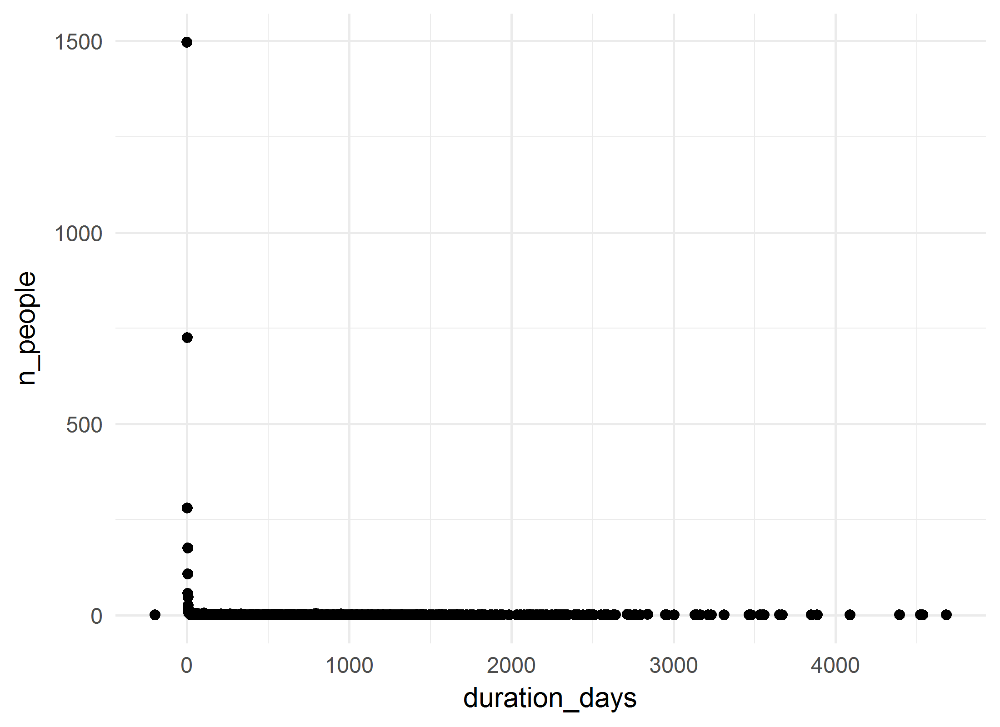
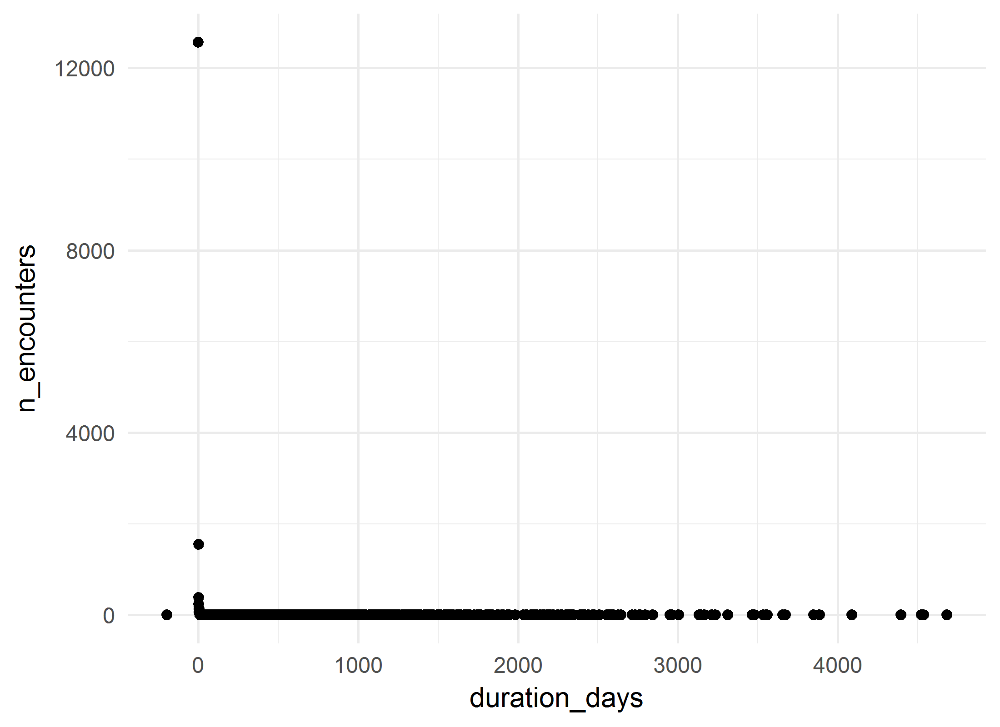
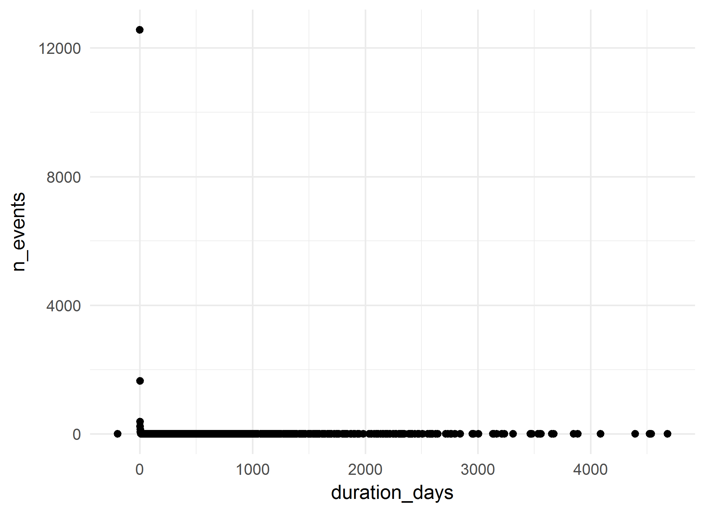

# Respiratory Infections Cohort: Summative analysis
A.Koval, K.Moselle, S.Robertson  
`r Sys.Date()`  

<!-- These two chunks should be added in the beginning of every .Rmd that you want to source an .R script -->
<!--  The 1st mandatory chunck  -->
<!--  Set the working directory to the repository's base directory -->


<!--  The 2nd mandatory chunck  -->
<!-- Set the report-wide options, and point to the external code file. -->


<!-- Load 'sourced' R files.  Suppress the output when loading packages. --> 


<!-- Load the sources.  Suppress the output when loading sources. --> 

# I. Exposition

## Glossary
Review some of the object definition to help you interpret the report. 
<!-- Load any Global functions and variables declared in the R file.  Suppress the output. --> 

```r
# dto_location_map.rds is products of `./manipulation/0-ellis-location-map.R` 
path_input_location_map   <- "./data-unshared/derived/dto_location_map.rds" 
path_input_patient_events <-  "./data-unshared/derived/dto_patient_events_respiratory_1537.rds" # research cohort
# Make sure the files are located where they supposed to be, in `./data-unshared/` folder
testit::assert("File does not exist", base::file.exists(path_input_location_map))
testit::assert("File does not exist", base::file.exists(path_input_patient_events))
# list variables that constitute patient event table
components_patient_events <- c(
  "id"                           # patient unique key
  ,"gender"                      # biological sex
  ,"age_group"                   # in groups of 5 years
  ,"encounter_id"                # unique identifier for the encounter 
  ,"encounter_class"             # value from the D_Location dimension table in the data warehous
  ,"encounter_type"              # value from the D_Location dimension table in the data warehous
  ,"event_type"                  # high-level classification of the event (encounter itself, diagnosis, procedure, clinical order, laboratory, pharmacy event, etc.).           
  ,"event_title"                 # a shorter, more rolled up category describing the event
  ,"event_detail"                # description of the event, can be long and specific
  ,"event_count"                 # count of the events in the row- each row has a value of 1, and can be summed
  ,"event_year"                  # year in which event occurred 
  ,"event_month"                 # month in which event occured
  ,"event_start_date"            # might be the date of the event itself (e.g. date of diagnosis) or the start date of the encounter that the event is associated with     
  ,"event_end_date"              # might be the end date of the event itself (e.g. end date of prescriptions) or the end date of the encounter that the event is associated with
  ,"start_day"                   # number of days between the first day the patient accessed Island Health services and the start date of this event. This is useful to mask dates, but still provides the relative time between events.
  ,"end_day"                     # number of days between the first day the patient accessed Island Health services and the end date of this event. This is useful to mask dates, but still provides the relative time between events.            
  ,"duration_days"               # number of days between the Start_Day and End_Day (End_Day - Start_Day)
  ,"addiction_location_count"    # patient has accessed services at a location that was used for the selection of the cohort
  ,"location_map_id"             # unique id for VIHA program, connects to location map
  ,"palette_code"                # unique id for colours of this palette
  ,"palette_colour_name"         # labels for clusters of service programs (aka 3T palette colours)
)
# list variables that consitute location map table
components_location_map <- c(
  "location_map_id"              # unique id for VIHA program, connects to patient events
  , "site_name"                  # CERNER address          # EHR address   
  , "facility_name"              # CERNER address          # EHR address   
  , "building_name"              # CERNER address          # EHR address   
  , "unit_name"                  # CERNER address          # EHR address   
  , "location_category"          # Data Warehouse address  # EHR address           
  , "location_type"              # Data Warehouse address  # EHR address           
  , "location_grouping"          # Data Warehouse address  # EHR address            
  , "site_key"                   # Factual counterparts to CERNER address
  , "facility_key"               # Factual counterparts to CERNER address
  , "building_key"               # Factual counterparts to CERNER address
  , "unit_key"                   # Factual counterparts to CERNER address
  , "intensity_type"             # Classifier, Compressor, Lense
  , "intensity_severity_risk"    # Classifier, Compressor, Lense
  , "clinical_focus"             # Classifier, Compressor, Lense
  , "service_type"               # Classifier, Compressor, Lense
  , "service_location"           # Classifier, Compressor, Lense
  , "population_age"             # Classifier, Compressor, Lense
  , "provider_mix"               # Classifier, Compressor, Lense
  , "location_class_code"        # Program Class, identifier
  , "location_class_description" # Porgram Class, Descriptive label
  , "palette_code"               # Palette,  identifier       # cluster specific     
  , "palette_colour_name"        # Palette, descriptive label # cluster specific            
)

# define output format for the report
options(
  knitr.table.format = "html"
  ,tibble.width = 110
  #   ,bootstrap_options = c("striped", "hover", "condensed","responsive")
)
```


<!-- Declare any global functions specific to a Rmd output.  Suppress the output. --> 


## Load Data
<!-- Load the datasets.   -->

```r
ds_patient_events <- readRDS(path_input_patient_events) # %>% as.data.frame()
ds_location_map   <- readRDS(path_input_location_map)

ds_patient_events  %>% glimpse()
ds_location_map %>% glimpse()
```

<!-- Inspect the datasets.   -->


## Data Tweaks
<!-- Tweak the datasets.   -->

```r
# augment the event table with additional columns from location map
ds <- dplyr::left_join(
  ds_patient_events,             # patient event table
  ds_location_map %>%         # location map 
    dplyr::select_(.dots = components_location_map)
  ,by = c("location_map_id","palette_code","palette_colour_name") 
) %>% 
  dplyr::mutate(
    location_class_description_display    = substr(location_class_description,1,42)
    ,palette_colour_name_display = substr(palette_colour_name,1,42)
  )
ds_location_map %>% glimpse()
# from this point on, ds_location_map is needed only for selective reference
ds %>% glimpse()
# ds now contains full coordinates to events of the cohort down to unit level
# ehr_address + location_classifiers + palette_colours
```

# II. Patient Events
The main data set `ds` contains both patient events table and their location map coordinates.

```r
# the data object containing events and location map 
ds %>% glimpse()
```

```
Observations: 16,089
Variables: 43
$ id                                 <chr> "10D0J3", "10D0J3", "10D0J3", "10D0J3", "10D0J3", "10D0J3", "1...
$ gender                             <chr> "Male", "Male", "Male", "Male", "Male", "Male", "Male", "Male"...
$ age_group                          <chr> "<1", "<1", "01 - 04", "<1", "01 - 04", "01 - 04", "01 - 04", ...
$ encounter_id                       <chr> "10B50234", "21CA57A4", "2278EBA4", "26A5CAA4", "36AB6484", "4...
$ encounter_class                    <chr> "Emergency", "Inpatient", "Emergency", "Emergency", "Emergency...
$ encounter_type                     <chr> "Emergency", "Newborn", "Emergency", "Emergency", "Emergency",...
$ event_type                         <chr> "Encounter Only", "Encounter Only", "Encounter Only", "Encount...
$ event_title                        <chr> NA, "Child, Youth & Family", NA, NA, NA, "Surgery", NA, "Child...
$ event_detail                       <chr> NA, "Newborn", NA, NA, NA, "Oral/Dental Family Practice", NA, ...
$ event_count                        <int> 1, 1, 1, 1, 1, 1, 1, 1, 1, 1, 1, 1, 1, 1, 1, 1, 1, 1, 1, 1, 1,...
$ event_year                         <int> 2012, 2011, 2013, 2012, 2014, 2016, 2013, 2013, 2012, 2016, 20...
$ event_month                        <int> 9, 10, 3, 4, 11, 6, 4, 3, 11, 3, 3, 7, 2, 4, 7, 3, 2, 7, 9, 11...
$ event_start_date                   <date> 2012-09-27, 2011-10-04, 2013-03-27, 2012-04-18, 2014-11-24, 2...
$ event_end_date                     <date> 2012-09-27, 2011-10-06, 2013-03-27, 2012-04-19, 2014-11-24, 2...
$ start_day                          <int> 359, 0, 540, 197, 1147, 1716, 558, 540, 412, 1616, 1617, 109, ...
$ end_day                            <int> 359, 2, 540, 198, 1147, 1716, 558, 543, 412, 1616, 1617, 109, ...
$ duration_days                      <int> 0, 2, 0, 1, 0, 0, 0, 3, 0, 0, 0, 0, 0, 726, 0, 0, 115, 0, 0, 1...
$ addiction_location_count           <int> 0, 0, 0, 0, 0, 0, 0, 0, 0, 0, 0, 0, 0, 0, 0, 0, 0, 0, 0, 0, 0,...
$ location_map_id                    <int> 934, 1490, 934, 934, 934, 625, 934, 688, 934, 1032, 1032, 639,...
$ palette_code                       <int> 28, 6, 28, 28, 28, 93, 28, 5, 28, 28, 28, 36, 36, 85, 36, 36, ...
$ palette_colour_name                <chr> "ED - Med-Surg", "Acute Care - Maternity, Perinatal", "ED - Me...
$ site_name                          <chr> "Victoria General Hospital", "Victoria General Hospital", "Vic...
$ facility_name                      <chr> "Victoria General - Acute Care", "Victoria General - Acute Car...
$ building_name                      <chr> "Victoria General - Acute Care", "Victoria General - Acute Car...
$ unit_name                          <chr> "VGH - Emergency", "VGH - South 3AB - Perinatal Services", "VG...
$ location_category                  <chr> "Emergency Room", "Inpatient-Acute", "Emergency Room", "Emerge...
$ location_type                      <chr> "ER-General", "InPt-Acute-Mat", "ER-General", "ER-General", "E...
$ location_grouping                  <chr> "Emergency-General", "Inpatient-Acute-Maternity", "Emergency-G...
$ site_key                           <chr> NA, NA, NA, NA, NA, NA, NA, NA, NA, NA, NA, NA, NA, NA, NA, NA...
$ facility_key                       <chr> "VGHAC", "VGHAC", "VGHAC", "VGHAC", "VGHAC", "SPHAC", "VGHAC",...
$ building_key                       <chr> "VGH-AC", "VGH-AC", "VGH-AC", "VGH-AC", "VGH-AC", "SPH-AC", "V...
$ unit_key                           <chr> "ER-V", "S3AB", "ER-V", "ER-V", "ER-V", "SDC-S", "ER-V", "P4CN...
$ intensity_type                     <chr> "ED, Urgent Care, Acute", "ED, Urgent Care, Acute", "ED, Urgen...
$ intensity_severity_risk            <chr> "Emergent-Hospital", "Acute Care", "Emergent-Hospital", "Emerg...
$ clinical_focus                     <chr> "Emergency Response", "Maternity, Perinatal", "Emergency Respo...
$ service_type                       <chr> "ED-Medical", "Maternity", "ED-Medical", "ED-Medical", "ED-Med...
$ service_location                   <chr> "Hospital", "Hospital", "Hospital", "Hospital", "Hospital", "H...
$ population_age                     <chr> "Mixed Ages", "Mother-Baby", "Mixed Ages", "Mixed Ages", "Mixe...
$ provider_mix                       <chr> "Physician, nurse delivered", "Physician directed, nursing del...
$ location_class_code                <int> 78, 68, 78, 78, 78, 140, 78, 70, 78, 78, 78, 146, 146, 38, 146...
$ location_class_description         <chr> "ED - Med-Surg", "Acute Care - Maternity, Perinatal", "ED - Me...
$ location_class_description_display <chr> "ED - Med-Surg", "Acute Care - Maternity, Perinatal", "ED - Me...
$ palette_colour_name_display        <chr> "ED - Med-Surg", "Acute Care - Maternity, Perinatal", "ED - Me...
```

```r
# What variables relate to patient event table?
# What variables relate to locations at which events took place?
# How many unique values does each variable/column contain? 
ds %>% select_(.dots=components_patient_events) %>% summarise_all(dplyr::n_distinct) %>% t() 
```

```
                          [,1]
id                        1537
gender                       2
age_group                   13
encounter_id             15991
encounter_class              7
encounter_type              16
event_type                   2
event_title                 46
event_detail                82
event_count                  1
event_year                  17
event_month                 13
event_start_date          2442
event_end_date            2250
start_day                 2884
end_day                   2989
duration_days              670
addiction_location_count     2
location_map_id            523
palette_code                66
palette_colour_name         66
```

```r
ds %>% select_(.dots=components_location_map) %>% summarise_all(dplyr::n_distinct) %>% t() 
```

```
                           [,1]
location_map_id             523
site_name                    41
facility_name                82
building_name               115
unit_name                   394
location_category            10
location_type                36
location_grouping            22
site_key                      1
facility_key                 63
building_key                104
unit_key                    335
intensity_type               14
intensity_severity_risk      28
clinical_focus               35
service_type                 36
service_location             13
population_age                7
provider_mix                 17
location_class_code          91
location_class_description   91
palette_code                 66
palette_colour_name          66
```

```r
# they share / connected by the fields:
intersect(components_patient_events, components_location_map)
```

```
[1] "location_map_id"     "palette_code"        "palette_colour_name"
```

## Overview

```r
# PET - Patient Event Table
# How many patients are in this cohort?
ds %>% distinct(id) %>% count() %>% neat()
```

<?xml version="1.0" encoding="UTF-8"?>
<table class="table table-striped table-hover table-condensed table-responsive" style="width: auto !important; text-align: right;">
 <thead>
  <tr>
   <th style="text-align:right;"> n </th>
  </tr>
 </thead>
<tbody>
  <tr>
   <td style="text-align:right;"> 1537 </td>
  </tr>
</tbody>
</table>

```r
# What are basic demographics?
ds %>% unique_sums(c("gender")) %>% arrange(desc(n_people)) %>% neat()
```

<?xml version="1.0" encoding="UTF-8"?>
<table class="table table-striped table-hover table-condensed table-responsive" style="width: auto !important; text-align: right;">
 <thead>
  <tr>
   <th style="text-align:left;"> gender </th>
   <th style="text-align:right;"> n_people </th>
   <th style="text-align:right;"> n_encounters </th>
   <th style="text-align:right;"> n_events </th>
  </tr>
 </thead>
<tbody>
  <tr>
   <td style="text-align:left;"> Male </td>
   <td style="text-align:right;"> 1012 </td>
   <td style="text-align:right;"> 10163 </td>
   <td style="text-align:right;"> 10220 </td>
  </tr>
  <tr>
   <td style="text-align:left;"> Female </td>
   <td style="text-align:right;"> 525 </td>
   <td style="text-align:right;"> 5828 </td>
   <td style="text-align:right;"> 5869 </td>
  </tr>
</tbody>
</table>

```r
ds %>% unique_sums(c("age_group"))  %>%  neat()
```

<?xml version="1.0" encoding="UTF-8"?>
<table class="table table-striped table-hover table-condensed table-responsive" style="width: auto !important; text-align: right;">
 <thead>
  <tr>
   <th style="text-align:left;"> age_group </th>
   <th style="text-align:right;"> n_people </th>
   <th style="text-align:right;"> n_encounters </th>
   <th style="text-align:right;"> n_events </th>
  </tr>
 </thead>
<tbody>
  <tr>
   <td style="text-align:left;"> &lt;1 </td>
   <td style="text-align:right;"> 243 </td>
   <td style="text-align:right;"> 1423 </td>
   <td style="text-align:right;"> 1437 </td>
  </tr>
  <tr>
   <td style="text-align:left;"> 01 - 04 </td>
   <td style="text-align:right;"> 569 </td>
   <td style="text-align:right;"> 4474 </td>
   <td style="text-align:right;"> 4491 </td>
  </tr>
  <tr>
   <td style="text-align:left;"> 05 - 09 </td>
   <td style="text-align:right;"> 829 </td>
   <td style="text-align:right;"> 4296 </td>
   <td style="text-align:right;"> 4346 </td>
  </tr>
  <tr>
   <td style="text-align:left;"> 10 - 14 </td>
   <td style="text-align:right;"> 727 </td>
   <td style="text-align:right;"> 3596 </td>
   <td style="text-align:right;"> 3609 </td>
  </tr>
  <tr>
   <td style="text-align:left;"> 15 - 19 </td>
   <td style="text-align:right;"> 291 </td>
   <td style="text-align:right;"> 1659 </td>
   <td style="text-align:right;"> 1663 </td>
  </tr>
  <tr>
   <td style="text-align:left;"> 20 - 24 </td>
   <td style="text-align:right;"> 47 </td>
   <td style="text-align:right;"> 205 </td>
   <td style="text-align:right;"> 205 </td>
  </tr>
  <tr>
   <td style="text-align:left;"> 25 - 29 </td>
   <td style="text-align:right;"> 2 </td>
   <td style="text-align:right;"> 17 </td>
   <td style="text-align:right;"> 17 </td>
  </tr>
  <tr>
   <td style="text-align:left;"> 30 - 34 </td>
   <td style="text-align:right;"> 3 </td>
   <td style="text-align:right;"> 31 </td>
   <td style="text-align:right;"> 31 </td>
  </tr>
  <tr>
   <td style="text-align:left;"> 35 - 39 </td>
   <td style="text-align:right;"> 2 </td>
   <td style="text-align:right;"> 30 </td>
   <td style="text-align:right;"> 30 </td>
  </tr>
  <tr>
   <td style="text-align:left;"> 40 - 44 </td>
   <td style="text-align:right;"> 6 </td>
   <td style="text-align:right;"> 70 </td>
   <td style="text-align:right;"> 70 </td>
  </tr>
  <tr>
   <td style="text-align:left;"> 45 - 49 </td>
   <td style="text-align:right;"> 5 </td>
   <td style="text-align:right;"> 74 </td>
   <td style="text-align:right;"> 74 </td>
  </tr>
  <tr>
   <td style="text-align:left;"> 50 - 54 </td>
   <td style="text-align:right;"> 2 </td>
   <td style="text-align:right;"> 25 </td>
   <td style="text-align:right;"> 25 </td>
  </tr>
  <tr>
   <td style="text-align:left;"> No value </td>
   <td style="text-align:right;"> 72 </td>
   <td style="text-align:right;"> 91 </td>
   <td style="text-align:right;"> 91 </td>
  </tr>
</tbody>
</table>

```r
ds %>% unique_sums(c("gender","age_group")) %>%  neat()
```

<?xml version="1.0" encoding="UTF-8"?>
<table class="table table-striped table-hover table-condensed table-responsive" style="width: auto !important; text-align: right;">
 <thead>
  <tr>
   <th style="text-align:left;"> gender </th>
   <th style="text-align:left;"> age_group </th>
   <th style="text-align:right;"> n_people </th>
   <th style="text-align:right;"> n_encounters </th>
   <th style="text-align:right;"> n_events </th>
  </tr>
 </thead>
<tbody>
  <tr>
   <td style="text-align:left;"> Female </td>
   <td style="text-align:left;"> &lt;1 </td>
   <td style="text-align:right;"> 83 </td>
   <td style="text-align:right;"> 493 </td>
   <td style="text-align:right;"> 501 </td>
  </tr>
  <tr>
   <td style="text-align:left;"> Female </td>
   <td style="text-align:left;"> 01 - 04 </td>
   <td style="text-align:right;"> 180 </td>
   <td style="text-align:right;"> 1415 </td>
   <td style="text-align:right;"> 1421 </td>
  </tr>
  <tr>
   <td style="text-align:left;"> Female </td>
   <td style="text-align:left;"> 05 - 09 </td>
   <td style="text-align:right;"> 265 </td>
   <td style="text-align:right;"> 1646 </td>
   <td style="text-align:right;"> 1670 </td>
  </tr>
  <tr>
   <td style="text-align:left;"> Female </td>
   <td style="text-align:left;"> 10 - 14 </td>
   <td style="text-align:right;"> 266 </td>
   <td style="text-align:right;"> 1335 </td>
   <td style="text-align:right;"> 1338 </td>
  </tr>
  <tr>
   <td style="text-align:left;"> Female </td>
   <td style="text-align:left;"> 15 - 19 </td>
   <td style="text-align:right;"> 103 </td>
   <td style="text-align:right;"> 617 </td>
   <td style="text-align:right;"> 617 </td>
  </tr>
  <tr>
   <td style="text-align:left;"> Female </td>
   <td style="text-align:left;"> 20 - 24 </td>
   <td style="text-align:right;"> 18 </td>
   <td style="text-align:right;"> 48 </td>
   <td style="text-align:right;"> 48 </td>
  </tr>
  <tr>
   <td style="text-align:left;"> Female </td>
   <td style="text-align:left;"> 25 - 29 </td>
   <td style="text-align:right;"> 2 </td>
   <td style="text-align:right;"> 17 </td>
   <td style="text-align:right;"> 17 </td>
  </tr>
  <tr>
   <td style="text-align:left;"> Female </td>
   <td style="text-align:left;"> 30 - 34 </td>
   <td style="text-align:right;"> 3 </td>
   <td style="text-align:right;"> 31 </td>
   <td style="text-align:right;"> 31 </td>
  </tr>
  <tr>
   <td style="text-align:left;"> Female </td>
   <td style="text-align:left;"> 35 - 39 </td>
   <td style="text-align:right;"> 2 </td>
   <td style="text-align:right;"> 30 </td>
   <td style="text-align:right;"> 30 </td>
  </tr>
  <tr>
   <td style="text-align:left;"> Female </td>
   <td style="text-align:left;"> 40 - 44 </td>
   <td style="text-align:right;"> 6 </td>
   <td style="text-align:right;"> 70 </td>
   <td style="text-align:right;"> 70 </td>
  </tr>
  <tr>
   <td style="text-align:left;"> Female </td>
   <td style="text-align:left;"> 45 - 49 </td>
   <td style="text-align:right;"> 5 </td>
   <td style="text-align:right;"> 74 </td>
   <td style="text-align:right;"> 74 </td>
  </tr>
  <tr>
   <td style="text-align:left;"> Female </td>
   <td style="text-align:left;"> 50 - 54 </td>
   <td style="text-align:right;"> 2 </td>
   <td style="text-align:right;"> 25 </td>
   <td style="text-align:right;"> 25 </td>
  </tr>
  <tr>
   <td style="text-align:left;"> Female </td>
   <td style="text-align:left;"> No value </td>
   <td style="text-align:right;"> 19 </td>
   <td style="text-align:right;"> 27 </td>
   <td style="text-align:right;"> 27 </td>
  </tr>
  <tr>
   <td style="text-align:left;"> Male </td>
   <td style="text-align:left;"> &lt;1 </td>
   <td style="text-align:right;"> 160 </td>
   <td style="text-align:right;"> 930 </td>
   <td style="text-align:right;"> 936 </td>
  </tr>
  <tr>
   <td style="text-align:left;"> Male </td>
   <td style="text-align:left;"> 01 - 04 </td>
   <td style="text-align:right;"> 389 </td>
   <td style="text-align:right;"> 3059 </td>
   <td style="text-align:right;"> 3070 </td>
  </tr>
  <tr>
   <td style="text-align:left;"> Male </td>
   <td style="text-align:left;"> 05 - 09 </td>
   <td style="text-align:right;"> 564 </td>
   <td style="text-align:right;"> 2650 </td>
   <td style="text-align:right;"> 2676 </td>
  </tr>
  <tr>
   <td style="text-align:left;"> Male </td>
   <td style="text-align:left;"> 10 - 14 </td>
   <td style="text-align:right;"> 461 </td>
   <td style="text-align:right;"> 2261 </td>
   <td style="text-align:right;"> 2271 </td>
  </tr>
  <tr>
   <td style="text-align:left;"> Male </td>
   <td style="text-align:left;"> 15 - 19 </td>
   <td style="text-align:right;"> 188 </td>
   <td style="text-align:right;"> 1042 </td>
   <td style="text-align:right;"> 1046 </td>
  </tr>
  <tr>
   <td style="text-align:left;"> Male </td>
   <td style="text-align:left;"> 20 - 24 </td>
   <td style="text-align:right;"> 29 </td>
   <td style="text-align:right;"> 157 </td>
   <td style="text-align:right;"> 157 </td>
  </tr>
  <tr>
   <td style="text-align:left;"> Male </td>
   <td style="text-align:left;"> No value </td>
   <td style="text-align:right;"> 53 </td>
   <td style="text-align:right;"> 64 </td>
   <td style="text-align:right;"> 64 </td>
  </tr>
</tbody>
</table>

## DW tags

```r
# how may unique encounters are there in this set?
ds %>% distinct(encounter_id) %>% count() %>% neat()
```

<?xml version="1.0" encoding="UTF-8"?>
<table class="table table-striped table-hover table-condensed table-responsive" style="width: auto !important; text-align: right;">
 <thead>
  <tr>
   <th style="text-align:right;"> n </th>
  </tr>
 </thead>
<tbody>
  <tr>
   <td style="text-align:right;"> 15991 </td>
  </tr>
</tbody>
</table>

```r
# tally engagement across encounter classes (as defined by data warehouse)
ds %>% unique_sums("encounter_class")%>% arrange(desc(n_people)) %>% neat()
```

<?xml version="1.0" encoding="UTF-8"?>
<table class="table table-striped table-hover table-condensed table-responsive" style="width: auto !important; text-align: right;">
 <thead>
  <tr>
   <th style="text-align:left;"> encounter_class </th>
   <th style="text-align:right;"> n_people </th>
   <th style="text-align:right;"> n_encounters </th>
   <th style="text-align:right;"> n_events </th>
  </tr>
 </thead>
<tbody>
  <tr>
   <td style="text-align:left;"> Emergency </td>
   <td style="text-align:right;"> 1358 </td>
   <td style="text-align:right;"> 7300 </td>
   <td style="text-align:right;"> 7317 </td>
  </tr>
  <tr>
   <td style="text-align:left;"> Outpatient </td>
   <td style="text-align:right;"> 1122 </td>
   <td style="text-align:right;"> 5350 </td>
   <td style="text-align:right;"> 5356 </td>
  </tr>
  <tr>
   <td style="text-align:left;"> Inpatient </td>
   <td style="text-align:right;"> 651 </td>
   <td style="text-align:right;"> 1614 </td>
   <td style="text-align:right;"> 1646 </td>
  </tr>
  <tr>
   <td style="text-align:left;"> Recurring </td>
   <td style="text-align:right;"> 472 </td>
   <td style="text-align:right;"> 943 </td>
   <td style="text-align:right;"> 966 </td>
  </tr>
  <tr>
   <td style="text-align:left;"> Other </td>
   <td style="text-align:right;"> 401 </td>
   <td style="text-align:right;"> 756 </td>
   <td style="text-align:right;"> 776 </td>
  </tr>
  <tr>
   <td style="text-align:left;"> Home Care </td>
   <td style="text-align:right;"> 16 </td>
   <td style="text-align:right;"> 26 </td>
   <td style="text-align:right;"> 26 </td>
  </tr>
  <tr>
   <td style="text-align:left;"> Cancelled Admission </td>
   <td style="text-align:right;"> 2 </td>
   <td style="text-align:right;"> 2 </td>
   <td style="text-align:right;"> 2 </td>
  </tr>
</tbody>
</table>

```r
ds %>% unique_sums("encounter_type") %>% arrange(desc(n_people)) %>% neat()
```

<?xml version="1.0" encoding="UTF-8"?>
<table class="table table-striped table-hover table-condensed table-responsive" style="width: auto !important; text-align: right;">
 <thead>
  <tr>
   <th style="text-align:left;"> encounter_type </th>
   <th style="text-align:right;"> n_people </th>
   <th style="text-align:right;"> n_encounters </th>
   <th style="text-align:right;"> n_events </th>
  </tr>
 </thead>
<tbody>
  <tr>
   <td style="text-align:left;"> Emergency </td>
   <td style="text-align:right;"> 1358 </td>
   <td style="text-align:right;"> 7300 </td>
   <td style="text-align:right;"> 7317 </td>
  </tr>
  <tr>
   <td style="text-align:left;"> Ambulatory </td>
   <td style="text-align:right;"> 1044 </td>
   <td style="text-align:right;"> 4991 </td>
   <td style="text-align:right;"> 4996 </td>
  </tr>
  <tr>
   <td style="text-align:left;"> Inpatient Acute </td>
   <td style="text-align:right;"> 651 </td>
   <td style="text-align:right;"> 1428 </td>
   <td style="text-align:right;"> 1459 </td>
  </tr>
  <tr>
   <td style="text-align:left;"> Open Encounter </td>
   <td style="text-align:right;"> 470 </td>
   <td style="text-align:right;"> 939 </td>
   <td style="text-align:right;"> 962 </td>
  </tr>
  <tr>
   <td style="text-align:left;"> Specimen </td>
   <td style="text-align:right;"> 353 </td>
   <td style="text-align:right;"> 669 </td>
   <td style="text-align:right;"> 689 </td>
  </tr>
  <tr>
   <td style="text-align:left;"> Day Care </td>
   <td style="text-align:right;"> 278 </td>
   <td style="text-align:right;"> 359 </td>
   <td style="text-align:right;"> 360 </td>
  </tr>
  <tr>
   <td style="text-align:left;"> Newborn </td>
   <td style="text-align:right;"> 180 </td>
   <td style="text-align:right;"> 180 </td>
   <td style="text-align:right;"> 181 </td>
  </tr>
  <tr>
   <td style="text-align:left;"> Waitlist </td>
   <td style="text-align:right;"> 64 </td>
   <td style="text-align:right;"> 83 </td>
   <td style="text-align:right;"> 83 </td>
  </tr>
  <tr>
   <td style="text-align:left;"> Home Care </td>
   <td style="text-align:right;"> 16 </td>
   <td style="text-align:right;"> 26 </td>
   <td style="text-align:right;"> 26 </td>
  </tr>
  <tr>
   <td style="text-align:left;"> Recurring/Series </td>
   <td style="text-align:right;"> 4 </td>
   <td style="text-align:right;"> 4 </td>
   <td style="text-align:right;"> 4 </td>
  </tr>
  <tr>
   <td style="text-align:left;"> Morgue </td>
   <td style="text-align:right;"> 3 </td>
   <td style="text-align:right;"> 3 </td>
   <td style="text-align:right;"> 3 </td>
  </tr>
  <tr>
   <td style="text-align:left;"> Cancelled Admission </td>
   <td style="text-align:right;"> 2 </td>
   <td style="text-align:right;"> 2 </td>
   <td style="text-align:right;"> 2 </td>
  </tr>
  <tr>
   <td style="text-align:left;"> Lifetime </td>
   <td style="text-align:right;"> 1 </td>
   <td style="text-align:right;"> 1 </td>
   <td style="text-align:right;"> 1 </td>
  </tr>
  <tr>
   <td style="text-align:left;"> MHAS - Acute Care </td>
   <td style="text-align:right;"> 1 </td>
   <td style="text-align:right;"> 4 </td>
   <td style="text-align:right;"> 4 </td>
  </tr>
  <tr>
   <td style="text-align:left;"> MHAS - Residential </td>
   <td style="text-align:right;"> 1 </td>
   <td style="text-align:right;"> 1 </td>
   <td style="text-align:right;"> 1 </td>
  </tr>
  <tr>
   <td style="text-align:left;"> Research </td>
   <td style="text-align:right;"> 1 </td>
   <td style="text-align:right;"> 1 </td>
   <td style="text-align:right;"> 1 </td>
  </tr>
</tbody>
</table>

```r
ds %>% unique_sums(c("encounter_class","encounter_type"))%>% arrange(desc(encounter_class,n_people)) %>% neat()
```

<?xml version="1.0" encoding="UTF-8"?>
<table class="table table-striped table-hover table-condensed table-responsive" style="width: auto !important; text-align: right;">
 <thead>
  <tr>
   <th style="text-align:left;"> encounter_class </th>
   <th style="text-align:left;"> encounter_type </th>
   <th style="text-align:right;"> n_people </th>
   <th style="text-align:right;"> n_encounters </th>
   <th style="text-align:right;"> n_events </th>
  </tr>
 </thead>
<tbody>
  <tr>
   <td style="text-align:left;"> Recurring </td>
   <td style="text-align:left;"> Open Encounter </td>
   <td style="text-align:right;"> 470 </td>
   <td style="text-align:right;"> 939 </td>
   <td style="text-align:right;"> 962 </td>
  </tr>
  <tr>
   <td style="text-align:left;"> Recurring </td>
   <td style="text-align:left;"> Recurring/Series </td>
   <td style="text-align:right;"> 4 </td>
   <td style="text-align:right;"> 4 </td>
   <td style="text-align:right;"> 4 </td>
  </tr>
  <tr>
   <td style="text-align:left;"> Outpatient </td>
   <td style="text-align:left;"> Ambulatory </td>
   <td style="text-align:right;"> 1044 </td>
   <td style="text-align:right;"> 4991 </td>
   <td style="text-align:right;"> 4996 </td>
  </tr>
  <tr>
   <td style="text-align:left;"> Outpatient </td>
   <td style="text-align:left;"> Day Care </td>
   <td style="text-align:right;"> 278 </td>
   <td style="text-align:right;"> 359 </td>
   <td style="text-align:right;"> 360 </td>
  </tr>
  <tr>
   <td style="text-align:left;"> Other </td>
   <td style="text-align:left;"> Morgue </td>
   <td style="text-align:right;"> 3 </td>
   <td style="text-align:right;"> 3 </td>
   <td style="text-align:right;"> 3 </td>
  </tr>
  <tr>
   <td style="text-align:left;"> Other </td>
   <td style="text-align:left;"> Research </td>
   <td style="text-align:right;"> 1 </td>
   <td style="text-align:right;"> 1 </td>
   <td style="text-align:right;"> 1 </td>
  </tr>
  <tr>
   <td style="text-align:left;"> Other </td>
   <td style="text-align:left;"> Specimen </td>
   <td style="text-align:right;"> 353 </td>
   <td style="text-align:right;"> 669 </td>
   <td style="text-align:right;"> 689 </td>
  </tr>
  <tr>
   <td style="text-align:left;"> Other </td>
   <td style="text-align:left;"> Waitlist </td>
   <td style="text-align:right;"> 64 </td>
   <td style="text-align:right;"> 83 </td>
   <td style="text-align:right;"> 83 </td>
  </tr>
  <tr>
   <td style="text-align:left;"> Inpatient </td>
   <td style="text-align:left;"> Inpatient Acute </td>
   <td style="text-align:right;"> 651 </td>
   <td style="text-align:right;"> 1428 </td>
   <td style="text-align:right;"> 1459 </td>
  </tr>
  <tr>
   <td style="text-align:left;"> Inpatient </td>
   <td style="text-align:left;"> Lifetime </td>
   <td style="text-align:right;"> 1 </td>
   <td style="text-align:right;"> 1 </td>
   <td style="text-align:right;"> 1 </td>
  </tr>
  <tr>
   <td style="text-align:left;"> Inpatient </td>
   <td style="text-align:left;"> MHAS - Acute Care </td>
   <td style="text-align:right;"> 1 </td>
   <td style="text-align:right;"> 4 </td>
   <td style="text-align:right;"> 4 </td>
  </tr>
  <tr>
   <td style="text-align:left;"> Inpatient </td>
   <td style="text-align:left;"> MHAS - Residential </td>
   <td style="text-align:right;"> 1 </td>
   <td style="text-align:right;"> 1 </td>
   <td style="text-align:right;"> 1 </td>
  </tr>
  <tr>
   <td style="text-align:left;"> Inpatient </td>
   <td style="text-align:left;"> Newborn </td>
   <td style="text-align:right;"> 180 </td>
   <td style="text-align:right;"> 180 </td>
   <td style="text-align:right;"> 181 </td>
  </tr>
  <tr>
   <td style="text-align:left;"> Home Care </td>
   <td style="text-align:left;"> Home Care </td>
   <td style="text-align:right;"> 16 </td>
   <td style="text-align:right;"> 26 </td>
   <td style="text-align:right;"> 26 </td>
  </tr>
  <tr>
   <td style="text-align:left;"> Emergency </td>
   <td style="text-align:left;"> Emergency </td>
   <td style="text-align:right;"> 1358 </td>
   <td style="text-align:right;"> 7300 </td>
   <td style="text-align:right;"> 7317 </td>
  </tr>
  <tr>
   <td style="text-align:left;"> Cancelled Admission </td>
   <td style="text-align:left;"> Cancelled Admission </td>
   <td style="text-align:right;"> 2 </td>
   <td style="text-align:right;"> 2 </td>
   <td style="text-align:right;"> 2 </td>
  </tr>
</tbody>
</table>

## ACRU tags

```r
# how many event types  were there?
ds %>% unique_sums("event_type") %>% arrange(desc(n_people)) %>% neat()
```

<?xml version="1.0" encoding="UTF-8"?>
<table class="table table-striped table-hover table-condensed table-responsive" style="width: auto !important; text-align: right;">
 <thead>
  <tr>
   <th style="text-align:left;"> event_type </th>
   <th style="text-align:right;"> n_people </th>
   <th style="text-align:right;"> n_encounters </th>
   <th style="text-align:right;"> n_events </th>
  </tr>
 </thead>
<tbody>
  <tr>
   <td style="text-align:left;"> Encounter Only </td>
   <td style="text-align:right;"> 1536 </td>
   <td style="text-align:right;"> 15729 </td>
   <td style="text-align:right;"> 15729 </td>
  </tr>
  <tr>
   <td style="text-align:left;"> Organism Identified </td>
   <td style="text-align:right;"> 132 </td>
   <td style="text-align:right;"> 262 </td>
   <td style="text-align:right;"> 360 </td>
  </tr>
</tbody>
</table>

```r
# view event_title and event_details with a dynmaic table 
ds %>% unique_sums(c("event_type","event_title","event_detail"))%>% arrange(desc(n_people)) %>% neat_DT()
```

<!--html_preserve--><div id="htmlwidget-0e0eb8aa11ede264937f" style="width:100%;height:auto;" class="datatables html-widget"></div>
<script type="application/json" data-for="htmlwidget-0e0eb8aa11ede264937f">{"x":{"filter":"top","filterHTML":"<tr>\n  <td><\/td>\n  <td data-type=\"character\" style=\"vertical-align: top;\">\n    <div class=\"form-group has-feedback\" style=\"margin-bottom: auto;\">\n      <input type=\"search\" placeholder=\"All\" class=\"form-control\" style=\"width: 100%;\"/>\n      <span class=\"glyphicon glyphicon-remove-circle form-control-feedback\"><\/span>\n    <\/div>\n  <\/td>\n  <td data-type=\"character\" style=\"vertical-align: top;\">\n    <div class=\"form-group has-feedback\" style=\"margin-bottom: auto;\">\n      <input type=\"search\" placeholder=\"All\" class=\"form-control\" style=\"width: 100%;\"/>\n      <span class=\"glyphicon glyphicon-remove-circle form-control-feedback\"><\/span>\n    <\/div>\n  <\/td>\n  <td data-type=\"character\" style=\"vertical-align: top;\">\n    <div class=\"form-group has-feedback\" style=\"margin-bottom: auto;\">\n      <input type=\"search\" placeholder=\"All\" class=\"form-control\" style=\"width: 100%;\"/>\n      <span class=\"glyphicon glyphicon-remove-circle form-control-feedback\"><\/span>\n    <\/div>\n  <\/td>\n  <td data-type=\"integer\" style=\"vertical-align: top;\">\n    <div class=\"form-group has-feedback\" style=\"margin-bottom: auto;\">\n      <input type=\"search\" placeholder=\"All\" class=\"form-control\" style=\"width: 100%;\"/>\n      <span class=\"glyphicon glyphicon-remove-circle form-control-feedback\"><\/span>\n    <\/div>\n    <div style=\"display: none; position: absolute; width: 200px;\">\n      <div data-min=\"1\" data-max=\"1422\"><\/div>\n      <span style=\"float: left;\"><\/span>\n      <span style=\"float: right;\"><\/span>\n    <\/div>\n  <\/td>\n  <td data-type=\"integer\" style=\"vertical-align: top;\">\n    <div class=\"form-group has-feedback\" style=\"margin-bottom: auto;\">\n      <input type=\"search\" placeholder=\"All\" class=\"form-control\" style=\"width: 100%;\"/>\n      <span class=\"glyphicon glyphicon-remove-circle form-control-feedback\"><\/span>\n    <\/div>\n    <div style=\"display: none; position: absolute; width: 200px;\">\n      <div data-min=\"1\" data-max=\"8886\"><\/div>\n      <span style=\"float: left;\"><\/span>\n      <span style=\"float: right;\"><\/span>\n    <\/div>\n  <\/td>\n  <td data-type=\"integer\" style=\"vertical-align: top;\">\n    <div class=\"form-group has-feedback\" style=\"margin-bottom: auto;\">\n      <input type=\"search\" placeholder=\"All\" class=\"form-control\" style=\"width: 100%;\"/>\n      <span class=\"glyphicon glyphicon-remove-circle form-control-feedback\"><\/span>\n    <\/div>\n    <div style=\"display: none; position: absolute; width: 200px;\">\n      <div data-min=\"1\" data-max=\"8886\"><\/div>\n      <span style=\"float: left;\"><\/span>\n      <span style=\"float: right;\"><\/span>\n    <\/div>\n  <\/td>\n<\/tr>","data":[["1","2","3","4","5","6","7","8","9","10","11","12","13","14","15","16","17","18","19","20","21","22","23","24","25","26","27","28","29","30","31","32","33","34","35","36","37","38","39","40","41","42","43","44","45","46","47","48","49","50","51","52","53","54","55","56","57","58","59","60","61","62","63","64","65","66","67","68","69","70","71","72","73","74","75","76","77","78","79","80","81","82","83","84","85","86","87","88","89","90","91","92","93","94","95","96","97","98","99","100","101","102","103","104","105","106","107","108","109","110","111","112","113","114","115","116","117","118","119","120","121","122","123","124","125","126","127","128","129","130","131","132","133","134","135","136","137","138","139","140"],["Encounter Only","Encounter Only","Encounter Only","Encounter Only","Encounter Only","Encounter Only","Encounter Only","Encounter Only","Encounter Only","Encounter Only","Encounter Only","Organism Identified","Encounter Only","Encounter Only","Organism Identified","Encounter Only","Organism Identified","Encounter Only","Encounter Only","Encounter Only","Encounter Only","Encounter Only","Organism Identified","Organism Identified","Encounter Only","Encounter Only","Encounter Only","Organism Identified","Organism Identified","Encounter Only","Organism Identified","Encounter Only","Encounter Only","Encounter Only","Encounter Only","Organism Identified","Encounter Only","Encounter Only","Organism Identified","Organism Identified","Organism Identified","Encounter Only","Encounter Only","Organism Identified","Organism Identified","Organism Identified","Organism Identified","Organism Identified","Encounter Only","Encounter Only","Encounter Only","Encounter Only","Organism Identified","Organism Identified","Organism Identified","Organism Identified","Organism Identified","Organism Identified","Organism Identified","Organism Identified","Organism Identified","Organism Identified","Organism Identified","Organism Identified","Organism Identified","Organism Identified","Organism Identified","Encounter Only","Encounter Only","Encounter Only","Encounter Only","Encounter Only","Encounter Only","Encounter Only","Encounter Only","Encounter Only","Encounter Only","Organism Identified","Organism Identified","Organism Identified","Organism Identified","Organism Identified","Organism Identified","Organism Identified","Organism Identified","Organism Identified","Organism Identified","Organism Identified","Organism Identified","Organism Identified","Organism Identified","Organism Identified","Organism Identified","Organism Identified","Organism Identified","Organism Identified","Organism Identified","Organism Identified","Organism Identified","Organism Identified","Organism Identified","Organism Identified","Organism Identified","Organism Identified","Organism Identified","Organism Identified","Organism Identified","Organism Identified","Organism Identified","Organism Identified","Organism Identified","Organism Identified","Organism Identified","Organism Identified","Organism Identified","Organism Identified","Organism Identified","Organism Identified","Organism Identified","Organism Identified","Organism Identified","Organism Identified","Organism Identified","Organism Identified","Organism Identified","Organism Identified","Organism Identified","Organism Identified","Organism Identified","Organism Identified","Organism Identified","Organism Identified","Organism Identified","Organism Identified","Organism Identified","Organism Identified","Organism Identified","Organism Identified","Organism Identified","Organism Identified"],[null,"Child, Youth &amp; Family","Outpatient","Outpatient","Medicine","Child, Youth &amp; Family","Outpatient","Mental Health","Outpatient","Medicine","Surgery","Culture Wound","Surgery","Rehab","Culture Urine","Medicine","Culture Wound","Outpatient","Surgery","Surgery","Surgery","Other","Culture Urine","Culture Wound","Child, Youth &amp; Family","Surgery","Surgery","Urine Culture","Wound Culture","Surgery","Wound Culture","Child, Youth &amp; Family","Neuro-sciences","Medicine","Medicine","Culture Nasal","ALC","Surgery","Culture Blood","Culture Sputum","Culture Wound","Outpatient","Seniors","Culture ARO MRSA Only","Culture Ear","Culture Fluid","Culture Urine","Ear Culture","ICU","Medicine","Nutrition","Surgery","Culture Ear","Culture Sputum","Culture Sputum","Culture Urine","Culture Urine","Culture Urine","Culture Urine","Culture Urine","Culture Urine","Cystic Fibrosis Culture","Deep Swab Culture","Ear Culture","Urine Culture","Urine Culture","Urine Culture","Child, Youth &amp; Family","Child, Youth &amp; Family","Emergency","Heart Health","Medicine","Neuro-sciences","Outpatient","Residential","Surgery","Surgery","ARO Culture","Blood Culture","Blood Culture","Blood Culture","Body Fluid Culture","Body Fluid Culture","Culture ARO MRSA Only","Culture Blood","Culture Blood","Culture Blood","Culture Blood","Culture Bronchial","Culture Bronchial","Culture Cystic Fibrosis","Culture Cystic Fibrosis","Culture Cystic Fibrosis","Culture Deep","Culture Ear","Culture Ear","Culture Ear","Culture Eye","Culture Eye","Culture Fluid","Culture Fluid","Culture Fluid","Culture Fluid","Culture Fluid","Culture Fluid Respiratory","Culture Fluid Respiratory","Culture Genital","Culture Genital","Culture Genital","Culture Genital","Culture Respiratory","Culture Respiratory","Culture Throat","Culture Tip","Culture Urine","Culture Urine","Culture Urine","Culture Urine","Culture Urine","Culture Urine","Culture Urine","Culture Urine","Culture Urine","Culture Urine","Culture Wound","Culture Wound","Cystic Fibrosis Culture","Eye Culture","Genital Culture","Respiratory Culture","Sputum Culture","Sputum Culture","Sputum Culture","Stool Culture","Urine Culture","Urine Culture","Urine Culture","Urine Culture","Wound Culture","Wound Culture"],[null,"Pediatrics","Medical Imaging","Laboratory","Medicine (Unspecified)","Newborn","Outpatient","Adult Psychiatry","Pre-Admission Clinic","Respiratory","Surgery","Staphylococcus aureus","Orthopedic","Acute Rehabilitation","Escherichia coli","Medicine Family Practice","Streptococcus pyogenes (Group A)","Electrodiagnostic Services","Oral/Dental Family Practice","Oral/Dental","Enterology","Anaesthesia","Enterococcus species NOT VRE","Staphylococcus aureus MRSA","Maternity","Plastic","Urology","Escherichia coli","Staphylococcus aureus","Gynecology","Streptococcus pyogenes Group A","Obstetrics","Neurology","Clinical Decision Unit","Medicine Hospitalist","Staphylococcus aureus","ALC: Companion Well Baby","Orthopedic Family Practice","Streptococcus pneumoniae","Haemophilus influenzae","Pseudomonas aeruginosa","PHARM","Seniors at Risk","Staphylococcus aureus MRSA","Streptococcus pneumoniae","Escherichia coli","Enterococcus faecalis","Streptococcus pyogenes Group A","Intensive Care Unit","Internal","Nutrition Services","Opthamology","Staphylococcus aureus MRSA","Staphylococcus aureus","Streptococcus pneumoniae","Citrobacter freundii","Enterobacter cloacae","Klebsiella pneumoniae","Providencia rettgeri","Pseudomonas aeruginosa","Staphylococcus aureus","Staphylococcus aureus","Staphylococcus aureus","Staphylococcus aureus","Enterococcus faecalis","Klebsiella pneumoniae","Staphylococcus epidermidis","Paediatric Medicine","Paediatric Surgery","Emergency","Cardiology","Sub-Acute","Neurology Hospitalist","Primary Care","Family Care Home","Gynecology Family Practice","Surgery Hospitalist","Staphylococcus aureus","Kocuria kristinae","Salmonella species, not typhi","Staphylococcus epidermidis","Escherichia coli","Streptococcus anginosus","Staphylococcus aureus","Escherichia coli","Staphylococcus aureus","Staphylococcus aureus MRSA","Staphylococcus epidermidis","Haemophilus influenzae","Staphylococcus aureus","Escherichia coli","Haemophilus influenzae","Staphylococcus aureus","Staphylococcus aureus","Acinetobacter baumannii","Haemophilus influenzae","Streptococcus pyogenes (Group A)","Staphylococcus aureus","Streptococcus pneumoniae","Anaerobic Gram Positive Bacilli","Staphylococcus aureus","Streptococcus anginosus","Streptococcus anginosus group","Streptococcus pyogenes (Group A)","Candida glabrata","Enterobacter cloacae","Haemophilus parainfluenzae","Staphylococcus aureus","Streptococcus agalactiae (Group B)","Streptococcus pyogenes (Group A)","Escherichia coli","Staphylococcus aureus","Staphylococcus aureus MRSA","Staphylococcus aureus MRSA","Citrobacter koseri","Enterobacter aerogenes","Enterococcus species","Escherichia coli ESBL","Haemophilus parainfluenzae","Isolate","Klebsiella oxytoca","Proteus mirabilis","Streptococcus gallolyticus","Streptococcus pasteurianus","Klebsiella pneumoniae","Staphylococcus lugdunensis","Pseudomonas aeruginosa","Haemophilus influenzae","Haemophilus influenzae","Haemophilus parainfluenzae","Pseudomonas aeruginosa","Streptococcus mitis","Streptococcus pneumoniae","Salmonella species, not typhi","Burkholderia cepacia","Enterobacter aerogenes","Enterobacter cloacae","Providencia rettgeri","Aeromonas hydrophila complex","Staphylococcus lugdunensis"],[1422,746,603,602,217,180,113,91,55,44,40,40,39,29,27,26,25,23,23,17,15,11,11,11,8,8,8,8,8,7,7,6,6,5,5,5,4,4,4,4,4,3,3,3,3,3,3,3,2,2,2,2,2,2,2,2,2,2,2,2,2,2,2,2,2,2,2,1,1,1,1,1,1,1,1,1,1,1,1,1,1,1,1,1,1,1,1,1,1,1,1,1,1,1,1,1,1,1,1,1,1,1,1,1,1,1,1,1,1,1,1,1,1,1,1,1,1,1,1,1,1,1,1,1,1,1,1,1,1,1,1,1,1,1,1,1,1,1,1,1],[8886,2056,1296,1642,412,185,405,284,68,56,47,51,95,44,49,37,33,35,25,20,17,11,13,16,18,14,8,13,10,9,9,8,7,6,5,5,4,4,4,6,4,3,3,6,3,3,6,3,2,2,2,2,2,6,3,4,4,4,2,2,4,3,2,2,2,3,2,1,1,1,1,1,1,1,1,2,1,1,1,1,1,1,1,1,1,1,1,1,1,1,3,1,1,1,1,1,1,1,1,1,1,1,1,1,1,1,1,1,1,1,1,1,1,1,1,2,1,1,1,1,1,1,1,1,1,1,1,1,1,1,2,1,1,1,1,1,1,1,1,1],[8886,2056,1296,1642,412,185,405,284,68,56,47,51,95,44,51,37,33,35,25,20,17,11,13,17,18,14,8,14,10,9,9,8,7,6,5,5,4,4,4,6,4,3,3,7,3,3,6,3,2,2,2,2,2,6,3,5,4,6,2,2,4,4,2,2,2,3,2,1,1,1,1,1,1,1,1,2,1,1,1,1,1,1,1,1,1,1,1,1,1,1,7,1,1,1,1,1,1,1,1,1,1,1,1,1,1,1,1,1,1,1,1,1,1,1,1,3,1,1,1,1,1,1,1,1,1,1,1,1,1,1,2,1,1,1,1,1,1,1,1,1]],"container":"<table class=\"cell-border stripe\">\n  <thead>\n    <tr>\n      <th> <\/th>\n      <th>event_type<\/th>\n      <th>event_title<\/th>\n      <th>event_detail<\/th>\n      <th>n_people<\/th>\n      <th>n_encounters<\/th>\n      <th>n_events<\/th>\n    <\/tr>\n  <\/thead>\n<\/table>","options":{"pageLength":6,"autoWidth":false,"columnDefs":[{"className":"dt-right","targets":[4,5,6]},{"orderable":false,"targets":0}],"order":[],"orderClasses":false,"orderCellsTop":true,"lengthMenu":[6,10,25,50,100]}},"evals":[],"jsHooks":[]}</script><!--/html_preserve-->

```r
# what is the total number of events recorded for this cohort?
ds %>% summarize(n_event = sum(event_count)) %>% neat()
```

<?xml version="1.0" encoding="UTF-8"?>
<table class="table table-striped table-hover table-condensed table-responsive" style="width: auto !important; text-align: right;">
 <thead>
  <tr>
   <th style="text-align:right;"> n_event </th>
  </tr>
 </thead>
<tbody>
  <tr>
   <td style="text-align:right;"> 16089 </td>
  </tr>
</tbody>
</table>

## Over Time

```r
# what was the pattern of engagement over time?
ds %>% unique_sums(c("event_year")) %>% neat()
```

<?xml version="1.0" encoding="UTF-8"?>
<table class="table table-striped table-hover table-condensed table-responsive" style="width: auto !important; text-align: right;">
 <thead>
  <tr>
   <th style="text-align:right;"> event_year </th>
   <th style="text-align:right;"> n_people </th>
   <th style="text-align:right;"> n_encounters </th>
   <th style="text-align:right;"> n_events </th>
  </tr>
 </thead>
<tbody>
  <tr>
   <td style="text-align:right;"> 0 </td>
   <td style="text-align:right;"> 65 </td>
   <td style="text-align:right;"> 84 </td>
   <td style="text-align:right;"> 84 </td>
  </tr>
  <tr>
   <td style="text-align:right;"> 2002 </td>
   <td style="text-align:right;"> 1 </td>
   <td style="text-align:right;"> 1 </td>
   <td style="text-align:right;"> 1 </td>
  </tr>
  <tr>
   <td style="text-align:right;"> 2003 </td>
   <td style="text-align:right;"> 3 </td>
   <td style="text-align:right;"> 3 </td>
   <td style="text-align:right;"> 3 </td>
  </tr>
  <tr>
   <td style="text-align:right;"> 2004 </td>
   <td style="text-align:right;"> 7 </td>
   <td style="text-align:right;"> 7 </td>
   <td style="text-align:right;"> 7 </td>
  </tr>
  <tr>
   <td style="text-align:right;"> 2005 </td>
   <td style="text-align:right;"> 4 </td>
   <td style="text-align:right;"> 5 </td>
   <td style="text-align:right;"> 5 </td>
  </tr>
  <tr>
   <td style="text-align:right;"> 2006 </td>
   <td style="text-align:right;"> 11 </td>
   <td style="text-align:right;"> 12 </td>
   <td style="text-align:right;"> 12 </td>
  </tr>
  <tr>
   <td style="text-align:right;"> 2007 </td>
   <td style="text-align:right;"> 19 </td>
   <td style="text-align:right;"> 22 </td>
   <td style="text-align:right;"> 22 </td>
  </tr>
  <tr>
   <td style="text-align:right;"> 2008 </td>
   <td style="text-align:right;"> 28 </td>
   <td style="text-align:right;"> 30 </td>
   <td style="text-align:right;"> 30 </td>
  </tr>
  <tr>
   <td style="text-align:right;"> 2009 </td>
   <td style="text-align:right;"> 35 </td>
   <td style="text-align:right;"> 40 </td>
   <td style="text-align:right;"> 40 </td>
  </tr>
  <tr>
   <td style="text-align:right;"> 2010 </td>
   <td style="text-align:right;"> 55 </td>
   <td style="text-align:right;"> 67 </td>
   <td style="text-align:right;"> 67 </td>
  </tr>
  <tr>
   <td style="text-align:right;"> 2011 </td>
   <td style="text-align:right;"> 668 </td>
   <td style="text-align:right;"> 1763 </td>
   <td style="text-align:right;"> 1776 </td>
  </tr>
  <tr>
   <td style="text-align:right;"> 2012 </td>
   <td style="text-align:right;"> 799 </td>
   <td style="text-align:right;"> 2593 </td>
   <td style="text-align:right;"> 2609 </td>
  </tr>
  <tr>
   <td style="text-align:right;"> 2013 </td>
   <td style="text-align:right;"> 807 </td>
   <td style="text-align:right;"> 2655 </td>
   <td style="text-align:right;"> 2670 </td>
  </tr>
  <tr>
   <td style="text-align:right;"> 2014 </td>
   <td style="text-align:right;"> 805 </td>
   <td style="text-align:right;"> 2645 </td>
   <td style="text-align:right;"> 2667 </td>
  </tr>
  <tr>
   <td style="text-align:right;"> 2015 </td>
   <td style="text-align:right;"> 852 </td>
   <td style="text-align:right;"> 2612 </td>
   <td style="text-align:right;"> 2619 </td>
  </tr>
  <tr>
   <td style="text-align:right;"> 2016 </td>
   <td style="text-align:right;"> 820 </td>
   <td style="text-align:right;"> 2389 </td>
   <td style="text-align:right;"> 2400 </td>
  </tr>
  <tr>
   <td style="text-align:right;"> 2017 </td>
   <td style="text-align:right;"> 498 </td>
   <td style="text-align:right;"> 1068 </td>
   <td style="text-align:right;"> 1077 </td>
  </tr>
</tbody>
</table>

```r
ds %>% unique_sums(c("event_month")) %>% neat()
```

<?xml version="1.0" encoding="UTF-8"?>
<table class="table table-striped table-hover table-condensed table-responsive" style="width: auto !important; text-align: right;">
 <thead>
  <tr>
   <th style="text-align:right;"> event_month </th>
   <th style="text-align:right;"> n_people </th>
   <th style="text-align:right;"> n_encounters </th>
   <th style="text-align:right;"> n_events </th>
  </tr>
 </thead>
<tbody>
  <tr>
   <td style="text-align:right;"> 0 </td>
   <td style="text-align:right;"> 65 </td>
   <td style="text-align:right;"> 84 </td>
   <td style="text-align:right;"> 84 </td>
  </tr>
  <tr>
   <td style="text-align:right;"> 1 </td>
   <td style="text-align:right;"> 670 </td>
   <td style="text-align:right;"> 1440 </td>
   <td style="text-align:right;"> 1450 </td>
  </tr>
  <tr>
   <td style="text-align:right;"> 2 </td>
   <td style="text-align:right;"> 643 </td>
   <td style="text-align:right;"> 1352 </td>
   <td style="text-align:right;"> 1356 </td>
  </tr>
  <tr>
   <td style="text-align:right;"> 3 </td>
   <td style="text-align:right;"> 654 </td>
   <td style="text-align:right;"> 1450 </td>
   <td style="text-align:right;"> 1456 </td>
  </tr>
  <tr>
   <td style="text-align:right;"> 4 </td>
   <td style="text-align:right;"> 706 </td>
   <td style="text-align:right;"> 1581 </td>
   <td style="text-align:right;"> 1589 </td>
  </tr>
  <tr>
   <td style="text-align:right;"> 5 </td>
   <td style="text-align:right;"> 703 </td>
   <td style="text-align:right;"> 1595 </td>
   <td style="text-align:right;"> 1607 </td>
  </tr>
  <tr>
   <td style="text-align:right;"> 6 </td>
   <td style="text-align:right;"> 663 </td>
   <td style="text-align:right;"> 1335 </td>
   <td style="text-align:right;"> 1341 </td>
  </tr>
  <tr>
   <td style="text-align:right;"> 7 </td>
   <td style="text-align:right;"> 529 </td>
   <td style="text-align:right;"> 994 </td>
   <td style="text-align:right;"> 998 </td>
  </tr>
  <tr>
   <td style="text-align:right;"> 8 </td>
   <td style="text-align:right;"> 502 </td>
   <td style="text-align:right;"> 873 </td>
   <td style="text-align:right;"> 879 </td>
  </tr>
  <tr>
   <td style="text-align:right;"> 9 </td>
   <td style="text-align:right;"> 655 </td>
   <td style="text-align:right;"> 1319 </td>
   <td style="text-align:right;"> 1326 </td>
  </tr>
  <tr>
   <td style="text-align:right;"> 10 </td>
   <td style="text-align:right;"> 617 </td>
   <td style="text-align:right;"> 1274 </td>
   <td style="text-align:right;"> 1283 </td>
  </tr>
  <tr>
   <td style="text-align:right;"> 11 </td>
   <td style="text-align:right;"> 656 </td>
   <td style="text-align:right;"> 1422 </td>
   <td style="text-align:right;"> 1430 </td>
  </tr>
  <tr>
   <td style="text-align:right;"> 12 </td>
   <td style="text-align:right;"> 597 </td>
   <td style="text-align:right;"> 1286 </td>
   <td style="text-align:right;"> 1290 </td>
  </tr>
</tbody>
</table>

## Event Duration

```r
# durations of events vary, what is this distribution?
d <- ds %>% unique_sums("duration_days")
d %>% slice(1:6) %>% neat() # there are 318 possible values, the first 10 shown here
```

<?xml version="1.0" encoding="UTF-8"?>
<table class="table table-striped table-hover table-condensed table-responsive" style="width: auto !important; text-align: right;">
 <thead>
  <tr>
   <th style="text-align:right;"> duration_days </th>
   <th style="text-align:right;"> n_people </th>
   <th style="text-align:right;"> n_encounters </th>
   <th style="text-align:right;"> n_events </th>
  </tr>
 </thead>
<tbody>
  <tr>
   <td style="text-align:right;"> -198 </td>
   <td style="text-align:right;"> 1 </td>
   <td style="text-align:right;"> 1 </td>
   <td style="text-align:right;"> 1 </td>
  </tr>
  <tr>
   <td style="text-align:right;"> 0 </td>
   <td style="text-align:right;"> 1497 </td>
   <td style="text-align:right;"> 12563 </td>
   <td style="text-align:right;"> 12563 </td>
  </tr>
  <tr>
   <td style="text-align:right;"> 1 </td>
   <td style="text-align:right;"> 725 </td>
   <td style="text-align:right;"> 1546 </td>
   <td style="text-align:right;"> 1644 </td>
  </tr>
  <tr>
   <td style="text-align:right;"> 2 </td>
   <td style="text-align:right;"> 280 </td>
   <td style="text-align:right;"> 379 </td>
   <td style="text-align:right;"> 379 </td>
  </tr>
  <tr>
   <td style="text-align:right;"> 3 </td>
   <td style="text-align:right;"> 176 </td>
   <td style="text-align:right;"> 230 </td>
   <td style="text-align:right;"> 230 </td>
  </tr>
  <tr>
   <td style="text-align:right;"> 4 </td>
   <td style="text-align:right;"> 108 </td>
   <td style="text-align:right;"> 134 </td>
   <td style="text-align:right;"> 134 </td>
  </tr>
</tbody>
</table>

```r
d %>% tail(5) %>% neat() # the last value exposes a clear data error
```

<?xml version="1.0" encoding="UTF-8"?>
<table class="table table-striped table-hover table-condensed table-responsive" style="width: auto !important; text-align: right;">
 <thead>
  <tr>
   <th style="text-align:right;"> duration_days </th>
   <th style="text-align:right;"> n_people </th>
   <th style="text-align:right;"> n_encounters </th>
   <th style="text-align:right;"> n_events </th>
  </tr>
 </thead>
<tbody>
  <tr>
   <td style="text-align:right;"> 4089 </td>
   <td style="text-align:right;"> 1 </td>
   <td style="text-align:right;"> 1 </td>
   <td style="text-align:right;"> 1 </td>
  </tr>
  <tr>
   <td style="text-align:right;"> 4395 </td>
   <td style="text-align:right;"> 1 </td>
   <td style="text-align:right;"> 1 </td>
   <td style="text-align:right;"> 1 </td>
  </tr>
  <tr>
   <td style="text-align:right;"> 4524 </td>
   <td style="text-align:right;"> 1 </td>
   <td style="text-align:right;"> 1 </td>
   <td style="text-align:right;"> 1 </td>
  </tr>
  <tr>
   <td style="text-align:right;"> 4537 </td>
   <td style="text-align:right;"> 1 </td>
   <td style="text-align:right;"> 1 </td>
   <td style="text-align:right;"> 1 </td>
  </tr>
  <tr>
   <td style="text-align:right;"> 4683 </td>
   <td style="text-align:right;"> 1 </td>
   <td style="text-align:right;"> 1 </td>
   <td style="text-align:right;"> 1 </td>
  </tr>
</tbody>
</table>

```r
d <- d %>% 
  filter(!duration_days==4910527) # remove the impossible value
# durations of events vary, what is this distribution?
d %>% 
  ggplot( aes(x = duration_days, y = n_people) )+
  geom_point()+
  theme_minimal()
```



```r
# durations of events vary, what is this distribution?
d %>% 
  ggplot( aes(x = duration_days, y = n_encounters) )+
  geom_point()+
  theme_minimal()  
```



```r
# durations of events vary, what is this distribution?
d %>% 
  ggplot( aes(x = duration_days, y = n_events) )+
  geom_point()+
  theme_minimal()  
```




# III. Location Map

```r
# count unique values in each column
ds %>% select_(.dots=c("id",components_location_map)) %>% summarise_all(dplyr::n_distinct) %>% t() 
```

```
                           [,1]
id                         1537
location_map_id             523
site_name                    41
facility_name                82
building_name               115
unit_name                   394
location_category            10
location_type                36
location_grouping            22
site_key                      1
facility_key                 63
building_key                104
unit_key                    335
intensity_type               14
intensity_severity_risk      28
clinical_focus               35
service_type                 36
service_location             13
population_age                7
provider_mix                 17
location_class_code          91
location_class_description   91
palette_code                 66
palette_colour_name          66
```

```r
# how many unique programs were engaged by the cohort?
ds %>% distinct(location_map_id) %>% count() %>% neat()
```

<?xml version="1.0" encoding="UTF-8"?>
<table class="table table-striped table-hover table-condensed table-responsive" style="width: auto !important; text-align: right;">
 <thead>
  <tr>
   <th style="text-align:right;"> n </th>
  </tr>
 </thead>
<tbody>
  <tr>
   <td style="text-align:right;"> 523 </td>
  </tr>
</tbody>
</table>

```r
# what is the span of this cohort in the ehr_address space?
ds %>% count_unique_addresses() %>% neat()
```

<?xml version="1.0" encoding="UTF-8"?>
<table class="table table-striped table-hover table-condensed table-responsive" style="width: auto !important; text-align: right;">
 <thead>
  <tr>
   <th style="text-align:left;"> system </th>
   <th style="text-align:left;"> source </th>
   <th style="text-align:right;"> source_unique </th>
   <th style="text-align:right;"> system_unique </th>
   <th style="text-align:right;"> unique </th>
  </tr>
 </thead>
<tbody>
  <tr>
   <td style="text-align:left;"> CERNER </td>
   <td style="text-align:left;"> site_name </td>
   <td style="text-align:right;"> 41 </td>
   <td style="text-align:right;"> 500 </td>
   <td style="text-align:right;"> 513 </td>
  </tr>
  <tr>
   <td style="text-align:left;"> CERNER </td>
   <td style="text-align:left;"> facility_name </td>
   <td style="text-align:right;"> 82 </td>
   <td style="text-align:right;"> 500 </td>
   <td style="text-align:right;"> 513 </td>
  </tr>
  <tr>
   <td style="text-align:left;"> CERNER </td>
   <td style="text-align:left;"> building_name </td>
   <td style="text-align:right;"> 115 </td>
   <td style="text-align:right;"> 500 </td>
   <td style="text-align:right;"> 513 </td>
  </tr>
  <tr>
   <td style="text-align:left;"> CERNER </td>
   <td style="text-align:left;"> unit_name </td>
   <td style="text-align:right;"> 394 </td>
   <td style="text-align:right;"> 500 </td>
   <td style="text-align:right;"> 513 </td>
  </tr>
  <tr>
   <td style="text-align:left;"> DW </td>
   <td style="text-align:left;"> location_category </td>
   <td style="text-align:right;"> 10 </td>
   <td style="text-align:right;"> 39 </td>
   <td style="text-align:right;"> 513 </td>
  </tr>
  <tr>
   <td style="text-align:left;"> DW </td>
   <td style="text-align:left;"> location_grouping </td>
   <td style="text-align:right;"> 22 </td>
   <td style="text-align:right;"> 39 </td>
   <td style="text-align:right;"> 513 </td>
  </tr>
  <tr>
   <td style="text-align:left;"> DW </td>
   <td style="text-align:left;"> location_type </td>
   <td style="text-align:right;"> 36 </td>
   <td style="text-align:right;"> 39 </td>
   <td style="text-align:right;"> 513 </td>
  </tr>
</tbody>
</table>

```r
ds %>% count_unique_addresses(keys = T) %>% neat()
```

<?xml version="1.0" encoding="UTF-8"?>
<table class="table table-striped table-hover table-condensed table-responsive" style="width: auto !important; text-align: right;">
 <thead>
  <tr>
   <th style="text-align:left;"> system </th>
   <th style="text-align:left;"> source </th>
   <th style="text-align:right;"> source_unique </th>
   <th style="text-align:right;"> system_unique </th>
   <th style="text-align:right;"> unique </th>
  </tr>
 </thead>
<tbody>
  <tr>
   <td style="text-align:left;"> CERNER </td>
   <td style="text-align:left;"> site_key </td>
   <td style="text-align:right;"> 1 </td>
   <td style="text-align:right;"> 408 </td>
   <td style="text-align:right;"> 445 </td>
  </tr>
  <tr>
   <td style="text-align:left;"> CERNER </td>
   <td style="text-align:left;"> facility_key </td>
   <td style="text-align:right;"> 63 </td>
   <td style="text-align:right;"> 408 </td>
   <td style="text-align:right;"> 445 </td>
  </tr>
  <tr>
   <td style="text-align:left;"> CERNER </td>
   <td style="text-align:left;"> building_key </td>
   <td style="text-align:right;"> 104 </td>
   <td style="text-align:right;"> 408 </td>
   <td style="text-align:right;"> 445 </td>
  </tr>
  <tr>
   <td style="text-align:left;"> CERNER </td>
   <td style="text-align:left;"> unit_key </td>
   <td style="text-align:right;"> 335 </td>
   <td style="text-align:right;"> 408 </td>
   <td style="text-align:right;"> 445 </td>
  </tr>
  <tr>
   <td style="text-align:left;"> DW </td>
   <td style="text-align:left;"> location_category </td>
   <td style="text-align:right;"> 10 </td>
   <td style="text-align:right;"> 39 </td>
   <td style="text-align:right;"> 445 </td>
  </tr>
  <tr>
   <td style="text-align:left;"> DW </td>
   <td style="text-align:left;"> location_grouping </td>
   <td style="text-align:right;"> 22 </td>
   <td style="text-align:right;"> 39 </td>
   <td style="text-align:right;"> 445 </td>
  </tr>
  <tr>
   <td style="text-align:left;"> DW </td>
   <td style="text-align:left;"> location_type </td>
   <td style="text-align:right;"> 36 </td>
   <td style="text-align:right;"> 39 </td>
   <td style="text-align:right;"> 445 </td>
  </tr>
</tbody>
</table>

```r
# what is the span of this cohort int the classification scheme?
# how many unique combination of values on (6) classifiers
ds %>% count_unique_classes() %>% neat()
```

<?xml version="1.0" encoding="UTF-8"?>
<table class="table table-striped table-hover table-condensed table-responsive" style="width: auto !important; text-align: right;">
 <thead>
  <tr>
   <th style="text-align:left;"> compressor </th>
   <th style="text-align:right;"> compressor_unique </th>
   <th style="text-align:right;"> unique </th>
  </tr>
 </thead>
<tbody>
  <tr>
   <td style="text-align:left;"> intensity_type </td>
   <td style="text-align:right;"> 14 </td>
   <td style="text-align:right;"> 89 </td>
  </tr>
  <tr>
   <td style="text-align:left;"> intensity_severity_risk </td>
   <td style="text-align:right;"> 28 </td>
   <td style="text-align:right;"> 89 </td>
  </tr>
  <tr>
   <td style="text-align:left;"> clinical_focus </td>
   <td style="text-align:right;"> 35 </td>
   <td style="text-align:right;"> 89 </td>
  </tr>
  <tr>
   <td style="text-align:left;"> service_type </td>
   <td style="text-align:right;"> 36 </td>
   <td style="text-align:right;"> 89 </td>
  </tr>
  <tr>
   <td style="text-align:left;"> service_location </td>
   <td style="text-align:right;"> 13 </td>
   <td style="text-align:right;"> 89 </td>
  </tr>
  <tr>
   <td style="text-align:left;"> population_age </td>
   <td style="text-align:right;"> 7 </td>
   <td style="text-align:right;"> 89 </td>
  </tr>
</tbody>
</table>

## Classes
<!--html_preserve--><div id="htmlwidget-8d24a6932d8d5d52e37f" style="width:100%;height:auto;" class="datatables html-widget"></div>
<script type="application/json" data-for="htmlwidget-8d24a6932d8d5d52e37f">{"x":{"filter":"top","filterHTML":"<tr>\n  <td><\/td>\n  <td data-type=\"integer\" style=\"vertical-align: top;\">\n    <div class=\"form-group has-feedback\" style=\"margin-bottom: auto;\">\n      <input type=\"search\" placeholder=\"All\" class=\"form-control\" style=\"width: 100%;\"/>\n      <span class=\"glyphicon glyphicon-remove-circle form-control-feedback\"><\/span>\n    <\/div>\n    <div style=\"display: none; position: absolute; width: 200px;\">\n      <div data-min=\"1\" data-max=\"1362\"><\/div>\n      <span style=\"float: left;\"><\/span>\n      <span style=\"float: right;\"><\/span>\n    <\/div>\n  <\/td>\n  <td data-type=\"integer\" style=\"vertical-align: top;\">\n    <div class=\"form-group has-feedback\" style=\"margin-bottom: auto;\">\n      <input type=\"search\" placeholder=\"All\" class=\"form-control\" style=\"width: 100%;\"/>\n      <span class=\"glyphicon glyphicon-remove-circle form-control-feedback\"><\/span>\n    <\/div>\n    <div style=\"display: none; position: absolute; width: 200px;\">\n      <div data-min=\"1\" data-max=\"7556\"><\/div>\n      <span style=\"float: left;\"><\/span>\n      <span style=\"float: right;\"><\/span>\n    <\/div>\n  <\/td>\n  <td data-type=\"integer\" style=\"vertical-align: top;\">\n    <div class=\"form-group has-feedback\" style=\"margin-bottom: auto;\">\n      <input type=\"search\" placeholder=\"All\" class=\"form-control\" style=\"width: 100%;\"/>\n      <span class=\"glyphicon glyphicon-remove-circle form-control-feedback\"><\/span>\n    <\/div>\n    <div style=\"display: none; position: absolute; width: 200px;\">\n      <div data-min=\"1\" data-max=\"7573\"><\/div>\n      <span style=\"float: left;\"><\/span>\n      <span style=\"float: right;\"><\/span>\n    <\/div>\n  <\/td>\n  <td data-type=\"integer\" style=\"vertical-align: top;\">\n    <div class=\"form-group has-feedback\" style=\"margin-bottom: auto;\">\n      <input type=\"search\" placeholder=\"All\" class=\"form-control\" style=\"width: 100%;\"/>\n      <span class=\"glyphicon glyphicon-remove-circle form-control-feedback\"><\/span>\n    <\/div>\n    <div style=\"display: none; position: absolute; width: 200px;\">\n      <div data-min=\"1\" data-max=\"152\"><\/div>\n      <span style=\"float: left;\"><\/span>\n      <span style=\"float: right;\"><\/span>\n    <\/div>\n  <\/td>\n  <td data-type=\"character\" style=\"vertical-align: top;\">\n    <div class=\"form-group has-feedback\" style=\"margin-bottom: auto;\">\n      <input type=\"search\" placeholder=\"All\" class=\"form-control\" style=\"width: 100%;\"/>\n      <span class=\"glyphicon glyphicon-remove-circle form-control-feedback\"><\/span>\n    <\/div>\n  <\/td>\n  <td data-type=\"character\" style=\"vertical-align: top;\">\n    <div class=\"form-group has-feedback\" style=\"margin-bottom: auto;\">\n      <input type=\"search\" placeholder=\"All\" class=\"form-control\" style=\"width: 100%;\"/>\n      <span class=\"glyphicon glyphicon-remove-circle form-control-feedback\"><\/span>\n    <\/div>\n  <\/td>\n  <td data-type=\"character\" style=\"vertical-align: top;\">\n    <div class=\"form-group has-feedback\" style=\"margin-bottom: auto;\">\n      <input type=\"search\" placeholder=\"All\" class=\"form-control\" style=\"width: 100%;\"/>\n      <span class=\"glyphicon glyphicon-remove-circle form-control-feedback\"><\/span>\n    <\/div>\n  <\/td>\n  <td data-type=\"character\" style=\"vertical-align: top;\">\n    <div class=\"form-group has-feedback\" style=\"margin-bottom: auto;\">\n      <input type=\"search\" placeholder=\"All\" class=\"form-control\" style=\"width: 100%;\"/>\n      <span class=\"glyphicon glyphicon-remove-circle form-control-feedback\"><\/span>\n    <\/div>\n  <\/td>\n  <td data-type=\"character\" style=\"vertical-align: top;\">\n    <div class=\"form-group has-feedback\" style=\"margin-bottom: auto;\">\n      <input type=\"search\" placeholder=\"All\" class=\"form-control\" style=\"width: 100%;\"/>\n      <span class=\"glyphicon glyphicon-remove-circle form-control-feedback\"><\/span>\n    <\/div>\n  <\/td>\n  <td data-type=\"character\" style=\"vertical-align: top;\">\n    <div class=\"form-group has-feedback\" style=\"margin-bottom: auto;\">\n      <input type=\"search\" placeholder=\"All\" class=\"form-control\" style=\"width: 100%;\"/>\n      <span class=\"glyphicon glyphicon-remove-circle form-control-feedback\"><\/span>\n    <\/div>\n  <\/td>\n  <td data-type=\"character\" style=\"vertical-align: top;\">\n    <div class=\"form-group has-feedback\" style=\"margin-bottom: auto;\">\n      <input type=\"search\" placeholder=\"All\" class=\"form-control\" style=\"width: 100%;\"/>\n      <span class=\"glyphicon glyphicon-remove-circle form-control-feedback\"><\/span>\n    <\/div>\n  <\/td>\n  <td data-type=\"character\" style=\"vertical-align: top;\">\n    <div class=\"form-group has-feedback\" style=\"margin-bottom: auto;\">\n      <input type=\"search\" placeholder=\"All\" class=\"form-control\" style=\"width: 100%;\"/>\n      <span class=\"glyphicon glyphicon-remove-circle form-control-feedback\"><\/span>\n    <\/div>\n  <\/td>\n<\/tr>","data":[["1","2","3","4","5","6","7","8","9","10","11","12","13","14","15","16","17","18","19","20","21","22","23","24","25","26","27","28","29","30","31","32","33","34","35","36","37","38","39","40","41","42","43","44","45","46","47","48","49","50","51","52","53","54","55","56","57","58","59","60","61","62","63","64","65","66","67","68","69","70","71","72","73","74","75","76","77","78","79","80","81","82","83","84","85","86","87","88","89","90","91"],[1362,663,593,528,436,204,155,111,111,106,91,83,73,69,67,56,52,52,46,44,41,37,32,31,27,26,22,19,19,18,18,16,16,13,13,12,12,12,11,10,9,9,8,8,8,6,5,5,5,4,4,4,4,4,4,3,3,3,3,2,2,2,2,2,2,2,2,2,1,1,1,1,1,1,1,1,1,1,1,1,1,1,1,1,1,1,1,1,1,1,1],[7556,1790,1265,1097,1092,258,356,404,181,115,107,126,135,94,181,69,56,59,85,93,49,56,40,50,28,46,22,19,24,93,38,26,46,19,13,14,12,12,12,19,12,13,9,8,21,6,6,16,5,5,19,4,5,4,4,4,3,4,3,2,2,4,2,7,9,2,4,3,1,1,1,1,2,3,1,3,1,1,1,2,1,1,2,1,2,1,1,2,8,10,1],[7573,1823,1265,1122,1104,259,356,406,181,115,108,126,135,94,182,69,56,59,90,93,49,56,40,50,29,46,22,19,24,93,38,26,46,19,13,14,12,12,12,19,12,13,9,8,21,6,6,16,5,5,19,4,5,4,4,4,3,4,3,2,2,4,2,7,9,2,4,3,1,1,1,1,2,3,1,3,1,1,1,2,1,1,2,1,2,1,1,2,8,10,1],[78,146,148,70,136,68,108,135,145,128,140,125,129,72,127,138,38,141,77,3,1,66,71,147,76,130,69,44,143,43,92,57,109,115,139,7,48,137,142,123,34,79,16,104,113,124,75,88,134,2,6,17,45,82,149,12,107,126,150,13,20,39,50,90,95,102,111,114,9,14,15,23,24,25,33,35,40,46,67,80,81,91,93,94,100,106,110,116,118,144,152],["ED - Med-Surg","Lab - Island Health - General","Medical Imaging","Acute Care - Children, Adolescents","Med-Surg - Ambulatory Mixed Episodic - Chronic - Child &amp; Youth","Acute Care - Maternity, Perinatal","Orthopedic - Ambulatory Lower Intensity","Med-Surg - Ambulatory Mixed Episodic - Chronic - Mixed Ages","Electrodiagnostics","Chronic - Child &amp; Youth Developmental - Community","Surgery - Same Day - Mixed Ages","Ambulatory - Young Children - Developmental","Chronic - Child &amp; Youth Physical - Developmental-Clinic","Acute Care - Adjunctive Therapies - Respiratory","Ambulatory - Child &amp; Youth Physical Disabilities","Surgery - Prep - Recovery - Mixed Ages","Psychology -Neuropsychology - C&amp;Y","Surgery - Same Day - Child &amp; Youth","Acute Care - Intensive - Pediatric","Crisis Response Teams - One-time, High-intensity - Emergency Response",null,"Acute Care - Med-Surg - Mixed Ages","Acute Care - Adjunctive Therapies - Nutrition","Lab - Island Health - Genetics","Acute Care - Intensive - Neo-Natal","Rehab - Phys - Cog (Therapies)","Acute Care - Infants","Psychiatric [only] Clinic Services - Child &amp; Youth","Surgery - Misc Ambulatory Services","Psychiatric [only] Clinic Services - Adults","Endocrine - Pediatric","H&amp;CC Services","Orthopedic - Ambulatory High Intensity","Respiratory - Mixed Ages - Moderate Intensity","Surgery - Procedure - Mixed Ages","Acute Care - Psychiatric - Regular - Child &amp; Youth (secondary level)","Addictions - C&amp;Y Ambulatory","Surgery - Anaestesia Consult - Clinic","Surgery - Post - Acute Care","Obstetrics - Ambulatory","Clinical Intake - Adult MHSU","Crisis Response - Walk-in","Time-limited Ambulatory Treatment Services - Mental Health - Adults (secondary level)","Neurology - Diagnostic","Opthamology","Ambulatory - Infants, Toddlers","Acute Care - Intensive - Mixed Ages","Diabetes Education - Mixed Ages","Med-Surg - Ambulatory Episodic - Mixed Ages","Dedicated Psychiatric Emergency Settings - Emergency Response","Acute Care - Psychiatric - Regular - Adult (secondary level)","Time-limited Ambulatory Treatment Services - Mental Health - Child &amp; Youth (secondary level)","Early Psychosis Intervention (EPI)","Ambulatory Episodic - Cardiovascular Assessment - Mixed Ages","Pharmacy","Long-term Community/Clinic-based  Treatment &amp; Support - Adult (secondary level)","Neurology - Ambulatory Episodic","Ambulatory - Child &amp; Youth Developmental","Morgue","Long-term Community/Clinic-based  Treatment &amp; Support - Child &amp; Youth (secondary level)","MHSU Rehab Services - High Intensity (tertiary level???)","Psychology - Developmental Disabilities","Misc - MHSU","Diabetes Education - Pediatric","Colposcopy","Urological - Treatment","Oncology - Child &amp; Youth","Wound Care","Acute Care - Psychiatric Intensive care - Adult","Assertive Community Treatment - High Conformance to ACT Model (tertiary level)","Other high-intensity community treatment teams (tertiary level)","Addictions - Ambulatory (secondary level)","Addictions - Detox (secondary level)","Addictions - Post Withdrawal Stabilization (secondary level)","Telepsychiatry - Adults","Clinical Intake - Addictions","Psychology - Adults","MHSU Specialist Consultation - Acute Care","Acute Care - Med-Surg ED - Mixed Ages","Ambulatory Episodic - Treatment - Medical Day Care","Ambulatory Episodic - Urgent Assessment","Endoscopy","ENT","Hearing Loss - Rehab","Liver - Behavioural","Neurology - Urgent Follow-Up","Oncology - Ambulatory - Adults","Respiratory Ambulatory - Adults - Moderate Intensity","Respiratory Ambulatory - Chronic - C&amp;Y - High Intensity","Primary Care - Island Health","Telehealth - Misc"],["ED, Urgent Care, Acute","Laboratory","Medical Imaging","ED, Urgent Care, Acute","Ambulatory-Mixed","ED, Urgent Care, Acute","Ambulatory-Episodic","Ambulatory-Mixed","Ambulatory-Episodic","Ambulatory-Chronic","Surgery","Ambulatory-Chronic","Ambulatory-Chronic","ED, Urgent Care, Acute","Ambulatory-Episodic","Surgery","Ambulatory-Episodic","Surgery","ED, Urgent Care, Acute","ED, Urgent Care, Acute",null,"ED, Urgent Care, Acute","ED, Urgent Care, Acute","Laboratory","ED, Urgent Care, Acute","Ambulatory-Episodic","ED, Urgent Care, Acute","Ambulatory-Mixed","Surgery","Ambulatory-Mixed","Ambulatory-Mixed","Community Support","Ambulatory-Episodic","Ambulatory-Chronic","Surgery","ED, Urgent Care, Acute","Ambulatory-Mixed","Surgery","Surgery","Ambulatory-Episodic","Intake, Assessment","ED, Urgent Care, Acute","Ambulatory-Episodic","Ambulatory-Episodic","Ambulatory-Episodic","Ambulatory-Episodic","ED, Urgent Care, Acute","Ambulatory-Episodic","Ambulatory-Episodic","ED, Urgent Care, Acute","ED, Urgent Care, Acute","Ambulatory-Mixed","Community Support","Ambulatory-Episodic","Pharmacy","Community Support","Ambulatory-Episodic","Ambulatory-Episodic","Morgue",null,"Ambulatory-Chronic","Ambulatory-Chronic","Ambulatory-Episodic","Ambulatory-Episodic","Ambulatory-Episodic","Ambulatory-Episodic","Ambulatory-Chronic","Ambulatory-Episodic","ED, Urgent Care, Acute","Community Support","Community Support","Ambulatory-Chronic","ED, Urgent Care, Acute","Residential Care","Ambulatory-Mixed","Intake, Assessment","Ambulatory-Episodic","ED, Urgent Care, Acute","ED, Urgent Care, Acute","Ambulatory-Episodic","Ambulatory-Episodic","Surgery","Ambulatory-Episodic","Ambulatory-Episodic","Ambulatory-Chronic","Ambulatory-Episodic","Ambulatory-Chronic","Ambulatory-Chronic","Ambulatory-Chronic","Primary Care","Ambulatory-Mixed"],["Emergent-Hospital","Lab-General","Medical Imaging","Acute Care","Ambulatory Mixed-Moderate Intensity","Acute Care","Ambulatory Episodic-Low Intensity","Ambulatory Mixed-Moderate Intensity","Ambulatory Episodic-Moderate Intensity","Ambulatory Chronic Care-Moderate Intensity","Surgery-Procecure-Same Day","Ambulatory Chronic Care-Moderate Intensity","Ambulatory Chronic Care-Moderate Intensity","Acute Care","Ambulatory Episodic-Moderate Intensity","Surgical-Care, Support","Ambulatory Episodic-High Intensity","Surgical-Care, Support","Intensive Care","Emergent-Community",null,"Acute Care","Lower-Intensity, Time-Delimited","Lab-Genetics","Intensive Care","Ambulatory Episodic-Moderate Intensity","Acute Care","Ambulatory Mixed-Moderate Intensity","Surgical-Care, Support","Ambulatory Mixed-Moderate Intensity","Ambulatory Mixed-Moderate Intensity","Medium-Intensity Community Tx &amp; Support","Ambulatory Episodic-Moderate Intensity","Ambulatory Chronic Care-Moderate Intensity","Surgery-Procedure-Acute Admission","Acute Care","Ambulatory Mixed-Moderate Intensity","Surgery-Anaesthesia","Surgical-Post-Acute Care","Ambulatory Episodic-Moderate Intensity","Lower-Intensity Assessment, Intake, Referral","Emergent-Community","Ambulatory Episodic-Moderate Intensity","Ambulatory Episodic-Moderate Intensity","Ambulatory Episodic-Moderate Intensity","Ambulatory Chronic Care-Moderate Intensity","Intensive Care","Ambulatory Episodic-Low Intensity","Ambulatory Episodic-Moderate Intensity","Emergent-Hospital","Acute Care","Ambulatory Mixed-Moderate Intensity","Medium-Intensity Community Tx &amp; Support","Ambulatory Episodic-Moderate Intensity","Pharmacy","Medium-Intensity Community Tx &amp; Support","Ambulatory Episodic-Moderate Intensity","Ambulatory Episodic-Moderate Intensity","Morgue",null,"Ambulatory Chronic Care-High Intensity","Ambulatory Chronic Care-High Intensity","Ambulatory Episodic-Low Intensity","Ambulatory Episodic-Low Intensity","Ambulatory Episodic-Moderate Intensity","Ambulatory Episodic-Moderate Intensity","Ambulatory Chronic Care-Moderate Intensity","Ambulatory Episodic-Low Intensity","Intensive Care","High Intensity Community Tx &amp; Support","High Intensity Community Tx &amp; Support","Ambulatory Chronic Care-Moderate Intensity","Acute Care","Medium Intensity Res Care","Ambulatory Mixed-Moderate Intensity","Lower-Intensity Assessment, Intake, Referral","Ambulatory Episodic-High Intensity","Acute Care","Acute Care","Ambulatory Episodic-High Intensity","Ambulatory Episodic-High Intensity","Surgery-Day Procedure","Ambulatory Episodic-Moderate Intensity","Ambulatory Episodic-Moderate Intensity","Ambulatory Chronic Care-Moderate Intensity","Ambulatory Episodic-High Intensity","Ambulatory Chronic Care-Moderate Intensity","Ambulatory Chronic Care-Moderate Intensity","Ambulatory Chronic Care-High Intensity","Primary Care-IH Clinic","Ambulatory Mixed-Moderate Intensity"],["Emergency Response","Lab","Medical Imaging","Med-Surg","Med-Surg","Maternity, Perinatal","Orthopedic","Med-Surg","Electrodiagnostics","Developmental - Phys,Cog","Surgical","Developmental - Phys,Cog","Developmental - Phys,Cog","Respiratory","Developmental - Phys,Cog","Surgical","Developmental - Phys,Cog,Psych","Surgical","Medical-Intensive","MHSU",null,"Med-Surg","Nutrition","Lab","Medical-Intensive","Physical/Functional Issues","Med-Surg","MHSU","Surgical","MHSU","Endocrine","Frailty-Mainly ADL","Orthopedic","Respiratory","Surgical","MHSU","MHSU-Addictions","Surgical","Surgical","Maternity, Perinatal","MHSU","MHSU","MHSU","Neurological","Ophthamology","Early Childhood Care and Development","Medical-Intensive","Diabetes","Med-Surg","MHSU","MHSU","MHSU","MHSU","Cardiovascular","Pharmacy","MHSU","Neurological","Developmental - Phys,Cog","Morgue",null,"MHSU","Developmental - Phys,Cog,Psych","MHSU","Diabetes","Female Reproductive","Urological","Oncology","Wound Care","MHSU","MHSU","MHSU","MHSU-Addictions","MHSU-Addictions","MHSU-Addictions","MHSU","MHSU-Addictions","MHSU","MHSU","Med-Surg","Med-Surg","Med-Surg","Digestive System","ENT","ENT","Liver","Neurological","Oncology","Respiratory","Respiratory","Primary Care","Misc"],["ED-Medical","Laboratory","Medical Imaging","Acute Care","Ambulatory-Mixed","Maternity","Ambulatory-Episodic","Ambulatory-Mixed","Diagnostics","Rehab-Phys/Cog(Therapies)","Surgery-Day Procedure","Rehab-Phys/Cog(Therapies)","Rehab-Phys/Cog(Therapies)","Acute Care-Adjunct Therapies","Rehab-Phys/Cog(Therapies)","Surgery-Prep, Recovery","Assessment-Intensive","Surgery-Day Procedure","Intensive Care","Crisis Response-Community",null,"Acute Care","Acute Care-Adjunct Therapies","Laboratory","Intensive Care","Rehab-Phys/Cog(Therapies)","Acute Care","Ambulatory-Mixed","Surgery-Ambulatory Prep, Procedure","Ambulatory-Mixed","Ambulatory-Mixed","H&amp;CC Nursing, Support","Ambulatory-Episodic","Ambulatory-Chronic","Surgery-Procedure","Acute Care","Ambulatory-Mixed","Surgery-Prep, Recovery","Surgical-Post-Acute Care","Ambulatory-Episodic","Intake-Clinical","Crisis Response-Community","Ambulatory-Episodic","Diagnostics","Ambulatory-Episodic","Ambulatory-Episodic","Intensive Care","Ambulatory-Episodic","Ambulatory-Episodic","ED-PES or Psychiatric Bed","Acute Care","Ambulatory-Mixed","EPI Protocol","Diagnostics","Pharmacy","Case Management-MHSU","Ambulatory-Episodic","Rehab-Phys/Cog(Therapies)","Morgue",null,"Rehab-MHSU","Assessment-Intensive","Ambulatory-Episodic","Ambulatory-Episodic","Diagnostics","Ambulatory-Episodic","Ambulatory-Chronic","Ambulatory-Episodic","Acute Care","Assertive Community Treatment (ACT)-MHSU","Intensive Case Management (MHSU)","Ambulatory-Chronic","Detox-MHSU","Res Care-MHSU-Post Detox","Ambulatory-Mixed","Intake-Clinical","Ambulatory-Clinical Psychology","Specialist Consultation","Acute Care","Ambulatory-Episodic","Assessment-Intensive","Diagnostics","Ambulatory-Episodic","Rehab-Phys/Cog(Therapies)","Ambulatory-Chronic","Ambulatory-Intensive","Ambulatory-Chronic","Ambulatory-Chronic","Ambulatory-Chronic","Primary Care","Ambulatory-Mixed"],["Hospital","IH Lab","Medical Imaging","Hospital","Ambulatory Clinic","Hospital","Ambulatory Clinic","Ambulatory Clinic","Ambulatory Clinic","Community","Hospital","Community","Ambulatory Clinic","Hospital","Ambulatory Clinic","Hospital","Ambulatory Clinic","Hospital","Hospital","Community",null,"Hospital","Hospital","IH Lab","Hospital","Ambulatory Clinic","Hospital","Ambulatory Clinic","Ambulatory Clinic","Ambulatory Clinic","Ambulatory Clinic","Home","Ambulatory Clinic","Ambulatory Clinic","Hospital","Hospital","Ambulatory Clinic","Ambulatory Clinic","Hospital","Ambulatory Clinic","Ambulatory Clinic","Ambulatory Clinic","Ambulatory Clinic","Ambulatory Clinic","Ambulatory Clinic","Ambulatory Clinic","Hospital","Ambulatory Clinic","Ambulatory Clinic","Hospital-ED","Hospital","Ambulatory Clinic","Community","Ambulatory Clinic","Pharmacy","Community","Ambulatory Clinic","Community","Morgue",null,"Ambulatory Clinic","Community","Ambulatory Clinic","Ambulatory Clinic","Ambulatory Clinic","Ambulatory Clinic","Ambulatory Clinic","Ambulatory Clinic","Hospital","Community","Community","Ambulatory Clinic","Detox Facility","Community Facility","Telehealth","Ambulatory Clinic","Ambulatory Clinic","Hospital","Hospital-ED","Ambulatory Clinic","Ambulatory Clinic","Hospital","Ambulatory Clinic","Ambulatory Clinic","Community","Ambulatory Clinic","Ambulatory Clinic","Ambulatory Clinic","Ambulatory Clinic","Ambulatory Clinic","Telehealth"],["Mixed Ages","Mixed Ages","Mixed Ages","Children, Adolescents","Children, Adolescents","Mother-Baby","Mixed Ages","Mixed Ages","Mixed Ages","Children, Adolescents","Mixed Ages","Young Children","Children, Adolescents","Mixed Ages","Children, Adolescents","Mixed Ages","Children, Adolescents","Children, Adolescents","Children, Adolescents","Mixed Ages",null,"Mixed Ages","Mixed Ages","Mixed Ages","Infants","Mixed Ages","Infants","Children, Adolescents","Mixed Ages","Adults, some adols, older adults","Children, Adolescents","Mixed Ages","Mixed Ages","Mixed Ages","Mixed Ages","Children, Adolescents","Children, Adolescents","Mixed Ages","Mixed Ages","Mother-Baby","Adults, some adols, older adults","Mixed Ages","Adults, some adols, older adults","Mixed Ages","Mixed Ages","Young Children","Mixed Ages","Mixed Ages","Mixed Ages","Mixed Ages","Adults, some adols, older adults","Children, Adolescents","Adults, some adols, older adults","Mixed Ages","Mixed Ages","Adults, some adols, older adults","Mixed Ages","Children, Adolescents","Mixed Ages",null,"Adults, some adols, older adults","Mixed Ages","Children, Adolescents","Children, Adolescents","Mixed Ages","Mixed Ages","Children, Adolescents","Mixed Ages","Adults, some adols, older adults","Adults, some adols, older adults","Adults, some adols, older adults","Adults, some adols, older adults","Adults, some adols, older adults","Adults, some adols, older adults","Adults, some adols, older adults","Adults, some adols, older adults","Adults, some adols, older adults","Mixed Ages","Mixed Ages","Mixed Ages","Mixed Ages","Mixed Ages","Mixed Ages","Children, Adolescents","Adults, some adols, older adults","Mixed Ages","Mixed Ages","Adults, some adols, older adults","Children, Adolescents","Mixed Ages","Mixed Ages"],["Physician, nurse delivered","Miscellaneous","Medical specialist with tech supports","Physician directed, nursing delivered","Medical specialist service","Physician directed, nursing delivered","Medical specialist","Medical specialist service","Medical specialist with tech supports",null,"Physician, nurse delivered",null,null,"Allied health",null,"Physician, nurse delivered","Psychologist","Physician, nurse delivered","Physician directed, nursing delivered","Nursing and allied health professional ",null,"Physician directed, nursing delivered","Allied health","Medical specialist","Physician directed, nursing delivered","Allied health","Physician directed, nursing delivered","Medical specialist","Physician, nurse delivered","Medical specialist","Medical specialist service","Nursing and allied health professional, physician oversight","Medical specialist","Allied health","Physician, nurse delivered","Physician, nurse delivered","Medical specialist service","Physician, nurse delivered","Physician, nurse delivered","Physician, nurse delivered","Nursing and allied health professional ","Nursing and allied health professional ","Physician, nurse, allied health professional - team","Medical specialist","Medical specialist",null,"Physician directed, nursing delivered","Nursing delivered","Medical specialist service","Physician, nurse delivered","Physician, nurse delivered","Physician, nurse, allied health professional - team","Physician, nurse, allied health professional - team","Medical specialist service","Pharmacist","Physician, nurse, allied health professional - team","Medical specialist",null,"Morgue","Physician, nurse, allied health professional - team","Nursing and allied health professional ","Psychologist","Miscellaneous","Nursing delivered","Physician, nurse delivered","Medical specialist","Medical specialist","Medical specialist","Physician directed, nursing delivered","Nursing and allied health professional, physician oversight","Nursing and allied health professional ","Nursing and allied health professional, physician oversight","Physician directed, nursing delivered ","Nursing and allied health professional, physician oversight","Medical specialist","Nursing and allied health professional ","Psychologist","Medical specialist","Physician, nurse delivered","Physician directed, nursing delivered","Physician directed, nursing delivered","Physician, nurse delivered","Medical specialist service","Allied health","Nursing and allied health professional ","Medical specialist","Medical specialist","Allied health","Allied health","Physician","Medical specialist"]],"container":"<table class=\"display\">\n  <thead>\n    <tr>\n      <th> <\/th>\n      <th>n_people<\/th>\n      <th>n_encounters<\/th>\n      <th>n_events<\/th>\n      <th>location_class_code<\/th>\n      <th>location_class_description<\/th>\n      <th>intensity_type<\/th>\n      <th>intensity_severity_risk<\/th>\n      <th>clinical_focus<\/th>\n      <th>service_type<\/th>\n      <th>service_location<\/th>\n      <th>population_age<\/th>\n      <th>provider_mix<\/th>\n    <\/tr>\n  <\/thead>\n<\/table>","options":{"pageLength":6,"columnDefs":[{"className":"dt-right","targets":[1,2,3,4]},{"orderable":false,"targets":0}],"order":[],"autoWidth":false,"orderClasses":false,"orderCellsTop":true,"lengthMenu":[6,10,25,50,100]}},"evals":[],"jsHooks":[]}</script><!--/html_preserve-->

## Classes + Palette
<!--html_preserve--><div id="htmlwidget-e784c36587bff614c1bd" style="width:100%;height:auto;" class="datatables html-widget"></div>
<script type="application/json" data-for="htmlwidget-e784c36587bff614c1bd">{"x":{"filter":"top","filterHTML":"<tr>\n  <td><\/td>\n  <td data-type=\"integer\" style=\"vertical-align: top;\">\n    <div class=\"form-group has-feedback\" style=\"margin-bottom: auto;\">\n      <input type=\"search\" placeholder=\"All\" class=\"form-control\" style=\"width: 100%;\"/>\n      <span class=\"glyphicon glyphicon-remove-circle form-control-feedback\"><\/span>\n    <\/div>\n    <div style=\"display: none; position: absolute; width: 200px;\">\n      <div data-min=\"1\" data-max=\"1362\"><\/div>\n      <span style=\"float: left;\"><\/span>\n      <span style=\"float: right;\"><\/span>\n    <\/div>\n  <\/td>\n  <td data-type=\"integer\" style=\"vertical-align: top;\">\n    <div class=\"form-group has-feedback\" style=\"margin-bottom: auto;\">\n      <input type=\"search\" placeholder=\"All\" class=\"form-control\" style=\"width: 100%;\"/>\n      <span class=\"glyphicon glyphicon-remove-circle form-control-feedback\"><\/span>\n    <\/div>\n    <div style=\"display: none; position: absolute; width: 200px;\">\n      <div data-min=\"1\" data-max=\"7556\"><\/div>\n      <span style=\"float: left;\"><\/span>\n      <span style=\"float: right;\"><\/span>\n    <\/div>\n  <\/td>\n  <td data-type=\"integer\" style=\"vertical-align: top;\">\n    <div class=\"form-group has-feedback\" style=\"margin-bottom: auto;\">\n      <input type=\"search\" placeholder=\"All\" class=\"form-control\" style=\"width: 100%;\"/>\n      <span class=\"glyphicon glyphicon-remove-circle form-control-feedback\"><\/span>\n    <\/div>\n    <div style=\"display: none; position: absolute; width: 200px;\">\n      <div data-min=\"1\" data-max=\"7573\"><\/div>\n      <span style=\"float: left;\"><\/span>\n      <span style=\"float: right;\"><\/span>\n    <\/div>\n  <\/td>\n  <td data-type=\"character\" style=\"vertical-align: top;\">\n    <div class=\"form-group has-feedback\" style=\"margin-bottom: auto;\">\n      <input type=\"search\" placeholder=\"All\" class=\"form-control\" style=\"width: 100%;\"/>\n      <span class=\"glyphicon glyphicon-remove-circle form-control-feedback\"><\/span>\n    <\/div>\n  <\/td>\n  <td data-type=\"character\" style=\"vertical-align: top;\">\n    <div class=\"form-group has-feedback\" style=\"margin-bottom: auto;\">\n      <input type=\"search\" placeholder=\"All\" class=\"form-control\" style=\"width: 100%;\"/>\n      <span class=\"glyphicon glyphicon-remove-circle form-control-feedback\"><\/span>\n    <\/div>\n  <\/td>\n  <td data-type=\"integer\" style=\"vertical-align: top;\">\n    <div class=\"form-group has-feedback\" style=\"margin-bottom: auto;\">\n      <input type=\"search\" placeholder=\"All\" class=\"form-control\" style=\"width: 100%;\"/>\n      <span class=\"glyphicon glyphicon-remove-circle form-control-feedback\"><\/span>\n    <\/div>\n    <div style=\"display: none; position: absolute; width: 200px;\">\n      <div data-min=\"0\" data-max=\"997\"><\/div>\n      <span style=\"float: left;\"><\/span>\n      <span style=\"float: right;\"><\/span>\n    <\/div>\n  <\/td>\n  <td data-type=\"integer\" style=\"vertical-align: top;\">\n    <div class=\"form-group has-feedback\" style=\"margin-bottom: auto;\">\n      <input type=\"search\" placeholder=\"All\" class=\"form-control\" style=\"width: 100%;\"/>\n      <span class=\"glyphicon glyphicon-remove-circle form-control-feedback\"><\/span>\n    <\/div>\n    <div style=\"display: none; position: absolute; width: 200px;\">\n      <div data-min=\"1\" data-max=\"152\"><\/div>\n      <span style=\"float: left;\"><\/span>\n      <span style=\"float: right;\"><\/span>\n    <\/div>\n  <\/td>\n  <td data-type=\"character\" style=\"vertical-align: top;\">\n    <div class=\"form-group has-feedback\" style=\"margin-bottom: auto;\">\n      <input type=\"search\" placeholder=\"All\" class=\"form-control\" style=\"width: 100%;\"/>\n      <span class=\"glyphicon glyphicon-remove-circle form-control-feedback\"><\/span>\n    <\/div>\n  <\/td>\n  <td data-type=\"character\" style=\"vertical-align: top;\">\n    <div class=\"form-group has-feedback\" style=\"margin-bottom: auto;\">\n      <input type=\"search\" placeholder=\"All\" class=\"form-control\" style=\"width: 100%;\"/>\n      <span class=\"glyphicon glyphicon-remove-circle form-control-feedback\"><\/span>\n    <\/div>\n  <\/td>\n  <td data-type=\"character\" style=\"vertical-align: top;\">\n    <div class=\"form-group has-feedback\" style=\"margin-bottom: auto;\">\n      <input type=\"search\" placeholder=\"All\" class=\"form-control\" style=\"width: 100%;\"/>\n      <span class=\"glyphicon glyphicon-remove-circle form-control-feedback\"><\/span>\n    <\/div>\n  <\/td>\n  <td data-type=\"character\" style=\"vertical-align: top;\">\n    <div class=\"form-group has-feedback\" style=\"margin-bottom: auto;\">\n      <input type=\"search\" placeholder=\"All\" class=\"form-control\" style=\"width: 100%;\"/>\n      <span class=\"glyphicon glyphicon-remove-circle form-control-feedback\"><\/span>\n    <\/div>\n  <\/td>\n  <td data-type=\"character\" style=\"vertical-align: top;\">\n    <div class=\"form-group has-feedback\" style=\"margin-bottom: auto;\">\n      <input type=\"search\" placeholder=\"All\" class=\"form-control\" style=\"width: 100%;\"/>\n      <span class=\"glyphicon glyphicon-remove-circle form-control-feedback\"><\/span>\n    <\/div>\n  <\/td>\n  <td data-type=\"character\" style=\"vertical-align: top;\">\n    <div class=\"form-group has-feedback\" style=\"margin-bottom: auto;\">\n      <input type=\"search\" placeholder=\"All\" class=\"form-control\" style=\"width: 100%;\"/>\n      <span class=\"glyphicon glyphicon-remove-circle form-control-feedback\"><\/span>\n    <\/div>\n  <\/td>\n  <td data-type=\"character\" style=\"vertical-align: top;\">\n    <div class=\"form-group has-feedback\" style=\"margin-bottom: auto;\">\n      <input type=\"search\" placeholder=\"All\" class=\"form-control\" style=\"width: 100%;\"/>\n      <span class=\"glyphicon glyphicon-remove-circle form-control-feedback\"><\/span>\n    <\/div>\n  <\/td>\n<\/tr>","data":[["1","2","3","4","5","6","7","8","9","10","11","12","13","14","15","16","17","18","19","20","21","22","23","24","25","26","27","28","29","30","31","32","33","34","35","36","37","38","39","40","41","42","43","44","45","46","47","48","49","50","51","52","53","54","55","56","57","58","59","60","61","62","63","64","65","66","67","68","69","70","71","72","73","74","75","76","77","78","79","80","81","82","83","84","85","86","87","88","89","90","91"],[1362,663,593,528,436,204,155,111,111,106,91,83,73,69,67,56,52,52,46,44,41,37,32,31,27,26,22,19,19,18,18,16,16,13,13,12,12,12,11,10,9,9,8,8,8,6,5,5,5,4,4,4,4,4,4,3,3,3,3,2,2,2,2,2,2,2,2,2,1,1,1,1,1,1,1,1,1,1,1,1,1,1,1,1,1,1,1,1,1,1,1],[7556,1790,1265,1097,1092,258,356,181,404,115,107,126,135,94,181,69,56,59,85,93,49,56,40,50,28,46,22,19,24,38,93,26,46,19,13,12,14,12,12,19,12,13,9,8,21,6,6,16,5,4,5,5,4,19,4,4,4,3,3,9,7,2,2,2,4,4,2,3,1,1,1,2,3,2,1,1,3,1,2,2,1,1,1,1,10,1,1,1,2,8,1],[7573,1823,1265,1122,1104,259,356,181,406,115,108,126,135,94,182,69,56,59,90,93,49,56,40,50,29,46,22,19,24,38,93,26,46,19,13,12,14,12,12,19,12,13,9,8,21,6,6,16,5,4,5,5,4,19,4,4,4,3,3,9,7,2,2,2,4,4,2,3,1,1,1,2,3,2,1,1,3,1,2,2,1,1,1,1,10,1,1,1,2,8,1],["ED - Med-Surg","Lab - Island Health - General","Medical Imaging","Acute Care - Med-Surg","Med - Surg, Ambulatory","Acute Care - Maternity, Perinatal","Orthopedic","Electrodiagnostics","Med - Surg, Ambulatory","Ambulatory - Child &amp; Youth - Developmental","Surgical - Procedure","Ambulatory - Child &amp; Youth - Developmental","Ambulatory - Child &amp; Youth - Physical","Acute Care - Adjunctive Therapies","Ambulatory - Child &amp; Youth - Physical","Surgical - Pre, Post","Psychology -Neuropsychology - C&amp;Y","Surgical - Procedure","Acute Care - Intensive - Neo-Natal, Pediatric","Crisis Response Teams - One-time, High-intensity - Emergency Response",null,"Acute Care - Med-Surg","Acute Care - Adjunctive Therapies","Lab-Genetics","Acute Care - Intensive - Neo-Natal, Pediatric","Rehab- Physical, Cognitive (non-psych)","Acute Care - Med-Surg","Psychiatric Consultation Services - Ambulatory","Surgical - Procedure","Endocrine - Pediatric","Psychiatric Consultation Services - Ambulatory","H&amp;CC and Related Supports","Orthopedic","Respiratory","Surgical - Procedure","Addictions - Ambulatory - C&amp;Y","MHSU, Psychogeriatric - Acute Care","Surgical - Pre, Post","Surgical - Pre, Post","Obstetrics - Ambulatory","Clinical Intake - Adult MHSU","Crisis Response - Walk-in","MHSU - Urgent  or Short-Term Ambulatory","Neurological","Opthamology","Ambulatory - Infants, Toddlers","Acute Care - Intensive - Mixed Ages","Diabetes Education","Med-Surg - Ambulatory Episodic - Mixed Ages","Cardiovascular","Dedicated Psychiatric Emergency Settings - Emergency Response","Early Psychosis Intervention (EPI)","MHSU - Urgent  or Short-Term Ambulatory","MHSU, Psychogeriatric - Acute Care","Pharmacy","Ambulatory - Child &amp; Youth - Developmental","MHSU - Case Management","Morgue","Neurological","Colposcopy","Diabetes Education","MHSU - Case Management","MHSU - Rehab","Misc - MHSU","Oncology","Psychology - Developmental Disabilities","Urological","Wound Care","Acute Care - Med-Surg ED - Mixed Ages","Acute Care - Psychiatric Intensive care - Adult","Addictions - Ambulatory (secondary level)","Addictions - Detox (secondary level)","Addictions - Post Withdrawal Stabilization (secondary level)","Ambulatory Episodic - Treatment - Medical Day Care","Ambulatory Episodic - Urgent Assessment","Assertive Community Treatment - High Conformance to ACT Model (tertiary level)","Clinical Intake - Addictions","Endoscopy","ENT","Liver - Behavioural","MHSU Specialist Consultation - Acute Care","Neurology - Urgent Follow-Up","Oncology","Other high-intensity community treatment teams (tertiary level)","Primary Care - Island Health","Psychiatric Consultation Services - Ambulatory","Psychology - Adults","Rehab- Physical, Cognitive (non-psych)","Respiratory","Respiratory","Telehealth - Misc"],["ED - Med-Surg","Lab - Island Health - General","Medical Imaging","Acute Care - Children, Adolescents","Med-Surg - Ambulatory Mixed Episodic - Chronic - Child &amp; Youth","Acute Care - Maternity, Perinatal","Orthopedic - Ambulatory Lower Intensity","Electrodiagnostics","Med-Surg - Ambulatory Mixed Episodic - Chronic - Mixed Ages","Chronic - Child &amp; Youth Developmental - Community","Surgery - Same Day - Mixed Ages","Ambulatory - Young Children - Developmental","Chronic - Child &amp; Youth Physical - Developmental-Clinic","Acute Care - Adjunctive Therapies - Respiratory","Ambulatory - Child &amp; Youth Physical Disabilities","Surgery - Prep - Recovery - Mixed Ages","Psychology -Neuropsychology - C&amp;Y","Surgery - Same Day - Child &amp; Youth","Acute Care - Intensive - Pediatric","Crisis Response Teams - One-time, High-intensity - Emergency Response",null,"Acute Care - Med-Surg - Mixed Ages","Acute Care - Adjunctive Therapies - Nutrition","Lab - Island Health - Genetics","Acute Care - Intensive - Neo-Natal","Rehab - Phys - Cog (Therapies)","Acute Care - Infants","Psychiatric [only] Clinic Services - Child &amp; Youth","Surgery - Misc Ambulatory Services","Endocrine - Pediatric","Psychiatric [only] Clinic Services - Adults","H&amp;CC Services","Orthopedic - Ambulatory High Intensity","Respiratory - Mixed Ages - Moderate Intensity","Surgery - Procedure - Mixed Ages","Addictions - C&amp;Y Ambulatory","Acute Care - Psychiatric - Regular - Child &amp; Youth (secondary level)","Surgery - Anaestesia Consult - Clinic","Surgery - Post - Acute Care","Obstetrics - Ambulatory","Clinical Intake - Adult MHSU","Crisis Response - Walk-in","Time-limited Ambulatory Treatment Services - Mental Health - Adults (secondary level)","Neurology - Diagnostic","Opthamology","Ambulatory - Infants, Toddlers","Acute Care - Intensive - Mixed Ages","Diabetes Education - Mixed Ages","Med-Surg - Ambulatory Episodic - Mixed Ages","Ambulatory Episodic - Cardiovascular Assessment - Mixed Ages","Dedicated Psychiatric Emergency Settings - Emergency Response","Early Psychosis Intervention (EPI)","Time-limited Ambulatory Treatment Services - Mental Health - Child &amp; Youth (secondary level)","Acute Care - Psychiatric - Regular - Adult (secondary level)","Pharmacy","Ambulatory - Child &amp; Youth Developmental","Long-term Community/Clinic-based  Treatment &amp; Support - Adult (secondary level)","Morgue","Neurology - Ambulatory Episodic","Colposcopy","Diabetes Education - Pediatric","Long-term Community/Clinic-based  Treatment &amp; Support - Child &amp; Youth (secondary level)","MHSU Rehab Services - High Intensity (tertiary level???)","Misc - MHSU","Oncology - Child &amp; Youth","Psychology - Developmental Disabilities","Urological - Treatment","Wound Care","Acute Care - Med-Surg ED - Mixed Ages","Acute Care - Psychiatric Intensive care - Adult","Addictions - Ambulatory (secondary level)","Addictions - Detox (secondary level)","Addictions - Post Withdrawal Stabilization (secondary level)","Ambulatory Episodic - Treatment - Medical Day Care","Ambulatory Episodic - Urgent Assessment","Assertive Community Treatment - High Conformance to ACT Model (tertiary level)","Clinical Intake - Addictions","Endoscopy","ENT","Liver - Behavioural","MHSU Specialist Consultation - Acute Care","Neurology - Urgent Follow-Up","Oncology - Ambulatory - Adults","Other high-intensity community treatment teams (tertiary level)","Primary Care - Island Health","Telepsychiatry - Adults","Psychology - Adults","Hearing Loss - Rehab","Respiratory Ambulatory - Adults - Moderate Intensity","Respiratory Ambulatory - Chronic - C&amp;Y - High Intensity","Telehealth - Misc"],[28,36,38,5,40,6,78,29,40,18,93,18,19,7,19,92,85,93,1,46,0,5,7,33,1,88,5,84,93,30,84,34,78,89,93,8,41,92,92,71,64,63,62,68,77,20,2,26,99,22,47,48,62,41,81,18,45,66,68,23,26,45,56,997,76,86,96,97,3,42,12,13,10,17,16,51,65,31,32,37,83,69,76,52,82,84,87,88,89,89,94],[78,146,148,70,136,68,108,145,135,128,140,125,129,72,127,138,38,141,77,3,1,66,71,147,76,130,69,44,143,92,43,57,109,115,139,48,7,137,142,123,34,79,16,104,113,124,75,88,134,82,2,45,17,6,149,126,12,150,107,95,90,13,20,50,111,39,102,114,67,9,23,24,25,80,81,14,35,91,93,100,46,106,110,15,144,33,40,94,116,118,152],["ED, Urgent Care, Acute","Laboratory","Medical Imaging","ED, Urgent Care, Acute","Ambulatory-Mixed","ED, Urgent Care, Acute","Ambulatory-Episodic","Ambulatory-Episodic","Ambulatory-Mixed","Ambulatory-Chronic","Surgery","Ambulatory-Chronic","Ambulatory-Chronic","ED, Urgent Care, Acute","Ambulatory-Episodic","Surgery","Ambulatory-Episodic","Surgery","ED, Urgent Care, Acute","ED, Urgent Care, Acute",null,"ED, Urgent Care, Acute","ED, Urgent Care, Acute","Laboratory","ED, Urgent Care, Acute","Ambulatory-Episodic","ED, Urgent Care, Acute","Ambulatory-Mixed","Surgery","Ambulatory-Mixed","Ambulatory-Mixed","Community Support","Ambulatory-Episodic","Ambulatory-Chronic","Surgery","Ambulatory-Mixed","ED, Urgent Care, Acute","Surgery","Surgery","Ambulatory-Episodic","Intake, Assessment","ED, Urgent Care, Acute","Ambulatory-Episodic","Ambulatory-Episodic","Ambulatory-Episodic","Ambulatory-Episodic","ED, Urgent Care, Acute","Ambulatory-Episodic","Ambulatory-Episodic","Ambulatory-Episodic","ED, Urgent Care, Acute","Community Support","Ambulatory-Mixed","ED, Urgent Care, Acute","Pharmacy","Ambulatory-Episodic","Community Support","Morgue","Ambulatory-Episodic","Ambulatory-Episodic","Ambulatory-Episodic",null,"Ambulatory-Chronic","Ambulatory-Episodic","Ambulatory-Chronic","Ambulatory-Chronic","Ambulatory-Episodic","Ambulatory-Episodic","ED, Urgent Care, Acute","ED, Urgent Care, Acute","Ambulatory-Chronic","ED, Urgent Care, Acute","Residential Care","Ambulatory-Episodic","Ambulatory-Episodic","Community Support","Intake, Assessment","Surgery","Ambulatory-Episodic","Ambulatory-Chronic","ED, Urgent Care, Acute","Ambulatory-Episodic","Ambulatory-Chronic","Community Support","Primary Care","Ambulatory-Mixed","Ambulatory-Episodic","Ambulatory-Episodic","Ambulatory-Chronic","Ambulatory-Chronic","Ambulatory-Mixed"],["Emergent-Hospital","Lab-General","Medical Imaging","Acute Care","Ambulatory Mixed-Moderate Intensity","Acute Care","Ambulatory Episodic-Low Intensity","Ambulatory Episodic-Moderate Intensity","Ambulatory Mixed-Moderate Intensity","Ambulatory Chronic Care-Moderate Intensity","Surgery-Procecure-Same Day","Ambulatory Chronic Care-Moderate Intensity","Ambulatory Chronic Care-Moderate Intensity","Acute Care","Ambulatory Episodic-Moderate Intensity","Surgical-Care, Support","Ambulatory Episodic-High Intensity","Surgical-Care, Support","Intensive Care","Emergent-Community",null,"Acute Care","Lower-Intensity, Time-Delimited","Lab-Genetics","Intensive Care","Ambulatory Episodic-Moderate Intensity","Acute Care","Ambulatory Mixed-Moderate Intensity","Surgical-Care, Support","Ambulatory Mixed-Moderate Intensity","Ambulatory Mixed-Moderate Intensity","Medium-Intensity Community Tx &amp; Support","Ambulatory Episodic-Moderate Intensity","Ambulatory Chronic Care-Moderate Intensity","Surgery-Procedure-Acute Admission","Ambulatory Mixed-Moderate Intensity","Acute Care","Surgery-Anaesthesia","Surgical-Post-Acute Care","Ambulatory Episodic-Moderate Intensity","Lower-Intensity Assessment, Intake, Referral","Emergent-Community","Ambulatory Episodic-Moderate Intensity","Ambulatory Episodic-Moderate Intensity","Ambulatory Episodic-Moderate Intensity","Ambulatory Chronic Care-Moderate Intensity","Intensive Care","Ambulatory Episodic-Low Intensity","Ambulatory Episodic-Moderate Intensity","Ambulatory Episodic-Moderate Intensity","Emergent-Hospital","Medium-Intensity Community Tx &amp; Support","Ambulatory Mixed-Moderate Intensity","Acute Care","Pharmacy","Ambulatory Episodic-Moderate Intensity","Medium-Intensity Community Tx &amp; Support","Morgue","Ambulatory Episodic-Moderate Intensity","Ambulatory Episodic-Moderate Intensity","Ambulatory Episodic-Low Intensity",null,"Ambulatory Chronic Care-High Intensity","Ambulatory Episodic-Low Intensity","Ambulatory Chronic Care-Moderate Intensity","Ambulatory Chronic Care-High Intensity","Ambulatory Episodic-Moderate Intensity","Ambulatory Episodic-Low Intensity","Acute Care","Intensive Care","Ambulatory Chronic Care-Moderate Intensity","Acute Care","Medium Intensity Res Care","Ambulatory Episodic-High Intensity","Ambulatory Episodic-High Intensity","High Intensity Community Tx &amp; Support","Lower-Intensity Assessment, Intake, Referral","Surgery-Day Procedure","Ambulatory Episodic-Moderate Intensity","Ambulatory Chronic Care-Moderate Intensity","Acute Care","Ambulatory Episodic-High Intensity","Ambulatory Chronic Care-Moderate Intensity","High Intensity Community Tx &amp; Support","Primary Care-IH Clinic","Ambulatory Mixed-Moderate Intensity","Ambulatory Episodic-High Intensity","Ambulatory Episodic-Moderate Intensity","Ambulatory Chronic Care-Moderate Intensity","Ambulatory Chronic Care-High Intensity","Ambulatory Mixed-Moderate Intensity"],["Emergency Response","Lab","Medical Imaging","Med-Surg","Med-Surg","Maternity, Perinatal","Orthopedic","Electrodiagnostics","Med-Surg","Developmental - Phys,Cog","Surgical","Developmental - Phys,Cog","Developmental - Phys,Cog","Respiratory","Developmental - Phys,Cog","Surgical","Developmental - Phys,Cog,Psych","Surgical","Medical-Intensive","MHSU",null,"Med-Surg","Nutrition","Lab","Medical-Intensive","Physical/Functional Issues","Med-Surg","MHSU","Surgical","Endocrine","MHSU","Frailty-Mainly ADL","Orthopedic","Respiratory","Surgical","MHSU-Addictions","MHSU","Surgical","Surgical","Maternity, Perinatal","MHSU","MHSU","MHSU","Neurological","Ophthamology","Early Childhood Care and Development","Medical-Intensive","Diabetes","Med-Surg","Cardiovascular","MHSU","MHSU","MHSU","MHSU","Pharmacy","Developmental - Phys,Cog","MHSU","Morgue","Neurological","Female Reproductive","Diabetes",null,"MHSU","MHSU","Oncology","Developmental - Phys,Cog,Psych","Urological","Wound Care","Med-Surg","MHSU","MHSU-Addictions","MHSU-Addictions","MHSU-Addictions","Med-Surg","Med-Surg","MHSU","MHSU-Addictions","Digestive System","ENT","Liver","MHSU","Neurological","Oncology","MHSU","Primary Care","MHSU","MHSU","ENT","Respiratory","Respiratory","Misc"],["ED-Medical","Laboratory","Medical Imaging","Acute Care","Ambulatory-Mixed","Maternity","Ambulatory-Episodic","Diagnostics","Ambulatory-Mixed","Rehab-Phys/Cog(Therapies)","Surgery-Day Procedure","Rehab-Phys/Cog(Therapies)","Rehab-Phys/Cog(Therapies)","Acute Care-Adjunct Therapies","Rehab-Phys/Cog(Therapies)","Surgery-Prep, Recovery","Assessment-Intensive","Surgery-Day Procedure","Intensive Care","Crisis Response-Community",null,"Acute Care","Acute Care-Adjunct Therapies","Laboratory","Intensive Care","Rehab-Phys/Cog(Therapies)","Acute Care","Ambulatory-Mixed","Surgery-Ambulatory Prep, Procedure","Ambulatory-Mixed","Ambulatory-Mixed","H&amp;CC Nursing, Support","Ambulatory-Episodic","Ambulatory-Chronic","Surgery-Procedure","Ambulatory-Mixed","Acute Care","Surgery-Prep, Recovery","Surgical-Post-Acute Care","Ambulatory-Episodic","Intake-Clinical","Crisis Response-Community","Ambulatory-Episodic","Diagnostics","Ambulatory-Episodic","Ambulatory-Episodic","Intensive Care","Ambulatory-Episodic","Ambulatory-Episodic","Diagnostics","ED-PES or Psychiatric Bed","EPI Protocol","Ambulatory-Mixed","Acute Care","Pharmacy","Rehab-Phys/Cog(Therapies)","Case Management-MHSU","Morgue","Ambulatory-Episodic","Diagnostics","Ambulatory-Episodic",null,"Rehab-MHSU","Ambulatory-Episodic","Ambulatory-Chronic","Assessment-Intensive","Ambulatory-Episodic","Ambulatory-Episodic","Acute Care","Acute Care","Ambulatory-Chronic","Detox-MHSU","Res Care-MHSU-Post Detox","Ambulatory-Episodic","Assessment-Intensive","Assertive Community Treatment (ACT)-MHSU","Intake-Clinical","Diagnostics","Ambulatory-Episodic","Ambulatory-Chronic","Specialist Consultation","Ambulatory-Intensive","Ambulatory-Chronic","Intensive Case Management (MHSU)","Primary Care","Ambulatory-Mixed","Ambulatory-Clinical Psychology","Rehab-Phys/Cog(Therapies)","Ambulatory-Chronic","Ambulatory-Chronic","Ambulatory-Mixed"],["Hospital","IH Lab","Medical Imaging","Hospital","Ambulatory Clinic","Hospital","Ambulatory Clinic","Ambulatory Clinic","Ambulatory Clinic","Community","Hospital","Community","Ambulatory Clinic","Hospital","Ambulatory Clinic","Hospital","Ambulatory Clinic","Hospital","Hospital","Community",null,"Hospital","Hospital","IH Lab","Hospital","Ambulatory Clinic","Hospital","Ambulatory Clinic","Ambulatory Clinic","Ambulatory Clinic","Ambulatory Clinic","Home","Ambulatory Clinic","Ambulatory Clinic","Hospital","Ambulatory Clinic","Hospital","Ambulatory Clinic","Hospital","Ambulatory Clinic","Ambulatory Clinic","Ambulatory Clinic","Ambulatory Clinic","Ambulatory Clinic","Ambulatory Clinic","Ambulatory Clinic","Hospital","Ambulatory Clinic","Ambulatory Clinic","Ambulatory Clinic","Hospital-ED","Community","Ambulatory Clinic","Hospital","Pharmacy","Community","Community","Morgue","Ambulatory Clinic","Ambulatory Clinic","Ambulatory Clinic",null,"Ambulatory Clinic","Ambulatory Clinic","Ambulatory Clinic","Community","Ambulatory Clinic","Ambulatory Clinic","Hospital-ED","Hospital","Ambulatory Clinic","Detox Facility","Community Facility","Ambulatory Clinic","Ambulatory Clinic","Community","Ambulatory Clinic","Hospital","Ambulatory Clinic","Community","Hospital","Ambulatory Clinic","Ambulatory Clinic","Community","Ambulatory Clinic","Telehealth","Ambulatory Clinic","Ambulatory Clinic","Ambulatory Clinic","Ambulatory Clinic","Telehealth"],["Mixed Ages","Mixed Ages","Mixed Ages","Children, Adolescents","Children, Adolescents","Mother-Baby","Mixed Ages","Mixed Ages","Mixed Ages","Children, Adolescents","Mixed Ages","Young Children","Children, Adolescents","Mixed Ages","Children, Adolescents","Mixed Ages","Children, Adolescents","Children, Adolescents","Children, Adolescents","Mixed Ages",null,"Mixed Ages","Mixed Ages","Mixed Ages","Infants","Mixed Ages","Infants","Children, Adolescents","Mixed Ages","Children, Adolescents","Adults, some adols, older adults","Mixed Ages","Mixed Ages","Mixed Ages","Mixed Ages","Children, Adolescents","Children, Adolescents","Mixed Ages","Mixed Ages","Mother-Baby","Adults, some adols, older adults","Mixed Ages","Adults, some adols, older adults","Mixed Ages","Mixed Ages","Young Children","Mixed Ages","Mixed Ages","Mixed Ages","Mixed Ages","Mixed Ages","Adults, some adols, older adults","Children, Adolescents","Adults, some adols, older adults","Mixed Ages","Children, Adolescents","Adults, some adols, older adults","Mixed Ages","Mixed Ages","Mixed Ages","Children, Adolescents",null,"Adults, some adols, older adults","Children, Adolescents","Children, Adolescents","Mixed Ages","Mixed Ages","Mixed Ages","Mixed Ages","Adults, some adols, older adults","Adults, some adols, older adults","Adults, some adols, older adults","Adults, some adols, older adults","Mixed Ages","Mixed Ages","Adults, some adols, older adults","Adults, some adols, older adults","Mixed Ages","Mixed Ages","Adults, some adols, older adults","Mixed Ages","Mixed Ages","Mixed Ages","Adults, some adols, older adults","Mixed Ages","Adults, some adols, older adults","Adults, some adols, older adults","Children, Adolescents","Adults, some adols, older adults","Children, Adolescents","Mixed Ages"],["Physician, nurse delivered","Miscellaneous","Medical specialist with tech supports","Physician directed, nursing delivered","Medical specialist service","Physician directed, nursing delivered","Medical specialist","Medical specialist with tech supports","Medical specialist service",null,"Physician, nurse delivered",null,null,"Allied health",null,"Physician, nurse delivered","Psychologist","Physician, nurse delivered","Physician directed, nursing delivered","Nursing and allied health professional ",null,"Physician directed, nursing delivered","Allied health","Medical specialist","Physician directed, nursing delivered","Allied health","Physician directed, nursing delivered","Medical specialist","Physician, nurse delivered","Medical specialist service","Medical specialist","Nursing and allied health professional, physician oversight","Medical specialist","Allied health","Physician, nurse delivered","Medical specialist service","Physician, nurse delivered","Physician, nurse delivered","Physician, nurse delivered","Physician, nurse delivered","Nursing and allied health professional ","Nursing and allied health professional ","Physician, nurse, allied health professional - team","Medical specialist","Medical specialist",null,"Physician directed, nursing delivered","Nursing delivered","Medical specialist service","Medical specialist service","Physician, nurse delivered","Physician, nurse, allied health professional - team","Physician, nurse, allied health professional - team","Physician, nurse delivered","Pharmacist",null,"Physician, nurse, allied health professional - team","Morgue","Medical specialist","Physician, nurse delivered","Nursing delivered","Physician, nurse, allied health professional - team","Nursing and allied health professional ","Miscellaneous","Medical specialist","Psychologist","Medical specialist","Medical specialist","Physician, nurse delivered","Physician directed, nursing delivered","Nursing and allied health professional, physician oversight","Physician directed, nursing delivered ","Nursing and allied health professional, physician oversight","Physician directed, nursing delivered","Physician directed, nursing delivered","Nursing and allied health professional, physician oversight","Nursing and allied health professional ","Physician, nurse delivered","Medical specialist service","Nursing and allied health professional ","Medical specialist","Medical specialist","Medical specialist","Nursing and allied health professional ","Physician","Medical specialist","Psychologist","Allied health","Allied health","Allied health","Medical specialist"]],"container":"<table class=\"display\">\n  <thead>\n    <tr>\n      <th> <\/th>\n      <th>n_people<\/th>\n      <th>n_encounters<\/th>\n      <th>n_events<\/th>\n      <th>palette_colour_name<\/th>\n      <th>location_class_description<\/th>\n      <th>palette_code<\/th>\n      <th>location_class_code<\/th>\n      <th>intensity_type<\/th>\n      <th>intensity_severity_risk<\/th>\n      <th>clinical_focus<\/th>\n      <th>service_type<\/th>\n      <th>service_location<\/th>\n      <th>population_age<\/th>\n      <th>provider_mix<\/th>\n    <\/tr>\n  <\/thead>\n<\/table>","options":{"pageLength":6,"columnDefs":[{"className":"dt-right","targets":[1,2,3,6,7]},{"orderable":false,"targets":0}],"order":[],"autoWidth":false,"orderClasses":false,"orderCellsTop":true,"lengthMenu":[6,10,25,50,100]}},"evals":[],"jsHooks":[]}</script><!--/html_preserve-->

## Full Map
<!--html_preserve--><div id="htmlwidget-2c85406c6c913e228a71" style="width:100%;height:auto;" class="datatables html-widget"></div>
<script type="application/json" data-for="htmlwidget-2c85406c6c913e228a71">{"x":{"filter":"top","filterHTML":"<tr>\n  <td><\/td>\n  <td data-type=\"integer\" style=\"vertical-align: top;\">\n    <div class=\"form-group has-feedback\" style=\"margin-bottom: auto;\">\n      <input type=\"search\" placeholder=\"All\" class=\"form-control\" style=\"width: 100%;\"/>\n      <span class=\"glyphicon glyphicon-remove-circle form-control-feedback\"><\/span>\n    <\/div>\n    <div style=\"display: none; position: absolute; width: 200px;\">\n      <div data-min=\"1\" data-max=\"558\"><\/div>\n      <span style=\"float: left;\"><\/span>\n      <span style=\"float: right;\"><\/span>\n    <\/div>\n  <\/td>\n  <td data-type=\"integer\" style=\"vertical-align: top;\">\n    <div class=\"form-group has-feedback\" style=\"margin-bottom: auto;\">\n      <input type=\"search\" placeholder=\"All\" class=\"form-control\" style=\"width: 100%;\"/>\n      <span class=\"glyphicon glyphicon-remove-circle form-control-feedback\"><\/span>\n    <\/div>\n    <div style=\"display: none; position: absolute; width: 200px;\">\n      <div data-min=\"1\" data-max=\"1891\"><\/div>\n      <span style=\"float: left;\"><\/span>\n      <span style=\"float: right;\"><\/span>\n    <\/div>\n  <\/td>\n  <td data-type=\"integer\" style=\"vertical-align: top;\">\n    <div class=\"form-group has-feedback\" style=\"margin-bottom: auto;\">\n      <input type=\"search\" placeholder=\"All\" class=\"form-control\" style=\"width: 100%;\"/>\n      <span class=\"glyphicon glyphicon-remove-circle form-control-feedback\"><\/span>\n    <\/div>\n    <div style=\"display: none; position: absolute; width: 200px;\">\n      <div data-min=\"1\" data-max=\"1892\"><\/div>\n      <span style=\"float: left;\"><\/span>\n      <span style=\"float: right;\"><\/span>\n    <\/div>\n  <\/td>\n  <td data-type=\"character\" style=\"vertical-align: top;\">\n    <div class=\"form-group has-feedback\" style=\"margin-bottom: auto;\">\n      <input type=\"search\" placeholder=\"All\" class=\"form-control\" style=\"width: 100%;\"/>\n      <span class=\"glyphicon glyphicon-remove-circle form-control-feedback\"><\/span>\n    <\/div>\n  <\/td>\n  <td data-type=\"character\" style=\"vertical-align: top;\">\n    <div class=\"form-group has-feedback\" style=\"margin-bottom: auto;\">\n      <input type=\"search\" placeholder=\"All\" class=\"form-control\" style=\"width: 100%;\"/>\n      <span class=\"glyphicon glyphicon-remove-circle form-control-feedback\"><\/span>\n    <\/div>\n  <\/td>\n  <td data-type=\"integer\" style=\"vertical-align: top;\">\n    <div class=\"form-group has-feedback\" style=\"margin-bottom: auto;\">\n      <input type=\"search\" placeholder=\"All\" class=\"form-control\" style=\"width: 100%;\"/>\n      <span class=\"glyphicon glyphicon-remove-circle form-control-feedback\"><\/span>\n    <\/div>\n    <div style=\"display: none; position: absolute; width: 200px;\">\n      <div data-min=\"0\" data-max=\"997\"><\/div>\n      <span style=\"float: left;\"><\/span>\n      <span style=\"float: right;\"><\/span>\n    <\/div>\n  <\/td>\n  <td data-type=\"integer\" style=\"vertical-align: top;\">\n    <div class=\"form-group has-feedback\" style=\"margin-bottom: auto;\">\n      <input type=\"search\" placeholder=\"All\" class=\"form-control\" style=\"width: 100%;\"/>\n      <span class=\"glyphicon glyphicon-remove-circle form-control-feedback\"><\/span>\n    <\/div>\n    <div style=\"display: none; position: absolute; width: 200px;\">\n      <div data-min=\"1\" data-max=\"152\"><\/div>\n      <span style=\"float: left;\"><\/span>\n      <span style=\"float: right;\"><\/span>\n    <\/div>\n  <\/td>\n  <td data-type=\"character\" style=\"vertical-align: top;\">\n    <div class=\"form-group has-feedback\" style=\"margin-bottom: auto;\">\n      <input type=\"search\" placeholder=\"All\" class=\"form-control\" style=\"width: 100%;\"/>\n      <span class=\"glyphicon glyphicon-remove-circle form-control-feedback\"><\/span>\n    <\/div>\n  <\/td>\n  <td data-type=\"character\" style=\"vertical-align: top;\">\n    <div class=\"form-group has-feedback\" style=\"margin-bottom: auto;\">\n      <input type=\"search\" placeholder=\"All\" class=\"form-control\" style=\"width: 100%;\"/>\n      <span class=\"glyphicon glyphicon-remove-circle form-control-feedback\"><\/span>\n    <\/div>\n  <\/td>\n  <td data-type=\"character\" style=\"vertical-align: top;\">\n    <div class=\"form-group has-feedback\" style=\"margin-bottom: auto;\">\n      <input type=\"search\" placeholder=\"All\" class=\"form-control\" style=\"width: 100%;\"/>\n      <span class=\"glyphicon glyphicon-remove-circle form-control-feedback\"><\/span>\n    <\/div>\n  <\/td>\n  <td data-type=\"character\" style=\"vertical-align: top;\">\n    <div class=\"form-group has-feedback\" style=\"margin-bottom: auto;\">\n      <input type=\"search\" placeholder=\"All\" class=\"form-control\" style=\"width: 100%;\"/>\n      <span class=\"glyphicon glyphicon-remove-circle form-control-feedback\"><\/span>\n    <\/div>\n  <\/td>\n  <td data-type=\"character\" style=\"vertical-align: top;\">\n    <div class=\"form-group has-feedback\" style=\"margin-bottom: auto;\">\n      <input type=\"search\" placeholder=\"All\" class=\"form-control\" style=\"width: 100%;\"/>\n      <span class=\"glyphicon glyphicon-remove-circle form-control-feedback\"><\/span>\n    <\/div>\n  <\/td>\n  <td data-type=\"character\" style=\"vertical-align: top;\">\n    <div class=\"form-group has-feedback\" style=\"margin-bottom: auto;\">\n      <input type=\"search\" placeholder=\"All\" class=\"form-control\" style=\"width: 100%;\"/>\n      <span class=\"glyphicon glyphicon-remove-circle form-control-feedback\"><\/span>\n    <\/div>\n  <\/td>\n  <td data-type=\"character\" style=\"vertical-align: top;\">\n    <div class=\"form-group has-feedback\" style=\"margin-bottom: auto;\">\n      <input type=\"search\" placeholder=\"All\" class=\"form-control\" style=\"width: 100%;\"/>\n      <span class=\"glyphicon glyphicon-remove-circle form-control-feedback\"><\/span>\n    <\/div>\n  <\/td>\n  <td data-type=\"character\" style=\"vertical-align: top;\">\n    <div class=\"form-group has-feedback\" style=\"margin-bottom: auto;\">\n      <input type=\"search\" placeholder=\"All\" class=\"form-control\" style=\"width: 100%;\"/>\n      <span class=\"glyphicon glyphicon-remove-circle form-control-feedback\"><\/span>\n    <\/div>\n  <\/td>\n  <td data-type=\"character\" style=\"vertical-align: top;\">\n    <div class=\"form-group has-feedback\" style=\"margin-bottom: auto;\">\n      <input type=\"search\" placeholder=\"All\" class=\"form-control\" style=\"width: 100%;\"/>\n      <span class=\"glyphicon glyphicon-remove-circle form-control-feedback\"><\/span>\n    <\/div>\n  <\/td>\n  <td data-type=\"character\" style=\"vertical-align: top;\">\n    <div class=\"form-group has-feedback\" style=\"margin-bottom: auto;\">\n      <input type=\"search\" placeholder=\"All\" class=\"form-control\" style=\"width: 100%;\"/>\n      <span class=\"glyphicon glyphicon-remove-circle form-control-feedback\"><\/span>\n    <\/div>\n  <\/td>\n  <td data-type=\"character\" style=\"vertical-align: top;\">\n    <div class=\"form-group has-feedback\" style=\"margin-bottom: auto;\">\n      <input type=\"search\" placeholder=\"All\" class=\"form-control\" style=\"width: 100%;\"/>\n      <span class=\"glyphicon glyphicon-remove-circle form-control-feedback\"><\/span>\n    <\/div>\n  <\/td>\n  <td data-type=\"character\" style=\"vertical-align: top;\">\n    <div class=\"form-group has-feedback\" style=\"margin-bottom: auto;\">\n      <input type=\"search\" placeholder=\"All\" class=\"form-control\" style=\"width: 100%;\"/>\n      <span class=\"glyphicon glyphicon-remove-circle form-control-feedback\"><\/span>\n    <\/div>\n  <\/td>\n  <td data-type=\"character\" style=\"vertical-align: top;\">\n    <div class=\"form-group has-feedback\" style=\"margin-bottom: auto;\">\n      <input type=\"search\" placeholder=\"All\" class=\"form-control\" style=\"width: 100%;\"/>\n      <span class=\"glyphicon glyphicon-remove-circle form-control-feedback\"><\/span>\n    <\/div>\n  <\/td>\n  <td data-type=\"disabled\" style=\"vertical-align: top;\">\n    <div class=\"form-group has-feedback\" style=\"margin-bottom: auto;\">\n      <input type=\"search\" placeholder=\"All\" class=\"form-control\" style=\"width: 100%;\"/>\n      <span class=\"glyphicon glyphicon-remove-circle form-control-feedback\"><\/span>\n    <\/div>\n  <\/td>\n  <td data-type=\"character\" style=\"vertical-align: top;\">\n    <div class=\"form-group has-feedback\" style=\"margin-bottom: auto;\">\n      <input type=\"search\" placeholder=\"All\" class=\"form-control\" style=\"width: 100%;\"/>\n      <span class=\"glyphicon glyphicon-remove-circle form-control-feedback\"><\/span>\n    <\/div>\n  <\/td>\n  <td data-type=\"character\" style=\"vertical-align: top;\">\n    <div class=\"form-group has-feedback\" style=\"margin-bottom: auto;\">\n      <input type=\"search\" placeholder=\"All\" class=\"form-control\" style=\"width: 100%;\"/>\n      <span class=\"glyphicon glyphicon-remove-circle form-control-feedback\"><\/span>\n    <\/div>\n  <\/td>\n  <td data-type=\"character\" style=\"vertical-align: top;\">\n    <div class=\"form-group has-feedback\" style=\"margin-bottom: auto;\">\n      <input type=\"search\" placeholder=\"All\" class=\"form-control\" style=\"width: 100%;\"/>\n      <span class=\"glyphicon glyphicon-remove-circle form-control-feedback\"><\/span>\n    <\/div>\n  <\/td>\n<\/tr>","data":[["1","2","3","4","5","6","7","8","9","10","11","12","13","14","15","16","17","18","19","20","21","22","23","24","25","26","27","28","29","30","31","32","33","34","35","36","37","38","39","40","41","42","43","44","45","46","47","48","49","50","51","52","53","54","55","56","57","58","59","60","61","62","63","64","65","66","67","68","69","70","71","72","73","74","75","76","77","78","79","80","81","82","83","84","85","86","87","88","89","90","91","92","93","94","95","96","97","98","99","100","101","102","103","104","105","106","107","108","109","110","111","112","113","114","115","116","117","118","119","120","121","122","123","124","125","126","127","128","129","130","131","132","133","134","135","136","137","138","139","140","141","142","143","144","145","146","147","148","149","150","151","152","153","154","155","156","157","158","159","160","161","162","163","164","165","166","167","168","169","170","171","172","173","174","175","176","177","178","179","180","181","182","183","184","185","186","187","188","189","190","191","192","193","194","195","196","197","198","199","200","201","202","203","204","205","206","207","208","209","210","211","212","213","214","215","216","217","218","219","220","221","222","223","224","225","226","227","228","229","230","231","232","233","234","235","236","237","238","239","240","241","242","243","244","245","246","247","248","249","250","251","252","253","254","255","256","257","258","259","260","261","262","263","264","265","266","267","268","269","270","271","272","273","274","275","276","277","278","279","280","281","282","283","284","285","286","287","288","289","290","291","292","293","294","295","296","297","298","299","300","301","302","303","304","305","306","307","308","309","310","311","312","313","314","315","316","317","318","319","320","321","322","323","324","325","326","327","328","329","330","331","332","333","334","335","336","337","338","339","340","341","342","343","344","345","346","347","348","349","350","351","352","353","354","355","356","357","358","359","360","361","362","363","364","365","366","367","368","369","370","371","372","373","374","375","376","377","378","379","380","381","382","383","384","385","386","387","388","389","390","391","392","393","394","395","396","397","398","399","400","401","402","403","404","405","406","407","408","409","410","411","412","413","414","415","416","417","418","419","420","421","422","423","424","425","426","427","428","429","430","431","432","433","434","435","436","437","438","439","440","441","442","443","444","445","446","447","448","449","450","451","452","453","454","455","456","457","458","459","460","461","462","463","464","465","466","467","468","469","470","471","472","473","474","475","476","477","478","479","480","481","482","483","484","485","486","487","488","489","490","491","492","493","494","495","496","497","498","499","500","501","502","503","504","505","506","507","508","509","510","511","512","513","514","515","516","517","518","519","520","521"],[558,220,217,201,190,172,163,144,140,138,130,127,124,122,119,112,100,96,93,87,79,74,72,71,71,69,65,65,62,62,60,56,55,55,54,53,53,52,52,51,51,47,43,43,42,41,40,39,39,39,38,38,38,38,37,37,36,35,34,34,33,32,31,30,30,30,30,30,30,29,28,27,27,27,27,26,25,25,24,24,23,23,22,22,22,21,20,20,19,19,19,19,18,18,18,18,18,18,18,16,16,16,16,16,16,15,15,15,15,15,15,15,15,15,14,14,14,14,14,14,14,14,14,13,13,13,13,13,13,13,13,12,12,12,12,11,11,11,11,11,11,11,11,11,10,10,10,10,10,9,9,9,9,9,9,9,9,9,9,9,9,8,8,8,8,8,8,8,8,8,8,8,7,7,7,7,7,7,7,7,7,7,7,7,7,7,7,7,7,7,7,7,6,6,6,6,6,6,6,6,6,6,6,6,5,5,5,5,5,5,5,5,5,5,5,5,5,5,5,5,5,5,5,5,4,4,4,4,4,4,4,4,4,4,4,4,4,4,4,4,4,4,4,4,4,4,4,4,4,4,3,3,3,3,3,3,3,3,3,3,3,3,3,3,3,3,3,3,3,3,3,3,3,3,3,3,3,3,3,3,2,2,2,2,2,2,2,2,2,2,2,2,2,2,2,2,2,2,2,2,2,2,2,2,2,2,2,2,2,2,2,2,2,2,2,2,2,2,2,2,2,2,2,2,2,2,2,2,2,2,2,2,2,2,2,2,2,2,2,2,2,2,2,2,2,2,2,2,2,2,2,1,1,1,1,1,1,1,1,1,1,1,1,1,1,1,1,1,1,1,1,1,1,1,1,1,1,1,1,1,1,1,1,1,1,1,1,1,1,1,1,1,1,1,1,1,1,1,1,1,1,1,1,1,1,1,1,1,1,1,1,1,1,1,1,1,1,1,1,1,1,1,1,1,1,1,1,1,1,1,1,1,1,1,1,1,1,1,1,1,1,1,1,1,1,1,1,1,1,1,1,1,1,1,1,1,1,1,1,1,1,1,1,1,1,1,1,1,1,1,1,1,1,1,1,1,1,1,1,1,1,1,1,1,1,1,1,1,1,1,1,1,1,1,1,1,1,1,1,1,1,1,1,1,1,1,1,1,1,1,1,1,1,1,1,1,1,1,1,1,1],[1891,688,389,309,328,260,290,329,343,177,469,225,216,212,373,477,263,322,337,87,300,83,86,97,176,144,80,93,76,92,132,104,69,75,92,429,85,66,59,79,78,93,67,65,98,41,48,58,41,45,70,61,41,81,66,88,37,43,60,86,43,65,35,37,36,102,34,37,47,41,32,36,36,35,27,155,39,39,42,39,31,31,23,36,24,38,20,48,30,19,41,22,19,18,68,37,21,21,32,19,16,16,99,19,22,15,20,15,16,20,26,15,21,15,16,15,14,18,24,20,15,27,71,19,102,77,21,20,26,37,13,12,12,12,20,34,32,95,15,17,21,39,12,15,10,10,25,12,10,17,12,10,9,10,15,35,36,18,11,28,10,8,8,14,21,10,19,12,12,8,8,8,7,10,18,7,11,16,15,9,13,23,7,11,7,19,18,8,10,9,7,7,8,6,9,6,7,7,6,9,9,6,8,12,5,6,5,6,5,6,6,11,5,11,12,7,19,7,10,7,7,9,12,6,5,4,4,7,6,15,4,5,4,4,5,8,4,4,4,4,4,9,4,4,18,4,4,4,4,4,4,3,4,4,3,3,3,3,4,3,3,3,3,3,3,11,4,5,3,3,3,3,3,3,3,3,3,4,3,3,6,2,3,3,2,7,3,2,2,3,2,2,2,2,2,2,3,2,8,2,7,2,2,2,2,2,2,2,2,3,2,3,4,3,4,2,2,3,5,2,2,6,2,2,3,8,2,3,2,2,2,2,5,4,2,2,2,2,2,2,2,2,2,2,2,3,2,2,2,2,3,1,1,1,1,1,1,1,1,1,2,2,1,1,1,2,1,3,1,1,1,1,1,1,1,1,1,1,1,1,1,2,1,2,1,1,1,1,1,1,1,1,2,1,1,3,1,1,1,1,1,2,1,1,1,1,1,1,1,1,1,2,3,1,1,1,1,1,1,1,1,1,1,1,1,1,1,3,1,1,2,1,1,1,1,1,1,2,1,1,1,1,2,1,1,1,2,1,1,1,1,1,1,1,1,1,1,1,1,1,2,1,1,1,1,2,2,3,2,1,1,1,1,1,1,1,2,4,1,2,1,1,1,1,9,1,1,1,1,1,1,1,1,1,2,2,1,1,1,1,1,1,1,8,1,1,1,1,1,1,1,1,1,2,1,1,1,1,1,1,1],[1892,688,389,319,328,265,290,329,354,182,469,225,218,215,375,480,266,322,337,87,301,87,86,97,176,144,80,93,77,95,132,104,69,75,94,432,85,67,59,80,78,93,70,65,99,41,48,58,41,45,75,61,42,81,66,88,37,43,60,86,43,65,36,37,36,102,34,37,49,42,32,37,36,35,27,157,39,39,42,39,31,31,23,36,24,38,20,48,35,19,41,22,19,18,68,37,21,21,32,19,16,16,99,19,22,16,20,15,16,20,26,15,21,15,16,15,14,18,24,21,18,29,71,19,102,78,21,20,27,37,13,12,12,12,20,35,32,96,15,18,21,39,12,15,10,10,25,12,10,17,12,10,9,10,15,35,36,18,11,28,10,8,8,14,21,10,19,12,12,8,8,8,7,10,18,7,11,16,15,9,13,23,7,11,7,19,18,8,10,9,7,7,8,6,9,6,7,7,6,9,9,6,8,12,5,6,5,6,5,6,6,11,5,11,12,8,19,7,10,7,7,9,12,6,5,4,4,7,6,15,4,5,4,4,5,8,4,4,4,4,4,9,4,4,18,4,4,4,5,4,4,3,4,4,3,3,3,3,4,3,3,3,4,3,3,11,4,5,3,3,3,3,3,3,3,3,3,4,3,3,6,2,3,3,2,7,3,2,2,3,2,2,2,2,2,2,3,2,8,2,7,2,2,2,2,2,2,2,2,3,2,3,4,3,4,2,2,3,5,2,2,6,2,2,3,8,2,3,2,2,2,2,5,4,2,2,2,2,2,2,2,2,2,2,2,3,2,2,2,2,3,1,1,1,1,1,1,1,1,1,2,2,1,1,1,2,1,3,1,1,1,1,1,1,1,1,1,1,1,1,1,2,1,2,1,1,1,1,1,1,1,1,2,1,1,3,1,1,1,1,1,2,1,1,1,1,1,1,1,1,1,2,3,1,1,1,1,1,1,1,1,1,1,1,1,1,1,3,1,1,2,1,1,1,1,1,1,2,1,1,1,1,2,1,1,1,2,1,1,1,1,1,1,1,1,1,1,1,1,1,2,1,1,1,1,2,2,3,2,1,1,1,1,1,1,1,2,4,1,2,1,1,1,1,9,1,1,1,1,1,1,1,1,1,2,2,1,1,1,1,1,1,1,8,1,1,1,1,1,1,1,1,1,2,1,1,1,1,1,1,1],["ED - Med-Surg","ED - Med-Surg","ED - Med-Surg","Acute Care - Med-Surg","Med - Surg, Ambulatory","Acute Care - Med-Surg","Medical Imaging","ED - Med-Surg","Lab - Island Health - General","Med - Surg, Ambulatory","ED - Med-Surg","ED - Med-Surg","ED - Med-Surg","Acute Care - Med-Surg","Med - Surg, Ambulatory","ED - Med-Surg","ED - Med-Surg","ED - Med-Surg","ED - Med-Surg","Acute Care - Maternity, Perinatal","Med - Surg, Ambulatory","Med - Surg, Ambulatory","Medical Imaging","Electrodiagnostics","Lab - Island Health - General","ED - Med-Surg","Acute Care - Med-Surg","Medical Imaging","Acute Care - Med-Surg","Lab - Island Health - General","Orthopedic","Medical Imaging","ED - Med-Surg","Medical Imaging","Lab - Island Health - General","ED - Med-Surg","Medical Imaging","Med - Surg, Ambulatory","Surgical - Procedure","ED - Med-Surg","ED - Med-Surg","ED - Med-Surg","Lab - Island Health - General","Med - Surg, Ambulatory","Acute Care - Med-Surg","Ambulatory - Child &amp; Youth - Developmental",null,"Acute Care - Maternity, Perinatal","Lab - Island Health - General","Medical Imaging","Acute Care - Intensive - Neo-Natal, Pediatric","Lab - Island Health - General","Lab - Island Health - General","Medical Imaging","ED - Med-Surg","ED - Med-Surg","Acute Care - Maternity, Perinatal","Medical Imaging","Lab - Island Health - General","Lab - Island Health - General","Surgical - Pre, Post","Lab - Island Health - General","Lab - Island Health - General","Acute Care - Adjunctive Therapies","Ambulatory - Child &amp; Youth - Physical","ED - Med-Surg","Electrodiagnostics","Lab - Island Health - General","Lab - Island Health - General","Acute Care - Maternity, Perinatal","Ambulatory - Child &amp; Youth - Physical","Lab - Island Health - General","Medical Imaging","Medical Imaging","Psychology -Neuropsychology - C&amp;Y","ED - Med-Surg","ED - Med-Surg","Medical Imaging","Lab - Island Health - General","Lab - Island Health - General","Acute Care - Med-Surg","Medical Imaging","Ambulatory - Child &amp; Youth - Developmental","Lab-Genetics","Surgical - Procedure","Crisis Response Teams - One-time, High-intensity - Emergency Response","Ambulatory - Child &amp; Youth - Developmental","Orthopedic","Acute Care - Med-Surg","Ambulatory - Child &amp; Youth - Developmental","Lab - Island Health - General","Orthopedic","Ambulatory - Child &amp; Youth - Developmental","Ambulatory - Child &amp; Youth - Developmental","ED - Med-Surg","Endocrine - Pediatric","Medical Imaging","Medical Imaging","Orthopedic","Acute Care - Adjunctive Therapies","Ambulatory - Child &amp; Youth - Developmental","Ambulatory - Child &amp; Youth - Physical","ED - Med-Surg","Medical Imaging","Surgical - Procedure","Acute Care - Intensive - Neo-Natal, Pediatric","Acute Care - Med-Surg","Ambulatory - Child &amp; Youth - Developmental","Ambulatory - Child &amp; Youth - Physical","Ambulatory - Child &amp; Youth - Physical","Electrodiagnostics","Medical Imaging","Medical Imaging","Surgical - Procedure","Acute Care - Adjunctive Therapies","Acute Care - Adjunctive Therapies","Ambulatory - Child &amp; Youth - Developmental","Ambulatory - Child &amp; Youth - Physical","Lab - Island Health - General","Lab - Island Health - General","Lab - Island Health - General","Lab - Island Health - General","Psychiatric Consultation Services - Ambulatory","Ambulatory - Child &amp; Youth - Physical","ED - Med-Surg","ED - Med-Surg","Lab - Island Health - General","Lab - Island Health - General","Med - Surg, Ambulatory","Orthopedic","Surgical - Pre, Post","Acute Care - Intensive - Neo-Natal, Pediatric","Acute Care - Med-Surg","Ambulatory - Child &amp; Youth - Developmental","Medical Imaging","Ambulatory - Child &amp; Youth - Physical","Ambulatory - Child &amp; Youth - Physical","ED - Med-Surg","Lab - Island Health - General","Lab - Island Health - General","Orthopedic","Orthopedic","Psychology -Neuropsychology - C&amp;Y","Surgical - Procedure","Acute Care - Adjunctive Therapies","Acute Care - Maternity, Perinatal","Lab - Island Health - General","Medical Imaging","Surgical - Procedure","Acute Care - Adjunctive Therapies","Acute Care - Intensive - Neo-Natal, Pediatric","Acute Care - Maternity, Perinatal","Ambulatory - Child &amp; Youth - Developmental","Ambulatory - Child &amp; Youth - Physical","ED - Med-Surg","ED - Med-Surg","ED - Med-Surg","ED - Med-Surg","Lab - Island Health - General","Lab - Island Health - General","Rehab- Physical, Cognitive (non-psych)","Acute Care - Adjunctive Therapies","Ambulatory - Child &amp; Youth - Developmental","Ambulatory - Child &amp; Youth - Physical","Crisis Response Teams - One-time, High-intensity - Emergency Response","Crisis Response Teams - One-time, High-intensity - Emergency Response","Med - Surg, Ambulatory","Orthopedic","Orthopedic","Psychiatric Consultation Services - Ambulatory","Psychology -Neuropsychology - C&amp;Y","Surgical - Procedure","Acute Care - Med-Surg","Crisis Response - Walk-in","Crisis Response Teams - One-time, High-intensity - Emergency Response","ED - Med-Surg","ED - Med-Surg","Electrodiagnostics","Lab - Island Health - General","Lab - Island Health - General","Med - Surg, Ambulatory","Med - Surg, Ambulatory","Medical Imaging","Medical Imaging","MHSU, Psychogeriatric - Acute Care","Opthamology","Orthopedic","Orthopedic","Respiratory","Respiratory","Surgical - Pre, Post","Surgical - Procedure","Ambulatory - Child &amp; Youth - Physical","Ambulatory - Child &amp; Youth - Physical","Ambulatory - Child &amp; Youth - Physical","Ambulatory - Infants, Toddlers","H&amp;CC and Related Supports","Lab-Genetics","Lab - Island Health - General","Lab - Island Health - General","Medical Imaging","Psychology -Neuropsychology - C&amp;Y","Rehab- Physical, Cognitive (non-psych)","Rehab- Physical, Cognitive (non-psych)","Acute Care - Maternity, Perinatal","Acute Care - Med-Surg","Ambulatory - Child &amp; Youth - Developmental","Ambulatory - Child &amp; Youth - Developmental","Ambulatory - Child &amp; Youth - Developmental","Ambulatory - Child &amp; Youth - Physical","Ambulatory - Child &amp; Youth - Physical","Ambulatory - Child &amp; Youth - Physical","ED - Med-Surg","H&amp;CC and Related Supports","Lab - Island Health - General","Lab - Island Health - General","Lab - Island Health - General","Lab - Island Health - General","Medical Imaging","Medical Imaging","Medical Imaging","Orthopedic","Orthopedic","Surgical - Procedure","Acute Care - Med-Surg","Addictions - Ambulatory - C&amp;Y","Ambulatory - Child &amp; Youth - Physical","Ambulatory - Child &amp; Youth - Physical","Crisis Response Teams - One-time, High-intensity - Emergency Response","Diabetes Education","ED - Med-Surg","ED - Med-Surg","ED - Med-Surg","ED - Med-Surg","Lab - Island Health - General","Lab - Island Health - General","Lab - Island Health - General","Lab - Island Health - General","Med - Surg, Ambulatory","Medical Imaging","Medical Imaging","Medical Imaging","MHSU - Urgent  or Short-Term Ambulatory","Obstetrics - Ambulatory","Psychiatric Consultation Services - Ambulatory","Rehab- Physical, Cognitive (non-psych)","Surgical - Pre, Post","Surgical - Pre, Post","Surgical - Procedure","Surgical - Procedure","Acute Care - Intensive - Mixed Ages","Addictions - Ambulatory - C&amp;Y","Ambulatory - Child &amp; Youth - Developmental","Ambulatory - Child &amp; Youth - Physical","Clinical Intake - Adult MHSU","Crisis Response - Walk-in","ED - Med-Surg","Electrodiagnostics","H&amp;CC and Related Supports","Lab-Genetics","Lab - Island Health - General","Lab - Island Health - General","Lab - Island Health - General","Lab - Island Health - General","Lab - Island Health - General","Med - Surg, Ambulatory","Medical Imaging","Medical Imaging","Medical Imaging","MHSU - Urgent  or Short-Term Ambulatory","Neurological","Psychiatric Consultation Services - Ambulatory","Rehab- Physical, Cognitive (non-psych)","Surgical - Pre, Post","Surgical - Pre, Post","Surgical - Procedure","Surgical - Procedure","Surgical - Procedure","Surgical - Procedure","Surgical - Procedure","Acute Care - Adjunctive Therapies","Acute Care - Adjunctive Therapies","Acute Care - Intensive - Neo-Natal, Pediatric","Acute Care - Maternity, Perinatal","Acute Care - Med-Surg","Acute Care - Med-Surg","Acute Care - Med-Surg","Acute Care - Med-Surg","Addictions - Ambulatory - C&amp;Y","Ambulatory - Child &amp; Youth - Developmental","Ambulatory - Child &amp; Youth - Developmental","Ambulatory - Child &amp; Youth - Developmental","Ambulatory - Child &amp; Youth - Physical","Ambulatory - Child &amp; Youth - Physical","Cardiovascular","Cardiovascular","Clinical Intake - Adult MHSU","Clinical Intake - Adult MHSU","Colposcopy","Dedicated Psychiatric Emergency Settings - Emergency Response","Diabetes Education","Early Psychosis Intervention (EPI)","ED - Med-Surg","ED - Med-Surg","ED - Med-Surg","Electrodiagnostics","Electrodiagnostics","H&amp;CC and Related Supports","Lab-Genetics","Lab - Island Health - General","Lab - Island Health - General","Lab - Island Health - General","Lab - Island Health - General","Lab - Island Health - General","Lab - Island Health - General","Lab - Island Health - General","Lab - Island Health - General","Lab - Island Health - General","Lab - Island Health - General","Lab - Island Health - General","Med-Surg - Ambulatory Episodic - Mixed Ages","Medical Imaging","Medical Imaging","MHSU - Case Management","MHSU, Psychogeriatric - Acute Care","MHSU, Psychogeriatric - Acute Care","MHSU, Psychogeriatric - Acute Care","MHSU, Psychogeriatric - Acute Care","Morgue","Neurological","Neurological","Neurological","Obstetrics - Ambulatory","Oncology","Opthamology","Pharmacy","Psychiatric Consultation Services - Ambulatory","Psychiatric Consultation Services - Ambulatory","Psychiatric Consultation Services - Ambulatory","Psychology -Neuropsychology - C&amp;Y","Rehab- Physical, Cognitive (non-psych)","Rehab- Physical, Cognitive (non-psych)","Rehab- Physical, Cognitive (non-psych)","Surgical - Pre, Post","Surgical - Pre, Post","Surgical - Pre, Post","Surgical - Procedure","Surgical - Procedure","Surgical - Procedure","Surgical - Procedure","Wound Care","Acute Care - Adjunctive Therapies","Acute Care - Adjunctive Therapies","Acute Care - Adjunctive Therapies","Acute Care - Adjunctive Therapies","Acute Care - Intensive - Mixed Ages","Acute Care - Intensive - Mixed Ages","Acute Care - Intensive - Neo-Natal, Pediatric","Acute Care - Maternity, Perinatal","Acute Care - Maternity, Perinatal","Acute Care - Maternity, Perinatal","Acute Care - Maternity, Perinatal","Acute Care - Maternity, Perinatal","Acute Care - Med-Surg","Acute Care - Med-Surg","Acute Care - Med-Surg","Acute Care - Med-Surg","Acute Care - Med-Surg","Acute Care - Med-Surg","Acute Care - Med-Surg","Acute Care - Med-Surg","Acute Care - Med-Surg","Acute Care - Med-Surg","Acute Care - Med-Surg","Acute Care - Med-Surg","Acute Care - Med-Surg ED - Mixed Ages","Acute Care - Psychiatric Intensive care - Adult","Addictions - Ambulatory - C&amp;Y","Addictions - Ambulatory - C&amp;Y","Addictions - Ambulatory - C&amp;Y","Addictions - Ambulatory (secondary level)","Addictions - Detox (secondary level)","Addictions - Post Withdrawal Stabilization (secondary level)","Addictions - Post Withdrawal Stabilization (secondary level)","Ambulatory - Child &amp; Youth - Developmental","Ambulatory - Child &amp; Youth - Developmental","Ambulatory - Child &amp; Youth - Developmental","Ambulatory - Child &amp; Youth - Developmental","Ambulatory - Child &amp; Youth - Physical","Ambulatory - Child &amp; Youth - Physical","Ambulatory - Child &amp; Youth - Physical","Ambulatory - Child &amp; Youth - Physical","Ambulatory Episodic - Treatment - Medical Day Care","Ambulatory Episodic - Urgent Assessment","Assertive Community Treatment - High Conformance to ACT Model (tertiary level)","Clinical Intake - Addictions","Clinical Intake - Adult MHSU","Clinical Intake - Adult MHSU","Clinical Intake - Adult MHSU","Clinical Intake - Adult MHSU","Colposcopy","Dedicated Psychiatric Emergency Settings - Emergency Response","Dedicated Psychiatric Emergency Settings - Emergency Response","Diabetes Education","Early Psychosis Intervention (EPI)","Early Psychosis Intervention (EPI)","Early Psychosis Intervention (EPI)","ED - Med-Surg","ED - Med-Surg","ED - Med-Surg","ED - Med-Surg","ED - Med-Surg","ED - Med-Surg","ED - Med-Surg","ED - Med-Surg","ED - Med-Surg","ED - Med-Surg","ED - Med-Surg","Electrodiagnostics","Endocrine - Pediatric","Endoscopy","ENT","ENT","H&amp;CC and Related Supports","H&amp;CC and Related Supports","Lab-Genetics","Lab-Genetics","Lab - Island Health - General","Lab - Island Health - General","Lab - Island Health - General","Lab - Island Health - General","Lab - Island Health - General","Lab - Island Health - General","Lab - Island Health - General","Lab - Island Health - General","Lab - Island Health - General","Lab - Island Health - General","Liver - Behavioural","Med-Surg - Ambulatory Episodic - Mixed Ages","Med-Surg - Ambulatory Episodic - Mixed Ages","Med-Surg - Ambulatory Episodic - Mixed Ages","Med - Surg, Ambulatory","Med - Surg, Ambulatory","Med - Surg, Ambulatory","Med - Surg, Ambulatory","Med - Surg, Ambulatory","Med - Surg, Ambulatory","Medical Imaging","Medical Imaging","Medical Imaging","Medical Imaging","Medical Imaging","MHSU - Case Management","MHSU - Case Management","MHSU - Case Management","MHSU - Case Management","MHSU - Rehab","MHSU - Rehab","MHSU - Urgent  or Short-Term Ambulatory","MHSU - Urgent  or Short-Term Ambulatory","MHSU - Urgent  or Short-Term Ambulatory","MHSU - Urgent  or Short-Term Ambulatory","MHSU - Urgent  or Short-Term Ambulatory","MHSU Specialist Consultation - Acute Care","MHSU, Psychogeriatric - Acute Care","MHSU, Psychogeriatric - Acute Care","MHSU, Psychogeriatric - Acute Care","MHSU, Psychogeriatric - Acute Care","MHSU, Psychogeriatric - Acute Care","Misc - MHSU","Misc - MHSU","Morgue","Neurological","Neurological","Neurology - Urgent Follow-Up","Obstetrics - Ambulatory","Obstetrics - Ambulatory","Obstetrics - Ambulatory","Obstetrics - Ambulatory","Obstetrics - Ambulatory","Oncology","Other high-intensity community treatment teams (tertiary level)","Pharmacy","Pharmacy","Primary Care - Island Health","Primary Care - Island Health","Psychiatric Consultation Services - Ambulatory","Psychiatric Consultation Services - Ambulatory","Psychiatric Consultation Services - Ambulatory","Psychiatric Consultation Services - Ambulatory","Psychiatric Consultation Services - Ambulatory","Psychiatric Consultation Services - Ambulatory","Psychiatric Consultation Services - Ambulatory","Psychology - Adults","Psychology - Developmental Disabilities","Psychology - Developmental Disabilities","Psychology -Neuropsychology - C&amp;Y","Rehab- Physical, Cognitive (non-psych)","Rehab- Physical, Cognitive (non-psych)","Rehab- Physical, Cognitive (non-psych)","Rehab- Physical, Cognitive (non-psych)","Respiratory","Respiratory","Respiratory","Surgical - Pre, Post","Surgical - Pre, Post","Surgical - Pre, Post","Surgical - Pre, Post","Surgical - Pre, Post","Surgical - Pre, Post","Surgical - Pre, Post","Surgical - Pre, Post","Surgical - Pre, Post","Surgical - Procedure","Surgical - Procedure","Surgical - Procedure","Surgical - Procedure","Telehealth - Misc","Urological","Urological",null],["ED - Med-Surg","ED - Med-Surg","ED - Med-Surg","Acute Care - Children, Adolescents","Med-Surg - Ambulatory Mixed Episodic - Chronic - Child &amp; Youth","Acute Care - Children, Adolescents","Medical Imaging","ED - Med-Surg","Lab - Island Health - General","Med-Surg - Ambulatory Mixed Episodic - Chronic - Child &amp; Youth","ED - Med-Surg","ED - Med-Surg","ED - Med-Surg","Acute Care - Children, Adolescents","Med-Surg - Ambulatory Mixed Episodic - Chronic - Child &amp; Youth","ED - Med-Surg","ED - Med-Surg","ED - Med-Surg","ED - Med-Surg","Acute Care - Maternity, Perinatal","Med-Surg - Ambulatory Mixed Episodic - Chronic - Mixed Ages","Med-Surg - Ambulatory Mixed Episodic - Chronic - Child &amp; Youth","Medical Imaging","Electrodiagnostics","Lab - Island Health - General","ED - Med-Surg","Acute Care - Children, Adolescents","Medical Imaging","Acute Care - Children, Adolescents","Lab - Island Health - General","Orthopedic - Ambulatory Lower Intensity","Medical Imaging","ED - Med-Surg","Medical Imaging","Lab - Island Health - General","ED - Med-Surg","Medical Imaging","Med-Surg - Ambulatory Mixed Episodic - Chronic - Child &amp; Youth","Surgery - Same Day - Child &amp; Youth","ED - Med-Surg","ED - Med-Surg","ED - Med-Surg","Lab - Island Health - General","Med-Surg - Ambulatory Mixed Episodic - Chronic - Child &amp; Youth","Acute Care - Children, Adolescents","Chronic - Child &amp; Youth Developmental - Community",null,"Acute Care - Maternity, Perinatal","Lab - Island Health - General","Medical Imaging","Acute Care - Intensive - Pediatric","Lab - Island Health - General","Lab - Island Health - General","Medical Imaging","ED - Med-Surg","ED - Med-Surg","Acute Care - Maternity, Perinatal","Medical Imaging","Lab - Island Health - General","Lab - Island Health - General","Surgery - Prep - Recovery - Mixed Ages","Lab - Island Health - General","Lab - Island Health - General","Acute Care - Adjunctive Therapies - Respiratory","Chronic - Child &amp; Youth Physical - Developmental-Clinic","ED - Med-Surg","Electrodiagnostics","Lab - Island Health - General","Lab - Island Health - General","Acute Care - Maternity, Perinatal","Ambulatory - Child &amp; Youth Physical Disabilities","Lab - Island Health - General","Medical Imaging","Medical Imaging","Psychology -Neuropsychology - C&amp;Y","ED - Med-Surg","ED - Med-Surg","Medical Imaging","Lab - Island Health - General","Lab - Island Health - General","Acute Care - Children, Adolescents","Medical Imaging","Ambulatory - Young Children - Developmental","Lab - Island Health - Genetics","Surgery - Same Day - Mixed Ages","Crisis Response Teams - One-time, High-intensity - Emergency Response","Ambulatory - Young Children - Developmental","Orthopedic - Ambulatory Lower Intensity","Acute Care - Children, Adolescents","Chronic - Child &amp; Youth Developmental - Community","Lab - Island Health - General","Orthopedic - Ambulatory Lower Intensity","Ambulatory - Young Children - Developmental","Chronic - Child &amp; Youth Developmental - Community","ED - Med-Surg","Endocrine - Pediatric","Medical Imaging","Medical Imaging","Orthopedic - Ambulatory Lower Intensity","Acute Care - Adjunctive Therapies - Nutrition","Ambulatory - Young Children - Developmental","Chronic - Child &amp; Youth Physical - Developmental-Clinic","ED - Med-Surg","Medical Imaging","Surgery - Same Day - Mixed Ages","Acute Care - Intensive - Neo-Natal","Acute Care - Med-Surg - Mixed Ages","Chronic - Child &amp; Youth Developmental - Community","Ambulatory - Child &amp; Youth Physical Disabilities","Chronic - Child &amp; Youth Physical - Developmental-Clinic","Electrodiagnostics","Medical Imaging","Medical Imaging","Surgery - Same Day - Mixed Ages","Acute Care - Adjunctive Therapies - Respiratory","Acute Care - Adjunctive Therapies - Respiratory","Ambulatory - Young Children - Developmental","Ambulatory - Child &amp; Youth Physical Disabilities","Lab - Island Health - General","Lab - Island Health - General","Lab - Island Health - General","Lab - Island Health - General","Psychiatric [only] Clinic Services - Adults","Chronic - Child &amp; Youth Physical - Developmental-Clinic","ED - Med-Surg","ED - Med-Surg","Lab - Island Health - General","Lab - Island Health - General","Med-Surg - Ambulatory Mixed Episodic - Chronic - Mixed Ages","Orthopedic - Ambulatory High Intensity","Surgery - Prep - Recovery - Mixed Ages","Acute Care - Intensive - Neo-Natal","Acute Care - Infants","Chronic - Child &amp; Youth Developmental - Community","Medical Imaging","Ambulatory - Child &amp; Youth Physical Disabilities","Chronic - Child &amp; Youth Physical - Developmental-Clinic","ED - Med-Surg","Lab - Island Health - General","Lab - Island Health - General","Orthopedic - Ambulatory Lower Intensity","Orthopedic - Ambulatory Lower Intensity","Psychology -Neuropsychology - C&amp;Y","Surgery - Misc Ambulatory Services","Acute Care - Adjunctive Therapies - Nutrition","Acute Care - Maternity, Perinatal","Lab - Island Health - General","Medical Imaging","Surgery - Procedure - Mixed Ages","Acute Care - Adjunctive Therapies - Respiratory","Acute Care - Intensive - Pediatric","Acute Care - Maternity, Perinatal","Ambulatory - Young Children - Developmental","Ambulatory - Child &amp; Youth Physical Disabilities","ED - Med-Surg","ED - Med-Surg","ED - Med-Surg","ED - Med-Surg","Lab - Island Health - General","Lab - Island Health - General","Rehab - Phys - Cog (Therapies)","Acute Care - Adjunctive Therapies - Respiratory","Ambulatory - Young Children - Developmental","Ambulatory - Child &amp; Youth Physical Disabilities","Crisis Response Teams - One-time, High-intensity - Emergency Response","Crisis Response Teams - One-time, High-intensity - Emergency Response","Med-Surg - Ambulatory Mixed Episodic - Chronic - Mixed Ages","Orthopedic - Ambulatory Lower Intensity","Orthopedic - Ambulatory Lower Intensity","Psychiatric [only] Clinic Services - Child &amp; Youth","Psychology -Neuropsychology - C&amp;Y","Surgery - Same Day - Mixed Ages","Acute Care - Infants","Crisis Response - Walk-in","Crisis Response Teams - One-time, High-intensity - Emergency Response","ED - Med-Surg","ED - Med-Surg","Electrodiagnostics","Lab - Island Health - General","Lab - Island Health - General","Med-Surg - Ambulatory Mixed Episodic - Chronic - Mixed Ages","Med-Surg - Ambulatory Mixed Episodic - Chronic - Mixed Ages","Medical Imaging","Medical Imaging","Acute Care - Psychiatric - Regular - Child &amp; Youth (secondary level)","Opthamology","Orthopedic - Ambulatory Lower Intensity","Orthopedic - Ambulatory Lower Intensity","Respiratory - Mixed Ages - Moderate Intensity","Respiratory - Mixed Ages - Moderate Intensity","Surgery - Anaestesia Consult - Clinic","Surgery - Same Day - Mixed Ages","Ambulatory - Child &amp; Youth Physical Disabilities","Ambulatory - Child &amp; Youth Physical Disabilities","Chronic - Child &amp; Youth Physical - Developmental-Clinic","Ambulatory - Infants, Toddlers","H&amp;CC Services","Lab - Island Health - Genetics","Lab - Island Health - General","Lab - Island Health - General","Medical Imaging","Psychology -Neuropsychology - C&amp;Y","Rehab - Phys - Cog (Therapies)","Rehab - Phys - Cog (Therapies)","Acute Care - Maternity, Perinatal","Acute Care - Med-Surg - Mixed Ages","Ambulatory - Young Children - Developmental","Ambulatory - Young Children - Developmental","Chronic - Child &amp; Youth Developmental - Community","Ambulatory - Child &amp; Youth Physical Disabilities","Ambulatory - Child &amp; Youth Physical Disabilities","Ambulatory - Child &amp; Youth Physical Disabilities","ED - Med-Surg","H&amp;CC Services","Lab - Island Health - General","Lab - Island Health - General","Lab - Island Health - General","Lab - Island Health - General","Medical Imaging","Medical Imaging","Medical Imaging","Orthopedic - Ambulatory High Intensity","Orthopedic - Ambulatory Lower Intensity","Surgery - Same Day - Mixed Ages","Acute Care - Med-Surg - Mixed Ages","Addictions - C&amp;Y Ambulatory","Ambulatory - Child &amp; Youth Physical Disabilities","Ambulatory - Child &amp; Youth Physical Disabilities","Crisis Response Teams - One-time, High-intensity - Emergency Response","Diabetes Education - Mixed Ages","ED - Med-Surg","ED - Med-Surg","ED - Med-Surg","ED - Med-Surg","Lab - Island Health - General","Lab - Island Health - General","Lab - Island Health - General","Lab - Island Health - General","Med-Surg - Ambulatory Mixed Episodic - Chronic - Mixed Ages","Medical Imaging","Medical Imaging","Medical Imaging","Time-limited Ambulatory Treatment Services - Mental Health - Adults (secondary level)","Obstetrics - Ambulatory","Psychiatric [only] Clinic Services - Adults","Rehab - Phys - Cog (Therapies)","Surgery - Prep - Recovery - Mixed Ages","Surgery - Prep - Recovery - Mixed Ages","Surgery - Same Day - Mixed Ages","Surgery - Same Day - Mixed Ages","Acute Care - Intensive - Mixed Ages","Addictions - C&amp;Y Ambulatory","Ambulatory - Young Children - Developmental","Ambulatory - Child &amp; Youth Physical Disabilities","Clinical Intake - Adult MHSU","Crisis Response - Walk-in","ED - Med-Surg","Electrodiagnostics","H&amp;CC Services","Lab - Island Health - Genetics","Lab - Island Health - General","Lab - Island Health - General","Lab - Island Health - General","Lab - Island Health - General","Lab - Island Health - General","Med-Surg - Ambulatory Mixed Episodic - Chronic - Mixed Ages","Medical Imaging","Medical Imaging","Medical Imaging","Time-limited Ambulatory Treatment Services - Mental Health - Child &amp; Youth (secondary level)","Neurology - Diagnostic","Psychiatric [only] Clinic Services - Child &amp; Youth","Rehab - Phys - Cog (Therapies)","Surgery - Anaestesia Consult - Clinic","Surgery - Post - Acute Care","Surgery - Misc Ambulatory Services","Surgery - Same Day - Mixed Ages","Surgery - Same Day - Mixed Ages","Surgery - Same Day - Mixed Ages","Surgery - Same Day - Mixed Ages","Acute Care - Adjunctive Therapies - Nutrition","Acute Care - Adjunctive Therapies - Nutrition","Acute Care - Intensive - Pediatric","Acute Care - Maternity, Perinatal","Acute Care - Infants","Acute Care - Med-Surg - Mixed Ages","Acute Care - Med-Surg - Mixed Ages","Acute Care - Med-Surg - Mixed Ages","Addictions - C&amp;Y Ambulatory","Ambulatory - Child &amp; Youth Developmental","Chronic - Child &amp; Youth Developmental - Community","Chronic - Child &amp; Youth Developmental - Community","Ambulatory - Child &amp; Youth Physical Disabilities","Chronic - Child &amp; Youth Physical - Developmental-Clinic","Ambulatory Episodic - Cardiovascular Assessment - Mixed Ages","Ambulatory Episodic - Cardiovascular Assessment - Mixed Ages","Clinical Intake - Adult MHSU","Clinical Intake - Adult MHSU","Colposcopy","Dedicated Psychiatric Emergency Settings - Emergency Response","Diabetes Education - Pediatric","Early Psychosis Intervention (EPI)","ED - Med-Surg","ED - Med-Surg","ED - Med-Surg","Electrodiagnostics","Electrodiagnostics","H&amp;CC Services","Lab - Island Health - Genetics","Lab - Island Health - General","Lab - Island Health - General","Lab - Island Health - General","Lab - Island Health - General","Lab - Island Health - General","Lab - Island Health - General","Lab - Island Health - General","Lab - Island Health - General","Lab - Island Health - General","Lab - Island Health - General","Lab - Island Health - General","Med-Surg - Ambulatory Episodic - Mixed Ages","Medical Imaging","Medical Imaging","Long-term Community/Clinic-based  Treatment &amp; Support - Child &amp; Youth (secondary level)","Acute Care - Psychiatric - Regular - Adult (secondary level)","Acute Care - Psychiatric - Regular - Adult (secondary level)","Acute Care - Psychiatric - Regular - Child &amp; Youth (secondary level)","Acute Care - Psychiatric - Regular - Child &amp; Youth (secondary level)","Morgue","Neurology - Ambulatory Episodic","Neurology - Diagnostic","Neurology - Diagnostic","Obstetrics - Ambulatory","Oncology - Child &amp; Youth","Opthamology","Pharmacy","Psychiatric [only] Clinic Services - Child &amp; Youth","Psychiatric [only] Clinic Services - Child &amp; Youth","Psychiatric [only] Clinic Services - Child &amp; Youth","Psychology -Neuropsychology - C&amp;Y","Rehab - Phys - Cog (Therapies)","Rehab - Phys - Cog (Therapies)","Rehab - Phys - Cog (Therapies)","Surgery - Post - Acute Care","Surgery - Post - Acute Care","Surgery - Prep - Recovery - Mixed Ages","Surgery - Misc Ambulatory Services","Surgery - Procedure - Mixed Ages","Surgery - Same Day - Mixed Ages","Surgery - Same Day - Mixed Ages","Wound Care","Acute Care - Adjunctive Therapies - Nutrition","Acute Care - Adjunctive Therapies - Nutrition","Acute Care - Adjunctive Therapies - Nutrition","Acute Care - Adjunctive Therapies - Respiratory","Acute Care - Intensive - Mixed Ages","Acute Care - Intensive - Mixed Ages","Acute Care - Intensive - Neo-Natal","Acute Care - Maternity, Perinatal","Acute Care - Maternity, Perinatal","Acute Care - Maternity, Perinatal","Acute Care - Maternity, Perinatal","Acute Care - Maternity, Perinatal","Acute Care - Children, Adolescents","Acute Care - Infants","Acute Care - Med-Surg - Mixed Ages","Acute Care - Med-Surg - Mixed Ages","Acute Care - Med-Surg - Mixed Ages","Acute Care - Med-Surg - Mixed Ages","Acute Care - Med-Surg - Mixed Ages","Acute Care - Med-Surg - Mixed Ages","Acute Care - Med-Surg - Mixed Ages","Acute Care - Med-Surg - Mixed Ages","Acute Care - Med-Surg - Mixed Ages","Acute Care - Med-Surg - Mixed Ages","Acute Care - Med-Surg ED - Mixed Ages","Acute Care - Psychiatric Intensive care - Adult","Addictions - C&amp;Y Ambulatory","Addictions - C&amp;Y Ambulatory","Addictions - C&amp;Y Ambulatory","Addictions - Ambulatory (secondary level)","Addictions - Detox (secondary level)","Addictions - Post Withdrawal Stabilization (secondary level)","Addictions - Post Withdrawal Stabilization (secondary level)","Ambulatory - Child &amp; Youth Developmental","Ambulatory - Young Children - Developmental","Ambulatory - Young Children - Developmental","Chronic - Child &amp; Youth Developmental - Community","Ambulatory - Child &amp; Youth Physical Disabilities","Ambulatory - Child &amp; Youth Physical Disabilities","Ambulatory - Child &amp; Youth Physical Disabilities","Chronic - Child &amp; Youth Physical - Developmental-Clinic","Ambulatory Episodic - Treatment - Medical Day Care","Ambulatory Episodic - Urgent Assessment","Assertive Community Treatment - High Conformance to ACT Model (tertiary level)","Clinical Intake - Addictions","Clinical Intake - Adult MHSU","Clinical Intake - Adult MHSU","Clinical Intake - Adult MHSU","Clinical Intake - Adult MHSU","Colposcopy","Dedicated Psychiatric Emergency Settings - Emergency Response","Dedicated Psychiatric Emergency Settings - Emergency Response","Diabetes Education - Mixed Ages","Early Psychosis Intervention (EPI)","Early Psychosis Intervention (EPI)","Early Psychosis Intervention (EPI)","ED - Med-Surg","ED - Med-Surg","ED - Med-Surg","ED - Med-Surg","ED - Med-Surg","ED - Med-Surg","ED - Med-Surg","ED - Med-Surg","ED - Med-Surg","ED - Med-Surg","ED - Med-Surg","Electrodiagnostics","Endocrine - Pediatric","Endoscopy","ENT","ENT","H&amp;CC Services","H&amp;CC Services","Lab - Island Health - Genetics","Lab - Island Health - Genetics","Lab - Island Health - General","Lab - Island Health - General","Lab - Island Health - General","Lab - Island Health - General","Lab - Island Health - General","Lab - Island Health - General","Lab - Island Health - General","Lab - Island Health - General","Lab - Island Health - General","Lab - Island Health - General","Liver - Behavioural","Med-Surg - Ambulatory Episodic - Mixed Ages","Med-Surg - Ambulatory Episodic - Mixed Ages","Med-Surg - Ambulatory Episodic - Mixed Ages","Med-Surg - Ambulatory Mixed Episodic - Chronic - Mixed Ages","Med-Surg - Ambulatory Mixed Episodic - Chronic - Mixed Ages","Med-Surg - Ambulatory Mixed Episodic - Chronic - Mixed Ages","Med-Surg - Ambulatory Mixed Episodic - Chronic - Mixed Ages","Med-Surg - Ambulatory Mixed Episodic - Chronic - Mixed Ages","Med-Surg - Ambulatory Mixed Episodic - Chronic - Mixed Ages","Medical Imaging","Medical Imaging","Medical Imaging","Medical Imaging","Medical Imaging","Long-term Community/Clinic-based  Treatment &amp; Support - Adult (secondary level)","Long-term Community/Clinic-based  Treatment &amp; Support - Adult (secondary level)","Long-term Community/Clinic-based  Treatment &amp; Support - Adult (secondary level)","Long-term Community/Clinic-based  Treatment &amp; Support - Adult (secondary level)","MHSU Rehab Services - High Intensity (tertiary level???)","MHSU Rehab Services - High Intensity (tertiary level???)","Time-limited Ambulatory Treatment Services - Mental Health - Adults (secondary level)","Time-limited Ambulatory Treatment Services - Mental Health - Adults (secondary level)","Time-limited Ambulatory Treatment Services - Mental Health - Adults (secondary level)","Time-limited Ambulatory Treatment Services - Mental Health - Adults (secondary level)","Time-limited Ambulatory Treatment Services - Mental Health - Child &amp; Youth (secondary level)","MHSU Specialist Consultation - Acute Care","Acute Care - Psychiatric - Regular - Adult (secondary level)","Acute Care - Psychiatric - Regular - Adult (secondary level)","Acute Care - Psychiatric - Regular - Adult (secondary level)","Acute Care - Psychiatric - Regular - Adult (secondary level)","Acute Care - Psychiatric - Regular - Child &amp; Youth (secondary level)","Misc - MHSU","Misc - MHSU","Morgue","Neurology - Ambulatory Episodic","Neurology - Diagnostic","Neurology - Urgent Follow-Up","Obstetrics - Ambulatory","Obstetrics - Ambulatory","Obstetrics - Ambulatory","Obstetrics - Ambulatory","Obstetrics - Ambulatory","Oncology - Ambulatory - Adults","Other high-intensity community treatment teams (tertiary level)","Pharmacy","Pharmacy","Primary Care - Island Health","Primary Care - Island Health","Psychiatric [only] Clinic Services - Adults","Psychiatric [only] Clinic Services - Adults","Psychiatric [only] Clinic Services - Adults","Psychiatric [only] Clinic Services - Adults","Psychiatric [only] Clinic Services - Child &amp; Youth","Psychiatric [only] Clinic Services - Child &amp; Youth","Telepsychiatry - Adults","Psychology - Adults","Psychology - Developmental Disabilities","Psychology - Developmental Disabilities","Psychology -Neuropsychology - C&amp;Y","Hearing Loss - Rehab","Rehab - Phys - Cog (Therapies)","Rehab - Phys - Cog (Therapies)","Rehab - Phys - Cog (Therapies)","Respiratory Ambulatory - Adults - Moderate Intensity","Respiratory Ambulatory - Adults - Moderate Intensity","Respiratory Ambulatory - Chronic - C&amp;Y - High Intensity","Surgery - Anaestesia Consult - Clinic","Surgery - Anaestesia Consult - Clinic","Surgery - Post - Acute Care","Surgery - Post - Acute Care","Surgery - Post - Acute Care","Surgery - Post - Acute Care","Surgery - Post - Acute Care","Surgery - Prep - Recovery - Mixed Ages","Surgery - Prep - Recovery - Mixed Ages","Surgery - Misc Ambulatory Services","Surgery - Misc Ambulatory Services","Surgery - Misc Ambulatory Services","Surgery - Procedure - Mixed Ages","Telehealth - Misc","Urological - Treatment","Urological - Treatment",null],[28,28,28,5,40,5,38,28,36,40,28,28,28,5,40,28,28,28,28,6,40,40,38,29,36,28,5,38,5,36,78,38,28,38,36,28,38,40,93,28,28,28,36,40,5,18,0,6,36,38,1,36,36,38,28,28,6,38,36,36,92,36,36,7,19,28,29,36,36,6,19,36,38,38,85,28,28,38,36,36,5,38,18,33,93,46,18,78,5,18,36,78,18,18,28,30,38,38,78,7,18,19,28,38,93,1,5,18,19,19,29,38,38,93,7,7,18,19,36,36,36,36,84,19,28,28,36,36,40,78,92,1,5,18,38,19,19,28,36,36,78,78,85,93,7,6,36,38,93,7,1,6,18,19,28,28,28,28,36,36,88,7,18,19,46,46,40,78,78,84,85,93,5,63,46,28,28,29,36,36,40,40,38,38,41,77,78,78,89,89,92,93,19,19,19,20,34,33,36,36,38,85,88,88,6,5,18,18,18,19,19,19,28,34,36,36,36,36,38,38,38,78,78,93,5,8,19,19,46,26,28,28,28,28,36,36,36,36,40,38,38,38,62,71,84,88,92,92,93,93,2,8,18,19,64,63,28,29,34,33,36,36,36,36,36,40,38,38,38,62,68,84,88,92,92,93,93,93,93,93,7,7,1,6,5,5,5,5,8,18,18,18,19,19,22,22,64,64,23,47,26,48,28,28,28,29,29,34,33,36,36,36,36,36,36,36,36,36,36,36,99,38,38,45,41,41,41,41,66,68,68,68,71,76,77,81,84,84,84,85,88,88,88,92,92,92,93,93,93,93,97,7,7,7,7,2,2,1,6,6,6,6,6,5,5,5,5,5,5,5,5,5,5,5,5,3,42,8,8,8,12,13,10,10,18,18,18,18,19,19,19,19,17,16,51,65,64,64,64,64,23,47,47,26,48,48,48,28,28,28,28,28,28,28,28,28,28,28,29,30,31,32,32,34,34,33,33,36,36,36,36,36,36,36,36,36,36,37,99,99,99,40,40,40,40,40,40,38,38,38,38,38,45,45,45,45,56,56,62,62,62,62,62,83,41,41,41,41,41,997,997,66,68,68,69,71,71,71,71,71,76,52,81,81,82,82,84,84,84,84,84,84,84,87,86,86,85,88,88,88,88,89,89,89,92,92,92,92,92,92,92,92,92,93,93,93,93,94,96,96,0],[78,78,78,70,136,70,148,78,146,136,78,78,78,70,136,78,78,78,78,68,135,136,148,145,146,78,70,148,70,146,108,148,78,148,146,78,148,136,141,78,78,78,146,136,70,128,1,68,146,148,77,146,146,148,78,78,68,148,146,146,138,146,146,72,129,78,145,146,146,68,127,146,148,148,38,78,78,148,146,146,70,148,125,147,140,3,125,108,70,128,146,108,125,128,78,92,148,148,108,71,125,129,78,148,140,76,66,128,127,129,145,148,148,140,72,72,125,127,146,146,146,146,43,129,78,78,146,146,135,109,138,76,69,128,148,127,129,78,146,146,108,108,38,143,71,68,146,148,139,72,77,68,125,127,78,78,78,78,146,146,130,72,125,127,3,3,135,108,108,44,38,140,69,79,3,78,78,145,146,146,135,135,148,148,7,113,108,108,115,115,137,140,127,127,129,124,57,147,146,146,148,38,130,130,68,66,125,125,128,127,127,127,78,57,146,146,146,146,148,148,148,109,108,140,66,48,127,127,3,88,78,78,78,78,146,146,146,146,135,148,148,148,16,123,43,130,138,138,140,140,75,48,125,127,34,79,78,145,57,147,146,146,146,146,146,135,148,148,148,17,104,44,130,137,142,143,140,140,140,140,71,71,77,68,69,66,66,66,48,126,128,128,127,129,82,82,34,34,95,2,90,45,78,78,78,145,145,57,147,146,146,146,146,146,146,146,146,146,146,146,134,148,148,13,6,6,7,7,150,107,104,104,123,111,113,149,44,44,44,38,130,130,130,142,142,138,143,139,140,140,114,71,71,71,72,75,75,76,68,68,68,68,68,70,69,66,66,66,66,66,66,66,66,66,66,67,9,48,48,48,23,24,25,25,126,125,125,128,127,127,127,129,80,81,14,35,34,34,34,34,95,2,2,88,45,45,45,78,78,78,78,78,78,78,78,78,78,78,145,92,91,93,93,57,57,147,147,146,146,146,146,146,146,146,146,146,146,100,134,134,134,135,135,135,135,135,135,148,148,148,148,148,12,12,12,12,20,20,16,16,16,16,17,46,6,6,6,6,7,50,50,150,107,104,106,123,123,123,123,123,110,15,149,149,144,144,43,43,43,43,44,44,33,40,39,39,38,94,130,130,130,116,116,118,137,137,142,142,142,142,142,138,138,143,143,143,139,152,102,102,1],["ED, Urgent Care, Acute","ED, Urgent Care, Acute","ED, Urgent Care, Acute","ED, Urgent Care, Acute","Ambulatory-Mixed","ED, Urgent Care, Acute","Medical Imaging","ED, Urgent Care, Acute","Laboratory","Ambulatory-Mixed","ED, Urgent Care, Acute","ED, Urgent Care, Acute","ED, Urgent Care, Acute","ED, Urgent Care, Acute","Ambulatory-Mixed","ED, Urgent Care, Acute","ED, Urgent Care, Acute","ED, Urgent Care, Acute","ED, Urgent Care, Acute","ED, Urgent Care, Acute","Ambulatory-Mixed","Ambulatory-Mixed","Medical Imaging","Ambulatory-Episodic","Laboratory","ED, Urgent Care, Acute","ED, Urgent Care, Acute","Medical Imaging","ED, Urgent Care, Acute","Laboratory","Ambulatory-Episodic","Medical Imaging","ED, Urgent Care, Acute","Medical Imaging","Laboratory","ED, Urgent Care, Acute","Medical Imaging","Ambulatory-Mixed","Surgery","ED, Urgent Care, Acute","ED, Urgent Care, Acute","ED, Urgent Care, Acute","Laboratory","Ambulatory-Mixed","ED, Urgent Care, Acute","Ambulatory-Chronic",null,"ED, Urgent Care, Acute","Laboratory","Medical Imaging","ED, Urgent Care, Acute","Laboratory","Laboratory","Medical Imaging","ED, Urgent Care, Acute","ED, Urgent Care, Acute","ED, Urgent Care, Acute","Medical Imaging","Laboratory","Laboratory","Surgery","Laboratory","Laboratory","ED, Urgent Care, Acute","Ambulatory-Chronic","ED, Urgent Care, Acute","Ambulatory-Episodic","Laboratory","Laboratory","ED, Urgent Care, Acute","Ambulatory-Episodic","Laboratory","Medical Imaging","Medical Imaging","Ambulatory-Episodic","ED, Urgent Care, Acute","ED, Urgent Care, Acute","Medical Imaging","Laboratory","Laboratory","ED, Urgent Care, Acute","Medical Imaging","Ambulatory-Chronic","Laboratory","Surgery","ED, Urgent Care, Acute","Ambulatory-Chronic","Ambulatory-Episodic","ED, Urgent Care, Acute","Ambulatory-Chronic","Laboratory","Ambulatory-Episodic","Ambulatory-Chronic","Ambulatory-Chronic","ED, Urgent Care, Acute","Ambulatory-Mixed","Medical Imaging","Medical Imaging","Ambulatory-Episodic","ED, Urgent Care, Acute","Ambulatory-Chronic","Ambulatory-Chronic","ED, Urgent Care, Acute","Medical Imaging","Surgery","ED, Urgent Care, Acute","ED, Urgent Care, Acute","Ambulatory-Chronic","Ambulatory-Episodic","Ambulatory-Chronic","Ambulatory-Episodic","Medical Imaging","Medical Imaging","Surgery","ED, Urgent Care, Acute","ED, Urgent Care, Acute","Ambulatory-Chronic","Ambulatory-Episodic","Laboratory","Laboratory","Laboratory","Laboratory","Ambulatory-Mixed","Ambulatory-Chronic","ED, Urgent Care, Acute","ED, Urgent Care, Acute","Laboratory","Laboratory","Ambulatory-Mixed","Ambulatory-Episodic","Surgery","ED, Urgent Care, Acute","ED, Urgent Care, Acute","Ambulatory-Chronic","Medical Imaging","Ambulatory-Episodic","Ambulatory-Chronic","ED, Urgent Care, Acute","Laboratory","Laboratory","Ambulatory-Episodic","Ambulatory-Episodic","Ambulatory-Episodic","Surgery","ED, Urgent Care, Acute","ED, Urgent Care, Acute","Laboratory","Medical Imaging","Surgery","ED, Urgent Care, Acute","ED, Urgent Care, Acute","ED, Urgent Care, Acute","Ambulatory-Chronic","Ambulatory-Episodic","ED, Urgent Care, Acute","ED, Urgent Care, Acute","ED, Urgent Care, Acute","ED, Urgent Care, Acute","Laboratory","Laboratory","Ambulatory-Episodic","ED, Urgent Care, Acute","Ambulatory-Chronic","Ambulatory-Episodic","ED, Urgent Care, Acute","ED, Urgent Care, Acute","Ambulatory-Mixed","Ambulatory-Episodic","Ambulatory-Episodic","Ambulatory-Mixed","Ambulatory-Episodic","Surgery","ED, Urgent Care, Acute","ED, Urgent Care, Acute","ED, Urgent Care, Acute","ED, Urgent Care, Acute","ED, Urgent Care, Acute","Ambulatory-Episodic","Laboratory","Laboratory","Ambulatory-Mixed","Ambulatory-Mixed","Medical Imaging","Medical Imaging","ED, Urgent Care, Acute","Ambulatory-Episodic","Ambulatory-Episodic","Ambulatory-Episodic","Ambulatory-Chronic","Ambulatory-Chronic","Surgery","Surgery","Ambulatory-Episodic","Ambulatory-Episodic","Ambulatory-Chronic","Ambulatory-Episodic","Community Support","Laboratory","Laboratory","Laboratory","Medical Imaging","Ambulatory-Episodic","Ambulatory-Episodic","Ambulatory-Episodic","ED, Urgent Care, Acute","ED, Urgent Care, Acute","Ambulatory-Chronic","Ambulatory-Chronic","Ambulatory-Chronic","Ambulatory-Episodic","Ambulatory-Episodic","Ambulatory-Episodic","ED, Urgent Care, Acute","Community Support","Laboratory","Laboratory","Laboratory","Laboratory","Medical Imaging","Medical Imaging","Medical Imaging","Ambulatory-Episodic","Ambulatory-Episodic","Surgery","ED, Urgent Care, Acute","Ambulatory-Mixed","Ambulatory-Episodic","Ambulatory-Episodic","ED, Urgent Care, Acute","Ambulatory-Episodic","ED, Urgent Care, Acute","ED, Urgent Care, Acute","ED, Urgent Care, Acute","ED, Urgent Care, Acute","Laboratory","Laboratory","Laboratory","Laboratory","Ambulatory-Mixed","Medical Imaging","Medical Imaging","Medical Imaging","Ambulatory-Episodic","Ambulatory-Episodic","Ambulatory-Mixed","Ambulatory-Episodic","Surgery","Surgery","Surgery","Surgery","ED, Urgent Care, Acute","Ambulatory-Mixed","Ambulatory-Chronic","Ambulatory-Episodic","Intake, Assessment","ED, Urgent Care, Acute","ED, Urgent Care, Acute","Ambulatory-Episodic","Community Support","Laboratory","Laboratory","Laboratory","Laboratory","Laboratory","Laboratory","Ambulatory-Mixed","Medical Imaging","Medical Imaging","Medical Imaging","Ambulatory-Mixed","Ambulatory-Episodic","Ambulatory-Mixed","Ambulatory-Episodic","Surgery","Surgery","Surgery","Surgery","Surgery","Surgery","Surgery","ED, Urgent Care, Acute","ED, Urgent Care, Acute","ED, Urgent Care, Acute","ED, Urgent Care, Acute","ED, Urgent Care, Acute","ED, Urgent Care, Acute","ED, Urgent Care, Acute","ED, Urgent Care, Acute","Ambulatory-Mixed","Ambulatory-Episodic","Ambulatory-Chronic","Ambulatory-Chronic","Ambulatory-Episodic","Ambulatory-Chronic","Ambulatory-Episodic","Ambulatory-Episodic","Intake, Assessment","Intake, Assessment","Ambulatory-Episodic","ED, Urgent Care, Acute","Ambulatory-Episodic","Community Support","ED, Urgent Care, Acute","ED, Urgent Care, Acute","ED, Urgent Care, Acute","Ambulatory-Episodic","Ambulatory-Episodic","Community Support","Laboratory","Laboratory","Laboratory","Laboratory","Laboratory","Laboratory","Laboratory","Laboratory","Laboratory","Laboratory","Laboratory","Laboratory","Ambulatory-Episodic","Medical Imaging","Medical Imaging",null,"ED, Urgent Care, Acute","ED, Urgent Care, Acute","ED, Urgent Care, Acute","ED, Urgent Care, Acute","Morgue","Ambulatory-Episodic","Ambulatory-Episodic","Ambulatory-Episodic","Ambulatory-Episodic","Ambulatory-Chronic","Ambulatory-Episodic","Pharmacy","Ambulatory-Mixed","Ambulatory-Mixed","Ambulatory-Mixed","Ambulatory-Episodic","Ambulatory-Episodic","Ambulatory-Episodic","Ambulatory-Episodic","Surgery","Surgery","Surgery","Surgery","Surgery","Surgery","Surgery","Ambulatory-Episodic","ED, Urgent Care, Acute","ED, Urgent Care, Acute","ED, Urgent Care, Acute","ED, Urgent Care, Acute","ED, Urgent Care, Acute","ED, Urgent Care, Acute","ED, Urgent Care, Acute","ED, Urgent Care, Acute","ED, Urgent Care, Acute","ED, Urgent Care, Acute","ED, Urgent Care, Acute","ED, Urgent Care, Acute","ED, Urgent Care, Acute","ED, Urgent Care, Acute","ED, Urgent Care, Acute","ED, Urgent Care, Acute","ED, Urgent Care, Acute","ED, Urgent Care, Acute","ED, Urgent Care, Acute","ED, Urgent Care, Acute","ED, Urgent Care, Acute","ED, Urgent Care, Acute","ED, Urgent Care, Acute","ED, Urgent Care, Acute","ED, Urgent Care, Acute","ED, Urgent Care, Acute","Ambulatory-Mixed","Ambulatory-Mixed","Ambulatory-Mixed","Ambulatory-Chronic","ED, Urgent Care, Acute","Residential Care","Residential Care","Ambulatory-Episodic","Ambulatory-Chronic","Ambulatory-Chronic","Ambulatory-Chronic","Ambulatory-Episodic","Ambulatory-Episodic","Ambulatory-Episodic","Ambulatory-Chronic","Ambulatory-Episodic","Ambulatory-Episodic","Community Support","Intake, Assessment","Intake, Assessment","Intake, Assessment","Intake, Assessment","Intake, Assessment","Ambulatory-Episodic","ED, Urgent Care, Acute","ED, Urgent Care, Acute","Ambulatory-Episodic","Community Support","Community Support","Community Support","ED, Urgent Care, Acute","ED, Urgent Care, Acute","ED, Urgent Care, Acute","ED, Urgent Care, Acute","ED, Urgent Care, Acute","ED, Urgent Care, Acute","ED, Urgent Care, Acute","ED, Urgent Care, Acute","ED, Urgent Care, Acute","ED, Urgent Care, Acute","ED, Urgent Care, Acute","Ambulatory-Episodic","Ambulatory-Mixed","Surgery","Ambulatory-Episodic","Ambulatory-Episodic","Community Support","Community Support","Laboratory","Laboratory","Laboratory","Laboratory","Laboratory","Laboratory","Laboratory","Laboratory","Laboratory","Laboratory","Laboratory","Laboratory","Ambulatory-Chronic","Ambulatory-Episodic","Ambulatory-Episodic","Ambulatory-Episodic","Ambulatory-Mixed","Ambulatory-Mixed","Ambulatory-Mixed","Ambulatory-Mixed","Ambulatory-Mixed","Ambulatory-Mixed","Medical Imaging","Medical Imaging","Medical Imaging","Medical Imaging","Medical Imaging","Community Support","Community Support","Community Support","Community Support","Ambulatory-Chronic","Ambulatory-Chronic","Ambulatory-Episodic","Ambulatory-Episodic","Ambulatory-Episodic","Ambulatory-Episodic","Ambulatory-Mixed","ED, Urgent Care, Acute","ED, Urgent Care, Acute","ED, Urgent Care, Acute","ED, Urgent Care, Acute","ED, Urgent Care, Acute","ED, Urgent Care, Acute","Ambulatory-Episodic","Ambulatory-Episodic","Morgue","Ambulatory-Episodic","Ambulatory-Episodic","Ambulatory-Episodic","Ambulatory-Episodic","Ambulatory-Episodic","Ambulatory-Episodic","Ambulatory-Episodic","Ambulatory-Episodic","Ambulatory-Chronic","Community Support","Pharmacy","Pharmacy","Primary Care","Primary Care","Ambulatory-Mixed","Ambulatory-Mixed","Ambulatory-Mixed","Ambulatory-Mixed","Ambulatory-Mixed","Ambulatory-Mixed","Ambulatory-Mixed","Ambulatory-Episodic","Ambulatory-Chronic","Ambulatory-Chronic","Ambulatory-Episodic","Ambulatory-Episodic","Ambulatory-Episodic","Ambulatory-Episodic","Ambulatory-Episodic","Ambulatory-Chronic","Ambulatory-Chronic","Ambulatory-Chronic","Surgery","Surgery","Surgery","Surgery","Surgery","Surgery","Surgery","Surgery","Surgery","Surgery","Surgery","Surgery","Surgery","Ambulatory-Mixed","Ambulatory-Episodic","Ambulatory-Episodic",null],["Emergent-Hospital","Emergent-Hospital","Emergent-Hospital","Acute Care","Ambulatory Mixed-Moderate Intensity","Acute Care","Medical Imaging","Emergent-Hospital","Lab-General","Ambulatory Mixed-Moderate Intensity","Emergent-Hospital","Emergent-Hospital","Emergent-Hospital","Acute Care","Ambulatory Mixed-Moderate Intensity","Emergent-Hospital","Emergent-Hospital","Emergent-Hospital","Emergent-Hospital","Acute Care","Ambulatory Mixed-Moderate Intensity","Ambulatory Mixed-Moderate Intensity","Medical Imaging","Ambulatory Episodic-Moderate Intensity","Lab-General","Emergent-Hospital","Acute Care","Medical Imaging","Acute Care","Lab-General","Ambulatory Episodic-Low Intensity","Medical Imaging","Emergent-Hospital","Medical Imaging","Lab-General","Emergent-Hospital","Medical Imaging","Ambulatory Mixed-Moderate Intensity","Surgical-Care, Support","Emergent-Hospital","Emergent-Hospital","Emergent-Hospital","Lab-General","Ambulatory Mixed-Moderate Intensity","Acute Care","Ambulatory Chronic Care-Moderate Intensity",null,"Acute Care","Lab-General","Medical Imaging","Intensive Care","Lab-General","Lab-General","Medical Imaging","Emergent-Hospital","Emergent-Hospital","Acute Care","Medical Imaging","Lab-General","Lab-General","Surgical-Care, Support","Lab-General","Lab-General","Acute Care","Ambulatory Chronic Care-Moderate Intensity","Emergent-Hospital","Ambulatory Episodic-Moderate Intensity","Lab-General","Lab-General","Acute Care","Ambulatory Episodic-Moderate Intensity","Lab-General","Medical Imaging","Medical Imaging","Ambulatory Episodic-High Intensity","Emergent-Hospital","Emergent-Hospital","Medical Imaging","Lab-General","Lab-General","Acute Care","Medical Imaging","Ambulatory Chronic Care-Moderate Intensity","Lab-Genetics","Surgery-Procecure-Same Day","Emergent-Community","Ambulatory Chronic Care-Moderate Intensity","Ambulatory Episodic-Low Intensity","Acute Care","Ambulatory Chronic Care-Moderate Intensity","Lab-General","Ambulatory Episodic-Low Intensity","Ambulatory Chronic Care-Moderate Intensity","Ambulatory Chronic Care-Moderate Intensity","Emergent-Hospital","Ambulatory Mixed-Moderate Intensity","Medical Imaging","Medical Imaging","Ambulatory Episodic-Low Intensity","Lower-Intensity, Time-Delimited","Ambulatory Chronic Care-Moderate Intensity","Ambulatory Chronic Care-Moderate Intensity","Emergent-Hospital","Medical Imaging","Surgery-Procecure-Same Day","Intensive Care","Acute Care","Ambulatory Chronic Care-Moderate Intensity","Ambulatory Episodic-Moderate Intensity","Ambulatory Chronic Care-Moderate Intensity","Ambulatory Episodic-Moderate Intensity","Medical Imaging","Medical Imaging","Surgery-Procecure-Same Day","Acute Care","Acute Care","Ambulatory Chronic Care-Moderate Intensity","Ambulatory Episodic-Moderate Intensity","Lab-General","Lab-General","Lab-General","Lab-General","Ambulatory Mixed-Moderate Intensity","Ambulatory Chronic Care-Moderate Intensity","Emergent-Hospital","Emergent-Hospital","Lab-General","Lab-General","Ambulatory Mixed-Moderate Intensity","Ambulatory Episodic-Moderate Intensity","Surgical-Care, Support","Intensive Care","Acute Care","Ambulatory Chronic Care-Moderate Intensity","Medical Imaging","Ambulatory Episodic-Moderate Intensity","Ambulatory Chronic Care-Moderate Intensity","Emergent-Hospital","Lab-General","Lab-General","Ambulatory Episodic-Low Intensity","Ambulatory Episodic-Low Intensity","Ambulatory Episodic-High Intensity","Surgical-Care, Support","Lower-Intensity, Time-Delimited","Acute Care","Lab-General","Medical Imaging","Surgery-Procedure-Acute Admission","Acute Care","Intensive Care","Acute Care","Ambulatory Chronic Care-Moderate Intensity","Ambulatory Episodic-Moderate Intensity","Emergent-Hospital","Emergent-Hospital","Emergent-Hospital","Emergent-Hospital","Lab-General","Lab-General","Ambulatory Episodic-Moderate Intensity","Acute Care","Ambulatory Chronic Care-Moderate Intensity","Ambulatory Episodic-Moderate Intensity","Emergent-Community","Emergent-Community","Ambulatory Mixed-Moderate Intensity","Ambulatory Episodic-Low Intensity","Ambulatory Episodic-Low Intensity","Ambulatory Mixed-Moderate Intensity","Ambulatory Episodic-High Intensity","Surgery-Procecure-Same Day","Acute Care","Emergent-Community","Emergent-Community","Emergent-Hospital","Emergent-Hospital","Ambulatory Episodic-Moderate Intensity","Lab-General","Lab-General","Ambulatory Mixed-Moderate Intensity","Ambulatory Mixed-Moderate Intensity","Medical Imaging","Medical Imaging","Acute Care","Ambulatory Episodic-Moderate Intensity","Ambulatory Episodic-Low Intensity","Ambulatory Episodic-Low Intensity","Ambulatory Chronic Care-Moderate Intensity","Ambulatory Chronic Care-Moderate Intensity","Surgery-Anaesthesia","Surgery-Procecure-Same Day","Ambulatory Episodic-Moderate Intensity","Ambulatory Episodic-Moderate Intensity","Ambulatory Chronic Care-Moderate Intensity","Ambulatory Chronic Care-Moderate Intensity","Medium-Intensity Community Tx &amp; Support","Lab-Genetics","Lab-General","Lab-General","Medical Imaging","Ambulatory Episodic-High Intensity","Ambulatory Episodic-Moderate Intensity","Ambulatory Episodic-Moderate Intensity","Acute Care","Acute Care","Ambulatory Chronic Care-Moderate Intensity","Ambulatory Chronic Care-Moderate Intensity","Ambulatory Chronic Care-Moderate Intensity","Ambulatory Episodic-Moderate Intensity","Ambulatory Episodic-Moderate Intensity","Ambulatory Episodic-Moderate Intensity","Emergent-Hospital","Medium-Intensity Community Tx &amp; Support","Lab-General","Lab-General","Lab-General","Lab-General","Medical Imaging","Medical Imaging","Medical Imaging","Ambulatory Episodic-Moderate Intensity","Ambulatory Episodic-Low Intensity","Surgery-Procecure-Same Day","Acute Care","Ambulatory Mixed-Moderate Intensity","Ambulatory Episodic-Moderate Intensity","Ambulatory Episodic-Moderate Intensity","Emergent-Community","Ambulatory Episodic-Low Intensity","Emergent-Hospital","Emergent-Hospital","Emergent-Hospital","Emergent-Hospital","Lab-General","Lab-General","Lab-General","Lab-General","Ambulatory Mixed-Moderate Intensity","Medical Imaging","Medical Imaging","Medical Imaging","Ambulatory Episodic-Moderate Intensity","Ambulatory Episodic-Moderate Intensity","Ambulatory Mixed-Moderate Intensity","Ambulatory Episodic-Moderate Intensity","Surgical-Care, Support","Surgical-Care, Support","Surgery-Procecure-Same Day","Surgery-Procecure-Same Day","Intensive Care","Ambulatory Mixed-Moderate Intensity","Ambulatory Chronic Care-Moderate Intensity","Ambulatory Episodic-Moderate Intensity","Lower-Intensity Assessment, Intake, Referral","Emergent-Community","Emergent-Hospital","Ambulatory Episodic-Moderate Intensity","Medium-Intensity Community Tx &amp; Support","Lab-Genetics","Lab-General","Lab-General","Lab-General","Lab-General","Lab-General","Ambulatory Mixed-Moderate Intensity","Medical Imaging","Medical Imaging","Medical Imaging","Ambulatory Mixed-Moderate Intensity","Ambulatory Episodic-Moderate Intensity","Ambulatory Mixed-Moderate Intensity","Ambulatory Episodic-Moderate Intensity","Surgery-Anaesthesia","Surgical-Post-Acute Care","Surgical-Care, Support","Surgery-Procecure-Same Day","Surgery-Procecure-Same Day","Surgery-Procecure-Same Day","Surgery-Procecure-Same Day","Lower-Intensity, Time-Delimited","Lower-Intensity, Time-Delimited","Intensive Care","Acute Care","Acute Care","Acute Care","Acute Care","Acute Care","Ambulatory Mixed-Moderate Intensity","Ambulatory Episodic-Moderate Intensity","Ambulatory Chronic Care-Moderate Intensity","Ambulatory Chronic Care-Moderate Intensity","Ambulatory Episodic-Moderate Intensity","Ambulatory Chronic Care-Moderate Intensity","Ambulatory Episodic-Moderate Intensity","Ambulatory Episodic-Moderate Intensity","Lower-Intensity Assessment, Intake, Referral","Lower-Intensity Assessment, Intake, Referral","Ambulatory Episodic-Moderate Intensity","Emergent-Hospital","Ambulatory Episodic-Low Intensity","Medium-Intensity Community Tx &amp; Support","Emergent-Hospital","Emergent-Hospital","Emergent-Hospital","Ambulatory Episodic-Moderate Intensity","Ambulatory Episodic-Moderate Intensity","Medium-Intensity Community Tx &amp; Support","Lab-Genetics","Lab-General","Lab-General","Lab-General","Lab-General","Lab-General","Lab-General","Lab-General","Lab-General","Lab-General","Lab-General","Lab-General","Ambulatory Episodic-Moderate Intensity","Medical Imaging","Medical Imaging",null,"Acute Care","Acute Care","Acute Care","Acute Care","Morgue","Ambulatory Episodic-Moderate Intensity","Ambulatory Episodic-Moderate Intensity","Ambulatory Episodic-Moderate Intensity","Ambulatory Episodic-Moderate Intensity","Ambulatory Chronic Care-Moderate Intensity","Ambulatory Episodic-Moderate Intensity","Pharmacy","Ambulatory Mixed-Moderate Intensity","Ambulatory Mixed-Moderate Intensity","Ambulatory Mixed-Moderate Intensity","Ambulatory Episodic-High Intensity","Ambulatory Episodic-Moderate Intensity","Ambulatory Episodic-Moderate Intensity","Ambulatory Episodic-Moderate Intensity","Surgical-Post-Acute Care","Surgical-Post-Acute Care","Surgical-Care, Support","Surgical-Care, Support","Surgery-Procedure-Acute Admission","Surgery-Procecure-Same Day","Surgery-Procecure-Same Day","Ambulatory Episodic-Low Intensity","Lower-Intensity, Time-Delimited","Lower-Intensity, Time-Delimited","Lower-Intensity, Time-Delimited","Acute Care","Intensive Care","Intensive Care","Intensive Care","Acute Care","Acute Care","Acute Care","Acute Care","Acute Care","Acute Care","Acute Care","Acute Care","Acute Care","Acute Care","Acute Care","Acute Care","Acute Care","Acute Care","Acute Care","Acute Care","Acute Care","Acute Care","Intensive Care","Ambulatory Mixed-Moderate Intensity","Ambulatory Mixed-Moderate Intensity","Ambulatory Mixed-Moderate Intensity","Ambulatory Chronic Care-Moderate Intensity","Acute Care","Medium Intensity Res Care","Medium Intensity Res Care","Ambulatory Episodic-Moderate Intensity","Ambulatory Chronic Care-Moderate Intensity","Ambulatory Chronic Care-Moderate Intensity","Ambulatory Chronic Care-Moderate Intensity","Ambulatory Episodic-Moderate Intensity","Ambulatory Episodic-Moderate Intensity","Ambulatory Episodic-Moderate Intensity","Ambulatory Chronic Care-Moderate Intensity","Ambulatory Episodic-High Intensity","Ambulatory Episodic-High Intensity","High Intensity Community Tx &amp; Support","Lower-Intensity Assessment, Intake, Referral","Lower-Intensity Assessment, Intake, Referral","Lower-Intensity Assessment, Intake, Referral","Lower-Intensity Assessment, Intake, Referral","Lower-Intensity Assessment, Intake, Referral","Ambulatory Episodic-Moderate Intensity","Emergent-Hospital","Emergent-Hospital","Ambulatory Episodic-Low Intensity","Medium-Intensity Community Tx &amp; Support","Medium-Intensity Community Tx &amp; Support","Medium-Intensity Community Tx &amp; Support","Emergent-Hospital","Emergent-Hospital","Emergent-Hospital","Emergent-Hospital","Emergent-Hospital","Emergent-Hospital","Emergent-Hospital","Emergent-Hospital","Emergent-Hospital","Emergent-Hospital","Emergent-Hospital","Ambulatory Episodic-Moderate Intensity","Ambulatory Mixed-Moderate Intensity","Surgery-Day Procedure","Ambulatory Episodic-Moderate Intensity","Ambulatory Episodic-Moderate Intensity","Medium-Intensity Community Tx &amp; Support","Medium-Intensity Community Tx &amp; Support","Lab-Genetics","Lab-Genetics","Lab-General","Lab-General","Lab-General","Lab-General","Lab-General","Lab-General","Lab-General","Lab-General","Lab-General","Lab-General","Ambulatory Chronic Care-Moderate Intensity","Ambulatory Episodic-Moderate Intensity","Ambulatory Episodic-Moderate Intensity","Ambulatory Episodic-Moderate Intensity","Ambulatory Mixed-Moderate Intensity","Ambulatory Mixed-Moderate Intensity","Ambulatory Mixed-Moderate Intensity","Ambulatory Mixed-Moderate Intensity","Ambulatory Mixed-Moderate Intensity","Ambulatory Mixed-Moderate Intensity","Medical Imaging","Medical Imaging","Medical Imaging","Medical Imaging","Medical Imaging","Medium-Intensity Community Tx &amp; Support","Medium-Intensity Community Tx &amp; Support","Medium-Intensity Community Tx &amp; Support","Medium-Intensity Community Tx &amp; Support","Ambulatory Chronic Care-High Intensity","Ambulatory Chronic Care-High Intensity","Ambulatory Episodic-Moderate Intensity","Ambulatory Episodic-Moderate Intensity","Ambulatory Episodic-Moderate Intensity","Ambulatory Episodic-Moderate Intensity","Ambulatory Mixed-Moderate Intensity","Acute Care","Acute Care","Acute Care","Acute Care","Acute Care","Acute Care","Ambulatory Episodic-Low Intensity","Ambulatory Episodic-Low Intensity","Morgue","Ambulatory Episodic-Moderate Intensity","Ambulatory Episodic-Moderate Intensity","Ambulatory Episodic-High Intensity","Ambulatory Episodic-Moderate Intensity","Ambulatory Episodic-Moderate Intensity","Ambulatory Episodic-Moderate Intensity","Ambulatory Episodic-Moderate Intensity","Ambulatory Episodic-Moderate Intensity","Ambulatory Chronic Care-Moderate Intensity","High Intensity Community Tx &amp; Support","Pharmacy","Pharmacy","Primary Care-IH Clinic","Primary Care-IH Clinic","Ambulatory Mixed-Moderate Intensity","Ambulatory Mixed-Moderate Intensity","Ambulatory Mixed-Moderate Intensity","Ambulatory Mixed-Moderate Intensity","Ambulatory Mixed-Moderate Intensity","Ambulatory Mixed-Moderate Intensity","Ambulatory Mixed-Moderate Intensity","Ambulatory Episodic-High Intensity","Ambulatory Chronic Care-High Intensity","Ambulatory Chronic Care-High Intensity","Ambulatory Episodic-High Intensity","Ambulatory Episodic-Moderate Intensity","Ambulatory Episodic-Moderate Intensity","Ambulatory Episodic-Moderate Intensity","Ambulatory Episodic-Moderate Intensity","Ambulatory Chronic Care-Moderate Intensity","Ambulatory Chronic Care-Moderate Intensity","Ambulatory Chronic Care-High Intensity","Surgery-Anaesthesia","Surgery-Anaesthesia","Surgical-Post-Acute Care","Surgical-Post-Acute Care","Surgical-Post-Acute Care","Surgical-Post-Acute Care","Surgical-Post-Acute Care","Surgical-Care, Support","Surgical-Care, Support","Surgical-Care, Support","Surgical-Care, Support","Surgical-Care, Support","Surgery-Procedure-Acute Admission","Ambulatory Mixed-Moderate Intensity","Ambulatory Episodic-Moderate Intensity","Ambulatory Episodic-Moderate Intensity",null],["Emergency Response","Emergency Response","Emergency Response","Med-Surg","Med-Surg","Med-Surg","Medical Imaging","Emergency Response","Lab","Med-Surg","Emergency Response","Emergency Response","Emergency Response","Med-Surg","Med-Surg","Emergency Response","Emergency Response","Emergency Response","Emergency Response","Maternity, Perinatal","Med-Surg","Med-Surg","Medical Imaging","Electrodiagnostics","Lab","Emergency Response","Med-Surg","Medical Imaging","Med-Surg","Lab","Orthopedic","Medical Imaging","Emergency Response","Medical Imaging","Lab","Emergency Response","Medical Imaging","Med-Surg","Surgical","Emergency Response","Emergency Response","Emergency Response","Lab","Med-Surg","Med-Surg","Developmental - Phys,Cog",null,"Maternity, Perinatal","Lab","Medical Imaging","Medical-Intensive","Lab","Lab","Medical Imaging","Emergency Response","Emergency Response","Maternity, Perinatal","Medical Imaging","Lab","Lab","Surgical","Lab","Lab","Respiratory","Developmental - Phys,Cog","Emergency Response","Electrodiagnostics","Lab","Lab","Maternity, Perinatal","Developmental - Phys,Cog","Lab","Medical Imaging","Medical Imaging","Developmental - Phys,Cog,Psych","Emergency Response","Emergency Response","Medical Imaging","Lab","Lab","Med-Surg","Medical Imaging","Developmental - Phys,Cog","Lab","Surgical","MHSU","Developmental - Phys,Cog","Orthopedic","Med-Surg","Developmental - Phys,Cog","Lab","Orthopedic","Developmental - Phys,Cog","Developmental - Phys,Cog","Emergency Response","Endocrine","Medical Imaging","Medical Imaging","Orthopedic","Nutrition","Developmental - Phys,Cog","Developmental - Phys,Cog","Emergency Response","Medical Imaging","Surgical","Medical-Intensive","Med-Surg","Developmental - Phys,Cog","Developmental - Phys,Cog","Developmental - Phys,Cog","Electrodiagnostics","Medical Imaging","Medical Imaging","Surgical","Respiratory","Respiratory","Developmental - Phys,Cog","Developmental - Phys,Cog","Lab","Lab","Lab","Lab","MHSU","Developmental - Phys,Cog","Emergency Response","Emergency Response","Lab","Lab","Med-Surg","Orthopedic","Surgical","Medical-Intensive","Med-Surg","Developmental - Phys,Cog","Medical Imaging","Developmental - Phys,Cog","Developmental - Phys,Cog","Emergency Response","Lab","Lab","Orthopedic","Orthopedic","Developmental - Phys,Cog,Psych","Surgical","Nutrition","Maternity, Perinatal","Lab","Medical Imaging","Surgical","Respiratory","Medical-Intensive","Maternity, Perinatal","Developmental - Phys,Cog","Developmental - Phys,Cog","Emergency Response","Emergency Response","Emergency Response","Emergency Response","Lab","Lab","Physical/Functional Issues","Respiratory","Developmental - Phys,Cog","Developmental - Phys,Cog","MHSU","MHSU","Med-Surg","Orthopedic","Orthopedic","MHSU","Developmental - Phys,Cog,Psych","Surgical","Med-Surg","MHSU","MHSU","Emergency Response","Emergency Response","Electrodiagnostics","Lab","Lab","Med-Surg","Med-Surg","Medical Imaging","Medical Imaging","MHSU","Ophthamology","Orthopedic","Orthopedic","Respiratory","Respiratory","Surgical","Surgical","Developmental - Phys,Cog","Developmental - Phys,Cog","Developmental - Phys,Cog","Early Childhood Care and Development","Frailty-Mainly ADL","Lab","Lab","Lab","Medical Imaging","Developmental - Phys,Cog,Psych","Physical/Functional Issues","Physical/Functional Issues","Maternity, Perinatal","Med-Surg","Developmental - Phys,Cog","Developmental - Phys,Cog","Developmental - Phys,Cog","Developmental - Phys,Cog","Developmental - Phys,Cog","Developmental - Phys,Cog","Emergency Response","Frailty-Mainly ADL","Lab","Lab","Lab","Lab","Medical Imaging","Medical Imaging","Medical Imaging","Orthopedic","Orthopedic","Surgical","Med-Surg","MHSU-Addictions","Developmental - Phys,Cog","Developmental - Phys,Cog","MHSU","Diabetes","Emergency Response","Emergency Response","Emergency Response","Emergency Response","Lab","Lab","Lab","Lab","Med-Surg","Medical Imaging","Medical Imaging","Medical Imaging","MHSU","Maternity, Perinatal","MHSU","Physical/Functional Issues","Surgical","Surgical","Surgical","Surgical","Medical-Intensive","MHSU-Addictions","Developmental - Phys,Cog","Developmental - Phys,Cog","MHSU","MHSU","Emergency Response","Electrodiagnostics","Frailty-Mainly ADL","Lab","Lab","Lab","Lab","Lab","Lab","Med-Surg","Medical Imaging","Medical Imaging","Medical Imaging","MHSU","Neurological","MHSU","Physical/Functional Issues","Surgical","Surgical","Surgical","Surgical","Surgical","Surgical","Surgical","Nutrition","Nutrition","Medical-Intensive","Maternity, Perinatal","Med-Surg","Med-Surg","Med-Surg","Med-Surg","MHSU-Addictions","Developmental - Phys,Cog","Developmental - Phys,Cog","Developmental - Phys,Cog","Developmental - Phys,Cog","Developmental - Phys,Cog","Cardiovascular","Cardiovascular","MHSU","MHSU","Female Reproductive","MHSU","Diabetes","MHSU","Emergency Response","Emergency Response","Emergency Response","Electrodiagnostics","Electrodiagnostics","Frailty-Mainly ADL","Lab","Lab","Lab","Lab","Lab","Lab","Lab","Lab","Lab","Lab","Lab","Lab","Med-Surg","Medical Imaging","Medical Imaging",null,"MHSU","MHSU","MHSU","MHSU","Morgue","Neurological","Neurological","Neurological","Maternity, Perinatal","Oncology","Ophthamology","Pharmacy","MHSU","MHSU","MHSU","Developmental - Phys,Cog,Psych","Physical/Functional Issues","Physical/Functional Issues","Physical/Functional Issues","Surgical","Surgical","Surgical","Surgical","Surgical","Surgical","Surgical","Wound Care","Nutrition","Nutrition","Nutrition","Respiratory","Medical-Intensive","Medical-Intensive","Medical-Intensive","Maternity, Perinatal","Maternity, Perinatal","Maternity, Perinatal","Maternity, Perinatal","Maternity, Perinatal","Med-Surg","Med-Surg","Med-Surg","Med-Surg","Med-Surg","Med-Surg","Med-Surg","Med-Surg","Med-Surg","Med-Surg","Med-Surg","Med-Surg","Med-Surg","MHSU","MHSU-Addictions","MHSU-Addictions","MHSU-Addictions","MHSU-Addictions","MHSU-Addictions","MHSU-Addictions","MHSU-Addictions","Developmental - Phys,Cog","Developmental - Phys,Cog","Developmental - Phys,Cog","Developmental - Phys,Cog","Developmental - Phys,Cog","Developmental - Phys,Cog","Developmental - Phys,Cog","Developmental - Phys,Cog","Med-Surg","Med-Surg","MHSU","MHSU-Addictions","MHSU","MHSU","MHSU","MHSU","Female Reproductive","MHSU","MHSU","Diabetes","MHSU","MHSU","MHSU","Emergency Response","Emergency Response","Emergency Response","Emergency Response","Emergency Response","Emergency Response","Emergency Response","Emergency Response","Emergency Response","Emergency Response","Emergency Response","Electrodiagnostics","Endocrine","Digestive System","ENT","ENT","Frailty-Mainly ADL","Frailty-Mainly ADL","Lab","Lab","Lab","Lab","Lab","Lab","Lab","Lab","Lab","Lab","Lab","Lab","Liver","Med-Surg","Med-Surg","Med-Surg","Med-Surg","Med-Surg","Med-Surg","Med-Surg","Med-Surg","Med-Surg","Medical Imaging","Medical Imaging","Medical Imaging","Medical Imaging","Medical Imaging","MHSU","MHSU","MHSU","MHSU","MHSU","MHSU","MHSU","MHSU","MHSU","MHSU","MHSU","MHSU","MHSU","MHSU","MHSU","MHSU","MHSU","MHSU","MHSU","Morgue","Neurological","Neurological","Neurological","Maternity, Perinatal","Maternity, Perinatal","Maternity, Perinatal","Maternity, Perinatal","Maternity, Perinatal","Oncology","MHSU","Pharmacy","Pharmacy","Primary Care","Primary Care","MHSU","MHSU","MHSU","MHSU","MHSU","MHSU","MHSU","MHSU","Developmental - Phys,Cog,Psych","Developmental - Phys,Cog,Psych","Developmental - Phys,Cog,Psych","ENT","Physical/Functional Issues","Physical/Functional Issues","Physical/Functional Issues","Respiratory","Respiratory","Respiratory","Surgical","Surgical","Surgical","Surgical","Surgical","Surgical","Surgical","Surgical","Surgical","Surgical","Surgical","Surgical","Surgical","Misc","Urological","Urological",null],["ED-Medical","ED-Medical","ED-Medical","Acute Care","Ambulatory-Mixed","Acute Care","Medical Imaging","ED-Medical","Laboratory","Ambulatory-Mixed","ED-Medical","ED-Medical","ED-Medical","Acute Care","Ambulatory-Mixed","ED-Medical","ED-Medical","ED-Medical","ED-Medical","Maternity","Ambulatory-Mixed","Ambulatory-Mixed","Medical Imaging","Diagnostics","Laboratory","ED-Medical","Acute Care","Medical Imaging","Acute Care","Laboratory","Ambulatory-Episodic","Medical Imaging","ED-Medical","Medical Imaging","Laboratory","ED-Medical","Medical Imaging","Ambulatory-Mixed","Surgery-Day Procedure","ED-Medical","ED-Medical","ED-Medical","Laboratory","Ambulatory-Mixed","Acute Care","Rehab-Phys/Cog(Therapies)",null,"Maternity","Laboratory","Medical Imaging","Intensive Care","Laboratory","Laboratory","Medical Imaging","ED-Medical","ED-Medical","Maternity","Medical Imaging","Laboratory","Laboratory","Surgery-Prep, Recovery","Laboratory","Laboratory","Acute Care-Adjunct Therapies","Rehab-Phys/Cog(Therapies)","ED-Medical","Diagnostics","Laboratory","Laboratory","Maternity","Rehab-Phys/Cog(Therapies)","Laboratory","Medical Imaging","Medical Imaging","Assessment-Intensive","ED-Medical","ED-Medical","Medical Imaging","Laboratory","Laboratory","Acute Care","Medical Imaging","Rehab-Phys/Cog(Therapies)","Laboratory","Surgery-Day Procedure","Crisis Response-Community","Rehab-Phys/Cog(Therapies)","Ambulatory-Episodic","Acute Care","Rehab-Phys/Cog(Therapies)","Laboratory","Ambulatory-Episodic","Rehab-Phys/Cog(Therapies)","Rehab-Phys/Cog(Therapies)","ED-Medical","Ambulatory-Mixed","Medical Imaging","Medical Imaging","Ambulatory-Episodic","Acute Care-Adjunct Therapies","Rehab-Phys/Cog(Therapies)","Rehab-Phys/Cog(Therapies)","ED-Medical","Medical Imaging","Surgery-Day Procedure","Intensive Care","Acute Care","Rehab-Phys/Cog(Therapies)","Rehab-Phys/Cog(Therapies)","Rehab-Phys/Cog(Therapies)","Diagnostics","Medical Imaging","Medical Imaging","Surgery-Day Procedure","Acute Care-Adjunct Therapies","Acute Care-Adjunct Therapies","Rehab-Phys/Cog(Therapies)","Rehab-Phys/Cog(Therapies)","Laboratory","Laboratory","Laboratory","Laboratory","Ambulatory-Mixed","Rehab-Phys/Cog(Therapies)","ED-Medical","ED-Medical","Laboratory","Laboratory","Ambulatory-Mixed","Ambulatory-Episodic","Surgery-Prep, Recovery","Intensive Care","Acute Care","Rehab-Phys/Cog(Therapies)","Medical Imaging","Rehab-Phys/Cog(Therapies)","Rehab-Phys/Cog(Therapies)","ED-Medical","Laboratory","Laboratory","Ambulatory-Episodic","Ambulatory-Episodic","Assessment-Intensive","Surgery-Ambulatory Prep, Procedure","Acute Care-Adjunct Therapies","Maternity","Laboratory","Medical Imaging","Surgery-Procedure","Acute Care-Adjunct Therapies","Intensive Care","Maternity","Rehab-Phys/Cog(Therapies)","Rehab-Phys/Cog(Therapies)","ED-Medical","ED-Medical","ED-Medical","ED-Medical","Laboratory","Laboratory","Rehab-Phys/Cog(Therapies)","Acute Care-Adjunct Therapies","Rehab-Phys/Cog(Therapies)","Rehab-Phys/Cog(Therapies)","Crisis Response-Community","Crisis Response-Community","Ambulatory-Mixed","Ambulatory-Episodic","Ambulatory-Episodic","Ambulatory-Mixed","Assessment-Intensive","Surgery-Day Procedure","Acute Care","Crisis Response-Community","Crisis Response-Community","ED-Medical","ED-Medical","Diagnostics","Laboratory","Laboratory","Ambulatory-Mixed","Ambulatory-Mixed","Medical Imaging","Medical Imaging","Acute Care","Ambulatory-Episodic","Ambulatory-Episodic","Ambulatory-Episodic","Ambulatory-Chronic","Ambulatory-Chronic","Surgery-Prep, Recovery","Surgery-Day Procedure","Rehab-Phys/Cog(Therapies)","Rehab-Phys/Cog(Therapies)","Rehab-Phys/Cog(Therapies)","Ambulatory-Episodic","H&amp;CC Nursing, Support","Laboratory","Laboratory","Laboratory","Medical Imaging","Assessment-Intensive","Rehab-Phys/Cog(Therapies)","Rehab-Phys/Cog(Therapies)","Maternity","Acute Care","Rehab-Phys/Cog(Therapies)","Rehab-Phys/Cog(Therapies)","Rehab-Phys/Cog(Therapies)","Rehab-Phys/Cog(Therapies)","Rehab-Phys/Cog(Therapies)","Rehab-Phys/Cog(Therapies)","ED-Medical","H&amp;CC Nursing, Support","Laboratory","Laboratory","Laboratory","Laboratory","Medical Imaging","Medical Imaging","Medical Imaging","Ambulatory-Episodic","Ambulatory-Episodic","Surgery-Day Procedure","Acute Care","Ambulatory-Mixed","Rehab-Phys/Cog(Therapies)","Rehab-Phys/Cog(Therapies)","Crisis Response-Community","Ambulatory-Episodic","ED-Medical","ED-Medical","ED-Medical","ED-Medical","Laboratory","Laboratory","Laboratory","Laboratory","Ambulatory-Mixed","Medical Imaging","Medical Imaging","Medical Imaging","Ambulatory-Episodic","Ambulatory-Episodic","Ambulatory-Mixed","Rehab-Phys/Cog(Therapies)","Surgery-Prep, Recovery","Surgery-Prep, Recovery","Surgery-Day Procedure","Surgery-Day Procedure","Intensive Care","Ambulatory-Mixed","Rehab-Phys/Cog(Therapies)","Rehab-Phys/Cog(Therapies)","Intake-Clinical","Crisis Response-Community","ED-Medical","Diagnostics","H&amp;CC Nursing, Support","Laboratory","Laboratory","Laboratory","Laboratory","Laboratory","Laboratory","Ambulatory-Mixed","Medical Imaging","Medical Imaging","Medical Imaging","Ambulatory-Mixed","Diagnostics","Ambulatory-Mixed","Rehab-Phys/Cog(Therapies)","Surgery-Prep, Recovery","Surgical-Post-Acute Care","Surgery-Ambulatory Prep, Procedure","Surgery-Day Procedure","Surgery-Day Procedure","Surgery-Day Procedure","Surgery-Day Procedure","Acute Care-Adjunct Therapies","Acute Care-Adjunct Therapies","Intensive Care","Maternity","Acute Care","Acute Care","Acute Care","Acute Care","Ambulatory-Mixed","Rehab-Phys/Cog(Therapies)","Rehab-Phys/Cog(Therapies)","Rehab-Phys/Cog(Therapies)","Rehab-Phys/Cog(Therapies)","Rehab-Phys/Cog(Therapies)","Diagnostics","Diagnostics","Intake-Clinical","Intake-Clinical","Diagnostics","ED-PES or Psychiatric Bed","Ambulatory-Episodic","EPI Protocol","ED-Medical","ED-Medical","ED-Medical","Diagnostics","Diagnostics","H&amp;CC Nursing, Support","Laboratory","Laboratory","Laboratory","Laboratory","Laboratory","Laboratory","Laboratory","Laboratory","Laboratory","Laboratory","Laboratory","Laboratory","Ambulatory-Episodic","Medical Imaging","Medical Imaging",null,"Acute Care","Acute Care","Acute Care","Acute Care","Morgue","Ambulatory-Episodic","Diagnostics","Diagnostics","Ambulatory-Episodic","Ambulatory-Chronic","Ambulatory-Episodic","Pharmacy","Ambulatory-Mixed","Ambulatory-Mixed","Ambulatory-Mixed","Assessment-Intensive","Rehab-Phys/Cog(Therapies)","Rehab-Phys/Cog(Therapies)","Rehab-Phys/Cog(Therapies)","Surgical-Post-Acute Care","Surgical-Post-Acute Care","Surgery-Prep, Recovery","Surgery-Ambulatory Prep, Procedure","Surgery-Procedure","Surgery-Day Procedure","Surgery-Day Procedure","Ambulatory-Episodic","Acute Care-Adjunct Therapies","Acute Care-Adjunct Therapies","Acute Care-Adjunct Therapies","Acute Care-Adjunct Therapies","Intensive Care","Intensive Care","Intensive Care","Maternity","Maternity","Maternity","Maternity","Maternity","Acute Care","Acute Care","Acute Care","Acute Care","Acute Care","Acute Care","Acute Care","Acute Care","Acute Care","Acute Care","Acute Care","Acute Care","Acute Care","Acute Care","Ambulatory-Mixed","Ambulatory-Mixed","Ambulatory-Mixed","Ambulatory-Chronic","Detox-MHSU","Res Care-MHSU-Post Detox","Res Care-MHSU-Post Detox","Rehab-Phys/Cog(Therapies)","Rehab-Phys/Cog(Therapies)","Rehab-Phys/Cog(Therapies)","Rehab-Phys/Cog(Therapies)","Rehab-Phys/Cog(Therapies)","Rehab-Phys/Cog(Therapies)","Rehab-Phys/Cog(Therapies)","Rehab-Phys/Cog(Therapies)","Ambulatory-Episodic","Assessment-Intensive","Assertive Community Treatment (ACT)-MHSU","Intake-Clinical","Intake-Clinical","Intake-Clinical","Intake-Clinical","Intake-Clinical","Diagnostics","ED-PES or Psychiatric Bed","ED-PES or Psychiatric Bed","Ambulatory-Episodic","EPI Protocol","EPI Protocol","EPI Protocol","ED-Medical","ED-Medical","ED-Medical","ED-Medical","ED-Medical","ED-Medical","ED-Medical","ED-Medical","ED-Medical","ED-Medical","ED-Medical","Diagnostics","Ambulatory-Mixed","Diagnostics","Ambulatory-Episodic","Ambulatory-Episodic","H&amp;CC Nursing, Support","H&amp;CC Nursing, Support","Laboratory","Laboratory","Laboratory","Laboratory","Laboratory","Laboratory","Laboratory","Laboratory","Laboratory","Laboratory","Laboratory","Laboratory","Ambulatory-Chronic","Ambulatory-Episodic","Ambulatory-Episodic","Ambulatory-Episodic","Ambulatory-Mixed","Ambulatory-Mixed","Ambulatory-Mixed","Ambulatory-Mixed","Ambulatory-Mixed","Ambulatory-Mixed","Medical Imaging","Medical Imaging","Medical Imaging","Medical Imaging","Medical Imaging","Case Management-MHSU","Case Management-MHSU","Case Management-MHSU","Case Management-MHSU","Rehab-MHSU","Rehab-MHSU","Ambulatory-Episodic","Ambulatory-Episodic","Ambulatory-Episodic","Ambulatory-Episodic","Ambulatory-Mixed","Specialist Consultation","Acute Care","Acute Care","Acute Care","Acute Care","Acute Care","Ambulatory-Episodic","Ambulatory-Episodic","Morgue","Ambulatory-Episodic","Diagnostics","Ambulatory-Intensive","Ambulatory-Episodic","Ambulatory-Episodic","Ambulatory-Episodic","Ambulatory-Episodic","Ambulatory-Episodic","Ambulatory-Chronic","Intensive Case Management (MHSU)","Pharmacy","Pharmacy","Primary Care","Primary Care","Ambulatory-Mixed","Ambulatory-Mixed","Ambulatory-Mixed","Ambulatory-Mixed","Ambulatory-Mixed","Ambulatory-Mixed","Ambulatory-Mixed","Ambulatory-Clinical Psychology","Assessment-Intensive","Assessment-Intensive","Assessment-Intensive","Rehab-Phys/Cog(Therapies)","Rehab-Phys/Cog(Therapies)","Rehab-Phys/Cog(Therapies)","Rehab-Phys/Cog(Therapies)","Ambulatory-Chronic","Ambulatory-Chronic","Ambulatory-Chronic","Surgery-Prep, Recovery","Surgery-Prep, Recovery","Surgical-Post-Acute Care","Surgical-Post-Acute Care","Surgical-Post-Acute Care","Surgical-Post-Acute Care","Surgical-Post-Acute Care","Surgery-Prep, Recovery","Surgery-Prep, Recovery","Surgery-Ambulatory Prep, Procedure","Surgery-Ambulatory Prep, Procedure","Surgery-Ambulatory Prep, Procedure","Surgery-Procedure","Ambulatory-Mixed","Ambulatory-Episodic","Ambulatory-Episodic",null],["Hospital","Hospital","Hospital","Hospital","Ambulatory Clinic","Hospital","Medical Imaging","Hospital","IH Lab","Ambulatory Clinic","Hospital","Hospital","Hospital","Hospital","Ambulatory Clinic","Hospital","Hospital","Hospital","Hospital","Hospital","Ambulatory Clinic","Ambulatory Clinic","Medical Imaging","Ambulatory Clinic","IH Lab","Hospital","Hospital","Medical Imaging","Hospital","IH Lab","Ambulatory Clinic","Medical Imaging","Hospital","Medical Imaging","IH Lab","Hospital","Medical Imaging","Ambulatory Clinic","Hospital","Hospital","Hospital","Hospital","IH Lab","Ambulatory Clinic","Hospital","Community",null,"Hospital","IH Lab","Medical Imaging","Hospital","IH Lab","IH Lab","Medical Imaging","Hospital","Hospital","Hospital","Medical Imaging","IH Lab","IH Lab","Hospital","IH Lab","IH Lab","Hospital","Ambulatory Clinic","Hospital","Ambulatory Clinic","IH Lab","IH Lab","Hospital","Ambulatory Clinic","IH Lab","Medical Imaging","Medical Imaging","Ambulatory Clinic","Hospital","Hospital","Medical Imaging","IH Lab","IH Lab","Hospital","Medical Imaging","Community","IH Lab","Hospital","Community","Community","Ambulatory Clinic","Hospital","Community","IH Lab","Ambulatory Clinic","Community","Community","Hospital","Ambulatory Clinic","Medical Imaging","Medical Imaging","Ambulatory Clinic","Hospital","Community","Ambulatory Clinic","Hospital","Medical Imaging","Hospital","Hospital","Hospital","Community","Ambulatory Clinic","Ambulatory Clinic","Ambulatory Clinic","Medical Imaging","Medical Imaging","Hospital","Hospital","Hospital","Community","Ambulatory Clinic","IH Lab","IH Lab","IH Lab","IH Lab","Ambulatory Clinic","Ambulatory Clinic","Hospital","Hospital","IH Lab","IH Lab","Ambulatory Clinic","Ambulatory Clinic","Hospital","Hospital","Hospital","Community","Medical Imaging","Ambulatory Clinic","Ambulatory Clinic","Hospital","IH Lab","IH Lab","Ambulatory Clinic","Ambulatory Clinic","Ambulatory Clinic","Ambulatory Clinic","Hospital","Hospital","IH Lab","Medical Imaging","Hospital","Hospital","Hospital","Hospital","Community","Ambulatory Clinic","Hospital","Hospital","Hospital","Hospital","IH Lab","IH Lab","Ambulatory Clinic","Hospital","Community","Ambulatory Clinic","Community","Community","Ambulatory Clinic","Ambulatory Clinic","Ambulatory Clinic","Ambulatory Clinic","Ambulatory Clinic","Hospital","Hospital","Ambulatory Clinic","Community","Hospital","Hospital","Ambulatory Clinic","IH Lab","IH Lab","Ambulatory Clinic","Ambulatory Clinic","Medical Imaging","Medical Imaging","Hospital","Ambulatory Clinic","Ambulatory Clinic","Ambulatory Clinic","Ambulatory Clinic","Ambulatory Clinic","Ambulatory Clinic","Hospital","Ambulatory Clinic","Ambulatory Clinic","Ambulatory Clinic","Ambulatory Clinic","Home","IH Lab","IH Lab","IH Lab","Medical Imaging","Ambulatory Clinic","Ambulatory Clinic","Ambulatory Clinic","Hospital","Hospital","Community","Community","Community","Ambulatory Clinic","Ambulatory Clinic","Ambulatory Clinic","Hospital","Home","IH Lab","IH Lab","IH Lab","IH Lab","Medical Imaging","Medical Imaging","Medical Imaging","Ambulatory Clinic","Ambulatory Clinic","Hospital","Hospital","Ambulatory Clinic","Ambulatory Clinic","Ambulatory Clinic","Community","Ambulatory Clinic","Hospital","Hospital","Hospital","Hospital","IH Lab","IH Lab","IH Lab","IH Lab","Ambulatory Clinic","Medical Imaging","Medical Imaging","Medical Imaging","Ambulatory Clinic","Ambulatory Clinic","Ambulatory Clinic","Ambulatory Clinic","Hospital","Hospital","Hospital","Hospital","Hospital","Ambulatory Clinic","Community","Ambulatory Clinic","Ambulatory Clinic","Ambulatory Clinic","Hospital","Ambulatory Clinic","Home","IH Lab","IH Lab","IH Lab","IH Lab","IH Lab","IH Lab","Ambulatory Clinic","Medical Imaging","Medical Imaging","Medical Imaging","Ambulatory Clinic","Ambulatory Clinic","Ambulatory Clinic","Ambulatory Clinic","Ambulatory Clinic","Hospital","Ambulatory Clinic","Hospital","Hospital","Hospital","Hospital","Hospital","Hospital","Hospital","Hospital","Hospital","Hospital","Hospital","Hospital","Ambulatory Clinic","Community","Community","Community","Ambulatory Clinic","Ambulatory Clinic","Ambulatory Clinic","Ambulatory Clinic","Ambulatory Clinic","Ambulatory Clinic","Ambulatory Clinic","Hospital-ED","Ambulatory Clinic","Community","Hospital","Hospital","Hospital","Ambulatory Clinic","Ambulatory Clinic","Home","IH Lab","IH Lab","IH Lab","IH Lab","IH Lab","IH Lab","IH Lab","IH Lab","IH Lab","IH Lab","IH Lab","IH Lab","Ambulatory Clinic","Medical Imaging","Medical Imaging",null,"Hospital","Hospital","Hospital","Hospital","Morgue","Ambulatory Clinic","Ambulatory Clinic","Ambulatory Clinic","Ambulatory Clinic","Ambulatory Clinic","Ambulatory Clinic","Pharmacy","Ambulatory Clinic","Ambulatory Clinic","Ambulatory Clinic","Ambulatory Clinic","Ambulatory Clinic","Ambulatory Clinic","Ambulatory Clinic","Hospital","Hospital","Hospital","Ambulatory Clinic","Hospital","Hospital","Hospital","Ambulatory Clinic","Hospital","Hospital","Hospital","Hospital","Hospital","Hospital","Hospital","Hospital","Hospital","Hospital","Hospital","Hospital","Hospital","Hospital","Hospital","Hospital","Hospital","Hospital","Hospital","Hospital","Hospital","Hospital","Hospital","Hospital","Hospital-ED","Hospital","Ambulatory Clinic","Ambulatory Clinic","Ambulatory Clinic","Ambulatory Clinic","Detox Facility","Community Facility","Community Facility","Community","Community","Community","Community","Ambulatory Clinic","Ambulatory Clinic","Ambulatory Clinic","Ambulatory Clinic","Ambulatory Clinic","Ambulatory Clinic","Community","Ambulatory Clinic","Ambulatory Clinic","Ambulatory Clinic","Ambulatory Clinic","Ambulatory Clinic","Ambulatory Clinic","Hospital-ED","Hospital-ED","Ambulatory Clinic","Community","Community","Community","Hospital","Hospital","Hospital","Hospital","Hospital","Hospital","Hospital","Hospital","Hospital","Hospital","Hospital","Ambulatory Clinic","Ambulatory Clinic","Hospital","Ambulatory Clinic","Ambulatory Clinic","Home","Home","IH Lab","IH Lab","IH Lab","IH Lab","IH Lab","IH Lab","IH Lab","IH Lab","IH Lab","IH Lab","IH Lab","IH Lab","Community","Ambulatory Clinic","Ambulatory Clinic","Ambulatory Clinic","Ambulatory Clinic","Ambulatory Clinic","Ambulatory Clinic","Ambulatory Clinic","Ambulatory Clinic","Ambulatory Clinic","Medical Imaging","Medical Imaging","Medical Imaging","Medical Imaging","Medical Imaging","Community","Community","Community","Community","Ambulatory Clinic","Ambulatory Clinic","Ambulatory Clinic","Ambulatory Clinic","Ambulatory Clinic","Ambulatory Clinic","Ambulatory Clinic","Hospital","Hospital","Hospital","Hospital","Hospital","Hospital","Ambulatory Clinic","Ambulatory Clinic","Morgue","Ambulatory Clinic","Ambulatory Clinic","Ambulatory Clinic","Ambulatory Clinic","Ambulatory Clinic","Ambulatory Clinic","Ambulatory Clinic","Ambulatory Clinic","Ambulatory Clinic","Community","Pharmacy","Pharmacy","Ambulatory Clinic","Ambulatory Clinic","Ambulatory Clinic","Ambulatory Clinic","Ambulatory Clinic","Ambulatory Clinic","Ambulatory Clinic","Ambulatory Clinic","Telehealth","Ambulatory Clinic","Community","Community","Ambulatory Clinic","Ambulatory Clinic","Ambulatory Clinic","Ambulatory Clinic","Ambulatory Clinic","Ambulatory Clinic","Ambulatory Clinic","Ambulatory Clinic","Ambulatory Clinic","Ambulatory Clinic","Hospital","Hospital","Hospital","Hospital","Hospital","Hospital","Hospital","Ambulatory Clinic","Ambulatory Clinic","Ambulatory Clinic","Hospital","Telehealth","Ambulatory Clinic","Ambulatory Clinic",null],["Mixed Ages","Mixed Ages","Mixed Ages","Children, Adolescents","Children, Adolescents","Children, Adolescents","Mixed Ages","Mixed Ages","Mixed Ages","Children, Adolescents","Mixed Ages","Mixed Ages","Mixed Ages","Children, Adolescents","Children, Adolescents","Mixed Ages","Mixed Ages","Mixed Ages","Mixed Ages","Mother-Baby","Mixed Ages","Children, Adolescents","Mixed Ages","Mixed Ages","Mixed Ages","Mixed Ages","Children, Adolescents","Mixed Ages","Children, Adolescents","Mixed Ages","Mixed Ages","Mixed Ages","Mixed Ages","Mixed Ages","Mixed Ages","Mixed Ages","Mixed Ages","Children, Adolescents","Children, Adolescents","Mixed Ages","Mixed Ages","Mixed Ages","Mixed Ages","Children, Adolescents","Children, Adolescents","Children, Adolescents",null,"Mother-Baby","Mixed Ages","Mixed Ages","Children, Adolescents","Mixed Ages","Mixed Ages","Mixed Ages","Mixed Ages","Mixed Ages","Mother-Baby","Mixed Ages","Mixed Ages","Mixed Ages","Mixed Ages","Mixed Ages","Mixed Ages","Mixed Ages","Children, Adolescents","Mixed Ages","Mixed Ages","Mixed Ages","Mixed Ages","Mother-Baby","Children, Adolescents","Mixed Ages","Mixed Ages","Mixed Ages","Children, Adolescents","Mixed Ages","Mixed Ages","Mixed Ages","Mixed Ages","Mixed Ages","Children, Adolescents","Mixed Ages","Young Children","Mixed Ages","Mixed Ages","Mixed Ages","Young Children","Mixed Ages","Children, Adolescents","Children, Adolescents","Mixed Ages","Mixed Ages","Young Children","Children, Adolescents","Mixed Ages","Children, Adolescents","Mixed Ages","Mixed Ages","Mixed Ages","Mixed Ages","Young Children","Children, Adolescents","Mixed Ages","Mixed Ages","Mixed Ages","Infants","Mixed Ages","Children, Adolescents","Children, Adolescents","Children, Adolescents","Mixed Ages","Mixed Ages","Mixed Ages","Mixed Ages","Mixed Ages","Mixed Ages","Young Children","Children, Adolescents","Mixed Ages","Mixed Ages","Mixed Ages","Mixed Ages","Adults, some adols, older adults","Children, Adolescents","Mixed Ages","Mixed Ages","Mixed Ages","Mixed Ages","Mixed Ages","Mixed Ages","Mixed Ages","Infants","Infants","Children, Adolescents","Mixed Ages","Children, Adolescents","Children, Adolescents","Mixed Ages","Mixed Ages","Mixed Ages","Mixed Ages","Mixed Ages","Children, Adolescents","Mixed Ages","Mixed Ages","Mother-Baby","Mixed Ages","Mixed Ages","Mixed Ages","Mixed Ages","Children, Adolescents","Mother-Baby","Young Children","Children, Adolescents","Mixed Ages","Mixed Ages","Mixed Ages","Mixed Ages","Mixed Ages","Mixed Ages","Mixed Ages","Mixed Ages","Young Children","Children, Adolescents","Mixed Ages","Mixed Ages","Mixed Ages","Mixed Ages","Mixed Ages","Children, Adolescents","Children, Adolescents","Mixed Ages","Infants","Mixed Ages","Mixed Ages","Mixed Ages","Mixed Ages","Mixed Ages","Mixed Ages","Mixed Ages","Mixed Ages","Mixed Ages","Mixed Ages","Mixed Ages","Children, Adolescents","Mixed Ages","Mixed Ages","Mixed Ages","Mixed Ages","Mixed Ages","Mixed Ages","Mixed Ages","Children, Adolescents","Children, Adolescents","Children, Adolescents","Young Children","Mixed Ages","Mixed Ages","Mixed Ages","Mixed Ages","Mixed Ages","Children, Adolescents","Mixed Ages","Mixed Ages","Mother-Baby","Mixed Ages","Young Children","Young Children","Children, Adolescents","Children, Adolescents","Children, Adolescents","Children, Adolescents","Mixed Ages","Mixed Ages","Mixed Ages","Mixed Ages","Mixed Ages","Mixed Ages","Mixed Ages","Mixed Ages","Mixed Ages","Mixed Ages","Mixed Ages","Mixed Ages","Mixed Ages","Children, Adolescents","Children, Adolescents","Children, Adolescents","Mixed Ages","Mixed Ages","Mixed Ages","Mixed Ages","Mixed Ages","Mixed Ages","Mixed Ages","Mixed Ages","Mixed Ages","Mixed Ages","Mixed Ages","Mixed Ages","Mixed Ages","Mixed Ages","Adults, some adols, older adults","Mother-Baby","Adults, some adols, older adults","Mixed Ages","Mixed Ages","Mixed Ages","Mixed Ages","Mixed Ages","Mixed Ages","Children, Adolescents","Young Children","Children, Adolescents","Adults, some adols, older adults","Mixed Ages","Mixed Ages","Mixed Ages","Mixed Ages","Mixed Ages","Mixed Ages","Mixed Ages","Mixed Ages","Mixed Ages","Mixed Ages","Mixed Ages","Mixed Ages","Mixed Ages","Mixed Ages","Children, Adolescents","Mixed Ages","Children, Adolescents","Mixed Ages","Mixed Ages","Mixed Ages","Mixed Ages","Mixed Ages","Mixed Ages","Mixed Ages","Mixed Ages","Mixed Ages","Mixed Ages","Children, Adolescents","Mother-Baby","Infants","Mixed Ages","Mixed Ages","Mixed Ages","Children, Adolescents","Children, Adolescents","Children, Adolescents","Children, Adolescents","Children, Adolescents","Children, Adolescents","Mixed Ages","Mixed Ages","Adults, some adols, older adults","Adults, some adols, older adults","Mixed Ages","Mixed Ages","Children, Adolescents","Adults, some adols, older adults","Mixed Ages","Mixed Ages","Mixed Ages","Mixed Ages","Mixed Ages","Mixed Ages","Mixed Ages","Mixed Ages","Mixed Ages","Mixed Ages","Mixed Ages","Mixed Ages","Mixed Ages","Mixed Ages","Mixed Ages","Mixed Ages","Mixed Ages","Mixed Ages","Mixed Ages","Mixed Ages","Mixed Ages",null,"Adults, some adols, older adults","Adults, some adols, older adults","Children, Adolescents","Children, Adolescents","Mixed Ages","Mixed Ages","Mixed Ages","Mixed Ages","Mother-Baby","Children, Adolescents","Mixed Ages","Mixed Ages","Children, Adolescents","Children, Adolescents","Children, Adolescents","Children, Adolescents","Mixed Ages","Mixed Ages","Mixed Ages","Mixed Ages","Mixed Ages","Mixed Ages","Mixed Ages","Mixed Ages","Mixed Ages","Mixed Ages","Mixed Ages","Mixed Ages","Mixed Ages","Mixed Ages","Mixed Ages","Mixed Ages","Mixed Ages","Infants","Mother-Baby","Mother-Baby","Mother-Baby","Mother-Baby","Mother-Baby","Children, Adolescents","Infants","Mixed Ages","Mixed Ages","Mixed Ages","Mixed Ages","Mixed Ages","Mixed Ages","Mixed Ages","Mixed Ages","Mixed Ages","Mixed Ages","Mixed Ages","Adults, some adols, older adults","Children, Adolescents","Children, Adolescents","Children, Adolescents","Adults, some adols, older adults","Adults, some adols, older adults","Adults, some adols, older adults","Adults, some adols, older adults","Children, Adolescents","Young Children","Young Children","Children, Adolescents","Children, Adolescents","Children, Adolescents","Children, Adolescents","Children, Adolescents","Mixed Ages","Mixed Ages","Adults, some adols, older adults","Adults, some adols, older adults","Adults, some adols, older adults","Adults, some adols, older adults","Adults, some adols, older adults","Adults, some adols, older adults","Mixed Ages","Mixed Ages","Mixed Ages","Mixed Ages","Adults, some adols, older adults","Adults, some adols, older adults","Adults, some adols, older adults","Mixed Ages","Mixed Ages","Mixed Ages","Mixed Ages","Mixed Ages","Mixed Ages","Mixed Ages","Mixed Ages","Mixed Ages","Mixed Ages","Mixed Ages","Mixed Ages","Children, Adolescents","Mixed Ages","Mixed Ages","Mixed Ages","Mixed Ages","Mixed Ages","Mixed Ages","Mixed Ages","Mixed Ages","Mixed Ages","Mixed Ages","Mixed Ages","Mixed Ages","Mixed Ages","Mixed Ages","Mixed Ages","Mixed Ages","Mixed Ages","Adults, some adols, older adults","Mixed Ages","Mixed Ages","Mixed Ages","Mixed Ages","Mixed Ages","Mixed Ages","Mixed Ages","Mixed Ages","Mixed Ages","Mixed Ages","Mixed Ages","Mixed Ages","Mixed Ages","Mixed Ages","Adults, some adols, older adults","Adults, some adols, older adults","Adults, some adols, older adults","Adults, some adols, older adults","Adults, some adols, older adults","Adults, some adols, older adults","Adults, some adols, older adults","Adults, some adols, older adults","Adults, some adols, older adults","Adults, some adols, older adults","Children, Adolescents","Mixed Ages","Adults, some adols, older adults","Adults, some adols, older adults","Adults, some adols, older adults","Adults, some adols, older adults","Children, Adolescents","Children, Adolescents","Children, Adolescents","Mixed Ages","Mixed Ages","Mixed Ages","Mixed Ages","Mother-Baby","Mother-Baby","Mother-Baby","Mother-Baby","Mother-Baby","Mixed Ages","Adults, some adols, older adults","Mixed Ages","Mixed Ages","Mixed Ages","Mixed Ages","Adults, some adols, older adults","Adults, some adols, older adults","Adults, some adols, older adults","Adults, some adols, older adults","Children, Adolescents","Children, Adolescents","Adults, some adols, older adults","Adults, some adols, older adults","Mixed Ages","Mixed Ages","Children, Adolescents","Children, Adolescents","Mixed Ages","Mixed Ages","Mixed Ages","Adults, some adols, older adults","Adults, some adols, older adults","Children, Adolescents","Mixed Ages","Mixed Ages","Mixed Ages","Mixed Ages","Mixed Ages","Mixed Ages","Mixed Ages","Mixed Ages","Mixed Ages","Mixed Ages","Mixed Ages","Mixed Ages","Mixed Ages","Mixed Ages","Mixed Ages","Mixed Ages",null],["Physician, nurse delivered","Physician, nurse delivered","Physician, nurse delivered","Physician directed, nursing delivered","Medical specialist service","Physician directed, nursing delivered","Medical specialist with tech supports","Physician, nurse delivered","Miscellaneous","Medical specialist service","Physician, nurse delivered","Physician, nurse delivered","Physician, nurse delivered","Physician directed, nursing delivered","Medical specialist service","Physician, nurse delivered","Physician, nurse delivered","Physician, nurse delivered","Physician, nurse delivered","Physician directed, nursing delivered","Medical specialist service","Medical specialist service","Medical specialist with tech supports","Medical specialist with tech supports","Miscellaneous","Physician, nurse delivered","Physician directed, nursing delivered","Medical specialist with tech supports","Physician directed, nursing delivered","Miscellaneous","Medical specialist","Medical specialist with tech supports","Physician, nurse delivered","Medical specialist with tech supports","Miscellaneous","Physician, nurse delivered","Medical specialist with tech supports","Medical specialist service","Physician, nurse delivered","Physician, nurse delivered","Physician, nurse delivered","Physician, nurse delivered","Miscellaneous","Medical specialist service","Physician directed, nursing delivered",null,null,"Physician directed, nursing delivered","Miscellaneous","Medical specialist with tech supports","Physician directed, nursing delivered","Miscellaneous","Miscellaneous","Medical specialist with tech supports","Physician, nurse delivered","Physician, nurse delivered","Physician directed, nursing delivered","Medical specialist with tech supports","Miscellaneous","Miscellaneous","Physician, nurse delivered","Miscellaneous","Miscellaneous","Allied health",null,"Physician, nurse delivered","Medical specialist with tech supports","Miscellaneous","Miscellaneous","Physician directed, nursing delivered",null,"Miscellaneous","Medical specialist with tech supports","Medical specialist with tech supports","Psychologist","Physician, nurse delivered","Physician, nurse delivered","Medical specialist with tech supports","Miscellaneous","Miscellaneous","Physician directed, nursing delivered","Medical specialist with tech supports",null,"Medical specialist","Physician, nurse delivered","Nursing and allied health professional ",null,"Medical specialist","Physician directed, nursing delivered",null,"Miscellaneous","Medical specialist",null,null,"Physician, nurse delivered","Medical specialist service","Medical specialist with tech supports","Medical specialist with tech supports","Medical specialist","Allied health",null,null,"Physician, nurse delivered","Medical specialist with tech supports","Physician, nurse delivered","Physician directed, nursing delivered","Physician directed, nursing delivered",null,null,null,"Medical specialist with tech supports","Medical specialist with tech supports","Medical specialist with tech supports","Physician, nurse delivered","Allied health","Allied health",null,null,"Miscellaneous","Miscellaneous","Miscellaneous","Miscellaneous","Medical specialist",null,"Physician, nurse delivered","Physician, nurse delivered","Miscellaneous","Miscellaneous","Medical specialist service","Medical specialist","Physician, nurse delivered","Physician directed, nursing delivered","Physician directed, nursing delivered",null,"Medical specialist with tech supports",null,null,"Physician, nurse delivered","Miscellaneous","Miscellaneous","Medical specialist","Medical specialist","Psychologist","Physician, nurse delivered","Allied health","Physician directed, nursing delivered","Miscellaneous","Medical specialist with tech supports","Physician, nurse delivered","Allied health","Physician directed, nursing delivered","Physician directed, nursing delivered",null,null,"Physician, nurse delivered","Physician, nurse delivered","Physician, nurse delivered","Physician, nurse delivered","Miscellaneous","Miscellaneous","Allied health","Allied health",null,null,"Nursing and allied health professional ","Nursing and allied health professional ","Medical specialist service","Medical specialist","Medical specialist","Medical specialist","Psychologist","Physician, nurse delivered","Physician directed, nursing delivered","Nursing and allied health professional ","Nursing and allied health professional ","Physician, nurse delivered","Physician, nurse delivered","Medical specialist with tech supports","Miscellaneous","Miscellaneous","Medical specialist service","Medical specialist service","Medical specialist with tech supports","Medical specialist with tech supports","Physician, nurse delivered","Medical specialist","Medical specialist","Medical specialist","Allied health","Allied health","Physician, nurse delivered","Physician, nurse delivered",null,null,null,null,"Nursing and allied health professional, physician oversight","Medical specialist","Miscellaneous","Miscellaneous","Medical specialist with tech supports","Psychologist","Allied health","Allied health","Physician directed, nursing delivered","Physician directed, nursing delivered",null,null,null,null,null,null,"Physician, nurse delivered","Nursing and allied health professional, physician oversight","Miscellaneous","Miscellaneous","Miscellaneous","Miscellaneous","Medical specialist with tech supports","Medical specialist with tech supports","Medical specialist with tech supports","Medical specialist","Medical specialist","Physician, nurse delivered","Physician directed, nursing delivered","Medical specialist service",null,null,"Nursing and allied health professional ","Nursing delivered","Physician, nurse delivered","Physician, nurse delivered","Physician, nurse delivered","Physician, nurse delivered","Miscellaneous","Miscellaneous","Miscellaneous","Miscellaneous","Medical specialist service","Medical specialist with tech supports","Medical specialist with tech supports","Medical specialist with tech supports","Physician, nurse, allied health professional - team","Physician, nurse delivered","Medical specialist","Allied health","Physician, nurse delivered","Physician, nurse delivered","Physician, nurse delivered","Physician, nurse delivered","Physician directed, nursing delivered","Medical specialist service",null,null,"Nursing and allied health professional ","Nursing and allied health professional ","Physician, nurse delivered","Medical specialist with tech supports","Nursing and allied health professional, physician oversight","Medical specialist","Miscellaneous","Miscellaneous","Miscellaneous","Miscellaneous","Miscellaneous","Medical specialist service","Medical specialist with tech supports","Medical specialist with tech supports","Medical specialist with tech supports","Physician, nurse, allied health professional - team","Medical specialist","Medical specialist","Allied health","Physician, nurse delivered","Physician, nurse delivered","Physician, nurse delivered","Physician, nurse delivered","Physician, nurse delivered","Physician, nurse delivered","Physician, nurse delivered","Allied health","Allied health","Physician directed, nursing delivered","Physician directed, nursing delivered","Physician directed, nursing delivered","Physician directed, nursing delivered","Physician directed, nursing delivered","Physician directed, nursing delivered","Medical specialist service",null,null,null,null,null,"Medical specialist service","Medical specialist service","Nursing and allied health professional ","Nursing and allied health professional ","Physician, nurse delivered","Physician, nurse delivered","Nursing delivered","Physician, nurse, allied health professional - team","Physician, nurse delivered","Physician, nurse delivered","Physician, nurse delivered","Medical specialist with tech supports","Medical specialist with tech supports","Nursing and allied health professional, physician oversight","Medical specialist","Miscellaneous","Miscellaneous","Miscellaneous","Miscellaneous","Miscellaneous","Miscellaneous","Miscellaneous","Miscellaneous","Miscellaneous","Miscellaneous","Miscellaneous","Medical specialist service","Medical specialist with tech supports","Medical specialist with tech supports","Physician, nurse, allied health professional - team","Physician, nurse delivered","Physician, nurse delivered","Physician, nurse delivered","Physician, nurse delivered","Morgue","Medical specialist","Medical specialist","Medical specialist","Physician, nurse delivered","Medical specialist","Medical specialist","Pharmacist","Medical specialist","Medical specialist","Medical specialist","Psychologist","Allied health","Allied health","Allied health","Physician, nurse delivered","Physician, nurse delivered","Physician, nurse delivered","Physician, nurse delivered","Physician, nurse delivered","Physician, nurse delivered","Physician, nurse delivered","Medical specialist","Allied health","Allied health","Allied health","Allied health","Physician directed, nursing delivered","Physician directed, nursing delivered","Physician directed, nursing delivered","Physician directed, nursing delivered","Physician directed, nursing delivered","Physician directed, nursing delivered","Physician directed, nursing delivered","Physician directed, nursing delivered","Physician directed, nursing delivered","Physician directed, nursing delivered","Physician directed, nursing delivered","Physician directed, nursing delivered","Physician directed, nursing delivered","Physician directed, nursing delivered","Physician directed, nursing delivered","Physician directed, nursing delivered","Physician directed, nursing delivered","Physician directed, nursing delivered","Physician directed, nursing delivered","Physician directed, nursing delivered","Physician, nurse delivered","Physician directed, nursing delivered","Medical specialist service","Medical specialist service","Medical specialist service","Nursing and allied health professional, physician oversight","Physician directed, nursing delivered ","Nursing and allied health professional, physician oversight","Nursing and allied health professional, physician oversight",null,null,null,null,null,null,null,null,"Physician directed, nursing delivered","Physician directed, nursing delivered","Nursing and allied health professional, physician oversight","Nursing and allied health professional ","Nursing and allied health professional ","Nursing and allied health professional ","Nursing and allied health professional ","Nursing and allied health professional ","Physician, nurse delivered","Physician, nurse delivered","Physician, nurse delivered","Nursing delivered","Physician, nurse, allied health professional - team","Physician, nurse, allied health professional - team","Physician, nurse, allied health professional - team","Physician, nurse delivered","Physician, nurse delivered","Physician, nurse delivered","Physician, nurse delivered","Physician, nurse delivered","Physician, nurse delivered","Physician, nurse delivered","Physician, nurse delivered","Physician, nurse delivered","Physician, nurse delivered","Physician, nurse delivered","Medical specialist with tech supports","Medical specialist service","Physician, nurse delivered","Medical specialist service","Medical specialist service","Nursing and allied health professional, physician oversight","Nursing and allied health professional, physician oversight","Medical specialist","Medical specialist","Miscellaneous","Miscellaneous","Miscellaneous","Miscellaneous","Miscellaneous","Miscellaneous","Miscellaneous","Miscellaneous","Miscellaneous","Miscellaneous","Nursing and allied health professional ","Medical specialist service","Medical specialist service","Medical specialist service","Medical specialist service","Medical specialist service","Medical specialist service","Medical specialist service","Medical specialist service","Medical specialist service","Medical specialist with tech supports","Medical specialist with tech supports","Medical specialist with tech supports","Medical specialist with tech supports","Medical specialist with tech supports","Physician, nurse, allied health professional - team","Physician, nurse, allied health professional - team","Physician, nurse, allied health professional - team","Physician, nurse, allied health professional - team","Nursing and allied health professional ","Nursing and allied health professional ","Physician, nurse, allied health professional - team","Physician, nurse, allied health professional - team","Physician, nurse, allied health professional - team","Physician, nurse, allied health professional - team","Physician, nurse, allied health professional - team","Medical specialist","Physician, nurse delivered","Physician, nurse delivered","Physician, nurse delivered","Physician, nurse delivered","Physician, nurse delivered","Miscellaneous","Miscellaneous","Morgue","Medical specialist","Medical specialist","Medical specialist","Physician, nurse delivered","Physician, nurse delivered","Physician, nurse delivered","Physician, nurse delivered","Physician, nurse delivered","Medical specialist","Nursing and allied health professional ","Pharmacist","Pharmacist","Physician","Physician","Medical specialist","Medical specialist","Medical specialist","Medical specialist","Medical specialist","Medical specialist","Medical specialist","Psychologist","Psychologist","Psychologist","Psychologist","Allied health","Allied health","Allied health","Allied health","Allied health","Allied health","Allied health","Physician, nurse delivered","Physician, nurse delivered","Physician, nurse delivered","Physician, nurse delivered","Physician, nurse delivered","Physician, nurse delivered","Physician, nurse delivered","Physician, nurse delivered","Physician, nurse delivered","Physician, nurse delivered","Physician, nurse delivered","Physician, nurse delivered","Physician, nurse delivered","Medical specialist","Medical specialist","Medical specialist",null],["Victoria General - Acute Care","Nanaimo Regional General Hospital - Acute Care","Victoria General Hospital","Victoria General - Acute Care","Victoria General - Acute Care","Victoria General - Acute Care","Victoria General - Acute Care","Nanaimo Regional General Hospital - Acute Care","Victoria General - Acute Care","Victoria General - Acute Care","Cowichan District Hospital - Acute Care","Royal Jubilee - Acute Care","Nanaimo Regional General Hospital","Nanaimo Regional General Hospital - Acute Care","Nanaimo Regional General Hospital - Acute Care","West Coast General Hospital - Acute Care","Saanich Peninsula - Acute Care","St. Joseph's General Hospital - Acute Care","Campbell River &amp; District Hospital - Acute Care","Victoria General - Acute Care","Campbell River &amp; District Hospital - Acute Care","Victoria General Hospital","Victoria General Hospital","Victoria General - Acute Care","St. Joseph's General Hospital - Acute Care","Cowichan District Hospital","Victoria General Hospital","Nanaimo Regional General Hospital - Acute Care","Victoria General Hospital","Royal Jubilee - Acute Care","Victoria General - Acute Care","St. Joseph's General Hospital - Acute Care","Royal Jubilee Hospital","Madrona Imaging Inc.","Island Clinical Support Services","Ladysmith Hospital","Cowichan District Hospital - Acute Care","Victoria General Hospital","Nanaimo Regional General Hospital - Acute Care","Saanich Peninsula Hospital","St. Joseph's General Hospital","West Coast General Hospital","Nanaimo Regional General Hospital - Acute Care","Nanaimo Regional General Hospital","Cowichan District Hospital - Acute Care","Child, Youth Family Health - Rehab","Unassigned","St. Joseph's General Hospital - Acute Care","Royal Jubilee - Acute Care","Royal Jubilee - Acute Care","Victoria General - Acute Care","Island Clinical Support Services-SJH","Island Clinical Support Services - SI","West Coast General Hospital - Acute Care","Campbell River &amp; District Hospital","Oceanside Health Centre","Nanaimo Regional General Hospital - Acute Care","Saanich Peninsula - Acute Care","Cowichan District Hospital - Acute Care","West Coast General Hospital - Acute Care","Victoria General - Acute Care","Island Clinical Support Services","Island Clinical Support Services","Nanaimo Regional General Hospital - Acute Care","Child, Youth Family Health - Rehab","Ladysmith Community Health Centre","Victoria General Hospital","Island Clinical Support Services - SI","Island Clinical Support Services - SI","Campbell River &amp; District Hospital - Acute Care","Child, Youth Family Health - Rehab","Campbell River &amp; District Hospital - Acute Care","Cowichan District Hospital","St. Joseph's General Hospital","Child, Youth Family Health - Rehab","Tofino General Hospital - Acute Care","Oceanside Health Centre","Campbell River &amp; District Hospital","Island Clinical Support Services - CI","Island Clinical Support Services - NI","Cowichan District Hospital","Madrona Imaging Inc.","Child, Youth Family Health - Rehab","Victoria General - Acute Care","Saanich Peninsula - Acute Care","Mental Health &amp; Addictions Services Community Care","Child, Youth Family Health - Rehab","Victoria General Hospital","Nanaimo Regional General Hospital","CYFH Rehab SP District 61","Saanich Peninsula - Acute Care","Royal Jubilee - Acute Care","Child, Youth Family Health - Rehab","Child, Youth Family Health - Rehab","Chemainus Health Centre","Victoria General - Acute Care","Nanaimo Regional General Hospital","Saanich Peninsula Hospital","Nanaimo Regional General Hospital - Acute Care","Victoria General - Acute Care","Child, Youth Family Health - Rehab","MHSU - Child Youth and Family Outpatient","Lady Minto Gulf Islands Hospital","Royal Jubilee Hospital","Cowichan District Hospital - Acute Care","Victoria General - Acute Care","West Coast General Hospital - Acute Care","Child, Youth Family Health - Rehab","Child, Youth Family Health-Rehab","Child, Youth Family Health - Rehab","Nanaimo Regional General Hospital - Acute Care","Island Clinical Support Services - SI","West Coast General Hospital","Campbell River &amp; District Hospital - Acute Care","Nanaimo Regional General Hospital-Respiratory Therapy","Victoria General - Acute Care","Child, Youth Family Health - Rehab","Child, Youth Family Health - Rehab","Island Clinical Support Services","Island Clinical Support Services","Island Clinical Support Services","Tofino General Hospital - Acute Care","St. Joseph's General Hospital - Mental Health","Child, Youth Family Health-Rehab","Port Hardy Hospital","Port McNeill District Hospital - Acute Care","Island Clinical Support Services","Island Clinical Support Services-SJH","Port McNeill District Hospital - Acute Care","St. Joseph's General Hospital - Acute Care","Victoria General Hospital","Nanaimo Regional General Hospital - Acute Care","Cowichan District Hospital - Acute Care","Child, Youth Family Health - Rehab","Island Clinical Support Services - CI","Child, Youth Family Health - Rehab","Child, Youth Family Health - Rehab","Gold River Health Centre","Island Clinical Support Services","Ladysmith Hospital","Cowichan District Hospital","Cowichan District Hospital - Acute Care","Child, Youth Family Health-Rehab","Royal Jubilee - Acute Care","Victoria General Hospital","Campbell River &amp; District Hospital - Acute Care","Lady Minto Gulf Islands Hospital","Island Clinical Support Services","Nanaimo Regional General Hospital - Acute Care","Cowichan District Hospital-Respiratory Therapy","Victoria General Hospital","St. Joseph's General Hospital","Child, Youth Family Health-Rehab","Child, Youth Family Health - Rehab","Chemainus Health Centre","Cormorant Island Health Centre","Lady Minto Gulf Islands Hospital","Tofino General Hospital","Island Clinical Support Services - CI","Island Clinical Support Services - SI","Nanaimo Regional General Hospital - Acute Care","Cowichan District Hospital - Acute Care","Child, Youth Family Health-Rehab","Child, Youth Family Health - Rehab","Mental Health &amp; Addictions Service CI - Community Care","MHSU - Community - Urgent Episodic","Port Hardy Hospital","Nanaimo Regional General Hospital","Saanich Peninsula - Acute Care","Child, Youth Family Health - Mental Health","Child, Youth Family Health - Rehab","Victoria General - Acute Care","West Coast General Hospital - Acute Care","Mental Health &amp; Addictions Service CI - Community Care","MHSU - Community - Urgent Episodic","Campbell River &amp; District Hospital - Acute Care","Gold River Health Centre","Royal Jubilee - Acute Care","Chemainus Health Centre","Island Clinical Support Services - SI","Cormorant Island Health Centre","Gold River Health Centre","Ladysmith Hospital","Oceanside Health Centre","Child, Youth Family Health - Mental Health","Royal Jubilee - Acute Care","Campbell River &amp; District Hospital - Acute Care","Royal Jubilee Hospital","Royal Jubilee - Acute Care","Royal Jubilee Hospital","Nanaimo Regional General Hospital - Acute Care","Saanich Peninsula Hospital","Child, Youth Family Health-Rehab","Child, Youth Family Health - Rehab","Child, Youth Family Health-Rehab","Campbell River &amp; District Hospital - Acute Care","Community Program CI","Victoria General Hospital-Lab Genetics","Island Clinical Support Services","Island Clinical Support Services - NI","Island Clinical Support Services","Child Youth and Family Health - Consultation-CI","Campbell River &amp; District Hospital-Rehab Services","Nanaimo Regional General Hospital - Acute Care","Campbell River &amp; District Hospital","Port Hardy Hospital","Child, Youth Family Health-Rehab","Child, Youth Family Health - Rehab","CYFH Rehab SP Independent Schools","Child, Youth Family Health-Rehab","Child, Youth Family Health-Rehab","Child, Youth Family Health - Rehab","Victoria General - Acute Care","Community Program NI","Island Clinical Support Services","Island Clinical Support Services","Island Clinical Support Services - SI","Island Clinical Support Services - SI","Chemainus Health Centre","Oceanside Health Centre","Tofino General Hospital - Acute Care","St. Joseph's General Hospital","Campbell River &amp; District Hospital","Campbell River &amp; District Hospital","Tofino General Hospital - Acute Care","Mental Health &amp; Addictions Services Community Care","Child, Youth Family Health-Rehab","Child, Youth Family Health - Rehab","MHSU - Community - Urgent Episodic","Campbell River &amp; District Hospital - Acute Care","Campbell River &amp; District Hospital","Port McNeill Hospital","Victoria General - Acute Care","Victoria General Hospital","Island Clinical Support Services","Island Clinical Support Services","Island Clinical Support Services - SI","Royal Jubilee Hospital","Victoria General - Acute Care","Lady Minto Gulf Islands Hospital","Ladysmith Community Health Centre","Port McNeill District Hospital - Acute Care","MHSU - Community - Urgent Episodic","Victoria General - Acute Care","St. Joseph's General Hospital-Mental Health","Nanaimo Regional General Hospital","Nanaimo Regional General Hospital","Nanaimo Regional General Hospital - Acute Care","St. Joseph's General Hospital - Acute Care","Victoria General Hospital","West Coast General Hospital - Acute Care","MHSU - Child Youth and Family SU","Child, Youth Family Health-Rehab","Child, Youth Family Health-Rehab","Mental Health &amp; Addictions Service CI - Community Care","MHSU - Community - Urgent Episodic","Campbell River &amp; District Hospital - Acute Care","Nanaimo Regional General Hospital","Community Program SI","Island Clinical Support Services - CI","Campbell River &amp; District Hospital","Island Clinical Support Services","Island Clinical Support Services","Island Clinical Support Services","Island Clinical Support Services","Cowichan District Hospital - Acute Care","Chemainus Health Centre","Port Hardy Hospital","Tofino General Hospital","Child, Youth Family Health - Mental Health","Royal Jubilee Hospital","MHSU - Child Youth and Family Outpatient","Nanaimo Regional General Hospital-Occupational Therapy","Cowichan District Hospital - Acute Care","Victoria General - Acute Care","Nanaimo Regional General Hospital - Acute Care","Cowichan District Hospital","Nanaimo Regional General Hospital - Acute Care","Royal Jubilee - Acute Care","St. Joseph's General Hospital","Campbell River &amp; District Hospital - Acute Care","St. Joseph's General Hospital - Acute Care","Victoria General - Acute Care","Victoria General Hospital","Lady Minto Gulf Islands Hospital","Lady Minto Gulf Islands Hospital","Port McNeill District Hospital - Acute Care","Victoria General - Acute Care","Mental Health &amp; Addictions Service CI - Community Care","Child, Youth Family Health - Rehab","CYFH Rehab SP District 62","CYFH Rehab SP District 63","Child, Youth Family Health-Rehab","MHSU - Child Youth and Family Outpatient","Royal Jubilee - Acute Care","Royal Jubilee Hospital","MHSU - Community - Intake","MHSU - Community - Intake","Royal Jubilee - Acute Care","Nanaimo Regional General Hospital - Acute Care","Victoria General - Acute Care","Child, Youth Family Health - Mental Health","Cormorant Island Health Centre","Cowichan District Hospital - Acute Care","Royal Jubilee Hospital","Cowichan District Hospital - Acute Care","Royal Jubilee Hospital","Community Program-HomeCare-CI","Island Clinical Support Services - NI","Island Clinical Support Services","Island Clinical Support Services","Island Clinical Support Services","Island Clinical Support Services","Island Clinical Support Services","Island Clinical Support Services","Island Clinical Support Services","Island Clinical Support Services - NI","Island Clinical Support Services - NI","Island Clinical Support Services - SI","Island Clinical Support Services - SI","Royal Jubilee - Acute Care","Lady Minto Gulf Islands Hospital","Port McNeill Hospital","MHSU - Child Youth and Family Outpatient","Royal Jubilee - Mental Health","West Coast General Hospital - Acute Care","Child, Youth Family Health - Mental Health","MHSU - Child Youth and Family Acute","Victoria General - Acute Care","Royal Jubilee - Acute Care","Nanaimo Regional General Hospital","Royal Jubilee - Acute Care","West Coast General Hospital - Acute Care","Victoria General - Acute Care","Royal Jubilee Hospital","Campbell River &amp; District Hospital - Acute Care","Child Youth and Family Health - Mental Health-CI","MHSU - Child Youth and Family Outpatient","MHSU - Child Youth and Family Outpatient","MHSU - Child Youth and Family Outpatient","Cowichan District Hospital - Acute Care","Port McNeill Hospital-Physio","Victoria General Hospital","Nanaimo Regional General Hospital","Victoria General Hospital","St. Joseph's General Hospital - Acute Care","Royal Jubilee Hospital","Nanaimo Regional General Hospital-Private Surgery","West Coast General Hospital","West Coast General Hospital - Acute Care","Royal Jubilee - Acute Care","Campbell River &amp; District Hospital","Ladysmith Hospital","Royal Jubilee - Acute Care","Victoria General Hospital","Campbell River &amp; District Hospital - Acute Care","West Coast General Hospital","Nanaimo Regional General Hospital","Cowichan District Hospital","Nanaimo Regional General Hospital","Victoria General - Acute Care","West Coast General Hospital","West Coast General Hospital - Acute Care","Nanaimo Regional General Hospital - Acute Care","Cowichan District Hospital","Cowichan District Hospital - Acute Care","Nanaimo Regional General Hospital","Royal Jubilee - Acute Care","Royal Jubilee - Acute Care","Saanich Peninsula Hospital","Victoria General - Acute Care","Victoria General - Acute Care","Victoria General - Acute Care","Victoria General Hospital","West Coast General Hospital","Nanaimo Regional General Hospital","Nanaimo Regional General Hospital - Mental Health","MHSU - Child Youth and Family SU","MHSU - Child Youth and Family SU","MHSU - Child Youth and Family SU","Mental Health &amp; Addictions Services Community Care","Mental Health &amp; Addictions Services Community Care","Mental Health &amp; Addictions Services - Residential Care","Mental Health &amp; Addictions Services Community Care","Child, Youth Family Health-Rehab","Child, Youth Family Health-Rehab","Child, Youth Family Health-Rehab","Child, Youth Family Health - Rehab","Child, Youth Family Health-Rehab","Child, Youth Family Health-Rehab","Child, Youth Family Health - Rehab","Child, Youth Family Health - Rehab","Campbell River &amp; District Hospital - Acute Care","Victoria General Hospital","MHSU - Community - ACT","Mental Health &amp; Addictions Services Community Care","MHSU - Community - Intake","MHSU - Community - Intake","MHSU - Community - Intake","MHSU - Community - Urgent Episodic","Royal Jubilee Hospital","Nanaimo Regional General Hospital - Acute Care","Royal Jubilee - Acute Care","Campbell River &amp; District Hospital","Mental Health &amp; Addictions Service CI - Community Care","Mental Health &amp; Addictions Service CI - Community Care","MHSU - Community - EPI","Cowichan District Hospital","Cowichan District Hospital - Acute Care","Nanaimo Regional General Hospital - Acute Care","Nanaimo Regional General Hospital - Acute Care","Port Alice Health Centre","Port Alice Hospital","Royal Jubilee Hospital","Royal Jubilee Hospital","St. Joseph's General Hospital","Victoria General - Acute Care","Victoria General Hospital","Cowichan District Hospital","Victoria General Hospital","Campbell River &amp; District Hospital","Nanaimo Regional General Hospital","Nanaimo Regional General Hospital - Acute Care","Community Program-HomeCare-NI","Community Program-HomeCare-SI","Island Clinical Support Services - CI","Island Clinical Support Services - NI","Cormorant Island Health Centre","Island Clinical Support Services","Island Clinical Support Services","Island Clinical Support Services","Island Clinical Support Services - CI","Island Clinical Support Services - NI","Island Clinical Support Services - SI","Island Clinical Support Services - SI","Port Hardy Hospital","Port McNeill District Hospital - Acute Care","Campbell River &amp; District Hospital","Royal Jubilee Hospital","Victoria General - Acute Care","Victoria General Hospital","Cowichan District Hospital","Nanaimo Regional General Hospital - Acute Care","Royal Jubilee - Acute Care","Royal Jubilee - Acute Care","Royal Jubilee Hospital","St. Joseph's General Hospital","Campbell River &amp; District Hospital - Acute Care","Cormorant Island Health Centre","Gold River Health Centre","Island Clinical Support Services - NI","Port Hardy Hospital","Mental Health &amp; Addictions Service CI - Community Care","Mental Health &amp; Addictions Services Community Care","MHSU - Community - Case Management","MHSU - Community - Case Management","Mental Health &amp; Addictions Services Community Care","MHSU - Community - Day Program","Mental Health &amp; Addictions Services Community Care","Mental Health &amp; Addictions Services Community Care","MHSU - Community - Urgent Episodic","MHSU - Community - Urgent Episodic","St. Joseph's General Hospital - Mental Health","Mental Health &amp; Addictions Services - Acute Care","Nanaimo Regional General Hospital-Mental Health","St. Joseph's General Hospital-Mental Health","St. Joseph's General Hospital - Mental Health","West Coast General Hospital","Child, Youth Family Health - Mental Health","Child, Youth Family Health - Consultation","MHSU - Child Youth and Family Outpatient","Tofino General Hospital - Acute Care","Victoria General Hospital","Saanich Peninsula Hospital","Royal Jubilee Hospital","Campbell River &amp; District Hospital - Acute Care","Cowichan District Hospital","Nanaimo Regional General Hospital - Acute Care","St. Joseph's General Hospital - Acute Care","West Coast General Hospital","Cowichan District Hospital - Acute Care","Mental Health &amp; Addictions Service CI - Community Care","Nanaimo Regional General Hospital - Acute Care","Royal Jubilee - Acute Care","Oceanside Health Centre","Oceanside Health Centre","Mental Health &amp; Addictions Service CI - Community Care","Mental Health &amp; Addictions Service CI - Community Care","MHSU - Community - Case Management","MHSU - Community - Chronic Support","Child, Youth Family Health - Mental Health","MHSU - Child Youth and Family Acute","West Coast General Hospital-TeleMental Health","Mental Health &amp; Addictions Services Community Care","Mental Health &amp; Addictions Services Community Care","MHSU - Community - DDMHT","Child, Youth Family Health - Consultation","Child, Youth Family Health-Rehab","Campbell River &amp; District Hospital - Acute Care","Port Hardy Hospital","Victoria General - Acute Care","Royal Jubilee - Acute Care","Royal Jubilee Hospital","Victoria General - Acute Care","Campbell River &amp; District Hospital - Acute Care","Cowichan District Hospital","Nanaimo Regional General Hospital - Acute Care","St. Joseph's General Hospital - Acute Care","Victoria General - Acute Care","Victoria General Hospital","Victoria General Hospital","Royal Jubilee Hospital","West Coast General Hospital - Acute Care","Cowichan District Hospital - Acute Care","Royal Jubilee - Acute Care","Royal Jubilee Hospital","St. Joseph's General Hospital - Acute Care","Campbell River &amp; District Hospital - Acute Care","St. Joseph's General Hospital - Acute Care","Tofino General Hospital","Outside Lab"],["Victoria General - Acute Care","Nanaimo Regional General - Acute Care","Victoria General Hospital","Victoria General - Acute Care","Victoria General - Acute Care","Victoria General - Acute Care","Victoria General - Acute Care","Nanaimo Regional General - Acute Care","Victoria General - Acute Care","Victoria General - Acute Care","Cowichan District Hospital - Acute Care","Royal Jubilee Main","Nanaimo Regional General Hospital","Nanaimo Regional General - Acute Care","Nanaimo Regional General - Acute Care","West Coast Hospital - Acute Care","Saanich Peninsula Acute Care","St. Joseph's Hospital - Acute Care","Campbell River Hospital","Victoria General - Acute Care","Campbell River Hospital","Victoria General Hospital","Victoria General Hospital","Victoria General - Acute Care","St. Joseph's Hospital - Acute Care","Cowichan District Hospital","Victoria General Hospital","Nanaimo Regional General - Acute Care","Victoria General Hospital","Royal Jubilee Main","Victoria General - Acute Care","St. Joseph's Hospital - Acute Care","Royal Jubilee Main","Madrona Imaging","Victoria General Hospital Lab","Ladysmith Hospital","Cowichan District Hospital - Acute Care","Victoria General Hospital","Nanaimo Regional General - Acute Care","Saanich Peninsula Hospital","St. Joseph's Hospital","West Coast Hospital","Nanaimo Regional General - Acute Care","Nanaimo Regional General Hospital","Cowichan District Hospital - Acute Care","School Aged Therapy Program","Unassigned","St. Joseph's Hospital - Acute Care","Royal Jubilee Main","Royal Jubilee Main","Victoria General - Acute Care","St. Joseph's Hospital","Referred In Specimens","West Coast Hospital - Acute Care","Campbell River Hospital","Oceanside Health Centre","Nanaimo Regional General - Acute Care","Saanich Peninsula Acute Care","Cowichan District Hospital - Acute Care","West Coast Hospital - Acute Care","Victoria General - Acute Care","Campbell River Hospital Lab","Royal Jubilee Main Lab","Nanaimo Regional General - Acute Care","Cross Program Services","Ladysmith Community Health Centre","Victoria General Hospital","Island Diagnostic Centre","Sidney Collection Station","Campbell River Hospital","Cross Program Services","Campbell River Hospital","Cowichan District Hospital","St. Joseph's Hospital","Cross Program Services","Tofino Hospital","Oceanside Health Centre","Campbell River Hospital","Nanaimo Sat Lab","Courtenay","Cowichan District Hospital","Madrona Imaging","Early Intervention Program","Victoria General - Acute Care","Saanich Peninsula Acute Care","Church Street","Cross Program Services","Victoria General Hospital","Nanaimo Regional General Hospital","School Aged Therapy Program","Saanich Peninsula Acute Care","Royal Jubilee Main","Early Intervention Program","School Aged Therapy Program","Chemainus Health Centre","Victoria General - Acute Care","Nanaimo Regional General Hospital","Saanich Peninsula Hospital","Nanaimo Regional General - Acute Care","Victoria General - Acute Care","Early Intervention Program","Cross Program Services","Lady Minto Hospital","Royal Jubilee Main","Cowichan District Hospital - Acute Care","Victoria General - Acute Care","West Coast Hospital - Acute Care","School Aged Therapy Program","Cross Program Services","Cross Program Services","Nanaimo Regional General - Acute Care","Island Diagnostic Centre","West Coast Hospital","Campbell River Hospital","Nanaimo Regional General Hospital","Victoria General - Acute Care","Early Intervention Program","Clinics","Cowichan District Hospital Lab","Saanich Peninsula Hospital Lab","Sidney Collection Station","Tofino Hospital","St. Joseph's Hospital - Mental Health","Clinics","Port Hardy Hospital","Port McNeill Hospital","Nanaimo Regional General Hospital Lab","Courtenay","Port McNeill Hospital","St. Joseph's Hospital - Acute Care","Victoria General Hospital","Nanaimo Regional General - Acute Care","Cowichan District Hospital - Acute Care","School Aged Therapy Program","Mill Bay Xray Clinic","Orthotics Prosthetics &amp; Seating","Clinics","Gold River","West Coast Hospital Lab","Ladysmith Hospital","Cowichan District Hospital","Cowichan District Hospital - Acute Care","Cross Program Services","Royal Jubilee Main","Victoria General Hospital","Campbell River Hospital","Lady Minto Hospital","Island Diagnostic Centre","Nanaimo Regional General - Acute Care","Cowichan District Hospital","Victoria General Hospital","St. Joseph's Hospital","Early Intervention Program","Orthotics Prosthetics &amp; Seating","Chemainus Health Centre","Cormorant Island Health Center","Lady Minto Hospital","Tofino General Hospital","Domiciliary Collections","Saanich Rd Collection Station","Nanaimo Regional General - Acute Care","Cowichan District Hospital - Acute Care","Early Intervention Program","Orthotics Prosthetics &amp; Seating","Brooks Landing, Nanaimo - MHAS","Church Street","Port Hardy Hospital","Nanaimo Regional General Hospital","Saanich Peninsula Acute Care","Mental Health Outpatient","Cross Program Services","Victoria General - Acute Care","West Coast Hospital - Acute Care","Brooks Landing, Nanaimo - MHAS","Brooks Landing, Nanaimo - MHSU","Campbell River Hospital","Gold River Health Centre","Royal Jubilee Main","Chemainus Health Centre","Brentwood Collection Station","Cormorant Island Health Center","Gold River","Ladysmith Hospital","Oceanside Health Centre","Ledger","Royal Jubilee Main","Campbell River Hospital","Royal Jubilee Main","Royal Jubilee Main","Royal Jubilee Main","Nanaimo Regional General - Acute Care","Saanich Peninsula Hospital","Orthotics Prosthetics &amp; Seating","Cross Program Services","Clinics","Campbell River Hospital","HCC - CI","Victoria General Hospital","Referred In Specimens","Domicilary Collections","Mill Bay Xray Clinic","CYFH Consultation-CI","Campbell River Hospital","Nanaimo Regional General - Acute Care","Campbell River Hospital","Port Hardy Hospital","Early Intervention Program","Early Intervention Program","School Aged Therapy Program","Clinics","Orthotics Prosthetics &amp; Seating","Clinics","Victoria General - Acute Care","HCC - NI","Nanaimo Sat Lab","Tofino General Hospital Lab","Domiciliary Collections","Keating Collection Station","Chemainus Health Centre","Oceanside Health Centre","Tofino Hospital","St. Joseph's Hospital","Campbell River Hospital","Campbell River Hospital","Tofino Hospital","Esquimalt Health Unit, Victoria - MHAS","Clinics","Orthotics Prosthetics &amp; Seating","Gibbins Road, Duncan - MHSU","Campbell River Hospital","Campbell River Hospital","Port McNeill Hospital","Victoria General - Acute Care","Victoria General Hospital","Keating Collection Station","Lady Minto Hospital Lab","SJH Referred In","Royal Jubilee Main","Victoria General - Acute Care","Lady Minto Hospital","Ladysmith Community Health Centre","Port McNeill Hospital","Pembroke","Victoria General - Acute Care","St. Joseph's Hospital - Mental Health","Nanaimo Regional General Hospital","Nanaimo Regional General Hospital","Nanaimo Regional General - Acute Care","St. Joseph's Hospital - Acute Care","Victoria General Hospital","West Coast Hospital - Acute Care","Esquimalt Health Unit, Victoria - MHSU","Cross Program Services","Orthotics Prosthetics &amp; Seating","Brooks Landing, Nanaimo - MHAS","Brooks Landing, Nanaimo - MHSU","Campbell River Hospital","Nanaimo Regional General Hospital","HCC - SI","Genetics","Campbell River Hospital","Alder Collection Station","Chemainus Health Centre Lab","Port Hardy Hospital Lab","Saanich Rd Collection Station","Cowichan District Hospital - Acute Care","Chemainus Health Centre","Port Hardy Hospital","Tofino General Hospital","Mental Health Outpatient","Royal Jubilee Richmond Pavilion","Mental Health Outpatient","Nanaimo Regional General Hospital","Cowichan District Hospital - Acute Care","Victoria General - Acute Care","Nanaimo Regional General - Acute Care","Cowichan District Hospital","Nanaimo Regional General - Acute Care","Royal Jubilee Main","St. Joseph's Hospital","Campbell River Hospital","St. Joseph's Hospital - Acute Care","Victoria General - Acute Care","Victoria General Hospital","Lady Minto Hospital","Lady Minto Hospital","Port McNeill Hospital","Victoria General - Acute Care","Parksville Family Place - MHAS","Cross Program Services","School Aged Therapy Program","School Aged Therapy Program","Orthotics Prosthetics &amp; Seating","Cross Program Services","Royal Jubilee Main","Royal Jubilee Main","Campbell River MHSU","Church Street","Royal Jubilee Main","Nanaimo Regional General - Acute Care","Victoria General - Acute Care","Mental Health Outpatient","Cormorant Island Health Centre","Cowichan District Hospital - Acute Care","Royal Jubilee Main","Cowichan District Hospital - Acute Care","Royal Jubilee Main","HCC - CI","Genetics","Brentwood Collection Station","Coleman Lab Collections","Gold River Health Centre Lab","Ladysmith Community Health Centre Lab","Port McNeill Hospital Lab","Quadra Island Collection Station","Youth Clinic Lab Collections","Alder Collection Station","Quadra Island Collection Station","Admirals Walk Collection Station","Domiciliary Collections","Royal Jubilee Main","Lady Minto Hospital","Port McNeill Hospital","Mental Health Outpatient","Royal Jubilee - Patient Care Centre","West Coast Hospital - Acute Care","Ledger","Ledger","Victoria General - Acute Care","Royal Jubilee Main","Nanaimo Regional General Hospital","Royal Jubilee Richmond Pavilion","West Coast Hospital - Acute Care","Victoria General - Acute Care","Royal Jubilee Main","Campbell River Hospital","CYFH-Mental Health OutPatient-CI","Mental Health Outpatient","Mental Health Outpatient","Cross Program Services","Cowichan District Hospital - Acute Care","Port McNeill Hospital","Victoria General Hospital","Nanaimo Regional General Hospital","Victoria General Hospital","St. Joseph's Hospital - Acute Care","Royal Jubilee Main","Nanaimo Regional General Hospital","West Coast Hospital","West Coast Hospital - Acute Care","Royal Jubilee Main","Campbell River Hospital","Ladysmith Hospital","Royal Jubilee Main","Victoria General Hospital","Campbell River Hospital","West Coast Hospital","Nanaimo Regional General Hospital","Cowichan District Hospital","Nanaimo Regional General Hospital","Victoria General - Acute Care","West Coast Hospital","West Coast Hospital - Acute Care","Nanaimo Regional General - Acute Care","Cowichan District Hospital","Cowichan District Hospital - Acute Care","Nanaimo Regional General Hospital","Royal Jubilee Patient Care Centre","Royal Jubilee Patient Care Centre","Saanich Peninsula Hospital","Victoria General - Acute Care","Victoria General - Acute Care","Victoria General - Acute Care","Victoria General Hospital","West Coast Hospital","Nanaimo Regional General Hospital","Nanaimo Regional General Hospital - Mental Health","Cavan Street, Nanaimo - MHSU","Duncan Street, Duncan - MHSU","Ladysmith Community Health Centre","Quadra Street","Eric Martin Pavilion","Lilac","Withdrawal Management","Cross Program Services","Early Intervention Program","Early Intervention Program","Clinics","Clinics","Cross Program Services","Clinics","Clinics","Campbell River Hospital","Victoria General Hospital","Redford Street - Port Alberni - MHSU","Withdrawal Management","Brooks Landing, Nanaimo - MHSU","Gibbins Road, Duncan - MHSU","Roger Street, Port Alberni","Church Street","Royal Jubilee Main","Nanaimo Regional General - Acute Care","Royal Jubilee Main","Campbell River Hospital","Redford Street - Port Alberni - MHAS","Roger Street, Port Alberni","Royal Jubilee Eric Martin Pavilion","Cowichan District Hospital","Cowichan District Hospital - Acute Care","Nanaimo Regional General - Acute Care","Nanaimo Regional General - Acute Care","Port Alice Health Centre","Port Alice","Royal Jubilee Main","Royal Jubilee Main","St. Joseph's Hospital","Victoria General - Acute Care","Victoria General Hospital","Cowichan District Hospital","Victoria General Hospital","Campbell River Hospital","Nanaimo Regional General Hospital","Nanaimo Regional General - Acute Care","HCC - NI","HCC - SI","Genetics","Genetics","Cormorant Island Health Center","Cool Aid Lab Collections","Cormorant Island Health Centre Lab","Port Alice Health Centre Lab","Ucluelet Collection Station","Cumberland Collection Station","Galiano Collection Station","Vancouver Island Cancer Clinic","Port Hardy Hospital","Port McNeill Hospital","Campbell River Hospital","Royal Jubilee Main","Victoria General - Acute Care","Victoria General Hospital","Cowichan District Hospital","Nanaimo Regional General - Acute Care","Royal Jubilee Main","Royal Jubilee Memorial Pavilion","Royal Jubilee Memorial Pavilion","St. Joseph's Hospital","Campbell River Hospital","Cormorant Island Health Centre","Gold River Health Centre","Courtenay","Port Hardy Hospital","Hirst Street, Parksville - MHAS","Eric Martin Pavilion","Integrated Care Team - MHSU - Campbell River","Royal Jubilee Eric Martin Pavilion","Eric Martin Pavilion","Gibbins Road, Duncan - MHSU","Church Street","Pembroke","Barons Road, Nanaimo","Royal Jubilee Eric Martin Pavilion","St. Joseph's Hospital - Mental Health","Royal Jubilee Eric Martin Pavilion","Nanaimo Regional General Hospital-Mental Health","St. Joseph's Hospital - Mental Health","St. Joseph's Hospital - Mental Health","West Coast Hospital","Ledger","Adoption","Mental Health Outpatient","Tofino Hospital","Victoria General Hospital","Saanich Peninsula Hospital","Royal Jubilee Main","Campbell River Hospital","Cowichan District Hospital","Nanaimo Regional General - Acute Care","St. Joseph's Hospital - Acute Care","West Coast Hospital","Cowichan District Hospital - Acute Care","Redford Street - Port Alberni - MHAS","Nanaimo Regional General - Acute Care","Royal Jubilee Main","Oceanside Health Centre","Oceanside Health Centre","Roger Street, Port Alberni","Wentworth, Nanaimo - MHAS","Brooks Landing, Nanaimo - MHSU","Royal Jubilee Eric Martin Pavilion","Mental Health Outpatient","CYFH-Mental Health OutPatient-CI","West Coast Hospital","Eric Martin Pavilion","Island Mental Health","Island Mental Health","CYFH Consultation-CI","Early Intervention Program","Campbell River Hospital","Port Hardy Hospital","Victoria General - Acute Care","Royal Jubilee Main","Royal Jubilee Main","Victoria General - Acute Care","Campbell River Hospital","Cowichan District Hospital","Nanaimo Regional General - Acute Care","St. Joseph's Hospital - Acute Care","Victoria General - Acute Care","Victoria General Hospital","Victoria General Hospital","Royal Jubilee Main","West Coast Hospital - Acute Care","Cowichan District Hospital - Acute Care","Royal Jubilee Main","Royal Jubilee Main","St. Joseph's Hospital - Acute Care","Campbell River Hospital","St. Joseph's Hospital - Acute Care","Tofino General Hospital","Outside Lab"],["VGH - Emergency","NRG - Emergency","VGH - Emergency","VGH - North 4D - Pediatrics","VGH - Pediatric Ambulatory Services","VGH - North 4C - Pediatrics","Medical Imaging Reception","NRG - Emergency","VGH-Lab Outpatient","Children and Family Ambulatory Unit","CDH - Emergency","RJH - Emergency","NRG - Emergency","NRG - Pediatric Unit","NRG - Paediatric Ambulatory Health Clinic","WCG - Emergency","SPH - Emergency","SJH - Emergency","CRH - Emergency Unit","VGH - South 3AB - Perinatal Services","Outpatient-CRH","Children and Family Ambulatory Unit-VGH","Medical Imaging Reception-VGH","Electrodiagnostic Services","SJH-Lab Outpatient","CDH - Emergency","VGH - North 4C - Pediatrics","Medical Imaging Reception","VGH - North 4D - Paediatric Unit","RJH-Lab Outpatient","Cast Clinic","Medical Imaging Reception","RJH - Emergency","Madrona Imaging Clinic","Lab Outpatient-VGH","Emergency-LHC","Medical Imaging Reception","VGH - Pediatric Ambulatory Services","NRG - Pediatric Surgical Day Care","SPH - Emergency","SJH - Emergency","WCG - Emergency","NRG-Lab Outpatient","NRG - Paediatric Ambulatory Health Clinic","CDH - Pediatric Unit","SP District 61","Unassigned","SJH - Maternal/Child","PFT Lab","Medical Imaging Reception","VGH - Pediatric Intensive Care","Lab Outpatient-SJH","Lab-Ref In","Medical Imaging Reception","CRH - Emergency Unit","Urgent Care - Oceanside","NRG - Perinatal Unit","Medical Imaging Reception","CDH-Lab Outpatient","WCG-Lab Outpatient","Pre Admission Clinic","Lab Outpatient-CRH","Lab Outpatient-RJH","Respiratory Therapy Clinic","Complex Developmental Behaviour Conditions","Urgent Care-LHC","Electrodiagnostic Services-VGH","IDC Outpatient","Lab-Sidney","CRH - 2 South","Paed Feeding &amp; Swallowing","CRH-Lab Outpatient","Medical Imaging Reception-CDH","Medical Imaging Reception-SJH","Autism Diagnosis","TGH - Emergency","Urgent Care-OHC","Medical Imaging Reception-CRH","Lab-Sat Lab","Lab-Courtenay","CDH - Pediatric Unit","Madrona Imaging Clinic","Westshore Team","Lab-Genetics-VGH","SPH - Surgical Day Care","Integrated Mobile Crisis Response Team","Supported Child Development","Ortho Clinic-VGH","NRG - Pediatric Unit","SP District 61","SPH-Lab Outpatient","Cast Clinic","Vic East Team","SP District 62","Emergency-CHH","CYFH-Endocrine","Medical Imaging Reception-NRG","Medical Imaging Reception-SPH","Cast Clinic","Nutrition Services","Saanich, Sidney &amp; Gulf Islands Team","Complex Developmental Behaviour Conditions","LMH - Emergency","Medical Imaging Reception-RJH","CDH - Surgical Day Care","VGH - Neonatal Intensive Care Unit","WCG - Medical-Surgical Unit B","SP Private/Home","Paed Feeding &amp; Swallowing","Developmental Behavioral Paediatrics","Electrodiagnostic Services","IDC Medical Imaging","Medical Imaging Reception-WCG","CRH - Surgical Day Care","Respiratory Therapy Clinic-NRG","Respiratory Services","Vic West Team","Pediatric Feeding and Swallowing Clinic","Lab Outpatient-CDH","Lab Outpatient-SPH","Lab-Sidney","TGH-Lab Outpatient","Psychiatrist Only-SJH","Neuromuscular","PHH - Emergency","PMH - Emergency","Lab Outpatient-NRG","Lab-Courtenay","Outpatient-PMH","Ortho Clinic","Pre-Admission Clinic-VGH","NRG - Neonatal Intensive Care Unit-Level II","CDH - Nursery","SP District 63","Medical Imaging Mill Bay","Seating","Neuromuscular","Emergency-GRC","Lab Outpatient-WCG","LHC-Lab Outpatient","Ortho Clinic-CDH","Cast Clinic","Autism Diagnosis","Plastic Surgery Urgent Access Teaching Clinic","Nutrition Services-VGH","CRH - Nursery","LMH-Lab Outpatient","IDC Medical Imaging","NRG - Private Surgery","Respiratory Therapy-CDH","VGH - Pediatric Intensive Care","SJH - Maternal/Child","Saanich, Sidney &amp; Gulf Islands Team","Splinting","Urgent Care-CHC","CIH - Emergency","LMH - Emergency","TGH - Emergency","Lab-CDH Domiciliary","LAB-Saanich","Occupational Therapy Services","Respiratory Therapy","Westshore Team","Orthotics","Crisis Services - Nanaimo","Integrated Mobile Crisis Response Team","Outpatient-PHH","Ortho Clinic-NRG","Cast Clinic - SPH","Urgent Psychiatric Consultation","Neuropsychology","VGH - Surgical Day Care","WCG - Nursery","Walkin Clinic - Nanaimo","Crisis Services - Nanaimo","CRH - Emergency Unit","Emergency-GRC","Electrodiagnostic Services","CHH-Lab Outpatient","LAB-Brentwood","Outpatient-CIH","Outpatient-GRC","Medical Imaging Reception","Medical Imaging Reception - Oceanside","QAC - Child Unit","Ophthalmology Medical Suite","Cast Clinic-CRH","Ortho Clinic-RJH","Home Oxygen Clinic","Home Oxygen Clinic-RJH","Anaesthetic Clinic","SPH - Surgical Day Care","Seating","Cleft Lip &amp; Palate Service","Spinal","Healthy Beginnings","HomeCare CI","Genetics-VGH","Lab-Ref In","Lab-CRH Domicilary","Medical Imaging Mill Bay","VI-SCAN","Rehabilitation Services-CRH","Hand Clinic","CRH - 2 South","PHH - Acute Care Unit","Ages &amp; Stages Monitoring","Ages &amp; Stages Montoring","SP Independent Schools","Cleft lip &amp; Palate","Orthotics","Cleft lip &amp; Palate","VGH - Emergency","HomeCare NI","Lab-Sat Lab","Lab Outpatient-TGH","LAB-VGH Domiciliary","LAB-Keating","Medical Imagaing Reception","Medical Imaging Reception-OHC","Medical Imaging Reception","Ortho Clinic-SJH","Ortho Clinic-CRH","CRH - Surgical Day Care","TGH - Acute Care Unit","Discovery Youth and Family Substance Use Services","Paediatric Feeding and Swallowing Clinic","Orthotic Clinic","Crisis Response Team - Duncan","Diabetes Education Centre","CRH - Emergency Unit","PMH - Emergency","VGH - Emergency","VGH - Emergency","Lab-Keating","Lab Outpatient-LMH","Lab-SJH Ref In","PFT Lab-RJH","VGH - South 4A - Ambulatory Services","Medical Imaging Reception-LMH","Medical Imaging Reception-LHC","Medical Imaging Reception","Urgent Short Term Assessment &amp; Tx and Group Therapy","Ante Natal Assessment Unit","Psychiatrist Only-SJH","Hand Clinic-NRG","Pre Admission Clinic-NRG","Pre Admission Clinic","SJH - Surgical Day Care","VGH - Surgical Day Care","WCG - Intensive Care Unit","Discovery Youth and Family Substance Use Services-VIC","Supported Child Development","Pedorthics","Intake - Nanaimo","Walkin Clinic - Nanaimo","CRH - Emergency Unit","Electrodiagnostic Services-NRG","HomeCare SI","Lab-Genetics-Nanamio","Pulmonary Function Lab-CRH","Lab-Alder","Lab Outpatient-CHC","Lab Outpatient-PHH","Lab-Saanich","Ambulatory Care","Medical Imaging Reception-CHC","Medical Imaging Reception","Medical Imaging Reception-TGH","Central Island Adolescent Psychiatry Program","Neurology Lab-RJH","Neurodevelopmental Psychiatry","Occupational Therapy Services-NRG","Anaethetic Clinic","VGH - South 7A - Women's General Surgery","Plastics Clinic","CDH - Surgical Day Care","NRG - Surgical Day Care","RJH - Surgical Day Care","SJH - Surgical Day Care","Nutrition Services","Nurtrition Services","VGH - Pediatric Intensive Care","VGH - South 3AB - Perinatal Services","LMH - Nursery","LMH - Acute Care Unit","PMH - Acute Care Unit","VGH - South 4B - Acute Medicine: Hospitalist Unit","Discovery Youth and Family Substance Use Services","Rehab Support","SP District 62","SP District 63","Orthotic Clinic","Developmental Behavioral Paediatrics","South 2 - Echo","Echocardiography-RJH","Intake Campbell River","Mental Health Intake - SI","RJH - Colposcopy Clinic","NRG - Emergency Psych Beds","CYFH-Diabetes Education Centre","Early Psychosis Intervention","CIH - Emergency","CDH - Emergency","RJH - Emergency","Electrodiagnostic Services","Electrodiagnostic Services-RJH","HomeCare-CI","Lab-Genetics-Courtney","Lab-Brentwood","Lab-Coleman","Lab Outpatient-GRC","Lab Outpatient-LHC","Lab Outpatient-PMH","Lab-Quadra Island","Lab-Youth Clinic","Lab-Alder","Lab-Quadra","LAB-Admirals","LAB-RJH Domiciliary","Burn - OT/PT","Medical Imaging","Medical Imaging Reception-PMH","Mood, Anxiety &amp; Psychosis","RJH - 2 North West - General Psychiatry/Schizophrenia","WCG - MedSurg Psyc","QAC - Youth Unit","QAC - Child Unit","Morgue","South 1 - Neurology","Neurology Lab-NRG","Neurology Lab-RJH","Obstetrics Outpatient","CYFH-Oncology","Ophthalmology Medical Suite-RJH","CRH OutPt Pharmacy","Adolescent Psychiatry Program","Consults-Psychiatrist Only","Urgent Psychiatric Consultation","Neuropsychology","Rehabiliitation Outpatient Unit","Physiotherapy-PMH","Rehab Outpatient Unit-VGH","NRG - Surgical Short Stay Unit","VGH - South 7A - Women's General Surgery","Pre-Admission Clinic","Surgical Suture Clinic-RJH","NRG - Private Surgery","WCG - Surgical Day Care","WCG - Surgical Day Care","Outpatient Burn &amp; Wound Care Clinic","Nutrition Services-CRH","Nutrition-LHC","Nutrition Services","Respiratory Services-VGH","CRH - Intensive Care Unit","WCG - Intensive Care Unit","NRG - Neonatal Intensive Care Unit-Level II","CDH - Maternity","NRG - Perinatal Unit","VGH - Labour Delivery Room","WCG - Labour Delivery","WCG - Labour Delivery","NRG - Pediatrics Same Day Admit","CDH - Nursery","CDH - 3 North Short Stay Unit","NRG - Floor 5 - Medical","RJH - 8 North East - General Medicine and Lung Health","RJH - 8 North West - General Medicine and Lung Health","SPH - Acute Care Centre","VGH - North 6C - Acute Medical/Respiratory","VGH - South 4A - Acute Medicine: GI &amp; Medical Short Stay","VGH - South 5A - Orthopedics","VGH - North 6C - Acute Medical/Respiratory","WCG - Medical-Surgical Unit B","NRG - Rapid Admission Discharge Unit","NRG - Psychiatric Intensive Care","Discovery Youth and Family Substance Use Services-NAN","Discovery Youth and Family Substance Use Services-DUN","Discovery Youth and Family Substance Use Services-LSMITH","Addiction Outpatient Services","EMP 5A - Medical Detox","LILAC","Stabilization Unit","Rehab Support","Vic East Team","Vic West Team","School Clinic","Paediatric Vision Clinic","Cleft Lip &amp; Palate Service","Pediatric Vision Clinic","Spinal Deformity","Medical Day Care","Urgent Medical Assessment Clinic-VGH","Assertive Community Treatment-Port Alberni","Withdrawal Management Intake SI","Intake - Nanaimo","Intake - Duncan","Intake - Port Alberni","Intake-Psychiatrist only","Colposcopy Clinic-RJH","NRG - Emergency Psych Short Stay","RJH - Emergency Psych Beds","Diabetes Education Centre-CRH","Early Psychosis Intervention","Early Psychosis Intervention (EPI)-Port Alberni","Early Psychosis Intervention - Victoria","CDH - Emergency","CDH - Emergency","NRG - Emergency","NRG - Emergency","Emergency-PAH","Emergency-PAH","RJH - Emergency","RJH - Emergency","SJH - Emergency","VGH - Emergency","VGH - Emergency","Electrodiagnostic Services-CDH","CYFH-Endocrine-VGH","CRH - Endoscopy Unit","ENT Clinic-NRG","ENT Clinic","HomeCare-NI","HomeCare-SI","Lab-Genetics-Cowichan","Lab-Genetics-Campbell River","CIH-Lab Outpatient","Lab-Cool Aid","Lab Outpatient-CIH","Lab Outpatient-PAH","Lab-Ucluelet","Lab-Cumberland","LAB-Galiano","Lab-VICC","PHH-Lab Outpatient","PMH-Lab Outpatient","Positive Health Wellness-CRH","Burn-OT/PT-RJH","VGH - North 3C - Lumps &amp; Bumps","VGH - North 3C - Lumps &amp; Bumps","CDH - Ambulatory Care Unit","Medical Clinics","RJH - Medical Ambulatory Program","Psoriasis Clinic","Psoriasis Clinic-RJH","Outpatient-SJH","Medical Imaging Reception","Medical Imaging Reception-CIH","Medical Imaging Reception-GRC","Courtenay Diagnostic Clinic","Medical Imaging Reception-PHH","Community Response - Parksville","Partnership Medication Clinic","Integrated Care Team - MHSU - Campbell River","Schizophrenia Service","Day Hospital","Day Program - Duncan","Enhanced Collaborative Care-SI","Urgent Short Term Assessment &amp; Tx and Group Therapy","Adult Short Term Assessment and Treatment - Nanaimo","Anxiety Clinic","Adolescent Outpatient Services","Consultation Liaison","NRG - Psychiatry","SJH - Psychiatric Unit","SJH - Psychiatric Unit","WCG - MedSurg Psyc","QAC - Psychiatric Special Care","Support","Mental Health Navigators","Morgue","Neurosciences Clinic-VGH","Neurology Lab-SPH","Urgent Neurology Clinic-RJH","Obstetrical Outpatient","Obstetrics Outpatient-CDH","Obstetrics Outpatient","Obstetrics Outpatient Clinic","Obstetrics Outpatient-WCG","Chemo Clinic","Intensive Case Management Service","NRG Outpatient Pharmacy","RJH Outpatient Pharmacy","Primary Care-OHC","Primary Care - Oceanside","Psychiatrist Only","Psychiatrist Only - Wentworth","Psychiatrist Only - Brooks Landing","Schizophrenia Psychiatrist only Service","Neurodevelopmental Psychiatry","Adolescent Psychiatry Program","TeleMental Health-WCG","Clinical Psychology-SI","Developmental Disability Mental Health  Team","Developmental Disability Mental Health  Team","VI-SCAN","Hearing Loss","Rehabilitation Services","Physio Therapy-PHH","Rehab Outpatient Unit","Adult Asthma Clinic","Adult Asthma Clinic-RJH","CYFH-Cystic Fibrosis","Anaethestic Consult Clinic","Anaesthetic Clinic-CDH","NRG - Floor 3 - Surgical","SJH - Surgery","VGH - South 7B - Surgery/General Thoracic","VGH - South 6B - Neurosurgery/High Acuity Neuro","VGH - South 7B - Surgery/General Thoracic","Pre Admission Clinic-RJH","Pre-Admission Clinic","CDH - Ambulatory Minor Surgery","General Surgery Teaching Clinic","Plastic Surgery Urgent Access Teaching Clinic-RJH","Main OR-Patient","TeleOther","SJH - Urology","Urology Clinic-TGH","Outside Lab-OHC"],["Emergency Room","Emergency Room","Emergency Room","Inpatient-Acute","Ambulatory","Inpatient-Acute","Medical Imaging","Emergency Room","Ambulatory","Ambulatory","Emergency Room","Emergency Room","Emergency Room","Inpatient-Acute","Ambulatory","Emergency Room","Emergency Room","Emergency Room","Emergency Room","Inpatient-Acute","Ambulatory","Ambulatory","Medical Imaging","Ambulatory","Ambulatory","Emergency Room","Inpatient-Acute","Medical Imaging","Inpatient-Acute","Ambulatory","Ambulatory","Medical Imaging","Emergency Room","Medical Imaging",null,"Emergency Room","Medical Imaging","Ambulatory","Ambulatory","Emergency Room","Emergency Room","Emergency Room","Ambulatory","Ambulatory","Inpatient-Acute","Other",null,"Inpatient-Acute","Ambulatory","Medical Imaging","Inpatient-Acute","Ambulatory","Ambulatory","Medical Imaging","Emergency Room","Emergency Room","Inpatient-Acute","Medical Imaging","Ambulatory","Ambulatory","Ambulatory",null,null,"Ambulatory","Ambulatory","Emergency Room","Ambulatory","Ambulatory","Ambulatory","Inpatient-Acute","Ambulatory","Ambulatory","Medical Imaging","Medical Imaging","Ambulatory","Emergency Room","Emergency Room","Medical Imaging","Ambulatory","Ambulatory","Inpatient-Acute","Medical Imaging","Other","Ambulatory","Ambulatory","Community-MHAS","Ambulatory","Ambulatory","Inpatient-Acute",null,"Ambulatory","Ambulatory","Other","Other","Emergency Room","Ambulatory","Medical Imaging","Medical Imaging","Ambulatory","Other","Other",null,"Emergency Room","Medical Imaging","Inpatient-Acute","Inpatient-Acute","Inpatient-Acute","Community-Home","Ambulatory","Ambulatory","Ambulatory","Medical Imaging","Medical Imaging","Inpatient-Acute","Ambulatory","Ambulatory","Other","Ambulatory",null,null,"Ambulatory","Ambulatory","Community-MHAS","Ambulatory","Emergency Room","Emergency Room",null,"Ambulatory","Ambulatory","Ambulatory","Ambulatory","Inpatient-Acute","Inpatient-Acute","Other","Medical Imaging","Ambulatory","Ambulatory","Emergency Room",null,"Ambulatory","Ambulatory","Ambulatory","Ambulatory","Ambulatory",null,"Inpatient-Acute","Ambulatory","Medical Imaging","Procedure","Ambulatory","Inpatient-Acute","Inpatient-Acute",null,"Ambulatory","Emergency Room","Emergency Room","Emergency Room","Emergency Room","Ambulatory","Ambulatory","Ambulatory","Ambulatory",null,"Ambulatory","Community-MHAS","Community-MHAS","Ambulatory","Ambulatory","Ambulatory","Community-MHAS","Other","Inpatient-Acute","Inpatient-Acute","Community-MHAS","Community-MHAS","Emergency Room","Emergency Room","Ambulatory","Ambulatory","Ambulatory","Ambulatory","Ambulatory","Medical Imaging","Medical Imaging","Inpatient-Acute","Ambulatory","Ambulatory","Ambulatory","Ambulatory","Ambulatory","Ambulatory","Ambulatory","Ambulatory","Ambulatory","Ambulatory","Ambulatory","Community-Home","Ambulatory","Ambulatory","Ambulatory","Medical Imaging","Ambulatory","Ambulatory","Ambulatory","Inpatient-Acute","Inpatient-Acute","Ambulatory","Ambulatory","Community-Home","Ambulatory","Ambulatory","Ambulatory","Emergency Room","Community-Home","Ambulatory",null,"Ambulatory","Ambulatory","Medical Imaging","Medical Imaging","Medical Imaging","Ambulatory","Ambulatory","Inpatient-Acute","Inpatient-Acute","Community-MHAS","Ambulatory","Ambulatory","Community-MHAS","Ambulatory","Emergency Room","Emergency Room","Emergency Room","Emergency Room","Ambulatory",null,"Ambulatory","Ambulatory","Ambulatory","Medical Imaging","Medical Imaging","Medical Imaging","Community-MHAS","Ambulatory",null,"Ambulatory","Ambulatory","Ambulatory","Inpatient-Acute","Inpatient-Acute","Inpatient-Acute","Community-MHAS","Ambulatory","Ambulatory","Community-MHAS","Community-MHAS","Emergency Room","Ambulatory","Community-Home","Ambulatory","Ambulatory",null,null,null,"Ambulatory","Ambulatory","Medical Imaging","Medical Imaging","Medical Imaging","Community-MHAS","Ambulatory",null,"Ambulatory","Ambulatory","Inpatient-Acute","Ambulatory","Inpatient-Acute","Inpatient-Acute","Inpatient-Acute","Inpatient-Acute","Ambulatory","Ambulatory","Inpatient-Acute","Inpatient-Acute","Inpatient-Acute","Inpatient-Acute","Inpatient-Acute","Inpatient-Acute","Community-MHAS","Ambulatory",null,null,"Ambulatory",null,"Ambulatory","Ambulatory","Community-MHAS","Community-MHAS","Ambulatory","Emergency Room","Ambulatory","Community-MHAS","Emergency Room","Emergency Room","Emergency Room","Ambulatory","Ambulatory","Community-Home","Ambulatory","Ambulatory",null,null,null,null,"Ambulatory",null,"Other","Ambulatory","Ambulatory","Ambulatory","Ambulatory","Medical Imaging","Medical Imaging",null,"Inpatient-Acute","Inpatient-Acute","Inpatient-Acute","Inpatient-Acute","Other","Ambulatory","Ambulatory","Ambulatory","Inpatient-Acute","Ambulatory","Ambulatory","Other","Community-MHAS",null,null,null,"Ambulatory","Ambulatory","Ambulatory","Inpatient-Acute","Inpatient-Acute","Ambulatory","Ambulatory","Procedure","Inpatient-Acute","Inpatient-Acute","Ambulatory","Ambulatory","Ambulatory","Ambulatory","Ambulatory","Inpatient-Acute","Inpatient-Acute","Inpatient-Acute","Inpatient-Acute","Inpatient-Acute","Inpatient-Acute","Inpatient-Acute","Inpatient-Acute","Inpatient-Acute","Inpatient-Acute","Inpatient-Acute","Inpatient-Acute","Inpatient-Acute","Inpatient-Acute","Inpatient-Acute","Inpatient-Acute","Inpatient-Acute","Inpatient-Acute","Inpatient-Acute","Inpatient-Acute","Inpatient-Acute","Inpatient-Acute","Community-MHAS","Community-MHAS","Community-MHAS","Community-MHAS","Inpatient-Residential","Inpatient-Residential","Community-MHAS","Ambulatory",null,null,"Ambulatory","Ambulatory","Ambulatory","Ambulatory","Ambulatory","Ambulatory","Ambulatory","Community-MHAS","Community-MHAS","Community-MHAS","Community-MHAS","Community-MHAS","Community-MHAS","Ambulatory","Inpatient-Acute","Emergency Room","Ambulatory","Community-MHAS","Community-MHAS","Community-MHAS","Emergency Room","Emergency Room","Emergency Room","Emergency Room","Emergency Room","Emergency Room","Emergency Room","Emergency Room","Emergency Room","Emergency Room","Emergency Room","Ambulatory","Ambulatory","Ambulatory","Ambulatory","Ambulatory","Community-Home","Community-Home","Ambulatory","Ambulatory","Ambulatory",null,null,null,"Ambulatory","Ambulatory","Ambulatory","Ambulatory","Ambulatory","Ambulatory","Ambulatory","Ambulatory","Ambulatory","Ambulatory","Ambulatory","Ambulatory","Ambulatory","Ambulatory","Ambulatory","Ambulatory","Medical Imaging","Medical Imaging","Medical Imaging","Medical Imaging","Medical Imaging","Community-MHAS","Community-MHAS","Community-MHAS","Community-MHAS","Community-MHAS","Community-MHAS","Community-MHAS","Community-MHAS","Community-MHAS","Community-MHAS","Community-MHAS","Community-MHAS","Inpatient-Acute","Inpatient-Acute","Inpatient-Acute","Inpatient-Acute","Inpatient-Acute","Ambulatory",null,"Other","Ambulatory","Ambulatory","Ambulatory","Ambulatory","Inpatient-Acute","Inpatient-Acute","Ambulatory","Inpatient-Acute","Ambulatory","Community-MHAS",null,"Other","Ambulatory","Ambulatory","Community-MHAS","Community-MHAS","Community-MHAS","Community-MHAS","Community-MHAS",null,"Ambulatory","Community-MHAS","Community-MHAS","Community-MHAS","Ambulatory","Ambulatory","Ambulatory","Ambulatory","Ambulatory","Ambulatory","Ambulatory","Ambulatory","Other","Ambulatory","Inpatient-Acute","Inpatient-Acute","Inpatient-Acute","Inpatient-Acute","Inpatient-Acute","Ambulatory","Ambulatory","Ambulatory","Ambulatory","Ambulatory","Procedure","Ambulatory","Ambulatory","Ambulatory",null],["Emergency-General","Emergency-General","Emergency-General","Inpatient-Acute-Pediatric","Ambulatory Clinic","Inpatient-Acute-Pediatric","Medical Imaging","Emergency-General","Ambulatory","Ambulatory Clinic","Emergency-General","Emergency-General","Emergency-General","Inpatient-Acute-Pediatric","Ambulatory Clinic","Emergency-General","Emergency-General","Emergency-General","Emergency-General","Inpatient-Acute-Maternity","Ambulatory Clinic","Ambulatory Clinic",null,"Ambulatory Clinic","Ambulatory","Emergency-General","Inpatient-Acute-Pediatric","Medical Imaging","Inpatient-Acute-Pediatric","Ambulatory","Ambulatory Clinic","Medical Imaging","Emergency-General","Medical Imaging",null,"Emergency-General","Medical Imaging","Ambulatory Clinic","Ambulatory-Day Surgery","Emergency-General","Emergency-General","Emergency-General","Ambulatory","Ambulatory Clinic","Inpatient-Acute-Pediatric","Other",null,"Inpatient-Acute-Maternity","Ambulatory","Medical Imaging","Inpatient Intensive Care Bed",null,"Ambulatory","Medical Imaging","Emergency-General","Emergency-General","Inpatient-Acute-Maternity","Medical Imaging","Ambulatory","Ambulatory","Ambulatory Clinic",null,null,"Ambulatory Clinic","Ambulatory Clinic","Emergency-Treatment","Ambulatory Clinic","Ambulatory","Ambulatory","Inpatient-Acute-Maternity","Ambulatory Clinic","Ambulatory",null,null,"Ambulatory Clinic","Emergency-General","Emergency-General",null,"Ambulatory","Ambulatory","Inpatient-Acute-Pediatric",null,"Other","Ambulatory","Ambulatory-Day Surgery","Mental Health Community Care Services","Ambulatory Clinic","Ambulatory Clinic","Inpatient-Acute-Pediatric",null,"Ambulatory","Ambulatory Clinic","Other","Other","Emergency-Treatment","Ambulatory Clinic",null,null,"Ambulatory Clinic","Other","Other",null,"Emergency-General",null,"Inpatient-Acute-General","Inpatient Intensive Care Bed","Inpatient-Acute-General","Community-Home","Ambulatory Clinic","Ambulatory Clinic","Ambulatory Clinic","Medical Imaging",null,"Inpatient-Acute-General","Ambulatory Clinic","Ambulatory Clinic","Other","Ambulatory Clinic",null,null,null,"Ambulatory","Mental Health Community Care Services","Ambulatory Clinic","Emergency-General","Emergency-General",null,null,"Ambulatory Clinic","Ambulatory Clinic","Ambulatory Clinic","Inpatient Intensive Care Bed","Inpatient-Acute-Bassinet","Other","Medical Imaging","Ambulatory Clinic","Ambulatory Clinic","Emergency-General",null,"Ambulatory","Ambulatory Clinic","Ambulatory Clinic","Ambulatory Clinic","Ambulatory Clinic",null,"Inpatient-Acute-Maternity","Ambulatory",null,"OR-Contracted Out","Ambulatory Clinic","Inpatient Intensive Care Bed","Inpatient-Acute-Maternity",null,"Ambulatory Clinic","Emergency-Treatment","Emergency-General","Emergency-General","Emergency-General","Ambulatory","Ambulatory","Therapy","Ambulatory Clinic",null,"Ambulatory Clinic","Mental Health Community Care Services","Mental Health Community Care Services","Ambulatory Clinic","Ambulatory Clinic","Ambulatory Clinic","Mental Health Community Care Services","Other","Inpatient-Acute-General","Inpatient-Acute-Bassinet","Mental Health Community Care Services","Mental Health Community Care Services","Emergency-Treatment","Emergency-General","Ambulatory Clinic","Ambulatory","Ambulatory","Ambulatory Clinic","Ambulatory Clinic","Medical Imaging","Medical Imaging","Inpatient-Acute-Mental Health","Ambulatory Clinic","Ambulatory Clinic","Ambulatory Clinic","Ambulatory Clinic","Ambulatory Clinic","Ambulatory Clinic","Ambulatory-Day Surgery","Ambulatory Clinic","Ambulatory Clinic","Ambulatory Clinic","Ambulatory Clinic","Community-Home",null,null,"Ambulatory",null,"Ambulatory Clinic","Ambulatory Clinic","Ambulatory Clinic","Inpatient-Acute-Maternity","Inpatient-Acute-General","Ambulatory Clinic","Ambulatory Clinic","Community-Home","Ambulatory Clinic","Ambulatory Clinic","Ambulatory Clinic","Emergency-Treatment","Community-Home",null,null,"Ambulatory","Ambulatory","Medical Imaging",null,"Medical Imaging","Ambulatory Clinic","Ambulatory Clinic","Inpatient-Acute-General","Inpatient-Acute-General","Mental Health Community Care Services","Ambulatory Clinic","Ambulatory Clinic","Mental Health Community Care Services","Ambulatory Clinic","Emergency-General","Emergency-General","Emergency-Treatment","Emergency-General",null,null,"Ambulatory",null,"Ambulatory Clinic",null,null,"Medical Imaging","Mental Health Community Care Services","Ambulatory Clinic",null,"Ambulatory Clinic","Ambulatory Clinic","Ambulatory Clinic","Inpatient-Acute-General","Inpatient-Acute-General","Inpatient Intensive Care Bed","Mental Health Community Care Services","Ambulatory Clinic","Ambulatory Clinic","Mental Health Community Care Services","Mental Health Community Care Services","Emergency-Treatment","Ambulatory Clinic","Community-Home","Ambulatory","Ambulatory",null,null,null,null,"Ambulatory Clinic",null,"Medical Imaging",null,"Mental Health Community Care Services","Ambulatory Clinic",null,"Therapy","Ambulatory Clinic","Inpatient-Acute-General","Ambulatory Clinic","Inpatient-Acute-General","Inpatient-Acute-General","Inpatient-Acute-General","Inpatient-Acute-General","Ambulatory Clinic","Ambulatory Clinic","Inpatient Intensive Care Bed","Inpatient-Acute-Maternity","Inpatient-Acute-General","Inpatient-Acute-General","Inpatient-Acute-General","Inpatient-Acute-General","Mental Health Community Care Services","Ambulatory Clinic",null,null,"Ambulatory Clinic",null,"Ambulatory Clinic","Ambulatory Clinic","Mental Health Community Care Services","Mental Health Community Care Services","Ambulatory Clinic","Emergency-Treatment","Ambulatory Clinic","Mental Health Community Care Services","Emergency-General","Emergency-Treatment","Emergency-Treatment","Ambulatory Clinic","Ambulatory Clinic","Community-Home","Ambulatory",null,null,null,null,null,null,null,"Other","Ambulatory","Ambulatory","Ambulatory","Ambulatory Clinic","Medical Imaging",null,null,"Inpatient-Acute-Mental Health","Inpatient-Acute-Mental Health","Inpatient-Acute-Mental Health","Inpatient-Acute-Mental Health","Other","Ambulatory Clinic","Ambulatory Clinic","Ambulatory Clinic","Inpatient-Acute-Maternity","Ambulatory Clinic","Ambulatory Clinic","Other","Mental Health Community Care Services",null,null,null,"Ambulatory Clinic","Therapy","Ambulatory Clinic","Inpatient-Acute-General","Inpatient-Acute-General","Ambulatory Clinic","Ambulatory Clinic","OR-Contracted Out","Inpatient-Acute-General","Inpatient-Acute-General","Ambulatory Clinic","Ambulatory Clinic","Ambulatory Clinic","Ambulatory Clinic","Ambulatory Clinic","Inpatient Intensive Care Bed","Inpatient Intensive Care Bed","Inpatient Intensive Care Bed","Inpatient-Acute-Maternity","Inpatient-Acute-Maternity","Inpatient-Acute-Maternity","Inpatient-Acute-Maternity","Inpatient-Acute-Maternity","Inpatient-Acute-Pediatric","Inpatient-Acute-Bassinet","Inpatient-Acute-General","Inpatient-Acute-General","Inpatient-Acute-General","Inpatient-Acute-General","Inpatient-Acute-General","Inpatient-Acute-General","Inpatient-Acute-General","Inpatient-Acute-General","Inpatient-Acute-General","Inpatient-Acute-General","Inpatient-ER","Inpatient-Acute-Mental Health","Mental Health Community Care Services","Mental Health Community Care Services","Mental Health Community Care Services","Mental Health Community Care Services","Inpatient-Residential","Inpatient-Residential","Mental Health Community Care Services","Ambulatory Clinic",null,null,"Ambulatory Clinic","Ambulatory Clinic","Ambulatory Clinic","Ambulatory Clinic","Ambulatory Clinic","Ambulatory Clinic","Ambulatory Clinic","Mental Health Community Care Services","Mental Health Community Care Services","Mental Health Community Care Services","Mental Health Community Care Services","Mental Health Community Care Services","Mental Health Community Care Services","Ambulatory Clinic","Inpatient-ER","Emergency-Treatment","Ambulatory Clinic","Mental Health Community Care Services","Mental Health Community Care Services","Mental Health Community Care Services","Emergency-Treatment","Emergency-Treatment","Emergency-Treatment","Emergency-Treatment","Emergency-General","Emergency-General","Emergency-General","Emergency-Waiting Room","Emergency-General","Emergency-Treatment","Emergency-Waiting Room","Ambulatory Clinic","Ambulatory Clinic","Ambulatory Clinic","Ambulatory Clinic","Ambulatory Clinic","Community-Home","Community-Home","Ambulatory","Ambulatory","Ambulatory",null,null,null,"Ambulatory","Ambulatory","Ambulatory","Ambulatory","Ambulatory","Ambulatory","Ambulatory Clinic","Ambulatory Clinic","Ambulatory Clinic","Ambulatory Clinic","Ambulatory Clinic","Ambulatory Clinic","Ambulatory Clinic","Ambulatory Clinic","Ambulatory Clinic","Ambulatory Clinic","Medical Imaging",null,null,"Medical Imaging",null,"Mental Health Community Care Services","Mental Health Community Care Services","Mental Health Community Care Services","Mental Health Community Care Services","Mental Health Community Care Services","Mental Health Community Care Services","Mental Health Community Care Services","Mental Health Community Care Services","Mental Health Community Care Services","Mental Health Community Care Services","Mental Health Community Care Services","Mental Health Community Care Services","Inpatient-Acute-Mental Health","Inpatient-Acute-Mental Health","Inpatient-Acute-Mental Health","Inpatient-Acute-Mental Health","Inpatient-Acute-Mental Health","Ambulatory Clinic",null,"Other","Ambulatory Clinic","Ambulatory Clinic","Ambulatory Clinic","Ambulatory Clinic","Inpatient-Acute-Maternity","Inpatient-Acute-Maternity","Ambulatory Clinic","Inpatient-Acute-Maternity","Ambulatory Clinic","Mental Health Community Care Services",null,"Other","Ambulatory","Ambulatory","Mental Health Community Care Services","Mental Health Community Care Services","Mental Health Community Care Services","Mental Health Community Care Services","Mental Health Community Care Services",null,"Ambulatory","Mental Health Community Care Services","Mental Health Community Care Services","Mental Health Community Care Services","Ambulatory Clinic","Ambulatory Clinic","Ambulatory Clinic","Therapy","Ambulatory Clinic","Ambulatory Clinic","Ambulatory Clinic","Ambulatory Clinic","Other","Ambulatory Clinic","Inpatient-Acute-General","Inpatient-Acute-General","Inpatient-Acute-General","Inpatient-Acute-General","Inpatient-Acute-General","Ambulatory Clinic","Ambulatory Clinic","Ambulatory Clinic","Ambulatory Clinic","Ambulatory Clinic","Operating Room","Ambulatory","Ambulatory Clinic","Ambulatory Clinic",null],["ER-General","ER-General","ER-General","Inpt-Acute-Pediatric","Ambulatory Clinic","Inpt-Acute-Pediatric","Medical Imaging","ER-General","Laboratory","Ambulatory Clinic","ER-General","ER-General","ER-General","Inpt-Acute-Pediatric","Ambulatory Clinic","ER-General","ER-General","ER-General","ER-General","InPt-Acute-Mat","Ambulatory Clinic","Ambulatory Clinic","Medical Imaging","Ambulatory Clinic","Laboratory","ER-General","Inpt-Acute-Pediatric","Medical Imaging","Inpt-Acute-Pediatric","Laboratory","Ambulatory Clinic","Medical Imaging","ER-General","Medical Imaging","Unclassified","ER-General","Medical Imaging","Ambulatory Clinic","Ambulatory-Day Surgery","ER-General","ER-General","ER-General","Laboratory","Ambulatory Clinic","Inpt-Acute-Pediatric","Unclassified","","InPt-Acute-Mat","Laboratory","Medical Imaging","InPt-ICU-Pediatric","Laboratory","Laboratory","Medical Imaging","ER-General","ER-General","InPt-Acute-Mat","Medical Imaging","Laboratory","Laboratory","Ambulatory Clinic","Unclassified","Unclassified","Ambulatory Clinic","Ambulatory Clinic","ER-Treatment Bed","Ambulatory Clinic","Laboratory","Laboratory","InPt-Acute-Mat","Ambulatory Clinic","Laboratory","Medical Imaging","Medical Imaging","Ambulatory Clinic","ER-General","ER-General","Medical Imaging","Laboratory","Laboratory","Inpt-Acute-Pediatric","Medical Imaging","Unclassified","Laboratory","Ambulatory-Day Surgery","Community-MHAS","Ambulatory Clinic","Ambulatory Clinic","Inpt-Acute-Pediatric","Unclassified","Laboratory","Ambulatory Clinic","Unclassified","Unclassified","ER-Treatment Bed","Ambulatory Clinic","Medical Imaging","Medical Imaging","Ambulatory Clinic","Unclassified","Unclassified","Unclassified","ER-General","Medical Imaging","InPt-Acute-General","InPt-ICU-Neonatal","InPt-Acute-General","Community-Home Care","Ambulatory Clinic","Ambulatory Clinic","Ambulatory Clinic","Medical Imaging","Medical Imaging","InPt-Acute-General","Ambulatory Clinic","Ambulatory Clinic","Unclassified","Ambulatory Clinic","Unclassified","Unclassified","Laboratory","Laboratory","Community-MHAS","Ambulatory Clinic","ER-General","ER-General","Unclassified","Laboratory","Ambulatory Clinic","Ambulatory Clinic","Ambulatory Clinic","InPt-ICU-Neonatal","InPt-Acute-NB","Unclassified","Medical Imaging","Ambulatory Clinic","Ambulatory Clinic","ER-General","Unclassified","Laboratory","Ambulatory Clinic","Ambulatory Clinic","Ambulatory Clinic","Ambulatory Clinic","Unclassified","InPt-Acute-Mat","Laboratory","Medical Imaging","OR-Contracted","Ambulatory Clinic","InPt-ICU-Pediatric","InPt-Acute-Mat","Unclassified","Ambulatory Clinic","ER-Treatment Bed","ER-General","ER-General","ER-General","Laboratory","Laboratory","Therapy","Ambulatory Clinic","Unclassified","Ambulatory Clinic","Community-MHAS","Community-MHAS","Ambulatory Clinic","Ambulatory Clinic","Ambulatory Clinic","MHAS-Other","Unclassified","InPt-Acute-General","InPt-Acute-NB","Community-MHAS","Community-MHAS","ER-Treatment Bed","ER-General","Ambulatory Clinic","Laboratory","Laboratory","Ambulatory Clinic","Ambulatory Clinic","Medical Imaging","Medical Imaging","Inpt-Acute-MHAS","Ambulatory Clinic","Ambulatory Clinic","Ambulatory Clinic","Ambulatory Clinic","Ambulatory Clinic","Ambulatory Clinic","Ambulatory-Day Surgery","Ambulatory Clinic","Ambulatory Clinic","Ambulatory Clinic","Ambulatory Clinic","Community-Home Care","Laboratory","Laboratory","Laboratory","Medical Imaging","Ambulatory Clinic","Ambulatory Clinic","Ambulatory Clinic","InPt-Acute-Mat","InPt-Acute-General","Ambulatory Clinic","Ambulatory Clinic","Community-Home Care","Ambulatory Clinic","Ambulatory Clinic","Ambulatory Clinic","ER-Treatment Bed-Pediatric","Community-Home Care","Laboratory","Unclassified","Laboratory","Laboratory","Medical Imaging","Medical Imaging","Medical Imaging","Ambulatory Clinic","Ambulatory Clinic","InPt-Acute-General","InPt-Acute-General","Community-MHAS","Ambulatory Clinic","Ambulatory Clinic","Community-MHAS","Ambulatory Clinic","ER-General","ER-General","ER-Treatment Bed","ER-General","Laboratory","Unclassified","Laboratory","Laboratory","Ambulatory Clinic","Medical Imaging","Medical Imaging","Medical Imaging","Community-MHAS","Ambulatory Clinic","Unclassified","Ambulatory Clinic","Ambulatory Clinic","Ambulatory Clinic","InPt-Acute-General","InPt-Acute-General","InPt-ICU","Community-MHAS","Ambulatory Clinic","Ambulatory Clinic","Community-MHAS","Community-MHAS","ER-Treatment Bed-Isolation","Ambulatory Clinic","Community-Home Care","Laboratory","Ambulatory-Lung Health","Unclassified","Unclassified","Unclassified","Laboratory","Ambulatory Clinic","Medical Imaging","Medical Imaging","Medical Imaging","MHAS-Other","Ambulatory Clinic","Unclassified","Therapy","Ambulatory Clinic","InPt-Acute-General","Ambulatory Clinic","InPt-Acute-General","InPt-Acute-General","InPt-Acute-General","InPt-Acute-General","Ambulatory Clinic","Ambulatory Clinic","InPt-ICU-Pediatric","InPt-Acute-Mat","InPt-Acute-General","InPt-Acute-General","InPt-Acute-General","InPt-Acute-General","Community-MHAS","Ambulatory Clinic","Unclassified","Unclassified","Ambulatory Clinic","Unclassified","Ambulatory Clinic","Ambulatory Clinic","Community-MHAS","Community-MHAS","Ambulatory Clinic","ER-PES Treatment Room","Ambulatory Clinic","MHAS-Other","ER-General","ER-Treatment Bed","ER-PES Treatment Room","Ambulatory Clinic","Ambulatory Clinic","Community-Home Care","Laboratory","Laboratory","Unclassified","Unclassified","Unclassified","Unclassified","Laboratory","Unclassified","Unclassified","Laboratory","Laboratory","Laboratory","Ambulatory Clinic","Medical Imaging","Medical Imaging","Unclassified","Inpt-Acute-MHAS","Inpt-Acute-MHAS","Inpt-Acute-MHAS","Inpt-Acute-MHAS","Morgue","Ambulatory Clinic","Ambulatory Clinic","Ambulatory Clinic","InPt-Acute-Mat","Ambulatory Clinic","Ambulatory Clinic","Pharmacy","Community-MHAS","Unclassified","Unclassified","Unclassified","Ambulatory Clinic","Therapy","Ambulatory Clinic","InPt-Acute-General","InPt-Acute-General","Ambulatory Clinic","Ambulatory Clinic","OR-Contracted","InPt-Acute-General","InPt-Acute-General","Ambulatory Clinic","Ambulatory Clinic","Ambulatory Clinic","Ambulatory Clinic","Ambulatory Clinic","InPt-ICU","InPt-ICU","InPt-ICU-Neonatal","InPt-Acute-Mat","InPt-Acute-Mat","InPt-Acute-Mat","InPt-Acute-Mat","InPt-Acute-Mat","Inpt-Acute-Pediatric","InPt-Acute-NB","InPt-Acute-General","InPt-Acute-General","InPt-Acute-General","InPt-Acute-General","InPt-Acute-General","InPt-Acute-General","InPt-Acute-General","InPt-Acute-General","InPt-Acute-General","InPt-Acute-General","InPt-Acute-ER","Inpt-Acute-MHAS","Community-MHAS","Community-MHAS","Community-MHAS","Community-MHAS","Inpt-ResCare-MHAS","Inpt-ResCare-MHAS","Community-MHAS","Ambulatory Clinic","Unclassified","Unclassified","Ambulatory Clinic","Ambulatory Clinic","Ambulatory Clinic","Ambulatory Clinic","Ambulatory Clinic","Ambulatory Clinic","Ambulatory Clinic","Community-MHAS","Community-MHAS","Community-MHAS","Community-MHAS","Community-MHAS","Community-MHAS","Ambulatory Clinic","Inpt-Acute-ER-PES","ER-PES Treatment Room","Ambulatory Clinic","Community-MHAS","Community-MHAS","Community-MHAS","ER-Ambulatory Treatment Area","ER-Trauma Bay","ER-Treatment Bed","ER-Treatment Bed","ER-General","ER-General","ER-General","ER-Waiting Room (main)","ER-General","ER-Ambulatory Treatment Area","ER-Waiting Room (main)","Ambulatory Clinic","Ambulatory Clinic","Ambulatory Clinic","Ambulatory Clinic","Ambulatory Clinic","Community-Home Care","Community-Home Care","Laboratory","Laboratory","Laboratory","Unclassified","Unclassified","Unclassified","Laboratory","Laboratory","Laboratory","Laboratory","Laboratory","Laboratory","Ambulatory Clinic","Ambulatory Clinic","Ambulatory Clinic","Ambulatory Clinic","Ambulatory Clinic","Ambulatory Clinic","Ambulatory Clinic","Ambulatory Clinic","Ambulatory Clinic","Ambulatory Clinic","Medical Imaging","Medical Imaging","Medical Imaging","Medical Imaging","Medical Imaging","Community-MHAS","Community-MHAS","Community-MHAS","Community-MHAS","Community-MHAS","Community-MHAS","Community-MHAS","Community-MHAS","Community-MHAS","Community-MHAS","Community-MHAS","Community-MHAS","Inpt-Acute-MHAS","Inpt-Acute-MHAS","Inpt-Acute-MHAS","Inpt-Acute-MHAS","Inpt-Acute-MHAS","Ambulatory Clinic","Unclassified","Morgue","Ambulatory Clinic","Ambulatory Clinic","Ambulatory Clinic","Ambulatory Clinic","InPt-Acute-Mat","InPt-Acute-Mat","Ambulatory Clinic","InPt-Acute-Mat","Ambulatory Clinic","Community-MHAS",null,"Pharmacy","Ambulatory-Primary Care","Ambulatory-Primary Care","Community-MHAS","Community-MHAS","Community-MHAS","Community-MHAS","MHAS-Other","Unclassified","Ambulatory-Primary Care","Community-MHAS","Community-MHAS","Community-MHAS","Ambulatory Clinic","Ambulatory Clinic","Ambulatory Clinic","Therapy","Ambulatory Clinic","Ambulatory Clinic","Ambulatory Clinic","Ambulatory Clinic","Unclassified","Ambulatory Clinic","InPt-Acute-General","InPt-Acute-General","InPt-Acute-General","InPt-Acute-General","InPt-Acute-General","Ambulatory Clinic","Ambulatory Clinic","Ambulatory Clinic","Ambulatory Clinic","Ambulatory Clinic","OR/PARR","Ambulatory-Primary Care","Ambulatory Clinic","Ambulatory Clinic","Unclassified"],[null,null,null,null,null,null,null,null,null,null,null,null,null,null,null,null,null,null,null,null,null,null,null,null,null,null,null,null,null,null,null,null,null,null,null,null,null,null,null,null,null,null,null,null,null,null,null,null,null,null,null,null,null,null,null,null,null,null,null,null,null,null,null,null,null,null,null,null,null,null,null,null,null,null,null,null,null,null,null,null,null,null,null,null,null,null,null,null,null,null,null,null,null,null,null,null,null,null,null,null,null,null,null,null,null,null,null,null,null,null,null,null,null,null,null,null,null,null,null,null,null,null,null,null,null,null,null,null,null,null,null,null,null,null,null,null,null,null,null,null,null,null,null,null,null,null,null,null,null,null,null,null,null,null,null,null,null,null,null,null,null,null,null,null,null,null,null,null,null,null,null,null,null,null,null,null,null,null,null,null,null,null,null,null,null,null,null,null,null,null,null,null,null,null,null,null,null,null,null,null,null,null,null,null,null,null,null,null,null,null,null,null,null,null,null,null,null,null,null,null,null,null,null,null,null,null,null,null,null,null,null,null,null,null,null,null,null,null,null,null,null,null,null,null,null,null,null,null,null,null,null,null,null,null,null,null,null,null,null,null,null,null,null,null,null,null,null,null,null,null,null,null,null,null,null,null,null,null,null,null,null,null,null,null,null,null,null,null,null,null,null,null,null,null,null,null,null,null,null,null,null,null,null,null,null,null,null,null,null,null,null,null,null,null,null,null,null,null,null,null,null,null,null,null,null,null,null,null,null,null,null,null,null,null,null,null,null,null,null,null,null,null,null,null,null,null,null,null,null,null,null,null,null,null,null,null,null,null,null,null,null,null,null,null,null,null,null,null,null,null,null,null,null,null,null,null,null,null,null,null,null,null,null,null,null,null,null,null,null,null,null,null,null,null,null,null,null,null,null,null,null,null,null,null,null,null,null,null,null,null,null,null,null,null,null,null,null,null,null,null,null,null,null,null,null,null,null,null,null,null,null,null,null,null,null,null,null,null,null,null,null,null,null,null,null,null,null,null,null,null,null,null,null,null,null,null,null,null,null,null,null,null,null,null,null,null,null,null,null,null,null,null,null,null,null,null,null,null,null,null,null,null,null,null,null,null,null,null,null,null,null,null,null,null,null,null,null,null,null,null,null,null,null,null,null,null,null,null,null,null,null,null,null,null,null,null,null,null,null,null,null],["VGHAC","NRG","VGHAC","VGHAC","VGHAC","VGHAC","VGHAC","NRG","VGHAC","VGHAC","CDH","RJHAC","NRG","NRG","NRG","WCG","SPHAC","SJHAC","CRH","VGHAC","CRH","VGHAC","VGHAC","VGHAC","SJHAC","CDH","VGHAC","NRG","VGHAC","RJHAC","VGHAC","SJHAC","RJHAC","MADRCL","ICS","LHC","CDH","VGHAC","NRG","SPHAC","SJHAC","WCG","NRG","NRG","CDH","CYFHR",null,"SJHAC","RJHAC","RJHAC","VGHAC","ICSSJ","IDC","WCG","CRH","OCEAN","NRG","SPHAC","CDH","WCG","VGHAC","ICS","ICS","NRG","CYFHR","LHC","VGHAC","IDC","IDC","CRH","CYFHR","CRH","CDH","SJHAC","CYFHR","TGH","OCEAN","CRH","ICSC","ICSN","CDH","MADRCL","CYFHR","VGHAC","SPHAC","MHSCC","CYFHR","VGHAC","NRG","CY61","SPHAC","RJHAC","CYFHR","CYFHR","CHH","VGHAC","NRG","SPHAC","NRG","VGHAC","CYFHR","MHCYO","LMH","RJHAC","CDH","VGHAC","WCG","CYFHR","CYFHR","CYFHR","NRG","IDC","WCG","CRH","NRRT","VGHAC","CYFHR","CYFHR","ICS","ICS","ICS","TGH","SJHMH","CYFHR","PHH","PMH","ICS","ICSSJ","PMH","SJHAC","VGHAC","NRG","CDH","CYFHR","ICSC","CYFHR","CYFHR","GRC","ICS","LHC","CDH","CDH","CYFHR","RJHAC","VGHAC","CRH","LMH","ICS","NRG","CDRT","VGHAC","SJHAC","CYFHR","CYFHR","CHH","CIH","LMH","TGH","ICSC","IDC","NRG","CDH","CYFHR","CYFHR","MHASCC-CI","MHCUE","PHH","NRG","SPHAC","CYFHM","CYFHR","VGHAC","WCG","MHASCC-CI","MHCUE","CRH","GRC","RJHAC","CHH","IDC","CIH","GRC","LHC","OCEAN","CYFHM","RJHAC","CRH","RJHAC","RJHAC","RJHAC","NRG","SPHAC","CYFHR","CYFHR","CYFHR","CRH","CPCI","VGHLG","ICS","ICSN","ICS","CYFHCCI","CRRH","NRG","CRH","PHH","CYFHR","CYFHR","CYIN","CYFHR","CYFHR","CYFHR","VGHAC","CPNI","ICS","ICS","IDC","IDC","CHH","OCEAN","TGH","SJHAC","CRH","CRH","TGH","MHSCC","CYFHR","CYFHR","MHCUE","CRH","CRH","PMH","VGHAC","VGHAC","ICS","ICS","IDC","RJHAC","VGHAC","LMH","LHC","PMH","MHCUE","VGHAC","SJHMH","NRG","NRG","NRG","SJHAC","VGHAC","WCG","MHCYSU","CYFHR","CYFHR","MHASCC-CI","MHCUE","CRH","NRG","CC","ICSC","CRH","ICS","ICS","ICS","ICS","CDH","CHH","PHH","TGH","CYFHM","RJHAC","MHCYO","NROT","CDH","VGHAC","NRG","CDH","NRG","RJHAC","SJHAC","CRH","SJHAC","VGHAC","VGHAC","LMH","LMH","PMH","VGHAC","MHASCC-CI","CYFHR","CY62","CY63","CYFHR","MHCYO","RJHAC","RJHAC","MHCIN","MHCIN","RJHAC","NRG","VGHAC","CYFHM","CIH","CDH","RJHAC","CDH","RJHAC","CPCI","ICSN","ICS","ICS","ICS","ICS","ICS","ICS","ICS","ICSN","ICSN","IDC","IDC","RJHAC","LMH","PMH","MHCYO","RJHMH","WCG","CYFHM","CYFHM","VGHAC","RJHAC","NRG","RJHAC","WCG","VGHAC","RJHAC","CRH","CYFHMCI","MHCYO","MHCYO","MHCYO","CDH","PMPH","VGHAC","NRG","VGHAC","SJHAC","RJHAC","NRPS","WCG","WCG","RJHAC","CRH","LHC","RJHAC","VGHAC","CRH","WCG","NRG","CDH","NRG","VGHAC","WCG","WCG","NRG","CDH","CDH","NRG","RJHAC","RJHAC","SPHAC","VGHAC","VGHAC","VGHAC","VGHAC","WCG","NRG","NRM","MHCYSU","MHCYSU","MHCYSU","MHSCC","MHSCC","MHS-RC","MHSCC","CYFHR","CYFHR","CYFHR","CYFHR","CYFHR","CYFHR","CYFHR","CYFHR","CRH","VGHAC","MHCACT","MHSCC","MHCIN","MHCIN","MHCIN","MHCUE","RJHAC","NRG","RJHAC","CRH","MHASCC-CI","MHASCC-CI","MHCEPI","CDH","CDH","NRG","NRG","PAH","PAH","RJHAC","RJHAC","SJHAC","VGHAC","VGHAC","CDH","VGHAC","CRH","NRG","NRG","CPNI","CC","ICSC","ICSN","CIH","ICS","ICS","ICS","ICSC","ICSN","IDC","IDC","PHH","PMH","CRH","RJHAC","VGHAC","VGHAC","CDH","NRG","RJHAC","RJHAC","RJHAC","SJHAC","CRH","CIH","GRC","ICSN","PHH","MHASCC-CI","MHSCC","MHCCM","MHCCM","MHSCC","MHCDP","MHSCC","MHSCC","MHCUE","MHCUE","SJHMH","MHSAC","NRM","SJHMH","SJHMH","WCG","CYFHM","CYFHC","MHCYO","TGH","VGHAC","SPHAC","RJHAC","CRH","CDH","NRG","SJHAC","WCG","CDH","MHASCC-CI","NRG","RJHAC","OCEAN","OCEAN","MHASCC-CI","MHASCC-CI","MHCCM","MHCCS","CYFHM","CYFHM","WCTM","MHSCC","MHSCC","MHCDD","CYFHC","CYFHR","CRH","PHH","VGHAC","RJHAC","RJHAC","VGHAC","CRH","CDH","NRG","SJHAC","VGHAC","VGHAC","VGHAC","RJHAC","WCG","CDH","RJHAC","RJHAC","SJHAC","CRH","SJHAC","TGH","OUTLAB"],["VGH-AC","NRGA","VGHA","VGH-AC","VGH-AC","VGH-AC","VGH-AC","NRGA","VGH-AC","VGH-AC","CDHA","MAIN","NRGA","NRGA","NRGA","WCGA","SPH-AC","SJHA","CRHA","VGH-AC","CRHA","VGHA","VGHA","VGH-AC","SJHA","CDHA","VGHA","NRGA","VGHA","MAIN","VGH-AC","SJHA","MAIN","MADR","VGH-L","LCHC","CDHA","VGHA","NRGA","SPH-AC","SJHA","WCGA","NRGA","NRGA","CDHA","SCHB",null,"SJHA","MAIN","MAIN","VGH-AC","SJHL","RefIn","WCGA","CRHA","OCEANPK","NRGA","SPH-AC","CDHA","WCGA","VGH-AC","CRHL","RJHL","NRGA","CPS","LCHC","VGHA","IDC","Sidney","CRHA","CPS","CRHA","CDHA","SJHA","CPS","TGHA","OCEANPK","CRHA","SLAB","COUR","CDHA","MADR","EIP","VGH-AC","SPH-AC","CHUR","CPS","VGHA","NRGA","SCHB","SPH-AC","MAIN","EIP","SCHB","CHHM","VGH-AC","NRGA","SPH-AC","NRGA","VGH-AC","EIP","CPS","LMH","MAIN","CDHA","VGH-AC","WCGA","SCHB","CPS","CPS","NRGA","IDC","WCGA","CRHA","NRGA","VGH-AC","EIP","CLIN","CDHL","SPH-L","Sidney","TGHA","SJHM","CLIN","PHHA","PMHA","NRGL","COUR","PMHA","SJHA","VGHA","NRGA","CDHA","SCHB","MBAY","OPS","CLIN","GOLD","WCGL","LCHC","CDHA","CDHA","CPS","MAIN","VGHA","CRHA","LMH","IDC","NRGA","CDHA","VGHA","SJHA","EIP","OPS","CHHM","CIHA","LDYM","TGHA","DOCI","Saanich","NRGA","CDHA","EIP","OPS","BROO","CHUR","PHHA","NRGA","SPH-AC","MHOP","CPS","VGH-AC","WCGA","BROO","BROO","CRHA","GOLD","MAIN","CHHM","Brentwood","CIHA","GOLD","LCHC","OCEANPK","LEDG","MAIN","CRHA","MAIN","MAIN","MAIN","NRGA","SPH-AC","OPS","CPS","CLIN","CRHA","HCCI","VGHA","RefIn","DOMN","MBAY","CYCONCI","CRHA","NRGA","CRHA","PHHA","EIP","EIP","SCHB","CLIN","OPS","CLIN","VGH-AC","HCNI","SLAB","TGHL","Domiciliary","Keating","CHHM","OCEANPK","TGHA","SJHA","CRHA","CRHA","TGHA","EHUV","CLIN","OPS","GIBBD","CRHA","CRHA","PMHA","VGH-AC","VGHA","Keating","LDYL","SJRIn","MAIN","VGH-AC","LDYM","LCHC","PMHA","PEMB","VGH-AC","SJHM","NRGA","NRGA","NRGA","SJHA","VGHA","WCGA","EHUV","CPS","OPS","BROO","BROO","CRHA","NRGA","HCSI","GENCI","CRHA","ALDER","CHHL","PHHL","Saanich","CDHA","CHHM","PHHA","TGHA","MHOP","RICH PAV","MHOP","NRGA","CDHA","VGH-AC","NRGA","CDHA","NRGA","MAIN","SJHA","CRHA","SJHA","VGH-AC","VGHA","LMH","LMH","PMHA","VGH-AC","PKSF","CPS","SCHB","SCHB","OPS","CPS","MAIN","MAIN","SHOP","CHUR","MAIN","NRGA","VGH-AC","MHOP","CIHA","CDHA","MAIN","CDHA","MAIN","HCCI","GENNI","Brentwood","COLLC","GOLDL","LCHL","PMHL","QUAD","YCLLC","ALDER","QUAD","Admirals","Domiciliary","MAIN","LMH","PMHA","MHOP","PCC","WCGA","LEDG","LEDG","VGH-AC","MAIN","NRGA","RICH PAV","WCGA","VGH-AC","MAIN","CRHA","CYMHCI","MHOP","MHOP","CPS","CDHA","PMHA","VGHA","NRGA","VGHA","SJHA","MAIN","NRGA","WCGA","WCGA","MAIN","CRHA","LCHC","MAIN","VGHA","CRHA","WCGA","NRGA","CDHA","NRGA","VGH-AC","WCGA","WCGA","NRGA","CDHA","CDHA","NRGA","PCC","PCC","SPH-AC","VGH-AC","VGH-AC","VGH-AC","VGHA","WCGA","NRGA","NRGM","CAVD","COWW","LCHD","QUAD","EMPM","LILA","DWITH","CPS","EIP","EIP","CLIN","CLIN","CPS","CLIN","CLIN","CRHA","VGHA","REDPA","DWITH","BROO","GIBBD","ROPA","CHUR","MAIN","NRGA","MAIN","CRHA","REDPA","ROPA","EMP","CDHA","CDHA","NRGA","NRGA","PTAL","PTAL","MAIN","MAIN","SJHA","VGH-AC","VGHA","CDHA","VGHA","CRHA","NRGA","NRGA","HCNI","HCSI","GENCI","GENNI","CIHA","LCAID","CIHL","PAHL","UCL","CUMB","Galiano","VICC","PHHA","PMHA","CRHA","MAIN","VGH-AC","VGHA","CDHA","NRGA","MAIN","MEM PAV","MEM PAV","SJHA","CRHA","CIHA","GOLD","COUR","PHHA","HIPK","EMPM","ICTMCT","EMP","EMPM","GIBBD","CHUR","PEMB","BARO","EMP","SJHM","EMP","NRGM","SJHM","SJHM","WCGA","LEDG","AS","MHOP","TGHA","VGHA","SPH-AC","MAIN","CRHA","CDHA","NRGA","SJHA","WCGA","CDHA","REDPA","NRGA","MAIN","OCEANPK","OCEANPK","ROPA","WENT","BROO","EMP","MHOP","CYMHCI","WCGA","EMPM","IMH","IMH","CYCONCI","EIP","CRHA","PHHA","VGH-AC","MAIN","MAIN","VGH-AC","CRHA","CDHA","NRGA","SJHA","VGH-AC","VGHA","VGHA","MAIN","WCGA","CDHA","MAIN","MAIN","SJHA","CRHA","SJHA","TGHA","OLAB"],["ER-V","EDNRGH","ER-V","P4DN","PAED-AS","P4CN","Med Img-V","ERNR","LAB-V","CFAU","ERCD","ER-R","EDNRGH","PEDN","PENN","ERWC","ER-S","ERSJ","ERCR","S3AB","OPCR","CFAU","Med Img-V","EDS-V","LASH","ERCD","P4CN","MINR","P4DN","LAB-R","CAST-V","MISH","ER-R","MIMA","LAB-V","ERLH","MICD","PAED-AS","PSDC","ER-S","ERSJ","ERWC","LANR","PENN","PECD","DT61",null,"MCSJ","PFT Lab-R","Med Img-R","P4CC","LASH","REIN","MIWC","ERCR","UCOH","PNUN","Med Img-S","LACD","LAWC","PAC-V","LACR","LAB-R","RESN","CDBC","UCLH","EDS-V","IDC Outpatient","SID","2SCR","PFS","LACR","MICD","MISH","AD","ERTG","UCOH","MICR","LASL","LACO","PECD","MIMA","WEST","GEVG","SDC-S","EMHS","SCD","CAST-V","PEDN","DT61","LAB-S","CAST-R","VET","DT62","ERCH","CYEN","MINR","Med Img-S","CASN","NUTR-V","SSGI","CDBC","ER-L","Med Img-R","SDCD","NICU","MBWC","PRHO","PFS","DBP","EDNR","IDCMI","MIWC","SDCR","RESN","RESP-V","VWT","SWAL","LACD","LAB-S","SID","LATG","POSJ","NEUR","ERPH","ERPM","LANR","LACO","OPPM","ORCJ","PAC-V","NIC2","NRCD","DT63","MIMB","SEAT","NEUR","ERGR","LAWC","LALH","CACD","CACD","AD","PUAC","NUTR-V","NSCR","LAB-L","IDCMI","PSUN","RESD","P4CC","MCSJ","SSGI","SPL","UCCH","ERCI","ER-L","ERTG","DDOM","SRD","OTNA","RESD","WEST","ORTH","CSNA","EMHS","OPPH","CASN","CAST","UPC","NEPS","SDC-V","NRWC","WCNA","CSNA","ERCR","ERGR","EDS-R","LACH","BRW","OPCI","OPGR","MILH","MEDIOHC","CU","OPHT-Med","CSCR","CAST-R","HOC-R","HOC-R","ANAN","SDC-S","SEAT","CLP","SPIN","HGCR","INCI","GEVG","REIN","CHDO","MIMB","VISC","RECR","HANN","2SCR","ACPH","AGST","AGST","PRHO","CLLP","ORTH","CLLP","ER-V","INNI","LASL","LATG","VDOM","KXR","MICH","MEDIOHC","MITG","ORCJ","CSCR","SDCR","ACTG","DISC-V","SWAL","ADOR","CRTD","DECR","EHCR","ERPM","ER-V","EHV","KXR","LAB-L","SJIN","PFT Lab-R","4AAS","Med Img-L","MILH","MIPM","USTP","AAU","POSJ","HANN","PACN","PACN","SDCJ","SDC-V","ICWC","DISC-V","SCD","SPL","INNA","WCNA","ERCR","EDNR","INSI","GENA","PFCR","ALDLAB","LACH","LAPH","SRD","AMCD","MICH","MIPH","MITG","CIAP","NERJ","NPS","OTNA","ANCD","S7A","PLAN","SDCD","SDCN","SDC-R","SDCJ","NUCR","NUSJ","P4CN","S3AB","NURS-L","ACU-L","ACPM","S4B","DISC-PK","RSUP","DT62","DT63","ADOR","DBP","ECHO","ECHO","INC","INTA","COLP","EDNRGH","CYDE","EPI","ERCI","ERCD","EHR","EDCD","EDS-R","INCI","GECO","BRW","LCOLM","LAGR","LALH","LAPM","LAQU","LTC","ALDLAB","LAQU","ADM","RDOM","BOTP","Med Img-L","MIPM","MOAX","2NWR","MSYW","YU","CU","MORGUE-V","S1-NEURO","NENR","NERJ","OBWW","CYON","OPHT-Med","CRPH","APP","PCON","UPC","NEPS","RECD","PTPM","REHAB-V","SSSN","S7A","PACJ","SSC","PSUN","SDWC","SDWC","OBWC","NUCR","NULH","NUTR-R","RESP-V","ICCR","ICWC","NIC2","MTCD","PNUN","LDR","LDWC","LDWC","PSDN","NRCD","3NSS","FL5","8NER","8NWR","CENT","N6C","S4A","S5A","N6C","MBWC","RADU","PICNR","DISC-N","DISC-D","DISC-L","ADOU","EM5A","LILI","STAB","RSUP","VET","VWT","SC","VIM","CLP","VIM","SPIN","MDCR","UMAC","ACTPA","ADIK","INNA","INDU","ACPA","PINS","COLP","EDNRGH","ER-R","DECR","EPPA","EPPA","EPIV","ERCD","ERCD","EDNRGH","ERNR","ERPA","ERPA","EHR","ER-R","EHSJ","ER-V","ER-V","EDCD","CYEN","ENCR","ENTN","ENTN","INNI","INSI","GECD","GECR","LACI","LCOOL","LACI","LAPA","LAUC","LACU","GAL","LVIC","LAPH","LAPM","LSCR","BOTP","N3C","N3C","AMCD","MCLN","AMB DT","PSOR","PSOR","OPSJ","MICR","MICI","MIGR","CUSC","MIPH","COMRESP","PMC","ICTCR","SCZS","DAY","DAYD","ECCS","USTP","ASA","ANXC","AOSJ","CLMH","PSYC","PIPJ","PIPJ","MSYW","PSC","ASUP","NAVMH","MORT","NEURV","NESP","UNEUR","OBCR","OBCD","OBNN","OBSS","OBWW","CHCD","ICMR","PHON","PHARM OP R","PCOH","PCOH","PSPA","PODU","POBL","PSCS","NPS","APP","TMWC","CPSI","IMST","IMST","VISC","HELO","RECR","PTPH","REHAB-V","AAC-R","AAC-R","CYCF","ANCR","ANCD","FL3","SURGSJ","S7B","S6B","S7B","PAC-R","PAWC","MRCD","GSTC","PUAC","SJOR","THCR","URSJ","URTG","OLABOHC"]],"container":"<table class=\"display\">\n  <thead>\n    <tr>\n      <th> <\/th>\n      <th>n_people<\/th>\n      <th>n_encounters<\/th>\n      <th>n_events<\/th>\n      <th>palette_colour_name<\/th>\n      <th>location_class_description<\/th>\n      <th>palette_code<\/th>\n      <th>location_class_code<\/th>\n      <th>intensity_type<\/th>\n      <th>intensity_severity_risk<\/th>\n      <th>clinical_focus<\/th>\n      <th>service_type<\/th>\n      <th>service_location<\/th>\n      <th>population_age<\/th>\n      <th>provider_mix<\/th>\n      <th>facility_name<\/th>\n      <th>building_name<\/th>\n      <th>unit_name<\/th>\n      <th>location_category<\/th>\n      <th>location_grouping<\/th>\n      <th>location_type<\/th>\n      <th>site_key<\/th>\n      <th>facility_key<\/th>\n      <th>building_key<\/th>\n      <th>unit_key<\/th>\n    <\/tr>\n  <\/thead>\n<\/table>","options":{"pageLength":6,"columnDefs":[{"className":"dt-right","targets":[1,2,3,6,7]},{"orderable":false,"targets":0}],"order":[],"autoWidth":false,"orderClasses":false,"orderCellsTop":true,"lengthMenu":[6,10,25,50,100]}},"evals":[],"jsHooks":[]}</script><!--/html_preserve-->

## Tally: Class

```r
ds %>% unique_sums("provider_mix") %>% arrange(desc(n_people)) %>% neat()
```

<?xml version="1.0" encoding="UTF-8"?>
<table class="table table-striped table-hover table-condensed table-responsive" style="width: auto !important; text-align: right;">
 <thead>
  <tr>
   <th style="text-align:left;"> provider_mix </th>
   <th style="text-align:right;"> n_people </th>
   <th style="text-align:right;"> n_encounters </th>
   <th style="text-align:right;"> n_events </th>
  </tr>
 </thead>
<tbody>
  <tr>
   <td style="text-align:left;"> Physician, nurse delivered </td>
   <td style="text-align:right;"> 1394 </td>
   <td style="text-align:right;"> 7920 </td>
   <td style="text-align:right;"> 7938 </td>
  </tr>
  <tr>
   <td style="text-align:left;"> Miscellaneous </td>
   <td style="text-align:right;"> 664 </td>
   <td style="text-align:right;"> 1792 </td>
   <td style="text-align:right;"> 1825 </td>
  </tr>
  <tr>
   <td style="text-align:left;"> Medical specialist with tech supports </td>
   <td style="text-align:right;"> 643 </td>
   <td style="text-align:right;"> 1446 </td>
   <td style="text-align:right;"> 1446 </td>
  </tr>
  <tr>
   <td style="text-align:left;"> Physician directed, nursing delivered </td>
   <td style="text-align:right;"> 634 </td>
   <td style="text-align:right;"> 1556 </td>
   <td style="text-align:right;"> 1588 </td>
  </tr>
  <tr>
   <td style="text-align:left;"> Medical specialist service </td>
   <td style="text-align:right;"> 541 </td>
   <td style="text-align:right;"> 1557 </td>
   <td style="text-align:right;"> 1571 </td>
  </tr>
  <tr>
   <td style="text-align:left;"> NA </td>
   <td style="text-align:right;"> 258 </td>
   <td style="text-align:right;"> 616 </td>
   <td style="text-align:right;"> 617 </td>
  </tr>
  <tr>
   <td style="text-align:left;"> Medical specialist </td>
   <td style="text-align:right;"> 246 </td>
   <td style="text-align:right;"> 610 </td>
   <td style="text-align:right;"> 610 </td>
  </tr>
  <tr>
   <td style="text-align:left;"> Allied health </td>
   <td style="text-align:right;"> 141 </td>
   <td style="text-align:right;"> 210 </td>
   <td style="text-align:right;"> 210 </td>
  </tr>
  <tr>
   <td style="text-align:left;"> Nursing and allied health professional </td>
   <td style="text-align:right;"> 58 </td>
   <td style="text-align:right;"> 126 </td>
   <td style="text-align:right;"> 126 </td>
  </tr>
  <tr>
   <td style="text-align:left;"> Psychologist </td>
   <td style="text-align:right;"> 55 </td>
   <td style="text-align:right;"> 61 </td>
   <td style="text-align:right;"> 61 </td>
  </tr>
  <tr>
   <td style="text-align:left;"> Physician, nurse, allied health professional - team </td>
   <td style="text-align:right;"> 19 </td>
   <td style="text-align:right;"> 24 </td>
   <td style="text-align:right;"> 24 </td>
  </tr>
  <tr>
   <td style="text-align:left;"> Nursing and allied health professional, physician oversight </td>
   <td style="text-align:right;"> 18 </td>
   <td style="text-align:right;"> 31 </td>
   <td style="text-align:right;"> 31 </td>
  </tr>
  <tr>
   <td style="text-align:left;"> Nursing delivered </td>
   <td style="text-align:right;"> 7 </td>
   <td style="text-align:right;"> 23 </td>
   <td style="text-align:right;"> 23 </td>
  </tr>
  <tr>
   <td style="text-align:left;"> Pharmacist </td>
   <td style="text-align:right;"> 4 </td>
   <td style="text-align:right;"> 4 </td>
   <td style="text-align:right;"> 4 </td>
  </tr>
  <tr>
   <td style="text-align:left;"> Morgue </td>
   <td style="text-align:right;"> 3 </td>
   <td style="text-align:right;"> 3 </td>
   <td style="text-align:right;"> 3 </td>
  </tr>
  <tr>
   <td style="text-align:left;"> Physician </td>
   <td style="text-align:right;"> 1 </td>
   <td style="text-align:right;"> 10 </td>
   <td style="text-align:right;"> 10 </td>
  </tr>
  <tr>
   <td style="text-align:left;"> Physician directed, nursing delivered </td>
   <td style="text-align:right;"> 1 </td>
   <td style="text-align:right;"> 2 </td>
   <td style="text-align:right;"> 2 </td>
  </tr>
</tbody>
</table>

```r
ds %>% unique_sums("intensity_type") %>% arrange(desc(n_people)) %>%  neat()    
```

<?xml version="1.0" encoding="UTF-8"?>
<table class="table table-striped table-hover table-condensed table-responsive" style="width: auto !important; text-align: right;">
 <thead>
  <tr>
   <th style="text-align:left;"> intensity_type </th>
   <th style="text-align:right;"> n_people </th>
   <th style="text-align:right;"> n_encounters </th>
   <th style="text-align:right;"> n_events </th>
  </tr>
 </thead>
<tbody>
  <tr>
   <td style="text-align:left;"> ED, Urgent Care, Acute </td>
   <td style="text-align:right;"> 1396 </td>
   <td style="text-align:right;"> 9391 </td>
   <td style="text-align:right;"> 9440 </td>
  </tr>
  <tr>
   <td style="text-align:left;"> Laboratory </td>
   <td style="text-align:right;"> 667 </td>
   <td style="text-align:right;"> 1840 </td>
   <td style="text-align:right;"> 1873 </td>
  </tr>
  <tr>
   <td style="text-align:left;"> Medical Imaging </td>
   <td style="text-align:right;"> 593 </td>
   <td style="text-align:right;"> 1265 </td>
   <td style="text-align:right;"> 1265 </td>
  </tr>
  <tr>
   <td style="text-align:left;"> Ambulatory-Mixed </td>
   <td style="text-align:right;"> 557 </td>
   <td style="text-align:right;"> 1664 </td>
   <td style="text-align:right;"> 1678 </td>
  </tr>
  <tr>
   <td style="text-align:left;"> Ambulatory-Episodic </td>
   <td style="text-align:right;"> 402 </td>
   <td style="text-align:right;"> 992 </td>
   <td style="text-align:right;"> 993 </td>
  </tr>
  <tr>
   <td style="text-align:left;"> Ambulatory-Chronic </td>
   <td style="text-align:right;"> 224 </td>
   <td style="text-align:right;"> 419 </td>
   <td style="text-align:right;"> 419 </td>
  </tr>
  <tr>
   <td style="text-align:left;"> Surgery </td>
   <td style="text-align:right;"> 222 </td>
   <td style="text-align:right;"> 297 </td>
   <td style="text-align:right;"> 298 </td>
  </tr>
  <tr>
   <td style="text-align:left;"> NA </td>
   <td style="text-align:right;"> 42 </td>
   <td style="text-align:right;"> 51 </td>
   <td style="text-align:right;"> 51 </td>
  </tr>
  <tr>
   <td style="text-align:left;"> Community Support </td>
   <td style="text-align:right;"> 22 </td>
   <td style="text-align:right;"> 37 </td>
   <td style="text-align:right;"> 37 </td>
  </tr>
  <tr>
   <td style="text-align:left;"> Intake, Assessment </td>
   <td style="text-align:right;"> 10 </td>
   <td style="text-align:right;"> 15 </td>
   <td style="text-align:right;"> 15 </td>
  </tr>
  <tr>
   <td style="text-align:left;"> Pharmacy </td>
   <td style="text-align:right;"> 4 </td>
   <td style="text-align:right;"> 4 </td>
   <td style="text-align:right;"> 4 </td>
  </tr>
  <tr>
   <td style="text-align:left;"> Morgue </td>
   <td style="text-align:right;"> 3 </td>
   <td style="text-align:right;"> 3 </td>
   <td style="text-align:right;"> 3 </td>
  </tr>
  <tr>
   <td style="text-align:left;"> Primary Care </td>
   <td style="text-align:right;"> 1 </td>
   <td style="text-align:right;"> 10 </td>
   <td style="text-align:right;"> 10 </td>
  </tr>
  <tr>
   <td style="text-align:left;"> Residential Care </td>
   <td style="text-align:right;"> 1 </td>
   <td style="text-align:right;"> 3 </td>
   <td style="text-align:right;"> 3 </td>
  </tr>
</tbody>
</table>

```r
ds %>% unique_sums("intensity_severity_risk") %>% arrange(desc(n_people))  %>% neat()
```

<?xml version="1.0" encoding="UTF-8"?>
<table class="table table-striped table-hover table-condensed table-responsive" style="width: auto !important; text-align: right;">
 <thead>
  <tr>
   <th style="text-align:left;"> intensity_severity_risk </th>
   <th style="text-align:right;"> n_people </th>
   <th style="text-align:right;"> n_encounters </th>
   <th style="text-align:right;"> n_events </th>
  </tr>
 </thead>
<tbody>
  <tr>
   <td style="text-align:left;"> Emergent-Hospital </td>
   <td style="text-align:right;"> 1362 </td>
   <td style="text-align:right;"> 7561 </td>
   <td style="text-align:right;"> 7578 </td>
  </tr>
  <tr>
   <td style="text-align:left;"> Lab-General </td>
   <td style="text-align:right;"> 663 </td>
   <td style="text-align:right;"> 1790 </td>
   <td style="text-align:right;"> 1823 </td>
  </tr>
  <tr>
   <td style="text-align:left;"> Acute Care </td>
   <td style="text-align:right;"> 661 </td>
   <td style="text-align:right;"> 1564 </td>
   <td style="text-align:right;"> 1590 </td>
  </tr>
  <tr>
   <td style="text-align:left;"> Medical Imaging </td>
   <td style="text-align:right;"> 593 </td>
   <td style="text-align:right;"> 1265 </td>
   <td style="text-align:right;"> 1265 </td>
  </tr>
  <tr>
   <td style="text-align:left;"> Ambulatory Mixed-Moderate Intensity </td>
   <td style="text-align:right;"> 557 </td>
   <td style="text-align:right;"> 1664 </td>
   <td style="text-align:right;"> 1678 </td>
  </tr>
  <tr>
   <td style="text-align:left;"> Ambulatory Episodic-Moderate Intensity </td>
   <td style="text-align:right;"> 235 </td>
   <td style="text-align:right;"> 541 </td>
   <td style="text-align:right;"> 542 </td>
  </tr>
  <tr>
   <td style="text-align:left;"> Ambulatory Chronic Care-Moderate Intensity </td>
   <td style="text-align:right;"> 227 </td>
   <td style="text-align:right;"> 411 </td>
   <td style="text-align:right;"> 411 </td>
  </tr>
  <tr>
   <td style="text-align:left;"> Ambulatory Episodic-Low Intensity </td>
   <td style="text-align:right;"> 164 </td>
   <td style="text-align:right;"> 384 </td>
   <td style="text-align:right;"> 384 </td>
  </tr>
  <tr>
   <td style="text-align:left;"> Surgical-Care, Support </td>
   <td style="text-align:right;"> 125 </td>
   <td style="text-align:right;"> 152 </td>
   <td style="text-align:right;"> 152 </td>
  </tr>
  <tr>
   <td style="text-align:left;"> Surgery-Procecure-Same Day </td>
   <td style="text-align:right;"> 91 </td>
   <td style="text-align:right;"> 107 </td>
   <td style="text-align:right;"> 108 </td>
  </tr>
  <tr>
   <td style="text-align:left;"> Intensive Care </td>
   <td style="text-align:right;"> 73 </td>
   <td style="text-align:right;"> 120 </td>
   <td style="text-align:right;"> 126 </td>
  </tr>
  <tr>
   <td style="text-align:left;"> Ambulatory Episodic-High Intensity </td>
   <td style="text-align:right;"> 56 </td>
   <td style="text-align:right;"> 61 </td>
   <td style="text-align:right;"> 61 </td>
  </tr>
  <tr>
   <td style="text-align:left;"> Emergent-Community </td>
   <td style="text-align:right;"> 49 </td>
   <td style="text-align:right;"> 106 </td>
   <td style="text-align:right;"> 106 </td>
  </tr>
  <tr>
   <td style="text-align:left;"> NA </td>
   <td style="text-align:right;"> 42 </td>
   <td style="text-align:right;"> 51 </td>
   <td style="text-align:right;"> 51 </td>
  </tr>
  <tr>
   <td style="text-align:left;"> Lower-Intensity, Time-Delimited </td>
   <td style="text-align:right;"> 32 </td>
   <td style="text-align:right;"> 40 </td>
   <td style="text-align:right;"> 40 </td>
  </tr>
  <tr>
   <td style="text-align:left;"> Lab-Genetics </td>
   <td style="text-align:right;"> 31 </td>
   <td style="text-align:right;"> 50 </td>
   <td style="text-align:right;"> 50 </td>
  </tr>
  <tr>
   <td style="text-align:left;"> Medium-Intensity Community Tx &amp; Support </td>
   <td style="text-align:right;"> 22 </td>
   <td style="text-align:right;"> 35 </td>
   <td style="text-align:right;"> 35 </td>
  </tr>
  <tr>
   <td style="text-align:left;"> Surgery-Procedure-Acute Admission </td>
   <td style="text-align:right;"> 13 </td>
   <td style="text-align:right;"> 13 </td>
   <td style="text-align:right;"> 13 </td>
  </tr>
  <tr>
   <td style="text-align:left;"> Surgery-Anaesthesia </td>
   <td style="text-align:right;"> 12 </td>
   <td style="text-align:right;"> 12 </td>
   <td style="text-align:right;"> 12 </td>
  </tr>
  <tr>
   <td style="text-align:left;"> Surgical-Post-Acute Care </td>
   <td style="text-align:right;"> 11 </td>
   <td style="text-align:right;"> 12 </td>
   <td style="text-align:right;"> 12 </td>
  </tr>
  <tr>
   <td style="text-align:left;"> Lower-Intensity Assessment, Intake, Referral </td>
   <td style="text-align:right;"> 10 </td>
   <td style="text-align:right;"> 15 </td>
   <td style="text-align:right;"> 15 </td>
  </tr>
  <tr>
   <td style="text-align:left;"> Ambulatory Chronic Care-High Intensity </td>
   <td style="text-align:right;"> 5 </td>
   <td style="text-align:right;"> 14 </td>
   <td style="text-align:right;"> 14 </td>
  </tr>
  <tr>
   <td style="text-align:left;"> Pharmacy </td>
   <td style="text-align:right;"> 4 </td>
   <td style="text-align:right;"> 4 </td>
   <td style="text-align:right;"> 4 </td>
  </tr>
  <tr>
   <td style="text-align:left;"> Morgue </td>
   <td style="text-align:right;"> 3 </td>
   <td style="text-align:right;"> 3 </td>
   <td style="text-align:right;"> 3 </td>
  </tr>
  <tr>
   <td style="text-align:left;"> High Intensity Community Tx &amp; Support </td>
   <td style="text-align:right;"> 1 </td>
   <td style="text-align:right;"> 2 </td>
   <td style="text-align:right;"> 2 </td>
  </tr>
  <tr>
   <td style="text-align:left;"> Medium Intensity Res Care </td>
   <td style="text-align:right;"> 1 </td>
   <td style="text-align:right;"> 3 </td>
   <td style="text-align:right;"> 3 </td>
  </tr>
  <tr>
   <td style="text-align:left;"> Primary Care-IH Clinic </td>
   <td style="text-align:right;"> 1 </td>
   <td style="text-align:right;"> 10 </td>
   <td style="text-align:right;"> 10 </td>
  </tr>
  <tr>
   <td style="text-align:left;"> Surgery-Day Procedure </td>
   <td style="text-align:right;"> 1 </td>
   <td style="text-align:right;"> 1 </td>
   <td style="text-align:right;"> 1 </td>
  </tr>
</tbody>
</table>

```r
ds %>% unique_sums("clinical_focus") %>% arrange(desc(n_people))  %>% neat()
```

<?xml version="1.0" encoding="UTF-8"?>
<table class="table table-striped table-hover table-condensed table-responsive" style="width: auto !important; text-align: right;">
 <thead>
  <tr>
   <th style="text-align:left;"> clinical_focus </th>
   <th style="text-align:right;"> n_people </th>
   <th style="text-align:right;"> n_encounters </th>
   <th style="text-align:right;"> n_events </th>
  </tr>
 </thead>
<tbody>
  <tr>
   <td style="text-align:left;"> Emergency Response </td>
   <td style="text-align:right;"> 1362 </td>
   <td style="text-align:right;"> 7556 </td>
   <td style="text-align:right;"> 7573 </td>
  </tr>
  <tr>
   <td style="text-align:left;"> Med-Surg </td>
   <td style="text-align:right;"> 817 </td>
   <td style="text-align:right;"> 2680 </td>
   <td style="text-align:right;"> 2719 </td>
  </tr>
  <tr>
   <td style="text-align:left;"> Lab </td>
   <td style="text-align:right;"> 667 </td>
   <td style="text-align:right;"> 1840 </td>
   <td style="text-align:right;"> 1873 </td>
  </tr>
  <tr>
   <td style="text-align:left;"> Medical Imaging </td>
   <td style="text-align:right;"> 593 </td>
   <td style="text-align:right;"> 1265 </td>
   <td style="text-align:right;"> 1265 </td>
  </tr>
  <tr>
   <td style="text-align:left;"> Developmental - Phys,Cog </td>
   <td style="text-align:right;"> 235 </td>
   <td style="text-align:right;"> 561 </td>
   <td style="text-align:right;"> 562 </td>
  </tr>
  <tr>
   <td style="text-align:left;"> Surgical </td>
   <td style="text-align:right;"> 221 </td>
   <td style="text-align:right;"> 296 </td>
   <td style="text-align:right;"> 297 </td>
  </tr>
  <tr>
   <td style="text-align:left;"> Maternity, Perinatal </td>
   <td style="text-align:right;"> 206 </td>
   <td style="text-align:right;"> 277 </td>
   <td style="text-align:right;"> 278 </td>
  </tr>
  <tr>
   <td style="text-align:left;"> Orthopedic </td>
   <td style="text-align:right;"> 170 </td>
   <td style="text-align:right;"> 402 </td>
   <td style="text-align:right;"> 402 </td>
  </tr>
  <tr>
   <td style="text-align:left;"> Electrodiagnostics </td>
   <td style="text-align:right;"> 111 </td>
   <td style="text-align:right;"> 181 </td>
   <td style="text-align:right;"> 181 </td>
  </tr>
  <tr>
   <td style="text-align:left;"> MHSU </td>
   <td style="text-align:right;"> 95 </td>
   <td style="text-align:right;"> 300 </td>
   <td style="text-align:right;"> 300 </td>
  </tr>
  <tr>
   <td style="text-align:left;"> Respiratory </td>
   <td style="text-align:right;"> 84 </td>
   <td style="text-align:right;"> 123 </td>
   <td style="text-align:right;"> 123 </td>
  </tr>
  <tr>
   <td style="text-align:left;"> Medical-Intensive </td>
   <td style="text-align:right;"> 72 </td>
   <td style="text-align:right;"> 119 </td>
   <td style="text-align:right;"> 125 </td>
  </tr>
  <tr>
   <td style="text-align:left;"> Developmental - Phys,Cog,Psych </td>
   <td style="text-align:right;"> 54 </td>
   <td style="text-align:right;"> 60 </td>
   <td style="text-align:right;"> 60 </td>
  </tr>
  <tr>
   <td style="text-align:left;"> NA </td>
   <td style="text-align:right;"> 42 </td>
   <td style="text-align:right;"> 51 </td>
   <td style="text-align:right;"> 51 </td>
  </tr>
  <tr>
   <td style="text-align:left;"> Nutrition </td>
   <td style="text-align:right;"> 32 </td>
   <td style="text-align:right;"> 40 </td>
   <td style="text-align:right;"> 40 </td>
  </tr>
  <tr>
   <td style="text-align:left;"> Physical/Functional Issues </td>
   <td style="text-align:right;"> 26 </td>
   <td style="text-align:right;"> 46 </td>
   <td style="text-align:right;"> 46 </td>
  </tr>
  <tr>
   <td style="text-align:left;"> Endocrine </td>
   <td style="text-align:right;"> 18 </td>
   <td style="text-align:right;"> 38 </td>
   <td style="text-align:right;"> 38 </td>
  </tr>
  <tr>
   <td style="text-align:left;"> Frailty-Mainly ADL </td>
   <td style="text-align:right;"> 16 </td>
   <td style="text-align:right;"> 26 </td>
   <td style="text-align:right;"> 26 </td>
  </tr>
  <tr>
   <td style="text-align:left;"> MHSU-Addictions </td>
   <td style="text-align:right;"> 13 </td>
   <td style="text-align:right;"> 21 </td>
   <td style="text-align:right;"> 21 </td>
  </tr>
  <tr>
   <td style="text-align:left;"> Neurological </td>
   <td style="text-align:right;"> 12 </td>
   <td style="text-align:right;"> 12 </td>
   <td style="text-align:right;"> 12 </td>
  </tr>
  <tr>
   <td style="text-align:left;"> Ophthamology </td>
   <td style="text-align:right;"> 8 </td>
   <td style="text-align:right;"> 21 </td>
   <td style="text-align:right;"> 21 </td>
  </tr>
  <tr>
   <td style="text-align:left;"> Diabetes </td>
   <td style="text-align:right;"> 7 </td>
   <td style="text-align:right;"> 23 </td>
   <td style="text-align:right;"> 23 </td>
  </tr>
  <tr>
   <td style="text-align:left;"> Early Childhood Care and Development </td>
   <td style="text-align:right;"> 6 </td>
   <td style="text-align:right;"> 6 </td>
   <td style="text-align:right;"> 6 </td>
  </tr>
  <tr>
   <td style="text-align:left;"> Cardiovascular </td>
   <td style="text-align:right;"> 4 </td>
   <td style="text-align:right;"> 4 </td>
   <td style="text-align:right;"> 4 </td>
  </tr>
  <tr>
   <td style="text-align:left;"> Pharmacy </td>
   <td style="text-align:right;"> 4 </td>
   <td style="text-align:right;"> 4 </td>
   <td style="text-align:right;"> 4 </td>
  </tr>
  <tr>
   <td style="text-align:left;"> Morgue </td>
   <td style="text-align:right;"> 3 </td>
   <td style="text-align:right;"> 3 </td>
   <td style="text-align:right;"> 3 </td>
  </tr>
  <tr>
   <td style="text-align:left;"> Oncology </td>
   <td style="text-align:right;"> 3 </td>
   <td style="text-align:right;"> 5 </td>
   <td style="text-align:right;"> 5 </td>
  </tr>
  <tr>
   <td style="text-align:left;"> ENT </td>
   <td style="text-align:right;"> 2 </td>
   <td style="text-align:right;"> 3 </td>
   <td style="text-align:right;"> 3 </td>
  </tr>
  <tr>
   <td style="text-align:left;"> Female Reproductive </td>
   <td style="text-align:right;"> 2 </td>
   <td style="text-align:right;"> 9 </td>
   <td style="text-align:right;"> 9 </td>
  </tr>
  <tr>
   <td style="text-align:left;"> Urological </td>
   <td style="text-align:right;"> 2 </td>
   <td style="text-align:right;"> 2 </td>
   <td style="text-align:right;"> 2 </td>
  </tr>
  <tr>
   <td style="text-align:left;"> Wound Care </td>
   <td style="text-align:right;"> 2 </td>
   <td style="text-align:right;"> 3 </td>
   <td style="text-align:right;"> 3 </td>
  </tr>
  <tr>
   <td style="text-align:left;"> Digestive System </td>
   <td style="text-align:right;"> 1 </td>
   <td style="text-align:right;"> 1 </td>
   <td style="text-align:right;"> 1 </td>
  </tr>
  <tr>
   <td style="text-align:left;"> Liver </td>
   <td style="text-align:right;"> 1 </td>
   <td style="text-align:right;"> 2 </td>
   <td style="text-align:right;"> 2 </td>
  </tr>
  <tr>
   <td style="text-align:left;"> Misc </td>
   <td style="text-align:right;"> 1 </td>
   <td style="text-align:right;"> 1 </td>
   <td style="text-align:right;"> 1 </td>
  </tr>
  <tr>
   <td style="text-align:left;"> Primary Care </td>
   <td style="text-align:right;"> 1 </td>
   <td style="text-align:right;"> 10 </td>
   <td style="text-align:right;"> 10 </td>
  </tr>
</tbody>
</table>

```r
ds %>% unique_sums("service_type") %>% arrange(desc(n_people))  %>% neat()         
```

<?xml version="1.0" encoding="UTF-8"?>
<table class="table table-striped table-hover table-condensed table-responsive" style="width: auto !important; text-align: right;">
 <thead>
  <tr>
   <th style="text-align:left;"> service_type </th>
   <th style="text-align:right;"> n_people </th>
   <th style="text-align:right;"> n_encounters </th>
   <th style="text-align:right;"> n_events </th>
  </tr>
 </thead>
<tbody>
  <tr>
   <td style="text-align:left;"> ED-Medical </td>
   <td style="text-align:right;"> 1362 </td>
   <td style="text-align:right;"> 7556 </td>
   <td style="text-align:right;"> 7573 </td>
  </tr>
  <tr>
   <td style="text-align:left;"> Laboratory </td>
   <td style="text-align:right;"> 667 </td>
   <td style="text-align:right;"> 1840 </td>
   <td style="text-align:right;"> 1873 </td>
  </tr>
  <tr>
   <td style="text-align:left;"> Medical Imaging </td>
   <td style="text-align:right;"> 593 </td>
   <td style="text-align:right;"> 1265 </td>
   <td style="text-align:right;"> 1265 </td>
  </tr>
  <tr>
   <td style="text-align:left;"> Acute Care </td>
   <td style="text-align:right;"> 561 </td>
   <td style="text-align:right;"> 1210 </td>
   <td style="text-align:right;"> 1235 </td>
  </tr>
  <tr>
   <td style="text-align:left;"> Ambulatory-Mixed </td>
   <td style="text-align:right;"> 557 </td>
   <td style="text-align:right;"> 1664 </td>
   <td style="text-align:right;"> 1678 </td>
  </tr>
  <tr>
   <td style="text-align:left;"> Rehab-Phys/Cog(Therapies) </td>
   <td style="text-align:right;"> 261 </td>
   <td style="text-align:right;"> 608 </td>
   <td style="text-align:right;"> 609 </td>
  </tr>
  <tr>
   <td style="text-align:left;"> Ambulatory-Episodic </td>
   <td style="text-align:right;"> 213 </td>
   <td style="text-align:right;"> 499 </td>
   <td style="text-align:right;"> 499 </td>
  </tr>
  <tr>
   <td style="text-align:left;"> Maternity </td>
   <td style="text-align:right;"> 204 </td>
   <td style="text-align:right;"> 258 </td>
   <td style="text-align:right;"> 259 </td>
  </tr>
  <tr>
   <td style="text-align:left;"> Surgery-Day Procedure </td>
   <td style="text-align:right;"> 141 </td>
   <td style="text-align:right;"> 166 </td>
   <td style="text-align:right;"> 167 </td>
  </tr>
  <tr>
   <td style="text-align:left;"> Diagnostics </td>
   <td style="text-align:right;"> 123 </td>
   <td style="text-align:right;"> 203 </td>
   <td style="text-align:right;"> 203 </td>
  </tr>
  <tr>
   <td style="text-align:left;"> Acute Care-Adjunct Therapies </td>
   <td style="text-align:right;"> 101 </td>
   <td style="text-align:right;"> 134 </td>
   <td style="text-align:right;"> 134 </td>
  </tr>
  <tr>
   <td style="text-align:left;"> Intensive Care </td>
   <td style="text-align:right;"> 72 </td>
   <td style="text-align:right;"> 119 </td>
   <td style="text-align:right;"> 125 </td>
  </tr>
  <tr>
   <td style="text-align:left;"> Surgery-Prep, Recovery </td>
   <td style="text-align:right;"> 66 </td>
   <td style="text-align:right;"> 81 </td>
   <td style="text-align:right;"> 81 </td>
  </tr>
  <tr>
   <td style="text-align:left;"> Assessment-Intensive </td>
   <td style="text-align:right;"> 55 </td>
   <td style="text-align:right;"> 61 </td>
   <td style="text-align:right;"> 61 </td>
  </tr>
  <tr>
   <td style="text-align:left;"> Crisis Response-Community </td>
   <td style="text-align:right;"> 49 </td>
   <td style="text-align:right;"> 106 </td>
   <td style="text-align:right;"> 106 </td>
  </tr>
  <tr>
   <td style="text-align:left;"> NA </td>
   <td style="text-align:right;"> 42 </td>
   <td style="text-align:right;"> 51 </td>
   <td style="text-align:right;"> 51 </td>
  </tr>
  <tr>
   <td style="text-align:left;"> Ambulatory-Chronic </td>
   <td style="text-align:right;"> 20 </td>
   <td style="text-align:right;"> 37 </td>
   <td style="text-align:right;"> 37 </td>
  </tr>
  <tr>
   <td style="text-align:left;"> Surgery-Ambulatory Prep, Procedure </td>
   <td style="text-align:right;"> 19 </td>
   <td style="text-align:right;"> 24 </td>
   <td style="text-align:right;"> 24 </td>
  </tr>
  <tr>
   <td style="text-align:left;"> H&amp;CC Nursing, Support </td>
   <td style="text-align:right;"> 16 </td>
   <td style="text-align:right;"> 26 </td>
   <td style="text-align:right;"> 26 </td>
  </tr>
  <tr>
   <td style="text-align:left;"> Surgery-Procedure </td>
   <td style="text-align:right;"> 13 </td>
   <td style="text-align:right;"> 13 </td>
   <td style="text-align:right;"> 13 </td>
  </tr>
  <tr>
   <td style="text-align:left;"> Surgical-Post-Acute Care </td>
   <td style="text-align:right;"> 11 </td>
   <td style="text-align:right;"> 12 </td>
   <td style="text-align:right;"> 12 </td>
  </tr>
  <tr>
   <td style="text-align:left;"> Intake-Clinical </td>
   <td style="text-align:right;"> 10 </td>
   <td style="text-align:right;"> 15 </td>
   <td style="text-align:right;"> 15 </td>
  </tr>
  <tr>
   <td style="text-align:left;"> ED-PES or Psychiatric Bed </td>
   <td style="text-align:right;"> 4 </td>
   <td style="text-align:right;"> 5 </td>
   <td style="text-align:right;"> 5 </td>
  </tr>
  <tr>
   <td style="text-align:left;"> EPI Protocol </td>
   <td style="text-align:right;"> 4 </td>
   <td style="text-align:right;"> 5 </td>
   <td style="text-align:right;"> 5 </td>
  </tr>
  <tr>
   <td style="text-align:left;"> Pharmacy </td>
   <td style="text-align:right;"> 4 </td>
   <td style="text-align:right;"> 4 </td>
   <td style="text-align:right;"> 4 </td>
  </tr>
  <tr>
   <td style="text-align:left;"> Case Management-MHSU </td>
   <td style="text-align:right;"> 3 </td>
   <td style="text-align:right;"> 4 </td>
   <td style="text-align:right;"> 4 </td>
  </tr>
  <tr>
   <td style="text-align:left;"> Morgue </td>
   <td style="text-align:right;"> 3 </td>
   <td style="text-align:right;"> 3 </td>
   <td style="text-align:right;"> 3 </td>
  </tr>
  <tr>
   <td style="text-align:left;"> Rehab-MHSU </td>
   <td style="text-align:right;"> 2 </td>
   <td style="text-align:right;"> 2 </td>
   <td style="text-align:right;"> 2 </td>
  </tr>
  <tr>
   <td style="text-align:left;"> Ambulatory-Clinical Psychology </td>
   <td style="text-align:right;"> 1 </td>
   <td style="text-align:right;"> 1 </td>
   <td style="text-align:right;"> 1 </td>
  </tr>
  <tr>
   <td style="text-align:left;"> Ambulatory-Intensive </td>
   <td style="text-align:right;"> 1 </td>
   <td style="text-align:right;"> 1 </td>
   <td style="text-align:right;"> 1 </td>
  </tr>
  <tr>
   <td style="text-align:left;"> Assertive Community Treatment (ACT)-MHSU </td>
   <td style="text-align:right;"> 1 </td>
   <td style="text-align:right;"> 1 </td>
   <td style="text-align:right;"> 1 </td>
  </tr>
  <tr>
   <td style="text-align:left;"> Detox-MHSU </td>
   <td style="text-align:right;"> 1 </td>
   <td style="text-align:right;"> 2 </td>
   <td style="text-align:right;"> 2 </td>
  </tr>
  <tr>
   <td style="text-align:left;"> Intensive Case Management (MHSU) </td>
   <td style="text-align:right;"> 1 </td>
   <td style="text-align:right;"> 1 </td>
   <td style="text-align:right;"> 1 </td>
  </tr>
  <tr>
   <td style="text-align:left;"> Primary Care </td>
   <td style="text-align:right;"> 1 </td>
   <td style="text-align:right;"> 10 </td>
   <td style="text-align:right;"> 10 </td>
  </tr>
  <tr>
   <td style="text-align:left;"> Res Care-MHSU-Post Detox </td>
   <td style="text-align:right;"> 1 </td>
   <td style="text-align:right;"> 3 </td>
   <td style="text-align:right;"> 3 </td>
  </tr>
  <tr>
   <td style="text-align:left;"> Specialist Consultation </td>
   <td style="text-align:right;"> 1 </td>
   <td style="text-align:right;"> 1 </td>
   <td style="text-align:right;"> 1 </td>
  </tr>
</tbody>
</table>

```r
ds %>% unique_sums("service_location") %>% arrange(desc(n_people)) %>% neat()       
```

<?xml version="1.0" encoding="UTF-8"?>
<table class="table table-striped table-hover table-condensed table-responsive" style="width: auto !important; text-align: right;">
 <thead>
  <tr>
   <th style="text-align:left;"> service_location </th>
   <th style="text-align:right;"> n_people </th>
   <th style="text-align:right;"> n_encounters </th>
   <th style="text-align:right;"> n_events </th>
  </tr>
 </thead>
<tbody>
  <tr>
   <td style="text-align:left;"> Hospital </td>
   <td style="text-align:right;"> 1417 </td>
   <td style="text-align:right;"> 9538 </td>
   <td style="text-align:right;"> 9588 </td>
  </tr>
  <tr>
   <td style="text-align:left;"> Ambulatory Clinic </td>
   <td style="text-align:right;"> 788 </td>
   <td style="text-align:right;"> 2896 </td>
   <td style="text-align:right;"> 2911 </td>
  </tr>
  <tr>
   <td style="text-align:left;"> IH Lab </td>
   <td style="text-align:right;"> 667 </td>
   <td style="text-align:right;"> 1840 </td>
   <td style="text-align:right;"> 1873 </td>
  </tr>
  <tr>
   <td style="text-align:left;"> Medical Imaging </td>
   <td style="text-align:right;"> 593 </td>
   <td style="text-align:right;"> 1265 </td>
   <td style="text-align:right;"> 1265 </td>
  </tr>
  <tr>
   <td style="text-align:left;"> Community </td>
   <td style="text-align:right;"> 207 </td>
   <td style="text-align:right;"> 355 </td>
   <td style="text-align:right;"> 355 </td>
  </tr>
  <tr>
   <td style="text-align:left;"> NA </td>
   <td style="text-align:right;"> 42 </td>
   <td style="text-align:right;"> 51 </td>
   <td style="text-align:right;"> 51 </td>
  </tr>
  <tr>
   <td style="text-align:left;"> Home </td>
   <td style="text-align:right;"> 16 </td>
   <td style="text-align:right;"> 26 </td>
   <td style="text-align:right;"> 26 </td>
  </tr>
  <tr>
   <td style="text-align:left;"> Hospital-ED </td>
   <td style="text-align:right;"> 5 </td>
   <td style="text-align:right;"> 6 </td>
   <td style="text-align:right;"> 6 </td>
  </tr>
  <tr>
   <td style="text-align:left;"> Pharmacy </td>
   <td style="text-align:right;"> 4 </td>
   <td style="text-align:right;"> 4 </td>
   <td style="text-align:right;"> 4 </td>
  </tr>
  <tr>
   <td style="text-align:left;"> Morgue </td>
   <td style="text-align:right;"> 3 </td>
   <td style="text-align:right;"> 3 </td>
   <td style="text-align:right;"> 3 </td>
  </tr>
  <tr>
   <td style="text-align:left;"> Telehealth </td>
   <td style="text-align:right;"> 2 </td>
   <td style="text-align:right;"> 2 </td>
   <td style="text-align:right;"> 2 </td>
  </tr>
  <tr>
   <td style="text-align:left;"> Community Facility </td>
   <td style="text-align:right;"> 1 </td>
   <td style="text-align:right;"> 3 </td>
   <td style="text-align:right;"> 3 </td>
  </tr>
  <tr>
   <td style="text-align:left;"> Detox Facility </td>
   <td style="text-align:right;"> 1 </td>
   <td style="text-align:right;"> 2 </td>
   <td style="text-align:right;"> 2 </td>
  </tr>
</tbody>
</table>

```r
ds %>% unique_sums("population_age") %>% arrange(desc(n_people)) %>% neat()
```

<?xml version="1.0" encoding="UTF-8"?>
<table class="table table-striped table-hover table-condensed table-responsive" style="width: auto !important; text-align: right;">
 <thead>
  <tr>
   <th style="text-align:left;"> population_age </th>
   <th style="text-align:right;"> n_people </th>
   <th style="text-align:right;"> n_encounters </th>
   <th style="text-align:right;"> n_events </th>
  </tr>
 </thead>
<tbody>
  <tr>
   <td style="text-align:left;"> Mixed Ages </td>
   <td style="text-align:right;"> 1500 </td>
   <td style="text-align:right;"> 12386 </td>
   <td style="text-align:right;"> 12439 </td>
  </tr>
  <tr>
   <td style="text-align:left;"> Children, Adolescents </td>
   <td style="text-align:right;"> 856 </td>
   <td style="text-align:right;"> 2933 </td>
   <td style="text-align:right;"> 2976 </td>
  </tr>
  <tr>
   <td style="text-align:left;"> Mother-Baby </td>
   <td style="text-align:right;"> 206 </td>
   <td style="text-align:right;"> 277 </td>
   <td style="text-align:right;"> 278 </td>
  </tr>
  <tr>
   <td style="text-align:left;"> Young Children </td>
   <td style="text-align:right;"> 89 </td>
   <td style="text-align:right;"> 132 </td>
   <td style="text-align:right;"> 132 </td>
  </tr>
  <tr>
   <td style="text-align:left;"> Infants </td>
   <td style="text-align:right;"> 49 </td>
   <td style="text-align:right;"> 50 </td>
   <td style="text-align:right;"> 51 </td>
  </tr>
  <tr>
   <td style="text-align:left;"> NA </td>
   <td style="text-align:right;"> 42 </td>
   <td style="text-align:right;"> 51 </td>
   <td style="text-align:right;"> 51 </td>
  </tr>
  <tr>
   <td style="text-align:left;"> Adults, some adols, older adults </td>
   <td style="text-align:right;"> 39 </td>
   <td style="text-align:right;"> 162 </td>
   <td style="text-align:right;"> 162 </td>
  </tr>
</tbody>
</table>

## Tally: EHR Address

```r
ds %>% unique_sums("facility_name") %>% arrange(desc(n_people)) %>% dt("none") 
```

<!--html_preserve--><div id="htmlwidget-6a3ec3daf5ffbc0c2390" style="width:100%;height:auto;" class="datatables html-widget"></div>
<script type="application/json" data-for="htmlwidget-6a3ec3daf5ffbc0c2390">{"x":{"filter":"none","data":[["1","2","3","4","5","6","7","8","9","10","11","12","13","14","15","16","17","18","19","20","21","22","23","24","25","26","27","28","29","30","31","32","33","34","35","36","37","38","39","40","41","42","43","44","45","46","47","48","49","50","51","52","53","54","55","56","57","58","59","60","61","62","63","64","65","66","67","68","69","70","71","72","73","74","75","76","77","78","79","80","81","82"],["Victoria General - Acute Care","Nanaimo Regional General Hospital - Acute Care","Victoria General Hospital","Royal Jubilee - Acute Care","Island Clinical Support Services","Child, Youth Family Health - Rehab","Nanaimo Regional General Hospital","Cowichan District Hospital - Acute Care","Island Clinical Support Services - SI","Saanich Peninsula - Acute Care","St. Joseph's General Hospital - Acute Care","Campbell River &amp; District Hospital - Acute Care","West Coast General Hospital - Acute Care","Royal Jubilee Hospital","Cowichan District Hospital","St. Joseph's General Hospital","Madrona Imaging Inc.","Saanich Peninsula Hospital","Child, Youth Family Health-Rehab","Campbell River &amp; District Hospital","Ladysmith Hospital","West Coast General Hospital","Island Clinical Support Services - CI","Oceanside Health Centre","Island Clinical Support Services-SJH","Unassigned","Island Clinical Support Services - NI","Ladysmith Community Health Centre","MHSU - Child Youth and Family Outpatient","Mental Health &amp; Addictions Services Community Care","Tofino General Hospital - Acute Care","MHSU - Community - Urgent Episodic","Chemainus Health Centre","Child, Youth Family Health - Mental Health","Port McNeill District Hospital - Acute Care","CYFH Rehab SP District 61","Mental Health &amp; Addictions Service CI - Community Care","Lady Minto Gulf Islands Hospital","St. Joseph's General Hospital - Mental Health","Nanaimo Regional General Hospital-Respiratory Therapy","Port Hardy Hospital","Gold River Health Centre","Cormorant Island Health Centre","Tofino General Hospital","Cowichan District Hospital-Respiratory Therapy","MHSU - Community - Intake","Campbell River &amp; District Hospital-Rehab Services","Child Youth and Family Health - Consultation-CI","Community Program CI","MHSU - Child Youth and Family SU","Victoria General Hospital-Lab Genetics","Community Program NI","CYFH Rehab SP Independent Schools","Port McNeill Hospital","St. Joseph's General Hospital-Mental Health","Community Program SI","MHSU - Child Youth and Family Acute","MHSU - Community - Case Management","Nanaimo Regional General Hospital-Occupational Therapy","Child Youth and Family Health - Mental Health-CI","Child, Youth Family Health - Consultation","Community Program-HomeCare-CI","CYFH Rehab SP District 62","CYFH Rehab SP District 63","Nanaimo Regional General Hospital-Private Surgery","Port McNeill Hospital-Physio","Royal Jubilee - Mental Health","Community Program-HomeCare-NI","Community Program-HomeCare-SI","Mental Health &amp; Addictions Services - Acute Care","Mental Health &amp; Addictions Services - Residential Care","MHSU - Community - ACT","MHSU - Community - Chronic Support","MHSU - Community - Day Program","MHSU - Community - DDMHT","MHSU - Community - EPI","Nanaimo Regional General Hospital-Mental Health","Nanaimo Regional General Hospital - Mental Health","Outside Lab","Port Alice Health Centre","Port Alice Hospital","West Coast General Hospital-TeleMental Health"],[756,368,365,263,219,215,168,159,136,135,132,131,115,98,84,73,70,67,66,56,54,53,48,47,46,40,38,31,30,28,28,26,24,21,20,19,18,17,15,14,14,12,10,10,9,7,6,6,6,6,6,5,5,5,5,3,3,3,3,2,2,2,2,2,2,2,2,1,1,1,1,1,1,1,1,1,1,1,1,1,1,1],[4212,2031,921,518,383,445,364,819,216,383,710,804,692,131,243,138,106,109,118,140,454,125,78,155,81,48,58,106,30,57,195,45,112,25,116,19,42,179,74,16,135,130,54,22,17,8,8,6,7,6,7,11,5,7,20,4,4,3,3,2,2,2,2,2,2,2,3,1,1,1,1,1,1,1,2,1,1,1,1,2,3,1],[4250,2039,927,521,392,446,371,820,219,386,711,807,695,131,243,138,106,110,118,140,458,125,78,155,81,48,58,106,30,57,199,45,112,25,118,19,42,179,74,16,135,131,54,22,17,8,8,6,7,6,7,11,5,7,20,4,4,3,3,2,2,2,2,2,2,2,3,1,1,1,1,1,1,1,2,1,1,1,1,2,3,1]],"container":"<table class=\"cell-border stripe\">\n  <thead>\n    <tr>\n      <th> <\/th>\n      <th>facility_name<\/th>\n      <th>n_people<\/th>\n      <th>n_encounters<\/th>\n      <th>n_events<\/th>\n    <\/tr>\n  <\/thead>\n<\/table>","options":{"pageLength":6,"autoWidth":false,"columnDefs":[{"className":"dt-right","targets":[2,3,4]},{"orderable":false,"targets":0}],"order":[],"orderClasses":false,"lengthMenu":[6,10,25,50,100]}},"evals":[],"jsHooks":[]}</script><!--/html_preserve-->

```r
ds %>% unique_sums("building_name") %>% arrange(desc(n_people)) %>% dt("none") 
```

<!--html_preserve--><div id="htmlwidget-709dbd730a3951c82e54" style="width:100%;height:auto;" class="datatables html-widget"></div>
<script type="application/json" data-for="htmlwidget-709dbd730a3951c82e54">{"x":{"filter":"none","data":[["1","2","3","4","5","6","7","8","9","10","11","12","13","14","15","16","17","18","19","20","21","22","23","24","25","26","27","28","29","30","31","32","33","34","35","36","37","38","39","40","41","42","43","44","45","46","47","48","49","50","51","52","53","54","55","56","57","58","59","60","61","62","63","64","65","66","67","68","69","70","71","72","73","74","75","76","77","78","79","80","81","82","83","84","85","86","87","88","89","90","91","92","93","94","95","96","97","98","99","100","101","102","103","104","105","106","107","108","109","110","111","112","113","114","115"],["Victoria General - Acute Care","Nanaimo Regional General - Acute Care","Victoria General Hospital","Royal Jubilee Main","Nanaimo Regional General Hospital","Cowichan District Hospital - Acute Care","Campbell River Hospital","Saanich Peninsula Acute Care","Cross Program Services","St. Joseph's Hospital - Acute Care","West Coast Hospital - Acute Care","School Aged Therapy Program","Cowichan District Hospital","St. Joseph's Hospital","Early Intervention Program","Madrona Imaging","Saanich Peninsula Hospital","Ladysmith Hospital","Victoria General Hospital Lab","West Coast Hospital","Island Diagnostic Centre","Oceanside Health Centre","Referred In Specimens","Clinics","Unassigned","Sidney Collection Station","Orthotics Prosthetics &amp; Seating","Campbell River Hospital Lab","Ladysmith Community Health Centre","Courtenay","Royal Jubilee Main Lab","Church Street","Tofino Hospital","Nanaimo Sat Lab","Chemainus Health Centre","Mental Health Outpatient","Port McNeill Hospital","Lady Minto Hospital","Domiciliary Collections","St. Joseph's Hospital - Mental Health","Brooks Landing, Nanaimo - MHAS","Cowichan District Hospital Lab","Port Hardy Hospital","Saanich Peninsula Hospital Lab","Mill Bay Xray Clinic","Nanaimo Regional General Hospital Lab","Ledger","Gold River","Saanich Rd Collection Station","West Coast Hospital Lab","Brooks Landing, Nanaimo - MHSU","Cormorant Island Health Center","Tofino General Hospital","Brentwood Collection Station","Gold River Health Centre","HCC - CI","Keating Collection Station","CYFH Consultation-CI","Domicilary Collections","Genetics","HCC - NI","Gibbins Road, Duncan - MHSU","Pembroke","Royal Jubilee Richmond Pavilion","Tofino General Hospital Lab","Alder Collection Station","Esquimalt Health Unit, Victoria - MHAS","Lady Minto Hospital Lab","SJH Referred In","Chemainus Health Centre Lab","Cormorant Island Health Centre","CYFH-Mental Health OutPatient-CI","Esquimalt Health Unit, Victoria - MHSU","HCC - SI","Port Hardy Hospital Lab","Quadra Island Collection Station","Royal Jubilee Eric Martin Pavilion","Admirals Walk Collection Station","Campbell River MHSU","Coleman Lab Collections","Eric Martin Pavilion","Gold River Health Centre Lab","Island Mental Health","Ladysmith Community Health Centre Lab","Parksville Family Place - MHAS","Port McNeill Hospital Lab","Roger Street, Port Alberni","Royal Jubilee - Patient Care Centre","Royal Jubilee Memorial Pavilion","Youth Clinic Lab Collections","Adoption","Barons Road, Nanaimo","Cavan Street, Nanaimo - MHSU","Cool Aid Lab Collections","Cormorant Island Health Centre Lab","Cumberland Collection Station","Duncan Street, Duncan - MHSU","Galiano Collection Station","Hirst Street, Parksville - MHAS","Integrated Care Team - MHSU - Campbell River","Lilac","Nanaimo Regional General Hospital-Mental Health","Nanaimo Regional General Hospital - Mental Health","Outside Lab","Port Alice","Port Alice Health Centre","Port Alice Health Centre Lab","Quadra Street","Redford Street - Port Alberni - MHAS","Redford Street - Port Alberni - MHSU","Royal Jubilee Patient Care Centre","Ucluelet Collection Station","Vancouver Island Cancer Clinic","Wentworth, Nanaimo - MHAS","Withdrawal Management"],[756,368,366,314,175,159,141,135,133,132,115,105,84,83,79,70,67,54,54,53,49,47,44,42,40,39,34,32,32,31,31,28,28,26,24,22,21,17,16,15,14,14,14,14,13,13,12,11,11,11,10,10,10,8,7,7,7,6,6,6,6,5,5,5,5,4,4,4,4,3,3,3,3,3,3,3,3,2,2,2,2,2,2,2,2,2,2,2,2,2,1,1,1,1,1,1,1,1,1,1,1,1,1,1,1,1,1,1,1,1,1,1,1,1,1],[4212,2031,928,638,385,819,952,383,206,710,692,114,260,199,103,106,109,454,92,126,64,155,47,103,48,62,85,65,107,60,35,52,195,54,112,24,125,179,32,94,34,24,135,20,29,21,14,118,31,15,23,51,22,12,12,9,12,7,9,7,12,8,5,5,7,5,4,8,4,3,3,3,3,5,3,7,5,5,3,2,5,3,4,4,2,3,3,3,2,2,1,2,1,1,1,1,1,1,1,1,1,1,1,1,3,2,2,1,2,1,4,1,1,1,5],[4250,2039,934,641,392,820,955,386,206,711,695,114,260,199,103,106,110,458,94,126,64,155,48,103,48,67,86,65,107,60,36,52,199,54,112,24,127,179,32,94,34,24,135,21,29,21,14,119,31,15,23,51,22,12,12,9,12,7,9,7,12,8,5,5,8,5,4,8,4,4,3,3,3,5,3,7,5,5,3,2,5,3,4,4,2,3,3,3,2,2,1,2,1,1,1,1,1,1,1,1,1,1,1,1,3,2,2,1,2,1,4,1,1,1,5]],"container":"<table class=\"cell-border stripe\">\n  <thead>\n    <tr>\n      <th> <\/th>\n      <th>building_name<\/th>\n      <th>n_people<\/th>\n      <th>n_encounters<\/th>\n      <th>n_events<\/th>\n    <\/tr>\n  <\/thead>\n<\/table>","options":{"pageLength":6,"autoWidth":false,"columnDefs":[{"className":"dt-right","targets":[2,3,4]},{"orderable":false,"targets":0}],"order":[],"orderClasses":false,"lengthMenu":[6,10,25,50,100]}},"evals":[],"jsHooks":[]}</script><!--/html_preserve-->

```r
ds %>% unique_sums("unit_name") %>% arrange(desc(n_people)) %>% dt("none") 
```

<!--html_preserve--><div id="htmlwidget-72853a005ef3535bd23e" style="width:100%;height:auto;" class="datatables html-widget"></div>
<script type="application/json" data-for="htmlwidget-72853a005ef3535bd23e">{"x":{"filter":"none","data":[["1","2","3","4","5","6","7","8","9","10","11","12","13","14","15","16","17","18","19","20","21","22","23","24","25","26","27","28","29","30","31","32","33","34","35","36","37","38","39","40","41","42","43","44","45","46","47","48","49","50","51","52","53","54","55","56","57","58","59","60","61","62","63","64","65","66","67","68","69","70","71","72","73","74","75","76","77","78","79","80","81","82","83","84","85","86","87","88","89","90","91","92","93","94","95","96","97","98","99","100","101","102","103","104","105","106","107","108","109","110","111","112","113","114","115","116","117","118","119","120","121","122","123","124","125","126","127","128","129","130","131","132","133","134","135","136","137","138","139","140","141","142","143","144","145","146","147","148","149","150","151","152","153","154","155","156","157","158","159","160","161","162","163","164","165","166","167","168","169","170","171","172","173","174","175","176","177","178","179","180","181","182","183","184","185","186","187","188","189","190","191","192","193","194","195","196","197","198","199","200","201","202","203","204","205","206","207","208","209","210","211","212","213","214","215","216","217","218","219","220","221","222","223","224","225","226","227","228","229","230","231","232","233","234","235","236","237","238","239","240","241","242","243","244","245","246","247","248","249","250","251","252","253","254","255","256","257","258","259","260","261","262","263","264","265","266","267","268","269","270","271","272","273","274","275","276","277","278","279","280","281","282","283","284","285","286","287","288","289","290","291","292","293","294","295","296","297","298","299","300","301","302","303","304","305","306","307","308","309","310","311","312","313","314","315","316","317","318","319","320","321","322","323","324","325","326","327","328","329","330","331","332","333","334","335","336","337","338","339","340","341","342","343","344","345","346","347","348","349","350","351","352","353","354","355","356","357","358","359","360","361","362","363","364","365","366","367","368","369","370","371","372","373","374","375","376","377","378","379","380","381","382","383","384","385","386","387","388","389","390","391","392","393","394"],["VGH - Emergency","Medical Imaging Reception","NRG - Emergency","VGH - North 4C - Pediatrics","VGH - Pediatric Ambulatory Services","VGH - North 4D - Pediatrics","RJH - Emergency","CDH - Emergency","NRG - Paediatric Ambulatory Health Clinic","VGH-Lab Outpatient","Children and Family Ambulatory Unit","NRG - Pediatric Unit","SPH - Emergency","WCG - Emergency","SJH - Emergency","Cast Clinic","CRH - Emergency Unit","VGH - South 3AB - Perinatal Services","Electrodiagnostic Services","Outpatient-CRH","Children and Family Ambulatory Unit-VGH","Medical Imaging Reception-VGH","SJH-Lab Outpatient","Madrona Imaging Clinic","RJH-Lab Outpatient","VGH - North 4D - Paediatric Unit","CDH - Pediatric Unit","SP District 61","Lab Outpatient-VGH","Emergency-LHC","NRG - Pediatric Surgical Day Care","VGH - Pediatric Intensive Care","SJH - Maternal/Child","Complex Developmental Behaviour Conditions","Lab-Ref In","NRG-Lab Outpatient","Paed Feeding &amp; Swallowing","Unassigned","Lab-Sidney","PFT Lab","Lab Outpatient-SJH","Autism Diagnosis","NRG - Perinatal Unit","Pre Admission Clinic","Urgent Care - Oceanside","CDH-Lab Outpatient","WCG-Lab Outpatient","CRH - 2 South","Lab Outpatient-CRH","Lab Outpatient-RJH","Electrodiagnostic Services-VGH","IDC Outpatient","Lab-Courtenay","Respiratory Therapy Clinic","Urgent Care-LHC","Westshore Team","SPH - Surgical Day Care","TGH - Emergency","CRH-Lab Outpatient","Medical Imaging Reception-CDH","Medical Imaging Reception-SJH","Lab-Sat Lab","IDC Medical Imaging","Integrated Mobile Crisis Response Team","Medical Imaging Reception-CRH","Urgent Care-OHC","Saanich, Sidney &amp; Gulf Islands Team","Supported Child Development","Lab-Genetics-VGH","CRH - Surgical Day Care","Ortho Clinic-VGH","SP District 62","Nutrition Services","SPH-Lab Outpatient","Vic East Team","CDH - Surgical Day Care","CYFH-Endocrine","Emergency-CHH","Medical Imaging Reception-NRG","Medical Imaging Reception-SPH","LMH - Emergency","Medical Imaging Reception-RJH","Neuromuscular","WCG - Medical-Surgical Unit B","Crisis Services - Nanaimo","Developmental Behavioral Paediatrics","Medical Imaging Reception-WCG","PMH - Emergency","SP Private/Home","VGH - Neonatal Intensive Care Unit","Lab Outpatient-CDH","Lab Outpatient-SPH","Pediatric Feeding and Swallowing Clinic","Psychiatrist Only-SJH","Respiratory Services","Respiratory Therapy Clinic-NRG","Seating","SP District 63","TGH-Lab Outpatient","Vic West Team","CDH - Nursery","Lab Outpatient-NRG","Medical Imaging Mill Bay","NRG - Neonatal Intensive Care Unit-Level II","Ortho Clinic","Orthotics","Outpatient-PMH","PHH - Emergency","Pre-Admission Clinic-VGH","Emergency-GRC","NRG - Private Surgery","Lab Outpatient-WCG","LHC-Lab Outpatient","Ortho Clinic-CDH","Plastic Surgery Urgent Access Teaching Clinic","VGH - Surgical Day Care","CRH - Nursery","LMH-Lab Outpatient","Neuropsychology","Nutrition Services-VGH","Urgent Psychiatric Consultation","CIH - Emergency","Lab-CDH Domiciliary","LAB-Saanich","Occupational Therapy Services","QAC - Child Unit","Respiratory Therapy-CDH","Splinting","Urgent Care-CHC","Walkin Clinic - Nanaimo","Cast Clinic - SPH","Ortho Clinic-NRG","Outpatient-PHH","Respiratory Therapy","Anaesthetic Clinic","Cast Clinic-CRH","CHH-Lab Outpatient","Cleft lip &amp; Palate","Cleft Lip &amp; Palate Service","Home Oxygen Clinic","Home Oxygen Clinic-RJH","LAB-Brentwood","Medical Imaging Reception - Oceanside","Ophthalmology Medical Suite","Ortho Clinic-RJH","Outpatient-CIH","Outpatient-GRC","SJH - Surgical Day Care","WCG - Nursery","Discovery Youth and Family Substance Use Services","Genetics-VGH","Hand Clinic","Healthy Beginnings","HomeCare CI","Lab-CRH Domicilary","Orthotic Clinic","Rehabilitation Services-CRH","Spinal","VI-SCAN","Ages &amp; Stages Monitoring","Ages &amp; Stages Montoring","HomeCare NI","LAB-Keating","LAB-VGH Domiciliary","Lab Outpatient-TGH","Medical Imagaing Reception","Medical Imaging Reception-OHC","Neurology Lab-RJH","Ortho Clinic-CRH","Ortho Clinic-SJH","PHH - Acute Care Unit","SP Independent Schools","Urgent Short Term Assessment &amp; Tx and Group Therapy","VGH - South 7A - Women's General Surgery","Ante Natal Assessment Unit","Crisis Response Team - Duncan","Diabetes Education Centre","Hand Clinic-NRG","Lab-Alder","Lab-Keating","Lab-SJH Ref In","Lab Outpatient-LMH","Medical Imaging Reception-LHC","Medical Imaging Reception-LMH","Neurodevelopmental Psychiatry","Paediatric Feeding and Swallowing Clinic","PFT Lab-RJH","Pre Admission Clinic-NRG","TGH - Acute Care Unit","VGH - South 4A - Ambulatory Services","WCG - Intensive Care Unit","WCG - Surgical Day Care","Adolescent Psychiatry Program","Ambulatory Care","Anaethetic Clinic","Central Island Adolescent Psychiatry Program","Discovery Youth and Family Substance Use Services-VIC","Early Psychosis Intervention","Electrodiagnostic Services-NRG","HomeCare SI","Intake - Nanaimo","Lab-Genetics-Nanamio","Lab-Saanich","Lab Outpatient-CHC","Lab Outpatient-PHH","Medical Imaging Reception-CHC","Medical Imaging Reception-TGH","Morgue","NRG - Surgical Day Care","Obstetrics Outpatient","Occupational Therapy Services-NRG","Pedorthics","Plastics Clinic","Pre-Admission Clinic","Pulmonary Function Lab-CRH","Rehab Support","RJH - Surgical Day Care","Burn - OT/PT","Consults-Psychiatrist Only","CRH OutPt Pharmacy","CYFH-Diabetes Education Centre","CYFH-Oncology","Developmental Disability Mental Health  Team","Echocardiography-RJH","Electrodiagnostic Services-RJH","HomeCare-CI","Intake Campbell River","LAB-Admirals","Lab-Brentwood","Lab-Coleman","Lab-Genetics-Courtney","Lab-Quadra","Lab-Quadra Island","LAB-RJH Domiciliary","Lab-Youth Clinic","Lab Outpatient-GRC","Lab Outpatient-LHC","Lab Outpatient-PMH","LMH - Acute Care Unit","LMH - Nursery","Medical Imaging","Medical Imaging Reception-PMH","Mental Health Intake - SI","Mood, Anxiety &amp; Psychosis","Neurology Lab-NRG","NRG - Emergency Psych Beds","NRG - Surgical Short Stay Unit","Nurtrition Services","Ophthalmology Medical Suite-RJH","Outpatient Burn &amp; Wound Care Clinic","Physiotherapy-PMH","PMH - Acute Care Unit","QAC - Youth Unit","Rehab Outpatient Unit-VGH","Rehabiliitation Outpatient Unit","RJH - 2 North West - General Psychiatry/Schizophrenia","RJH - Colposcopy Clinic","South 1 - Neurology","South 2 - Echo","Surgical Suture Clinic-RJH","VGH - North 3C - Lumps &amp; Bumps","VGH - North 6C - Acute Medical/Respiratory","VGH - South 4B - Acute Medicine: Hospitalist Unit","VGH - South 7B - Surgery/General Thoracic","WCG - Labour Delivery","WCG - MedSurg Psyc","Addiction Outpatient Services","Adolescent Outpatient Services","Adult Asthma Clinic","Adult Asthma Clinic-RJH","Adult Short Term Assessment and Treatment - Nanaimo","Anaesthetic Clinic-CDH","Anaethestic Consult Clinic","Anxiety Clinic","Assertive Community Treatment-Port Alberni","Burn-OT/PT-RJH","CDH - 3 North Short Stay Unit","CDH - Ambulatory Care Unit","CDH - Ambulatory Minor Surgery","CDH - Maternity","Chemo Clinic","CIH-Lab Outpatient","Clinical Psychology-SI","Colposcopy Clinic-RJH","Community Response - Parksville","Consultation Liaison","Courtenay Diagnostic Clinic","CRH - Endoscopy Unit","CRH - Intensive Care Unit","CYFH-Cystic Fibrosis","CYFH-Endocrine-VGH","Day Hospital","Day Program - Duncan","Diabetes Education Centre-CRH","Discovery Youth and Family Substance Use Services-DUN","Discovery Youth and Family Substance Use Services-LSMITH","Discovery Youth and Family Substance Use Services-NAN","Early Psychosis Intervention - Victoria","Early Psychosis Intervention (EPI)-Port Alberni","Electrodiagnostic Services-CDH","Emergency-PAH","EMP 5A - Medical Detox","Enhanced Collaborative Care-SI","ENT Clinic","ENT Clinic-NRG","General Surgery Teaching Clinic","Hearing Loss","HomeCare-NI","HomeCare-SI","Intake-Psychiatrist only","Intake - Duncan","Intake - Port Alberni","Integrated Care Team - MHSU - Campbell River","Intensive Case Management Service","Lab-Cool Aid","Lab-Cumberland","LAB-Galiano","Lab-Genetics-Campbell River","Lab-Genetics-Cowichan","Lab-Ucluelet","Lab-VICC","Lab Outpatient-CIH","Lab Outpatient-PAH","LILAC","Main OR-Patient","Medical Clinics","Medical Day Care","Medical Imaging Reception-CIH","Medical Imaging Reception-GRC","Medical Imaging Reception-PHH","Mental Health Navigators","Neurology Lab-SPH","Neurosciences Clinic-VGH","NRG - Emergency Psych Short Stay","NRG - Floor 3 - Surgical","NRG - Floor 5 - Medical","NRG - Pediatrics Same Day Admit","NRG - Psychiatric Intensive Care","NRG - Psychiatry","NRG - Rapid Admission Discharge Unit","NRG Outpatient Pharmacy","Nutrition-LHC","Nutrition Services-CRH","Obstetrical Outpatient","Obstetrics Outpatient-CDH","Obstetrics Outpatient-WCG","Obstetrics Outpatient Clinic","Outpatient-SJH","Outside Lab-OHC","Paediatric Vision Clinic","Partnership Medication Clinic","Pediatric Vision Clinic","PHH-Lab Outpatient","Physio Therapy-PHH","Plastic Surgery Urgent Access Teaching Clinic-RJH","PMH-Lab Outpatient","Positive Health Wellness-CRH","Pre Admission Clinic-RJH","Primary Care-OHC","Primary Care - Oceanside","Psoriasis Clinic","Psoriasis Clinic-RJH","Psychiatrist Only","Psychiatrist Only - Brooks Landing","Psychiatrist Only - Wentworth","QAC - Psychiatric Special Care","Rehab Outpatient Unit","Rehabilitation Services","Respiratory Services-VGH","RJH - 8 North East - General Medicine and Lung Health","RJH - 8 North West - General Medicine and Lung Health","RJH - Emergency Psych Beds","RJH - Medical Ambulatory Program","RJH Outpatient Pharmacy","Schizophrenia Psychiatrist only Service","Schizophrenia Service","School Clinic","SJH - Psychiatric Unit","SJH - Surgery","SJH - Urology","SPH - Acute Care Centre","Spinal Deformity","Stabilization Unit","Support","TeleMental Health-WCG","TeleOther","Urgent Medical Assessment Clinic-VGH","Urgent Neurology Clinic-RJH","Urology Clinic-TGH","VGH - Labour Delivery Room","VGH - South 4A - Acute Medicine: GI &amp; Medical Short Stay","VGH - South 5A - Orthopedics","VGH - South 6B - Neurosurgery/High Acuity Neuro","Withdrawal Management Intake SI"],[598,418,291,218,213,201,164,152,141,140,138,134,123,116,115,103,100,89,87,79,74,72,71,70,62,62,61,58,54,53,52,46,45,44,44,43,40,40,39,39,38,37,37,37,37,34,34,33,32,31,30,30,30,30,30,29,28,28,27,27,27,26,25,25,25,25,24,23,22,20,20,20,19,19,19,18,18,18,18,18,16,16,16,16,15,15,15,15,15,15,14,14,14,14,14,14,14,14,14,14,13,13,13,13,13,13,13,13,13,12,12,11,11,11,11,11,10,10,10,10,10,9,9,9,9,9,9,9,9,9,8,8,8,8,7,7,7,7,7,7,7,7,7,7,7,7,7,7,7,6,6,6,6,6,6,6,6,6,6,5,5,5,5,5,5,5,5,5,5,5,5,5,5,5,4,4,4,4,4,4,4,4,4,4,4,4,4,4,4,4,4,4,3,3,3,3,3,3,3,3,3,3,3,3,3,3,3,3,3,3,3,3,3,3,3,3,3,2,2,2,2,2,2,2,2,2,2,2,2,2,2,2,2,2,2,2,2,2,2,2,2,2,2,2,2,2,2,2,2,2,2,2,2,2,2,2,2,2,2,2,2,2,2,2,2,2,1,1,1,1,1,1,1,1,1,1,1,1,1,1,1,1,1,1,1,1,1,1,1,1,1,1,1,1,1,1,1,1,1,1,1,1,1,1,1,1,1,1,1,1,1,1,1,1,1,1,1,1,1,1,1,1,1,1,1,1,1,1,1,1,1,1,1,1,1,1,1,1,1,1,1,1,1,1,1,1,1,1,1,1,1,1,1,1,1,1,1,1,1,1,1,1,1,1,1,1,1,1,1,1,1,1,1,1,1,1,1,1,1,1,1,1,1,1,1,1,1,1,1,1,1,1,1,1],[2295,770,1235,340,394,309,298,617,438,343,177,242,342,570,401,225,417,90,141,300,83,86,176,106,92,76,129,60,92,429,59,85,68,52,47,67,48,48,62,41,61,39,38,47,88,60,86,46,65,35,34,37,59,37,102,31,31,173,36,36,35,54,27,48,39,39,25,24,36,21,48,20,26,41,20,25,37,68,21,21,135,19,51,21,39,22,21,82,15,15,24,20,18,89,15,16,42,14,27,15,13,21,29,13,37,20,26,102,13,106,12,15,17,21,15,12,10,25,10,10,10,37,11,28,10,10,17,10,15,13,12,12,19,8,7,18,15,17,7,10,9,9,11,19,8,13,23,7,7,6,7,12,6,7,9,9,8,9,7,5,6,11,7,19,7,10,7,5,12,9,6,5,5,5,4,6,15,4,5,5,4,8,4,4,4,4,4,4,5,4,5,4,3,11,3,3,3,3,3,4,4,3,3,3,3,4,3,3,4,9,3,4,3,4,3,4,3,2,2,2,7,4,4,2,2,2,3,5,3,2,2,3,4,2,2,3,4,3,7,2,6,2,2,2,2,2,2,2,2,3,2,3,2,2,2,3,8,2,2,2,2,2,2,2,3,11,1,1,1,1,2,1,1,1,1,1,2,1,2,1,1,3,1,1,1,1,1,1,1,8,1,1,1,1,1,1,1,1,1,1,5,2,1,1,1,1,1,1,1,1,1,1,1,1,1,1,1,1,1,1,1,1,2,1,1,2,2,1,1,1,1,1,1,2,1,1,1,1,1,1,1,1,1,1,2,2,1,2,1,1,1,1,1,1,1,1,2,1,9,1,1,1,1,1,1,2,1,1,1,3,1,1,1,1,1,1,1,4,1,1,1,1,2,1,1,1,1,1,1,2,1,1,1,3],[2296,770,1237,345,395,319,298,617,440,354,182,250,346,573,401,225,417,90,141,301,87,86,176,106,95,77,130,60,94,432,59,90,68,52,48,70,48,48,67,41,61,39,38,47,88,60,86,47,65,36,34,37,59,37,102,31,31,175,37,36,35,54,27,48,39,39,25,24,36,21,48,20,26,41,20,25,37,68,21,21,135,19,51,21,39,22,21,83,15,16,24,21,18,89,15,16,43,14,29,15,13,21,29,13,37,20,27,102,13,107,12,15,18,21,15,12,10,25,10,10,10,37,11,28,10,10,17,10,15,13,12,12,19,8,7,18,15,17,7,10,9,9,11,19,8,13,23,8,7,6,7,12,6,7,9,9,8,9,7,5,6,11,7,19,8,10,7,5,12,9,6,5,5,5,4,6,15,4,5,5,4,8,4,4,4,4,4,4,5,4,5,4,3,11,3,3,3,3,3,4,4,3,3,4,3,4,3,3,4,9,3,4,3,4,3,4,3,2,2,2,7,4,4,2,2,2,3,5,3,2,2,3,4,2,2,3,4,3,7,2,6,2,2,2,2,2,2,2,2,3,2,3,2,2,2,3,8,2,2,2,2,2,2,2,3,11,1,1,1,1,2,1,1,1,1,1,2,1,2,1,1,3,1,1,1,1,1,1,1,8,1,1,1,1,1,1,1,1,1,1,5,2,1,1,1,1,1,1,1,1,1,1,1,1,1,1,1,1,1,1,1,1,2,1,1,2,2,1,1,1,1,1,1,2,1,1,1,1,1,1,1,1,1,1,2,2,1,2,1,1,1,1,1,1,1,1,2,1,9,1,1,1,1,1,1,2,1,1,1,3,1,1,1,1,1,1,1,4,1,1,1,1,2,1,1,1,1,1,1,2,1,1,1,3]],"container":"<table class=\"cell-border stripe\">\n  <thead>\n    <tr>\n      <th> <\/th>\n      <th>unit_name<\/th>\n      <th>n_people<\/th>\n      <th>n_encounters<\/th>\n      <th>n_events<\/th>\n    <\/tr>\n  <\/thead>\n<\/table>","options":{"pageLength":6,"autoWidth":false,"columnDefs":[{"className":"dt-right","targets":[2,3,4]},{"orderable":false,"targets":0}],"order":[],"orderClasses":false,"lengthMenu":[6,10,25,50,100]}},"evals":[],"jsHooks":[]}</script><!--/html_preserve-->

```r
ds %>% unique_sums("location_category") %>% arrange(desc(n_people)) %>% dt("none") 
```

<!--html_preserve--><div id="htmlwidget-04710383d2f6277594f8" style="width:100%;height:auto;" class="datatables html-widget"></div>
<script type="application/json" data-for="htmlwidget-04710383d2f6277594f8">{"x":{"filter":"none","data":[["1","2","3","4","5","6","7","8","9","10"],["Emergency Room","Ambulatory","Inpatient-Acute","Medical Imaging",null,"Other","Community-MHAS","Community-Home","Procedure","Inpatient-Residential"],[1362,1074,683,593,265,147,95,36,13,1],[7559,4517,1690,1265,465,179,254,46,13,3],[7576,4559,1723,1265,471,179,254,46,13,3]],"container":"<table class=\"cell-border stripe\">\n  <thead>\n    <tr>\n      <th> <\/th>\n      <th>location_category<\/th>\n      <th>n_people<\/th>\n      <th>n_encounters<\/th>\n      <th>n_events<\/th>\n    <\/tr>\n  <\/thead>\n<\/table>","options":{"pageLength":6,"autoWidth":false,"columnDefs":[{"className":"dt-right","targets":[2,3,4]},{"orderable":false,"targets":0}],"order":[],"orderClasses":false,"lengthMenu":[6,10,25,50,100]}},"evals":[],"jsHooks":[]}</script><!--/html_preserve-->

```r
ds %>% unique_sums("location_grouping") %>% arrange(desc(n_people)) %>% dt("none") 
```

<!--html_preserve--><div id="htmlwidget-3283f431ff31a57bd65d" style="width:100%;height:auto;" class="datatables html-widget"></div>
<script type="application/json" data-for="htmlwidget-3283f431ff31a57bd65d">{"x":{"filter":"none","data":[["1","2","3","4","5","6","7","8","9","10","11","12","13","14","15","16","17","18","19","20","21","22"],["Emergency-General","Ambulatory Clinic","Ambulatory","Inpatient-Acute-Pediatric",null,"Medical Imaging","Inpatient-Acute-Maternity","Other","Inpatient-Acute-General","Mental Health Community Care Services","Ambulatory-Day Surgery","Emergency-Treatment","Inpatient Intensive Care Bed","Community-Home","Inpatient-Acute-Bassinet","Inpatient-Acute-Mental Health","Therapy","OR-Contracted Out","Emergency-Waiting Room","Inpatient-ER","Inpatient-Residential","Operating Room"],[1355,790,562,528,480,475,205,147,106,95,80,78,72,36,20,16,15,12,2,2,1,1],[7341,2875,1396,1097,962,908,271,179,146,254,90,216,119,46,20,34,16,12,2,3,3,1],[7358,2890,1420,1122,971,908,272,179,147,254,90,216,125,46,20,34,16,12,2,3,3,1]],"container":"<table class=\"cell-border stripe\">\n  <thead>\n    <tr>\n      <th> <\/th>\n      <th>location_grouping<\/th>\n      <th>n_people<\/th>\n      <th>n_encounters<\/th>\n      <th>n_events<\/th>\n    <\/tr>\n  <\/thead>\n<\/table>","options":{"pageLength":6,"autoWidth":false,"columnDefs":[{"className":"dt-right","targets":[2,3,4]},{"orderable":false,"targets":0}],"order":[],"orderClasses":false,"lengthMenu":[6,10,25,50,100]}},"evals":[],"jsHooks":[]}</script><!--/html_preserve-->

```r
ds %>% unique_sums("location_type")%>% arrange(desc(n_people)) %>% dt("none") 
```

<!--html_preserve--><div id="htmlwidget-cbf5c68dfd4a615b7a95" style="width:100%;height:auto;" class="datatables html-widget"></div>
<script type="application/json" data-for="htmlwidget-cbf5c68dfd4a615b7a95">{"x":{"filter":"none","data":[["1","2","3","4","5","6","7","8","9","10","11","12","13","14","15","16","17","18","19","20","21","22","23","24","25","26","27","28","29","30","31","32","33","34","35","36"],["ER-General","Ambulatory Clinic","Medical Imaging","Laboratory","Inpt-Acute-Pediatric","Unclassified","InPt-Acute-Mat","InPt-Acute-General","Community-MHAS","Ambulatory-Day Surgery","ER-Treatment Bed","InPt-ICU-Pediatric","","Community-Home Care","InPt-ICU-Neonatal","InPt-Acute-NB","Inpt-Acute-MHAS","Therapy","MHAS-Other","OR-Contracted","ER-PES Treatment Room","ER-Treatment Bed-Pediatric","InPt-ICU","Ambulatory-Lung Health","Ambulatory-Primary Care","ER-Treatment Bed-Isolation","Morgue","Pharmacy","ER-Ambulatory Treatment Area","ER-Waiting Room (main)","ER-Trauma Bay","InPt-Acute-ER","Inpt-Acute-ER-PES","Inpt-ResCare-MHAS","OR/PARR",null],[1355,790,593,591,528,350,205,106,90,80,64,46,40,36,27,20,16,15,14,12,5,5,5,3,3,3,3,3,2,2,1,1,1,1,1,1],[7341,2875,1265,1521,1097,589,271,146,240,90,200,85,48,46,28,20,34,16,14,12,5,5,6,3,12,3,3,3,2,2,1,1,2,3,1,1],[7358,2890,1265,1548,1122,595,272,147,240,90,200,90,48,46,29,20,34,16,14,12,5,5,6,3,12,3,3,3,2,2,1,1,2,3,1,1]],"container":"<table class=\"cell-border stripe\">\n  <thead>\n    <tr>\n      <th> <\/th>\n      <th>location_type<\/th>\n      <th>n_people<\/th>\n      <th>n_encounters<\/th>\n      <th>n_events<\/th>\n    <\/tr>\n  <\/thead>\n<\/table>","options":{"pageLength":6,"autoWidth":false,"columnDefs":[{"className":"dt-right","targets":[2,3,4]},{"orderable":false,"targets":0}],"order":[],"orderClasses":false,"lengthMenu":[6,10,25,50,100]}},"evals":[],"jsHooks":[]}</script><!--/html_preserve-->

```r
ds %>% unique_sums("facility_key") %>% arrange(desc(n_people)) %>% dt("none") 
```

<!--html_preserve--><div id="htmlwidget-33ab215cbc568af1aca2" style="width:100%;height:auto;" class="datatables html-widget"></div>
<script type="application/json" data-for="htmlwidget-33ab215cbc568af1aca2">{"x":{"filter":"none","data":[["1","2","3","4","5","6","7","8","9","10","11","12","13","14","15","16","17","18","19","20","21","22","23","24","25","26","27","28","29","30","31","32","33","34","35","36","37","38","39","40","41","42","43","44","45","46","47","48","49","50","51","52","53","54","55","56","57","58","59","60","61","62","63"],["VGHAC","NRG","RJHAC","CYFHR","ICS","CDH","SPHAC","SJHAC","CRH","IDC","WCG","MADRCL","LHC","ICSC","OCEAN","ICSSJ",null,"ICSN","MHCYO","TGH","MHSCC","MHCUE","CHH","CYFHM","PMH","CY61","MHASCC-CI","LMH","SJHMH","NRRT","PHH","GRC","CIH","CDRT","CPCI","MHCIN","CPNI","CRRH","CYFHCCI","MHCYSU","VGHLG","CYIN","CC","MHCCM","NROT","CY62","CY63","CYFHC","CYFHMCI","NRM","NRPS","PMPH","RJHMH","MHCACT","MHCCS","MHCDD","MHCDP","MHCEPI","MHS-RC","MHSAC","OUTLAB","PAH","WCTM"],[804,402,317,241,219,175,164,149,138,136,120,70,59,48,47,46,40,38,30,30,28,26,24,24,21,19,18,17,15,14,14,12,10,9,7,7,6,6,6,6,6,5,3,3,3,2,2,2,2,2,2,2,2,1,1,1,1,1,1,1,1,1,1],[5133,2395,649,563,383,1062,492,848,944,216,817,106,560,78,155,81,48,58,30,217,57,45,112,29,123,19,42,179,94,16,135,130,54,17,9,8,12,8,6,6,7,5,5,3,3,2,2,2,2,2,2,2,3,1,1,2,1,1,1,1,1,5,1],[5177,2410,652,564,392,1063,496,849,947,219,820,106,564,78,155,81,48,58,30,221,57,45,112,29,125,19,42,179,94,16,135,131,54,17,9,8,12,8,6,6,7,5,5,3,3,2,2,2,2,2,2,2,3,1,1,2,1,1,1,1,1,5,1]],"container":"<table class=\"cell-border stripe\">\n  <thead>\n    <tr>\n      <th> <\/th>\n      <th>facility_key<\/th>\n      <th>n_people<\/th>\n      <th>n_encounters<\/th>\n      <th>n_events<\/th>\n    <\/tr>\n  <\/thead>\n<\/table>","options":{"pageLength":6,"autoWidth":false,"columnDefs":[{"className":"dt-right","targets":[2,3,4]},{"orderable":false,"targets":0}],"order":[],"orderClasses":false,"lengthMenu":[6,10,25,50,100]}},"evals":[],"jsHooks":[]}</script><!--/html_preserve-->

```r
ds %>% unique_sums("building_key")%>% arrange(desc(n_people)) %>% dt("none") 
```

<!--html_preserve--><div id="htmlwidget-4fb251e4cdc96f013d94" style="width:100%;height:auto;" class="datatables html-widget"></div>
<script type="application/json" data-for="htmlwidget-4fb251e4cdc96f013d94">{"x":{"filter":"none","data":[["1","2","3","4","5","6","7","8","9","10","11","12","13","14","15","16","17","18","19","20","21","22","23","24","25","26","27","28","29","30","31","32","33","34","35","36","37","38","39","40","41","42","43","44","45","46","47","48","49","50","51","52","53","54","55","56","57","58","59","60","61","62","63","64","65","66","67","68","69","70","71","72","73","74","75","76","77","78","79","80","81","82","83","84","85","86","87","88","89","90","91","92","93","94","95","96","97","98","99","100","101","102","103","104"],["VGH-AC","NRGA","VGHA","MAIN","CDHA","SPH-AC","SJHA","CRHA","CPS","WCGA","SCHB","EIP","MADR","LCHC","VGH-L","IDC","OCEANPK","RefIn","CLIN",null,"Sidney","SJHL","OPS","CRHL","COUR","RJHL","TGHA","CHUR","SLAB","CHHM","BROO","MHOP","PMHA","LMH","SJHM","CDHL","PHHA","SPH-L","MBAY","NRGL","GOLD","LEDG","Saanich","WCGL","CIHA","DOCI","LDYM","Brentwood","Domiciliary","EHUV","HCCI","Keating","CYCONCI","DOMN","HCNI","GIBBD","PEMB","RICH PAV","TGHL","ALDER","LDYL","QUAD","SJRIn","CHHL","CYMHCI","EMP","GENCI","GENNI","HCSI","PCC","PHHL","Admirals","COLLC","EMPM","GOLDL","IMH","LCHL","MEM PAV","NRGM","PKSF","PMHL","ROPA","SHOP","YCLLC","AS","BARO","CAVD","CIHL","COWW","CUMB","DWITH","Galiano","HIPK","ICTMCT","LCAID","LCHD","LILA","OLAB","PAHL","PTAL","REDPA","UCL","VICC","WENT"],[756,404,366,314,175,164,149,141,133,120,105,79,70,59,54,49,47,44,42,40,39,38,34,32,31,31,30,28,26,24,22,22,21,17,15,14,14,14,13,13,12,12,11,11,10,9,9,8,7,7,7,7,6,6,6,5,5,5,5,4,4,4,4,3,3,3,3,3,3,3,3,2,2,2,2,2,2,2,2,2,2,2,2,2,1,1,1,1,1,1,1,1,1,1,1,1,1,1,1,1,1,1,1,1],[4212,2416,928,638,1079,492,848,952,206,818,114,103,106,560,92,64,155,47,103,48,62,61,85,65,60,35,217,52,54,112,57,24,125,139,94,24,135,20,29,21,130,14,31,15,54,11,40,12,21,7,9,12,7,9,12,8,5,5,7,5,8,8,4,3,3,5,4,3,5,7,3,5,2,5,3,4,4,2,2,2,3,3,3,2,1,2,1,1,1,1,5,1,1,1,1,1,1,1,2,5,3,1,1,1],[4250,2431,934,641,1080,496,849,955,206,821,114,103,106,564,94,64,155,48,103,48,67,61,86,65,60,36,221,52,54,112,57,24,127,139,94,24,135,21,29,21,131,14,31,15,54,11,40,12,21,7,9,12,7,9,12,8,5,5,8,5,8,8,4,4,3,5,4,3,5,7,3,5,2,5,3,4,4,2,2,2,3,3,3,2,1,2,1,1,1,1,5,1,1,1,1,1,1,1,2,5,3,1,1,1]],"container":"<table class=\"cell-border stripe\">\n  <thead>\n    <tr>\n      <th> <\/th>\n      <th>building_key<\/th>\n      <th>n_people<\/th>\n      <th>n_encounters<\/th>\n      <th>n_events<\/th>\n    <\/tr>\n  <\/thead>\n<\/table>","options":{"pageLength":6,"autoWidth":false,"columnDefs":[{"className":"dt-right","targets":[2,3,4]},{"orderable":false,"targets":0}],"order":[],"orderClasses":false,"lengthMenu":[6,10,25,50,100]}},"evals":[],"jsHooks":[]}</script><!--/html_preserve-->

```r
ds %>% unique_sums("unit_key") %>% arrange(desc(n_people)) %>% dt("none")
```

<!--html_preserve--><div id="htmlwidget-2cd4c0bfeb34fc7d3f97" style="width:100%;height:auto;" class="datatables html-widget"></div>
<script type="application/json" data-for="htmlwidget-2cd4c0bfeb34fc7d3f97">{"x":{"filter":"none","data":[["1","2","3","4","5","6","7","8","9","10","11","12","13","14","15","16","17","18","19","20","21","22","23","24","25","26","27","28","29","30","31","32","33","34","35","36","37","38","39","40","41","42","43","44","45","46","47","48","49","50","51","52","53","54","55","56","57","58","59","60","61","62","63","64","65","66","67","68","69","70","71","72","73","74","75","76","77","78","79","80","81","82","83","84","85","86","87","88","89","90","91","92","93","94","95","96","97","98","99","100","101","102","103","104","105","106","107","108","109","110","111","112","113","114","115","116","117","118","119","120","121","122","123","124","125","126","127","128","129","130","131","132","133","134","135","136","137","138","139","140","141","142","143","144","145","146","147","148","149","150","151","152","153","154","155","156","157","158","159","160","161","162","163","164","165","166","167","168","169","170","171","172","173","174","175","176","177","178","179","180","181","182","183","184","185","186","187","188","189","190","191","192","193","194","195","196","197","198","199","200","201","202","203","204","205","206","207","208","209","210","211","212","213","214","215","216","217","218","219","220","221","222","223","224","225","226","227","228","229","230","231","232","233","234","235","236","237","238","239","240","241","242","243","244","245","246","247","248","249","250","251","252","253","254","255","256","257","258","259","260","261","262","263","264","265","266","267","268","269","270","271","272","273","274","275","276","277","278","279","280","281","282","283","284","285","286","287","288","289","290","291","292","293","294","295","296","297","298","299","300","301","302","303","304","305","306","307","308","309","310","311","312","313","314","315","316","317","318","319","320","321","322","323","324","325","326","327","328","329","330","331","332","333","334","335"],["ER-V","EDNRGH","P4DN","P4CN","PAED-AS","Med Img-V","CFAU","LAB-V","ER-R","ERCD","ERNR","PENN","PEDN","ER-S","ERWC","ERSJ","ERCR","EDS-V","S3AB","LAB-R","LASH","OPCR","CAST-V","MINR","MIMA","MISH","MICD","PECD","DT61","ERLH","LANR","PSDC","Med Img-R","LACR","MIWC","UCOH","Med Img-S","MCSJ","P4CC","CDBC","PAC-V","REIN","PFT Lab-R","RESN","PFS",null,"LACD","SID","LAWC","AD","PNUN","2SCR","IDC Outpatient","LACO","UCLH","WEST","ERTG","SDC-S","LAB-S","CAST-R","LASL","MICR","NUTR-V","CASN","EMHS","GEVG","IDCMI","SSGI","SCD","CACD","DT62","PRHO","SDCR","VET","CYEN","EDNR","ERCH","SDCD","LATG","SWAL","ER-L","MBWC","NEUR","ORCJ","CSNA","DBP","ERPM","NICU","RESD","DT63","POSJ","RESP-V","SEAT","VWT","ERPH","HOC-R","MIMB","NIC2","NRCD","OPPM","ORTH","CSCR","ERGR","LALH","OTNA","PSUN","PUAC","LAB-L","MEDIOHC","SDC-V","SPL","SRD","AGST","MILH","NEPS","NSCR","UPC","CU","DDOM","EDS-R","ERCI","UCCH","WCNA","BRW","CAST","HANN","LACH","MITG","OPHT-Med","OPPH","PACN","ANAN","CLLP","CLP","DISC-V","INCI","KXR","NRWC","OPCI","OPGR","RECR","SDCJ","SPIN","ADOR","CHDO","HGCR","INNI","MICH","VISC","ACPH","DECR","Med Img-L","MIPM","NERJ","S7A","USTP","VDOM","4AAS","AAU","ACTG","ALDLAB","AMCD","ANCD","CRTD","ECHO","EHCR","EHV","ICWC","LAPH","MIPH","NPS","SDWC","SJIN","APP","BOTP","CIAP","EDCD","EHR","GENA","INNA","INSI","LAPM","LAQU","OBWW","PFCR","PLAN","REHAB-V","RSUP","SDC-R","SDCN","2NWR","ACPM","ACU-L","ADM","COLP","CRPH","CYDE","CYON","DISC-PK","EPI","GECO","IMST","INC","INTA","LACI","LAGR","LCOLM","LDWC","LTC","MOAX","MORGUE-V","MSYW","N3C","N6C","NENR","NUCR","NURS-L","NUSJ","OBWC","PACJ","PCON","PSOR","PTPM","RDOM","RECD","S1-NEURO","S4B","S7B","SSC","SSSN","YU","3NSS","8NER","8NWR","AAC-R","ACPA","ACTPA","ADIK","ADOU","AMB DT","ANCR","ANXC","AOSJ","ASA","ASUP","CENT","CHCD","CLMH","COMRESP","CPSI","CUSC","CYCF","DAY","DAYD","DISC-D","DISC-L","DISC-N","ECCS","EHSJ","EM5A","ENCR","ENTN","EPIV","EPPA","ERPA","FL3","FL5","GAL","GECD","GECR","GSTC","HELO","ICCR","ICMR","ICTCR","INDU","LACU","LAPA","LAUC","LCOOL","LDR","LILI","LSCR","LVIC","MCLN","MDCR","MICI","MIGR","MORT","MRCD","MTCD","NAVMH","NESP","NEURV","NULH","NUTR-R","OBCD","OBCR","OBNN","OBSS","OLABOHC","OPSJ","PAC-R","PAWC","PCOH","PHARM OP R","PHON","PICNR","PINS","PIPJ","PMC","POBL","PODU","PSC","PSCS","PSDN","PSPA","PSYC","PTPH","RADU","S4A","S5A","S6B","SC","SCZS","SJOR","STAB","SURGSJ","THCR","TMWC","UMAC","UNEUR","URSJ","URTG","VIM"],[598,251,244,220,213,201,189,168,162,152,144,141,134,123,116,115,99,90,89,85,81,79,77,75,70,68,66,61,58,53,52,52,51,47,47,47,46,45,45,44,44,44,42,41,40,40,39,39,38,37,37,33,30,30,30,29,28,28,27,26,26,26,26,25,25,25,25,24,23,20,20,20,20,19,18,18,18,18,17,17,16,16,16,16,15,15,15,15,15,14,14,14,14,14,13,13,13,13,13,13,13,12,12,12,12,12,12,11,11,11,11,11,10,10,10,10,10,9,9,9,9,9,9,8,8,8,8,8,8,8,8,7,7,7,7,7,7,7,7,7,7,7,7,6,6,6,6,6,6,5,5,5,5,5,5,5,5,4,4,4,4,4,4,4,4,4,4,4,4,4,4,4,4,3,3,3,3,3,3,3,3,3,3,3,3,3,3,3,3,3,2,2,2,2,2,2,2,2,2,2,2,2,2,2,2,2,2,2,2,2,2,2,2,2,2,2,2,2,2,2,2,2,2,2,2,2,2,2,2,2,2,1,1,1,1,1,1,1,1,1,1,1,1,1,1,1,1,1,1,1,1,1,1,1,1,1,1,1,1,1,1,1,1,1,1,1,1,1,1,1,1,1,1,1,1,1,1,1,1,1,1,1,1,1,1,1,1,1,1,1,1,1,1,1,1,1,1,1,1,1,1,1,1,1,1,1,1,1,1,1,1,1,1,1,1,1,1,1,1,1,1,1,1,1,1,1,1,1,1,1,1,1,1,1,1],[2291,909,385,343,394,376,260,435,296,617,330,438,242,342,570,400,413,131,90,127,237,300,180,114,106,139,121,129,60,429,88,59,64,101,102,127,64,68,82,52,56,47,45,53,48,48,84,62,101,39,38,46,37,59,102,31,173,31,61,30,54,40,29,44,48,43,27,25,24,60,20,20,21,20,38,29,68,25,34,22,135,21,51,46,39,22,82,15,25,14,89,16,42,15,102,19,29,13,13,26,20,30,106,21,13,12,16,33,18,12,14,31,11,11,10,10,10,10,11,18,37,15,13,12,12,16,18,10,21,19,8,7,17,7,7,9,12,7,13,23,9,7,10,9,9,6,12,14,7,6,16,10,11,5,5,5,19,4,4,5,5,12,4,6,4,4,4,5,4,6,4,4,4,3,3,3,3,3,3,4,5,4,7,7,3,3,3,4,3,4,3,3,7,5,9,2,7,4,2,2,2,4,3,2,4,3,2,3,2,2,2,11,2,2,2,7,2,2,3,3,2,2,2,2,2,2,2,2,2,2,2,2,3,1,2,1,1,3,1,1,1,1,1,2,1,1,1,1,1,1,1,8,1,1,1,1,1,1,1,2,1,2,1,2,5,1,1,1,1,1,1,1,1,1,1,1,1,2,1,1,2,1,2,1,2,2,1,1,1,2,1,1,1,1,1,1,2,1,4,1,1,2,1,1,10,1,1,1,1,4,1,1,1,2,1,1,1,1,1,1,1,1,1,1,1,1,2,1,1,1,1,1,1,1,2],[2292,911,396,348,395,376,269,448,296,617,330,440,250,346,573,400,413,131,90,131,237,301,180,114,106,139,121,130,60,432,91,59,64,102,102,127,64,68,87,52,56,48,45,53,48,48,84,67,101,39,38,47,37,59,102,31,175,31,62,30,54,40,29,44,48,43,27,25,24,60,20,20,21,20,38,29,68,25,37,22,135,21,51,46,39,22,83,16,25,14,89,16,43,15,102,19,29,13,13,27,20,30,107,22,13,12,16,33,18,12,14,31,11,11,10,10,10,10,11,18,37,15,13,12,12,16,19,10,21,19,8,7,17,7,7,9,12,7,13,23,9,8,10,9,9,6,12,14,7,6,16,10,11,5,5,5,19,4,4,5,5,12,4,6,4,4,4,5,4,6,4,4,4,3,3,3,3,3,3,4,5,4,7,7,3,3,3,4,3,4,3,3,7,5,9,2,7,4,2,2,2,4,3,2,4,3,2,3,2,2,2,11,2,2,2,7,2,2,3,3,2,2,2,2,2,2,2,2,2,2,2,2,3,1,2,1,1,3,1,1,1,1,1,2,1,1,1,1,1,1,1,8,1,1,1,1,1,1,1,2,1,2,1,2,5,1,1,1,1,1,1,1,1,1,1,1,1,2,1,1,2,1,2,1,2,2,1,1,1,2,1,1,1,1,1,1,2,1,4,1,1,2,1,1,10,1,1,1,1,4,1,1,1,2,1,1,1,1,1,1,1,1,1,1,1,1,2,1,1,1,1,1,1,1,2]],"container":"<table class=\"cell-border stripe\">\n  <thead>\n    <tr>\n      <th> <\/th>\n      <th>unit_key<\/th>\n      <th>n_people<\/th>\n      <th>n_encounters<\/th>\n      <th>n_events<\/th>\n    <\/tr>\n  <\/thead>\n<\/table>","options":{"pageLength":6,"autoWidth":false,"columnDefs":[{"className":"dt-right","targets":[2,3,4]},{"orderable":false,"targets":0}],"order":[],"orderClasses":false,"lengthMenu":[6,10,25,50,100]}},"evals":[],"jsHooks":[]}</script><!--/html_preserve-->


```
Report rendered by AKoval_a at 2017-06-16, 12:24 -0700
```

```
R version 3.3.3 (2017-03-06)
Platform: x86_64-w64-mingw32/x64 (64-bit)
Running under: Windows Server >= 2012 x64 (build 9200)

locale:
[1] LC_COLLATE=English_United States.1252  LC_CTYPE=English_United States.1252    LC_MONETARY=English_United States.1252
[4] LC_NUMERIC=C                           LC_TIME=English_United States.1252    

attached base packages:
[1] grid      stats     graphics  grDevices utils     datasets  methods   base     

other attached packages:
 [1] kableExtra_0.1.0     rmarkdown_1.4.0.9000 dplyr_0.5.0          knitr_1.15.1         magrittr_1.5        
 [6] RColorBrewer_1.1-2   dichromat_2.0-0      ggplot2_2.2.1        extrafont_0.17       RevoUtilsMath_10.0.0

loaded via a namespace (and not attached):
 [1] Rcpp_0.12.9      plyr_1.8.4       highr_0.6        tools_3.3.3      digest_0.6.12    jsonlite_1.3    
 [7] evaluate_0.10    tibble_1.2       gtable_0.2.0     DBI_0.6          yaml_2.1.14      Rttf2pt1_1.3.4  
[13] stringr_1.2.0    httr_1.2.1       xml2_1.1.1       RevoUtils_10.0.3 htmlwidgets_0.8  rprojroot_1.2   
[19] DT_0.2           R6_2.2.0         readr_1.0.0      extrafontdb_1.0  selectr_0.3-1    scales_0.4.1    
[25] backports_1.0.5  htmltools_0.3.5  assertthat_0.1   testit_0.6       rvest_0.3.2      colorspace_1.3-2
[31] labeling_0.3     stringi_1.1.2    lazyeval_0.2.0   munsell_0.4.3   
```


